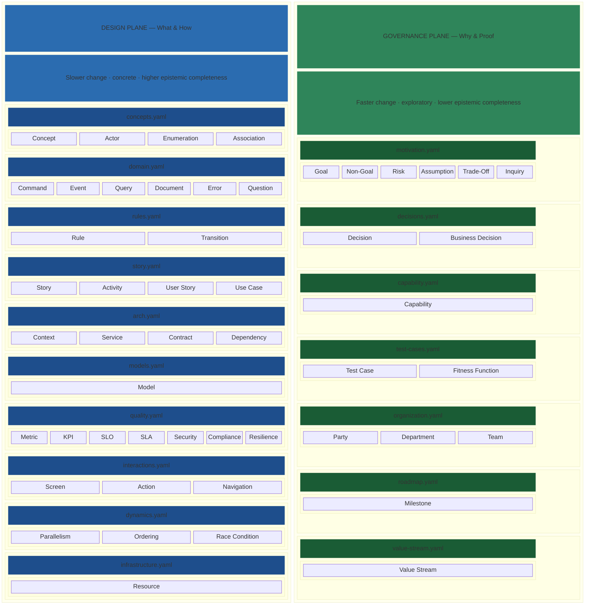
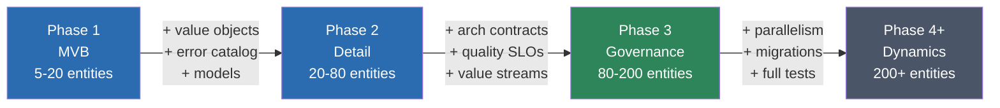

# Archally Blueprint Schema

YAML-based schema for digital system modeling — a domain-first multi-method specification format covering domain design, business rules, value streams, governance, and organizational alignment in a single machine-readable format.

[](https://www.npmjs.com/package/@archally/blueprint-schema)
[](./LICENSE)
[](https://github.com/archally/blueprint-schema/actions)

## The Problem

Architecture knowledge fragments across wikis, slide decks, whiteboard photos, Confluence pages, and tribal memory. When a team needs to make a change decision — split a service, add a new context, evaluate a migration — they spend days reconstructing context that should already be explicit. Documentation drifts from code within weeks. New team members spend months absorbing knowledge that could be structured and navigable.

The cost is not missing documentation. It is fragmented truth.

## The Approach: System Cartography

Archally treats software architecture the way cartographers treat territory — by surveying it methodically, representing it at multiple scales, layering concerns into separate planes, and marking what remains unknown.

| Cartography | Blueprint equivalent |
|---|---|
| **Map layers** (topographic, political, transport) | **Design Plane** and **Governance Plane** — toggle layers over the same bounded context |
| **Legend and symbology** | **Metamodel** — typed IDs (`CN001`, `CMD001`, `EVT001`) make the model machine-readable and learnable |
| **Survey and triangulation** | **Evidence chains** and **cross-layer validation** — claims are triangulated, not asserted |
| **Terra incognita** | **Unanswered questions** (`QN001` with `answered_by: []`) — the model is honest about what is not yet mapped |
| **Scale / zoom levels** | **Abstraction levels** — from system context down to individual operations and rules |
| **Nautical charts** (hazard markers) | **Governance artifacts** — risks, pending migrations, and unresolved decisions surfaced before they cause damage |

## What is a Blueprint?

A blueprint is a **single formal model** of a digital system — one source that captures what the system does, why it exists, and how it's proven. It replaces scattered artifacts with a structured, validated, version-controlled specification:

- **Design Plane** (what and how): bounded contexts, aggregates, commands, events, queries, business rules, data models, stories, UI screens, quality attributes
- **Governance Plane** (why and proof): goals, risks, decisions, test cases, capabilities, value streams, milestones, organizational ownership
- **Metamodel** (shared vocabulary): typed ID references, versioning, cross-layer traceability

### One model, many outputs

A single blueprint can drive multiple generated artifacts — OpenAPI specs, AsyncAPI contracts, PRD documents, Event Storming boards, capability maps, context diagrams — all from the same source. When the model changes, every output stays consistent. No semantic drift between your documentation, your contracts, and your architecture diagrams.

### Built for humans and AI agents

Every schema field carries a machine-readable `description`. AI agents consume blueprints as structured domain context via MCP servers — not retrieval over documents, but deterministic graph queries against a validated formal model. The same blueprint that onboards a new team member also grounds an AI agent's reasoning about the system.

### Local-first, version-controlled

Blueprints are plain YAML files in your Git repository. No cloud upload required, no vendor platform, no infrastructure. Your domain models — which encode your bounded contexts, business rules, competitive decisions, and organizational structure — stay under your control. Validate locally, review in pull requests, deploy with your existing workflow.

## Quick Start

**1. Create a `.blueprint/v2.7/` directory** in your project:

```
my-project/
  .blueprint/v2.7/
    blueprint.yaml
    orders/
      concepts.yaml
      domain.yaml
```

**2. Write a minimal blueprint** (two files, one concept):

```yaml
# blueprint.yaml
version: "1.0.0"
name: "My Service"
```

```yaml
# orders/concepts.yaml
version: "1.0.0"
concepts:
  - id: CN001
    name: "Order"
    stereotype: aggregate-root
    description: "A customer's purchase request."
```

**3. Validate:**

```bash
npx @archally/blueprint-schema validate .blueprint/v2.7
```

## Architecture

> **METAMODEL** (cross-cutting) — typed IDs · versioning · evidence chains · ownership · code references



The Design Plane captures established knowledge — domain vocabulary, rules, operations, and architecture that changes deliberately. The Governance Plane captures evolving knowledge — goals, risks, assumptions, and decisions that shift as understanding deepens. Evidence chains (`discovery_stage`, `certainty`, `evidence[]`) track how governance entities mature from hypothesis to confirmed.

See the [full schema reference](docs/schema-reference.md) for ID patterns, traceability map, and schema evolution history.

## Usage Modes

Blueprint Schema supports different modeling approaches depending on your situation:

### Greenfield — New System

Start from scratch with a Minimal Viable Blueprint (MVB):

1. Identify bounded contexts and aggregate roots
2. Model the primary command → event causal chains
3. Add rules, stories, and test cases for the happy path
4. Iterate: extend with value objects, error paths, governance, quality

Start small (5-20 entities), validate, then grow through phases. See the [Modeling Guide](docs/modeling-guide.md) for phase details, decision trees, and anti-patterns.

### Brownfield — Existing System

Model an existing codebase by analyzing what's already built:

1. Enumerate domain aggregates from code directories
2. Assign DDD roles (aggregate root, entity, value object) from behavioral signals
3. Group CRUD variants into semantic operations
4. Model the discovered structure, linking entities to source via `code_refs`

The code is the source of truth for the design plane. Specs describe intent; code describes reality. See the [Modeling Guide](docs/modeling-guide.md#phase-0--knowledge-analysis-existing-systems-only) for the full Phase 0 protocol.

### Iterative Modeling

Blueprints grow through four phases:

| Phase | Focus | Entity count |
|-------|-------|-------------|
| **Phase 1** | MVB: aggregate roots, key commands/events, 1 story per context | 5-20 |
| **Phase 2** | Detail: value objects, error catalog, models, decisions, questions | 20-80 |
| **Phase 3** | Governance: architecture, quality (SLOs), UI, org, value streams, milestones | 80-200 |
| **Phase 4+** | Dynamics: parallelism, race conditions, migrations, full test coverage | 200+ |

Each phase has entrance criteria and reports which generators (OpenAPI, AsyncAPI, PRD, Event Storming) can produce useful output from the current model.



### Knowledge Gathering

Use blueprints as a discovery tool:

- **Questions** (`QN001`) model what knowledge a domain slice should provide. Unanswered questions (`answered_by: []`) reveal domain gaps — the most valuable artifact for backlog prioritization.
- **Inquiries** (`INQ001`) capture temporary governance concerns during analysis.
- **Evidence chains** on goals, risks, and decisions link assertions to supporting data — so governance claims are substantiated, not asserted.

## Best Practices

1. **MVB-first, not completeness-first.** Capture intent, produce a small coherent blueprint, iterate. A focused 15-entity model that validates cleanly beats a 200-entity hairball.

2. **Multiple small files over monoliths.** The loader merges all files of the same schema type within a slice. Seven 100-line files reveal structure better than one 700-line file.

3. **Single authoritative location.** Every fact has one source: causal links live in `domain.yaml` (produces/reacts_to), story steps are a convenience view validated against domain links.

4. **Business names in the model, technical names in `code_refs`.** Blueprint operations use business language; `code_refs` bridge to the implementation.

5. **Defer aggressively.** Explicitly note what's deferred and why. Quality metrics, UI screens, and org hierarchy are Phase 3 — don't model them before the domain skeleton is stable.

6. **Convention over enforcement.** Prefer documented conventions with validator warnings over hard schema constraints for emergent patterns.

For the full set of practices, anti-patterns, decision trees, and reference direction rules, see the [Modeling Guide](docs/modeling-guide.md). For file naming, ID conventions, and directory layout, see [File Conventions](docs/file-conventions.md).

## Schema Files

| Layer | Schema | Entity types |
|-------|--------|-------------|
| Cross-cutting | `metamodel.schema.yaml` | Typed ID patterns, versioning, shared definitions |
| Cross-cutting | `migration.schema.yaml` | Model evolution: entity, property, relationship, meta changes |
| Design | `domain.schema.yaml` | Commands (CMD), Events (EVT), Queries (QRY), Documents (DOC), Errors (ERR), Questions (QN) |
| Design | `concepts.schema.yaml` | Concepts (CN), Actors (ACT), Enumerations (EN), Associations (AS) |
| Design | `rules.schema.yaml` | Rules (SR/CR/DR/EQ/VR), Transitions (TR) |
| Design | `arch.schema.yaml` | Parties, Contexts, Services, Contracts, Dependencies |
| Design | `models.schema.yaml` | Data models (MDL) with OpenAPI/AsyncAPI-compatible schemas |
| Design | `story.schema.yaml` | Stories (STR), Activities (SA), User Stories (US), Use Cases (UC) |
| Design | `quality.schema.yaml` | Metrics (MT), KPIs (KPI), SLOs (SLO), SLAs (SLA), Security (SEC) |
| Design | `interactions.schema.yaml` | Screens (SCR), Actions (UAC), Navigation (UNV) |
| Design | `dynamics.schema.yaml` | Parallelism (PAR), Ordering (ORD), Race Conditions (RC) |
| Design | `infrastructure.schema.yaml` | Infrastructure resources, deployment topology |
| Governance | `motivation.schema.yaml` | Goals (G), Non-goals (NG), Risks (R), Assumptions (A), Trade-offs (T) |
| Governance | `decisions.schema.yaml` | Decisions (D), Business Decisions (BD) |
| Governance | `capability.schema.yaml` | Capabilities (CAP) |
| Governance | `test-cases.schema.yaml` | Test cases (TC/EC/ER), Fitness functions (FF) |
| Governance | `organization.schema.yaml` | Parties (PRT), Departments (DPT), Teams (TM) |
| Governance | `roadmap.schema.yaml` | Milestones (MS) |
| Governance | `value-stream.schema.yaml` | Value Streams (VS) |

Full entity ID patterns, traceability map, and schema evolution history: [Schema Reference](docs/schema-reference.md). File naming and layout rules: [File Conventions](docs/file-conventions.md).

## Tools

Three tools ship with the schema — validate, build models, and check semantics:

### Validator

Schema validation (Ajv, draft-2020-12) + cross-file reference integrity + gap warnings.

```bash
npx @archally/blueprint-schema validate .blueprint/v2.7
```

See [tools/validator/README.md](tools/validator/README.md) for options and exit codes.

### Model Builder

Loads blueprint YAML files and produces a typed in-memory graph — 55 entity types and 43 relation types. Available as a library and as a CLI that writes `model.json`.

```bash
# CLI — produce model.json
npx @archally/blueprint-schema blueprint-model .blueprint/v2.7 --output model.json --pretty

# Library — import in TypeScript
import { buildBlueprintModel, loadFromDirectory } from '@archally/blueprint-schema/model';
```

See [tools/model-builder/README.md](tools/model-builder/README.md) for API, type definitions, and architecture.

### Semantic Checker

Configurable rule engine that catches modeling issues schema validation cannot detect. Ships with 6 built-in rules, extensible via custom `RuleDefinition` functions and `.blueprint-lint.yaml` configuration.

```bash
npx @archally/blueprint-schema blueprint-check .blueprint/v2.7
```

Built-in rules: orphan entities, missing causal links (commands without produces), events misusing produces, untested rules, aggregate root signal warnings, unanswered domain questions.

See [tools/semantic-checker/README.md](tools/semantic-checker/README.md) for rule reference, configuration, and custom rule API.

## Example

A working e-commerce example with 3 bounded contexts (catalog, orders, payments) is included in [`examples/ecommerce/`](examples/ecommerce/). Run `npm run validate:examples` to verify it.

## Versioning

This package follows [SemVer](https://semver.org/):
- **Major** (3.0.0): breaking schema changes
- **Minor** (2.7.0): new optional fields or entity types
- **Patch** (2.6.1): documentation, clarification, validator fixes

## Ecosystem

Blueprint Schema is the open foundation of the [Archally](https://archally.pro) platform.

**Archally's approach:** One formal model drives everything. Instead of maintaining separate documents for architecture, contracts, governance, and onboarding — teams build one blueprint that generators consume to produce OpenAPI specs, AsyncAPI contracts, PRD documents, Event Storming views, and more. The model is the single source of truth; generated artifacts never drift because they're derived, not hand-maintained.

**For AI-augmented teams:** Archally MCP servers expose blueprint models as structured grounding for AI agents — deterministic graph queries against a validated domain model, not retrieval over unstructured documents. Agents get typed entities, traced relationships, and governance constraints at inference time. The same model that serves human understanding serves machine reasoning.

The schema itself is Apache 2.0-licensed and can be used independently of Archally tooling.

### Archally Pro

Commercial tools that consume this schema — available at [archally.pro](https://archally.pro):

| Category | Capabilities |
|----------|-------------|
| **Interactive Viewers** | Entity graph with force-directed layout, node search, layer filtering, and relation inspector. Causal chain explorer with animated event flow and impact highlighting. Bounded Context Canvas. |
| **Specification Generators** | OpenAPI 3.1, AsyncAPI 2.6, Arazzo 1.0 — generated from blueprint operations, models, and contracts. Always in sync with the model. |
| **PRD & Documentation** | Product Requirements Documents, Event Storming boards, architecture decision exports — generated from governance and story layers. |
| **MCP Servers** | Structured grounding for Claude, Cursor, and other AI agents. Deterministic graph queries against validated domain models at inference time. |
| **Blueprint CLI** | Query, mutate, validate, and migrate blueprint models from the terminal. Impact analysis, coverage checks, migration lifecycle management. |
| **Schema Update Automation** | Tracked migrations with dry-run, rollback, variant comparison, and dependency resolution across schema versions. |

## Contributing

Issues and discussions are welcome. For schema change proposals, please open an issue describing the use case before submitting a PR — schema changes affect all downstream consumers.

## License

[Apache 2.0](./LICENSE) - Copyright 2026 Adam Walkowski
