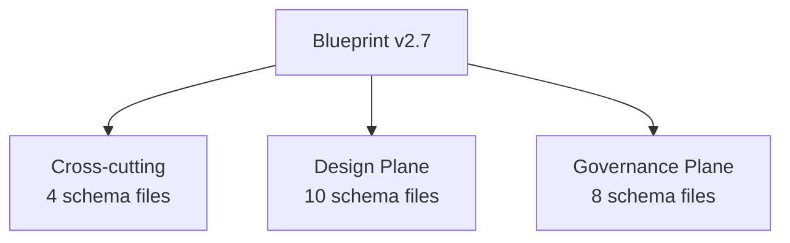

<!-- GENERATED by tools/schema-atlas — do not edit by hand. Regenerate: npm run atlas -->

# Blueprint Schema Atlas — v2.7 Overview

A generated, human-readable projection of the JSON Schema. **JSON Schema remains the source of truth** (DEC-ATL-01); this page is a projection (DEC-ATL-02) and must not be hand-edited.

| Metric | Count |
| --- | --- |
| Schema files | 22 |
| Planes | 3 |
| Object definitions | 146 |
| Typed-ID entity types | 60 |
| Cross-file reference edges | 39 |

## Plane map

## Cross-cutting

Version-root schemas that belong to neither plane and apply across every layer: root composition, the shared metamodel (the legend), and model migrations.

| Schema file | Title | Summary |
| --- | --- | --- |
| [`blueprint.schema.yaml`](./entity-catalog.md#blueprint) | Blueprint Meta-Schema | Meta-schema composing all blueprint layers into Design + Governance planes with cross-cutting metamodel. Supersedes v1 layer-based blueprin… |
| [`metamodel.schema.yaml`](./entity-catalog.md#metamodel) | Blueprint Metamodel | Cross-cutting definitions for all blueprint layers. Provides typed ID refs, versioning, SpecPath, and shared vocabulary. Consumed by all de… |
| [`migration.schema.yaml`](./entity-catalog.md#migration) | Blueprint Migration Schema | Versioned, ordered changes to a blueprint model instance. Enables AS-IS to TO-BE model transformation with traceability and rollback. |
| [`profiles/infrastructure/profiles.schema.yaml`](./entity-catalog.md#profiles-infrastructure-profiles) | Blueprint Infrastructure Resource-Type Profile | Validates a resource-type catalog profile file (v2.7.7 CR-2, RD7/RD15/RD31). A profile is DATA, not schema: the resource-type catalog is sh… |

## Design Plane

What & how: domain model, behavior, contracts, and quality attributes.

| Schema file | Title | Summary |
| --- | --- | --- |
| [`design/arch.schema.yaml`](./entity-catalog.md#design-arch) | Blueprint Architecture | Design Plane — L0: Bounded context topology. Parties, contexts, services with contracts (interfaces), enriched dependencies for context-map… |
| [`design/concepts.schema.yaml`](./entity-catalog.md#design-concepts) | Blueprint Concepts | Design Plane — Layer 2: Domain vocabulary. Defines concepts (entities, value objects, aggregates), actors, enumerations, and cross-concept… |
| [`design/domain.schema.yaml`](./entity-catalog.md#design-domain) | Blueprint Domain Operations | Design Plane — Layer 3: Domain operations with protocol bindings, rule governance, pre/postconditions, and side effects. Ordering is in sto… |
| [`design/dynamics.schema.yaml`](./entity-catalog.md#design-dynamics) | Blueprint Dynamics | Design Plane: Runtime concurrency and execution behavior. Covers execution model, parallelism, ordering constraints, race conditions, and r… |
| [`design/infrastructure.schema.yaml`](./entity-catalog.md#design-infrastructure) | Blueprint Infrastructure Resources | Design Plane: Infrastructure resource definitions and deployment topology. Declares platform resources (databases, queues, storage, service… |
| [`design/interactions.schema.yaml`](./entity-catalog.md#design-interactions) | Blueprint UI | Design Plane: User interface screens, actions, and navigation. Cross-links to models, operations, goals, decisions, tests, and stories for… |
| [`design/models.schema.yaml`](./entity-catalog.md#design-models) | Blueprint Models | Design Plane: Reusable data model definitions (schemas, fields, parameters) with optional concept back-references. Follows OpenAPI/AsyncAPI… |
| [`design/quality.schema.yaml`](./entity-catalog.md#design-quality) | Blueprint Quality | Design Plane: Non-functional requirements as first-class entities. Covers metrics, KPIs, SLOs, SLAs, security, compliance, resilience, and… |
| [`design/rules.schema.yaml`](./entity-catalog.md#design-rules) | Blueprint Rules | Design Plane — Layer 2: Business rules. Structural invariants, classification, derivation, equivalence, validation, and state-transition ru… |
| [`design/story.schema.yaml`](./entity-catalog.md#design-story) | Blueprint Story | Design Plane — Layer 4: Domain stories expressing logical operation sequences, actor interactions, and side effects. Ordering here is logic… |

## Governance Plane

Why & proof: strategic intent, decisions, capabilities, and quality evidence.

| Schema file | Title | Summary |
| --- | --- | --- |
| [`governance/capability.schema.yaml`](./entity-catalog.md#governance-capability) | Blueprint Business Capabilities | Governance Plane: Business Capability Map — a hierarchical view of what the business can do, independent of organizational structure or pro… |
| [`governance/decisions.schema.yaml`](./entity-catalog.md#governance-decisions) | Blueprint Decisions | Governance Plane: Architecture Decision Log (ADR). Chronological, append-only record of design decisions with typed impact references, moti… |
| [`governance/leverage.schema.yaml`](./entity-catalog.md#governance-leverage) | Blueprint Leverage Map | Governance Plane: Leverage Map — the prioritization tier that sits ABOVE the AS-IS remediation chain (finding → risk → decision → migration… |
| [`governance/motivation.schema.yaml`](./entity-catalog.md#governance-motivation) | Blueprint Motivation | Governance Plane: Strategic intent — goals, non-goals, risks, assumptions, and trade-offs. Decisions reference motivation entities (not rev… |
| [`governance/organization.schema.yaml`](./entity-catalog.md#governance-organization) | Blueprint Organization | Governance Plane: Organizational hierarchy — Party > Department > Team. Defines who owns what in the blueprint. Teams are first-class entit… |
| [`governance/roadmap.schema.yaml`](./entity-catalog.md#governance-roadmap) | Blueprint Roadmap | Governance Plane: Product roadmap milestones with deliverables, success criteria, and dependencies. Used for PRD timeline section generatio… |
| [`governance/test-cases.schema.yaml`](./entity-catalog.md#governance-test-cases) | Blueprint Test Cases | Governance Plane: Test cases organized as happy-path, edge-case, and error-case suites. Owns validates references as the authoritative sour… |
| [`governance/value-stream.schema.yaml`](./entity-catalog.md#governance-value-stream) | Blueprint Value Streams | Governance Plane: Value Stream Map — end-to-end flows of value delivery that cross-cut bounded contexts and capabilities. Value streams sho… |

## Navigate

- **[Layer map](./layer-map.md)** — planes, files, and dependency diagrams
- **[Entity catalog](./entity-catalog.md)** — every object definition, its properties, requiredness, and enums
- **[Relationships](./relationships.md)** — typed-ID vocabulary and cross-file references
- **[Examples](./examples.md)** — schema-native and curated examples
- **[Changelog](../changelog.md)** — schema evolution across versions

---

_Source: `schema/v2.7/` (all files under this version root)_
