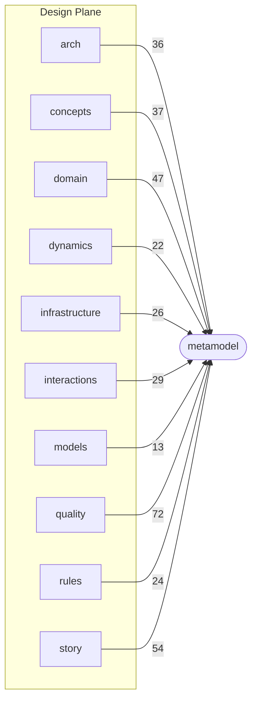
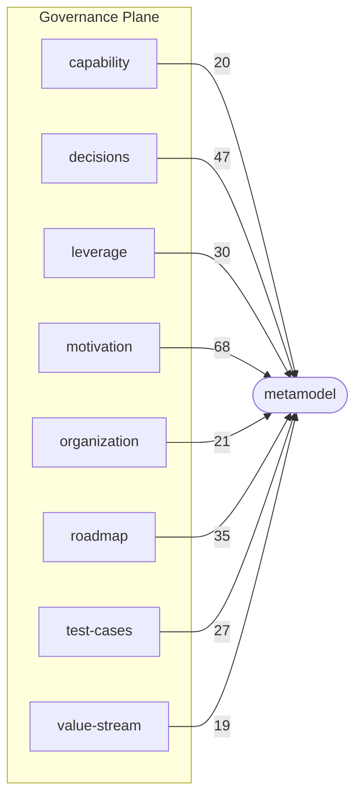

<!-- GENERATED by tools/schema-atlas — do not edit by hand. Regenerate: npm run atlas -->

# Blueprint Schema Atlas — v2.8 Layer Map

Planes group schema files by concern. Dependency diagrams are **bounded per plane** so structure stays readable rather than flattened into one giant graph (DEC-ATL-14).

## Cross-cutting

Version-root schemas that belong to neither plane and apply across every layer: root composition, the shared metamodel (the legend), and model migrations.

| Schema file | Title | Root props | Object defs | Summary |
| --- | --- | --- | --- | --- |
| [`blueprint.schema.yaml`](./entity-catalog.md#blueprint) | Blueprint Meta-Schema | 14 | 4 | Meta-schema composing all blueprint layers into Design + Governance planes with cross-cutting metamodel. Supersedes v1… |
| [`metamodel.schema.yaml`](./entity-catalog.md#metamodel) | Blueprint Metamodel | 0 | 8 | Cross-cutting definitions for all blueprint layers. Provides typed ID refs, versioning, SpecPath, and shared vocabulary… |
| [`migration.schema.yaml`](./entity-catalog.md#migration) | Blueprint Migration Schema | 4 | 4 | Versioned, ordered changes to a blueprint model instance. Enables AS-IS to TO-BE model transformation with traceability… |
| [`profiles/infrastructure/profiles.schema.yaml`](./entity-catalog.md#profiles-infrastructure-profiles) | Blueprint Infrastructure Resource-Type Profile | 6 | 4 | Validates a resource-type catalog profile file (v2.7.7). A profile is DATA, not schema: the resource-type catalog is sh… |
| [`render.manifest.schema.yaml`](./entity-catalog.md#render-manifest) | Blueprint Render Manifest | 12 | 1 | Declares one project's full artifact set for the `bp render` command: which renderer targets to produce, where their ou… |

### Cross-cutting — reference dependencies

```mermaid
graph LR
    subgraph cross_cutting_plane["Cross-cutting"]
        blueprint_schema_yaml["blueprint"]
        metamodel_schema_yaml["metamodel"]
        migration_schema_yaml["migration"]
        profiles_infrastructure_profiles_schema_yaml["profiles"]
        render_manifest_schema_yaml["render.manifest"]
    end
    design_arch_schema_yaml(["arch"])
    design_concepts_schema_yaml(["concepts"])
    design_domain_schema_yaml(["domain"])
    design_dynamics_schema_yaml(["dynamics"])
    design_infrastructure_schema_yaml(["infrastructure"])
    design_interactions_schema_yaml(["interactions"])
    design_models_schema_yaml(["models"])
    design_quality_schema_yaml(["quality"])
    design_rules_schema_yaml(["rules"])
    design_story_schema_yaml(["story"])
    governance_capability_schema_yaml(["capability"])
    governance_decisions_schema_yaml(["decisions"])
    governance_leverage_schema_yaml(["leverage"])
    governance_motivation_schema_yaml(["motivation"])
    governance_organization_schema_yaml(["organization"])
    governance_roadmap_schema_yaml(["roadmap"])
    governance_test_cases_schema_yaml(["test-cases"])
    governance_value_stream_schema_yaml(["value-stream"])
    blueprint_schema_yaml -->|1| design_arch_schema_yaml
    blueprint_schema_yaml -->|1| design_concepts_schema_yaml
    blueprint_schema_yaml -->|1| design_domain_schema_yaml
    blueprint_schema_yaml -->|1| design_dynamics_schema_yaml
    blueprint_schema_yaml -->|1| design_infrastructure_schema_yaml
    blueprint_schema_yaml -->|1| design_interactions_schema_yaml
    blueprint_schema_yaml -->|1| design_models_schema_yaml
    blueprint_schema_yaml -->|1| design_quality_schema_yaml
    blueprint_schema_yaml -->|1| design_rules_schema_yaml
    blueprint_schema_yaml -->|1| design_story_schema_yaml
    blueprint_schema_yaml -->|1| governance_capability_schema_yaml
    blueprint_schema_yaml -->|1| governance_decisions_schema_yaml
    blueprint_schema_yaml -->|1| governance_leverage_schema_yaml
    blueprint_schema_yaml -->|1| governance_motivation_schema_yaml
    blueprint_schema_yaml -->|1| governance_organization_schema_yaml
    blueprint_schema_yaml -->|1| governance_roadmap_schema_yaml
    blueprint_schema_yaml -->|1| governance_test_cases_schema_yaml
    blueprint_schema_yaml -->|1| governance_value_stream_schema_yaml
    blueprint_schema_yaml -->|7| metamodel_schema_yaml
    blueprint_schema_yaml -->|1| migration_schema_yaml
    migration_schema_yaml -->|5| metamodel_schema_yaml
```

## Design Plane

What & how: domain model, behavior, contracts, and quality attributes.

| Schema file | Title | Root props | Object defs | Summary |
| --- | --- | --- | --- | --- |
| [`design/arch.schema.yaml`](./entity-catalog.md#design-arch) | Blueprint Architecture | 11 | 15 | Design Plane — L0: Bounded context topology. Parties, contexts, services with contracts (interfaces), enriched dependen… |
| [`design/concepts.schema.yaml`](./entity-catalog.md#design-concepts) | Blueprint Concepts | 9 | 7 | Design Plane — Layer 2: Domain vocabulary. Defines concepts (entities, value objects, aggregates), actors, enumerations… |
| [`design/domain.schema.yaml`](./entity-catalog.md#design-domain) | Blueprint Domain Operations | 10 | 18 | Design Plane — Layer 3: Domain operations with protocol bindings, rule governance, pre/postconditions, and side effects… |
| [`design/dynamics.schema.yaml`](./entity-catalog.md#design-dynamics) | Blueprint Dynamics | 10 | 8 | Design Plane: Runtime concurrency and execution behavior. Covers execution model, parallelism, ordering constraints, ra… |
| [`design/infrastructure.schema.yaml`](./entity-catalog.md#design-infrastructure) | Blueprint Infrastructure Resources | 12 | 22 | Design Plane: Infrastructure resource definitions and deployment topology. Declares platform resources (databases, queu… |
| [`design/interactions.schema.yaml`](./entity-catalog.md#design-interactions) | Blueprint UI | 9 | 3 | Design Plane: User interface screens, actions, and navigation. Cross-links to models, operations, goals, decisions, tes… |
| [`design/models.schema.yaml`](./entity-catalog.md#design-models) | Blueprint Models | 6 | 6 | Design Plane: Reusable data model definitions (schemas, fields, parameters) with optional concept back-references. Foll… |
| [`design/quality.schema.yaml`](./entity-catalog.md#design-quality) | Blueprint Quality | 14 | 10 | Design Plane: Non-functional requirements as first-class entities. Covers metrics, KPIs, SLOs, SLAs, security, complian… |
| [`design/rules.schema.yaml`](./entity-catalog.md#design-rules) | Blueprint Rules | 11 | 3 | Design Plane — Layer 2: Business rules. Structural invariants, classification, derivation, equivalence, validation, and… |
| [`design/story.schema.yaml`](./entity-catalog.md#design-story) | Blueprint Story | 11 | 4 | Design Plane — Layer 4: Domain stories expressing logical operation sequences, actor interactions, and side effects. Or… |

### Design Plane — reference dependencies

## Governance Plane

Why & proof: strategic intent, decisions, capabilities, and quality evidence.

| Schema file | Title | Root props | Object defs | Summary |
| --- | --- | --- | --- | --- |
| [`governance/capability.schema.yaml`](./entity-catalog.md#governance-capability) | Blueprint Business Capabilities | 6 | 1 | Governance Plane: Business Capability Map — a hierarchical view of what the business can do, independent of organizatio… |
| [`governance/decisions.schema.yaml`](./entity-catalog.md#governance-decisions) | Blueprint Decisions | 7 | 9 | Governance Plane: Architecture Decision Log (ADR). Chronological, append-only record of design decisions with typed imp… |
| [`governance/leverage.schema.yaml`](./entity-catalog.md#governance-leverage) | Blueprint Leverage Map | 10 | 2 | Governance Plane: Leverage Map — the prioritization tier that sits ABOVE the AS-IS remediation chain (finding → risk →… |
| [`governance/motivation.schema.yaml`](./entity-catalog.md#governance-motivation) | Blueprint Motivation | 12 | 7 | Governance Plane: Strategic intent — goals, non-goals, risks, assumptions, and trade-offs. Decisions reference motivati… |
| [`governance/organization.schema.yaml`](./entity-catalog.md#governance-organization) | Blueprint Organization | 7 | 5 | Governance Plane: Organizational hierarchy — Party > Department > Team. Defines who owns what in the blueprint. Teams a… |
| [`governance/roadmap.schema.yaml`](./entity-catalog.md#governance-roadmap) | Blueprint Roadmap | 8 | 2 | Governance Plane: Product roadmap milestones with deliverables, success criteria, and dependencies. Used for PRD timeli… |
| [`governance/test-cases.schema.yaml`](./entity-catalog.md#governance-test-cases) | Blueprint Test Cases | 9 | 5 | Governance Plane: Test cases organized as happy-path, edge-case, and error-case suites. Owns validates references as th… |
| [`governance/value-stream.schema.yaml`](./entity-catalog.md#governance-value-stream) | Blueprint Value Streams | 6 | 2 | Governance Plane: Value Stream Map — end-to-end flows of value delivery that cross-cut bounded contexts and capabilitie… |

### Governance Plane — reference dependencies

---

_Sources: all schema files under this version root. See per-file provenance in the [entity catalog](./entity-catalog.md)._
