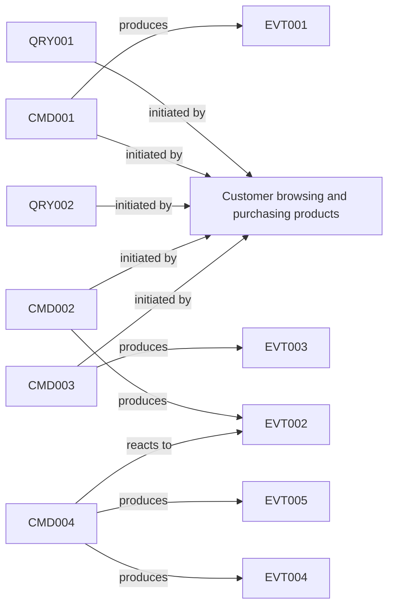
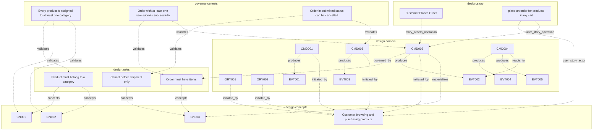

# E-Commerce

> Generated from blueprint model. 23 entities, 27 relations.

## Causal Chains

> *[Archally Pro](https://archally.pro)* — Interactive Causal Chain Explorer with animated event flow, timeline playback, and impact highlighting.

## Entity Graph

> *[Archally Pro](https://archally.pro)* — Interactive Entity Graph with force-directed layout, layer filtering, node search, and relation inspector.

## Entity Catalog

**23 entities** across 8 types.

| ID | Type | Name | Layer | Source |
|----|------|------|-------|--------|
| ACT001 | Actor | Customer browsing and purchasing products | design.concepts | catalog/concepts.yaml |
| CN001 | Concept | Product | design.concepts | catalog/concepts.yaml |
| CN002 | Concept | Category | design.concepts | catalog/concepts.yaml |
| CN003 | Concept | Order | design.concepts | orders/concepts.yaml |
| CMD001 | Operation | Add to Cart | design.domain | catalog/domain.yaml |
| CMD002 | Operation | Submit Order | design.domain | orders/domain.yaml |
| CMD003 | Operation | Cancel Order | design.domain | orders/domain.yaml |
| CMD004 | Operation | Process Payment | design.domain | payments/domain.yaml |
| EVT001 | Operation | Item Added to Cart | design.domain | catalog/domain.yaml |
| EVT002 | Operation | Order Submitted | design.domain | orders/domain.yaml |
| EVT003 | Operation | Order Cancelled | design.domain | orders/domain.yaml |
| EVT004 | Operation | Payment Confirmed | design.domain | payments/domain.yaml |
| EVT005 | Operation | Payment Failed | design.domain | payments/domain.yaml |
| QRY001 | Operation | Browse Products | design.domain | catalog/domain.yaml |
| QRY002 | Operation | Browse by Category | design.domain | catalog/domain.yaml |
| STR001 | Story | Customer Places Order | design.story | orders/story.yaml |
| SR001 | StructuralRule | Order must have items | design.rules | orders/rules.yaml |
| SR002 | StructuralRule | Product must belong to a category | design.rules | catalog/rules.yaml |
| EC001 | TestCase | Order in submitted status can be cancelled. | governance.tests | orders/test-cases.yaml |
| TC001 | TestCase | Order with at least one item submits successfully. | governance.tests | orders/test-cases.yaml |
| TC002 | TestCase | Every product is assigned to at least one category. | governance.tests | catalog/test-cases.yaml |
| US001 | UserStory | place an order for products in my cart | design.story | orders/story.yaml |
| VR001 | ValidationRule | Cancel before shipment only | design.rules | orders/rules.yaml |

### By Type

| Type | Count |
|------|-------|
| Operation | 11 |
| Concept | 3 |
| TestCase | 3 |
| StructuralRule | 2 |
| Actor | 1 |
| ValidationRule | 1 |
| Story | 1 |
| UserStory | 1 |

## Relations

**27 relations** discovered.

| Source | Type | Target |
|--------|------|--------|
| SR002 (StructuralRule) | concepts | CN001 (Concept) |
| SR002 (StructuralRule) | concepts | CN002 (Concept) |
| SR001 (StructuralRule) | concepts | CN003 (Concept) |
| VR001 (ValidationRule) | concepts | CN003 (Concept) |
| CMD002 (Operation) | governed_by | SR001 (StructuralRule) |
| QRY001 (Operation) | initiated_by | ACT001 (Actor) |
| CMD001 (Operation) | initiated_by | ACT001 (Actor) |
| QRY002 (Operation) | initiated_by | ACT001 (Actor) |
| CMD002 (Operation) | initiated_by | ACT001 (Actor) |
| CMD003 (Operation) | initiated_by | ACT001 (Actor) |
| CMD002 (Operation) | materializes | CN003 (Concept) |
| CMD001 (Operation) | produces | EVT001 (Operation) |
| CMD002 (Operation) | produces | EVT002 (Operation) |
| CMD003 (Operation) | produces | EVT003 (Operation) |
| CMD004 (Operation) | produces | EVT004 (Operation) |
| CMD004 (Operation) | produces | EVT005 (Operation) |
| CMD004 (Operation) | reacts_to | EVT002 (Operation) |
| STR001 (Story) | story_orders_operation | CMD002 (Operation) |
| US001 (UserStory) | user_story_actor | ACT001 (Actor) |
| US001 (UserStory) | user_story_operation | CMD002 (Operation) |
| TC002 (TestCase) | validates | SR002 (StructuralRule) |
| TC002 (TestCase) | validates | CN001 (Concept) |
| TC002 (TestCase) | validates | CN002 (Concept) |
| TC001 (TestCase) | validates | SR001 (StructuralRule) |
| TC001 (TestCase) | validates | CMD002 (Operation) |
| EC001 (TestCase) | validates | VR001 (ValidationRule) |
| EC001 (TestCase) | validates | CMD003 (Operation) |

### By Type

| Relation Type | Count |
|---------------|-------|
| validates | 7 |
| initiated_by | 5 |
| produces | 5 |
| concepts | 4 |
| governed_by | 1 |
| materializes | 1 |
| reacts_to | 1 |
| story_orders_operation | 1 |
| user_story_actor | 1 |
| user_story_operation | 1 |

## Coverage Gaps

No coverage gaps found.
