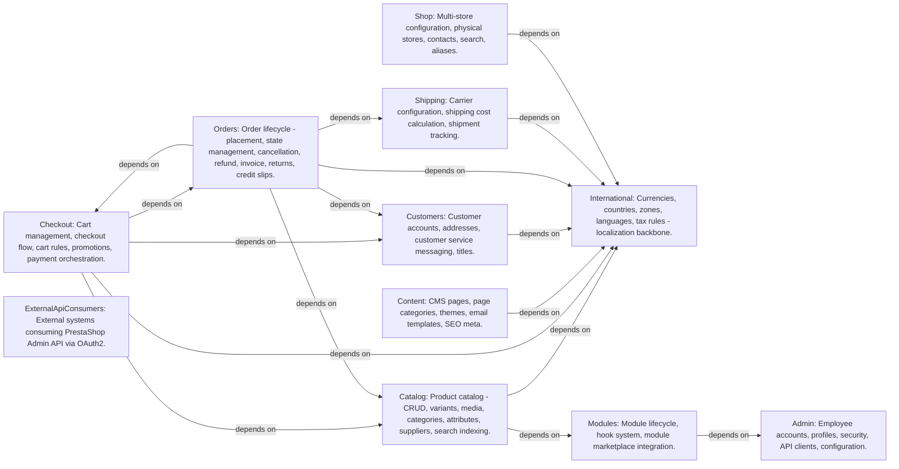

# PrestaShop-v9

> Generated from blueprint model. 2029 entities, 3107 relations.

## Context Map



> *[Archally Pro](https://archally.pro)* — Interactive Context Map with drag-and-drop, filtering, and detail panels.

## Causal Chains

```mermaid
graph LR
    admin_CMD021["admin.CMD021: AddApiClient"]
    admin_EVT014["admin.EVT014: ApiClientAdded"]
    admin_ACT003["admin.ACT003: ApiIntegrator"]
    admin_CMD022["admin.CMD022: EditApiClient"]
    admin_EVT015["admin.EVT015: ApiClientEdited"]
    admin_CMD023["admin.CMD023: DeleteApiClient"]
    admin_EVT016["admin.EVT016: ApiClientDeleted"]
    admin_CMD024["admin.CMD024: RotateApiClientSecret"]
    admin_EVT017["admin.EVT017: ApiClientSecretRotated"]
    admin_CMD025["admin.CMD025: AddWebserviceKey"]
    admin_EVT018["admin.EVT018: WebserviceKeyAdded"]
    admin_CMD026["admin.CMD026: EditWebserviceKey"]
    admin_EVT019["admin.EVT019: WebserviceKeyEdited"]
    admin_CMD027["admin.CMD027: DeleteWebserviceKey"]
    admin_EVT020["admin.EVT020: WebserviceKeyDeleted"]
    admin_CMD028["admin.CMD028: BulkDeleteWebserviceKey"]
    admin_CMD029["admin.CMD029: AddSqlRequest"]
    admin_EVT021["admin.EVT021: SqlRequestAdded"]
    admin_ACT001["admin.ACT001: SuperAdmin"]
    admin_CMD030["admin.CMD030: EditSqlRequest"]
    admin_EVT022["admin.EVT022: SqlRequestEdited"]
    admin_CMD031["admin.CMD031: DeleteSqlRequest"]
    admin_EVT023["admin.EVT023: SqlRequestDeleted"]
    admin_CMD032["admin.CMD032: BulkDeleteSqlRequest"]
    admin_CMD033["admin.CMD033: SaveSqlRequestSettings"]
    admin_EVT024["admin.EVT024: SqlRequestSettingsSaved"]
    admin_CMD034["admin.CMD034: SwitchDebugMode"]
    admin_EVT025["admin.EVT025: DebugModeSwitched"]
    admin_CMD035["admin.CMD035: UpdateTabStatus"]
    admin_EVT026["admin.EVT026: TabStatusUpdated"]
    admin_CMD001["admin.CMD001: AddEmployee"]
    admin_EVT001["admin.EVT001: EmployeeAdded"]
    admin_CMD002["admin.CMD002: EditEmployee"]
    admin_EVT002["admin.EVT002: EmployeeEdited"]
    admin_CMD003["admin.CMD003: DeleteEmployee"]
    admin_EVT003["admin.EVT003: EmployeeDeleted"]
    admin_CMD004["admin.CMD004: ToggleEmployeeStatus"]
    admin_EVT004["admin.EVT004: EmployeeStatusToggled"]
    admin_CMD005["admin.CMD005: BulkUpdateEmployeeStatus"]
    admin_CMD006["admin.CMD006: BulkDeleteEmployee"]
    admin_CMD007["admin.CMD007: SendPasswordResetEmail"]
    admin_EVT005["admin.EVT005: PasswordResetEmailSent"]
    admin_CMD008["admin.CMD008: ResetEmployeePassword"]
    admin_EVT006["admin.EVT006: EmployeePasswordReset"]
    admin_ACT002["admin.ACT002: ShopOperator"]
    admin_CMD009["admin.CMD009: AddProfile"]
    admin_EVT007["admin.EVT007: ProfileAdded"]
    admin_CMD010["admin.CMD010: EditProfile"]
    admin_EVT008["admin.EVT008: ProfileEdited"]
    admin_CMD011["admin.CMD011: DeleteProfile"]
    admin_EVT009["admin.EVT009: ProfileDeleted"]
    admin_CMD012["admin.CMD012: BulkDeleteProfile"]
    admin_CMD013["admin.CMD013: UpdateTabPermissions"]
    admin_EVT010["admin.EVT010: TabPermissionsUpdated"]
    admin_CMD014["admin.CMD014: UpdateModulePermissions"]
    admin_EVT011["admin.EVT011: ModulePermissionsUpdated"]
    admin_CMD015["admin.CMD015: DeleteEmployeeSession"]
    admin_EVT012["admin.EVT012: EmployeeSessionDeleted"]
    admin_CMD016["admin.CMD016: DeleteCustomerSession"]
    admin_EVT013["admin.EVT013: CustomerSessionDeleted"]
    admin_CMD017["admin.CMD017: BulkDeleteEmployeeSessions"]
    admin_CMD018["admin.CMD018: BulkDeleteCustomerSessions"]
    admin_CMD019["admin.CMD019: ClearOutdatedEmployeeSessions"]
    admin_CMD020["admin.CMD020: ClearOutdatedCustomerSessions"]
    catalog_CMD025["catalog.CMD025: AddCategory"]
    catalog_EVT009["catalog.EVT009: CategoryCreated"]
    catalog_CMD026["catalog.CMD026: EditCategory"]
    catalog_EVT010["catalog.EVT010: CategoryUpdated"]
    catalog_CMD027["catalog.CMD027: DeleteCategory"]
    catalog_CMD028["catalog.CMD028: UpdateCategoryPosition"]
    catalog_CMD029["catalog.CMD029: ToggleCategoryStatus"]
    catalog_CMD030["catalog.CMD030: AddFeature"]
    catalog_EVT002["catalog.EVT002: ProductUpdated"]
    catalog_CMD031["catalog.CMD031: AddFeatureValue"]
    catalog_CMD032["catalog.CMD032: AddAttributeGroup"]
    catalog_CMD033["catalog.CMD033: DeleteAttributeGroup"]
    catalog_CMD011["catalog.CMD011: GenerateCombinations"]
    catalog_EVT004["catalog.EVT004: CombinationGenerated"]
    catalog_CMD012["catalog.CMD012: UpdateCombination"]
    catalog_EVT005["catalog.EVT005: CombinationUpdated"]
    catalog_CMD013["catalog.CMD013: DeleteCombination"]
    catalog_CMD014["catalog.CMD014: BulkDeleteCombinations"]
    catalog_CMD015["catalog.CMD015: SetCombinationDefaultSupplier"]
    catalog_CMD040["catalog.CMD040: AddImageType"]
    catalog_CMD041["catalog.CMD041: DeleteImageType"]
    catalog_CMD016["catalog.CMD016: AddProductImage"]
    catalog_EVT006["catalog.EVT006: ProductImageChanged"]
    catalog_CMD017["catalog.CMD017: DeleteProductImage"]
    catalog_CMD018["catalog.CMD018: SetProductImagePosition"]
    catalog_CMD019["catalog.CMD019: ManageAttachment"]
    catalog_CMD020["catalog.CMD020: SetVirtualProductFile"]
    catalog_CMD021["catalog.CMD021: AddSpecificPrice"]
    catalog_EVT007["catalog.EVT007: SpecificPriceChanged"]
    catalog_CMD022["catalog.CMD022: EditSpecificPrice"]
    catalog_CMD023["catalog.CMD023: DeleteSpecificPrice"]
    catalog_CMD024["catalog.CMD024: SetProductCustomizationFields"]
    catalog_CMD001["catalog.CMD001: AddProduct"]
    catalog_EVT001["catalog.EVT001: ProductCreated"]
    catalog_ACT001["catalog.ACT001: Merchandising and catalog curation."]
    catalog_CMD002["catalog.CMD002: UpdateProduct"]
    catalog_CMD003["catalog.CMD003: DeleteProduct"]
    catalog_EVT003["catalog.EVT003: ProductDeleted"]
    catalog_CMD004["catalog.CMD004: BulkDeleteProducts"]
    catalog_CMD005["catalog.CMD005: DuplicateProduct"]
    catalog_CMD006["catalog.CMD006: UpdateProductStatus"]
    catalog_CMD007["catalog.CMD007: BulkUpdateProductStatus"]
    catalog_EVT008["catalog.EVT008: ProductBulkUpdated"]
    catalog_CMD008["catalog.CMD008: UpdateProductType"]
    catalog_CMD009["catalog.CMD009: AssignProductToCategories"]
    catalog_CMD010["catalog.CMD010: SetProductTags"]
    catalog_CMD034["catalog.CMD034: AddManufacturer"]
    catalog_CMD035["catalog.CMD035: EditManufacturer"]
    catalog_CMD036["catalog.CMD036: DeleteManufacturer"]
    catalog_CMD037["catalog.CMD037: AddSupplier"]
    catalog_CMD038["catalog.CMD038: EditSupplier"]
    catalog_CMD039["catalog.CMD039: DeleteSupplier"]
    checkout_CMD001["checkout.CMD001: CreateCart"]
    checkout_EVT001["checkout.EVT001: CartCreated"]
    orders_ACT004["orders.ACT004: Customer support and tech ops."]
    checkout_CMD002["checkout.CMD002: UpdateCartAddresses"]
    checkout_EVT002["checkout.EVT002: CartSettingsUpdated"]
    checkout_CMD003["checkout.CMD003: UpdateCartCarrier"]
    checkout_CMD004["checkout.CMD004: UpdateCartDeliverySettings"]
    checkout_CMD005["checkout.CMD005: UpdateCartCurrency"]
    checkout_CMD006["checkout.CMD006: UpdateCartLanguage"]
    checkout_CMD007["checkout.CMD007: DeleteCart"]
    checkout_EVT003["checkout.EVT003: CartDeleted"]
    checkout_CMD008["checkout.CMD008: SendCartToCustomer"]
    checkout_CMD009["checkout.CMD009: AddProductToCart"]
    checkout_EVT004["checkout.EVT004: CartProductsUpdated"]
    orders_ACT001["orders.ACT001: Online consumer purchasing products."]
    checkout_CMD010["checkout.CMD010: RemoveProductFromCart"]
    checkout_CMD011["checkout.CMD011: UpdateProductQuantityInCart"]
    checkout_CMD012["checkout.CMD012: UpdateProductPriceInCart"]
    checkout_CMD013["checkout.CMD013: AddCartCustomization"]
    checkout_CMD014["checkout.CMD014: ApplyCartRuleToCart"]
    checkout_EVT005["checkout.EVT005: CartRuleApplied"]
    checkout_CMD015["checkout.CMD015: RemoveCartRuleFromCart"]
    checkout_EVT006["checkout.EVT006: CartRuleRemoved"]
    checkout_CMD016["checkout.CMD016: CreateDiscount"]
    checkout_EVT007["checkout.EVT007: DiscountCreated"]
    checkout_ACT001["checkout.ACT001: MarketingManager"]
    checkout_CMD017["checkout.CMD017: UpdateDiscount"]
    checkout_EVT008["checkout.EVT008: DiscountUpdated"]
    checkout_CMD018["checkout.CMD018: DeleteDiscount"]
    checkout_EVT009["checkout.EVT009: DiscountDeleted"]
    checkout_CMD019["checkout.CMD019: DuplicateDiscount"]
    checkout_CMD020["checkout.CMD020: BulkUpdateDiscountStatus"]
    checkout_CMD021["checkout.CMD021: CreateCatalogPriceRule"]
    checkout_EVT010["checkout.EVT010: CatalogPriceRuleCreated"]
    checkout_CMD022["checkout.CMD022: EditCatalogPriceRule"]
    checkout_EVT011["checkout.EVT011: CatalogPriceRuleUpdated"]
    checkout_CMD023["checkout.CMD023: DeleteCatalogPriceRule"]
    checkout_EVT012["checkout.EVT012: CatalogPriceRuleDeleted"]
    content_CMD001["content.CMD001: AddCmsPage"]
    content_EVT001["content.EVT001: CmsPageCreated"]
    content_ACT001["content.ACT001: ContentManager"]
    content_CMD002["content.CMD002: EditCmsPage"]
    content_EVT002["content.EVT002: CmsPageUpdated"]
    content_CMD003["content.CMD003: DeleteCmsPage"]
    content_EVT003["content.EVT003: CmsPageDeleted"]
    content_CMD004["content.CMD004: BulkDeleteCmsPage"]
    content_CMD005["content.CMD005: ToggleCmsPageStatus"]
    content_EVT004["content.EVT004: CmsPageStatusToggled"]
    content_CMD006["content.CMD006: BulkSetCmsPageStatus"]
    content_QRY001["content.QRY001: GetCmsPageForEditing"]
    content_QRY002["content.QRY002: GetCmsCategoryIdForRedirection"]
    content_CMD007["content.CMD007: AddCmsPageCategory"]
    content_EVT005["content.EVT005: CmsPageCategoryCreated"]
    content_CMD008["content.CMD008: EditCmsPageCategory"]
    content_EVT006["content.EVT006: CmsPageCategoryUpdated"]
    content_CMD009["content.CMD009: DeleteCmsPageCategory"]
    content_EVT007["content.EVT007: CmsPageCategoryDeleted"]
    content_CMD010["content.CMD010: BulkDeleteCmsPageCategory"]
    content_CMD011["content.CMD011: ToggleCmsPageCategoryStatus"]
    content_EVT008["content.EVT008: CmsPageCategoryStatusToggled"]
    content_CMD012["content.CMD012: BulkSetCmsPageCategoryStatus"]
    content_QRY003["content.QRY003: GetCmsPageCategoryForEditing"]
    content_QRY004["content.QRY004: GetCmsPageCategoriesForBreadcrumb"]
    content_QRY005["content.QRY005: GetCmsPageCategoryNameForListing"]
    content_QRY006["content.QRY006: GetCmsPageParentCategoryIdForRedirection"]
    content_CMD019["content.CMD019: AddMeta"]
    content_EVT015["content.EVT015: MetaCreated"]
    content_CMD020["content.CMD020: EditMeta"]
    content_EVT016["content.EVT016: MetaUpdated"]
    content_QRY007["content.QRY007: GetMetaForEditing"]
    content_QRY008["content.QRY008: GetPagesForLayoutCustomization"]
    content_ACT002["content.ACT002: StoreDesigner"]
    content_CMD013["content.CMD013: ImportTheme"]
    content_EVT009["content.EVT009: ThemeImported"]
    content_CMD014["content.CMD014: EnableTheme"]
    content_EVT010["content.EVT010: ThemeEnabled"]
    content_CMD015["content.CMD015: DeleteTheme"]
    content_EVT011["content.EVT011: ThemeDeleted"]
    content_CMD016["content.CMD016: ResetThemeLayouts"]
    content_EVT012["content.EVT012: ThemeLayoutsReset"]
    content_CMD017["content.CMD017: AdaptThemeToRtlLanguages"]
    content_EVT013["content.EVT013: ThemeAdaptedToRtl"]
    content_CMD018["content.CMD018: GenerateThemeMailTemplates"]
    content_EVT014["content.EVT014: MailTemplatesGenerated"]
    customers_CMD012["customers.CMD012: AddCustomerAddress"]
    customers_EVT007["customers.EVT007: AddressCreated"]
    customers_ACT001["customers.ACT001: Customer"]
    customers_CMD013["customers.CMD013: EditCustomerAddress"]
    customers_EVT008["customers.EVT008: AddressUpdated"]
    customers_CMD014["customers.CMD014: DeleteAddress"]
    customers_EVT009["customers.EVT009: AddressDeleted"]
    customers_CMD015["customers.CMD015: SetRequiredFieldsForAddress"]
    customers_CMD001["customers.CMD001: AddCustomer"]
    customers_EVT001["customers.EVT001: CustomerCreated"]
    customers_CMD002["customers.CMD002: EditCustomer"]
    customers_EVT002["customers.EVT002: CustomerUpdated"]
    customers_CMD003["customers.CMD003: DeleteCustomer"]
    customers_EVT003["customers.EVT003: CustomerDeleted"]
    customers_CMD004["customers.CMD004: BulkEnableCustomer"]
    customers_CMD005["customers.CMD005: BulkDisableCustomer"]
    customers_CMD006["customers.CMD006: SetPrivateNoteAboutCustomer"]
    customers_CMD007["customers.CMD007: SetRequiredFieldsForCustomer"]
    customers_CMD008["customers.CMD008: TransformGuestToCustomer"]
    customers_EVT004["customers.EVT004: GuestConvertedToCustomer"]
    customers_CMD009["customers.CMD009: AddCustomerGroup"]
    customers_EVT005["customers.EVT005: CustomerGroupCreated"]
    customers_CMD010["customers.CMD010: EditCustomerGroup"]
    customers_EVT006["customers.EVT006: CustomerGroupUpdated"]
    customers_CMD011["customers.CMD011: DeleteCustomerGroup"]
    customers_CMD016["customers.CMD016: ReplyToCustomerThread"]
    customers_EVT010["customers.EVT010: CustomerThreadReplied"]
    customers_ACT002["customers.ACT002: CustomerServiceAgent"]
    customers_CMD017["customers.CMD017: ForwardCustomerThread"]
    customers_EVT011["customers.EVT011: CustomerThreadForwarded"]
    customers_CMD018["customers.CMD018: UpdateCustomerThreadStatus"]
    customers_EVT012["customers.EVT012: CustomerThreadStatusUpdated"]
    customers_CMD019["customers.CMD019: DeleteCustomerThread"]
    customers_CMD020["customers.CMD020: AddTitle"]
    customers_EVT013["customers.EVT013: TitleCreated"]
    customers_CMD021["customers.CMD021: EditTitle"]
    customers_EVT014["customers.EVT014: TitleUpdated"]
    customers_CMD022["customers.CMD022: DeleteTitle"]
    international_CMD001["international.CMD001: AddCurrency"]
    international_EVT001["international.EVT001: CurrencyCreated"]
    international_ACT001["international.ACT001: LocalizationAdmin"]
    international_CMD002["international.CMD002: EditCurrency"]
    international_EVT002["international.EVT002: CurrencyUpdated"]
    international_CMD003["international.CMD003: DeleteCurrency"]
    international_EVT003["international.EVT003: CurrencyDeleted"]
    international_CMD004["international.CMD004: ToggleCurrencyStatus"]
    international_EVT004["international.EVT004: CurrencyStatusToggled"]
    international_CMD005["international.CMD005: RefreshExchangeRates"]
    international_EVT005["international.EVT005: ExchangeRatesRefreshed"]
    international_CMD006["international.CMD006: SetDefaultCurrency"]
    international_EVT006["international.EVT006: DefaultCurrencyChanged"]
    international_CMD011["international.CMD011: AddCountry"]
    international_EVT011["international.EVT011: CountryCreated"]
    international_CMD012["international.CMD012: EditCountry"]
    international_EVT012["international.EVT012: CountryUpdated"]
    international_CMD013["international.CMD013: DeleteCountry"]
    international_EVT013["international.EVT013: CountryDeleted"]
    international_CMD014["international.CMD014: AddState"]
    international_EVT014["international.EVT014: StateCreated"]
    international_CMD015["international.CMD015: EditState"]
    international_EVT015["international.EVT015: StateUpdated"]
    international_CMD016["international.CMD016: DeleteState"]
    international_EVT016["international.EVT016: StateDeleted"]
    international_CMD017["international.CMD017: ToggleStateStatus"]
    international_EVT017["international.EVT017: StateStatusToggled"]
    international_CMD018["international.CMD018: BulkUpdateStateZone"]
    international_EVT018["international.EVT018: StateZonesBulkUpdated"]
    international_CMD019["international.CMD019: AddZone"]
    international_EVT019["international.EVT019: ZoneCreated"]
    international_CMD020["international.CMD020: EditZone"]
    international_EVT020["international.EVT020: ZoneUpdated"]
    international_CMD021["international.CMD021: DeleteZone"]
    international_EVT021["international.EVT021: ZoneDeleted"]
    international_CMD022["international.CMD022: ToggleZoneStatus"]
    international_EVT022["international.EVT022: ZoneStatusToggled"]
    international_CMD007["international.CMD007: AddLanguage"]
    international_EVT007["international.EVT007: LanguageCreated"]
    international_CMD008["international.CMD008: EditLanguage"]
    international_EVT008["international.EVT008: LanguageUpdated"]
    international_CMD009["international.CMD009: DeleteLanguage"]
    international_EVT009["international.EVT009: LanguageDeleted"]
    international_CMD010["international.CMD010: ToggleLanguageStatus"]
    international_EVT010["international.EVT010: LanguageStatusToggled"]
    international_CMD023["international.CMD023: AddTax"]
    international_EVT023["international.EVT023: TaxCreated"]
    international_ACT002["international.ACT002: TaxAccountant"]
    international_CMD024["international.CMD024: EditTax"]
    international_EVT024["international.EVT024: TaxUpdated"]
    international_CMD025["international.CMD025: DeleteTax"]
    international_EVT025["international.EVT025: TaxDeleted"]
    international_CMD026["international.CMD026: ToggleTaxStatus"]
    international_EVT026["international.EVT026: TaxStatusToggled"]
    international_CMD027["international.CMD027: AddTaxRulesGroup"]
    international_EVT027["international.EVT027: TaxRulesGroupCreated"]
    international_CMD028["international.CMD028: EditTaxRulesGroup"]
    international_EVT028["international.EVT028: TaxRulesGroupUpdated"]
    international_CMD029["international.CMD029: DeleteTaxRulesGroup"]
    international_EVT029["international.EVT029: TaxRulesGroupDeleted"]
    international_CMD030["international.CMD030: SetTaxRulesGroupStatus"]
    international_EVT030["international.EVT030: TaxRulesGroupStatusSet"]
    modules_CMD001["modules.CMD001: InstallModule"]
    modules_EVT001["modules.EVT001: ModuleInstalled"]
    modules_ACT001["modules.ACT001: StoreAdmin"]
    modules_CMD002["modules.CMD002: UninstallModule"]
    modules_EVT002["modules.EVT002: ModuleUninstalled"]
    modules_CMD003["modules.CMD003: UpdateModuleStatus"]
    modules_EVT003["modules.EVT003: ModuleStatusUpdated"]
    modules_CMD004["modules.CMD004: BulkToggleModuleStatus"]
    modules_CMD005["modules.CMD005: BulkUninstallModule"]
    modules_CMD006["modules.CMD006: ResetModule"]
    modules_EVT004["modules.EVT004: ModuleReset"]
    modules_CMD007["modules.CMD007: UpgradeModule"]
    modules_EVT005["modules.EVT005: ModuleUpgraded"]
    modules_CMD008["modules.CMD008: UploadModule"]
    modules_EVT006["modules.EVT006: ModuleUploaded"]
    modules_ACT002["modules.ACT002: ModuleDeveloper"]
    modules_QRY001["modules.QRY001: GetModuleInfos"]
    modules_CMD009["modules.CMD009: UpdateHookStatus"]
    modules_EVT007["modules.EVT007: HookStatusUpdated"]
    modules_QRY002["modules.QRY002: GetHook"]
    modules_QRY003["modules.QRY003: GetHookStatus"]
    orders_CMD017["orders.CMD017: GenerateInvoice"]
    orders_EVT007["orders.EVT007: InvoiceGenerated"]
    orders_ACT003["orders.ACT003: Store owner and operator."]
    orders_CMD018["orders.CMD018: UpdateInvoiceNote"]
    orders_CMD019["orders.CMD019: AddPayment"]
    orders_EVT008["orders.EVT008: PaymentAdded"]
    orders_CMD024["orders.CMD024: AddOrderState"]
    orders_CMD025["orders.CMD025: EditOrderState"]
    orders_CMD026["orders.CMD026: DeleteOrderState"]
    orders_CMD027["orders.CMD027: BulkDeleteOrderState"]
    orders_CMD028["orders.CMD028: AddOrderMessage"]
    orders_CMD029["orders.CMD029: EditOrderMessage"]
    orders_CMD030["orders.CMD030: DeleteOrderMessage"]
    orders_CMD031["orders.CMD031: BulkDeleteOrderMessage"]
    orders_CMD032["orders.CMD032: AddOrderReturnState"]
    orders_CMD033["orders.CMD033: EditOrderReturnState"]
    orders_CMD034["orders.CMD034: DeleteOrderReturnState"]
    orders_CMD035["orders.CMD035: BulkDeleteOrderReturnState"]
    orders_CMD036["orders.CMD036: AddOrderCustomerMessage"]
    orders_CMD001["orders.CMD001: PlaceOrder"]
    orders_EVT001["orders.EVT001: OrderPlaced"]
    orders_CMD004["orders.CMD004: UpdateOrderStatus"]
    orders_EVT005["orders.EVT005: OrderStatusChanged"]
    orders_CMD002["orders.CMD002: CancelOrder"]
    orders_EVT002["orders.EVT002: OrderCancelled"]
    orders_CMD005["orders.CMD005: BulkChangeOrderStatus"]
    orders_CMD006["orders.CMD006: DuplicateOrderCart"]
    orders_CMD007["orders.CMD007: ChangeOrderCurrency"]
    orders_CMD008["orders.CMD008: ChangeDeliveryAddress"]
    orders_CMD009["orders.CMD009: ChangeInvoiceAddress"]
    orders_CMD010["orders.CMD010: AddCartRule"]
    orders_CMD011["orders.CMD011: RemoveCartRule"]
    orders_CMD012["orders.CMD012: SetInternalNote"]
    orders_CMD013["orders.CMD013: ResendOrderEmail"]
    orders_CMD014["orders.CMD014: UpdateShippingDetails"]
    orders_EVT004["orders.EVT004: OrderShipped"]
    orders_CMD020["orders.CMD020: AddProductToOrder"]
    orders_EVT009["orders.EVT009: OrderProductModified"]
    orders_CMD021["orders.CMD021: RemoveProductFromOrder"]
    orders_CMD022["orders.CMD022: UpdateOrderProduct"]
    orders_CMD003["orders.CMD003: IssueStandardRefund"]
    orders_EVT003["orders.EVT003: OrderRefunded"]
    orders_EVT006["orders.EVT006: CreditSlipGenerated"]
    orders_CMD015["orders.CMD015: IssuePartialRefund"]
    orders_CMD016["orders.CMD016: IssueReturnProduct"]
    orders_CMD023["orders.CMD023: UpdateOrderReturnState"]
    orders_EVT010["orders.EVT010: ReturnStateChanged"]
    shipping_CMD001["shipping.CMD001: AddCarrier"]
    shipping_EVT001["shipping.EVT001: CarrierCreated"]
    shipping_ACT001["shipping.ACT001: ShippingManager"]
    shipping_CMD002["shipping.CMD002: EditCarrier"]
    shipping_EVT002["shipping.EVT002: CarrierUpdated"]
    shipping_CMD003["shipping.CMD003: DeleteCarrier"]
    shipping_EVT003["shipping.EVT003: CarrierDeleted"]
    shipping_CMD004["shipping.CMD004: BulkDeleteCarrier"]
    shipping_CMD005["shipping.CMD005: ToggleCarrierStatus"]
    shipping_EVT004["shipping.EVT004: CarrierStatusToggled"]
    shipping_CMD006["shipping.CMD006: BulkToggleCarrierStatus"]
    shipping_CMD007["shipping.CMD007: ToggleCarrierIsFree"]
    shipping_EVT005["shipping.EVT005: CarrierIsFreeToggled"]
    shipping_CMD008["shipping.CMD008: SetCarrierRanges"]
    shipping_EVT006["shipping.EVT006: CarrierRangesUpdated"]
    shipping_CMD009["shipping.CMD009: SetCarrierZones"]
    shipping_EVT007["shipping.EVT007: CarrierZonesUpdated"]
    shipping_CMD010["shipping.CMD010: SetCarrierTaxRuleGroup"]
    shipping_EVT008["shipping.EVT008: CarrierTaxRuleGroupUpdated"]
    shipping_CMD011["shipping.CMD011: CreateShipment"]
    shipping_EVT009["shipping.EVT009: ShipmentCreated"]
    shipping_CMD012["shipping.CMD012: EditShipment"]
    shipping_EVT010["shipping.EVT010: ShipmentUpdated"]
    shipping_CMD013["shipping.CMD013: AddProductToShipment"]
    shipping_EVT011["shipping.EVT011: ProductAddedToShipment"]
    shipping_CMD014["shipping.CMD014: DeleteProductFromShipment"]
    shipping_EVT012["shipping.EVT012: ProductRemovedFromShipment"]
    shipping_CMD015["shipping.CMD015: SplitShipment"]
    shipping_EVT013["shipping.EVT013: ShipmentSplit"]
    shipping_CMD016["shipping.CMD016: MergeProductsToShipment"]
    shipping_EVT014["shipping.EVT014: ShipmentsMerged"]
    shipping_CMD017["shipping.CMD017: SwitchShipmentCarrier"]
    shipping_EVT015["shipping.EVT015: ShipmentCarrierSwitched"]
    shop_CMD001["shop.CMD001: UploadLogos"]
    shop_EVT001["shop.EVT001: LogosUploaded"]
    shop_ACT001["shop.ACT001: StoreAdmin"]
    shop_CMD002["shop.CMD002: DeleteStore"]
    shop_EVT002["shop.EVT002: StoreDeleted"]
    shop_CMD003["shop.CMD003: ToggleStoreStatus"]
    shop_EVT003["shop.EVT003: StoreStatusToggled"]
    shop_CMD004["shop.CMD004: BulkDeleteStore"]
    shop_CMD005["shop.CMD005: BulkUpdateStoreStatus"]
    shop_CMD006["shop.CMD006: AddSearchEngine"]
    shop_EVT004["shop.EVT004: SearchEngineAdded"]
    shop_ACT002["shop.ACT002: MarketingManager"]
    shop_CMD007["shop.CMD007: EditSearchEngine"]
    shop_EVT005["shop.EVT005: SearchEngineEdited"]
    shop_CMD008["shop.CMD008: DeleteSearchEngine"]
    shop_EVT006["shop.EVT006: SearchEngineDeleted"]
    shop_CMD009["shop.CMD009: BulkDeleteSearchEngine"]
    shop_CMD010["shop.CMD010: AddSearchTermAliases"]
    shop_EVT007["shop.EVT007: SearchTermAliasesAdded"]
    shop_CMD011["shop.CMD011: UpdateSearchTermAliases"]
    shop_EVT008["shop.EVT008: SearchTermAliasesUpdated"]
    shop_CMD012["shop.CMD012: DeleteSearchTermAliases"]
    shop_EVT009["shop.EVT009: SearchTermAliasesDeleted"]
    shop_CMD013["shop.CMD013: BulkDeleteSearchTermAliases"]
    shop_CMD014["shop.CMD014: RebuildSearchIndex"]
    shop_EVT010["shop.EVT010: SearchIndexRebuilt"]
    shop_CMD015["shop.CMD015: AddContact"]
    shop_EVT011["shop.EVT011: ContactAdded"]
    shop_CMD016["shop.CMD016: EditContact"]
    shop_EVT012["shop.EVT012: ContactEdited"]
    shop_CMD017["shop.CMD017: UpdateNotificationLastElement"]
    shop_EVT013["shop.EVT013: NotificationLastElementUpdated"]
    shop_CMD018["shop.CMD018: CloseShowcaseCard"]
    shop_EVT014["shop.EVT014: ShowcaseCardClosed"]
    admin_CMD021 -->|"produces"| admin_EVT014
    admin_CMD021 -->|"initiated by"| admin_ACT003
    admin_CMD022 -->|"produces"| admin_EVT015
    admin_CMD022 -->|"initiated by"| admin_ACT003
    admin_CMD023 -->|"produces"| admin_EVT016
    admin_CMD023 -->|"initiated by"| admin_ACT003
    admin_CMD024 -->|"produces"| admin_EVT017
    admin_CMD024 -->|"initiated by"| admin_ACT003
    admin_CMD025 -->|"produces"| admin_EVT018
    admin_CMD025 -->|"initiated by"| admin_ACT003
    admin_CMD026 -->|"produces"| admin_EVT019
    admin_CMD026 -->|"initiated by"| admin_ACT003
    admin_CMD027 -->|"produces"| admin_EVT020
    admin_CMD027 -->|"initiated by"| admin_ACT003
    admin_CMD028 -->|"produces"| admin_EVT020
    admin_CMD028 -->|"initiated by"| admin_ACT003
    admin_CMD029 -->|"produces"| admin_EVT021
    admin_CMD029 -->|"initiated by"| admin_ACT001
    admin_CMD030 -->|"produces"| admin_EVT022
    admin_CMD030 -->|"initiated by"| admin_ACT001
    admin_CMD031 -->|"produces"| admin_EVT023
    admin_CMD031 -->|"initiated by"| admin_ACT001
    admin_CMD032 -->|"produces"| admin_EVT023
    admin_CMD032 -->|"initiated by"| admin_ACT001
    admin_CMD033 -->|"produces"| admin_EVT024
    admin_CMD033 -->|"initiated by"| admin_ACT001
    admin_CMD034 -->|"produces"| admin_EVT025
    admin_CMD034 -->|"initiated by"| admin_ACT001
    admin_CMD035 -->|"produces"| admin_EVT026
    admin_CMD035 -->|"initiated by"| admin_ACT001
    admin_CMD001 -->|"produces"| admin_EVT001
    admin_CMD001 -->|"initiated by"| admin_ACT001
    admin_CMD002 -->|"produces"| admin_EVT002
    admin_CMD002 -->|"initiated by"| admin_ACT001
    admin_CMD003 -->|"produces"| admin_EVT003
    admin_CMD003 -->|"initiated by"| admin_ACT001
    admin_CMD004 -->|"produces"| admin_EVT004
    admin_CMD004 -->|"initiated by"| admin_ACT001
    admin_CMD005 -->|"produces"| admin_EVT004
    admin_CMD005 -->|"initiated by"| admin_ACT001
    admin_CMD006 -->|"produces"| admin_EVT003
    admin_CMD006 -->|"initiated by"| admin_ACT001
    admin_CMD007 -->|"produces"| admin_EVT005
    admin_CMD007 -->|"initiated by"| admin_ACT001
    admin_CMD008 -->|"produces"| admin_EVT006
    admin_CMD008 -->|"initiated by"| admin_ACT002
    admin_CMD009 -->|"produces"| admin_EVT007
    admin_CMD009 -->|"initiated by"| admin_ACT001
    admin_CMD010 -->|"produces"| admin_EVT008
    admin_CMD010 -->|"initiated by"| admin_ACT001
    admin_CMD011 -->|"produces"| admin_EVT009
    admin_CMD011 -->|"initiated by"| admin_ACT001
    admin_CMD012 -->|"produces"| admin_EVT009
    admin_CMD012 -->|"initiated by"| admin_ACT001
    admin_CMD013 -->|"produces"| admin_EVT010
    admin_CMD013 -->|"initiated by"| admin_ACT001
    admin_CMD014 -->|"produces"| admin_EVT011
    admin_CMD014 -->|"initiated by"| admin_ACT001
    admin_CMD015 -->|"produces"| admin_EVT012
    admin_CMD015 -->|"initiated by"| admin_ACT001
    admin_CMD016 -->|"produces"| admin_EVT013
    admin_CMD016 -->|"initiated by"| admin_ACT001
    admin_CMD017 -->|"produces"| admin_EVT012
    admin_CMD017 -->|"initiated by"| admin_ACT001
    admin_CMD018 -->|"produces"| admin_EVT013
    admin_CMD018 -->|"initiated by"| admin_ACT001
    admin_CMD019 -->|"produces"| admin_EVT012
    admin_CMD020 -->|"produces"| admin_EVT013
    catalog_CMD025 -->|"produces"| catalog_EVT009
    catalog_CMD026 -->|"produces"| catalog_EVT010
    catalog_CMD027 -->|"produces"| catalog_EVT010
    catalog_CMD028 -->|"produces"| catalog_EVT010
    catalog_CMD029 -->|"produces"| catalog_EVT010
    catalog_CMD030 -->|"produces"| catalog_EVT002
    catalog_CMD031 -->|"produces"| catalog_EVT002
    catalog_CMD032 -->|"produces"| catalog_EVT002
    catalog_CMD033 -->|"produces"| catalog_EVT002
    catalog_CMD011 -->|"produces"| catalog_EVT004
    catalog_CMD012 -->|"produces"| catalog_EVT005
    catalog_CMD013 -->|"produces"| catalog_EVT005
    catalog_CMD014 -->|"produces"| catalog_EVT005
    catalog_CMD015 -->|"produces"| catalog_EVT005
    catalog_CMD040 -->|"produces"| catalog_EVT002
    catalog_CMD041 -->|"produces"| catalog_EVT002
    catalog_CMD016 -->|"produces"| catalog_EVT006
    catalog_CMD017 -->|"produces"| catalog_EVT006
    catalog_CMD018 -->|"produces"| catalog_EVT002
    catalog_CMD019 -->|"produces"| catalog_EVT002
    catalog_CMD020 -->|"produces"| catalog_EVT002
    catalog_CMD021 -->|"produces"| catalog_EVT007
    catalog_CMD022 -->|"produces"| catalog_EVT007
    catalog_CMD023 -->|"produces"| catalog_EVT007
    catalog_CMD024 -->|"produces"| catalog_EVT002
    catalog_CMD001 -->|"produces"| catalog_EVT001
    catalog_CMD001 -->|"initiated by"| catalog_ACT001
    catalog_CMD002 -->|"produces"| catalog_EVT002
    catalog_CMD003 -->|"produces"| catalog_EVT003
    catalog_CMD004 -->|"produces"| catalog_EVT003
    catalog_CMD005 -->|"produces"| catalog_EVT001
    catalog_CMD006 -->|"produces"| catalog_EVT002
    catalog_CMD007 -->|"produces"| catalog_EVT008
    catalog_CMD008 -->|"produces"| catalog_EVT002
    catalog_CMD009 -->|"produces"| catalog_EVT002
    catalog_CMD010 -->|"produces"| catalog_EVT002
    catalog_CMD034 -->|"produces"| catalog_EVT002
    catalog_CMD035 -->|"produces"| catalog_EVT002
    catalog_CMD036 -->|"produces"| catalog_EVT002
    catalog_CMD037 -->|"produces"| catalog_EVT002
    catalog_CMD038 -->|"produces"| catalog_EVT002
    catalog_CMD039 -->|"produces"| catalog_EVT002
    checkout_CMD001 -->|"produces"| checkout_EVT001
    checkout_CMD001 -->|"initiated by"| orders_ACT004
    checkout_CMD002 -->|"produces"| checkout_EVT002
    checkout_CMD003 -->|"produces"| checkout_EVT002
    checkout_CMD004 -->|"produces"| checkout_EVT002
    checkout_CMD005 -->|"produces"| checkout_EVT002
    checkout_CMD006 -->|"produces"| checkout_EVT002
    checkout_CMD007 -->|"produces"| checkout_EVT003
    checkout_CMD008 -->|"produces"| checkout_EVT002
    checkout_CMD008 -->|"initiated by"| orders_ACT004
    checkout_CMD009 -->|"produces"| checkout_EVT004
    checkout_CMD009 -->|"initiated by"| orders_ACT001
    checkout_CMD010 -->|"produces"| checkout_EVT004
    checkout_CMD010 -->|"initiated by"| orders_ACT001
    checkout_CMD011 -->|"produces"| checkout_EVT004
    checkout_CMD011 -->|"initiated by"| orders_ACT001
    checkout_CMD012 -->|"produces"| checkout_EVT004
    checkout_CMD012 -->|"initiated by"| orders_ACT004
    checkout_CMD013 -->|"produces"| checkout_EVT004
    checkout_CMD013 -->|"initiated by"| orders_ACT001
    checkout_CMD014 -->|"produces"| checkout_EVT005
    checkout_CMD014 -->|"initiated by"| orders_ACT001
    checkout_CMD015 -->|"produces"| checkout_EVT006
    checkout_CMD015 -->|"initiated by"| orders_ACT001
    checkout_CMD016 -->|"produces"| checkout_EVT007
    checkout_CMD016 -->|"initiated by"| checkout_ACT001
    checkout_CMD017 -->|"produces"| checkout_EVT008
    checkout_CMD017 -->|"initiated by"| checkout_ACT001
    checkout_CMD018 -->|"produces"| checkout_EVT009
    checkout_CMD018 -->|"initiated by"| checkout_ACT001
    checkout_CMD019 -->|"produces"| checkout_EVT007
    checkout_CMD019 -->|"initiated by"| checkout_ACT001
    checkout_CMD020 -->|"produces"| checkout_EVT008
    checkout_CMD020 -->|"initiated by"| checkout_ACT001
    checkout_CMD021 -->|"produces"| checkout_EVT010
    checkout_CMD021 -->|"initiated by"| checkout_ACT001
    checkout_CMD022 -->|"produces"| checkout_EVT011
    checkout_CMD022 -->|"initiated by"| checkout_ACT001
    checkout_CMD023 -->|"produces"| checkout_EVT012
    checkout_CMD023 -->|"initiated by"| checkout_ACT001
    content_CMD001 -->|"produces"| content_EVT001
    content_CMD001 -->|"initiated by"| content_ACT001
    content_CMD002 -->|"produces"| content_EVT002
    content_CMD002 -->|"initiated by"| content_ACT001
    content_CMD003 -->|"produces"| content_EVT003
    content_CMD003 -->|"initiated by"| content_ACT001
    content_CMD004 -->|"produces"| content_EVT003
    content_CMD004 -->|"initiated by"| content_ACT001
    content_CMD005 -->|"produces"| content_EVT004
    content_CMD005 -->|"initiated by"| content_ACT001
    content_CMD006 -->|"produces"| content_EVT004
    content_CMD006 -->|"initiated by"| content_ACT001
    content_QRY001 -->|"initiated by"| content_ACT001
    content_QRY002 -->|"initiated by"| content_ACT001
    content_CMD007 -->|"produces"| content_EVT005
    content_CMD007 -->|"initiated by"| content_ACT001
    content_CMD008 -->|"produces"| content_EVT006
    content_CMD008 -->|"initiated by"| content_ACT001
    content_CMD009 -->|"produces"| content_EVT007
    content_CMD009 -->|"initiated by"| content_ACT001
    content_CMD010 -->|"produces"| content_EVT007
    content_CMD010 -->|"initiated by"| content_ACT001
    content_CMD011 -->|"produces"| content_EVT008
    content_CMD011 -->|"initiated by"| content_ACT001
    content_CMD012 -->|"produces"| content_EVT008
    content_CMD012 -->|"initiated by"| content_ACT001
    content_QRY003 -->|"initiated by"| content_ACT001
    content_QRY004 -->|"initiated by"| content_ACT001
    content_QRY005 -->|"initiated by"| content_ACT001
    content_QRY006 -->|"initiated by"| content_ACT001
    content_CMD019 -->|"produces"| content_EVT015
    content_CMD019 -->|"initiated by"| content_ACT001
    content_CMD020 -->|"produces"| content_EVT016
    content_CMD020 -->|"initiated by"| content_ACT001
    content_QRY007 -->|"initiated by"| content_ACT001
    content_QRY008 -->|"initiated by"| content_ACT002
    content_CMD013 -->|"produces"| content_EVT009
    content_CMD013 -->|"initiated by"| content_ACT002
    content_CMD014 -->|"produces"| content_EVT010
    content_CMD014 -->|"initiated by"| content_ACT002
    content_CMD015 -->|"produces"| content_EVT011
    content_CMD015 -->|"initiated by"| content_ACT002
    content_CMD016 -->|"produces"| content_EVT012
    content_CMD016 -->|"initiated by"| content_ACT002
    content_CMD017 -->|"produces"| content_EVT013
    content_CMD017 -->|"initiated by"| content_ACT002
    content_CMD018 -->|"produces"| content_EVT014
    content_CMD018 -->|"initiated by"| content_ACT002
    customers_CMD012 -->|"produces"| customers_EVT007
    customers_CMD012 -->|"initiated by"| customers_ACT001
    customers_CMD012 -->|"initiated by"| orders_ACT004
    customers_CMD013 -->|"produces"| customers_EVT008
    customers_CMD013 -->|"initiated by"| customers_ACT001
    customers_CMD013 -->|"initiated by"| orders_ACT004
    customers_CMD014 -->|"produces"| customers_EVT009
    customers_CMD014 -->|"initiated by"| orders_ACT004
    customers_CMD015 -->|"produces"| customers_EVT008
    customers_CMD015 -->|"initiated by"| orders_ACT004
    customers_CMD001 -->|"produces"| customers_EVT001
    customers_CMD001 -->|"initiated by"| orders_ACT004
    customers_CMD002 -->|"produces"| customers_EVT002
    customers_CMD002 -->|"initiated by"| customers_ACT001
    customers_CMD002 -->|"initiated by"| orders_ACT004
    customers_CMD003 -->|"produces"| customers_EVT003
    customers_CMD003 -->|"initiated by"| orders_ACT004
    customers_CMD004 -->|"produces"| customers_EVT002
    customers_CMD004 -->|"initiated by"| orders_ACT004
    customers_CMD005 -->|"produces"| customers_EVT002
    customers_CMD005 -->|"initiated by"| orders_ACT004
    customers_CMD006 -->|"produces"| customers_EVT002
    customers_CMD006 -->|"initiated by"| orders_ACT004
    customers_CMD007 -->|"produces"| customers_EVT002
    customers_CMD007 -->|"initiated by"| orders_ACT004
    customers_CMD008 -->|"produces"| customers_EVT004
    customers_CMD008 -->|"initiated by"| orders_ACT004
    customers_CMD009 -->|"produces"| customers_EVT005
    customers_CMD009 -->|"initiated by"| orders_ACT004
    customers_CMD010 -->|"produces"| customers_EVT006
    customers_CMD010 -->|"initiated by"| orders_ACT004
    customers_CMD011 -->|"produces"| customers_EVT005
    customers_CMD011 -->|"initiated by"| orders_ACT004
    customers_CMD016 -->|"produces"| customers_EVT010
    customers_CMD016 -->|"initiated by"| customers_ACT002
    customers_CMD017 -->|"produces"| customers_EVT011
    customers_CMD017 -->|"initiated by"| customers_ACT002
    customers_CMD018 -->|"produces"| customers_EVT012
    customers_CMD018 -->|"initiated by"| customers_ACT002
    customers_CMD019 -->|"produces"| customers_EVT012
    customers_CMD019 -->|"initiated by"| customers_ACT002
    customers_CMD020 -->|"produces"| customers_EVT013
    customers_CMD020 -->|"initiated by"| orders_ACT004
    customers_CMD021 -->|"produces"| customers_EVT014
    customers_CMD021 -->|"initiated by"| orders_ACT004
    customers_CMD022 -->|"produces"| customers_EVT013
    customers_CMD022 -->|"initiated by"| orders_ACT004
    international_CMD001 -->|"produces"| international_EVT001
    international_CMD001 -->|"initiated by"| international_ACT001
    international_CMD002 -->|"produces"| international_EVT002
    international_CMD002 -->|"initiated by"| international_ACT001
    international_CMD003 -->|"produces"| international_EVT003
    international_CMD003 -->|"initiated by"| international_ACT001
    international_CMD004 -->|"produces"| international_EVT004
    international_CMD004 -->|"initiated by"| international_ACT001
    international_CMD005 -->|"produces"| international_EVT005
    international_CMD005 -->|"initiated by"| international_ACT001
    international_CMD006 -->|"produces"| international_EVT006
    international_CMD006 -->|"initiated by"| international_ACT001
    international_CMD011 -->|"produces"| international_EVT011
    international_CMD011 -->|"initiated by"| international_ACT001
    international_CMD012 -->|"produces"| international_EVT012
    international_CMD012 -->|"initiated by"| international_ACT001
    international_CMD013 -->|"produces"| international_EVT013
    international_CMD013 -->|"initiated by"| international_ACT001
    international_CMD014 -->|"produces"| international_EVT014
    international_CMD014 -->|"initiated by"| international_ACT001
    international_CMD015 -->|"produces"| international_EVT015
    international_CMD015 -->|"initiated by"| international_ACT001
    international_CMD016 -->|"produces"| international_EVT016
    international_CMD016 -->|"initiated by"| international_ACT001
    international_CMD017 -->|"produces"| international_EVT017
    international_CMD017 -->|"initiated by"| international_ACT001
    international_CMD018 -->|"produces"| international_EVT018
    international_CMD018 -->|"initiated by"| international_ACT001
    international_CMD019 -->|"produces"| international_EVT019
    international_CMD019 -->|"initiated by"| international_ACT001
    international_CMD020 -->|"produces"| international_EVT020
    international_CMD020 -->|"initiated by"| international_ACT001
    international_CMD021 -->|"produces"| international_EVT021
    international_CMD021 -->|"initiated by"| international_ACT001
    international_CMD022 -->|"produces"| international_EVT022
    international_CMD022 -->|"initiated by"| international_ACT001
    international_CMD007 -->|"produces"| international_EVT007
    international_CMD007 -->|"initiated by"| international_ACT001
    international_CMD008 -->|"produces"| international_EVT008
    international_CMD008 -->|"initiated by"| international_ACT001
    international_CMD009 -->|"produces"| international_EVT009
    international_CMD009 -->|"initiated by"| international_ACT001
    international_CMD010 -->|"produces"| international_EVT010
    international_CMD010 -->|"initiated by"| international_ACT001
    international_CMD023 -->|"produces"| international_EVT023
    international_CMD023 -->|"initiated by"| international_ACT002
    international_CMD024 -->|"produces"| international_EVT024
    international_CMD024 -->|"initiated by"| international_ACT002
    international_CMD025 -->|"produces"| international_EVT025
    international_CMD025 -->|"initiated by"| international_ACT002
    international_CMD026 -->|"produces"| international_EVT026
    international_CMD026 -->|"initiated by"| international_ACT002
    international_CMD027 -->|"produces"| international_EVT027
    international_CMD027 -->|"initiated by"| international_ACT002
    international_CMD028 -->|"produces"| international_EVT028
    international_CMD028 -->|"initiated by"| international_ACT002
    international_CMD029 -->|"produces"| international_EVT029
    international_CMD029 -->|"initiated by"| international_ACT002
    international_CMD030 -->|"produces"| international_EVT030
    international_CMD030 -->|"initiated by"| international_ACT002
    modules_CMD001 -->|"produces"| modules_EVT001
    modules_CMD001 -->|"initiated by"| modules_ACT001
    modules_CMD002 -->|"produces"| modules_EVT002
    modules_CMD002 -->|"initiated by"| modules_ACT001
    modules_CMD003 -->|"produces"| modules_EVT003
    modules_CMD003 -->|"initiated by"| modules_ACT001
    modules_CMD004 -->|"produces"| modules_EVT003
    modules_CMD004 -->|"initiated by"| modules_ACT001
    modules_CMD005 -->|"produces"| modules_EVT002
    modules_CMD005 -->|"initiated by"| modules_ACT001
    modules_CMD006 -->|"produces"| modules_EVT004
    modules_CMD006 -->|"initiated by"| modules_ACT001
    modules_CMD007 -->|"produces"| modules_EVT005
    modules_CMD007 -->|"initiated by"| modules_ACT001
    modules_CMD008 -->|"produces"| modules_EVT006
    modules_CMD008 -->|"initiated by"| modules_ACT002
    modules_QRY001 -->|"initiated by"| modules_ACT001
    modules_CMD009 -->|"produces"| modules_EVT007
    modules_CMD009 -->|"initiated by"| modules_ACT001
    modules_QRY002 -->|"initiated by"| modules_ACT001
    modules_QRY003 -->|"initiated by"| modules_ACT001
    orders_CMD017 -->|"produces"| orders_EVT007
    orders_CMD017 -->|"initiated by"| orders_ACT003
    orders_CMD018 -->|"initiated by"| orders_ACT003
    orders_CMD019 -->|"produces"| orders_EVT008
    orders_CMD019 -->|"initiated by"| orders_ACT003
    orders_CMD019 -->|"initiated by"| orders_ACT004
    orders_CMD024 -->|"initiated by"| orders_ACT004
    orders_CMD025 -->|"initiated by"| orders_ACT004
    orders_CMD026 -->|"initiated by"| orders_ACT004
    orders_CMD027 -->|"initiated by"| orders_ACT004
    orders_CMD028 -->|"initiated by"| orders_ACT003
    orders_CMD029 -->|"initiated by"| orders_ACT003
    orders_CMD030 -->|"initiated by"| orders_ACT003
    orders_CMD031 -->|"initiated by"| orders_ACT003
    orders_CMD032 -->|"initiated by"| orders_ACT004
    orders_CMD033 -->|"initiated by"| orders_ACT004
    orders_CMD034 -->|"initiated by"| orders_ACT004
    orders_CMD035 -->|"initiated by"| orders_ACT004
    orders_CMD036 -->|"initiated by"| orders_ACT001
    orders_CMD001 -->|"produces"| orders_EVT001
    orders_CMD001 -->|"initiated by"| orders_ACT001
    orders_CMD004 -->|"produces"| orders_EVT005
    orders_CMD004 -->|"initiated by"| orders_ACT003
    orders_CMD004 -->|"initiated by"| orders_ACT004
    orders_CMD002 -->|"produces"| orders_EVT002
    orders_CMD002 -->|"initiated by"| orders_ACT003
    orders_CMD002 -->|"initiated by"| orders_ACT004
    orders_CMD005 -->|"produces"| orders_EVT005
    orders_CMD005 -->|"initiated by"| orders_ACT003
    orders_CMD006 -->|"initiated by"| orders_ACT003
    orders_CMD007 -->|"initiated by"| orders_ACT003
    orders_CMD008 -->|"initiated by"| orders_ACT003
    orders_CMD008 -->|"initiated by"| orders_ACT004
    orders_CMD009 -->|"initiated by"| orders_ACT003
    orders_CMD009 -->|"initiated by"| orders_ACT004
    orders_CMD010 -->|"initiated by"| orders_ACT003
    orders_CMD011 -->|"initiated by"| orders_ACT003
    orders_CMD012 -->|"initiated by"| orders_ACT003
    orders_CMD012 -->|"initiated by"| orders_ACT004
    orders_CMD013 -->|"initiated by"| orders_ACT003
    orders_CMD013 -->|"initiated by"| orders_ACT004
    orders_CMD014 -->|"produces"| orders_EVT004
    orders_CMD014 -->|"initiated by"| orders_ACT003
    orders_CMD020 -->|"produces"| orders_EVT009
    orders_CMD020 -->|"initiated by"| orders_ACT003
    orders_CMD021 -->|"produces"| orders_EVT009
    orders_CMD021 -->|"initiated by"| orders_ACT003
    orders_CMD022 -->|"produces"| orders_EVT009
    orders_CMD022 -->|"initiated by"| orders_ACT003
    orders_CMD003 -->|"produces"| orders_EVT003
    orders_CMD003 -->|"produces"| orders_EVT006
    orders_CMD003 -->|"initiated by"| orders_ACT003
    orders_CMD003 -->|"initiated by"| orders_ACT004
    orders_CMD015 -->|"produces"| orders_EVT003
    orders_CMD015 -->|"produces"| orders_EVT006
    orders_CMD015 -->|"initiated by"| orders_ACT003
    orders_CMD015 -->|"initiated by"| orders_ACT004
    orders_CMD016 -->|"produces"| orders_EVT003
    orders_CMD016 -->|"produces"| orders_EVT006
    orders_CMD016 -->|"initiated by"| orders_ACT003
    orders_CMD016 -->|"initiated by"| orders_ACT004
    orders_CMD023 -->|"produces"| orders_EVT010
    orders_CMD023 -->|"initiated by"| orders_ACT003
    orders_CMD023 -->|"initiated by"| orders_ACT004
    shipping_CMD001 -->|"produces"| shipping_EVT001
    shipping_CMD001 -->|"initiated by"| shipping_ACT001
    shipping_CMD002 -->|"produces"| shipping_EVT002
    shipping_CMD002 -->|"initiated by"| shipping_ACT001
    shipping_CMD003 -->|"produces"| shipping_EVT003
    shipping_CMD003 -->|"initiated by"| shipping_ACT001
    shipping_CMD004 -->|"produces"| shipping_EVT003
    shipping_CMD004 -->|"initiated by"| shipping_ACT001
    shipping_CMD005 -->|"produces"| shipping_EVT004
    shipping_CMD005 -->|"initiated by"| shipping_ACT001
    shipping_CMD006 -->|"produces"| shipping_EVT004
    shipping_CMD006 -->|"initiated by"| shipping_ACT001
    shipping_CMD007 -->|"produces"| shipping_EVT005
    shipping_CMD007 -->|"initiated by"| shipping_ACT001
    shipping_CMD008 -->|"produces"| shipping_EVT006
    shipping_CMD008 -->|"initiated by"| shipping_ACT001
    shipping_CMD009 -->|"produces"| shipping_EVT007
    shipping_CMD009 -->|"initiated by"| shipping_ACT001
    shipping_CMD010 -->|"produces"| shipping_EVT008
    shipping_CMD010 -->|"initiated by"| shipping_ACT001
    shipping_CMD011 -->|"produces"| shipping_EVT009
    shipping_CMD011 -->|"initiated by"| shipping_ACT001
    shipping_CMD012 -->|"produces"| shipping_EVT010
    shipping_CMD012 -->|"initiated by"| shipping_ACT001
    shipping_CMD013 -->|"produces"| shipping_EVT011
    shipping_CMD013 -->|"initiated by"| shipping_ACT001
    shipping_CMD014 -->|"produces"| shipping_EVT012
    shipping_CMD014 -->|"initiated by"| shipping_ACT001
    shipping_CMD015 -->|"produces"| shipping_EVT013
    shipping_CMD015 -->|"initiated by"| shipping_ACT001
    shipping_CMD016 -->|"produces"| shipping_EVT014
    shipping_CMD016 -->|"initiated by"| shipping_ACT001
    shipping_CMD017 -->|"produces"| shipping_EVT015
    shipping_CMD017 -->|"initiated by"| shipping_ACT001
    shop_CMD001 -->|"produces"| shop_EVT001
    shop_CMD001 -->|"initiated by"| shop_ACT001
    shop_CMD002 -->|"produces"| shop_EVT002
    shop_CMD002 -->|"initiated by"| shop_ACT001
    shop_CMD003 -->|"produces"| shop_EVT003
    shop_CMD003 -->|"initiated by"| shop_ACT001
    shop_CMD004 -->|"produces"| shop_EVT002
    shop_CMD004 -->|"initiated by"| shop_ACT001
    shop_CMD005 -->|"produces"| shop_EVT003
    shop_CMD005 -->|"initiated by"| shop_ACT001
    shop_CMD006 -->|"produces"| shop_EVT004
    shop_CMD006 -->|"initiated by"| shop_ACT002
    shop_CMD007 -->|"produces"| shop_EVT005
    shop_CMD007 -->|"initiated by"| shop_ACT002
    shop_CMD008 -->|"produces"| shop_EVT006
    shop_CMD008 -->|"initiated by"| shop_ACT002
    shop_CMD009 -->|"produces"| shop_EVT006
    shop_CMD009 -->|"initiated by"| shop_ACT002
    shop_CMD010 -->|"produces"| shop_EVT007
    shop_CMD010 -->|"initiated by"| shop_ACT002
    shop_CMD011 -->|"produces"| shop_EVT008
    shop_CMD011 -->|"initiated by"| shop_ACT002
    shop_CMD012 -->|"produces"| shop_EVT009
    shop_CMD012 -->|"initiated by"| shop_ACT002
    shop_CMD013 -->|"produces"| shop_EVT009
    shop_CMD013 -->|"initiated by"| shop_ACT002
    shop_CMD014 -->|"produces"| shop_EVT010
    shop_CMD014 -->|"initiated by"| shop_ACT001
    shop_CMD015 -->|"produces"| shop_EVT011
    shop_CMD015 -->|"initiated by"| shop_ACT001
    shop_CMD016 -->|"produces"| shop_EVT012
    shop_CMD016 -->|"initiated by"| shop_ACT001
    shop_CMD017 -->|"produces"| shop_EVT013
    shop_CMD018 -->|"produces"| shop_EVT014
```

> *[Archally Pro](https://archally.pro)* — Interactive Causal Chain Explorer with animated event flow, timeline playback, and impact highlighting.

## Entity Graph

```mermaid
graph TD
    subgraph design_concepts["design.concepts"]
        admin_CN005["admin.CN005: ApiClient"]
        admin_CN006["admin.CN006: WebserviceKey"]
        admin_ACT003["admin.ACT003: ApiIntegrator"]
        admin_CN007["admin.CN007: SqlRequest"]
        admin_CN008["admin.CN008: Configuration"]
        admin_CN009["admin.CN009: Tab"]
        admin_CN001["admin.CN001: Employee"]
        admin_CN002["admin.CN002: Profile"]
        admin_CN003["admin.CN003: Permission"]
        admin_CN004["admin.CN004: Security"]
        admin_ACT001["admin.ACT001: SuperAdmin"]
        admin_ACT002["admin.ACT002: ShopOperator"]
        admin_EN001["admin.EN001: PermissionLevel"]
        admin_AS001["admin.AS001: Every employee is assigned exactly one profile tha"]
        admin_AS002["admin.AS002: A profile contains zero or more permission entries"]
        catalog_CN002["catalog.CN002: Category"]
        catalog_CN005["catalog.CN005: AttributeGroup"]
        catalog_CN006["catalog.CN006: Feature"]
        catalog_CN007["catalog.CN007: FeatureValue"]
        catalog_CN014["catalog.CN014: ImageSettings"]
        catalog_CN001["catalog.CN001: Product"]
        catalog_CN003["catalog.CN003: Combination"]
        catalog_CN004["catalog.CN004: ProductImage"]
        catalog_CN010["catalog.CN010: SpecificPrice"]
        catalog_CN013["catalog.CN013: VirtualProductFile"]
        catalog_CN012["catalog.CN012: Tag"]
        catalog_CN011["catalog.CN011: Attachment"]
        catalog_ACT001["catalog.ACT001: Merchandising and catalog curation."]
        catalog_EN001["catalog.EN001: ProductStatus"]
        catalog_EN002["catalog.EN002: ProductType"]
        catalog_EN003["catalog.EN003: ReductionType"]
        catalog_AS001["catalog.AS001: Products are assigned to multiple categories. One "]
        catalog_AS002["catalog.AS002: A product is manufactured by one manufacturer (bra"]
        catalog_AS003["catalog.AS003: A product can have multiple suppliers with per-sup"]
        catalog_CN008["catalog.CN008: Manufacturer"]
        catalog_CN009["catalog.CN009: Supplier"]
        checkout_CN001["checkout.CN001: CartSession"]
        checkout_CN002["checkout.CN002: CartItem"]
        checkout_CN003["checkout.CN003: CartRule"]
        checkout_EN001["checkout.EN001: CartStatus"]
        checkout_EN002["checkout.EN002: CartAddressType"]
        checkout_AS001["checkout.AS001: Cart total depends on its cart items (quantities a"]
        checkout_AS002["checkout.AS002: A cart can have zero or more cart rules applied."]
        checkout_CN004["checkout.CN004: Discount"]
        checkout_CN005["checkout.CN005: ProductRuleGroup"]
        checkout_ACT001["checkout.ACT001: MarketingManager"]
        checkout_EN003["checkout.EN003: DiscountType"]
        checkout_EN004["checkout.EN004: ReductionType"]
        checkout_EN005["checkout.EN005: DiscountPeriodFilter"]
        checkout_AS003["checkout.AS003: Discount eligibility depends on product rule group"]
        checkout_CN006["checkout.CN006: CatalogPriceRule"]
        content_CN001["content.CN001: CmsPage"]
        content_CN002["content.CN002: CmsPageCategory"]
        content_ACT001["content.ACT001: ContentManager"]
        content_EN001["content.EN001: CmsPageStatus"]
        content_AS001["content.AS001: Each CMS page belongs to exactly one CMS page cate"]
        content_AS002["content.AS002: A CMS page category optionally references a parent"]
        content_CN005["content.CN005: Meta"]
        content_CN003["content.CN003: Theme"]
        content_CN004["content.CN004: ThemeImportSource"]
        content_ACT002["content.ACT002: StoreDesigner"]
        content_EN002["content.EN002: ThemeImportSourceType"]
        customers_CN004["customers.CN004: Address"]
        customers_AS002["customers.AS002: A customer has one or more addresses for delivery "]
        customers_CN005["customers.CN005: CustomerThread"]
        customers_EN003["customers.EN003: ThreadStatus"]
        customers_AS003["customers.AS003: A customer can have zero or more service threads."]
        customers_CN001["customers.CN001: Customer"]
        customers_CN002["customers.CN002: CustomerGroup"]
        customers_CN003["customers.CN003: Title"]
        customers_ACT001["customers.ACT001: Customer"]
        customers_ACT002["customers.ACT002: CustomerServiceAgent"]
        customers_EN001["customers.EN001: Gender"]
        customers_EN002["customers.EN002: PriceDisplayMethod"]
        customers_AS001["customers.AS001: Customers are assigned to groups that determine th"]
        international_CN004["international.CN004: Country"]
        international_CN005["international.CN005: State"]
        international_CN006["international.CN006: Zone"]
        international_AS002["international.AS002: Each country is assigned to exactly one zone."]
        international_AS003["international.AS003: Each state belongs to exactly one country."]
        international_AS004["international.AS004: Each state is assigned to a zone (may differ from "]
        international_CN001["international.CN001: Currency"]
        international_CN002["international.CN002: Language"]
        international_CN003["international.CN003: ExchangeRate"]
        international_ACT001["international.ACT001: LocalizationAdmin"]
        international_EN001["international.EN001: CurrencyType"]
        international_AS001["international.AS001: Each currency has exactly one exchange rate relati"]
        international_CN007["international.CN007: Tax"]
        international_CN008["international.CN008: TaxRulesGroup"]
        international_CN009["international.CN009: TaxRule"]
        international_ACT002["international.ACT002: TaxAccountant"]
        international_AS005["international.AS005: A TaxRulesGroup contains zero or more TaxRule bind"]
        international_AS006["international.AS006: Each TaxRule references exactly one Tax rate."]
        international_AS007["international.AS007: Each TaxRule is scoped to exactly one Zone."]
        modules_CN001["modules.CN001: Module"]
        modules_CN002["modules.CN002: Hook"]
        modules_ACT001["modules.ACT001: StoreAdmin"]
        modules_ACT002["modules.ACT002: ModuleDeveloper"]
        modules_EN001["modules.EN001: ModuleLifecycleState"]
        modules_AS001["modules.AS001: A module registers against zero or more hooks. Hoo"]
        orders_CN010["orders.CN010: OrderState"]
        orders_CN011["orders.CN011: OrderMessage"]
        orders_CN002["orders.CN002: Order"]
        orders_CN003["orders.CN003: OrderLine"]
        orders_CN006["orders.CN006: Invoice"]
        orders_CN005["orders.CN005: PaymentRecord"]
        orders_CN004["orders.CN004: ShippingAddress"]
        orders_ACT001["orders.ACT001: Online consumer purchasing products."]
        orders_ACT002["orders.ACT002: Technical architect for order processing."]
        orders_ACT003["orders.ACT003: Store owner and operator."]
        orders_ACT004["orders.ACT004: Customer support and tech ops."]
        orders_EN001["orders.EN001: OrderStatus"]
        orders_EN002["orders.EN002: PaymentMethod"]
        orders_AS001["orders.AS001: Every order depends on a delivery address."]
        orders_AS002["orders.AS002: Payment acceptance on an order triggers invoice ge"]
        orders_CN007["orders.CN007: OrderReturn"]
        orders_CN008["orders.CN008: OrderReturnState"]
        orders_CN009["orders.CN009: CreditSlip"]
        shipping_CN001["shipping.CN001: Carrier"]
        shipping_CN002["shipping.CN002: ShippingRange"]
        shipping_CN003["shipping.CN003: CarrierTaxRuleGroup"]
        shipping_ACT001["shipping.ACT001: ShippingManager"]
        shipping_EN001["shipping.EN001: ShippingMethod"]
        shipping_EN002["shipping.EN002: OutOfRangeBehavior"]
        shipping_AS001["shipping.AS001: A carrier has zero or more shipping cost ranges (o"]
        shipping_CN004["shipping.CN004: Shipment"]
        shipping_CN005["shipping.CN005: ShipmentProduct"]
        shipping_AS002["shipping.AS002: A shipment contains one or more product lines with"]
        shipping_AS003["shipping.AS003: Each shipment is assigned to exactly one carrier. "]
        shop_CN001["shop.CN001: Shop"]
        shop_CN002["shop.CN002: Store"]
        shop_CN003["shop.CN003: SearchEngine"]
        shop_CN004["shop.CN004: Alias"]
        shop_CN005["shop.CN005: SearchIndex"]
        shop_CN006["shop.CN006: Contact"]
        shop_CN007["shop.CN007: Notification"]
        shop_CN008["shop.CN008: ShowcaseCard"]
        shop_ACT001["shop.ACT001: StoreAdmin"]
        shop_ACT002["shop.ACT002: MarketingManager"]
        shop_AS001["shop.AS001: A shop installation may have zero or more physical"]
    end
    subgraph design_domain["design.domain"]
        admin_CMD021["admin.CMD021: AddApiClient"]
        admin_EVT014["admin.EVT014: ApiClientAdded"]
        admin_CMD022["admin.CMD022: EditApiClient"]
        admin_EVT015["admin.EVT015: ApiClientEdited"]
        admin_CMD023["admin.CMD023: DeleteApiClient"]
        admin_EVT016["admin.EVT016: ApiClientDeleted"]
        admin_CMD024["admin.CMD024: RotateApiClientSecret"]
        admin_EVT017["admin.EVT017: ApiClientSecretRotated"]
        admin_QRY005["admin.QRY005: GetApiClientForEditing"]
        admin_CMD025["admin.CMD025: AddWebserviceKey"]
        admin_EVT018["admin.EVT018: WebserviceKeyAdded"]
        admin_CMD026["admin.CMD026: EditWebserviceKey"]
        admin_EVT019["admin.EVT019: WebserviceKeyEdited"]
        admin_CMD027["admin.CMD027: DeleteWebserviceKey"]
        admin_EVT020["admin.EVT020: WebserviceKeyDeleted"]
        admin_CMD028["admin.CMD028: BulkDeleteWebserviceKey"]
        admin_QRY006["admin.QRY006: GetWebserviceKeyForEditing"]
        admin_ERR006["admin.ERR006: ApiClientNotFound"]
        admin_ERR007["admin.ERR007: InvalidApiScopes"]
        admin_ERR008["admin.ERR008: WebserviceKeyNotFound"]
        admin_CMD029["admin.CMD029: AddSqlRequest"]
        admin_EVT021["admin.EVT021: SqlRequestAdded"]
        admin_CMD030["admin.CMD030: EditSqlRequest"]
        admin_EVT022["admin.EVT022: SqlRequestEdited"]
        admin_CMD031["admin.CMD031: DeleteSqlRequest"]
        admin_EVT023["admin.EVT023: SqlRequestDeleted"]
        admin_CMD032["admin.CMD032: BulkDeleteSqlRequest"]
        admin_CMD033["admin.CMD033: SaveSqlRequestSettings"]
        admin_EVT024["admin.EVT024: SqlRequestSettingsSaved"]
        admin_QRY007["admin.QRY007: GetSqlRequestForEditing"]
        admin_QRY008["admin.QRY008: ExecuteSqlRequest"]
        admin_QRY009["admin.QRY009: GetSqlRequestSettings"]
        admin_CMD034["admin.CMD034: SwitchDebugMode"]
        admin_EVT025["admin.EVT025: DebugModeSwitched"]
        admin_CMD035["admin.CMD035: UpdateTabStatus"]
        admin_EVT026["admin.EVT026: TabStatusUpdated"]
        admin_ERR009["admin.ERR009: SqlRequestNotFound"]
        admin_ERR010["admin.ERR010: SqlQueryForbidden"]
        admin_CMD001["admin.CMD001: AddEmployee"]
        admin_EVT001["admin.EVT001: EmployeeAdded"]
        admin_CMD002["admin.CMD002: EditEmployee"]
        admin_EVT002["admin.EVT002: EmployeeEdited"]
        admin_CMD003["admin.CMD003: DeleteEmployee"]
        admin_EVT003["admin.EVT003: EmployeeDeleted"]
        admin_CMD004["admin.CMD004: ToggleEmployeeStatus"]
        admin_EVT004["admin.EVT004: EmployeeStatusToggled"]
        admin_CMD005["admin.CMD005: BulkUpdateEmployeeStatus"]
        admin_CMD006["admin.CMD006: BulkDeleteEmployee"]
        admin_CMD007["admin.CMD007: SendPasswordResetEmail"]
        admin_EVT005["admin.EVT005: PasswordResetEmailSent"]
        admin_CMD008["admin.CMD008: ResetEmployeePassword"]
        admin_EVT006["admin.EVT006: EmployeePasswordReset"]
        admin_QRY001["admin.QRY001: GetEmployeeForEditing"]
        admin_QRY002["admin.QRY002: GetEmployeeEmailById"]
        admin_CMD009["admin.CMD009: AddProfile"]
        admin_EVT007["admin.EVT007: ProfileAdded"]
        admin_CMD010["admin.CMD010: EditProfile"]
        admin_EVT008["admin.EVT008: ProfileEdited"]
        admin_CMD011["admin.CMD011: DeleteProfile"]
        admin_EVT009["admin.EVT009: ProfileDeleted"]
        admin_CMD012["admin.CMD012: BulkDeleteProfile"]
        admin_QRY003["admin.QRY003: GetProfileForEditing"]
        admin_CMD013["admin.CMD013: UpdateTabPermissions"]
        admin_EVT010["admin.EVT010: TabPermissionsUpdated"]
        admin_CMD014["admin.CMD014: UpdateModulePermissions"]
        admin_EVT011["admin.EVT011: ModulePermissionsUpdated"]
        admin_QRY004["admin.QRY004: GetPermissionsForConfiguration"]
        admin_CMD015["admin.CMD015: DeleteEmployeeSession"]
        admin_EVT012["admin.EVT012: EmployeeSessionDeleted"]
        admin_CMD016["admin.CMD016: DeleteCustomerSession"]
        admin_EVT013["admin.EVT013: CustomerSessionDeleted"]
        admin_CMD017["admin.CMD017: BulkDeleteEmployeeSessions"]
        admin_CMD018["admin.CMD018: BulkDeleteCustomerSessions"]
        admin_CMD019["admin.CMD019: ClearOutdatedEmployeeSessions"]
        admin_CMD020["admin.CMD020: ClearOutdatedCustomerSessions"]
        admin_ERR001["admin.ERR001: EmployeeNotFound"]
        admin_ERR002["admin.ERR002: ProfileNotFound"]
        admin_ERR003["admin.ERR003: ProfileInUse"]
        admin_ERR004["admin.ERR004: EmployeeEmailNotUnique"]
        admin_ERR005["admin.ERR005: PasswordPolicyViolation"]
        catalog_CMD025["catalog.CMD025: AddCategory"]
        catalog_CMD026["catalog.CMD026: EditCategory"]
        catalog_CMD027["catalog.CMD027: DeleteCategory"]
        catalog_CMD028["catalog.CMD028: UpdateCategoryPosition"]
        catalog_CMD029["catalog.CMD029: ToggleCategoryStatus"]
        catalog_QRY005["catalog.QRY005: GetCategoryTree"]
        catalog_QRY006["catalog.QRY006: GetCategoryProducts"]
        catalog_EVT009["catalog.EVT009: CategoryCreated"]
        catalog_EVT010["catalog.EVT010: CategoryUpdated"]
        catalog_ERR004["catalog.ERR004: CategoryNotFound"]
        catalog_ERR005["catalog.ERR005: CategoryTreeDepthExceeded"]
        catalog_CMD030["catalog.CMD030: AddFeature"]
        catalog_CMD031["catalog.CMD031: AddFeatureValue"]
        catalog_CMD032["catalog.CMD032: AddAttributeGroup"]
        catalog_CMD033["catalog.CMD033: DeleteAttributeGroup"]
        catalog_QRY007["catalog.QRY007: GetAttributeGroups"]
        catalog_QRY008["catalog.QRY008: GetFeatures"]
        catalog_CMD011["catalog.CMD011: GenerateCombinations"]
        catalog_CMD012["catalog.CMD012: UpdateCombination"]
        catalog_CMD013["catalog.CMD013: DeleteCombination"]
        catalog_CMD014["catalog.CMD014: BulkDeleteCombinations"]
        catalog_CMD015["catalog.CMD015: SetCombinationDefaultSupplier"]
        catalog_QRY003["catalog.QRY003: GetCombinationsList"]
        catalog_QRY004["catalog.QRY004: GetCombinationForEditing"]
        catalog_EVT004["catalog.EVT004: CombinationGenerated"]
        catalog_EVT005["catalog.EVT005: CombinationUpdated"]
        catalog_CMD040["catalog.CMD040: AddImageType"]
        catalog_CMD041["catalog.CMD041: DeleteImageType"]
        catalog_CMD016["catalog.CMD016: AddProductImage"]
        catalog_CMD017["catalog.CMD017: DeleteProductImage"]
        catalog_CMD018["catalog.CMD018: SetProductImagePosition"]
        catalog_CMD019["catalog.CMD019: ManageAttachment"]
        catalog_CMD020["catalog.CMD020: SetVirtualProductFile"]
        catalog_EVT006["catalog.EVT006: ProductImageChanged"]
        catalog_CMD021["catalog.CMD021: AddSpecificPrice"]
        catalog_CMD022["catalog.CMD022: EditSpecificPrice"]
        catalog_CMD023["catalog.CMD023: DeleteSpecificPrice"]
        catalog_CMD024["catalog.CMD024: SetProductCustomizationFields"]
        catalog_EVT007["catalog.EVT007: SpecificPriceChanged"]
        catalog_ERR007["catalog.ERR007: SpecificPriceConflict"]
        catalog_CMD001["catalog.CMD001: AddProduct"]
        catalog_CMD002["catalog.CMD002: UpdateProduct"]
        catalog_CMD003["catalog.CMD003: DeleteProduct"]
        catalog_CMD004["catalog.CMD004: BulkDeleteProducts"]
        catalog_CMD005["catalog.CMD005: DuplicateProduct"]
        catalog_CMD006["catalog.CMD006: UpdateProductStatus"]
        catalog_CMD007["catalog.CMD007: BulkUpdateProductStatus"]
        catalog_CMD008["catalog.CMD008: UpdateProductType"]
        catalog_CMD009["catalog.CMD009: AssignProductToCategories"]
        catalog_CMD010["catalog.CMD010: SetProductTags"]
        catalog_QRY001["catalog.QRY001: SearchProducts"]
        catalog_QRY002["catalog.QRY002: GetProductDetail"]
        catalog_QRY009["catalog.QRY009: GetProductsList"]
        catalog_EVT001["catalog.EVT001: ProductCreated"]
        catalog_EVT002["catalog.EVT002: ProductUpdated"]
        catalog_EVT003["catalog.EVT003: ProductDeleted"]
        catalog_EVT008["catalog.EVT008: ProductBulkUpdated"]
        catalog_ERR001["catalog.ERR001: ProductNotFound"]
        catalog_ERR002["catalog.ERR002: DuplicateSKU"]
        catalog_ERR003["catalog.ERR003: InvalidProductType"]
        catalog_ERR006["catalog.ERR006: ImageDimensionsTooSmall"]
        catalog_CMD034["catalog.CMD034: AddManufacturer"]
        catalog_CMD035["catalog.CMD035: EditManufacturer"]
        catalog_CMD036["catalog.CMD036: DeleteManufacturer"]
        catalog_CMD037["catalog.CMD037: AddSupplier"]
        catalog_CMD038["catalog.CMD038: EditSupplier"]
        catalog_CMD039["catalog.CMD039: DeleteSupplier"]
        catalog_QRY010["catalog.QRY010: GetManufacturers"]
        catalog_QRY011["catalog.QRY011: GetSuppliers"]
        checkout_CMD001["checkout.CMD001: CreateCart"]
        checkout_CMD002["checkout.CMD002: UpdateCartAddresses"]
        checkout_CMD003["checkout.CMD003: UpdateCartCarrier"]
        checkout_CMD004["checkout.CMD004: UpdateCartDeliverySettings"]
        checkout_CMD005["checkout.CMD005: UpdateCartCurrency"]
        checkout_CMD006["checkout.CMD006: UpdateCartLanguage"]
        checkout_CMD007["checkout.CMD007: DeleteCart"]
        checkout_CMD008["checkout.CMD008: SendCartToCustomer"]
        checkout_EVT001["checkout.EVT001: CartCreated"]
        checkout_EVT002["checkout.EVT002: CartSettingsUpdated"]
        checkout_EVT003["checkout.EVT003: CartDeleted"]
        checkout_QRY001["checkout.QRY001: GetCartForViewing"]
        checkout_QRY002["checkout.QRY002: GetCartForOrderCreation"]
        checkout_QRY003["checkout.QRY003: GetLastEmptyCustomerCart"]
        checkout_ERR001["checkout.ERR001: CartNotFound"]
        checkout_ERR002["checkout.ERR002: CannotDeleteOrderedCart"]
        checkout_ERR003["checkout.ERR003: CannotUpdateCart"]
        checkout_CMD009["checkout.CMD009: AddProductToCart"]
        checkout_CMD010["checkout.CMD010: RemoveProductFromCart"]
        checkout_CMD011["checkout.CMD011: UpdateProductQuantityInCart"]
        checkout_CMD012["checkout.CMD012: UpdateProductPriceInCart"]
        checkout_CMD013["checkout.CMD013: AddCartCustomization"]
        checkout_EVT004["checkout.EVT004: CartProductsUpdated"]
        checkout_ERR004["checkout.ERR004: MinimalQuantityNotMet"]
        checkout_ERR005["checkout.ERR005: CartConstraintViolation"]
        checkout_CMD014["checkout.CMD014: ApplyCartRuleToCart"]
        checkout_CMD015["checkout.CMD015: RemoveCartRuleFromCart"]
        checkout_QRY004["checkout.QRY004: SearchCartRules"]
        checkout_EVT005["checkout.EVT005: CartRuleApplied"]
        checkout_EVT006["checkout.EVT006: CartRuleRemoved"]
        checkout_CMD016["checkout.CMD016: CreateDiscount"]
        checkout_CMD017["checkout.CMD017: UpdateDiscount"]
        checkout_CMD018["checkout.CMD018: DeleteDiscount"]
        checkout_CMD019["checkout.CMD019: DuplicateDiscount"]
        checkout_CMD020["checkout.CMD020: BulkUpdateDiscountStatus"]
        checkout_QRY005["checkout.QRY005: GetDiscountForEditing"]
        checkout_QRY006["checkout.QRY006: GetDiscountTypes"]
        checkout_EVT007["checkout.EVT007: DiscountCreated"]
        checkout_EVT008["checkout.EVT008: DiscountUpdated"]
        checkout_EVT009["checkout.EVT009: DiscountDeleted"]
        checkout_ERR006["checkout.ERR006: DiscountNotFound"]
        checkout_ERR007["checkout.ERR007: InvalidDiscountConfiguration"]
        checkout_CMD021["checkout.CMD021: CreateCatalogPriceRule"]
        checkout_CMD022["checkout.CMD022: EditCatalogPriceRule"]
        checkout_CMD023["checkout.CMD023: DeleteCatalogPriceRule"]
        checkout_QRY007["checkout.QRY007: GetCatalogPriceRuleForEditing"]
        checkout_QRY008["checkout.QRY008: GetCatalogPriceRuleListForProduct"]
        checkout_EVT010["checkout.EVT010: CatalogPriceRuleCreated"]
        checkout_EVT011["checkout.EVT011: CatalogPriceRuleUpdated"]
        checkout_EVT012["checkout.EVT012: CatalogPriceRuleDeleted"]
        checkout_ERR008["checkout.ERR008: CatalogPriceRuleNotFound"]
        content_CMD001["content.CMD001: AddCmsPage"]
        content_CMD002["content.CMD002: EditCmsPage"]
        content_CMD003["content.CMD003: DeleteCmsPage"]
        content_CMD004["content.CMD004: BulkDeleteCmsPage"]
        content_CMD005["content.CMD005: ToggleCmsPageStatus"]
        content_CMD006["content.CMD006: BulkSetCmsPageStatus"]
        content_EVT001["content.EVT001: CmsPageCreated"]
        content_EVT002["content.EVT002: CmsPageUpdated"]
        content_EVT003["content.EVT003: CmsPageDeleted"]
        content_EVT004["content.EVT004: CmsPageStatusToggled"]
        content_QRY001["content.QRY001: GetCmsPageForEditing"]
        content_QRY002["content.QRY002: GetCmsCategoryIdForRedirection"]
        content_CMD007["content.CMD007: AddCmsPageCategory"]
        content_CMD008["content.CMD008: EditCmsPageCategory"]
        content_CMD009["content.CMD009: DeleteCmsPageCategory"]
        content_CMD010["content.CMD010: BulkDeleteCmsPageCategory"]
        content_CMD011["content.CMD011: ToggleCmsPageCategoryStatus"]
        content_CMD012["content.CMD012: BulkSetCmsPageCategoryStatus"]
        content_EVT005["content.EVT005: CmsPageCategoryCreated"]
        content_EVT006["content.EVT006: CmsPageCategoryUpdated"]
        content_EVT007["content.EVT007: CmsPageCategoryDeleted"]
        content_EVT008["content.EVT008: CmsPageCategoryStatusToggled"]
        content_QRY003["content.QRY003: GetCmsPageCategoryForEditing"]
        content_QRY004["content.QRY004: GetCmsPageCategoriesForBreadcrumb"]
        content_QRY005["content.QRY005: GetCmsPageCategoryNameForListing"]
        content_QRY006["content.QRY006: GetCmsPageParentCategoryIdForRedirection"]
        content_ERR001["content.ERR001: CmsPageNotFound"]
        content_ERR002["content.ERR002: CmsPageCategoryNotFound"]
        content_ERR003["content.ERR003: CannotDeleteCategoryWithChildren"]
        content_CMD019["content.CMD019: AddMeta"]
        content_CMD020["content.CMD020: EditMeta"]
        content_EVT015["content.EVT015: MetaCreated"]
        content_EVT016["content.EVT016: MetaUpdated"]
        content_QRY007["content.QRY007: GetMetaForEditing"]
        content_QRY008["content.QRY008: GetPagesForLayoutCustomization"]
        content_ERR007["content.ERR007: MetaNotFound"]
        content_ERR008["content.ERR008: DuplicateMetaPageName"]
        content_CMD013["content.CMD013: ImportTheme"]
        content_CMD014["content.CMD014: EnableTheme"]
        content_CMD015["content.CMD015: DeleteTheme"]
        content_CMD016["content.CMD016: ResetThemeLayouts"]
        content_CMD017["content.CMD017: AdaptThemeToRtlLanguages"]
        content_CMD018["content.CMD018: GenerateThemeMailTemplates"]
        content_EVT009["content.EVT009: ThemeImported"]
        content_EVT010["content.EVT010: ThemeEnabled"]
        content_EVT011["content.EVT011: ThemeDeleted"]
        content_EVT012["content.EVT012: ThemeLayoutsReset"]
        content_EVT013["content.EVT013: ThemeAdaptedToRtl"]
        content_EVT014["content.EVT014: MailTemplatesGenerated"]
        content_ERR004["content.ERR004: ThemeNotFound"]
        content_ERR005["content.ERR005: ThemeImportFailed"]
        content_ERR006["content.ERR006: CannotDeleteActiveTheme"]
        customers_CMD012["customers.CMD012: AddCustomerAddress"]
        customers_CMD013["customers.CMD013: EditCustomerAddress"]
        customers_CMD014["customers.CMD014: DeleteAddress"]
        customers_CMD015["customers.CMD015: SetRequiredFieldsForAddress"]
        customers_QRY009["customers.QRY009: GetCustomerAddressForEditing"]
        customers_QRY010["customers.QRY010: GetRequiredFieldsForAddress"]
        customers_EVT007["customers.EVT007: AddressCreated"]
        customers_EVT008["customers.EVT008: AddressUpdated"]
        customers_EVT009["customers.EVT009: AddressDeleted"]
        customers_ERR005["customers.ERR005: AddressNotFound"]
        customers_ERR006["customers.ERR006: InvalidAddressData"]
        customers_CMD001["customers.CMD001: AddCustomer"]
        customers_CMD002["customers.CMD002: EditCustomer"]
        customers_CMD003["customers.CMD003: DeleteCustomer"]
        customers_CMD004["customers.CMD004: BulkEnableCustomer"]
        customers_CMD005["customers.CMD005: BulkDisableCustomer"]
        customers_CMD006["customers.CMD006: SetPrivateNoteAboutCustomer"]
        customers_CMD007["customers.CMD007: SetRequiredFieldsForCustomer"]
        customers_CMD008["customers.CMD008: TransformGuestToCustomer"]
        customers_EVT001["customers.EVT001: CustomerCreated"]
        customers_EVT002["customers.EVT002: CustomerUpdated"]
        customers_EVT003["customers.EVT003: CustomerDeleted"]
        customers_EVT004["customers.EVT004: GuestConvertedToCustomer"]
        customers_QRY001["customers.QRY001: GetCustomerForEditing"]
        customers_QRY002["customers.QRY002: GetCustomerForViewing"]
        customers_QRY003["customers.QRY003: SearchCustomers"]
        customers_QRY004["customers.QRY004: GetCustomerForAddressCreation"]
        customers_QRY005["customers.QRY005: GetCustomerCarts"]
        customers_QRY006["customers.QRY006: GetCustomerOrders"]
        customers_QRY007["customers.QRY007: GetRequiredFieldsForCustomer"]
        customers_ERR001["customers.ERR001: CustomerNotFound"]
        customers_ERR002["customers.ERR002: DuplicateCustomerEmail"]
        customers_ERR003["customers.ERR003: InvalidCustomerData"]
        customers_CMD009["customers.CMD009: AddCustomerGroup"]
        customers_CMD010["customers.CMD010: EditCustomerGroup"]
        customers_CMD011["customers.CMD011: DeleteCustomerGroup"]
        customers_QRY008["customers.QRY008: GetCustomerGroupForEditing"]
        customers_EVT005["customers.EVT005: CustomerGroupCreated"]
        customers_EVT006["customers.EVT006: CustomerGroupUpdated"]
        customers_ERR004["customers.ERR004: CustomerGroupNotFound"]
        customers_CMD016["customers.CMD016: ReplyToCustomerThread"]
        customers_CMD017["customers.CMD017: ForwardCustomerThread"]
        customers_CMD018["customers.CMD018: UpdateCustomerThreadStatus"]
        customers_CMD019["customers.CMD019: DeleteCustomerThread"]
        customers_QRY011["customers.QRY011: GetCustomerThreadForViewing"]
        customers_QRY012["customers.QRY012: GetCustomerServiceSignature"]
        customers_EVT010["customers.EVT010: CustomerThreadReplied"]
        customers_EVT011["customers.EVT011: CustomerThreadForwarded"]
        customers_EVT012["customers.EVT012: CustomerThreadStatusUpdated"]
        customers_ERR007["customers.ERR007: CustomerThreadNotFound"]
        customers_CMD020["customers.CMD020: AddTitle"]
        customers_CMD021["customers.CMD021: EditTitle"]
        customers_CMD022["customers.CMD022: DeleteTitle"]
        customers_QRY013["customers.QRY013: GetTitleForEditing"]
        customers_EVT013["customers.EVT013: TitleCreated"]
        customers_EVT014["customers.EVT014: TitleUpdated"]
        customers_ERR008["customers.ERR008: TitleNotFound"]
        international_CMD001["international.CMD001: AddCurrency"]
        international_CMD002["international.CMD002: EditCurrency"]
        international_CMD003["international.CMD003: DeleteCurrency"]
        international_CMD004["international.CMD004: ToggleCurrencyStatus"]
        international_CMD005["international.CMD005: RefreshExchangeRates"]
        international_CMD006["international.CMD006: SetDefaultCurrency"]
        international_EVT001["international.EVT001: CurrencyCreated"]
        international_EVT002["international.EVT002: CurrencyUpdated"]
        international_EVT003["international.EVT003: CurrencyDeleted"]
        international_EVT004["international.EVT004: CurrencyStatusToggled"]
        international_EVT005["international.EVT005: ExchangeRatesRefreshed"]
        international_EVT006["international.EVT006: DefaultCurrencyChanged"]
        international_QRY001["international.QRY001: GetCurrencyForEditing"]
        international_QRY002["international.QRY002: GetCurrencyExchangeRate"]
        international_QRY003["international.QRY003: GetReferenceCurrency"]
        international_ERR001["international.ERR001: CurrencyNotFound"]
        international_ERR002["international.ERR002: CurrencyConstraintViolation"]
        international_CMD011["international.CMD011: AddCountry"]
        international_CMD012["international.CMD012: EditCountry"]
        international_CMD013["international.CMD013: DeleteCountry"]
        international_CMD014["international.CMD014: AddState"]
        international_CMD015["international.CMD015: EditState"]
        international_CMD016["international.CMD016: DeleteState"]
        international_CMD017["international.CMD017: ToggleStateStatus"]
        international_CMD018["international.CMD018: BulkUpdateStateZone"]
        international_CMD019["international.CMD019: AddZone"]
        international_CMD020["international.CMD020: EditZone"]
        international_CMD021["international.CMD021: DeleteZone"]
        international_CMD022["international.CMD022: ToggleZoneStatus"]
        international_EVT011["international.EVT011: CountryCreated"]
        international_EVT012["international.EVT012: CountryUpdated"]
        international_EVT013["international.EVT013: CountryDeleted"]
        international_EVT014["international.EVT014: StateCreated"]
        international_EVT015["international.EVT015: StateUpdated"]
        international_EVT016["international.EVT016: StateDeleted"]
        international_EVT017["international.EVT017: StateStatusToggled"]
        international_EVT018["international.EVT018: StateZonesBulkUpdated"]
        international_EVT019["international.EVT019: ZoneCreated"]
        international_EVT020["international.EVT020: ZoneUpdated"]
        international_EVT021["international.EVT021: ZoneDeleted"]
        international_EVT022["international.EVT022: ZoneStatusToggled"]
        international_QRY005["international.QRY005: GetCountryForEditing"]
        international_QRY006["international.QRY006: GetCountryRequiredFields"]
        international_QRY007["international.QRY007: GetStateForEditing"]
        international_QRY008["international.QRY008: GetZoneForEditing"]
        international_ERR004["international.ERR004: CountryNotFound"]
        international_ERR005["international.ERR005: StateNotFound"]
        international_ERR006["international.ERR006: ZoneNotFound"]
        international_CMD007["international.CMD007: AddLanguage"]
        international_CMD008["international.CMD008: EditLanguage"]
        international_CMD009["international.CMD009: DeleteLanguage"]
        international_CMD010["international.CMD010: ToggleLanguageStatus"]
        international_EVT007["international.EVT007: LanguageCreated"]
        international_EVT008["international.EVT008: LanguageUpdated"]
        international_EVT009["international.EVT009: LanguageDeleted"]
        international_EVT010["international.EVT010: LanguageStatusToggled"]
        international_QRY004["international.QRY004: GetLanguageForEditing"]
        international_ERR003["international.ERR003: LanguageNotFound"]
        international_CMD023["international.CMD023: AddTax"]
        international_CMD024["international.CMD024: EditTax"]
        international_CMD025["international.CMD025: DeleteTax"]
        international_CMD026["international.CMD026: ToggleTaxStatus"]
        international_CMD027["international.CMD027: AddTaxRulesGroup"]
        international_CMD028["international.CMD028: EditTaxRulesGroup"]
        international_CMD029["international.CMD029: DeleteTaxRulesGroup"]
        international_CMD030["international.CMD030: SetTaxRulesGroupStatus"]
        international_EVT023["international.EVT023: TaxCreated"]
        international_EVT024["international.EVT024: TaxUpdated"]
        international_EVT025["international.EVT025: TaxDeleted"]
        international_EVT026["international.EVT026: TaxStatusToggled"]
        international_EVT027["international.EVT027: TaxRulesGroupCreated"]
        international_EVT028["international.EVT028: TaxRulesGroupUpdated"]
        international_EVT029["international.EVT029: TaxRulesGroupDeleted"]
        international_EVT030["international.EVT030: TaxRulesGroupStatusSet"]
        international_QRY009["international.QRY009: GetTaxForEditing"]
        international_QRY010["international.QRY010: GetTaxRulesGroupForEditing"]
        international_ERR007["international.ERR007: TaxNotFound"]
        international_ERR008["international.ERR008: TaxRulesGroupNotFound"]
        international_ERR009["international.ERR009: TaxRulesGroupConstraintViolation"]
        modules_CMD001["modules.CMD001: InstallModule"]
        modules_CMD002["modules.CMD002: UninstallModule"]
        modules_CMD003["modules.CMD003: UpdateModuleStatus"]
        modules_CMD004["modules.CMD004: BulkToggleModuleStatus"]
        modules_CMD005["modules.CMD005: BulkUninstallModule"]
        modules_CMD006["modules.CMD006: ResetModule"]
        modules_CMD007["modules.CMD007: UpgradeModule"]
        modules_CMD008["modules.CMD008: UploadModule"]
        modules_EVT001["modules.EVT001: ModuleInstalled"]
        modules_EVT002["modules.EVT002: ModuleUninstalled"]
        modules_EVT003["modules.EVT003: ModuleStatusUpdated"]
        modules_EVT004["modules.EVT004: ModuleReset"]
        modules_EVT005["modules.EVT005: ModuleUpgraded"]
        modules_EVT006["modules.EVT006: ModuleUploaded"]
        modules_QRY001["modules.QRY001: GetModuleInfos"]
        modules_CMD009["modules.CMD009: UpdateHookStatus"]
        modules_EVT007["modules.EVT007: HookStatusUpdated"]
        modules_QRY002["modules.QRY002: GetHook"]
        modules_QRY003["modules.QRY003: GetHookStatus"]
        modules_ERR001["modules.ERR001: ModuleNotFound"]
        modules_ERR002["modules.ERR002: ModuleNotInstalled"]
        modules_ERR003["modules.ERR003: AlreadyInstalledModule"]
        modules_ERR004["modules.ERR004: ModuleAlreadyUpToDate"]
        modules_ERR005["modules.ERR005: HookNotFound"]
        orders_CMD017["orders.CMD017: GenerateInvoice"]
        orders_CMD018["orders.CMD018: UpdateInvoiceNote"]
        orders_CMD019["orders.CMD019: AddPayment"]
        orders_EVT007["orders.EVT007: InvoiceGenerated"]
        orders_EVT008["orders.EVT008: PaymentAdded"]
        orders_ERR002["orders.ERR002: PaymentDeclined"]
        orders_ERR006["orders.ERR006: InvoiceAlreadyGenerated"]
        orders_CMD024["orders.CMD024: AddOrderState"]
        orders_CMD025["orders.CMD025: EditOrderState"]
        orders_CMD026["orders.CMD026: DeleteOrderState"]
        orders_CMD027["orders.CMD027: BulkDeleteOrderState"]
        orders_CMD028["orders.CMD028: AddOrderMessage"]
        orders_CMD029["orders.CMD029: EditOrderMessage"]
        orders_CMD030["orders.CMD030: DeleteOrderMessage"]
        orders_CMD031["orders.CMD031: BulkDeleteOrderMessage"]
        orders_CMD032["orders.CMD032: AddOrderReturnState"]
        orders_CMD033["orders.CMD033: EditOrderReturnState"]
        orders_CMD034["orders.CMD034: DeleteOrderReturnState"]
        orders_CMD035["orders.CMD035: BulkDeleteOrderReturnState"]
        orders_CMD036["orders.CMD036: AddOrderCustomerMessage"]
        orders_QRY005["orders.QRY005: GetOrderStateForEditing"]
        orders_QRY006["orders.QRY006: GetOrderMessageForEditing"]
        orders_CMD001["orders.CMD001: PlaceOrder"]
        orders_CMD004["orders.CMD004: UpdateOrderStatus"]
        orders_CMD002["orders.CMD002: CancelOrder"]
        orders_CMD005["orders.CMD005: BulkChangeOrderStatus"]
        orders_CMD006["orders.CMD006: DuplicateOrderCart"]
        orders_CMD007["orders.CMD007: ChangeOrderCurrency"]
        orders_CMD008["orders.CMD008: ChangeDeliveryAddress"]
        orders_CMD009["orders.CMD009: ChangeInvoiceAddress"]
        orders_CMD010["orders.CMD010: AddCartRule"]
        orders_CMD011["orders.CMD011: RemoveCartRule"]
        orders_CMD012["orders.CMD012: SetInternalNote"]
        orders_CMD013["orders.CMD013: ResendOrderEmail"]
        orders_CMD014["orders.CMD014: UpdateShippingDetails"]
        orders_EVT001["orders.EVT001: OrderPlaced"]
        orders_EVT002["orders.EVT002: OrderCancelled"]
        orders_EVT004["orders.EVT004: OrderShipped"]
        orders_EVT005["orders.EVT005: OrderStatusChanged"]
        orders_QRY001["orders.QRY001: GetOrderForViewing"]
        orders_QRY002["orders.QRY002: GetOrderPreview"]
        orders_QRY003["orders.QRY003: GetOrderProducts"]
        orders_ERR003["orders.ERR003: OrderNotFound"]
        orders_ERR004["orders.ERR004: InvalidStateTransition"]
        orders_CMD020["orders.CMD020: AddProductToOrder"]
        orders_CMD021["orders.CMD021: RemoveProductFromOrder"]
        orders_CMD022["orders.CMD022: UpdateOrderProduct"]
        orders_EVT009["orders.EVT009: OrderProductModified"]
        orders_CMD003["orders.CMD003: IssueStandardRefund"]
        orders_CMD015["orders.CMD015: IssuePartialRefund"]
        orders_CMD016["orders.CMD016: IssueReturnProduct"]
        orders_EVT003["orders.EVT003: OrderRefunded"]
        orders_EVT006["orders.EVT006: CreditSlipGenerated"]
        orders_ERR005["orders.ERR005: RefundExceedsTotal"]
        orders_ERR001["orders.ERR001: InsufficientStock"]
        orders_CMD023["orders.CMD023: UpdateOrderReturnState"]
        orders_EVT010["orders.EVT010: ReturnStateChanged"]
        orders_QRY004["orders.QRY004: GetCreditSlips"]
        orders_ERR007["orders.ERR007: ReturnWindowExpired"]
        shipping_CMD001["shipping.CMD001: AddCarrier"]
        shipping_CMD002["shipping.CMD002: EditCarrier"]
        shipping_CMD003["shipping.CMD003: DeleteCarrier"]
        shipping_CMD004["shipping.CMD004: BulkDeleteCarrier"]
        shipping_CMD005["shipping.CMD005: ToggleCarrierStatus"]
        shipping_CMD006["shipping.CMD006: BulkToggleCarrierStatus"]
        shipping_CMD007["shipping.CMD007: ToggleCarrierIsFree"]
        shipping_CMD008["shipping.CMD008: SetCarrierRanges"]
        shipping_CMD009["shipping.CMD009: SetCarrierZones"]
        shipping_CMD010["shipping.CMD010: SetCarrierTaxRuleGroup"]
        shipping_EVT001["shipping.EVT001: CarrierCreated"]
        shipping_EVT002["shipping.EVT002: CarrierUpdated"]
        shipping_EVT003["shipping.EVT003: CarrierDeleted"]
        shipping_EVT004["shipping.EVT004: CarrierStatusToggled"]
        shipping_EVT005["shipping.EVT005: CarrierIsFreeToggled"]
        shipping_EVT006["shipping.EVT006: CarrierRangesUpdated"]
        shipping_EVT007["shipping.EVT007: CarrierZonesUpdated"]
        shipping_EVT008["shipping.EVT008: CarrierTaxRuleGroupUpdated"]
        shipping_QRY001["shipping.QRY001: GetCarrierForEditing"]
        shipping_QRY002["shipping.QRY002: GetCarrierRanges"]
        shipping_QRY003["shipping.QRY003: GetAvailableCarriers"]
        shipping_QRY004["shipping.QRY004: GetCarriersForProduct"]
        shipping_ERR001["shipping.ERR001: CarrierNotFound"]
        shipping_ERR002["shipping.ERR002: CarrierConstraintViolation"]
        shipping_ERR003["shipping.ERR003: CannotModifyCarrier"]
        shipping_CMD011["shipping.CMD011: CreateShipment"]
        shipping_CMD012["shipping.CMD012: EditShipment"]
        shipping_CMD013["shipping.CMD013: AddProductToShipment"]
        shipping_CMD014["shipping.CMD014: DeleteProductFromShipment"]
        shipping_CMD015["shipping.CMD015: SplitShipment"]
        shipping_CMD016["shipping.CMD016: MergeProductsToShipment"]
        shipping_CMD017["shipping.CMD017: SwitchShipmentCarrier"]
        shipping_EVT009["shipping.EVT009: ShipmentCreated"]
        shipping_EVT010["shipping.EVT010: ShipmentUpdated"]
        shipping_EVT011["shipping.EVT011: ProductAddedToShipment"]
        shipping_EVT012["shipping.EVT012: ProductRemovedFromShipment"]
        shipping_EVT013["shipping.EVT013: ShipmentSplit"]
        shipping_EVT014["shipping.EVT014: ShipmentsMerged"]
        shipping_EVT015["shipping.EVT015: ShipmentCarrierSwitched"]
        shipping_QRY005["shipping.QRY005: GetOrderShipments"]
        shipping_QRY006["shipping.QRY006: GetShipmentForEditing"]
        shipping_QRY007["shipping.QRY007: GetShipmentForViewing"]
        shipping_QRY008["shipping.QRY008: GetShipmentProducts"]
        shipping_QRY009["shipping.QRY009: GetShipmentsForOrderDetail"]
        shipping_QRY010["shipping.QRY010: ListAvailableShipments"]
        shipping_QRY011["shipping.QRY011: ListAvailableShipmentsForProduct"]
        shipping_ERR004["shipping.ERR004: ShipmentNotFound"]
        shipping_ERR005["shipping.ERR005: CannotModifyShippedShipment"]
        shipping_ERR006["shipping.ERR006: CannotModifyShipment"]
        shop_CMD001["shop.CMD001: UploadLogos"]
        shop_EVT001["shop.EVT001: LogosUploaded"]
        shop_QRY001["shop.QRY001: GetLogosPaths"]
        shop_QRY002["shop.QRY002: SearchShops"]
        shop_CMD002["shop.CMD002: DeleteStore"]
        shop_EVT002["shop.EVT002: StoreDeleted"]
        shop_CMD003["shop.CMD003: ToggleStoreStatus"]
        shop_EVT003["shop.EVT003: StoreStatusToggled"]
        shop_CMD004["shop.CMD004: BulkDeleteStore"]
        shop_CMD005["shop.CMD005: BulkUpdateStoreStatus"]
        shop_QRY003["shop.QRY003: GetStoreForEditing"]
        shop_CMD006["shop.CMD006: AddSearchEngine"]
        shop_EVT004["shop.EVT004: SearchEngineAdded"]
        shop_CMD007["shop.CMD007: EditSearchEngine"]
        shop_EVT005["shop.EVT005: SearchEngineEdited"]
        shop_CMD008["shop.CMD008: DeleteSearchEngine"]
        shop_EVT006["shop.EVT006: SearchEngineDeleted"]
        shop_CMD009["shop.CMD009: BulkDeleteSearchEngine"]
        shop_QRY004["shop.QRY004: GetSearchEngineForEditing"]
        shop_CMD010["shop.CMD010: AddSearchTermAliases"]
        shop_EVT007["shop.EVT007: SearchTermAliasesAdded"]
        shop_CMD011["shop.CMD011: UpdateSearchTermAliases"]
        shop_EVT008["shop.EVT008: SearchTermAliasesUpdated"]
        shop_CMD012["shop.CMD012: DeleteSearchTermAliases"]
        shop_EVT009["shop.EVT009: SearchTermAliasesDeleted"]
        shop_CMD013["shop.CMD013: BulkDeleteSearchTermAliases"]
        shop_QRY005["shop.QRY005: GetAliasForEditing"]
        shop_QRY006["shop.QRY006: GetAliasesBySearchTerm"]
        shop_QRY007["shop.QRY007: SearchForSearchTerm"]
        shop_CMD014["shop.CMD014: RebuildSearchIndex"]
        shop_EVT010["shop.EVT010: SearchIndexRebuilt"]
        shop_CMD015["shop.CMD015: AddContact"]
        shop_EVT011["shop.EVT011: ContactAdded"]
        shop_CMD016["shop.CMD016: EditContact"]
        shop_EVT012["shop.EVT012: ContactEdited"]
        shop_QRY008["shop.QRY008: GetContactForEditing"]
        shop_CMD017["shop.CMD017: UpdateNotificationLastElement"]
        shop_EVT013["shop.EVT013: NotificationLastElementUpdated"]
        shop_QRY009["shop.QRY009: GetNotificationLastElements"]
        shop_CMD018["shop.CMD018: CloseShowcaseCard"]
        shop_EVT014["shop.EVT014: ShowcaseCardClosed"]
        shop_QRY010["shop.QRY010: GetShowcaseCardIsClosed"]
        shop_ERR001["shop.ERR001: LogoExtensionNotSupported"]
        shop_ERR002["shop.ERR002: SearchEngineNotFound"]
        shop_ERR003["shop.ERR003: AliasNotFound"]
    end
    subgraph design_arch["design.arch"]
        PrestaShop["PrestaShop: PrestaShop v9 monolith with CQRS domain layer and Symfony framework."]
        Admin["Admin: Employee accounts, profiles, security, API clients, configuration."]
        AdminService["AdminService: REST API for employee, security, and configuration management."]
        AdminService_openapi["AdminService.openapi"]
        AdminService_security_schemes["AdminService.security_schemes"]
        Catalog["Catalog: Product catalog - CRUD, variants, media, categories, attributes, suppliers, search indexing."]
        CatalogService["CatalogService: REST API for product and category management."]
        CatalogService_openapi["CatalogService.openapi"]
        CatalogService_asyncapi["CatalogService.asyncapi"]
        Checkout["Checkout: Cart management, checkout flow, cart rules, promotions, payment orchestration."]
        CheckoutService["CheckoutService: REST API for cart operations and payment initiation."]
        CheckoutService_openapi["CheckoutService.openapi"]
        CheckoutService_asyncapi["CheckoutService.asyncapi"]
        Content["Content: CMS pages, page categories, themes, email templates, SEO meta."]
        ContentService["ContentService: REST API for CMS page and theme management."]
        ContentService_openapi["ContentService.openapi"]
        Customers["Customers: Customer accounts, addresses, customer service messaging, titles."]
        CustomerService["CustomerService: REST API for customer account and address management."]
        CustomerService_openapi["CustomerService.openapi"]
        International["International: Currencies, countries, zones, languages, tax rules - localization backbone."]
        InternationalService["InternationalService: REST API for currency, tax, country, and language management."]
        InternationalService_openapi["InternationalService.openapi"]
        Modules["Modules: Module lifecycle, hook system, module marketplace integration."]
        ModuleManager["ModuleManager: Module lifecycle orchestrator with hook execution pipeline."]
        ModuleManager_openapi["ModuleManager.openapi"]
        Orders["Orders: Order lifecycle - placement, state management, cancellation, refund, invoice, returns, credit slips."]
        OrderService["OrderService: REST API for order commands and queries."]
        OrderService_openapi["OrderService.openapi"]
        OrderService_asyncapi["OrderService.asyncapi"]
        ApiIntegrators["ApiIntegrators: Third-party systems integrating with PrestaShop over the Admin REST API using OAuth2. Not built or operated by PrestaShop; modelled so the dependency on the Admin API surface is visible."]
        ExternalApiConsumers["ExternalApiConsumers: External systems consuming PrestaShop Admin API via OAuth2."]
        AdminApiClient["AdminApiClient: External API consumer using PrestaShop Admin REST API with OAuth2 authentication."]
        AdminApiClient_httpClient["AdminApiClient.httpClient"]
        AdminApiClient_security_schemes["AdminApiClient.security_schemes"]
        Shipping["Shipping: Carrier configuration, shipping cost calculation, shipment tracking."]
        ShippingService["ShippingService: REST API for carrier management and shipping cost calculation."]
        ShippingService_openapi["ShippingService.openapi"]
        Shop["Shop: Multi-store configuration, physical stores, contacts, search, aliases."]
        ShopService["ShopService: REST API for multi-store and shop configuration."]
        ShopService_openapi["ShopService.openapi"]
    end
    subgraph design_ui["design.ui"]
        admin_SCR001["admin.SCR001: Grid of employees with status, profile, email, and bulk action controls."]
        admin_SCR002["admin.SCR002: Employee creation/edit form with profile selection and shop association."]
        admin_SCR003["admin.SCR003: Permission matrix editor for tab and module access per profile."]
        admin_SCR004["admin.SCR004: API client list with create, edit, delete, and secret rotation controls."]
        admin_SCR005["admin.SCR005: Active session list with delete and bulk cleanup controls."]
        admin_SCR006["admin.SCR006: Saved SQL query list with add, edit, execute, and export controls."]
        admin_UAC001["admin.UAC001: Add Employee"]
        admin_UAC002["admin.UAC002: Toggle Employee Status"]
        admin_UAC003["admin.UAC003: Save Tab Permissions"]
        admin_UAC004["admin.UAC004: Rotate API Secret"]
        admin_UAC005["admin.UAC005: Clear Outdated Sessions"]
        admin_UAC006["admin.UAC006: Execute SQL Query"]
        admin_UNV001["admin.UNV001: Navigate to employee creation or edit form."]
        admin_UNV002["admin.UNV002: Navigate to permission matrix editor."]
        checkout_SCR001["checkout.SCR001: Back-office view of a cart session with products, totals, applied discounts, and customer info."]
        checkout_SCR002["checkout.SCR002: Paginated list of all discounts with status filters (active, scheduled, expired), search, and bulk actions."]
        checkout_SCR003["checkout.SCR003: Form for creating and editing discounts - conditions, actions, validity, usage limits, and product rule groups."]
        checkout_SCR004["checkout.SCR004: List of catalog price rules with bulk delete and status management."]
        checkout_UAC001["checkout.UAC001: Add Product to Cart"]
        checkout_UAC002["checkout.UAC002: Apply Cart Rule"]
        checkout_UAC003["checkout.UAC003: Create Discount"]
        checkout_UAC004["checkout.UAC004: Save Discount"]
        checkout_UAC005["checkout.UAC005: Bulk Delete Discounts"]
        checkout_UNV001["checkout.UNV001: Navigate to discount edit form."]
        checkout_UNV002["checkout.UNV002: Navigate from cart to discount list."]
        content_SCR001["content.SCR001: Paginated grid of CMS pages with title, category, status, and bulk action controls."]
        content_SCR002["content.SCR002: CMS page add/edit form with localized title, content editor, SEO metadata, category selector, and display toggle."]
        content_SCR003["content.SCR003: Tree view of CMS page categories with breadcrumb navigation, status, and bulk actions."]
        content_SCR004["content.SCR004: CMS page category add/edit form with localized name, parent selector, SEO metadata, and display toggle."]
        content_SCR005["content.SCR005: Theme list with active indicator, import controls, and theme action buttons (enable, delete, reset, RTL)."]
        content_SCR006["content.SCR006: Meta entry list with page name, URL rewrite, and localized title/description management."]
        content_UAC001["content.UAC001: Add CMS Page"]
        content_UAC002["content.UAC002: Bulk Toggle CMS Page Status"]
        content_UAC003["content.UAC003: Add CMS Category"]
        content_UAC004["content.UAC004: Import Theme"]
        content_UAC005["content.UAC005: Enable Theme"]
        content_UAC006["content.UAC006: Add Meta Entry"]
        content_UNV001["content.UNV001: Navigate to CMS page editor."]
        content_UNV002["content.UNV002: Navigate to CMS category editor."]
        customers_SCR001["customers.SCR001: Paginated list of customer accounts with search, filter by group, and bulk enable/disable/delete actions."]
        customers_SCR002["customers.SCR002: Full customer profile with personal info, addresses, order history, carts, and group assignment."]
        customers_SCR003["customers.SCR003: Service thread view with message history, customer context, and reply form."]
        customers_SCR004["customers.SCR004: Address creation/edit form with country-specific required field indicators."]
        customers_UAC001["customers.UAC001: Add Customer"]
        customers_UAC002["customers.UAC002: Edit Customer"]
        customers_UAC003["customers.UAC003: Reply to Thread"]
        customers_UAC004["customers.UAC004: Bulk Enable/Disable"]
        customers_UNV001["customers.UNV001: Navigate to customer detail."]
        customers_UNV002["customers.UNV002: Navigate to address form."]
        international_SCR001["international.SCR001: Paginated list of currencies with ISO code, exchange rate, status, and bulk actions."]
        international_SCR002["international.SCR002: Currency add/edit form with ISO code, exchange rate, precision, localized names/symbols."]
        international_SCR003["international.SCR003: Paginated list of languages with ISO code, locale, RTL flag, and status."]
        international_SCR004["international.SCR004: List of geographic zones with status and assigned country/state counts."]
        international_SCR005["international.SCR005: Paginated list of countries with ISO code, zone assignment, and status."]
        international_SCR006["international.SCR006: Tax rules group edit form with matrix of zone/country tax rule bindings."]
        international_UAC001["international.UAC001: Add Currency"]
        international_UAC002["international.UAC002: Refresh Exchange Rates"]
        international_UAC003["international.UAC003: Save Tax Rules Group"]
        international_UAC004["international.UAC004: Add Country"]
        international_UNV001["international.UNV001: Navigate to currency configuration."]
        international_UNV002["international.UNV002: Navigate to zone list filtered by country selection."]
        modules_SCR001["modules.SCR001: Grid of modules with status indicators, bulk actions, and lifecycle controls (install, enable, disable, upgrade)."]
        modules_SCR002["modules.SCR002: Module upload form for importing module packages from file archives."]
        modules_SCR003["modules.SCR003: Hook list with active status toggles. Shows registered modules per hook."]
        modules_UAC001["modules.UAC001: Install Module"]
        modules_UAC002["modules.UAC002: Toggle Module Status"]
        modules_UAC003["modules.UAC003: Upload Module"]
        modules_UAC004["modules.UAC004: Toggle Hook Status"]
        modules_UNV001["modules.UNV001: Navigate to module upload form."]
        orders_SCR001["orders.SCR001: Back-office order list with search, filters, and bulk actions."]
        orders_SCR002["orders.SCR002: Single order view with line items, payment, shipping, and action buttons."]
        orders_SCR003["orders.SCR003: Back-office screen for managing merchandise returns and credit slips."]
        orders_UAC001["orders.UAC001: Filter Orders"]
        orders_UAC002["orders.UAC002: Cancel Order"]
        orders_UAC003["orders.UAC003: Process Refund"]
        orders_UAC004["orders.UAC004: Generate Invoice"]
        orders_UAC005["orders.UAC005: Add Payment"]
        orders_UAC006["orders.UAC006: Update Return Status"]
        orders_UNV001["orders.UNV001: Navigate from order list to order detail."]
        orders_UNV002["orders.UNV002: Navigate from order detail to return management."]
        shipping_SCR001["shipping.SCR001: Paginated list of carriers with status indicators, shipping method, and bulk enable/disable/delete actions."]
        shipping_SCR002["shipping.SCR002: Multi-step carrier form: general settings, zones, ranges, dimensional constraints, and tax rule assignment."]
        shipping_SCR003["shipping.SCR003: List of shipments for a specific order with product assignments, tracking numbers, and split/merge actions."]
        shipping_SCR004["shipping.SCR004: Single shipment view with assigned products, carrier info, tracking number, and edit/split controls."]
        shipping_UAC001["shipping.UAC001: Add Carrier"]
        shipping_UAC002["shipping.UAC002: Bulk Toggle Carrier Status"]
        shipping_UAC003["shipping.UAC003: Save Carrier"]
        shipping_UAC004["shipping.UAC004: Create Shipment"]
        shipping_UAC005["shipping.UAC005: Split Shipment"]
        shipping_UAC006["shipping.UAC006: Merge Products"]
        shipping_UNV001["shipping.UNV001: Navigate to carrier configuration."]
        shipping_UNV002["shipping.UNV002: Navigate to shipment detail."]
        shop_SCR001["shop.SCR001: Logo upload form for header, invoice, mail, and favicon images."]
        shop_SCR002["shop.SCR002: Grid of physical store locations with status toggles and bulk actions."]
        shop_SCR003["shop.SCR003: List of SEO referrer search engines with CRUD controls."]
        shop_SCR004["shop.SCR004: Search term alias management with add, edit, and bulk delete."]
        shop_SCR005["shop.SCR005: Contact Us form department list with add and edit controls."]
        shop_UAC001["shop.UAC001: Upload Logos"]
        shop_UAC002["shop.UAC002: Toggle Store Status"]
        shop_UAC003["shop.UAC003: Add Search Alias"]
        shop_UNV001["shop.UNV001: Navigate from SEO referrers to search aliases."]
    end
    subgraph design_models["design.models"]
        MDL800["MDL800: Request body for creating a new back-office employee with profile-based RBAC and multi-store shop association."]
        MDL801["MDL801: Employee details for the back-office edit form. Includes profile assignment, language, default page, and multi-store shop association."]
        MDL802["MDL802: Request body for creating a new RBAC access control profile with localized names."]
        MDL803["MDL803: Profile details for the back-office edit form. Includes localized names and the profile identifier."]
        MDL804["MDL804: Request body for registering a new OAuth2 API client for the PrestaShop Admin API."]
        MDL805["MDL805: API client details for the back-office edit form. One of only 2 Admin API resources exposed in core - the other is the ApiClient list endpoint."]
        MDL806["MDL806: Request body for creating a legacy XML webservice access key with resource-level permissions."]
        MDL807["MDL807: Webservice key details for the back-office edit form. Legacy XML API access configuration."]
        MDL011["MDL011: Request body for creating a new category."]
        MDL012["MDL012: Partial update payload for an existing category."]
        MDL013["MDL013: Full category representation for editing. Includes tree position, names, SEO, and cover image."]
        MDL014["MDL014: Recursive tree node for category hierarchy display."]
        MDL015["MDL015: Request body for creating a new attribute group for product combinations."]
        MDL016["MDL016: Full attribute group with its values for editing."]
        MDL017["MDL017: Request body for creating a new product feature."]
        MDL018["MDL018: Full feature with its values for product form display."]
        MDL007["MDL007: Request body for generating product combinations from selected attribute groups and values."]
        MDL008["MDL008: Partial update payload for a combination's price impact, stock, reference, EAN, weight."]
        MDL009["MDL009: Full combination representation for editing form."]
        MDL010["MDL010: Lightweight combination summary for paginated lists."]
        MDL001["MDL001: Request body for creating a new product. Minimal fields - product starts in draft status."]
        MDL002["MDL002: Partial update payload for product. All fields optional except productId. Covers name, description, prices, SEO, options, shipping."]
        MDL003["MDL003: Full product representation for editing. Composite model with nested sub-objects for prices, stock, SEO, shipping, and options."]
        MDL004["MDL004: Lightweight product summary for paginated list views and search results."]
        MDL005["MDL005: Product pricing subsection - base price, tax, ecotax, wholesale, unit price."]
        MDL006["MDL006: Product stock subsection - quantity, minimum order, low stock alert, availability labels."]
        MDL019["MDL019: Request body for creating a specific price rule on a product."]
        MDL020["MDL020: Request body for registering a new manufacturer/brand."]
        MDL021["MDL021: Request body for registering a new product supplier."]
        MDL200["MDL200: Request body for adding a product to a cart. Creates cart session if none exists. Supports product variants (combinations) and customizations."]
        MDL201["MDL201: Request body for changing the quantity of an existing product in the cart."]
        MDL202["MDL202: Full cart representation for back-office editing. Composite model with product lines, computed totals, applied rules, and delivery configuration."]
        MDL203["MDL203: Single cart line item with product details, variant, quantity, and computed price."]
        MDL204["MDL204: Request body for creating a discount cart rule. Covers voucher codes, automatic discounts, free shipping, and BOGO offers with conditions and usage limits."]
        MDL205["MDL205: Full cart rule / discount representation for the editing form. Includes all conditions, actions, and usage statistics."]
        MDL206["MDL206: Request body for creating a catalog price rule. Bulk price reductions for product selections based on quantity thresholds, customer groups, or date ranges."]
        MDL207["MDL207: Full catalog price rule representation for the editing form. Includes conditions, reduction settings, and applicable product filters."]
        MDL600["MDL600: Request body for creating a new CMS page with localized title, content, SEO metadata, friendly URL, and category assignment."]
        MDL601["MDL601: CMS page representation for back-office editing. Includes all localized fields, SEO metadata, category assignment, and display status."]
        MDL602["MDL602: Request body for creating a new CMS page category with localized name, description, SEO metadata, friendly URL, and parent assignment."]
        MDL603["MDL603: CMS page category representation for back-office editing. Includes localized fields, hierarchy info, SEO metadata, and shop association."]
        MDL604["MDL604: Theme representation for back-office listing and management. Exposes theme identity, version, active status, and preview information."]
        MDL605["MDL605: SEO metadata entry for a page type. Maps internal page names to localized titles, meta descriptions, and URL rewrite rules."]
        MDL300["MDL300: Request body for registering a new customer account with profile, group assignment, and shop association."]
        MDL301["MDL301: Request body for updating an existing customer's profile data. All fields except customerId are optional - only provided fields are updated."]
        MDL302["MDL302: Full customer profile for back-office editing form. Includes identity, group assignments, newsletter preference, and account metadata."]
        MDL303["MDL303: Request body for creating a new customer address for delivery or invoicing."]
        MDL304["MDL304: Customer address representation for the back-office editing form."]
        MDL305["MDL305: Lightweight customer summary for paginated back-office list views."]
        MDL306["MDL306: Customer group configuration for the back-office editing form."]
        MDL307["MDL307: Customer service thread with full message history for back-office viewing."]
        MDL500["MDL500: Request body for creating a new currency (official or unofficial) with ISO code, exchange rate, precision, and localized names."]
        MDL501["MDL501: Currency representation for back-office editing. Exposes the full attribute set including localized names, symbols, transformations, and exchange rate."]
        MDL502["MDL502: Request body for creating a new tax rate definition with localized name and percentage."]
        MDL503["MDL503: Tax rules group representation for back-office editing. Includes the group name, status, and associated tax rule bindings."]
        MDL504["MDL504: Request body for creating a new country with ISO code, zone assignment, address configuration, and zip code format."]
        MDL505["MDL505: Country representation for back-office editing. Includes ISO code, zone, address format, zip code configuration, and tax display settings."]
        MDL506["MDL506: Language representation for back-office viewing and editing. Exposes the full attribute set including locale, RTL support, and date format."]
        MDL507["MDL507: Geographic zone representation for back-office editing. Zones group countries and states for shipping cost calculation and tax rule assignment."]
        MDL508["MDL508: Request body for creating a new store language with ISO code, locale, name, RTL flag, and flag image."]
        MDL509["MDL509: State/province/region representation for back-office editing. States have their own zone assignment enabling granular shipping and tax configuration within a country."]
        MDL700["MDL700: Module representation for back-office listing and management. Exposes identity, version, lifecycle state, and configuration access."]
        MDL701["MDL701: Request body for uploading a module package. The source is a file path or URL pointing to the module archive (zip)."]
        MDL702["MDL702: Hook representation for back-office management. Exposes hook identity, status, and registered module positions."]
        MDL100["MDL100: Request body for placing a new order from a validated cart."]
        MDL101["MDL101: Request body for changing an order's status."]
        MDL102["MDL102: Request body for changing the delivery address on an order."]
        MDL107["MDL107: Request body for manually recording a payment on an order."]
        MDL108["MDL108: Request body for issuing a partial refund on specific order lines."]
        MDL103["MDL103: Comprehensive order representation for back-office viewing. Composite model with 14+ sub-objects covering products, payments, history, documents, and messaging."]
        MDL104["MDL104: Lightweight order summary for paginated list views."]
        MDL105["MDL105: Single order line item - product, quantity, unit price, and line total."]
        MDL106["MDL106: Order pricing summary - products total, shipping, discounts, tax, and grand total."]
        MDL400["MDL400: Request body for creating a new carrier with delivery configuration, zone assignments, dimensional constraints, and shop associations."]
        MDL401["MDL401: Full carrier configuration for the back-office editing form including zones, ranges, dimensional constraints, and versioning metadata."]
        MDL402["MDL402: Lightweight carrier summary for paginated back-office list views."]
        MDL403["MDL403: Full shipment details for back-office viewing including carrier, tracking, products, and delivery status."]
        MDL404["MDL404: Computed shipping cost for a carrier in a given context (zone, weight/price bracket, tax rule)."]
        MDL405["MDL405: Zone-based shipping configuration - defines cost ranges for a carrier within a specific delivery zone."]
        MDL900["MDL900: Request body for uploading store branding images. Each file type has extension validation - logos accept jpg/gif/png, favicon accepts ico only."]
        MDL901["MDL901: Shop details for multi-store management. Represents a single storefront instance in PrestaShop's multi-store architecture."]
        MDL902["MDL902: Request body for creating a physical retail store location with address, coordinates, and operating hours."]
        MDL903["MDL903: Physical store location details for the back-office edit form."]
        MDL904["MDL904: Request body for registering a new SEO referrer search engine for analytics tracking."]
        MDL905["MDL905: SEO referrer search engine details for the back-office edit form."]
        MDL906["MDL906: Request body for creating a search term alias mapping to improve storefront search relevance."]
        MDL907["MDL907: Contact department details for the back-office edit form. Represents a 'Contact Us' form category."]
    end
    subgraph governance_motivation["governance.motivation"]
        admin_G001["admin.G001: Secure RBAC"]
        admin_G002["admin.G002: API-first integration"]
        admin_G003["admin.G003: Session security"]
        admin_G004["admin.G004: SQL self-service"]
        admin_NG001["admin.NG001: No LDAP/Active Directory integration for employee authentication"]
        admin_R001["admin.R001: Privilege escalation risk"]
        admin_R002["admin.R002: SQL injection risk"]
        admin_R003["admin.R003: Secret leakage risk"]
        admin_A001["admin.A001: PHP 8.1+ is the minimum supported runtime"]
        admin_T001["admin.T001"]
        admin_INQ001["admin.INQ001: API rate limiting gap"]
        admin_INQ002["admin.INQ002: Legacy configuration CQRS gap"]
        catalog_G001["catalog.G001: Fast product search at scale"]
        catalog_G002["catalog.G002: Rich faceted product filtering"]
        catalog_G003["catalog.G003: Responsive catalog back-office"]
        catalog_G004["catalog.G004: Full catalog API coverage"]
        catalog_G005["catalog.G005: Enterprise-scale bulk import"]
        catalog_NG001["catalog.NG001: No built-in B2B tiered/volume pricing engine"]
        catalog_NG002["catalog.NG002: No AI-powered product recommendations in core"]
        catalog_R001["catalog.R001: Search index staleness after bulk ops"]
        catalog_R002["catalog.R002: Image storage cost at scale"]
        catalog_R003["catalog.R003: Multi-store product data drift"]
        catalog_R004["catalog.R004: Combinatorial explosion"]
        catalog_A001["catalog.A001: Elasticsearch cluster can be managed as a shared service across PrestaShop instances"]
        catalog_A002["catalog.A002: Elasticsearch is available for stores with >10,000 products"]
        catalog_T001["catalog.T001"]
        catalog_INQ001["catalog.INQ001: GraphQL for headless catalog"]
        catalog_INQ002["catalog.INQ002: Async bulk import with progress"]
        checkout_G001["checkout.G001: Above-average checkout conversion rate"]
        checkout_G002["checkout.G002: Measurable promotion campaign effectiveness"]
        checkout_G003["checkout.G003: Fast cart rule evaluation"]
        checkout_NG001["checkout.NG001: No cryptocurrency or BNPL payment processing in core"]
        checkout_R001["checkout.R001: Flash sale checkout latency"]
        checkout_R002["checkout.R002: Discount stacking exploitation"]
        checkout_R003["checkout.R003: Cart rule evaluation scalability"]
        checkout_A001["checkout.A001: Payment module authors follow the PaymentModule interface contract"]
        checkout_T001["checkout.T001"]
        checkout_INQ001["checkout.INQ001: Cart rule evaluation architecture"]
        checkout_INQ002["checkout.INQ002: Headless cart real-time updates"]
        content_G001["content.G001: CMS content management efficiency"]
        content_G002["content.G002: SEO metadata coverage"]
        content_G003["content.G003: Brand consistency via themes"]
        content_NG001["content.NG001: No visual page builder or WYSIWYG block editor in core"]
        content_R001["content.R001: SEO URL breakage risk"]
        content_R002["content.R002: Theme upgrade incompatibility"]
        content_R003["content.R003: Category tree corruption"]
        content_T001["content.T001"]
        content_INQ001["content.INQ001: Headless CMS API"]
        customers_G001["customers.G001: High registration completion rate"]
        customers_G002["customers.G002: High address data quality"]
        customers_G003["customers.G003: Fast customer service response"]
        customers_G004["customers.G004: GDPR compliance"]
        customers_NG001["customers.NG001: No built-in SSO/SAML/OIDC for customer authentication"]
        customers_R001["customers.R001: Email spoofing risk"]
        customers_R002["customers.R002: International address validation"]
        customers_R003["customers.R003: PII data breach risk"]
        customers_T001["customers.T001"]
        customers_INQ001["customers.INQ001: Customer segmentation API"]
        customers_INQ002["customers.INQ002: Automated GDPR deletion"]
        international_G001["international.G001: Accurate multi-currency pricing"]
        international_G002["international.G002: Tax calculation accuracy"]
        international_G003["international.G003: Localization completeness"]
        international_NG001["international.NG001: No automatic regulatory compliance monitoring"]
        international_R001["international.R001: Exchange rate staleness"]
        international_R002["international.R002: Tax rule coverage gaps"]
        international_R003["international.R003: Geographic restructuring cascade"]
        international_A001["international.A001: Currency exchange rates from ECB or similar free feeds remain available"]
        international_INQ001["international.INQ001: Automated exchange rate scheduling"]
        international_INQ002["international.INQ002: EU VAT MOSS support"]
        modules_G001["modules.G001: Module lifecycle reliability"]
        modules_G002["modules.G002: Safe module upgrades"]
        modules_G003["modules.G003: Controllable hooks"]
        modules_NG001["modules.NG001: No containerized or sandboxed module isolation"]
        modules_R001["modules.R001: Module incompatibility risk"]
        modules_R002["modules.R002: Module security risk"]
        modules_A001["modules.A001: Third-party modules may hook into any public class or method"]
        modules_T001["modules.T001"]
        modules_INQ001["modules.INQ001: Hook position management gap"]
        modules_INQ002["modules.INQ002: Module dependency resolution"]
        orders_G001["orders.G001: Sub-second checkout transition"]
        orders_G002["orders.G002: Multi-currency order support"]
        orders_G003["orders.G003: Order error rate < 0.1%"]
        orders_G004["orders.G004: EU VAT invoice compliance"]
        orders_NG001["orders.NG001: PrestaShop will not implement its own payment gateway"]
        orders_NG002["orders.NG002: No real-time inventory sync with physical POS"]
        orders_R001["orders.R001: FO/BO cart total mismatch"]
        orders_R002["orders.R002: Stale exchange rates"]
        orders_R003["orders.R003: Concurrent stock over-sell"]
        orders_R004["orders.R004: Custom order state dead-end risk"]
        orders_A001["orders.A001: PrestaShop will continue to support shared hosting (no container-only requirement)"]
        orders_A002["orders.A002: Stripe and PayPal modules will adopt the new Cart Price API within 6 months"]
        orders_A003["orders.A003: EU VAT rates will not change more than twice per year"]
        orders_T001["orders.T001"]
        orders_T002["orders.T002"]
        orders_INQ001["orders.INQ001: Cart rules engine migration feasibility"]
        orders_INQ002["orders.INQ002: EU exchange rate display regulation"]
        orders_INQ003["orders.INQ003: Smarty vs Twig performance for checkout"]
        shipping_G001["shipping.G001: Accurate shipping costs"]
        shipping_G002["shipping.G002: Full zone coverage"]
        shipping_G003["shipping.G003: Efficient order fulfillment"]
        shipping_NG001["shipping.NG001: No fleet management or driver dispatch"]
        shipping_R001["shipping.R001: Zone gap risk"]
        shipping_R002["shipping.R002: Range miscalculation risk"]
        shipping_R003["shipping.R003: Shipment integrity after dispatch"]
        shipping_INQ001["shipping.INQ001: Multi-carrier rate comparison"]
        shop_G001["shop.G001: Store branding consistency"]
        shop_G002["shop.G002: Search alias discoverability"]
        shop_G003["shop.G003: SEO referrer analytics"]
        shop_NG001["shop.NG001: No marketplace/multi-vendor capabilities"]
        shop_R001["shop.R001: Stale search index"]
        shop_R002["shop.R002: Multi-store CQRS gaps"]
        shop_A001["shop.A001: MySQL/MariaDB is the only supported RDBMS"]
        shop_T001["shop.T001"]
        shop_INQ001["shop.INQ001: Multi-store CQRS gap"]
        shop_INQ002["shop.INQ002: Store CRUD gap"]
    end
    subgraph design_quality["design.quality"]
        admin_KPI001["admin.KPI001: Failed Login Rate"]
        admin_KPI002["admin.KPI002: API Client Uptime"]
        admin_SLO001["admin.SLO001: Authentication Latency SLO"]
        catalog_KPI001["catalog.KPI001: Search Result Relevance"]
        catalog_KPI002["catalog.KPI002: Catalog Completeness"]
        catalog_KPI003["catalog.KPI003: API Coverage"]
        catalog_SLO001["catalog.SLO001: Search API Latency"]
        catalog_SLO002["catalog.SLO002: Product Save Latency"]
        catalog_SLO003["catalog.SLO003: Bulk Import Throughput"]
        catalog_RES001["catalog.RES001: Search Index Recovery"]
        checkout_KPI001["checkout.KPI001: Cart-to-Order Conversion Rate"]
        checkout_KPI002["checkout.KPI002: Discount Calculation Accuracy"]
        checkout_KPI003["checkout.KPI003: Active Discount Campaign Count"]
        checkout_SLO001["checkout.SLO001: Add-to-Cart Latency"]
        checkout_SLO002["checkout.SLO002: Cart Rule Evaluation Latency"]
        checkout_SLO003["checkout.SLO003: Discount CRUD Response Time"]
        checkout_SEC001["checkout.SEC001: Voucher Code Brute-Force Protection"]
        checkout_CMP001["checkout.CMP001: Promotion Transparency"]
        content_KPI001["content.KPI001: SEO Metadata Coverage"]
        content_KPI002["content.KPI002: CMS Content Completeness"]
        content_KPI003["content.KPI003: Theme Activation Success Rate"]
        content_SLO001["content.SLO001: CMS Page Load Time"]
        content_SLO002["content.SLO002: Theme Switch Availability"]
        customers_KPI001["customers.KPI001: Registration Success Rate"]
        customers_KPI002["customers.KPI002: Address Validation Pass Rate"]
        customers_KPI003["customers.KPI003: Guest-to-Customer Conversion Rate"]
        customers_SLO001["customers.SLO001: Customer Service First Response Time"]
        customers_SLO002["customers.SLO002: Registration API Latency"]
        customers_SEC001["customers.SEC001: PII Encryption at Rest"]
        customers_CMP001["customers.CMP001: GDPR Data Subject Rights"]
        international_KPI001["international.KPI001: Exchange Rate Freshness"]
        international_KPI002["international.KPI002: Tax Rule Coverage"]
        international_KPI003["international.KPI003: Localization Completeness"]
        international_SLO001["international.SLO001: Tax Calculation Accuracy"]
        international_SLO002["international.SLO002: Exchange Rate Refresh Latency"]
        modules_KPI001["modules.KPI001: Module Install Success Rate"]
        modules_KPI002["modules.KPI002: Module Upgrade Success Rate"]
        modules_SLO001["modules.SLO001: Module Lifecycle Operation Latency"]
        orders_MT001["orders.MT001: Order Processing Latency"]
        orders_MT002["orders.MT002: Refund Processing Time"]
        KPI001["KPI001: Order Error Rate"]
        KPI002["KPI002: Checkout-to-Confirmation Time"]
        KPI003["KPI003: Invoice Generation Compliance Rate"]
        SLO001["SLO001: Order API Availability"]
        SLO002["SLO002: Order Query Response Time"]
        SLO003["SLO003: Refund Processing SLO"]
        orders_SEC001["orders.SEC001: Order Data Access Control"]
        orders_SEC002["orders.SEC002: Refund Authorization"]
        orders_CMP001["orders.CMP001: GDPR Order Data Retention"]
        orders_CMP002["orders.CMP002: EU Consumer Rights - 14-day Return Window"]
        shipping_KPI001["shipping.KPI001: Shipping Cost Accuracy"]
        shipping_KPI002["shipping.KPI002: Zone Coverage Completeness"]
        shipping_KPI003["shipping.KPI003: Shipment Fulfillment Rate"]
        shipping_SLO001["shipping.SLO001: Carrier Configuration API Latency"]
        shipping_SLO002["shipping.SLO002: Shipment Creation Latency"]
        shop_KPI001["shop.KPI001: Search Index Freshness"]
        shop_KPI002["shop.KPI002: Search Alias Coverage"]
        shop_SLO001["shop.SLO001: Search Indexation Latency"]
    end
    subgraph design_rules["design.rules"]
        admin_SR001["admin.SR001: Employee requires profile assignment"]
        admin_VR001["admin.VR001: Employee email uniqueness"]
        admin_VR002["admin.VR002: Password strength policy"]
        admin_VR003["admin.VR003: Profile deletion requires no assigned employees"]
        admin_VR004["admin.VR004: Permission matrix consistency"]
        admin_VR005["admin.VR005: API client scope validation"]
        admin_VR006["admin.VR006: SQL query safety guard"]
        catalog_SR001["catalog.SR001: Product must have valid type configuration"]
        catalog_SR002["catalog.SR002: Category tree maximum depth"]
        catalog_SR003["catalog.SR003: Root category cannot be deleted"]
        catalog_CR001["catalog.CR001: Product lifecycle transitions"]
        catalog_CR002["catalog.CR002: Product type determines combination eligibility"]
        catalog_VR001["catalog.VR001: Product image dimensions"]
        catalog_VR002["catalog.VR002: Product deletion safety check"]
        catalog_VR003["catalog.VR003: Specific price reduction range"]
        catalog_VR004["catalog.VR004: Combination attribute uniqueness"]
        catalog_VR005["catalog.VR005: Manufacturer name uniqueness"]
        checkout_SR001["checkout.SR001: Cart item quantity must be positive"]
        checkout_SR002["checkout.SR002: Discount reduction value must be valid"]
        checkout_CR001["checkout.CR001: Cart status transitions"]
        checkout_CR002["checkout.CR002: Discount stacking priority"]
        checkout_DR001["checkout.DR001: Cart total derivation"]
        checkout_VR001["checkout.VR001: Discount date range validity"]
        checkout_VR002["checkout.VR002: Discount minimum order amount"]
        checkout_VR003["checkout.VR003: Discount usage limit enforcement"]
        checkout_VR004["checkout.VR004: Catalog price rule quantity threshold"]
        checkout_VR005["checkout.VR005: Cannot delete ordered cart"]
        checkout_TR001["checkout.TR001: Empty to active on product addition"]
        checkout_TR002["checkout.TR002: Active to checkout-started on checkout initiation"]
        checkout_TR003["checkout.TR003: Checkout-started to completed on order placement"]
        checkout_TR004["checkout.TR004: Active to abandoned on timeout"]
        checkout_TR005["checkout.TR005: Checkout-started to abandoned on timeout"]
        content_SR001["content.SR001: CMS Category Tree Acyclicity"]
        content_VR001["content.VR001: CMS Page Requires Category"]
        content_VR002["content.VR002: Meta Fields No Special Characters"]
        content_VR003["content.VR003: Category Deletion Requires Empty Subtree"]
        content_VR004["content.VR004: Theme Activation Exclusivity"]
        content_VR005["content.VR005: Active Theme Cannot Be Deleted"]
        content_VR006["content.VR006: Meta Page Name Uniqueness"]
        content_TR001["content.TR001: Theme Enable Deactivates Current"]
        customers_SR001["customers.SR001: One customer account per email per shop"]
        customers_CR001["customers.CR001: Customer service thread status transitions"]
        customers_VR001["customers.VR001: Customer email must be valid"]
        customers_VR002["customers.VR002: Password policy"]
        customers_VR003["customers.VR003: Guest conversion prerequisites"]
        customers_VR004["customers.VR004: Customer group discount range"]
        customers_VR005["customers.VR005: Address required fields per country"]
        customers_VR006["customers.VR006: GDPR right to erasure"]
        customers_TR001["customers.TR001: Guest to active on conversion"]
        customers_TR002["customers.TR002: Active to inactive on disable"]
        customers_TR003["customers.TR003: Inactive to active on enable"]
        international_SR001["international.SR001: Unique ISO currency code per shop"]
        international_VR001["international.VR001: Currency ISO code format"]
        international_VR002["international.VR002: Default currency cannot be deleted"]
        international_VR003["international.VR003: Language ISO code uniqueness"]
        international_VR004["international.VR004: Default language cannot be deleted"]
        international_VR005["international.VR005: Country ISO code format"]
        international_VR006["international.VR006: Tax rate must be non-negative"]
        international_VR007["international.VR007: Exchange rate must be positive"]
        international_VR008["international.VR008: Tax rule binding uniqueness"]
        modules_SR001["modules.SR001: Module Must Be Installed for Lifecycle Operations"]
        modules_VR001["modules.VR001: Module Technical Name Non-Empty"]
        modules_VR002["modules.VR002: Reset Requires Installed Module"]
        modules_VR003["modules.VR003: Upgrade Requires Installed Module with Available Update"]
        modules_TR001["modules.TR001: Module Lifecycle State Machine"]
        orders_SR001["orders.SR001: Order must have at least one line"]
        orders_SR002["orders.SR002: Invoice requires paid status"]
        orders_CR001["orders.CR001: Order status transitions"]
        orders_DR001["orders.DR001: Estimated delivery from shipping method"]
        orders_EQ001["orders.EQ001: Order total equals sum of line totals"]
        orders_VR001["orders.VR001: Shipping address required for physical products"]
        orders_VR002["orders.VR002: Payment amount must not exceed order total"]
        orders_VR003["orders.VR003: Return eligibility window"]
        orders_VR004["orders.VR004: Partial refund constraints"]
        orders_TR001["orders.TR001: Order state machine transitions"]
        shipping_SR001["shipping.SR001: Carrier requires at least one zone"]
        shipping_VR001["shipping.VR001: Carrier name constraints"]
        shipping_VR002["shipping.VR002: Shipping method must be valid"]
        shipping_VR003["shipping.VR003: Free shipping disables additional handling fee"]
        shipping_VR004["shipping.VR004: Ranges must not overlap within a zone"]
        shipping_VR005["shipping.VR005: Range values must be non-negative"]
        shipping_VR006["shipping.VR006: Shipment requires valid order and carrier"]
        shipping_VR007["shipping.VR007: Split shipment requires valid quantities"]
        shipping_VR008["shipping.VR008: Merge requires compatible shipments"]
        shipping_TR001["shipping.TR001: Shipped shipment becomes immutable"]
        shop_VR001["shop.VR001: Logo file extension validation"]
        shop_VR002["shop.VR002: Alias search term non-empty"]
        shop_VR003["shop.VR003: Contact email format"]
        shop_VR004["shop.VR004: Search engine server uniqueness"]
    end
    subgraph design_story["design.story"]
        admin_STR001["admin.STR001: Employee Onboarding"]
        admin_STR002["admin.STR002: API Integration Setup"]
        admin_STR003["admin.STR003: Security Session Cleanup"]
        admin_US001["admin.US001: create new employee accounts with appropriate profile and shop access"]
        admin_US002["admin.US002: manage access control profiles and their permission matrices"]
        admin_US003["admin.US003: set up and manage Admin API clients for third-party integrations"]
        admin_US004["admin.US004: monitor and clear active sessions during security incidents"]
        admin_US005["admin.US005: create and execute saved SQL queries for reporting"]
        admin_UC001["admin.UC001: Onboard Employee"]
        admin_UC002["admin.UC002: Configure API Client"]
        catalog_STR001["catalog.STR001: Add a product to catalog"]
        catalog_STR002["catalog.STR002: Manage product variants"]
        catalog_STR003["catalog.STR003: Organize category hierarchy"]
        catalog_US001["catalog.US001: CategoryManager creates a product."]
        catalog_US002["catalog.US002: CategoryManager bulk imports products."]
        catalog_US003["catalog.US003: Shopper searches the catalog."]
        catalog_US004["catalog.US004: CategoryManager generates combinations for a product."]
        catalog_US005["catalog.US005: CategoryManager manages category tree."]
        catalog_US006["catalog.US006: CategoryManager manages product pricing rules."]
        catalog_US007["catalog.US007: CategoryManager manages product gallery."]
        catalog_US008["catalog.US008: Merchant reviews product detail."]
        catalog_UC001["catalog.UC001: CategoryManager adds a new product to the catalog."]
        catalog_UC002["catalog.UC002: Shopper searches the catalog with keywords and filters."]
        catalog_UC003["catalog.UC003: CategoryManager generates combinations and configures variant details."]
        checkout_STR001["checkout.STR001: Shopper cart journey"]
        checkout_STR002["checkout.STR002: Discount campaign setup"]
        checkout_US001["checkout.US001: add a product to my cart"]
        checkout_US002["checkout.US002: remove an item from my cart"]
        checkout_US003["checkout.US003: apply a voucher code to my cart"]
        checkout_US004["checkout.US004: create a discount campaign with conditions and usage limits"]
        checkout_US005["checkout.US005: duplicate an existing discount as a campaign template"]
        checkout_US006["checkout.US006: configure catalog price rules for wholesale customers"]
        checkout_US007["checkout.US007: create and send a pre-built cart to a customer"]
        checkout_UC001["checkout.UC001: Shopper adds a product to the shopping cart."]
        checkout_UC002["checkout.UC002: Back-office operator creates and configures a cart for order creation."]
        checkout_UC003["checkout.UC003: Shopper applies a voucher code to receive a discount on their cart."]
        checkout_UC004["checkout.UC004: Marketing manager creates a promotional discount with conditions and limits."]
        content_STR001["content.STR001: CMS Page Publishing"]
        content_STR002["content.STR002: Theme Activation"]
        content_US001["content.US001: create and publish a CMS page with SEO metadata"]
        content_US002["content.US002: organize CMS pages into a hierarchical category structure"]
        content_US003["content.US003: import and activate a new storefront theme"]
        content_US004["content.US004: configure SEO metadata for all page types"]
        content_US005["content.US005: reset theme layouts after a major theme update"]
        content_US006["content.US006: generate email templates for a theme in a specific language"]
        content_UC001["content.UC001: Publish CMS Page"]
        content_UC002["content.UC002: Switch Store Theme"]
        customers_STR001["customers.STR001: Customer account lifecycle"]
        customers_STR002["customers.STR002: Customer service interaction"]
        customers_US001["customers.US001: register a customer account"]
        customers_US002["customers.US002: add and manage my delivery addresses"]
        customers_US003["customers.US003: convert a guest account to a registered customer"]
        customers_US004["customers.US004: reply to a customer service thread"]
        customers_US005["customers.US005: set up a B2B customer group with wholesale pricing"]
        customers_US006["customers.US006: request deletion of my personal data"]
        customers_UC001["customers.UC001: New customer creates an account with email, password, and basic profile."]
        customers_UC002["customers.UC002: Customer adds, edits, or deletes delivery and invoice addresses."]
        customers_UC003["customers.UC003: Agent views customer thread, replies, and resolves the issue."]
        international_STR001["international.STR001: Multi-Currency Store Setup"]
        international_STR002["international.STR002: Tax Rules Configuration"]
        international_US001["international.US001: add and configure currencies for an international store"]
        international_US002["international.US002: refresh exchange rates from an external provider"]
        international_US003["international.US003: configure store languages"]
        international_US004["international.US004: manage geographic zones, countries, and states"]
        international_US005["international.US005: configure tax rates and tax rules groups"]
        international_US006["international.US006: set up EU VAT rules across multiple countries"]
        international_UC001["international.UC001: Configure Multi-Currency Store"]
        international_UC002["international.UC002: Set Up EU VAT Tax Rules"]
        modules_STR001["modules.STR001: Module Installation & Activation"]
        modules_STR002["modules.STR002: Module Troubleshooting"]
        modules_US001["modules.US001: install a new module to extend store functionality"]
        modules_US002["modules.US002: disable a problematic module quickly without uninstalling"]
        modules_US003["modules.US003: upgrade installed modules to their latest versions"]
        modules_US004["modules.US004: manage hook activation to control extension points"]
        modules_UC001["modules.UC001: Install Module"]
        modules_UC002["modules.UC002: Troubleshoot Module"]
        orders_STR001["orders.STR001: Place an order"]
        orders_STR002["orders.STR002: Cancel and refund"]
        orders_STR003["orders.STR003: Manage order products"]
        orders_STR004["orders.STR004: Generate invoice and record payment"]
        orders_STR005["orders.STR005: Process return and credit slip"]
        orders_US001["orders.US001: Shopper places an order."]
        orders_US002["orders.US002: Merchant cancels an order."]
        orders_US003["orders.US003: Administrator processes refund."]
        orders_US004["orders.US004: Merchant views order history."]
        orders_US005["orders.US005: Merchant generates invoice."]
        orders_US006["orders.US006: Merchant records offline payment."]
        orders_UC001["orders.UC001: Shopper completes checkout and creates an order."]
        orders_UC002["orders.UC002: Merchant cancels an unshipped order."]
        orders_UC003["orders.UC003: Merchant reviews filtered order history for business insights."]
        orders_UC004["orders.UC004: Administrator processes a merchandise return and generates a credit slip."]
        shipping_STR001["shipping.STR001: Carrier Configuration"]
        shipping_STR002["shipping.STR002: Order Shipment Fulfillment"]
        shipping_US001["shipping.US001: create a new carrier with zone and range configuration"]
        shipping_US002["shipping.US002: enable or disable carriers"]
        shipping_US003["shipping.US003: configure free shipping for a carrier"]
        shipping_US004["shipping.US004: create a shipment for an order and assign products"]
        shipping_US005["shipping.US005: split a shipment into multiple parcels"]
        shipping_US006["shipping.US006: merge products from multiple shipments into one"]
        shipping_UC001["shipping.UC001: Configure Carrier"]
        shipping_UC002["shipping.UC002: Manage Order Shipments"]
        shop_STR001["shop.STR001: Store Branding Setup"]
        shop_STR002["shop.STR002: Search Alias Configuration"]
        shop_US001["shop.US001: upload and manage store branding images (logos and favicon)"]
        shop_US002["shop.US002: manage search term aliases to map customer search variants to canonical terms"]
        shop_US003["shop.US003: configure SEO referrer search engines for analytics tracking"]
        shop_US004["shop.US004: manage 'Contact Us' form departments"]
        shop_UC001["shop.UC001: Configure Store Branding"]
    end
    subgraph governance_tests["governance.tests"]
        admin_TC001["admin.TC001: Creating an employee with valid data and a profile assignment succeeds."]
        admin_TC002["admin.TC002: Updating the tab permission matrix for a profile applies the new permissions."]
        admin_TC003["admin.TC003: Creating an API client with valid name, scopes, and lifetime succeeds."]
        admin_TC004["admin.TC004: Automated clearing of expired employee sessions succeeds."]
        admin_TC005["admin.TC005: Executing a valid read-only SQL query returns a result set."]
        admin_EC001["admin.EC001: Bulk delete should protect the last super-admin employee from deletion."]
        admin_EC002["admin.EC002: Secret rotation should not immediately invalidate active tokens."]
        admin_ER001["admin.ER001: Creating an employee with an already-used email is rejected."]
        admin_ER002["admin.ER002: Deleting a profile that still has employees assigned is rejected."]
        admin_ER003["admin.ER003: Executing a SQL query containing write operations is rejected."]
        catalog_TC001["catalog.TC001: Valid product data creates product with draft status successfully."]
        catalog_TC002["catalog.TC002: Search by product name returns matching results within SLO."]
        catalog_TC003["catalog.TC003: Generating combinations for a valid product creates all permutations."]
        catalog_TC004["catalog.TC004: Creating a category within valid depth succeeds."]
        catalog_TC005["catalog.TC005: Creating a 20% discount specific price succeeds."]
        catalog_EC001["catalog.EC001: Attempting to create a combination with existing attribute values."]
        catalog_EC002["catalog.EC002: Creating a category that exceeds maximum nesting depth."]
        catalog_EC003["catalog.EC003: Attempting to generate too many combinations triggers a warning or rejection."]
        catalog_ER001["catalog.ER001: Attempting to upload a product image smaller than minimum dimensions."]
        catalog_ER002["catalog.ER002: Attempting to delete a product that has pending orders."]
        catalog_ER003["catalog.ER003: Attempting to create a specific price with 150% reduction."]
        checkout_TC001["checkout.TC001: Add an in-stock product to an empty cart."]
        checkout_TC002["checkout.TC002: Apply a valid voucher code to a cart meeting all conditions."]
        checkout_TC003["checkout.TC003: Create a percentage discount with date range and usage limits."]
        checkout_TC004["checkout.TC004: Create a B2B quantity discount for bulk purchases."]
        checkout_EC001["checkout.EC001: Attempt to apply a voucher whose validity period has passed."]
        checkout_EC002["checkout.EC002: Customer attempts to use a voucher they have already exhausted."]
        checkout_ER001["checkout.ER001: Attempt to delete a cart that was already converted to an order."]
        checkout_ER002["checkout.ER002: Attempt to create a discount with end date before start date."]
        checkout_ER003["checkout.ER003: Voucher requires EUR 50 minimum but cart total is EUR 30."]
        content_TC001["content.TC001: Verify that a CMS page can be created with all required fields and assigned to a category."]
        content_TC002["content.TC002: Verify that a CMS page category can be created within the tree hierarchy."]
        content_TC003["content.TC003: Verify that a theme can be imported and activated, deactivating the previous theme."]
        content_TC004["content.TC004: Verify that a meta entry can be created for a page type with localized titles and URL rewrites."]
        content_TC005["content.TC005: Verify that theme layouts can be reset to their default configuration."]
        content_EC001["content.EC001: Verify that setting a category's parent to one of its descendants is rejected."]
        content_EC002["content.EC002: Verify that enabling the already-active theme does not cause errors."]
        content_ER001["content.ER001: Verify that deleting a category containing CMS pages is rejected."]
        content_ER002["content.ER002: Verify that the currently active theme cannot be deleted."]
        content_ER003["content.ER003: Verify that creating a meta entry with an existing page name is rejected."]
        customers_TC001["customers.TC001: Register a new customer with valid email and password."]
        customers_TC002["customers.TC002: Add a delivery address with all required fields for France."]
        customers_TC003["customers.TC003: Convert a guest account to registered customer."]
        customers_TC004["customers.TC004: Agent replies to an open service thread."]
        customers_EC001["customers.EC001: Attempt to register with an email already in use."]
        customers_EC002["customers.EC002: Submit address without postcode for a country that requires it."]
        customers_ER001["customers.ER001: Attempt to register with a password shorter than minimum."]
        customers_ER002["customers.ER002: Convert guest whose email is already used by a registered customer."]
        customers_ER003["customers.ER003: Attempt to delete a customer ID that does not exist."]
        international_TC001["international.TC001: Create a new official currency with valid ISO code and exchange rate."]
        international_TC002["international.TC002: Refresh all exchange rates from external provider."]
        international_TC003["international.TC003: Create a tax rules group and assign a tax rate to a zone."]
        international_TC004["international.TC004: Set up different VAT rates per EU country within a tax rules group."]
        international_EC001["international.EC001: Attempt to delete the store's default (reference) currency."]
        international_EC002["international.EC002: Attempt to add a second tax rule for the same zone+country in a group."]
        international_ER001["international.ER001: Attempt to create a currency with an invalid (non-3-letter) ISO code."]
        international_ER002["international.ER002: Attempt to create a tax rate with a negative percentage."]
        international_ER003["international.ER003: Attempt to assign a country to a zone that does not exist."]
        modules_TC001["modules.TC001: Verify that a module can be installed by technical name and transitions to installed_enabled state."]
        modules_TC002["modules.TC002: Verify that a module can be disabled and re-enabled without losing configuration."]
        modules_TC003["modules.TC003: Verify that an installed module can be upgraded to a newer version."]
        modules_TC004["modules.TC004: Verify that a hook can be disabled and re-enabled."]
        modules_EC001["modules.EC001: Verify that resetting a module with keepData=true preserves configuration."]
        modules_EC002["modules.EC002: Verify that upgrading a module already at latest version raises ModuleAlreadyUpToDate."]
        modules_ER001["modules.ER001: Verify that installing a module that is already installed raises AlreadyInstalledModule."]
        modules_ER002["modules.ER002: Verify that enabling/disabling a non-installed module raises ModuleNotInstalled."]
        orders_TC001["orders.TC001: Valid cart, sufficient stock, payment succeeds."]
        orders_TC002["orders.TC002: Order in payment-accepted status, not yet shipped."]
        orders_TC003["orders.TC003: Order with payment-accepted status, no existing invoice."]
        orders_TC004["orders.TC004: Manually add a bank transfer payment to an order."]
        orders_EC001["orders.EC001: Cart item exceeds available stock during checkout."]
        orders_EC002["orders.EC002: Partial refund for the exact remaining refundable amount after a previous partial refund."]
        orders_ER001["orders.ER001: Payment gateway does not respond within SLA timeout."]
        orders_ER002["orders.ER002: Customer attempts to return an order after the 14-day return window."]
        orders_ER003["orders.ER003: Attempt to transition a refunded order back to processing."]
        shipping_TC001["shipping.TC001: Create a new carrier with valid configuration including zones, ranges, and shipping method."]
        shipping_TC002["shipping.TC002: Enable free shipping on a carrier, bypassing range-based pricing."]
        shipping_TC003["shipping.TC003: Create a new shipment for an existing order with a valid carrier and product."]
        shipping_TC004["shipping.TC004: Split a shipment, moving some products to a new shipment with a different carrier."]
        shipping_EC001["shipping.EC001: Attempt to set carrier ranges with overlapping brackets within the same zone."]
        shipping_EC002["shipping.EC002: Attempt to edit tracking number on a shipment that has already been dispatched."]
        shipping_ER001["shipping.ER001: Attempt to create a carrier with an empty zone list."]
        shipping_ER002["shipping.ER002: Attempt to edit a shipment that does not exist."]
        shipping_ER003["shipping.ER003: Attempt to set a range with a negative from value."]
        shop_TC001["shop.TC001: Uploading valid logo images succeeds and updates store branding."]
        shop_TC002["shop.TC002: Creating a new search term alias mapping succeeds."]
        shop_TC003["shop.TC003: Registering a new search engine referrer succeeds."]
        shop_TC004["shop.TC004: Triggering a full search index rebuild completes successfully."]
        shop_EC001["shop.EC001: Search index rebuild should not disrupt active customer searches."]
        shop_ER001["shop.ER001: Uploading a logo with an invalid file extension is rejected."]
        shop_ER002["shop.ER002: Creating an alias with an empty search term is rejected."]
    end
    subgraph governance_capability["governance.capability"]
        CAP013["CAP013: Content Management"]
        CAP014["CAP014: Module Ecosystem"]
        CAP015["CAP015: Employee & Access Management"]
        CAP016["CAP016: API & Integration Platform"]
        CAP017["CAP017: Multi-Store Management"]
        CAP005["CAP005: Catalog Management"]
        CAP010["CAP010: Shipping & Delivery"]
        CAP011["CAP011: Multi-Currency & Tax"]
        CAP012["CAP012: Localization"]
        CAP018["CAP018: Search & Discovery"]
        CAP001["CAP001: Order Management"]
        CAP002["CAP002: Cart Calculation"]
        CAP003["CAP003: Checkout Flow"]
        CAP004["CAP004: Stock Reservation"]
        CAP006["CAP006: Customer Notifications"]
        CAP007["CAP007: Customer Account Management"]
        CAP008["CAP008: Address Management"]
        CAP009["CAP009: Customer Service"]
    end
    subgraph governance_decisions["governance.decisions"]
        D001["D001: Use domain events to coordinate order state changes across services."]
        D002["D002: Use Elasticsearch as read-optimized search index instead of MySQL LIKE queries."]
        D003["D003: Delegate all payment card handling to certified gateway modules (Stripe, PayPal, Mollie)."]
        D004["D004: Store cart state server-side (database) rather than client-side (cookies/localStorage)."]
        D005["D005: Adopt Command-Query Responsibility Segregation across all domain aggregates for clear write/read separation."]
        D006["D006: Migrate back-office from legacy controllers to Symfony framework with Twig templates."]
        D007["D007: Introduce a modern REST API for back-office operations with OAuth2 authentication, replacing legacy webservice."]
        D008["D008: Support headless commerce by exposing all storefront operations through APIs, enabling decoupled frontends."]
    end
    subgraph design_infrastructure["design.infrastructure"]
        prestashop_IR001["prestashop.IR001: Single shared MySQL/MariaDB relational database for the whole monolith."]
        prestashop_IR002["prestashop.IR002: In-memory cache for sessions, page cache, and query results."]
        prestashop_IR003["prestashop.IR003: S3-compatible object store for product images, attachments, and virtual files."]
        prestashop_IR004["prestashop.IR004: The PrestaShop PHP monolith workload (web + admin + API)."]
        prestashop_IR005["prestashop.IR005: The Kubernetes cluster hosting all PrestaShop workloads."]
        prestashop_ENV001["prestashop.ENV001: production"]
        prestashop_ENV002["prestashop.ENV002: staging"]
        prestashop_DSC001["prestashop.DSC001: PrestaShop Cluster"]
        prestashop_DSC002["prestashop.DSC002: prestashop-app"]
        prestashop_DSC003["prestashop.DSC003: prestashop-data"]
        prestashop_BND001["prestashop.BND001: Production MySQL via the Bitnami MySQL chart (in-cluster StatefulSet)."]
        prestashop_BND002["prestashop.BND002: Staging MySQL - same chart, smaller size tier."]
        prestashop_BND003["prestashop.BND003: Production Redis via the Bitnami Redis chart."]
        prestashop_BND004["prestashop.BND004: Staging Redis - same chart, smaller size tier."]
        prestashop_BND005["prestashop.BND005: Production MinIO S3-compatible object store (distributed mode)."]
        prestashop_BND006["prestashop.BND006: Staging MinIO - standalone (single-node) mode."]
    end
    subgraph governance_leverage["governance.leverage"]
        LP001["LP001: Move fulfillment, email, and webhooks off the request thread so checkout stays responsive under load."]
        LP002["LP002: Draw the payment/shipping module seams as bounded contexts so new providers plug in cleanly."]
        LP003["LP003: Serve buyer/admin order history from a projection instead of joining live transactional tables."]
        LP004["LP004: Abstract carrier rate lookups behind a provider interface with an anticorruption layer."]
        LP005["LP005: Guard the inbound payment-webhook contract with provider-state contract tests."]
    end
    subgraph governance_org["governance.org"]
        PRT001["PRT001: PrestaShop SA"]
        DPT001["DPT001: Engineering"]
        DPT002["DPT002: Product & Design"]
        DPT003["DPT003: Platform & Ecosystem"]
        TM001["TM001: Order Platform Team"]
        TM002["TM002: Catalog Team"]
        TM003["TM003: Checkout & Payments Team"]
        TM004["TM004: Customer Experience Team"]
        TM005["TM005: Logistics Team"]
        TM006["TM006: International & Localization Team"]
        TM007["TM007: Content & Design Team"]
        TM008["TM008: Module Ecosystem Team"]
        TM009["TM009: Platform Security Team"]
        TM010["TM010: Core Platform Team"]
    end
    subgraph governance_roadmap["governance.roadmap"]
        MS001["MS001: MVP - Cart & Checkout"]
        MS002["MS002: Catalog v2 - Search & Filters"]
        MS003["MS003: Scale - Async Orders & Inventory"]
        MS004["MS004: International & Multi-Store"]
        MS005["MS005: API-First & Headless"]
        WI001["WI001: Cart & Checkout MVP"]
        WI002["WI002: Cart management"]
        WI003["WI003: Payment initiation"]
        WI010["WI010: Search & Filters"]
        WI011["WI011: Shipping provider seam"]
        WI012["WI012: Carrier rate provider interface"]
        WI013["WI013: Anticorruption layer for carrier APIs"]
        WI014["WI014: Carrier rate caching"]
    end
    subgraph governance_value_stream["governance.value-stream"]
        VS001["VS001: Shop & Buy"]
        VS002["VS002: Sell & Fulfill"]
        VS003["VS003: Configure & Scale"]
    end
    subgraph unknown["unknown"]
        EmployeeList["EmployeeList"]
        EmployeeForm["EmployeeForm"]
        PermissionMatrix["PermissionMatrix"]
        ApiClientList["ApiClientList"]
        SessionList["SessionList"]
        SqlRequestList["SqlRequestList"]
        CartForViewing["CartForViewing"]
        DiscountList["DiscountList"]
        DiscountForEditing["DiscountForEditing"]
        CatalogPriceRuleList["CatalogPriceRuleList"]
        CmsPageList["CmsPageList"]
        EditableCmsPage["EditableCmsPage"]
        CmsPageCategoryList["CmsPageCategoryList"]
        EditableCmsPageCategory["EditableCmsPageCategory"]
        ThemeList["ThemeList"]
        MetaList["MetaList"]
        EditableMeta["EditableMeta"]
        CustomerList["CustomerList"]
        CustomerForViewing["CustomerForViewing"]
        CustomerThreadForViewing["CustomerThreadForViewing"]
        CustomerAddressForEditing["CustomerAddressForEditing"]
        CurrencyList["CurrencyList"]
        CurrencyForEditing["CurrencyForEditing"]
        LanguageList["LanguageList"]
        ZoneList["ZoneList"]
        CountryList["CountryList"]
        TaxRulesGroupForEditing["TaxRulesGroupForEditing"]
        ModuleList["ModuleList"]
        ModuleUpload["ModuleUpload"]
        HookList["HookList"]
        CarrierList["CarrierList"]
        CarrierForEditing["CarrierForEditing"]
        OrderShipmentList["OrderShipmentList"]
        ShipmentForViewing["ShipmentForViewing"]
        ShopLogos["ShopLogos"]
        StoreList["StoreList"]
        SearchEngineList["SearchEngineList"]
        AliasList["AliasList"]
        ContactList["ContactList"]
        FF001["FF001"]
        FF003["FF003"]
        FF004["FF004"]
        FF005["FF005"]
    end
    subgraph code["code"]
        src_Core_Domain_ApiClient_Command_AddApiClientCommand_php["src/Core/Domain/ApiClient/Command/AddApiClientCommand.php: src/Core/Domain/ApiClient/Command/AddApiClientCommand.php"]
        src_Core_Domain_ApiClient_Command_ForceApiClientSecretCommand_php["src/Core/Domain/ApiClient/Command/ForceApiClientSecretCommand.php: src/Core/Domain/ApiClient/Command/ForceApiClientSecretCommand.php"]
        src_Core_Domain_ApiClient_Command_GenerateApiClientSecretCommand_php["src/Core/Domain/ApiClient/Command/GenerateApiClientSecretCommand.php: src/Core/Domain/ApiClient/Command/GenerateApiClientSecretCommand.php"]
        src_Core_Domain_Webservice_Command_AddWebserviceKeyCommand_php["src/Core/Domain/Webservice/Command/AddWebserviceKeyCommand.php: src/Core/Domain/Webservice/Command/AddWebserviceKeyCommand.php"]
        src_Core_Domain_Webservice_Command_EditWebserviceKeyCommand_php["src/Core/Domain/Webservice/Command/EditWebserviceKeyCommand.php: src/Core/Domain/Webservice/Command/EditWebserviceKeyCommand.php"]
        src_Core_Domain_SqlManagement_Command_AddSqlRequestCommand_php["src/Core/Domain/SqlManagement/Command/AddSqlRequestCommand.php: src/Core/Domain/SqlManagement/Command/AddSqlRequestCommand.php"]
        src_Core_Domain_SqlManagement_Command_EditSqlRequestCommand_php["src/Core/Domain/SqlManagement/Command/EditSqlRequestCommand.php: src/Core/Domain/SqlManagement/Command/EditSqlRequestCommand.php"]
        src_Core_Domain_SqlManagement_Command_SaveSqlRequestSettingsCommand_php["src/Core/Domain/SqlManagement/Command/SaveSqlRequestSettingsCommand.php: src/Core/Domain/SqlManagement/Command/SaveSqlRequestSettingsCommand.php"]
        src_Core_Domain_Configuration_Command_SwitchDebugModeCommand_php["src/Core/Domain/Configuration/Command/SwitchDebugModeCommand.php: src/Core/Domain/Configuration/Command/SwitchDebugModeCommand.php"]
        src_Core_Domain_Configuration_ShopConfigurationInterface_php["src/Core/Domain/Configuration/ShopConfigurationInterface.php: src/Core/Domain/Configuration/ShopConfigurationInterface.php"]
        src_Core_Domain_Tab_Command_UpdateTabStatusByClassNameCommand_php["src/Core/Domain/Tab/Command/UpdateTabStatusByClassNameCommand.php: src/Core/Domain/Tab/Command/UpdateTabStatusByClassNameCommand.php"]
        src_Core_Domain_Employee_Command_AddEmployeeCommand_php["src/Core/Domain/Employee/Command/AddEmployeeCommand.php: src/Core/Domain/Employee/Command/AddEmployeeCommand.php"]
        src_Core_Domain_Employee_ValueObject_FirstName_php["src/Core/Domain/Employee/ValueObject/FirstName.php: src/Core/Domain/Employee/ValueObject/FirstName.php"]
        src_Core_Domain_Employee_ValueObject_LastName_php["src/Core/Domain/Employee/ValueObject/LastName.php: src/Core/Domain/Employee/ValueObject/LastName.php"]
        src_Core_Domain_Employee_ValueObject_Password_php["src/Core/Domain/Employee/ValueObject/Password.php: src/Core/Domain/Employee/ValueObject/Password.php"]
        src_Core_Domain_Profile_Command_AddProfileCommand_php["src/Core/Domain/Profile/Command/AddProfileCommand.php: src/Core/Domain/Profile/Command/AddProfileCommand.php"]
        src_Core_Domain_Profile_Command_AbstractProfileCommand_php["src/Core/Domain/Profile/Command/AbstractProfileCommand.php: src/Core/Domain/Profile/Command/AbstractProfileCommand.php"]
        src_Core_Domain_Profile_ProfileSettings_php["src/Core/Domain/Profile/ProfileSettings.php: src/Core/Domain/Profile/ProfileSettings.php"]
        src_Core_Domain_Profile_Permission_Command_UpdateTabPermissionsCommand_php["src/Core/Domain/Profile/Permission/Command/UpdateTabPermissionsCommand.php: src/Core/Domain/Profile/Permission/Command/UpdateTabPermissionsCommand.php"]
        src_Core_Domain_Profile_Permission_Command_UpdateModulePermissionsCommand_php["src/Core/Domain/Profile/Permission/Command/UpdateModulePermissionsCommand.php: src/Core/Domain/Profile/Permission/Command/UpdateModulePermissionsCommand.php"]
        src_Core_Domain_Security_Command_DeleteEmployeeSessionCommand_php["src/Core/Domain/Security/Command/DeleteEmployeeSessionCommand.php: src/Core/Domain/Security/Command/DeleteEmployeeSessionCommand.php"]
        src_Core_Domain_Security_Command_DeleteCustomerSessionCommand_php["src/Core/Domain/Security/Command/DeleteCustomerSessionCommand.php: src/Core/Domain/Security/Command/DeleteCustomerSessionCommand.php"]
        src_Core_Domain_Security_Command_ClearOutdatedEmployeeSessionCommand_php["src/Core/Domain/Security/Command/ClearOutdatedEmployeeSessionCommand.php: src/Core/Domain/Security/Command/ClearOutdatedEmployeeSessionCommand.php"]
        src_Core_Domain_Category_["src/Core/Domain/Category/: src/Core/Domain/Category/"]
        src_Core_Domain_AttributeGroup_["src/Core/Domain/AttributeGroup/: src/Core/Domain/AttributeGroup/"]
        src_Core_Domain_Feature_["src/Core/Domain/Feature/: src/Core/Domain/Feature/"]
        src_Core_Domain_ImageSettings_["src/Core/Domain/ImageSettings/: src/Core/Domain/ImageSettings/"]
        src_Core_Domain_Product_["src/Core/Domain/Product/: src/Core/Domain/Product/"]
        https___github_com_PrestaShop_docs_blob_9_x_development_architecture_domain_references_product__index_md["https://github.com/PrestaShop/docs/blob/9.x/development/architecture/domain/references/product/_index.md: https://github.com/PrestaShop/docs/blob/9.x/development/architecture/domain/references/product/_index.md"]
        src_Core_Domain_Combination_["src/Core/Domain/Combination/: src/Core/Domain/Combination/"]
        src_Core_Domain_Product_Image_["src/Core/Domain/Product/Image/: src/Core/Domain/Product/Image/"]
        src_Core_Domain_Product_SpecificPrice_["src/Core/Domain/Product/SpecificPrice/: src/Core/Domain/Product/SpecificPrice/"]
        src_Core_Domain_Tag_["src/Core/Domain/Tag/: src/Core/Domain/Tag/"]
        src_Core_Domain_Attachment_["src/Core/Domain/Attachment/: src/Core/Domain/Attachment/"]
        src_Core_Domain_Manufacturer_["src/Core/Domain/Manufacturer/: src/Core/Domain/Manufacturer/"]
        src_Core_Domain_Supplier_["src/Core/Domain/Supplier/: src/Core/Domain/Supplier/"]
        src_Core_Domain_Cart_ValueObject_CartId_php["src/Core/Domain/Cart/ValueObject/CartId.php: src/Core/Domain/Cart/ValueObject/CartId.php"]
        src_Core_Domain_Cart_CartStatus_php["src/Core/Domain/Cart/CartStatus.php: src/Core/Domain/Cart/CartStatus.php"]
        src_Core_Domain_Cart_Command_AddProductToCartCommand_php["src/Core/Domain/Cart/Command/AddProductToCartCommand.php: src/Core/Domain/Cart/Command/AddProductToCartCommand.php"]
        src_Core_Domain_CartRule_ValueObject_CartRuleId_php["src/Core/Domain/CartRule/ValueObject/CartRuleId.php: src/Core/Domain/CartRule/ValueObject/CartRuleId.php"]
        src_Core_Domain_CartRule_Query_SearchCartRules_php["src/Core/Domain/CartRule/Query/SearchCartRules.php: src/Core/Domain/CartRule/Query/SearchCartRules.php"]
        src_Core_Domain_Cart_CartAddressType_php["src/Core/Domain/Cart/CartAddressType.php: src/Core/Domain/Cart/CartAddressType.php"]
        src_Core_Domain_Discount_ValueObject_DiscountId_php["src/Core/Domain/Discount/ValueObject/DiscountId.php: src/Core/Domain/Discount/ValueObject/DiscountId.php"]
        src_Core_Domain_Discount_DiscountSettings_php["src/Core/Domain/Discount/DiscountSettings.php: src/Core/Domain/Discount/DiscountSettings.php"]
        src_Core_Domain_Discount_Command_AddDiscountCommand_php["src/Core/Domain/Discount/Command/AddDiscountCommand.php: src/Core/Domain/Discount/Command/AddDiscountCommand.php"]
        src_Core_Domain_Discount_ProductRuleGroup_php["src/Core/Domain/Discount/ProductRuleGroup.php: src/Core/Domain/Discount/ProductRuleGroup.php"]
        src_Core_Domain_Discount_ProductRuleGroupType_php["src/Core/Domain/Discount/ProductRuleGroupType.php: src/Core/Domain/Discount/ProductRuleGroupType.php"]
        src_Core_Domain_Discount_ValueObject_DiscountType_php["src/Core/Domain/Discount/ValueObject/DiscountType.php: src/Core/Domain/Discount/ValueObject/DiscountType.php"]
        src_Core_Domain_CatalogPriceRule_Command_AddCatalogPriceRuleCommand_php["src/Core/Domain/CatalogPriceRule/Command/AddCatalogPriceRuleCommand.php: src/Core/Domain/CatalogPriceRule/Command/AddCatalogPriceRuleCommand.php"]
        src_Core_Domain_CatalogPriceRule_Command_EditCatalogPriceRuleCommand_php["src/Core/Domain/CatalogPriceRule/Command/EditCatalogPriceRuleCommand.php: src/Core/Domain/CatalogPriceRule/Command/EditCatalogPriceRuleCommand.php"]
        src_Core_Domain_CmsPage_Command_AddCmsPageCommand_php["src/Core/Domain/CmsPage/Command/AddCmsPageCommand.php: src/Core/Domain/CmsPage/Command/AddCmsPageCommand.php"]
        src_Core_Domain_CmsPage_ValueObject_CmsPageId_php["src/Core/Domain/CmsPage/ValueObject/CmsPageId.php: src/Core/Domain/CmsPage/ValueObject/CmsPageId.php"]
        src_Core_Domain_CmsPageCategory_Command_AddCmsPageCategoryCommand_php["src/Core/Domain/CmsPageCategory/Command/AddCmsPageCategoryCommand.php: src/Core/Domain/CmsPageCategory/Command/AddCmsPageCategoryCommand.php"]
        src_Core_Domain_CmsPageCategory_ValueObject_CmsPageCategoryId_php["src/Core/Domain/CmsPageCategory/ValueObject/CmsPageCategoryId.php: src/Core/Domain/CmsPageCategory/ValueObject/CmsPageCategoryId.php"]
        src_Core_Domain_Meta_Command_AddMetaCommand_php["src/Core/Domain/Meta/Command/AddMetaCommand.php: src/Core/Domain/Meta/Command/AddMetaCommand.php"]
        src_Core_Domain_Meta_Command_AbstractMetaCommand_php["src/Core/Domain/Meta/Command/AbstractMetaCommand.php: src/Core/Domain/Meta/Command/AbstractMetaCommand.php"]
        src_Core_Domain_Meta_ValueObject_MetaId_php["src/Core/Domain/Meta/ValueObject/MetaId.php: src/Core/Domain/Meta/ValueObject/MetaId.php"]
        src_Core_Domain_Theme_Command_EnableThemeCommand_php["src/Core/Domain/Theme/Command/EnableThemeCommand.php: src/Core/Domain/Theme/Command/EnableThemeCommand.php"]
        src_Core_Domain_Theme_ValueObject_ThemeName_php["src/Core/Domain/Theme/ValueObject/ThemeName.php: src/Core/Domain/Theme/ValueObject/ThemeName.php"]
        src_Core_Domain_Theme_ValueObject_ThemeImportSource_php["src/Core/Domain/Theme/ValueObject/ThemeImportSource.php: src/Core/Domain/Theme/ValueObject/ThemeImportSource.php"]
        src_Core_Domain_Address_Command_AddCustomerAddressCommand_php["src/Core/Domain/Address/Command/AddCustomerAddressCommand.php: src/Core/Domain/Address/Command/AddCustomerAddressCommand.php"]
        src_Core_Domain_Address_AddressSettings_php["src/Core/Domain/Address/AddressSettings.php: src/Core/Domain/Address/AddressSettings.php"]
        src_Core_Domain_CustomerService_Command_ReplyToCustomerThreadCommand_php["src/Core/Domain/CustomerService/Command/ReplyToCustomerThreadCommand.php: src/Core/Domain/CustomerService/Command/ReplyToCustomerThreadCommand.php"]
        src_Core_Domain_Customer_Command_AddCustomerCommand_php["src/Core/Domain/Customer/Command/AddCustomerCommand.php: src/Core/Domain/Customer/Command/AddCustomerCommand.php"]
        src_Core_Domain_Customer_Command_EditCustomerCommand_php["src/Core/Domain/Customer/Command/EditCustomerCommand.php: src/Core/Domain/Customer/Command/EditCustomerCommand.php"]
        src_Core_Domain_Customer_Group_Command_AddCustomerGroupCommand_php["src/Core/Domain/Customer/Group/Command/AddCustomerGroupCommand.php: src/Core/Domain/Customer/Group/Command/AddCustomerGroupCommand.php"]
        src_Core_Domain_Title_Command_AddTitleCommand_php["src/Core/Domain/Title/Command/AddTitleCommand.php: src/Core/Domain/Title/Command/AddTitleCommand.php"]
        src_Core_Domain_Country_Command_AddCountryCommand_php["src/Core/Domain/Country/Command/AddCountryCommand.php: src/Core/Domain/Country/Command/AddCountryCommand.php"]
        src_Core_Domain_Country_ValueObject_CountryZipCodeFormat_php["src/Core/Domain/Country/ValueObject/CountryZipCodeFormat.php: src/Core/Domain/Country/ValueObject/CountryZipCodeFormat.php"]
        src_Core_Domain_State_Command_AddStateCommand_php["src/Core/Domain/State/Command/AddStateCommand.php: src/Core/Domain/State/Command/AddStateCommand.php"]
        src_Core_Domain_State_Command_EditStateCommand_php["src/Core/Domain/State/Command/EditStateCommand.php: src/Core/Domain/State/Command/EditStateCommand.php"]
        src_Core_Domain_Zone_Command_AddZoneCommand_php["src/Core/Domain/Zone/Command/AddZoneCommand.php: src/Core/Domain/Zone/Command/AddZoneCommand.php"]
        src_Core_Domain_Zone_Command_EditZoneCommand_php["src/Core/Domain/Zone/Command/EditZoneCommand.php: src/Core/Domain/Zone/Command/EditZoneCommand.php"]
        src_Core_Domain_Currency_Command_AbstractAddCurrencyCommand_php["src/Core/Domain/Currency/Command/AbstractAddCurrencyCommand.php: src/Core/Domain/Currency/Command/AbstractAddCurrencyCommand.php"]
        src_Core_Domain_Currency_ValueObject_AlphaIsoCode_php["src/Core/Domain/Currency/ValueObject/AlphaIsoCode.php: src/Core/Domain/Currency/ValueObject/AlphaIsoCode.php"]
        src_Core_Domain_Currency_ValueObject_ExchangeRate_php["src/Core/Domain/Currency/ValueObject/ExchangeRate.php: src/Core/Domain/Currency/ValueObject/ExchangeRate.php"]
        src_Core_Domain_Currency_ValueObject_Precision_php["src/Core/Domain/Currency/ValueObject/Precision.php: src/Core/Domain/Currency/ValueObject/Precision.php"]
        src_Core_Domain_Language_Command_AddLanguageCommand_php["src/Core/Domain/Language/Command/AddLanguageCommand.php: src/Core/Domain/Language/Command/AddLanguageCommand.php"]
        src_Core_Domain_Language_Command_EditLanguageCommand_php["src/Core/Domain/Language/Command/EditLanguageCommand.php: src/Core/Domain/Language/Command/EditLanguageCommand.php"]
        src_Core_Domain_Tax_Command_AddTaxCommand_php["src/Core/Domain/Tax/Command/AddTaxCommand.php: src/Core/Domain/Tax/Command/AddTaxCommand.php"]
        src_Core_Domain_Tax_Command_EditTaxCommand_php["src/Core/Domain/Tax/Command/EditTaxCommand.php: src/Core/Domain/Tax/Command/EditTaxCommand.php"]
        src_Core_Domain_TaxRulesGroup_Command_AddTaxRulesGroupCommand_php["src/Core/Domain/TaxRulesGroup/Command/AddTaxRulesGroupCommand.php: src/Core/Domain/TaxRulesGroup/Command/AddTaxRulesGroupCommand.php"]
        src_Core_Domain_TaxRulesGroup_Command_EditTaxRulesGroupCommand_php["src/Core/Domain/TaxRulesGroup/Command/EditTaxRulesGroupCommand.php: src/Core/Domain/TaxRulesGroup/Command/EditTaxRulesGroupCommand.php"]
        src_Core_Domain_TaxRulesGroup_ValueObject_TaxRulesGroupId_php["src/Core/Domain/TaxRulesGroup/ValueObject/TaxRulesGroupId.php: src/Core/Domain/TaxRulesGroup/ValueObject/TaxRulesGroupId.php"]
        src_Core_Domain_Module_Command_InstallModuleCommand_php["src/Core/Domain/Module/Command/InstallModuleCommand.php: src/Core/Domain/Module/Command/InstallModuleCommand.php"]
        src_Core_Domain_Module_ValueObject_ModuleTechnicalName_php["src/Core/Domain/Module/ValueObject/ModuleTechnicalName.php: src/Core/Domain/Module/ValueObject/ModuleTechnicalName.php"]
        src_Core_Domain_Module_ValueObject_ModuleId_php["src/Core/Domain/Module/ValueObject/ModuleId.php: src/Core/Domain/Module/ValueObject/ModuleId.php"]
        src_Core_Domain_Module_QueryResult_ModuleInfos_php["src/Core/Domain/Module/QueryResult/ModuleInfos.php: src/Core/Domain/Module/QueryResult/ModuleInfos.php"]
        src_Core_Domain_Hook_Command_UpdateHookStatusCommand_php["src/Core/Domain/Hook/Command/UpdateHookStatusCommand.php: src/Core/Domain/Hook/Command/UpdateHookStatusCommand.php"]
        src_Core_Domain_Hook_ValueObject_HookId_php["src/Core/Domain/Hook/ValueObject/HookId.php: src/Core/Domain/Hook/ValueObject/HookId.php"]
        src_Core_Domain_Hook_QueryResult_Hook_php["src/Core/Domain/Hook/QueryResult/Hook.php: src/Core/Domain/Hook/QueryResult/Hook.php"]
        src_Core_Domain_OrderState_["src/Core/Domain/OrderState/: src/Core/Domain/OrderState/"]
        classes_order_OrderState_php["classes/order/OrderState.php: classes/order/OrderState.php"]
        src_Core_Domain_OrderMessage_["src/Core/Domain/OrderMessage/: src/Core/Domain/OrderMessage/"]
        src_Core_Domain_Order_["src/Core/Domain/Order/: src/Core/Domain/Order/"]
        classes_order_Order_php["classes/order/Order.php: classes/order/Order.php"]
        classes_order_OrderDetail_php["classes/order/OrderDetail.php: classes/order/OrderDetail.php"]
        classes_order_OrderInvoice_php["classes/order/OrderInvoice.php: classes/order/OrderInvoice.php"]
        classes_order_OrderPayment_php["classes/order/OrderPayment.php: classes/order/OrderPayment.php"]
        src_Core_Domain_OrderReturn_["src/Core/Domain/OrderReturn/: src/Core/Domain/OrderReturn/"]
        classes_order_OrderReturn_php["classes/order/OrderReturn.php: classes/order/OrderReturn.php"]
        src_Core_Domain_OrderReturnState_["src/Core/Domain/OrderReturnState/: src/Core/Domain/OrderReturnState/"]
        classes_order_OrderReturnState_php["classes/order/OrderReturnState.php: classes/order/OrderReturnState.php"]
        classes_order_OrderSlip_php["classes/order/OrderSlip.php: classes/order/OrderSlip.php"]
        src_Core_Domain_Carrier_Command_AddCarrierCommand_php["src/Core/Domain/Carrier/Command/AddCarrierCommand.php: src/Core/Domain/Carrier/Command/AddCarrierCommand.php"]
        src_Core_Domain_Carrier_ValueObject_CarrierId_php["src/Core/Domain/Carrier/ValueObject/CarrierId.php: src/Core/Domain/Carrier/ValueObject/CarrierId.php"]
        src_Core_Domain_Carrier_ValueObject_CarrierReferenceId_php["src/Core/Domain/Carrier/ValueObject/CarrierReferenceId.php: src/Core/Domain/Carrier/ValueObject/CarrierReferenceId.php"]
        src_Core_Domain_Carrier_ValueObject_CarrierRangeZone_php["src/Core/Domain/Carrier/ValueObject/CarrierRangeZone.php: src/Core/Domain/Carrier/ValueObject/CarrierRangeZone.php"]
        src_Core_Domain_Carrier_ValueObject_CarrierRangePrice_php["src/Core/Domain/Carrier/ValueObject/CarrierRangePrice.php: src/Core/Domain/Carrier/ValueObject/CarrierRangePrice.php"]
        src_Core_Domain_Carrier_ValueObject_CarrierRangesCollection_php["src/Core/Domain/Carrier/ValueObject/CarrierRangesCollection.php: src/Core/Domain/Carrier/ValueObject/CarrierRangesCollection.php"]
        src_Core_Domain_Carrier_Command_SetCarrierTaxRuleGroupCommand_php["src/Core/Domain/Carrier/Command/SetCarrierTaxRuleGroupCommand.php: src/Core/Domain/Carrier/Command/SetCarrierTaxRuleGroupCommand.php"]
        src_Core_Domain_Carrier_ValueObject_ShippingMethod_php["src/Core/Domain/Carrier/ValueObject/ShippingMethod.php: src/Core/Domain/Carrier/ValueObject/ShippingMethod.php"]
        src_Core_Domain_Carrier_ValueObject_OutOfRangeBehavior_php["src/Core/Domain/Carrier/ValueObject/OutOfRangeBehavior.php: src/Core/Domain/Carrier/ValueObject/OutOfRangeBehavior.php"]
        src_Core_Domain_Shipment_ValueObject_ShipmentId_php["src/Core/Domain/Shipment/ValueObject/ShipmentId.php: src/Core/Domain/Shipment/ValueObject/ShipmentId.php"]
        src_Core_Domain_Shipment_Command_CreateShipment_php["src/Core/Domain/Shipment/Command/CreateShipment.php: src/Core/Domain/Shipment/Command/CreateShipment.php"]
        src_Core_Domain_Shipment_ValueObject_OrderDetailId_php["src/Core/Domain/Shipment/ValueObject/OrderDetailId.php: src/Core/Domain/Shipment/ValueObject/OrderDetailId.php"]
        src_Core_Domain_Shipment_ValueObject_OrderDetailQuantity_php["src/Core/Domain/Shipment/ValueObject/OrderDetailQuantity.php: src/Core/Domain/Shipment/ValueObject/OrderDetailQuantity.php"]
        src_Core_Domain_Shop_Command_UploadLogosCommand_php["src/Core/Domain/Shop/Command/UploadLogosCommand.php: src/Core/Domain/Shop/Command/UploadLogosCommand.php"]
        src_Core_Domain_Shop_DTO_ShopLogoSettings_php["src/Core/Domain/Shop/DTO/ShopLogoSettings.php: src/Core/Domain/Shop/DTO/ShopLogoSettings.php"]
        src_Core_Domain_Store_Command_DeleteStoreCommand_php["src/Core/Domain/Store/Command/DeleteStoreCommand.php: src/Core/Domain/Store/Command/DeleteStoreCommand.php"]
        src_Core_Domain_Store_Command_ToggleStoreStatusCommand_php["src/Core/Domain/Store/Command/ToggleStoreStatusCommand.php: src/Core/Domain/Store/Command/ToggleStoreStatusCommand.php"]
        src_Core_Domain_SearchEngine_Command_AddSearchEngineCommand_php["src/Core/Domain/SearchEngine/Command/AddSearchEngineCommand.php: src/Core/Domain/SearchEngine/Command/AddSearchEngineCommand.php"]
        src_Core_Domain_SearchEngine_Command_EditSearchEngineCommand_php["src/Core/Domain/SearchEngine/Command/EditSearchEngineCommand.php: src/Core/Domain/SearchEngine/Command/EditSearchEngineCommand.php"]
        src_Core_Domain_Alias_Command_AddSearchTermAliasesCommand_php["src/Core/Domain/Alias/Command/AddSearchTermAliasesCommand.php: src/Core/Domain/Alias/Command/AddSearchTermAliasesCommand.php"]
        src_Core_Domain_Alias_Command_UpdateSearchTermAliasesCommand_php["src/Core/Domain/Alias/Command/UpdateSearchTermAliasesCommand.php: src/Core/Domain/Alias/Command/UpdateSearchTermAliasesCommand.php"]
        src_Core_Domain_Search_Command_SearchIndexationCommand_php["src/Core/Domain/Search/Command/SearchIndexationCommand.php: src/Core/Domain/Search/Command/SearchIndexationCommand.php"]
        src_Core_Domain_Contact_Command_AddContactCommand_php["src/Core/Domain/Contact/Command/AddContactCommand.php: src/Core/Domain/Contact/Command/AddContactCommand.php"]
        src_Core_Domain_Contact_Command_EditContactCommand_php["src/Core/Domain/Contact/Command/EditContactCommand.php: src/Core/Domain/Contact/Command/EditContactCommand.php"]
        src_Core_Domain_Contact_Command_AbstractContactCommand_php["src/Core/Domain/Contact/Command/AbstractContactCommand.php: src/Core/Domain/Contact/Command/AbstractContactCommand.php"]
        src_Core_Domain_Notification_Command_UpdateEmployeeNotificationLastElementCommand_php["src/Core/Domain/Notification/Command/UpdateEmployeeNotificationLastElementCommand.php: src/Core/Domain/Notification/Command/UpdateEmployeeNotificationLastElementCommand.php"]
        src_Core_Domain_ShowcaseCard_Command_CloseShowcaseCardCommand_php["src/Core/Domain/ShowcaseCard/Command/CloseShowcaseCardCommand.php: src/Core/Domain/ShowcaseCard/Command/CloseShowcaseCardCommand.php"]
        src_Core_Domain_ApiClient_Command_EditApiClientCommand_php["src/Core/Domain/ApiClient/Command/EditApiClientCommand.php: src/Core/Domain/ApiClient/Command/EditApiClientCommand.php"]
        src_Core_Domain_ApiClient_Command_DeleteApiClientCommand_php["src/Core/Domain/ApiClient/Command/DeleteApiClientCommand.php: src/Core/Domain/ApiClient/Command/DeleteApiClientCommand.php"]
        src_Core_Domain_ApiClient_Query_GetApiClientForEditing_php["src/Core/Domain/ApiClient/Query/GetApiClientForEditing.php: src/Core/Domain/ApiClient/Query/GetApiClientForEditing.php"]
        src_Core_Domain_Webservice_Command_DeleteWebserviceKeyCommand_php["src/Core/Domain/Webservice/Command/DeleteWebserviceKeyCommand.php: src/Core/Domain/Webservice/Command/DeleteWebserviceKeyCommand.php"]
        src_Core_Domain_Webservice_Command_BulkDeleteWebserviceKeyCommand_php["src/Core/Domain/Webservice/Command/BulkDeleteWebserviceKeyCommand.php: src/Core/Domain/Webservice/Command/BulkDeleteWebserviceKeyCommand.php"]
        src_Core_Domain_Webservice_Query_GetWebserviceKeyForEditing_php["src/Core/Domain/Webservice/Query/GetWebserviceKeyForEditing.php: src/Core/Domain/Webservice/Query/GetWebserviceKeyForEditing.php"]
        src_Core_Domain_SqlManagement_Command_DeleteSqlRequestCommand_php["src/Core/Domain/SqlManagement/Command/DeleteSqlRequestCommand.php: src/Core/Domain/SqlManagement/Command/DeleteSqlRequestCommand.php"]
        src_Core_Domain_SqlManagement_Command_BulkDeleteSqlRequestCommand_php["src/Core/Domain/SqlManagement/Command/BulkDeleteSqlRequestCommand.php: src/Core/Domain/SqlManagement/Command/BulkDeleteSqlRequestCommand.php"]
        src_Core_Domain_SqlManagement_Query_GetSqlRequestForEditing_php["src/Core/Domain/SqlManagement/Query/GetSqlRequestForEditing.php: src/Core/Domain/SqlManagement/Query/GetSqlRequestForEditing.php"]
        src_Core_Domain_SqlManagement_Query_GetSqlRequestExecutionResult_php["src/Core/Domain/SqlManagement/Query/GetSqlRequestExecutionResult.php: src/Core/Domain/SqlManagement/Query/GetSqlRequestExecutionResult.php"]
        src_Core_Domain_SqlManagement_Query_GetSqlRequestSettings_php["src/Core/Domain/SqlManagement/Query/GetSqlRequestSettings.php: src/Core/Domain/SqlManagement/Query/GetSqlRequestSettings.php"]
        src_Core_Domain_Employee_CommandHandler_AddEmployeeHandler_php["src/Core/Domain/Employee/CommandHandler/AddEmployeeHandler.php: src/Core/Domain/Employee/CommandHandler/AddEmployeeHandler.php"]
        src_Core_Domain_Employee_Command_EditEmployeeCommand_php["src/Core/Domain/Employee/Command/EditEmployeeCommand.php: src/Core/Domain/Employee/Command/EditEmployeeCommand.php"]
        src_Core_Domain_Employee_Command_DeleteEmployeeCommand_php["src/Core/Domain/Employee/Command/DeleteEmployeeCommand.php: src/Core/Domain/Employee/Command/DeleteEmployeeCommand.php"]
        src_Core_Domain_Employee_Command_ToggleEmployeeStatusCommand_php["src/Core/Domain/Employee/Command/ToggleEmployeeStatusCommand.php: src/Core/Domain/Employee/Command/ToggleEmployeeStatusCommand.php"]
        src_Core_Domain_Employee_Command_BulkUpdateEmployeeStatusCommand_php["src/Core/Domain/Employee/Command/BulkUpdateEmployeeStatusCommand.php: src/Core/Domain/Employee/Command/BulkUpdateEmployeeStatusCommand.php"]
        src_Core_Domain_Employee_Command_BulkDeleteEmployeeCommand_php["src/Core/Domain/Employee/Command/BulkDeleteEmployeeCommand.php: src/Core/Domain/Employee/Command/BulkDeleteEmployeeCommand.php"]
        src_Core_Domain_Employee_Command_SendEmployeePasswordResetEmailCommand_php["src/Core/Domain/Employee/Command/SendEmployeePasswordResetEmailCommand.php: src/Core/Domain/Employee/Command/SendEmployeePasswordResetEmailCommand.php"]
        src_Core_Domain_Employee_Command_ResetEmployeePasswordCommand_php["src/Core/Domain/Employee/Command/ResetEmployeePasswordCommand.php: src/Core/Domain/Employee/Command/ResetEmployeePasswordCommand.php"]
        src_Core_Domain_Employee_Query_GetEmployeeForEditing_php["src/Core/Domain/Employee/Query/GetEmployeeForEditing.php: src/Core/Domain/Employee/Query/GetEmployeeForEditing.php"]
        src_Core_Domain_Employee_Query_GetEmployeeEmailById_php["src/Core/Domain/Employee/Query/GetEmployeeEmailById.php: src/Core/Domain/Employee/Query/GetEmployeeEmailById.php"]
        src_Core_Domain_Profile_Command_EditProfileCommand_php["src/Core/Domain/Profile/Command/EditProfileCommand.php: src/Core/Domain/Profile/Command/EditProfileCommand.php"]
        src_Core_Domain_Profile_Command_DeleteProfileCommand_php["src/Core/Domain/Profile/Command/DeleteProfileCommand.php: src/Core/Domain/Profile/Command/DeleteProfileCommand.php"]
        src_Core_Domain_Profile_Command_BulkDeleteProfileCommand_php["src/Core/Domain/Profile/Command/BulkDeleteProfileCommand.php: src/Core/Domain/Profile/Command/BulkDeleteProfileCommand.php"]
        src_Core_Domain_Profile_Query_GetProfileForEditing_php["src/Core/Domain/Profile/Query/GetProfileForEditing.php: src/Core/Domain/Profile/Query/GetProfileForEditing.php"]
        src_Core_Domain_Profile_Permission_Query_GetPermissionsForConfiguration_php["src/Core/Domain/Profile/Permission/Query/GetPermissionsForConfiguration.php: src/Core/Domain/Profile/Permission/Query/GetPermissionsForConfiguration.php"]
        src_Core_Domain_Security_Command_BulkDeleteEmployeeSessionsCommand_php["src/Core/Domain/Security/Command/BulkDeleteEmployeeSessionsCommand.php: src/Core/Domain/Security/Command/BulkDeleteEmployeeSessionsCommand.php"]
        src_Core_Domain_Security_Command_BulkDeleteCustomerSessionsCommand_php["src/Core/Domain/Security/Command/BulkDeleteCustomerSessionsCommand.php: src/Core/Domain/Security/Command/BulkDeleteCustomerSessionsCommand.php"]
        src_Core_Domain_Security_Command_ClearOutdatedCustomerSessionCommand_php["src/Core/Domain/Security/Command/ClearOutdatedCustomerSessionCommand.php: src/Core/Domain/Security/Command/ClearOutdatedCustomerSessionCommand.php"]
        src_Core_Domain_Category_Command_AddCategoryCommand_php["src/Core/Domain/Category/Command/AddCategoryCommand.php: src/Core/Domain/Category/Command/AddCategoryCommand.php"]
        src_Core_Domain_Feature_Command_AddFeatureCommand_php["src/Core/Domain/Feature/Command/AddFeatureCommand.php: src/Core/Domain/Feature/Command/AddFeatureCommand.php"]
        src_Core_Domain_AttributeGroup_Command_AddAttributeGroupCommand_php["src/Core/Domain/AttributeGroup/Command/AddAttributeGroupCommand.php: src/Core/Domain/AttributeGroup/Command/AddAttributeGroupCommand.php"]
        src_Core_Domain_Combination_Command_GenerateProductCombinationsCommand_php["src/Core/Domain/Combination/Command/GenerateProductCombinationsCommand.php: src/Core/Domain/Combination/Command/GenerateProductCombinationsCommand.php"]
        src_Core_Domain_Combination_Command_UpdateCombinationCommand_php["src/Core/Domain/Combination/Command/UpdateCombinationCommand.php: src/Core/Domain/Combination/Command/UpdateCombinationCommand.php"]
        src_Core_Domain_Combination_Query_GetCombinationListQuery_php["src/Core/Domain/Combination/Query/GetCombinationListQuery.php: src/Core/Domain/Combination/Query/GetCombinationListQuery.php"]
        src_Core_Domain_ImageSettings_Command_AddImageTypeCommand_php["src/Core/Domain/ImageSettings/Command/AddImageTypeCommand.php: src/Core/Domain/ImageSettings/Command/AddImageTypeCommand.php"]
        src_Core_Domain_Product_Image_Command_AddProductImageCommand_php["src/Core/Domain/Product/Image/Command/AddProductImageCommand.php: src/Core/Domain/Product/Image/Command/AddProductImageCommand.php"]
        src_Core_Domain_Attachment_Command_["src/Core/Domain/Attachment/Command/: src/Core/Domain/Attachment/Command/"]
        src_Core_Domain_Product_SpecificPrice_Command_AddSpecificPriceCommand_php["src/Core/Domain/Product/SpecificPrice/Command/AddSpecificPriceCommand.php: src/Core/Domain/Product/SpecificPrice/Command/AddSpecificPriceCommand.php"]
        src_Core_Domain_Product_Command_AddProductCommand_php["src/Core/Domain/Product/Command/AddProductCommand.php: src/Core/Domain/Product/Command/AddProductCommand.php"]
        src_Core_Domain_Product_CommandHandler_AddProductHandler_php["src/Core/Domain/Product/CommandHandler/AddProductHandler.php: src/Core/Domain/Product/CommandHandler/AddProductHandler.php"]
        src_Core_Domain_Product_Command_UpdateProductCommand_php["src/Core/Domain/Product/Command/UpdateProductCommand.php: src/Core/Domain/Product/Command/UpdateProductCommand.php"]
        src_Core_Domain_Product_Command_DeleteProductCommand_php["src/Core/Domain/Product/Command/DeleteProductCommand.php: src/Core/Domain/Product/Command/DeleteProductCommand.php"]
        src_Core_Domain_Product_Command_BulkDeleteProductCommand_php["src/Core/Domain/Product/Command/BulkDeleteProductCommand.php: src/Core/Domain/Product/Command/BulkDeleteProductCommand.php"]
        src_Core_Domain_Product_Command_DuplicateProductCommand_php["src/Core/Domain/Product/Command/DuplicateProductCommand.php: src/Core/Domain/Product/Command/DuplicateProductCommand.php"]
        src_Core_Domain_Product_Query_SearchProductsQuery_php["src/Core/Domain/Product/Query/SearchProductsQuery.php: src/Core/Domain/Product/Query/SearchProductsQuery.php"]
        src_Core_Domain_Product_Query_GetProductForEditingQuery_php["src/Core/Domain/Product/Query/GetProductForEditingQuery.php: src/Core/Domain/Product/Query/GetProductForEditingQuery.php"]
        src_Core_Domain_Manufacturer_Command_AddManufacturerCommand_php["src/Core/Domain/Manufacturer/Command/AddManufacturerCommand.php: src/Core/Domain/Manufacturer/Command/AddManufacturerCommand.php"]
        src_Core_Domain_Supplier_Command_AddSupplierCommand_php["src/Core/Domain/Supplier/Command/AddSupplierCommand.php: src/Core/Domain/Supplier/Command/AddSupplierCommand.php"]
        src_Core_Domain_Cart_Command_CreateEmptyCustomerCartCommand_php["src/Core/Domain/Cart/Command/CreateEmptyCustomerCartCommand.php: src/Core/Domain/Cart/Command/CreateEmptyCustomerCartCommand.php"]
        src_Core_Domain_Cart_Command_UpdateCartAddressesCommand_php["src/Core/Domain/Cart/Command/UpdateCartAddressesCommand.php: src/Core/Domain/Cart/Command/UpdateCartAddressesCommand.php"]
        src_Core_Domain_Cart_Command_UpdateCartCarrierCommand_php["src/Core/Domain/Cart/Command/UpdateCartCarrierCommand.php: src/Core/Domain/Cart/Command/UpdateCartCarrierCommand.php"]
        src_Core_Domain_Cart_Command_UpdateCartDeliverySettingsCommand_php["src/Core/Domain/Cart/Command/UpdateCartDeliverySettingsCommand.php: src/Core/Domain/Cart/Command/UpdateCartDeliverySettingsCommand.php"]
        src_Core_Domain_Cart_Command_UpdateCartCurrencyCommand_php["src/Core/Domain/Cart/Command/UpdateCartCurrencyCommand.php: src/Core/Domain/Cart/Command/UpdateCartCurrencyCommand.php"]
        src_Core_Domain_Cart_Command_UpdateCartLanguageCommand_php["src/Core/Domain/Cart/Command/UpdateCartLanguageCommand.php: src/Core/Domain/Cart/Command/UpdateCartLanguageCommand.php"]
        src_Core_Domain_Cart_Command_DeleteCartCommand_php["src/Core/Domain/Cart/Command/DeleteCartCommand.php: src/Core/Domain/Cart/Command/DeleteCartCommand.php"]
        src_Core_Domain_Cart_Command_BulkDeleteCartCommand_php["src/Core/Domain/Cart/Command/BulkDeleteCartCommand.php: src/Core/Domain/Cart/Command/BulkDeleteCartCommand.php"]
        src_Core_Domain_Cart_Command_SendCartToCustomerCommand_php["src/Core/Domain/Cart/Command/SendCartToCustomerCommand.php: src/Core/Domain/Cart/Command/SendCartToCustomerCommand.php"]
        src_Core_Domain_Cart_Query_GetCartForViewing_php["src/Core/Domain/Cart/Query/GetCartForViewing.php: src/Core/Domain/Cart/Query/GetCartForViewing.php"]
        src_Core_Domain_Cart_Query_GetCartForOrderCreation_php["src/Core/Domain/Cart/Query/GetCartForOrderCreation.php: src/Core/Domain/Cart/Query/GetCartForOrderCreation.php"]
        src_Core_Domain_Cart_Query_GetLastEmptyCustomerCart_php["src/Core/Domain/Cart/Query/GetLastEmptyCustomerCart.php: src/Core/Domain/Cart/Query/GetLastEmptyCustomerCart.php"]
        src_Core_Domain_Cart_Exception_CartNotFoundException_php["src/Core/Domain/Cart/Exception/CartNotFoundException.php: src/Core/Domain/Cart/Exception/CartNotFoundException.php"]
        src_Core_Domain_Cart_Exception_CannotDeleteOrderedCartException_php["src/Core/Domain/Cart/Exception/CannotDeleteOrderedCartException.php: src/Core/Domain/Cart/Exception/CannotDeleteOrderedCartException.php"]
        src_Core_Domain_Cart_Exception_CannotUpdateCartException_php["src/Core/Domain/Cart/Exception/CannotUpdateCartException.php: src/Core/Domain/Cart/Exception/CannotUpdateCartException.php"]
        src_Core_Domain_Cart_Command_RemoveProductFromCartCommand_php["src/Core/Domain/Cart/Command/RemoveProductFromCartCommand.php: src/Core/Domain/Cart/Command/RemoveProductFromCartCommand.php"]
        src_Core_Domain_Cart_Command_UpdateProductQuantityInCartCommand_php["src/Core/Domain/Cart/Command/UpdateProductQuantityInCartCommand.php: src/Core/Domain/Cart/Command/UpdateProductQuantityInCartCommand.php"]
        src_Core_Domain_Cart_Command_UpdateProductPriceInCartCommand_php["src/Core/Domain/Cart/Command/UpdateProductPriceInCartCommand.php: src/Core/Domain/Cart/Command/UpdateProductPriceInCartCommand.php"]
        src_Core_Domain_Cart_Command_AddCustomizationCommand_php["src/Core/Domain/Cart/Command/AddCustomizationCommand.php: src/Core/Domain/Cart/Command/AddCustomizationCommand.php"]
        src_Core_Domain_Cart_Exception_MinimalQuantityException_php["src/Core/Domain/Cart/Exception/MinimalQuantityException.php: src/Core/Domain/Cart/Exception/MinimalQuantityException.php"]
        src_Core_Domain_Cart_Exception_CartConstraintException_php["src/Core/Domain/Cart/Exception/CartConstraintException.php: src/Core/Domain/Cart/Exception/CartConstraintException.php"]
        src_Core_Domain_Cart_Command_AddCartRuleToCartCommand_php["src/Core/Domain/Cart/Command/AddCartRuleToCartCommand.php: src/Core/Domain/Cart/Command/AddCartRuleToCartCommand.php"]
        src_Core_Domain_Cart_Command_RemoveCartRuleFromCartCommand_php["src/Core/Domain/Cart/Command/RemoveCartRuleFromCartCommand.php: src/Core/Domain/Cart/Command/RemoveCartRuleFromCartCommand.php"]
        src_Core_Domain_Discount_Command_UpdateDiscountCommand_php["src/Core/Domain/Discount/Command/UpdateDiscountCommand.php: src/Core/Domain/Discount/Command/UpdateDiscountCommand.php"]
        src_Core_Domain_Discount_Command_DeleteDiscountCommand_php["src/Core/Domain/Discount/Command/DeleteDiscountCommand.php: src/Core/Domain/Discount/Command/DeleteDiscountCommand.php"]
        src_Core_Domain_Discount_Command_BulkDeleteDiscountsCommand_php["src/Core/Domain/Discount/Command/BulkDeleteDiscountsCommand.php: src/Core/Domain/Discount/Command/BulkDeleteDiscountsCommand.php"]
        src_Core_Domain_Discount_Command_DuplicateDiscountCommand_php["src/Core/Domain/Discount/Command/DuplicateDiscountCommand.php: src/Core/Domain/Discount/Command/DuplicateDiscountCommand.php"]
        src_Core_Domain_Discount_Command_BulkUpdateDiscountsStatusCommand_php["src/Core/Domain/Discount/Command/BulkUpdateDiscountsStatusCommand.php: src/Core/Domain/Discount/Command/BulkUpdateDiscountsStatusCommand.php"]
        src_Core_Domain_Discount_Query_GetDiscountForEditing_php["src/Core/Domain/Discount/Query/GetDiscountForEditing.php: src/Core/Domain/Discount/Query/GetDiscountForEditing.php"]
        src_Core_Domain_Discount_Query_GetDiscountTypes_php["src/Core/Domain/Discount/Query/GetDiscountTypes.php: src/Core/Domain/Discount/Query/GetDiscountTypes.php"]
        src_Core_Domain_CatalogPriceRule_Command_DeleteCatalogPriceRuleCommand_php["src/Core/Domain/CatalogPriceRule/Command/DeleteCatalogPriceRuleCommand.php: src/Core/Domain/CatalogPriceRule/Command/DeleteCatalogPriceRuleCommand.php"]
        src_Core_Domain_CatalogPriceRule_Command_BulkDeleteCatalogPriceRuleCommand_php["src/Core/Domain/CatalogPriceRule/Command/BulkDeleteCatalogPriceRuleCommand.php: src/Core/Domain/CatalogPriceRule/Command/BulkDeleteCatalogPriceRuleCommand.php"]
        src_Core_Domain_CatalogPriceRule_Query_GetCatalogPriceRuleForEditing_php["src/Core/Domain/CatalogPriceRule/Query/GetCatalogPriceRuleForEditing.php: src/Core/Domain/CatalogPriceRule/Query/GetCatalogPriceRuleForEditing.php"]
        src_Core_Domain_CatalogPriceRule_Query_GetCatalogPriceRuleListForProduct_php["src/Core/Domain/CatalogPriceRule/Query/GetCatalogPriceRuleListForProduct.php: src/Core/Domain/CatalogPriceRule/Query/GetCatalogPriceRuleListForProduct.php"]
        src_Core_Domain_CmsPage_CommandHandler_AddCmsPageHandler_php["src/Core/Domain/CmsPage/CommandHandler/AddCmsPageHandler.php: src/Core/Domain/CmsPage/CommandHandler/AddCmsPageHandler.php"]
        src_Core_Domain_CmsPage_Command_EditCmsPageCommand_php["src/Core/Domain/CmsPage/Command/EditCmsPageCommand.php: src/Core/Domain/CmsPage/Command/EditCmsPageCommand.php"]
        src_Core_Domain_CmsPage_CommandHandler_EditCmsPageHandler_php["src/Core/Domain/CmsPage/CommandHandler/EditCmsPageHandler.php: src/Core/Domain/CmsPage/CommandHandler/EditCmsPageHandler.php"]
        src_Core_Domain_CmsPage_Command_DeleteCmsPageCommand_php["src/Core/Domain/CmsPage/Command/DeleteCmsPageCommand.php: src/Core/Domain/CmsPage/Command/DeleteCmsPageCommand.php"]
        src_Core_Domain_CmsPage_CommandHandler_DeleteCmsPageHandler_php["src/Core/Domain/CmsPage/CommandHandler/DeleteCmsPageHandler.php: src/Core/Domain/CmsPage/CommandHandler/DeleteCmsPageHandler.php"]
        src_Core_Domain_CmsPage_Command_BulkDeleteCmsPageCommand_php["src/Core/Domain/CmsPage/Command/BulkDeleteCmsPageCommand.php: src/Core/Domain/CmsPage/Command/BulkDeleteCmsPageCommand.php"]
        src_Core_Domain_CmsPage_Command_ToggleCmsPageStatusCommand_php["src/Core/Domain/CmsPage/Command/ToggleCmsPageStatusCommand.php: src/Core/Domain/CmsPage/Command/ToggleCmsPageStatusCommand.php"]
        src_Core_Domain_CmsPage_Command_BulkEnableCmsPageCommand_php["src/Core/Domain/CmsPage/Command/BulkEnableCmsPageCommand.php: src/Core/Domain/CmsPage/Command/BulkEnableCmsPageCommand.php"]
        src_Core_Domain_CmsPage_Command_BulkDisableCmsPageCommand_php["src/Core/Domain/CmsPage/Command/BulkDisableCmsPageCommand.php: src/Core/Domain/CmsPage/Command/BulkDisableCmsPageCommand.php"]
        src_Core_Domain_CmsPage_Query_GetCmsPageForEditing_php["src/Core/Domain/CmsPage/Query/GetCmsPageForEditing.php: src/Core/Domain/CmsPage/Query/GetCmsPageForEditing.php"]
        src_Core_Domain_CmsPage_QueryResult_EditableCmsPage_php["src/Core/Domain/CmsPage/QueryResult/EditableCmsPage.php: src/Core/Domain/CmsPage/QueryResult/EditableCmsPage.php"]
        src_Core_Domain_CmsPage_Query_GetCmsCategoryIdForRedirection_php["src/Core/Domain/CmsPage/Query/GetCmsCategoryIdForRedirection.php: src/Core/Domain/CmsPage/Query/GetCmsCategoryIdForRedirection.php"]
        src_Core_Domain_CmsPageCategory_CommandHandler_AddCmsPageCategoryHandler_php["src/Core/Domain/CmsPageCategory/CommandHandler/AddCmsPageCategoryHandler.php: src/Core/Domain/CmsPageCategory/CommandHandler/AddCmsPageCategoryHandler.php"]
        src_Core_Domain_CmsPageCategory_Command_EditCmsPageCategoryCommand_php["src/Core/Domain/CmsPageCategory/Command/EditCmsPageCategoryCommand.php: src/Core/Domain/CmsPageCategory/Command/EditCmsPageCategoryCommand.php"]
        src_Core_Domain_CmsPageCategory_CommandHandler_EditCmsPageCategoryHandler_php["src/Core/Domain/CmsPageCategory/CommandHandler/EditCmsPageCategoryHandler.php: src/Core/Domain/CmsPageCategory/CommandHandler/EditCmsPageCategoryHandler.php"]
        src_Core_Domain_CmsPageCategory_Command_DeleteCmsPageCategoryCommand_php["src/Core/Domain/CmsPageCategory/Command/DeleteCmsPageCategoryCommand.php: src/Core/Domain/CmsPageCategory/Command/DeleteCmsPageCategoryCommand.php"]
        src_Core_Domain_CmsPageCategory_CommandHandler_DeleteCmsPageCategoryHandler_php["src/Core/Domain/CmsPageCategory/CommandHandler/DeleteCmsPageCategoryHandler.php: src/Core/Domain/CmsPageCategory/CommandHandler/DeleteCmsPageCategoryHandler.php"]
        src_Core_Domain_CmsPageCategory_Command_BulkDeleteCmsPageCategoryCommand_php["src/Core/Domain/CmsPageCategory/Command/BulkDeleteCmsPageCategoryCommand.php: src/Core/Domain/CmsPageCategory/Command/BulkDeleteCmsPageCategoryCommand.php"]
        src_Core_Domain_CmsPageCategory_Command_ToggleCmsPageCategoryStatusCommand_php["src/Core/Domain/CmsPageCategory/Command/ToggleCmsPageCategoryStatusCommand.php: src/Core/Domain/CmsPageCategory/Command/ToggleCmsPageCategoryStatusCommand.php"]
        src_Core_Domain_CmsPageCategory_Command_BulkEnableCmsPageCategoryCommand_php["src/Core/Domain/CmsPageCategory/Command/BulkEnableCmsPageCategoryCommand.php: src/Core/Domain/CmsPageCategory/Command/BulkEnableCmsPageCategoryCommand.php"]
        src_Core_Domain_CmsPageCategory_Command_BulkDisableCmsPageCategoryCommand_php["src/Core/Domain/CmsPageCategory/Command/BulkDisableCmsPageCategoryCommand.php: src/Core/Domain/CmsPageCategory/Command/BulkDisableCmsPageCategoryCommand.php"]
        src_Core_Domain_CmsPageCategory_Query_GetCmsPageCategoryForEditing_php["src/Core/Domain/CmsPageCategory/Query/GetCmsPageCategoryForEditing.php: src/Core/Domain/CmsPageCategory/Query/GetCmsPageCategoryForEditing.php"]
        src_Core_Domain_CmsPageCategory_QueryResult_EditableCmsPageCategory_php["src/Core/Domain/CmsPageCategory/QueryResult/EditableCmsPageCategory.php: src/Core/Domain/CmsPageCategory/QueryResult/EditableCmsPageCategory.php"]
        src_Core_Domain_CmsPageCategory_Query_GetCmsPageCategoriesForBreadcrumb_php["src/Core/Domain/CmsPageCategory/Query/GetCmsPageCategoriesForBreadcrumb.php: src/Core/Domain/CmsPageCategory/Query/GetCmsPageCategoriesForBreadcrumb.php"]
        src_Core_Domain_CmsPageCategory_QueryResult_Breadcrumb_php["src/Core/Domain/CmsPageCategory/QueryResult/Breadcrumb.php: src/Core/Domain/CmsPageCategory/QueryResult/Breadcrumb.php"]
        src_Core_Domain_CmsPageCategory_QueryResult_BreadcrumbItem_php["src/Core/Domain/CmsPageCategory/QueryResult/BreadcrumbItem.php: src/Core/Domain/CmsPageCategory/QueryResult/BreadcrumbItem.php"]
        src_Core_Domain_CmsPageCategory_Query_GetCmsPageCategoryNameForListing_php["src/Core/Domain/CmsPageCategory/Query/GetCmsPageCategoryNameForListing.php: src/Core/Domain/CmsPageCategory/Query/GetCmsPageCategoryNameForListing.php"]
        src_Core_Domain_CmsPageCategory_Query_GetCmsPageParentCategoryIdForRedirection_php["src/Core/Domain/CmsPageCategory/Query/GetCmsPageParentCategoryIdForRedirection.php: src/Core/Domain/CmsPageCategory/Query/GetCmsPageParentCategoryIdForRedirection.php"]
        src_Core_Domain_Meta_CommandHandler_AddMetaHandler_php["src/Core/Domain/Meta/CommandHandler/AddMetaHandler.php: src/Core/Domain/Meta/CommandHandler/AddMetaHandler.php"]
        src_Core_Domain_Meta_Command_EditMetaCommand_php["src/Core/Domain/Meta/Command/EditMetaCommand.php: src/Core/Domain/Meta/Command/EditMetaCommand.php"]
        src_Core_Domain_Meta_CommandHandler_EditMetaHandler_php["src/Core/Domain/Meta/CommandHandler/EditMetaHandler.php: src/Core/Domain/Meta/CommandHandler/EditMetaHandler.php"]
        src_Core_Domain_Meta_Query_GetMetaForEditing_php["src/Core/Domain/Meta/Query/GetMetaForEditing.php: src/Core/Domain/Meta/Query/GetMetaForEditing.php"]
        src_Core_Domain_Meta_QueryResult_EditableMeta_php["src/Core/Domain/Meta/QueryResult/EditableMeta.php: src/Core/Domain/Meta/QueryResult/EditableMeta.php"]
        src_Core_Domain_Meta_Query_GetPagesForLayoutCustomization_php["src/Core/Domain/Meta/Query/GetPagesForLayoutCustomization.php: src/Core/Domain/Meta/Query/GetPagesForLayoutCustomization.php"]
        src_Core_Domain_Meta_QueryResult_LayoutCustomizationPage_php["src/Core/Domain/Meta/QueryResult/LayoutCustomizationPage.php: src/Core/Domain/Meta/QueryResult/LayoutCustomizationPage.php"]
        src_Core_Domain_Theme_Command_ImportThemeCommand_php["src/Core/Domain/Theme/Command/ImportThemeCommand.php: src/Core/Domain/Theme/Command/ImportThemeCommand.php"]
        src_Core_Domain_Theme_CommandHandler_ImportThemeHandler_php["src/Core/Domain/Theme/CommandHandler/ImportThemeHandler.php: src/Core/Domain/Theme/CommandHandler/ImportThemeHandler.php"]
        src_Core_Domain_Theme_CommandHandler_EnableThemeHandler_php["src/Core/Domain/Theme/CommandHandler/EnableThemeHandler.php: src/Core/Domain/Theme/CommandHandler/EnableThemeHandler.php"]
        src_Core_Domain_Theme_Command_DeleteThemeCommand_php["src/Core/Domain/Theme/Command/DeleteThemeCommand.php: src/Core/Domain/Theme/Command/DeleteThemeCommand.php"]
        src_Core_Domain_Theme_CommandHandler_DeleteThemeHandler_php["src/Core/Domain/Theme/CommandHandler/DeleteThemeHandler.php: src/Core/Domain/Theme/CommandHandler/DeleteThemeHandler.php"]
        src_Core_Domain_Theme_Command_ResetThemeLayoutsCommand_php["src/Core/Domain/Theme/Command/ResetThemeLayoutsCommand.php: src/Core/Domain/Theme/Command/ResetThemeLayoutsCommand.php"]
        src_Core_Domain_Theme_CommandHandler_ResetThemeLayoutsHandler_php["src/Core/Domain/Theme/CommandHandler/ResetThemeLayoutsHandler.php: src/Core/Domain/Theme/CommandHandler/ResetThemeLayoutsHandler.php"]
        src_Core_Domain_Theme_Command_AdaptThemeToRTLLanguagesCommand_php["src/Core/Domain/Theme/Command/AdaptThemeToRTLLanguagesCommand.php: src/Core/Domain/Theme/Command/AdaptThemeToRTLLanguagesCommand.php"]
        src_Core_Domain_Theme_CommandHandler_AdaptThemeToRTLLanguagesHandler_php["src/Core/Domain/Theme/CommandHandler/AdaptThemeToRTLLanguagesHandler.php: src/Core/Domain/Theme/CommandHandler/AdaptThemeToRTLLanguagesHandler.php"]
        src_Core_Domain_MailTemplate_Command_GenerateThemeMailTemplatesCommand_php["src/Core/Domain/MailTemplate/Command/GenerateThemeMailTemplatesCommand.php: src/Core/Domain/MailTemplate/Command/GenerateThemeMailTemplatesCommand.php"]
        src_Core_Domain_MailTemplate_CommandHandler_GenerateThemeMailTemplatesHandler_php["src/Core/Domain/MailTemplate/CommandHandler/GenerateThemeMailTemplatesHandler.php: src/Core/Domain/MailTemplate/CommandHandler/GenerateThemeMailTemplatesHandler.php"]
        src_Core_Domain_Address_Command_EditCustomerAddressCommand_php["src/Core/Domain/Address/Command/EditCustomerAddressCommand.php: src/Core/Domain/Address/Command/EditCustomerAddressCommand.php"]
        src_Core_Domain_Address_Command_DeleteAddressCommand_php["src/Core/Domain/Address/Command/DeleteAddressCommand.php: src/Core/Domain/Address/Command/DeleteAddressCommand.php"]
        src_Core_Domain_Address_Command_BulkDeleteAddressCommand_php["src/Core/Domain/Address/Command/BulkDeleteAddressCommand.php: src/Core/Domain/Address/Command/BulkDeleteAddressCommand.php"]
        src_Core_Domain_Address_Command_SetRequiredFieldsForAddressCommand_php["src/Core/Domain/Address/Command/SetRequiredFieldsForAddressCommand.php: src/Core/Domain/Address/Command/SetRequiredFieldsForAddressCommand.php"]
        src_Core_Domain_Address_Query_GetCustomerAddressForEditing_php["src/Core/Domain/Address/Query/GetCustomerAddressForEditing.php: src/Core/Domain/Address/Query/GetCustomerAddressForEditing.php"]
        src_Core_Domain_Address_Query_GetRequiredFieldsForAddress_php["src/Core/Domain/Address/Query/GetRequiredFieldsForAddress.php: src/Core/Domain/Address/Query/GetRequiredFieldsForAddress.php"]
        src_Core_Domain_Customer_Command_DeleteCustomerCommand_php["src/Core/Domain/Customer/Command/DeleteCustomerCommand.php: src/Core/Domain/Customer/Command/DeleteCustomerCommand.php"]
        src_Core_Domain_Customer_Command_BulkDeleteCustomerCommand_php["src/Core/Domain/Customer/Command/BulkDeleteCustomerCommand.php: src/Core/Domain/Customer/Command/BulkDeleteCustomerCommand.php"]
        src_Core_Domain_Customer_Command_BulkEnableCustomerCommand_php["src/Core/Domain/Customer/Command/BulkEnableCustomerCommand.php: src/Core/Domain/Customer/Command/BulkEnableCustomerCommand.php"]
        src_Core_Domain_Customer_Command_BulkDisableCustomerCommand_php["src/Core/Domain/Customer/Command/BulkDisableCustomerCommand.php: src/Core/Domain/Customer/Command/BulkDisableCustomerCommand.php"]
        src_Core_Domain_Customer_Command_SetPrivateNoteAboutCustomerCommand_php["src/Core/Domain/Customer/Command/SetPrivateNoteAboutCustomerCommand.php: src/Core/Domain/Customer/Command/SetPrivateNoteAboutCustomerCommand.php"]
        src_Core_Domain_Customer_Command_SetRequiredFieldsForCustomerCommand_php["src/Core/Domain/Customer/Command/SetRequiredFieldsForCustomerCommand.php: src/Core/Domain/Customer/Command/SetRequiredFieldsForCustomerCommand.php"]
        src_Core_Domain_Customer_Command_TransformGuestToCustomerCommand_php["src/Core/Domain/Customer/Command/TransformGuestToCustomerCommand.php: src/Core/Domain/Customer/Command/TransformGuestToCustomerCommand.php"]
        src_Core_Domain_Customer_Query_GetCustomerForEditing_php["src/Core/Domain/Customer/Query/GetCustomerForEditing.php: src/Core/Domain/Customer/Query/GetCustomerForEditing.php"]
        src_Core_Domain_Customer_Query_GetCustomerForViewing_php["src/Core/Domain/Customer/Query/GetCustomerForViewing.php: src/Core/Domain/Customer/Query/GetCustomerForViewing.php"]
        src_Core_Domain_Customer_Query_SearchCustomers_php["src/Core/Domain/Customer/Query/SearchCustomers.php: src/Core/Domain/Customer/Query/SearchCustomers.php"]
        src_Core_Domain_Customer_Query_GetCustomerForAddressCreation_php["src/Core/Domain/Customer/Query/GetCustomerForAddressCreation.php: src/Core/Domain/Customer/Query/GetCustomerForAddressCreation.php"]
        src_Core_Domain_Customer_Query_GetCustomerCarts_php["src/Core/Domain/Customer/Query/GetCustomerCarts.php: src/Core/Domain/Customer/Query/GetCustomerCarts.php"]
        src_Core_Domain_Customer_Query_GetCustomerOrders_php["src/Core/Domain/Customer/Query/GetCustomerOrders.php: src/Core/Domain/Customer/Query/GetCustomerOrders.php"]
        src_Core_Domain_Customer_Query_GetRequiredFieldsForCustomer_php["src/Core/Domain/Customer/Query/GetRequiredFieldsForCustomer.php: src/Core/Domain/Customer/Query/GetRequiredFieldsForCustomer.php"]
        src_Core_Domain_Customer_Group_Command_EditCustomerGroupCommand_php["src/Core/Domain/Customer/Group/Command/EditCustomerGroupCommand.php: src/Core/Domain/Customer/Group/Command/EditCustomerGroupCommand.php"]
        src_Core_Domain_Customer_Group_Command_DeleteCustomerGroupCommand_php["src/Core/Domain/Customer/Group/Command/DeleteCustomerGroupCommand.php: src/Core/Domain/Customer/Group/Command/DeleteCustomerGroupCommand.php"]
        src_Core_Domain_Customer_Group_Query_GetCustomerGroupForEditing_php["src/Core/Domain/Customer/Group/Query/GetCustomerGroupForEditing.php: src/Core/Domain/Customer/Group/Query/GetCustomerGroupForEditing.php"]
        src_Core_Domain_CustomerService_Command_ForwardCustomerThreadCommand_php["src/Core/Domain/CustomerService/Command/ForwardCustomerThreadCommand.php: src/Core/Domain/CustomerService/Command/ForwardCustomerThreadCommand.php"]
        src_Core_Domain_CustomerService_Command_UpdateCustomerThreadStatusCommand_php["src/Core/Domain/CustomerService/Command/UpdateCustomerThreadStatusCommand.php: src/Core/Domain/CustomerService/Command/UpdateCustomerThreadStatusCommand.php"]
        src_Core_Domain_CustomerService_Command_DeleteCustomerThreadCommand_php["src/Core/Domain/CustomerService/Command/DeleteCustomerThreadCommand.php: src/Core/Domain/CustomerService/Command/DeleteCustomerThreadCommand.php"]
        src_Core_Domain_CustomerService_Command_BulkDeleteCustomerThreadCommand_php["src/Core/Domain/CustomerService/Command/BulkDeleteCustomerThreadCommand.php: src/Core/Domain/CustomerService/Command/BulkDeleteCustomerThreadCommand.php"]
        src_Core_Domain_CustomerService_Query_GetCustomerThreadForViewing_php["src/Core/Domain/CustomerService/Query/GetCustomerThreadForViewing.php: src/Core/Domain/CustomerService/Query/GetCustomerThreadForViewing.php"]
        src_Core_Domain_CustomerService_Query_GetCustomerServiceSignature_php["src/Core/Domain/CustomerService/Query/GetCustomerServiceSignature.php: src/Core/Domain/CustomerService/Query/GetCustomerServiceSignature.php"]
        src_Core_Domain_Title_Command_EditTitleCommand_php["src/Core/Domain/Title/Command/EditTitleCommand.php: src/Core/Domain/Title/Command/EditTitleCommand.php"]
        src_Core_Domain_Title_Command_DeleteTitleCommand_php["src/Core/Domain/Title/Command/DeleteTitleCommand.php: src/Core/Domain/Title/Command/DeleteTitleCommand.php"]
        src_Core_Domain_Title_Command_BulkDeleteTitleCommand_php["src/Core/Domain/Title/Command/BulkDeleteTitleCommand.php: src/Core/Domain/Title/Command/BulkDeleteTitleCommand.php"]
        src_Core_Domain_Title_Query_GetTitleForEditing_php["src/Core/Domain/Title/Query/GetTitleForEditing.php: src/Core/Domain/Title/Query/GetTitleForEditing.php"]
        src_Core_Domain_Currency_Command_AddCurrencyCommand_php["src/Core/Domain/Currency/Command/AddCurrencyCommand.php: src/Core/Domain/Currency/Command/AddCurrencyCommand.php"]
        src_Core_Domain_Currency_Command_AddUnofficialCurrencyCommand_php["src/Core/Domain/Currency/Command/AddUnofficialCurrencyCommand.php: src/Core/Domain/Currency/Command/AddUnofficialCurrencyCommand.php"]
        src_Core_Domain_Currency_Command_EditCurrencyCommand_php["src/Core/Domain/Currency/Command/EditCurrencyCommand.php: src/Core/Domain/Currency/Command/EditCurrencyCommand.php"]
        src_Core_Domain_Currency_Command_EditUnofficialCurrencyCommand_php["src/Core/Domain/Currency/Command/EditUnofficialCurrencyCommand.php: src/Core/Domain/Currency/Command/EditUnofficialCurrencyCommand.php"]
        src_Core_Domain_Currency_Command_AbstractEditCurrencyCommand_php["src/Core/Domain/Currency/Command/AbstractEditCurrencyCommand.php: src/Core/Domain/Currency/Command/AbstractEditCurrencyCommand.php"]
        src_Core_Domain_Currency_Command_DeleteCurrencyCommand_php["src/Core/Domain/Currency/Command/DeleteCurrencyCommand.php: src/Core/Domain/Currency/Command/DeleteCurrencyCommand.php"]
        src_Core_Domain_Currency_Command_BulkDeleteCurrenciesCommand_php["src/Core/Domain/Currency/Command/BulkDeleteCurrenciesCommand.php: src/Core/Domain/Currency/Command/BulkDeleteCurrenciesCommand.php"]
        src_Core_Domain_Currency_Command_ToggleCurrencyStatusCommand_php["src/Core/Domain/Currency/Command/ToggleCurrencyStatusCommand.php: src/Core/Domain/Currency/Command/ToggleCurrencyStatusCommand.php"]
        src_Core_Domain_Currency_Command_BulkToggleCurrenciesStatusCommand_php["src/Core/Domain/Currency/Command/BulkToggleCurrenciesStatusCommand.php: src/Core/Domain/Currency/Command/BulkToggleCurrenciesStatusCommand.php"]
        src_Core_Domain_Currency_Command_RefreshExchangeRatesCommand_php["src/Core/Domain/Currency/Command/RefreshExchangeRatesCommand.php: src/Core/Domain/Currency/Command/RefreshExchangeRatesCommand.php"]
        src_Core_Domain_Currency_Query_GetCurrencyForEditing_php["src/Core/Domain/Currency/Query/GetCurrencyForEditing.php: src/Core/Domain/Currency/Query/GetCurrencyForEditing.php"]
        src_Core_Domain_Currency_Query_GetCurrencyExchangeRate_php["src/Core/Domain/Currency/Query/GetCurrencyExchangeRate.php: src/Core/Domain/Currency/Query/GetCurrencyExchangeRate.php"]
        src_Core_Domain_Currency_Query_GetReferenceCurrency_php["src/Core/Domain/Currency/Query/GetReferenceCurrency.php: src/Core/Domain/Currency/Query/GetReferenceCurrency.php"]
        src_Core_Domain_Country_Command_EditCountryCommand_php["src/Core/Domain/Country/Command/EditCountryCommand.php: src/Core/Domain/Country/Command/EditCountryCommand.php"]
        src_Core_Domain_Country_Command_DeleteCountryCommand_php["src/Core/Domain/Country/Command/DeleteCountryCommand.php: src/Core/Domain/Country/Command/DeleteCountryCommand.php"]
        src_Core_Domain_State_Command_DeleteStateCommand_php["src/Core/Domain/State/Command/DeleteStateCommand.php: src/Core/Domain/State/Command/DeleteStateCommand.php"]
        src_Core_Domain_State_Command_BulkDeleteStateCommand_php["src/Core/Domain/State/Command/BulkDeleteStateCommand.php: src/Core/Domain/State/Command/BulkDeleteStateCommand.php"]
        src_Core_Domain_State_Command_ToggleStateStatusCommand_php["src/Core/Domain/State/Command/ToggleStateStatusCommand.php: src/Core/Domain/State/Command/ToggleStateStatusCommand.php"]
        src_Core_Domain_State_Command_BulkToggleStateStatusCommand_php["src/Core/Domain/State/Command/BulkToggleStateStatusCommand.php: src/Core/Domain/State/Command/BulkToggleStateStatusCommand.php"]
        src_Core_Domain_State_Command_BulkUpdateStateZoneCommand_php["src/Core/Domain/State/Command/BulkUpdateStateZoneCommand.php: src/Core/Domain/State/Command/BulkUpdateStateZoneCommand.php"]
        src_Core_Domain_Zone_Command_DeleteZoneCommand_php["src/Core/Domain/Zone/Command/DeleteZoneCommand.php: src/Core/Domain/Zone/Command/DeleteZoneCommand.php"]
        src_Core_Domain_Zone_Command_BulkDeleteZoneCommand_php["src/Core/Domain/Zone/Command/BulkDeleteZoneCommand.php: src/Core/Domain/Zone/Command/BulkDeleteZoneCommand.php"]
        src_Core_Domain_Zone_Command_ToggleZoneStatusCommand_php["src/Core/Domain/Zone/Command/ToggleZoneStatusCommand.php: src/Core/Domain/Zone/Command/ToggleZoneStatusCommand.php"]
        src_Core_Domain_Zone_Command_BulkToggleZoneStatusCommand_php["src/Core/Domain/Zone/Command/BulkToggleZoneStatusCommand.php: src/Core/Domain/Zone/Command/BulkToggleZoneStatusCommand.php"]
        src_Core_Domain_Country_Query_GetCountryForEditing_php["src/Core/Domain/Country/Query/GetCountryForEditing.php: src/Core/Domain/Country/Query/GetCountryForEditing.php"]
        src_Core_Domain_Country_Query_GetCountryRequiredFields_php["src/Core/Domain/Country/Query/GetCountryRequiredFields.php: src/Core/Domain/Country/Query/GetCountryRequiredFields.php"]
        src_Core_Domain_State_Query_GetStateForEditing_php["src/Core/Domain/State/Query/GetStateForEditing.php: src/Core/Domain/State/Query/GetStateForEditing.php"]
        src_Core_Domain_Zone_Query_GetZoneForEditing_php["src/Core/Domain/Zone/Query/GetZoneForEditing.php: src/Core/Domain/Zone/Query/GetZoneForEditing.php"]
        src_Core_Domain_Language_Command_DeleteLanguageCommand_php["src/Core/Domain/Language/Command/DeleteLanguageCommand.php: src/Core/Domain/Language/Command/DeleteLanguageCommand.php"]
        src_Core_Domain_Language_Command_BulkDeleteLanguagesCommand_php["src/Core/Domain/Language/Command/BulkDeleteLanguagesCommand.php: src/Core/Domain/Language/Command/BulkDeleteLanguagesCommand.php"]
        src_Core_Domain_Language_Command_ToggleLanguageStatusCommand_php["src/Core/Domain/Language/Command/ToggleLanguageStatusCommand.php: src/Core/Domain/Language/Command/ToggleLanguageStatusCommand.php"]
        src_Core_Domain_Language_Command_BulkToggleLanguagesStatusCommand_php["src/Core/Domain/Language/Command/BulkToggleLanguagesStatusCommand.php: src/Core/Domain/Language/Command/BulkToggleLanguagesStatusCommand.php"]
        src_Core_Domain_Language_Query_GetLanguageForEditing_php["src/Core/Domain/Language/Query/GetLanguageForEditing.php: src/Core/Domain/Language/Query/GetLanguageForEditing.php"]
        src_Core_Domain_Tax_Command_DeleteTaxCommand_php["src/Core/Domain/Tax/Command/DeleteTaxCommand.php: src/Core/Domain/Tax/Command/DeleteTaxCommand.php"]
        src_Core_Domain_Tax_Command_BulkDeleteTaxCommand_php["src/Core/Domain/Tax/Command/BulkDeleteTaxCommand.php: src/Core/Domain/Tax/Command/BulkDeleteTaxCommand.php"]
        src_Core_Domain_Tax_Command_ToggleTaxStatusCommand_php["src/Core/Domain/Tax/Command/ToggleTaxStatusCommand.php: src/Core/Domain/Tax/Command/ToggleTaxStatusCommand.php"]
        src_Core_Domain_Tax_Command_BulkToggleTaxStatusCommand_php["src/Core/Domain/Tax/Command/BulkToggleTaxStatusCommand.php: src/Core/Domain/Tax/Command/BulkToggleTaxStatusCommand.php"]
        src_Core_Domain_TaxRulesGroup_Command_DeleteTaxRulesGroupCommand_php["src/Core/Domain/TaxRulesGroup/Command/DeleteTaxRulesGroupCommand.php: src/Core/Domain/TaxRulesGroup/Command/DeleteTaxRulesGroupCommand.php"]
        src_Core_Domain_TaxRulesGroup_Command_BulkDeleteTaxRulesGroupCommand_php["src/Core/Domain/TaxRulesGroup/Command/BulkDeleteTaxRulesGroupCommand.php: src/Core/Domain/TaxRulesGroup/Command/BulkDeleteTaxRulesGroupCommand.php"]
        src_Core_Domain_TaxRulesGroup_Command_SetTaxRulesGroupStatusCommand_php["src/Core/Domain/TaxRulesGroup/Command/SetTaxRulesGroupStatusCommand.php: src/Core/Domain/TaxRulesGroup/Command/SetTaxRulesGroupStatusCommand.php"]
        src_Core_Domain_TaxRulesGroup_Command_BulkSetTaxRulesGroupStatusCommand_php["src/Core/Domain/TaxRulesGroup/Command/BulkSetTaxRulesGroupStatusCommand.php: src/Core/Domain/TaxRulesGroup/Command/BulkSetTaxRulesGroupStatusCommand.php"]
        src_Core_Domain_Tax_Query_GetTaxForEditing_php["src/Core/Domain/Tax/Query/GetTaxForEditing.php: src/Core/Domain/Tax/Query/GetTaxForEditing.php"]
        src_Core_Domain_TaxRulesGroup_Query_GetTaxRulesGroupForEditing_php["src/Core/Domain/TaxRulesGroup/Query/GetTaxRulesGroupForEditing.php: src/Core/Domain/TaxRulesGroup/Query/GetTaxRulesGroupForEditing.php"]
        src_Core_Domain_Module_CommandHandler_InstallModuleHandlerInterface_php["src/Core/Domain/Module/CommandHandler/InstallModuleHandlerInterface.php: src/Core/Domain/Module/CommandHandler/InstallModuleHandlerInterface.php"]
        src_Core_Domain_Module_Command_UninstallModuleCommand_php["src/Core/Domain/Module/Command/UninstallModuleCommand.php: src/Core/Domain/Module/Command/UninstallModuleCommand.php"]
        src_Core_Domain_Module_CommandHandler_UninstallModuleHandlerInterface_php["src/Core/Domain/Module/CommandHandler/UninstallModuleHandlerInterface.php: src/Core/Domain/Module/CommandHandler/UninstallModuleHandlerInterface.php"]
        src_Core_Domain_Module_Command_UpdateModuleStatusCommand_php["src/Core/Domain/Module/Command/UpdateModuleStatusCommand.php: src/Core/Domain/Module/Command/UpdateModuleStatusCommand.php"]
        src_Core_Domain_Module_CommandHandler_UpdateModuleStatusHandlerInterface_php["src/Core/Domain/Module/CommandHandler/UpdateModuleStatusHandlerInterface.php: src/Core/Domain/Module/CommandHandler/UpdateModuleStatusHandlerInterface.php"]
        src_Core_Domain_Module_Command_BulkToggleModuleStatusCommand_php["src/Core/Domain/Module/Command/BulkToggleModuleStatusCommand.php: src/Core/Domain/Module/Command/BulkToggleModuleStatusCommand.php"]
        src_Core_Domain_Module_CommandHandler_BulkToggleModuleStatusHandlerInterface_php["src/Core/Domain/Module/CommandHandler/BulkToggleModuleStatusHandlerInterface.php: src/Core/Domain/Module/CommandHandler/BulkToggleModuleStatusHandlerInterface.php"]
        src_Core_Domain_Module_Command_BulkUninstallModuleCommand_php["src/Core/Domain/Module/Command/BulkUninstallModuleCommand.php: src/Core/Domain/Module/Command/BulkUninstallModuleCommand.php"]
        src_Core_Domain_Module_CommandHandler_BulkUninstallModuleHandlerInterface_php["src/Core/Domain/Module/CommandHandler/BulkUninstallModuleHandlerInterface.php: src/Core/Domain/Module/CommandHandler/BulkUninstallModuleHandlerInterface.php"]
        src_Core_Domain_Module_Command_ResetModuleCommand_php["src/Core/Domain/Module/Command/ResetModuleCommand.php: src/Core/Domain/Module/Command/ResetModuleCommand.php"]
        src_Core_Domain_Module_CommandHandler_ResetModuleHandlerInterface_php["src/Core/Domain/Module/CommandHandler/ResetModuleHandlerInterface.php: src/Core/Domain/Module/CommandHandler/ResetModuleHandlerInterface.php"]
        src_Core_Domain_Module_Command_UpgradeModuleCommand_php["src/Core/Domain/Module/Command/UpgradeModuleCommand.php: src/Core/Domain/Module/Command/UpgradeModuleCommand.php"]
        src_Core_Domain_Module_CommandHandler_UpgradeModuleHandlerInterface_php["src/Core/Domain/Module/CommandHandler/UpgradeModuleHandlerInterface.php: src/Core/Domain/Module/CommandHandler/UpgradeModuleHandlerInterface.php"]
        src_Core_Domain_Module_Command_UploadModuleCommand_php["src/Core/Domain/Module/Command/UploadModuleCommand.php: src/Core/Domain/Module/Command/UploadModuleCommand.php"]
        src_Core_Domain_Module_CommandHandler_UploadModuleHandlerInterface_php["src/Core/Domain/Module/CommandHandler/UploadModuleHandlerInterface.php: src/Core/Domain/Module/CommandHandler/UploadModuleHandlerInterface.php"]
        src_Core_Domain_Module_Query_GetModuleInfos_php["src/Core/Domain/Module/Query/GetModuleInfos.php: src/Core/Domain/Module/Query/GetModuleInfos.php"]
        src_Core_Domain_Hook_CommandHandler_UpdateHookStatusCommandHandlerInterface_php["src/Core/Domain/Hook/CommandHandler/UpdateHookStatusCommandHandlerInterface.php: src/Core/Domain/Hook/CommandHandler/UpdateHookStatusCommandHandlerInterface.php"]
        src_Core_Domain_Hook_Query_GetHook_php["src/Core/Domain/Hook/Query/GetHook.php: src/Core/Domain/Hook/Query/GetHook.php"]
        src_Core_Domain_Hook_Query_GetHookStatus_php["src/Core/Domain/Hook/Query/GetHookStatus.php: src/Core/Domain/Hook/Query/GetHookStatus.php"]
        src_Core_Domain_Hook_QueryResult_HookStatus_php["src/Core/Domain/Hook/QueryResult/HookStatus.php: src/Core/Domain/Hook/QueryResult/HookStatus.php"]
        src_Core_Domain_Order_Invoice_Command_GenerateInvoiceCommand_php["src/Core/Domain/Order/Invoice/Command/GenerateInvoiceCommand.php: src/Core/Domain/Order/Invoice/Command/GenerateInvoiceCommand.php"]
        src_Core_Domain_Order_Invoice_Command_UpdateInvoiceNoteCommand_php["src/Core/Domain/Order/Invoice/Command/UpdateInvoiceNoteCommand.php: src/Core/Domain/Order/Invoice/Command/UpdateInvoiceNoteCommand.php"]
        src_Core_Domain_Order_Payment_Command_AddPaymentCommand_php["src/Core/Domain/Order/Payment/Command/AddPaymentCommand.php: src/Core/Domain/Order/Payment/Command/AddPaymentCommand.php"]
        src_Core_Domain_OrderState_Command_AddOrderStateCommand_php["src/Core/Domain/OrderState/Command/AddOrderStateCommand.php: src/Core/Domain/OrderState/Command/AddOrderStateCommand.php"]
        src_Core_Domain_OrderState_Command_EditOrderStateCommand_php["src/Core/Domain/OrderState/Command/EditOrderStateCommand.php: src/Core/Domain/OrderState/Command/EditOrderStateCommand.php"]
        src_Core_Domain_OrderState_Command_DeleteOrderStateCommand_php["src/Core/Domain/OrderState/Command/DeleteOrderStateCommand.php: src/Core/Domain/OrderState/Command/DeleteOrderStateCommand.php"]
        src_Core_Domain_OrderState_Command_BulkDeleteOrderStateCommand_php["src/Core/Domain/OrderState/Command/BulkDeleteOrderStateCommand.php: src/Core/Domain/OrderState/Command/BulkDeleteOrderStateCommand.php"]
        src_Core_Domain_OrderMessage_Command_AddOrderMessageCommand_php["src/Core/Domain/OrderMessage/Command/AddOrderMessageCommand.php: src/Core/Domain/OrderMessage/Command/AddOrderMessageCommand.php"]
        src_Core_Domain_OrderMessage_Command_EditOrderMessageCommand_php["src/Core/Domain/OrderMessage/Command/EditOrderMessageCommand.php: src/Core/Domain/OrderMessage/Command/EditOrderMessageCommand.php"]
        src_Core_Domain_OrderMessage_Command_DeleteOrderMessageCommand_php["src/Core/Domain/OrderMessage/Command/DeleteOrderMessageCommand.php: src/Core/Domain/OrderMessage/Command/DeleteOrderMessageCommand.php"]
        src_Core_Domain_OrderMessage_Command_BulkDeleteOrderMessageCommand_php["src/Core/Domain/OrderMessage/Command/BulkDeleteOrderMessageCommand.php: src/Core/Domain/OrderMessage/Command/BulkDeleteOrderMessageCommand.php"]
        src_Core_Domain_OrderReturnState_Command_AddOrderReturnStateCommand_php["src/Core/Domain/OrderReturnState/Command/AddOrderReturnStateCommand.php: src/Core/Domain/OrderReturnState/Command/AddOrderReturnStateCommand.php"]
        src_Core_Domain_OrderReturnState_Command_EditOrderReturnStateCommand_php["src/Core/Domain/OrderReturnState/Command/EditOrderReturnStateCommand.php: src/Core/Domain/OrderReturnState/Command/EditOrderReturnStateCommand.php"]
        src_Core_Domain_OrderReturnState_Command_DeleteOrderReturnStateCommand_php["src/Core/Domain/OrderReturnState/Command/DeleteOrderReturnStateCommand.php: src/Core/Domain/OrderReturnState/Command/DeleteOrderReturnStateCommand.php"]
        src_Core_Domain_OrderReturnState_Command_BulkDeleteOrderReturnStateCommand_php["src/Core/Domain/OrderReturnState/Command/BulkDeleteOrderReturnStateCommand.php: src/Core/Domain/OrderReturnState/Command/BulkDeleteOrderReturnStateCommand.php"]
        src_Core_Domain_CustomerMessage_Command_AddOrderCustomerMessageCommand_php["src/Core/Domain/CustomerMessage/Command/AddOrderCustomerMessageCommand.php: src/Core/Domain/CustomerMessage/Command/AddOrderCustomerMessageCommand.php"]
        src_Core_Domain_Order_Command_AddOrderFromBackOfficeCommand_php["src/Core/Domain/Order/Command/AddOrderFromBackOfficeCommand.php: src/Core/Domain/Order/Command/AddOrderFromBackOfficeCommand.php"]
        src_Core_Domain_Order_CommandHandler_AddOrderFromBackOfficeHandler_php["src/Core/Domain/Order/CommandHandler/AddOrderFromBackOfficeHandler.php: src/Core/Domain/Order/CommandHandler/AddOrderFromBackOfficeHandler.php"]
        src_Core_Domain_Order_Command_UpdateOrderStatusCommand_php["src/Core/Domain/Order/Command/UpdateOrderStatusCommand.php: src/Core/Domain/Order/Command/UpdateOrderStatusCommand.php"]
        src_Core_Domain_Order_CommandHandler_UpdateOrderStatusHandler_php["src/Core/Domain/Order/CommandHandler/UpdateOrderStatusHandler.php: src/Core/Domain/Order/CommandHandler/UpdateOrderStatusHandler.php"]
        src_Core_Domain_Order_Command_CancelOrderProductCommand_php["src/Core/Domain/Order/Command/CancelOrderProductCommand.php: src/Core/Domain/Order/Command/CancelOrderProductCommand.php"]
        src_Core_Domain_Order_Command_BulkChangeOrderStatusCommand_php["src/Core/Domain/Order/Command/BulkChangeOrderStatusCommand.php: src/Core/Domain/Order/Command/BulkChangeOrderStatusCommand.php"]
        src_Core_Domain_Order_Command_DuplicateOrderCartCommand_php["src/Core/Domain/Order/Command/DuplicateOrderCartCommand.php: src/Core/Domain/Order/Command/DuplicateOrderCartCommand.php"]
        src_Core_Domain_Order_Command_ChangeOrderCurrencyCommand_php["src/Core/Domain/Order/Command/ChangeOrderCurrencyCommand.php: src/Core/Domain/Order/Command/ChangeOrderCurrencyCommand.php"]
        src_Core_Domain_Order_Command_ChangeOrderDeliveryAddressCommand_php["src/Core/Domain/Order/Command/ChangeOrderDeliveryAddressCommand.php: src/Core/Domain/Order/Command/ChangeOrderDeliveryAddressCommand.php"]
        src_Core_Domain_Order_Command_ChangeOrderInvoiceAddressCommand_php["src/Core/Domain/Order/Command/ChangeOrderInvoiceAddressCommand.php: src/Core/Domain/Order/Command/ChangeOrderInvoiceAddressCommand.php"]
        src_Core_Domain_Order_Command_AddCartRuleToOrderCommand_php["src/Core/Domain/Order/Command/AddCartRuleToOrderCommand.php: src/Core/Domain/Order/Command/AddCartRuleToOrderCommand.php"]
        src_Core_Domain_Order_Command_DeleteCartRuleFromOrderCommand_php["src/Core/Domain/Order/Command/DeleteCartRuleFromOrderCommand.php: src/Core/Domain/Order/Command/DeleteCartRuleFromOrderCommand.php"]
        src_Core_Domain_Order_Command_SetInternalOrderNoteCommand_php["src/Core/Domain/Order/Command/SetInternalOrderNoteCommand.php: src/Core/Domain/Order/Command/SetInternalOrderNoteCommand.php"]
        src_Core_Domain_Order_Command_ResendOrderEmailCommand_php["src/Core/Domain/Order/Command/ResendOrderEmailCommand.php: src/Core/Domain/Order/Command/ResendOrderEmailCommand.php"]
        src_Core_Domain_Order_Command_SendProcessOrderEmailCommand_php["src/Core/Domain/Order/Command/SendProcessOrderEmailCommand.php: src/Core/Domain/Order/Command/SendProcessOrderEmailCommand.php"]
        src_Core_Domain_Order_Command_UpdateOrderShippingDetailsCommand_php["src/Core/Domain/Order/Command/UpdateOrderShippingDetailsCommand.php: src/Core/Domain/Order/Command/UpdateOrderShippingDetailsCommand.php"]
        src_Core_Domain_Order_Query_GetOrderForViewing_php["src/Core/Domain/Order/Query/GetOrderForViewing.php: src/Core/Domain/Order/Query/GetOrderForViewing.php"]
        src_Core_Domain_Order_QueryHandler_GetOrderForViewingHandler_php["src/Core/Domain/Order/QueryHandler/GetOrderForViewingHandler.php: src/Core/Domain/Order/QueryHandler/GetOrderForViewingHandler.php"]
        src_Core_Domain_Order_Query_GetOrderPreview_php["src/Core/Domain/Order/Query/GetOrderPreview.php: src/Core/Domain/Order/Query/GetOrderPreview.php"]
        src_Core_Domain_Order_Query_GetOrderProductsForViewing_php["src/Core/Domain/Order/Query/GetOrderProductsForViewing.php: src/Core/Domain/Order/Query/GetOrderProductsForViewing.php"]
        src_Core_Domain_Order_Product_Command_AddProductToOrderCommand_php["src/Core/Domain/Order/Product/Command/AddProductToOrderCommand.php: src/Core/Domain/Order/Product/Command/AddProductToOrderCommand.php"]
        src_Core_Domain_Order_Product_Command_DeleteProductFromOrderCommand_php["src/Core/Domain/Order/Product/Command/DeleteProductFromOrderCommand.php: src/Core/Domain/Order/Product/Command/DeleteProductFromOrderCommand.php"]
        src_Core_Domain_Order_Product_Command_UpdateProductInOrderCommand_php["src/Core/Domain/Order/Product/Command/UpdateProductInOrderCommand.php: src/Core/Domain/Order/Product/Command/UpdateProductInOrderCommand.php"]
        src_Core_Domain_Order_Command_IssueStandardRefundCommand_php["src/Core/Domain/Order/Command/IssueStandardRefundCommand.php: src/Core/Domain/Order/Command/IssueStandardRefundCommand.php"]
        src_Core_Domain_Order_CommandHandler_IssueStandardRefundHandler_php["src/Core/Domain/Order/CommandHandler/IssueStandardRefundHandler.php: src/Core/Domain/Order/CommandHandler/IssueStandardRefundHandler.php"]
        src_Core_Domain_Order_Command_IssuePartialRefundCommand_php["src/Core/Domain/Order/Command/IssuePartialRefundCommand.php: src/Core/Domain/Order/Command/IssuePartialRefundCommand.php"]
        src_Core_Domain_Order_CommandHandler_IssuePartialRefundHandler_php["src/Core/Domain/Order/CommandHandler/IssuePartialRefundHandler.php: src/Core/Domain/Order/CommandHandler/IssuePartialRefundHandler.php"]
        src_Core_Domain_Order_Command_IssueReturnProductCommand_php["src/Core/Domain/Order/Command/IssueReturnProductCommand.php: src/Core/Domain/Order/Command/IssueReturnProductCommand.php"]
        src_Core_Domain_Order_CommandHandler_IssueReturnProductHandler_php["src/Core/Domain/Order/CommandHandler/IssueReturnProductHandler.php: src/Core/Domain/Order/CommandHandler/IssueReturnProductHandler.php"]
        src_Core_Domain_OrderReturn_Command_UpdateOrderReturnStateCommand_php["src/Core/Domain/OrderReturn/Command/UpdateOrderReturnStateCommand.php: src/Core/Domain/OrderReturn/Command/UpdateOrderReturnStateCommand.php"]
        src_Core_Domain_Order_Query_GetCreditSlipIdsByDateRange_php["src/Core/Domain/Order/Query/GetCreditSlipIdsByDateRange.php: src/Core/Domain/Order/Query/GetCreditSlipIdsByDateRange.php"]
        src_Core_Domain_Carrier_CommandHandler_AddCarrierHandler_php["src/Core/Domain/Carrier/CommandHandler/AddCarrierHandler.php: src/Core/Domain/Carrier/CommandHandler/AddCarrierHandler.php"]
        src_Core_Domain_Carrier_Command_EditCarrierCommand_php["src/Core/Domain/Carrier/Command/EditCarrierCommand.php: src/Core/Domain/Carrier/Command/EditCarrierCommand.php"]
        src_Core_Domain_Carrier_CommandHandler_EditCarrierHandler_php["src/Core/Domain/Carrier/CommandHandler/EditCarrierHandler.php: src/Core/Domain/Carrier/CommandHandler/EditCarrierHandler.php"]
        src_Core_Domain_Carrier_Command_DeleteCarrierCommand_php["src/Core/Domain/Carrier/Command/DeleteCarrierCommand.php: src/Core/Domain/Carrier/Command/DeleteCarrierCommand.php"]
        src_Core_Domain_Carrier_CommandHandler_DeleteCarrierHandler_php["src/Core/Domain/Carrier/CommandHandler/DeleteCarrierHandler.php: src/Core/Domain/Carrier/CommandHandler/DeleteCarrierHandler.php"]
        src_Core_Domain_Carrier_Command_BulkDeleteCarrierCommand_php["src/Core/Domain/Carrier/Command/BulkDeleteCarrierCommand.php: src/Core/Domain/Carrier/Command/BulkDeleteCarrierCommand.php"]
        src_Core_Domain_Carrier_Command_ToggleCarrierStatusCommand_php["src/Core/Domain/Carrier/Command/ToggleCarrierStatusCommand.php: src/Core/Domain/Carrier/Command/ToggleCarrierStatusCommand.php"]
        src_Core_Domain_Carrier_Command_BulkToggleCarrierStatusCommand_php["src/Core/Domain/Carrier/Command/BulkToggleCarrierStatusCommand.php: src/Core/Domain/Carrier/Command/BulkToggleCarrierStatusCommand.php"]
        src_Core_Domain_Carrier_Command_ToggleCarrierIsFreeCommand_php["src/Core/Domain/Carrier/Command/ToggleCarrierIsFreeCommand.php: src/Core/Domain/Carrier/Command/ToggleCarrierIsFreeCommand.php"]
        src_Core_Domain_Carrier_Command_SetCarrierRangesCommand_php["src/Core/Domain/Carrier/Command/SetCarrierRangesCommand.php: src/Core/Domain/Carrier/Command/SetCarrierRangesCommand.php"]
        src_Core_Domain_Carrier_Query_GetCarrierForEditing_php["src/Core/Domain/Carrier/Query/GetCarrierForEditing.php: src/Core/Domain/Carrier/Query/GetCarrierForEditing.php"]
        src_Core_Domain_Carrier_Query_GetCarrierRanges_php["src/Core/Domain/Carrier/Query/GetCarrierRanges.php: src/Core/Domain/Carrier/Query/GetCarrierRanges.php"]
        src_Core_Domain_Carrier_Query_GetAvailableCarriers_php["src/Core/Domain/Carrier/Query/GetAvailableCarriers.php: src/Core/Domain/Carrier/Query/GetAvailableCarriers.php"]
        src_Core_Domain_Carrier_Query_GetCarriersForProduct_php["src/Core/Domain/Carrier/Query/GetCarriersForProduct.php: src/Core/Domain/Carrier/Query/GetCarriersForProduct.php"]
        src_Core_Domain_Carrier_Exception_CarrierNotFoundException_php["src/Core/Domain/Carrier/Exception/CarrierNotFoundException.php: src/Core/Domain/Carrier/Exception/CarrierNotFoundException.php"]
        src_Core_Domain_Carrier_Exception_CarrierConstraintException_php["src/Core/Domain/Carrier/Exception/CarrierConstraintException.php: src/Core/Domain/Carrier/Exception/CarrierConstraintException.php"]
        src_Core_Domain_Carrier_Exception_CannotAddCarrierException_php["src/Core/Domain/Carrier/Exception/CannotAddCarrierException.php: src/Core/Domain/Carrier/Exception/CannotAddCarrierException.php"]
        src_Core_Domain_Carrier_Exception_CannotUpdateCarrierException_php["src/Core/Domain/Carrier/Exception/CannotUpdateCarrierException.php: src/Core/Domain/Carrier/Exception/CannotUpdateCarrierException.php"]
        src_Core_Domain_Carrier_Exception_CannotDeleteCarrierException_php["src/Core/Domain/Carrier/Exception/CannotDeleteCarrierException.php: src/Core/Domain/Carrier/Exception/CannotDeleteCarrierException.php"]
        src_Core_Domain_Carrier_Exception_CannotToggleCarrierStatusException_php["src/Core/Domain/Carrier/Exception/CannotToggleCarrierStatusException.php: src/Core/Domain/Carrier/Exception/CannotToggleCarrierStatusException.php"]
        src_Core_Domain_Carrier_Exception_CannotToggleCarrierIsFreeStatusException_php["src/Core/Domain/Carrier/Exception/CannotToggleCarrierIsFreeStatusException.php: src/Core/Domain/Carrier/Exception/CannotToggleCarrierIsFreeStatusException.php"]
        src_Core_Domain_Shipment_Command_EditShipment_php["src/Core/Domain/Shipment/Command/EditShipment.php: src/Core/Domain/Shipment/Command/EditShipment.php"]
        src_Core_Domain_Shipment_Command_AddProductToShipment_php["src/Core/Domain/Shipment/Command/AddProductToShipment.php: src/Core/Domain/Shipment/Command/AddProductToShipment.php"]
        src_Core_Domain_Shipment_Command_DeleteProductFromShipment_php["src/Core/Domain/Shipment/Command/DeleteProductFromShipment.php: src/Core/Domain/Shipment/Command/DeleteProductFromShipment.php"]
        src_Core_Domain_Shipment_Command_SplitShipment_php["src/Core/Domain/Shipment/Command/SplitShipment.php: src/Core/Domain/Shipment/Command/SplitShipment.php"]
        src_Core_Domain_Shipment_Service_ShipmentSplitterInterface_php["src/Core/Domain/Shipment/Service/ShipmentSplitterInterface.php: src/Core/Domain/Shipment/Service/ShipmentSplitterInterface.php"]
        src_Core_Domain_Shipment_Command_MergeProductsToShipment_php["src/Core/Domain/Shipment/Command/MergeProductsToShipment.php: src/Core/Domain/Shipment/Command/MergeProductsToShipment.php"]
        src_Core_Domain_Shipment_Service_ShipmentMergerInterface_php["src/Core/Domain/Shipment/Service/ShipmentMergerInterface.php: src/Core/Domain/Shipment/Service/ShipmentMergerInterface.php"]
        src_Core_Domain_Shipment_Command_SwitchShipmentCarrierCommand_php["src/Core/Domain/Shipment/Command/SwitchShipmentCarrierCommand.php: src/Core/Domain/Shipment/Command/SwitchShipmentCarrierCommand.php"]
        src_Core_Domain_Shipment_Query_GetOrderShipments_php["src/Core/Domain/Shipment/Query/GetOrderShipments.php: src/Core/Domain/Shipment/Query/GetOrderShipments.php"]
        src_Core_Domain_Shipment_Query_GetShipmentForEditing_php["src/Core/Domain/Shipment/Query/GetShipmentForEditing.php: src/Core/Domain/Shipment/Query/GetShipmentForEditing.php"]
        src_Core_Domain_Shipment_Query_GetShipmentForViewing_php["src/Core/Domain/Shipment/Query/GetShipmentForViewing.php: src/Core/Domain/Shipment/Query/GetShipmentForViewing.php"]
        src_Core_Domain_Shipment_Query_GetShipmentProducts_php["src/Core/Domain/Shipment/Query/GetShipmentProducts.php: src/Core/Domain/Shipment/Query/GetShipmentProducts.php"]
        src_Core_Domain_Shipment_Query_GetShipmentsForOrderDetail_php["src/Core/Domain/Shipment/Query/GetShipmentsForOrderDetail.php: src/Core/Domain/Shipment/Query/GetShipmentsForOrderDetail.php"]
        src_Core_Domain_Shipment_Query_ListAvailableShipments_php["src/Core/Domain/Shipment/Query/ListAvailableShipments.php: src/Core/Domain/Shipment/Query/ListAvailableShipments.php"]
        src_Core_Domain_Shipment_Query_ListAvailableShipmentsForProduct_php["src/Core/Domain/Shipment/Query/ListAvailableShipmentsForProduct.php: src/Core/Domain/Shipment/Query/ListAvailableShipmentsForProduct.php"]
        src_Core_Domain_Shipment_Exception_ShipmentNotFoundException_php["src/Core/Domain/Shipment/Exception/ShipmentNotFoundException.php: src/Core/Domain/Shipment/Exception/ShipmentNotFoundException.php"]
        src_Core_Domain_Shipment_Exception_CannotEditShipmentShippedException_php["src/Core/Domain/Shipment/Exception/CannotEditShipmentShippedException.php: src/Core/Domain/Shipment/Exception/CannotEditShipmentShippedException.php"]
        src_Core_Domain_Shipment_Exception_CannotAddShipmentException_php["src/Core/Domain/Shipment/Exception/CannotAddShipmentException.php: src/Core/Domain/Shipment/Exception/CannotAddShipmentException.php"]
        src_Core_Domain_Shipment_Exception_CannotSaveShipmentException_php["src/Core/Domain/Shipment/Exception/CannotSaveShipmentException.php: src/Core/Domain/Shipment/Exception/CannotSaveShipmentException.php"]
        src_Core_Domain_Shipment_Exception_CannotMergeProductToShipmentException_php["src/Core/Domain/Shipment/Exception/CannotMergeProductToShipmentException.php: src/Core/Domain/Shipment/Exception/CannotMergeProductToShipmentException.php"]
        src_Core_Domain_Shop_Query_GetLogosPaths_php["src/Core/Domain/Shop/Query/GetLogosPaths.php: src/Core/Domain/Shop/Query/GetLogosPaths.php"]
        src_Core_Domain_Shop_Query_SearchShops_php["src/Core/Domain/Shop/Query/SearchShops.php: src/Core/Domain/Shop/Query/SearchShops.php"]
        src_Core_Domain_Store_Command_BulkDeleteStoreCommand_php["src/Core/Domain/Store/Command/BulkDeleteStoreCommand.php: src/Core/Domain/Store/Command/BulkDeleteStoreCommand.php"]
        src_Core_Domain_Store_Command_BulkUpdateStoreStatusCommand_php["src/Core/Domain/Store/Command/BulkUpdateStoreStatusCommand.php: src/Core/Domain/Store/Command/BulkUpdateStoreStatusCommand.php"]
        src_Core_Domain_Store_Query_GetStoreForEditing_php["src/Core/Domain/Store/Query/GetStoreForEditing.php: src/Core/Domain/Store/Query/GetStoreForEditing.php"]
        src_Core_Domain_SearchEngine_Command_DeleteSearchEngineCommand_php["src/Core/Domain/SearchEngine/Command/DeleteSearchEngineCommand.php: src/Core/Domain/SearchEngine/Command/DeleteSearchEngineCommand.php"]
        src_Core_Domain_SearchEngine_Command_BulkDeleteSearchEngineCommand_php["src/Core/Domain/SearchEngine/Command/BulkDeleteSearchEngineCommand.php: src/Core/Domain/SearchEngine/Command/BulkDeleteSearchEngineCommand.php"]
        src_Core_Domain_SearchEngine_Query_GetSearchEngineForEditing_php["src/Core/Domain/SearchEngine/Query/GetSearchEngineForEditing.php: src/Core/Domain/SearchEngine/Query/GetSearchEngineForEditing.php"]
        src_Core_Domain_Alias_Command_DeleteSearchTermAliasesCommand_php["src/Core/Domain/Alias/Command/DeleteSearchTermAliasesCommand.php: src/Core/Domain/Alias/Command/DeleteSearchTermAliasesCommand.php"]
        src_Core_Domain_Alias_Command_BulkDeleteSearchTermsAliasesCommand_php["src/Core/Domain/Alias/Command/BulkDeleteSearchTermsAliasesCommand.php: src/Core/Domain/Alias/Command/BulkDeleteSearchTermsAliasesCommand.php"]
        src_Core_Domain_Alias_Query_GetAliasForEditing_php["src/Core/Domain/Alias/Query/GetAliasForEditing.php: src/Core/Domain/Alias/Query/GetAliasForEditing.php"]
        src_Core_Domain_Alias_Query_GetAliasesBySearchTermForEditing_php["src/Core/Domain/Alias/Query/GetAliasesBySearchTermForEditing.php: src/Core/Domain/Alias/Query/GetAliasesBySearchTermForEditing.php"]
        src_Core_Domain_Alias_Query_SearchForSearchTerm_php["src/Core/Domain/Alias/Query/SearchForSearchTerm.php: src/Core/Domain/Alias/Query/SearchForSearchTerm.php"]
        src_Core_Domain_Contact_Query_GetContactForEditing_php["src/Core/Domain/Contact/Query/GetContactForEditing.php: src/Core/Domain/Contact/Query/GetContactForEditing.php"]
        src_Core_Domain_Notification_Query_GetNotificationLastElements_php["src/Core/Domain/Notification/Query/GetNotificationLastElements.php: src/Core/Domain/Notification/Query/GetNotificationLastElements.php"]
        src_Core_Domain_ShowcaseCard_Query_GetShowcaseCardIsClosed_php["src/Core/Domain/ShowcaseCard/Query/GetShowcaseCardIsClosed.php: src/Core/Domain/ShowcaseCard/Query/GetShowcaseCardIsClosed.php"]
        src_Core_Domain_Category_QueryResult_EditableCategory_php["src/Core/Domain/Category/QueryResult/EditableCategory.php: src/Core/Domain/Category/QueryResult/EditableCategory.php"]
        src_Core_Domain_Combination_QueryResult_CombinationForEditing_php["src/Core/Domain/Combination/QueryResult/CombinationForEditing.php: src/Core/Domain/Combination/QueryResult/CombinationForEditing.php"]
        src_Core_Domain_Product_QueryResult_ProductForEditing_php["src/Core/Domain/Product/QueryResult/ProductForEditing.php: src/Core/Domain/Product/QueryResult/ProductForEditing.php"]
        src_Core_Domain_Product_QueryResult_FoundProduct_php["src/Core/Domain/Product/QueryResult/FoundProduct.php: src/Core/Domain/Product/QueryResult/FoundProduct.php"]
        src_Core_Domain_Product_QueryResult_ProductPricesInformation_php["src/Core/Domain/Product/QueryResult/ProductPricesInformation.php: src/Core/Domain/Product/QueryResult/ProductPricesInformation.php"]
        src_Core_Domain_Product_QueryResult_ProductStockInformation_php["src/Core/Domain/Product/QueryResult/ProductStockInformation.php: src/Core/Domain/Product/QueryResult/ProductStockInformation.php"]
        src_Core_Domain_Cart_QueryResult_CartForViewing_php["src/Core/Domain/Cart/QueryResult/CartForViewing.php: src/Core/Domain/Cart/QueryResult/CartForViewing.php"]
        src_Core_Domain_Customer_QueryResult_EditableCustomer_php["src/Core/Domain/Customer/QueryResult/EditableCustomer.php: src/Core/Domain/Customer/QueryResult/EditableCustomer.php"]
        src_Core_Domain_Order_Command_AddPaymentCommand_php["src/Core/Domain/Order/Command/AddPaymentCommand.php: src/Core/Domain/Order/Command/AddPaymentCommand.php"]
        src_Core_Domain_Order_QueryResult_OrderForViewing_php["src/Core/Domain/Order/QueryResult/OrderForViewing.php: src/Core/Domain/Order/QueryResult/OrderForViewing.php"]
        src_Core_Domain_Order_QueryResult_OrderPreview_php["src/Core/Domain/Order/QueryResult/OrderPreview.php: src/Core/Domain/Order/QueryResult/OrderPreview.php"]
        src_Core_Domain_Store_Command_["src/Core/Domain/Store/Command/: src/Core/Domain/Store/Command/"]
        src_Core_Domain_Product_ValueObject_ProductType_php["src/Core/Domain/Product/ValueObject/ProductType.php: src/Core/Domain/Product/ValueObject/ProductType.php"]
        src_Core_Domain_Category_CategorySettings_php["src/Core/Domain/Category/CategorySettings.php: src/Core/Domain/Category/CategorySettings.php"]
        src_Core_Domain_Category_Exception_CategoryConstraintException_php["src/Core/Domain/Category/Exception/CategoryConstraintException.php: src/Core/Domain/Category/Exception/CategoryConstraintException.php"]
        src_Core_Domain_Category_Exception_CannotDeleteRootCategoryForShopException_php["src/Core/Domain/Category/Exception/CannotDeleteRootCategoryForShopException.php: src/Core/Domain/Category/Exception/CannotDeleteRootCategoryForShopException.php"]
        src_Adapter_Category_CommandHandler_DeleteCategoryHandler_php["src/Adapter/Category/CommandHandler/DeleteCategoryHandler.php: src/Adapter/Category/CommandHandler/DeleteCategoryHandler.php"]
        src_Core_Domain_Product_Exception_CannotDeleteProductException_php["src/Core/Domain/Product/Exception/CannotDeleteProductException.php: src/Core/Domain/Product/Exception/CannotDeleteProductException.php"]
        src_Adapter_Product_CommandHandler_DeleteProductHandler_php["src/Adapter/Product/CommandHandler/DeleteProductHandler.php: src/Adapter/Product/CommandHandler/DeleteProductHandler.php"]
        src_Core_Domain_Product_SpecificPrice_Exception_SpecificPriceConstraintException_php["src/Core/Domain/Product/SpecificPrice/Exception/SpecificPriceConstraintException.php: src/Core/Domain/Product/SpecificPrice/Exception/SpecificPriceConstraintException.php"]
        src_Core_Domain_Product_Combination_Command_GenerateProductCombinationsCommand_php["src/Core/Domain/Product/Combination/Command/GenerateProductCombinationsCommand.php: src/Core/Domain/Product/Combination/Command/GenerateProductCombinationsCommand.php"]
        src_Core_Domain_Product_Combination_Exception_CombinationConstraintException_php["src/Core/Domain/Product/Combination/Exception/CombinationConstraintException.php: src/Core/Domain/Product/Combination/Exception/CombinationConstraintException.php"]
        src_Core_Domain_Discount_Exception_DiscountConstraintException_php["src/Core/Domain/Discount/Exception/DiscountConstraintException.php: src/Core/Domain/Discount/Exception/DiscountConstraintException.php"]
        src_Core_Domain_CartRule_Exception_CartRuleValidityException_php["src/Core/Domain/CartRule/Exception/CartRuleValidityException.php: src/Core/Domain/CartRule/Exception/CartRuleValidityException.php"]
        src_Core_Domain_Discount_ValueObject_MinimumAmount_php["src/Core/Domain/Discount/ValueObject/MinimumAmount.php: src/Core/Domain/Discount/ValueObject/MinimumAmount.php"]
        src_Core_Domain_CartRule_Exception_CartRuleConstraintException_php["src/Core/Domain/CartRule/Exception/CartRuleConstraintException.php: src/Core/Domain/CartRule/Exception/CartRuleConstraintException.php"]
        src_Core_Domain_Customer_Exception_DuplicateCustomerEmailException_php["src/Core/Domain/Customer/Exception/DuplicateCustomerEmailException.php: src/Core/Domain/Customer/Exception/DuplicateCustomerEmailException.php"]
        src_Adapter_Customer_CommandHandler_AddCustomerHandler_php["src/Adapter/Customer/CommandHandler/AddCustomerHandler.php: src/Adapter/Customer/CommandHandler/AddCustomerHandler.php"]
        src_Core_Domain_Customer_ValueObject_Password_php["src/Core/Domain/Customer/ValueObject/Password.php: src/Core/Domain/Customer/ValueObject/Password.php"]
        src_Core_Security_PasswordPolicyConfiguration_php["src/Core/Security/PasswordPolicyConfiguration.php: src/Core/Security/PasswordPolicyConfiguration.php"]
        src_Core_Domain_Customer_Exception_CustomerTransformationException_php["src/Core/Domain/Customer/Exception/CustomerTransformationException.php: src/Core/Domain/Customer/Exception/CustomerTransformationException.php"]
        src_Core_Domain_Address_Exception_AddressConstraintException_php["src/Core/Domain/Address/Exception/AddressConstraintException.php: src/Core/Domain/Address/Exception/AddressConstraintException.php"]
        src_Core_Domain_Address_Configuration_AddressConstraint_php["src/Core/Domain/Address/Configuration/AddressConstraint.php: src/Core/Domain/Address/Configuration/AddressConstraint.php"]
        src_Core_Domain_Module_Exception_ModuleNotInstalledException_php["src/Core/Domain/Module/Exception/ModuleNotInstalledException.php: src/Core/Domain/Module/Exception/ModuleNotInstalledException.php"]
        src_Core_Domain_Module_Exception_ModuleConstraintException_php["src/Core/Domain/Module/Exception/ModuleConstraintException.php: src/Core/Domain/Module/Exception/ModuleConstraintException.php"]
        src_Core_Domain_Module_Exception_CannotResetModuleException_php["src/Core/Domain/Module/Exception/CannotResetModuleException.php: src/Core/Domain/Module/Exception/CannotResetModuleException.php"]
        src_Core_Domain_Module_Exception_ModuleAlreadyUpToDateException_php["src/Core/Domain/Module/Exception/ModuleAlreadyUpToDateException.php: src/Core/Domain/Module/Exception/ModuleAlreadyUpToDateException.php"]
        src_Core_Domain_Order_OrderConstraints_php["src/Core/Domain/Order/OrderConstraints.php: src/Core/Domain/Order/OrderConstraints.php"]
        src_Core_Domain_Order_Exception_InvalidProductQuantityException_php["src/Core/Domain/Order/Exception/InvalidProductQuantityException.php: src/Core/Domain/Order/Exception/InvalidProductQuantityException.php"]
        src_Core_Domain_Order_Invoice_Exception_InvoiceException_php["src/Core/Domain/Order/Invoice/Exception/InvoiceException.php: src/Core/Domain/Order/Invoice/Exception/InvoiceException.php"]
        src_Core_Domain_Order_Exception_InvalidOrderStateException_php["src/Core/Domain/Order/Exception/InvalidOrderStateException.php: src/Core/Domain/Order/Exception/InvalidOrderStateException.php"]
        src_Core_Domain_Order_Exception_NegativePaymentAmountException_php["src/Core/Domain/Order/Exception/NegativePaymentAmountException.php: src/Core/Domain/Order/Exception/NegativePaymentAmountException.php"]
        src_Core_Domain_Order_Exception_ReturnProductDisabledException_php["src/Core/Domain/Order/Exception/ReturnProductDisabledException.php: src/Core/Domain/Order/Exception/ReturnProductDisabledException.php"]
        src_Core_Domain_Order_Exception_InvalidRefundException_php["src/Core/Domain/Order/Exception/InvalidRefundException.php: src/Core/Domain/Order/Exception/InvalidRefundException.php"]
        src_Adapter_Order_CommandHandler_UpdateOrderStatusHandler_php["src/Adapter/Order/CommandHandler/UpdateOrderStatusHandler.php: src/Adapter/Order/CommandHandler/UpdateOrderStatusHandler.php"]
        src_Core_Domain_Order_Exception_ChangeOrderStatusException_php["src/Core/Domain/Order/Exception/ChangeOrderStatusException.php: src/Core/Domain/Order/Exception/ChangeOrderStatusException.php"]
        src_Core_Domain_Order_Event_["src/Core/Domain/Order/Event/: src/Core/Domain/Order/Event/"]
        src_Core_Domain_Order_Payment_["src/Core/Domain/Order/Payment/: src/Core/Domain/Order/Payment/"]
        src_Core_Domain_Cart_["src/Core/Domain/Cart/: src/Core/Domain/Cart/"]
        src_Core_Domain_["src/Core/Domain/: src/Core/Domain/"]
        https___github_com_PrestaShop_docs_blob_9_x_development_architecture_domain__index_md["https://github.com/PrestaShop/docs/blob/9.x/development/architecture/domain/_index.md: https://github.com/PrestaShop/docs/blob/9.x/development/architecture/domain/_index.md"]
        src_PrestaShopBundle_["src/PrestaShopBundle/: src/PrestaShopBundle/"]
        https___github_com_PrestaShop_docs_blob_9_x_development_architecture_migration_guide__index_md["https://github.com/PrestaShop/docs/blob/9.x/development/architecture/migration-guide/_index.md: https://github.com/PrestaShop/docs/blob/9.x/development/architecture/migration-guide/_index.md"]
        src_Core_Domain_ApiClient_["src/Core/Domain/ApiClient/: src/Core/Domain/ApiClient/"]
        https___github_com_PrestaShop_docs_blob_9_x_development_webservice__index_md["https://github.com/PrestaShop/docs/blob/9.x/development/webservice/_index.md: https://github.com/PrestaShop/docs/blob/9.x/development/webservice/_index.md"]
    end
    admin_CN001 -.->|"association"| admin_CN002
    admin_CN003 -.->|"association"| admin_CN002
    catalog_CN003 -.->|"relationship"| catalog_CN001
    catalog_CN004 -.->|"relationship"| catalog_CN001
    catalog_CN001 -.->|"association"| catalog_CN002
    catalog_CN001 -.->|"association"| catalog_CN008
    catalog_CN001 -.->|"association"| catalog_CN009
    checkout_CN001 -.->|"association"| checkout_CN002
    checkout_CN001 -.->|"association"| checkout_CN003
    checkout_CN004 -.->|"association"| checkout_CN005
    content_CN001 -.->|"association"| content_CN002
    customers_CN001 -.->|"association"| customers_CN004
    customers_CN001 -.->|"association"| customers_CN005
    customers_CN001 -.->|"association"| customers_CN002
    international_CN004 -.->|"association"| international_CN006
    international_CN005 -.->|"association"| international_CN004
    international_CN005 -.->|"association"| international_CN006
    international_CN001 -.->|"association"| international_CN003
    international_CN008 -.->|"association"| international_CN009
    international_CN009 -.->|"association"| international_CN007
    international_CN009 -.->|"association"| international_CN006
    modules_CN001 -.->|"association"| modules_CN002
    orders_CN002 -.->|"transition_rules"| orders_TR001
    orders_CN003 -.->|"relationship"| orders_CN002
    orders_CN006 -.->|"relationship"| orders_CN002
    orders_CN005 -.->|"relationship"| orders_CN002
    orders_CN002 -.->|"association"| orders_CN004
    orders_CN002 -.->|"association"| orders_CN006
    orders_CN009 -.->|"relationship"| orders_CN002
    shipping_CN001 -.->|"association"| shipping_CN002
    shipping_CN004 -.->|"association"| shipping_CN005
    shipping_CN004 -.->|"association"| shipping_CN001
    shop_CN001 -.->|"association"| shop_CN002
    admin_SR001 -.->|"concepts"| admin_CN001
    admin_SR001 -.->|"concepts"| admin_CN002
    admin_VR001 -.->|"concepts"| admin_CN001
    admin_VR002 -.->|"concepts"| admin_CN001
    admin_VR003 -.->|"concepts"| admin_CN002
    admin_VR004 -.->|"concepts"| admin_CN003
    admin_VR005 -.->|"concepts"| admin_CN005
    admin_VR006 -.->|"concepts"| admin_CN007
    catalog_SR001 -.->|"concepts"| catalog_CN001
    catalog_SR002 -.->|"concepts"| catalog_CN002
    catalog_SR003 -.->|"concepts"| catalog_CN002
    catalog_CR001 -.->|"concepts"| catalog_CN001
    catalog_CR002 -.->|"concepts"| catalog_CN001
    catalog_CR002 -.->|"concepts"| catalog_CN003
    catalog_VR001 -.->|"concepts"| catalog_CN004
    catalog_VR002 -.->|"concepts"| catalog_CN001
    catalog_VR003 -.->|"concepts"| catalog_CN010
    catalog_VR004 -.->|"concepts"| catalog_CN003
    catalog_VR005 -.->|"concepts"| catalog_CN008
    checkout_SR001 -.->|"concepts"| checkout_CN002
    checkout_SR002 -.->|"concepts"| checkout_CN004
    checkout_CR001 -.->|"concepts"| checkout_CN001
    checkout_CR002 -.->|"concepts"| checkout_CN004
    checkout_DR001 -.->|"concepts"| checkout_CN001
    checkout_DR001 -.->|"concepts"| checkout_CN002
    checkout_VR001 -.->|"concepts"| checkout_CN004
    checkout_VR002 -.->|"concepts"| checkout_CN001
    checkout_VR002 -.->|"concepts"| checkout_CN004
    checkout_VR003 -.->|"concepts"| checkout_CN004
    checkout_VR004 -.->|"concepts"| checkout_CN006
    checkout_VR005 -.->|"concepts"| checkout_CN001
    checkout_TR001 -.->|"concept"| checkout_CN001
    checkout_TR002 -.->|"concept"| checkout_CN001
    checkout_TR003 -.->|"concept"| checkout_CN001
    checkout_TR004 -.->|"concept"| checkout_CN001
    checkout_TR005 -.->|"concept"| checkout_CN001
    content_SR001 -.->|"concepts"| content_CN002
    content_VR001 -.->|"concepts"| content_CN001
    content_VR002 -.->|"concepts"| content_CN001
    content_VR002 -.->|"concepts"| content_CN002
    content_VR002 -.->|"concepts"| content_CN005
    content_VR003 -.->|"concepts"| content_CN002
    content_VR004 -.->|"concepts"| content_CN003
    content_VR005 -.->|"concepts"| content_CN003
    content_VR006 -.->|"concepts"| content_CN005
    content_TR001 -.->|"concept"| content_CN003
    customers_SR001 -.->|"concepts"| customers_CN001
    customers_CR001 -.->|"concepts"| customers_CN005
    customers_VR001 -.->|"concepts"| customers_CN001
    customers_VR002 -.->|"concepts"| customers_CN001
    customers_VR003 -.->|"concepts"| customers_CN001
    customers_VR004 -.->|"concepts"| customers_CN002
    customers_VR005 -.->|"concepts"| customers_CN004
    customers_VR006 -.->|"concepts"| customers_CN001
    customers_VR006 -.->|"concepts"| customers_CN004
    customers_TR001 -.->|"concept"| customers_CN001
    customers_TR002 -.->|"concept"| customers_CN001
    customers_TR003 -.->|"concept"| customers_CN001
    international_SR001 -.->|"concepts"| international_CN001
    international_VR001 -.->|"concepts"| international_CN001
    international_VR002 -.->|"concepts"| international_CN001
    international_VR003 -.->|"concepts"| international_CN002
    international_VR004 -.->|"concepts"| international_CN002
    international_VR005 -.->|"concepts"| international_CN004
    international_VR006 -.->|"concepts"| international_CN007
    international_VR007 -.->|"concepts"| international_CN003
    international_VR008 -.->|"concepts"| international_CN009
    modules_SR001 -.->|"concepts"| modules_CN001
    modules_VR001 -.->|"concepts"| modules_CN001
    modules_VR002 -.->|"concepts"| modules_CN001
    modules_VR003 -.->|"concepts"| modules_CN001
    modules_TR001 -.->|"concept"| modules_CN001
    orders_SR001 -.->|"concepts"| orders_CN002
    orders_SR001 -.->|"concepts"| orders_CN003
    orders_SR002 -.->|"concepts"| orders_CN002
    orders_SR002 -.->|"concepts"| orders_CN006
    orders_CR001 -.->|"concepts"| orders_CN002
    orders_DR001 -.->|"concepts"| orders_CN002
    orders_EQ001 -.->|"concepts"| orders_CN002
    orders_EQ001 -.->|"concepts"| orders_CN003
    orders_VR001 -.->|"concepts"| orders_CN002
    orders_VR001 -.->|"concepts"| orders_CN004
    orders_VR002 -.->|"concepts"| orders_CN002
    orders_VR002 -.->|"concepts"| orders_CN005
    orders_VR003 -.->|"concepts"| orders_CN002
    orders_VR003 -.->|"concepts"| orders_CN007
    orders_VR004 -.->|"concepts"| orders_CN002
    orders_VR004 -.->|"concepts"| orders_CN009
    orders_TR001 -.->|"concept"| orders_CN002
    shipping_SR001 -.->|"concepts"| shipping_CN001
    shipping_VR001 -.->|"concepts"| shipping_CN001
    shipping_VR002 -.->|"concepts"| shipping_CN001
    shipping_VR003 -.->|"concepts"| shipping_CN001
    shipping_VR004 -.->|"concepts"| shipping_CN002
    shipping_VR005 -.->|"concepts"| shipping_CN002
    shipping_VR006 -.->|"concepts"| shipping_CN004
    shipping_VR007 -.->|"concepts"| shipping_CN004
    shipping_VR008 -.->|"concepts"| shipping_CN004
    shipping_TR001 -.->|"concept"| shipping_CN004
    shop_VR001 -.->|"concepts"| shop_CN001
    shop_VR002 -.->|"concepts"| shop_CN004
    shop_VR003 -.->|"concepts"| shop_CN006
    shop_VR004 -.->|"concepts"| shop_CN003
    admin_CMD021 -.->|"governed_by"| admin_VR005
    admin_CMD021 -.->|"produces"| admin_EVT014
    admin_CMD021 -.->|"initiated_by"| admin_ACT003
    admin_CMD022 -.->|"governed_by"| admin_VR005
    admin_CMD022 -.->|"produces"| admin_EVT015
    admin_CMD022 -.->|"initiated_by"| admin_ACT003
    admin_CMD023 -.->|"produces"| admin_EVT016
    admin_CMD023 -.->|"initiated_by"| admin_ACT003
    admin_CMD024 -.->|"produces"| admin_EVT017
    admin_CMD024 -.->|"initiated_by"| admin_ACT003
    admin_CMD025 -.->|"produces"| admin_EVT018
    admin_CMD025 -.->|"initiated_by"| admin_ACT003
    admin_CMD026 -.->|"produces"| admin_EVT019
    admin_CMD026 -.->|"initiated_by"| admin_ACT003
    admin_CMD027 -.->|"produces"| admin_EVT020
    admin_CMD027 -.->|"initiated_by"| admin_ACT003
    admin_CMD028 -.->|"produces"| admin_EVT020
    admin_CMD028 -.->|"initiated_by"| admin_ACT003
    admin_CMD029 -.->|"governed_by"| admin_VR006
    admin_CMD029 -.->|"produces"| admin_EVT021
    admin_CMD029 -.->|"initiated_by"| admin_ACT001
    admin_CMD030 -.->|"governed_by"| admin_VR006
    admin_CMD030 -.->|"produces"| admin_EVT022
    admin_CMD030 -.->|"initiated_by"| admin_ACT001
    admin_CMD031 -.->|"produces"| admin_EVT023
    admin_CMD031 -.->|"initiated_by"| admin_ACT001
    admin_CMD032 -.->|"produces"| admin_EVT023
    admin_CMD032 -.->|"initiated_by"| admin_ACT001
    admin_CMD033 -.->|"produces"| admin_EVT024
    admin_CMD033 -.->|"initiated_by"| admin_ACT001
    admin_QRY008 -.->|"governed_by"| admin_VR006
    admin_CMD034 -.->|"produces"| admin_EVT025
    admin_CMD034 -.->|"initiated_by"| admin_ACT001
    admin_CMD035 -.->|"produces"| admin_EVT026
    admin_CMD035 -.->|"initiated_by"| admin_ACT001
    admin_CMD001 -.->|"governed_by"| admin_VR001
    admin_CMD001 -.->|"governed_by"| admin_VR002
    admin_CMD001 -.->|"produces"| admin_EVT001
    admin_CMD001 -.->|"initiated_by"| admin_ACT001
    admin_CMD002 -.->|"governed_by"| admin_VR001
    admin_CMD002 -.->|"produces"| admin_EVT002
    admin_CMD002 -.->|"initiated_by"| admin_ACT001
    admin_CMD003 -.->|"produces"| admin_EVT003
    admin_CMD003 -.->|"initiated_by"| admin_ACT001
    admin_CMD004 -.->|"produces"| admin_EVT004
    admin_CMD004 -.->|"initiated_by"| admin_ACT001
    admin_CMD005 -.->|"produces"| admin_EVT004
    admin_CMD005 -.->|"initiated_by"| admin_ACT001
    admin_CMD006 -.->|"produces"| admin_EVT003
    admin_CMD006 -.->|"initiated_by"| admin_ACT001
    admin_CMD007 -.->|"produces"| admin_EVT005
    admin_CMD007 -.->|"initiated_by"| admin_ACT001
    admin_CMD008 -.->|"governed_by"| admin_VR002
    admin_CMD008 -.->|"produces"| admin_EVT006
    admin_CMD008 -.->|"initiated_by"| admin_ACT002
    admin_CMD009 -.->|"produces"| admin_EVT007
    admin_CMD009 -.->|"initiated_by"| admin_ACT001
    admin_CMD010 -.->|"produces"| admin_EVT008
    admin_CMD010 -.->|"initiated_by"| admin_ACT001
    admin_CMD011 -.->|"governed_by"| admin_VR003
    admin_CMD011 -.->|"produces"| admin_EVT009
    admin_CMD011 -.->|"initiated_by"| admin_ACT001
    admin_CMD012 -.->|"governed_by"| admin_VR003
    admin_CMD012 -.->|"produces"| admin_EVT009
    admin_CMD012 -.->|"initiated_by"| admin_ACT001
    admin_CMD013 -.->|"governed_by"| admin_VR004
    admin_CMD013 -.->|"produces"| admin_EVT010
    admin_CMD013 -.->|"initiated_by"| admin_ACT001
    admin_CMD014 -.->|"governed_by"| admin_VR004
    admin_CMD014 -.->|"produces"| admin_EVT011
    admin_CMD014 -.->|"initiated_by"| admin_ACT001
    admin_CMD015 -.->|"produces"| admin_EVT012
    admin_CMD015 -.->|"initiated_by"| admin_ACT001
    admin_CMD016 -.->|"produces"| admin_EVT013
    admin_CMD016 -.->|"initiated_by"| admin_ACT001
    admin_CMD017 -.->|"produces"| admin_EVT012
    admin_CMD017 -.->|"initiated_by"| admin_ACT001
    admin_CMD018 -.->|"produces"| admin_EVT013
    admin_CMD018 -.->|"initiated_by"| admin_ACT001
    admin_CMD019 -.->|"produces"| admin_EVT012
    admin_CMD020 -.->|"produces"| admin_EVT013
    catalog_CMD025 -.->|"governed_by"| catalog_SR002
    catalog_CMD025 -.->|"produces"| catalog_EVT009
    catalog_CMD026 -.->|"produces"| catalog_EVT010
    catalog_CMD027 -.->|"governed_by"| catalog_SR003
    catalog_CMD027 -.->|"produces"| catalog_EVT010
    catalog_CMD028 -.->|"produces"| catalog_EVT010
    catalog_CMD029 -.->|"produces"| catalog_EVT010
    catalog_CMD030 -.->|"produces"| catalog_EVT002
    catalog_CMD031 -.->|"produces"| catalog_EVT002
    catalog_CMD032 -.->|"produces"| catalog_EVT002
    catalog_CMD033 -.->|"produces"| catalog_EVT002
    catalog_CMD011 -.->|"produces"| catalog_EVT004
    catalog_CMD012 -.->|"produces"| catalog_EVT005
    catalog_CMD013 -.->|"produces"| catalog_EVT005
    catalog_CMD014 -.->|"produces"| catalog_EVT005
    catalog_CMD015 -.->|"produces"| catalog_EVT005
    catalog_CMD040 -.->|"produces"| catalog_EVT002
    catalog_CMD041 -.->|"produces"| catalog_EVT002
    catalog_CMD016 -.->|"governed_by"| catalog_VR001
    catalog_CMD016 -.->|"produces"| catalog_EVT006
    catalog_CMD017 -.->|"produces"| catalog_EVT006
    catalog_CMD018 -.->|"produces"| catalog_EVT002
    catalog_CMD019 -.->|"produces"| catalog_EVT002
    catalog_CMD020 -.->|"produces"| catalog_EVT002
    catalog_CMD021 -.->|"governed_by"| catalog_VR003
    catalog_CMD021 -.->|"produces"| catalog_EVT007
    catalog_CMD022 -.->|"produces"| catalog_EVT007
    catalog_CMD023 -.->|"produces"| catalog_EVT007
    catalog_CMD024 -.->|"produces"| catalog_EVT002
    catalog_CMD001 -.->|"governed_by"| catalog_SR001
    catalog_CMD001 -.->|"produces"| catalog_EVT001
    catalog_CMD001 -.->|"initiated_by"| catalog_ACT001
    catalog_CMD002 -.->|"produces"| catalog_EVT002
    catalog_CMD003 -.->|"governed_by"| catalog_VR002
    catalog_CMD003 -.->|"produces"| catalog_EVT003
    catalog_CMD004 -.->|"produces"| catalog_EVT003
    catalog_CMD005 -.->|"produces"| catalog_EVT001
    catalog_CMD006 -.->|"governed_by"| catalog_CR001
    catalog_CMD006 -.->|"produces"| catalog_EVT002
    catalog_CMD007 -.->|"produces"| catalog_EVT008
    catalog_CMD008 -.->|"produces"| catalog_EVT002
    catalog_CMD009 -.->|"produces"| catalog_EVT002
    catalog_CMD010 -.->|"produces"| catalog_EVT002
    catalog_CMD034 -.->|"produces"| catalog_EVT002
    catalog_CMD035 -.->|"produces"| catalog_EVT002
    catalog_CMD036 -.->|"produces"| catalog_EVT002
    catalog_CMD037 -.->|"produces"| catalog_EVT002
    catalog_CMD038 -.->|"produces"| catalog_EVT002
    catalog_CMD039 -.->|"produces"| catalog_EVT002
    checkout_CMD001 -.->|"produces"| checkout_EVT001
    checkout_CMD001 -.->|"initiated_by"| orders_ACT004
    checkout_CMD002 -.->|"produces"| checkout_EVT002
    checkout_CMD003 -.->|"produces"| checkout_EVT002
    checkout_CMD004 -.->|"produces"| checkout_EVT002
    checkout_CMD005 -.->|"produces"| checkout_EVT002
    checkout_CMD006 -.->|"produces"| checkout_EVT002
    checkout_CMD007 -.->|"governed_by"| checkout_VR005
    checkout_CMD007 -.->|"produces"| checkout_EVT003
    checkout_CMD008 -.->|"produces"| checkout_EVT002
    checkout_CMD008 -.->|"initiated_by"| orders_ACT004
    checkout_CMD009 -.->|"governed_by"| checkout_SR001
    checkout_CMD009 -.->|"produces"| checkout_EVT004
    checkout_CMD009 -.->|"initiated_by"| orders_ACT001
    checkout_CMD010 -.->|"produces"| checkout_EVT004
    checkout_CMD010 -.->|"initiated_by"| orders_ACT001
    checkout_CMD011 -.->|"governed_by"| checkout_SR001
    checkout_CMD011 -.->|"produces"| checkout_EVT004
    checkout_CMD011 -.->|"initiated_by"| orders_ACT001
    checkout_CMD012 -.->|"produces"| checkout_EVT004
    checkout_CMD012 -.->|"initiated_by"| orders_ACT004
    checkout_CMD013 -.->|"produces"| checkout_EVT004
    checkout_CMD013 -.->|"initiated_by"| orders_ACT001
    checkout_CMD014 -.->|"governed_by"| checkout_VR001
    checkout_CMD014 -.->|"governed_by"| checkout_VR002
    checkout_CMD014 -.->|"governed_by"| checkout_VR003
    checkout_CMD014 -.->|"produces"| checkout_EVT005
    checkout_CMD014 -.->|"initiated_by"| orders_ACT001
    checkout_CMD015 -.->|"produces"| checkout_EVT006
    checkout_CMD015 -.->|"initiated_by"| orders_ACT001
    checkout_CMD016 -.->|"governed_by"| checkout_SR002
    checkout_CMD016 -.->|"governed_by"| checkout_VR001
    checkout_CMD016 -.->|"produces"| checkout_EVT007
    checkout_CMD016 -.->|"initiated_by"| checkout_ACT001
    checkout_CMD017 -.->|"governed_by"| checkout_SR002
    checkout_CMD017 -.->|"governed_by"| checkout_VR001
    checkout_CMD017 -.->|"produces"| checkout_EVT008
    checkout_CMD017 -.->|"initiated_by"| checkout_ACT001
    checkout_CMD018 -.->|"produces"| checkout_EVT009
    checkout_CMD018 -.->|"initiated_by"| checkout_ACT001
    checkout_CMD019 -.->|"produces"| checkout_EVT007
    checkout_CMD019 -.->|"initiated_by"| checkout_ACT001
    checkout_CMD020 -.->|"produces"| checkout_EVT008
    checkout_CMD020 -.->|"initiated_by"| checkout_ACT001
    checkout_CMD021 -.->|"governed_by"| checkout_VR004
    checkout_CMD021 -.->|"produces"| checkout_EVT010
    checkout_CMD021 -.->|"initiated_by"| checkout_ACT001
    checkout_CMD022 -.->|"governed_by"| checkout_VR004
    checkout_CMD022 -.->|"produces"| checkout_EVT011
    checkout_CMD022 -.->|"initiated_by"| checkout_ACT001
    checkout_CMD023 -.->|"produces"| checkout_EVT012
    checkout_CMD023 -.->|"initiated_by"| checkout_ACT001
    content_CMD001 -.->|"governed_by"| content_VR001
    content_CMD001 -.->|"governed_by"| content_VR002
    content_CMD001 -.->|"produces"| content_EVT001
    content_CMD001 -.->|"initiated_by"| content_ACT001
    content_CMD002 -.->|"governed_by"| content_VR002
    content_CMD002 -.->|"produces"| content_EVT002
    content_CMD002 -.->|"initiated_by"| content_ACT001
    content_CMD003 -.->|"produces"| content_EVT003
    content_CMD003 -.->|"initiated_by"| content_ACT001
    content_CMD004 -.->|"produces"| content_EVT003
    content_CMD004 -.->|"initiated_by"| content_ACT001
    content_CMD005 -.->|"produces"| content_EVT004
    content_CMD005 -.->|"initiated_by"| content_ACT001
    content_CMD006 -.->|"produces"| content_EVT004
    content_CMD006 -.->|"initiated_by"| content_ACT001
    content_QRY001 -.->|"initiated_by"| content_ACT001
    content_QRY002 -.->|"initiated_by"| content_ACT001
    content_CMD007 -.->|"governed_by"| content_SR001
    content_CMD007 -.->|"governed_by"| content_VR002
    content_CMD007 -.->|"produces"| content_EVT005
    content_CMD007 -.->|"initiated_by"| content_ACT001
    content_CMD008 -.->|"governed_by"| content_SR001
    content_CMD008 -.->|"governed_by"| content_VR002
    content_CMD008 -.->|"produces"| content_EVT006
    content_CMD008 -.->|"initiated_by"| content_ACT001
    content_CMD009 -.->|"governed_by"| content_VR003
    content_CMD009 -.->|"produces"| content_EVT007
    content_CMD009 -.->|"initiated_by"| content_ACT001
    content_CMD010 -.->|"governed_by"| content_VR003
    content_CMD010 -.->|"produces"| content_EVT007
    content_CMD010 -.->|"initiated_by"| content_ACT001
    content_CMD011 -.->|"produces"| content_EVT008
    content_CMD011 -.->|"initiated_by"| content_ACT001
    content_CMD012 -.->|"produces"| content_EVT008
    content_CMD012 -.->|"initiated_by"| content_ACT001
    content_QRY003 -.->|"initiated_by"| content_ACT001
    content_QRY004 -.->|"initiated_by"| content_ACT001
    content_QRY005 -.->|"initiated_by"| content_ACT001
    content_QRY006 -.->|"initiated_by"| content_ACT001
    content_CMD019 -.->|"governed_by"| content_VR006
    content_CMD019 -.->|"governed_by"| content_VR002
    content_CMD019 -.->|"produces"| content_EVT015
    content_CMD019 -.->|"initiated_by"| content_ACT001
    content_CMD020 -.->|"governed_by"| content_VR006
    content_CMD020 -.->|"governed_by"| content_VR002
    content_CMD020 -.->|"produces"| content_EVT016
    content_CMD020 -.->|"initiated_by"| content_ACT001
    content_QRY007 -.->|"initiated_by"| content_ACT001
    content_QRY008 -.->|"initiated_by"| content_ACT002
    content_CMD013 -.->|"produces"| content_EVT009
    content_CMD013 -.->|"initiated_by"| content_ACT002
    content_CMD014 -.->|"governed_by"| content_VR004
    content_CMD014 -.->|"governed_by"| content_TR001
    content_CMD014 -.->|"produces"| content_EVT010
    content_CMD014 -.->|"initiated_by"| content_ACT002
    content_CMD015 -.->|"governed_by"| content_VR005
    content_CMD015 -.->|"produces"| content_EVT011
    content_CMD015 -.->|"initiated_by"| content_ACT002
    content_CMD016 -.->|"produces"| content_EVT012
    content_CMD016 -.->|"initiated_by"| content_ACT002
    content_CMD017 -.->|"produces"| content_EVT013
    content_CMD017 -.->|"initiated_by"| content_ACT002
    content_CMD018 -.->|"produces"| content_EVT014
    content_CMD018 -.->|"initiated_by"| content_ACT002
    customers_CMD012 -.->|"governed_by"| customers_VR005
    customers_CMD012 -.->|"produces"| customers_EVT007
    customers_CMD012 -.->|"initiated_by"| customers_ACT001
    customers_CMD012 -.->|"initiated_by"| orders_ACT004
    customers_CMD013 -.->|"governed_by"| customers_VR005
    customers_CMD013 -.->|"produces"| customers_EVT008
    customers_CMD013 -.->|"initiated_by"| customers_ACT001
    customers_CMD013 -.->|"initiated_by"| orders_ACT004
    customers_CMD014 -.->|"produces"| customers_EVT009
    customers_CMD014 -.->|"initiated_by"| orders_ACT004
    customers_CMD015 -.->|"produces"| customers_EVT008
    customers_CMD015 -.->|"initiated_by"| orders_ACT004
    customers_CMD001 -.->|"governed_by"| customers_VR001
    customers_CMD001 -.->|"governed_by"| customers_VR002
    customers_CMD001 -.->|"produces"| customers_EVT001
    customers_CMD001 -.->|"initiated_by"| orders_ACT004
    customers_CMD002 -.->|"governed_by"| customers_VR001
    customers_CMD002 -.->|"produces"| customers_EVT002
    customers_CMD002 -.->|"initiated_by"| customers_ACT001
    customers_CMD002 -.->|"initiated_by"| orders_ACT004
    customers_CMD003 -.->|"produces"| customers_EVT003
    customers_CMD003 -.->|"initiated_by"| orders_ACT004
    customers_CMD004 -.->|"produces"| customers_EVT002
    customers_CMD004 -.->|"initiated_by"| orders_ACT004
    customers_CMD005 -.->|"produces"| customers_EVT002
    customers_CMD005 -.->|"initiated_by"| orders_ACT004
    customers_CMD006 -.->|"produces"| customers_EVT002
    customers_CMD006 -.->|"initiated_by"| orders_ACT004
    customers_CMD007 -.->|"produces"| customers_EVT002
    customers_CMD007 -.->|"initiated_by"| orders_ACT004
    customers_CMD008 -.->|"governed_by"| customers_VR003
    customers_CMD008 -.->|"produces"| customers_EVT004
    customers_CMD008 -.->|"initiated_by"| orders_ACT004
    customers_CMD009 -.->|"governed_by"| customers_VR004
    customers_CMD009 -.->|"produces"| customers_EVT005
    customers_CMD009 -.->|"initiated_by"| orders_ACT004
    customers_CMD010 -.->|"governed_by"| customers_VR004
    customers_CMD010 -.->|"produces"| customers_EVT006
    customers_CMD010 -.->|"initiated_by"| orders_ACT004
    customers_CMD011 -.->|"produces"| customers_EVT005
    customers_CMD011 -.->|"initiated_by"| orders_ACT004
    customers_CMD016 -.->|"produces"| customers_EVT010
    customers_CMD016 -.->|"initiated_by"| customers_ACT002
    customers_CMD017 -.->|"produces"| customers_EVT011
    customers_CMD017 -.->|"initiated_by"| customers_ACT002
    customers_CMD018 -.->|"governed_by"| customers_CR001
    customers_CMD018 -.->|"produces"| customers_EVT012
    customers_CMD018 -.->|"initiated_by"| customers_ACT002
    customers_CMD019 -.->|"produces"| customers_EVT012
    customers_CMD019 -.->|"initiated_by"| customers_ACT002
    customers_CMD020 -.->|"produces"| customers_EVT013
    customers_CMD020 -.->|"initiated_by"| orders_ACT004
    customers_CMD021 -.->|"produces"| customers_EVT014
    customers_CMD021 -.->|"initiated_by"| orders_ACT004
    customers_CMD022 -.->|"produces"| customers_EVT013
    customers_CMD022 -.->|"initiated_by"| orders_ACT004
    international_CMD001 -.->|"governed_by"| international_VR001
    international_CMD001 -.->|"produces"| international_EVT001
    international_CMD001 -.->|"initiated_by"| international_ACT001
    international_CMD002 -.->|"produces"| international_EVT002
    international_CMD002 -.->|"initiated_by"| international_ACT001
    international_CMD003 -.->|"governed_by"| international_VR002
    international_CMD003 -.->|"produces"| international_EVT003
    international_CMD003 -.->|"initiated_by"| international_ACT001
    international_CMD004 -.->|"produces"| international_EVT004
    international_CMD004 -.->|"initiated_by"| international_ACT001
    international_CMD005 -.->|"produces"| international_EVT005
    international_CMD005 -.->|"initiated_by"| international_ACT001
    international_CMD006 -.->|"governed_by"| international_VR002
    international_CMD006 -.->|"produces"| international_EVT006
    international_CMD006 -.->|"initiated_by"| international_ACT001
    international_CMD011 -.->|"governed_by"| international_VR005
    international_CMD011 -.->|"produces"| international_EVT011
    international_CMD011 -.->|"initiated_by"| international_ACT001
    international_CMD012 -.->|"produces"| international_EVT012
    international_CMD012 -.->|"initiated_by"| international_ACT001
    international_CMD013 -.->|"produces"| international_EVT013
    international_CMD013 -.->|"initiated_by"| international_ACT001
    international_CMD014 -.->|"produces"| international_EVT014
    international_CMD014 -.->|"initiated_by"| international_ACT001
    international_CMD015 -.->|"produces"| international_EVT015
    international_CMD015 -.->|"initiated_by"| international_ACT001
    international_CMD016 -.->|"produces"| international_EVT016
    international_CMD016 -.->|"initiated_by"| international_ACT001
    international_CMD017 -.->|"produces"| international_EVT017
    international_CMD017 -.->|"initiated_by"| international_ACT001
    international_CMD018 -.->|"produces"| international_EVT018
    international_CMD018 -.->|"initiated_by"| international_ACT001
    international_CMD019 -.->|"produces"| international_EVT019
    international_CMD019 -.->|"initiated_by"| international_ACT001
    international_CMD020 -.->|"produces"| international_EVT020
    international_CMD020 -.->|"initiated_by"| international_ACT001
    international_CMD021 -.->|"produces"| international_EVT021
    international_CMD021 -.->|"initiated_by"| international_ACT001
    international_CMD022 -.->|"produces"| international_EVT022
    international_CMD022 -.->|"initiated_by"| international_ACT001
    international_CMD007 -.->|"governed_by"| international_VR003
    international_CMD007 -.->|"produces"| international_EVT007
    international_CMD007 -.->|"initiated_by"| international_ACT001
    international_CMD008 -.->|"produces"| international_EVT008
    international_CMD008 -.->|"initiated_by"| international_ACT001
    international_CMD009 -.->|"governed_by"| international_VR004
    international_CMD009 -.->|"produces"| international_EVT009
    international_CMD009 -.->|"initiated_by"| international_ACT001
    international_CMD010 -.->|"produces"| international_EVT010
    international_CMD010 -.->|"initiated_by"| international_ACT001
    international_CMD023 -.->|"governed_by"| international_VR006
    international_CMD023 -.->|"produces"| international_EVT023
    international_CMD023 -.->|"initiated_by"| international_ACT002
    international_CMD024 -.->|"produces"| international_EVT024
    international_CMD024 -.->|"initiated_by"| international_ACT002
    international_CMD025 -.->|"produces"| international_EVT025
    international_CMD025 -.->|"initiated_by"| international_ACT002
    international_CMD026 -.->|"produces"| international_EVT026
    international_CMD026 -.->|"initiated_by"| international_ACT002
    international_CMD027 -.->|"produces"| international_EVT027
    international_CMD027 -.->|"initiated_by"| international_ACT002
    international_CMD028 -.->|"produces"| international_EVT028
    international_CMD028 -.->|"initiated_by"| international_ACT002
    international_CMD029 -.->|"produces"| international_EVT029
    international_CMD029 -.->|"initiated_by"| international_ACT002
    international_CMD030 -.->|"produces"| international_EVT030
    international_CMD030 -.->|"initiated_by"| international_ACT002
    modules_CMD001 -.->|"governed_by"| modules_VR001
    modules_CMD001 -.->|"governed_by"| modules_TR001
    modules_CMD001 -.->|"produces"| modules_EVT001
    modules_CMD001 -.->|"initiated_by"| modules_ACT001
    modules_CMD002 -.->|"governed_by"| modules_SR001
    modules_CMD002 -.->|"governed_by"| modules_TR001
    modules_CMD002 -.->|"produces"| modules_EVT002
    modules_CMD002 -.->|"initiated_by"| modules_ACT001
    modules_CMD003 -.->|"governed_by"| modules_SR001
    modules_CMD003 -.->|"governed_by"| modules_TR001
    modules_CMD003 -.->|"produces"| modules_EVT003
    modules_CMD003 -.->|"initiated_by"| modules_ACT001
    modules_CMD004 -.->|"governed_by"| modules_SR001
    modules_CMD004 -.->|"produces"| modules_EVT003
    modules_CMD004 -.->|"initiated_by"| modules_ACT001
    modules_CMD005 -.->|"governed_by"| modules_SR001
    modules_CMD005 -.->|"produces"| modules_EVT002
    modules_CMD005 -.->|"initiated_by"| modules_ACT001
    modules_CMD006 -.->|"governed_by"| modules_VR002
    modules_CMD006 -.->|"governed_by"| modules_TR001
    modules_CMD006 -.->|"produces"| modules_EVT004
    modules_CMD006 -.->|"initiated_by"| modules_ACT001
    modules_CMD007 -.->|"governed_by"| modules_VR003
    modules_CMD007 -.->|"governed_by"| modules_TR001
    modules_CMD007 -.->|"produces"| modules_EVT005
    modules_CMD007 -.->|"initiated_by"| modules_ACT001
    modules_CMD008 -.->|"produces"| modules_EVT006
    modules_CMD008 -.->|"initiated_by"| modules_ACT002
    modules_QRY001 -.->|"initiated_by"| modules_ACT001
    modules_CMD009 -.->|"produces"| modules_EVT007
    modules_CMD009 -.->|"initiated_by"| modules_ACT001
    modules_QRY002 -.->|"initiated_by"| modules_ACT001
    modules_QRY003 -.->|"initiated_by"| modules_ACT001
    orders_CMD017 -.->|"governed_by"| orders_SR002
    orders_CMD017 -.->|"produces"| orders_EVT007
    orders_CMD017 -.->|"initiated_by"| orders_ACT003
    orders_CMD018 -.->|"initiated_by"| orders_ACT003
    orders_CMD019 -.->|"governed_by"| orders_VR002
    orders_CMD019 -.->|"produces"| orders_EVT008
    orders_CMD019 -.->|"initiated_by"| orders_ACT003
    orders_CMD019 -.->|"initiated_by"| orders_ACT004
    orders_CMD024 -.->|"initiated_by"| orders_ACT004
    orders_CMD025 -.->|"initiated_by"| orders_ACT004
    orders_CMD026 -.->|"initiated_by"| orders_ACT004
    orders_CMD027 -.->|"initiated_by"| orders_ACT004
    orders_CMD028 -.->|"initiated_by"| orders_ACT003
    orders_CMD029 -.->|"initiated_by"| orders_ACT003
    orders_CMD030 -.->|"initiated_by"| orders_ACT003
    orders_CMD031 -.->|"initiated_by"| orders_ACT003
    orders_CMD032 -.->|"initiated_by"| orders_ACT004
    orders_CMD033 -.->|"initiated_by"| orders_ACT004
    orders_CMD034 -.->|"initiated_by"| orders_ACT004
    orders_CMD035 -.->|"initiated_by"| orders_ACT004
    orders_CMD036 -.->|"initiated_by"| orders_ACT001
    orders_CMD001 -.->|"governed_by"| orders_SR001
    orders_CMD001 -.->|"governed_by"| orders_VR001
    orders_CMD001 -.->|"produces"| orders_EVT001
    orders_CMD001 -.->|"initiated_by"| orders_ACT001
    orders_CMD004 -.->|"governed_by"| orders_CR001
    orders_CMD004 -.->|"governed_by"| orders_TR001
    orders_CMD004 -.->|"produces"| orders_EVT005
    orders_CMD004 -.->|"initiated_by"| orders_ACT003
    orders_CMD004 -.->|"initiated_by"| orders_ACT004
    orders_CMD002 -.->|"governed_by"| orders_CR001
    orders_CMD002 -.->|"produces"| orders_EVT002
    orders_CMD002 -.->|"initiated_by"| orders_ACT003
    orders_CMD002 -.->|"initiated_by"| orders_ACT004
    orders_CMD005 -.->|"governed_by"| orders_CR001
    orders_CMD005 -.->|"produces"| orders_EVT005
    orders_CMD005 -.->|"initiated_by"| orders_ACT003
    orders_CMD006 -.->|"initiated_by"| orders_ACT003
    orders_CMD007 -.->|"initiated_by"| orders_ACT003
    orders_CMD008 -.->|"initiated_by"| orders_ACT003
    orders_CMD008 -.->|"initiated_by"| orders_ACT004
    orders_CMD009 -.->|"initiated_by"| orders_ACT003
    orders_CMD009 -.->|"initiated_by"| orders_ACT004
    orders_CMD010 -.->|"initiated_by"| orders_ACT003
    orders_CMD011 -.->|"initiated_by"| orders_ACT003
    orders_CMD012 -.->|"initiated_by"| orders_ACT003
    orders_CMD012 -.->|"initiated_by"| orders_ACT004
    orders_CMD013 -.->|"initiated_by"| orders_ACT003
    orders_CMD013 -.->|"initiated_by"| orders_ACT004
    orders_CMD014 -.->|"produces"| orders_EVT004
    orders_CMD014 -.->|"initiated_by"| orders_ACT003
    orders_CMD020 -.->|"governed_by"| orders_SR001
    orders_CMD020 -.->|"produces"| orders_EVT009
    orders_CMD020 -.->|"initiated_by"| orders_ACT003
    orders_CMD021 -.->|"governed_by"| orders_SR001
    orders_CMD021 -.->|"produces"| orders_EVT009
    orders_CMD021 -.->|"initiated_by"| orders_ACT003
    orders_CMD022 -.->|"produces"| orders_EVT009
    orders_CMD022 -.->|"initiated_by"| orders_ACT003
    orders_CMD003 -.->|"governed_by"| orders_VR002
    orders_CMD003 -.->|"produces"| orders_EVT003
    orders_CMD003 -.->|"produces"| orders_EVT006
    orders_CMD003 -.->|"initiated_by"| orders_ACT003
    orders_CMD003 -.->|"initiated_by"| orders_ACT004
    orders_CMD003 -.->|"materializes"| orders_CN009
    orders_CMD015 -.->|"governed_by"| orders_VR002
    orders_CMD015 -.->|"governed_by"| orders_VR004
    orders_CMD015 -.->|"produces"| orders_EVT003
    orders_CMD015 -.->|"produces"| orders_EVT006
    orders_CMD015 -.->|"initiated_by"| orders_ACT003
    orders_CMD015 -.->|"initiated_by"| orders_ACT004
    orders_CMD015 -.->|"materializes"| orders_CN009
    orders_CMD016 -.->|"governed_by"| orders_VR003
    orders_CMD016 -.->|"produces"| orders_EVT003
    orders_CMD016 -.->|"produces"| orders_EVT006
    orders_CMD016 -.->|"initiated_by"| orders_ACT003
    orders_CMD016 -.->|"initiated_by"| orders_ACT004
    orders_CMD016 -.->|"materializes"| orders_CN009
    orders_CMD023 -.->|"governed_by"| orders_VR003
    orders_CMD023 -.->|"produces"| orders_EVT010
    orders_CMD023 -.->|"initiated_by"| orders_ACT003
    orders_CMD023 -.->|"initiated_by"| orders_ACT004
    shipping_CMD001 -.->|"governed_by"| shipping_SR001
    shipping_CMD001 -.->|"governed_by"| shipping_VR001
    shipping_CMD001 -.->|"governed_by"| shipping_VR002
    shipping_CMD001 -.->|"produces"| shipping_EVT001
    shipping_CMD001 -.->|"initiated_by"| shipping_ACT001
    shipping_CMD002 -.->|"governed_by"| shipping_VR001
    shipping_CMD002 -.->|"governed_by"| shipping_VR002
    shipping_CMD002 -.->|"produces"| shipping_EVT002
    shipping_CMD002 -.->|"initiated_by"| shipping_ACT001
    shipping_CMD003 -.->|"produces"| shipping_EVT003
    shipping_CMD003 -.->|"initiated_by"| shipping_ACT001
    shipping_CMD004 -.->|"produces"| shipping_EVT003
    shipping_CMD004 -.->|"initiated_by"| shipping_ACT001
    shipping_CMD005 -.->|"produces"| shipping_EVT004
    shipping_CMD005 -.->|"initiated_by"| shipping_ACT001
    shipping_CMD006 -.->|"produces"| shipping_EVT004
    shipping_CMD006 -.->|"initiated_by"| shipping_ACT001
    shipping_CMD007 -.->|"governed_by"| shipping_VR003
    shipping_CMD007 -.->|"produces"| shipping_EVT005
    shipping_CMD007 -.->|"initiated_by"| shipping_ACT001
    shipping_CMD008 -.->|"governed_by"| shipping_VR004
    shipping_CMD008 -.->|"governed_by"| shipping_VR005
    shipping_CMD008 -.->|"produces"| shipping_EVT006
    shipping_CMD008 -.->|"initiated_by"| shipping_ACT001
    shipping_CMD009 -.->|"governed_by"| shipping_SR001
    shipping_CMD009 -.->|"produces"| shipping_EVT007
    shipping_CMD009 -.->|"initiated_by"| shipping_ACT001
    shipping_CMD010 -.->|"produces"| shipping_EVT008
    shipping_CMD010 -.->|"initiated_by"| shipping_ACT001
    shipping_CMD011 -.->|"governed_by"| shipping_VR006
    shipping_CMD011 -.->|"produces"| shipping_EVT009
    shipping_CMD011 -.->|"initiated_by"| shipping_ACT001
    shipping_CMD012 -.->|"governed_by"| shipping_VR006
    shipping_CMD012 -.->|"produces"| shipping_EVT010
    shipping_CMD012 -.->|"initiated_by"| shipping_ACT001
    shipping_CMD013 -.->|"produces"| shipping_EVT011
    shipping_CMD013 -.->|"initiated_by"| shipping_ACT001
    shipping_CMD014 -.->|"produces"| shipping_EVT012
    shipping_CMD014 -.->|"initiated_by"| shipping_ACT001
    shipping_CMD015 -.->|"governed_by"| shipping_VR007
    shipping_CMD015 -.->|"produces"| shipping_EVT013
    shipping_CMD015 -.->|"initiated_by"| shipping_ACT001
    shipping_CMD016 -.->|"governed_by"| shipping_VR008
    shipping_CMD016 -.->|"produces"| shipping_EVT014
    shipping_CMD016 -.->|"initiated_by"| shipping_ACT001
    shipping_CMD017 -.->|"produces"| shipping_EVT015
    shipping_CMD017 -.->|"initiated_by"| shipping_ACT001
    shop_CMD001 -.->|"governed_by"| shop_VR001
    shop_CMD001 -.->|"produces"| shop_EVT001
    shop_CMD001 -.->|"initiated_by"| shop_ACT001
    shop_CMD002 -.->|"produces"| shop_EVT002
    shop_CMD002 -.->|"initiated_by"| shop_ACT001
    shop_CMD003 -.->|"produces"| shop_EVT003
    shop_CMD003 -.->|"initiated_by"| shop_ACT001
    shop_CMD004 -.->|"produces"| shop_EVT002
    shop_CMD004 -.->|"initiated_by"| shop_ACT001
    shop_CMD005 -.->|"produces"| shop_EVT003
    shop_CMD005 -.->|"initiated_by"| shop_ACT001
    shop_CMD006 -.->|"produces"| shop_EVT004
    shop_CMD006 -.->|"initiated_by"| shop_ACT002
    shop_CMD007 -.->|"produces"| shop_EVT005
    shop_CMD007 -.->|"initiated_by"| shop_ACT002
    shop_CMD008 -.->|"produces"| shop_EVT006
    shop_CMD008 -.->|"initiated_by"| shop_ACT002
    shop_CMD009 -.->|"produces"| shop_EVT006
    shop_CMD009 -.->|"initiated_by"| shop_ACT002
    shop_CMD010 -.->|"governed_by"| shop_VR002
    shop_CMD010 -.->|"produces"| shop_EVT007
    shop_CMD010 -.->|"initiated_by"| shop_ACT002
    shop_CMD011 -.->|"governed_by"| shop_VR002
    shop_CMD011 -.->|"produces"| shop_EVT008
    shop_CMD011 -.->|"initiated_by"| shop_ACT002
    shop_CMD012 -.->|"produces"| shop_EVT009
    shop_CMD012 -.->|"initiated_by"| shop_ACT002
    shop_CMD013 -.->|"produces"| shop_EVT009
    shop_CMD013 -.->|"initiated_by"| shop_ACT002
    shop_CMD014 -.->|"produces"| shop_EVT010
    shop_CMD014 -.->|"initiated_by"| shop_ACT001
    shop_CMD015 -.->|"produces"| shop_EVT011
    shop_CMD015 -.->|"initiated_by"| shop_ACT001
    shop_CMD016 -.->|"produces"| shop_EVT012
    shop_CMD016 -.->|"initiated_by"| shop_ACT001
    shop_CMD017 -.->|"produces"| shop_EVT013
    shop_CMD018 -.->|"produces"| shop_EVT014
    admin_CMD021 -.->|"payload_model"| MDL804
    admin_CMD001 -.->|"payload_model"| MDL800
    admin_CMD010 -.->|"payload_model"| MDL802
    catalog_CMD001 -.->|"payload_model"| MDL001
    catalog_CMD002 -.->|"payload_model"| MDL002
    checkout_CMD009 -.->|"payload_model"| MDL200
    content_CMD001 -.->|"payload_model"| MDL600
    content_CMD002 -.->|"payload_model"| MDL600
    customers_CMD012 -.->|"payload_model"| MDL303
    customers_CMD001 -.->|"payload_model"| MDL300
    customers_CMD002 -.->|"payload_model"| MDL301
    orders_CMD001 -.->|"payload_model"| MDL100
    D001 -.->|"motivation_refs"| orders_G003
    D001 -.->|"motivation_refs"| orders_R001
    D001 -.->|"capability_refs"| CAP001
    D002 -.->|"motivation_refs"| catalog_G001
    D002 -.->|"capability_refs"| CAP005
    D002 -.->|"capability_refs"| CAP018
    D003 -.->|"motivation_refs"| checkout_G002
    D003 -.->|"motivation_refs"| checkout_R002
    D003 -.->|"capability_refs"| CAP003
    D004 -.->|"motivation_refs"| orders_G001
    D004 -.->|"motivation_refs"| checkout_G001
    D004 -.->|"motivation_refs"| orders_R003
    D004 -.->|"capability_refs"| CAP001
    D004 -.->|"capability_refs"| CAP003
    D005 -.->|"motivation_refs"| orders_G003
    D005 -.->|"capability_refs"| CAP001
    D005 -.->|"capability_refs"| CAP005
    D006 -.->|"capability_refs"| CAP015
    D006 -.->|"capability_refs"| CAP016
    D007 -.->|"capability_refs"| CAP016
    D008 -.->|"motivation_refs"| catalog_G001
    D008 -.->|"capability_refs"| CAP016
    D008 -.->|"capability_refs"| CAP005
    admin_TC001 -.->|"validates"| admin_VR001
    admin_TC001 -.->|"validates"| admin_VR002
    admin_TC001 -.->|"validates"| admin_CMD001
    admin_TC001 -.->|"validates"| admin_EVT001
    admin_TC001 -.->|"validates"| admin_CN001
    admin_TC002 -.->|"validates"| admin_VR004
    admin_TC002 -.->|"validates"| admin_CMD013
    admin_TC002 -.->|"validates"| admin_EVT010
    admin_TC002 -.->|"validates"| admin_CN003
    admin_TC003 -.->|"validates"| admin_VR005
    admin_TC003 -.->|"validates"| admin_CMD021
    admin_TC003 -.->|"validates"| admin_EVT014
    admin_TC003 -.->|"validates"| admin_CN005
    admin_TC004 -.->|"validates"| admin_CMD019
    admin_TC004 -.->|"validates"| admin_EVT012
    admin_TC004 -.->|"validates"| admin_CN004
    admin_TC005 -.->|"validates"| admin_VR006
    admin_TC005 -.->|"validates"| admin_QRY008
    admin_TC005 -.->|"validates"| admin_CN007
    admin_EC001 -.->|"validates"| admin_CMD006
    admin_EC001 -.->|"validates"| admin_CN001
    admin_EC002 -.->|"validates"| admin_CMD024
    admin_EC002 -.->|"validates"| admin_EVT017
    admin_EC002 -.->|"validates"| admin_CN005
    admin_ER001 -.->|"validates"| admin_VR001
    admin_ER001 -.->|"validates"| admin_CMD001
    admin_ER002 -.->|"validates"| admin_VR003
    admin_ER002 -.->|"validates"| admin_CMD011
    admin_ER003 -.->|"validates"| admin_VR006
    admin_ER003 -.->|"validates"| admin_QRY008
    catalog_TC001 -.->|"validates"| catalog_SR001
    catalog_TC001 -.->|"validates"| catalog_CMD001
    catalog_TC001 -.->|"validates"| catalog_EVT001
    catalog_TC002 -.->|"validates"| catalog_QRY001
    catalog_TC003 -.->|"validates"| catalog_CR002
    catalog_TC003 -.->|"validates"| catalog_CMD011
    catalog_TC003 -.->|"validates"| catalog_EVT004
    catalog_TC004 -.->|"validates"| catalog_SR002
    catalog_TC004 -.->|"validates"| catalog_CMD025
    catalog_TC004 -.->|"validates"| catalog_EVT009
    catalog_TC005 -.->|"validates"| catalog_VR003
    catalog_TC005 -.->|"validates"| catalog_CMD021
    catalog_TC005 -.->|"validates"| catalog_EVT007
    catalog_EC001 -.->|"validates"| catalog_VR004
    catalog_EC001 -.->|"validates"| catalog_CMD011
    catalog_EC002 -.->|"validates"| catalog_SR002
    catalog_EC002 -.->|"validates"| catalog_CMD025
    catalog_EC003 -.->|"validates"| catalog_CMD011
    catalog_ER001 -.->|"validates"| catalog_VR001
    catalog_ER001 -.->|"validates"| catalog_CMD016
    catalog_ER002 -.->|"validates"| catalog_VR002
    catalog_ER002 -.->|"validates"| catalog_CMD003
    catalog_ER003 -.->|"validates"| catalog_VR003
    catalog_ER003 -.->|"validates"| catalog_CMD021
    checkout_TC001 -.->|"validates"| checkout_SR001
    checkout_TC001 -.->|"validates"| checkout_CMD009
    checkout_TC001 -.->|"validates"| checkout_EVT004
    checkout_TC002 -.->|"validates"| checkout_VR001
    checkout_TC002 -.->|"validates"| checkout_VR002
    checkout_TC002 -.->|"validates"| checkout_VR003
    checkout_TC002 -.->|"validates"| checkout_CMD014
    checkout_TC002 -.->|"validates"| checkout_EVT005
    checkout_TC003 -.->|"validates"| checkout_SR002
    checkout_TC003 -.->|"validates"| checkout_VR001
    checkout_TC003 -.->|"validates"| checkout_CMD016
    checkout_TC003 -.->|"validates"| checkout_EVT007
    checkout_TC004 -.->|"validates"| checkout_VR004
    checkout_TC004 -.->|"validates"| checkout_CMD021
    checkout_TC004 -.->|"validates"| checkout_EVT010
    checkout_EC001 -.->|"validates"| checkout_VR001
    checkout_EC001 -.->|"validates"| checkout_CMD014
    checkout_EC002 -.->|"validates"| checkout_VR003
    checkout_EC002 -.->|"validates"| checkout_CMD014
    checkout_ER001 -.->|"validates"| checkout_VR005
    checkout_ER001 -.->|"validates"| checkout_CMD007
    checkout_ER002 -.->|"validates"| checkout_SR002
    checkout_ER002 -.->|"validates"| checkout_VR001
    checkout_ER002 -.->|"validates"| checkout_CMD016
    checkout_ER003 -.->|"validates"| checkout_VR002
    checkout_ER003 -.->|"validates"| checkout_CMD014
    content_TC001 -.->|"validates"| content_VR001
    content_TC001 -.->|"validates"| content_VR002
    content_TC001 -.->|"validates"| content_CMD001
    content_TC001 -.->|"validates"| content_CN001
    content_TC002 -.->|"validates"| content_SR001
    content_TC002 -.->|"validates"| content_CMD007
    content_TC002 -.->|"validates"| content_CN002
    content_TC003 -.->|"validates"| content_VR004
    content_TC003 -.->|"validates"| content_CMD013
    content_TC003 -.->|"validates"| content_CMD014
    content_TC003 -.->|"validates"| content_CN003
    content_TC004 -.->|"validates"| content_VR006
    content_TC004 -.->|"validates"| content_VR002
    content_TC004 -.->|"validates"| content_CMD019
    content_TC004 -.->|"validates"| content_CN005
    content_TC005 -.->|"validates"| content_CMD016
    content_TC005 -.->|"validates"| content_CN003
    content_EC001 -.->|"validates"| content_SR001
    content_EC001 -.->|"validates"| content_CMD008
    content_EC001 -.->|"validates"| content_CN002
    content_EC002 -.->|"validates"| content_VR004
    content_EC002 -.->|"validates"| content_CMD014
    content_EC002 -.->|"validates"| content_CN003
    content_ER001 -.->|"validates"| content_VR003
    content_ER001 -.->|"validates"| content_CMD009
    content_ER001 -.->|"validates"| content_CN002
    content_ER002 -.->|"validates"| content_VR005
    content_ER002 -.->|"validates"| content_CMD015
    content_ER002 -.->|"validates"| content_CN003
    content_ER003 -.->|"validates"| content_VR006
    content_ER003 -.->|"validates"| content_CMD019
    content_ER003 -.->|"validates"| content_CN005
    customers_TC001 -.->|"validates"| customers_VR001
    customers_TC001 -.->|"validates"| customers_VR002
    customers_TC001 -.->|"validates"| customers_CMD001
    customers_TC001 -.->|"validates"| customers_EVT001
    customers_TC002 -.->|"validates"| customers_VR005
    customers_TC002 -.->|"validates"| customers_CMD012
    customers_TC002 -.->|"validates"| customers_EVT007
    customers_TC003 -.->|"validates"| customers_VR003
    customers_TC003 -.->|"validates"| customers_CMD008
    customers_TC003 -.->|"validates"| customers_EVT004
    customers_TC004 -.->|"validates"| customers_CMD016
    customers_TC004 -.->|"validates"| customers_EVT010
    customers_EC001 -.->|"validates"| customers_SR001
    customers_EC001 -.->|"validates"| customers_VR001
    customers_EC001 -.->|"validates"| customers_CMD001
    customers_EC002 -.->|"validates"| customers_VR005
    customers_EC002 -.->|"validates"| customers_CMD012
    customers_ER001 -.->|"validates"| customers_VR002
    customers_ER001 -.->|"validates"| customers_CMD001
    customers_ER002 -.->|"validates"| customers_VR003
    customers_ER002 -.->|"validates"| customers_CMD008
    customers_ER003 -.->|"validates"| customers_CMD003
    international_TC001 -.->|"validates"| international_VR001
    international_TC001 -.->|"validates"| international_SR001
    international_TC001 -.->|"validates"| international_CMD001
    international_TC001 -.->|"validates"| international_EVT001
    international_TC002 -.->|"validates"| international_CMD005
    international_TC002 -.->|"validates"| international_EVT005
    international_TC003 -.->|"validates"| international_VR008
    international_TC003 -.->|"validates"| international_CMD027
    international_TC003 -.->|"validates"| international_EVT027
    international_TC004 -.->|"validates"| international_VR006
    international_TC004 -.->|"validates"| international_CMD023
    international_TC004 -.->|"validates"| international_CMD027
    international_TC004 -.->|"validates"| international_CMD028
    international_EC001 -.->|"validates"| international_VR002
    international_EC001 -.->|"validates"| international_CMD003
    international_EC002 -.->|"validates"| international_VR008
    international_EC002 -.->|"validates"| international_CMD028
    international_ER001 -.->|"validates"| international_VR001
    international_ER001 -.->|"validates"| international_CMD001
    international_ER002 -.->|"validates"| international_VR006
    international_ER002 -.->|"validates"| international_CMD023
    international_ER003 -.->|"validates"| international_CMD011
    modules_TC001 -.->|"validates"| modules_VR001
    modules_TC001 -.->|"validates"| modules_CMD001
    modules_TC001 -.->|"validates"| modules_EVT001
    modules_TC001 -.->|"validates"| modules_CN001
    modules_TC002 -.->|"validates"| modules_SR001
    modules_TC002 -.->|"validates"| modules_CMD003
    modules_TC002 -.->|"validates"| modules_EVT003
    modules_TC002 -.->|"validates"| modules_CN001
    modules_TC003 -.->|"validates"| modules_VR003
    modules_TC003 -.->|"validates"| modules_CMD007
    modules_TC003 -.->|"validates"| modules_EVT005
    modules_TC003 -.->|"validates"| modules_CN001
    modules_TC004 -.->|"validates"| modules_CMD009
    modules_TC004 -.->|"validates"| modules_EVT007
    modules_TC004 -.->|"validates"| modules_CN002
    modules_EC001 -.->|"validates"| modules_VR002
    modules_EC001 -.->|"validates"| modules_CMD006
    modules_EC001 -.->|"validates"| modules_EVT004
    modules_EC001 -.->|"validates"| modules_CN001
    modules_EC002 -.->|"validates"| modules_VR003
    modules_EC002 -.->|"validates"| modules_CMD007
    modules_EC002 -.->|"validates"| modules_CN001
    modules_ER001 -.->|"validates"| modules_CMD001
    modules_ER001 -.->|"validates"| modules_CN001
    modules_ER002 -.->|"validates"| modules_SR001
    modules_ER002 -.->|"validates"| modules_CMD003
    modules_ER002 -.->|"validates"| modules_CN001
    orders_TC001 -.->|"validates"| orders_SR001
    orders_TC001 -.->|"validates"| orders_VR001
    orders_TC001 -.->|"validates"| orders_CMD001
    orders_TC001 -.->|"validates"| orders_EVT001
    orders_TC002 -.->|"validates"| orders_CR001
    orders_TC002 -.->|"validates"| orders_CMD002
    orders_TC002 -.->|"validates"| orders_EVT002
    orders_TC003 -.->|"validates"| orders_SR002
    orders_TC003 -.->|"validates"| orders_CMD017
    orders_TC003 -.->|"validates"| orders_EVT007
    orders_TC004 -.->|"validates"| orders_VR002
    orders_TC004 -.->|"validates"| orders_CMD019
    orders_TC004 -.->|"validates"| orders_EVT008
    orders_EC001 -.->|"validates"| orders_SR001
    orders_EC001 -.->|"validates"| orders_CMD001
    orders_EC002 -.->|"validates"| orders_VR004
    orders_EC002 -.->|"validates"| orders_CMD015
    orders_ER001 -.->|"validates"| orders_CMD001
    orders_ER002 -.->|"validates"| orders_VR003
    orders_ER002 -.->|"validates"| orders_CMD016
    orders_ER003 -.->|"validates"| orders_CR001
    orders_ER003 -.->|"validates"| orders_CMD004
    shipping_TC001 -.->|"validates"| shipping_SR001
    shipping_TC001 -.->|"validates"| shipping_VR002
    shipping_TC001 -.->|"validates"| shipping_CMD001
    shipping_TC001 -.->|"validates"| shipping_EVT001
    shipping_TC002 -.->|"validates"| shipping_VR003
    shipping_TC002 -.->|"validates"| shipping_CMD007
    shipping_TC002 -.->|"validates"| shipping_EVT005
    shipping_TC003 -.->|"validates"| shipping_VR006
    shipping_TC003 -.->|"validates"| shipping_CMD011
    shipping_TC003 -.->|"validates"| shipping_EVT009
    shipping_TC004 -.->|"validates"| shipping_VR007
    shipping_TC004 -.->|"validates"| shipping_CMD015
    shipping_TC004 -.->|"validates"| shipping_EVT013
    shipping_EC001 -.->|"validates"| shipping_VR004
    shipping_EC001 -.->|"validates"| shipping_CMD008
    shipping_EC002 -.->|"validates"| shipping_VR006
    shipping_EC002 -.->|"validates"| shipping_CMD012
    shipping_ER001 -.->|"validates"| shipping_SR001
    shipping_ER001 -.->|"validates"| shipping_CMD001
    shipping_ER002 -.->|"validates"| shipping_CMD012
    shipping_ER003 -.->|"validates"| shipping_VR005
    shipping_ER003 -.->|"validates"| shipping_CMD008
    shop_TC001 -.->|"validates"| shop_VR001
    shop_TC001 -.->|"validates"| shop_CMD001
    shop_TC001 -.->|"validates"| shop_EVT001
    shop_TC001 -.->|"validates"| shop_CN001
    shop_TC002 -.->|"validates"| shop_VR002
    shop_TC002 -.->|"validates"| shop_CMD010
    shop_TC002 -.->|"validates"| shop_EVT007
    shop_TC002 -.->|"validates"| shop_CN004
    shop_TC003 -.->|"validates"| shop_VR004
    shop_TC003 -.->|"validates"| shop_CMD006
    shop_TC003 -.->|"validates"| shop_EVT004
    shop_TC003 -.->|"validates"| shop_CN003
    shop_TC004 -.->|"validates"| shop_CMD014
    shop_TC004 -.->|"validates"| shop_EVT010
    shop_TC004 -.->|"validates"| shop_CN005
    shop_EC001 -.->|"validates"| shop_CMD014
    shop_EC001 -.->|"validates"| shop_CN005
    shop_ER001 -.->|"validates"| shop_VR001
    shop_ER001 -.->|"validates"| shop_CMD001
    shop_ER002 -.->|"validates"| shop_VR002
    shop_ER002 -.->|"validates"| shop_CMD010
    Admin -.->|"contains"| AdminService
    AdminService -.->|"provides"| AdminService_openapi
    AdminService -.->|"provides"| AdminService_security_schemes
    Catalog -.->|"contains"| CatalogService
    CatalogService -.->|"provides"| CatalogService_openapi
    CatalogService -.->|"provides"| CatalogService_asyncapi
    Checkout -.->|"contains"| CheckoutService
    CheckoutService -.->|"provides"| CheckoutService_openapi
    CheckoutService -.->|"provides"| CheckoutService_asyncapi
    Content -.->|"contains"| ContentService
    ContentService -.->|"provides"| ContentService_openapi
    Customers -.->|"contains"| CustomerService
    CustomerService -.->|"provides"| CustomerService_openapi
    International -.->|"contains"| InternationalService
    InternationalService -.->|"provides"| InternationalService_openapi
    Modules -.->|"contains"| ModuleManager
    ModuleManager -.->|"provides"| ModuleManager_openapi
    Orders -.->|"contains"| OrderService
    OrderService -.->|"provides"| OrderService_openapi
    OrderService -.->|"provides"| OrderService_asyncapi
    ExternalApiConsumers -.->|"contains"| AdminApiClient
    AdminApiClient -.->|"provides"| AdminApiClient_httpClient
    AdminApiClient -.->|"provides"| AdminApiClient_security_schemes
    Shipping -.->|"contains"| ShippingService
    ShippingService -.->|"provides"| ShippingService_openapi
    Shop -.->|"contains"| ShopService
    ShopService -.->|"provides"| ShopService_openapi
    AdminService_openapi -.->|"contract_exposes"| admin_CMD001
    AdminService_openapi -.->|"contract_exposes"| admin_CMD010
    AdminService_openapi -.->|"contract_exposes"| admin_QRY001
    AdminService_openapi -.->|"contract_exposes"| admin_CMD021
    CatalogService_openapi -.->|"contract_exposes"| catalog_CMD001
    CatalogService_openapi -.->|"contract_exposes"| catalog_CMD002
    CatalogService_openapi -.->|"contract_exposes"| catalog_QRY001
    CatalogService_openapi -.->|"contract_exposes"| catalog_QRY002
    CatalogService_asyncapi -.->|"contract_sends"| catalog_EVT001
    CatalogService_asyncapi -.->|"contract_sends"| catalog_EVT002
    CheckoutService_openapi -.->|"contract_exposes"| checkout_CMD009
    CheckoutService_openapi -.->|"contract_exposes"| checkout_CMD010
    CheckoutService_openapi -.->|"contract_exposes"| checkout_QRY001
    CheckoutService_asyncapi -.->|"contract_sends"| checkout_EVT004
    CheckoutService_asyncapi -.->|"contract_receives"| orders_EVT001
    ContentService_openapi -.->|"contract_exposes"| content_CMD001
    ContentService_openapi -.->|"contract_exposes"| content_CMD002
    CustomerService_openapi -.->|"contract_exposes"| customers_CMD001
    CustomerService_openapi -.->|"contract_exposes"| customers_CMD002
    CustomerService_openapi -.->|"contract_exposes"| customers_CMD012
    CustomerService_openapi -.->|"contract_exposes"| customers_QRY002
    InternationalService_openapi -.->|"contract_exposes"| international_QRY001
    InternationalService_openapi -.->|"contract_exposes"| international_QRY010
    InternationalService_openapi -.->|"contract_exposes"| international_QRY005
    InternationalService_openapi -.->|"contract_exposes"| international_QRY004
    ModuleManager_openapi -.->|"contract_exposes"| modules_CMD001
    ModuleManager_openapi -.->|"contract_exposes"| modules_CMD002
    ModuleManager_openapi -.->|"contract_exposes"| modules_QRY001
    OrderService_openapi -.->|"contract_exposes"| orders_CMD001
    OrderService_openapi -.->|"contract_exposes"| orders_CMD002
    OrderService_openapi -.->|"contract_exposes"| orders_CMD003
    OrderService_openapi -.->|"contract_exposes"| orders_QRY001
    OrderService_asyncapi -.->|"contract_sends"| orders_EVT001
    OrderService_asyncapi -.->|"contract_sends"| orders_EVT002
    OrderService_asyncapi -.->|"contract_sends"| orders_EVT003
    OrderService_asyncapi -.->|"contract_sends"| orders_EVT004
    AdminApiClient_httpClient -.->|"contract_calls"| admin_CMD021
    AdminApiClient_httpClient -.->|"contract_calls"| admin_QRY001
    AdminApiClient_httpClient -.->|"contract_calls"| catalog_QRY001
    AdminApiClient_httpClient -.->|"contract_calls"| catalog_QRY002
    AdminApiClient_httpClient -.->|"contract_calls"| orders_QRY001
    ShippingService_openapi -.->|"contract_exposes"| shipping_QRY003
    ShopService_openapi -.->|"contract_exposes"| shop_QRY003
    ShopService_openapi -.->|"contract_exposes"| shop_CMD016
    Catalog -.->|"depends_on"| International
    Catalog -.->|"depends_on"| Modules
    Checkout -.->|"depends_on"| Catalog
    Checkout -.->|"depends_on"| Customers
    Checkout -.->|"depends_on"| International
    Checkout -.->|"depends_on"| Orders
    Content -.->|"depends_on"| International
    Customers -.->|"depends_on"| International
    Modules -.->|"depends_on"| Admin
    Orders -.->|"depends_on"| Checkout
    Orders -.->|"depends_on"| Catalog
    Orders -.->|"depends_on"| Customers
    Orders -.->|"depends_on"| Shipping
    Orders -.->|"depends_on"| International
    Shipping -.->|"depends_on"| International
    Shop -.->|"depends_on"| International
    admin_STR001 -.->|"story_orders_operation"| admin_CMD001
    admin_STR001 -.->|"story_orders_operation"| admin_CMD013
    admin_STR002 -.->|"story_orders_operation"| admin_CMD021
    admin_STR002 -.->|"story_orders_operation"| admin_CMD024
    admin_STR003 -.->|"story_orders_operation"| admin_CMD019
    catalog_STR001 -.->|"story_orders_operation"| catalog_CMD001
    catalog_STR001 -.->|"story_orders_operation"| catalog_EVT001
    catalog_STR002 -.->|"story_orders_operation"| catalog_CMD011
    catalog_STR002 -.->|"story_orders_operation"| catalog_EVT004
    catalog_STR003 -.->|"story_orders_operation"| catalog_CMD025
    catalog_STR003 -.->|"story_orders_operation"| catalog_EVT009
    checkout_STR001 -.->|"story_orders_operation"| checkout_CMD009
    checkout_STR001 -.->|"story_orders_operation"| checkout_CMD014
    checkout_STR001 -.->|"story_orders_operation"| checkout_CMD002
    checkout_STR002 -.->|"story_orders_operation"| checkout_CMD016
    checkout_STR002 -.->|"story_orders_operation"| checkout_CMD019
    content_STR001 -.->|"story_orders_operation"| content_CMD001
    content_STR001 -.->|"story_orders_operation"| content_CMD019
    content_STR001 -.->|"story_orders_operation"| content_QRY001
    content_STR002 -.->|"story_orders_operation"| content_CMD013
    content_STR002 -.->|"story_orders_operation"| content_CMD014
    content_STR002 -.->|"story_orders_operation"| content_CMD017
    customers_STR001 -.->|"story_orders_operation"| customers_CMD001
    customers_STR001 -.->|"story_orders_operation"| customers_CMD012
    customers_STR001 -.->|"story_orders_operation"| customers_CMD003
    customers_STR002 -.->|"story_orders_operation"| customers_CMD016
    customers_STR002 -.->|"story_orders_operation"| customers_CMD017
    international_STR001 -.->|"story_orders_operation"| international_CMD001
    international_STR001 -.->|"story_orders_operation"| international_CMD005
    international_STR001 -.->|"story_orders_operation"| international_CMD006
    international_STR002 -.->|"story_orders_operation"| international_CMD023
    international_STR002 -.->|"story_orders_operation"| international_CMD027
    international_STR002 -.->|"story_orders_operation"| international_CMD028
    modules_STR001 -.->|"story_orders_operation"| modules_CMD008
    modules_STR001 -.->|"story_orders_operation"| modules_CMD001
    modules_STR001 -.->|"story_orders_operation"| modules_QRY001
    modules_STR002 -.->|"story_orders_operation"| modules_CMD003
    modules_STR002 -.->|"story_orders_operation"| modules_CMD006
    orders_STR001 -.->|"story_orders_operation"| orders_CMD001
    orders_STR001 -.->|"story_orders_operation"| orders_EVT001
    orders_STR002 -.->|"story_orders_operation"| orders_CMD002
    orders_STR002 -.->|"story_orders_operation"| orders_EVT002
    orders_STR002 -.->|"story_orders_operation"| orders_CMD003
    orders_STR002 -.->|"story_orders_operation"| orders_EVT003
    orders_STR002 -.->|"story_orders_operation"| orders_EVT006
    orders_STR003 -.->|"story_orders_operation"| orders_CMD020
    orders_STR003 -.->|"story_orders_operation"| orders_EVT009
    orders_STR004 -.->|"story_orders_operation"| orders_CMD017
    orders_STR004 -.->|"story_orders_operation"| orders_EVT007
    orders_STR004 -.->|"story_orders_operation"| orders_CMD019
    orders_STR004 -.->|"story_orders_operation"| orders_EVT008
    orders_STR005 -.->|"story_orders_operation"| orders_CMD023
    orders_STR005 -.->|"story_orders_operation"| orders_EVT010
    orders_STR005 -.->|"story_orders_operation"| orders_CMD016
    orders_STR005 -.->|"story_orders_operation"| orders_EVT003
    orders_STR005 -.->|"story_orders_operation"| orders_EVT006
    shipping_STR001 -.->|"story_orders_operation"| shipping_CMD001
    shipping_STR001 -.->|"story_orders_operation"| shipping_CMD008
    shipping_STR001 -.->|"story_orders_operation"| shipping_CMD010
    shipping_STR002 -.->|"story_orders_operation"| shipping_CMD011
    shipping_STR002 -.->|"story_orders_operation"| shipping_CMD013
    shipping_STR002 -.->|"story_orders_operation"| shipping_CMD015
    shop_STR001 -.->|"story_orders_operation"| shop_CMD001
    shop_STR002 -.->|"story_orders_operation"| shop_CMD010
    PRT001 -.->|"org_contains_dept"| DPT001
    PRT001 -.->|"org_contains_dept"| DPT002
    PRT001 -.->|"org_contains_dept"| DPT003
    DPT001 -.->|"dept_has_team"| TM001
    DPT001 -.->|"dept_has_team"| TM002
    DPT001 -.->|"dept_has_team"| TM003
    DPT001 -.->|"dept_has_team"| TM004
    DPT001 -.->|"dept_has_team"| TM005
    DPT001 -.->|"dept_has_team"| TM006
    DPT001 -.->|"dept_has_team"| TM010
    DPT002 -.->|"dept_has_team"| TM007
    DPT003 -.->|"dept_has_team"| TM008
    DPT003 -.->|"dept_has_team"| TM009
    PRT001 -.->|"org_contains_team"| TM001
    PRT001 -.->|"org_contains_team"| TM002
    PRT001 -.->|"org_contains_team"| TM003
    PRT001 -.->|"org_contains_team"| TM004
    PRT001 -.->|"org_contains_team"| TM005
    PRT001 -.->|"org_contains_team"| TM006
    PRT001 -.->|"org_contains_team"| TM007
    PRT001 -.->|"org_contains_team"| TM008
    PRT001 -.->|"org_contains_team"| TM009
    PRT001 -.->|"org_contains_team"| TM010
    admin_SCR001 -.->|"screen_uses_model"| EmployeeList
    admin_SCR001 -.->|"screen_motivated_by"| admin_G001
    admin_SCR002 -.->|"screen_uses_model"| EmployeeForm
    admin_SCR002 -.->|"screen_story"| admin_STR001
    admin_SCR003 -.->|"screen_uses_model"| PermissionMatrix
    admin_SCR003 -.->|"screen_motivated_by"| admin_G001
    admin_SCR004 -.->|"screen_uses_model"| ApiClientList
    admin_SCR004 -.->|"screen_motivated_by"| admin_G002
    admin_SCR005 -.->|"screen_uses_model"| SessionList
    admin_SCR005 -.->|"screen_motivated_by"| admin_G003
    admin_SCR006 -.->|"screen_uses_model"| SqlRequestList
    admin_SCR006 -.->|"screen_motivated_by"| admin_G004
    admin_UAC001 -.->|"action_on_screen"| admin_SCR001
    admin_UAC001 -.->|"action_triggers_operation"| admin_CMD001
    admin_UAC002 -.->|"action_on_screen"| admin_SCR001
    admin_UAC002 -.->|"action_triggers_operation"| admin_CMD004
    admin_UAC003 -.->|"action_on_screen"| admin_SCR003
    admin_UAC003 -.->|"action_triggers_operation"| admin_CMD013
    admin_UAC004 -.->|"action_on_screen"| admin_SCR004
    admin_UAC004 -.->|"action_triggers_operation"| admin_CMD024
    admin_UAC005 -.->|"action_on_screen"| admin_SCR005
    admin_UAC005 -.->|"action_triggers_operation"| admin_CMD019
    admin_UAC005 -.->|"action_triggers_operation"| admin_CMD020
    admin_UAC006 -.->|"action_on_screen"| admin_SCR006
    admin_UAC006 -.->|"action_triggers_operation"| admin_QRY008
    admin_UNV001 -.->|"nav_from"| admin_SCR001
    admin_UNV001 -.->|"nav_to"| admin_SCR002
    admin_UNV002 -.->|"nav_from"| admin_SCR001
    admin_UNV002 -.->|"nav_to"| admin_SCR003
    checkout_SCR001 -.->|"screen_uses_model"| CartForViewing
    checkout_SCR001 -.->|"screen_motivated_by"| checkout_G001
    checkout_SCR001 -.->|"screen_story"| checkout_STR001
    checkout_SCR002 -.->|"screen_uses_model"| DiscountList
    checkout_SCR002 -.->|"screen_motivated_by"| checkout_G002
    checkout_SCR003 -.->|"screen_uses_model"| DiscountForEditing
    checkout_SCR003 -.->|"screen_story"| checkout_STR002
    checkout_SCR004 -.->|"screen_uses_model"| CatalogPriceRuleList
    checkout_UAC001 -.->|"action_on_screen"| checkout_SCR001
    checkout_UAC001 -.->|"action_triggers_operation"| checkout_CMD009
    checkout_UAC002 -.->|"action_on_screen"| checkout_SCR001
    checkout_UAC002 -.->|"action_triggers_operation"| checkout_CMD014
    checkout_UAC003 -.->|"action_on_screen"| checkout_SCR002
    checkout_UAC003 -.->|"action_triggers_operation"| checkout_CMD016
    checkout_UAC004 -.->|"action_on_screen"| checkout_SCR003
    checkout_UAC004 -.->|"action_triggers_operation"| checkout_CMD016
    checkout_UAC004 -.->|"action_triggers_operation"| checkout_CMD017
    checkout_UAC005 -.->|"action_on_screen"| checkout_SCR002
    checkout_UAC005 -.->|"action_triggers_operation"| checkout_CMD018
    checkout_UNV001 -.->|"nav_from"| checkout_SCR002
    checkout_UNV001 -.->|"nav_to"| checkout_SCR003
    checkout_UNV002 -.->|"nav_from"| checkout_SCR001
    checkout_UNV002 -.->|"nav_to"| checkout_SCR002
    content_SCR001 -.->|"screen_uses_model"| CmsPageList
    content_SCR001 -.->|"screen_motivated_by"| content_G001
    content_SCR002 -.->|"screen_uses_model"| EditableCmsPage
    content_SCR002 -.->|"screen_story"| content_STR001
    content_SCR003 -.->|"screen_uses_model"| CmsPageCategoryList
    content_SCR003 -.->|"screen_motivated_by"| content_G001
    content_SCR004 -.->|"screen_uses_model"| EditableCmsPageCategory
    content_SCR005 -.->|"screen_uses_model"| ThemeList
    content_SCR005 -.->|"screen_motivated_by"| content_G003
    content_SCR006 -.->|"screen_uses_model"| MetaList
    content_SCR006 -.->|"screen_uses_model"| EditableMeta
    content_SCR006 -.->|"screen_motivated_by"| content_G002
    content_UAC001 -.->|"action_on_screen"| content_SCR001
    content_UAC001 -.->|"action_triggers_operation"| content_CMD001
    content_UAC002 -.->|"action_on_screen"| content_SCR001
    content_UAC002 -.->|"action_triggers_operation"| content_CMD006
    content_UAC003 -.->|"action_on_screen"| content_SCR003
    content_UAC003 -.->|"action_triggers_operation"| content_CMD007
    content_UAC004 -.->|"action_on_screen"| content_SCR005
    content_UAC004 -.->|"action_triggers_operation"| content_CMD013
    content_UAC005 -.->|"action_on_screen"| content_SCR005
    content_UAC005 -.->|"action_triggers_operation"| content_CMD014
    content_UAC006 -.->|"action_on_screen"| content_SCR006
    content_UAC006 -.->|"action_triggers_operation"| content_CMD019
    content_UNV001 -.->|"nav_from"| content_SCR001
    content_UNV001 -.->|"nav_to"| content_SCR002
    content_UNV002 -.->|"nav_from"| content_SCR003
    content_UNV002 -.->|"nav_to"| content_SCR004
    customers_SCR001 -.->|"screen_uses_model"| CustomerList
    customers_SCR001 -.->|"screen_motivated_by"| customers_G001
    customers_SCR002 -.->|"screen_uses_model"| CustomerForViewing
    customers_SCR002 -.->|"screen_story"| customers_STR001
    customers_SCR003 -.->|"screen_uses_model"| CustomerThreadForViewing
    customers_SCR003 -.->|"screen_story"| customers_STR002
    customers_SCR004 -.->|"screen_uses_model"| CustomerAddressForEditing
    customers_SCR004 -.->|"screen_motivated_by"| customers_G002
    customers_UAC001 -.->|"action_on_screen"| customers_SCR001
    customers_UAC001 -.->|"action_triggers_operation"| customers_CMD001
    customers_UAC002 -.->|"action_on_screen"| customers_SCR002
    customers_UAC002 -.->|"action_triggers_operation"| customers_CMD002
    customers_UAC003 -.->|"action_on_screen"| customers_SCR003
    customers_UAC003 -.->|"action_triggers_operation"| customers_CMD016
    customers_UAC004 -.->|"action_on_screen"| customers_SCR001
    customers_UAC004 -.->|"action_triggers_operation"| customers_CMD004
    customers_UAC004 -.->|"action_triggers_operation"| customers_CMD005
    customers_UNV001 -.->|"nav_from"| customers_SCR001
    customers_UNV001 -.->|"nav_to"| customers_SCR002
    customers_UNV002 -.->|"nav_from"| customers_SCR002
    customers_UNV002 -.->|"nav_to"| customers_SCR004
    international_SCR001 -.->|"screen_uses_model"| CurrencyList
    international_SCR001 -.->|"screen_motivated_by"| international_G001
    international_SCR002 -.->|"screen_uses_model"| CurrencyForEditing
    international_SCR002 -.->|"screen_story"| international_STR001
    international_SCR003 -.->|"screen_uses_model"| LanguageList
    international_SCR003 -.->|"screen_motivated_by"| international_G003
    international_SCR004 -.->|"screen_uses_model"| ZoneList
    international_SCR005 -.->|"screen_uses_model"| CountryList
    international_SCR006 -.->|"screen_uses_model"| TaxRulesGroupForEditing
    international_SCR006 -.->|"screen_story"| international_STR002
    international_UAC001 -.->|"action_on_screen"| international_SCR001
    international_UAC001 -.->|"action_triggers_operation"| international_CMD001
    international_UAC002 -.->|"action_on_screen"| international_SCR001
    international_UAC002 -.->|"action_triggers_operation"| international_CMD005
    international_UAC003 -.->|"action_on_screen"| international_SCR006
    international_UAC003 -.->|"action_triggers_operation"| international_CMD027
    international_UAC003 -.->|"action_triggers_operation"| international_CMD028
    international_UAC004 -.->|"action_on_screen"| international_SCR005
    international_UAC004 -.->|"action_triggers_operation"| international_CMD011
    international_UNV001 -.->|"nav_from"| international_SCR001
    international_UNV001 -.->|"nav_to"| international_SCR002
    international_UNV002 -.->|"nav_from"| international_SCR005
    international_UNV002 -.->|"nav_to"| international_SCR004
    modules_SCR001 -.->|"screen_uses_model"| ModuleList
    modules_SCR001 -.->|"screen_motivated_by"| modules_G001
    modules_SCR002 -.->|"screen_uses_model"| ModuleUpload
    modules_SCR002 -.->|"screen_story"| modules_STR001
    modules_SCR003 -.->|"screen_uses_model"| HookList
    modules_SCR003 -.->|"screen_motivated_by"| modules_G003
    modules_UAC001 -.->|"action_on_screen"| modules_SCR001
    modules_UAC001 -.->|"action_triggers_operation"| modules_CMD001
    modules_UAC002 -.->|"action_on_screen"| modules_SCR001
    modules_UAC002 -.->|"action_triggers_operation"| modules_CMD003
    modules_UAC003 -.->|"action_on_screen"| modules_SCR002
    modules_UAC003 -.->|"action_triggers_operation"| modules_CMD008
    modules_UAC004 -.->|"action_on_screen"| modules_SCR003
    modules_UAC004 -.->|"action_triggers_operation"| modules_CMD009
    modules_UNV001 -.->|"nav_from"| modules_SCR001
    modules_UNV001 -.->|"nav_to"| modules_SCR002
    orders_SCR001 -.->|"screen_story"| orders_STR001
    orders_SCR001 -.->|"screen_story"| orders_STR002
    orders_SCR002 -.->|"screen_story"| orders_STR002
    orders_SCR002 -.->|"screen_story"| orders_STR003
    orders_SCR002 -.->|"screen_story"| orders_STR004
    orders_SCR003 -.->|"screen_story"| orders_STR005
    orders_UAC001 -.->|"action_on_screen"| orders_SCR001
    orders_UAC001 -.->|"action_triggers_operation"| orders_QRY001
    orders_UAC002 -.->|"action_on_screen"| orders_SCR002
    orders_UAC002 -.->|"action_triggers_operation"| orders_CMD002
    orders_UAC003 -.->|"action_on_screen"| orders_SCR002
    orders_UAC003 -.->|"action_triggers_operation"| orders_CMD003
    orders_UAC003 -.->|"action_triggers_operation"| orders_CMD015
    orders_UAC004 -.->|"action_on_screen"| orders_SCR002
    orders_UAC004 -.->|"action_triggers_operation"| orders_CMD017
    orders_UAC005 -.->|"action_on_screen"| orders_SCR002
    orders_UAC005 -.->|"action_triggers_operation"| orders_CMD019
    orders_UAC006 -.->|"action_on_screen"| orders_SCR003
    orders_UAC006 -.->|"action_triggers_operation"| orders_CMD023
    orders_UNV001 -.->|"nav_from"| orders_SCR001
    orders_UNV001 -.->|"nav_to"| orders_SCR002
    orders_UNV002 -.->|"nav_from"| orders_SCR002
    orders_UNV002 -.->|"nav_to"| orders_SCR003
    shipping_SCR001 -.->|"screen_uses_model"| CarrierList
    shipping_SCR001 -.->|"screen_motivated_by"| shipping_G002
    shipping_SCR002 -.->|"screen_uses_model"| CarrierForEditing
    shipping_SCR002 -.->|"screen_story"| shipping_STR001
    shipping_SCR003 -.->|"screen_uses_model"| OrderShipmentList
    shipping_SCR003 -.->|"screen_motivated_by"| shipping_G003
    shipping_SCR004 -.->|"screen_uses_model"| ShipmentForViewing
    shipping_SCR004 -.->|"screen_story"| shipping_STR002
    shipping_UAC001 -.->|"action_on_screen"| shipping_SCR001
    shipping_UAC001 -.->|"action_triggers_operation"| shipping_CMD001
    shipping_UAC002 -.->|"action_on_screen"| shipping_SCR001
    shipping_UAC002 -.->|"action_triggers_operation"| shipping_CMD006
    shipping_UAC003 -.->|"action_on_screen"| shipping_SCR002
    shipping_UAC003 -.->|"action_triggers_operation"| shipping_CMD001
    shipping_UAC003 -.->|"action_triggers_operation"| shipping_CMD002
    shipping_UAC003 -.->|"action_triggers_operation"| shipping_CMD008
    shipping_UAC003 -.->|"action_triggers_operation"| shipping_CMD009
    shipping_UAC003 -.->|"action_triggers_operation"| shipping_CMD010
    shipping_UAC004 -.->|"action_on_screen"| shipping_SCR003
    shipping_UAC004 -.->|"action_triggers_operation"| shipping_CMD011
    shipping_UAC005 -.->|"action_on_screen"| shipping_SCR004
    shipping_UAC005 -.->|"action_triggers_operation"| shipping_CMD015
    shipping_UAC006 -.->|"action_on_screen"| shipping_SCR004
    shipping_UAC006 -.->|"action_triggers_operation"| shipping_CMD016
    shipping_UNV001 -.->|"nav_from"| shipping_SCR001
    shipping_UNV001 -.->|"nav_to"| shipping_SCR002
    shipping_UNV002 -.->|"nav_from"| shipping_SCR003
    shipping_UNV002 -.->|"nav_to"| shipping_SCR004
    shop_SCR001 -.->|"screen_uses_model"| ShopLogos
    shop_SCR001 -.->|"screen_motivated_by"| shop_G001
    shop_SCR002 -.->|"screen_uses_model"| StoreList
    shop_SCR003 -.->|"screen_uses_model"| SearchEngineList
    shop_SCR003 -.->|"screen_motivated_by"| shop_G003
    shop_SCR004 -.->|"screen_uses_model"| AliasList
    shop_SCR004 -.->|"screen_motivated_by"| shop_G002
    shop_SCR005 -.->|"screen_uses_model"| ContactList
    shop_UAC001 -.->|"action_on_screen"| shop_SCR001
    shop_UAC001 -.->|"action_triggers_operation"| shop_CMD001
    shop_UAC002 -.->|"action_on_screen"| shop_SCR002
    shop_UAC002 -.->|"action_triggers_operation"| shop_CMD003
    shop_UAC003 -.->|"action_on_screen"| shop_SCR004
    shop_UAC003 -.->|"action_triggers_operation"| shop_CMD010
    shop_UNV001 -.->|"nav_from"| shop_SCR003
    shop_UNV001 -.->|"nav_to"| shop_SCR004
    admin_US001 -.->|"user_story_actor"| admin_ACT001
    admin_US001 -.->|"user_story_operation"| admin_CMD001
    admin_US001 -.->|"user_story_operation"| admin_CMD002
    admin_US001 -.->|"user_story_operation"| admin_QRY001
    admin_US001 -.->|"user_story_test_case"| admin_TC001
    admin_US002 -.->|"user_story_actor"| admin_ACT001
    admin_US002 -.->|"user_story_operation"| admin_CMD009
    admin_US002 -.->|"user_story_operation"| admin_CMD010
    admin_US002 -.->|"user_story_operation"| admin_CMD013
    admin_US002 -.->|"user_story_operation"| admin_CMD014
    admin_US002 -.->|"user_story_operation"| admin_QRY004
    admin_US002 -.->|"user_story_test_case"| admin_TC002
    admin_US003 -.->|"user_story_actor"| admin_ACT003
    admin_US003 -.->|"user_story_operation"| admin_CMD021
    admin_US003 -.->|"user_story_operation"| admin_CMD022
    admin_US003 -.->|"user_story_operation"| admin_CMD024
    admin_US003 -.->|"user_story_operation"| admin_QRY005
    admin_US003 -.->|"user_story_test_case"| admin_TC003
    admin_US004 -.->|"user_story_actor"| admin_ACT001
    admin_US004 -.->|"user_story_operation"| admin_CMD015
    admin_US004 -.->|"user_story_operation"| admin_CMD016
    admin_US004 -.->|"user_story_operation"| admin_CMD017
    admin_US004 -.->|"user_story_operation"| admin_CMD018
    admin_US004 -.->|"user_story_operation"| admin_CMD019
    admin_US004 -.->|"user_story_operation"| admin_CMD020
    admin_US004 -.->|"user_story_test_case"| admin_TC004
    admin_US005 -.->|"user_story_actor"| admin_ACT001
    admin_US005 -.->|"user_story_operation"| admin_CMD029
    admin_US005 -.->|"user_story_operation"| admin_QRY008
    admin_US005 -.->|"user_story_test_case"| admin_TC005
    catalog_US001 -.->|"user_story_actor"| catalog_ACT001
    catalog_US001 -.->|"user_story_operation"| catalog_CMD001
    catalog_US001 -.->|"user_story_operation"| catalog_EVT001
    catalog_US001 -.->|"user_story_test_case"| catalog_TC001
    catalog_US001 -.->|"user_story_use_case"| catalog_UC001
    catalog_US002 -.->|"user_story_actor"| catalog_ACT001
    catalog_US003 -.->|"user_story_actor"| orders_ACT001
    catalog_US003 -.->|"user_story_operation"| catalog_QRY001
    catalog_US003 -.->|"user_story_use_case"| catalog_UC002
    catalog_US004 -.->|"user_story_actor"| catalog_ACT001
    catalog_US004 -.->|"user_story_operation"| catalog_CMD011
    catalog_US004 -.->|"user_story_operation"| catalog_EVT004
    catalog_US004 -.->|"user_story_test_case"| catalog_TC003
    catalog_US004 -.->|"user_story_use_case"| catalog_UC003
    catalog_US005 -.->|"user_story_actor"| catalog_ACT001
    catalog_US005 -.->|"user_story_operation"| catalog_CMD025
    catalog_US005 -.->|"user_story_operation"| catalog_CMD009
    catalog_US006 -.->|"user_story_actor"| catalog_ACT001
    catalog_US006 -.->|"user_story_operation"| catalog_CMD021
    catalog_US006 -.->|"user_story_operation"| catalog_CMD022
    catalog_US006 -.->|"user_story_operation"| catalog_CMD023
    catalog_US007 -.->|"user_story_actor"| catalog_ACT001
    catalog_US007 -.->|"user_story_operation"| catalog_CMD016
    catalog_US007 -.->|"user_story_operation"| catalog_CMD017
    catalog_US007 -.->|"user_story_operation"| catalog_CMD018
    catalog_US008 -.->|"user_story_actor"| orders_ACT003
    catalog_US008 -.->|"user_story_operation"| catalog_QRY002
    checkout_US001 -.->|"user_story_actor"| orders_ACT001
    checkout_US001 -.->|"user_story_operation"| checkout_CMD009
    checkout_US001 -.->|"user_story_operation"| checkout_EVT004
    checkout_US001 -.->|"user_story_test_case"| checkout_TC001
    checkout_US001 -.->|"user_story_use_case"| checkout_UC001
    checkout_US002 -.->|"user_story_actor"| orders_ACT001
    checkout_US002 -.->|"user_story_operation"| checkout_CMD010
    checkout_US002 -.->|"user_story_operation"| checkout_EVT004
    checkout_US003 -.->|"user_story_actor"| orders_ACT001
    checkout_US003 -.->|"user_story_operation"| checkout_CMD014
    checkout_US003 -.->|"user_story_operation"| checkout_EVT005
    checkout_US003 -.->|"user_story_test_case"| checkout_TC002
    checkout_US003 -.->|"user_story_use_case"| checkout_UC003
    checkout_US004 -.->|"user_story_actor"| checkout_ACT001
    checkout_US004 -.->|"user_story_operation"| checkout_CMD016
    checkout_US004 -.->|"user_story_operation"| checkout_EVT007
    checkout_US004 -.->|"user_story_test_case"| checkout_TC003
    checkout_US004 -.->|"user_story_use_case"| checkout_UC004
    checkout_US005 -.->|"user_story_actor"| checkout_ACT001
    checkout_US005 -.->|"user_story_operation"| checkout_CMD019
    checkout_US005 -.->|"user_story_operation"| checkout_EVT007
    checkout_US006 -.->|"user_story_actor"| checkout_ACT001
    checkout_US006 -.->|"user_story_operation"| checkout_CMD021
    checkout_US006 -.->|"user_story_operation"| checkout_EVT010
    checkout_US006 -.->|"user_story_test_case"| checkout_TC004
    checkout_US007 -.->|"user_story_actor"| orders_ACT004
    checkout_US007 -.->|"user_story_operation"| checkout_CMD001
    checkout_US007 -.->|"user_story_operation"| checkout_CMD008
    content_US001 -.->|"user_story_actor"| content_ACT001
    content_US001 -.->|"user_story_operation"| content_CMD001
    content_US001 -.->|"user_story_operation"| content_CMD002
    content_US001 -.->|"user_story_operation"| content_CMD005
    content_US001 -.->|"user_story_test_case"| content_TC001
    content_US002 -.->|"user_story_actor"| content_ACT001
    content_US002 -.->|"user_story_operation"| content_CMD007
    content_US002 -.->|"user_story_operation"| content_CMD008
    content_US002 -.->|"user_story_test_case"| content_TC002
    content_US003 -.->|"user_story_actor"| content_ACT002
    content_US003 -.->|"user_story_operation"| content_CMD013
    content_US003 -.->|"user_story_operation"| content_CMD014
    content_US003 -.->|"user_story_test_case"| content_TC003
    content_US004 -.->|"user_story_actor"| content_ACT001
    content_US004 -.->|"user_story_operation"| content_CMD019
    content_US004 -.->|"user_story_operation"| content_CMD020
    content_US004 -.->|"user_story_test_case"| content_TC004
    content_US005 -.->|"user_story_actor"| content_ACT002
    content_US005 -.->|"user_story_operation"| content_CMD016
    content_US005 -.->|"user_story_test_case"| content_TC005
    content_US006 -.->|"user_story_actor"| content_ACT002
    content_US006 -.->|"user_story_operation"| content_CMD018
    customers_US001 -.->|"user_story_actor"| customers_ACT001
    customers_US001 -.->|"user_story_operation"| customers_CMD001
    customers_US001 -.->|"user_story_operation"| customers_EVT001
    customers_US001 -.->|"user_story_test_case"| customers_TC001
    customers_US001 -.->|"user_story_use_case"| customers_UC001
    customers_US002 -.->|"user_story_actor"| customers_ACT001
    customers_US002 -.->|"user_story_operation"| customers_CMD012
    customers_US002 -.->|"user_story_operation"| customers_CMD013
    customers_US002 -.->|"user_story_operation"| customers_CMD014
    customers_US002 -.->|"user_story_test_case"| customers_TC002
    customers_US002 -.->|"user_story_use_case"| customers_UC002
    customers_US003 -.->|"user_story_actor"| orders_ACT004
    customers_US003 -.->|"user_story_operation"| customers_CMD008
    customers_US003 -.->|"user_story_operation"| customers_EVT004
    customers_US003 -.->|"user_story_test_case"| customers_TC003
    customers_US004 -.->|"user_story_actor"| customers_ACT002
    customers_US004 -.->|"user_story_operation"| customers_CMD016
    customers_US004 -.->|"user_story_operation"| customers_EVT010
    customers_US004 -.->|"user_story_test_case"| customers_TC004
    customers_US004 -.->|"user_story_use_case"| customers_UC003
    customers_US005 -.->|"user_story_actor"| orders_ACT004
    customers_US005 -.->|"user_story_operation"| customers_CMD009
    customers_US005 -.->|"user_story_operation"| customers_EVT005
    customers_US006 -.->|"user_story_actor"| customers_ACT001
    customers_US006 -.->|"user_story_operation"| customers_CMD003
    customers_US006 -.->|"user_story_operation"| customers_EVT003
    international_US001 -.->|"user_story_actor"| international_ACT001
    international_US001 -.->|"user_story_operation"| international_CMD001
    international_US001 -.->|"user_story_operation"| international_CMD002
    international_US001 -.->|"user_story_operation"| international_CMD004
    international_US001 -.->|"user_story_test_case"| international_TC001
    international_US002 -.->|"user_story_actor"| international_ACT001
    international_US002 -.->|"user_story_operation"| international_CMD005
    international_US002 -.->|"user_story_test_case"| international_TC002
    international_US003 -.->|"user_story_actor"| international_ACT001
    international_US003 -.->|"user_story_operation"| international_CMD007
    international_US003 -.->|"user_story_operation"| international_CMD008
    international_US003 -.->|"user_story_operation"| international_CMD010
    international_US004 -.->|"user_story_actor"| international_ACT001
    international_US004 -.->|"user_story_operation"| international_CMD019
    international_US004 -.->|"user_story_operation"| international_CMD011
    international_US004 -.->|"user_story_operation"| international_CMD014
    international_US005 -.->|"user_story_actor"| international_ACT002
    international_US005 -.->|"user_story_operation"| international_CMD023
    international_US005 -.->|"user_story_operation"| international_CMD027
    international_US005 -.->|"user_story_operation"| international_CMD028
    international_US005 -.->|"user_story_test_case"| international_TC003
    international_US006 -.->|"user_story_actor"| international_ACT002
    international_US006 -.->|"user_story_operation"| international_CMD023
    international_US006 -.->|"user_story_operation"| international_CMD027
    international_US006 -.->|"user_story_test_case"| international_TC004
    modules_US001 -.->|"user_story_actor"| modules_ACT001
    modules_US001 -.->|"user_story_operation"| modules_CMD008
    modules_US001 -.->|"user_story_operation"| modules_CMD001
    modules_US001 -.->|"user_story_test_case"| modules_TC001
    modules_US002 -.->|"user_story_actor"| modules_ACT001
    modules_US002 -.->|"user_story_operation"| modules_CMD003
    modules_US002 -.->|"user_story_test_case"| modules_TC002
    modules_US003 -.->|"user_story_actor"| modules_ACT001
    modules_US003 -.->|"user_story_operation"| modules_CMD007
    modules_US003 -.->|"user_story_test_case"| modules_TC003
    modules_US004 -.->|"user_story_actor"| modules_ACT001
    modules_US004 -.->|"user_story_operation"| modules_CMD009
    modules_US004 -.->|"user_story_test_case"| modules_TC004
    orders_US001 -.->|"user_story_actor"| orders_ACT001
    orders_US001 -.->|"user_story_operation"| orders_CMD001
    orders_US001 -.->|"user_story_operation"| orders_EVT001
    orders_US001 -.->|"user_story_test_case"| orders_TC001
    orders_US001 -.->|"user_story_use_case"| orders_UC001
    orders_US002 -.->|"user_story_actor"| orders_ACT003
    orders_US002 -.->|"user_story_operation"| orders_CMD002
    orders_US002 -.->|"user_story_operation"| orders_EVT002
    orders_US002 -.->|"user_story_test_case"| orders_TC002
    orders_US002 -.->|"user_story_use_case"| orders_UC002
    orders_US003 -.->|"user_story_actor"| orders_ACT004
    orders_US003 -.->|"user_story_operation"| orders_CMD003
    orders_US003 -.->|"user_story_operation"| orders_EVT003
    orders_US003 -.->|"user_story_operation"| orders_EVT006
    orders_US004 -.->|"user_story_actor"| orders_ACT003
    orders_US004 -.->|"user_story_operation"| orders_QRY001
    orders_US005 -.->|"user_story_actor"| orders_ACT003
    orders_US005 -.->|"user_story_operation"| orders_CMD017
    orders_US005 -.->|"user_story_operation"| orders_EVT007
    orders_US005 -.->|"user_story_test_case"| orders_TC003
    orders_US006 -.->|"user_story_actor"| orders_ACT003
    orders_US006 -.->|"user_story_operation"| orders_CMD019
    orders_US006 -.->|"user_story_operation"| orders_EVT008
    orders_US006 -.->|"user_story_test_case"| orders_TC004
    shipping_US001 -.->|"user_story_actor"| shipping_ACT001
    shipping_US001 -.->|"user_story_operation"| shipping_CMD001
    shipping_US001 -.->|"user_story_operation"| shipping_CMD008
    shipping_US001 -.->|"user_story_operation"| shipping_CMD009
    shipping_US001 -.->|"user_story_test_case"| shipping_TC001
    shipping_US002 -.->|"user_story_actor"| shipping_ACT001
    shipping_US002 -.->|"user_story_operation"| shipping_CMD005
    shipping_US002 -.->|"user_story_operation"| shipping_CMD006
    shipping_US003 -.->|"user_story_actor"| shipping_ACT001
    shipping_US003 -.->|"user_story_operation"| shipping_CMD007
    shipping_US003 -.->|"user_story_test_case"| shipping_TC002
    shipping_US004 -.->|"user_story_actor"| shipping_ACT001
    shipping_US004 -.->|"user_story_operation"| shipping_CMD011
    shipping_US004 -.->|"user_story_operation"| shipping_CMD013
    shipping_US004 -.->|"user_story_operation"| shipping_CMD012
    shipping_US004 -.->|"user_story_test_case"| shipping_TC003
    shipping_US005 -.->|"user_story_actor"| shipping_ACT001
    shipping_US005 -.->|"user_story_operation"| shipping_CMD015
    shipping_US005 -.->|"user_story_test_case"| shipping_TC004
    shipping_US006 -.->|"user_story_actor"| shipping_ACT001
    shipping_US006 -.->|"user_story_operation"| shipping_CMD016
    shop_US001 -.->|"user_story_actor"| shop_ACT001
    shop_US001 -.->|"user_story_operation"| shop_CMD001
    shop_US001 -.->|"user_story_operation"| shop_QRY001
    shop_US001 -.->|"user_story_test_case"| shop_TC001
    shop_US002 -.->|"user_story_actor"| shop_ACT002
    shop_US002 -.->|"user_story_operation"| shop_CMD010
    shop_US002 -.->|"user_story_operation"| shop_CMD011
    shop_US002 -.->|"user_story_operation"| shop_QRY005
    shop_US002 -.->|"user_story_operation"| shop_QRY006
    shop_US002 -.->|"user_story_test_case"| shop_TC002
    shop_US003 -.->|"user_story_actor"| shop_ACT002
    shop_US003 -.->|"user_story_operation"| shop_CMD006
    shop_US003 -.->|"user_story_operation"| shop_CMD007
    shop_US003 -.->|"user_story_operation"| shop_CMD008
    shop_US003 -.->|"user_story_test_case"| shop_TC003
    shop_US004 -.->|"user_story_actor"| shop_ACT001
    shop_US004 -.->|"user_story_operation"| shop_CMD015
    shop_US004 -.->|"user_story_operation"| shop_CMD016
    shop_US004 -.->|"user_story_operation"| shop_QRY008
    admin_UC001 -.->|"use_case_actor"| admin_ACT001
    admin_UC001 -.->|"use_case_user_story"| admin_US001
    admin_UC001 -.->|"use_case_user_story"| admin_US002
    admin_UC001 -.->|"use_case_operation"| admin_CMD001
    admin_UC001 -.->|"use_case_operation"| admin_CMD013
    admin_UC002 -.->|"use_case_actor"| admin_ACT003
    admin_UC002 -.->|"use_case_user_story"| admin_US003
    admin_UC002 -.->|"use_case_operation"| admin_CMD021
    admin_UC002 -.->|"use_case_operation"| admin_CMD024
    catalog_UC001 -.->|"use_case_actor"| catalog_ACT001
    catalog_UC001 -.->|"use_case_user_story"| catalog_US001
    catalog_UC001 -.->|"use_case_operation"| catalog_CMD001
    catalog_UC001 -.->|"use_case_operation"| catalog_EVT001
    catalog_UC002 -.->|"use_case_actor"| orders_ACT001
    catalog_UC002 -.->|"use_case_user_story"| catalog_US003
    catalog_UC002 -.->|"use_case_operation"| catalog_QRY001
    catalog_UC002 -.->|"use_case_operation"| catalog_QRY002
    catalog_UC003 -.->|"use_case_actor"| catalog_ACT001
    catalog_UC003 -.->|"use_case_user_story"| catalog_US004
    catalog_UC003 -.->|"use_case_operation"| catalog_CMD011
    catalog_UC003 -.->|"use_case_operation"| catalog_CMD012
    checkout_UC001 -.->|"use_case_actor"| orders_ACT001
    checkout_UC001 -.->|"use_case_user_story"| checkout_US001
    checkout_UC001 -.->|"use_case_operation"| checkout_CMD009
    checkout_UC001 -.->|"use_case_operation"| checkout_EVT004
    checkout_UC002 -.->|"use_case_actor"| orders_ACT004
    checkout_UC002 -.->|"use_case_user_story"| checkout_US007
    checkout_UC002 -.->|"use_case_operation"| checkout_CMD001
    checkout_UC002 -.->|"use_case_operation"| checkout_CMD009
    checkout_UC002 -.->|"use_case_operation"| checkout_CMD002
    checkout_UC002 -.->|"use_case_operation"| checkout_CMD003
    checkout_UC002 -.->|"use_case_operation"| checkout_QRY002
    checkout_UC003 -.->|"use_case_actor"| orders_ACT001
    checkout_UC003 -.->|"use_case_user_story"| checkout_US003
    checkout_UC003 -.->|"use_case_operation"| checkout_CMD014
    checkout_UC003 -.->|"use_case_operation"| checkout_EVT005
    checkout_UC004 -.->|"use_case_actor"| checkout_ACT001
    checkout_UC004 -.->|"use_case_user_story"| checkout_US004
    checkout_UC004 -.->|"use_case_operation"| checkout_CMD016
    checkout_UC004 -.->|"use_case_operation"| checkout_EVT007
    content_UC001 -.->|"use_case_actor"| content_ACT001
    content_UC001 -.->|"use_case_user_story"| content_US001
    content_UC001 -.->|"use_case_operation"| content_CMD001
    content_UC001 -.->|"use_case_operation"| content_CMD002
    content_UC001 -.->|"use_case_operation"| content_CMD005
    content_UC002 -.->|"use_case_actor"| content_ACT002
    content_UC002 -.->|"use_case_user_story"| content_US003
    content_UC002 -.->|"use_case_operation"| content_CMD013
    content_UC002 -.->|"use_case_operation"| content_CMD014
    content_UC002 -.->|"use_case_operation"| content_CMD018
    customers_UC001 -.->|"use_case_actor"| customers_ACT001
    customers_UC001 -.->|"use_case_user_story"| customers_US001
    customers_UC001 -.->|"use_case_operation"| customers_CMD001
    customers_UC001 -.->|"use_case_operation"| customers_EVT001
    customers_UC002 -.->|"use_case_actor"| customers_ACT001
    customers_UC002 -.->|"use_case_user_story"| customers_US002
    customers_UC002 -.->|"use_case_operation"| customers_CMD012
    customers_UC002 -.->|"use_case_operation"| customers_EVT007
    customers_UC003 -.->|"use_case_actor"| customers_ACT002
    customers_UC003 -.->|"use_case_user_story"| customers_US004
    customers_UC003 -.->|"use_case_operation"| customers_QRY011
    customers_UC003 -.->|"use_case_operation"| customers_CMD016
    customers_UC003 -.->|"use_case_operation"| customers_CMD018
    international_UC001 -.->|"use_case_actor"| international_ACT001
    international_UC001 -.->|"use_case_user_story"| international_US001
    international_UC001 -.->|"use_case_user_story"| international_US002
    international_UC001 -.->|"use_case_operation"| international_CMD001
    international_UC001 -.->|"use_case_operation"| international_CMD005
    international_UC001 -.->|"use_case_operation"| international_QRY002
    international_UC001 -.->|"use_case_operation"| international_CMD006
    international_UC001 -.->|"use_case_operation"| international_CMD004
    international_UC002 -.->|"use_case_actor"| international_ACT002
    international_UC002 -.->|"use_case_user_story"| international_US005
    international_UC002 -.->|"use_case_user_story"| international_US006
    international_UC002 -.->|"use_case_operation"| international_CMD023
    international_UC002 -.->|"use_case_operation"| international_CMD027
    international_UC002 -.->|"use_case_operation"| international_CMD028
    international_UC002 -.->|"use_case_operation"| international_QRY010
    modules_UC001 -.->|"use_case_actor"| modules_ACT001
    modules_UC001 -.->|"use_case_user_story"| modules_US001
    modules_UC001 -.->|"use_case_operation"| modules_CMD008
    modules_UC001 -.->|"use_case_operation"| modules_CMD001
    modules_UC001 -.->|"use_case_operation"| modules_QRY001
    modules_UC002 -.->|"use_case_actor"| modules_ACT001
    modules_UC002 -.->|"use_case_user_story"| modules_US002
    modules_UC002 -.->|"use_case_operation"| modules_QRY001
    modules_UC002 -.->|"use_case_operation"| modules_CMD003
    modules_UC002 -.->|"use_case_operation"| modules_CMD006
    orders_UC001 -.->|"use_case_actor"| orders_ACT001
    orders_UC001 -.->|"use_case_user_story"| orders_US001
    orders_UC001 -.->|"use_case_operation"| orders_CMD001
    orders_UC001 -.->|"use_case_operation"| orders_EVT001
    orders_UC002 -.->|"use_case_actor"| orders_ACT003
    orders_UC002 -.->|"use_case_user_story"| orders_US002
    orders_UC002 -.->|"use_case_operation"| orders_CMD002
    orders_UC002 -.->|"use_case_operation"| orders_EVT002
    orders_UC003 -.->|"use_case_actor"| orders_ACT003
    orders_UC003 -.->|"use_case_user_story"| orders_US004
    orders_UC003 -.->|"use_case_operation"| orders_QRY001
    orders_UC004 -.->|"use_case_actor"| orders_ACT004
    orders_UC004 -.->|"use_case_user_story"| orders_US003
    orders_UC004 -.->|"use_case_story"| orders_STR005
    orders_UC004 -.->|"use_case_operation"| orders_CMD023
    orders_UC004 -.->|"use_case_operation"| orders_EVT010
    orders_UC004 -.->|"use_case_operation"| orders_CMD016
    orders_UC004 -.->|"use_case_operation"| orders_EVT006
    shipping_UC001 -.->|"use_case_actor"| shipping_ACT001
    shipping_UC001 -.->|"use_case_user_story"| shipping_US001
    shipping_UC001 -.->|"use_case_user_story"| shipping_US003
    shipping_UC001 -.->|"use_case_operation"| shipping_QRY001
    shipping_UC001 -.->|"use_case_operation"| shipping_CMD009
    shipping_UC001 -.->|"use_case_operation"| shipping_CMD008
    shipping_UC001 -.->|"use_case_operation"| shipping_CMD010
    shipping_UC001 -.->|"use_case_operation"| shipping_CMD001
    shipping_UC002 -.->|"use_case_actor"| shipping_ACT001
    shipping_UC002 -.->|"use_case_user_story"| shipping_US004
    shipping_UC002 -.->|"use_case_user_story"| shipping_US005
    shipping_UC002 -.->|"use_case_user_story"| shipping_US006
    shipping_UC002 -.->|"use_case_operation"| shipping_QRY005
    shipping_UC002 -.->|"use_case_operation"| shipping_CMD011
    shipping_UC002 -.->|"use_case_operation"| shipping_CMD013
    shipping_UC002 -.->|"use_case_operation"| shipping_CMD012
    shop_UC001 -.->|"use_case_actor"| shop_ACT001
    shop_UC001 -.->|"use_case_user_story"| shop_US001
    shop_UC001 -.->|"use_case_operation"| shop_CMD001
    MS001 -.->|"milestone_deliverable"| CAP001
    MS001 -.->|"milestone_deliverable"| CAP003
    MS001 -.->|"milestone_deliverable"| orders_US001
    MS001 -.->|"milestone_deliverable"| checkout_US001
    MS001 -.->|"milestone_deliverable"| orders_CMD001
    MS002 -.->|"milestone_dependency"| MS001
    MS002 -.->|"milestone_deliverable"| CAP005
    MS002 -.->|"milestone_deliverable"| CAP018
    MS002 -.->|"milestone_deliverable"| catalog_US001
    MS002 -.->|"milestone_deliverable"| catalog_CMD001
    MS003 -.->|"milestone_dependency"| MS001
    MS003 -.->|"milestone_dependency"| MS002
    MS003 -.->|"milestone_deliverable"| CAP004
    MS003 -.->|"milestone_deliverable"| orders_EVT001
    MS004 -.->|"milestone_dependency"| MS001
    MS004 -.->|"milestone_deliverable"| CAP011
    MS004 -.->|"milestone_deliverable"| CAP012
    MS004 -.->|"milestone_deliverable"| CAP017
    MS005 -.->|"milestone_dependency"| MS002
    MS005 -.->|"milestone_dependency"| MS003
    MS005 -.->|"milestone_deliverable"| CAP016
    MS005 -.->|"milestone_deliverable"| CAP014
    WI001 -.->|"roadmap_realizes_decision"| D001
    WI001 -.->|"roadmap_value_stream"| VS001
    WI001 -.->|"work_item_milestone"| MS001
    WI001 -.->|"work_item_child"| WI002
    WI001 -.->|"work_item_child"| WI003
    WI003 -.->|"work_item_dependency"| WI002
    WI010 -.->|"roadmap_value_stream"| VS002
    WI010 -.->|"work_item_milestone"| MS002
    WI010 -.->|"work_item_dependency"| WI001
    WI011 -.->|"roadmap_realizes_decision"| D005
    WI011 -.->|"roadmap_value_stream"| VS003
    WI011 -.->|"work_item_milestone"| MS004
    WI011 -.->|"work_item_child"| WI012
    WI011 -.->|"work_item_child"| WI013
    WI011 -.->|"work_item_child"| WI014
    WI011 -.->|"work_item_dependency"| WI001
    WI013 -.->|"work_item_dependency"| WI012
    catalog_R001 -.->|"risk_owner"| orders_ACT002
    catalog_R001 -.->|"risk_goal"| catalog_G001
    catalog_R002 -.->|"risk_goal"| catalog_G001
    catalog_A001 -.->|"assumption_risk"| catalog_R001
    catalog_A002 -.->|"assumption_risk"| catalog_R001
    checkout_R001 -.->|"risk_goal"| checkout_G001
    checkout_R002 -.->|"risk_goal"| checkout_G002
    checkout_R003 -.->|"risk_goal"| checkout_G003
    checkout_A001 -.->|"assumption_risk"| checkout_R001
    content_R001 -.->|"risk_goal"| content_G002
    content_R002 -.->|"risk_goal"| content_G003
    content_R003 -.->|"risk_goal"| content_G001
    customers_R001 -.->|"risk_goal"| customers_G001
    customers_R002 -.->|"risk_goal"| customers_G002
    customers_R003 -.->|"risk_goal"| customers_G004
    international_R001 -.->|"risk_goal"| international_G001
    international_R002 -.->|"risk_goal"| international_G002
    international_R003 -.->|"risk_goal"| international_G003
    modules_R001 -.->|"risk_goal"| modules_G001
    modules_R002 -.->|"risk_goal"| modules_G001
    orders_R001 -.->|"risk_owner"| orders_ACT002
    orders_R001 -.->|"risk_goal"| orders_G001
    orders_R001 -.->|"risk_goal"| orders_G003
    orders_R002 -.->|"risk_goal"| orders_G002
    orders_R003 -.->|"risk_goal"| orders_G003
    orders_R004 -.->|"risk_owner"| orders_ACT002
    orders_R004 -.->|"risk_goal"| orders_G003
    orders_A001 -.->|"assumption_risk"| orders_R002
    orders_A002 -.->|"assumption_risk"| orders_R001
    shipping_R001 -.->|"risk_goal"| shipping_G002
    shipping_R002 -.->|"risk_goal"| shipping_G001
    shipping_R003 -.->|"risk_goal"| shipping_G003
    admin_INQ001 -.->|"inquiry_goal"| admin_G002
    catalog_INQ001 -.->|"inquiry_goal"| catalog_G004
    catalog_INQ001 -.->|"inquiry_stakeholder"| orders_ACT003
    catalog_INQ002 -.->|"inquiry_goal"| catalog_G005
    checkout_INQ001 -.->|"inquiry_goal"| checkout_G003
    checkout_INQ001 -.->|"inquiry_risk"| checkout_R003
    checkout_INQ002 -.->|"inquiry_goal"| checkout_G001
    content_INQ001 -.->|"inquiry_goal"| content_G001
    customers_INQ001 -.->|"inquiry_goal"| customers_G001
    customers_INQ002 -.->|"inquiry_goal"| customers_G004
    customers_INQ002 -.->|"inquiry_risk"| customers_R003
    international_INQ001 -.->|"inquiry_goal"| international_G001
    international_INQ002 -.->|"inquiry_goal"| international_G002
    modules_INQ001 -.->|"inquiry_goal"| modules_G003
    modules_INQ002 -.->|"inquiry_goal"| modules_G001
    orders_INQ001 -.->|"inquiry_goal"| orders_G001
    orders_INQ001 -.->|"inquiry_goal"| orders_G003
    orders_INQ001 -.->|"inquiry_risk"| orders_R001
    orders_INQ001 -.->|"inquiry_owner"| orders_ACT002
    orders_INQ001 -.->|"inquiry_stakeholder"| orders_ACT001
    orders_INQ001 -.->|"inquiry_stakeholder"| orders_ACT002
    orders_INQ002 -.->|"inquiry_goal"| orders_G002
    orders_INQ002 -.->|"inquiry_risk"| orders_R002
    orders_INQ002 -.->|"inquiry_stakeholder"| orders_ACT001
    orders_INQ003 -.->|"inquiry_goal"| orders_G001
    orders_INQ003 -.->|"inquiry_owner"| orders_ACT002
    shipping_INQ001 -.->|"inquiry_goal"| shipping_G001
    shop_INQ001 -.->|"inquiry_goal"| shop_G001
    CAP005 -.->|"capability_goal"| catalog_G001
    CAP005 -.->|"capability_goal"| catalog_G002
    CAP011 -.->|"capability_goal"| orders_G002
    CAP018 -.->|"capability_goal"| catalog_G001
    CAP001 -.->|"capability_goal"| orders_G001
    CAP001 -.->|"capability_goal"| orders_G003
    CAP002 -.->|"capability_goal"| orders_G001
    CAP003 -.->|"capability_goal"| checkout_G001
    CAP003 -.->|"capability_goal"| checkout_G002
    CAP004 -.->|"capability_goal"| orders_G003
    CAP006 -.->|"capability_goal"| orders_G001
    VS001 -.->|"value_stream_capability"| CAP018
    VS001 -.->|"value_stream_capability"| CAP005
    VS001 -.->|"value_stream_capability"| CAP002
    VS001 -.->|"value_stream_capability"| CAP003
    VS001 -.->|"value_stream_capability"| CAP004
    VS001 -.->|"value_stream_capability"| CAP001
    VS001 -.->|"value_stream_capability"| CAP010
    VS001 -.->|"value_stream_capability"| CAP006
    VS001 -.->|"value_stream_kpi"| catalog_KPI001
    VS001 -.->|"value_stream_kpi"| checkout_KPI001
    VS001 -.->|"value_stream_kpi"| KPI001
    VS001 -.->|"value_stream_actor"| orders_ACT001
    VS002 -.->|"value_stream_capability"| CAP005
    VS002 -.->|"value_stream_capability"| CAP011
    VS002 -.->|"value_stream_capability"| CAP012
    VS002 -.->|"value_stream_capability"| CAP001
    VS002 -.->|"value_stream_capability"| CAP010
    VS002 -.->|"value_stream_kpi"| catalog_KPI001
    VS002 -.->|"value_stream_kpi"| KPI001
    VS002 -.->|"value_stream_kpi"| shipping_KPI001
    VS002 -.->|"value_stream_actor"| catalog_ACT001
    VS003 -.->|"value_stream_capability"| CAP017
    VS003 -.->|"value_stream_capability"| CAP013
    VS003 -.->|"value_stream_capability"| CAP014
    VS003 -.->|"value_stream_capability"| CAP015
    VS003 -.->|"value_stream_capability"| CAP016
    VS003 -.->|"value_stream_capability"| CAP007
    VS003 -.->|"value_stream_capability"| CAP008
    VS003 -.->|"value_stream_capability"| CAP009
    VS003 -.->|"value_stream_kpi"| admin_KPI001
    VS003 -.->|"value_stream_kpi"| modules_KPI001
    VS003 -.->|"value_stream_kpi"| shop_KPI001
    VS003 -.->|"value_stream_actor"| admin_ACT001
    LP001 -.->|"leverage_decision"| D001
    LP001 -.->|"leverage_fitness_function"| FF001
    LP001 -.->|"leverage_realized_by"| WI001
    LP001 -.->|"leverage_value_stream"| VS001
    LP001 -.->|"leverage_capability"| CAP003
    LP003 -.->|"leverage_depends_on"| LP001
    LP002 -.->|"leverage_decision"| D002
    LP002 -.->|"leverage_decision"| D003
    LP002 -.->|"leverage_realized_by"| WI002
    LP002 -.->|"leverage_value_stream"| VS002
    LP002 -.->|"leverage_capability"| CAP004
    LP004 -.->|"leverage_depends_on"| LP002
    LP003 -.->|"leverage_decision"| D004
    LP003 -.->|"leverage_fitness_function"| FF003
    LP003 -.->|"leverage_realized_by"| WI003
    LP003 -.->|"leverage_value_stream"| VS001
    LP004 -.->|"leverage_decision"| D005
    LP004 -.->|"leverage_realized_by"| WI011
    LP004 -.->|"leverage_value_stream"| VS003
    LP004 -.->|"leverage_capability"| CAP006
    LP005 -.->|"leverage_decision"| D006
    LP005 -.->|"leverage_fitness_function"| FF004
    LP005 -.->|"leverage_fitness_function"| FF005
    LP005 -.->|"leverage_value_stream"| VS001
    LP005 -.->|"leverage_capability"| CAP003
    prestashop_IR001 -.->|"hosted_on"| prestashop_IR005
    prestashop_IR001 -.->|"grouped_in"| prestashop_DSC003
    prestashop_IR002 -.->|"hosted_on"| prestashop_IR005
    prestashop_IR002 -.->|"grouped_in"| prestashop_DSC003
    prestashop_IR003 -.->|"hosted_on"| prestashop_IR005
    prestashop_IR003 -.->|"grouped_in"| prestashop_DSC003
    prestashop_IR004 -.->|"hosted_on"| prestashop_IR005
    prestashop_IR004 -.->|"connects_to"| prestashop_IR001
    prestashop_IR004 -.->|"connects_to"| prestashop_IR002
    prestashop_IR004 -.->|"connects_to"| prestashop_IR003
    prestashop_IR004 -.->|"grouped_in"| prestashop_DSC002
    prestashop_IR005 -.->|"grouped_in"| prestashop_DSC001
    prestashop_DSC002 -.->|"nested_in"| prestashop_DSC001
    prestashop_DSC003 -.->|"nested_in"| prestashop_DSC001
    prestashop_BND001 -.->|"binds"| prestashop_ENV001
    prestashop_BND001 -.->|"binds"| prestashop_IR001
    prestashop_BND002 -.->|"binds"| prestashop_ENV002
    prestashop_BND002 -.->|"binds"| prestashop_IR001
    prestashop_BND003 -.->|"binds"| prestashop_ENV001
    prestashop_BND003 -.->|"binds"| prestashop_IR002
    prestashop_BND004 -.->|"binds"| prestashop_ENV002
    prestashop_BND004 -.->|"binds"| prestashop_IR002
    prestashop_BND005 -.->|"binds"| prestashop_ENV001
    prestashop_BND005 -.->|"binds"| prestashop_IR003
    prestashop_BND006 -.->|"binds"| prestashop_ENV002
    prestashop_BND006 -.->|"binds"| prestashop_IR003
    admin_CMD021 -.->|"handled_by"| Admin
    admin_EVT014 -.->|"handled_by"| Admin
    admin_CMD022 -.->|"handled_by"| Admin
    admin_EVT015 -.->|"handled_by"| Admin
    admin_CMD023 -.->|"handled_by"| Admin
    admin_EVT016 -.->|"handled_by"| Admin
    admin_CMD024 -.->|"handled_by"| Admin
    admin_EVT017 -.->|"handled_by"| Admin
    admin_QRY005 -.->|"handled_by"| Admin
    admin_CMD025 -.->|"handled_by"| Admin
    admin_EVT018 -.->|"handled_by"| Admin
    admin_CMD026 -.->|"handled_by"| Admin
    admin_EVT019 -.->|"handled_by"| Admin
    admin_CMD027 -.->|"handled_by"| Admin
    admin_EVT020 -.->|"handled_by"| Admin
    admin_CMD028 -.->|"handled_by"| Admin
    admin_QRY006 -.->|"handled_by"| Admin
    admin_CMD029 -.->|"handled_by"| Admin
    admin_EVT021 -.->|"handled_by"| Admin
    admin_CMD030 -.->|"handled_by"| Admin
    admin_EVT022 -.->|"handled_by"| Admin
    admin_CMD031 -.->|"handled_by"| Admin
    admin_EVT023 -.->|"handled_by"| Admin
    admin_CMD032 -.->|"handled_by"| Admin
    admin_CMD033 -.->|"handled_by"| Admin
    admin_EVT024 -.->|"handled_by"| Admin
    admin_QRY007 -.->|"handled_by"| Admin
    admin_QRY008 -.->|"handled_by"| Admin
    admin_QRY009 -.->|"handled_by"| Admin
    admin_CMD034 -.->|"handled_by"| Admin
    admin_EVT025 -.->|"handled_by"| Admin
    admin_CMD035 -.->|"handled_by"| Admin
    admin_EVT026 -.->|"handled_by"| Admin
    admin_CMD001 -.->|"handled_by"| Admin
    admin_EVT001 -.->|"handled_by"| Admin
    admin_CMD002 -.->|"handled_by"| Admin
    admin_EVT002 -.->|"handled_by"| Admin
    admin_CMD003 -.->|"handled_by"| Admin
    admin_EVT003 -.->|"handled_by"| Admin
    admin_CMD004 -.->|"handled_by"| Admin
    admin_EVT004 -.->|"handled_by"| Admin
    admin_CMD005 -.->|"handled_by"| Admin
    admin_CMD006 -.->|"handled_by"| Admin
    admin_CMD007 -.->|"handled_by"| Admin
    admin_EVT005 -.->|"handled_by"| Admin
    admin_CMD008 -.->|"handled_by"| Admin
    admin_EVT006 -.->|"handled_by"| Admin
    admin_QRY001 -.->|"handled_by"| Admin
    admin_QRY002 -.->|"handled_by"| Admin
    admin_CMD009 -.->|"handled_by"| Admin
    admin_EVT007 -.->|"handled_by"| Admin
    admin_CMD010 -.->|"handled_by"| Admin
    admin_EVT008 -.->|"handled_by"| Admin
    admin_CMD011 -.->|"handled_by"| Admin
    admin_EVT009 -.->|"handled_by"| Admin
    admin_CMD012 -.->|"handled_by"| Admin
    admin_QRY003 -.->|"handled_by"| Admin
    admin_CMD013 -.->|"handled_by"| Admin
    admin_EVT010 -.->|"handled_by"| Admin
    admin_CMD014 -.->|"handled_by"| Admin
    admin_EVT011 -.->|"handled_by"| Admin
    admin_QRY004 -.->|"handled_by"| Admin
    admin_CMD015 -.->|"handled_by"| Admin
    admin_EVT012 -.->|"handled_by"| Admin
    admin_CMD016 -.->|"handled_by"| Admin
    admin_EVT013 -.->|"handled_by"| Admin
    admin_CMD017 -.->|"handled_by"| Admin
    admin_CMD018 -.->|"handled_by"| Admin
    admin_CMD019 -.->|"handled_by"| Admin
    admin_CMD020 -.->|"handled_by"| Admin
    catalog_CMD025 -.->|"handled_by"| Catalog
    catalog_CMD026 -.->|"handled_by"| Catalog
    catalog_CMD027 -.->|"handled_by"| Catalog
    catalog_CMD028 -.->|"handled_by"| Catalog
    catalog_CMD029 -.->|"handled_by"| Catalog
    catalog_QRY005 -.->|"handled_by"| Catalog
    catalog_QRY006 -.->|"handled_by"| Catalog
    catalog_EVT009 -.->|"handled_by"| Catalog
    catalog_EVT010 -.->|"handled_by"| Catalog
    catalog_CMD030 -.->|"handled_by"| Catalog
    catalog_CMD031 -.->|"handled_by"| Catalog
    catalog_CMD032 -.->|"handled_by"| Catalog
    catalog_CMD033 -.->|"handled_by"| Catalog
    catalog_QRY007 -.->|"handled_by"| Catalog
    catalog_QRY008 -.->|"handled_by"| Catalog
    catalog_CMD011 -.->|"handled_by"| Catalog
    catalog_CMD012 -.->|"handled_by"| Catalog
    catalog_CMD013 -.->|"handled_by"| Catalog
    catalog_CMD014 -.->|"handled_by"| Catalog
    catalog_CMD015 -.->|"handled_by"| Catalog
    catalog_QRY003 -.->|"handled_by"| Catalog
    catalog_QRY004 -.->|"handled_by"| Catalog
    catalog_EVT004 -.->|"handled_by"| Catalog
    catalog_EVT005 -.->|"handled_by"| Catalog
    catalog_CMD040 -.->|"handled_by"| Catalog
    catalog_CMD041 -.->|"handled_by"| Catalog
    catalog_CMD016 -.->|"handled_by"| Catalog
    catalog_CMD017 -.->|"handled_by"| Catalog
    catalog_CMD018 -.->|"handled_by"| Catalog
    catalog_CMD019 -.->|"handled_by"| Catalog
    catalog_CMD020 -.->|"handled_by"| Catalog
    catalog_EVT006 -.->|"handled_by"| Catalog
    catalog_CMD021 -.->|"handled_by"| Catalog
    catalog_CMD022 -.->|"handled_by"| Catalog
    catalog_CMD023 -.->|"handled_by"| Catalog
    catalog_CMD024 -.->|"handled_by"| Catalog
    catalog_EVT007 -.->|"handled_by"| Catalog
    catalog_CMD001 -.->|"handled_by"| Catalog
    catalog_CMD002 -.->|"handled_by"| Catalog
    catalog_CMD003 -.->|"handled_by"| Catalog
    catalog_CMD004 -.->|"handled_by"| Catalog
    catalog_CMD005 -.->|"handled_by"| Catalog
    catalog_CMD006 -.->|"handled_by"| Catalog
    catalog_CMD007 -.->|"handled_by"| Catalog
    catalog_CMD008 -.->|"handled_by"| Catalog
    catalog_CMD009 -.->|"handled_by"| Catalog
    catalog_CMD010 -.->|"handled_by"| Catalog
    catalog_QRY001 -.->|"handled_by"| Catalog
    catalog_QRY002 -.->|"handled_by"| Catalog
    catalog_QRY009 -.->|"handled_by"| Catalog
    catalog_EVT001 -.->|"handled_by"| Catalog
    catalog_EVT002 -.->|"handled_by"| Catalog
    catalog_EVT003 -.->|"handled_by"| Catalog
    catalog_EVT008 -.->|"handled_by"| Catalog
    catalog_CMD034 -.->|"handled_by"| Catalog
    catalog_CMD035 -.->|"handled_by"| Catalog
    catalog_CMD036 -.->|"handled_by"| Catalog
    catalog_CMD037 -.->|"handled_by"| Catalog
    catalog_CMD038 -.->|"handled_by"| Catalog
    catalog_CMD039 -.->|"handled_by"| Catalog
    catalog_QRY010 -.->|"handled_by"| Catalog
    catalog_QRY011 -.->|"handled_by"| Catalog
    checkout_CMD001 -.->|"handled_by"| Checkout
    checkout_CMD002 -.->|"handled_by"| Checkout
    checkout_CMD003 -.->|"handled_by"| Checkout
    checkout_CMD004 -.->|"handled_by"| Checkout
    checkout_CMD005 -.->|"handled_by"| Checkout
    checkout_CMD006 -.->|"handled_by"| Checkout
    checkout_CMD007 -.->|"handled_by"| Checkout
    checkout_CMD008 -.->|"handled_by"| Checkout
    checkout_EVT001 -.->|"handled_by"| Checkout
    checkout_EVT002 -.->|"handled_by"| Checkout
    checkout_EVT003 -.->|"handled_by"| Checkout
    checkout_QRY001 -.->|"handled_by"| Checkout
    checkout_QRY002 -.->|"handled_by"| Checkout
    checkout_QRY003 -.->|"handled_by"| Checkout
    checkout_CMD009 -.->|"handled_by"| Checkout
    checkout_CMD010 -.->|"handled_by"| Checkout
    checkout_CMD011 -.->|"handled_by"| Checkout
    checkout_CMD012 -.->|"handled_by"| Checkout
    checkout_CMD013 -.->|"handled_by"| Checkout
    checkout_EVT004 -.->|"handled_by"| Checkout
    checkout_CMD014 -.->|"handled_by"| Checkout
    checkout_CMD015 -.->|"handled_by"| Checkout
    checkout_QRY004 -.->|"handled_by"| Checkout
    checkout_EVT005 -.->|"handled_by"| Checkout
    checkout_EVT006 -.->|"handled_by"| Checkout
    checkout_CMD016 -.->|"handled_by"| Checkout
    checkout_CMD017 -.->|"handled_by"| Checkout
    checkout_CMD018 -.->|"handled_by"| Checkout
    checkout_CMD019 -.->|"handled_by"| Checkout
    checkout_CMD020 -.->|"handled_by"| Checkout
    checkout_QRY005 -.->|"handled_by"| Checkout
    checkout_QRY006 -.->|"handled_by"| Checkout
    checkout_EVT007 -.->|"handled_by"| Checkout
    checkout_EVT008 -.->|"handled_by"| Checkout
    checkout_EVT009 -.->|"handled_by"| Checkout
    checkout_CMD021 -.->|"handled_by"| Checkout
    checkout_CMD022 -.->|"handled_by"| Checkout
    checkout_CMD023 -.->|"handled_by"| Checkout
    checkout_QRY007 -.->|"handled_by"| Checkout
    checkout_QRY008 -.->|"handled_by"| Checkout
    checkout_EVT010 -.->|"handled_by"| Checkout
    checkout_EVT011 -.->|"handled_by"| Checkout
    checkout_EVT012 -.->|"handled_by"| Checkout
    content_CMD001 -.->|"handled_by"| Content
    content_CMD002 -.->|"handled_by"| Content
    content_CMD003 -.->|"handled_by"| Content
    content_CMD004 -.->|"handled_by"| Content
    content_CMD005 -.->|"handled_by"| Content
    content_CMD006 -.->|"handled_by"| Content
    content_EVT001 -.->|"handled_by"| Content
    content_EVT002 -.->|"handled_by"| Content
    content_EVT003 -.->|"handled_by"| Content
    content_EVT004 -.->|"handled_by"| Content
    content_QRY001 -.->|"handled_by"| Content
    content_QRY002 -.->|"handled_by"| Content
    content_CMD007 -.->|"handled_by"| Content
    content_CMD008 -.->|"handled_by"| Content
    content_CMD009 -.->|"handled_by"| Content
    content_CMD010 -.->|"handled_by"| Content
    content_CMD011 -.->|"handled_by"| Content
    content_CMD012 -.->|"handled_by"| Content
    content_EVT005 -.->|"handled_by"| Content
    content_EVT006 -.->|"handled_by"| Content
    content_EVT007 -.->|"handled_by"| Content
    content_EVT008 -.->|"handled_by"| Content
    content_QRY003 -.->|"handled_by"| Content
    content_QRY004 -.->|"handled_by"| Content
    content_QRY005 -.->|"handled_by"| Content
    content_QRY006 -.->|"handled_by"| Content
    content_CMD019 -.->|"handled_by"| Content
    content_CMD020 -.->|"handled_by"| Content
    content_EVT015 -.->|"handled_by"| Content
    content_EVT016 -.->|"handled_by"| Content
    content_QRY007 -.->|"handled_by"| Content
    content_QRY008 -.->|"handled_by"| Content
    content_CMD013 -.->|"handled_by"| Content
    content_CMD014 -.->|"handled_by"| Content
    content_CMD015 -.->|"handled_by"| Content
    content_CMD016 -.->|"handled_by"| Content
    content_CMD017 -.->|"handled_by"| Content
    content_CMD018 -.->|"handled_by"| Content
    content_EVT009 -.->|"handled_by"| Content
    content_EVT010 -.->|"handled_by"| Content
    content_EVT011 -.->|"handled_by"| Content
    content_EVT012 -.->|"handled_by"| Content
    content_EVT013 -.->|"handled_by"| Content
    content_EVT014 -.->|"handled_by"| Content
    customers_CMD012 -.->|"handled_by"| Customers
    customers_CMD013 -.->|"handled_by"| Customers
    customers_CMD014 -.->|"handled_by"| Customers
    customers_CMD015 -.->|"handled_by"| Customers
    customers_QRY009 -.->|"handled_by"| Customers
    customers_QRY010 -.->|"handled_by"| Customers
    customers_EVT007 -.->|"handled_by"| Customers
    customers_EVT008 -.->|"handled_by"| Customers
    customers_EVT009 -.->|"handled_by"| Customers
    customers_CMD001 -.->|"handled_by"| Customers
    customers_CMD002 -.->|"handled_by"| Customers
    customers_CMD003 -.->|"handled_by"| Customers
    customers_CMD004 -.->|"handled_by"| Customers
    customers_CMD005 -.->|"handled_by"| Customers
    customers_CMD006 -.->|"handled_by"| Customers
    customers_CMD007 -.->|"handled_by"| Customers
    customers_CMD008 -.->|"handled_by"| Customers
    customers_EVT001 -.->|"handled_by"| Customers
    customers_EVT002 -.->|"handled_by"| Customers
    customers_EVT003 -.->|"handled_by"| Customers
    customers_EVT004 -.->|"handled_by"| Customers
    customers_QRY001 -.->|"handled_by"| Customers
    customers_QRY002 -.->|"handled_by"| Customers
    customers_QRY003 -.->|"handled_by"| Customers
    customers_QRY004 -.->|"handled_by"| Customers
    customers_QRY005 -.->|"handled_by"| Customers
    customers_QRY006 -.->|"handled_by"| Customers
    customers_QRY007 -.->|"handled_by"| Customers
    customers_CMD009 -.->|"handled_by"| Customers
    customers_CMD010 -.->|"handled_by"| Customers
    customers_CMD011 -.->|"handled_by"| Customers
    customers_QRY008 -.->|"handled_by"| Customers
    customers_EVT005 -.->|"handled_by"| Customers
    customers_EVT006 -.->|"handled_by"| Customers
    customers_CMD016 -.->|"handled_by"| Customers
    customers_CMD017 -.->|"handled_by"| Customers
    customers_CMD018 -.->|"handled_by"| Customers
    customers_CMD019 -.->|"handled_by"| Customers
    customers_QRY011 -.->|"handled_by"| Customers
    customers_QRY012 -.->|"handled_by"| Customers
    customers_EVT010 -.->|"handled_by"| Customers
    customers_EVT011 -.->|"handled_by"| Customers
    customers_EVT012 -.->|"handled_by"| Customers
    customers_CMD020 -.->|"handled_by"| Customers
    customers_CMD021 -.->|"handled_by"| Customers
    customers_CMD022 -.->|"handled_by"| Customers
    customers_QRY013 -.->|"handled_by"| Customers
    customers_EVT013 -.->|"handled_by"| Customers
    customers_EVT014 -.->|"handled_by"| Customers
    international_CMD001 -.->|"handled_by"| International
    international_CMD002 -.->|"handled_by"| International
    international_CMD003 -.->|"handled_by"| International
    international_CMD004 -.->|"handled_by"| International
    international_CMD005 -.->|"handled_by"| International
    international_CMD006 -.->|"handled_by"| International
    international_EVT001 -.->|"handled_by"| International
    international_EVT002 -.->|"handled_by"| International
    international_EVT003 -.->|"handled_by"| International
    international_EVT004 -.->|"handled_by"| International
    international_EVT005 -.->|"handled_by"| International
    international_EVT006 -.->|"handled_by"| International
    international_QRY001 -.->|"handled_by"| International
    international_QRY002 -.->|"handled_by"| International
    international_QRY003 -.->|"handled_by"| International
    international_CMD011 -.->|"handled_by"| International
    international_CMD012 -.->|"handled_by"| International
    international_CMD013 -.->|"handled_by"| International
    international_CMD014 -.->|"handled_by"| International
    international_CMD015 -.->|"handled_by"| International
    international_CMD016 -.->|"handled_by"| International
    international_CMD017 -.->|"handled_by"| International
    international_CMD018 -.->|"handled_by"| International
    international_CMD019 -.->|"handled_by"| International
    international_CMD020 -.->|"handled_by"| International
    international_CMD021 -.->|"handled_by"| International
    international_CMD022 -.->|"handled_by"| International
    international_EVT011 -.->|"handled_by"| International
    international_EVT012 -.->|"handled_by"| International
    international_EVT013 -.->|"handled_by"| International
    international_EVT014 -.->|"handled_by"| International
    international_EVT015 -.->|"handled_by"| International
    international_EVT016 -.->|"handled_by"| International
    international_EVT017 -.->|"handled_by"| International
    international_EVT018 -.->|"handled_by"| International
    international_EVT019 -.->|"handled_by"| International
    international_EVT020 -.->|"handled_by"| International
    international_EVT021 -.->|"handled_by"| International
    international_EVT022 -.->|"handled_by"| International
    international_QRY005 -.->|"handled_by"| International
    international_QRY006 -.->|"handled_by"| International
    international_QRY007 -.->|"handled_by"| International
    international_QRY008 -.->|"handled_by"| International
    international_CMD007 -.->|"handled_by"| International
    international_CMD008 -.->|"handled_by"| International
    international_CMD009 -.->|"handled_by"| International
    international_CMD010 -.->|"handled_by"| International
    international_EVT007 -.->|"handled_by"| International
    international_EVT008 -.->|"handled_by"| International
    international_EVT009 -.->|"handled_by"| International
    international_EVT010 -.->|"handled_by"| International
    international_QRY004 -.->|"handled_by"| International
    international_CMD023 -.->|"handled_by"| International
    international_CMD024 -.->|"handled_by"| International
    international_CMD025 -.->|"handled_by"| International
    international_CMD026 -.->|"handled_by"| International
    international_CMD027 -.->|"handled_by"| International
    international_CMD028 -.->|"handled_by"| International
    international_CMD029 -.->|"handled_by"| International
    international_CMD030 -.->|"handled_by"| International
    international_EVT023 -.->|"handled_by"| International
    international_EVT024 -.->|"handled_by"| International
    international_EVT025 -.->|"handled_by"| International
    international_EVT026 -.->|"handled_by"| International
    international_EVT027 -.->|"handled_by"| International
    international_EVT028 -.->|"handled_by"| International
    international_EVT029 -.->|"handled_by"| International
    international_EVT030 -.->|"handled_by"| International
    international_QRY009 -.->|"handled_by"| International
    international_QRY010 -.->|"handled_by"| International
    modules_CMD001 -.->|"handled_by"| Modules
    modules_CMD002 -.->|"handled_by"| Modules
    modules_CMD003 -.->|"handled_by"| Modules
    modules_CMD004 -.->|"handled_by"| Modules
    modules_CMD005 -.->|"handled_by"| Modules
    modules_CMD006 -.->|"handled_by"| Modules
    modules_CMD007 -.->|"handled_by"| Modules
    modules_CMD008 -.->|"handled_by"| Modules
    modules_EVT001 -.->|"handled_by"| Modules
    modules_EVT002 -.->|"handled_by"| Modules
    modules_EVT003 -.->|"handled_by"| Modules
    modules_EVT004 -.->|"handled_by"| Modules
    modules_EVT005 -.->|"handled_by"| Modules
    modules_EVT006 -.->|"handled_by"| Modules
    modules_QRY001 -.->|"handled_by"| Modules
    modules_CMD009 -.->|"handled_by"| Modules
    modules_EVT007 -.->|"handled_by"| Modules
    modules_QRY002 -.->|"handled_by"| Modules
    modules_QRY003 -.->|"handled_by"| Modules
    orders_CMD017 -.->|"handled_by"| Orders
    orders_CMD018 -.->|"handled_by"| Orders
    orders_CMD019 -.->|"handled_by"| Orders
    orders_EVT007 -.->|"handled_by"| Orders
    orders_EVT008 -.->|"handled_by"| Orders
    orders_CMD024 -.->|"handled_by"| Orders
    orders_CMD025 -.->|"handled_by"| Orders
    orders_CMD026 -.->|"handled_by"| Orders
    orders_CMD027 -.->|"handled_by"| Orders
    orders_CMD028 -.->|"handled_by"| Orders
    orders_CMD029 -.->|"handled_by"| Orders
    orders_CMD030 -.->|"handled_by"| Orders
    orders_CMD031 -.->|"handled_by"| Orders
    orders_CMD032 -.->|"handled_by"| Orders
    orders_CMD033 -.->|"handled_by"| Orders
    orders_CMD034 -.->|"handled_by"| Orders
    orders_CMD035 -.->|"handled_by"| Orders
    orders_CMD036 -.->|"handled_by"| Orders
    orders_QRY005 -.->|"handled_by"| Orders
    orders_QRY006 -.->|"handled_by"| Orders
    orders_CMD001 -.->|"handled_by"| Orders
    orders_CMD004 -.->|"handled_by"| Orders
    orders_CMD002 -.->|"handled_by"| Orders
    orders_CMD005 -.->|"handled_by"| Orders
    orders_CMD006 -.->|"handled_by"| Orders
    orders_CMD007 -.->|"handled_by"| Orders
    orders_CMD008 -.->|"handled_by"| Orders
    orders_CMD009 -.->|"handled_by"| Orders
    orders_CMD010 -.->|"handled_by"| Orders
    orders_CMD011 -.->|"handled_by"| Orders
    orders_CMD012 -.->|"handled_by"| Orders
    orders_CMD013 -.->|"handled_by"| Orders
    orders_CMD014 -.->|"handled_by"| Orders
    orders_EVT001 -.->|"handled_by"| Orders
    orders_EVT002 -.->|"handled_by"| Orders
    orders_EVT004 -.->|"handled_by"| Orders
    orders_EVT005 -.->|"handled_by"| Orders
    orders_QRY001 -.->|"handled_by"| Orders
    orders_QRY002 -.->|"handled_by"| Orders
    orders_QRY003 -.->|"handled_by"| Orders
    orders_CMD020 -.->|"handled_by"| Orders
    orders_CMD021 -.->|"handled_by"| Orders
    orders_CMD022 -.->|"handled_by"| Orders
    orders_EVT009 -.->|"handled_by"| Orders
    orders_CMD003 -.->|"handled_by"| Orders
    orders_CMD015 -.->|"handled_by"| Orders
    orders_CMD016 -.->|"handled_by"| Orders
    orders_EVT003 -.->|"handled_by"| Orders
    orders_EVT006 -.->|"handled_by"| Orders
    orders_CMD023 -.->|"handled_by"| Orders
    orders_EVT010 -.->|"handled_by"| Orders
    orders_QRY004 -.->|"handled_by"| Orders
    shipping_CMD001 -.->|"handled_by"| Shipping
    shipping_CMD002 -.->|"handled_by"| Shipping
    shipping_CMD003 -.->|"handled_by"| Shipping
    shipping_CMD004 -.->|"handled_by"| Shipping
    shipping_CMD005 -.->|"handled_by"| Shipping
    shipping_CMD006 -.->|"handled_by"| Shipping
    shipping_CMD007 -.->|"handled_by"| Shipping
    shipping_CMD008 -.->|"handled_by"| Shipping
    shipping_CMD009 -.->|"handled_by"| Shipping
    shipping_CMD010 -.->|"handled_by"| Shipping
    shipping_EVT001 -.->|"handled_by"| Shipping
    shipping_EVT002 -.->|"handled_by"| Shipping
    shipping_EVT003 -.->|"handled_by"| Shipping
    shipping_EVT004 -.->|"handled_by"| Shipping
    shipping_EVT005 -.->|"handled_by"| Shipping
    shipping_EVT006 -.->|"handled_by"| Shipping
    shipping_EVT007 -.->|"handled_by"| Shipping
    shipping_EVT008 -.->|"handled_by"| Shipping
    shipping_QRY001 -.->|"handled_by"| Shipping
    shipping_QRY002 -.->|"handled_by"| Shipping
    shipping_QRY003 -.->|"handled_by"| Shipping
    shipping_QRY004 -.->|"handled_by"| Shipping
    shipping_CMD011 -.->|"handled_by"| Shipping
    shipping_CMD012 -.->|"handled_by"| Shipping
    shipping_CMD013 -.->|"handled_by"| Shipping
    shipping_CMD014 -.->|"handled_by"| Shipping
    shipping_CMD015 -.->|"handled_by"| Shipping
    shipping_CMD016 -.->|"handled_by"| Shipping
    shipping_CMD017 -.->|"handled_by"| Shipping
    shipping_EVT009 -.->|"handled_by"| Shipping
    shipping_EVT010 -.->|"handled_by"| Shipping
    shipping_EVT011 -.->|"handled_by"| Shipping
    shipping_EVT012 -.->|"handled_by"| Shipping
    shipping_EVT013 -.->|"handled_by"| Shipping
    shipping_EVT014 -.->|"handled_by"| Shipping
    shipping_EVT015 -.->|"handled_by"| Shipping
    shipping_QRY005 -.->|"handled_by"| Shipping
    shipping_QRY006 -.->|"handled_by"| Shipping
    shipping_QRY007 -.->|"handled_by"| Shipping
    shipping_QRY008 -.->|"handled_by"| Shipping
    shipping_QRY009 -.->|"handled_by"| Shipping
    shipping_QRY010 -.->|"handled_by"| Shipping
    shipping_QRY011 -.->|"handled_by"| Shipping
    shop_CMD001 -.->|"handled_by"| Shop
    shop_EVT001 -.->|"handled_by"| Shop
    shop_QRY001 -.->|"handled_by"| Shop
    shop_QRY002 -.->|"handled_by"| Shop
    shop_CMD002 -.->|"handled_by"| Shop
    shop_EVT002 -.->|"handled_by"| Shop
    shop_CMD003 -.->|"handled_by"| Shop
    shop_EVT003 -.->|"handled_by"| Shop
    shop_CMD004 -.->|"handled_by"| Shop
    shop_CMD005 -.->|"handled_by"| Shop
    shop_QRY003 -.->|"handled_by"| Shop
    shop_CMD006 -.->|"handled_by"| Shop
    shop_EVT004 -.->|"handled_by"| Shop
    shop_CMD007 -.->|"handled_by"| Shop
    shop_EVT005 -.->|"handled_by"| Shop
    shop_CMD008 -.->|"handled_by"| Shop
    shop_EVT006 -.->|"handled_by"| Shop
    shop_CMD009 -.->|"handled_by"| Shop
    shop_QRY004 -.->|"handled_by"| Shop
    shop_CMD010 -.->|"handled_by"| Shop
    shop_EVT007 -.->|"handled_by"| Shop
    shop_CMD011 -.->|"handled_by"| Shop
    shop_EVT008 -.->|"handled_by"| Shop
    shop_CMD012 -.->|"handled_by"| Shop
    shop_EVT009 -.->|"handled_by"| Shop
    shop_CMD013 -.->|"handled_by"| Shop
    shop_QRY005 -.->|"handled_by"| Shop
    shop_QRY006 -.->|"handled_by"| Shop
    shop_QRY007 -.->|"handled_by"| Shop
    shop_CMD014 -.->|"handled_by"| Shop
    shop_EVT010 -.->|"handled_by"| Shop
    shop_CMD015 -.->|"handled_by"| Shop
    shop_EVT011 -.->|"handled_by"| Shop
    shop_CMD016 -.->|"handled_by"| Shop
    shop_EVT012 -.->|"handled_by"| Shop
    shop_QRY008 -.->|"handled_by"| Shop
    shop_CMD017 -.->|"handled_by"| Shop
    shop_EVT013 -.->|"handled_by"| Shop
    shop_QRY009 -.->|"handled_by"| Shop
    shop_CMD018 -.->|"handled_by"| Shop
    shop_EVT014 -.->|"handled_by"| Shop
    shop_QRY010 -.->|"handled_by"| Shop
    admin_CN005 -.->|"code_ref"| src_Core_Domain_ApiClient_Command_AddApiClientCommand_php
    admin_CN005 -.->|"code_ref"| src_Core_Domain_ApiClient_Command_ForceApiClientSecretCommand_php
    admin_CN005 -.->|"code_ref"| src_Core_Domain_ApiClient_Command_GenerateApiClientSecretCommand_php
    admin_CN006 -.->|"code_ref"| src_Core_Domain_Webservice_Command_AddWebserviceKeyCommand_php
    admin_CN006 -.->|"code_ref"| src_Core_Domain_Webservice_Command_EditWebserviceKeyCommand_php
    admin_CN007 -.->|"code_ref"| src_Core_Domain_SqlManagement_Command_AddSqlRequestCommand_php
    admin_CN007 -.->|"code_ref"| src_Core_Domain_SqlManagement_Command_EditSqlRequestCommand_php
    admin_CN007 -.->|"code_ref"| src_Core_Domain_SqlManagement_Command_SaveSqlRequestSettingsCommand_php
    admin_CN008 -.->|"code_ref"| src_Core_Domain_Configuration_Command_SwitchDebugModeCommand_php
    admin_CN008 -.->|"code_ref"| src_Core_Domain_Configuration_ShopConfigurationInterface_php
    admin_CN009 -.->|"code_ref"| src_Core_Domain_Tab_Command_UpdateTabStatusByClassNameCommand_php
    admin_CN001 -.->|"code_ref"| src_Core_Domain_Employee_Command_AddEmployeeCommand_php
    admin_CN001 -.->|"code_ref"| src_Core_Domain_Employee_ValueObject_FirstName_php
    admin_CN001 -.->|"code_ref"| src_Core_Domain_Employee_ValueObject_LastName_php
    admin_CN001 -.->|"code_ref"| src_Core_Domain_Employee_ValueObject_Password_php
    admin_CN002 -.->|"code_ref"| src_Core_Domain_Profile_Command_AddProfileCommand_php
    admin_CN002 -.->|"code_ref"| src_Core_Domain_Profile_Command_AbstractProfileCommand_php
    admin_CN002 -.->|"code_ref"| src_Core_Domain_Profile_ProfileSettings_php
    admin_CN003 -.->|"code_ref"| src_Core_Domain_Profile_Permission_Command_UpdateTabPermissionsCommand_php
    admin_CN003 -.->|"code_ref"| src_Core_Domain_Profile_Permission_Command_UpdateModulePermissionsCommand_php
    admin_CN004 -.->|"code_ref"| src_Core_Domain_Security_Command_DeleteEmployeeSessionCommand_php
    admin_CN004 -.->|"code_ref"| src_Core_Domain_Security_Command_DeleteCustomerSessionCommand_php
    admin_CN004 -.->|"code_ref"| src_Core_Domain_Security_Command_ClearOutdatedEmployeeSessionCommand_php
    catalog_CN002 -.->|"code_ref"| src_Core_Domain_Category_
    catalog_CN005 -.->|"code_ref"| src_Core_Domain_AttributeGroup_
    catalog_CN006 -.->|"code_ref"| src_Core_Domain_Feature_
    catalog_CN007 -.->|"code_ref"| src_Core_Domain_Feature_
    catalog_CN014 -.->|"code_ref"| src_Core_Domain_ImageSettings_
    catalog_CN001 -.->|"code_ref"| src_Core_Domain_Product_
    catalog_CN001 -.->|"code_ref"| https___github_com_PrestaShop_docs_blob_9_x_development_architecture_domain_references_product__index_md
    catalog_CN003 -.->|"code_ref"| src_Core_Domain_Combination_
    catalog_CN004 -.->|"code_ref"| src_Core_Domain_Product_Image_
    catalog_CN010 -.->|"code_ref"| src_Core_Domain_Product_SpecificPrice_
    catalog_CN012 -.->|"code_ref"| src_Core_Domain_Tag_
    catalog_CN011 -.->|"code_ref"| src_Core_Domain_Attachment_
    catalog_CN008 -.->|"code_ref"| src_Core_Domain_Manufacturer_
    catalog_CN009 -.->|"code_ref"| src_Core_Domain_Supplier_
    checkout_CN001 -.->|"code_ref"| src_Core_Domain_Cart_ValueObject_CartId_php
    checkout_CN001 -.->|"code_ref"| src_Core_Domain_Cart_CartStatus_php
    checkout_CN002 -.->|"code_ref"| src_Core_Domain_Cart_Command_AddProductToCartCommand_php
    checkout_CN003 -.->|"code_ref"| src_Core_Domain_CartRule_ValueObject_CartRuleId_php
    checkout_CN003 -.->|"code_ref"| src_Core_Domain_CartRule_Query_SearchCartRules_php
    checkout_EN002 -.->|"code_ref"| src_Core_Domain_Cart_CartAddressType_php
    checkout_CN004 -.->|"code_ref"| src_Core_Domain_Discount_ValueObject_DiscountId_php
    checkout_CN004 -.->|"code_ref"| src_Core_Domain_Discount_DiscountSettings_php
    checkout_CN004 -.->|"code_ref"| src_Core_Domain_Discount_Command_AddDiscountCommand_php
    checkout_CN005 -.->|"code_ref"| src_Core_Domain_Discount_ProductRuleGroup_php
    checkout_CN005 -.->|"code_ref"| src_Core_Domain_Discount_ProductRuleGroupType_php
    checkout_EN003 -.->|"code_ref"| src_Core_Domain_Discount_ValueObject_DiscountType_php
    checkout_EN004 -.->|"code_ref"| src_Core_Domain_Discount_DiscountSettings_php
    checkout_EN005 -.->|"code_ref"| src_Core_Domain_Discount_DiscountSettings_php
    checkout_CN006 -.->|"code_ref"| src_Core_Domain_CatalogPriceRule_Command_AddCatalogPriceRuleCommand_php
    checkout_CN006 -.->|"code_ref"| src_Core_Domain_CatalogPriceRule_Command_EditCatalogPriceRuleCommand_php
    content_CN001 -.->|"code_ref"| src_Core_Domain_CmsPage_Command_AddCmsPageCommand_php
    content_CN001 -.->|"code_ref"| src_Core_Domain_CmsPage_ValueObject_CmsPageId_php
    content_CN002 -.->|"code_ref"| src_Core_Domain_CmsPageCategory_Command_AddCmsPageCategoryCommand_php
    content_CN002 -.->|"code_ref"| src_Core_Domain_CmsPageCategory_ValueObject_CmsPageCategoryId_php
    content_CN005 -.->|"code_ref"| src_Core_Domain_Meta_Command_AddMetaCommand_php
    content_CN005 -.->|"code_ref"| src_Core_Domain_Meta_Command_AbstractMetaCommand_php
    content_CN005 -.->|"code_ref"| src_Core_Domain_Meta_ValueObject_MetaId_php
    content_CN003 -.->|"code_ref"| src_Core_Domain_Theme_Command_EnableThemeCommand_php
    content_CN003 -.->|"code_ref"| src_Core_Domain_Theme_ValueObject_ThemeName_php
    content_CN004 -.->|"code_ref"| src_Core_Domain_Theme_ValueObject_ThemeImportSource_php
    content_EN002 -.->|"code_ref"| src_Core_Domain_Theme_ValueObject_ThemeImportSource_php
    customers_CN004 -.->|"code_ref"| src_Core_Domain_Address_Command_AddCustomerAddressCommand_php
    customers_CN004 -.->|"code_ref"| src_Core_Domain_Address_AddressSettings_php
    customers_CN005 -.->|"code_ref"| src_Core_Domain_CustomerService_Command_ReplyToCustomerThreadCommand_php
    customers_CN001 -.->|"code_ref"| src_Core_Domain_Customer_Command_AddCustomerCommand_php
    customers_CN001 -.->|"code_ref"| src_Core_Domain_Customer_Command_EditCustomerCommand_php
    customers_CN002 -.->|"code_ref"| src_Core_Domain_Customer_Group_Command_AddCustomerGroupCommand_php
    customers_CN003 -.->|"code_ref"| src_Core_Domain_Title_Command_AddTitleCommand_php
    international_CN004 -.->|"code_ref"| src_Core_Domain_Country_Command_AddCountryCommand_php
    international_CN004 -.->|"code_ref"| src_Core_Domain_Country_ValueObject_CountryZipCodeFormat_php
    international_CN005 -.->|"code_ref"| src_Core_Domain_State_Command_AddStateCommand_php
    international_CN005 -.->|"code_ref"| src_Core_Domain_State_Command_EditStateCommand_php
    international_CN006 -.->|"code_ref"| src_Core_Domain_Zone_Command_AddZoneCommand_php
    international_CN006 -.->|"code_ref"| src_Core_Domain_Zone_Command_EditZoneCommand_php
    international_CN001 -.->|"code_ref"| src_Core_Domain_Currency_Command_AbstractAddCurrencyCommand_php
    international_CN001 -.->|"code_ref"| src_Core_Domain_Currency_ValueObject_AlphaIsoCode_php
    international_CN001 -.->|"code_ref"| src_Core_Domain_Currency_ValueObject_ExchangeRate_php
    international_CN001 -.->|"code_ref"| src_Core_Domain_Currency_ValueObject_Precision_php
    international_CN002 -.->|"code_ref"| src_Core_Domain_Language_Command_AddLanguageCommand_php
    international_CN002 -.->|"code_ref"| src_Core_Domain_Language_Command_EditLanguageCommand_php
    international_CN003 -.->|"code_ref"| src_Core_Domain_Currency_ValueObject_ExchangeRate_php
    international_CN007 -.->|"code_ref"| src_Core_Domain_Tax_Command_AddTaxCommand_php
    international_CN007 -.->|"code_ref"| src_Core_Domain_Tax_Command_EditTaxCommand_php
    international_CN008 -.->|"code_ref"| src_Core_Domain_TaxRulesGroup_Command_AddTaxRulesGroupCommand_php
    international_CN008 -.->|"code_ref"| src_Core_Domain_TaxRulesGroup_Command_EditTaxRulesGroupCommand_php
    international_CN008 -.->|"code_ref"| src_Core_Domain_TaxRulesGroup_ValueObject_TaxRulesGroupId_php
    modules_CN001 -.->|"code_ref"| src_Core_Domain_Module_Command_InstallModuleCommand_php
    modules_CN001 -.->|"code_ref"| src_Core_Domain_Module_ValueObject_ModuleTechnicalName_php
    modules_CN001 -.->|"code_ref"| src_Core_Domain_Module_ValueObject_ModuleId_php
    modules_CN001 -.->|"code_ref"| src_Core_Domain_Module_QueryResult_ModuleInfos_php
    modules_CN002 -.->|"code_ref"| src_Core_Domain_Hook_Command_UpdateHookStatusCommand_php
    modules_CN002 -.->|"code_ref"| src_Core_Domain_Hook_ValueObject_HookId_php
    modules_CN002 -.->|"code_ref"| src_Core_Domain_Hook_QueryResult_Hook_php
    orders_CN010 -.->|"code_ref"| src_Core_Domain_OrderState_
    orders_CN010 -.->|"code_ref"| classes_order_OrderState_php
    orders_CN011 -.->|"code_ref"| src_Core_Domain_OrderMessage_
    orders_CN002 -.->|"code_ref"| src_Core_Domain_Order_
    orders_CN002 -.->|"code_ref"| classes_order_Order_php
    orders_CN003 -.->|"code_ref"| classes_order_OrderDetail_php
    orders_CN006 -.->|"code_ref"| classes_order_OrderInvoice_php
    orders_CN005 -.->|"code_ref"| classes_order_OrderPayment_php
    orders_CN007 -.->|"code_ref"| src_Core_Domain_OrderReturn_
    orders_CN007 -.->|"code_ref"| classes_order_OrderReturn_php
    orders_CN008 -.->|"code_ref"| src_Core_Domain_OrderReturnState_
    orders_CN008 -.->|"code_ref"| classes_order_OrderReturnState_php
    orders_CN009 -.->|"code_ref"| classes_order_OrderSlip_php
    shipping_CN001 -.->|"code_ref"| src_Core_Domain_Carrier_Command_AddCarrierCommand_php
    shipping_CN001 -.->|"code_ref"| src_Core_Domain_Carrier_ValueObject_CarrierId_php
    shipping_CN001 -.->|"code_ref"| src_Core_Domain_Carrier_ValueObject_CarrierReferenceId_php
    shipping_CN002 -.->|"code_ref"| src_Core_Domain_Carrier_ValueObject_CarrierRangeZone_php
    shipping_CN002 -.->|"code_ref"| src_Core_Domain_Carrier_ValueObject_CarrierRangePrice_php
    shipping_CN002 -.->|"code_ref"| src_Core_Domain_Carrier_ValueObject_CarrierRangesCollection_php
    shipping_CN003 -.->|"code_ref"| src_Core_Domain_Carrier_Command_SetCarrierTaxRuleGroupCommand_php
    shipping_EN001 -.->|"code_ref"| src_Core_Domain_Carrier_ValueObject_ShippingMethod_php
    shipping_EN002 -.->|"code_ref"| src_Core_Domain_Carrier_ValueObject_OutOfRangeBehavior_php
    shipping_CN004 -.->|"code_ref"| src_Core_Domain_Shipment_ValueObject_ShipmentId_php
    shipping_CN004 -.->|"code_ref"| src_Core_Domain_Shipment_Command_CreateShipment_php
    shipping_CN005 -.->|"code_ref"| src_Core_Domain_Shipment_ValueObject_OrderDetailId_php
    shipping_CN005 -.->|"code_ref"| src_Core_Domain_Shipment_ValueObject_OrderDetailQuantity_php
    shop_CN001 -.->|"code_ref"| src_Core_Domain_Shop_Command_UploadLogosCommand_php
    shop_CN001 -.->|"code_ref"| src_Core_Domain_Shop_DTO_ShopLogoSettings_php
    shop_CN002 -.->|"code_ref"| src_Core_Domain_Store_Command_DeleteStoreCommand_php
    shop_CN002 -.->|"code_ref"| src_Core_Domain_Store_Command_ToggleStoreStatusCommand_php
    shop_CN003 -.->|"code_ref"| src_Core_Domain_SearchEngine_Command_AddSearchEngineCommand_php
    shop_CN003 -.->|"code_ref"| src_Core_Domain_SearchEngine_Command_EditSearchEngineCommand_php
    shop_CN004 -.->|"code_ref"| src_Core_Domain_Alias_Command_AddSearchTermAliasesCommand_php
    shop_CN004 -.->|"code_ref"| src_Core_Domain_Alias_Command_UpdateSearchTermAliasesCommand_php
    shop_CN005 -.->|"code_ref"| src_Core_Domain_Search_Command_SearchIndexationCommand_php
    shop_CN006 -.->|"code_ref"| src_Core_Domain_Contact_Command_AddContactCommand_php
    shop_CN006 -.->|"code_ref"| src_Core_Domain_Contact_Command_EditContactCommand_php
    shop_CN006 -.->|"code_ref"| src_Core_Domain_Contact_Command_AbstractContactCommand_php
    shop_CN007 -.->|"code_ref"| src_Core_Domain_Notification_Command_UpdateEmployeeNotificationLastElementCommand_php
    shop_CN008 -.->|"code_ref"| src_Core_Domain_ShowcaseCard_Command_CloseShowcaseCardCommand_php
    admin_CMD021 -.->|"code_ref"| src_Core_Domain_ApiClient_Command_AddApiClientCommand_php
    admin_CMD022 -.->|"code_ref"| src_Core_Domain_ApiClient_Command_EditApiClientCommand_php
    admin_CMD023 -.->|"code_ref"| src_Core_Domain_ApiClient_Command_DeleteApiClientCommand_php
    admin_CMD024 -.->|"code_ref"| src_Core_Domain_ApiClient_Command_ForceApiClientSecretCommand_php
    admin_CMD024 -.->|"code_ref"| src_Core_Domain_ApiClient_Command_GenerateApiClientSecretCommand_php
    admin_QRY005 -.->|"code_ref"| src_Core_Domain_ApiClient_Query_GetApiClientForEditing_php
    admin_CMD025 -.->|"code_ref"| src_Core_Domain_Webservice_Command_AddWebserviceKeyCommand_php
    admin_CMD026 -.->|"code_ref"| src_Core_Domain_Webservice_Command_EditWebserviceKeyCommand_php
    admin_CMD027 -.->|"code_ref"| src_Core_Domain_Webservice_Command_DeleteWebserviceKeyCommand_php
    admin_CMD028 -.->|"code_ref"| src_Core_Domain_Webservice_Command_BulkDeleteWebserviceKeyCommand_php
    admin_QRY006 -.->|"code_ref"| src_Core_Domain_Webservice_Query_GetWebserviceKeyForEditing_php
    admin_CMD029 -.->|"code_ref"| src_Core_Domain_SqlManagement_Command_AddSqlRequestCommand_php
    admin_CMD030 -.->|"code_ref"| src_Core_Domain_SqlManagement_Command_EditSqlRequestCommand_php
    admin_CMD031 -.->|"code_ref"| src_Core_Domain_SqlManagement_Command_DeleteSqlRequestCommand_php
    admin_CMD032 -.->|"code_ref"| src_Core_Domain_SqlManagement_Command_BulkDeleteSqlRequestCommand_php
    admin_CMD033 -.->|"code_ref"| src_Core_Domain_SqlManagement_Command_SaveSqlRequestSettingsCommand_php
    admin_QRY007 -.->|"code_ref"| src_Core_Domain_SqlManagement_Query_GetSqlRequestForEditing_php
    admin_QRY008 -.->|"code_ref"| src_Core_Domain_SqlManagement_Query_GetSqlRequestExecutionResult_php
    admin_QRY009 -.->|"code_ref"| src_Core_Domain_SqlManagement_Query_GetSqlRequestSettings_php
    admin_CMD034 -.->|"code_ref"| src_Core_Domain_Configuration_Command_SwitchDebugModeCommand_php
    admin_CMD035 -.->|"code_ref"| src_Core_Domain_Tab_Command_UpdateTabStatusByClassNameCommand_php
    admin_CMD001 -.->|"code_ref"| src_Core_Domain_Employee_Command_AddEmployeeCommand_php
    admin_CMD001 -.->|"code_ref"| src_Core_Domain_Employee_CommandHandler_AddEmployeeHandler_php
    admin_CMD002 -.->|"code_ref"| src_Core_Domain_Employee_Command_EditEmployeeCommand_php
    admin_CMD003 -.->|"code_ref"| src_Core_Domain_Employee_Command_DeleteEmployeeCommand_php
    admin_CMD004 -.->|"code_ref"| src_Core_Domain_Employee_Command_ToggleEmployeeStatusCommand_php
    admin_CMD005 -.->|"code_ref"| src_Core_Domain_Employee_Command_BulkUpdateEmployeeStatusCommand_php
    admin_CMD006 -.->|"code_ref"| src_Core_Domain_Employee_Command_BulkDeleteEmployeeCommand_php
    admin_CMD007 -.->|"code_ref"| src_Core_Domain_Employee_Command_SendEmployeePasswordResetEmailCommand_php
    admin_CMD008 -.->|"code_ref"| src_Core_Domain_Employee_Command_ResetEmployeePasswordCommand_php
    admin_QRY001 -.->|"code_ref"| src_Core_Domain_Employee_Query_GetEmployeeForEditing_php
    admin_QRY002 -.->|"code_ref"| src_Core_Domain_Employee_Query_GetEmployeeEmailById_php
    admin_CMD009 -.->|"code_ref"| src_Core_Domain_Profile_Command_AddProfileCommand_php
    admin_CMD010 -.->|"code_ref"| src_Core_Domain_Profile_Command_EditProfileCommand_php
    admin_CMD011 -.->|"code_ref"| src_Core_Domain_Profile_Command_DeleteProfileCommand_php
    admin_CMD012 -.->|"code_ref"| src_Core_Domain_Profile_Command_BulkDeleteProfileCommand_php
    admin_QRY003 -.->|"code_ref"| src_Core_Domain_Profile_Query_GetProfileForEditing_php
    admin_CMD013 -.->|"code_ref"| src_Core_Domain_Profile_Permission_Command_UpdateTabPermissionsCommand_php
    admin_CMD014 -.->|"code_ref"| src_Core_Domain_Profile_Permission_Command_UpdateModulePermissionsCommand_php
    admin_QRY004 -.->|"code_ref"| src_Core_Domain_Profile_Permission_Query_GetPermissionsForConfiguration_php
    admin_CMD015 -.->|"code_ref"| src_Core_Domain_Security_Command_DeleteEmployeeSessionCommand_php
    admin_CMD016 -.->|"code_ref"| src_Core_Domain_Security_Command_DeleteCustomerSessionCommand_php
    admin_CMD017 -.->|"code_ref"| src_Core_Domain_Security_Command_BulkDeleteEmployeeSessionsCommand_php
    admin_CMD018 -.->|"code_ref"| src_Core_Domain_Security_Command_BulkDeleteCustomerSessionsCommand_php
    admin_CMD019 -.->|"code_ref"| src_Core_Domain_Security_Command_ClearOutdatedEmployeeSessionCommand_php
    admin_CMD020 -.->|"code_ref"| src_Core_Domain_Security_Command_ClearOutdatedCustomerSessionCommand_php
    catalog_CMD025 -.->|"code_ref"| src_Core_Domain_Category_Command_AddCategoryCommand_php
    catalog_CMD030 -.->|"code_ref"| src_Core_Domain_Feature_Command_AddFeatureCommand_php
    catalog_CMD032 -.->|"code_ref"| src_Core_Domain_AttributeGroup_Command_AddAttributeGroupCommand_php
    catalog_CMD011 -.->|"code_ref"| src_Core_Domain_Combination_Command_GenerateProductCombinationsCommand_php
    catalog_CMD012 -.->|"code_ref"| src_Core_Domain_Combination_Command_UpdateCombinationCommand_php
    catalog_QRY003 -.->|"code_ref"| src_Core_Domain_Combination_Query_GetCombinationListQuery_php
    catalog_CMD040 -.->|"code_ref"| src_Core_Domain_ImageSettings_Command_AddImageTypeCommand_php
    catalog_CMD016 -.->|"code_ref"| src_Core_Domain_Product_Image_Command_AddProductImageCommand_php
    catalog_CMD019 -.->|"code_ref"| src_Core_Domain_Attachment_Command_
    catalog_CMD021 -.->|"code_ref"| src_Core_Domain_Product_SpecificPrice_Command_AddSpecificPriceCommand_php
    catalog_CMD001 -.->|"code_ref"| src_Core_Domain_Product_Command_AddProductCommand_php
    catalog_CMD001 -.->|"code_ref"| src_Core_Domain_Product_CommandHandler_AddProductHandler_php
    catalog_CMD002 -.->|"code_ref"| src_Core_Domain_Product_Command_UpdateProductCommand_php
    catalog_CMD003 -.->|"code_ref"| src_Core_Domain_Product_Command_DeleteProductCommand_php
    catalog_CMD004 -.->|"code_ref"| src_Core_Domain_Product_Command_BulkDeleteProductCommand_php
    catalog_CMD005 -.->|"code_ref"| src_Core_Domain_Product_Command_DuplicateProductCommand_php
    catalog_QRY001 -.->|"code_ref"| src_Core_Domain_Product_Query_SearchProductsQuery_php
    catalog_QRY002 -.->|"code_ref"| src_Core_Domain_Product_Query_GetProductForEditingQuery_php
    catalog_CMD034 -.->|"code_ref"| src_Core_Domain_Manufacturer_Command_AddManufacturerCommand_php
    catalog_CMD037 -.->|"code_ref"| src_Core_Domain_Supplier_Command_AddSupplierCommand_php
    checkout_CMD001 -.->|"code_ref"| src_Core_Domain_Cart_Command_CreateEmptyCustomerCartCommand_php
    checkout_CMD002 -.->|"code_ref"| src_Core_Domain_Cart_Command_UpdateCartAddressesCommand_php
    checkout_CMD003 -.->|"code_ref"| src_Core_Domain_Cart_Command_UpdateCartCarrierCommand_php
    checkout_CMD004 -.->|"code_ref"| src_Core_Domain_Cart_Command_UpdateCartDeliverySettingsCommand_php
    checkout_CMD005 -.->|"code_ref"| src_Core_Domain_Cart_Command_UpdateCartCurrencyCommand_php
    checkout_CMD006 -.->|"code_ref"| src_Core_Domain_Cart_Command_UpdateCartLanguageCommand_php
    checkout_CMD007 -.->|"code_ref"| src_Core_Domain_Cart_Command_DeleteCartCommand_php
    checkout_CMD007 -.->|"code_ref"| src_Core_Domain_Cart_Command_BulkDeleteCartCommand_php
    checkout_CMD008 -.->|"code_ref"| src_Core_Domain_Cart_Command_SendCartToCustomerCommand_php
    checkout_QRY001 -.->|"code_ref"| src_Core_Domain_Cart_Query_GetCartForViewing_php
    checkout_QRY002 -.->|"code_ref"| src_Core_Domain_Cart_Query_GetCartForOrderCreation_php
    checkout_QRY003 -.->|"code_ref"| src_Core_Domain_Cart_Query_GetLastEmptyCustomerCart_php
    checkout_ERR001 -.->|"code_ref"| src_Core_Domain_Cart_Exception_CartNotFoundException_php
    checkout_ERR002 -.->|"code_ref"| src_Core_Domain_Cart_Exception_CannotDeleteOrderedCartException_php
    checkout_ERR003 -.->|"code_ref"| src_Core_Domain_Cart_Exception_CannotUpdateCartException_php
    checkout_CMD009 -.->|"code_ref"| src_Core_Domain_Cart_Command_AddProductToCartCommand_php
    checkout_CMD010 -.->|"code_ref"| src_Core_Domain_Cart_Command_RemoveProductFromCartCommand_php
    checkout_CMD011 -.->|"code_ref"| src_Core_Domain_Cart_Command_UpdateProductQuantityInCartCommand_php
    checkout_CMD012 -.->|"code_ref"| src_Core_Domain_Cart_Command_UpdateProductPriceInCartCommand_php
    checkout_CMD013 -.->|"code_ref"| src_Core_Domain_Cart_Command_AddCustomizationCommand_php
    checkout_ERR004 -.->|"code_ref"| src_Core_Domain_Cart_Exception_MinimalQuantityException_php
    checkout_ERR005 -.->|"code_ref"| src_Core_Domain_Cart_Exception_CartConstraintException_php
    checkout_CMD014 -.->|"code_ref"| src_Core_Domain_Cart_Command_AddCartRuleToCartCommand_php
    checkout_CMD015 -.->|"code_ref"| src_Core_Domain_Cart_Command_RemoveCartRuleFromCartCommand_php
    checkout_QRY004 -.->|"code_ref"| src_Core_Domain_CartRule_Query_SearchCartRules_php
    checkout_CMD016 -.->|"code_ref"| src_Core_Domain_Discount_Command_AddDiscountCommand_php
    checkout_CMD017 -.->|"code_ref"| src_Core_Domain_Discount_Command_UpdateDiscountCommand_php
    checkout_CMD018 -.->|"code_ref"| src_Core_Domain_Discount_Command_DeleteDiscountCommand_php
    checkout_CMD018 -.->|"code_ref"| src_Core_Domain_Discount_Command_BulkDeleteDiscountsCommand_php
    checkout_CMD019 -.->|"code_ref"| src_Core_Domain_Discount_Command_DuplicateDiscountCommand_php
    checkout_CMD020 -.->|"code_ref"| src_Core_Domain_Discount_Command_BulkUpdateDiscountsStatusCommand_php
    checkout_QRY005 -.->|"code_ref"| src_Core_Domain_Discount_Query_GetDiscountForEditing_php
    checkout_QRY006 -.->|"code_ref"| src_Core_Domain_Discount_Query_GetDiscountTypes_php
    checkout_CMD021 -.->|"code_ref"| src_Core_Domain_CatalogPriceRule_Command_AddCatalogPriceRuleCommand_php
    checkout_CMD022 -.->|"code_ref"| src_Core_Domain_CatalogPriceRule_Command_EditCatalogPriceRuleCommand_php
    checkout_CMD023 -.->|"code_ref"| src_Core_Domain_CatalogPriceRule_Command_DeleteCatalogPriceRuleCommand_php
    checkout_CMD023 -.->|"code_ref"| src_Core_Domain_CatalogPriceRule_Command_BulkDeleteCatalogPriceRuleCommand_php
    checkout_QRY007 -.->|"code_ref"| src_Core_Domain_CatalogPriceRule_Query_GetCatalogPriceRuleForEditing_php
    checkout_QRY008 -.->|"code_ref"| src_Core_Domain_CatalogPriceRule_Query_GetCatalogPriceRuleListForProduct_php
    content_CMD001 -.->|"code_ref"| src_Core_Domain_CmsPage_Command_AddCmsPageCommand_php
    content_CMD001 -.->|"code_ref"| src_Core_Domain_CmsPage_CommandHandler_AddCmsPageHandler_php
    content_CMD002 -.->|"code_ref"| src_Core_Domain_CmsPage_Command_EditCmsPageCommand_php
    content_CMD002 -.->|"code_ref"| src_Core_Domain_CmsPage_CommandHandler_EditCmsPageHandler_php
    content_CMD003 -.->|"code_ref"| src_Core_Domain_CmsPage_Command_DeleteCmsPageCommand_php
    content_CMD003 -.->|"code_ref"| src_Core_Domain_CmsPage_CommandHandler_DeleteCmsPageHandler_php
    content_CMD004 -.->|"code_ref"| src_Core_Domain_CmsPage_Command_BulkDeleteCmsPageCommand_php
    content_CMD005 -.->|"code_ref"| src_Core_Domain_CmsPage_Command_ToggleCmsPageStatusCommand_php
    content_CMD006 -.->|"code_ref"| src_Core_Domain_CmsPage_Command_BulkEnableCmsPageCommand_php
    content_CMD006 -.->|"code_ref"| src_Core_Domain_CmsPage_Command_BulkDisableCmsPageCommand_php
    content_QRY001 -.->|"code_ref"| src_Core_Domain_CmsPage_Query_GetCmsPageForEditing_php
    content_QRY001 -.->|"code_ref"| src_Core_Domain_CmsPage_QueryResult_EditableCmsPage_php
    content_QRY002 -.->|"code_ref"| src_Core_Domain_CmsPage_Query_GetCmsCategoryIdForRedirection_php
    content_CMD007 -.->|"code_ref"| src_Core_Domain_CmsPageCategory_Command_AddCmsPageCategoryCommand_php
    content_CMD007 -.->|"code_ref"| src_Core_Domain_CmsPageCategory_CommandHandler_AddCmsPageCategoryHandler_php
    content_CMD008 -.->|"code_ref"| src_Core_Domain_CmsPageCategory_Command_EditCmsPageCategoryCommand_php
    content_CMD008 -.->|"code_ref"| src_Core_Domain_CmsPageCategory_CommandHandler_EditCmsPageCategoryHandler_php
    content_CMD009 -.->|"code_ref"| src_Core_Domain_CmsPageCategory_Command_DeleteCmsPageCategoryCommand_php
    content_CMD009 -.->|"code_ref"| src_Core_Domain_CmsPageCategory_CommandHandler_DeleteCmsPageCategoryHandler_php
    content_CMD010 -.->|"code_ref"| src_Core_Domain_CmsPageCategory_Command_BulkDeleteCmsPageCategoryCommand_php
    content_CMD011 -.->|"code_ref"| src_Core_Domain_CmsPageCategory_Command_ToggleCmsPageCategoryStatusCommand_php
    content_CMD012 -.->|"code_ref"| src_Core_Domain_CmsPageCategory_Command_BulkEnableCmsPageCategoryCommand_php
    content_CMD012 -.->|"code_ref"| src_Core_Domain_CmsPageCategory_Command_BulkDisableCmsPageCategoryCommand_php
    content_QRY003 -.->|"code_ref"| src_Core_Domain_CmsPageCategory_Query_GetCmsPageCategoryForEditing_php
    content_QRY003 -.->|"code_ref"| src_Core_Domain_CmsPageCategory_QueryResult_EditableCmsPageCategory_php
    content_QRY004 -.->|"code_ref"| src_Core_Domain_CmsPageCategory_Query_GetCmsPageCategoriesForBreadcrumb_php
    content_QRY004 -.->|"code_ref"| src_Core_Domain_CmsPageCategory_QueryResult_Breadcrumb_php
    content_QRY004 -.->|"code_ref"| src_Core_Domain_CmsPageCategory_QueryResult_BreadcrumbItem_php
    content_QRY005 -.->|"code_ref"| src_Core_Domain_CmsPageCategory_Query_GetCmsPageCategoryNameForListing_php
    content_QRY006 -.->|"code_ref"| src_Core_Domain_CmsPageCategory_Query_GetCmsPageParentCategoryIdForRedirection_php
    content_CMD019 -.->|"code_ref"| src_Core_Domain_Meta_Command_AddMetaCommand_php
    content_CMD019 -.->|"code_ref"| src_Core_Domain_Meta_CommandHandler_AddMetaHandler_php
    content_CMD020 -.->|"code_ref"| src_Core_Domain_Meta_Command_EditMetaCommand_php
    content_CMD020 -.->|"code_ref"| src_Core_Domain_Meta_CommandHandler_EditMetaHandler_php
    content_QRY007 -.->|"code_ref"| src_Core_Domain_Meta_Query_GetMetaForEditing_php
    content_QRY007 -.->|"code_ref"| src_Core_Domain_Meta_QueryResult_EditableMeta_php
    content_QRY008 -.->|"code_ref"| src_Core_Domain_Meta_Query_GetPagesForLayoutCustomization_php
    content_QRY008 -.->|"code_ref"| src_Core_Domain_Meta_QueryResult_LayoutCustomizationPage_php
    content_CMD013 -.->|"code_ref"| src_Core_Domain_Theme_Command_ImportThemeCommand_php
    content_CMD013 -.->|"code_ref"| src_Core_Domain_Theme_CommandHandler_ImportThemeHandler_php
    content_CMD014 -.->|"code_ref"| src_Core_Domain_Theme_Command_EnableThemeCommand_php
    content_CMD014 -.->|"code_ref"| src_Core_Domain_Theme_CommandHandler_EnableThemeHandler_php
    content_CMD015 -.->|"code_ref"| src_Core_Domain_Theme_Command_DeleteThemeCommand_php
    content_CMD015 -.->|"code_ref"| src_Core_Domain_Theme_CommandHandler_DeleteThemeHandler_php
    content_CMD016 -.->|"code_ref"| src_Core_Domain_Theme_Command_ResetThemeLayoutsCommand_php
    content_CMD016 -.->|"code_ref"| src_Core_Domain_Theme_CommandHandler_ResetThemeLayoutsHandler_php
    content_CMD017 -.->|"code_ref"| src_Core_Domain_Theme_Command_AdaptThemeToRTLLanguagesCommand_php
    content_CMD017 -.->|"code_ref"| src_Core_Domain_Theme_CommandHandler_AdaptThemeToRTLLanguagesHandler_php
    content_CMD018 -.->|"code_ref"| src_Core_Domain_MailTemplate_Command_GenerateThemeMailTemplatesCommand_php
    content_CMD018 -.->|"code_ref"| src_Core_Domain_MailTemplate_CommandHandler_GenerateThemeMailTemplatesHandler_php
    customers_CMD012 -.->|"code_ref"| src_Core_Domain_Address_Command_AddCustomerAddressCommand_php
    customers_CMD013 -.->|"code_ref"| src_Core_Domain_Address_Command_EditCustomerAddressCommand_php
    customers_CMD014 -.->|"code_ref"| src_Core_Domain_Address_Command_DeleteAddressCommand_php
    customers_CMD014 -.->|"code_ref"| src_Core_Domain_Address_Command_BulkDeleteAddressCommand_php
    customers_CMD015 -.->|"code_ref"| src_Core_Domain_Address_Command_SetRequiredFieldsForAddressCommand_php
    customers_QRY009 -.->|"code_ref"| src_Core_Domain_Address_Query_GetCustomerAddressForEditing_php
    customers_QRY010 -.->|"code_ref"| src_Core_Domain_Address_Query_GetRequiredFieldsForAddress_php
    customers_CMD001 -.->|"code_ref"| src_Core_Domain_Customer_Command_AddCustomerCommand_php
    customers_CMD002 -.->|"code_ref"| src_Core_Domain_Customer_Command_EditCustomerCommand_php
    customers_CMD003 -.->|"code_ref"| src_Core_Domain_Customer_Command_DeleteCustomerCommand_php
    customers_CMD003 -.->|"code_ref"| src_Core_Domain_Customer_Command_BulkDeleteCustomerCommand_php
    customers_CMD004 -.->|"code_ref"| src_Core_Domain_Customer_Command_BulkEnableCustomerCommand_php
    customers_CMD005 -.->|"code_ref"| src_Core_Domain_Customer_Command_BulkDisableCustomerCommand_php
    customers_CMD006 -.->|"code_ref"| src_Core_Domain_Customer_Command_SetPrivateNoteAboutCustomerCommand_php
    customers_CMD007 -.->|"code_ref"| src_Core_Domain_Customer_Command_SetRequiredFieldsForCustomerCommand_php
    customers_CMD008 -.->|"code_ref"| src_Core_Domain_Customer_Command_TransformGuestToCustomerCommand_php
    customers_QRY001 -.->|"code_ref"| src_Core_Domain_Customer_Query_GetCustomerForEditing_php
    customers_QRY002 -.->|"code_ref"| src_Core_Domain_Customer_Query_GetCustomerForViewing_php
    customers_QRY003 -.->|"code_ref"| src_Core_Domain_Customer_Query_SearchCustomers_php
    customers_QRY004 -.->|"code_ref"| src_Core_Domain_Customer_Query_GetCustomerForAddressCreation_php
    customers_QRY005 -.->|"code_ref"| src_Core_Domain_Customer_Query_GetCustomerCarts_php
    customers_QRY006 -.->|"code_ref"| src_Core_Domain_Customer_Query_GetCustomerOrders_php
    customers_QRY007 -.->|"code_ref"| src_Core_Domain_Customer_Query_GetRequiredFieldsForCustomer_php
    customers_CMD009 -.->|"code_ref"| src_Core_Domain_Customer_Group_Command_AddCustomerGroupCommand_php
    customers_CMD010 -.->|"code_ref"| src_Core_Domain_Customer_Group_Command_EditCustomerGroupCommand_php
    customers_CMD011 -.->|"code_ref"| src_Core_Domain_Customer_Group_Command_DeleteCustomerGroupCommand_php
    customers_QRY008 -.->|"code_ref"| src_Core_Domain_Customer_Group_Query_GetCustomerGroupForEditing_php
    customers_CMD016 -.->|"code_ref"| src_Core_Domain_CustomerService_Command_ReplyToCustomerThreadCommand_php
    customers_CMD017 -.->|"code_ref"| src_Core_Domain_CustomerService_Command_ForwardCustomerThreadCommand_php
    customers_CMD018 -.->|"code_ref"| src_Core_Domain_CustomerService_Command_UpdateCustomerThreadStatusCommand_php
    customers_CMD019 -.->|"code_ref"| src_Core_Domain_CustomerService_Command_DeleteCustomerThreadCommand_php
    customers_CMD019 -.->|"code_ref"| src_Core_Domain_CustomerService_Command_BulkDeleteCustomerThreadCommand_php
    customers_QRY011 -.->|"code_ref"| src_Core_Domain_CustomerService_Query_GetCustomerThreadForViewing_php
    customers_QRY012 -.->|"code_ref"| src_Core_Domain_CustomerService_Query_GetCustomerServiceSignature_php
    customers_CMD020 -.->|"code_ref"| src_Core_Domain_Title_Command_AddTitleCommand_php
    customers_CMD021 -.->|"code_ref"| src_Core_Domain_Title_Command_EditTitleCommand_php
    customers_CMD022 -.->|"code_ref"| src_Core_Domain_Title_Command_DeleteTitleCommand_php
    customers_CMD022 -.->|"code_ref"| src_Core_Domain_Title_Command_BulkDeleteTitleCommand_php
    customers_QRY013 -.->|"code_ref"| src_Core_Domain_Title_Query_GetTitleForEditing_php
    international_CMD001 -.->|"code_ref"| src_Core_Domain_Currency_Command_AddCurrencyCommand_php
    international_CMD001 -.->|"code_ref"| src_Core_Domain_Currency_Command_AddUnofficialCurrencyCommand_php
    international_CMD001 -.->|"code_ref"| src_Core_Domain_Currency_Command_AbstractAddCurrencyCommand_php
    international_CMD002 -.->|"code_ref"| src_Core_Domain_Currency_Command_EditCurrencyCommand_php
    international_CMD002 -.->|"code_ref"| src_Core_Domain_Currency_Command_EditUnofficialCurrencyCommand_php
    international_CMD002 -.->|"code_ref"| src_Core_Domain_Currency_Command_AbstractEditCurrencyCommand_php
    international_CMD003 -.->|"code_ref"| src_Core_Domain_Currency_Command_DeleteCurrencyCommand_php
    international_CMD003 -.->|"code_ref"| src_Core_Domain_Currency_Command_BulkDeleteCurrenciesCommand_php
    international_CMD004 -.->|"code_ref"| src_Core_Domain_Currency_Command_ToggleCurrencyStatusCommand_php
    international_CMD004 -.->|"code_ref"| src_Core_Domain_Currency_Command_BulkToggleCurrenciesStatusCommand_php
    international_CMD005 -.->|"code_ref"| src_Core_Domain_Currency_Command_RefreshExchangeRatesCommand_php
    international_QRY001 -.->|"code_ref"| src_Core_Domain_Currency_Query_GetCurrencyForEditing_php
    international_QRY002 -.->|"code_ref"| src_Core_Domain_Currency_Query_GetCurrencyExchangeRate_php
    international_QRY003 -.->|"code_ref"| src_Core_Domain_Currency_Query_GetReferenceCurrency_php
    international_CMD011 -.->|"code_ref"| src_Core_Domain_Country_Command_AddCountryCommand_php
    international_CMD012 -.->|"code_ref"| src_Core_Domain_Country_Command_EditCountryCommand_php
    international_CMD013 -.->|"code_ref"| src_Core_Domain_Country_Command_DeleteCountryCommand_php
    international_CMD014 -.->|"code_ref"| src_Core_Domain_State_Command_AddStateCommand_php
    international_CMD015 -.->|"code_ref"| src_Core_Domain_State_Command_EditStateCommand_php
    international_CMD016 -.->|"code_ref"| src_Core_Domain_State_Command_DeleteStateCommand_php
    international_CMD016 -.->|"code_ref"| src_Core_Domain_State_Command_BulkDeleteStateCommand_php
    international_CMD017 -.->|"code_ref"| src_Core_Domain_State_Command_ToggleStateStatusCommand_php
    international_CMD017 -.->|"code_ref"| src_Core_Domain_State_Command_BulkToggleStateStatusCommand_php
    international_CMD018 -.->|"code_ref"| src_Core_Domain_State_Command_BulkUpdateStateZoneCommand_php
    international_CMD019 -.->|"code_ref"| src_Core_Domain_Zone_Command_AddZoneCommand_php
    international_CMD020 -.->|"code_ref"| src_Core_Domain_Zone_Command_EditZoneCommand_php
    international_CMD021 -.->|"code_ref"| src_Core_Domain_Zone_Command_DeleteZoneCommand_php
    international_CMD021 -.->|"code_ref"| src_Core_Domain_Zone_Command_BulkDeleteZoneCommand_php
    international_CMD022 -.->|"code_ref"| src_Core_Domain_Zone_Command_ToggleZoneStatusCommand_php
    international_CMD022 -.->|"code_ref"| src_Core_Domain_Zone_Command_BulkToggleZoneStatusCommand_php
    international_QRY005 -.->|"code_ref"| src_Core_Domain_Country_Query_GetCountryForEditing_php
    international_QRY006 -.->|"code_ref"| src_Core_Domain_Country_Query_GetCountryRequiredFields_php
    international_QRY007 -.->|"code_ref"| src_Core_Domain_State_Query_GetStateForEditing_php
    international_QRY008 -.->|"code_ref"| src_Core_Domain_Zone_Query_GetZoneForEditing_php
    international_CMD007 -.->|"code_ref"| src_Core_Domain_Language_Command_AddLanguageCommand_php
    international_CMD008 -.->|"code_ref"| src_Core_Domain_Language_Command_EditLanguageCommand_php
    international_CMD009 -.->|"code_ref"| src_Core_Domain_Language_Command_DeleteLanguageCommand_php
    international_CMD009 -.->|"code_ref"| src_Core_Domain_Language_Command_BulkDeleteLanguagesCommand_php
    international_CMD010 -.->|"code_ref"| src_Core_Domain_Language_Command_ToggleLanguageStatusCommand_php
    international_CMD010 -.->|"code_ref"| src_Core_Domain_Language_Command_BulkToggleLanguagesStatusCommand_php
    international_QRY004 -.->|"code_ref"| src_Core_Domain_Language_Query_GetLanguageForEditing_php
    international_CMD023 -.->|"code_ref"| src_Core_Domain_Tax_Command_AddTaxCommand_php
    international_CMD024 -.->|"code_ref"| src_Core_Domain_Tax_Command_EditTaxCommand_php
    international_CMD025 -.->|"code_ref"| src_Core_Domain_Tax_Command_DeleteTaxCommand_php
    international_CMD025 -.->|"code_ref"| src_Core_Domain_Tax_Command_BulkDeleteTaxCommand_php
    international_CMD026 -.->|"code_ref"| src_Core_Domain_Tax_Command_ToggleTaxStatusCommand_php
    international_CMD026 -.->|"code_ref"| src_Core_Domain_Tax_Command_BulkToggleTaxStatusCommand_php
    international_CMD027 -.->|"code_ref"| src_Core_Domain_TaxRulesGroup_Command_AddTaxRulesGroupCommand_php
    international_CMD028 -.->|"code_ref"| src_Core_Domain_TaxRulesGroup_Command_EditTaxRulesGroupCommand_php
    international_CMD029 -.->|"code_ref"| src_Core_Domain_TaxRulesGroup_Command_DeleteTaxRulesGroupCommand_php
    international_CMD029 -.->|"code_ref"| src_Core_Domain_TaxRulesGroup_Command_BulkDeleteTaxRulesGroupCommand_php
    international_CMD030 -.->|"code_ref"| src_Core_Domain_TaxRulesGroup_Command_SetTaxRulesGroupStatusCommand_php
    international_CMD030 -.->|"code_ref"| src_Core_Domain_TaxRulesGroup_Command_BulkSetTaxRulesGroupStatusCommand_php
    international_QRY009 -.->|"code_ref"| src_Core_Domain_Tax_Query_GetTaxForEditing_php
    international_QRY010 -.->|"code_ref"| src_Core_Domain_TaxRulesGroup_Query_GetTaxRulesGroupForEditing_php
    modules_CMD001 -.->|"code_ref"| src_Core_Domain_Module_Command_InstallModuleCommand_php
    modules_CMD001 -.->|"code_ref"| src_Core_Domain_Module_CommandHandler_InstallModuleHandlerInterface_php
    modules_CMD002 -.->|"code_ref"| src_Core_Domain_Module_Command_UninstallModuleCommand_php
    modules_CMD002 -.->|"code_ref"| src_Core_Domain_Module_CommandHandler_UninstallModuleHandlerInterface_php
    modules_CMD003 -.->|"code_ref"| src_Core_Domain_Module_Command_UpdateModuleStatusCommand_php
    modules_CMD003 -.->|"code_ref"| src_Core_Domain_Module_CommandHandler_UpdateModuleStatusHandlerInterface_php
    modules_CMD004 -.->|"code_ref"| src_Core_Domain_Module_Command_BulkToggleModuleStatusCommand_php
    modules_CMD004 -.->|"code_ref"| src_Core_Domain_Module_CommandHandler_BulkToggleModuleStatusHandlerInterface_php
    modules_CMD005 -.->|"code_ref"| src_Core_Domain_Module_Command_BulkUninstallModuleCommand_php
    modules_CMD005 -.->|"code_ref"| src_Core_Domain_Module_CommandHandler_BulkUninstallModuleHandlerInterface_php
    modules_CMD006 -.->|"code_ref"| src_Core_Domain_Module_Command_ResetModuleCommand_php
    modules_CMD006 -.->|"code_ref"| src_Core_Domain_Module_CommandHandler_ResetModuleHandlerInterface_php
    modules_CMD007 -.->|"code_ref"| src_Core_Domain_Module_Command_UpgradeModuleCommand_php
    modules_CMD007 -.->|"code_ref"| src_Core_Domain_Module_CommandHandler_UpgradeModuleHandlerInterface_php
    modules_CMD008 -.->|"code_ref"| src_Core_Domain_Module_Command_UploadModuleCommand_php
    modules_CMD008 -.->|"code_ref"| src_Core_Domain_Module_CommandHandler_UploadModuleHandlerInterface_php
    modules_QRY001 -.->|"code_ref"| src_Core_Domain_Module_Query_GetModuleInfos_php
    modules_QRY001 -.->|"code_ref"| src_Core_Domain_Module_QueryResult_ModuleInfos_php
    modules_CMD009 -.->|"code_ref"| src_Core_Domain_Hook_Command_UpdateHookStatusCommand_php
    modules_CMD009 -.->|"code_ref"| src_Core_Domain_Hook_CommandHandler_UpdateHookStatusCommandHandlerInterface_php
    modules_QRY002 -.->|"code_ref"| src_Core_Domain_Hook_Query_GetHook_php
    modules_QRY002 -.->|"code_ref"| src_Core_Domain_Hook_QueryResult_Hook_php
    modules_QRY003 -.->|"code_ref"| src_Core_Domain_Hook_Query_GetHookStatus_php
    modules_QRY003 -.->|"code_ref"| src_Core_Domain_Hook_QueryResult_HookStatus_php
    orders_CMD017 -.->|"code_ref"| src_Core_Domain_Order_Invoice_Command_GenerateInvoiceCommand_php
    orders_CMD018 -.->|"code_ref"| src_Core_Domain_Order_Invoice_Command_UpdateInvoiceNoteCommand_php
    orders_CMD019 -.->|"code_ref"| src_Core_Domain_Order_Payment_Command_AddPaymentCommand_php
    orders_CMD024 -.->|"code_ref"| src_Core_Domain_OrderState_Command_AddOrderStateCommand_php
    orders_CMD025 -.->|"code_ref"| src_Core_Domain_OrderState_Command_EditOrderStateCommand_php
    orders_CMD026 -.->|"code_ref"| src_Core_Domain_OrderState_Command_DeleteOrderStateCommand_php
    orders_CMD027 -.->|"code_ref"| src_Core_Domain_OrderState_Command_BulkDeleteOrderStateCommand_php
    orders_CMD028 -.->|"code_ref"| src_Core_Domain_OrderMessage_Command_AddOrderMessageCommand_php
    orders_CMD029 -.->|"code_ref"| src_Core_Domain_OrderMessage_Command_EditOrderMessageCommand_php
    orders_CMD030 -.->|"code_ref"| src_Core_Domain_OrderMessage_Command_DeleteOrderMessageCommand_php
    orders_CMD031 -.->|"code_ref"| src_Core_Domain_OrderMessage_Command_BulkDeleteOrderMessageCommand_php
    orders_CMD032 -.->|"code_ref"| src_Core_Domain_OrderReturnState_Command_AddOrderReturnStateCommand_php
    orders_CMD033 -.->|"code_ref"| src_Core_Domain_OrderReturnState_Command_EditOrderReturnStateCommand_php
    orders_CMD034 -.->|"code_ref"| src_Core_Domain_OrderReturnState_Command_DeleteOrderReturnStateCommand_php
    orders_CMD035 -.->|"code_ref"| src_Core_Domain_OrderReturnState_Command_BulkDeleteOrderReturnStateCommand_php
    orders_CMD036 -.->|"code_ref"| src_Core_Domain_CustomerMessage_Command_AddOrderCustomerMessageCommand_php
    orders_CMD001 -.->|"code_ref"| src_Core_Domain_Order_Command_AddOrderFromBackOfficeCommand_php
    orders_CMD001 -.->|"code_ref"| src_Core_Domain_Order_CommandHandler_AddOrderFromBackOfficeHandler_php
    orders_CMD004 -.->|"code_ref"| src_Core_Domain_Order_Command_UpdateOrderStatusCommand_php
    orders_CMD004 -.->|"code_ref"| src_Core_Domain_Order_CommandHandler_UpdateOrderStatusHandler_php
    orders_CMD002 -.->|"code_ref"| src_Core_Domain_Order_Command_CancelOrderProductCommand_php
    orders_CMD005 -.->|"code_ref"| src_Core_Domain_Order_Command_BulkChangeOrderStatusCommand_php
    orders_CMD006 -.->|"code_ref"| src_Core_Domain_Order_Command_DuplicateOrderCartCommand_php
    orders_CMD007 -.->|"code_ref"| src_Core_Domain_Order_Command_ChangeOrderCurrencyCommand_php
    orders_CMD008 -.->|"code_ref"| src_Core_Domain_Order_Command_ChangeOrderDeliveryAddressCommand_php
    orders_CMD009 -.->|"code_ref"| src_Core_Domain_Order_Command_ChangeOrderInvoiceAddressCommand_php
    orders_CMD010 -.->|"code_ref"| src_Core_Domain_Order_Command_AddCartRuleToOrderCommand_php
    orders_CMD011 -.->|"code_ref"| src_Core_Domain_Order_Command_DeleteCartRuleFromOrderCommand_php
    orders_CMD012 -.->|"code_ref"| src_Core_Domain_Order_Command_SetInternalOrderNoteCommand_php
    orders_CMD013 -.->|"code_ref"| src_Core_Domain_Order_Command_ResendOrderEmailCommand_php
    orders_CMD013 -.->|"code_ref"| src_Core_Domain_Order_Command_SendProcessOrderEmailCommand_php
    orders_CMD014 -.->|"code_ref"| src_Core_Domain_Order_Command_UpdateOrderShippingDetailsCommand_php
    orders_QRY001 -.->|"code_ref"| src_Core_Domain_Order_Query_GetOrderForViewing_php
    orders_QRY001 -.->|"code_ref"| src_Core_Domain_Order_QueryHandler_GetOrderForViewingHandler_php
    orders_QRY002 -.->|"code_ref"| src_Core_Domain_Order_Query_GetOrderPreview_php
    orders_QRY003 -.->|"code_ref"| src_Core_Domain_Order_Query_GetOrderProductsForViewing_php
    orders_CMD020 -.->|"code_ref"| src_Core_Domain_Order_Product_Command_AddProductToOrderCommand_php
    orders_CMD021 -.->|"code_ref"| src_Core_Domain_Order_Product_Command_DeleteProductFromOrderCommand_php
    orders_CMD022 -.->|"code_ref"| src_Core_Domain_Order_Product_Command_UpdateProductInOrderCommand_php
    orders_CMD003 -.->|"code_ref"| src_Core_Domain_Order_Command_IssueStandardRefundCommand_php
    orders_CMD003 -.->|"code_ref"| src_Core_Domain_Order_CommandHandler_IssueStandardRefundHandler_php
    orders_CMD015 -.->|"code_ref"| src_Core_Domain_Order_Command_IssuePartialRefundCommand_php
    orders_CMD015 -.->|"code_ref"| src_Core_Domain_Order_CommandHandler_IssuePartialRefundHandler_php
    orders_CMD016 -.->|"code_ref"| src_Core_Domain_Order_Command_IssueReturnProductCommand_php
    orders_CMD016 -.->|"code_ref"| src_Core_Domain_Order_CommandHandler_IssueReturnProductHandler_php
    orders_CMD023 -.->|"code_ref"| src_Core_Domain_OrderReturn_Command_UpdateOrderReturnStateCommand_php
    orders_QRY004 -.->|"code_ref"| src_Core_Domain_Order_Query_GetCreditSlipIdsByDateRange_php
    shipping_CMD001 -.->|"code_ref"| src_Core_Domain_Carrier_Command_AddCarrierCommand_php
    shipping_CMD001 -.->|"code_ref"| src_Core_Domain_Carrier_CommandHandler_AddCarrierHandler_php
    shipping_CMD002 -.->|"code_ref"| src_Core_Domain_Carrier_Command_EditCarrierCommand_php
    shipping_CMD002 -.->|"code_ref"| src_Core_Domain_Carrier_CommandHandler_EditCarrierHandler_php
    shipping_CMD003 -.->|"code_ref"| src_Core_Domain_Carrier_Command_DeleteCarrierCommand_php
    shipping_CMD003 -.->|"code_ref"| src_Core_Domain_Carrier_CommandHandler_DeleteCarrierHandler_php
    shipping_CMD004 -.->|"code_ref"| src_Core_Domain_Carrier_Command_BulkDeleteCarrierCommand_php
    shipping_CMD005 -.->|"code_ref"| src_Core_Domain_Carrier_Command_ToggleCarrierStatusCommand_php
    shipping_CMD006 -.->|"code_ref"| src_Core_Domain_Carrier_Command_BulkToggleCarrierStatusCommand_php
    shipping_CMD007 -.->|"code_ref"| src_Core_Domain_Carrier_Command_ToggleCarrierIsFreeCommand_php
    shipping_CMD008 -.->|"code_ref"| src_Core_Domain_Carrier_Command_SetCarrierRangesCommand_php
    shipping_CMD009 -.->|"code_ref"| src_Core_Domain_Carrier_Command_AddCarrierCommand_php
    shipping_CMD009 -.->|"code_ref"| src_Core_Domain_Carrier_Command_EditCarrierCommand_php
    shipping_CMD010 -.->|"code_ref"| src_Core_Domain_Carrier_Command_SetCarrierTaxRuleGroupCommand_php
    shipping_QRY001 -.->|"code_ref"| src_Core_Domain_Carrier_Query_GetCarrierForEditing_php
    shipping_QRY002 -.->|"code_ref"| src_Core_Domain_Carrier_Query_GetCarrierRanges_php
    shipping_QRY003 -.->|"code_ref"| src_Core_Domain_Carrier_Query_GetAvailableCarriers_php
    shipping_QRY004 -.->|"code_ref"| src_Core_Domain_Carrier_Query_GetCarriersForProduct_php
    shipping_ERR001 -.->|"code_ref"| src_Core_Domain_Carrier_Exception_CarrierNotFoundException_php
    shipping_ERR002 -.->|"code_ref"| src_Core_Domain_Carrier_Exception_CarrierConstraintException_php
    shipping_ERR003 -.->|"code_ref"| src_Core_Domain_Carrier_Exception_CannotAddCarrierException_php
    shipping_ERR003 -.->|"code_ref"| src_Core_Domain_Carrier_Exception_CannotUpdateCarrierException_php
    shipping_ERR003 -.->|"code_ref"| src_Core_Domain_Carrier_Exception_CannotDeleteCarrierException_php
    shipping_ERR003 -.->|"code_ref"| src_Core_Domain_Carrier_Exception_CannotToggleCarrierStatusException_php
    shipping_ERR003 -.->|"code_ref"| src_Core_Domain_Carrier_Exception_CannotToggleCarrierIsFreeStatusException_php
    shipping_CMD011 -.->|"code_ref"| src_Core_Domain_Shipment_Command_CreateShipment_php
    shipping_CMD012 -.->|"code_ref"| src_Core_Domain_Shipment_Command_EditShipment_php
    shipping_CMD013 -.->|"code_ref"| src_Core_Domain_Shipment_Command_AddProductToShipment_php
    shipping_CMD014 -.->|"code_ref"| src_Core_Domain_Shipment_Command_DeleteProductFromShipment_php
    shipping_CMD015 -.->|"code_ref"| src_Core_Domain_Shipment_Command_SplitShipment_php
    shipping_CMD015 -.->|"code_ref"| src_Core_Domain_Shipment_Service_ShipmentSplitterInterface_php
    shipping_CMD016 -.->|"code_ref"| src_Core_Domain_Shipment_Command_MergeProductsToShipment_php
    shipping_CMD016 -.->|"code_ref"| src_Core_Domain_Shipment_Service_ShipmentMergerInterface_php
    shipping_CMD017 -.->|"code_ref"| src_Core_Domain_Shipment_Command_SwitchShipmentCarrierCommand_php
    shipping_QRY005 -.->|"code_ref"| src_Core_Domain_Shipment_Query_GetOrderShipments_php
    shipping_QRY006 -.->|"code_ref"| src_Core_Domain_Shipment_Query_GetShipmentForEditing_php
    shipping_QRY007 -.->|"code_ref"| src_Core_Domain_Shipment_Query_GetShipmentForViewing_php
    shipping_QRY008 -.->|"code_ref"| src_Core_Domain_Shipment_Query_GetShipmentProducts_php
    shipping_QRY009 -.->|"code_ref"| src_Core_Domain_Shipment_Query_GetShipmentsForOrderDetail_php
    shipping_QRY010 -.->|"code_ref"| src_Core_Domain_Shipment_Query_ListAvailableShipments_php
    shipping_QRY011 -.->|"code_ref"| src_Core_Domain_Shipment_Query_ListAvailableShipmentsForProduct_php
    shipping_ERR004 -.->|"code_ref"| src_Core_Domain_Shipment_Exception_ShipmentNotFoundException_php
    shipping_ERR005 -.->|"code_ref"| src_Core_Domain_Shipment_Exception_CannotEditShipmentShippedException_php
    shipping_ERR006 -.->|"code_ref"| src_Core_Domain_Shipment_Exception_CannotAddShipmentException_php
    shipping_ERR006 -.->|"code_ref"| src_Core_Domain_Shipment_Exception_CannotSaveShipmentException_php
    shipping_ERR006 -.->|"code_ref"| src_Core_Domain_Shipment_Exception_CannotMergeProductToShipmentException_php
    shop_CMD001 -.->|"code_ref"| src_Core_Domain_Shop_Command_UploadLogosCommand_php
    shop_QRY001 -.->|"code_ref"| src_Core_Domain_Shop_Query_GetLogosPaths_php
    shop_QRY002 -.->|"code_ref"| src_Core_Domain_Shop_Query_SearchShops_php
    shop_CMD002 -.->|"code_ref"| src_Core_Domain_Store_Command_DeleteStoreCommand_php
    shop_CMD003 -.->|"code_ref"| src_Core_Domain_Store_Command_ToggleStoreStatusCommand_php
    shop_CMD004 -.->|"code_ref"| src_Core_Domain_Store_Command_BulkDeleteStoreCommand_php
    shop_CMD005 -.->|"code_ref"| src_Core_Domain_Store_Command_BulkUpdateStoreStatusCommand_php
    shop_QRY003 -.->|"code_ref"| src_Core_Domain_Store_Query_GetStoreForEditing_php
    shop_CMD006 -.->|"code_ref"| src_Core_Domain_SearchEngine_Command_AddSearchEngineCommand_php
    shop_CMD007 -.->|"code_ref"| src_Core_Domain_SearchEngine_Command_EditSearchEngineCommand_php
    shop_CMD008 -.->|"code_ref"| src_Core_Domain_SearchEngine_Command_DeleteSearchEngineCommand_php
    shop_CMD009 -.->|"code_ref"| src_Core_Domain_SearchEngine_Command_BulkDeleteSearchEngineCommand_php
    shop_QRY004 -.->|"code_ref"| src_Core_Domain_SearchEngine_Query_GetSearchEngineForEditing_php
    shop_CMD010 -.->|"code_ref"| src_Core_Domain_Alias_Command_AddSearchTermAliasesCommand_php
    shop_CMD011 -.->|"code_ref"| src_Core_Domain_Alias_Command_UpdateSearchTermAliasesCommand_php
    shop_CMD012 -.->|"code_ref"| src_Core_Domain_Alias_Command_DeleteSearchTermAliasesCommand_php
    shop_CMD013 -.->|"code_ref"| src_Core_Domain_Alias_Command_BulkDeleteSearchTermsAliasesCommand_php
    shop_QRY005 -.->|"code_ref"| src_Core_Domain_Alias_Query_GetAliasForEditing_php
    shop_QRY006 -.->|"code_ref"| src_Core_Domain_Alias_Query_GetAliasesBySearchTermForEditing_php
    shop_QRY007 -.->|"code_ref"| src_Core_Domain_Alias_Query_SearchForSearchTerm_php
    shop_CMD014 -.->|"code_ref"| src_Core_Domain_Search_Command_SearchIndexationCommand_php
    shop_CMD015 -.->|"code_ref"| src_Core_Domain_Contact_Command_AddContactCommand_php
    shop_CMD016 -.->|"code_ref"| src_Core_Domain_Contact_Command_EditContactCommand_php
    shop_QRY008 -.->|"code_ref"| src_Core_Domain_Contact_Query_GetContactForEditing_php
    shop_CMD017 -.->|"code_ref"| src_Core_Domain_Notification_Command_UpdateEmployeeNotificationLastElementCommand_php
    shop_QRY009 -.->|"code_ref"| src_Core_Domain_Notification_Query_GetNotificationLastElements_php
    shop_CMD018 -.->|"code_ref"| src_Core_Domain_ShowcaseCard_Command_CloseShowcaseCardCommand_php
    shop_QRY010 -.->|"code_ref"| src_Core_Domain_ShowcaseCard_Query_GetShowcaseCardIsClosed_php
    MDL800 -.->|"code_ref"| src_Core_Domain_Employee_Command_AddEmployeeCommand_php
    MDL801 -.->|"code_ref"| src_Core_Domain_Employee_Query_GetEmployeeForEditing_php
    MDL802 -.->|"code_ref"| src_Core_Domain_Profile_Command_AddProfileCommand_php
    MDL803 -.->|"code_ref"| src_Core_Domain_Profile_Query_GetProfileForEditing_php
    MDL804 -.->|"code_ref"| src_Core_Domain_ApiClient_Command_AddApiClientCommand_php
    MDL805 -.->|"code_ref"| src_Core_Domain_ApiClient_Query_GetApiClientForEditing_php
    MDL806 -.->|"code_ref"| src_Core_Domain_Webservice_Command_AddWebserviceKeyCommand_php
    MDL807 -.->|"code_ref"| src_Core_Domain_Webservice_Query_GetWebserviceKeyForEditing_php
    MDL011 -.->|"code_ref"| src_Core_Domain_Category_Command_AddCategoryCommand_php
    MDL013 -.->|"code_ref"| src_Core_Domain_Category_QueryResult_EditableCategory_php
    MDL015 -.->|"code_ref"| src_Core_Domain_AttributeGroup_Command_AddAttributeGroupCommand_php
    MDL017 -.->|"code_ref"| src_Core_Domain_Feature_Command_AddFeatureCommand_php
    MDL007 -.->|"code_ref"| src_Core_Domain_Combination_Command_GenerateProductCombinationsCommand_php
    MDL008 -.->|"code_ref"| src_Core_Domain_Combination_Command_UpdateCombinationCommand_php
    MDL009 -.->|"code_ref"| src_Core_Domain_Combination_QueryResult_CombinationForEditing_php
    MDL001 -.->|"code_ref"| src_Core_Domain_Product_Command_AddProductCommand_php
    MDL002 -.->|"code_ref"| src_Core_Domain_Product_Command_UpdateProductCommand_php
    MDL003 -.->|"code_ref"| src_Core_Domain_Product_QueryResult_ProductForEditing_php
    MDL004 -.->|"code_ref"| src_Core_Domain_Product_QueryResult_FoundProduct_php
    MDL005 -.->|"code_ref"| src_Core_Domain_Product_QueryResult_ProductPricesInformation_php
    MDL006 -.->|"code_ref"| src_Core_Domain_Product_QueryResult_ProductStockInformation_php
    MDL019 -.->|"code_ref"| src_Core_Domain_Product_SpecificPrice_Command_AddSpecificPriceCommand_php
    MDL020 -.->|"code_ref"| src_Core_Domain_Manufacturer_Command_AddManufacturerCommand_php
    MDL021 -.->|"code_ref"| src_Core_Domain_Supplier_Command_AddSupplierCommand_php
    MDL200 -.->|"code_ref"| src_Core_Domain_Cart_Command_AddProductToCartCommand_php
    MDL201 -.->|"code_ref"| src_Core_Domain_Cart_Command_UpdateProductQuantityInCartCommand_php
    MDL202 -.->|"code_ref"| src_Core_Domain_Cart_QueryResult_CartForViewing_php
    MDL204 -.->|"code_ref"| src_Core_Domain_Discount_Command_AddDiscountCommand_php
    MDL205 -.->|"code_ref"| src_Core_Domain_Discount_Query_GetDiscountForEditing_php
    MDL206 -.->|"code_ref"| src_Core_Domain_CatalogPriceRule_Command_AddCatalogPriceRuleCommand_php
    MDL207 -.->|"code_ref"| src_Core_Domain_CatalogPriceRule_Query_GetCatalogPriceRuleForEditing_php
    MDL600 -.->|"code_ref"| src_Core_Domain_CmsPage_Command_AddCmsPageCommand_php
    MDL601 -.->|"code_ref"| src_Core_Domain_CmsPage_Query_GetCmsPageForEditing_php
    MDL601 -.->|"code_ref"| src_Core_Domain_CmsPage_QueryResult_EditableCmsPage_php
    MDL602 -.->|"code_ref"| src_Core_Domain_CmsPageCategory_Command_AddCmsPageCategoryCommand_php
    MDL603 -.->|"code_ref"| src_Core_Domain_CmsPageCategory_Query_GetCmsPageCategoryForEditing_php
    MDL603 -.->|"code_ref"| src_Core_Domain_CmsPageCategory_QueryResult_EditableCmsPageCategory_php
    MDL604 -.->|"code_ref"| src_Core_Domain_Theme_ValueObject_ThemeName_php
    MDL605 -.->|"code_ref"| src_Core_Domain_Meta_Query_GetMetaForEditing_php
    MDL605 -.->|"code_ref"| src_Core_Domain_Meta_QueryResult_EditableMeta_php
    MDL300 -.->|"code_ref"| src_Core_Domain_Customer_Command_AddCustomerCommand_php
    MDL301 -.->|"code_ref"| src_Core_Domain_Customer_Command_EditCustomerCommand_php
    MDL302 -.->|"code_ref"| src_Core_Domain_Customer_Query_GetCustomerForEditing_php
    MDL302 -.->|"code_ref"| src_Core_Domain_Customer_QueryResult_EditableCustomer_php
    MDL303 -.->|"code_ref"| src_Core_Domain_Address_Command_AddCustomerAddressCommand_php
    MDL304 -.->|"code_ref"| src_Core_Domain_Address_Query_GetCustomerAddressForEditing_php
    MDL305 -.->|"code_ref"| src_Core_Domain_Customer_Query_SearchCustomers_php
    MDL306 -.->|"code_ref"| src_Core_Domain_Customer_Group_Query_GetCustomerGroupForEditing_php
    MDL307 -.->|"code_ref"| src_Core_Domain_CustomerService_Query_GetCustomerThreadForViewing_php
    MDL500 -.->|"code_ref"| src_Core_Domain_Currency_Command_AddCurrencyCommand_php
    MDL500 -.->|"code_ref"| src_Core_Domain_Currency_Command_AddUnofficialCurrencyCommand_php
    MDL501 -.->|"code_ref"| src_Core_Domain_Currency_Query_GetCurrencyForEditing_php
    MDL501 -.->|"code_ref"| src_Core_Domain_Currency_ValueObject_AlphaIsoCode_php
    MDL502 -.->|"code_ref"| src_Core_Domain_Tax_Command_AddTaxCommand_php
    MDL503 -.->|"code_ref"| src_Core_Domain_TaxRulesGroup_Query_GetTaxRulesGroupForEditing_php
    MDL503 -.->|"code_ref"| src_Core_Domain_TaxRulesGroup_ValueObject_TaxRulesGroupId_php
    MDL504 -.->|"code_ref"| src_Core_Domain_Country_Command_AddCountryCommand_php
    MDL504 -.->|"code_ref"| src_Core_Domain_Country_ValueObject_CountryZipCodeFormat_php
    MDL505 -.->|"code_ref"| src_Core_Domain_Country_Query_GetCountryForEditing_php
    MDL506 -.->|"code_ref"| src_Core_Domain_Language_Query_GetLanguageForEditing_php
    MDL506 -.->|"code_ref"| src_Core_Domain_Language_Command_EditLanguageCommand_php
    MDL507 -.->|"code_ref"| src_Core_Domain_Zone_Query_GetZoneForEditing_php
    MDL508 -.->|"code_ref"| src_Core_Domain_Language_Command_AddLanguageCommand_php
    MDL509 -.->|"code_ref"| src_Core_Domain_State_Query_GetStateForEditing_php
    MDL700 -.->|"code_ref"| src_Core_Domain_Module_Query_GetModuleInfos_php
    MDL700 -.->|"code_ref"| src_Core_Domain_Module_QueryResult_ModuleInfos_php
    MDL701 -.->|"code_ref"| src_Core_Domain_Module_Command_UploadModuleCommand_php
    MDL702 -.->|"code_ref"| src_Core_Domain_Hook_Query_GetHook_php
    MDL702 -.->|"code_ref"| src_Core_Domain_Hook_QueryResult_Hook_php
    MDL100 -.->|"code_ref"| src_Core_Domain_Order_Command_AddOrderFromBackOfficeCommand_php
    MDL101 -.->|"code_ref"| src_Core_Domain_Order_Command_UpdateOrderStatusCommand_php
    MDL102 -.->|"code_ref"| src_Core_Domain_Order_Command_ChangeOrderDeliveryAddressCommand_php
    MDL107 -.->|"code_ref"| src_Core_Domain_Order_Command_AddPaymentCommand_php
    MDL103 -.->|"code_ref"| src_Core_Domain_Order_QueryResult_OrderForViewing_php
    MDL104 -.->|"code_ref"| src_Core_Domain_Order_QueryResult_OrderPreview_php
    MDL400 -.->|"code_ref"| src_Core_Domain_Carrier_Command_AddCarrierCommand_php
    MDL400 -.->|"code_ref"| src_Core_Domain_Carrier_CommandHandler_AddCarrierHandler_php
    MDL401 -.->|"code_ref"| src_Core_Domain_Carrier_Query_GetCarrierForEditing_php
    MDL402 -.->|"code_ref"| src_Core_Domain_Carrier_Query_GetAvailableCarriers_php
    MDL403 -.->|"code_ref"| src_Core_Domain_Shipment_Query_GetShipmentForViewing_php
    MDL404 -.->|"code_ref"| src_Core_Domain_Carrier_Query_GetAvailableCarriers_php
    MDL405 -.->|"code_ref"| src_Core_Domain_Carrier_ValueObject_CarrierRangeZone_php
    MDL405 -.->|"code_ref"| src_Core_Domain_Carrier_ValueObject_CarrierRangesCollection_php
    MDL900 -.->|"code_ref"| src_Core_Domain_Shop_Command_UploadLogosCommand_php
    MDL901 -.->|"code_ref"| src_Core_Domain_Shop_Query_SearchShops_php
    MDL902 -.->|"code_ref"| src_Core_Domain_Store_Command_
    MDL903 -.->|"code_ref"| src_Core_Domain_Store_Query_GetStoreForEditing_php
    MDL904 -.->|"code_ref"| src_Core_Domain_SearchEngine_Command_AddSearchEngineCommand_php
    MDL905 -.->|"code_ref"| src_Core_Domain_SearchEngine_Query_GetSearchEngineForEditing_php
    MDL906 -.->|"code_ref"| src_Core_Domain_Alias_Command_AddSearchTermAliasesCommand_php
    MDL907 -.->|"code_ref"| src_Core_Domain_Contact_Query_GetContactForEditing_php
    catalog_SR001 -.->|"code_ref"| src_Core_Domain_Product_ValueObject_ProductType_php
    catalog_SR002 -.->|"code_ref"| src_Core_Domain_Category_CategorySettings_php
    catalog_SR002 -.->|"code_ref"| src_Core_Domain_Category_Exception_CategoryConstraintException_php
    catalog_SR003 -.->|"code_ref"| src_Core_Domain_Category_Exception_CannotDeleteRootCategoryForShopException_php
    catalog_SR003 -.->|"code_ref"| src_Adapter_Category_CommandHandler_DeleteCategoryHandler_php
    catalog_VR002 -.->|"code_ref"| src_Core_Domain_Product_Exception_CannotDeleteProductException_php
    catalog_VR002 -.->|"code_ref"| src_Adapter_Product_CommandHandler_DeleteProductHandler_php
    catalog_VR003 -.->|"code_ref"| src_Core_Domain_Product_SpecificPrice_Exception_SpecificPriceConstraintException_php
    catalog_VR003 -.->|"code_ref"| src_Core_Domain_Product_SpecificPrice_Command_AddSpecificPriceCommand_php
    catalog_VR004 -.->|"code_ref"| src_Core_Domain_Product_Combination_Command_GenerateProductCombinationsCommand_php
    catalog_VR004 -.->|"code_ref"| src_Core_Domain_Product_Combination_Exception_CombinationConstraintException_php
    checkout_SR001 -.->|"code_ref"| src_Core_Domain_Cart_Exception_MinimalQuantityException_php
    checkout_SR002 -.->|"code_ref"| src_Core_Domain_Discount_Exception_DiscountConstraintException_php
    checkout_SR002 -.->|"code_ref"| src_Core_Domain_Discount_ValueObject_DiscountType_php
    checkout_VR001 -.->|"code_ref"| src_Core_Domain_CartRule_Exception_CartRuleValidityException_php
    checkout_VR001 -.->|"code_ref"| src_Core_Domain_Discount_Exception_DiscountConstraintException_php
    checkout_VR002 -.->|"code_ref"| src_Core_Domain_Discount_ValueObject_MinimumAmount_php
    checkout_VR002 -.->|"code_ref"| src_Core_Domain_CartRule_Exception_CartRuleConstraintException_php
    checkout_VR003 -.->|"code_ref"| src_Core_Domain_CartRule_Exception_CartRuleConstraintException_php
    checkout_VR003 -.->|"code_ref"| src_Core_Domain_Discount_Exception_DiscountConstraintException_php
    checkout_VR005 -.->|"code_ref"| src_Core_Domain_Cart_Exception_CannotDeleteOrderedCartException_php
    customers_SR001 -.->|"code_ref"| src_Core_Domain_Customer_Exception_DuplicateCustomerEmailException_php
    customers_SR001 -.->|"code_ref"| src_Adapter_Customer_CommandHandler_AddCustomerHandler_php
    customers_VR002 -.->|"code_ref"| src_Core_Domain_Customer_ValueObject_Password_php
    customers_VR002 -.->|"code_ref"| src_Core_Security_PasswordPolicyConfiguration_php
    customers_VR003 -.->|"code_ref"| src_Core_Domain_Customer_Command_TransformGuestToCustomerCommand_php
    customers_VR003 -.->|"code_ref"| src_Core_Domain_Customer_Exception_CustomerTransformationException_php
    customers_VR005 -.->|"code_ref"| src_Core_Domain_Address_Exception_AddressConstraintException_php
    customers_VR005 -.->|"code_ref"| src_Core_Domain_Address_Configuration_AddressConstraint_php
    international_VR001 -.->|"code_ref"| src_Core_Domain_Currency_ValueObject_AlphaIsoCode_php
    international_VR005 -.->|"code_ref"| src_Core_Domain_Country_Command_AddCountryCommand_php
    international_VR007 -.->|"code_ref"| src_Core_Domain_Currency_ValueObject_ExchangeRate_php
    modules_SR001 -.->|"code_ref"| src_Core_Domain_Module_Exception_ModuleNotInstalledException_php
    modules_VR001 -.->|"code_ref"| src_Core_Domain_Module_ValueObject_ModuleTechnicalName_php
    modules_VR001 -.->|"code_ref"| src_Core_Domain_Module_Exception_ModuleConstraintException_php
    modules_VR002 -.->|"code_ref"| src_Core_Domain_Module_Exception_CannotResetModuleException_php
    modules_VR003 -.->|"code_ref"| src_Core_Domain_Module_Exception_ModuleAlreadyUpToDateException_php
    modules_TR001 -.->|"code_ref"| src_Core_Domain_Module_Command_InstallModuleCommand_php
    modules_TR001 -.->|"code_ref"| src_Core_Domain_Module_Command_UpdateModuleStatusCommand_php
    modules_TR001 -.->|"code_ref"| src_Core_Domain_Module_Command_UninstallModuleCommand_php
    orders_SR001 -.->|"code_ref"| src_Core_Domain_Order_OrderConstraints_php
    orders_SR001 -.->|"code_ref"| src_Core_Domain_Order_Exception_InvalidProductQuantityException_php
    orders_SR002 -.->|"code_ref"| src_Core_Domain_Order_Invoice_Command_GenerateInvoiceCommand_php
    orders_SR002 -.->|"code_ref"| src_Core_Domain_Order_Invoice_Exception_InvoiceException_php
    orders_CR001 -.->|"code_ref"| src_Core_Domain_Order_Command_UpdateOrderStatusCommand_php
    orders_CR001 -.->|"code_ref"| src_Core_Domain_Order_Exception_InvalidOrderStateException_php
    orders_VR002 -.->|"code_ref"| src_Core_Domain_Order_Payment_Command_AddPaymentCommand_php
    orders_VR002 -.->|"code_ref"| src_Core_Domain_Order_Exception_NegativePaymentAmountException_php
    orders_VR003 -.->|"code_ref"| src_Core_Domain_Order_Command_IssueReturnProductCommand_php
    orders_VR003 -.->|"code_ref"| src_Core_Domain_Order_Exception_ReturnProductDisabledException_php
    orders_VR004 -.->|"code_ref"| src_Core_Domain_Order_Command_IssuePartialRefundCommand_php
    orders_VR004 -.->|"code_ref"| src_Core_Domain_Order_Exception_InvalidRefundException_php
    orders_TR001 -.->|"code_ref"| src_Adapter_Order_CommandHandler_UpdateOrderStatusHandler_php
    orders_TR001 -.->|"code_ref"| src_Core_Domain_Order_Exception_ChangeOrderStatusException_php
    shipping_SR001 -.->|"code_ref"| src_Core_Domain_Carrier_Command_AddCarrierCommand_php
    shipping_VR001 -.->|"code_ref"| src_Core_Domain_Carrier_Exception_CarrierConstraintException_php
    shipping_VR002 -.->|"code_ref"| src_Core_Domain_Carrier_ValueObject_ShippingMethod_php
    shipping_VR003 -.->|"code_ref"| src_Core_Domain_Carrier_Exception_CarrierConstraintException_php
    shipping_VR004 -.->|"code_ref"| src_Core_Domain_Carrier_Exception_CarrierConstraintException_php
    shipping_VR005 -.->|"code_ref"| src_Core_Domain_Carrier_Exception_CarrierConstraintException_php
    shipping_TR001 -.->|"code_ref"| src_Core_Domain_Shipment_Exception_CannotEditShipmentShippedException_php
    D001 -.->|"code_ref"| src_Core_Domain_Order_Event_
    D003 -.->|"code_ref"| src_Core_Domain_Order_Payment_
    D004 -.->|"code_ref"| src_Core_Domain_Cart_
    D005 -.->|"code_ref"| src_Core_Domain_
    D005 -.->|"code_ref"| https___github_com_PrestaShop_docs_blob_9_x_development_architecture_domain__index_md
    D006 -.->|"code_ref"| src_PrestaShopBundle_
    D006 -.->|"code_ref"| https___github_com_PrestaShop_docs_blob_9_x_development_architecture_migration_guide__index_md
    D007 -.->|"code_ref"| src_Core_Domain_ApiClient_
    D007 -.->|"code_ref"| https___github_com_PrestaShop_docs_blob_9_x_development_webservice__index_md
```

> *[Archally Pro](https://archally.pro)* — Interactive Entity Graph with force-directed layout, layer filtering, node search, and relation inspector.

## Entity Catalog

**2029 entities** across 50 types.

| ID | Type | Name | Layer | Source |
|----|------|------|-------|--------|
| admin.ACT001 | Actor | SuperAdmin | design.concepts | admin/identity.concepts.yaml |
| admin.ACT002 | Actor | ShopOperator | design.concepts | admin/identity.concepts.yaml |
| admin.ACT003 | Actor | ApiIntegrator | design.concepts | admin/api.concepts.yaml |
| catalog.ACT001 | Actor | Merchandising and catalog curation. | design.concepts | catalog/product.concepts.yaml |
| checkout.ACT001 | Actor | MarketingManager | design.concepts | checkout/discount.concepts.yaml |
| content.ACT001 | Actor | ContentManager | design.concepts | content/cms.concepts.yaml |
| content.ACT002 | Actor | StoreDesigner | design.concepts | content/theme.concepts.yaml |
| customers.ACT001 | Actor | Customer | design.concepts | customers/customer.concepts.yaml |
| customers.ACT002 | Actor | CustomerServiceAgent | design.concepts | customers/customer.concepts.yaml |
| international.ACT001 | Actor | LocalizationAdmin | design.concepts | international/localization.concepts.yaml |
| international.ACT002 | Actor | TaxAccountant | design.concepts | international/taxation.concepts.yaml |
| modules.ACT001 | Actor | StoreAdmin | design.concepts | modules/concepts.yaml |
| modules.ACT002 | Actor | ModuleDeveloper | design.concepts | modules/concepts.yaml |
| orders.ACT001 | Actor | Online consumer purchasing products. | design.concepts | orders/order.concepts.yaml |
| orders.ACT002 | Actor | Technical architect for order processing. | design.concepts | orders/order.concepts.yaml |
| orders.ACT003 | Actor | Store owner and operator. | design.concepts | orders/order.concepts.yaml |
| orders.ACT004 | Actor | Customer support and tech ops. | design.concepts | orders/order.concepts.yaml |
| shipping.ACT001 | Actor | ShippingManager | design.concepts | shipping/carrier.concepts.yaml |
| shop.ACT001 | Actor | StoreAdmin | design.concepts | shop/concepts.yaml |
| shop.ACT002 | Actor | MarketingManager | design.concepts | shop/concepts.yaml |
| admin.AS001 | Association | Every employee is assigned exactly one profile that determin | design.concepts | admin/identity.concepts.yaml |
| admin.AS002 | Association | A profile contains zero or more permission entries governing | design.concepts | admin/identity.concepts.yaml |
| catalog.AS001 | Association | Products are assigned to multiple categories. One is the def | design.concepts | catalog/product.concepts.yaml |
| catalog.AS002 | Association | A product is manufactured by one manufacturer (brand). | design.concepts | catalog/product.concepts.yaml |
| catalog.AS003 | Association | A product can have multiple suppliers with per-supplier pric | design.concepts | catalog/product.concepts.yaml |
| checkout.AS001 | Association | Cart total depends on its cart items (quantities and prices) | design.concepts | checkout/cart.concepts.yaml |
| checkout.AS002 | Association | A cart can have zero or more cart rules applied. | design.concepts | checkout/cart.concepts.yaml |
| checkout.AS003 | Association | Discount eligibility depends on product rule groups defining | design.concepts | checkout/discount.concepts.yaml |
| content.AS001 | Association | Each CMS page belongs to exactly one CMS page category. | design.concepts | content/cms.concepts.yaml |
| content.AS002 | Association | A CMS page category optionally references a parent category  | design.concepts | content/cms.concepts.yaml |
| customers.AS001 | Association | Customers are assigned to groups that determine their pricin | design.concepts | customers/customer.concepts.yaml |
| customers.AS002 | Association | A customer has one or more addresses for delivery and invoic | design.concepts | customers/address.concepts.yaml |
| customers.AS003 | Association | A customer can have zero or more service threads. | design.concepts | customers/customer-service.concepts.yaml |
| international.AS001 | Association | Each currency has exactly one exchange rate relative to the  | design.concepts | international/localization.concepts.yaml |
| international.AS002 | Association | Each country is assigned to exactly one zone. | design.concepts | international/geography.concepts.yaml |
| international.AS003 | Association | Each state belongs to exactly one country. | design.concepts | international/geography.concepts.yaml |
| international.AS004 | Association | Each state is assigned to a zone (may differ from its parent | design.concepts | international/geography.concepts.yaml |
| international.AS005 | Association | A TaxRulesGroup contains zero or more TaxRule bindings. | design.concepts | international/taxation.concepts.yaml |
| international.AS006 | Association | Each TaxRule references exactly one Tax rate. | design.concepts | international/taxation.concepts.yaml |
| international.AS007 | Association | Each TaxRule is scoped to exactly one Zone. | design.concepts | international/taxation.concepts.yaml |
| modules.AS001 | Association | A module registers against zero or more hooks. Hook-module b | design.concepts | modules/concepts.yaml |
| orders.AS001 | Association | Every order depends on a delivery address. | design.concepts | orders/order.concepts.yaml |
| orders.AS002 | Association | Payment acceptance on an order triggers invoice generation. | design.concepts | orders/order.concepts.yaml |
| shipping.AS001 | Association | A carrier has zero or more shipping cost ranges (one per zon | design.concepts | shipping/carrier.concepts.yaml |
| shipping.AS002 | Association | A shipment contains one or more product lines with quantitie | design.concepts | shipping/shipment.concepts.yaml |
| shipping.AS003 | Association | Each shipment is assigned to exactly one carrier. Carrier ca | design.concepts | shipping/shipment.concepts.yaml |
| shop.AS001 | Association | A shop installation may have zero or more physical store loc | design.concepts | shop/concepts.yaml |
| admin.A001 | Assumption | PHP 8.1+ is the minimum supported runtime | governance.motivation | admin/motivation.yaml |
| catalog.A001 | Assumption | Elasticsearch cluster can be managed as a shared service across PrestaShop instances | governance.motivation | catalog/motivation.yaml |
| catalog.A002 | Assumption | Elasticsearch is available for stores with >10,000 products | governance.motivation | catalog/motivation.yaml |
| checkout.A001 | Assumption | Payment module authors follow the PaymentModule interface contract | governance.motivation | checkout/motivation.yaml |
| international.A001 | Assumption | Currency exchange rates from ECB or similar free feeds remain available | governance.motivation | international/motivation.yaml |
| modules.A001 | Assumption | Third-party modules may hook into any public class or method | governance.motivation | modules/motivation.yaml |
| orders.A001 | Assumption | PrestaShop will continue to support shared hosting (no container-only requirement) | governance.motivation | orders/motivation.yaml |
| orders.A002 | Assumption | Stripe and PayPal modules will adopt the new Cart Price API within 6 months | governance.motivation | orders/motivation.yaml |
| orders.A003 | Assumption | EU VAT rates will not change more than twice per year | governance.motivation | orders/motivation.yaml |
| shop.A001 | Assumption | MySQL/MariaDB is the only supported RDBMS | governance.motivation | shop/motivation.yaml |
| prestashop.BND001 | Binding | Production MySQL via the Bitnami MySQL chart (in-cluster StatefulSet). | design.infrastructure | infrastructure.yaml |
| prestashop.BND002 | Binding | Staging MySQL - same chart, smaller size tier. | design.infrastructure | infrastructure.yaml |
| prestashop.BND003 | Binding | Production Redis via the Bitnami Redis chart. | design.infrastructure | infrastructure.yaml |
| prestashop.BND004 | Binding | Staging Redis - same chart, smaller size tier. | design.infrastructure | infrastructure.yaml |
| prestashop.BND005 | Binding | Production MinIO S3-compatible object store (distributed mode). | design.infrastructure | infrastructure.yaml |
| prestashop.BND006 | Binding | Staging MinIO - standalone (single-node) mode. | design.infrastructure | infrastructure.yaml |
| CAP001 | Capability | Order Management | governance.capability | shop-and-buy.capability.yaml |
| CAP002 | Capability | Cart Calculation | governance.capability | shop-and-buy.capability.yaml |
| CAP003 | Capability | Checkout Flow | governance.capability | shop-and-buy.capability.yaml |
| CAP004 | Capability | Stock Reservation | governance.capability | shop-and-buy.capability.yaml |
| CAP005 | Capability | Catalog Management | governance.capability | sell-and-fulfill.capability.yaml |
| CAP006 | Capability | Customer Notifications | governance.capability | shop-and-buy.capability.yaml |
| CAP007 | Capability | Customer Account Management | governance.capability | shop-and-buy.capability.yaml |
| CAP008 | Capability | Address Management | governance.capability | shop-and-buy.capability.yaml |
| CAP009 | Capability | Customer Service | governance.capability | shop-and-buy.capability.yaml |
| CAP010 | Capability | Shipping & Delivery | governance.capability | sell-and-fulfill.capability.yaml |
| CAP011 | Capability | Multi-Currency & Tax | governance.capability | sell-and-fulfill.capability.yaml |
| CAP012 | Capability | Localization | governance.capability | sell-and-fulfill.capability.yaml |
| CAP013 | Capability | Content Management | governance.capability | configure-and-scale.capability.yaml |
| CAP014 | Capability | Module Ecosystem | governance.capability | configure-and-scale.capability.yaml |
| CAP015 | Capability | Employee & Access Management | governance.capability | configure-and-scale.capability.yaml |
| CAP016 | Capability | API & Integration Platform | governance.capability | configure-and-scale.capability.yaml |
| CAP017 | Capability | Multi-Store Management | governance.capability | configure-and-scale.capability.yaml |
| CAP018 | Capability | Search & Discovery | governance.capability | shop-and-buy.capability.yaml |
| catalog.CR001 | ClassificationRule | Product lifecycle transitions | design.rules | catalog/rules.yaml |
| catalog.CR002 | ClassificationRule | Product type determines combination eligibility | design.rules | catalog/rules.yaml |
| checkout.CR001 | ClassificationRule | Cart status transitions | design.rules | checkout/rules.yaml |
| checkout.CR002 | ClassificationRule | Discount stacking priority | design.rules | checkout/rules.yaml |
| customers.CR001 | ClassificationRule | Customer service thread status transitions | design.rules | customers/rules.yaml |
| orders.CR001 | ClassificationRule | Order status transitions | design.rules | orders/rules.yaml |
| classes/order/Order.php | CodeFile | classes/order/Order.php | code |  |
| classes/order/OrderDetail.php | CodeFile | classes/order/OrderDetail.php | code |  |
| classes/order/OrderInvoice.php | CodeFile | classes/order/OrderInvoice.php | code |  |
| classes/order/OrderPayment.php | CodeFile | classes/order/OrderPayment.php | code |  |
| classes/order/OrderReturn.php | CodeFile | classes/order/OrderReturn.php | code |  |
| classes/order/OrderReturnState.php | CodeFile | classes/order/OrderReturnState.php | code |  |
| classes/order/OrderSlip.php | CodeFile | classes/order/OrderSlip.php | code |  |
| classes/order/OrderState.php | CodeFile | classes/order/OrderState.php | code |  |
| https://github.com/PrestaShop/docs/blob/9.x/development/architecture/domain/_index.md | CodeFile | https://github.com/PrestaShop/docs/blob/9.x/development/architecture/domain/_index.md | code |  |
| https://github.com/PrestaShop/docs/blob/9.x/development/architecture/domain/references/product/_index.md | CodeFile | https://github.com/PrestaShop/docs/blob/9.x/development/architecture/domain/references/product/_index.md | code |  |
| https://github.com/PrestaShop/docs/blob/9.x/development/architecture/migration-guide/_index.md | CodeFile | https://github.com/PrestaShop/docs/blob/9.x/development/architecture/migration-guide/_index.md | code |  |
| https://github.com/PrestaShop/docs/blob/9.x/development/webservice/_index.md | CodeFile | https://github.com/PrestaShop/docs/blob/9.x/development/webservice/_index.md | code |  |
| src/Adapter/Category/CommandHandler/DeleteCategoryHandler.php | CodeFile | src/Adapter/Category/CommandHandler/DeleteCategoryHandler.php | code |  |
| src/Adapter/Customer/CommandHandler/AddCustomerHandler.php | CodeFile | src/Adapter/Customer/CommandHandler/AddCustomerHandler.php | code |  |
| src/Adapter/Order/CommandHandler/UpdateOrderStatusHandler.php | CodeFile | src/Adapter/Order/CommandHandler/UpdateOrderStatusHandler.php | code |  |
| src/Adapter/Product/CommandHandler/DeleteProductHandler.php | CodeFile | src/Adapter/Product/CommandHandler/DeleteProductHandler.php | code |  |
| src/Core/Domain/ | CodeFile | src/Core/Domain/ | code |  |
| src/Core/Domain/Address/AddressSettings.php | CodeFile | src/Core/Domain/Address/AddressSettings.php | code |  |
| src/Core/Domain/Address/Command/AddCustomerAddressCommand.php | CodeFile | src/Core/Domain/Address/Command/AddCustomerAddressCommand.php | code |  |
| src/Core/Domain/Address/Command/BulkDeleteAddressCommand.php | CodeFile | src/Core/Domain/Address/Command/BulkDeleteAddressCommand.php | code |  |
| src/Core/Domain/Address/Command/DeleteAddressCommand.php | CodeFile | src/Core/Domain/Address/Command/DeleteAddressCommand.php | code |  |
| src/Core/Domain/Address/Command/EditCustomerAddressCommand.php | CodeFile | src/Core/Domain/Address/Command/EditCustomerAddressCommand.php | code |  |
| src/Core/Domain/Address/Command/SetRequiredFieldsForAddressCommand.php | CodeFile | src/Core/Domain/Address/Command/SetRequiredFieldsForAddressCommand.php | code |  |
| src/Core/Domain/Address/Configuration/AddressConstraint.php | CodeFile | src/Core/Domain/Address/Configuration/AddressConstraint.php | code |  |
| src/Core/Domain/Address/Exception/AddressConstraintException.php | CodeFile | src/Core/Domain/Address/Exception/AddressConstraintException.php | code |  |
| src/Core/Domain/Address/Query/GetCustomerAddressForEditing.php | CodeFile | src/Core/Domain/Address/Query/GetCustomerAddressForEditing.php | code |  |
| src/Core/Domain/Address/Query/GetRequiredFieldsForAddress.php | CodeFile | src/Core/Domain/Address/Query/GetRequiredFieldsForAddress.php | code |  |
| src/Core/Domain/Alias/Command/AddSearchTermAliasesCommand.php | CodeFile | src/Core/Domain/Alias/Command/AddSearchTermAliasesCommand.php | code |  |
| src/Core/Domain/Alias/Command/BulkDeleteSearchTermsAliasesCommand.php | CodeFile | src/Core/Domain/Alias/Command/BulkDeleteSearchTermsAliasesCommand.php | code |  |
| src/Core/Domain/Alias/Command/DeleteSearchTermAliasesCommand.php | CodeFile | src/Core/Domain/Alias/Command/DeleteSearchTermAliasesCommand.php | code |  |
| src/Core/Domain/Alias/Command/UpdateSearchTermAliasesCommand.php | CodeFile | src/Core/Domain/Alias/Command/UpdateSearchTermAliasesCommand.php | code |  |
| src/Core/Domain/Alias/Query/GetAliasesBySearchTermForEditing.php | CodeFile | src/Core/Domain/Alias/Query/GetAliasesBySearchTermForEditing.php | code |  |
| src/Core/Domain/Alias/Query/GetAliasForEditing.php | CodeFile | src/Core/Domain/Alias/Query/GetAliasForEditing.php | code |  |
| src/Core/Domain/Alias/Query/SearchForSearchTerm.php | CodeFile | src/Core/Domain/Alias/Query/SearchForSearchTerm.php | code |  |
| src/Core/Domain/ApiClient/ | CodeFile | src/Core/Domain/ApiClient/ | code |  |
| src/Core/Domain/ApiClient/Command/AddApiClientCommand.php | CodeFile | src/Core/Domain/ApiClient/Command/AddApiClientCommand.php | code |  |
| src/Core/Domain/ApiClient/Command/DeleteApiClientCommand.php | CodeFile | src/Core/Domain/ApiClient/Command/DeleteApiClientCommand.php | code |  |
| src/Core/Domain/ApiClient/Command/EditApiClientCommand.php | CodeFile | src/Core/Domain/ApiClient/Command/EditApiClientCommand.php | code |  |
| src/Core/Domain/ApiClient/Command/ForceApiClientSecretCommand.php | CodeFile | src/Core/Domain/ApiClient/Command/ForceApiClientSecretCommand.php | code |  |
| src/Core/Domain/ApiClient/Command/GenerateApiClientSecretCommand.php | CodeFile | src/Core/Domain/ApiClient/Command/GenerateApiClientSecretCommand.php | code |  |
| src/Core/Domain/ApiClient/Query/GetApiClientForEditing.php | CodeFile | src/Core/Domain/ApiClient/Query/GetApiClientForEditing.php | code |  |
| src/Core/Domain/Attachment/ | CodeFile | src/Core/Domain/Attachment/ | code |  |
| src/Core/Domain/Attachment/Command/ | CodeFile | src/Core/Domain/Attachment/Command/ | code |  |
| src/Core/Domain/AttributeGroup/ | CodeFile | src/Core/Domain/AttributeGroup/ | code |  |
| src/Core/Domain/AttributeGroup/Command/AddAttributeGroupCommand.php | CodeFile | src/Core/Domain/AttributeGroup/Command/AddAttributeGroupCommand.php | code |  |
| src/Core/Domain/Carrier/Command/AddCarrierCommand.php | CodeFile | src/Core/Domain/Carrier/Command/AddCarrierCommand.php | code |  |
| src/Core/Domain/Carrier/Command/BulkDeleteCarrierCommand.php | CodeFile | src/Core/Domain/Carrier/Command/BulkDeleteCarrierCommand.php | code |  |
| src/Core/Domain/Carrier/Command/BulkToggleCarrierStatusCommand.php | CodeFile | src/Core/Domain/Carrier/Command/BulkToggleCarrierStatusCommand.php | code |  |
| src/Core/Domain/Carrier/Command/DeleteCarrierCommand.php | CodeFile | src/Core/Domain/Carrier/Command/DeleteCarrierCommand.php | code |  |
| src/Core/Domain/Carrier/Command/EditCarrierCommand.php | CodeFile | src/Core/Domain/Carrier/Command/EditCarrierCommand.php | code |  |
| src/Core/Domain/Carrier/Command/SetCarrierRangesCommand.php | CodeFile | src/Core/Domain/Carrier/Command/SetCarrierRangesCommand.php | code |  |
| src/Core/Domain/Carrier/Command/SetCarrierTaxRuleGroupCommand.php | CodeFile | src/Core/Domain/Carrier/Command/SetCarrierTaxRuleGroupCommand.php | code |  |
| src/Core/Domain/Carrier/Command/ToggleCarrierIsFreeCommand.php | CodeFile | src/Core/Domain/Carrier/Command/ToggleCarrierIsFreeCommand.php | code |  |
| src/Core/Domain/Carrier/Command/ToggleCarrierStatusCommand.php | CodeFile | src/Core/Domain/Carrier/Command/ToggleCarrierStatusCommand.php | code |  |
| src/Core/Domain/Carrier/CommandHandler/AddCarrierHandler.php | CodeFile | src/Core/Domain/Carrier/CommandHandler/AddCarrierHandler.php | code |  |
| src/Core/Domain/Carrier/CommandHandler/DeleteCarrierHandler.php | CodeFile | src/Core/Domain/Carrier/CommandHandler/DeleteCarrierHandler.php | code |  |
| src/Core/Domain/Carrier/CommandHandler/EditCarrierHandler.php | CodeFile | src/Core/Domain/Carrier/CommandHandler/EditCarrierHandler.php | code |  |
| src/Core/Domain/Carrier/Exception/CannotAddCarrierException.php | CodeFile | src/Core/Domain/Carrier/Exception/CannotAddCarrierException.php | code |  |
| src/Core/Domain/Carrier/Exception/CannotDeleteCarrierException.php | CodeFile | src/Core/Domain/Carrier/Exception/CannotDeleteCarrierException.php | code |  |
| src/Core/Domain/Carrier/Exception/CannotToggleCarrierIsFreeStatusException.php | CodeFile | src/Core/Domain/Carrier/Exception/CannotToggleCarrierIsFreeStatusException.php | code |  |
| src/Core/Domain/Carrier/Exception/CannotToggleCarrierStatusException.php | CodeFile | src/Core/Domain/Carrier/Exception/CannotToggleCarrierStatusException.php | code |  |
| src/Core/Domain/Carrier/Exception/CannotUpdateCarrierException.php | CodeFile | src/Core/Domain/Carrier/Exception/CannotUpdateCarrierException.php | code |  |
| src/Core/Domain/Carrier/Exception/CarrierConstraintException.php | CodeFile | src/Core/Domain/Carrier/Exception/CarrierConstraintException.php | code |  |
| src/Core/Domain/Carrier/Exception/CarrierNotFoundException.php | CodeFile | src/Core/Domain/Carrier/Exception/CarrierNotFoundException.php | code |  |
| src/Core/Domain/Carrier/Query/GetAvailableCarriers.php | CodeFile | src/Core/Domain/Carrier/Query/GetAvailableCarriers.php | code |  |
| src/Core/Domain/Carrier/Query/GetCarrierForEditing.php | CodeFile | src/Core/Domain/Carrier/Query/GetCarrierForEditing.php | code |  |
| src/Core/Domain/Carrier/Query/GetCarrierRanges.php | CodeFile | src/Core/Domain/Carrier/Query/GetCarrierRanges.php | code |  |
| src/Core/Domain/Carrier/Query/GetCarriersForProduct.php | CodeFile | src/Core/Domain/Carrier/Query/GetCarriersForProduct.php | code |  |
| src/Core/Domain/Carrier/ValueObject/CarrierId.php | CodeFile | src/Core/Domain/Carrier/ValueObject/CarrierId.php | code |  |
| src/Core/Domain/Carrier/ValueObject/CarrierRangePrice.php | CodeFile | src/Core/Domain/Carrier/ValueObject/CarrierRangePrice.php | code |  |
| src/Core/Domain/Carrier/ValueObject/CarrierRangesCollection.php | CodeFile | src/Core/Domain/Carrier/ValueObject/CarrierRangesCollection.php | code |  |
| src/Core/Domain/Carrier/ValueObject/CarrierRangeZone.php | CodeFile | src/Core/Domain/Carrier/ValueObject/CarrierRangeZone.php | code |  |
| src/Core/Domain/Carrier/ValueObject/CarrierReferenceId.php | CodeFile | src/Core/Domain/Carrier/ValueObject/CarrierReferenceId.php | code |  |
| src/Core/Domain/Carrier/ValueObject/OutOfRangeBehavior.php | CodeFile | src/Core/Domain/Carrier/ValueObject/OutOfRangeBehavior.php | code |  |
| src/Core/Domain/Carrier/ValueObject/ShippingMethod.php | CodeFile | src/Core/Domain/Carrier/ValueObject/ShippingMethod.php | code |  |
| src/Core/Domain/Cart/ | CodeFile | src/Core/Domain/Cart/ | code |  |
| src/Core/Domain/Cart/CartAddressType.php | CodeFile | src/Core/Domain/Cart/CartAddressType.php | code |  |
| src/Core/Domain/Cart/CartStatus.php | CodeFile | src/Core/Domain/Cart/CartStatus.php | code |  |
| src/Core/Domain/Cart/Command/AddCartRuleToCartCommand.php | CodeFile | src/Core/Domain/Cart/Command/AddCartRuleToCartCommand.php | code |  |
| src/Core/Domain/Cart/Command/AddCustomizationCommand.php | CodeFile | src/Core/Domain/Cart/Command/AddCustomizationCommand.php | code |  |
| src/Core/Domain/Cart/Command/AddProductToCartCommand.php | CodeFile | src/Core/Domain/Cart/Command/AddProductToCartCommand.php | code |  |
| src/Core/Domain/Cart/Command/BulkDeleteCartCommand.php | CodeFile | src/Core/Domain/Cart/Command/BulkDeleteCartCommand.php | code |  |
| src/Core/Domain/Cart/Command/CreateEmptyCustomerCartCommand.php | CodeFile | src/Core/Domain/Cart/Command/CreateEmptyCustomerCartCommand.php | code |  |
| src/Core/Domain/Cart/Command/DeleteCartCommand.php | CodeFile | src/Core/Domain/Cart/Command/DeleteCartCommand.php | code |  |
| src/Core/Domain/Cart/Command/RemoveCartRuleFromCartCommand.php | CodeFile | src/Core/Domain/Cart/Command/RemoveCartRuleFromCartCommand.php | code |  |
| src/Core/Domain/Cart/Command/RemoveProductFromCartCommand.php | CodeFile | src/Core/Domain/Cart/Command/RemoveProductFromCartCommand.php | code |  |
| src/Core/Domain/Cart/Command/SendCartToCustomerCommand.php | CodeFile | src/Core/Domain/Cart/Command/SendCartToCustomerCommand.php | code |  |
| src/Core/Domain/Cart/Command/UpdateCartAddressesCommand.php | CodeFile | src/Core/Domain/Cart/Command/UpdateCartAddressesCommand.php | code |  |
| src/Core/Domain/Cart/Command/UpdateCartCarrierCommand.php | CodeFile | src/Core/Domain/Cart/Command/UpdateCartCarrierCommand.php | code |  |
| src/Core/Domain/Cart/Command/UpdateCartCurrencyCommand.php | CodeFile | src/Core/Domain/Cart/Command/UpdateCartCurrencyCommand.php | code |  |
| src/Core/Domain/Cart/Command/UpdateCartDeliverySettingsCommand.php | CodeFile | src/Core/Domain/Cart/Command/UpdateCartDeliverySettingsCommand.php | code |  |
| src/Core/Domain/Cart/Command/UpdateCartLanguageCommand.php | CodeFile | src/Core/Domain/Cart/Command/UpdateCartLanguageCommand.php | code |  |
| src/Core/Domain/Cart/Command/UpdateProductPriceInCartCommand.php | CodeFile | src/Core/Domain/Cart/Command/UpdateProductPriceInCartCommand.php | code |  |
| src/Core/Domain/Cart/Command/UpdateProductQuantityInCartCommand.php | CodeFile | src/Core/Domain/Cart/Command/UpdateProductQuantityInCartCommand.php | code |  |
| src/Core/Domain/Cart/Exception/CannotDeleteOrderedCartException.php | CodeFile | src/Core/Domain/Cart/Exception/CannotDeleteOrderedCartException.php | code |  |
| src/Core/Domain/Cart/Exception/CannotUpdateCartException.php | CodeFile | src/Core/Domain/Cart/Exception/CannotUpdateCartException.php | code |  |
| src/Core/Domain/Cart/Exception/CartConstraintException.php | CodeFile | src/Core/Domain/Cart/Exception/CartConstraintException.php | code |  |
| src/Core/Domain/Cart/Exception/CartNotFoundException.php | CodeFile | src/Core/Domain/Cart/Exception/CartNotFoundException.php | code |  |
| src/Core/Domain/Cart/Exception/MinimalQuantityException.php | CodeFile | src/Core/Domain/Cart/Exception/MinimalQuantityException.php | code |  |
| src/Core/Domain/Cart/Query/GetCartForOrderCreation.php | CodeFile | src/Core/Domain/Cart/Query/GetCartForOrderCreation.php | code |  |
| src/Core/Domain/Cart/Query/GetCartForViewing.php | CodeFile | src/Core/Domain/Cart/Query/GetCartForViewing.php | code |  |
| src/Core/Domain/Cart/Query/GetLastEmptyCustomerCart.php | CodeFile | src/Core/Domain/Cart/Query/GetLastEmptyCustomerCart.php | code |  |
| src/Core/Domain/Cart/QueryResult/CartForViewing.php | CodeFile | src/Core/Domain/Cart/QueryResult/CartForViewing.php | code |  |
| src/Core/Domain/Cart/ValueObject/CartId.php | CodeFile | src/Core/Domain/Cart/ValueObject/CartId.php | code |  |
| src/Core/Domain/CartRule/Exception/CartRuleConstraintException.php | CodeFile | src/Core/Domain/CartRule/Exception/CartRuleConstraintException.php | code |  |
| src/Core/Domain/CartRule/Exception/CartRuleValidityException.php | CodeFile | src/Core/Domain/CartRule/Exception/CartRuleValidityException.php | code |  |
| src/Core/Domain/CartRule/Query/SearchCartRules.php | CodeFile | src/Core/Domain/CartRule/Query/SearchCartRules.php | code |  |
| src/Core/Domain/CartRule/ValueObject/CartRuleId.php | CodeFile | src/Core/Domain/CartRule/ValueObject/CartRuleId.php | code |  |
| src/Core/Domain/CatalogPriceRule/Command/AddCatalogPriceRuleCommand.php | CodeFile | src/Core/Domain/CatalogPriceRule/Command/AddCatalogPriceRuleCommand.php | code |  |
| src/Core/Domain/CatalogPriceRule/Command/BulkDeleteCatalogPriceRuleCommand.php | CodeFile | src/Core/Domain/CatalogPriceRule/Command/BulkDeleteCatalogPriceRuleCommand.php | code |  |
| src/Core/Domain/CatalogPriceRule/Command/DeleteCatalogPriceRuleCommand.php | CodeFile | src/Core/Domain/CatalogPriceRule/Command/DeleteCatalogPriceRuleCommand.php | code |  |
| src/Core/Domain/CatalogPriceRule/Command/EditCatalogPriceRuleCommand.php | CodeFile | src/Core/Domain/CatalogPriceRule/Command/EditCatalogPriceRuleCommand.php | code |  |
| src/Core/Domain/CatalogPriceRule/Query/GetCatalogPriceRuleForEditing.php | CodeFile | src/Core/Domain/CatalogPriceRule/Query/GetCatalogPriceRuleForEditing.php | code |  |
| src/Core/Domain/CatalogPriceRule/Query/GetCatalogPriceRuleListForProduct.php | CodeFile | src/Core/Domain/CatalogPriceRule/Query/GetCatalogPriceRuleListForProduct.php | code |  |
| src/Core/Domain/Category/ | CodeFile | src/Core/Domain/Category/ | code |  |
| src/Core/Domain/Category/CategorySettings.php | CodeFile | src/Core/Domain/Category/CategorySettings.php | code |  |
| src/Core/Domain/Category/Command/AddCategoryCommand.php | CodeFile | src/Core/Domain/Category/Command/AddCategoryCommand.php | code |  |
| src/Core/Domain/Category/Exception/CannotDeleteRootCategoryForShopException.php | CodeFile | src/Core/Domain/Category/Exception/CannotDeleteRootCategoryForShopException.php | code |  |
| src/Core/Domain/Category/Exception/CategoryConstraintException.php | CodeFile | src/Core/Domain/Category/Exception/CategoryConstraintException.php | code |  |
| src/Core/Domain/Category/QueryResult/EditableCategory.php | CodeFile | src/Core/Domain/Category/QueryResult/EditableCategory.php | code |  |
| src/Core/Domain/CmsPage/Command/AddCmsPageCommand.php | CodeFile | src/Core/Domain/CmsPage/Command/AddCmsPageCommand.php | code |  |
| src/Core/Domain/CmsPage/Command/BulkDeleteCmsPageCommand.php | CodeFile | src/Core/Domain/CmsPage/Command/BulkDeleteCmsPageCommand.php | code |  |
| src/Core/Domain/CmsPage/Command/BulkDisableCmsPageCommand.php | CodeFile | src/Core/Domain/CmsPage/Command/BulkDisableCmsPageCommand.php | code |  |
| src/Core/Domain/CmsPage/Command/BulkEnableCmsPageCommand.php | CodeFile | src/Core/Domain/CmsPage/Command/BulkEnableCmsPageCommand.php | code |  |
| src/Core/Domain/CmsPage/Command/DeleteCmsPageCommand.php | CodeFile | src/Core/Domain/CmsPage/Command/DeleteCmsPageCommand.php | code |  |
| src/Core/Domain/CmsPage/Command/EditCmsPageCommand.php | CodeFile | src/Core/Domain/CmsPage/Command/EditCmsPageCommand.php | code |  |
| src/Core/Domain/CmsPage/Command/ToggleCmsPageStatusCommand.php | CodeFile | src/Core/Domain/CmsPage/Command/ToggleCmsPageStatusCommand.php | code |  |
| src/Core/Domain/CmsPage/CommandHandler/AddCmsPageHandler.php | CodeFile | src/Core/Domain/CmsPage/CommandHandler/AddCmsPageHandler.php | code |  |
| src/Core/Domain/CmsPage/CommandHandler/DeleteCmsPageHandler.php | CodeFile | src/Core/Domain/CmsPage/CommandHandler/DeleteCmsPageHandler.php | code |  |
| src/Core/Domain/CmsPage/CommandHandler/EditCmsPageHandler.php | CodeFile | src/Core/Domain/CmsPage/CommandHandler/EditCmsPageHandler.php | code |  |
| src/Core/Domain/CmsPage/Query/GetCmsCategoryIdForRedirection.php | CodeFile | src/Core/Domain/CmsPage/Query/GetCmsCategoryIdForRedirection.php | code |  |
| src/Core/Domain/CmsPage/Query/GetCmsPageForEditing.php | CodeFile | src/Core/Domain/CmsPage/Query/GetCmsPageForEditing.php | code |  |
| src/Core/Domain/CmsPage/QueryResult/EditableCmsPage.php | CodeFile | src/Core/Domain/CmsPage/QueryResult/EditableCmsPage.php | code |  |
| src/Core/Domain/CmsPage/ValueObject/CmsPageId.php | CodeFile | src/Core/Domain/CmsPage/ValueObject/CmsPageId.php | code |  |
| src/Core/Domain/CmsPageCategory/Command/AddCmsPageCategoryCommand.php | CodeFile | src/Core/Domain/CmsPageCategory/Command/AddCmsPageCategoryCommand.php | code |  |
| src/Core/Domain/CmsPageCategory/Command/BulkDeleteCmsPageCategoryCommand.php | CodeFile | src/Core/Domain/CmsPageCategory/Command/BulkDeleteCmsPageCategoryCommand.php | code |  |
| src/Core/Domain/CmsPageCategory/Command/BulkDisableCmsPageCategoryCommand.php | CodeFile | src/Core/Domain/CmsPageCategory/Command/BulkDisableCmsPageCategoryCommand.php | code |  |
| src/Core/Domain/CmsPageCategory/Command/BulkEnableCmsPageCategoryCommand.php | CodeFile | src/Core/Domain/CmsPageCategory/Command/BulkEnableCmsPageCategoryCommand.php | code |  |
| src/Core/Domain/CmsPageCategory/Command/DeleteCmsPageCategoryCommand.php | CodeFile | src/Core/Domain/CmsPageCategory/Command/DeleteCmsPageCategoryCommand.php | code |  |
| src/Core/Domain/CmsPageCategory/Command/EditCmsPageCategoryCommand.php | CodeFile | src/Core/Domain/CmsPageCategory/Command/EditCmsPageCategoryCommand.php | code |  |
| src/Core/Domain/CmsPageCategory/Command/ToggleCmsPageCategoryStatusCommand.php | CodeFile | src/Core/Domain/CmsPageCategory/Command/ToggleCmsPageCategoryStatusCommand.php | code |  |
| src/Core/Domain/CmsPageCategory/CommandHandler/AddCmsPageCategoryHandler.php | CodeFile | src/Core/Domain/CmsPageCategory/CommandHandler/AddCmsPageCategoryHandler.php | code |  |
| src/Core/Domain/CmsPageCategory/CommandHandler/DeleteCmsPageCategoryHandler.php | CodeFile | src/Core/Domain/CmsPageCategory/CommandHandler/DeleteCmsPageCategoryHandler.php | code |  |
| src/Core/Domain/CmsPageCategory/CommandHandler/EditCmsPageCategoryHandler.php | CodeFile | src/Core/Domain/CmsPageCategory/CommandHandler/EditCmsPageCategoryHandler.php | code |  |
| src/Core/Domain/CmsPageCategory/Query/GetCmsPageCategoriesForBreadcrumb.php | CodeFile | src/Core/Domain/CmsPageCategory/Query/GetCmsPageCategoriesForBreadcrumb.php | code |  |
| src/Core/Domain/CmsPageCategory/Query/GetCmsPageCategoryForEditing.php | CodeFile | src/Core/Domain/CmsPageCategory/Query/GetCmsPageCategoryForEditing.php | code |  |
| src/Core/Domain/CmsPageCategory/Query/GetCmsPageCategoryNameForListing.php | CodeFile | src/Core/Domain/CmsPageCategory/Query/GetCmsPageCategoryNameForListing.php | code |  |
| src/Core/Domain/CmsPageCategory/Query/GetCmsPageParentCategoryIdForRedirection.php | CodeFile | src/Core/Domain/CmsPageCategory/Query/GetCmsPageParentCategoryIdForRedirection.php | code |  |
| src/Core/Domain/CmsPageCategory/QueryResult/Breadcrumb.php | CodeFile | src/Core/Domain/CmsPageCategory/QueryResult/Breadcrumb.php | code |  |
| src/Core/Domain/CmsPageCategory/QueryResult/BreadcrumbItem.php | CodeFile | src/Core/Domain/CmsPageCategory/QueryResult/BreadcrumbItem.php | code |  |
| src/Core/Domain/CmsPageCategory/QueryResult/EditableCmsPageCategory.php | CodeFile | src/Core/Domain/CmsPageCategory/QueryResult/EditableCmsPageCategory.php | code |  |
| src/Core/Domain/CmsPageCategory/ValueObject/CmsPageCategoryId.php | CodeFile | src/Core/Domain/CmsPageCategory/ValueObject/CmsPageCategoryId.php | code |  |
| src/Core/Domain/Combination/ | CodeFile | src/Core/Domain/Combination/ | code |  |
| src/Core/Domain/Combination/Command/GenerateProductCombinationsCommand.php | CodeFile | src/Core/Domain/Combination/Command/GenerateProductCombinationsCommand.php | code |  |
| src/Core/Domain/Combination/Command/UpdateCombinationCommand.php | CodeFile | src/Core/Domain/Combination/Command/UpdateCombinationCommand.php | code |  |
| src/Core/Domain/Combination/Query/GetCombinationListQuery.php | CodeFile | src/Core/Domain/Combination/Query/GetCombinationListQuery.php | code |  |
| src/Core/Domain/Combination/QueryResult/CombinationForEditing.php | CodeFile | src/Core/Domain/Combination/QueryResult/CombinationForEditing.php | code |  |
| src/Core/Domain/Configuration/Command/SwitchDebugModeCommand.php | CodeFile | src/Core/Domain/Configuration/Command/SwitchDebugModeCommand.php | code |  |
| src/Core/Domain/Configuration/ShopConfigurationInterface.php | CodeFile | src/Core/Domain/Configuration/ShopConfigurationInterface.php | code |  |
| src/Core/Domain/Contact/Command/AbstractContactCommand.php | CodeFile | src/Core/Domain/Contact/Command/AbstractContactCommand.php | code |  |
| src/Core/Domain/Contact/Command/AddContactCommand.php | CodeFile | src/Core/Domain/Contact/Command/AddContactCommand.php | code |  |
| src/Core/Domain/Contact/Command/EditContactCommand.php | CodeFile | src/Core/Domain/Contact/Command/EditContactCommand.php | code |  |
| src/Core/Domain/Contact/Query/GetContactForEditing.php | CodeFile | src/Core/Domain/Contact/Query/GetContactForEditing.php | code |  |
| src/Core/Domain/Country/Command/AddCountryCommand.php | CodeFile | src/Core/Domain/Country/Command/AddCountryCommand.php | code |  |
| src/Core/Domain/Country/Command/DeleteCountryCommand.php | CodeFile | src/Core/Domain/Country/Command/DeleteCountryCommand.php | code |  |
| src/Core/Domain/Country/Command/EditCountryCommand.php | CodeFile | src/Core/Domain/Country/Command/EditCountryCommand.php | code |  |
| src/Core/Domain/Country/Query/GetCountryForEditing.php | CodeFile | src/Core/Domain/Country/Query/GetCountryForEditing.php | code |  |
| src/Core/Domain/Country/Query/GetCountryRequiredFields.php | CodeFile | src/Core/Domain/Country/Query/GetCountryRequiredFields.php | code |  |
| src/Core/Domain/Country/ValueObject/CountryZipCodeFormat.php | CodeFile | src/Core/Domain/Country/ValueObject/CountryZipCodeFormat.php | code |  |
| src/Core/Domain/Currency/Command/AbstractAddCurrencyCommand.php | CodeFile | src/Core/Domain/Currency/Command/AbstractAddCurrencyCommand.php | code |  |
| src/Core/Domain/Currency/Command/AbstractEditCurrencyCommand.php | CodeFile | src/Core/Domain/Currency/Command/AbstractEditCurrencyCommand.php | code |  |
| src/Core/Domain/Currency/Command/AddCurrencyCommand.php | CodeFile | src/Core/Domain/Currency/Command/AddCurrencyCommand.php | code |  |
| src/Core/Domain/Currency/Command/AddUnofficialCurrencyCommand.php | CodeFile | src/Core/Domain/Currency/Command/AddUnofficialCurrencyCommand.php | code |  |
| src/Core/Domain/Currency/Command/BulkDeleteCurrenciesCommand.php | CodeFile | src/Core/Domain/Currency/Command/BulkDeleteCurrenciesCommand.php | code |  |
| src/Core/Domain/Currency/Command/BulkToggleCurrenciesStatusCommand.php | CodeFile | src/Core/Domain/Currency/Command/BulkToggleCurrenciesStatusCommand.php | code |  |
| src/Core/Domain/Currency/Command/DeleteCurrencyCommand.php | CodeFile | src/Core/Domain/Currency/Command/DeleteCurrencyCommand.php | code |  |
| src/Core/Domain/Currency/Command/EditCurrencyCommand.php | CodeFile | src/Core/Domain/Currency/Command/EditCurrencyCommand.php | code |  |
| src/Core/Domain/Currency/Command/EditUnofficialCurrencyCommand.php | CodeFile | src/Core/Domain/Currency/Command/EditUnofficialCurrencyCommand.php | code |  |
| src/Core/Domain/Currency/Command/RefreshExchangeRatesCommand.php | CodeFile | src/Core/Domain/Currency/Command/RefreshExchangeRatesCommand.php | code |  |
| src/Core/Domain/Currency/Command/ToggleCurrencyStatusCommand.php | CodeFile | src/Core/Domain/Currency/Command/ToggleCurrencyStatusCommand.php | code |  |
| src/Core/Domain/Currency/Query/GetCurrencyExchangeRate.php | CodeFile | src/Core/Domain/Currency/Query/GetCurrencyExchangeRate.php | code |  |
| src/Core/Domain/Currency/Query/GetCurrencyForEditing.php | CodeFile | src/Core/Domain/Currency/Query/GetCurrencyForEditing.php | code |  |
| src/Core/Domain/Currency/Query/GetReferenceCurrency.php | CodeFile | src/Core/Domain/Currency/Query/GetReferenceCurrency.php | code |  |
| src/Core/Domain/Currency/ValueObject/AlphaIsoCode.php | CodeFile | src/Core/Domain/Currency/ValueObject/AlphaIsoCode.php | code |  |
| src/Core/Domain/Currency/ValueObject/ExchangeRate.php | CodeFile | src/Core/Domain/Currency/ValueObject/ExchangeRate.php | code |  |
| src/Core/Domain/Currency/ValueObject/Precision.php | CodeFile | src/Core/Domain/Currency/ValueObject/Precision.php | code |  |
| src/Core/Domain/Customer/Command/AddCustomerCommand.php | CodeFile | src/Core/Domain/Customer/Command/AddCustomerCommand.php | code |  |
| src/Core/Domain/Customer/Command/BulkDeleteCustomerCommand.php | CodeFile | src/Core/Domain/Customer/Command/BulkDeleteCustomerCommand.php | code |  |
| src/Core/Domain/Customer/Command/BulkDisableCustomerCommand.php | CodeFile | src/Core/Domain/Customer/Command/BulkDisableCustomerCommand.php | code |  |
| src/Core/Domain/Customer/Command/BulkEnableCustomerCommand.php | CodeFile | src/Core/Domain/Customer/Command/BulkEnableCustomerCommand.php | code |  |
| src/Core/Domain/Customer/Command/DeleteCustomerCommand.php | CodeFile | src/Core/Domain/Customer/Command/DeleteCustomerCommand.php | code |  |
| src/Core/Domain/Customer/Command/EditCustomerCommand.php | CodeFile | src/Core/Domain/Customer/Command/EditCustomerCommand.php | code |  |
| src/Core/Domain/Customer/Command/SetPrivateNoteAboutCustomerCommand.php | CodeFile | src/Core/Domain/Customer/Command/SetPrivateNoteAboutCustomerCommand.php | code |  |
| src/Core/Domain/Customer/Command/SetRequiredFieldsForCustomerCommand.php | CodeFile | src/Core/Domain/Customer/Command/SetRequiredFieldsForCustomerCommand.php | code |  |
| src/Core/Domain/Customer/Command/TransformGuestToCustomerCommand.php | CodeFile | src/Core/Domain/Customer/Command/TransformGuestToCustomerCommand.php | code |  |
| src/Core/Domain/Customer/Exception/CustomerTransformationException.php | CodeFile | src/Core/Domain/Customer/Exception/CustomerTransformationException.php | code |  |
| src/Core/Domain/Customer/Exception/DuplicateCustomerEmailException.php | CodeFile | src/Core/Domain/Customer/Exception/DuplicateCustomerEmailException.php | code |  |
| src/Core/Domain/Customer/Group/Command/AddCustomerGroupCommand.php | CodeFile | src/Core/Domain/Customer/Group/Command/AddCustomerGroupCommand.php | code |  |
| src/Core/Domain/Customer/Group/Command/DeleteCustomerGroupCommand.php | CodeFile | src/Core/Domain/Customer/Group/Command/DeleteCustomerGroupCommand.php | code |  |
| src/Core/Domain/Customer/Group/Command/EditCustomerGroupCommand.php | CodeFile | src/Core/Domain/Customer/Group/Command/EditCustomerGroupCommand.php | code |  |
| src/Core/Domain/Customer/Group/Query/GetCustomerGroupForEditing.php | CodeFile | src/Core/Domain/Customer/Group/Query/GetCustomerGroupForEditing.php | code |  |
| src/Core/Domain/Customer/Query/GetCustomerCarts.php | CodeFile | src/Core/Domain/Customer/Query/GetCustomerCarts.php | code |  |
| src/Core/Domain/Customer/Query/GetCustomerForAddressCreation.php | CodeFile | src/Core/Domain/Customer/Query/GetCustomerForAddressCreation.php | code |  |
| src/Core/Domain/Customer/Query/GetCustomerForEditing.php | CodeFile | src/Core/Domain/Customer/Query/GetCustomerForEditing.php | code |  |
| src/Core/Domain/Customer/Query/GetCustomerForViewing.php | CodeFile | src/Core/Domain/Customer/Query/GetCustomerForViewing.php | code |  |
| src/Core/Domain/Customer/Query/GetCustomerOrders.php | CodeFile | src/Core/Domain/Customer/Query/GetCustomerOrders.php | code |  |
| src/Core/Domain/Customer/Query/GetRequiredFieldsForCustomer.php | CodeFile | src/Core/Domain/Customer/Query/GetRequiredFieldsForCustomer.php | code |  |
| src/Core/Domain/Customer/Query/SearchCustomers.php | CodeFile | src/Core/Domain/Customer/Query/SearchCustomers.php | code |  |
| src/Core/Domain/Customer/QueryResult/EditableCustomer.php | CodeFile | src/Core/Domain/Customer/QueryResult/EditableCustomer.php | code |  |
| src/Core/Domain/Customer/ValueObject/Password.php | CodeFile | src/Core/Domain/Customer/ValueObject/Password.php | code |  |
| src/Core/Domain/CustomerMessage/Command/AddOrderCustomerMessageCommand.php | CodeFile | src/Core/Domain/CustomerMessage/Command/AddOrderCustomerMessageCommand.php | code |  |
| src/Core/Domain/CustomerService/Command/BulkDeleteCustomerThreadCommand.php | CodeFile | src/Core/Domain/CustomerService/Command/BulkDeleteCustomerThreadCommand.php | code |  |
| src/Core/Domain/CustomerService/Command/DeleteCustomerThreadCommand.php | CodeFile | src/Core/Domain/CustomerService/Command/DeleteCustomerThreadCommand.php | code |  |
| src/Core/Domain/CustomerService/Command/ForwardCustomerThreadCommand.php | CodeFile | src/Core/Domain/CustomerService/Command/ForwardCustomerThreadCommand.php | code |  |
| src/Core/Domain/CustomerService/Command/ReplyToCustomerThreadCommand.php | CodeFile | src/Core/Domain/CustomerService/Command/ReplyToCustomerThreadCommand.php | code |  |
| src/Core/Domain/CustomerService/Command/UpdateCustomerThreadStatusCommand.php | CodeFile | src/Core/Domain/CustomerService/Command/UpdateCustomerThreadStatusCommand.php | code |  |
| src/Core/Domain/CustomerService/Query/GetCustomerServiceSignature.php | CodeFile | src/Core/Domain/CustomerService/Query/GetCustomerServiceSignature.php | code |  |
| src/Core/Domain/CustomerService/Query/GetCustomerThreadForViewing.php | CodeFile | src/Core/Domain/CustomerService/Query/GetCustomerThreadForViewing.php | code |  |
| src/Core/Domain/Discount/Command/AddDiscountCommand.php | CodeFile | src/Core/Domain/Discount/Command/AddDiscountCommand.php | code |  |
| src/Core/Domain/Discount/Command/BulkDeleteDiscountsCommand.php | CodeFile | src/Core/Domain/Discount/Command/BulkDeleteDiscountsCommand.php | code |  |
| src/Core/Domain/Discount/Command/BulkUpdateDiscountsStatusCommand.php | CodeFile | src/Core/Domain/Discount/Command/BulkUpdateDiscountsStatusCommand.php | code |  |
| src/Core/Domain/Discount/Command/DeleteDiscountCommand.php | CodeFile | src/Core/Domain/Discount/Command/DeleteDiscountCommand.php | code |  |
| src/Core/Domain/Discount/Command/DuplicateDiscountCommand.php | CodeFile | src/Core/Domain/Discount/Command/DuplicateDiscountCommand.php | code |  |
| src/Core/Domain/Discount/Command/UpdateDiscountCommand.php | CodeFile | src/Core/Domain/Discount/Command/UpdateDiscountCommand.php | code |  |
| src/Core/Domain/Discount/DiscountSettings.php | CodeFile | src/Core/Domain/Discount/DiscountSettings.php | code |  |
| src/Core/Domain/Discount/Exception/DiscountConstraintException.php | CodeFile | src/Core/Domain/Discount/Exception/DiscountConstraintException.php | code |  |
| src/Core/Domain/Discount/ProductRuleGroup.php | CodeFile | src/Core/Domain/Discount/ProductRuleGroup.php | code |  |
| src/Core/Domain/Discount/ProductRuleGroupType.php | CodeFile | src/Core/Domain/Discount/ProductRuleGroupType.php | code |  |
| src/Core/Domain/Discount/Query/GetDiscountForEditing.php | CodeFile | src/Core/Domain/Discount/Query/GetDiscountForEditing.php | code |  |
| src/Core/Domain/Discount/Query/GetDiscountTypes.php | CodeFile | src/Core/Domain/Discount/Query/GetDiscountTypes.php | code |  |
| src/Core/Domain/Discount/ValueObject/DiscountId.php | CodeFile | src/Core/Domain/Discount/ValueObject/DiscountId.php | code |  |
| src/Core/Domain/Discount/ValueObject/DiscountType.php | CodeFile | src/Core/Domain/Discount/ValueObject/DiscountType.php | code |  |
| src/Core/Domain/Discount/ValueObject/MinimumAmount.php | CodeFile | src/Core/Domain/Discount/ValueObject/MinimumAmount.php | code |  |
| src/Core/Domain/Employee/Command/AddEmployeeCommand.php | CodeFile | src/Core/Domain/Employee/Command/AddEmployeeCommand.php | code |  |
| src/Core/Domain/Employee/Command/BulkDeleteEmployeeCommand.php | CodeFile | src/Core/Domain/Employee/Command/BulkDeleteEmployeeCommand.php | code |  |
| src/Core/Domain/Employee/Command/BulkUpdateEmployeeStatusCommand.php | CodeFile | src/Core/Domain/Employee/Command/BulkUpdateEmployeeStatusCommand.php | code |  |
| src/Core/Domain/Employee/Command/DeleteEmployeeCommand.php | CodeFile | src/Core/Domain/Employee/Command/DeleteEmployeeCommand.php | code |  |
| src/Core/Domain/Employee/Command/EditEmployeeCommand.php | CodeFile | src/Core/Domain/Employee/Command/EditEmployeeCommand.php | code |  |
| src/Core/Domain/Employee/Command/ResetEmployeePasswordCommand.php | CodeFile | src/Core/Domain/Employee/Command/ResetEmployeePasswordCommand.php | code |  |
| src/Core/Domain/Employee/Command/SendEmployeePasswordResetEmailCommand.php | CodeFile | src/Core/Domain/Employee/Command/SendEmployeePasswordResetEmailCommand.php | code |  |
| src/Core/Domain/Employee/Command/ToggleEmployeeStatusCommand.php | CodeFile | src/Core/Domain/Employee/Command/ToggleEmployeeStatusCommand.php | code |  |
| src/Core/Domain/Employee/CommandHandler/AddEmployeeHandler.php | CodeFile | src/Core/Domain/Employee/CommandHandler/AddEmployeeHandler.php | code |  |
| src/Core/Domain/Employee/Query/GetEmployeeEmailById.php | CodeFile | src/Core/Domain/Employee/Query/GetEmployeeEmailById.php | code |  |
| src/Core/Domain/Employee/Query/GetEmployeeForEditing.php | CodeFile | src/Core/Domain/Employee/Query/GetEmployeeForEditing.php | code |  |
| src/Core/Domain/Employee/ValueObject/FirstName.php | CodeFile | src/Core/Domain/Employee/ValueObject/FirstName.php | code |  |
| src/Core/Domain/Employee/ValueObject/LastName.php | CodeFile | src/Core/Domain/Employee/ValueObject/LastName.php | code |  |
| src/Core/Domain/Employee/ValueObject/Password.php | CodeFile | src/Core/Domain/Employee/ValueObject/Password.php | code |  |
| src/Core/Domain/Feature/ | CodeFile | src/Core/Domain/Feature/ | code |  |
| src/Core/Domain/Feature/Command/AddFeatureCommand.php | CodeFile | src/Core/Domain/Feature/Command/AddFeatureCommand.php | code |  |
| src/Core/Domain/Hook/Command/UpdateHookStatusCommand.php | CodeFile | src/Core/Domain/Hook/Command/UpdateHookStatusCommand.php | code |  |
| src/Core/Domain/Hook/CommandHandler/UpdateHookStatusCommandHandlerInterface.php | CodeFile | src/Core/Domain/Hook/CommandHandler/UpdateHookStatusCommandHandlerInterface.php | code |  |
| src/Core/Domain/Hook/Query/GetHook.php | CodeFile | src/Core/Domain/Hook/Query/GetHook.php | code |  |
| src/Core/Domain/Hook/Query/GetHookStatus.php | CodeFile | src/Core/Domain/Hook/Query/GetHookStatus.php | code |  |
| src/Core/Domain/Hook/QueryResult/Hook.php | CodeFile | src/Core/Domain/Hook/QueryResult/Hook.php | code |  |
| src/Core/Domain/Hook/QueryResult/HookStatus.php | CodeFile | src/Core/Domain/Hook/QueryResult/HookStatus.php | code |  |
| src/Core/Domain/Hook/ValueObject/HookId.php | CodeFile | src/Core/Domain/Hook/ValueObject/HookId.php | code |  |
| src/Core/Domain/ImageSettings/ | CodeFile | src/Core/Domain/ImageSettings/ | code |  |
| src/Core/Domain/ImageSettings/Command/AddImageTypeCommand.php | CodeFile | src/Core/Domain/ImageSettings/Command/AddImageTypeCommand.php | code |  |
| src/Core/Domain/Language/Command/AddLanguageCommand.php | CodeFile | src/Core/Domain/Language/Command/AddLanguageCommand.php | code |  |
| src/Core/Domain/Language/Command/BulkDeleteLanguagesCommand.php | CodeFile | src/Core/Domain/Language/Command/BulkDeleteLanguagesCommand.php | code |  |
| src/Core/Domain/Language/Command/BulkToggleLanguagesStatusCommand.php | CodeFile | src/Core/Domain/Language/Command/BulkToggleLanguagesStatusCommand.php | code |  |
| src/Core/Domain/Language/Command/DeleteLanguageCommand.php | CodeFile | src/Core/Domain/Language/Command/DeleteLanguageCommand.php | code |  |
| src/Core/Domain/Language/Command/EditLanguageCommand.php | CodeFile | src/Core/Domain/Language/Command/EditLanguageCommand.php | code |  |
| src/Core/Domain/Language/Command/ToggleLanguageStatusCommand.php | CodeFile | src/Core/Domain/Language/Command/ToggleLanguageStatusCommand.php | code |  |
| src/Core/Domain/Language/Query/GetLanguageForEditing.php | CodeFile | src/Core/Domain/Language/Query/GetLanguageForEditing.php | code |  |
| src/Core/Domain/MailTemplate/Command/GenerateThemeMailTemplatesCommand.php | CodeFile | src/Core/Domain/MailTemplate/Command/GenerateThemeMailTemplatesCommand.php | code |  |
| src/Core/Domain/MailTemplate/CommandHandler/GenerateThemeMailTemplatesHandler.php | CodeFile | src/Core/Domain/MailTemplate/CommandHandler/GenerateThemeMailTemplatesHandler.php | code |  |
| src/Core/Domain/Manufacturer/ | CodeFile | src/Core/Domain/Manufacturer/ | code |  |
| src/Core/Domain/Manufacturer/Command/AddManufacturerCommand.php | CodeFile | src/Core/Domain/Manufacturer/Command/AddManufacturerCommand.php | code |  |
| src/Core/Domain/Meta/Command/AbstractMetaCommand.php | CodeFile | src/Core/Domain/Meta/Command/AbstractMetaCommand.php | code |  |
| src/Core/Domain/Meta/Command/AddMetaCommand.php | CodeFile | src/Core/Domain/Meta/Command/AddMetaCommand.php | code |  |
| src/Core/Domain/Meta/Command/EditMetaCommand.php | CodeFile | src/Core/Domain/Meta/Command/EditMetaCommand.php | code |  |
| src/Core/Domain/Meta/CommandHandler/AddMetaHandler.php | CodeFile | src/Core/Domain/Meta/CommandHandler/AddMetaHandler.php | code |  |
| src/Core/Domain/Meta/CommandHandler/EditMetaHandler.php | CodeFile | src/Core/Domain/Meta/CommandHandler/EditMetaHandler.php | code |  |
| src/Core/Domain/Meta/Query/GetMetaForEditing.php | CodeFile | src/Core/Domain/Meta/Query/GetMetaForEditing.php | code |  |
| src/Core/Domain/Meta/Query/GetPagesForLayoutCustomization.php | CodeFile | src/Core/Domain/Meta/Query/GetPagesForLayoutCustomization.php | code |  |
| src/Core/Domain/Meta/QueryResult/EditableMeta.php | CodeFile | src/Core/Domain/Meta/QueryResult/EditableMeta.php | code |  |
| src/Core/Domain/Meta/QueryResult/LayoutCustomizationPage.php | CodeFile | src/Core/Domain/Meta/QueryResult/LayoutCustomizationPage.php | code |  |
| src/Core/Domain/Meta/ValueObject/MetaId.php | CodeFile | src/Core/Domain/Meta/ValueObject/MetaId.php | code |  |
| src/Core/Domain/Module/Command/BulkToggleModuleStatusCommand.php | CodeFile | src/Core/Domain/Module/Command/BulkToggleModuleStatusCommand.php | code |  |
| src/Core/Domain/Module/Command/BulkUninstallModuleCommand.php | CodeFile | src/Core/Domain/Module/Command/BulkUninstallModuleCommand.php | code |  |
| src/Core/Domain/Module/Command/InstallModuleCommand.php | CodeFile | src/Core/Domain/Module/Command/InstallModuleCommand.php | code |  |
| src/Core/Domain/Module/Command/ResetModuleCommand.php | CodeFile | src/Core/Domain/Module/Command/ResetModuleCommand.php | code |  |
| src/Core/Domain/Module/Command/UninstallModuleCommand.php | CodeFile | src/Core/Domain/Module/Command/UninstallModuleCommand.php | code |  |
| src/Core/Domain/Module/Command/UpdateModuleStatusCommand.php | CodeFile | src/Core/Domain/Module/Command/UpdateModuleStatusCommand.php | code |  |
| src/Core/Domain/Module/Command/UpgradeModuleCommand.php | CodeFile | src/Core/Domain/Module/Command/UpgradeModuleCommand.php | code |  |
| src/Core/Domain/Module/Command/UploadModuleCommand.php | CodeFile | src/Core/Domain/Module/Command/UploadModuleCommand.php | code |  |
| src/Core/Domain/Module/CommandHandler/BulkToggleModuleStatusHandlerInterface.php | CodeFile | src/Core/Domain/Module/CommandHandler/BulkToggleModuleStatusHandlerInterface.php | code |  |
| src/Core/Domain/Module/CommandHandler/BulkUninstallModuleHandlerInterface.php | CodeFile | src/Core/Domain/Module/CommandHandler/BulkUninstallModuleHandlerInterface.php | code |  |
| src/Core/Domain/Module/CommandHandler/InstallModuleHandlerInterface.php | CodeFile | src/Core/Domain/Module/CommandHandler/InstallModuleHandlerInterface.php | code |  |
| src/Core/Domain/Module/CommandHandler/ResetModuleHandlerInterface.php | CodeFile | src/Core/Domain/Module/CommandHandler/ResetModuleHandlerInterface.php | code |  |
| src/Core/Domain/Module/CommandHandler/UninstallModuleHandlerInterface.php | CodeFile | src/Core/Domain/Module/CommandHandler/UninstallModuleHandlerInterface.php | code |  |
| src/Core/Domain/Module/CommandHandler/UpdateModuleStatusHandlerInterface.php | CodeFile | src/Core/Domain/Module/CommandHandler/UpdateModuleStatusHandlerInterface.php | code |  |
| src/Core/Domain/Module/CommandHandler/UpgradeModuleHandlerInterface.php | CodeFile | src/Core/Domain/Module/CommandHandler/UpgradeModuleHandlerInterface.php | code |  |
| src/Core/Domain/Module/CommandHandler/UploadModuleHandlerInterface.php | CodeFile | src/Core/Domain/Module/CommandHandler/UploadModuleHandlerInterface.php | code |  |
| src/Core/Domain/Module/Exception/CannotResetModuleException.php | CodeFile | src/Core/Domain/Module/Exception/CannotResetModuleException.php | code |  |
| src/Core/Domain/Module/Exception/ModuleAlreadyUpToDateException.php | CodeFile | src/Core/Domain/Module/Exception/ModuleAlreadyUpToDateException.php | code |  |
| src/Core/Domain/Module/Exception/ModuleConstraintException.php | CodeFile | src/Core/Domain/Module/Exception/ModuleConstraintException.php | code |  |
| src/Core/Domain/Module/Exception/ModuleNotInstalledException.php | CodeFile | src/Core/Domain/Module/Exception/ModuleNotInstalledException.php | code |  |
| src/Core/Domain/Module/Query/GetModuleInfos.php | CodeFile | src/Core/Domain/Module/Query/GetModuleInfos.php | code |  |
| src/Core/Domain/Module/QueryResult/ModuleInfos.php | CodeFile | src/Core/Domain/Module/QueryResult/ModuleInfos.php | code |  |
| src/Core/Domain/Module/ValueObject/ModuleId.php | CodeFile | src/Core/Domain/Module/ValueObject/ModuleId.php | code |  |
| src/Core/Domain/Module/ValueObject/ModuleTechnicalName.php | CodeFile | src/Core/Domain/Module/ValueObject/ModuleTechnicalName.php | code |  |
| src/Core/Domain/Notification/Command/UpdateEmployeeNotificationLastElementCommand.php | CodeFile | src/Core/Domain/Notification/Command/UpdateEmployeeNotificationLastElementCommand.php | code |  |
| src/Core/Domain/Notification/Query/GetNotificationLastElements.php | CodeFile | src/Core/Domain/Notification/Query/GetNotificationLastElements.php | code |  |
| src/Core/Domain/Order/ | CodeFile | src/Core/Domain/Order/ | code |  |
| src/Core/Domain/Order/Command/AddCartRuleToOrderCommand.php | CodeFile | src/Core/Domain/Order/Command/AddCartRuleToOrderCommand.php | code |  |
| src/Core/Domain/Order/Command/AddOrderFromBackOfficeCommand.php | CodeFile | src/Core/Domain/Order/Command/AddOrderFromBackOfficeCommand.php | code |  |
| src/Core/Domain/Order/Command/AddPaymentCommand.php | CodeFile | src/Core/Domain/Order/Command/AddPaymentCommand.php | code |  |
| src/Core/Domain/Order/Command/BulkChangeOrderStatusCommand.php | CodeFile | src/Core/Domain/Order/Command/BulkChangeOrderStatusCommand.php | code |  |
| src/Core/Domain/Order/Command/CancelOrderProductCommand.php | CodeFile | src/Core/Domain/Order/Command/CancelOrderProductCommand.php | code |  |
| src/Core/Domain/Order/Command/ChangeOrderCurrencyCommand.php | CodeFile | src/Core/Domain/Order/Command/ChangeOrderCurrencyCommand.php | code |  |
| src/Core/Domain/Order/Command/ChangeOrderDeliveryAddressCommand.php | CodeFile | src/Core/Domain/Order/Command/ChangeOrderDeliveryAddressCommand.php | code |  |
| src/Core/Domain/Order/Command/ChangeOrderInvoiceAddressCommand.php | CodeFile | src/Core/Domain/Order/Command/ChangeOrderInvoiceAddressCommand.php | code |  |
| src/Core/Domain/Order/Command/DeleteCartRuleFromOrderCommand.php | CodeFile | src/Core/Domain/Order/Command/DeleteCartRuleFromOrderCommand.php | code |  |
| src/Core/Domain/Order/Command/DuplicateOrderCartCommand.php | CodeFile | src/Core/Domain/Order/Command/DuplicateOrderCartCommand.php | code |  |
| src/Core/Domain/Order/Command/IssuePartialRefundCommand.php | CodeFile | src/Core/Domain/Order/Command/IssuePartialRefundCommand.php | code |  |
| src/Core/Domain/Order/Command/IssueReturnProductCommand.php | CodeFile | src/Core/Domain/Order/Command/IssueReturnProductCommand.php | code |  |
| src/Core/Domain/Order/Command/IssueStandardRefundCommand.php | CodeFile | src/Core/Domain/Order/Command/IssueStandardRefundCommand.php | code |  |
| src/Core/Domain/Order/Command/ResendOrderEmailCommand.php | CodeFile | src/Core/Domain/Order/Command/ResendOrderEmailCommand.php | code |  |
| src/Core/Domain/Order/Command/SendProcessOrderEmailCommand.php | CodeFile | src/Core/Domain/Order/Command/SendProcessOrderEmailCommand.php | code |  |
| src/Core/Domain/Order/Command/SetInternalOrderNoteCommand.php | CodeFile | src/Core/Domain/Order/Command/SetInternalOrderNoteCommand.php | code |  |
| src/Core/Domain/Order/Command/UpdateOrderShippingDetailsCommand.php | CodeFile | src/Core/Domain/Order/Command/UpdateOrderShippingDetailsCommand.php | code |  |
| src/Core/Domain/Order/Command/UpdateOrderStatusCommand.php | CodeFile | src/Core/Domain/Order/Command/UpdateOrderStatusCommand.php | code |  |
| src/Core/Domain/Order/CommandHandler/AddOrderFromBackOfficeHandler.php | CodeFile | src/Core/Domain/Order/CommandHandler/AddOrderFromBackOfficeHandler.php | code |  |
| src/Core/Domain/Order/CommandHandler/IssuePartialRefundHandler.php | CodeFile | src/Core/Domain/Order/CommandHandler/IssuePartialRefundHandler.php | code |  |
| src/Core/Domain/Order/CommandHandler/IssueReturnProductHandler.php | CodeFile | src/Core/Domain/Order/CommandHandler/IssueReturnProductHandler.php | code |  |
| src/Core/Domain/Order/CommandHandler/IssueStandardRefundHandler.php | CodeFile | src/Core/Domain/Order/CommandHandler/IssueStandardRefundHandler.php | code |  |
| src/Core/Domain/Order/CommandHandler/UpdateOrderStatusHandler.php | CodeFile | src/Core/Domain/Order/CommandHandler/UpdateOrderStatusHandler.php | code |  |
| src/Core/Domain/Order/Event/ | CodeFile | src/Core/Domain/Order/Event/ | code |  |
| src/Core/Domain/Order/Exception/ChangeOrderStatusException.php | CodeFile | src/Core/Domain/Order/Exception/ChangeOrderStatusException.php | code |  |
| src/Core/Domain/Order/Exception/InvalidOrderStateException.php | CodeFile | src/Core/Domain/Order/Exception/InvalidOrderStateException.php | code |  |
| src/Core/Domain/Order/Exception/InvalidProductQuantityException.php | CodeFile | src/Core/Domain/Order/Exception/InvalidProductQuantityException.php | code |  |
| src/Core/Domain/Order/Exception/InvalidRefundException.php | CodeFile | src/Core/Domain/Order/Exception/InvalidRefundException.php | code |  |
| src/Core/Domain/Order/Exception/NegativePaymentAmountException.php | CodeFile | src/Core/Domain/Order/Exception/NegativePaymentAmountException.php | code |  |
| src/Core/Domain/Order/Exception/ReturnProductDisabledException.php | CodeFile | src/Core/Domain/Order/Exception/ReturnProductDisabledException.php | code |  |
| src/Core/Domain/Order/Invoice/Command/GenerateInvoiceCommand.php | CodeFile | src/Core/Domain/Order/Invoice/Command/GenerateInvoiceCommand.php | code |  |
| src/Core/Domain/Order/Invoice/Command/UpdateInvoiceNoteCommand.php | CodeFile | src/Core/Domain/Order/Invoice/Command/UpdateInvoiceNoteCommand.php | code |  |
| src/Core/Domain/Order/Invoice/Exception/InvoiceException.php | CodeFile | src/Core/Domain/Order/Invoice/Exception/InvoiceException.php | code |  |
| src/Core/Domain/Order/OrderConstraints.php | CodeFile | src/Core/Domain/Order/OrderConstraints.php | code |  |
| src/Core/Domain/Order/Payment/ | CodeFile | src/Core/Domain/Order/Payment/ | code |  |
| src/Core/Domain/Order/Payment/Command/AddPaymentCommand.php | CodeFile | src/Core/Domain/Order/Payment/Command/AddPaymentCommand.php | code |  |
| src/Core/Domain/Order/Product/Command/AddProductToOrderCommand.php | CodeFile | src/Core/Domain/Order/Product/Command/AddProductToOrderCommand.php | code |  |
| src/Core/Domain/Order/Product/Command/DeleteProductFromOrderCommand.php | CodeFile | src/Core/Domain/Order/Product/Command/DeleteProductFromOrderCommand.php | code |  |
| src/Core/Domain/Order/Product/Command/UpdateProductInOrderCommand.php | CodeFile | src/Core/Domain/Order/Product/Command/UpdateProductInOrderCommand.php | code |  |
| src/Core/Domain/Order/Query/GetCreditSlipIdsByDateRange.php | CodeFile | src/Core/Domain/Order/Query/GetCreditSlipIdsByDateRange.php | code |  |
| src/Core/Domain/Order/Query/GetOrderForViewing.php | CodeFile | src/Core/Domain/Order/Query/GetOrderForViewing.php | code |  |
| src/Core/Domain/Order/Query/GetOrderPreview.php | CodeFile | src/Core/Domain/Order/Query/GetOrderPreview.php | code |  |
| src/Core/Domain/Order/Query/GetOrderProductsForViewing.php | CodeFile | src/Core/Domain/Order/Query/GetOrderProductsForViewing.php | code |  |
| src/Core/Domain/Order/QueryHandler/GetOrderForViewingHandler.php | CodeFile | src/Core/Domain/Order/QueryHandler/GetOrderForViewingHandler.php | code |  |
| src/Core/Domain/Order/QueryResult/OrderForViewing.php | CodeFile | src/Core/Domain/Order/QueryResult/OrderForViewing.php | code |  |
| src/Core/Domain/Order/QueryResult/OrderPreview.php | CodeFile | src/Core/Domain/Order/QueryResult/OrderPreview.php | code |  |
| src/Core/Domain/OrderMessage/ | CodeFile | src/Core/Domain/OrderMessage/ | code |  |
| src/Core/Domain/OrderMessage/Command/AddOrderMessageCommand.php | CodeFile | src/Core/Domain/OrderMessage/Command/AddOrderMessageCommand.php | code |  |
| src/Core/Domain/OrderMessage/Command/BulkDeleteOrderMessageCommand.php | CodeFile | src/Core/Domain/OrderMessage/Command/BulkDeleteOrderMessageCommand.php | code |  |
| src/Core/Domain/OrderMessage/Command/DeleteOrderMessageCommand.php | CodeFile | src/Core/Domain/OrderMessage/Command/DeleteOrderMessageCommand.php | code |  |
| src/Core/Domain/OrderMessage/Command/EditOrderMessageCommand.php | CodeFile | src/Core/Domain/OrderMessage/Command/EditOrderMessageCommand.php | code |  |
| src/Core/Domain/OrderReturn/ | CodeFile | src/Core/Domain/OrderReturn/ | code |  |
| src/Core/Domain/OrderReturn/Command/UpdateOrderReturnStateCommand.php | CodeFile | src/Core/Domain/OrderReturn/Command/UpdateOrderReturnStateCommand.php | code |  |
| src/Core/Domain/OrderReturnState/ | CodeFile | src/Core/Domain/OrderReturnState/ | code |  |
| src/Core/Domain/OrderReturnState/Command/AddOrderReturnStateCommand.php | CodeFile | src/Core/Domain/OrderReturnState/Command/AddOrderReturnStateCommand.php | code |  |
| src/Core/Domain/OrderReturnState/Command/BulkDeleteOrderReturnStateCommand.php | CodeFile | src/Core/Domain/OrderReturnState/Command/BulkDeleteOrderReturnStateCommand.php | code |  |
| src/Core/Domain/OrderReturnState/Command/DeleteOrderReturnStateCommand.php | CodeFile | src/Core/Domain/OrderReturnState/Command/DeleteOrderReturnStateCommand.php | code |  |
| src/Core/Domain/OrderReturnState/Command/EditOrderReturnStateCommand.php | CodeFile | src/Core/Domain/OrderReturnState/Command/EditOrderReturnStateCommand.php | code |  |
| src/Core/Domain/OrderState/ | CodeFile | src/Core/Domain/OrderState/ | code |  |
| src/Core/Domain/OrderState/Command/AddOrderStateCommand.php | CodeFile | src/Core/Domain/OrderState/Command/AddOrderStateCommand.php | code |  |
| src/Core/Domain/OrderState/Command/BulkDeleteOrderStateCommand.php | CodeFile | src/Core/Domain/OrderState/Command/BulkDeleteOrderStateCommand.php | code |  |
| src/Core/Domain/OrderState/Command/DeleteOrderStateCommand.php | CodeFile | src/Core/Domain/OrderState/Command/DeleteOrderStateCommand.php | code |  |
| src/Core/Domain/OrderState/Command/EditOrderStateCommand.php | CodeFile | src/Core/Domain/OrderState/Command/EditOrderStateCommand.php | code |  |
| src/Core/Domain/Product/ | CodeFile | src/Core/Domain/Product/ | code |  |
| src/Core/Domain/Product/Combination/Command/GenerateProductCombinationsCommand.php | CodeFile | src/Core/Domain/Product/Combination/Command/GenerateProductCombinationsCommand.php | code |  |
| src/Core/Domain/Product/Combination/Exception/CombinationConstraintException.php | CodeFile | src/Core/Domain/Product/Combination/Exception/CombinationConstraintException.php | code |  |
| src/Core/Domain/Product/Command/AddProductCommand.php | CodeFile | src/Core/Domain/Product/Command/AddProductCommand.php | code |  |
| src/Core/Domain/Product/Command/BulkDeleteProductCommand.php | CodeFile | src/Core/Domain/Product/Command/BulkDeleteProductCommand.php | code |  |
| src/Core/Domain/Product/Command/DeleteProductCommand.php | CodeFile | src/Core/Domain/Product/Command/DeleteProductCommand.php | code |  |
| src/Core/Domain/Product/Command/DuplicateProductCommand.php | CodeFile | src/Core/Domain/Product/Command/DuplicateProductCommand.php | code |  |
| src/Core/Domain/Product/Command/UpdateProductCommand.php | CodeFile | src/Core/Domain/Product/Command/UpdateProductCommand.php | code |  |
| src/Core/Domain/Product/CommandHandler/AddProductHandler.php | CodeFile | src/Core/Domain/Product/CommandHandler/AddProductHandler.php | code |  |
| src/Core/Domain/Product/Exception/CannotDeleteProductException.php | CodeFile | src/Core/Domain/Product/Exception/CannotDeleteProductException.php | code |  |
| src/Core/Domain/Product/Image/ | CodeFile | src/Core/Domain/Product/Image/ | code |  |
| src/Core/Domain/Product/Image/Command/AddProductImageCommand.php | CodeFile | src/Core/Domain/Product/Image/Command/AddProductImageCommand.php | code |  |
| src/Core/Domain/Product/Query/GetProductForEditingQuery.php | CodeFile | src/Core/Domain/Product/Query/GetProductForEditingQuery.php | code |  |
| src/Core/Domain/Product/Query/SearchProductsQuery.php | CodeFile | src/Core/Domain/Product/Query/SearchProductsQuery.php | code |  |
| src/Core/Domain/Product/QueryResult/FoundProduct.php | CodeFile | src/Core/Domain/Product/QueryResult/FoundProduct.php | code |  |
| src/Core/Domain/Product/QueryResult/ProductForEditing.php | CodeFile | src/Core/Domain/Product/QueryResult/ProductForEditing.php | code |  |
| src/Core/Domain/Product/QueryResult/ProductPricesInformation.php | CodeFile | src/Core/Domain/Product/QueryResult/ProductPricesInformation.php | code |  |
| src/Core/Domain/Product/QueryResult/ProductStockInformation.php | CodeFile | src/Core/Domain/Product/QueryResult/ProductStockInformation.php | code |  |
| src/Core/Domain/Product/SpecificPrice/ | CodeFile | src/Core/Domain/Product/SpecificPrice/ | code |  |
| src/Core/Domain/Product/SpecificPrice/Command/AddSpecificPriceCommand.php | CodeFile | src/Core/Domain/Product/SpecificPrice/Command/AddSpecificPriceCommand.php | code |  |
| src/Core/Domain/Product/SpecificPrice/Exception/SpecificPriceConstraintException.php | CodeFile | src/Core/Domain/Product/SpecificPrice/Exception/SpecificPriceConstraintException.php | code |  |
| src/Core/Domain/Product/ValueObject/ProductType.php | CodeFile | src/Core/Domain/Product/ValueObject/ProductType.php | code |  |
| src/Core/Domain/Profile/Command/AbstractProfileCommand.php | CodeFile | src/Core/Domain/Profile/Command/AbstractProfileCommand.php | code |  |
| src/Core/Domain/Profile/Command/AddProfileCommand.php | CodeFile | src/Core/Domain/Profile/Command/AddProfileCommand.php | code |  |
| src/Core/Domain/Profile/Command/BulkDeleteProfileCommand.php | CodeFile | src/Core/Domain/Profile/Command/BulkDeleteProfileCommand.php | code |  |
| src/Core/Domain/Profile/Command/DeleteProfileCommand.php | CodeFile | src/Core/Domain/Profile/Command/DeleteProfileCommand.php | code |  |
| src/Core/Domain/Profile/Command/EditProfileCommand.php | CodeFile | src/Core/Domain/Profile/Command/EditProfileCommand.php | code |  |
| src/Core/Domain/Profile/Permission/Command/UpdateModulePermissionsCommand.php | CodeFile | src/Core/Domain/Profile/Permission/Command/UpdateModulePermissionsCommand.php | code |  |
| src/Core/Domain/Profile/Permission/Command/UpdateTabPermissionsCommand.php | CodeFile | src/Core/Domain/Profile/Permission/Command/UpdateTabPermissionsCommand.php | code |  |
| src/Core/Domain/Profile/Permission/Query/GetPermissionsForConfiguration.php | CodeFile | src/Core/Domain/Profile/Permission/Query/GetPermissionsForConfiguration.php | code |  |
| src/Core/Domain/Profile/ProfileSettings.php | CodeFile | src/Core/Domain/Profile/ProfileSettings.php | code |  |
| src/Core/Domain/Profile/Query/GetProfileForEditing.php | CodeFile | src/Core/Domain/Profile/Query/GetProfileForEditing.php | code |  |
| src/Core/Domain/Search/Command/SearchIndexationCommand.php | CodeFile | src/Core/Domain/Search/Command/SearchIndexationCommand.php | code |  |
| src/Core/Domain/SearchEngine/Command/AddSearchEngineCommand.php | CodeFile | src/Core/Domain/SearchEngine/Command/AddSearchEngineCommand.php | code |  |
| src/Core/Domain/SearchEngine/Command/BulkDeleteSearchEngineCommand.php | CodeFile | src/Core/Domain/SearchEngine/Command/BulkDeleteSearchEngineCommand.php | code |  |
| src/Core/Domain/SearchEngine/Command/DeleteSearchEngineCommand.php | CodeFile | src/Core/Domain/SearchEngine/Command/DeleteSearchEngineCommand.php | code |  |
| src/Core/Domain/SearchEngine/Command/EditSearchEngineCommand.php | CodeFile | src/Core/Domain/SearchEngine/Command/EditSearchEngineCommand.php | code |  |
| src/Core/Domain/SearchEngine/Query/GetSearchEngineForEditing.php | CodeFile | src/Core/Domain/SearchEngine/Query/GetSearchEngineForEditing.php | code |  |
| src/Core/Domain/Security/Command/BulkDeleteCustomerSessionsCommand.php | CodeFile | src/Core/Domain/Security/Command/BulkDeleteCustomerSessionsCommand.php | code |  |
| src/Core/Domain/Security/Command/BulkDeleteEmployeeSessionsCommand.php | CodeFile | src/Core/Domain/Security/Command/BulkDeleteEmployeeSessionsCommand.php | code |  |
| src/Core/Domain/Security/Command/ClearOutdatedCustomerSessionCommand.php | CodeFile | src/Core/Domain/Security/Command/ClearOutdatedCustomerSessionCommand.php | code |  |
| src/Core/Domain/Security/Command/ClearOutdatedEmployeeSessionCommand.php | CodeFile | src/Core/Domain/Security/Command/ClearOutdatedEmployeeSessionCommand.php | code |  |
| src/Core/Domain/Security/Command/DeleteCustomerSessionCommand.php | CodeFile | src/Core/Domain/Security/Command/DeleteCustomerSessionCommand.php | code |  |
| src/Core/Domain/Security/Command/DeleteEmployeeSessionCommand.php | CodeFile | src/Core/Domain/Security/Command/DeleteEmployeeSessionCommand.php | code |  |
| src/Core/Domain/Shipment/Command/AddProductToShipment.php | CodeFile | src/Core/Domain/Shipment/Command/AddProductToShipment.php | code |  |
| src/Core/Domain/Shipment/Command/CreateShipment.php | CodeFile | src/Core/Domain/Shipment/Command/CreateShipment.php | code |  |
| src/Core/Domain/Shipment/Command/DeleteProductFromShipment.php | CodeFile | src/Core/Domain/Shipment/Command/DeleteProductFromShipment.php | code |  |
| src/Core/Domain/Shipment/Command/EditShipment.php | CodeFile | src/Core/Domain/Shipment/Command/EditShipment.php | code |  |
| src/Core/Domain/Shipment/Command/MergeProductsToShipment.php | CodeFile | src/Core/Domain/Shipment/Command/MergeProductsToShipment.php | code |  |
| src/Core/Domain/Shipment/Command/SplitShipment.php | CodeFile | src/Core/Domain/Shipment/Command/SplitShipment.php | code |  |
| src/Core/Domain/Shipment/Command/SwitchShipmentCarrierCommand.php | CodeFile | src/Core/Domain/Shipment/Command/SwitchShipmentCarrierCommand.php | code |  |
| src/Core/Domain/Shipment/Exception/CannotAddShipmentException.php | CodeFile | src/Core/Domain/Shipment/Exception/CannotAddShipmentException.php | code |  |
| src/Core/Domain/Shipment/Exception/CannotEditShipmentShippedException.php | CodeFile | src/Core/Domain/Shipment/Exception/CannotEditShipmentShippedException.php | code |  |
| src/Core/Domain/Shipment/Exception/CannotMergeProductToShipmentException.php | CodeFile | src/Core/Domain/Shipment/Exception/CannotMergeProductToShipmentException.php | code |  |
| src/Core/Domain/Shipment/Exception/CannotSaveShipmentException.php | CodeFile | src/Core/Domain/Shipment/Exception/CannotSaveShipmentException.php | code |  |
| src/Core/Domain/Shipment/Exception/ShipmentNotFoundException.php | CodeFile | src/Core/Domain/Shipment/Exception/ShipmentNotFoundException.php | code |  |
| src/Core/Domain/Shipment/Query/GetOrderShipments.php | CodeFile | src/Core/Domain/Shipment/Query/GetOrderShipments.php | code |  |
| src/Core/Domain/Shipment/Query/GetShipmentForEditing.php | CodeFile | src/Core/Domain/Shipment/Query/GetShipmentForEditing.php | code |  |
| src/Core/Domain/Shipment/Query/GetShipmentForViewing.php | CodeFile | src/Core/Domain/Shipment/Query/GetShipmentForViewing.php | code |  |
| src/Core/Domain/Shipment/Query/GetShipmentProducts.php | CodeFile | src/Core/Domain/Shipment/Query/GetShipmentProducts.php | code |  |
| src/Core/Domain/Shipment/Query/GetShipmentsForOrderDetail.php | CodeFile | src/Core/Domain/Shipment/Query/GetShipmentsForOrderDetail.php | code |  |
| src/Core/Domain/Shipment/Query/ListAvailableShipments.php | CodeFile | src/Core/Domain/Shipment/Query/ListAvailableShipments.php | code |  |
| src/Core/Domain/Shipment/Query/ListAvailableShipmentsForProduct.php | CodeFile | src/Core/Domain/Shipment/Query/ListAvailableShipmentsForProduct.php | code |  |
| src/Core/Domain/Shipment/Service/ShipmentMergerInterface.php | CodeFile | src/Core/Domain/Shipment/Service/ShipmentMergerInterface.php | code |  |
| src/Core/Domain/Shipment/Service/ShipmentSplitterInterface.php | CodeFile | src/Core/Domain/Shipment/Service/ShipmentSplitterInterface.php | code |  |
| src/Core/Domain/Shipment/ValueObject/OrderDetailId.php | CodeFile | src/Core/Domain/Shipment/ValueObject/OrderDetailId.php | code |  |
| src/Core/Domain/Shipment/ValueObject/OrderDetailQuantity.php | CodeFile | src/Core/Domain/Shipment/ValueObject/OrderDetailQuantity.php | code |  |
| src/Core/Domain/Shipment/ValueObject/ShipmentId.php | CodeFile | src/Core/Domain/Shipment/ValueObject/ShipmentId.php | code |  |
| src/Core/Domain/Shop/Command/UploadLogosCommand.php | CodeFile | src/Core/Domain/Shop/Command/UploadLogosCommand.php | code |  |
| src/Core/Domain/Shop/DTO/ShopLogoSettings.php | CodeFile | src/Core/Domain/Shop/DTO/ShopLogoSettings.php | code |  |
| src/Core/Domain/Shop/Query/GetLogosPaths.php | CodeFile | src/Core/Domain/Shop/Query/GetLogosPaths.php | code |  |
| src/Core/Domain/Shop/Query/SearchShops.php | CodeFile | src/Core/Domain/Shop/Query/SearchShops.php | code |  |
| src/Core/Domain/ShowcaseCard/Command/CloseShowcaseCardCommand.php | CodeFile | src/Core/Domain/ShowcaseCard/Command/CloseShowcaseCardCommand.php | code |  |
| src/Core/Domain/ShowcaseCard/Query/GetShowcaseCardIsClosed.php | CodeFile | src/Core/Domain/ShowcaseCard/Query/GetShowcaseCardIsClosed.php | code |  |
| src/Core/Domain/SqlManagement/Command/AddSqlRequestCommand.php | CodeFile | src/Core/Domain/SqlManagement/Command/AddSqlRequestCommand.php | code |  |
| src/Core/Domain/SqlManagement/Command/BulkDeleteSqlRequestCommand.php | CodeFile | src/Core/Domain/SqlManagement/Command/BulkDeleteSqlRequestCommand.php | code |  |
| src/Core/Domain/SqlManagement/Command/DeleteSqlRequestCommand.php | CodeFile | src/Core/Domain/SqlManagement/Command/DeleteSqlRequestCommand.php | code |  |
| src/Core/Domain/SqlManagement/Command/EditSqlRequestCommand.php | CodeFile | src/Core/Domain/SqlManagement/Command/EditSqlRequestCommand.php | code |  |
| src/Core/Domain/SqlManagement/Command/SaveSqlRequestSettingsCommand.php | CodeFile | src/Core/Domain/SqlManagement/Command/SaveSqlRequestSettingsCommand.php | code |  |
| src/Core/Domain/SqlManagement/Query/GetSqlRequestExecutionResult.php | CodeFile | src/Core/Domain/SqlManagement/Query/GetSqlRequestExecutionResult.php | code |  |
| src/Core/Domain/SqlManagement/Query/GetSqlRequestForEditing.php | CodeFile | src/Core/Domain/SqlManagement/Query/GetSqlRequestForEditing.php | code |  |
| src/Core/Domain/SqlManagement/Query/GetSqlRequestSettings.php | CodeFile | src/Core/Domain/SqlManagement/Query/GetSqlRequestSettings.php | code |  |
| src/Core/Domain/State/Command/AddStateCommand.php | CodeFile | src/Core/Domain/State/Command/AddStateCommand.php | code |  |
| src/Core/Domain/State/Command/BulkDeleteStateCommand.php | CodeFile | src/Core/Domain/State/Command/BulkDeleteStateCommand.php | code |  |
| src/Core/Domain/State/Command/BulkToggleStateStatusCommand.php | CodeFile | src/Core/Domain/State/Command/BulkToggleStateStatusCommand.php | code |  |
| src/Core/Domain/State/Command/BulkUpdateStateZoneCommand.php | CodeFile | src/Core/Domain/State/Command/BulkUpdateStateZoneCommand.php | code |  |
| src/Core/Domain/State/Command/DeleteStateCommand.php | CodeFile | src/Core/Domain/State/Command/DeleteStateCommand.php | code |  |
| src/Core/Domain/State/Command/EditStateCommand.php | CodeFile | src/Core/Domain/State/Command/EditStateCommand.php | code |  |
| src/Core/Domain/State/Command/ToggleStateStatusCommand.php | CodeFile | src/Core/Domain/State/Command/ToggleStateStatusCommand.php | code |  |
| src/Core/Domain/State/Query/GetStateForEditing.php | CodeFile | src/Core/Domain/State/Query/GetStateForEditing.php | code |  |
| src/Core/Domain/Store/Command/ | CodeFile | src/Core/Domain/Store/Command/ | code |  |
| src/Core/Domain/Store/Command/BulkDeleteStoreCommand.php | CodeFile | src/Core/Domain/Store/Command/BulkDeleteStoreCommand.php | code |  |
| src/Core/Domain/Store/Command/BulkUpdateStoreStatusCommand.php | CodeFile | src/Core/Domain/Store/Command/BulkUpdateStoreStatusCommand.php | code |  |
| src/Core/Domain/Store/Command/DeleteStoreCommand.php | CodeFile | src/Core/Domain/Store/Command/DeleteStoreCommand.php | code |  |
| src/Core/Domain/Store/Command/ToggleStoreStatusCommand.php | CodeFile | src/Core/Domain/Store/Command/ToggleStoreStatusCommand.php | code |  |
| src/Core/Domain/Store/Query/GetStoreForEditing.php | CodeFile | src/Core/Domain/Store/Query/GetStoreForEditing.php | code |  |
| src/Core/Domain/Supplier/ | CodeFile | src/Core/Domain/Supplier/ | code |  |
| src/Core/Domain/Supplier/Command/AddSupplierCommand.php | CodeFile | src/Core/Domain/Supplier/Command/AddSupplierCommand.php | code |  |
| src/Core/Domain/Tab/Command/UpdateTabStatusByClassNameCommand.php | CodeFile | src/Core/Domain/Tab/Command/UpdateTabStatusByClassNameCommand.php | code |  |
| src/Core/Domain/Tag/ | CodeFile | src/Core/Domain/Tag/ | code |  |
| src/Core/Domain/Tax/Command/AddTaxCommand.php | CodeFile | src/Core/Domain/Tax/Command/AddTaxCommand.php | code |  |
| src/Core/Domain/Tax/Command/BulkDeleteTaxCommand.php | CodeFile | src/Core/Domain/Tax/Command/BulkDeleteTaxCommand.php | code |  |
| src/Core/Domain/Tax/Command/BulkToggleTaxStatusCommand.php | CodeFile | src/Core/Domain/Tax/Command/BulkToggleTaxStatusCommand.php | code |  |
| src/Core/Domain/Tax/Command/DeleteTaxCommand.php | CodeFile | src/Core/Domain/Tax/Command/DeleteTaxCommand.php | code |  |
| src/Core/Domain/Tax/Command/EditTaxCommand.php | CodeFile | src/Core/Domain/Tax/Command/EditTaxCommand.php | code |  |
| src/Core/Domain/Tax/Command/ToggleTaxStatusCommand.php | CodeFile | src/Core/Domain/Tax/Command/ToggleTaxStatusCommand.php | code |  |
| src/Core/Domain/Tax/Query/GetTaxForEditing.php | CodeFile | src/Core/Domain/Tax/Query/GetTaxForEditing.php | code |  |
| src/Core/Domain/TaxRulesGroup/Command/AddTaxRulesGroupCommand.php | CodeFile | src/Core/Domain/TaxRulesGroup/Command/AddTaxRulesGroupCommand.php | code |  |
| src/Core/Domain/TaxRulesGroup/Command/BulkDeleteTaxRulesGroupCommand.php | CodeFile | src/Core/Domain/TaxRulesGroup/Command/BulkDeleteTaxRulesGroupCommand.php | code |  |
| src/Core/Domain/TaxRulesGroup/Command/BulkSetTaxRulesGroupStatusCommand.php | CodeFile | src/Core/Domain/TaxRulesGroup/Command/BulkSetTaxRulesGroupStatusCommand.php | code |  |
| src/Core/Domain/TaxRulesGroup/Command/DeleteTaxRulesGroupCommand.php | CodeFile | src/Core/Domain/TaxRulesGroup/Command/DeleteTaxRulesGroupCommand.php | code |  |
| src/Core/Domain/TaxRulesGroup/Command/EditTaxRulesGroupCommand.php | CodeFile | src/Core/Domain/TaxRulesGroup/Command/EditTaxRulesGroupCommand.php | code |  |
| src/Core/Domain/TaxRulesGroup/Command/SetTaxRulesGroupStatusCommand.php | CodeFile | src/Core/Domain/TaxRulesGroup/Command/SetTaxRulesGroupStatusCommand.php | code |  |
| src/Core/Domain/TaxRulesGroup/Query/GetTaxRulesGroupForEditing.php | CodeFile | src/Core/Domain/TaxRulesGroup/Query/GetTaxRulesGroupForEditing.php | code |  |
| src/Core/Domain/TaxRulesGroup/ValueObject/TaxRulesGroupId.php | CodeFile | src/Core/Domain/TaxRulesGroup/ValueObject/TaxRulesGroupId.php | code |  |
| src/Core/Domain/Theme/Command/AdaptThemeToRTLLanguagesCommand.php | CodeFile | src/Core/Domain/Theme/Command/AdaptThemeToRTLLanguagesCommand.php | code |  |
| src/Core/Domain/Theme/Command/DeleteThemeCommand.php | CodeFile | src/Core/Domain/Theme/Command/DeleteThemeCommand.php | code |  |
| src/Core/Domain/Theme/Command/EnableThemeCommand.php | CodeFile | src/Core/Domain/Theme/Command/EnableThemeCommand.php | code |  |
| src/Core/Domain/Theme/Command/ImportThemeCommand.php | CodeFile | src/Core/Domain/Theme/Command/ImportThemeCommand.php | code |  |
| src/Core/Domain/Theme/Command/ResetThemeLayoutsCommand.php | CodeFile | src/Core/Domain/Theme/Command/ResetThemeLayoutsCommand.php | code |  |
| src/Core/Domain/Theme/CommandHandler/AdaptThemeToRTLLanguagesHandler.php | CodeFile | src/Core/Domain/Theme/CommandHandler/AdaptThemeToRTLLanguagesHandler.php | code |  |
| src/Core/Domain/Theme/CommandHandler/DeleteThemeHandler.php | CodeFile | src/Core/Domain/Theme/CommandHandler/DeleteThemeHandler.php | code |  |
| src/Core/Domain/Theme/CommandHandler/EnableThemeHandler.php | CodeFile | src/Core/Domain/Theme/CommandHandler/EnableThemeHandler.php | code |  |
| src/Core/Domain/Theme/CommandHandler/ImportThemeHandler.php | CodeFile | src/Core/Domain/Theme/CommandHandler/ImportThemeHandler.php | code |  |
| src/Core/Domain/Theme/CommandHandler/ResetThemeLayoutsHandler.php | CodeFile | src/Core/Domain/Theme/CommandHandler/ResetThemeLayoutsHandler.php | code |  |
| src/Core/Domain/Theme/ValueObject/ThemeImportSource.php | CodeFile | src/Core/Domain/Theme/ValueObject/ThemeImportSource.php | code |  |
| src/Core/Domain/Theme/ValueObject/ThemeName.php | CodeFile | src/Core/Domain/Theme/ValueObject/ThemeName.php | code |  |
| src/Core/Domain/Title/Command/AddTitleCommand.php | CodeFile | src/Core/Domain/Title/Command/AddTitleCommand.php | code |  |
| src/Core/Domain/Title/Command/BulkDeleteTitleCommand.php | CodeFile | src/Core/Domain/Title/Command/BulkDeleteTitleCommand.php | code |  |
| src/Core/Domain/Title/Command/DeleteTitleCommand.php | CodeFile | src/Core/Domain/Title/Command/DeleteTitleCommand.php | code |  |
| src/Core/Domain/Title/Command/EditTitleCommand.php | CodeFile | src/Core/Domain/Title/Command/EditTitleCommand.php | code |  |
| src/Core/Domain/Title/Query/GetTitleForEditing.php | CodeFile | src/Core/Domain/Title/Query/GetTitleForEditing.php | code |  |
| src/Core/Domain/Webservice/Command/AddWebserviceKeyCommand.php | CodeFile | src/Core/Domain/Webservice/Command/AddWebserviceKeyCommand.php | code |  |
| src/Core/Domain/Webservice/Command/BulkDeleteWebserviceKeyCommand.php | CodeFile | src/Core/Domain/Webservice/Command/BulkDeleteWebserviceKeyCommand.php | code |  |
| src/Core/Domain/Webservice/Command/DeleteWebserviceKeyCommand.php | CodeFile | src/Core/Domain/Webservice/Command/DeleteWebserviceKeyCommand.php | code |  |
| src/Core/Domain/Webservice/Command/EditWebserviceKeyCommand.php | CodeFile | src/Core/Domain/Webservice/Command/EditWebserviceKeyCommand.php | code |  |
| src/Core/Domain/Webservice/Query/GetWebserviceKeyForEditing.php | CodeFile | src/Core/Domain/Webservice/Query/GetWebserviceKeyForEditing.php | code |  |
| src/Core/Domain/Zone/Command/AddZoneCommand.php | CodeFile | src/Core/Domain/Zone/Command/AddZoneCommand.php | code |  |
| src/Core/Domain/Zone/Command/BulkDeleteZoneCommand.php | CodeFile | src/Core/Domain/Zone/Command/BulkDeleteZoneCommand.php | code |  |
| src/Core/Domain/Zone/Command/BulkToggleZoneStatusCommand.php | CodeFile | src/Core/Domain/Zone/Command/BulkToggleZoneStatusCommand.php | code |  |
| src/Core/Domain/Zone/Command/DeleteZoneCommand.php | CodeFile | src/Core/Domain/Zone/Command/DeleteZoneCommand.php | code |  |
| src/Core/Domain/Zone/Command/EditZoneCommand.php | CodeFile | src/Core/Domain/Zone/Command/EditZoneCommand.php | code |  |
| src/Core/Domain/Zone/Command/ToggleZoneStatusCommand.php | CodeFile | src/Core/Domain/Zone/Command/ToggleZoneStatusCommand.php | code |  |
| src/Core/Domain/Zone/Query/GetZoneForEditing.php | CodeFile | src/Core/Domain/Zone/Query/GetZoneForEditing.php | code |  |
| src/Core/Security/PasswordPolicyConfiguration.php | CodeFile | src/Core/Security/PasswordPolicyConfiguration.php | code |  |
| src/PrestaShopBundle/ | CodeFile | src/PrestaShopBundle/ | code |  |
| checkout.CMP001 | Compliance | Promotion Transparency | design.quality | checkout/quality.yaml |
| customers.CMP001 | Compliance | GDPR Data Subject Rights | design.quality | customers/quality.yaml |
| orders.CMP001 | Compliance | GDPR Order Data Retention | design.quality | orders/quality.yaml |
| orders.CMP002 | Compliance | EU Consumer Rights - 14-day Return Window | design.quality | orders/quality.yaml |
| admin.CN001 | Concept | Employee | design.concepts | admin/identity.concepts.yaml |
| admin.CN002 | Concept | Profile | design.concepts | admin/identity.concepts.yaml |
| admin.CN003 | Concept | Permission | design.concepts | admin/identity.concepts.yaml |
| admin.CN004 | Concept | Security | design.concepts | admin/identity.concepts.yaml |
| admin.CN005 | Concept | ApiClient | design.concepts | admin/api.concepts.yaml |
| admin.CN006 | Concept | WebserviceKey | design.concepts | admin/api.concepts.yaml |
| admin.CN007 | Concept | SqlRequest | design.concepts | admin/config.concepts.yaml |
| admin.CN008 | Concept | Configuration | design.concepts | admin/config.concepts.yaml |
| admin.CN009 | Concept | Tab | design.concepts | admin/config.concepts.yaml |
| catalog.CN001 | Concept | Product | design.concepts | catalog/product.concepts.yaml |
| catalog.CN002 | Concept | Category | design.concepts | catalog/category.concepts.yaml |
| catalog.CN003 | Concept | Combination | design.concepts | catalog/product.concepts.yaml |
| catalog.CN004 | Concept | ProductImage | design.concepts | catalog/product.concepts.yaml |
| catalog.CN005 | Concept | AttributeGroup | design.concepts | catalog/characteristics.concepts.yaml |
| catalog.CN006 | Concept | Feature | design.concepts | catalog/characteristics.concepts.yaml |
| catalog.CN007 | Concept | FeatureValue | design.concepts | catalog/characteristics.concepts.yaml |
| catalog.CN008 | Concept | Manufacturer | design.concepts | catalog/supply-chain.concepts.yaml |
| catalog.CN009 | Concept | Supplier | design.concepts | catalog/supply-chain.concepts.yaml |
| catalog.CN010 | Concept | SpecificPrice | design.concepts | catalog/product.concepts.yaml |
| catalog.CN011 | Concept | Attachment | design.concepts | catalog/product.concepts.yaml |
| catalog.CN012 | Concept | Tag | design.concepts | catalog/product.concepts.yaml |
| catalog.CN013 | Concept | VirtualProductFile | design.concepts | catalog/product.concepts.yaml |
| catalog.CN014 | Concept | ImageSettings | design.concepts | catalog/image-settings.concepts.yaml |
| checkout.CN001 | Concept | CartSession | design.concepts | checkout/cart.concepts.yaml |
| checkout.CN002 | Concept | CartItem | design.concepts | checkout/cart.concepts.yaml |
| checkout.CN003 | Concept | CartRule | design.concepts | checkout/cart.concepts.yaml |
| checkout.CN004 | Concept | Discount | design.concepts | checkout/discount.concepts.yaml |
| checkout.CN005 | Concept | ProductRuleGroup | design.concepts | checkout/discount.concepts.yaml |
| checkout.CN006 | Concept | CatalogPriceRule | design.concepts | checkout/pricing.concepts.yaml |
| content.CN001 | Concept | CmsPage | design.concepts | content/cms.concepts.yaml |
| content.CN002 | Concept | CmsPageCategory | design.concepts | content/cms.concepts.yaml |
| content.CN003 | Concept | Theme | design.concepts | content/theme.concepts.yaml |
| content.CN004 | Concept | ThemeImportSource | design.concepts | content/theme.concepts.yaml |
| content.CN005 | Concept | Meta | design.concepts | content/seo.concepts.yaml |
| customers.CN001 | Concept | Customer | design.concepts | customers/customer.concepts.yaml |
| customers.CN002 | Concept | CustomerGroup | design.concepts | customers/customer.concepts.yaml |
| customers.CN003 | Concept | Title | design.concepts | customers/customer.concepts.yaml |
| customers.CN004 | Concept | Address | design.concepts | customers/address.concepts.yaml |
| customers.CN005 | Concept | CustomerThread | design.concepts | customers/customer-service.concepts.yaml |
| international.CN001 | Concept | Currency | design.concepts | international/localization.concepts.yaml |
| international.CN002 | Concept | Language | design.concepts | international/localization.concepts.yaml |
| international.CN003 | Concept | ExchangeRate | design.concepts | international/localization.concepts.yaml |
| international.CN004 | Concept | Country | design.concepts | international/geography.concepts.yaml |
| international.CN005 | Concept | State | design.concepts | international/geography.concepts.yaml |
| international.CN006 | Concept | Zone | design.concepts | international/geography.concepts.yaml |
| international.CN007 | Concept | Tax | design.concepts | international/taxation.concepts.yaml |
| international.CN008 | Concept | TaxRulesGroup | design.concepts | international/taxation.concepts.yaml |
| international.CN009 | Concept | TaxRule | design.concepts | international/taxation.concepts.yaml |
| modules.CN001 | Concept | Module | design.concepts | modules/concepts.yaml |
| modules.CN002 | Concept | Hook | design.concepts | modules/concepts.yaml |
| orders.CN002 | Concept | Order | design.concepts | orders/order.concepts.yaml |
| orders.CN003 | Concept | OrderLine | design.concepts | orders/order.concepts.yaml |
| orders.CN004 | Concept | ShippingAddress | design.concepts | orders/order.concepts.yaml |
| orders.CN005 | Concept | PaymentRecord | design.concepts | orders/order.concepts.yaml |
| orders.CN006 | Concept | Invoice | design.concepts | orders/order.concepts.yaml |
| orders.CN007 | Concept | OrderReturn | design.concepts | orders/returns.concepts.yaml |
| orders.CN008 | Concept | OrderReturnState | design.concepts | orders/returns.concepts.yaml |
| orders.CN009 | Concept | CreditSlip | design.concepts | orders/returns.concepts.yaml |
| orders.CN010 | Concept | OrderState | design.concepts | orders/order-admin.concepts.yaml |
| orders.CN011 | Concept | OrderMessage | design.concepts | orders/order-admin.concepts.yaml |
| shipping.CN001 | Concept | Carrier | design.concepts | shipping/carrier.concepts.yaml |
| shipping.CN002 | Concept | ShippingRange | design.concepts | shipping/carrier.concepts.yaml |
| shipping.CN003 | Concept | CarrierTaxRuleGroup | design.concepts | shipping/carrier.concepts.yaml |
| shipping.CN004 | Concept | Shipment | design.concepts | shipping/shipment.concepts.yaml |
| shipping.CN005 | Concept | ShipmentProduct | design.concepts | shipping/shipment.concepts.yaml |
| shop.CN001 | Concept | Shop | design.concepts | shop/concepts.yaml |
| shop.CN002 | Concept | Store | design.concepts | shop/concepts.yaml |
| shop.CN003 | Concept | SearchEngine | design.concepts | shop/concepts.yaml |
| shop.CN004 | Concept | Alias | design.concepts | shop/concepts.yaml |
| shop.CN005 | Concept | SearchIndex | design.concepts | shop/concepts.yaml |
| shop.CN006 | Concept | Contact | design.concepts | shop/concepts.yaml |
| shop.CN007 | Concept | Notification | design.concepts | shop/concepts.yaml |
| shop.CN008 | Concept | ShowcaseCard | design.concepts | shop/concepts.yaml |
| Admin | Context | Employee accounts, profiles, security, API clients, configuration. | design.arch | admin/arch.yaml |
| Catalog | Context | Product catalog - CRUD, variants, media, categories, attributes, suppliers, search indexing. | design.arch | catalog/arch.yaml |
| Checkout | Context | Cart management, checkout flow, cart rules, promotions, payment orchestration. | design.arch | checkout/arch.yaml |
| Content | Context | CMS pages, page categories, themes, email templates, SEO meta. | design.arch | content/arch.yaml |
| Customers | Context | Customer accounts, addresses, customer service messaging, titles. | design.arch | customers/arch.yaml |
| ExternalApiConsumers | Context | External systems consuming PrestaShop Admin API via OAuth2. | design.arch | prestashop.arch.yaml |
| International | Context | Currencies, countries, zones, languages, tax rules - localization backbone. | design.arch | international/arch.yaml |
| Modules | Context | Module lifecycle, hook system, module marketplace integration. | design.arch | modules/arch.yaml |
| Orders | Context | Order lifecycle - placement, state management, cancellation, refund, invoice, returns, credit slips. | design.arch | orders/arch.yaml |
| Shipping | Context | Carrier configuration, shipping cost calculation, shipment tracking. | design.arch | shipping/arch.yaml |
| Shop | Context | Multi-store configuration, physical stores, contacts, search, aliases. | design.arch | shop/arch.yaml |
| AdminApiClient.httpClient | Contract |  | design.arch | prestashop.arch.yaml |
| AdminApiClient.security_schemes | Contract |  | design.arch | prestashop.arch.yaml |
| AdminService.openapi | Contract |  | design.arch | admin/arch.yaml |
| AdminService.security_schemes | Contract |  | design.arch | admin/arch.yaml |
| CatalogService.asyncapi | Contract |  | design.arch | catalog/arch.yaml |
| CatalogService.openapi | Contract |  | design.arch | catalog/arch.yaml |
| CheckoutService.asyncapi | Contract |  | design.arch | checkout/arch.yaml |
| CheckoutService.openapi | Contract |  | design.arch | checkout/arch.yaml |
| ContentService.openapi | Contract |  | design.arch | content/arch.yaml |
| CustomerService.openapi | Contract |  | design.arch | customers/arch.yaml |
| InternationalService.openapi | Contract |  | design.arch | international/arch.yaml |
| ModuleManager.openapi | Contract |  | design.arch | modules/arch.yaml |
| OrderService.asyncapi | Contract |  | design.arch | orders/arch.yaml |
| OrderService.openapi | Contract |  | design.arch | orders/arch.yaml |
| ShippingService.openapi | Contract |  | design.arch | shipping/arch.yaml |
| ShopService.openapi | Contract |  | design.arch | shop/arch.yaml |
| D001 | Decision | Use domain events to coordinate order state changes across services. | governance.decisions | decisions.yaml |
| D002 | Decision | Use Elasticsearch as read-optimized search index instead of MySQL LIKE queries. | governance.decisions | decisions.yaml |
| D003 | Decision | Delegate all payment card handling to certified gateway modules (Stripe, PayPal, Mollie). | governance.decisions | decisions.yaml |
| D004 | Decision | Store cart state server-side (database) rather than client-side (cookies/localStorage). | governance.decisions | decisions.yaml |
| D005 | Decision | Adopt Command-Query Responsibility Segregation across all domain aggregates for clear write/read separation. | governance.decisions | decisions.yaml |
| D006 | Decision | Migrate back-office from legacy controllers to Symfony framework with Twig templates. | governance.decisions | decisions.yaml |
| D007 | Decision | Introduce a modern REST API for back-office operations with OAuth2 authentication, replacing legacy webservice. | governance.decisions | decisions.yaml |
| D008 | Decision | Support headless commerce by exposing all storefront operations through APIs, enabling decoupled frontends. | governance.decisions | decisions.yaml |
| DPT001 | Department | Engineering | governance.org | organization.yaml |
| DPT002 | Department | Product & Design | governance.org | organization.yaml |
| DPT003 | Department | Platform & Ecosystem | governance.org | organization.yaml |
| prestashop.DSC001 | DeploymentScope | PrestaShop Cluster | design.infrastructure | infrastructure.yaml |
| prestashop.DSC002 | DeploymentScope | prestashop-app | design.infrastructure | infrastructure.yaml |
| prestashop.DSC003 | DeploymentScope | prestashop-data | design.infrastructure | infrastructure.yaml |
| checkout.DR001 | DerivationRule | Cart total derivation | design.rules | checkout/rules.yaml |
| orders.DR001 | DerivationRule | Estimated delivery from shipping method | design.rules | orders/rules.yaml |
| admin.EN001 | Enumeration | PermissionLevel | design.concepts | admin/identity.concepts.yaml |
| catalog.EN001 | Enumeration | ProductStatus | design.concepts | catalog/product.concepts.yaml |
| catalog.EN002 | Enumeration | ProductType | design.concepts | catalog/product.concepts.yaml |
| catalog.EN003 | Enumeration | ReductionType | design.concepts | catalog/product.concepts.yaml |
| checkout.EN001 | Enumeration | CartStatus | design.concepts | checkout/cart.concepts.yaml |
| checkout.EN002 | Enumeration | CartAddressType | design.concepts | checkout/cart.concepts.yaml |
| checkout.EN003 | Enumeration | DiscountType | design.concepts | checkout/discount.concepts.yaml |
| checkout.EN004 | Enumeration | ReductionType | design.concepts | checkout/discount.concepts.yaml |
| checkout.EN005 | Enumeration | DiscountPeriodFilter | design.concepts | checkout/discount.concepts.yaml |
| content.EN001 | Enumeration | CmsPageStatus | design.concepts | content/cms.concepts.yaml |
| content.EN002 | Enumeration | ThemeImportSourceType | design.concepts | content/theme.concepts.yaml |
| customers.EN001 | Enumeration | Gender | design.concepts | customers/customer.concepts.yaml |
| customers.EN002 | Enumeration | PriceDisplayMethod | design.concepts | customers/customer.concepts.yaml |
| customers.EN003 | Enumeration | ThreadStatus | design.concepts | customers/customer-service.concepts.yaml |
| international.EN001 | Enumeration | CurrencyType | design.concepts | international/localization.concepts.yaml |
| modules.EN001 | Enumeration | ModuleLifecycleState | design.concepts | modules/concepts.yaml |
| orders.EN001 | Enumeration | OrderStatus | design.concepts | orders/order.concepts.yaml |
| orders.EN002 | Enumeration | PaymentMethod | design.concepts | orders/order.concepts.yaml |
| shipping.EN001 | Enumeration | ShippingMethod | design.concepts | shipping/carrier.concepts.yaml |
| shipping.EN002 | Enumeration | OutOfRangeBehavior | design.concepts | shipping/carrier.concepts.yaml |
| prestashop.ENV001 | Environment | production | design.infrastructure | infrastructure.yaml |
| prestashop.ENV002 | Environment | staging | design.infrastructure | infrastructure.yaml |
| orders.EQ001 | EquivalenceRule | Order total equals sum of line totals | design.rules | orders/rules.yaml |
| admin.ERR001 | Error | EmployeeNotFound | design.domain | admin/identity.domain.yaml |
| admin.ERR002 | Error | ProfileNotFound | design.domain | admin/identity.domain.yaml |
| admin.ERR003 | Error | ProfileInUse | design.domain | admin/identity.domain.yaml |
| admin.ERR004 | Error | EmployeeEmailNotUnique | design.domain | admin/identity.domain.yaml |
| admin.ERR005 | Error | PasswordPolicyViolation | design.domain | admin/identity.domain.yaml |
| admin.ERR006 | Error | ApiClientNotFound | design.domain | admin/api.domain.yaml |
| admin.ERR007 | Error | InvalidApiScopes | design.domain | admin/api.domain.yaml |
| admin.ERR008 | Error | WebserviceKeyNotFound | design.domain | admin/api.domain.yaml |
| admin.ERR009 | Error | SqlRequestNotFound | design.domain | admin/config.domain.yaml |
| admin.ERR010 | Error | SqlQueryForbidden | design.domain | admin/config.domain.yaml |
| catalog.ERR001 | Error | ProductNotFound | design.domain | catalog/product-core.domain.yaml |
| catalog.ERR002 | Error | DuplicateSKU | design.domain | catalog/product-core.domain.yaml |
| catalog.ERR003 | Error | InvalidProductType | design.domain | catalog/product-core.domain.yaml |
| catalog.ERR004 | Error | CategoryNotFound | design.domain | catalog/category.domain.yaml |
| catalog.ERR005 | Error | CategoryTreeDepthExceeded | design.domain | catalog/category.domain.yaml |
| catalog.ERR006 | Error | ImageDimensionsTooSmall | design.domain | catalog/product-core.domain.yaml |
| catalog.ERR007 | Error | SpecificPriceConflict | design.domain | catalog/pricing.domain.yaml |
| checkout.ERR001 | Error | CartNotFound | design.domain | checkout/cart-core.domain.yaml |
| checkout.ERR002 | Error | CannotDeleteOrderedCart | design.domain | checkout/cart-core.domain.yaml |
| checkout.ERR003 | Error | CannotUpdateCart | design.domain | checkout/cart-core.domain.yaml |
| checkout.ERR004 | Error | MinimalQuantityNotMet | design.domain | checkout/cart-products.domain.yaml |
| checkout.ERR005 | Error | CartConstraintViolation | design.domain | checkout/cart-products.domain.yaml |
| checkout.ERR006 | Error | DiscountNotFound | design.domain | checkout/discount.domain.yaml |
| checkout.ERR007 | Error | InvalidDiscountConfiguration | design.domain | checkout/discount.domain.yaml |
| checkout.ERR008 | Error | CatalogPriceRuleNotFound | design.domain | checkout/pricing.domain.yaml |
| content.ERR001 | Error | CmsPageNotFound | design.domain | content/cms.domain.yaml |
| content.ERR002 | Error | CmsPageCategoryNotFound | design.domain | content/cms.domain.yaml |
| content.ERR003 | Error | CannotDeleteCategoryWithChildren | design.domain | content/cms.domain.yaml |
| content.ERR004 | Error | ThemeNotFound | design.domain | content/theme.domain.yaml |
| content.ERR005 | Error | ThemeImportFailed | design.domain | content/theme.domain.yaml |
| content.ERR006 | Error | CannotDeleteActiveTheme | design.domain | content/theme.domain.yaml |
| content.ERR007 | Error | MetaNotFound | design.domain | content/seo.domain.yaml |
| content.ERR008 | Error | DuplicateMetaPageName | design.domain | content/seo.domain.yaml |
| customers.ERR001 | Error | CustomerNotFound | design.domain | customers/customer-core.domain.yaml |
| customers.ERR002 | Error | DuplicateCustomerEmail | design.domain | customers/customer-core.domain.yaml |
| customers.ERR003 | Error | InvalidCustomerData | design.domain | customers/customer-core.domain.yaml |
| customers.ERR004 | Error | CustomerGroupNotFound | design.domain | customers/customer-group.domain.yaml |
| customers.ERR005 | Error | AddressNotFound | design.domain | customers/address.domain.yaml |
| customers.ERR006 | Error | InvalidAddressData | design.domain | customers/address.domain.yaml |
| customers.ERR007 | Error | CustomerThreadNotFound | design.domain | customers/customer-service.domain.yaml |
| customers.ERR008 | Error | TitleNotFound | design.domain | customers/title.domain.yaml |
| international.ERR001 | Error | CurrencyNotFound | design.domain | international/currency.domain.yaml |
| international.ERR002 | Error | CurrencyConstraintViolation | design.domain | international/currency.domain.yaml |
| international.ERR003 | Error | LanguageNotFound | design.domain | international/language.domain.yaml |
| international.ERR004 | Error | CountryNotFound | design.domain | international/geography.domain.yaml |
| international.ERR005 | Error | StateNotFound | design.domain | international/geography.domain.yaml |
| international.ERR006 | Error | ZoneNotFound | design.domain | international/geography.domain.yaml |
| international.ERR007 | Error | TaxNotFound | design.domain | international/taxation.domain.yaml |
| international.ERR008 | Error | TaxRulesGroupNotFound | design.domain | international/taxation.domain.yaml |
| international.ERR009 | Error | TaxRulesGroupConstraintViolation | design.domain | international/taxation.domain.yaml |
| modules.ERR001 | Error | ModuleNotFound | design.domain | modules/domain.yaml |
| modules.ERR002 | Error | ModuleNotInstalled | design.domain | modules/domain.yaml |
| modules.ERR003 | Error | AlreadyInstalledModule | design.domain | modules/domain.yaml |
| modules.ERR004 | Error | ModuleAlreadyUpToDate | design.domain | modules/domain.yaml |
| modules.ERR005 | Error | HookNotFound | design.domain | modules/domain.yaml |
| orders.ERR001 | Error | InsufficientStock | design.domain | orders/refunds.domain.yaml |
| orders.ERR002 | Error | PaymentDeclined | design.domain | orders/invoice-payment.domain.yaml |
| orders.ERR003 | Error | OrderNotFound | design.domain | orders/order-core.domain.yaml |
| orders.ERR004 | Error | InvalidStateTransition | design.domain | orders/order-core.domain.yaml |
| orders.ERR005 | Error | RefundExceedsTotal | design.domain | orders/refunds.domain.yaml |
| orders.ERR006 | Error | InvoiceAlreadyGenerated | design.domain | orders/invoice-payment.domain.yaml |
| orders.ERR007 | Error | ReturnWindowExpired | design.domain | orders/returns.domain.yaml |
| shipping.ERR001 | Error | CarrierNotFound | design.domain | shipping/carrier.domain.yaml |
| shipping.ERR002 | Error | CarrierConstraintViolation | design.domain | shipping/carrier.domain.yaml |
| shipping.ERR003 | Error | CannotModifyCarrier | design.domain | shipping/carrier.domain.yaml |
| shipping.ERR004 | Error | ShipmentNotFound | design.domain | shipping/shipment.domain.yaml |
| shipping.ERR005 | Error | CannotModifyShippedShipment | design.domain | shipping/shipment.domain.yaml |
| shipping.ERR006 | Error | CannotModifyShipment | design.domain | shipping/shipment.domain.yaml |
| shop.ERR001 | Error | LogoExtensionNotSupported | design.domain | shop/domain.yaml |
| shop.ERR002 | Error | SearchEngineNotFound | design.domain | shop/domain.yaml |
| shop.ERR003 | Error | AliasNotFound | design.domain | shop/domain.yaml |
| admin.G001 | Goal | Secure RBAC | governance.motivation | admin/motivation.yaml |
| admin.G002 | Goal | API-first integration | governance.motivation | admin/motivation.yaml |
| admin.G003 | Goal | Session security | governance.motivation | admin/motivation.yaml |
| admin.G004 | Goal | SQL self-service | governance.motivation | admin/motivation.yaml |
| catalog.G001 | Goal | Fast product search at scale | governance.motivation | catalog/motivation.yaml |
| catalog.G002 | Goal | Rich faceted product filtering | governance.motivation | catalog/motivation.yaml |
| catalog.G003 | Goal | Responsive catalog back-office | governance.motivation | catalog/motivation.yaml |
| catalog.G004 | Goal | Full catalog API coverage | governance.motivation | catalog/motivation.yaml |
| catalog.G005 | Goal | Enterprise-scale bulk import | governance.motivation | catalog/motivation.yaml |
| checkout.G001 | Goal | Above-average checkout conversion rate | governance.motivation | checkout/motivation.yaml |
| checkout.G002 | Goal | Measurable promotion campaign effectiveness | governance.motivation | checkout/motivation.yaml |
| checkout.G003 | Goal | Fast cart rule evaluation | governance.motivation | checkout/motivation.yaml |
| content.G001 | Goal | CMS content management efficiency | governance.motivation | content/motivation.yaml |
| content.G002 | Goal | SEO metadata coverage | governance.motivation | content/motivation.yaml |
| content.G003 | Goal | Brand consistency via themes | governance.motivation | content/motivation.yaml |
| customers.G001 | Goal | High registration completion rate | governance.motivation | customers/motivation.yaml |
| customers.G002 | Goal | High address data quality | governance.motivation | customers/motivation.yaml |
| customers.G003 | Goal | Fast customer service response | governance.motivation | customers/motivation.yaml |
| customers.G004 | Goal | GDPR compliance | governance.motivation | customers/motivation.yaml |
| international.G001 | Goal | Accurate multi-currency pricing | governance.motivation | international/motivation.yaml |
| international.G002 | Goal | Tax calculation accuracy | governance.motivation | international/motivation.yaml |
| international.G003 | Goal | Localization completeness | governance.motivation | international/motivation.yaml |
| modules.G001 | Goal | Module lifecycle reliability | governance.motivation | modules/motivation.yaml |
| modules.G002 | Goal | Safe module upgrades | governance.motivation | modules/motivation.yaml |
| modules.G003 | Goal | Controllable hooks | governance.motivation | modules/motivation.yaml |
| orders.G001 | Goal | Sub-second checkout transition | governance.motivation | orders/motivation.yaml |
| orders.G002 | Goal | Multi-currency order support | governance.motivation | orders/motivation.yaml |
| orders.G003 | Goal | Order error rate < 0.1% | governance.motivation | orders/motivation.yaml |
| orders.G004 | Goal | EU VAT invoice compliance | governance.motivation | orders/motivation.yaml |
| shipping.G001 | Goal | Accurate shipping costs | governance.motivation | shipping/motivation.yaml |
| shipping.G002 | Goal | Full zone coverage | governance.motivation | shipping/motivation.yaml |
| shipping.G003 | Goal | Efficient order fulfillment | governance.motivation | shipping/motivation.yaml |
| shop.G001 | Goal | Store branding consistency | governance.motivation | shop/motivation.yaml |
| shop.G002 | Goal | Search alias discoverability | governance.motivation | shop/motivation.yaml |
| shop.G003 | Goal | SEO referrer analytics | governance.motivation | shop/motivation.yaml |
| prestashop.IR001 | InfraResource | Single shared MySQL/MariaDB relational database for the whole monolith. | design.infrastructure | infrastructure.yaml |
| prestashop.IR002 | InfraResource | In-memory cache for sessions, page cache, and query results. | design.infrastructure | infrastructure.yaml |
| prestashop.IR003 | InfraResource | S3-compatible object store for product images, attachments, and virtual files. | design.infrastructure | infrastructure.yaml |
| prestashop.IR004 | InfraResource | The PrestaShop PHP monolith workload (web + admin + API). | design.infrastructure | infrastructure.yaml |
| prestashop.IR005 | InfraResource | The Kubernetes cluster hosting all PrestaShop workloads. | design.infrastructure | infrastructure.yaml |
| admin.INQ001 | Inquiry | API rate limiting gap | governance.motivation | admin/motivation.yaml |
| admin.INQ002 | Inquiry | Legacy configuration CQRS gap | governance.motivation | admin/motivation.yaml |
| catalog.INQ001 | Inquiry | GraphQL for headless catalog | governance.motivation | catalog/motivation.yaml |
| catalog.INQ002 | Inquiry | Async bulk import with progress | governance.motivation | catalog/motivation.yaml |
| checkout.INQ001 | Inquiry | Cart rule evaluation architecture | governance.motivation | checkout/motivation.yaml |
| checkout.INQ002 | Inquiry | Headless cart real-time updates | governance.motivation | checkout/motivation.yaml |
| content.INQ001 | Inquiry | Headless CMS API | governance.motivation | content/motivation.yaml |
| customers.INQ001 | Inquiry | Customer segmentation API | governance.motivation | customers/motivation.yaml |
| customers.INQ002 | Inquiry | Automated GDPR deletion | governance.motivation | customers/motivation.yaml |
| international.INQ001 | Inquiry | Automated exchange rate scheduling | governance.motivation | international/motivation.yaml |
| international.INQ002 | Inquiry | EU VAT MOSS support | governance.motivation | international/motivation.yaml |
| modules.INQ001 | Inquiry | Hook position management gap | governance.motivation | modules/motivation.yaml |
| modules.INQ002 | Inquiry | Module dependency resolution | governance.motivation | modules/motivation.yaml |
| orders.INQ001 | Inquiry | Cart rules engine migration feasibility | governance.motivation | orders/motivation.yaml |
| orders.INQ002 | Inquiry | EU exchange rate display regulation | governance.motivation | orders/motivation.yaml |
| orders.INQ003 | Inquiry | Smarty vs Twig performance for checkout | governance.motivation | orders/motivation.yaml |
| shipping.INQ001 | Inquiry | Multi-carrier rate comparison | governance.motivation | shipping/motivation.yaml |
| shop.INQ001 | Inquiry | Multi-store CQRS gap | governance.motivation | shop/motivation.yaml |
| shop.INQ002 | Inquiry | Store CRUD gap | governance.motivation | shop/motivation.yaml |
| admin.KPI001 | KPI | Failed Login Rate | design.quality | admin/quality.yaml |
| admin.KPI002 | KPI | API Client Uptime | design.quality | admin/quality.yaml |
| catalog.KPI001 | KPI | Search Result Relevance | design.quality | catalog/quality.yaml |
| catalog.KPI002 | KPI | Catalog Completeness | design.quality | catalog/quality.yaml |
| catalog.KPI003 | KPI | API Coverage | design.quality | catalog/quality.yaml |
| checkout.KPI001 | KPI | Cart-to-Order Conversion Rate | design.quality | checkout/quality.yaml |
| checkout.KPI002 | KPI | Discount Calculation Accuracy | design.quality | checkout/quality.yaml |
| checkout.KPI003 | KPI | Active Discount Campaign Count | design.quality | checkout/quality.yaml |
| content.KPI001 | KPI | SEO Metadata Coverage | design.quality | content/quality.yaml |
| content.KPI002 | KPI | CMS Content Completeness | design.quality | content/quality.yaml |
| content.KPI003 | KPI | Theme Activation Success Rate | design.quality | content/quality.yaml |
| customers.KPI001 | KPI | Registration Success Rate | design.quality | customers/quality.yaml |
| customers.KPI002 | KPI | Address Validation Pass Rate | design.quality | customers/quality.yaml |
| customers.KPI003 | KPI | Guest-to-Customer Conversion Rate | design.quality | customers/quality.yaml |
| international.KPI001 | KPI | Exchange Rate Freshness | design.quality | international/quality.yaml |
| international.KPI002 | KPI | Tax Rule Coverage | design.quality | international/quality.yaml |
| international.KPI003 | KPI | Localization Completeness | design.quality | international/quality.yaml |
| KPI001 | KPI | Order Error Rate | design.quality | orders/quality.yaml |
| KPI002 | KPI | Checkout-to-Confirmation Time | design.quality | orders/quality.yaml |
| KPI003 | KPI | Invoice Generation Compliance Rate | design.quality | orders/quality.yaml |
| modules.KPI001 | KPI | Module Install Success Rate | design.quality | modules/quality.yaml |
| modules.KPI002 | KPI | Module Upgrade Success Rate | design.quality | modules/quality.yaml |
| shipping.KPI001 | KPI | Shipping Cost Accuracy | design.quality | shipping/quality.yaml |
| shipping.KPI002 | KPI | Zone Coverage Completeness | design.quality | shipping/quality.yaml |
| shipping.KPI003 | KPI | Shipment Fulfillment Rate | design.quality | shipping/quality.yaml |
| shop.KPI001 | KPI | Search Index Freshness | design.quality | shop/quality.yaml |
| shop.KPI002 | KPI | Search Alias Coverage | design.quality | shop/quality.yaml |
| LP001 | LeveragePoint | Move fulfillment, email, and webhooks off the request thread so checkout stays responsive under load. | governance.leverage | leverage.yaml |
| LP002 | LeveragePoint | Draw the payment/shipping module seams as bounded contexts so new providers plug in cleanly. | governance.leverage | leverage.yaml |
| LP003 | LeveragePoint | Serve buyer/admin order history from a projection instead of joining live transactional tables. | governance.leverage | leverage.yaml |
| LP004 | LeveragePoint | Abstract carrier rate lookups behind a provider interface with an anticorruption layer. | governance.leverage | leverage.yaml |
| LP005 | LeveragePoint | Guard the inbound payment-webhook contract with provider-state contract tests. | governance.leverage | leverage.yaml |
| orders.MT001 | Metric | Order Processing Latency | design.quality | orders/quality.yaml |
| orders.MT002 | Metric | Refund Processing Time | design.quality | orders/quality.yaml |
| MS001 | Milestone | MVP - Cart & Checkout | governance.roadmap | roadmap.yaml |
| MS002 | Milestone | Catalog v2 - Search & Filters | governance.roadmap | roadmap.yaml |
| MS003 | Milestone | Scale - Async Orders & Inventory | governance.roadmap | roadmap.yaml |
| MS004 | Milestone | International & Multi-Store | governance.roadmap | roadmap.yaml |
| MS005 | Milestone | API-First & Headless | governance.roadmap | roadmap.yaml |
| AliasList | Missing |  | unknown |  |
| ApiClientList | Missing |  | unknown |  |
| CarrierForEditing | Missing |  | unknown |  |
| CarrierList | Missing |  | unknown |  |
| CartForViewing | Missing |  | unknown |  |
| CatalogPriceRuleList | Missing |  | unknown |  |
| CmsPageCategoryList | Missing |  | unknown |  |
| CmsPageList | Missing |  | unknown |  |
| ContactList | Missing |  | unknown |  |
| CountryList | Missing |  | unknown |  |
| CurrencyForEditing | Missing |  | unknown |  |
| CurrencyList | Missing |  | unknown |  |
| CustomerAddressForEditing | Missing |  | unknown |  |
| CustomerForViewing | Missing |  | unknown |  |
| CustomerList | Missing |  | unknown |  |
| CustomerThreadForViewing | Missing |  | unknown |  |
| DiscountForEditing | Missing |  | unknown |  |
| DiscountList | Missing |  | unknown |  |
| EditableCmsPage | Missing |  | unknown |  |
| EditableCmsPageCategory | Missing |  | unknown |  |
| EditableMeta | Missing |  | unknown |  |
| EmployeeForm | Missing |  | unknown |  |
| EmployeeList | Missing |  | unknown |  |
| FF001 | Missing |  | unknown |  |
| FF003 | Missing |  | unknown |  |
| FF004 | Missing |  | unknown |  |
| FF005 | Missing |  | unknown |  |
| HookList | Missing |  | unknown |  |
| LanguageList | Missing |  | unknown |  |
| MetaList | Missing |  | unknown |  |
| ModuleList | Missing |  | unknown |  |
| ModuleUpload | Missing |  | unknown |  |
| OrderShipmentList | Missing |  | unknown |  |
| PermissionMatrix | Missing |  | unknown |  |
| SearchEngineList | Missing |  | unknown |  |
| SessionList | Missing |  | unknown |  |
| ShipmentForViewing | Missing |  | unknown |  |
| ShopLogos | Missing |  | unknown |  |
| SqlRequestList | Missing |  | unknown |  |
| StoreList | Missing |  | unknown |  |
| TaxRulesGroupForEditing | Missing |  | unknown |  |
| ThemeList | Missing |  | unknown |  |
| ZoneList | Missing |  | unknown |  |
| MDL001 | Models | Request body for creating a new product. Minimal fields - product starts in draft status. | design.models | catalog/product.models.yaml |
| MDL002 | Models | Partial update payload for product. All fields optional except productId. Covers name, description, prices, SEO, options, shipping. | design.models | catalog/product.models.yaml |
| MDL003 | Models | Full product representation for editing. Composite model with nested sub-objects for prices, stock, SEO, shipping, and options. | design.models | catalog/product.models.yaml |
| MDL004 | Models | Lightweight product summary for paginated list views and search results. | design.models | catalog/product.models.yaml |
| MDL005 | Models | Product pricing subsection - base price, tax, ecotax, wholesale, unit price. | design.models | catalog/product.models.yaml |
| MDL006 | Models | Product stock subsection - quantity, minimum order, low stock alert, availability labels. | design.models | catalog/product.models.yaml |
| MDL007 | Models | Request body for generating product combinations from selected attribute groups and values. | design.models | catalog/combination.models.yaml |
| MDL008 | Models | Partial update payload for a combination's price impact, stock, reference, EAN, weight. | design.models | catalog/combination.models.yaml |
| MDL009 | Models | Full combination representation for editing form. | design.models | catalog/combination.models.yaml |
| MDL010 | Models | Lightweight combination summary for paginated lists. | design.models | catalog/combination.models.yaml |
| MDL011 | Models | Request body for creating a new category. | design.models | catalog/category.models.yaml |
| MDL012 | Models | Partial update payload for an existing category. | design.models | catalog/category.models.yaml |
| MDL013 | Models | Full category representation for editing. Includes tree position, names, SEO, and cover image. | design.models | catalog/category.models.yaml |
| MDL014 | Models | Recursive tree node for category hierarchy display. | design.models | catalog/category.models.yaml |
| MDL015 | Models | Request body for creating a new attribute group for product combinations. | design.models | catalog/characteristics.models.yaml |
| MDL016 | Models | Full attribute group with its values for editing. | design.models | catalog/characteristics.models.yaml |
| MDL017 | Models | Request body for creating a new product feature. | design.models | catalog/characteristics.models.yaml |
| MDL018 | Models | Full feature with its values for product form display. | design.models | catalog/characteristics.models.yaml |
| MDL019 | Models | Request body for creating a specific price rule on a product. | design.models | catalog/product.models.yaml |
| MDL020 | Models | Request body for registering a new manufacturer/brand. | design.models | catalog/supply-chain.models.yaml |
| MDL021 | Models | Request body for registering a new product supplier. | design.models | catalog/supply-chain.models.yaml |
| MDL100 | Models | Request body for placing a new order from a validated cart. | design.models | orders/models.yaml |
| MDL101 | Models | Request body for changing an order's status. | design.models | orders/models.yaml |
| MDL102 | Models | Request body for changing the delivery address on an order. | design.models | orders/models.yaml |
| MDL103 | Models | Comprehensive order representation for back-office viewing. Composite model with 14+ sub-objects covering products, payments, history, documents, and messaging. | design.models | orders/models.yaml |
| MDL104 | Models | Lightweight order summary for paginated list views. | design.models | orders/models.yaml |
| MDL105 | Models | Single order line item - product, quantity, unit price, and line total. | design.models | orders/models.yaml |
| MDL106 | Models | Order pricing summary - products total, shipping, discounts, tax, and grand total. | design.models | orders/models.yaml |
| MDL107 | Models | Request body for manually recording a payment on an order. | design.models | orders/models.yaml |
| MDL108 | Models | Request body for issuing a partial refund on specific order lines. | design.models | orders/models.yaml |
| MDL200 | Models | Request body for adding a product to a cart. Creates cart session if none exists. Supports product variants (combinations) and customizations. | design.models | checkout/models.yaml |
| MDL201 | Models | Request body for changing the quantity of an existing product in the cart. | design.models | checkout/models.yaml |
| MDL202 | Models | Full cart representation for back-office editing. Composite model with product lines, computed totals, applied rules, and delivery configuration. | design.models | checkout/models.yaml |
| MDL203 | Models | Single cart line item with product details, variant, quantity, and computed price. | design.models | checkout/models.yaml |
| MDL204 | Models | Request body for creating a discount cart rule. Covers voucher codes, automatic discounts, free shipping, and BOGO offers with conditions and usage limits. | design.models | checkout/models.yaml |
| MDL205 | Models | Full cart rule / discount representation for the editing form. Includes all conditions, actions, and usage statistics. | design.models | checkout/models.yaml |
| MDL206 | Models | Request body for creating a catalog price rule. Bulk price reductions for product selections based on quantity thresholds, customer groups, or date ranges. | design.models | checkout/models.yaml |
| MDL207 | Models | Full catalog price rule representation for the editing form. Includes conditions, reduction settings, and applicable product filters. | design.models | checkout/models.yaml |
| MDL300 | Models | Request body for registering a new customer account with profile, group assignment, and shop association. | design.models | customers/models.yaml |
| MDL301 | Models | Request body for updating an existing customer's profile data. All fields except customerId are optional - only provided fields are updated. | design.models | customers/models.yaml |
| MDL302 | Models | Full customer profile for back-office editing form. Includes identity, group assignments, newsletter preference, and account metadata. | design.models | customers/models.yaml |
| MDL303 | Models | Request body for creating a new customer address for delivery or invoicing. | design.models | customers/models.yaml |
| MDL304 | Models | Customer address representation for the back-office editing form. | design.models | customers/models.yaml |
| MDL305 | Models | Lightweight customer summary for paginated back-office list views. | design.models | customers/models.yaml |
| MDL306 | Models | Customer group configuration for the back-office editing form. | design.models | customers/models.yaml |
| MDL307 | Models | Customer service thread with full message history for back-office viewing. | design.models | customers/models.yaml |
| MDL400 | Models | Request body for creating a new carrier with delivery configuration, zone assignments, dimensional constraints, and shop associations. | design.models | shipping/models.yaml |
| MDL401 | Models | Full carrier configuration for the back-office editing form including zones, ranges, dimensional constraints, and versioning metadata. | design.models | shipping/models.yaml |
| MDL402 | Models | Lightweight carrier summary for paginated back-office list views. | design.models | shipping/models.yaml |
| MDL403 | Models | Full shipment details for back-office viewing including carrier, tracking, products, and delivery status. | design.models | shipping/models.yaml |
| MDL404 | Models | Computed shipping cost for a carrier in a given context (zone, weight/price bracket, tax rule). | design.models | shipping/models.yaml |
| MDL405 | Models | Zone-based shipping configuration - defines cost ranges for a carrier within a specific delivery zone. | design.models | shipping/models.yaml |
| MDL500 | Models | Request body for creating a new currency (official or unofficial) with ISO code, exchange rate, precision, and localized names. | design.models | international/models.yaml |
| MDL501 | Models | Currency representation for back-office editing. Exposes the full attribute set including localized names, symbols, transformations, and exchange rate. | design.models | international/models.yaml |
| MDL502 | Models | Request body for creating a new tax rate definition with localized name and percentage. | design.models | international/models.yaml |
| MDL503 | Models | Tax rules group representation for back-office editing. Includes the group name, status, and associated tax rule bindings. | design.models | international/models.yaml |
| MDL504 | Models | Request body for creating a new country with ISO code, zone assignment, address configuration, and zip code format. | design.models | international/models.yaml |
| MDL505 | Models | Country representation for back-office editing. Includes ISO code, zone, address format, zip code configuration, and tax display settings. | design.models | international/models.yaml |
| MDL506 | Models | Language representation for back-office viewing and editing. Exposes the full attribute set including locale, RTL support, and date format. | design.models | international/models.yaml |
| MDL507 | Models | Geographic zone representation for back-office editing. Zones group countries and states for shipping cost calculation and tax rule assignment. | design.models | international/models.yaml |
| MDL508 | Models | Request body for creating a new store language with ISO code, locale, name, RTL flag, and flag image. | design.models | international/models.yaml |
| MDL509 | Models | State/province/region representation for back-office editing. States have their own zone assignment enabling granular shipping and tax configuration within a country. | design.models | international/models.yaml |
| MDL600 | Models | Request body for creating a new CMS page with localized title, content, SEO metadata, friendly URL, and category assignment. | design.models | content/models.yaml |
| MDL601 | Models | CMS page representation for back-office editing. Includes all localized fields, SEO metadata, category assignment, and display status. | design.models | content/models.yaml |
| MDL602 | Models | Request body for creating a new CMS page category with localized name, description, SEO metadata, friendly URL, and parent assignment. | design.models | content/models.yaml |
| MDL603 | Models | CMS page category representation for back-office editing. Includes localized fields, hierarchy info, SEO metadata, and shop association. | design.models | content/models.yaml |
| MDL604 | Models | Theme representation for back-office listing and management. Exposes theme identity, version, active status, and preview information. | design.models | content/models.yaml |
| MDL605 | Models | SEO metadata entry for a page type. Maps internal page names to localized titles, meta descriptions, and URL rewrite rules. | design.models | content/models.yaml |
| MDL700 | Models | Module representation for back-office listing and management. Exposes identity, version, lifecycle state, and configuration access. | design.models | modules/models.yaml |
| MDL701 | Models | Request body for uploading a module package. The source is a file path or URL pointing to the module archive (zip). | design.models | modules/models.yaml |
| MDL702 | Models | Hook representation for back-office management. Exposes hook identity, status, and registered module positions. | design.models | modules/models.yaml |
| MDL800 | Models | Request body for creating a new back-office employee with profile-based RBAC and multi-store shop association. | design.models | admin/models.yaml |
| MDL801 | Models | Employee details for the back-office edit form. Includes profile assignment, language, default page, and multi-store shop association. | design.models | admin/models.yaml |
| MDL802 | Models | Request body for creating a new RBAC access control profile with localized names. | design.models | admin/models.yaml |
| MDL803 | Models | Profile details for the back-office edit form. Includes localized names and the profile identifier. | design.models | admin/models.yaml |
| MDL804 | Models | Request body for registering a new OAuth2 API client for the PrestaShop Admin API. | design.models | admin/models.yaml |
| MDL805 | Models | API client details for the back-office edit form. One of only 2 Admin API resources exposed in core - the other is the ApiClient list endpoint. | design.models | admin/models.yaml |
| MDL806 | Models | Request body for creating a legacy XML webservice access key with resource-level permissions. | design.models | admin/models.yaml |
| MDL807 | Models | Webservice key details for the back-office edit form. Legacy XML API access configuration. | design.models | admin/models.yaml |
| MDL900 | Models | Request body for uploading store branding images. Each file type has extension validation - logos accept jpg/gif/png, favicon accepts ico only. | design.models | shop/models.yaml |
| MDL901 | Models | Shop details for multi-store management. Represents a single storefront instance in PrestaShop's multi-store architecture. | design.models | shop/models.yaml |
| MDL902 | Models | Request body for creating a physical retail store location with address, coordinates, and operating hours. | design.models | shop/models.yaml |
| MDL903 | Models | Physical store location details for the back-office edit form. | design.models | shop/models.yaml |
| MDL904 | Models | Request body for registering a new SEO referrer search engine for analytics tracking. | design.models | shop/models.yaml |
| MDL905 | Models | SEO referrer search engine details for the back-office edit form. | design.models | shop/models.yaml |
| MDL906 | Models | Request body for creating a search term alias mapping to improve storefront search relevance. | design.models | shop/models.yaml |
| MDL907 | Models | Contact department details for the back-office edit form. Represents a 'Contact Us' form category. | design.models | shop/models.yaml |
| admin.NG001 | NonGoal | No LDAP/Active Directory integration for employee authentication | governance.motivation | admin/motivation.yaml |
| catalog.NG001 | NonGoal | No built-in B2B tiered/volume pricing engine | governance.motivation | catalog/motivation.yaml |
| catalog.NG002 | NonGoal | No AI-powered product recommendations in core | governance.motivation | catalog/motivation.yaml |
| checkout.NG001 | NonGoal | No cryptocurrency or BNPL payment processing in core | governance.motivation | checkout/motivation.yaml |
| content.NG001 | NonGoal | No visual page builder or WYSIWYG block editor in core | governance.motivation | content/motivation.yaml |
| customers.NG001 | NonGoal | No built-in SSO/SAML/OIDC for customer authentication | governance.motivation | customers/motivation.yaml |
| international.NG001 | NonGoal | No automatic regulatory compliance monitoring | governance.motivation | international/motivation.yaml |
| modules.NG001 | NonGoal | No containerized or sandboxed module isolation | governance.motivation | modules/motivation.yaml |
| orders.NG001 | NonGoal | PrestaShop will not implement its own payment gateway | governance.motivation | orders/motivation.yaml |
| orders.NG002 | NonGoal | No real-time inventory sync with physical POS | governance.motivation | orders/motivation.yaml |
| shipping.NG001 | NonGoal | No fleet management or driver dispatch | governance.motivation | shipping/motivation.yaml |
| shop.NG001 | NonGoal | No marketplace/multi-vendor capabilities | governance.motivation | shop/motivation.yaml |
| admin.CMD001 | Operation | AddEmployee | design.domain | admin/identity.domain.yaml |
| admin.CMD002 | Operation | EditEmployee | design.domain | admin/identity.domain.yaml |
| admin.CMD003 | Operation | DeleteEmployee | design.domain | admin/identity.domain.yaml |
| admin.CMD004 | Operation | ToggleEmployeeStatus | design.domain | admin/identity.domain.yaml |
| admin.CMD005 | Operation | BulkUpdateEmployeeStatus | design.domain | admin/identity.domain.yaml |
| admin.CMD006 | Operation | BulkDeleteEmployee | design.domain | admin/identity.domain.yaml |
| admin.CMD007 | Operation | SendPasswordResetEmail | design.domain | admin/identity.domain.yaml |
| admin.CMD008 | Operation | ResetEmployeePassword | design.domain | admin/identity.domain.yaml |
| admin.CMD009 | Operation | AddProfile | design.domain | admin/identity.domain.yaml |
| admin.CMD010 | Operation | EditProfile | design.domain | admin/identity.domain.yaml |
| admin.CMD011 | Operation | DeleteProfile | design.domain | admin/identity.domain.yaml |
| admin.CMD012 | Operation | BulkDeleteProfile | design.domain | admin/identity.domain.yaml |
| admin.CMD013 | Operation | UpdateTabPermissions | design.domain | admin/identity.domain.yaml |
| admin.CMD014 | Operation | UpdateModulePermissions | design.domain | admin/identity.domain.yaml |
| admin.CMD015 | Operation | DeleteEmployeeSession | design.domain | admin/identity.domain.yaml |
| admin.CMD016 | Operation | DeleteCustomerSession | design.domain | admin/identity.domain.yaml |
| admin.CMD017 | Operation | BulkDeleteEmployeeSessions | design.domain | admin/identity.domain.yaml |
| admin.CMD018 | Operation | BulkDeleteCustomerSessions | design.domain | admin/identity.domain.yaml |
| admin.CMD019 | Operation | ClearOutdatedEmployeeSessions | design.domain | admin/identity.domain.yaml |
| admin.CMD020 | Operation | ClearOutdatedCustomerSessions | design.domain | admin/identity.domain.yaml |
| admin.CMD021 | Operation | AddApiClient | design.domain | admin/api.domain.yaml |
| admin.CMD022 | Operation | EditApiClient | design.domain | admin/api.domain.yaml |
| admin.CMD023 | Operation | DeleteApiClient | design.domain | admin/api.domain.yaml |
| admin.CMD024 | Operation | RotateApiClientSecret | design.domain | admin/api.domain.yaml |
| admin.CMD025 | Operation | AddWebserviceKey | design.domain | admin/api.domain.yaml |
| admin.CMD026 | Operation | EditWebserviceKey | design.domain | admin/api.domain.yaml |
| admin.CMD027 | Operation | DeleteWebserviceKey | design.domain | admin/api.domain.yaml |
| admin.CMD028 | Operation | BulkDeleteWebserviceKey | design.domain | admin/api.domain.yaml |
| admin.CMD029 | Operation | AddSqlRequest | design.domain | admin/config.domain.yaml |
| admin.CMD030 | Operation | EditSqlRequest | design.domain | admin/config.domain.yaml |
| admin.CMD031 | Operation | DeleteSqlRequest | design.domain | admin/config.domain.yaml |
| admin.CMD032 | Operation | BulkDeleteSqlRequest | design.domain | admin/config.domain.yaml |
| admin.CMD033 | Operation | SaveSqlRequestSettings | design.domain | admin/config.domain.yaml |
| admin.CMD034 | Operation | SwitchDebugMode | design.domain | admin/config.domain.yaml |
| admin.CMD035 | Operation | UpdateTabStatus | design.domain | admin/config.domain.yaml |
| admin.EVT001 | Operation | EmployeeAdded | design.domain | admin/identity.domain.yaml |
| admin.EVT002 | Operation | EmployeeEdited | design.domain | admin/identity.domain.yaml |
| admin.EVT003 | Operation | EmployeeDeleted | design.domain | admin/identity.domain.yaml |
| admin.EVT004 | Operation | EmployeeStatusToggled | design.domain | admin/identity.domain.yaml |
| admin.EVT005 | Operation | PasswordResetEmailSent | design.domain | admin/identity.domain.yaml |
| admin.EVT006 | Operation | EmployeePasswordReset | design.domain | admin/identity.domain.yaml |
| admin.EVT007 | Operation | ProfileAdded | design.domain | admin/identity.domain.yaml |
| admin.EVT008 | Operation | ProfileEdited | design.domain | admin/identity.domain.yaml |
| admin.EVT009 | Operation | ProfileDeleted | design.domain | admin/identity.domain.yaml |
| admin.EVT010 | Operation | TabPermissionsUpdated | design.domain | admin/identity.domain.yaml |
| admin.EVT011 | Operation | ModulePermissionsUpdated | design.domain | admin/identity.domain.yaml |
| admin.EVT012 | Operation | EmployeeSessionDeleted | design.domain | admin/identity.domain.yaml |
| admin.EVT013 | Operation | CustomerSessionDeleted | design.domain | admin/identity.domain.yaml |
| admin.EVT014 | Operation | ApiClientAdded | design.domain | admin/api.domain.yaml |
| admin.EVT015 | Operation | ApiClientEdited | design.domain | admin/api.domain.yaml |
| admin.EVT016 | Operation | ApiClientDeleted | design.domain | admin/api.domain.yaml |
| admin.EVT017 | Operation | ApiClientSecretRotated | design.domain | admin/api.domain.yaml |
| admin.EVT018 | Operation | WebserviceKeyAdded | design.domain | admin/api.domain.yaml |
| admin.EVT019 | Operation | WebserviceKeyEdited | design.domain | admin/api.domain.yaml |
| admin.EVT020 | Operation | WebserviceKeyDeleted | design.domain | admin/api.domain.yaml |
| admin.EVT021 | Operation | SqlRequestAdded | design.domain | admin/config.domain.yaml |
| admin.EVT022 | Operation | SqlRequestEdited | design.domain | admin/config.domain.yaml |
| admin.EVT023 | Operation | SqlRequestDeleted | design.domain | admin/config.domain.yaml |
| admin.EVT024 | Operation | SqlRequestSettingsSaved | design.domain | admin/config.domain.yaml |
| admin.EVT025 | Operation | DebugModeSwitched | design.domain | admin/config.domain.yaml |
| admin.EVT026 | Operation | TabStatusUpdated | design.domain | admin/config.domain.yaml |
| admin.QRY001 | Operation | GetEmployeeForEditing | design.domain | admin/identity.domain.yaml |
| admin.QRY002 | Operation | GetEmployeeEmailById | design.domain | admin/identity.domain.yaml |
| admin.QRY003 | Operation | GetProfileForEditing | design.domain | admin/identity.domain.yaml |
| admin.QRY004 | Operation | GetPermissionsForConfiguration | design.domain | admin/identity.domain.yaml |
| admin.QRY005 | Operation | GetApiClientForEditing | design.domain | admin/api.domain.yaml |
| admin.QRY006 | Operation | GetWebserviceKeyForEditing | design.domain | admin/api.domain.yaml |
| admin.QRY007 | Operation | GetSqlRequestForEditing | design.domain | admin/config.domain.yaml |
| admin.QRY008 | Operation | ExecuteSqlRequest | design.domain | admin/config.domain.yaml |
| admin.QRY009 | Operation | GetSqlRequestSettings | design.domain | admin/config.domain.yaml |
| catalog.CMD001 | Operation | AddProduct | design.domain | catalog/product-core.domain.yaml |
| catalog.CMD002 | Operation | UpdateProduct | design.domain | catalog/product-core.domain.yaml |
| catalog.CMD003 | Operation | DeleteProduct | design.domain | catalog/product-core.domain.yaml |
| catalog.CMD004 | Operation | BulkDeleteProducts | design.domain | catalog/product-core.domain.yaml |
| catalog.CMD005 | Operation | DuplicateProduct | design.domain | catalog/product-core.domain.yaml |
| catalog.CMD006 | Operation | UpdateProductStatus | design.domain | catalog/product-core.domain.yaml |
| catalog.CMD007 | Operation | BulkUpdateProductStatus | design.domain | catalog/product-core.domain.yaml |
| catalog.CMD008 | Operation | UpdateProductType | design.domain | catalog/product-core.domain.yaml |
| catalog.CMD009 | Operation | AssignProductToCategories | design.domain | catalog/product-core.domain.yaml |
| catalog.CMD010 | Operation | SetProductTags | design.domain | catalog/product-core.domain.yaml |
| catalog.CMD011 | Operation | GenerateCombinations | design.domain | catalog/combination.domain.yaml |
| catalog.CMD012 | Operation | UpdateCombination | design.domain | catalog/combination.domain.yaml |
| catalog.CMD013 | Operation | DeleteCombination | design.domain | catalog/combination.domain.yaml |
| catalog.CMD014 | Operation | BulkDeleteCombinations | design.domain | catalog/combination.domain.yaml |
| catalog.CMD015 | Operation | SetCombinationDefaultSupplier | design.domain | catalog/combination.domain.yaml |
| catalog.CMD016 | Operation | AddProductImage | design.domain | catalog/media.domain.yaml |
| catalog.CMD017 | Operation | DeleteProductImage | design.domain | catalog/media.domain.yaml |
| catalog.CMD018 | Operation | SetProductImagePosition | design.domain | catalog/media.domain.yaml |
| catalog.CMD019 | Operation | ManageAttachment | design.domain | catalog/media.domain.yaml |
| catalog.CMD020 | Operation | SetVirtualProductFile | design.domain | catalog/media.domain.yaml |
| catalog.CMD021 | Operation | AddSpecificPrice | design.domain | catalog/pricing.domain.yaml |
| catalog.CMD022 | Operation | EditSpecificPrice | design.domain | catalog/pricing.domain.yaml |
| catalog.CMD023 | Operation | DeleteSpecificPrice | design.domain | catalog/pricing.domain.yaml |
| catalog.CMD024 | Operation | SetProductCustomizationFields | design.domain | catalog/pricing.domain.yaml |
| catalog.CMD025 | Operation | AddCategory | design.domain | catalog/category.domain.yaml |
| catalog.CMD026 | Operation | EditCategory | design.domain | catalog/category.domain.yaml |
| catalog.CMD027 | Operation | DeleteCategory | design.domain | catalog/category.domain.yaml |
| catalog.CMD028 | Operation | UpdateCategoryPosition | design.domain | catalog/category.domain.yaml |
| catalog.CMD029 | Operation | ToggleCategoryStatus | design.domain | catalog/category.domain.yaml |
| catalog.CMD030 | Operation | AddFeature | design.domain | catalog/characteristics.domain.yaml |
| catalog.CMD031 | Operation | AddFeatureValue | design.domain | catalog/characteristics.domain.yaml |
| catalog.CMD032 | Operation | AddAttributeGroup | design.domain | catalog/characteristics.domain.yaml |
| catalog.CMD033 | Operation | DeleteAttributeGroup | design.domain | catalog/characteristics.domain.yaml |
| catalog.CMD034 | Operation | AddManufacturer | design.domain | catalog/supply-chain.domain.yaml |
| catalog.CMD035 | Operation | EditManufacturer | design.domain | catalog/supply-chain.domain.yaml |
| catalog.CMD036 | Operation | DeleteManufacturer | design.domain | catalog/supply-chain.domain.yaml |
| catalog.CMD037 | Operation | AddSupplier | design.domain | catalog/supply-chain.domain.yaml |
| catalog.CMD038 | Operation | EditSupplier | design.domain | catalog/supply-chain.domain.yaml |
| catalog.CMD039 | Operation | DeleteSupplier | design.domain | catalog/supply-chain.domain.yaml |
| catalog.CMD040 | Operation | AddImageType | design.domain | catalog/image-settings.domain.yaml |
| catalog.CMD041 | Operation | DeleteImageType | design.domain | catalog/image-settings.domain.yaml |
| catalog.EVT001 | Operation | ProductCreated | design.domain | catalog/product-core.domain.yaml |
| catalog.EVT002 | Operation | ProductUpdated | design.domain | catalog/product-core.domain.yaml |
| catalog.EVT003 | Operation | ProductDeleted | design.domain | catalog/product-core.domain.yaml |
| catalog.EVT004 | Operation | CombinationGenerated | design.domain | catalog/combination.domain.yaml |
| catalog.EVT005 | Operation | CombinationUpdated | design.domain | catalog/combination.domain.yaml |
| catalog.EVT006 | Operation | ProductImageChanged | design.domain | catalog/media.domain.yaml |
| catalog.EVT007 | Operation | SpecificPriceChanged | design.domain | catalog/pricing.domain.yaml |
| catalog.EVT008 | Operation | ProductBulkUpdated | design.domain | catalog/product-core.domain.yaml |
| catalog.EVT009 | Operation | CategoryCreated | design.domain | catalog/category.domain.yaml |
| catalog.EVT010 | Operation | CategoryUpdated | design.domain | catalog/category.domain.yaml |
| catalog.QRY001 | Operation | SearchProducts | design.domain | catalog/product-core.domain.yaml |
| catalog.QRY002 | Operation | GetProductDetail | design.domain | catalog/product-core.domain.yaml |
| catalog.QRY003 | Operation | GetCombinationsList | design.domain | catalog/combination.domain.yaml |
| catalog.QRY004 | Operation | GetCombinationForEditing | design.domain | catalog/combination.domain.yaml |
| catalog.QRY005 | Operation | GetCategoryTree | design.domain | catalog/category.domain.yaml |
| catalog.QRY006 | Operation | GetCategoryProducts | design.domain | catalog/category.domain.yaml |
| catalog.QRY007 | Operation | GetAttributeGroups | design.domain | catalog/characteristics.domain.yaml |
| catalog.QRY008 | Operation | GetFeatures | design.domain | catalog/characteristics.domain.yaml |
| catalog.QRY009 | Operation | GetProductsList | design.domain | catalog/product-core.domain.yaml |
| catalog.QRY010 | Operation | GetManufacturers | design.domain | catalog/supply-chain.domain.yaml |
| catalog.QRY011 | Operation | GetSuppliers | design.domain | catalog/supply-chain.domain.yaml |
| checkout.CMD001 | Operation | CreateCart | design.domain | checkout/cart-core.domain.yaml |
| checkout.CMD002 | Operation | UpdateCartAddresses | design.domain | checkout/cart-core.domain.yaml |
| checkout.CMD003 | Operation | UpdateCartCarrier | design.domain | checkout/cart-core.domain.yaml |
| checkout.CMD004 | Operation | UpdateCartDeliverySettings | design.domain | checkout/cart-core.domain.yaml |
| checkout.CMD005 | Operation | UpdateCartCurrency | design.domain | checkout/cart-core.domain.yaml |
| checkout.CMD006 | Operation | UpdateCartLanguage | design.domain | checkout/cart-core.domain.yaml |
| checkout.CMD007 | Operation | DeleteCart | design.domain | checkout/cart-core.domain.yaml |
| checkout.CMD008 | Operation | SendCartToCustomer | design.domain | checkout/cart-core.domain.yaml |
| checkout.CMD009 | Operation | AddProductToCart | design.domain | checkout/cart-products.domain.yaml |
| checkout.CMD010 | Operation | RemoveProductFromCart | design.domain | checkout/cart-products.domain.yaml |
| checkout.CMD011 | Operation | UpdateProductQuantityInCart | design.domain | checkout/cart-products.domain.yaml |
| checkout.CMD012 | Operation | UpdateProductPriceInCart | design.domain | checkout/cart-products.domain.yaml |
| checkout.CMD013 | Operation | AddCartCustomization | design.domain | checkout/cart-products.domain.yaml |
| checkout.CMD014 | Operation | ApplyCartRuleToCart | design.domain | checkout/cart-rules.domain.yaml |
| checkout.CMD015 | Operation | RemoveCartRuleFromCart | design.domain | checkout/cart-rules.domain.yaml |
| checkout.CMD016 | Operation | CreateDiscount | design.domain | checkout/discount.domain.yaml |
| checkout.CMD017 | Operation | UpdateDiscount | design.domain | checkout/discount.domain.yaml |
| checkout.CMD018 | Operation | DeleteDiscount | design.domain | checkout/discount.domain.yaml |
| checkout.CMD019 | Operation | DuplicateDiscount | design.domain | checkout/discount.domain.yaml |
| checkout.CMD020 | Operation | BulkUpdateDiscountStatus | design.domain | checkout/discount.domain.yaml |
| checkout.CMD021 | Operation | CreateCatalogPriceRule | design.domain | checkout/pricing.domain.yaml |
| checkout.CMD022 | Operation | EditCatalogPriceRule | design.domain | checkout/pricing.domain.yaml |
| checkout.CMD023 | Operation | DeleteCatalogPriceRule | design.domain | checkout/pricing.domain.yaml |
| checkout.EVT001 | Operation | CartCreated | design.domain | checkout/cart-core.domain.yaml |
| checkout.EVT002 | Operation | CartSettingsUpdated | design.domain | checkout/cart-core.domain.yaml |
| checkout.EVT003 | Operation | CartDeleted | design.domain | checkout/cart-core.domain.yaml |
| checkout.EVT004 | Operation | CartProductsUpdated | design.domain | checkout/cart-products.domain.yaml |
| checkout.EVT005 | Operation | CartRuleApplied | design.domain | checkout/cart-rules.domain.yaml |
| checkout.EVT006 | Operation | CartRuleRemoved | design.domain | checkout/cart-rules.domain.yaml |
| checkout.EVT007 | Operation | DiscountCreated | design.domain | checkout/discount.domain.yaml |
| checkout.EVT008 | Operation | DiscountUpdated | design.domain | checkout/discount.domain.yaml |
| checkout.EVT009 | Operation | DiscountDeleted | design.domain | checkout/discount.domain.yaml |
| checkout.EVT010 | Operation | CatalogPriceRuleCreated | design.domain | checkout/pricing.domain.yaml |
| checkout.EVT011 | Operation | CatalogPriceRuleUpdated | design.domain | checkout/pricing.domain.yaml |
| checkout.EVT012 | Operation | CatalogPriceRuleDeleted | design.domain | checkout/pricing.domain.yaml |
| checkout.QRY001 | Operation | GetCartForViewing | design.domain | checkout/cart-core.domain.yaml |
| checkout.QRY002 | Operation | GetCartForOrderCreation | design.domain | checkout/cart-core.domain.yaml |
| checkout.QRY003 | Operation | GetLastEmptyCustomerCart | design.domain | checkout/cart-core.domain.yaml |
| checkout.QRY004 | Operation | SearchCartRules | design.domain | checkout/cart-rules.domain.yaml |
| checkout.QRY005 | Operation | GetDiscountForEditing | design.domain | checkout/discount.domain.yaml |
| checkout.QRY006 | Operation | GetDiscountTypes | design.domain | checkout/discount.domain.yaml |
| checkout.QRY007 | Operation | GetCatalogPriceRuleForEditing | design.domain | checkout/pricing.domain.yaml |
| checkout.QRY008 | Operation | GetCatalogPriceRuleListForProduct | design.domain | checkout/pricing.domain.yaml |
| content.CMD001 | Operation | AddCmsPage | design.domain | content/cms.domain.yaml |
| content.CMD002 | Operation | EditCmsPage | design.domain | content/cms.domain.yaml |
| content.CMD003 | Operation | DeleteCmsPage | design.domain | content/cms.domain.yaml |
| content.CMD004 | Operation | BulkDeleteCmsPage | design.domain | content/cms.domain.yaml |
| content.CMD005 | Operation | ToggleCmsPageStatus | design.domain | content/cms.domain.yaml |
| content.CMD006 | Operation | BulkSetCmsPageStatus | design.domain | content/cms.domain.yaml |
| content.CMD007 | Operation | AddCmsPageCategory | design.domain | content/cms.domain.yaml |
| content.CMD008 | Operation | EditCmsPageCategory | design.domain | content/cms.domain.yaml |
| content.CMD009 | Operation | DeleteCmsPageCategory | design.domain | content/cms.domain.yaml |
| content.CMD010 | Operation | BulkDeleteCmsPageCategory | design.domain | content/cms.domain.yaml |
| content.CMD011 | Operation | ToggleCmsPageCategoryStatus | design.domain | content/cms.domain.yaml |
| content.CMD012 | Operation | BulkSetCmsPageCategoryStatus | design.domain | content/cms.domain.yaml |
| content.CMD013 | Operation | ImportTheme | design.domain | content/theme.domain.yaml |
| content.CMD014 | Operation | EnableTheme | design.domain | content/theme.domain.yaml |
| content.CMD015 | Operation | DeleteTheme | design.domain | content/theme.domain.yaml |
| content.CMD016 | Operation | ResetThemeLayouts | design.domain | content/theme.domain.yaml |
| content.CMD017 | Operation | AdaptThemeToRtlLanguages | design.domain | content/theme.domain.yaml |
| content.CMD018 | Operation | GenerateThemeMailTemplates | design.domain | content/theme.domain.yaml |
| content.CMD019 | Operation | AddMeta | design.domain | content/seo.domain.yaml |
| content.CMD020 | Operation | EditMeta | design.domain | content/seo.domain.yaml |
| content.EVT001 | Operation | CmsPageCreated | design.domain | content/cms.domain.yaml |
| content.EVT002 | Operation | CmsPageUpdated | design.domain | content/cms.domain.yaml |
| content.EVT003 | Operation | CmsPageDeleted | design.domain | content/cms.domain.yaml |
| content.EVT004 | Operation | CmsPageStatusToggled | design.domain | content/cms.domain.yaml |
| content.EVT005 | Operation | CmsPageCategoryCreated | design.domain | content/cms.domain.yaml |
| content.EVT006 | Operation | CmsPageCategoryUpdated | design.domain | content/cms.domain.yaml |
| content.EVT007 | Operation | CmsPageCategoryDeleted | design.domain | content/cms.domain.yaml |
| content.EVT008 | Operation | CmsPageCategoryStatusToggled | design.domain | content/cms.domain.yaml |
| content.EVT009 | Operation | ThemeImported | design.domain | content/theme.domain.yaml |
| content.EVT010 | Operation | ThemeEnabled | design.domain | content/theme.domain.yaml |
| content.EVT011 | Operation | ThemeDeleted | design.domain | content/theme.domain.yaml |
| content.EVT012 | Operation | ThemeLayoutsReset | design.domain | content/theme.domain.yaml |
| content.EVT013 | Operation | ThemeAdaptedToRtl | design.domain | content/theme.domain.yaml |
| content.EVT014 | Operation | MailTemplatesGenerated | design.domain | content/theme.domain.yaml |
| content.EVT015 | Operation | MetaCreated | design.domain | content/seo.domain.yaml |
| content.EVT016 | Operation | MetaUpdated | design.domain | content/seo.domain.yaml |
| content.QRY001 | Operation | GetCmsPageForEditing | design.domain | content/cms.domain.yaml |
| content.QRY002 | Operation | GetCmsCategoryIdForRedirection | design.domain | content/cms.domain.yaml |
| content.QRY003 | Operation | GetCmsPageCategoryForEditing | design.domain | content/cms.domain.yaml |
| content.QRY004 | Operation | GetCmsPageCategoriesForBreadcrumb | design.domain | content/cms.domain.yaml |
| content.QRY005 | Operation | GetCmsPageCategoryNameForListing | design.domain | content/cms.domain.yaml |
| content.QRY006 | Operation | GetCmsPageParentCategoryIdForRedirection | design.domain | content/cms.domain.yaml |
| content.QRY007 | Operation | GetMetaForEditing | design.domain | content/seo.domain.yaml |
| content.QRY008 | Operation | GetPagesForLayoutCustomization | design.domain | content/seo.domain.yaml |
| customers.CMD001 | Operation | AddCustomer | design.domain | customers/customer-core.domain.yaml |
| customers.CMD002 | Operation | EditCustomer | design.domain | customers/customer-core.domain.yaml |
| customers.CMD003 | Operation | DeleteCustomer | design.domain | customers/customer-core.domain.yaml |
| customers.CMD004 | Operation | BulkEnableCustomer | design.domain | customers/customer-core.domain.yaml |
| customers.CMD005 | Operation | BulkDisableCustomer | design.domain | customers/customer-core.domain.yaml |
| customers.CMD006 | Operation | SetPrivateNoteAboutCustomer | design.domain | customers/customer-core.domain.yaml |
| customers.CMD007 | Operation | SetRequiredFieldsForCustomer | design.domain | customers/customer-core.domain.yaml |
| customers.CMD008 | Operation | TransformGuestToCustomer | design.domain | customers/customer-core.domain.yaml |
| customers.CMD009 | Operation | AddCustomerGroup | design.domain | customers/customer-group.domain.yaml |
| customers.CMD010 | Operation | EditCustomerGroup | design.domain | customers/customer-group.domain.yaml |
| customers.CMD011 | Operation | DeleteCustomerGroup | design.domain | customers/customer-group.domain.yaml |
| customers.CMD012 | Operation | AddCustomerAddress | design.domain | customers/address.domain.yaml |
| customers.CMD013 | Operation | EditCustomerAddress | design.domain | customers/address.domain.yaml |
| customers.CMD014 | Operation | DeleteAddress | design.domain | customers/address.domain.yaml |
| customers.CMD015 | Operation | SetRequiredFieldsForAddress | design.domain | customers/address.domain.yaml |
| customers.CMD016 | Operation | ReplyToCustomerThread | design.domain | customers/customer-service.domain.yaml |
| customers.CMD017 | Operation | ForwardCustomerThread | design.domain | customers/customer-service.domain.yaml |
| customers.CMD018 | Operation | UpdateCustomerThreadStatus | design.domain | customers/customer-service.domain.yaml |
| customers.CMD019 | Operation | DeleteCustomerThread | design.domain | customers/customer-service.domain.yaml |
| customers.CMD020 | Operation | AddTitle | design.domain | customers/title.domain.yaml |
| customers.CMD021 | Operation | EditTitle | design.domain | customers/title.domain.yaml |
| customers.CMD022 | Operation | DeleteTitle | design.domain | customers/title.domain.yaml |
| customers.EVT001 | Operation | CustomerCreated | design.domain | customers/customer-core.domain.yaml |
| customers.EVT002 | Operation | CustomerUpdated | design.domain | customers/customer-core.domain.yaml |
| customers.EVT003 | Operation | CustomerDeleted | design.domain | customers/customer-core.domain.yaml |
| customers.EVT004 | Operation | GuestConvertedToCustomer | design.domain | customers/customer-core.domain.yaml |
| customers.EVT005 | Operation | CustomerGroupCreated | design.domain | customers/customer-group.domain.yaml |
| customers.EVT006 | Operation | CustomerGroupUpdated | design.domain | customers/customer-group.domain.yaml |
| customers.EVT007 | Operation | AddressCreated | design.domain | customers/address.domain.yaml |
| customers.EVT008 | Operation | AddressUpdated | design.domain | customers/address.domain.yaml |
| customers.EVT009 | Operation | AddressDeleted | design.domain | customers/address.domain.yaml |
| customers.EVT010 | Operation | CustomerThreadReplied | design.domain | customers/customer-service.domain.yaml |
| customers.EVT011 | Operation | CustomerThreadForwarded | design.domain | customers/customer-service.domain.yaml |
| customers.EVT012 | Operation | CustomerThreadStatusUpdated | design.domain | customers/customer-service.domain.yaml |
| customers.EVT013 | Operation | TitleCreated | design.domain | customers/title.domain.yaml |
| customers.EVT014 | Operation | TitleUpdated | design.domain | customers/title.domain.yaml |
| customers.QRY001 | Operation | GetCustomerForEditing | design.domain | customers/customer-core.domain.yaml |
| customers.QRY002 | Operation | GetCustomerForViewing | design.domain | customers/customer-core.domain.yaml |
| customers.QRY003 | Operation | SearchCustomers | design.domain | customers/customer-core.domain.yaml |
| customers.QRY004 | Operation | GetCustomerForAddressCreation | design.domain | customers/customer-core.domain.yaml |
| customers.QRY005 | Operation | GetCustomerCarts | design.domain | customers/customer-core.domain.yaml |
| customers.QRY006 | Operation | GetCustomerOrders | design.domain | customers/customer-core.domain.yaml |
| customers.QRY007 | Operation | GetRequiredFieldsForCustomer | design.domain | customers/customer-core.domain.yaml |
| customers.QRY008 | Operation | GetCustomerGroupForEditing | design.domain | customers/customer-group.domain.yaml |
| customers.QRY009 | Operation | GetCustomerAddressForEditing | design.domain | customers/address.domain.yaml |
| customers.QRY010 | Operation | GetRequiredFieldsForAddress | design.domain | customers/address.domain.yaml |
| customers.QRY011 | Operation | GetCustomerThreadForViewing | design.domain | customers/customer-service.domain.yaml |
| customers.QRY012 | Operation | GetCustomerServiceSignature | design.domain | customers/customer-service.domain.yaml |
| customers.QRY013 | Operation | GetTitleForEditing | design.domain | customers/title.domain.yaml |
| international.CMD001 | Operation | AddCurrency | design.domain | international/currency.domain.yaml |
| international.CMD002 | Operation | EditCurrency | design.domain | international/currency.domain.yaml |
| international.CMD003 | Operation | DeleteCurrency | design.domain | international/currency.domain.yaml |
| international.CMD004 | Operation | ToggleCurrencyStatus | design.domain | international/currency.domain.yaml |
| international.CMD005 | Operation | RefreshExchangeRates | design.domain | international/currency.domain.yaml |
| international.CMD006 | Operation | SetDefaultCurrency | design.domain | international/currency.domain.yaml |
| international.CMD007 | Operation | AddLanguage | design.domain | international/language.domain.yaml |
| international.CMD008 | Operation | EditLanguage | design.domain | international/language.domain.yaml |
| international.CMD009 | Operation | DeleteLanguage | design.domain | international/language.domain.yaml |
| international.CMD010 | Operation | ToggleLanguageStatus | design.domain | international/language.domain.yaml |
| international.CMD011 | Operation | AddCountry | design.domain | international/geography.domain.yaml |
| international.CMD012 | Operation | EditCountry | design.domain | international/geography.domain.yaml |
| international.CMD013 | Operation | DeleteCountry | design.domain | international/geography.domain.yaml |
| international.CMD014 | Operation | AddState | design.domain | international/geography.domain.yaml |
| international.CMD015 | Operation | EditState | design.domain | international/geography.domain.yaml |
| international.CMD016 | Operation | DeleteState | design.domain | international/geography.domain.yaml |
| international.CMD017 | Operation | ToggleStateStatus | design.domain | international/geography.domain.yaml |
| international.CMD018 | Operation | BulkUpdateStateZone | design.domain | international/geography.domain.yaml |
| international.CMD019 | Operation | AddZone | design.domain | international/geography.domain.yaml |
| international.CMD020 | Operation | EditZone | design.domain | international/geography.domain.yaml |
| international.CMD021 | Operation | DeleteZone | design.domain | international/geography.domain.yaml |
| international.CMD022 | Operation | ToggleZoneStatus | design.domain | international/geography.domain.yaml |
| international.CMD023 | Operation | AddTax | design.domain | international/taxation.domain.yaml |
| international.CMD024 | Operation | EditTax | design.domain | international/taxation.domain.yaml |
| international.CMD025 | Operation | DeleteTax | design.domain | international/taxation.domain.yaml |
| international.CMD026 | Operation | ToggleTaxStatus | design.domain | international/taxation.domain.yaml |
| international.CMD027 | Operation | AddTaxRulesGroup | design.domain | international/taxation.domain.yaml |
| international.CMD028 | Operation | EditTaxRulesGroup | design.domain | international/taxation.domain.yaml |
| international.CMD029 | Operation | DeleteTaxRulesGroup | design.domain | international/taxation.domain.yaml |
| international.CMD030 | Operation | SetTaxRulesGroupStatus | design.domain | international/taxation.domain.yaml |
| international.EVT001 | Operation | CurrencyCreated | design.domain | international/currency.domain.yaml |
| international.EVT002 | Operation | CurrencyUpdated | design.domain | international/currency.domain.yaml |
| international.EVT003 | Operation | CurrencyDeleted | design.domain | international/currency.domain.yaml |
| international.EVT004 | Operation | CurrencyStatusToggled | design.domain | international/currency.domain.yaml |
| international.EVT005 | Operation | ExchangeRatesRefreshed | design.domain | international/currency.domain.yaml |
| international.EVT006 | Operation | DefaultCurrencyChanged | design.domain | international/currency.domain.yaml |
| international.EVT007 | Operation | LanguageCreated | design.domain | international/language.domain.yaml |
| international.EVT008 | Operation | LanguageUpdated | design.domain | international/language.domain.yaml |
| international.EVT009 | Operation | LanguageDeleted | design.domain | international/language.domain.yaml |
| international.EVT010 | Operation | LanguageStatusToggled | design.domain | international/language.domain.yaml |
| international.EVT011 | Operation | CountryCreated | design.domain | international/geography.domain.yaml |
| international.EVT012 | Operation | CountryUpdated | design.domain | international/geography.domain.yaml |
| international.EVT013 | Operation | CountryDeleted | design.domain | international/geography.domain.yaml |
| international.EVT014 | Operation | StateCreated | design.domain | international/geography.domain.yaml |
| international.EVT015 | Operation | StateUpdated | design.domain | international/geography.domain.yaml |
| international.EVT016 | Operation | StateDeleted | design.domain | international/geography.domain.yaml |
| international.EVT017 | Operation | StateStatusToggled | design.domain | international/geography.domain.yaml |
| international.EVT018 | Operation | StateZonesBulkUpdated | design.domain | international/geography.domain.yaml |
| international.EVT019 | Operation | ZoneCreated | design.domain | international/geography.domain.yaml |
| international.EVT020 | Operation | ZoneUpdated | design.domain | international/geography.domain.yaml |
| international.EVT021 | Operation | ZoneDeleted | design.domain | international/geography.domain.yaml |
| international.EVT022 | Operation | ZoneStatusToggled | design.domain | international/geography.domain.yaml |
| international.EVT023 | Operation | TaxCreated | design.domain | international/taxation.domain.yaml |
| international.EVT024 | Operation | TaxUpdated | design.domain | international/taxation.domain.yaml |
| international.EVT025 | Operation | TaxDeleted | design.domain | international/taxation.domain.yaml |
| international.EVT026 | Operation | TaxStatusToggled | design.domain | international/taxation.domain.yaml |
| international.EVT027 | Operation | TaxRulesGroupCreated | design.domain | international/taxation.domain.yaml |
| international.EVT028 | Operation | TaxRulesGroupUpdated | design.domain | international/taxation.domain.yaml |
| international.EVT029 | Operation | TaxRulesGroupDeleted | design.domain | international/taxation.domain.yaml |
| international.EVT030 | Operation | TaxRulesGroupStatusSet | design.domain | international/taxation.domain.yaml |
| international.QRY001 | Operation | GetCurrencyForEditing | design.domain | international/currency.domain.yaml |
| international.QRY002 | Operation | GetCurrencyExchangeRate | design.domain | international/currency.domain.yaml |
| international.QRY003 | Operation | GetReferenceCurrency | design.domain | international/currency.domain.yaml |
| international.QRY004 | Operation | GetLanguageForEditing | design.domain | international/language.domain.yaml |
| international.QRY005 | Operation | GetCountryForEditing | design.domain | international/geography.domain.yaml |
| international.QRY006 | Operation | GetCountryRequiredFields | design.domain | international/geography.domain.yaml |
| international.QRY007 | Operation | GetStateForEditing | design.domain | international/geography.domain.yaml |
| international.QRY008 | Operation | GetZoneForEditing | design.domain | international/geography.domain.yaml |
| international.QRY009 | Operation | GetTaxForEditing | design.domain | international/taxation.domain.yaml |
| international.QRY010 | Operation | GetTaxRulesGroupForEditing | design.domain | international/taxation.domain.yaml |
| modules.CMD001 | Operation | InstallModule | design.domain | modules/domain.yaml |
| modules.CMD002 | Operation | UninstallModule | design.domain | modules/domain.yaml |
| modules.CMD003 | Operation | UpdateModuleStatus | design.domain | modules/domain.yaml |
| modules.CMD004 | Operation | BulkToggleModuleStatus | design.domain | modules/domain.yaml |
| modules.CMD005 | Operation | BulkUninstallModule | design.domain | modules/domain.yaml |
| modules.CMD006 | Operation | ResetModule | design.domain | modules/domain.yaml |
| modules.CMD007 | Operation | UpgradeModule | design.domain | modules/domain.yaml |
| modules.CMD008 | Operation | UploadModule | design.domain | modules/domain.yaml |
| modules.CMD009 | Operation | UpdateHookStatus | design.domain | modules/domain.yaml |
| modules.EVT001 | Operation | ModuleInstalled | design.domain | modules/domain.yaml |
| modules.EVT002 | Operation | ModuleUninstalled | design.domain | modules/domain.yaml |
| modules.EVT003 | Operation | ModuleStatusUpdated | design.domain | modules/domain.yaml |
| modules.EVT004 | Operation | ModuleReset | design.domain | modules/domain.yaml |
| modules.EVT005 | Operation | ModuleUpgraded | design.domain | modules/domain.yaml |
| modules.EVT006 | Operation | ModuleUploaded | design.domain | modules/domain.yaml |
| modules.EVT007 | Operation | HookStatusUpdated | design.domain | modules/domain.yaml |
| modules.QRY001 | Operation | GetModuleInfos | design.domain | modules/domain.yaml |
| modules.QRY002 | Operation | GetHook | design.domain | modules/domain.yaml |
| modules.QRY003 | Operation | GetHookStatus | design.domain | modules/domain.yaml |
| orders.CMD001 | Operation | PlaceOrder | design.domain | orders/order-core.domain.yaml |
| orders.CMD002 | Operation | CancelOrder | design.domain | orders/order-core.domain.yaml |
| orders.CMD003 | Operation | IssueStandardRefund | design.domain | orders/refunds.domain.yaml |
| orders.CMD004 | Operation | UpdateOrderStatus | design.domain | orders/order-core.domain.yaml |
| orders.CMD005 | Operation | BulkChangeOrderStatus | design.domain | orders/order-core.domain.yaml |
| orders.CMD006 | Operation | DuplicateOrderCart | design.domain | orders/order-core.domain.yaml |
| orders.CMD007 | Operation | ChangeOrderCurrency | design.domain | orders/order-core.domain.yaml |
| orders.CMD008 | Operation | ChangeDeliveryAddress | design.domain | orders/order-core.domain.yaml |
| orders.CMD009 | Operation | ChangeInvoiceAddress | design.domain | orders/order-core.domain.yaml |
| orders.CMD010 | Operation | AddCartRule | design.domain | orders/order-core.domain.yaml |
| orders.CMD011 | Operation | RemoveCartRule | design.domain | orders/order-core.domain.yaml |
| orders.CMD012 | Operation | SetInternalNote | design.domain | orders/order-core.domain.yaml |
| orders.CMD013 | Operation | ResendOrderEmail | design.domain | orders/order-core.domain.yaml |
| orders.CMD014 | Operation | UpdateShippingDetails | design.domain | orders/order-core.domain.yaml |
| orders.CMD015 | Operation | IssuePartialRefund | design.domain | orders/refunds.domain.yaml |
| orders.CMD016 | Operation | IssueReturnProduct | design.domain | orders/refunds.domain.yaml |
| orders.CMD017 | Operation | GenerateInvoice | design.domain | orders/invoice-payment.domain.yaml |
| orders.CMD018 | Operation | UpdateInvoiceNote | design.domain | orders/invoice-payment.domain.yaml |
| orders.CMD019 | Operation | AddPayment | design.domain | orders/invoice-payment.domain.yaml |
| orders.CMD020 | Operation | AddProductToOrder | design.domain | orders/order-products.domain.yaml |
| orders.CMD021 | Operation | RemoveProductFromOrder | design.domain | orders/order-products.domain.yaml |
| orders.CMD022 | Operation | UpdateOrderProduct | design.domain | orders/order-products.domain.yaml |
| orders.CMD023 | Operation | UpdateOrderReturnState | design.domain | orders/returns.domain.yaml |
| orders.CMD024 | Operation | AddOrderState | design.domain | orders/order-admin.domain.yaml |
| orders.CMD025 | Operation | EditOrderState | design.domain | orders/order-admin.domain.yaml |
| orders.CMD026 | Operation | DeleteOrderState | design.domain | orders/order-admin.domain.yaml |
| orders.CMD027 | Operation | BulkDeleteOrderState | design.domain | orders/order-admin.domain.yaml |
| orders.CMD028 | Operation | AddOrderMessage | design.domain | orders/order-admin.domain.yaml |
| orders.CMD029 | Operation | EditOrderMessage | design.domain | orders/order-admin.domain.yaml |
| orders.CMD030 | Operation | DeleteOrderMessage | design.domain | orders/order-admin.domain.yaml |
| orders.CMD031 | Operation | BulkDeleteOrderMessage | design.domain | orders/order-admin.domain.yaml |
| orders.CMD032 | Operation | AddOrderReturnState | design.domain | orders/order-admin.domain.yaml |
| orders.CMD033 | Operation | EditOrderReturnState | design.domain | orders/order-admin.domain.yaml |
| orders.CMD034 | Operation | DeleteOrderReturnState | design.domain | orders/order-admin.domain.yaml |
| orders.CMD035 | Operation | BulkDeleteOrderReturnState | design.domain | orders/order-admin.domain.yaml |
| orders.CMD036 | Operation | AddOrderCustomerMessage | design.domain | orders/order-admin.domain.yaml |
| orders.EVT001 | Operation | OrderPlaced | design.domain | orders/order-core.domain.yaml |
| orders.EVT002 | Operation | OrderCancelled | design.domain | orders/order-core.domain.yaml |
| orders.EVT003 | Operation | OrderRefunded | design.domain | orders/refunds.domain.yaml |
| orders.EVT004 | Operation | OrderShipped | design.domain | orders/order-core.domain.yaml |
| orders.EVT005 | Operation | OrderStatusChanged | design.domain | orders/order-core.domain.yaml |
| orders.EVT006 | Operation | CreditSlipGenerated | design.domain | orders/refunds.domain.yaml |
| orders.EVT007 | Operation | InvoiceGenerated | design.domain | orders/invoice-payment.domain.yaml |
| orders.EVT008 | Operation | PaymentAdded | design.domain | orders/invoice-payment.domain.yaml |
| orders.EVT009 | Operation | OrderProductModified | design.domain | orders/order-products.domain.yaml |
| orders.EVT010 | Operation | ReturnStateChanged | design.domain | orders/returns.domain.yaml |
| orders.QRY001 | Operation | GetOrderForViewing | design.domain | orders/order-core.domain.yaml |
| orders.QRY002 | Operation | GetOrderPreview | design.domain | orders/order-core.domain.yaml |
| orders.QRY003 | Operation | GetOrderProducts | design.domain | orders/order-core.domain.yaml |
| orders.QRY004 | Operation | GetCreditSlips | design.domain | orders/returns.domain.yaml |
| orders.QRY005 | Operation | GetOrderStateForEditing | design.domain | orders/order-admin.domain.yaml |
| orders.QRY006 | Operation | GetOrderMessageForEditing | design.domain | orders/order-admin.domain.yaml |
| shipping.CMD001 | Operation | AddCarrier | design.domain | shipping/carrier.domain.yaml |
| shipping.CMD002 | Operation | EditCarrier | design.domain | shipping/carrier.domain.yaml |
| shipping.CMD003 | Operation | DeleteCarrier | design.domain | shipping/carrier.domain.yaml |
| shipping.CMD004 | Operation | BulkDeleteCarrier | design.domain | shipping/carrier.domain.yaml |
| shipping.CMD005 | Operation | ToggleCarrierStatus | design.domain | shipping/carrier.domain.yaml |
| shipping.CMD006 | Operation | BulkToggleCarrierStatus | design.domain | shipping/carrier.domain.yaml |
| shipping.CMD007 | Operation | ToggleCarrierIsFree | design.domain | shipping/carrier.domain.yaml |
| shipping.CMD008 | Operation | SetCarrierRanges | design.domain | shipping/carrier.domain.yaml |
| shipping.CMD009 | Operation | SetCarrierZones | design.domain | shipping/carrier.domain.yaml |
| shipping.CMD010 | Operation | SetCarrierTaxRuleGroup | design.domain | shipping/carrier.domain.yaml |
| shipping.CMD011 | Operation | CreateShipment | design.domain | shipping/shipment.domain.yaml |
| shipping.CMD012 | Operation | EditShipment | design.domain | shipping/shipment.domain.yaml |
| shipping.CMD013 | Operation | AddProductToShipment | design.domain | shipping/shipment.domain.yaml |
| shipping.CMD014 | Operation | DeleteProductFromShipment | design.domain | shipping/shipment.domain.yaml |
| shipping.CMD015 | Operation | SplitShipment | design.domain | shipping/shipment.domain.yaml |
| shipping.CMD016 | Operation | MergeProductsToShipment | design.domain | shipping/shipment.domain.yaml |
| shipping.CMD017 | Operation | SwitchShipmentCarrier | design.domain | shipping/shipment.domain.yaml |
| shipping.EVT001 | Operation | CarrierCreated | design.domain | shipping/carrier.domain.yaml |
| shipping.EVT002 | Operation | CarrierUpdated | design.domain | shipping/carrier.domain.yaml |
| shipping.EVT003 | Operation | CarrierDeleted | design.domain | shipping/carrier.domain.yaml |
| shipping.EVT004 | Operation | CarrierStatusToggled | design.domain | shipping/carrier.domain.yaml |
| shipping.EVT005 | Operation | CarrierIsFreeToggled | design.domain | shipping/carrier.domain.yaml |
| shipping.EVT006 | Operation | CarrierRangesUpdated | design.domain | shipping/carrier.domain.yaml |
| shipping.EVT007 | Operation | CarrierZonesUpdated | design.domain | shipping/carrier.domain.yaml |
| shipping.EVT008 | Operation | CarrierTaxRuleGroupUpdated | design.domain | shipping/carrier.domain.yaml |
| shipping.EVT009 | Operation | ShipmentCreated | design.domain | shipping/shipment.domain.yaml |
| shipping.EVT010 | Operation | ShipmentUpdated | design.domain | shipping/shipment.domain.yaml |
| shipping.EVT011 | Operation | ProductAddedToShipment | design.domain | shipping/shipment.domain.yaml |
| shipping.EVT012 | Operation | ProductRemovedFromShipment | design.domain | shipping/shipment.domain.yaml |
| shipping.EVT013 | Operation | ShipmentSplit | design.domain | shipping/shipment.domain.yaml |
| shipping.EVT014 | Operation | ShipmentsMerged | design.domain | shipping/shipment.domain.yaml |
| shipping.EVT015 | Operation | ShipmentCarrierSwitched | design.domain | shipping/shipment.domain.yaml |
| shipping.QRY001 | Operation | GetCarrierForEditing | design.domain | shipping/carrier.domain.yaml |
| shipping.QRY002 | Operation | GetCarrierRanges | design.domain | shipping/carrier.domain.yaml |
| shipping.QRY003 | Operation | GetAvailableCarriers | design.domain | shipping/carrier.domain.yaml |
| shipping.QRY004 | Operation | GetCarriersForProduct | design.domain | shipping/carrier.domain.yaml |
| shipping.QRY005 | Operation | GetOrderShipments | design.domain | shipping/shipment.domain.yaml |
| shipping.QRY006 | Operation | GetShipmentForEditing | design.domain | shipping/shipment.domain.yaml |
| shipping.QRY007 | Operation | GetShipmentForViewing | design.domain | shipping/shipment.domain.yaml |
| shipping.QRY008 | Operation | GetShipmentProducts | design.domain | shipping/shipment.domain.yaml |
| shipping.QRY009 | Operation | GetShipmentsForOrderDetail | design.domain | shipping/shipment.domain.yaml |
| shipping.QRY010 | Operation | ListAvailableShipments | design.domain | shipping/shipment.domain.yaml |
| shipping.QRY011 | Operation | ListAvailableShipmentsForProduct | design.domain | shipping/shipment.domain.yaml |
| shop.CMD001 | Operation | UploadLogos | design.domain | shop/domain.yaml |
| shop.CMD002 | Operation | DeleteStore | design.domain | shop/domain.yaml |
| shop.CMD003 | Operation | ToggleStoreStatus | design.domain | shop/domain.yaml |
| shop.CMD004 | Operation | BulkDeleteStore | design.domain | shop/domain.yaml |
| shop.CMD005 | Operation | BulkUpdateStoreStatus | design.domain | shop/domain.yaml |
| shop.CMD006 | Operation | AddSearchEngine | design.domain | shop/domain.yaml |
| shop.CMD007 | Operation | EditSearchEngine | design.domain | shop/domain.yaml |
| shop.CMD008 | Operation | DeleteSearchEngine | design.domain | shop/domain.yaml |
| shop.CMD009 | Operation | BulkDeleteSearchEngine | design.domain | shop/domain.yaml |
| shop.CMD010 | Operation | AddSearchTermAliases | design.domain | shop/domain.yaml |
| shop.CMD011 | Operation | UpdateSearchTermAliases | design.domain | shop/domain.yaml |
| shop.CMD012 | Operation | DeleteSearchTermAliases | design.domain | shop/domain.yaml |
| shop.CMD013 | Operation | BulkDeleteSearchTermAliases | design.domain | shop/domain.yaml |
| shop.CMD014 | Operation | RebuildSearchIndex | design.domain | shop/domain.yaml |
| shop.CMD015 | Operation | AddContact | design.domain | shop/domain.yaml |
| shop.CMD016 | Operation | EditContact | design.domain | shop/domain.yaml |
| shop.CMD017 | Operation | UpdateNotificationLastElement | design.domain | shop/domain.yaml |
| shop.CMD018 | Operation | CloseShowcaseCard | design.domain | shop/domain.yaml |
| shop.EVT001 | Operation | LogosUploaded | design.domain | shop/domain.yaml |
| shop.EVT002 | Operation | StoreDeleted | design.domain | shop/domain.yaml |
| shop.EVT003 | Operation | StoreStatusToggled | design.domain | shop/domain.yaml |
| shop.EVT004 | Operation | SearchEngineAdded | design.domain | shop/domain.yaml |
| shop.EVT005 | Operation | SearchEngineEdited | design.domain | shop/domain.yaml |
| shop.EVT006 | Operation | SearchEngineDeleted | design.domain | shop/domain.yaml |
| shop.EVT007 | Operation | SearchTermAliasesAdded | design.domain | shop/domain.yaml |
| shop.EVT008 | Operation | SearchTermAliasesUpdated | design.domain | shop/domain.yaml |
| shop.EVT009 | Operation | SearchTermAliasesDeleted | design.domain | shop/domain.yaml |
| shop.EVT010 | Operation | SearchIndexRebuilt | design.domain | shop/domain.yaml |
| shop.EVT011 | Operation | ContactAdded | design.domain | shop/domain.yaml |
| shop.EVT012 | Operation | ContactEdited | design.domain | shop/domain.yaml |
| shop.EVT013 | Operation | NotificationLastElementUpdated | design.domain | shop/domain.yaml |
| shop.EVT014 | Operation | ShowcaseCardClosed | design.domain | shop/domain.yaml |
| shop.QRY001 | Operation | GetLogosPaths | design.domain | shop/domain.yaml |
| shop.QRY002 | Operation | SearchShops | design.domain | shop/domain.yaml |
| shop.QRY003 | Operation | GetStoreForEditing | design.domain | shop/domain.yaml |
| shop.QRY004 | Operation | GetSearchEngineForEditing | design.domain | shop/domain.yaml |
| shop.QRY005 | Operation | GetAliasForEditing | design.domain | shop/domain.yaml |
| shop.QRY006 | Operation | GetAliasesBySearchTerm | design.domain | shop/domain.yaml |
| shop.QRY007 | Operation | SearchForSearchTerm | design.domain | shop/domain.yaml |
| shop.QRY008 | Operation | GetContactForEditing | design.domain | shop/domain.yaml |
| shop.QRY009 | Operation | GetNotificationLastElements | design.domain | shop/domain.yaml |
| shop.QRY010 | Operation | GetShowcaseCardIsClosed | design.domain | shop/domain.yaml |
| ApiIntegrators | Party | Third-party systems integrating with PrestaShop over the Admin REST API using OAuth2. Not built or operated by PrestaShop; modelled so the dependency on the Admin API surface is visible. | design.arch | prestashop.arch.yaml |
| PrestaShop | Party | PrestaShop v9 monolith with CQRS domain layer and Symfony framework. | design.arch | admin/arch.yaml |
| PRT001 | Party | PrestaShop SA | governance.org | organization.yaml |
| catalog.RES001 | Resilience | Search Index Recovery | design.quality | catalog/quality.yaml |
| admin.R001 | Risk | Privilege escalation risk | governance.motivation | admin/motivation.yaml |
| admin.R002 | Risk | SQL injection risk | governance.motivation | admin/motivation.yaml |
| admin.R003 | Risk | Secret leakage risk | governance.motivation | admin/motivation.yaml |
| catalog.R001 | Risk | Search index staleness after bulk ops | governance.motivation | catalog/motivation.yaml |
| catalog.R002 | Risk | Image storage cost at scale | governance.motivation | catalog/motivation.yaml |
| catalog.R003 | Risk | Multi-store product data drift | governance.motivation | catalog/motivation.yaml |
| catalog.R004 | Risk | Combinatorial explosion | governance.motivation | catalog/motivation.yaml |
| checkout.R001 | Risk | Flash sale checkout latency | governance.motivation | checkout/motivation.yaml |
| checkout.R002 | Risk | Discount stacking exploitation | governance.motivation | checkout/motivation.yaml |
| checkout.R003 | Risk | Cart rule evaluation scalability | governance.motivation | checkout/motivation.yaml |
| content.R001 | Risk | SEO URL breakage risk | governance.motivation | content/motivation.yaml |
| content.R002 | Risk | Theme upgrade incompatibility | governance.motivation | content/motivation.yaml |
| content.R003 | Risk | Category tree corruption | governance.motivation | content/motivation.yaml |
| customers.R001 | Risk | Email spoofing risk | governance.motivation | customers/motivation.yaml |
| customers.R002 | Risk | International address validation | governance.motivation | customers/motivation.yaml |
| customers.R003 | Risk | PII data breach risk | governance.motivation | customers/motivation.yaml |
| international.R001 | Risk | Exchange rate staleness | governance.motivation | international/motivation.yaml |
| international.R002 | Risk | Tax rule coverage gaps | governance.motivation | international/motivation.yaml |
| international.R003 | Risk | Geographic restructuring cascade | governance.motivation | international/motivation.yaml |
| modules.R001 | Risk | Module incompatibility risk | governance.motivation | modules/motivation.yaml |
| modules.R002 | Risk | Module security risk | governance.motivation | modules/motivation.yaml |
| orders.R001 | Risk | FO/BO cart total mismatch | governance.motivation | orders/motivation.yaml |
| orders.R002 | Risk | Stale exchange rates | governance.motivation | orders/motivation.yaml |
| orders.R003 | Risk | Concurrent stock over-sell | governance.motivation | orders/motivation.yaml |
| orders.R004 | Risk | Custom order state dead-end risk | governance.motivation | orders/motivation.yaml |
| shipping.R001 | Risk | Zone gap risk | governance.motivation | shipping/motivation.yaml |
| shipping.R002 | Risk | Range miscalculation risk | governance.motivation | shipping/motivation.yaml |
| shipping.R003 | Risk | Shipment integrity after dispatch | governance.motivation | shipping/motivation.yaml |
| shop.R001 | Risk | Stale search index | governance.motivation | shop/motivation.yaml |
| shop.R002 | Risk | Multi-store CQRS gaps | governance.motivation | shop/motivation.yaml |
| admin.SCR001 | Screen | Grid of employees with status, profile, email, and bulk action controls. | design.ui | admin/interactions.yaml |
| admin.SCR002 | Screen | Employee creation/edit form with profile selection and shop association. | design.ui | admin/interactions.yaml |
| admin.SCR003 | Screen | Permission matrix editor for tab and module access per profile. | design.ui | admin/interactions.yaml |
| admin.SCR004 | Screen | API client list with create, edit, delete, and secret rotation controls. | design.ui | admin/interactions.yaml |
| admin.SCR005 | Screen | Active session list with delete and bulk cleanup controls. | design.ui | admin/interactions.yaml |
| admin.SCR006 | Screen | Saved SQL query list with add, edit, execute, and export controls. | design.ui | admin/interactions.yaml |
| checkout.SCR001 | Screen | Back-office view of a cart session with products, totals, applied discounts, and customer info. | design.ui | checkout/interactions.yaml |
| checkout.SCR002 | Screen | Paginated list of all discounts with status filters (active, scheduled, expired), search, and bulk actions. | design.ui | checkout/interactions.yaml |
| checkout.SCR003 | Screen | Form for creating and editing discounts - conditions, actions, validity, usage limits, and product rule groups. | design.ui | checkout/interactions.yaml |
| checkout.SCR004 | Screen | List of catalog price rules with bulk delete and status management. | design.ui | checkout/interactions.yaml |
| content.SCR001 | Screen | Paginated grid of CMS pages with title, category, status, and bulk action controls. | design.ui | content/interactions.yaml |
| content.SCR002 | Screen | CMS page add/edit form with localized title, content editor, SEO metadata, category selector, and display toggle. | design.ui | content/interactions.yaml |
| content.SCR003 | Screen | Tree view of CMS page categories with breadcrumb navigation, status, and bulk actions. | design.ui | content/interactions.yaml |
| content.SCR004 | Screen | CMS page category add/edit form with localized name, parent selector, SEO metadata, and display toggle. | design.ui | content/interactions.yaml |
| content.SCR005 | Screen | Theme list with active indicator, import controls, and theme action buttons (enable, delete, reset, RTL). | design.ui | content/interactions.yaml |
| content.SCR006 | Screen | Meta entry list with page name, URL rewrite, and localized title/description management. | design.ui | content/interactions.yaml |
| customers.SCR001 | Screen | Paginated list of customer accounts with search, filter by group, and bulk enable/disable/delete actions. | design.ui | customers/interactions.yaml |
| customers.SCR002 | Screen | Full customer profile with personal info, addresses, order history, carts, and group assignment. | design.ui | customers/interactions.yaml |
| customers.SCR003 | Screen | Service thread view with message history, customer context, and reply form. | design.ui | customers/interactions.yaml |
| customers.SCR004 | Screen | Address creation/edit form with country-specific required field indicators. | design.ui | customers/interactions.yaml |
| international.SCR001 | Screen | Paginated list of currencies with ISO code, exchange rate, status, and bulk actions. | design.ui | international/interactions.yaml |
| international.SCR002 | Screen | Currency add/edit form with ISO code, exchange rate, precision, localized names/symbols. | design.ui | international/interactions.yaml |
| international.SCR003 | Screen | Paginated list of languages with ISO code, locale, RTL flag, and status. | design.ui | international/interactions.yaml |
| international.SCR004 | Screen | List of geographic zones with status and assigned country/state counts. | design.ui | international/interactions.yaml |
| international.SCR005 | Screen | Paginated list of countries with ISO code, zone assignment, and status. | design.ui | international/interactions.yaml |
| international.SCR006 | Screen | Tax rules group edit form with matrix of zone/country tax rule bindings. | design.ui | international/interactions.yaml |
| modules.SCR001 | Screen | Grid of modules with status indicators, bulk actions, and lifecycle controls (install, enable, disable, upgrade). | design.ui | modules/interactions.yaml |
| modules.SCR002 | Screen | Module upload form for importing module packages from file archives. | design.ui | modules/interactions.yaml |
| modules.SCR003 | Screen | Hook list with active status toggles. Shows registered modules per hook. | design.ui | modules/interactions.yaml |
| orders.SCR001 | Screen | Back-office order list with search, filters, and bulk actions. | design.ui | orders/interactions.yaml |
| orders.SCR002 | Screen | Single order view with line items, payment, shipping, and action buttons. | design.ui | orders/interactions.yaml |
| orders.SCR003 | Screen | Back-office screen for managing merchandise returns and credit slips. | design.ui | orders/interactions.yaml |
| shipping.SCR001 | Screen | Paginated list of carriers with status indicators, shipping method, and bulk enable/disable/delete actions. | design.ui | shipping/interactions.yaml |
| shipping.SCR002 | Screen | Multi-step carrier form: general settings, zones, ranges, dimensional constraints, and tax rule assignment. | design.ui | shipping/interactions.yaml |
| shipping.SCR003 | Screen | List of shipments for a specific order with product assignments, tracking numbers, and split/merge actions. | design.ui | shipping/interactions.yaml |
| shipping.SCR004 | Screen | Single shipment view with assigned products, carrier info, tracking number, and edit/split controls. | design.ui | shipping/interactions.yaml |
| shop.SCR001 | Screen | Logo upload form for header, invoice, mail, and favicon images. | design.ui | shop/interactions.yaml |
| shop.SCR002 | Screen | Grid of physical store locations with status toggles and bulk actions. | design.ui | shop/interactions.yaml |
| shop.SCR003 | Screen | List of SEO referrer search engines with CRUD controls. | design.ui | shop/interactions.yaml |
| shop.SCR004 | Screen | Search term alias management with add, edit, and bulk delete. | design.ui | shop/interactions.yaml |
| shop.SCR005 | Screen | Contact Us form department list with add and edit controls. | design.ui | shop/interactions.yaml |
| checkout.SEC001 | Security | Voucher Code Brute-Force Protection | design.quality | checkout/quality.yaml |
| customers.SEC001 | Security | PII Encryption at Rest | design.quality | customers/quality.yaml |
| orders.SEC001 | Security | Order Data Access Control | design.quality | orders/quality.yaml |
| orders.SEC002 | Security | Refund Authorization | design.quality | orders/quality.yaml |
| AdminApiClient | Service | External API consumer using PrestaShop Admin REST API with OAuth2 authentication. | design.arch | prestashop.arch.yaml |
| AdminService | Service | REST API for employee, security, and configuration management. | design.arch | admin/arch.yaml |
| CatalogService | Service | REST API for product and category management. | design.arch | catalog/arch.yaml |
| CheckoutService | Service | REST API for cart operations and payment initiation. | design.arch | checkout/arch.yaml |
| ContentService | Service | REST API for CMS page and theme management. | design.arch | content/arch.yaml |
| CustomerService | Service | REST API for customer account and address management. | design.arch | customers/arch.yaml |
| InternationalService | Service | REST API for currency, tax, country, and language management. | design.arch | international/arch.yaml |
| ModuleManager | Service | Module lifecycle orchestrator with hook execution pipeline. | design.arch | modules/arch.yaml |
| OrderService | Service | REST API for order commands and queries. | design.arch | orders/arch.yaml |
| ShippingService | Service | REST API for carrier management and shipping cost calculation. | design.arch | shipping/arch.yaml |
| ShopService | Service | REST API for multi-store and shop configuration. | design.arch | shop/arch.yaml |
| admin.SLO001 | SLO | Authentication Latency SLO | design.quality | admin/quality.yaml |
| catalog.SLO001 | SLO | Search API Latency | design.quality | catalog/quality.yaml |
| catalog.SLO002 | SLO | Product Save Latency | design.quality | catalog/quality.yaml |
| catalog.SLO003 | SLO | Bulk Import Throughput | design.quality | catalog/quality.yaml |
| checkout.SLO001 | SLO | Add-to-Cart Latency | design.quality | checkout/quality.yaml |
| checkout.SLO002 | SLO | Cart Rule Evaluation Latency | design.quality | checkout/quality.yaml |
| checkout.SLO003 | SLO | Discount CRUD Response Time | design.quality | checkout/quality.yaml |
| content.SLO001 | SLO | CMS Page Load Time | design.quality | content/quality.yaml |
| content.SLO002 | SLO | Theme Switch Availability | design.quality | content/quality.yaml |
| customers.SLO001 | SLO | Customer Service First Response Time | design.quality | customers/quality.yaml |
| customers.SLO002 | SLO | Registration API Latency | design.quality | customers/quality.yaml |
| international.SLO001 | SLO | Tax Calculation Accuracy | design.quality | international/quality.yaml |
| international.SLO002 | SLO | Exchange Rate Refresh Latency | design.quality | international/quality.yaml |
| modules.SLO001 | SLO | Module Lifecycle Operation Latency | design.quality | modules/quality.yaml |
| shipping.SLO001 | SLO | Carrier Configuration API Latency | design.quality | shipping/quality.yaml |
| shipping.SLO002 | SLO | Shipment Creation Latency | design.quality | shipping/quality.yaml |
| shop.SLO001 | SLO | Search Indexation Latency | design.quality | shop/quality.yaml |
| SLO001 | SLO | Order API Availability | design.quality | orders/quality.yaml |
| SLO002 | SLO | Order Query Response Time | design.quality | orders/quality.yaml |
| SLO003 | SLO | Refund Processing SLO | design.quality | orders/quality.yaml |
| admin.STR001 | Story | Employee Onboarding | design.story | admin/story.yaml |
| admin.STR002 | Story | API Integration Setup | design.story | admin/story.yaml |
| admin.STR003 | Story | Security Session Cleanup | design.story | admin/story.yaml |
| catalog.STR001 | Story | Add a product to catalog | design.story | catalog/story.yaml |
| catalog.STR002 | Story | Manage product variants | design.story | catalog/story.yaml |
| catalog.STR003 | Story | Organize category hierarchy | design.story | catalog/story.yaml |
| checkout.STR001 | Story | Shopper cart journey | design.story | checkout/story.yaml |
| checkout.STR002 | Story | Discount campaign setup | design.story | checkout/story.yaml |
| content.STR001 | Story | CMS Page Publishing | design.story | content/story.yaml |
| content.STR002 | Story | Theme Activation | design.story | content/story.yaml |
| customers.STR001 | Story | Customer account lifecycle | design.story | customers/story.yaml |
| customers.STR002 | Story | Customer service interaction | design.story | customers/story.yaml |
| international.STR001 | Story | Multi-Currency Store Setup | design.story | international/story.yaml |
| international.STR002 | Story | Tax Rules Configuration | design.story | international/story.yaml |
| modules.STR001 | Story | Module Installation & Activation | design.story | modules/story.yaml |
| modules.STR002 | Story | Module Troubleshooting | design.story | modules/story.yaml |
| orders.STR001 | Story | Place an order | design.story | orders/story.yaml |
| orders.STR002 | Story | Cancel and refund | design.story | orders/story.yaml |
| orders.STR003 | Story | Manage order products | design.story | orders/story.yaml |
| orders.STR004 | Story | Generate invoice and record payment | design.story | orders/story.yaml |
| orders.STR005 | Story | Process return and credit slip | design.story | orders/story.yaml |
| shipping.STR001 | Story | Carrier Configuration | design.story | shipping/story.yaml |
| shipping.STR002 | Story | Order Shipment Fulfillment | design.story | shipping/story.yaml |
| shop.STR001 | Story | Store Branding Setup | design.story | shop/story.yaml |
| shop.STR002 | Story | Search Alias Configuration | design.story | shop/story.yaml |
| admin.SR001 | StructuralRule | Employee requires profile assignment | design.rules | admin/rules.yaml |
| catalog.SR001 | StructuralRule | Product must have valid type configuration | design.rules | catalog/rules.yaml |
| catalog.SR002 | StructuralRule | Category tree maximum depth | design.rules | catalog/rules.yaml |
| catalog.SR003 | StructuralRule | Root category cannot be deleted | design.rules | catalog/rules.yaml |
| checkout.SR001 | StructuralRule | Cart item quantity must be positive | design.rules | checkout/rules.yaml |
| checkout.SR002 | StructuralRule | Discount reduction value must be valid | design.rules | checkout/rules.yaml |
| content.SR001 | StructuralRule | CMS Category Tree Acyclicity | design.rules | content/rules.yaml |
| customers.SR001 | StructuralRule | One customer account per email per shop | design.rules | customers/rules.yaml |
| international.SR001 | StructuralRule | Unique ISO currency code per shop | design.rules | international/rules.yaml |
| modules.SR001 | StructuralRule | Module Must Be Installed for Lifecycle Operations | design.rules | modules/rules.yaml |
| orders.SR001 | StructuralRule | Order must have at least one line | design.rules | orders/rules.yaml |
| orders.SR002 | StructuralRule | Invoice requires paid status | design.rules | orders/rules.yaml |
| shipping.SR001 | StructuralRule | Carrier requires at least one zone | design.rules | shipping/rules.yaml |
| TM001 | Team | Order Platform Team | governance.org | organization.yaml |
| TM002 | Team | Catalog Team | governance.org | organization.yaml |
| TM003 | Team | Checkout & Payments Team | governance.org | organization.yaml |
| TM004 | Team | Customer Experience Team | governance.org | organization.yaml |
| TM005 | Team | Logistics Team | governance.org | organization.yaml |
| TM006 | Team | International & Localization Team | governance.org | organization.yaml |
| TM007 | Team | Content & Design Team | governance.org | organization.yaml |
| TM008 | Team | Module Ecosystem Team | governance.org | organization.yaml |
| TM009 | Team | Platform Security Team | governance.org | organization.yaml |
| TM010 | Team | Core Platform Team | governance.org | organization.yaml |
| admin.EC001 | TestCase | Bulk delete should protect the last super-admin employee from deletion. | governance.tests | admin/test-cases.yaml |
| admin.EC002 | TestCase | Secret rotation should not immediately invalidate active tokens. | governance.tests | admin/test-cases.yaml |
| admin.ER001 | TestCase | Creating an employee with an already-used email is rejected. | governance.tests | admin/test-cases.yaml |
| admin.ER002 | TestCase | Deleting a profile that still has employees assigned is rejected. | governance.tests | admin/test-cases.yaml |
| admin.ER003 | TestCase | Executing a SQL query containing write operations is rejected. | governance.tests | admin/test-cases.yaml |
| admin.TC001 | TestCase | Creating an employee with valid data and a profile assignment succeeds. | governance.tests | admin/test-cases.yaml |
| admin.TC002 | TestCase | Updating the tab permission matrix for a profile applies the new permissions. | governance.tests | admin/test-cases.yaml |
| admin.TC003 | TestCase | Creating an API client with valid name, scopes, and lifetime succeeds. | governance.tests | admin/test-cases.yaml |
| admin.TC004 | TestCase | Automated clearing of expired employee sessions succeeds. | governance.tests | admin/test-cases.yaml |
| admin.TC005 | TestCase | Executing a valid read-only SQL query returns a result set. | governance.tests | admin/test-cases.yaml |
| catalog.EC001 | TestCase | Attempting to create a combination with existing attribute values. | governance.tests | catalog/test-cases.yaml |
| catalog.EC002 | TestCase | Creating a category that exceeds maximum nesting depth. | governance.tests | catalog/test-cases.yaml |
| catalog.EC003 | TestCase | Attempting to generate too many combinations triggers a warning or rejection. | governance.tests | catalog/test-cases.yaml |
| catalog.ER001 | TestCase | Attempting to upload a product image smaller than minimum dimensions. | governance.tests | catalog/test-cases.yaml |
| catalog.ER002 | TestCase | Attempting to delete a product that has pending orders. | governance.tests | catalog/test-cases.yaml |
| catalog.ER003 | TestCase | Attempting to create a specific price with 150% reduction. | governance.tests | catalog/test-cases.yaml |
| catalog.TC001 | TestCase | Valid product data creates product with draft status successfully. | governance.tests | catalog/test-cases.yaml |
| catalog.TC002 | TestCase | Search by product name returns matching results within SLO. | governance.tests | catalog/test-cases.yaml |
| catalog.TC003 | TestCase | Generating combinations for a valid product creates all permutations. | governance.tests | catalog/test-cases.yaml |
| catalog.TC004 | TestCase | Creating a category within valid depth succeeds. | governance.tests | catalog/test-cases.yaml |
| catalog.TC005 | TestCase | Creating a 20% discount specific price succeeds. | governance.tests | catalog/test-cases.yaml |
| checkout.EC001 | TestCase | Attempt to apply a voucher whose validity period has passed. | governance.tests | checkout/test-cases.yaml |
| checkout.EC002 | TestCase | Customer attempts to use a voucher they have already exhausted. | governance.tests | checkout/test-cases.yaml |
| checkout.ER001 | TestCase | Attempt to delete a cart that was already converted to an order. | governance.tests | checkout/test-cases.yaml |
| checkout.ER002 | TestCase | Attempt to create a discount with end date before start date. | governance.tests | checkout/test-cases.yaml |
| checkout.ER003 | TestCase | Voucher requires EUR 50 minimum but cart total is EUR 30. | governance.tests | checkout/test-cases.yaml |
| checkout.TC001 | TestCase | Add an in-stock product to an empty cart. | governance.tests | checkout/test-cases.yaml |
| checkout.TC002 | TestCase | Apply a valid voucher code to a cart meeting all conditions. | governance.tests | checkout/test-cases.yaml |
| checkout.TC003 | TestCase | Create a percentage discount with date range and usage limits. | governance.tests | checkout/test-cases.yaml |
| checkout.TC004 | TestCase | Create a B2B quantity discount for bulk purchases. | governance.tests | checkout/test-cases.yaml |
| content.EC001 | TestCase | Verify that setting a category's parent to one of its descendants is rejected. | governance.tests | content/test-cases.yaml |
| content.EC002 | TestCase | Verify that enabling the already-active theme does not cause errors. | governance.tests | content/test-cases.yaml |
| content.ER001 | TestCase | Verify that deleting a category containing CMS pages is rejected. | governance.tests | content/test-cases.yaml |
| content.ER002 | TestCase | Verify that the currently active theme cannot be deleted. | governance.tests | content/test-cases.yaml |
| content.ER003 | TestCase | Verify that creating a meta entry with an existing page name is rejected. | governance.tests | content/test-cases.yaml |
| content.TC001 | TestCase | Verify that a CMS page can be created with all required fields and assigned to a category. | governance.tests | content/test-cases.yaml |
| content.TC002 | TestCase | Verify that a CMS page category can be created within the tree hierarchy. | governance.tests | content/test-cases.yaml |
| content.TC003 | TestCase | Verify that a theme can be imported and activated, deactivating the previous theme. | governance.tests | content/test-cases.yaml |
| content.TC004 | TestCase | Verify that a meta entry can be created for a page type with localized titles and URL rewrites. | governance.tests | content/test-cases.yaml |
| content.TC005 | TestCase | Verify that theme layouts can be reset to their default configuration. | governance.tests | content/test-cases.yaml |
| customers.EC001 | TestCase | Attempt to register with an email already in use. | governance.tests | customers/test-cases.yaml |
| customers.EC002 | TestCase | Submit address without postcode for a country that requires it. | governance.tests | customers/test-cases.yaml |
| customers.ER001 | TestCase | Attempt to register with a password shorter than minimum. | governance.tests | customers/test-cases.yaml |
| customers.ER002 | TestCase | Convert guest whose email is already used by a registered customer. | governance.tests | customers/test-cases.yaml |
| customers.ER003 | TestCase | Attempt to delete a customer ID that does not exist. | governance.tests | customers/test-cases.yaml |
| customers.TC001 | TestCase | Register a new customer with valid email and password. | governance.tests | customers/test-cases.yaml |
| customers.TC002 | TestCase | Add a delivery address with all required fields for France. | governance.tests | customers/test-cases.yaml |
| customers.TC003 | TestCase | Convert a guest account to registered customer. | governance.tests | customers/test-cases.yaml |
| customers.TC004 | TestCase | Agent replies to an open service thread. | governance.tests | customers/test-cases.yaml |
| international.EC001 | TestCase | Attempt to delete the store's default (reference) currency. | governance.tests | international/test-cases.yaml |
| international.EC002 | TestCase | Attempt to add a second tax rule for the same zone+country in a group. | governance.tests | international/test-cases.yaml |
| international.ER001 | TestCase | Attempt to create a currency with an invalid (non-3-letter) ISO code. | governance.tests | international/test-cases.yaml |
| international.ER002 | TestCase | Attempt to create a tax rate with a negative percentage. | governance.tests | international/test-cases.yaml |
| international.ER003 | TestCase | Attempt to assign a country to a zone that does not exist. | governance.tests | international/test-cases.yaml |
| international.TC001 | TestCase | Create a new official currency with valid ISO code and exchange rate. | governance.tests | international/test-cases.yaml |
| international.TC002 | TestCase | Refresh all exchange rates from external provider. | governance.tests | international/test-cases.yaml |
| international.TC003 | TestCase | Create a tax rules group and assign a tax rate to a zone. | governance.tests | international/test-cases.yaml |
| international.TC004 | TestCase | Set up different VAT rates per EU country within a tax rules group. | governance.tests | international/test-cases.yaml |
| modules.EC001 | TestCase | Verify that resetting a module with keepData=true preserves configuration. | governance.tests | modules/test-cases.yaml |
| modules.EC002 | TestCase | Verify that upgrading a module already at latest version raises ModuleAlreadyUpToDate. | governance.tests | modules/test-cases.yaml |
| modules.ER001 | TestCase | Verify that installing a module that is already installed raises AlreadyInstalledModule. | governance.tests | modules/test-cases.yaml |
| modules.ER002 | TestCase | Verify that enabling/disabling a non-installed module raises ModuleNotInstalled. | governance.tests | modules/test-cases.yaml |
| modules.TC001 | TestCase | Verify that a module can be installed by technical name and transitions to installed_enabled state. | governance.tests | modules/test-cases.yaml |
| modules.TC002 | TestCase | Verify that a module can be disabled and re-enabled without losing configuration. | governance.tests | modules/test-cases.yaml |
| modules.TC003 | TestCase | Verify that an installed module can be upgraded to a newer version. | governance.tests | modules/test-cases.yaml |
| modules.TC004 | TestCase | Verify that a hook can be disabled and re-enabled. | governance.tests | modules/test-cases.yaml |
| orders.EC001 | TestCase | Cart item exceeds available stock during checkout. | governance.tests | orders/test-cases.yaml |
| orders.EC002 | TestCase | Partial refund for the exact remaining refundable amount after a previous partial refund. | governance.tests | orders/test-cases.yaml |
| orders.ER001 | TestCase | Payment gateway does not respond within SLA timeout. | governance.tests | orders/test-cases.yaml |
| orders.ER002 | TestCase | Customer attempts to return an order after the 14-day return window. | governance.tests | orders/test-cases.yaml |
| orders.ER003 | TestCase | Attempt to transition a refunded order back to processing. | governance.tests | orders/test-cases.yaml |
| orders.TC001 | TestCase | Valid cart, sufficient stock, payment succeeds. | governance.tests | orders/test-cases.yaml |
| orders.TC002 | TestCase | Order in payment-accepted status, not yet shipped. | governance.tests | orders/test-cases.yaml |
| orders.TC003 | TestCase | Order with payment-accepted status, no existing invoice. | governance.tests | orders/test-cases.yaml |
| orders.TC004 | TestCase | Manually add a bank transfer payment to an order. | governance.tests | orders/test-cases.yaml |
| shipping.EC001 | TestCase | Attempt to set carrier ranges with overlapping brackets within the same zone. | governance.tests | shipping/test-cases.yaml |
| shipping.EC002 | TestCase | Attempt to edit tracking number on a shipment that has already been dispatched. | governance.tests | shipping/test-cases.yaml |
| shipping.ER001 | TestCase | Attempt to create a carrier with an empty zone list. | governance.tests | shipping/test-cases.yaml |
| shipping.ER002 | TestCase | Attempt to edit a shipment that does not exist. | governance.tests | shipping/test-cases.yaml |
| shipping.ER003 | TestCase | Attempt to set a range with a negative from value. | governance.tests | shipping/test-cases.yaml |
| shipping.TC001 | TestCase | Create a new carrier with valid configuration including zones, ranges, and shipping method. | governance.tests | shipping/test-cases.yaml |
| shipping.TC002 | TestCase | Enable free shipping on a carrier, bypassing range-based pricing. | governance.tests | shipping/test-cases.yaml |
| shipping.TC003 | TestCase | Create a new shipment for an existing order with a valid carrier and product. | governance.tests | shipping/test-cases.yaml |
| shipping.TC004 | TestCase | Split a shipment, moving some products to a new shipment with a different carrier. | governance.tests | shipping/test-cases.yaml |
| shop.EC001 | TestCase | Search index rebuild should not disrupt active customer searches. | governance.tests | shop/test-cases.yaml |
| shop.ER001 | TestCase | Uploading a logo with an invalid file extension is rejected. | governance.tests | shop/test-cases.yaml |
| shop.ER002 | TestCase | Creating an alias with an empty search term is rejected. | governance.tests | shop/test-cases.yaml |
| shop.TC001 | TestCase | Uploading valid logo images succeeds and updates store branding. | governance.tests | shop/test-cases.yaml |
| shop.TC002 | TestCase | Creating a new search term alias mapping succeeds. | governance.tests | shop/test-cases.yaml |
| shop.TC003 | TestCase | Registering a new search engine referrer succeeds. | governance.tests | shop/test-cases.yaml |
| shop.TC004 | TestCase | Triggering a full search index rebuild completes successfully. | governance.tests | shop/test-cases.yaml |
| admin.T001 | TradeOff |  | governance.motivation | admin/motivation.yaml |
| catalog.T001 | TradeOff |  | governance.motivation | catalog/motivation.yaml |
| checkout.T001 | TradeOff |  | governance.motivation | checkout/motivation.yaml |
| content.T001 | TradeOff |  | governance.motivation | content/motivation.yaml |
| customers.T001 | TradeOff |  | governance.motivation | customers/motivation.yaml |
| modules.T001 | TradeOff |  | governance.motivation | modules/motivation.yaml |
| orders.T001 | TradeOff |  | governance.motivation | orders/motivation.yaml |
| orders.T002 | TradeOff |  | governance.motivation | orders/motivation.yaml |
| shop.T001 | TradeOff |  | governance.motivation | shop/motivation.yaml |
| checkout.TR001 | TransitionRule | Empty to active on product addition | design.rules | checkout/rules.yaml |
| checkout.TR002 | TransitionRule | Active to checkout-started on checkout initiation | design.rules | checkout/rules.yaml |
| checkout.TR003 | TransitionRule | Checkout-started to completed on order placement | design.rules | checkout/rules.yaml |
| checkout.TR004 | TransitionRule | Active to abandoned on timeout | design.rules | checkout/rules.yaml |
| checkout.TR005 | TransitionRule | Checkout-started to abandoned on timeout | design.rules | checkout/rules.yaml |
| content.TR001 | TransitionRule | Theme Enable Deactivates Current | design.rules | content/rules.yaml |
| customers.TR001 | TransitionRule | Guest to active on conversion | design.rules | customers/rules.yaml |
| customers.TR002 | TransitionRule | Active to inactive on disable | design.rules | customers/rules.yaml |
| customers.TR003 | TransitionRule | Inactive to active on enable | design.rules | customers/rules.yaml |
| modules.TR001 | TransitionRule | Module Lifecycle State Machine | design.rules | modules/rules.yaml |
| orders.TR001 | TransitionRule | Order state machine transitions | design.rules | orders/rules.yaml |
| shipping.TR001 | TransitionRule | Shipped shipment becomes immutable | design.rules | shipping/rules.yaml |
| admin.UAC001 | UIAction | Add Employee | design.ui | admin/interactions.yaml |
| admin.UAC002 | UIAction | Toggle Employee Status | design.ui | admin/interactions.yaml |
| admin.UAC003 | UIAction | Save Tab Permissions | design.ui | admin/interactions.yaml |
| admin.UAC004 | UIAction | Rotate API Secret | design.ui | admin/interactions.yaml |
| admin.UAC005 | UIAction | Clear Outdated Sessions | design.ui | admin/interactions.yaml |
| admin.UAC006 | UIAction | Execute SQL Query | design.ui | admin/interactions.yaml |
| checkout.UAC001 | UIAction | Add Product to Cart | design.ui | checkout/interactions.yaml |
| checkout.UAC002 | UIAction | Apply Cart Rule | design.ui | checkout/interactions.yaml |
| checkout.UAC003 | UIAction | Create Discount | design.ui | checkout/interactions.yaml |
| checkout.UAC004 | UIAction | Save Discount | design.ui | checkout/interactions.yaml |
| checkout.UAC005 | UIAction | Bulk Delete Discounts | design.ui | checkout/interactions.yaml |
| content.UAC001 | UIAction | Add CMS Page | design.ui | content/interactions.yaml |
| content.UAC002 | UIAction | Bulk Toggle CMS Page Status | design.ui | content/interactions.yaml |
| content.UAC003 | UIAction | Add CMS Category | design.ui | content/interactions.yaml |
| content.UAC004 | UIAction | Import Theme | design.ui | content/interactions.yaml |
| content.UAC005 | UIAction | Enable Theme | design.ui | content/interactions.yaml |
| content.UAC006 | UIAction | Add Meta Entry | design.ui | content/interactions.yaml |
| customers.UAC001 | UIAction | Add Customer | design.ui | customers/interactions.yaml |
| customers.UAC002 | UIAction | Edit Customer | design.ui | customers/interactions.yaml |
| customers.UAC003 | UIAction | Reply to Thread | design.ui | customers/interactions.yaml |
| customers.UAC004 | UIAction | Bulk Enable/Disable | design.ui | customers/interactions.yaml |
| international.UAC001 | UIAction | Add Currency | design.ui | international/interactions.yaml |
| international.UAC002 | UIAction | Refresh Exchange Rates | design.ui | international/interactions.yaml |
| international.UAC003 | UIAction | Save Tax Rules Group | design.ui | international/interactions.yaml |
| international.UAC004 | UIAction | Add Country | design.ui | international/interactions.yaml |
| modules.UAC001 | UIAction | Install Module | design.ui | modules/interactions.yaml |
| modules.UAC002 | UIAction | Toggle Module Status | design.ui | modules/interactions.yaml |
| modules.UAC003 | UIAction | Upload Module | design.ui | modules/interactions.yaml |
| modules.UAC004 | UIAction | Toggle Hook Status | design.ui | modules/interactions.yaml |
| orders.UAC001 | UIAction | Filter Orders | design.ui | orders/interactions.yaml |
| orders.UAC002 | UIAction | Cancel Order | design.ui | orders/interactions.yaml |
| orders.UAC003 | UIAction | Process Refund | design.ui | orders/interactions.yaml |
| orders.UAC004 | UIAction | Generate Invoice | design.ui | orders/interactions.yaml |
| orders.UAC005 | UIAction | Add Payment | design.ui | orders/interactions.yaml |
| orders.UAC006 | UIAction | Update Return Status | design.ui | orders/interactions.yaml |
| shipping.UAC001 | UIAction | Add Carrier | design.ui | shipping/interactions.yaml |
| shipping.UAC002 | UIAction | Bulk Toggle Carrier Status | design.ui | shipping/interactions.yaml |
| shipping.UAC003 | UIAction | Save Carrier | design.ui | shipping/interactions.yaml |
| shipping.UAC004 | UIAction | Create Shipment | design.ui | shipping/interactions.yaml |
| shipping.UAC005 | UIAction | Split Shipment | design.ui | shipping/interactions.yaml |
| shipping.UAC006 | UIAction | Merge Products | design.ui | shipping/interactions.yaml |
| shop.UAC001 | UIAction | Upload Logos | design.ui | shop/interactions.yaml |
| shop.UAC002 | UIAction | Toggle Store Status | design.ui | shop/interactions.yaml |
| shop.UAC003 | UIAction | Add Search Alias | design.ui | shop/interactions.yaml |
| admin.UNV001 | UINavigation | Navigate to employee creation or edit form. | design.ui | admin/interactions.yaml |
| admin.UNV002 | UINavigation | Navigate to permission matrix editor. | design.ui | admin/interactions.yaml |
| checkout.UNV001 | UINavigation | Navigate to discount edit form. | design.ui | checkout/interactions.yaml |
| checkout.UNV002 | UINavigation | Navigate from cart to discount list. | design.ui | checkout/interactions.yaml |
| content.UNV001 | UINavigation | Navigate to CMS page editor. | design.ui | content/interactions.yaml |
| content.UNV002 | UINavigation | Navigate to CMS category editor. | design.ui | content/interactions.yaml |
| customers.UNV001 | UINavigation | Navigate to customer detail. | design.ui | customers/interactions.yaml |
| customers.UNV002 | UINavigation | Navigate to address form. | design.ui | customers/interactions.yaml |
| international.UNV001 | UINavigation | Navigate to currency configuration. | design.ui | international/interactions.yaml |
| international.UNV002 | UINavigation | Navigate to zone list filtered by country selection. | design.ui | international/interactions.yaml |
| modules.UNV001 | UINavigation | Navigate to module upload form. | design.ui | modules/interactions.yaml |
| orders.UNV001 | UINavigation | Navigate from order list to order detail. | design.ui | orders/interactions.yaml |
| orders.UNV002 | UINavigation | Navigate from order detail to return management. | design.ui | orders/interactions.yaml |
| shipping.UNV001 | UINavigation | Navigate to carrier configuration. | design.ui | shipping/interactions.yaml |
| shipping.UNV002 | UINavigation | Navigate to shipment detail. | design.ui | shipping/interactions.yaml |
| shop.UNV001 | UINavigation | Navigate from SEO referrers to search aliases. | design.ui | shop/interactions.yaml |
| admin.UC001 | UseCase | Onboard Employee | design.story | admin/story.yaml |
| admin.UC002 | UseCase | Configure API Client | design.story | admin/story.yaml |
| catalog.UC001 | UseCase | CategoryManager adds a new product to the catalog. | design.story | catalog/story.yaml |
| catalog.UC002 | UseCase | Shopper searches the catalog with keywords and filters. | design.story | catalog/story.yaml |
| catalog.UC003 | UseCase | CategoryManager generates combinations and configures variant details. | design.story | catalog/story.yaml |
| checkout.UC001 | UseCase | Shopper adds a product to the shopping cart. | design.story | checkout/story.yaml |
| checkout.UC002 | UseCase | Back-office operator creates and configures a cart for order creation. | design.story | checkout/story.yaml |
| checkout.UC003 | UseCase | Shopper applies a voucher code to receive a discount on their cart. | design.story | checkout/story.yaml |
| checkout.UC004 | UseCase | Marketing manager creates a promotional discount with conditions and limits. | design.story | checkout/story.yaml |
| content.UC001 | UseCase | Publish CMS Page | design.story | content/story.yaml |
| content.UC002 | UseCase | Switch Store Theme | design.story | content/story.yaml |
| customers.UC001 | UseCase | New customer creates an account with email, password, and basic profile. | design.story | customers/story.yaml |
| customers.UC002 | UseCase | Customer adds, edits, or deletes delivery and invoice addresses. | design.story | customers/story.yaml |
| customers.UC003 | UseCase | Agent views customer thread, replies, and resolves the issue. | design.story | customers/story.yaml |
| international.UC001 | UseCase | Configure Multi-Currency Store | design.story | international/story.yaml |
| international.UC002 | UseCase | Set Up EU VAT Tax Rules | design.story | international/story.yaml |
| modules.UC001 | UseCase | Install Module | design.story | modules/story.yaml |
| modules.UC002 | UseCase | Troubleshoot Module | design.story | modules/story.yaml |
| orders.UC001 | UseCase | Shopper completes checkout and creates an order. | design.story | orders/story.yaml |
| orders.UC002 | UseCase | Merchant cancels an unshipped order. | design.story | orders/story.yaml |
| orders.UC003 | UseCase | Merchant reviews filtered order history for business insights. | design.story | orders/story.yaml |
| orders.UC004 | UseCase | Administrator processes a merchandise return and generates a credit slip. | design.story | orders/story.yaml |
| shipping.UC001 | UseCase | Configure Carrier | design.story | shipping/story.yaml |
| shipping.UC002 | UseCase | Manage Order Shipments | design.story | shipping/story.yaml |
| shop.UC001 | UseCase | Configure Store Branding | design.story | shop/story.yaml |
| admin.US001 | UserStory | create new employee accounts with appropriate profile and shop access | design.story | admin/story.yaml |
| admin.US002 | UserStory | manage access control profiles and their permission matrices | design.story | admin/story.yaml |
| admin.US003 | UserStory | set up and manage Admin API clients for third-party integrations | design.story | admin/story.yaml |
| admin.US004 | UserStory | monitor and clear active sessions during security incidents | design.story | admin/story.yaml |
| admin.US005 | UserStory | create and execute saved SQL queries for reporting | design.story | admin/story.yaml |
| catalog.US001 | UserStory | CategoryManager creates a product. | design.story | catalog/story.yaml |
| catalog.US002 | UserStory | CategoryManager bulk imports products. | design.story | catalog/story.yaml |
| catalog.US003 | UserStory | Shopper searches the catalog. | design.story | catalog/story.yaml |
| catalog.US004 | UserStory | CategoryManager generates combinations for a product. | design.story | catalog/story.yaml |
| catalog.US005 | UserStory | CategoryManager manages category tree. | design.story | catalog/story.yaml |
| catalog.US006 | UserStory | CategoryManager manages product pricing rules. | design.story | catalog/story.yaml |
| catalog.US007 | UserStory | CategoryManager manages product gallery. | design.story | catalog/story.yaml |
| catalog.US008 | UserStory | Merchant reviews product detail. | design.story | catalog/story.yaml |
| checkout.US001 | UserStory | add a product to my cart | design.story | checkout/story.yaml |
| checkout.US002 | UserStory | remove an item from my cart | design.story | checkout/story.yaml |
| checkout.US003 | UserStory | apply a voucher code to my cart | design.story | checkout/story.yaml |
| checkout.US004 | UserStory | create a discount campaign with conditions and usage limits | design.story | checkout/story.yaml |
| checkout.US005 | UserStory | duplicate an existing discount as a campaign template | design.story | checkout/story.yaml |
| checkout.US006 | UserStory | configure catalog price rules for wholesale customers | design.story | checkout/story.yaml |
| checkout.US007 | UserStory | create and send a pre-built cart to a customer | design.story | checkout/story.yaml |
| content.US001 | UserStory | create and publish a CMS page with SEO metadata | design.story | content/story.yaml |
| content.US002 | UserStory | organize CMS pages into a hierarchical category structure | design.story | content/story.yaml |
| content.US003 | UserStory | import and activate a new storefront theme | design.story | content/story.yaml |
| content.US004 | UserStory | configure SEO metadata for all page types | design.story | content/story.yaml |
| content.US005 | UserStory | reset theme layouts after a major theme update | design.story | content/story.yaml |
| content.US006 | UserStory | generate email templates for a theme in a specific language | design.story | content/story.yaml |
| customers.US001 | UserStory | register a customer account | design.story | customers/story.yaml |
| customers.US002 | UserStory | add and manage my delivery addresses | design.story | customers/story.yaml |
| customers.US003 | UserStory | convert a guest account to a registered customer | design.story | customers/story.yaml |
| customers.US004 | UserStory | reply to a customer service thread | design.story | customers/story.yaml |
| customers.US005 | UserStory | set up a B2B customer group with wholesale pricing | design.story | customers/story.yaml |
| customers.US006 | UserStory | request deletion of my personal data | design.story | customers/story.yaml |
| international.US001 | UserStory | add and configure currencies for an international store | design.story | international/story.yaml |
| international.US002 | UserStory | refresh exchange rates from an external provider | design.story | international/story.yaml |
| international.US003 | UserStory | configure store languages | design.story | international/story.yaml |
| international.US004 | UserStory | manage geographic zones, countries, and states | design.story | international/story.yaml |
| international.US005 | UserStory | configure tax rates and tax rules groups | design.story | international/story.yaml |
| international.US006 | UserStory | set up EU VAT rules across multiple countries | design.story | international/story.yaml |
| modules.US001 | UserStory | install a new module to extend store functionality | design.story | modules/story.yaml |
| modules.US002 | UserStory | disable a problematic module quickly without uninstalling | design.story | modules/story.yaml |
| modules.US003 | UserStory | upgrade installed modules to their latest versions | design.story | modules/story.yaml |
| modules.US004 | UserStory | manage hook activation to control extension points | design.story | modules/story.yaml |
| orders.US001 | UserStory | Shopper places an order. | design.story | orders/story.yaml |
| orders.US002 | UserStory | Merchant cancels an order. | design.story | orders/story.yaml |
| orders.US003 | UserStory | Administrator processes refund. | design.story | orders/story.yaml |
| orders.US004 | UserStory | Merchant views order history. | design.story | orders/story.yaml |
| orders.US005 | UserStory | Merchant generates invoice. | design.story | orders/story.yaml |
| orders.US006 | UserStory | Merchant records offline payment. | design.story | orders/story.yaml |
| shipping.US001 | UserStory | create a new carrier with zone and range configuration | design.story | shipping/story.yaml |
| shipping.US002 | UserStory | enable or disable carriers | design.story | shipping/story.yaml |
| shipping.US003 | UserStory | configure free shipping for a carrier | design.story | shipping/story.yaml |
| shipping.US004 | UserStory | create a shipment for an order and assign products | design.story | shipping/story.yaml |
| shipping.US005 | UserStory | split a shipment into multiple parcels | design.story | shipping/story.yaml |
| shipping.US006 | UserStory | merge products from multiple shipments into one | design.story | shipping/story.yaml |
| shop.US001 | UserStory | upload and manage store branding images (logos and favicon) | design.story | shop/story.yaml |
| shop.US002 | UserStory | manage search term aliases to map customer search variants to canonical terms | design.story | shop/story.yaml |
| shop.US003 | UserStory | configure SEO referrer search engines for analytics tracking | design.story | shop/story.yaml |
| shop.US004 | UserStory | manage 'Contact Us' form departments | design.story | shop/story.yaml |
| admin.VR001 | ValidationRule | Employee email uniqueness | design.rules | admin/rules.yaml |
| admin.VR002 | ValidationRule | Password strength policy | design.rules | admin/rules.yaml |
| admin.VR003 | ValidationRule | Profile deletion requires no assigned employees | design.rules | admin/rules.yaml |
| admin.VR004 | ValidationRule | Permission matrix consistency | design.rules | admin/rules.yaml |
| admin.VR005 | ValidationRule | API client scope validation | design.rules | admin/rules.yaml |
| admin.VR006 | ValidationRule | SQL query safety guard | design.rules | admin/rules.yaml |
| catalog.VR001 | ValidationRule | Product image dimensions | design.rules | catalog/rules.yaml |
| catalog.VR002 | ValidationRule | Product deletion safety check | design.rules | catalog/rules.yaml |
| catalog.VR003 | ValidationRule | Specific price reduction range | design.rules | catalog/rules.yaml |
| catalog.VR004 | ValidationRule | Combination attribute uniqueness | design.rules | catalog/rules.yaml |
| catalog.VR005 | ValidationRule | Manufacturer name uniqueness | design.rules | catalog/rules.yaml |
| checkout.VR001 | ValidationRule | Discount date range validity | design.rules | checkout/rules.yaml |
| checkout.VR002 | ValidationRule | Discount minimum order amount | design.rules | checkout/rules.yaml |
| checkout.VR003 | ValidationRule | Discount usage limit enforcement | design.rules | checkout/rules.yaml |
| checkout.VR004 | ValidationRule | Catalog price rule quantity threshold | design.rules | checkout/rules.yaml |
| checkout.VR005 | ValidationRule | Cannot delete ordered cart | design.rules | checkout/rules.yaml |
| content.VR001 | ValidationRule | CMS Page Requires Category | design.rules | content/rules.yaml |
| content.VR002 | ValidationRule | Meta Fields No Special Characters | design.rules | content/rules.yaml |
| content.VR003 | ValidationRule | Category Deletion Requires Empty Subtree | design.rules | content/rules.yaml |
| content.VR004 | ValidationRule | Theme Activation Exclusivity | design.rules | content/rules.yaml |
| content.VR005 | ValidationRule | Active Theme Cannot Be Deleted | design.rules | content/rules.yaml |
| content.VR006 | ValidationRule | Meta Page Name Uniqueness | design.rules | content/rules.yaml |
| customers.VR001 | ValidationRule | Customer email must be valid | design.rules | customers/rules.yaml |
| customers.VR002 | ValidationRule | Password policy | design.rules | customers/rules.yaml |
| customers.VR003 | ValidationRule | Guest conversion prerequisites | design.rules | customers/rules.yaml |
| customers.VR004 | ValidationRule | Customer group discount range | design.rules | customers/rules.yaml |
| customers.VR005 | ValidationRule | Address required fields per country | design.rules | customers/rules.yaml |
| customers.VR006 | ValidationRule | GDPR right to erasure | design.rules | customers/rules.yaml |
| international.VR001 | ValidationRule | Currency ISO code format | design.rules | international/rules.yaml |
| international.VR002 | ValidationRule | Default currency cannot be deleted | design.rules | international/rules.yaml |
| international.VR003 | ValidationRule | Language ISO code uniqueness | design.rules | international/rules.yaml |
| international.VR004 | ValidationRule | Default language cannot be deleted | design.rules | international/rules.yaml |
| international.VR005 | ValidationRule | Country ISO code format | design.rules | international/rules.yaml |
| international.VR006 | ValidationRule | Tax rate must be non-negative | design.rules | international/rules.yaml |
| international.VR007 | ValidationRule | Exchange rate must be positive | design.rules | international/rules.yaml |
| international.VR008 | ValidationRule | Tax rule binding uniqueness | design.rules | international/rules.yaml |
| modules.VR001 | ValidationRule | Module Technical Name Non-Empty | design.rules | modules/rules.yaml |
| modules.VR002 | ValidationRule | Reset Requires Installed Module | design.rules | modules/rules.yaml |
| modules.VR003 | ValidationRule | Upgrade Requires Installed Module with Available Update | design.rules | modules/rules.yaml |
| orders.VR001 | ValidationRule | Shipping address required for physical products | design.rules | orders/rules.yaml |
| orders.VR002 | ValidationRule | Payment amount must not exceed order total | design.rules | orders/rules.yaml |
| orders.VR003 | ValidationRule | Return eligibility window | design.rules | orders/rules.yaml |
| orders.VR004 | ValidationRule | Partial refund constraints | design.rules | orders/rules.yaml |
| shipping.VR001 | ValidationRule | Carrier name constraints | design.rules | shipping/rules.yaml |
| shipping.VR002 | ValidationRule | Shipping method must be valid | design.rules | shipping/rules.yaml |
| shipping.VR003 | ValidationRule | Free shipping disables additional handling fee | design.rules | shipping/rules.yaml |
| shipping.VR004 | ValidationRule | Ranges must not overlap within a zone | design.rules | shipping/rules.yaml |
| shipping.VR005 | ValidationRule | Range values must be non-negative | design.rules | shipping/rules.yaml |
| shipping.VR006 | ValidationRule | Shipment requires valid order and carrier | design.rules | shipping/rules.yaml |
| shipping.VR007 | ValidationRule | Split shipment requires valid quantities | design.rules | shipping/rules.yaml |
| shipping.VR008 | ValidationRule | Merge requires compatible shipments | design.rules | shipping/rules.yaml |
| shop.VR001 | ValidationRule | Logo file extension validation | design.rules | shop/rules.yaml |
| shop.VR002 | ValidationRule | Alias search term non-empty | design.rules | shop/rules.yaml |
| shop.VR003 | ValidationRule | Contact email format | design.rules | shop/rules.yaml |
| shop.VR004 | ValidationRule | Search engine server uniqueness | design.rules | shop/rules.yaml |
| VS001 | ValueStream | Shop & Buy | governance.value-stream | value-stream.yaml |
| VS002 | ValueStream | Sell & Fulfill | governance.value-stream | value-stream.yaml |
| VS003 | ValueStream | Configure & Scale | governance.value-stream | value-stream.yaml |
| WI001 | WorkItem | Cart & Checkout MVP | governance.roadmap | roadmap.yaml |
| WI002 | WorkItem | Cart management | governance.roadmap | roadmap.yaml |
| WI003 | WorkItem | Payment initiation | governance.roadmap | roadmap.yaml |
| WI010 | WorkItem | Search & Filters | governance.roadmap | roadmap.yaml |
| WI011 | WorkItem | Shipping provider seam | governance.roadmap | roadmap.yaml |
| WI012 | WorkItem | Carrier rate provider interface | governance.roadmap | roadmap.yaml |
| WI013 | WorkItem | Anticorruption layer for carrier APIs | governance.roadmap | roadmap.yaml |
| WI014 | WorkItem | Carrier rate caching | governance.roadmap | roadmap.yaml |

### By Type

| Type | Count |
|------|-------|
| CodeFile | 515 |
| Operation | 494 |
| TestCase | 91 |
| Models | 87 |
| Concept | 73 |
| Error | 71 |
| UserStory | 58 |
| ValidationRule | 55 |
| UIAction | 44 |
| Missing | 43 |
| Screen | 41 |
| Goal | 35 |
| Risk | 30 |
| Association | 27 |
| KPI | 27 |
| Story | 25 |
| UseCase | 25 |
| Actor | 20 |
| Enumeration | 20 |
| SLO | 20 |
| Inquiry | 19 |
| Capability | 18 |
| Contract | 16 |
| UINavigation | 16 |
| StructuralRule | 13 |
| NonGoal | 12 |
| TransitionRule | 12 |
| Context | 11 |
| Service | 11 |
| Assumption | 10 |
| Team | 10 |
| TradeOff | 9 |
| Decision | 8 |
| WorkItem | 8 |
| ClassificationRule | 6 |
| Binding | 6 |
| InfraResource | 5 |
| LeveragePoint | 5 |
| Milestone | 5 |
| Security | 4 |
| Compliance | 4 |
| Party | 3 |
| DeploymentScope | 3 |
| Department | 3 |
| ValueStream | 3 |
| Metric | 2 |
| DerivationRule | 2 |
| Environment | 2 |
| Resilience | 1 |
| EquivalenceRule | 1 |

## Relations

**3107 relations** discovered.

| Source | Type | Target |
|--------|------|--------|
| admin.UAC001 (UIAction) | action_on_screen | admin.SCR001 (Screen) |
| admin.UAC002 (UIAction) | action_on_screen | admin.SCR001 (Screen) |
| admin.UAC003 (UIAction) | action_on_screen | admin.SCR003 (Screen) |
| admin.UAC004 (UIAction) | action_on_screen | admin.SCR004 (Screen) |
| admin.UAC005 (UIAction) | action_on_screen | admin.SCR005 (Screen) |
| admin.UAC006 (UIAction) | action_on_screen | admin.SCR006 (Screen) |
| checkout.UAC001 (UIAction) | action_on_screen | checkout.SCR001 (Screen) |
| checkout.UAC002 (UIAction) | action_on_screen | checkout.SCR001 (Screen) |
| checkout.UAC003 (UIAction) | action_on_screen | checkout.SCR002 (Screen) |
| checkout.UAC004 (UIAction) | action_on_screen | checkout.SCR003 (Screen) |
| checkout.UAC005 (UIAction) | action_on_screen | checkout.SCR002 (Screen) |
| content.UAC001 (UIAction) | action_on_screen | content.SCR001 (Screen) |
| content.UAC002 (UIAction) | action_on_screen | content.SCR001 (Screen) |
| content.UAC003 (UIAction) | action_on_screen | content.SCR003 (Screen) |
| content.UAC004 (UIAction) | action_on_screen | content.SCR005 (Screen) |
| content.UAC005 (UIAction) | action_on_screen | content.SCR005 (Screen) |
| content.UAC006 (UIAction) | action_on_screen | content.SCR006 (Screen) |
| customers.UAC001 (UIAction) | action_on_screen | customers.SCR001 (Screen) |
| customers.UAC002 (UIAction) | action_on_screen | customers.SCR002 (Screen) |
| customers.UAC003 (UIAction) | action_on_screen | customers.SCR003 (Screen) |
| customers.UAC004 (UIAction) | action_on_screen | customers.SCR001 (Screen) |
| international.UAC001 (UIAction) | action_on_screen | international.SCR001 (Screen) |
| international.UAC002 (UIAction) | action_on_screen | international.SCR001 (Screen) |
| international.UAC003 (UIAction) | action_on_screen | international.SCR006 (Screen) |
| international.UAC004 (UIAction) | action_on_screen | international.SCR005 (Screen) |
| modules.UAC001 (UIAction) | action_on_screen | modules.SCR001 (Screen) |
| modules.UAC002 (UIAction) | action_on_screen | modules.SCR001 (Screen) |
| modules.UAC003 (UIAction) | action_on_screen | modules.SCR002 (Screen) |
| modules.UAC004 (UIAction) | action_on_screen | modules.SCR003 (Screen) |
| orders.UAC001 (UIAction) | action_on_screen | orders.SCR001 (Screen) |
| orders.UAC002 (UIAction) | action_on_screen | orders.SCR002 (Screen) |
| orders.UAC003 (UIAction) | action_on_screen | orders.SCR002 (Screen) |
| orders.UAC004 (UIAction) | action_on_screen | orders.SCR002 (Screen) |
| orders.UAC005 (UIAction) | action_on_screen | orders.SCR002 (Screen) |
| orders.UAC006 (UIAction) | action_on_screen | orders.SCR003 (Screen) |
| shipping.UAC001 (UIAction) | action_on_screen | shipping.SCR001 (Screen) |
| shipping.UAC002 (UIAction) | action_on_screen | shipping.SCR001 (Screen) |
| shipping.UAC003 (UIAction) | action_on_screen | shipping.SCR002 (Screen) |
| shipping.UAC004 (UIAction) | action_on_screen | shipping.SCR003 (Screen) |
| shipping.UAC005 (UIAction) | action_on_screen | shipping.SCR004 (Screen) |
| shipping.UAC006 (UIAction) | action_on_screen | shipping.SCR004 (Screen) |
| shop.UAC001 (UIAction) | action_on_screen | shop.SCR001 (Screen) |
| shop.UAC002 (UIAction) | action_on_screen | shop.SCR002 (Screen) |
| shop.UAC003 (UIAction) | action_on_screen | shop.SCR004 (Screen) |
| admin.UAC001 (UIAction) | action_triggers_operation | admin.CMD001 (Operation) |
| admin.UAC002 (UIAction) | action_triggers_operation | admin.CMD004 (Operation) |
| admin.UAC003 (UIAction) | action_triggers_operation | admin.CMD013 (Operation) |
| admin.UAC004 (UIAction) | action_triggers_operation | admin.CMD024 (Operation) |
| admin.UAC005 (UIAction) | action_triggers_operation | admin.CMD019 (Operation) |
| admin.UAC005 (UIAction) | action_triggers_operation | admin.CMD020 (Operation) |
| admin.UAC006 (UIAction) | action_triggers_operation | admin.QRY008 (Operation) |
| checkout.UAC001 (UIAction) | action_triggers_operation | checkout.CMD009 (Operation) |
| checkout.UAC002 (UIAction) | action_triggers_operation | checkout.CMD014 (Operation) |
| checkout.UAC003 (UIAction) | action_triggers_operation | checkout.CMD016 (Operation) |
| checkout.UAC004 (UIAction) | action_triggers_operation | checkout.CMD016 (Operation) |
| checkout.UAC004 (UIAction) | action_triggers_operation | checkout.CMD017 (Operation) |
| checkout.UAC005 (UIAction) | action_triggers_operation | checkout.CMD018 (Operation) |
| content.UAC001 (UIAction) | action_triggers_operation | content.CMD001 (Operation) |
| content.UAC002 (UIAction) | action_triggers_operation | content.CMD006 (Operation) |
| content.UAC003 (UIAction) | action_triggers_operation | content.CMD007 (Operation) |
| content.UAC004 (UIAction) | action_triggers_operation | content.CMD013 (Operation) |
| content.UAC005 (UIAction) | action_triggers_operation | content.CMD014 (Operation) |
| content.UAC006 (UIAction) | action_triggers_operation | content.CMD019 (Operation) |
| customers.UAC001 (UIAction) | action_triggers_operation | customers.CMD001 (Operation) |
| customers.UAC002 (UIAction) | action_triggers_operation | customers.CMD002 (Operation) |
| customers.UAC003 (UIAction) | action_triggers_operation | customers.CMD016 (Operation) |
| customers.UAC004 (UIAction) | action_triggers_operation | customers.CMD004 (Operation) |
| customers.UAC004 (UIAction) | action_triggers_operation | customers.CMD005 (Operation) |
| international.UAC001 (UIAction) | action_triggers_operation | international.CMD001 (Operation) |
| international.UAC002 (UIAction) | action_triggers_operation | international.CMD005 (Operation) |
| international.UAC003 (UIAction) | action_triggers_operation | international.CMD027 (Operation) |
| international.UAC003 (UIAction) | action_triggers_operation | international.CMD028 (Operation) |
| international.UAC004 (UIAction) | action_triggers_operation | international.CMD011 (Operation) |
| modules.UAC001 (UIAction) | action_triggers_operation | modules.CMD001 (Operation) |
| modules.UAC002 (UIAction) | action_triggers_operation | modules.CMD003 (Operation) |
| modules.UAC003 (UIAction) | action_triggers_operation | modules.CMD008 (Operation) |
| modules.UAC004 (UIAction) | action_triggers_operation | modules.CMD009 (Operation) |
| orders.UAC001 (UIAction) | action_triggers_operation | orders.QRY001 (Operation) |
| orders.UAC002 (UIAction) | action_triggers_operation | orders.CMD002 (Operation) |
| orders.UAC003 (UIAction) | action_triggers_operation | orders.CMD003 (Operation) |
| orders.UAC003 (UIAction) | action_triggers_operation | orders.CMD015 (Operation) |
| orders.UAC004 (UIAction) | action_triggers_operation | orders.CMD017 (Operation) |
| orders.UAC005 (UIAction) | action_triggers_operation | orders.CMD019 (Operation) |
| orders.UAC006 (UIAction) | action_triggers_operation | orders.CMD023 (Operation) |
| shipping.UAC001 (UIAction) | action_triggers_operation | shipping.CMD001 (Operation) |
| shipping.UAC002 (UIAction) | action_triggers_operation | shipping.CMD006 (Operation) |
| shipping.UAC003 (UIAction) | action_triggers_operation | shipping.CMD001 (Operation) |
| shipping.UAC003 (UIAction) | action_triggers_operation | shipping.CMD002 (Operation) |
| shipping.UAC003 (UIAction) | action_triggers_operation | shipping.CMD008 (Operation) |
| shipping.UAC003 (UIAction) | action_triggers_operation | shipping.CMD009 (Operation) |
| shipping.UAC003 (UIAction) | action_triggers_operation | shipping.CMD010 (Operation) |
| shipping.UAC004 (UIAction) | action_triggers_operation | shipping.CMD011 (Operation) |
| shipping.UAC005 (UIAction) | action_triggers_operation | shipping.CMD015 (Operation) |
| shipping.UAC006 (UIAction) | action_triggers_operation | shipping.CMD016 (Operation) |
| shop.UAC001 (UIAction) | action_triggers_operation | shop.CMD001 (Operation) |
| shop.UAC002 (UIAction) | action_triggers_operation | shop.CMD003 (Operation) |
| shop.UAC003 (UIAction) | action_triggers_operation | shop.CMD010 (Operation) |
| admin.CN001 (Concept) | association | admin.CN002 (Concept) |
| admin.CN003 (Concept) | association | admin.CN002 (Concept) |
| catalog.CN001 (Concept) | association | catalog.CN002 (Concept) |
| catalog.CN001 (Concept) | association | catalog.CN008 (Concept) |
| catalog.CN001 (Concept) | association | catalog.CN009 (Concept) |
| checkout.CN001 (Concept) | association | checkout.CN002 (Concept) |
| checkout.CN001 (Concept) | association | checkout.CN003 (Concept) |
| checkout.CN004 (Concept) | association | checkout.CN005 (Concept) |
| content.CN001 (Concept) | association | content.CN002 (Concept) |
| customers.CN001 (Concept) | association | customers.CN004 (Concept) |
| customers.CN001 (Concept) | association | customers.CN005 (Concept) |
| customers.CN001 (Concept) | association | customers.CN002 (Concept) |
| international.CN004 (Concept) | association | international.CN006 (Concept) |
| international.CN005 (Concept) | association | international.CN004 (Concept) |
| international.CN005 (Concept) | association | international.CN006 (Concept) |
| international.CN001 (Concept) | association | international.CN003 (Concept) |
| international.CN008 (Concept) | association | international.CN009 (Concept) |
| international.CN009 (Concept) | association | international.CN007 (Concept) |
| international.CN009 (Concept) | association | international.CN006 (Concept) |
| modules.CN001 (Concept) | association | modules.CN002 (Concept) |
| orders.CN002 (Concept) | association | orders.CN004 (Concept) |
| orders.CN002 (Concept) | association | orders.CN006 (Concept) |
| shipping.CN001 (Concept) | association | shipping.CN002 (Concept) |
| shipping.CN004 (Concept) | association | shipping.CN005 (Concept) |
| shipping.CN004 (Concept) | association | shipping.CN001 (Concept) |
| shop.CN001 (Concept) | association | shop.CN002 (Concept) |
| catalog.A001 (Assumption) | assumption_risk | catalog.R001 (Risk) |
| catalog.A002 (Assumption) | assumption_risk | catalog.R001 (Risk) |
| checkout.A001 (Assumption) | assumption_risk | checkout.R001 (Risk) |
| orders.A001 (Assumption) | assumption_risk | orders.R002 (Risk) |
| orders.A002 (Assumption) | assumption_risk | orders.R001 (Risk) |
| prestashop.BND001 (Binding) | binds | prestashop.ENV001 (Environment) |
| prestashop.BND001 (Binding) | binds | prestashop.IR001 (InfraResource) |
| prestashop.BND002 (Binding) | binds | prestashop.ENV002 (Environment) |
| prestashop.BND002 (Binding) | binds | prestashop.IR001 (InfraResource) |
| prestashop.BND003 (Binding) | binds | prestashop.ENV001 (Environment) |
| prestashop.BND003 (Binding) | binds | prestashop.IR002 (InfraResource) |
| prestashop.BND004 (Binding) | binds | prestashop.ENV002 (Environment) |
| prestashop.BND004 (Binding) | binds | prestashop.IR002 (InfraResource) |
| prestashop.BND005 (Binding) | binds | prestashop.ENV001 (Environment) |
| prestashop.BND005 (Binding) | binds | prestashop.IR003 (InfraResource) |
| prestashop.BND006 (Binding) | binds | prestashop.ENV002 (Environment) |
| prestashop.BND006 (Binding) | binds | prestashop.IR003 (InfraResource) |
| CAP005 (Capability) | capability_goal | catalog.G001 (Goal) |
| CAP005 (Capability) | capability_goal | catalog.G002 (Goal) |
| CAP011 (Capability) | capability_goal | orders.G002 (Goal) |
| CAP018 (Capability) | capability_goal | catalog.G001 (Goal) |
| CAP001 (Capability) | capability_goal | orders.G001 (Goal) |
| CAP001 (Capability) | capability_goal | orders.G003 (Goal) |
| CAP002 (Capability) | capability_goal | orders.G001 (Goal) |
| CAP003 (Capability) | capability_goal | checkout.G001 (Goal) |
| CAP003 (Capability) | capability_goal | checkout.G002 (Goal) |
| CAP004 (Capability) | capability_goal | orders.G003 (Goal) |
| CAP006 (Capability) | capability_goal | orders.G001 (Goal) |
| D001 (Decision) | capability_refs | CAP001 (Capability) |
| D002 (Decision) | capability_refs | CAP005 (Capability) |
| D002 (Decision) | capability_refs | CAP018 (Capability) |
| D003 (Decision) | capability_refs | CAP003 (Capability) |
| D004 (Decision) | capability_refs | CAP001 (Capability) |
| D004 (Decision) | capability_refs | CAP003 (Capability) |
| D005 (Decision) | capability_refs | CAP001 (Capability) |
| D005 (Decision) | capability_refs | CAP005 (Capability) |
| D006 (Decision) | capability_refs | CAP015 (Capability) |
| D006 (Decision) | capability_refs | CAP016 (Capability) |
| D007 (Decision) | capability_refs | CAP016 (Capability) |
| D008 (Decision) | capability_refs | CAP016 (Capability) |
| D008 (Decision) | capability_refs | CAP005 (Capability) |
| admin.CN005 (Concept) | code_ref | src/Core/Domain/ApiClient/Command/AddApiClientCommand.php (CodeFile) |
| admin.CN005 (Concept) | code_ref | src/Core/Domain/ApiClient/Command/ForceApiClientSecretCommand.php (CodeFile) |
| admin.CN005 (Concept) | code_ref | src/Core/Domain/ApiClient/Command/GenerateApiClientSecretCommand.php (CodeFile) |
| admin.CN006 (Concept) | code_ref | src/Core/Domain/Webservice/Command/AddWebserviceKeyCommand.php (CodeFile) |
| admin.CN006 (Concept) | code_ref | src/Core/Domain/Webservice/Command/EditWebserviceKeyCommand.php (CodeFile) |
| admin.CN007 (Concept) | code_ref | src/Core/Domain/SqlManagement/Command/AddSqlRequestCommand.php (CodeFile) |
| admin.CN007 (Concept) | code_ref | src/Core/Domain/SqlManagement/Command/EditSqlRequestCommand.php (CodeFile) |
| admin.CN007 (Concept) | code_ref | src/Core/Domain/SqlManagement/Command/SaveSqlRequestSettingsCommand.php (CodeFile) |
| admin.CN008 (Concept) | code_ref | src/Core/Domain/Configuration/Command/SwitchDebugModeCommand.php (CodeFile) |
| admin.CN008 (Concept) | code_ref | src/Core/Domain/Configuration/ShopConfigurationInterface.php (CodeFile) |
| admin.CN009 (Concept) | code_ref | src/Core/Domain/Tab/Command/UpdateTabStatusByClassNameCommand.php (CodeFile) |
| admin.CN001 (Concept) | code_ref | src/Core/Domain/Employee/Command/AddEmployeeCommand.php (CodeFile) |
| admin.CN001 (Concept) | code_ref | src/Core/Domain/Employee/ValueObject/FirstName.php (CodeFile) |
| admin.CN001 (Concept) | code_ref | src/Core/Domain/Employee/ValueObject/LastName.php (CodeFile) |
| admin.CN001 (Concept) | code_ref | src/Core/Domain/Employee/ValueObject/Password.php (CodeFile) |
| admin.CN002 (Concept) | code_ref | src/Core/Domain/Profile/Command/AddProfileCommand.php (CodeFile) |
| admin.CN002 (Concept) | code_ref | src/Core/Domain/Profile/Command/AbstractProfileCommand.php (CodeFile) |
| admin.CN002 (Concept) | code_ref | src/Core/Domain/Profile/ProfileSettings.php (CodeFile) |
| admin.CN003 (Concept) | code_ref | src/Core/Domain/Profile/Permission/Command/UpdateTabPermissionsCommand.php (CodeFile) |
| admin.CN003 (Concept) | code_ref | src/Core/Domain/Profile/Permission/Command/UpdateModulePermissionsCommand.php (CodeFile) |
| admin.CN004 (Concept) | code_ref | src/Core/Domain/Security/Command/DeleteEmployeeSessionCommand.php (CodeFile) |
| admin.CN004 (Concept) | code_ref | src/Core/Domain/Security/Command/DeleteCustomerSessionCommand.php (CodeFile) |
| admin.CN004 (Concept) | code_ref | src/Core/Domain/Security/Command/ClearOutdatedEmployeeSessionCommand.php (CodeFile) |
| catalog.CN002 (Concept) | code_ref | src/Core/Domain/Category/ (CodeFile) |
| catalog.CN005 (Concept) | code_ref | src/Core/Domain/AttributeGroup/ (CodeFile) |
| catalog.CN006 (Concept) | code_ref | src/Core/Domain/Feature/ (CodeFile) |
| catalog.CN007 (Concept) | code_ref | src/Core/Domain/Feature/ (CodeFile) |
| catalog.CN014 (Concept) | code_ref | src/Core/Domain/ImageSettings/ (CodeFile) |
| catalog.CN001 (Concept) | code_ref | src/Core/Domain/Product/ (CodeFile) |
| catalog.CN001 (Concept) | code_ref | https://github.com/PrestaShop/docs/blob/9.x/development/architecture/domain/references/product/_index.md (CodeFile) |
| catalog.CN003 (Concept) | code_ref | src/Core/Domain/Combination/ (CodeFile) |
| catalog.CN004 (Concept) | code_ref | src/Core/Domain/Product/Image/ (CodeFile) |
| catalog.CN010 (Concept) | code_ref | src/Core/Domain/Product/SpecificPrice/ (CodeFile) |
| catalog.CN012 (Concept) | code_ref | src/Core/Domain/Tag/ (CodeFile) |
| catalog.CN011 (Concept) | code_ref | src/Core/Domain/Attachment/ (CodeFile) |
| catalog.CN008 (Concept) | code_ref | src/Core/Domain/Manufacturer/ (CodeFile) |
| catalog.CN009 (Concept) | code_ref | src/Core/Domain/Supplier/ (CodeFile) |
| checkout.CN001 (Concept) | code_ref | src/Core/Domain/Cart/ValueObject/CartId.php (CodeFile) |
| checkout.CN001 (Concept) | code_ref | src/Core/Domain/Cart/CartStatus.php (CodeFile) |
| checkout.CN002 (Concept) | code_ref | src/Core/Domain/Cart/Command/AddProductToCartCommand.php (CodeFile) |
| checkout.CN003 (Concept) | code_ref | src/Core/Domain/CartRule/ValueObject/CartRuleId.php (CodeFile) |
| checkout.CN003 (Concept) | code_ref | src/Core/Domain/CartRule/Query/SearchCartRules.php (CodeFile) |
| checkout.EN002 (Enumeration) | code_ref | src/Core/Domain/Cart/CartAddressType.php (CodeFile) |
| checkout.CN004 (Concept) | code_ref | src/Core/Domain/Discount/ValueObject/DiscountId.php (CodeFile) |
| checkout.CN004 (Concept) | code_ref | src/Core/Domain/Discount/DiscountSettings.php (CodeFile) |
| checkout.CN004 (Concept) | code_ref | src/Core/Domain/Discount/Command/AddDiscountCommand.php (CodeFile) |
| checkout.CN005 (Concept) | code_ref | src/Core/Domain/Discount/ProductRuleGroup.php (CodeFile) |
| checkout.CN005 (Concept) | code_ref | src/Core/Domain/Discount/ProductRuleGroupType.php (CodeFile) |
| checkout.EN003 (Enumeration) | code_ref | src/Core/Domain/Discount/ValueObject/DiscountType.php (CodeFile) |
| checkout.EN004 (Enumeration) | code_ref | src/Core/Domain/Discount/DiscountSettings.php (CodeFile) |
| checkout.EN005 (Enumeration) | code_ref | src/Core/Domain/Discount/DiscountSettings.php (CodeFile) |
| checkout.CN006 (Concept) | code_ref | src/Core/Domain/CatalogPriceRule/Command/AddCatalogPriceRuleCommand.php (CodeFile) |
| checkout.CN006 (Concept) | code_ref | src/Core/Domain/CatalogPriceRule/Command/EditCatalogPriceRuleCommand.php (CodeFile) |
| content.CN001 (Concept) | code_ref | src/Core/Domain/CmsPage/Command/AddCmsPageCommand.php (CodeFile) |
| content.CN001 (Concept) | code_ref | src/Core/Domain/CmsPage/ValueObject/CmsPageId.php (CodeFile) |
| content.CN002 (Concept) | code_ref | src/Core/Domain/CmsPageCategory/Command/AddCmsPageCategoryCommand.php (CodeFile) |
| content.CN002 (Concept) | code_ref | src/Core/Domain/CmsPageCategory/ValueObject/CmsPageCategoryId.php (CodeFile) |
| content.CN005 (Concept) | code_ref | src/Core/Domain/Meta/Command/AddMetaCommand.php (CodeFile) |
| content.CN005 (Concept) | code_ref | src/Core/Domain/Meta/Command/AbstractMetaCommand.php (CodeFile) |
| content.CN005 (Concept) | code_ref | src/Core/Domain/Meta/ValueObject/MetaId.php (CodeFile) |
| content.CN003 (Concept) | code_ref | src/Core/Domain/Theme/Command/EnableThemeCommand.php (CodeFile) |
| content.CN003 (Concept) | code_ref | src/Core/Domain/Theme/ValueObject/ThemeName.php (CodeFile) |
| content.CN004 (Concept) | code_ref | src/Core/Domain/Theme/ValueObject/ThemeImportSource.php (CodeFile) |
| content.EN002 (Enumeration) | code_ref | src/Core/Domain/Theme/ValueObject/ThemeImportSource.php (CodeFile) |
| customers.CN004 (Concept) | code_ref | src/Core/Domain/Address/Command/AddCustomerAddressCommand.php (CodeFile) |
| customers.CN004 (Concept) | code_ref | src/Core/Domain/Address/AddressSettings.php (CodeFile) |
| customers.CN005 (Concept) | code_ref | src/Core/Domain/CustomerService/Command/ReplyToCustomerThreadCommand.php (CodeFile) |
| customers.CN001 (Concept) | code_ref | src/Core/Domain/Customer/Command/AddCustomerCommand.php (CodeFile) |
| customers.CN001 (Concept) | code_ref | src/Core/Domain/Customer/Command/EditCustomerCommand.php (CodeFile) |
| customers.CN002 (Concept) | code_ref | src/Core/Domain/Customer/Group/Command/AddCustomerGroupCommand.php (CodeFile) |
| customers.CN003 (Concept) | code_ref | src/Core/Domain/Title/Command/AddTitleCommand.php (CodeFile) |
| international.CN004 (Concept) | code_ref | src/Core/Domain/Country/Command/AddCountryCommand.php (CodeFile) |
| international.CN004 (Concept) | code_ref | src/Core/Domain/Country/ValueObject/CountryZipCodeFormat.php (CodeFile) |
| international.CN005 (Concept) | code_ref | src/Core/Domain/State/Command/AddStateCommand.php (CodeFile) |
| international.CN005 (Concept) | code_ref | src/Core/Domain/State/Command/EditStateCommand.php (CodeFile) |
| international.CN006 (Concept) | code_ref | src/Core/Domain/Zone/Command/AddZoneCommand.php (CodeFile) |
| international.CN006 (Concept) | code_ref | src/Core/Domain/Zone/Command/EditZoneCommand.php (CodeFile) |
| international.CN001 (Concept) | code_ref | src/Core/Domain/Currency/Command/AbstractAddCurrencyCommand.php (CodeFile) |
| international.CN001 (Concept) | code_ref | src/Core/Domain/Currency/ValueObject/AlphaIsoCode.php (CodeFile) |
| international.CN001 (Concept) | code_ref | src/Core/Domain/Currency/ValueObject/ExchangeRate.php (CodeFile) |
| international.CN001 (Concept) | code_ref | src/Core/Domain/Currency/ValueObject/Precision.php (CodeFile) |
| international.CN002 (Concept) | code_ref | src/Core/Domain/Language/Command/AddLanguageCommand.php (CodeFile) |
| international.CN002 (Concept) | code_ref | src/Core/Domain/Language/Command/EditLanguageCommand.php (CodeFile) |
| international.CN003 (Concept) | code_ref | src/Core/Domain/Currency/ValueObject/ExchangeRate.php (CodeFile) |
| international.CN007 (Concept) | code_ref | src/Core/Domain/Tax/Command/AddTaxCommand.php (CodeFile) |
| international.CN007 (Concept) | code_ref | src/Core/Domain/Tax/Command/EditTaxCommand.php (CodeFile) |
| international.CN008 (Concept) | code_ref | src/Core/Domain/TaxRulesGroup/Command/AddTaxRulesGroupCommand.php (CodeFile) |
| international.CN008 (Concept) | code_ref | src/Core/Domain/TaxRulesGroup/Command/EditTaxRulesGroupCommand.php (CodeFile) |
| international.CN008 (Concept) | code_ref | src/Core/Domain/TaxRulesGroup/ValueObject/TaxRulesGroupId.php (CodeFile) |
| modules.CN001 (Concept) | code_ref | src/Core/Domain/Module/Command/InstallModuleCommand.php (CodeFile) |
| modules.CN001 (Concept) | code_ref | src/Core/Domain/Module/ValueObject/ModuleTechnicalName.php (CodeFile) |
| modules.CN001 (Concept) | code_ref | src/Core/Domain/Module/ValueObject/ModuleId.php (CodeFile) |
| modules.CN001 (Concept) | code_ref | src/Core/Domain/Module/QueryResult/ModuleInfos.php (CodeFile) |
| modules.CN002 (Concept) | code_ref | src/Core/Domain/Hook/Command/UpdateHookStatusCommand.php (CodeFile) |
| modules.CN002 (Concept) | code_ref | src/Core/Domain/Hook/ValueObject/HookId.php (CodeFile) |
| modules.CN002 (Concept) | code_ref | src/Core/Domain/Hook/QueryResult/Hook.php (CodeFile) |
| orders.CN010 (Concept) | code_ref | src/Core/Domain/OrderState/ (CodeFile) |
| orders.CN010 (Concept) | code_ref | classes/order/OrderState.php (CodeFile) |
| orders.CN011 (Concept) | code_ref | src/Core/Domain/OrderMessage/ (CodeFile) |
| orders.CN002 (Concept) | code_ref | src/Core/Domain/Order/ (CodeFile) |
| orders.CN002 (Concept) | code_ref | classes/order/Order.php (CodeFile) |
| orders.CN003 (Concept) | code_ref | classes/order/OrderDetail.php (CodeFile) |
| orders.CN006 (Concept) | code_ref | classes/order/OrderInvoice.php (CodeFile) |
| orders.CN005 (Concept) | code_ref | classes/order/OrderPayment.php (CodeFile) |
| orders.CN007 (Concept) | code_ref | src/Core/Domain/OrderReturn/ (CodeFile) |
| orders.CN007 (Concept) | code_ref | classes/order/OrderReturn.php (CodeFile) |
| orders.CN008 (Concept) | code_ref | src/Core/Domain/OrderReturnState/ (CodeFile) |
| orders.CN008 (Concept) | code_ref | classes/order/OrderReturnState.php (CodeFile) |
| orders.CN009 (Concept) | code_ref | classes/order/OrderSlip.php (CodeFile) |
| shipping.CN001 (Concept) | code_ref | src/Core/Domain/Carrier/Command/AddCarrierCommand.php (CodeFile) |
| shipping.CN001 (Concept) | code_ref | src/Core/Domain/Carrier/ValueObject/CarrierId.php (CodeFile) |
| shipping.CN001 (Concept) | code_ref | src/Core/Domain/Carrier/ValueObject/CarrierReferenceId.php (CodeFile) |
| shipping.CN002 (Concept) | code_ref | src/Core/Domain/Carrier/ValueObject/CarrierRangeZone.php (CodeFile) |
| shipping.CN002 (Concept) | code_ref | src/Core/Domain/Carrier/ValueObject/CarrierRangePrice.php (CodeFile) |
| shipping.CN002 (Concept) | code_ref | src/Core/Domain/Carrier/ValueObject/CarrierRangesCollection.php (CodeFile) |
| shipping.CN003 (Concept) | code_ref | src/Core/Domain/Carrier/Command/SetCarrierTaxRuleGroupCommand.php (CodeFile) |
| shipping.EN001 (Enumeration) | code_ref | src/Core/Domain/Carrier/ValueObject/ShippingMethod.php (CodeFile) |
| shipping.EN002 (Enumeration) | code_ref | src/Core/Domain/Carrier/ValueObject/OutOfRangeBehavior.php (CodeFile) |
| shipping.CN004 (Concept) | code_ref | src/Core/Domain/Shipment/ValueObject/ShipmentId.php (CodeFile) |
| shipping.CN004 (Concept) | code_ref | src/Core/Domain/Shipment/Command/CreateShipment.php (CodeFile) |
| shipping.CN005 (Concept) | code_ref | src/Core/Domain/Shipment/ValueObject/OrderDetailId.php (CodeFile) |
| shipping.CN005 (Concept) | code_ref | src/Core/Domain/Shipment/ValueObject/OrderDetailQuantity.php (CodeFile) |
| shop.CN001 (Concept) | code_ref | src/Core/Domain/Shop/Command/UploadLogosCommand.php (CodeFile) |
| shop.CN001 (Concept) | code_ref | src/Core/Domain/Shop/DTO/ShopLogoSettings.php (CodeFile) |
| shop.CN002 (Concept) | code_ref | src/Core/Domain/Store/Command/DeleteStoreCommand.php (CodeFile) |
| shop.CN002 (Concept) | code_ref | src/Core/Domain/Store/Command/ToggleStoreStatusCommand.php (CodeFile) |
| shop.CN003 (Concept) | code_ref | src/Core/Domain/SearchEngine/Command/AddSearchEngineCommand.php (CodeFile) |
| shop.CN003 (Concept) | code_ref | src/Core/Domain/SearchEngine/Command/EditSearchEngineCommand.php (CodeFile) |
| shop.CN004 (Concept) | code_ref | src/Core/Domain/Alias/Command/AddSearchTermAliasesCommand.php (CodeFile) |
| shop.CN004 (Concept) | code_ref | src/Core/Domain/Alias/Command/UpdateSearchTermAliasesCommand.php (CodeFile) |
| shop.CN005 (Concept) | code_ref | src/Core/Domain/Search/Command/SearchIndexationCommand.php (CodeFile) |
| shop.CN006 (Concept) | code_ref | src/Core/Domain/Contact/Command/AddContactCommand.php (CodeFile) |
| shop.CN006 (Concept) | code_ref | src/Core/Domain/Contact/Command/EditContactCommand.php (CodeFile) |
| shop.CN006 (Concept) | code_ref | src/Core/Domain/Contact/Command/AbstractContactCommand.php (CodeFile) |
| shop.CN007 (Concept) | code_ref | src/Core/Domain/Notification/Command/UpdateEmployeeNotificationLastElementCommand.php (CodeFile) |
| shop.CN008 (Concept) | code_ref | src/Core/Domain/ShowcaseCard/Command/CloseShowcaseCardCommand.php (CodeFile) |
| admin.CMD021 (Operation) | code_ref | src/Core/Domain/ApiClient/Command/AddApiClientCommand.php (CodeFile) |
| admin.CMD022 (Operation) | code_ref | src/Core/Domain/ApiClient/Command/EditApiClientCommand.php (CodeFile) |
| admin.CMD023 (Operation) | code_ref | src/Core/Domain/ApiClient/Command/DeleteApiClientCommand.php (CodeFile) |
| admin.CMD024 (Operation) | code_ref | src/Core/Domain/ApiClient/Command/ForceApiClientSecretCommand.php (CodeFile) |
| admin.CMD024 (Operation) | code_ref | src/Core/Domain/ApiClient/Command/GenerateApiClientSecretCommand.php (CodeFile) |
| admin.QRY005 (Operation) | code_ref | src/Core/Domain/ApiClient/Query/GetApiClientForEditing.php (CodeFile) |
| admin.CMD025 (Operation) | code_ref | src/Core/Domain/Webservice/Command/AddWebserviceKeyCommand.php (CodeFile) |
| admin.CMD026 (Operation) | code_ref | src/Core/Domain/Webservice/Command/EditWebserviceKeyCommand.php (CodeFile) |
| admin.CMD027 (Operation) | code_ref | src/Core/Domain/Webservice/Command/DeleteWebserviceKeyCommand.php (CodeFile) |
| admin.CMD028 (Operation) | code_ref | src/Core/Domain/Webservice/Command/BulkDeleteWebserviceKeyCommand.php (CodeFile) |
| admin.QRY006 (Operation) | code_ref | src/Core/Domain/Webservice/Query/GetWebserviceKeyForEditing.php (CodeFile) |
| admin.CMD029 (Operation) | code_ref | src/Core/Domain/SqlManagement/Command/AddSqlRequestCommand.php (CodeFile) |
| admin.CMD030 (Operation) | code_ref | src/Core/Domain/SqlManagement/Command/EditSqlRequestCommand.php (CodeFile) |
| admin.CMD031 (Operation) | code_ref | src/Core/Domain/SqlManagement/Command/DeleteSqlRequestCommand.php (CodeFile) |
| admin.CMD032 (Operation) | code_ref | src/Core/Domain/SqlManagement/Command/BulkDeleteSqlRequestCommand.php (CodeFile) |
| admin.CMD033 (Operation) | code_ref | src/Core/Domain/SqlManagement/Command/SaveSqlRequestSettingsCommand.php (CodeFile) |
| admin.QRY007 (Operation) | code_ref | src/Core/Domain/SqlManagement/Query/GetSqlRequestForEditing.php (CodeFile) |
| admin.QRY008 (Operation) | code_ref | src/Core/Domain/SqlManagement/Query/GetSqlRequestExecutionResult.php (CodeFile) |
| admin.QRY009 (Operation) | code_ref | src/Core/Domain/SqlManagement/Query/GetSqlRequestSettings.php (CodeFile) |
| admin.CMD034 (Operation) | code_ref | src/Core/Domain/Configuration/Command/SwitchDebugModeCommand.php (CodeFile) |
| admin.CMD035 (Operation) | code_ref | src/Core/Domain/Tab/Command/UpdateTabStatusByClassNameCommand.php (CodeFile) |
| admin.CMD001 (Operation) | code_ref | src/Core/Domain/Employee/Command/AddEmployeeCommand.php (CodeFile) |
| admin.CMD001 (Operation) | code_ref | src/Core/Domain/Employee/CommandHandler/AddEmployeeHandler.php (CodeFile) |
| admin.CMD002 (Operation) | code_ref | src/Core/Domain/Employee/Command/EditEmployeeCommand.php (CodeFile) |
| admin.CMD003 (Operation) | code_ref | src/Core/Domain/Employee/Command/DeleteEmployeeCommand.php (CodeFile) |
| admin.CMD004 (Operation) | code_ref | src/Core/Domain/Employee/Command/ToggleEmployeeStatusCommand.php (CodeFile) |
| admin.CMD005 (Operation) | code_ref | src/Core/Domain/Employee/Command/BulkUpdateEmployeeStatusCommand.php (CodeFile) |
| admin.CMD006 (Operation) | code_ref | src/Core/Domain/Employee/Command/BulkDeleteEmployeeCommand.php (CodeFile) |
| admin.CMD007 (Operation) | code_ref | src/Core/Domain/Employee/Command/SendEmployeePasswordResetEmailCommand.php (CodeFile) |
| admin.CMD008 (Operation) | code_ref | src/Core/Domain/Employee/Command/ResetEmployeePasswordCommand.php (CodeFile) |
| admin.QRY001 (Operation) | code_ref | src/Core/Domain/Employee/Query/GetEmployeeForEditing.php (CodeFile) |
| admin.QRY002 (Operation) | code_ref | src/Core/Domain/Employee/Query/GetEmployeeEmailById.php (CodeFile) |
| admin.CMD009 (Operation) | code_ref | src/Core/Domain/Profile/Command/AddProfileCommand.php (CodeFile) |
| admin.CMD010 (Operation) | code_ref | src/Core/Domain/Profile/Command/EditProfileCommand.php (CodeFile) |
| admin.CMD011 (Operation) | code_ref | src/Core/Domain/Profile/Command/DeleteProfileCommand.php (CodeFile) |
| admin.CMD012 (Operation) | code_ref | src/Core/Domain/Profile/Command/BulkDeleteProfileCommand.php (CodeFile) |
| admin.QRY003 (Operation) | code_ref | src/Core/Domain/Profile/Query/GetProfileForEditing.php (CodeFile) |
| admin.CMD013 (Operation) | code_ref | src/Core/Domain/Profile/Permission/Command/UpdateTabPermissionsCommand.php (CodeFile) |
| admin.CMD014 (Operation) | code_ref | src/Core/Domain/Profile/Permission/Command/UpdateModulePermissionsCommand.php (CodeFile) |
| admin.QRY004 (Operation) | code_ref | src/Core/Domain/Profile/Permission/Query/GetPermissionsForConfiguration.php (CodeFile) |
| admin.CMD015 (Operation) | code_ref | src/Core/Domain/Security/Command/DeleteEmployeeSessionCommand.php (CodeFile) |
| admin.CMD016 (Operation) | code_ref | src/Core/Domain/Security/Command/DeleteCustomerSessionCommand.php (CodeFile) |
| admin.CMD017 (Operation) | code_ref | src/Core/Domain/Security/Command/BulkDeleteEmployeeSessionsCommand.php (CodeFile) |
| admin.CMD018 (Operation) | code_ref | src/Core/Domain/Security/Command/BulkDeleteCustomerSessionsCommand.php (CodeFile) |
| admin.CMD019 (Operation) | code_ref | src/Core/Domain/Security/Command/ClearOutdatedEmployeeSessionCommand.php (CodeFile) |
| admin.CMD020 (Operation) | code_ref | src/Core/Domain/Security/Command/ClearOutdatedCustomerSessionCommand.php (CodeFile) |
| catalog.CMD025 (Operation) | code_ref | src/Core/Domain/Category/Command/AddCategoryCommand.php (CodeFile) |
| catalog.CMD030 (Operation) | code_ref | src/Core/Domain/Feature/Command/AddFeatureCommand.php (CodeFile) |
| catalog.CMD032 (Operation) | code_ref | src/Core/Domain/AttributeGroup/Command/AddAttributeGroupCommand.php (CodeFile) |
| catalog.CMD011 (Operation) | code_ref | src/Core/Domain/Combination/Command/GenerateProductCombinationsCommand.php (CodeFile) |
| catalog.CMD012 (Operation) | code_ref | src/Core/Domain/Combination/Command/UpdateCombinationCommand.php (CodeFile) |
| catalog.QRY003 (Operation) | code_ref | src/Core/Domain/Combination/Query/GetCombinationListQuery.php (CodeFile) |
| catalog.CMD040 (Operation) | code_ref | src/Core/Domain/ImageSettings/Command/AddImageTypeCommand.php (CodeFile) |
| catalog.CMD016 (Operation) | code_ref | src/Core/Domain/Product/Image/Command/AddProductImageCommand.php (CodeFile) |
| catalog.CMD019 (Operation) | code_ref | src/Core/Domain/Attachment/Command/ (CodeFile) |
| catalog.CMD021 (Operation) | code_ref | src/Core/Domain/Product/SpecificPrice/Command/AddSpecificPriceCommand.php (CodeFile) |
| catalog.CMD001 (Operation) | code_ref | src/Core/Domain/Product/Command/AddProductCommand.php (CodeFile) |
| catalog.CMD001 (Operation) | code_ref | src/Core/Domain/Product/CommandHandler/AddProductHandler.php (CodeFile) |
| catalog.CMD002 (Operation) | code_ref | src/Core/Domain/Product/Command/UpdateProductCommand.php (CodeFile) |
| catalog.CMD003 (Operation) | code_ref | src/Core/Domain/Product/Command/DeleteProductCommand.php (CodeFile) |
| catalog.CMD004 (Operation) | code_ref | src/Core/Domain/Product/Command/BulkDeleteProductCommand.php (CodeFile) |
| catalog.CMD005 (Operation) | code_ref | src/Core/Domain/Product/Command/DuplicateProductCommand.php (CodeFile) |
| catalog.QRY001 (Operation) | code_ref | src/Core/Domain/Product/Query/SearchProductsQuery.php (CodeFile) |
| catalog.QRY002 (Operation) | code_ref | src/Core/Domain/Product/Query/GetProductForEditingQuery.php (CodeFile) |
| catalog.CMD034 (Operation) | code_ref | src/Core/Domain/Manufacturer/Command/AddManufacturerCommand.php (CodeFile) |
| catalog.CMD037 (Operation) | code_ref | src/Core/Domain/Supplier/Command/AddSupplierCommand.php (CodeFile) |
| checkout.CMD001 (Operation) | code_ref | src/Core/Domain/Cart/Command/CreateEmptyCustomerCartCommand.php (CodeFile) |
| checkout.CMD002 (Operation) | code_ref | src/Core/Domain/Cart/Command/UpdateCartAddressesCommand.php (CodeFile) |
| checkout.CMD003 (Operation) | code_ref | src/Core/Domain/Cart/Command/UpdateCartCarrierCommand.php (CodeFile) |
| checkout.CMD004 (Operation) | code_ref | src/Core/Domain/Cart/Command/UpdateCartDeliverySettingsCommand.php (CodeFile) |
| checkout.CMD005 (Operation) | code_ref | src/Core/Domain/Cart/Command/UpdateCartCurrencyCommand.php (CodeFile) |
| checkout.CMD006 (Operation) | code_ref | src/Core/Domain/Cart/Command/UpdateCartLanguageCommand.php (CodeFile) |
| checkout.CMD007 (Operation) | code_ref | src/Core/Domain/Cart/Command/DeleteCartCommand.php (CodeFile) |
| checkout.CMD007 (Operation) | code_ref | src/Core/Domain/Cart/Command/BulkDeleteCartCommand.php (CodeFile) |
| checkout.CMD008 (Operation) | code_ref | src/Core/Domain/Cart/Command/SendCartToCustomerCommand.php (CodeFile) |
| checkout.QRY001 (Operation) | code_ref | src/Core/Domain/Cart/Query/GetCartForViewing.php (CodeFile) |
| checkout.QRY002 (Operation) | code_ref | src/Core/Domain/Cart/Query/GetCartForOrderCreation.php (CodeFile) |
| checkout.QRY003 (Operation) | code_ref | src/Core/Domain/Cart/Query/GetLastEmptyCustomerCart.php (CodeFile) |
| checkout.ERR001 (Error) | code_ref | src/Core/Domain/Cart/Exception/CartNotFoundException.php (CodeFile) |
| checkout.ERR002 (Error) | code_ref | src/Core/Domain/Cart/Exception/CannotDeleteOrderedCartException.php (CodeFile) |
| checkout.ERR003 (Error) | code_ref | src/Core/Domain/Cart/Exception/CannotUpdateCartException.php (CodeFile) |
| checkout.CMD009 (Operation) | code_ref | src/Core/Domain/Cart/Command/AddProductToCartCommand.php (CodeFile) |
| checkout.CMD010 (Operation) | code_ref | src/Core/Domain/Cart/Command/RemoveProductFromCartCommand.php (CodeFile) |
| checkout.CMD011 (Operation) | code_ref | src/Core/Domain/Cart/Command/UpdateProductQuantityInCartCommand.php (CodeFile) |
| checkout.CMD012 (Operation) | code_ref | src/Core/Domain/Cart/Command/UpdateProductPriceInCartCommand.php (CodeFile) |
| checkout.CMD013 (Operation) | code_ref | src/Core/Domain/Cart/Command/AddCustomizationCommand.php (CodeFile) |
| checkout.ERR004 (Error) | code_ref | src/Core/Domain/Cart/Exception/MinimalQuantityException.php (CodeFile) |
| checkout.ERR005 (Error) | code_ref | src/Core/Domain/Cart/Exception/CartConstraintException.php (CodeFile) |
| checkout.CMD014 (Operation) | code_ref | src/Core/Domain/Cart/Command/AddCartRuleToCartCommand.php (CodeFile) |
| checkout.CMD015 (Operation) | code_ref | src/Core/Domain/Cart/Command/RemoveCartRuleFromCartCommand.php (CodeFile) |
| checkout.QRY004 (Operation) | code_ref | src/Core/Domain/CartRule/Query/SearchCartRules.php (CodeFile) |
| checkout.CMD016 (Operation) | code_ref | src/Core/Domain/Discount/Command/AddDiscountCommand.php (CodeFile) |
| checkout.CMD017 (Operation) | code_ref | src/Core/Domain/Discount/Command/UpdateDiscountCommand.php (CodeFile) |
| checkout.CMD018 (Operation) | code_ref | src/Core/Domain/Discount/Command/DeleteDiscountCommand.php (CodeFile) |
| checkout.CMD018 (Operation) | code_ref | src/Core/Domain/Discount/Command/BulkDeleteDiscountsCommand.php (CodeFile) |
| checkout.CMD019 (Operation) | code_ref | src/Core/Domain/Discount/Command/DuplicateDiscountCommand.php (CodeFile) |
| checkout.CMD020 (Operation) | code_ref | src/Core/Domain/Discount/Command/BulkUpdateDiscountsStatusCommand.php (CodeFile) |
| checkout.QRY005 (Operation) | code_ref | src/Core/Domain/Discount/Query/GetDiscountForEditing.php (CodeFile) |
| checkout.QRY006 (Operation) | code_ref | src/Core/Domain/Discount/Query/GetDiscountTypes.php (CodeFile) |
| checkout.CMD021 (Operation) | code_ref | src/Core/Domain/CatalogPriceRule/Command/AddCatalogPriceRuleCommand.php (CodeFile) |
| checkout.CMD022 (Operation) | code_ref | src/Core/Domain/CatalogPriceRule/Command/EditCatalogPriceRuleCommand.php (CodeFile) |
| checkout.CMD023 (Operation) | code_ref | src/Core/Domain/CatalogPriceRule/Command/DeleteCatalogPriceRuleCommand.php (CodeFile) |
| checkout.CMD023 (Operation) | code_ref | src/Core/Domain/CatalogPriceRule/Command/BulkDeleteCatalogPriceRuleCommand.php (CodeFile) |
| checkout.QRY007 (Operation) | code_ref | src/Core/Domain/CatalogPriceRule/Query/GetCatalogPriceRuleForEditing.php (CodeFile) |
| checkout.QRY008 (Operation) | code_ref | src/Core/Domain/CatalogPriceRule/Query/GetCatalogPriceRuleListForProduct.php (CodeFile) |
| content.CMD001 (Operation) | code_ref | src/Core/Domain/CmsPage/Command/AddCmsPageCommand.php (CodeFile) |
| content.CMD001 (Operation) | code_ref | src/Core/Domain/CmsPage/CommandHandler/AddCmsPageHandler.php (CodeFile) |
| content.CMD002 (Operation) | code_ref | src/Core/Domain/CmsPage/Command/EditCmsPageCommand.php (CodeFile) |
| content.CMD002 (Operation) | code_ref | src/Core/Domain/CmsPage/CommandHandler/EditCmsPageHandler.php (CodeFile) |
| content.CMD003 (Operation) | code_ref | src/Core/Domain/CmsPage/Command/DeleteCmsPageCommand.php (CodeFile) |
| content.CMD003 (Operation) | code_ref | src/Core/Domain/CmsPage/CommandHandler/DeleteCmsPageHandler.php (CodeFile) |
| content.CMD004 (Operation) | code_ref | src/Core/Domain/CmsPage/Command/BulkDeleteCmsPageCommand.php (CodeFile) |
| content.CMD005 (Operation) | code_ref | src/Core/Domain/CmsPage/Command/ToggleCmsPageStatusCommand.php (CodeFile) |
| content.CMD006 (Operation) | code_ref | src/Core/Domain/CmsPage/Command/BulkEnableCmsPageCommand.php (CodeFile) |
| content.CMD006 (Operation) | code_ref | src/Core/Domain/CmsPage/Command/BulkDisableCmsPageCommand.php (CodeFile) |
| content.QRY001 (Operation) | code_ref | src/Core/Domain/CmsPage/Query/GetCmsPageForEditing.php (CodeFile) |
| content.QRY001 (Operation) | code_ref | src/Core/Domain/CmsPage/QueryResult/EditableCmsPage.php (CodeFile) |
| content.QRY002 (Operation) | code_ref | src/Core/Domain/CmsPage/Query/GetCmsCategoryIdForRedirection.php (CodeFile) |
| content.CMD007 (Operation) | code_ref | src/Core/Domain/CmsPageCategory/Command/AddCmsPageCategoryCommand.php (CodeFile) |
| content.CMD007 (Operation) | code_ref | src/Core/Domain/CmsPageCategory/CommandHandler/AddCmsPageCategoryHandler.php (CodeFile) |
| content.CMD008 (Operation) | code_ref | src/Core/Domain/CmsPageCategory/Command/EditCmsPageCategoryCommand.php (CodeFile) |
| content.CMD008 (Operation) | code_ref | src/Core/Domain/CmsPageCategory/CommandHandler/EditCmsPageCategoryHandler.php (CodeFile) |
| content.CMD009 (Operation) | code_ref | src/Core/Domain/CmsPageCategory/Command/DeleteCmsPageCategoryCommand.php (CodeFile) |
| content.CMD009 (Operation) | code_ref | src/Core/Domain/CmsPageCategory/CommandHandler/DeleteCmsPageCategoryHandler.php (CodeFile) |
| content.CMD010 (Operation) | code_ref | src/Core/Domain/CmsPageCategory/Command/BulkDeleteCmsPageCategoryCommand.php (CodeFile) |
| content.CMD011 (Operation) | code_ref | src/Core/Domain/CmsPageCategory/Command/ToggleCmsPageCategoryStatusCommand.php (CodeFile) |
| content.CMD012 (Operation) | code_ref | src/Core/Domain/CmsPageCategory/Command/BulkEnableCmsPageCategoryCommand.php (CodeFile) |
| content.CMD012 (Operation) | code_ref | src/Core/Domain/CmsPageCategory/Command/BulkDisableCmsPageCategoryCommand.php (CodeFile) |
| content.QRY003 (Operation) | code_ref | src/Core/Domain/CmsPageCategory/Query/GetCmsPageCategoryForEditing.php (CodeFile) |
| content.QRY003 (Operation) | code_ref | src/Core/Domain/CmsPageCategory/QueryResult/EditableCmsPageCategory.php (CodeFile) |
| content.QRY004 (Operation) | code_ref | src/Core/Domain/CmsPageCategory/Query/GetCmsPageCategoriesForBreadcrumb.php (CodeFile) |
| content.QRY004 (Operation) | code_ref | src/Core/Domain/CmsPageCategory/QueryResult/Breadcrumb.php (CodeFile) |
| content.QRY004 (Operation) | code_ref | src/Core/Domain/CmsPageCategory/QueryResult/BreadcrumbItem.php (CodeFile) |
| content.QRY005 (Operation) | code_ref | src/Core/Domain/CmsPageCategory/Query/GetCmsPageCategoryNameForListing.php (CodeFile) |
| content.QRY006 (Operation) | code_ref | src/Core/Domain/CmsPageCategory/Query/GetCmsPageParentCategoryIdForRedirection.php (CodeFile) |
| content.CMD019 (Operation) | code_ref | src/Core/Domain/Meta/Command/AddMetaCommand.php (CodeFile) |
| content.CMD019 (Operation) | code_ref | src/Core/Domain/Meta/CommandHandler/AddMetaHandler.php (CodeFile) |
| content.CMD020 (Operation) | code_ref | src/Core/Domain/Meta/Command/EditMetaCommand.php (CodeFile) |
| content.CMD020 (Operation) | code_ref | src/Core/Domain/Meta/CommandHandler/EditMetaHandler.php (CodeFile) |
| content.QRY007 (Operation) | code_ref | src/Core/Domain/Meta/Query/GetMetaForEditing.php (CodeFile) |
| content.QRY007 (Operation) | code_ref | src/Core/Domain/Meta/QueryResult/EditableMeta.php (CodeFile) |
| content.QRY008 (Operation) | code_ref | src/Core/Domain/Meta/Query/GetPagesForLayoutCustomization.php (CodeFile) |
| content.QRY008 (Operation) | code_ref | src/Core/Domain/Meta/QueryResult/LayoutCustomizationPage.php (CodeFile) |
| content.CMD013 (Operation) | code_ref | src/Core/Domain/Theme/Command/ImportThemeCommand.php (CodeFile) |
| content.CMD013 (Operation) | code_ref | src/Core/Domain/Theme/CommandHandler/ImportThemeHandler.php (CodeFile) |
| content.CMD014 (Operation) | code_ref | src/Core/Domain/Theme/Command/EnableThemeCommand.php (CodeFile) |
| content.CMD014 (Operation) | code_ref | src/Core/Domain/Theme/CommandHandler/EnableThemeHandler.php (CodeFile) |
| content.CMD015 (Operation) | code_ref | src/Core/Domain/Theme/Command/DeleteThemeCommand.php (CodeFile) |
| content.CMD015 (Operation) | code_ref | src/Core/Domain/Theme/CommandHandler/DeleteThemeHandler.php (CodeFile) |
| content.CMD016 (Operation) | code_ref | src/Core/Domain/Theme/Command/ResetThemeLayoutsCommand.php (CodeFile) |
| content.CMD016 (Operation) | code_ref | src/Core/Domain/Theme/CommandHandler/ResetThemeLayoutsHandler.php (CodeFile) |
| content.CMD017 (Operation) | code_ref | src/Core/Domain/Theme/Command/AdaptThemeToRTLLanguagesCommand.php (CodeFile) |
| content.CMD017 (Operation) | code_ref | src/Core/Domain/Theme/CommandHandler/AdaptThemeToRTLLanguagesHandler.php (CodeFile) |
| content.CMD018 (Operation) | code_ref | src/Core/Domain/MailTemplate/Command/GenerateThemeMailTemplatesCommand.php (CodeFile) |
| content.CMD018 (Operation) | code_ref | src/Core/Domain/MailTemplate/CommandHandler/GenerateThemeMailTemplatesHandler.php (CodeFile) |
| customers.CMD012 (Operation) | code_ref | src/Core/Domain/Address/Command/AddCustomerAddressCommand.php (CodeFile) |
| customers.CMD013 (Operation) | code_ref | src/Core/Domain/Address/Command/EditCustomerAddressCommand.php (CodeFile) |
| customers.CMD014 (Operation) | code_ref | src/Core/Domain/Address/Command/DeleteAddressCommand.php (CodeFile) |
| customers.CMD014 (Operation) | code_ref | src/Core/Domain/Address/Command/BulkDeleteAddressCommand.php (CodeFile) |
| customers.CMD015 (Operation) | code_ref | src/Core/Domain/Address/Command/SetRequiredFieldsForAddressCommand.php (CodeFile) |
| customers.QRY009 (Operation) | code_ref | src/Core/Domain/Address/Query/GetCustomerAddressForEditing.php (CodeFile) |
| customers.QRY010 (Operation) | code_ref | src/Core/Domain/Address/Query/GetRequiredFieldsForAddress.php (CodeFile) |
| customers.CMD001 (Operation) | code_ref | src/Core/Domain/Customer/Command/AddCustomerCommand.php (CodeFile) |
| customers.CMD002 (Operation) | code_ref | src/Core/Domain/Customer/Command/EditCustomerCommand.php (CodeFile) |
| customers.CMD003 (Operation) | code_ref | src/Core/Domain/Customer/Command/DeleteCustomerCommand.php (CodeFile) |
| customers.CMD003 (Operation) | code_ref | src/Core/Domain/Customer/Command/BulkDeleteCustomerCommand.php (CodeFile) |
| customers.CMD004 (Operation) | code_ref | src/Core/Domain/Customer/Command/BulkEnableCustomerCommand.php (CodeFile) |
| customers.CMD005 (Operation) | code_ref | src/Core/Domain/Customer/Command/BulkDisableCustomerCommand.php (CodeFile) |
| customers.CMD006 (Operation) | code_ref | src/Core/Domain/Customer/Command/SetPrivateNoteAboutCustomerCommand.php (CodeFile) |
| customers.CMD007 (Operation) | code_ref | src/Core/Domain/Customer/Command/SetRequiredFieldsForCustomerCommand.php (CodeFile) |
| customers.CMD008 (Operation) | code_ref | src/Core/Domain/Customer/Command/TransformGuestToCustomerCommand.php (CodeFile) |
| customers.QRY001 (Operation) | code_ref | src/Core/Domain/Customer/Query/GetCustomerForEditing.php (CodeFile) |
| customers.QRY002 (Operation) | code_ref | src/Core/Domain/Customer/Query/GetCustomerForViewing.php (CodeFile) |
| customers.QRY003 (Operation) | code_ref | src/Core/Domain/Customer/Query/SearchCustomers.php (CodeFile) |
| customers.QRY004 (Operation) | code_ref | src/Core/Domain/Customer/Query/GetCustomerForAddressCreation.php (CodeFile) |
| customers.QRY005 (Operation) | code_ref | src/Core/Domain/Customer/Query/GetCustomerCarts.php (CodeFile) |
| customers.QRY006 (Operation) | code_ref | src/Core/Domain/Customer/Query/GetCustomerOrders.php (CodeFile) |
| customers.QRY007 (Operation) | code_ref | src/Core/Domain/Customer/Query/GetRequiredFieldsForCustomer.php (CodeFile) |
| customers.CMD009 (Operation) | code_ref | src/Core/Domain/Customer/Group/Command/AddCustomerGroupCommand.php (CodeFile) |
| customers.CMD010 (Operation) | code_ref | src/Core/Domain/Customer/Group/Command/EditCustomerGroupCommand.php (CodeFile) |
| customers.CMD011 (Operation) | code_ref | src/Core/Domain/Customer/Group/Command/DeleteCustomerGroupCommand.php (CodeFile) |
| customers.QRY008 (Operation) | code_ref | src/Core/Domain/Customer/Group/Query/GetCustomerGroupForEditing.php (CodeFile) |
| customers.CMD016 (Operation) | code_ref | src/Core/Domain/CustomerService/Command/ReplyToCustomerThreadCommand.php (CodeFile) |
| customers.CMD017 (Operation) | code_ref | src/Core/Domain/CustomerService/Command/ForwardCustomerThreadCommand.php (CodeFile) |
| customers.CMD018 (Operation) | code_ref | src/Core/Domain/CustomerService/Command/UpdateCustomerThreadStatusCommand.php (CodeFile) |
| customers.CMD019 (Operation) | code_ref | src/Core/Domain/CustomerService/Command/DeleteCustomerThreadCommand.php (CodeFile) |
| customers.CMD019 (Operation) | code_ref | src/Core/Domain/CustomerService/Command/BulkDeleteCustomerThreadCommand.php (CodeFile) |
| customers.QRY011 (Operation) | code_ref | src/Core/Domain/CustomerService/Query/GetCustomerThreadForViewing.php (CodeFile) |
| customers.QRY012 (Operation) | code_ref | src/Core/Domain/CustomerService/Query/GetCustomerServiceSignature.php (CodeFile) |
| customers.CMD020 (Operation) | code_ref | src/Core/Domain/Title/Command/AddTitleCommand.php (CodeFile) |
| customers.CMD021 (Operation) | code_ref | src/Core/Domain/Title/Command/EditTitleCommand.php (CodeFile) |
| customers.CMD022 (Operation) | code_ref | src/Core/Domain/Title/Command/DeleteTitleCommand.php (CodeFile) |
| customers.CMD022 (Operation) | code_ref | src/Core/Domain/Title/Command/BulkDeleteTitleCommand.php (CodeFile) |
| customers.QRY013 (Operation) | code_ref | src/Core/Domain/Title/Query/GetTitleForEditing.php (CodeFile) |
| international.CMD001 (Operation) | code_ref | src/Core/Domain/Currency/Command/AddCurrencyCommand.php (CodeFile) |
| international.CMD001 (Operation) | code_ref | src/Core/Domain/Currency/Command/AddUnofficialCurrencyCommand.php (CodeFile) |
| international.CMD001 (Operation) | code_ref | src/Core/Domain/Currency/Command/AbstractAddCurrencyCommand.php (CodeFile) |
| international.CMD002 (Operation) | code_ref | src/Core/Domain/Currency/Command/EditCurrencyCommand.php (CodeFile) |
| international.CMD002 (Operation) | code_ref | src/Core/Domain/Currency/Command/EditUnofficialCurrencyCommand.php (CodeFile) |
| international.CMD002 (Operation) | code_ref | src/Core/Domain/Currency/Command/AbstractEditCurrencyCommand.php (CodeFile) |
| international.CMD003 (Operation) | code_ref | src/Core/Domain/Currency/Command/DeleteCurrencyCommand.php (CodeFile) |
| international.CMD003 (Operation) | code_ref | src/Core/Domain/Currency/Command/BulkDeleteCurrenciesCommand.php (CodeFile) |
| international.CMD004 (Operation) | code_ref | src/Core/Domain/Currency/Command/ToggleCurrencyStatusCommand.php (CodeFile) |
| international.CMD004 (Operation) | code_ref | src/Core/Domain/Currency/Command/BulkToggleCurrenciesStatusCommand.php (CodeFile) |
| international.CMD005 (Operation) | code_ref | src/Core/Domain/Currency/Command/RefreshExchangeRatesCommand.php (CodeFile) |
| international.QRY001 (Operation) | code_ref | src/Core/Domain/Currency/Query/GetCurrencyForEditing.php (CodeFile) |
| international.QRY002 (Operation) | code_ref | src/Core/Domain/Currency/Query/GetCurrencyExchangeRate.php (CodeFile) |
| international.QRY003 (Operation) | code_ref | src/Core/Domain/Currency/Query/GetReferenceCurrency.php (CodeFile) |
| international.CMD011 (Operation) | code_ref | src/Core/Domain/Country/Command/AddCountryCommand.php (CodeFile) |
| international.CMD012 (Operation) | code_ref | src/Core/Domain/Country/Command/EditCountryCommand.php (CodeFile) |
| international.CMD013 (Operation) | code_ref | src/Core/Domain/Country/Command/DeleteCountryCommand.php (CodeFile) |
| international.CMD014 (Operation) | code_ref | src/Core/Domain/State/Command/AddStateCommand.php (CodeFile) |
| international.CMD015 (Operation) | code_ref | src/Core/Domain/State/Command/EditStateCommand.php (CodeFile) |
| international.CMD016 (Operation) | code_ref | src/Core/Domain/State/Command/DeleteStateCommand.php (CodeFile) |
| international.CMD016 (Operation) | code_ref | src/Core/Domain/State/Command/BulkDeleteStateCommand.php (CodeFile) |
| international.CMD017 (Operation) | code_ref | src/Core/Domain/State/Command/ToggleStateStatusCommand.php (CodeFile) |
| international.CMD017 (Operation) | code_ref | src/Core/Domain/State/Command/BulkToggleStateStatusCommand.php (CodeFile) |
| international.CMD018 (Operation) | code_ref | src/Core/Domain/State/Command/BulkUpdateStateZoneCommand.php (CodeFile) |
| international.CMD019 (Operation) | code_ref | src/Core/Domain/Zone/Command/AddZoneCommand.php (CodeFile) |
| international.CMD020 (Operation) | code_ref | src/Core/Domain/Zone/Command/EditZoneCommand.php (CodeFile) |
| international.CMD021 (Operation) | code_ref | src/Core/Domain/Zone/Command/DeleteZoneCommand.php (CodeFile) |
| international.CMD021 (Operation) | code_ref | src/Core/Domain/Zone/Command/BulkDeleteZoneCommand.php (CodeFile) |
| international.CMD022 (Operation) | code_ref | src/Core/Domain/Zone/Command/ToggleZoneStatusCommand.php (CodeFile) |
| international.CMD022 (Operation) | code_ref | src/Core/Domain/Zone/Command/BulkToggleZoneStatusCommand.php (CodeFile) |
| international.QRY005 (Operation) | code_ref | src/Core/Domain/Country/Query/GetCountryForEditing.php (CodeFile) |
| international.QRY006 (Operation) | code_ref | src/Core/Domain/Country/Query/GetCountryRequiredFields.php (CodeFile) |
| international.QRY007 (Operation) | code_ref | src/Core/Domain/State/Query/GetStateForEditing.php (CodeFile) |
| international.QRY008 (Operation) | code_ref | src/Core/Domain/Zone/Query/GetZoneForEditing.php (CodeFile) |
| international.CMD007 (Operation) | code_ref | src/Core/Domain/Language/Command/AddLanguageCommand.php (CodeFile) |
| international.CMD008 (Operation) | code_ref | src/Core/Domain/Language/Command/EditLanguageCommand.php (CodeFile) |
| international.CMD009 (Operation) | code_ref | src/Core/Domain/Language/Command/DeleteLanguageCommand.php (CodeFile) |
| international.CMD009 (Operation) | code_ref | src/Core/Domain/Language/Command/BulkDeleteLanguagesCommand.php (CodeFile) |
| international.CMD010 (Operation) | code_ref | src/Core/Domain/Language/Command/ToggleLanguageStatusCommand.php (CodeFile) |
| international.CMD010 (Operation) | code_ref | src/Core/Domain/Language/Command/BulkToggleLanguagesStatusCommand.php (CodeFile) |
| international.QRY004 (Operation) | code_ref | src/Core/Domain/Language/Query/GetLanguageForEditing.php (CodeFile) |
| international.CMD023 (Operation) | code_ref | src/Core/Domain/Tax/Command/AddTaxCommand.php (CodeFile) |
| international.CMD024 (Operation) | code_ref | src/Core/Domain/Tax/Command/EditTaxCommand.php (CodeFile) |
| international.CMD025 (Operation) | code_ref | src/Core/Domain/Tax/Command/DeleteTaxCommand.php (CodeFile) |
| international.CMD025 (Operation) | code_ref | src/Core/Domain/Tax/Command/BulkDeleteTaxCommand.php (CodeFile) |
| international.CMD026 (Operation) | code_ref | src/Core/Domain/Tax/Command/ToggleTaxStatusCommand.php (CodeFile) |
| international.CMD026 (Operation) | code_ref | src/Core/Domain/Tax/Command/BulkToggleTaxStatusCommand.php (CodeFile) |
| international.CMD027 (Operation) | code_ref | src/Core/Domain/TaxRulesGroup/Command/AddTaxRulesGroupCommand.php (CodeFile) |
| international.CMD028 (Operation) | code_ref | src/Core/Domain/TaxRulesGroup/Command/EditTaxRulesGroupCommand.php (CodeFile) |
| international.CMD029 (Operation) | code_ref | src/Core/Domain/TaxRulesGroup/Command/DeleteTaxRulesGroupCommand.php (CodeFile) |
| international.CMD029 (Operation) | code_ref | src/Core/Domain/TaxRulesGroup/Command/BulkDeleteTaxRulesGroupCommand.php (CodeFile) |
| international.CMD030 (Operation) | code_ref | src/Core/Domain/TaxRulesGroup/Command/SetTaxRulesGroupStatusCommand.php (CodeFile) |
| international.CMD030 (Operation) | code_ref | src/Core/Domain/TaxRulesGroup/Command/BulkSetTaxRulesGroupStatusCommand.php (CodeFile) |
| international.QRY009 (Operation) | code_ref | src/Core/Domain/Tax/Query/GetTaxForEditing.php (CodeFile) |
| international.QRY010 (Operation) | code_ref | src/Core/Domain/TaxRulesGroup/Query/GetTaxRulesGroupForEditing.php (CodeFile) |
| modules.CMD001 (Operation) | code_ref | src/Core/Domain/Module/Command/InstallModuleCommand.php (CodeFile) |
| modules.CMD001 (Operation) | code_ref | src/Core/Domain/Module/CommandHandler/InstallModuleHandlerInterface.php (CodeFile) |
| modules.CMD002 (Operation) | code_ref | src/Core/Domain/Module/Command/UninstallModuleCommand.php (CodeFile) |
| modules.CMD002 (Operation) | code_ref | src/Core/Domain/Module/CommandHandler/UninstallModuleHandlerInterface.php (CodeFile) |
| modules.CMD003 (Operation) | code_ref | src/Core/Domain/Module/Command/UpdateModuleStatusCommand.php (CodeFile) |
| modules.CMD003 (Operation) | code_ref | src/Core/Domain/Module/CommandHandler/UpdateModuleStatusHandlerInterface.php (CodeFile) |
| modules.CMD004 (Operation) | code_ref | src/Core/Domain/Module/Command/BulkToggleModuleStatusCommand.php (CodeFile) |
| modules.CMD004 (Operation) | code_ref | src/Core/Domain/Module/CommandHandler/BulkToggleModuleStatusHandlerInterface.php (CodeFile) |
| modules.CMD005 (Operation) | code_ref | src/Core/Domain/Module/Command/BulkUninstallModuleCommand.php (CodeFile) |
| modules.CMD005 (Operation) | code_ref | src/Core/Domain/Module/CommandHandler/BulkUninstallModuleHandlerInterface.php (CodeFile) |
| modules.CMD006 (Operation) | code_ref | src/Core/Domain/Module/Command/ResetModuleCommand.php (CodeFile) |
| modules.CMD006 (Operation) | code_ref | src/Core/Domain/Module/CommandHandler/ResetModuleHandlerInterface.php (CodeFile) |
| modules.CMD007 (Operation) | code_ref | src/Core/Domain/Module/Command/UpgradeModuleCommand.php (CodeFile) |
| modules.CMD007 (Operation) | code_ref | src/Core/Domain/Module/CommandHandler/UpgradeModuleHandlerInterface.php (CodeFile) |
| modules.CMD008 (Operation) | code_ref | src/Core/Domain/Module/Command/UploadModuleCommand.php (CodeFile) |
| modules.CMD008 (Operation) | code_ref | src/Core/Domain/Module/CommandHandler/UploadModuleHandlerInterface.php (CodeFile) |
| modules.QRY001 (Operation) | code_ref | src/Core/Domain/Module/Query/GetModuleInfos.php (CodeFile) |
| modules.QRY001 (Operation) | code_ref | src/Core/Domain/Module/QueryResult/ModuleInfos.php (CodeFile) |
| modules.CMD009 (Operation) | code_ref | src/Core/Domain/Hook/Command/UpdateHookStatusCommand.php (CodeFile) |
| modules.CMD009 (Operation) | code_ref | src/Core/Domain/Hook/CommandHandler/UpdateHookStatusCommandHandlerInterface.php (CodeFile) |
| modules.QRY002 (Operation) | code_ref | src/Core/Domain/Hook/Query/GetHook.php (CodeFile) |
| modules.QRY002 (Operation) | code_ref | src/Core/Domain/Hook/QueryResult/Hook.php (CodeFile) |
| modules.QRY003 (Operation) | code_ref | src/Core/Domain/Hook/Query/GetHookStatus.php (CodeFile) |
| modules.QRY003 (Operation) | code_ref | src/Core/Domain/Hook/QueryResult/HookStatus.php (CodeFile) |
| orders.CMD017 (Operation) | code_ref | src/Core/Domain/Order/Invoice/Command/GenerateInvoiceCommand.php (CodeFile) |
| orders.CMD018 (Operation) | code_ref | src/Core/Domain/Order/Invoice/Command/UpdateInvoiceNoteCommand.php (CodeFile) |
| orders.CMD019 (Operation) | code_ref | src/Core/Domain/Order/Payment/Command/AddPaymentCommand.php (CodeFile) |
| orders.CMD024 (Operation) | code_ref | src/Core/Domain/OrderState/Command/AddOrderStateCommand.php (CodeFile) |
| orders.CMD025 (Operation) | code_ref | src/Core/Domain/OrderState/Command/EditOrderStateCommand.php (CodeFile) |
| orders.CMD026 (Operation) | code_ref | src/Core/Domain/OrderState/Command/DeleteOrderStateCommand.php (CodeFile) |
| orders.CMD027 (Operation) | code_ref | src/Core/Domain/OrderState/Command/BulkDeleteOrderStateCommand.php (CodeFile) |
| orders.CMD028 (Operation) | code_ref | src/Core/Domain/OrderMessage/Command/AddOrderMessageCommand.php (CodeFile) |
| orders.CMD029 (Operation) | code_ref | src/Core/Domain/OrderMessage/Command/EditOrderMessageCommand.php (CodeFile) |
| orders.CMD030 (Operation) | code_ref | src/Core/Domain/OrderMessage/Command/DeleteOrderMessageCommand.php (CodeFile) |
| orders.CMD031 (Operation) | code_ref | src/Core/Domain/OrderMessage/Command/BulkDeleteOrderMessageCommand.php (CodeFile) |
| orders.CMD032 (Operation) | code_ref | src/Core/Domain/OrderReturnState/Command/AddOrderReturnStateCommand.php (CodeFile) |
| orders.CMD033 (Operation) | code_ref | src/Core/Domain/OrderReturnState/Command/EditOrderReturnStateCommand.php (CodeFile) |
| orders.CMD034 (Operation) | code_ref | src/Core/Domain/OrderReturnState/Command/DeleteOrderReturnStateCommand.php (CodeFile) |
| orders.CMD035 (Operation) | code_ref | src/Core/Domain/OrderReturnState/Command/BulkDeleteOrderReturnStateCommand.php (CodeFile) |
| orders.CMD036 (Operation) | code_ref | src/Core/Domain/CustomerMessage/Command/AddOrderCustomerMessageCommand.php (CodeFile) |
| orders.CMD001 (Operation) | code_ref | src/Core/Domain/Order/Command/AddOrderFromBackOfficeCommand.php (CodeFile) |
| orders.CMD001 (Operation) | code_ref | src/Core/Domain/Order/CommandHandler/AddOrderFromBackOfficeHandler.php (CodeFile) |
| orders.CMD004 (Operation) | code_ref | src/Core/Domain/Order/Command/UpdateOrderStatusCommand.php (CodeFile) |
| orders.CMD004 (Operation) | code_ref | src/Core/Domain/Order/CommandHandler/UpdateOrderStatusHandler.php (CodeFile) |
| orders.CMD002 (Operation) | code_ref | src/Core/Domain/Order/Command/CancelOrderProductCommand.php (CodeFile) |
| orders.CMD005 (Operation) | code_ref | src/Core/Domain/Order/Command/BulkChangeOrderStatusCommand.php (CodeFile) |
| orders.CMD006 (Operation) | code_ref | src/Core/Domain/Order/Command/DuplicateOrderCartCommand.php (CodeFile) |
| orders.CMD007 (Operation) | code_ref | src/Core/Domain/Order/Command/ChangeOrderCurrencyCommand.php (CodeFile) |
| orders.CMD008 (Operation) | code_ref | src/Core/Domain/Order/Command/ChangeOrderDeliveryAddressCommand.php (CodeFile) |
| orders.CMD009 (Operation) | code_ref | src/Core/Domain/Order/Command/ChangeOrderInvoiceAddressCommand.php (CodeFile) |
| orders.CMD010 (Operation) | code_ref | src/Core/Domain/Order/Command/AddCartRuleToOrderCommand.php (CodeFile) |
| orders.CMD011 (Operation) | code_ref | src/Core/Domain/Order/Command/DeleteCartRuleFromOrderCommand.php (CodeFile) |
| orders.CMD012 (Operation) | code_ref | src/Core/Domain/Order/Command/SetInternalOrderNoteCommand.php (CodeFile) |
| orders.CMD013 (Operation) | code_ref | src/Core/Domain/Order/Command/ResendOrderEmailCommand.php (CodeFile) |
| orders.CMD013 (Operation) | code_ref | src/Core/Domain/Order/Command/SendProcessOrderEmailCommand.php (CodeFile) |
| orders.CMD014 (Operation) | code_ref | src/Core/Domain/Order/Command/UpdateOrderShippingDetailsCommand.php (CodeFile) |
| orders.QRY001 (Operation) | code_ref | src/Core/Domain/Order/Query/GetOrderForViewing.php (CodeFile) |
| orders.QRY001 (Operation) | code_ref | src/Core/Domain/Order/QueryHandler/GetOrderForViewingHandler.php (CodeFile) |
| orders.QRY002 (Operation) | code_ref | src/Core/Domain/Order/Query/GetOrderPreview.php (CodeFile) |
| orders.QRY003 (Operation) | code_ref | src/Core/Domain/Order/Query/GetOrderProductsForViewing.php (CodeFile) |
| orders.CMD020 (Operation) | code_ref | src/Core/Domain/Order/Product/Command/AddProductToOrderCommand.php (CodeFile) |
| orders.CMD021 (Operation) | code_ref | src/Core/Domain/Order/Product/Command/DeleteProductFromOrderCommand.php (CodeFile) |
| orders.CMD022 (Operation) | code_ref | src/Core/Domain/Order/Product/Command/UpdateProductInOrderCommand.php (CodeFile) |
| orders.CMD003 (Operation) | code_ref | src/Core/Domain/Order/Command/IssueStandardRefundCommand.php (CodeFile) |
| orders.CMD003 (Operation) | code_ref | src/Core/Domain/Order/CommandHandler/IssueStandardRefundHandler.php (CodeFile) |
| orders.CMD015 (Operation) | code_ref | src/Core/Domain/Order/Command/IssuePartialRefundCommand.php (CodeFile) |
| orders.CMD015 (Operation) | code_ref | src/Core/Domain/Order/CommandHandler/IssuePartialRefundHandler.php (CodeFile) |
| orders.CMD016 (Operation) | code_ref | src/Core/Domain/Order/Command/IssueReturnProductCommand.php (CodeFile) |
| orders.CMD016 (Operation) | code_ref | src/Core/Domain/Order/CommandHandler/IssueReturnProductHandler.php (CodeFile) |
| orders.CMD023 (Operation) | code_ref | src/Core/Domain/OrderReturn/Command/UpdateOrderReturnStateCommand.php (CodeFile) |
| orders.QRY004 (Operation) | code_ref | src/Core/Domain/Order/Query/GetCreditSlipIdsByDateRange.php (CodeFile) |
| shipping.CMD001 (Operation) | code_ref | src/Core/Domain/Carrier/Command/AddCarrierCommand.php (CodeFile) |
| shipping.CMD001 (Operation) | code_ref | src/Core/Domain/Carrier/CommandHandler/AddCarrierHandler.php (CodeFile) |
| shipping.CMD002 (Operation) | code_ref | src/Core/Domain/Carrier/Command/EditCarrierCommand.php (CodeFile) |
| shipping.CMD002 (Operation) | code_ref | src/Core/Domain/Carrier/CommandHandler/EditCarrierHandler.php (CodeFile) |
| shipping.CMD003 (Operation) | code_ref | src/Core/Domain/Carrier/Command/DeleteCarrierCommand.php (CodeFile) |
| shipping.CMD003 (Operation) | code_ref | src/Core/Domain/Carrier/CommandHandler/DeleteCarrierHandler.php (CodeFile) |
| shipping.CMD004 (Operation) | code_ref | src/Core/Domain/Carrier/Command/BulkDeleteCarrierCommand.php (CodeFile) |
| shipping.CMD005 (Operation) | code_ref | src/Core/Domain/Carrier/Command/ToggleCarrierStatusCommand.php (CodeFile) |
| shipping.CMD006 (Operation) | code_ref | src/Core/Domain/Carrier/Command/BulkToggleCarrierStatusCommand.php (CodeFile) |
| shipping.CMD007 (Operation) | code_ref | src/Core/Domain/Carrier/Command/ToggleCarrierIsFreeCommand.php (CodeFile) |
| shipping.CMD008 (Operation) | code_ref | src/Core/Domain/Carrier/Command/SetCarrierRangesCommand.php (CodeFile) |
| shipping.CMD009 (Operation) | code_ref | src/Core/Domain/Carrier/Command/AddCarrierCommand.php (CodeFile) |
| shipping.CMD009 (Operation) | code_ref | src/Core/Domain/Carrier/Command/EditCarrierCommand.php (CodeFile) |
| shipping.CMD010 (Operation) | code_ref | src/Core/Domain/Carrier/Command/SetCarrierTaxRuleGroupCommand.php (CodeFile) |
| shipping.QRY001 (Operation) | code_ref | src/Core/Domain/Carrier/Query/GetCarrierForEditing.php (CodeFile) |
| shipping.QRY002 (Operation) | code_ref | src/Core/Domain/Carrier/Query/GetCarrierRanges.php (CodeFile) |
| shipping.QRY003 (Operation) | code_ref | src/Core/Domain/Carrier/Query/GetAvailableCarriers.php (CodeFile) |
| shipping.QRY004 (Operation) | code_ref | src/Core/Domain/Carrier/Query/GetCarriersForProduct.php (CodeFile) |
| shipping.ERR001 (Error) | code_ref | src/Core/Domain/Carrier/Exception/CarrierNotFoundException.php (CodeFile) |
| shipping.ERR002 (Error) | code_ref | src/Core/Domain/Carrier/Exception/CarrierConstraintException.php (CodeFile) |
| shipping.ERR003 (Error) | code_ref | src/Core/Domain/Carrier/Exception/CannotAddCarrierException.php (CodeFile) |
| shipping.ERR003 (Error) | code_ref | src/Core/Domain/Carrier/Exception/CannotUpdateCarrierException.php (CodeFile) |
| shipping.ERR003 (Error) | code_ref | src/Core/Domain/Carrier/Exception/CannotDeleteCarrierException.php (CodeFile) |
| shipping.ERR003 (Error) | code_ref | src/Core/Domain/Carrier/Exception/CannotToggleCarrierStatusException.php (CodeFile) |
| shipping.ERR003 (Error) | code_ref | src/Core/Domain/Carrier/Exception/CannotToggleCarrierIsFreeStatusException.php (CodeFile) |
| shipping.CMD011 (Operation) | code_ref | src/Core/Domain/Shipment/Command/CreateShipment.php (CodeFile) |
| shipping.CMD012 (Operation) | code_ref | src/Core/Domain/Shipment/Command/EditShipment.php (CodeFile) |
| shipping.CMD013 (Operation) | code_ref | src/Core/Domain/Shipment/Command/AddProductToShipment.php (CodeFile) |
| shipping.CMD014 (Operation) | code_ref | src/Core/Domain/Shipment/Command/DeleteProductFromShipment.php (CodeFile) |
| shipping.CMD015 (Operation) | code_ref | src/Core/Domain/Shipment/Command/SplitShipment.php (CodeFile) |
| shipping.CMD015 (Operation) | code_ref | src/Core/Domain/Shipment/Service/ShipmentSplitterInterface.php (CodeFile) |
| shipping.CMD016 (Operation) | code_ref | src/Core/Domain/Shipment/Command/MergeProductsToShipment.php (CodeFile) |
| shipping.CMD016 (Operation) | code_ref | src/Core/Domain/Shipment/Service/ShipmentMergerInterface.php (CodeFile) |
| shipping.CMD017 (Operation) | code_ref | src/Core/Domain/Shipment/Command/SwitchShipmentCarrierCommand.php (CodeFile) |
| shipping.QRY005 (Operation) | code_ref | src/Core/Domain/Shipment/Query/GetOrderShipments.php (CodeFile) |
| shipping.QRY006 (Operation) | code_ref | src/Core/Domain/Shipment/Query/GetShipmentForEditing.php (CodeFile) |
| shipping.QRY007 (Operation) | code_ref | src/Core/Domain/Shipment/Query/GetShipmentForViewing.php (CodeFile) |
| shipping.QRY008 (Operation) | code_ref | src/Core/Domain/Shipment/Query/GetShipmentProducts.php (CodeFile) |
| shipping.QRY009 (Operation) | code_ref | src/Core/Domain/Shipment/Query/GetShipmentsForOrderDetail.php (CodeFile) |
| shipping.QRY010 (Operation) | code_ref | src/Core/Domain/Shipment/Query/ListAvailableShipments.php (CodeFile) |
| shipping.QRY011 (Operation) | code_ref | src/Core/Domain/Shipment/Query/ListAvailableShipmentsForProduct.php (CodeFile) |
| shipping.ERR004 (Error) | code_ref | src/Core/Domain/Shipment/Exception/ShipmentNotFoundException.php (CodeFile) |
| shipping.ERR005 (Error) | code_ref | src/Core/Domain/Shipment/Exception/CannotEditShipmentShippedException.php (CodeFile) |
| shipping.ERR006 (Error) | code_ref | src/Core/Domain/Shipment/Exception/CannotAddShipmentException.php (CodeFile) |
| shipping.ERR006 (Error) | code_ref | src/Core/Domain/Shipment/Exception/CannotSaveShipmentException.php (CodeFile) |
| shipping.ERR006 (Error) | code_ref | src/Core/Domain/Shipment/Exception/CannotMergeProductToShipmentException.php (CodeFile) |
| shop.CMD001 (Operation) | code_ref | src/Core/Domain/Shop/Command/UploadLogosCommand.php (CodeFile) |
| shop.QRY001 (Operation) | code_ref | src/Core/Domain/Shop/Query/GetLogosPaths.php (CodeFile) |
| shop.QRY002 (Operation) | code_ref | src/Core/Domain/Shop/Query/SearchShops.php (CodeFile) |
| shop.CMD002 (Operation) | code_ref | src/Core/Domain/Store/Command/DeleteStoreCommand.php (CodeFile) |
| shop.CMD003 (Operation) | code_ref | src/Core/Domain/Store/Command/ToggleStoreStatusCommand.php (CodeFile) |
| shop.CMD004 (Operation) | code_ref | src/Core/Domain/Store/Command/BulkDeleteStoreCommand.php (CodeFile) |
| shop.CMD005 (Operation) | code_ref | src/Core/Domain/Store/Command/BulkUpdateStoreStatusCommand.php (CodeFile) |
| shop.QRY003 (Operation) | code_ref | src/Core/Domain/Store/Query/GetStoreForEditing.php (CodeFile) |
| shop.CMD006 (Operation) | code_ref | src/Core/Domain/SearchEngine/Command/AddSearchEngineCommand.php (CodeFile) |
| shop.CMD007 (Operation) | code_ref | src/Core/Domain/SearchEngine/Command/EditSearchEngineCommand.php (CodeFile) |
| shop.CMD008 (Operation) | code_ref | src/Core/Domain/SearchEngine/Command/DeleteSearchEngineCommand.php (CodeFile) |
| shop.CMD009 (Operation) | code_ref | src/Core/Domain/SearchEngine/Command/BulkDeleteSearchEngineCommand.php (CodeFile) |
| shop.QRY004 (Operation) | code_ref | src/Core/Domain/SearchEngine/Query/GetSearchEngineForEditing.php (CodeFile) |
| shop.CMD010 (Operation) | code_ref | src/Core/Domain/Alias/Command/AddSearchTermAliasesCommand.php (CodeFile) |
| shop.CMD011 (Operation) | code_ref | src/Core/Domain/Alias/Command/UpdateSearchTermAliasesCommand.php (CodeFile) |
| shop.CMD012 (Operation) | code_ref | src/Core/Domain/Alias/Command/DeleteSearchTermAliasesCommand.php (CodeFile) |
| shop.CMD013 (Operation) | code_ref | src/Core/Domain/Alias/Command/BulkDeleteSearchTermsAliasesCommand.php (CodeFile) |
| shop.QRY005 (Operation) | code_ref | src/Core/Domain/Alias/Query/GetAliasForEditing.php (CodeFile) |
| shop.QRY006 (Operation) | code_ref | src/Core/Domain/Alias/Query/GetAliasesBySearchTermForEditing.php (CodeFile) |
| shop.QRY007 (Operation) | code_ref | src/Core/Domain/Alias/Query/SearchForSearchTerm.php (CodeFile) |
| shop.CMD014 (Operation) | code_ref | src/Core/Domain/Search/Command/SearchIndexationCommand.php (CodeFile) |
| shop.CMD015 (Operation) | code_ref | src/Core/Domain/Contact/Command/AddContactCommand.php (CodeFile) |
| shop.CMD016 (Operation) | code_ref | src/Core/Domain/Contact/Command/EditContactCommand.php (CodeFile) |
| shop.QRY008 (Operation) | code_ref | src/Core/Domain/Contact/Query/GetContactForEditing.php (CodeFile) |
| shop.CMD017 (Operation) | code_ref | src/Core/Domain/Notification/Command/UpdateEmployeeNotificationLastElementCommand.php (CodeFile) |
| shop.QRY009 (Operation) | code_ref | src/Core/Domain/Notification/Query/GetNotificationLastElements.php (CodeFile) |
| shop.CMD018 (Operation) | code_ref | src/Core/Domain/ShowcaseCard/Command/CloseShowcaseCardCommand.php (CodeFile) |
| shop.QRY010 (Operation) | code_ref | src/Core/Domain/ShowcaseCard/Query/GetShowcaseCardIsClosed.php (CodeFile) |
| MDL800 (Models) | code_ref | src/Core/Domain/Employee/Command/AddEmployeeCommand.php (CodeFile) |
| MDL801 (Models) | code_ref | src/Core/Domain/Employee/Query/GetEmployeeForEditing.php (CodeFile) |
| MDL802 (Models) | code_ref | src/Core/Domain/Profile/Command/AddProfileCommand.php (CodeFile) |
| MDL803 (Models) | code_ref | src/Core/Domain/Profile/Query/GetProfileForEditing.php (CodeFile) |
| MDL804 (Models) | code_ref | src/Core/Domain/ApiClient/Command/AddApiClientCommand.php (CodeFile) |
| MDL805 (Models) | code_ref | src/Core/Domain/ApiClient/Query/GetApiClientForEditing.php (CodeFile) |
| MDL806 (Models) | code_ref | src/Core/Domain/Webservice/Command/AddWebserviceKeyCommand.php (CodeFile) |
| MDL807 (Models) | code_ref | src/Core/Domain/Webservice/Query/GetWebserviceKeyForEditing.php (CodeFile) |
| MDL011 (Models) | code_ref | src/Core/Domain/Category/Command/AddCategoryCommand.php (CodeFile) |
| MDL013 (Models) | code_ref | src/Core/Domain/Category/QueryResult/EditableCategory.php (CodeFile) |
| MDL015 (Models) | code_ref | src/Core/Domain/AttributeGroup/Command/AddAttributeGroupCommand.php (CodeFile) |
| MDL017 (Models) | code_ref | src/Core/Domain/Feature/Command/AddFeatureCommand.php (CodeFile) |
| MDL007 (Models) | code_ref | src/Core/Domain/Combination/Command/GenerateProductCombinationsCommand.php (CodeFile) |
| MDL008 (Models) | code_ref | src/Core/Domain/Combination/Command/UpdateCombinationCommand.php (CodeFile) |
| MDL009 (Models) | code_ref | src/Core/Domain/Combination/QueryResult/CombinationForEditing.php (CodeFile) |
| MDL001 (Models) | code_ref | src/Core/Domain/Product/Command/AddProductCommand.php (CodeFile) |
| MDL002 (Models) | code_ref | src/Core/Domain/Product/Command/UpdateProductCommand.php (CodeFile) |
| MDL003 (Models) | code_ref | src/Core/Domain/Product/QueryResult/ProductForEditing.php (CodeFile) |
| MDL004 (Models) | code_ref | src/Core/Domain/Product/QueryResult/FoundProduct.php (CodeFile) |
| MDL005 (Models) | code_ref | src/Core/Domain/Product/QueryResult/ProductPricesInformation.php (CodeFile) |
| MDL006 (Models) | code_ref | src/Core/Domain/Product/QueryResult/ProductStockInformation.php (CodeFile) |
| MDL019 (Models) | code_ref | src/Core/Domain/Product/SpecificPrice/Command/AddSpecificPriceCommand.php (CodeFile) |
| MDL020 (Models) | code_ref | src/Core/Domain/Manufacturer/Command/AddManufacturerCommand.php (CodeFile) |
| MDL021 (Models) | code_ref | src/Core/Domain/Supplier/Command/AddSupplierCommand.php (CodeFile) |
| MDL200 (Models) | code_ref | src/Core/Domain/Cart/Command/AddProductToCartCommand.php (CodeFile) |
| MDL201 (Models) | code_ref | src/Core/Domain/Cart/Command/UpdateProductQuantityInCartCommand.php (CodeFile) |
| MDL202 (Models) | code_ref | src/Core/Domain/Cart/QueryResult/CartForViewing.php (CodeFile) |
| MDL204 (Models) | code_ref | src/Core/Domain/Discount/Command/AddDiscountCommand.php (CodeFile) |
| MDL205 (Models) | code_ref | src/Core/Domain/Discount/Query/GetDiscountForEditing.php (CodeFile) |
| MDL206 (Models) | code_ref | src/Core/Domain/CatalogPriceRule/Command/AddCatalogPriceRuleCommand.php (CodeFile) |
| MDL207 (Models) | code_ref | src/Core/Domain/CatalogPriceRule/Query/GetCatalogPriceRuleForEditing.php (CodeFile) |
| MDL600 (Models) | code_ref | src/Core/Domain/CmsPage/Command/AddCmsPageCommand.php (CodeFile) |
| MDL601 (Models) | code_ref | src/Core/Domain/CmsPage/Query/GetCmsPageForEditing.php (CodeFile) |
| MDL601 (Models) | code_ref | src/Core/Domain/CmsPage/QueryResult/EditableCmsPage.php (CodeFile) |
| MDL602 (Models) | code_ref | src/Core/Domain/CmsPageCategory/Command/AddCmsPageCategoryCommand.php (CodeFile) |
| MDL603 (Models) | code_ref | src/Core/Domain/CmsPageCategory/Query/GetCmsPageCategoryForEditing.php (CodeFile) |
| MDL603 (Models) | code_ref | src/Core/Domain/CmsPageCategory/QueryResult/EditableCmsPageCategory.php (CodeFile) |
| MDL604 (Models) | code_ref | src/Core/Domain/Theme/ValueObject/ThemeName.php (CodeFile) |
| MDL605 (Models) | code_ref | src/Core/Domain/Meta/Query/GetMetaForEditing.php (CodeFile) |
| MDL605 (Models) | code_ref | src/Core/Domain/Meta/QueryResult/EditableMeta.php (CodeFile) |
| MDL300 (Models) | code_ref | src/Core/Domain/Customer/Command/AddCustomerCommand.php (CodeFile) |
| MDL301 (Models) | code_ref | src/Core/Domain/Customer/Command/EditCustomerCommand.php (CodeFile) |
| MDL302 (Models) | code_ref | src/Core/Domain/Customer/Query/GetCustomerForEditing.php (CodeFile) |
| MDL302 (Models) | code_ref | src/Core/Domain/Customer/QueryResult/EditableCustomer.php (CodeFile) |
| MDL303 (Models) | code_ref | src/Core/Domain/Address/Command/AddCustomerAddressCommand.php (CodeFile) |
| MDL304 (Models) | code_ref | src/Core/Domain/Address/Query/GetCustomerAddressForEditing.php (CodeFile) |
| MDL305 (Models) | code_ref | src/Core/Domain/Customer/Query/SearchCustomers.php (CodeFile) |
| MDL306 (Models) | code_ref | src/Core/Domain/Customer/Group/Query/GetCustomerGroupForEditing.php (CodeFile) |
| MDL307 (Models) | code_ref | src/Core/Domain/CustomerService/Query/GetCustomerThreadForViewing.php (CodeFile) |
| MDL500 (Models) | code_ref | src/Core/Domain/Currency/Command/AddCurrencyCommand.php (CodeFile) |
| MDL500 (Models) | code_ref | src/Core/Domain/Currency/Command/AddUnofficialCurrencyCommand.php (CodeFile) |
| MDL501 (Models) | code_ref | src/Core/Domain/Currency/Query/GetCurrencyForEditing.php (CodeFile) |
| MDL501 (Models) | code_ref | src/Core/Domain/Currency/ValueObject/AlphaIsoCode.php (CodeFile) |
| MDL502 (Models) | code_ref | src/Core/Domain/Tax/Command/AddTaxCommand.php (CodeFile) |
| MDL503 (Models) | code_ref | src/Core/Domain/TaxRulesGroup/Query/GetTaxRulesGroupForEditing.php (CodeFile) |
| MDL503 (Models) | code_ref | src/Core/Domain/TaxRulesGroup/ValueObject/TaxRulesGroupId.php (CodeFile) |
| MDL504 (Models) | code_ref | src/Core/Domain/Country/Command/AddCountryCommand.php (CodeFile) |
| MDL504 (Models) | code_ref | src/Core/Domain/Country/ValueObject/CountryZipCodeFormat.php (CodeFile) |
| MDL505 (Models) | code_ref | src/Core/Domain/Country/Query/GetCountryForEditing.php (CodeFile) |
| MDL506 (Models) | code_ref | src/Core/Domain/Language/Query/GetLanguageForEditing.php (CodeFile) |
| MDL506 (Models) | code_ref | src/Core/Domain/Language/Command/EditLanguageCommand.php (CodeFile) |
| MDL507 (Models) | code_ref | src/Core/Domain/Zone/Query/GetZoneForEditing.php (CodeFile) |
| MDL508 (Models) | code_ref | src/Core/Domain/Language/Command/AddLanguageCommand.php (CodeFile) |
| MDL509 (Models) | code_ref | src/Core/Domain/State/Query/GetStateForEditing.php (CodeFile) |
| MDL700 (Models) | code_ref | src/Core/Domain/Module/Query/GetModuleInfos.php (CodeFile) |
| MDL700 (Models) | code_ref | src/Core/Domain/Module/QueryResult/ModuleInfos.php (CodeFile) |
| MDL701 (Models) | code_ref | src/Core/Domain/Module/Command/UploadModuleCommand.php (CodeFile) |
| MDL702 (Models) | code_ref | src/Core/Domain/Hook/Query/GetHook.php (CodeFile) |
| MDL702 (Models) | code_ref | src/Core/Domain/Hook/QueryResult/Hook.php (CodeFile) |
| MDL100 (Models) | code_ref | src/Core/Domain/Order/Command/AddOrderFromBackOfficeCommand.php (CodeFile) |
| MDL101 (Models) | code_ref | src/Core/Domain/Order/Command/UpdateOrderStatusCommand.php (CodeFile) |
| MDL102 (Models) | code_ref | src/Core/Domain/Order/Command/ChangeOrderDeliveryAddressCommand.php (CodeFile) |
| MDL107 (Models) | code_ref | src/Core/Domain/Order/Command/AddPaymentCommand.php (CodeFile) |
| MDL103 (Models) | code_ref | src/Core/Domain/Order/QueryResult/OrderForViewing.php (CodeFile) |
| MDL104 (Models) | code_ref | src/Core/Domain/Order/QueryResult/OrderPreview.php (CodeFile) |
| MDL400 (Models) | code_ref | src/Core/Domain/Carrier/Command/AddCarrierCommand.php (CodeFile) |
| MDL400 (Models) | code_ref | src/Core/Domain/Carrier/CommandHandler/AddCarrierHandler.php (CodeFile) |
| MDL401 (Models) | code_ref | src/Core/Domain/Carrier/Query/GetCarrierForEditing.php (CodeFile) |
| MDL402 (Models) | code_ref | src/Core/Domain/Carrier/Query/GetAvailableCarriers.php (CodeFile) |
| MDL403 (Models) | code_ref | src/Core/Domain/Shipment/Query/GetShipmentForViewing.php (CodeFile) |
| MDL404 (Models) | code_ref | src/Core/Domain/Carrier/Query/GetAvailableCarriers.php (CodeFile) |
| MDL405 (Models) | code_ref | src/Core/Domain/Carrier/ValueObject/CarrierRangeZone.php (CodeFile) |
| MDL405 (Models) | code_ref | src/Core/Domain/Carrier/ValueObject/CarrierRangesCollection.php (CodeFile) |
| MDL900 (Models) | code_ref | src/Core/Domain/Shop/Command/UploadLogosCommand.php (CodeFile) |
| MDL901 (Models) | code_ref | src/Core/Domain/Shop/Query/SearchShops.php (CodeFile) |
| MDL902 (Models) | code_ref | src/Core/Domain/Store/Command/ (CodeFile) |
| MDL903 (Models) | code_ref | src/Core/Domain/Store/Query/GetStoreForEditing.php (CodeFile) |
| MDL904 (Models) | code_ref | src/Core/Domain/SearchEngine/Command/AddSearchEngineCommand.php (CodeFile) |
| MDL905 (Models) | code_ref | src/Core/Domain/SearchEngine/Query/GetSearchEngineForEditing.php (CodeFile) |
| MDL906 (Models) | code_ref | src/Core/Domain/Alias/Command/AddSearchTermAliasesCommand.php (CodeFile) |
| MDL907 (Models) | code_ref | src/Core/Domain/Contact/Query/GetContactForEditing.php (CodeFile) |
| catalog.SR001 (StructuralRule) | code_ref | src/Core/Domain/Product/ValueObject/ProductType.php (CodeFile) |
| catalog.SR002 (StructuralRule) | code_ref | src/Core/Domain/Category/CategorySettings.php (CodeFile) |
| catalog.SR002 (StructuralRule) | code_ref | src/Core/Domain/Category/Exception/CategoryConstraintException.php (CodeFile) |
| catalog.SR003 (StructuralRule) | code_ref | src/Core/Domain/Category/Exception/CannotDeleteRootCategoryForShopException.php (CodeFile) |
| catalog.SR003 (StructuralRule) | code_ref | src/Adapter/Category/CommandHandler/DeleteCategoryHandler.php (CodeFile) |
| catalog.VR002 (ValidationRule) | code_ref | src/Core/Domain/Product/Exception/CannotDeleteProductException.php (CodeFile) |
| catalog.VR002 (ValidationRule) | code_ref | src/Adapter/Product/CommandHandler/DeleteProductHandler.php (CodeFile) |
| catalog.VR003 (ValidationRule) | code_ref | src/Core/Domain/Product/SpecificPrice/Exception/SpecificPriceConstraintException.php (CodeFile) |
| catalog.VR003 (ValidationRule) | code_ref | src/Core/Domain/Product/SpecificPrice/Command/AddSpecificPriceCommand.php (CodeFile) |
| catalog.VR004 (ValidationRule) | code_ref | src/Core/Domain/Product/Combination/Command/GenerateProductCombinationsCommand.php (CodeFile) |
| catalog.VR004 (ValidationRule) | code_ref | src/Core/Domain/Product/Combination/Exception/CombinationConstraintException.php (CodeFile) |
| checkout.SR001 (StructuralRule) | code_ref | src/Core/Domain/Cart/Exception/MinimalQuantityException.php (CodeFile) |
| checkout.SR002 (StructuralRule) | code_ref | src/Core/Domain/Discount/Exception/DiscountConstraintException.php (CodeFile) |
| checkout.SR002 (StructuralRule) | code_ref | src/Core/Domain/Discount/ValueObject/DiscountType.php (CodeFile) |
| checkout.VR001 (ValidationRule) | code_ref | src/Core/Domain/CartRule/Exception/CartRuleValidityException.php (CodeFile) |
| checkout.VR001 (ValidationRule) | code_ref | src/Core/Domain/Discount/Exception/DiscountConstraintException.php (CodeFile) |
| checkout.VR002 (ValidationRule) | code_ref | src/Core/Domain/Discount/ValueObject/MinimumAmount.php (CodeFile) |
| checkout.VR002 (ValidationRule) | code_ref | src/Core/Domain/CartRule/Exception/CartRuleConstraintException.php (CodeFile) |
| checkout.VR003 (ValidationRule) | code_ref | src/Core/Domain/CartRule/Exception/CartRuleConstraintException.php (CodeFile) |
| checkout.VR003 (ValidationRule) | code_ref | src/Core/Domain/Discount/Exception/DiscountConstraintException.php (CodeFile) |
| checkout.VR005 (ValidationRule) | code_ref | src/Core/Domain/Cart/Exception/CannotDeleteOrderedCartException.php (CodeFile) |
| customers.SR001 (StructuralRule) | code_ref | src/Core/Domain/Customer/Exception/DuplicateCustomerEmailException.php (CodeFile) |
| customers.SR001 (StructuralRule) | code_ref | src/Adapter/Customer/CommandHandler/AddCustomerHandler.php (CodeFile) |
| customers.VR002 (ValidationRule) | code_ref | src/Core/Domain/Customer/ValueObject/Password.php (CodeFile) |
| customers.VR002 (ValidationRule) | code_ref | src/Core/Security/PasswordPolicyConfiguration.php (CodeFile) |
| customers.VR003 (ValidationRule) | code_ref | src/Core/Domain/Customer/Command/TransformGuestToCustomerCommand.php (CodeFile) |
| customers.VR003 (ValidationRule) | code_ref | src/Core/Domain/Customer/Exception/CustomerTransformationException.php (CodeFile) |
| customers.VR005 (ValidationRule) | code_ref | src/Core/Domain/Address/Exception/AddressConstraintException.php (CodeFile) |
| customers.VR005 (ValidationRule) | code_ref | src/Core/Domain/Address/Configuration/AddressConstraint.php (CodeFile) |
| international.VR001 (ValidationRule) | code_ref | src/Core/Domain/Currency/ValueObject/AlphaIsoCode.php (CodeFile) |
| international.VR005 (ValidationRule) | code_ref | src/Core/Domain/Country/Command/AddCountryCommand.php (CodeFile) |
| international.VR007 (ValidationRule) | code_ref | src/Core/Domain/Currency/ValueObject/ExchangeRate.php (CodeFile) |
| modules.SR001 (StructuralRule) | code_ref | src/Core/Domain/Module/Exception/ModuleNotInstalledException.php (CodeFile) |
| modules.VR001 (ValidationRule) | code_ref | src/Core/Domain/Module/ValueObject/ModuleTechnicalName.php (CodeFile) |
| modules.VR001 (ValidationRule) | code_ref | src/Core/Domain/Module/Exception/ModuleConstraintException.php (CodeFile) |
| modules.VR002 (ValidationRule) | code_ref | src/Core/Domain/Module/Exception/CannotResetModuleException.php (CodeFile) |
| modules.VR003 (ValidationRule) | code_ref | src/Core/Domain/Module/Exception/ModuleAlreadyUpToDateException.php (CodeFile) |
| modules.TR001 (TransitionRule) | code_ref | src/Core/Domain/Module/Command/InstallModuleCommand.php (CodeFile) |
| modules.TR001 (TransitionRule) | code_ref | src/Core/Domain/Module/Command/UpdateModuleStatusCommand.php (CodeFile) |
| modules.TR001 (TransitionRule) | code_ref | src/Core/Domain/Module/Command/UninstallModuleCommand.php (CodeFile) |
| orders.SR001 (StructuralRule) | code_ref | src/Core/Domain/Order/OrderConstraints.php (CodeFile) |
| orders.SR001 (StructuralRule) | code_ref | src/Core/Domain/Order/Exception/InvalidProductQuantityException.php (CodeFile) |
| orders.SR002 (StructuralRule) | code_ref | src/Core/Domain/Order/Invoice/Command/GenerateInvoiceCommand.php (CodeFile) |
| orders.SR002 (StructuralRule) | code_ref | src/Core/Domain/Order/Invoice/Exception/InvoiceException.php (CodeFile) |
| orders.CR001 (ClassificationRule) | code_ref | src/Core/Domain/Order/Command/UpdateOrderStatusCommand.php (CodeFile) |
| orders.CR001 (ClassificationRule) | code_ref | src/Core/Domain/Order/Exception/InvalidOrderStateException.php (CodeFile) |
| orders.VR002 (ValidationRule) | code_ref | src/Core/Domain/Order/Payment/Command/AddPaymentCommand.php (CodeFile) |
| orders.VR002 (ValidationRule) | code_ref | src/Core/Domain/Order/Exception/NegativePaymentAmountException.php (CodeFile) |
| orders.VR003 (ValidationRule) | code_ref | src/Core/Domain/Order/Command/IssueReturnProductCommand.php (CodeFile) |
| orders.VR003 (ValidationRule) | code_ref | src/Core/Domain/Order/Exception/ReturnProductDisabledException.php (CodeFile) |
| orders.VR004 (ValidationRule) | code_ref | src/Core/Domain/Order/Command/IssuePartialRefundCommand.php (CodeFile) |
| orders.VR004 (ValidationRule) | code_ref | src/Core/Domain/Order/Exception/InvalidRefundException.php (CodeFile) |
| orders.TR001 (TransitionRule) | code_ref | src/Adapter/Order/CommandHandler/UpdateOrderStatusHandler.php (CodeFile) |
| orders.TR001 (TransitionRule) | code_ref | src/Core/Domain/Order/Exception/ChangeOrderStatusException.php (CodeFile) |
| shipping.SR001 (StructuralRule) | code_ref | src/Core/Domain/Carrier/Command/AddCarrierCommand.php (CodeFile) |
| shipping.VR001 (ValidationRule) | code_ref | src/Core/Domain/Carrier/Exception/CarrierConstraintException.php (CodeFile) |
| shipping.VR002 (ValidationRule) | code_ref | src/Core/Domain/Carrier/ValueObject/ShippingMethod.php (CodeFile) |
| shipping.VR003 (ValidationRule) | code_ref | src/Core/Domain/Carrier/Exception/CarrierConstraintException.php (CodeFile) |
| shipping.VR004 (ValidationRule) | code_ref | src/Core/Domain/Carrier/Exception/CarrierConstraintException.php (CodeFile) |
| shipping.VR005 (ValidationRule) | code_ref | src/Core/Domain/Carrier/Exception/CarrierConstraintException.php (CodeFile) |
| shipping.TR001 (TransitionRule) | code_ref | src/Core/Domain/Shipment/Exception/CannotEditShipmentShippedException.php (CodeFile) |
| D001 (Decision) | code_ref | src/Core/Domain/Order/Event/ (CodeFile) |
| D003 (Decision) | code_ref | src/Core/Domain/Order/Payment/ (CodeFile) |
| D004 (Decision) | code_ref | src/Core/Domain/Cart/ (CodeFile) |
| D005 (Decision) | code_ref | src/Core/Domain/ (CodeFile) |
| D005 (Decision) | code_ref | https://github.com/PrestaShop/docs/blob/9.x/development/architecture/domain/_index.md (CodeFile) |
| D006 (Decision) | code_ref | src/PrestaShopBundle/ (CodeFile) |
| D006 (Decision) | code_ref | https://github.com/PrestaShop/docs/blob/9.x/development/architecture/migration-guide/_index.md (CodeFile) |
| D007 (Decision) | code_ref | src/Core/Domain/ApiClient/ (CodeFile) |
| D007 (Decision) | code_ref | https://github.com/PrestaShop/docs/blob/9.x/development/webservice/_index.md (CodeFile) |
| checkout.TR001 (TransitionRule) | concept | checkout.CN001 (Concept) |
| checkout.TR002 (TransitionRule) | concept | checkout.CN001 (Concept) |
| checkout.TR003 (TransitionRule) | concept | checkout.CN001 (Concept) |
| checkout.TR004 (TransitionRule) | concept | checkout.CN001 (Concept) |
| checkout.TR005 (TransitionRule) | concept | checkout.CN001 (Concept) |
| content.TR001 (TransitionRule) | concept | content.CN003 (Concept) |
| customers.TR001 (TransitionRule) | concept | customers.CN001 (Concept) |
| customers.TR002 (TransitionRule) | concept | customers.CN001 (Concept) |
| customers.TR003 (TransitionRule) | concept | customers.CN001 (Concept) |
| modules.TR001 (TransitionRule) | concept | modules.CN001 (Concept) |
| orders.TR001 (TransitionRule) | concept | orders.CN002 (Concept) |
| shipping.TR001 (TransitionRule) | concept | shipping.CN004 (Concept) |
| admin.SR001 (StructuralRule) | concepts | admin.CN001 (Concept) |
| admin.SR001 (StructuralRule) | concepts | admin.CN002 (Concept) |
| admin.VR001 (ValidationRule) | concepts | admin.CN001 (Concept) |
| admin.VR002 (ValidationRule) | concepts | admin.CN001 (Concept) |
| admin.VR003 (ValidationRule) | concepts | admin.CN002 (Concept) |
| admin.VR004 (ValidationRule) | concepts | admin.CN003 (Concept) |
| admin.VR005 (ValidationRule) | concepts | admin.CN005 (Concept) |
| admin.VR006 (ValidationRule) | concepts | admin.CN007 (Concept) |
| catalog.SR001 (StructuralRule) | concepts | catalog.CN001 (Concept) |
| catalog.SR002 (StructuralRule) | concepts | catalog.CN002 (Concept) |
| catalog.SR003 (StructuralRule) | concepts | catalog.CN002 (Concept) |
| catalog.CR001 (ClassificationRule) | concepts | catalog.CN001 (Concept) |
| catalog.CR002 (ClassificationRule) | concepts | catalog.CN001 (Concept) |
| catalog.CR002 (ClassificationRule) | concepts | catalog.CN003 (Concept) |
| catalog.VR001 (ValidationRule) | concepts | catalog.CN004 (Concept) |
| catalog.VR002 (ValidationRule) | concepts | catalog.CN001 (Concept) |
| catalog.VR003 (ValidationRule) | concepts | catalog.CN010 (Concept) |
| catalog.VR004 (ValidationRule) | concepts | catalog.CN003 (Concept) |
| catalog.VR005 (ValidationRule) | concepts | catalog.CN008 (Concept) |
| checkout.SR001 (StructuralRule) | concepts | checkout.CN002 (Concept) |
| checkout.SR002 (StructuralRule) | concepts | checkout.CN004 (Concept) |
| checkout.CR001 (ClassificationRule) | concepts | checkout.CN001 (Concept) |
| checkout.CR002 (ClassificationRule) | concepts | checkout.CN004 (Concept) |
| checkout.DR001 (DerivationRule) | concepts | checkout.CN001 (Concept) |
| checkout.DR001 (DerivationRule) | concepts | checkout.CN002 (Concept) |
| checkout.VR001 (ValidationRule) | concepts | checkout.CN004 (Concept) |
| checkout.VR002 (ValidationRule) | concepts | checkout.CN001 (Concept) |
| checkout.VR002 (ValidationRule) | concepts | checkout.CN004 (Concept) |
| checkout.VR003 (ValidationRule) | concepts | checkout.CN004 (Concept) |
| checkout.VR004 (ValidationRule) | concepts | checkout.CN006 (Concept) |
| checkout.VR005 (ValidationRule) | concepts | checkout.CN001 (Concept) |
| content.SR001 (StructuralRule) | concepts | content.CN002 (Concept) |
| content.VR001 (ValidationRule) | concepts | content.CN001 (Concept) |
| content.VR002 (ValidationRule) | concepts | content.CN001 (Concept) |
| content.VR002 (ValidationRule) | concepts | content.CN002 (Concept) |
| content.VR002 (ValidationRule) | concepts | content.CN005 (Concept) |
| content.VR003 (ValidationRule) | concepts | content.CN002 (Concept) |
| content.VR004 (ValidationRule) | concepts | content.CN003 (Concept) |
| content.VR005 (ValidationRule) | concepts | content.CN003 (Concept) |
| content.VR006 (ValidationRule) | concepts | content.CN005 (Concept) |
| customers.SR001 (StructuralRule) | concepts | customers.CN001 (Concept) |
| customers.CR001 (ClassificationRule) | concepts | customers.CN005 (Concept) |
| customers.VR001 (ValidationRule) | concepts | customers.CN001 (Concept) |
| customers.VR002 (ValidationRule) | concepts | customers.CN001 (Concept) |
| customers.VR003 (ValidationRule) | concepts | customers.CN001 (Concept) |
| customers.VR004 (ValidationRule) | concepts | customers.CN002 (Concept) |
| customers.VR005 (ValidationRule) | concepts | customers.CN004 (Concept) |
| customers.VR006 (ValidationRule) | concepts | customers.CN001 (Concept) |
| customers.VR006 (ValidationRule) | concepts | customers.CN004 (Concept) |
| international.SR001 (StructuralRule) | concepts | international.CN001 (Concept) |
| international.VR001 (ValidationRule) | concepts | international.CN001 (Concept) |
| international.VR002 (ValidationRule) | concepts | international.CN001 (Concept) |
| international.VR003 (ValidationRule) | concepts | international.CN002 (Concept) |
| international.VR004 (ValidationRule) | concepts | international.CN002 (Concept) |
| international.VR005 (ValidationRule) | concepts | international.CN004 (Concept) |
| international.VR006 (ValidationRule) | concepts | international.CN007 (Concept) |
| international.VR007 (ValidationRule) | concepts | international.CN003 (Concept) |
| international.VR008 (ValidationRule) | concepts | international.CN009 (Concept) |
| modules.SR001 (StructuralRule) | concepts | modules.CN001 (Concept) |
| modules.VR001 (ValidationRule) | concepts | modules.CN001 (Concept) |
| modules.VR002 (ValidationRule) | concepts | modules.CN001 (Concept) |
| modules.VR003 (ValidationRule) | concepts | modules.CN001 (Concept) |
| orders.SR001 (StructuralRule) | concepts | orders.CN002 (Concept) |
| orders.SR001 (StructuralRule) | concepts | orders.CN003 (Concept) |
| orders.SR002 (StructuralRule) | concepts | orders.CN002 (Concept) |
| orders.SR002 (StructuralRule) | concepts | orders.CN006 (Concept) |
| orders.CR001 (ClassificationRule) | concepts | orders.CN002 (Concept) |
| orders.DR001 (DerivationRule) | concepts | orders.CN002 (Concept) |
| orders.EQ001 (EquivalenceRule) | concepts | orders.CN002 (Concept) |
| orders.EQ001 (EquivalenceRule) | concepts | orders.CN003 (Concept) |
| orders.VR001 (ValidationRule) | concepts | orders.CN002 (Concept) |
| orders.VR001 (ValidationRule) | concepts | orders.CN004 (Concept) |
| orders.VR002 (ValidationRule) | concepts | orders.CN002 (Concept) |
| orders.VR002 (ValidationRule) | concepts | orders.CN005 (Concept) |
| orders.VR003 (ValidationRule) | concepts | orders.CN002 (Concept) |
| orders.VR003 (ValidationRule) | concepts | orders.CN007 (Concept) |
| orders.VR004 (ValidationRule) | concepts | orders.CN002 (Concept) |
| orders.VR004 (ValidationRule) | concepts | orders.CN009 (Concept) |
| shipping.SR001 (StructuralRule) | concepts | shipping.CN001 (Concept) |
| shipping.VR001 (ValidationRule) | concepts | shipping.CN001 (Concept) |
| shipping.VR002 (ValidationRule) | concepts | shipping.CN001 (Concept) |
| shipping.VR003 (ValidationRule) | concepts | shipping.CN001 (Concept) |
| shipping.VR004 (ValidationRule) | concepts | shipping.CN002 (Concept) |
| shipping.VR005 (ValidationRule) | concepts | shipping.CN002 (Concept) |
| shipping.VR006 (ValidationRule) | concepts | shipping.CN004 (Concept) |
| shipping.VR007 (ValidationRule) | concepts | shipping.CN004 (Concept) |
| shipping.VR008 (ValidationRule) | concepts | shipping.CN004 (Concept) |
| shop.VR001 (ValidationRule) | concepts | shop.CN001 (Concept) |
| shop.VR002 (ValidationRule) | concepts | shop.CN004 (Concept) |
| shop.VR003 (ValidationRule) | concepts | shop.CN006 (Concept) |
| shop.VR004 (ValidationRule) | concepts | shop.CN003 (Concept) |
| prestashop.IR004 (InfraResource) | connects_to | prestashop.IR001 (InfraResource) |
| prestashop.IR004 (InfraResource) | connects_to | prestashop.IR002 (InfraResource) |
| prestashop.IR004 (InfraResource) | connects_to | prestashop.IR003 (InfraResource) |
| Admin (Context) | contains | AdminService (Service) |
| Catalog (Context) | contains | CatalogService (Service) |
| Checkout (Context) | contains | CheckoutService (Service) |
| Content (Context) | contains | ContentService (Service) |
| Customers (Context) | contains | CustomerService (Service) |
| International (Context) | contains | InternationalService (Service) |
| Modules (Context) | contains | ModuleManager (Service) |
| Orders (Context) | contains | OrderService (Service) |
| ExternalApiConsumers (Context) | contains | AdminApiClient (Service) |
| Shipping (Context) | contains | ShippingService (Service) |
| Shop (Context) | contains | ShopService (Service) |
| AdminApiClient.httpClient (Contract) | contract_calls | admin.CMD021 (Operation) |
| AdminApiClient.httpClient (Contract) | contract_calls | admin.QRY001 (Operation) |
| AdminApiClient.httpClient (Contract) | contract_calls | catalog.QRY001 (Operation) |
| AdminApiClient.httpClient (Contract) | contract_calls | catalog.QRY002 (Operation) |
| AdminApiClient.httpClient (Contract) | contract_calls | orders.QRY001 (Operation) |
| AdminService.openapi (Contract) | contract_exposes | admin.CMD001 (Operation) |
| AdminService.openapi (Contract) | contract_exposes | admin.CMD010 (Operation) |
| AdminService.openapi (Contract) | contract_exposes | admin.QRY001 (Operation) |
| AdminService.openapi (Contract) | contract_exposes | admin.CMD021 (Operation) |
| CatalogService.openapi (Contract) | contract_exposes | catalog.CMD001 (Operation) |
| CatalogService.openapi (Contract) | contract_exposes | catalog.CMD002 (Operation) |
| CatalogService.openapi (Contract) | contract_exposes | catalog.QRY001 (Operation) |
| CatalogService.openapi (Contract) | contract_exposes | catalog.QRY002 (Operation) |
| CheckoutService.openapi (Contract) | contract_exposes | checkout.CMD009 (Operation) |
| CheckoutService.openapi (Contract) | contract_exposes | checkout.CMD010 (Operation) |
| CheckoutService.openapi (Contract) | contract_exposes | checkout.QRY001 (Operation) |
| ContentService.openapi (Contract) | contract_exposes | content.CMD001 (Operation) |
| ContentService.openapi (Contract) | contract_exposes | content.CMD002 (Operation) |
| CustomerService.openapi (Contract) | contract_exposes | customers.CMD001 (Operation) |
| CustomerService.openapi (Contract) | contract_exposes | customers.CMD002 (Operation) |
| CustomerService.openapi (Contract) | contract_exposes | customers.CMD012 (Operation) |
| CustomerService.openapi (Contract) | contract_exposes | customers.QRY002 (Operation) |
| InternationalService.openapi (Contract) | contract_exposes | international.QRY001 (Operation) |
| InternationalService.openapi (Contract) | contract_exposes | international.QRY010 (Operation) |
| InternationalService.openapi (Contract) | contract_exposes | international.QRY005 (Operation) |
| InternationalService.openapi (Contract) | contract_exposes | international.QRY004 (Operation) |
| ModuleManager.openapi (Contract) | contract_exposes | modules.CMD001 (Operation) |
| ModuleManager.openapi (Contract) | contract_exposes | modules.CMD002 (Operation) |
| ModuleManager.openapi (Contract) | contract_exposes | modules.QRY001 (Operation) |
| OrderService.openapi (Contract) | contract_exposes | orders.CMD001 (Operation) |
| OrderService.openapi (Contract) | contract_exposes | orders.CMD002 (Operation) |
| OrderService.openapi (Contract) | contract_exposes | orders.CMD003 (Operation) |
| OrderService.openapi (Contract) | contract_exposes | orders.QRY001 (Operation) |
| ShippingService.openapi (Contract) | contract_exposes | shipping.QRY003 (Operation) |
| ShopService.openapi (Contract) | contract_exposes | shop.QRY003 (Operation) |
| ShopService.openapi (Contract) | contract_exposes | shop.CMD016 (Operation) |
| CheckoutService.asyncapi (Contract) | contract_receives | orders.EVT001 (Operation) |
| CatalogService.asyncapi (Contract) | contract_sends | catalog.EVT001 (Operation) |
| CatalogService.asyncapi (Contract) | contract_sends | catalog.EVT002 (Operation) |
| CheckoutService.asyncapi (Contract) | contract_sends | checkout.EVT004 (Operation) |
| OrderService.asyncapi (Contract) | contract_sends | orders.EVT001 (Operation) |
| OrderService.asyncapi (Contract) | contract_sends | orders.EVT002 (Operation) |
| OrderService.asyncapi (Contract) | contract_sends | orders.EVT003 (Operation) |
| OrderService.asyncapi (Contract) | contract_sends | orders.EVT004 (Operation) |
| Catalog (Context) | depends_on | International (Context) |
| Catalog (Context) | depends_on | Modules (Context) |
| Checkout (Context) | depends_on | Catalog (Context) |
| Checkout (Context) | depends_on | Customers (Context) |
| Checkout (Context) | depends_on | International (Context) |
| Checkout (Context) | depends_on | Orders (Context) |
| Content (Context) | depends_on | International (Context) |
| Customers (Context) | depends_on | International (Context) |
| Modules (Context) | depends_on | Admin (Context) |
| Orders (Context) | depends_on | Checkout (Context) |
| Orders (Context) | depends_on | Catalog (Context) |
| Orders (Context) | depends_on | Customers (Context) |
| Orders (Context) | depends_on | Shipping (Context) |
| Orders (Context) | depends_on | International (Context) |
| Shipping (Context) | depends_on | International (Context) |
| Shop (Context) | depends_on | International (Context) |
| DPT001 (Department) | dept_has_team | TM001 (Team) |
| DPT001 (Department) | dept_has_team | TM002 (Team) |
| DPT001 (Department) | dept_has_team | TM003 (Team) |
| DPT001 (Department) | dept_has_team | TM004 (Team) |
| DPT001 (Department) | dept_has_team | TM005 (Team) |
| DPT001 (Department) | dept_has_team | TM006 (Team) |
| DPT001 (Department) | dept_has_team | TM010 (Team) |
| DPT002 (Department) | dept_has_team | TM007 (Team) |
| DPT003 (Department) | dept_has_team | TM008 (Team) |
| DPT003 (Department) | dept_has_team | TM009 (Team) |
| admin.CMD021 (Operation) | governed_by | admin.VR005 (ValidationRule) |
| admin.CMD022 (Operation) | governed_by | admin.VR005 (ValidationRule) |
| admin.CMD029 (Operation) | governed_by | admin.VR006 (ValidationRule) |
| admin.CMD030 (Operation) | governed_by | admin.VR006 (ValidationRule) |
| admin.QRY008 (Operation) | governed_by | admin.VR006 (ValidationRule) |
| admin.CMD001 (Operation) | governed_by | admin.VR001 (ValidationRule) |
| admin.CMD001 (Operation) | governed_by | admin.VR002 (ValidationRule) |
| admin.CMD002 (Operation) | governed_by | admin.VR001 (ValidationRule) |
| admin.CMD008 (Operation) | governed_by | admin.VR002 (ValidationRule) |
| admin.CMD011 (Operation) | governed_by | admin.VR003 (ValidationRule) |
| admin.CMD012 (Operation) | governed_by | admin.VR003 (ValidationRule) |
| admin.CMD013 (Operation) | governed_by | admin.VR004 (ValidationRule) |
| admin.CMD014 (Operation) | governed_by | admin.VR004 (ValidationRule) |
| catalog.CMD025 (Operation) | governed_by | catalog.SR002 (StructuralRule) |
| catalog.CMD027 (Operation) | governed_by | catalog.SR003 (StructuralRule) |
| catalog.CMD016 (Operation) | governed_by | catalog.VR001 (ValidationRule) |
| catalog.CMD021 (Operation) | governed_by | catalog.VR003 (ValidationRule) |
| catalog.CMD001 (Operation) | governed_by | catalog.SR001 (StructuralRule) |
| catalog.CMD003 (Operation) | governed_by | catalog.VR002 (ValidationRule) |
| catalog.CMD006 (Operation) | governed_by | catalog.CR001 (ClassificationRule) |
| checkout.CMD007 (Operation) | governed_by | checkout.VR005 (ValidationRule) |
| checkout.CMD009 (Operation) | governed_by | checkout.SR001 (StructuralRule) |
| checkout.CMD011 (Operation) | governed_by | checkout.SR001 (StructuralRule) |
| checkout.CMD014 (Operation) | governed_by | checkout.VR001 (ValidationRule) |
| checkout.CMD014 (Operation) | governed_by | checkout.VR002 (ValidationRule) |
| checkout.CMD014 (Operation) | governed_by | checkout.VR003 (ValidationRule) |
| checkout.CMD016 (Operation) | governed_by | checkout.SR002 (StructuralRule) |
| checkout.CMD016 (Operation) | governed_by | checkout.VR001 (ValidationRule) |
| checkout.CMD017 (Operation) | governed_by | checkout.SR002 (StructuralRule) |
| checkout.CMD017 (Operation) | governed_by | checkout.VR001 (ValidationRule) |
| checkout.CMD021 (Operation) | governed_by | checkout.VR004 (ValidationRule) |
| checkout.CMD022 (Operation) | governed_by | checkout.VR004 (ValidationRule) |
| content.CMD001 (Operation) | governed_by | content.VR001 (ValidationRule) |
| content.CMD001 (Operation) | governed_by | content.VR002 (ValidationRule) |
| content.CMD002 (Operation) | governed_by | content.VR002 (ValidationRule) |
| content.CMD007 (Operation) | governed_by | content.SR001 (StructuralRule) |
| content.CMD007 (Operation) | governed_by | content.VR002 (ValidationRule) |
| content.CMD008 (Operation) | governed_by | content.SR001 (StructuralRule) |
| content.CMD008 (Operation) | governed_by | content.VR002 (ValidationRule) |
| content.CMD009 (Operation) | governed_by | content.VR003 (ValidationRule) |
| content.CMD010 (Operation) | governed_by | content.VR003 (ValidationRule) |
| content.CMD019 (Operation) | governed_by | content.VR006 (ValidationRule) |
| content.CMD019 (Operation) | governed_by | content.VR002 (ValidationRule) |
| content.CMD020 (Operation) | governed_by | content.VR006 (ValidationRule) |
| content.CMD020 (Operation) | governed_by | content.VR002 (ValidationRule) |
| content.CMD014 (Operation) | governed_by | content.VR004 (ValidationRule) |
| content.CMD014 (Operation) | governed_by | content.TR001 (TransitionRule) |
| content.CMD015 (Operation) | governed_by | content.VR005 (ValidationRule) |
| customers.CMD012 (Operation) | governed_by | customers.VR005 (ValidationRule) |
| customers.CMD013 (Operation) | governed_by | customers.VR005 (ValidationRule) |
| customers.CMD001 (Operation) | governed_by | customers.VR001 (ValidationRule) |
| customers.CMD001 (Operation) | governed_by | customers.VR002 (ValidationRule) |
| customers.CMD002 (Operation) | governed_by | customers.VR001 (ValidationRule) |
| customers.CMD008 (Operation) | governed_by | customers.VR003 (ValidationRule) |
| customers.CMD009 (Operation) | governed_by | customers.VR004 (ValidationRule) |
| customers.CMD010 (Operation) | governed_by | customers.VR004 (ValidationRule) |
| customers.CMD018 (Operation) | governed_by | customers.CR001 (ClassificationRule) |
| international.CMD001 (Operation) | governed_by | international.VR001 (ValidationRule) |
| international.CMD003 (Operation) | governed_by | international.VR002 (ValidationRule) |
| international.CMD006 (Operation) | governed_by | international.VR002 (ValidationRule) |
| international.CMD011 (Operation) | governed_by | international.VR005 (ValidationRule) |
| international.CMD007 (Operation) | governed_by | international.VR003 (ValidationRule) |
| international.CMD009 (Operation) | governed_by | international.VR004 (ValidationRule) |
| international.CMD023 (Operation) | governed_by | international.VR006 (ValidationRule) |
| modules.CMD001 (Operation) | governed_by | modules.VR001 (ValidationRule) |
| modules.CMD001 (Operation) | governed_by | modules.TR001 (TransitionRule) |
| modules.CMD002 (Operation) | governed_by | modules.SR001 (StructuralRule) |
| modules.CMD002 (Operation) | governed_by | modules.TR001 (TransitionRule) |
| modules.CMD003 (Operation) | governed_by | modules.SR001 (StructuralRule) |
| modules.CMD003 (Operation) | governed_by | modules.TR001 (TransitionRule) |
| modules.CMD004 (Operation) | governed_by | modules.SR001 (StructuralRule) |
| modules.CMD005 (Operation) | governed_by | modules.SR001 (StructuralRule) |
| modules.CMD006 (Operation) | governed_by | modules.VR002 (ValidationRule) |
| modules.CMD006 (Operation) | governed_by | modules.TR001 (TransitionRule) |
| modules.CMD007 (Operation) | governed_by | modules.VR003 (ValidationRule) |
| modules.CMD007 (Operation) | governed_by | modules.TR001 (TransitionRule) |
| orders.CMD017 (Operation) | governed_by | orders.SR002 (StructuralRule) |
| orders.CMD019 (Operation) | governed_by | orders.VR002 (ValidationRule) |
| orders.CMD001 (Operation) | governed_by | orders.SR001 (StructuralRule) |
| orders.CMD001 (Operation) | governed_by | orders.VR001 (ValidationRule) |
| orders.CMD004 (Operation) | governed_by | orders.CR001 (ClassificationRule) |
| orders.CMD004 (Operation) | governed_by | orders.TR001 (TransitionRule) |
| orders.CMD002 (Operation) | governed_by | orders.CR001 (ClassificationRule) |
| orders.CMD005 (Operation) | governed_by | orders.CR001 (ClassificationRule) |
| orders.CMD020 (Operation) | governed_by | orders.SR001 (StructuralRule) |
| orders.CMD021 (Operation) | governed_by | orders.SR001 (StructuralRule) |
| orders.CMD003 (Operation) | governed_by | orders.VR002 (ValidationRule) |
| orders.CMD015 (Operation) | governed_by | orders.VR002 (ValidationRule) |
| orders.CMD015 (Operation) | governed_by | orders.VR004 (ValidationRule) |
| orders.CMD016 (Operation) | governed_by | orders.VR003 (ValidationRule) |
| orders.CMD023 (Operation) | governed_by | orders.VR003 (ValidationRule) |
| shipping.CMD001 (Operation) | governed_by | shipping.SR001 (StructuralRule) |
| shipping.CMD001 (Operation) | governed_by | shipping.VR001 (ValidationRule) |
| shipping.CMD001 (Operation) | governed_by | shipping.VR002 (ValidationRule) |
| shipping.CMD002 (Operation) | governed_by | shipping.VR001 (ValidationRule) |
| shipping.CMD002 (Operation) | governed_by | shipping.VR002 (ValidationRule) |
| shipping.CMD007 (Operation) | governed_by | shipping.VR003 (ValidationRule) |
| shipping.CMD008 (Operation) | governed_by | shipping.VR004 (ValidationRule) |
| shipping.CMD008 (Operation) | governed_by | shipping.VR005 (ValidationRule) |
| shipping.CMD009 (Operation) | governed_by | shipping.SR001 (StructuralRule) |
| shipping.CMD011 (Operation) | governed_by | shipping.VR006 (ValidationRule) |
| shipping.CMD012 (Operation) | governed_by | shipping.VR006 (ValidationRule) |
| shipping.CMD015 (Operation) | governed_by | shipping.VR007 (ValidationRule) |
| shipping.CMD016 (Operation) | governed_by | shipping.VR008 (ValidationRule) |
| shop.CMD001 (Operation) | governed_by | shop.VR001 (ValidationRule) |
| shop.CMD010 (Operation) | governed_by | shop.VR002 (ValidationRule) |
| shop.CMD011 (Operation) | governed_by | shop.VR002 (ValidationRule) |
| prestashop.IR001 (InfraResource) | grouped_in | prestashop.DSC003 (DeploymentScope) |
| prestashop.IR002 (InfraResource) | grouped_in | prestashop.DSC003 (DeploymentScope) |
| prestashop.IR003 (InfraResource) | grouped_in | prestashop.DSC003 (DeploymentScope) |
| prestashop.IR004 (InfraResource) | grouped_in | prestashop.DSC002 (DeploymentScope) |
| prestashop.IR005 (InfraResource) | grouped_in | prestashop.DSC001 (DeploymentScope) |
| admin.CMD021 (Operation) | handled_by | Admin (Context) |
| admin.EVT014 (Operation) | handled_by | Admin (Context) |
| admin.CMD022 (Operation) | handled_by | Admin (Context) |
| admin.EVT015 (Operation) | handled_by | Admin (Context) |
| admin.CMD023 (Operation) | handled_by | Admin (Context) |
| admin.EVT016 (Operation) | handled_by | Admin (Context) |
| admin.CMD024 (Operation) | handled_by | Admin (Context) |
| admin.EVT017 (Operation) | handled_by | Admin (Context) |
| admin.QRY005 (Operation) | handled_by | Admin (Context) |
| admin.CMD025 (Operation) | handled_by | Admin (Context) |
| admin.EVT018 (Operation) | handled_by | Admin (Context) |
| admin.CMD026 (Operation) | handled_by | Admin (Context) |
| admin.EVT019 (Operation) | handled_by | Admin (Context) |
| admin.CMD027 (Operation) | handled_by | Admin (Context) |
| admin.EVT020 (Operation) | handled_by | Admin (Context) |
| admin.CMD028 (Operation) | handled_by | Admin (Context) |
| admin.QRY006 (Operation) | handled_by | Admin (Context) |
| admin.CMD029 (Operation) | handled_by | Admin (Context) |
| admin.EVT021 (Operation) | handled_by | Admin (Context) |
| admin.CMD030 (Operation) | handled_by | Admin (Context) |
| admin.EVT022 (Operation) | handled_by | Admin (Context) |
| admin.CMD031 (Operation) | handled_by | Admin (Context) |
| admin.EVT023 (Operation) | handled_by | Admin (Context) |
| admin.CMD032 (Operation) | handled_by | Admin (Context) |
| admin.CMD033 (Operation) | handled_by | Admin (Context) |
| admin.EVT024 (Operation) | handled_by | Admin (Context) |
| admin.QRY007 (Operation) | handled_by | Admin (Context) |
| admin.QRY008 (Operation) | handled_by | Admin (Context) |
| admin.QRY009 (Operation) | handled_by | Admin (Context) |
| admin.CMD034 (Operation) | handled_by | Admin (Context) |
| admin.EVT025 (Operation) | handled_by | Admin (Context) |
| admin.CMD035 (Operation) | handled_by | Admin (Context) |
| admin.EVT026 (Operation) | handled_by | Admin (Context) |
| admin.CMD001 (Operation) | handled_by | Admin (Context) |
| admin.EVT001 (Operation) | handled_by | Admin (Context) |
| admin.CMD002 (Operation) | handled_by | Admin (Context) |
| admin.EVT002 (Operation) | handled_by | Admin (Context) |
| admin.CMD003 (Operation) | handled_by | Admin (Context) |
| admin.EVT003 (Operation) | handled_by | Admin (Context) |
| admin.CMD004 (Operation) | handled_by | Admin (Context) |
| admin.EVT004 (Operation) | handled_by | Admin (Context) |
| admin.CMD005 (Operation) | handled_by | Admin (Context) |
| admin.CMD006 (Operation) | handled_by | Admin (Context) |
| admin.CMD007 (Operation) | handled_by | Admin (Context) |
| admin.EVT005 (Operation) | handled_by | Admin (Context) |
| admin.CMD008 (Operation) | handled_by | Admin (Context) |
| admin.EVT006 (Operation) | handled_by | Admin (Context) |
| admin.QRY001 (Operation) | handled_by | Admin (Context) |
| admin.QRY002 (Operation) | handled_by | Admin (Context) |
| admin.CMD009 (Operation) | handled_by | Admin (Context) |
| admin.EVT007 (Operation) | handled_by | Admin (Context) |
| admin.CMD010 (Operation) | handled_by | Admin (Context) |
| admin.EVT008 (Operation) | handled_by | Admin (Context) |
| admin.CMD011 (Operation) | handled_by | Admin (Context) |
| admin.EVT009 (Operation) | handled_by | Admin (Context) |
| admin.CMD012 (Operation) | handled_by | Admin (Context) |
| admin.QRY003 (Operation) | handled_by | Admin (Context) |
| admin.CMD013 (Operation) | handled_by | Admin (Context) |
| admin.EVT010 (Operation) | handled_by | Admin (Context) |
| admin.CMD014 (Operation) | handled_by | Admin (Context) |
| admin.EVT011 (Operation) | handled_by | Admin (Context) |
| admin.QRY004 (Operation) | handled_by | Admin (Context) |
| admin.CMD015 (Operation) | handled_by | Admin (Context) |
| admin.EVT012 (Operation) | handled_by | Admin (Context) |
| admin.CMD016 (Operation) | handled_by | Admin (Context) |
| admin.EVT013 (Operation) | handled_by | Admin (Context) |
| admin.CMD017 (Operation) | handled_by | Admin (Context) |
| admin.CMD018 (Operation) | handled_by | Admin (Context) |
| admin.CMD019 (Operation) | handled_by | Admin (Context) |
| admin.CMD020 (Operation) | handled_by | Admin (Context) |
| catalog.CMD025 (Operation) | handled_by | Catalog (Context) |
| catalog.CMD026 (Operation) | handled_by | Catalog (Context) |
| catalog.CMD027 (Operation) | handled_by | Catalog (Context) |
| catalog.CMD028 (Operation) | handled_by | Catalog (Context) |
| catalog.CMD029 (Operation) | handled_by | Catalog (Context) |
| catalog.QRY005 (Operation) | handled_by | Catalog (Context) |
| catalog.QRY006 (Operation) | handled_by | Catalog (Context) |
| catalog.EVT009 (Operation) | handled_by | Catalog (Context) |
| catalog.EVT010 (Operation) | handled_by | Catalog (Context) |
| catalog.CMD030 (Operation) | handled_by | Catalog (Context) |
| catalog.CMD031 (Operation) | handled_by | Catalog (Context) |
| catalog.CMD032 (Operation) | handled_by | Catalog (Context) |
| catalog.CMD033 (Operation) | handled_by | Catalog (Context) |
| catalog.QRY007 (Operation) | handled_by | Catalog (Context) |
| catalog.QRY008 (Operation) | handled_by | Catalog (Context) |
| catalog.CMD011 (Operation) | handled_by | Catalog (Context) |
| catalog.CMD012 (Operation) | handled_by | Catalog (Context) |
| catalog.CMD013 (Operation) | handled_by | Catalog (Context) |
| catalog.CMD014 (Operation) | handled_by | Catalog (Context) |
| catalog.CMD015 (Operation) | handled_by | Catalog (Context) |
| catalog.QRY003 (Operation) | handled_by | Catalog (Context) |
| catalog.QRY004 (Operation) | handled_by | Catalog (Context) |
| catalog.EVT004 (Operation) | handled_by | Catalog (Context) |
| catalog.EVT005 (Operation) | handled_by | Catalog (Context) |
| catalog.CMD040 (Operation) | handled_by | Catalog (Context) |
| catalog.CMD041 (Operation) | handled_by | Catalog (Context) |
| catalog.CMD016 (Operation) | handled_by | Catalog (Context) |
| catalog.CMD017 (Operation) | handled_by | Catalog (Context) |
| catalog.CMD018 (Operation) | handled_by | Catalog (Context) |
| catalog.CMD019 (Operation) | handled_by | Catalog (Context) |
| catalog.CMD020 (Operation) | handled_by | Catalog (Context) |
| catalog.EVT006 (Operation) | handled_by | Catalog (Context) |
| catalog.CMD021 (Operation) | handled_by | Catalog (Context) |
| catalog.CMD022 (Operation) | handled_by | Catalog (Context) |
| catalog.CMD023 (Operation) | handled_by | Catalog (Context) |
| catalog.CMD024 (Operation) | handled_by | Catalog (Context) |
| catalog.EVT007 (Operation) | handled_by | Catalog (Context) |
| catalog.CMD001 (Operation) | handled_by | Catalog (Context) |
| catalog.CMD002 (Operation) | handled_by | Catalog (Context) |
| catalog.CMD003 (Operation) | handled_by | Catalog (Context) |
| catalog.CMD004 (Operation) | handled_by | Catalog (Context) |
| catalog.CMD005 (Operation) | handled_by | Catalog (Context) |
| catalog.CMD006 (Operation) | handled_by | Catalog (Context) |
| catalog.CMD007 (Operation) | handled_by | Catalog (Context) |
| catalog.CMD008 (Operation) | handled_by | Catalog (Context) |
| catalog.CMD009 (Operation) | handled_by | Catalog (Context) |
| catalog.CMD010 (Operation) | handled_by | Catalog (Context) |
| catalog.QRY001 (Operation) | handled_by | Catalog (Context) |
| catalog.QRY002 (Operation) | handled_by | Catalog (Context) |
| catalog.QRY009 (Operation) | handled_by | Catalog (Context) |
| catalog.EVT001 (Operation) | handled_by | Catalog (Context) |
| catalog.EVT002 (Operation) | handled_by | Catalog (Context) |
| catalog.EVT003 (Operation) | handled_by | Catalog (Context) |
| catalog.EVT008 (Operation) | handled_by | Catalog (Context) |
| catalog.CMD034 (Operation) | handled_by | Catalog (Context) |
| catalog.CMD035 (Operation) | handled_by | Catalog (Context) |
| catalog.CMD036 (Operation) | handled_by | Catalog (Context) |
| catalog.CMD037 (Operation) | handled_by | Catalog (Context) |
| catalog.CMD038 (Operation) | handled_by | Catalog (Context) |
| catalog.CMD039 (Operation) | handled_by | Catalog (Context) |
| catalog.QRY010 (Operation) | handled_by | Catalog (Context) |
| catalog.QRY011 (Operation) | handled_by | Catalog (Context) |
| checkout.CMD001 (Operation) | handled_by | Checkout (Context) |
| checkout.CMD002 (Operation) | handled_by | Checkout (Context) |
| checkout.CMD003 (Operation) | handled_by | Checkout (Context) |
| checkout.CMD004 (Operation) | handled_by | Checkout (Context) |
| checkout.CMD005 (Operation) | handled_by | Checkout (Context) |
| checkout.CMD006 (Operation) | handled_by | Checkout (Context) |
| checkout.CMD007 (Operation) | handled_by | Checkout (Context) |
| checkout.CMD008 (Operation) | handled_by | Checkout (Context) |
| checkout.EVT001 (Operation) | handled_by | Checkout (Context) |
| checkout.EVT002 (Operation) | handled_by | Checkout (Context) |
| checkout.EVT003 (Operation) | handled_by | Checkout (Context) |
| checkout.QRY001 (Operation) | handled_by | Checkout (Context) |
| checkout.QRY002 (Operation) | handled_by | Checkout (Context) |
| checkout.QRY003 (Operation) | handled_by | Checkout (Context) |
| checkout.CMD009 (Operation) | handled_by | Checkout (Context) |
| checkout.CMD010 (Operation) | handled_by | Checkout (Context) |
| checkout.CMD011 (Operation) | handled_by | Checkout (Context) |
| checkout.CMD012 (Operation) | handled_by | Checkout (Context) |
| checkout.CMD013 (Operation) | handled_by | Checkout (Context) |
| checkout.EVT004 (Operation) | handled_by | Checkout (Context) |
| checkout.CMD014 (Operation) | handled_by | Checkout (Context) |
| checkout.CMD015 (Operation) | handled_by | Checkout (Context) |
| checkout.QRY004 (Operation) | handled_by | Checkout (Context) |
| checkout.EVT005 (Operation) | handled_by | Checkout (Context) |
| checkout.EVT006 (Operation) | handled_by | Checkout (Context) |
| checkout.CMD016 (Operation) | handled_by | Checkout (Context) |
| checkout.CMD017 (Operation) | handled_by | Checkout (Context) |
| checkout.CMD018 (Operation) | handled_by | Checkout (Context) |
| checkout.CMD019 (Operation) | handled_by | Checkout (Context) |
| checkout.CMD020 (Operation) | handled_by | Checkout (Context) |
| checkout.QRY005 (Operation) | handled_by | Checkout (Context) |
| checkout.QRY006 (Operation) | handled_by | Checkout (Context) |
| checkout.EVT007 (Operation) | handled_by | Checkout (Context) |
| checkout.EVT008 (Operation) | handled_by | Checkout (Context) |
| checkout.EVT009 (Operation) | handled_by | Checkout (Context) |
| checkout.CMD021 (Operation) | handled_by | Checkout (Context) |
| checkout.CMD022 (Operation) | handled_by | Checkout (Context) |
| checkout.CMD023 (Operation) | handled_by | Checkout (Context) |
| checkout.QRY007 (Operation) | handled_by | Checkout (Context) |
| checkout.QRY008 (Operation) | handled_by | Checkout (Context) |
| checkout.EVT010 (Operation) | handled_by | Checkout (Context) |
| checkout.EVT011 (Operation) | handled_by | Checkout (Context) |
| checkout.EVT012 (Operation) | handled_by | Checkout (Context) |
| content.CMD001 (Operation) | handled_by | Content (Context) |
| content.CMD002 (Operation) | handled_by | Content (Context) |
| content.CMD003 (Operation) | handled_by | Content (Context) |
| content.CMD004 (Operation) | handled_by | Content (Context) |
| content.CMD005 (Operation) | handled_by | Content (Context) |
| content.CMD006 (Operation) | handled_by | Content (Context) |
| content.EVT001 (Operation) | handled_by | Content (Context) |
| content.EVT002 (Operation) | handled_by | Content (Context) |
| content.EVT003 (Operation) | handled_by | Content (Context) |
| content.EVT004 (Operation) | handled_by | Content (Context) |
| content.QRY001 (Operation) | handled_by | Content (Context) |
| content.QRY002 (Operation) | handled_by | Content (Context) |
| content.CMD007 (Operation) | handled_by | Content (Context) |
| content.CMD008 (Operation) | handled_by | Content (Context) |
| content.CMD009 (Operation) | handled_by | Content (Context) |
| content.CMD010 (Operation) | handled_by | Content (Context) |
| content.CMD011 (Operation) | handled_by | Content (Context) |
| content.CMD012 (Operation) | handled_by | Content (Context) |
| content.EVT005 (Operation) | handled_by | Content (Context) |
| content.EVT006 (Operation) | handled_by | Content (Context) |
| content.EVT007 (Operation) | handled_by | Content (Context) |
| content.EVT008 (Operation) | handled_by | Content (Context) |
| content.QRY003 (Operation) | handled_by | Content (Context) |
| content.QRY004 (Operation) | handled_by | Content (Context) |
| content.QRY005 (Operation) | handled_by | Content (Context) |
| content.QRY006 (Operation) | handled_by | Content (Context) |
| content.CMD019 (Operation) | handled_by | Content (Context) |
| content.CMD020 (Operation) | handled_by | Content (Context) |
| content.EVT015 (Operation) | handled_by | Content (Context) |
| content.EVT016 (Operation) | handled_by | Content (Context) |
| content.QRY007 (Operation) | handled_by | Content (Context) |
| content.QRY008 (Operation) | handled_by | Content (Context) |
| content.CMD013 (Operation) | handled_by | Content (Context) |
| content.CMD014 (Operation) | handled_by | Content (Context) |
| content.CMD015 (Operation) | handled_by | Content (Context) |
| content.CMD016 (Operation) | handled_by | Content (Context) |
| content.CMD017 (Operation) | handled_by | Content (Context) |
| content.CMD018 (Operation) | handled_by | Content (Context) |
| content.EVT009 (Operation) | handled_by | Content (Context) |
| content.EVT010 (Operation) | handled_by | Content (Context) |
| content.EVT011 (Operation) | handled_by | Content (Context) |
| content.EVT012 (Operation) | handled_by | Content (Context) |
| content.EVT013 (Operation) | handled_by | Content (Context) |
| content.EVT014 (Operation) | handled_by | Content (Context) |
| customers.CMD012 (Operation) | handled_by | Customers (Context) |
| customers.CMD013 (Operation) | handled_by | Customers (Context) |
| customers.CMD014 (Operation) | handled_by | Customers (Context) |
| customers.CMD015 (Operation) | handled_by | Customers (Context) |
| customers.QRY009 (Operation) | handled_by | Customers (Context) |
| customers.QRY010 (Operation) | handled_by | Customers (Context) |
| customers.EVT007 (Operation) | handled_by | Customers (Context) |
| customers.EVT008 (Operation) | handled_by | Customers (Context) |
| customers.EVT009 (Operation) | handled_by | Customers (Context) |
| customers.CMD001 (Operation) | handled_by | Customers (Context) |
| customers.CMD002 (Operation) | handled_by | Customers (Context) |
| customers.CMD003 (Operation) | handled_by | Customers (Context) |
| customers.CMD004 (Operation) | handled_by | Customers (Context) |
| customers.CMD005 (Operation) | handled_by | Customers (Context) |
| customers.CMD006 (Operation) | handled_by | Customers (Context) |
| customers.CMD007 (Operation) | handled_by | Customers (Context) |
| customers.CMD008 (Operation) | handled_by | Customers (Context) |
| customers.EVT001 (Operation) | handled_by | Customers (Context) |
| customers.EVT002 (Operation) | handled_by | Customers (Context) |
| customers.EVT003 (Operation) | handled_by | Customers (Context) |
| customers.EVT004 (Operation) | handled_by | Customers (Context) |
| customers.QRY001 (Operation) | handled_by | Customers (Context) |
| customers.QRY002 (Operation) | handled_by | Customers (Context) |
| customers.QRY003 (Operation) | handled_by | Customers (Context) |
| customers.QRY004 (Operation) | handled_by | Customers (Context) |
| customers.QRY005 (Operation) | handled_by | Customers (Context) |
| customers.QRY006 (Operation) | handled_by | Customers (Context) |
| customers.QRY007 (Operation) | handled_by | Customers (Context) |
| customers.CMD009 (Operation) | handled_by | Customers (Context) |
| customers.CMD010 (Operation) | handled_by | Customers (Context) |
| customers.CMD011 (Operation) | handled_by | Customers (Context) |
| customers.QRY008 (Operation) | handled_by | Customers (Context) |
| customers.EVT005 (Operation) | handled_by | Customers (Context) |
| customers.EVT006 (Operation) | handled_by | Customers (Context) |
| customers.CMD016 (Operation) | handled_by | Customers (Context) |
| customers.CMD017 (Operation) | handled_by | Customers (Context) |
| customers.CMD018 (Operation) | handled_by | Customers (Context) |
| customers.CMD019 (Operation) | handled_by | Customers (Context) |
| customers.QRY011 (Operation) | handled_by | Customers (Context) |
| customers.QRY012 (Operation) | handled_by | Customers (Context) |
| customers.EVT010 (Operation) | handled_by | Customers (Context) |
| customers.EVT011 (Operation) | handled_by | Customers (Context) |
| customers.EVT012 (Operation) | handled_by | Customers (Context) |
| customers.CMD020 (Operation) | handled_by | Customers (Context) |
| customers.CMD021 (Operation) | handled_by | Customers (Context) |
| customers.CMD022 (Operation) | handled_by | Customers (Context) |
| customers.QRY013 (Operation) | handled_by | Customers (Context) |
| customers.EVT013 (Operation) | handled_by | Customers (Context) |
| customers.EVT014 (Operation) | handled_by | Customers (Context) |
| international.CMD001 (Operation) | handled_by | International (Context) |
| international.CMD002 (Operation) | handled_by | International (Context) |
| international.CMD003 (Operation) | handled_by | International (Context) |
| international.CMD004 (Operation) | handled_by | International (Context) |
| international.CMD005 (Operation) | handled_by | International (Context) |
| international.CMD006 (Operation) | handled_by | International (Context) |
| international.EVT001 (Operation) | handled_by | International (Context) |
| international.EVT002 (Operation) | handled_by | International (Context) |
| international.EVT003 (Operation) | handled_by | International (Context) |
| international.EVT004 (Operation) | handled_by | International (Context) |
| international.EVT005 (Operation) | handled_by | International (Context) |
| international.EVT006 (Operation) | handled_by | International (Context) |
| international.QRY001 (Operation) | handled_by | International (Context) |
| international.QRY002 (Operation) | handled_by | International (Context) |
| international.QRY003 (Operation) | handled_by | International (Context) |
| international.CMD011 (Operation) | handled_by | International (Context) |
| international.CMD012 (Operation) | handled_by | International (Context) |
| international.CMD013 (Operation) | handled_by | International (Context) |
| international.CMD014 (Operation) | handled_by | International (Context) |
| international.CMD015 (Operation) | handled_by | International (Context) |
| international.CMD016 (Operation) | handled_by | International (Context) |
| international.CMD017 (Operation) | handled_by | International (Context) |
| international.CMD018 (Operation) | handled_by | International (Context) |
| international.CMD019 (Operation) | handled_by | International (Context) |
| international.CMD020 (Operation) | handled_by | International (Context) |
| international.CMD021 (Operation) | handled_by | International (Context) |
| international.CMD022 (Operation) | handled_by | International (Context) |
| international.EVT011 (Operation) | handled_by | International (Context) |
| international.EVT012 (Operation) | handled_by | International (Context) |
| international.EVT013 (Operation) | handled_by | International (Context) |
| international.EVT014 (Operation) | handled_by | International (Context) |
| international.EVT015 (Operation) | handled_by | International (Context) |
| international.EVT016 (Operation) | handled_by | International (Context) |
| international.EVT017 (Operation) | handled_by | International (Context) |
| international.EVT018 (Operation) | handled_by | International (Context) |
| international.EVT019 (Operation) | handled_by | International (Context) |
| international.EVT020 (Operation) | handled_by | International (Context) |
| international.EVT021 (Operation) | handled_by | International (Context) |
| international.EVT022 (Operation) | handled_by | International (Context) |
| international.QRY005 (Operation) | handled_by | International (Context) |
| international.QRY006 (Operation) | handled_by | International (Context) |
| international.QRY007 (Operation) | handled_by | International (Context) |
| international.QRY008 (Operation) | handled_by | International (Context) |
| international.CMD007 (Operation) | handled_by | International (Context) |
| international.CMD008 (Operation) | handled_by | International (Context) |
| international.CMD009 (Operation) | handled_by | International (Context) |
| international.CMD010 (Operation) | handled_by | International (Context) |
| international.EVT007 (Operation) | handled_by | International (Context) |
| international.EVT008 (Operation) | handled_by | International (Context) |
| international.EVT009 (Operation) | handled_by | International (Context) |
| international.EVT010 (Operation) | handled_by | International (Context) |
| international.QRY004 (Operation) | handled_by | International (Context) |
| international.CMD023 (Operation) | handled_by | International (Context) |
| international.CMD024 (Operation) | handled_by | International (Context) |
| international.CMD025 (Operation) | handled_by | International (Context) |
| international.CMD026 (Operation) | handled_by | International (Context) |
| international.CMD027 (Operation) | handled_by | International (Context) |
| international.CMD028 (Operation) | handled_by | International (Context) |
| international.CMD029 (Operation) | handled_by | International (Context) |
| international.CMD030 (Operation) | handled_by | International (Context) |
| international.EVT023 (Operation) | handled_by | International (Context) |
| international.EVT024 (Operation) | handled_by | International (Context) |
| international.EVT025 (Operation) | handled_by | International (Context) |
| international.EVT026 (Operation) | handled_by | International (Context) |
| international.EVT027 (Operation) | handled_by | International (Context) |
| international.EVT028 (Operation) | handled_by | International (Context) |
| international.EVT029 (Operation) | handled_by | International (Context) |
| international.EVT030 (Operation) | handled_by | International (Context) |
| international.QRY009 (Operation) | handled_by | International (Context) |
| international.QRY010 (Operation) | handled_by | International (Context) |
| modules.CMD001 (Operation) | handled_by | Modules (Context) |
| modules.CMD002 (Operation) | handled_by | Modules (Context) |
| modules.CMD003 (Operation) | handled_by | Modules (Context) |
| modules.CMD004 (Operation) | handled_by | Modules (Context) |
| modules.CMD005 (Operation) | handled_by | Modules (Context) |
| modules.CMD006 (Operation) | handled_by | Modules (Context) |
| modules.CMD007 (Operation) | handled_by | Modules (Context) |
| modules.CMD008 (Operation) | handled_by | Modules (Context) |
| modules.EVT001 (Operation) | handled_by | Modules (Context) |
| modules.EVT002 (Operation) | handled_by | Modules (Context) |
| modules.EVT003 (Operation) | handled_by | Modules (Context) |
| modules.EVT004 (Operation) | handled_by | Modules (Context) |
| modules.EVT005 (Operation) | handled_by | Modules (Context) |
| modules.EVT006 (Operation) | handled_by | Modules (Context) |
| modules.QRY001 (Operation) | handled_by | Modules (Context) |
| modules.CMD009 (Operation) | handled_by | Modules (Context) |
| modules.EVT007 (Operation) | handled_by | Modules (Context) |
| modules.QRY002 (Operation) | handled_by | Modules (Context) |
| modules.QRY003 (Operation) | handled_by | Modules (Context) |
| orders.CMD017 (Operation) | handled_by | Orders (Context) |
| orders.CMD018 (Operation) | handled_by | Orders (Context) |
| orders.CMD019 (Operation) | handled_by | Orders (Context) |
| orders.EVT007 (Operation) | handled_by | Orders (Context) |
| orders.EVT008 (Operation) | handled_by | Orders (Context) |
| orders.CMD024 (Operation) | handled_by | Orders (Context) |
| orders.CMD025 (Operation) | handled_by | Orders (Context) |
| orders.CMD026 (Operation) | handled_by | Orders (Context) |
| orders.CMD027 (Operation) | handled_by | Orders (Context) |
| orders.CMD028 (Operation) | handled_by | Orders (Context) |
| orders.CMD029 (Operation) | handled_by | Orders (Context) |
| orders.CMD030 (Operation) | handled_by | Orders (Context) |
| orders.CMD031 (Operation) | handled_by | Orders (Context) |
| orders.CMD032 (Operation) | handled_by | Orders (Context) |
| orders.CMD033 (Operation) | handled_by | Orders (Context) |
| orders.CMD034 (Operation) | handled_by | Orders (Context) |
| orders.CMD035 (Operation) | handled_by | Orders (Context) |
| orders.CMD036 (Operation) | handled_by | Orders (Context) |
| orders.QRY005 (Operation) | handled_by | Orders (Context) |
| orders.QRY006 (Operation) | handled_by | Orders (Context) |
| orders.CMD001 (Operation) | handled_by | Orders (Context) |
| orders.CMD004 (Operation) | handled_by | Orders (Context) |
| orders.CMD002 (Operation) | handled_by | Orders (Context) |
| orders.CMD005 (Operation) | handled_by | Orders (Context) |
| orders.CMD006 (Operation) | handled_by | Orders (Context) |
| orders.CMD007 (Operation) | handled_by | Orders (Context) |
| orders.CMD008 (Operation) | handled_by | Orders (Context) |
| orders.CMD009 (Operation) | handled_by | Orders (Context) |
| orders.CMD010 (Operation) | handled_by | Orders (Context) |
| orders.CMD011 (Operation) | handled_by | Orders (Context) |
| orders.CMD012 (Operation) | handled_by | Orders (Context) |
| orders.CMD013 (Operation) | handled_by | Orders (Context) |
| orders.CMD014 (Operation) | handled_by | Orders (Context) |
| orders.EVT001 (Operation) | handled_by | Orders (Context) |
| orders.EVT002 (Operation) | handled_by | Orders (Context) |
| orders.EVT004 (Operation) | handled_by | Orders (Context) |
| orders.EVT005 (Operation) | handled_by | Orders (Context) |
| orders.QRY001 (Operation) | handled_by | Orders (Context) |
| orders.QRY002 (Operation) | handled_by | Orders (Context) |
| orders.QRY003 (Operation) | handled_by | Orders (Context) |
| orders.CMD020 (Operation) | handled_by | Orders (Context) |
| orders.CMD021 (Operation) | handled_by | Orders (Context) |
| orders.CMD022 (Operation) | handled_by | Orders (Context) |
| orders.EVT009 (Operation) | handled_by | Orders (Context) |
| orders.CMD003 (Operation) | handled_by | Orders (Context) |
| orders.CMD015 (Operation) | handled_by | Orders (Context) |
| orders.CMD016 (Operation) | handled_by | Orders (Context) |
| orders.EVT003 (Operation) | handled_by | Orders (Context) |
| orders.EVT006 (Operation) | handled_by | Orders (Context) |
| orders.CMD023 (Operation) | handled_by | Orders (Context) |
| orders.EVT010 (Operation) | handled_by | Orders (Context) |
| orders.QRY004 (Operation) | handled_by | Orders (Context) |
| shipping.CMD001 (Operation) | handled_by | Shipping (Context) |
| shipping.CMD002 (Operation) | handled_by | Shipping (Context) |
| shipping.CMD003 (Operation) | handled_by | Shipping (Context) |
| shipping.CMD004 (Operation) | handled_by | Shipping (Context) |
| shipping.CMD005 (Operation) | handled_by | Shipping (Context) |
| shipping.CMD006 (Operation) | handled_by | Shipping (Context) |
| shipping.CMD007 (Operation) | handled_by | Shipping (Context) |
| shipping.CMD008 (Operation) | handled_by | Shipping (Context) |
| shipping.CMD009 (Operation) | handled_by | Shipping (Context) |
| shipping.CMD010 (Operation) | handled_by | Shipping (Context) |
| shipping.EVT001 (Operation) | handled_by | Shipping (Context) |
| shipping.EVT002 (Operation) | handled_by | Shipping (Context) |
| shipping.EVT003 (Operation) | handled_by | Shipping (Context) |
| shipping.EVT004 (Operation) | handled_by | Shipping (Context) |
| shipping.EVT005 (Operation) | handled_by | Shipping (Context) |
| shipping.EVT006 (Operation) | handled_by | Shipping (Context) |
| shipping.EVT007 (Operation) | handled_by | Shipping (Context) |
| shipping.EVT008 (Operation) | handled_by | Shipping (Context) |
| shipping.QRY001 (Operation) | handled_by | Shipping (Context) |
| shipping.QRY002 (Operation) | handled_by | Shipping (Context) |
| shipping.QRY003 (Operation) | handled_by | Shipping (Context) |
| shipping.QRY004 (Operation) | handled_by | Shipping (Context) |
| shipping.CMD011 (Operation) | handled_by | Shipping (Context) |
| shipping.CMD012 (Operation) | handled_by | Shipping (Context) |
| shipping.CMD013 (Operation) | handled_by | Shipping (Context) |
| shipping.CMD014 (Operation) | handled_by | Shipping (Context) |
| shipping.CMD015 (Operation) | handled_by | Shipping (Context) |
| shipping.CMD016 (Operation) | handled_by | Shipping (Context) |
| shipping.CMD017 (Operation) | handled_by | Shipping (Context) |
| shipping.EVT009 (Operation) | handled_by | Shipping (Context) |
| shipping.EVT010 (Operation) | handled_by | Shipping (Context) |
| shipping.EVT011 (Operation) | handled_by | Shipping (Context) |
| shipping.EVT012 (Operation) | handled_by | Shipping (Context) |
| shipping.EVT013 (Operation) | handled_by | Shipping (Context) |
| shipping.EVT014 (Operation) | handled_by | Shipping (Context) |
| shipping.EVT015 (Operation) | handled_by | Shipping (Context) |
| shipping.QRY005 (Operation) | handled_by | Shipping (Context) |
| shipping.QRY006 (Operation) | handled_by | Shipping (Context) |
| shipping.QRY007 (Operation) | handled_by | Shipping (Context) |
| shipping.QRY008 (Operation) | handled_by | Shipping (Context) |
| shipping.QRY009 (Operation) | handled_by | Shipping (Context) |
| shipping.QRY010 (Operation) | handled_by | Shipping (Context) |
| shipping.QRY011 (Operation) | handled_by | Shipping (Context) |
| shop.CMD001 (Operation) | handled_by | Shop (Context) |
| shop.EVT001 (Operation) | handled_by | Shop (Context) |
| shop.QRY001 (Operation) | handled_by | Shop (Context) |
| shop.QRY002 (Operation) | handled_by | Shop (Context) |
| shop.CMD002 (Operation) | handled_by | Shop (Context) |
| shop.EVT002 (Operation) | handled_by | Shop (Context) |
| shop.CMD003 (Operation) | handled_by | Shop (Context) |
| shop.EVT003 (Operation) | handled_by | Shop (Context) |
| shop.CMD004 (Operation) | handled_by | Shop (Context) |
| shop.CMD005 (Operation) | handled_by | Shop (Context) |
| shop.QRY003 (Operation) | handled_by | Shop (Context) |
| shop.CMD006 (Operation) | handled_by | Shop (Context) |
| shop.EVT004 (Operation) | handled_by | Shop (Context) |
| shop.CMD007 (Operation) | handled_by | Shop (Context) |
| shop.EVT005 (Operation) | handled_by | Shop (Context) |
| shop.CMD008 (Operation) | handled_by | Shop (Context) |
| shop.EVT006 (Operation) | handled_by | Shop (Context) |
| shop.CMD009 (Operation) | handled_by | Shop (Context) |
| shop.QRY004 (Operation) | handled_by | Shop (Context) |
| shop.CMD010 (Operation) | handled_by | Shop (Context) |
| shop.EVT007 (Operation) | handled_by | Shop (Context) |
| shop.CMD011 (Operation) | handled_by | Shop (Context) |
| shop.EVT008 (Operation) | handled_by | Shop (Context) |
| shop.CMD012 (Operation) | handled_by | Shop (Context) |
| shop.EVT009 (Operation) | handled_by | Shop (Context) |
| shop.CMD013 (Operation) | handled_by | Shop (Context) |
| shop.QRY005 (Operation) | handled_by | Shop (Context) |
| shop.QRY006 (Operation) | handled_by | Shop (Context) |
| shop.QRY007 (Operation) | handled_by | Shop (Context) |
| shop.CMD014 (Operation) | handled_by | Shop (Context) |
| shop.EVT010 (Operation) | handled_by | Shop (Context) |
| shop.CMD015 (Operation) | handled_by | Shop (Context) |
| shop.EVT011 (Operation) | handled_by | Shop (Context) |
| shop.CMD016 (Operation) | handled_by | Shop (Context) |
| shop.EVT012 (Operation) | handled_by | Shop (Context) |
| shop.QRY008 (Operation) | handled_by | Shop (Context) |
| shop.CMD017 (Operation) | handled_by | Shop (Context) |
| shop.EVT013 (Operation) | handled_by | Shop (Context) |
| shop.QRY009 (Operation) | handled_by | Shop (Context) |
| shop.CMD018 (Operation) | handled_by | Shop (Context) |
| shop.EVT014 (Operation) | handled_by | Shop (Context) |
| shop.QRY010 (Operation) | handled_by | Shop (Context) |
| prestashop.IR001 (InfraResource) | hosted_on | prestashop.IR005 (InfraResource) |
| prestashop.IR002 (InfraResource) | hosted_on | prestashop.IR005 (InfraResource) |
| prestashop.IR003 (InfraResource) | hosted_on | prestashop.IR005 (InfraResource) |
| prestashop.IR004 (InfraResource) | hosted_on | prestashop.IR005 (InfraResource) |
| admin.CMD021 (Operation) | initiated_by | admin.ACT003 (Actor) |
| admin.CMD022 (Operation) | initiated_by | admin.ACT003 (Actor) |
| admin.CMD023 (Operation) | initiated_by | admin.ACT003 (Actor) |
| admin.CMD024 (Operation) | initiated_by | admin.ACT003 (Actor) |
| admin.CMD025 (Operation) | initiated_by | admin.ACT003 (Actor) |
| admin.CMD026 (Operation) | initiated_by | admin.ACT003 (Actor) |
| admin.CMD027 (Operation) | initiated_by | admin.ACT003 (Actor) |
| admin.CMD028 (Operation) | initiated_by | admin.ACT003 (Actor) |
| admin.CMD029 (Operation) | initiated_by | admin.ACT001 (Actor) |
| admin.CMD030 (Operation) | initiated_by | admin.ACT001 (Actor) |
| admin.CMD031 (Operation) | initiated_by | admin.ACT001 (Actor) |
| admin.CMD032 (Operation) | initiated_by | admin.ACT001 (Actor) |
| admin.CMD033 (Operation) | initiated_by | admin.ACT001 (Actor) |
| admin.CMD034 (Operation) | initiated_by | admin.ACT001 (Actor) |
| admin.CMD035 (Operation) | initiated_by | admin.ACT001 (Actor) |
| admin.CMD001 (Operation) | initiated_by | admin.ACT001 (Actor) |
| admin.CMD002 (Operation) | initiated_by | admin.ACT001 (Actor) |
| admin.CMD003 (Operation) | initiated_by | admin.ACT001 (Actor) |
| admin.CMD004 (Operation) | initiated_by | admin.ACT001 (Actor) |
| admin.CMD005 (Operation) | initiated_by | admin.ACT001 (Actor) |
| admin.CMD006 (Operation) | initiated_by | admin.ACT001 (Actor) |
| admin.CMD007 (Operation) | initiated_by | admin.ACT001 (Actor) |
| admin.CMD008 (Operation) | initiated_by | admin.ACT002 (Actor) |
| admin.CMD009 (Operation) | initiated_by | admin.ACT001 (Actor) |
| admin.CMD010 (Operation) | initiated_by | admin.ACT001 (Actor) |
| admin.CMD011 (Operation) | initiated_by | admin.ACT001 (Actor) |
| admin.CMD012 (Operation) | initiated_by | admin.ACT001 (Actor) |
| admin.CMD013 (Operation) | initiated_by | admin.ACT001 (Actor) |
| admin.CMD014 (Operation) | initiated_by | admin.ACT001 (Actor) |
| admin.CMD015 (Operation) | initiated_by | admin.ACT001 (Actor) |
| admin.CMD016 (Operation) | initiated_by | admin.ACT001 (Actor) |
| admin.CMD017 (Operation) | initiated_by | admin.ACT001 (Actor) |
| admin.CMD018 (Operation) | initiated_by | admin.ACT001 (Actor) |
| catalog.CMD001 (Operation) | initiated_by | catalog.ACT001 (Actor) |
| checkout.CMD001 (Operation) | initiated_by | orders.ACT004 (Actor) |
| checkout.CMD008 (Operation) | initiated_by | orders.ACT004 (Actor) |
| checkout.CMD009 (Operation) | initiated_by | orders.ACT001 (Actor) |
| checkout.CMD010 (Operation) | initiated_by | orders.ACT001 (Actor) |
| checkout.CMD011 (Operation) | initiated_by | orders.ACT001 (Actor) |
| checkout.CMD012 (Operation) | initiated_by | orders.ACT004 (Actor) |
| checkout.CMD013 (Operation) | initiated_by | orders.ACT001 (Actor) |
| checkout.CMD014 (Operation) | initiated_by | orders.ACT001 (Actor) |
| checkout.CMD015 (Operation) | initiated_by | orders.ACT001 (Actor) |
| checkout.CMD016 (Operation) | initiated_by | checkout.ACT001 (Actor) |
| checkout.CMD017 (Operation) | initiated_by | checkout.ACT001 (Actor) |
| checkout.CMD018 (Operation) | initiated_by | checkout.ACT001 (Actor) |
| checkout.CMD019 (Operation) | initiated_by | checkout.ACT001 (Actor) |
| checkout.CMD020 (Operation) | initiated_by | checkout.ACT001 (Actor) |
| checkout.CMD021 (Operation) | initiated_by | checkout.ACT001 (Actor) |
| checkout.CMD022 (Operation) | initiated_by | checkout.ACT001 (Actor) |
| checkout.CMD023 (Operation) | initiated_by | checkout.ACT001 (Actor) |
| content.CMD001 (Operation) | initiated_by | content.ACT001 (Actor) |
| content.CMD002 (Operation) | initiated_by | content.ACT001 (Actor) |
| content.CMD003 (Operation) | initiated_by | content.ACT001 (Actor) |
| content.CMD004 (Operation) | initiated_by | content.ACT001 (Actor) |
| content.CMD005 (Operation) | initiated_by | content.ACT001 (Actor) |
| content.CMD006 (Operation) | initiated_by | content.ACT001 (Actor) |
| content.QRY001 (Operation) | initiated_by | content.ACT001 (Actor) |
| content.QRY002 (Operation) | initiated_by | content.ACT001 (Actor) |
| content.CMD007 (Operation) | initiated_by | content.ACT001 (Actor) |
| content.CMD008 (Operation) | initiated_by | content.ACT001 (Actor) |
| content.CMD009 (Operation) | initiated_by | content.ACT001 (Actor) |
| content.CMD010 (Operation) | initiated_by | content.ACT001 (Actor) |
| content.CMD011 (Operation) | initiated_by | content.ACT001 (Actor) |
| content.CMD012 (Operation) | initiated_by | content.ACT001 (Actor) |
| content.QRY003 (Operation) | initiated_by | content.ACT001 (Actor) |
| content.QRY004 (Operation) | initiated_by | content.ACT001 (Actor) |
| content.QRY005 (Operation) | initiated_by | content.ACT001 (Actor) |
| content.QRY006 (Operation) | initiated_by | content.ACT001 (Actor) |
| content.CMD019 (Operation) | initiated_by | content.ACT001 (Actor) |
| content.CMD020 (Operation) | initiated_by | content.ACT001 (Actor) |
| content.QRY007 (Operation) | initiated_by | content.ACT001 (Actor) |
| content.QRY008 (Operation) | initiated_by | content.ACT002 (Actor) |
| content.CMD013 (Operation) | initiated_by | content.ACT002 (Actor) |
| content.CMD014 (Operation) | initiated_by | content.ACT002 (Actor) |
| content.CMD015 (Operation) | initiated_by | content.ACT002 (Actor) |
| content.CMD016 (Operation) | initiated_by | content.ACT002 (Actor) |
| content.CMD017 (Operation) | initiated_by | content.ACT002 (Actor) |
| content.CMD018 (Operation) | initiated_by | content.ACT002 (Actor) |
| customers.CMD012 (Operation) | initiated_by | customers.ACT001 (Actor) |
| customers.CMD012 (Operation) | initiated_by | orders.ACT004 (Actor) |
| customers.CMD013 (Operation) | initiated_by | customers.ACT001 (Actor) |
| customers.CMD013 (Operation) | initiated_by | orders.ACT004 (Actor) |
| customers.CMD014 (Operation) | initiated_by | orders.ACT004 (Actor) |
| customers.CMD015 (Operation) | initiated_by | orders.ACT004 (Actor) |
| customers.CMD001 (Operation) | initiated_by | orders.ACT004 (Actor) |
| customers.CMD002 (Operation) | initiated_by | customers.ACT001 (Actor) |
| customers.CMD002 (Operation) | initiated_by | orders.ACT004 (Actor) |
| customers.CMD003 (Operation) | initiated_by | orders.ACT004 (Actor) |
| customers.CMD004 (Operation) | initiated_by | orders.ACT004 (Actor) |
| customers.CMD005 (Operation) | initiated_by | orders.ACT004 (Actor) |
| customers.CMD006 (Operation) | initiated_by | orders.ACT004 (Actor) |
| customers.CMD007 (Operation) | initiated_by | orders.ACT004 (Actor) |
| customers.CMD008 (Operation) | initiated_by | orders.ACT004 (Actor) |
| customers.CMD009 (Operation) | initiated_by | orders.ACT004 (Actor) |
| customers.CMD010 (Operation) | initiated_by | orders.ACT004 (Actor) |
| customers.CMD011 (Operation) | initiated_by | orders.ACT004 (Actor) |
| customers.CMD016 (Operation) | initiated_by | customers.ACT002 (Actor) |
| customers.CMD017 (Operation) | initiated_by | customers.ACT002 (Actor) |
| customers.CMD018 (Operation) | initiated_by | customers.ACT002 (Actor) |
| customers.CMD019 (Operation) | initiated_by | customers.ACT002 (Actor) |
| customers.CMD020 (Operation) | initiated_by | orders.ACT004 (Actor) |
| customers.CMD021 (Operation) | initiated_by | orders.ACT004 (Actor) |
| customers.CMD022 (Operation) | initiated_by | orders.ACT004 (Actor) |
| international.CMD001 (Operation) | initiated_by | international.ACT001 (Actor) |
| international.CMD002 (Operation) | initiated_by | international.ACT001 (Actor) |
| international.CMD003 (Operation) | initiated_by | international.ACT001 (Actor) |
| international.CMD004 (Operation) | initiated_by | international.ACT001 (Actor) |
| international.CMD005 (Operation) | initiated_by | international.ACT001 (Actor) |
| international.CMD006 (Operation) | initiated_by | international.ACT001 (Actor) |
| international.CMD011 (Operation) | initiated_by | international.ACT001 (Actor) |
| international.CMD012 (Operation) | initiated_by | international.ACT001 (Actor) |
| international.CMD013 (Operation) | initiated_by | international.ACT001 (Actor) |
| international.CMD014 (Operation) | initiated_by | international.ACT001 (Actor) |
| international.CMD015 (Operation) | initiated_by | international.ACT001 (Actor) |
| international.CMD016 (Operation) | initiated_by | international.ACT001 (Actor) |
| international.CMD017 (Operation) | initiated_by | international.ACT001 (Actor) |
| international.CMD018 (Operation) | initiated_by | international.ACT001 (Actor) |
| international.CMD019 (Operation) | initiated_by | international.ACT001 (Actor) |
| international.CMD020 (Operation) | initiated_by | international.ACT001 (Actor) |
| international.CMD021 (Operation) | initiated_by | international.ACT001 (Actor) |
| international.CMD022 (Operation) | initiated_by | international.ACT001 (Actor) |
| international.CMD007 (Operation) | initiated_by | international.ACT001 (Actor) |
| international.CMD008 (Operation) | initiated_by | international.ACT001 (Actor) |
| international.CMD009 (Operation) | initiated_by | international.ACT001 (Actor) |
| international.CMD010 (Operation) | initiated_by | international.ACT001 (Actor) |
| international.CMD023 (Operation) | initiated_by | international.ACT002 (Actor) |
| international.CMD024 (Operation) | initiated_by | international.ACT002 (Actor) |
| international.CMD025 (Operation) | initiated_by | international.ACT002 (Actor) |
| international.CMD026 (Operation) | initiated_by | international.ACT002 (Actor) |
| international.CMD027 (Operation) | initiated_by | international.ACT002 (Actor) |
| international.CMD028 (Operation) | initiated_by | international.ACT002 (Actor) |
| international.CMD029 (Operation) | initiated_by | international.ACT002 (Actor) |
| international.CMD030 (Operation) | initiated_by | international.ACT002 (Actor) |
| modules.CMD001 (Operation) | initiated_by | modules.ACT001 (Actor) |
| modules.CMD002 (Operation) | initiated_by | modules.ACT001 (Actor) |
| modules.CMD003 (Operation) | initiated_by | modules.ACT001 (Actor) |
| modules.CMD004 (Operation) | initiated_by | modules.ACT001 (Actor) |
| modules.CMD005 (Operation) | initiated_by | modules.ACT001 (Actor) |
| modules.CMD006 (Operation) | initiated_by | modules.ACT001 (Actor) |
| modules.CMD007 (Operation) | initiated_by | modules.ACT001 (Actor) |
| modules.CMD008 (Operation) | initiated_by | modules.ACT002 (Actor) |
| modules.QRY001 (Operation) | initiated_by | modules.ACT001 (Actor) |
| modules.CMD009 (Operation) | initiated_by | modules.ACT001 (Actor) |
| modules.QRY002 (Operation) | initiated_by | modules.ACT001 (Actor) |
| modules.QRY003 (Operation) | initiated_by | modules.ACT001 (Actor) |
| orders.CMD017 (Operation) | initiated_by | orders.ACT003 (Actor) |
| orders.CMD018 (Operation) | initiated_by | orders.ACT003 (Actor) |
| orders.CMD019 (Operation) | initiated_by | orders.ACT003 (Actor) |
| orders.CMD019 (Operation) | initiated_by | orders.ACT004 (Actor) |
| orders.CMD024 (Operation) | initiated_by | orders.ACT004 (Actor) |
| orders.CMD025 (Operation) | initiated_by | orders.ACT004 (Actor) |
| orders.CMD026 (Operation) | initiated_by | orders.ACT004 (Actor) |
| orders.CMD027 (Operation) | initiated_by | orders.ACT004 (Actor) |
| orders.CMD028 (Operation) | initiated_by | orders.ACT003 (Actor) |
| orders.CMD029 (Operation) | initiated_by | orders.ACT003 (Actor) |
| orders.CMD030 (Operation) | initiated_by | orders.ACT003 (Actor) |
| orders.CMD031 (Operation) | initiated_by | orders.ACT003 (Actor) |
| orders.CMD032 (Operation) | initiated_by | orders.ACT004 (Actor) |
| orders.CMD033 (Operation) | initiated_by | orders.ACT004 (Actor) |
| orders.CMD034 (Operation) | initiated_by | orders.ACT004 (Actor) |
| orders.CMD035 (Operation) | initiated_by | orders.ACT004 (Actor) |
| orders.CMD036 (Operation) | initiated_by | orders.ACT001 (Actor) |
| orders.CMD001 (Operation) | initiated_by | orders.ACT001 (Actor) |
| orders.CMD004 (Operation) | initiated_by | orders.ACT003 (Actor) |
| orders.CMD004 (Operation) | initiated_by | orders.ACT004 (Actor) |
| orders.CMD002 (Operation) | initiated_by | orders.ACT003 (Actor) |
| orders.CMD002 (Operation) | initiated_by | orders.ACT004 (Actor) |
| orders.CMD005 (Operation) | initiated_by | orders.ACT003 (Actor) |
| orders.CMD006 (Operation) | initiated_by | orders.ACT003 (Actor) |
| orders.CMD007 (Operation) | initiated_by | orders.ACT003 (Actor) |
| orders.CMD008 (Operation) | initiated_by | orders.ACT003 (Actor) |
| orders.CMD008 (Operation) | initiated_by | orders.ACT004 (Actor) |
| orders.CMD009 (Operation) | initiated_by | orders.ACT003 (Actor) |
| orders.CMD009 (Operation) | initiated_by | orders.ACT004 (Actor) |
| orders.CMD010 (Operation) | initiated_by | orders.ACT003 (Actor) |
| orders.CMD011 (Operation) | initiated_by | orders.ACT003 (Actor) |
| orders.CMD012 (Operation) | initiated_by | orders.ACT003 (Actor) |
| orders.CMD012 (Operation) | initiated_by | orders.ACT004 (Actor) |
| orders.CMD013 (Operation) | initiated_by | orders.ACT003 (Actor) |
| orders.CMD013 (Operation) | initiated_by | orders.ACT004 (Actor) |
| orders.CMD014 (Operation) | initiated_by | orders.ACT003 (Actor) |
| orders.CMD020 (Operation) | initiated_by | orders.ACT003 (Actor) |
| orders.CMD021 (Operation) | initiated_by | orders.ACT003 (Actor) |
| orders.CMD022 (Operation) | initiated_by | orders.ACT003 (Actor) |
| orders.CMD003 (Operation) | initiated_by | orders.ACT003 (Actor) |
| orders.CMD003 (Operation) | initiated_by | orders.ACT004 (Actor) |
| orders.CMD015 (Operation) | initiated_by | orders.ACT003 (Actor) |
| orders.CMD015 (Operation) | initiated_by | orders.ACT004 (Actor) |
| orders.CMD016 (Operation) | initiated_by | orders.ACT003 (Actor) |
| orders.CMD016 (Operation) | initiated_by | orders.ACT004 (Actor) |
| orders.CMD023 (Operation) | initiated_by | orders.ACT003 (Actor) |
| orders.CMD023 (Operation) | initiated_by | orders.ACT004 (Actor) |
| shipping.CMD001 (Operation) | initiated_by | shipping.ACT001 (Actor) |
| shipping.CMD002 (Operation) | initiated_by | shipping.ACT001 (Actor) |
| shipping.CMD003 (Operation) | initiated_by | shipping.ACT001 (Actor) |
| shipping.CMD004 (Operation) | initiated_by | shipping.ACT001 (Actor) |
| shipping.CMD005 (Operation) | initiated_by | shipping.ACT001 (Actor) |
| shipping.CMD006 (Operation) | initiated_by | shipping.ACT001 (Actor) |
| shipping.CMD007 (Operation) | initiated_by | shipping.ACT001 (Actor) |
| shipping.CMD008 (Operation) | initiated_by | shipping.ACT001 (Actor) |
| shipping.CMD009 (Operation) | initiated_by | shipping.ACT001 (Actor) |
| shipping.CMD010 (Operation) | initiated_by | shipping.ACT001 (Actor) |
| shipping.CMD011 (Operation) | initiated_by | shipping.ACT001 (Actor) |
| shipping.CMD012 (Operation) | initiated_by | shipping.ACT001 (Actor) |
| shipping.CMD013 (Operation) | initiated_by | shipping.ACT001 (Actor) |
| shipping.CMD014 (Operation) | initiated_by | shipping.ACT001 (Actor) |
| shipping.CMD015 (Operation) | initiated_by | shipping.ACT001 (Actor) |
| shipping.CMD016 (Operation) | initiated_by | shipping.ACT001 (Actor) |
| shipping.CMD017 (Operation) | initiated_by | shipping.ACT001 (Actor) |
| shop.CMD001 (Operation) | initiated_by | shop.ACT001 (Actor) |
| shop.CMD002 (Operation) | initiated_by | shop.ACT001 (Actor) |
| shop.CMD003 (Operation) | initiated_by | shop.ACT001 (Actor) |
| shop.CMD004 (Operation) | initiated_by | shop.ACT001 (Actor) |
| shop.CMD005 (Operation) | initiated_by | shop.ACT001 (Actor) |
| shop.CMD006 (Operation) | initiated_by | shop.ACT002 (Actor) |
| shop.CMD007 (Operation) | initiated_by | shop.ACT002 (Actor) |
| shop.CMD008 (Operation) | initiated_by | shop.ACT002 (Actor) |
| shop.CMD009 (Operation) | initiated_by | shop.ACT002 (Actor) |
| shop.CMD010 (Operation) | initiated_by | shop.ACT002 (Actor) |
| shop.CMD011 (Operation) | initiated_by | shop.ACT002 (Actor) |
| shop.CMD012 (Operation) | initiated_by | shop.ACT002 (Actor) |
| shop.CMD013 (Operation) | initiated_by | shop.ACT002 (Actor) |
| shop.CMD014 (Operation) | initiated_by | shop.ACT001 (Actor) |
| shop.CMD015 (Operation) | initiated_by | shop.ACT001 (Actor) |
| shop.CMD016 (Operation) | initiated_by | shop.ACT001 (Actor) |
| admin.INQ001 (Inquiry) | inquiry_goal | admin.G002 (Goal) |
| catalog.INQ001 (Inquiry) | inquiry_goal | catalog.G004 (Goal) |
| catalog.INQ002 (Inquiry) | inquiry_goal | catalog.G005 (Goal) |
| checkout.INQ001 (Inquiry) | inquiry_goal | checkout.G003 (Goal) |
| checkout.INQ002 (Inquiry) | inquiry_goal | checkout.G001 (Goal) |
| content.INQ001 (Inquiry) | inquiry_goal | content.G001 (Goal) |
| customers.INQ001 (Inquiry) | inquiry_goal | customers.G001 (Goal) |
| customers.INQ002 (Inquiry) | inquiry_goal | customers.G004 (Goal) |
| international.INQ001 (Inquiry) | inquiry_goal | international.G001 (Goal) |
| international.INQ002 (Inquiry) | inquiry_goal | international.G002 (Goal) |
| modules.INQ001 (Inquiry) | inquiry_goal | modules.G003 (Goal) |
| modules.INQ002 (Inquiry) | inquiry_goal | modules.G001 (Goal) |
| orders.INQ001 (Inquiry) | inquiry_goal | orders.G001 (Goal) |
| orders.INQ001 (Inquiry) | inquiry_goal | orders.G003 (Goal) |
| orders.INQ002 (Inquiry) | inquiry_goal | orders.G002 (Goal) |
| orders.INQ003 (Inquiry) | inquiry_goal | orders.G001 (Goal) |
| shipping.INQ001 (Inquiry) | inquiry_goal | shipping.G001 (Goal) |
| shop.INQ001 (Inquiry) | inquiry_goal | shop.G001 (Goal) |
| orders.INQ001 (Inquiry) | inquiry_owner | orders.ACT002 (Actor) |
| orders.INQ003 (Inquiry) | inquiry_owner | orders.ACT002 (Actor) |
| checkout.INQ001 (Inquiry) | inquiry_risk | checkout.R003 (Risk) |
| customers.INQ002 (Inquiry) | inquiry_risk | customers.R003 (Risk) |
| orders.INQ001 (Inquiry) | inquiry_risk | orders.R001 (Risk) |
| orders.INQ002 (Inquiry) | inquiry_risk | orders.R002 (Risk) |
| catalog.INQ001 (Inquiry) | inquiry_stakeholder | orders.ACT003 (Actor) |
| orders.INQ001 (Inquiry) | inquiry_stakeholder | orders.ACT001 (Actor) |
| orders.INQ001 (Inquiry) | inquiry_stakeholder | orders.ACT002 (Actor) |
| orders.INQ002 (Inquiry) | inquiry_stakeholder | orders.ACT001 (Actor) |
| LP001 (LeveragePoint) | leverage_capability | CAP003 (Capability) |
| LP002 (LeveragePoint) | leverage_capability | CAP004 (Capability) |
| LP004 (LeveragePoint) | leverage_capability | CAP006 (Capability) |
| LP005 (LeveragePoint) | leverage_capability | CAP003 (Capability) |
| LP001 (LeveragePoint) | leverage_decision | D001 (Decision) |
| LP002 (LeveragePoint) | leverage_decision | D002 (Decision) |
| LP002 (LeveragePoint) | leverage_decision | D003 (Decision) |
| LP003 (LeveragePoint) | leverage_decision | D004 (Decision) |
| LP004 (LeveragePoint) | leverage_decision | D005 (Decision) |
| LP005 (LeveragePoint) | leverage_decision | D006 (Decision) |
| LP003 (LeveragePoint) | leverage_depends_on | LP001 (LeveragePoint) |
| LP004 (LeveragePoint) | leverage_depends_on | LP002 (LeveragePoint) |
| LP001 (LeveragePoint) | leverage_fitness_function | FF001 (Missing) |
| LP003 (LeveragePoint) | leverage_fitness_function | FF003 (Missing) |
| LP005 (LeveragePoint) | leverage_fitness_function | FF004 (Missing) |
| LP005 (LeveragePoint) | leverage_fitness_function | FF005 (Missing) |
| LP001 (LeveragePoint) | leverage_realized_by | WI001 (WorkItem) |
| LP002 (LeveragePoint) | leverage_realized_by | WI002 (WorkItem) |
| LP003 (LeveragePoint) | leverage_realized_by | WI003 (WorkItem) |
| LP004 (LeveragePoint) | leverage_realized_by | WI011 (WorkItem) |
| LP001 (LeveragePoint) | leverage_value_stream | VS001 (ValueStream) |
| LP002 (LeveragePoint) | leverage_value_stream | VS002 (ValueStream) |
| LP003 (LeveragePoint) | leverage_value_stream | VS001 (ValueStream) |
| LP004 (LeveragePoint) | leverage_value_stream | VS003 (ValueStream) |
| LP005 (LeveragePoint) | leverage_value_stream | VS001 (ValueStream) |
| orders.CMD003 (Operation) | materializes | orders.CN009 (Concept) |
| orders.CMD015 (Operation) | materializes | orders.CN009 (Concept) |
| orders.CMD016 (Operation) | materializes | orders.CN009 (Concept) |
| MS001 (Milestone) | milestone_deliverable | CAP001 (Capability) |
| MS001 (Milestone) | milestone_deliverable | CAP003 (Capability) |
| MS001 (Milestone) | milestone_deliverable | orders.US001 (UserStory) |
| MS001 (Milestone) | milestone_deliverable | checkout.US001 (UserStory) |
| MS001 (Milestone) | milestone_deliverable | orders.CMD001 (Operation) |
| MS002 (Milestone) | milestone_deliverable | CAP005 (Capability) |
| MS002 (Milestone) | milestone_deliverable | CAP018 (Capability) |
| MS002 (Milestone) | milestone_deliverable | catalog.US001 (UserStory) |
| MS002 (Milestone) | milestone_deliverable | catalog.CMD001 (Operation) |
| MS003 (Milestone) | milestone_deliverable | CAP004 (Capability) |
| MS003 (Milestone) | milestone_deliverable | orders.EVT001 (Operation) |
| MS004 (Milestone) | milestone_deliverable | CAP011 (Capability) |
| MS004 (Milestone) | milestone_deliverable | CAP012 (Capability) |
| MS004 (Milestone) | milestone_deliverable | CAP017 (Capability) |
| MS005 (Milestone) | milestone_deliverable | CAP016 (Capability) |
| MS005 (Milestone) | milestone_deliverable | CAP014 (Capability) |
| MS002 (Milestone) | milestone_dependency | MS001 (Milestone) |
| MS003 (Milestone) | milestone_dependency | MS001 (Milestone) |
| MS003 (Milestone) | milestone_dependency | MS002 (Milestone) |
| MS004 (Milestone) | milestone_dependency | MS001 (Milestone) |
| MS005 (Milestone) | milestone_dependency | MS002 (Milestone) |
| MS005 (Milestone) | milestone_dependency | MS003 (Milestone) |
| D001 (Decision) | motivation_refs | orders.G003 (Goal) |
| D001 (Decision) | motivation_refs | orders.R001 (Risk) |
| D002 (Decision) | motivation_refs | catalog.G001 (Goal) |
| D003 (Decision) | motivation_refs | checkout.G002 (Goal) |
| D003 (Decision) | motivation_refs | checkout.R002 (Risk) |
| D004 (Decision) | motivation_refs | orders.G001 (Goal) |
| D004 (Decision) | motivation_refs | checkout.G001 (Goal) |
| D004 (Decision) | motivation_refs | orders.R003 (Risk) |
| D005 (Decision) | motivation_refs | orders.G003 (Goal) |
| D008 (Decision) | motivation_refs | catalog.G001 (Goal) |
| admin.UNV001 (UINavigation) | nav_from | admin.SCR001 (Screen) |
| admin.UNV002 (UINavigation) | nav_from | admin.SCR001 (Screen) |
| checkout.UNV001 (UINavigation) | nav_from | checkout.SCR002 (Screen) |
| checkout.UNV002 (UINavigation) | nav_from | checkout.SCR001 (Screen) |
| content.UNV001 (UINavigation) | nav_from | content.SCR001 (Screen) |
| content.UNV002 (UINavigation) | nav_from | content.SCR003 (Screen) |
| customers.UNV001 (UINavigation) | nav_from | customers.SCR001 (Screen) |
| customers.UNV002 (UINavigation) | nav_from | customers.SCR002 (Screen) |
| international.UNV001 (UINavigation) | nav_from | international.SCR001 (Screen) |
| international.UNV002 (UINavigation) | nav_from | international.SCR005 (Screen) |
| modules.UNV001 (UINavigation) | nav_from | modules.SCR001 (Screen) |
| orders.UNV001 (UINavigation) | nav_from | orders.SCR001 (Screen) |
| orders.UNV002 (UINavigation) | nav_from | orders.SCR002 (Screen) |
| shipping.UNV001 (UINavigation) | nav_from | shipping.SCR001 (Screen) |
| shipping.UNV002 (UINavigation) | nav_from | shipping.SCR003 (Screen) |
| shop.UNV001 (UINavigation) | nav_from | shop.SCR003 (Screen) |
| admin.UNV001 (UINavigation) | nav_to | admin.SCR002 (Screen) |
| admin.UNV002 (UINavigation) | nav_to | admin.SCR003 (Screen) |
| checkout.UNV001 (UINavigation) | nav_to | checkout.SCR003 (Screen) |
| checkout.UNV002 (UINavigation) | nav_to | checkout.SCR002 (Screen) |
| content.UNV001 (UINavigation) | nav_to | content.SCR002 (Screen) |
| content.UNV002 (UINavigation) | nav_to | content.SCR004 (Screen) |
| customers.UNV001 (UINavigation) | nav_to | customers.SCR002 (Screen) |
| customers.UNV002 (UINavigation) | nav_to | customers.SCR004 (Screen) |
| international.UNV001 (UINavigation) | nav_to | international.SCR002 (Screen) |
| international.UNV002 (UINavigation) | nav_to | international.SCR004 (Screen) |
| modules.UNV001 (UINavigation) | nav_to | modules.SCR002 (Screen) |
| orders.UNV001 (UINavigation) | nav_to | orders.SCR002 (Screen) |
| orders.UNV002 (UINavigation) | nav_to | orders.SCR003 (Screen) |
| shipping.UNV001 (UINavigation) | nav_to | shipping.SCR002 (Screen) |
| shipping.UNV002 (UINavigation) | nav_to | shipping.SCR004 (Screen) |
| shop.UNV001 (UINavigation) | nav_to | shop.SCR004 (Screen) |
| prestashop.DSC002 (DeploymentScope) | nested_in | prestashop.DSC001 (DeploymentScope) |
| prestashop.DSC003 (DeploymentScope) | nested_in | prestashop.DSC001 (DeploymentScope) |
| PRT001 (Party) | org_contains_dept | DPT001 (Department) |
| PRT001 (Party) | org_contains_dept | DPT002 (Department) |
| PRT001 (Party) | org_contains_dept | DPT003 (Department) |
| PRT001 (Party) | org_contains_team | TM001 (Team) |
| PRT001 (Party) | org_contains_team | TM002 (Team) |
| PRT001 (Party) | org_contains_team | TM003 (Team) |
| PRT001 (Party) | org_contains_team | TM004 (Team) |
| PRT001 (Party) | org_contains_team | TM005 (Team) |
| PRT001 (Party) | org_contains_team | TM006 (Team) |
| PRT001 (Party) | org_contains_team | TM007 (Team) |
| PRT001 (Party) | org_contains_team | TM008 (Team) |
| PRT001 (Party) | org_contains_team | TM009 (Team) |
| PRT001 (Party) | org_contains_team | TM010 (Team) |
| admin.CMD021 (Operation) | payload_model | MDL804 (Models) |
| admin.CMD001 (Operation) | payload_model | MDL800 (Models) |
| admin.CMD010 (Operation) | payload_model | MDL802 (Models) |
| catalog.CMD001 (Operation) | payload_model | MDL001 (Models) |
| catalog.CMD002 (Operation) | payload_model | MDL002 (Models) |
| checkout.CMD009 (Operation) | payload_model | MDL200 (Models) |
| content.CMD001 (Operation) | payload_model | MDL600 (Models) |
| content.CMD002 (Operation) | payload_model | MDL600 (Models) |
| customers.CMD012 (Operation) | payload_model | MDL303 (Models) |
| customers.CMD001 (Operation) | payload_model | MDL300 (Models) |
| customers.CMD002 (Operation) | payload_model | MDL301 (Models) |
| orders.CMD001 (Operation) | payload_model | MDL100 (Models) |
| admin.CMD021 (Operation) | produces | admin.EVT014 (Operation) |
| admin.CMD022 (Operation) | produces | admin.EVT015 (Operation) |
| admin.CMD023 (Operation) | produces | admin.EVT016 (Operation) |
| admin.CMD024 (Operation) | produces | admin.EVT017 (Operation) |
| admin.CMD025 (Operation) | produces | admin.EVT018 (Operation) |
| admin.CMD026 (Operation) | produces | admin.EVT019 (Operation) |
| admin.CMD027 (Operation) | produces | admin.EVT020 (Operation) |
| admin.CMD028 (Operation) | produces | admin.EVT020 (Operation) |
| admin.CMD029 (Operation) | produces | admin.EVT021 (Operation) |
| admin.CMD030 (Operation) | produces | admin.EVT022 (Operation) |
| admin.CMD031 (Operation) | produces | admin.EVT023 (Operation) |
| admin.CMD032 (Operation) | produces | admin.EVT023 (Operation) |
| admin.CMD033 (Operation) | produces | admin.EVT024 (Operation) |
| admin.CMD034 (Operation) | produces | admin.EVT025 (Operation) |
| admin.CMD035 (Operation) | produces | admin.EVT026 (Operation) |
| admin.CMD001 (Operation) | produces | admin.EVT001 (Operation) |
| admin.CMD002 (Operation) | produces | admin.EVT002 (Operation) |
| admin.CMD003 (Operation) | produces | admin.EVT003 (Operation) |
| admin.CMD004 (Operation) | produces | admin.EVT004 (Operation) |
| admin.CMD005 (Operation) | produces | admin.EVT004 (Operation) |
| admin.CMD006 (Operation) | produces | admin.EVT003 (Operation) |
| admin.CMD007 (Operation) | produces | admin.EVT005 (Operation) |
| admin.CMD008 (Operation) | produces | admin.EVT006 (Operation) |
| admin.CMD009 (Operation) | produces | admin.EVT007 (Operation) |
| admin.CMD010 (Operation) | produces | admin.EVT008 (Operation) |
| admin.CMD011 (Operation) | produces | admin.EVT009 (Operation) |
| admin.CMD012 (Operation) | produces | admin.EVT009 (Operation) |
| admin.CMD013 (Operation) | produces | admin.EVT010 (Operation) |
| admin.CMD014 (Operation) | produces | admin.EVT011 (Operation) |
| admin.CMD015 (Operation) | produces | admin.EVT012 (Operation) |
| admin.CMD016 (Operation) | produces | admin.EVT013 (Operation) |
| admin.CMD017 (Operation) | produces | admin.EVT012 (Operation) |
| admin.CMD018 (Operation) | produces | admin.EVT013 (Operation) |
| admin.CMD019 (Operation) | produces | admin.EVT012 (Operation) |
| admin.CMD020 (Operation) | produces | admin.EVT013 (Operation) |
| catalog.CMD025 (Operation) | produces | catalog.EVT009 (Operation) |
| catalog.CMD026 (Operation) | produces | catalog.EVT010 (Operation) |
| catalog.CMD027 (Operation) | produces | catalog.EVT010 (Operation) |
| catalog.CMD028 (Operation) | produces | catalog.EVT010 (Operation) |
| catalog.CMD029 (Operation) | produces | catalog.EVT010 (Operation) |
| catalog.CMD030 (Operation) | produces | catalog.EVT002 (Operation) |
| catalog.CMD031 (Operation) | produces | catalog.EVT002 (Operation) |
| catalog.CMD032 (Operation) | produces | catalog.EVT002 (Operation) |
| catalog.CMD033 (Operation) | produces | catalog.EVT002 (Operation) |
| catalog.CMD011 (Operation) | produces | catalog.EVT004 (Operation) |
| catalog.CMD012 (Operation) | produces | catalog.EVT005 (Operation) |
| catalog.CMD013 (Operation) | produces | catalog.EVT005 (Operation) |
| catalog.CMD014 (Operation) | produces | catalog.EVT005 (Operation) |
| catalog.CMD015 (Operation) | produces | catalog.EVT005 (Operation) |
| catalog.CMD040 (Operation) | produces | catalog.EVT002 (Operation) |
| catalog.CMD041 (Operation) | produces | catalog.EVT002 (Operation) |
| catalog.CMD016 (Operation) | produces | catalog.EVT006 (Operation) |
| catalog.CMD017 (Operation) | produces | catalog.EVT006 (Operation) |
| catalog.CMD018 (Operation) | produces | catalog.EVT002 (Operation) |
| catalog.CMD019 (Operation) | produces | catalog.EVT002 (Operation) |
| catalog.CMD020 (Operation) | produces | catalog.EVT002 (Operation) |
| catalog.CMD021 (Operation) | produces | catalog.EVT007 (Operation) |
| catalog.CMD022 (Operation) | produces | catalog.EVT007 (Operation) |
| catalog.CMD023 (Operation) | produces | catalog.EVT007 (Operation) |
| catalog.CMD024 (Operation) | produces | catalog.EVT002 (Operation) |
| catalog.CMD001 (Operation) | produces | catalog.EVT001 (Operation) |
| catalog.CMD002 (Operation) | produces | catalog.EVT002 (Operation) |
| catalog.CMD003 (Operation) | produces | catalog.EVT003 (Operation) |
| catalog.CMD004 (Operation) | produces | catalog.EVT003 (Operation) |
| catalog.CMD005 (Operation) | produces | catalog.EVT001 (Operation) |
| catalog.CMD006 (Operation) | produces | catalog.EVT002 (Operation) |
| catalog.CMD007 (Operation) | produces | catalog.EVT008 (Operation) |
| catalog.CMD008 (Operation) | produces | catalog.EVT002 (Operation) |
| catalog.CMD009 (Operation) | produces | catalog.EVT002 (Operation) |
| catalog.CMD010 (Operation) | produces | catalog.EVT002 (Operation) |
| catalog.CMD034 (Operation) | produces | catalog.EVT002 (Operation) |
| catalog.CMD035 (Operation) | produces | catalog.EVT002 (Operation) |
| catalog.CMD036 (Operation) | produces | catalog.EVT002 (Operation) |
| catalog.CMD037 (Operation) | produces | catalog.EVT002 (Operation) |
| catalog.CMD038 (Operation) | produces | catalog.EVT002 (Operation) |
| catalog.CMD039 (Operation) | produces | catalog.EVT002 (Operation) |
| checkout.CMD001 (Operation) | produces | checkout.EVT001 (Operation) |
| checkout.CMD002 (Operation) | produces | checkout.EVT002 (Operation) |
| checkout.CMD003 (Operation) | produces | checkout.EVT002 (Operation) |
| checkout.CMD004 (Operation) | produces | checkout.EVT002 (Operation) |
| checkout.CMD005 (Operation) | produces | checkout.EVT002 (Operation) |
| checkout.CMD006 (Operation) | produces | checkout.EVT002 (Operation) |
| checkout.CMD007 (Operation) | produces | checkout.EVT003 (Operation) |
| checkout.CMD008 (Operation) | produces | checkout.EVT002 (Operation) |
| checkout.CMD009 (Operation) | produces | checkout.EVT004 (Operation) |
| checkout.CMD010 (Operation) | produces | checkout.EVT004 (Operation) |
| checkout.CMD011 (Operation) | produces | checkout.EVT004 (Operation) |
| checkout.CMD012 (Operation) | produces | checkout.EVT004 (Operation) |
| checkout.CMD013 (Operation) | produces | checkout.EVT004 (Operation) |
| checkout.CMD014 (Operation) | produces | checkout.EVT005 (Operation) |
| checkout.CMD015 (Operation) | produces | checkout.EVT006 (Operation) |
| checkout.CMD016 (Operation) | produces | checkout.EVT007 (Operation) |
| checkout.CMD017 (Operation) | produces | checkout.EVT008 (Operation) |
| checkout.CMD018 (Operation) | produces | checkout.EVT009 (Operation) |
| checkout.CMD019 (Operation) | produces | checkout.EVT007 (Operation) |
| checkout.CMD020 (Operation) | produces | checkout.EVT008 (Operation) |
| checkout.CMD021 (Operation) | produces | checkout.EVT010 (Operation) |
| checkout.CMD022 (Operation) | produces | checkout.EVT011 (Operation) |
| checkout.CMD023 (Operation) | produces | checkout.EVT012 (Operation) |
| content.CMD001 (Operation) | produces | content.EVT001 (Operation) |
| content.CMD002 (Operation) | produces | content.EVT002 (Operation) |
| content.CMD003 (Operation) | produces | content.EVT003 (Operation) |
| content.CMD004 (Operation) | produces | content.EVT003 (Operation) |
| content.CMD005 (Operation) | produces | content.EVT004 (Operation) |
| content.CMD006 (Operation) | produces | content.EVT004 (Operation) |
| content.CMD007 (Operation) | produces | content.EVT005 (Operation) |
| content.CMD008 (Operation) | produces | content.EVT006 (Operation) |
| content.CMD009 (Operation) | produces | content.EVT007 (Operation) |
| content.CMD010 (Operation) | produces | content.EVT007 (Operation) |
| content.CMD011 (Operation) | produces | content.EVT008 (Operation) |
| content.CMD012 (Operation) | produces | content.EVT008 (Operation) |
| content.CMD019 (Operation) | produces | content.EVT015 (Operation) |
| content.CMD020 (Operation) | produces | content.EVT016 (Operation) |
| content.CMD013 (Operation) | produces | content.EVT009 (Operation) |
| content.CMD014 (Operation) | produces | content.EVT010 (Operation) |
| content.CMD015 (Operation) | produces | content.EVT011 (Operation) |
| content.CMD016 (Operation) | produces | content.EVT012 (Operation) |
| content.CMD017 (Operation) | produces | content.EVT013 (Operation) |
| content.CMD018 (Operation) | produces | content.EVT014 (Operation) |
| customers.CMD012 (Operation) | produces | customers.EVT007 (Operation) |
| customers.CMD013 (Operation) | produces | customers.EVT008 (Operation) |
| customers.CMD014 (Operation) | produces | customers.EVT009 (Operation) |
| customers.CMD015 (Operation) | produces | customers.EVT008 (Operation) |
| customers.CMD001 (Operation) | produces | customers.EVT001 (Operation) |
| customers.CMD002 (Operation) | produces | customers.EVT002 (Operation) |
| customers.CMD003 (Operation) | produces | customers.EVT003 (Operation) |
| customers.CMD004 (Operation) | produces | customers.EVT002 (Operation) |
| customers.CMD005 (Operation) | produces | customers.EVT002 (Operation) |
| customers.CMD006 (Operation) | produces | customers.EVT002 (Operation) |
| customers.CMD007 (Operation) | produces | customers.EVT002 (Operation) |
| customers.CMD008 (Operation) | produces | customers.EVT004 (Operation) |
| customers.CMD009 (Operation) | produces | customers.EVT005 (Operation) |
| customers.CMD010 (Operation) | produces | customers.EVT006 (Operation) |
| customers.CMD011 (Operation) | produces | customers.EVT005 (Operation) |
| customers.CMD016 (Operation) | produces | customers.EVT010 (Operation) |
| customers.CMD017 (Operation) | produces | customers.EVT011 (Operation) |
| customers.CMD018 (Operation) | produces | customers.EVT012 (Operation) |
| customers.CMD019 (Operation) | produces | customers.EVT012 (Operation) |
| customers.CMD020 (Operation) | produces | customers.EVT013 (Operation) |
| customers.CMD021 (Operation) | produces | customers.EVT014 (Operation) |
| customers.CMD022 (Operation) | produces | customers.EVT013 (Operation) |
| international.CMD001 (Operation) | produces | international.EVT001 (Operation) |
| international.CMD002 (Operation) | produces | international.EVT002 (Operation) |
| international.CMD003 (Operation) | produces | international.EVT003 (Operation) |
| international.CMD004 (Operation) | produces | international.EVT004 (Operation) |
| international.CMD005 (Operation) | produces | international.EVT005 (Operation) |
| international.CMD006 (Operation) | produces | international.EVT006 (Operation) |
| international.CMD011 (Operation) | produces | international.EVT011 (Operation) |
| international.CMD012 (Operation) | produces | international.EVT012 (Operation) |
| international.CMD013 (Operation) | produces | international.EVT013 (Operation) |
| international.CMD014 (Operation) | produces | international.EVT014 (Operation) |
| international.CMD015 (Operation) | produces | international.EVT015 (Operation) |
| international.CMD016 (Operation) | produces | international.EVT016 (Operation) |
| international.CMD017 (Operation) | produces | international.EVT017 (Operation) |
| international.CMD018 (Operation) | produces | international.EVT018 (Operation) |
| international.CMD019 (Operation) | produces | international.EVT019 (Operation) |
| international.CMD020 (Operation) | produces | international.EVT020 (Operation) |
| international.CMD021 (Operation) | produces | international.EVT021 (Operation) |
| international.CMD022 (Operation) | produces | international.EVT022 (Operation) |
| international.CMD007 (Operation) | produces | international.EVT007 (Operation) |
| international.CMD008 (Operation) | produces | international.EVT008 (Operation) |
| international.CMD009 (Operation) | produces | international.EVT009 (Operation) |
| international.CMD010 (Operation) | produces | international.EVT010 (Operation) |
| international.CMD023 (Operation) | produces | international.EVT023 (Operation) |
| international.CMD024 (Operation) | produces | international.EVT024 (Operation) |
| international.CMD025 (Operation) | produces | international.EVT025 (Operation) |
| international.CMD026 (Operation) | produces | international.EVT026 (Operation) |
| international.CMD027 (Operation) | produces | international.EVT027 (Operation) |
| international.CMD028 (Operation) | produces | international.EVT028 (Operation) |
| international.CMD029 (Operation) | produces | international.EVT029 (Operation) |
| international.CMD030 (Operation) | produces | international.EVT030 (Operation) |
| modules.CMD001 (Operation) | produces | modules.EVT001 (Operation) |
| modules.CMD002 (Operation) | produces | modules.EVT002 (Operation) |
| modules.CMD003 (Operation) | produces | modules.EVT003 (Operation) |
| modules.CMD004 (Operation) | produces | modules.EVT003 (Operation) |
| modules.CMD005 (Operation) | produces | modules.EVT002 (Operation) |
| modules.CMD006 (Operation) | produces | modules.EVT004 (Operation) |
| modules.CMD007 (Operation) | produces | modules.EVT005 (Operation) |
| modules.CMD008 (Operation) | produces | modules.EVT006 (Operation) |
| modules.CMD009 (Operation) | produces | modules.EVT007 (Operation) |
| orders.CMD017 (Operation) | produces | orders.EVT007 (Operation) |
| orders.CMD019 (Operation) | produces | orders.EVT008 (Operation) |
| orders.CMD001 (Operation) | produces | orders.EVT001 (Operation) |
| orders.CMD004 (Operation) | produces | orders.EVT005 (Operation) |
| orders.CMD002 (Operation) | produces | orders.EVT002 (Operation) |
| orders.CMD005 (Operation) | produces | orders.EVT005 (Operation) |
| orders.CMD014 (Operation) | produces | orders.EVT004 (Operation) |
| orders.CMD020 (Operation) | produces | orders.EVT009 (Operation) |
| orders.CMD021 (Operation) | produces | orders.EVT009 (Operation) |
| orders.CMD022 (Operation) | produces | orders.EVT009 (Operation) |
| orders.CMD003 (Operation) | produces | orders.EVT003 (Operation) |
| orders.CMD003 (Operation) | produces | orders.EVT006 (Operation) |
| orders.CMD015 (Operation) | produces | orders.EVT003 (Operation) |
| orders.CMD015 (Operation) | produces | orders.EVT006 (Operation) |
| orders.CMD016 (Operation) | produces | orders.EVT003 (Operation) |
| orders.CMD016 (Operation) | produces | orders.EVT006 (Operation) |
| orders.CMD023 (Operation) | produces | orders.EVT010 (Operation) |
| shipping.CMD001 (Operation) | produces | shipping.EVT001 (Operation) |
| shipping.CMD002 (Operation) | produces | shipping.EVT002 (Operation) |
| shipping.CMD003 (Operation) | produces | shipping.EVT003 (Operation) |
| shipping.CMD004 (Operation) | produces | shipping.EVT003 (Operation) |
| shipping.CMD005 (Operation) | produces | shipping.EVT004 (Operation) |
| shipping.CMD006 (Operation) | produces | shipping.EVT004 (Operation) |
| shipping.CMD007 (Operation) | produces | shipping.EVT005 (Operation) |
| shipping.CMD008 (Operation) | produces | shipping.EVT006 (Operation) |
| shipping.CMD009 (Operation) | produces | shipping.EVT007 (Operation) |
| shipping.CMD010 (Operation) | produces | shipping.EVT008 (Operation) |
| shipping.CMD011 (Operation) | produces | shipping.EVT009 (Operation) |
| shipping.CMD012 (Operation) | produces | shipping.EVT010 (Operation) |
| shipping.CMD013 (Operation) | produces | shipping.EVT011 (Operation) |
| shipping.CMD014 (Operation) | produces | shipping.EVT012 (Operation) |
| shipping.CMD015 (Operation) | produces | shipping.EVT013 (Operation) |
| shipping.CMD016 (Operation) | produces | shipping.EVT014 (Operation) |
| shipping.CMD017 (Operation) | produces | shipping.EVT015 (Operation) |
| shop.CMD001 (Operation) | produces | shop.EVT001 (Operation) |
| shop.CMD002 (Operation) | produces | shop.EVT002 (Operation) |
| shop.CMD003 (Operation) | produces | shop.EVT003 (Operation) |
| shop.CMD004 (Operation) | produces | shop.EVT002 (Operation) |
| shop.CMD005 (Operation) | produces | shop.EVT003 (Operation) |
| shop.CMD006 (Operation) | produces | shop.EVT004 (Operation) |
| shop.CMD007 (Operation) | produces | shop.EVT005 (Operation) |
| shop.CMD008 (Operation) | produces | shop.EVT006 (Operation) |
| shop.CMD009 (Operation) | produces | shop.EVT006 (Operation) |
| shop.CMD010 (Operation) | produces | shop.EVT007 (Operation) |
| shop.CMD011 (Operation) | produces | shop.EVT008 (Operation) |
| shop.CMD012 (Operation) | produces | shop.EVT009 (Operation) |
| shop.CMD013 (Operation) | produces | shop.EVT009 (Operation) |
| shop.CMD014 (Operation) | produces | shop.EVT010 (Operation) |
| shop.CMD015 (Operation) | produces | shop.EVT011 (Operation) |
| shop.CMD016 (Operation) | produces | shop.EVT012 (Operation) |
| shop.CMD017 (Operation) | produces | shop.EVT013 (Operation) |
| shop.CMD018 (Operation) | produces | shop.EVT014 (Operation) |
| AdminService (Service) | provides | AdminService.openapi (Contract) |
| AdminService (Service) | provides | AdminService.security_schemes (Contract) |
| CatalogService (Service) | provides | CatalogService.openapi (Contract) |
| CatalogService (Service) | provides | CatalogService.asyncapi (Contract) |
| CheckoutService (Service) | provides | CheckoutService.openapi (Contract) |
| CheckoutService (Service) | provides | CheckoutService.asyncapi (Contract) |
| ContentService (Service) | provides | ContentService.openapi (Contract) |
| CustomerService (Service) | provides | CustomerService.openapi (Contract) |
| InternationalService (Service) | provides | InternationalService.openapi (Contract) |
| ModuleManager (Service) | provides | ModuleManager.openapi (Contract) |
| OrderService (Service) | provides | OrderService.openapi (Contract) |
| OrderService (Service) | provides | OrderService.asyncapi (Contract) |
| AdminApiClient (Service) | provides | AdminApiClient.httpClient (Contract) |
| AdminApiClient (Service) | provides | AdminApiClient.security_schemes (Contract) |
| ShippingService (Service) | provides | ShippingService.openapi (Contract) |
| ShopService (Service) | provides | ShopService.openapi (Contract) |
| catalog.CN003 (Concept) | relationship | catalog.CN001 (Concept) |
| catalog.CN004 (Concept) | relationship | catalog.CN001 (Concept) |
| orders.CN003 (Concept) | relationship | orders.CN002 (Concept) |
| orders.CN006 (Concept) | relationship | orders.CN002 (Concept) |
| orders.CN005 (Concept) | relationship | orders.CN002 (Concept) |
| orders.CN009 (Concept) | relationship | orders.CN002 (Concept) |
| catalog.R001 (Risk) | risk_goal | catalog.G001 (Goal) |
| catalog.R002 (Risk) | risk_goal | catalog.G001 (Goal) |
| checkout.R001 (Risk) | risk_goal | checkout.G001 (Goal) |
| checkout.R002 (Risk) | risk_goal | checkout.G002 (Goal) |
| checkout.R003 (Risk) | risk_goal | checkout.G003 (Goal) |
| content.R001 (Risk) | risk_goal | content.G002 (Goal) |
| content.R002 (Risk) | risk_goal | content.G003 (Goal) |
| content.R003 (Risk) | risk_goal | content.G001 (Goal) |
| customers.R001 (Risk) | risk_goal | customers.G001 (Goal) |
| customers.R002 (Risk) | risk_goal | customers.G002 (Goal) |
| customers.R003 (Risk) | risk_goal | customers.G004 (Goal) |
| international.R001 (Risk) | risk_goal | international.G001 (Goal) |
| international.R002 (Risk) | risk_goal | international.G002 (Goal) |
| international.R003 (Risk) | risk_goal | international.G003 (Goal) |
| modules.R001 (Risk) | risk_goal | modules.G001 (Goal) |
| modules.R002 (Risk) | risk_goal | modules.G001 (Goal) |
| orders.R001 (Risk) | risk_goal | orders.G001 (Goal) |
| orders.R001 (Risk) | risk_goal | orders.G003 (Goal) |
| orders.R002 (Risk) | risk_goal | orders.G002 (Goal) |
| orders.R003 (Risk) | risk_goal | orders.G003 (Goal) |
| orders.R004 (Risk) | risk_goal | orders.G003 (Goal) |
| shipping.R001 (Risk) | risk_goal | shipping.G002 (Goal) |
| shipping.R002 (Risk) | risk_goal | shipping.G001 (Goal) |
| shipping.R003 (Risk) | risk_goal | shipping.G003 (Goal) |
| catalog.R001 (Risk) | risk_owner | orders.ACT002 (Actor) |
| orders.R001 (Risk) | risk_owner | orders.ACT002 (Actor) |
| orders.R004 (Risk) | risk_owner | orders.ACT002 (Actor) |
| WI001 (WorkItem) | roadmap_realizes_decision | D001 (Decision) |
| WI011 (WorkItem) | roadmap_realizes_decision | D005 (Decision) |
| WI001 (WorkItem) | roadmap_value_stream | VS001 (ValueStream) |
| WI010 (WorkItem) | roadmap_value_stream | VS002 (ValueStream) |
| WI011 (WorkItem) | roadmap_value_stream | VS003 (ValueStream) |
| admin.SCR001 (Screen) | screen_motivated_by | admin.G001 (Goal) |
| admin.SCR003 (Screen) | screen_motivated_by | admin.G001 (Goal) |
| admin.SCR004 (Screen) | screen_motivated_by | admin.G002 (Goal) |
| admin.SCR005 (Screen) | screen_motivated_by | admin.G003 (Goal) |
| admin.SCR006 (Screen) | screen_motivated_by | admin.G004 (Goal) |
| checkout.SCR001 (Screen) | screen_motivated_by | checkout.G001 (Goal) |
| checkout.SCR002 (Screen) | screen_motivated_by | checkout.G002 (Goal) |
| content.SCR001 (Screen) | screen_motivated_by | content.G001 (Goal) |
| content.SCR003 (Screen) | screen_motivated_by | content.G001 (Goal) |
| content.SCR005 (Screen) | screen_motivated_by | content.G003 (Goal) |
| content.SCR006 (Screen) | screen_motivated_by | content.G002 (Goal) |
| customers.SCR001 (Screen) | screen_motivated_by | customers.G001 (Goal) |
| customers.SCR004 (Screen) | screen_motivated_by | customers.G002 (Goal) |
| international.SCR001 (Screen) | screen_motivated_by | international.G001 (Goal) |
| international.SCR003 (Screen) | screen_motivated_by | international.G003 (Goal) |
| modules.SCR001 (Screen) | screen_motivated_by | modules.G001 (Goal) |
| modules.SCR003 (Screen) | screen_motivated_by | modules.G003 (Goal) |
| shipping.SCR001 (Screen) | screen_motivated_by | shipping.G002 (Goal) |
| shipping.SCR003 (Screen) | screen_motivated_by | shipping.G003 (Goal) |
| shop.SCR001 (Screen) | screen_motivated_by | shop.G001 (Goal) |
| shop.SCR003 (Screen) | screen_motivated_by | shop.G003 (Goal) |
| shop.SCR004 (Screen) | screen_motivated_by | shop.G002 (Goal) |
| admin.SCR002 (Screen) | screen_story | admin.STR001 (Story) |
| checkout.SCR001 (Screen) | screen_story | checkout.STR001 (Story) |
| checkout.SCR003 (Screen) | screen_story | checkout.STR002 (Story) |
| content.SCR002 (Screen) | screen_story | content.STR001 (Story) |
| customers.SCR002 (Screen) | screen_story | customers.STR001 (Story) |
| customers.SCR003 (Screen) | screen_story | customers.STR002 (Story) |
| international.SCR002 (Screen) | screen_story | international.STR001 (Story) |
| international.SCR006 (Screen) | screen_story | international.STR002 (Story) |
| modules.SCR002 (Screen) | screen_story | modules.STR001 (Story) |
| orders.SCR001 (Screen) | screen_story | orders.STR001 (Story) |
| orders.SCR001 (Screen) | screen_story | orders.STR002 (Story) |
| orders.SCR002 (Screen) | screen_story | orders.STR002 (Story) |
| orders.SCR002 (Screen) | screen_story | orders.STR003 (Story) |
| orders.SCR002 (Screen) | screen_story | orders.STR004 (Story) |
| orders.SCR003 (Screen) | screen_story | orders.STR005 (Story) |
| shipping.SCR002 (Screen) | screen_story | shipping.STR001 (Story) |
| shipping.SCR004 (Screen) | screen_story | shipping.STR002 (Story) |
| admin.SCR001 (Screen) | screen_uses_model | EmployeeList (Missing) |
| admin.SCR002 (Screen) | screen_uses_model | EmployeeForm (Missing) |
| admin.SCR003 (Screen) | screen_uses_model | PermissionMatrix (Missing) |
| admin.SCR004 (Screen) | screen_uses_model | ApiClientList (Missing) |
| admin.SCR005 (Screen) | screen_uses_model | SessionList (Missing) |
| admin.SCR006 (Screen) | screen_uses_model | SqlRequestList (Missing) |
| checkout.SCR001 (Screen) | screen_uses_model | CartForViewing (Missing) |
| checkout.SCR002 (Screen) | screen_uses_model | DiscountList (Missing) |
| checkout.SCR003 (Screen) | screen_uses_model | DiscountForEditing (Missing) |
| checkout.SCR004 (Screen) | screen_uses_model | CatalogPriceRuleList (Missing) |
| content.SCR001 (Screen) | screen_uses_model | CmsPageList (Missing) |
| content.SCR002 (Screen) | screen_uses_model | EditableCmsPage (Missing) |
| content.SCR003 (Screen) | screen_uses_model | CmsPageCategoryList (Missing) |
| content.SCR004 (Screen) | screen_uses_model | EditableCmsPageCategory (Missing) |
| content.SCR005 (Screen) | screen_uses_model | ThemeList (Missing) |
| content.SCR006 (Screen) | screen_uses_model | MetaList (Missing) |
| content.SCR006 (Screen) | screen_uses_model | EditableMeta (Missing) |
| customers.SCR001 (Screen) | screen_uses_model | CustomerList (Missing) |
| customers.SCR002 (Screen) | screen_uses_model | CustomerForViewing (Missing) |
| customers.SCR003 (Screen) | screen_uses_model | CustomerThreadForViewing (Missing) |
| customers.SCR004 (Screen) | screen_uses_model | CustomerAddressForEditing (Missing) |
| international.SCR001 (Screen) | screen_uses_model | CurrencyList (Missing) |
| international.SCR002 (Screen) | screen_uses_model | CurrencyForEditing (Missing) |
| international.SCR003 (Screen) | screen_uses_model | LanguageList (Missing) |
| international.SCR004 (Screen) | screen_uses_model | ZoneList (Missing) |
| international.SCR005 (Screen) | screen_uses_model | CountryList (Missing) |
| international.SCR006 (Screen) | screen_uses_model | TaxRulesGroupForEditing (Missing) |
| modules.SCR001 (Screen) | screen_uses_model | ModuleList (Missing) |
| modules.SCR002 (Screen) | screen_uses_model | ModuleUpload (Missing) |
| modules.SCR003 (Screen) | screen_uses_model | HookList (Missing) |
| shipping.SCR001 (Screen) | screen_uses_model | CarrierList (Missing) |
| shipping.SCR002 (Screen) | screen_uses_model | CarrierForEditing (Missing) |
| shipping.SCR003 (Screen) | screen_uses_model | OrderShipmentList (Missing) |
| shipping.SCR004 (Screen) | screen_uses_model | ShipmentForViewing (Missing) |
| shop.SCR001 (Screen) | screen_uses_model | ShopLogos (Missing) |
| shop.SCR002 (Screen) | screen_uses_model | StoreList (Missing) |
| shop.SCR003 (Screen) | screen_uses_model | SearchEngineList (Missing) |
| shop.SCR004 (Screen) | screen_uses_model | AliasList (Missing) |
| shop.SCR005 (Screen) | screen_uses_model | ContactList (Missing) |
| admin.STR001 (Story) | story_orders_operation | admin.CMD001 (Operation) |
| admin.STR001 (Story) | story_orders_operation | admin.CMD013 (Operation) |
| admin.STR002 (Story) | story_orders_operation | admin.CMD021 (Operation) |
| admin.STR002 (Story) | story_orders_operation | admin.CMD024 (Operation) |
| admin.STR003 (Story) | story_orders_operation | admin.CMD019 (Operation) |
| catalog.STR001 (Story) | story_orders_operation | catalog.CMD001 (Operation) |
| catalog.STR001 (Story) | story_orders_operation | catalog.EVT001 (Operation) |
| catalog.STR002 (Story) | story_orders_operation | catalog.CMD011 (Operation) |
| catalog.STR002 (Story) | story_orders_operation | catalog.EVT004 (Operation) |
| catalog.STR003 (Story) | story_orders_operation | catalog.CMD025 (Operation) |
| catalog.STR003 (Story) | story_orders_operation | catalog.EVT009 (Operation) |
| checkout.STR001 (Story) | story_orders_operation | checkout.CMD009 (Operation) |
| checkout.STR001 (Story) | story_orders_operation | checkout.CMD014 (Operation) |
| checkout.STR001 (Story) | story_orders_operation | checkout.CMD002 (Operation) |
| checkout.STR002 (Story) | story_orders_operation | checkout.CMD016 (Operation) |
| checkout.STR002 (Story) | story_orders_operation | checkout.CMD019 (Operation) |
| content.STR001 (Story) | story_orders_operation | content.CMD001 (Operation) |
| content.STR001 (Story) | story_orders_operation | content.CMD019 (Operation) |
| content.STR001 (Story) | story_orders_operation | content.QRY001 (Operation) |
| content.STR002 (Story) | story_orders_operation | content.CMD013 (Operation) |
| content.STR002 (Story) | story_orders_operation | content.CMD014 (Operation) |
| content.STR002 (Story) | story_orders_operation | content.CMD017 (Operation) |
| customers.STR001 (Story) | story_orders_operation | customers.CMD001 (Operation) |
| customers.STR001 (Story) | story_orders_operation | customers.CMD012 (Operation) |
| customers.STR001 (Story) | story_orders_operation | customers.CMD003 (Operation) |
| customers.STR002 (Story) | story_orders_operation | customers.CMD016 (Operation) |
| customers.STR002 (Story) | story_orders_operation | customers.CMD017 (Operation) |
| international.STR001 (Story) | story_orders_operation | international.CMD001 (Operation) |
| international.STR001 (Story) | story_orders_operation | international.CMD005 (Operation) |
| international.STR001 (Story) | story_orders_operation | international.CMD006 (Operation) |
| international.STR002 (Story) | story_orders_operation | international.CMD023 (Operation) |
| international.STR002 (Story) | story_orders_operation | international.CMD027 (Operation) |
| international.STR002 (Story) | story_orders_operation | international.CMD028 (Operation) |
| modules.STR001 (Story) | story_orders_operation | modules.CMD008 (Operation) |
| modules.STR001 (Story) | story_orders_operation | modules.CMD001 (Operation) |
| modules.STR001 (Story) | story_orders_operation | modules.QRY001 (Operation) |
| modules.STR002 (Story) | story_orders_operation | modules.CMD003 (Operation) |
| modules.STR002 (Story) | story_orders_operation | modules.CMD006 (Operation) |
| orders.STR001 (Story) | story_orders_operation | orders.CMD001 (Operation) |
| orders.STR001 (Story) | story_orders_operation | orders.EVT001 (Operation) |
| orders.STR002 (Story) | story_orders_operation | orders.CMD002 (Operation) |
| orders.STR002 (Story) | story_orders_operation | orders.EVT002 (Operation) |
| orders.STR002 (Story) | story_orders_operation | orders.CMD003 (Operation) |
| orders.STR002 (Story) | story_orders_operation | orders.EVT003 (Operation) |
| orders.STR002 (Story) | story_orders_operation | orders.EVT006 (Operation) |
| orders.STR003 (Story) | story_orders_operation | orders.CMD020 (Operation) |
| orders.STR003 (Story) | story_orders_operation | orders.EVT009 (Operation) |
| orders.STR004 (Story) | story_orders_operation | orders.CMD017 (Operation) |
| orders.STR004 (Story) | story_orders_operation | orders.EVT007 (Operation) |
| orders.STR004 (Story) | story_orders_operation | orders.CMD019 (Operation) |
| orders.STR004 (Story) | story_orders_operation | orders.EVT008 (Operation) |
| orders.STR005 (Story) | story_orders_operation | orders.CMD023 (Operation) |
| orders.STR005 (Story) | story_orders_operation | orders.EVT010 (Operation) |
| orders.STR005 (Story) | story_orders_operation | orders.CMD016 (Operation) |
| orders.STR005 (Story) | story_orders_operation | orders.EVT003 (Operation) |
| orders.STR005 (Story) | story_orders_operation | orders.EVT006 (Operation) |
| shipping.STR001 (Story) | story_orders_operation | shipping.CMD001 (Operation) |
| shipping.STR001 (Story) | story_orders_operation | shipping.CMD008 (Operation) |
| shipping.STR001 (Story) | story_orders_operation | shipping.CMD010 (Operation) |
| shipping.STR002 (Story) | story_orders_operation | shipping.CMD011 (Operation) |
| shipping.STR002 (Story) | story_orders_operation | shipping.CMD013 (Operation) |
| shipping.STR002 (Story) | story_orders_operation | shipping.CMD015 (Operation) |
| shop.STR001 (Story) | story_orders_operation | shop.CMD001 (Operation) |
| shop.STR002 (Story) | story_orders_operation | shop.CMD010 (Operation) |
| orders.CN002 (Concept) | transition_rules | orders.TR001 (TransitionRule) |
| admin.UC001 (UseCase) | use_case_actor | admin.ACT001 (Actor) |
| admin.UC002 (UseCase) | use_case_actor | admin.ACT003 (Actor) |
| catalog.UC001 (UseCase) | use_case_actor | catalog.ACT001 (Actor) |
| catalog.UC002 (UseCase) | use_case_actor | orders.ACT001 (Actor) |
| catalog.UC003 (UseCase) | use_case_actor | catalog.ACT001 (Actor) |
| checkout.UC001 (UseCase) | use_case_actor | orders.ACT001 (Actor) |
| checkout.UC002 (UseCase) | use_case_actor | orders.ACT004 (Actor) |
| checkout.UC003 (UseCase) | use_case_actor | orders.ACT001 (Actor) |
| checkout.UC004 (UseCase) | use_case_actor | checkout.ACT001 (Actor) |
| content.UC001 (UseCase) | use_case_actor | content.ACT001 (Actor) |
| content.UC002 (UseCase) | use_case_actor | content.ACT002 (Actor) |
| customers.UC001 (UseCase) | use_case_actor | customers.ACT001 (Actor) |
| customers.UC002 (UseCase) | use_case_actor | customers.ACT001 (Actor) |
| customers.UC003 (UseCase) | use_case_actor | customers.ACT002 (Actor) |
| international.UC001 (UseCase) | use_case_actor | international.ACT001 (Actor) |
| international.UC002 (UseCase) | use_case_actor | international.ACT002 (Actor) |
| modules.UC001 (UseCase) | use_case_actor | modules.ACT001 (Actor) |
| modules.UC002 (UseCase) | use_case_actor | modules.ACT001 (Actor) |
| orders.UC001 (UseCase) | use_case_actor | orders.ACT001 (Actor) |
| orders.UC002 (UseCase) | use_case_actor | orders.ACT003 (Actor) |
| orders.UC003 (UseCase) | use_case_actor | orders.ACT003 (Actor) |
| orders.UC004 (UseCase) | use_case_actor | orders.ACT004 (Actor) |
| shipping.UC001 (UseCase) | use_case_actor | shipping.ACT001 (Actor) |
| shipping.UC002 (UseCase) | use_case_actor | shipping.ACT001 (Actor) |
| shop.UC001 (UseCase) | use_case_actor | shop.ACT001 (Actor) |
| admin.UC001 (UseCase) | use_case_operation | admin.CMD001 (Operation) |
| admin.UC001 (UseCase) | use_case_operation | admin.CMD013 (Operation) |
| admin.UC002 (UseCase) | use_case_operation | admin.CMD021 (Operation) |
| admin.UC002 (UseCase) | use_case_operation | admin.CMD024 (Operation) |
| catalog.UC001 (UseCase) | use_case_operation | catalog.CMD001 (Operation) |
| catalog.UC001 (UseCase) | use_case_operation | catalog.EVT001 (Operation) |
| catalog.UC002 (UseCase) | use_case_operation | catalog.QRY001 (Operation) |
| catalog.UC002 (UseCase) | use_case_operation | catalog.QRY002 (Operation) |
| catalog.UC003 (UseCase) | use_case_operation | catalog.CMD011 (Operation) |
| catalog.UC003 (UseCase) | use_case_operation | catalog.CMD012 (Operation) |
| checkout.UC001 (UseCase) | use_case_operation | checkout.CMD009 (Operation) |
| checkout.UC001 (UseCase) | use_case_operation | checkout.EVT004 (Operation) |
| checkout.UC002 (UseCase) | use_case_operation | checkout.CMD001 (Operation) |
| checkout.UC002 (UseCase) | use_case_operation | checkout.CMD009 (Operation) |
| checkout.UC002 (UseCase) | use_case_operation | checkout.CMD002 (Operation) |
| checkout.UC002 (UseCase) | use_case_operation | checkout.CMD003 (Operation) |
| checkout.UC002 (UseCase) | use_case_operation | checkout.QRY002 (Operation) |
| checkout.UC003 (UseCase) | use_case_operation | checkout.CMD014 (Operation) |
| checkout.UC003 (UseCase) | use_case_operation | checkout.EVT005 (Operation) |
| checkout.UC004 (UseCase) | use_case_operation | checkout.CMD016 (Operation) |
| checkout.UC004 (UseCase) | use_case_operation | checkout.EVT007 (Operation) |
| content.UC001 (UseCase) | use_case_operation | content.CMD001 (Operation) |
| content.UC001 (UseCase) | use_case_operation | content.CMD002 (Operation) |
| content.UC001 (UseCase) | use_case_operation | content.CMD005 (Operation) |
| content.UC002 (UseCase) | use_case_operation | content.CMD013 (Operation) |
| content.UC002 (UseCase) | use_case_operation | content.CMD014 (Operation) |
| content.UC002 (UseCase) | use_case_operation | content.CMD018 (Operation) |
| customers.UC001 (UseCase) | use_case_operation | customers.CMD001 (Operation) |
| customers.UC001 (UseCase) | use_case_operation | customers.EVT001 (Operation) |
| customers.UC002 (UseCase) | use_case_operation | customers.CMD012 (Operation) |
| customers.UC002 (UseCase) | use_case_operation | customers.EVT007 (Operation) |
| customers.UC003 (UseCase) | use_case_operation | customers.QRY011 (Operation) |
| customers.UC003 (UseCase) | use_case_operation | customers.CMD016 (Operation) |
| customers.UC003 (UseCase) | use_case_operation | customers.CMD018 (Operation) |
| international.UC001 (UseCase) | use_case_operation | international.CMD001 (Operation) |
| international.UC001 (UseCase) | use_case_operation | international.CMD005 (Operation) |
| international.UC001 (UseCase) | use_case_operation | international.QRY002 (Operation) |
| international.UC001 (UseCase) | use_case_operation | international.CMD006 (Operation) |
| international.UC001 (UseCase) | use_case_operation | international.CMD004 (Operation) |
| international.UC002 (UseCase) | use_case_operation | international.CMD023 (Operation) |
| international.UC002 (UseCase) | use_case_operation | international.CMD027 (Operation) |
| international.UC002 (UseCase) | use_case_operation | international.CMD028 (Operation) |
| international.UC002 (UseCase) | use_case_operation | international.QRY010 (Operation) |
| modules.UC001 (UseCase) | use_case_operation | modules.CMD008 (Operation) |
| modules.UC001 (UseCase) | use_case_operation | modules.CMD001 (Operation) |
| modules.UC001 (UseCase) | use_case_operation | modules.QRY001 (Operation) |
| modules.UC002 (UseCase) | use_case_operation | modules.QRY001 (Operation) |
| modules.UC002 (UseCase) | use_case_operation | modules.CMD003 (Operation) |
| modules.UC002 (UseCase) | use_case_operation | modules.CMD006 (Operation) |
| orders.UC001 (UseCase) | use_case_operation | orders.CMD001 (Operation) |
| orders.UC001 (UseCase) | use_case_operation | orders.EVT001 (Operation) |
| orders.UC002 (UseCase) | use_case_operation | orders.CMD002 (Operation) |
| orders.UC002 (UseCase) | use_case_operation | orders.EVT002 (Operation) |
| orders.UC003 (UseCase) | use_case_operation | orders.QRY001 (Operation) |
| orders.UC004 (UseCase) | use_case_operation | orders.CMD023 (Operation) |
| orders.UC004 (UseCase) | use_case_operation | orders.EVT010 (Operation) |
| orders.UC004 (UseCase) | use_case_operation | orders.CMD016 (Operation) |
| orders.UC004 (UseCase) | use_case_operation | orders.EVT006 (Operation) |
| shipping.UC001 (UseCase) | use_case_operation | shipping.QRY001 (Operation) |
| shipping.UC001 (UseCase) | use_case_operation | shipping.CMD009 (Operation) |
| shipping.UC001 (UseCase) | use_case_operation | shipping.CMD008 (Operation) |
| shipping.UC001 (UseCase) | use_case_operation | shipping.CMD010 (Operation) |
| shipping.UC001 (UseCase) | use_case_operation | shipping.CMD001 (Operation) |
| shipping.UC002 (UseCase) | use_case_operation | shipping.QRY005 (Operation) |
| shipping.UC002 (UseCase) | use_case_operation | shipping.CMD011 (Operation) |
| shipping.UC002 (UseCase) | use_case_operation | shipping.CMD013 (Operation) |
| shipping.UC002 (UseCase) | use_case_operation | shipping.CMD012 (Operation) |
| shop.UC001 (UseCase) | use_case_operation | shop.CMD001 (Operation) |
| orders.UC004 (UseCase) | use_case_story | orders.STR005 (Story) |
| admin.UC001 (UseCase) | use_case_user_story | admin.US001 (UserStory) |
| admin.UC001 (UseCase) | use_case_user_story | admin.US002 (UserStory) |
| admin.UC002 (UseCase) | use_case_user_story | admin.US003 (UserStory) |
| catalog.UC001 (UseCase) | use_case_user_story | catalog.US001 (UserStory) |
| catalog.UC002 (UseCase) | use_case_user_story | catalog.US003 (UserStory) |
| catalog.UC003 (UseCase) | use_case_user_story | catalog.US004 (UserStory) |
| checkout.UC001 (UseCase) | use_case_user_story | checkout.US001 (UserStory) |
| checkout.UC002 (UseCase) | use_case_user_story | checkout.US007 (UserStory) |
| checkout.UC003 (UseCase) | use_case_user_story | checkout.US003 (UserStory) |
| checkout.UC004 (UseCase) | use_case_user_story | checkout.US004 (UserStory) |
| content.UC001 (UseCase) | use_case_user_story | content.US001 (UserStory) |
| content.UC002 (UseCase) | use_case_user_story | content.US003 (UserStory) |
| customers.UC001 (UseCase) | use_case_user_story | customers.US001 (UserStory) |
| customers.UC002 (UseCase) | use_case_user_story | customers.US002 (UserStory) |
| customers.UC003 (UseCase) | use_case_user_story | customers.US004 (UserStory) |
| international.UC001 (UseCase) | use_case_user_story | international.US001 (UserStory) |
| international.UC001 (UseCase) | use_case_user_story | international.US002 (UserStory) |
| international.UC002 (UseCase) | use_case_user_story | international.US005 (UserStory) |
| international.UC002 (UseCase) | use_case_user_story | international.US006 (UserStory) |
| modules.UC001 (UseCase) | use_case_user_story | modules.US001 (UserStory) |
| modules.UC002 (UseCase) | use_case_user_story | modules.US002 (UserStory) |
| orders.UC001 (UseCase) | use_case_user_story | orders.US001 (UserStory) |
| orders.UC002 (UseCase) | use_case_user_story | orders.US002 (UserStory) |
| orders.UC003 (UseCase) | use_case_user_story | orders.US004 (UserStory) |
| orders.UC004 (UseCase) | use_case_user_story | orders.US003 (UserStory) |
| shipping.UC001 (UseCase) | use_case_user_story | shipping.US001 (UserStory) |
| shipping.UC001 (UseCase) | use_case_user_story | shipping.US003 (UserStory) |
| shipping.UC002 (UseCase) | use_case_user_story | shipping.US004 (UserStory) |
| shipping.UC002 (UseCase) | use_case_user_story | shipping.US005 (UserStory) |
| shipping.UC002 (UseCase) | use_case_user_story | shipping.US006 (UserStory) |
| shop.UC001 (UseCase) | use_case_user_story | shop.US001 (UserStory) |
| admin.US001 (UserStory) | user_story_actor | admin.ACT001 (Actor) |
| admin.US002 (UserStory) | user_story_actor | admin.ACT001 (Actor) |
| admin.US003 (UserStory) | user_story_actor | admin.ACT003 (Actor) |
| admin.US004 (UserStory) | user_story_actor | admin.ACT001 (Actor) |
| admin.US005 (UserStory) | user_story_actor | admin.ACT001 (Actor) |
| catalog.US001 (UserStory) | user_story_actor | catalog.ACT001 (Actor) |
| catalog.US002 (UserStory) | user_story_actor | catalog.ACT001 (Actor) |
| catalog.US003 (UserStory) | user_story_actor | orders.ACT001 (Actor) |
| catalog.US004 (UserStory) | user_story_actor | catalog.ACT001 (Actor) |
| catalog.US005 (UserStory) | user_story_actor | catalog.ACT001 (Actor) |
| catalog.US006 (UserStory) | user_story_actor | catalog.ACT001 (Actor) |
| catalog.US007 (UserStory) | user_story_actor | catalog.ACT001 (Actor) |
| catalog.US008 (UserStory) | user_story_actor | orders.ACT003 (Actor) |
| checkout.US001 (UserStory) | user_story_actor | orders.ACT001 (Actor) |
| checkout.US002 (UserStory) | user_story_actor | orders.ACT001 (Actor) |
| checkout.US003 (UserStory) | user_story_actor | orders.ACT001 (Actor) |
| checkout.US004 (UserStory) | user_story_actor | checkout.ACT001 (Actor) |
| checkout.US005 (UserStory) | user_story_actor | checkout.ACT001 (Actor) |
| checkout.US006 (UserStory) | user_story_actor | checkout.ACT001 (Actor) |
| checkout.US007 (UserStory) | user_story_actor | orders.ACT004 (Actor) |
| content.US001 (UserStory) | user_story_actor | content.ACT001 (Actor) |
| content.US002 (UserStory) | user_story_actor | content.ACT001 (Actor) |
| content.US003 (UserStory) | user_story_actor | content.ACT002 (Actor) |
| content.US004 (UserStory) | user_story_actor | content.ACT001 (Actor) |
| content.US005 (UserStory) | user_story_actor | content.ACT002 (Actor) |
| content.US006 (UserStory) | user_story_actor | content.ACT002 (Actor) |
| customers.US001 (UserStory) | user_story_actor | customers.ACT001 (Actor) |
| customers.US002 (UserStory) | user_story_actor | customers.ACT001 (Actor) |
| customers.US003 (UserStory) | user_story_actor | orders.ACT004 (Actor) |
| customers.US004 (UserStory) | user_story_actor | customers.ACT002 (Actor) |
| customers.US005 (UserStory) | user_story_actor | orders.ACT004 (Actor) |
| customers.US006 (UserStory) | user_story_actor | customers.ACT001 (Actor) |
| international.US001 (UserStory) | user_story_actor | international.ACT001 (Actor) |
| international.US002 (UserStory) | user_story_actor | international.ACT001 (Actor) |
| international.US003 (UserStory) | user_story_actor | international.ACT001 (Actor) |
| international.US004 (UserStory) | user_story_actor | international.ACT001 (Actor) |
| international.US005 (UserStory) | user_story_actor | international.ACT002 (Actor) |
| international.US006 (UserStory) | user_story_actor | international.ACT002 (Actor) |
| modules.US001 (UserStory) | user_story_actor | modules.ACT001 (Actor) |
| modules.US002 (UserStory) | user_story_actor | modules.ACT001 (Actor) |
| modules.US003 (UserStory) | user_story_actor | modules.ACT001 (Actor) |
| modules.US004 (UserStory) | user_story_actor | modules.ACT001 (Actor) |
| orders.US001 (UserStory) | user_story_actor | orders.ACT001 (Actor) |
| orders.US002 (UserStory) | user_story_actor | orders.ACT003 (Actor) |
| orders.US003 (UserStory) | user_story_actor | orders.ACT004 (Actor) |
| orders.US004 (UserStory) | user_story_actor | orders.ACT003 (Actor) |
| orders.US005 (UserStory) | user_story_actor | orders.ACT003 (Actor) |
| orders.US006 (UserStory) | user_story_actor | orders.ACT003 (Actor) |
| shipping.US001 (UserStory) | user_story_actor | shipping.ACT001 (Actor) |
| shipping.US002 (UserStory) | user_story_actor | shipping.ACT001 (Actor) |
| shipping.US003 (UserStory) | user_story_actor | shipping.ACT001 (Actor) |
| shipping.US004 (UserStory) | user_story_actor | shipping.ACT001 (Actor) |
| shipping.US005 (UserStory) | user_story_actor | shipping.ACT001 (Actor) |
| shipping.US006 (UserStory) | user_story_actor | shipping.ACT001 (Actor) |
| shop.US001 (UserStory) | user_story_actor | shop.ACT001 (Actor) |
| shop.US002 (UserStory) | user_story_actor | shop.ACT002 (Actor) |
| shop.US003 (UserStory) | user_story_actor | shop.ACT002 (Actor) |
| shop.US004 (UserStory) | user_story_actor | shop.ACT001 (Actor) |
| admin.US001 (UserStory) | user_story_operation | admin.CMD001 (Operation) |
| admin.US001 (UserStory) | user_story_operation | admin.CMD002 (Operation) |
| admin.US001 (UserStory) | user_story_operation | admin.QRY001 (Operation) |
| admin.US002 (UserStory) | user_story_operation | admin.CMD009 (Operation) |
| admin.US002 (UserStory) | user_story_operation | admin.CMD010 (Operation) |
| admin.US002 (UserStory) | user_story_operation | admin.CMD013 (Operation) |
| admin.US002 (UserStory) | user_story_operation | admin.CMD014 (Operation) |
| admin.US002 (UserStory) | user_story_operation | admin.QRY004 (Operation) |
| admin.US003 (UserStory) | user_story_operation | admin.CMD021 (Operation) |
| admin.US003 (UserStory) | user_story_operation | admin.CMD022 (Operation) |
| admin.US003 (UserStory) | user_story_operation | admin.CMD024 (Operation) |
| admin.US003 (UserStory) | user_story_operation | admin.QRY005 (Operation) |
| admin.US004 (UserStory) | user_story_operation | admin.CMD015 (Operation) |
| admin.US004 (UserStory) | user_story_operation | admin.CMD016 (Operation) |
| admin.US004 (UserStory) | user_story_operation | admin.CMD017 (Operation) |
| admin.US004 (UserStory) | user_story_operation | admin.CMD018 (Operation) |
| admin.US004 (UserStory) | user_story_operation | admin.CMD019 (Operation) |
| admin.US004 (UserStory) | user_story_operation | admin.CMD020 (Operation) |
| admin.US005 (UserStory) | user_story_operation | admin.CMD029 (Operation) |
| admin.US005 (UserStory) | user_story_operation | admin.QRY008 (Operation) |
| catalog.US001 (UserStory) | user_story_operation | catalog.CMD001 (Operation) |
| catalog.US001 (UserStory) | user_story_operation | catalog.EVT001 (Operation) |
| catalog.US003 (UserStory) | user_story_operation | catalog.QRY001 (Operation) |
| catalog.US004 (UserStory) | user_story_operation | catalog.CMD011 (Operation) |
| catalog.US004 (UserStory) | user_story_operation | catalog.EVT004 (Operation) |
| catalog.US005 (UserStory) | user_story_operation | catalog.CMD025 (Operation) |
| catalog.US005 (UserStory) | user_story_operation | catalog.CMD009 (Operation) |
| catalog.US006 (UserStory) | user_story_operation | catalog.CMD021 (Operation) |
| catalog.US006 (UserStory) | user_story_operation | catalog.CMD022 (Operation) |
| catalog.US006 (UserStory) | user_story_operation | catalog.CMD023 (Operation) |
| catalog.US007 (UserStory) | user_story_operation | catalog.CMD016 (Operation) |
| catalog.US007 (UserStory) | user_story_operation | catalog.CMD017 (Operation) |
| catalog.US007 (UserStory) | user_story_operation | catalog.CMD018 (Operation) |
| catalog.US008 (UserStory) | user_story_operation | catalog.QRY002 (Operation) |
| checkout.US001 (UserStory) | user_story_operation | checkout.CMD009 (Operation) |
| checkout.US001 (UserStory) | user_story_operation | checkout.EVT004 (Operation) |
| checkout.US002 (UserStory) | user_story_operation | checkout.CMD010 (Operation) |
| checkout.US002 (UserStory) | user_story_operation | checkout.EVT004 (Operation) |
| checkout.US003 (UserStory) | user_story_operation | checkout.CMD014 (Operation) |
| checkout.US003 (UserStory) | user_story_operation | checkout.EVT005 (Operation) |
| checkout.US004 (UserStory) | user_story_operation | checkout.CMD016 (Operation) |
| checkout.US004 (UserStory) | user_story_operation | checkout.EVT007 (Operation) |
| checkout.US005 (UserStory) | user_story_operation | checkout.CMD019 (Operation) |
| checkout.US005 (UserStory) | user_story_operation | checkout.EVT007 (Operation) |
| checkout.US006 (UserStory) | user_story_operation | checkout.CMD021 (Operation) |
| checkout.US006 (UserStory) | user_story_operation | checkout.EVT010 (Operation) |
| checkout.US007 (UserStory) | user_story_operation | checkout.CMD001 (Operation) |
| checkout.US007 (UserStory) | user_story_operation | checkout.CMD008 (Operation) |
| content.US001 (UserStory) | user_story_operation | content.CMD001 (Operation) |
| content.US001 (UserStory) | user_story_operation | content.CMD002 (Operation) |
| content.US001 (UserStory) | user_story_operation | content.CMD005 (Operation) |
| content.US002 (UserStory) | user_story_operation | content.CMD007 (Operation) |
| content.US002 (UserStory) | user_story_operation | content.CMD008 (Operation) |
| content.US003 (UserStory) | user_story_operation | content.CMD013 (Operation) |
| content.US003 (UserStory) | user_story_operation | content.CMD014 (Operation) |
| content.US004 (UserStory) | user_story_operation | content.CMD019 (Operation) |
| content.US004 (UserStory) | user_story_operation | content.CMD020 (Operation) |
| content.US005 (UserStory) | user_story_operation | content.CMD016 (Operation) |
| content.US006 (UserStory) | user_story_operation | content.CMD018 (Operation) |
| customers.US001 (UserStory) | user_story_operation | customers.CMD001 (Operation) |
| customers.US001 (UserStory) | user_story_operation | customers.EVT001 (Operation) |
| customers.US002 (UserStory) | user_story_operation | customers.CMD012 (Operation) |
| customers.US002 (UserStory) | user_story_operation | customers.CMD013 (Operation) |
| customers.US002 (UserStory) | user_story_operation | customers.CMD014 (Operation) |
| customers.US003 (UserStory) | user_story_operation | customers.CMD008 (Operation) |
| customers.US003 (UserStory) | user_story_operation | customers.EVT004 (Operation) |
| customers.US004 (UserStory) | user_story_operation | customers.CMD016 (Operation) |
| customers.US004 (UserStory) | user_story_operation | customers.EVT010 (Operation) |
| customers.US005 (UserStory) | user_story_operation | customers.CMD009 (Operation) |
| customers.US005 (UserStory) | user_story_operation | customers.EVT005 (Operation) |
| customers.US006 (UserStory) | user_story_operation | customers.CMD003 (Operation) |
| customers.US006 (UserStory) | user_story_operation | customers.EVT003 (Operation) |
| international.US001 (UserStory) | user_story_operation | international.CMD001 (Operation) |
| international.US001 (UserStory) | user_story_operation | international.CMD002 (Operation) |
| international.US001 (UserStory) | user_story_operation | international.CMD004 (Operation) |
| international.US002 (UserStory) | user_story_operation | international.CMD005 (Operation) |
| international.US003 (UserStory) | user_story_operation | international.CMD007 (Operation) |
| international.US003 (UserStory) | user_story_operation | international.CMD008 (Operation) |
| international.US003 (UserStory) | user_story_operation | international.CMD010 (Operation) |
| international.US004 (UserStory) | user_story_operation | international.CMD019 (Operation) |
| international.US004 (UserStory) | user_story_operation | international.CMD011 (Operation) |
| international.US004 (UserStory) | user_story_operation | international.CMD014 (Operation) |
| international.US005 (UserStory) | user_story_operation | international.CMD023 (Operation) |
| international.US005 (UserStory) | user_story_operation | international.CMD027 (Operation) |
| international.US005 (UserStory) | user_story_operation | international.CMD028 (Operation) |
| international.US006 (UserStory) | user_story_operation | international.CMD023 (Operation) |
| international.US006 (UserStory) | user_story_operation | international.CMD027 (Operation) |
| modules.US001 (UserStory) | user_story_operation | modules.CMD008 (Operation) |
| modules.US001 (UserStory) | user_story_operation | modules.CMD001 (Operation) |
| modules.US002 (UserStory) | user_story_operation | modules.CMD003 (Operation) |
| modules.US003 (UserStory) | user_story_operation | modules.CMD007 (Operation) |
| modules.US004 (UserStory) | user_story_operation | modules.CMD009 (Operation) |
| orders.US001 (UserStory) | user_story_operation | orders.CMD001 (Operation) |
| orders.US001 (UserStory) | user_story_operation | orders.EVT001 (Operation) |
| orders.US002 (UserStory) | user_story_operation | orders.CMD002 (Operation) |
| orders.US002 (UserStory) | user_story_operation | orders.EVT002 (Operation) |
| orders.US003 (UserStory) | user_story_operation | orders.CMD003 (Operation) |
| orders.US003 (UserStory) | user_story_operation | orders.EVT003 (Operation) |
| orders.US003 (UserStory) | user_story_operation | orders.EVT006 (Operation) |
| orders.US004 (UserStory) | user_story_operation | orders.QRY001 (Operation) |
| orders.US005 (UserStory) | user_story_operation | orders.CMD017 (Operation) |
| orders.US005 (UserStory) | user_story_operation | orders.EVT007 (Operation) |
| orders.US006 (UserStory) | user_story_operation | orders.CMD019 (Operation) |
| orders.US006 (UserStory) | user_story_operation | orders.EVT008 (Operation) |
| shipping.US001 (UserStory) | user_story_operation | shipping.CMD001 (Operation) |
| shipping.US001 (UserStory) | user_story_operation | shipping.CMD008 (Operation) |
| shipping.US001 (UserStory) | user_story_operation | shipping.CMD009 (Operation) |
| shipping.US002 (UserStory) | user_story_operation | shipping.CMD005 (Operation) |
| shipping.US002 (UserStory) | user_story_operation | shipping.CMD006 (Operation) |
| shipping.US003 (UserStory) | user_story_operation | shipping.CMD007 (Operation) |
| shipping.US004 (UserStory) | user_story_operation | shipping.CMD011 (Operation) |
| shipping.US004 (UserStory) | user_story_operation | shipping.CMD013 (Operation) |
| shipping.US004 (UserStory) | user_story_operation | shipping.CMD012 (Operation) |
| shipping.US005 (UserStory) | user_story_operation | shipping.CMD015 (Operation) |
| shipping.US006 (UserStory) | user_story_operation | shipping.CMD016 (Operation) |
| shop.US001 (UserStory) | user_story_operation | shop.CMD001 (Operation) |
| shop.US001 (UserStory) | user_story_operation | shop.QRY001 (Operation) |
| shop.US002 (UserStory) | user_story_operation | shop.CMD010 (Operation) |
| shop.US002 (UserStory) | user_story_operation | shop.CMD011 (Operation) |
| shop.US002 (UserStory) | user_story_operation | shop.QRY005 (Operation) |
| shop.US002 (UserStory) | user_story_operation | shop.QRY006 (Operation) |
| shop.US003 (UserStory) | user_story_operation | shop.CMD006 (Operation) |
| shop.US003 (UserStory) | user_story_operation | shop.CMD007 (Operation) |
| shop.US003 (UserStory) | user_story_operation | shop.CMD008 (Operation) |
| shop.US004 (UserStory) | user_story_operation | shop.CMD015 (Operation) |
| shop.US004 (UserStory) | user_story_operation | shop.CMD016 (Operation) |
| shop.US004 (UserStory) | user_story_operation | shop.QRY008 (Operation) |
| admin.US001 (UserStory) | user_story_test_case | admin.TC001 (TestCase) |
| admin.US002 (UserStory) | user_story_test_case | admin.TC002 (TestCase) |
| admin.US003 (UserStory) | user_story_test_case | admin.TC003 (TestCase) |
| admin.US004 (UserStory) | user_story_test_case | admin.TC004 (TestCase) |
| admin.US005 (UserStory) | user_story_test_case | admin.TC005 (TestCase) |
| catalog.US001 (UserStory) | user_story_test_case | catalog.TC001 (TestCase) |
| catalog.US004 (UserStory) | user_story_test_case | catalog.TC003 (TestCase) |
| checkout.US001 (UserStory) | user_story_test_case | checkout.TC001 (TestCase) |
| checkout.US003 (UserStory) | user_story_test_case | checkout.TC002 (TestCase) |
| checkout.US004 (UserStory) | user_story_test_case | checkout.TC003 (TestCase) |
| checkout.US006 (UserStory) | user_story_test_case | checkout.TC004 (TestCase) |
| content.US001 (UserStory) | user_story_test_case | content.TC001 (TestCase) |
| content.US002 (UserStory) | user_story_test_case | content.TC002 (TestCase) |
| content.US003 (UserStory) | user_story_test_case | content.TC003 (TestCase) |
| content.US004 (UserStory) | user_story_test_case | content.TC004 (TestCase) |
| content.US005 (UserStory) | user_story_test_case | content.TC005 (TestCase) |
| customers.US001 (UserStory) | user_story_test_case | customers.TC001 (TestCase) |
| customers.US002 (UserStory) | user_story_test_case | customers.TC002 (TestCase) |
| customers.US003 (UserStory) | user_story_test_case | customers.TC003 (TestCase) |
| customers.US004 (UserStory) | user_story_test_case | customers.TC004 (TestCase) |
| international.US001 (UserStory) | user_story_test_case | international.TC001 (TestCase) |
| international.US002 (UserStory) | user_story_test_case | international.TC002 (TestCase) |
| international.US005 (UserStory) | user_story_test_case | international.TC003 (TestCase) |
| international.US006 (UserStory) | user_story_test_case | international.TC004 (TestCase) |
| modules.US001 (UserStory) | user_story_test_case | modules.TC001 (TestCase) |
| modules.US002 (UserStory) | user_story_test_case | modules.TC002 (TestCase) |
| modules.US003 (UserStory) | user_story_test_case | modules.TC003 (TestCase) |
| modules.US004 (UserStory) | user_story_test_case | modules.TC004 (TestCase) |
| orders.US001 (UserStory) | user_story_test_case | orders.TC001 (TestCase) |
| orders.US002 (UserStory) | user_story_test_case | orders.TC002 (TestCase) |
| orders.US005 (UserStory) | user_story_test_case | orders.TC003 (TestCase) |
| orders.US006 (UserStory) | user_story_test_case | orders.TC004 (TestCase) |
| shipping.US001 (UserStory) | user_story_test_case | shipping.TC001 (TestCase) |
| shipping.US003 (UserStory) | user_story_test_case | shipping.TC002 (TestCase) |
| shipping.US004 (UserStory) | user_story_test_case | shipping.TC003 (TestCase) |
| shipping.US005 (UserStory) | user_story_test_case | shipping.TC004 (TestCase) |
| shop.US001 (UserStory) | user_story_test_case | shop.TC001 (TestCase) |
| shop.US002 (UserStory) | user_story_test_case | shop.TC002 (TestCase) |
| shop.US003 (UserStory) | user_story_test_case | shop.TC003 (TestCase) |
| catalog.US001 (UserStory) | user_story_use_case | catalog.UC001 (UseCase) |
| catalog.US003 (UserStory) | user_story_use_case | catalog.UC002 (UseCase) |
| catalog.US004 (UserStory) | user_story_use_case | catalog.UC003 (UseCase) |
| checkout.US001 (UserStory) | user_story_use_case | checkout.UC001 (UseCase) |
| checkout.US003 (UserStory) | user_story_use_case | checkout.UC003 (UseCase) |
| checkout.US004 (UserStory) | user_story_use_case | checkout.UC004 (UseCase) |
| customers.US001 (UserStory) | user_story_use_case | customers.UC001 (UseCase) |
| customers.US002 (UserStory) | user_story_use_case | customers.UC002 (UseCase) |
| customers.US004 (UserStory) | user_story_use_case | customers.UC003 (UseCase) |
| orders.US001 (UserStory) | user_story_use_case | orders.UC001 (UseCase) |
| orders.US002 (UserStory) | user_story_use_case | orders.UC002 (UseCase) |
| admin.TC001 (TestCase) | validates | admin.VR001 (ValidationRule) |
| admin.TC001 (TestCase) | validates | admin.VR002 (ValidationRule) |
| admin.TC001 (TestCase) | validates | admin.CMD001 (Operation) |
| admin.TC001 (TestCase) | validates | admin.EVT001 (Operation) |
| admin.TC001 (TestCase) | validates | admin.CN001 (Concept) |
| admin.TC002 (TestCase) | validates | admin.VR004 (ValidationRule) |
| admin.TC002 (TestCase) | validates | admin.CMD013 (Operation) |
| admin.TC002 (TestCase) | validates | admin.EVT010 (Operation) |
| admin.TC002 (TestCase) | validates | admin.CN003 (Concept) |
| admin.TC003 (TestCase) | validates | admin.VR005 (ValidationRule) |
| admin.TC003 (TestCase) | validates | admin.CMD021 (Operation) |
| admin.TC003 (TestCase) | validates | admin.EVT014 (Operation) |
| admin.TC003 (TestCase) | validates | admin.CN005 (Concept) |
| admin.TC004 (TestCase) | validates | admin.CMD019 (Operation) |
| admin.TC004 (TestCase) | validates | admin.EVT012 (Operation) |
| admin.TC004 (TestCase) | validates | admin.CN004 (Concept) |
| admin.TC005 (TestCase) | validates | admin.VR006 (ValidationRule) |
| admin.TC005 (TestCase) | validates | admin.QRY008 (Operation) |
| admin.TC005 (TestCase) | validates | admin.CN007 (Concept) |
| admin.EC001 (TestCase) | validates | admin.CMD006 (Operation) |
| admin.EC001 (TestCase) | validates | admin.CN001 (Concept) |
| admin.EC002 (TestCase) | validates | admin.CMD024 (Operation) |
| admin.EC002 (TestCase) | validates | admin.EVT017 (Operation) |
| admin.EC002 (TestCase) | validates | admin.CN005 (Concept) |
| admin.ER001 (TestCase) | validates | admin.VR001 (ValidationRule) |
| admin.ER001 (TestCase) | validates | admin.CMD001 (Operation) |
| admin.ER002 (TestCase) | validates | admin.VR003 (ValidationRule) |
| admin.ER002 (TestCase) | validates | admin.CMD011 (Operation) |
| admin.ER003 (TestCase) | validates | admin.VR006 (ValidationRule) |
| admin.ER003 (TestCase) | validates | admin.QRY008 (Operation) |
| catalog.TC001 (TestCase) | validates | catalog.SR001 (StructuralRule) |
| catalog.TC001 (TestCase) | validates | catalog.CMD001 (Operation) |
| catalog.TC001 (TestCase) | validates | catalog.EVT001 (Operation) |
| catalog.TC002 (TestCase) | validates | catalog.QRY001 (Operation) |
| catalog.TC003 (TestCase) | validates | catalog.CR002 (ClassificationRule) |
| catalog.TC003 (TestCase) | validates | catalog.CMD011 (Operation) |
| catalog.TC003 (TestCase) | validates | catalog.EVT004 (Operation) |
| catalog.TC004 (TestCase) | validates | catalog.SR002 (StructuralRule) |
| catalog.TC004 (TestCase) | validates | catalog.CMD025 (Operation) |
| catalog.TC004 (TestCase) | validates | catalog.EVT009 (Operation) |
| catalog.TC005 (TestCase) | validates | catalog.VR003 (ValidationRule) |
| catalog.TC005 (TestCase) | validates | catalog.CMD021 (Operation) |
| catalog.TC005 (TestCase) | validates | catalog.EVT007 (Operation) |
| catalog.EC001 (TestCase) | validates | catalog.VR004 (ValidationRule) |
| catalog.EC001 (TestCase) | validates | catalog.CMD011 (Operation) |
| catalog.EC002 (TestCase) | validates | catalog.SR002 (StructuralRule) |
| catalog.EC002 (TestCase) | validates | catalog.CMD025 (Operation) |
| catalog.EC003 (TestCase) | validates | catalog.CMD011 (Operation) |
| catalog.ER001 (TestCase) | validates | catalog.VR001 (ValidationRule) |
| catalog.ER001 (TestCase) | validates | catalog.CMD016 (Operation) |
| catalog.ER002 (TestCase) | validates | catalog.VR002 (ValidationRule) |
| catalog.ER002 (TestCase) | validates | catalog.CMD003 (Operation) |
| catalog.ER003 (TestCase) | validates | catalog.VR003 (ValidationRule) |
| catalog.ER003 (TestCase) | validates | catalog.CMD021 (Operation) |
| checkout.TC001 (TestCase) | validates | checkout.SR001 (StructuralRule) |
| checkout.TC001 (TestCase) | validates | checkout.CMD009 (Operation) |
| checkout.TC001 (TestCase) | validates | checkout.EVT004 (Operation) |
| checkout.TC002 (TestCase) | validates | checkout.VR001 (ValidationRule) |
| checkout.TC002 (TestCase) | validates | checkout.VR002 (ValidationRule) |
| checkout.TC002 (TestCase) | validates | checkout.VR003 (ValidationRule) |
| checkout.TC002 (TestCase) | validates | checkout.CMD014 (Operation) |
| checkout.TC002 (TestCase) | validates | checkout.EVT005 (Operation) |
| checkout.TC003 (TestCase) | validates | checkout.SR002 (StructuralRule) |
| checkout.TC003 (TestCase) | validates | checkout.VR001 (ValidationRule) |
| checkout.TC003 (TestCase) | validates | checkout.CMD016 (Operation) |
| checkout.TC003 (TestCase) | validates | checkout.EVT007 (Operation) |
| checkout.TC004 (TestCase) | validates | checkout.VR004 (ValidationRule) |
| checkout.TC004 (TestCase) | validates | checkout.CMD021 (Operation) |
| checkout.TC004 (TestCase) | validates | checkout.EVT010 (Operation) |
| checkout.EC001 (TestCase) | validates | checkout.VR001 (ValidationRule) |
| checkout.EC001 (TestCase) | validates | checkout.CMD014 (Operation) |
| checkout.EC002 (TestCase) | validates | checkout.VR003 (ValidationRule) |
| checkout.EC002 (TestCase) | validates | checkout.CMD014 (Operation) |
| checkout.ER001 (TestCase) | validates | checkout.VR005 (ValidationRule) |
| checkout.ER001 (TestCase) | validates | checkout.CMD007 (Operation) |
| checkout.ER002 (TestCase) | validates | checkout.SR002 (StructuralRule) |
| checkout.ER002 (TestCase) | validates | checkout.VR001 (ValidationRule) |
| checkout.ER002 (TestCase) | validates | checkout.CMD016 (Operation) |
| checkout.ER003 (TestCase) | validates | checkout.VR002 (ValidationRule) |
| checkout.ER003 (TestCase) | validates | checkout.CMD014 (Operation) |
| content.TC001 (TestCase) | validates | content.VR001 (ValidationRule) |
| content.TC001 (TestCase) | validates | content.VR002 (ValidationRule) |
| content.TC001 (TestCase) | validates | content.CMD001 (Operation) |
| content.TC001 (TestCase) | validates | content.CN001 (Concept) |
| content.TC002 (TestCase) | validates | content.SR001 (StructuralRule) |
| content.TC002 (TestCase) | validates | content.CMD007 (Operation) |
| content.TC002 (TestCase) | validates | content.CN002 (Concept) |
| content.TC003 (TestCase) | validates | content.VR004 (ValidationRule) |
| content.TC003 (TestCase) | validates | content.CMD013 (Operation) |
| content.TC003 (TestCase) | validates | content.CMD014 (Operation) |
| content.TC003 (TestCase) | validates | content.CN003 (Concept) |
| content.TC004 (TestCase) | validates | content.VR006 (ValidationRule) |
| content.TC004 (TestCase) | validates | content.VR002 (ValidationRule) |
| content.TC004 (TestCase) | validates | content.CMD019 (Operation) |
| content.TC004 (TestCase) | validates | content.CN005 (Concept) |
| content.TC005 (TestCase) | validates | content.CMD016 (Operation) |
| content.TC005 (TestCase) | validates | content.CN003 (Concept) |
| content.EC001 (TestCase) | validates | content.SR001 (StructuralRule) |
| content.EC001 (TestCase) | validates | content.CMD008 (Operation) |
| content.EC001 (TestCase) | validates | content.CN002 (Concept) |
| content.EC002 (TestCase) | validates | content.VR004 (ValidationRule) |
| content.EC002 (TestCase) | validates | content.CMD014 (Operation) |
| content.EC002 (TestCase) | validates | content.CN003 (Concept) |
| content.ER001 (TestCase) | validates | content.VR003 (ValidationRule) |
| content.ER001 (TestCase) | validates | content.CMD009 (Operation) |
| content.ER001 (TestCase) | validates | content.CN002 (Concept) |
| content.ER002 (TestCase) | validates | content.VR005 (ValidationRule) |
| content.ER002 (TestCase) | validates | content.CMD015 (Operation) |
| content.ER002 (TestCase) | validates | content.CN003 (Concept) |
| content.ER003 (TestCase) | validates | content.VR006 (ValidationRule) |
| content.ER003 (TestCase) | validates | content.CMD019 (Operation) |
| content.ER003 (TestCase) | validates | content.CN005 (Concept) |
| customers.TC001 (TestCase) | validates | customers.VR001 (ValidationRule) |
| customers.TC001 (TestCase) | validates | customers.VR002 (ValidationRule) |
| customers.TC001 (TestCase) | validates | customers.CMD001 (Operation) |
| customers.TC001 (TestCase) | validates | customers.EVT001 (Operation) |
| customers.TC002 (TestCase) | validates | customers.VR005 (ValidationRule) |
| customers.TC002 (TestCase) | validates | customers.CMD012 (Operation) |
| customers.TC002 (TestCase) | validates | customers.EVT007 (Operation) |
| customers.TC003 (TestCase) | validates | customers.VR003 (ValidationRule) |
| customers.TC003 (TestCase) | validates | customers.CMD008 (Operation) |
| customers.TC003 (TestCase) | validates | customers.EVT004 (Operation) |
| customers.TC004 (TestCase) | validates | customers.CMD016 (Operation) |
| customers.TC004 (TestCase) | validates | customers.EVT010 (Operation) |
| customers.EC001 (TestCase) | validates | customers.SR001 (StructuralRule) |
| customers.EC001 (TestCase) | validates | customers.VR001 (ValidationRule) |
| customers.EC001 (TestCase) | validates | customers.CMD001 (Operation) |
| customers.EC002 (TestCase) | validates | customers.VR005 (ValidationRule) |
| customers.EC002 (TestCase) | validates | customers.CMD012 (Operation) |
| customers.ER001 (TestCase) | validates | customers.VR002 (ValidationRule) |
| customers.ER001 (TestCase) | validates | customers.CMD001 (Operation) |
| customers.ER002 (TestCase) | validates | customers.VR003 (ValidationRule) |
| customers.ER002 (TestCase) | validates | customers.CMD008 (Operation) |
| customers.ER003 (TestCase) | validates | customers.CMD003 (Operation) |
| international.TC001 (TestCase) | validates | international.VR001 (ValidationRule) |
| international.TC001 (TestCase) | validates | international.SR001 (StructuralRule) |
| international.TC001 (TestCase) | validates | international.CMD001 (Operation) |
| international.TC001 (TestCase) | validates | international.EVT001 (Operation) |
| international.TC002 (TestCase) | validates | international.CMD005 (Operation) |
| international.TC002 (TestCase) | validates | international.EVT005 (Operation) |
| international.TC003 (TestCase) | validates | international.VR008 (ValidationRule) |
| international.TC003 (TestCase) | validates | international.CMD027 (Operation) |
| international.TC003 (TestCase) | validates | international.EVT027 (Operation) |
| international.TC004 (TestCase) | validates | international.VR006 (ValidationRule) |
| international.TC004 (TestCase) | validates | international.CMD023 (Operation) |
| international.TC004 (TestCase) | validates | international.CMD027 (Operation) |
| international.TC004 (TestCase) | validates | international.CMD028 (Operation) |
| international.EC001 (TestCase) | validates | international.VR002 (ValidationRule) |
| international.EC001 (TestCase) | validates | international.CMD003 (Operation) |
| international.EC002 (TestCase) | validates | international.VR008 (ValidationRule) |
| international.EC002 (TestCase) | validates | international.CMD028 (Operation) |
| international.ER001 (TestCase) | validates | international.VR001 (ValidationRule) |
| international.ER001 (TestCase) | validates | international.CMD001 (Operation) |
| international.ER002 (TestCase) | validates | international.VR006 (ValidationRule) |
| international.ER002 (TestCase) | validates | international.CMD023 (Operation) |
| international.ER003 (TestCase) | validates | international.CMD011 (Operation) |
| modules.TC001 (TestCase) | validates | modules.VR001 (ValidationRule) |
| modules.TC001 (TestCase) | validates | modules.CMD001 (Operation) |
| modules.TC001 (TestCase) | validates | modules.EVT001 (Operation) |
| modules.TC001 (TestCase) | validates | modules.CN001 (Concept) |
| modules.TC002 (TestCase) | validates | modules.SR001 (StructuralRule) |
| modules.TC002 (TestCase) | validates | modules.CMD003 (Operation) |
| modules.TC002 (TestCase) | validates | modules.EVT003 (Operation) |
| modules.TC002 (TestCase) | validates | modules.CN001 (Concept) |
| modules.TC003 (TestCase) | validates | modules.VR003 (ValidationRule) |
| modules.TC003 (TestCase) | validates | modules.CMD007 (Operation) |
| modules.TC003 (TestCase) | validates | modules.EVT005 (Operation) |
| modules.TC003 (TestCase) | validates | modules.CN001 (Concept) |
| modules.TC004 (TestCase) | validates | modules.CMD009 (Operation) |
| modules.TC004 (TestCase) | validates | modules.EVT007 (Operation) |
| modules.TC004 (TestCase) | validates | modules.CN002 (Concept) |
| modules.EC001 (TestCase) | validates | modules.VR002 (ValidationRule) |
| modules.EC001 (TestCase) | validates | modules.CMD006 (Operation) |
| modules.EC001 (TestCase) | validates | modules.EVT004 (Operation) |
| modules.EC001 (TestCase) | validates | modules.CN001 (Concept) |
| modules.EC002 (TestCase) | validates | modules.VR003 (ValidationRule) |
| modules.EC002 (TestCase) | validates | modules.CMD007 (Operation) |
| modules.EC002 (TestCase) | validates | modules.CN001 (Concept) |
| modules.ER001 (TestCase) | validates | modules.CMD001 (Operation) |
| modules.ER001 (TestCase) | validates | modules.CN001 (Concept) |
| modules.ER002 (TestCase) | validates | modules.SR001 (StructuralRule) |
| modules.ER002 (TestCase) | validates | modules.CMD003 (Operation) |
| modules.ER002 (TestCase) | validates | modules.CN001 (Concept) |
| orders.TC001 (TestCase) | validates | orders.SR001 (StructuralRule) |
| orders.TC001 (TestCase) | validates | orders.VR001 (ValidationRule) |
| orders.TC001 (TestCase) | validates | orders.CMD001 (Operation) |
| orders.TC001 (TestCase) | validates | orders.EVT001 (Operation) |
| orders.TC002 (TestCase) | validates | orders.CR001 (ClassificationRule) |
| orders.TC002 (TestCase) | validates | orders.CMD002 (Operation) |
| orders.TC002 (TestCase) | validates | orders.EVT002 (Operation) |
| orders.TC003 (TestCase) | validates | orders.SR002 (StructuralRule) |
| orders.TC003 (TestCase) | validates | orders.CMD017 (Operation) |
| orders.TC003 (TestCase) | validates | orders.EVT007 (Operation) |
| orders.TC004 (TestCase) | validates | orders.VR002 (ValidationRule) |
| orders.TC004 (TestCase) | validates | orders.CMD019 (Operation) |
| orders.TC004 (TestCase) | validates | orders.EVT008 (Operation) |
| orders.EC001 (TestCase) | validates | orders.SR001 (StructuralRule) |
| orders.EC001 (TestCase) | validates | orders.CMD001 (Operation) |
| orders.EC002 (TestCase) | validates | orders.VR004 (ValidationRule) |
| orders.EC002 (TestCase) | validates | orders.CMD015 (Operation) |
| orders.ER001 (TestCase) | validates | orders.CMD001 (Operation) |
| orders.ER002 (TestCase) | validates | orders.VR003 (ValidationRule) |
| orders.ER002 (TestCase) | validates | orders.CMD016 (Operation) |
| orders.ER003 (TestCase) | validates | orders.CR001 (ClassificationRule) |
| orders.ER003 (TestCase) | validates | orders.CMD004 (Operation) |
| shipping.TC001 (TestCase) | validates | shipping.SR001 (StructuralRule) |
| shipping.TC001 (TestCase) | validates | shipping.VR002 (ValidationRule) |
| shipping.TC001 (TestCase) | validates | shipping.CMD001 (Operation) |
| shipping.TC001 (TestCase) | validates | shipping.EVT001 (Operation) |
| shipping.TC002 (TestCase) | validates | shipping.VR003 (ValidationRule) |
| shipping.TC002 (TestCase) | validates | shipping.CMD007 (Operation) |
| shipping.TC002 (TestCase) | validates | shipping.EVT005 (Operation) |
| shipping.TC003 (TestCase) | validates | shipping.VR006 (ValidationRule) |
| shipping.TC003 (TestCase) | validates | shipping.CMD011 (Operation) |
| shipping.TC003 (TestCase) | validates | shipping.EVT009 (Operation) |
| shipping.TC004 (TestCase) | validates | shipping.VR007 (ValidationRule) |
| shipping.TC004 (TestCase) | validates | shipping.CMD015 (Operation) |
| shipping.TC004 (TestCase) | validates | shipping.EVT013 (Operation) |
| shipping.EC001 (TestCase) | validates | shipping.VR004 (ValidationRule) |
| shipping.EC001 (TestCase) | validates | shipping.CMD008 (Operation) |
| shipping.EC002 (TestCase) | validates | shipping.VR006 (ValidationRule) |
| shipping.EC002 (TestCase) | validates | shipping.CMD012 (Operation) |
| shipping.ER001 (TestCase) | validates | shipping.SR001 (StructuralRule) |
| shipping.ER001 (TestCase) | validates | shipping.CMD001 (Operation) |
| shipping.ER002 (TestCase) | validates | shipping.CMD012 (Operation) |
| shipping.ER003 (TestCase) | validates | shipping.VR005 (ValidationRule) |
| shipping.ER003 (TestCase) | validates | shipping.CMD008 (Operation) |
| shop.TC001 (TestCase) | validates | shop.VR001 (ValidationRule) |
| shop.TC001 (TestCase) | validates | shop.CMD001 (Operation) |
| shop.TC001 (TestCase) | validates | shop.EVT001 (Operation) |
| shop.TC001 (TestCase) | validates | shop.CN001 (Concept) |
| shop.TC002 (TestCase) | validates | shop.VR002 (ValidationRule) |
| shop.TC002 (TestCase) | validates | shop.CMD010 (Operation) |
| shop.TC002 (TestCase) | validates | shop.EVT007 (Operation) |
| shop.TC002 (TestCase) | validates | shop.CN004 (Concept) |
| shop.TC003 (TestCase) | validates | shop.VR004 (ValidationRule) |
| shop.TC003 (TestCase) | validates | shop.CMD006 (Operation) |
| shop.TC003 (TestCase) | validates | shop.EVT004 (Operation) |
| shop.TC003 (TestCase) | validates | shop.CN003 (Concept) |
| shop.TC004 (TestCase) | validates | shop.CMD014 (Operation) |
| shop.TC004 (TestCase) | validates | shop.EVT010 (Operation) |
| shop.TC004 (TestCase) | validates | shop.CN005 (Concept) |
| shop.EC001 (TestCase) | validates | shop.CMD014 (Operation) |
| shop.EC001 (TestCase) | validates | shop.CN005 (Concept) |
| shop.ER001 (TestCase) | validates | shop.VR001 (ValidationRule) |
| shop.ER001 (TestCase) | validates | shop.CMD001 (Operation) |
| shop.ER002 (TestCase) | validates | shop.VR002 (ValidationRule) |
| shop.ER002 (TestCase) | validates | shop.CMD010 (Operation) |
| VS001 (ValueStream) | value_stream_actor | orders.ACT001 (Actor) |
| VS002 (ValueStream) | value_stream_actor | catalog.ACT001 (Actor) |
| VS003 (ValueStream) | value_stream_actor | admin.ACT001 (Actor) |
| VS001 (ValueStream) | value_stream_capability | CAP018 (Capability) |
| VS001 (ValueStream) | value_stream_capability | CAP005 (Capability) |
| VS001 (ValueStream) | value_stream_capability | CAP002 (Capability) |
| VS001 (ValueStream) | value_stream_capability | CAP003 (Capability) |
| VS001 (ValueStream) | value_stream_capability | CAP004 (Capability) |
| VS001 (ValueStream) | value_stream_capability | CAP001 (Capability) |
| VS001 (ValueStream) | value_stream_capability | CAP010 (Capability) |
| VS001 (ValueStream) | value_stream_capability | CAP006 (Capability) |
| VS002 (ValueStream) | value_stream_capability | CAP005 (Capability) |
| VS002 (ValueStream) | value_stream_capability | CAP011 (Capability) |
| VS002 (ValueStream) | value_stream_capability | CAP012 (Capability) |
| VS002 (ValueStream) | value_stream_capability | CAP001 (Capability) |
| VS002 (ValueStream) | value_stream_capability | CAP010 (Capability) |
| VS003 (ValueStream) | value_stream_capability | CAP017 (Capability) |
| VS003 (ValueStream) | value_stream_capability | CAP013 (Capability) |
| VS003 (ValueStream) | value_stream_capability | CAP014 (Capability) |
| VS003 (ValueStream) | value_stream_capability | CAP015 (Capability) |
| VS003 (ValueStream) | value_stream_capability | CAP016 (Capability) |
| VS003 (ValueStream) | value_stream_capability | CAP007 (Capability) |
| VS003 (ValueStream) | value_stream_capability | CAP008 (Capability) |
| VS003 (ValueStream) | value_stream_capability | CAP009 (Capability) |
| VS001 (ValueStream) | value_stream_kpi | catalog.KPI001 (KPI) |
| VS001 (ValueStream) | value_stream_kpi | checkout.KPI001 (KPI) |
| VS001 (ValueStream) | value_stream_kpi | KPI001 (KPI) |
| VS002 (ValueStream) | value_stream_kpi | catalog.KPI001 (KPI) |
| VS002 (ValueStream) | value_stream_kpi | KPI001 (KPI) |
| VS002 (ValueStream) | value_stream_kpi | shipping.KPI001 (KPI) |
| VS003 (ValueStream) | value_stream_kpi | admin.KPI001 (KPI) |
| VS003 (ValueStream) | value_stream_kpi | modules.KPI001 (KPI) |
| VS003 (ValueStream) | value_stream_kpi | shop.KPI001 (KPI) |
| WI001 (WorkItem) | work_item_child | WI002 (WorkItem) |
| WI001 (WorkItem) | work_item_child | WI003 (WorkItem) |
| WI011 (WorkItem) | work_item_child | WI012 (WorkItem) |
| WI011 (WorkItem) | work_item_child | WI013 (WorkItem) |
| WI011 (WorkItem) | work_item_child | WI014 (WorkItem) |
| WI003 (WorkItem) | work_item_dependency | WI002 (WorkItem) |
| WI010 (WorkItem) | work_item_dependency | WI001 (WorkItem) |
| WI011 (WorkItem) | work_item_dependency | WI001 (WorkItem) |
| WI013 (WorkItem) | work_item_dependency | WI012 (WorkItem) |
| WI001 (WorkItem) | work_item_milestone | MS001 (Milestone) |
| WI010 (WorkItem) | work_item_milestone | MS002 (Milestone) |
| WI011 (WorkItem) | work_item_milestone | MS004 (Milestone) |

### By Type

| Relation Type | Count |
|---------------|-------|
| code_ref | 691 |
| handled_by | 494 |
| validates | 248 |
| produces | 232 |
| initiated_by | 226 |
| user_story_operation | 127 |
| governed_by | 107 |
| concepts | 91 |
| use_case_operation | 68 |
| story_orders_operation | 64 |
| user_story_actor | 58 |
| action_triggers_operation | 53 |
| action_on_screen | 44 |
| screen_uses_model | 39 |
| user_story_test_case | 39 |
| contract_exposes | 31 |
| use_case_user_story | 31 |
| association | 26 |
| use_case_actor | 25 |
| risk_goal | 24 |
| screen_motivated_by | 22 |
| value_stream_capability | 21 |
| inquiry_goal | 18 |
| screen_story | 17 |
| provides | 16 |
| depends_on | 16 |
| nav_from | 16 |
| nav_to | 16 |
| milestone_deliverable | 16 |
| capability_refs | 13 |
| concept | 12 |
| payload_model | 12 |
| binds | 12 |
| contains | 11 |
| user_story_use_case | 11 |
| capability_goal | 11 |
| motivation_refs | 10 |
| dept_has_team | 10 |
| org_contains_team | 10 |
| value_stream_kpi | 9 |
| contract_sends | 7 |
| relationship | 6 |
| milestone_dependency | 6 |
| leverage_decision | 6 |
| contract_calls | 5 |
| work_item_child | 5 |
| assumption_risk | 5 |
| leverage_value_stream | 5 |
| grouped_in | 5 |
| work_item_dependency | 4 |
| inquiry_stakeholder | 4 |
| inquiry_risk | 4 |
| leverage_fitness_function | 4 |
| leverage_realized_by | 4 |
| leverage_capability | 4 |
| hosted_on | 4 |
| materializes | 3 |
| org_contains_dept | 3 |
| roadmap_value_stream | 3 |
| work_item_milestone | 3 |
| risk_owner | 3 |
| value_stream_actor | 3 |
| connects_to | 3 |
| roadmap_realizes_decision | 2 |
| inquiry_owner | 2 |
| leverage_depends_on | 2 |
| nested_in | 2 |
| transition_rules | 1 |
| contract_receives | 1 |
| use_case_story | 1 |

## Coverage Gaps

### Orphan Entities (202)

Entities with no incoming or outgoing relations:

- **admin.EN001** (Enumeration) — PermissionLevel
- **admin.AS001** (Association) — no description
- **admin.AS002** (Association) — no description
- **catalog.CN013** (Concept) — VirtualProductFile
- **catalog.EN001** (Enumeration) — ProductStatus
- **catalog.EN002** (Enumeration) — ProductType
- **catalog.EN003** (Enumeration) — ReductionType
- **catalog.AS001** (Association) — no description
- **catalog.AS002** (Association) — no description
- **catalog.AS003** (Association) — no description
- **checkout.EN001** (Enumeration) — CartStatus
- **checkout.AS001** (Association) — no description
- **checkout.AS002** (Association) — no description
- **checkout.AS003** (Association) — no description
- **content.EN001** (Enumeration) — CmsPageStatus
- **content.AS001** (Association) — no description
- **content.AS002** (Association) — no description
- **customers.AS002** (Association) — no description
- **customers.EN003** (Enumeration) — ThreadStatus
- **customers.AS003** (Association) — no description
- **customers.EN001** (Enumeration) — Gender
- **customers.EN002** (Enumeration) — PriceDisplayMethod
- **customers.AS001** (Association) — no description
- **international.AS002** (Association) — no description
- **international.AS003** (Association) — no description
- **international.AS004** (Association) — no description
- **international.EN001** (Enumeration) — CurrencyType
- **international.AS001** (Association) — no description
- **international.AS005** (Association) — no description
- **international.AS006** (Association) — no description
- **international.AS007** (Association) — no description
- **modules.EN001** (Enumeration) — ModuleLifecycleState
- **modules.AS001** (Association) — no description
- **orders.EN001** (Enumeration) — OrderStatus
- **orders.EN002** (Enumeration) — PaymentMethod
- **orders.AS001** (Association) — no description
- **orders.AS002** (Association) — no description
- **shipping.AS001** (Association) — no description
- **shipping.AS002** (Association) — no description
- **shipping.AS003** (Association) — no description
- **shop.AS001** (Association) — no description
- **admin.ERR006** (Error) — ApiClientNotFound
- **admin.ERR007** (Error) — InvalidApiScopes
- **admin.ERR008** (Error) — WebserviceKeyNotFound
- **admin.ERR009** (Error) — SqlRequestNotFound
- **admin.ERR010** (Error) — SqlQueryForbidden
- **admin.ERR001** (Error) — EmployeeNotFound
- **admin.ERR002** (Error) — ProfileNotFound
- **admin.ERR003** (Error) — ProfileInUse
- **admin.ERR004** (Error) — EmployeeEmailNotUnique
- **admin.ERR005** (Error) — PasswordPolicyViolation
- **catalog.ERR004** (Error) — CategoryNotFound
- **catalog.ERR005** (Error) — CategoryTreeDepthExceeded
- **catalog.ERR007** (Error) — SpecificPriceConflict
- **catalog.ERR001** (Error) — ProductNotFound
- **catalog.ERR002** (Error) — DuplicateSKU
- **catalog.ERR003** (Error) — InvalidProductType
- **catalog.ERR006** (Error) — ImageDimensionsTooSmall
- **checkout.ERR006** (Error) — DiscountNotFound
- **checkout.ERR007** (Error) — InvalidDiscountConfiguration
- **checkout.ERR008** (Error) — CatalogPriceRuleNotFound
- **content.ERR001** (Error) — CmsPageNotFound
- **content.ERR002** (Error) — CmsPageCategoryNotFound
- **content.ERR003** (Error) — CannotDeleteCategoryWithChildren
- **content.ERR007** (Error) — MetaNotFound
- **content.ERR008** (Error) — DuplicateMetaPageName
- **content.ERR004** (Error) — ThemeNotFound
- **content.ERR005** (Error) — ThemeImportFailed
- **content.ERR006** (Error) — CannotDeleteActiveTheme
- **customers.ERR005** (Error) — AddressNotFound
- **customers.ERR006** (Error) — InvalidAddressData
- **customers.ERR001** (Error) — CustomerNotFound
- **customers.ERR002** (Error) — DuplicateCustomerEmail
- **customers.ERR003** (Error) — InvalidCustomerData
- **customers.ERR004** (Error) — CustomerGroupNotFound
- **customers.ERR007** (Error) — CustomerThreadNotFound
- **customers.ERR008** (Error) — TitleNotFound
- **international.ERR001** (Error) — CurrencyNotFound
- **international.ERR002** (Error) — CurrencyConstraintViolation
- **international.ERR004** (Error) — CountryNotFound
- **international.ERR005** (Error) — StateNotFound
- **international.ERR006** (Error) — ZoneNotFound
- **international.ERR003** (Error) — LanguageNotFound
- **international.ERR007** (Error) — TaxNotFound
- **international.ERR008** (Error) — TaxRulesGroupNotFound
- **international.ERR009** (Error) — TaxRulesGroupConstraintViolation
- **modules.ERR001** (Error) — ModuleNotFound
- **modules.ERR002** (Error) — ModuleNotInstalled
- **modules.ERR003** (Error) — AlreadyInstalledModule
- **modules.ERR004** (Error) — ModuleAlreadyUpToDate
- **modules.ERR005** (Error) — HookNotFound
- **orders.ERR002** (Error) — PaymentDeclined
- **orders.ERR006** (Error) — InvoiceAlreadyGenerated
- **orders.ERR003** (Error) — OrderNotFound
- **orders.ERR004** (Error) — InvalidStateTransition
- **orders.ERR005** (Error) — RefundExceedsTotal
- **orders.ERR001** (Error) — InsufficientStock
- **orders.ERR007** (Error) — ReturnWindowExpired
- **shop.ERR001** (Error) — LogoExtensionNotSupported
- **shop.ERR002** (Error) — SearchEngineNotFound
- **shop.ERR003** (Error) — AliasNotFound
- **PrestaShop** (Party) — PrestaShop v9 monolith with CQRS domain layer and Symfony framework.
- **ApiIntegrators** (Party) — Third-party systems integrating with PrestaShop over the Admin REST API using OAuth2. Not built or operated by PrestaShop; modelled so the dependency on the Admin API surface is visible.
- **MDL012** (Models) — Partial update payload for an existing category.
- **MDL014** (Models) — Recursive tree node for category hierarchy display.
- **MDL016** (Models) — Full attribute group with its values for editing.
- **MDL018** (Models) — Full feature with its values for product form display.
- **MDL010** (Models) — Lightweight combination summary for paginated lists.
- **MDL203** (Models) — Single cart line item with product details, variant, quantity, and computed price.
- **MDL108** (Models) — Request body for issuing a partial refund on specific order lines.
- **MDL105** (Models) — Single order line item - product, quantity, unit price, and line total.
- **MDL106** (Models) — Order pricing summary - products total, shipping, discounts, tax, and grand total.
- **admin.NG001** (NonGoal) — No LDAP/Active Directory integration for employee authentication
- **admin.R001** (Risk) — Privilege escalation risk
- **admin.R002** (Risk) — SQL injection risk
- **admin.R003** (Risk) — Secret leakage risk
- **admin.A001** (Assumption) — PHP 8.1+ is the minimum supported runtime
- **admin.T001** (TradeOff) — no description
- **admin.INQ002** (Inquiry) — Legacy configuration CQRS gap
- **catalog.G003** (Goal) — Responsive catalog back-office
- **catalog.NG001** (NonGoal) — No built-in B2B tiered/volume pricing engine
- **catalog.NG002** (NonGoal) — No AI-powered product recommendations in core
- **catalog.R003** (Risk) — Multi-store product data drift
- **catalog.R004** (Risk) — Combinatorial explosion
- **catalog.T001** (TradeOff) — no description
- **checkout.NG001** (NonGoal) — No cryptocurrency or BNPL payment processing in core
- **checkout.T001** (TradeOff) — no description
- **content.NG001** (NonGoal) — No visual page builder or WYSIWYG block editor in core
- **content.T001** (TradeOff) — no description
- **customers.G003** (Goal) — Fast customer service response
- **customers.NG001** (NonGoal) — No built-in SSO/SAML/OIDC for customer authentication
- **customers.T001** (TradeOff) — no description
- **international.NG001** (NonGoal) — No automatic regulatory compliance monitoring
- **international.A001** (Assumption) — Currency exchange rates from ECB or similar free feeds remain available
- **modules.G002** (Goal) — Safe module upgrades
- **modules.NG001** (NonGoal) — No containerized or sandboxed module isolation
- **modules.A001** (Assumption) — Third-party modules may hook into any public class or method
- **modules.T001** (TradeOff) — no description
- **orders.G004** (Goal) — EU VAT invoice compliance
- **orders.NG001** (NonGoal) — PrestaShop will not implement its own payment gateway
- **orders.NG002** (NonGoal) — No real-time inventory sync with physical POS
- **orders.A003** (Assumption) — EU VAT rates will not change more than twice per year
- **orders.T001** (TradeOff) — no description
- **orders.T002** (TradeOff) — no description
- **shipping.NG001** (NonGoal) — No fleet management or driver dispatch
- **shop.NG001** (NonGoal) — No marketplace/multi-vendor capabilities
- **shop.R001** (Risk) — Stale search index
- **shop.R002** (Risk) — Multi-store CQRS gaps
- **shop.A001** (Assumption) — MySQL/MariaDB is the only supported RDBMS
- **shop.T001** (TradeOff) — no description
- **shop.INQ002** (Inquiry) — Store CRUD gap
- **admin.KPI002** (KPI) — API Client Uptime
- **admin.SLO001** (SLO) — Authentication Latency SLO
- **catalog.KPI002** (KPI) — Catalog Completeness
- **catalog.KPI003** (KPI) — API Coverage
- **catalog.SLO001** (SLO) — Search API Latency
- **catalog.SLO002** (SLO) — Product Save Latency
- **catalog.SLO003** (SLO) — Bulk Import Throughput
- **catalog.RES001** (Resilience) — Search Index Recovery
- **checkout.KPI002** (KPI) — Discount Calculation Accuracy
- **checkout.KPI003** (KPI) — Active Discount Campaign Count
- **checkout.SLO001** (SLO) — Add-to-Cart Latency
- **checkout.SLO002** (SLO) — Cart Rule Evaluation Latency
- **checkout.SLO003** (SLO) — Discount CRUD Response Time
- **checkout.SEC001** (Security) — Voucher Code Brute-Force Protection
- **checkout.CMP001** (Compliance) — Promotion Transparency
- **content.KPI001** (KPI) — SEO Metadata Coverage
- **content.KPI002** (KPI) — CMS Content Completeness
- **content.KPI003** (KPI) — Theme Activation Success Rate
- **content.SLO001** (SLO) — CMS Page Load Time
- **content.SLO002** (SLO) — Theme Switch Availability
- **customers.KPI001** (KPI) — Registration Success Rate
- **customers.KPI002** (KPI) — Address Validation Pass Rate
- **customers.KPI003** (KPI) — Guest-to-Customer Conversion Rate
- **customers.SLO001** (SLO) — Customer Service First Response Time
- **customers.SLO002** (SLO) — Registration API Latency
- **customers.SEC001** (Security) — PII Encryption at Rest
- **customers.CMP001** (Compliance) — GDPR Data Subject Rights
- **international.KPI001** (KPI) — Exchange Rate Freshness
- **international.KPI002** (KPI) — Tax Rule Coverage
- **international.KPI003** (KPI) — Localization Completeness
- **international.SLO001** (SLO) — Tax Calculation Accuracy
- **international.SLO002** (SLO) — Exchange Rate Refresh Latency
- **modules.KPI002** (KPI) — Module Upgrade Success Rate
- **modules.SLO001** (SLO) — Module Lifecycle Operation Latency
- **orders.MT001** (Metric) — Order Processing Latency
- **orders.MT002** (Metric) — Refund Processing Time
- **KPI002** (KPI) — Checkout-to-Confirmation Time
- **KPI003** (KPI) — Invoice Generation Compliance Rate
- **SLO001** (SLO) — Order API Availability
- **SLO002** (SLO) — Order Query Response Time
- **SLO003** (SLO) — Refund Processing SLO
- **orders.SEC001** (Security) — Order Data Access Control
- **orders.SEC002** (Security) — Refund Authorization
- **orders.CMP001** (Compliance) — GDPR Order Data Retention
- **orders.CMP002** (Compliance) — EU Consumer Rights - 14-day Return Window
- **shipping.KPI002** (KPI) — Zone Coverage Completeness
- **shipping.KPI003** (KPI) — Shipment Fulfillment Rate
- **shipping.SLO001** (SLO) — Carrier Configuration API Latency
- **shipping.SLO002** (SLO) — Shipment Creation Latency
- **shop.KPI002** (KPI) — Search Alias Coverage
- **shop.SLO001** (SLO) — Search Indexation Latency

### Untested Rules (12)

- **checkout.TR001** — Empty to active on product addition
- **checkout.TR002** — Active to checkout-started on checkout initiation
- **checkout.TR003** — Checkout-started to completed on order placement
- **checkout.TR004** — Active to abandoned on timeout
- **checkout.TR005** — Checkout-started to abandoned on timeout
- **content.TR001** — Theme Enable Deactivates Current
- **customers.TR001** — Guest to active on conversion
- **customers.TR002** — Active to inactive on disable
- **customers.TR003** — Inactive to active on enable
- **modules.TR001** — Module Lifecycle State Machine
- **orders.TR001** — Order state machine transitions
- **shipping.TR001** — Shipped shipment becomes immutable
