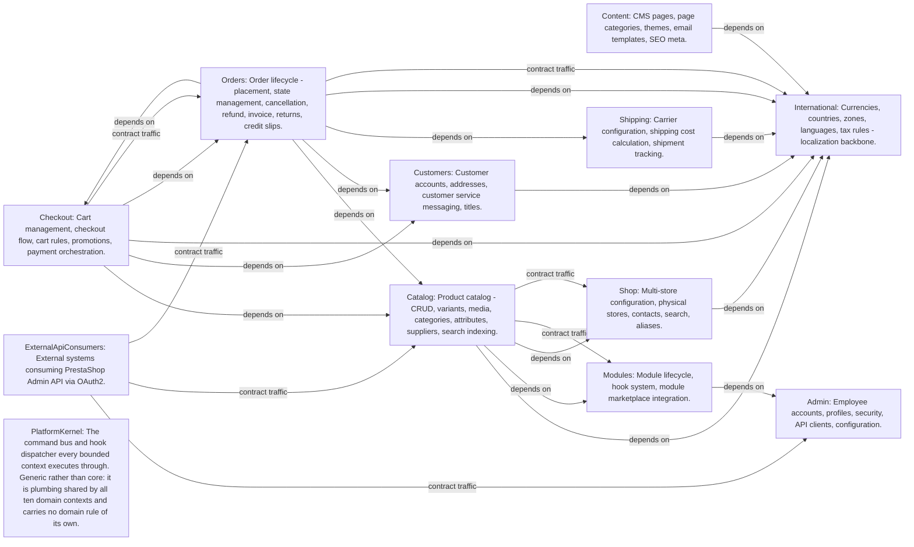

# PrestaShop-v9

> Generated from blueprint model. 3714 entities, 8020 relations.

## Context Map



> *[Archally Pro](https://archally.pro)* — Interactive Context Map with drag-and-drop, filtering, and detail panels.

## Causal Chains

```mermaid
graph LR
    admin_CMD021["admin.CMD021: AddApiClient"]
    admin_EVT014["admin.EVT014: ApiClientAdded"]
    admin_ACT003["admin.ACT003: ApiIntegrator"]
    admin_CMD022["admin.CMD022: EditApiClient"]
    admin_EVT015["admin.EVT015: ApiClientEdited"]
    admin_CMD023["admin.CMD023: DeleteApiClient"]
    admin_EVT016["admin.EVT016: ApiClientDeleted"]
    admin_CMD024["admin.CMD024: RotateApiClientSecret"]
    admin_EVT017["admin.EVT017: ApiClientSecretRotated"]
    admin_CMD025["admin.CMD025: AddWebserviceKey"]
    admin_EVT018["admin.EVT018: WebserviceKeyAdded"]
    admin_CMD026["admin.CMD026: EditWebserviceKey"]
    admin_EVT019["admin.EVT019: WebserviceKeyEdited"]
    admin_CMD027["admin.CMD027: DeleteWebserviceKey"]
    admin_EVT020["admin.EVT020: WebserviceKeyDeleted"]
    admin_CMD028["admin.CMD028: BulkDeleteWebserviceKey"]
    admin_CMD029["admin.CMD029: AddSqlRequest"]
    admin_EVT021["admin.EVT021: SqlRequestAdded"]
    admin_ACT001["admin.ACT001: SuperAdmin"]
    admin_CMD030["admin.CMD030: EditSqlRequest"]
    admin_EVT022["admin.EVT022: SqlRequestEdited"]
    admin_CMD031["admin.CMD031: DeleteSqlRequest"]
    admin_EVT023["admin.EVT023: SqlRequestDeleted"]
    admin_CMD032["admin.CMD032: BulkDeleteSqlRequest"]
    admin_CMD033["admin.CMD033: SaveSqlRequestSettings"]
    admin_EVT024["admin.EVT024: SqlRequestSettingsSaved"]
    admin_CMD034["admin.CMD034: SwitchDebugMode"]
    admin_EVT025["admin.EVT025: DebugModeSwitched"]
    admin_CMD035["admin.CMD035: UpdateTabStatus"]
    admin_EVT026["admin.EVT026: TabStatusUpdated"]
    admin_CMD036["admin.CMD036: AddQuickAccess"]
    admin_EVT027["admin.EVT027: QuickAccessAdded"]
    admin_CMD037["admin.CMD037: EditQuickAccess"]
    admin_EVT028["admin.EVT028: QuickAccessUpdated"]
    admin_CMD038["admin.CMD038: DeleteQuickAccess"]
    admin_EVT029["admin.EVT029: QuickAccessDeleted"]
    admin_CMD039["admin.CMD039: BulkDeleteQuickAccess"]
    admin_CMD040["admin.CMD040: ToggleQuickAccessNewWindow"]
    admin_CMD041["admin.CMD041: AddExtraPropertyDefinition"]
    admin_EVT030["admin.EVT030: ExtraPropertyDefinitionAdded"]
    admin_CMD042["admin.CMD042: UpdateExtraPropertyDefinition"]
    admin_EVT031["admin.EVT031: ExtraPropertyDefinitionUpdated"]
    admin_CMD043["admin.CMD043: DeleteExtraPropertyDefinition"]
    admin_EVT032["admin.EVT032: ExtraPropertyDefinitionDeleted"]
    admin_CMD044["admin.CMD044: BulkDeleteExtraPropertyDefinition"]
    admin_CMD045["admin.CMD045: AddBusinessEntity"]
    admin_EVT033["admin.EVT033: BusinessEntityAdded"]
    admin_CMD001["admin.CMD001: AddEmployee"]
    admin_EVT001["admin.EVT001: EmployeeAdded"]
    admin_CMD002["admin.CMD002: EditEmployee"]
    admin_EVT002["admin.EVT002: EmployeeEdited"]
    admin_CMD003["admin.CMD003: DeleteEmployee"]
    admin_EVT003["admin.EVT003: EmployeeDeleted"]
    admin_CMD004["admin.CMD004: ToggleEmployeeStatus"]
    admin_EVT004["admin.EVT004: EmployeeStatusToggled"]
    admin_CMD005["admin.CMD005: BulkUpdateEmployeeStatus"]
    admin_CMD006["admin.CMD006: BulkDeleteEmployee"]
    admin_CMD007["admin.CMD007: SendPasswordResetEmail"]
    admin_EVT005["admin.EVT005: PasswordResetEmailSent"]
    admin_CMD008["admin.CMD008: ResetEmployeePassword"]
    admin_EVT006["admin.EVT006: EmployeePasswordReset"]
    admin_ACT002["admin.ACT002: ShopOperator"]
    admin_CMD009["admin.CMD009: AddProfile"]
    admin_EVT007["admin.EVT007: ProfileAdded"]
    admin_CMD010["admin.CMD010: EditProfile"]
    admin_EVT008["admin.EVT008: ProfileEdited"]
    admin_CMD011["admin.CMD011: DeleteProfile"]
    admin_EVT009["admin.EVT009: ProfileDeleted"]
    admin_CMD012["admin.CMD012: BulkDeleteProfile"]
    admin_CMD013["admin.CMD013: UpdateTabPermissions"]
    admin_EVT010["admin.EVT010: TabPermissionsUpdated"]
    admin_CMD014["admin.CMD014: UpdateModulePermissions"]
    admin_EVT011["admin.EVT011: ModulePermissionsUpdated"]
    admin_CMD015["admin.CMD015: DeleteEmployeeSession"]
    admin_EVT012["admin.EVT012: EmployeeSessionDeleted"]
    admin_CMD016["admin.CMD016: DeleteCustomerSession"]
    admin_EVT013["admin.EVT013: CustomerSessionDeleted"]
    admin_CMD017["admin.CMD017: BulkDeleteEmployeeSessions"]
    admin_CMD018["admin.CMD018: BulkDeleteCustomerSessions"]
    admin_CMD019["admin.CMD019: ClearOutdatedEmployeeSessions"]
    admin_CMD020["admin.CMD020: ClearOutdatedCustomerSessions"]
    catalog_CMD025["catalog.CMD025: AddCategory"]
    catalog_EVT009["catalog.EVT009: CategoryCreated"]
    catalog_CMD300["catalog.CMD300: AddRootCategory"]
    catalog_CMD026["catalog.CMD026: EditCategory"]
    catalog_EVT010["catalog.EVT010: CategoryUpdated"]
    catalog_CMD301["catalog.CMD301: EditRootCategory"]
    catalog_CMD027["catalog.CMD027: DeleteCategory"]
    catalog_EVT300["catalog.EVT300: CategoryDeleted"]
    catalog_CMD302["catalog.CMD302: BulkDeleteCategories"]
    catalog_CMD029["catalog.CMD029: SetCategoryIsEnabled"]
    catalog_CMD303["catalog.CMD303: BulkUpdateCategoriesStatus"]
    catalog_CMD028["catalog.CMD028: UpdateCategoryPosition"]
    catalog_CMD304["catalog.CMD304: DeleteCategoryCoverImage"]
    catalog_CMD305["catalog.CMD305: DeleteCategoryThumbnailImage"]
    catalog_CMD032["catalog.CMD032: AddAttributeGroup"]
    catalog_EVT301["catalog.EVT301: AttributeGroupSaved"]
    catalog_CMD306["catalog.CMD306: EditAttributeGroup"]
    catalog_CMD033["catalog.CMD033: DeleteAttributeGroup"]
    catalog_EVT302["catalog.EVT302: AttributeGroupDeleted"]
    catalog_CMD307["catalog.CMD307: BulkDeleteAttributeGroup"]
    catalog_CMD309["catalog.CMD309: AddAttribute"]
    catalog_EVT303["catalog.EVT303: AttributeSaved"]
    catalog_CMD310["catalog.CMD310: EditAttribute"]
    catalog_CMD311["catalog.CMD311: DeleteAttribute"]
    catalog_EVT304["catalog.EVT304: AttributeDeleted"]
    catalog_CMD312["catalog.CMD312: BulkDeleteAttribute"]
    catalog_CMD308["catalog.CMD308: DeleteAttributeTextureImage"]
    catalog_CMD030["catalog.CMD030: AddFeature"]
    catalog_EVT305["catalog.EVT305: FeatureSaved"]
    catalog_CMD313["catalog.CMD313: EditFeature"]
    catalog_CMD314["catalog.CMD314: DeleteFeature"]
    catalog_EVT306["catalog.EVT306: FeatureDeleted"]
    catalog_CMD315["catalog.CMD315: BulkDeleteFeature"]
    catalog_CMD031["catalog.CMD031: AddFeatureValue"]
    catalog_EVT307["catalog.EVT307: FeatureValueSaved"]
    catalog_CMD316["catalog.CMD316: EditFeatureValue"]
    catalog_CMD317["catalog.CMD317: DeleteFeatureValue"]
    catalog_EVT308["catalog.EVT308: FeatureValueDeleted"]
    catalog_CMD318["catalog.CMD318: BulkDeleteFeatureValue"]
    catalog_CMD011["catalog.CMD011: GenerateCombinations"]
    catalog_EVT004["catalog.EVT004: CombinationGenerated"]
    catalog_CMD012["catalog.CMD012: UpdateCombination"]
    catalog_EVT005["catalog.EVT005: CombinationUpdated"]
    catalog_CMD200["catalog.CMD200: UpdateCombinationStockAvailable"]
    catalog_CMD013["catalog.CMD013: DeleteCombination"]
    catalog_EVT200["catalog.EVT200: CombinationDeleted"]
    catalog_EVT003["catalog.EVT003: ProductDeleted"]
    catalog_CMD014["catalog.CMD014: BulkDeleteCombinations"]
    catalog_CMD201["catalog.CMD201: SetCombinationImages"]
    catalog_CMD015["catalog.CMD015: UpdateCombinationSuppliers"]
    catalog_CMD202["catalog.CMD202: SetCombinationFeatureValues"]
    catalog_CMD040["catalog.CMD040: AddImageType"]
    catalog_ACT001["catalog.ACT001: Merchandising and catalog curation."]
    catalog_CMD417["catalog.CMD417: EditImageType"]
    catalog_CMD041["catalog.CMD041: DeleteImageType"]
    catalog_CMD418["catalog.CMD418: BulkDeleteImageType"]
    catalog_CMD419["catalog.CMD419: DeleteImagesFromType"]
    catalog_CMD420["catalog.CMD420: EditImageSettings"]
    catalog_CMD421["catalog.CMD421: RegenerateThumbnails"]
    catalog_EVT412["catalog.EVT412: ImageThumbnailResized"]
    catalog_CMD016["catalog.CMD016: AddProductImage"]
    catalog_EVT006["catalog.EVT006: ProductImageChanged"]
    catalog_CMD018["catalog.CMD018: UpdateProductImage"]
    catalog_CMD017["catalog.CMD017: DeleteProductImage"]
    catalog_CMD204["catalog.CMD204: SetProductImagesForAllShop"]
    catalog_CMD019["catalog.CMD019: ManageAttachment"]
    catalog_EVT002["catalog.EVT002: ProductUpdated"]
    catalog_CMD020["catalog.CMD020: AddVirtualProductFile"]
    catalog_EVT201["catalog.EVT201: VirtualProductFileChanged"]
    catalog_CMD205["catalog.CMD205: UpdateVirtualProductFile"]
    catalog_CMD206["catalog.CMD206: DeleteVirtualProductFile"]
    catalog_CMD021["catalog.CMD021: AddSpecificPrice"]
    catalog_EVT007["catalog.EVT007: SpecificPriceChanged"]
    checkout_EVT010["checkout.EVT010: CatalogPriceRuleCreated"]
    checkout_EVT011["checkout.EVT011: CatalogPriceRuleUpdated"]
    catalog_CMD022["catalog.CMD022: EditSpecificPrice"]
    catalog_CMD023["catalog.CMD023: DeleteSpecificPrice"]
    catalog_CMD203["catalog.CMD203: SetSpecificPricePriority"]
    catalog_CMD001["catalog.CMD001: AddProduct"]
    catalog_EVT001["catalog.EVT001: ProductCreated"]
    catalog_CMD002["catalog.CMD002: UpdateProduct"]
    catalog_CMD003["catalog.CMD003: DeleteProduct"]
    catalog_CMD004["catalog.CMD004: BulkDeleteProducts"]
    catalog_CMD005["catalog.CMD005: DuplicateProduct"]
    catalog_EVT101["catalog.EVT101: ProductDuplicated"]
    catalog_CMD006["catalog.CMD006: UpdateProductStatus"]
    catalog_CMD007["catalog.CMD007: BulkUpdateProductStatus"]
    catalog_EVT008["catalog.EVT008: ProductBulkUpdated"]
    catalog_CMD008["catalog.CMD008: UpdateProductType"]
    catalog_CMD009["catalog.CMD009: AssignProductToCategory"]
    catalog_CMD010["catalog.CMD010: SetProductTags"]
    catalog_CMD100["catalog.CMD100: BulkDuplicateProducts"]
    catalog_CMD101["catalog.CMD101: SetProductCategories"]
    catalog_CMD102["catalog.CMD102: RemoveAllProductCategories"]
    catalog_CMD103["catalog.CMD103: SetProductCarriers"]
    catalog_CMD104["catalog.CMD104: SetRelatedProducts"]
    catalog_CMD105["catalog.CMD105: UpdateProductsPositions"]
    catalog_CMD106["catalog.CMD106: SetProductShops"]
    catalog_CMD107["catalog.CMD107: SetProductAttachments"]
    catalog_CMD108["catalog.CMD108: SetProductFeatureValues"]
    catalog_CMD109["catalog.CMD109: SetProductCustomizationFields"]
    catalog_CMD110["catalog.CMD110: SetPackProducts"]
    catalog_CMD111["catalog.CMD111: SetProductSuppliers"]
    catalog_CMD112["catalog.CMD112: UpdateProductSuppliers"]
    catalog_CMD113["catalog.CMD113: SetProductDefaultSupplier"]
    catalog_CMD114["catalog.CMD114: UpdateProductStockAvailable"]
    catalog_EVT100["catalog.EVT100: ProductQuantityUpdated"]
    orders_EVT005["orders.EVT005: OrderStatusChanged"]
    catalog_CMD034["catalog.CMD034: AddManufacturer"]
    catalog_EVT403["catalog.EVT403: ManufacturerAdded"]
    catalog_CMD035["catalog.CMD035: EditManufacturer"]
    catalog_EVT404["catalog.EVT404: ManufacturerUpdated"]
    catalog_CMD036["catalog.CMD036: DeleteManufacturer"]
    catalog_EVT405["catalog.EVT405: ManufacturerDeleted"]
    catalog_CMD407["catalog.CMD407: BulkDeleteManufacturers"]
    catalog_CMD405["catalog.CMD405: ToggleManufacturerStatus"]
    catalog_CMD406["catalog.CMD406: BulkToggleManufacturerStatus"]
    catalog_CMD408["catalog.CMD408: DeleteManufacturerLogoImage"]
    catalog_CMD037["catalog.CMD037: AddSupplier"]
    catalog_EVT400["catalog.EVT400: SupplierAdded"]
    catalog_CMD038["catalog.CMD038: EditSupplier"]
    catalog_EVT401["catalog.EVT401: SupplierUpdated"]
    catalog_CMD039["catalog.CMD039: DeleteSupplier"]
    catalog_EVT402["catalog.EVT402: SupplierDeleted"]
    catalog_CMD402["catalog.CMD402: BulkDeleteSuppliers"]
    catalog_CMD403["catalog.CMD403: BulkEnableSuppliers"]
    catalog_CMD404["catalog.CMD404: BulkDisableSuppliers"]
    catalog_CMD400["catalog.CMD400: ToggleSupplierStatus"]
    catalog_CMD401["catalog.CMD401: DeleteSupplierLogoImage"]
    catalog_CMD409["catalog.CMD409: AddTag"]
    catalog_EVT406["catalog.EVT406: TagAdded"]
    catalog_CMD410["catalog.CMD410: EditTag"]
    catalog_EVT407["catalog.EVT407: TagUpdated"]
    catalog_CMD411["catalog.CMD411: DeleteTag"]
    catalog_EVT408["catalog.EVT408: TagDeleted"]
    catalog_CMD412["catalog.CMD412: BulkDeleteTags"]
    catalog_CMD413["catalog.CMD413: AddAttachment"]
    catalog_EVT409["catalog.EVT409: AttachmentAdded"]
    catalog_CMD414["catalog.CMD414: EditAttachment"]
    catalog_EVT410["catalog.EVT410: AttachmentUpdated"]
    catalog_CMD415["catalog.CMD415: DeleteAttachment"]
    catalog_EVT411["catalog.EVT411: AttachmentDeleted"]
    catalog_CMD416["catalog.CMD416: BulkDeleteAttachments"]
    checkout_CMD001["checkout.CMD001: CreateCart"]
    checkout_EVT001["checkout.EVT001: CartCreated"]
    orders_ACT004["orders.ACT004: Customer support and tech ops."]
    checkout_CMD002["checkout.CMD002: UpdateCartAddresses"]
    checkout_EVT002["checkout.EVT002: CartSettingsUpdated"]
    checkout_CMD003["checkout.CMD003: UpdateCartCarrier"]
    checkout_CMD004["checkout.CMD004: UpdateCartDeliverySettings"]
    checkout_CMD005["checkout.CMD005: UpdateCartCurrency"]
    checkout_CMD006["checkout.CMD006: UpdateCartLanguage"]
    checkout_CMD007["checkout.CMD007: DeleteCart"]
    checkout_EVT003["checkout.EVT003: CartDeleted"]
    checkout_CMD008["checkout.CMD008: SendCartToCustomer"]
    checkout_CMD009["checkout.CMD009: AddProductToCart"]
    checkout_EVT004["checkout.EVT004: CartProductsUpdated"]
    orders_ACT001["orders.ACT001: Online consumer purchasing products."]
    checkout_CMD010["checkout.CMD010: RemoveProductFromCart"]
    checkout_CMD011["checkout.CMD011: UpdateProductQuantityInCart"]
    checkout_CMD012["checkout.CMD012: UpdateProductPriceInCart"]
    checkout_CMD013["checkout.CMD013: AddCartCustomization"]
    checkout_CMD014["checkout.CMD014: ApplyCartRuleToCart"]
    checkout_EVT005["checkout.EVT005: CartRuleApplied"]
    checkout_CMD015["checkout.CMD015: RemoveCartRuleFromCart"]
    checkout_EVT006["checkout.EVT006: CartRuleRemoved"]
    checkout_CMD016["checkout.CMD016: CreateDiscount"]
    checkout_EVT007["checkout.EVT007: DiscountCreated"]
    orders_EVT003["orders.EVT003: OrderRefunded"]
    checkout_ACT001["checkout.ACT001: MarketingManager"]
    checkout_CMD017["checkout.CMD017: UpdateDiscount"]
    checkout_EVT008["checkout.EVT008: DiscountUpdated"]
    checkout_CMD018["checkout.CMD018: DeleteDiscount"]
    checkout_EVT009["checkout.EVT009: DiscountDeleted"]
    checkout_CMD019["checkout.CMD019: DuplicateDiscount"]
    checkout_CMD020["checkout.CMD020: BulkUpdateDiscountStatus"]
    checkout_CMD021["checkout.CMD021: CreateCatalogPriceRule"]
    checkout_CMD022["checkout.CMD022: EditCatalogPriceRule"]
    checkout_CMD023["checkout.CMD023: DeleteCatalogPriceRule"]
    checkout_EVT012["checkout.EVT012: CatalogPriceRuleDeleted"]
    content_CMD001["content.CMD001: AddCmsPage"]
    content_EVT001["content.EVT001: CmsPageCreated"]
    content_ACT001["content.ACT001: ContentManager"]
    content_CMD002["content.CMD002: EditCmsPage"]
    content_EVT002["content.EVT002: CmsPageUpdated"]
    content_CMD003["content.CMD003: DeleteCmsPage"]
    content_EVT003["content.EVT003: CmsPageDeleted"]
    content_EVT007["content.EVT007: CmsPageCategoryDeleted"]
    content_CMD004["content.CMD004: BulkDeleteCmsPage"]
    content_CMD005["content.CMD005: ToggleCmsPageStatus"]
    content_EVT004["content.EVT004: CmsPageStatusToggled"]
    content_CMD006["content.CMD006: BulkSetCmsPageStatus"]
    content_QRY001["content.QRY001: GetCmsPageForEditing"]
    content_QRY002["content.QRY002: GetCmsCategoryIdForRedirection"]
    content_CMD007["content.CMD007: AddCmsPageCategory"]
    content_EVT005["content.EVT005: CmsPageCategoryCreated"]
    content_CMD008["content.CMD008: EditCmsPageCategory"]
    content_EVT006["content.EVT006: CmsPageCategoryUpdated"]
    content_CMD009["content.CMD009: DeleteCmsPageCategory"]
    content_CMD010["content.CMD010: BulkDeleteCmsPageCategory"]
    content_CMD011["content.CMD011: ToggleCmsPageCategoryStatus"]
    content_EVT008["content.EVT008: CmsPageCategoryStatusToggled"]
    content_CMD012["content.CMD012: BulkSetCmsPageCategoryStatus"]
    content_QRY003["content.QRY003: GetCmsPageCategoryForEditing"]
    content_QRY004["content.QRY004: GetCmsPageCategoriesForBreadcrumb"]
    content_QRY005["content.QRY005: GetCmsPageCategoryNameForListing"]
    content_QRY006["content.QRY006: GetCmsPageParentCategoryIdForRedirection"]
    content_CMD019["content.CMD019: AddMeta"]
    content_EVT015["content.EVT015: MetaCreated"]
    content_CMD020["content.CMD020: EditMeta"]
    content_EVT016["content.EVT016: MetaUpdated"]
    content_QRY007["content.QRY007: GetMetaForEditing"]
    content_QRY008["content.QRY008: GetPagesForLayoutCustomization"]
    content_ACT002["content.ACT002: StoreDesigner"]
    content_CMD013["content.CMD013: ImportTheme"]
    content_EVT009["content.EVT009: ThemeImported"]
    content_CMD014["content.CMD014: EnableTheme"]
    content_EVT010["content.EVT010: ThemeEnabled"]
    content_CMD015["content.CMD015: DeleteTheme"]
    content_EVT011["content.EVT011: ThemeDeleted"]
    content_CMD016["content.CMD016: ResetThemeLayouts"]
    content_EVT012["content.EVT012: ThemeLayoutsReset"]
    content_CMD017["content.CMD017: AdaptThemeToRtlLanguages"]
    content_EVT013["content.EVT013: ThemeAdaptedToRtl"]
    international_EVT007["international.EVT007: LanguageCreated"]
    international_EVT008["international.EVT008: LanguageUpdated"]
    content_CMD018["content.CMD018: GenerateThemeMailTemplates"]
    content_EVT014["content.EVT014: MailTemplatesGenerated"]
    content_CMD021["content.CMD021: EditEmailBodyTemplate"]
    content_EVT017["content.EVT017: EmailBodyTemplateEdited"]
    content_QRY009["content.QRY009: GetEmailBodyTemplateForEditing"]
    content_QRY010["content.QRY010: GetEmailBodyTemplatesForListing"]
    customers_CMD012["customers.CMD012: AddCustomerAddress"]
    customers_EVT007["customers.EVT007: AddressCreated"]
    customers_ACT001["customers.ACT001: Customer"]
    customers_CMD013["customers.CMD013: EditCustomerAddress"]
    customers_EVT008["customers.EVT008: AddressUpdated"]
    customers_CMD014["customers.CMD014: DeleteAddress"]
    customers_EVT009["customers.EVT009: AddressDeleted"]
    customers_EVT003["customers.EVT003: CustomerDeleted"]
    customers_CMD027["customers.CMD027: BulkDeleteAddress"]
    customers_CMD023["customers.CMD023: AddManufacturerAddress"]
    customers_CMD024["customers.CMD024: EditManufacturerAddress"]
    customers_CMD025["customers.CMD025: EditCartAddress"]
    customers_CMD026["customers.CMD026: EditOrderAddress"]
    customers_CMD015["customers.CMD015: SetRequiredFieldsForAddress"]
    customers_EVT015["customers.EVT015: AddressRequiredFieldsUpdated"]
    customers_CMD001["customers.CMD001: AddCustomer"]
    customers_EVT001["customers.EVT001: CustomerCreated"]
    customers_CMD002["customers.CMD002: EditCustomer"]
    customers_EVT002["customers.EVT002: CustomerUpdated"]
    customers_CMD003["customers.CMD003: DeleteCustomer"]
    customers_CMD028["customers.CMD028: BulkDeleteCustomer"]
    customers_CMD004["customers.CMD004: BulkEnableCustomer"]
    customers_CMD005["customers.CMD005: BulkDisableCustomer"]
    customers_CMD006["customers.CMD006: SetPrivateNoteAboutCustomer"]
    customers_CMD007["customers.CMD007: SetRequiredFieldsForCustomer"]
    customers_EVT016["customers.EVT016: CustomerRequiredFieldsUpdated"]
    customers_CMD008["customers.CMD008: TransformGuestToCustomer"]
    customers_EVT004["customers.EVT004: GuestConvertedToCustomer"]
    customers_CMD009["customers.CMD009: AddCustomerGroup"]
    customers_EVT005["customers.EVT005: CustomerGroupCreated"]
    customers_CMD010["customers.CMD010: EditCustomerGroup"]
    customers_EVT006["customers.EVT006: CustomerGroupUpdated"]
    customers_CMD011["customers.CMD011: DeleteCustomerGroup"]
    customers_EVT017["customers.EVT017: CustomerGroupDeleted"]
    customers_CMD016["customers.CMD016: ReplyToCustomerThread"]
    customers_EVT010["customers.EVT010: CustomerThreadReplied"]
    customers_ACT002["customers.ACT002: CustomerServiceAgent"]
    customers_CMD017["customers.CMD017: ForwardCustomerThread"]
    customers_EVT011["customers.EVT011: CustomerThreadForwarded"]
    customers_CMD018["customers.CMD018: UpdateCustomerThreadStatus"]
    customers_EVT012["customers.EVT012: CustomerThreadStatusUpdated"]
    customers_CMD019["customers.CMD019: DeleteCustomerThread"]
    customers_EVT019["customers.EVT019: CustomerThreadDeleted"]
    customers_CMD020["customers.CMD020: AddTitle"]
    customers_EVT013["customers.EVT013: TitleCreated"]
    customers_CMD021["customers.CMD021: EditTitle"]
    customers_EVT014["customers.EVT014: TitleUpdated"]
    customers_CMD022["customers.CMD022: DeleteTitle"]
    customers_EVT018["customers.EVT018: TitleDeleted"]
    customers_CMD029["customers.CMD029: BulkDeleteTitle"]
    international_CMD001["international.CMD001: AddCurrency"]
    international_EVT001["international.EVT001: CurrencyCreated"]
    international_ACT001["international.ACT001: LocalizationAdmin"]
    international_CMD002["international.CMD002: EditCurrency"]
    international_EVT002["international.EVT002: CurrencyUpdated"]
    international_CMD003["international.CMD003: DeleteCurrency"]
    international_EVT003["international.EVT003: CurrencyDeleted"]
    international_CMD004["international.CMD004: ToggleCurrencyStatus"]
    international_EVT004["international.EVT004: CurrencyStatusToggled"]
    international_CMD005["international.CMD005: RefreshExchangeRates"]
    international_EVT005["international.EVT005: ExchangeRatesRefreshed"]
    international_DOC001["international.DOC001: ExchangeRateSnapshot"]
    international_CMD006["international.CMD006: SetDefaultCurrency"]
    international_EVT006["international.EVT006: DefaultCurrencyChanged"]
    international_CMD011["international.CMD011: AddCountry"]
    international_EVT011["international.EVT011: CountryCreated"]
    international_CMD012["international.CMD012: EditCountry"]
    international_EVT012["international.EVT012: CountryUpdated"]
    international_CMD013["international.CMD013: DeleteCountry"]
    international_EVT013["international.EVT013: CountryDeleted"]
    international_CMD031["international.CMD031: ToggleCountryStatus"]
    international_EVT031["international.EVT031: CountryStatusToggled"]
    international_CMD032["international.CMD032: BulkUpdateCountryZone"]
    international_EVT032["international.EVT032: CountryZonesBulkUpdated"]
    international_EVT021["international.EVT021: ZoneDeleted"]
    international_CMD033["international.CMD033: BulkDeleteCountries"]
    international_CMD014["international.CMD014: AddState"]
    international_EVT014["international.EVT014: StateCreated"]
    international_CMD015["international.CMD015: EditState"]
    international_EVT015["international.EVT015: StateUpdated"]
    international_CMD016["international.CMD016: DeleteState"]
    international_EVT016["international.EVT016: StateDeleted"]
    international_CMD017["international.CMD017: ToggleStateStatus"]
    international_EVT017["international.EVT017: StateStatusToggled"]
    international_CMD018["international.CMD018: BulkUpdateStateZone"]
    international_EVT018["international.EVT018: StateZonesBulkUpdated"]
    international_CMD019["international.CMD019: AddZone"]
    international_EVT019["international.EVT019: ZoneCreated"]
    international_CMD020["international.CMD020: EditZone"]
    international_EVT020["international.EVT020: ZoneUpdated"]
    international_CMD021["international.CMD021: DeleteZone"]
    international_CMD038["international.CMD038: BulkDeleteZones"]
    international_CMD022["international.CMD022: ToggleZoneStatus"]
    international_EVT022["international.EVT022: ZoneStatusToggled"]
    international_CMD039["international.CMD039: BulkToggleZoneStatus"]
    international_CMD007["international.CMD007: AddLanguage"]
    international_CMD008["international.CMD008: EditLanguage"]
    international_CMD009["international.CMD009: DeleteLanguage"]
    international_EVT009["international.EVT009: LanguageDeleted"]
    international_CMD010["international.CMD010: ToggleLanguageStatus"]
    international_EVT010["international.EVT010: LanguageStatusToggled"]
    international_CMD023["international.CMD023: AddTax"]
    international_EVT023["international.EVT023: TaxCreated"]
    international_ACT002["international.ACT002: TaxAccountant"]
    international_CMD024["international.CMD024: EditTax"]
    international_EVT024["international.EVT024: TaxUpdated"]
    international_CMD025["international.CMD025: DeleteTax"]
    international_EVT025["international.EVT025: TaxDeleted"]
    international_CMD040["international.CMD040: BulkDeleteTaxes"]
    international_CMD026["international.CMD026: ToggleTaxStatus"]
    international_EVT026["international.EVT026: TaxStatusToggled"]
    international_CMD041["international.CMD041: BulkToggleTaxStatus"]
    international_CMD027["international.CMD027: AddTaxRulesGroup"]
    international_EVT027["international.EVT027: TaxRulesGroupCreated"]
    international_CMD028["international.CMD028: EditTaxRulesGroup"]
    international_EVT028["international.EVT028: TaxRulesGroupUpdated"]
    international_CMD029["international.CMD029: DeleteTaxRulesGroup"]
    international_EVT029["international.EVT029: TaxRulesGroupDeleted"]
    international_CMD042["international.CMD042: BulkDeleteTaxRulesGroups"]
    international_CMD030["international.CMD030: SetTaxRulesGroupStatus"]
    international_EVT030["international.EVT030: TaxRulesGroupStatusSet"]
    international_CMD043["international.CMD043: BulkSetTaxRulesGroupStatus"]
    international_CMD034["international.CMD034: AddTaxRule"]
    international_EVT033["international.EVT033: TaxRuleCreated"]
    international_CMD035["international.CMD035: EditTaxRule"]
    international_EVT034["international.EVT034: TaxRuleUpdated"]
    international_CMD036["international.CMD036: DeleteTaxRule"]
    international_EVT035["international.EVT035: TaxRuleDeleted"]
    international_CMD037["international.CMD037: BulkDeleteTaxRules"]
    modules_CMD001["modules.CMD001: InstallModule"]
    modules_EVT001["modules.EVT001: ModuleInstalled"]
    modules_ACT001["modules.ACT001: StoreAdmin"]
    modules_CMD002["modules.CMD002: UninstallModule"]
    modules_EVT002["modules.EVT002: ModuleUninstalled"]
    modules_CMD003["modules.CMD003: UpdateModuleStatus"]
    modules_EVT003["modules.EVT003: ModuleStatusUpdated"]
    modules_CMD004["modules.CMD004: BulkToggleModuleStatus"]
    modules_CMD005["modules.CMD005: BulkUninstallModule"]
    modules_CMD006["modules.CMD006: ResetModule"]
    modules_EVT004["modules.EVT004: ModuleReset"]
    modules_CMD007["modules.CMD007: UpgradeModule"]
    modules_EVT005["modules.EVT005: ModuleUpgraded"]
    modules_CMD008["modules.CMD008: UploadModule"]
    modules_EVT006["modules.EVT006: ModuleUploaded"]
    modules_ACT002["modules.ACT002: ModuleDeveloper"]
    modules_QRY001["modules.QRY001: GetModuleInfos"]
    modules_CMD009["modules.CMD009: UpdateHookStatus"]
    modules_EVT007["modules.EVT007: HookStatusUpdated"]
    modules_QRY002["modules.QRY002: GetHook"]
    modules_QRY003["modules.QRY003: GetHookStatus"]
    modules_CMD012["modules.CMD012: HookModule"]
    modules_EVT008["modules.EVT008: ModuleHookedOnHook"]
    modules_CMD013["modules.CMD013: EditHookedModule"]
    modules_EVT009["modules.EVT009: HookedModuleMoved"]
    modules_QRY004["modules.QRY004: GetPossibleHooksForModule"]
    orders_CMD017["orders.CMD017: GenerateInvoice"]
    orders_EVT007["orders.EVT007: InvoiceGenerated"]
    orders_ACT003["orders.ACT003: Store owner and operator."]
    orders_CMD018["orders.CMD018: UpdateInvoiceNote"]
    orders_CMD019["orders.CMD019: AddPayment"]
    orders_EVT008["orders.EVT008: PaymentAdded"]
    orders_CMD024["orders.CMD024: AddOrderState"]
    orders_CMD025["orders.CMD025: EditOrderState"]
    orders_CMD026["orders.CMD026: DeleteOrderState"]
    orders_CMD027["orders.CMD027: BulkDeleteOrderState"]
    orders_CMD028["orders.CMD028: AddOrderMessage"]
    orders_CMD029["orders.CMD029: EditOrderMessage"]
    orders_CMD030["orders.CMD030: DeleteOrderMessage"]
    orders_CMD031["orders.CMD031: BulkDeleteOrderMessage"]
    orders_CMD032["orders.CMD032: AddOrderReturnState"]
    orders_CMD033["orders.CMD033: EditOrderReturnState"]
    orders_CMD034["orders.CMD034: DeleteOrderReturnState"]
    orders_CMD035["orders.CMD035: BulkDeleteOrderReturnState"]
    orders_CMD036["orders.CMD036: AddOrderCustomerMessage"]
    orders_CMD001["orders.CMD001: PlaceOrder"]
    orders_EVT001["orders.EVT001: OrderPlaced"]
    orders_CMD004["orders.CMD004: UpdateOrderStatus"]
    orders_CMD002["orders.CMD002: CancelOrder"]
    orders_EVT002["orders.EVT002: OrderCancelled"]
    orders_CMD005["orders.CMD005: BulkChangeOrderStatus"]
    orders_CMD006["orders.CMD006: DuplicateOrderCart"]
    orders_CMD007["orders.CMD007: ChangeOrderCurrency"]
    orders_CMD008["orders.CMD008: ChangeDeliveryAddress"]
    orders_CMD009["orders.CMD009: ChangeInvoiceAddress"]
    orders_CMD010["orders.CMD010: AddCartRule"]
    orders_CMD011["orders.CMD011: RemoveCartRule"]
    orders_CMD012["orders.CMD012: SetInternalNote"]
    orders_CMD013["orders.CMD013: ResendOrderEmail"]
    orders_CMD014["orders.CMD014: UpdateShippingDetails"]
    orders_EVT004["orders.EVT004: OrderShipped"]
    orders_CMD020["orders.CMD020: AddProductToOrder"]
    orders_EVT009["orders.EVT009: OrderProductModified"]
    orders_CMD021["orders.CMD021: RemoveProductFromOrder"]
    orders_CMD022["orders.CMD022: UpdateOrderProduct"]
    orders_CMD003["orders.CMD003: IssueStandardRefund"]
    orders_EVT006["orders.EVT006: CreditSlipGenerated"]
    orders_CMD015["orders.CMD015: IssuePartialRefund"]
    orders_CMD016["orders.CMD016: IssueReturnProduct"]
    orders_CMD023["orders.CMD023: UpdateOrderReturnState"]
    orders_EVT010["orders.EVT010: ReturnStateChanged"]
    orders_CMD037["orders.CMD037: DeleteOrderReturn"]
    orders_EVT011["orders.EVT011: OrderReturnDeleted"]
    orders_CMD038["orders.CMD038: BulkDeleteOrderReturns"]
    orders_CMD039["orders.CMD039: DeleteProductFromOrderReturn"]
    orders_CMD040["orders.CMD040: BulkDeleteProductsFromOrderReturn"]
    shipping_CMD001["shipping.CMD001: AddCarrier"]
    shipping_EVT001["shipping.EVT001: CarrierCreated"]
    shipping_ACT001["shipping.ACT001: ShippingManager"]
    shipping_CMD002["shipping.CMD002: EditCarrier"]
    shipping_EVT002["shipping.EVT002: CarrierUpdated"]
    shipping_CMD003["shipping.CMD003: DeleteCarrier"]
    shipping_EVT003["shipping.EVT003: CarrierDeleted"]
    shipping_CMD004["shipping.CMD004: BulkDeleteCarrier"]
    shipping_CMD005["shipping.CMD005: ToggleCarrierStatus"]
    shipping_EVT004["shipping.EVT004: CarrierStatusToggled"]
    shipping_CMD006["shipping.CMD006: BulkToggleCarrierStatus"]
    shipping_CMD007["shipping.CMD007: ToggleCarrierIsFree"]
    shipping_EVT005["shipping.EVT005: CarrierIsFreeToggled"]
    shipping_CMD008["shipping.CMD008: SetCarrierRanges"]
    shipping_EVT006["shipping.EVT006: CarrierRangesUpdated"]
    shipping_CMD009["shipping.CMD009: SetCarrierZones"]
    shipping_EVT007["shipping.EVT007: CarrierZonesUpdated"]
    shipping_CMD010["shipping.CMD010: SetCarrierTaxRuleGroup"]
    shipping_EVT008["shipping.EVT008: CarrierTaxRuleGroupUpdated"]
    shipping_CMD011["shipping.CMD011: CreateShipment"]
    shipping_EVT009["shipping.EVT009: ShipmentCreated"]
    shipping_CMD012["shipping.CMD012: EditShipment"]
    shipping_EVT010["shipping.EVT010: ShipmentUpdated"]
    shipping_CMD013["shipping.CMD013: AddProductToShipment"]
    shipping_EVT011["shipping.EVT011: ProductAddedToShipment"]
    shipping_CMD014["shipping.CMD014: DeleteProductFromShipment"]
    shipping_EVT012["shipping.EVT012: ProductRemovedFromShipment"]
    shipping_CMD015["shipping.CMD015: SplitShipment"]
    shipping_EVT013["shipping.EVT013: ShipmentSplit"]
    shipping_CMD016["shipping.CMD016: MergeProductsToShipment"]
    shipping_EVT014["shipping.EVT014: ShipmentsMerged"]
    shipping_CMD017["shipping.CMD017: SwitchShipmentCarrier"]
    shipping_EVT015["shipping.EVT015: ShipmentCarrierSwitched"]
    shipping_CMD018["shipping.CMD018: FulfillShipment"]
    shop_CMD001["shop.CMD001: UploadLogos"]
    shop_EVT001["shop.EVT001: LogosUploaded"]
    shop_ACT001["shop.ACT001: StoreAdmin"]
    shop_CMD002["shop.CMD002: DeleteStore"]
    shop_EVT002["shop.EVT002: StoreDeleted"]
    shop_CMD003["shop.CMD003: ToggleStoreStatus"]
    shop_EVT003["shop.EVT003: StoreStatusToggled"]
    shop_CMD004["shop.CMD004: BulkDeleteStore"]
    shop_CMD005["shop.CMD005: BulkUpdateStoreStatus"]
    shop_CMD006["shop.CMD006: AddSearchEngine"]
    shop_EVT004["shop.EVT004: SearchEngineAdded"]
    shop_ACT002["shop.ACT002: MarketingManager"]
    shop_CMD007["shop.CMD007: EditSearchEngine"]
    shop_EVT005["shop.EVT005: SearchEngineEdited"]
    shop_CMD008["shop.CMD008: DeleteSearchEngine"]
    shop_EVT006["shop.EVT006: SearchEngineDeleted"]
    shop_CMD009["shop.CMD009: BulkDeleteSearchEngine"]
    shop_CMD010["shop.CMD010: AddSearchTermAliases"]
    shop_EVT007["shop.EVT007: SearchTermAliasesAdded"]
    shop_CMD011["shop.CMD011: UpdateSearchTermAliases"]
    shop_EVT008["shop.EVT008: SearchTermAliasesUpdated"]
    shop_CMD012["shop.CMD012: DeleteSearchTermAliases"]
    shop_EVT009["shop.EVT009: SearchTermAliasesDeleted"]
    shop_CMD013["shop.CMD013: BulkDeleteSearchTermAliases"]
    shop_CMD014["shop.CMD014: RebuildSearchIndex"]
    shop_EVT010["shop.EVT010: SearchIndexRebuilt"]
    shop_CMD015["shop.CMD015: AddContact"]
    shop_EVT011["shop.EVT011: ContactAdded"]
    shop_CMD016["shop.CMD016: EditContact"]
    shop_EVT012["shop.EVT012: ContactEdited"]
    shop_CMD017["shop.CMD017: UpdateNotificationLastElement"]
    shop_EVT013["shop.EVT013: NotificationLastElementUpdated"]
    shop_CMD018["shop.CMD018: CloseShowcaseCard"]
    shop_EVT014["shop.EVT014: ShowcaseCardClosed"]
    admin_CMD021 -->|"produces"| admin_EVT014
    admin_CMD021 -->|"initiated by"| admin_ACT003
    admin_CMD022 -->|"produces"| admin_EVT015
    admin_CMD022 -->|"initiated by"| admin_ACT003
    admin_CMD023 -->|"produces"| admin_EVT016
    admin_CMD023 -->|"initiated by"| admin_ACT003
    admin_CMD024 -->|"produces"| admin_EVT017
    admin_CMD024 -->|"initiated by"| admin_ACT003
    admin_CMD025 -->|"produces"| admin_EVT018
    admin_CMD025 -->|"initiated by"| admin_ACT003
    admin_CMD026 -->|"produces"| admin_EVT019
    admin_CMD026 -->|"initiated by"| admin_ACT003
    admin_CMD027 -->|"produces"| admin_EVT020
    admin_CMD027 -->|"initiated by"| admin_ACT003
    admin_CMD028 -->|"produces"| admin_EVT020
    admin_CMD028 -->|"initiated by"| admin_ACT003
    admin_CMD029 -->|"produces"| admin_EVT021
    admin_CMD029 -->|"initiated by"| admin_ACT001
    admin_CMD030 -->|"produces"| admin_EVT022
    admin_CMD030 -->|"initiated by"| admin_ACT001
    admin_CMD031 -->|"produces"| admin_EVT023
    admin_CMD031 -->|"initiated by"| admin_ACT001
    admin_CMD032 -->|"produces"| admin_EVT023
    admin_CMD032 -->|"initiated by"| admin_ACT001
    admin_CMD033 -->|"produces"| admin_EVT024
    admin_CMD033 -->|"initiated by"| admin_ACT001
    admin_CMD034 -->|"produces"| admin_EVT025
    admin_CMD034 -->|"initiated by"| admin_ACT001
    admin_CMD035 -->|"produces"| admin_EVT026
    admin_CMD035 -->|"initiated by"| admin_ACT001
    admin_CMD036 -->|"produces"| admin_EVT027
    admin_CMD036 -->|"initiated by"| admin_ACT001
    admin_CMD037 -->|"produces"| admin_EVT028
    admin_CMD037 -->|"initiated by"| admin_ACT001
    admin_CMD038 -->|"produces"| admin_EVT029
    admin_CMD038 -->|"initiated by"| admin_ACT001
    admin_CMD039 -->|"produces"| admin_EVT029
    admin_CMD039 -->|"initiated by"| admin_ACT001
    admin_CMD040 -->|"produces"| admin_EVT028
    admin_CMD040 -->|"initiated by"| admin_ACT001
    admin_CMD041 -->|"produces"| admin_EVT030
    admin_CMD041 -->|"initiated by"| admin_ACT001
    admin_CMD042 -->|"produces"| admin_EVT031
    admin_CMD042 -->|"initiated by"| admin_ACT001
    admin_CMD043 -->|"produces"| admin_EVT032
    admin_CMD043 -->|"initiated by"| admin_ACT001
    admin_CMD044 -->|"produces"| admin_EVT032
    admin_CMD044 -->|"initiated by"| admin_ACT001
    admin_CMD045 -->|"produces"| admin_EVT033
    admin_CMD045 -->|"initiated by"| admin_ACT001
    admin_CMD001 -->|"produces"| admin_EVT001
    admin_CMD001 -->|"initiated by"| admin_ACT001
    admin_CMD002 -->|"produces"| admin_EVT002
    admin_CMD002 -->|"initiated by"| admin_ACT001
    admin_CMD003 -->|"produces"| admin_EVT003
    admin_CMD003 -->|"initiated by"| admin_ACT001
    admin_CMD004 -->|"produces"| admin_EVT004
    admin_CMD004 -->|"initiated by"| admin_ACT001
    admin_CMD005 -->|"produces"| admin_EVT004
    admin_CMD005 -->|"initiated by"| admin_ACT001
    admin_CMD006 -->|"produces"| admin_EVT003
    admin_CMD006 -->|"initiated by"| admin_ACT001
    admin_CMD007 -->|"produces"| admin_EVT005
    admin_CMD007 -->|"initiated by"| admin_ACT001
    admin_CMD008 -->|"produces"| admin_EVT006
    admin_CMD008 -->|"initiated by"| admin_ACT002
    admin_CMD009 -->|"produces"| admin_EVT007
    admin_CMD009 -->|"initiated by"| admin_ACT001
    admin_CMD010 -->|"produces"| admin_EVT008
    admin_CMD010 -->|"initiated by"| admin_ACT001
    admin_CMD011 -->|"produces"| admin_EVT009
    admin_CMD011 -->|"initiated by"| admin_ACT001
    admin_CMD012 -->|"produces"| admin_EVT009
    admin_CMD012 -->|"initiated by"| admin_ACT001
    admin_CMD013 -->|"produces"| admin_EVT010
    admin_CMD013 -->|"initiated by"| admin_ACT001
    admin_CMD014 -->|"produces"| admin_EVT011
    admin_CMD014 -->|"initiated by"| admin_ACT001
    admin_CMD015 -->|"produces"| admin_EVT012
    admin_CMD015 -->|"initiated by"| admin_ACT001
    admin_CMD016 -->|"produces"| admin_EVT013
    admin_CMD016 -->|"initiated by"| admin_ACT001
    admin_CMD017 -->|"produces"| admin_EVT012
    admin_CMD017 -->|"reacts to"| admin_EVT006
    admin_CMD017 -->|"reacts to"| admin_EVT002
    admin_CMD017 -->|"initiated by"| admin_ACT001
    admin_CMD018 -->|"produces"| admin_EVT013
    admin_CMD018 -->|"initiated by"| admin_ACT001
    admin_CMD019 -->|"produces"| admin_EVT012
    admin_CMD020 -->|"produces"| admin_EVT013
    catalog_CMD025 -->|"produces"| catalog_EVT009
    catalog_CMD300 -->|"produces"| catalog_EVT009
    catalog_CMD026 -->|"produces"| catalog_EVT010
    catalog_CMD301 -->|"produces"| catalog_EVT010
    catalog_CMD027 -->|"produces"| catalog_EVT300
    catalog_CMD302 -->|"produces"| catalog_EVT300
    catalog_CMD029 -->|"produces"| catalog_EVT010
    catalog_CMD303 -->|"produces"| catalog_EVT010
    catalog_CMD028 -->|"produces"| catalog_EVT010
    catalog_CMD304 -->|"produces"| catalog_EVT010
    catalog_CMD305 -->|"produces"| catalog_EVT010
    catalog_CMD032 -->|"produces"| catalog_EVT301
    catalog_CMD306 -->|"produces"| catalog_EVT301
    catalog_CMD033 -->|"produces"| catalog_EVT302
    catalog_CMD307 -->|"produces"| catalog_EVT302
    catalog_CMD309 -->|"produces"| catalog_EVT303
    catalog_CMD310 -->|"produces"| catalog_EVT303
    catalog_CMD311 -->|"produces"| catalog_EVT304
    catalog_CMD312 -->|"produces"| catalog_EVT304
    catalog_CMD308 -->|"produces"| catalog_EVT303
    catalog_CMD030 -->|"produces"| catalog_EVT305
    catalog_CMD313 -->|"produces"| catalog_EVT305
    catalog_CMD314 -->|"produces"| catalog_EVT306
    catalog_CMD315 -->|"produces"| catalog_EVT306
    catalog_CMD031 -->|"produces"| catalog_EVT307
    catalog_CMD316 -->|"produces"| catalog_EVT307
    catalog_CMD317 -->|"produces"| catalog_EVT308
    catalog_CMD318 -->|"produces"| catalog_EVT308
    catalog_CMD011 -->|"produces"| catalog_EVT004
    catalog_CMD012 -->|"produces"| catalog_EVT005
    catalog_CMD200 -->|"produces"| catalog_EVT005
    catalog_CMD013 -->|"produces"| catalog_EVT200
    catalog_CMD013 -->|"reacts to"| catalog_EVT003
    catalog_CMD014 -->|"produces"| catalog_EVT200
    catalog_CMD201 -->|"produces"| catalog_EVT005
    catalog_CMD015 -->|"produces"| catalog_EVT005
    catalog_CMD202 -->|"produces"| catalog_EVT005
    catalog_CMD040 -->|"initiated by"| catalog_ACT001
    catalog_CMD417 -->|"initiated by"| catalog_ACT001
    catalog_CMD041 -->|"initiated by"| catalog_ACT001
    catalog_CMD418 -->|"initiated by"| catalog_ACT001
    catalog_CMD419 -->|"initiated by"| catalog_ACT001
    catalog_CMD420 -->|"initiated by"| catalog_ACT001
    catalog_CMD421 -->|"produces"| catalog_EVT412
    catalog_CMD421 -->|"initiated by"| catalog_ACT001
    catalog_CMD016 -->|"produces"| catalog_EVT006
    catalog_CMD018 -->|"produces"| catalog_EVT006
    catalog_CMD017 -->|"produces"| catalog_EVT006
    catalog_CMD017 -->|"reacts to"| catalog_EVT003
    catalog_CMD204 -->|"produces"| catalog_EVT006
    catalog_CMD019 -->|"produces"| catalog_EVT002
    catalog_CMD020 -->|"produces"| catalog_EVT201
    catalog_CMD205 -->|"produces"| catalog_EVT201
    catalog_CMD206 -->|"produces"| catalog_EVT201
    catalog_CMD021 -->|"produces"| catalog_EVT007
    catalog_CMD021 -->|"reacts to"| checkout_EVT010
    catalog_CMD021 -->|"reacts to"| checkout_EVT011
    catalog_CMD022 -->|"produces"| catalog_EVT007
    catalog_CMD023 -->|"produces"| catalog_EVT007
    catalog_CMD023 -->|"reacts to"| catalog_EVT003
    catalog_CMD203 -->|"produces"| catalog_EVT007
    catalog_CMD001 -->|"produces"| catalog_EVT001
    catalog_CMD001 -->|"initiated by"| catalog_ACT001
    catalog_CMD002 -->|"produces"| catalog_EVT002
    catalog_CMD003 -->|"produces"| catalog_EVT003
    catalog_CMD004 -->|"produces"| catalog_EVT003
    catalog_CMD005 -->|"produces"| catalog_EVT001
    catalog_CMD005 -->|"produces"| catalog_EVT101
    catalog_CMD006 -->|"produces"| catalog_EVT002
    catalog_CMD007 -->|"produces"| catalog_EVT008
    catalog_CMD008 -->|"produces"| catalog_EVT002
    catalog_CMD009 -->|"produces"| catalog_EVT002
    catalog_CMD010 -->|"produces"| catalog_EVT002
    catalog_CMD100 -->|"produces"| catalog_EVT001
    catalog_CMD100 -->|"produces"| catalog_EVT101
    catalog_CMD100 -->|"initiated by"| catalog_ACT001
    catalog_CMD101 -->|"initiated by"| catalog_ACT001
    catalog_CMD102 -->|"initiated by"| catalog_ACT001
    catalog_CMD103 -->|"initiated by"| catalog_ACT001
    catalog_CMD104 -->|"initiated by"| catalog_ACT001
    catalog_CMD105 -->|"initiated by"| catalog_ACT001
    catalog_CMD106 -->|"initiated by"| catalog_ACT001
    catalog_CMD107 -->|"initiated by"| catalog_ACT001
    catalog_CMD108 -->|"initiated by"| catalog_ACT001
    catalog_CMD109 -->|"produces"| catalog_EVT002
    catalog_CMD109 -->|"initiated by"| catalog_ACT001
    catalog_CMD110 -->|"initiated by"| catalog_ACT001
    catalog_CMD111 -->|"initiated by"| catalog_ACT001
    catalog_CMD112 -->|"initiated by"| catalog_ACT001
    catalog_CMD113 -->|"initiated by"| catalog_ACT001
    catalog_CMD114 -->|"produces"| catalog_EVT100
    catalog_CMD114 -->|"reacts to"| orders_EVT005
    catalog_CMD114 -->|"initiated by"| catalog_ACT001
    catalog_CMD034 -->|"produces"| catalog_EVT403
    catalog_CMD034 -->|"initiated by"| catalog_ACT001
    catalog_CMD035 -->|"produces"| catalog_EVT404
    catalog_CMD035 -->|"initiated by"| catalog_ACT001
    catalog_CMD036 -->|"produces"| catalog_EVT405
    catalog_CMD036 -->|"initiated by"| catalog_ACT001
    catalog_CMD407 -->|"produces"| catalog_EVT405
    catalog_CMD407 -->|"initiated by"| catalog_ACT001
    catalog_CMD405 -->|"produces"| catalog_EVT404
    catalog_CMD405 -->|"initiated by"| catalog_ACT001
    catalog_CMD406 -->|"produces"| catalog_EVT404
    catalog_CMD406 -->|"initiated by"| catalog_ACT001
    catalog_CMD408 -->|"initiated by"| catalog_ACT001
    catalog_CMD037 -->|"produces"| catalog_EVT400
    catalog_CMD037 -->|"initiated by"| catalog_ACT001
    catalog_CMD038 -->|"produces"| catalog_EVT401
    catalog_CMD038 -->|"initiated by"| catalog_ACT001
    catalog_CMD039 -->|"produces"| catalog_EVT402
    catalog_CMD039 -->|"initiated by"| catalog_ACT001
    catalog_CMD402 -->|"produces"| catalog_EVT402
    catalog_CMD402 -->|"initiated by"| catalog_ACT001
    catalog_CMD403 -->|"produces"| catalog_EVT401
    catalog_CMD403 -->|"initiated by"| catalog_ACT001
    catalog_CMD404 -->|"produces"| catalog_EVT401
    catalog_CMD404 -->|"initiated by"| catalog_ACT001
    catalog_CMD400 -->|"produces"| catalog_EVT401
    catalog_CMD400 -->|"initiated by"| catalog_ACT001
    catalog_CMD401 -->|"initiated by"| catalog_ACT001
    catalog_CMD409 -->|"produces"| catalog_EVT406
    catalog_CMD409 -->|"initiated by"| catalog_ACT001
    catalog_CMD410 -->|"produces"| catalog_EVT407
    catalog_CMD410 -->|"initiated by"| catalog_ACT001
    catalog_CMD411 -->|"produces"| catalog_EVT408
    catalog_CMD411 -->|"initiated by"| catalog_ACT001
    catalog_CMD412 -->|"produces"| catalog_EVT408
    catalog_CMD412 -->|"initiated by"| catalog_ACT001
    catalog_CMD413 -->|"produces"| catalog_EVT409
    catalog_CMD413 -->|"initiated by"| catalog_ACT001
    catalog_CMD414 -->|"produces"| catalog_EVT410
    catalog_CMD414 -->|"initiated by"| catalog_ACT001
    catalog_CMD415 -->|"produces"| catalog_EVT411
    catalog_CMD415 -->|"initiated by"| catalog_ACT001
    catalog_CMD416 -->|"produces"| catalog_EVT411
    catalog_CMD416 -->|"initiated by"| catalog_ACT001
    checkout_CMD001 -->|"produces"| checkout_EVT001
    checkout_CMD001 -->|"initiated by"| orders_ACT004
    checkout_CMD002 -->|"produces"| checkout_EVT002
    checkout_CMD003 -->|"produces"| checkout_EVT002
    checkout_CMD004 -->|"produces"| checkout_EVT002
    checkout_CMD005 -->|"produces"| checkout_EVT002
    checkout_CMD006 -->|"produces"| checkout_EVT002
    checkout_CMD007 -->|"produces"| checkout_EVT003
    checkout_CMD008 -->|"produces"| checkout_EVT002
    checkout_CMD008 -->|"initiated by"| orders_ACT004
    checkout_CMD009 -->|"produces"| checkout_EVT004
    checkout_CMD009 -->|"initiated by"| orders_ACT001
    checkout_CMD010 -->|"produces"| checkout_EVT004
    checkout_CMD010 -->|"reacts to"| catalog_EVT003
    checkout_CMD010 -->|"initiated by"| orders_ACT001
    checkout_CMD011 -->|"produces"| checkout_EVT004
    checkout_CMD011 -->|"initiated by"| orders_ACT001
    checkout_CMD012 -->|"produces"| checkout_EVT004
    checkout_CMD012 -->|"initiated by"| orders_ACT004
    checkout_CMD013 -->|"produces"| checkout_EVT004
    checkout_CMD013 -->|"initiated by"| orders_ACT001
    checkout_CMD014 -->|"produces"| checkout_EVT005
    checkout_CMD014 -->|"reacts to"| checkout_EVT004
    checkout_CMD014 -->|"initiated by"| orders_ACT001
    checkout_CMD015 -->|"produces"| checkout_EVT006
    checkout_CMD015 -->|"reacts to"| checkout_EVT004
    checkout_CMD015 -->|"initiated by"| orders_ACT001
    checkout_CMD016 -->|"produces"| checkout_EVT007
    checkout_CMD016 -->|"reacts to"| orders_EVT003
    checkout_CMD016 -->|"initiated by"| checkout_ACT001
    checkout_CMD017 -->|"produces"| checkout_EVT008
    checkout_CMD017 -->|"initiated by"| checkout_ACT001
    checkout_CMD018 -->|"produces"| checkout_EVT009
    checkout_CMD018 -->|"initiated by"| checkout_ACT001
    checkout_CMD019 -->|"produces"| checkout_EVT007
    checkout_CMD019 -->|"initiated by"| checkout_ACT001
    checkout_CMD020 -->|"produces"| checkout_EVT008
    checkout_CMD020 -->|"initiated by"| checkout_ACT001
    checkout_CMD021 -->|"produces"| checkout_EVT010
    checkout_CMD021 -->|"initiated by"| checkout_ACT001
    checkout_CMD022 -->|"produces"| checkout_EVT011
    checkout_CMD022 -->|"initiated by"| checkout_ACT001
    checkout_CMD023 -->|"produces"| checkout_EVT012
    checkout_CMD023 -->|"initiated by"| checkout_ACT001
    content_CMD001 -->|"produces"| content_EVT001
    content_CMD001 -->|"initiated by"| content_ACT001
    content_CMD002 -->|"produces"| content_EVT002
    content_CMD002 -->|"initiated by"| content_ACT001
    content_CMD003 -->|"produces"| content_EVT003
    content_CMD003 -->|"reacts to"| content_EVT007
    content_CMD003 -->|"initiated by"| content_ACT001
    content_CMD004 -->|"produces"| content_EVT003
    content_CMD004 -->|"initiated by"| content_ACT001
    content_CMD005 -->|"produces"| content_EVT004
    content_CMD005 -->|"initiated by"| content_ACT001
    content_CMD006 -->|"produces"| content_EVT004
    content_CMD006 -->|"initiated by"| content_ACT001
    content_QRY001 -->|"initiated by"| content_ACT001
    content_QRY002 -->|"initiated by"| content_ACT001
    content_CMD007 -->|"produces"| content_EVT005
    content_CMD007 -->|"initiated by"| content_ACT001
    content_CMD008 -->|"produces"| content_EVT006
    content_CMD008 -->|"initiated by"| content_ACT001
    content_CMD009 -->|"produces"| content_EVT007
    content_CMD009 -->|"initiated by"| content_ACT001
    content_CMD010 -->|"produces"| content_EVT007
    content_CMD010 -->|"initiated by"| content_ACT001
    content_CMD011 -->|"produces"| content_EVT008
    content_CMD011 -->|"initiated by"| content_ACT001
    content_CMD012 -->|"produces"| content_EVT008
    content_CMD012 -->|"initiated by"| content_ACT001
    content_QRY003 -->|"initiated by"| content_ACT001
    content_QRY004 -->|"initiated by"| content_ACT001
    content_QRY005 -->|"initiated by"| content_ACT001
    content_QRY006 -->|"initiated by"| content_ACT001
    content_CMD019 -->|"produces"| content_EVT015
    content_CMD019 -->|"initiated by"| content_ACT001
    content_CMD020 -->|"produces"| content_EVT016
    content_CMD020 -->|"initiated by"| content_ACT001
    content_QRY007 -->|"initiated by"| content_ACT001
    content_QRY008 -->|"initiated by"| content_ACT002
    content_CMD013 -->|"produces"| content_EVT009
    content_CMD013 -->|"initiated by"| content_ACT002
    content_CMD014 -->|"produces"| content_EVT010
    content_CMD014 -->|"initiated by"| content_ACT002
    content_CMD015 -->|"produces"| content_EVT011
    content_CMD015 -->|"initiated by"| content_ACT002
    content_CMD016 -->|"produces"| content_EVT012
    content_CMD016 -->|"initiated by"| content_ACT002
    content_CMD017 -->|"produces"| content_EVT013
    content_CMD017 -->|"reacts to"| international_EVT007
    content_CMD017 -->|"reacts to"| international_EVT008
    content_CMD017 -->|"initiated by"| content_ACT002
    content_CMD018 -->|"produces"| content_EVT014
    content_CMD018 -->|"initiated by"| content_ACT002
    content_CMD021 -->|"produces"| content_EVT017
    content_CMD021 -->|"initiated by"| content_ACT002
    content_QRY009 -->|"initiated by"| content_ACT002
    content_QRY010 -->|"initiated by"| content_ACT002
    customers_CMD012 -->|"produces"| customers_EVT007
    customers_CMD012 -->|"initiated by"| customers_ACT001
    customers_CMD012 -->|"initiated by"| orders_ACT004
    customers_CMD013 -->|"produces"| customers_EVT007
    customers_CMD013 -->|"produces"| customers_EVT008
    customers_CMD013 -->|"initiated by"| customers_ACT001
    customers_CMD013 -->|"initiated by"| orders_ACT004
    customers_CMD014 -->|"produces"| customers_EVT009
    customers_CMD014 -->|"reacts to"| customers_EVT003
    customers_CMD014 -->|"initiated by"| orders_ACT004
    customers_CMD027 -->|"produces"| customers_EVT009
    customers_CMD027 -->|"initiated by"| orders_ACT004
    customers_CMD023 -->|"produces"| customers_EVT007
    customers_CMD023 -->|"initiated by"| orders_ACT004
    customers_CMD024 -->|"produces"| customers_EVT008
    customers_CMD024 -->|"initiated by"| orders_ACT004
    customers_CMD025 -->|"produces"| customers_EVT007
    customers_CMD025 -->|"produces"| customers_EVT008
    customers_CMD025 -->|"initiated by"| orders_ACT004
    customers_CMD026 -->|"produces"| customers_EVT007
    customers_CMD026 -->|"produces"| customers_EVT008
    customers_CMD026 -->|"initiated by"| orders_ACT004
    customers_CMD015 -->|"produces"| customers_EVT015
    customers_CMD015 -->|"initiated by"| orders_ACT004
    customers_CMD001 -->|"produces"| customers_EVT001
    customers_CMD001 -->|"initiated by"| orders_ACT004
    customers_CMD002 -->|"produces"| customers_EVT002
    customers_CMD002 -->|"initiated by"| customers_ACT001
    customers_CMD002 -->|"initiated by"| orders_ACT004
    customers_CMD003 -->|"produces"| customers_EVT003
    customers_CMD003 -->|"initiated by"| orders_ACT004
    customers_CMD028 -->|"produces"| customers_EVT003
    customers_CMD028 -->|"initiated by"| orders_ACT004
    customers_CMD004 -->|"produces"| customers_EVT002
    customers_CMD004 -->|"initiated by"| orders_ACT004
    customers_CMD005 -->|"produces"| customers_EVT002
    customers_CMD005 -->|"initiated by"| orders_ACT004
    customers_CMD006 -->|"produces"| customers_EVT002
    customers_CMD006 -->|"initiated by"| orders_ACT004
    customers_CMD007 -->|"produces"| customers_EVT016
    customers_CMD007 -->|"initiated by"| orders_ACT004
    customers_CMD008 -->|"produces"| customers_EVT004
    customers_CMD008 -->|"initiated by"| orders_ACT004
    customers_CMD009 -->|"produces"| customers_EVT005
    customers_CMD009 -->|"initiated by"| orders_ACT004
    customers_CMD010 -->|"produces"| customers_EVT006
    customers_CMD010 -->|"initiated by"| orders_ACT004
    customers_CMD011 -->|"produces"| customers_EVT017
    customers_CMD011 -->|"initiated by"| orders_ACT004
    customers_CMD016 -->|"produces"| customers_EVT010
    customers_CMD016 -->|"initiated by"| customers_ACT002
    customers_CMD017 -->|"produces"| customers_EVT011
    customers_CMD017 -->|"initiated by"| customers_ACT002
    customers_CMD018 -->|"produces"| customers_EVT012
    customers_CMD018 -->|"reacts to"| customers_EVT010
    customers_CMD018 -->|"initiated by"| customers_ACT002
    customers_CMD019 -->|"produces"| customers_EVT019
    customers_CMD019 -->|"initiated by"| customers_ACT002
    customers_CMD020 -->|"produces"| customers_EVT013
    customers_CMD020 -->|"initiated by"| orders_ACT004
    customers_CMD021 -->|"produces"| customers_EVT014
    customers_CMD021 -->|"initiated by"| orders_ACT004
    customers_CMD022 -->|"produces"| customers_EVT018
    customers_CMD022 -->|"initiated by"| orders_ACT004
    customers_CMD029 -->|"produces"| customers_EVT018
    customers_CMD029 -->|"initiated by"| orders_ACT004
    international_CMD001 -->|"produces"| international_EVT001
    international_CMD001 -->|"initiated by"| international_ACT001
    international_CMD002 -->|"produces"| international_EVT002
    international_CMD002 -->|"initiated by"| international_ACT001
    international_CMD003 -->|"produces"| international_EVT003
    international_CMD003 -->|"initiated by"| international_ACT001
    international_CMD004 -->|"produces"| international_EVT004
    international_CMD004 -->|"initiated by"| international_ACT001
    international_CMD005 -->|"produces"| international_EVT005
    international_CMD005 -->|"produces"| international_DOC001
    international_CMD005 -->|"initiated by"| international_ACT001
    international_CMD006 -->|"produces"| international_EVT006
    international_CMD006 -->|"initiated by"| international_ACT001
    international_CMD011 -->|"produces"| international_EVT011
    international_CMD011 -->|"initiated by"| international_ACT001
    international_CMD012 -->|"produces"| international_EVT012
    international_CMD012 -->|"initiated by"| international_ACT001
    international_CMD013 -->|"produces"| international_EVT013
    international_CMD013 -->|"initiated by"| international_ACT001
    international_CMD031 -->|"produces"| international_EVT031
    international_CMD031 -->|"initiated by"| international_ACT001
    international_CMD032 -->|"produces"| international_EVT032
    international_CMD032 -->|"reacts to"| international_EVT021
    international_CMD032 -->|"initiated by"| international_ACT001
    international_CMD033 -->|"produces"| international_EVT013
    international_CMD033 -->|"initiated by"| international_ACT001
    international_CMD014 -->|"produces"| international_EVT014
    international_CMD014 -->|"initiated by"| international_ACT001
    international_CMD015 -->|"produces"| international_EVT015
    international_CMD015 -->|"initiated by"| international_ACT001
    international_CMD016 -->|"produces"| international_EVT016
    international_CMD016 -->|"initiated by"| international_ACT001
    international_CMD017 -->|"produces"| international_EVT017
    international_CMD017 -->|"initiated by"| international_ACT001
    international_CMD018 -->|"produces"| international_EVT018
    international_CMD018 -->|"reacts to"| international_EVT021
    international_CMD018 -->|"initiated by"| international_ACT001
    international_CMD019 -->|"produces"| international_EVT019
    international_CMD019 -->|"initiated by"| international_ACT001
    international_CMD020 -->|"produces"| international_EVT020
    international_CMD020 -->|"initiated by"| international_ACT001
    international_CMD021 -->|"produces"| international_EVT021
    international_CMD021 -->|"initiated by"| international_ACT001
    international_CMD038 -->|"produces"| international_EVT021
    international_CMD038 -->|"initiated by"| international_ACT001
    international_CMD022 -->|"produces"| international_EVT022
    international_CMD022 -->|"initiated by"| international_ACT001
    international_CMD039 -->|"produces"| international_EVT022
    international_CMD039 -->|"initiated by"| international_ACT001
    international_CMD007 -->|"produces"| international_EVT007
    international_CMD007 -->|"initiated by"| international_ACT001
    international_CMD008 -->|"produces"| international_EVT008
    international_CMD008 -->|"initiated by"| international_ACT001
    international_CMD009 -->|"produces"| international_EVT009
    international_CMD009 -->|"initiated by"| international_ACT001
    international_CMD010 -->|"produces"| international_EVT010
    international_CMD010 -->|"initiated by"| international_ACT001
    international_CMD023 -->|"produces"| international_EVT023
    international_CMD023 -->|"initiated by"| international_ACT002
    international_CMD024 -->|"produces"| international_EVT024
    international_CMD024 -->|"initiated by"| international_ACT002
    international_CMD025 -->|"produces"| international_EVT025
    international_CMD025 -->|"initiated by"| international_ACT002
    international_CMD040 -->|"produces"| international_EVT025
    international_CMD040 -->|"initiated by"| international_ACT002
    international_CMD026 -->|"produces"| international_EVT026
    international_CMD026 -->|"initiated by"| international_ACT002
    international_CMD041 -->|"produces"| international_EVT026
    international_CMD041 -->|"initiated by"| international_ACT002
    international_CMD027 -->|"produces"| international_EVT027
    international_CMD027 -->|"initiated by"| international_ACT002
    international_CMD028 -->|"produces"| international_EVT028
    international_CMD028 -->|"initiated by"| international_ACT002
    international_CMD029 -->|"produces"| international_EVT029
    international_CMD029 -->|"initiated by"| international_ACT002
    international_CMD042 -->|"produces"| international_EVT029
    international_CMD042 -->|"initiated by"| international_ACT002
    international_CMD030 -->|"produces"| international_EVT030
    international_CMD030 -->|"initiated by"| international_ACT002
    international_CMD043 -->|"produces"| international_EVT030
    international_CMD043 -->|"initiated by"| international_ACT002
    international_CMD034 -->|"produces"| international_EVT033
    international_CMD034 -->|"initiated by"| international_ACT002
    international_CMD035 -->|"produces"| international_EVT034
    international_CMD035 -->|"initiated by"| international_ACT002
    international_CMD036 -->|"produces"| international_EVT035
    international_CMD036 -->|"initiated by"| international_ACT002
    international_CMD037 -->|"produces"| international_EVT035
    international_CMD037 -->|"initiated by"| international_ACT002
    modules_CMD001 -->|"produces"| modules_EVT001
    modules_CMD001 -->|"initiated by"| modules_ACT001
    modules_CMD002 -->|"produces"| modules_EVT002
    modules_CMD002 -->|"initiated by"| modules_ACT001
    modules_CMD003 -->|"produces"| modules_EVT003
    modules_CMD003 -->|"reacts to"| modules_EVT001
    modules_CMD003 -->|"reacts to"| content_EVT010
    modules_CMD003 -->|"initiated by"| modules_ACT001
    modules_CMD004 -->|"produces"| modules_EVT003
    modules_CMD004 -->|"initiated by"| modules_ACT001
    modules_CMD005 -->|"produces"| modules_EVT002
    modules_CMD005 -->|"initiated by"| modules_ACT001
    modules_CMD006 -->|"produces"| modules_EVT004
    modules_CMD006 -->|"reacts to"| content_EVT010
    modules_CMD006 -->|"initiated by"| modules_ACT001
    modules_CMD007 -->|"produces"| modules_EVT005
    modules_CMD007 -->|"initiated by"| modules_ACT001
    modules_CMD008 -->|"produces"| modules_EVT006
    modules_CMD008 -->|"initiated by"| modules_ACT002
    modules_QRY001 -->|"initiated by"| modules_ACT001
    modules_CMD009 -->|"produces"| modules_EVT007
    modules_CMD009 -->|"initiated by"| modules_ACT001
    modules_QRY002 -->|"initiated by"| modules_ACT001
    modules_QRY003 -->|"initiated by"| modules_ACT001
    modules_CMD012 -->|"produces"| modules_EVT008
    modules_CMD012 -->|"reacts to"| content_EVT010
    modules_CMD012 -->|"initiated by"| modules_ACT001
    modules_CMD013 -->|"produces"| modules_EVT009
    modules_CMD013 -->|"initiated by"| modules_ACT001
    modules_QRY004 -->|"initiated by"| modules_ACT001
    orders_CMD017 -->|"produces"| orders_EVT007
    orders_CMD017 -->|"reacts to"| orders_EVT005
    orders_CMD017 -->|"initiated by"| orders_ACT003
    orders_CMD018 -->|"initiated by"| orders_ACT003
    orders_CMD019 -->|"produces"| orders_EVT008
    orders_CMD019 -->|"reacts to"| orders_EVT005
    orders_CMD019 -->|"initiated by"| orders_ACT003
    orders_CMD019 -->|"initiated by"| orders_ACT004
    orders_CMD024 -->|"initiated by"| orders_ACT004
    orders_CMD025 -->|"initiated by"| orders_ACT004
    orders_CMD026 -->|"initiated by"| orders_ACT004
    orders_CMD027 -->|"initiated by"| orders_ACT004
    orders_CMD028 -->|"initiated by"| orders_ACT003
    orders_CMD029 -->|"initiated by"| orders_ACT003
    orders_CMD030 -->|"initiated by"| orders_ACT003
    orders_CMD031 -->|"initiated by"| orders_ACT003
    orders_CMD032 -->|"initiated by"| orders_ACT004
    orders_CMD033 -->|"initiated by"| orders_ACT004
    orders_CMD034 -->|"initiated by"| orders_ACT004
    orders_CMD035 -->|"initiated by"| orders_ACT004
    orders_CMD036 -->|"initiated by"| orders_ACT001
    orders_CMD001 -->|"produces"| orders_EVT001
    orders_CMD001 -->|"initiated by"| orders_ACT001
    orders_CMD004 -->|"produces"| orders_EVT005
    orders_CMD004 -->|"reacts to"| orders_EVT001
    orders_CMD004 -->|"initiated by"| orders_ACT003
    orders_CMD004 -->|"initiated by"| orders_ACT004
    orders_CMD002 -->|"produces"| orders_EVT002
    orders_CMD002 -->|"initiated by"| orders_ACT003
    orders_CMD002 -->|"initiated by"| orders_ACT004
    orders_CMD005 -->|"produces"| orders_EVT005
    orders_CMD005 -->|"initiated by"| orders_ACT003
    orders_CMD006 -->|"initiated by"| orders_ACT003
    orders_CMD007 -->|"initiated by"| orders_ACT003
    orders_CMD008 -->|"initiated by"| orders_ACT003
    orders_CMD008 -->|"initiated by"| orders_ACT004
    orders_CMD009 -->|"initiated by"| orders_ACT003
    orders_CMD009 -->|"initiated by"| orders_ACT004
    orders_CMD010 -->|"initiated by"| orders_ACT003
    orders_CMD011 -->|"initiated by"| orders_ACT003
    orders_CMD012 -->|"initiated by"| orders_ACT003
    orders_CMD012 -->|"initiated by"| orders_ACT004
    orders_CMD013 -->|"initiated by"| orders_ACT003
    orders_CMD013 -->|"initiated by"| orders_ACT004
    orders_CMD014 -->|"produces"| orders_EVT004
    orders_CMD014 -->|"initiated by"| orders_ACT003
    orders_CMD020 -->|"produces"| orders_EVT009
    orders_CMD020 -->|"initiated by"| orders_ACT003
    orders_CMD021 -->|"produces"| orders_EVT009
    orders_CMD021 -->|"initiated by"| orders_ACT003
    orders_CMD022 -->|"produces"| orders_EVT009
    orders_CMD022 -->|"initiated by"| orders_ACT003
    orders_CMD003 -->|"produces"| orders_EVT003
    orders_CMD003 -->|"produces"| orders_EVT006
    orders_CMD003 -->|"initiated by"| orders_ACT003
    orders_CMD003 -->|"initiated by"| orders_ACT004
    orders_CMD015 -->|"produces"| orders_EVT003
    orders_CMD015 -->|"produces"| orders_EVT006
    orders_CMD015 -->|"initiated by"| orders_ACT003
    orders_CMD015 -->|"initiated by"| orders_ACT004
    orders_CMD016 -->|"produces"| orders_EVT003
    orders_CMD016 -->|"produces"| orders_EVT006
    orders_CMD016 -->|"initiated by"| orders_ACT003
    orders_CMD016 -->|"initiated by"| orders_ACT004
    orders_CMD023 -->|"produces"| orders_EVT010
    orders_CMD023 -->|"initiated by"| orders_ACT003
    orders_CMD023 -->|"initiated by"| orders_ACT004
    orders_CMD037 -->|"produces"| orders_EVT011
    orders_CMD037 -->|"initiated by"| orders_ACT003
    orders_CMD038 -->|"produces"| orders_EVT011
    orders_CMD038 -->|"initiated by"| orders_ACT003
    orders_CMD039 -->|"initiated by"| orders_ACT003
    orders_CMD040 -->|"initiated by"| orders_ACT003
    shipping_CMD001 -->|"produces"| shipping_EVT001
    shipping_CMD001 -->|"initiated by"| shipping_ACT001
    shipping_CMD002 -->|"produces"| shipping_EVT002
    shipping_CMD002 -->|"initiated by"| shipping_ACT001
    shipping_CMD003 -->|"produces"| shipping_EVT003
    shipping_CMD003 -->|"initiated by"| shipping_ACT001
    shipping_CMD004 -->|"produces"| shipping_EVT003
    shipping_CMD004 -->|"initiated by"| shipping_ACT001
    shipping_CMD005 -->|"produces"| shipping_EVT004
    shipping_CMD005 -->|"initiated by"| shipping_ACT001
    shipping_CMD006 -->|"produces"| shipping_EVT004
    shipping_CMD006 -->|"initiated by"| shipping_ACT001
    shipping_CMD007 -->|"produces"| shipping_EVT005
    shipping_CMD007 -->|"initiated by"| shipping_ACT001
    shipping_CMD008 -->|"produces"| shipping_EVT006
    shipping_CMD008 -->|"initiated by"| shipping_ACT001
    shipping_CMD009 -->|"produces"| shipping_EVT007
    shipping_CMD009 -->|"initiated by"| shipping_ACT001
    shipping_CMD010 -->|"produces"| shipping_EVT008
    shipping_CMD010 -->|"initiated by"| shipping_ACT001
    shipping_CMD011 -->|"produces"| shipping_EVT009
    shipping_CMD011 -->|"initiated by"| shipping_ACT001
    shipping_CMD012 -->|"produces"| shipping_EVT010
    shipping_CMD012 -->|"initiated by"| shipping_ACT001
    shipping_CMD013 -->|"produces"| shipping_EVT011
    shipping_CMD013 -->|"initiated by"| shipping_ACT001
    shipping_CMD014 -->|"produces"| shipping_EVT012
    shipping_CMD014 -->|"initiated by"| shipping_ACT001
    shipping_CMD015 -->|"produces"| shipping_EVT013
    shipping_CMD015 -->|"initiated by"| shipping_ACT001
    shipping_CMD016 -->|"produces"| shipping_EVT014
    shipping_CMD016 -->|"initiated by"| shipping_ACT001
    shipping_CMD017 -->|"produces"| shipping_EVT015
    shipping_CMD017 -->|"initiated by"| shipping_ACT001
    shipping_CMD018 -->|"initiated by"| shipping_ACT001
    shop_CMD001 -->|"produces"| shop_EVT001
    shop_CMD001 -->|"initiated by"| shop_ACT001
    shop_CMD002 -->|"produces"| shop_EVT002
    shop_CMD002 -->|"initiated by"| shop_ACT001
    shop_CMD003 -->|"produces"| shop_EVT003
    shop_CMD003 -->|"initiated by"| shop_ACT001
    shop_CMD004 -->|"produces"| shop_EVT002
    shop_CMD004 -->|"initiated by"| shop_ACT001
    shop_CMD005 -->|"produces"| shop_EVT003
    shop_CMD005 -->|"initiated by"| shop_ACT001
    shop_CMD006 -->|"produces"| shop_EVT004
    shop_CMD006 -->|"initiated by"| shop_ACT002
    shop_CMD007 -->|"produces"| shop_EVT005
    shop_CMD007 -->|"initiated by"| shop_ACT002
    shop_CMD008 -->|"produces"| shop_EVT006
    shop_CMD008 -->|"initiated by"| shop_ACT002
    shop_CMD009 -->|"produces"| shop_EVT006
    shop_CMD009 -->|"initiated by"| shop_ACT002
    shop_CMD010 -->|"produces"| shop_EVT007
    shop_CMD010 -->|"initiated by"| shop_ACT002
    shop_CMD011 -->|"produces"| shop_EVT008
    shop_CMD011 -->|"initiated by"| shop_ACT002
    shop_CMD012 -->|"produces"| shop_EVT009
    shop_CMD012 -->|"initiated by"| shop_ACT002
    shop_CMD013 -->|"produces"| shop_EVT009
    shop_CMD013 -->|"initiated by"| shop_ACT002
    shop_CMD014 -->|"produces"| shop_EVT010
    shop_CMD014 -->|"reacts to"| catalog_EVT001
    shop_CMD014 -->|"reacts to"| catalog_EVT002
    shop_CMD014 -->|"initiated by"| shop_ACT001
    shop_CMD015 -->|"produces"| shop_EVT011
    shop_CMD015 -->|"initiated by"| shop_ACT001
    shop_CMD016 -->|"produces"| shop_EVT012
    shop_CMD016 -->|"initiated by"| shop_ACT001
    shop_CMD017 -->|"produces"| shop_EVT013
    shop_CMD018 -->|"produces"| shop_EVT014
```

> *[Archally Pro](https://archally.pro)* — Interactive Causal Chain Explorer with animated event flow, timeline playback, and impact highlighting.

## Entity Graph

```mermaid
graph TD
    subgraph design_concepts["design.concepts"]
        admin_CN005["admin.CN005: ApiClient"]
        admin_CN006["admin.CN006: WebserviceKey"]
        admin_ACT003["admin.ACT003: ApiIntegrator"]
        admin_CN007["admin.CN007: SqlRequest"]
        admin_CN008["admin.CN008: Configuration"]
        admin_CN009["admin.CN009: Tab"]
        admin_CN010["admin.CN010: QuickAccess"]
        admin_CN011["admin.CN011: ExtraPropertyDefinition"]
        admin_CN012["admin.CN012: BusinessEntity"]
        admin_EN002["admin.EN002: BusinessEntityStatus"]
        admin_CN001["admin.CN001: Employee"]
        admin_CN002["admin.CN002: Profile"]
        admin_CN003["admin.CN003: Permission"]
        admin_CN004["admin.CN004: Security"]
        admin_ACT001["admin.ACT001: SuperAdmin"]
        admin_ACT002["admin.ACT002: ShopOperator"]
        admin_EN001["admin.EN001: PermissionLevel"]
        admin_ASC001["admin.ASC001: Every employee is assigned exactly one profile tha"]
        admin_ASC002["admin.ASC002: A profile contains zero or more permission entries"]
        catalog_CN002["catalog.CN002: Category"]
        catalog_CN005["catalog.CN005: AttributeGroup"]
        catalog_CN006["catalog.CN006: Feature"]
        catalog_CN007["catalog.CN007: FeatureValue"]
        catalog_CN300["catalog.CN300: Attribute"]
        catalog_CN014["catalog.CN014: ImageSettings"]
        catalog_CN400["catalog.CN400: ImageType"]
        catalog_CN001["catalog.CN001: Product"]
        catalog_CN003["catalog.CN003: Combination"]
        catalog_CN004["catalog.CN004: ProductImage"]
        catalog_CN010["catalog.CN010: SpecificPrice"]
        catalog_CN013["catalog.CN013: VirtualProductFile"]
        catalog_CN012["catalog.CN012: Tag"]
        catalog_CN011["catalog.CN011: Attachment"]
        catalog_CN100["catalog.CN100: Position"]
        catalog_CN101["catalog.CN101: ProductPack"]
        catalog_CN102["catalog.CN102: CustomizationField"]
        catalog_CN103["catalog.CN103: ProductSupplier"]
        catalog_CN104["catalog.CN104: StockAvailable"]
        catalog_CN105["catalog.CN105: StockMovement"]
        catalog_ACT001["catalog.ACT001: Merchandising and catalog curation."]
        catalog_EN001["catalog.EN001: ProductStatus"]
        catalog_EN002["catalog.EN002: ProductType"]
        catalog_EN003["catalog.EN003: ReductionType"]
        catalog_ASC001["catalog.ASC001: Products are assigned to multiple categories. One "]
        catalog_ASC002["catalog.ASC002: A product is manufactured by one manufacturer (bra"]
        catalog_ASC003["catalog.ASC003: A product can have multiple suppliers with per-sup"]
        catalog_CN008["catalog.CN008: Manufacturer"]
        catalog_CN009["catalog.CN009: Supplier"]
        checkout_CN001["checkout.CN001: CartSession"]
        checkout_CN002["checkout.CN002: CartItem"]
        checkout_CN003["checkout.CN003: CartRule"]
        checkout_EN001["checkout.EN001: CartStatus"]
        checkout_EN002["checkout.EN002: CartAddressType"]
        checkout_ASC001["checkout.ASC001: Cart total depends on its cart items (quantities a"]
        checkout_ASC002["checkout.ASC002: A cart can have zero or more cart rules applied."]
        checkout_CN004["checkout.CN004: Discount"]
        checkout_CN005["checkout.CN005: ProductRuleGroup"]
        checkout_ACT001["checkout.ACT001: MarketingManager"]
        checkout_EN003["checkout.EN003: DiscountType"]
        checkout_EN004["checkout.EN004: ReductionType"]
        checkout_EN005["checkout.EN005: DiscountPeriodFilter"]
        checkout_ASC003["checkout.ASC003: Discount eligibility depends on product rule group"]
        checkout_CN006["checkout.CN006: CatalogPriceRule"]
        content_CN001["content.CN001: CmsPage"]
        content_CN002["content.CN002: CmsPageCategory"]
        content_ACT001["content.ACT001: ContentManager"]
        content_EN001["content.EN001: CmsPageStatus"]
        content_ASC001["content.ASC001: Each CMS page belongs to exactly one CMS page cate"]
        content_ASC002["content.ASC002: A CMS page category optionally references a parent"]
        content_CN005["content.CN005: Meta"]
        content_CN003["content.CN003: Theme"]
        content_CN004["content.CN004: ThemeImportSource"]
        content_CN006["content.CN006: MailTemplate"]
        content_ACT002["content.ACT002: StoreDesigner"]
        content_EN002["content.EN002: ThemeImportSourceType"]
        customers_CN004["customers.CN004: Address"]
        customers_ASC002["customers.ASC002: A customer has one or more addresses for delivery "]
        customers_ASC004["customers.ASC004: An address is validated against its country, not a"]
        customers_CN005["customers.CN005: CustomerThread"]
        customers_EN003["customers.EN003: ThreadStatus"]
        customers_ASC003["customers.ASC003: A customer can have zero or more service threads."]
        customers_CN001["customers.CN001: Customer"]
        customers_CN002["customers.CN002: CustomerGroup"]
        customers_CN003["customers.CN003: Title"]
        customers_ACT001["customers.ACT001: Customer"]
        customers_ACT002["customers.ACT002: CustomerServiceAgent"]
        customers_EN001["customers.EN001: Gender"]
        customers_EN002["customers.EN002: PriceDisplayMethod"]
        customers_ASC001["customers.ASC001: Customers are assigned to groups that determine th"]
        international_CN004["international.CN004: Country"]
        international_CN005["international.CN005: State"]
        international_CN006["international.CN006: Zone"]
        international_ASC002["international.ASC002: Each country is assigned to exactly one zone."]
        international_ASC003["international.ASC003: Each state belongs to exactly one country."]
        international_ASC004["international.ASC004: Each state is assigned to a zone (may differ from "]
        international_CN001["international.CN001: Currency"]
        international_CN002["international.CN002: Language"]
        international_CN003["international.CN003: ExchangeRate"]
        international_ACT001["international.ACT001: LocalizationAdmin"]
        international_EN001["international.EN001: CurrencyType"]
        international_ASC001["international.ASC001: Each currency has exactly one exchange rate relati"]
        international_CN007["international.CN007: Tax"]
        international_CN008["international.CN008: TaxRulesGroup"]
        international_CN009["international.CN009: TaxRule"]
        international_ACT002["international.ACT002: TaxAccountant"]
        international_ASC005["international.ASC005: A TaxRulesGroup contains zero or more TaxRule bind"]
        international_ASC006["international.ASC006: Each TaxRule references exactly one Tax rate."]
        international_ASC007["international.ASC007: Each TaxRule is scoped to exactly one Zone."]
        modules_CN001["modules.CN001: Module"]
        modules_CN002["modules.CN002: Hook"]
        modules_ACT001["modules.ACT001: StoreAdmin"]
        modules_ACT002["modules.ACT002: ModuleDeveloper"]
        modules_EN002["modules.EN002: HookKind"]
        modules_EN001["modules.EN001: ModuleLifecycleState"]
        modules_ASC001["modules.ASC001: A module registers against zero or more hooks. Hoo"]
        orders_CN010["orders.CN010: OrderState"]
        orders_CN011["orders.CN011: OrderMessage"]
        orders_CN002["orders.CN002: Order"]
        orders_CN003["orders.CN003: OrderLine"]
        orders_CN006["orders.CN006: Invoice"]
        orders_CN005["orders.CN005: PaymentRecord"]
        orders_CN004["orders.CN004: ShippingAddress"]
        orders_ACT001["orders.ACT001: Online consumer purchasing products."]
        orders_ACT002["orders.ACT002: Technical architect for order processing."]
        orders_ACT003["orders.ACT003: Store owner and operator."]
        orders_ACT004["orders.ACT004: Customer support and tech ops."]
        orders_EN001["orders.EN001: OrderStatus"]
        orders_EN002["orders.EN002: PaymentMethod"]
        orders_ASC001["orders.ASC001: Every order depends on a delivery address."]
        orders_ASC002["orders.ASC002: Payment acceptance on an order triggers invoice ge"]
        orders_CN007["orders.CN007: OrderReturn"]
        orders_CN008["orders.CN008: OrderReturnState"]
        orders_CN009["orders.CN009: CreditSlip"]
        shipping_CN001["shipping.CN001: Carrier"]
        shipping_CN002["shipping.CN002: ShippingRange"]
        shipping_CN003["shipping.CN003: CarrierTaxRuleGroup"]
        shipping_ACT001["shipping.ACT001: ShippingManager"]
        shipping_EN001["shipping.EN001: ShippingMethod"]
        shipping_EN002["shipping.EN002: OutOfRangeBehavior"]
        shipping_ASC001["shipping.ASC001: A carrier has zero or more shipping cost ranges (o"]
        shipping_CN004["shipping.CN004: Shipment"]
        shipping_CN005["shipping.CN005: ShipmentProduct"]
        shipping_ASC002["shipping.ASC002: A shipment contains one or more product lines with"]
        shipping_ASC003["shipping.ASC003: Each shipment is assigned to exactly one carrier. "]
        shop_CN001["shop.CN001: Shop"]
        shop_CN002["shop.CN002: Store"]
        shop_CN003["shop.CN003: SearchEngine"]
        shop_CN004["shop.CN004: Alias"]
        shop_CN005["shop.CN005: SearchIndex"]
        shop_CN006["shop.CN006: Contact"]
        shop_CN007["shop.CN007: Notification"]
        shop_CN008["shop.CN008: ShowcaseCard"]
        shop_ACT001["shop.ACT001: StoreAdmin"]
        shop_ACT002["shop.ACT002: MarketingManager"]
        shop_ASC001["shop.ASC001: A shop installation may have zero or more physical"]
    end
    subgraph design_domain["design.domain"]
        admin_CMD021["admin.CMD021: AddApiClient"]
        admin_EVT014["admin.EVT014: ApiClientAdded"]
        admin_CMD022["admin.CMD022: EditApiClient"]
        admin_EVT015["admin.EVT015: ApiClientEdited"]
        admin_CMD023["admin.CMD023: DeleteApiClient"]
        admin_EVT016["admin.EVT016: ApiClientDeleted"]
        admin_CMD024["admin.CMD024: RotateApiClientSecret"]
        admin_EVT017["admin.EVT017: ApiClientSecretRotated"]
        admin_QRY005["admin.QRY005: GetApiClientForEditing"]
        admin_CMD025["admin.CMD025: AddWebserviceKey"]
        admin_EVT018["admin.EVT018: WebserviceKeyAdded"]
        admin_CMD026["admin.CMD026: EditWebserviceKey"]
        admin_EVT019["admin.EVT019: WebserviceKeyEdited"]
        admin_CMD027["admin.CMD027: DeleteWebserviceKey"]
        admin_EVT020["admin.EVT020: WebserviceKeyDeleted"]
        admin_CMD028["admin.CMD028: BulkDeleteWebserviceKey"]
        admin_QRY006["admin.QRY006: GetWebserviceKeyForEditing"]
        admin_ERR006["admin.ERR006: ApiClientNotFound"]
        admin_ERR007["admin.ERR007: InvalidApiScopes"]
        admin_ERR008["admin.ERR008: WebserviceKeyNotFound"]
        admin_QN003["admin.QN003: Which Credentials Reach The API"]
        admin_QN100["admin.QN100: What An Integrator May Read"]
        admin_QN101["admin.QN101: How An Integration Authenticates"]
        admin_CMD029["admin.CMD029: AddSqlRequest"]
        admin_EVT021["admin.EVT021: SqlRequestAdded"]
        admin_CMD030["admin.CMD030: EditSqlRequest"]
        admin_EVT022["admin.EVT022: SqlRequestEdited"]
        admin_CMD031["admin.CMD031: DeleteSqlRequest"]
        admin_EVT023["admin.EVT023: SqlRequestDeleted"]
        admin_CMD032["admin.CMD032: BulkDeleteSqlRequest"]
        admin_CMD033["admin.CMD033: SaveSqlRequestSettings"]
        admin_EVT024["admin.EVT024: SqlRequestSettingsSaved"]
        admin_QRY007["admin.QRY007: GetSqlRequestForEditing"]
        admin_QRY008["admin.QRY008: ExecuteSqlRequest"]
        admin_QRY009["admin.QRY009: GetSqlRequestSettings"]
        admin_QRY014["admin.QRY014: GetDatabaseTablesList"]
        admin_QRY015["admin.QRY015: GetDatabaseTableFieldsList"]
        admin_CMD034["admin.CMD034: SwitchDebugMode"]
        admin_EVT025["admin.EVT025: DebugModeSwitched"]
        admin_CMD035["admin.CMD035: UpdateTabStatus"]
        admin_EVT026["admin.EVT026: TabStatusUpdated"]
        admin_CMD036["admin.CMD036: AddQuickAccess"]
        admin_EVT027["admin.EVT027: QuickAccessAdded"]
        admin_CMD037["admin.CMD037: EditQuickAccess"]
        admin_EVT028["admin.EVT028: QuickAccessUpdated"]
        admin_CMD038["admin.CMD038: DeleteQuickAccess"]
        admin_EVT029["admin.EVT029: QuickAccessDeleted"]
        admin_CMD039["admin.CMD039: BulkDeleteQuickAccess"]
        admin_CMD040["admin.CMD040: ToggleQuickAccessNewWindow"]
        admin_QRY010["admin.QRY010: GetQuickAccessForEditing"]
        admin_CMD041["admin.CMD041: AddExtraPropertyDefinition"]
        admin_EVT030["admin.EVT030: ExtraPropertyDefinitionAdded"]
        admin_CMD042["admin.CMD042: UpdateExtraPropertyDefinition"]
        admin_EVT031["admin.EVT031: ExtraPropertyDefinitionUpdated"]
        admin_CMD043["admin.CMD043: DeleteExtraPropertyDefinition"]
        admin_EVT032["admin.EVT032: ExtraPropertyDefinitionDeleted"]
        admin_CMD044["admin.CMD044: BulkDeleteExtraPropertyDefinition"]
        admin_QRY011["admin.QRY011: GetExtraPropertyDefinitionForEditing"]
        admin_CMD045["admin.CMD045: AddBusinessEntity"]
        admin_EVT033["admin.EVT033: BusinessEntityAdded"]
        admin_QRY012["admin.QRY012: GetBusinessEntityForViewing"]
        admin_QRY013["admin.QRY013: GetPendingBusinessEntitiesCount"]
        admin_ERR009["admin.ERR009: SqlRequestNotFound"]
        admin_ERR010["admin.ERR010: SqlQueryForbidden"]
        admin_ERR011["admin.ERR011: QuickAccessNotFound"]
        admin_ERR012["admin.ERR012: QuickAccessConstraintViolation"]
        admin_ERR013["admin.ERR013: CannotPersistQuickAccess"]
        admin_ERR014["admin.ERR014: BulkQuickAccessFailure"]
        admin_ERR015["admin.ERR015: ExtraPropertyDefinitionNotFound"]
        admin_ERR016["admin.ERR016: ExtraPropertyConstraintViolation"]
        admin_ERR017["admin.ERR017: ExtraPropertyRegistrationFailure"]
        admin_ERR018["admin.ERR018: ProtectedModuleExtraPropertyDefinition"]
        admin_ERR019["admin.ERR019: BulkExtraPropertyFailure"]
        admin_ERR020["admin.ERR020: BusinessEntityNotFound"]
        admin_ERR021["admin.ERR021: BusinessEntityConstraintViolation"]
        admin_ERR022["admin.ERR022: BusinessEntityAddressConstraintViolation"]
        admin_ERR023["admin.ERR023: UnableToCreateBusinessEntityAddress"]
        admin_ERR024["admin.ERR024: SqlRequestConstraintViolation"]
        admin_ERR025["admin.ERR025: CannotPersistSqlRequest"]
        admin_ERR026["admin.ERR026: DatabaseIntrospectionConstraintViolation"]
        admin_ERR027["admin.ERR027: SqlRequestSettingsConstraintViolation"]
        admin_CMD001["admin.CMD001: AddEmployee"]
        admin_EVT001["admin.EVT001: EmployeeAdded"]
        admin_CMD002["admin.CMD002: EditEmployee"]
        admin_EVT002["admin.EVT002: EmployeeEdited"]
        admin_CMD003["admin.CMD003: DeleteEmployee"]
        admin_EVT003["admin.EVT003: EmployeeDeleted"]
        admin_CMD004["admin.CMD004: ToggleEmployeeStatus"]
        admin_EVT004["admin.EVT004: EmployeeStatusToggled"]
        admin_CMD005["admin.CMD005: BulkUpdateEmployeeStatus"]
        admin_CMD006["admin.CMD006: BulkDeleteEmployee"]
        admin_CMD007["admin.CMD007: SendPasswordResetEmail"]
        admin_EVT005["admin.EVT005: PasswordResetEmailSent"]
        admin_CMD008["admin.CMD008: ResetEmployeePassword"]
        admin_EVT006["admin.EVT006: EmployeePasswordReset"]
        admin_QRY001["admin.QRY001: GetEmployeeForEditing"]
        admin_QRY002["admin.QRY002: GetEmployeeEmailById"]
        admin_CMD009["admin.CMD009: AddProfile"]
        admin_EVT007["admin.EVT007: ProfileAdded"]
        admin_CMD010["admin.CMD010: EditProfile"]
        admin_EVT008["admin.EVT008: ProfileEdited"]
        admin_CMD011["admin.CMD011: DeleteProfile"]
        admin_EVT009["admin.EVT009: ProfileDeleted"]
        admin_CMD012["admin.CMD012: BulkDeleteProfile"]
        admin_QRY003["admin.QRY003: GetProfileForEditing"]
        admin_CMD013["admin.CMD013: UpdateTabPermissions"]
        admin_EVT010["admin.EVT010: TabPermissionsUpdated"]
        admin_CMD014["admin.CMD014: UpdateModulePermissions"]
        admin_EVT011["admin.EVT011: ModulePermissionsUpdated"]
        admin_QRY004["admin.QRY004: GetPermissionsForConfiguration"]
        admin_CMD015["admin.CMD015: DeleteEmployeeSession"]
        admin_EVT012["admin.EVT012: EmployeeSessionDeleted"]
        admin_CMD016["admin.CMD016: DeleteCustomerSession"]
        admin_EVT013["admin.EVT013: CustomerSessionDeleted"]
        admin_CMD017["admin.CMD017: BulkDeleteEmployeeSessions"]
        admin_CMD018["admin.CMD018: BulkDeleteCustomerSessions"]
        admin_CMD019["admin.CMD019: ClearOutdatedEmployeeSessions"]
        admin_CMD020["admin.CMD020: ClearOutdatedCustomerSessions"]
        admin_ERR001["admin.ERR001: EmployeeNotFound"]
        admin_ERR002["admin.ERR002: ProfileNotFound"]
        admin_ERR003["admin.ERR003: ProfileInUse"]
        admin_ERR004["admin.ERR004: EmployeeEmailNotUnique"]
        admin_ERR005["admin.ERR005: PasswordPolicyViolation"]
        admin_QN001["admin.QN001: Who May Do What"]
        admin_QN002["admin.QN002: Who Is Signed In"]
        catalog_CMD025["catalog.CMD025: AddCategory"]
        catalog_CMD300["catalog.CMD300: AddRootCategory"]
        catalog_CMD026["catalog.CMD026: EditCategory"]
        catalog_CMD301["catalog.CMD301: EditRootCategory"]
        catalog_CMD027["catalog.CMD027: DeleteCategory"]
        catalog_CMD302["catalog.CMD302: BulkDeleteCategories"]
        catalog_CMD029["catalog.CMD029: SetCategoryIsEnabled"]
        catalog_CMD303["catalog.CMD303: BulkUpdateCategoriesStatus"]
        catalog_CMD028["catalog.CMD028: UpdateCategoryPosition"]
        catalog_CMD304["catalog.CMD304: DeleteCategoryCoverImage"]
        catalog_CMD305["catalog.CMD305: DeleteCategoryThumbnailImage"]
        catalog_QRY300["catalog.QRY300: GetCategoryForEditing"]
        catalog_QRY005["catalog.QRY005: GetCategoriesTree"]
        catalog_QRY301["catalog.QRY301: GetCategoryIsEnabled"]
        catalog_QRY006["catalog.QRY006: GetCategoryProducts"]
        catalog_EVT009["catalog.EVT009: CategoryCreated"]
        catalog_EVT010["catalog.EVT010: CategoryUpdated"]
        catalog_EVT300["catalog.EVT300: CategoryDeleted"]
        catalog_ERR004["catalog.ERR004: CategoryNotFound"]
        catalog_ERR005["catalog.ERR005: CategoryConstraintViolated"]
        catalog_ERR300["catalog.ERR300: CannotAddCategory"]
        catalog_ERR301["catalog.ERR301: CannotEditCategory"]
        catalog_ERR302["catalog.ERR302: CannotEditRootCategory"]
        catalog_ERR303["catalog.ERR303: CannotDeleteRootCategoryForShop"]
        catalog_ERR304["catalog.ERR304: FailedToDeleteCategory"]
        catalog_ERR305["catalog.ERR305: CannotUpdateCategoryStatus"]
        catalog_ERR306["catalog.ERR306: CannotDeleteCategoryImage"]
        catalog_QN001["catalog.QN001: Where A Product Sits"]
        catalog_CMD032["catalog.CMD032: AddAttributeGroup"]
        catalog_CMD306["catalog.CMD306: EditAttributeGroup"]
        catalog_CMD033["catalog.CMD033: DeleteAttributeGroup"]
        catalog_CMD307["catalog.CMD307: BulkDeleteAttributeGroup"]
        catalog_QRY302["catalog.QRY302: GetAttributeGroupForEditing"]
        catalog_QRY007["catalog.QRY007: GetAttributeGroupList"]
        catalog_CMD309["catalog.CMD309: AddAttribute"]
        catalog_CMD310["catalog.CMD310: EditAttribute"]
        catalog_CMD311["catalog.CMD311: DeleteAttribute"]
        catalog_CMD312["catalog.CMD312: BulkDeleteAttribute"]
        catalog_CMD308["catalog.CMD308: DeleteAttributeTextureImage"]
        catalog_QRY303["catalog.QRY303: GetAttributeForEditing"]
        catalog_CMD030["catalog.CMD030: AddFeature"]
        catalog_CMD313["catalog.CMD313: EditFeature"]
        catalog_CMD314["catalog.CMD314: DeleteFeature"]
        catalog_CMD315["catalog.CMD315: BulkDeleteFeature"]
        catalog_QRY304["catalog.QRY304: GetFeatureForEditing"]
        catalog_QRY008["catalog.QRY008: ListFeatures"]
        catalog_CMD031["catalog.CMD031: AddFeatureValue"]
        catalog_CMD316["catalog.CMD316: EditFeatureValue"]
        catalog_CMD317["catalog.CMD317: DeleteFeatureValue"]
        catalog_CMD318["catalog.CMD318: BulkDeleteFeatureValue"]
        catalog_QRY305["catalog.QRY305: GetFeatureValueForEditing"]
        catalog_EVT301["catalog.EVT301: AttributeGroupSaved"]
        catalog_EVT302["catalog.EVT302: AttributeGroupDeleted"]
        catalog_EVT303["catalog.EVT303: AttributeSaved"]
        catalog_EVT304["catalog.EVT304: AttributeDeleted"]
        catalog_EVT305["catalog.EVT305: FeatureSaved"]
        catalog_EVT306["catalog.EVT306: FeatureDeleted"]
        catalog_EVT307["catalog.EVT307: FeatureValueSaved"]
        catalog_EVT308["catalog.EVT308: FeatureValueDeleted"]
        catalog_ERR307["catalog.ERR307: AttributeGroupNotFound"]
        catalog_ERR308["catalog.ERR308: AttributeGroupConstraintViolated"]
        catalog_ERR309["catalog.ERR309: InvalidAttributeGroupType"]
        catalog_ERR310["catalog.ERR310: CannotAddAttributeGroup"]
        catalog_ERR311["catalog.ERR311: CannotUpdateAttributeGroup"]
        catalog_ERR312["catalog.ERR312: DeleteAttributeGroupFailed"]
        catalog_ERR313["catalog.ERR313: AttributeNotFound"]
        catalog_ERR314["catalog.ERR314: AttributeConstraintViolated"]
        catalog_ERR315["catalog.ERR315: CannotAddAttribute"]
        catalog_ERR316["catalog.ERR316: CannotUpdateAttribute"]
        catalog_ERR317["catalog.ERR317: DeleteAttributeFailed"]
        catalog_ERR318["catalog.ERR318: AttributeUploadFailed"]
        catalog_ERR319["catalog.ERR319: FeatureNotFound"]
        catalog_ERR320["catalog.ERR320: FeatureConstraintViolated"]
        catalog_ERR321["catalog.ERR321: CannotAddFeature"]
        catalog_ERR322["catalog.ERR322: CannotEditFeature"]
        catalog_ERR323["catalog.ERR323: CannotDeleteFeature"]
        catalog_ERR324["catalog.ERR324: BulkFeatureFailure"]
        catalog_ERR325["catalog.ERR325: FeatureValueNotFound"]
        catalog_ERR326["catalog.ERR326: FeatureValueConstraintViolated"]
        catalog_ERR327["catalog.ERR327: InvalidFeatureValueId"]
        catalog_ERR328["catalog.ERR328: CannotAddFeatureValue"]
        catalog_ERR329["catalog.ERR329: CannotUpdateFeatureValue"]
        catalog_ERR330["catalog.ERR330: CannotDeleteFeatureValue"]
        catalog_ERR331["catalog.ERR331: BulkFeatureValueFailure"]
        catalog_CMD011["catalog.CMD011: GenerateCombinations"]
        catalog_CMD012["catalog.CMD012: UpdateCombination"]
        catalog_CMD200["catalog.CMD200: UpdateCombinationStockAvailable"]
        catalog_CMD013["catalog.CMD013: DeleteCombination"]
        catalog_CMD014["catalog.CMD014: BulkDeleteCombinations"]
        catalog_CMD201["catalog.CMD201: SetCombinationImages"]
        catalog_CMD015["catalog.CMD015: UpdateCombinationSuppliers"]
        catalog_CMD202["catalog.CMD202: SetCombinationFeatureValues"]
        catalog_QRY003["catalog.QRY003: GetEditableCombinationsList"]
        catalog_QRY004["catalog.QRY004: GetCombinationForEditing"]
        catalog_QRY200["catalog.QRY200: GetCombinationIds"]
        catalog_QRY201["catalog.QRY201: GetCombinationSuppliers"]
        catalog_QRY202["catalog.QRY202: SearchProductCombinations"]
        catalog_QRY203["catalog.QRY203: SearchCombinationsForAssociation"]
        catalog_QRY204["catalog.QRY204: GetCombinationFeatureValues"]
        catalog_EVT004["catalog.EVT004: CombinationGenerated"]
        catalog_EVT005["catalog.EVT005: CombinationUpdated"]
        catalog_EVT200["catalog.EVT200: CombinationDeleted"]
        catalog_ERR200["catalog.ERR200: CombinationNotFound"]
        catalog_ERR201["catalog.ERR201: CombinationConstraintViolation"]
        catalog_ERR202["catalog.ERR202: CombinationPersistenceFailed"]
        catalog_ERR203["catalog.ERR203: CombinationGenerationFailed"]
        catalog_ERR205["catalog.ERR205: BulkCombinationOperationFailed"]
        catalog_QN003["catalog.QN003: Which Variants Can Be Bought"]
        catalog_CMD040["catalog.CMD040: AddImageType"]
        catalog_CMD417["catalog.CMD417: EditImageType"]
        catalog_CMD041["catalog.CMD041: DeleteImageType"]
        catalog_CMD418["catalog.CMD418: BulkDeleteImageType"]
        catalog_CMD419["catalog.CMD419: DeleteImagesFromType"]
        catalog_CMD420["catalog.CMD420: EditImageSettings"]
        catalog_CMD421["catalog.CMD421: RegenerateThumbnails"]
        catalog_QRY409["catalog.QRY409: GetImageSettingsForEditing"]
        catalog_QRY410["catalog.QRY410: GetImageTypeForEditing"]
        catalog_EVT412["catalog.EVT412: ImageThumbnailResized"]
        catalog_ERR428["catalog.ERR428: ImageTypeNotFound"]
        catalog_ERR429["catalog.ERR429: InvalidImageFitment"]
        catalog_ERR430["catalog.ERR430: BulkImageTypeFailed"]
        catalog_ERR431["catalog.ERR431: ImageNotDeleted"]
        catalog_ERR432["catalog.ERR432: RegenerateThumbnailsFailed"]
        catalog_ERR433["catalog.ERR433: RegenerateThumbnailsTimeout"]
        catalog_ERR434["catalog.ERR434: RegenerateThumbnailsWriteFailed"]
        catalog_CMD016["catalog.CMD016: AddProductImage"]
        catalog_CMD018["catalog.CMD018: UpdateProductImage"]
        catalog_CMD017["catalog.CMD017: DeleteProductImage"]
        catalog_CMD204["catalog.CMD204: SetProductImagesForAllShop"]
        catalog_CMD019["catalog.CMD019: ManageAttachment"]
        catalog_CMD020["catalog.CMD020: AddVirtualProductFile"]
        catalog_CMD205["catalog.CMD205: UpdateVirtualProductFile"]
        catalog_CMD206["catalog.CMD206: DeleteVirtualProductFile"]
        catalog_QRY207["catalog.QRY207: GetProductImage"]
        catalog_QRY208["catalog.QRY208: GetProductImages"]
        catalog_QRY209["catalog.QRY209: GetShopProductImages"]
        catalog_EVT006["catalog.EVT006: ProductImageChanged"]
        catalog_EVT201["catalog.EVT201: VirtualProductFileChanged"]
        catalog_ERR208["catalog.ERR208: ProductImageNotFound"]
        catalog_ERR209["catalog.ERR209: ProductImageConstraintViolation"]
        catalog_ERR210["catalog.ERR210: ProductImagePersistenceFailed"]
        catalog_ERR211["catalog.ERR211: CannotRemoveProductImageCover"]
        catalog_ERR212["catalog.ERR212: VirtualProductFileNotFound"]
        catalog_ERR213["catalog.ERR213: VirtualProductFileConstraintViolation"]
        catalog_ERR214["catalog.ERR214: VirtualProductFilePersistenceFailed"]
        catalog_CMD021["catalog.CMD021: AddSpecificPrice"]
        catalog_CMD022["catalog.CMD022: EditSpecificPrice"]
        catalog_CMD023["catalog.CMD023: DeleteSpecificPrice"]
        catalog_CMD203["catalog.CMD203: SetSpecificPricePriority"]
        catalog_QRY205["catalog.QRY205: GetSpecificPriceForEditing"]
        catalog_QRY206["catalog.QRY206: GetSpecificPriceList"]
        catalog_EVT007["catalog.EVT007: SpecificPriceChanged"]
        catalog_ERR007["catalog.ERR007: SpecificPriceConstraintViolation"]
        catalog_ERR204["catalog.ERR204: SpecificPriceNotFound"]
        catalog_ERR206["catalog.ERR206: SpecificPricePersistenceFailed"]
        catalog_ERR207["catalog.ERR207: SpecificPricePriorityUpdateFailed"]
        catalog_QN002["catalog.QN002: What A Product Costs This Shopper"]
        catalog_CMD001["catalog.CMD001: AddProduct"]
        catalog_CMD002["catalog.CMD002: UpdateProduct"]
        catalog_CMD003["catalog.CMD003: DeleteProduct"]
        catalog_CMD004["catalog.CMD004: BulkDeleteProducts"]
        catalog_CMD005["catalog.CMD005: DuplicateProduct"]
        catalog_CMD006["catalog.CMD006: UpdateProductStatus"]
        catalog_CMD007["catalog.CMD007: BulkUpdateProductStatus"]
        catalog_CMD008["catalog.CMD008: UpdateProductType"]
        catalog_CMD009["catalog.CMD009: AssignProductToCategory"]
        catalog_CMD010["catalog.CMD010: SetProductTags"]
        catalog_QRY001["catalog.QRY001: SearchProducts"]
        catalog_QRY002["catalog.QRY002: GetProductForEditing"]
        catalog_QRY009["catalog.QRY009: GetProductsList"]
        catalog_CMD100["catalog.CMD100: BulkDuplicateProducts"]
        catalog_CMD101["catalog.CMD101: SetProductCategories"]
        catalog_CMD102["catalog.CMD102: RemoveAllProductCategories"]
        catalog_CMD103["catalog.CMD103: SetProductCarriers"]
        catalog_CMD104["catalog.CMD104: SetRelatedProducts"]
        catalog_CMD105["catalog.CMD105: UpdateProductsPositions"]
        catalog_CMD106["catalog.CMD106: SetProductShops"]
        catalog_QRY100["catalog.QRY100: GetProductIsEnabled"]
        catalog_QRY101["catalog.QRY101: GetRelatedProducts"]
        catalog_QRY102["catalog.QRY102: SearchProductsForAssociation"]
        catalog_QRY103["catalog.QRY103: SearchProductsForFreeGift"]
        catalog_CMD107["catalog.CMD107: SetProductAttachments"]
        catalog_CMD108["catalog.CMD108: SetProductFeatureValues"]
        catalog_CMD109["catalog.CMD109: SetProductCustomizationFields"]
        catalog_CMD110["catalog.CMD110: SetPackProducts"]
        catalog_CMD111["catalog.CMD111: SetProductSuppliers"]
        catalog_CMD112["catalog.CMD112: UpdateProductSuppliers"]
        catalog_CMD113["catalog.CMD113: SetProductDefaultSupplier"]
        catalog_CMD114["catalog.CMD114: UpdateProductStockAvailable"]
        catalog_QRY104["catalog.QRY104: GetProductAttributeGroups"]
        catalog_QRY105["catalog.QRY105: GetProductCustomizationFields"]
        catalog_QRY106["catalog.QRY106: GetProductFeatureValues"]
        catalog_QRY107["catalog.QRY107: GetPackedProducts"]
        catalog_QRY108["catalog.QRY108: GetAssociatedSuppliers"]
        catalog_QRY109["catalog.QRY109: GetProductSupplierOptions"]
        catalog_QRY110["catalog.QRY110: GetProductStockMovements"]
        catalog_QRY111["catalog.QRY111: GetCombinationStockMovements"]
        catalog_EVT001["catalog.EVT001: ProductCreated"]
        catalog_EVT002["catalog.EVT002: ProductUpdated"]
        catalog_EVT003["catalog.EVT003: ProductDeleted"]
        catalog_EVT008["catalog.EVT008: ProductBulkUpdated"]
        catalog_EVT100["catalog.EVT100: ProductQuantityUpdated"]
        catalog_EVT101["catalog.EVT101: ProductDuplicated"]
        catalog_ERR001["catalog.ERR001: ProductNotFound"]
        catalog_ERR002["catalog.ERR002: DuplicateSKU"]
        catalog_ERR003["catalog.ERR003: InvalidProductType"]
        catalog_ERR006["catalog.ERR006: ImageDimensionsTooSmall"]
        catalog_ERR100["catalog.ERR100: ProductConstraintViolation"]
        catalog_ERR101["catalog.ERR101: CannotAddProduct"]
        catalog_ERR102["catalog.ERR102: CannotUpdateProduct"]
        catalog_ERR103["catalog.ERR103: CannotDeleteProduct"]
        catalog_ERR104["catalog.ERR104: CannotDuplicateProduct"]
        catalog_ERR105["catalog.ERR105: BulkProductOperationFailed"]
        catalog_ERR106["catalog.ERR106: ProductShopAssociationNotFound"]
        catalog_ERR107["catalog.ERR107: CannotAssignProductToCategory"]
        catalog_ERR108["catalog.ERR108: CannotUpdateProductPosition"]
        catalog_ERR109["catalog.ERR109: ProductSearchEmptyPhrase"]
        catalog_ERR110["catalog.ERR110: ProductOutOfStock"]
        catalog_ERR111["catalog.ERR111: ProductCustomizationNotFound"]
        catalog_ERR112["catalog.ERR112: ProductSupplierNotFound"]
        catalog_ERR113["catalog.ERR113: CannotWriteProductSupplier"]
        catalog_ERR114["catalog.ERR114: StockAvailableNotFound"]
        catalog_ERR115["catalog.ERR115: CannotWriteStockAvailable"]
        catalog_ERR116["catalog.ERR116: MovementReasonConfigurationNotFound"]
        catalog_ERR117["catalog.ERR117: CustomizationFieldNotFound"]
        catalog_ERR118["catalog.ERR118: CannotWriteCustomizationField"]
        catalog_ERR119["catalog.ERR119: InvalidProductFeatureValues"]
        catalog_ERR120["catalog.ERR120: ProductPackConstraintViolation"]
        catalog_CMD034["catalog.CMD034: AddManufacturer"]
        catalog_CMD035["catalog.CMD035: EditManufacturer"]
        catalog_CMD036["catalog.CMD036: DeleteManufacturer"]
        catalog_CMD407["catalog.CMD407: BulkDeleteManufacturers"]
        catalog_CMD405["catalog.CMD405: ToggleManufacturerStatus"]
        catalog_CMD406["catalog.CMD406: BulkToggleManufacturerStatus"]
        catalog_CMD408["catalog.CMD408: DeleteManufacturerLogoImage"]
        catalog_QRY402["catalog.QRY402: GetManufacturerForEditing"]
        catalog_QRY403["catalog.QRY403: GetManufacturerForViewing"]
        catalog_QRY010["catalog.QRY010: GetManufacturers"]
        catalog_CMD037["catalog.CMD037: AddSupplier"]
        catalog_CMD038["catalog.CMD038: EditSupplier"]
        catalog_CMD039["catalog.CMD039: DeleteSupplier"]
        catalog_CMD402["catalog.CMD402: BulkDeleteSuppliers"]
        catalog_CMD403["catalog.CMD403: BulkEnableSuppliers"]
        catalog_CMD404["catalog.CMD404: BulkDisableSuppliers"]
        catalog_CMD400["catalog.CMD400: ToggleSupplierStatus"]
        catalog_CMD401["catalog.CMD401: DeleteSupplierLogoImage"]
        catalog_QRY400["catalog.QRY400: GetSupplierForEditing"]
        catalog_QRY401["catalog.QRY401: GetSupplierForViewing"]
        catalog_QRY011["catalog.QRY011: GetSuppliers"]
        catalog_EVT400["catalog.EVT400: SupplierAdded"]
        catalog_EVT401["catalog.EVT401: SupplierUpdated"]
        catalog_EVT402["catalog.EVT402: SupplierDeleted"]
        catalog_EVT403["catalog.EVT403: ManufacturerAdded"]
        catalog_EVT404["catalog.EVT404: ManufacturerUpdated"]
        catalog_EVT405["catalog.EVT405: ManufacturerDeleted"]
        catalog_CMD409["catalog.CMD409: AddTag"]
        catalog_CMD410["catalog.CMD410: EditTag"]
        catalog_CMD411["catalog.CMD411: DeleteTag"]
        catalog_CMD412["catalog.CMD412: BulkDeleteTags"]
        catalog_QRY404["catalog.QRY404: GetTagForEditing"]
        catalog_CMD413["catalog.CMD413: AddAttachment"]
        catalog_CMD414["catalog.CMD414: EditAttachment"]
        catalog_CMD415["catalog.CMD415: DeleteAttachment"]
        catalog_CMD416["catalog.CMD416: BulkDeleteAttachments"]
        catalog_QRY405["catalog.QRY405: GetAttachment"]
        catalog_QRY406["catalog.QRY406: GetAttachmentInformation"]
        catalog_QRY407["catalog.QRY407: SearchAttachment"]
        catalog_QRY408["catalog.QRY408: GetAttachmentForEditing"]
        catalog_EVT406["catalog.EVT406: TagAdded"]
        catalog_EVT407["catalog.EVT407: TagUpdated"]
        catalog_EVT408["catalog.EVT408: TagDeleted"]
        catalog_EVT409["catalog.EVT409: AttachmentAdded"]
        catalog_EVT410["catalog.EVT410: AttachmentUpdated"]
        catalog_EVT411["catalog.EVT411: AttachmentDeleted"]
        catalog_ERR400["catalog.ERR400: SupplierNotFound"]
        catalog_ERR401["catalog.ERR401: SupplierConstraint"]
        catalog_ERR402["catalog.ERR402: CannotDeleteSupplier"]
        catalog_ERR403["catalog.ERR403: CannotDeleteSupplierAddress"]
        catalog_ERR404["catalog.ERR404: CannotDeleteSupplierProductRelation"]
        catalog_ERR405["catalog.ERR405: CannotToggleSupplierStatus"]
        catalog_ERR406["catalog.ERR406: CannotUpdateSupplierStatus"]
        catalog_ERR407["catalog.ERR407: ManufacturerNotFound"]
        catalog_ERR408["catalog.ERR408: ManufacturerConstraint"]
        catalog_ERR409["catalog.ERR409: DeleteManufacturerFailed"]
        catalog_ERR410["catalog.ERR410: UpdateManufacturerFailed"]
        catalog_ERR411["catalog.ERR411: ManufacturerImageUploading"]
        catalog_ERR412["catalog.ERR412: TagNotFound"]
        catalog_ERR413["catalog.ERR413: TagConstraint"]
        catalog_ERR414["catalog.ERR414: DuplicateTag"]
        catalog_ERR415["catalog.ERR415: CannotAddTag"]
        catalog_ERR416["catalog.ERR416: CannotUpdateTag"]
        catalog_ERR417["catalog.ERR417: AttachmentNotFound"]
        catalog_ERR418["catalog.ERR418: AttachmentConstraint"]
        catalog_ERR419["catalog.ERR419: AttachmentUploadFailed"]
        catalog_ERR420["catalog.ERR420: EmptyFile"]
        catalog_ERR421["catalog.ERR421: CannotAddAttachment"]
        catalog_ERR422["catalog.ERR422: CannotUpdateAttachment"]
        catalog_ERR423["catalog.ERR423: DeleteAttachmentFailed"]
        catalog_ERR424["catalog.ERR424: CannotUnlinkAttachment"]
        catalog_ERR425["catalog.ERR425: BulkDeleteAttachmentsFailed"]
        catalog_ERR426["catalog.ERR426: EmptySearchInput"]
        catalog_ERR427["catalog.ERR427: EmptySearch"]
        catalog_QN004["catalog.QN004: Who Can Restock This"]
        checkout_CMD001["checkout.CMD001: CreateCart"]
        checkout_CMD002["checkout.CMD002: UpdateCartAddresses"]
        checkout_CMD003["checkout.CMD003: UpdateCartCarrier"]
        checkout_CMD004["checkout.CMD004: UpdateCartDeliverySettings"]
        checkout_CMD005["checkout.CMD005: UpdateCartCurrency"]
        checkout_CMD006["checkout.CMD006: UpdateCartLanguage"]
        checkout_CMD007["checkout.CMD007: DeleteCart"]
        checkout_CMD008["checkout.CMD008: SendCartToCustomer"]
        checkout_EVT001["checkout.EVT001: CartCreated"]
        checkout_EVT002["checkout.EVT002: CartSettingsUpdated"]
        checkout_EVT003["checkout.EVT003: CartDeleted"]
        checkout_QRY001["checkout.QRY001: GetCartForViewing"]
        checkout_QRY002["checkout.QRY002: GetCartForOrderCreation"]
        checkout_QRY009["checkout.QRY009: GetCartTotalForViewing"]
        checkout_QRY003["checkout.QRY003: GetLastEmptyCustomerCart"]
        checkout_ERR001["checkout.ERR001: CartNotFound"]
        checkout_ERR002["checkout.ERR002: CannotDeleteOrderedCart"]
        checkout_ERR003["checkout.ERR003: CannotUpdateCart"]
        checkout_ERR011["checkout.ERR011: BulkCartFailure"]
        checkout_ERR012["checkout.ERR012: InvalidAddressType"]
        checkout_ERR013["checkout.ERR013: CartRuleNotValid"]
        checkout_QN001["checkout.QN001: What This Cart Costs"]
        checkout_QN003["checkout.QN003: Whether A Cart Can Become An Order"]
        checkout_CMD009["checkout.CMD009: AddProductToCart"]
        checkout_CMD010["checkout.CMD010: RemoveProductFromCart"]
        checkout_CMD011["checkout.CMD011: UpdateProductQuantityInCart"]
        checkout_CMD012["checkout.CMD012: UpdateProductPriceInCart"]
        checkout_CMD013["checkout.CMD013: AddCartCustomization"]
        checkout_EVT004["checkout.EVT004: CartProductsUpdated"]
        checkout_ERR004["checkout.ERR004: MinimalQuantityNotMet"]
        checkout_ERR005["checkout.ERR005: CartConstraintViolation"]
        checkout_CMD014["checkout.CMD014: ApplyCartRuleToCart"]
        checkout_CMD015["checkout.CMD015: RemoveCartRuleFromCart"]
        checkout_QRY004["checkout.QRY004: SearchCartRules"]
        checkout_EVT005["checkout.EVT005: CartRuleApplied"]
        checkout_EVT006["checkout.EVT006: CartRuleRemoved"]
        checkout_QN002["checkout.QN002: Which Discounts This Cart Earns"]
        checkout_CMD016["checkout.CMD016: CreateDiscount"]
        checkout_CMD017["checkout.CMD017: UpdateDiscount"]
        checkout_CMD018["checkout.CMD018: DeleteDiscount"]
        checkout_CMD019["checkout.CMD019: DuplicateDiscount"]
        checkout_CMD020["checkout.CMD020: BulkUpdateDiscountStatus"]
        checkout_QRY005["checkout.QRY005: GetDiscountForEditing"]
        checkout_QRY006["checkout.QRY006: GetDiscountTypes"]
        checkout_EVT007["checkout.EVT007: DiscountCreated"]
        checkout_EVT008["checkout.EVT008: DiscountUpdated"]
        checkout_EVT009["checkout.EVT009: DiscountDeleted"]
        checkout_ERR006["checkout.ERR006: DiscountNotFound"]
        checkout_ERR007["checkout.ERR007: InvalidDiscountConfiguration"]
        checkout_ERR009["checkout.ERR009: CannotWriteDiscount"]
        checkout_ERR010["checkout.ERR010: BulkDiscountFailure"]
        checkout_CMD021["checkout.CMD021: CreateCatalogPriceRule"]
        checkout_CMD022["checkout.CMD022: EditCatalogPriceRule"]
        checkout_CMD023["checkout.CMD023: DeleteCatalogPriceRule"]
        checkout_QRY007["checkout.QRY007: GetCatalogPriceRuleForEditing"]
        checkout_QRY008["checkout.QRY008: GetCatalogPriceRuleListForProduct"]
        checkout_EVT010["checkout.EVT010: CatalogPriceRuleCreated"]
        checkout_EVT011["checkout.EVT011: CatalogPriceRuleUpdated"]
        checkout_EVT012["checkout.EVT012: CatalogPriceRuleDeleted"]
        checkout_ERR008["checkout.ERR008: CatalogPriceRuleNotFound"]
        content_CMD001["content.CMD001: AddCmsPage"]
        content_CMD002["content.CMD002: EditCmsPage"]
        content_CMD003["content.CMD003: DeleteCmsPage"]
        content_CMD004["content.CMD004: BulkDeleteCmsPage"]
        content_CMD005["content.CMD005: ToggleCmsPageStatus"]
        content_CMD006["content.CMD006: BulkSetCmsPageStatus"]
        content_EVT001["content.EVT001: CmsPageCreated"]
        content_EVT002["content.EVT002: CmsPageUpdated"]
        content_EVT003["content.EVT003: CmsPageDeleted"]
        content_EVT004["content.EVT004: CmsPageStatusToggled"]
        content_QRY001["content.QRY001: GetCmsPageForEditing"]
        content_QRY002["content.QRY002: GetCmsCategoryIdForRedirection"]
        content_CMD007["content.CMD007: AddCmsPageCategory"]
        content_CMD008["content.CMD008: EditCmsPageCategory"]
        content_CMD009["content.CMD009: DeleteCmsPageCategory"]
        content_CMD010["content.CMD010: BulkDeleteCmsPageCategory"]
        content_CMD011["content.CMD011: ToggleCmsPageCategoryStatus"]
        content_CMD012["content.CMD012: BulkSetCmsPageCategoryStatus"]
        content_EVT005["content.EVT005: CmsPageCategoryCreated"]
        content_EVT006["content.EVT006: CmsPageCategoryUpdated"]
        content_EVT007["content.EVT007: CmsPageCategoryDeleted"]
        content_EVT008["content.EVT008: CmsPageCategoryStatusToggled"]
        content_QRY003["content.QRY003: GetCmsPageCategoryForEditing"]
        content_QRY004["content.QRY004: GetCmsPageCategoriesForBreadcrumb"]
        content_QRY005["content.QRY005: GetCmsPageCategoryNameForListing"]
        content_QRY006["content.QRY006: GetCmsPageParentCategoryIdForRedirection"]
        content_ERR009["content.ERR009: CannotAddCmsPageCategory"]
        content_ERR010["content.ERR010: CannotUpdateCmsPageCategory"]
        content_ERR011["content.ERR011: CannotToggleCmsPageCategoryStatus"]
        content_ERR012["content.ERR012: CmsPageCategoryConstraint"]
        content_ERR013["content.ERR013: EmailTemplateNotFound"]
        content_ERR014["content.ERR014: EmailTemplateConstraint"]
        content_ERR001["content.ERR001: CmsPageNotFound"]
        content_ERR002["content.ERR002: CmsPageCategoryNotFound"]
        content_ERR003["content.ERR003: CannotDeleteCmsPageCategory"]
        content_QN001["content.QN001: What A Shopper Can Read"]
        content_CMD019["content.CMD019: AddMeta"]
        content_CMD020["content.CMD020: EditMeta"]
        content_EVT015["content.EVT015: MetaCreated"]
        content_EVT016["content.EVT016: MetaUpdated"]
        content_QRY007["content.QRY007: GetMetaForEditing"]
        content_QRY008["content.QRY008: GetPagesForLayoutCustomization"]
        content_ERR007["content.ERR007: MetaNotFound"]
        content_ERR008["content.ERR008: DuplicateMetaPageName"]
        content_QN002["content.QN002: What A Search Engine Sees"]
        content_CMD013["content.CMD013: ImportTheme"]
        content_CMD014["content.CMD014: EnableTheme"]
        content_CMD015["content.CMD015: DeleteTheme"]
        content_CMD016["content.CMD016: ResetThemeLayouts"]
        content_CMD017["content.CMD017: AdaptThemeToRtlLanguages"]
        content_CMD018["content.CMD018: GenerateThemeMailTemplates"]
        content_CMD021["content.CMD021: EditEmailBodyTemplate"]
        content_EVT017["content.EVT017: EmailBodyTemplateEdited"]
        content_QRY009["content.QRY009: GetEmailBodyTemplateForEditing"]
        content_QRY010["content.QRY010: GetEmailBodyTemplatesForListing"]
        content_EVT009["content.EVT009: ThemeImported"]
        content_EVT010["content.EVT010: ThemeEnabled"]
        content_EVT011["content.EVT011: ThemeDeleted"]
        content_EVT012["content.EVT012: ThemeLayoutsReset"]
        content_EVT013["content.EVT013: ThemeAdaptedToRtl"]
        content_EVT014["content.EVT014: MailTemplatesGenerated"]
        content_ERR004["content.ERR004: ThemeNotFound"]
        content_ERR005["content.ERR005: ThemeImportFailed"]
        content_ERR006["content.ERR006: CannotDeleteActiveTheme"]
        content_QN003["content.QN003: What A Theme Changes"]
        customers_CMD012["customers.CMD012: AddCustomerAddress"]
        customers_CMD013["customers.CMD013: EditCustomerAddress"]
        customers_CMD014["customers.CMD014: DeleteAddress"]
        customers_CMD027["customers.CMD027: BulkDeleteAddress"]
        customers_CMD023["customers.CMD023: AddManufacturerAddress"]
        customers_CMD024["customers.CMD024: EditManufacturerAddress"]
        customers_CMD025["customers.CMD025: EditCartAddress"]
        customers_CMD026["customers.CMD026: EditOrderAddress"]
        customers_CMD015["customers.CMD015: SetRequiredFieldsForAddress"]
        customers_QRY009["customers.QRY009: GetCustomerAddressForEditing"]
        customers_QRY014["customers.QRY014: GetManufacturerAddressForEditing"]
        customers_QRY010["customers.QRY010: GetRequiredFieldsForAddress"]
        customers_EVT007["customers.EVT007: AddressCreated"]
        customers_EVT008["customers.EVT008: AddressUpdated"]
        customers_EVT009["customers.EVT009: AddressDeleted"]
        customers_EVT015["customers.EVT015: AddressRequiredFieldsUpdated"]
        customers_ERR005["customers.ERR005: AddressNotFound"]
        customers_ERR006["customers.ERR006: InvalidAddressData"]
        customers_ERR009["customers.ERR009: CannotAddAddress"]
        customers_ERR010["customers.ERR010: CannotUpdateAddress"]
        customers_ERR011["customers.ERR011: CannotUpdateCartAddress"]
        customers_ERR012["customers.ERR012: CannotUpdateOrderAddress"]
        customers_ERR013["customers.ERR013: DeleteAddressFailed"]
        customers_ERR014["customers.ERR014: BulkDeleteAddressFailed"]
        customers_ERR015["customers.ERR015: InvalidAddressField"]
        customers_ERR016["customers.ERR016: InvalidAddressRequiredFields"]
        customers_ERR017["customers.ERR017: CannotSetRequiredFieldsForAddress"]
        customers_QN003["customers.QN003: What An Address Must Contain"]
        customers_CMD001["customers.CMD001: AddCustomer"]
        customers_CMD002["customers.CMD002: EditCustomer"]
        customers_CMD003["customers.CMD003: DeleteCustomer"]
        customers_CMD028["customers.CMD028: BulkDeleteCustomer"]
        customers_CMD004["customers.CMD004: BulkEnableCustomer"]
        customers_CMD005["customers.CMD005: BulkDisableCustomer"]
        customers_CMD006["customers.CMD006: SetPrivateNoteAboutCustomer"]
        customers_CMD007["customers.CMD007: SetRequiredFieldsForCustomer"]
        customers_CMD008["customers.CMD008: TransformGuestToCustomer"]
        customers_QRY001["customers.QRY001: GetCustomerForEditing"]
        customers_QRY002["customers.QRY002: GetCustomerForViewing"]
        customers_QRY003["customers.QRY003: SearchCustomers"]
        customers_QRY004["customers.QRY004: GetCustomerForAddressCreation"]
        customers_QRY005["customers.QRY005: GetCustomerCarts"]
        customers_QRY006["customers.QRY006: GetCustomerOrders"]
        customers_QRY007["customers.QRY007: GetRequiredFieldsForCustomer"]
        customers_EVT001["customers.EVT001: CustomerCreated"]
        customers_EVT002["customers.EVT002: CustomerUpdated"]
        customers_EVT003["customers.EVT003: CustomerDeleted"]
        customers_EVT004["customers.EVT004: GuestConvertedToCustomer"]
        customers_EVT016["customers.EVT016: CustomerRequiredFieldsUpdated"]
        customers_ERR001["customers.ERR001: CustomerNotFound"]
        customers_ERR002["customers.ERR002: DuplicateCustomerEmail"]
        customers_ERR003["customers.ERR003: InvalidCustomerData"]
        customers_QN001["customers.QN001: What This Customer Has Done"]
        customers_CMD009["customers.CMD009: AddCustomerGroup"]
        customers_CMD010["customers.CMD010: EditCustomerGroup"]
        customers_CMD011["customers.CMD011: DeleteCustomerGroup"]
        customers_QRY008["customers.QRY008: GetCustomerGroupForEditing"]
        customers_EVT005["customers.EVT005: CustomerGroupCreated"]
        customers_EVT006["customers.EVT006: CustomerGroupUpdated"]
        customers_EVT017["customers.EVT017: CustomerGroupDeleted"]
        customers_ERR004["customers.ERR004: CustomerGroupNotFound"]
        customers_ERR018["customers.ERR018: InvalidCustomerGroupData"]
        customers_QN002["customers.QN002: Which Group This Customer Is In"]
        customers_CMD016["customers.CMD016: ReplyToCustomerThread"]
        customers_CMD017["customers.CMD017: ForwardCustomerThread"]
        customers_CMD018["customers.CMD018: UpdateCustomerThreadStatus"]
        customers_CMD019["customers.CMD019: DeleteCustomerThread"]
        customers_QRY011["customers.QRY011: GetCustomerThreadForViewing"]
        customers_QRY012["customers.QRY012: GetCustomerServiceSignature"]
        customers_EVT010["customers.EVT010: CustomerThreadReplied"]
        customers_EVT011["customers.EVT011: CustomerThreadForwarded"]
        customers_EVT012["customers.EVT012: CustomerThreadStatusUpdated"]
        customers_EVT019["customers.EVT019: CustomerThreadDeleted"]
        customers_ERR007["customers.ERR007: CustomerThreadNotFound"]
        customers_ERR021["customers.ERR021: CannotDeleteCustomerThread"]
        customers_ERR022["customers.ERR022: CustomerServiceFailed"]
        customers_QN004["customers.QN004: Where An Enquiry Stands"]
        customers_CMD020["customers.CMD020: AddTitle"]
        customers_CMD021["customers.CMD021: EditTitle"]
        customers_CMD022["customers.CMD022: DeleteTitle"]
        customers_CMD029["customers.CMD029: BulkDeleteTitle"]
        customers_QRY013["customers.QRY013: GetTitleForEditing"]
        customers_EVT013["customers.EVT013: TitleCreated"]
        customers_EVT014["customers.EVT014: TitleUpdated"]
        customers_EVT018["customers.EVT018: TitleDeleted"]
        customers_ERR008["customers.ERR008: TitleNotFound"]
        customers_ERR019["customers.ERR019: InvalidTitleData"]
        customers_ERR020["customers.ERR020: TitleImageUploadFailed"]
        international_CMD001["international.CMD001: AddCurrency"]
        international_CMD002["international.CMD002: EditCurrency"]
        international_CMD003["international.CMD003: DeleteCurrency"]
        international_CMD004["international.CMD004: ToggleCurrencyStatus"]
        international_CMD005["international.CMD005: RefreshExchangeRates"]
        international_CMD006["international.CMD006: SetDefaultCurrency"]
        international_EVT001["international.EVT001: CurrencyCreated"]
        international_EVT002["international.EVT002: CurrencyUpdated"]
        international_EVT003["international.EVT003: CurrencyDeleted"]
        international_EVT004["international.EVT004: CurrencyStatusToggled"]
        international_EVT005["international.EVT005: ExchangeRatesRefreshed"]
        international_EVT006["international.EVT006: DefaultCurrencyChanged"]
        international_QRY001["international.QRY001: GetCurrencyForEditing"]
        international_QRY002["international.QRY002: GetCurrencyExchangeRate"]
        international_QRY003["international.QRY003: GetReferenceCurrency"]
        international_DOC001["international.DOC001: ExchangeRateSnapshot"]
        international_ERR001["international.ERR001: CurrencyNotFound"]
        international_ERR002["international.ERR002: CurrencyConstraintViolation"]
        international_QN003["international.QN003: What A Price Converts To"]
        international_CMD011["international.CMD011: AddCountry"]
        international_CMD012["international.CMD012: EditCountry"]
        international_CMD013["international.CMD013: DeleteCountry"]
        international_CMD031["international.CMD031: ToggleCountryStatus"]
        international_CMD032["international.CMD032: BulkUpdateCountryZone"]
        international_CMD033["international.CMD033: BulkDeleteCountries"]
        international_CMD014["international.CMD014: AddState"]
        international_CMD015["international.CMD015: EditState"]
        international_CMD016["international.CMD016: DeleteState"]
        international_CMD017["international.CMD017: ToggleStateStatus"]
        international_CMD018["international.CMD018: BulkUpdateStateZone"]
        international_CMD019["international.CMD019: AddZone"]
        international_CMD020["international.CMD020: EditZone"]
        international_CMD021["international.CMD021: DeleteZone"]
        international_CMD038["international.CMD038: BulkDeleteZones"]
        international_CMD022["international.CMD022: ToggleZoneStatus"]
        international_CMD039["international.CMD039: BulkToggleZoneStatus"]
        international_EVT011["international.EVT011: CountryCreated"]
        international_EVT012["international.EVT012: CountryUpdated"]
        international_EVT013["international.EVT013: CountryDeleted"]
        international_EVT031["international.EVT031: CountryStatusToggled"]
        international_EVT032["international.EVT032: CountryZonesBulkUpdated"]
        international_EVT014["international.EVT014: StateCreated"]
        international_EVT015["international.EVT015: StateUpdated"]
        international_EVT016["international.EVT016: StateDeleted"]
        international_EVT017["international.EVT017: StateStatusToggled"]
        international_EVT018["international.EVT018: StateZonesBulkUpdated"]
        international_EVT019["international.EVT019: ZoneCreated"]
        international_EVT020["international.EVT020: ZoneUpdated"]
        international_EVT021["international.EVT021: ZoneDeleted"]
        international_EVT022["international.EVT022: ZoneStatusToggled"]
        international_QRY005["international.QRY005: GetCountryForEditing"]
        international_QRY006["international.QRY006: GetCountryRequiredFields"]
        international_QRY007["international.QRY007: GetStateForEditing"]
        international_QRY008["international.QRY008: GetZoneForEditing"]
        international_ERR004["international.ERR004: CountryNotFound"]
        international_ERR010["international.ERR010: CountryConstraintViolation"]
        international_ERR011["international.ERR011: DuplicateCountryIsoCode"]
        international_ERR012["international.ERR012: InvalidAddressFormat"]
        international_ERR013["international.ERR013: CountryWriteFailed"]
        international_ERR014["international.ERR014: BulkCountryOperationFailed"]
        international_ERR005["international.ERR005: StateNotFound"]
        international_ERR006["international.ERR006: ZoneNotFound"]
        international_QN002["international.QN002: Where We Sell"]
        international_CMD007["international.CMD007: AddLanguage"]
        international_CMD008["international.CMD008: EditLanguage"]
        international_CMD009["international.CMD009: DeleteLanguage"]
        international_CMD010["international.CMD010: ToggleLanguageStatus"]
        international_EVT007["international.EVT007: LanguageCreated"]
        international_EVT008["international.EVT008: LanguageUpdated"]
        international_EVT009["international.EVT009: LanguageDeleted"]
        international_EVT010["international.EVT010: LanguageStatusToggled"]
        international_QRY004["international.QRY004: GetLanguageForEditing"]
        international_ERR003["international.ERR003: LanguageNotFound"]
        international_CMD023["international.CMD023: AddTax"]
        international_CMD024["international.CMD024: EditTax"]
        international_CMD025["international.CMD025: DeleteTax"]
        international_CMD040["international.CMD040: BulkDeleteTaxes"]
        international_CMD026["international.CMD026: ToggleTaxStatus"]
        international_CMD041["international.CMD041: BulkToggleTaxStatus"]
        international_CMD027["international.CMD027: AddTaxRulesGroup"]
        international_CMD028["international.CMD028: EditTaxRulesGroup"]
        international_CMD029["international.CMD029: DeleteTaxRulesGroup"]
        international_CMD042["international.CMD042: BulkDeleteTaxRulesGroups"]
        international_CMD030["international.CMD030: SetTaxRulesGroupStatus"]
        international_CMD043["international.CMD043: BulkSetTaxRulesGroupStatus"]
        international_CMD034["international.CMD034: AddTaxRule"]
        international_CMD035["international.CMD035: EditTaxRule"]
        international_CMD036["international.CMD036: DeleteTaxRule"]
        international_CMD037["international.CMD037: BulkDeleteTaxRules"]
        international_EVT023["international.EVT023: TaxCreated"]
        international_EVT024["international.EVT024: TaxUpdated"]
        international_EVT025["international.EVT025: TaxDeleted"]
        international_EVT026["international.EVT026: TaxStatusToggled"]
        international_EVT027["international.EVT027: TaxRulesGroupCreated"]
        international_EVT028["international.EVT028: TaxRulesGroupUpdated"]
        international_EVT029["international.EVT029: TaxRulesGroupDeleted"]
        international_EVT030["international.EVT030: TaxRulesGroupStatusSet"]
        international_EVT033["international.EVT033: TaxRuleCreated"]
        international_EVT034["international.EVT034: TaxRuleUpdated"]
        international_EVT035["international.EVT035: TaxRuleDeleted"]
        international_QRY009["international.QRY009: GetTaxForEditing"]
        international_QRY010["international.QRY010: GetTaxRulesGroupForEditing"]
        international_QRY011["international.QRY011: GetTaxRuleForEditing"]
        international_QRY012["international.QRY012: GetTaxRuleList"]
        international_ERR007["international.ERR007: TaxNotFound"]
        international_ERR008["international.ERR008: TaxRulesGroupNotFound"]
        international_ERR009["international.ERR009: TaxRulesGroupConstraintViolation"]
        international_ERR015["international.ERR015: TaxRulesGroupWriteFailed"]
        international_ERR016["international.ERR016: TaxRulesGroupBulkOperationFailed"]
        international_ERR017["international.ERR017: TaxRuleNotFound"]
        international_ERR018["international.ERR018: TaxRuleConstraintViolation"]
        international_ERR019["international.ERR019: TaxRuleWriteFailed"]
        international_ERR020["international.ERR020: TaxRuleBulkDeleteFailed"]
        international_QN001["international.QN001: Which Tax Applies"]
        modules_CMD001["modules.CMD001: InstallModule"]
        modules_CMD002["modules.CMD002: UninstallModule"]
        modules_CMD003["modules.CMD003: UpdateModuleStatus"]
        modules_CMD004["modules.CMD004: BulkToggleModuleStatus"]
        modules_CMD005["modules.CMD005: BulkUninstallModule"]
        modules_CMD006["modules.CMD006: ResetModule"]
        modules_CMD007["modules.CMD007: UpgradeModule"]
        modules_CMD008["modules.CMD008: UploadModule"]
        modules_EVT001["modules.EVT001: ModuleInstalled"]
        modules_EVT002["modules.EVT002: ModuleUninstalled"]
        modules_EVT003["modules.EVT003: ModuleStatusUpdated"]
        modules_EVT004["modules.EVT004: ModuleReset"]
        modules_EVT005["modules.EVT005: ModuleUpgraded"]
        modules_EVT006["modules.EVT006: ModuleUploaded"]
        modules_QRY001["modules.QRY001: GetModuleInfos"]
        modules_CMD009["modules.CMD009: UpdateHookStatus"]
        modules_EVT007["modules.EVT007: HookStatusUpdated"]
        modules_QRY002["modules.QRY002: GetHook"]
        modules_QRY003["modules.QRY003: GetHookStatus"]
        modules_CMD012["modules.CMD012: HookModule"]
        modules_CMD013["modules.CMD013: EditHookedModule"]
        modules_EVT008["modules.EVT008: ModuleHookedOnHook"]
        modules_EVT009["modules.EVT009: HookedModuleMoved"]
        modules_QRY004["modules.QRY004: GetPossibleHooksForModule"]
        modules_CMD010["modules.CMD010: ExecuteHook"]
        modules_CMD011["modules.CMD011: RenderDisplayHook"]
        modules_ERR001["modules.ERR001: ModuleNotFound"]
        modules_ERR002["modules.ERR002: ModuleNotInstalled"]
        modules_ERR003["modules.ERR003: AlreadyInstalledModule"]
        modules_ERR004["modules.ERR004: ModuleAlreadyUpToDate"]
        modules_ERR005["modules.ERR005: HookNotFound"]
        modules_ERR006["modules.ERR006: HookConstraint"]
        modules_ERR007["modules.ERR007: CannotUpdateHook"]
        modules_ERR008["modules.ERR008: ModuleAlreadyHooked"]
        modules_ERR009["modules.ERR009: ModuleCannotBeHooked"]
        modules_QN001["modules.QN001: Who Listens To A Hook"]
        modules_QN002["modules.QN002: What State A Module Is In"]
        modules_QN003["modules.QN003: What Happens When A Hook Fires"]
        modules_QN100["modules.QN100: How A Hook Reaches A Module"]
        modules_QN101["modules.QN101: Deliberately unanswered: the command bus every operation runs through is declared as no operation, and that gap belongs to the API-surface work."]
        orders_CMD017["orders.CMD017: GenerateInvoice"]
        orders_CMD018["orders.CMD018: UpdateInvoiceNote"]
        orders_CMD019["orders.CMD019: AddPayment"]
        orders_EVT007["orders.EVT007: InvoiceGenerated"]
        orders_EVT008["orders.EVT008: PaymentAdded"]
        orders_ERR002["orders.ERR002: PaymentDeclined"]
        orders_ERR006["orders.ERR006: InvoiceAlreadyGenerated"]
        orders_ERR018["orders.ERR018: InvoiceNotFound"]
        orders_ERR019["orders.ERR019: InvalidPaymentAmount"]
        orders_QN002["orders.QN002: What This Order Owes"]
        orders_CMD024["orders.CMD024: AddOrderState"]
        orders_CMD025["orders.CMD025: EditOrderState"]
        orders_CMD026["orders.CMD026: DeleteOrderState"]
        orders_CMD027["orders.CMD027: BulkDeleteOrderState"]
        orders_CMD028["orders.CMD028: AddOrderMessage"]
        orders_CMD029["orders.CMD029: EditOrderMessage"]
        orders_CMD030["orders.CMD030: DeleteOrderMessage"]
        orders_CMD031["orders.CMD031: BulkDeleteOrderMessage"]
        orders_CMD032["orders.CMD032: AddOrderReturnState"]
        orders_CMD033["orders.CMD033: EditOrderReturnState"]
        orders_CMD034["orders.CMD034: DeleteOrderReturnState"]
        orders_CMD035["orders.CMD035: BulkDeleteOrderReturnState"]
        orders_CMD036["orders.CMD036: AddOrderCustomerMessage"]
        orders_QRY005["orders.QRY005: GetOrderStateForEditing"]
        orders_QRY009["orders.QRY009: GetOrderReturnStateForEditing"]
        orders_QRY006["orders.QRY006: GetOrderMessageForEditing"]
        orders_ERR025["orders.ERR025: OrderReturnStateNotFound"]
        orders_ERR026["orders.ERR026: OrderReturnStateConstraintViolation"]
        orders_ERR027["orders.ERR027: CannotDeleteOrderReturnState"]
        orders_CMD001["orders.CMD001: PlaceOrder"]
        orders_CMD004["orders.CMD004: UpdateOrderStatus"]
        orders_CMD002["orders.CMD002: CancelOrder"]
        orders_CMD005["orders.CMD005: BulkChangeOrderStatus"]
        orders_CMD006["orders.CMD006: DuplicateOrderCart"]
        orders_CMD007["orders.CMD007: ChangeOrderCurrency"]
        orders_CMD008["orders.CMD008: ChangeDeliveryAddress"]
        orders_CMD009["orders.CMD009: ChangeInvoiceAddress"]
        orders_CMD010["orders.CMD010: AddCartRule"]
        orders_CMD011["orders.CMD011: RemoveCartRule"]
        orders_CMD012["orders.CMD012: SetInternalNote"]
        orders_CMD013["orders.CMD013: ResendOrderEmail"]
        orders_CMD014["orders.CMD014: UpdateShippingDetails"]
        orders_EVT001["orders.EVT001: OrderPlaced"]
        orders_EVT002["orders.EVT002: OrderCancelled"]
        orders_EVT004["orders.EVT004: OrderShipped"]
        orders_EVT005["orders.EVT005: OrderStatusChanged"]
        orders_QRY001["orders.QRY001: GetOrderForViewing"]
        orders_QRY002["orders.QRY002: GetOrderPreview"]
        orders_QRY003["orders.QRY003: GetOrderProducts"]
        orders_ERR003["orders.ERR003: OrderNotFound"]
        orders_ERR004["orders.ERR004: InvalidStateTransition"]
        orders_ERR008["orders.ERR008: OrderConstraintViolation"]
        orders_ERR009["orders.ERR009: CannotUpdateOrder"]
        orders_ERR010["orders.ERR010: OrderEmailSendFailed"]
        orders_ERR011["orders.ERR011: InvalidAddressType"]
        orders_QN001["orders.QN001: Order State And Its Next Moves"]
        orders_QN004["orders.QN004: What Is Still Editable After Placement"]
        orders_CMD020["orders.CMD020: AddProductToOrder"]
        orders_CMD021["orders.CMD021: RemoveProductFromOrder"]
        orders_CMD022["orders.CMD022: UpdateOrderProduct"]
        orders_EVT009["orders.EVT009: OrderProductModified"]
        orders_ERR012["orders.ERR012: ProductNotInOrder"]
        orders_ERR013["orders.ERR013: DuplicateProductInOrder"]
        orders_ERR014["orders.ERR014: CannotEditDeliveredOrderProduct"]
        orders_ERR015["orders.ERR015: CannotRemoveProductFromOrder"]
        orders_CMD003["orders.CMD003: IssueStandardRefund"]
        orders_CMD015["orders.CMD015: IssuePartialRefund"]
        orders_CMD016["orders.CMD016: IssueReturnProduct"]
        orders_EVT003["orders.EVT003: OrderRefunded"]
        orders_EVT006["orders.EVT006: CreditSlipGenerated"]
        orders_ERR005["orders.ERR005: RefundExceedsTotal"]
        orders_ERR001["orders.ERR001: InsufficientStock"]
        orders_ERR016["orders.ERR016: CannotCancelProduct"]
        orders_ERR017["orders.ERR017: ReturnProductDisabled"]
        orders_CMD023["orders.CMD023: UpdateOrderReturnState"]
        orders_EVT010["orders.EVT010: ReturnStateChanged"]
        orders_EVT011["orders.EVT011: OrderReturnDeleted"]
        orders_QRY004["orders.QRY004: GetCreditSlips"]
        orders_CMD037["orders.CMD037: DeleteOrderReturn"]
        orders_CMD038["orders.CMD038: BulkDeleteOrderReturns"]
        orders_CMD039["orders.CMD039: DeleteProductFromOrderReturn"]
        orders_CMD040["orders.CMD040: BulkDeleteProductsFromOrderReturn"]
        orders_QRY007["orders.QRY007: GetOrderReturnForEditing"]
        orders_QRY008["orders.QRY008: GetOrderReturnProducts"]
        orders_ERR007["orders.ERR007: ReturnWindowExpired"]
        orders_ERR020["orders.ERR020: OrderReturnNotFound"]
        orders_ERR021["orders.ERR021: OrderReturnConstraintViolation"]
        orders_ERR022["orders.ERR022: CannotDeleteLastProductFromOrderReturn"]
        orders_ERR023["orders.ERR023: CannotDeleteOrderReturn"]
        orders_ERR024["orders.ERR024: CannotUpdateOrderReturn"]
        orders_QN003["orders.QN003: What May Still Be Returned"]
        shipping_CMD001["shipping.CMD001: AddCarrier"]
        shipping_CMD002["shipping.CMD002: EditCarrier"]
        shipping_CMD003["shipping.CMD003: DeleteCarrier"]
        shipping_CMD004["shipping.CMD004: BulkDeleteCarrier"]
        shipping_CMD005["shipping.CMD005: ToggleCarrierStatus"]
        shipping_CMD006["shipping.CMD006: BulkToggleCarrierStatus"]
        shipping_CMD007["shipping.CMD007: ToggleCarrierIsFree"]
        shipping_CMD008["shipping.CMD008: SetCarrierRanges"]
        shipping_CMD009["shipping.CMD009: SetCarrierZones"]
        shipping_CMD010["shipping.CMD010: SetCarrierTaxRuleGroup"]
        shipping_EVT001["shipping.EVT001: CarrierCreated"]
        shipping_EVT002["shipping.EVT002: CarrierUpdated"]
        shipping_EVT003["shipping.EVT003: CarrierDeleted"]
        shipping_EVT004["shipping.EVT004: CarrierStatusToggled"]
        shipping_EVT005["shipping.EVT005: CarrierIsFreeToggled"]
        shipping_EVT006["shipping.EVT006: CarrierRangesUpdated"]
        shipping_EVT007["shipping.EVT007: CarrierZonesUpdated"]
        shipping_EVT008["shipping.EVT008: CarrierTaxRuleGroupUpdated"]
        shipping_QRY001["shipping.QRY001: GetCarrierForEditing"]
        shipping_QRY002["shipping.QRY002: GetCarrierRanges"]
        shipping_QRY003["shipping.QRY003: GetAvailableCarriers"]
        shipping_QRY004["shipping.QRY004: GetCarriersForProduct"]
        shipping_ERR001["shipping.ERR001: CarrierNotFound"]
        shipping_ERR002["shipping.ERR002: CarrierConstraintViolation"]
        shipping_ERR003["shipping.ERR003: CannotModifyCarrier"]
        shipping_QN001["shipping.QN001: Carriers For An Address"]
        shipping_CMD011["shipping.CMD011: CreateShipment"]
        shipping_CMD012["shipping.CMD012: EditShipment"]
        shipping_CMD013["shipping.CMD013: AddProductToShipment"]
        shipping_CMD014["shipping.CMD014: DeleteProductFromShipment"]
        shipping_CMD015["shipping.CMD015: SplitShipment"]
        shipping_CMD016["shipping.CMD016: MergeProductsToShipment"]
        shipping_CMD017["shipping.CMD017: SwitchShipmentCarrier"]
        shipping_CMD018["shipping.CMD018: FulfillShipment"]
        shipping_EVT009["shipping.EVT009: ShipmentCreated"]
        shipping_EVT010["shipping.EVT010: ShipmentUpdated"]
        shipping_EVT011["shipping.EVT011: ProductAddedToShipment"]
        shipping_EVT012["shipping.EVT012: ProductRemovedFromShipment"]
        shipping_EVT013["shipping.EVT013: ShipmentSplit"]
        shipping_EVT014["shipping.EVT014: ShipmentsMerged"]
        shipping_EVT015["shipping.EVT015: ShipmentCarrierSwitched"]
        shipping_QRY005["shipping.QRY005: GetOrderShipments"]
        shipping_QRY006["shipping.QRY006: GetShipmentForEditing"]
        shipping_QRY007["shipping.QRY007: GetShipmentForViewing"]
        shipping_QRY008["shipping.QRY008: GetShipmentProducts"]
        shipping_QRY009["shipping.QRY009: GetShipmentsForOrderDetail"]
        shipping_QRY010["shipping.QRY010: ListAvailableShipments"]
        shipping_QRY011["shipping.QRY011: ListAvailableShipmentsForProduct"]
        shipping_ERR004["shipping.ERR004: ShipmentNotFound"]
        shipping_ERR005["shipping.ERR005: CannotModifyShippedShipment"]
        shipping_ERR006["shipping.ERR006: CannotModifyShipment"]
        shipping_ERR007["shipping.ERR007: InvalidTrackingNumber"]
        shipping_QN002["shipping.QN002: Where The Shipment Is"]
        shipping_QN003["shipping.QN003: Whether A Shipment May Still Change"]
        shop_CMD001["shop.CMD001: UploadLogos"]
        shop_EVT001["shop.EVT001: LogosUploaded"]
        shop_QRY001["shop.QRY001: GetLogosPaths"]
        shop_QRY002["shop.QRY002: SearchShops"]
        shop_CMD002["shop.CMD002: DeleteStore"]
        shop_EVT002["shop.EVT002: StoreDeleted"]
        shop_CMD003["shop.CMD003: ToggleStoreStatus"]
        shop_EVT003["shop.EVT003: StoreStatusToggled"]
        shop_CMD004["shop.CMD004: BulkDeleteStore"]
        shop_CMD005["shop.CMD005: BulkUpdateStoreStatus"]
        shop_QRY003["shop.QRY003: GetStoreForEditing"]
        shop_CMD006["shop.CMD006: AddSearchEngine"]
        shop_EVT004["shop.EVT004: SearchEngineAdded"]
        shop_CMD007["shop.CMD007: EditSearchEngine"]
        shop_EVT005["shop.EVT005: SearchEngineEdited"]
        shop_CMD008["shop.CMD008: DeleteSearchEngine"]
        shop_EVT006["shop.EVT006: SearchEngineDeleted"]
        shop_CMD009["shop.CMD009: BulkDeleteSearchEngine"]
        shop_QRY004["shop.QRY004: GetSearchEngineForEditing"]
        shop_CMD010["shop.CMD010: AddSearchTermAliases"]
        shop_EVT007["shop.EVT007: SearchTermAliasesAdded"]
        shop_CMD011["shop.CMD011: UpdateSearchTermAliases"]
        shop_EVT008["shop.EVT008: SearchTermAliasesUpdated"]
        shop_CMD012["shop.CMD012: DeleteSearchTermAliases"]
        shop_EVT009["shop.EVT009: SearchTermAliasesDeleted"]
        shop_CMD013["shop.CMD013: BulkDeleteSearchTermAliases"]
        shop_QRY005["shop.QRY005: GetAliasForEditing"]
        shop_QRY006["shop.QRY006: GetAliasesBySearchTerm"]
        shop_QRY007["shop.QRY007: SearchForSearchTerm"]
        shop_CMD014["shop.CMD014: RebuildSearchIndex"]
        shop_EVT010["shop.EVT010: SearchIndexRebuilt"]
        shop_CMD015["shop.CMD015: AddContact"]
        shop_EVT011["shop.EVT011: ContactAdded"]
        shop_CMD016["shop.CMD016: EditContact"]
        shop_EVT012["shop.EVT012: ContactEdited"]
        shop_QRY008["shop.QRY008: GetContactForEditing"]
        shop_CMD017["shop.CMD017: UpdateNotificationLastElement"]
        shop_EVT013["shop.EVT013: NotificationLastElementUpdated"]
        shop_QRY009["shop.QRY009: GetNotificationLastElements"]
        shop_CMD018["shop.CMD018: CloseShowcaseCard"]
        shop_EVT014["shop.EVT014: ShowcaseCardClosed"]
        shop_QRY010["shop.QRY010: GetShowcaseCardIsClosed"]
        shop_DOC001["shop.DOC001: ShopContextRecord"]
        shop_ERR001["shop.ERR001: LogoExtensionNotSupported"]
        shop_ERR002["shop.ERR002: SearchEngineNotFound"]
        shop_ERR003["shop.ERR003: AliasNotFound"]
        shop_ERR004["shop.ERR004: StoreNotFound"]
        shop_ERR005["shop.ERR005: CannotDeleteStore"]
        shop_ERR006["shop.ERR006: CannotToggleStoreStatus"]
        shop_ERR007["shop.ERR007: ContactNotFound"]
        shop_ERR008["shop.ERR008: ContactConstraintViolation"]
        shop_ERR009["shop.ERR009: AliasConstraintViolation"]
        shop_QN001["shop.QN001: What A Search Returns"]
        shop_QN002["shop.QN002: Which Shop Serves This Request"]
        shop_QN003["shop.QN003: Where A Shopper Can Walk In"]
    end
    subgraph design_arch["design.arch"]
        Admin["Admin: Employee accounts, profiles, security, API clients, configuration."]
        AdminService["AdminService: REST API for employee, security, and configuration management."]
        AdminService_openapi["AdminService.openapi"]
        AdminService_security_schemes["AdminService.security_schemes"]
        Catalog["Catalog: Product catalog - CRUD, variants, media, categories, attributes, suppliers, search indexing."]
        CatalogService["CatalogService: REST API for product and category management."]
        CatalogService_inprocess["CatalogService.inprocess"]
        CatalogService_shareddata["CatalogService.shareddata"]
        CatalogService_openapi["CatalogService.openapi"]
        CatalogService_asyncapi["CatalogService.asyncapi"]
        Checkout["Checkout: Cart management, checkout flow, cart rules, promotions, payment orchestration."]
        CheckoutService["CheckoutService: REST API for cart operations and payment initiation."]
        CheckoutService_openapi["CheckoutService.openapi"]
        CheckoutService_asyncapi["CheckoutService.asyncapi"]
        Content["Content: CMS pages, page categories, themes, email templates, SEO meta."]
        ContentService["ContentService: REST API for CMS page and theme management."]
        ContentService_openapi["ContentService.openapi"]
        Customers["Customers: Customer accounts, addresses, customer service messaging, titles."]
        CustomerService["CustomerService: REST API for customer account and address management."]
        CustomerService_openapi["CustomerService.openapi"]
        International["International: Currencies, countries, zones, languages, tax rules - localization backbone."]
        InternationalService["InternationalService: REST API for currency, tax, country, and language management."]
        InternationalService_scheduledtransfer["InternationalService.scheduledtransfer"]
        InternationalService_openapi["InternationalService.openapi"]
        Modules["Modules: Module lifecycle, hook system, module marketplace integration."]
        ModuleManager["ModuleManager: Module lifecycle orchestrator with hook execution pipeline."]
        ModuleManager_inprocess["ModuleManager.inprocess"]
        ModuleManager_openapi["ModuleManager.openapi"]
        Orders["Orders: Order lifecycle - placement, state management, cancellation, refund, invoice, returns, credit slips."]
        OrderService["OrderService: REST API for order commands and queries."]
        OrderService_scheduledtransfer["OrderService.scheduledtransfer"]
        OrderService_openapi["OrderService.openapi"]
        OrderService_asyncapi["OrderService.asyncapi"]
        ApiIntegrators["ApiIntegrators: Third-party systems integrating with PrestaShop over the Admin REST API using OAuth2. Not built or operated by PrestaShop; modelled so the dependency on the Admin API surface is visible."]
        PrestaShop["PrestaShop: PrestaShop v9 monolith with CQRS domain layer and Symfony framework."]
        ExternalApiConsumers["ExternalApiConsumers: External systems consuming PrestaShop Admin API via OAuth2."]
        AdminApiClient["AdminApiClient: External API consumer using PrestaShop Admin REST API with OAuth2 authentication."]
        AdminApiClient_httpClient["AdminApiClient.httpClient"]
        AdminApiClient_security_schemes["AdminApiClient.security_schemes"]
        PlatformKernel["PlatformKernel: The command bus and hook dispatcher every bounded context executes through. Generic rather than core: it is plumbing shared by all ten domain contexts and carries no domain rule of its own."]
        HookDispatcher["HookDispatcher: Executes hooks synchronously, in-process, and is the only publish-subscribe surface PrestaShop has."]
        Shipping["Shipping: Carrier configuration, shipping cost calculation, shipment tracking."]
        ShippingService["ShippingService: REST API for carrier management and shipping cost calculation."]
        ShippingService_openapi["ShippingService.openapi"]
        Shop["Shop: Multi-store configuration, physical stores, contacts, search, aliases."]
        ShopService["ShopService: REST API for multi-store and shop configuration."]
        ShopService_shareddata["ShopService.shareddata"]
        ShopService_openapi["ShopService.openapi"]
    end
    subgraph design_dynamics["design.dynamics"]
        admin_RC001["admin.RC001: Concurrent employee profile edit"]
        catalog_PAR001["catalog.PAR001: Bulk product import"]
        catalog_ORD001["catalog.ORD001: Search index update must follow product creation, not precede it."]
        catalog_RC001["catalog.RC001: Concurrent product edit"]
        checkout_ORD001["checkout.ORD001: Cart must have items before voucher can be applied."]
        checkout_RC001["checkout.RC001: Concurrent cart modification"]
        checkout_RC002["checkout.RC002: Voucher usage race"]
        content_ORD001["content.ORD001: CMS page must be created before SEO metadata can be configured."]
        customers_RC001["customers.RC001: Duplicate email registration"]
        international_PAR001["international.PAR001: Bulk exchange rate refresh"]
        international_RC001["international.RC001: Exchange rate update during order"]
        modules_ORD001["modules.ORD001: Module must be uploaded before it can be installed."]
        modules_RC001["modules.RC001: Concurrent module state change"]
        orders_PAR001["orders.PAR001: Parallel event dispatch"]
        orders_ORD001["orders.ORD001: Payment can only be recorded after order is placed."]
        orders_RC001["orders.RC001: Double-submit order"]
        orders_RC002["orders.RC002: Concurrent order status update"]
        orders_RC003["orders.RC003: Refund during cancellation"]
        shipping_ORD001["shipping.ORD001: Shipment must exist before products can be assigned to it."]
        shipping_RC001["shipping.RC001: Concurrent shipment product assignment"]
    end
    subgraph design_ui["design.ui"]
        admin_SCR001["admin.SCR001: Grid of employees with status, profile, email, and bulk action controls."]
        admin_SCR002["admin.SCR002: Employee creation/edit form with profile selection and shop association."]
        admin_SCR003["admin.SCR003: Permission matrix editor for tab and module access per profile."]
        admin_SCR004["admin.SCR004: API client list with create, edit, delete, and secret rotation controls."]
        admin_SCR005["admin.SCR005: Active session list with delete and bulk cleanup controls."]
        admin_SCR006["admin.SCR006: Saved SQL query list with add, edit, execute, and export controls."]
        admin_UAC001["admin.UAC001: Add Employee"]
        admin_UAC002["admin.UAC002: Toggle Employee Status"]
        admin_UAC003["admin.UAC003: Save Tab Permissions"]
        admin_UAC004["admin.UAC004: Rotate API Secret"]
        admin_UAC005["admin.UAC005: Clear Outdated Sessions"]
        admin_UAC006["admin.UAC006: Execute SQL Query"]
        admin_UNV001["admin.UNV001: Navigate to employee creation or edit form."]
        admin_UNV002["admin.UNV002: Navigate to permission matrix editor."]
        catalog_SCR001["catalog.SCR001: The product listing of one category, with its sort order, pagination and the facets a module contributes."]
        catalog_SCR002["catalog.SCR002: One product with its images, combinations, features, attachments and its add-to-cart form."]
        catalog_UAC001["catalog.UAC001: Sort, filter and page through the listing"]
        catalog_UAC002["catalog.UAC002: Add this product to the cart"]
        catalog_UAC003["catalog.UAC003: Choose a combination"]
        catalog_UNV001["catalog.UNV001: The listing's product tile links to the product page. This is the one edge every catalog listing page shares, whichever listing controller rendered it."]
        catalog_UNV002["catalog.UNV002: Add-to-cart is a link to the cart page, not an in-page form post, so adding a product is also a navigation. Link::getAddToCartURL line 366."]
        checkout_SCR001["checkout.SCR001: Back-office view of a cart session with products, totals, applied discounts, and customer info."]
        checkout_SCR002["checkout.SCR002: Paginated list of all discounts with status filters (active, scheduled, expired), search, and bulk actions."]
        checkout_SCR003["checkout.SCR003: Form for creating and editing discounts - conditions, actions, validity, usage limits, and product rule groups."]
        checkout_SCR004["checkout.SCR004: List of catalog price rules with bulk delete and status management."]
        checkout_SCR005["checkout.SCR005: The shopper's cart, with quantities, vouchers, shipping estimate and the link into checkout."]
        checkout_SCR006["checkout.SCR006: The whole checkout on one page, as an accordion of four steps, one of which is skipped for a virtual cart."]
        checkout_SCR007["checkout.SCR007: The page a shopper lands on after payment, and the only place a guest is offered an account."]
        checkout_UAC001["checkout.UAC001: Add Product to Cart"]
        checkout_UAC002["checkout.UAC002: Apply Cart Rule"]
        checkout_UAC003["checkout.UAC003: Create Discount"]
        checkout_UAC004["checkout.UAC004: Save Discount"]
        checkout_UAC005["checkout.UAC005: Bulk Delete Discounts"]
        checkout_UAC006["checkout.UAC006: Change a line's quantity"]
        checkout_UAC007["checkout.UAC007: Remove a line"]
        checkout_UAC008["checkout.UAC008: Enter a voucher code"]
        checkout_UAC009["checkout.UAC009: Remove a voucher"]
        checkout_UAC010["checkout.UAC010: Choose a delivery option"]
        checkout_UAC011["checkout.UAC011: Confirm the order"]
        checkout_UAC012["checkout.UAC012: Keep this account"]
        checkout_UNV001["checkout.UNV001: Navigate to discount edit form."]
        checkout_UNV002["checkout.UNV002: Navigate from cart to discount list."]
        content_SCR001["content.SCR001: Paginated grid of CMS pages with title, category, status, and bulk action controls."]
        content_SCR002["content.SCR002: CMS page add/edit form with localized title, content editor, SEO metadata, category selector, and display toggle."]
        content_SCR003["content.SCR003: Tree view of CMS page categories with breadcrumb navigation, status, and bulk actions."]
        content_SCR004["content.SCR004: CMS page category add/edit form with localized name, parent selector, SEO metadata, and display toggle."]
        content_SCR005["content.SCR005: Theme list with active indicator, import controls, and theme action buttons (enable, delete, reset, RTL)."]
        content_SCR006["content.SCR006: Meta entry list with page name, URL rewrite, and localized title/description management."]
        content_SCR007["content.SCR007: A shop's own editorial page - terms, delivery, about us - served read-only from the CMS the back office maintains."]
        content_UAC001["content.UAC001: Add CMS Page"]
        content_UAC002["content.UAC002: Bulk Toggle CMS Page Status"]
        content_UAC003["content.UAC003: Add CMS Category"]
        content_UAC004["content.UAC004: Import Theme"]
        content_UAC005["content.UAC005: Enable Theme"]
        content_UAC006["content.UAC006: Add Meta Entry"]
        content_UNV001["content.UNV001: Navigate to CMS page editor."]
        content_UNV002["content.UNV002: Navigate to CMS category editor."]
        content_UNV003["content.UNV003: The footer block that carries these links is the ps_linklist module, not core, so a shop with that module removed has CMS pages nothing links to."]
        customers_SCR001["customers.SCR001: Paginated list of customer accounts with search, filter by group, and bulk enable/disable/delete actions."]
        customers_SCR002["customers.SCR002: Full customer profile with personal info, addresses, order history, carts, and group assignment."]
        customers_SCR003["customers.SCR003: Service thread view with message history, customer context, and reply form."]
        customers_SCR004["customers.SCR004: Address creation/edit form with country-specific required field indicators."]
        customers_SCR005["customers.SCR005: The storefront login form, which a signed-in shopper never sees because the controller redirects first."]
        customers_SCR006["customers.SCR006: The storefront registration form, which writes a Customer through the persister rather than through the AddCustomer command."]
        customers_SCR007["customers.SCR007: The hub every other account page hangs off, whose tiles are largely contributed by modules."]
        customers_SCR008["customers.SCR008: The shopper's saved addresses, listed with an add control and per-address edit and delete."]
        customers_SCR009["customers.SCR009: One address, created or edited through a form whose fields depend on the chosen country."]
        customers_SCR010["customers.SCR010: Where a shopper edits their own name, email, birthday and consents, and changes their password."]
        customers_UAC001["customers.UAC001: Add Customer"]
        customers_UAC002["customers.UAC002: Edit Customer"]
        customers_UAC003["customers.UAC003: Reply to Thread"]
        customers_UAC004["customers.UAC004: Bulk Enable/Disable"]
        customers_UAC005["customers.UAC005: Create my account"]
        customers_UAC006["customers.UAC006: Update my personal information"]
        customers_UAC007["customers.UAC007: Save this address"]
        customers_UAC008["customers.UAC008: Delete this address"]
        customers_UAC009["customers.UAC009: Sign in"]
        customers_UNV001["customers.UNV001: Navigate to customer detail."]
        customers_UNV002["customers.UNV002: Navigate to address form."]
        customers_UNV003["customers.UNV003: AuthController does not handle account creation; it redirects to the registration page, which is why the two are separate screens."]
        customers_UNV004["customers.UNV004: The default destination after signing in is my-account; a shopper who was sent to sign in from somewhere else returns there instead."]
        customers_UNV005["customers.UNV005: The account hub is the only page that links to every other account page; without it the address book is reachable only from checkout."]
        customers_UNV006["customers.UNV006: Both destinations are the same page: the form loads an address when the link carries an id and starts empty when it does not."]
        customers_UNV007["customers.UNV007: The identity form is reached only from the hub; nothing in checkout links to it."]
        international_SCR001["international.SCR001: Paginated list of currencies with ISO code, exchange rate, status, and bulk actions."]
        international_SCR002["international.SCR002: Currency add/edit form with ISO code, exchange rate, precision, localized names/symbols."]
        international_SCR003["international.SCR003: Paginated list of languages with ISO code, locale, RTL flag, and status."]
        international_SCR004["international.SCR004: List of geographic zones with status and assigned country/state counts."]
        international_SCR005["international.SCR005: Paginated list of countries with ISO code, zone assignment, and status."]
        international_SCR006["international.SCR006: Tax rules group edit form with matrix of zone/country tax rule bindings."]
        international_UAC001["international.UAC001: Add Currency"]
        international_UAC002["international.UAC002: Refresh Exchange Rates"]
        international_UAC003["international.UAC003: Save Tax Rules Group"]
        international_UAC004["international.UAC004: Add Country"]
        international_UNV001["international.UNV001: Navigate to currency configuration."]
        international_UNV002["international.UNV002: Navigate to zone list filtered by country selection."]
        modules_SCR001["modules.SCR001: Grid of modules with status indicators, bulk actions, and lifecycle controls (install, enable, disable, upgrade)."]
        modules_SCR002["modules.SCR002: Module upload form for importing module packages from file archives."]
        modules_SCR003["modules.SCR003: Hook list with active status toggles. Shows registered modules per hook."]
        modules_UAC001["modules.UAC001: Install Module"]
        modules_UAC002["modules.UAC002: Toggle Module Status"]
        modules_UAC003["modules.UAC003: Upload Module"]
        modules_UAC004["modules.UAC004: Toggle Hook Status"]
        modules_UNV001["modules.UNV001: Navigate to module upload form."]
        orders_SCR001["orders.SCR001: Back-office order list with search, filters, and bulk actions."]
        orders_SCR002["orders.SCR002: Single order view with line items, payment, shipping, and action buttons."]
        orders_SCR003["orders.SCR003: Back-office screen for managing merchandise returns and credit slips."]
        orders_SCR004["orders.SCR004: The shopper's own orders, newest first, each with its status and its invoice link."]
        orders_SCR005["orders.SCR005: One order as its customer sees it, with its documents, its message box and the form that starts a return."]
        orders_SCR006["orders.SCR006: The shopper's return requests, and the controller that creates one from the order detail page."]
        orders_UAC001["orders.UAC001: Filter Orders"]
        orders_UAC002["orders.UAC002: Cancel Order"]
        orders_UAC003["orders.UAC003: Process Refund"]
        orders_UAC004["orders.UAC004: Generate Invoice"]
        orders_UAC005["orders.UAC005: Add Payment"]
        orders_UAC006["orders.UAC006: Update Return Status"]
        orders_UAC007["orders.UAC007: Send a message about this order"]
        orders_UAC008["orders.UAC008: Request a return for these lines"]
        orders_UAC009["orders.UAC009: Open an order from the history"]
        orders_UNV001["orders.UNV001: Navigate from order list to order detail."]
        orders_UNV002["orders.UNV002: Navigate from order detail to return management."]
        orders_UNV003["orders.UNV003: The history is an account page served by the orders slice; the hub that links to it belongs to customers, which is why this edge crosses a slice boundary."]
        orders_UNV004["orders.UNV004: The storefront order detail, not the back-office one: a different controller, a different template and a different set of controls."]
        orders_UNV005["orders.UNV005: The form is on the order detail page and the handler is the returns controller, so a successful request looks to the shopper like a move between two pages."]
        orders_UNV006["orders.UNV006: Every one of the six refusals redirects back to the order detail page carrying its own flag, so the shopper is returned to the form with the reason rather than shown an error page."]
        shipping_SCR001["shipping.SCR001: Paginated list of carriers with status indicators, shipping method, and bulk enable/disable/delete actions."]
        shipping_SCR002["shipping.SCR002: Multi-step carrier form: general settings, zones, ranges, dimensional constraints, and tax rule assignment."]
        shipping_SCR003["shipping.SCR003: List of shipments for a specific order with product assignments, tracking numbers, and split/merge actions."]
        shipping_SCR004["shipping.SCR004: Single shipment view with assigned products, carrier info, tracking number, and edit/split controls."]
        shipping_UAC001["shipping.UAC001: Add Carrier"]
        shipping_UAC002["shipping.UAC002: Bulk Toggle Carrier Status"]
        shipping_UAC003["shipping.UAC003: Save Carrier"]
        shipping_UAC004["shipping.UAC004: Create Shipment"]
        shipping_UAC005["shipping.UAC005: Split Shipment"]
        shipping_UAC006["shipping.UAC006: Merge Products"]
        shipping_UNV001["shipping.UNV001: Navigate to carrier configuration."]
        shipping_UNV002["shipping.UNV002: Navigate to shipment detail."]
        shop_SCR001["shop.SCR001: Logo upload form for header, invoice, mail, and favicon images."]
        shop_SCR002["shop.SCR002: Grid of physical store locations with status toggles and bulk actions."]
        shop_SCR003["shop.SCR003: List of SEO referrer search engines with CRUD controls."]
        shop_SCR004["shop.SCR004: Search term alias management with add, edit, and bulk delete."]
        shop_SCR005["shop.SCR005: Contact Us form department list with add and edit controls."]
        shop_SCR006["shop.SCR006: The shop's landing page, whose entire body is contributed by modules through one display hook."]
        shop_SCR007["shop.SCR007: Products matching a shopper's search terms, rendered through the same listing pipeline as a category."]
        shop_SCR008["shop.SCR008: The shopper's route to customer service, whose form is supplied by a module rather than by core."]
        shop_UAC001["shop.UAC001: Upload Logos"]
        shop_UAC002["shop.UAC002: Toggle Store Status"]
        shop_UAC003["shop.UAC003: Add Search Alias"]
        shop_UAC004["shop.UAC004: Search the catalogue"]
        shop_UNV001["shop.UNV001: Navigate from SEO referrers to search aliases."]
        shop_UNV002["shop.UNV002: The menu that carries this edge is the ps_mainmenu module, not core; the home page's own body is empty until modules fill it."]
        shop_UNV003["shop.UNV003: The search box is part of the theme header and reaches the search controller on every page, not only the home page."]
        shop_UNV004["shop.UNV004: A search result tile links to the product page, exactly as a category tile does: both listings render through the same pipeline."]
    end
    subgraph design_models["design.models"]
        MDL800["MDL800: Request body for creating a new back-office employee with profile-based RBAC and multi-store shop association."]
        MDL801["MDL801: Employee details for the back-office edit form. Includes profile assignment, language, default page, and multi-store shop association."]
        MDL802["MDL802: Request body for creating a new RBAC access control profile with localized names."]
        MDL803["MDL803: Profile details for the back-office edit form. Includes localized names and the profile identifier."]
        MDL804["MDL804: Request body for registering a new OAuth2 API client for the PrestaShop Admin API."]
        MDL805["MDL805: API client details for the back-office edit form. One of only 2 Admin API resources exposed in core - the other is the ApiClient list endpoint."]
        MDL806["MDL806: Request body for creating a legacy XML webservice access key with resource-level permissions."]
        MDL807["MDL807: Webservice key details for the back-office edit form. Legacy XML API access configuration."]
        MDL1700["MDL1700: Request body for PATCH /api-clients/{apiClientId}. Every field is optional because the route is a partial update: what is absent is left as stored, which is how an operator changes one scope without resending the whole client."]
        MDL1701["MDL1701: Request body for POST /extra-property-definitions. It declares a new property on a core entity, so the fields that decide storage - entityName, propertyName, type, scope, sqlIndex - are the ones that cannot be changed later without a destructive migration."]
        MDL1702["MDL1702: Request body for PATCH /extra-property-definitions/{extraPropertyDefinitionId}. Partial, and narrower than it looks: a change that would destroy stored values is refused, and a module-owned definition accepts nothing but a shop association change."]
        MDL1703["MDL1703: Request body for PATCH /webservice-keys/{webserviceKeyId}. Partial update of a legacy webservice key's description, status and per-resource permissions."]
        MDL1704["MDL1704: Request body for PUT /tabs/{className}. The tab is addressed by the PHP controller class name in the path, so the body carries only the new visibility."]
        MDL1705["MDL1705: An extra property definition as the Admin API returns it, from the GET route and as the body of a successful create or update. It carries the definition's identity, its storage decisions and its presentation bindings together, because a reader deciding whether a property is safe to change needs all three."]
        MDL1706["MDL1706: Request body for DELETE /extra-property-definitions/bulk-delete. The one bulk route the admin slice exposes, and the only place where dropping stored values is a deliberate flag rather than a consequence."]
        MDL1707["MDL1707: Request body for POST /employees/send-password-reset-email. The only Employee route the Admin API serves, and it identifies the employee by email rather than by id, because the caller is recovering access rather than administering an account."]
        MDL011["MDL011: Request body for creating a new category."]
        MDL012["MDL012: Partial update payload for an existing category."]
        MDL013["MDL013: Full category representation for editing. Includes tree position, names, SEO, and cover image."]
        MDL014["MDL014: Recursive tree node for category hierarchy display."]
        MDL015["MDL015: Request body for creating a new attribute group for product combinations."]
        MDL016["MDL016: Full attribute group with its values for editing."]
        MDL017["MDL017: Request body for creating a new product feature."]
        MDL018["MDL018: Full feature with its values for product form display."]
        MDL007["MDL007: Request body for generating product combinations from selected attribute groups and values."]
        MDL008["MDL008: Partial update payload for a combination's price impact, stock, reference, EAN, weight."]
        MDL009["MDL009: Full combination representation for editing form."]
        MDL010["MDL010: Lightweight combination summary for paginated lists."]
        MDL1003["MDL1003: Request body for filing a product under one more category, served at POST /products/{productId}/assign-to-categories. Adds a category; it does not replace the set, which is what SetProductCategoriesPayload does."]
        MDL1000["MDL1000: Request body for replacing a product's category associations. The Admin API serves it at POST /products/{productId}/categories and answers 204, so the caller re-reads the product to see the result."]
        MDL1001["MDL1001: Request body for restricting a product to a set of carriers, served at PUT /products/{productId}/carriers. The response echoes the resulting associations through the read-only carriers property."]
        MDL1002["MDL1002: Request body for setting which shops of a multistore installation carry a product, served at PATCH /products/{productId}/shops."]
        MDL001["MDL001: Request body for creating a new product. Minimal fields - product starts in draft status."]
        MDL002["MDL002: Partial update payload for product. All fields optional except productId. Covers name, description, prices, SEO, options, shipping."]
        MDL003["MDL003: Full product representation for editing. Composite model with nested sub-objects for prices, stock, SEO, shipping, and options."]
        MDL004["MDL004: Lightweight product summary for paginated list views and search results."]
        MDL005["MDL005: Product pricing subsection - base price, tax, ecotax, wholesale, unit price."]
        MDL006["MDL006: Product stock subsection - quantity, minimum order, low stock alert, availability labels."]
        MDL019["MDL019: Request body for creating a specific price rule on a product."]
        MDL020["MDL020: Request body for registering a new manufacturer/brand."]
        MDL021["MDL021: Request body for registering a new product supplier."]
        MDL200["MDL200: Request body for adding a product to a cart. Creates cart session if none exists. Supports product variants (combinations) and customizations."]
        MDL201["MDL201: Request body for changing the quantity of an existing product in the cart."]
        MDL202["MDL202: Full cart representation for back-office editing. Composite model with product lines, computed totals, applied rules, and delivery configuration."]
        MDL203["MDL203: Single cart line item with product details, variant, quantity, and computed price."]
        MDL204["MDL204: Request body for creating a discount cart rule. Covers voucher codes, automatic discounts, free shipping, and BOGO offers with conditions and usage limits."]
        MDL205["MDL205: Full cart rule / discount representation for the editing form. Includes all conditions, actions, and usage statistics."]
        MDL206["MDL206: Request body for creating a catalog price rule. Bulk price reductions for product selections based on quantity thresholds, customer groups, or date ranges."]
        MDL207["MDL207: Full catalog price rule representation for the editing form. Includes conditions, reduction settings, and applicable product filters."]
        MDL1800["MDL1800: What PUT /carts/{cartId}/emails carries. The route declares allowEmptyBody, so the cart id in the path is the whole message; this model exists to say that, and to give the generated contract a resource shape rather than a bare path."]
        MDL1801["MDL1801: One hit from GET /cart-rules/search: just enough to recognise a discount and pick it. Deliberately not the full discount - an operator assisting a sale needs the name and the code, and the full record is one more call away at GET /discounts/{discountId}."]
        MDL1802["MDL1802: The body DELETE /discounts/bulk-delete carries. The by-id route DELETE /discounts/{discountId} takes no body at all, which is why the payload is optional on the operation that serves both."]
        MDL1803["MDL1803: The body PATCH /discounts/bulk-update-status carries: which discounts to switch, and which way. It is how a shop turns a whole campaign on at a date and off again after it."]
        MDL1804["MDL1804: One entry of GET /discounts/types. The list is why a module can contribute a discount type at all: `core` tells a reader whether PrestaShop ships the type or a module added it, and `enabled` whether a shop may currently pick it."]
        MDL600["MDL600: Request body for creating a new CMS page with localized title, content, SEO metadata, friendly URL, and category assignment."]
        MDL601["MDL601: CMS page representation for back-office editing. Includes all localized fields, SEO metadata, category assignment, and display status."]
        MDL602["MDL602: Request body for creating a new CMS page category with localized name, description, SEO metadata, friendly URL, and parent assignment."]
        MDL603["MDL603: CMS page category representation for back-office editing. Includes localized fields, hierarchy info, SEO metadata, and shop association."]
        MDL604["MDL604: Theme representation for back-office listing and management. Exposes theme identity, version, active status, and preview information."]
        MDL605["MDL605: SEO metadata entry for a page type. Maps internal page names to localized titles, meta descriptions, and URL rewrite rules."]
        MDL300["MDL300: Request body for registering a new customer account with profile, group assignment, and shop association."]
        MDL301["MDL301: Request body for updating an existing customer's profile data. All fields except customerId are optional - only provided fields are updated."]
        MDL302["MDL302: Full customer profile for back-office editing form. Includes identity, group assignments, newsletter preference, and account metadata."]
        MDL303["MDL303: Request body for creating a new customer address for delivery or invoicing."]
        MDL304["MDL304: Customer address representation for the back-office editing form."]
        MDL305["MDL305: Lightweight customer summary for paginated back-office list views."]
        MDL306["MDL306: Customer group configuration for the back-office editing form."]
        MDL307["MDL307: Customer service thread with full message history for back-office viewing."]
        MDL1400["MDL1400: A manufacturer's address, in the single shape the Admin API serves for GET, POST and PATCH on /addresses/manufacturers. It carries manufacturerId where the customer variant carries customerId, and no alias, because a manufacturer has one address rather than a labelled list."]
        MDL1401["MDL1401: Request body for repointing a cart at an edited delivery or invoice address. The address fields are the same set the customer address carries; cartId and addressType are what make this a cart operation rather than an address one."]
        MDL1402["MDL1402: Request body for repointing a placed order at an edited delivery or invoice address. Identical in its address fields to the cart variant, and kept separate because the route, the identifier and the follow-on command in the orders slice all differ."]
        MDL1403["MDL1403: Request body for the bulk address delete. The batch is not transactional, so a caller that gets a failure must re-read to learn which addresses survived."]
        MDL1404["MDL1404: Request body for the bulk enable and bulk disable routes. Each account is updated one at a time, so a failure part-way leaves the earlier accounts already switched."]
        MDL1405["MDL1405: Request body for the bulk customer delete. It carries the delete method as well as the identifiers, because whether the deleted emails may register again is a decision the caller makes per batch."]
        MDL1406["MDL1406: The shop-wide set of customer profile fields a registration or an edit must supply. One model serves both directions of /customers/required-fields, because the GET returns exactly what the PUT accepts."]
        MDL1407["MDL1407: A customer as the search route returns them: enough to recognise and pick the right person, and nothing more. Distinct from CustomerListItem, which is the back-office grid's own shape."]
        MDL1408["MDL1408: A customer title (salutation) in the single shape the Admin API serves for GET, POST and PATCH on /titles. The write direction is multipart, because the image travels with the rest of the payload."]
        MDL1409["MDL1409: Request body for the bulk title delete. Customers that carried a deleted title keep a null salutation rather than being blocked."]
        MDL500["MDL500: Request body for creating a new currency (official or unofficial) with ISO code, exchange rate, precision, and localized names."]
        MDL501["MDL501: Currency representation for back-office editing. Exposes the full attribute set including localized names, symbols, transformations, and exchange rate."]
        MDL502["MDL502: Request body for creating a new tax rate definition with localized name and percentage."]
        MDL503["MDL503: Tax rules group representation for back-office editing. Includes the group name, status, and associated tax rule bindings."]
        MDL504["MDL504: Request body for creating a new country with ISO code, zone assignment, address configuration, and zip code format."]
        MDL505["MDL505: Country representation for back-office editing. Includes ISO code, zone, address format, zip code configuration, and tax display settings."]
        MDL506["MDL506: Language representation for back-office viewing and editing. Exposes the full attribute set including locale, RTL support, and date format."]
        MDL507["MDL507: Geographic zone representation for back-office editing. Zones group countries and states for shipping cost calculation and tax rule assignment."]
        MDL508["MDL508: Request body for creating a new store language with ISO code, locale, name, RTL flag, and flag image."]
        MDL509["MDL509: State/province/region representation for back-office editing. States have their own zone assignment enabling granular shipping and tax configuration within a country."]
        MDL700["MDL700: Module representation for back-office listing and management. Exposes identity, version, lifecycle state, and configuration access."]
        MDL701["MDL701: Request body for uploading a module package. The source is a file path or URL pointing to the module archive (zip)."]
        MDL702["MDL702: The Hook resource the Admin API serves on GET /hooks/{hookId} and returns from PUT /hooks/{hookId}/status. Its five fields are exactly what the GetHook query result carries; the API renames active to enabled."]
        MDL1900["MDL1900: What GET /hooks/{hookId}/status returns: whether one hook executes, and nothing else. The lightweight twin of HookResource, for a caller that only needs the switch."]
        MDL1901["MDL1901: Body of PUT /modules/{technicalName}/status. One field, because which module is in the URL and what to do with it is the only decision left."]
        MDL1902["MDL1902: Body of PUT /modules/{technicalName}/uninstall. The route declares allowEmptyBody, so an empty body means deleteFiles false."]
        MDL1903["MDL1903: Body of PATCH /modules/{technicalName}/reset. A reset uninstalls and reinstalls; this is the one thing the caller chooses about it."]
        MDL1904["MDL1904: Body of PUT /modules/bulk-update-status and PUT /modules/bulk-uninstall. One class serves both routes, so enabled is meaningful only for the first."]
        MDL1905["MDL1905: Body of PUT /hooks/{hookId}/status. The hook is in the URL; this is the switch."]
        MDL100["MDL100: Request body for placing a new order from a validated cart."]
        MDL101["MDL101: Request body for changing an order's status."]
        MDL102["MDL102: Request body for changing the delivery address on an order."]
        MDL107["MDL107: Request body for manually recording a payment on an order."]
        MDL108["MDL108: Request body for issuing a partial refund on specific order lines."]
        MDL103["MDL103: Comprehensive order representation for back-office viewing. Composite model with 14+ sub-objects covering products, payments, history, documents, and messaging."]
        MDL104["MDL104: Lightweight order summary for paginated list views."]
        MDL105["MDL105: Single order line item - product, quantity, unit price, and line total."]
        MDL106["MDL106: Order pricing summary - products total, shipping, discounts, tax, and grand total."]
        MDL400["MDL400: Request body for creating a new carrier with delivery configuration, zone assignments, dimensional constraints, and shop associations."]
        MDL401["MDL401: Full carrier configuration for the back-office editing form including zones, ranges, dimensional constraints, and versioning metadata."]
        MDL402["MDL402: Lightweight carrier summary for paginated back-office list views."]
        MDL403["MDL403: Full shipment details for back-office viewing including carrier, tracking, products, and delivery status."]
        MDL404["MDL404: Computed shipping cost for a carrier in a given context (zone, weight/price bracket, tax rule)."]
        MDL405["MDL405: Zone-based shipping configuration - defines cost ranges for a carrier within a specific delivery zone."]
        MDL900["MDL900: Request body for uploading store branding images. Each file type has extension validation - logos accept jpg/gif/png, favicon accepts ico only."]
        MDL901["MDL901: Shop details for multi-store management. Represents a single storefront instance in PrestaShop's multi-store architecture."]
        MDL902["MDL902: The shape a physical store location is created in: localized names, address, coordinates, phone and weekly opening hours. NO OPERATION CARRIES IT, and that is the fact rather than a gap in the model. Core/Domain/Store declares four commands - delete, toggle status, bulk delete, bulk update status - and no create; the Admin API's Store resource declares get, delete, toggle and the two bulk routes, and no POST /stores. A store is created by the legacy AdminStoresController writing the Store ObjectModel directly, outside CQRS. The model is kept because it says what that legacy write carries, and because the day the create command arrives this is the payload it takes."]
        MDL903["MDL903: Physical store location details for the back-office edit form."]
        MDL904["MDL904: Request body for registering a new SEO referrer search engine for analytics tracking."]
        MDL905["MDL905: SEO referrer search engine details for the back-office edit form."]
        MDL906["MDL906: Request body for both alias writes: POST /search-aliases and PUT /search-aliases/{searchTerm}. The unit is a search term together with its whole alias list, never a single alias, because PrestaShop stores no alias identity a route could address. Renamed from CreateAliasPayload on 2026-09-19: it was never create-only, and its three scalar properties described a shape neither the command nor the route has."]
        MDL907["MDL907: Contact department details for the back-office edit form. Represents a 'Contact Us' form category."]
        MDL1805["MDL1805: The body DELETE /stores/bulk-delete carries. It is a resource class of its own because the by-id delete takes no body, and ApiPlatform cannot serve both shapes from one."]
        MDL1806["MDL1806: The body PUT /stores/bulk-update-status carries: which store locations to switch, and whether the storefront locator should show them."]
        MDL1807["MDL1807: The body DELETE /search-engines/bulk-delete carries. Removing a referrer search engine stops PrestaShop attributing future visits to it; the visits already recorded keep their attribution."]
        MDL1808["MDL1808: The body DELETE /search-aliases/bulk-delete carries. It is a list of search TERMS rather than of ids, because a search term is its own key: PrestaShop addresses an alias group by the word a shopper typed, not by a row number."]
        MDL1809["MDL1809: One search term with every alias mapped to it, which is the unit the Admin API works in: there is no route that addresses a single alias. `newSearchTerm` is present only on a write, and is how the term itself is renamed without losing its aliases."]
        MDL1810["MDL1810: The body POST /contacts and PATCH /contacts/{contactId} carry. The same shape serves both because ApiPlatform validates it in a Create or an Update group rather than with two classes; on the PATCH a caller sends only the fields it changes."]
        MDL1811["MDL1811: Whether one employee has dismissed one of the informational cards the back office shows above a page. It is per employee, not per shop: a card one person closed stays open for everyone else. PrestaShop stores it as a Configuration key rather than as a row, which is why nothing observes a dismissal."]
    end
    subgraph governance_motivation["governance.motivation"]
        admin_GL001["admin.GL001: Secure RBAC"]
        admin_GL002["admin.GL002: API-first integration"]
        admin_GL003["admin.GL003: Session security"]
        admin_GL004["admin.GL004: SQL self-service"]
        admin_NG001["admin.NG001: No LDAP/Active Directory integration for employee authentication"]
        admin_NG002["admin.NG002: No second authentication factor for employee sign-in"]
        admin_RSK001["admin.RSK001: Privilege escalation risk"]
        admin_RSK002["admin.RSK002: The SQL guard runs at save time, the query runs with write rights"]
        admin_RSK003["admin.RSK003: Secret leakage risk"]
        admin_ASM001["admin.ASM001: PHP 8.1+ is the minimum supported runtime"]
        admin_ASM100["admin.ASM100: An integrator will keep a working webservice key rather than migrate to OAuth2 on any announced date"]
        admin_TRO001["admin.TRO001"]
        admin_INQ001["admin.INQ001: API rate limiting gap"]
        admin_INQ002["admin.INQ002: Legacy configuration CQRS gap"]
        catalog_GL001["catalog.GL001: Search answered from the inverted index"]
        catalog_GL002["catalog.GL002: Facets are a core contract filled by a module"]
        catalog_GL003["catalog.GL003: Responsive catalog back-office"]
        catalog_GL004["catalog.GL004: Every catalog operation reachable over the Admin API"]
        catalog_GL005["catalog.GL005: A large catalog imports in one run"]
        catalog_NG001["catalog.NG001: No built-in B2B tiered/volume pricing engine"]
        catalog_NG002["catalog.NG002: No AI-powered product recommendations in core"]
        catalog_RSK001["catalog.RSK001: The index drifts behind any change that bypasses a product save"]
        catalog_RSK002["catalog.RSK002: Every image type multiplies the whole catalog's footprint"]
        catalog_RSK003["catalog.RSK003: Multi-store product data drift"]
        catalog_RSK004["catalog.RSK004: Combinatorial explosion"]
        catalog_ASM001["catalog.ASM001: A shop can run on the built-in index until its merchant chooses to install a search module"]
        catalog_ASM002["catalog.ASM002: The built-in inverted index keeps ranking usefully as the vocabulary grows"]
        catalog_TRO001["catalog.TRO001"]
        catalog_INQ001["catalog.INQ001: GraphQL for headless catalog"]
        catalog_INQ002["catalog.INQ002: Async bulk import with progress"]
        checkout_GL001["checkout.GL001: Above-average checkout conversion rate"]
        checkout_GL002["checkout.GL002: Measurable promotion campaign effectiveness"]
        checkout_GL003["checkout.GL003: Fast cart rule evaluation"]
        checkout_NG001["checkout.NG001: No payment method of any kind is implemented in core"]
        checkout_RSK001["checkout.RSK001: Flash sale checkout latency"]
        checkout_RSK002["checkout.RSK002: Discount stacking exploitation"]
        checkout_RSK003["checkout.RSK003: Cart rule evaluation scalability"]
        checkout_ASM001["checkout.ASM001: Payment module authors follow the PaymentModule interface contract"]
        checkout_TRO001["checkout.TRO001"]
        checkout_INQ001["checkout.INQ001: Cart rule evaluation architecture"]
        checkout_INQ002["checkout.INQ002: Headless cart real-time updates"]
        content_GL001["content.GL001: CMS content management efficiency"]
        content_GL002["content.GL002: SEO metadata coverage"]
        content_GL003["content.GL003: Brand consistency via themes"]
        content_NG001["content.NG001: No visual page builder or WYSIWYG block editor in core"]
        content_NG002["content.NG002: No scheduled publication and no revision history for CMS pages"]
        content_RSK001["content.RSK001: SEO URL breakage risk"]
        content_RSK002["content.RSK002: Theme upgrade incompatibility"]
        content_RSK003["content.RSK003: Category tree corruption"]
        content_ASM001["content.ASM001: A CMS page's body is trusted HTML, written by someone the shop trusts"]
        content_TRO001["content.TRO001"]
        content_INQ001["content.INQ001: Headless CMS API"]
        customers_GL001["customers.GL001: High registration completion rate"]
        customers_GL002["customers.GL002: High address data quality"]
        customers_GL003["customers.GL003: Fast customer service response"]
        customers_GL004["customers.GL004: GDPR compliance"]
        customers_NG001["customers.NG001: No built-in SSO/SAML/OIDC for customer authentication"]
        customers_RSK001["customers.RSK001: Email spoofing risk"]
        customers_RSK002["customers.RSK002: International address validation"]
        customers_RSK003["customers.RSK003: PII data breach risk"]
        customers_ASM001["customers.ASM001: Address validation for a country is merchant-editable data, not code"]
        customers_TRO001["customers.TRO001"]
        customers_INQ001["customers.INQ001: Customer segmentation API"]
        customers_INQ002["customers.INQ002: Automated GDPR deletion"]
        international_GL001["international.GL001: Accurate multi-currency pricing"]
        international_GL002["international.GL002: Tax calculation accuracy"]
        international_GL003["international.GL003: Localization completeness"]
        international_NG001["international.NG001: No automatic regulatory compliance monitoring"]
        international_RSK001["international.RSK001: Exchange rate staleness"]
        international_RSK002["international.RSK002: Tax rule coverage gaps"]
        international_RSK003["international.RSK003: Geographic restructuring cascade"]
        international_ASM001["international.ASM001: PrestaShop keeps serving the currency feed the refresh command reads"]
        international_TRO001["international.TRO001"]
        international_INQ001["international.INQ001: Automated exchange rate scheduling"]
        international_INQ002["international.INQ002: EU VAT MOSS support"]
        modules_GL001["modules.GL001: Module lifecycle reliability"]
        modules_GL002["modules.GL002: Safe module upgrades"]
        modules_GL003["modules.GL003: Controllable hooks"]
        modules_NG001["modules.NG001: No containerized or sandboxed module isolation"]
        modules_RSK001["modules.RSK001: Module incompatibility risk"]
        modules_RSK002["modules.RSK002: Module security risk"]
        modules_ASM001["modules.ASM001: Third-party modules may hook into any public class or method"]
        modules_TRO001["modules.TRO001"]
        modules_INQ001["modules.INQ001: Hook position management gap"]
        modules_INQ002["modules.INQ002: Module dependency resolution"]
        orders_GL001["orders.GL001: Sub-second checkout transition"]
        orders_GL002["orders.GL002: Multi-currency order support"]
        orders_GL003["orders.GL003: Order error rate < 0.1%"]
        orders_GL004["orders.GL004: EU VAT invoice compliance"]
        orders_NG001["orders.NG001: PrestaShop will not implement its own payment gateway"]
        orders_NG002["orders.NG002: No real-time inventory sync with physical POS"]
        orders_RSK001["orders.RSK001: FO/BO cart total mismatch"]
        orders_RSK002["orders.RSK002: Stale exchange rates"]
        orders_RSK003["orders.RSK003: Concurrent stock over-sell"]
        orders_RSK004["orders.RSK004: Custom order state dead-end risk"]
        orders_ASM001["orders.ASM001: PrestaShop will continue to support shared hosting (no container-only requirement)"]
        orders_ASM002["orders.ASM002: Stripe and PayPal modules will adopt the new Cart Price API within 6 months"]
        orders_ASM003["orders.ASM003: EU VAT rates will not change more than twice per year"]
        orders_TRO001["orders.TRO001"]
        orders_TRO002["orders.TRO002"]
        orders_INQ001["orders.INQ001: Cart rules engine migration feasibility"]
        orders_INQ002["orders.INQ002: EU exchange rate display regulation"]
        orders_INQ003["orders.INQ003: Smarty vs Twig performance for checkout"]
        shipping_GL001["shipping.GL001: Accurate shipping costs"]
        shipping_GL002["shipping.GL002: Full zone coverage"]
        shipping_GL003["shipping.GL003: Efficient order fulfillment"]
        shipping_NG001["shipping.NG001: No fleet management or driver dispatch"]
        shipping_RSK001["shipping.RSK001: Zone gap risk"]
        shipping_RSK002["shipping.RSK002: Range miscalculation risk"]
        shipping_RSK003["shipping.RSK003: Shipment integrity after dispatch"]
        shipping_ASM001["shipping.ASM001: The merchant's range table is what the carrier actually charges"]
        shipping_TRO001["shipping.TRO001"]
        shipping_INQ001["shipping.INQ001: Multi-carrier rate comparison"]
        shop_GL001["shop.GL001: Store branding consistency"]
        shop_GL002["shop.GL002: Search alias discoverability"]
        shop_GL003["shop.GL003: SEO referrer analytics"]
        shop_NG001["shop.NG001: No marketplace/multi-vendor capabilities"]
        shop_NG002["shop.NG002: The software does not provision or operate the infrastructure it runs on"]
        shop_RSK001["shop.RSK001: Stale search index"]
        shop_RSK002["shop.RSK002: Multi-store CQRS gaps"]
        shop_ASM001["shop.ASM001: MySQL/MariaDB is the only supported RDBMS"]
        shop_TRO001["shop.TRO001"]
        shop_INQ001["shop.INQ001: Multi-store CQRS gap"]
        shop_INQ002["shop.INQ002: Store CRUD gap"]
    end
    subgraph design_quality["design.quality"]
        admin_MT100["admin.MT100: Share of back-office tabs carrying an explicit permission row for every profile"]
        admin_MT101["admin.MT101: Employee and customer sessions past their lifetime that a clear has not removed"]
        admin_MT102["admin.MT102: Time to create an API client or rotate its secret"]
        admin_KPI001["admin.KPI001: Failed Login Rate"]
        admin_KPI002["admin.KPI002: API Client Uptime"]
        admin_KPI100["admin.KPI100: Tab Permission Coverage"]
        admin_KPI101["admin.KPI101: Outdated Session Backlog"]
        admin_KPI102["admin.KPI102: SQL Request Guard Coverage"]
        admin_SLO001["admin.SLO001: API Client Administration Latency"]
        catalog_MT100["catalog.MT100: Share of searchable products that have rows in the inverted index"]
        catalog_MT101["catalog.MT101: Rows of a product CSV the legacy import controller completes per minute"]
        catalog_KPI001["catalog.KPI001: Search Result Relevance"]
        catalog_KPI002["catalog.KPI002: Catalog Completeness"]
        catalog_KPI003["catalog.KPI003: Admin API Coverage of the Catalog"]
        catalog_KPI100["catalog.KPI100: Search Index Coverage"]
        catalog_KPI101["catalog.KPI101: Facet Extension Point Coverage"]
        catalog_KPI102["catalog.KPI102: Bulk Import Completion"]
        catalog_SLO001["catalog.SLO001: Search API Latency"]
        catalog_SLO002["catalog.SLO002: Product Save Latency"]
        catalog_SLO003["catalog.SLO003: Bulk Import Throughput"]
        catalog_RES001["catalog.RES001: Search Index Recovery"]
        checkout_KPI001["checkout.KPI001: Cart-to-Order Conversion Rate"]
        checkout_KPI002["checkout.KPI002: Discount Calculation Accuracy"]
        checkout_KPI003["checkout.KPI003: Active Discount Campaign Count"]
        checkout_SLO001["checkout.SLO001: Add-to-Cart Latency"]
        checkout_SLO002["checkout.SLO002: Cart Rule Evaluation Latency"]
        checkout_SLO003["checkout.SLO003: Discount CRUD Response Time"]
        checkout_SEC001["checkout.SEC001: Voucher Code Brute-Force Protection"]
        checkout_CMP001["checkout.CMP001: Promotion Transparency"]
        content_KPI001["content.KPI001: SEO Metadata Coverage"]
        content_KPI002["content.KPI002: CMS Content Completeness"]
        content_KPI003["content.KPI003: Theme Activation Success Rate"]
        content_SLO001["content.SLO001: CMS Page Load Time"]
        content_SLO002["content.SLO002: Theme Switch Availability"]
        customers_MT100["customers.MT100: Hours between a customer thread opening and its first employee reply"]
        customers_KPI001["customers.KPI001: Registration Success Rate"]
        customers_KPI002["customers.KPI002: Address Validation Pass Rate"]
        customers_KPI003["customers.KPI003: Guest-to-Customer Conversion Rate"]
        customers_KPI100["customers.KPI100: First Response Time"]
        customers_KPI101["customers.KPI101: Erasure Request Closure"]
        customers_SLO001["customers.SLO001: Customer Service First Response Time"]
        customers_SLO002["customers.SLO002: Registration API Latency"]
        customers_SEC001["customers.SEC001: PII Encryption at Rest"]
        customers_CMP001["customers.CMP001: GDPR Data Subject Rights"]
        international_KPI001["international.KPI001: Exchange Rate Freshness"]
        international_KPI002["international.KPI002: Tax Rule Coverage"]
        international_KPI003["international.KPI003: Localization Completeness"]
        international_SLO001["international.SLO001: Tax Calculation Accuracy"]
        international_SLO002["international.SLO002: Exchange Rate Refresh Latency"]
        modules_MT100["modules.MT100: Share of registered hooks whose active flag can be set independently"]
        modules_KPI001["modules.KPI001: Module Install Success Rate"]
        modules_KPI002["modules.KPI002: Module Upgrade Success Rate"]
        modules_KPI100["modules.KPI100: Hook Status Coverage"]
        modules_SLO001["modules.SLO001: Module Lifecycle Operation Latency"]
        orders_MT001["orders.MT001: Order Processing Latency"]
        orders_MT002["orders.MT002: Refund Processing Time"]
        orders_MT100["orders.MT100: Share of orders that stored the currency conversion rate they were placed at"]
        KPI001["KPI001: Order Error Rate"]
        KPI002["KPI002: Checkout-to-Confirmation Time"]
        KPI003["KPI003: Invoice Generation Compliance Rate"]
        orders_KPI100["orders.KPI100: Order Currency Rate Integrity"]
        SLO001["SLO001: Order API Availability"]
        SLO002["SLO002: Order Query Response Time"]
        SLO003["SLO003: Refund Processing SLO"]
        orders_SEC001["orders.SEC001: Order Data Access Control"]
        orders_SEC002["orders.SEC002: Refund Authorization"]
        orders_CMP001["orders.CMP001: GDPR Order Data Retention"]
        orders_CMP002["orders.CMP002: EU Consumer Rights - 14-day Return Window"]
        shipping_KPI001["shipping.KPI001: Shipping Cost Accuracy"]
        shipping_KPI002["shipping.KPI002: Zone Coverage Completeness"]
        shipping_KPI003["shipping.KPI003: Shipment Fulfillment Rate"]
        shipping_SLO001["shipping.SLO001: Carrier Configuration API Latency"]
        shipping_SLO002["shipping.SLO002: Shipment Creation Latency"]
        shop_MT100["shop.MT100: Minutes since the inverted index last covered the current catalog"]
        shop_MT101["shop.MT101: Wall-clock time a full rebuild of the inverted index takes"]
        shop_KPI001["shop.KPI001: Search Index Freshness"]
        shop_KPI002["shop.KPI002: Search Alias Coverage"]
        shop_KPI100["shop.KPI100: Logo Surface Coverage"]
        shop_KPI101["shop.KPI101: Referrer Attribution Coverage"]
        shop_SLO001["shop.SLO001: Search Indexation Latency"]
    end
    subgraph design_rules["design.rules"]
        admin_SR001["admin.SR001: Employee requires profile assignment"]
        admin_VR001["admin.VR001: Employee email uniqueness"]
        admin_VR002["admin.VR002: Password strength policy"]
        admin_VR003["admin.VR003: Profile deletion requires no assigned employees"]
        admin_VR004["admin.VR004: Permission matrix consistency"]
        admin_VR005["admin.VR005: API client scope validation"]
        admin_VR006["admin.VR006: SQL query safety guard"]
        admin_VR007["admin.VR007: Business entity addresses must be consistent"]
        catalog_SR001["catalog.SR001: Product must have valid type configuration"]
        catalog_SR002["catalog.SR002: Category depth is derived from the parent, never set"]
        catalog_SR003["catalog.SR003: Root category cannot be deleted"]
        catalog_CR001["catalog.CR001: Product lifecycle transitions"]
        catalog_CR002["catalog.CR002: Product type determines combination eligibility"]
        catalog_VR001["catalog.VR001: Product image dimensions"]
        catalog_VR002["catalog.VR002: Product deletion safety check"]
        catalog_VR003["catalog.VR003: Specific price reduction range"]
        catalog_VR004["catalog.VR004: Combination attribute uniqueness"]
        catalog_VR005["catalog.VR005: Manufacturer name uniqueness"]
        checkout_SR001["checkout.SR001: Cart item quantity must be positive"]
        checkout_SR002["checkout.SR002: Discount reduction value must be valid"]
        checkout_CR001["checkout.CR001: Cart status transitions"]
        checkout_CR002["checkout.CR002: Discount stacking priority"]
        checkout_DR001["checkout.DR001: Cart total derivation"]
        checkout_VR001["checkout.VR001: Discount date range validity"]
        checkout_VR002["checkout.VR002: Discount minimum order amount"]
        checkout_VR003["checkout.VR003: Discount usage limit enforcement"]
        checkout_VR004["checkout.VR004: Catalog price rule quantity threshold"]
        checkout_VR005["checkout.VR005: Cannot delete ordered cart"]
        checkout_TR001["checkout.TR001: Empty to active on product addition"]
        checkout_TR002["checkout.TR002: Active to checkout-started on checkout initiation"]
        checkout_TR003["checkout.TR003: Checkout-started to completed on order placement"]
        checkout_TR004["checkout.TR004: Active to abandoned on timeout"]
        checkout_TR005["checkout.TR005: Checkout-started to abandoned on timeout"]
        content_SR001["content.SR001: CMS Category Tree Acyclicity"]
        content_VR001["content.VR001: CMS Page Requires Category"]
        content_VR002["content.VR002: Meta Fields No Special Characters"]
        content_VR003["content.VR003: Only the Root CMS Category Cannot Be Deleted"]
        content_VR004["content.VR004: Theme Activation Exclusivity"]
        content_VR005["content.VR005: Active Theme Cannot Be Deleted"]
        content_VR006["content.VR006: Meta Page Name Uniqueness"]
        content_TR001["content.TR001: Theme Enable Deactivates Current"]
        customers_SR001["customers.SR001: One customer account per email per shop"]
        customers_CR001["customers.CR001: Customer service thread status transitions"]
        customers_VR001["customers.VR001: Customer email must be valid"]
        customers_VR002["customers.VR002: Password policy"]
        customers_VR003["customers.VR003: Guest conversion prerequisites"]
        customers_VR004["customers.VR004: Customer group discount range"]
        customers_VR005["customers.VR005: Address required fields per country"]
        customers_VR006["customers.VR006: GDPR right to erasure"]
        customers_TR001["customers.TR001: Guest to active on conversion"]
        customers_TR002["customers.TR002: Active to inactive on disable"]
        customers_TR003["customers.TR003: Inactive to active on enable"]
        international_SR001["international.SR001: Unique ISO currency code per shop"]
        international_VR001["international.VR001: Currency ISO code format"]
        international_VR002["international.VR002: Default currency cannot be deleted"]
        international_VR003["international.VR003: Language ISO code uniqueness"]
        international_VR004["international.VR004: Default language cannot be deleted"]
        international_VR005["international.VR005: Country ISO code format"]
        international_VR006["international.VR006: Tax rate must be non-negative"]
        international_VR007["international.VR007: Exchange rate must be positive"]
        international_VR008["international.VR008: Tax rule binding uniqueness"]
        modules_SR001["modules.SR001: Module Must Be Installed for Lifecycle Operations"]
        modules_VR001["modules.VR001: Module Technical Name Non-Empty"]
        modules_VR002["modules.VR002: Reset Requires Installed Module"]
        modules_VR003["modules.VR003: Upgrade Requires Installed Module with Available Update"]
        modules_TR001["modules.TR001: Module Lifecycle State Machine"]
        orders_SR001["orders.SR001: Order must have at least one line"]
        orders_SR002["orders.SR002: Invoice requires paid status"]
        orders_SR003["orders.SR003: Merchandise return must keep at least one product line"]
        orders_CR001["orders.CR001: Order status transitions"]
        orders_DR001["orders.DR001: Estimated delivery from shipping method"]
        orders_EQ001["orders.EQ001: Order total equals sum of line totals"]
        orders_VR001["orders.VR001: Shipping address required for physical products"]
        orders_VR002["orders.VR002: Payment amount must not exceed order total"]
        orders_VR003["orders.VR003: Return eligibility window"]
        orders_VR004["orders.VR004: Partial refund constraints"]
        orders_TR001["orders.TR001: Order state machine transitions"]
        shipping_SR001["shipping.SR001: Carrier requires at least one zone"]
        shipping_VR001["shipping.VR001: Carrier name constraints"]
        shipping_VR002["shipping.VR002: Shipping method must be valid"]
        shipping_VR003["shipping.VR003: Free shipping disables additional handling fee"]
        shipping_VR004["shipping.VR004: Ranges must not overlap within a zone"]
        shipping_VR005["shipping.VR005: Range values must be non-negative"]
        shipping_VR006["shipping.VR006: Shipment requires valid order and carrier"]
        shipping_VR007["shipping.VR007: Split shipment requires valid quantities"]
        shipping_VR008["shipping.VR008: Merge requires compatible shipments"]
        shipping_VR009["shipping.VR009: Tracking number must not be blank"]
        shipping_TR001["shipping.TR001: Shipped shipment becomes immutable"]
        shop_VR001["shop.VR001: Logo file extension validation"]
        shop_VR002["shop.VR002: Alias search term non-empty"]
        shop_VR003["shop.VR003: Contact email format"]
        shop_VR004["shop.VR004: Search engine server uniqueness"]
    end
    subgraph design_process["design.process"]
        admin_PRC001["admin.PRC001: Employee Onboarding"]
        admin_PRC002["admin.PRC002: API Integration Setup"]
        admin_PRC003["admin.PRC003: Security Session Cleanup"]
        admin_US001["admin.US001: create new employee accounts with appropriate profile and shop access"]
        admin_US002["admin.US002: manage access control profiles and their permission matrices"]
        admin_US003["admin.US003: set up and manage Admin API clients for third-party integrations"]
        admin_US004["admin.US004: monitor and clear active sessions during security incidents"]
        admin_US005["admin.US005: create and execute saved SQL queries for reporting"]
        admin_UC001["admin.UC001: Onboard Employee"]
        admin_UC002["admin.UC002: Configure API Client"]
        catalog_PRC001["catalog.PRC001: Add a product to catalog"]
        catalog_PRC002["catalog.PRC002: Manage product variants"]
        catalog_PRC003["catalog.PRC003: Organize category hierarchy"]
        catalog_US001["catalog.US001: CategoryManager creates a product."]
        catalog_US002["catalog.US002: CategoryManager bulk imports products."]
        catalog_US003["catalog.US003: Shopper searches the catalogue from the storefront."]
        catalog_US004["catalog.US004: CategoryManager generates combinations for a product."]
        catalog_US005["catalog.US005: CategoryManager manages category tree."]
        catalog_US006["catalog.US006: CategoryManager manages product pricing rules."]
        catalog_US007["catalog.US007: CategoryManager manages product gallery."]
        catalog_US008["catalog.US008: Merchant reviews product detail."]
        catalog_US009["catalog.US009: Shopper browses and narrows a category listing."]
        catalog_US010["catalog.US010: Shopper reads a product page and chooses a combination."]
        catalog_UC001["catalog.UC001: CategoryManager adds a new product to the catalog."]
        catalog_UC002["catalog.UC002: A shopper arrives with an intent and leaves with one product in the cart, by browsing or by searching."]
        catalog_UC003["catalog.UC003: CategoryManager generates combinations and configures variant details."]
        checkout_PRC001["checkout.PRC001: Shopper cart journey"]
        checkout_PRC002["checkout.PRC002: Discount campaign setup"]
        checkout_US001["checkout.US001: add a product to my cart"]
        checkout_US002["checkout.US002: remove an item from my cart"]
        checkout_US003["checkout.US003: apply a voucher code to my cart"]
        checkout_US004["checkout.US004: create a discount campaign with conditions and usage limits"]
        checkout_US005["checkout.US005: duplicate an existing discount as a campaign template"]
        checkout_US006["checkout.US006: configure catalog price rules for wholesale customers"]
        checkout_US007["checkout.US007: create and send a pre-built cart to a customer"]
        checkout_US008["checkout.US008: Shopper builds and edits the cart."]
        checkout_US009["checkout.US009: Shopper redeems a voucher in the cart."]
        checkout_US010["checkout.US010: Shopper works through the four-step checkout."]
        checkout_UC001["checkout.UC001: Shopper adds a product to the shopping cart."]
        checkout_UC002["checkout.UC002: Back-office operator creates and configures a cart for order creation."]
        checkout_UC003["checkout.UC003: Shopper applies a voucher code to receive a discount on their cart."]
        checkout_UC004["checkout.UC004: Marketing manager creates a promotional discount with conditions and limits."]
        checkout_UC005["checkout.UC005: A shopper turns a cart into a placed order on one page, through the four steps PrestaShop composes."]
        content_PRC001["content.PRC001: CMS Page Publishing"]
        content_PRC002["content.PRC002: Theme Activation"]
        content_US001["content.US001: create and publish a CMS page with SEO metadata"]
        content_US002["content.US002: organize CMS pages into a hierarchical category structure"]
        content_US003["content.US003: import and activate a new storefront theme"]
        content_US004["content.US004: configure SEO metadata for all page types"]
        content_US005["content.US005: reset theme layouts after a major theme update"]
        content_US006["content.US006: generate email templates for a theme in a specific language"]
        content_UC001["content.UC001: Publish CMS Page"]
        content_UC002["content.UC002: Switch Store Theme"]
        customers_PRC001["customers.PRC001: Customer account lifecycle"]
        customers_PRC002["customers.PRC002: Customer service interaction"]
        customers_US001["customers.US001: register a customer account"]
        customers_US002["customers.US002: add and manage my delivery addresses"]
        customers_US003["customers.US003: convert a guest account to a registered customer"]
        customers_US004["customers.US004: reply to a customer service thread"]
        customers_US005["customers.US005: set up a B2B customer group with wholesale pricing"]
        customers_US006["customers.US006: request deletion of my personal data"]
        customers_US007["customers.US007: Shopper registers on the storefront."]
        customers_US008["customers.US008: Guest converts to a registered customer from the order confirmation page."]
        customers_US009["customers.US009: Shopper manages their own address book."]
        customers_UC001["customers.UC001: New customer creates an account with email, password, and basic profile."]
        customers_UC002["customers.UC002: Customer adds, edits, or deletes delivery and invoice addresses."]
        customers_UC003["customers.UC003: Agent views customer thread, replies, and resolves the issue."]
        international_PRC001["international.PRC001: Multi-Currency Store Setup"]
        international_PRC002["international.PRC002: Tax Rules Configuration"]
        international_US001["international.US001: add and configure currencies for an international store"]
        international_US002["international.US002: refresh exchange rates from an external provider"]
        international_US003["international.US003: configure store languages"]
        international_US004["international.US004: manage geographic zones, countries, and states"]
        international_US005["international.US005: configure tax rates and tax rules groups"]
        international_US006["international.US006: set up EU VAT rules across multiple countries"]
        international_UC001["international.UC001: Configure Multi-Currency Store"]
        international_UC002["international.UC002: Set Up EU VAT Tax Rules"]
        modules_PRC001["modules.PRC001: Module Installation & Activation"]
        modules_PRC002["modules.PRC002: Module Troubleshooting"]
        modules_US001["modules.US001: install a new module to extend store functionality"]
        modules_US002["modules.US002: disable a problematic module quickly without uninstalling"]
        modules_US003["modules.US003: upgrade installed modules to their latest versions"]
        modules_US004["modules.US004: manage hook activation to control extension points"]
        modules_UC001["modules.UC001: Install Module"]
        modules_UC002["modules.UC002: Troubleshoot Module"]
        orders_PRC001["orders.PRC001: Place an order"]
        orders_PRC002["orders.PRC002: Cancel and refund"]
        orders_PRC003["orders.PRC003: Manage order products"]
        orders_PRC004["orders.PRC004: Generate invoice and record payment"]
        orders_PRC005["orders.PRC005: Process return and credit slip"]
        orders_PRC006["orders.PRC006: Request a merchandise return from the storefront"]
        orders_US001["orders.US001: Shopper places an order."]
        orders_US002["orders.US002: Merchant cancels an order."]
        orders_US003["orders.US003: Administrator processes refund."]
        orders_US004["orders.US004: Merchant views order history."]
        orders_US005["orders.US005: Merchant generates invoice."]
        orders_US006["orders.US006: Merchant records offline payment."]
        orders_US007["orders.US007: Shopper follows their own orders from the account."]
        orders_US008["orders.US008: Shopper requests a merchandise return and follows it."]
        orders_UC001["orders.UC001: Shopper completes checkout and creates an order."]
        orders_UC002["orders.UC002: Merchant cancels an unshipped order."]
        orders_UC003["orders.UC003: Merchant reviews filtered order history for business insights."]
        orders_UC004["orders.UC004: Administrator processes a merchandise return and generates a credit slip."]
        orders_UC005["orders.UC005: A shopper sends part of a delivered order back, and the request crosses from the storefront to the merchant's desk."]
        shipping_PRC001["shipping.PRC001: Carrier Configuration"]
        shipping_PRC002["shipping.PRC002: Order Shipment Fulfillment"]
        shipping_US001["shipping.US001: create a new carrier with zone and range configuration"]
        shipping_US002["shipping.US002: enable or disable carriers"]
        shipping_US003["shipping.US003: configure free shipping for a carrier"]
        shipping_US004["shipping.US004: create a shipment for an order and assign products"]
        shipping_US005["shipping.US005: split a shipment into multiple parcels"]
        shipping_US006["shipping.US006: merge products from multiple shipments into one"]
        shipping_UC001["shipping.UC001: Configure Carrier"]
        shipping_UC002["shipping.UC002: Manage Order Shipments"]
        shop_PRC001["shop.PRC001: Store Branding Setup"]
        shop_PRC002["shop.PRC002: Search Alias Configuration"]
        shop_PRC003["shop.PRC003: Shop the storefront"]
        shop_US001["shop.US001: upload and manage store branding images (logos and favicon)"]
        shop_US002["shop.US002: manage search term aliases to map customer search variants to canonical terms"]
        shop_US003["shop.US003: configure SEO referrer search engines for analytics tracking"]
        shop_US004["shop.US004: manage 'Contact Us' form departments"]
        shop_UC001["shop.UC001: Configure Store Branding"]
    end
    subgraph governance_tests["governance.tests"]
        admin_TC001["admin.TC001: Creating an employee with valid data and a profile assignment succeeds."]
        admin_TC002["admin.TC002: Updating the tab permission matrix for a profile applies the new permissions."]
        admin_TC003["admin.TC003: Creating an API client with valid name, scopes, and lifetime succeeds."]
        admin_TC004["admin.TC004: Automated clearing of expired employee sessions succeeds."]
        admin_TC005["admin.TC005: Executing a valid read-only SQL query returns a result set."]
        admin_EC001["admin.EC001: Bulk delete should protect the last super-admin employee from deletion."]
        admin_EC002["admin.EC002: After rotation the previous secret no longer authenticates and the new one does."]
        admin_ER001["admin.ER001: Creating an employee with an already-used email is rejected."]
        admin_ER002["admin.ER002: Deleting a profile that still has employees assigned is rejected."]
        admin_ER003["admin.ER003: Executing a SQL query containing write operations is rejected."]
        catalog_TC001["catalog.TC001: Valid product data creates product with draft status successfully."]
        catalog_TC002["catalog.TC002: Search by product name returns the matching products."]
        catalog_TC003["catalog.TC003: Generating combinations for a valid product creates all permutations."]
        catalog_TC004["catalog.TC004: Creating a category under a parent succeeds and its depth is computed from that parent."]
        catalog_TC005["catalog.TC005: Creating a 20% discount specific price succeeds."]
        catalog_EC001["catalog.EC001: Generating combinations again over the same attribute values adds nothing and loses nothing."]
        catalog_EC002["catalog.EC002: Creating a category under an already deep parent succeeds and its depth follows that parent."]
        catalog_EC003["catalog.EC003: A standard, pack or virtual product rejects combination generation and keeps its type."]
        catalog_ER001["catalog.ER001: An upload over the configured size limit or of an unsupported type is rejected."]
        catalog_ER002["catalog.ER002: Deleting an unknown product id is refused; deleting one that has orders is not."]
        catalog_ER003["catalog.ER003: A percentage reduction outside 0 to 100 is refused."]
        catalog_ER004["catalog.ER004: SearchProducts refuses an empty phrase rather than scanning the catalog."]
        checkout_TC001["checkout.TC001: Add an in-stock product to an empty cart."]
        checkout_TC002["checkout.TC002: Apply a valid voucher code to a cart meeting all conditions."]
        checkout_TC003["checkout.TC003: Create a percentage discount with date range and usage limits."]
        checkout_TC004["checkout.TC004: Create a B2B quantity discount for bulk purchases."]
        checkout_EC001["checkout.EC001: Attempt to apply a voucher whose validity period has passed."]
        checkout_EC002["checkout.EC002: Customer attempts to use a voucher they have already exhausted."]
        checkout_ER001["checkout.ER001: Attempt to delete a cart that was already converted to an order."]
        checkout_ER002["checkout.ER002: Attempt to create a discount with end date before start date."]
        checkout_ER003["checkout.ER003: Voucher requires EUR 50 minimum but cart total is EUR 30."]
        content_TC001["content.TC001: Verify that a CMS page can be created with all required fields and assigned to a category."]
        content_TC002["content.TC002: Verify that a CMS page category can be created within the tree hierarchy."]
        content_TC003["content.TC003: Verify that a theme can be imported and activated, deactivating the previous theme."]
        content_TC004["content.TC004: Verify that a meta entry can be created for a page type with localized titles and URL rewrites."]
        content_TC005["content.TC005: Verify that theme layouts can be reset to their default configuration."]
        content_EC001["content.EC001: Verify that setting a category's parent to one of its descendants is rejected."]
        content_EC002["content.EC002: Enabling the active theme does not error, but it is a re-activation rather than a no-op."]
        content_ER001["content.ER001: A category with children and pages is deleted along with all of them; category id 1 is refused."]
        content_ER002["content.ER002: The delete raises CannotDeleteTheme when the caller lacks the right, not when the theme is active."]
        content_ER003["content.ER003: Creating a meta entry for a page that already has one is refused as an unavailable page name."]
        customers_TC001["customers.TC001: Register a new customer with valid email and password."]
        customers_TC002["customers.TC002: Add a delivery address with all required fields for France."]
        customers_TC003["customers.TC003: Convert a guest account to registered customer."]
        customers_TC004["customers.TC004: Agent replies to an open service thread."]
        customers_EC001["customers.EC001: Attempt to register with an email already in use."]
        customers_EC002["customers.EC002: Submit address without postcode for a country that requires it."]
        customers_ER001["customers.ER001: A password shorter than the Password value object's minimum is refused."]
        customers_ER002["customers.ER002: Convert guest whose email is already used by a registered customer."]
        customers_ER003["customers.ER003: Attempt to delete a customer ID that does not exist."]
        FF001["FF001: Every command produces events"]
        FF002["FF002: No orphan events"]
        FF003["FF003: All actors have personas"]
        FF004["FF004: Processes declare their trigger and their outcomes"]
        FF005["FF005: Capabilities linked to value streams"]
        FF006["FF006: Goals have KPI coverage"]
        FF007["FF007: Service dependency fan-out limit"]
        FF008["FF008: Test coverage per aggregate"]
        FF009["FF009: Arch expose refs valid"]
        FF010["FF010: Transition rules for state machines"]
        FF011["FF011: Owned_by coverage"]
        FF012["FF012: Process lanes cover the actors its activities name"]
        international_TC001["international.TC001: Create a new official currency with valid ISO code and exchange rate."]
        international_TC002["international.TC002: Refresh all exchange rates from external provider."]
        international_TC003["international.TC003: Create an empty tax rules group; binding a rate to a country is a second command."]
        international_TC004["international.TC004: A tax rules group gains a per-country rate through AddTaxRule."]
        international_EC001["international.EC001: Attempt to delete the store's default (reference) currency."]
        international_EC002["international.EC002: Re-binding a rate to a country the group already covers adds nothing and raises nothing."]
        international_ER001["international.ER001: Attempt to create a currency with an ISO code outside the two-to-three letter pattern."]
        international_ER002["international.ER002: Neither AddTax nor the Tax object model rejects a rate below zero."]
        international_ER003["international.ER003: BulkUpdateCountryZone checks the zone; AddCountry does not."]
        modules_TC001["modules.TC001: Verify that a module can be installed by technical name and transitions to installed_enabled state."]
        modules_TC002["modules.TC002: Verify that a module can be disabled and re-enabled without losing configuration."]
        modules_TC003["modules.TC003: Verify that an installed module can be upgraded to a newer version."]
        modules_TC004["modules.TC004: Verify that a hook can be disabled and re-enabled."]
        modules_EC001["modules.EC001: Verify that resetting a module with keepData=true preserves configuration."]
        modules_EC002["modules.EC002: Verify that upgrading a module already at latest version raises ModuleAlreadyUpToDate."]
        modules_ER001["modules.ER001: Verify that installing a module that is already installed raises AlreadyInstalledModule."]
        modules_ER002["modules.ER002: Verify that enabling or disabling a non-installed module raises ModuleNotInstalled."]
        orders_TC001["orders.TC001: A validated cart becomes an order."]
        orders_TC002["orders.TC002: Cancelling every product on an unpaid order moves the order to canceled."]
        orders_TC003["orders.TC003: An order with invoicing enabled and no existing invoice gets one."]
        orders_TC004["orders.TC004: A manual payment is recorded against an order."]
        orders_EC001["orders.EC001: A cart cannot take more units of a product than the shop has, so the order never forms."]
        orders_EC002["orders.EC002: Refunding beyond what is left is capped per order line rather than accepted."]
        orders_ER001["orders.ER001: Back-office order creation refuses an unknown payment module."]
        orders_ER002["orders.ER002: A return past PS_ORDER_RETURN_NB_DAYS is refused before the command is reached."]
        orders_ER003["orders.ER003: The only status change PrestaShop refuses is the one to the current status."]
        shipping_TC001["shipping.TC001: Create a new carrier with valid configuration including zones, ranges, and shipping method."]
        shipping_TC002["shipping.TC002: Enable free shipping on a carrier, bypassing range-based pricing."]
        shipping_TC003["shipping.TC003: Create a new shipment for an existing order with a valid carrier and product."]
        shipping_TC004["shipping.TC004: Split a shipment, moving some products to a new shipment with a different carrier."]
        shipping_EC001["shipping.EC001: Attempt to set carrier ranges with overlapping brackets within the same zone."]
        shipping_EC002["shipping.EC002: A shipment with a tracking number cannot be split."]
        shipping_ER001["shipping.ER001: Attempt to create a carrier with an empty zone list."]
        shipping_ER002["shipping.ER002: Attempt to edit a shipment that does not exist."]
        shipping_ER003["shipping.ER003: Attempt to set a range with a negative from value."]
        shop_TC001["shop.TC001: Uploading valid logo images succeeds and updates store branding."]
        shop_TC002["shop.TC002: Creating a new search term alias mapping succeeds."]
        shop_TC003["shop.TC003: Registering a new search engine referrer succeeds."]
        shop_TC004["shop.TC004: Triggering a full search index rebuild completes successfully."]
        shop_EC001["shop.EC001: Search returns nothing for the length of a full rebuild; nothing isolates readers from it."]
        shop_ER001["shop.ER001: Uploading a logo whose extension is outside the allowed list is rejected."]
        shop_ER002["shop.ER002: Creating an alias with an empty search term is rejected."]
    end
    subgraph blueprint["blueprint"]
        DMN001["DMN001: admin"]
        SDM001["SDM001: api"]
        SDM002["SDM002: config"]
        SDM003["SDM003: identity"]
        DMN002["DMN002: catalog"]
        SDM004["SDM004: category"]
        SDM005["SDM005: characteristics"]
        SDM006["SDM006: combination"]
        SDM007["SDM007: image-settings"]
        SDM008["SDM008: media"]
        SDM009["SDM009: pricing"]
        SDM010["SDM010: product"]
        SDM011["SDM011: supply-chain"]
        DMN003["DMN003: checkout"]
        SDM012["SDM012: cart"]
        SDM013["SDM013: discount"]
        SDM014["SDM014: pricing"]
        DMN004["DMN004: content"]
        SDM015["SDM015: cms"]
        SDM016["SDM016: seo"]
        SDM017["SDM017: theme"]
        DMN005["DMN005: customers"]
        SDM018["SDM018: address"]
        SDM019["SDM019: customer"]
        SDM020["SDM020: customer-service"]
        SDM021["SDM021: title"]
        DMN006["DMN006: international"]
        SDM022["SDM022: currency"]
        SDM023["SDM023: geography"]
        SDM024["SDM024: language"]
        SDM025["SDM025: localization"]
        SDM026["SDM026: taxation"]
        DMN007["DMN007: modules"]
        DMN008["DMN008: orders"]
        SDM027["SDM027: invoice-payment"]
        SDM028["SDM028: order"]
        SDM029["SDM029: order-admin"]
        SDM030["SDM030: refunds"]
        SDM031["SDM031: returns"]
        DMN009["DMN009: shipping"]
        SDM032["SDM032: carrier"]
        SDM033["SDM033: shipment"]
        DMN010["DMN010: shop"]
    end
    subgraph governance_capability["governance.capability"]
        CAP107["CAP107: Platform Operation & Extension"]
        CAP013["CAP013: Content Management"]
        CAP014["CAP014: Module Ecosystem"]
        CAP015["CAP015: Employee & Access Management"]
        CAP016["CAP016: API & Integration Platform"]
        CAP103["CAP103: Back-office Administration"]
        CAP017["CAP017: Multi-Store Management"]
        CAP105["CAP105: Merchandising & Fulfilment"]
        CAP005["CAP005: Catalog Management"]
        CAP102["CAP102: Product Variants & Options"]
        CAP101["CAP101: Supply Chain & Sourcing"]
        CAP100["CAP100: Promotion & Discount Management"]
        CAP010["CAP010: Shipping & Delivery"]
        CAP011["CAP011: Multi-Currency & Tax"]
        CAP012["CAP012: Localization"]
        CAP106["CAP106: Customer-Facing Commerce"]
        CAP018["CAP018: Search & Discovery"]
        CAP104["CAP104: Store Locator"]
        CAP001["CAP001: Order Management"]
        CAP002["CAP002: Cart Calculation"]
        CAP003["CAP003: Checkout Flow"]
        CAP004["CAP004: Stock Availability Control"]
        CAP006["CAP006: Customer Notifications"]
        CAP007["CAP007: Customer Account Management"]
        CAP008["CAP008: Address Management"]
        CAP009["CAP009: Customer Service"]
    end
    subgraph governance_decisions["governance.decisions"]
        DC001["DC001: Coordinate order state changes through published domain events instead of the hook chain that runs in the request. Nothing of it is built."]
        DC002["DC002: Serve product search from a search engine rather than the shop's own keyword index. Documented as advice to an operator; core has not adopted it."]
        DC003["DC003: Delegate all payment card handling to certified gateway modules (Stripe, PayPal, Mollie)."]
        DC004["DC004: Store cart state server-side (database) rather than client-side (cookies/localStorage)."]
        DC005["DC005: Adopt Command-Query Responsibility Segregation across all domain aggregates for clear write/read separation."]
        DC006["DC006: Migrate back-office from legacy controllers to Symfony framework with Twig templates."]
        DC007["DC007: Introduce a modern REST API for back-office operations with OAuth2 authentication, replacing legacy webservice."]
        DC008["DC008: Support headless commerce by exposing all storefront operations through APIs, enabling decoupled frontends."]
        DC009["DC009: Expose shop data to third parties through one entry point, authenticated by a 32-character shop key carrying a per-resource CRUD matrix."]
        DC010["DC010: Let modules change behaviour and presentation at named dispatch points that execute synchronously inside the request that fired them."]
        BD001["BD001: An order state change completes inside the request that made it"]
        BD002["BD002: Storefront search runs on the shop's own index until a merchant replaces it"]
        BD003["BD003: Card data never touches PrestaShop servers"]
        BD004["BD004: The cart lives on the server, and a price the browser sends is not a price"]
        BD005["BD005: Hooks are the extension point, and they run in the caller's request"]
        BD006["BD006: Every domain write goes through a command handler"]
        BD007["BD007: New back-office integration happens over the Admin API with OAuth2 scopes"]
        BD008["BD008: New back-office pages are Symfony, and legacy pages migrate one at a time"]
        BD009["BD009: A third-party integration authenticates as the shop, never as an employee"]
        BD010["BD010: A module is installed, upgraded and reset while the shop is running"]
        BD011["BD011: The storefront is server-rendered, and API access is added beside it"]
        BD012["BD012: Storefront content is trusted at authorship, not sanitised at render"]
        BD013["BD013: Address shape is merchant data, not code"]
        BD014["BD014: Tax comes from the rule bound to the product and the address, never from a shop-wide rate"]
        BD015["BD015: A destination the merchant's range table does not cover is not shippable"]
    end
    subgraph design_infrastructure["design.infrastructure"]
        prestashop_IR005["prestashop.IR005: The machine PrestaShop runs on: a web server in a merchant install, the container engine in the shipped development stack."]
        prestashop_IR004["prestashop.IR004: The PrestaShop PHP monolith: front office, back office and both API surfaces in one process tree."]
        prestashop_IR001["prestashop.IR001: The one shared MySQL or MariaDB database every bounded context reads and writes."]
        prestashop_IR003["prestashop.IR003: The filesystem tree holding product images, downloadable files and uploads."]
        prestashop_IR002["prestashop.IR002: The optional shared cache backend, disabled by default."]
        prestashop_IR100["prestashop.IR100: The SMTP transport PrestaShop sends transactional mail through."]
        prestashop_ENV001["prestashop.ENV001: production"]
        prestashop_ENV002["prestashop.ENV002: staging"]
        prestashop_ENV100["prestashop.ENV100: development"]
        prestashop_BND100["prestashop.BND100: The development database is a container the repository defines: mysql:8.4 with a named volume so data survives a restart. docker-compose.mariadb.yml swaps it for mariadb:11.4 with a health check, which is the same binding with a different engine and the reason the type is neutral.
"]
        prestashop_BND001["prestashop.BND001: Production names no module because PrestaShop ships no production deployment definition. What it ships is a requirement: MySQL 5.7 or MariaDB 10.2 as the floor, a recent version recommended, and the connection set in app/config/parameters.yml.dist. The operator chooses the server and provisions it by whatever means they already use.
"]
        prestashop_BND002["prestashop.BND002: Staging is identical to production in everything PrestaShop states, and saying so is the point of declaring it: the only difference the sources support is the values in the per-target parameter file. No size tier is invented here to make the column look different.
"]
        prestashop_BND101["prestashop.BND101: The shipped development stack runs no cache service at all: there is no cache container in docker-compose.yml, ps_cache_enable is false, and PrestaShop falls back to the Smarty template cache on the filesystem. The binding exists to say that plainly rather than to leave the need looking unresolved.
"]
        prestashop_BND003["prestashop.BND003: Production may enable one of the four backends core ships. The optimization guide's rule decides which: a single front server should use APC, and several front servers must share one central Memcached host, never one per server. PrestaShop provisions none of them, so no module is named.
"]
        prestashop_BND004["prestashop.BND004: Staging inherits the production choice; nothing in PrestaShop distinguishes the two here either.
"]
        prestashop_BND102["prestashop.BND102: In development the media store is the bind-mounted working copy, so an image the application writes lands in the repository and a developer can see it. That is a deliberate development convenience and not how a merchant install is laid out.
"]
        prestashop_BND005["prestashop.BND005: Production realizes the assets need as directories on the web host, NOT as an object store: PrestaShop has no object-store integration in core, so the neutral object-store type this need declares is an approximation and the binding is where that is said. Two documented qualifications travel with it: a CDN in front of the static files is recommended, and every front server must see the same tree.
"]
        prestashop_BND006["prestashop.BND006: Staging realizes the media store the same way production does; the CDN in front of it is the one thing an operator typically leaves out, and PrestaShop states nothing either way.
"]
        web_tier["web-tier: The stateless front: the PHP application and the host serving it. This is the tier the scale guide multiplies when a shop grows."]
        data_tier["data-tier: The state: the shared relational database, the media tree and the optional shared cache. Adding a front server does not add one of these."]
    end
    subgraph governance_leverage["governance.leverage"]
        LP001["LP001: Order placement sends mail, renders invoices and fires every listening module inside the request that takes the payment. Messenger is a dependency with no transport configured.
"]
        LP002["LP002: A payment module extends PaymentModule, a 1410-line legacy class. The seam exists but it is inheritance, so a provider inherits order creation, invoicing and mail as well as payment.
"]
        LP003["LP003: GetOrderForViewingHandler assembles the back-office order page from the live transactional tables in 948 lines. There is no projection between the read shape and the write shape.
"]
        LP004["LP004: Core computes shipping cost from carrier range rows. A carrier quoting live rates cannot express itself that way, so every such integration reaches into the checkout instead.
"]
        LP005["LP005: Nothing in CI checks that a payment module still satisfies the core's expectations. The contract is a base class plus a hook, so a change to either breaks providers silently.
"]
    end
    subgraph migrations["migrations"]
        MIG001["MIG001: Move to the v2.8 line"]
        MIG002["MIG002: The anchor states its reactions and its risks"]
        MIG003["MIG003: Each context and each party is declared once"]
        MIG004["MIG004: A party stops declaring an environment"]
        MIG005["MIG005: A server names the environment the model declares"]
    end
    subgraph governance_org["governance.org"]
        PRT001["PRT001: PrestaShop SA"]
        DPT001["DPT001: Platform Engineering"]
        TM001["TM001: Order Platform Team"]
        TM002["TM002: Catalog Team"]
        TM003["TM003: Checkout & Payments Team"]
        TM004["TM004: Customer Experience Team"]
        TM005["TM005: Logistics Team"]
        TM006["TM006: International & Localization Team"]
        TM007["TM007: Content & Design Team"]
        TM008["TM008: Module Ecosystem Team"]
        TM009["TM009: Platform Security Team"]
        TM010["TM010: Core Platform Team"]
        PRT100["PRT100: The PrestaShop Project"]
        DPT100["DPT100: Leadership Council"]
        DPT101["DPT101: Product Council"]
        DPT102["DPT102: Technical Council"]
        DPT103["DPT103: Quality Council"]
        TM100["TM100: Committers"]
        TM101["TM101: Software Testers"]
        TM102["TM102: Software Developers in Test"]
        TM103["TM103: UX Designers"]
        TM104["TM104: Dedicated Maintainers"]
        PRT101["PRT101: PrestaShop Partner and Expert Network"]
    end
    subgraph governance_roadmap["governance.roadmap"]
        MS100["MS100: PrestaShop 9.0.0"]
        MS101["MS101: PrestaShop 9.1.0"]
        MS102["MS102: PrestaShop 9.2.0"]
        MS002["MS002: Proposed: faceted product search"]
        MS003["MS003: Proposed: stock reservation at checkout and asynchronous order side effects"]
        WI100["WI100: PrestaShop 9.0 release"]
        WI101["WI101: PrestaShop 9.1 release"]
        WI102["WI102: Multi-shipment system"]
        WI103["WI103: New discount system"]
        WI104["WI104: Hummingbird as the default theme"]
        WI105["WI105: PrestaShop 9.2 release"]
        WI106["WI106: Extra Properties"]
        WI107["WI107: One Page Checkout"]
        WI108["WI108: Improved B2B mode"]
        WI001["WI001: Asynchronous order side effects"]
        WI002["WI002: Explicit module and payment-provider seam"]
        WI003["WI003: Order-history read model"]
        WI010["WI010: Faceted product search"]
        WI011["WI011: Shipping-rate provider seam"]
        WI109["WI109: Stock reservation at checkout"]
    end
    subgraph governance_value_stream["governance.value-stream"]
        VS001["VS001: Shop & Buy"]
        VS002["VS002: Sell & Fulfill"]
        VS003["VS003: Configure & Scale"]
    end
    subgraph code["code"]
        src_Core_Domain_ApiClient_Command_AddApiClientCommand_php["src/Core/Domain/ApiClient/Command/AddApiClientCommand.php: src/Core/Domain/ApiClient/Command/AddApiClientCommand.php"]
        src_Core_Domain_ApiClient_Command_ForceApiClientSecretCommand_php["src/Core/Domain/ApiClient/Command/ForceApiClientSecretCommand.php: src/Core/Domain/ApiClient/Command/ForceApiClientSecretCommand.php"]
        src_Core_Domain_ApiClient_Command_GenerateApiClientSecretCommand_php["src/Core/Domain/ApiClient/Command/GenerateApiClientSecretCommand.php: src/Core/Domain/ApiClient/Command/GenerateApiClientSecretCommand.php"]
        src_Core_Domain_Webservice_Command_AddWebserviceKeyCommand_php["src/Core/Domain/Webservice/Command/AddWebserviceKeyCommand.php: src/Core/Domain/Webservice/Command/AddWebserviceKeyCommand.php"]
        src_Core_Domain_Webservice_Command_EditWebserviceKeyCommand_php["src/Core/Domain/Webservice/Command/EditWebserviceKeyCommand.php: src/Core/Domain/Webservice/Command/EditWebserviceKeyCommand.php"]
        src_Core_Domain_SqlManagement_Command_AddSqlRequestCommand_php["src/Core/Domain/SqlManagement/Command/AddSqlRequestCommand.php: src/Core/Domain/SqlManagement/Command/AddSqlRequestCommand.php"]
        src_Core_Domain_SqlManagement_Command_EditSqlRequestCommand_php["src/Core/Domain/SqlManagement/Command/EditSqlRequestCommand.php: src/Core/Domain/SqlManagement/Command/EditSqlRequestCommand.php"]
        src_Core_Domain_SqlManagement_Command_SaveSqlRequestSettingsCommand_php["src/Core/Domain/SqlManagement/Command/SaveSqlRequestSettingsCommand.php: src/Core/Domain/SqlManagement/Command/SaveSqlRequestSettingsCommand.php"]
        src_Core_Domain_Configuration_Command_SwitchDebugModeCommand_php["src/Core/Domain/Configuration/Command/SwitchDebugModeCommand.php: src/Core/Domain/Configuration/Command/SwitchDebugModeCommand.php"]
        src_Core_Domain_Configuration_ShopConfigurationInterface_php["src/Core/Domain/Configuration/ShopConfigurationInterface.php: src/Core/Domain/Configuration/ShopConfigurationInterface.php"]
        src_Core_Domain_Tab_Command_UpdateTabStatusByClassNameCommand_php["src/Core/Domain/Tab/Command/UpdateTabStatusByClassNameCommand.php: src/Core/Domain/Tab/Command/UpdateTabStatusByClassNameCommand.php"]
        src_Core_Domain_QuickAccess_Command_AddQuickAccessCommand_php["src/Core/Domain/QuickAccess/Command/AddQuickAccessCommand.php: src/Core/Domain/QuickAccess/Command/AddQuickAccessCommand.php"]
        classes_QuickAccess_php["classes/QuickAccess.php: classes/QuickAccess.php"]
        src_Core_Domain_QuickAccess_ValueObject_QuickAccessId_php["src/Core/Domain/QuickAccess/ValueObject/QuickAccessId.php: src/Core/Domain/QuickAccess/ValueObject/QuickAccessId.php"]
        src_Core_ExtraProperty_Definition_ExtraPropertyDefinition_php["src/Core/ExtraProperty/Definition/ExtraPropertyDefinition.php: src/Core/ExtraProperty/Definition/ExtraPropertyDefinition.php"]
        src_Core_Domain_ExtraProperty_Command_AddExtraPropertyDefinitionCommand_php["src/Core/Domain/ExtraProperty/Command/AddExtraPropertyDefinitionCommand.php: src/Core/Domain/ExtraProperty/Command/AddExtraPropertyDefinitionCommand.php"]
        src_Core_ExtraProperty_Definition_ExtraPropertyDefinitionRepository_php["src/Core/ExtraProperty/Definition/ExtraPropertyDefinitionRepository.php: src/Core/ExtraProperty/Definition/ExtraPropertyDefinitionRepository.php"]
        src_PrestaShopBundle_Entity_B2B_BusinessEntity_php["src/PrestaShopBundle/Entity/B2B/BusinessEntity.php: src/PrestaShopBundle/Entity/B2B/BusinessEntity.php"]
        src_Core_Domain_BusinessEntity_Command_AddBusinessEntityCommand_php["src/Core/Domain/BusinessEntity/Command/AddBusinessEntityCommand.php: src/Core/Domain/BusinessEntity/Command/AddBusinessEntityCommand.php"]
        src_Core_Domain_BusinessEntity_ValueObject_BusinessEntityBillingAddress_php["src/Core/Domain/BusinessEntity/ValueObject/BusinessEntityBillingAddress.php: src/Core/Domain/BusinessEntity/ValueObject/BusinessEntityBillingAddress.php"]
        src_PrestaShopBundle_Entity_Repository_BusinessEntityRepository_php["src/PrestaShopBundle/Entity/Repository/BusinessEntityRepository.php: src/PrestaShopBundle/Entity/Repository/BusinessEntityRepository.php"]
        src_PrestaShopBundle_Entity_Enum_BusinessEntityStatus_php["src/PrestaShopBundle/Entity/Enum/BusinessEntityStatus.php: src/PrestaShopBundle/Entity/Enum/BusinessEntityStatus.php"]
        src_Core_Domain_Employee_Command_AddEmployeeCommand_php["src/Core/Domain/Employee/Command/AddEmployeeCommand.php: src/Core/Domain/Employee/Command/AddEmployeeCommand.php"]
        src_Core_Domain_Employee_ValueObject_FirstName_php["src/Core/Domain/Employee/ValueObject/FirstName.php: src/Core/Domain/Employee/ValueObject/FirstName.php"]
        src_Core_Domain_Employee_ValueObject_LastName_php["src/Core/Domain/Employee/ValueObject/LastName.php: src/Core/Domain/Employee/ValueObject/LastName.php"]
        src_Core_Domain_Employee_ValueObject_Password_php["src/Core/Domain/Employee/ValueObject/Password.php: src/Core/Domain/Employee/ValueObject/Password.php"]
        src_Core_Domain_Profile_Command_AddProfileCommand_php["src/Core/Domain/Profile/Command/AddProfileCommand.php: src/Core/Domain/Profile/Command/AddProfileCommand.php"]
        src_Core_Domain_Profile_Command_AbstractProfileCommand_php["src/Core/Domain/Profile/Command/AbstractProfileCommand.php: src/Core/Domain/Profile/Command/AbstractProfileCommand.php"]
        src_Core_Domain_Profile_ProfileSettings_php["src/Core/Domain/Profile/ProfileSettings.php: src/Core/Domain/Profile/ProfileSettings.php"]
        src_Core_Domain_Profile_Permission_Command_UpdateTabPermissionsCommand_php["src/Core/Domain/Profile/Permission/Command/UpdateTabPermissionsCommand.php: src/Core/Domain/Profile/Permission/Command/UpdateTabPermissionsCommand.php"]
        src_Core_Domain_Profile_Permission_Command_UpdateModulePermissionsCommand_php["src/Core/Domain/Profile/Permission/Command/UpdateModulePermissionsCommand.php: src/Core/Domain/Profile/Permission/Command/UpdateModulePermissionsCommand.php"]
        src_Core_Domain_Security_Command_DeleteEmployeeSessionCommand_php["src/Core/Domain/Security/Command/DeleteEmployeeSessionCommand.php: src/Core/Domain/Security/Command/DeleteEmployeeSessionCommand.php"]
        src_Core_Domain_Security_Command_DeleteCustomerSessionCommand_php["src/Core/Domain/Security/Command/DeleteCustomerSessionCommand.php: src/Core/Domain/Security/Command/DeleteCustomerSessionCommand.php"]
        src_Core_Domain_Security_Command_ClearOutdatedEmployeeSessionCommand_php["src/Core/Domain/Security/Command/ClearOutdatedEmployeeSessionCommand.php: src/Core/Domain/Security/Command/ClearOutdatedEmployeeSessionCommand.php"]
        src_Core_Domain_Category_["src/Core/Domain/Category/: src/Core/Domain/Category/"]
        src_Core_Domain_AttributeGroup_["src/Core/Domain/AttributeGroup/: src/Core/Domain/AttributeGroup/"]
        src_Core_Domain_Feature_["src/Core/Domain/Feature/: src/Core/Domain/Feature/"]
        src_Core_Domain_AttributeGroup_Attribute_["src/Core/Domain/AttributeGroup/Attribute/: src/Core/Domain/AttributeGroup/Attribute/"]
        classes_ProductAttribute_php["classes/ProductAttribute.php: classes/ProductAttribute.php"]
        src_Core_Domain_ImageSettings_["src/Core/Domain/ImageSettings/: src/Core/Domain/ImageSettings/"]
        src_Core_Domain_ImageSettings_Command_AddImageTypeCommand_php["src/Core/Domain/ImageSettings/Command/AddImageTypeCommand.php: src/Core/Domain/ImageSettings/Command/AddImageTypeCommand.php"]
        classes_ImageType_php["classes/ImageType.php: classes/ImageType.php"]
        src_Core_Domain_Product_["src/Core/Domain/Product/: src/Core/Domain/Product/"]
        https___github_com_PrestaShop_docs_blob_9_x_development_architecture_domain_references_product__index_md["https://github.com/PrestaShop/docs/blob/9.x/development/architecture/domain/references/product/_index.md: https://github.com/PrestaShop/docs/blob/9.x/development/architecture/domain/references/product/_index.md"]
        src_Core_Domain_Combination_["src/Core/Domain/Combination/: src/Core/Domain/Combination/"]
        src_Core_Domain_Product_Image_["src/Core/Domain/Product/Image/: src/Core/Domain/Product/Image/"]
        src_Core_Domain_Product_SpecificPrice_["src/Core/Domain/Product/SpecificPrice/: src/Core/Domain/Product/SpecificPrice/"]
        src_Core_Domain_Tag_["src/Core/Domain/Tag/: src/Core/Domain/Tag/"]
        src_Core_Domain_Attachment_["src/Core/Domain/Attachment/: src/Core/Domain/Attachment/"]
        src_Core_Domain_Position_ValueObject_RowPosition_php["src/Core/Domain/Position/ValueObject/RowPosition.php: src/Core/Domain/Position/ValueObject/RowPosition.php"]
        src_Core_Domain_Product_Command_UpdateProductsPositionsCommand_php["src/Core/Domain/Product/Command/UpdateProductsPositionsCommand.php: src/Core/Domain/Product/Command/UpdateProductsPositionsCommand.php"]
        src_Core_Domain_Product_Pack_["src/Core/Domain/Product/Pack/: src/Core/Domain/Product/Pack/"]
        src_Core_Domain_Product_Customization_CustomizationField_php["src/Core/Domain/Product/Customization/CustomizationField.php: src/Core/Domain/Product/Customization/CustomizationField.php"]
        src_Core_Domain_Product_Customization_["src/Core/Domain/Product/Customization/: src/Core/Domain/Product/Customization/"]
        src_Core_Domain_Product_Supplier_["src/Core/Domain/Product/Supplier/: src/Core/Domain/Product/Supplier/"]
        classes_ProductSupplier_php["classes/ProductSupplier.php: classes/ProductSupplier.php"]
        src_Core_Domain_Product_Stock_["src/Core/Domain/Product/Stock/: src/Core/Domain/Product/Stock/"]
        classes_stock_StockAvailable_php["classes/stock/StockAvailable.php: classes/stock/StockAvailable.php"]
        src_Core_Domain_Product_Stock_Query_GetProductStockMovements_php["src/Core/Domain/Product/Stock/Query/GetProductStockMovements.php: src/Core/Domain/Product/Stock/Query/GetProductStockMovements.php"]
        classes_stock_StockMvt_php["classes/stock/StockMvt.php: classes/stock/StockMvt.php"]
        src_Core_Domain_Manufacturer_["src/Core/Domain/Manufacturer/: src/Core/Domain/Manufacturer/"]
        src_Core_Domain_Supplier_["src/Core/Domain/Supplier/: src/Core/Domain/Supplier/"]
        src_Core_Domain_Cart_ValueObject_CartId_php["src/Core/Domain/Cart/ValueObject/CartId.php: src/Core/Domain/Cart/ValueObject/CartId.php"]
        src_Core_Domain_Cart_CartStatus_php["src/Core/Domain/Cart/CartStatus.php: src/Core/Domain/Cart/CartStatus.php"]
        src_Core_Domain_Cart_Command_AddProductToCartCommand_php["src/Core/Domain/Cart/Command/AddProductToCartCommand.php: src/Core/Domain/Cart/Command/AddProductToCartCommand.php"]
        src_Core_Domain_CartRule_ValueObject_CartRuleId_php["src/Core/Domain/CartRule/ValueObject/CartRuleId.php: src/Core/Domain/CartRule/ValueObject/CartRuleId.php"]
        src_Core_Domain_CartRule_Query_SearchCartRules_php["src/Core/Domain/CartRule/Query/SearchCartRules.php: src/Core/Domain/CartRule/Query/SearchCartRules.php"]
        src_Core_Grid_Query_CartQueryBuilder_php["src/Core/Grid/Query/CartQueryBuilder.php: src/Core/Grid/Query/CartQueryBuilder.php"]
        src_Core_Domain_Cart_CartAddressType_php["src/Core/Domain/Cart/CartAddressType.php: src/Core/Domain/Cart/CartAddressType.php"]
        src_Core_Domain_Discount_ValueObject_DiscountId_php["src/Core/Domain/Discount/ValueObject/DiscountId.php: src/Core/Domain/Discount/ValueObject/DiscountId.php"]
        src_Core_Domain_Discount_DiscountSettings_php["src/Core/Domain/Discount/DiscountSettings.php: src/Core/Domain/Discount/DiscountSettings.php"]
        src_Core_Domain_Discount_Command_AddDiscountCommand_php["src/Core/Domain/Discount/Command/AddDiscountCommand.php: src/Core/Domain/Discount/Command/AddDiscountCommand.php"]
        src_Core_Domain_Discount_ProductRuleGroup_php["src/Core/Domain/Discount/ProductRuleGroup.php: src/Core/Domain/Discount/ProductRuleGroup.php"]
        src_Core_Domain_Discount_ProductRuleGroupType_php["src/Core/Domain/Discount/ProductRuleGroupType.php: src/Core/Domain/Discount/ProductRuleGroupType.php"]
        src_Core_Domain_Discount_ValueObject_DiscountType_php["src/Core/Domain/Discount/ValueObject/DiscountType.php: src/Core/Domain/Discount/ValueObject/DiscountType.php"]
        src_Core_Domain_CatalogPriceRule_Command_AddCatalogPriceRuleCommand_php["src/Core/Domain/CatalogPriceRule/Command/AddCatalogPriceRuleCommand.php: src/Core/Domain/CatalogPriceRule/Command/AddCatalogPriceRuleCommand.php"]
        src_Core_Domain_CatalogPriceRule_Command_EditCatalogPriceRuleCommand_php["src/Core/Domain/CatalogPriceRule/Command/EditCatalogPriceRuleCommand.php: src/Core/Domain/CatalogPriceRule/Command/EditCatalogPriceRuleCommand.php"]
        src_Core_Domain_CmsPage_Command_AddCmsPageCommand_php["src/Core/Domain/CmsPage/Command/AddCmsPageCommand.php: src/Core/Domain/CmsPage/Command/AddCmsPageCommand.php"]
        src_Core_Domain_CmsPage_ValueObject_CmsPageId_php["src/Core/Domain/CmsPage/ValueObject/CmsPageId.php: src/Core/Domain/CmsPage/ValueObject/CmsPageId.php"]
        src_Core_Domain_CmsPageCategory_Command_AddCmsPageCategoryCommand_php["src/Core/Domain/CmsPageCategory/Command/AddCmsPageCategoryCommand.php: src/Core/Domain/CmsPageCategory/Command/AddCmsPageCategoryCommand.php"]
        src_Core_Domain_CmsPageCategory_ValueObject_CmsPageCategoryId_php["src/Core/Domain/CmsPageCategory/ValueObject/CmsPageCategoryId.php: src/Core/Domain/CmsPageCategory/ValueObject/CmsPageCategoryId.php"]
        src_Core_Domain_Meta_Command_AddMetaCommand_php["src/Core/Domain/Meta/Command/AddMetaCommand.php: src/Core/Domain/Meta/Command/AddMetaCommand.php"]
        src_Core_Domain_Meta_Command_AbstractMetaCommand_php["src/Core/Domain/Meta/Command/AbstractMetaCommand.php: src/Core/Domain/Meta/Command/AbstractMetaCommand.php"]
        src_Core_Domain_Meta_ValueObject_MetaId_php["src/Core/Domain/Meta/ValueObject/MetaId.php: src/Core/Domain/Meta/ValueObject/MetaId.php"]
        src_Core_Domain_Theme_Command_EnableThemeCommand_php["src/Core/Domain/Theme/Command/EnableThemeCommand.php: src/Core/Domain/Theme/Command/EnableThemeCommand.php"]
        src_Core_Domain_Theme_ValueObject_ThemeName_php["src/Core/Domain/Theme/ValueObject/ThemeName.php: src/Core/Domain/Theme/ValueObject/ThemeName.php"]
        src_Core_Domain_Theme_ValueObject_ThemeImportSource_php["src/Core/Domain/Theme/ValueObject/ThemeImportSource.php: src/Core/Domain/Theme/ValueObject/ThemeImportSource.php"]
        src_Core_Domain_MailTemplate_Command_EditEmailBodyTemplateCommand_php["src/Core/Domain/MailTemplate/Command/EditEmailBodyTemplateCommand.php: src/Core/Domain/MailTemplate/Command/EditEmailBodyTemplateCommand.php"]
        src_Core_Domain_MailTemplate_ValueObject_EmailTemplateName_php["src/Core/Domain/MailTemplate/ValueObject/EmailTemplateName.php: src/Core/Domain/MailTemplate/ValueObject/EmailTemplateName.php"]
        src_Core_Domain_MailTemplate_ValueObject_EmailTemplateSource_php["src/Core/Domain/MailTemplate/ValueObject/EmailTemplateSource.php: src/Core/Domain/MailTemplate/ValueObject/EmailTemplateSource.php"]
        src_Core_Domain_Address_Command_AddCustomerAddressCommand_php["src/Core/Domain/Address/Command/AddCustomerAddressCommand.php: src/Core/Domain/Address/Command/AddCustomerAddressCommand.php"]
        src_Core_Domain_Address_AddressSettings_php["src/Core/Domain/Address/AddressSettings.php: src/Core/Domain/Address/AddressSettings.php"]
        classes_Address_php["classes/Address.php: classes/Address.php"]
        src_Core_Domain_Address_Configuration_AddressConstraint_php["src/Core/Domain/Address/Configuration/AddressConstraint.php: src/Core/Domain/Address/Configuration/AddressConstraint.php"]
        src_Core_Domain_CustomerService_Command_ReplyToCustomerThreadCommand_php["src/Core/Domain/CustomerService/Command/ReplyToCustomerThreadCommand.php: src/Core/Domain/CustomerService/Command/ReplyToCustomerThreadCommand.php"]
        src_Core_Domain_Customer_Command_AddCustomerCommand_php["src/Core/Domain/Customer/Command/AddCustomerCommand.php: src/Core/Domain/Customer/Command/AddCustomerCommand.php"]
        src_Core_Domain_Customer_Command_EditCustomerCommand_php["src/Core/Domain/Customer/Command/EditCustomerCommand.php: src/Core/Domain/Customer/Command/EditCustomerCommand.php"]
        src_Core_Domain_Customer_Group_Command_AddCustomerGroupCommand_php["src/Core/Domain/Customer/Group/Command/AddCustomerGroupCommand.php: src/Core/Domain/Customer/Group/Command/AddCustomerGroupCommand.php"]
        src_Core_Domain_Title_Command_AddTitleCommand_php["src/Core/Domain/Title/Command/AddTitleCommand.php: src/Core/Domain/Title/Command/AddTitleCommand.php"]
        src_Core_Domain_Country_Command_AddCountryCommand_php["src/Core/Domain/Country/Command/AddCountryCommand.php: src/Core/Domain/Country/Command/AddCountryCommand.php"]
        src_Core_Domain_Country_ValueObject_CountryZipCodeFormat_php["src/Core/Domain/Country/ValueObject/CountryZipCodeFormat.php: src/Core/Domain/Country/ValueObject/CountryZipCodeFormat.php"]
        src_Core_Domain_State_Command_AddStateCommand_php["src/Core/Domain/State/Command/AddStateCommand.php: src/Core/Domain/State/Command/AddStateCommand.php"]
        src_Core_Domain_State_Command_EditStateCommand_php["src/Core/Domain/State/Command/EditStateCommand.php: src/Core/Domain/State/Command/EditStateCommand.php"]
        src_Core_Domain_Zone_Command_AddZoneCommand_php["src/Core/Domain/Zone/Command/AddZoneCommand.php: src/Core/Domain/Zone/Command/AddZoneCommand.php"]
        src_Core_Domain_Zone_Command_EditZoneCommand_php["src/Core/Domain/Zone/Command/EditZoneCommand.php: src/Core/Domain/Zone/Command/EditZoneCommand.php"]
        src_Core_Domain_Currency_Command_AbstractAddCurrencyCommand_php["src/Core/Domain/Currency/Command/AbstractAddCurrencyCommand.php: src/Core/Domain/Currency/Command/AbstractAddCurrencyCommand.php"]
        src_Core_Domain_Currency_ValueObject_AlphaIsoCode_php["src/Core/Domain/Currency/ValueObject/AlphaIsoCode.php: src/Core/Domain/Currency/ValueObject/AlphaIsoCode.php"]
        src_Core_Domain_Currency_ValueObject_ExchangeRate_php["src/Core/Domain/Currency/ValueObject/ExchangeRate.php: src/Core/Domain/Currency/ValueObject/ExchangeRate.php"]
        src_Core_Domain_Currency_ValueObject_Precision_php["src/Core/Domain/Currency/ValueObject/Precision.php: src/Core/Domain/Currency/ValueObject/Precision.php"]
        src_Core_Domain_Language_Command_AddLanguageCommand_php["src/Core/Domain/Language/Command/AddLanguageCommand.php: src/Core/Domain/Language/Command/AddLanguageCommand.php"]
        src_Core_Domain_Language_Command_EditLanguageCommand_php["src/Core/Domain/Language/Command/EditLanguageCommand.php: src/Core/Domain/Language/Command/EditLanguageCommand.php"]
        src_Core_Domain_Tax_Command_AddTaxCommand_php["src/Core/Domain/Tax/Command/AddTaxCommand.php: src/Core/Domain/Tax/Command/AddTaxCommand.php"]
        src_Core_Domain_Tax_Command_EditTaxCommand_php["src/Core/Domain/Tax/Command/EditTaxCommand.php: src/Core/Domain/Tax/Command/EditTaxCommand.php"]
        src_Core_Domain_TaxRulesGroup_Command_AddTaxRulesGroupCommand_php["src/Core/Domain/TaxRulesGroup/Command/AddTaxRulesGroupCommand.php: src/Core/Domain/TaxRulesGroup/Command/AddTaxRulesGroupCommand.php"]
        src_Core_Domain_TaxRulesGroup_Command_EditTaxRulesGroupCommand_php["src/Core/Domain/TaxRulesGroup/Command/EditTaxRulesGroupCommand.php: src/Core/Domain/TaxRulesGroup/Command/EditTaxRulesGroupCommand.php"]
        src_Core_Domain_TaxRulesGroup_ValueObject_TaxRulesGroupId_php["src/Core/Domain/TaxRulesGroup/ValueObject/TaxRulesGroupId.php: src/Core/Domain/TaxRulesGroup/ValueObject/TaxRulesGroupId.php"]
        src_Core_Domain_TaxRulesGroup_TaxRule_Command_AddTaxRuleCommand_php["src/Core/Domain/TaxRulesGroup/TaxRule/Command/AddTaxRuleCommand.php: src/Core/Domain/TaxRulesGroup/TaxRule/Command/AddTaxRuleCommand.php"]
        src_Core_Domain_TaxRulesGroup_TaxRule_ValueObject_TaxRuleId_php["src/Core/Domain/TaxRulesGroup/TaxRule/ValueObject/TaxRuleId.php: src/Core/Domain/TaxRulesGroup/TaxRule/ValueObject/TaxRuleId.php"]
        src_Core_Domain_TaxRule_TaxRuleSettings_php["src/Core/Domain/TaxRule/TaxRuleSettings.php: src/Core/Domain/TaxRule/TaxRuleSettings.php"]
        src_Core_Domain_Module_Command_InstallModuleCommand_php["src/Core/Domain/Module/Command/InstallModuleCommand.php: src/Core/Domain/Module/Command/InstallModuleCommand.php"]
        src_Core_Domain_Module_ValueObject_ModuleTechnicalName_php["src/Core/Domain/Module/ValueObject/ModuleTechnicalName.php: src/Core/Domain/Module/ValueObject/ModuleTechnicalName.php"]
        src_Core_Domain_Module_ValueObject_ModuleId_php["src/Core/Domain/Module/ValueObject/ModuleId.php: src/Core/Domain/Module/ValueObject/ModuleId.php"]
        src_Core_Domain_Module_QueryResult_ModuleInfos_php["src/Core/Domain/Module/QueryResult/ModuleInfos.php: src/Core/Domain/Module/QueryResult/ModuleInfos.php"]
        install_dev_data_xml_hook_xml["install-dev/data/xml/hook.xml: install-dev/data/xml/hook.xml"]
        classes_Hook_php["classes/Hook.php: classes/Hook.php"]
        classes_ObjectModel_php["classes/ObjectModel.php: classes/ObjectModel.php"]
        src_Adapter_HookManager_php["src/Adapter/HookManager.php: src/Adapter/HookManager.php"]
        src_Core_Domain_Hook_Command_UpdateHookStatusCommand_php["src/Core/Domain/Hook/Command/UpdateHookStatusCommand.php: src/Core/Domain/Hook/Command/UpdateHookStatusCommand.php"]
        src_Core_Domain_Hook_ValueObject_HookId_php["src/Core/Domain/Hook/ValueObject/HookId.php: src/Core/Domain/Hook/ValueObject/HookId.php"]
        src_Core_Domain_Hook_QueryResult_Hook_php["src/Core/Domain/Hook/QueryResult/Hook.php: src/Core/Domain/Hook/QueryResult/Hook.php"]
        src_Core_Domain_Hook_QueryResult_HookableInfo_php["src/Core/Domain/Hook/QueryResult/HookableInfo.php: src/Core/Domain/Hook/QueryResult/HookableInfo.php"]
        src_Core_Domain_OrderState_["src/Core/Domain/OrderState/: src/Core/Domain/OrderState/"]
        classes_order_OrderState_php["classes/order/OrderState.php: classes/order/OrderState.php"]
        src_Core_Domain_OrderMessage_["src/Core/Domain/OrderMessage/: src/Core/Domain/OrderMessage/"]
        src_Core_Domain_Order_["src/Core/Domain/Order/: src/Core/Domain/Order/"]
        classes_order_Order_php["classes/order/Order.php: classes/order/Order.php"]
        classes_order_OrderDetail_php["classes/order/OrderDetail.php: classes/order/OrderDetail.php"]
        classes_order_OrderInvoice_php["classes/order/OrderInvoice.php: classes/order/OrderInvoice.php"]
        classes_order_OrderPayment_php["classes/order/OrderPayment.php: classes/order/OrderPayment.php"]
        src_Core_Domain_OrderReturn_["src/Core/Domain/OrderReturn/: src/Core/Domain/OrderReturn/"]
        classes_order_OrderReturn_php["classes/order/OrderReturn.php: classes/order/OrderReturn.php"]
        src_Core_Domain_OrderReturnState_["src/Core/Domain/OrderReturnState/: src/Core/Domain/OrderReturnState/"]
        classes_order_OrderReturnState_php["classes/order/OrderReturnState.php: classes/order/OrderReturnState.php"]
        classes_order_OrderSlip_php["classes/order/OrderSlip.php: classes/order/OrderSlip.php"]
        src_Core_Domain_CreditSlip_["src/Core/Domain/CreditSlip/: src/Core/Domain/CreditSlip/"]
        src_Adapter_Order_Refund_OrderSlipCreator_php["src/Adapter/Order/Refund/OrderSlipCreator.php: src/Adapter/Order/Refund/OrderSlipCreator.php"]
        src_Core_Domain_Carrier_Command_AddCarrierCommand_php["src/Core/Domain/Carrier/Command/AddCarrierCommand.php: src/Core/Domain/Carrier/Command/AddCarrierCommand.php"]
        src_Core_Domain_Carrier_ValueObject_CarrierId_php["src/Core/Domain/Carrier/ValueObject/CarrierId.php: src/Core/Domain/Carrier/ValueObject/CarrierId.php"]
        src_Core_Domain_Carrier_ValueObject_CarrierReferenceId_php["src/Core/Domain/Carrier/ValueObject/CarrierReferenceId.php: src/Core/Domain/Carrier/ValueObject/CarrierReferenceId.php"]
        src_Core_Domain_Carrier_ValueObject_CarrierRangeZone_php["src/Core/Domain/Carrier/ValueObject/CarrierRangeZone.php: src/Core/Domain/Carrier/ValueObject/CarrierRangeZone.php"]
        src_Core_Domain_Carrier_ValueObject_CarrierRangePrice_php["src/Core/Domain/Carrier/ValueObject/CarrierRangePrice.php: src/Core/Domain/Carrier/ValueObject/CarrierRangePrice.php"]
        src_Core_Domain_Carrier_ValueObject_CarrierRangesCollection_php["src/Core/Domain/Carrier/ValueObject/CarrierRangesCollection.php: src/Core/Domain/Carrier/ValueObject/CarrierRangesCollection.php"]
        src_Core_Domain_Carrier_Command_SetCarrierTaxRuleGroupCommand_php["src/Core/Domain/Carrier/Command/SetCarrierTaxRuleGroupCommand.php: src/Core/Domain/Carrier/Command/SetCarrierTaxRuleGroupCommand.php"]
        src_Core_Domain_Carrier_ValueObject_ShippingMethod_php["src/Core/Domain/Carrier/ValueObject/ShippingMethod.php: src/Core/Domain/Carrier/ValueObject/ShippingMethod.php"]
        src_Core_Domain_Carrier_ValueObject_OutOfRangeBehavior_php["src/Core/Domain/Carrier/ValueObject/OutOfRangeBehavior.php: src/Core/Domain/Carrier/ValueObject/OutOfRangeBehavior.php"]
        src_Core_Domain_Shipment_ValueObject_ShipmentId_php["src/Core/Domain/Shipment/ValueObject/ShipmentId.php: src/Core/Domain/Shipment/ValueObject/ShipmentId.php"]
        src_Core_Domain_Shipment_Command_CreateShipment_php["src/Core/Domain/Shipment/Command/CreateShipment.php: src/Core/Domain/Shipment/Command/CreateShipment.php"]
        src_Core_Domain_Shipment_ValueObject_OrderDetailId_php["src/Core/Domain/Shipment/ValueObject/OrderDetailId.php: src/Core/Domain/Shipment/ValueObject/OrderDetailId.php"]
        src_Core_Domain_Shipment_ValueObject_OrderDetailQuantity_php["src/Core/Domain/Shipment/ValueObject/OrderDetailQuantity.php: src/Core/Domain/Shipment/ValueObject/OrderDetailQuantity.php"]
        src_Core_Domain_Shop_Command_UploadLogosCommand_php["src/Core/Domain/Shop/Command/UploadLogosCommand.php: src/Core/Domain/Shop/Command/UploadLogosCommand.php"]
        src_Core_Domain_Shop_DTO_ShopLogoSettings_php["src/Core/Domain/Shop/DTO/ShopLogoSettings.php: src/Core/Domain/Shop/DTO/ShopLogoSettings.php"]
        src_Core_Domain_Store_Command_DeleteStoreCommand_php["src/Core/Domain/Store/Command/DeleteStoreCommand.php: src/Core/Domain/Store/Command/DeleteStoreCommand.php"]
        src_Core_Domain_Store_Command_ToggleStoreStatusCommand_php["src/Core/Domain/Store/Command/ToggleStoreStatusCommand.php: src/Core/Domain/Store/Command/ToggleStoreStatusCommand.php"]
        src_Core_Domain_SearchEngine_Command_AddSearchEngineCommand_php["src/Core/Domain/SearchEngine/Command/AddSearchEngineCommand.php: src/Core/Domain/SearchEngine/Command/AddSearchEngineCommand.php"]
        src_Core_Domain_SearchEngine_Command_EditSearchEngineCommand_php["src/Core/Domain/SearchEngine/Command/EditSearchEngineCommand.php: src/Core/Domain/SearchEngine/Command/EditSearchEngineCommand.php"]
        src_Core_Domain_Alias_Command_AddSearchTermAliasesCommand_php["src/Core/Domain/Alias/Command/AddSearchTermAliasesCommand.php: src/Core/Domain/Alias/Command/AddSearchTermAliasesCommand.php"]
        src_Core_Domain_Alias_Command_UpdateSearchTermAliasesCommand_php["src/Core/Domain/Alias/Command/UpdateSearchTermAliasesCommand.php: src/Core/Domain/Alias/Command/UpdateSearchTermAliasesCommand.php"]
        src_Core_Domain_Search_Command_SearchIndexationCommand_php["src/Core/Domain/Search/Command/SearchIndexationCommand.php: src/Core/Domain/Search/Command/SearchIndexationCommand.php"]
        src_Core_Domain_Contact_Command_AddContactCommand_php["src/Core/Domain/Contact/Command/AddContactCommand.php: src/Core/Domain/Contact/Command/AddContactCommand.php"]
        src_Core_Domain_Contact_Command_EditContactCommand_php["src/Core/Domain/Contact/Command/EditContactCommand.php: src/Core/Domain/Contact/Command/EditContactCommand.php"]
        src_Core_Domain_Contact_Command_AbstractContactCommand_php["src/Core/Domain/Contact/Command/AbstractContactCommand.php: src/Core/Domain/Contact/Command/AbstractContactCommand.php"]
        src_Core_Domain_Notification_Command_UpdateEmployeeNotificationLastElementCommand_php["src/Core/Domain/Notification/Command/UpdateEmployeeNotificationLastElementCommand.php: src/Core/Domain/Notification/Command/UpdateEmployeeNotificationLastElementCommand.php"]
        src_Core_Domain_ShowcaseCard_Command_CloseShowcaseCardCommand_php["src/Core/Domain/ShowcaseCard/Command/CloseShowcaseCardCommand.php: src/Core/Domain/ShowcaseCard/Command/CloseShowcaseCardCommand.php"]
        src_Core_Form_IdentifiableObject_Handler_FormHandler_php["src/Core/Form/IdentifiableObject/Handler/FormHandler.php: src/Core/Form/IdentifiableObject/Handler/FormHandler.php"]
        src_Core_Domain_ApiClient_Command_EditApiClientCommand_php["src/Core/Domain/ApiClient/Command/EditApiClientCommand.php: src/Core/Domain/ApiClient/Command/EditApiClientCommand.php"]
        src_Core_Domain_ApiClient_Command_DeleteApiClientCommand_php["src/Core/Domain/ApiClient/Command/DeleteApiClientCommand.php: src/Core/Domain/ApiClient/Command/DeleteApiClientCommand.php"]
        src_Adapter_ApiClient_CommandHandler_DeleteApiClientHandler_php["src/Adapter/ApiClient/CommandHandler/DeleteApiClientHandler.php: src/Adapter/ApiClient/CommandHandler/DeleteApiClientHandler.php"]
        src_Adapter_ApiClient_CommandHandler_GenerateApiClientSecretHandler_php["src/Adapter/ApiClient/CommandHandler/GenerateApiClientSecretHandler.php: src/Adapter/ApiClient/CommandHandler/GenerateApiClientSecretHandler.php"]
        src_Adapter_ApiClient_CommandHandler_ForceApiClientSecretHandler_php["src/Adapter/ApiClient/CommandHandler/ForceApiClientSecretHandler.php: src/Adapter/ApiClient/CommandHandler/ForceApiClientSecretHandler.php"]
        src_Core_Domain_ApiClient_Query_GetApiClientForEditing_php["src/Core/Domain/ApiClient/Query/GetApiClientForEditing.php: src/Core/Domain/ApiClient/Query/GetApiClientForEditing.php"]
        classes_webservice_WebserviceKey_php["classes/webservice/WebserviceKey.php: classes/webservice/WebserviceKey.php"]
        src_Core_Domain_Webservice_Command_DeleteWebserviceKeyCommand_php["src/Core/Domain/Webservice/Command/DeleteWebserviceKeyCommand.php: src/Core/Domain/Webservice/Command/DeleteWebserviceKeyCommand.php"]
        src_Core_Domain_Webservice_Command_BulkDeleteWebserviceKeyCommand_php["src/Core/Domain/Webservice/Command/BulkDeleteWebserviceKeyCommand.php: src/Core/Domain/Webservice/Command/BulkDeleteWebserviceKeyCommand.php"]
        src_Core_Domain_Webservice_Query_GetWebserviceKeyForEditing_php["src/Core/Domain/Webservice/Query/GetWebserviceKeyForEditing.php: src/Core/Domain/Webservice/Query/GetWebserviceKeyForEditing.php"]
        classes_RequestSql_php["classes/RequestSql.php: classes/RequestSql.php"]
        src_Adapter_SqlManager_CommandHandler_AddSqlRequestHandler_php["src/Adapter/SqlManager/CommandHandler/AddSqlRequestHandler.php: src/Adapter/SqlManager/CommandHandler/AddSqlRequestHandler.php"]
        src_Core_Domain_SqlManagement_Command_DeleteSqlRequestCommand_php["src/Core/Domain/SqlManagement/Command/DeleteSqlRequestCommand.php: src/Core/Domain/SqlManagement/Command/DeleteSqlRequestCommand.php"]
        src_Core_Domain_SqlManagement_Command_BulkDeleteSqlRequestCommand_php["src/Core/Domain/SqlManagement/Command/BulkDeleteSqlRequestCommand.php: src/Core/Domain/SqlManagement/Command/BulkDeleteSqlRequestCommand.php"]
        src_Core_Domain_SqlManagement_CommandHandler_SaveSqlRequestSettingsHandler_php["src/Core/Domain/SqlManagement/CommandHandler/SaveSqlRequestSettingsHandler.php: src/Core/Domain/SqlManagement/CommandHandler/SaveSqlRequestSettingsHandler.php"]
        src_Core_Domain_SqlManagement_Query_GetSqlRequestForEditing_php["src/Core/Domain/SqlManagement/Query/GetSqlRequestForEditing.php: src/Core/Domain/SqlManagement/Query/GetSqlRequestForEditing.php"]
        src_Core_Domain_SqlManagement_Query_GetSqlRequestExecutionResult_php["src/Core/Domain/SqlManagement/Query/GetSqlRequestExecutionResult.php: src/Core/Domain/SqlManagement/Query/GetSqlRequestExecutionResult.php"]
        src_Core_Domain_SqlManagement_Query_GetSqlRequestSettings_php["src/Core/Domain/SqlManagement/Query/GetSqlRequestSettings.php: src/Core/Domain/SqlManagement/Query/GetSqlRequestSettings.php"]
        src_Core_Domain_SqlManagement_Query_GetDatabaseTablesList_php["src/Core/Domain/SqlManagement/Query/GetDatabaseTablesList.php: src/Core/Domain/SqlManagement/Query/GetDatabaseTablesList.php"]
        src_Core_Domain_SqlManagement_DatabaseTablesList_php["src/Core/Domain/SqlManagement/DatabaseTablesList.php: src/Core/Domain/SqlManagement/DatabaseTablesList.php"]
        src_Core_Domain_SqlManagement_Query_GetDatabaseTableFieldsList_php["src/Core/Domain/SqlManagement/Query/GetDatabaseTableFieldsList.php: src/Core/Domain/SqlManagement/Query/GetDatabaseTableFieldsList.php"]
        src_Core_Domain_SqlManagement_DatabaseTableFields_php["src/Core/Domain/SqlManagement/DatabaseTableFields.php: src/Core/Domain/SqlManagement/DatabaseTableFields.php"]
        src_Core_Domain_SqlManagement_ValueObject_DatabaseTableField_php["src/Core/Domain/SqlManagement/ValueObject/DatabaseTableField.php: src/Core/Domain/SqlManagement/ValueObject/DatabaseTableField.php"]
        src_PrestaShopBundle_Controller_Admin_Configure_AdvancedParameters_PerformanceController_php["src/PrestaShopBundle/Controller/Admin/Configure/AdvancedParameters/PerformanceController.php: src/PrestaShopBundle/Controller/Admin/Configure/AdvancedParameters/PerformanceController.php"]
        src_Adapter_Tab_CommandHandler_UpdateTabStatusByClassNameHandler_php["src/Adapter/Tab/CommandHandler/UpdateTabStatusByClassNameHandler.php: src/Adapter/Tab/CommandHandler/UpdateTabStatusByClassNameHandler.php"]
        src_Core_Domain_QuickAccess_CommandHandler_AddQuickAccessHandlerInterface_php["src/Core/Domain/QuickAccess/CommandHandler/AddQuickAccessHandlerInterface.php: src/Core/Domain/QuickAccess/CommandHandler/AddQuickAccessHandlerInterface.php"]
        src_Core_Domain_QuickAccess_Command_EditQuickAccessCommand_php["src/Core/Domain/QuickAccess/Command/EditQuickAccessCommand.php: src/Core/Domain/QuickAccess/Command/EditQuickAccessCommand.php"]
        src_Core_Domain_QuickAccess_CommandHandler_EditQuickAccessHandlerInterface_php["src/Core/Domain/QuickAccess/CommandHandler/EditQuickAccessHandlerInterface.php: src/Core/Domain/QuickAccess/CommandHandler/EditQuickAccessHandlerInterface.php"]
        src_Core_Domain_QuickAccess_Command_DeleteQuickAccessCommand_php["src/Core/Domain/QuickAccess/Command/DeleteQuickAccessCommand.php: src/Core/Domain/QuickAccess/Command/DeleteQuickAccessCommand.php"]
        src_Core_Domain_QuickAccess_CommandHandler_DeleteQuickAccessHandlerInterface_php["src/Core/Domain/QuickAccess/CommandHandler/DeleteQuickAccessHandlerInterface.php: src/Core/Domain/QuickAccess/CommandHandler/DeleteQuickAccessHandlerInterface.php"]
        src_Core_Domain_QuickAccess_Command_BulkDeleteQuickAccessCommand_php["src/Core/Domain/QuickAccess/Command/BulkDeleteQuickAccessCommand.php: src/Core/Domain/QuickAccess/Command/BulkDeleteQuickAccessCommand.php"]
        src_Core_Domain_QuickAccess_CommandHandler_BulkDeleteQuickAccessHandlerInterface_php["src/Core/Domain/QuickAccess/CommandHandler/BulkDeleteQuickAccessHandlerInterface.php: src/Core/Domain/QuickAccess/CommandHandler/BulkDeleteQuickAccessHandlerInterface.php"]
        src_Core_Domain_QuickAccess_Command_ToggleQuickAccessNewWindowCommand_php["src/Core/Domain/QuickAccess/Command/ToggleQuickAccessNewWindowCommand.php: src/Core/Domain/QuickAccess/Command/ToggleQuickAccessNewWindowCommand.php"]
        src_Core_Domain_QuickAccess_CommandHandler_ToggleQuickAccessNewWindowHandlerInterface_php["src/Core/Domain/QuickAccess/CommandHandler/ToggleQuickAccessNewWindowHandlerInterface.php: src/Core/Domain/QuickAccess/CommandHandler/ToggleQuickAccessNewWindowHandlerInterface.php"]
        src_Core_Domain_QuickAccess_Query_GetQuickAccessForEditing_php["src/Core/Domain/QuickAccess/Query/GetQuickAccessForEditing.php: src/Core/Domain/QuickAccess/Query/GetQuickAccessForEditing.php"]
        src_Core_Domain_QuickAccess_QueryResult_EditableQuickAccess_php["src/Core/Domain/QuickAccess/QueryResult/EditableQuickAccess.php: src/Core/Domain/QuickAccess/QueryResult/EditableQuickAccess.php"]
        src_Adapter_ExtraProperty_CommandHandler_AddExtraPropertyDefinitionHandler_php["src/Adapter/ExtraProperty/CommandHandler/AddExtraPropertyDefinitionHandler.php: src/Adapter/ExtraProperty/CommandHandler/AddExtraPropertyDefinitionHandler.php"]
        src_Core_Domain_ExtraProperty_Command_UpdateExtraPropertyDefinitionCommand_php["src/Core/Domain/ExtraProperty/Command/UpdateExtraPropertyDefinitionCommand.php: src/Core/Domain/ExtraProperty/Command/UpdateExtraPropertyDefinitionCommand.php"]
        src_Adapter_ExtraProperty_CommandHandler_UpdateExtraPropertyDefinitionHandler_php["src/Adapter/ExtraProperty/CommandHandler/UpdateExtraPropertyDefinitionHandler.php: src/Adapter/ExtraProperty/CommandHandler/UpdateExtraPropertyDefinitionHandler.php"]
        src_Core_Domain_ExtraProperty_Command_DeleteExtraPropertyDefinitionCommand_php["src/Core/Domain/ExtraProperty/Command/DeleteExtraPropertyDefinitionCommand.php: src/Core/Domain/ExtraProperty/Command/DeleteExtraPropertyDefinitionCommand.php"]
        src_Adapter_ExtraProperty_CommandHandler_DeleteExtraPropertyDefinitionHandler_php["src/Adapter/ExtraProperty/CommandHandler/DeleteExtraPropertyDefinitionHandler.php: src/Adapter/ExtraProperty/CommandHandler/DeleteExtraPropertyDefinitionHandler.php"]
        src_Core_Domain_ExtraProperty_Command_BulkDeleteExtraPropertyDefinitionCommand_php["src/Core/Domain/ExtraProperty/Command/BulkDeleteExtraPropertyDefinitionCommand.php: src/Core/Domain/ExtraProperty/Command/BulkDeleteExtraPropertyDefinitionCommand.php"]
        src_Adapter_ExtraProperty_CommandHandler_BulkDeleteExtraPropertyDefinitionHandler_php["src/Adapter/ExtraProperty/CommandHandler/BulkDeleteExtraPropertyDefinitionHandler.php: src/Adapter/ExtraProperty/CommandHandler/BulkDeleteExtraPropertyDefinitionHandler.php"]
        src_Core_Domain_ExtraProperty_Query_GetExtraPropertyDefinitionForEditing_php["src/Core/Domain/ExtraProperty/Query/GetExtraPropertyDefinitionForEditing.php: src/Core/Domain/ExtraProperty/Query/GetExtraPropertyDefinitionForEditing.php"]
        src_Core_Domain_ExtraProperty_QueryResult_EditableExtraPropertyDefinition_php["src/Core/Domain/ExtraProperty/QueryResult/EditableExtraPropertyDefinition.php: src/Core/Domain/ExtraProperty/QueryResult/EditableExtraPropertyDefinition.php"]
        src_Adapter_BusinessEntity_CommandHandler_AddBusinessEntityHandler_php["src/Adapter/BusinessEntity/CommandHandler/AddBusinessEntityHandler.php: src/Adapter/BusinessEntity/CommandHandler/AddBusinessEntityHandler.php"]
        src_Core_Domain_BusinessEntity_Query_GetBusinessEntityForViewing_php["src/Core/Domain/BusinessEntity/Query/GetBusinessEntityForViewing.php: src/Core/Domain/BusinessEntity/Query/GetBusinessEntityForViewing.php"]
        src_Core_Domain_BusinessEntity_QueryResult_BusinessEntityForViewing_php["src/Core/Domain/BusinessEntity/QueryResult/BusinessEntityForViewing.php: src/Core/Domain/BusinessEntity/QueryResult/BusinessEntityForViewing.php"]
        src_Core_Domain_BusinessEntity_Query_GetPendingBusinessEntitiesCount_php["src/Core/Domain/BusinessEntity/Query/GetPendingBusinessEntitiesCount.php: src/Core/Domain/BusinessEntity/Query/GetPendingBusinessEntitiesCount.php"]
        src_Core_Domain_SqlManagement_Exception_SqlRequestNotFoundException_php["src/Core/Domain/SqlManagement/Exception/SqlRequestNotFoundException.php: src/Core/Domain/SqlManagement/Exception/SqlRequestNotFoundException.php"]
        src_Core_Domain_QuickAccess_Exception_QuickAccessNotFoundException_php["src/Core/Domain/QuickAccess/Exception/QuickAccessNotFoundException.php: src/Core/Domain/QuickAccess/Exception/QuickAccessNotFoundException.php"]
        src_Core_Domain_QuickAccess_Exception_QuickAccessConstraintException_php["src/Core/Domain/QuickAccess/Exception/QuickAccessConstraintException.php: src/Core/Domain/QuickAccess/Exception/QuickAccessConstraintException.php"]
        src_Core_Domain_QuickAccess_Exception_CannotAddQuickAccessException_php["src/Core/Domain/QuickAccess/Exception/CannotAddQuickAccessException.php: src/Core/Domain/QuickAccess/Exception/CannotAddQuickAccessException.php"]
        src_Core_Domain_QuickAccess_Exception_CannotUpdateQuickAccessException_php["src/Core/Domain/QuickAccess/Exception/CannotUpdateQuickAccessException.php: src/Core/Domain/QuickAccess/Exception/CannotUpdateQuickAccessException.php"]
        src_Core_Domain_QuickAccess_Exception_CannotDeleteQuickAccessException_php["src/Core/Domain/QuickAccess/Exception/CannotDeleteQuickAccessException.php: src/Core/Domain/QuickAccess/Exception/CannotDeleteQuickAccessException.php"]
        src_Core_Domain_QuickAccess_Exception_BulkQuickAccessException_php["src/Core/Domain/QuickAccess/Exception/BulkQuickAccessException.php: src/Core/Domain/QuickAccess/Exception/BulkQuickAccessException.php"]
        src_Core_Domain_ExtraProperty_Exception_ExtraPropertyDefinitionNotFoundException_php["src/Core/Domain/ExtraProperty/Exception/ExtraPropertyDefinitionNotFoundException.php: src/Core/Domain/ExtraProperty/Exception/ExtraPropertyDefinitionNotFoundException.php"]
        src_Core_Domain_ExtraProperty_Exception_ExtraPropertyConstraintException_php["src/Core/Domain/ExtraProperty/Exception/ExtraPropertyConstraintException.php: src/Core/Domain/ExtraProperty/Exception/ExtraPropertyConstraintException.php"]
        src_Core_Domain_ExtraProperty_Exception_ExtraPropertyRegistrationFailureException_php["src/Core/Domain/ExtraProperty/Exception/ExtraPropertyRegistrationFailureException.php: src/Core/Domain/ExtraProperty/Exception/ExtraPropertyRegistrationFailureException.php"]
        src_Core_Domain_ExtraProperty_Exception_ProtectedModuleExtraPropertyDefinitionException_php["src/Core/Domain/ExtraProperty/Exception/ProtectedModuleExtraPropertyDefinitionException.php: src/Core/Domain/ExtraProperty/Exception/ProtectedModuleExtraPropertyDefinitionException.php"]
        src_Core_Domain_ExtraProperty_Exception_BulkExtraPropertyException_php["src/Core/Domain/ExtraProperty/Exception/BulkExtraPropertyException.php: src/Core/Domain/ExtraProperty/Exception/BulkExtraPropertyException.php"]
        src_Core_Domain_BusinessEntity_Exception_BusinessEntityNotFoundException_php["src/Core/Domain/BusinessEntity/Exception/BusinessEntityNotFoundException.php: src/Core/Domain/BusinessEntity/Exception/BusinessEntityNotFoundException.php"]
        src_Core_Domain_BusinessEntity_Exception_BusinessEntityConstraintException_php["src/Core/Domain/BusinessEntity/Exception/BusinessEntityConstraintException.php: src/Core/Domain/BusinessEntity/Exception/BusinessEntityConstraintException.php"]
        src_Core_Domain_BusinessEntity_Exception_BusinessEntityBillingAddressConstraintException_php["src/Core/Domain/BusinessEntity/Exception/BusinessEntityBillingAddressConstraintException.php: src/Core/Domain/BusinessEntity/Exception/BusinessEntityBillingAddressConstraintException.php"]
        src_Core_Domain_BusinessEntity_Exception_UnableToCreateBusinessEntityAddress_php["src/Core/Domain/BusinessEntity/Exception/UnableToCreateBusinessEntityAddress.php: src/Core/Domain/BusinessEntity/Exception/UnableToCreateBusinessEntityAddress.php"]
        src_Core_Domain_SqlManagement_Exception_SqlRequestConstraintException_php["src/Core/Domain/SqlManagement/Exception/SqlRequestConstraintException.php: src/Core/Domain/SqlManagement/Exception/SqlRequestConstraintException.php"]
        src_Core_Domain_SqlManagement_Exception_CannotAddSqlRequestException_php["src/Core/Domain/SqlManagement/Exception/CannotAddSqlRequestException.php: src/Core/Domain/SqlManagement/Exception/CannotAddSqlRequestException.php"]
        src_Core_Domain_SqlManagement_Exception_CannotEditSqlRequestException_php["src/Core/Domain/SqlManagement/Exception/CannotEditSqlRequestException.php: src/Core/Domain/SqlManagement/Exception/CannotEditSqlRequestException.php"]
        src_Core_Domain_SqlManagement_Exception_CannotDeleteSqlRequestException_php["src/Core/Domain/SqlManagement/Exception/CannotDeleteSqlRequestException.php: src/Core/Domain/SqlManagement/Exception/CannotDeleteSqlRequestException.php"]
        src_Core_Domain_SqlManagement_Exception_SqlManagementConstraintException_php["src/Core/Domain/SqlManagement/Exception/SqlManagementConstraintException.php: src/Core/Domain/SqlManagement/Exception/SqlManagementConstraintException.php"]
        src_Core_Domain_SqlManagement_Exception_SqlRequestSettingsConstraintException_php["src/Core/Domain/SqlManagement/Exception/SqlRequestSettingsConstraintException.php: src/Core/Domain/SqlManagement/Exception/SqlRequestSettingsConstraintException.php"]
        src_Adapter_Profile_Employee_CommandHandler_AddEmployeeHandler_php["src/Adapter/Profile/Employee/CommandHandler/AddEmployeeHandler.php: src/Adapter/Profile/Employee/CommandHandler/AddEmployeeHandler.php"]
        classes_Employee_php["classes/Employee.php: classes/Employee.php"]
        src_Core_Domain_Employee_Command_EditEmployeeCommand_php["src/Core/Domain/Employee/Command/EditEmployeeCommand.php: src/Core/Domain/Employee/Command/EditEmployeeCommand.php"]
        src_Core_Domain_Employee_Command_DeleteEmployeeCommand_php["src/Core/Domain/Employee/Command/DeleteEmployeeCommand.php: src/Core/Domain/Employee/Command/DeleteEmployeeCommand.php"]
        src_Core_Domain_Employee_Command_ToggleEmployeeStatusCommand_php["src/Core/Domain/Employee/Command/ToggleEmployeeStatusCommand.php: src/Core/Domain/Employee/Command/ToggleEmployeeStatusCommand.php"]
        src_Adapter_Profile_Employee_CommandHandler_ToggleEmployeeStatusHandler_php["src/Adapter/Profile/Employee/CommandHandler/ToggleEmployeeStatusHandler.php: src/Adapter/Profile/Employee/CommandHandler/ToggleEmployeeStatusHandler.php"]
        src_Core_Domain_Employee_Command_BulkUpdateEmployeeStatusCommand_php["src/Core/Domain/Employee/Command/BulkUpdateEmployeeStatusCommand.php: src/Core/Domain/Employee/Command/BulkUpdateEmployeeStatusCommand.php"]
        src_Core_Domain_Employee_Command_BulkDeleteEmployeeCommand_php["src/Core/Domain/Employee/Command/BulkDeleteEmployeeCommand.php: src/Core/Domain/Employee/Command/BulkDeleteEmployeeCommand.php"]
        src_Core_Domain_Employee_Command_SendEmployeePasswordResetEmailCommand_php["src/Core/Domain/Employee/Command/SendEmployeePasswordResetEmailCommand.php: src/Core/Domain/Employee/Command/SendEmployeePasswordResetEmailCommand.php"]
        src_PrestaShopBundle_Security_Admin_EmployeePasswordResetter_php["src/PrestaShopBundle/Security/Admin/EmployeePasswordResetter.php: src/PrestaShopBundle/Security/Admin/EmployeePasswordResetter.php"]
        src_Core_Domain_Employee_Command_ResetEmployeePasswordCommand_php["src/Core/Domain/Employee/Command/ResetEmployeePasswordCommand.php: src/Core/Domain/Employee/Command/ResetEmployeePasswordCommand.php"]
        src_Core_Domain_Employee_Query_GetEmployeeForEditing_php["src/Core/Domain/Employee/Query/GetEmployeeForEditing.php: src/Core/Domain/Employee/Query/GetEmployeeForEditing.php"]
        src_Core_Domain_Employee_Query_GetEmployeeEmailById_php["src/Core/Domain/Employee/Query/GetEmployeeEmailById.php: src/Core/Domain/Employee/Query/GetEmployeeEmailById.php"]
        classes_Profile_php["classes/Profile.php: classes/Profile.php"]
        src_Core_Domain_Profile_Command_EditProfileCommand_php["src/Core/Domain/Profile/Command/EditProfileCommand.php: src/Core/Domain/Profile/Command/EditProfileCommand.php"]
        src_Core_Domain_Profile_Command_DeleteProfileCommand_php["src/Core/Domain/Profile/Command/DeleteProfileCommand.php: src/Core/Domain/Profile/Command/DeleteProfileCommand.php"]
        src_Core_Domain_Profile_Command_BulkDeleteProfileCommand_php["src/Core/Domain/Profile/Command/BulkDeleteProfileCommand.php: src/Core/Domain/Profile/Command/BulkDeleteProfileCommand.php"]
        src_Core_Domain_Profile_Query_GetProfileForEditing_php["src/Core/Domain/Profile/Query/GetProfileForEditing.php: src/Core/Domain/Profile/Query/GetProfileForEditing.php"]
        src_Adapter_Profile_Permission_CommandHandler_UpdateTabPermissionsHandler_php["src/Adapter/Profile/Permission/CommandHandler/UpdateTabPermissionsHandler.php: src/Adapter/Profile/Permission/CommandHandler/UpdateTabPermissionsHandler.php"]
        src_Adapter_Profile_Permission_CommandHandler_UpdateModulePermissionsHandler_php["src/Adapter/Profile/Permission/CommandHandler/UpdateModulePermissionsHandler.php: src/Adapter/Profile/Permission/CommandHandler/UpdateModulePermissionsHandler.php"]
        src_Core_Domain_Profile_Permission_Query_GetPermissionsForConfiguration_php["src/Core/Domain/Profile/Permission/Query/GetPermissionsForConfiguration.php: src/Core/Domain/Profile/Permission/Query/GetPermissionsForConfiguration.php"]
        src_Adapter_Security_CommandHandler_DeleteEmployeeSessionHandler_php["src/Adapter/Security/CommandHandler/DeleteEmployeeSessionHandler.php: src/Adapter/Security/CommandHandler/DeleteEmployeeSessionHandler.php"]
        src_Adapter_Security_CommandHandler_DeleteCustomerSessionHandler_php["src/Adapter/Security/CommandHandler/DeleteCustomerSessionHandler.php: src/Adapter/Security/CommandHandler/DeleteCustomerSessionHandler.php"]
        src_Core_Domain_Security_Command_BulkDeleteEmployeeSessionsCommand_php["src/Core/Domain/Security/Command/BulkDeleteEmployeeSessionsCommand.php: src/Core/Domain/Security/Command/BulkDeleteEmployeeSessionsCommand.php"]
        src_PrestaShopBundle_Entity_Employee_Employee_php["src/PrestaShopBundle/Entity/Employee/Employee.php: src/PrestaShopBundle/Entity/Employee/Employee.php"]
        src_PrestaShopBundle_EventListener_Admin_EmployeeSessionSubscriber_php["src/PrestaShopBundle/EventListener/Admin/EmployeeSessionSubscriber.php: src/PrestaShopBundle/EventListener/Admin/EmployeeSessionSubscriber.php"]
        src_Core_Domain_Security_Command_BulkDeleteCustomerSessionsCommand_php["src/Core/Domain/Security/Command/BulkDeleteCustomerSessionsCommand.php: src/Core/Domain/Security/Command/BulkDeleteCustomerSessionsCommand.php"]
        src_Core_Domain_Security_Command_ClearOutdatedCustomerSessionCommand_php["src/Core/Domain/Security/Command/ClearOutdatedCustomerSessionCommand.php: src/Core/Domain/Security/Command/ClearOutdatedCustomerSessionCommand.php"]
        src_Core_Domain_Category_Command_AddCategoryCommand_php["src/Core/Domain/Category/Command/AddCategoryCommand.php: src/Core/Domain/Category/Command/AddCategoryCommand.php"]
        src_Adapter_Category_CommandHandler_AddCategoryHandler_php["src/Adapter/Category/CommandHandler/AddCategoryHandler.php: src/Adapter/Category/CommandHandler/AddCategoryHandler.php"]
        PrestaShop_ps_apiresources_src_ApiPlatform_Resources_Category_Category_php["PrestaShop/ps_apiresources#src/ApiPlatform/Resources/Category/Category.php: PrestaShop/ps_apiresources#src/ApiPlatform/Resources/Category/Category.php"]
        src_Core_Domain_Category_Command_AddRootCategoryCommand_php["src/Core/Domain/Category/Command/AddRootCategoryCommand.php: src/Core/Domain/Category/Command/AddRootCategoryCommand.php"]
        src_Adapter_Category_CommandHandler_AddRootCategoryHandler_php["src/Adapter/Category/CommandHandler/AddRootCategoryHandler.php: src/Adapter/Category/CommandHandler/AddRootCategoryHandler.php"]
        src_Core_Domain_Category_Command_EditCategoryCommand_php["src/Core/Domain/Category/Command/EditCategoryCommand.php: src/Core/Domain/Category/Command/EditCategoryCommand.php"]
        src_Adapter_Category_CommandHandler_EditCategoryHandler_php["src/Adapter/Category/CommandHandler/EditCategoryHandler.php: src/Adapter/Category/CommandHandler/EditCategoryHandler.php"]
        src_Core_Domain_Category_Command_EditRootCategoryCommand_php["src/Core/Domain/Category/Command/EditRootCategoryCommand.php: src/Core/Domain/Category/Command/EditRootCategoryCommand.php"]
        src_Adapter_Category_CommandHandler_EditRootCategoryHandler_php["src/Adapter/Category/CommandHandler/EditRootCategoryHandler.php: src/Adapter/Category/CommandHandler/EditRootCategoryHandler.php"]
        src_Core_Domain_Category_Exception_CannotEditRootCategoryException_php["src/Core/Domain/Category/Exception/CannotEditRootCategoryException.php: src/Core/Domain/Category/Exception/CannotEditRootCategoryException.php"]
        src_Core_Domain_Category_Command_DeleteCategoryCommand_php["src/Core/Domain/Category/Command/DeleteCategoryCommand.php: src/Core/Domain/Category/Command/DeleteCategoryCommand.php"]
        src_Adapter_Category_CommandHandler_DeleteCategoryHandler_php["src/Adapter/Category/CommandHandler/DeleteCategoryHandler.php: src/Adapter/Category/CommandHandler/DeleteCategoryHandler.php"]
        PrestaShop_ps_apiresources_src_ApiPlatform_Resources_Category_CategoryDelete_php["PrestaShop/ps_apiresources#src/ApiPlatform/Resources/Category/CategoryDelete.php: PrestaShop/ps_apiresources#src/ApiPlatform/Resources/Category/CategoryDelete.php"]
        src_Core_Domain_Category_Command_BulkDeleteCategoriesCommand_php["src/Core/Domain/Category/Command/BulkDeleteCategoriesCommand.php: src/Core/Domain/Category/Command/BulkDeleteCategoriesCommand.php"]
        src_Adapter_Category_CommandHandler_BulkDeleteCategoriesHandler_php["src/Adapter/Category/CommandHandler/BulkDeleteCategoriesHandler.php: src/Adapter/Category/CommandHandler/BulkDeleteCategoriesHandler.php"]
        PrestaShop_ps_apiresources_src_ApiPlatform_Resources_Category_BulkDeleteCategories_php["PrestaShop/ps_apiresources#src/ApiPlatform/Resources/Category/BulkDeleteCategories.php: PrestaShop/ps_apiresources#src/ApiPlatform/Resources/Category/BulkDeleteCategories.php"]
        src_Core_Domain_Category_Command_SetCategoryIsEnabledCommand_php["src/Core/Domain/Category/Command/SetCategoryIsEnabledCommand.php: src/Core/Domain/Category/Command/SetCategoryIsEnabledCommand.php"]
        src_Adapter_Category_CommandHandler_SetCategoryIsEnabledHandler_php["src/Adapter/Category/CommandHandler/SetCategoryIsEnabledHandler.php: src/Adapter/Category/CommandHandler/SetCategoryIsEnabledHandler.php"]
        src_Core_Domain_Category_Command_BulkUpdateCategoriesStatusCommand_php["src/Core/Domain/Category/Command/BulkUpdateCategoriesStatusCommand.php: src/Core/Domain/Category/Command/BulkUpdateCategoriesStatusCommand.php"]
        src_Core_Domain_Category_Command_BulkEnableCategoriesCommand_php["src/Core/Domain/Category/Command/BulkEnableCategoriesCommand.php: src/Core/Domain/Category/Command/BulkEnableCategoriesCommand.php"]
        src_Core_Domain_Category_Command_BulkDisableCategoriesCommand_php["src/Core/Domain/Category/Command/BulkDisableCategoriesCommand.php: src/Core/Domain/Category/Command/BulkDisableCategoriesCommand.php"]
        src_Adapter_Category_CommandHandler_BulkUpdateCategoriesStatusHandler_php["src/Adapter/Category/CommandHandler/BulkUpdateCategoriesStatusHandler.php: src/Adapter/Category/CommandHandler/BulkUpdateCategoriesStatusHandler.php"]
        src_PrestaShopBundle_Controller_Admin_Sell_Catalog_CategoryController_php["src/PrestaShopBundle/Controller/Admin/Sell/Catalog/CategoryController.php: src/PrestaShopBundle/Controller/Admin/Sell/Catalog/CategoryController.php"]
        PrestaShop_ps_apiresources_src_ApiPlatform_Resources_Category_BulkUpdateStatusCategories_php["PrestaShop/ps_apiresources#src/ApiPlatform/Resources/Category/BulkUpdateStatusCategories.php: PrestaShop/ps_apiresources#src/ApiPlatform/Resources/Category/BulkUpdateStatusCategories.php"]
        src_Core_Domain_Category_Command_UpdateCategoryPositionCommand_php["src/Core/Domain/Category/Command/UpdateCategoryPositionCommand.php: src/Core/Domain/Category/Command/UpdateCategoryPositionCommand.php"]
        src_Adapter_Category_CommandHandler_UpdateCategoryPositionHandler_php["src/Adapter/Category/CommandHandler/UpdateCategoryPositionHandler.php: src/Adapter/Category/CommandHandler/UpdateCategoryPositionHandler.php"]
        classes_Category_php["classes/Category.php: classes/Category.php"]
        src_Core_Domain_Category_Command_DeleteCategoryCoverImageCommand_php["src/Core/Domain/Category/Command/DeleteCategoryCoverImageCommand.php: src/Core/Domain/Category/Command/DeleteCategoryCoverImageCommand.php"]
        src_Adapter_Category_CommandHandler_DeleteCategoryCoverImageHandler_php["src/Adapter/Category/CommandHandler/DeleteCategoryCoverImageHandler.php: src/Adapter/Category/CommandHandler/DeleteCategoryCoverImageHandler.php"]
        src_Core_Domain_Category_Command_DeleteCategoryThumbnailImageCommand_php["src/Core/Domain/Category/Command/DeleteCategoryThumbnailImageCommand.php: src/Core/Domain/Category/Command/DeleteCategoryThumbnailImageCommand.php"]
        src_Adapter_Category_CommandHandler_DeleteCategoryThumbnailImageHandler_php["src/Adapter/Category/CommandHandler/DeleteCategoryThumbnailImageHandler.php: src/Adapter/Category/CommandHandler/DeleteCategoryThumbnailImageHandler.php"]
        src_Core_Domain_Category_Query_GetCategoryForEditing_php["src/Core/Domain/Category/Query/GetCategoryForEditing.php: src/Core/Domain/Category/Query/GetCategoryForEditing.php"]
        src_Adapter_Category_QueryHandler_GetCategoryForEditingHandler_php["src/Adapter/Category/QueryHandler/GetCategoryForEditingHandler.php: src/Adapter/Category/QueryHandler/GetCategoryForEditingHandler.php"]
        src_Core_Domain_Category_Query_GetCategoriesTree_php["src/Core/Domain/Category/Query/GetCategoriesTree.php: src/Core/Domain/Category/Query/GetCategoriesTree.php"]
        src_Adapter_Category_QueryHandler_GetCategoriesTreeHandler_php["src/Adapter/Category/QueryHandler/GetCategoriesTreeHandler.php: src/Adapter/Category/QueryHandler/GetCategoriesTreeHandler.php"]
        src_Core_Domain_Category_Query_GetCategoryIsEnabled_php["src/Core/Domain/Category/Query/GetCategoryIsEnabled.php: src/Core/Domain/Category/Query/GetCategoryIsEnabled.php"]
        src_Adapter_Category_QueryHandler_GetCategoryIsEnabledHandler_php["src/Adapter/Category/QueryHandler/GetCategoryIsEnabledHandler.php: src/Adapter/Category/QueryHandler/GetCategoryIsEnabledHandler.php"]
        src_Core_Domain_Category_Exception_CategoryNotFoundException_php["src/Core/Domain/Category/Exception/CategoryNotFoundException.php: src/Core/Domain/Category/Exception/CategoryNotFoundException.php"]
        src_Core_Domain_Category_Exception_CategoryConstraintException_php["src/Core/Domain/Category/Exception/CategoryConstraintException.php: src/Core/Domain/Category/Exception/CategoryConstraintException.php"]
        src_Core_Domain_Category_CategorySettings_php["src/Core/Domain/Category/CategorySettings.php: src/Core/Domain/Category/CategorySettings.php"]
        src_Core_Domain_Category_Exception_CannotAddCategoryException_php["src/Core/Domain/Category/Exception/CannotAddCategoryException.php: src/Core/Domain/Category/Exception/CannotAddCategoryException.php"]
        src_Core_Domain_Category_Exception_CannotEditCategoryException_php["src/Core/Domain/Category/Exception/CannotEditCategoryException.php: src/Core/Domain/Category/Exception/CannotEditCategoryException.php"]
        src_Core_Domain_Category_Exception_CannotDeleteRootCategoryForShopException_php["src/Core/Domain/Category/Exception/CannotDeleteRootCategoryForShopException.php: src/Core/Domain/Category/Exception/CannotDeleteRootCategoryForShopException.php"]
        src_Core_Domain_Category_Exception_FailedToDeleteCategoryException_php["src/Core/Domain/Category/Exception/FailedToDeleteCategoryException.php: src/Core/Domain/Category/Exception/FailedToDeleteCategoryException.php"]
        src_Core_Domain_Category_Exception_CannotUpdateCategoryStatusException_php["src/Core/Domain/Category/Exception/CannotUpdateCategoryStatusException.php: src/Core/Domain/Category/Exception/CannotUpdateCategoryStatusException.php"]
        src_Core_Domain_Category_Exception_CannotDeleteImageException_php["src/Core/Domain/Category/Exception/CannotDeleteImageException.php: src/Core/Domain/Category/Exception/CannotDeleteImageException.php"]
        src_Core_Domain_AttributeGroup_Command_AddAttributeGroupCommand_php["src/Core/Domain/AttributeGroup/Command/AddAttributeGroupCommand.php: src/Core/Domain/AttributeGroup/Command/AddAttributeGroupCommand.php"]
        src_Adapter_AttributeGroup_CommandHandler_AddAttributeGroupHandler_php["src/Adapter/AttributeGroup/CommandHandler/AddAttributeGroupHandler.php: src/Adapter/AttributeGroup/CommandHandler/AddAttributeGroupHandler.php"]
        PrestaShop_ps_apiresources_src_ApiPlatform_Resources_Attribute_AttributeGroup_php["PrestaShop/ps_apiresources#src/ApiPlatform/Resources/Attribute/AttributeGroup.php: PrestaShop/ps_apiresources#src/ApiPlatform/Resources/Attribute/AttributeGroup.php"]
        src_Core_Domain_AttributeGroup_Command_EditAttributeGroupCommand_php["src/Core/Domain/AttributeGroup/Command/EditAttributeGroupCommand.php: src/Core/Domain/AttributeGroup/Command/EditAttributeGroupCommand.php"]
        src_Adapter_AttributeGroup_CommandHandler_EditAttributeGroupHandler_php["src/Adapter/AttributeGroup/CommandHandler/EditAttributeGroupHandler.php: src/Adapter/AttributeGroup/CommandHandler/EditAttributeGroupHandler.php"]
        src_Core_Domain_AttributeGroup_Command_DeleteAttributeGroupCommand_php["src/Core/Domain/AttributeGroup/Command/DeleteAttributeGroupCommand.php: src/Core/Domain/AttributeGroup/Command/DeleteAttributeGroupCommand.php"]
        src_Adapter_AttributeGroup_CommandHandler_DeleteAttributeGroupHandler_php["src/Adapter/AttributeGroup/CommandHandler/DeleteAttributeGroupHandler.php: src/Adapter/AttributeGroup/CommandHandler/DeleteAttributeGroupHandler.php"]
        src_Core_Domain_AttributeGroup_Command_BulkDeleteAttributeGroupCommand_php["src/Core/Domain/AttributeGroup/Command/BulkDeleteAttributeGroupCommand.php: src/Core/Domain/AttributeGroup/Command/BulkDeleteAttributeGroupCommand.php"]
        src_Adapter_AttributeGroup_CommandHandler_BulkDeleteAttributeGroupHandler_php["src/Adapter/AttributeGroup/CommandHandler/BulkDeleteAttributeGroupHandler.php: src/Adapter/AttributeGroup/CommandHandler/BulkDeleteAttributeGroupHandler.php"]
        PrestaShop_ps_apiresources_src_ApiPlatform_Resources_Attribute_BulkAttributeGroups_php["PrestaShop/ps_apiresources#src/ApiPlatform/Resources/Attribute/BulkAttributeGroups.php: PrestaShop/ps_apiresources#src/ApiPlatform/Resources/Attribute/BulkAttributeGroups.php"]
        src_Core_Domain_AttributeGroup_Query_GetAttributeGroupForEditing_php["src/Core/Domain/AttributeGroup/Query/GetAttributeGroupForEditing.php: src/Core/Domain/AttributeGroup/Query/GetAttributeGroupForEditing.php"]
        src_Adapter_AttributeGroup_QueryHandler_GetAttributeGroupForEditingHandler_php["src/Adapter/AttributeGroup/QueryHandler/GetAttributeGroupForEditingHandler.php: src/Adapter/AttributeGroup/QueryHandler/GetAttributeGroupForEditingHandler.php"]
        src_Core_Domain_AttributeGroup_Query_GetAttributeGroupList_php["src/Core/Domain/AttributeGroup/Query/GetAttributeGroupList.php: src/Core/Domain/AttributeGroup/Query/GetAttributeGroupList.php"]
        src_Adapter_AttributeGroup_QueryHandler_GetAttributeGroupListHandler_php["src/Adapter/AttributeGroup/QueryHandler/GetAttributeGroupListHandler.php: src/Adapter/AttributeGroup/QueryHandler/GetAttributeGroupListHandler.php"]
        PrestaShop_ps_apiresources_src_ApiPlatform_Resources_Attribute_AttributeGroupWithAttributes_php["PrestaShop/ps_apiresources#src/ApiPlatform/Resources/Attribute/AttributeGroupWithAttributes.php: PrestaShop/ps_apiresources#src/ApiPlatform/Resources/Attribute/AttributeGroupWithAttributes.php"]
        src_Core_Domain_AttributeGroup_Attribute_Command_AddAttributeCommand_php["src/Core/Domain/AttributeGroup/Attribute/Command/AddAttributeCommand.php: src/Core/Domain/AttributeGroup/Attribute/Command/AddAttributeCommand.php"]
        src_Adapter_Attribute_CommandHandler_AddAttributeHandler_php["src/Adapter/Attribute/CommandHandler/AddAttributeHandler.php: src/Adapter/Attribute/CommandHandler/AddAttributeHandler.php"]
        PrestaShop_ps_apiresources_src_ApiPlatform_Resources_Attribute_Attribute_php["PrestaShop/ps_apiresources#src/ApiPlatform/Resources/Attribute/Attribute.php: PrestaShop/ps_apiresources#src/ApiPlatform/Resources/Attribute/Attribute.php"]
        src_Core_Domain_AttributeGroup_Attribute_Command_EditAttributeCommand_php["src/Core/Domain/AttributeGroup/Attribute/Command/EditAttributeCommand.php: src/Core/Domain/AttributeGroup/Attribute/Command/EditAttributeCommand.php"]
        src_Adapter_Attribute_CommandHandler_EditAttributeHandler_php["src/Adapter/Attribute/CommandHandler/EditAttributeHandler.php: src/Adapter/Attribute/CommandHandler/EditAttributeHandler.php"]
        src_Core_Domain_AttributeGroup_Attribute_Command_DeleteAttributeCommand_php["src/Core/Domain/AttributeGroup/Attribute/Command/DeleteAttributeCommand.php: src/Core/Domain/AttributeGroup/Attribute/Command/DeleteAttributeCommand.php"]
        src_Adapter_Attribute_CommandHandler_DeleteAttributeHandler_php["src/Adapter/Attribute/CommandHandler/DeleteAttributeHandler.php: src/Adapter/Attribute/CommandHandler/DeleteAttributeHandler.php"]
        src_Core_Domain_AttributeGroup_Attribute_Command_BulkDeleteAttributeCommand_php["src/Core/Domain/AttributeGroup/Attribute/Command/BulkDeleteAttributeCommand.php: src/Core/Domain/AttributeGroup/Attribute/Command/BulkDeleteAttributeCommand.php"]
        src_Adapter_Attribute_CommandHandler_BulkDeleteAttributeHandler_php["src/Adapter/Attribute/CommandHandler/BulkDeleteAttributeHandler.php: src/Adapter/Attribute/CommandHandler/BulkDeleteAttributeHandler.php"]
        PrestaShop_ps_apiresources_src_ApiPlatform_Resources_Attribute_BulkAttribute_php["PrestaShop/ps_apiresources#src/ApiPlatform/Resources/Attribute/BulkAttribute.php: PrestaShop/ps_apiresources#src/ApiPlatform/Resources/Attribute/BulkAttribute.php"]
        src_Core_Domain_AttributeGroup_Command_DeleteAttributeTextureImageCommand_php["src/Core/Domain/AttributeGroup/Command/DeleteAttributeTextureImageCommand.php: src/Core/Domain/AttributeGroup/Command/DeleteAttributeTextureImageCommand.php"]
        src_Adapter_Attribute_CommandHandler_DeleteAttributeTextureImageHandler_php["src/Adapter/Attribute/CommandHandler/DeleteAttributeTextureImageHandler.php: src/Adapter/Attribute/CommandHandler/DeleteAttributeTextureImageHandler.php"]
        src_Core_Domain_AttributeGroup_Attribute_Query_GetAttributeForEditing_php["src/Core/Domain/AttributeGroup/Attribute/Query/GetAttributeForEditing.php: src/Core/Domain/AttributeGroup/Attribute/Query/GetAttributeForEditing.php"]
        src_Adapter_Attribute_QueryHandler_GetAttributeForEditingHandler_php["src/Adapter/Attribute/QueryHandler/GetAttributeForEditingHandler.php: src/Adapter/Attribute/QueryHandler/GetAttributeForEditingHandler.php"]
        src_Core_Domain_Feature_Command_AddFeatureCommand_php["src/Core/Domain/Feature/Command/AddFeatureCommand.php: src/Core/Domain/Feature/Command/AddFeatureCommand.php"]
        src_Adapter_Feature_CommandHandler_AddFeatureHandler_php["src/Adapter/Feature/CommandHandler/AddFeatureHandler.php: src/Adapter/Feature/CommandHandler/AddFeatureHandler.php"]
        PrestaShop_ps_apiresources_src_ApiPlatform_Resources_Feature_Feature_php["PrestaShop/ps_apiresources#src/ApiPlatform/Resources/Feature/Feature.php: PrestaShop/ps_apiresources#src/ApiPlatform/Resources/Feature/Feature.php"]
        src_Core_Domain_Feature_Command_EditFeatureCommand_php["src/Core/Domain/Feature/Command/EditFeatureCommand.php: src/Core/Domain/Feature/Command/EditFeatureCommand.php"]
        src_Adapter_Feature_CommandHandler_EditFeatureHandler_php["src/Adapter/Feature/CommandHandler/EditFeatureHandler.php: src/Adapter/Feature/CommandHandler/EditFeatureHandler.php"]
        src_Core_Domain_Feature_Command_DeleteFeatureCommand_php["src/Core/Domain/Feature/Command/DeleteFeatureCommand.php: src/Core/Domain/Feature/Command/DeleteFeatureCommand.php"]
        src_Adapter_Feature_CommandHandler_DeleteFeatureHandler_php["src/Adapter/Feature/CommandHandler/DeleteFeatureHandler.php: src/Adapter/Feature/CommandHandler/DeleteFeatureHandler.php"]
        src_Core_Domain_Feature_Command_BulkDeleteFeatureCommand_php["src/Core/Domain/Feature/Command/BulkDeleteFeatureCommand.php: src/Core/Domain/Feature/Command/BulkDeleteFeatureCommand.php"]
        src_Adapter_Feature_CommandHandler_BulkDeleteFeatureHandler_php["src/Adapter/Feature/CommandHandler/BulkDeleteFeatureHandler.php: src/Adapter/Feature/CommandHandler/BulkDeleteFeatureHandler.php"]
        PrestaShop_ps_apiresources_src_ApiPlatform_Resources_Feature_BulkFeatures_php["PrestaShop/ps_apiresources#src/ApiPlatform/Resources/Feature/BulkFeatures.php: PrestaShop/ps_apiresources#src/ApiPlatform/Resources/Feature/BulkFeatures.php"]
        src_Core_Domain_Feature_Query_GetFeatureForEditing_php["src/Core/Domain/Feature/Query/GetFeatureForEditing.php: src/Core/Domain/Feature/Query/GetFeatureForEditing.php"]
        src_Adapter_Feature_QueryHandler_GetFeatureForEditingHandler_php["src/Adapter/Feature/QueryHandler/GetFeatureForEditingHandler.php: src/Adapter/Feature/QueryHandler/GetFeatureForEditingHandler.php"]
        PrestaShop_ps_apiresources_src_ApiPlatform_Resources_Feature_FeatureList_php["PrestaShop/ps_apiresources#src/ApiPlatform/Resources/Feature/FeatureList.php: PrestaShop/ps_apiresources#src/ApiPlatform/Resources/Feature/FeatureList.php"]
        src_Core_Domain_Feature_Command_AddFeatureValueCommand_php["src/Core/Domain/Feature/Command/AddFeatureValueCommand.php: src/Core/Domain/Feature/Command/AddFeatureValueCommand.php"]
        src_Adapter_Feature_CommandHandler_AddFeatureValueHandler_php["src/Adapter/Feature/CommandHandler/AddFeatureValueHandler.php: src/Adapter/Feature/CommandHandler/AddFeatureValueHandler.php"]
        PrestaShop_ps_apiresources_src_ApiPlatform_Resources_Feature_FeatureValue_php["PrestaShop/ps_apiresources#src/ApiPlatform/Resources/Feature/FeatureValue.php: PrestaShop/ps_apiresources#src/ApiPlatform/Resources/Feature/FeatureValue.php"]
        src_Core_Domain_Feature_Command_EditFeatureValueCommand_php["src/Core/Domain/Feature/Command/EditFeatureValueCommand.php: src/Core/Domain/Feature/Command/EditFeatureValueCommand.php"]
        src_Adapter_Feature_CommandHandler_EditFeatureValueHandler_php["src/Adapter/Feature/CommandHandler/EditFeatureValueHandler.php: src/Adapter/Feature/CommandHandler/EditFeatureValueHandler.php"]
        src_Core_Domain_Feature_Command_DeleteFeatureValueCommand_php["src/Core/Domain/Feature/Command/DeleteFeatureValueCommand.php: src/Core/Domain/Feature/Command/DeleteFeatureValueCommand.php"]
        src_Adapter_Feature_CommandHandler_DeleteFeatureValueHandler_php["src/Adapter/Feature/CommandHandler/DeleteFeatureValueHandler.php: src/Adapter/Feature/CommandHandler/DeleteFeatureValueHandler.php"]
        src_Core_Domain_Feature_Command_BulkDeleteFeatureValueCommand_php["src/Core/Domain/Feature/Command/BulkDeleteFeatureValueCommand.php: src/Core/Domain/Feature/Command/BulkDeleteFeatureValueCommand.php"]
        src_Adapter_Feature_CommandHandler_BulkDeleteFeatureValueHandler_php["src/Adapter/Feature/CommandHandler/BulkDeleteFeatureValueHandler.php: src/Adapter/Feature/CommandHandler/BulkDeleteFeatureValueHandler.php"]
        PrestaShop_ps_apiresources_src_ApiPlatform_Resources_Feature_BulkFeatureValues_php["PrestaShop/ps_apiresources#src/ApiPlatform/Resources/Feature/BulkFeatureValues.php: PrestaShop/ps_apiresources#src/ApiPlatform/Resources/Feature/BulkFeatureValues.php"]
        src_Core_Domain_Feature_Query_GetFeatureValueForEditing_php["src/Core/Domain/Feature/Query/GetFeatureValueForEditing.php: src/Core/Domain/Feature/Query/GetFeatureValueForEditing.php"]
        src_Adapter_Feature_QueryHandler_GetFeatureValueForEditingHandler_php["src/Adapter/Feature/QueryHandler/GetFeatureValueForEditingHandler.php: src/Adapter/Feature/QueryHandler/GetFeatureValueForEditingHandler.php"]
        classes_AttributeGroup_php["classes/AttributeGroup.php: classes/AttributeGroup.php"]
        classes_Feature_php["classes/Feature.php: classes/Feature.php"]
        classes_FeatureValue_php["classes/FeatureValue.php: classes/FeatureValue.php"]
        src_Core_Domain_AttributeGroup_Exception_AttributeGroupNotFoundException_php["src/Core/Domain/AttributeGroup/Exception/AttributeGroupNotFoundException.php: src/Core/Domain/AttributeGroup/Exception/AttributeGroupNotFoundException.php"]
        src_Core_Domain_AttributeGroup_Exception_AttributeGroupConstraintException_php["src/Core/Domain/AttributeGroup/Exception/AttributeGroupConstraintException.php: src/Core/Domain/AttributeGroup/Exception/AttributeGroupConstraintException.php"]
        src_Core_Domain_AttributeGroup_Exception_InvalidAttributeGroupTypeException_php["src/Core/Domain/AttributeGroup/Exception/InvalidAttributeGroupTypeException.php: src/Core/Domain/AttributeGroup/Exception/InvalidAttributeGroupTypeException.php"]
        src_Core_Domain_AttributeGroup_Exception_CannotAddAttributeGroupException_php["src/Core/Domain/AttributeGroup/Exception/CannotAddAttributeGroupException.php: src/Core/Domain/AttributeGroup/Exception/CannotAddAttributeGroupException.php"]
        src_Core_Domain_AttributeGroup_Exception_CannotUpdateAttributeGroupException_php["src/Core/Domain/AttributeGroup/Exception/CannotUpdateAttributeGroupException.php: src/Core/Domain/AttributeGroup/Exception/CannotUpdateAttributeGroupException.php"]
        src_Core_Domain_AttributeGroup_Exception_DeleteAttributeGroupException_php["src/Core/Domain/AttributeGroup/Exception/DeleteAttributeGroupException.php: src/Core/Domain/AttributeGroup/Exception/DeleteAttributeGroupException.php"]
        src_Core_Domain_AttributeGroup_Attribute_Exception_AttributeNotFoundException_php["src/Core/Domain/AttributeGroup/Attribute/Exception/AttributeNotFoundException.php: src/Core/Domain/AttributeGroup/Attribute/Exception/AttributeNotFoundException.php"]
        src_Core_Domain_AttributeGroup_Attribute_Exception_AttributeConstraintException_php["src/Core/Domain/AttributeGroup/Attribute/Exception/AttributeConstraintException.php: src/Core/Domain/AttributeGroup/Attribute/Exception/AttributeConstraintException.php"]
        src_Core_Domain_AttributeGroup_Attribute_Exception_CannotAddAttributeException_php["src/Core/Domain/AttributeGroup/Attribute/Exception/CannotAddAttributeException.php: src/Core/Domain/AttributeGroup/Attribute/Exception/CannotAddAttributeException.php"]
        src_Core_Domain_AttributeGroup_Attribute_Exception_CannotUpdateAttributeException_php["src/Core/Domain/AttributeGroup/Attribute/Exception/CannotUpdateAttributeException.php: src/Core/Domain/AttributeGroup/Attribute/Exception/CannotUpdateAttributeException.php"]
        src_Core_Domain_AttributeGroup_Attribute_Exception_DeleteAttributeException_php["src/Core/Domain/AttributeGroup/Attribute/Exception/DeleteAttributeException.php: src/Core/Domain/AttributeGroup/Attribute/Exception/DeleteAttributeException.php"]
        src_Core_Domain_AttributeGroup_Attribute_Exception_AttributeUploadFailedException_php["src/Core/Domain/AttributeGroup/Attribute/Exception/AttributeUploadFailedException.php: src/Core/Domain/AttributeGroup/Attribute/Exception/AttributeUploadFailedException.php"]
        src_Core_Domain_Feature_Exception_FeatureNotFoundException_php["src/Core/Domain/Feature/Exception/FeatureNotFoundException.php: src/Core/Domain/Feature/Exception/FeatureNotFoundException.php"]
        src_Core_Domain_Feature_Exception_FeatureConstraintException_php["src/Core/Domain/Feature/Exception/FeatureConstraintException.php: src/Core/Domain/Feature/Exception/FeatureConstraintException.php"]
        src_Core_Domain_Feature_Exception_CannotAddFeatureException_php["src/Core/Domain/Feature/Exception/CannotAddFeatureException.php: src/Core/Domain/Feature/Exception/CannotAddFeatureException.php"]
        src_Core_Domain_Feature_Exception_CannotEditFeatureException_php["src/Core/Domain/Feature/Exception/CannotEditFeatureException.php: src/Core/Domain/Feature/Exception/CannotEditFeatureException.php"]
        src_Core_Domain_Feature_Exception_CannotDeleteFeatureException_php["src/Core/Domain/Feature/Exception/CannotDeleteFeatureException.php: src/Core/Domain/Feature/Exception/CannotDeleteFeatureException.php"]
        src_Core_Domain_Feature_Exception_BulkFeatureException_php["src/Core/Domain/Feature/Exception/BulkFeatureException.php: src/Core/Domain/Feature/Exception/BulkFeatureException.php"]
        src_Core_Domain_Feature_Exception_FeatureValueNotFoundException_php["src/Core/Domain/Feature/Exception/FeatureValueNotFoundException.php: src/Core/Domain/Feature/Exception/FeatureValueNotFoundException.php"]
        src_Core_Domain_Feature_Exception_FeatureValueConstraintException_php["src/Core/Domain/Feature/Exception/FeatureValueConstraintException.php: src/Core/Domain/Feature/Exception/FeatureValueConstraintException.php"]
        src_Core_Domain_Feature_Exception_InvalidFeatureValueIdException_php["src/Core/Domain/Feature/Exception/InvalidFeatureValueIdException.php: src/Core/Domain/Feature/Exception/InvalidFeatureValueIdException.php"]
        src_Core_Domain_Feature_Exception_CannotAddFeatureValueException_php["src/Core/Domain/Feature/Exception/CannotAddFeatureValueException.php: src/Core/Domain/Feature/Exception/CannotAddFeatureValueException.php"]
        src_Core_Domain_Feature_Exception_CannotUpdateFeatureValueException_php["src/Core/Domain/Feature/Exception/CannotUpdateFeatureValueException.php: src/Core/Domain/Feature/Exception/CannotUpdateFeatureValueException.php"]
        src_Core_Domain_Feature_Exception_CannotDeleteFeatureValueException_php["src/Core/Domain/Feature/Exception/CannotDeleteFeatureValueException.php: src/Core/Domain/Feature/Exception/CannotDeleteFeatureValueException.php"]
        src_Core_Domain_Feature_Exception_BulkFeatureValueException_php["src/Core/Domain/Feature/Exception/BulkFeatureValueException.php: src/Core/Domain/Feature/Exception/BulkFeatureValueException.php"]
        src_Core_Domain_Product_Combination_Command_GenerateProductCombinationsCommand_php["src/Core/Domain/Product/Combination/Command/GenerateProductCombinationsCommand.php: src/Core/Domain/Product/Combination/Command/GenerateProductCombinationsCommand.php"]
        src_Adapter_Product_Combination_Create_CombinationCreator_php["src/Adapter/Product/Combination/Create/CombinationCreator.php: src/Adapter/Product/Combination/Create/CombinationCreator.php"]
        PrestaShop_ps_apiresources_src_ApiPlatform_Resources_Product_GenerateCombinations_php["PrestaShop/ps_apiresources#src/ApiPlatform/Resources/Product/GenerateCombinations.php: PrestaShop/ps_apiresources#src/ApiPlatform/Resources/Product/GenerateCombinations.php"]
        src_Core_Domain_Product_Combination_Command_UpdateCombinationCommand_php["src/Core/Domain/Product/Combination/Command/UpdateCombinationCommand.php: src/Core/Domain/Product/Combination/Command/UpdateCombinationCommand.php"]
        src_Core_Domain_Product_Combination_Command_UpdateCombinationStockAvailableCommand_php["src/Core/Domain/Product/Combination/Command/UpdateCombinationStockAvailableCommand.php: src/Core/Domain/Product/Combination/Command/UpdateCombinationStockAvailableCommand.php"]
        classes_Product_php["classes/Product.php: classes/Product.php"]
        src_Core_Domain_Product_Combination_Command_DeleteCombinationCommand_php["src/Core/Domain/Product/Combination/Command/DeleteCombinationCommand.php: src/Core/Domain/Product/Combination/Command/DeleteCombinationCommand.php"]
        src_Core_Domain_Product_Combination_Command_BulkDeleteCombinationCommand_php["src/Core/Domain/Product/Combination/Command/BulkDeleteCombinationCommand.php: src/Core/Domain/Product/Combination/Command/BulkDeleteCombinationCommand.php"]
        src_Core_Domain_Product_Combination_Command_SetCombinationImagesCommand_php["src/Core/Domain/Product/Combination/Command/SetCombinationImagesCommand.php: src/Core/Domain/Product/Combination/Command/SetCombinationImagesCommand.php"]
        src_Core_Domain_Product_Combination_Command_RemoveAllCombinationImagesCommand_php["src/Core/Domain/Product/Combination/Command/RemoveAllCombinationImagesCommand.php: src/Core/Domain/Product/Combination/Command/RemoveAllCombinationImagesCommand.php"]
        src_Core_Domain_Product_Combination_Command_UpdateCombinationSuppliersCommand_php["src/Core/Domain/Product/Combination/Command/UpdateCombinationSuppliersCommand.php: src/Core/Domain/Product/Combination/Command/UpdateCombinationSuppliersCommand.php"]
        src_Core_Domain_Product_Combination_FeatureValue_Command_SetCombinationFeatureValuesCommand_php["src/Core/Domain/Product/Combination/FeatureValue/Command/SetCombinationFeatureValuesCommand.php: src/Core/Domain/Product/Combination/FeatureValue/Command/SetCombinationFeatureValuesCommand.php"]
        src_Core_Domain_Product_Combination_FeatureValue_Command_RemoveAllFeatureValuesFromCombinationCommand_php["src/Core/Domain/Product/Combination/FeatureValue/Command/RemoveAllFeatureValuesFromCombinationCommand.php: src/Core/Domain/Product/Combination/FeatureValue/Command/RemoveAllFeatureValuesFromCombinationCommand.php"]
        src_Core_Domain_Product_Combination_Query_GetEditableCombinationsList_php["src/Core/Domain/Product/Combination/Query/GetEditableCombinationsList.php: src/Core/Domain/Product/Combination/Query/GetEditableCombinationsList.php"]
        PrestaShop_ps_apiresources_src_ApiPlatform_Resources_Product_CombinationList_php["PrestaShop/ps_apiresources#src/ApiPlatform/Resources/Product/CombinationList.php: PrestaShop/ps_apiresources#src/ApiPlatform/Resources/Product/CombinationList.php"]
        src_Core_Domain_Product_Combination_Query_GetCombinationForEditing_php["src/Core/Domain/Product/Combination/Query/GetCombinationForEditing.php: src/Core/Domain/Product/Combination/Query/GetCombinationForEditing.php"]
        PrestaShop_ps_apiresources_src_ApiPlatform_Resources_Product_Combination_php["PrestaShop/ps_apiresources#src/ApiPlatform/Resources/Product/Combination.php: PrestaShop/ps_apiresources#src/ApiPlatform/Resources/Product/Combination.php"]
        src_Core_Domain_Product_Combination_Query_GetCombinationIds_php["src/Core/Domain/Product/Combination/Query/GetCombinationIds.php: src/Core/Domain/Product/Combination/Query/GetCombinationIds.php"]
        PrestaShop_ps_apiresources_src_ApiPlatform_Resources_Product_CombinationIdList_php["PrestaShop/ps_apiresources#src/ApiPlatform/Resources/Product/CombinationIdList.php: PrestaShop/ps_apiresources#src/ApiPlatform/Resources/Product/CombinationIdList.php"]
        src_Core_Domain_Product_Combination_Query_GetCombinationSuppliers_php["src/Core/Domain/Product/Combination/Query/GetCombinationSuppliers.php: src/Core/Domain/Product/Combination/Query/GetCombinationSuppliers.php"]
        src_Core_Domain_Product_Combination_Query_SearchProductCombinations_php["src/Core/Domain/Product/Combination/Query/SearchProductCombinations.php: src/Core/Domain/Product/Combination/Query/SearchProductCombinations.php"]
        src_Core_Domain_Product_Combination_Query_SearchCombinationsForAssociation_php["src/Core/Domain/Product/Combination/Query/SearchCombinationsForAssociation.php: src/Core/Domain/Product/Combination/Query/SearchCombinationsForAssociation.php"]
        src_Core_Domain_Product_Combination_FeatureValue_Query_GetCombinationFeatureValues_php["src/Core/Domain/Product/Combination/FeatureValue/Query/GetCombinationFeatureValues.php: src/Core/Domain/Product/Combination/FeatureValue/Query/GetCombinationFeatureValues.php"]
        classes_Combination_php["classes/Combination.php: classes/Combination.php"]
        src_Core_Domain_Product_Combination_Exception_CombinationNotFoundException_php["src/Core/Domain/Product/Combination/Exception/CombinationNotFoundException.php: src/Core/Domain/Product/Combination/Exception/CombinationNotFoundException.php"]
        src_Core_Domain_Product_Combination_Exception_CombinationShopAssociationNotFoundException_php["src/Core/Domain/Product/Combination/Exception/CombinationShopAssociationNotFoundException.php: src/Core/Domain/Product/Combination/Exception/CombinationShopAssociationNotFoundException.php"]
        src_Core_Domain_Product_Combination_Exception_CombinationConstraintException_php["src/Core/Domain/Product/Combination/Exception/CombinationConstraintException.php: src/Core/Domain/Product/Combination/Exception/CombinationConstraintException.php"]
        src_Core_Domain_Product_Combination_Exception_CannotAddCombinationException_php["src/Core/Domain/Product/Combination/Exception/CannotAddCombinationException.php: src/Core/Domain/Product/Combination/Exception/CannotAddCombinationException.php"]
        src_Core_Domain_Product_Combination_Exception_CannotUpdateCombinationException_php["src/Core/Domain/Product/Combination/Exception/CannotUpdateCombinationException.php: src/Core/Domain/Product/Combination/Exception/CannotUpdateCombinationException.php"]
        src_Core_Domain_Product_Combination_Exception_CannotDeleteCombinationException_php["src/Core/Domain/Product/Combination/Exception/CannotDeleteCombinationException.php: src/Core/Domain/Product/Combination/Exception/CannotDeleteCombinationException.php"]
        src_Core_Domain_Product_Combination_Exception_CannotGenerateCombinationException_php["src/Core/Domain/Product/Combination/Exception/CannotGenerateCombinationException.php: src/Core/Domain/Product/Combination/Exception/CannotGenerateCombinationException.php"]
        src_Core_Domain_Product_Combination_Exception_BulkCombinationException_php["src/Core/Domain/Product/Combination/Exception/BulkCombinationException.php: src/Core/Domain/Product/Combination/Exception/BulkCombinationException.php"]
        src_Core_Domain_Product_Combination_Exception_CannotBulkDeleteCombinationException_php["src/Core/Domain/Product/Combination/Exception/CannotBulkDeleteCombinationException.php: src/Core/Domain/Product/Combination/Exception/CannotBulkDeleteCombinationException.php"]
        src_Core_Domain_ImageSettings_CommandHandler_AddImageTypeHandler_php["src/Core/Domain/ImageSettings/CommandHandler/AddImageTypeHandler.php: src/Core/Domain/ImageSettings/CommandHandler/AddImageTypeHandler.php"]
        src_Core_Domain_ImageSettings_Command_EditImageTypeCommand_php["src/Core/Domain/ImageSettings/Command/EditImageTypeCommand.php: src/Core/Domain/ImageSettings/Command/EditImageTypeCommand.php"]
        src_Core_Domain_ImageSettings_CommandHandler_EditImageTypeHandler_php["src/Core/Domain/ImageSettings/CommandHandler/EditImageTypeHandler.php: src/Core/Domain/ImageSettings/CommandHandler/EditImageTypeHandler.php"]
        src_Core_Domain_ImageSettings_Command_DeleteImageTypeCommand_php["src/Core/Domain/ImageSettings/Command/DeleteImageTypeCommand.php: src/Core/Domain/ImageSettings/Command/DeleteImageTypeCommand.php"]
        src_Core_Domain_ImageSettings_CommandHandler_DeleteImageTypeHandler_php["src/Core/Domain/ImageSettings/CommandHandler/DeleteImageTypeHandler.php: src/Core/Domain/ImageSettings/CommandHandler/DeleteImageTypeHandler.php"]
        src_Core_Domain_ImageSettings_Command_BulkDeleteImageTypeCommand_php["src/Core/Domain/ImageSettings/Command/BulkDeleteImageTypeCommand.php: src/Core/Domain/ImageSettings/Command/BulkDeleteImageTypeCommand.php"]
        src_Core_Domain_ImageSettings_CommandHandler_BulkDeleteImageTypeHandler_php["src/Core/Domain/ImageSettings/CommandHandler/BulkDeleteImageTypeHandler.php: src/Core/Domain/ImageSettings/CommandHandler/BulkDeleteImageTypeHandler.php"]
        src_Core_Domain_ImageSettings_Command_DeleteImagesFromTypeCommand_php["src/Core/Domain/ImageSettings/Command/DeleteImagesFromTypeCommand.php: src/Core/Domain/ImageSettings/Command/DeleteImagesFromTypeCommand.php"]
        src_Core_Domain_ImageSettings_CommandHandler_DeleteImagesFromTypeHandler_php["src/Core/Domain/ImageSettings/CommandHandler/DeleteImagesFromTypeHandler.php: src/Core/Domain/ImageSettings/CommandHandler/DeleteImagesFromTypeHandler.php"]
        src_Core_Domain_ImageSettings_Command_EditImageSettingsCommand_php["src/Core/Domain/ImageSettings/Command/EditImageSettingsCommand.php: src/Core/Domain/ImageSettings/Command/EditImageSettingsCommand.php"]
        src_Core_Domain_ImageSettings_CommandHandler_EditImageSettingsHandler_php["src/Core/Domain/ImageSettings/CommandHandler/EditImageSettingsHandler.php: src/Core/Domain/ImageSettings/CommandHandler/EditImageSettingsHandler.php"]
        src_Core_Domain_ImageSettings_Command_RegenerateThumbnailsCommand_php["src/Core/Domain/ImageSettings/Command/RegenerateThumbnailsCommand.php: src/Core/Domain/ImageSettings/Command/RegenerateThumbnailsCommand.php"]
        src_Core_Domain_ImageSettings_CommandHandler_RegenerateThumbnailsHandler_php["src/Core/Domain/ImageSettings/CommandHandler/RegenerateThumbnailsHandler.php: src/Core/Domain/ImageSettings/CommandHandler/RegenerateThumbnailsHandler.php"]
        src_Core_Domain_ImageSettings_Query_GetImageSettingsForEditing_php["src/Core/Domain/ImageSettings/Query/GetImageSettingsForEditing.php: src/Core/Domain/ImageSettings/Query/GetImageSettingsForEditing.php"]
        src_Core_Domain_ImageSettings_Query_GetImageTypeForEditing_php["src/Core/Domain/ImageSettings/Query/GetImageTypeForEditing.php: src/Core/Domain/ImageSettings/Query/GetImageTypeForEditing.php"]
        classes_ImageManager_php["classes/ImageManager.php: classes/ImageManager.php"]
        src_Core_Domain_ImageSettings_Exception_ImageTypeNotFoundException_php["src/Core/Domain/ImageSettings/Exception/ImageTypeNotFoundException.php: src/Core/Domain/ImageSettings/Exception/ImageTypeNotFoundException.php"]
        src_Core_Domain_ImageSettings_Exception_InvalidImageFitmentException_php["src/Core/Domain/ImageSettings/Exception/InvalidImageFitmentException.php: src/Core/Domain/ImageSettings/Exception/InvalidImageFitmentException.php"]
        src_Core_Domain_ImageSettings_Exception_BulkImageTypeException_php["src/Core/Domain/ImageSettings/Exception/BulkImageTypeException.php: src/Core/Domain/ImageSettings/Exception/BulkImageTypeException.php"]
        src_Core_Domain_ImageSettings_Exception_ImageNotDeletedException_php["src/Core/Domain/ImageSettings/Exception/ImageNotDeletedException.php: src/Core/Domain/ImageSettings/Exception/ImageNotDeletedException.php"]
        src_Core_Domain_ImageSettings_Exception_RegenerateThumbnailsException_php["src/Core/Domain/ImageSettings/Exception/RegenerateThumbnailsException.php: src/Core/Domain/ImageSettings/Exception/RegenerateThumbnailsException.php"]
        src_Core_Domain_ImageSettings_Exception_RegenerateThumbnailsTimeoutException_php["src/Core/Domain/ImageSettings/Exception/RegenerateThumbnailsTimeoutException.php: src/Core/Domain/ImageSettings/Exception/RegenerateThumbnailsTimeoutException.php"]
        src_Core_Domain_ImageSettings_Exception_RegenerateThumbnailsWriteException_php["src/Core/Domain/ImageSettings/Exception/RegenerateThumbnailsWriteException.php: src/Core/Domain/ImageSettings/Exception/RegenerateThumbnailsWriteException.php"]
        src_Core_Domain_Product_Image_Command_AddProductImageCommand_php["src/Core/Domain/Product/Image/Command/AddProductImageCommand.php: src/Core/Domain/Product/Image/Command/AddProductImageCommand.php"]
        PrestaShop_ps_apiresources_src_ApiPlatform_Resources_Product_NewProductImage_php["PrestaShop/ps_apiresources#src/ApiPlatform/Resources/Product/NewProductImage.php: PrestaShop/ps_apiresources#src/ApiPlatform/Resources/Product/NewProductImage.php"]
        src_Core_Domain_Product_Image_Command_UpdateProductImageCommand_php["src/Core/Domain/Product/Image/Command/UpdateProductImageCommand.php: src/Core/Domain/Product/Image/Command/UpdateProductImageCommand.php"]
        PrestaShop_ps_apiresources_src_ApiPlatform_Resources_Product_ProductImage_php["PrestaShop/ps_apiresources#src/ApiPlatform/Resources/Product/ProductImage.php: PrestaShop/ps_apiresources#src/ApiPlatform/Resources/Product/ProductImage.php"]
        src_Core_Domain_Product_Image_Command_DeleteProductImageCommand_php["src/Core/Domain/Product/Image/Command/DeleteProductImageCommand.php: src/Core/Domain/Product/Image/Command/DeleteProductImageCommand.php"]
        src_Core_Domain_Product_Image_Command_SetProductImagesForAllShopCommand_php["src/Core/Domain/Product/Image/Command/SetProductImagesForAllShopCommand.php: src/Core/Domain/Product/Image/Command/SetProductImagesForAllShopCommand.php"]
        src_Core_Domain_Attachment_Command_["src/Core/Domain/Attachment/Command/: src/Core/Domain/Attachment/Command/"]
        src_Core_Domain_Product_VirtualProductFile_Command_AddVirtualProductFileCommand_php["src/Core/Domain/Product/VirtualProductFile/Command/AddVirtualProductFileCommand.php: src/Core/Domain/Product/VirtualProductFile/Command/AddVirtualProductFileCommand.php"]
        src_Core_Domain_Product_VirtualProductFile_Command_UpdateVirtualProductFileCommand_php["src/Core/Domain/Product/VirtualProductFile/Command/UpdateVirtualProductFileCommand.php: src/Core/Domain/Product/VirtualProductFile/Command/UpdateVirtualProductFileCommand.php"]
        src_Core_Domain_Product_VirtualProductFile_Command_DeleteVirtualProductFileCommand_php["src/Core/Domain/Product/VirtualProductFile/Command/DeleteVirtualProductFileCommand.php: src/Core/Domain/Product/VirtualProductFile/Command/DeleteVirtualProductFileCommand.php"]
        src_Core_Domain_Product_Image_Query_GetProductImage_php["src/Core/Domain/Product/Image/Query/GetProductImage.php: src/Core/Domain/Product/Image/Query/GetProductImage.php"]
        src_Core_Domain_Product_Image_Query_GetProductImages_php["src/Core/Domain/Product/Image/Query/GetProductImages.php: src/Core/Domain/Product/Image/Query/GetProductImages.php"]
        PrestaShop_ps_apiresources_src_ApiPlatform_Resources_Product_ProductImageList_php["PrestaShop/ps_apiresources#src/ApiPlatform/Resources/Product/ProductImageList.php: PrestaShop/ps_apiresources#src/ApiPlatform/Resources/Product/ProductImageList.php"]
        src_Core_Domain_Product_Image_Query_GetShopProductImages_php["src/Core/Domain/Product/Image/Query/GetShopProductImages.php: src/Core/Domain/Product/Image/Query/GetShopProductImages.php"]
        src_Adapter_Product_Image_Repository_ProductImageRepository_php["src/Adapter/Product/Image/Repository/ProductImageRepository.php: src/Adapter/Product/Image/Repository/ProductImageRepository.php"]
        src_Adapter_Product_VirtualProduct_Repository_VirtualProductFileRepository_php["src/Adapter/Product/VirtualProduct/Repository/VirtualProductFileRepository.php: src/Adapter/Product/VirtualProduct/Repository/VirtualProductFileRepository.php"]
        classes_ProductDownload_php["classes/ProductDownload.php: classes/ProductDownload.php"]
        src_Core_Domain_Product_Image_Exception_ProductImageNotFoundException_php["src/Core/Domain/Product/Image/Exception/ProductImageNotFoundException.php: src/Core/Domain/Product/Image/Exception/ProductImageNotFoundException.php"]
        src_Core_Domain_Product_Image_Exception_ProductImageConstraintException_php["src/Core/Domain/Product/Image/Exception/ProductImageConstraintException.php: src/Core/Domain/Product/Image/Exception/ProductImageConstraintException.php"]
        src_Core_Domain_Product_Image_Exception_CannotAddProductImageException_php["src/Core/Domain/Product/Image/Exception/CannotAddProductImageException.php: src/Core/Domain/Product/Image/Exception/CannotAddProductImageException.php"]
        src_Core_Domain_Product_Image_Exception_CannotUpdateProductImageException_php["src/Core/Domain/Product/Image/Exception/CannotUpdateProductImageException.php: src/Core/Domain/Product/Image/Exception/CannotUpdateProductImageException.php"]
        src_Core_Domain_Product_Image_Exception_CannotDeleteProductImageException_php["src/Core/Domain/Product/Image/Exception/CannotDeleteProductImageException.php: src/Core/Domain/Product/Image/Exception/CannotDeleteProductImageException.php"]
        src_Core_Domain_Product_Image_Exception_CannotRemoveCoverException_php["src/Core/Domain/Product/Image/Exception/CannotRemoveCoverException.php: src/Core/Domain/Product/Image/Exception/CannotRemoveCoverException.php"]
        src_Core_Domain_Product_VirtualProductFile_Exception_VirtualProductFileNotFoundException_php["src/Core/Domain/Product/VirtualProductFile/Exception/VirtualProductFileNotFoundException.php: src/Core/Domain/Product/VirtualProductFile/Exception/VirtualProductFileNotFoundException.php"]
        src_Core_Domain_Product_VirtualProductFile_Exception_VirtualProductFileConstraintException_php["src/Core/Domain/Product/VirtualProductFile/Exception/VirtualProductFileConstraintException.php: src/Core/Domain/Product/VirtualProductFile/Exception/VirtualProductFileConstraintException.php"]
        src_Core_Domain_Product_VirtualProductFile_Exception_CannotAddVirtualProductFileException_php["src/Core/Domain/Product/VirtualProductFile/Exception/CannotAddVirtualProductFileException.php: src/Core/Domain/Product/VirtualProductFile/Exception/CannotAddVirtualProductFileException.php"]
        src_Core_Domain_Product_VirtualProductFile_Exception_CannotUpdateVirtualProductFileException_php["src/Core/Domain/Product/VirtualProductFile/Exception/CannotUpdateVirtualProductFileException.php: src/Core/Domain/Product/VirtualProductFile/Exception/CannotUpdateVirtualProductFileException.php"]
        src_Core_Domain_Product_VirtualProductFile_Exception_CannotDeleteVirtualProductFileException_php["src/Core/Domain/Product/VirtualProductFile/Exception/CannotDeleteVirtualProductFileException.php: src/Core/Domain/Product/VirtualProductFile/Exception/CannotDeleteVirtualProductFileException.php"]
        src_Adapter_CatalogPriceRule_CommandHandler_AddCatalogPriceRuleHandler_php["src/Adapter/CatalogPriceRule/CommandHandler/AddCatalogPriceRuleHandler.php: src/Adapter/CatalogPriceRule/CommandHandler/AddCatalogPriceRuleHandler.php"]
        classes_SpecificPriceRule_php["classes/SpecificPriceRule.php: classes/SpecificPriceRule.php"]
        src_Core_Domain_Product_SpecificPrice_Command_AddSpecificPriceCommand_php["src/Core/Domain/Product/SpecificPrice/Command/AddSpecificPriceCommand.php: src/Core/Domain/Product/SpecificPrice/Command/AddSpecificPriceCommand.php"]
        src_Core_Domain_Product_SpecificPrice_Command_EditSpecificPriceCommand_php["src/Core/Domain/Product/SpecificPrice/Command/EditSpecificPriceCommand.php: src/Core/Domain/Product/SpecificPrice/Command/EditSpecificPriceCommand.php"]
        src_Core_Domain_Product_SpecificPrice_Command_DeleteSpecificPriceCommand_php["src/Core/Domain/Product/SpecificPrice/Command/DeleteSpecificPriceCommand.php: src/Core/Domain/Product/SpecificPrice/Command/DeleteSpecificPriceCommand.php"]
        src_Core_Domain_Product_SpecificPrice_Command_SetSpecificPricePriorityForProductCommand_php["src/Core/Domain/Product/SpecificPrice/Command/SetSpecificPricePriorityForProductCommand.php: src/Core/Domain/Product/SpecificPrice/Command/SetSpecificPricePriorityForProductCommand.php"]
        src_Core_Domain_Product_SpecificPrice_Command_RemoveSpecificPricePriorityForProductCommand_php["src/Core/Domain/Product/SpecificPrice/Command/RemoveSpecificPricePriorityForProductCommand.php: src/Core/Domain/Product/SpecificPrice/Command/RemoveSpecificPricePriorityForProductCommand.php"]
        src_Core_Domain_Product_SpecificPrice_Query_GetSpecificPriceForEditing_php["src/Core/Domain/Product/SpecificPrice/Query/GetSpecificPriceForEditing.php: src/Core/Domain/Product/SpecificPrice/Query/GetSpecificPriceForEditing.php"]
        src_Core_Domain_Product_SpecificPrice_Query_GetSpecificPriceList_php["src/Core/Domain/Product/SpecificPrice/Query/GetSpecificPriceList.php: src/Core/Domain/Product/SpecificPrice/Query/GetSpecificPriceList.php"]
        classes_SpecificPrice_php["classes/SpecificPrice.php: classes/SpecificPrice.php"]
        src_Adapter_Product_SpecificPrice_Repository_SpecificPriceRepository_php["src/Adapter/Product/SpecificPrice/Repository/SpecificPriceRepository.php: src/Adapter/Product/SpecificPrice/Repository/SpecificPriceRepository.php"]
        src_Core_Domain_Product_SpecificPrice_Exception_SpecificPriceConstraintException_php["src/Core/Domain/Product/SpecificPrice/Exception/SpecificPriceConstraintException.php: src/Core/Domain/Product/SpecificPrice/Exception/SpecificPriceConstraintException.php"]
        src_Core_Domain_Product_SpecificPrice_Exception_SpecificPriceNotFoundException_php["src/Core/Domain/Product/SpecificPrice/Exception/SpecificPriceNotFoundException.php: src/Core/Domain/Product/SpecificPrice/Exception/SpecificPriceNotFoundException.php"]
        src_Core_Domain_Product_SpecificPrice_Exception_CannotAddSpecificPriceException_php["src/Core/Domain/Product/SpecificPrice/Exception/CannotAddSpecificPriceException.php: src/Core/Domain/Product/SpecificPrice/Exception/CannotAddSpecificPriceException.php"]
        src_Core_Domain_Product_SpecificPrice_Exception_CannotUpdateSpecificPriceException_php["src/Core/Domain/Product/SpecificPrice/Exception/CannotUpdateSpecificPriceException.php: src/Core/Domain/Product/SpecificPrice/Exception/CannotUpdateSpecificPriceException.php"]
        src_Core_Domain_Product_SpecificPrice_Exception_CannotDeleteSpecificPriceException_php["src/Core/Domain/Product/SpecificPrice/Exception/CannotDeleteSpecificPriceException.php: src/Core/Domain/Product/SpecificPrice/Exception/CannotDeleteSpecificPriceException.php"]
        src_Core_Domain_Product_SpecificPrice_Exception_CannotSetSpecificPricePrioritiesException_php["src/Core/Domain/Product/SpecificPrice/Exception/CannotSetSpecificPricePrioritiesException.php: src/Core/Domain/Product/SpecificPrice/Exception/CannotSetSpecificPricePrioritiesException.php"]
        src_Core_Domain_Product_Command_AddProductCommand_php["src/Core/Domain/Product/Command/AddProductCommand.php: src/Core/Domain/Product/Command/AddProductCommand.php"]
        src_Core_Domain_Product_CommandHandler_AddProductHandlerInterface_php["src/Core/Domain/Product/CommandHandler/AddProductHandlerInterface.php: src/Core/Domain/Product/CommandHandler/AddProductHandlerInterface.php"]
        src_Adapter_Product_CommandHandler_AddProductHandler_php["src/Adapter/Product/CommandHandler/AddProductHandler.php: src/Adapter/Product/CommandHandler/AddProductHandler.php"]
        PrestaShop_ps_apiresources_src_ApiPlatform_Resources_Product_Product_php["PrestaShop/ps_apiresources#src/ApiPlatform/Resources/Product/Product.php: PrestaShop/ps_apiresources#src/ApiPlatform/Resources/Product/Product.php"]
        src_Core_Domain_Product_Command_UpdateProductCommand_php["src/Core/Domain/Product/Command/UpdateProductCommand.php: src/Core/Domain/Product/Command/UpdateProductCommand.php"]
        src_Adapter_Product_CommandHandler_UpdateProductHandler_php["src/Adapter/Product/CommandHandler/UpdateProductHandler.php: src/Adapter/Product/CommandHandler/UpdateProductHandler.php"]
        src_Core_Domain_Product_Command_DeleteProductCommand_php["src/Core/Domain/Product/Command/DeleteProductCommand.php: src/Core/Domain/Product/Command/DeleteProductCommand.php"]
        src_Adapter_Product_CommandHandler_DeleteProductHandler_php["src/Adapter/Product/CommandHandler/DeleteProductHandler.php: src/Adapter/Product/CommandHandler/DeleteProductHandler.php"]
        src_Core_Domain_Product_Command_BulkDeleteProductCommand_php["src/Core/Domain/Product/Command/BulkDeleteProductCommand.php: src/Core/Domain/Product/Command/BulkDeleteProductCommand.php"]
        src_Adapter_Product_CommandHandler_BulkDeleteProductHandler_php["src/Adapter/Product/CommandHandler/BulkDeleteProductHandler.php: src/Adapter/Product/CommandHandler/BulkDeleteProductHandler.php"]
        src_Core_Domain_Product_Command_DuplicateProductCommand_php["src/Core/Domain/Product/Command/DuplicateProductCommand.php: src/Core/Domain/Product/Command/DuplicateProductCommand.php"]
        src_Adapter_Product_CommandHandler_DuplicateProductHandler_php["src/Adapter/Product/CommandHandler/DuplicateProductHandler.php: src/Adapter/Product/CommandHandler/DuplicateProductHandler.php"]
        src_Adapter_Product_Update_ProductDuplicator_php["src/Adapter/Product/Update/ProductDuplicator.php: src/Adapter/Product/Update/ProductDuplicator.php"]
        src_Core_Domain_Product_Command_BulkUpdateProductStatusCommand_php["src/Core/Domain/Product/Command/BulkUpdateProductStatusCommand.php: src/Core/Domain/Product/Command/BulkUpdateProductStatusCommand.php"]
        src_Adapter_Product_CommandHandler_BulkUpdateProductStatusHandler_php["src/Adapter/Product/CommandHandler/BulkUpdateProductStatusHandler.php: src/Adapter/Product/CommandHandler/BulkUpdateProductStatusHandler.php"]
        src_Core_Domain_Product_Command_UpdateProductTypeCommand_php["src/Core/Domain/Product/Command/UpdateProductTypeCommand.php: src/Core/Domain/Product/Command/UpdateProductTypeCommand.php"]
        src_Adapter_Product_CommandHandler_UpdateProductTypeHandler_php["src/Adapter/Product/CommandHandler/UpdateProductTypeHandler.php: src/Adapter/Product/CommandHandler/UpdateProductTypeHandler.php"]
        src_Core_Domain_Product_Command_AssignProductToCategoryCommand_php["src/Core/Domain/Product/Command/AssignProductToCategoryCommand.php: src/Core/Domain/Product/Command/AssignProductToCategoryCommand.php"]
        src_Adapter_Product_CommandHandler_AssignProductToCategoryHandler_php["src/Adapter/Product/CommandHandler/AssignProductToCategoryHandler.php: src/Adapter/Product/CommandHandler/AssignProductToCategoryHandler.php"]
        PrestaShop_ps_apiresources_src_ApiPlatform_Resources_Product_ProductCategory_php["PrestaShop/ps_apiresources#src/ApiPlatform/Resources/Product/ProductCategory.php: PrestaShop/ps_apiresources#src/ApiPlatform/Resources/Product/ProductCategory.php"]
        src_Core_Domain_Product_Command_SetProductTagsCommand_php["src/Core/Domain/Product/Command/SetProductTagsCommand.php: src/Core/Domain/Product/Command/SetProductTagsCommand.php"]
        src_Core_Domain_Product_Command_RemoveAllProductTagsCommand_php["src/Core/Domain/Product/Command/RemoveAllProductTagsCommand.php: src/Core/Domain/Product/Command/RemoveAllProductTagsCommand.php"]
        src_Adapter_Product_CommandHandler_SetProductTagsHandler_php["src/Adapter/Product/CommandHandler/SetProductTagsHandler.php: src/Adapter/Product/CommandHandler/SetProductTagsHandler.php"]
        src_Core_Domain_Product_Query_SearchProducts_php["src/Core/Domain/Product/Query/SearchProducts.php: src/Core/Domain/Product/Query/SearchProducts.php"]
        src_Adapter_Product_QueryHandler_SearchProductsHandler_php["src/Adapter/Product/QueryHandler/SearchProductsHandler.php: src/Adapter/Product/QueryHandler/SearchProductsHandler.php"]
        PrestaShop_ps_apiresources_src_ApiPlatform_Resources_Product_FoundProduct_php["PrestaShop/ps_apiresources#src/ApiPlatform/Resources/Product/FoundProduct.php: PrestaShop/ps_apiresources#src/ApiPlatform/Resources/Product/FoundProduct.php"]
        src_Core_Domain_Product_Query_GetProductForEditing_php["src/Core/Domain/Product/Query/GetProductForEditing.php: src/Core/Domain/Product/Query/GetProductForEditing.php"]
        src_Adapter_Product_QueryHandler_GetProductForEditingHandler_php["src/Adapter/Product/QueryHandler/GetProductForEditingHandler.php: src/Adapter/Product/QueryHandler/GetProductForEditingHandler.php"]
        src_Adapter_Product_Grid_Data_Factory_ProductGridDataFactoryDecorator_php["src/Adapter/Product/Grid/Data/Factory/ProductGridDataFactoryDecorator.php: src/Adapter/Product/Grid/Data/Factory/ProductGridDataFactoryDecorator.php"]
        PrestaShop_ps_apiresources_src_ApiPlatform_Resources_Product_ProductList_php["PrestaShop/ps_apiresources#src/ApiPlatform/Resources/Product/ProductList.php: PrestaShop/ps_apiresources#src/ApiPlatform/Resources/Product/ProductList.php"]
        src_Core_Domain_Product_Command_BulkDuplicateProductCommand_php["src/Core/Domain/Product/Command/BulkDuplicateProductCommand.php: src/Core/Domain/Product/Command/BulkDuplicateProductCommand.php"]
        src_Adapter_Product_CommandHandler_BulkDuplicateProductHandler_php["src/Adapter/Product/CommandHandler/BulkDuplicateProductHandler.php: src/Adapter/Product/CommandHandler/BulkDuplicateProductHandler.php"]
        src_Core_Domain_Product_Command_SetAssociatedProductCategoriesCommand_php["src/Core/Domain/Product/Command/SetAssociatedProductCategoriesCommand.php: src/Core/Domain/Product/Command/SetAssociatedProductCategoriesCommand.php"]
        src_Adapter_Product_CommandHandler_SetAssociatedProductCategoriesHandler_php["src/Adapter/Product/CommandHandler/SetAssociatedProductCategoriesHandler.php: src/Adapter/Product/CommandHandler/SetAssociatedProductCategoriesHandler.php"]
        src_Core_Domain_Product_Command_RemoveAllAssociatedProductCategoriesCommand_php["src/Core/Domain/Product/Command/RemoveAllAssociatedProductCategoriesCommand.php: src/Core/Domain/Product/Command/RemoveAllAssociatedProductCategoriesCommand.php"]
        src_Adapter_Product_CommandHandler_RemoveAllAssociatedProductCategoriesHandler_php["src/Adapter/Product/CommandHandler/RemoveAllAssociatedProductCategoriesHandler.php: src/Adapter/Product/CommandHandler/RemoveAllAssociatedProductCategoriesHandler.php"]
        src_Core_Domain_Product_Command_SetCarriersCommand_php["src/Core/Domain/Product/Command/SetCarriersCommand.php: src/Core/Domain/Product/Command/SetCarriersCommand.php"]
        src_Adapter_Product_CommandHandler_SetCarriersHandler_php["src/Adapter/Product/CommandHandler/SetCarriersHandler.php: src/Adapter/Product/CommandHandler/SetCarriersHandler.php"]
        PrestaShop_ps_apiresources_src_ApiPlatform_Resources_Product_ProductCarrier_php["PrestaShop/ps_apiresources#src/ApiPlatform/Resources/Product/ProductCarrier.php: PrestaShop/ps_apiresources#src/ApiPlatform/Resources/Product/ProductCarrier.php"]
        src_Core_Domain_Product_Command_SetRelatedProductsCommand_php["src/Core/Domain/Product/Command/SetRelatedProductsCommand.php: src/Core/Domain/Product/Command/SetRelatedProductsCommand.php"]
        src_Core_Domain_Product_Command_RemoveAllRelatedProductsCommand_php["src/Core/Domain/Product/Command/RemoveAllRelatedProductsCommand.php: src/Core/Domain/Product/Command/RemoveAllRelatedProductsCommand.php"]
        src_Adapter_Product_CommandHandler_SetRelatedProductsHandler_php["src/Adapter/Product/CommandHandler/SetRelatedProductsHandler.php: src/Adapter/Product/CommandHandler/SetRelatedProductsHandler.php"]
        src_Adapter_Product_CommandHandler_UpdateProductsPositionsHandler_php["src/Adapter/Product/CommandHandler/UpdateProductsPositionsHandler.php: src/Adapter/Product/CommandHandler/UpdateProductsPositionsHandler.php"]
        src_Core_Domain_Product_Shop_Command_SetProductShopsCommand_php["src/Core/Domain/Product/Shop/Command/SetProductShopsCommand.php: src/Core/Domain/Product/Shop/Command/SetProductShopsCommand.php"]
        src_Adapter_Product_Shop_CommandHandler_SetProductShopsHandler_php["src/Adapter/Product/Shop/CommandHandler/SetProductShopsHandler.php: src/Adapter/Product/Shop/CommandHandler/SetProductShopsHandler.php"]
        PrestaShop_ps_apiresources_src_ApiPlatform_Resources_Product_ProductShops_php["PrestaShop/ps_apiresources#src/ApiPlatform/Resources/Product/ProductShops.php: PrestaShop/ps_apiresources#src/ApiPlatform/Resources/Product/ProductShops.php"]
        src_Core_Domain_Product_Query_GetProductIsEnabled_php["src/Core/Domain/Product/Query/GetProductIsEnabled.php: src/Core/Domain/Product/Query/GetProductIsEnabled.php"]
        src_Core_Domain_Product_Query_GetRelatedProducts_php["src/Core/Domain/Product/Query/GetRelatedProducts.php: src/Core/Domain/Product/Query/GetRelatedProducts.php"]
        src_Core_Domain_Product_Query_SearchProductsForAssociation_php["src/Core/Domain/Product/Query/SearchProductsForAssociation.php: src/Core/Domain/Product/Query/SearchProductsForAssociation.php"]
        src_Core_Domain_Product_Query_SearchProductsForFreeGift_php["src/Core/Domain/Product/Query/SearchProductsForFreeGift.php: src/Core/Domain/Product/Query/SearchProductsForFreeGift.php"]
        src_Core_Domain_Product_Attachment_Command_SetAssociatedProductAttachmentsCommand_php["src/Core/Domain/Product/Attachment/Command/SetAssociatedProductAttachmentsCommand.php: src/Core/Domain/Product/Attachment/Command/SetAssociatedProductAttachmentsCommand.php"]
        src_Core_Domain_Product_Attachment_Command_RemoveAllAssociatedProductAttachmentsCommand_php["src/Core/Domain/Product/Attachment/Command/RemoveAllAssociatedProductAttachmentsCommand.php: src/Core/Domain/Product/Attachment/Command/RemoveAllAssociatedProductAttachmentsCommand.php"]
        src_Adapter_Product_Attachment_CommandHandler_SetAssociatedProductAttachmentsHandler_php["src/Adapter/Product/Attachment/CommandHandler/SetAssociatedProductAttachmentsHandler.php: src/Adapter/Product/Attachment/CommandHandler/SetAssociatedProductAttachmentsHandler.php"]
        src_Core_Domain_Product_FeatureValue_Command_SetProductFeatureValuesCommand_php["src/Core/Domain/Product/FeatureValue/Command/SetProductFeatureValuesCommand.php: src/Core/Domain/Product/FeatureValue/Command/SetProductFeatureValuesCommand.php"]
        src_Core_Domain_Product_FeatureValue_Command_RemoveAllFeatureValuesFromProductCommand_php["src/Core/Domain/Product/FeatureValue/Command/RemoveAllFeatureValuesFromProductCommand.php: src/Core/Domain/Product/FeatureValue/Command/RemoveAllFeatureValuesFromProductCommand.php"]
        src_Adapter_Product_FeatureValue_CommandHandler_SetProductFeatureValuesHandler_php["src/Adapter/Product/FeatureValue/CommandHandler/SetProductFeatureValuesHandler.php: src/Adapter/Product/FeatureValue/CommandHandler/SetProductFeatureValuesHandler.php"]
        src_Core_Domain_Product_Customization_Command_SetProductCustomizationFieldsCommand_php["src/Core/Domain/Product/Customization/Command/SetProductCustomizationFieldsCommand.php: src/Core/Domain/Product/Customization/Command/SetProductCustomizationFieldsCommand.php"]
        src_Core_Domain_Product_Customization_Command_RemoveAllCustomizationFieldsFromProductCommand_php["src/Core/Domain/Product/Customization/Command/RemoveAllCustomizationFieldsFromProductCommand.php: src/Core/Domain/Product/Customization/Command/RemoveAllCustomizationFieldsFromProductCommand.php"]
        src_Adapter_Product_Customization_CommandHandler_SetProductCustomizationFieldsHandler_php["src/Adapter/Product/Customization/CommandHandler/SetProductCustomizationFieldsHandler.php: src/Adapter/Product/Customization/CommandHandler/SetProductCustomizationFieldsHandler.php"]
        src_Core_Domain_Product_Pack_Command_SetPackProductsCommand_php["src/Core/Domain/Product/Pack/Command/SetPackProductsCommand.php: src/Core/Domain/Product/Pack/Command/SetPackProductsCommand.php"]
        src_Core_Domain_Product_Pack_Command_RemoveAllProductsFromPackCommand_php["src/Core/Domain/Product/Pack/Command/RemoveAllProductsFromPackCommand.php: src/Core/Domain/Product/Pack/Command/RemoveAllProductsFromPackCommand.php"]
        src_Adapter_Product_Pack_CommandHandler_SetPackProductsHandler_php["src/Adapter/Product/Pack/CommandHandler/SetPackProductsHandler.php: src/Adapter/Product/Pack/CommandHandler/SetPackProductsHandler.php"]
        src_Core_Domain_Product_Supplier_Command_SetSuppliersCommand_php["src/Core/Domain/Product/Supplier/Command/SetSuppliersCommand.php: src/Core/Domain/Product/Supplier/Command/SetSuppliersCommand.php"]
        src_Core_Domain_Product_Supplier_Command_RemoveAllAssociatedProductSuppliersCommand_php["src/Core/Domain/Product/Supplier/Command/RemoveAllAssociatedProductSuppliersCommand.php: src/Core/Domain/Product/Supplier/Command/RemoveAllAssociatedProductSuppliersCommand.php"]
        src_Adapter_Product_Supplier_CommandHandler_SetSuppliersHandler_php["src/Adapter/Product/Supplier/CommandHandler/SetSuppliersHandler.php: src/Adapter/Product/Supplier/CommandHandler/SetSuppliersHandler.php"]
        src_Core_Domain_Product_Supplier_Command_UpdateProductSuppliersCommand_php["src/Core/Domain/Product/Supplier/Command/UpdateProductSuppliersCommand.php: src/Core/Domain/Product/Supplier/Command/UpdateProductSuppliersCommand.php"]
        src_Adapter_Product_Supplier_CommandHandler_UpdateProductSuppliersHandler_php["src/Adapter/Product/Supplier/CommandHandler/UpdateProductSuppliersHandler.php: src/Adapter/Product/Supplier/CommandHandler/UpdateProductSuppliersHandler.php"]
        src_Core_Domain_Product_Supplier_Command_SetProductDefaultSupplierCommand_php["src/Core/Domain/Product/Supplier/Command/SetProductDefaultSupplierCommand.php: src/Core/Domain/Product/Supplier/Command/SetProductDefaultSupplierCommand.php"]
        src_Adapter_Product_Supplier_CommandHandler_SetProductDefaultSupplierHandler_php["src/Adapter/Product/Supplier/CommandHandler/SetProductDefaultSupplierHandler.php: src/Adapter/Product/Supplier/CommandHandler/SetProductDefaultSupplierHandler.php"]
        classes_order_OrderHistory_php["classes/order/OrderHistory.php: classes/order/OrderHistory.php"]
        src_Core_Domain_Product_Stock_Command_UpdateProductStockAvailableCommand_php["src/Core/Domain/Product/Stock/Command/UpdateProductStockAvailableCommand.php: src/Core/Domain/Product/Stock/Command/UpdateProductStockAvailableCommand.php"]
        src_Adapter_Product_Stock_CommandHandler_UpdateProductStockAvailableHandler_php["src/Adapter/Product/Stock/CommandHandler/UpdateProductStockAvailableHandler.php: src/Adapter/Product/Stock/CommandHandler/UpdateProductStockAvailableHandler.php"]
        src_Adapter_Product_Stock_Update_ProductStockUpdater_php["src/Adapter/Product/Stock/Update/ProductStockUpdater.php: src/Adapter/Product/Stock/Update/ProductStockUpdater.php"]
        src_Core_Domain_Product_AttributeGroup_Query_GetProductAttributeGroups_php["src/Core/Domain/Product/AttributeGroup/Query/GetProductAttributeGroups.php: src/Core/Domain/Product/AttributeGroup/Query/GetProductAttributeGroups.php"]
        src_Adapter_Product_AttributeGroup_QueryHandler_GetProductAttributeGroupsHandler_php["src/Adapter/Product/AttributeGroup/QueryHandler/GetProductAttributeGroupsHandler.php: src/Adapter/Product/AttributeGroup/QueryHandler/GetProductAttributeGroupsHandler.php"]
        src_Core_Domain_Product_Customization_Query_GetProductCustomizationFields_php["src/Core/Domain/Product/Customization/Query/GetProductCustomizationFields.php: src/Core/Domain/Product/Customization/Query/GetProductCustomizationFields.php"]
        src_Adapter_Product_Customization_QueryHandler_GetProductCustomizationFieldsHandler_php["src/Adapter/Product/Customization/QueryHandler/GetProductCustomizationFieldsHandler.php: src/Adapter/Product/Customization/QueryHandler/GetProductCustomizationFieldsHandler.php"]
        src_Core_Domain_Product_FeatureValue_Query_GetProductFeatureValues_php["src/Core/Domain/Product/FeatureValue/Query/GetProductFeatureValues.php: src/Core/Domain/Product/FeatureValue/Query/GetProductFeatureValues.php"]
        src_Adapter_Product_FeatureValue_QueryHandler_GetProductFeatureValuesHandler_php["src/Adapter/Product/FeatureValue/QueryHandler/GetProductFeatureValuesHandler.php: src/Adapter/Product/FeatureValue/QueryHandler/GetProductFeatureValuesHandler.php"]
        src_Core_Domain_Product_Pack_Query_GetPackedProducts_php["src/Core/Domain/Product/Pack/Query/GetPackedProducts.php: src/Core/Domain/Product/Pack/Query/GetPackedProducts.php"]
        src_Adapter_Product_Pack_QueryHandler_GetPackedProductsHandler_php["src/Adapter/Product/Pack/QueryHandler/GetPackedProductsHandler.php: src/Adapter/Product/Pack/QueryHandler/GetPackedProductsHandler.php"]
        src_Core_Domain_Product_Supplier_Query_GetAssociatedSuppliers_php["src/Core/Domain/Product/Supplier/Query/GetAssociatedSuppliers.php: src/Core/Domain/Product/Supplier/Query/GetAssociatedSuppliers.php"]
        src_Adapter_Product_Supplier_QueryHandler_GetAssociatedSuppliersHandler_php["src/Adapter/Product/Supplier/QueryHandler/GetAssociatedSuppliersHandler.php: src/Adapter/Product/Supplier/QueryHandler/GetAssociatedSuppliersHandler.php"]
        src_Core_Domain_Product_Supplier_Query_GetProductSupplierOptions_php["src/Core/Domain/Product/Supplier/Query/GetProductSupplierOptions.php: src/Core/Domain/Product/Supplier/Query/GetProductSupplierOptions.php"]
        src_Adapter_Product_QueryHandler_GetProductSupplierOptionsHandler_php["src/Adapter/Product/QueryHandler/GetProductSupplierOptionsHandler.php: src/Adapter/Product/QueryHandler/GetProductSupplierOptionsHandler.php"]
        src_Adapter_Product_Stock_QueryHandler_GetProductStockMovementsHandler_php["src/Adapter/Product/Stock/QueryHandler/GetProductStockMovementsHandler.php: src/Adapter/Product/Stock/QueryHandler/GetProductStockMovementsHandler.php"]
        src_Core_Domain_Product_Stock_Query_GetCombinationStockMovements_php["src/Core/Domain/Product/Stock/Query/GetCombinationStockMovements.php: src/Core/Domain/Product/Stock/Query/GetCombinationStockMovements.php"]
        src_Adapter_Product_Stock_QueryHandler_GetCombinationStockMovementsHandler_php["src/Adapter/Product/Stock/QueryHandler/GetCombinationStockMovementsHandler.php: src/Adapter/Product/Stock/QueryHandler/GetCombinationStockMovementsHandler.php"]
        src_Core_Domain_Product_Exception_ProductConstraintException_php["src/Core/Domain/Product/Exception/ProductConstraintException.php: src/Core/Domain/Product/Exception/ProductConstraintException.php"]
        src_Core_Domain_Product_Exception_CannotAddProductException_php["src/Core/Domain/Product/Exception/CannotAddProductException.php: src/Core/Domain/Product/Exception/CannotAddProductException.php"]
        src_Core_Domain_Product_Exception_CannotUpdateProductException_php["src/Core/Domain/Product/Exception/CannotUpdateProductException.php: src/Core/Domain/Product/Exception/CannotUpdateProductException.php"]
        src_Core_Domain_Product_Exception_CannotDeleteProductException_php["src/Core/Domain/Product/Exception/CannotDeleteProductException.php: src/Core/Domain/Product/Exception/CannotDeleteProductException.php"]
        src_Core_Domain_Product_Exception_CannotDuplicateProductException_php["src/Core/Domain/Product/Exception/CannotDuplicateProductException.php: src/Core/Domain/Product/Exception/CannotDuplicateProductException.php"]
        src_Core_Domain_Product_Exception_BulkProductException_php["src/Core/Domain/Product/Exception/BulkProductException.php: src/Core/Domain/Product/Exception/BulkProductException.php"]
        src_Core_Domain_Product_Exception_CannotBulkDeleteProductException_php["src/Core/Domain/Product/Exception/CannotBulkDeleteProductException.php: src/Core/Domain/Product/Exception/CannotBulkDeleteProductException.php"]
        src_Core_Domain_Product_Exception_CannotBulkDeleteProductFromShopsException_php["src/Core/Domain/Product/Exception/CannotBulkDeleteProductFromShopsException.php: src/Core/Domain/Product/Exception/CannotBulkDeleteProductFromShopsException.php"]
        src_Core_Domain_Product_Exception_CannotBulkDuplicateProductException_php["src/Core/Domain/Product/Exception/CannotBulkDuplicateProductException.php: src/Core/Domain/Product/Exception/CannotBulkDuplicateProductException.php"]
        src_Core_Domain_Product_Exception_CannotBulkUpdateProductException_php["src/Core/Domain/Product/Exception/CannotBulkUpdateProductException.php: src/Core/Domain/Product/Exception/CannotBulkUpdateProductException.php"]
        src_Core_Domain_Product_Exception_ProductShopAssociationNotFoundException_php["src/Core/Domain/Product/Exception/ProductShopAssociationNotFoundException.php: src/Core/Domain/Product/Exception/ProductShopAssociationNotFoundException.php"]
        src_Core_Domain_Product_Exception_InvalidProductShopAssociationException_php["src/Core/Domain/Product/Exception/InvalidProductShopAssociationException.php: src/Core/Domain/Product/Exception/InvalidProductShopAssociationException.php"]
        src_Core_Domain_Product_Exception_CannotAssignProductToCategoryException_php["src/Core/Domain/Product/Exception/CannotAssignProductToCategoryException.php: src/Core/Domain/Product/Exception/CannotAssignProductToCategoryException.php"]
        src_Core_Domain_Product_Exception_CannotUpdateProductPositionException_php["src/Core/Domain/Product/Exception/CannotUpdateProductPositionException.php: src/Core/Domain/Product/Exception/CannotUpdateProductPositionException.php"]
        src_Core_Domain_Product_Exception_ProductSearchEmptyPhraseException_php["src/Core/Domain/Product/Exception/ProductSearchEmptyPhraseException.php: src/Core/Domain/Product/Exception/ProductSearchEmptyPhraseException.php"]
        src_Core_Domain_Product_Exception_ProductOutOfStockException_php["src/Core/Domain/Product/Exception/ProductOutOfStockException.php: src/Core/Domain/Product/Exception/ProductOutOfStockException.php"]
        src_Core_Domain_Product_Exception_PackOutOfStockException_php["src/Core/Domain/Product/Exception/PackOutOfStockException.php: src/Core/Domain/Product/Exception/PackOutOfStockException.php"]
        src_Adapter_Cart_CommandHandler_UpdateProductQuantityInCartHandler_php["src/Adapter/Cart/CommandHandler/UpdateProductQuantityInCartHandler.php: src/Adapter/Cart/CommandHandler/UpdateProductQuantityInCartHandler.php"]
        src_Core_Domain_Product_Exception_ProductCustomizationNotFoundException_php["src/Core/Domain/Product/Exception/ProductCustomizationNotFoundException.php: src/Core/Domain/Product/Exception/ProductCustomizationNotFoundException.php"]
        src_Core_Domain_Product_Supplier_Exception_ProductSupplierNotFoundException_php["src/Core/Domain/Product/Supplier/Exception/ProductSupplierNotFoundException.php: src/Core/Domain/Product/Supplier/Exception/ProductSupplierNotFoundException.php"]
        src_Core_Domain_Product_Supplier_Exception_ProductSupplierNotAssociatedException_php["src/Core/Domain/Product/Supplier/Exception/ProductSupplierNotAssociatedException.php: src/Core/Domain/Product/Supplier/Exception/ProductSupplierNotAssociatedException.php"]
        src_Core_Domain_Product_Supplier_Exception_InvalidProductSupplierAssociationException_php["src/Core/Domain/Product/Supplier/Exception/InvalidProductSupplierAssociationException.php: src/Core/Domain/Product/Supplier/Exception/InvalidProductSupplierAssociationException.php"]
        src_Core_Domain_Product_Supplier_Exception_CannotAddProductSupplierException_php["src/Core/Domain/Product/Supplier/Exception/CannotAddProductSupplierException.php: src/Core/Domain/Product/Supplier/Exception/CannotAddProductSupplierException.php"]
        src_Core_Domain_Product_Supplier_Exception_CannotUpdateProductSupplierException_php["src/Core/Domain/Product/Supplier/Exception/CannotUpdateProductSupplierException.php: src/Core/Domain/Product/Supplier/Exception/CannotUpdateProductSupplierException.php"]
        src_Core_Domain_Product_Supplier_Exception_CannotDeleteProductSupplierException_php["src/Core/Domain/Product/Supplier/Exception/CannotDeleteProductSupplierException.php: src/Core/Domain/Product/Supplier/Exception/CannotDeleteProductSupplierException.php"]
        src_Core_Domain_Product_Supplier_Exception_CannotBulkDeleteProductSupplierException_php["src/Core/Domain/Product/Supplier/Exception/CannotBulkDeleteProductSupplierException.php: src/Core/Domain/Product/Supplier/Exception/CannotBulkDeleteProductSupplierException.php"]
        src_Core_Domain_Product_Supplier_Exception_ProductSupplierConstraintException_php["src/Core/Domain/Product/Supplier/Exception/ProductSupplierConstraintException.php: src/Core/Domain/Product/Supplier/Exception/ProductSupplierConstraintException.php"]
        src_Core_Domain_Product_Stock_Exception_StockAvailableNotFoundException_php["src/Core/Domain/Product/Stock/Exception/StockAvailableNotFoundException.php: src/Core/Domain/Product/Stock/Exception/StockAvailableNotFoundException.php"]
        src_Adapter_Product_Stock_Repository_StockAvailableRepository_php["src/Adapter/Product/Stock/Repository/StockAvailableRepository.php: src/Adapter/Product/Stock/Repository/StockAvailableRepository.php"]
        src_Core_Domain_Product_Stock_Exception_CannotAddStockAvailableException_php["src/Core/Domain/Product/Stock/Exception/CannotAddStockAvailableException.php: src/Core/Domain/Product/Stock/Exception/CannotAddStockAvailableException.php"]
        src_Core_Domain_Product_Stock_Exception_CannotUpdateStockAvailableException_php["src/Core/Domain/Product/Stock/Exception/CannotUpdateStockAvailableException.php: src/Core/Domain/Product/Stock/Exception/CannotUpdateStockAvailableException.php"]
        src_Core_Domain_Product_Stock_Exception_CannotDeleteStockAvailableException_php["src/Core/Domain/Product/Stock/Exception/CannotDeleteStockAvailableException.php: src/Core/Domain/Product/Stock/Exception/CannotDeleteStockAvailableException.php"]
        src_Core_Domain_Product_Stock_Exception_ProductStockConstraintException_php["src/Core/Domain/Product/Stock/Exception/ProductStockConstraintException.php: src/Core/Domain/Product/Stock/Exception/ProductStockConstraintException.php"]
        src_Core_Domain_Product_Stock_Exception_MovementReasonConfigurationNotFoundException_php["src/Core/Domain/Product/Stock/Exception/MovementReasonConfigurationNotFoundException.php: src/Core/Domain/Product/Stock/Exception/MovementReasonConfigurationNotFoundException.php"]
        src_Core_Domain_Product_Stock_Exception_MovementReasonConstraintException_php["src/Core/Domain/Product/Stock/Exception/MovementReasonConstraintException.php: src/Core/Domain/Product/Stock/Exception/MovementReasonConstraintException.php"]
        src_Adapter_Product_Stock_Repository_MovementReasonRepository_php["src/Adapter/Product/Stock/Repository/MovementReasonRepository.php: src/Adapter/Product/Stock/Repository/MovementReasonRepository.php"]
        src_Core_Domain_Product_Customization_Exception_CustomizationFieldNotFoundException_php["src/Core/Domain/Product/Customization/Exception/CustomizationFieldNotFoundException.php: src/Core/Domain/Product/Customization/Exception/CustomizationFieldNotFoundException.php"]
        src_Core_Domain_Product_Customization_Exception_CannotAddCustomizationFieldException_php["src/Core/Domain/Product/Customization/Exception/CannotAddCustomizationFieldException.php: src/Core/Domain/Product/Customization/Exception/CannotAddCustomizationFieldException.php"]
        src_Core_Domain_Product_Customization_Exception_CannotUpdateCustomizationFieldException_php["src/Core/Domain/Product/Customization/Exception/CannotUpdateCustomizationFieldException.php: src/Core/Domain/Product/Customization/Exception/CannotUpdateCustomizationFieldException.php"]
        src_Core_Domain_Product_Customization_Exception_CannotDeleteCustomizationFieldException_php["src/Core/Domain/Product/Customization/Exception/CannotDeleteCustomizationFieldException.php: src/Core/Domain/Product/Customization/Exception/CannotDeleteCustomizationFieldException.php"]
        src_Core_Domain_Product_Customization_Exception_CannotBulkDeleteCustomizationFieldException_php["src/Core/Domain/Product/Customization/Exception/CannotBulkDeleteCustomizationFieldException.php: src/Core/Domain/Product/Customization/Exception/CannotBulkDeleteCustomizationFieldException.php"]
        src_Core_Domain_Product_Customization_Exception_CustomizationFieldConstraintException_php["src/Core/Domain/Product/Customization/Exception/CustomizationFieldConstraintException.php: src/Core/Domain/Product/Customization/Exception/CustomizationFieldConstraintException.php"]
        src_Core_Domain_Product_Customization_Exception_CustomizationConstraintException_php["src/Core/Domain/Product/Customization/Exception/CustomizationConstraintException.php: src/Core/Domain/Product/Customization/Exception/CustomizationConstraintException.php"]
        src_Core_Domain_Product_FeatureValue_Exception_InvalidAssociatedFeatureException_php["src/Core/Domain/Product/FeatureValue/Exception/InvalidAssociatedFeatureException.php: src/Core/Domain/Product/FeatureValue/Exception/InvalidAssociatedFeatureException.php"]
        src_Core_Domain_Product_FeatureValue_Exception_DuplicateFeatureValueAssociationException_php["src/Core/Domain/Product/FeatureValue/Exception/DuplicateFeatureValueAssociationException.php: src/Core/Domain/Product/FeatureValue/Exception/DuplicateFeatureValueAssociationException.php"]
        src_Core_Domain_Product_FeatureValue_Exception_InvalidProductFeatureValuesFormatException_php["src/Core/Domain/Product/FeatureValue/Exception/InvalidProductFeatureValuesFormatException.php: src/Core/Domain/Product/FeatureValue/Exception/InvalidProductFeatureValuesFormatException.php"]
        src_Core_Domain_Product_Pack_Exception_ProductPackConstraintException_php["src/Core/Domain/Product/Pack/Exception/ProductPackConstraintException.php: src/Core/Domain/Product/Pack/Exception/ProductPackConstraintException.php"]
        src_Core_Domain_Manufacturer_Command_AddManufacturerCommand_php["src/Core/Domain/Manufacturer/Command/AddManufacturerCommand.php: src/Core/Domain/Manufacturer/Command/AddManufacturerCommand.php"]
        src_Adapter_Manufacturer_CommandHandler_AddManufacturerHandler_php["src/Adapter/Manufacturer/CommandHandler/AddManufacturerHandler.php: src/Adapter/Manufacturer/CommandHandler/AddManufacturerHandler.php"]
        PrestaShop_ps_apiresources_src_ApiPlatform_Resources_Manufacturer_Manufacturer_php["PrestaShop/ps_apiresources#src/ApiPlatform/Resources/Manufacturer/Manufacturer.php: PrestaShop/ps_apiresources#src/ApiPlatform/Resources/Manufacturer/Manufacturer.php"]
        src_Core_Domain_Manufacturer_Command_EditManufacturerCommand_php["src/Core/Domain/Manufacturer/Command/EditManufacturerCommand.php: src/Core/Domain/Manufacturer/Command/EditManufacturerCommand.php"]
        src_Adapter_Manufacturer_CommandHandler_EditManufacturerHandler_php["src/Adapter/Manufacturer/CommandHandler/EditManufacturerHandler.php: src/Adapter/Manufacturer/CommandHandler/EditManufacturerHandler.php"]
        src_Core_Domain_Manufacturer_Command_DeleteManufacturerCommand_php["src/Core/Domain/Manufacturer/Command/DeleteManufacturerCommand.php: src/Core/Domain/Manufacturer/Command/DeleteManufacturerCommand.php"]
        src_Adapter_Manufacturer_CommandHandler_DeleteManufacturerHandler_php["src/Adapter/Manufacturer/CommandHandler/DeleteManufacturerHandler.php: src/Adapter/Manufacturer/CommandHandler/DeleteManufacturerHandler.php"]
        src_Adapter_Manufacturer_CommandHandler_AbstractManufacturerCommandHandler_php["src/Adapter/Manufacturer/CommandHandler/AbstractManufacturerCommandHandler.php: src/Adapter/Manufacturer/CommandHandler/AbstractManufacturerCommandHandler.php"]
        src_Core_Domain_Manufacturer_Command_BulkDeleteManufacturerCommand_php["src/Core/Domain/Manufacturer/Command/BulkDeleteManufacturerCommand.php: src/Core/Domain/Manufacturer/Command/BulkDeleteManufacturerCommand.php"]
        src_Adapter_Manufacturer_CommandHandler_BulkDeleteManufacturerHandler_php["src/Adapter/Manufacturer/CommandHandler/BulkDeleteManufacturerHandler.php: src/Adapter/Manufacturer/CommandHandler/BulkDeleteManufacturerHandler.php"]
        PrestaShop_ps_apiresources_src_ApiPlatform_Resources_Manufacturer_BulkManufacturers_php["PrestaShop/ps_apiresources#src/ApiPlatform/Resources/Manufacturer/BulkManufacturers.php: PrestaShop/ps_apiresources#src/ApiPlatform/Resources/Manufacturer/BulkManufacturers.php"]
        src_Core_Domain_Manufacturer_Command_ToggleManufacturerStatusCommand_php["src/Core/Domain/Manufacturer/Command/ToggleManufacturerStatusCommand.php: src/Core/Domain/Manufacturer/Command/ToggleManufacturerStatusCommand.php"]
        src_Adapter_Manufacturer_CommandHandler_ToggleManufacturerStatusHandler_php["src/Adapter/Manufacturer/CommandHandler/ToggleManufacturerStatusHandler.php: src/Adapter/Manufacturer/CommandHandler/ToggleManufacturerStatusHandler.php"]
        src_Core_Domain_Manufacturer_Command_BulkToggleManufacturerStatusCommand_php["src/Core/Domain/Manufacturer/Command/BulkToggleManufacturerStatusCommand.php: src/Core/Domain/Manufacturer/Command/BulkToggleManufacturerStatusCommand.php"]
        src_Adapter_Manufacturer_CommandHandler_BulkToggleManufacturerStatusHandler_php["src/Adapter/Manufacturer/CommandHandler/BulkToggleManufacturerStatusHandler.php: src/Adapter/Manufacturer/CommandHandler/BulkToggleManufacturerStatusHandler.php"]
        src_Core_Domain_Manufacturer_Command_DeleteManufacturerLogoImageCommand_php["src/Core/Domain/Manufacturer/Command/DeleteManufacturerLogoImageCommand.php: src/Core/Domain/Manufacturer/Command/DeleteManufacturerLogoImageCommand.php"]
        src_Adapter_Manufacturer_CommandHandler_DeleteManufacturerLogoImageHandler_php["src/Adapter/Manufacturer/CommandHandler/DeleteManufacturerLogoImageHandler.php: src/Adapter/Manufacturer/CommandHandler/DeleteManufacturerLogoImageHandler.php"]
        src_Core_Domain_Manufacturer_Query_GetManufacturerForEditing_php["src/Core/Domain/Manufacturer/Query/GetManufacturerForEditing.php: src/Core/Domain/Manufacturer/Query/GetManufacturerForEditing.php"]
        src_Core_Domain_Manufacturer_Query_GetManufacturerForViewing_php["src/Core/Domain/Manufacturer/Query/GetManufacturerForViewing.php: src/Core/Domain/Manufacturer/Query/GetManufacturerForViewing.php"]
        PrestaShop_ps_apiresources_src_ApiPlatform_Resources_Manufacturer_ManufacturerList_php["PrestaShop/ps_apiresources#src/ApiPlatform/Resources/Manufacturer/ManufacturerList.php: PrestaShop/ps_apiresources#src/ApiPlatform/Resources/Manufacturer/ManufacturerList.php"]
        src_Core_Domain_Supplier_Command_AddSupplierCommand_php["src/Core/Domain/Supplier/Command/AddSupplierCommand.php: src/Core/Domain/Supplier/Command/AddSupplierCommand.php"]
        src_Adapter_Supplier_CommandHandler_AddSupplierHandler_php["src/Adapter/Supplier/CommandHandler/AddSupplierHandler.php: src/Adapter/Supplier/CommandHandler/AddSupplierHandler.php"]
        PrestaShop_ps_apiresources_src_ApiPlatform_Resources_Supplier_Supplier_php["PrestaShop/ps_apiresources#src/ApiPlatform/Resources/Supplier/Supplier.php: PrestaShop/ps_apiresources#src/ApiPlatform/Resources/Supplier/Supplier.php"]
        src_Core_Domain_Supplier_Command_EditSupplierCommand_php["src/Core/Domain/Supplier/Command/EditSupplierCommand.php: src/Core/Domain/Supplier/Command/EditSupplierCommand.php"]
        src_Adapter_Supplier_CommandHandler_EditSupplierHandler_php["src/Adapter/Supplier/CommandHandler/EditSupplierHandler.php: src/Adapter/Supplier/CommandHandler/EditSupplierHandler.php"]
        src_Core_Domain_Supplier_Command_DeleteSupplierCommand_php["src/Core/Domain/Supplier/Command/DeleteSupplierCommand.php: src/Core/Domain/Supplier/Command/DeleteSupplierCommand.php"]
        src_Adapter_Supplier_CommandHandler_DeleteSupplierHandler_php["src/Adapter/Supplier/CommandHandler/DeleteSupplierHandler.php: src/Adapter/Supplier/CommandHandler/DeleteSupplierHandler.php"]
        src_Adapter_Supplier_CommandHandler_AbstractDeleteSupplierHandler_php["src/Adapter/Supplier/CommandHandler/AbstractDeleteSupplierHandler.php: src/Adapter/Supplier/CommandHandler/AbstractDeleteSupplierHandler.php"]
        src_Core_Domain_Supplier_Command_BulkDeleteSupplierCommand_php["src/Core/Domain/Supplier/Command/BulkDeleteSupplierCommand.php: src/Core/Domain/Supplier/Command/BulkDeleteSupplierCommand.php"]
        src_Core_Domain_Supplier_Command_AbstractBulkSupplierCommand_php["src/Core/Domain/Supplier/Command/AbstractBulkSupplierCommand.php: src/Core/Domain/Supplier/Command/AbstractBulkSupplierCommand.php"]
        src_Adapter_Supplier_CommandHandler_BulkDeleteSupplierHandler_php["src/Adapter/Supplier/CommandHandler/BulkDeleteSupplierHandler.php: src/Adapter/Supplier/CommandHandler/BulkDeleteSupplierHandler.php"]
        PrestaShop_ps_apiresources_src_ApiPlatform_Resources_Supplier_BulkSuppliers_php["PrestaShop/ps_apiresources#src/ApiPlatform/Resources/Supplier/BulkSuppliers.php: PrestaShop/ps_apiresources#src/ApiPlatform/Resources/Supplier/BulkSuppliers.php"]
        src_Core_Domain_Supplier_Command_BulkEnableSupplierCommand_php["src/Core/Domain/Supplier/Command/BulkEnableSupplierCommand.php: src/Core/Domain/Supplier/Command/BulkEnableSupplierCommand.php"]
        src_Adapter_Supplier_CommandHandler_BulkEnableSupplierHandler_php["src/Adapter/Supplier/CommandHandler/BulkEnableSupplierHandler.php: src/Adapter/Supplier/CommandHandler/BulkEnableSupplierHandler.php"]
        src_Core_Domain_Supplier_Command_BulkDisableSupplierCommand_php["src/Core/Domain/Supplier/Command/BulkDisableSupplierCommand.php: src/Core/Domain/Supplier/Command/BulkDisableSupplierCommand.php"]
        src_Adapter_Supplier_CommandHandler_BulkDisableSupplierHandler_php["src/Adapter/Supplier/CommandHandler/BulkDisableSupplierHandler.php: src/Adapter/Supplier/CommandHandler/BulkDisableSupplierHandler.php"]
        src_Core_Domain_Supplier_Command_ToggleSupplierStatusCommand_php["src/Core/Domain/Supplier/Command/ToggleSupplierStatusCommand.php: src/Core/Domain/Supplier/Command/ToggleSupplierStatusCommand.php"]
        src_Adapter_Supplier_CommandHandler_ToggleSupplierStatusHandler_php["src/Adapter/Supplier/CommandHandler/ToggleSupplierStatusHandler.php: src/Adapter/Supplier/CommandHandler/ToggleSupplierStatusHandler.php"]
        src_Core_Domain_Supplier_Command_DeleteSupplierLogoImageCommand_php["src/Core/Domain/Supplier/Command/DeleteSupplierLogoImageCommand.php: src/Core/Domain/Supplier/Command/DeleteSupplierLogoImageCommand.php"]
        src_Adapter_Supplier_CommandHandler_DeleteSupplierLogoImageHandler_php["src/Adapter/Supplier/CommandHandler/DeleteSupplierLogoImageHandler.php: src/Adapter/Supplier/CommandHandler/DeleteSupplierLogoImageHandler.php"]
        src_Core_Domain_Supplier_Query_GetSupplierForEditing_php["src/Core/Domain/Supplier/Query/GetSupplierForEditing.php: src/Core/Domain/Supplier/Query/GetSupplierForEditing.php"]
        src_Core_Domain_Supplier_Query_GetSupplierForViewing_php["src/Core/Domain/Supplier/Query/GetSupplierForViewing.php: src/Core/Domain/Supplier/Query/GetSupplierForViewing.php"]
        PrestaShop_ps_apiresources_src_ApiPlatform_Resources_Supplier_SupplierList_php["PrestaShop/ps_apiresources#src/ApiPlatform/Resources/Supplier/SupplierList.php: PrestaShop/ps_apiresources#src/ApiPlatform/Resources/Supplier/SupplierList.php"]
        classes_Supplier_php["classes/Supplier.php: classes/Supplier.php"]
        classes_Manufacturer_php["classes/Manufacturer.php: classes/Manufacturer.php"]
        src_Core_Domain_Tag_Command_AddTagCommand_php["src/Core/Domain/Tag/Command/AddTagCommand.php: src/Core/Domain/Tag/Command/AddTagCommand.php"]
        src_Adapter_Tag_CommandHandler_AddTagHandler_php["src/Adapter/Tag/CommandHandler/AddTagHandler.php: src/Adapter/Tag/CommandHandler/AddTagHandler.php"]
        src_Core_Domain_Tag_Command_EditTagCommand_php["src/Core/Domain/Tag/Command/EditTagCommand.php: src/Core/Domain/Tag/Command/EditTagCommand.php"]
        src_Adapter_Tag_CommandHandler_EditTagHandler_php["src/Adapter/Tag/CommandHandler/EditTagHandler.php: src/Adapter/Tag/CommandHandler/EditTagHandler.php"]
        src_Core_Domain_Tag_Command_DeleteTagCommand_php["src/Core/Domain/Tag/Command/DeleteTagCommand.php: src/Core/Domain/Tag/Command/DeleteTagCommand.php"]
        src_Adapter_Tag_CommandHandler_DeleteTagHandler_php["src/Adapter/Tag/CommandHandler/DeleteTagHandler.php: src/Adapter/Tag/CommandHandler/DeleteTagHandler.php"]
        src_Core_Domain_Tag_Command_BulkDeleteTagCommand_php["src/Core/Domain/Tag/Command/BulkDeleteTagCommand.php: src/Core/Domain/Tag/Command/BulkDeleteTagCommand.php"]
        src_Adapter_Tag_CommandHandler_BulkDeleteTagHandler_php["src/Adapter/Tag/CommandHandler/BulkDeleteTagHandler.php: src/Adapter/Tag/CommandHandler/BulkDeleteTagHandler.php"]
        src_Core_Domain_Tag_Query_GetTagForEditing_php["src/Core/Domain/Tag/Query/GetTagForEditing.php: src/Core/Domain/Tag/Query/GetTagForEditing.php"]
        src_Core_Domain_Attachment_Command_AddAttachmentCommand_php["src/Core/Domain/Attachment/Command/AddAttachmentCommand.php: src/Core/Domain/Attachment/Command/AddAttachmentCommand.php"]
        src_Adapter_Attachment_CommandHandler_AddAttachmentHandler_php["src/Adapter/Attachment/CommandHandler/AddAttachmentHandler.php: src/Adapter/Attachment/CommandHandler/AddAttachmentHandler.php"]
        src_Core_Domain_Attachment_Command_EditAttachmentCommand_php["src/Core/Domain/Attachment/Command/EditAttachmentCommand.php: src/Core/Domain/Attachment/Command/EditAttachmentCommand.php"]
        src_Adapter_Attachment_CommandHandler_EditAttachmentHandler_php["src/Adapter/Attachment/CommandHandler/EditAttachmentHandler.php: src/Adapter/Attachment/CommandHandler/EditAttachmentHandler.php"]
        src_Core_Domain_Attachment_Command_DeleteAttachmentCommand_php["src/Core/Domain/Attachment/Command/DeleteAttachmentCommand.php: src/Core/Domain/Attachment/Command/DeleteAttachmentCommand.php"]
        src_Adapter_Attachment_CommandHandler_DeleteAttachmentHandler_php["src/Adapter/Attachment/CommandHandler/DeleteAttachmentHandler.php: src/Adapter/Attachment/CommandHandler/DeleteAttachmentHandler.php"]
        src_Adapter_Attachment_AbstractAttachmentHandler_php["src/Adapter/Attachment/AbstractAttachmentHandler.php: src/Adapter/Attachment/AbstractAttachmentHandler.php"]
        src_Core_Domain_Attachment_Command_BulkDeleteAttachmentsCommand_php["src/Core/Domain/Attachment/Command/BulkDeleteAttachmentsCommand.php: src/Core/Domain/Attachment/Command/BulkDeleteAttachmentsCommand.php"]
        src_Adapter_Attachment_CommandHandler_BulkDeleteAttachmentsHandler_php["src/Adapter/Attachment/CommandHandler/BulkDeleteAttachmentsHandler.php: src/Adapter/Attachment/CommandHandler/BulkDeleteAttachmentsHandler.php"]
        src_Core_Domain_Attachment_Query_GetAttachment_php["src/Core/Domain/Attachment/Query/GetAttachment.php: src/Core/Domain/Attachment/Query/GetAttachment.php"]
        PrestaShop_ps_apiresources_src_ApiPlatform_Resources_Attachment_AttachmentFile_php["PrestaShop/ps_apiresources#src/ApiPlatform/Resources/Attachment/AttachmentFile.php: PrestaShop/ps_apiresources#src/ApiPlatform/Resources/Attachment/AttachmentFile.php"]
        src_Core_Domain_Attachment_Query_GetAttachmentInformation_php["src/Core/Domain/Attachment/Query/GetAttachmentInformation.php: src/Core/Domain/Attachment/Query/GetAttachmentInformation.php"]
        PrestaShop_ps_apiresources_src_ApiPlatform_Resources_Attachment_AttachmentInformation_php["PrestaShop/ps_apiresources#src/ApiPlatform/Resources/Attachment/AttachmentInformation.php: PrestaShop/ps_apiresources#src/ApiPlatform/Resources/Attachment/AttachmentInformation.php"]
        src_Core_Domain_Attachment_Query_SearchAttachment_php["src/Core/Domain/Attachment/Query/SearchAttachment.php: src/Core/Domain/Attachment/Query/SearchAttachment.php"]
        PrestaShop_ps_apiresources_src_ApiPlatform_Resources_Attachment_FoundAttachment_php["PrestaShop/ps_apiresources#src/ApiPlatform/Resources/Attachment/FoundAttachment.php: PrestaShop/ps_apiresources#src/ApiPlatform/Resources/Attachment/FoundAttachment.php"]
        src_Core_Domain_Attachment_Query_GetAttachmentForEditing_php["src/Core/Domain/Attachment/Query/GetAttachmentForEditing.php: src/Core/Domain/Attachment/Query/GetAttachmentForEditing.php"]
        classes_Tag_php["classes/Tag.php: classes/Tag.php"]
        classes_Attachment_php["classes/Attachment.php: classes/Attachment.php"]
        src_Core_Domain_Supplier_Exception_SupplierNotFoundException_php["src/Core/Domain/Supplier/Exception/SupplierNotFoundException.php: src/Core/Domain/Supplier/Exception/SupplierNotFoundException.php"]
        src_Core_Domain_Supplier_Exception_SupplierConstraintException_php["src/Core/Domain/Supplier/Exception/SupplierConstraintException.php: src/Core/Domain/Supplier/Exception/SupplierConstraintException.php"]
        src_Core_Domain_Supplier_Exception_CannotDeleteSupplierException_php["src/Core/Domain/Supplier/Exception/CannotDeleteSupplierException.php: src/Core/Domain/Supplier/Exception/CannotDeleteSupplierException.php"]
        src_Core_Domain_Supplier_Exception_CannotDeleteSupplierAddressException_php["src/Core/Domain/Supplier/Exception/CannotDeleteSupplierAddressException.php: src/Core/Domain/Supplier/Exception/CannotDeleteSupplierAddressException.php"]
        src_Core_Domain_Supplier_Exception_CannotDeleteSupplierProductRelationException_php["src/Core/Domain/Supplier/Exception/CannotDeleteSupplierProductRelationException.php: src/Core/Domain/Supplier/Exception/CannotDeleteSupplierProductRelationException.php"]
        src_Core_Domain_Supplier_Exception_CannotToggleSupplierStatusException_php["src/Core/Domain/Supplier/Exception/CannotToggleSupplierStatusException.php: src/Core/Domain/Supplier/Exception/CannotToggleSupplierStatusException.php"]
        src_Core_Domain_Supplier_Exception_CannotUpdateSupplierStatusException_php["src/Core/Domain/Supplier/Exception/CannotUpdateSupplierStatusException.php: src/Core/Domain/Supplier/Exception/CannotUpdateSupplierStatusException.php"]
        src_Core_Domain_Manufacturer_Exception_ManufacturerNotFoundException_php["src/Core/Domain/Manufacturer/Exception/ManufacturerNotFoundException.php: src/Core/Domain/Manufacturer/Exception/ManufacturerNotFoundException.php"]
        src_Core_Domain_Manufacturer_Exception_ManufacturerConstraintException_php["src/Core/Domain/Manufacturer/Exception/ManufacturerConstraintException.php: src/Core/Domain/Manufacturer/Exception/ManufacturerConstraintException.php"]
        src_Core_Domain_Manufacturer_Exception_DeleteManufacturerException_php["src/Core/Domain/Manufacturer/Exception/DeleteManufacturerException.php: src/Core/Domain/Manufacturer/Exception/DeleteManufacturerException.php"]
        src_Core_Domain_Manufacturer_Exception_UpdateManufacturerException_php["src/Core/Domain/Manufacturer/Exception/UpdateManufacturerException.php: src/Core/Domain/Manufacturer/Exception/UpdateManufacturerException.php"]
        src_Core_Domain_Manufacturer_Exception_ManufacturerImageUploadingException_php["src/Core/Domain/Manufacturer/Exception/ManufacturerImageUploadingException.php: src/Core/Domain/Manufacturer/Exception/ManufacturerImageUploadingException.php"]
        src_Core_Domain_Tag_Exception_TagNotFoundException_php["src/Core/Domain/Tag/Exception/TagNotFoundException.php: src/Core/Domain/Tag/Exception/TagNotFoundException.php"]
        src_Core_Domain_Tag_Exception_TagConstraintException_php["src/Core/Domain/Tag/Exception/TagConstraintException.php: src/Core/Domain/Tag/Exception/TagConstraintException.php"]
        src_Core_Domain_Tag_Exception_DuplicateTagException_php["src/Core/Domain/Tag/Exception/DuplicateTagException.php: src/Core/Domain/Tag/Exception/DuplicateTagException.php"]
        src_Core_Domain_Tag_Exception_CannotAddTagException_php["src/Core/Domain/Tag/Exception/CannotAddTagException.php: src/Core/Domain/Tag/Exception/CannotAddTagException.php"]
        src_Core_Domain_Tag_Exception_CannotUpdateTagException_php["src/Core/Domain/Tag/Exception/CannotUpdateTagException.php: src/Core/Domain/Tag/Exception/CannotUpdateTagException.php"]
        src_Core_Domain_Attachment_Exception_AttachmentNotFoundException_php["src/Core/Domain/Attachment/Exception/AttachmentNotFoundException.php: src/Core/Domain/Attachment/Exception/AttachmentNotFoundException.php"]
        src_Core_Domain_Attachment_Exception_AttachmentConstraintException_php["src/Core/Domain/Attachment/Exception/AttachmentConstraintException.php: src/Core/Domain/Attachment/Exception/AttachmentConstraintException.php"]
        src_Core_Domain_Attachment_Exception_AttachmentUploadFailedException_php["src/Core/Domain/Attachment/Exception/AttachmentUploadFailedException.php: src/Core/Domain/Attachment/Exception/AttachmentUploadFailedException.php"]
        src_Core_Domain_Attachment_Exception_EmptyFileException_php["src/Core/Domain/Attachment/Exception/EmptyFileException.php: src/Core/Domain/Attachment/Exception/EmptyFileException.php"]
        src_Core_Domain_Attachment_Exception_CannotAddAttachmentException_php["src/Core/Domain/Attachment/Exception/CannotAddAttachmentException.php: src/Core/Domain/Attachment/Exception/CannotAddAttachmentException.php"]
        src_Core_Domain_Attachment_Exception_CannotUpdateAttachmentException_php["src/Core/Domain/Attachment/Exception/CannotUpdateAttachmentException.php: src/Core/Domain/Attachment/Exception/CannotUpdateAttachmentException.php"]
        src_Core_Domain_Attachment_Exception_DeleteAttachmentException_php["src/Core/Domain/Attachment/Exception/DeleteAttachmentException.php: src/Core/Domain/Attachment/Exception/DeleteAttachmentException.php"]
        src_Core_Domain_Attachment_Exception_CannotUnlinkAttachmentException_php["src/Core/Domain/Attachment/Exception/CannotUnlinkAttachmentException.php: src/Core/Domain/Attachment/Exception/CannotUnlinkAttachmentException.php"]
        src_Core_Domain_Attachment_Exception_BulkDeleteAttachmentsException_php["src/Core/Domain/Attachment/Exception/BulkDeleteAttachmentsException.php: src/Core/Domain/Attachment/Exception/BulkDeleteAttachmentsException.php"]
        src_Core_Domain_Attachment_Exception_EmptySearchInputException_php["src/Core/Domain/Attachment/Exception/EmptySearchInputException.php: src/Core/Domain/Attachment/Exception/EmptySearchInputException.php"]
        src_Core_Domain_Attachment_Exception_EmptySearchException_php["src/Core/Domain/Attachment/Exception/EmptySearchException.php: src/Core/Domain/Attachment/Exception/EmptySearchException.php"]
        src_Core_Domain_Cart_Command_CreateEmptyCustomerCartCommand_php["src/Core/Domain/Cart/Command/CreateEmptyCustomerCartCommand.php: src/Core/Domain/Cart/Command/CreateEmptyCustomerCartCommand.php"]
        src_Core_Domain_Cart_Command_UpdateCartAddressesCommand_php["src/Core/Domain/Cart/Command/UpdateCartAddressesCommand.php: src/Core/Domain/Cart/Command/UpdateCartAddressesCommand.php"]
        src_Core_Domain_Cart_Command_UpdateCartCarrierCommand_php["src/Core/Domain/Cart/Command/UpdateCartCarrierCommand.php: src/Core/Domain/Cart/Command/UpdateCartCarrierCommand.php"]
        src_Core_Domain_Cart_Command_UpdateCartDeliverySettingsCommand_php["src/Core/Domain/Cart/Command/UpdateCartDeliverySettingsCommand.php: src/Core/Domain/Cart/Command/UpdateCartDeliverySettingsCommand.php"]
        src_Core_Domain_Cart_Command_UpdateCartCurrencyCommand_php["src/Core/Domain/Cart/Command/UpdateCartCurrencyCommand.php: src/Core/Domain/Cart/Command/UpdateCartCurrencyCommand.php"]
        src_Core_Domain_Cart_Command_UpdateCartLanguageCommand_php["src/Core/Domain/Cart/Command/UpdateCartLanguageCommand.php: src/Core/Domain/Cart/Command/UpdateCartLanguageCommand.php"]
        src_Core_Domain_Cart_Command_DeleteCartCommand_php["src/Core/Domain/Cart/Command/DeleteCartCommand.php: src/Core/Domain/Cart/Command/DeleteCartCommand.php"]
        src_Core_Domain_Cart_Command_BulkDeleteCartCommand_php["src/Core/Domain/Cart/Command/BulkDeleteCartCommand.php: src/Core/Domain/Cart/Command/BulkDeleteCartCommand.php"]
        src_Core_Domain_Cart_Command_SendCartToCustomerCommand_php["src/Core/Domain/Cart/Command/SendCartToCustomerCommand.php: src/Core/Domain/Cart/Command/SendCartToCustomerCommand.php"]
        src_Adapter_Cart_CommandHandler_SendCartToCustomerHandler_php["src/Adapter/Cart/CommandHandler/SendCartToCustomerHandler.php: src/Adapter/Cart/CommandHandler/SendCartToCustomerHandler.php"]
        PrestaShop_ps_apiresources_src_ApiPlatform_Resources_Cart_CartEmail_php["PrestaShop/ps_apiresources#src/ApiPlatform/Resources/Cart/CartEmail.php: PrestaShop/ps_apiresources#src/ApiPlatform/Resources/Cart/CartEmail.php"]
        src_Adapter_Cart_CommandHandler_CreateEmptyCustomerCartHandler_php["src/Adapter/Cart/CommandHandler/CreateEmptyCustomerCartHandler.php: src/Adapter/Cart/CommandHandler/CreateEmptyCustomerCartHandler.php"]
        classes_Cart_php["classes/Cart.php: classes/Cart.php"]
        src_Adapter_Cart_Repository_CartRepository_php["src/Adapter/Cart/Repository/CartRepository.php: src/Adapter/Cart/Repository/CartRepository.php"]
        src_Core_Domain_Cart_Query_GetCartForViewing_php["src/Core/Domain/Cart/Query/GetCartForViewing.php: src/Core/Domain/Cart/Query/GetCartForViewing.php"]
        src_Adapter_Cart_QueryHandler_GetCartForViewingHandler_php["src/Adapter/Cart/QueryHandler/GetCartForViewingHandler.php: src/Adapter/Cart/QueryHandler/GetCartForViewingHandler.php"]
        src_Core_Domain_Cart_Query_GetCartForOrderCreation_php["src/Core/Domain/Cart/Query/GetCartForOrderCreation.php: src/Core/Domain/Cart/Query/GetCartForOrderCreation.php"]
        src_Core_Domain_Cart_Query_GetCartTotalForViewing_php["src/Core/Domain/Cart/Query/GetCartTotalForViewing.php: src/Core/Domain/Cart/Query/GetCartTotalForViewing.php"]
        src_Adapter_Cart_QueryHandler_GetCartTotalForViewingHandler_php["src/Adapter/Cart/QueryHandler/GetCartTotalForViewingHandler.php: src/Adapter/Cart/QueryHandler/GetCartTotalForViewingHandler.php"]
        src_Core_Grid_Data_Factory_CartGridDataFactory_php["src/Core/Grid/Data/Factory/CartGridDataFactory.php: src/Core/Grid/Data/Factory/CartGridDataFactory.php"]
        src_Core_Domain_Cart_Query_GetLastEmptyCustomerCart_php["src/Core/Domain/Cart/Query/GetLastEmptyCustomerCart.php: src/Core/Domain/Cart/Query/GetLastEmptyCustomerCart.php"]
        src_Core_Domain_Cart_Exception_CartNotFoundException_php["src/Core/Domain/Cart/Exception/CartNotFoundException.php: src/Core/Domain/Cart/Exception/CartNotFoundException.php"]
        src_Core_Domain_Cart_Exception_CannotDeleteOrderedCartException_php["src/Core/Domain/Cart/Exception/CannotDeleteOrderedCartException.php: src/Core/Domain/Cart/Exception/CannotDeleteOrderedCartException.php"]
        src_Core_Domain_Cart_Exception_CannotUpdateCartException_php["src/Core/Domain/Cart/Exception/CannotUpdateCartException.php: src/Core/Domain/Cart/Exception/CannotUpdateCartException.php"]
        src_Core_Domain_Cart_Exception_BulkCartException_php["src/Core/Domain/Cart/Exception/BulkCartException.php: src/Core/Domain/Cart/Exception/BulkCartException.php"]
        src_Core_Domain_Cart_Exception_InvalidAddressTypeException_php["src/Core/Domain/Cart/Exception/InvalidAddressTypeException.php: src/Core/Domain/Cart/Exception/InvalidAddressTypeException.php"]
        src_Core_Domain_CartRule_Exception_CartRuleValidityException_php["src/Core/Domain/CartRule/Exception/CartRuleValidityException.php: src/Core/Domain/CartRule/Exception/CartRuleValidityException.php"]
        classes_CartRule_php["classes/CartRule.php: classes/CartRule.php"]
        src_Adapter_Cart_CommandHandler_AddProductToCartHandler_php["src/Adapter/Cart/CommandHandler/AddProductToCartHandler.php: src/Adapter/Cart/CommandHandler/AddProductToCartHandler.php"]
        src_Core_Domain_Cart_Command_RemoveProductFromCartCommand_php["src/Core/Domain/Cart/Command/RemoveProductFromCartCommand.php: src/Core/Domain/Cart/Command/RemoveProductFromCartCommand.php"]
        src_Adapter_Cart_CommandHandler_RemoveProductFromCartHandler_php["src/Adapter/Cart/CommandHandler/RemoveProductFromCartHandler.php: src/Adapter/Cart/CommandHandler/RemoveProductFromCartHandler.php"]
        src_Core_Domain_Cart_Command_UpdateProductQuantityInCartCommand_php["src/Core/Domain/Cart/Command/UpdateProductQuantityInCartCommand.php: src/Core/Domain/Cart/Command/UpdateProductQuantityInCartCommand.php"]
        src_Core_Domain_Cart_Command_UpdateProductPriceInCartCommand_php["src/Core/Domain/Cart/Command/UpdateProductPriceInCartCommand.php: src/Core/Domain/Cart/Command/UpdateProductPriceInCartCommand.php"]
        src_Core_Domain_Cart_Command_AddCustomizationCommand_php["src/Core/Domain/Cart/Command/AddCustomizationCommand.php: src/Core/Domain/Cart/Command/AddCustomizationCommand.php"]
        src_Core_Domain_Cart_Exception_MinimalQuantityException_php["src/Core/Domain/Cart/Exception/MinimalQuantityException.php: src/Core/Domain/Cart/Exception/MinimalQuantityException.php"]
        src_Core_Domain_Cart_Exception_CartConstraintException_php["src/Core/Domain/Cart/Exception/CartConstraintException.php: src/Core/Domain/Cart/Exception/CartConstraintException.php"]
        src_Core_Domain_Cart_Command_AddCartRuleToCartCommand_php["src/Core/Domain/Cart/Command/AddCartRuleToCartCommand.php: src/Core/Domain/Cart/Command/AddCartRuleToCartCommand.php"]
        src_Core_Domain_Cart_Command_RemoveCartRuleFromCartCommand_php["src/Core/Domain/Cart/Command/RemoveCartRuleFromCartCommand.php: src/Core/Domain/Cart/Command/RemoveCartRuleFromCartCommand.php"]
        PrestaShop_ps_apiresources_src_ApiPlatform_Resources_CartRule_FoundCartRule_php["PrestaShop/ps_apiresources#src/ApiPlatform/Resources/CartRule/FoundCartRule.php: PrestaShop/ps_apiresources#src/ApiPlatform/Resources/CartRule/FoundCartRule.php"]
        src_Adapter_Order_CommandHandler_IssueStandardRefundHandler_php["src/Adapter/Order/CommandHandler/IssueStandardRefundHandler.php: src/Adapter/Order/CommandHandler/IssueStandardRefundHandler.php"]
        src_Adapter_Order_Refund_VoucherGenerator_php["src/Adapter/Order/Refund/VoucherGenerator.php: src/Adapter/Order/Refund/VoucherGenerator.php"]
        src_Adapter_Discount_CommandHandler_AddDiscountHandler_php["src/Adapter/Discount/CommandHandler/AddDiscountHandler.php: src/Adapter/Discount/CommandHandler/AddDiscountHandler.php"]
        PrestaShop_ps_apiresources_src_ApiPlatform_Resources_Discount_Discount_php["PrestaShop/ps_apiresources#src/ApiPlatform/Resources/Discount/Discount.php: PrestaShop/ps_apiresources#src/ApiPlatform/Resources/Discount/Discount.php"]
        src_Core_Domain_Discount_Command_UpdateDiscountCommand_php["src/Core/Domain/Discount/Command/UpdateDiscountCommand.php: src/Core/Domain/Discount/Command/UpdateDiscountCommand.php"]
        src_Adapter_Discount_CommandHandler_UpdateDiscountHandler_php["src/Adapter/Discount/CommandHandler/UpdateDiscountHandler.php: src/Adapter/Discount/CommandHandler/UpdateDiscountHandler.php"]
        src_Core_Domain_Discount_Command_DeleteDiscountCommand_php["src/Core/Domain/Discount/Command/DeleteDiscountCommand.php: src/Core/Domain/Discount/Command/DeleteDiscountCommand.php"]
        src_Core_Domain_Discount_Command_BulkDeleteDiscountsCommand_php["src/Core/Domain/Discount/Command/BulkDeleteDiscountsCommand.php: src/Core/Domain/Discount/Command/BulkDeleteDiscountsCommand.php"]
        src_Adapter_Discount_CommandHandler_DeleteDiscountHandler_php["src/Adapter/Discount/CommandHandler/DeleteDiscountHandler.php: src/Adapter/Discount/CommandHandler/DeleteDiscountHandler.php"]
        src_Adapter_Discount_CommandHandler_BulkDeleteDiscountsHandler_php["src/Adapter/Discount/CommandHandler/BulkDeleteDiscountsHandler.php: src/Adapter/Discount/CommandHandler/BulkDeleteDiscountsHandler.php"]
        PrestaShop_ps_apiresources_src_ApiPlatform_Resources_Discount_BulkDeleteDiscounts_php["PrestaShop/ps_apiresources#src/ApiPlatform/Resources/Discount/BulkDeleteDiscounts.php: PrestaShop/ps_apiresources#src/ApiPlatform/Resources/Discount/BulkDeleteDiscounts.php"]
        src_Core_Domain_Discount_Command_DuplicateDiscountCommand_php["src/Core/Domain/Discount/Command/DuplicateDiscountCommand.php: src/Core/Domain/Discount/Command/DuplicateDiscountCommand.php"]
        src_Adapter_Discount_Update_DiscountDuplicator_php["src/Adapter/Discount/Update/DiscountDuplicator.php: src/Adapter/Discount/Update/DiscountDuplicator.php"]
        src_Core_Domain_Discount_Command_BulkUpdateDiscountsStatusCommand_php["src/Core/Domain/Discount/Command/BulkUpdateDiscountsStatusCommand.php: src/Core/Domain/Discount/Command/BulkUpdateDiscountsStatusCommand.php"]
        src_Adapter_Discount_CommandHandler_BulkUpdateDiscountsStatusHandler_php["src/Adapter/Discount/CommandHandler/BulkUpdateDiscountsStatusHandler.php: src/Adapter/Discount/CommandHandler/BulkUpdateDiscountsStatusHandler.php"]
        PrestaShop_ps_apiresources_src_ApiPlatform_Resources_Discount_BulkUpdateStatusDiscounts_php["PrestaShop/ps_apiresources#src/ApiPlatform/Resources/Discount/BulkUpdateStatusDiscounts.php: PrestaShop/ps_apiresources#src/ApiPlatform/Resources/Discount/BulkUpdateStatusDiscounts.php"]
        src_Core_Domain_Discount_Query_GetDiscountForEditing_php["src/Core/Domain/Discount/Query/GetDiscountForEditing.php: src/Core/Domain/Discount/Query/GetDiscountForEditing.php"]
        src_Core_Domain_Discount_Query_GetDiscountTypes_php["src/Core/Domain/Discount/Query/GetDiscountTypes.php: src/Core/Domain/Discount/Query/GetDiscountTypes.php"]
        PrestaShop_ps_apiresources_src_ApiPlatform_Resources_Discount_DiscountTypeList_php["PrestaShop/ps_apiresources#src/ApiPlatform/Resources/Discount/DiscountTypeList.php: PrestaShop/ps_apiresources#src/ApiPlatform/Resources/Discount/DiscountTypeList.php"]
        src_Adapter_Discount_Repository_DiscountRepository_php["src/Adapter/Discount/Repository/DiscountRepository.php: src/Adapter/Discount/Repository/DiscountRepository.php"]
        src_Core_Repository_AbstractObjectModelRepository_php["src/Core/Repository/AbstractObjectModelRepository.php: src/Core/Repository/AbstractObjectModelRepository.php"]
        src_Core_Domain_Discount_Exception_DiscountNotFoundException_php["src/Core/Domain/Discount/Exception/DiscountNotFoundException.php: src/Core/Domain/Discount/Exception/DiscountNotFoundException.php"]
        src_Core_Domain_Discount_Exception_DiscountConstraintException_php["src/Core/Domain/Discount/Exception/DiscountConstraintException.php: src/Core/Domain/Discount/Exception/DiscountConstraintException.php"]
        src_Core_Domain_Discount_Exception_CannotAddDiscountException_php["src/Core/Domain/Discount/Exception/CannotAddDiscountException.php: src/Core/Domain/Discount/Exception/CannotAddDiscountException.php"]
        src_Core_Domain_Discount_Exception_CannotUpdateDiscountException_php["src/Core/Domain/Discount/Exception/CannotUpdateDiscountException.php: src/Core/Domain/Discount/Exception/CannotUpdateDiscountException.php"]
        src_Core_Domain_Discount_Exception_CannotDeleteDiscountException_php["src/Core/Domain/Discount/Exception/CannotDeleteDiscountException.php: src/Core/Domain/Discount/Exception/CannotDeleteDiscountException.php"]
        src_Core_Domain_Discount_Exception_CannotDuplicateDiscountException_php["src/Core/Domain/Discount/Exception/CannotDuplicateDiscountException.php: src/Core/Domain/Discount/Exception/CannotDuplicateDiscountException.php"]
        src_Core_Domain_Discount_Exception_BulkDiscountException_php["src/Core/Domain/Discount/Exception/BulkDiscountException.php: src/Core/Domain/Discount/Exception/BulkDiscountException.php"]
        src_Core_Domain_CatalogPriceRule_Command_DeleteCatalogPriceRuleCommand_php["src/Core/Domain/CatalogPriceRule/Command/DeleteCatalogPriceRuleCommand.php: src/Core/Domain/CatalogPriceRule/Command/DeleteCatalogPriceRuleCommand.php"]
        src_Core_Domain_CatalogPriceRule_Command_BulkDeleteCatalogPriceRuleCommand_php["src/Core/Domain/CatalogPriceRule/Command/BulkDeleteCatalogPriceRuleCommand.php: src/Core/Domain/CatalogPriceRule/Command/BulkDeleteCatalogPriceRuleCommand.php"]
        src_Core_Domain_CatalogPriceRule_Query_GetCatalogPriceRuleForEditing_php["src/Core/Domain/CatalogPriceRule/Query/GetCatalogPriceRuleForEditing.php: src/Core/Domain/CatalogPriceRule/Query/GetCatalogPriceRuleForEditing.php"]
        src_Core_Domain_CatalogPriceRule_Query_GetCatalogPriceRuleListForProduct_php["src/Core/Domain/CatalogPriceRule/Query/GetCatalogPriceRuleListForProduct.php: src/Core/Domain/CatalogPriceRule/Query/GetCatalogPriceRuleListForProduct.php"]
        src_Adapter_CatalogPriceRule_CommandHandler_EditCatalogPriceRuleHandler_php["src/Adapter/CatalogPriceRule/CommandHandler/EditCatalogPriceRuleHandler.php: src/Adapter/CatalogPriceRule/CommandHandler/EditCatalogPriceRuleHandler.php"]
        src_Adapter_CatalogPriceRule_CommandHandler_DeleteCatalogPriceRuleHandler_php["src/Adapter/CatalogPriceRule/CommandHandler/DeleteCatalogPriceRuleHandler.php: src/Adapter/CatalogPriceRule/CommandHandler/DeleteCatalogPriceRuleHandler.php"]
        src_Adapter_CMS_Page_CommandHandler_AddCmsPageHandler_php["src/Adapter/CMS/Page/CommandHandler/AddCmsPageHandler.php: src/Adapter/CMS/Page/CommandHandler/AddCmsPageHandler.php"]
        src_Core_Domain_CmsPage_Command_EditCmsPageCommand_php["src/Core/Domain/CmsPage/Command/EditCmsPageCommand.php: src/Core/Domain/CmsPage/Command/EditCmsPageCommand.php"]
        src_Adapter_CMS_Page_CommandHandler_EditCmsPageHandler_php["src/Adapter/CMS/Page/CommandHandler/EditCmsPageHandler.php: src/Adapter/CMS/Page/CommandHandler/EditCmsPageHandler.php"]
        src_Core_Domain_CmsPage_Command_DeleteCmsPageCommand_php["src/Core/Domain/CmsPage/Command/DeleteCmsPageCommand.php: src/Core/Domain/CmsPage/Command/DeleteCmsPageCommand.php"]
        src_Adapter_CMS_Page_CommandHandler_DeleteCmsPageHandler_php["src/Adapter/CMS/Page/CommandHandler/DeleteCmsPageHandler.php: src/Adapter/CMS/Page/CommandHandler/DeleteCmsPageHandler.php"]
        classes_CMSCategory_php["classes/CMSCategory.php: classes/CMSCategory.php"]
        src_Core_Domain_CmsPage_Command_BulkDeleteCmsPageCommand_php["src/Core/Domain/CmsPage/Command/BulkDeleteCmsPageCommand.php: src/Core/Domain/CmsPage/Command/BulkDeleteCmsPageCommand.php"]
        src_Core_Domain_CmsPage_Command_ToggleCmsPageStatusCommand_php["src/Core/Domain/CmsPage/Command/ToggleCmsPageStatusCommand.php: src/Core/Domain/CmsPage/Command/ToggleCmsPageStatusCommand.php"]
        src_Core_Domain_CmsPage_Command_BulkEnableCmsPageCommand_php["src/Core/Domain/CmsPage/Command/BulkEnableCmsPageCommand.php: src/Core/Domain/CmsPage/Command/BulkEnableCmsPageCommand.php"]
        src_Core_Domain_CmsPage_Command_BulkDisableCmsPageCommand_php["src/Core/Domain/CmsPage/Command/BulkDisableCmsPageCommand.php: src/Core/Domain/CmsPage/Command/BulkDisableCmsPageCommand.php"]
        classes_CMS_php["classes/CMS.php: classes/CMS.php"]
        src_Core_Domain_CmsPage_Query_GetCmsPageForEditing_php["src/Core/Domain/CmsPage/Query/GetCmsPageForEditing.php: src/Core/Domain/CmsPage/Query/GetCmsPageForEditing.php"]
        src_Core_Domain_CmsPage_QueryResult_EditableCmsPage_php["src/Core/Domain/CmsPage/QueryResult/EditableCmsPage.php: src/Core/Domain/CmsPage/QueryResult/EditableCmsPage.php"]
        src_Core_Domain_CmsPage_Query_GetCmsCategoryIdForRedirection_php["src/Core/Domain/CmsPage/Query/GetCmsCategoryIdForRedirection.php: src/Core/Domain/CmsPage/Query/GetCmsCategoryIdForRedirection.php"]
        src_Adapter_CMS_PageCategory_CommandHandler_AddCmsPageCategoryHandler_php["src/Adapter/CMS/PageCategory/CommandHandler/AddCmsPageCategoryHandler.php: src/Adapter/CMS/PageCategory/CommandHandler/AddCmsPageCategoryHandler.php"]
        src_Core_Domain_CmsPageCategory_Command_EditCmsPageCategoryCommand_php["src/Core/Domain/CmsPageCategory/Command/EditCmsPageCategoryCommand.php: src/Core/Domain/CmsPageCategory/Command/EditCmsPageCategoryCommand.php"]
        src_Adapter_CMS_PageCategory_CommandHandler_EditCmsPageCategoryHandler_php["src/Adapter/CMS/PageCategory/CommandHandler/EditCmsPageCategoryHandler.php: src/Adapter/CMS/PageCategory/CommandHandler/EditCmsPageCategoryHandler.php"]
        src_Core_Domain_CmsPageCategory_Command_DeleteCmsPageCategoryCommand_php["src/Core/Domain/CmsPageCategory/Command/DeleteCmsPageCategoryCommand.php: src/Core/Domain/CmsPageCategory/Command/DeleteCmsPageCategoryCommand.php"]
        src_Adapter_CMS_PageCategory_CommandHandler_DeleteCmsPageCategoryHandler_php["src/Adapter/CMS/PageCategory/CommandHandler/DeleteCmsPageCategoryHandler.php: src/Adapter/CMS/PageCategory/CommandHandler/DeleteCmsPageCategoryHandler.php"]
        src_Core_Domain_CmsPageCategory_Command_BulkDeleteCmsPageCategoryCommand_php["src/Core/Domain/CmsPageCategory/Command/BulkDeleteCmsPageCategoryCommand.php: src/Core/Domain/CmsPageCategory/Command/BulkDeleteCmsPageCategoryCommand.php"]
        src_Core_Domain_CmsPageCategory_Command_AbstractBulkCmsPageCategoryCommand_php["src/Core/Domain/CmsPageCategory/Command/AbstractBulkCmsPageCategoryCommand.php: src/Core/Domain/CmsPageCategory/Command/AbstractBulkCmsPageCategoryCommand.php"]
        src_Core_Domain_CmsPageCategory_Command_ToggleCmsPageCategoryStatusCommand_php["src/Core/Domain/CmsPageCategory/Command/ToggleCmsPageCategoryStatusCommand.php: src/Core/Domain/CmsPageCategory/Command/ToggleCmsPageCategoryStatusCommand.php"]
        src_Core_Domain_CmsPageCategory_Command_BulkEnableCmsPageCategoryCommand_php["src/Core/Domain/CmsPageCategory/Command/BulkEnableCmsPageCategoryCommand.php: src/Core/Domain/CmsPageCategory/Command/BulkEnableCmsPageCategoryCommand.php"]
        src_Core_Domain_CmsPageCategory_Command_BulkDisableCmsPageCategoryCommand_php["src/Core/Domain/CmsPageCategory/Command/BulkDisableCmsPageCategoryCommand.php: src/Core/Domain/CmsPageCategory/Command/BulkDisableCmsPageCategoryCommand.php"]
        src_Core_Domain_CmsPageCategory_Query_GetCmsPageCategoryForEditing_php["src/Core/Domain/CmsPageCategory/Query/GetCmsPageCategoryForEditing.php: src/Core/Domain/CmsPageCategory/Query/GetCmsPageCategoryForEditing.php"]
        src_Core_Domain_CmsPageCategory_QueryResult_EditableCmsPageCategory_php["src/Core/Domain/CmsPageCategory/QueryResult/EditableCmsPageCategory.php: src/Core/Domain/CmsPageCategory/QueryResult/EditableCmsPageCategory.php"]
        src_Core_Domain_CmsPageCategory_Query_GetCmsPageCategoriesForBreadcrumb_php["src/Core/Domain/CmsPageCategory/Query/GetCmsPageCategoriesForBreadcrumb.php: src/Core/Domain/CmsPageCategory/Query/GetCmsPageCategoriesForBreadcrumb.php"]
        src_Core_Domain_CmsPageCategory_QueryResult_Breadcrumb_php["src/Core/Domain/CmsPageCategory/QueryResult/Breadcrumb.php: src/Core/Domain/CmsPageCategory/QueryResult/Breadcrumb.php"]
        src_Core_Domain_CmsPageCategory_QueryResult_BreadcrumbItem_php["src/Core/Domain/CmsPageCategory/QueryResult/BreadcrumbItem.php: src/Core/Domain/CmsPageCategory/QueryResult/BreadcrumbItem.php"]
        src_Core_Domain_CmsPageCategory_Query_GetCmsPageCategoryNameForListing_php["src/Core/Domain/CmsPageCategory/Query/GetCmsPageCategoryNameForListing.php: src/Core/Domain/CmsPageCategory/Query/GetCmsPageCategoryNameForListing.php"]
        src_Core_Domain_CmsPageCategory_Query_GetCmsPageParentCategoryIdForRedirection_php["src/Core/Domain/CmsPageCategory/Query/GetCmsPageParentCategoryIdForRedirection.php: src/Core/Domain/CmsPageCategory/Query/GetCmsPageParentCategoryIdForRedirection.php"]
        src_Core_Domain_CmsPageCategory_Exception_CannotAddCmsPageCategoryException_php["src/Core/Domain/CmsPageCategory/Exception/CannotAddCmsPageCategoryException.php: src/Core/Domain/CmsPageCategory/Exception/CannotAddCmsPageCategoryException.php"]
        src_Core_Domain_CmsPageCategory_Exception_CannotUpdateCmsPageCategoryException_php["src/Core/Domain/CmsPageCategory/Exception/CannotUpdateCmsPageCategoryException.php: src/Core/Domain/CmsPageCategory/Exception/CannotUpdateCmsPageCategoryException.php"]
        src_Core_Domain_CmsPageCategory_Exception_CannotToggleCmsPageCategoryStatusException_php["src/Core/Domain/CmsPageCategory/Exception/CannotToggleCmsPageCategoryStatusException.php: src/Core/Domain/CmsPageCategory/Exception/CannotToggleCmsPageCategoryStatusException.php"]
        src_Core_Domain_CmsPageCategory_Exception_CannotEnableCmsPageCategoryException_php["src/Core/Domain/CmsPageCategory/Exception/CannotEnableCmsPageCategoryException.php: src/Core/Domain/CmsPageCategory/Exception/CannotEnableCmsPageCategoryException.php"]
        src_Core_Domain_CmsPageCategory_Exception_CannotDisableCmsPageCategoryException_php["src/Core/Domain/CmsPageCategory/Exception/CannotDisableCmsPageCategoryException.php: src/Core/Domain/CmsPageCategory/Exception/CannotDisableCmsPageCategoryException.php"]
        src_Core_Domain_CmsPageCategory_Exception_CmsPageCategoryConstraintException_php["src/Core/Domain/CmsPageCategory/Exception/CmsPageCategoryConstraintException.php: src/Core/Domain/CmsPageCategory/Exception/CmsPageCategoryConstraintException.php"]
        src_Core_Domain_MailTemplate_Exception_EmailTemplateNotFoundException_php["src/Core/Domain/MailTemplate/Exception/EmailTemplateNotFoundException.php: src/Core/Domain/MailTemplate/Exception/EmailTemplateNotFoundException.php"]
        src_Core_Domain_MailTemplate_Exception_EmailTemplateConstraintException_php["src/Core/Domain/MailTemplate/Exception/EmailTemplateConstraintException.php: src/Core/Domain/MailTemplate/Exception/EmailTemplateConstraintException.php"]
        src_Core_Domain_CmsPageCategory_Exception_CannotDeleteCmsPageCategoryException_php["src/Core/Domain/CmsPageCategory/Exception/CannotDeleteCmsPageCategoryException.php: src/Core/Domain/CmsPageCategory/Exception/CannotDeleteCmsPageCategoryException.php"]
        src_Adapter_Meta_CommandHandler_AddMetaHandler_php["src/Adapter/Meta/CommandHandler/AddMetaHandler.php: src/Adapter/Meta/CommandHandler/AddMetaHandler.php"]
        src_Core_Domain_Meta_Command_EditMetaCommand_php["src/Core/Domain/Meta/Command/EditMetaCommand.php: src/Core/Domain/Meta/Command/EditMetaCommand.php"]
        src_Adapter_Meta_CommandHandler_EditMetaHandler_php["src/Adapter/Meta/CommandHandler/EditMetaHandler.php: src/Adapter/Meta/CommandHandler/EditMetaHandler.php"]
        classes_Meta_php["classes/Meta.php: classes/Meta.php"]
        src_Core_Domain_Meta_Query_GetMetaForEditing_php["src/Core/Domain/Meta/Query/GetMetaForEditing.php: src/Core/Domain/Meta/Query/GetMetaForEditing.php"]
        src_Core_Domain_Meta_QueryResult_EditableMeta_php["src/Core/Domain/Meta/QueryResult/EditableMeta.php: src/Core/Domain/Meta/QueryResult/EditableMeta.php"]
        src_Core_Domain_Meta_Query_GetPagesForLayoutCustomization_php["src/Core/Domain/Meta/Query/GetPagesForLayoutCustomization.php: src/Core/Domain/Meta/Query/GetPagesForLayoutCustomization.php"]
        src_Core_Domain_Meta_QueryResult_LayoutCustomizationPage_php["src/Core/Domain/Meta/QueryResult/LayoutCustomizationPage.php: src/Core/Domain/Meta/QueryResult/LayoutCustomizationPage.php"]
        src_Core_Domain_Theme_Command_ImportThemeCommand_php["src/Core/Domain/Theme/Command/ImportThemeCommand.php: src/Core/Domain/Theme/Command/ImportThemeCommand.php"]
        src_Core_Domain_Theme_CommandHandler_ImportThemeHandler_php["src/Core/Domain/Theme/CommandHandler/ImportThemeHandler.php: src/Core/Domain/Theme/CommandHandler/ImportThemeHandler.php"]
        src_Core_Domain_Theme_CommandHandler_EnableThemeHandler_php["src/Core/Domain/Theme/CommandHandler/EnableThemeHandler.php: src/Core/Domain/Theme/CommandHandler/EnableThemeHandler.php"]
        src_Core_Domain_Theme_Command_DeleteThemeCommand_php["src/Core/Domain/Theme/Command/DeleteThemeCommand.php: src/Core/Domain/Theme/Command/DeleteThemeCommand.php"]
        src_Core_Domain_Theme_CommandHandler_DeleteThemeHandler_php["src/Core/Domain/Theme/CommandHandler/DeleteThemeHandler.php: src/Core/Domain/Theme/CommandHandler/DeleteThemeHandler.php"]
        src_Core_Domain_Theme_Command_ResetThemeLayoutsCommand_php["src/Core/Domain/Theme/Command/ResetThemeLayoutsCommand.php: src/Core/Domain/Theme/Command/ResetThemeLayoutsCommand.php"]
        src_Core_Domain_Theme_CommandHandler_ResetThemeLayoutsHandler_php["src/Core/Domain/Theme/CommandHandler/ResetThemeLayoutsHandler.php: src/Core/Domain/Theme/CommandHandler/ResetThemeLayoutsHandler.php"]
        src_Core_Domain_Theme_Command_AdaptThemeToRTLLanguagesCommand_php["src/Core/Domain/Theme/Command/AdaptThemeToRTLLanguagesCommand.php: src/Core/Domain/Theme/Command/AdaptThemeToRTLLanguagesCommand.php"]
        src_Core_Domain_Theme_CommandHandler_AdaptThemeToRTLLanguagesHandler_php["src/Core/Domain/Theme/CommandHandler/AdaptThemeToRTLLanguagesHandler.php: src/Core/Domain/Theme/CommandHandler/AdaptThemeToRTLLanguagesHandler.php"]
        classes_Language_php["classes/Language.php: classes/Language.php"]
        src_Core_Domain_MailTemplate_Command_GenerateThemeMailTemplatesCommand_php["src/Core/Domain/MailTemplate/Command/GenerateThemeMailTemplatesCommand.php: src/Core/Domain/MailTemplate/Command/GenerateThemeMailTemplatesCommand.php"]
        src_Core_Domain_MailTemplate_CommandHandler_GenerateThemeMailTemplatesHandler_php["src/Core/Domain/MailTemplate/CommandHandler/GenerateThemeMailTemplatesHandler.php: src/Core/Domain/MailTemplate/CommandHandler/GenerateThemeMailTemplatesHandler.php"]
        src_Adapter_MailTemplate_CommandHandler_EditEmailBodyTemplateHandler_php["src/Adapter/MailTemplate/CommandHandler/EditEmailBodyTemplateHandler.php: src/Adapter/MailTemplate/CommandHandler/EditEmailBodyTemplateHandler.php"]
        src_Core_Domain_MailTemplate_Query_GetEmailBodyTemplateForEditing_php["src/Core/Domain/MailTemplate/Query/GetEmailBodyTemplateForEditing.php: src/Core/Domain/MailTemplate/Query/GetEmailBodyTemplateForEditing.php"]
        src_Adapter_MailTemplate_QueryHandler_GetEmailBodyTemplateForEditingHandler_php["src/Adapter/MailTemplate/QueryHandler/GetEmailBodyTemplateForEditingHandler.php: src/Adapter/MailTemplate/QueryHandler/GetEmailBodyTemplateForEditingHandler.php"]
        src_Core_Domain_MailTemplate_Query_GetEmailBodyTemplatesForListing_php["src/Core/Domain/MailTemplate/Query/GetEmailBodyTemplatesForListing.php: src/Core/Domain/MailTemplate/Query/GetEmailBodyTemplatesForListing.php"]
        src_Adapter_MailTemplate_QueryHandler_GetEmailBodyTemplatesForListingHandler_php["src/Adapter/MailTemplate/QueryHandler/GetEmailBodyTemplatesForListingHandler.php: src/Adapter/MailTemplate/QueryHandler/GetEmailBodyTemplatesForListingHandler.php"]
        src_Core_MailTemplate_FolderThemeCatalog_php["src/Core/MailTemplate/FolderThemeCatalog.php: src/Core/MailTemplate/FolderThemeCatalog.php"]
        src_Adapter_Address_CommandHandler_AddCustomerAddressHandler_php["src/Adapter/Address/CommandHandler/AddCustomerAddressHandler.php: src/Adapter/Address/CommandHandler/AddCustomerAddressHandler.php"]
        PrestaShop_ps_apiresources_src_ApiPlatform_Resources_Address_CustomerAddress_php["PrestaShop/ps_apiresources#src/ApiPlatform/Resources/Address/CustomerAddress.php: PrestaShop/ps_apiresources#src/ApiPlatform/Resources/Address/CustomerAddress.php"]
        src_Core_Domain_Address_Command_EditCustomerAddressCommand_php["src/Core/Domain/Address/Command/EditCustomerAddressCommand.php: src/Core/Domain/Address/Command/EditCustomerAddressCommand.php"]
        src_Adapter_Address_CommandHandler_EditCustomerAddressHandler_php["src/Adapter/Address/CommandHandler/EditCustomerAddressHandler.php: src/Adapter/Address/CommandHandler/EditCustomerAddressHandler.php"]
        src_Core_Domain_Address_Command_DeleteAddressCommand_php["src/Core/Domain/Address/Command/DeleteAddressCommand.php: src/Core/Domain/Address/Command/DeleteAddressCommand.php"]
        classes_Customer_php["classes/Customer.php: classes/Customer.php"]
        src_Adapter_Address_CommandHandler_DeleteAddressHandler_php["src/Adapter/Address/CommandHandler/DeleteAddressHandler.php: src/Adapter/Address/CommandHandler/DeleteAddressHandler.php"]
        PrestaShop_ps_apiresources_src_ApiPlatform_Resources_Address_Address_php["PrestaShop/ps_apiresources#src/ApiPlatform/Resources/Address/Address.php: PrestaShop/ps_apiresources#src/ApiPlatform/Resources/Address/Address.php"]
        src_Core_Domain_Address_Command_BulkDeleteAddressCommand_php["src/Core/Domain/Address/Command/BulkDeleteAddressCommand.php: src/Core/Domain/Address/Command/BulkDeleteAddressCommand.php"]
        src_Adapter_Address_CommandHandler_BulkDeleteAddressHandler_php["src/Adapter/Address/CommandHandler/BulkDeleteAddressHandler.php: src/Adapter/Address/CommandHandler/BulkDeleteAddressHandler.php"]
        PrestaShop_ps_apiresources_src_ApiPlatform_Resources_Address_BulkAddresses_php["PrestaShop/ps_apiresources#src/ApiPlatform/Resources/Address/BulkAddresses.php: PrestaShop/ps_apiresources#src/ApiPlatform/Resources/Address/BulkAddresses.php"]
        src_Core_Domain_Address_Command_AddManufacturerAddressCommand_php["src/Core/Domain/Address/Command/AddManufacturerAddressCommand.php: src/Core/Domain/Address/Command/AddManufacturerAddressCommand.php"]
        src_Adapter_Address_CommandHandler_AddManufacturerAddressHandler_php["src/Adapter/Address/CommandHandler/AddManufacturerAddressHandler.php: src/Adapter/Address/CommandHandler/AddManufacturerAddressHandler.php"]
        PrestaShop_ps_apiresources_src_ApiPlatform_Resources_Address_ManufacturerAddress_php["PrestaShop/ps_apiresources#src/ApiPlatform/Resources/Address/ManufacturerAddress.php: PrestaShop/ps_apiresources#src/ApiPlatform/Resources/Address/ManufacturerAddress.php"]
        src_Core_Domain_Address_Command_EditManufacturerAddressCommand_php["src/Core/Domain/Address/Command/EditManufacturerAddressCommand.php: src/Core/Domain/Address/Command/EditManufacturerAddressCommand.php"]
        src_Adapter_Address_CommandHandler_EditManufacturerAddressHandler_php["src/Adapter/Address/CommandHandler/EditManufacturerAddressHandler.php: src/Adapter/Address/CommandHandler/EditManufacturerAddressHandler.php"]
        src_Core_Domain_Address_Command_EditCartAddressCommand_php["src/Core/Domain/Address/Command/EditCartAddressCommand.php: src/Core/Domain/Address/Command/EditCartAddressCommand.php"]
        src_Core_Domain_Address_Command_AbstractEditAddressCommand_php["src/Core/Domain/Address/Command/AbstractEditAddressCommand.php: src/Core/Domain/Address/Command/AbstractEditAddressCommand.php"]
        src_Adapter_Address_CommandHandler_EditCartAddressHandler_php["src/Adapter/Address/CommandHandler/EditCartAddressHandler.php: src/Adapter/Address/CommandHandler/EditCartAddressHandler.php"]
        PrestaShop_ps_apiresources_src_ApiPlatform_Resources_Address_CartAddress_php["PrestaShop/ps_apiresources#src/ApiPlatform/Resources/Address/CartAddress.php: PrestaShop/ps_apiresources#src/ApiPlatform/Resources/Address/CartAddress.php"]
        src_Core_Domain_Address_Command_EditOrderAddressCommand_php["src/Core/Domain/Address/Command/EditOrderAddressCommand.php: src/Core/Domain/Address/Command/EditOrderAddressCommand.php"]
        src_Adapter_Address_CommandHandler_EditOrderAddressHandler_php["src/Adapter/Address/CommandHandler/EditOrderAddressHandler.php: src/Adapter/Address/CommandHandler/EditOrderAddressHandler.php"]
        PrestaShop_ps_apiresources_src_ApiPlatform_Resources_Address_OrderAddress_php["PrestaShop/ps_apiresources#src/ApiPlatform/Resources/Address/OrderAddress.php: PrestaShop/ps_apiresources#src/ApiPlatform/Resources/Address/OrderAddress.php"]
        src_Core_Domain_Address_Command_SetRequiredFieldsForAddressCommand_php["src/Core/Domain/Address/Command/SetRequiredFieldsForAddressCommand.php: src/Core/Domain/Address/Command/SetRequiredFieldsForAddressCommand.php"]
        src_Adapter_Address_CommandHandler_SetRequiredFieldsForAddressHandler_php["src/Adapter/Address/CommandHandler/SetRequiredFieldsForAddressHandler.php: src/Adapter/Address/CommandHandler/SetRequiredFieldsForAddressHandler.php"]
        src_Core_Domain_Address_Query_GetCustomerAddressForEditing_php["src/Core/Domain/Address/Query/GetCustomerAddressForEditing.php: src/Core/Domain/Address/Query/GetCustomerAddressForEditing.php"]
        src_Core_Domain_Address_Query_GetManufacturerAddressForEditing_php["src/Core/Domain/Address/Query/GetManufacturerAddressForEditing.php: src/Core/Domain/Address/Query/GetManufacturerAddressForEditing.php"]
        src_Core_Domain_Address_Query_GetRequiredFieldsForAddress_php["src/Core/Domain/Address/Query/GetRequiredFieldsForAddress.php: src/Core/Domain/Address/Query/GetRequiredFieldsForAddress.php"]
        src_Core_Domain_Address_Exception_AddressNotFoundException_php["src/Core/Domain/Address/Exception/AddressNotFoundException.php: src/Core/Domain/Address/Exception/AddressNotFoundException.php"]
        src_Core_Domain_Address_Exception_AddressConstraintException_php["src/Core/Domain/Address/Exception/AddressConstraintException.php: src/Core/Domain/Address/Exception/AddressConstraintException.php"]
        src_Core_Domain_Address_Exception_CannotAddAddressException_php["src/Core/Domain/Address/Exception/CannotAddAddressException.php: src/Core/Domain/Address/Exception/CannotAddAddressException.php"]
        src_Core_Domain_Address_Exception_CannotUpdateAddressException_php["src/Core/Domain/Address/Exception/CannotUpdateAddressException.php: src/Core/Domain/Address/Exception/CannotUpdateAddressException.php"]
        src_Core_Domain_Address_Exception_CannotUpdateCartAddressException_php["src/Core/Domain/Address/Exception/CannotUpdateCartAddressException.php: src/Core/Domain/Address/Exception/CannotUpdateCartAddressException.php"]
        src_Core_Domain_Address_Exception_CannotUpdateOrderAddressException_php["src/Core/Domain/Address/Exception/CannotUpdateOrderAddressException.php: src/Core/Domain/Address/Exception/CannotUpdateOrderAddressException.php"]
        src_Core_Domain_Address_Exception_DeleteAddressException_php["src/Core/Domain/Address/Exception/DeleteAddressException.php: src/Core/Domain/Address/Exception/DeleteAddressException.php"]
        src_Core_Domain_Address_Exception_AddressException_php["src/Core/Domain/Address/Exception/AddressException.php: src/Core/Domain/Address/Exception/AddressException.php"]
        src_Core_Domain_Address_Exception_BulkDeleteAddressException_php["src/Core/Domain/Address/Exception/BulkDeleteAddressException.php: src/Core/Domain/Address/Exception/BulkDeleteAddressException.php"]
        src_Core_Domain_Address_Exception_InvalidAddressFieldException_php["src/Core/Domain/Address/Exception/InvalidAddressFieldException.php: src/Core/Domain/Address/Exception/InvalidAddressFieldException.php"]
        src_Core_Domain_Address_Exception_InvalidAddressRequiredFieldsException_php["src/Core/Domain/Address/Exception/InvalidAddressRequiredFieldsException.php: src/Core/Domain/Address/Exception/InvalidAddressRequiredFieldsException.php"]
        src_Core_Domain_Address_Exception_CannotSetRequiredFieldsForAddressException_php["src/Core/Domain/Address/Exception/CannotSetRequiredFieldsForAddressException.php: src/Core/Domain/Address/Exception/CannotSetRequiredFieldsForAddressException.php"]
        src_Adapter_Customer_CommandHandler_AddCustomerHandler_php["src/Adapter/Customer/CommandHandler/AddCustomerHandler.php: src/Adapter/Customer/CommandHandler/AddCustomerHandler.php"]
        PrestaShop_ps_apiresources_src_ApiPlatform_Resources_Customer_Customer_php["PrestaShop/ps_apiresources#src/ApiPlatform/Resources/Customer/Customer.php: PrestaShop/ps_apiresources#src/ApiPlatform/Resources/Customer/Customer.php"]
        src_Adapter_Customer_CommandHandler_EditCustomerHandler_php["src/Adapter/Customer/CommandHandler/EditCustomerHandler.php: src/Adapter/Customer/CommandHandler/EditCustomerHandler.php"]
        src_Core_Domain_Customer_Command_DeleteCustomerCommand_php["src/Core/Domain/Customer/Command/DeleteCustomerCommand.php: src/Core/Domain/Customer/Command/DeleteCustomerCommand.php"]
        src_Adapter_Customer_CommandHandler_DeleteCustomerHandler_php["src/Adapter/Customer/CommandHandler/DeleteCustomerHandler.php: src/Adapter/Customer/CommandHandler/DeleteCustomerHandler.php"]
        src_Core_Domain_Customer_Command_BulkDeleteCustomerCommand_php["src/Core/Domain/Customer/Command/BulkDeleteCustomerCommand.php: src/Core/Domain/Customer/Command/BulkDeleteCustomerCommand.php"]
        src_Adapter_Customer_CommandHandler_BulkDeleteCustomerHandler_php["src/Adapter/Customer/CommandHandler/BulkDeleteCustomerHandler.php: src/Adapter/Customer/CommandHandler/BulkDeleteCustomerHandler.php"]
        PrestaShop_ps_apiresources_src_ApiPlatform_Resources_Customer_BulkDeleteCustomers_php["PrestaShop/ps_apiresources#src/ApiPlatform/Resources/Customer/BulkDeleteCustomers.php: PrestaShop/ps_apiresources#src/ApiPlatform/Resources/Customer/BulkDeleteCustomers.php"]
        src_Core_Domain_Customer_Command_BulkEnableCustomerCommand_php["src/Core/Domain/Customer/Command/BulkEnableCustomerCommand.php: src/Core/Domain/Customer/Command/BulkEnableCustomerCommand.php"]
        src_Adapter_Customer_CommandHandler_BulkEnableCustomerHandler_php["src/Adapter/Customer/CommandHandler/BulkEnableCustomerHandler.php: src/Adapter/Customer/CommandHandler/BulkEnableCustomerHandler.php"]
        PrestaShop_ps_apiresources_src_ApiPlatform_Resources_Customer_BulkCustomers_php["PrestaShop/ps_apiresources#src/ApiPlatform/Resources/Customer/BulkCustomers.php: PrestaShop/ps_apiresources#src/ApiPlatform/Resources/Customer/BulkCustomers.php"]
        src_Core_Domain_Customer_Command_BulkDisableCustomerCommand_php["src/Core/Domain/Customer/Command/BulkDisableCustomerCommand.php: src/Core/Domain/Customer/Command/BulkDisableCustomerCommand.php"]
        src_Adapter_Customer_CommandHandler_BulkDisableCustomerHandler_php["src/Adapter/Customer/CommandHandler/BulkDisableCustomerHandler.php: src/Adapter/Customer/CommandHandler/BulkDisableCustomerHandler.php"]
        src_Core_Domain_Customer_Command_SetPrivateNoteAboutCustomerCommand_php["src/Core/Domain/Customer/Command/SetPrivateNoteAboutCustomerCommand.php: src/Core/Domain/Customer/Command/SetPrivateNoteAboutCustomerCommand.php"]
        src_Adapter_Customer_CommandHandler_SetPrivateNoteAboutCustomerHandler_php["src/Adapter/Customer/CommandHandler/SetPrivateNoteAboutCustomerHandler.php: src/Adapter/Customer/CommandHandler/SetPrivateNoteAboutCustomerHandler.php"]
        src_Core_Domain_Customer_Command_SetRequiredFieldsForCustomerCommand_php["src/Core/Domain/Customer/Command/SetRequiredFieldsForCustomerCommand.php: src/Core/Domain/Customer/Command/SetRequiredFieldsForCustomerCommand.php"]
        src_Adapter_Customer_CommandHandler_SetRequiredFieldsForCustomerHandler_php["src/Adapter/Customer/CommandHandler/SetRequiredFieldsForCustomerHandler.php: src/Adapter/Customer/CommandHandler/SetRequiredFieldsForCustomerHandler.php"]
        PrestaShop_ps_apiresources_src_ApiPlatform_Resources_Customer_CustomerRequiredFields_php["PrestaShop/ps_apiresources#src/ApiPlatform/Resources/Customer/CustomerRequiredFields.php: PrestaShop/ps_apiresources#src/ApiPlatform/Resources/Customer/CustomerRequiredFields.php"]
        src_Core_Domain_Customer_Command_TransformGuestToCustomerCommand_php["src/Core/Domain/Customer/Command/TransformGuestToCustomerCommand.php: src/Core/Domain/Customer/Command/TransformGuestToCustomerCommand.php"]
        src_Adapter_Customer_CommandHandler_TransformGuestToCustomerHandler_php["src/Adapter/Customer/CommandHandler/TransformGuestToCustomerHandler.php: src/Adapter/Customer/CommandHandler/TransformGuestToCustomerHandler.php"]
        src_Core_Domain_Customer_Query_GetCustomerForEditing_php["src/Core/Domain/Customer/Query/GetCustomerForEditing.php: src/Core/Domain/Customer/Query/GetCustomerForEditing.php"]
        src_Core_Domain_Customer_Query_GetCustomerForViewing_php["src/Core/Domain/Customer/Query/GetCustomerForViewing.php: src/Core/Domain/Customer/Query/GetCustomerForViewing.php"]
        PrestaShop_ps_apiresources_src_ApiPlatform_Resources_Customer_CustomerDetails_php["PrestaShop/ps_apiresources#src/ApiPlatform/Resources/Customer/CustomerDetails.php: PrestaShop/ps_apiresources#src/ApiPlatform/Resources/Customer/CustomerDetails.php"]
        src_Core_Domain_Customer_Query_SearchCustomers_php["src/Core/Domain/Customer/Query/SearchCustomers.php: src/Core/Domain/Customer/Query/SearchCustomers.php"]
        PrestaShop_ps_apiresources_src_ApiPlatform_Resources_Customer_FoundCustomer_php["PrestaShop/ps_apiresources#src/ApiPlatform/Resources/Customer/FoundCustomer.php: PrestaShop/ps_apiresources#src/ApiPlatform/Resources/Customer/FoundCustomer.php"]
        src_Core_Domain_Customer_Query_GetCustomerForAddressCreation_php["src/Core/Domain/Customer/Query/GetCustomerForAddressCreation.php: src/Core/Domain/Customer/Query/GetCustomerForAddressCreation.php"]
        src_Core_Domain_Customer_Query_GetCustomerCarts_php["src/Core/Domain/Customer/Query/GetCustomerCarts.php: src/Core/Domain/Customer/Query/GetCustomerCarts.php"]
        src_Core_Domain_Customer_Query_GetCustomerOrders_php["src/Core/Domain/Customer/Query/GetCustomerOrders.php: src/Core/Domain/Customer/Query/GetCustomerOrders.php"]
        src_Core_Domain_Customer_Query_GetRequiredFieldsForCustomer_php["src/Core/Domain/Customer/Query/GetRequiredFieldsForCustomer.php: src/Core/Domain/Customer/Query/GetRequiredFieldsForCustomer.php"]
        classes_form_CustomerPersister_php["classes/form/CustomerPersister.php: classes/form/CustomerPersister.php"]
        src_Core_Domain_Customer_Exception_CustomerNotFoundException_php["src/Core/Domain/Customer/Exception/CustomerNotFoundException.php: src/Core/Domain/Customer/Exception/CustomerNotFoundException.php"]
        src_Core_Domain_Customer_Exception_DuplicateCustomerEmailException_php["src/Core/Domain/Customer/Exception/DuplicateCustomerEmailException.php: src/Core/Domain/Customer/Exception/DuplicateCustomerEmailException.php"]
        src_Core_Domain_Customer_Exception_CustomerConstraintException_php["src/Core/Domain/Customer/Exception/CustomerConstraintException.php: src/Core/Domain/Customer/Exception/CustomerConstraintException.php"]
        src_Adapter_Customer_Group_CommandHandler_AddCustomerGroupHandler_php["src/Adapter/Customer/Group/CommandHandler/AddCustomerGroupHandler.php: src/Adapter/Customer/Group/CommandHandler/AddCustomerGroupHandler.php"]
        PrestaShop_ps_apiresources_src_ApiPlatform_Resources_Customer_CustomerGroup_php["PrestaShop/ps_apiresources#src/ApiPlatform/Resources/Customer/CustomerGroup.php: PrestaShop/ps_apiresources#src/ApiPlatform/Resources/Customer/CustomerGroup.php"]
        src_Core_Domain_Customer_Group_Command_EditCustomerGroupCommand_php["src/Core/Domain/Customer/Group/Command/EditCustomerGroupCommand.php: src/Core/Domain/Customer/Group/Command/EditCustomerGroupCommand.php"]
        src_Adapter_Customer_Group_CommandHandler_EditCustomerGroupHandler_php["src/Adapter/Customer/Group/CommandHandler/EditCustomerGroupHandler.php: src/Adapter/Customer/Group/CommandHandler/EditCustomerGroupHandler.php"]
        src_Core_Domain_Customer_Group_Command_DeleteCustomerGroupCommand_php["src/Core/Domain/Customer/Group/Command/DeleteCustomerGroupCommand.php: src/Core/Domain/Customer/Group/Command/DeleteCustomerGroupCommand.php"]
        src_Adapter_Customer_Group_CommandHandler_DeleteCustomerGroupHandler_php["src/Adapter/Customer/Group/CommandHandler/DeleteCustomerGroupHandler.php: src/Adapter/Customer/Group/CommandHandler/DeleteCustomerGroupHandler.php"]
        src_Core_Domain_Customer_Group_Query_GetCustomerGroupForEditing_php["src/Core/Domain/Customer/Group/Query/GetCustomerGroupForEditing.php: src/Core/Domain/Customer/Group/Query/GetCustomerGroupForEditing.php"]
        classes_Group_php["classes/Group.php: classes/Group.php"]
        src_Core_Domain_Customer_Group_Exception_GroupNotFoundException_php["src/Core/Domain/Customer/Group/Exception/GroupNotFoundException.php: src/Core/Domain/Customer/Group/Exception/GroupNotFoundException.php"]
        src_Core_Domain_Customer_Group_Exception_GroupConstraintException_php["src/Core/Domain/Customer/Group/Exception/GroupConstraintException.php: src/Core/Domain/Customer/Group/Exception/GroupConstraintException.php"]
        src_Core_Domain_CustomerService_Command_ForwardCustomerThreadCommand_php["src/Core/Domain/CustomerService/Command/ForwardCustomerThreadCommand.php: src/Core/Domain/CustomerService/Command/ForwardCustomerThreadCommand.php"]
        src_Core_Domain_CustomerService_Command_UpdateCustomerThreadStatusCommand_php["src/Core/Domain/CustomerService/Command/UpdateCustomerThreadStatusCommand.php: src/Core/Domain/CustomerService/Command/UpdateCustomerThreadStatusCommand.php"]
        src_Core_Domain_CustomerService_CommandHandler_ReplyToCustomerThreadHandler_php["src/Core/Domain/CustomerService/CommandHandler/ReplyToCustomerThreadHandler.php: src/Core/Domain/CustomerService/CommandHandler/ReplyToCustomerThreadHandler.php"]
        src_Core_Domain_CustomerService_Command_DeleteCustomerThreadCommand_php["src/Core/Domain/CustomerService/Command/DeleteCustomerThreadCommand.php: src/Core/Domain/CustomerService/Command/DeleteCustomerThreadCommand.php"]
        src_Core_Domain_CustomerService_Command_BulkDeleteCustomerThreadCommand_php["src/Core/Domain/CustomerService/Command/BulkDeleteCustomerThreadCommand.php: src/Core/Domain/CustomerService/Command/BulkDeleteCustomerThreadCommand.php"]
        src_Core_Domain_CustomerService_Query_GetCustomerThreadForViewing_php["src/Core/Domain/CustomerService/Query/GetCustomerThreadForViewing.php: src/Core/Domain/CustomerService/Query/GetCustomerThreadForViewing.php"]
        src_Core_Domain_CustomerService_Query_GetCustomerServiceSignature_php["src/Core/Domain/CustomerService/Query/GetCustomerServiceSignature.php: src/Core/Domain/CustomerService/Query/GetCustomerServiceSignature.php"]
        classes_CustomerMessage_php["classes/CustomerMessage.php: classes/CustomerMessage.php"]
        classes_CustomerThread_php["classes/CustomerThread.php: classes/CustomerThread.php"]
        src_Core_Domain_CustomerService_CommandHandler_ForwardCustomerThreadHandler_php["src/Core/Domain/CustomerService/CommandHandler/ForwardCustomerThreadHandler.php: src/Core/Domain/CustomerService/CommandHandler/ForwardCustomerThreadHandler.php"]
        src_Core_Domain_CustomerService_CommandHandler_UpdateCustomerThreadStatusHandler_php["src/Core/Domain/CustomerService/CommandHandler/UpdateCustomerThreadStatusHandler.php: src/Core/Domain/CustomerService/CommandHandler/UpdateCustomerThreadStatusHandler.php"]
        src_Core_Domain_CustomerService_Repository_CustomerThreadRepository_php["src/Core/Domain/CustomerService/Repository/CustomerThreadRepository.php: src/Core/Domain/CustomerService/Repository/CustomerThreadRepository.php"]
        src_Core_Domain_CustomerService_Exception_CustomerThreadNotFoundException_php["src/Core/Domain/CustomerService/Exception/CustomerThreadNotFoundException.php: src/Core/Domain/CustomerService/Exception/CustomerThreadNotFoundException.php"]
        src_Core_Domain_CustomerService_Exception_CannotDeleteCustomerThreadException_php["src/Core/Domain/CustomerService/Exception/CannotDeleteCustomerThreadException.php: src/Core/Domain/CustomerService/Exception/CannotDeleteCustomerThreadException.php"]
        src_Core_Domain_CustomerService_Exception_CustomerServiceException_php["src/Core/Domain/CustomerService/Exception/CustomerServiceException.php: src/Core/Domain/CustomerService/Exception/CustomerServiceException.php"]
        src_Adapter_Title_CommandHandler_AddTitleHandler_php["src/Adapter/Title/CommandHandler/AddTitleHandler.php: src/Adapter/Title/CommandHandler/AddTitleHandler.php"]
        PrestaShop_ps_apiresources_src_ApiPlatform_Resources_Title_Title_php["PrestaShop/ps_apiresources#src/ApiPlatform/Resources/Title/Title.php: PrestaShop/ps_apiresources#src/ApiPlatform/Resources/Title/Title.php"]
        src_Core_Domain_Title_Command_EditTitleCommand_php["src/Core/Domain/Title/Command/EditTitleCommand.php: src/Core/Domain/Title/Command/EditTitleCommand.php"]
        src_Adapter_Title_CommandHandler_EditTitleHandler_php["src/Adapter/Title/CommandHandler/EditTitleHandler.php: src/Adapter/Title/CommandHandler/EditTitleHandler.php"]
        src_Core_Domain_Title_Command_DeleteTitleCommand_php["src/Core/Domain/Title/Command/DeleteTitleCommand.php: src/Core/Domain/Title/Command/DeleteTitleCommand.php"]
        src_Adapter_Title_CommandHandler_DeleteTitleHandler_php["src/Adapter/Title/CommandHandler/DeleteTitleHandler.php: src/Adapter/Title/CommandHandler/DeleteTitleHandler.php"]
        src_Core_Domain_Title_Command_BulkDeleteTitleCommand_php["src/Core/Domain/Title/Command/BulkDeleteTitleCommand.php: src/Core/Domain/Title/Command/BulkDeleteTitleCommand.php"]
        src_Adapter_Title_CommandHandler_BulkDeleteTitleHandler_php["src/Adapter/Title/CommandHandler/BulkDeleteTitleHandler.php: src/Adapter/Title/CommandHandler/BulkDeleteTitleHandler.php"]
        PrestaShop_ps_apiresources_src_ApiPlatform_Resources_Title_BulkDeleteTitles_php["PrestaShop/ps_apiresources#src/ApiPlatform/Resources/Title/BulkDeleteTitles.php: PrestaShop/ps_apiresources#src/ApiPlatform/Resources/Title/BulkDeleteTitles.php"]
        src_Core_Domain_Title_Query_GetTitleForEditing_php["src/Core/Domain/Title/Query/GetTitleForEditing.php: src/Core/Domain/Title/Query/GetTitleForEditing.php"]
        classes_Gender_php["classes/Gender.php: classes/Gender.php"]
        src_Core_Domain_Title_Exception_TitleNotFoundException_php["src/Core/Domain/Title/Exception/TitleNotFoundException.php: src/Core/Domain/Title/Exception/TitleNotFoundException.php"]
        src_Core_Domain_Title_Exception_TitleConstraintException_php["src/Core/Domain/Title/Exception/TitleConstraintException.php: src/Core/Domain/Title/Exception/TitleConstraintException.php"]
        src_Core_Domain_Title_Exception_TitleImageUploadingException_php["src/Core/Domain/Title/Exception/TitleImageUploadingException.php: src/Core/Domain/Title/Exception/TitleImageUploadingException.php"]
        src_Core_Domain_Currency_Command_AddCurrencyCommand_php["src/Core/Domain/Currency/Command/AddCurrencyCommand.php: src/Core/Domain/Currency/Command/AddCurrencyCommand.php"]
        src_Core_Domain_Currency_Command_AddUnofficialCurrencyCommand_php["src/Core/Domain/Currency/Command/AddUnofficialCurrencyCommand.php: src/Core/Domain/Currency/Command/AddUnofficialCurrencyCommand.php"]
        src_Core_Domain_Currency_Command_EditCurrencyCommand_php["src/Core/Domain/Currency/Command/EditCurrencyCommand.php: src/Core/Domain/Currency/Command/EditCurrencyCommand.php"]
        src_Core_Domain_Currency_Command_EditUnofficialCurrencyCommand_php["src/Core/Domain/Currency/Command/EditUnofficialCurrencyCommand.php: src/Core/Domain/Currency/Command/EditUnofficialCurrencyCommand.php"]
        src_Core_Domain_Currency_Command_AbstractEditCurrencyCommand_php["src/Core/Domain/Currency/Command/AbstractEditCurrencyCommand.php: src/Core/Domain/Currency/Command/AbstractEditCurrencyCommand.php"]
        src_Core_Domain_Currency_Command_DeleteCurrencyCommand_php["src/Core/Domain/Currency/Command/DeleteCurrencyCommand.php: src/Core/Domain/Currency/Command/DeleteCurrencyCommand.php"]
        src_Core_Domain_Currency_Command_BulkDeleteCurrenciesCommand_php["src/Core/Domain/Currency/Command/BulkDeleteCurrenciesCommand.php: src/Core/Domain/Currency/Command/BulkDeleteCurrenciesCommand.php"]
        src_Core_Domain_Currency_Command_ToggleCurrencyStatusCommand_php["src/Core/Domain/Currency/Command/ToggleCurrencyStatusCommand.php: src/Core/Domain/Currency/Command/ToggleCurrencyStatusCommand.php"]
        src_Core_Domain_Currency_Command_BulkToggleCurrenciesStatusCommand_php["src/Core/Domain/Currency/Command/BulkToggleCurrenciesStatusCommand.php: src/Core/Domain/Currency/Command/BulkToggleCurrenciesStatusCommand.php"]
        src_Core_Domain_Currency_Command_RefreshExchangeRatesCommand_php["src/Core/Domain/Currency/Command/RefreshExchangeRatesCommand.php: src/Core/Domain/Currency/Command/RefreshExchangeRatesCommand.php"]
        src_Adapter_Localization_LocalizationConfiguration_php["src/Adapter/Localization/LocalizationConfiguration.php: src/Adapter/Localization/LocalizationConfiguration.php"]
        classes_Currency_php["classes/Currency.php: classes/Currency.php"]
        src_Core_Domain_Currency_Query_GetCurrencyForEditing_php["src/Core/Domain/Currency/Query/GetCurrencyForEditing.php: src/Core/Domain/Currency/Query/GetCurrencyForEditing.php"]
        src_Core_Domain_Currency_Query_GetCurrencyExchangeRate_php["src/Core/Domain/Currency/Query/GetCurrencyExchangeRate.php: src/Core/Domain/Currency/Query/GetCurrencyExchangeRate.php"]
        src_Core_Domain_Currency_Query_GetReferenceCurrency_php["src/Core/Domain/Currency/Query/GetReferenceCurrency.php: src/Core/Domain/Currency/Query/GetReferenceCurrency.php"]
        PrestaShop_ps_apiresources_src_ApiPlatform_Resources_Country_Country_php["PrestaShop/ps_apiresources#src/ApiPlatform/Resources/Country/Country.php: PrestaShop/ps_apiresources#src/ApiPlatform/Resources/Country/Country.php"]
        src_Core_Domain_Country_Command_EditCountryCommand_php["src/Core/Domain/Country/Command/EditCountryCommand.php: src/Core/Domain/Country/Command/EditCountryCommand.php"]
        src_Core_Domain_Country_Command_DeleteCountryCommand_php["src/Core/Domain/Country/Command/DeleteCountryCommand.php: src/Core/Domain/Country/Command/DeleteCountryCommand.php"]
        src_Core_Domain_Country_Command_ToggleCountryStatusCommand_php["src/Core/Domain/Country/Command/ToggleCountryStatusCommand.php: src/Core/Domain/Country/Command/ToggleCountryStatusCommand.php"]
        src_Core_Domain_Country_Command_BulkToggleCountriesStatusCommand_php["src/Core/Domain/Country/Command/BulkToggleCountriesStatusCommand.php: src/Core/Domain/Country/Command/BulkToggleCountriesStatusCommand.php"]
        src_Core_Domain_Country_Command_BulkUpdateCountryZoneCommand_php["src/Core/Domain/Country/Command/BulkUpdateCountryZoneCommand.php: src/Core/Domain/Country/Command/BulkUpdateCountryZoneCommand.php"]
        classes_Zone_php["classes/Zone.php: classes/Zone.php"]
        src_Core_Domain_Country_Command_BulkDeleteCountriesCommand_php["src/Core/Domain/Country/Command/BulkDeleteCountriesCommand.php: src/Core/Domain/Country/Command/BulkDeleteCountriesCommand.php"]
        src_Core_Domain_State_Command_DeleteStateCommand_php["src/Core/Domain/State/Command/DeleteStateCommand.php: src/Core/Domain/State/Command/DeleteStateCommand.php"]
        src_Core_Domain_State_Command_BulkDeleteStateCommand_php["src/Core/Domain/State/Command/BulkDeleteStateCommand.php: src/Core/Domain/State/Command/BulkDeleteStateCommand.php"]
        src_Core_Domain_State_Command_ToggleStateStatusCommand_php["src/Core/Domain/State/Command/ToggleStateStatusCommand.php: src/Core/Domain/State/Command/ToggleStateStatusCommand.php"]
        src_Core_Domain_State_Command_BulkToggleStateStatusCommand_php["src/Core/Domain/State/Command/BulkToggleStateStatusCommand.php: src/Core/Domain/State/Command/BulkToggleStateStatusCommand.php"]
        src_Core_Domain_State_Command_BulkUpdateStateZoneCommand_php["src/Core/Domain/State/Command/BulkUpdateStateZoneCommand.php: src/Core/Domain/State/Command/BulkUpdateStateZoneCommand.php"]
        PrestaShop_ps_apiresources_src_ApiPlatform_Resources_Zone_Zone_php["PrestaShop/ps_apiresources#src/ApiPlatform/Resources/Zone/Zone.php: PrestaShop/ps_apiresources#src/ApiPlatform/Resources/Zone/Zone.php"]
        src_Core_Domain_Zone_Command_DeleteZoneCommand_php["src/Core/Domain/Zone/Command/DeleteZoneCommand.php: src/Core/Domain/Zone/Command/DeleteZoneCommand.php"]
        src_Core_Domain_Zone_Command_BulkDeleteZoneCommand_php["src/Core/Domain/Zone/Command/BulkDeleteZoneCommand.php: src/Core/Domain/Zone/Command/BulkDeleteZoneCommand.php"]
        PrestaShop_ps_apiresources_src_ApiPlatform_Resources_Zone_BulkDeleteZones_php["PrestaShop/ps_apiresources#src/ApiPlatform/Resources/Zone/BulkDeleteZones.php: PrestaShop/ps_apiresources#src/ApiPlatform/Resources/Zone/BulkDeleteZones.php"]
        src_Core_Domain_Zone_Command_ToggleZoneStatusCommand_php["src/Core/Domain/Zone/Command/ToggleZoneStatusCommand.php: src/Core/Domain/Zone/Command/ToggleZoneStatusCommand.php"]
        src_Core_Domain_Zone_Command_BulkToggleZoneStatusCommand_php["src/Core/Domain/Zone/Command/BulkToggleZoneStatusCommand.php: src/Core/Domain/Zone/Command/BulkToggleZoneStatusCommand.php"]
        PrestaShop_ps_apiresources_src_ApiPlatform_Resources_Zone_BulkUpdateStatusZone_php["PrestaShop/ps_apiresources#src/ApiPlatform/Resources/Zone/BulkUpdateStatusZone.php: PrestaShop/ps_apiresources#src/ApiPlatform/Resources/Zone/BulkUpdateStatusZone.php"]
        classes_Country_php["classes/Country.php: classes/Country.php"]
        classes_State_php["classes/State.php: classes/State.php"]
        src_Adapter_State_CommandHandler_BulkUpdateStateZoneHandler_php["src/Adapter/State/CommandHandler/BulkUpdateStateZoneHandler.php: src/Adapter/State/CommandHandler/BulkUpdateStateZoneHandler.php"]
        src_Core_Domain_Country_Query_GetCountryForEditing_php["src/Core/Domain/Country/Query/GetCountryForEditing.php: src/Core/Domain/Country/Query/GetCountryForEditing.php"]
        src_Core_Domain_Country_Query_GetCountryRequiredFields_php["src/Core/Domain/Country/Query/GetCountryRequiredFields.php: src/Core/Domain/Country/Query/GetCountryRequiredFields.php"]
        src_Core_Domain_State_Query_GetStateForEditing_php["src/Core/Domain/State/Query/GetStateForEditing.php: src/Core/Domain/State/Query/GetStateForEditing.php"]
        src_Core_Domain_Zone_Query_GetZoneForEditing_php["src/Core/Domain/Zone/Query/GetZoneForEditing.php: src/Core/Domain/Zone/Query/GetZoneForEditing.php"]
        src_Core_Domain_Country_Exception_CountryNotFoundException_php["src/Core/Domain/Country/Exception/CountryNotFoundException.php: src/Core/Domain/Country/Exception/CountryNotFoundException.php"]
        src_Core_Domain_Country_Exception_CountryConstraintException_php["src/Core/Domain/Country/Exception/CountryConstraintException.php: src/Core/Domain/Country/Exception/CountryConstraintException.php"]
        src_Core_Domain_Country_Exception_DuplicateCountryIsoCodeException_php["src/Core/Domain/Country/Exception/DuplicateCountryIsoCodeException.php: src/Core/Domain/Country/Exception/DuplicateCountryIsoCodeException.php"]
        src_Core_Domain_Country_Exception_InvalidAddressFormatException_php["src/Core/Domain/Country/Exception/InvalidAddressFormatException.php: src/Core/Domain/Country/Exception/InvalidAddressFormatException.php"]
        src_Core_Domain_Country_Exception_CannotAddCountryException_php["src/Core/Domain/Country/Exception/CannotAddCountryException.php: src/Core/Domain/Country/Exception/CannotAddCountryException.php"]
        src_Core_Domain_Country_Exception_CannotEditCountryException_php["src/Core/Domain/Country/Exception/CannotEditCountryException.php: src/Core/Domain/Country/Exception/CannotEditCountryException.php"]
        src_Core_Domain_Country_Exception_CannotDeleteCountryException_php["src/Core/Domain/Country/Exception/CannotDeleteCountryException.php: src/Core/Domain/Country/Exception/CannotDeleteCountryException.php"]
        src_Core_Domain_Country_Exception_DeleteCountryException_php["src/Core/Domain/Country/Exception/DeleteCountryException.php: src/Core/Domain/Country/Exception/DeleteCountryException.php"]
        src_Core_Domain_Country_Exception_CannotToggleCountryStatusException_php["src/Core/Domain/Country/Exception/CannotToggleCountryStatusException.php: src/Core/Domain/Country/Exception/CannotToggleCountryStatusException.php"]
        src_Core_Domain_Country_Exception_BulkCountryException_php["src/Core/Domain/Country/Exception/BulkCountryException.php: src/Core/Domain/Country/Exception/BulkCountryException.php"]
        src_Core_Domain_Language_Command_DeleteLanguageCommand_php["src/Core/Domain/Language/Command/DeleteLanguageCommand.php: src/Core/Domain/Language/Command/DeleteLanguageCommand.php"]
        src_Core_Domain_Language_Command_BulkDeleteLanguagesCommand_php["src/Core/Domain/Language/Command/BulkDeleteLanguagesCommand.php: src/Core/Domain/Language/Command/BulkDeleteLanguagesCommand.php"]
        src_Core_Domain_Language_Command_ToggleLanguageStatusCommand_php["src/Core/Domain/Language/Command/ToggleLanguageStatusCommand.php: src/Core/Domain/Language/Command/ToggleLanguageStatusCommand.php"]
        src_Core_Domain_Language_Command_BulkToggleLanguagesStatusCommand_php["src/Core/Domain/Language/Command/BulkToggleLanguagesStatusCommand.php: src/Core/Domain/Language/Command/BulkToggleLanguagesStatusCommand.php"]
        src_Core_Domain_Language_Query_GetLanguageForEditing_php["src/Core/Domain/Language/Query/GetLanguageForEditing.php: src/Core/Domain/Language/Query/GetLanguageForEditing.php"]
        PrestaShop_ps_apiresources_src_ApiPlatform_Resources_Tax_Tax_php["PrestaShop/ps_apiresources#src/ApiPlatform/Resources/Tax/Tax.php: PrestaShop/ps_apiresources#src/ApiPlatform/Resources/Tax/Tax.php"]
        src_Core_Domain_Tax_Command_DeleteTaxCommand_php["src/Core/Domain/Tax/Command/DeleteTaxCommand.php: src/Core/Domain/Tax/Command/DeleteTaxCommand.php"]
        src_Core_Domain_Tax_Command_BulkDeleteTaxCommand_php["src/Core/Domain/Tax/Command/BulkDeleteTaxCommand.php: src/Core/Domain/Tax/Command/BulkDeleteTaxCommand.php"]
        PrestaShop_ps_apiresources_src_ApiPlatform_Resources_Tax_BulkTaxDelete_php["PrestaShop/ps_apiresources#src/ApiPlatform/Resources/Tax/BulkTaxDelete.php: PrestaShop/ps_apiresources#src/ApiPlatform/Resources/Tax/BulkTaxDelete.php"]
        src_Core_Domain_Tax_Command_ToggleTaxStatusCommand_php["src/Core/Domain/Tax/Command/ToggleTaxStatusCommand.php: src/Core/Domain/Tax/Command/ToggleTaxStatusCommand.php"]
        src_Core_Domain_Tax_Command_BulkToggleTaxStatusCommand_php["src/Core/Domain/Tax/Command/BulkToggleTaxStatusCommand.php: src/Core/Domain/Tax/Command/BulkToggleTaxStatusCommand.php"]
        PrestaShop_ps_apiresources_src_ApiPlatform_Resources_Tax_BulkTaxToggleStatus_php["PrestaShop/ps_apiresources#src/ApiPlatform/Resources/Tax/BulkTaxToggleStatus.php: PrestaShop/ps_apiresources#src/ApiPlatform/Resources/Tax/BulkTaxToggleStatus.php"]
        PrestaShop_ps_apiresources_src_ApiPlatform_Resources_TaxRulesGroup_TaxRulesGroup_php["PrestaShop/ps_apiresources#src/ApiPlatform/Resources/TaxRulesGroup/TaxRulesGroup.php: PrestaShop/ps_apiresources#src/ApiPlatform/Resources/TaxRulesGroup/TaxRulesGroup.php"]
        src_Core_Domain_TaxRulesGroup_Command_DeleteTaxRulesGroupCommand_php["src/Core/Domain/TaxRulesGroup/Command/DeleteTaxRulesGroupCommand.php: src/Core/Domain/TaxRulesGroup/Command/DeleteTaxRulesGroupCommand.php"]
        src_Core_Domain_TaxRulesGroup_Command_BulkDeleteTaxRulesGroupCommand_php["src/Core/Domain/TaxRulesGroup/Command/BulkDeleteTaxRulesGroupCommand.php: src/Core/Domain/TaxRulesGroup/Command/BulkDeleteTaxRulesGroupCommand.php"]
        PrestaShop_ps_apiresources_src_ApiPlatform_Resources_TaxRulesGroup_BulkDeleteTaxRulesGroup_php["PrestaShop/ps_apiresources#src/ApiPlatform/Resources/TaxRulesGroup/BulkDeleteTaxRulesGroup.php: PrestaShop/ps_apiresources#src/ApiPlatform/Resources/TaxRulesGroup/BulkDeleteTaxRulesGroup.php"]
        src_Core_Domain_TaxRulesGroup_Command_SetTaxRulesGroupStatusCommand_php["src/Core/Domain/TaxRulesGroup/Command/SetTaxRulesGroupStatusCommand.php: src/Core/Domain/TaxRulesGroup/Command/SetTaxRulesGroupStatusCommand.php"]
        src_Core_Domain_TaxRulesGroup_Command_BulkSetTaxRulesGroupStatusCommand_php["src/Core/Domain/TaxRulesGroup/Command/BulkSetTaxRulesGroupStatusCommand.php: src/Core/Domain/TaxRulesGroup/Command/BulkSetTaxRulesGroupStatusCommand.php"]
        PrestaShop_ps_apiresources_src_ApiPlatform_Resources_TaxRulesGroup_BulkUpdateStatusTaxRulesGroup_php["PrestaShop/ps_apiresources#src/ApiPlatform/Resources/TaxRulesGroup/BulkUpdateStatusTaxRulesGroup.php: PrestaShop/ps_apiresources#src/ApiPlatform/Resources/TaxRulesGroup/BulkUpdateStatusTaxRulesGroup.php"]
        PrestaShop_ps_apiresources_src_ApiPlatform_Resources_TaxRule_TaxRule_php["PrestaShop/ps_apiresources#src/ApiPlatform/Resources/TaxRule/TaxRule.php: PrestaShop/ps_apiresources#src/ApiPlatform/Resources/TaxRule/TaxRule.php"]
        src_Core_Domain_TaxRulesGroup_TaxRule_Command_EditTaxRuleCommand_php["src/Core/Domain/TaxRulesGroup/TaxRule/Command/EditTaxRuleCommand.php: src/Core/Domain/TaxRulesGroup/TaxRule/Command/EditTaxRuleCommand.php"]
        src_Core_Domain_TaxRulesGroup_TaxRule_Command_DeleteTaxRuleCommand_php["src/Core/Domain/TaxRulesGroup/TaxRule/Command/DeleteTaxRuleCommand.php: src/Core/Domain/TaxRulesGroup/TaxRule/Command/DeleteTaxRuleCommand.php"]
        src_Core_Domain_TaxRulesGroup_TaxRule_Command_BulkDeleteTaxRuleCommand_php["src/Core/Domain/TaxRulesGroup/TaxRule/Command/BulkDeleteTaxRuleCommand.php: src/Core/Domain/TaxRulesGroup/TaxRule/Command/BulkDeleteTaxRuleCommand.php"]
        classes_tax_Tax_php["classes/tax/Tax.php: classes/tax/Tax.php"]
        classes_tax_TaxRulesGroup_php["classes/tax/TaxRulesGroup.php: classes/tax/TaxRulesGroup.php"]
        classes_tax_TaxRule_php["classes/tax/TaxRule.php: classes/tax/TaxRule.php"]
        src_Core_Domain_Tax_Query_GetTaxForEditing_php["src/Core/Domain/Tax/Query/GetTaxForEditing.php: src/Core/Domain/Tax/Query/GetTaxForEditing.php"]
        src_Core_Domain_TaxRulesGroup_Query_GetTaxRulesGroupForEditing_php["src/Core/Domain/TaxRulesGroup/Query/GetTaxRulesGroupForEditing.php: src/Core/Domain/TaxRulesGroup/Query/GetTaxRulesGroupForEditing.php"]
        src_Core_Domain_TaxRulesGroup_TaxRule_Query_GetTaxRuleForEditing_php["src/Core/Domain/TaxRulesGroup/TaxRule/Query/GetTaxRuleForEditing.php: src/Core/Domain/TaxRulesGroup/TaxRule/Query/GetTaxRuleForEditing.php"]
        src_Core_Domain_TaxRulesGroup_TaxRule_QueryResult_EditableTaxRule_php["src/Core/Domain/TaxRulesGroup/TaxRule/QueryResult/EditableTaxRule.php: src/Core/Domain/TaxRulesGroup/TaxRule/QueryResult/EditableTaxRule.php"]
        src_Core_Domain_TaxRulesGroup_TaxRule_Query_GetTaxRuleList_php["src/Core/Domain/TaxRulesGroup/TaxRule/Query/GetTaxRuleList.php: src/Core/Domain/TaxRulesGroup/TaxRule/Query/GetTaxRuleList.php"]
        src_Core_Domain_TaxRulesGroup_TaxRule_QueryResult_TaxRuleForList_php["src/Core/Domain/TaxRulesGroup/TaxRule/QueryResult/TaxRuleForList.php: src/Core/Domain/TaxRulesGroup/TaxRule/QueryResult/TaxRuleForList.php"]
        src_Core_Domain_TaxRulesGroup_Exception_TaxRulesGroupNotFoundException_php["src/Core/Domain/TaxRulesGroup/Exception/TaxRulesGroupNotFoundException.php: src/Core/Domain/TaxRulesGroup/Exception/TaxRulesGroupNotFoundException.php"]
        src_Core_Domain_TaxRulesGroup_Exception_TaxRulesGroupConstraintException_php["src/Core/Domain/TaxRulesGroup/Exception/TaxRulesGroupConstraintException.php: src/Core/Domain/TaxRulesGroup/Exception/TaxRulesGroupConstraintException.php"]
        src_Core_Domain_TaxRulesGroup_Exception_CannotAddTaxRulesGroupException_php["src/Core/Domain/TaxRulesGroup/Exception/CannotAddTaxRulesGroupException.php: src/Core/Domain/TaxRulesGroup/Exception/CannotAddTaxRulesGroupException.php"]
        src_Core_Domain_TaxRulesGroup_Exception_CannotUpdateTaxRulesGroupException_php["src/Core/Domain/TaxRulesGroup/Exception/CannotUpdateTaxRulesGroupException.php: src/Core/Domain/TaxRulesGroup/Exception/CannotUpdateTaxRulesGroupException.php"]
        src_Core_Domain_TaxRulesGroup_Exception_CannotDeleteTaxRulesGroupException_php["src/Core/Domain/TaxRulesGroup/Exception/CannotDeleteTaxRulesGroupException.php: src/Core/Domain/TaxRulesGroup/Exception/CannotDeleteTaxRulesGroupException.php"]
        src_Core_Domain_TaxRulesGroup_Exception_CannotBulkDeleteTaxRulesGroupException_php["src/Core/Domain/TaxRulesGroup/Exception/CannotBulkDeleteTaxRulesGroupException.php: src/Core/Domain/TaxRulesGroup/Exception/CannotBulkDeleteTaxRulesGroupException.php"]
        src_Core_Domain_TaxRulesGroup_Exception_CannotBulkUpdateTaxRulesGroupException_php["src/Core/Domain/TaxRulesGroup/Exception/CannotBulkUpdateTaxRulesGroupException.php: src/Core/Domain/TaxRulesGroup/Exception/CannotBulkUpdateTaxRulesGroupException.php"]
        src_Core_Domain_TaxRulesGroup_TaxRule_Exception_TaxRuleNotFoundException_php["src/Core/Domain/TaxRulesGroup/TaxRule/Exception/TaxRuleNotFoundException.php: src/Core/Domain/TaxRulesGroup/TaxRule/Exception/TaxRuleNotFoundException.php"]
        src_Core_Domain_TaxRulesGroup_TaxRule_Exception_TaxRuleConstraintException_php["src/Core/Domain/TaxRulesGroup/TaxRule/Exception/TaxRuleConstraintException.php: src/Core/Domain/TaxRulesGroup/TaxRule/Exception/TaxRuleConstraintException.php"]
        src_Core_Domain_TaxRulesGroup_TaxRule_Exception_CannotAddTaxRuleException_php["src/Core/Domain/TaxRulesGroup/TaxRule/Exception/CannotAddTaxRuleException.php: src/Core/Domain/TaxRulesGroup/TaxRule/Exception/CannotAddTaxRuleException.php"]
        src_Core_Domain_TaxRulesGroup_TaxRule_Exception_CannotUpdateTaxRuleException_php["src/Core/Domain/TaxRulesGroup/TaxRule/Exception/CannotUpdateTaxRuleException.php: src/Core/Domain/TaxRulesGroup/TaxRule/Exception/CannotUpdateTaxRuleException.php"]
        src_Core_Domain_TaxRulesGroup_TaxRule_Exception_CannotDeleteTaxRuleException_php["src/Core/Domain/TaxRulesGroup/TaxRule/Exception/CannotDeleteTaxRuleException.php: src/Core/Domain/TaxRulesGroup/TaxRule/Exception/CannotDeleteTaxRuleException.php"]
        src_Core_Domain_TaxRulesGroup_TaxRule_Exception_CannotBulkDeleteTaxRuleException_php["src/Core/Domain/TaxRulesGroup/TaxRule/Exception/CannotBulkDeleteTaxRuleException.php: src/Core/Domain/TaxRulesGroup/TaxRule/Exception/CannotBulkDeleteTaxRuleException.php"]
        src_Core_Domain_Module_CommandHandler_InstallModuleHandlerInterface_php["src/Core/Domain/Module/CommandHandler/InstallModuleHandlerInterface.php: src/Core/Domain/Module/CommandHandler/InstallModuleHandlerInterface.php"]
        PrestaShop_ps_apiresources_src_ApiPlatform_Resources_Module_Module_php["PrestaShop/ps_apiresources#src/ApiPlatform/Resources/Module/Module.php: PrestaShop/ps_apiresources#src/ApiPlatform/Resources/Module/Module.php"]
        src_Core_Domain_Module_Command_UninstallModuleCommand_php["src/Core/Domain/Module/Command/UninstallModuleCommand.php: src/Core/Domain/Module/Command/UninstallModuleCommand.php"]
        src_Core_Domain_Module_CommandHandler_UninstallModuleHandlerInterface_php["src/Core/Domain/Module/CommandHandler/UninstallModuleHandlerInterface.php: src/Core/Domain/Module/CommandHandler/UninstallModuleHandlerInterface.php"]
        PrestaShop_ps_apiresources_src_ApiPlatform_Resources_Module_UninstallModule_php["PrestaShop/ps_apiresources#src/ApiPlatform/Resources/Module/UninstallModule.php: PrestaShop/ps_apiresources#src/ApiPlatform/Resources/Module/UninstallModule.php"]
        src_Core_Domain_Module_Command_UpdateModuleStatusCommand_php["src/Core/Domain/Module/Command/UpdateModuleStatusCommand.php: src/Core/Domain/Module/Command/UpdateModuleStatusCommand.php"]
        src_Core_Domain_Module_CommandHandler_UpdateModuleStatusHandlerInterface_php["src/Core/Domain/Module/CommandHandler/UpdateModuleStatusHandlerInterface.php: src/Core/Domain/Module/CommandHandler/UpdateModuleStatusHandlerInterface.php"]
        classes_module_Module_php["classes/module/Module.php: classes/module/Module.php"]
        src_Core_Addon_Theme_ThemeManager_php["src/Core/Addon/Theme/ThemeManager.php: src/Core/Addon/Theme/ThemeManager.php"]
        src_Core_Domain_Module_Command_BulkToggleModuleStatusCommand_php["src/Core/Domain/Module/Command/BulkToggleModuleStatusCommand.php: src/Core/Domain/Module/Command/BulkToggleModuleStatusCommand.php"]
        src_Core_Domain_Module_CommandHandler_BulkToggleModuleStatusHandlerInterface_php["src/Core/Domain/Module/CommandHandler/BulkToggleModuleStatusHandlerInterface.php: src/Core/Domain/Module/CommandHandler/BulkToggleModuleStatusHandlerInterface.php"]
        PrestaShop_ps_apiresources_src_ApiPlatform_Resources_Module_BulkModules_php["PrestaShop/ps_apiresources#src/ApiPlatform/Resources/Module/BulkModules.php: PrestaShop/ps_apiresources#src/ApiPlatform/Resources/Module/BulkModules.php"]
        src_Core_Domain_Module_Command_BulkUninstallModuleCommand_php["src/Core/Domain/Module/Command/BulkUninstallModuleCommand.php: src/Core/Domain/Module/Command/BulkUninstallModuleCommand.php"]
        src_Core_Domain_Module_CommandHandler_BulkUninstallModuleHandlerInterface_php["src/Core/Domain/Module/CommandHandler/BulkUninstallModuleHandlerInterface.php: src/Core/Domain/Module/CommandHandler/BulkUninstallModuleHandlerInterface.php"]
        src_Core_Domain_Module_Command_ResetModuleCommand_php["src/Core/Domain/Module/Command/ResetModuleCommand.php: src/Core/Domain/Module/Command/ResetModuleCommand.php"]
        src_Core_Domain_Module_CommandHandler_ResetModuleHandlerInterface_php["src/Core/Domain/Module/CommandHandler/ResetModuleHandlerInterface.php: src/Core/Domain/Module/CommandHandler/ResetModuleHandlerInterface.php"]
        PrestaShop_ps_apiresources_src_ApiPlatform_Resources_Module_ResetModule_php["PrestaShop/ps_apiresources#src/ApiPlatform/Resources/Module/ResetModule.php: PrestaShop/ps_apiresources#src/ApiPlatform/Resources/Module/ResetModule.php"]
        src_Core_Domain_Module_Command_UpgradeModuleCommand_php["src/Core/Domain/Module/Command/UpgradeModuleCommand.php: src/Core/Domain/Module/Command/UpgradeModuleCommand.php"]
        src_Core_Domain_Module_CommandHandler_UpgradeModuleHandlerInterface_php["src/Core/Domain/Module/CommandHandler/UpgradeModuleHandlerInterface.php: src/Core/Domain/Module/CommandHandler/UpgradeModuleHandlerInterface.php"]
        PrestaShop_ps_apiresources_src_ApiPlatform_Resources_Module_UpgradeModule_php["PrestaShop/ps_apiresources#src/ApiPlatform/Resources/Module/UpgradeModule.php: PrestaShop/ps_apiresources#src/ApiPlatform/Resources/Module/UpgradeModule.php"]
        src_Core_Domain_Module_Command_UploadModuleCommand_php["src/Core/Domain/Module/Command/UploadModuleCommand.php: src/Core/Domain/Module/Command/UploadModuleCommand.php"]
        src_Core_Domain_Module_CommandHandler_UploadModuleHandlerInterface_php["src/Core/Domain/Module/CommandHandler/UploadModuleHandlerInterface.php: src/Core/Domain/Module/CommandHandler/UploadModuleHandlerInterface.php"]
        PrestaShop_ps_apiresources_src_ApiPlatform_Resources_Module_UploadModule_php["PrestaShop/ps_apiresources#src/ApiPlatform/Resources/Module/UploadModule.php: PrestaShop/ps_apiresources#src/ApiPlatform/Resources/Module/UploadModule.php"]
        src_Core_Module_ModuleManager_php["src/Core/Module/ModuleManager.php: src/Core/Module/ModuleManager.php"]
        src_PrestaShopBundle_Event_ModuleManagementEvent_php["src/PrestaShopBundle/Event/ModuleManagementEvent.php: src/PrestaShopBundle/Event/ModuleManagementEvent.php"]
        src_Core_Domain_Module_Query_GetModuleInfos_php["src/Core/Domain/Module/Query/GetModuleInfos.php: src/Core/Domain/Module/Query/GetModuleInfos.php"]
        src_Core_Domain_Hook_CommandHandler_UpdateHookStatusCommandHandlerInterface_php["src/Core/Domain/Hook/CommandHandler/UpdateHookStatusCommandHandlerInterface.php: src/Core/Domain/Hook/CommandHandler/UpdateHookStatusCommandHandlerInterface.php"]
        PrestaShop_ps_apiresources_src_ApiPlatform_Resources_Hook_php["PrestaShop/ps_apiresources#src/ApiPlatform/Resources/Hook.php: PrestaShop/ps_apiresources#src/ApiPlatform/Resources/Hook.php"]
        src_Adapter_Hook_CommandHandler_UpdateHookStatusCommandHandler_php["src/Adapter/Hook/CommandHandler/UpdateHookStatusCommandHandler.php: src/Adapter/Hook/CommandHandler/UpdateHookStatusCommandHandler.php"]
        src_Core_Domain_Hook_Query_GetHook_php["src/Core/Domain/Hook/Query/GetHook.php: src/Core/Domain/Hook/Query/GetHook.php"]
        src_Core_Domain_Hook_Query_GetHookStatus_php["src/Core/Domain/Hook/Query/GetHookStatus.php: src/Core/Domain/Hook/Query/GetHookStatus.php"]
        src_Core_Domain_Hook_QueryResult_HookStatus_php["src/Core/Domain/Hook/QueryResult/HookStatus.php: src/Core/Domain/Hook/QueryResult/HookStatus.php"]
        src_Core_Domain_Hook_Command_HookModuleCommand_php["src/Core/Domain/Hook/Command/HookModuleCommand.php: src/Core/Domain/Hook/Command/HookModuleCommand.php"]
        src_Adapter_Hook_CommandHandler_HookModuleCommandHandler_php["src/Adapter/Hook/CommandHandler/HookModuleCommandHandler.php: src/Adapter/Hook/CommandHandler/HookModuleCommandHandler.php"]
        src_Core_Module_HookRepository_php["src/Core/Module/HookRepository.php: src/Core/Module/HookRepository.php"]
        src_Core_Domain_Hook_Command_EditHookedModuleCommand_php["src/Core/Domain/Hook/Command/EditHookedModuleCommand.php: src/Core/Domain/Hook/Command/EditHookedModuleCommand.php"]
        src_Adapter_Hook_CommandHandler_EditHookedModuleCommandHandler_php["src/Adapter/Hook/CommandHandler/EditHookedModuleCommandHandler.php: src/Adapter/Hook/CommandHandler/EditHookedModuleCommandHandler.php"]
        src_Core_Domain_Hook_Query_GetPossibleHooksForModule_php["src/Core/Domain/Hook/Query/GetPossibleHooksForModule.php: src/Core/Domain/Hook/Query/GetPossibleHooksForModule.php"]
        src_Adapter_Hook_QueryHandler_GetPossibleHooksForModuleHandler_php["src/Adapter/Hook/QueryHandler/GetPossibleHooksForModuleHandler.php: src/Adapter/Hook/QueryHandler/GetPossibleHooksForModuleHandler.php"]
        src_Core_Domain_Module_Exception_ModuleNotFoundException_php["src/Core/Domain/Module/Exception/ModuleNotFoundException.php: src/Core/Domain/Module/Exception/ModuleNotFoundException.php"]
        src_Core_Domain_Module_Exception_ModuleNotInstalledException_php["src/Core/Domain/Module/Exception/ModuleNotInstalledException.php: src/Core/Domain/Module/Exception/ModuleNotInstalledException.php"]
        src_Core_Domain_Module_Exception_AlreadyInstalledModuleException_php["src/Core/Domain/Module/Exception/AlreadyInstalledModuleException.php: src/Core/Domain/Module/Exception/AlreadyInstalledModuleException.php"]
        src_Core_Domain_Module_Exception_ModuleAlreadyUpToDateException_php["src/Core/Domain/Module/Exception/ModuleAlreadyUpToDateException.php: src/Core/Domain/Module/Exception/ModuleAlreadyUpToDateException.php"]
        src_Core_Domain_Hook_Exception_HookNotFoundException_php["src/Core/Domain/Hook/Exception/HookNotFoundException.php: src/Core/Domain/Hook/Exception/HookNotFoundException.php"]
        src_Core_Domain_Hook_Exception_HookConstraintException_php["src/Core/Domain/Hook/Exception/HookConstraintException.php: src/Core/Domain/Hook/Exception/HookConstraintException.php"]
        src_Core_Domain_Hook_Exception_CannotUpdateHookException_php["src/Core/Domain/Hook/Exception/CannotUpdateHookException.php: src/Core/Domain/Hook/Exception/CannotUpdateHookException.php"]
        src_Core_Domain_Hook_Exception_ModuleAlreadyHookedException_php["src/Core/Domain/Hook/Exception/ModuleAlreadyHookedException.php: src/Core/Domain/Hook/Exception/ModuleAlreadyHookedException.php"]
        src_Core_Domain_Hook_Exception_ModuleCannotBeHookedException_php["src/Core/Domain/Hook/Exception/ModuleCannotBeHookedException.php: src/Core/Domain/Hook/Exception/ModuleCannotBeHookedException.php"]
        src_Core_Domain_Order_Invoice_Command_GenerateInvoiceCommand_php["src/Core/Domain/Order/Invoice/Command/GenerateInvoiceCommand.php: src/Core/Domain/Order/Invoice/Command/GenerateInvoiceCommand.php"]
        src_Core_Domain_Order_Invoice_Command_UpdateInvoiceNoteCommand_php["src/Core/Domain/Order/Invoice/Command/UpdateInvoiceNoteCommand.php: src/Core/Domain/Order/Invoice/Command/UpdateInvoiceNoteCommand.php"]
        src_Core_Domain_Order_Payment_Command_AddPaymentCommand_php["src/Core/Domain/Order/Payment/Command/AddPaymentCommand.php: src/Core/Domain/Order/Payment/Command/AddPaymentCommand.php"]
        src_Core_Domain_Order_Invoice_Exception_InvoiceException_php["src/Core/Domain/Order/Invoice/Exception/InvoiceException.php: src/Core/Domain/Order/Invoice/Exception/InvoiceException.php"]
        src_Core_Domain_Order_Invoice_Exception_InvoiceNotFoundException_php["src/Core/Domain/Order/Invoice/Exception/InvoiceNotFoundException.php: src/Core/Domain/Order/Invoice/Exception/InvoiceNotFoundException.php"]
        src_Core_Domain_Order_Exception_NegativePaymentAmountException_php["src/Core/Domain/Order/Exception/NegativePaymentAmountException.php: src/Core/Domain/Order/Exception/NegativePaymentAmountException.php"]
        src_Core_Domain_Order_Payment_Exception_PaymentException_php["src/Core/Domain/Order/Payment/Exception/PaymentException.php: src/Core/Domain/Order/Payment/Exception/PaymentException.php"]
        src_Core_Domain_OrderState_Command_AddOrderStateCommand_php["src/Core/Domain/OrderState/Command/AddOrderStateCommand.php: src/Core/Domain/OrderState/Command/AddOrderStateCommand.php"]
        src_Core_Domain_OrderState_Command_EditOrderStateCommand_php["src/Core/Domain/OrderState/Command/EditOrderStateCommand.php: src/Core/Domain/OrderState/Command/EditOrderStateCommand.php"]
        src_Core_Domain_OrderState_Command_DeleteOrderStateCommand_php["src/Core/Domain/OrderState/Command/DeleteOrderStateCommand.php: src/Core/Domain/OrderState/Command/DeleteOrderStateCommand.php"]
        src_Core_Domain_OrderState_Command_BulkDeleteOrderStateCommand_php["src/Core/Domain/OrderState/Command/BulkDeleteOrderStateCommand.php: src/Core/Domain/OrderState/Command/BulkDeleteOrderStateCommand.php"]
        src_Core_Domain_OrderMessage_Command_AddOrderMessageCommand_php["src/Core/Domain/OrderMessage/Command/AddOrderMessageCommand.php: src/Core/Domain/OrderMessage/Command/AddOrderMessageCommand.php"]
        PrestaShop_ps_apiresources_src_ApiPlatform_Resources_OrderMessage_OrderMessage_php["PrestaShop/ps_apiresources#src/ApiPlatform/Resources/OrderMessage/OrderMessage.php: PrestaShop/ps_apiresources#src/ApiPlatform/Resources/OrderMessage/OrderMessage.php"]
        src_Core_Domain_OrderMessage_Command_EditOrderMessageCommand_php["src/Core/Domain/OrderMessage/Command/EditOrderMessageCommand.php: src/Core/Domain/OrderMessage/Command/EditOrderMessageCommand.php"]
        src_Core_Domain_OrderMessage_Command_DeleteOrderMessageCommand_php["src/Core/Domain/OrderMessage/Command/DeleteOrderMessageCommand.php: src/Core/Domain/OrderMessage/Command/DeleteOrderMessageCommand.php"]
        src_Core_Domain_OrderMessage_Command_BulkDeleteOrderMessageCommand_php["src/Core/Domain/OrderMessage/Command/BulkDeleteOrderMessageCommand.php: src/Core/Domain/OrderMessage/Command/BulkDeleteOrderMessageCommand.php"]
        PrestaShop_ps_apiresources_src_ApiPlatform_Resources_OrderMessage_BulkDeleteOrderMessages_php["PrestaShop/ps_apiresources#src/ApiPlatform/Resources/OrderMessage/BulkDeleteOrderMessages.php: PrestaShop/ps_apiresources#src/ApiPlatform/Resources/OrderMessage/BulkDeleteOrderMessages.php"]
        src_Core_Domain_OrderReturnState_Command_AddOrderReturnStateCommand_php["src/Core/Domain/OrderReturnState/Command/AddOrderReturnStateCommand.php: src/Core/Domain/OrderReturnState/Command/AddOrderReturnStateCommand.php"]
        PrestaShop_ps_apiresources_src_ApiPlatform_Resources_OrderReturnState_OrderReturnState_php["PrestaShop/ps_apiresources#src/ApiPlatform/Resources/OrderReturnState/OrderReturnState.php: PrestaShop/ps_apiresources#src/ApiPlatform/Resources/OrderReturnState/OrderReturnState.php"]
        src_Core_Domain_OrderReturnState_Command_EditOrderReturnStateCommand_php["src/Core/Domain/OrderReturnState/Command/EditOrderReturnStateCommand.php: src/Core/Domain/OrderReturnState/Command/EditOrderReturnStateCommand.php"]
        src_Core_Domain_OrderReturnState_Command_DeleteOrderReturnStateCommand_php["src/Core/Domain/OrderReturnState/Command/DeleteOrderReturnStateCommand.php: src/Core/Domain/OrderReturnState/Command/DeleteOrderReturnStateCommand.php"]
        src_Core_Domain_OrderReturnState_Command_BulkDeleteOrderReturnStateCommand_php["src/Core/Domain/OrderReturnState/Command/BulkDeleteOrderReturnStateCommand.php: src/Core/Domain/OrderReturnState/Command/BulkDeleteOrderReturnStateCommand.php"]
        PrestaShop_ps_apiresources_src_ApiPlatform_Resources_OrderReturnState_BulkDeleteOrderReturnState_php["PrestaShop/ps_apiresources#src/ApiPlatform/Resources/OrderReturnState/BulkDeleteOrderReturnState.php: PrestaShop/ps_apiresources#src/ApiPlatform/Resources/OrderReturnState/BulkDeleteOrderReturnState.php"]
        src_Core_Domain_CustomerMessage_Command_AddOrderCustomerMessageCommand_php["src/Core/Domain/CustomerMessage/Command/AddOrderCustomerMessageCommand.php: src/Core/Domain/CustomerMessage/Command/AddOrderCustomerMessageCommand.php"]
        src_Core_Domain_OrderState_Query_GetOrderStateForEditing_php["src/Core/Domain/OrderState/Query/GetOrderStateForEditing.php: src/Core/Domain/OrderState/Query/GetOrderStateForEditing.php"]
        src_Adapter_OrderState_QueryHandler_GetOrderStateForEditingHandler_php["src/Adapter/OrderState/QueryHandler/GetOrderStateForEditingHandler.php: src/Adapter/OrderState/QueryHandler/GetOrderStateForEditingHandler.php"]
        src_Core_Domain_OrderReturnState_Query_GetOrderReturnStateForEditing_php["src/Core/Domain/OrderReturnState/Query/GetOrderReturnStateForEditing.php: src/Core/Domain/OrderReturnState/Query/GetOrderReturnStateForEditing.php"]
        src_Core_Domain_OrderMessage_Query_GetOrderMessageForEditing_php["src/Core/Domain/OrderMessage/Query/GetOrderMessageForEditing.php: src/Core/Domain/OrderMessage/Query/GetOrderMessageForEditing.php"]
        src_Core_Domain_OrderReturnState_Exception_OrderReturnStateNotFoundException_php["src/Core/Domain/OrderReturnState/Exception/OrderReturnStateNotFoundException.php: src/Core/Domain/OrderReturnState/Exception/OrderReturnStateNotFoundException.php"]
        src_Core_Domain_OrderReturnState_Exception_InvalidOrderReturnStateIdException_php["src/Core/Domain/OrderReturnState/Exception/InvalidOrderReturnStateIdException.php: src/Core/Domain/OrderReturnState/Exception/InvalidOrderReturnStateIdException.php"]
        src_Core_Domain_OrderReturnState_Exception_OrderReturnStateConstraintException_php["src/Core/Domain/OrderReturnState/Exception/OrderReturnStateConstraintException.php: src/Core/Domain/OrderReturnState/Exception/OrderReturnStateConstraintException.php"]
        src_Core_Domain_OrderReturnState_Exception_DuplicateOrderReturnStateNameException_php["src/Core/Domain/OrderReturnState/Exception/DuplicateOrderReturnStateNameException.php: src/Core/Domain/OrderReturnState/Exception/DuplicateOrderReturnStateNameException.php"]
        src_Core_Domain_OrderReturnState_Exception_MissingOrderReturnStateRequiredFieldsException_php["src/Core/Domain/OrderReturnState/Exception/MissingOrderReturnStateRequiredFieldsException.php: src/Core/Domain/OrderReturnState/Exception/MissingOrderReturnStateRequiredFieldsException.php"]
        src_Core_Domain_OrderReturnState_Exception_InvalidOrderReturnStateRequiredFieldsException_php["src/Core/Domain/OrderReturnState/Exception/InvalidOrderReturnStateRequiredFieldsException.php: src/Core/Domain/OrderReturnState/Exception/InvalidOrderReturnStateRequiredFieldsException.php"]
        src_Core_Domain_OrderReturnState_Exception_OrderReturnStateException_php["src/Core/Domain/OrderReturnState/Exception/OrderReturnStateException.php: src/Core/Domain/OrderReturnState/Exception/OrderReturnStateException.php"]
        src_Core_Domain_OrderReturnState_Exception_DeleteOrderReturnStateException_php["src/Core/Domain/OrderReturnState/Exception/DeleteOrderReturnStateException.php: src/Core/Domain/OrderReturnState/Exception/DeleteOrderReturnStateException.php"]
        src_Core_Domain_OrderReturnState_Exception_BulkDeleteOrderReturnStateException_php["src/Core/Domain/OrderReturnState/Exception/BulkDeleteOrderReturnStateException.php: src/Core/Domain/OrderReturnState/Exception/BulkDeleteOrderReturnStateException.php"]
        src_Core_Domain_Order_Command_AddOrderFromBackOfficeCommand_php["src/Core/Domain/Order/Command/AddOrderFromBackOfficeCommand.php: src/Core/Domain/Order/Command/AddOrderFromBackOfficeCommand.php"]
        src_Adapter_Order_CommandHandler_AddOrderFromBackOfficeHandler_php["src/Adapter/Order/CommandHandler/AddOrderFromBackOfficeHandler.php: src/Adapter/Order/CommandHandler/AddOrderFromBackOfficeHandler.php"]
        classes_PaymentModule_php["classes/PaymentModule.php: classes/PaymentModule.php"]
        src_Core_Domain_Order_Command_UpdateOrderStatusCommand_php["src/Core/Domain/Order/Command/UpdateOrderStatusCommand.php: src/Core/Domain/Order/Command/UpdateOrderStatusCommand.php"]
        src_Adapter_Order_CommandHandler_UpdateOrderStatusHandler_php["src/Adapter/Order/CommandHandler/UpdateOrderStatusHandler.php: src/Adapter/Order/CommandHandler/UpdateOrderStatusHandler.php"]
        src_Core_Domain_Order_Command_CancelOrderProductCommand_php["src/Core/Domain/Order/Command/CancelOrderProductCommand.php: src/Core/Domain/Order/Command/CancelOrderProductCommand.php"]
        src_Core_Domain_Order_Command_BulkChangeOrderStatusCommand_php["src/Core/Domain/Order/Command/BulkChangeOrderStatusCommand.php: src/Core/Domain/Order/Command/BulkChangeOrderStatusCommand.php"]
        src_Core_Domain_Order_Command_DuplicateOrderCartCommand_php["src/Core/Domain/Order/Command/DuplicateOrderCartCommand.php: src/Core/Domain/Order/Command/DuplicateOrderCartCommand.php"]
        src_Core_Domain_Order_Command_ChangeOrderCurrencyCommand_php["src/Core/Domain/Order/Command/ChangeOrderCurrencyCommand.php: src/Core/Domain/Order/Command/ChangeOrderCurrencyCommand.php"]
        src_Core_Domain_Order_Command_ChangeOrderDeliveryAddressCommand_php["src/Core/Domain/Order/Command/ChangeOrderDeliveryAddressCommand.php: src/Core/Domain/Order/Command/ChangeOrderDeliveryAddressCommand.php"]
        src_Core_Domain_Order_Command_ChangeOrderInvoiceAddressCommand_php["src/Core/Domain/Order/Command/ChangeOrderInvoiceAddressCommand.php: src/Core/Domain/Order/Command/ChangeOrderInvoiceAddressCommand.php"]
        src_Core_Domain_Order_Command_AddCartRuleToOrderCommand_php["src/Core/Domain/Order/Command/AddCartRuleToOrderCommand.php: src/Core/Domain/Order/Command/AddCartRuleToOrderCommand.php"]
        src_Core_Domain_Order_Command_DeleteCartRuleFromOrderCommand_php["src/Core/Domain/Order/Command/DeleteCartRuleFromOrderCommand.php: src/Core/Domain/Order/Command/DeleteCartRuleFromOrderCommand.php"]
        src_Core_Domain_Order_Command_SetInternalOrderNoteCommand_php["src/Core/Domain/Order/Command/SetInternalOrderNoteCommand.php: src/Core/Domain/Order/Command/SetInternalOrderNoteCommand.php"]
        src_Core_Domain_Order_Command_ResendOrderEmailCommand_php["src/Core/Domain/Order/Command/ResendOrderEmailCommand.php: src/Core/Domain/Order/Command/ResendOrderEmailCommand.php"]
        src_Core_Domain_Order_Command_SendProcessOrderEmailCommand_php["src/Core/Domain/Order/Command/SendProcessOrderEmailCommand.php: src/Core/Domain/Order/Command/SendProcessOrderEmailCommand.php"]
        src_Core_Domain_Order_Command_UpdateOrderShippingDetailsCommand_php["src/Core/Domain/Order/Command/UpdateOrderShippingDetailsCommand.php: src/Core/Domain/Order/Command/UpdateOrderShippingDetailsCommand.php"]
        src_Adapter_Order_CommandHandler_CancelOrderProductHandler_php["src/Adapter/Order/CommandHandler/CancelOrderProductHandler.php: src/Adapter/Order/CommandHandler/CancelOrderProductHandler.php"]
        src_Adapter_Order_CommandHandler_UpdateOrderShippingDetailsHandler_php["src/Adapter/Order/CommandHandler/UpdateOrderShippingDetailsHandler.php: src/Adapter/Order/CommandHandler/UpdateOrderShippingDetailsHandler.php"]
        src_Core_Domain_Order_Query_GetOrderForViewing_php["src/Core/Domain/Order/Query/GetOrderForViewing.php: src/Core/Domain/Order/Query/GetOrderForViewing.php"]
        src_Adapter_Order_QueryHandler_GetOrderForViewingHandler_php["src/Adapter/Order/QueryHandler/GetOrderForViewingHandler.php: src/Adapter/Order/QueryHandler/GetOrderForViewingHandler.php"]
        src_Core_Domain_Order_Query_GetOrderPreview_php["src/Core/Domain/Order/Query/GetOrderPreview.php: src/Core/Domain/Order/Query/GetOrderPreview.php"]
        src_Core_Domain_Order_Query_GetOrderProductsForViewing_php["src/Core/Domain/Order/Query/GetOrderProductsForViewing.php: src/Core/Domain/Order/Query/GetOrderProductsForViewing.php"]
        src_Core_Domain_Order_Exception_OrderNotFoundException_php["src/Core/Domain/Order/Exception/OrderNotFoundException.php: src/Core/Domain/Order/Exception/OrderNotFoundException.php"]
        src_Core_Domain_Order_Exception_ChangeOrderStatusException_php["src/Core/Domain/Order/Exception/ChangeOrderStatusException.php: src/Core/Domain/Order/Exception/ChangeOrderStatusException.php"]
        src_Core_Domain_Order_Exception_InvalidOrderStateException_php["src/Core/Domain/Order/Exception/InvalidOrderStateException.php: src/Core/Domain/Order/Exception/InvalidOrderStateException.php"]
        src_Core_Domain_Order_Exception_OrderConstraintException_php["src/Core/Domain/Order/Exception/OrderConstraintException.php: src/Core/Domain/Order/Exception/OrderConstraintException.php"]
        src_Core_Domain_Order_Exception_OrderException_php["src/Core/Domain/Order/Exception/OrderException.php: src/Core/Domain/Order/Exception/OrderException.php"]
        src_Core_Domain_Order_Exception_CannotUpdateOrderException_php["src/Core/Domain/Order/Exception/CannotUpdateOrderException.php: src/Core/Domain/Order/Exception/CannotUpdateOrderException.php"]
        src_Core_Domain_Order_Exception_DuplicateOrderCartException_php["src/Core/Domain/Order/Exception/DuplicateOrderCartException.php: src/Core/Domain/Order/Exception/DuplicateOrderCartException.php"]
        src_Core_Domain_Order_Exception_OrderEmailSendException_php["src/Core/Domain/Order/Exception/OrderEmailSendException.php: src/Core/Domain/Order/Exception/OrderEmailSendException.php"]
        src_Core_Domain_Order_Exception_TransistEmailSendingException_php["src/Core/Domain/Order/Exception/TransistEmailSendingException.php: src/Core/Domain/Order/Exception/TransistEmailSendingException.php"]
        src_Core_Domain_Order_Exception_InvalidAddressTypeException_php["src/Core/Domain/Order/Exception/InvalidAddressTypeException.php: src/Core/Domain/Order/Exception/InvalidAddressTypeException.php"]
        src_Core_Domain_Order_Product_Command_AddProductToOrderCommand_php["src/Core/Domain/Order/Product/Command/AddProductToOrderCommand.php: src/Core/Domain/Order/Product/Command/AddProductToOrderCommand.php"]
        src_Core_Domain_Order_Product_Command_DeleteProductFromOrderCommand_php["src/Core/Domain/Order/Product/Command/DeleteProductFromOrderCommand.php: src/Core/Domain/Order/Product/Command/DeleteProductFromOrderCommand.php"]
        src_Core_Domain_Order_Product_Command_UpdateProductInOrderCommand_php["src/Core/Domain/Order/Product/Command/UpdateProductInOrderCommand.php: src/Core/Domain/Order/Product/Command/UpdateProductInOrderCommand.php"]
        src_Adapter_Order_CommandHandler_AddProductToOrderHandler_php["src/Adapter/Order/CommandHandler/AddProductToOrderHandler.php: src/Adapter/Order/CommandHandler/AddProductToOrderHandler.php"]
        src_Adapter_Order_CommandHandler_UpdateProductInOrderHandler_php["src/Adapter/Order/CommandHandler/UpdateProductInOrderHandler.php: src/Adapter/Order/CommandHandler/UpdateProductInOrderHandler.php"]
        src_Adapter_Order_CommandHandler_DeleteProductFromOrderHandler_php["src/Adapter/Order/CommandHandler/DeleteProductFromOrderHandler.php: src/Adapter/Order/CommandHandler/DeleteProductFromOrderHandler.php"]
        src_Core_Domain_Order_Exception_CannotFindProductInOrderException_php["src/Core/Domain/Order/Exception/CannotFindProductInOrderException.php: src/Core/Domain/Order/Exception/CannotFindProductInOrderException.php"]
        src_Core_Domain_Order_Exception_OrderDetailNotFoundException_php["src/Core/Domain/Order/Exception/OrderDetailNotFoundException.php: src/Core/Domain/Order/Exception/OrderDetailNotFoundException.php"]
        src_Core_Domain_Order_Exception_DuplicateProductInOrderException_php["src/Core/Domain/Order/Exception/DuplicateProductInOrderException.php: src/Core/Domain/Order/Exception/DuplicateProductInOrderException.php"]
        src_Core_Domain_Order_Exception_DuplicateProductInOrderInvoiceException_php["src/Core/Domain/Order/Exception/DuplicateProductInOrderInvoiceException.php: src/Core/Domain/Order/Exception/DuplicateProductInOrderInvoiceException.php"]
        src_Core_Domain_Order_Exception_CannotEditDeliveredOrderProductException_php["src/Core/Domain/Order/Exception/CannotEditDeliveredOrderProductException.php: src/Core/Domain/Order/Exception/CannotEditDeliveredOrderProductException.php"]
        src_Core_Domain_Order_Exception_DeleteProductFromOrderException_php["src/Core/Domain/Order/Exception/DeleteProductFromOrderException.php: src/Core/Domain/Order/Exception/DeleteProductFromOrderException.php"]
        src_Core_Domain_Order_Exception_DeleteCustomizedProductFromOrderException_php["src/Core/Domain/Order/Exception/DeleteCustomizedProductFromOrderException.php: src/Core/Domain/Order/Exception/DeleteCustomizedProductFromOrderException.php"]
        src_Core_Domain_Order_Command_IssueStandardRefundCommand_php["src/Core/Domain/Order/Command/IssueStandardRefundCommand.php: src/Core/Domain/Order/Command/IssueStandardRefundCommand.php"]
        src_Core_Domain_Order_Command_AbstractRefundCommand_php["src/Core/Domain/Order/Command/AbstractRefundCommand.php: src/Core/Domain/Order/Command/AbstractRefundCommand.php"]
        src_Core_Domain_Order_Command_IssuePartialRefundCommand_php["src/Core/Domain/Order/Command/IssuePartialRefundCommand.php: src/Core/Domain/Order/Command/IssuePartialRefundCommand.php"]
        src_Adapter_Order_CommandHandler_IssuePartialRefundHandler_php["src/Adapter/Order/CommandHandler/IssuePartialRefundHandler.php: src/Adapter/Order/CommandHandler/IssuePartialRefundHandler.php"]
        src_Core_Domain_Order_Command_IssueReturnProductCommand_php["src/Core/Domain/Order/Command/IssueReturnProductCommand.php: src/Core/Domain/Order/Command/IssueReturnProductCommand.php"]
        src_Adapter_Order_CommandHandler_IssueReturnProductHandler_php["src/Adapter/Order/CommandHandler/IssueReturnProductHandler.php: src/Adapter/Order/CommandHandler/IssueReturnProductHandler.php"]
        src_Core_Domain_Order_Exception_InvalidRefundException_php["src/Core/Domain/Order/Exception/InvalidRefundException.php: src/Core/Domain/Order/Exception/InvalidRefundException.php"]
        src_Core_Domain_Order_Exception_InvalidAmountException_php["src/Core/Domain/Order/Exception/InvalidAmountException.php: src/Core/Domain/Order/Exception/InvalidAmountException.php"]
        src_Core_Domain_Order_Exception_InvalidProductQuantityException_php["src/Core/Domain/Order/Exception/InvalidProductQuantityException.php: src/Core/Domain/Order/Exception/InvalidProductQuantityException.php"]
        src_Core_Domain_Order_Exception_InvalidCancelProductException_php["src/Core/Domain/Order/Exception/InvalidCancelProductException.php: src/Core/Domain/Order/Exception/InvalidCancelProductException.php"]
        src_Core_Domain_Order_Exception_CancelProductFromOrderException_php["src/Core/Domain/Order/Exception/CancelProductFromOrderException.php: src/Core/Domain/Order/Exception/CancelProductFromOrderException.php"]
        src_Core_Domain_Order_Exception_ReturnProductDisabledException_php["src/Core/Domain/Order/Exception/ReturnProductDisabledException.php: src/Core/Domain/Order/Exception/ReturnProductDisabledException.php"]
        src_Core_Domain_OrderReturn_Command_UpdateOrderReturnStateCommand_php["src/Core/Domain/OrderReturn/Command/UpdateOrderReturnStateCommand.php: src/Core/Domain/OrderReturn/Command/UpdateOrderReturnStateCommand.php"]
        PrestaShop_ps_apiresources_src_ApiPlatform_Resources_OrderReturn_OrderReturn_php["PrestaShop/ps_apiresources#src/ApiPlatform/Resources/OrderReturn/OrderReturn.php: PrestaShop/ps_apiresources#src/ApiPlatform/Resources/OrderReturn/OrderReturn.php"]
        src_Adapter_OrderReturn_CommandHandler_UpdateOrderReturnStateHandler_php["src/Adapter/OrderReturn/CommandHandler/UpdateOrderReturnStateHandler.php: src/Adapter/OrderReturn/CommandHandler/UpdateOrderReturnStateHandler.php"]
        src_Adapter_OrderReturn_Repository_OrderReturnRepository_php["src/Adapter/OrderReturn/Repository/OrderReturnRepository.php: src/Adapter/OrderReturn/Repository/OrderReturnRepository.php"]
        src_Core_Domain_CreditSlip_Query_GetCreditSlipIdsByDateRange_php["src/Core/Domain/CreditSlip/Query/GetCreditSlipIdsByDateRange.php: src/Core/Domain/CreditSlip/Query/GetCreditSlipIdsByDateRange.php"]
        src_Core_Domain_OrderReturn_Command_DeleteOrderReturnCommand_php["src/Core/Domain/OrderReturn/Command/DeleteOrderReturnCommand.php: src/Core/Domain/OrderReturn/Command/DeleteOrderReturnCommand.php"]
        src_Adapter_OrderReturn_CommandHandler_DeleteOrderReturnHandler_php["src/Adapter/OrderReturn/CommandHandler/DeleteOrderReturnHandler.php: src/Adapter/OrderReturn/CommandHandler/DeleteOrderReturnHandler.php"]
        src_Core_Domain_OrderReturn_Command_BulkDeleteOrderReturnsCommand_php["src/Core/Domain/OrderReturn/Command/BulkDeleteOrderReturnsCommand.php: src/Core/Domain/OrderReturn/Command/BulkDeleteOrderReturnsCommand.php"]
        src_Adapter_OrderReturn_CommandHandler_BulkDeleteOrderReturnsHandler_php["src/Adapter/OrderReturn/CommandHandler/BulkDeleteOrderReturnsHandler.php: src/Adapter/OrderReturn/CommandHandler/BulkDeleteOrderReturnsHandler.php"]
        src_Core_Domain_OrderReturn_Command_DeleteProductFromOrderReturnCommand_php["src/Core/Domain/OrderReturn/Command/DeleteProductFromOrderReturnCommand.php: src/Core/Domain/OrderReturn/Command/DeleteProductFromOrderReturnCommand.php"]
        src_Adapter_OrderReturn_CommandHandler_DeleteProductFromOrderReturnHandler_php["src/Adapter/OrderReturn/CommandHandler/DeleteProductFromOrderReturnHandler.php: src/Adapter/OrderReturn/CommandHandler/DeleteProductFromOrderReturnHandler.php"]
        src_Core_Domain_OrderReturn_Command_BulkDeleteProductsFromOrderReturnCommand_php["src/Core/Domain/OrderReturn/Command/BulkDeleteProductsFromOrderReturnCommand.php: src/Core/Domain/OrderReturn/Command/BulkDeleteProductsFromOrderReturnCommand.php"]
        src_Adapter_OrderReturn_CommandHandler_BulkDeleteProductsFromOrderReturnHandler_php["src/Adapter/OrderReturn/CommandHandler/BulkDeleteProductsFromOrderReturnHandler.php: src/Adapter/OrderReturn/CommandHandler/BulkDeleteProductsFromOrderReturnHandler.php"]
        src_Core_Domain_OrderReturn_Query_GetOrderReturnForEditing_php["src/Core/Domain/OrderReturn/Query/GetOrderReturnForEditing.php: src/Core/Domain/OrderReturn/Query/GetOrderReturnForEditing.php"]
        src_Core_Domain_OrderReturn_Query_GetOrderReturnProducts_php["src/Core/Domain/OrderReturn/Query/GetOrderReturnProducts.php: src/Core/Domain/OrderReturn/Query/GetOrderReturnProducts.php"]
        src_Core_Domain_OrderReturn_Exception_OrderReturnNotFoundException_php["src/Core/Domain/OrderReturn/Exception/OrderReturnNotFoundException.php: src/Core/Domain/OrderReturn/Exception/OrderReturnNotFoundException.php"]
        src_Core_Domain_OrderReturn_Exception_OrderReturnConstraintException_php["src/Core/Domain/OrderReturn/Exception/OrderReturnConstraintException.php: src/Core/Domain/OrderReturn/Exception/OrderReturnConstraintException.php"]
        src_Core_Domain_OrderReturn_Exception_OrderReturnOrderStateConstraintException_php["src/Core/Domain/OrderReturn/Exception/OrderReturnOrderStateConstraintException.php: src/Core/Domain/OrderReturn/Exception/OrderReturnOrderStateConstraintException.php"]
        src_Core_Domain_OrderReturn_Exception_OrderReturnException_php["src/Core/Domain/OrderReturn/Exception/OrderReturnException.php: src/Core/Domain/OrderReturn/Exception/OrderReturnException.php"]
        src_Core_Domain_OrderReturn_Exception_CannotDeleteLastProductFromOrderReturnException_php["src/Core/Domain/OrderReturn/Exception/CannotDeleteLastProductFromOrderReturnException.php: src/Core/Domain/OrderReturn/Exception/CannotDeleteLastProductFromOrderReturnException.php"]
        src_Core_Domain_OrderReturn_Exception_DeleteOrderReturnException_php["src/Core/Domain/OrderReturn/Exception/DeleteOrderReturnException.php: src/Core/Domain/OrderReturn/Exception/DeleteOrderReturnException.php"]
        src_Core_Domain_OrderReturn_Exception_BulkDeleteOrderReturnsException_php["src/Core/Domain/OrderReturn/Exception/BulkDeleteOrderReturnsException.php: src/Core/Domain/OrderReturn/Exception/BulkDeleteOrderReturnsException.php"]
        src_Core_Domain_OrderReturn_Exception_DeleteProductFromOrderReturnException_php["src/Core/Domain/OrderReturn/Exception/DeleteProductFromOrderReturnException.php: src/Core/Domain/OrderReturn/Exception/DeleteProductFromOrderReturnException.php"]
        src_Core_Domain_OrderReturn_Exception_BulkDeleteProductsFromOrderReturnException_php["src/Core/Domain/OrderReturn/Exception/BulkDeleteProductsFromOrderReturnException.php: src/Core/Domain/OrderReturn/Exception/BulkDeleteProductsFromOrderReturnException.php"]
        src_Core_Domain_OrderReturn_Exception_UpdateOrderReturnException_php["src/Core/Domain/OrderReturn/Exception/UpdateOrderReturnException.php: src/Core/Domain/OrderReturn/Exception/UpdateOrderReturnException.php"]
        src_Adapter_Carrier_CommandHandler_AddCarrierHandler_php["src/Adapter/Carrier/CommandHandler/AddCarrierHandler.php: src/Adapter/Carrier/CommandHandler/AddCarrierHandler.php"]
        PrestaShop_ps_apiresources_src_ApiPlatform_Resources_Carrier_Carrier_php["PrestaShop/ps_apiresources#src/ApiPlatform/Resources/Carrier/Carrier.php: PrestaShop/ps_apiresources#src/ApiPlatform/Resources/Carrier/Carrier.php"]
        src_Core_Domain_Carrier_Command_EditCarrierCommand_php["src/Core/Domain/Carrier/Command/EditCarrierCommand.php: src/Core/Domain/Carrier/Command/EditCarrierCommand.php"]
        src_Adapter_Carrier_CommandHandler_EditCarrierHandler_php["src/Adapter/Carrier/CommandHandler/EditCarrierHandler.php: src/Adapter/Carrier/CommandHandler/EditCarrierHandler.php"]
        src_Core_Domain_Carrier_Command_DeleteCarrierCommand_php["src/Core/Domain/Carrier/Command/DeleteCarrierCommand.php: src/Core/Domain/Carrier/Command/DeleteCarrierCommand.php"]
        src_Adapter_Carrier_CommandHandler_DeleteCarrierHandler_php["src/Adapter/Carrier/CommandHandler/DeleteCarrierHandler.php: src/Adapter/Carrier/CommandHandler/DeleteCarrierHandler.php"]
        src_Core_Domain_Carrier_Command_BulkDeleteCarrierCommand_php["src/Core/Domain/Carrier/Command/BulkDeleteCarrierCommand.php: src/Core/Domain/Carrier/Command/BulkDeleteCarrierCommand.php"]
        src_Core_Domain_Carrier_Command_ToggleCarrierStatusCommand_php["src/Core/Domain/Carrier/Command/ToggleCarrierStatusCommand.php: src/Core/Domain/Carrier/Command/ToggleCarrierStatusCommand.php"]
        src_Core_Domain_Carrier_Command_BulkToggleCarrierStatusCommand_php["src/Core/Domain/Carrier/Command/BulkToggleCarrierStatusCommand.php: src/Core/Domain/Carrier/Command/BulkToggleCarrierStatusCommand.php"]
        src_Core_Domain_Carrier_Command_ToggleCarrierIsFreeCommand_php["src/Core/Domain/Carrier/Command/ToggleCarrierIsFreeCommand.php: src/Core/Domain/Carrier/Command/ToggleCarrierIsFreeCommand.php"]
        src_Core_Domain_Carrier_Command_SetCarrierRangesCommand_php["src/Core/Domain/Carrier/Command/SetCarrierRangesCommand.php: src/Core/Domain/Carrier/Command/SetCarrierRangesCommand.php"]
        PrestaShop_ps_apiresources_src_ApiPlatform_Resources_Carrier_CarrierRanges_php["PrestaShop/ps_apiresources#src/ApiPlatform/Resources/Carrier/CarrierRanges.php: PrestaShop/ps_apiresources#src/ApiPlatform/Resources/Carrier/CarrierRanges.php"]
        src_Adapter_Carrier_Repository_CarrierRepository_php["src/Adapter/Carrier/Repository/CarrierRepository.php: src/Adapter/Carrier/Repository/CarrierRepository.php"]
        classes_Carrier_php["classes/Carrier.php: classes/Carrier.php"]
        src_Adapter_Carrier_CommandHandler_ToggleCarrierStatusHandler_php["src/Adapter/Carrier/CommandHandler/ToggleCarrierStatusHandler.php: src/Adapter/Carrier/CommandHandler/ToggleCarrierStatusHandler.php"]
        src_Adapter_Carrier_CommandHandler_ToggleCarrierIsFreeHandler_php["src/Adapter/Carrier/CommandHandler/ToggleCarrierIsFreeHandler.php: src/Adapter/Carrier/CommandHandler/ToggleCarrierIsFreeHandler.php"]
        src_Adapter_Carrier_Repository_CarrierRangeRepository_php["src/Adapter/Carrier/Repository/CarrierRangeRepository.php: src/Adapter/Carrier/Repository/CarrierRangeRepository.php"]
        src_Core_Domain_Carrier_Query_GetCarrierForEditing_php["src/Core/Domain/Carrier/Query/GetCarrierForEditing.php: src/Core/Domain/Carrier/Query/GetCarrierForEditing.php"]
        src_Core_Domain_Carrier_Query_GetCarrierRanges_php["src/Core/Domain/Carrier/Query/GetCarrierRanges.php: src/Core/Domain/Carrier/Query/GetCarrierRanges.php"]
        src_Core_Domain_Carrier_Query_GetAvailableCarriers_php["src/Core/Domain/Carrier/Query/GetAvailableCarriers.php: src/Core/Domain/Carrier/Query/GetAvailableCarriers.php"]
        PrestaShop_ps_apiresources_src_ApiPlatform_Resources_Carrier_CompatibleCarriers_php["PrestaShop/ps_apiresources#src/ApiPlatform/Resources/Carrier/CompatibleCarriers.php: PrestaShop/ps_apiresources#src/ApiPlatform/Resources/Carrier/CompatibleCarriers.php"]
        src_Core_Domain_Carrier_Query_GetCarriersForProduct_php["src/Core/Domain/Carrier/Query/GetCarriersForProduct.php: src/Core/Domain/Carrier/Query/GetCarriersForProduct.php"]
        src_Core_Domain_Carrier_Exception_CarrierNotFoundException_php["src/Core/Domain/Carrier/Exception/CarrierNotFoundException.php: src/Core/Domain/Carrier/Exception/CarrierNotFoundException.php"]
        src_Core_Domain_Carrier_Exception_CarrierConstraintException_php["src/Core/Domain/Carrier/Exception/CarrierConstraintException.php: src/Core/Domain/Carrier/Exception/CarrierConstraintException.php"]
        src_Core_Domain_Carrier_Exception_CannotAddCarrierException_php["src/Core/Domain/Carrier/Exception/CannotAddCarrierException.php: src/Core/Domain/Carrier/Exception/CannotAddCarrierException.php"]
        src_Core_Domain_Carrier_Exception_CannotUpdateCarrierException_php["src/Core/Domain/Carrier/Exception/CannotUpdateCarrierException.php: src/Core/Domain/Carrier/Exception/CannotUpdateCarrierException.php"]
        src_Core_Domain_Carrier_Exception_CannotDeleteCarrierException_php["src/Core/Domain/Carrier/Exception/CannotDeleteCarrierException.php: src/Core/Domain/Carrier/Exception/CannotDeleteCarrierException.php"]
        src_Core_Domain_Carrier_Exception_CannotToggleCarrierStatusException_php["src/Core/Domain/Carrier/Exception/CannotToggleCarrierStatusException.php: src/Core/Domain/Carrier/Exception/CannotToggleCarrierStatusException.php"]
        src_Core_Domain_Carrier_Exception_CannotToggleCarrierIsFreeStatusException_php["src/Core/Domain/Carrier/Exception/CannotToggleCarrierIsFreeStatusException.php: src/Core/Domain/Carrier/Exception/CannotToggleCarrierIsFreeStatusException.php"]
        src_Core_Domain_Shipment_Command_EditShipment_php["src/Core/Domain/Shipment/Command/EditShipment.php: src/Core/Domain/Shipment/Command/EditShipment.php"]
        src_Core_Domain_Shipment_Command_AddProductToShipment_php["src/Core/Domain/Shipment/Command/AddProductToShipment.php: src/Core/Domain/Shipment/Command/AddProductToShipment.php"]
        src_Core_Domain_Shipment_Command_DeleteProductFromShipment_php["src/Core/Domain/Shipment/Command/DeleteProductFromShipment.php: src/Core/Domain/Shipment/Command/DeleteProductFromShipment.php"]
        src_Core_Domain_Shipment_Command_SplitShipment_php["src/Core/Domain/Shipment/Command/SplitShipment.php: src/Core/Domain/Shipment/Command/SplitShipment.php"]
        src_Core_Domain_Shipment_Service_ShipmentSplitterInterface_php["src/Core/Domain/Shipment/Service/ShipmentSplitterInterface.php: src/Core/Domain/Shipment/Service/ShipmentSplitterInterface.php"]
        src_Core_Domain_Shipment_Command_MergeProductsToShipment_php["src/Core/Domain/Shipment/Command/MergeProductsToShipment.php: src/Core/Domain/Shipment/Command/MergeProductsToShipment.php"]
        src_Core_Domain_Shipment_Service_ShipmentMergerInterface_php["src/Core/Domain/Shipment/Service/ShipmentMergerInterface.php: src/Core/Domain/Shipment/Service/ShipmentMergerInterface.php"]
        src_Core_Domain_Shipment_Command_SwitchShipmentCarrierCommand_php["src/Core/Domain/Shipment/Command/SwitchShipmentCarrierCommand.php: src/Core/Domain/Shipment/Command/SwitchShipmentCarrierCommand.php"]
        src_Core_Domain_Shipment_Command_FulfillShipmentCommand_php["src/Core/Domain/Shipment/Command/FulfillShipmentCommand.php: src/Core/Domain/Shipment/Command/FulfillShipmentCommand.php"]
        src_Adapter_Shipment_CommandHandler_FulfillShipmentCommandHandler_php["src/Adapter/Shipment/CommandHandler/FulfillShipmentCommandHandler.php: src/Adapter/Shipment/CommandHandler/FulfillShipmentCommandHandler.php"]
        src_Core_Domain_Shipment_ValueObject_TrackingNumber_php["src/Core/Domain/Shipment/ValueObject/TrackingNumber.php: src/Core/Domain/Shipment/ValueObject/TrackingNumber.php"]
        src_PrestaShopBundle_Entity_Shipment_php["src/PrestaShopBundle/Entity/Shipment.php: src/PrestaShopBundle/Entity/Shipment.php"]
        src_Adapter_Shipment_CommandHandler_CreateShipmentHandler_php["src/Adapter/Shipment/CommandHandler/CreateShipmentHandler.php: src/Adapter/Shipment/CommandHandler/CreateShipmentHandler.php"]
        src_Adapter_Shipment_CommandHandler_EditShipmentHandler_php["src/Adapter/Shipment/CommandHandler/EditShipmentHandler.php: src/Adapter/Shipment/CommandHandler/EditShipmentHandler.php"]
        src_Adapter_Shipment_CommandHandler_AddProductToShipmentHandler_php["src/Adapter/Shipment/CommandHandler/AddProductToShipmentHandler.php: src/Adapter/Shipment/CommandHandler/AddProductToShipmentHandler.php"]
        src_Adapter_Shipment_CommandHandler_DeleteProductFromShipmentHandler_php["src/Adapter/Shipment/CommandHandler/DeleteProductFromShipmentHandler.php: src/Adapter/Shipment/CommandHandler/DeleteProductFromShipmentHandler.php"]
        src_Adapter_Shipment_CommandHandler_SplitShipmentHandler_php["src/Adapter/Shipment/CommandHandler/SplitShipmentHandler.php: src/Adapter/Shipment/CommandHandler/SplitShipmentHandler.php"]
        src_Adapter_Shipment_CommandHandler_MergeProductsToShipmentHandler_php["src/Adapter/Shipment/CommandHandler/MergeProductsToShipmentHandler.php: src/Adapter/Shipment/CommandHandler/MergeProductsToShipmentHandler.php"]
        src_Adapter_Shipment_CommandHandler_SwitchShipmentCarrierHandler_php["src/Adapter/Shipment/CommandHandler/SwitchShipmentCarrierHandler.php: src/Adapter/Shipment/CommandHandler/SwitchShipmentCarrierHandler.php"]
        src_Core_Domain_Shipment_Query_GetOrderShipments_php["src/Core/Domain/Shipment/Query/GetOrderShipments.php: src/Core/Domain/Shipment/Query/GetOrderShipments.php"]
        src_Core_Domain_Shipment_Query_GetShipmentForEditing_php["src/Core/Domain/Shipment/Query/GetShipmentForEditing.php: src/Core/Domain/Shipment/Query/GetShipmentForEditing.php"]
        src_Core_Domain_Shipment_Query_GetShipmentForViewing_php["src/Core/Domain/Shipment/Query/GetShipmentForViewing.php: src/Core/Domain/Shipment/Query/GetShipmentForViewing.php"]
        src_Core_Domain_Shipment_Query_GetShipmentProducts_php["src/Core/Domain/Shipment/Query/GetShipmentProducts.php: src/Core/Domain/Shipment/Query/GetShipmentProducts.php"]
        src_Core_Domain_Shipment_Query_GetShipmentsForOrderDetail_php["src/Core/Domain/Shipment/Query/GetShipmentsForOrderDetail.php: src/Core/Domain/Shipment/Query/GetShipmentsForOrderDetail.php"]
        src_Core_Domain_Shipment_Query_ListAvailableShipments_php["src/Core/Domain/Shipment/Query/ListAvailableShipments.php: src/Core/Domain/Shipment/Query/ListAvailableShipments.php"]
        src_Core_Domain_Shipment_Query_ListAvailableShipmentsForProduct_php["src/Core/Domain/Shipment/Query/ListAvailableShipmentsForProduct.php: src/Core/Domain/Shipment/Query/ListAvailableShipmentsForProduct.php"]
        src_Core_Domain_Shipment_Exception_ShipmentNotFoundException_php["src/Core/Domain/Shipment/Exception/ShipmentNotFoundException.php: src/Core/Domain/Shipment/Exception/ShipmentNotFoundException.php"]
        src_Core_Domain_Shipment_Exception_CannotEditShipmentShippedException_php["src/Core/Domain/Shipment/Exception/CannotEditShipmentShippedException.php: src/Core/Domain/Shipment/Exception/CannotEditShipmentShippedException.php"]
        src_Core_Domain_Shipment_Exception_CannotAddShipmentException_php["src/Core/Domain/Shipment/Exception/CannotAddShipmentException.php: src/Core/Domain/Shipment/Exception/CannotAddShipmentException.php"]
        src_Core_Domain_Shipment_Exception_CannotSaveShipmentException_php["src/Core/Domain/Shipment/Exception/CannotSaveShipmentException.php: src/Core/Domain/Shipment/Exception/CannotSaveShipmentException.php"]
        src_Core_Domain_Shipment_Exception_CannotMergeProductToShipmentException_php["src/Core/Domain/Shipment/Exception/CannotMergeProductToShipmentException.php: src/Core/Domain/Shipment/Exception/CannotMergeProductToShipmentException.php"]
        src_Core_Domain_Shipment_Exception_ShipmentException_php["src/Core/Domain/Shipment/Exception/ShipmentException.php: src/Core/Domain/Shipment/Exception/ShipmentException.php"]
        src_Core_Domain_Shipment_Exception_InvalidShipmentTrackingNumberException_php["src/Core/Domain/Shipment/Exception/InvalidShipmentTrackingNumberException.php: src/Core/Domain/Shipment/Exception/InvalidShipmentTrackingNumberException.php"]
        src_Core_Form_Handler_php["src/Core/Form/Handler.php: src/Core/Form/Handler.php"]
        src_PrestaShopBundle_Resources_config_services_bundle_form_form_handler_yml["src/PrestaShopBundle/Resources/config/services/bundle/form/form_handler.yml: src/PrestaShopBundle/Resources/config/services/bundle/form/form_handler.yml"]
        src_Adapter_Shop_CommandHandler_UploadLogosHandler_php["src/Adapter/Shop/CommandHandler/UploadLogosHandler.php: src/Adapter/Shop/CommandHandler/UploadLogosHandler.php"]
        src_Core_Domain_Shop_Query_GetLogosPaths_php["src/Core/Domain/Shop/Query/GetLogosPaths.php: src/Core/Domain/Shop/Query/GetLogosPaths.php"]
        src_Core_Domain_Shop_Query_SearchShops_php["src/Core/Domain/Shop/Query/SearchShops.php: src/Core/Domain/Shop/Query/SearchShops.php"]
        src_Adapter_Store_CommandHandler_DeleteStoreHandler_php["src/Adapter/Store/CommandHandler/DeleteStoreHandler.php: src/Adapter/Store/CommandHandler/DeleteStoreHandler.php"]
        PrestaShop_ps_apiresources_src_ApiPlatform_Resources_Store_Store_php["PrestaShop/ps_apiresources#src/ApiPlatform/Resources/Store/Store.php: PrestaShop/ps_apiresources#src/ApiPlatform/Resources/Store/Store.php"]
        src_Core_Domain_Store_Repository_StoreRepository_php["src/Core/Domain/Store/Repository/StoreRepository.php: src/Core/Domain/Store/Repository/StoreRepository.php"]
        src_Adapter_Store_CommandHandler_ToggleStoreStatusHandler_php["src/Adapter/Store/CommandHandler/ToggleStoreStatusHandler.php: src/Adapter/Store/CommandHandler/ToggleStoreStatusHandler.php"]
        src_Core_Domain_Store_Command_BulkDeleteStoreCommand_php["src/Core/Domain/Store/Command/BulkDeleteStoreCommand.php: src/Core/Domain/Store/Command/BulkDeleteStoreCommand.php"]
        src_Adapter_Store_CommandHandler_BulkDeleteStoreHandler_php["src/Adapter/Store/CommandHandler/BulkDeleteStoreHandler.php: src/Adapter/Store/CommandHandler/BulkDeleteStoreHandler.php"]
        PrestaShop_ps_apiresources_src_ApiPlatform_Resources_Store_BulkDeleteStores_php["PrestaShop/ps_apiresources#src/ApiPlatform/Resources/Store/BulkDeleteStores.php: PrestaShop/ps_apiresources#src/ApiPlatform/Resources/Store/BulkDeleteStores.php"]
        src_Core_Domain_Store_Command_BulkUpdateStoreStatusCommand_php["src/Core/Domain/Store/Command/BulkUpdateStoreStatusCommand.php: src/Core/Domain/Store/Command/BulkUpdateStoreStatusCommand.php"]
        src_Adapter_Store_CommandHandler_BulkUpdateStoreStatusHandler_php["src/Adapter/Store/CommandHandler/BulkUpdateStoreStatusHandler.php: src/Adapter/Store/CommandHandler/BulkUpdateStoreStatusHandler.php"]
        PrestaShop_ps_apiresources_src_ApiPlatform_Resources_Store_BulkUpdateStatusStores_php["PrestaShop/ps_apiresources#src/ApiPlatform/Resources/Store/BulkUpdateStatusStores.php: PrestaShop/ps_apiresources#src/ApiPlatform/Resources/Store/BulkUpdateStatusStores.php"]
        src_Core_Domain_Store_Query_GetStoreForEditing_php["src/Core/Domain/Store/Query/GetStoreForEditing.php: src/Core/Domain/Store/Query/GetStoreForEditing.php"]
        src_Adapter_SearchEngine_CommandHandler_AddSearchEngineHandler_php["src/Adapter/SearchEngine/CommandHandler/AddSearchEngineHandler.php: src/Adapter/SearchEngine/CommandHandler/AddSearchEngineHandler.php"]
        PrestaShop_ps_apiresources_src_ApiPlatform_Resources_SearchEngine_SearchEngine_php["PrestaShop/ps_apiresources#src/ApiPlatform/Resources/SearchEngine/SearchEngine.php: PrestaShop/ps_apiresources#src/ApiPlatform/Resources/SearchEngine/SearchEngine.php"]
        src_Adapter_SearchEngine_CommandHandler_EditSearchEngineHandler_php["src/Adapter/SearchEngine/CommandHandler/EditSearchEngineHandler.php: src/Adapter/SearchEngine/CommandHandler/EditSearchEngineHandler.php"]
        src_Core_Domain_SearchEngine_Command_DeleteSearchEngineCommand_php["src/Core/Domain/SearchEngine/Command/DeleteSearchEngineCommand.php: src/Core/Domain/SearchEngine/Command/DeleteSearchEngineCommand.php"]
        src_Adapter_SearchEngine_CommandHandler_DeleteSearchEngineHandler_php["src/Adapter/SearchEngine/CommandHandler/DeleteSearchEngineHandler.php: src/Adapter/SearchEngine/CommandHandler/DeleteSearchEngineHandler.php"]
        PrestaShop_ps_apiresources_src_ApiPlatform_Resources_SearchEngine_DeleteSearchEngine_php["PrestaShop/ps_apiresources#src/ApiPlatform/Resources/SearchEngine/DeleteSearchEngine.php: PrestaShop/ps_apiresources#src/ApiPlatform/Resources/SearchEngine/DeleteSearchEngine.php"]
        src_Core_Domain_SearchEngine_Command_BulkDeleteSearchEngineCommand_php["src/Core/Domain/SearchEngine/Command/BulkDeleteSearchEngineCommand.php: src/Core/Domain/SearchEngine/Command/BulkDeleteSearchEngineCommand.php"]
        src_Adapter_SearchEngine_CommandHandler_BulkDeleteSearchEngineHandler_php["src/Adapter/SearchEngine/CommandHandler/BulkDeleteSearchEngineHandler.php: src/Adapter/SearchEngine/CommandHandler/BulkDeleteSearchEngineHandler.php"]
        PrestaShop_ps_apiresources_src_ApiPlatform_Resources_SearchEngine_BulkDeleteSearchEngines_php["PrestaShop/ps_apiresources#src/ApiPlatform/Resources/SearchEngine/BulkDeleteSearchEngines.php: PrestaShop/ps_apiresources#src/ApiPlatform/Resources/SearchEngine/BulkDeleteSearchEngines.php"]
        src_Core_Domain_SearchEngine_Query_GetSearchEngineForEditing_php["src/Core/Domain/SearchEngine/Query/GetSearchEngineForEditing.php: src/Core/Domain/SearchEngine/Query/GetSearchEngineForEditing.php"]
        src_Adapter_Alias_Repository_AliasRepository_php["src/Adapter/Alias/Repository/AliasRepository.php: src/Adapter/Alias/Repository/AliasRepository.php"]
        PrestaShop_ps_apiresources_src_ApiPlatform_Resources_SearchAlias_SearchAlias_php["PrestaShop/ps_apiresources#src/ApiPlatform/Resources/SearchAlias/SearchAlias.php: PrestaShop/ps_apiresources#src/ApiPlatform/Resources/SearchAlias/SearchAlias.php"]
        src_Adapter_Alias_CommandHandler_UpdateSearchTermAliasesHandler_php["src/Adapter/Alias/CommandHandler/UpdateSearchTermAliasesHandler.php: src/Adapter/Alias/CommandHandler/UpdateSearchTermAliasesHandler.php"]
        src_Core_Domain_Alias_Command_DeleteSearchTermAliasesCommand_php["src/Core/Domain/Alias/Command/DeleteSearchTermAliasesCommand.php: src/Core/Domain/Alias/Command/DeleteSearchTermAliasesCommand.php"]
        src_Core_Domain_Alias_Command_BulkDeleteSearchTermsAliasesCommand_php["src/Core/Domain/Alias/Command/BulkDeleteSearchTermsAliasesCommand.php: src/Core/Domain/Alias/Command/BulkDeleteSearchTermsAliasesCommand.php"]
        src_Adapter_Alias_CommandHandler_BulkDeleteSearchTermsAliasesHandler_php["src/Adapter/Alias/CommandHandler/BulkDeleteSearchTermsAliasesHandler.php: src/Adapter/Alias/CommandHandler/BulkDeleteSearchTermsAliasesHandler.php"]
        PrestaShop_ps_apiresources_src_ApiPlatform_Resources_SearchAlias_BulkDeleteSearchAliases_php["PrestaShop/ps_apiresources#src/ApiPlatform/Resources/SearchAlias/BulkDeleteSearchAliases.php: PrestaShop/ps_apiresources#src/ApiPlatform/Resources/SearchAlias/BulkDeleteSearchAliases.php"]
        src_Core_Domain_Alias_Query_GetAliasForEditing_php["src/Core/Domain/Alias/Query/GetAliasForEditing.php: src/Core/Domain/Alias/Query/GetAliasForEditing.php"]
        src_Core_Domain_Alias_Query_GetAliasesBySearchTermForEditing_php["src/Core/Domain/Alias/Query/GetAliasesBySearchTermForEditing.php: src/Core/Domain/Alias/Query/GetAliasesBySearchTermForEditing.php"]
        src_Core_Domain_Alias_Query_SearchForSearchTerm_php["src/Core/Domain/Alias/Query/SearchForSearchTerm.php: src/Core/Domain/Alias/Query/SearchForSearchTerm.php"]
        src_Adapter_Product_Update_ProductIndexationUpdater_php["src/Adapter/Product/Update/ProductIndexationUpdater.php: src/Adapter/Product/Update/ProductIndexationUpdater.php"]
        src_Adapter_Search_CommandHandler_SearchIndexationHandler_php["src/Adapter/Search/CommandHandler/SearchIndexationHandler.php: src/Adapter/Search/CommandHandler/SearchIndexationHandler.php"]
        classes_Search_php["classes/Search.php: classes/Search.php"]
        src_Adapter_Contact_CommandHandler_AddContactHandler_php["src/Adapter/Contact/CommandHandler/AddContactHandler.php: src/Adapter/Contact/CommandHandler/AddContactHandler.php"]
        PrestaShop_ps_apiresources_src_ApiPlatform_Resources_Contact_Contact_php["PrestaShop/ps_apiresources#src/ApiPlatform/Resources/Contact/Contact.php: PrestaShop/ps_apiresources#src/ApiPlatform/Resources/Contact/Contact.php"]
        src_Adapter_Contact_CommandHandler_EditContactHandler_php["src/Adapter/Contact/CommandHandler/EditContactHandler.php: src/Adapter/Contact/CommandHandler/EditContactHandler.php"]
        src_Core_Domain_Contact_Query_GetContactForEditing_php["src/Core/Domain/Contact/Query/GetContactForEditing.php: src/Core/Domain/Contact/Query/GetContactForEditing.php"]
        classes_Notification_php["classes/Notification.php: classes/Notification.php"]
        src_Core_Domain_Notification_Query_GetNotificationLastElements_php["src/Core/Domain/Notification/Query/GetNotificationLastElements.php: src/Core/Domain/Notification/Query/GetNotificationLastElements.php"]
        src_Core_Domain_ShowcaseCard_CommandHandler_CloseShowcaseCardHandler_php["src/Core/Domain/ShowcaseCard/CommandHandler/CloseShowcaseCardHandler.php: src/Core/Domain/ShowcaseCard/CommandHandler/CloseShowcaseCardHandler.php"]
        PrestaShop_ps_apiresources_src_ApiPlatform_Resources_ShowcaseCard_ShowcaseCard_php["PrestaShop/ps_apiresources#src/ApiPlatform/Resources/ShowcaseCard/ShowcaseCard.php: PrestaShop/ps_apiresources#src/ApiPlatform/Resources/ShowcaseCard/ShowcaseCard.php"]
        src_Core_Domain_ShowcaseCard_Query_GetShowcaseCardIsClosed_php["src/Core/Domain/ShowcaseCard/Query/GetShowcaseCardIsClosed.php: src/Core/Domain/ShowcaseCard/Query/GetShowcaseCardIsClosed.php"]
        classes_shop_Shop_php["classes/shop/Shop.php: classes/shop/Shop.php"]
        classes_shop_ShopGroup_php["classes/shop/ShopGroup.php: classes/shop/ShopGroup.php"]
        src_Core_Domain_Store_Exception_StoreNotFoundException_php["src/Core/Domain/Store/Exception/StoreNotFoundException.php: src/Core/Domain/Store/Exception/StoreNotFoundException.php"]
        src_Core_Domain_Store_Exception_CannotDeleteStoreException_php["src/Core/Domain/Store/Exception/CannotDeleteStoreException.php: src/Core/Domain/Store/Exception/CannotDeleteStoreException.php"]
        src_Core_Domain_Store_Exception_CannotToggleStoreStatusException_php["src/Core/Domain/Store/Exception/CannotToggleStoreStatusException.php: src/Core/Domain/Store/Exception/CannotToggleStoreStatusException.php"]
        src_Core_Domain_Contact_Exception_ContactNotFoundException_php["src/Core/Domain/Contact/Exception/ContactNotFoundException.php: src/Core/Domain/Contact/Exception/ContactNotFoundException.php"]
        src_Core_Domain_Contact_Exception_ContactConstraintException_php["src/Core/Domain/Contact/Exception/ContactConstraintException.php: src/Core/Domain/Contact/Exception/ContactConstraintException.php"]
        src_Core_Domain_Alias_Exception_AliasConstraintException_php["src/Core/Domain/Alias/Exception/AliasConstraintException.php: src/Core/Domain/Alias/Exception/AliasConstraintException.php"]
        src_Core_CommandBus_CommandBusInterface_php["src/Core/CommandBus/CommandBusInterface.php: src/Core/CommandBus/CommandBusInterface.php"]
        controllers_front_listing_CategoryController_php["controllers/front/listing/CategoryController.php: controllers/front/listing/CategoryController.php"]
        classes_controller_ProductListingFrontController_php["classes/controller/ProductListingFrontController.php: classes/controller/ProductListingFrontController.php"]
        controllers_front_ProductController_php["controllers/front/ProductController.php: controllers/front/ProductController.php"]
        src_Adapter_Presenter_Product_ProductLazyArray_php["src/Adapter/Presenter/Product/ProductLazyArray.php: src/Adapter/Presenter/Product/ProductLazyArray.php"]
        classes_Link_php["classes/Link.php: classes/Link.php"]
        controllers_front_CartController_php["controllers/front/CartController.php: controllers/front/CartController.php"]
        controllers_front_OrderController_php["controllers/front/OrderController.php: controllers/front/OrderController.php"]
        classes_checkout_CheckoutProcess_php["classes/checkout/CheckoutProcess.php: classes/checkout/CheckoutProcess.php"]
        classes_checkout_CheckoutDeliveryStep_php["classes/checkout/CheckoutDeliveryStep.php: classes/checkout/CheckoutDeliveryStep.php"]
        controllers_front_OrderConfirmationController_php["controllers/front/OrderConfirmationController.php: controllers/front/OrderConfirmationController.php"]
        src_Adapter_Cart_CommandHandler_AddCartRuleToCartHandler_php["src/Adapter/Cart/CommandHandler/AddCartRuleToCartHandler.php: src/Adapter/Cart/CommandHandler/AddCartRuleToCartHandler.php"]
        classes_checkout_DeliveryOptionsFinder_php["classes/checkout/DeliveryOptionsFinder.php: classes/checkout/DeliveryOptionsFinder.php"]
        classes_checkout_CheckoutPaymentStep_php["classes/checkout/CheckoutPaymentStep.php: classes/checkout/CheckoutPaymentStep.php"]
        controllers_front_CmsController_php["controllers/front/CmsController.php: controllers/front/CmsController.php"]
        controllers_front_AuthController_php["controllers/front/AuthController.php: controllers/front/AuthController.php"]
        classes_form_CustomerLoginForm_php["classes/form/CustomerLoginForm.php: classes/form/CustomerLoginForm.php"]
        controllers_front_RegistrationController_php["controllers/front/RegistrationController.php: controllers/front/RegistrationController.php"]
        controllers_front_MyAccountController_php["controllers/front/MyAccountController.php: controllers/front/MyAccountController.php"]
        controllers_front_AddressesController_php["controllers/front/AddressesController.php: controllers/front/AddressesController.php"]
        controllers_front_AddressController_php["controllers/front/AddressController.php: controllers/front/AddressController.php"]
        classes_form_CustomerAddressPersister_php["classes/form/CustomerAddressPersister.php: classes/form/CustomerAddressPersister.php"]
        controllers_front_IdentityController_php["controllers/front/IdentityController.php: controllers/front/IdentityController.php"]
        controllers_front_HistoryController_php["controllers/front/HistoryController.php: controllers/front/HistoryController.php"]
        controllers_front_OrderDetailController_php["controllers/front/OrderDetailController.php: controllers/front/OrderDetailController.php"]
        controllers_front_OrderFollowController_php["controllers/front/OrderFollowController.php: controllers/front/OrderFollowController.php"]
        controllers_front_IndexController_php["controllers/front/IndexController.php: controllers/front/IndexController.php"]
        controllers_front_listing_SearchController_php["controllers/front/listing/SearchController.php: controllers/front/listing/SearchController.php"]
        controllers_front_ContactController_php["controllers/front/ContactController.php: controllers/front/ContactController.php"]
        composer_json["composer.json: composer.json"]
        PrestaShop_ps_apiresources_src_ApiPlatform_Resources_ApiClient_ApiClient_php["PrestaShop/ps_apiresources#src/ApiPlatform/Resources/ApiClient/ApiClient.php: PrestaShop/ps_apiresources#src/ApiPlatform/Resources/ApiClient/ApiClient.php"]
        PrestaShop_ps_apiresources_src_ApiPlatform_Resources_ExtraPropertyDefinition_ExtraPropertyDefinition_php["PrestaShop/ps_apiresources#src/ApiPlatform/Resources/ExtraPropertyDefinition/ExtraPropertyDefinition.php: PrestaShop/ps_apiresources#src/ApiPlatform/Resources/ExtraPropertyDefinition/ExtraPropertyDefinition.php"]
        PrestaShop_ps_apiresources_src_ApiPlatform_Resources_WebserviceKey_WebserviceKey_php["PrestaShop/ps_apiresources#src/ApiPlatform/Resources/WebserviceKey/WebserviceKey.php: PrestaShop/ps_apiresources#src/ApiPlatform/Resources/WebserviceKey/WebserviceKey.php"]
        PrestaShop_ps_apiresources_src_ApiPlatform_Resources_Tab_Tab_php["PrestaShop/ps_apiresources#src/ApiPlatform/Resources/Tab/Tab.php: PrestaShop/ps_apiresources#src/ApiPlatform/Resources/Tab/Tab.php"]
        PrestaShop_ps_apiresources_src_ApiPlatform_Resources_ExtraPropertyDefinition_BulkDeleteExtraPropertyDefinitions_php["PrestaShop/ps_apiresources#src/ApiPlatform/Resources/ExtraPropertyDefinition/BulkDeleteExtraPropertyDefinitions.php: PrestaShop/ps_apiresources#src/ApiPlatform/Resources/ExtraPropertyDefinition/BulkDeleteExtraPropertyDefinitions.php"]
        PrestaShop_ps_apiresources_src_ApiPlatform_Resources_Employee_EmployeePasswordReset_php["PrestaShop/ps_apiresources#src/ApiPlatform/Resources/Employee/EmployeePasswordReset.php: PrestaShop/ps_apiresources#src/ApiPlatform/Resources/Employee/EmployeePasswordReset.php"]
        src_Core_Domain_Category_QueryResult_EditableCategory_php["src/Core/Domain/Category/QueryResult/EditableCategory.php: src/Core/Domain/Category/QueryResult/EditableCategory.php"]
        src_Core_Domain_Product_Combination_QueryResult_CombinationForEditing_php["src/Core/Domain/Product/Combination/QueryResult/CombinationForEditing.php: src/Core/Domain/Product/Combination/QueryResult/CombinationForEditing.php"]
        src_Core_Domain_Product_QueryResult_ProductForEditing_php["src/Core/Domain/Product/QueryResult/ProductForEditing.php: src/Core/Domain/Product/QueryResult/ProductForEditing.php"]
        src_Core_Domain_Product_QueryResult_FoundProduct_php["src/Core/Domain/Product/QueryResult/FoundProduct.php: src/Core/Domain/Product/QueryResult/FoundProduct.php"]
        src_Core_Domain_Product_QueryResult_ProductPricesInformation_php["src/Core/Domain/Product/QueryResult/ProductPricesInformation.php: src/Core/Domain/Product/QueryResult/ProductPricesInformation.php"]
        src_Core_Domain_Product_QueryResult_ProductStockInformation_php["src/Core/Domain/Product/QueryResult/ProductStockInformation.php: src/Core/Domain/Product/QueryResult/ProductStockInformation.php"]
        src_Core_Domain_Cart_QueryResult_CartView_php["src/Core/Domain/Cart/QueryResult/CartView.php: src/Core/Domain/Cart/QueryResult/CartView.php"]
        src_Core_Domain_Customer_QueryResult_EditableCustomer_php["src/Core/Domain/Customer/QueryResult/EditableCustomer.php: src/Core/Domain/Customer/QueryResult/EditableCustomer.php"]
        src_Core_Domain_Order_QueryResult_OrderForViewing_php["src/Core/Domain/Order/QueryResult/OrderForViewing.php: src/Core/Domain/Order/QueryResult/OrderForViewing.php"]
        src_Core_Domain_Order_QueryResult_OrderPreview_php["src/Core/Domain/Order/QueryResult/OrderPreview.php: src/Core/Domain/Order/QueryResult/OrderPreview.php"]
        src_Core_Domain_Store_Command_["src/Core/Domain/Store/Command/: src/Core/Domain/Store/Command/"]
        controllers_admin_AdminStoresController_php["controllers/admin/AdminStoresController.php: controllers/admin/AdminStoresController.php"]
        src_Core_Domain_Product_ValueObject_ProductType_php["src/Core/Domain/Product/ValueObject/ProductType.php: src/Core/Domain/Product/ValueObject/ProductType.php"]
        src_Core_Domain_Discount_ValueObject_MinimumAmount_php["src/Core/Domain/Discount/ValueObject/MinimumAmount.php: src/Core/Domain/Discount/ValueObject/MinimumAmount.php"]
        src_Core_Domain_CartRule_Exception_CartRuleConstraintException_php["src/Core/Domain/CartRule/Exception/CartRuleConstraintException.php: src/Core/Domain/CartRule/Exception/CartRuleConstraintException.php"]
        src_Core_Domain_Customer_ValueObject_Password_php["src/Core/Domain/Customer/ValueObject/Password.php: src/Core/Domain/Customer/ValueObject/Password.php"]
        src_Core_Security_PasswordPolicyConfiguration_php["src/Core/Security/PasswordPolicyConfiguration.php: src/Core/Security/PasswordPolicyConfiguration.php"]
        src_Core_Domain_Customer_Exception_CustomerTransformationException_php["src/Core/Domain/Customer/Exception/CustomerTransformationException.php: src/Core/Domain/Customer/Exception/CustomerTransformationException.php"]
        src_Core_Domain_Module_Exception_ModuleConstraintException_php["src/Core/Domain/Module/Exception/ModuleConstraintException.php: src/Core/Domain/Module/Exception/ModuleConstraintException.php"]
        src_Core_Domain_Module_Exception_CannotResetModuleException_php["src/Core/Domain/Module/Exception/CannotResetModuleException.php: src/Core/Domain/Module/Exception/CannotResetModuleException.php"]
        src_Core_Domain_Order_OrderConstraints_php["src/Core/Domain/Order/OrderConstraints.php: src/Core/Domain/Order/OrderConstraints.php"]
        tests_Integration_Behaviour_Features_Scenario_Employee_employee_management_feature["tests/Integration/Behaviour/Features/Scenario/Employee/employee_management.feature: tests/Integration/Behaviour/Features/Scenario/Employee/employee_management.feature"]
        tests_Integration_Behaviour_Features_Scenario_Profile_profile_permissions_feature["tests/Integration/Behaviour/Features/Scenario/Profile/profile_permissions.feature: tests/Integration/Behaviour/Features/Scenario/Profile/profile_permissions.feature"]
        tests_Integration_Behaviour_Features_Scenario_ApiClient_api_client_management_feature["tests/Integration/Behaviour/Features/Scenario/ApiClient/api_client_management.feature: tests/Integration/Behaviour/Features/Scenario/ApiClient/api_client_management.feature"]
        tests_Integration_Behaviour_Features_Scenario_Security_security_configuration_feature["tests/Integration/Behaviour/Features/Scenario/Security/security_configuration.feature: tests/Integration/Behaviour/Features/Scenario/Security/security_configuration.feature"]
        tests_Integration_Adapter_SqlManager_QueryHandler_GetSqlRequestExecutionResultHandlerTest_php["tests/Integration/Adapter/SqlManager/QueryHandler/GetSqlRequestExecutionResultHandlerTest.php: tests/Integration/Adapter/SqlManager/QueryHandler/GetSqlRequestExecutionResultHandlerTest.php"]
        src_Adapter_SqlManager_QueryHandler_GetSqlRequestExecutionResultHandler_php["src/Adapter/SqlManager/QueryHandler/GetSqlRequestExecutionResultHandler.php: src/Adapter/SqlManager/QueryHandler/GetSqlRequestExecutionResultHandler.php"]
        src_Adapter_Profile_Employee_CommandHandler_AbstractEmployeeHandler_php["src/Adapter/Profile/Employee/CommandHandler/AbstractEmployeeHandler.php: src/Adapter/Profile/Employee/CommandHandler/AbstractEmployeeHandler.php"]
        tests_Unit_PrestaShopBundle_Command_EmployeeCreateCommandTest_php["tests/Unit/PrestaShopBundle/Command/EmployeeCreateCommandTest.php: tests/Unit/PrestaShopBundle/Command/EmployeeCreateCommandTest.php"]
        src_Adapter_Profile_CommandHandler_AbstractProfileHandler_php["src/Adapter/Profile/CommandHandler/AbstractProfileHandler.php: src/Adapter/Profile/CommandHandler/AbstractProfileHandler.php"]
        tests_Integration_Behaviour_Features_Scenario_Database_sql_manager_feature["tests/Integration/Behaviour/Features/Scenario/Database/sql_manager.feature: tests/Integration/Behaviour/Features/Scenario/Database/sql_manager.feature"]
        src_Adapter_SqlManager_SqlQueryValidator_php["src/Adapter/SqlManager/SqlQueryValidator.php: src/Adapter/SqlManager/SqlQueryValidator.php"]
        tests_Integration_Behaviour_Features_Scenario_Product_add_product_feature["tests/Integration/Behaviour/Features/Scenario/Product/add_product.feature: tests/Integration/Behaviour/Features/Scenario/Product/add_product.feature"]
        tests_Integration_Behaviour_Features_Context_Domain_ProductFeatureContext_php["tests/Integration/Behaviour/Features/Context/Domain/ProductFeatureContext.php: tests/Integration/Behaviour/Features/Context/Domain/ProductFeatureContext.php"]
        tests_Integration_Behaviour_Features_Scenario_Product_Combination_generate_combinations_feature["tests/Integration/Behaviour/Features/Scenario/Product/Combination/generate_combinations.feature: tests/Integration/Behaviour/Features/Scenario/Product/Combination/generate_combinations.feature"]
        tests_Integration_Behaviour_Features_Scenario_Category_category_management_feature["tests/Integration/Behaviour/Features/Scenario/Category/category_management.feature: tests/Integration/Behaviour/Features/Scenario/Category/category_management.feature"]
        tests_Integration_Behaviour_Features_Scenario_Product_SpecificPrice_add_specific_price_feature["tests/Integration/Behaviour/Features/Scenario/Product/SpecificPrice/add_specific_price.feature: tests/Integration/Behaviour/Features/Scenario/Product/SpecificPrice/add_specific_price.feature"]
        tests_Integration_Behaviour_Features_Scenario_Product_Combination_forbidden_actions_feature["tests/Integration/Behaviour/Features/Scenario/Product/Combination/forbidden_actions.feature: tests/Integration/Behaviour/Features/Scenario/Product/Combination/forbidden_actions.feature"]
        src_Adapter_Image_ImageValidator_php["src/Adapter/Image/ImageValidator.php: src/Adapter/Image/ImageValidator.php"]
        src_Adapter_Image_ProductImageFileValidator_php["src/Adapter/Image/ProductImageFileValidator.php: src/Adapter/Image/ProductImageFileValidator.php"]
        tests_Integration_Behaviour_Features_Scenario_Product_Image_add_image_feature["tests/Integration/Behaviour/Features/Scenario/Product/Image/add_image.feature: tests/Integration/Behaviour/Features/Scenario/Product/Image/add_image.feature"]
        src_Adapter_Product_ProductDeleter_php["src/Adapter/Product/ProductDeleter.php: src/Adapter/Product/ProductDeleter.php"]
        tests_Integration_Behaviour_Features_Scenario_Product_delete_product_feature["tests/Integration/Behaviour/Features/Scenario/Product/delete_product.feature: tests/Integration/Behaviour/Features/Scenario/Product/delete_product.feature"]
        src_Core_Domain_ValueObject_Reduction_php["src/Core/Domain/ValueObject/Reduction.php: src/Core/Domain/ValueObject/Reduction.php"]
        tests_Unit_Core_Domain_Product_Query_SearchProductsTest_php["tests/Unit/Core/Domain/Product/Query/SearchProductsTest.php: tests/Unit/Core/Domain/Product/Query/SearchProductsTest.php"]
        tests_Integration_Behaviour_Features_Scenario_Cart_Product_add_standard_product_feature["tests/Integration/Behaviour/Features/Scenario/Cart/Product/add_standard_product.feature: tests/Integration/Behaviour/Features/Scenario/Cart/Product/add_standard_product.feature"]
        tests_Integration_Behaviour_Features_Scenario_Discount_FO_discount_validity_date_range_feature["tests/Integration/Behaviour/Features/Scenario/Discount/FO/discount_validity_date_range.feature: tests/Integration/Behaviour/Features/Scenario/Discount/FO/discount_validity_date_range.feature"]
        tests_Integration_Behaviour_Features_Scenario_Discount_FO_discount_with_condition_minimum_amount_feature["tests/Integration/Behaviour/Features/Scenario/Discount/FO/discount_with_condition_minimum_amount.feature: tests/Integration/Behaviour/Features/Scenario/Discount/FO/discount_with_condition_minimum_amount.feature"]
        tests_Integration_Behaviour_Features_Scenario_Discount_BO_add_discount_with_code_feature["tests/Integration/Behaviour/Features/Scenario/Discount/BO/add_discount_with_code.feature: tests/Integration/Behaviour/Features/Scenario/Discount/BO/add_discount_with_code.feature"]
        tests_Integration_Behaviour_Features_Scenario_CatalogPriceRule_catalog_price_rules_listing_feature["tests/Integration/Behaviour/Features/Scenario/CatalogPriceRule/catalog_price_rules_listing.feature: tests/Integration/Behaviour/Features/Scenario/CatalogPriceRule/catalog_price_rules_listing.feature"]
        tests_Integration_Behaviour_Features_Scenario_Discount_FO_discount_with_usage_limits_feature["tests/Integration/Behaviour/Features/Scenario/Discount/FO/discount_with_usage_limits.feature: tests/Integration/Behaviour/Features/Scenario/Discount/FO/discount_with_usage_limits.feature"]
        tests_Integration_Behaviour_Features_Scenario_Cart_CartRule_BackOffice_delete_cart_from_bo_feature["tests/Integration/Behaviour/Features/Scenario/Cart/CartRule/BackOffice/delete_cart_from_bo.feature: tests/Integration/Behaviour/Features/Scenario/Cart/CartRule/BackOffice/delete_cart_from_bo.feature"]
        tests_Integration_Behaviour_Features_Scenario_Discount_BO_update_discount_validity_dates_feature["tests/Integration/Behaviour/Features/Scenario/Discount/BO/update_discount_validity_dates.feature: tests/Integration/Behaviour/Features/Scenario/Discount/BO/update_discount_validity_dates.feature"]
        src_Adapter_Discount_Validate_DiscountValidator_php["src/Adapter/Discount/Validate/DiscountValidator.php: src/Adapter/Discount/Validate/DiscountValidator.php"]
        tests_Integration_Behaviour_Features_Scenario_CmsPage_cms_page_management_feature["tests/Integration/Behaviour/Features/Scenario/CmsPage/cms_page_management.feature: tests/Integration/Behaviour/Features/Scenario/CmsPage/cms_page_management.feature"]
        tests_Unit_Core_Domain_CmsPageCategory_Command_AddCmsPageCategoryCommandTest_php["tests/Unit/Core/Domain/CmsPageCategory/Command/AddCmsPageCategoryCommandTest.php: tests/Unit/Core/Domain/CmsPageCategory/Command/AddCmsPageCategoryCommandTest.php"]
        tests_Integration_Behaviour_Features_Scenario_Meta_meta_management_feature["tests/Integration/Behaviour/Features/Scenario/Meta/meta_management.feature: tests/Integration/Behaviour/Features/Scenario/Meta/meta_management.feature"]
        tests_Integration_Behaviour_Features_Scenario_Customer_customer_management_feature["tests/Integration/Behaviour/Features/Scenario/Customer/customer_management.feature: tests/Integration/Behaviour/Features/Scenario/Customer/customer_management.feature"]
        tests_Integration_Behaviour_Features_Scenario_Address_customer_address_feature["tests/Integration/Behaviour/Features/Scenario/Address/customer_address.feature: tests/Integration/Behaviour/Features/Scenario/Address/customer_address.feature"]
        tests_UI_campaigns_functional_BO_04_customers_01_customers_11_transformGuestToCustomer_ts["tests/UI/campaigns/functional/BO/04_customers/01_customers/11_transformGuestToCustomer.ts: tests/UI/campaigns/functional/BO/04_customers/01_customers/11_transformGuestToCustomer.ts"]
        tests_Integration_Behaviour_Features_Scenario_CustomerService_customer_service_feature["tests/Integration/Behaviour/Features/Scenario/CustomerService/customer_service.feature: tests/Integration/Behaviour/Features/Scenario/CustomerService/customer_service.feature"]
        tests_Unit_Core_Domain_Customer_ValueObject_PasswordTest_php["tests/Unit/Core/Domain/Customer/ValueObject/PasswordTest.php: tests/Unit/Core/Domain/Customer/ValueObject/PasswordTest.php"]
        src_Adapter_Customer_CommandHandler_AbstractCustomerHandler_php["src/Adapter/Customer/CommandHandler/AbstractCustomerHandler.php: src/Adapter/Customer/CommandHandler/AbstractCustomerHandler.php"]
        tests_Integration_Adapter_Customer_Repository_CustomerRepositoryTest_php["tests/Integration/Adapter/Customer/Repository/CustomerRepositoryTest.php: tests/Integration/Adapter/Customer/Repository/CustomerRepositoryTest.php"]
        tests_Integration_Behaviour_Features_Scenario_Currency_currency_management_feature["tests/Integration/Behaviour/Features/Scenario/Currency/currency_management.feature: tests/Integration/Behaviour/Features/Scenario/Currency/currency_management.feature"]
        src_Adapter_Currency_CommandHandler_AddOfficialCurrencyHandler_php["src/Adapter/Currency/CommandHandler/AddOfficialCurrencyHandler.php: src/Adapter/Currency/CommandHandler/AddOfficialCurrencyHandler.php"]
        src_Adapter_Currency_CommandHandler_RefreshExchangeRatesHandler_php["src/Adapter/Currency/CommandHandler/RefreshExchangeRatesHandler.php: src/Adapter/Currency/CommandHandler/RefreshExchangeRatesHandler.php"]
        tests_Integration_Behaviour_Features_Scenario_TaxRulesGroup_tax_rule_group_management_feature["tests/Integration/Behaviour/Features/Scenario/TaxRulesGroup/tax_rule_group_management.feature: tests/Integration/Behaviour/Features/Scenario/TaxRulesGroup/tax_rule_group_management.feature"]
        tests_Integration_Behaviour_Features_Scenario_TaxRulesGroup_tax_rule_management_feature["tests/Integration/Behaviour/Features/Scenario/TaxRulesGroup/tax_rule_management.feature: tests/Integration/Behaviour/Features/Scenario/TaxRulesGroup/tax_rule_management.feature"]
        src_Adapter_TaxRulesGroup_CommandHandler_AddTaxRuleHandler_php["src/Adapter/TaxRulesGroup/CommandHandler/AddTaxRuleHandler.php: src/Adapter/TaxRulesGroup/CommandHandler/AddTaxRuleHandler.php"]
        tests_Unit_Core_Domain_Currency_ValueObject_CurrencyIsoCodeTest_php["tests/Unit/Core/Domain/Currency/ValueObject/CurrencyIsoCodeTest.php: tests/Unit/Core/Domain/Currency/ValueObject/CurrencyIsoCodeTest.php"]
        classes_Validate_php["classes/Validate.php: classes/Validate.php"]
        src_Adapter_Tax_CommandHandler_AddTaxHandler_php["src/Adapter/Tax/CommandHandler/AddTaxHandler.php: src/Adapter/Tax/CommandHandler/AddTaxHandler.php"]
        tests_Integration_Behaviour_Features_Scenario_Country_bulk_update_country_zone_feature["tests/Integration/Behaviour/Features/Scenario/Country/bulk_update_country_zone.feature: tests/Integration/Behaviour/Features/Scenario/Country/bulk_update_country_zone.feature"]
        src_Adapter_Country_CommandHandler_AddCountryHandler_php["src/Adapter/Country/CommandHandler/AddCountryHandler.php: src/Adapter/Country/CommandHandler/AddCountryHandler.php"]
        src_Core_Domain_Zone_ValueObject_ZoneId_php["src/Core/Domain/Zone/ValueObject/ZoneId.php: src/Core/Domain/Zone/ValueObject/ZoneId.php"]
        tests_Integration_Behaviour_Features_Scenario_Module_install_module_feature["tests/Integration/Behaviour/Features/Scenario/Module/install_module.feature: tests/Integration/Behaviour/Features/Scenario/Module/install_module.feature"]
        tests_Integration_Behaviour_Features_Scenario_Module_module_feature["tests/Integration/Behaviour/Features/Scenario/Module/module.feature: tests/Integration/Behaviour/Features/Scenario/Module/module.feature"]
        tests_Integration_Behaviour_Features_Scenario_Module_upgrade_module_feature["tests/Integration/Behaviour/Features/Scenario/Module/upgrade_module.feature: tests/Integration/Behaviour/Features/Scenario/Module/upgrade_module.feature"]
        tests_Integration_Behaviour_Features_Scenario_Module_uninstall_module_feature["tests/Integration/Behaviour/Features/Scenario/Module/uninstall_module.feature: tests/Integration/Behaviour/Features/Scenario/Module/uninstall_module.feature"]
        tests_Integration_Behaviour_Features_Scenario_Cart_cart_to_order_feature["tests/Integration/Behaviour/Features/Scenario/Cart/cart_to_order.feature: tests/Integration/Behaviour/Features/Scenario/Cart/cart_to_order.feature"]
        tests_Integration_Behaviour_Features_Scenario_Order_order_cancel_product_feature["tests/Integration/Behaviour/Features/Scenario/Order/order_cancel_product.feature: tests/Integration/Behaviour/Features/Scenario/Order/order_cancel_product.feature"]
        tests_Integration_Behaviour_Features_Scenario_Order_order_from_bo_feature["tests/Integration/Behaviour/Features/Scenario/Order/order_from_bo.feature: tests/Integration/Behaviour/Features/Scenario/Order/order_from_bo.feature"]
        src_Adapter_Order_CommandHandler_GenerateInvoiceHandler_php["src/Adapter/Order/CommandHandler/GenerateInvoiceHandler.php: src/Adapter/Order/CommandHandler/GenerateInvoiceHandler.php"]
        tests_Integration_Behaviour_Features_Scenario_Order_order_add_payment_feature["tests/Integration/Behaviour/Features/Scenario/Order/order_add_payment.feature: tests/Integration/Behaviour/Features/Scenario/Order/order_add_payment.feature"]
        tests_Integration_Behaviour_Features_Scenario_Order_partial_refund_feature["tests/Integration/Behaviour/Features/Scenario/Order/partial_refund.feature: tests/Integration/Behaviour/Features/Scenario/Order/partial_refund.feature"]
        src_Adapter_Order_Refund_OrderRefundCalculator_php["src/Adapter/Order/Refund/OrderRefundCalculator.php: src/Adapter/Order/Refund/OrderRefundCalculator.php"]
        tests_Integration_Behaviour_Features_Scenario_Carrier_carrier_management_feature["tests/Integration/Behaviour/Features/Scenario/Carrier/carrier_management.feature: tests/Integration/Behaviour/Features/Scenario/Carrier/carrier_management.feature"]
        tests_Integration_Behaviour_Features_Scenario_Shipment_shipment_feature["tests/Integration/Behaviour/Features/Scenario/Shipment/shipment.feature: tests/Integration/Behaviour/Features/Scenario/Shipment/shipment.feature"]
        tests_Integration_Behaviour_Features_Scenario_Shipment_products_with_different_carriers_feature["tests/Integration/Behaviour/Features/Scenario/Shipment/products_with_different_carriers.feature: tests/Integration/Behaviour/Features/Scenario/Shipment/products_with_different_carriers.feature"]
        tests_Integration_Behaviour_Features_Scenario_Carrier_Ranges_carrier_ranges_feature["tests/Integration/Behaviour/Features/Scenario/Carrier/Ranges/carrier_ranges.feature: tests/Integration/Behaviour/Features/Scenario/Carrier/Ranges/carrier_ranges.feature"]
        tests_Integration_Behaviour_Features_Scenario_Shop_shop_feature["tests/Integration/Behaviour/Features/Scenario/Shop/shop.feature: tests/Integration/Behaviour/Features/Scenario/Shop/shop.feature"]
        tests_Integration_Behaviour_Features_Scenario_Search_add_alias_feature["tests/Integration/Behaviour/Features/Scenario/Search/add_alias.feature: tests/Integration/Behaviour/Features/Scenario/Search/add_alias.feature"]
        tests_Integration_Behaviour_Features_Scenario_SearchEngine_search_engine_management_feature["tests/Integration/Behaviour/Features/Scenario/SearchEngine/search_engine_management.feature: tests/Integration/Behaviour/Features/Scenario/SearchEngine/search_engine_management.feature"]
        tests_Unit_PrestaShopBundle_Command_SearchIndexationCommandTest_php["tests/Unit/PrestaShopBundle/Command/SearchIndexationCommandTest.php: tests/Unit/PrestaShopBundle/Command/SearchIndexationCommandTest.php"]
        tests_Unit_Core_Domain_Shop_Command_UploadLogosCommandTest_php["tests/Unit/Core/Domain/Shop/Command/UploadLogosCommandTest.php: tests/Unit/Core/Domain/Shop/Command/UploadLogosCommandTest.php"]
        app_config_messenger_yml["app/config/messenger.yml: app/config/messenger.yml"]
        src_Core_Domain_Order_Payment_["src/Core/Domain/Order/Payment/: src/Core/Domain/Order/Payment/"]
        src_Core_Domain_Cart_["src/Core/Domain/Cart/: src/Core/Domain/Cart/"]
        src_Core_Domain_["src/Core/Domain/: src/Core/Domain/"]
        https___github_com_PrestaShop_docs_blob_9_x_development_architecture_domain__index_md["https://github.com/PrestaShop/docs/blob/9.x/development/architecture/domain/_index.md: https://github.com/PrestaShop/docs/blob/9.x/development/architecture/domain/_index.md"]
        src_PrestaShopBundle_["src/PrestaShopBundle/: src/PrestaShopBundle/"]
        https___github_com_PrestaShop_docs_blob_9_x_development_architecture_migration_guide__index_md["https://github.com/PrestaShop/docs/blob/9.x/development/architecture/migration-guide/_index.md: https://github.com/PrestaShop/docs/blob/9.x/development/architecture/migration-guide/_index.md"]
        src_Core_Domain_ApiClient_["src/Core/Domain/ApiClient/: src/Core/Domain/ApiClient/"]
        https___github_com_PrestaShop_docs_blob_9_x_admin_api__index_md["https://github.com/PrestaShop/docs/blob/9.x/admin-api/_index.md: https://github.com/PrestaShop/docs/blob/9.x/admin-api/_index.md"]
        classes_webservice_WebserviceRequest_php["classes/webservice/WebserviceRequest.php: classes/webservice/WebserviceRequest.php"]
        src_Adapter_Hook_HookDispatcher_php["src/Adapter/Hook/HookDispatcher.php: src/Adapter/Hook/HookDispatcher.php"]
        INSTALL_txt["INSTALL.txt: INSTALL.txt"]
        https___github_com_PrestaShop_docs_blob_9_x_basics_installation_system_requirements_md["https://github.com/PrestaShop/docs/blob/9.x/basics/installation/system-requirements.md: https://github.com/PrestaShop/docs/blob/9.x/basics/installation/system-requirements.md"]
        _docker_Dockerfile[".docker/Dockerfile: .docker/Dockerfile"]
        _docker_install_database_sh[".docker/install/database.sh: .docker/install/database.sh"]
        app_config_parameters_yml_dist["app/config/parameters.yml.dist: app/config/parameters.yml.dist"]
        config_db_slave_server_inc_php["config/db_slave_server.inc.php: config/db_slave_server.inc.php"]
        img["img: img"]
        download["download: download"]
        upload["upload: upload"]
        classes_cache_CacheMemcached_php["classes/cache/CacheMemcached.php: classes/cache/CacheMemcached.php"]
    end
    admin_CN001 -.->|"association"| admin_CN002
    admin_CN003 -.->|"association"| admin_CN002
    catalog_CN003 -.->|"relationship"| catalog_CN001
    catalog_CN004 -.->|"relationship"| catalog_CN001
    catalog_CN001 -.->|"association"| catalog_CN002
    catalog_CN001 -.->|"association"| catalog_CN008
    catalog_CN001 -.->|"association"| catalog_CN009
    checkout_CN001 -.->|"association"| checkout_CN002
    checkout_CN001 -.->|"association"| checkout_CN003
    checkout_CN004 -.->|"association"| checkout_CN005
    content_CN001 -.->|"association"| content_CN002
    content_CN002 -.->|"association"| content_CN002
    customers_CN001 -.->|"association"| customers_CN004
    customers_CN004 -.->|"association"| international_CN004
    customers_CN001 -.->|"association"| customers_CN005
    customers_CN001 -.->|"association"| customers_CN002
    international_CN004 -.->|"association"| international_CN006
    international_CN005 -.->|"association"| international_CN004
    international_CN005 -.->|"association"| international_CN006
    international_CN001 -.->|"association"| international_CN003
    international_CN008 -.->|"association"| international_CN009
    international_CN009 -.->|"association"| international_CN007
    international_CN009 -.->|"association"| international_CN006
    modules_CN001 -.->|"association"| modules_CN002
    orders_CN002 -.->|"transition_rules"| orders_TR001
    orders_CN003 -.->|"relationship"| orders_CN002
    orders_CN006 -.->|"relationship"| orders_CN002
    orders_CN005 -.->|"relationship"| orders_CN002
    orders_CN002 -.->|"association"| orders_CN004
    orders_CN002 -.->|"association"| orders_CN006
    orders_CN009 -.->|"relationship"| orders_CN002
    shipping_CN001 -.->|"association"| shipping_CN002
    shipping_CN004 -.->|"association"| shipping_CN005
    shipping_CN004 -.->|"association"| shipping_CN001
    shop_CN001 -.->|"association"| shop_CN002
    admin_SR001 -.->|"concepts"| admin_CN001
    admin_SR001 -.->|"concepts"| admin_CN002
    admin_VR001 -.->|"concepts"| admin_CN001
    admin_VR002 -.->|"concepts"| admin_CN001
    admin_VR003 -.->|"concepts"| admin_CN002
    admin_VR004 -.->|"concepts"| admin_CN003
    admin_VR005 -.->|"concepts"| admin_CN005
    admin_VR006 -.->|"concepts"| admin_CN007
    admin_VR007 -.->|"concepts"| admin_CN012
    catalog_SR001 -.->|"concepts"| catalog_CN001
    catalog_SR002 -.->|"concepts"| catalog_CN002
    catalog_SR003 -.->|"concepts"| catalog_CN002
    catalog_CR001 -.->|"concepts"| catalog_CN001
    catalog_CR002 -.->|"concepts"| catalog_CN001
    catalog_CR002 -.->|"concepts"| catalog_CN003
    catalog_VR001 -.->|"concepts"| catalog_CN004
    catalog_VR002 -.->|"concepts"| catalog_CN001
    catalog_VR003 -.->|"concepts"| catalog_CN010
    catalog_VR004 -.->|"concepts"| catalog_CN003
    catalog_VR005 -.->|"concepts"| catalog_CN008
    checkout_SR001 -.->|"concepts"| checkout_CN002
    checkout_SR002 -.->|"concepts"| checkout_CN004
    checkout_CR001 -.->|"concepts"| checkout_CN001
    checkout_CR002 -.->|"concepts"| checkout_CN004
    checkout_DR001 -.->|"concepts"| checkout_CN001
    checkout_DR001 -.->|"concepts"| checkout_CN002
    checkout_VR001 -.->|"concepts"| checkout_CN004
    checkout_VR002 -.->|"concepts"| checkout_CN001
    checkout_VR002 -.->|"concepts"| checkout_CN004
    checkout_VR003 -.->|"concepts"| checkout_CN004
    checkout_VR004 -.->|"concepts"| checkout_CN006
    checkout_VR005 -.->|"concepts"| checkout_CN001
    checkout_TR001 -.->|"concept"| checkout_CN001
    checkout_TR002 -.->|"concept"| checkout_CN001
    checkout_TR003 -.->|"concept"| checkout_CN001
    checkout_TR004 -.->|"concept"| checkout_CN001
    checkout_TR005 -.->|"concept"| checkout_CN001
    content_SR001 -.->|"concepts"| content_CN002
    content_VR001 -.->|"concepts"| content_CN001
    content_VR002 -.->|"concepts"| content_CN001
    content_VR002 -.->|"concepts"| content_CN002
    content_VR002 -.->|"concepts"| content_CN005
    content_VR003 -.->|"concepts"| content_CN002
    content_VR004 -.->|"concepts"| content_CN003
    content_VR005 -.->|"concepts"| content_CN003
    content_VR006 -.->|"concepts"| content_CN005
    content_TR001 -.->|"concept"| content_CN003
    customers_SR001 -.->|"concepts"| customers_CN001
    customers_CR001 -.->|"concepts"| customers_CN005
    customers_VR001 -.->|"concepts"| customers_CN001
    customers_VR002 -.->|"concepts"| customers_CN001
    customers_VR003 -.->|"concepts"| customers_CN001
    customers_VR004 -.->|"concepts"| customers_CN002
    customers_VR005 -.->|"concepts"| customers_CN004
    customers_VR005 -.->|"concepts"| international_CN004
    customers_VR006 -.->|"concepts"| customers_CN001
    customers_VR006 -.->|"concepts"| customers_CN004
    customers_TR001 -.->|"concept"| customers_CN001
    customers_TR002 -.->|"concept"| customers_CN001
    customers_TR003 -.->|"concept"| customers_CN001
    international_SR001 -.->|"concepts"| international_CN001
    international_VR001 -.->|"concepts"| international_CN001
    international_VR002 -.->|"concepts"| international_CN001
    international_VR003 -.->|"concepts"| international_CN002
    international_VR004 -.->|"concepts"| international_CN002
    international_VR005 -.->|"concepts"| international_CN004
    international_VR006 -.->|"concepts"| international_CN007
    international_VR007 -.->|"concepts"| international_CN003
    international_VR008 -.->|"concepts"| international_CN009
    modules_SR001 -.->|"concepts"| modules_CN001
    modules_VR001 -.->|"concepts"| modules_CN001
    modules_VR002 -.->|"concepts"| modules_CN001
    modules_VR003 -.->|"concepts"| modules_CN001
    modules_TR001 -.->|"concept"| modules_CN001
    orders_SR001 -.->|"concepts"| orders_CN002
    orders_SR001 -.->|"concepts"| orders_CN003
    orders_SR002 -.->|"concepts"| orders_CN002
    orders_SR002 -.->|"concepts"| orders_CN006
    orders_SR003 -.->|"concepts"| orders_CN007
    orders_CR001 -.->|"concepts"| orders_CN002
    orders_DR001 -.->|"concepts"| orders_CN002
    orders_EQ001 -.->|"concepts"| orders_CN002
    orders_EQ001 -.->|"concepts"| orders_CN003
    orders_VR001 -.->|"concepts"| orders_CN002
    orders_VR001 -.->|"concepts"| orders_CN004
    orders_VR002 -.->|"concepts"| orders_CN002
    orders_VR002 -.->|"concepts"| orders_CN005
    orders_VR003 -.->|"concepts"| orders_CN002
    orders_VR003 -.->|"concepts"| orders_CN007
    orders_VR004 -.->|"concepts"| orders_CN002
    orders_VR004 -.->|"concepts"| orders_CN009
    orders_TR001 -.->|"concept"| orders_CN002
    shipping_SR001 -.->|"concepts"| shipping_CN001
    shipping_VR001 -.->|"concepts"| shipping_CN001
    shipping_VR002 -.->|"concepts"| shipping_CN001
    shipping_VR003 -.->|"concepts"| shipping_CN001
    shipping_VR004 -.->|"concepts"| shipping_CN002
    shipping_VR005 -.->|"concepts"| shipping_CN002
    shipping_VR006 -.->|"concepts"| shipping_CN004
    shipping_VR007 -.->|"concepts"| shipping_CN004
    shipping_VR008 -.->|"concepts"| shipping_CN004
    shipping_VR009 -.->|"concepts"| shipping_CN004
    shipping_TR001 -.->|"concept"| shipping_CN004
    shop_VR001 -.->|"concepts"| shop_CN001
    shop_VR002 -.->|"concepts"| shop_CN004
    shop_VR003 -.->|"concepts"| shop_CN006
    shop_VR004 -.->|"concepts"| shop_CN003
    admin_CMD021 -.->|"governed_by"| admin_VR005
    admin_CMD021 -.->|"produces"| admin_EVT014
    admin_CMD021 -.->|"initiated_by"| admin_ACT003
    admin_CMD021 -.->|"materializes"| admin_CN005
    admin_CMD021 -.->|"raises_error"| admin_ERR007
    admin_CMD022 -.->|"governed_by"| admin_VR005
    admin_CMD022 -.->|"produces"| admin_EVT015
    admin_CMD022 -.->|"initiated_by"| admin_ACT003
    admin_CMD022 -.->|"materializes"| admin_CN005
    admin_CMD022 -.->|"raises_error"| admin_ERR006
    admin_CMD022 -.->|"raises_error"| admin_ERR007
    admin_CMD023 -.->|"produces"| admin_EVT016
    admin_CMD023 -.->|"initiated_by"| admin_ACT003
    admin_CMD023 -.->|"materializes"| admin_CN005
    admin_CMD023 -.->|"raises_error"| admin_ERR006
    admin_CMD024 -.->|"produces"| admin_EVT017
    admin_CMD024 -.->|"initiated_by"| admin_ACT003
    admin_CMD024 -.->|"materializes"| admin_CN005
    admin_QRY005 -.->|"raises_error"| admin_ERR006
    admin_CMD025 -.->|"produces"| admin_EVT018
    admin_CMD025 -.->|"initiated_by"| admin_ACT003
    admin_CMD025 -.->|"materializes"| admin_CN006
    admin_CMD026 -.->|"produces"| admin_EVT019
    admin_CMD026 -.->|"initiated_by"| admin_ACT003
    admin_CMD026 -.->|"materializes"| admin_CN006
    admin_CMD026 -.->|"raises_error"| admin_ERR008
    admin_CMD027 -.->|"produces"| admin_EVT020
    admin_CMD027 -.->|"initiated_by"| admin_ACT003
    admin_CMD027 -.->|"materializes"| admin_CN006
    admin_CMD028 -.->|"produces"| admin_EVT020
    admin_CMD028 -.->|"initiated_by"| admin_ACT003
    admin_CMD028 -.->|"materializes"| admin_CN006
    admin_QRY006 -.->|"raises_error"| admin_ERR008
    admin_ERR007 -.->|"error_related_rule"| admin_VR005
    admin_CMD029 -.->|"governed_by"| admin_VR006
    admin_CMD029 -.->|"produces"| admin_EVT021
    admin_CMD029 -.->|"initiated_by"| admin_ACT001
    admin_CMD029 -.->|"materializes"| admin_CN007
    admin_CMD030 -.->|"governed_by"| admin_VR006
    admin_CMD030 -.->|"produces"| admin_EVT022
    admin_CMD030 -.->|"initiated_by"| admin_ACT001
    admin_CMD030 -.->|"materializes"| admin_CN007
    admin_CMD031 -.->|"produces"| admin_EVT023
    admin_CMD031 -.->|"initiated_by"| admin_ACT001
    admin_CMD031 -.->|"materializes"| admin_CN007
    admin_CMD032 -.->|"produces"| admin_EVT023
    admin_CMD032 -.->|"initiated_by"| admin_ACT001
    admin_CMD032 -.->|"materializes"| admin_CN007
    admin_CMD033 -.->|"produces"| admin_EVT024
    admin_CMD033 -.->|"initiated_by"| admin_ACT001
    admin_CMD033 -.->|"materializes"| admin_CN007
    admin_QRY008 -.->|"governed_by"| admin_VR006
    admin_CMD034 -.->|"produces"| admin_EVT025
    admin_CMD034 -.->|"initiated_by"| admin_ACT001
    admin_CMD034 -.->|"materializes"| admin_CN008
    admin_CMD035 -.->|"produces"| admin_EVT026
    admin_CMD035 -.->|"initiated_by"| admin_ACT001
    admin_CMD035 -.->|"materializes"| admin_CN009
    admin_CMD036 -.->|"produces"| admin_EVT027
    admin_CMD036 -.->|"initiated_by"| admin_ACT001
    admin_CMD036 -.->|"materializes"| admin_CN010
    admin_CMD037 -.->|"produces"| admin_EVT028
    admin_CMD037 -.->|"initiated_by"| admin_ACT001
    admin_CMD037 -.->|"materializes"| admin_CN010
    admin_CMD038 -.->|"produces"| admin_EVT029
    admin_CMD038 -.->|"initiated_by"| admin_ACT001
    admin_CMD038 -.->|"materializes"| admin_CN010
    admin_CMD039 -.->|"produces"| admin_EVT029
    admin_CMD039 -.->|"initiated_by"| admin_ACT001
    admin_CMD039 -.->|"materializes"| admin_CN010
    admin_CMD040 -.->|"produces"| admin_EVT028
    admin_CMD040 -.->|"initiated_by"| admin_ACT001
    admin_CMD040 -.->|"materializes"| admin_CN010
    admin_CMD041 -.->|"produces"| admin_EVT030
    admin_CMD041 -.->|"initiated_by"| admin_ACT001
    admin_CMD041 -.->|"materializes"| admin_CN011
    admin_CMD041 -.->|"raises_error"| admin_ERR017
    admin_CMD042 -.->|"produces"| admin_EVT031
    admin_CMD042 -.->|"initiated_by"| admin_ACT001
    admin_CMD042 -.->|"materializes"| admin_CN011
    admin_CMD042 -.->|"raises_error"| admin_ERR015
    admin_CMD042 -.->|"raises_error"| admin_ERR018
    admin_CMD043 -.->|"produces"| admin_EVT032
    admin_CMD043 -.->|"initiated_by"| admin_ACT001
    admin_CMD043 -.->|"materializes"| admin_CN011
    admin_CMD043 -.->|"raises_error"| admin_ERR015
    admin_CMD044 -.->|"produces"| admin_EVT032
    admin_CMD044 -.->|"initiated_by"| admin_ACT001
    admin_CMD044 -.->|"materializes"| admin_CN011
    admin_CMD044 -.->|"raises_error"| admin_ERR015
    admin_CMD044 -.->|"raises_error"| admin_ERR018
    admin_QRY011 -.->|"raises_error"| admin_ERR015
    admin_CMD045 -.->|"governed_by"| admin_VR007
    admin_CMD045 -.->|"produces"| admin_EVT033
    admin_CMD045 -.->|"initiated_by"| admin_ACT001
    admin_CMD045 -.->|"materializes"| admin_CN012
    admin_ERR010 -.->|"error_related_rule"| admin_VR006
    admin_ERR022 -.->|"error_related_rule"| admin_VR007
    admin_CMD001 -.->|"governed_by"| admin_VR001
    admin_CMD001 -.->|"governed_by"| admin_VR002
    admin_CMD001 -.->|"produces"| admin_EVT001
    admin_CMD001 -.->|"initiated_by"| admin_ACT001
    admin_CMD001 -.->|"materializes"| admin_CN001
    admin_CMD002 -.->|"governed_by"| admin_VR001
    admin_CMD002 -.->|"produces"| admin_EVT002
    admin_CMD002 -.->|"initiated_by"| admin_ACT001
    admin_CMD002 -.->|"materializes"| admin_CN001
    admin_CMD003 -.->|"produces"| admin_EVT003
    admin_CMD003 -.->|"initiated_by"| admin_ACT001
    admin_CMD003 -.->|"materializes"| admin_CN001
    admin_CMD004 -.->|"produces"| admin_EVT004
    admin_CMD004 -.->|"initiated_by"| admin_ACT001
    admin_CMD004 -.->|"materializes"| admin_CN001
    admin_CMD005 -.->|"produces"| admin_EVT004
    admin_CMD005 -.->|"initiated_by"| admin_ACT001
    admin_CMD005 -.->|"materializes"| admin_CN001
    admin_CMD006 -.->|"produces"| admin_EVT003
    admin_CMD006 -.->|"initiated_by"| admin_ACT001
    admin_CMD006 -.->|"materializes"| admin_CN001
    admin_CMD007 -.->|"produces"| admin_EVT005
    admin_CMD007 -.->|"initiated_by"| admin_ACT001
    admin_CMD007 -.->|"raises_error"| admin_ERR001
    admin_CMD008 -.->|"governed_by"| admin_VR002
    admin_CMD008 -.->|"produces"| admin_EVT006
    admin_CMD008 -.->|"initiated_by"| admin_ACT002
    admin_CMD008 -.->|"materializes"| admin_CN001
    admin_CMD009 -.->|"produces"| admin_EVT007
    admin_CMD009 -.->|"initiated_by"| admin_ACT001
    admin_CMD009 -.->|"materializes"| admin_CN002
    admin_CMD010 -.->|"produces"| admin_EVT008
    admin_CMD010 -.->|"initiated_by"| admin_ACT001
    admin_CMD010 -.->|"materializes"| admin_CN002
    admin_CMD011 -.->|"governed_by"| admin_VR003
    admin_CMD011 -.->|"produces"| admin_EVT009
    admin_CMD011 -.->|"initiated_by"| admin_ACT001
    admin_CMD011 -.->|"materializes"| admin_CN002
    admin_CMD011 -.->|"raises_error"| admin_ERR002
    admin_CMD011 -.->|"raises_error"| admin_ERR003
    admin_CMD012 -.->|"governed_by"| admin_VR003
    admin_CMD012 -.->|"produces"| admin_EVT009
    admin_CMD012 -.->|"initiated_by"| admin_ACT001
    admin_CMD012 -.->|"materializes"| admin_CN002
    admin_QRY003 -.->|"raises_error"| admin_ERR002
    admin_CMD013 -.->|"governed_by"| admin_VR004
    admin_CMD013 -.->|"produces"| admin_EVT010
    admin_CMD013 -.->|"initiated_by"| admin_ACT001
    admin_CMD013 -.->|"materializes"| admin_CN003
    admin_CMD014 -.->|"governed_by"| admin_VR004
    admin_CMD014 -.->|"produces"| admin_EVT011
    admin_CMD014 -.->|"initiated_by"| admin_ACT001
    admin_CMD014 -.->|"materializes"| admin_CN003
    admin_CMD015 -.->|"produces"| admin_EVT012
    admin_CMD015 -.->|"initiated_by"| admin_ACT001
    admin_CMD015 -.->|"materializes"| admin_CN004
    admin_CMD016 -.->|"produces"| admin_EVT013
    admin_CMD016 -.->|"initiated_by"| admin_ACT001
    admin_CMD016 -.->|"materializes"| admin_CN004
    admin_CMD017 -.->|"produces"| admin_EVT012
    admin_CMD017 -.->|"reacts_to"| admin_EVT006
    admin_CMD017 -.->|"reacts_to"| admin_EVT002
    admin_CMD017 -.->|"initiated_by"| admin_ACT001
    admin_CMD017 -.->|"materializes"| admin_CN004
    admin_CMD018 -.->|"produces"| admin_EVT013
    admin_CMD018 -.->|"initiated_by"| admin_ACT001
    admin_CMD018 -.->|"materializes"| admin_CN004
    admin_CMD019 -.->|"produces"| admin_EVT012
    admin_CMD019 -.->|"materializes"| admin_CN004
    admin_CMD020 -.->|"produces"| admin_EVT013
    admin_CMD020 -.->|"materializes"| admin_CN004
    admin_ERR003 -.->|"error_related_rule"| admin_VR003
    admin_ERR004 -.->|"error_related_rule"| admin_VR001
    admin_ERR005 -.->|"error_related_rule"| admin_VR002
    catalog_CMD025 -.->|"governed_by"| catalog_SR002
    catalog_CMD025 -.->|"produces"| catalog_EVT009
    catalog_CMD025 -.->|"materializes"| catalog_CN002
    catalog_CMD025 -.->|"raises_error"| catalog_ERR005
    catalog_CMD300 -.->|"produces"| catalog_EVT009
    catalog_CMD300 -.->|"materializes"| catalog_CN002
    catalog_CMD026 -.->|"produces"| catalog_EVT010
    catalog_CMD026 -.->|"materializes"| catalog_CN002
    catalog_CMD026 -.->|"raises_error"| catalog_ERR004
    catalog_CMD301 -.->|"produces"| catalog_EVT010
    catalog_CMD301 -.->|"materializes"| catalog_CN002
    catalog_CMD027 -.->|"governed_by"| catalog_SR003
    catalog_CMD027 -.->|"produces"| catalog_EVT300
    catalog_CMD027 -.->|"materializes"| catalog_CN002
    catalog_CMD027 -.->|"raises_error"| catalog_ERR004
    catalog_CMD027 -.->|"raises_error"| catalog_ERR303
    catalog_CMD302 -.->|"governed_by"| catalog_SR003
    catalog_CMD302 -.->|"produces"| catalog_EVT300
    catalog_CMD302 -.->|"materializes"| catalog_CN002
    catalog_CMD302 -.->|"raises_error"| catalog_ERR304
    catalog_CMD029 -.->|"produces"| catalog_EVT010
    catalog_CMD029 -.->|"materializes"| catalog_CN002
    catalog_CMD029 -.->|"raises_error"| catalog_ERR305
    catalog_CMD303 -.->|"produces"| catalog_EVT010
    catalog_CMD303 -.->|"materializes"| catalog_CN002
    catalog_CMD303 -.->|"raises_error"| catalog_ERR305
    catalog_CMD028 -.->|"produces"| catalog_EVT010
    catalog_CMD028 -.->|"materializes"| catalog_CN002
    catalog_CMD304 -.->|"produces"| catalog_EVT010
    catalog_CMD304 -.->|"materializes"| catalog_CN002
    catalog_CMD304 -.->|"raises_error"| catalog_ERR306
    catalog_CMD305 -.->|"produces"| catalog_EVT010
    catalog_CMD305 -.->|"materializes"| catalog_CN002
    catalog_CMD305 -.->|"raises_error"| catalog_ERR306
    catalog_QRY300 -.->|"raises_error"| catalog_ERR004
    catalog_ERR005 -.->|"error_related_rule"| catalog_SR002
    catalog_ERR303 -.->|"error_related_rule"| catalog_SR003
    catalog_CMD032 -.->|"produces"| catalog_EVT301
    catalog_CMD032 -.->|"materializes"| catalog_CN005
    catalog_CMD032 -.->|"raises_error"| catalog_ERR309
    catalog_CMD306 -.->|"produces"| catalog_EVT301
    catalog_CMD306 -.->|"materializes"| catalog_CN005
    catalog_CMD306 -.->|"raises_error"| catalog_ERR307
    catalog_CMD033 -.->|"produces"| catalog_EVT302
    catalog_CMD033 -.->|"materializes"| catalog_CN005
    catalog_CMD033 -.->|"raises_error"| catalog_ERR307
    catalog_CMD033 -.->|"raises_error"| catalog_ERR312
    catalog_CMD307 -.->|"produces"| catalog_EVT302
    catalog_CMD307 -.->|"materializes"| catalog_CN005
    catalog_CMD307 -.->|"raises_error"| catalog_ERR312
    catalog_QRY302 -.->|"raises_error"| catalog_ERR307
    catalog_CMD309 -.->|"produces"| catalog_EVT303
    catalog_CMD309 -.->|"materializes"| catalog_CN300
    catalog_CMD309 -.->|"raises_error"| catalog_ERR314
    catalog_CMD310 -.->|"produces"| catalog_EVT303
    catalog_CMD310 -.->|"materializes"| catalog_CN300
    catalog_CMD310 -.->|"raises_error"| catalog_ERR313
    catalog_CMD311 -.->|"produces"| catalog_EVT304
    catalog_CMD311 -.->|"materializes"| catalog_CN300
    catalog_CMD311 -.->|"raises_error"| catalog_ERR313
    catalog_CMD311 -.->|"raises_error"| catalog_ERR317
    catalog_CMD312 -.->|"produces"| catalog_EVT304
    catalog_CMD312 -.->|"materializes"| catalog_CN300
    catalog_CMD312 -.->|"raises_error"| catalog_ERR317
    catalog_CMD308 -.->|"produces"| catalog_EVT303
    catalog_CMD308 -.->|"materializes"| catalog_CN300
    catalog_QRY303 -.->|"raises_error"| catalog_ERR313
    catalog_CMD030 -.->|"produces"| catalog_EVT305
    catalog_CMD030 -.->|"materializes"| catalog_CN006
    catalog_CMD030 -.->|"raises_error"| catalog_ERR320
    catalog_CMD313 -.->|"produces"| catalog_EVT305
    catalog_CMD313 -.->|"materializes"| catalog_CN006
    catalog_CMD313 -.->|"raises_error"| catalog_ERR319
    catalog_CMD314 -.->|"produces"| catalog_EVT306
    catalog_CMD314 -.->|"materializes"| catalog_CN006
    catalog_CMD314 -.->|"raises_error"| catalog_ERR319
    catalog_CMD314 -.->|"raises_error"| catalog_ERR323
    catalog_CMD315 -.->|"produces"| catalog_EVT306
    catalog_CMD315 -.->|"materializes"| catalog_CN006
    catalog_CMD315 -.->|"raises_error"| catalog_ERR324
    catalog_QRY304 -.->|"raises_error"| catalog_ERR319
    catalog_CMD031 -.->|"produces"| catalog_EVT307
    catalog_CMD031 -.->|"materializes"| catalog_CN007
    catalog_CMD031 -.->|"raises_error"| catalog_ERR326
    catalog_CMD316 -.->|"produces"| catalog_EVT307
    catalog_CMD316 -.->|"materializes"| catalog_CN007
    catalog_CMD316 -.->|"raises_error"| catalog_ERR325
    catalog_CMD317 -.->|"produces"| catalog_EVT308
    catalog_CMD317 -.->|"materializes"| catalog_CN007
    catalog_CMD317 -.->|"raises_error"| catalog_ERR325
    catalog_CMD317 -.->|"raises_error"| catalog_ERR330
    catalog_CMD318 -.->|"produces"| catalog_EVT308
    catalog_CMD318 -.->|"materializes"| catalog_CN007
    catalog_CMD318 -.->|"raises_error"| catalog_ERR331
    catalog_QRY305 -.->|"raises_error"| catalog_ERR325
    catalog_CMD011 -.->|"produces"| catalog_EVT004
    catalog_CMD011 -.->|"materializes"| catalog_CN003
    catalog_CMD011 -.->|"raises_error"| catalog_ERR001
    catalog_CMD011 -.->|"raises_error"| catalog_ERR203
    catalog_CMD012 -.->|"produces"| catalog_EVT005
    catalog_CMD012 -.->|"materializes"| catalog_CN003
    catalog_CMD012 -.->|"raises_error"| catalog_ERR200
    catalog_CMD012 -.->|"raises_error"| catalog_ERR201
    catalog_CMD012 -.->|"raises_error"| catalog_ERR202
    catalog_CMD200 -.->|"produces"| catalog_EVT005
    catalog_CMD200 -.->|"materializes"| catalog_CN003
    catalog_CMD200 -.->|"raises_error"| catalog_ERR200
    catalog_CMD200 -.->|"raises_error"| catalog_ERR201
    catalog_CMD013 -.->|"produces"| catalog_EVT200
    catalog_CMD013 -.->|"reacts_to"| catalog_EVT003
    catalog_CMD013 -.->|"materializes"| catalog_CN003
    catalog_CMD013 -.->|"raises_error"| catalog_ERR200
    catalog_CMD013 -.->|"raises_error"| catalog_ERR202
    catalog_CMD014 -.->|"produces"| catalog_EVT200
    catalog_CMD014 -.->|"materializes"| catalog_CN003
    catalog_CMD014 -.->|"raises_error"| catalog_ERR205
    catalog_CMD201 -.->|"produces"| catalog_EVT005
    catalog_CMD201 -.->|"materializes"| catalog_CN003
    catalog_CMD201 -.->|"raises_error"| catalog_ERR200
    catalog_CMD201 -.->|"raises_error"| catalog_ERR202
    catalog_CMD015 -.->|"produces"| catalog_EVT005
    catalog_CMD015 -.->|"materializes"| catalog_CN003
    catalog_CMD015 -.->|"raises_error"| catalog_ERR200
    catalog_CMD015 -.->|"raises_error"| catalog_ERR202
    catalog_CMD202 -.->|"produces"| catalog_EVT005
    catalog_CMD202 -.->|"materializes"| catalog_CN003
    catalog_CMD202 -.->|"raises_error"| catalog_ERR200
    catalog_CMD202 -.->|"raises_error"| catalog_ERR202
    catalog_QRY003 -.->|"raises_error"| catalog_ERR001
    catalog_QRY004 -.->|"raises_error"| catalog_ERR200
    catalog_QRY200 -.->|"raises_error"| catalog_ERR001
    catalog_QRY201 -.->|"raises_error"| catalog_ERR200
    catalog_CMD040 -.->|"initiated_by"| catalog_ACT001
    catalog_CMD040 -.->|"materializes"| catalog_CN400
    catalog_CMD040 -.->|"raises_error"| catalog_ERR429
    catalog_CMD417 -.->|"initiated_by"| catalog_ACT001
    catalog_CMD417 -.->|"materializes"| catalog_CN400
    catalog_CMD417 -.->|"raises_error"| catalog_ERR428
    catalog_CMD417 -.->|"raises_error"| catalog_ERR429
    catalog_CMD041 -.->|"initiated_by"| catalog_ACT001
    catalog_CMD041 -.->|"materializes"| catalog_CN400
    catalog_CMD041 -.->|"raises_error"| catalog_ERR428
    catalog_CMD418 -.->|"initiated_by"| catalog_ACT001
    catalog_CMD418 -.->|"materializes"| catalog_CN400
    catalog_CMD418 -.->|"raises_error"| catalog_ERR430
    catalog_CMD419 -.->|"initiated_by"| catalog_ACT001
    catalog_CMD419 -.->|"raises_error"| catalog_ERR428
    catalog_CMD419 -.->|"raises_error"| catalog_ERR431
    catalog_CMD420 -.->|"initiated_by"| catalog_ACT001
    catalog_CMD421 -.->|"produces"| catalog_EVT412
    catalog_CMD421 -.->|"initiated_by"| catalog_ACT001
    catalog_CMD421 -.->|"raises_error"| catalog_ERR432
    catalog_CMD421 -.->|"raises_error"| catalog_ERR433
    catalog_CMD421 -.->|"raises_error"| catalog_ERR434
    catalog_QRY410 -.->|"raises_error"| catalog_ERR428
    catalog_CMD016 -.->|"governed_by"| catalog_VR001
    catalog_CMD016 -.->|"produces"| catalog_EVT006
    catalog_CMD016 -.->|"materializes"| catalog_CN004
    catalog_CMD016 -.->|"raises_error"| catalog_ERR001
    catalog_CMD016 -.->|"raises_error"| catalog_ERR209
    catalog_CMD016 -.->|"raises_error"| catalog_ERR210
    catalog_CMD018 -.->|"produces"| catalog_EVT006
    catalog_CMD018 -.->|"materializes"| catalog_CN004
    catalog_CMD018 -.->|"raises_error"| catalog_ERR208
    catalog_CMD018 -.->|"raises_error"| catalog_ERR209
    catalog_CMD018 -.->|"raises_error"| catalog_ERR211
    catalog_CMD017 -.->|"produces"| catalog_EVT006
    catalog_CMD017 -.->|"reacts_to"| catalog_EVT003
    catalog_CMD017 -.->|"materializes"| catalog_CN004
    catalog_CMD017 -.->|"raises_error"| catalog_ERR208
    catalog_CMD017 -.->|"raises_error"| catalog_ERR210
    catalog_CMD204 -.->|"produces"| catalog_EVT006
    catalog_CMD204 -.->|"materializes"| catalog_CN004
    catalog_CMD204 -.->|"raises_error"| catalog_ERR208
    catalog_CMD204 -.->|"raises_error"| catalog_ERR210
    catalog_CMD019 -.->|"produces"| catalog_EVT002
    catalog_CMD020 -.->|"produces"| catalog_EVT201
    catalog_CMD020 -.->|"materializes"| catalog_CN013
    catalog_CMD020 -.->|"raises_error"| catalog_ERR213
    catalog_CMD020 -.->|"raises_error"| catalog_ERR214
    catalog_CMD205 -.->|"produces"| catalog_EVT201
    catalog_CMD205 -.->|"materializes"| catalog_CN013
    catalog_CMD205 -.->|"raises_error"| catalog_ERR212
    catalog_CMD205 -.->|"raises_error"| catalog_ERR213
    catalog_CMD205 -.->|"raises_error"| catalog_ERR214
    catalog_CMD206 -.->|"produces"| catalog_EVT201
    catalog_CMD206 -.->|"materializes"| catalog_CN013
    catalog_CMD206 -.->|"raises_error"| catalog_ERR212
    catalog_CMD206 -.->|"raises_error"| catalog_ERR214
    catalog_QRY207 -.->|"raises_error"| catalog_ERR208
    catalog_QRY208 -.->|"raises_error"| catalog_ERR001
    catalog_CMD021 -.->|"governed_by"| catalog_VR003
    catalog_CMD021 -.->|"produces"| catalog_EVT007
    catalog_CMD021 -.->|"reacts_to"| checkout_EVT010
    catalog_CMD021 -.->|"reacts_to"| checkout_EVT011
    catalog_CMD021 -.->|"materializes"| catalog_CN010
    catalog_CMD021 -.->|"raises_error"| catalog_ERR007
    catalog_CMD021 -.->|"raises_error"| catalog_ERR206
    catalog_CMD022 -.->|"produces"| catalog_EVT007
    catalog_CMD022 -.->|"materializes"| catalog_CN010
    catalog_CMD022 -.->|"raises_error"| catalog_ERR204
    catalog_CMD022 -.->|"raises_error"| catalog_ERR007
    catalog_CMD022 -.->|"raises_error"| catalog_ERR206
    catalog_CMD023 -.->|"produces"| catalog_EVT007
    catalog_CMD023 -.->|"reacts_to"| catalog_EVT003
    catalog_CMD023 -.->|"materializes"| catalog_CN010
    catalog_CMD023 -.->|"raises_error"| catalog_ERR204
    catalog_CMD023 -.->|"raises_error"| catalog_ERR206
    catalog_CMD203 -.->|"produces"| catalog_EVT007
    catalog_CMD203 -.->|"raises_error"| catalog_ERR207
    catalog_QRY205 -.->|"raises_error"| catalog_ERR204
    catalog_CMD001 -.->|"governed_by"| catalog_SR001
    catalog_CMD001 -.->|"produces"| catalog_EVT001
    catalog_CMD001 -.->|"initiated_by"| catalog_ACT001
    catalog_CMD001 -.->|"raises_error"| catalog_ERR100
    catalog_CMD001 -.->|"raises_error"| catalog_ERR101
    catalog_CMD002 -.->|"produces"| catalog_EVT002
    catalog_CMD002 -.->|"raises_error"| catalog_ERR001
    catalog_CMD002 -.->|"raises_error"| catalog_ERR102
    catalog_CMD003 -.->|"governed_by"| catalog_VR002
    catalog_CMD003 -.->|"produces"| catalog_EVT003
    catalog_CMD003 -.->|"raises_error"| catalog_ERR001
    catalog_CMD003 -.->|"raises_error"| catalog_ERR103
    catalog_CMD004 -.->|"produces"| catalog_EVT003
    catalog_CMD004 -.->|"raises_error"| catalog_ERR105
    catalog_CMD005 -.->|"produces"| catalog_EVT001
    catalog_CMD005 -.->|"produces"| catalog_EVT101
    catalog_CMD005 -.->|"raises_error"| catalog_ERR104
    catalog_CMD006 -.->|"governed_by"| catalog_CR001
    catalog_CMD006 -.->|"produces"| catalog_EVT002
    catalog_CMD006 -.->|"raises_error"| catalog_ERR102
    catalog_CMD007 -.->|"produces"| catalog_EVT008
    catalog_CMD007 -.->|"raises_error"| catalog_ERR105
    catalog_CMD008 -.->|"produces"| catalog_EVT002
    catalog_CMD008 -.->|"raises_error"| catalog_ERR003
    catalog_CMD008 -.->|"raises_error"| catalog_ERR102
    catalog_CMD009 -.->|"produces"| catalog_EVT002
    catalog_CMD009 -.->|"raises_error"| catalog_ERR107
    catalog_CMD010 -.->|"produces"| catalog_EVT002
    catalog_CMD010 -.->|"raises_error"| catalog_ERR001
    catalog_QRY001 -.->|"raises_error"| catalog_ERR109
    catalog_QRY002 -.->|"raises_error"| catalog_ERR001
    catalog_CMD100 -.->|"produces"| catalog_EVT001
    catalog_CMD100 -.->|"produces"| catalog_EVT101
    catalog_CMD100 -.->|"initiated_by"| catalog_ACT001
    catalog_CMD100 -.->|"raises_error"| catalog_ERR105
    catalog_CMD101 -.->|"initiated_by"| catalog_ACT001
    catalog_CMD101 -.->|"raises_error"| catalog_ERR001
    catalog_CMD102 -.->|"initiated_by"| catalog_ACT001
    catalog_CMD102 -.->|"raises_error"| catalog_ERR001
    catalog_CMD103 -.->|"initiated_by"| catalog_ACT001
    catalog_CMD103 -.->|"raises_error"| catalog_ERR100
    catalog_CMD103 -.->|"raises_error"| catalog_ERR001
    catalog_CMD104 -.->|"initiated_by"| catalog_ACT001
    catalog_CMD104 -.->|"raises_error"| catalog_ERR001
    catalog_CMD105 -.->|"initiated_by"| catalog_ACT001
    catalog_CMD105 -.->|"raises_error"| catalog_ERR108
    catalog_CMD106 -.->|"initiated_by"| catalog_ACT001
    catalog_CMD106 -.->|"raises_error"| catalog_ERR106
    catalog_QRY102 -.->|"raises_error"| catalog_ERR100
    catalog_QRY103 -.->|"raises_error"| catalog_ERR100
    catalog_CMD107 -.->|"initiated_by"| catalog_ACT001
    catalog_CMD107 -.->|"materializes"| catalog_CN011
    catalog_CMD108 -.->|"initiated_by"| catalog_ACT001
    catalog_CMD108 -.->|"materializes"| catalog_CN007
    catalog_CMD108 -.->|"raises_error"| catalog_ERR119
    catalog_CMD109 -.->|"produces"| catalog_EVT002
    catalog_CMD109 -.->|"initiated_by"| catalog_ACT001
    catalog_CMD109 -.->|"materializes"| catalog_CN102
    catalog_CMD109 -.->|"raises_error"| catalog_ERR117
    catalog_CMD109 -.->|"raises_error"| catalog_ERR118
    catalog_CMD110 -.->|"initiated_by"| catalog_ACT001
    catalog_CMD110 -.->|"materializes"| catalog_CN101
    catalog_CMD110 -.->|"raises_error"| catalog_ERR120
    catalog_CMD111 -.->|"initiated_by"| catalog_ACT001
    catalog_CMD111 -.->|"materializes"| catalog_CN103
    catalog_CMD111 -.->|"raises_error"| catalog_ERR113
    catalog_CMD112 -.->|"requires"| catalog_CMD111
    catalog_CMD112 -.->|"initiated_by"| catalog_ACT001
    catalog_CMD112 -.->|"materializes"| catalog_CN103
    catalog_CMD112 -.->|"raises_error"| catalog_ERR112
    catalog_CMD112 -.->|"raises_error"| catalog_ERR113
    catalog_CMD113 -.->|"requires"| catalog_CMD111
    catalog_CMD113 -.->|"initiated_by"| catalog_ACT001
    catalog_CMD113 -.->|"materializes"| catalog_CN103
    catalog_CMD113 -.->|"raises_error"| catalog_ERR112
    catalog_CMD114 -.->|"produces"| catalog_EVT100
    catalog_CMD114 -.->|"reacts_to"| orders_EVT005
    catalog_CMD114 -.->|"initiated_by"| catalog_ACT001
    catalog_CMD114 -.->|"materializes"| catalog_CN104
    catalog_CMD114 -.->|"raises_error"| catalog_ERR114
    catalog_CMD114 -.->|"raises_error"| catalog_ERR116
    catalog_CMD114 -.->|"raises_error"| catalog_ERR115
    catalog_QRY104 -.->|"raises_error"| catalog_ERR001
    catalog_QRY110 -.->|"raises_error"| catalog_ERR114
    catalog_QRY111 -.->|"raises_error"| catalog_ERR114
    catalog_ERR002 -.->|"error_related_rule"| catalog_SR001
    catalog_ERR006 -.->|"error_related_rule"| catalog_VR001
    catalog_ERR103 -.->|"error_related_rule"| catalog_VR002
    catalog_CMD034 -.->|"produces"| catalog_EVT403
    catalog_CMD034 -.->|"initiated_by"| catalog_ACT001
    catalog_CMD034 -.->|"materializes"| catalog_CN008
    catalog_CMD034 -.->|"raises_error"| catalog_ERR408
    catalog_CMD035 -.->|"produces"| catalog_EVT404
    catalog_CMD035 -.->|"initiated_by"| catalog_ACT001
    catalog_CMD035 -.->|"materializes"| catalog_CN008
    catalog_CMD035 -.->|"raises_error"| catalog_ERR407
    catalog_CMD035 -.->|"raises_error"| catalog_ERR408
    catalog_CMD035 -.->|"raises_error"| catalog_ERR410
    catalog_CMD036 -.->|"produces"| catalog_EVT405
    catalog_CMD036 -.->|"initiated_by"| catalog_ACT001
    catalog_CMD036 -.->|"materializes"| catalog_CN008
    catalog_CMD036 -.->|"raises_error"| catalog_ERR407
    catalog_CMD036 -.->|"raises_error"| catalog_ERR409
    catalog_CMD407 -.->|"produces"| catalog_EVT405
    catalog_CMD407 -.->|"initiated_by"| catalog_ACT001
    catalog_CMD407 -.->|"materializes"| catalog_CN008
    catalog_CMD407 -.->|"raises_error"| catalog_ERR409
    catalog_CMD405 -.->|"produces"| catalog_EVT404
    catalog_CMD405 -.->|"initiated_by"| catalog_ACT001
    catalog_CMD405 -.->|"materializes"| catalog_CN008
    catalog_CMD405 -.->|"raises_error"| catalog_ERR407
    catalog_CMD405 -.->|"raises_error"| catalog_ERR410
    catalog_CMD406 -.->|"produces"| catalog_EVT404
    catalog_CMD406 -.->|"initiated_by"| catalog_ACT001
    catalog_CMD406 -.->|"materializes"| catalog_CN008
    catalog_CMD406 -.->|"raises_error"| catalog_ERR410
    catalog_CMD408 -.->|"initiated_by"| catalog_ACT001
    catalog_CMD408 -.->|"materializes"| catalog_CN008
    catalog_CMD408 -.->|"raises_error"| catalog_ERR407
    catalog_CMD408 -.->|"raises_error"| catalog_ERR411
    catalog_QRY402 -.->|"raises_error"| catalog_ERR407
    catalog_QRY403 -.->|"raises_error"| catalog_ERR407
    catalog_CMD037 -.->|"produces"| catalog_EVT400
    catalog_CMD037 -.->|"initiated_by"| catalog_ACT001
    catalog_CMD037 -.->|"materializes"| catalog_CN009
    catalog_CMD037 -.->|"raises_error"| catalog_ERR401
    catalog_CMD038 -.->|"produces"| catalog_EVT401
    catalog_CMD038 -.->|"initiated_by"| catalog_ACT001
    catalog_CMD038 -.->|"materializes"| catalog_CN009
    catalog_CMD038 -.->|"raises_error"| catalog_ERR400
    catalog_CMD038 -.->|"raises_error"| catalog_ERR401
    catalog_CMD039 -.->|"produces"| catalog_EVT402
    catalog_CMD039 -.->|"initiated_by"| catalog_ACT001
    catalog_CMD039 -.->|"materializes"| catalog_CN009
    catalog_CMD039 -.->|"raises_error"| catalog_ERR400
    catalog_CMD039 -.->|"raises_error"| catalog_ERR402
    catalog_CMD039 -.->|"raises_error"| catalog_ERR404
    catalog_CMD039 -.->|"raises_error"| catalog_ERR403
    catalog_CMD402 -.->|"produces"| catalog_EVT402
    catalog_CMD402 -.->|"initiated_by"| catalog_ACT001
    catalog_CMD402 -.->|"materializes"| catalog_CN009
    catalog_CMD402 -.->|"raises_error"| catalog_ERR402
    catalog_CMD403 -.->|"produces"| catalog_EVT401
    catalog_CMD403 -.->|"initiated_by"| catalog_ACT001
    catalog_CMD403 -.->|"materializes"| catalog_CN009
    catalog_CMD403 -.->|"raises_error"| catalog_ERR406
    catalog_CMD404 -.->|"produces"| catalog_EVT401
    catalog_CMD404 -.->|"initiated_by"| catalog_ACT001
    catalog_CMD404 -.->|"materializes"| catalog_CN009
    catalog_CMD404 -.->|"raises_error"| catalog_ERR406
    catalog_CMD400 -.->|"produces"| catalog_EVT401
    catalog_CMD400 -.->|"initiated_by"| catalog_ACT001
    catalog_CMD400 -.->|"materializes"| catalog_CN009
    catalog_CMD400 -.->|"raises_error"| catalog_ERR400
    catalog_CMD400 -.->|"raises_error"| catalog_ERR405
    catalog_CMD401 -.->|"initiated_by"| catalog_ACT001
    catalog_CMD401 -.->|"materializes"| catalog_CN009
    catalog_CMD401 -.->|"raises_error"| catalog_ERR400
    catalog_QRY400 -.->|"raises_error"| catalog_ERR400
    catalog_QRY401 -.->|"raises_error"| catalog_ERR400
    catalog_CMD409 -.->|"produces"| catalog_EVT406
    catalog_CMD409 -.->|"initiated_by"| catalog_ACT001
    catalog_CMD409 -.->|"materializes"| catalog_CN012
    catalog_CMD409 -.->|"raises_error"| catalog_ERR414
    catalog_CMD409 -.->|"raises_error"| catalog_ERR413
    catalog_CMD409 -.->|"raises_error"| catalog_ERR415
    catalog_CMD410 -.->|"produces"| catalog_EVT407
    catalog_CMD410 -.->|"initiated_by"| catalog_ACT001
    catalog_CMD410 -.->|"materializes"| catalog_CN012
    catalog_CMD410 -.->|"raises_error"| catalog_ERR412
    catalog_CMD410 -.->|"raises_error"| catalog_ERR414
    catalog_CMD410 -.->|"raises_error"| catalog_ERR416
    catalog_CMD411 -.->|"produces"| catalog_EVT408
    catalog_CMD411 -.->|"initiated_by"| catalog_ACT001
    catalog_CMD411 -.->|"materializes"| catalog_CN012
    catalog_CMD411 -.->|"raises_error"| catalog_ERR412
    catalog_CMD412 -.->|"produces"| catalog_EVT408
    catalog_CMD412 -.->|"initiated_by"| catalog_ACT001
    catalog_CMD412 -.->|"materializes"| catalog_CN012
    catalog_CMD412 -.->|"raises_error"| catalog_ERR412
    catalog_QRY404 -.->|"raises_error"| catalog_ERR412
    catalog_CMD413 -.->|"produces"| catalog_EVT409
    catalog_CMD413 -.->|"initiated_by"| catalog_ACT001
    catalog_CMD413 -.->|"materializes"| catalog_CN011
    catalog_CMD413 -.->|"raises_error"| catalog_ERR420
    catalog_CMD413 -.->|"raises_error"| catalog_ERR418
    catalog_CMD413 -.->|"raises_error"| catalog_ERR419
    catalog_CMD413 -.->|"raises_error"| catalog_ERR421
    catalog_CMD414 -.->|"produces"| catalog_EVT410
    catalog_CMD414 -.->|"initiated_by"| catalog_ACT001
    catalog_CMD414 -.->|"materializes"| catalog_CN011
    catalog_CMD414 -.->|"raises_error"| catalog_ERR417
    catalog_CMD414 -.->|"raises_error"| catalog_ERR422
    catalog_CMD414 -.->|"raises_error"| catalog_ERR424
    catalog_CMD415 -.->|"produces"| catalog_EVT411
    catalog_CMD415 -.->|"initiated_by"| catalog_ACT001
    catalog_CMD415 -.->|"materializes"| catalog_CN011
    catalog_CMD415 -.->|"raises_error"| catalog_ERR417
    catalog_CMD415 -.->|"raises_error"| catalog_ERR423
    catalog_CMD416 -.->|"produces"| catalog_EVT411
    catalog_CMD416 -.->|"initiated_by"| catalog_ACT001
    catalog_CMD416 -.->|"materializes"| catalog_CN011
    catalog_CMD416 -.->|"raises_error"| catalog_ERR425
    catalog_QRY405 -.->|"raises_error"| catalog_ERR417
    catalog_QRY406 -.->|"raises_error"| catalog_ERR417
    catalog_QRY407 -.->|"raises_error"| catalog_ERR426
    catalog_QRY407 -.->|"raises_error"| catalog_ERR427
    catalog_QRY408 -.->|"raises_error"| catalog_ERR417
    checkout_CMD001 -.->|"produces"| checkout_EVT001
    checkout_CMD001 -.->|"initiated_by"| orders_ACT004
    checkout_CMD001 -.->|"materializes"| checkout_CN001
    checkout_CMD002 -.->|"produces"| checkout_EVT002
    checkout_CMD002 -.->|"materializes"| checkout_CN001
    checkout_CMD002 -.->|"raises_error"| checkout_ERR012
    checkout_CMD002 -.->|"raises_error"| checkout_ERR003
    checkout_CMD003 -.->|"produces"| checkout_EVT002
    checkout_CMD003 -.->|"materializes"| checkout_CN001
    checkout_CMD004 -.->|"produces"| checkout_EVT002
    checkout_CMD004 -.->|"materializes"| checkout_CN001
    checkout_CMD005 -.->|"produces"| checkout_EVT002
    checkout_CMD005 -.->|"materializes"| checkout_CN001
    checkout_CMD006 -.->|"produces"| checkout_EVT002
    checkout_CMD006 -.->|"materializes"| checkout_CN001
    checkout_CMD007 -.->|"governed_by"| checkout_VR005
    checkout_CMD007 -.->|"produces"| checkout_EVT003
    checkout_CMD007 -.->|"materializes"| checkout_CN001
    checkout_CMD007 -.->|"raises_error"| checkout_ERR002
    checkout_CMD007 -.->|"raises_error"| checkout_ERR011
    checkout_CMD008 -.->|"produces"| checkout_EVT002
    checkout_CMD008 -.->|"initiated_by"| orders_ACT004
    checkout_CMD008 -.->|"raises_error"| checkout_ERR001
    checkout_ERR002 -.->|"error_related_rule"| checkout_VR005
    checkout_ERR013 -.->|"error_related_rule"| checkout_VR001
    checkout_ERR013 -.->|"error_related_rule"| checkout_VR002
    checkout_ERR013 -.->|"error_related_rule"| checkout_VR003
    checkout_CMD009 -.->|"governed_by"| checkout_SR001
    checkout_CMD009 -.->|"produces"| checkout_EVT004
    checkout_CMD009 -.->|"initiated_by"| orders_ACT001
    checkout_CMD009 -.->|"materializes"| checkout_CN002
    checkout_CMD009 -.->|"raises_error"| checkout_ERR004
    checkout_CMD009 -.->|"raises_error"| checkout_ERR005
    checkout_CMD010 -.->|"produces"| checkout_EVT004
    checkout_CMD010 -.->|"reacts_to"| catalog_EVT003
    checkout_CMD010 -.->|"initiated_by"| orders_ACT001
    checkout_CMD010 -.->|"materializes"| checkout_CN002
    checkout_CMD011 -.->|"governed_by"| checkout_SR001
    checkout_CMD011 -.->|"produces"| checkout_EVT004
    checkout_CMD011 -.->|"initiated_by"| orders_ACT001
    checkout_CMD011 -.->|"materializes"| checkout_CN002
    checkout_CMD011 -.->|"raises_error"| checkout_ERR004
    checkout_CMD011 -.->|"raises_error"| checkout_ERR005
    checkout_CMD012 -.->|"produces"| checkout_EVT004
    checkout_CMD012 -.->|"initiated_by"| orders_ACT004
    checkout_CMD012 -.->|"materializes"| checkout_CN002
    checkout_CMD013 -.->|"produces"| checkout_EVT004
    checkout_CMD013 -.->|"initiated_by"| orders_ACT001
    checkout_CMD013 -.->|"materializes"| checkout_CN002
    checkout_ERR004 -.->|"error_related_rule"| checkout_SR001
    checkout_CMD014 -.->|"governed_by"| checkout_VR001
    checkout_CMD014 -.->|"governed_by"| checkout_VR002
    checkout_CMD014 -.->|"governed_by"| checkout_VR003
    checkout_CMD014 -.->|"produces"| checkout_EVT005
    checkout_CMD014 -.->|"reacts_to"| checkout_EVT004
    checkout_CMD014 -.->|"initiated_by"| orders_ACT001
    checkout_CMD014 -.->|"materializes"| checkout_CN003
    checkout_CMD014 -.->|"raises_error"| checkout_ERR013
    checkout_CMD015 -.->|"produces"| checkout_EVT006
    checkout_CMD015 -.->|"reacts_to"| checkout_EVT004
    checkout_CMD015 -.->|"initiated_by"| orders_ACT001
    checkout_CMD015 -.->|"materializes"| checkout_CN003
    checkout_CMD016 -.->|"governed_by"| checkout_SR002
    checkout_CMD016 -.->|"governed_by"| checkout_VR001
    checkout_CMD016 -.->|"produces"| checkout_EVT007
    checkout_CMD016 -.->|"reacts_to"| orders_EVT003
    checkout_CMD016 -.->|"initiated_by"| checkout_ACT001
    checkout_CMD016 -.->|"materializes"| checkout_CN004
    checkout_CMD016 -.->|"raises_error"| checkout_ERR007
    checkout_CMD017 -.->|"governed_by"| checkout_SR002
    checkout_CMD017 -.->|"governed_by"| checkout_VR001
    checkout_CMD017 -.->|"produces"| checkout_EVT008
    checkout_CMD017 -.->|"initiated_by"| checkout_ACT001
    checkout_CMD017 -.->|"materializes"| checkout_CN004
    checkout_CMD017 -.->|"raises_error"| checkout_ERR006
    checkout_CMD017 -.->|"raises_error"| checkout_ERR007
    checkout_CMD018 -.->|"produces"| checkout_EVT009
    checkout_CMD018 -.->|"initiated_by"| checkout_ACT001
    checkout_CMD018 -.->|"materializes"| checkout_CN004
    checkout_CMD018 -.->|"raises_error"| checkout_ERR006
    checkout_CMD018 -.->|"raises_error"| checkout_ERR010
    checkout_CMD019 -.->|"produces"| checkout_EVT007
    checkout_CMD019 -.->|"initiated_by"| checkout_ACT001
    checkout_CMD019 -.->|"materializes"| checkout_CN004
    checkout_CMD019 -.->|"raises_error"| checkout_ERR006
    checkout_CMD019 -.->|"raises_error"| checkout_ERR009
    checkout_CMD020 -.->|"produces"| checkout_EVT008
    checkout_CMD020 -.->|"initiated_by"| checkout_ACT001
    checkout_CMD020 -.->|"materializes"| checkout_CN004
    checkout_CMD020 -.->|"raises_error"| checkout_ERR010
    checkout_QRY005 -.->|"raises_error"| checkout_ERR006
    checkout_ERR007 -.->|"error_related_rule"| checkout_SR002
    checkout_ERR007 -.->|"error_related_rule"| checkout_VR001
    checkout_CMD021 -.->|"governed_by"| checkout_VR004
    checkout_CMD021 -.->|"produces"| checkout_EVT010
    checkout_CMD021 -.->|"initiated_by"| checkout_ACT001
    checkout_CMD021 -.->|"materializes"| checkout_CN006
    checkout_CMD022 -.->|"governed_by"| checkout_VR004
    checkout_CMD022 -.->|"produces"| checkout_EVT011
    checkout_CMD022 -.->|"initiated_by"| checkout_ACT001
    checkout_CMD022 -.->|"materializes"| checkout_CN006
    checkout_CMD023 -.->|"produces"| checkout_EVT012
    checkout_CMD023 -.->|"initiated_by"| checkout_ACT001
    checkout_CMD023 -.->|"materializes"| checkout_CN006
    content_CMD001 -.->|"governed_by"| content_VR001
    content_CMD001 -.->|"governed_by"| content_VR002
    content_CMD001 -.->|"produces"| content_EVT001
    content_CMD001 -.->|"initiated_by"| content_ACT001
    content_CMD001 -.->|"materializes"| content_CN001
    content_CMD002 -.->|"governed_by"| content_VR002
    content_CMD002 -.->|"produces"| content_EVT002
    content_CMD002 -.->|"initiated_by"| content_ACT001
    content_CMD002 -.->|"materializes"| content_CN001
    content_CMD003 -.->|"produces"| content_EVT003
    content_CMD003 -.->|"reacts_to"| content_EVT007
    content_CMD003 -.->|"initiated_by"| content_ACT001
    content_CMD003 -.->|"materializes"| content_CN001
    content_CMD003 -.->|"raises_error"| content_ERR001
    content_CMD004 -.->|"produces"| content_EVT003
    content_CMD004 -.->|"initiated_by"| content_ACT001
    content_CMD004 -.->|"materializes"| content_CN001
    content_CMD005 -.->|"produces"| content_EVT004
    content_CMD005 -.->|"initiated_by"| content_ACT001
    content_CMD005 -.->|"materializes"| content_CN001
    content_CMD005 -.->|"raises_error"| content_ERR001
    content_CMD006 -.->|"produces"| content_EVT004
    content_CMD006 -.->|"initiated_by"| content_ACT001
    content_CMD006 -.->|"materializes"| content_CN001
    content_QRY001 -.->|"initiated_by"| content_ACT001
    content_QRY002 -.->|"initiated_by"| content_ACT001
    content_CMD007 -.->|"governed_by"| content_SR001
    content_CMD007 -.->|"governed_by"| content_VR002
    content_CMD007 -.->|"produces"| content_EVT005
    content_CMD007 -.->|"initiated_by"| content_ACT001
    content_CMD007 -.->|"materializes"| content_CN002
    content_CMD007 -.->|"raises_error"| content_ERR012
    content_CMD007 -.->|"raises_error"| content_ERR009
    content_CMD008 -.->|"governed_by"| content_SR001
    content_CMD008 -.->|"governed_by"| content_VR002
    content_CMD008 -.->|"produces"| content_EVT006
    content_CMD008 -.->|"initiated_by"| content_ACT001
    content_CMD008 -.->|"materializes"| content_CN002
    content_CMD008 -.->|"raises_error"| content_ERR002
    content_CMD008 -.->|"raises_error"| content_ERR012
    content_CMD008 -.->|"raises_error"| content_ERR010
    content_CMD009 -.->|"governed_by"| content_VR003
    content_CMD009 -.->|"produces"| content_EVT007
    content_CMD009 -.->|"initiated_by"| content_ACT001
    content_CMD009 -.->|"materializes"| content_CN002
    content_CMD009 -.->|"raises_error"| content_ERR002
    content_CMD009 -.->|"raises_error"| content_ERR003
    content_CMD010 -.->|"governed_by"| content_VR003
    content_CMD010 -.->|"produces"| content_EVT007
    content_CMD010 -.->|"initiated_by"| content_ACT001
    content_CMD010 -.->|"materializes"| content_CN002
    content_CMD010 -.->|"raises_error"| content_ERR003
    content_CMD011 -.->|"produces"| content_EVT008
    content_CMD011 -.->|"initiated_by"| content_ACT001
    content_CMD011 -.->|"materializes"| content_CN002
    content_CMD011 -.->|"raises_error"| content_ERR002
    content_CMD011 -.->|"raises_error"| content_ERR011
    content_CMD012 -.->|"produces"| content_EVT008
    content_CMD012 -.->|"initiated_by"| content_ACT001
    content_CMD012 -.->|"materializes"| content_CN002
    content_CMD012 -.->|"raises_error"| content_ERR012
    content_CMD012 -.->|"raises_error"| content_ERR011
    content_QRY003 -.->|"initiated_by"| content_ACT001
    content_QRY004 -.->|"initiated_by"| content_ACT001
    content_QRY005 -.->|"initiated_by"| content_ACT001
    content_QRY006 -.->|"initiated_by"| content_ACT001
    content_ERR012 -.->|"error_related_rule"| content_VR002
    content_ERR012 -.->|"error_related_rule"| content_SR001
    content_ERR003 -.->|"error_related_rule"| content_VR003
    content_CMD019 -.->|"governed_by"| content_VR006
    content_CMD019 -.->|"governed_by"| content_VR002
    content_CMD019 -.->|"produces"| content_EVT015
    content_CMD019 -.->|"initiated_by"| content_ACT001
    content_CMD019 -.->|"materializes"| content_CN005
    content_CMD019 -.->|"raises_error"| content_ERR008
    content_CMD020 -.->|"governed_by"| content_VR006
    content_CMD020 -.->|"governed_by"| content_VR002
    content_CMD020 -.->|"produces"| content_EVT016
    content_CMD020 -.->|"initiated_by"| content_ACT001
    content_CMD020 -.->|"materializes"| content_CN005
    content_CMD020 -.->|"raises_error"| content_ERR007
    content_CMD020 -.->|"raises_error"| content_ERR008
    content_QRY007 -.->|"initiated_by"| content_ACT001
    content_QRY007 -.->|"raises_error"| content_ERR007
    content_QRY008 -.->|"initiated_by"| content_ACT002
    content_ERR008 -.->|"error_related_rule"| content_VR006
    content_CMD013 -.->|"produces"| content_EVT009
    content_CMD013 -.->|"initiated_by"| content_ACT002
    content_CMD013 -.->|"materializes"| content_CN003
    content_CMD013 -.->|"raises_error"| content_ERR005
    content_CMD014 -.->|"governed_by"| content_VR004
    content_CMD014 -.->|"governed_by"| content_TR001
    content_CMD014 -.->|"produces"| content_EVT010
    content_CMD014 -.->|"initiated_by"| content_ACT002
    content_CMD014 -.->|"materializes"| content_CN003
    content_CMD014 -.->|"raises_error"| content_ERR004
    content_CMD015 -.->|"governed_by"| content_VR005
    content_CMD015 -.->|"produces"| content_EVT011
    content_CMD015 -.->|"initiated_by"| content_ACT002
    content_CMD015 -.->|"materializes"| content_CN003
    content_CMD015 -.->|"raises_error"| content_ERR004
    content_CMD015 -.->|"raises_error"| content_ERR006
    content_CMD016 -.->|"produces"| content_EVT012
    content_CMD016 -.->|"initiated_by"| content_ACT002
    content_CMD016 -.->|"materializes"| content_CN003
    content_CMD017 -.->|"produces"| content_EVT013
    content_CMD017 -.->|"reacts_to"| international_EVT007
    content_CMD017 -.->|"reacts_to"| international_EVT008
    content_CMD017 -.->|"initiated_by"| content_ACT002
    content_CMD017 -.->|"materializes"| content_CN003
    content_CMD018 -.->|"produces"| content_EVT014
    content_CMD018 -.->|"initiated_by"| content_ACT002
    content_CMD018 -.->|"materializes"| content_CN006
    content_CMD021 -.->|"produces"| content_EVT017
    content_CMD021 -.->|"initiated_by"| content_ACT002
    content_CMD021 -.->|"materializes"| content_CN006
    content_CMD021 -.->|"raises_error"| content_ERR013
    content_CMD021 -.->|"raises_error"| content_ERR014
    content_QRY009 -.->|"initiated_by"| content_ACT002
    content_QRY009 -.->|"raises_error"| content_ERR013
    content_QRY010 -.->|"initiated_by"| content_ACT002
    content_ERR006 -.->|"error_related_rule"| content_VR005
    customers_CMD012 -.->|"governed_by"| customers_VR005
    customers_CMD012 -.->|"produces"| customers_EVT007
    customers_CMD012 -.->|"initiated_by"| customers_ACT001
    customers_CMD012 -.->|"initiated_by"| orders_ACT004
    customers_CMD012 -.->|"materializes"| customers_CN004
    customers_CMD012 -.->|"raises_error"| customers_ERR006
    customers_CMD012 -.->|"raises_error"| customers_ERR009
    customers_CMD013 -.->|"governed_by"| customers_VR005
    customers_CMD013 -.->|"produces"| customers_EVT007
    customers_CMD013 -.->|"produces"| customers_EVT008
    customers_CMD013 -.->|"initiated_by"| customers_ACT001
    customers_CMD013 -.->|"initiated_by"| orders_ACT004
    customers_CMD013 -.->|"materializes"| customers_CN004
    customers_CMD013 -.->|"raises_error"| customers_ERR005
    customers_CMD013 -.->|"raises_error"| customers_ERR006
    customers_CMD013 -.->|"raises_error"| customers_ERR010
    customers_CMD014 -.->|"produces"| customers_EVT009
    customers_CMD014 -.->|"reacts_to"| customers_EVT003
    customers_CMD014 -.->|"initiated_by"| orders_ACT004
    customers_CMD014 -.->|"materializes"| customers_CN004
    customers_CMD014 -.->|"raises_error"| customers_ERR005
    customers_CMD014 -.->|"raises_error"| customers_ERR013
    customers_CMD027 -.->|"produces"| customers_EVT009
    customers_CMD027 -.->|"initiated_by"| orders_ACT004
    customers_CMD027 -.->|"materializes"| customers_CN004
    customers_CMD027 -.->|"raises_error"| customers_ERR014
    customers_CMD023 -.->|"governed_by"| customers_VR005
    customers_CMD023 -.->|"produces"| customers_EVT007
    customers_CMD023 -.->|"initiated_by"| orders_ACT004
    customers_CMD023 -.->|"materializes"| customers_CN004
    customers_CMD023 -.->|"raises_error"| customers_ERR006
    customers_CMD023 -.->|"raises_error"| customers_ERR009
    customers_CMD024 -.->|"governed_by"| customers_VR005
    customers_CMD024 -.->|"produces"| customers_EVT008
    customers_CMD024 -.->|"initiated_by"| orders_ACT004
    customers_CMD024 -.->|"materializes"| customers_CN004
    customers_CMD024 -.->|"raises_error"| customers_ERR005
    customers_CMD024 -.->|"raises_error"| customers_ERR010
    customers_CMD025 -.->|"governed_by"| customers_VR005
    customers_CMD025 -.->|"produces"| customers_EVT007
    customers_CMD025 -.->|"produces"| customers_EVT008
    customers_CMD025 -.->|"initiated_by"| orders_ACT004
    customers_CMD025 -.->|"materializes"| customers_CN004
    customers_CMD025 -.->|"raises_error"| checkout_ERR001
    customers_CMD025 -.->|"raises_error"| customers_ERR011
    customers_CMD026 -.->|"governed_by"| customers_VR005
    customers_CMD026 -.->|"produces"| customers_EVT007
    customers_CMD026 -.->|"produces"| customers_EVT008
    customers_CMD026 -.->|"initiated_by"| orders_ACT004
    customers_CMD026 -.->|"materializes"| customers_CN004
    customers_CMD026 -.->|"raises_error"| customers_ERR012
    customers_CMD015 -.->|"produces"| customers_EVT015
    customers_CMD015 -.->|"initiated_by"| orders_ACT004
    customers_QRY009 -.->|"raises_error"| customers_ERR005
    customers_QRY014 -.->|"raises_error"| customers_ERR005
    customers_ERR006 -.->|"error_related_rule"| customers_VR005
    customers_ERR016 -.->|"error_related_rule"| customers_VR005
    customers_CMD001 -.->|"governed_by"| customers_VR001
    customers_CMD001 -.->|"governed_by"| customers_VR002
    customers_CMD001 -.->|"produces"| customers_EVT001
    customers_CMD001 -.->|"initiated_by"| orders_ACT004
    customers_CMD001 -.->|"materializes"| customers_CN001
    customers_CMD001 -.->|"raises_error"| customers_ERR002
    customers_CMD001 -.->|"raises_error"| customers_ERR003
    customers_CMD002 -.->|"governed_by"| customers_VR001
    customers_CMD002 -.->|"produces"| customers_EVT002
    customers_CMD002 -.->|"initiated_by"| customers_ACT001
    customers_CMD002 -.->|"initiated_by"| orders_ACT004
    customers_CMD002 -.->|"materializes"| customers_CN001
    customers_CMD002 -.->|"raises_error"| customers_ERR001
    customers_CMD002 -.->|"raises_error"| customers_ERR002
    customers_CMD003 -.->|"governed_by"| customers_VR006
    customers_CMD003 -.->|"produces"| customers_EVT003
    customers_CMD003 -.->|"initiated_by"| orders_ACT004
    customers_CMD003 -.->|"materializes"| customers_CN001
    customers_CMD003 -.->|"raises_error"| customers_ERR001
    customers_CMD028 -.->|"governed_by"| customers_VR006
    customers_CMD028 -.->|"produces"| customers_EVT003
    customers_CMD028 -.->|"initiated_by"| orders_ACT004
    customers_CMD028 -.->|"materializes"| customers_CN001
    customers_CMD028 -.->|"raises_error"| customers_ERR001
    customers_CMD004 -.->|"produces"| customers_EVT002
    customers_CMD004 -.->|"initiated_by"| orders_ACT004
    customers_CMD004 -.->|"materializes"| customers_CN001
    customers_CMD004 -.->|"raises_error"| customers_ERR001
    customers_CMD005 -.->|"produces"| customers_EVT002
    customers_CMD005 -.->|"initiated_by"| orders_ACT004
    customers_CMD005 -.->|"materializes"| customers_CN001
    customers_CMD005 -.->|"raises_error"| customers_ERR001
    customers_CMD006 -.->|"produces"| customers_EVT002
    customers_CMD006 -.->|"initiated_by"| orders_ACT004
    customers_CMD006 -.->|"materializes"| customers_CN001
    customers_CMD007 -.->|"produces"| customers_EVT016
    customers_CMD007 -.->|"initiated_by"| orders_ACT004
    customers_CMD008 -.->|"governed_by"| customers_VR003
    customers_CMD008 -.->|"produces"| customers_EVT004
    customers_CMD008 -.->|"initiated_by"| orders_ACT004
    customers_CMD008 -.->|"materializes"| customers_CN001
    customers_QRY001 -.->|"raises_error"| customers_ERR001
    customers_QRY002 -.->|"raises_error"| customers_ERR001
    customers_ERR002 -.->|"error_related_rule"| customers_VR001
    customers_ERR003 -.->|"error_related_rule"| customers_VR001
    customers_ERR003 -.->|"error_related_rule"| customers_VR002
    customers_CMD009 -.->|"governed_by"| customers_VR004
    customers_CMD009 -.->|"produces"| customers_EVT005
    customers_CMD009 -.->|"initiated_by"| orders_ACT004
    customers_CMD009 -.->|"materializes"| customers_CN002
    customers_CMD009 -.->|"raises_error"| customers_ERR018
    customers_CMD010 -.->|"governed_by"| customers_VR004
    customers_CMD010 -.->|"produces"| customers_EVT006
    customers_CMD010 -.->|"initiated_by"| orders_ACT004
    customers_CMD010 -.->|"materializes"| customers_CN002
    customers_CMD010 -.->|"raises_error"| customers_ERR004
    customers_CMD010 -.->|"raises_error"| customers_ERR018
    customers_CMD011 -.->|"produces"| customers_EVT017
    customers_CMD011 -.->|"initiated_by"| orders_ACT004
    customers_CMD011 -.->|"materializes"| customers_CN002
    customers_CMD011 -.->|"raises_error"| customers_ERR004
    customers_QRY008 -.->|"raises_error"| customers_ERR004
    customers_ERR018 -.->|"error_related_rule"| customers_VR004
    customers_CMD016 -.->|"produces"| customers_EVT010
    customers_CMD016 -.->|"initiated_by"| customers_ACT002
    customers_CMD017 -.->|"produces"| customers_EVT011
    customers_CMD017 -.->|"initiated_by"| customers_ACT002
    customers_CMD018 -.->|"governed_by"| customers_CR001
    customers_CMD018 -.->|"produces"| customers_EVT012
    customers_CMD018 -.->|"reacts_to"| customers_EVT010
    customers_CMD018 -.->|"initiated_by"| customers_ACT002
    customers_CMD019 -.->|"produces"| customers_EVT019
    customers_CMD019 -.->|"initiated_by"| customers_ACT002
    customers_CMD020 -.->|"produces"| customers_EVT013
    customers_CMD020 -.->|"initiated_by"| orders_ACT004
    customers_CMD020 -.->|"materializes"| customers_CN003
    customers_CMD020 -.->|"raises_error"| customers_ERR019
    customers_CMD020 -.->|"raises_error"| customers_ERR020
    customers_CMD021 -.->|"produces"| customers_EVT014
    customers_CMD021 -.->|"initiated_by"| orders_ACT004
    customers_CMD021 -.->|"materializes"| customers_CN003
    customers_CMD021 -.->|"raises_error"| customers_ERR008
    customers_CMD021 -.->|"raises_error"| customers_ERR019
    customers_CMD022 -.->|"produces"| customers_EVT018
    customers_CMD022 -.->|"initiated_by"| orders_ACT004
    customers_CMD022 -.->|"materializes"| customers_CN003
    customers_CMD022 -.->|"raises_error"| customers_ERR008
    customers_CMD029 -.->|"produces"| customers_EVT018
    customers_CMD029 -.->|"initiated_by"| orders_ACT004
    customers_CMD029 -.->|"materializes"| customers_CN003
    customers_CMD029 -.->|"raises_error"| customers_ERR008
    customers_QRY013 -.->|"raises_error"| customers_ERR008
    international_CMD001 -.->|"governed_by"| international_VR001
    international_CMD001 -.->|"produces"| international_EVT001
    international_CMD001 -.->|"initiated_by"| international_ACT001
    international_CMD001 -.->|"materializes"| international_CN001
    international_CMD002 -.->|"produces"| international_EVT002
    international_CMD002 -.->|"initiated_by"| international_ACT001
    international_CMD002 -.->|"materializes"| international_CN001
    international_CMD003 -.->|"governed_by"| international_VR002
    international_CMD003 -.->|"produces"| international_EVT003
    international_CMD003 -.->|"initiated_by"| international_ACT001
    international_CMD003 -.->|"materializes"| international_CN001
    international_CMD004 -.->|"produces"| international_EVT004
    international_CMD004 -.->|"initiated_by"| international_ACT001
    international_CMD004 -.->|"materializes"| international_CN001
    international_CMD005 -.->|"produces"| international_EVT005
    international_CMD005 -.->|"produces"| international_DOC001
    international_CMD005 -.->|"initiated_by"| international_ACT001
    international_CMD005 -.->|"materializes"| international_CN003
    international_CMD006 -.->|"governed_by"| international_VR002
    international_CMD006 -.->|"produces"| international_EVT006
    international_CMD006 -.->|"initiated_by"| international_ACT001
    international_CMD006 -.->|"materializes"| international_CN001
    international_CMD011 -.->|"governed_by"| international_VR005
    international_CMD011 -.->|"produces"| international_EVT011
    international_CMD011 -.->|"initiated_by"| international_ACT001
    international_CMD011 -.->|"materializes"| international_CN004
    international_CMD012 -.->|"produces"| international_EVT012
    international_CMD012 -.->|"initiated_by"| international_ACT001
    international_CMD012 -.->|"materializes"| international_CN004
    international_CMD013 -.->|"produces"| international_EVT013
    international_CMD013 -.->|"initiated_by"| international_ACT001
    international_CMD013 -.->|"materializes"| international_CN004
    international_CMD031 -.->|"produces"| international_EVT031
    international_CMD031 -.->|"initiated_by"| international_ACT001
    international_CMD031 -.->|"materializes"| international_CN004
    international_CMD032 -.->|"produces"| international_EVT032
    international_CMD032 -.->|"reacts_to"| international_EVT021
    international_CMD032 -.->|"initiated_by"| international_ACT001
    international_CMD032 -.->|"materializes"| international_CN004
    international_CMD033 -.->|"produces"| international_EVT013
    international_CMD033 -.->|"initiated_by"| international_ACT001
    international_CMD033 -.->|"materializes"| international_CN004
    international_CMD014 -.->|"produces"| international_EVT014
    international_CMD014 -.->|"initiated_by"| international_ACT001
    international_CMD014 -.->|"materializes"| international_CN005
    international_CMD015 -.->|"produces"| international_EVT015
    international_CMD015 -.->|"initiated_by"| international_ACT001
    international_CMD015 -.->|"materializes"| international_CN005
    international_CMD016 -.->|"produces"| international_EVT016
    international_CMD016 -.->|"initiated_by"| international_ACT001
    international_CMD016 -.->|"materializes"| international_CN005
    international_CMD017 -.->|"produces"| international_EVT017
    international_CMD017 -.->|"initiated_by"| international_ACT001
    international_CMD017 -.->|"materializes"| international_CN005
    international_CMD018 -.->|"produces"| international_EVT018
    international_CMD018 -.->|"reacts_to"| international_EVT021
    international_CMD018 -.->|"initiated_by"| international_ACT001
    international_CMD018 -.->|"materializes"| international_CN005
    international_CMD019 -.->|"produces"| international_EVT019
    international_CMD019 -.->|"initiated_by"| international_ACT001
    international_CMD019 -.->|"materializes"| international_CN006
    international_CMD020 -.->|"produces"| international_EVT020
    international_CMD020 -.->|"initiated_by"| international_ACT001
    international_CMD020 -.->|"materializes"| international_CN006
    international_CMD021 -.->|"produces"| international_EVT021
    international_CMD021 -.->|"initiated_by"| international_ACT001
    international_CMD021 -.->|"materializes"| international_CN006
    international_CMD038 -.->|"produces"| international_EVT021
    international_CMD038 -.->|"initiated_by"| international_ACT001
    international_CMD038 -.->|"materializes"| international_CN006
    international_CMD022 -.->|"produces"| international_EVT022
    international_CMD022 -.->|"initiated_by"| international_ACT001
    international_CMD022 -.->|"materializes"| international_CN006
    international_CMD039 -.->|"produces"| international_EVT022
    international_CMD039 -.->|"initiated_by"| international_ACT001
    international_CMD039 -.->|"materializes"| international_CN006
    international_CMD007 -.->|"governed_by"| international_VR003
    international_CMD007 -.->|"produces"| international_EVT007
    international_CMD007 -.->|"initiated_by"| international_ACT001
    international_CMD007 -.->|"materializes"| international_CN002
    international_CMD008 -.->|"produces"| international_EVT008
    international_CMD008 -.->|"initiated_by"| international_ACT001
    international_CMD008 -.->|"materializes"| international_CN002
    international_CMD009 -.->|"governed_by"| international_VR004
    international_CMD009 -.->|"produces"| international_EVT009
    international_CMD009 -.->|"initiated_by"| international_ACT001
    international_CMD009 -.->|"materializes"| international_CN002
    international_CMD010 -.->|"produces"| international_EVT010
    international_CMD010 -.->|"initiated_by"| international_ACT001
    international_CMD010 -.->|"materializes"| international_CN002
    international_CMD023 -.->|"governed_by"| international_VR006
    international_CMD023 -.->|"produces"| international_EVT023
    international_CMD023 -.->|"initiated_by"| international_ACT002
    international_CMD023 -.->|"materializes"| international_CN007
    international_CMD024 -.->|"produces"| international_EVT024
    international_CMD024 -.->|"initiated_by"| international_ACT002
    international_CMD024 -.->|"materializes"| international_CN007
    international_CMD025 -.->|"produces"| international_EVT025
    international_CMD025 -.->|"initiated_by"| international_ACT002
    international_CMD025 -.->|"materializes"| international_CN007
    international_CMD040 -.->|"produces"| international_EVT025
    international_CMD040 -.->|"initiated_by"| international_ACT002
    international_CMD040 -.->|"materializes"| international_CN007
    international_CMD026 -.->|"produces"| international_EVT026
    international_CMD026 -.->|"initiated_by"| international_ACT002
    international_CMD026 -.->|"materializes"| international_CN007
    international_CMD041 -.->|"produces"| international_EVT026
    international_CMD041 -.->|"initiated_by"| international_ACT002
    international_CMD041 -.->|"materializes"| international_CN007
    international_CMD027 -.->|"produces"| international_EVT027
    international_CMD027 -.->|"initiated_by"| international_ACT002
    international_CMD027 -.->|"materializes"| international_CN008
    international_CMD028 -.->|"produces"| international_EVT028
    international_CMD028 -.->|"initiated_by"| international_ACT002
    international_CMD028 -.->|"materializes"| international_CN008
    international_CMD029 -.->|"produces"| international_EVT029
    international_CMD029 -.->|"initiated_by"| international_ACT002
    international_CMD029 -.->|"materializes"| international_CN008
    international_CMD042 -.->|"produces"| international_EVT029
    international_CMD042 -.->|"initiated_by"| international_ACT002
    international_CMD042 -.->|"materializes"| international_CN008
    international_CMD030 -.->|"produces"| international_EVT030
    international_CMD030 -.->|"initiated_by"| international_ACT002
    international_CMD030 -.->|"materializes"| international_CN008
    international_CMD043 -.->|"produces"| international_EVT030
    international_CMD043 -.->|"initiated_by"| international_ACT002
    international_CMD043 -.->|"materializes"| international_CN008
    international_CMD034 -.->|"produces"| international_EVT033
    international_CMD034 -.->|"initiated_by"| international_ACT002
    international_CMD034 -.->|"materializes"| international_CN009
    international_CMD035 -.->|"produces"| international_EVT034
    international_CMD035 -.->|"initiated_by"| international_ACT002
    international_CMD035 -.->|"materializes"| international_CN009
    international_CMD036 -.->|"produces"| international_EVT035
    international_CMD036 -.->|"initiated_by"| international_ACT002
    international_CMD036 -.->|"materializes"| international_CN009
    international_CMD037 -.->|"produces"| international_EVT035
    international_CMD037 -.->|"initiated_by"| international_ACT002
    international_CMD037 -.->|"materializes"| international_CN009
    modules_CMD001 -.->|"governed_by"| modules_VR001
    modules_CMD001 -.->|"governed_by"| modules_TR001
    modules_CMD001 -.->|"produces"| modules_EVT001
    modules_CMD001 -.->|"initiated_by"| modules_ACT001
    modules_CMD001 -.->|"materializes"| modules_CN001
    modules_CMD001 -.->|"raises_error"| modules_ERR003
    modules_CMD001 -.->|"raises_error"| modules_ERR001
    modules_CMD002 -.->|"governed_by"| modules_SR001
    modules_CMD002 -.->|"governed_by"| modules_TR001
    modules_CMD002 -.->|"produces"| modules_EVT002
    modules_CMD002 -.->|"initiated_by"| modules_ACT001
    modules_CMD002 -.->|"materializes"| modules_CN001
    modules_CMD002 -.->|"raises_error"| modules_ERR002
    modules_CMD002 -.->|"raises_error"| modules_ERR001
    modules_CMD003 -.->|"governed_by"| modules_SR001
    modules_CMD003 -.->|"governed_by"| modules_TR001
    modules_CMD003 -.->|"produces"| modules_EVT003
    modules_CMD003 -.->|"reacts_to"| modules_EVT001
    modules_CMD003 -.->|"reacts_to"| content_EVT010
    modules_CMD003 -.->|"initiated_by"| modules_ACT001
    modules_CMD003 -.->|"materializes"| modules_CN001
    modules_CMD003 -.->|"raises_error"| modules_ERR002
    modules_CMD004 -.->|"governed_by"| modules_SR001
    modules_CMD004 -.->|"produces"| modules_EVT003
    modules_CMD004 -.->|"initiated_by"| modules_ACT001
    modules_CMD004 -.->|"materializes"| modules_CN001
    modules_CMD004 -.->|"raises_error"| modules_ERR001
    modules_CMD005 -.->|"governed_by"| modules_SR001
    modules_CMD005 -.->|"produces"| modules_EVT002
    modules_CMD005 -.->|"initiated_by"| modules_ACT001
    modules_CMD005 -.->|"materializes"| modules_CN001
    modules_CMD005 -.->|"raises_error"| modules_ERR001
    modules_CMD006 -.->|"governed_by"| modules_VR002
    modules_CMD006 -.->|"governed_by"| modules_TR001
    modules_CMD006 -.->|"produces"| modules_EVT004
    modules_CMD006 -.->|"reacts_to"| content_EVT010
    modules_CMD006 -.->|"initiated_by"| modules_ACT001
    modules_CMD006 -.->|"materializes"| modules_CN001
    modules_CMD006 -.->|"raises_error"| modules_ERR002
    modules_CMD007 -.->|"governed_by"| modules_VR003
    modules_CMD007 -.->|"governed_by"| modules_TR001
    modules_CMD007 -.->|"produces"| modules_EVT005
    modules_CMD007 -.->|"initiated_by"| modules_ACT001
    modules_CMD007 -.->|"materializes"| modules_CN001
    modules_CMD007 -.->|"raises_error"| modules_ERR004
    modules_CMD008 -.->|"produces"| modules_EVT006
    modules_CMD008 -.->|"initiated_by"| modules_ACT002
    modules_CMD008 -.->|"materializes"| modules_CN001
    modules_QRY001 -.->|"initiated_by"| modules_ACT001
    modules_QRY001 -.->|"raises_error"| modules_ERR001
    modules_CMD009 -.->|"produces"| modules_EVT007
    modules_CMD009 -.->|"initiated_by"| modules_ACT001
    modules_CMD009 -.->|"materializes"| modules_CN002
    modules_CMD009 -.->|"raises_error"| modules_ERR005
    modules_QRY002 -.->|"initiated_by"| modules_ACT001
    modules_QRY002 -.->|"raises_error"| modules_ERR005
    modules_QRY003 -.->|"initiated_by"| modules_ACT001
    modules_QRY003 -.->|"raises_error"| modules_ERR005
    modules_CMD012 -.->|"produces"| modules_EVT008
    modules_CMD012 -.->|"reacts_to"| content_EVT010
    modules_CMD012 -.->|"initiated_by"| modules_ACT001
    modules_CMD012 -.->|"materializes"| modules_CN002
    modules_CMD013 -.->|"produces"| modules_EVT009
    modules_CMD013 -.->|"initiated_by"| modules_ACT001
    modules_CMD013 -.->|"materializes"| modules_CN002
    modules_QRY004 -.->|"initiated_by"| modules_ACT001
    modules_ERR002 -.->|"error_related_rule"| modules_SR001
    orders_CMD017 -.->|"governed_by"| orders_SR002
    orders_CMD017 -.->|"produces"| orders_EVT007
    orders_CMD017 -.->|"reacts_to"| orders_EVT005
    orders_CMD017 -.->|"initiated_by"| orders_ACT003
    orders_CMD018 -.->|"initiated_by"| orders_ACT003
    orders_CMD019 -.->|"governed_by"| orders_VR002
    orders_CMD019 -.->|"produces"| orders_EVT008
    orders_CMD019 -.->|"reacts_to"| orders_EVT005
    orders_CMD019 -.->|"initiated_by"| orders_ACT003
    orders_CMD019 -.->|"initiated_by"| orders_ACT004
    orders_ERR006 -.->|"error_related_rule"| orders_SR002
    orders_ERR019 -.->|"error_related_rule"| orders_VR002
    orders_CMD024 -.->|"initiated_by"| orders_ACT004
    orders_CMD025 -.->|"initiated_by"| orders_ACT004
    orders_CMD026 -.->|"initiated_by"| orders_ACT004
    orders_CMD027 -.->|"initiated_by"| orders_ACT004
    orders_CMD028 -.->|"initiated_by"| orders_ACT003
    orders_CMD029 -.->|"initiated_by"| orders_ACT003
    orders_CMD030 -.->|"initiated_by"| orders_ACT003
    orders_CMD031 -.->|"initiated_by"| orders_ACT003
    orders_CMD032 -.->|"initiated_by"| orders_ACT004
    orders_CMD033 -.->|"initiated_by"| orders_ACT004
    orders_CMD034 -.->|"initiated_by"| orders_ACT004
    orders_CMD035 -.->|"initiated_by"| orders_ACT004
    orders_CMD036 -.->|"initiated_by"| orders_ACT001
    orders_CMD001 -.->|"governed_by"| orders_SR001
    orders_CMD001 -.->|"governed_by"| orders_VR001
    orders_CMD001 -.->|"produces"| orders_EVT001
    orders_CMD001 -.->|"initiated_by"| orders_ACT001
    orders_CMD004 -.->|"governed_by"| orders_CR001
    orders_CMD004 -.->|"governed_by"| orders_TR001
    orders_CMD004 -.->|"produces"| orders_EVT005
    orders_CMD004 -.->|"reacts_to"| orders_EVT001
    orders_CMD004 -.->|"initiated_by"| orders_ACT003
    orders_CMD004 -.->|"initiated_by"| orders_ACT004
    orders_CMD002 -.->|"governed_by"| orders_CR001
    orders_CMD002 -.->|"produces"| orders_EVT002
    orders_CMD002 -.->|"initiated_by"| orders_ACT003
    orders_CMD002 -.->|"initiated_by"| orders_ACT004
    orders_CMD005 -.->|"governed_by"| orders_CR001
    orders_CMD005 -.->|"produces"| orders_EVT005
    orders_CMD005 -.->|"initiated_by"| orders_ACT003
    orders_CMD006 -.->|"initiated_by"| orders_ACT003
    orders_CMD007 -.->|"initiated_by"| orders_ACT003
    orders_CMD008 -.->|"initiated_by"| orders_ACT003
    orders_CMD008 -.->|"initiated_by"| orders_ACT004
    orders_CMD009 -.->|"initiated_by"| orders_ACT003
    orders_CMD009 -.->|"initiated_by"| orders_ACT004
    orders_CMD010 -.->|"initiated_by"| orders_ACT003
    orders_CMD011 -.->|"initiated_by"| orders_ACT003
    orders_CMD012 -.->|"initiated_by"| orders_ACT003
    orders_CMD012 -.->|"initiated_by"| orders_ACT004
    orders_CMD013 -.->|"initiated_by"| orders_ACT003
    orders_CMD013 -.->|"initiated_by"| orders_ACT004
    orders_CMD014 -.->|"produces"| orders_EVT004
    orders_CMD014 -.->|"initiated_by"| orders_ACT003
    orders_ERR004 -.->|"error_related_rule"| orders_CR001
    orders_CMD020 -.->|"governed_by"| orders_SR001
    orders_CMD020 -.->|"produces"| orders_EVT009
    orders_CMD020 -.->|"initiated_by"| orders_ACT003
    orders_CMD021 -.->|"governed_by"| orders_SR001
    orders_CMD021 -.->|"produces"| orders_EVT009
    orders_CMD021 -.->|"initiated_by"| orders_ACT003
    orders_CMD022 -.->|"produces"| orders_EVT009
    orders_CMD022 -.->|"initiated_by"| orders_ACT003
    orders_ERR015 -.->|"error_related_rule"| orders_SR001
    orders_CMD003 -.->|"governed_by"| orders_VR002
    orders_CMD003 -.->|"produces"| orders_EVT003
    orders_CMD003 -.->|"produces"| orders_EVT006
    orders_CMD003 -.->|"initiated_by"| orders_ACT003
    orders_CMD003 -.->|"initiated_by"| orders_ACT004
    orders_CMD003 -.->|"materializes"| orders_CN009
    orders_CMD015 -.->|"governed_by"| orders_VR002
    orders_CMD015 -.->|"governed_by"| orders_VR004
    orders_CMD015 -.->|"produces"| orders_EVT003
    orders_CMD015 -.->|"produces"| orders_EVT006
    orders_CMD015 -.->|"initiated_by"| orders_ACT003
    orders_CMD015 -.->|"initiated_by"| orders_ACT004
    orders_CMD015 -.->|"materializes"| orders_CN009
    orders_CMD016 -.->|"governed_by"| orders_VR003
    orders_CMD016 -.->|"produces"| orders_EVT003
    orders_CMD016 -.->|"produces"| orders_EVT006
    orders_CMD016 -.->|"initiated_by"| orders_ACT003
    orders_CMD016 -.->|"initiated_by"| orders_ACT004
    orders_CMD016 -.->|"materializes"| orders_CN009
    orders_ERR005 -.->|"error_related_rule"| orders_VR002
    orders_ERR005 -.->|"error_related_rule"| orders_VR004
    orders_ERR017 -.->|"error_related_rule"| orders_VR003
    orders_CMD023 -.->|"governed_by"| orders_VR003
    orders_CMD023 -.->|"produces"| orders_EVT010
    orders_CMD023 -.->|"initiated_by"| orders_ACT003
    orders_CMD023 -.->|"initiated_by"| orders_ACT004
    orders_CMD037 -.->|"produces"| orders_EVT011
    orders_CMD037 -.->|"initiated_by"| orders_ACT003
    orders_CMD038 -.->|"produces"| orders_EVT011
    orders_CMD038 -.->|"initiated_by"| orders_ACT003
    orders_CMD039 -.->|"governed_by"| orders_SR003
    orders_CMD039 -.->|"initiated_by"| orders_ACT003
    orders_CMD040 -.->|"governed_by"| orders_SR003
    orders_CMD040 -.->|"initiated_by"| orders_ACT003
    orders_ERR007 -.->|"error_related_rule"| orders_VR003
    orders_ERR021 -.->|"error_related_rule"| orders_VR003
    orders_ERR022 -.->|"error_related_rule"| orders_SR003
    shipping_CMD001 -.->|"governed_by"| shipping_SR001
    shipping_CMD001 -.->|"governed_by"| shipping_VR001
    shipping_CMD001 -.->|"governed_by"| shipping_VR002
    shipping_CMD001 -.->|"produces"| shipping_EVT001
    shipping_CMD001 -.->|"initiated_by"| shipping_ACT001
    shipping_CMD001 -.->|"materializes"| shipping_CN001
    shipping_CMD002 -.->|"governed_by"| shipping_VR001
    shipping_CMD002 -.->|"governed_by"| shipping_VR002
    shipping_CMD002 -.->|"produces"| shipping_EVT002
    shipping_CMD002 -.->|"initiated_by"| shipping_ACT001
    shipping_CMD002 -.->|"materializes"| shipping_CN001
    shipping_CMD003 -.->|"produces"| shipping_EVT003
    shipping_CMD003 -.->|"initiated_by"| shipping_ACT001
    shipping_CMD003 -.->|"materializes"| shipping_CN001
    shipping_CMD004 -.->|"produces"| shipping_EVT003
    shipping_CMD004 -.->|"initiated_by"| shipping_ACT001
    shipping_CMD004 -.->|"materializes"| shipping_CN001
    shipping_CMD005 -.->|"produces"| shipping_EVT004
    shipping_CMD005 -.->|"initiated_by"| shipping_ACT001
    shipping_CMD005 -.->|"materializes"| shipping_CN001
    shipping_CMD006 -.->|"produces"| shipping_EVT004
    shipping_CMD006 -.->|"initiated_by"| shipping_ACT001
    shipping_CMD006 -.->|"materializes"| shipping_CN001
    shipping_CMD007 -.->|"governed_by"| shipping_VR003
    shipping_CMD007 -.->|"produces"| shipping_EVT005
    shipping_CMD007 -.->|"initiated_by"| shipping_ACT001
    shipping_CMD007 -.->|"materializes"| shipping_CN001
    shipping_CMD008 -.->|"governed_by"| shipping_VR004
    shipping_CMD008 -.->|"governed_by"| shipping_VR005
    shipping_CMD008 -.->|"produces"| shipping_EVT006
    shipping_CMD008 -.->|"initiated_by"| shipping_ACT001
    shipping_CMD008 -.->|"materializes"| shipping_CN002
    shipping_CMD009 -.->|"governed_by"| shipping_SR001
    shipping_CMD009 -.->|"produces"| shipping_EVT007
    shipping_CMD009 -.->|"initiated_by"| shipping_ACT001
    shipping_CMD009 -.->|"materializes"| shipping_CN001
    shipping_CMD010 -.->|"produces"| shipping_EVT008
    shipping_CMD010 -.->|"initiated_by"| shipping_ACT001
    shipping_CMD010 -.->|"materializes"| shipping_CN003
    shipping_CMD011 -.->|"governed_by"| shipping_VR006
    shipping_CMD011 -.->|"produces"| shipping_EVT009
    shipping_CMD011 -.->|"initiated_by"| shipping_ACT001
    shipping_CMD011 -.->|"materializes"| shipping_CN004
    shipping_CMD012 -.->|"governed_by"| shipping_VR006
    shipping_CMD012 -.->|"produces"| shipping_EVT010
    shipping_CMD012 -.->|"initiated_by"| shipping_ACT001
    shipping_CMD012 -.->|"materializes"| shipping_CN004
    shipping_CMD013 -.->|"produces"| shipping_EVT011
    shipping_CMD013 -.->|"initiated_by"| shipping_ACT001
    shipping_CMD013 -.->|"materializes"| shipping_CN005
    shipping_CMD014 -.->|"produces"| shipping_EVT012
    shipping_CMD014 -.->|"initiated_by"| shipping_ACT001
    shipping_CMD014 -.->|"materializes"| shipping_CN005
    shipping_CMD015 -.->|"governed_by"| shipping_VR007
    shipping_CMD015 -.->|"produces"| shipping_EVT013
    shipping_CMD015 -.->|"initiated_by"| shipping_ACT001
    shipping_CMD015 -.->|"materializes"| shipping_CN004
    shipping_CMD016 -.->|"governed_by"| shipping_VR008
    shipping_CMD016 -.->|"produces"| shipping_EVT014
    shipping_CMD016 -.->|"initiated_by"| shipping_ACT001
    shipping_CMD016 -.->|"materializes"| shipping_CN004
    shipping_CMD017 -.->|"produces"| shipping_EVT015
    shipping_CMD017 -.->|"initiated_by"| shipping_ACT001
    shipping_CMD017 -.->|"materializes"| shipping_CN004
    shipping_CMD018 -.->|"governed_by"| shipping_VR009
    shipping_CMD018 -.->|"initiated_by"| shipping_ACT001
    shipping_CMD018 -.->|"materializes"| shipping_CN004
    shipping_ERR007 -.->|"error_related_rule"| shipping_VR009
    shop_CMD001 -.->|"governed_by"| shop_VR001
    shop_CMD001 -.->|"produces"| shop_EVT001
    shop_CMD001 -.->|"initiated_by"| shop_ACT001
    shop_CMD001 -.->|"materializes"| shop_CN001
    shop_CMD002 -.->|"produces"| shop_EVT002
    shop_CMD002 -.->|"initiated_by"| shop_ACT001
    shop_CMD002 -.->|"materializes"| shop_CN002
    shop_CMD002 -.->|"raises_error"| shop_ERR004
    shop_CMD002 -.->|"raises_error"| shop_ERR005
    shop_CMD003 -.->|"produces"| shop_EVT003
    shop_CMD003 -.->|"initiated_by"| shop_ACT001
    shop_CMD003 -.->|"materializes"| shop_CN002
    shop_CMD003 -.->|"raises_error"| shop_ERR004
    shop_CMD003 -.->|"raises_error"| shop_ERR006
    shop_CMD004 -.->|"produces"| shop_EVT002
    shop_CMD004 -.->|"initiated_by"| shop_ACT001
    shop_CMD004 -.->|"materializes"| shop_CN002
    shop_CMD004 -.->|"raises_error"| shop_ERR005
    shop_CMD005 -.->|"produces"| shop_EVT003
    shop_CMD005 -.->|"initiated_by"| shop_ACT001
    shop_CMD005 -.->|"materializes"| shop_CN002
    shop_CMD005 -.->|"raises_error"| shop_ERR006
    shop_QRY003 -.->|"raises_error"| shop_ERR004
    shop_CMD006 -.->|"produces"| shop_EVT004
    shop_CMD006 -.->|"initiated_by"| shop_ACT002
    shop_CMD006 -.->|"materializes"| shop_CN003
    shop_CMD007 -.->|"produces"| shop_EVT005
    shop_CMD007 -.->|"initiated_by"| shop_ACT002
    shop_CMD007 -.->|"materializes"| shop_CN003
    shop_CMD007 -.->|"raises_error"| shop_ERR002
    shop_CMD008 -.->|"produces"| shop_EVT006
    shop_CMD008 -.->|"initiated_by"| shop_ACT002
    shop_CMD008 -.->|"materializes"| shop_CN003
    shop_CMD008 -.->|"raises_error"| shop_ERR002
    shop_CMD009 -.->|"produces"| shop_EVT006
    shop_CMD009 -.->|"initiated_by"| shop_ACT002
    shop_CMD009 -.->|"materializes"| shop_CN003
    shop_QRY004 -.->|"raises_error"| shop_ERR002
    shop_CMD010 -.->|"governed_by"| shop_VR002
    shop_CMD010 -.->|"produces"| shop_EVT007
    shop_CMD010 -.->|"initiated_by"| shop_ACT002
    shop_CMD010 -.->|"materializes"| shop_CN004
    shop_CMD010 -.->|"raises_error"| shop_ERR009
    shop_CMD011 -.->|"governed_by"| shop_VR002
    shop_CMD011 -.->|"produces"| shop_EVT008
    shop_CMD011 -.->|"initiated_by"| shop_ACT002
    shop_CMD011 -.->|"materializes"| shop_CN004
    shop_CMD011 -.->|"raises_error"| shop_ERR003
    shop_CMD011 -.->|"raises_error"| shop_ERR009
    shop_CMD012 -.->|"produces"| shop_EVT009
    shop_CMD012 -.->|"initiated_by"| shop_ACT002
    shop_CMD012 -.->|"materializes"| shop_CN004
    shop_CMD013 -.->|"produces"| shop_EVT009
    shop_CMD013 -.->|"initiated_by"| shop_ACT002
    shop_CMD013 -.->|"materializes"| shop_CN004
    shop_QRY006 -.->|"raises_error"| shop_ERR003
    shop_CMD014 -.->|"produces"| shop_EVT010
    shop_CMD014 -.->|"reacts_to"| catalog_EVT001
    shop_CMD014 -.->|"reacts_to"| catalog_EVT002
    shop_CMD014 -.->|"initiated_by"| shop_ACT001
    shop_CMD014 -.->|"materializes"| shop_CN005
    shop_CMD015 -.->|"produces"| shop_EVT011
    shop_CMD015 -.->|"initiated_by"| shop_ACT001
    shop_CMD015 -.->|"materializes"| shop_CN006
    shop_CMD015 -.->|"raises_error"| shop_ERR008
    shop_CMD016 -.->|"produces"| shop_EVT012
    shop_CMD016 -.->|"initiated_by"| shop_ACT001
    shop_CMD016 -.->|"materializes"| shop_CN006
    shop_QRY008 -.->|"raises_error"| shop_ERR007
    shop_CMD017 -.->|"produces"| shop_EVT013
    shop_CMD017 -.->|"materializes"| shop_CN007
    shop_CMD018 -.->|"produces"| shop_EVT014
    shop_CMD018 -.->|"materializes"| shop_CN008
    shop_ERR001 -.->|"error_related_rule"| shop_VR001
    admin_CMD021 -.->|"payload_model"| MDL804
    admin_CMD022 -.->|"payload_model"| MDL1700
    admin_CMD025 -.->|"payload_model"| MDL806
    admin_CMD026 -.->|"payload_model"| MDL1703
    admin_CMD035 -.->|"payload_model"| MDL1704
    admin_CMD041 -.->|"payload_model"| MDL1701
    admin_CMD042 -.->|"payload_model"| MDL1702
    admin_CMD044 -.->|"payload_model"| MDL1706
    admin_CMD007 -.->|"payload_model"| MDL1707
    admin_CMD009 -.->|"payload_model"| MDL802
    catalog_CMD025 -.->|"payload_model"| MDL011
    catalog_CMD026 -.->|"payload_model"| MDL012
    catalog_CMD032 -.->|"payload_model"| MDL015
    catalog_CMD030 -.->|"payload_model"| MDL017
    catalog_CMD011 -.->|"payload_model"| MDL007
    catalog_CMD012 -.->|"payload_model"| MDL008
    catalog_CMD021 -.->|"payload_model"| MDL019
    catalog_CMD001 -.->|"payload_model"| MDL001
    catalog_CMD002 -.->|"payload_model"| MDL002
    catalog_CMD009 -.->|"payload_model"| MDL1003
    catalog_CMD101 -.->|"payload_model"| MDL1000
    catalog_CMD103 -.->|"payload_model"| MDL1001
    catalog_CMD106 -.->|"payload_model"| MDL1002
    catalog_CMD034 -.->|"payload_model"| MDL020
    catalog_CMD037 -.->|"payload_model"| MDL021
    checkout_CMD008 -.->|"payload_model"| MDL1800
    checkout_QRY001 -.->|"payload_model"| MDL202
    checkout_CMD009 -.->|"payload_model"| MDL200
    checkout_CMD011 -.->|"payload_model"| MDL201
    checkout_QRY004 -.->|"payload_model"| MDL1801
    checkout_CMD016 -.->|"payload_model"| MDL204
    checkout_CMD017 -.->|"payload_model"| MDL204
    checkout_CMD018 -.->|"payload_model"| MDL1802
    checkout_CMD019 -.->|"payload_model"| MDL205
    checkout_CMD020 -.->|"payload_model"| MDL1803
    checkout_QRY005 -.->|"payload_model"| MDL205
    checkout_QRY006 -.->|"payload_model"| MDL1804
    checkout_CMD021 -.->|"payload_model"| MDL206
    checkout_QRY007 -.->|"payload_model"| MDL207
    content_CMD001 -.->|"payload_model"| MDL600
    content_CMD002 -.->|"payload_model"| MDL600
    customers_CMD012 -.->|"payload_model"| MDL303
    customers_CMD013 -.->|"payload_model"| MDL304
    customers_CMD027 -.->|"payload_model"| MDL1403
    customers_CMD023 -.->|"payload_model"| MDL1400
    customers_CMD024 -.->|"payload_model"| MDL1400
    customers_CMD025 -.->|"payload_model"| MDL1401
    customers_CMD026 -.->|"payload_model"| MDL1402
    customers_QRY009 -.->|"payload_model"| MDL304
    customers_QRY014 -.->|"payload_model"| MDL1400
    customers_CMD001 -.->|"payload_model"| MDL300
    customers_CMD002 -.->|"payload_model"| MDL301
    customers_CMD028 -.->|"payload_model"| MDL1405
    customers_CMD004 -.->|"payload_model"| MDL1404
    customers_CMD005 -.->|"payload_model"| MDL1404
    customers_CMD007 -.->|"payload_model"| MDL1406
    customers_QRY001 -.->|"payload_model"| MDL302
    customers_QRY002 -.->|"payload_model"| MDL302
    customers_QRY003 -.->|"payload_model"| MDL1407
    customers_QRY007 -.->|"payload_model"| MDL1406
    customers_CMD009 -.->|"payload_model"| MDL306
    customers_CMD010 -.->|"payload_model"| MDL306
    customers_QRY008 -.->|"payload_model"| MDL306
    customers_QRY011 -.->|"payload_model"| MDL307
    customers_CMD020 -.->|"payload_model"| MDL1408
    customers_CMD021 -.->|"payload_model"| MDL1408
    customers_CMD029 -.->|"payload_model"| MDL1409
    customers_QRY013 -.->|"payload_model"| MDL1408
    modules_CMD002 -.->|"payload_model"| MDL1902
    modules_CMD003 -.->|"payload_model"| MDL1901
    modules_CMD004 -.->|"payload_model"| MDL1904
    modules_CMD005 -.->|"payload_model"| MDL1904
    modules_CMD006 -.->|"payload_model"| MDL1903
    modules_CMD008 -.->|"payload_model"| MDL701
    modules_CMD009 -.->|"payload_model"| MDL1905
    shop_CMD001 -.->|"payload_model"| MDL900
    shop_QRY002 -.->|"payload_model"| MDL901
    shop_CMD002 -.->|"payload_model"| MDL903
    shop_CMD003 -.->|"payload_model"| MDL903
    shop_CMD004 -.->|"payload_model"| MDL1805
    shop_CMD005 -.->|"payload_model"| MDL1806
    shop_QRY003 -.->|"payload_model"| MDL903
    shop_CMD006 -.->|"payload_model"| MDL904
    shop_CMD007 -.->|"payload_model"| MDL904
    shop_CMD008 -.->|"payload_model"| MDL905
    shop_CMD009 -.->|"payload_model"| MDL1807
    shop_QRY004 -.->|"payload_model"| MDL905
    shop_CMD010 -.->|"payload_model"| MDL906
    shop_CMD011 -.->|"payload_model"| MDL906
    shop_CMD013 -.->|"payload_model"| MDL1808
    shop_QRY006 -.->|"payload_model"| MDL1809
    shop_CMD015 -.->|"payload_model"| MDL1810
    shop_CMD016 -.->|"payload_model"| MDL1810
    shop_QRY008 -.->|"payload_model"| MDL907
    shop_CMD018 -.->|"payload_model"| MDL1811
    shop_QRY010 -.->|"payload_model"| MDL1811
    DC001 -.->|"motivation_refs"| orders_GL003
    DC001 -.->|"motivation_refs"| orders_RSK001
    DC001 -.->|"capability_refs"| CAP001
    DC001 -.->|"declared_impact"| orders_CN002
    DC001 -.->|"declared_impact"| modules_CN002
    DC001 -.->|"declared_impact"| orders_CMD004
    DC001 -.->|"declared_impact"| orders_EVT005
    DC002 -.->|"motivation_refs"| catalog_GL001
    DC002 -.->|"capability_refs"| CAP005
    DC002 -.->|"capability_refs"| CAP018
    DC002 -.->|"declared_impact"| shop_CN005
    DC002 -.->|"declared_impact"| catalog_QRY001
    DC002 -.->|"declared_impact"| shop_CMD014
    DC002 -.->|"declared_impact"| shop_EVT010
    DC003 -.->|"motivation_refs"| checkout_GL002
    DC003 -.->|"motivation_refs"| checkout_RSK002
    DC003 -.->|"capability_refs"| CAP003
    DC004 -.->|"motivation_refs"| orders_GL001
    DC004 -.->|"motivation_refs"| checkout_GL001
    DC004 -.->|"motivation_refs"| orders_RSK003
    DC004 -.->|"capability_refs"| CAP001
    DC004 -.->|"capability_refs"| CAP003
    DC005 -.->|"motivation_refs"| orders_GL003
    DC005 -.->|"capability_refs"| CAP001
    DC005 -.->|"capability_refs"| CAP005
    DC006 -.->|"capability_refs"| CAP015
    DC006 -.->|"capability_refs"| CAP016
    DC007 -.->|"motivation_refs"| admin_ASM100
    DC007 -.->|"capability_refs"| CAP016
    DC007 -.->|"declared_impact"| admin_CN005
    DC007 -.->|"declared_impact"| admin_CMD021
    DC007 -.->|"declared_impact"| admin_CMD022
    DC007 -.->|"declared_impact"| admin_CMD023
    DC007 -.->|"declared_impact"| admin_CMD024
    DC007 -.->|"declared_impact"| admin_QRY005
    DC007 -.->|"declared_impact"| MDL804
    DC008 -.->|"motivation_refs"| catalog_GL001
    DC008 -.->|"capability_refs"| CAP016
    DC008 -.->|"capability_refs"| CAP005
    DC009 -.->|"capability_refs"| CAP016
    DC009 -.->|"declared_impact"| admin_CN006
    DC009 -.->|"declared_impact"| admin_CMD025
    DC009 -.->|"declared_impact"| admin_CMD026
    DC009 -.->|"declared_impact"| admin_CMD027
    DC009 -.->|"declared_impact"| admin_CMD028
    DC009 -.->|"declared_impact"| admin_QRY006
    DC009 -.->|"declared_impact"| admin_EVT018
    DC009 -.->|"declared_impact"| MDL806
    DC009 -.->|"declared_impact"| MDL1703
    DC009 -.->|"declared_impact"| MDL807
    DC010 -.->|"capability_refs"| CAP016
    DC010 -.->|"declared_impact"| modules_CN001
    DC010 -.->|"declared_impact"| modules_CN002
    DC010 -.->|"declared_impact"| modules_CMD009
    DC010 -.->|"declared_impact"| modules_CMD010
    DC010 -.->|"declared_impact"| modules_CMD011
    DC010 -.->|"declared_impact"| modules_QRY002
    DC010 -.->|"declared_impact"| modules_QRY004
    admin_TC001 -.->|"validates"| admin_VR001
    admin_TC001 -.->|"validates"| admin_VR002
    admin_TC001 -.->|"validates"| admin_CMD001
    admin_TC001 -.->|"validates"| admin_EVT001
    admin_TC001 -.->|"validates"| admin_CN001
    admin_TC002 -.->|"validates"| admin_VR004
    admin_TC002 -.->|"validates"| admin_CMD013
    admin_TC002 -.->|"validates"| admin_EVT010
    admin_TC002 -.->|"validates"| admin_CN003
    admin_TC003 -.->|"validates"| admin_VR005
    admin_TC003 -.->|"validates"| admin_CMD021
    admin_TC003 -.->|"validates"| admin_EVT014
    admin_TC003 -.->|"validates"| admin_CN005
    admin_TC004 -.->|"validates"| admin_CMD019
    admin_TC004 -.->|"validates"| admin_EVT012
    admin_TC004 -.->|"validates"| admin_CN004
    admin_TC005 -.->|"validates"| admin_VR006
    admin_TC005 -.->|"validates"| admin_QRY008
    admin_TC005 -.->|"validates"| admin_CN007
    admin_EC001 -.->|"validates"| admin_CMD006
    admin_EC001 -.->|"validates"| admin_CN001
    admin_EC002 -.->|"validates"| admin_CMD024
    admin_EC002 -.->|"validates"| admin_EVT017
    admin_EC002 -.->|"validates"| admin_CN005
    admin_ER001 -.->|"validates"| admin_VR001
    admin_ER001 -.->|"validates"| admin_CMD001
    admin_ER002 -.->|"validates"| admin_VR003
    admin_ER002 -.->|"validates"| admin_CMD011
    admin_ER003 -.->|"validates"| admin_VR006
    admin_ER003 -.->|"validates"| admin_QRY008
    catalog_TC001 -.->|"validates"| catalog_SR001
    catalog_TC001 -.->|"validates"| catalog_CMD001
    catalog_TC001 -.->|"validates"| catalog_EVT001
    catalog_TC002 -.->|"validates"| catalog_QRY001
    catalog_TC003 -.->|"validates"| catalog_CR002
    catalog_TC003 -.->|"validates"| catalog_CMD011
    catalog_TC003 -.->|"validates"| catalog_EVT004
    catalog_TC004 -.->|"validates"| catalog_SR002
    catalog_TC004 -.->|"validates"| catalog_CMD025
    catalog_TC004 -.->|"validates"| catalog_EVT009
    catalog_TC005 -.->|"validates"| catalog_VR003
    catalog_TC005 -.->|"validates"| catalog_CMD021
    catalog_TC005 -.->|"validates"| catalog_EVT007
    catalog_EC001 -.->|"validates"| catalog_VR004
    catalog_EC001 -.->|"validates"| catalog_CMD011
    catalog_EC002 -.->|"validates"| catalog_SR002
    catalog_EC002 -.->|"validates"| catalog_CMD025
    catalog_EC003 -.->|"validates"| catalog_CMD011
    catalog_ER001 -.->|"validates"| catalog_CMD016
    catalog_ER002 -.->|"validates"| catalog_CMD003
    catalog_ER003 -.->|"validates"| catalog_VR003
    catalog_ER003 -.->|"validates"| catalog_CMD021
    catalog_ER004 -.->|"validates"| catalog_QRY001
    checkout_TC001 -.->|"validates"| checkout_SR001
    checkout_TC001 -.->|"validates"| checkout_CMD009
    checkout_TC001 -.->|"validates"| checkout_EVT004
    checkout_TC002 -.->|"validates"| checkout_VR001
    checkout_TC002 -.->|"validates"| checkout_VR002
    checkout_TC002 -.->|"validates"| checkout_VR003
    checkout_TC002 -.->|"validates"| checkout_CMD014
    checkout_TC002 -.->|"validates"| checkout_EVT005
    checkout_TC003 -.->|"validates"| checkout_SR002
    checkout_TC003 -.->|"validates"| checkout_VR001
    checkout_TC003 -.->|"validates"| checkout_CMD016
    checkout_TC003 -.->|"validates"| checkout_EVT007
    checkout_TC004 -.->|"validates"| checkout_VR004
    checkout_TC004 -.->|"validates"| checkout_CMD021
    checkout_TC004 -.->|"validates"| checkout_EVT010
    checkout_EC001 -.->|"validates"| checkout_VR001
    checkout_EC001 -.->|"validates"| checkout_CMD014
    checkout_EC002 -.->|"validates"| checkout_VR003
    checkout_EC002 -.->|"validates"| checkout_CMD014
    checkout_ER001 -.->|"validates"| checkout_VR005
    checkout_ER001 -.->|"validates"| checkout_CMD007
    checkout_ER002 -.->|"validates"| checkout_SR002
    checkout_ER002 -.->|"validates"| checkout_VR001
    checkout_ER002 -.->|"validates"| checkout_CMD016
    checkout_ER003 -.->|"validates"| checkout_VR002
    checkout_ER003 -.->|"validates"| checkout_CMD014
    content_TC001 -.->|"validates"| content_VR001
    content_TC001 -.->|"validates"| content_VR002
    content_TC001 -.->|"validates"| content_CMD001
    content_TC001 -.->|"validates"| content_CN001
    content_TC002 -.->|"validates"| content_SR001
    content_TC002 -.->|"validates"| content_CMD007
    content_TC002 -.->|"validates"| content_CN002
    content_TC003 -.->|"validates"| content_VR004
    content_TC003 -.->|"validates"| content_CMD013
    content_TC003 -.->|"validates"| content_CMD014
    content_TC003 -.->|"validates"| content_CN003
    content_TC004 -.->|"validates"| content_VR006
    content_TC004 -.->|"validates"| content_VR002
    content_TC004 -.->|"validates"| content_CMD019
    content_TC004 -.->|"validates"| content_CN005
    content_TC005 -.->|"validates"| content_CMD016
    content_TC005 -.->|"validates"| content_CN003
    content_EC001 -.->|"validates"| content_SR001
    content_EC001 -.->|"validates"| content_CMD008
    content_EC001 -.->|"validates"| content_CN002
    content_EC002 -.->|"validates"| content_VR004
    content_EC002 -.->|"validates"| content_CMD014
    content_EC002 -.->|"validates"| content_CN003
    content_ER001 -.->|"validates"| content_VR003
    content_ER001 -.->|"validates"| content_CMD009
    content_ER001 -.->|"validates"| content_CN002
    content_ER002 -.->|"validates"| content_CMD015
    content_ER002 -.->|"validates"| content_CN003
    content_ER003 -.->|"validates"| content_VR006
    content_ER003 -.->|"validates"| content_CMD019
    content_ER003 -.->|"validates"| content_CN005
    customers_TC001 -.->|"validates"| customers_VR001
    customers_TC001 -.->|"validates"| customers_VR002
    customers_TC001 -.->|"validates"| customers_CMD001
    customers_TC001 -.->|"validates"| customers_EVT001
    customers_TC002 -.->|"validates"| customers_VR005
    customers_TC002 -.->|"validates"| customers_CMD012
    customers_TC002 -.->|"validates"| customers_EVT007
    customers_TC003 -.->|"validates"| customers_VR003
    customers_TC003 -.->|"validates"| customers_CMD008
    customers_TC003 -.->|"validates"| customers_EVT004
    customers_TC004 -.->|"validates"| customers_CMD016
    customers_TC004 -.->|"validates"| customers_EVT010
    customers_EC001 -.->|"validates"| customers_SR001
    customers_EC001 -.->|"validates"| customers_VR001
    customers_EC001 -.->|"validates"| customers_CMD001
    customers_EC002 -.->|"validates"| customers_VR005
    customers_EC002 -.->|"validates"| customers_CMD012
    customers_ER001 -.->|"validates"| customers_VR002
    customers_ER001 -.->|"validates"| customers_CMD001
    customers_ER002 -.->|"validates"| customers_VR003
    customers_ER002 -.->|"validates"| customers_CMD008
    customers_ER003 -.->|"validates"| customers_CMD003
    international_TC001 -.->|"validates"| international_VR001
    international_TC001 -.->|"validates"| international_SR001
    international_TC001 -.->|"validates"| international_CMD001
    international_TC001 -.->|"validates"| international_EVT001
    international_TC002 -.->|"validates"| international_CMD005
    international_TC002 -.->|"validates"| international_EVT005
    international_TC003 -.->|"validates"| international_CMD027
    international_TC003 -.->|"validates"| international_EVT027
    international_TC004 -.->|"validates"| international_VR008
    international_TC004 -.->|"validates"| international_CMD023
    international_TC004 -.->|"validates"| international_CMD034
    international_EC001 -.->|"validates"| international_VR002
    international_EC001 -.->|"validates"| international_CMD003
    international_EC002 -.->|"validates"| international_CMD034
    international_ER001 -.->|"validates"| international_VR001
    international_ER001 -.->|"validates"| international_CMD001
    international_ER002 -.->|"validates"| international_CMD023
    international_ER003 -.->|"validates"| international_CMD032
    modules_TC001 -.->|"validates"| modules_VR001
    modules_TC001 -.->|"validates"| modules_CMD001
    modules_TC001 -.->|"validates"| modules_EVT001
    modules_TC001 -.->|"validates"| modules_CN001
    modules_TC002 -.->|"validates"| modules_SR001
    modules_TC002 -.->|"validates"| modules_CMD003
    modules_TC002 -.->|"validates"| modules_EVT003
    modules_TC002 -.->|"validates"| modules_CN001
    modules_TC003 -.->|"validates"| modules_VR003
    modules_TC003 -.->|"validates"| modules_CMD007
    modules_TC003 -.->|"validates"| modules_EVT005
    modules_TC003 -.->|"validates"| modules_CN001
    modules_TC004 -.->|"validates"| modules_CMD009
    modules_TC004 -.->|"validates"| modules_EVT007
    modules_TC004 -.->|"validates"| modules_CN002
    modules_EC001 -.->|"validates"| modules_VR002
    modules_EC001 -.->|"validates"| modules_CMD006
    modules_EC001 -.->|"validates"| modules_EVT004
    modules_EC001 -.->|"validates"| modules_CN001
    modules_EC002 -.->|"validates"| modules_VR003
    modules_EC002 -.->|"validates"| modules_CMD007
    modules_EC002 -.->|"validates"| modules_CN001
    modules_ER001 -.->|"validates"| modules_CMD001
    modules_ER001 -.->|"validates"| modules_CN001
    modules_ER002 -.->|"validates"| modules_SR001
    modules_ER002 -.->|"validates"| modules_CMD003
    modules_ER002 -.->|"validates"| modules_CN001
    orders_TC001 -.->|"validates"| orders_SR001
    orders_TC001 -.->|"validates"| orders_VR001
    orders_TC001 -.->|"validates"| orders_CMD001
    orders_TC001 -.->|"validates"| orders_EVT001
    orders_TC002 -.->|"validates"| orders_CR001
    orders_TC002 -.->|"validates"| orders_CMD002
    orders_TC002 -.->|"validates"| orders_EVT002
    orders_TC003 -.->|"validates"| orders_SR002
    orders_TC003 -.->|"validates"| orders_CMD017
    orders_TC003 -.->|"validates"| orders_EVT007
    orders_TC004 -.->|"validates"| orders_VR002
    orders_TC004 -.->|"validates"| orders_CMD019
    orders_TC004 -.->|"validates"| orders_EVT008
    orders_EC001 -.->|"validates"| orders_SR001
    orders_EC001 -.->|"validates"| orders_CMD001
    orders_EC002 -.->|"validates"| orders_VR004
    orders_EC002 -.->|"validates"| orders_CMD015
    orders_ER001 -.->|"validates"| orders_CMD001
    orders_ER002 -.->|"validates"| orders_VR003
    orders_ER002 -.->|"validates"| orders_CMD016
    orders_ER003 -.->|"validates"| orders_CMD004
    shipping_TC001 -.->|"validates"| shipping_SR001
    shipping_TC001 -.->|"validates"| shipping_VR002
    shipping_TC001 -.->|"validates"| shipping_CMD001
    shipping_TC001 -.->|"validates"| shipping_EVT001
    shipping_TC002 -.->|"validates"| shipping_VR003
    shipping_TC002 -.->|"validates"| shipping_CMD007
    shipping_TC002 -.->|"validates"| shipping_EVT005
    shipping_TC003 -.->|"validates"| shipping_VR006
    shipping_TC003 -.->|"validates"| shipping_CMD011
    shipping_TC003 -.->|"validates"| shipping_EVT009
    shipping_TC004 -.->|"validates"| shipping_VR007
    shipping_TC004 -.->|"validates"| shipping_CMD015
    shipping_TC004 -.->|"validates"| shipping_EVT013
    shipping_EC001 -.->|"validates"| shipping_VR004
    shipping_EC001 -.->|"validates"| shipping_CMD008
    shipping_EC002 -.->|"validates"| shipping_CMD015
    shipping_ER001 -.->|"validates"| shipping_SR001
    shipping_ER001 -.->|"validates"| shipping_CMD001
    shipping_ER002 -.->|"validates"| shipping_CMD012
    shipping_ER003 -.->|"validates"| shipping_VR005
    shipping_ER003 -.->|"validates"| shipping_CMD008
    shop_TC001 -.->|"validates"| shop_VR001
    shop_TC001 -.->|"validates"| shop_CMD001
    shop_TC001 -.->|"validates"| shop_EVT001
    shop_TC001 -.->|"validates"| shop_CN001
    shop_TC002 -.->|"validates"| shop_VR002
    shop_TC002 -.->|"validates"| shop_CMD010
    shop_TC002 -.->|"validates"| shop_EVT007
    shop_TC002 -.->|"validates"| shop_CN004
    shop_TC003 -.->|"validates"| shop_VR004
    shop_TC003 -.->|"validates"| shop_CMD006
    shop_TC003 -.->|"validates"| shop_EVT004
    shop_TC003 -.->|"validates"| shop_CN003
    shop_TC004 -.->|"validates"| shop_CMD014
    shop_TC004 -.->|"validates"| shop_EVT010
    shop_TC004 -.->|"validates"| shop_CN005
    shop_EC001 -.->|"validates"| shop_CMD014
    shop_EC001 -.->|"validates"| shop_CN005
    shop_ER001 -.->|"validates"| shop_CMD001
    shop_ER002 -.->|"validates"| shop_VR002
    shop_ER002 -.->|"validates"| shop_CMD010
    Admin -.->|"contains"| AdminService
    AdminService -.->|"provides"| AdminService_openapi
    AdminService -.->|"provides"| AdminService_security_schemes
    Catalog -.->|"contains"| CatalogService
    CatalogService -.->|"provides"| CatalogService_inprocess
    CatalogService -.->|"provides"| CatalogService_shareddata
    CatalogService -.->|"provides"| CatalogService_openapi
    CatalogService -.->|"provides"| CatalogService_asyncapi
    Checkout -.->|"contains"| CheckoutService
    CheckoutService -.->|"provides"| CheckoutService_openapi
    CheckoutService -.->|"provides"| CheckoutService_asyncapi
    Content -.->|"contains"| ContentService
    ContentService -.->|"provides"| ContentService_openapi
    Customers -.->|"contains"| CustomerService
    CustomerService -.->|"provides"| CustomerService_openapi
    International -.->|"contains"| InternationalService
    InternationalService -.->|"provides"| InternationalService_scheduledtransfer
    InternationalService -.->|"provides"| InternationalService_openapi
    Modules -.->|"contains"| ModuleManager
    ModuleManager -.->|"provides"| ModuleManager_inprocess
    ModuleManager -.->|"provides"| ModuleManager_openapi
    Orders -.->|"contains"| OrderService
    OrderService -.->|"provides"| OrderService_scheduledtransfer
    OrderService -.->|"provides"| OrderService_openapi
    OrderService -.->|"provides"| OrderService_asyncapi
    ExternalApiConsumers -.->|"contains"| AdminApiClient
    AdminApiClient -.->|"provides"| AdminApiClient_httpClient
    AdminApiClient -.->|"provides"| AdminApiClient_security_schemes
    PlatformKernel -.->|"contains"| HookDispatcher
    Shipping -.->|"contains"| ShippingService
    ShippingService -.->|"provides"| ShippingService_openapi
    Shop -.->|"contains"| ShopService
    ShopService -.->|"provides"| ShopService_shareddata
    ShopService -.->|"provides"| ShopService_openapi
    AdminService_openapi -.->|"contract_exposes"| admin_CMD001
    AdminService_openapi -.->|"contract_exposes"| admin_CMD010
    AdminService_openapi -.->|"contract_exposes"| admin_QRY001
    AdminService_openapi -.->|"contract_exposes"| admin_CMD021
    CatalogService_inprocess -.->|"contract_consumes"| modules_CMD010
    CatalogService_shareddata -.->|"contract_reads"| shop_DOC001
    CatalogService_openapi -.->|"contract_exposes"| catalog_CMD001
    CatalogService_openapi -.->|"contract_exposes"| catalog_CMD002
    CatalogService_openapi -.->|"contract_exposes"| catalog_QRY001
    CatalogService_openapi -.->|"contract_exposes"| catalog_QRY002
    CatalogService_asyncapi -.->|"contract_sends"| catalog_EVT001
    CatalogService_asyncapi -.->|"contract_sends"| catalog_EVT002
    CheckoutService_openapi -.->|"contract_exposes"| checkout_CMD009
    CheckoutService_openapi -.->|"contract_exposes"| checkout_CMD010
    CheckoutService_openapi -.->|"contract_exposes"| checkout_QRY001
    CheckoutService_asyncapi -.->|"contract_sends"| checkout_EVT004
    CheckoutService_asyncapi -.->|"contract_receives"| orders_EVT001
    ContentService_openapi -.->|"contract_exposes"| content_CMD001
    ContentService_openapi -.->|"contract_exposes"| content_CMD002
    CustomerService_openapi -.->|"contract_exposes"| customers_CMD001
    CustomerService_openapi -.->|"contract_exposes"| customers_CMD002
    CustomerService_openapi -.->|"contract_exposes"| customers_CMD012
    CustomerService_openapi -.->|"contract_exposes"| customers_QRY002
    InternationalService_scheduledtransfer -.->|"contract_writes"| international_DOC001
    InternationalService_openapi -.->|"contract_exposes"| international_QRY001
    InternationalService_openapi -.->|"contract_exposes"| international_QRY010
    InternationalService_openapi -.->|"contract_exposes"| international_QRY005
    InternationalService_openapi -.->|"contract_exposes"| international_QRY004
    ModuleManager_inprocess -.->|"contract_provides"| modules_CMD010
    ModuleManager_inprocess -.->|"contract_provides"| modules_CMD011
    ModuleManager_openapi -.->|"contract_exposes"| modules_CMD001
    ModuleManager_openapi -.->|"contract_exposes"| modules_CMD002
    ModuleManager_openapi -.->|"contract_exposes"| modules_QRY001
    OrderService_scheduledtransfer -.->|"contract_reads"| international_DOC001
    OrderService_openapi -.->|"contract_exposes"| orders_CMD001
    OrderService_openapi -.->|"contract_exposes"| orders_CMD002
    OrderService_openapi -.->|"contract_exposes"| orders_CMD003
    OrderService_openapi -.->|"contract_exposes"| orders_QRY001
    OrderService_asyncapi -.->|"contract_sends"| orders_EVT001
    OrderService_asyncapi -.->|"contract_sends"| orders_EVT002
    OrderService_asyncapi -.->|"contract_sends"| orders_EVT003
    OrderService_asyncapi -.->|"contract_sends"| orders_EVT004
    AdminApiClient_httpClient -.->|"contract_calls"| admin_CMD021
    AdminApiClient_httpClient -.->|"contract_calls"| admin_QRY001
    AdminApiClient_httpClient -.->|"contract_calls"| catalog_QRY001
    AdminApiClient_httpClient -.->|"contract_calls"| catalog_QRY002
    AdminApiClient_httpClient -.->|"contract_calls"| orders_QRY001
    ShippingService_openapi -.->|"contract_exposes"| shipping_QRY003
    ShopService_shareddata -.->|"contract_writes"| shop_DOC001
    ShopService_openapi -.->|"contract_exposes"| shop_QRY003
    ShopService_openapi -.->|"contract_exposes"| shop_CMD016
    Catalog -.->|"context_depends_on"| International
    Catalog -.->|"context_depends_on"| Modules
    Catalog -.->|"context_depends_on"| Shop
    Checkout -.->|"context_depends_on"| Catalog
    Checkout -.->|"context_depends_on"| Customers
    Checkout -.->|"context_depends_on"| International
    Checkout -.->|"context_depends_on"| Orders
    Content -.->|"context_depends_on"| International
    Customers -.->|"context_depends_on"| International
    Modules -.->|"context_depends_on"| Admin
    Orders -.->|"context_depends_on"| Checkout
    Orders -.->|"context_depends_on"| Catalog
    Orders -.->|"context_depends_on"| Customers
    Orders -.->|"context_depends_on"| Shipping
    Orders -.->|"context_depends_on"| International
    Shipping -.->|"context_depends_on"| International
    Shop -.->|"context_depends_on"| International
    AdminService -.->|"system_ref"| PrestaShop
    CatalogService -.->|"system_ref"| PrestaShop
    CheckoutService -.->|"system_ref"| PrestaShop
    ContentService -.->|"system_ref"| PrestaShop
    CustomerService -.->|"system_ref"| PrestaShop
    InternationalService -.->|"system_ref"| PrestaShop
    ModuleManager -.->|"system_ref"| PrestaShop
    OrderService -.->|"system_ref"| PrestaShop
    AdminApiClient -.->|"system_ref"| ApiIntegrators
    HookDispatcher -.->|"system_ref"| PrestaShop
    ShippingService -.->|"system_ref"| PrestaShop
    ShopService -.->|"system_ref"| PrestaShop
    Admin -.->|"spans"| PrestaShop
    Catalog -.->|"spans"| PrestaShop
    Checkout -.->|"spans"| PrestaShop
    Content -.->|"spans"| PrestaShop
    Customers -.->|"spans"| PrestaShop
    International -.->|"spans"| PrestaShop
    Modules -.->|"spans"| PrestaShop
    Orders -.->|"spans"| PrestaShop
    ExternalApiConsumers -.->|"spans"| ApiIntegrators
    PlatformKernel -.->|"spans"| PrestaShop
    Shipping -.->|"spans"| PrestaShop
    Shop -.->|"spans"| PrestaShop
    admin_PRC001 -.->|"process_orders_operation"| admin_CMD001
    admin_PRC001 -.->|"process_orders_operation"| admin_CMD013
    admin_PRC002 -.->|"process_orders_operation"| admin_CMD021
    admin_PRC002 -.->|"process_orders_operation"| admin_CMD024
    admin_PRC003 -.->|"process_orders_operation"| admin_CMD019
    catalog_PRC001 -.->|"process_orders_operation"| catalog_CMD001
    catalog_PRC001 -.->|"process_orders_operation"| catalog_EVT001
    catalog_PRC002 -.->|"process_orders_operation"| catalog_CMD011
    catalog_PRC002 -.->|"process_orders_operation"| catalog_EVT004
    catalog_PRC003 -.->|"process_orders_operation"| catalog_CMD025
    catalog_PRC003 -.->|"process_orders_operation"| catalog_EVT009
    checkout_PRC001 -.->|"process_orders_operation"| checkout_CMD009
    checkout_PRC001 -.->|"process_orders_operation"| checkout_CMD014
    checkout_PRC001 -.->|"process_orders_operation"| checkout_CMD002
    checkout_PRC002 -.->|"process_orders_operation"| checkout_CMD016
    checkout_PRC002 -.->|"process_orders_operation"| checkout_CMD019
    content_PRC001 -.->|"process_orders_operation"| content_CMD001
    content_PRC001 -.->|"process_orders_operation"| content_CMD019
    content_PRC001 -.->|"process_orders_operation"| content_QRY001
    content_PRC002 -.->|"process_orders_operation"| content_CMD013
    content_PRC002 -.->|"process_orders_operation"| content_CMD014
    content_PRC002 -.->|"process_orders_operation"| content_CMD017
    customers_PRC001 -.->|"process_orders_operation"| customers_CMD001
    customers_PRC001 -.->|"process_orders_operation"| customers_CMD012
    customers_PRC001 -.->|"process_orders_operation"| customers_CMD003
    customers_PRC002 -.->|"process_orders_operation"| customers_CMD016
    customers_PRC002 -.->|"process_orders_operation"| customers_CMD017
    international_PRC001 -.->|"process_orders_operation"| international_CMD001
    international_PRC001 -.->|"process_orders_operation"| international_CMD005
    international_PRC001 -.->|"process_orders_operation"| international_CMD006
    international_PRC002 -.->|"process_orders_operation"| international_CMD023
    international_PRC002 -.->|"process_orders_operation"| international_CMD027
    international_PRC002 -.->|"process_orders_operation"| international_CMD028
    modules_PRC001 -.->|"process_orders_operation"| modules_CMD008
    modules_PRC001 -.->|"process_orders_operation"| modules_CMD001
    modules_PRC001 -.->|"process_orders_operation"| modules_QRY001
    modules_PRC002 -.->|"process_orders_operation"| modules_CMD003
    modules_PRC002 -.->|"process_orders_operation"| modules_CMD006
    orders_PRC001 -.->|"process_orders_operation"| orders_CMD001
    orders_PRC001 -.->|"process_orders_operation"| orders_EVT001
    orders_PRC002 -.->|"process_orders_operation"| orders_CMD002
    orders_PRC002 -.->|"process_orders_operation"| orders_EVT002
    orders_PRC002 -.->|"process_orders_operation"| orders_CMD003
    orders_PRC002 -.->|"process_orders_operation"| orders_EVT003
    orders_PRC002 -.->|"process_orders_operation"| orders_EVT006
    orders_PRC003 -.->|"process_orders_operation"| orders_CMD020
    orders_PRC003 -.->|"process_orders_operation"| orders_EVT009
    orders_PRC004 -.->|"process_orders_operation"| orders_CMD017
    orders_PRC004 -.->|"process_orders_operation"| orders_EVT007
    orders_PRC004 -.->|"process_orders_operation"| orders_CMD019
    orders_PRC004 -.->|"process_orders_operation"| orders_EVT008
    orders_PRC005 -.->|"process_orders_operation"| orders_CMD023
    orders_PRC005 -.->|"process_orders_operation"| orders_EVT010
    orders_PRC005 -.->|"process_orders_operation"| orders_CMD016
    orders_PRC005 -.->|"process_orders_operation"| orders_EVT003
    orders_PRC005 -.->|"process_orders_operation"| orders_EVT006
    orders_PRC006 -.->|"process_orders_operation"| orders_CMD023
    orders_PRC006 -.->|"process_orders_operation"| orders_EVT010
    orders_PRC006 -.->|"process_calls_subprocess"| orders_PRC005
    shipping_PRC001 -.->|"process_orders_operation"| shipping_CMD001
    shipping_PRC001 -.->|"process_orders_operation"| shipping_CMD008
    shipping_PRC001 -.->|"process_orders_operation"| shipping_CMD010
    shipping_PRC002 -.->|"process_orders_operation"| shipping_CMD011
    shipping_PRC002 -.->|"process_orders_operation"| shipping_CMD013
    shipping_PRC002 -.->|"process_orders_operation"| shipping_CMD015
    shop_PRC001 -.->|"process_orders_operation"| shop_CMD001
    shop_PRC002 -.->|"process_orders_operation"| shop_CMD010
    shop_PRC003 -.->|"process_orders_operation"| catalog_QRY006
    shop_PRC003 -.->|"process_orders_operation"| checkout_CMD009
    shop_PRC003 -.->|"process_orders_operation"| checkout_EVT004
    shop_PRC003 -.->|"process_orders_operation"| checkout_CMD014
    shop_PRC003 -.->|"process_orders_operation"| checkout_EVT005
    shop_PRC003 -.->|"process_orders_operation"| checkout_CMD004
    shop_PRC003 -.->|"process_orders_operation"| checkout_EVT002
    shop_PRC003 -.->|"process_orders_operation"| orders_EVT001
    PRT001 -.->|"org_contains_dept"| DPT001
    PRT100 -.->|"org_contains_dept"| DPT100
    PRT100 -.->|"org_contains_dept"| DPT101
    PRT100 -.->|"org_contains_dept"| DPT102
    PRT100 -.->|"org_contains_dept"| DPT103
    DPT001 -.->|"dept_has_team"| TM001
    DPT001 -.->|"dept_has_team"| TM002
    DPT001 -.->|"dept_has_team"| TM003
    DPT001 -.->|"dept_has_team"| TM004
    DPT001 -.->|"dept_has_team"| TM005
    DPT001 -.->|"dept_has_team"| TM006
    DPT001 -.->|"dept_has_team"| TM007
    DPT001 -.->|"dept_has_team"| TM008
    DPT001 -.->|"dept_has_team"| TM009
    DPT001 -.->|"dept_has_team"| TM010
    DPT100 -.->|"dept_has_team"| TM104
    DPT101 -.->|"dept_has_team"| TM103
    DPT102 -.->|"dept_has_team"| TM100
    DPT103 -.->|"dept_has_team"| TM101
    DPT103 -.->|"dept_has_team"| TM102
    PRT001 -.->|"org_contains_team"| TM001
    PRT001 -.->|"org_contains_team"| TM002
    PRT001 -.->|"org_contains_team"| TM003
    PRT001 -.->|"org_contains_team"| TM004
    PRT001 -.->|"org_contains_team"| TM005
    PRT001 -.->|"org_contains_team"| TM006
    PRT001 -.->|"org_contains_team"| TM007
    PRT001 -.->|"org_contains_team"| TM008
    PRT001 -.->|"org_contains_team"| TM009
    PRT001 -.->|"org_contains_team"| TM010
    PRT100 -.->|"org_contains_team"| TM100
    PRT100 -.->|"org_contains_team"| TM101
    PRT100 -.->|"org_contains_team"| TM102
    PRT100 -.->|"org_contains_team"| TM103
    PRT100 -.->|"org_contains_team"| TM104
    Admin -.->|"owned_by"| TM009
    Catalog -.->|"owned_by"| TM002
    Checkout -.->|"owned_by"| TM003
    Content -.->|"owned_by"| TM007
    Customers -.->|"owned_by"| TM004
    International -.->|"owned_by"| TM006
    Modules -.->|"owned_by"| TM008
    Orders -.->|"owned_by"| TM001
    Shipping -.->|"owned_by"| TM005
    Shop -.->|"owned_by"| TM010
    CAP107 -.->|"owned_by"| DPT001
    CAP013 -.->|"owned_by"| TM007
    CAP014 -.->|"owned_by"| TM008
    CAP015 -.->|"owned_by"| TM009
    CAP016 -.->|"owned_by"| TM009
    CAP103 -.->|"owned_by"| TM009
    CAP017 -.->|"owned_by"| TM010
    CAP105 -.->|"owned_by"| DPT001
    CAP005 -.->|"owned_by"| TM002
    CAP102 -.->|"owned_by"| TM002
    CAP101 -.->|"owned_by"| TM002
    CAP100 -.->|"owned_by"| TM003
    CAP010 -.->|"owned_by"| TM005
    CAP011 -.->|"owned_by"| TM006
    CAP012 -.->|"owned_by"| TM006
    CAP106 -.->|"owned_by"| DPT001
    CAP018 -.->|"owned_by"| TM002
    CAP104 -.->|"owned_by"| TM010
    CAP001 -.->|"owned_by"| TM001
    CAP002 -.->|"owned_by"| TM003
    CAP003 -.->|"owned_by"| TM003
    CAP004 -.->|"owned_by"| TM002
    CAP006 -.->|"owned_by"| TM001
    CAP007 -.->|"owned_by"| TM004
    CAP008 -.->|"owned_by"| TM004
    CAP009 -.->|"owned_by"| TM004
    DC001 -.->|"owned_by"| TM001
    DC002 -.->|"owned_by"| TM002
    DC003 -.->|"owned_by"| DPT001
    DC004 -.->|"owned_by"| DPT001
    DC005 -.->|"owned_by"| DPT001
    DC006 -.->|"owned_by"| DPT001
    DC007 -.->|"owned_by"| TM009
    DC008 -.->|"owned_by"| DPT001
    DC009 -.->|"owned_by"| TM009
    DC010 -.->|"owned_by"| TM008
    BD001 -.->|"owned_by"| DPT001
    BD002 -.->|"owned_by"| DPT001
    BD003 -.->|"owned_by"| DPT001
    BD004 -.->|"owned_by"| DPT001
    BD005 -.->|"owned_by"| DPT001
    BD006 -.->|"owned_by"| DPT001
    BD007 -.->|"owned_by"| DPT001
    BD008 -.->|"owned_by"| DPT001
    BD009 -.->|"owned_by"| DPT001
    BD010 -.->|"owned_by"| DPT001
    BD011 -.->|"owned_by"| DPT001
    BD012 -.->|"owned_by"| DPT001
    BD013 -.->|"owned_by"| DPT001
    BD014 -.->|"owned_by"| DPT001
    BD015 -.->|"owned_by"| DPT001
    prestashop_IR005 -.->|"owned_by"| TM010
    prestashop_IR004 -.->|"owned_by"| TM010
    prestashop_IR001 -.->|"owned_by"| TM010
    prestashop_IR003 -.->|"owned_by"| TM010
    prestashop_IR002 -.->|"owned_by"| TM010
    prestashop_IR100 -.->|"owned_by"| TM010
    MS100 -.->|"owned_by"| TM010
    MS101 -.->|"owned_by"| TM005
    MS102 -.->|"owned_by"| TM010
    MS002 -.->|"owned_by"| TM002
    MS003 -.->|"owned_by"| TM001
    WI100 -.->|"owned_by"| TM010
    WI101 -.->|"owned_by"| TM010
    WI102 -.->|"owned_by"| TM005
    WI103 -.->|"owned_by"| TM003
    WI104 -.->|"owned_by"| TM007
    WI105 -.->|"owned_by"| TM010
    WI106 -.->|"owned_by"| TM010
    WI107 -.->|"owned_by"| TM003
    WI108 -.->|"owned_by"| TM004
    WI001 -.->|"owned_by"| TM001
    WI002 -.->|"owned_by"| TM008
    WI003 -.->|"owned_by"| TM001
    WI010 -.->|"owned_by"| TM002
    WI011 -.->|"owned_by"| TM005
    WI109 -.->|"owned_by"| TM001
    DPT001 -.->|"interacts_with"| TM100
    DPT001 -.->|"interacts_with"| DPT102
    DPT001 -.->|"interacts_with"| DPT101
    DPT001 -.->|"interacts_with"| DPT103
    TM003 -.->|"interacts_with"| TM002
    TM003 -.->|"interacts_with"| TM004
    TM003 -.->|"interacts_with"| TM006
    TM003 -.->|"interacts_with"| TM001
    TM100 -.->|"interacts_with"| DPT102
    TM101 -.->|"interacts_with"| TM102
    TM103 -.->|"interacts_with"| PRT001
    PRT001 -.->|"party_relation"| PRT100
    PRT001 -.->|"party_relation"| PRT101
    PRT100 -.->|"party_relation"| PRT001
    PRT101 -.->|"party_relation"| PRT001
    DPT101 -.->|"dept_parent"| DPT100
    DPT102 -.->|"dept_parent"| DPT100
    DPT103 -.->|"dept_parent"| DPT100
    admin_SCR001 -.->|"screen_uses_model"| MDL801
    admin_SCR001 -.->|"screen_motivated_by"| admin_GL001
    admin_SCR002 -.->|"screen_uses_model"| MDL801
    admin_SCR003 -.->|"screen_motivated_by"| admin_GL001
    admin_SCR004 -.->|"screen_uses_model"| MDL805
    admin_SCR004 -.->|"screen_motivated_by"| admin_GL002
    admin_SCR005 -.->|"screen_motivated_by"| admin_GL003
    admin_SCR006 -.->|"screen_motivated_by"| admin_GL004
    admin_UAC001 -.->|"action_on_screen"| admin_SCR001
    admin_UAC001 -.->|"action_triggers_operation"| admin_CMD001
    admin_UAC002 -.->|"action_on_screen"| admin_SCR001
    admin_UAC002 -.->|"action_triggers_operation"| admin_CMD004
    admin_UAC003 -.->|"action_on_screen"| admin_SCR003
    admin_UAC003 -.->|"action_triggers_operation"| admin_CMD013
    admin_UAC004 -.->|"action_on_screen"| admin_SCR004
    admin_UAC004 -.->|"action_triggers_operation"| admin_CMD024
    admin_UAC005 -.->|"action_on_screen"| admin_SCR005
    admin_UAC005 -.->|"action_triggers_operation"| admin_CMD019
    admin_UAC005 -.->|"action_triggers_operation"| admin_CMD020
    admin_UAC006 -.->|"action_on_screen"| admin_SCR006
    admin_UAC006 -.->|"action_triggers_operation"| admin_QRY008
    admin_UNV001 -.->|"nav_from"| admin_SCR001
    admin_UNV001 -.->|"nav_to"| admin_SCR002
    admin_UNV002 -.->|"nav_from"| admin_SCR001
    admin_UNV002 -.->|"nav_to"| admin_SCR003
    catalog_SCR001 -.->|"screen_uses_model"| MDL013
    catalog_SCR001 -.->|"screen_uses_model"| MDL004
    catalog_SCR002 -.->|"screen_uses_model"| MDL003
    catalog_SCR002 -.->|"screen_uses_model"| MDL005
    catalog_SCR002 -.->|"screen_uses_model"| MDL006
    catalog_UAC001 -.->|"action_on_screen"| catalog_SCR001
    catalog_UAC001 -.->|"action_triggers_operation"| catalog_QRY006
    catalog_UAC002 -.->|"action_on_screen"| catalog_SCR002
    catalog_UAC002 -.->|"action_triggers_operation"| checkout_CMD009
    catalog_UAC003 -.->|"action_on_screen"| catalog_SCR002
    catalog_UNV001 -.->|"nav_from"| catalog_SCR001
    catalog_UNV001 -.->|"nav_to"| catalog_SCR002
    catalog_UNV002 -.->|"nav_from"| catalog_SCR002
    catalog_UNV002 -.->|"nav_to"| checkout_SCR005
    checkout_SCR001 -.->|"screen_uses_model"| MDL202
    checkout_SCR001 -.->|"screen_motivated_by"| checkout_GL001
    checkout_SCR002 -.->|"screen_uses_model"| MDL205
    checkout_SCR002 -.->|"screen_motivated_by"| checkout_GL002
    checkout_SCR003 -.->|"screen_uses_model"| MDL205
    checkout_SCR004 -.->|"screen_uses_model"| MDL207
    checkout_SCR005 -.->|"screen_uses_model"| MDL202
    checkout_SCR005 -.->|"screen_uses_model"| MDL203
    checkout_SCR006 -.->|"screen_uses_model"| MDL202
    checkout_SCR006 -.->|"screen_uses_model"| MDL304
    checkout_SCR006 -.->|"screen_uses_model"| MDL402
    checkout_SCR007 -.->|"screen_uses_model"| MDL103
    checkout_UAC001 -.->|"action_on_screen"| checkout_SCR001
    checkout_UAC001 -.->|"action_triggers_operation"| checkout_CMD009
    checkout_UAC002 -.->|"action_on_screen"| checkout_SCR001
    checkout_UAC002 -.->|"action_triggers_operation"| checkout_CMD014
    checkout_UAC003 -.->|"action_on_screen"| checkout_SCR002
    checkout_UAC003 -.->|"action_triggers_operation"| checkout_CMD016
    checkout_UAC004 -.->|"action_on_screen"| checkout_SCR003
    checkout_UAC004 -.->|"action_triggers_operation"| checkout_CMD016
    checkout_UAC004 -.->|"action_triggers_operation"| checkout_CMD017
    checkout_UAC005 -.->|"action_on_screen"| checkout_SCR002
    checkout_UAC005 -.->|"action_triggers_operation"| checkout_CMD018
    checkout_UAC006 -.->|"action_on_screen"| checkout_SCR005
    checkout_UAC006 -.->|"action_triggers_operation"| checkout_CMD011
    checkout_UAC007 -.->|"action_on_screen"| checkout_SCR005
    checkout_UAC007 -.->|"action_triggers_operation"| checkout_CMD010
    checkout_UAC008 -.->|"action_on_screen"| checkout_SCR005
    checkout_UAC008 -.->|"action_triggers_operation"| checkout_CMD014
    checkout_UAC009 -.->|"action_on_screen"| checkout_SCR005
    checkout_UAC009 -.->|"action_triggers_operation"| checkout_CMD015
    checkout_UAC010 -.->|"action_on_screen"| checkout_SCR006
    checkout_UAC010 -.->|"action_triggers_operation"| checkout_CMD004
    checkout_UAC011 -.->|"action_on_screen"| checkout_SCR006
    checkout_UAC012 -.->|"action_on_screen"| checkout_SCR007
    checkout_UAC012 -.->|"action_triggers_operation"| customers_CMD008
    checkout_UNV001 -.->|"nav_from"| checkout_SCR002
    checkout_UNV001 -.->|"nav_to"| checkout_SCR003
    checkout_UNV002 -.->|"nav_from"| checkout_SCR001
    checkout_UNV002 -.->|"nav_to"| checkout_SCR002
    content_SCR001 -.->|"screen_uses_model"| MDL601
    content_SCR001 -.->|"screen_motivated_by"| content_GL001
    content_SCR002 -.->|"screen_uses_model"| MDL601
    content_SCR003 -.->|"screen_uses_model"| MDL603
    content_SCR003 -.->|"screen_motivated_by"| content_GL001
    content_SCR004 -.->|"screen_uses_model"| MDL603
    content_SCR005 -.->|"screen_uses_model"| MDL604
    content_SCR005 -.->|"screen_motivated_by"| content_GL003
    content_SCR006 -.->|"screen_uses_model"| MDL605
    content_SCR006 -.->|"screen_motivated_by"| content_GL002
    content_SCR007 -.->|"screen_uses_model"| MDL601
    content_SCR007 -.->|"screen_uses_model"| MDL603
    content_UAC001 -.->|"action_on_screen"| content_SCR001
    content_UAC001 -.->|"action_triggers_operation"| content_CMD001
    content_UAC002 -.->|"action_on_screen"| content_SCR001
    content_UAC002 -.->|"action_triggers_operation"| content_CMD006
    content_UAC003 -.->|"action_on_screen"| content_SCR003
    content_UAC003 -.->|"action_triggers_operation"| content_CMD007
    content_UAC004 -.->|"action_on_screen"| content_SCR005
    content_UAC004 -.->|"action_triggers_operation"| content_CMD013
    content_UAC005 -.->|"action_on_screen"| content_SCR005
    content_UAC005 -.->|"action_triggers_operation"| content_CMD014
    content_UAC006 -.->|"action_on_screen"| content_SCR006
    content_UAC006 -.->|"action_triggers_operation"| content_CMD019
    content_UNV001 -.->|"nav_from"| content_SCR001
    content_UNV001 -.->|"nav_to"| content_SCR002
    content_UNV002 -.->|"nav_from"| content_SCR003
    content_UNV002 -.->|"nav_to"| content_SCR004
    content_UNV003 -.->|"nav_from"| shop_SCR006
    content_UNV003 -.->|"nav_to"| content_SCR007
    customers_SCR001 -.->|"screen_uses_model"| MDL305
    customers_SCR001 -.->|"screen_motivated_by"| customers_GL001
    customers_SCR002 -.->|"screen_uses_model"| MDL302
    customers_SCR003 -.->|"screen_uses_model"| MDL307
    customers_SCR004 -.->|"screen_uses_model"| MDL304
    customers_SCR004 -.->|"screen_motivated_by"| customers_GL002
    customers_SCR008 -.->|"screen_uses_model"| MDL304
    customers_SCR009 -.->|"screen_uses_model"| MDL304
    customers_SCR010 -.->|"screen_uses_model"| MDL302
    customers_UAC001 -.->|"action_on_screen"| customers_SCR001
    customers_UAC001 -.->|"action_triggers_operation"| customers_CMD001
    customers_UAC002 -.->|"action_on_screen"| customers_SCR002
    customers_UAC002 -.->|"action_triggers_operation"| customers_CMD002
    customers_UAC003 -.->|"action_on_screen"| customers_SCR003
    customers_UAC003 -.->|"action_triggers_operation"| customers_CMD016
    customers_UAC004 -.->|"action_on_screen"| customers_SCR001
    customers_UAC004 -.->|"action_triggers_operation"| customers_CMD004
    customers_UAC004 -.->|"action_triggers_operation"| customers_CMD005
    customers_UAC005 -.->|"action_on_screen"| customers_SCR006
    customers_UAC005 -.->|"action_triggers_operation"| customers_CMD001
    customers_UAC006 -.->|"action_on_screen"| customers_SCR010
    customers_UAC006 -.->|"action_triggers_operation"| customers_CMD002
    customers_UAC007 -.->|"action_on_screen"| customers_SCR009
    customers_UAC007 -.->|"action_triggers_operation"| customers_CMD012
    customers_UAC007 -.->|"action_triggers_operation"| customers_CMD013
    customers_UAC008 -.->|"action_on_screen"| customers_SCR009
    customers_UAC008 -.->|"action_triggers_operation"| customers_CMD014
    customers_UAC009 -.->|"action_on_screen"| customers_SCR005
    customers_UNV001 -.->|"nav_from"| customers_SCR001
    customers_UNV001 -.->|"nav_to"| customers_SCR002
    customers_UNV002 -.->|"nav_from"| customers_SCR002
    customers_UNV002 -.->|"nav_to"| customers_SCR004
    customers_UNV003 -.->|"nav_from"| customers_SCR005
    customers_UNV003 -.->|"nav_to"| customers_SCR006
    customers_UNV004 -.->|"nav_from"| customers_SCR005
    customers_UNV004 -.->|"nav_to"| customers_SCR007
    customers_UNV005 -.->|"nav_from"| customers_SCR007
    customers_UNV005 -.->|"nav_to"| customers_SCR008
    customers_UNV006 -.->|"nav_from"| customers_SCR008
    customers_UNV006 -.->|"nav_to"| customers_SCR009
    customers_UNV007 -.->|"nav_from"| customers_SCR007
    customers_UNV007 -.->|"nav_to"| customers_SCR010
    international_SCR001 -.->|"screen_uses_model"| MDL501
    international_SCR001 -.->|"screen_motivated_by"| international_GL001
    international_SCR002 -.->|"screen_uses_model"| MDL501
    international_SCR003 -.->|"screen_uses_model"| MDL506
    international_SCR003 -.->|"screen_motivated_by"| international_GL003
    international_SCR004 -.->|"screen_uses_model"| MDL507
    international_SCR005 -.->|"screen_uses_model"| MDL505
    international_SCR006 -.->|"screen_uses_model"| MDL503
    international_UAC001 -.->|"action_on_screen"| international_SCR001
    international_UAC001 -.->|"action_triggers_operation"| international_CMD001
    international_UAC002 -.->|"action_on_screen"| international_SCR001
    international_UAC002 -.->|"action_triggers_operation"| international_CMD005
    international_UAC003 -.->|"action_on_screen"| international_SCR006
    international_UAC003 -.->|"action_triggers_operation"| international_CMD027
    international_UAC003 -.->|"action_triggers_operation"| international_CMD028
    international_UAC004 -.->|"action_on_screen"| international_SCR005
    international_UAC004 -.->|"action_triggers_operation"| international_CMD011
    international_UNV001 -.->|"nav_from"| international_SCR001
    international_UNV001 -.->|"nav_to"| international_SCR002
    international_UNV002 -.->|"nav_from"| international_SCR005
    international_UNV002 -.->|"nav_to"| international_SCR004
    modules_SCR001 -.->|"screen_uses_model"| MDL700
    modules_SCR001 -.->|"screen_motivated_by"| modules_GL001
    modules_SCR003 -.->|"screen_uses_model"| MDL702
    modules_SCR003 -.->|"screen_motivated_by"| modules_GL003
    modules_UAC001 -.->|"action_on_screen"| modules_SCR001
    modules_UAC001 -.->|"action_triggers_operation"| modules_CMD001
    modules_UAC002 -.->|"action_on_screen"| modules_SCR001
    modules_UAC002 -.->|"action_triggers_operation"| modules_CMD003
    modules_UAC003 -.->|"action_on_screen"| modules_SCR002
    modules_UAC003 -.->|"action_triggers_operation"| modules_CMD008
    modules_UAC004 -.->|"action_on_screen"| modules_SCR003
    modules_UAC004 -.->|"action_triggers_operation"| modules_CMD009
    modules_UNV001 -.->|"nav_from"| modules_SCR001
    modules_UNV001 -.->|"nav_to"| modules_SCR002
    orders_SCR004 -.->|"screen_uses_model"| MDL104
    orders_SCR005 -.->|"screen_uses_model"| MDL103
    orders_SCR005 -.->|"screen_uses_model"| MDL105
    orders_UAC001 -.->|"action_on_screen"| orders_SCR001
    orders_UAC001 -.->|"action_triggers_operation"| orders_QRY001
    orders_UAC002 -.->|"action_on_screen"| orders_SCR002
    orders_UAC002 -.->|"action_triggers_operation"| orders_CMD002
    orders_UAC003 -.->|"action_on_screen"| orders_SCR002
    orders_UAC003 -.->|"action_triggers_operation"| orders_CMD003
    orders_UAC003 -.->|"action_triggers_operation"| orders_CMD015
    orders_UAC004 -.->|"action_on_screen"| orders_SCR002
    orders_UAC004 -.->|"action_triggers_operation"| orders_CMD017
    orders_UAC005 -.->|"action_on_screen"| orders_SCR002
    orders_UAC005 -.->|"action_triggers_operation"| orders_CMD019
    orders_UAC006 -.->|"action_on_screen"| orders_SCR003
    orders_UAC006 -.->|"action_triggers_operation"| orders_CMD023
    orders_UAC007 -.->|"action_on_screen"| orders_SCR005
    orders_UAC008 -.->|"action_on_screen"| orders_SCR005
    orders_UAC009 -.->|"action_on_screen"| orders_SCR004
    orders_UNV001 -.->|"nav_from"| orders_SCR001
    orders_UNV001 -.->|"nav_to"| orders_SCR002
    orders_UNV002 -.->|"nav_from"| orders_SCR002
    orders_UNV002 -.->|"nav_to"| orders_SCR003
    orders_UNV003 -.->|"nav_from"| customers_SCR007
    orders_UNV003 -.->|"nav_to"| orders_SCR004
    orders_UNV004 -.->|"nav_from"| orders_SCR004
    orders_UNV004 -.->|"nav_to"| orders_SCR005
    orders_UNV005 -.->|"nav_from"| orders_SCR005
    orders_UNV005 -.->|"nav_to"| orders_SCR006
    orders_UNV006 -.->|"nav_from"| orders_SCR006
    orders_UNV006 -.->|"nav_to"| orders_SCR005
    shipping_SCR001 -.->|"screen_uses_model"| MDL402
    shipping_SCR001 -.->|"screen_motivated_by"| shipping_GL002
    shipping_SCR002 -.->|"screen_uses_model"| MDL401
    shipping_SCR003 -.->|"screen_uses_model"| MDL403
    shipping_SCR003 -.->|"screen_motivated_by"| shipping_GL003
    shipping_UAC001 -.->|"action_on_screen"| shipping_SCR001
    shipping_UAC001 -.->|"action_triggers_operation"| shipping_CMD001
    shipping_UAC002 -.->|"action_on_screen"| shipping_SCR001
    shipping_UAC002 -.->|"action_triggers_operation"| shipping_CMD006
    shipping_UAC003 -.->|"action_on_screen"| shipping_SCR002
    shipping_UAC003 -.->|"action_triggers_operation"| shipping_CMD001
    shipping_UAC003 -.->|"action_triggers_operation"| shipping_CMD002
    shipping_UAC003 -.->|"action_triggers_operation"| shipping_CMD008
    shipping_UAC003 -.->|"action_triggers_operation"| shipping_CMD009
    shipping_UAC003 -.->|"action_triggers_operation"| shipping_CMD010
    shipping_UAC004 -.->|"action_on_screen"| shipping_SCR003
    shipping_UAC004 -.->|"action_triggers_operation"| shipping_CMD011
    shipping_UAC005 -.->|"action_on_screen"| shipping_SCR004
    shipping_UAC005 -.->|"action_triggers_operation"| shipping_CMD015
    shipping_UAC006 -.->|"action_on_screen"| shipping_SCR004
    shipping_UAC006 -.->|"action_triggers_operation"| shipping_CMD016
    shipping_UNV001 -.->|"nav_from"| shipping_SCR001
    shipping_UNV001 -.->|"nav_to"| shipping_SCR002
    shipping_UNV002 -.->|"nav_from"| shipping_SCR003
    shipping_UNV002 -.->|"nav_to"| shipping_SCR004
    shop_SCR001 -.->|"screen_uses_model"| MDL900
    shop_SCR001 -.->|"screen_motivated_by"| shop_GL001
    shop_SCR002 -.->|"screen_uses_model"| MDL903
    shop_SCR003 -.->|"screen_uses_model"| MDL905
    shop_SCR003 -.->|"screen_motivated_by"| shop_GL003
    shop_SCR004 -.->|"screen_uses_model"| MDL1809
    shop_SCR004 -.->|"screen_motivated_by"| shop_GL002
    shop_SCR005 -.->|"screen_uses_model"| MDL907
    shop_SCR008 -.->|"screen_uses_model"| MDL907
    shop_UAC001 -.->|"action_on_screen"| shop_SCR001
    shop_UAC001 -.->|"action_triggers_operation"| shop_CMD001
    shop_UAC002 -.->|"action_on_screen"| shop_SCR002
    shop_UAC002 -.->|"action_triggers_operation"| shop_CMD003
    shop_UAC003 -.->|"action_on_screen"| shop_SCR004
    shop_UAC003 -.->|"action_triggers_operation"| shop_CMD010
    shop_UAC004 -.->|"action_on_screen"| shop_SCR007
    shop_UNV001 -.->|"nav_from"| shop_SCR003
    shop_UNV001 -.->|"nav_to"| shop_SCR004
    shop_UNV002 -.->|"nav_from"| shop_SCR006
    shop_UNV002 -.->|"nav_to"| catalog_SCR001
    shop_UNV003 -.->|"nav_from"| shop_SCR006
    shop_UNV003 -.->|"nav_to"| shop_SCR007
    shop_UNV004 -.->|"nav_from"| shop_SCR007
    shop_UNV004 -.->|"nav_to"| catalog_SCR002
    admin_QN003 -.->|"question_answered_by"| admin_QRY005
    admin_QN003 -.->|"question_answered_by"| admin_QRY006
    admin_QN003 -.->|"question_answered_by"| admin_CMD024
    admin_QN003 -.->|"question_about"| admin_CN005
    admin_QN003 -.->|"question_about"| admin_CN006
    admin_QN100 -.->|"question_answered_by"| admin_QRY001
    admin_QN100 -.->|"question_answered_by"| catalog_QRY001
    admin_QN100 -.->|"question_answered_by"| catalog_QRY002
    admin_QN100 -.->|"question_answered_by"| orders_QRY001
    admin_QN100 -.->|"question_about"| admin_CN005
    admin_QN101 -.->|"question_answered_by"| admin_CMD021
    admin_QN101 -.->|"question_answered_by"| admin_CMD024
    admin_QN101 -.->|"question_answered_by"| admin_QRY005
    admin_QN101 -.->|"question_about"| admin_CN005
    admin_QN101 -.->|"question_about"| admin_CN006
    admin_QN001 -.->|"question_answered_by"| admin_QRY004
    admin_QN001 -.->|"question_answered_by"| admin_QRY003
    admin_QN001 -.->|"question_answered_by"| admin_CMD013
    admin_QN001 -.->|"question_answered_by"| admin_CMD014
    admin_QN001 -.->|"question_about"| admin_CN001
    admin_QN001 -.->|"question_about"| admin_CN002
    admin_QN001 -.->|"question_about"| admin_CN003
    admin_QN002 -.->|"question_answered_by"| admin_CMD015
    admin_QN002 -.->|"question_answered_by"| admin_CMD019
    admin_QN002 -.->|"question_about"| admin_CN001
    admin_QN002 -.->|"question_about"| admin_CN004
    catalog_QN001 -.->|"question_answered_by"| catalog_QRY005
    catalog_QN001 -.->|"question_answered_by"| catalog_QRY006
    catalog_QN001 -.->|"question_answered_by"| catalog_QRY002
    catalog_QN001 -.->|"question_about"| catalog_CN001
    catalog_QN001 -.->|"question_about"| catalog_CN002
    catalog_QN003 -.->|"question_answered_by"| catalog_QRY003
    catalog_QN003 -.->|"question_answered_by"| catalog_QRY200
    catalog_QN003 -.->|"question_answered_by"| catalog_QRY111
    catalog_QN003 -.->|"question_about"| catalog_CN001
    catalog_QN003 -.->|"question_about"| catalog_CN003
    catalog_QN002 -.->|"question_answered_by"| catalog_QRY002
    catalog_QN002 -.->|"question_answered_by"| catalog_QRY205
    catalog_QN002 -.->|"question_answered_by"| catalog_QRY206
    catalog_QN002 -.->|"question_about"| catalog_CN001
    catalog_QN002 -.->|"question_about"| catalog_CN010
    catalog_QN004 -.->|"question_answered_by"| catalog_QRY108
    catalog_QN004 -.->|"question_answered_by"| catalog_QRY109
    catalog_QN004 -.->|"question_answered_by"| catalog_QRY110
    catalog_QN004 -.->|"question_about"| catalog_CN001
    catalog_QN004 -.->|"question_about"| catalog_CN009
    checkout_QN001 -.->|"question_answered_by"| checkout_QRY009
    checkout_QN001 -.->|"question_answered_by"| checkout_QRY001
    checkout_QN001 -.->|"question_about"| checkout_CN001
    checkout_QN001 -.->|"question_about"| checkout_CN002
    checkout_QN003 -.->|"question_answered_by"| checkout_QRY002
    checkout_QN003 -.->|"question_answered_by"| checkout_CMD002
    checkout_QN003 -.->|"question_answered_by"| checkout_CMD003
    checkout_QN003 -.->|"question_about"| checkout_CN001
    checkout_QN002 -.->|"question_answered_by"| checkout_QRY004
    checkout_QN002 -.->|"question_answered_by"| checkout_CMD014
    checkout_QN002 -.->|"question_answered_by"| checkout_CMD015
    checkout_QN002 -.->|"question_about"| checkout_CN003
    checkout_QN002 -.->|"question_about"| checkout_CN004
    content_QN001 -.->|"question_answered_by"| content_QRY001
    content_QN001 -.->|"question_answered_by"| content_QRY003
    content_QN001 -.->|"question_answered_by"| content_QRY004
    content_QN001 -.->|"question_about"| content_CN001
    content_QN001 -.->|"question_about"| content_CN002
    content_QN002 -.->|"question_answered_by"| content_QRY007
    content_QN002 -.->|"question_about"| content_CN005
    content_QN003 -.->|"question_answered_by"| content_CMD016
    content_QN003 -.->|"question_answered_by"| content_CMD017
    content_QN003 -.->|"question_answered_by"| content_CMD018
    content_QN003 -.->|"question_answered_by"| content_QRY008
    content_QN003 -.->|"question_about"| content_CN003
    content_QN003 -.->|"question_about"| content_CN006
    customers_QN003 -.->|"question_answered_by"| customers_QRY010
    customers_QN003 -.->|"question_answered_by"| customers_CMD015
    customers_QN003 -.->|"question_answered_by"| customers_QRY009
    customers_QN003 -.->|"question_about"| customers_CN004
    customers_QN001 -.->|"question_answered_by"| customers_QRY002
    customers_QN001 -.->|"question_answered_by"| customers_QRY006
    customers_QN001 -.->|"question_answered_by"| customers_QRY005
    customers_QN001 -.->|"question_about"| customers_CN001
    customers_QN002 -.->|"question_answered_by"| customers_QRY008
    customers_QN002 -.->|"question_answered_by"| customers_QRY001
    customers_QN002 -.->|"question_about"| customers_CN001
    customers_QN002 -.->|"question_about"| customers_CN002
    customers_QN004 -.->|"question_answered_by"| customers_QRY011
    customers_QN004 -.->|"question_answered_by"| customers_CMD016
    customers_QN004 -.->|"question_answered_by"| customers_CMD017
    customers_QN004 -.->|"question_about"| customers_CN005
    international_QN003 -.->|"question_answered_by"| international_QRY002
    international_QN003 -.->|"question_answered_by"| international_QRY003
    international_QN003 -.->|"question_answered_by"| international_CMD005
    international_QN003 -.->|"question_answered_by"| international_DOC001
    international_QN003 -.->|"question_about"| international_CN001
    international_QN003 -.->|"question_about"| international_CN003
    international_QN002 -.->|"question_answered_by"| international_QRY005
    international_QN002 -.->|"question_answered_by"| international_QRY007
    international_QN002 -.->|"question_answered_by"| international_QRY008
    international_QN002 -.->|"question_answered_by"| international_CMD032
    international_QN002 -.->|"question_about"| international_CN004
    international_QN002 -.->|"question_about"| international_CN005
    international_QN002 -.->|"question_about"| international_CN006
    international_QN001 -.->|"question_answered_by"| international_QRY012
    international_QN001 -.->|"question_answered_by"| international_QRY010
    international_QN001 -.->|"question_answered_by"| international_QRY009
    international_QN001 -.->|"question_about"| international_CN007
    international_QN001 -.->|"question_about"| international_CN008
    international_QN001 -.->|"question_about"| international_CN009
    modules_QN001 -.->|"question_answered_by"| modules_QRY002
    modules_QN001 -.->|"question_answered_by"| modules_QRY004
    modules_QN001 -.->|"question_answered_by"| modules_CMD012
    modules_QN001 -.->|"question_answered_by"| modules_CMD013
    modules_QN001 -.->|"question_about"| modules_CN001
    modules_QN001 -.->|"question_about"| modules_CN002
    modules_QN002 -.->|"question_answered_by"| modules_QRY001
    modules_QN002 -.->|"question_answered_by"| modules_CMD001
    modules_QN002 -.->|"question_answered_by"| modules_CMD003
    modules_QN002 -.->|"question_answered_by"| modules_CMD007
    modules_QN002 -.->|"question_about"| modules_CN001
    modules_QN003 -.->|"question_answered_by"| modules_CMD010
    modules_QN003 -.->|"question_answered_by"| modules_CMD011
    modules_QN003 -.->|"question_answered_by"| modules_QRY003
    modules_QN003 -.->|"question_about"| modules_CN002
    modules_QN100 -.->|"question_answered_by"| modules_CMD010
    modules_QN100 -.->|"question_answered_by"| modules_CMD011
    modules_QN100 -.->|"question_about"| modules_CN002
    orders_QN002 -.->|"question_answered_by"| orders_QRY001
    orders_QN002 -.->|"question_answered_by"| orders_CMD019
    orders_QN002 -.->|"question_answered_by"| orders_CMD017
    orders_QN002 -.->|"question_answered_by"| orders_CMD003
    orders_QN002 -.->|"question_answered_by"| orders_QRY004
    orders_QN002 -.->|"question_about"| orders_CN005
    orders_QN002 -.->|"question_about"| orders_CN006
    orders_QN002 -.->|"question_about"| orders_CN009
    orders_QN001 -.->|"question_answered_by"| orders_QRY001
    orders_QN001 -.->|"question_answered_by"| orders_CMD004
    orders_QN001 -.->|"question_answered_by"| orders_EVT005
    orders_QN001 -.->|"question_answered_by"| orders_QRY005
    orders_QN001 -.->|"question_about"| orders_CN002
    orders_QN001 -.->|"question_about"| orders_CN010
    orders_QN004 -.->|"question_answered_by"| orders_CMD008
    orders_QN004 -.->|"question_answered_by"| orders_CMD009
    orders_QN004 -.->|"question_answered_by"| orders_CMD007
    orders_QN004 -.->|"question_answered_by"| orders_CMD020
    orders_QN004 -.->|"question_answered_by"| orders_CMD022
    orders_QN004 -.->|"question_about"| orders_CN002
    orders_QN004 -.->|"question_about"| orders_CN003
    orders_QN003 -.->|"question_answered_by"| orders_QRY007
    orders_QN003 -.->|"question_answered_by"| orders_QRY008
    orders_QN003 -.->|"question_answered_by"| orders_CMD016
    orders_QN003 -.->|"question_answered_by"| orders_CMD023
    orders_QN003 -.->|"question_about"| orders_CN007
    orders_QN003 -.->|"question_about"| orders_CN008
    shipping_QN001 -.->|"question_answered_by"| shipping_QRY003
    shipping_QN001 -.->|"question_answered_by"| shipping_QRY004
    shipping_QN001 -.->|"question_answered_by"| shipping_QRY002
    shipping_QN001 -.->|"question_about"| shipping_CN001
    shipping_QN001 -.->|"question_about"| shipping_CN002
    shipping_QN002 -.->|"question_answered_by"| shipping_QRY005
    shipping_QN002 -.->|"question_answered_by"| shipping_QRY007
    shipping_QN002 -.->|"question_answered_by"| shipping_QRY008
    shipping_QN002 -.->|"question_about"| shipping_CN004
    shipping_QN002 -.->|"question_about"| shipping_CN005
    shipping_QN003 -.->|"question_answered_by"| shipping_CMD015
    shipping_QN003 -.->|"question_answered_by"| shipping_CMD016
    shipping_QN003 -.->|"question_answered_by"| shipping_CMD017
    shipping_QN003 -.->|"question_answered_by"| shipping_CMD018
    shipping_QN003 -.->|"question_about"| shipping_CN004
    shop_QN001 -.->|"question_answered_by"| shop_QRY007
    shop_QN001 -.->|"question_answered_by"| shop_QRY006
    shop_QN001 -.->|"question_answered_by"| shop_CMD014
    shop_QN001 -.->|"question_about"| shop_CN004
    shop_QN001 -.->|"question_about"| shop_CN005
    shop_QN002 -.->|"question_answered_by"| shop_QRY002
    shop_QN002 -.->|"question_answered_by"| shop_QRY001
    shop_QN002 -.->|"question_about"| shop_CN001
    shop_QN003 -.->|"question_answered_by"| shop_QRY003
    shop_QN003 -.->|"question_answered_by"| shop_QRY008
    shop_QN003 -.->|"question_about"| shop_CN002
    shop_QN003 -.->|"question_about"| shop_CN006
    admin_US001 -.->|"user_story_actor"| admin_ACT001
    admin_US001 -.->|"user_story_operation"| admin_CMD001
    admin_US001 -.->|"user_story_operation"| admin_CMD002
    admin_US001 -.->|"user_story_operation"| admin_QRY001
    admin_US001 -.->|"user_story_test_case"| admin_TC001
    admin_US002 -.->|"user_story_actor"| admin_ACT001
    admin_US002 -.->|"user_story_operation"| admin_CMD009
    admin_US002 -.->|"user_story_operation"| admin_CMD010
    admin_US002 -.->|"user_story_operation"| admin_CMD013
    admin_US002 -.->|"user_story_operation"| admin_CMD014
    admin_US002 -.->|"user_story_operation"| admin_QRY004
    admin_US002 -.->|"user_story_test_case"| admin_TC002
    admin_US003 -.->|"user_story_actor"| admin_ACT003
    admin_US003 -.->|"user_story_operation"| admin_CMD021
    admin_US003 -.->|"user_story_operation"| admin_CMD022
    admin_US003 -.->|"user_story_operation"| admin_CMD024
    admin_US003 -.->|"user_story_operation"| admin_QRY005
    admin_US003 -.->|"user_story_test_case"| admin_TC003
    admin_US004 -.->|"user_story_actor"| admin_ACT001
    admin_US004 -.->|"user_story_operation"| admin_CMD015
    admin_US004 -.->|"user_story_operation"| admin_CMD016
    admin_US004 -.->|"user_story_operation"| admin_CMD017
    admin_US004 -.->|"user_story_operation"| admin_CMD018
    admin_US004 -.->|"user_story_operation"| admin_CMD019
    admin_US004 -.->|"user_story_operation"| admin_CMD020
    admin_US004 -.->|"user_story_test_case"| admin_TC004
    admin_US005 -.->|"user_story_actor"| admin_ACT001
    admin_US005 -.->|"user_story_operation"| admin_CMD029
    admin_US005 -.->|"user_story_operation"| admin_QRY008
    admin_US005 -.->|"user_story_test_case"| admin_TC005
    catalog_US001 -.->|"user_story_actor"| catalog_ACT001
    catalog_US001 -.->|"user_story_operation"| catalog_CMD001
    catalog_US001 -.->|"user_story_operation"| catalog_EVT001
    catalog_US001 -.->|"user_story_test_case"| catalog_TC001
    catalog_US001 -.->|"user_story_use_case"| catalog_UC001
    catalog_US002 -.->|"user_story_actor"| catalog_ACT001
    catalog_US003 -.->|"user_story_actor"| orders_ACT001
    catalog_US004 -.->|"user_story_actor"| catalog_ACT001
    catalog_US004 -.->|"user_story_operation"| catalog_CMD011
    catalog_US004 -.->|"user_story_operation"| catalog_EVT004
    catalog_US004 -.->|"user_story_test_case"| catalog_TC003
    catalog_US004 -.->|"user_story_use_case"| catalog_UC003
    catalog_US005 -.->|"user_story_actor"| catalog_ACT001
    catalog_US005 -.->|"user_story_operation"| catalog_CMD025
    catalog_US005 -.->|"user_story_operation"| catalog_CMD009
    catalog_US006 -.->|"user_story_actor"| catalog_ACT001
    catalog_US006 -.->|"user_story_operation"| catalog_CMD021
    catalog_US006 -.->|"user_story_operation"| catalog_CMD022
    catalog_US006 -.->|"user_story_operation"| catalog_CMD023
    catalog_US007 -.->|"user_story_actor"| catalog_ACT001
    catalog_US007 -.->|"user_story_operation"| catalog_CMD016
    catalog_US007 -.->|"user_story_operation"| catalog_CMD017
    catalog_US007 -.->|"user_story_operation"| catalog_CMD018
    catalog_US008 -.->|"user_story_actor"| orders_ACT003
    catalog_US008 -.->|"user_story_operation"| catalog_QRY002
    catalog_US009 -.->|"user_story_actor"| orders_ACT001
    catalog_US009 -.->|"user_story_operation"| catalog_QRY006
    catalog_US010 -.->|"user_story_actor"| orders_ACT001
    catalog_US010 -.->|"user_story_operation"| checkout_CMD009
    checkout_US001 -.->|"user_story_actor"| orders_ACT001
    checkout_US001 -.->|"user_story_operation"| checkout_CMD009
    checkout_US001 -.->|"user_story_operation"| checkout_EVT004
    checkout_US001 -.->|"user_story_test_case"| checkout_TC001
    checkout_US001 -.->|"user_story_use_case"| checkout_UC001
    checkout_US002 -.->|"user_story_actor"| orders_ACT001
    checkout_US002 -.->|"user_story_operation"| checkout_CMD010
    checkout_US002 -.->|"user_story_operation"| checkout_EVT004
    checkout_US003 -.->|"user_story_actor"| orders_ACT001
    checkout_US003 -.->|"user_story_operation"| checkout_CMD014
    checkout_US003 -.->|"user_story_operation"| checkout_EVT005
    checkout_US003 -.->|"user_story_test_case"| checkout_TC002
    checkout_US003 -.->|"user_story_use_case"| checkout_UC003
    checkout_US004 -.->|"user_story_actor"| checkout_ACT001
    checkout_US004 -.->|"user_story_operation"| checkout_CMD016
    checkout_US004 -.->|"user_story_operation"| checkout_EVT007
    checkout_US004 -.->|"user_story_test_case"| checkout_TC003
    checkout_US004 -.->|"user_story_use_case"| checkout_UC004
    checkout_US005 -.->|"user_story_actor"| checkout_ACT001
    checkout_US005 -.->|"user_story_operation"| checkout_CMD019
    checkout_US005 -.->|"user_story_operation"| checkout_EVT007
    checkout_US006 -.->|"user_story_actor"| checkout_ACT001
    checkout_US006 -.->|"user_story_operation"| checkout_CMD021
    checkout_US006 -.->|"user_story_operation"| checkout_EVT010
    checkout_US006 -.->|"user_story_test_case"| checkout_TC004
    checkout_US007 -.->|"user_story_actor"| orders_ACT004
    checkout_US007 -.->|"user_story_operation"| checkout_CMD001
    checkout_US007 -.->|"user_story_operation"| checkout_CMD008
    checkout_US008 -.->|"user_story_actor"| orders_ACT001
    checkout_US008 -.->|"user_story_operation"| checkout_CMD009
    checkout_US008 -.->|"user_story_operation"| checkout_CMD010
    checkout_US008 -.->|"user_story_operation"| checkout_CMD011
    checkout_US008 -.->|"user_story_operation"| checkout_EVT004
    checkout_US009 -.->|"user_story_actor"| orders_ACT001
    checkout_US009 -.->|"user_story_operation"| checkout_CMD014
    checkout_US009 -.->|"user_story_operation"| checkout_CMD015
    checkout_US009 -.->|"user_story_operation"| checkout_EVT005
    checkout_US009 -.->|"user_story_operation"| checkout_EVT006
    checkout_US010 -.->|"user_story_actor"| orders_ACT001
    checkout_US010 -.->|"user_story_operation"| checkout_CMD002
    checkout_US010 -.->|"user_story_operation"| checkout_CMD004
    checkout_US010 -.->|"user_story_operation"| checkout_EVT002
    checkout_US010 -.->|"user_story_operation"| orders_EVT001
    content_US001 -.->|"user_story_actor"| content_ACT001
    content_US001 -.->|"user_story_operation"| content_CMD001
    content_US001 -.->|"user_story_operation"| content_CMD002
    content_US001 -.->|"user_story_operation"| content_CMD005
    content_US001 -.->|"user_story_test_case"| content_TC001
    content_US002 -.->|"user_story_actor"| content_ACT001
    content_US002 -.->|"user_story_operation"| content_CMD007
    content_US002 -.->|"user_story_operation"| content_CMD008
    content_US002 -.->|"user_story_test_case"| content_TC002
    content_US003 -.->|"user_story_actor"| content_ACT002
    content_US003 -.->|"user_story_operation"| content_CMD013
    content_US003 -.->|"user_story_operation"| content_CMD014
    content_US003 -.->|"user_story_test_case"| content_TC003
    content_US004 -.->|"user_story_actor"| content_ACT001
    content_US004 -.->|"user_story_operation"| content_CMD019
    content_US004 -.->|"user_story_operation"| content_CMD020
    content_US004 -.->|"user_story_test_case"| content_TC004
    content_US005 -.->|"user_story_actor"| content_ACT002
    content_US005 -.->|"user_story_operation"| content_CMD016
    content_US005 -.->|"user_story_test_case"| content_TC005
    content_US006 -.->|"user_story_actor"| content_ACT002
    content_US006 -.->|"user_story_operation"| content_CMD018
    customers_US001 -.->|"user_story_actor"| customers_ACT001
    customers_US001 -.->|"user_story_operation"| customers_CMD001
    customers_US001 -.->|"user_story_operation"| customers_EVT001
    customers_US001 -.->|"user_story_test_case"| customers_TC001
    customers_US001 -.->|"user_story_use_case"| customers_UC001
    customers_US002 -.->|"user_story_actor"| customers_ACT001
    customers_US002 -.->|"user_story_operation"| customers_CMD012
    customers_US002 -.->|"user_story_operation"| customers_CMD013
    customers_US002 -.->|"user_story_operation"| customers_CMD014
    customers_US002 -.->|"user_story_test_case"| customers_TC002
    customers_US002 -.->|"user_story_use_case"| customers_UC002
    customers_US003 -.->|"user_story_actor"| orders_ACT004
    customers_US003 -.->|"user_story_operation"| customers_CMD008
    customers_US003 -.->|"user_story_operation"| customers_EVT004
    customers_US003 -.->|"user_story_test_case"| customers_TC003
    customers_US004 -.->|"user_story_actor"| customers_ACT002
    customers_US004 -.->|"user_story_operation"| customers_CMD016
    customers_US004 -.->|"user_story_operation"| customers_EVT010
    customers_US004 -.->|"user_story_test_case"| customers_TC004
    customers_US004 -.->|"user_story_use_case"| customers_UC003
    customers_US005 -.->|"user_story_actor"| orders_ACT004
    customers_US005 -.->|"user_story_operation"| customers_CMD009
    customers_US005 -.->|"user_story_operation"| customers_EVT005
    customers_US006 -.->|"user_story_actor"| customers_ACT001
    customers_US006 -.->|"user_story_operation"| customers_CMD003
    customers_US006 -.->|"user_story_operation"| customers_EVT003
    customers_US007 -.->|"user_story_actor"| customers_ACT001
    customers_US007 -.->|"user_story_operation"| customers_CMD001
    customers_US007 -.->|"user_story_operation"| customers_EVT001
    customers_US008 -.->|"user_story_actor"| orders_ACT001
    customers_US008 -.->|"user_story_operation"| customers_CMD008
    customers_US008 -.->|"user_story_operation"| customers_EVT004
    customers_US009 -.->|"user_story_actor"| customers_ACT001
    customers_US009 -.->|"user_story_operation"| customers_CMD012
    customers_US009 -.->|"user_story_operation"| customers_CMD013
    customers_US009 -.->|"user_story_operation"| customers_CMD014
    customers_US009 -.->|"user_story_operation"| customers_EVT007
    customers_US009 -.->|"user_story_operation"| customers_EVT008
    customers_US009 -.->|"user_story_operation"| customers_EVT009
    international_US001 -.->|"user_story_actor"| international_ACT001
    international_US001 -.->|"user_story_operation"| international_CMD001
    international_US001 -.->|"user_story_operation"| international_CMD002
    international_US001 -.->|"user_story_operation"| international_CMD004
    international_US001 -.->|"user_story_test_case"| international_TC001
    international_US002 -.->|"user_story_actor"| international_ACT001
    international_US002 -.->|"user_story_operation"| international_CMD005
    international_US002 -.->|"user_story_test_case"| international_TC002
    international_US003 -.->|"user_story_actor"| international_ACT001
    international_US003 -.->|"user_story_operation"| international_CMD007
    international_US003 -.->|"user_story_operation"| international_CMD008
    international_US003 -.->|"user_story_operation"| international_CMD010
    international_US004 -.->|"user_story_actor"| international_ACT001
    international_US004 -.->|"user_story_operation"| international_CMD019
    international_US004 -.->|"user_story_operation"| international_CMD011
    international_US004 -.->|"user_story_operation"| international_CMD014
    international_US005 -.->|"user_story_actor"| international_ACT002
    international_US005 -.->|"user_story_operation"| international_CMD023
    international_US005 -.->|"user_story_operation"| international_CMD027
    international_US005 -.->|"user_story_operation"| international_CMD028
    international_US005 -.->|"user_story_test_case"| international_TC003
    international_US006 -.->|"user_story_actor"| international_ACT002
    international_US006 -.->|"user_story_operation"| international_CMD023
    international_US006 -.->|"user_story_operation"| international_CMD027
    international_US006 -.->|"user_story_test_case"| international_TC004
    modules_US001 -.->|"user_story_actor"| modules_ACT001
    modules_US001 -.->|"user_story_operation"| modules_CMD008
    modules_US001 -.->|"user_story_operation"| modules_CMD001
    modules_US001 -.->|"user_story_test_case"| modules_TC001
    modules_US002 -.->|"user_story_actor"| modules_ACT001
    modules_US002 -.->|"user_story_operation"| modules_CMD003
    modules_US002 -.->|"user_story_test_case"| modules_TC002
    modules_US003 -.->|"user_story_actor"| modules_ACT001
    modules_US003 -.->|"user_story_operation"| modules_CMD007
    modules_US003 -.->|"user_story_test_case"| modules_TC003
    modules_US004 -.->|"user_story_actor"| modules_ACT001
    modules_US004 -.->|"user_story_operation"| modules_CMD009
    modules_US004 -.->|"user_story_test_case"| modules_TC004
    orders_US001 -.->|"user_story_actor"| orders_ACT001
    orders_US001 -.->|"user_story_operation"| orders_CMD001
    orders_US001 -.->|"user_story_operation"| orders_EVT001
    orders_US001 -.->|"user_story_test_case"| orders_TC001
    orders_US001 -.->|"user_story_use_case"| orders_UC001
    orders_US002 -.->|"user_story_actor"| orders_ACT003
    orders_US002 -.->|"user_story_operation"| orders_CMD002
    orders_US002 -.->|"user_story_operation"| orders_EVT002
    orders_US002 -.->|"user_story_test_case"| orders_TC002
    orders_US002 -.->|"user_story_use_case"| orders_UC002
    orders_US003 -.->|"user_story_actor"| orders_ACT004
    orders_US003 -.->|"user_story_operation"| orders_CMD003
    orders_US003 -.->|"user_story_operation"| orders_EVT003
    orders_US003 -.->|"user_story_operation"| orders_EVT006
    orders_US004 -.->|"user_story_actor"| orders_ACT003
    orders_US004 -.->|"user_story_operation"| orders_QRY001
    orders_US005 -.->|"user_story_actor"| orders_ACT003
    orders_US005 -.->|"user_story_operation"| orders_CMD017
    orders_US005 -.->|"user_story_operation"| orders_EVT007
    orders_US005 -.->|"user_story_test_case"| orders_TC003
    orders_US006 -.->|"user_story_actor"| orders_ACT003
    orders_US006 -.->|"user_story_operation"| orders_CMD019
    orders_US006 -.->|"user_story_operation"| orders_EVT008
    orders_US006 -.->|"user_story_test_case"| orders_TC004
    orders_US007 -.->|"user_story_actor"| orders_ACT001
    orders_US008 -.->|"user_story_actor"| orders_ACT001
    orders_US008 -.->|"user_story_operation"| orders_CMD023
    orders_US008 -.->|"user_story_operation"| orders_EVT010
    shipping_US001 -.->|"user_story_actor"| shipping_ACT001
    shipping_US001 -.->|"user_story_operation"| shipping_CMD001
    shipping_US001 -.->|"user_story_operation"| shipping_CMD008
    shipping_US001 -.->|"user_story_operation"| shipping_CMD009
    shipping_US001 -.->|"user_story_test_case"| shipping_TC001
    shipping_US002 -.->|"user_story_actor"| shipping_ACT001
    shipping_US002 -.->|"user_story_operation"| shipping_CMD005
    shipping_US002 -.->|"user_story_operation"| shipping_CMD006
    shipping_US003 -.->|"user_story_actor"| shipping_ACT001
    shipping_US003 -.->|"user_story_operation"| shipping_CMD007
    shipping_US003 -.->|"user_story_test_case"| shipping_TC002
    shipping_US004 -.->|"user_story_actor"| shipping_ACT001
    shipping_US004 -.->|"user_story_operation"| shipping_CMD011
    shipping_US004 -.->|"user_story_operation"| shipping_CMD013
    shipping_US004 -.->|"user_story_operation"| shipping_CMD012
    shipping_US004 -.->|"user_story_test_case"| shipping_TC003
    shipping_US005 -.->|"user_story_actor"| shipping_ACT001
    shipping_US005 -.->|"user_story_operation"| shipping_CMD015
    shipping_US005 -.->|"user_story_test_case"| shipping_TC004
    shipping_US006 -.->|"user_story_actor"| shipping_ACT001
    shipping_US006 -.->|"user_story_operation"| shipping_CMD016
    shop_US001 -.->|"user_story_actor"| shop_ACT001
    shop_US001 -.->|"user_story_operation"| shop_CMD001
    shop_US001 -.->|"user_story_operation"| shop_QRY001
    shop_US001 -.->|"user_story_test_case"| shop_TC001
    shop_US002 -.->|"user_story_actor"| shop_ACT002
    shop_US002 -.->|"user_story_operation"| shop_CMD010
    shop_US002 -.->|"user_story_operation"| shop_CMD011
    shop_US002 -.->|"user_story_operation"| shop_QRY005
    shop_US002 -.->|"user_story_operation"| shop_QRY006
    shop_US002 -.->|"user_story_test_case"| shop_TC002
    shop_US003 -.->|"user_story_actor"| shop_ACT002
    shop_US003 -.->|"user_story_operation"| shop_CMD006
    shop_US003 -.->|"user_story_operation"| shop_CMD007
    shop_US003 -.->|"user_story_operation"| shop_CMD008
    shop_US003 -.->|"user_story_test_case"| shop_TC003
    shop_US004 -.->|"user_story_actor"| shop_ACT001
    shop_US004 -.->|"user_story_operation"| shop_CMD015
    shop_US004 -.->|"user_story_operation"| shop_CMD016
    shop_US004 -.->|"user_story_operation"| shop_QRY008
    admin_UC001 -.->|"use_case_actor"| admin_ACT001
    admin_UC001 -.->|"use_case_user_story"| admin_US001
    admin_UC001 -.->|"use_case_user_story"| admin_US002
    admin_UC001 -.->|"use_case_operation"| admin_CMD001
    admin_UC001 -.->|"use_case_operation"| admin_CMD013
    admin_UC002 -.->|"use_case_actor"| admin_ACT003
    admin_UC002 -.->|"use_case_user_story"| admin_US003
    admin_UC002 -.->|"use_case_operation"| admin_CMD021
    admin_UC002 -.->|"use_case_operation"| admin_CMD024
    catalog_UC001 -.->|"use_case_actor"| catalog_ACT001
    catalog_UC001 -.->|"use_case_user_story"| catalog_US001
    catalog_UC001 -.->|"use_case_operation"| catalog_CMD001
    catalog_UC001 -.->|"use_case_operation"| catalog_EVT001
    catalog_UC002 -.->|"use_case_actor"| orders_ACT001
    catalog_UC002 -.->|"use_case_user_story"| catalog_US003
    catalog_UC002 -.->|"use_case_user_story"| catalog_US009
    catalog_UC002 -.->|"use_case_user_story"| catalog_US010
    catalog_UC002 -.->|"use_case_process"| shop_PRC003
    catalog_UC002 -.->|"use_case_screen"| shop_SCR006
    catalog_UC002 -.->|"use_case_actor"| orders_ACT001
    catalog_UC002 -.->|"use_case_screen"| catalog_SCR001
    catalog_UC002 -.->|"use_case_screen"| catalog_SCR001
    catalog_UC002 -.->|"use_case_operation"| catalog_QRY006
    catalog_UC002 -.->|"use_case_actor"| orders_ACT001
    catalog_UC002 -.->|"use_case_screen"| catalog_SCR002
    catalog_UC002 -.->|"use_case_screen"| checkout_SCR005
    catalog_UC002 -.->|"use_case_operation"| checkout_CMD009
    catalog_UC002 -.->|"use_case_actor"| orders_ACT001
    catalog_UC003 -.->|"use_case_actor"| catalog_ACT001
    catalog_UC003 -.->|"use_case_user_story"| catalog_US004
    catalog_UC003 -.->|"use_case_operation"| catalog_CMD011
    catalog_UC003 -.->|"use_case_operation"| catalog_CMD012
    checkout_UC001 -.->|"use_case_actor"| orders_ACT001
    checkout_UC001 -.->|"use_case_user_story"| checkout_US001
    checkout_UC001 -.->|"use_case_operation"| checkout_CMD009
    checkout_UC001 -.->|"use_case_operation"| checkout_EVT004
    checkout_UC002 -.->|"use_case_actor"| orders_ACT004
    checkout_UC002 -.->|"use_case_user_story"| checkout_US007
    checkout_UC002 -.->|"use_case_operation"| checkout_CMD001
    checkout_UC002 -.->|"use_case_operation"| checkout_CMD009
    checkout_UC002 -.->|"use_case_operation"| checkout_CMD002
    checkout_UC002 -.->|"use_case_operation"| checkout_CMD003
    checkout_UC002 -.->|"use_case_operation"| checkout_QRY002
    checkout_UC003 -.->|"use_case_actor"| orders_ACT001
    checkout_UC003 -.->|"use_case_user_story"| checkout_US003
    checkout_UC003 -.->|"use_case_operation"| checkout_CMD014
    checkout_UC003 -.->|"use_case_operation"| checkout_EVT005
    checkout_UC004 -.->|"use_case_actor"| checkout_ACT001
    checkout_UC004 -.->|"use_case_user_story"| checkout_US004
    checkout_UC004 -.->|"use_case_operation"| checkout_CMD016
    checkout_UC004 -.->|"use_case_operation"| checkout_EVT007
    checkout_UC005 -.->|"use_case_actor"| orders_ACT001
    checkout_UC005 -.->|"use_case_user_story"| checkout_US008
    checkout_UC005 -.->|"use_case_user_story"| checkout_US009
    checkout_UC005 -.->|"use_case_user_story"| checkout_US010
    checkout_UC005 -.->|"use_case_user_story"| customers_US008
    checkout_UC005 -.->|"use_case_process"| shop_PRC003
    checkout_UC005 -.->|"use_case_screen"| checkout_SCR005
    checkout_UC005 -.->|"use_case_operation"| checkout_CMD011
    checkout_UC005 -.->|"use_case_actor"| orders_ACT001
    checkout_UC005 -.->|"use_case_screen"| checkout_SCR006
    checkout_UC005 -.->|"use_case_actor"| orders_ACT001
    checkout_UC005 -.->|"use_case_screen"| checkout_SCR006
    checkout_UC005 -.->|"use_case_screen"| checkout_SCR006
    checkout_UC005 -.->|"use_case_operation"| checkout_CMD004
    checkout_UC005 -.->|"use_case_actor"| orders_ACT001
    checkout_UC005 -.->|"use_case_screen"| checkout_SCR006
    checkout_UC005 -.->|"use_case_screen"| checkout_SCR007
    checkout_UC005 -.->|"use_case_operation"| orders_EVT001
    checkout_UC005 -.->|"use_case_actor"| orders_ACT001
    checkout_UC005 -.->|"use_case_operation"| customers_CMD008
    content_UC001 -.->|"use_case_actor"| content_ACT001
    content_UC001 -.->|"use_case_user_story"| content_US001
    content_UC001 -.->|"use_case_operation"| content_CMD001
    content_UC001 -.->|"use_case_operation"| content_CMD002
    content_UC001 -.->|"use_case_operation"| content_CMD005
    content_UC002 -.->|"use_case_actor"| content_ACT002
    content_UC002 -.->|"use_case_user_story"| content_US003
    content_UC002 -.->|"use_case_operation"| content_CMD013
    content_UC002 -.->|"use_case_operation"| content_CMD014
    content_UC002 -.->|"use_case_operation"| content_CMD018
    customers_UC001 -.->|"use_case_actor"| customers_ACT001
    customers_UC001 -.->|"use_case_user_story"| customers_US001
    customers_UC001 -.->|"use_case_operation"| customers_CMD001
    customers_UC001 -.->|"use_case_operation"| customers_EVT001
    customers_UC002 -.->|"use_case_actor"| customers_ACT001
    customers_UC002 -.->|"use_case_user_story"| customers_US002
    customers_UC002 -.->|"use_case_operation"| customers_CMD012
    customers_UC002 -.->|"use_case_operation"| customers_EVT007
    customers_UC003 -.->|"use_case_actor"| customers_ACT002
    customers_UC003 -.->|"use_case_user_story"| customers_US004
    customers_UC003 -.->|"use_case_operation"| customers_QRY011
    customers_UC003 -.->|"use_case_operation"| customers_CMD016
    customers_UC003 -.->|"use_case_operation"| customers_CMD018
    international_UC001 -.->|"use_case_actor"| international_ACT001
    international_UC001 -.->|"use_case_user_story"| international_US001
    international_UC001 -.->|"use_case_user_story"| international_US002
    international_UC001 -.->|"use_case_operation"| international_CMD001
    international_UC001 -.->|"use_case_operation"| international_CMD005
    international_UC001 -.->|"use_case_operation"| international_QRY002
    international_UC001 -.->|"use_case_operation"| international_CMD006
    international_UC001 -.->|"use_case_operation"| international_CMD004
    international_UC002 -.->|"use_case_actor"| international_ACT002
    international_UC002 -.->|"use_case_user_story"| international_US005
    international_UC002 -.->|"use_case_user_story"| international_US006
    international_UC002 -.->|"use_case_operation"| international_CMD023
    international_UC002 -.->|"use_case_operation"| international_CMD027
    international_UC002 -.->|"use_case_operation"| international_CMD028
    international_UC002 -.->|"use_case_operation"| international_QRY010
    modules_UC001 -.->|"use_case_actor"| modules_ACT001
    modules_UC001 -.->|"use_case_user_story"| modules_US001
    modules_UC001 -.->|"use_case_operation"| modules_CMD008
    modules_UC001 -.->|"use_case_operation"| modules_CMD001
    modules_UC001 -.->|"use_case_operation"| modules_QRY001
    modules_UC002 -.->|"use_case_actor"| modules_ACT001
    modules_UC002 -.->|"use_case_user_story"| modules_US002
    modules_UC002 -.->|"use_case_operation"| modules_QRY001
    modules_UC002 -.->|"use_case_operation"| modules_CMD003
    modules_UC002 -.->|"use_case_operation"| modules_CMD006
    modules_UC002 -.->|"use_case_operation"| modules_CMD003
    orders_UC001 -.->|"use_case_actor"| orders_ACT001
    orders_UC001 -.->|"use_case_user_story"| orders_US001
    orders_UC001 -.->|"use_case_operation"| orders_CMD001
    orders_UC001 -.->|"use_case_operation"| orders_EVT001
    orders_UC002 -.->|"use_case_actor"| orders_ACT003
    orders_UC002 -.->|"use_case_user_story"| orders_US002
    orders_UC002 -.->|"use_case_operation"| orders_CMD002
    orders_UC002 -.->|"use_case_operation"| orders_EVT002
    orders_UC003 -.->|"use_case_actor"| orders_ACT003
    orders_UC003 -.->|"use_case_user_story"| orders_US004
    orders_UC003 -.->|"use_case_operation"| orders_QRY001
    orders_UC004 -.->|"use_case_actor"| orders_ACT004
    orders_UC004 -.->|"use_case_user_story"| orders_US003
    orders_UC004 -.->|"use_case_process"| orders_PRC005
    orders_UC004 -.->|"use_case_operation"| orders_CMD023
    orders_UC004 -.->|"use_case_operation"| orders_EVT010
    orders_UC004 -.->|"use_case_operation"| orders_CMD016
    orders_UC004 -.->|"use_case_operation"| orders_EVT006
    orders_UC005 -.->|"use_case_actor"| orders_ACT001
    orders_UC005 -.->|"use_case_secondary_actor"| orders_ACT004
    orders_UC005 -.->|"use_case_user_story"| orders_US008
    orders_UC005 -.->|"use_case_process"| orders_PRC006
    orders_UC005 -.->|"use_case_process"| orders_PRC005
    orders_UC005 -.->|"use_case_actor"| orders_ACT001
    orders_UC005 -.->|"use_case_screen"| orders_SCR004
    orders_UC005 -.->|"use_case_actor"| orders_ACT001
    orders_UC005 -.->|"use_case_screen"| orders_SCR005
    orders_UC005 -.->|"use_case_actor"| orders_ACT001
    orders_UC005 -.->|"use_case_screen"| orders_SCR005
    orders_UC005 -.->|"use_case_actor"| orders_ACT001
    orders_UC005 -.->|"use_case_screen"| orders_SCR006
    orders_UC005 -.->|"use_case_actor"| orders_ACT001
    orders_UC005 -.->|"use_case_screen"| orders_SCR006
    orders_UC005 -.->|"use_case_operation"| orders_CMD023
    orders_UC005 -.->|"use_case_operation"| orders_EVT010
    orders_UC005 -.->|"use_case_actor"| orders_ACT001
    orders_UC005 -.->|"use_case_actor"| orders_ACT001
    orders_UC005 -.->|"use_case_actor"| orders_ACT001
    orders_UC005 -.->|"use_case_actor"| orders_ACT001
    orders_UC005 -.->|"use_case_operation"| orders_CMD016
    shipping_UC001 -.->|"use_case_actor"| shipping_ACT001
    shipping_UC001 -.->|"use_case_user_story"| shipping_US001
    shipping_UC001 -.->|"use_case_user_story"| shipping_US003
    shipping_UC001 -.->|"use_case_operation"| shipping_QRY001
    shipping_UC001 -.->|"use_case_operation"| shipping_CMD009
    shipping_UC001 -.->|"use_case_operation"| shipping_CMD008
    shipping_UC001 -.->|"use_case_operation"| shipping_CMD010
    shipping_UC001 -.->|"use_case_operation"| shipping_CMD001
    shipping_UC002 -.->|"use_case_actor"| shipping_ACT001
    shipping_UC002 -.->|"use_case_user_story"| shipping_US004
    shipping_UC002 -.->|"use_case_user_story"| shipping_US005
    shipping_UC002 -.->|"use_case_user_story"| shipping_US006
    shipping_UC002 -.->|"use_case_operation"| shipping_QRY005
    shipping_UC002 -.->|"use_case_operation"| shipping_CMD011
    shipping_UC002 -.->|"use_case_operation"| shipping_CMD013
    shipping_UC002 -.->|"use_case_operation"| shipping_CMD012
    shop_UC001 -.->|"use_case_actor"| shop_ACT001
    shop_UC001 -.->|"use_case_user_story"| shop_US001
    shop_UC001 -.->|"use_case_operation"| shop_CMD001
    shop_UC001 -.->|"use_case_operation"| shop_CMD001
    MS100 -.->|"roadmap_advances_goal"| admin_GL002
    MS100 -.->|"roadmap_realizes_decision"| DC006
    MS100 -.->|"roadmap_realizes_decision"| DC007
    MS100 -.->|"roadmap_value_stream"| VS003
    MS100 -.->|"milestone_deliverable"| CAP016
    MS100 -.->|"milestone_deliverable"| CAP015
    MS100 -.->|"milestone_deliverable"| admin_CMD021
    MS100 -.->|"milestone_deliverable"| admin_US003
    MS101 -.->|"roadmap_advances_goal"| shipping_GL003
    MS101 -.->|"roadmap_value_stream"| VS002
    MS101 -.->|"milestone_dependency"| MS100
    MS101 -.->|"milestone_deliverable"| CAP010
    MS101 -.->|"milestone_deliverable"| CAP100
    MS101 -.->|"milestone_deliverable"| CAP013
    MS101 -.->|"milestone_deliverable"| shipping_CMD011
    MS101 -.->|"milestone_deliverable"| shipping_US005
    MS101 -.->|"milestone_deliverable"| checkout_US004
    MS102 -.->|"roadmap_advances_goal"| admin_GL002
    MS102 -.->|"roadmap_value_stream"| VS001
    MS102 -.->|"milestone_dependency"| MS101
    MS102 -.->|"milestone_deliverable"| CAP016
    MS102 -.->|"milestone_deliverable"| CAP003
    MS102 -.->|"milestone_deliverable"| CAP007
    MS102 -.->|"milestone_deliverable"| admin_CMD041
    MS102 -.->|"milestone_deliverable"| customers_US005
    MS002 -.->|"roadmap_advances_goal"| catalog_GL002
    MS002 -.->|"roadmap_value_stream"| VS001
    MS002 -.->|"milestone_dependency"| MS102
    MS002 -.->|"milestone_deliverable"| CAP018
    MS002 -.->|"milestone_deliverable"| catalog_US003
    MS003 -.->|"roadmap_advances_goal"| orders_GL001
    MS003 -.->|"roadmap_advances_goal"| orders_GL003
    MS003 -.->|"roadmap_mitigates_risk"| orders_RSK003
    MS003 -.->|"roadmap_realizes_decision"| DC001
    MS003 -.->|"roadmap_value_stream"| VS001
    MS003 -.->|"milestone_dependency"| MS102
    MS003 -.->|"milestone_deliverable"| CAP004
    MS003 -.->|"milestone_deliverable"| orders_CMD001
    WI100 -.->|"roadmap_advances_goal"| admin_GL002
    WI100 -.->|"roadmap_realizes_decision"| DC006
    WI100 -.->|"roadmap_realizes_decision"| DC007
    WI100 -.->|"roadmap_value_stream"| VS003
    WI100 -.->|"work_item_milestone"| MS100
    WI101 -.->|"roadmap_value_stream"| VS002
    WI101 -.->|"work_item_milestone"| MS101
    WI101 -.->|"work_item_child"| WI102
    WI101 -.->|"work_item_child"| WI103
    WI101 -.->|"work_item_child"| WI104
    WI102 -.->|"roadmap_advances_goal"| shipping_GL003
    WI102 -.->|"roadmap_user_story"| shipping_US004
    WI102 -.->|"roadmap_user_story"| shipping_US005
    WI102 -.->|"roadmap_user_story"| shipping_US006
    WI103 -.->|"roadmap_user_story"| checkout_US004
    WI103 -.->|"roadmap_user_story"| checkout_US005
    WI105 -.->|"roadmap_value_stream"| VS001
    WI105 -.->|"work_item_milestone"| MS102
    WI105 -.->|"work_item_child"| WI106
    WI105 -.->|"work_item_child"| WI107
    WI105 -.->|"work_item_child"| WI108
    WI106 -.->|"roadmap_value_stream"| VS003
    WI107 -.->|"roadmap_value_stream"| VS001
    WI108 -.->|"roadmap_value_stream"| VS001
    WI108 -.->|"roadmap_user_story"| customers_US005
    WI001 -.->|"roadmap_advances_goal"| orders_GL001
    WI001 -.->|"roadmap_realizes_decision"| DC001
    WI001 -.->|"roadmap_value_stream"| VS001
    WI001 -.->|"work_item_milestone"| MS003
    WI002 -.->|"roadmap_realizes_decision"| DC003
    WI002 -.->|"roadmap_value_stream"| VS002
    WI003 -.->|"roadmap_value_stream"| VS001
    WI003 -.->|"roadmap_value_stream"| VS002
    WI003 -.->|"work_item_milestone"| MS003
    WI003 -.->|"work_item_dependency"| WI001
    WI010 -.->|"roadmap_advances_goal"| catalog_GL002
    WI010 -.->|"roadmap_value_stream"| VS001
    WI010 -.->|"roadmap_user_story"| catalog_US003
    WI010 -.->|"work_item_milestone"| MS002
    WI011 -.->|"roadmap_advances_goal"| shipping_GL001
    WI011 -.->|"roadmap_advances_goal"| shipping_GL002
    WI011 -.->|"roadmap_value_stream"| VS001
    WI011 -.->|"roadmap_value_stream"| VS002
    WI011 -.->|"work_item_dependency"| WI002
    WI109 -.->|"roadmap_mitigates_risk"| orders_RSK003
    WI109 -.->|"roadmap_value_stream"| VS001
    WI109 -.->|"work_item_milestone"| MS003
    admin_RSK001 -.->|"risk_goal"| admin_GL001
    admin_RSK002 -.->|"risk_goal"| admin_GL004
    admin_RSK003 -.->|"risk_goal"| admin_GL002
    catalog_RSK001 -.->|"risk_owner"| orders_ACT002
    catalog_RSK001 -.->|"risk_goal"| catalog_GL001
    catalog_RSK002 -.->|"risk_goal"| catalog_GL003
    catalog_RSK003 -.->|"risk_goal"| catalog_GL003
    catalog_RSK004 -.->|"risk_goal"| catalog_GL003
    catalog_ASM001 -.->|"assumption_risk"| catalog_RSK001
    catalog_ASM002 -.->|"assumption_risk"| catalog_RSK001
    checkout_RSK001 -.->|"risk_goal"| checkout_GL001
    checkout_RSK002 -.->|"risk_goal"| checkout_GL002
    checkout_RSK003 -.->|"risk_goal"| checkout_GL003
    checkout_ASM001 -.->|"assumption_risk"| checkout_RSK001
    content_RSK001 -.->|"risk_goal"| content_GL002
    content_RSK002 -.->|"risk_goal"| content_GL003
    content_RSK003 -.->|"risk_goal"| content_GL001
    customers_RSK001 -.->|"risk_goal"| customers_GL001
    customers_RSK002 -.->|"risk_goal"| customers_GL002
    customers_RSK003 -.->|"risk_goal"| customers_GL004
    customers_ASM001 -.->|"assumption_risk"| customers_RSK002
    international_RSK001 -.->|"risk_goal"| international_GL001
    international_RSK002 -.->|"risk_goal"| international_GL002
    international_RSK003 -.->|"risk_goal"| international_GL003
    international_ASM001 -.->|"assumption_risk"| international_RSK001
    modules_RSK001 -.->|"risk_goal"| modules_GL001
    modules_RSK002 -.->|"risk_goal"| modules_GL001
    orders_RSK001 -.->|"risk_owner"| orders_ACT002
    orders_RSK001 -.->|"risk_goal"| orders_GL001
    orders_RSK001 -.->|"risk_goal"| orders_GL003
    orders_RSK002 -.->|"risk_goal"| orders_GL002
    orders_RSK003 -.->|"risk_goal"| orders_GL003
    orders_RSK004 -.->|"risk_owner"| orders_ACT002
    orders_RSK004 -.->|"risk_goal"| orders_GL003
    orders_ASM001 -.->|"assumption_risk"| orders_RSK002
    orders_ASM002 -.->|"assumption_risk"| orders_RSK001
    shipping_RSK001 -.->|"risk_goal"| shipping_GL002
    shipping_RSK002 -.->|"risk_goal"| shipping_GL001
    shipping_RSK003 -.->|"risk_goal"| shipping_GL003
    shipping_ASM001 -.->|"assumption_risk"| shipping_RSK002
    shop_RSK001 -.->|"risk_goal"| shop_GL002
    shop_RSK002 -.->|"risk_goal"| shop_GL001
    admin_INQ001 -.->|"inquiry_goal"| admin_GL002
    catalog_INQ001 -.->|"inquiry_goal"| catalog_GL004
    catalog_INQ001 -.->|"inquiry_stakeholder"| orders_ACT003
    catalog_INQ002 -.->|"inquiry_goal"| catalog_GL005
    checkout_INQ001 -.->|"inquiry_goal"| checkout_GL003
    checkout_INQ001 -.->|"inquiry_risk"| checkout_RSK003
    checkout_INQ002 -.->|"inquiry_goal"| checkout_GL001
    content_INQ001 -.->|"inquiry_goal"| content_GL001
    customers_INQ001 -.->|"inquiry_goal"| customers_GL001
    customers_INQ002 -.->|"inquiry_goal"| customers_GL004
    customers_INQ002 -.->|"inquiry_risk"| customers_RSK003
    international_INQ001 -.->|"inquiry_goal"| international_GL001
    international_INQ002 -.->|"inquiry_goal"| international_GL002
    modules_INQ001 -.->|"inquiry_goal"| modules_GL003
    modules_INQ002 -.->|"inquiry_goal"| modules_GL001
    orders_INQ001 -.->|"inquiry_goal"| orders_GL001
    orders_INQ001 -.->|"inquiry_goal"| orders_GL003
    orders_INQ001 -.->|"inquiry_risk"| orders_RSK001
    orders_INQ001 -.->|"inquiry_owner"| orders_ACT002
    orders_INQ001 -.->|"inquiry_stakeholder"| orders_ACT001
    orders_INQ001 -.->|"inquiry_stakeholder"| orders_ACT002
    orders_INQ002 -.->|"inquiry_goal"| orders_GL002
    orders_INQ002 -.->|"inquiry_risk"| orders_RSK002
    orders_INQ002 -.->|"inquiry_stakeholder"| orders_ACT001
    orders_INQ003 -.->|"inquiry_goal"| orders_GL001
    orders_INQ003 -.->|"inquiry_owner"| orders_ACT002
    shipping_INQ001 -.->|"inquiry_goal"| shipping_GL001
    shop_INQ001 -.->|"inquiry_goal"| shop_GL001
    admin_GL001 -.->|"goal_affects"| admin_CMD009
    admin_GL001 -.->|"goal_affects"| admin_CMD013
    admin_GL001 -.->|"goal_affects"| admin_CMD014
    admin_GL001 -.->|"goal_affects"| admin_CN002
    admin_GL001 -.->|"goal_affects"| admin_CN003
    admin_GL001 -.->|"goal_affects"| admin_CN009
    admin_GL001 -.->|"goal_affects"| admin_PRC001
    admin_GL002 -.->|"goal_affects"| admin_CMD021
    admin_GL002 -.->|"goal_affects"| admin_CMD022
    admin_GL002 -.->|"goal_affects"| admin_CMD024
    admin_GL002 -.->|"goal_affects"| admin_CN005
    admin_GL002 -.->|"goal_affects"| admin_PRC002
    admin_GL003 -.->|"goal_affects"| admin_CMD015
    admin_GL003 -.->|"goal_affects"| admin_CMD017
    admin_GL003 -.->|"goal_affects"| admin_CMD019
    admin_GL003 -.->|"goal_affects"| admin_CMD020
    admin_GL003 -.->|"goal_affects"| admin_CN004
    admin_GL003 -.->|"goal_affects"| admin_PRC003
    admin_GL004 -.->|"goal_affects"| admin_CMD029
    admin_GL004 -.->|"goal_affects"| admin_CMD030
    admin_GL004 -.->|"goal_affects"| admin_QRY008
    admin_GL004 -.->|"goal_affects"| admin_CN007
    admin_RSK001 -.->|"risk_affects"| admin_CMD009
    admin_RSK001 -.->|"risk_affects"| admin_CMD010
    admin_RSK001 -.->|"risk_affects"| admin_CMD013
    admin_RSK001 -.->|"risk_affects"| admin_CMD014
    admin_RSK001 -.->|"risk_affects"| admin_CN002
    admin_RSK001 -.->|"risk_affects"| admin_CN003
    admin_RSK001 -.->|"risk_affects"| admin_PRC001
    admin_RSK002 -.->|"risk_affects"| admin_CMD029
    admin_RSK002 -.->|"risk_affects"| admin_CMD030
    admin_RSK002 -.->|"risk_affects"| admin_QRY008
    admin_RSK002 -.->|"risk_affects"| admin_CN007
    admin_RSK003 -.->|"risk_affects"| admin_CMD021
    admin_RSK003 -.->|"risk_affects"| admin_CMD024
    admin_RSK003 -.->|"risk_affects"| admin_CN005
    admin_RSK003 -.->|"risk_affects"| admin_PRC002
    admin_INQ001 -.->|"inquiry_affects"| admin_CMD021
    admin_INQ001 -.->|"inquiry_affects"| admin_CN005
    admin_INQ001 -.->|"inquiry_affects"| admin_PRC002
    admin_INQ002 -.->|"inquiry_affects"| admin_CMD034
    admin_INQ002 -.->|"inquiry_affects"| admin_CN008
    catalog_GL001 -.->|"goal_affects"| catalog_QRY001
    catalog_GL001 -.->|"goal_affects"| catalog_QRY009
    catalog_GL001 -.->|"goal_affects"| catalog_CN001
    catalog_GL002 -.->|"goal_affects"| catalog_QRY006
    catalog_GL002 -.->|"goal_affects"| catalog_QRY001
    catalog_GL002 -.->|"goal_affects"| catalog_CN005
    catalog_GL002 -.->|"goal_affects"| catalog_CN006
    catalog_GL002 -.->|"goal_affects"| catalog_CN300
    catalog_GL003 -.->|"goal_affects"| catalog_CMD001
    catalog_GL003 -.->|"goal_affects"| catalog_CMD002
    catalog_GL003 -.->|"goal_affects"| catalog_QRY002
    catalog_GL003 -.->|"goal_affects"| catalog_CN001
    catalog_GL003 -.->|"goal_affects"| catalog_PRC001
    catalog_GL004 -.->|"goal_affects"| catalog_CMD001
    catalog_GL004 -.->|"goal_affects"| catalog_CMD002
    catalog_GL004 -.->|"goal_affects"| catalog_QRY001
    catalog_GL004 -.->|"goal_affects"| catalog_CN001
    catalog_GL005 -.->|"goal_affects"| catalog_CN001
    catalog_RSK001 -.->|"risk_affects"| catalog_CMD002
    catalog_RSK001 -.->|"risk_affects"| catalog_CMD007
    catalog_RSK001 -.->|"risk_affects"| catalog_EVT002
    catalog_RSK001 -.->|"risk_affects"| catalog_CN001
    catalog_RSK001 -.->|"risk_affects"| catalog_PRC001
    catalog_RSK002 -.->|"risk_affects"| catalog_CMD016
    catalog_RSK002 -.->|"risk_affects"| catalog_CMD018
    catalog_RSK002 -.->|"risk_affects"| catalog_CN004
    catalog_RSK002 -.->|"risk_affects"| catalog_CN014
    catalog_RSK002 -.->|"risk_affects"| catalog_CN400
    catalog_RSK003 -.->|"risk_affects"| catalog_CMD002
    catalog_RSK003 -.->|"risk_affects"| catalog_CMD006
    catalog_RSK003 -.->|"risk_affects"| catalog_CN001
    catalog_RSK003 -.->|"risk_affects"| catalog_PRC001
    catalog_RSK004 -.->|"risk_affects"| catalog_CMD011
    catalog_RSK004 -.->|"risk_affects"| catalog_CN003
    catalog_RSK004 -.->|"risk_affects"| catalog_PRC002
    catalog_INQ001 -.->|"inquiry_affects"| catalog_QRY001
    catalog_INQ001 -.->|"inquiry_affects"| catalog_QRY002
    catalog_INQ001 -.->|"inquiry_affects"| catalog_CN001
    catalog_INQ002 -.->|"inquiry_affects"| catalog_CN001
    checkout_GL001 -.->|"goal_affects"| checkout_CMD001
    checkout_GL001 -.->|"goal_affects"| checkout_CMD009
    checkout_GL001 -.->|"goal_affects"| checkout_CN001
    checkout_GL001 -.->|"goal_affects"| checkout_PRC001
    checkout_GL002 -.->|"goal_affects"| checkout_CMD016
    checkout_GL002 -.->|"goal_affects"| checkout_CMD017
    checkout_GL002 -.->|"goal_affects"| checkout_CN004
    checkout_GL002 -.->|"goal_affects"| checkout_PRC002
    checkout_GL003 -.->|"goal_affects"| checkout_CMD014
    checkout_GL003 -.->|"goal_affects"| checkout_CMD015
    checkout_GL003 -.->|"goal_affects"| checkout_CN003
    checkout_GL003 -.->|"goal_affects"| checkout_PRC001
    checkout_RSK001 -.->|"risk_affects"| checkout_CMD009
    checkout_RSK001 -.->|"risk_affects"| checkout_CMD014
    checkout_RSK001 -.->|"risk_affects"| checkout_CN001
    checkout_RSK001 -.->|"risk_affects"| checkout_PRC001
    checkout_RSK002 -.->|"risk_affects"| checkout_CMD014
    checkout_RSK002 -.->|"risk_affects"| checkout_CMD016
    checkout_RSK002 -.->|"risk_affects"| checkout_CN003
    checkout_RSK002 -.->|"risk_affects"| checkout_CN004
    checkout_RSK002 -.->|"risk_affects"| checkout_PRC002
    checkout_RSK003 -.->|"risk_affects"| checkout_CMD014
    checkout_RSK003 -.->|"risk_affects"| checkout_CN003
    checkout_RSK003 -.->|"risk_affects"| checkout_PRC001
    checkout_INQ001 -.->|"inquiry_affects"| checkout_CMD014
    checkout_INQ001 -.->|"inquiry_affects"| checkout_CN003
    checkout_INQ001 -.->|"inquiry_affects"| checkout_PRC001
    checkout_INQ002 -.->|"inquiry_affects"| checkout_CMD009
    checkout_INQ002 -.->|"inquiry_affects"| checkout_QRY001
    checkout_INQ002 -.->|"inquiry_affects"| checkout_CN001
    checkout_INQ002 -.->|"inquiry_affects"| checkout_PRC001
    content_GL001 -.->|"goal_affects"| content_CMD001
    content_GL001 -.->|"goal_affects"| content_CMD002
    content_GL001 -.->|"goal_affects"| content_CMD007
    content_GL001 -.->|"goal_affects"| content_CN001
    content_GL001 -.->|"goal_affects"| content_CN002
    content_GL001 -.->|"goal_affects"| content_PRC001
    content_GL002 -.->|"goal_affects"| content_CMD019
    content_GL002 -.->|"goal_affects"| content_CMD020
    content_GL002 -.->|"goal_affects"| content_QRY007
    content_GL002 -.->|"goal_affects"| content_CN005
    content_GL002 -.->|"goal_affects"| content_PRC001
    content_GL003 -.->|"goal_affects"| content_CMD013
    content_GL003 -.->|"goal_affects"| content_CMD014
    content_GL003 -.->|"goal_affects"| content_CMD016
    content_GL003 -.->|"goal_affects"| content_CN003
    content_GL003 -.->|"goal_affects"| content_PRC002
    content_RSK001 -.->|"risk_affects"| content_CMD019
    content_RSK001 -.->|"risk_affects"| content_CMD020
    content_RSK001 -.->|"risk_affects"| content_CN005
    content_RSK001 -.->|"risk_affects"| content_PRC001
    content_RSK002 -.->|"risk_affects"| content_CMD014
    content_RSK002 -.->|"risk_affects"| content_CMD016
    content_RSK002 -.->|"risk_affects"| content_CN003
    content_RSK002 -.->|"risk_affects"| content_PRC002
    content_RSK003 -.->|"risk_affects"| content_CMD008
    content_RSK003 -.->|"risk_affects"| content_CMD009
    content_RSK003 -.->|"risk_affects"| content_CN002
    content_RSK003 -.->|"risk_affects"| content_PRC001
    content_INQ001 -.->|"inquiry_affects"| content_QRY001
    content_INQ001 -.->|"inquiry_affects"| content_CN001
    content_INQ001 -.->|"inquiry_affects"| content_PRC001
    customers_GL001 -.->|"goal_affects"| customers_CMD001
    customers_GL001 -.->|"goal_affects"| customers_CMD008
    customers_GL001 -.->|"goal_affects"| customers_CN001
    customers_GL001 -.->|"goal_affects"| customers_PRC001
    customers_GL002 -.->|"goal_affects"| customers_CMD012
    customers_GL002 -.->|"goal_affects"| customers_CMD013
    customers_GL002 -.->|"goal_affects"| customers_CMD015
    customers_GL002 -.->|"goal_affects"| customers_CN004
    customers_GL002 -.->|"goal_affects"| customers_PRC001
    customers_GL003 -.->|"goal_affects"| customers_CMD016
    customers_GL003 -.->|"goal_affects"| customers_CMD018
    customers_GL003 -.->|"goal_affects"| customers_CN005
    customers_GL003 -.->|"goal_affects"| customers_PRC002
    customers_GL004 -.->|"goal_affects"| customers_CMD003
    customers_GL004 -.->|"goal_affects"| customers_CMD028
    customers_GL004 -.->|"goal_affects"| customers_CN001
    customers_GL004 -.->|"goal_affects"| customers_CN004
    customers_GL004 -.->|"goal_affects"| customers_PRC001
    customers_RSK001 -.->|"risk_affects"| customers_CMD001
    customers_RSK001 -.->|"risk_affects"| customers_CN001
    customers_RSK001 -.->|"risk_affects"| customers_PRC001
    customers_RSK002 -.->|"risk_affects"| customers_CMD012
    customers_RSK002 -.->|"risk_affects"| customers_CMD013
    customers_RSK002 -.->|"risk_affects"| customers_CN004
    customers_RSK002 -.->|"risk_affects"| customers_PRC001
    customers_RSK003 -.->|"risk_affects"| customers_CMD003
    customers_RSK003 -.->|"risk_affects"| customers_QRY002
    customers_RSK003 -.->|"risk_affects"| customers_QRY003
    customers_RSK003 -.->|"risk_affects"| customers_CN001
    customers_RSK003 -.->|"risk_affects"| customers_CN004
    customers_INQ001 -.->|"inquiry_affects"| customers_CMD009
    customers_INQ001 -.->|"inquiry_affects"| customers_CN002
    customers_INQ002 -.->|"inquiry_affects"| customers_CMD003
    customers_INQ002 -.->|"inquiry_affects"| customers_CN001
    customers_INQ002 -.->|"inquiry_affects"| customers_PRC001
    international_GL001 -.->|"goal_affects"| international_CMD005
    international_GL001 -.->|"goal_affects"| international_QRY002
    international_GL001 -.->|"goal_affects"| international_CN001
    international_GL001 -.->|"goal_affects"| international_CN003
    international_GL001 -.->|"goal_affects"| international_PRC001
    international_GL002 -.->|"goal_affects"| international_CMD027
    international_GL002 -.->|"goal_affects"| international_CMD034
    international_GL002 -.->|"goal_affects"| international_QRY012
    international_GL002 -.->|"goal_affects"| international_CN007
    international_GL002 -.->|"goal_affects"| international_CN008
    international_GL002 -.->|"goal_affects"| international_CN009
    international_GL002 -.->|"goal_affects"| international_PRC002
    international_GL003 -.->|"goal_affects"| international_CMD007
    international_GL003 -.->|"goal_affects"| international_CMD011
    international_GL003 -.->|"goal_affects"| international_CMD019
    international_GL003 -.->|"goal_affects"| international_CN002
    international_GL003 -.->|"goal_affects"| international_CN004
    international_GL003 -.->|"goal_affects"| international_CN006
    international_GL003 -.->|"goal_affects"| international_PRC001
    international_RSK001 -.->|"risk_affects"| international_CMD005
    international_RSK001 -.->|"risk_affects"| international_QRY002
    international_RSK001 -.->|"risk_affects"| international_CN001
    international_RSK001 -.->|"risk_affects"| international_CN003
    international_RSK001 -.->|"risk_affects"| international_PRC001
    international_RSK002 -.->|"risk_affects"| international_CMD027
    international_RSK002 -.->|"risk_affects"| international_CMD034
    international_RSK002 -.->|"risk_affects"| international_CN008
    international_RSK002 -.->|"risk_affects"| international_CN009
    international_RSK002 -.->|"risk_affects"| international_PRC002
    international_RSK003 -.->|"risk_affects"| international_CMD013
    international_RSK003 -.->|"risk_affects"| international_CMD021
    international_RSK003 -.->|"risk_affects"| international_CMD032
    international_RSK003 -.->|"risk_affects"| international_CN004
    international_RSK003 -.->|"risk_affects"| international_CN006
    international_RSK003 -.->|"risk_affects"| international_PRC001
    international_INQ001 -.->|"inquiry_affects"| international_CMD005
    international_INQ001 -.->|"inquiry_affects"| international_CN003
    international_INQ001 -.->|"inquiry_affects"| international_PRC001
    international_INQ002 -.->|"inquiry_affects"| international_CMD034
    international_INQ002 -.->|"inquiry_affects"| international_CN009
    international_INQ002 -.->|"inquiry_affects"| international_PRC002
    modules_GL001 -.->|"goal_affects"| modules_CMD001
    modules_GL001 -.->|"goal_affects"| modules_CMD002
    modules_GL001 -.->|"goal_affects"| modules_CMD008
    modules_GL001 -.->|"goal_affects"| modules_CN001
    modules_GL001 -.->|"goal_affects"| modules_PRC001
    modules_GL002 -.->|"goal_affects"| modules_CMD006
    modules_GL002 -.->|"goal_affects"| modules_CMD007
    modules_GL002 -.->|"goal_affects"| modules_CN001
    modules_GL002 -.->|"goal_affects"| modules_PRC001
    modules_GL003 -.->|"goal_affects"| modules_CMD009
    modules_GL003 -.->|"goal_affects"| modules_CMD012
    modules_GL003 -.->|"goal_affects"| modules_QRY003
    modules_GL003 -.->|"goal_affects"| modules_CN002
    modules_GL003 -.->|"goal_affects"| modules_PRC002
    modules_RSK001 -.->|"risk_affects"| modules_CMD001
    modules_RSK001 -.->|"risk_affects"| modules_CMD003
    modules_RSK001 -.->|"risk_affects"| modules_CMD007
    modules_RSK001 -.->|"risk_affects"| modules_CN001
    modules_RSK001 -.->|"risk_affects"| modules_PRC001
    modules_RSK002 -.->|"risk_affects"| modules_CMD002
    modules_RSK002 -.->|"risk_affects"| modules_CMD008
    modules_RSK002 -.->|"risk_affects"| modules_CN001
    modules_RSK002 -.->|"risk_affects"| modules_PRC002
    modules_INQ001 -.->|"inquiry_affects"| modules_CMD013
    modules_INQ001 -.->|"inquiry_affects"| modules_CN002
    modules_INQ001 -.->|"inquiry_affects"| modules_PRC002
    modules_INQ002 -.->|"inquiry_affects"| modules_CMD001
    modules_INQ002 -.->|"inquiry_affects"| modules_CN001
    modules_INQ002 -.->|"inquiry_affects"| modules_PRC001
    orders_GL001 -.->|"goal_affects"| orders_CMD001
    orders_GL001 -.->|"goal_affects"| orders_QRY002
    orders_GL001 -.->|"goal_affects"| orders_CN002
    orders_GL001 -.->|"goal_affects"| orders_PRC001
    orders_GL002 -.->|"goal_affects"| orders_CMD007
    orders_GL002 -.->|"goal_affects"| orders_CN002
    orders_GL002 -.->|"goal_affects"| orders_PRC001
    orders_GL003 -.->|"goal_affects"| orders_CMD001
    orders_GL003 -.->|"goal_affects"| orders_CMD004
    orders_GL003 -.->|"goal_affects"| orders_CN002
    orders_GL003 -.->|"goal_affects"| orders_CN010
    orders_GL003 -.->|"goal_affects"| orders_PRC001
    orders_GL004 -.->|"goal_affects"| orders_CMD017
    orders_GL004 -.->|"goal_affects"| orders_CMD019
    orders_GL004 -.->|"goal_affects"| orders_CN006
    orders_GL004 -.->|"goal_affects"| orders_PRC004
    orders_RSK001 -.->|"risk_affects"| orders_CMD001
    orders_RSK001 -.->|"risk_affects"| orders_CN002
    orders_RSK001 -.->|"risk_affects"| orders_PRC001
    orders_RSK002 -.->|"risk_affects"| orders_CMD007
    orders_RSK002 -.->|"risk_affects"| orders_CN002
    orders_RSK002 -.->|"risk_affects"| orders_PRC001
    orders_RSK003 -.->|"risk_affects"| orders_CMD001
    orders_RSK003 -.->|"risk_affects"| orders_CN002
    orders_RSK003 -.->|"risk_affects"| orders_PRC001
    orders_RSK004 -.->|"risk_affects"| orders_CMD004
    orders_RSK004 -.->|"risk_affects"| orders_CMD024
    orders_RSK004 -.->|"risk_affects"| orders_CN010
    orders_RSK004 -.->|"risk_affects"| orders_PRC001
    orders_INQ001 -.->|"inquiry_affects"| orders_CMD010
    orders_INQ001 -.->|"inquiry_affects"| orders_CN002
    orders_INQ001 -.->|"inquiry_affects"| orders_PRC001
    orders_INQ002 -.->|"inquiry_affects"| orders_CMD007
    orders_INQ002 -.->|"inquiry_affects"| orders_CN002
    orders_INQ002 -.->|"inquiry_affects"| orders_PRC001
    orders_INQ003 -.->|"inquiry_affects"| orders_CMD001
    orders_INQ003 -.->|"inquiry_affects"| orders_PRC001
    shipping_GL001 -.->|"goal_affects"| shipping_CMD008
    shipping_GL001 -.->|"goal_affects"| shipping_QRY002
    shipping_GL001 -.->|"goal_affects"| shipping_QRY003
    shipping_GL001 -.->|"goal_affects"| shipping_CN001
    shipping_GL001 -.->|"goal_affects"| shipping_CN002
    shipping_GL001 -.->|"goal_affects"| shipping_PRC001
    shipping_GL002 -.->|"goal_affects"| shipping_CMD009
    shipping_GL002 -.->|"goal_affects"| shipping_QRY003
    shipping_GL002 -.->|"goal_affects"| shipping_CN001
    shipping_GL002 -.->|"goal_affects"| shipping_PRC001
    shipping_GL003 -.->|"goal_affects"| shipping_CMD011
    shipping_GL003 -.->|"goal_affects"| shipping_CMD015
    shipping_GL003 -.->|"goal_affects"| shipping_CMD016
    shipping_GL003 -.->|"goal_affects"| shipping_CMD017
    shipping_GL003 -.->|"goal_affects"| shipping_CN004
    shipping_GL003 -.->|"goal_affects"| shipping_CN005
    shipping_GL003 -.->|"goal_affects"| shipping_PRC002
    shipping_RSK001 -.->|"risk_affects"| shipping_CMD009
    shipping_RSK001 -.->|"risk_affects"| shipping_QRY003
    shipping_RSK001 -.->|"risk_affects"| shipping_CN001
    shipping_RSK001 -.->|"risk_affects"| shipping_PRC001
    shipping_RSK002 -.->|"risk_affects"| shipping_CMD008
    shipping_RSK002 -.->|"risk_affects"| shipping_QRY002
    shipping_RSK002 -.->|"risk_affects"| shipping_CN002
    shipping_RSK002 -.->|"risk_affects"| shipping_PRC001
    shipping_RSK003 -.->|"risk_affects"| shipping_CMD012
    shipping_RSK003 -.->|"risk_affects"| shipping_CMD018
    shipping_RSK003 -.->|"risk_affects"| shipping_CN004
    shipping_RSK003 -.->|"risk_affects"| shipping_PRC002
    shipping_INQ001 -.->|"inquiry_affects"| shipping_QRY003
    shipping_INQ001 -.->|"inquiry_affects"| shipping_CN001
    shipping_INQ001 -.->|"inquiry_affects"| shipping_PRC001
    shop_GL001 -.->|"goal_affects"| shop_CMD001
    shop_GL001 -.->|"goal_affects"| shop_QRY001
    shop_GL001 -.->|"goal_affects"| shop_CN001
    shop_GL001 -.->|"goal_affects"| shop_PRC001
    shop_GL002 -.->|"goal_affects"| shop_CMD010
    shop_GL002 -.->|"goal_affects"| shop_CMD011
    shop_GL002 -.->|"goal_affects"| shop_CMD014
    shop_GL002 -.->|"goal_affects"| shop_QRY007
    shop_GL002 -.->|"goal_affects"| shop_CN004
    shop_GL002 -.->|"goal_affects"| shop_CN005
    shop_GL002 -.->|"goal_affects"| shop_PRC002
    shop_GL003 -.->|"goal_affects"| shop_CMD006
    shop_GL003 -.->|"goal_affects"| shop_CMD007
    shop_GL003 -.->|"goal_affects"| shop_CN003
    shop_RSK001 -.->|"risk_affects"| shop_CMD014
    shop_RSK001 -.->|"risk_affects"| shop_CN005
    shop_RSK001 -.->|"risk_affects"| shop_PRC002
    shop_RSK002 -.->|"risk_affects"| shop_CMD001
    shop_RSK002 -.->|"risk_affects"| shop_QRY002
    shop_RSK002 -.->|"risk_affects"| shop_CN001
    shop_RSK002 -.->|"risk_affects"| shop_CN002
    shop_RSK002 -.->|"risk_affects"| shop_PRC001
    shop_INQ001 -.->|"inquiry_affects"| shop_CMD001
    shop_INQ001 -.->|"inquiry_affects"| shop_CN001
    shop_INQ001 -.->|"inquiry_affects"| shop_PRC001
    shop_INQ002 -.->|"inquiry_affects"| shop_CMD002
    shop_INQ002 -.->|"inquiry_affects"| shop_QRY003
    shop_INQ002 -.->|"inquiry_affects"| shop_CN002
    CAP005 -.->|"capability_goal"| catalog_GL001
    CAP005 -.->|"capability_goal"| catalog_GL002
    CAP011 -.->|"capability_goal"| orders_GL002
    CAP018 -.->|"capability_goal"| catalog_GL001
    CAP001 -.->|"capability_goal"| orders_GL001
    CAP001 -.->|"capability_goal"| orders_GL003
    CAP002 -.->|"capability_goal"| orders_GL001
    CAP003 -.->|"capability_goal"| checkout_GL001
    CAP003 -.->|"capability_goal"| checkout_GL002
    CAP004 -.->|"capability_goal"| orders_GL003
    CAP006 -.->|"capability_goal"| orders_GL001
    VS001 -.->|"value_stream_capability"| CAP018
    VS001 -.->|"value_stream_capability"| CAP005
    VS001 -.->|"value_stream_capability"| CAP104
    VS001 -.->|"value_stream_capability"| CAP002
    VS001 -.->|"value_stream_capability"| CAP102
    VS001 -.->|"value_stream_capability"| CAP100
    VS001 -.->|"value_stream_capability"| CAP003
    VS001 -.->|"value_stream_capability"| CAP004
    VS001 -.->|"value_stream_capability"| CAP008
    VS001 -.->|"value_stream_capability"| CAP011
    VS001 -.->|"value_stream_capability"| CAP001
    VS001 -.->|"value_stream_capability"| CAP010
    VS001 -.->|"value_stream_capability"| CAP006
    VS001 -.->|"value_stream_capability"| CAP009
    VS001 -.->|"value_stream_goal"| catalog_GL001
    VS001 -.->|"value_stream_goal"| checkout_GL001
    VS001 -.->|"value_stream_goal"| orders_GL001
    VS001 -.->|"value_stream_goal"| orders_GL003
    VS001 -.->|"value_stream_kpi"| catalog_KPI001
    VS001 -.->|"value_stream_kpi"| checkout_KPI001
    VS001 -.->|"value_stream_kpi"| KPI001
    VS001 -.->|"value_stream_actor"| orders_ACT001
    VS001 -.->|"value_stream_actor"| customers_ACT001
    VS002 -.->|"value_stream_capability"| CAP005
    VS002 -.->|"value_stream_capability"| CAP102
    VS002 -.->|"value_stream_capability"| CAP101
    VS002 -.->|"value_stream_capability"| CAP100
    VS002 -.->|"value_stream_capability"| CAP011
    VS002 -.->|"value_stream_capability"| CAP012
    VS002 -.->|"value_stream_capability"| CAP001
    VS002 -.->|"value_stream_capability"| CAP010
    VS002 -.->|"value_stream_goal"| catalog_GL002
    VS002 -.->|"value_stream_goal"| catalog_GL005
    VS002 -.->|"value_stream_goal"| international_GL002
    VS002 -.->|"value_stream_goal"| shipping_GL003
    VS002 -.->|"value_stream_kpi"| catalog_KPI001
    VS002 -.->|"value_stream_kpi"| KPI001
    VS002 -.->|"value_stream_kpi"| shipping_KPI001
    VS002 -.->|"value_stream_actor"| orders_ACT003
    VS002 -.->|"value_stream_actor"| catalog_ACT001
    VS003 -.->|"value_stream_capability"| CAP017
    VS003 -.->|"value_stream_capability"| CAP104
    VS003 -.->|"value_stream_capability"| CAP013
    VS003 -.->|"value_stream_capability"| CAP014
    VS003 -.->|"value_stream_capability"| CAP015
    VS003 -.->|"value_stream_capability"| CAP016
    VS003 -.->|"value_stream_capability"| CAP103
    VS003 -.->|"value_stream_capability"| CAP007
    VS003 -.->|"value_stream_capability"| CAP008
    VS003 -.->|"value_stream_capability"| CAP009
    VS003 -.->|"value_stream_goal"| shop_GL001
    VS003 -.->|"value_stream_goal"| content_GL003
    VS003 -.->|"value_stream_goal"| modules_GL001
    VS003 -.->|"value_stream_goal"| admin_GL002
    VS003 -.->|"value_stream_kpi"| admin_KPI001
    VS003 -.->|"value_stream_kpi"| modules_KPI001
    VS003 -.->|"value_stream_kpi"| shop_KPI001
    VS003 -.->|"value_stream_actor"| admin_ACT001
    VS003 -.->|"value_stream_actor"| admin_ACT002
    Admin -.->|"context_serves_value_stream"| VS003
    Catalog -.->|"context_serves_value_stream"| VS001
    Checkout -.->|"context_serves_value_stream"| VS001
    Content -.->|"context_serves_value_stream"| VS003
    Customers -.->|"context_serves_value_stream"| VS001
    International -.->|"context_serves_value_stream"| VS002
    Modules -.->|"context_serves_value_stream"| VS003
    Orders -.->|"context_serves_value_stream"| VS001
    ExternalApiConsumers -.->|"context_serves_value_stream"| VS003
    Shipping -.->|"context_serves_value_stream"| VS002
    Shop -.->|"context_serves_value_stream"| VS003
    LP001 -.->|"leverage_risk"| checkout_RSK001
    LP001 -.->|"leverage_decision"| DC001
    LP001 -.->|"leverage_decision"| DC010
    LP001 -.->|"leverage_advances_goal"| orders_GL001
    LP001 -.->|"leverage_advances_goal"| checkout_GL001
    LP001 -.->|"leverage_value_stream"| VS001
    LP001 -.->|"leverage_capability"| CAP001
    LP001 -.->|"leverage_capability"| CAP003
    LP002 -.->|"leverage_risk"| modules_RSK001
    LP002 -.->|"leverage_decision"| DC003
    LP002 -.->|"leverage_decision"| DC010
    LP002 -.->|"leverage_advances_goal"| checkout_GL002
    LP002 -.->|"leverage_value_stream"| VS001
    LP002 -.->|"leverage_capability"| CAP003
    LP002 -.->|"leverage_capability"| CAP014
    LP003 -.->|"leverage_decision"| DC005
    LP003 -.->|"leverage_advances_goal"| orders_GL003
    LP003 -.->|"leverage_value_stream"| VS001
    LP003 -.->|"leverage_value_stream"| VS002
    LP003 -.->|"leverage_capability"| CAP001
    LP003 -.->|"leverage_depends_on"| LP001
    LP004 -.->|"leverage_risk"| shipping_RSK002
    LP004 -.->|"leverage_decision"| DC010
    LP004 -.->|"leverage_realized_by"| WI011
    LP004 -.->|"leverage_advances_goal"| shipping_GL001
    LP004 -.->|"leverage_advances_goal"| shipping_GL002
    LP004 -.->|"leverage_value_stream"| VS001
    LP004 -.->|"leverage_value_stream"| VS002
    LP004 -.->|"leverage_capability"| CAP010
    LP004 -.->|"leverage_depends_on"| LP002
    LP005 -.->|"leverage_risk"| modules_RSK001
    LP005 -.->|"leverage_risk"| modules_RSK002
    LP005 -.->|"leverage_decision"| DC003
    LP005 -.->|"leverage_decision"| DC010
    LP005 -.->|"leverage_advances_goal"| checkout_GL002
    LP005 -.->|"leverage_value_stream"| VS001
    LP005 -.->|"leverage_capability"| CAP003
    LP005 -.->|"leverage_capability"| CAP014
    LP005 -.->|"leverage_depends_on"| LP002
    AdminService -.->|"deployed_in_environment"| prestashop_ENV001
    CatalogService -.->|"deployed_in_environment"| prestashop_ENV001
    CheckoutService -.->|"deployed_in_environment"| prestashop_ENV001
    OrderService -.->|"deployed_in_environment"| prestashop_ENV001
    prestashop_IR004 -.->|"hosted_on"| prestashop_IR005
    prestashop_IR004 -.->|"connects_to"| prestashop_IR001
    prestashop_IR004 -.->|"connects_to"| prestashop_IR002
    prestashop_IR004 -.->|"connects_to"| prestashop_IR100
    prestashop_IR004 -.->|"attaches_to"| prestashop_IR003
    prestashop_IR001 -.->|"hosted_on"| prestashop_IR005
    prestashop_IR003 -.->|"attaches_to"| prestashop_IR005
    prestashop_IR100 -.->|"hosted_on"| prestashop_IR005
    prestashop_BND100 -.->|"binds"| prestashop_ENV100
    prestashop_BND100 -.->|"binds"| prestashop_IR001
    prestashop_BND001 -.->|"binds"| prestashop_ENV001
    prestashop_BND001 -.->|"binds"| prestashop_IR001
    prestashop_BND002 -.->|"binds"| prestashop_ENV002
    prestashop_BND002 -.->|"binds"| prestashop_IR001
    prestashop_BND101 -.->|"binds"| prestashop_ENV100
    prestashop_BND101 -.->|"binds"| prestashop_IR002
    prestashop_BND003 -.->|"binds"| prestashop_ENV001
    prestashop_BND003 -.->|"binds"| prestashop_IR002
    prestashop_BND004 -.->|"binds"| prestashop_ENV002
    prestashop_BND004 -.->|"binds"| prestashop_IR002
    prestashop_BND102 -.->|"binds"| prestashop_ENV100
    prestashop_BND102 -.->|"binds"| prestashop_IR003
    prestashop_BND005 -.->|"binds"| prestashop_ENV001
    prestashop_BND005 -.->|"binds"| prestashop_IR003
    prestashop_BND006 -.->|"binds"| prestashop_ENV002
    prestashop_BND006 -.->|"binds"| prestashop_IR003
    web_tier -.->|"contains"| prestashop_IR004
    web_tier -.->|"contains"| prestashop_IR005
    data_tier -.->|"contains"| prestashop_IR001
    data_tier -.->|"contains"| prestashop_IR003
    data_tier -.->|"contains"| prestashop_IR002
    admin_CMD021 -.->|"handled_by"| Admin
    admin_CMD001 -.->|"handled_by"| Admin
    admin_QRY001 -.->|"handled_by"| Admin
    admin_CMD010 -.->|"handled_by"| Admin
    catalog_CMD001 -.->|"handled_by"| Catalog
    catalog_CMD002 -.->|"handled_by"| Catalog
    catalog_QRY001 -.->|"handled_by"| Catalog
    catalog_QRY002 -.->|"handled_by"| Catalog
    catalog_EVT001 -.->|"handled_by"| Catalog
    catalog_EVT002 -.->|"handled_by"| Catalog
    checkout_QRY001 -.->|"handled_by"| Checkout
    checkout_CMD009 -.->|"handled_by"| Checkout
    checkout_CMD010 -.->|"handled_by"| Checkout
    checkout_EVT004 -.->|"handled_by"| Checkout
    content_CMD001 -.->|"handled_by"| Content
    content_CMD002 -.->|"handled_by"| Content
    customers_CMD012 -.->|"handled_by"| Customers
    customers_CMD001 -.->|"handled_by"| Customers
    customers_CMD002 -.->|"handled_by"| Customers
    customers_QRY002 -.->|"handled_by"| Customers
    international_QRY001 -.->|"handled_by"| International
    international_DOC001 -.->|"handled_by"| International
    international_QRY005 -.->|"handled_by"| International
    international_QRY004 -.->|"handled_by"| International
    international_QRY010 -.->|"handled_by"| International
    modules_CMD001 -.->|"handled_by"| Modules
    modules_CMD002 -.->|"handled_by"| Modules
    modules_QRY001 -.->|"handled_by"| Modules
    modules_CMD010 -.->|"handled_by"| Modules
    modules_CMD011 -.->|"handled_by"| Modules
    orders_CMD001 -.->|"handled_by"| Orders
    orders_CMD002 -.->|"handled_by"| Orders
    orders_EVT001 -.->|"handled_by"| Orders
    orders_EVT002 -.->|"handled_by"| Orders
    orders_EVT004 -.->|"handled_by"| Orders
    orders_QRY001 -.->|"handled_by"| Orders
    orders_CMD003 -.->|"handled_by"| Orders
    orders_EVT003 -.->|"handled_by"| Orders
    shipping_QRY003 -.->|"handled_by"| Shipping
    shop_QRY003 -.->|"handled_by"| Shop
    shop_CMD016 -.->|"handled_by"| Shop
    shop_DOC001 -.->|"handled_by"| Shop
    admin_QN003 -.->|"scoped_to"| Admin
    admin_QN100 -.->|"scoped_to"| ExternalApiConsumers
    admin_QN101 -.->|"scoped_to"| ExternalApiConsumers
    admin_QN001 -.->|"scoped_to"| Admin
    admin_QN002 -.->|"scoped_to"| Admin
    catalog_QN001 -.->|"scoped_to"| Catalog
    catalog_QN003 -.->|"scoped_to"| Catalog
    catalog_QN002 -.->|"scoped_to"| Catalog
    catalog_QN004 -.->|"scoped_to"| Catalog
    checkout_QN001 -.->|"scoped_to"| Checkout
    checkout_QN003 -.->|"scoped_to"| Checkout
    checkout_QN002 -.->|"scoped_to"| Checkout
    content_QN001 -.->|"scoped_to"| Content
    content_QN002 -.->|"scoped_to"| Content
    content_QN003 -.->|"scoped_to"| Content
    customers_QN003 -.->|"scoped_to"| Customers
    customers_QN001 -.->|"scoped_to"| Customers
    customers_QN002 -.->|"scoped_to"| Customers
    customers_QN004 -.->|"scoped_to"| Customers
    international_QN003 -.->|"scoped_to"| International
    international_QN002 -.->|"scoped_to"| International
    international_QN001 -.->|"scoped_to"| International
    modules_QN001 -.->|"scoped_to"| Modules
    modules_QN002 -.->|"scoped_to"| Modules
    modules_QN003 -.->|"scoped_to"| Modules
    modules_QN100 -.->|"scoped_to"| PlatformKernel
    modules_QN101 -.->|"scoped_to"| PlatformKernel
    orders_QN002 -.->|"scoped_to"| Orders
    orders_QN001 -.->|"scoped_to"| Orders
    orders_QN004 -.->|"scoped_to"| Orders
    orders_QN003 -.->|"scoped_to"| Orders
    shipping_QN001 -.->|"scoped_to"| Shipping
    shipping_QN002 -.->|"scoped_to"| Shipping
    shipping_QN003 -.->|"scoped_to"| Shipping
    shop_QN001 -.->|"scoped_to"| Shop
    shop_QN002 -.->|"scoped_to"| Shop
    shop_QN003 -.->|"scoped_to"| Shop
    admin_RC001 -.->|"race_condition_affects"| admin_CMD002
    catalog_PAR001 -.->|"parallelism_operation"| catalog_CMD001
    catalog_ORD001 -.->|"ordering_operation"| catalog_EVT001
    catalog_ORD001 -.->|"ordering_requires"| catalog_CMD001
    catalog_RC001 -.->|"race_condition_affects"| catalog_CMD002
    checkout_ORD001 -.->|"ordering_operation"| checkout_CMD014
    checkout_ORD001 -.->|"ordering_requires"| checkout_CMD009
    checkout_RC001 -.->|"race_condition_affects"| checkout_CMD009
    checkout_RC001 -.->|"race_condition_affects"| checkout_CMD010
    checkout_RC002 -.->|"race_condition_affects"| checkout_CMD014
    content_ORD001 -.->|"ordering_operation"| content_CMD019
    content_ORD001 -.->|"ordering_requires"| content_CMD001
    customers_RC001 -.->|"race_condition_affects"| customers_CMD001
    international_PAR001 -.->|"parallelism_operation"| international_CMD005
    international_RC001 -.->|"race_condition_affects"| international_CMD005
    modules_ORD001 -.->|"ordering_operation"| modules_CMD001
    modules_ORD001 -.->|"ordering_requires"| modules_CMD008
    modules_RC001 -.->|"race_condition_affects"| modules_CMD001
    modules_RC001 -.->|"race_condition_affects"| modules_CMD002
    modules_RC001 -.->|"race_condition_affects"| modules_CMD003
    orders_PAR001 -.->|"parallelism_operation"| orders_EVT001
    orders_PAR001 -.->|"parallelism_operation"| orders_EVT005
    orders_ORD001 -.->|"ordering_operation"| orders_CMD019
    orders_ORD001 -.->|"ordering_requires"| orders_CMD001
    orders_RC001 -.->|"race_condition_affects"| orders_CMD001
    orders_RC002 -.->|"race_condition_affects"| orders_CMD004
    orders_RC003 -.->|"race_condition_affects"| orders_CMD002
    orders_RC003 -.->|"race_condition_affects"| orders_CMD015
    shipping_ORD001 -.->|"ordering_operation"| shipping_CMD013
    shipping_ORD001 -.->|"ordering_requires"| shipping_CMD011
    shipping_RC001 -.->|"race_condition_affects"| shipping_CMD013
    admin_MT100 -.->|"metric_measures"| admin_CMD013
    admin_MT100 -.->|"metric_measures"| admin_CMD014
    admin_MT100 -.->|"metric_measures"| admin_QRY004
    admin_MT100 -.->|"metric_measures"| admin_CN002
    admin_MT100 -.->|"metric_measures"| admin_CN003
    admin_MT100 -.->|"metric_measures"| admin_CN009
    admin_MT101 -.->|"metric_measures"| admin_CMD019
    admin_MT101 -.->|"metric_measures"| admin_CMD020
    admin_MT101 -.->|"metric_measures"| admin_CN004
    admin_MT102 -.->|"metric_measures"| admin_CMD021
    admin_MT102 -.->|"metric_measures"| admin_CMD024
    admin_KPI001 -.->|"kpi_goal"| admin_GL001
    admin_KPI002 -.->|"kpi_goal"| admin_GL002
    admin_KPI100 -.->|"kpi_metric"| admin_MT100
    admin_KPI100 -.->|"kpi_goal"| admin_GL001
    admin_KPI101 -.->|"kpi_metric"| admin_MT101
    admin_KPI101 -.->|"kpi_goal"| admin_GL003
    admin_KPI102 -.->|"kpi_goal"| admin_GL004
    admin_SLO001 -.->|"slo_metric"| admin_MT102
    admin_SLO001 -.->|"slo_operation"| admin_CMD021
    admin_SLO001 -.->|"slo_operation"| admin_CMD024
    catalog_MT100 -.->|"metric_measures"| catalog_QRY001
    catalog_MT100 -.->|"metric_measures"| catalog_CMD002
    catalog_MT100 -.->|"metric_measures"| catalog_CN001
    catalog_MT101 -.->|"metric_measures"| catalog_CN001
    catalog_KPI001 -.->|"kpi_goal"| catalog_GL001
    catalog_KPI002 -.->|"kpi_goal"| catalog_GL003
    catalog_KPI003 -.->|"kpi_goal"| catalog_GL004
    catalog_KPI100 -.->|"kpi_metric"| catalog_MT100
    catalog_KPI100 -.->|"kpi_goal"| catalog_GL001
    catalog_KPI101 -.->|"kpi_goal"| catalog_GL002
    catalog_KPI102 -.->|"kpi_metric"| catalog_MT101
    catalog_KPI102 -.->|"kpi_goal"| catalog_GL005
    catalog_SLO001 -.->|"slo_operation"| catalog_QRY001
    catalog_SLO002 -.->|"slo_operation"| catalog_CMD001
    catalog_SLO002 -.->|"slo_operation"| catalog_CMD002
    catalog_SLO003 -.->|"slo_metric"| catalog_MT101
    checkout_KPI001 -.->|"kpi_goal"| checkout_GL001
    checkout_KPI002 -.->|"kpi_goal"| checkout_GL002
    checkout_KPI003 -.->|"kpi_goal"| checkout_GL003
    checkout_SLO001 -.->|"slo_operation"| checkout_CMD009
    checkout_SLO002 -.->|"slo_operation"| checkout_CMD014
    checkout_SLO003 -.->|"slo_operation"| checkout_CMD016
    checkout_SLO003 -.->|"slo_operation"| checkout_CMD017
    checkout_SEC001 -.->|"security_operation"| checkout_CMD014
    content_KPI001 -.->|"kpi_goal"| content_GL002
    content_KPI002 -.->|"kpi_goal"| content_GL001
    content_KPI003 -.->|"kpi_goal"| content_GL003
    content_SLO001 -.->|"slo_operation"| content_QRY001
    content_SLO002 -.->|"slo_operation"| content_CMD014
    customers_MT100 -.->|"metric_measures"| customers_CMD016
    customers_MT100 -.->|"metric_measures"| customers_CN005
    customers_KPI001 -.->|"kpi_goal"| customers_GL001
    customers_KPI002 -.->|"kpi_goal"| customers_GL002
    customers_KPI003 -.->|"kpi_goal"| customers_GL001
    customers_KPI100 -.->|"kpi_metric"| customers_MT100
    customers_KPI100 -.->|"kpi_goal"| customers_GL003
    customers_KPI101 -.->|"kpi_goal"| customers_GL004
    customers_SLO001 -.->|"slo_metric"| customers_MT100
    customers_SLO001 -.->|"slo_operation"| customers_CMD016
    customers_SLO002 -.->|"slo_operation"| customers_CMD001
    customers_SEC001 -.->|"security_operation"| customers_CMD001
    customers_SEC001 -.->|"security_operation"| customers_CMD002
    customers_SEC001 -.->|"security_operation"| customers_CMD012
    international_KPI001 -.->|"kpi_goal"| international_GL001
    international_KPI002 -.->|"kpi_goal"| international_GL002
    international_KPI003 -.->|"kpi_goal"| international_GL003
    international_SLO001 -.->|"slo_operation"| international_QRY010
    international_SLO002 -.->|"slo_operation"| international_CMD005
    modules_MT100 -.->|"metric_measures"| modules_CMD009
    modules_MT100 -.->|"metric_measures"| modules_QRY003
    modules_MT100 -.->|"metric_measures"| modules_CN002
    modules_KPI001 -.->|"kpi_goal"| modules_GL001
    modules_KPI002 -.->|"kpi_goal"| modules_GL002
    modules_KPI100 -.->|"kpi_metric"| modules_MT100
    modules_KPI100 -.->|"kpi_goal"| modules_GL003
    modules_SLO001 -.->|"slo_operation"| modules_CMD001
    modules_SLO001 -.->|"slo_operation"| modules_CMD002
    modules_SLO001 -.->|"slo_operation"| modules_CMD007
    orders_MT001 -.->|"metric_measures"| orders_CMD001
    orders_MT002 -.->|"metric_measures"| orders_CMD003
    orders_MT002 -.->|"metric_measures"| orders_CMD015
    orders_MT002 -.->|"metric_measures"| orders_CMD016
    orders_MT100 -.->|"metric_measures"| orders_CMD001
    orders_MT100 -.->|"metric_measures"| orders_CMD007
    orders_MT100 -.->|"metric_measures"| orders_CN002
    KPI001 -.->|"kpi_metric"| orders_MT001
    KPI001 -.->|"kpi_goal"| orders_GL003
    KPI002 -.->|"kpi_goal"| orders_GL001
    KPI003 -.->|"kpi_goal"| orders_GL004
    orders_KPI100 -.->|"kpi_metric"| orders_MT100
    orders_KPI100 -.->|"kpi_goal"| orders_GL002
    SLO001 -.->|"slo_operation"| orders_CMD001
    SLO001 -.->|"slo_operation"| orders_QRY001
    SLO002 -.->|"slo_operation"| orders_QRY001
    SLO003 -.->|"slo_operation"| orders_CMD003
    SLO003 -.->|"slo_operation"| orders_CMD015
    orders_SEC001 -.->|"security_operation"| orders_QRY001
    orders_SEC001 -.->|"security_operation"| orders_QRY002
    orders_SEC001 -.->|"security_operation"| orders_QRY003
    orders_SEC002 -.->|"security_operation"| orders_CMD003
    orders_SEC002 -.->|"security_operation"| orders_CMD015
    orders_SEC002 -.->|"security_operation"| orders_CMD016
    orders_CMP001 -.->|"compliance_concept"| orders_CN002
    orders_CMP001 -.->|"compliance_concept"| orders_CN004
    orders_CMP002 -.->|"compliance_concept"| orders_CN002
    orders_CMP002 -.->|"compliance_concept"| orders_CN007
    shipping_KPI001 -.->|"kpi_goal"| shipping_GL001
    shipping_KPI002 -.->|"kpi_goal"| shipping_GL002
    shipping_KPI003 -.->|"kpi_goal"| shipping_GL003
    shipping_SLO001 -.->|"slo_operation"| shipping_CMD001
    shipping_SLO001 -.->|"slo_operation"| shipping_CMD002
    shipping_SLO001 -.->|"slo_operation"| shipping_CMD008
    shipping_SLO002 -.->|"slo_operation"| shipping_CMD011
    shipping_SLO002 -.->|"slo_operation"| shipping_CMD013
    shop_MT100 -.->|"metric_measures"| shop_CMD014
    shop_MT100 -.->|"metric_measures"| shop_CN005
    shop_MT101 -.->|"metric_measures"| shop_CMD014
    shop_MT101 -.->|"metric_measures"| shop_CN005
    shop_KPI001 -.->|"kpi_metric"| shop_MT100
    shop_KPI001 -.->|"kpi_goal"| shop_GL002
    shop_KPI002 -.->|"kpi_goal"| shop_GL002
    shop_KPI100 -.->|"kpi_goal"| shop_GL001
    shop_KPI101 -.->|"kpi_goal"| shop_GL003
    shop_SLO001 -.->|"slo_metric"| shop_MT101
    shop_SLO001 -.->|"slo_operation"| shop_CMD014
    SDM001 -.->|"subdomain_of_domain"| DMN001
    SDM002 -.->|"subdomain_of_domain"| DMN001
    SDM003 -.->|"subdomain_of_domain"| DMN001
    SDM004 -.->|"subdomain_of_domain"| DMN002
    SDM005 -.->|"subdomain_of_domain"| DMN002
    SDM006 -.->|"subdomain_of_domain"| DMN002
    SDM007 -.->|"subdomain_of_domain"| DMN002
    SDM008 -.->|"subdomain_of_domain"| DMN002
    SDM009 -.->|"subdomain_of_domain"| DMN002
    SDM010 -.->|"subdomain_of_domain"| DMN002
    SDM011 -.->|"subdomain_of_domain"| DMN002
    SDM012 -.->|"subdomain_of_domain"| DMN003
    SDM013 -.->|"subdomain_of_domain"| DMN003
    SDM014 -.->|"subdomain_of_domain"| DMN003
    SDM015 -.->|"subdomain_of_domain"| DMN004
    SDM016 -.->|"subdomain_of_domain"| DMN004
    SDM017 -.->|"subdomain_of_domain"| DMN004
    SDM018 -.->|"subdomain_of_domain"| DMN005
    SDM019 -.->|"subdomain_of_domain"| DMN005
    SDM020 -.->|"subdomain_of_domain"| DMN005
    SDM021 -.->|"subdomain_of_domain"| DMN005
    SDM022 -.->|"subdomain_of_domain"| DMN006
    SDM023 -.->|"subdomain_of_domain"| DMN006
    SDM024 -.->|"subdomain_of_domain"| DMN006
    SDM025 -.->|"subdomain_of_domain"| DMN006
    SDM026 -.->|"subdomain_of_domain"| DMN006
    SDM027 -.->|"subdomain_of_domain"| DMN008
    SDM028 -.->|"subdomain_of_domain"| DMN008
    SDM029 -.->|"subdomain_of_domain"| DMN008
    SDM030 -.->|"subdomain_of_domain"| DMN008
    SDM031 -.->|"subdomain_of_domain"| DMN008
    SDM032 -.->|"subdomain_of_domain"| DMN009
    SDM033 -.->|"subdomain_of_domain"| DMN009
    Admin -.->|"context_realizes_domain"| DMN001
    Catalog -.->|"context_realizes_domain"| DMN002
    Checkout -.->|"context_realizes_domain"| DMN003
    Content -.->|"context_realizes_domain"| DMN004
    Customers -.->|"context_realizes_domain"| DMN005
    International -.->|"context_realizes_domain"| DMN006
    Modules -.->|"context_realizes_domain"| DMN007
    Orders -.->|"context_realizes_domain"| DMN008
    Shipping -.->|"context_realizes_domain"| DMN009
    Shop -.->|"context_realizes_domain"| DMN010
    admin_CMD021 -.->|"operation_in_domain"| DMN001
    admin_EVT014 -.->|"operation_in_domain"| DMN001
    admin_CMD022 -.->|"operation_in_domain"| DMN001
    admin_EVT015 -.->|"operation_in_domain"| DMN001
    admin_CMD023 -.->|"operation_in_domain"| DMN001
    admin_EVT016 -.->|"operation_in_domain"| DMN001
    admin_CMD024 -.->|"operation_in_domain"| DMN001
    admin_EVT017 -.->|"operation_in_domain"| DMN001
    admin_QRY005 -.->|"operation_in_domain"| DMN001
    admin_CMD025 -.->|"operation_in_domain"| DMN001
    admin_EVT018 -.->|"operation_in_domain"| DMN001
    admin_CMD026 -.->|"operation_in_domain"| DMN001
    admin_EVT019 -.->|"operation_in_domain"| DMN001
    admin_CMD027 -.->|"operation_in_domain"| DMN001
    admin_EVT020 -.->|"operation_in_domain"| DMN001
    admin_CMD028 -.->|"operation_in_domain"| DMN001
    admin_QRY006 -.->|"operation_in_domain"| DMN001
    admin_CMD029 -.->|"operation_in_domain"| DMN001
    admin_EVT021 -.->|"operation_in_domain"| DMN001
    admin_CMD030 -.->|"operation_in_domain"| DMN001
    admin_EVT022 -.->|"operation_in_domain"| DMN001
    admin_CMD031 -.->|"operation_in_domain"| DMN001
    admin_EVT023 -.->|"operation_in_domain"| DMN001
    admin_CMD032 -.->|"operation_in_domain"| DMN001
    admin_CMD033 -.->|"operation_in_domain"| DMN001
    admin_EVT024 -.->|"operation_in_domain"| DMN001
    admin_QRY007 -.->|"operation_in_domain"| DMN001
    admin_QRY008 -.->|"operation_in_domain"| DMN001
    admin_QRY009 -.->|"operation_in_domain"| DMN001
    admin_QRY014 -.->|"operation_in_domain"| DMN001
    admin_QRY015 -.->|"operation_in_domain"| DMN001
    admin_CMD034 -.->|"operation_in_domain"| DMN001
    admin_EVT025 -.->|"operation_in_domain"| DMN001
    admin_CMD035 -.->|"operation_in_domain"| DMN001
    admin_EVT026 -.->|"operation_in_domain"| DMN001
    admin_CMD036 -.->|"operation_in_domain"| DMN001
    admin_EVT027 -.->|"operation_in_domain"| DMN001
    admin_CMD037 -.->|"operation_in_domain"| DMN001
    admin_EVT028 -.->|"operation_in_domain"| DMN001
    admin_CMD038 -.->|"operation_in_domain"| DMN001
    admin_EVT029 -.->|"operation_in_domain"| DMN001
    admin_CMD039 -.->|"operation_in_domain"| DMN001
    admin_CMD040 -.->|"operation_in_domain"| DMN001
    admin_QRY010 -.->|"operation_in_domain"| DMN001
    admin_CMD041 -.->|"operation_in_domain"| DMN001
    admin_EVT030 -.->|"operation_in_domain"| DMN001
    admin_CMD042 -.->|"operation_in_domain"| DMN001
    admin_EVT031 -.->|"operation_in_domain"| DMN001
    admin_CMD043 -.->|"operation_in_domain"| DMN001
    admin_EVT032 -.->|"operation_in_domain"| DMN001
    admin_CMD044 -.->|"operation_in_domain"| DMN001
    admin_QRY011 -.->|"operation_in_domain"| DMN001
    admin_CMD045 -.->|"operation_in_domain"| DMN001
    admin_EVT033 -.->|"operation_in_domain"| DMN001
    admin_QRY012 -.->|"operation_in_domain"| DMN001
    admin_QRY013 -.->|"operation_in_domain"| DMN001
    admin_CMD001 -.->|"operation_in_domain"| DMN001
    admin_EVT001 -.->|"operation_in_domain"| DMN001
    admin_CMD002 -.->|"operation_in_domain"| DMN001
    admin_EVT002 -.->|"operation_in_domain"| DMN001
    admin_CMD003 -.->|"operation_in_domain"| DMN001
    admin_EVT003 -.->|"operation_in_domain"| DMN001
    admin_CMD004 -.->|"operation_in_domain"| DMN001
    admin_EVT004 -.->|"operation_in_domain"| DMN001
    admin_CMD005 -.->|"operation_in_domain"| DMN001
    admin_CMD006 -.->|"operation_in_domain"| DMN001
    admin_CMD007 -.->|"operation_in_domain"| DMN001
    admin_EVT005 -.->|"operation_in_domain"| DMN001
    admin_CMD008 -.->|"operation_in_domain"| DMN001
    admin_EVT006 -.->|"operation_in_domain"| DMN001
    admin_QRY001 -.->|"operation_in_domain"| DMN001
    admin_QRY002 -.->|"operation_in_domain"| DMN001
    admin_CMD009 -.->|"operation_in_domain"| DMN001
    admin_EVT007 -.->|"operation_in_domain"| DMN001
    admin_CMD010 -.->|"operation_in_domain"| DMN001
    admin_EVT008 -.->|"operation_in_domain"| DMN001
    admin_CMD011 -.->|"operation_in_domain"| DMN001
    admin_EVT009 -.->|"operation_in_domain"| DMN001
    admin_CMD012 -.->|"operation_in_domain"| DMN001
    admin_QRY003 -.->|"operation_in_domain"| DMN001
    admin_CMD013 -.->|"operation_in_domain"| DMN001
    admin_EVT010 -.->|"operation_in_domain"| DMN001
    admin_CMD014 -.->|"operation_in_domain"| DMN001
    admin_EVT011 -.->|"operation_in_domain"| DMN001
    admin_QRY004 -.->|"operation_in_domain"| DMN001
    admin_CMD015 -.->|"operation_in_domain"| DMN001
    admin_EVT012 -.->|"operation_in_domain"| DMN001
    admin_CMD016 -.->|"operation_in_domain"| DMN001
    admin_EVT013 -.->|"operation_in_domain"| DMN001
    admin_CMD017 -.->|"operation_in_domain"| DMN001
    admin_CMD018 -.->|"operation_in_domain"| DMN001
    admin_CMD019 -.->|"operation_in_domain"| DMN001
    admin_CMD020 -.->|"operation_in_domain"| DMN001
    catalog_CMD025 -.->|"operation_in_domain"| DMN002
    catalog_CMD300 -.->|"operation_in_domain"| DMN002
    catalog_CMD026 -.->|"operation_in_domain"| DMN002
    catalog_CMD301 -.->|"operation_in_domain"| DMN002
    catalog_CMD027 -.->|"operation_in_domain"| DMN002
    catalog_CMD302 -.->|"operation_in_domain"| DMN002
    catalog_CMD029 -.->|"operation_in_domain"| DMN002
    catalog_CMD303 -.->|"operation_in_domain"| DMN002
    catalog_CMD028 -.->|"operation_in_domain"| DMN002
    catalog_CMD304 -.->|"operation_in_domain"| DMN002
    catalog_CMD305 -.->|"operation_in_domain"| DMN002
    catalog_QRY300 -.->|"operation_in_domain"| DMN002
    catalog_QRY005 -.->|"operation_in_domain"| DMN002
    catalog_QRY301 -.->|"operation_in_domain"| DMN002
    catalog_QRY006 -.->|"operation_in_domain"| DMN002
    catalog_EVT009 -.->|"operation_in_domain"| DMN002
    catalog_EVT010 -.->|"operation_in_domain"| DMN002
    catalog_EVT300 -.->|"operation_in_domain"| DMN002
    catalog_CMD032 -.->|"operation_in_domain"| DMN002
    catalog_CMD306 -.->|"operation_in_domain"| DMN002
    catalog_CMD033 -.->|"operation_in_domain"| DMN002
    catalog_CMD307 -.->|"operation_in_domain"| DMN002
    catalog_QRY302 -.->|"operation_in_domain"| DMN002
    catalog_QRY007 -.->|"operation_in_domain"| DMN002
    catalog_CMD309 -.->|"operation_in_domain"| DMN002
    catalog_CMD310 -.->|"operation_in_domain"| DMN002
    catalog_CMD311 -.->|"operation_in_domain"| DMN002
    catalog_CMD312 -.->|"operation_in_domain"| DMN002
    catalog_CMD308 -.->|"operation_in_domain"| DMN002
    catalog_QRY303 -.->|"operation_in_domain"| DMN002
    catalog_CMD030 -.->|"operation_in_domain"| DMN002
    catalog_CMD313 -.->|"operation_in_domain"| DMN002
    catalog_CMD314 -.->|"operation_in_domain"| DMN002
    catalog_CMD315 -.->|"operation_in_domain"| DMN002
    catalog_QRY304 -.->|"operation_in_domain"| DMN002
    catalog_QRY008 -.->|"operation_in_domain"| DMN002
    catalog_CMD031 -.->|"operation_in_domain"| DMN002
    catalog_CMD316 -.->|"operation_in_domain"| DMN002
    catalog_CMD317 -.->|"operation_in_domain"| DMN002
    catalog_CMD318 -.->|"operation_in_domain"| DMN002
    catalog_QRY305 -.->|"operation_in_domain"| DMN002
    catalog_EVT301 -.->|"operation_in_domain"| DMN002
    catalog_EVT302 -.->|"operation_in_domain"| DMN002
    catalog_EVT303 -.->|"operation_in_domain"| DMN002
    catalog_EVT304 -.->|"operation_in_domain"| DMN002
    catalog_EVT305 -.->|"operation_in_domain"| DMN002
    catalog_EVT306 -.->|"operation_in_domain"| DMN002
    catalog_EVT307 -.->|"operation_in_domain"| DMN002
    catalog_EVT308 -.->|"operation_in_domain"| DMN002
    catalog_CMD011 -.->|"operation_in_domain"| DMN002
    catalog_CMD012 -.->|"operation_in_domain"| DMN002
    catalog_CMD200 -.->|"operation_in_domain"| DMN002
    catalog_CMD013 -.->|"operation_in_domain"| DMN002
    catalog_CMD014 -.->|"operation_in_domain"| DMN002
    catalog_CMD201 -.->|"operation_in_domain"| DMN002
    catalog_CMD015 -.->|"operation_in_domain"| DMN002
    catalog_CMD202 -.->|"operation_in_domain"| DMN002
    catalog_QRY003 -.->|"operation_in_domain"| DMN002
    catalog_QRY004 -.->|"operation_in_domain"| DMN002
    catalog_QRY200 -.->|"operation_in_domain"| DMN002
    catalog_QRY201 -.->|"operation_in_domain"| DMN002
    catalog_QRY202 -.->|"operation_in_domain"| DMN002
    catalog_QRY203 -.->|"operation_in_domain"| DMN002
    catalog_QRY204 -.->|"operation_in_domain"| DMN002
    catalog_EVT004 -.->|"operation_in_domain"| DMN002
    catalog_EVT005 -.->|"operation_in_domain"| DMN002
    catalog_EVT200 -.->|"operation_in_domain"| DMN002
    catalog_CMD040 -.->|"operation_in_domain"| DMN002
    catalog_CMD417 -.->|"operation_in_domain"| DMN002
    catalog_CMD041 -.->|"operation_in_domain"| DMN002
    catalog_CMD418 -.->|"operation_in_domain"| DMN002
    catalog_CMD419 -.->|"operation_in_domain"| DMN002
    catalog_CMD420 -.->|"operation_in_domain"| DMN002
    catalog_CMD421 -.->|"operation_in_domain"| DMN002
    catalog_QRY409 -.->|"operation_in_domain"| DMN002
    catalog_QRY410 -.->|"operation_in_domain"| DMN002
    catalog_EVT412 -.->|"operation_in_domain"| DMN002
    catalog_CMD016 -.->|"operation_in_domain"| DMN002
    catalog_CMD018 -.->|"operation_in_domain"| DMN002
    catalog_CMD017 -.->|"operation_in_domain"| DMN002
    catalog_CMD204 -.->|"operation_in_domain"| DMN002
    catalog_CMD019 -.->|"operation_in_domain"| DMN002
    catalog_CMD020 -.->|"operation_in_domain"| DMN002
    catalog_CMD205 -.->|"operation_in_domain"| DMN002
    catalog_CMD206 -.->|"operation_in_domain"| DMN002
    catalog_QRY207 -.->|"operation_in_domain"| DMN002
    catalog_QRY208 -.->|"operation_in_domain"| DMN002
    catalog_QRY209 -.->|"operation_in_domain"| DMN002
    catalog_EVT006 -.->|"operation_in_domain"| DMN002
    catalog_EVT201 -.->|"operation_in_domain"| DMN002
    catalog_CMD021 -.->|"operation_in_domain"| DMN002
    catalog_CMD022 -.->|"operation_in_domain"| DMN002
    catalog_CMD023 -.->|"operation_in_domain"| DMN002
    catalog_CMD203 -.->|"operation_in_domain"| DMN002
    catalog_QRY205 -.->|"operation_in_domain"| DMN002
    catalog_QRY206 -.->|"operation_in_domain"| DMN002
    catalog_EVT007 -.->|"operation_in_domain"| DMN002
    catalog_CMD001 -.->|"operation_in_domain"| DMN002
    catalog_CMD002 -.->|"operation_in_domain"| DMN002
    catalog_CMD003 -.->|"operation_in_domain"| DMN002
    catalog_CMD004 -.->|"operation_in_domain"| DMN002
    catalog_CMD005 -.->|"operation_in_domain"| DMN002
    catalog_CMD006 -.->|"operation_in_domain"| DMN002
    catalog_CMD007 -.->|"operation_in_domain"| DMN002
    catalog_CMD008 -.->|"operation_in_domain"| DMN002
    catalog_CMD009 -.->|"operation_in_domain"| DMN002
    catalog_CMD010 -.->|"operation_in_domain"| DMN002
    catalog_QRY001 -.->|"operation_in_domain"| DMN002
    catalog_QRY002 -.->|"operation_in_domain"| DMN002
    catalog_QRY009 -.->|"operation_in_domain"| DMN002
    catalog_CMD100 -.->|"operation_in_domain"| DMN002
    catalog_CMD101 -.->|"operation_in_domain"| DMN002
    catalog_CMD102 -.->|"operation_in_domain"| DMN002
    catalog_CMD103 -.->|"operation_in_domain"| DMN002
    catalog_CMD104 -.->|"operation_in_domain"| DMN002
    catalog_CMD105 -.->|"operation_in_domain"| DMN002
    catalog_CMD106 -.->|"operation_in_domain"| DMN002
    catalog_QRY100 -.->|"operation_in_domain"| DMN002
    catalog_QRY101 -.->|"operation_in_domain"| DMN002
    catalog_QRY102 -.->|"operation_in_domain"| DMN002
    catalog_QRY103 -.->|"operation_in_domain"| DMN002
    catalog_CMD107 -.->|"operation_in_domain"| DMN002
    catalog_CMD108 -.->|"operation_in_domain"| DMN002
    catalog_CMD109 -.->|"operation_in_domain"| DMN002
    catalog_CMD110 -.->|"operation_in_domain"| DMN002
    catalog_CMD111 -.->|"operation_in_domain"| DMN002
    catalog_CMD112 -.->|"operation_in_domain"| DMN002
    catalog_CMD113 -.->|"operation_in_domain"| DMN002
    catalog_CMD114 -.->|"operation_in_domain"| DMN002
    catalog_QRY104 -.->|"operation_in_domain"| DMN002
    catalog_QRY105 -.->|"operation_in_domain"| DMN002
    catalog_QRY106 -.->|"operation_in_domain"| DMN002
    catalog_QRY107 -.->|"operation_in_domain"| DMN002
    catalog_QRY108 -.->|"operation_in_domain"| DMN002
    catalog_QRY109 -.->|"operation_in_domain"| DMN002
    catalog_QRY110 -.->|"operation_in_domain"| DMN002
    catalog_QRY111 -.->|"operation_in_domain"| DMN002
    catalog_EVT001 -.->|"operation_in_domain"| DMN002
    catalog_EVT002 -.->|"operation_in_domain"| DMN002
    catalog_EVT003 -.->|"operation_in_domain"| DMN002
    catalog_EVT008 -.->|"operation_in_domain"| DMN002
    catalog_EVT100 -.->|"operation_in_domain"| DMN002
    catalog_EVT101 -.->|"operation_in_domain"| DMN002
    catalog_CMD034 -.->|"operation_in_domain"| DMN002
    catalog_CMD035 -.->|"operation_in_domain"| DMN002
    catalog_CMD036 -.->|"operation_in_domain"| DMN002
    catalog_CMD407 -.->|"operation_in_domain"| DMN002
    catalog_CMD405 -.->|"operation_in_domain"| DMN002
    catalog_CMD406 -.->|"operation_in_domain"| DMN002
    catalog_CMD408 -.->|"operation_in_domain"| DMN002
    catalog_QRY402 -.->|"operation_in_domain"| DMN002
    catalog_QRY403 -.->|"operation_in_domain"| DMN002
    catalog_QRY010 -.->|"operation_in_domain"| DMN002
    catalog_CMD037 -.->|"operation_in_domain"| DMN002
    catalog_CMD038 -.->|"operation_in_domain"| DMN002
    catalog_CMD039 -.->|"operation_in_domain"| DMN002
    catalog_CMD402 -.->|"operation_in_domain"| DMN002
    catalog_CMD403 -.->|"operation_in_domain"| DMN002
    catalog_CMD404 -.->|"operation_in_domain"| DMN002
    catalog_CMD400 -.->|"operation_in_domain"| DMN002
    catalog_CMD401 -.->|"operation_in_domain"| DMN002
    catalog_QRY400 -.->|"operation_in_domain"| DMN002
    catalog_QRY401 -.->|"operation_in_domain"| DMN002
    catalog_QRY011 -.->|"operation_in_domain"| DMN002
    catalog_EVT400 -.->|"operation_in_domain"| DMN002
    catalog_EVT401 -.->|"operation_in_domain"| DMN002
    catalog_EVT402 -.->|"operation_in_domain"| DMN002
    catalog_EVT403 -.->|"operation_in_domain"| DMN002
    catalog_EVT404 -.->|"operation_in_domain"| DMN002
    catalog_EVT405 -.->|"operation_in_domain"| DMN002
    catalog_CMD409 -.->|"operation_in_domain"| DMN002
    catalog_CMD410 -.->|"operation_in_domain"| DMN002
    catalog_CMD411 -.->|"operation_in_domain"| DMN002
    catalog_CMD412 -.->|"operation_in_domain"| DMN002
    catalog_QRY404 -.->|"operation_in_domain"| DMN002
    catalog_CMD413 -.->|"operation_in_domain"| DMN002
    catalog_CMD414 -.->|"operation_in_domain"| DMN002
    catalog_CMD415 -.->|"operation_in_domain"| DMN002
    catalog_CMD416 -.->|"operation_in_domain"| DMN002
    catalog_QRY405 -.->|"operation_in_domain"| DMN002
    catalog_QRY406 -.->|"operation_in_domain"| DMN002
    catalog_QRY407 -.->|"operation_in_domain"| DMN002
    catalog_QRY408 -.->|"operation_in_domain"| DMN002
    catalog_EVT406 -.->|"operation_in_domain"| DMN002
    catalog_EVT407 -.->|"operation_in_domain"| DMN002
    catalog_EVT408 -.->|"operation_in_domain"| DMN002
    catalog_EVT409 -.->|"operation_in_domain"| DMN002
    catalog_EVT410 -.->|"operation_in_domain"| DMN002
    catalog_EVT411 -.->|"operation_in_domain"| DMN002
    checkout_CMD001 -.->|"operation_in_domain"| DMN003
    checkout_CMD002 -.->|"operation_in_domain"| DMN003
    checkout_CMD003 -.->|"operation_in_domain"| DMN003
    checkout_CMD004 -.->|"operation_in_domain"| DMN003
    checkout_CMD005 -.->|"operation_in_domain"| DMN003
    checkout_CMD006 -.->|"operation_in_domain"| DMN003
    checkout_CMD007 -.->|"operation_in_domain"| DMN003
    checkout_CMD008 -.->|"operation_in_domain"| DMN003
    checkout_EVT001 -.->|"operation_in_domain"| DMN003
    checkout_EVT002 -.->|"operation_in_domain"| DMN003
    checkout_EVT003 -.->|"operation_in_domain"| DMN003
    checkout_QRY001 -.->|"operation_in_domain"| DMN003
    checkout_QRY002 -.->|"operation_in_domain"| DMN003
    checkout_QRY009 -.->|"operation_in_domain"| DMN003
    checkout_QRY003 -.->|"operation_in_domain"| DMN003
    checkout_CMD009 -.->|"operation_in_domain"| DMN003
    checkout_CMD010 -.->|"operation_in_domain"| DMN003
    checkout_CMD011 -.->|"operation_in_domain"| DMN003
    checkout_CMD012 -.->|"operation_in_domain"| DMN003
    checkout_CMD013 -.->|"operation_in_domain"| DMN003
    checkout_EVT004 -.->|"operation_in_domain"| DMN003
    checkout_CMD014 -.->|"operation_in_domain"| DMN003
    checkout_CMD015 -.->|"operation_in_domain"| DMN003
    checkout_QRY004 -.->|"operation_in_domain"| DMN003
    checkout_EVT005 -.->|"operation_in_domain"| DMN003
    checkout_EVT006 -.->|"operation_in_domain"| DMN003
    checkout_CMD016 -.->|"operation_in_domain"| DMN003
    checkout_CMD017 -.->|"operation_in_domain"| DMN003
    checkout_CMD018 -.->|"operation_in_domain"| DMN003
    checkout_CMD019 -.->|"operation_in_domain"| DMN003
    checkout_CMD020 -.->|"operation_in_domain"| DMN003
    checkout_QRY005 -.->|"operation_in_domain"| DMN003
    checkout_QRY006 -.->|"operation_in_domain"| DMN003
    checkout_EVT007 -.->|"operation_in_domain"| DMN003
    checkout_EVT008 -.->|"operation_in_domain"| DMN003
    checkout_EVT009 -.->|"operation_in_domain"| DMN003
    checkout_CMD021 -.->|"operation_in_domain"| DMN003
    checkout_CMD022 -.->|"operation_in_domain"| DMN003
    checkout_CMD023 -.->|"operation_in_domain"| DMN003
    checkout_QRY007 -.->|"operation_in_domain"| DMN003
    checkout_QRY008 -.->|"operation_in_domain"| DMN003
    checkout_EVT010 -.->|"operation_in_domain"| DMN003
    checkout_EVT011 -.->|"operation_in_domain"| DMN003
    checkout_EVT012 -.->|"operation_in_domain"| DMN003
    content_CMD001 -.->|"operation_in_domain"| DMN004
    content_CMD002 -.->|"operation_in_domain"| DMN004
    content_CMD003 -.->|"operation_in_domain"| DMN004
    content_CMD004 -.->|"operation_in_domain"| DMN004
    content_CMD005 -.->|"operation_in_domain"| DMN004
    content_CMD006 -.->|"operation_in_domain"| DMN004
    content_EVT001 -.->|"operation_in_domain"| DMN004
    content_EVT002 -.->|"operation_in_domain"| DMN004
    content_EVT003 -.->|"operation_in_domain"| DMN004
    content_EVT004 -.->|"operation_in_domain"| DMN004
    content_QRY001 -.->|"operation_in_domain"| DMN004
    content_QRY002 -.->|"operation_in_domain"| DMN004
    content_CMD007 -.->|"operation_in_domain"| DMN004
    content_CMD008 -.->|"operation_in_domain"| DMN004
    content_CMD009 -.->|"operation_in_domain"| DMN004
    content_CMD010 -.->|"operation_in_domain"| DMN004
    content_CMD011 -.->|"operation_in_domain"| DMN004
    content_CMD012 -.->|"operation_in_domain"| DMN004
    content_EVT005 -.->|"operation_in_domain"| DMN004
    content_EVT006 -.->|"operation_in_domain"| DMN004
    content_EVT007 -.->|"operation_in_domain"| DMN004
    content_EVT008 -.->|"operation_in_domain"| DMN004
    content_QRY003 -.->|"operation_in_domain"| DMN004
    content_QRY004 -.->|"operation_in_domain"| DMN004
    content_QRY005 -.->|"operation_in_domain"| DMN004
    content_QRY006 -.->|"operation_in_domain"| DMN004
    content_CMD019 -.->|"operation_in_domain"| DMN004
    content_CMD020 -.->|"operation_in_domain"| DMN004
    content_EVT015 -.->|"operation_in_domain"| DMN004
    content_EVT016 -.->|"operation_in_domain"| DMN004
    content_QRY007 -.->|"operation_in_domain"| DMN004
    content_QRY008 -.->|"operation_in_domain"| DMN004
    content_CMD013 -.->|"operation_in_domain"| DMN004
    content_CMD014 -.->|"operation_in_domain"| DMN004
    content_CMD015 -.->|"operation_in_domain"| DMN004
    content_CMD016 -.->|"operation_in_domain"| DMN004
    content_CMD017 -.->|"operation_in_domain"| DMN004
    content_CMD018 -.->|"operation_in_domain"| DMN004
    content_CMD021 -.->|"operation_in_domain"| DMN004
    content_EVT017 -.->|"operation_in_domain"| DMN004
    content_QRY009 -.->|"operation_in_domain"| DMN004
    content_QRY010 -.->|"operation_in_domain"| DMN004
    content_EVT009 -.->|"operation_in_domain"| DMN004
    content_EVT010 -.->|"operation_in_domain"| DMN004
    content_EVT011 -.->|"operation_in_domain"| DMN004
    content_EVT012 -.->|"operation_in_domain"| DMN004
    content_EVT013 -.->|"operation_in_domain"| DMN004
    content_EVT014 -.->|"operation_in_domain"| DMN004
    customers_CMD012 -.->|"operation_in_domain"| DMN005
    customers_CMD013 -.->|"operation_in_domain"| DMN005
    customers_CMD014 -.->|"operation_in_domain"| DMN005
    customers_CMD027 -.->|"operation_in_domain"| DMN005
    customers_CMD023 -.->|"operation_in_domain"| DMN005
    customers_CMD024 -.->|"operation_in_domain"| DMN005
    customers_CMD025 -.->|"operation_in_domain"| DMN005
    customers_CMD026 -.->|"operation_in_domain"| DMN005
    customers_CMD015 -.->|"operation_in_domain"| DMN005
    customers_QRY009 -.->|"operation_in_domain"| DMN005
    customers_QRY014 -.->|"operation_in_domain"| DMN005
    customers_QRY010 -.->|"operation_in_domain"| DMN005
    customers_EVT007 -.->|"operation_in_domain"| DMN005
    customers_EVT008 -.->|"operation_in_domain"| DMN005
    customers_EVT009 -.->|"operation_in_domain"| DMN005
    customers_EVT015 -.->|"operation_in_domain"| DMN005
    customers_CMD001 -.->|"operation_in_domain"| DMN005
    customers_CMD002 -.->|"operation_in_domain"| DMN005
    customers_CMD003 -.->|"operation_in_domain"| DMN005
    customers_CMD028 -.->|"operation_in_domain"| DMN005
    customers_CMD004 -.->|"operation_in_domain"| DMN005
    customers_CMD005 -.->|"operation_in_domain"| DMN005
    customers_CMD006 -.->|"operation_in_domain"| DMN005
    customers_CMD007 -.->|"operation_in_domain"| DMN005
    customers_CMD008 -.->|"operation_in_domain"| DMN005
    customers_QRY001 -.->|"operation_in_domain"| DMN005
    customers_QRY002 -.->|"operation_in_domain"| DMN005
    customers_QRY003 -.->|"operation_in_domain"| DMN005
    customers_QRY004 -.->|"operation_in_domain"| DMN005
    customers_QRY005 -.->|"operation_in_domain"| DMN005
    customers_QRY006 -.->|"operation_in_domain"| DMN005
    customers_QRY007 -.->|"operation_in_domain"| DMN005
    customers_EVT001 -.->|"operation_in_domain"| DMN005
    customers_EVT002 -.->|"operation_in_domain"| DMN005
    customers_EVT003 -.->|"operation_in_domain"| DMN005
    customers_EVT004 -.->|"operation_in_domain"| DMN005
    customers_EVT016 -.->|"operation_in_domain"| DMN005
    customers_CMD009 -.->|"operation_in_domain"| DMN005
    customers_CMD010 -.->|"operation_in_domain"| DMN005
    customers_CMD011 -.->|"operation_in_domain"| DMN005
    customers_QRY008 -.->|"operation_in_domain"| DMN005
    customers_EVT005 -.->|"operation_in_domain"| DMN005
    customers_EVT006 -.->|"operation_in_domain"| DMN005
    customers_EVT017 -.->|"operation_in_domain"| DMN005
    customers_CMD016 -.->|"operation_in_domain"| DMN005
    customers_CMD017 -.->|"operation_in_domain"| DMN005
    customers_CMD018 -.->|"operation_in_domain"| DMN005
    customers_CMD019 -.->|"operation_in_domain"| DMN005
    customers_QRY011 -.->|"operation_in_domain"| DMN005
    customers_QRY012 -.->|"operation_in_domain"| DMN005
    customers_EVT010 -.->|"operation_in_domain"| DMN005
    customers_EVT011 -.->|"operation_in_domain"| DMN005
    customers_EVT012 -.->|"operation_in_domain"| DMN005
    customers_EVT019 -.->|"operation_in_domain"| DMN005
    customers_CMD020 -.->|"operation_in_domain"| DMN005
    customers_CMD021 -.->|"operation_in_domain"| DMN005
    customers_CMD022 -.->|"operation_in_domain"| DMN005
    customers_CMD029 -.->|"operation_in_domain"| DMN005
    customers_QRY013 -.->|"operation_in_domain"| DMN005
    customers_EVT013 -.->|"operation_in_domain"| DMN005
    customers_EVT014 -.->|"operation_in_domain"| DMN005
    customers_EVT018 -.->|"operation_in_domain"| DMN005
    international_CMD001 -.->|"operation_in_domain"| DMN006
    international_CMD002 -.->|"operation_in_domain"| DMN006
    international_CMD003 -.->|"operation_in_domain"| DMN006
    international_CMD004 -.->|"operation_in_domain"| DMN006
    international_CMD005 -.->|"operation_in_domain"| DMN006
    international_CMD006 -.->|"operation_in_domain"| DMN006
    international_EVT001 -.->|"operation_in_domain"| DMN006
    international_EVT002 -.->|"operation_in_domain"| DMN006
    international_EVT003 -.->|"operation_in_domain"| DMN006
    international_EVT004 -.->|"operation_in_domain"| DMN006
    international_EVT005 -.->|"operation_in_domain"| DMN006
    international_EVT006 -.->|"operation_in_domain"| DMN006
    international_QRY001 -.->|"operation_in_domain"| DMN006
    international_QRY002 -.->|"operation_in_domain"| DMN006
    international_QRY003 -.->|"operation_in_domain"| DMN006
    international_DOC001 -.->|"operation_in_domain"| DMN006
    international_CMD011 -.->|"operation_in_domain"| DMN006
    international_CMD012 -.->|"operation_in_domain"| DMN006
    international_CMD013 -.->|"operation_in_domain"| DMN006
    international_CMD031 -.->|"operation_in_domain"| DMN006
    international_CMD032 -.->|"operation_in_domain"| DMN006
    international_CMD033 -.->|"operation_in_domain"| DMN006
    international_CMD014 -.->|"operation_in_domain"| DMN006
    international_CMD015 -.->|"operation_in_domain"| DMN006
    international_CMD016 -.->|"operation_in_domain"| DMN006
    international_CMD017 -.->|"operation_in_domain"| DMN006
    international_CMD018 -.->|"operation_in_domain"| DMN006
    international_CMD019 -.->|"operation_in_domain"| DMN006
    international_CMD020 -.->|"operation_in_domain"| DMN006
    international_CMD021 -.->|"operation_in_domain"| DMN006
    international_CMD038 -.->|"operation_in_domain"| DMN006
    international_CMD022 -.->|"operation_in_domain"| DMN006
    international_CMD039 -.->|"operation_in_domain"| DMN006
    international_EVT011 -.->|"operation_in_domain"| DMN006
    international_EVT012 -.->|"operation_in_domain"| DMN006
    international_EVT013 -.->|"operation_in_domain"| DMN006
    international_EVT031 -.->|"operation_in_domain"| DMN006
    international_EVT032 -.->|"operation_in_domain"| DMN006
    international_EVT014 -.->|"operation_in_domain"| DMN006
    international_EVT015 -.->|"operation_in_domain"| DMN006
    international_EVT016 -.->|"operation_in_domain"| DMN006
    international_EVT017 -.->|"operation_in_domain"| DMN006
    international_EVT018 -.->|"operation_in_domain"| DMN006
    international_EVT019 -.->|"operation_in_domain"| DMN006
    international_EVT020 -.->|"operation_in_domain"| DMN006
    international_EVT021 -.->|"operation_in_domain"| DMN006
    international_EVT022 -.->|"operation_in_domain"| DMN006
    international_QRY005 -.->|"operation_in_domain"| DMN006
    international_QRY006 -.->|"operation_in_domain"| DMN006
    international_QRY007 -.->|"operation_in_domain"| DMN006
    international_QRY008 -.->|"operation_in_domain"| DMN006
    international_CMD007 -.->|"operation_in_domain"| DMN006
    international_CMD008 -.->|"operation_in_domain"| DMN006
    international_CMD009 -.->|"operation_in_domain"| DMN006
    international_CMD010 -.->|"operation_in_domain"| DMN006
    international_EVT007 -.->|"operation_in_domain"| DMN006
    international_EVT008 -.->|"operation_in_domain"| DMN006
    international_EVT009 -.->|"operation_in_domain"| DMN006
    international_EVT010 -.->|"operation_in_domain"| DMN006
    international_QRY004 -.->|"operation_in_domain"| DMN006
    international_CMD023 -.->|"operation_in_domain"| DMN006
    international_CMD024 -.->|"operation_in_domain"| DMN006
    international_CMD025 -.->|"operation_in_domain"| DMN006
    international_CMD040 -.->|"operation_in_domain"| DMN006
    international_CMD026 -.->|"operation_in_domain"| DMN006
    international_CMD041 -.->|"operation_in_domain"| DMN006
    international_CMD027 -.->|"operation_in_domain"| DMN006
    international_CMD028 -.->|"operation_in_domain"| DMN006
    international_CMD029 -.->|"operation_in_domain"| DMN006
    international_CMD042 -.->|"operation_in_domain"| DMN006
    international_CMD030 -.->|"operation_in_domain"| DMN006
    international_CMD043 -.->|"operation_in_domain"| DMN006
    international_CMD034 -.->|"operation_in_domain"| DMN006
    international_CMD035 -.->|"operation_in_domain"| DMN006
    international_CMD036 -.->|"operation_in_domain"| DMN006
    international_CMD037 -.->|"operation_in_domain"| DMN006
    international_EVT023 -.->|"operation_in_domain"| DMN006
    international_EVT024 -.->|"operation_in_domain"| DMN006
    international_EVT025 -.->|"operation_in_domain"| DMN006
    international_EVT026 -.->|"operation_in_domain"| DMN006
    international_EVT027 -.->|"operation_in_domain"| DMN006
    international_EVT028 -.->|"operation_in_domain"| DMN006
    international_EVT029 -.->|"operation_in_domain"| DMN006
    international_EVT030 -.->|"operation_in_domain"| DMN006
    international_EVT033 -.->|"operation_in_domain"| DMN006
    international_EVT034 -.->|"operation_in_domain"| DMN006
    international_EVT035 -.->|"operation_in_domain"| DMN006
    international_QRY009 -.->|"operation_in_domain"| DMN006
    international_QRY010 -.->|"operation_in_domain"| DMN006
    international_QRY011 -.->|"operation_in_domain"| DMN006
    international_QRY012 -.->|"operation_in_domain"| DMN006
    modules_CMD001 -.->|"operation_in_domain"| DMN007
    modules_CMD002 -.->|"operation_in_domain"| DMN007
    modules_CMD003 -.->|"operation_in_domain"| DMN007
    modules_CMD004 -.->|"operation_in_domain"| DMN007
    modules_CMD005 -.->|"operation_in_domain"| DMN007
    modules_CMD006 -.->|"operation_in_domain"| DMN007
    modules_CMD007 -.->|"operation_in_domain"| DMN007
    modules_CMD008 -.->|"operation_in_domain"| DMN007
    modules_EVT001 -.->|"operation_in_domain"| DMN007
    modules_EVT002 -.->|"operation_in_domain"| DMN007
    modules_EVT003 -.->|"operation_in_domain"| DMN007
    modules_EVT004 -.->|"operation_in_domain"| DMN007
    modules_EVT005 -.->|"operation_in_domain"| DMN007
    modules_EVT006 -.->|"operation_in_domain"| DMN007
    modules_QRY001 -.->|"operation_in_domain"| DMN007
    modules_CMD009 -.->|"operation_in_domain"| DMN007
    modules_EVT007 -.->|"operation_in_domain"| DMN007
    modules_QRY002 -.->|"operation_in_domain"| DMN007
    modules_QRY003 -.->|"operation_in_domain"| DMN007
    modules_CMD012 -.->|"operation_in_domain"| DMN007
    modules_CMD013 -.->|"operation_in_domain"| DMN007
    modules_EVT008 -.->|"operation_in_domain"| DMN007
    modules_EVT009 -.->|"operation_in_domain"| DMN007
    modules_QRY004 -.->|"operation_in_domain"| DMN007
    modules_CMD010 -.->|"operation_in_domain"| DMN007
    modules_CMD011 -.->|"operation_in_domain"| DMN007
    orders_CMD017 -.->|"operation_in_domain"| DMN008
    orders_CMD018 -.->|"operation_in_domain"| DMN008
    orders_CMD019 -.->|"operation_in_domain"| DMN008
    orders_EVT007 -.->|"operation_in_domain"| DMN008
    orders_EVT008 -.->|"operation_in_domain"| DMN008
    orders_CMD024 -.->|"operation_in_domain"| DMN008
    orders_CMD025 -.->|"operation_in_domain"| DMN008
    orders_CMD026 -.->|"operation_in_domain"| DMN008
    orders_CMD027 -.->|"operation_in_domain"| DMN008
    orders_CMD028 -.->|"operation_in_domain"| DMN008
    orders_CMD029 -.->|"operation_in_domain"| DMN008
    orders_CMD030 -.->|"operation_in_domain"| DMN008
    orders_CMD031 -.->|"operation_in_domain"| DMN008
    orders_CMD032 -.->|"operation_in_domain"| DMN008
    orders_CMD033 -.->|"operation_in_domain"| DMN008
    orders_CMD034 -.->|"operation_in_domain"| DMN008
    orders_CMD035 -.->|"operation_in_domain"| DMN008
    orders_CMD036 -.->|"operation_in_domain"| DMN008
    orders_QRY005 -.->|"operation_in_domain"| DMN008
    orders_QRY009 -.->|"operation_in_domain"| DMN008
    orders_QRY006 -.->|"operation_in_domain"| DMN008
    orders_CMD001 -.->|"operation_in_domain"| DMN008
    orders_CMD004 -.->|"operation_in_domain"| DMN008
    orders_CMD002 -.->|"operation_in_domain"| DMN008
    orders_CMD005 -.->|"operation_in_domain"| DMN008
    orders_CMD006 -.->|"operation_in_domain"| DMN008
    orders_CMD007 -.->|"operation_in_domain"| DMN008
    orders_CMD008 -.->|"operation_in_domain"| DMN008
    orders_CMD009 -.->|"operation_in_domain"| DMN008
    orders_CMD010 -.->|"operation_in_domain"| DMN008
    orders_CMD011 -.->|"operation_in_domain"| DMN008
    orders_CMD012 -.->|"operation_in_domain"| DMN008
    orders_CMD013 -.->|"operation_in_domain"| DMN008
    orders_CMD014 -.->|"operation_in_domain"| DMN008
    orders_EVT001 -.->|"operation_in_domain"| DMN008
    orders_EVT002 -.->|"operation_in_domain"| DMN008
    orders_EVT004 -.->|"operation_in_domain"| DMN008
    orders_EVT005 -.->|"operation_in_domain"| DMN008
    orders_QRY001 -.->|"operation_in_domain"| DMN008
    orders_QRY002 -.->|"operation_in_domain"| DMN008
    orders_QRY003 -.->|"operation_in_domain"| DMN008
    orders_CMD020 -.->|"operation_in_domain"| DMN008
    orders_CMD021 -.->|"operation_in_domain"| DMN008
    orders_CMD022 -.->|"operation_in_domain"| DMN008
    orders_EVT009 -.->|"operation_in_domain"| DMN008
    orders_CMD003 -.->|"operation_in_domain"| DMN008
    orders_CMD015 -.->|"operation_in_domain"| DMN008
    orders_CMD016 -.->|"operation_in_domain"| DMN008
    orders_EVT003 -.->|"operation_in_domain"| DMN008
    orders_EVT006 -.->|"operation_in_domain"| DMN008
    orders_CMD023 -.->|"operation_in_domain"| DMN008
    orders_EVT010 -.->|"operation_in_domain"| DMN008
    orders_EVT011 -.->|"operation_in_domain"| DMN008
    orders_QRY004 -.->|"operation_in_domain"| DMN008
    orders_CMD037 -.->|"operation_in_domain"| DMN008
    orders_CMD038 -.->|"operation_in_domain"| DMN008
    orders_CMD039 -.->|"operation_in_domain"| DMN008
    orders_CMD040 -.->|"operation_in_domain"| DMN008
    orders_QRY007 -.->|"operation_in_domain"| DMN008
    orders_QRY008 -.->|"operation_in_domain"| DMN008
    shipping_CMD001 -.->|"operation_in_domain"| DMN009
    shipping_CMD002 -.->|"operation_in_domain"| DMN009
    shipping_CMD003 -.->|"operation_in_domain"| DMN009
    shipping_CMD004 -.->|"operation_in_domain"| DMN009
    shipping_CMD005 -.->|"operation_in_domain"| DMN009
    shipping_CMD006 -.->|"operation_in_domain"| DMN009
    shipping_CMD007 -.->|"operation_in_domain"| DMN009
    shipping_CMD008 -.->|"operation_in_domain"| DMN009
    shipping_CMD009 -.->|"operation_in_domain"| DMN009
    shipping_CMD010 -.->|"operation_in_domain"| DMN009
    shipping_EVT001 -.->|"operation_in_domain"| DMN009
    shipping_EVT002 -.->|"operation_in_domain"| DMN009
    shipping_EVT003 -.->|"operation_in_domain"| DMN009
    shipping_EVT004 -.->|"operation_in_domain"| DMN009
    shipping_EVT005 -.->|"operation_in_domain"| DMN009
    shipping_EVT006 -.->|"operation_in_domain"| DMN009
    shipping_EVT007 -.->|"operation_in_domain"| DMN009
    shipping_EVT008 -.->|"operation_in_domain"| DMN009
    shipping_QRY001 -.->|"operation_in_domain"| DMN009
    shipping_QRY002 -.->|"operation_in_domain"| DMN009
    shipping_QRY003 -.->|"operation_in_domain"| DMN009
    shipping_QRY004 -.->|"operation_in_domain"| DMN009
    shipping_CMD011 -.->|"operation_in_domain"| DMN009
    shipping_CMD012 -.->|"operation_in_domain"| DMN009
    shipping_CMD013 -.->|"operation_in_domain"| DMN009
    shipping_CMD014 -.->|"operation_in_domain"| DMN009
    shipping_CMD015 -.->|"operation_in_domain"| DMN009
    shipping_CMD016 -.->|"operation_in_domain"| DMN009
    shipping_CMD017 -.->|"operation_in_domain"| DMN009
    shipping_CMD018 -.->|"operation_in_domain"| DMN009
    shipping_EVT009 -.->|"operation_in_domain"| DMN009
    shipping_EVT010 -.->|"operation_in_domain"| DMN009
    shipping_EVT011 -.->|"operation_in_domain"| DMN009
    shipping_EVT012 -.->|"operation_in_domain"| DMN009
    shipping_EVT013 -.->|"operation_in_domain"| DMN009
    shipping_EVT014 -.->|"operation_in_domain"| DMN009
    shipping_EVT015 -.->|"operation_in_domain"| DMN009
    shipping_QRY005 -.->|"operation_in_domain"| DMN009
    shipping_QRY006 -.->|"operation_in_domain"| DMN009
    shipping_QRY007 -.->|"operation_in_domain"| DMN009
    shipping_QRY008 -.->|"operation_in_domain"| DMN009
    shipping_QRY009 -.->|"operation_in_domain"| DMN009
    shipping_QRY010 -.->|"operation_in_domain"| DMN009
    shipping_QRY011 -.->|"operation_in_domain"| DMN009
    shop_CMD001 -.->|"operation_in_domain"| DMN010
    shop_EVT001 -.->|"operation_in_domain"| DMN010
    shop_QRY001 -.->|"operation_in_domain"| DMN010
    shop_QRY002 -.->|"operation_in_domain"| DMN010
    shop_CMD002 -.->|"operation_in_domain"| DMN010
    shop_EVT002 -.->|"operation_in_domain"| DMN010
    shop_CMD003 -.->|"operation_in_domain"| DMN010
    shop_EVT003 -.->|"operation_in_domain"| DMN010
    shop_CMD004 -.->|"operation_in_domain"| DMN010
    shop_CMD005 -.->|"operation_in_domain"| DMN010
    shop_QRY003 -.->|"operation_in_domain"| DMN010
    shop_CMD006 -.->|"operation_in_domain"| DMN010
    shop_EVT004 -.->|"operation_in_domain"| DMN010
    shop_CMD007 -.->|"operation_in_domain"| DMN010
    shop_EVT005 -.->|"operation_in_domain"| DMN010
    shop_CMD008 -.->|"operation_in_domain"| DMN010
    shop_EVT006 -.->|"operation_in_domain"| DMN010
    shop_CMD009 -.->|"operation_in_domain"| DMN010
    shop_QRY004 -.->|"operation_in_domain"| DMN010
    shop_CMD010 -.->|"operation_in_domain"| DMN010
    shop_EVT007 -.->|"operation_in_domain"| DMN010
    shop_CMD011 -.->|"operation_in_domain"| DMN010
    shop_EVT008 -.->|"operation_in_domain"| DMN010
    shop_CMD012 -.->|"operation_in_domain"| DMN010
    shop_EVT009 -.->|"operation_in_domain"| DMN010
    shop_CMD013 -.->|"operation_in_domain"| DMN010
    shop_QRY005 -.->|"operation_in_domain"| DMN010
    shop_QRY006 -.->|"operation_in_domain"| DMN010
    shop_QRY007 -.->|"operation_in_domain"| DMN010
    shop_CMD014 -.->|"operation_in_domain"| DMN010
    shop_EVT010 -.->|"operation_in_domain"| DMN010
    shop_CMD015 -.->|"operation_in_domain"| DMN010
    shop_EVT011 -.->|"operation_in_domain"| DMN010
    shop_CMD016 -.->|"operation_in_domain"| DMN010
    shop_EVT012 -.->|"operation_in_domain"| DMN010
    shop_QRY008 -.->|"operation_in_domain"| DMN010
    shop_CMD017 -.->|"operation_in_domain"| DMN010
    shop_EVT013 -.->|"operation_in_domain"| DMN010
    shop_QRY009 -.->|"operation_in_domain"| DMN010
    shop_CMD018 -.->|"operation_in_domain"| DMN010
    shop_EVT014 -.->|"operation_in_domain"| DMN010
    shop_QRY010 -.->|"operation_in_domain"| DMN010
    shop_DOC001 -.->|"operation_in_domain"| DMN010
    admin_CN005 -.->|"code_ref"| src_Core_Domain_ApiClient_Command_AddApiClientCommand_php
    admin_CN005 -.->|"code_ref"| src_Core_Domain_ApiClient_Command_ForceApiClientSecretCommand_php
    admin_CN005 -.->|"code_ref"| src_Core_Domain_ApiClient_Command_GenerateApiClientSecretCommand_php
    admin_CN006 -.->|"code_ref"| src_Core_Domain_Webservice_Command_AddWebserviceKeyCommand_php
    admin_CN006 -.->|"code_ref"| src_Core_Domain_Webservice_Command_EditWebserviceKeyCommand_php
    admin_CN007 -.->|"code_ref"| src_Core_Domain_SqlManagement_Command_AddSqlRequestCommand_php
    admin_CN007 -.->|"code_ref"| src_Core_Domain_SqlManagement_Command_EditSqlRequestCommand_php
    admin_CN007 -.->|"code_ref"| src_Core_Domain_SqlManagement_Command_SaveSqlRequestSettingsCommand_php
    admin_CN008 -.->|"code_ref"| src_Core_Domain_Configuration_Command_SwitchDebugModeCommand_php
    admin_CN008 -.->|"code_ref"| src_Core_Domain_Configuration_ShopConfigurationInterface_php
    admin_CN009 -.->|"code_ref"| src_Core_Domain_Tab_Command_UpdateTabStatusByClassNameCommand_php
    admin_CN010 -.->|"code_ref"| src_Core_Domain_QuickAccess_Command_AddQuickAccessCommand_php
    admin_CN010 -.->|"code_ref"| classes_QuickAccess_php
    admin_CN010 -.->|"code_ref"| src_Core_Domain_QuickAccess_ValueObject_QuickAccessId_php
    admin_CN011 -.->|"code_ref"| src_Core_ExtraProperty_Definition_ExtraPropertyDefinition_php
    admin_CN011 -.->|"code_ref"| src_Core_Domain_ExtraProperty_Command_AddExtraPropertyDefinitionCommand_php
    admin_CN011 -.->|"code_ref"| src_Core_ExtraProperty_Definition_ExtraPropertyDefinitionRepository_php
    admin_CN012 -.->|"code_ref"| src_PrestaShopBundle_Entity_B2B_BusinessEntity_php
    admin_CN012 -.->|"code_ref"| src_Core_Domain_BusinessEntity_Command_AddBusinessEntityCommand_php
    admin_CN012 -.->|"code_ref"| src_Core_Domain_BusinessEntity_ValueObject_BusinessEntityBillingAddress_php
    admin_CN012 -.->|"code_ref"| src_PrestaShopBundle_Entity_Repository_BusinessEntityRepository_php
    admin_EN002 -.->|"code_ref"| src_PrestaShopBundle_Entity_Enum_BusinessEntityStatus_php
    admin_CN001 -.->|"code_ref"| src_Core_Domain_Employee_Command_AddEmployeeCommand_php
    admin_CN001 -.->|"code_ref"| src_Core_Domain_Employee_ValueObject_FirstName_php
    admin_CN001 -.->|"code_ref"| src_Core_Domain_Employee_ValueObject_LastName_php
    admin_CN001 -.->|"code_ref"| src_Core_Domain_Employee_ValueObject_Password_php
    admin_CN002 -.->|"code_ref"| src_Core_Domain_Profile_Command_AddProfileCommand_php
    admin_CN002 -.->|"code_ref"| src_Core_Domain_Profile_Command_AbstractProfileCommand_php
    admin_CN002 -.->|"code_ref"| src_Core_Domain_Profile_ProfileSettings_php
    admin_CN003 -.->|"code_ref"| src_Core_Domain_Profile_Permission_Command_UpdateTabPermissionsCommand_php
    admin_CN003 -.->|"code_ref"| src_Core_Domain_Profile_Permission_Command_UpdateModulePermissionsCommand_php
    admin_CN004 -.->|"code_ref"| src_Core_Domain_Security_Command_DeleteEmployeeSessionCommand_php
    admin_CN004 -.->|"code_ref"| src_Core_Domain_Security_Command_DeleteCustomerSessionCommand_php
    admin_CN004 -.->|"code_ref"| src_Core_Domain_Security_Command_ClearOutdatedEmployeeSessionCommand_php
    catalog_CN002 -.->|"code_ref"| src_Core_Domain_Category_
    catalog_CN005 -.->|"code_ref"| src_Core_Domain_AttributeGroup_
    catalog_CN006 -.->|"code_ref"| src_Core_Domain_Feature_
    catalog_CN007 -.->|"code_ref"| src_Core_Domain_Feature_
    catalog_CN300 -.->|"code_ref"| src_Core_Domain_AttributeGroup_Attribute_
    catalog_CN300 -.->|"code_ref"| classes_ProductAttribute_php
    catalog_CN014 -.->|"code_ref"| src_Core_Domain_ImageSettings_
    catalog_CN400 -.->|"code_ref"| src_Core_Domain_ImageSettings_Command_AddImageTypeCommand_php
    catalog_CN400 -.->|"code_ref"| classes_ImageType_php
    catalog_CN001 -.->|"code_ref"| src_Core_Domain_Product_
    catalog_CN001 -.->|"code_ref"| https___github_com_PrestaShop_docs_blob_9_x_development_architecture_domain_references_product__index_md
    catalog_CN003 -.->|"code_ref"| src_Core_Domain_Combination_
    catalog_CN004 -.->|"code_ref"| src_Core_Domain_Product_Image_
    catalog_CN010 -.->|"code_ref"| src_Core_Domain_Product_SpecificPrice_
    catalog_CN012 -.->|"code_ref"| src_Core_Domain_Tag_
    catalog_CN011 -.->|"code_ref"| src_Core_Domain_Attachment_
    catalog_CN100 -.->|"code_ref"| src_Core_Domain_Position_ValueObject_RowPosition_php
    catalog_CN100 -.->|"code_ref"| src_Core_Domain_Product_Command_UpdateProductsPositionsCommand_php
    catalog_CN101 -.->|"code_ref"| src_Core_Domain_Product_Pack_
    catalog_CN102 -.->|"code_ref"| src_Core_Domain_Product_Customization_CustomizationField_php
    catalog_CN102 -.->|"code_ref"| src_Core_Domain_Product_Customization_
    catalog_CN103 -.->|"code_ref"| src_Core_Domain_Product_Supplier_
    catalog_CN103 -.->|"code_ref"| classes_ProductSupplier_php
    catalog_CN104 -.->|"code_ref"| src_Core_Domain_Product_Stock_
    catalog_CN104 -.->|"code_ref"| classes_stock_StockAvailable_php
    catalog_CN105 -.->|"code_ref"| src_Core_Domain_Product_Stock_Query_GetProductStockMovements_php
    catalog_CN105 -.->|"code_ref"| classes_stock_StockMvt_php
    catalog_CN008 -.->|"code_ref"| src_Core_Domain_Manufacturer_
    catalog_CN009 -.->|"code_ref"| src_Core_Domain_Supplier_
    checkout_CN001 -.->|"code_ref"| src_Core_Domain_Cart_ValueObject_CartId_php
    checkout_CN001 -.->|"code_ref"| src_Core_Domain_Cart_CartStatus_php
    checkout_CN002 -.->|"code_ref"| src_Core_Domain_Cart_Command_AddProductToCartCommand_php
    checkout_CN003 -.->|"code_ref"| src_Core_Domain_CartRule_ValueObject_CartRuleId_php
    checkout_CN003 -.->|"code_ref"| src_Core_Domain_CartRule_Query_SearchCartRules_php
    checkout_EN001 -.->|"code_ref"| src_Core_Domain_Cart_CartStatus_php
    checkout_EN001 -.->|"code_ref"| src_Core_Grid_Query_CartQueryBuilder_php
    checkout_EN002 -.->|"code_ref"| src_Core_Domain_Cart_CartAddressType_php
    checkout_CN004 -.->|"code_ref"| src_Core_Domain_Discount_ValueObject_DiscountId_php
    checkout_CN004 -.->|"code_ref"| src_Core_Domain_Discount_DiscountSettings_php
    checkout_CN004 -.->|"code_ref"| src_Core_Domain_Discount_Command_AddDiscountCommand_php
    checkout_CN005 -.->|"code_ref"| src_Core_Domain_Discount_ProductRuleGroup_php
    checkout_CN005 -.->|"code_ref"| src_Core_Domain_Discount_ProductRuleGroupType_php
    checkout_EN003 -.->|"code_ref"| src_Core_Domain_Discount_ValueObject_DiscountType_php
    checkout_EN004 -.->|"code_ref"| src_Core_Domain_Discount_DiscountSettings_php
    checkout_EN005 -.->|"code_ref"| src_Core_Domain_Discount_DiscountSettings_php
    checkout_CN006 -.->|"code_ref"| src_Core_Domain_CatalogPriceRule_Command_AddCatalogPriceRuleCommand_php
    checkout_CN006 -.->|"code_ref"| src_Core_Domain_CatalogPriceRule_Command_EditCatalogPriceRuleCommand_php
    content_CN001 -.->|"code_ref"| src_Core_Domain_CmsPage_Command_AddCmsPageCommand_php
    content_CN001 -.->|"code_ref"| src_Core_Domain_CmsPage_ValueObject_CmsPageId_php
    content_CN002 -.->|"code_ref"| src_Core_Domain_CmsPageCategory_Command_AddCmsPageCategoryCommand_php
    content_CN002 -.->|"code_ref"| src_Core_Domain_CmsPageCategory_ValueObject_CmsPageCategoryId_php
    content_CN005 -.->|"code_ref"| src_Core_Domain_Meta_Command_AddMetaCommand_php
    content_CN005 -.->|"code_ref"| src_Core_Domain_Meta_Command_AbstractMetaCommand_php
    content_CN005 -.->|"code_ref"| src_Core_Domain_Meta_ValueObject_MetaId_php
    content_CN003 -.->|"code_ref"| src_Core_Domain_Theme_Command_EnableThemeCommand_php
    content_CN003 -.->|"code_ref"| src_Core_Domain_Theme_ValueObject_ThemeName_php
    content_CN004 -.->|"code_ref"| src_Core_Domain_Theme_ValueObject_ThemeImportSource_php
    content_CN006 -.->|"code_ref"| src_Core_Domain_MailTemplate_Command_EditEmailBodyTemplateCommand_php
    content_CN006 -.->|"code_ref"| src_Core_Domain_MailTemplate_ValueObject_EmailTemplateName_php
    content_CN006 -.->|"code_ref"| src_Core_Domain_MailTemplate_ValueObject_EmailTemplateSource_php
    content_EN002 -.->|"code_ref"| src_Core_Domain_Theme_ValueObject_ThemeImportSource_php
    customers_CN004 -.->|"code_ref"| src_Core_Domain_Address_Command_AddCustomerAddressCommand_php
    customers_CN004 -.->|"code_ref"| src_Core_Domain_Address_AddressSettings_php
    customers_CN004 -.->|"code_ref"| classes_Address_php
    customers_CN004 -.->|"code_ref"| src_Core_Domain_Address_Configuration_AddressConstraint_php
    customers_CN005 -.->|"code_ref"| src_Core_Domain_CustomerService_Command_ReplyToCustomerThreadCommand_php
    customers_CN001 -.->|"code_ref"| src_Core_Domain_Customer_Command_AddCustomerCommand_php
    customers_CN001 -.->|"code_ref"| src_Core_Domain_Customer_Command_EditCustomerCommand_php
    customers_CN002 -.->|"code_ref"| src_Core_Domain_Customer_Group_Command_AddCustomerGroupCommand_php
    customers_CN003 -.->|"code_ref"| src_Core_Domain_Title_Command_AddTitleCommand_php
    international_CN004 -.->|"code_ref"| src_Core_Domain_Country_Command_AddCountryCommand_php
    international_CN004 -.->|"code_ref"| src_Core_Domain_Country_ValueObject_CountryZipCodeFormat_php
    international_CN005 -.->|"code_ref"| src_Core_Domain_State_Command_AddStateCommand_php
    international_CN005 -.->|"code_ref"| src_Core_Domain_State_Command_EditStateCommand_php
    international_CN006 -.->|"code_ref"| src_Core_Domain_Zone_Command_AddZoneCommand_php
    international_CN006 -.->|"code_ref"| src_Core_Domain_Zone_Command_EditZoneCommand_php
    international_CN001 -.->|"code_ref"| src_Core_Domain_Currency_Command_AbstractAddCurrencyCommand_php
    international_CN001 -.->|"code_ref"| src_Core_Domain_Currency_ValueObject_AlphaIsoCode_php
    international_CN001 -.->|"code_ref"| src_Core_Domain_Currency_ValueObject_ExchangeRate_php
    international_CN001 -.->|"code_ref"| src_Core_Domain_Currency_ValueObject_Precision_php
    international_CN002 -.->|"code_ref"| src_Core_Domain_Language_Command_AddLanguageCommand_php
    international_CN002 -.->|"code_ref"| src_Core_Domain_Language_Command_EditLanguageCommand_php
    international_CN003 -.->|"code_ref"| src_Core_Domain_Currency_ValueObject_ExchangeRate_php
    international_CN007 -.->|"code_ref"| src_Core_Domain_Tax_Command_AddTaxCommand_php
    international_CN007 -.->|"code_ref"| src_Core_Domain_Tax_Command_EditTaxCommand_php
    international_CN008 -.->|"code_ref"| src_Core_Domain_TaxRulesGroup_Command_AddTaxRulesGroupCommand_php
    international_CN008 -.->|"code_ref"| src_Core_Domain_TaxRulesGroup_Command_EditTaxRulesGroupCommand_php
    international_CN008 -.->|"code_ref"| src_Core_Domain_TaxRulesGroup_ValueObject_TaxRulesGroupId_php
    international_CN009 -.->|"code_ref"| src_Core_Domain_TaxRulesGroup_TaxRule_Command_AddTaxRuleCommand_php
    international_CN009 -.->|"code_ref"| src_Core_Domain_TaxRulesGroup_TaxRule_ValueObject_TaxRuleId_php
    international_CN009 -.->|"code_ref"| src_Core_Domain_TaxRule_TaxRuleSettings_php
    modules_CN001 -.->|"code_ref"| src_Core_Domain_Module_Command_InstallModuleCommand_php
    modules_CN001 -.->|"code_ref"| src_Core_Domain_Module_ValueObject_ModuleTechnicalName_php
    modules_CN001 -.->|"code_ref"| src_Core_Domain_Module_ValueObject_ModuleId_php
    modules_CN001 -.->|"code_ref"| src_Core_Domain_Module_QueryResult_ModuleInfos_php
    modules_CN002 -.->|"code_ref"| install_dev_data_xml_hook_xml
    modules_CN002 -.->|"code_ref"| classes_Hook_php
    modules_CN002 -.->|"code_ref"| classes_ObjectModel_php
    modules_CN002 -.->|"code_ref"| src_Adapter_HookManager_php
    modules_CN002 -.->|"code_ref"| src_Core_Domain_Hook_Command_UpdateHookStatusCommand_php
    modules_CN002 -.->|"code_ref"| src_Core_Domain_Hook_ValueObject_HookId_php
    modules_CN002 -.->|"code_ref"| src_Core_Domain_Hook_QueryResult_Hook_php
    modules_CN002 -.->|"code_ref"| src_Core_Domain_Hook_QueryResult_HookableInfo_php
    orders_CN010 -.->|"code_ref"| src_Core_Domain_OrderState_
    orders_CN010 -.->|"code_ref"| classes_order_OrderState_php
    orders_CN011 -.->|"code_ref"| src_Core_Domain_OrderMessage_
    orders_CN002 -.->|"code_ref"| src_Core_Domain_Order_
    orders_CN002 -.->|"code_ref"| classes_order_Order_php
    orders_CN003 -.->|"code_ref"| classes_order_OrderDetail_php
    orders_CN006 -.->|"code_ref"| classes_order_OrderInvoice_php
    orders_CN005 -.->|"code_ref"| classes_order_OrderPayment_php
    orders_CN007 -.->|"code_ref"| src_Core_Domain_OrderReturn_
    orders_CN007 -.->|"code_ref"| classes_order_OrderReturn_php
    orders_CN008 -.->|"code_ref"| src_Core_Domain_OrderReturnState_
    orders_CN008 -.->|"code_ref"| classes_order_OrderReturnState_php
    orders_CN009 -.->|"code_ref"| classes_order_OrderSlip_php
    orders_CN009 -.->|"code_ref"| src_Core_Domain_CreditSlip_
    orders_CN009 -.->|"code_ref"| src_Adapter_Order_Refund_OrderSlipCreator_php
    shipping_CN001 -.->|"code_ref"| src_Core_Domain_Carrier_Command_AddCarrierCommand_php
    shipping_CN001 -.->|"code_ref"| src_Core_Domain_Carrier_ValueObject_CarrierId_php
    shipping_CN001 -.->|"code_ref"| src_Core_Domain_Carrier_ValueObject_CarrierReferenceId_php
    shipping_CN002 -.->|"code_ref"| src_Core_Domain_Carrier_ValueObject_CarrierRangeZone_php
    shipping_CN002 -.->|"code_ref"| src_Core_Domain_Carrier_ValueObject_CarrierRangePrice_php
    shipping_CN002 -.->|"code_ref"| src_Core_Domain_Carrier_ValueObject_CarrierRangesCollection_php
    shipping_CN003 -.->|"code_ref"| src_Core_Domain_Carrier_Command_SetCarrierTaxRuleGroupCommand_php
    shipping_EN001 -.->|"code_ref"| src_Core_Domain_Carrier_ValueObject_ShippingMethod_php
    shipping_EN002 -.->|"code_ref"| src_Core_Domain_Carrier_ValueObject_OutOfRangeBehavior_php
    shipping_CN004 -.->|"code_ref"| src_Core_Domain_Shipment_ValueObject_ShipmentId_php
    shipping_CN004 -.->|"code_ref"| src_Core_Domain_Shipment_Command_CreateShipment_php
    shipping_CN005 -.->|"code_ref"| src_Core_Domain_Shipment_ValueObject_OrderDetailId_php
    shipping_CN005 -.->|"code_ref"| src_Core_Domain_Shipment_ValueObject_OrderDetailQuantity_php
    shop_CN001 -.->|"code_ref"| src_Core_Domain_Shop_Command_UploadLogosCommand_php
    shop_CN001 -.->|"code_ref"| src_Core_Domain_Shop_DTO_ShopLogoSettings_php
    shop_CN002 -.->|"code_ref"| src_Core_Domain_Store_Command_DeleteStoreCommand_php
    shop_CN002 -.->|"code_ref"| src_Core_Domain_Store_Command_ToggleStoreStatusCommand_php
    shop_CN003 -.->|"code_ref"| src_Core_Domain_SearchEngine_Command_AddSearchEngineCommand_php
    shop_CN003 -.->|"code_ref"| src_Core_Domain_SearchEngine_Command_EditSearchEngineCommand_php
    shop_CN004 -.->|"code_ref"| src_Core_Domain_Alias_Command_AddSearchTermAliasesCommand_php
    shop_CN004 -.->|"code_ref"| src_Core_Domain_Alias_Command_UpdateSearchTermAliasesCommand_php
    shop_CN005 -.->|"code_ref"| src_Core_Domain_Search_Command_SearchIndexationCommand_php
    shop_CN006 -.->|"code_ref"| src_Core_Domain_Contact_Command_AddContactCommand_php
    shop_CN006 -.->|"code_ref"| src_Core_Domain_Contact_Command_EditContactCommand_php
    shop_CN006 -.->|"code_ref"| src_Core_Domain_Contact_Command_AbstractContactCommand_php
    shop_CN007 -.->|"code_ref"| src_Core_Domain_Notification_Command_UpdateEmployeeNotificationLastElementCommand_php
    shop_CN008 -.->|"code_ref"| src_Core_Domain_ShowcaseCard_Command_CloseShowcaseCardCommand_php
    admin_CMD021 -.->|"code_ref"| src_Core_Domain_ApiClient_Command_AddApiClientCommand_php
    admin_EVT014 -.->|"code_ref"| install_dev_data_xml_hook_xml
    admin_EVT014 -.->|"code_ref"| src_Core_Form_IdentifiableObject_Handler_FormHandler_php
    admin_CMD022 -.->|"code_ref"| src_Core_Domain_ApiClient_Command_EditApiClientCommand_php
    admin_EVT015 -.->|"code_ref"| install_dev_data_xml_hook_xml
    admin_EVT015 -.->|"code_ref"| src_Core_Form_IdentifiableObject_Handler_FormHandler_php
    admin_CMD023 -.->|"code_ref"| src_Core_Domain_ApiClient_Command_DeleteApiClientCommand_php
    admin_EVT016 -.->|"code_ref"| src_Adapter_ApiClient_CommandHandler_DeleteApiClientHandler_php
    admin_CMD024 -.->|"code_ref"| src_Core_Domain_ApiClient_Command_ForceApiClientSecretCommand_php
    admin_CMD024 -.->|"code_ref"| src_Core_Domain_ApiClient_Command_GenerateApiClientSecretCommand_php
    admin_EVT017 -.->|"code_ref"| src_Adapter_ApiClient_CommandHandler_GenerateApiClientSecretHandler_php
    admin_EVT017 -.->|"code_ref"| src_Adapter_ApiClient_CommandHandler_ForceApiClientSecretHandler_php
    admin_QRY005 -.->|"code_ref"| src_Core_Domain_ApiClient_Query_GetApiClientForEditing_php
    admin_CMD025 -.->|"code_ref"| src_Core_Domain_Webservice_Command_AddWebserviceKeyCommand_php
    admin_EVT018 -.->|"code_ref"| classes_ObjectModel_php
    admin_EVT018 -.->|"code_ref"| classes_webservice_WebserviceKey_php
    admin_CMD026 -.->|"code_ref"| src_Core_Domain_Webservice_Command_EditWebserviceKeyCommand_php
    admin_EVT019 -.->|"code_ref"| classes_ObjectModel_php
    admin_EVT019 -.->|"code_ref"| classes_webservice_WebserviceKey_php
    admin_CMD027 -.->|"code_ref"| src_Core_Domain_Webservice_Command_DeleteWebserviceKeyCommand_php
    admin_EVT020 -.->|"code_ref"| classes_ObjectModel_php
    admin_EVT020 -.->|"code_ref"| classes_webservice_WebserviceKey_php
    admin_CMD028 -.->|"code_ref"| src_Core_Domain_Webservice_Command_BulkDeleteWebserviceKeyCommand_php
    admin_QRY006 -.->|"code_ref"| src_Core_Domain_Webservice_Query_GetWebserviceKeyForEditing_php
    admin_CMD029 -.->|"code_ref"| src_Core_Domain_SqlManagement_Command_AddSqlRequestCommand_php
    admin_EVT021 -.->|"code_ref"| classes_ObjectModel_php
    admin_EVT021 -.->|"code_ref"| classes_RequestSql_php
    admin_EVT021 -.->|"code_ref"| src_Adapter_SqlManager_CommandHandler_AddSqlRequestHandler_php
    admin_CMD030 -.->|"code_ref"| src_Core_Domain_SqlManagement_Command_EditSqlRequestCommand_php
    admin_EVT022 -.->|"code_ref"| classes_ObjectModel_php
    admin_EVT022 -.->|"code_ref"| classes_RequestSql_php
    admin_CMD031 -.->|"code_ref"| src_Core_Domain_SqlManagement_Command_DeleteSqlRequestCommand_php
    admin_EVT023 -.->|"code_ref"| classes_ObjectModel_php
    admin_EVT023 -.->|"code_ref"| classes_RequestSql_php
    admin_CMD032 -.->|"code_ref"| src_Core_Domain_SqlManagement_Command_BulkDeleteSqlRequestCommand_php
    admin_CMD033 -.->|"code_ref"| src_Core_Domain_SqlManagement_Command_SaveSqlRequestSettingsCommand_php
    admin_EVT024 -.->|"code_ref"| src_Core_Domain_SqlManagement_CommandHandler_SaveSqlRequestSettingsHandler_php
    admin_QRY007 -.->|"code_ref"| src_Core_Domain_SqlManagement_Query_GetSqlRequestForEditing_php
    admin_QRY008 -.->|"code_ref"| src_Core_Domain_SqlManagement_Query_GetSqlRequestExecutionResult_php
    admin_QRY009 -.->|"code_ref"| src_Core_Domain_SqlManagement_Query_GetSqlRequestSettings_php
    admin_QRY014 -.->|"code_ref"| src_Core_Domain_SqlManagement_Query_GetDatabaseTablesList_php
    admin_QRY014 -.->|"code_ref"| src_Core_Domain_SqlManagement_DatabaseTablesList_php
    admin_QRY015 -.->|"code_ref"| src_Core_Domain_SqlManagement_Query_GetDatabaseTableFieldsList_php
    admin_QRY015 -.->|"code_ref"| src_Core_Domain_SqlManagement_DatabaseTableFields_php
    admin_QRY015 -.->|"code_ref"| src_Core_Domain_SqlManagement_ValueObject_DatabaseTableField_php
    admin_CMD034 -.->|"code_ref"| src_Core_Domain_Configuration_Command_SwitchDebugModeCommand_php
    admin_EVT025 -.->|"code_ref"| src_PrestaShopBundle_Controller_Admin_Configure_AdvancedParameters_PerformanceController_php
    admin_EVT025 -.->|"code_ref"| install_dev_data_xml_hook_xml
    admin_CMD035 -.->|"code_ref"| src_Core_Domain_Tab_Command_UpdateTabStatusByClassNameCommand_php
    admin_EVT026 -.->|"code_ref"| src_Adapter_Tab_CommandHandler_UpdateTabStatusByClassNameHandler_php
    admin_CMD036 -.->|"code_ref"| src_Core_Domain_QuickAccess_Command_AddQuickAccessCommand_php
    admin_CMD036 -.->|"code_ref"| src_Core_Domain_QuickAccess_CommandHandler_AddQuickAccessHandlerInterface_php
    admin_EVT027 -.->|"code_ref"| classes_ObjectModel_php
    admin_EVT027 -.->|"code_ref"| classes_QuickAccess_php
    admin_CMD037 -.->|"code_ref"| src_Core_Domain_QuickAccess_Command_EditQuickAccessCommand_php
    admin_CMD037 -.->|"code_ref"| src_Core_Domain_QuickAccess_CommandHandler_EditQuickAccessHandlerInterface_php
    admin_EVT028 -.->|"code_ref"| classes_ObjectModel_php
    admin_EVT028 -.->|"code_ref"| classes_QuickAccess_php
    admin_CMD038 -.->|"code_ref"| src_Core_Domain_QuickAccess_Command_DeleteQuickAccessCommand_php
    admin_CMD038 -.->|"code_ref"| src_Core_Domain_QuickAccess_CommandHandler_DeleteQuickAccessHandlerInterface_php
    admin_EVT029 -.->|"code_ref"| classes_ObjectModel_php
    admin_EVT029 -.->|"code_ref"| classes_QuickAccess_php
    admin_CMD039 -.->|"code_ref"| src_Core_Domain_QuickAccess_Command_BulkDeleteQuickAccessCommand_php
    admin_CMD039 -.->|"code_ref"| src_Core_Domain_QuickAccess_CommandHandler_BulkDeleteQuickAccessHandlerInterface_php
    admin_CMD040 -.->|"code_ref"| src_Core_Domain_QuickAccess_Command_ToggleQuickAccessNewWindowCommand_php
    admin_CMD040 -.->|"code_ref"| src_Core_Domain_QuickAccess_CommandHandler_ToggleQuickAccessNewWindowHandlerInterface_php
    admin_QRY010 -.->|"code_ref"| src_Core_Domain_QuickAccess_Query_GetQuickAccessForEditing_php
    admin_QRY010 -.->|"code_ref"| src_Core_Domain_QuickAccess_QueryResult_EditableQuickAccess_php
    admin_CMD041 -.->|"code_ref"| src_Core_Domain_ExtraProperty_Command_AddExtraPropertyDefinitionCommand_php
    admin_CMD041 -.->|"code_ref"| src_Adapter_ExtraProperty_CommandHandler_AddExtraPropertyDefinitionHandler_php
    admin_EVT030 -.->|"code_ref"| install_dev_data_xml_hook_xml
    admin_EVT030 -.->|"code_ref"| src_Core_Form_IdentifiableObject_Handler_FormHandler_php
    admin_CMD042 -.->|"code_ref"| src_Core_Domain_ExtraProperty_Command_UpdateExtraPropertyDefinitionCommand_php
    admin_CMD042 -.->|"code_ref"| src_Adapter_ExtraProperty_CommandHandler_UpdateExtraPropertyDefinitionHandler_php
    admin_EVT031 -.->|"code_ref"| install_dev_data_xml_hook_xml
    admin_EVT031 -.->|"code_ref"| src_Core_Form_IdentifiableObject_Handler_FormHandler_php
    admin_CMD043 -.->|"code_ref"| src_Core_Domain_ExtraProperty_Command_DeleteExtraPropertyDefinitionCommand_php
    admin_CMD043 -.->|"code_ref"| src_Adapter_ExtraProperty_CommandHandler_DeleteExtraPropertyDefinitionHandler_php
    admin_EVT032 -.->|"code_ref"| src_Core_ExtraProperty_Definition_ExtraPropertyDefinition_php
    admin_CMD044 -.->|"code_ref"| src_Core_Domain_ExtraProperty_Command_BulkDeleteExtraPropertyDefinitionCommand_php
    admin_CMD044 -.->|"code_ref"| src_Adapter_ExtraProperty_CommandHandler_BulkDeleteExtraPropertyDefinitionHandler_php
    admin_QRY011 -.->|"code_ref"| src_Core_Domain_ExtraProperty_Query_GetExtraPropertyDefinitionForEditing_php
    admin_QRY011 -.->|"code_ref"| src_Core_Domain_ExtraProperty_QueryResult_EditableExtraPropertyDefinition_php
    admin_CMD045 -.->|"code_ref"| src_Core_Domain_BusinessEntity_Command_AddBusinessEntityCommand_php
    admin_CMD045 -.->|"code_ref"| src_Adapter_BusinessEntity_CommandHandler_AddBusinessEntityHandler_php
    admin_EVT033 -.->|"code_ref"| src_PrestaShopBundle_Entity_B2B_BusinessEntity_php
    admin_QRY012 -.->|"code_ref"| src_Core_Domain_BusinessEntity_Query_GetBusinessEntityForViewing_php
    admin_QRY012 -.->|"code_ref"| src_Core_Domain_BusinessEntity_QueryResult_BusinessEntityForViewing_php
    admin_QRY013 -.->|"code_ref"| src_Core_Domain_BusinessEntity_Query_GetPendingBusinessEntitiesCount_php
    admin_QRY013 -.->|"code_ref"| src_PrestaShopBundle_Entity_Enum_BusinessEntityStatus_php
    admin_ERR009 -.->|"code_ref"| src_Core_Domain_SqlManagement_Exception_SqlRequestNotFoundException_php
    admin_ERR010 -.->|"code_ref"| classes_RequestSql_php
    admin_ERR011 -.->|"code_ref"| src_Core_Domain_QuickAccess_Exception_QuickAccessNotFoundException_php
    admin_ERR012 -.->|"code_ref"| src_Core_Domain_QuickAccess_Exception_QuickAccessConstraintException_php
    admin_ERR013 -.->|"code_ref"| src_Core_Domain_QuickAccess_Exception_CannotAddQuickAccessException_php
    admin_ERR013 -.->|"code_ref"| src_Core_Domain_QuickAccess_Exception_CannotUpdateQuickAccessException_php
    admin_ERR013 -.->|"code_ref"| src_Core_Domain_QuickAccess_Exception_CannotDeleteQuickAccessException_php
    admin_ERR014 -.->|"code_ref"| src_Core_Domain_QuickAccess_Exception_BulkQuickAccessException_php
    admin_ERR015 -.->|"code_ref"| src_Core_Domain_ExtraProperty_Exception_ExtraPropertyDefinitionNotFoundException_php
    admin_ERR016 -.->|"code_ref"| src_Core_Domain_ExtraProperty_Exception_ExtraPropertyConstraintException_php
    admin_ERR017 -.->|"code_ref"| src_Core_Domain_ExtraProperty_Exception_ExtraPropertyRegistrationFailureException_php
    admin_ERR018 -.->|"code_ref"| src_Core_Domain_ExtraProperty_Exception_ProtectedModuleExtraPropertyDefinitionException_php
    admin_ERR019 -.->|"code_ref"| src_Core_Domain_ExtraProperty_Exception_BulkExtraPropertyException_php
    admin_ERR020 -.->|"code_ref"| src_Core_Domain_BusinessEntity_Exception_BusinessEntityNotFoundException_php
    admin_ERR021 -.->|"code_ref"| src_Core_Domain_BusinessEntity_Exception_BusinessEntityConstraintException_php
    admin_ERR022 -.->|"code_ref"| src_Core_Domain_BusinessEntity_Exception_BusinessEntityBillingAddressConstraintException_php
    admin_ERR023 -.->|"code_ref"| src_Core_Domain_BusinessEntity_Exception_UnableToCreateBusinessEntityAddress_php
    admin_ERR024 -.->|"code_ref"| src_Core_Domain_SqlManagement_Exception_SqlRequestConstraintException_php
    admin_ERR025 -.->|"code_ref"| src_Core_Domain_SqlManagement_Exception_CannotAddSqlRequestException_php
    admin_ERR025 -.->|"code_ref"| src_Core_Domain_SqlManagement_Exception_CannotEditSqlRequestException_php
    admin_ERR025 -.->|"code_ref"| src_Core_Domain_SqlManagement_Exception_CannotDeleteSqlRequestException_php
    admin_ERR026 -.->|"code_ref"| src_Core_Domain_SqlManagement_Exception_SqlManagementConstraintException_php
    admin_ERR027 -.->|"code_ref"| src_Core_Domain_SqlManagement_Exception_SqlRequestSettingsConstraintException_php
    admin_CMD001 -.->|"code_ref"| src_Core_Domain_Employee_Command_AddEmployeeCommand_php
    admin_CMD001 -.->|"code_ref"| src_Adapter_Profile_Employee_CommandHandler_AddEmployeeHandler_php
    admin_EVT001 -.->|"code_ref"| classes_ObjectModel_php
    admin_EVT001 -.->|"code_ref"| classes_Employee_php
    admin_EVT001 -.->|"code_ref"| src_Adapter_Profile_Employee_CommandHandler_AddEmployeeHandler_php
    admin_CMD002 -.->|"code_ref"| src_Core_Domain_Employee_Command_EditEmployeeCommand_php
    admin_EVT002 -.->|"code_ref"| classes_ObjectModel_php
    admin_EVT002 -.->|"code_ref"| classes_Employee_php
    admin_CMD003 -.->|"code_ref"| src_Core_Domain_Employee_Command_DeleteEmployeeCommand_php
    admin_EVT003 -.->|"code_ref"| classes_ObjectModel_php
    admin_EVT003 -.->|"code_ref"| classes_Employee_php
    admin_CMD004 -.->|"code_ref"| src_Core_Domain_Employee_Command_ToggleEmployeeStatusCommand_php
    admin_EVT004 -.->|"code_ref"| classes_ObjectModel_php
    admin_EVT004 -.->|"code_ref"| src_Adapter_Profile_Employee_CommandHandler_ToggleEmployeeStatusHandler_php
    admin_CMD005 -.->|"code_ref"| src_Core_Domain_Employee_Command_BulkUpdateEmployeeStatusCommand_php
    admin_CMD006 -.->|"code_ref"| src_Core_Domain_Employee_Command_BulkDeleteEmployeeCommand_php
    admin_CMD007 -.->|"code_ref"| src_Core_Domain_Employee_Command_SendEmployeePasswordResetEmailCommand_php
    admin_EVT005 -.->|"code_ref"| src_PrestaShopBundle_Security_Admin_EmployeePasswordResetter_php
    admin_CMD008 -.->|"code_ref"| src_Core_Domain_Employee_Command_ResetEmployeePasswordCommand_php
    admin_EVT006 -.->|"code_ref"| src_PrestaShopBundle_Security_Admin_EmployeePasswordResetter_php
    admin_QRY001 -.->|"code_ref"| src_Core_Domain_Employee_Query_GetEmployeeForEditing_php
    admin_QRY002 -.->|"code_ref"| src_Core_Domain_Employee_Query_GetEmployeeEmailById_php
    admin_CMD009 -.->|"code_ref"| src_Core_Domain_Profile_Command_AddProfileCommand_php
    admin_EVT007 -.->|"code_ref"| classes_ObjectModel_php
    admin_EVT007 -.->|"code_ref"| classes_Profile_php
    admin_CMD010 -.->|"code_ref"| src_Core_Domain_Profile_Command_EditProfileCommand_php
    admin_EVT008 -.->|"code_ref"| classes_ObjectModel_php
    admin_EVT008 -.->|"code_ref"| classes_Profile_php
    admin_CMD011 -.->|"code_ref"| src_Core_Domain_Profile_Command_DeleteProfileCommand_php
    admin_EVT009 -.->|"code_ref"| classes_ObjectModel_php
    admin_EVT009 -.->|"code_ref"| classes_Profile_php
    admin_CMD012 -.->|"code_ref"| src_Core_Domain_Profile_Command_BulkDeleteProfileCommand_php
    admin_QRY003 -.->|"code_ref"| src_Core_Domain_Profile_Query_GetProfileForEditing_php
    admin_CMD013 -.->|"code_ref"| src_Core_Domain_Profile_Permission_Command_UpdateTabPermissionsCommand_php
    admin_EVT010 -.->|"code_ref"| src_Adapter_Profile_Permission_CommandHandler_UpdateTabPermissionsHandler_php
    admin_CMD014 -.->|"code_ref"| src_Core_Domain_Profile_Permission_Command_UpdateModulePermissionsCommand_php
    admin_EVT011 -.->|"code_ref"| src_Adapter_Profile_Permission_CommandHandler_UpdateModulePermissionsHandler_php
    admin_QRY004 -.->|"code_ref"| src_Core_Domain_Profile_Permission_Query_GetPermissionsForConfiguration_php
    admin_CMD015 -.->|"code_ref"| src_Core_Domain_Security_Command_DeleteEmployeeSessionCommand_php
    admin_EVT012 -.->|"code_ref"| src_Adapter_Security_CommandHandler_DeleteEmployeeSessionHandler_php
    admin_CMD016 -.->|"code_ref"| src_Core_Domain_Security_Command_DeleteCustomerSessionCommand_php
    admin_EVT013 -.->|"code_ref"| src_Adapter_Security_CommandHandler_DeleteCustomerSessionHandler_php
    admin_CMD017 -.->|"code_ref"| src_Core_Domain_Security_Command_BulkDeleteEmployeeSessionsCommand_php
    admin_CMD017 -.->|"code_ref"| src_PrestaShopBundle_Entity_Employee_Employee_php
    admin_CMD017 -.->|"code_ref"| src_PrestaShopBundle_EventListener_Admin_EmployeeSessionSubscriber_php
    admin_CMD018 -.->|"code_ref"| src_Core_Domain_Security_Command_BulkDeleteCustomerSessionsCommand_php
    admin_CMD019 -.->|"code_ref"| src_Core_Domain_Security_Command_ClearOutdatedEmployeeSessionCommand_php
    admin_CMD020 -.->|"code_ref"| src_Core_Domain_Security_Command_ClearOutdatedCustomerSessionCommand_php
    catalog_CMD025 -.->|"code_ref"| src_Core_Domain_Category_Command_AddCategoryCommand_php
    catalog_CMD025 -.->|"code_ref"| src_Adapter_Category_CommandHandler_AddCategoryHandler_php
    catalog_CMD025 -.->|"code_ref"| PrestaShop_ps_apiresources_src_ApiPlatform_Resources_Category_Category_php
    catalog_CMD300 -.->|"code_ref"| src_Core_Domain_Category_Command_AddRootCategoryCommand_php
    catalog_CMD300 -.->|"code_ref"| src_Adapter_Category_CommandHandler_AddRootCategoryHandler_php
    catalog_CMD026 -.->|"code_ref"| src_Core_Domain_Category_Command_EditCategoryCommand_php
    catalog_CMD026 -.->|"code_ref"| src_Adapter_Category_CommandHandler_EditCategoryHandler_php
    catalog_CMD026 -.->|"code_ref"| PrestaShop_ps_apiresources_src_ApiPlatform_Resources_Category_Category_php
    catalog_CMD301 -.->|"code_ref"| src_Core_Domain_Category_Command_EditRootCategoryCommand_php
    catalog_CMD301 -.->|"code_ref"| src_Adapter_Category_CommandHandler_EditRootCategoryHandler_php
    catalog_CMD301 -.->|"code_ref"| src_Core_Domain_Category_Exception_CannotEditRootCategoryException_php
    catalog_CMD027 -.->|"code_ref"| src_Core_Domain_Category_Command_DeleteCategoryCommand_php
    catalog_CMD027 -.->|"code_ref"| src_Adapter_Category_CommandHandler_DeleteCategoryHandler_php
    catalog_CMD027 -.->|"code_ref"| PrestaShop_ps_apiresources_src_ApiPlatform_Resources_Category_CategoryDelete_php
    catalog_CMD302 -.->|"code_ref"| src_Core_Domain_Category_Command_BulkDeleteCategoriesCommand_php
    catalog_CMD302 -.->|"code_ref"| src_Adapter_Category_CommandHandler_BulkDeleteCategoriesHandler_php
    catalog_CMD302 -.->|"code_ref"| PrestaShop_ps_apiresources_src_ApiPlatform_Resources_Category_BulkDeleteCategories_php
    catalog_CMD029 -.->|"code_ref"| src_Core_Domain_Category_Command_SetCategoryIsEnabledCommand_php
    catalog_CMD029 -.->|"code_ref"| src_Adapter_Category_CommandHandler_SetCategoryIsEnabledHandler_php
    catalog_CMD029 -.->|"code_ref"| PrestaShop_ps_apiresources_src_ApiPlatform_Resources_Category_Category_php
    catalog_CMD303 -.->|"code_ref"| src_Core_Domain_Category_Command_BulkUpdateCategoriesStatusCommand_php
    catalog_CMD303 -.->|"code_ref"| src_Core_Domain_Category_Command_BulkEnableCategoriesCommand_php
    catalog_CMD303 -.->|"code_ref"| src_Core_Domain_Category_Command_BulkDisableCategoriesCommand_php
    catalog_CMD303 -.->|"code_ref"| src_Adapter_Category_CommandHandler_BulkUpdateCategoriesStatusHandler_php
    catalog_CMD303 -.->|"code_ref"| src_PrestaShopBundle_Controller_Admin_Sell_Catalog_CategoryController_php
    catalog_CMD303 -.->|"code_ref"| PrestaShop_ps_apiresources_src_ApiPlatform_Resources_Category_BulkUpdateStatusCategories_php
    catalog_CMD028 -.->|"code_ref"| src_Core_Domain_Category_Command_UpdateCategoryPositionCommand_php
    catalog_CMD028 -.->|"code_ref"| src_Adapter_Category_CommandHandler_UpdateCategoryPositionHandler_php
    catalog_CMD028 -.->|"code_ref"| classes_Category_php
    catalog_CMD304 -.->|"code_ref"| src_Core_Domain_Category_Command_DeleteCategoryCoverImageCommand_php
    catalog_CMD304 -.->|"code_ref"| src_Adapter_Category_CommandHandler_DeleteCategoryCoverImageHandler_php
    catalog_CMD304 -.->|"code_ref"| PrestaShop_ps_apiresources_src_ApiPlatform_Resources_Category_Category_php
    catalog_CMD305 -.->|"code_ref"| src_Core_Domain_Category_Command_DeleteCategoryThumbnailImageCommand_php
    catalog_CMD305 -.->|"code_ref"| src_Adapter_Category_CommandHandler_DeleteCategoryThumbnailImageHandler_php
    catalog_CMD305 -.->|"code_ref"| PrestaShop_ps_apiresources_src_ApiPlatform_Resources_Category_Category_php
    catalog_QRY300 -.->|"code_ref"| src_Core_Domain_Category_Query_GetCategoryForEditing_php
    catalog_QRY300 -.->|"code_ref"| src_Adapter_Category_QueryHandler_GetCategoryForEditingHandler_php
    catalog_QRY300 -.->|"code_ref"| PrestaShop_ps_apiresources_src_ApiPlatform_Resources_Category_Category_php
    catalog_QRY005 -.->|"code_ref"| src_Core_Domain_Category_Query_GetCategoriesTree_php
    catalog_QRY005 -.->|"code_ref"| src_Adapter_Category_QueryHandler_GetCategoriesTreeHandler_php
    catalog_QRY301 -.->|"code_ref"| src_Core_Domain_Category_Query_GetCategoryIsEnabled_php
    catalog_QRY301 -.->|"code_ref"| src_Adapter_Category_QueryHandler_GetCategoryIsEnabledHandler_php
    catalog_QRY006 -.->|"code_ref"| classes_Category_php
    catalog_EVT009 -.->|"code_ref"| classes_Category_php
    catalog_EVT009 -.->|"code_ref"| install_dev_data_xml_hook_xml
    catalog_EVT010 -.->|"code_ref"| classes_Category_php
    catalog_EVT010 -.->|"code_ref"| install_dev_data_xml_hook_xml
    catalog_EVT300 -.->|"code_ref"| classes_Category_php
    catalog_EVT300 -.->|"code_ref"| install_dev_data_xml_hook_xml
    catalog_ERR004 -.->|"code_ref"| src_Core_Domain_Category_Exception_CategoryNotFoundException_php
    catalog_ERR005 -.->|"code_ref"| src_Core_Domain_Category_Exception_CategoryConstraintException_php
    catalog_ERR005 -.->|"code_ref"| src_Core_Domain_Category_CategorySettings_php
    catalog_ERR300 -.->|"code_ref"| src_Core_Domain_Category_Exception_CannotAddCategoryException_php
    catalog_ERR301 -.->|"code_ref"| src_Core_Domain_Category_Exception_CannotEditCategoryException_php
    catalog_ERR302 -.->|"code_ref"| src_Core_Domain_Category_Exception_CannotEditRootCategoryException_php
    catalog_ERR303 -.->|"code_ref"| src_Core_Domain_Category_Exception_CannotDeleteRootCategoryForShopException_php
    catalog_ERR304 -.->|"code_ref"| src_Core_Domain_Category_Exception_FailedToDeleteCategoryException_php
    catalog_ERR305 -.->|"code_ref"| src_Core_Domain_Category_Exception_CannotUpdateCategoryStatusException_php
    catalog_ERR306 -.->|"code_ref"| src_Core_Domain_Category_Exception_CannotDeleteImageException_php
    catalog_CMD032 -.->|"code_ref"| src_Core_Domain_AttributeGroup_Command_AddAttributeGroupCommand_php
    catalog_CMD032 -.->|"code_ref"| src_Adapter_AttributeGroup_CommandHandler_AddAttributeGroupHandler_php
    catalog_CMD032 -.->|"code_ref"| PrestaShop_ps_apiresources_src_ApiPlatform_Resources_Attribute_AttributeGroup_php
    catalog_CMD306 -.->|"code_ref"| src_Core_Domain_AttributeGroup_Command_EditAttributeGroupCommand_php
    catalog_CMD306 -.->|"code_ref"| src_Adapter_AttributeGroup_CommandHandler_EditAttributeGroupHandler_php
    catalog_CMD306 -.->|"code_ref"| PrestaShop_ps_apiresources_src_ApiPlatform_Resources_Attribute_AttributeGroup_php
    catalog_CMD033 -.->|"code_ref"| src_Core_Domain_AttributeGroup_Command_DeleteAttributeGroupCommand_php
    catalog_CMD033 -.->|"code_ref"| src_Adapter_AttributeGroup_CommandHandler_DeleteAttributeGroupHandler_php
    catalog_CMD033 -.->|"code_ref"| PrestaShop_ps_apiresources_src_ApiPlatform_Resources_Attribute_AttributeGroup_php
    catalog_CMD307 -.->|"code_ref"| src_Core_Domain_AttributeGroup_Command_BulkDeleteAttributeGroupCommand_php
    catalog_CMD307 -.->|"code_ref"| src_Adapter_AttributeGroup_CommandHandler_BulkDeleteAttributeGroupHandler_php
    catalog_CMD307 -.->|"code_ref"| PrestaShop_ps_apiresources_src_ApiPlatform_Resources_Attribute_BulkAttributeGroups_php
    catalog_QRY302 -.->|"code_ref"| src_Core_Domain_AttributeGroup_Query_GetAttributeGroupForEditing_php
    catalog_QRY302 -.->|"code_ref"| src_Adapter_AttributeGroup_QueryHandler_GetAttributeGroupForEditingHandler_php
    catalog_QRY302 -.->|"code_ref"| PrestaShop_ps_apiresources_src_ApiPlatform_Resources_Attribute_AttributeGroup_php
    catalog_QRY007 -.->|"code_ref"| src_Core_Domain_AttributeGroup_Query_GetAttributeGroupList_php
    catalog_QRY007 -.->|"code_ref"| src_Adapter_AttributeGroup_QueryHandler_GetAttributeGroupListHandler_php
    catalog_QRY007 -.->|"code_ref"| PrestaShop_ps_apiresources_src_ApiPlatform_Resources_Attribute_AttributeGroupWithAttributes_php
    catalog_CMD309 -.->|"code_ref"| src_Core_Domain_AttributeGroup_Attribute_Command_AddAttributeCommand_php
    catalog_CMD309 -.->|"code_ref"| src_Adapter_Attribute_CommandHandler_AddAttributeHandler_php
    catalog_CMD309 -.->|"code_ref"| PrestaShop_ps_apiresources_src_ApiPlatform_Resources_Attribute_Attribute_php
    catalog_CMD310 -.->|"code_ref"| src_Core_Domain_AttributeGroup_Attribute_Command_EditAttributeCommand_php
    catalog_CMD310 -.->|"code_ref"| src_Adapter_Attribute_CommandHandler_EditAttributeHandler_php
    catalog_CMD310 -.->|"code_ref"| PrestaShop_ps_apiresources_src_ApiPlatform_Resources_Attribute_Attribute_php
    catalog_CMD311 -.->|"code_ref"| src_Core_Domain_AttributeGroup_Attribute_Command_DeleteAttributeCommand_php
    catalog_CMD311 -.->|"code_ref"| src_Adapter_Attribute_CommandHandler_DeleteAttributeHandler_php
    catalog_CMD311 -.->|"code_ref"| PrestaShop_ps_apiresources_src_ApiPlatform_Resources_Attribute_Attribute_php
    catalog_CMD312 -.->|"code_ref"| src_Core_Domain_AttributeGroup_Attribute_Command_BulkDeleteAttributeCommand_php
    catalog_CMD312 -.->|"code_ref"| src_Adapter_Attribute_CommandHandler_BulkDeleteAttributeHandler_php
    catalog_CMD312 -.->|"code_ref"| PrestaShop_ps_apiresources_src_ApiPlatform_Resources_Attribute_BulkAttribute_php
    catalog_CMD308 -.->|"code_ref"| src_Core_Domain_AttributeGroup_Command_DeleteAttributeTextureImageCommand_php
    catalog_CMD308 -.->|"code_ref"| src_Adapter_Attribute_CommandHandler_DeleteAttributeTextureImageHandler_php
    catalog_QRY303 -.->|"code_ref"| src_Core_Domain_AttributeGroup_Attribute_Query_GetAttributeForEditing_php
    catalog_QRY303 -.->|"code_ref"| src_Adapter_Attribute_QueryHandler_GetAttributeForEditingHandler_php
    catalog_QRY303 -.->|"code_ref"| PrestaShop_ps_apiresources_src_ApiPlatform_Resources_Attribute_Attribute_php
    catalog_CMD030 -.->|"code_ref"| src_Core_Domain_Feature_Command_AddFeatureCommand_php
    catalog_CMD030 -.->|"code_ref"| src_Adapter_Feature_CommandHandler_AddFeatureHandler_php
    catalog_CMD030 -.->|"code_ref"| PrestaShop_ps_apiresources_src_ApiPlatform_Resources_Feature_Feature_php
    catalog_CMD313 -.->|"code_ref"| src_Core_Domain_Feature_Command_EditFeatureCommand_php
    catalog_CMD313 -.->|"code_ref"| src_Adapter_Feature_CommandHandler_EditFeatureHandler_php
    catalog_CMD313 -.->|"code_ref"| PrestaShop_ps_apiresources_src_ApiPlatform_Resources_Feature_Feature_php
    catalog_CMD314 -.->|"code_ref"| src_Core_Domain_Feature_Command_DeleteFeatureCommand_php
    catalog_CMD314 -.->|"code_ref"| src_Adapter_Feature_CommandHandler_DeleteFeatureHandler_php
    catalog_CMD314 -.->|"code_ref"| PrestaShop_ps_apiresources_src_ApiPlatform_Resources_Feature_Feature_php
    catalog_CMD315 -.->|"code_ref"| src_Core_Domain_Feature_Command_BulkDeleteFeatureCommand_php
    catalog_CMD315 -.->|"code_ref"| src_Adapter_Feature_CommandHandler_BulkDeleteFeatureHandler_php
    catalog_CMD315 -.->|"code_ref"| PrestaShop_ps_apiresources_src_ApiPlatform_Resources_Feature_BulkFeatures_php
    catalog_QRY304 -.->|"code_ref"| src_Core_Domain_Feature_Query_GetFeatureForEditing_php
    catalog_QRY304 -.->|"code_ref"| src_Adapter_Feature_QueryHandler_GetFeatureForEditingHandler_php
    catalog_QRY304 -.->|"code_ref"| PrestaShop_ps_apiresources_src_ApiPlatform_Resources_Feature_Feature_php
    catalog_QRY008 -.->|"code_ref"| PrestaShop_ps_apiresources_src_ApiPlatform_Resources_Feature_FeatureList_php
    catalog_CMD031 -.->|"code_ref"| src_Core_Domain_Feature_Command_AddFeatureValueCommand_php
    catalog_CMD031 -.->|"code_ref"| src_Adapter_Feature_CommandHandler_AddFeatureValueHandler_php
    catalog_CMD031 -.->|"code_ref"| PrestaShop_ps_apiresources_src_ApiPlatform_Resources_Feature_FeatureValue_php
    catalog_CMD316 -.->|"code_ref"| src_Core_Domain_Feature_Command_EditFeatureValueCommand_php
    catalog_CMD316 -.->|"code_ref"| src_Adapter_Feature_CommandHandler_EditFeatureValueHandler_php
    catalog_CMD316 -.->|"code_ref"| PrestaShop_ps_apiresources_src_ApiPlatform_Resources_Feature_FeatureValue_php
    catalog_CMD317 -.->|"code_ref"| src_Core_Domain_Feature_Command_DeleteFeatureValueCommand_php
    catalog_CMD317 -.->|"code_ref"| src_Adapter_Feature_CommandHandler_DeleteFeatureValueHandler_php
    catalog_CMD317 -.->|"code_ref"| PrestaShop_ps_apiresources_src_ApiPlatform_Resources_Feature_FeatureValue_php
    catalog_CMD318 -.->|"code_ref"| src_Core_Domain_Feature_Command_BulkDeleteFeatureValueCommand_php
    catalog_CMD318 -.->|"code_ref"| src_Adapter_Feature_CommandHandler_BulkDeleteFeatureValueHandler_php
    catalog_CMD318 -.->|"code_ref"| PrestaShop_ps_apiresources_src_ApiPlatform_Resources_Feature_BulkFeatureValues_php
    catalog_QRY305 -.->|"code_ref"| src_Core_Domain_Feature_Query_GetFeatureValueForEditing_php
    catalog_QRY305 -.->|"code_ref"| src_Adapter_Feature_QueryHandler_GetFeatureValueForEditingHandler_php
    catalog_QRY305 -.->|"code_ref"| PrestaShop_ps_apiresources_src_ApiPlatform_Resources_Feature_FeatureValue_php
    catalog_EVT301 -.->|"code_ref"| classes_AttributeGroup_php
    catalog_EVT301 -.->|"code_ref"| install_dev_data_xml_hook_xml
    catalog_EVT302 -.->|"code_ref"| classes_AttributeGroup_php
    catalog_EVT302 -.->|"code_ref"| install_dev_data_xml_hook_xml
    catalog_EVT303 -.->|"code_ref"| classes_ProductAttribute_php
    catalog_EVT303 -.->|"code_ref"| install_dev_data_xml_hook_xml
    catalog_EVT304 -.->|"code_ref"| classes_ProductAttribute_php
    catalog_EVT304 -.->|"code_ref"| install_dev_data_xml_hook_xml
    catalog_EVT305 -.->|"code_ref"| classes_Feature_php
    catalog_EVT305 -.->|"code_ref"| install_dev_data_xml_hook_xml
    catalog_EVT306 -.->|"code_ref"| classes_Feature_php
    catalog_EVT306 -.->|"code_ref"| install_dev_data_xml_hook_xml
    catalog_EVT307 -.->|"code_ref"| classes_FeatureValue_php
    catalog_EVT307 -.->|"code_ref"| install_dev_data_xml_hook_xml
    catalog_EVT308 -.->|"code_ref"| classes_FeatureValue_php
    catalog_EVT308 -.->|"code_ref"| install_dev_data_xml_hook_xml
    catalog_ERR307 -.->|"code_ref"| src_Core_Domain_AttributeGroup_Exception_AttributeGroupNotFoundException_php
    catalog_ERR308 -.->|"code_ref"| src_Core_Domain_AttributeGroup_Exception_AttributeGroupConstraintException_php
    catalog_ERR309 -.->|"code_ref"| src_Core_Domain_AttributeGroup_Exception_InvalidAttributeGroupTypeException_php
    catalog_ERR310 -.->|"code_ref"| src_Core_Domain_AttributeGroup_Exception_CannotAddAttributeGroupException_php
    catalog_ERR311 -.->|"code_ref"| src_Core_Domain_AttributeGroup_Exception_CannotUpdateAttributeGroupException_php
    catalog_ERR312 -.->|"code_ref"| src_Core_Domain_AttributeGroup_Exception_DeleteAttributeGroupException_php
    catalog_ERR313 -.->|"code_ref"| src_Core_Domain_AttributeGroup_Attribute_Exception_AttributeNotFoundException_php
    catalog_ERR314 -.->|"code_ref"| src_Core_Domain_AttributeGroup_Attribute_Exception_AttributeConstraintException_php
    catalog_ERR315 -.->|"code_ref"| src_Core_Domain_AttributeGroup_Attribute_Exception_CannotAddAttributeException_php
    catalog_ERR316 -.->|"code_ref"| src_Core_Domain_AttributeGroup_Attribute_Exception_CannotUpdateAttributeException_php
    catalog_ERR317 -.->|"code_ref"| src_Core_Domain_AttributeGroup_Attribute_Exception_DeleteAttributeException_php
    catalog_ERR318 -.->|"code_ref"| src_Core_Domain_AttributeGroup_Attribute_Exception_AttributeUploadFailedException_php
    catalog_ERR319 -.->|"code_ref"| src_Core_Domain_Feature_Exception_FeatureNotFoundException_php
    catalog_ERR320 -.->|"code_ref"| src_Core_Domain_Feature_Exception_FeatureConstraintException_php
    catalog_ERR321 -.->|"code_ref"| src_Core_Domain_Feature_Exception_CannotAddFeatureException_php
    catalog_ERR322 -.->|"code_ref"| src_Core_Domain_Feature_Exception_CannotEditFeatureException_php
    catalog_ERR323 -.->|"code_ref"| src_Core_Domain_Feature_Exception_CannotDeleteFeatureException_php
    catalog_ERR324 -.->|"code_ref"| src_Core_Domain_Feature_Exception_BulkFeatureException_php
    catalog_ERR325 -.->|"code_ref"| src_Core_Domain_Feature_Exception_FeatureValueNotFoundException_php
    catalog_ERR326 -.->|"code_ref"| src_Core_Domain_Feature_Exception_FeatureValueConstraintException_php
    catalog_ERR327 -.->|"code_ref"| src_Core_Domain_Feature_Exception_InvalidFeatureValueIdException_php
    catalog_ERR328 -.->|"code_ref"| src_Core_Domain_Feature_Exception_CannotAddFeatureValueException_php
    catalog_ERR329 -.->|"code_ref"| src_Core_Domain_Feature_Exception_CannotUpdateFeatureValueException_php
    catalog_ERR330 -.->|"code_ref"| src_Core_Domain_Feature_Exception_CannotDeleteFeatureValueException_php
    catalog_ERR331 -.->|"code_ref"| src_Core_Domain_Feature_Exception_BulkFeatureValueException_php
    catalog_CMD011 -.->|"code_ref"| src_Core_Domain_Product_Combination_Command_GenerateProductCombinationsCommand_php
    catalog_CMD011 -.->|"code_ref"| src_Adapter_Product_Combination_Create_CombinationCreator_php
    catalog_CMD011 -.->|"code_ref"| PrestaShop_ps_apiresources_src_ApiPlatform_Resources_Product_GenerateCombinations_php
    catalog_CMD012 -.->|"code_ref"| src_Core_Domain_Product_Combination_Command_UpdateCombinationCommand_php
    catalog_CMD200 -.->|"code_ref"| src_Core_Domain_Product_Combination_Command_UpdateCombinationStockAvailableCommand_php
    catalog_CMD013 -.->|"code_ref"| classes_Product_php
    catalog_CMD013 -.->|"code_ref"| src_Core_Domain_Product_Combination_Command_DeleteCombinationCommand_php
    catalog_CMD014 -.->|"code_ref"| src_Core_Domain_Product_Combination_Command_BulkDeleteCombinationCommand_php
    catalog_CMD201 -.->|"code_ref"| src_Core_Domain_Product_Combination_Command_SetCombinationImagesCommand_php
    catalog_CMD201 -.->|"code_ref"| src_Core_Domain_Product_Combination_Command_RemoveAllCombinationImagesCommand_php
    catalog_CMD015 -.->|"code_ref"| src_Core_Domain_Product_Combination_Command_UpdateCombinationSuppliersCommand_php
    catalog_CMD202 -.->|"code_ref"| src_Core_Domain_Product_Combination_FeatureValue_Command_SetCombinationFeatureValuesCommand_php
    catalog_CMD202 -.->|"code_ref"| src_Core_Domain_Product_Combination_FeatureValue_Command_RemoveAllFeatureValuesFromCombinationCommand_php
    catalog_QRY003 -.->|"code_ref"| src_Core_Domain_Product_Combination_Query_GetEditableCombinationsList_php
    catalog_QRY003 -.->|"code_ref"| PrestaShop_ps_apiresources_src_ApiPlatform_Resources_Product_CombinationList_php
    catalog_QRY004 -.->|"code_ref"| src_Core_Domain_Product_Combination_Query_GetCombinationForEditing_php
    catalog_QRY004 -.->|"code_ref"| PrestaShop_ps_apiresources_src_ApiPlatform_Resources_Product_Combination_php
    catalog_QRY200 -.->|"code_ref"| src_Core_Domain_Product_Combination_Query_GetCombinationIds_php
    catalog_QRY200 -.->|"code_ref"| PrestaShop_ps_apiresources_src_ApiPlatform_Resources_Product_CombinationIdList_php
    catalog_QRY201 -.->|"code_ref"| src_Core_Domain_Product_Combination_Query_GetCombinationSuppliers_php
    catalog_QRY202 -.->|"code_ref"| src_Core_Domain_Product_Combination_Query_SearchProductCombinations_php
    catalog_QRY203 -.->|"code_ref"| src_Core_Domain_Product_Combination_Query_SearchCombinationsForAssociation_php
    catalog_QRY204 -.->|"code_ref"| src_Core_Domain_Product_Combination_FeatureValue_Query_GetCombinationFeatureValues_php
    catalog_EVT004 -.->|"code_ref"| src_Adapter_Product_Combination_Create_CombinationCreator_php
    catalog_EVT004 -.->|"code_ref"| install_dev_data_xml_hook_xml
    catalog_EVT005 -.->|"code_ref"| classes_Product_php
    catalog_EVT005 -.->|"code_ref"| classes_ObjectModel_php
    catalog_EVT005 -.->|"code_ref"| install_dev_data_xml_hook_xml
    catalog_EVT200 -.->|"code_ref"| classes_Combination_php
    catalog_EVT200 -.->|"code_ref"| classes_Product_php
    catalog_EVT200 -.->|"code_ref"| classes_ObjectModel_php
    catalog_EVT200 -.->|"code_ref"| install_dev_data_xml_hook_xml
    catalog_ERR200 -.->|"code_ref"| src_Core_Domain_Product_Combination_Exception_CombinationNotFoundException_php
    catalog_ERR200 -.->|"code_ref"| src_Core_Domain_Product_Combination_Exception_CombinationShopAssociationNotFoundException_php
    catalog_ERR201 -.->|"code_ref"| src_Core_Domain_Product_Combination_Exception_CombinationConstraintException_php
    catalog_ERR202 -.->|"code_ref"| src_Core_Domain_Product_Combination_Exception_CannotAddCombinationException_php
    catalog_ERR202 -.->|"code_ref"| src_Core_Domain_Product_Combination_Exception_CannotUpdateCombinationException_php
    catalog_ERR202 -.->|"code_ref"| src_Core_Domain_Product_Combination_Exception_CannotDeleteCombinationException_php
    catalog_ERR203 -.->|"code_ref"| src_Core_Domain_Product_Combination_Exception_CannotGenerateCombinationException_php
    catalog_ERR205 -.->|"code_ref"| src_Core_Domain_Product_Combination_Exception_BulkCombinationException_php
    catalog_ERR205 -.->|"code_ref"| src_Core_Domain_Product_Combination_Exception_CannotBulkDeleteCombinationException_php
    catalog_CMD040 -.->|"code_ref"| src_Core_Domain_ImageSettings_Command_AddImageTypeCommand_php
    catalog_CMD040 -.->|"code_ref"| src_Core_Domain_ImageSettings_CommandHandler_AddImageTypeHandler_php
    catalog_CMD417 -.->|"code_ref"| src_Core_Domain_ImageSettings_Command_EditImageTypeCommand_php
    catalog_CMD417 -.->|"code_ref"| src_Core_Domain_ImageSettings_CommandHandler_EditImageTypeHandler_php
    catalog_CMD041 -.->|"code_ref"| src_Core_Domain_ImageSettings_Command_DeleteImageTypeCommand_php
    catalog_CMD041 -.->|"code_ref"| src_Core_Domain_ImageSettings_CommandHandler_DeleteImageTypeHandler_php
    catalog_CMD418 -.->|"code_ref"| src_Core_Domain_ImageSettings_Command_BulkDeleteImageTypeCommand_php
    catalog_CMD418 -.->|"code_ref"| src_Core_Domain_ImageSettings_CommandHandler_BulkDeleteImageTypeHandler_php
    catalog_CMD419 -.->|"code_ref"| src_Core_Domain_ImageSettings_Command_DeleteImagesFromTypeCommand_php
    catalog_CMD419 -.->|"code_ref"| src_Core_Domain_ImageSettings_CommandHandler_DeleteImagesFromTypeHandler_php
    catalog_CMD420 -.->|"code_ref"| src_Core_Domain_ImageSettings_Command_EditImageSettingsCommand_php
    catalog_CMD420 -.->|"code_ref"| src_Core_Domain_ImageSettings_CommandHandler_EditImageSettingsHandler_php
    catalog_CMD421 -.->|"code_ref"| src_Core_Domain_ImageSettings_Command_RegenerateThumbnailsCommand_php
    catalog_CMD421 -.->|"code_ref"| src_Core_Domain_ImageSettings_CommandHandler_RegenerateThumbnailsHandler_php
    catalog_QRY409 -.->|"code_ref"| src_Core_Domain_ImageSettings_Query_GetImageSettingsForEditing_php
    catalog_QRY410 -.->|"code_ref"| src_Core_Domain_ImageSettings_Query_GetImageTypeForEditing_php
    catalog_EVT412 -.->|"code_ref"| classes_ImageManager_php
    catalog_EVT412 -.->|"code_ref"| install_dev_data_xml_hook_xml
    catalog_ERR428 -.->|"code_ref"| src_Core_Domain_ImageSettings_Exception_ImageTypeNotFoundException_php
    catalog_ERR429 -.->|"code_ref"| src_Core_Domain_ImageSettings_Exception_InvalidImageFitmentException_php
    catalog_ERR430 -.->|"code_ref"| src_Core_Domain_ImageSettings_Exception_BulkImageTypeException_php
    catalog_ERR431 -.->|"code_ref"| src_Core_Domain_ImageSettings_Exception_ImageNotDeletedException_php
    catalog_ERR432 -.->|"code_ref"| src_Core_Domain_ImageSettings_Exception_RegenerateThumbnailsException_php
    catalog_ERR433 -.->|"code_ref"| src_Core_Domain_ImageSettings_Exception_RegenerateThumbnailsTimeoutException_php
    catalog_ERR434 -.->|"code_ref"| src_Core_Domain_ImageSettings_Exception_RegenerateThumbnailsWriteException_php
    catalog_CMD016 -.->|"code_ref"| src_Core_Domain_Product_Image_Command_AddProductImageCommand_php
    catalog_CMD016 -.->|"code_ref"| PrestaShop_ps_apiresources_src_ApiPlatform_Resources_Product_NewProductImage_php
    catalog_CMD018 -.->|"code_ref"| src_Core_Domain_Product_Image_Command_UpdateProductImageCommand_php
    catalog_CMD018 -.->|"code_ref"| PrestaShop_ps_apiresources_src_ApiPlatform_Resources_Product_ProductImage_php
    catalog_CMD017 -.->|"code_ref"| classes_Product_php
    catalog_CMD017 -.->|"code_ref"| src_Core_Domain_Product_Image_Command_DeleteProductImageCommand_php
    catalog_CMD017 -.->|"code_ref"| PrestaShop_ps_apiresources_src_ApiPlatform_Resources_Product_ProductImage_php
    catalog_CMD204 -.->|"code_ref"| src_Core_Domain_Product_Image_Command_SetProductImagesForAllShopCommand_php
    catalog_CMD019 -.->|"code_ref"| src_Core_Domain_Attachment_Command_
    catalog_CMD020 -.->|"code_ref"| src_Core_Domain_Product_VirtualProductFile_Command_AddVirtualProductFileCommand_php
    catalog_CMD205 -.->|"code_ref"| src_Core_Domain_Product_VirtualProductFile_Command_UpdateVirtualProductFileCommand_php
    catalog_CMD206 -.->|"code_ref"| src_Core_Domain_Product_VirtualProductFile_Command_DeleteVirtualProductFileCommand_php
    catalog_QRY207 -.->|"code_ref"| src_Core_Domain_Product_Image_Query_GetProductImage_php
    catalog_QRY207 -.->|"code_ref"| PrestaShop_ps_apiresources_src_ApiPlatform_Resources_Product_ProductImage_php
    catalog_QRY208 -.->|"code_ref"| src_Core_Domain_Product_Image_Query_GetProductImages_php
    catalog_QRY208 -.->|"code_ref"| PrestaShop_ps_apiresources_src_ApiPlatform_Resources_Product_ProductImageList_php
    catalog_QRY209 -.->|"code_ref"| src_Core_Domain_Product_Image_Query_GetShopProductImages_php
    catalog_EVT006 -.->|"code_ref"| classes_ObjectModel_php
    catalog_EVT006 -.->|"code_ref"| src_Adapter_Product_Image_Repository_ProductImageRepository_php
    catalog_EVT006 -.->|"code_ref"| classes_ImageManager_php
    catalog_EVT006 -.->|"code_ref"| install_dev_data_xml_hook_xml
    catalog_EVT201 -.->|"code_ref"| classes_ObjectModel_php
    catalog_EVT201 -.->|"code_ref"| src_Adapter_Product_VirtualProduct_Repository_VirtualProductFileRepository_php
    catalog_EVT201 -.->|"code_ref"| classes_ProductDownload_php
    catalog_ERR208 -.->|"code_ref"| src_Core_Domain_Product_Image_Exception_ProductImageNotFoundException_php
    catalog_ERR208 -.->|"code_ref"| PrestaShop_ps_apiresources_src_ApiPlatform_Resources_Product_ProductImage_php
    catalog_ERR209 -.->|"code_ref"| src_Core_Domain_Product_Image_Exception_ProductImageConstraintException_php
    catalog_ERR210 -.->|"code_ref"| src_Core_Domain_Product_Image_Exception_CannotAddProductImageException_php
    catalog_ERR210 -.->|"code_ref"| src_Core_Domain_Product_Image_Exception_CannotUpdateProductImageException_php
    catalog_ERR210 -.->|"code_ref"| src_Core_Domain_Product_Image_Exception_CannotDeleteProductImageException_php
    catalog_ERR211 -.->|"code_ref"| src_Core_Domain_Product_Image_Exception_CannotRemoveCoverException_php
    catalog_ERR212 -.->|"code_ref"| src_Core_Domain_Product_VirtualProductFile_Exception_VirtualProductFileNotFoundException_php
    catalog_ERR213 -.->|"code_ref"| src_Core_Domain_Product_VirtualProductFile_Exception_VirtualProductFileConstraintException_php
    catalog_ERR214 -.->|"code_ref"| src_Core_Domain_Product_VirtualProductFile_Exception_CannotAddVirtualProductFileException_php
    catalog_ERR214 -.->|"code_ref"| src_Core_Domain_Product_VirtualProductFile_Exception_CannotUpdateVirtualProductFileException_php
    catalog_ERR214 -.->|"code_ref"| src_Core_Domain_Product_VirtualProductFile_Exception_CannotDeleteVirtualProductFileException_php
    catalog_CMD021 -.->|"code_ref"| src_Adapter_CatalogPriceRule_CommandHandler_AddCatalogPriceRuleHandler_php
    catalog_CMD021 -.->|"code_ref"| classes_SpecificPriceRule_php
    catalog_CMD021 -.->|"code_ref"| src_Core_Domain_Product_SpecificPrice_Command_AddSpecificPriceCommand_php
    catalog_CMD022 -.->|"code_ref"| src_Core_Domain_Product_SpecificPrice_Command_EditSpecificPriceCommand_php
    catalog_CMD023 -.->|"code_ref"| classes_Product_php
    catalog_CMD023 -.->|"code_ref"| src_Core_Domain_Product_SpecificPrice_Command_DeleteSpecificPriceCommand_php
    catalog_CMD203 -.->|"code_ref"| src_Core_Domain_Product_SpecificPrice_Command_SetSpecificPricePriorityForProductCommand_php
    catalog_CMD203 -.->|"code_ref"| src_Core_Domain_Product_SpecificPrice_Command_RemoveSpecificPricePriorityForProductCommand_php
    catalog_QRY205 -.->|"code_ref"| src_Core_Domain_Product_SpecificPrice_Query_GetSpecificPriceForEditing_php
    catalog_QRY206 -.->|"code_ref"| src_Core_Domain_Product_SpecificPrice_Query_GetSpecificPriceList_php
    catalog_EVT007 -.->|"code_ref"| classes_ObjectModel_php
    catalog_EVT007 -.->|"code_ref"| classes_SpecificPrice_php
    catalog_EVT007 -.->|"code_ref"| src_Adapter_Product_SpecificPrice_Repository_SpecificPriceRepository_php
    catalog_ERR007 -.->|"code_ref"| src_Core_Domain_Product_SpecificPrice_Exception_SpecificPriceConstraintException_php
    catalog_ERR204 -.->|"code_ref"| src_Core_Domain_Product_SpecificPrice_Exception_SpecificPriceNotFoundException_php
    catalog_ERR206 -.->|"code_ref"| src_Core_Domain_Product_SpecificPrice_Exception_CannotAddSpecificPriceException_php
    catalog_ERR206 -.->|"code_ref"| src_Core_Domain_Product_SpecificPrice_Exception_CannotUpdateSpecificPriceException_php
    catalog_ERR206 -.->|"code_ref"| src_Core_Domain_Product_SpecificPrice_Exception_CannotDeleteSpecificPriceException_php
    catalog_ERR207 -.->|"code_ref"| src_Core_Domain_Product_SpecificPrice_Exception_CannotSetSpecificPricePrioritiesException_php
    catalog_CMD001 -.->|"code_ref"| src_Core_Domain_Product_Command_AddProductCommand_php
    catalog_CMD001 -.->|"code_ref"| src_Core_Domain_Product_CommandHandler_AddProductHandlerInterface_php
    catalog_CMD001 -.->|"code_ref"| src_Adapter_Product_CommandHandler_AddProductHandler_php
    catalog_CMD001 -.->|"code_ref"| PrestaShop_ps_apiresources_src_ApiPlatform_Resources_Product_Product_php
    catalog_CMD002 -.->|"code_ref"| src_Core_Domain_Product_Command_UpdateProductCommand_php
    catalog_CMD002 -.->|"code_ref"| src_Adapter_Product_CommandHandler_UpdateProductHandler_php
    catalog_CMD002 -.->|"code_ref"| PrestaShop_ps_apiresources_src_ApiPlatform_Resources_Product_Product_php
    catalog_CMD003 -.->|"code_ref"| src_Core_Domain_Product_Command_DeleteProductCommand_php
    catalog_CMD003 -.->|"code_ref"| src_Adapter_Product_CommandHandler_DeleteProductHandler_php
    catalog_CMD003 -.->|"code_ref"| PrestaShop_ps_apiresources_src_ApiPlatform_Resources_Product_Product_php
    catalog_CMD004 -.->|"code_ref"| src_Core_Domain_Product_Command_BulkDeleteProductCommand_php
    catalog_CMD004 -.->|"code_ref"| src_Adapter_Product_CommandHandler_BulkDeleteProductHandler_php
    catalog_CMD005 -.->|"code_ref"| src_Core_Domain_Product_Command_DuplicateProductCommand_php
    catalog_CMD005 -.->|"code_ref"| src_Adapter_Product_CommandHandler_DuplicateProductHandler_php
    catalog_CMD005 -.->|"code_ref"| src_Adapter_Product_Update_ProductDuplicator_php
    catalog_CMD006 -.->|"code_ref"| src_Core_Domain_Product_Command_UpdateProductCommand_php
    catalog_CMD006 -.->|"code_ref"| src_Adapter_Product_CommandHandler_UpdateProductHandler_php
    catalog_CMD007 -.->|"code_ref"| src_Core_Domain_Product_Command_BulkUpdateProductStatusCommand_php
    catalog_CMD007 -.->|"code_ref"| src_Adapter_Product_CommandHandler_BulkUpdateProductStatusHandler_php
    catalog_CMD008 -.->|"code_ref"| src_Core_Domain_Product_Command_UpdateProductTypeCommand_php
    catalog_CMD008 -.->|"code_ref"| src_Adapter_Product_CommandHandler_UpdateProductTypeHandler_php
    catalog_CMD009 -.->|"code_ref"| src_Core_Domain_Product_Command_AssignProductToCategoryCommand_php
    catalog_CMD009 -.->|"code_ref"| src_Adapter_Product_CommandHandler_AssignProductToCategoryHandler_php
    catalog_CMD009 -.->|"code_ref"| PrestaShop_ps_apiresources_src_ApiPlatform_Resources_Product_ProductCategory_php
    catalog_CMD010 -.->|"code_ref"| src_Core_Domain_Product_Command_SetProductTagsCommand_php
    catalog_CMD010 -.->|"code_ref"| src_Core_Domain_Product_Command_RemoveAllProductTagsCommand_php
    catalog_CMD010 -.->|"code_ref"| src_Adapter_Product_CommandHandler_SetProductTagsHandler_php
    catalog_QRY001 -.->|"code_ref"| src_Core_Domain_Product_Query_SearchProducts_php
    catalog_QRY001 -.->|"code_ref"| src_Adapter_Product_QueryHandler_SearchProductsHandler_php
    catalog_QRY001 -.->|"code_ref"| PrestaShop_ps_apiresources_src_ApiPlatform_Resources_Product_FoundProduct_php
    catalog_QRY002 -.->|"code_ref"| src_Core_Domain_Product_Query_GetProductForEditing_php
    catalog_QRY002 -.->|"code_ref"| src_Adapter_Product_QueryHandler_GetProductForEditingHandler_php
    catalog_QRY002 -.->|"code_ref"| PrestaShop_ps_apiresources_src_ApiPlatform_Resources_Product_Product_php
    catalog_QRY009 -.->|"code_ref"| src_Adapter_Product_Grid_Data_Factory_ProductGridDataFactoryDecorator_php
    catalog_QRY009 -.->|"code_ref"| PrestaShop_ps_apiresources_src_ApiPlatform_Resources_Product_ProductList_php
    catalog_CMD100 -.->|"code_ref"| src_Core_Domain_Product_Command_BulkDuplicateProductCommand_php
    catalog_CMD100 -.->|"code_ref"| src_Adapter_Product_CommandHandler_BulkDuplicateProductHandler_php
    catalog_CMD101 -.->|"code_ref"| src_Core_Domain_Product_Command_SetAssociatedProductCategoriesCommand_php
    catalog_CMD101 -.->|"code_ref"| src_Adapter_Product_CommandHandler_SetAssociatedProductCategoriesHandler_php
    catalog_CMD101 -.->|"code_ref"| PrestaShop_ps_apiresources_src_ApiPlatform_Resources_Product_ProductCategory_php
    catalog_CMD102 -.->|"code_ref"| src_Core_Domain_Product_Command_RemoveAllAssociatedProductCategoriesCommand_php
    catalog_CMD102 -.->|"code_ref"| src_Adapter_Product_CommandHandler_RemoveAllAssociatedProductCategoriesHandler_php
    catalog_CMD102 -.->|"code_ref"| PrestaShop_ps_apiresources_src_ApiPlatform_Resources_Product_ProductCategory_php
    catalog_CMD103 -.->|"code_ref"| src_Core_Domain_Product_Command_SetCarriersCommand_php
    catalog_CMD103 -.->|"code_ref"| src_Adapter_Product_CommandHandler_SetCarriersHandler_php
    catalog_CMD103 -.->|"code_ref"| PrestaShop_ps_apiresources_src_ApiPlatform_Resources_Product_ProductCarrier_php
    catalog_CMD104 -.->|"code_ref"| src_Core_Domain_Product_Command_SetRelatedProductsCommand_php
    catalog_CMD104 -.->|"code_ref"| src_Core_Domain_Product_Command_RemoveAllRelatedProductsCommand_php
    catalog_CMD104 -.->|"code_ref"| src_Adapter_Product_CommandHandler_SetRelatedProductsHandler_php
    catalog_CMD105 -.->|"code_ref"| src_Core_Domain_Product_Command_UpdateProductsPositionsCommand_php
    catalog_CMD105 -.->|"code_ref"| src_Adapter_Product_CommandHandler_UpdateProductsPositionsHandler_php
    catalog_CMD105 -.->|"code_ref"| src_Core_Domain_Position_ValueObject_RowPosition_php
    catalog_CMD106 -.->|"code_ref"| src_Core_Domain_Product_Shop_Command_SetProductShopsCommand_php
    catalog_CMD106 -.->|"code_ref"| src_Adapter_Product_Shop_CommandHandler_SetProductShopsHandler_php
    catalog_CMD106 -.->|"code_ref"| PrestaShop_ps_apiresources_src_ApiPlatform_Resources_Product_ProductShops_php
    catalog_QRY100 -.->|"code_ref"| src_Core_Domain_Product_Query_GetProductIsEnabled_php
    catalog_QRY101 -.->|"code_ref"| src_Core_Domain_Product_Query_GetRelatedProducts_php
    catalog_QRY102 -.->|"code_ref"| src_Core_Domain_Product_Query_SearchProductsForAssociation_php
    catalog_QRY103 -.->|"code_ref"| src_Core_Domain_Product_Query_SearchProductsForFreeGift_php
    catalog_CMD107 -.->|"code_ref"| src_Core_Domain_Product_Attachment_Command_SetAssociatedProductAttachmentsCommand_php
    catalog_CMD107 -.->|"code_ref"| src_Core_Domain_Product_Attachment_Command_RemoveAllAssociatedProductAttachmentsCommand_php
    catalog_CMD107 -.->|"code_ref"| src_Adapter_Product_Attachment_CommandHandler_SetAssociatedProductAttachmentsHandler_php
    catalog_CMD108 -.->|"code_ref"| src_Core_Domain_Product_FeatureValue_Command_SetProductFeatureValuesCommand_php
    catalog_CMD108 -.->|"code_ref"| src_Core_Domain_Product_FeatureValue_Command_RemoveAllFeatureValuesFromProductCommand_php
    catalog_CMD108 -.->|"code_ref"| src_Adapter_Product_FeatureValue_CommandHandler_SetProductFeatureValuesHandler_php
    catalog_CMD109 -.->|"code_ref"| src_Core_Domain_Product_Customization_Command_SetProductCustomizationFieldsCommand_php
    catalog_CMD109 -.->|"code_ref"| src_Core_Domain_Product_Customization_Command_RemoveAllCustomizationFieldsFromProductCommand_php
    catalog_CMD109 -.->|"code_ref"| src_Adapter_Product_Customization_CommandHandler_SetProductCustomizationFieldsHandler_php
    catalog_CMD110 -.->|"code_ref"| src_Core_Domain_Product_Pack_Command_SetPackProductsCommand_php
    catalog_CMD110 -.->|"code_ref"| src_Core_Domain_Product_Pack_Command_RemoveAllProductsFromPackCommand_php
    catalog_CMD110 -.->|"code_ref"| src_Adapter_Product_Pack_CommandHandler_SetPackProductsHandler_php
    catalog_CMD111 -.->|"code_ref"| src_Core_Domain_Product_Supplier_Command_SetSuppliersCommand_php
    catalog_CMD111 -.->|"code_ref"| src_Core_Domain_Product_Supplier_Command_RemoveAllAssociatedProductSuppliersCommand_php
    catalog_CMD111 -.->|"code_ref"| src_Adapter_Product_Supplier_CommandHandler_SetSuppliersHandler_php
    catalog_CMD112 -.->|"code_ref"| src_Core_Domain_Product_Supplier_Command_UpdateProductSuppliersCommand_php
    catalog_CMD112 -.->|"code_ref"| src_Adapter_Product_Supplier_CommandHandler_UpdateProductSuppliersHandler_php
    catalog_CMD113 -.->|"code_ref"| src_Core_Domain_Product_Supplier_Command_SetProductDefaultSupplierCommand_php
    catalog_CMD113 -.->|"code_ref"| src_Adapter_Product_Supplier_CommandHandler_SetProductDefaultSupplierHandler_php
    catalog_CMD114 -.->|"code_ref"| classes_order_OrderHistory_php
    catalog_CMD114 -.->|"code_ref"| classes_stock_StockAvailable_php
    catalog_CMD114 -.->|"code_ref"| src_Core_Domain_Product_Stock_Command_UpdateProductStockAvailableCommand_php
    catalog_CMD114 -.->|"code_ref"| src_Adapter_Product_Stock_CommandHandler_UpdateProductStockAvailableHandler_php
    catalog_CMD114 -.->|"code_ref"| src_Adapter_Product_Stock_Update_ProductStockUpdater_php
    catalog_QRY104 -.->|"code_ref"| src_Core_Domain_Product_AttributeGroup_Query_GetProductAttributeGroups_php
    catalog_QRY104 -.->|"code_ref"| src_Adapter_Product_AttributeGroup_QueryHandler_GetProductAttributeGroupsHandler_php
    catalog_QRY105 -.->|"code_ref"| src_Core_Domain_Product_Customization_Query_GetProductCustomizationFields_php
    catalog_QRY105 -.->|"code_ref"| src_Adapter_Product_Customization_QueryHandler_GetProductCustomizationFieldsHandler_php
    catalog_QRY106 -.->|"code_ref"| src_Core_Domain_Product_FeatureValue_Query_GetProductFeatureValues_php
    catalog_QRY106 -.->|"code_ref"| src_Adapter_Product_FeatureValue_QueryHandler_GetProductFeatureValuesHandler_php
    catalog_QRY107 -.->|"code_ref"| src_Core_Domain_Product_Pack_Query_GetPackedProducts_php
    catalog_QRY107 -.->|"code_ref"| src_Adapter_Product_Pack_QueryHandler_GetPackedProductsHandler_php
    catalog_QRY108 -.->|"code_ref"| src_Core_Domain_Product_Supplier_Query_GetAssociatedSuppliers_php
    catalog_QRY108 -.->|"code_ref"| src_Adapter_Product_Supplier_QueryHandler_GetAssociatedSuppliersHandler_php
    catalog_QRY109 -.->|"code_ref"| src_Core_Domain_Product_Supplier_Query_GetProductSupplierOptions_php
    catalog_QRY109 -.->|"code_ref"| src_Adapter_Product_QueryHandler_GetProductSupplierOptionsHandler_php
    catalog_QRY110 -.->|"code_ref"| src_Core_Domain_Product_Stock_Query_GetProductStockMovements_php
    catalog_QRY110 -.->|"code_ref"| src_Adapter_Product_Stock_QueryHandler_GetProductStockMovementsHandler_php
    catalog_QRY111 -.->|"code_ref"| src_Core_Domain_Product_Stock_Query_GetCombinationStockMovements_php
    catalog_QRY111 -.->|"code_ref"| src_Adapter_Product_Stock_QueryHandler_GetCombinationStockMovementsHandler_php
    catalog_EVT001 -.->|"code_ref"| classes_ObjectModel_php
    catalog_EVT001 -.->|"code_ref"| classes_Product_php
    catalog_EVT001 -.->|"code_ref"| install_dev_data_xml_hook_xml
    catalog_EVT002 -.->|"code_ref"| classes_Product_php
    catalog_EVT002 -.->|"code_ref"| classes_ObjectModel_php
    catalog_EVT002 -.->|"code_ref"| install_dev_data_xml_hook_xml
    catalog_EVT003 -.->|"code_ref"| classes_Product_php
    catalog_EVT003 -.->|"code_ref"| classes_ObjectModel_php
    catalog_EVT003 -.->|"code_ref"| install_dev_data_xml_hook_xml
    catalog_EVT100 -.->|"code_ref"| src_Adapter_Product_Stock_Update_ProductStockUpdater_php
    catalog_EVT100 -.->|"code_ref"| classes_stock_StockAvailable_php
    catalog_EVT100 -.->|"code_ref"| install_dev_data_xml_hook_xml
    catalog_EVT101 -.->|"code_ref"| src_Adapter_Product_Update_ProductDuplicator_php
    catalog_EVT101 -.->|"code_ref"| install_dev_data_xml_hook_xml
    catalog_ERR100 -.->|"code_ref"| src_Core_Domain_Product_Exception_ProductConstraintException_php
    catalog_ERR101 -.->|"code_ref"| src_Core_Domain_Product_Exception_CannotAddProductException_php
    catalog_ERR102 -.->|"code_ref"| src_Core_Domain_Product_Exception_CannotUpdateProductException_php
    catalog_ERR103 -.->|"code_ref"| src_Core_Domain_Product_Exception_CannotDeleteProductException_php
    catalog_ERR104 -.->|"code_ref"| src_Core_Domain_Product_Exception_CannotDuplicateProductException_php
    catalog_ERR104 -.->|"code_ref"| src_Adapter_Product_Update_ProductDuplicator_php
    catalog_ERR105 -.->|"code_ref"| src_Core_Domain_Product_Exception_BulkProductException_php
    catalog_ERR105 -.->|"code_ref"| src_Core_Domain_Product_Exception_CannotBulkDeleteProductException_php
    catalog_ERR105 -.->|"code_ref"| src_Core_Domain_Product_Exception_CannotBulkDeleteProductFromShopsException_php
    catalog_ERR105 -.->|"code_ref"| src_Core_Domain_Product_Exception_CannotBulkDuplicateProductException_php
    catalog_ERR105 -.->|"code_ref"| src_Core_Domain_Product_Exception_CannotBulkUpdateProductException_php
    catalog_ERR106 -.->|"code_ref"| src_Core_Domain_Product_Exception_ProductShopAssociationNotFoundException_php
    catalog_ERR106 -.->|"code_ref"| src_Core_Domain_Product_Exception_InvalidProductShopAssociationException_php
    catalog_ERR107 -.->|"code_ref"| src_Core_Domain_Product_Exception_CannotAssignProductToCategoryException_php
    catalog_ERR108 -.->|"code_ref"| src_Core_Domain_Product_Exception_CannotUpdateProductPositionException_php
    catalog_ERR108 -.->|"code_ref"| src_Adapter_Product_CommandHandler_UpdateProductsPositionsHandler_php
    catalog_ERR109 -.->|"code_ref"| src_Core_Domain_Product_Exception_ProductSearchEmptyPhraseException_php
    catalog_ERR109 -.->|"code_ref"| src_Core_Domain_Product_Query_SearchProducts_php
    catalog_ERR110 -.->|"code_ref"| src_Core_Domain_Product_Exception_ProductOutOfStockException_php
    catalog_ERR110 -.->|"code_ref"| src_Core_Domain_Product_Exception_PackOutOfStockException_php
    catalog_ERR110 -.->|"code_ref"| src_Adapter_Cart_CommandHandler_UpdateProductQuantityInCartHandler_php
    catalog_ERR111 -.->|"code_ref"| src_Core_Domain_Product_Exception_ProductCustomizationNotFoundException_php
    catalog_ERR111 -.->|"code_ref"| src_Adapter_Cart_CommandHandler_UpdateProductQuantityInCartHandler_php
    catalog_ERR112 -.->|"code_ref"| src_Core_Domain_Product_Supplier_Exception_ProductSupplierNotFoundException_php
    catalog_ERR112 -.->|"code_ref"| src_Core_Domain_Product_Supplier_Exception_ProductSupplierNotAssociatedException_php
    catalog_ERR112 -.->|"code_ref"| src_Core_Domain_Product_Supplier_Exception_InvalidProductSupplierAssociationException_php
    catalog_ERR113 -.->|"code_ref"| src_Core_Domain_Product_Supplier_Exception_CannotAddProductSupplierException_php
    catalog_ERR113 -.->|"code_ref"| src_Core_Domain_Product_Supplier_Exception_CannotUpdateProductSupplierException_php
    catalog_ERR113 -.->|"code_ref"| src_Core_Domain_Product_Supplier_Exception_CannotDeleteProductSupplierException_php
    catalog_ERR113 -.->|"code_ref"| src_Core_Domain_Product_Supplier_Exception_CannotBulkDeleteProductSupplierException_php
    catalog_ERR113 -.->|"code_ref"| src_Core_Domain_Product_Supplier_Exception_ProductSupplierConstraintException_php
    catalog_ERR114 -.->|"code_ref"| src_Core_Domain_Product_Stock_Exception_StockAvailableNotFoundException_php
    catalog_ERR114 -.->|"code_ref"| src_Adapter_Product_Stock_Repository_StockAvailableRepository_php
    catalog_ERR115 -.->|"code_ref"| src_Core_Domain_Product_Stock_Exception_CannotAddStockAvailableException_php
    catalog_ERR115 -.->|"code_ref"| src_Core_Domain_Product_Stock_Exception_CannotUpdateStockAvailableException_php
    catalog_ERR115 -.->|"code_ref"| src_Core_Domain_Product_Stock_Exception_CannotDeleteStockAvailableException_php
    catalog_ERR115 -.->|"code_ref"| src_Core_Domain_Product_Stock_Exception_ProductStockConstraintException_php
    catalog_ERR116 -.->|"code_ref"| src_Core_Domain_Product_Stock_Exception_MovementReasonConfigurationNotFoundException_php
    catalog_ERR116 -.->|"code_ref"| src_Core_Domain_Product_Stock_Exception_MovementReasonConstraintException_php
    catalog_ERR116 -.->|"code_ref"| src_Adapter_Product_Stock_Repository_MovementReasonRepository_php
    catalog_ERR117 -.->|"code_ref"| src_Core_Domain_Product_Customization_Exception_CustomizationFieldNotFoundException_php
    catalog_ERR118 -.->|"code_ref"| src_Core_Domain_Product_Customization_Exception_CannotAddCustomizationFieldException_php
    catalog_ERR118 -.->|"code_ref"| src_Core_Domain_Product_Customization_Exception_CannotUpdateCustomizationFieldException_php
    catalog_ERR118 -.->|"code_ref"| src_Core_Domain_Product_Customization_Exception_CannotDeleteCustomizationFieldException_php
    catalog_ERR118 -.->|"code_ref"| src_Core_Domain_Product_Customization_Exception_CannotBulkDeleteCustomizationFieldException_php
    catalog_ERR118 -.->|"code_ref"| src_Core_Domain_Product_Customization_Exception_CustomizationFieldConstraintException_php
    catalog_ERR118 -.->|"code_ref"| src_Core_Domain_Product_Customization_Exception_CustomizationConstraintException_php
    catalog_ERR119 -.->|"code_ref"| src_Core_Domain_Product_FeatureValue_Exception_InvalidAssociatedFeatureException_php
    catalog_ERR119 -.->|"code_ref"| src_Core_Domain_Product_FeatureValue_Exception_DuplicateFeatureValueAssociationException_php
    catalog_ERR119 -.->|"code_ref"| src_Core_Domain_Product_FeatureValue_Exception_InvalidProductFeatureValuesFormatException_php
    catalog_ERR120 -.->|"code_ref"| src_Core_Domain_Product_Pack_Exception_ProductPackConstraintException_php
    catalog_CMD034 -.->|"code_ref"| src_Core_Domain_Manufacturer_Command_AddManufacturerCommand_php
    catalog_CMD034 -.->|"code_ref"| src_Adapter_Manufacturer_CommandHandler_AddManufacturerHandler_php
    catalog_CMD034 -.->|"code_ref"| PrestaShop_ps_apiresources_src_ApiPlatform_Resources_Manufacturer_Manufacturer_php
    catalog_CMD035 -.->|"code_ref"| src_Core_Domain_Manufacturer_Command_EditManufacturerCommand_php
    catalog_CMD035 -.->|"code_ref"| src_Adapter_Manufacturer_CommandHandler_EditManufacturerHandler_php
    catalog_CMD035 -.->|"code_ref"| PrestaShop_ps_apiresources_src_ApiPlatform_Resources_Manufacturer_Manufacturer_php
    catalog_CMD036 -.->|"code_ref"| src_Core_Domain_Manufacturer_Command_DeleteManufacturerCommand_php
    catalog_CMD036 -.->|"code_ref"| src_Adapter_Manufacturer_CommandHandler_DeleteManufacturerHandler_php
    catalog_CMD036 -.->|"code_ref"| src_Adapter_Manufacturer_CommandHandler_AbstractManufacturerCommandHandler_php
    catalog_CMD036 -.->|"code_ref"| PrestaShop_ps_apiresources_src_ApiPlatform_Resources_Manufacturer_Manufacturer_php
    catalog_CMD407 -.->|"code_ref"| src_Core_Domain_Manufacturer_Command_BulkDeleteManufacturerCommand_php
    catalog_CMD407 -.->|"code_ref"| src_Adapter_Manufacturer_CommandHandler_BulkDeleteManufacturerHandler_php
    catalog_CMD407 -.->|"code_ref"| PrestaShop_ps_apiresources_src_ApiPlatform_Resources_Manufacturer_BulkManufacturers_php
    catalog_CMD405 -.->|"code_ref"| src_Core_Domain_Manufacturer_Command_ToggleManufacturerStatusCommand_php
    catalog_CMD405 -.->|"code_ref"| src_Adapter_Manufacturer_CommandHandler_ToggleManufacturerStatusHandler_php
    catalog_CMD406 -.->|"code_ref"| src_Core_Domain_Manufacturer_Command_BulkToggleManufacturerStatusCommand_php
    catalog_CMD406 -.->|"code_ref"| src_Adapter_Manufacturer_CommandHandler_BulkToggleManufacturerStatusHandler_php
    catalog_CMD408 -.->|"code_ref"| src_Core_Domain_Manufacturer_Command_DeleteManufacturerLogoImageCommand_php
    catalog_CMD408 -.->|"code_ref"| src_Adapter_Manufacturer_CommandHandler_DeleteManufacturerLogoImageHandler_php
    catalog_QRY402 -.->|"code_ref"| src_Core_Domain_Manufacturer_Query_GetManufacturerForEditing_php
    catalog_QRY402 -.->|"code_ref"| PrestaShop_ps_apiresources_src_ApiPlatform_Resources_Manufacturer_Manufacturer_php
    catalog_QRY403 -.->|"code_ref"| src_Core_Domain_Manufacturer_Query_GetManufacturerForViewing_php
    catalog_QRY010 -.->|"code_ref"| PrestaShop_ps_apiresources_src_ApiPlatform_Resources_Manufacturer_ManufacturerList_php
    catalog_CMD037 -.->|"code_ref"| src_Core_Domain_Supplier_Command_AddSupplierCommand_php
    catalog_CMD037 -.->|"code_ref"| src_Adapter_Supplier_CommandHandler_AddSupplierHandler_php
    catalog_CMD037 -.->|"code_ref"| PrestaShop_ps_apiresources_src_ApiPlatform_Resources_Supplier_Supplier_php
    catalog_CMD038 -.->|"code_ref"| src_Core_Domain_Supplier_Command_EditSupplierCommand_php
    catalog_CMD038 -.->|"code_ref"| src_Adapter_Supplier_CommandHandler_EditSupplierHandler_php
    catalog_CMD038 -.->|"code_ref"| PrestaShop_ps_apiresources_src_ApiPlatform_Resources_Supplier_Supplier_php
    catalog_CMD039 -.->|"code_ref"| src_Core_Domain_Supplier_Command_DeleteSupplierCommand_php
    catalog_CMD039 -.->|"code_ref"| src_Adapter_Supplier_CommandHandler_DeleteSupplierHandler_php
    catalog_CMD039 -.->|"code_ref"| src_Adapter_Supplier_CommandHandler_AbstractDeleteSupplierHandler_php
    catalog_CMD039 -.->|"code_ref"| PrestaShop_ps_apiresources_src_ApiPlatform_Resources_Supplier_Supplier_php
    catalog_CMD402 -.->|"code_ref"| src_Core_Domain_Supplier_Command_BulkDeleteSupplierCommand_php
    catalog_CMD402 -.->|"code_ref"| src_Core_Domain_Supplier_Command_AbstractBulkSupplierCommand_php
    catalog_CMD402 -.->|"code_ref"| src_Adapter_Supplier_CommandHandler_BulkDeleteSupplierHandler_php
    catalog_CMD402 -.->|"code_ref"| PrestaShop_ps_apiresources_src_ApiPlatform_Resources_Supplier_BulkSuppliers_php
    catalog_CMD403 -.->|"code_ref"| src_Core_Domain_Supplier_Command_BulkEnableSupplierCommand_php
    catalog_CMD403 -.->|"code_ref"| src_Core_Domain_Supplier_Command_AbstractBulkSupplierCommand_php
    catalog_CMD403 -.->|"code_ref"| src_Adapter_Supplier_CommandHandler_BulkEnableSupplierHandler_php
    catalog_CMD403 -.->|"code_ref"| PrestaShop_ps_apiresources_src_ApiPlatform_Resources_Supplier_BulkSuppliers_php
    catalog_CMD404 -.->|"code_ref"| src_Core_Domain_Supplier_Command_BulkDisableSupplierCommand_php
    catalog_CMD404 -.->|"code_ref"| src_Core_Domain_Supplier_Command_AbstractBulkSupplierCommand_php
    catalog_CMD404 -.->|"code_ref"| src_Adapter_Supplier_CommandHandler_BulkDisableSupplierHandler_php
    catalog_CMD404 -.->|"code_ref"| PrestaShop_ps_apiresources_src_ApiPlatform_Resources_Supplier_BulkSuppliers_php
    catalog_CMD400 -.->|"code_ref"| src_Core_Domain_Supplier_Command_ToggleSupplierStatusCommand_php
    catalog_CMD400 -.->|"code_ref"| src_Adapter_Supplier_CommandHandler_ToggleSupplierStatusHandler_php
    catalog_CMD400 -.->|"code_ref"| PrestaShop_ps_apiresources_src_ApiPlatform_Resources_Supplier_Supplier_php
    catalog_CMD401 -.->|"code_ref"| src_Core_Domain_Supplier_Command_DeleteSupplierLogoImageCommand_php
    catalog_CMD401 -.->|"code_ref"| src_Adapter_Supplier_CommandHandler_DeleteSupplierLogoImageHandler_php
    catalog_CMD401 -.->|"code_ref"| PrestaShop_ps_apiresources_src_ApiPlatform_Resources_Supplier_Supplier_php
    catalog_QRY400 -.->|"code_ref"| src_Core_Domain_Supplier_Query_GetSupplierForEditing_php
    catalog_QRY400 -.->|"code_ref"| PrestaShop_ps_apiresources_src_ApiPlatform_Resources_Supplier_Supplier_php
    catalog_QRY401 -.->|"code_ref"| src_Core_Domain_Supplier_Query_GetSupplierForViewing_php
    catalog_QRY011 -.->|"code_ref"| PrestaShop_ps_apiresources_src_ApiPlatform_Resources_Supplier_SupplierList_php
    catalog_EVT400 -.->|"code_ref"| classes_ObjectModel_php
    catalog_EVT400 -.->|"code_ref"| classes_Supplier_php
    catalog_EVT401 -.->|"code_ref"| classes_ObjectModel_php
    catalog_EVT401 -.->|"code_ref"| classes_Supplier_php
    catalog_EVT402 -.->|"code_ref"| classes_ObjectModel_php
    catalog_EVT402 -.->|"code_ref"| src_Adapter_Supplier_CommandHandler_AbstractDeleteSupplierHandler_php
    catalog_EVT403 -.->|"code_ref"| classes_ObjectModel_php
    catalog_EVT403 -.->|"code_ref"| classes_Manufacturer_php
    catalog_EVT404 -.->|"code_ref"| classes_ObjectModel_php
    catalog_EVT404 -.->|"code_ref"| classes_Manufacturer_php
    catalog_EVT405 -.->|"code_ref"| classes_ObjectModel_php
    catalog_EVT405 -.->|"code_ref"| src_Adapter_Manufacturer_CommandHandler_AbstractManufacturerCommandHandler_php
    catalog_CMD409 -.->|"code_ref"| src_Core_Domain_Tag_Command_AddTagCommand_php
    catalog_CMD409 -.->|"code_ref"| src_Adapter_Tag_CommandHandler_AddTagHandler_php
    catalog_CMD410 -.->|"code_ref"| src_Core_Domain_Tag_Command_EditTagCommand_php
    catalog_CMD410 -.->|"code_ref"| src_Adapter_Tag_CommandHandler_EditTagHandler_php
    catalog_CMD411 -.->|"code_ref"| src_Core_Domain_Tag_Command_DeleteTagCommand_php
    catalog_CMD411 -.->|"code_ref"| src_Adapter_Tag_CommandHandler_DeleteTagHandler_php
    catalog_CMD412 -.->|"code_ref"| src_Core_Domain_Tag_Command_BulkDeleteTagCommand_php
    catalog_CMD412 -.->|"code_ref"| src_Adapter_Tag_CommandHandler_BulkDeleteTagHandler_php
    catalog_QRY404 -.->|"code_ref"| src_Core_Domain_Tag_Query_GetTagForEditing_php
    catalog_CMD413 -.->|"code_ref"| src_Core_Domain_Attachment_Command_AddAttachmentCommand_php
    catalog_CMD413 -.->|"code_ref"| src_Adapter_Attachment_CommandHandler_AddAttachmentHandler_php
    catalog_CMD414 -.->|"code_ref"| src_Core_Domain_Attachment_Command_EditAttachmentCommand_php
    catalog_CMD414 -.->|"code_ref"| src_Adapter_Attachment_CommandHandler_EditAttachmentHandler_php
    catalog_CMD415 -.->|"code_ref"| src_Core_Domain_Attachment_Command_DeleteAttachmentCommand_php
    catalog_CMD415 -.->|"code_ref"| src_Adapter_Attachment_CommandHandler_DeleteAttachmentHandler_php
    catalog_CMD415 -.->|"code_ref"| src_Adapter_Attachment_AbstractAttachmentHandler_php
    catalog_CMD416 -.->|"code_ref"| src_Core_Domain_Attachment_Command_BulkDeleteAttachmentsCommand_php
    catalog_CMD416 -.->|"code_ref"| src_Adapter_Attachment_CommandHandler_BulkDeleteAttachmentsHandler_php
    catalog_QRY405 -.->|"code_ref"| src_Core_Domain_Attachment_Query_GetAttachment_php
    catalog_QRY405 -.->|"code_ref"| PrestaShop_ps_apiresources_src_ApiPlatform_Resources_Attachment_AttachmentFile_php
    catalog_QRY406 -.->|"code_ref"| src_Core_Domain_Attachment_Query_GetAttachmentInformation_php
    catalog_QRY406 -.->|"code_ref"| PrestaShop_ps_apiresources_src_ApiPlatform_Resources_Attachment_AttachmentInformation_php
    catalog_QRY407 -.->|"code_ref"| src_Core_Domain_Attachment_Query_SearchAttachment_php
    catalog_QRY407 -.->|"code_ref"| PrestaShop_ps_apiresources_src_ApiPlatform_Resources_Attachment_FoundAttachment_php
    catalog_QRY408 -.->|"code_ref"| src_Core_Domain_Attachment_Query_GetAttachmentForEditing_php
    catalog_EVT406 -.->|"code_ref"| classes_ObjectModel_php
    catalog_EVT406 -.->|"code_ref"| classes_Tag_php
    catalog_EVT407 -.->|"code_ref"| classes_ObjectModel_php
    catalog_EVT407 -.->|"code_ref"| classes_Tag_php
    catalog_EVT408 -.->|"code_ref"| classes_ObjectModel_php
    catalog_EVT408 -.->|"code_ref"| classes_Tag_php
    catalog_EVT409 -.->|"code_ref"| classes_ObjectModel_php
    catalog_EVT409 -.->|"code_ref"| classes_Attachment_php
    catalog_EVT410 -.->|"code_ref"| classes_ObjectModel_php
    catalog_EVT410 -.->|"code_ref"| classes_Attachment_php
    catalog_EVT411 -.->|"code_ref"| classes_ObjectModel_php
    catalog_EVT411 -.->|"code_ref"| src_Adapter_Attachment_AbstractAttachmentHandler_php
    catalog_ERR400 -.->|"code_ref"| src_Core_Domain_Supplier_Exception_SupplierNotFoundException_php
    catalog_ERR401 -.->|"code_ref"| src_Core_Domain_Supplier_Exception_SupplierConstraintException_php
    catalog_ERR402 -.->|"code_ref"| src_Core_Domain_Supplier_Exception_CannotDeleteSupplierException_php
    catalog_ERR403 -.->|"code_ref"| src_Core_Domain_Supplier_Exception_CannotDeleteSupplierAddressException_php
    catalog_ERR404 -.->|"code_ref"| src_Core_Domain_Supplier_Exception_CannotDeleteSupplierProductRelationException_php
    catalog_ERR405 -.->|"code_ref"| src_Core_Domain_Supplier_Exception_CannotToggleSupplierStatusException_php
    catalog_ERR406 -.->|"code_ref"| src_Core_Domain_Supplier_Exception_CannotUpdateSupplierStatusException_php
    catalog_ERR407 -.->|"code_ref"| src_Core_Domain_Manufacturer_Exception_ManufacturerNotFoundException_php
    catalog_ERR408 -.->|"code_ref"| src_Core_Domain_Manufacturer_Exception_ManufacturerConstraintException_php
    catalog_ERR409 -.->|"code_ref"| src_Core_Domain_Manufacturer_Exception_DeleteManufacturerException_php
    catalog_ERR410 -.->|"code_ref"| src_Core_Domain_Manufacturer_Exception_UpdateManufacturerException_php
    catalog_ERR411 -.->|"code_ref"| src_Core_Domain_Manufacturer_Exception_ManufacturerImageUploadingException_php
    catalog_ERR412 -.->|"code_ref"| src_Core_Domain_Tag_Exception_TagNotFoundException_php
    catalog_ERR413 -.->|"code_ref"| src_Core_Domain_Tag_Exception_TagConstraintException_php
    catalog_ERR414 -.->|"code_ref"| src_Core_Domain_Tag_Exception_DuplicateTagException_php
    catalog_ERR415 -.->|"code_ref"| src_Core_Domain_Tag_Exception_CannotAddTagException_php
    catalog_ERR416 -.->|"code_ref"| src_Core_Domain_Tag_Exception_CannotUpdateTagException_php
    catalog_ERR417 -.->|"code_ref"| src_Core_Domain_Attachment_Exception_AttachmentNotFoundException_php
    catalog_ERR418 -.->|"code_ref"| src_Core_Domain_Attachment_Exception_AttachmentConstraintException_php
    catalog_ERR419 -.->|"code_ref"| src_Core_Domain_Attachment_Exception_AttachmentUploadFailedException_php
    catalog_ERR420 -.->|"code_ref"| src_Core_Domain_Attachment_Exception_EmptyFileException_php
    catalog_ERR421 -.->|"code_ref"| src_Core_Domain_Attachment_Exception_CannotAddAttachmentException_php
    catalog_ERR422 -.->|"code_ref"| src_Core_Domain_Attachment_Exception_CannotUpdateAttachmentException_php
    catalog_ERR423 -.->|"code_ref"| src_Core_Domain_Attachment_Exception_DeleteAttachmentException_php
    catalog_ERR424 -.->|"code_ref"| src_Core_Domain_Attachment_Exception_CannotUnlinkAttachmentException_php
    catalog_ERR425 -.->|"code_ref"| src_Core_Domain_Attachment_Exception_BulkDeleteAttachmentsException_php
    catalog_ERR426 -.->|"code_ref"| src_Core_Domain_Attachment_Exception_EmptySearchInputException_php
    catalog_ERR427 -.->|"code_ref"| src_Core_Domain_Attachment_Exception_EmptySearchException_php
    checkout_CMD001 -.->|"code_ref"| src_Core_Domain_Cart_Command_CreateEmptyCustomerCartCommand_php
    checkout_CMD002 -.->|"code_ref"| src_Core_Domain_Cart_Command_UpdateCartAddressesCommand_php
    checkout_CMD003 -.->|"code_ref"| src_Core_Domain_Cart_Command_UpdateCartCarrierCommand_php
    checkout_CMD004 -.->|"code_ref"| src_Core_Domain_Cart_Command_UpdateCartDeliverySettingsCommand_php
    checkout_CMD005 -.->|"code_ref"| src_Core_Domain_Cart_Command_UpdateCartCurrencyCommand_php
    checkout_CMD006 -.->|"code_ref"| src_Core_Domain_Cart_Command_UpdateCartLanguageCommand_php
    checkout_CMD007 -.->|"code_ref"| src_Core_Domain_Cart_Command_DeleteCartCommand_php
    checkout_CMD007 -.->|"code_ref"| src_Core_Domain_Cart_Command_BulkDeleteCartCommand_php
    checkout_CMD008 -.->|"code_ref"| src_Core_Domain_Cart_Command_SendCartToCustomerCommand_php
    checkout_CMD008 -.->|"code_ref"| src_Adapter_Cart_CommandHandler_SendCartToCustomerHandler_php
    checkout_CMD008 -.->|"code_ref"| PrestaShop_ps_apiresources_src_ApiPlatform_Resources_Cart_CartEmail_php
    checkout_EVT001 -.->|"code_ref"| src_Adapter_Cart_CommandHandler_CreateEmptyCustomerCartHandler_php
    checkout_EVT001 -.->|"code_ref"| classes_Cart_php
    checkout_EVT001 -.->|"code_ref"| classes_ObjectModel_php
    checkout_EVT001 -.->|"code_ref"| install_dev_data_xml_hook_xml
    checkout_EVT002 -.->|"code_ref"| classes_Cart_php
    checkout_EVT002 -.->|"code_ref"| classes_ObjectModel_php
    checkout_EVT002 -.->|"code_ref"| install_dev_data_xml_hook_xml
    checkout_EVT003 -.->|"code_ref"| src_Adapter_Cart_Repository_CartRepository_php
    checkout_EVT003 -.->|"code_ref"| classes_Cart_php
    checkout_EVT003 -.->|"code_ref"| classes_ObjectModel_php
    checkout_EVT003 -.->|"code_ref"| install_dev_data_xml_hook_xml
    checkout_QRY001 -.->|"code_ref"| src_Core_Domain_Cart_Query_GetCartForViewing_php
    checkout_QRY001 -.->|"code_ref"| src_Adapter_Cart_QueryHandler_GetCartForViewingHandler_php
    checkout_QRY002 -.->|"code_ref"| src_Core_Domain_Cart_Query_GetCartForOrderCreation_php
    checkout_QRY009 -.->|"code_ref"| src_Core_Domain_Cart_Query_GetCartTotalForViewing_php
    checkout_QRY009 -.->|"code_ref"| src_Adapter_Cart_QueryHandler_GetCartTotalForViewingHandler_php
    checkout_QRY009 -.->|"code_ref"| src_Core_Grid_Data_Factory_CartGridDataFactory_php
    checkout_QRY003 -.->|"code_ref"| src_Core_Domain_Cart_Query_GetLastEmptyCustomerCart_php
    checkout_ERR001 -.->|"code_ref"| src_Core_Domain_Cart_Exception_CartNotFoundException_php
    checkout_ERR002 -.->|"code_ref"| src_Core_Domain_Cart_Exception_CannotDeleteOrderedCartException_php
    checkout_ERR003 -.->|"code_ref"| src_Core_Domain_Cart_Exception_CannotUpdateCartException_php
    checkout_ERR011 -.->|"code_ref"| src_Core_Domain_Cart_Exception_BulkCartException_php
    checkout_ERR012 -.->|"code_ref"| src_Core_Domain_Cart_Exception_InvalidAddressTypeException_php
    checkout_ERR013 -.->|"code_ref"| src_Core_Domain_CartRule_Exception_CartRuleValidityException_php
    checkout_ERR013 -.->|"code_ref"| classes_CartRule_php
    checkout_CMD009 -.->|"code_ref"| src_Core_Domain_Cart_Command_AddProductToCartCommand_php
    checkout_CMD009 -.->|"code_ref"| src_Adapter_Cart_CommandHandler_AddProductToCartHandler_php
    checkout_CMD010 -.->|"code_ref"| classes_Product_php
    checkout_CMD010 -.->|"code_ref"| src_Core_Domain_Cart_Command_RemoveProductFromCartCommand_php
    checkout_CMD010 -.->|"code_ref"| src_Adapter_Cart_CommandHandler_RemoveProductFromCartHandler_php
    checkout_CMD011 -.->|"code_ref"| src_Core_Domain_Cart_Command_UpdateProductQuantityInCartCommand_php
    checkout_CMD012 -.->|"code_ref"| src_Core_Domain_Cart_Command_UpdateProductPriceInCartCommand_php
    checkout_CMD013 -.->|"code_ref"| src_Core_Domain_Cart_Command_AddCustomizationCommand_php
    checkout_EVT004 -.->|"code_ref"| classes_Cart_php
    checkout_EVT004 -.->|"code_ref"| install_dev_data_xml_hook_xml
    checkout_ERR004 -.->|"code_ref"| src_Core_Domain_Cart_Exception_MinimalQuantityException_php
    checkout_ERR005 -.->|"code_ref"| src_Core_Domain_Cart_Exception_CartConstraintException_php
    checkout_CMD014 -.->|"code_ref"| classes_Cart_php
    checkout_CMD014 -.->|"code_ref"| src_Core_Domain_Cart_Command_AddCartRuleToCartCommand_php
    checkout_CMD015 -.->|"code_ref"| classes_Cart_php
    checkout_CMD015 -.->|"code_ref"| src_Core_Domain_Cart_Command_RemoveCartRuleFromCartCommand_php
    checkout_QRY004 -.->|"code_ref"| src_Core_Domain_CartRule_Query_SearchCartRules_php
    checkout_QRY004 -.->|"code_ref"| PrestaShop_ps_apiresources_src_ApiPlatform_Resources_CartRule_FoundCartRule_php
    checkout_EVT005 -.->|"code_ref"| classes_Cart_php
    checkout_EVT005 -.->|"code_ref"| classes_CartRule_php
    checkout_EVT006 -.->|"code_ref"| classes_Cart_php
    checkout_CMD016 -.->|"code_ref"| src_Adapter_Order_CommandHandler_IssueStandardRefundHandler_php
    checkout_CMD016 -.->|"code_ref"| src_Adapter_Order_Refund_VoucherGenerator_php
    checkout_CMD016 -.->|"code_ref"| src_Core_Domain_Discount_Command_AddDiscountCommand_php
    checkout_CMD016 -.->|"code_ref"| src_Adapter_Discount_CommandHandler_AddDiscountHandler_php
    checkout_CMD016 -.->|"code_ref"| PrestaShop_ps_apiresources_src_ApiPlatform_Resources_Discount_Discount_php
    checkout_CMD017 -.->|"code_ref"| src_Core_Domain_Discount_Command_UpdateDiscountCommand_php
    checkout_CMD017 -.->|"code_ref"| src_Adapter_Discount_CommandHandler_UpdateDiscountHandler_php
    checkout_CMD017 -.->|"code_ref"| PrestaShop_ps_apiresources_src_ApiPlatform_Resources_Discount_Discount_php
    checkout_CMD018 -.->|"code_ref"| src_Core_Domain_Discount_Command_DeleteDiscountCommand_php
    checkout_CMD018 -.->|"code_ref"| src_Core_Domain_Discount_Command_BulkDeleteDiscountsCommand_php
    checkout_CMD018 -.->|"code_ref"| src_Adapter_Discount_CommandHandler_DeleteDiscountHandler_php
    checkout_CMD018 -.->|"code_ref"| src_Adapter_Discount_CommandHandler_BulkDeleteDiscountsHandler_php
    checkout_CMD018 -.->|"code_ref"| PrestaShop_ps_apiresources_src_ApiPlatform_Resources_Discount_Discount_php
    checkout_CMD018 -.->|"code_ref"| PrestaShop_ps_apiresources_src_ApiPlatform_Resources_Discount_BulkDeleteDiscounts_php
    checkout_CMD019 -.->|"code_ref"| src_Core_Domain_Discount_Command_DuplicateDiscountCommand_php
    checkout_CMD019 -.->|"code_ref"| src_Adapter_Discount_Update_DiscountDuplicator_php
    checkout_CMD019 -.->|"code_ref"| PrestaShop_ps_apiresources_src_ApiPlatform_Resources_Discount_Discount_php
    checkout_CMD020 -.->|"code_ref"| src_Core_Domain_Discount_Command_BulkUpdateDiscountsStatusCommand_php
    checkout_CMD020 -.->|"code_ref"| src_Adapter_Discount_CommandHandler_BulkUpdateDiscountsStatusHandler_php
    checkout_CMD020 -.->|"code_ref"| PrestaShop_ps_apiresources_src_ApiPlatform_Resources_Discount_BulkUpdateStatusDiscounts_php
    checkout_QRY005 -.->|"code_ref"| src_Core_Domain_Discount_Query_GetDiscountForEditing_php
    checkout_QRY005 -.->|"code_ref"| PrestaShop_ps_apiresources_src_ApiPlatform_Resources_Discount_Discount_php
    checkout_QRY006 -.->|"code_ref"| src_Core_Domain_Discount_Query_GetDiscountTypes_php
    checkout_QRY006 -.->|"code_ref"| PrestaShop_ps_apiresources_src_ApiPlatform_Resources_Discount_DiscountTypeList_php
    checkout_EVT007 -.->|"code_ref"| src_Adapter_Discount_Repository_DiscountRepository_php
    checkout_EVT007 -.->|"code_ref"| classes_ObjectModel_php
    checkout_EVT007 -.->|"code_ref"| src_Adapter_Discount_Update_DiscountDuplicator_php
    checkout_EVT007 -.->|"code_ref"| install_dev_data_xml_hook_xml
    checkout_EVT008 -.->|"code_ref"| src_Adapter_Discount_Repository_DiscountRepository_php
    checkout_EVT008 -.->|"code_ref"| src_Core_Repository_AbstractObjectModelRepository_php
    checkout_EVT008 -.->|"code_ref"| classes_ObjectModel_php
    checkout_EVT009 -.->|"code_ref"| src_Adapter_Discount_Repository_DiscountRepository_php
    checkout_EVT009 -.->|"code_ref"| classes_ObjectModel_php
    checkout_ERR006 -.->|"code_ref"| src_Core_Domain_Discount_Exception_DiscountNotFoundException_php
    checkout_ERR007 -.->|"code_ref"| src_Core_Domain_Discount_Exception_DiscountConstraintException_php
    checkout_ERR009 -.->|"code_ref"| src_Core_Domain_Discount_Exception_CannotAddDiscountException_php
    checkout_ERR009 -.->|"code_ref"| src_Core_Domain_Discount_Exception_CannotUpdateDiscountException_php
    checkout_ERR009 -.->|"code_ref"| src_Core_Domain_Discount_Exception_CannotDeleteDiscountException_php
    checkout_ERR009 -.->|"code_ref"| src_Core_Domain_Discount_Exception_CannotDuplicateDiscountException_php
    checkout_ERR010 -.->|"code_ref"| src_Core_Domain_Discount_Exception_BulkDiscountException_php
    checkout_CMD021 -.->|"code_ref"| src_Core_Domain_CatalogPriceRule_Command_AddCatalogPriceRuleCommand_php
    checkout_CMD022 -.->|"code_ref"| src_Core_Domain_CatalogPriceRule_Command_EditCatalogPriceRuleCommand_php
    checkout_CMD023 -.->|"code_ref"| src_Core_Domain_CatalogPriceRule_Command_DeleteCatalogPriceRuleCommand_php
    checkout_CMD023 -.->|"code_ref"| src_Core_Domain_CatalogPriceRule_Command_BulkDeleteCatalogPriceRuleCommand_php
    checkout_QRY007 -.->|"code_ref"| src_Core_Domain_CatalogPriceRule_Query_GetCatalogPriceRuleForEditing_php
    checkout_QRY008 -.->|"code_ref"| src_Core_Domain_CatalogPriceRule_Query_GetCatalogPriceRuleListForProduct_php
    checkout_EVT010 -.->|"code_ref"| src_Adapter_CatalogPriceRule_CommandHandler_AddCatalogPriceRuleHandler_php
    checkout_EVT010 -.->|"code_ref"| classes_SpecificPriceRule_php
    checkout_EVT010 -.->|"code_ref"| classes_ObjectModel_php
    checkout_EVT011 -.->|"code_ref"| src_Adapter_CatalogPriceRule_CommandHandler_EditCatalogPriceRuleHandler_php
    checkout_EVT011 -.->|"code_ref"| classes_ObjectModel_php
    checkout_EVT012 -.->|"code_ref"| src_Adapter_CatalogPriceRule_CommandHandler_DeleteCatalogPriceRuleHandler_php
    checkout_EVT012 -.->|"code_ref"| classes_ObjectModel_php
    content_CMD001 -.->|"code_ref"| src_Core_Domain_CmsPage_Command_AddCmsPageCommand_php
    content_CMD001 -.->|"code_ref"| src_Adapter_CMS_Page_CommandHandler_AddCmsPageHandler_php
    content_CMD002 -.->|"code_ref"| src_Core_Domain_CmsPage_Command_EditCmsPageCommand_php
    content_CMD002 -.->|"code_ref"| src_Adapter_CMS_Page_CommandHandler_EditCmsPageHandler_php
    content_CMD003 -.->|"code_ref"| src_Core_Domain_CmsPage_Command_DeleteCmsPageCommand_php
    content_CMD003 -.->|"code_ref"| src_Adapter_CMS_Page_CommandHandler_DeleteCmsPageHandler_php
    content_CMD003 -.->|"code_ref"| classes_CMSCategory_php
    content_CMD004 -.->|"code_ref"| src_Core_Domain_CmsPage_Command_BulkDeleteCmsPageCommand_php
    content_CMD005 -.->|"code_ref"| src_Core_Domain_CmsPage_Command_ToggleCmsPageStatusCommand_php
    content_CMD006 -.->|"code_ref"| src_Core_Domain_CmsPage_Command_BulkEnableCmsPageCommand_php
    content_CMD006 -.->|"code_ref"| src_Core_Domain_CmsPage_Command_BulkDisableCmsPageCommand_php
    content_EVT001 -.->|"code_ref"| classes_ObjectModel_php
    content_EVT001 -.->|"code_ref"| classes_CMS_php
    content_EVT001 -.->|"code_ref"| install_dev_data_xml_hook_xml
    content_EVT002 -.->|"code_ref"| classes_ObjectModel_php
    content_EVT002 -.->|"code_ref"| classes_CMS_php
    content_EVT002 -.->|"code_ref"| install_dev_data_xml_hook_xml
    content_EVT003 -.->|"code_ref"| classes_ObjectModel_php
    content_EVT003 -.->|"code_ref"| classes_CMS_php
    content_EVT003 -.->|"code_ref"| install_dev_data_xml_hook_xml
    content_EVT004 -.->|"code_ref"| classes_ObjectModel_php
    content_EVT004 -.->|"code_ref"| classes_CMS_php
    content_EVT004 -.->|"code_ref"| install_dev_data_xml_hook_xml
    content_QRY001 -.->|"code_ref"| src_Core_Domain_CmsPage_Query_GetCmsPageForEditing_php
    content_QRY001 -.->|"code_ref"| src_Core_Domain_CmsPage_QueryResult_EditableCmsPage_php
    content_QRY002 -.->|"code_ref"| src_Core_Domain_CmsPage_Query_GetCmsCategoryIdForRedirection_php
    content_CMD007 -.->|"code_ref"| src_Core_Domain_CmsPageCategory_Command_AddCmsPageCategoryCommand_php
    content_CMD007 -.->|"code_ref"| src_Adapter_CMS_PageCategory_CommandHandler_AddCmsPageCategoryHandler_php
    content_CMD008 -.->|"code_ref"| src_Core_Domain_CmsPageCategory_Command_EditCmsPageCategoryCommand_php
    content_CMD008 -.->|"code_ref"| src_Adapter_CMS_PageCategory_CommandHandler_EditCmsPageCategoryHandler_php
    content_CMD009 -.->|"code_ref"| src_Core_Domain_CmsPageCategory_Command_DeleteCmsPageCategoryCommand_php
    content_CMD009 -.->|"code_ref"| src_Adapter_CMS_PageCategory_CommandHandler_DeleteCmsPageCategoryHandler_php
    content_CMD010 -.->|"code_ref"| src_Core_Domain_CmsPageCategory_Command_BulkDeleteCmsPageCategoryCommand_php
    content_CMD010 -.->|"code_ref"| src_Core_Domain_CmsPageCategory_Command_AbstractBulkCmsPageCategoryCommand_php
    content_CMD011 -.->|"code_ref"| src_Core_Domain_CmsPageCategory_Command_ToggleCmsPageCategoryStatusCommand_php
    content_CMD012 -.->|"code_ref"| src_Core_Domain_CmsPageCategory_Command_BulkEnableCmsPageCategoryCommand_php
    content_CMD012 -.->|"code_ref"| src_Core_Domain_CmsPageCategory_Command_BulkDisableCmsPageCategoryCommand_php
    content_CMD012 -.->|"code_ref"| src_Core_Domain_CmsPageCategory_Command_AbstractBulkCmsPageCategoryCommand_php
    content_EVT005 -.->|"code_ref"| classes_ObjectModel_php
    content_EVT005 -.->|"code_ref"| classes_CMSCategory_php
    content_EVT005 -.->|"code_ref"| install_dev_data_xml_hook_xml
    content_EVT006 -.->|"code_ref"| classes_ObjectModel_php
    content_EVT006 -.->|"code_ref"| classes_CMSCategory_php
    content_EVT006 -.->|"code_ref"| install_dev_data_xml_hook_xml
    content_EVT007 -.->|"code_ref"| classes_ObjectModel_php
    content_EVT007 -.->|"code_ref"| classes_CMSCategory_php
    content_EVT007 -.->|"code_ref"| install_dev_data_xml_hook_xml
    content_EVT008 -.->|"code_ref"| classes_ObjectModel_php
    content_EVT008 -.->|"code_ref"| classes_CMSCategory_php
    content_EVT008 -.->|"code_ref"| install_dev_data_xml_hook_xml
    content_QRY003 -.->|"code_ref"| src_Core_Domain_CmsPageCategory_Query_GetCmsPageCategoryForEditing_php
    content_QRY003 -.->|"code_ref"| src_Core_Domain_CmsPageCategory_QueryResult_EditableCmsPageCategory_php
    content_QRY004 -.->|"code_ref"| src_Core_Domain_CmsPageCategory_Query_GetCmsPageCategoriesForBreadcrumb_php
    content_QRY004 -.->|"code_ref"| src_Core_Domain_CmsPageCategory_QueryResult_Breadcrumb_php
    content_QRY004 -.->|"code_ref"| src_Core_Domain_CmsPageCategory_QueryResult_BreadcrumbItem_php
    content_QRY005 -.->|"code_ref"| src_Core_Domain_CmsPageCategory_Query_GetCmsPageCategoryNameForListing_php
    content_QRY006 -.->|"code_ref"| src_Core_Domain_CmsPageCategory_Query_GetCmsPageParentCategoryIdForRedirection_php
    content_ERR009 -.->|"code_ref"| src_Core_Domain_CmsPageCategory_Exception_CannotAddCmsPageCategoryException_php
    content_ERR010 -.->|"code_ref"| src_Core_Domain_CmsPageCategory_Exception_CannotUpdateCmsPageCategoryException_php
    content_ERR011 -.->|"code_ref"| src_Core_Domain_CmsPageCategory_Exception_CannotToggleCmsPageCategoryStatusException_php
    content_ERR011 -.->|"code_ref"| src_Core_Domain_CmsPageCategory_Exception_CannotEnableCmsPageCategoryException_php
    content_ERR011 -.->|"code_ref"| src_Core_Domain_CmsPageCategory_Exception_CannotDisableCmsPageCategoryException_php
    content_ERR012 -.->|"code_ref"| src_Core_Domain_CmsPageCategory_Exception_CmsPageCategoryConstraintException_php
    content_ERR013 -.->|"code_ref"| src_Core_Domain_MailTemplate_Exception_EmailTemplateNotFoundException_php
    content_ERR014 -.->|"code_ref"| src_Core_Domain_MailTemplate_Exception_EmailTemplateConstraintException_php
    content_ERR003 -.->|"code_ref"| src_Core_Domain_CmsPageCategory_Exception_CannotDeleteCmsPageCategoryException_php
    content_ERR003 -.->|"code_ref"| classes_CMSCategory_php
    content_CMD019 -.->|"code_ref"| src_Core_Domain_Meta_Command_AddMetaCommand_php
    content_CMD019 -.->|"code_ref"| src_Adapter_Meta_CommandHandler_AddMetaHandler_php
    content_CMD020 -.->|"code_ref"| src_Core_Domain_Meta_Command_EditMetaCommand_php
    content_CMD020 -.->|"code_ref"| src_Adapter_Meta_CommandHandler_EditMetaHandler_php
    content_EVT015 -.->|"code_ref"| classes_ObjectModel_php
    content_EVT015 -.->|"code_ref"| classes_Meta_php
    content_EVT015 -.->|"code_ref"| src_Adapter_Meta_CommandHandler_AddMetaHandler_php
    content_EVT016 -.->|"code_ref"| classes_ObjectModel_php
    content_EVT016 -.->|"code_ref"| classes_Meta_php
    content_EVT016 -.->|"code_ref"| src_Adapter_Meta_CommandHandler_EditMetaHandler_php
    content_QRY007 -.->|"code_ref"| src_Core_Domain_Meta_Query_GetMetaForEditing_php
    content_QRY007 -.->|"code_ref"| src_Core_Domain_Meta_QueryResult_EditableMeta_php
    content_QRY008 -.->|"code_ref"| src_Core_Domain_Meta_Query_GetPagesForLayoutCustomization_php
    content_QRY008 -.->|"code_ref"| src_Core_Domain_Meta_QueryResult_LayoutCustomizationPage_php
    content_CMD013 -.->|"code_ref"| src_Core_Domain_Theme_Command_ImportThemeCommand_php
    content_CMD013 -.->|"code_ref"| src_Core_Domain_Theme_CommandHandler_ImportThemeHandler_php
    content_CMD014 -.->|"code_ref"| src_Core_Domain_Theme_Command_EnableThemeCommand_php
    content_CMD014 -.->|"code_ref"| src_Core_Domain_Theme_CommandHandler_EnableThemeHandler_php
    content_CMD015 -.->|"code_ref"| src_Core_Domain_Theme_Command_DeleteThemeCommand_php
    content_CMD015 -.->|"code_ref"| src_Core_Domain_Theme_CommandHandler_DeleteThemeHandler_php
    content_CMD016 -.->|"code_ref"| src_Core_Domain_Theme_Command_ResetThemeLayoutsCommand_php
    content_CMD016 -.->|"code_ref"| src_Core_Domain_Theme_CommandHandler_ResetThemeLayoutsHandler_php
    content_CMD017 -.->|"code_ref"| src_Core_Domain_Theme_Command_AdaptThemeToRTLLanguagesCommand_php
    content_CMD017 -.->|"code_ref"| src_Core_Domain_Theme_CommandHandler_AdaptThemeToRTLLanguagesHandler_php
    content_CMD017 -.->|"code_ref"| classes_Language_php
    content_CMD018 -.->|"code_ref"| src_Core_Domain_MailTemplate_Command_GenerateThemeMailTemplatesCommand_php
    content_CMD018 -.->|"code_ref"| src_Core_Domain_MailTemplate_CommandHandler_GenerateThemeMailTemplatesHandler_php
    content_CMD021 -.->|"code_ref"| src_Core_Domain_MailTemplate_Command_EditEmailBodyTemplateCommand_php
    content_CMD021 -.->|"code_ref"| src_Adapter_MailTemplate_CommandHandler_EditEmailBodyTemplateHandler_php
    content_CMD021 -.->|"code_ref"| src_Core_Domain_MailTemplate_ValueObject_EmailTemplateSource_php
    content_QRY009 -.->|"code_ref"| src_Core_Domain_MailTemplate_Query_GetEmailBodyTemplateForEditing_php
    content_QRY009 -.->|"code_ref"| src_Adapter_MailTemplate_QueryHandler_GetEmailBodyTemplateForEditingHandler_php
    content_QRY010 -.->|"code_ref"| src_Core_Domain_MailTemplate_Query_GetEmailBodyTemplatesForListing_php
    content_QRY010 -.->|"code_ref"| src_Adapter_MailTemplate_QueryHandler_GetEmailBodyTemplatesForListingHandler_php
    content_EVT009 -.->|"code_ref"| src_Core_Domain_Theme_CommandHandler_ImportThemeHandler_php
    content_EVT010 -.->|"code_ref"| src_Core_Domain_Theme_CommandHandler_EnableThemeHandler_php
    content_EVT011 -.->|"code_ref"| src_Core_Domain_Theme_CommandHandler_DeleteThemeHandler_php
    content_EVT014 -.->|"code_ref"| src_Core_Domain_MailTemplate_CommandHandler_GenerateThemeMailTemplatesHandler_php
    content_EVT014 -.->|"code_ref"| src_Core_MailTemplate_FolderThemeCatalog_php
    customers_CMD012 -.->|"code_ref"| src_Core_Domain_Address_Command_AddCustomerAddressCommand_php
    customers_CMD012 -.->|"code_ref"| src_Adapter_Address_CommandHandler_AddCustomerAddressHandler_php
    customers_CMD012 -.->|"code_ref"| PrestaShop_ps_apiresources_src_ApiPlatform_Resources_Address_CustomerAddress_php
    customers_CMD013 -.->|"code_ref"| src_Core_Domain_Address_Command_EditCustomerAddressCommand_php
    customers_CMD013 -.->|"code_ref"| src_Adapter_Address_CommandHandler_EditCustomerAddressHandler_php
    customers_CMD013 -.->|"code_ref"| PrestaShop_ps_apiresources_src_ApiPlatform_Resources_Address_CustomerAddress_php
    customers_CMD014 -.->|"code_ref"| src_Core_Domain_Address_Command_DeleteAddressCommand_php
    customers_CMD014 -.->|"code_ref"| classes_Customer_php
    customers_CMD014 -.->|"code_ref"| src_Adapter_Address_CommandHandler_DeleteAddressHandler_php
    customers_CMD014 -.->|"code_ref"| PrestaShop_ps_apiresources_src_ApiPlatform_Resources_Address_Address_php
    customers_CMD027 -.->|"code_ref"| src_Core_Domain_Address_Command_BulkDeleteAddressCommand_php
    customers_CMD027 -.->|"code_ref"| src_Adapter_Address_CommandHandler_BulkDeleteAddressHandler_php
    customers_CMD027 -.->|"code_ref"| PrestaShop_ps_apiresources_src_ApiPlatform_Resources_Address_BulkAddresses_php
    customers_CMD023 -.->|"code_ref"| src_Core_Domain_Address_Command_AddManufacturerAddressCommand_php
    customers_CMD023 -.->|"code_ref"| src_Adapter_Address_CommandHandler_AddManufacturerAddressHandler_php
    customers_CMD023 -.->|"code_ref"| PrestaShop_ps_apiresources_src_ApiPlatform_Resources_Address_ManufacturerAddress_php
    customers_CMD024 -.->|"code_ref"| src_Core_Domain_Address_Command_EditManufacturerAddressCommand_php
    customers_CMD024 -.->|"code_ref"| src_Adapter_Address_CommandHandler_EditManufacturerAddressHandler_php
    customers_CMD024 -.->|"code_ref"| PrestaShop_ps_apiresources_src_ApiPlatform_Resources_Address_ManufacturerAddress_php
    customers_CMD025 -.->|"code_ref"| src_Core_Domain_Address_Command_EditCartAddressCommand_php
    customers_CMD025 -.->|"code_ref"| src_Core_Domain_Address_Command_AbstractEditAddressCommand_php
    customers_CMD025 -.->|"code_ref"| src_Adapter_Address_CommandHandler_EditCartAddressHandler_php
    customers_CMD025 -.->|"code_ref"| PrestaShop_ps_apiresources_src_ApiPlatform_Resources_Address_CartAddress_php
    customers_CMD026 -.->|"code_ref"| src_Core_Domain_Address_Command_EditOrderAddressCommand_php
    customers_CMD026 -.->|"code_ref"| src_Core_Domain_Address_Command_AbstractEditAddressCommand_php
    customers_CMD026 -.->|"code_ref"| src_Adapter_Address_CommandHandler_EditOrderAddressHandler_php
    customers_CMD026 -.->|"code_ref"| PrestaShop_ps_apiresources_src_ApiPlatform_Resources_Address_OrderAddress_php
    customers_CMD015 -.->|"code_ref"| src_Core_Domain_Address_Command_SetRequiredFieldsForAddressCommand_php
    customers_CMD015 -.->|"code_ref"| src_Adapter_Address_CommandHandler_SetRequiredFieldsForAddressHandler_php
    customers_QRY009 -.->|"code_ref"| src_Core_Domain_Address_Query_GetCustomerAddressForEditing_php
    customers_QRY009 -.->|"code_ref"| PrestaShop_ps_apiresources_src_ApiPlatform_Resources_Address_CustomerAddress_php
    customers_QRY014 -.->|"code_ref"| src_Core_Domain_Address_Query_GetManufacturerAddressForEditing_php
    customers_QRY014 -.->|"code_ref"| PrestaShop_ps_apiresources_src_ApiPlatform_Resources_Address_ManufacturerAddress_php
    customers_QRY010 -.->|"code_ref"| src_Core_Domain_Address_Query_GetRequiredFieldsForAddress_php
    customers_EVT007 -.->|"code_ref"| classes_ObjectModel_php
    customers_EVT007 -.->|"code_ref"| classes_Address_php
    customers_EVT008 -.->|"code_ref"| classes_ObjectModel_php
    customers_EVT008 -.->|"code_ref"| classes_Address_php
    customers_EVT009 -.->|"code_ref"| classes_ObjectModel_php
    customers_EVT009 -.->|"code_ref"| classes_Address_php
    customers_EVT015 -.->|"code_ref"| src_Adapter_Address_CommandHandler_SetRequiredFieldsForAddressHandler_php
    customers_ERR005 -.->|"code_ref"| src_Core_Domain_Address_Exception_AddressNotFoundException_php
    customers_ERR006 -.->|"code_ref"| src_Core_Domain_Address_Exception_AddressConstraintException_php
    customers_ERR006 -.->|"code_ref"| src_Core_Domain_Address_Configuration_AddressConstraint_php
    customers_ERR009 -.->|"code_ref"| src_Core_Domain_Address_Exception_CannotAddAddressException_php
    customers_ERR010 -.->|"code_ref"| src_Core_Domain_Address_Exception_CannotUpdateAddressException_php
    customers_ERR011 -.->|"code_ref"| src_Core_Domain_Address_Exception_CannotUpdateCartAddressException_php
    customers_ERR012 -.->|"code_ref"| src_Core_Domain_Address_Exception_CannotUpdateOrderAddressException_php
    customers_ERR013 -.->|"code_ref"| src_Core_Domain_Address_Exception_DeleteAddressException_php
    customers_ERR013 -.->|"code_ref"| src_Core_Domain_Address_Exception_AddressException_php
    customers_ERR014 -.->|"code_ref"| src_Core_Domain_Address_Exception_BulkDeleteAddressException_php
    customers_ERR015 -.->|"code_ref"| src_Core_Domain_Address_Exception_InvalidAddressFieldException_php
    customers_ERR016 -.->|"code_ref"| src_Core_Domain_Address_Exception_InvalidAddressRequiredFieldsException_php
    customers_ERR017 -.->|"code_ref"| src_Core_Domain_Address_Exception_CannotSetRequiredFieldsForAddressException_php
    customers_CMD001 -.->|"code_ref"| src_Core_Domain_Customer_Command_AddCustomerCommand_php
    customers_CMD001 -.->|"code_ref"| src_Adapter_Customer_CommandHandler_AddCustomerHandler_php
    customers_CMD001 -.->|"code_ref"| PrestaShop_ps_apiresources_src_ApiPlatform_Resources_Customer_Customer_php
    customers_CMD002 -.->|"code_ref"| src_Core_Domain_Customer_Command_EditCustomerCommand_php
    customers_CMD002 -.->|"code_ref"| src_Adapter_Customer_CommandHandler_EditCustomerHandler_php
    customers_CMD002 -.->|"code_ref"| PrestaShop_ps_apiresources_src_ApiPlatform_Resources_Customer_Customer_php
    customers_CMD003 -.->|"code_ref"| src_Core_Domain_Customer_Command_DeleteCustomerCommand_php
    customers_CMD003 -.->|"code_ref"| src_Adapter_Customer_CommandHandler_DeleteCustomerHandler_php
    customers_CMD003 -.->|"code_ref"| PrestaShop_ps_apiresources_src_ApiPlatform_Resources_Customer_Customer_php
    customers_CMD028 -.->|"code_ref"| src_Core_Domain_Customer_Command_BulkDeleteCustomerCommand_php
    customers_CMD028 -.->|"code_ref"| src_Adapter_Customer_CommandHandler_BulkDeleteCustomerHandler_php
    customers_CMD028 -.->|"code_ref"| PrestaShop_ps_apiresources_src_ApiPlatform_Resources_Customer_BulkDeleteCustomers_php
    customers_CMD004 -.->|"code_ref"| src_Core_Domain_Customer_Command_BulkEnableCustomerCommand_php
    customers_CMD004 -.->|"code_ref"| src_Adapter_Customer_CommandHandler_BulkEnableCustomerHandler_php
    customers_CMD004 -.->|"code_ref"| PrestaShop_ps_apiresources_src_ApiPlatform_Resources_Customer_BulkCustomers_php
    customers_CMD005 -.->|"code_ref"| src_Core_Domain_Customer_Command_BulkDisableCustomerCommand_php
    customers_CMD005 -.->|"code_ref"| src_Adapter_Customer_CommandHandler_BulkDisableCustomerHandler_php
    customers_CMD005 -.->|"code_ref"| PrestaShop_ps_apiresources_src_ApiPlatform_Resources_Customer_BulkCustomers_php
    customers_CMD006 -.->|"code_ref"| src_Core_Domain_Customer_Command_SetPrivateNoteAboutCustomerCommand_php
    customers_CMD006 -.->|"code_ref"| src_Adapter_Customer_CommandHandler_SetPrivateNoteAboutCustomerHandler_php
    customers_CMD007 -.->|"code_ref"| src_Core_Domain_Customer_Command_SetRequiredFieldsForCustomerCommand_php
    customers_CMD007 -.->|"code_ref"| src_Adapter_Customer_CommandHandler_SetRequiredFieldsForCustomerHandler_php
    customers_CMD007 -.->|"code_ref"| PrestaShop_ps_apiresources_src_ApiPlatform_Resources_Customer_CustomerRequiredFields_php
    customers_CMD008 -.->|"code_ref"| src_Core_Domain_Customer_Command_TransformGuestToCustomerCommand_php
    customers_CMD008 -.->|"code_ref"| src_Adapter_Customer_CommandHandler_TransformGuestToCustomerHandler_php
    customers_CMD008 -.->|"code_ref"| classes_Customer_php
    customers_QRY001 -.->|"code_ref"| src_Core_Domain_Customer_Query_GetCustomerForEditing_php
    customers_QRY001 -.->|"code_ref"| PrestaShop_ps_apiresources_src_ApiPlatform_Resources_Customer_Customer_php
    customers_QRY002 -.->|"code_ref"| src_Core_Domain_Customer_Query_GetCustomerForViewing_php
    customers_QRY002 -.->|"code_ref"| PrestaShop_ps_apiresources_src_ApiPlatform_Resources_Customer_CustomerDetails_php
    customers_QRY003 -.->|"code_ref"| src_Core_Domain_Customer_Query_SearchCustomers_php
    customers_QRY003 -.->|"code_ref"| PrestaShop_ps_apiresources_src_ApiPlatform_Resources_Customer_FoundCustomer_php
    customers_QRY004 -.->|"code_ref"| src_Core_Domain_Customer_Query_GetCustomerForAddressCreation_php
    customers_QRY005 -.->|"code_ref"| src_Core_Domain_Customer_Query_GetCustomerCarts_php
    customers_QRY006 -.->|"code_ref"| src_Core_Domain_Customer_Query_GetCustomerOrders_php
    customers_QRY007 -.->|"code_ref"| src_Core_Domain_Customer_Query_GetRequiredFieldsForCustomer_php
    customers_QRY007 -.->|"code_ref"| PrestaShop_ps_apiresources_src_ApiPlatform_Resources_Customer_CustomerRequiredFields_php
    customers_EVT001 -.->|"code_ref"| classes_ObjectModel_php
    customers_EVT001 -.->|"code_ref"| classes_Customer_php
    customers_EVT001 -.->|"code_ref"| classes_form_CustomerPersister_php
    customers_EVT002 -.->|"code_ref"| classes_ObjectModel_php
    customers_EVT002 -.->|"code_ref"| classes_Customer_php
    customers_EVT002 -.->|"code_ref"| classes_form_CustomerPersister_php
    customers_EVT003 -.->|"code_ref"| classes_ObjectModel_php
    customers_EVT003 -.->|"code_ref"| classes_Customer_php
    customers_EVT004 -.->|"code_ref"| classes_ObjectModel_php
    customers_EVT004 -.->|"code_ref"| classes_Customer_php
    customers_EVT004 -.->|"code_ref"| src_Adapter_Customer_CommandHandler_TransformGuestToCustomerHandler_php
    customers_EVT016 -.->|"code_ref"| src_Adapter_Customer_CommandHandler_SetRequiredFieldsForCustomerHandler_php
    customers_ERR001 -.->|"code_ref"| src_Core_Domain_Customer_Exception_CustomerNotFoundException_php
    customers_ERR002 -.->|"code_ref"| src_Core_Domain_Customer_Exception_DuplicateCustomerEmailException_php
    customers_ERR003 -.->|"code_ref"| src_Core_Domain_Customer_Exception_CustomerConstraintException_php
    customers_CMD009 -.->|"code_ref"| src_Core_Domain_Customer_Group_Command_AddCustomerGroupCommand_php
    customers_CMD009 -.->|"code_ref"| src_Adapter_Customer_Group_CommandHandler_AddCustomerGroupHandler_php
    customers_CMD009 -.->|"code_ref"| PrestaShop_ps_apiresources_src_ApiPlatform_Resources_Customer_CustomerGroup_php
    customers_CMD010 -.->|"code_ref"| src_Core_Domain_Customer_Group_Command_EditCustomerGroupCommand_php
    customers_CMD010 -.->|"code_ref"| src_Adapter_Customer_Group_CommandHandler_EditCustomerGroupHandler_php
    customers_CMD010 -.->|"code_ref"| PrestaShop_ps_apiresources_src_ApiPlatform_Resources_Customer_CustomerGroup_php
    customers_CMD011 -.->|"code_ref"| src_Core_Domain_Customer_Group_Command_DeleteCustomerGroupCommand_php
    customers_CMD011 -.->|"code_ref"| src_Adapter_Customer_Group_CommandHandler_DeleteCustomerGroupHandler_php
    customers_CMD011 -.->|"code_ref"| PrestaShop_ps_apiresources_src_ApiPlatform_Resources_Customer_CustomerGroup_php
    customers_QRY008 -.->|"code_ref"| src_Core_Domain_Customer_Group_Query_GetCustomerGroupForEditing_php
    customers_QRY008 -.->|"code_ref"| PrestaShop_ps_apiresources_src_ApiPlatform_Resources_Customer_CustomerGroup_php
    customers_EVT005 -.->|"code_ref"| classes_ObjectModel_php
    customers_EVT005 -.->|"code_ref"| classes_Group_php
    customers_EVT006 -.->|"code_ref"| classes_ObjectModel_php
    customers_EVT006 -.->|"code_ref"| classes_Group_php
    customers_EVT017 -.->|"code_ref"| classes_ObjectModel_php
    customers_EVT017 -.->|"code_ref"| classes_Group_php
    customers_ERR004 -.->|"code_ref"| src_Core_Domain_Customer_Group_Exception_GroupNotFoundException_php
    customers_ERR018 -.->|"code_ref"| src_Core_Domain_Customer_Group_Exception_GroupConstraintException_php
    customers_CMD016 -.->|"code_ref"| src_Core_Domain_CustomerService_Command_ReplyToCustomerThreadCommand_php
    customers_CMD017 -.->|"code_ref"| src_Core_Domain_CustomerService_Command_ForwardCustomerThreadCommand_php
    customers_CMD018 -.->|"code_ref"| src_Core_Domain_CustomerService_Command_UpdateCustomerThreadStatusCommand_php
    customers_CMD018 -.->|"code_ref"| src_Core_Domain_CustomerService_CommandHandler_ReplyToCustomerThreadHandler_php
    customers_CMD019 -.->|"code_ref"| src_Core_Domain_CustomerService_Command_DeleteCustomerThreadCommand_php
    customers_CMD019 -.->|"code_ref"| src_Core_Domain_CustomerService_Command_BulkDeleteCustomerThreadCommand_php
    customers_QRY011 -.->|"code_ref"| src_Core_Domain_CustomerService_Query_GetCustomerThreadForViewing_php
    customers_QRY012 -.->|"code_ref"| src_Core_Domain_CustomerService_Query_GetCustomerServiceSignature_php
    customers_EVT010 -.->|"code_ref"| classes_ObjectModel_php
    customers_EVT010 -.->|"code_ref"| classes_CustomerMessage_php
    customers_EVT010 -.->|"code_ref"| classes_CustomerThread_php
    customers_EVT011 -.->|"code_ref"| classes_ObjectModel_php
    customers_EVT011 -.->|"code_ref"| classes_CustomerMessage_php
    customers_EVT011 -.->|"code_ref"| src_Core_Domain_CustomerService_CommandHandler_ForwardCustomerThreadHandler_php
    customers_EVT012 -.->|"code_ref"| src_Core_Domain_CustomerService_CommandHandler_UpdateCustomerThreadStatusHandler_php
    customers_EVT019 -.->|"code_ref"| classes_ObjectModel_php
    customers_EVT019 -.->|"code_ref"| classes_CustomerThread_php
    customers_EVT019 -.->|"code_ref"| src_Core_Domain_CustomerService_Repository_CustomerThreadRepository_php
    customers_ERR007 -.->|"code_ref"| src_Core_Domain_CustomerService_Exception_CustomerThreadNotFoundException_php
    customers_ERR021 -.->|"code_ref"| src_Core_Domain_CustomerService_Exception_CannotDeleteCustomerThreadException_php
    customers_ERR022 -.->|"code_ref"| src_Core_Domain_CustomerService_Exception_CustomerServiceException_php
    customers_CMD020 -.->|"code_ref"| src_Core_Domain_Title_Command_AddTitleCommand_php
    customers_CMD020 -.->|"code_ref"| src_Adapter_Title_CommandHandler_AddTitleHandler_php
    customers_CMD020 -.->|"code_ref"| PrestaShop_ps_apiresources_src_ApiPlatform_Resources_Title_Title_php
    customers_CMD021 -.->|"code_ref"| src_Core_Domain_Title_Command_EditTitleCommand_php
    customers_CMD021 -.->|"code_ref"| src_Adapter_Title_CommandHandler_EditTitleHandler_php
    customers_CMD021 -.->|"code_ref"| PrestaShop_ps_apiresources_src_ApiPlatform_Resources_Title_Title_php
    customers_CMD022 -.->|"code_ref"| src_Core_Domain_Title_Command_DeleteTitleCommand_php
    customers_CMD022 -.->|"code_ref"| src_Adapter_Title_CommandHandler_DeleteTitleHandler_php
    customers_CMD022 -.->|"code_ref"| PrestaShop_ps_apiresources_src_ApiPlatform_Resources_Title_Title_php
    customers_CMD029 -.->|"code_ref"| src_Core_Domain_Title_Command_BulkDeleteTitleCommand_php
    customers_CMD029 -.->|"code_ref"| src_Adapter_Title_CommandHandler_BulkDeleteTitleHandler_php
    customers_CMD029 -.->|"code_ref"| PrestaShop_ps_apiresources_src_ApiPlatform_Resources_Title_BulkDeleteTitles_php
    customers_QRY013 -.->|"code_ref"| src_Core_Domain_Title_Query_GetTitleForEditing_php
    customers_QRY013 -.->|"code_ref"| PrestaShop_ps_apiresources_src_ApiPlatform_Resources_Title_Title_php
    customers_EVT013 -.->|"code_ref"| classes_ObjectModel_php
    customers_EVT013 -.->|"code_ref"| classes_Gender_php
    customers_EVT014 -.->|"code_ref"| classes_ObjectModel_php
    customers_EVT014 -.->|"code_ref"| classes_Gender_php
    customers_EVT018 -.->|"code_ref"| classes_ObjectModel_php
    customers_EVT018 -.->|"code_ref"| classes_Gender_php
    customers_ERR008 -.->|"code_ref"| src_Core_Domain_Title_Exception_TitleNotFoundException_php
    customers_ERR019 -.->|"code_ref"| src_Core_Domain_Title_Exception_TitleConstraintException_php
    customers_ERR020 -.->|"code_ref"| src_Core_Domain_Title_Exception_TitleImageUploadingException_php
    international_CMD001 -.->|"code_ref"| src_Core_Domain_Currency_Command_AddCurrencyCommand_php
    international_CMD001 -.->|"code_ref"| src_Core_Domain_Currency_Command_AddUnofficialCurrencyCommand_php
    international_CMD001 -.->|"code_ref"| src_Core_Domain_Currency_Command_AbstractAddCurrencyCommand_php
    international_CMD002 -.->|"code_ref"| src_Core_Domain_Currency_Command_EditCurrencyCommand_php
    international_CMD002 -.->|"code_ref"| src_Core_Domain_Currency_Command_EditUnofficialCurrencyCommand_php
    international_CMD002 -.->|"code_ref"| src_Core_Domain_Currency_Command_AbstractEditCurrencyCommand_php
    international_CMD003 -.->|"code_ref"| src_Core_Domain_Currency_Command_DeleteCurrencyCommand_php
    international_CMD003 -.->|"code_ref"| src_Core_Domain_Currency_Command_BulkDeleteCurrenciesCommand_php
    international_CMD004 -.->|"code_ref"| src_Core_Domain_Currency_Command_ToggleCurrencyStatusCommand_php
    international_CMD004 -.->|"code_ref"| src_Core_Domain_Currency_Command_BulkToggleCurrenciesStatusCommand_php
    international_CMD005 -.->|"code_ref"| src_Core_Domain_Currency_Command_RefreshExchangeRatesCommand_php
    international_CMD006 -.->|"code_ref"| src_Adapter_Localization_LocalizationConfiguration_php
    international_EVT001 -.->|"code_ref"| classes_ObjectModel_php
    international_EVT001 -.->|"code_ref"| classes_Currency_php
    international_EVT002 -.->|"code_ref"| classes_ObjectModel_php
    international_EVT002 -.->|"code_ref"| classes_Currency_php
    international_EVT003 -.->|"code_ref"| classes_ObjectModel_php
    international_EVT003 -.->|"code_ref"| classes_Currency_php
    international_EVT004 -.->|"code_ref"| classes_ObjectModel_php
    international_EVT004 -.->|"code_ref"| classes_Currency_php
    international_EVT005 -.->|"code_ref"| classes_ObjectModel_php
    international_EVT005 -.->|"code_ref"| classes_Currency_php
    international_EVT006 -.->|"code_ref"| src_Adapter_Localization_LocalizationConfiguration_php
    international_QRY001 -.->|"code_ref"| src_Core_Domain_Currency_Query_GetCurrencyForEditing_php
    international_QRY002 -.->|"code_ref"| src_Core_Domain_Currency_Query_GetCurrencyExchangeRate_php
    international_QRY003 -.->|"code_ref"| src_Core_Domain_Currency_Query_GetReferenceCurrency_php
    international_DOC001 -.->|"code_ref"| classes_Currency_php
    international_CMD011 -.->|"code_ref"| src_Core_Domain_Country_Command_AddCountryCommand_php
    international_CMD011 -.->|"code_ref"| PrestaShop_ps_apiresources_src_ApiPlatform_Resources_Country_Country_php
    international_CMD012 -.->|"code_ref"| src_Core_Domain_Country_Command_EditCountryCommand_php
    international_CMD012 -.->|"code_ref"| PrestaShop_ps_apiresources_src_ApiPlatform_Resources_Country_Country_php
    international_CMD013 -.->|"code_ref"| src_Core_Domain_Country_Command_DeleteCountryCommand_php
    international_CMD013 -.->|"code_ref"| PrestaShop_ps_apiresources_src_ApiPlatform_Resources_Country_Country_php
    international_CMD031 -.->|"code_ref"| src_Core_Domain_Country_Command_ToggleCountryStatusCommand_php
    international_CMD031 -.->|"code_ref"| src_Core_Domain_Country_Command_BulkToggleCountriesStatusCommand_php
    international_CMD032 -.->|"code_ref"| src_Core_Domain_Country_Command_BulkUpdateCountryZoneCommand_php
    international_CMD032 -.->|"code_ref"| classes_Zone_php
    international_CMD033 -.->|"code_ref"| src_Core_Domain_Country_Command_BulkDeleteCountriesCommand_php
    international_CMD014 -.->|"code_ref"| src_Core_Domain_State_Command_AddStateCommand_php
    international_CMD015 -.->|"code_ref"| src_Core_Domain_State_Command_EditStateCommand_php
    international_CMD016 -.->|"code_ref"| src_Core_Domain_State_Command_DeleteStateCommand_php
    international_CMD016 -.->|"code_ref"| src_Core_Domain_State_Command_BulkDeleteStateCommand_php
    international_CMD017 -.->|"code_ref"| src_Core_Domain_State_Command_ToggleStateStatusCommand_php
    international_CMD017 -.->|"code_ref"| src_Core_Domain_State_Command_BulkToggleStateStatusCommand_php
    international_CMD018 -.->|"code_ref"| src_Core_Domain_State_Command_BulkUpdateStateZoneCommand_php
    international_CMD018 -.->|"code_ref"| classes_Zone_php
    international_CMD019 -.->|"code_ref"| src_Core_Domain_Zone_Command_AddZoneCommand_php
    international_CMD019 -.->|"code_ref"| PrestaShop_ps_apiresources_src_ApiPlatform_Resources_Zone_Zone_php
    international_CMD020 -.->|"code_ref"| src_Core_Domain_Zone_Command_EditZoneCommand_php
    international_CMD020 -.->|"code_ref"| PrestaShop_ps_apiresources_src_ApiPlatform_Resources_Zone_Zone_php
    international_CMD021 -.->|"code_ref"| src_Core_Domain_Zone_Command_DeleteZoneCommand_php
    international_CMD021 -.->|"code_ref"| PrestaShop_ps_apiresources_src_ApiPlatform_Resources_Zone_Zone_php
    international_CMD038 -.->|"code_ref"| src_Core_Domain_Zone_Command_BulkDeleteZoneCommand_php
    international_CMD038 -.->|"code_ref"| PrestaShop_ps_apiresources_src_ApiPlatform_Resources_Zone_BulkDeleteZones_php
    international_CMD022 -.->|"code_ref"| src_Core_Domain_Zone_Command_ToggleZoneStatusCommand_php
    international_CMD022 -.->|"code_ref"| PrestaShop_ps_apiresources_src_ApiPlatform_Resources_Zone_Zone_php
    international_CMD039 -.->|"code_ref"| src_Core_Domain_Zone_Command_BulkToggleZoneStatusCommand_php
    international_CMD039 -.->|"code_ref"| PrestaShop_ps_apiresources_src_ApiPlatform_Resources_Zone_BulkUpdateStatusZone_php
    international_EVT011 -.->|"code_ref"| classes_ObjectModel_php
    international_EVT011 -.->|"code_ref"| classes_Country_php
    international_EVT012 -.->|"code_ref"| classes_ObjectModel_php
    international_EVT012 -.->|"code_ref"| classes_Country_php
    international_EVT013 -.->|"code_ref"| classes_ObjectModel_php
    international_EVT013 -.->|"code_ref"| classes_Country_php
    international_EVT031 -.->|"code_ref"| classes_ObjectModel_php
    international_EVT031 -.->|"code_ref"| classes_Country_php
    international_EVT032 -.->|"code_ref"| classes_ObjectModel_php
    international_EVT032 -.->|"code_ref"| classes_Country_php
    international_EVT014 -.->|"code_ref"| classes_ObjectModel_php
    international_EVT014 -.->|"code_ref"| classes_State_php
    international_EVT015 -.->|"code_ref"| classes_ObjectModel_php
    international_EVT015 -.->|"code_ref"| classes_State_php
    international_EVT016 -.->|"code_ref"| classes_ObjectModel_php
    international_EVT016 -.->|"code_ref"| classes_State_php
    international_EVT017 -.->|"code_ref"| classes_ObjectModel_php
    international_EVT017 -.->|"code_ref"| classes_State_php
    international_EVT018 -.->|"code_ref"| classes_State_php
    international_EVT018 -.->|"code_ref"| src_Adapter_State_CommandHandler_BulkUpdateStateZoneHandler_php
    international_EVT019 -.->|"code_ref"| classes_ObjectModel_php
    international_EVT019 -.->|"code_ref"| classes_Zone_php
    international_EVT020 -.->|"code_ref"| classes_ObjectModel_php
    international_EVT020 -.->|"code_ref"| classes_Zone_php
    international_EVT021 -.->|"code_ref"| classes_ObjectModel_php
    international_EVT021 -.->|"code_ref"| classes_Zone_php
    international_EVT022 -.->|"code_ref"| classes_ObjectModel_php
    international_EVT022 -.->|"code_ref"| classes_Zone_php
    international_QRY005 -.->|"code_ref"| src_Core_Domain_Country_Query_GetCountryForEditing_php
    international_QRY005 -.->|"code_ref"| PrestaShop_ps_apiresources_src_ApiPlatform_Resources_Country_Country_php
    international_QRY006 -.->|"code_ref"| src_Core_Domain_Country_Query_GetCountryRequiredFields_php
    international_QRY007 -.->|"code_ref"| src_Core_Domain_State_Query_GetStateForEditing_php
    international_QRY008 -.->|"code_ref"| src_Core_Domain_Zone_Query_GetZoneForEditing_php
    international_QRY008 -.->|"code_ref"| PrestaShop_ps_apiresources_src_ApiPlatform_Resources_Zone_Zone_php
    international_ERR004 -.->|"code_ref"| src_Core_Domain_Country_Exception_CountryNotFoundException_php
    international_ERR010 -.->|"code_ref"| src_Core_Domain_Country_Exception_CountryConstraintException_php
    international_ERR011 -.->|"code_ref"| src_Core_Domain_Country_Exception_DuplicateCountryIsoCodeException_php
    international_ERR012 -.->|"code_ref"| src_Core_Domain_Country_Exception_InvalidAddressFormatException_php
    international_ERR013 -.->|"code_ref"| src_Core_Domain_Country_Exception_CannotAddCountryException_php
    international_ERR013 -.->|"code_ref"| src_Core_Domain_Country_Exception_CannotEditCountryException_php
    international_ERR013 -.->|"code_ref"| src_Core_Domain_Country_Exception_CannotDeleteCountryException_php
    international_ERR013 -.->|"code_ref"| src_Core_Domain_Country_Exception_DeleteCountryException_php
    international_ERR013 -.->|"code_ref"| src_Core_Domain_Country_Exception_CannotToggleCountryStatusException_php
    international_ERR014 -.->|"code_ref"| src_Core_Domain_Country_Exception_BulkCountryException_php
    international_CMD007 -.->|"code_ref"| src_Core_Domain_Language_Command_AddLanguageCommand_php
    international_CMD008 -.->|"code_ref"| src_Core_Domain_Language_Command_EditLanguageCommand_php
    international_CMD009 -.->|"code_ref"| src_Core_Domain_Language_Command_DeleteLanguageCommand_php
    international_CMD009 -.->|"code_ref"| src_Core_Domain_Language_Command_BulkDeleteLanguagesCommand_php
    international_CMD010 -.->|"code_ref"| src_Core_Domain_Language_Command_ToggleLanguageStatusCommand_php
    international_CMD010 -.->|"code_ref"| src_Core_Domain_Language_Command_BulkToggleLanguagesStatusCommand_php
    international_EVT007 -.->|"code_ref"| classes_ObjectModel_php
    international_EVT007 -.->|"code_ref"| classes_Language_php
    international_EVT008 -.->|"code_ref"| classes_ObjectModel_php
    international_EVT008 -.->|"code_ref"| classes_Language_php
    international_EVT009 -.->|"code_ref"| classes_ObjectModel_php
    international_EVT009 -.->|"code_ref"| classes_Language_php
    international_EVT010 -.->|"code_ref"| classes_ObjectModel_php
    international_EVT010 -.->|"code_ref"| classes_Language_php
    international_QRY004 -.->|"code_ref"| src_Core_Domain_Language_Query_GetLanguageForEditing_php
    international_CMD023 -.->|"code_ref"| src_Core_Domain_Tax_Command_AddTaxCommand_php
    international_CMD023 -.->|"code_ref"| PrestaShop_ps_apiresources_src_ApiPlatform_Resources_Tax_Tax_php
    international_CMD024 -.->|"code_ref"| src_Core_Domain_Tax_Command_EditTaxCommand_php
    international_CMD024 -.->|"code_ref"| PrestaShop_ps_apiresources_src_ApiPlatform_Resources_Tax_Tax_php
    international_CMD025 -.->|"code_ref"| src_Core_Domain_Tax_Command_DeleteTaxCommand_php
    international_CMD025 -.->|"code_ref"| PrestaShop_ps_apiresources_src_ApiPlatform_Resources_Tax_Tax_php
    international_CMD040 -.->|"code_ref"| src_Core_Domain_Tax_Command_BulkDeleteTaxCommand_php
    international_CMD040 -.->|"code_ref"| PrestaShop_ps_apiresources_src_ApiPlatform_Resources_Tax_BulkTaxDelete_php
    international_CMD026 -.->|"code_ref"| src_Core_Domain_Tax_Command_ToggleTaxStatusCommand_php
    international_CMD041 -.->|"code_ref"| src_Core_Domain_Tax_Command_BulkToggleTaxStatusCommand_php
    international_CMD041 -.->|"code_ref"| PrestaShop_ps_apiresources_src_ApiPlatform_Resources_Tax_BulkTaxToggleStatus_php
    international_CMD027 -.->|"code_ref"| src_Core_Domain_TaxRulesGroup_Command_AddTaxRulesGroupCommand_php
    international_CMD027 -.->|"code_ref"| PrestaShop_ps_apiresources_src_ApiPlatform_Resources_TaxRulesGroup_TaxRulesGroup_php
    international_CMD028 -.->|"code_ref"| src_Core_Domain_TaxRulesGroup_Command_EditTaxRulesGroupCommand_php
    international_CMD028 -.->|"code_ref"| PrestaShop_ps_apiresources_src_ApiPlatform_Resources_TaxRulesGroup_TaxRulesGroup_php
    international_CMD029 -.->|"code_ref"| src_Core_Domain_TaxRulesGroup_Command_DeleteTaxRulesGroupCommand_php
    international_CMD029 -.->|"code_ref"| PrestaShop_ps_apiresources_src_ApiPlatform_Resources_TaxRulesGroup_TaxRulesGroup_php
    international_CMD042 -.->|"code_ref"| src_Core_Domain_TaxRulesGroup_Command_BulkDeleteTaxRulesGroupCommand_php
    international_CMD042 -.->|"code_ref"| PrestaShop_ps_apiresources_src_ApiPlatform_Resources_TaxRulesGroup_BulkDeleteTaxRulesGroup_php
    international_CMD030 -.->|"code_ref"| src_Core_Domain_TaxRulesGroup_Command_SetTaxRulesGroupStatusCommand_php
    international_CMD030 -.->|"code_ref"| PrestaShop_ps_apiresources_src_ApiPlatform_Resources_TaxRulesGroup_TaxRulesGroup_php
    international_CMD043 -.->|"code_ref"| src_Core_Domain_TaxRulesGroup_Command_BulkSetTaxRulesGroupStatusCommand_php
    international_CMD043 -.->|"code_ref"| PrestaShop_ps_apiresources_src_ApiPlatform_Resources_TaxRulesGroup_BulkUpdateStatusTaxRulesGroup_php
    international_CMD034 -.->|"code_ref"| src_Core_Domain_TaxRulesGroup_TaxRule_Command_AddTaxRuleCommand_php
    international_CMD034 -.->|"code_ref"| PrestaShop_ps_apiresources_src_ApiPlatform_Resources_TaxRule_TaxRule_php
    international_CMD035 -.->|"code_ref"| src_Core_Domain_TaxRulesGroup_TaxRule_Command_EditTaxRuleCommand_php
    international_CMD036 -.->|"code_ref"| src_Core_Domain_TaxRulesGroup_TaxRule_Command_DeleteTaxRuleCommand_php
    international_CMD036 -.->|"code_ref"| PrestaShop_ps_apiresources_src_ApiPlatform_Resources_TaxRule_TaxRule_php
    international_CMD037 -.->|"code_ref"| src_Core_Domain_TaxRulesGroup_TaxRule_Command_BulkDeleteTaxRuleCommand_php
    international_EVT023 -.->|"code_ref"| classes_ObjectModel_php
    international_EVT023 -.->|"code_ref"| classes_tax_Tax_php
    international_EVT024 -.->|"code_ref"| classes_ObjectModel_php
    international_EVT024 -.->|"code_ref"| classes_tax_Tax_php
    international_EVT025 -.->|"code_ref"| classes_ObjectModel_php
    international_EVT025 -.->|"code_ref"| classes_tax_Tax_php
    international_EVT026 -.->|"code_ref"| classes_ObjectModel_php
    international_EVT026 -.->|"code_ref"| classes_tax_Tax_php
    international_EVT027 -.->|"code_ref"| classes_ObjectModel_php
    international_EVT027 -.->|"code_ref"| classes_tax_TaxRulesGroup_php
    international_EVT028 -.->|"code_ref"| classes_ObjectModel_php
    international_EVT028 -.->|"code_ref"| classes_tax_TaxRulesGroup_php
    international_EVT029 -.->|"code_ref"| classes_ObjectModel_php
    international_EVT029 -.->|"code_ref"| classes_tax_TaxRulesGroup_php
    international_EVT030 -.->|"code_ref"| classes_ObjectModel_php
    international_EVT030 -.->|"code_ref"| classes_tax_TaxRulesGroup_php
    international_EVT033 -.->|"code_ref"| classes_ObjectModel_php
    international_EVT033 -.->|"code_ref"| classes_tax_TaxRule_php
    international_EVT034 -.->|"code_ref"| classes_ObjectModel_php
    international_EVT034 -.->|"code_ref"| classes_tax_TaxRule_php
    international_EVT035 -.->|"code_ref"| classes_ObjectModel_php
    international_EVT035 -.->|"code_ref"| classes_tax_TaxRule_php
    international_QRY009 -.->|"code_ref"| src_Core_Domain_Tax_Query_GetTaxForEditing_php
    international_QRY009 -.->|"code_ref"| PrestaShop_ps_apiresources_src_ApiPlatform_Resources_Tax_Tax_php
    international_QRY010 -.->|"code_ref"| src_Core_Domain_TaxRulesGroup_Query_GetTaxRulesGroupForEditing_php
    international_QRY010 -.->|"code_ref"| PrestaShop_ps_apiresources_src_ApiPlatform_Resources_TaxRulesGroup_TaxRulesGroup_php
    international_QRY011 -.->|"code_ref"| src_Core_Domain_TaxRulesGroup_TaxRule_Query_GetTaxRuleForEditing_php
    international_QRY011 -.->|"code_ref"| src_Core_Domain_TaxRulesGroup_TaxRule_QueryResult_EditableTaxRule_php
    international_QRY012 -.->|"code_ref"| src_Core_Domain_TaxRulesGroup_TaxRule_Query_GetTaxRuleList_php
    international_QRY012 -.->|"code_ref"| src_Core_Domain_TaxRulesGroup_TaxRule_QueryResult_TaxRuleForList_php
    international_ERR008 -.->|"code_ref"| src_Core_Domain_TaxRulesGroup_Exception_TaxRulesGroupNotFoundException_php
    international_ERR009 -.->|"code_ref"| src_Core_Domain_TaxRulesGroup_Exception_TaxRulesGroupConstraintException_php
    international_ERR015 -.->|"code_ref"| src_Core_Domain_TaxRulesGroup_Exception_CannotAddTaxRulesGroupException_php
    international_ERR015 -.->|"code_ref"| src_Core_Domain_TaxRulesGroup_Exception_CannotUpdateTaxRulesGroupException_php
    international_ERR015 -.->|"code_ref"| src_Core_Domain_TaxRulesGroup_Exception_CannotDeleteTaxRulesGroupException_php
    international_ERR016 -.->|"code_ref"| src_Core_Domain_TaxRulesGroup_Exception_CannotBulkDeleteTaxRulesGroupException_php
    international_ERR016 -.->|"code_ref"| src_Core_Domain_TaxRulesGroup_Exception_CannotBulkUpdateTaxRulesGroupException_php
    international_ERR017 -.->|"code_ref"| src_Core_Domain_TaxRulesGroup_TaxRule_Exception_TaxRuleNotFoundException_php
    international_ERR018 -.->|"code_ref"| src_Core_Domain_TaxRulesGroup_TaxRule_Exception_TaxRuleConstraintException_php
    international_ERR019 -.->|"code_ref"| src_Core_Domain_TaxRulesGroup_TaxRule_Exception_CannotAddTaxRuleException_php
    international_ERR019 -.->|"code_ref"| src_Core_Domain_TaxRulesGroup_TaxRule_Exception_CannotUpdateTaxRuleException_php
    international_ERR019 -.->|"code_ref"| src_Core_Domain_TaxRulesGroup_TaxRule_Exception_CannotDeleteTaxRuleException_php
    international_ERR020 -.->|"code_ref"| src_Core_Domain_TaxRulesGroup_TaxRule_Exception_CannotBulkDeleteTaxRuleException_php
    modules_CMD001 -.->|"code_ref"| src_Core_Domain_Module_Command_InstallModuleCommand_php
    modules_CMD001 -.->|"code_ref"| src_Core_Domain_Module_CommandHandler_InstallModuleHandlerInterface_php
    modules_CMD001 -.->|"code_ref"| PrestaShop_ps_apiresources_src_ApiPlatform_Resources_Module_Module_php
    modules_CMD002 -.->|"code_ref"| src_Core_Domain_Module_Command_UninstallModuleCommand_php
    modules_CMD002 -.->|"code_ref"| src_Core_Domain_Module_CommandHandler_UninstallModuleHandlerInterface_php
    modules_CMD002 -.->|"code_ref"| PrestaShop_ps_apiresources_src_ApiPlatform_Resources_Module_UninstallModule_php
    modules_CMD003 -.->|"code_ref"| src_Core_Domain_Module_Command_UpdateModuleStatusCommand_php
    modules_CMD003 -.->|"code_ref"| src_Core_Domain_Module_CommandHandler_UpdateModuleStatusHandlerInterface_php
    modules_CMD003 -.->|"code_ref"| classes_module_Module_php
    modules_CMD003 -.->|"code_ref"| src_Core_Addon_Theme_ThemeManager_php
    modules_CMD003 -.->|"code_ref"| PrestaShop_ps_apiresources_src_ApiPlatform_Resources_Module_Module_php
    modules_CMD004 -.->|"code_ref"| src_Core_Domain_Module_Command_BulkToggleModuleStatusCommand_php
    modules_CMD004 -.->|"code_ref"| src_Core_Domain_Module_CommandHandler_BulkToggleModuleStatusHandlerInterface_php
    modules_CMD004 -.->|"code_ref"| PrestaShop_ps_apiresources_src_ApiPlatform_Resources_Module_BulkModules_php
    modules_CMD005 -.->|"code_ref"| src_Core_Domain_Module_Command_BulkUninstallModuleCommand_php
    modules_CMD005 -.->|"code_ref"| src_Core_Domain_Module_CommandHandler_BulkUninstallModuleHandlerInterface_php
    modules_CMD005 -.->|"code_ref"| PrestaShop_ps_apiresources_src_ApiPlatform_Resources_Module_BulkModules_php
    modules_CMD006 -.->|"code_ref"| src_Core_Domain_Module_Command_ResetModuleCommand_php
    modules_CMD006 -.->|"code_ref"| src_Core_Domain_Module_CommandHandler_ResetModuleHandlerInterface_php
    modules_CMD006 -.->|"code_ref"| src_Core_Addon_Theme_ThemeManager_php
    modules_CMD006 -.->|"code_ref"| PrestaShop_ps_apiresources_src_ApiPlatform_Resources_Module_ResetModule_php
    modules_CMD007 -.->|"code_ref"| src_Core_Domain_Module_Command_UpgradeModuleCommand_php
    modules_CMD007 -.->|"code_ref"| src_Core_Domain_Module_CommandHandler_UpgradeModuleHandlerInterface_php
    modules_CMD007 -.->|"code_ref"| PrestaShop_ps_apiresources_src_ApiPlatform_Resources_Module_UpgradeModule_php
    modules_CMD008 -.->|"code_ref"| src_Core_Domain_Module_Command_UploadModuleCommand_php
    modules_CMD008 -.->|"code_ref"| src_Core_Domain_Module_CommandHandler_UploadModuleHandlerInterface_php
    modules_CMD008 -.->|"code_ref"| PrestaShop_ps_apiresources_src_ApiPlatform_Resources_Module_UploadModule_php
    modules_EVT001 -.->|"code_ref"| classes_module_Module_php
    modules_EVT001 -.->|"code_ref"| src_Core_Module_ModuleManager_php
    modules_EVT001 -.->|"code_ref"| install_dev_data_xml_hook_xml
    modules_EVT002 -.->|"code_ref"| classes_module_Module_php
    modules_EVT002 -.->|"code_ref"| install_dev_data_xml_hook_xml
    modules_EVT003 -.->|"code_ref"| classes_module_Module_php
    modules_EVT003 -.->|"code_ref"| src_Core_Module_ModuleManager_php
    modules_EVT003 -.->|"code_ref"| install_dev_data_xml_hook_xml
    modules_EVT004 -.->|"code_ref"| src_Core_Module_ModuleManager_php
    modules_EVT004 -.->|"code_ref"| src_PrestaShopBundle_Event_ModuleManagementEvent_php
    modules_EVT005 -.->|"code_ref"| classes_module_Module_php
    modules_EVT005 -.->|"code_ref"| install_dev_data_xml_hook_xml
    modules_EVT006 -.->|"code_ref"| src_Core_Module_ModuleManager_php
    modules_QRY001 -.->|"code_ref"| src_Core_Domain_Module_Query_GetModuleInfos_php
    modules_QRY001 -.->|"code_ref"| src_Core_Domain_Module_QueryResult_ModuleInfos_php
    modules_QRY001 -.->|"code_ref"| PrestaShop_ps_apiresources_src_ApiPlatform_Resources_Module_Module_php
    modules_CMD009 -.->|"code_ref"| src_Core_Domain_Hook_Command_UpdateHookStatusCommand_php
    modules_CMD009 -.->|"code_ref"| src_Core_Domain_Hook_CommandHandler_UpdateHookStatusCommandHandlerInterface_php
    modules_CMD009 -.->|"code_ref"| PrestaShop_ps_apiresources_src_ApiPlatform_Resources_Hook_php
    modules_EVT007 -.->|"code_ref"| classes_ObjectModel_php
    modules_EVT007 -.->|"code_ref"| classes_Hook_php
    modules_EVT007 -.->|"code_ref"| src_Adapter_Hook_CommandHandler_UpdateHookStatusCommandHandler_php
    modules_QRY002 -.->|"code_ref"| src_Core_Domain_Hook_Query_GetHook_php
    modules_QRY002 -.->|"code_ref"| src_Core_Domain_Hook_QueryResult_Hook_php
    modules_QRY002 -.->|"code_ref"| PrestaShop_ps_apiresources_src_ApiPlatform_Resources_Hook_php
    modules_QRY003 -.->|"code_ref"| src_Core_Domain_Hook_Query_GetHookStatus_php
    modules_QRY003 -.->|"code_ref"| src_Core_Domain_Hook_QueryResult_HookStatus_php
    modules_QRY003 -.->|"code_ref"| PrestaShop_ps_apiresources_src_ApiPlatform_Resources_Hook_php
    modules_CMD012 -.->|"code_ref"| src_Core_Domain_Hook_Command_HookModuleCommand_php
    modules_CMD012 -.->|"code_ref"| src_Adapter_Hook_CommandHandler_HookModuleCommandHandler_php
    modules_CMD012 -.->|"code_ref"| src_Core_Module_HookRepository_php
    modules_CMD013 -.->|"code_ref"| src_Core_Domain_Hook_Command_EditHookedModuleCommand_php
    modules_CMD013 -.->|"code_ref"| src_Adapter_Hook_CommandHandler_EditHookedModuleCommandHandler_php
    modules_EVT008 -.->|"code_ref"| classes_Hook_php
    modules_EVT008 -.->|"code_ref"| install_dev_data_xml_hook_xml
    modules_EVT009 -.->|"code_ref"| classes_Hook_php
    modules_EVT009 -.->|"code_ref"| src_Adapter_Hook_CommandHandler_EditHookedModuleCommandHandler_php
    modules_QRY004 -.->|"code_ref"| src_Core_Domain_Hook_Query_GetPossibleHooksForModule_php
    modules_QRY004 -.->|"code_ref"| src_Adapter_Hook_QueryHandler_GetPossibleHooksForModuleHandler_php
    modules_QRY004 -.->|"code_ref"| src_Core_Domain_Hook_QueryResult_HookableInfo_php
    modules_CMD010 -.->|"code_ref"| classes_Hook_php
    modules_CMD010 -.->|"code_ref"| src_Adapter_HookManager_php
    modules_CMD011 -.->|"code_ref"| classes_Hook_php
    modules_ERR001 -.->|"code_ref"| src_Core_Domain_Module_Exception_ModuleNotFoundException_php
    modules_ERR002 -.->|"code_ref"| src_Core_Domain_Module_Exception_ModuleNotInstalledException_php
    modules_ERR002 -.->|"code_ref"| PrestaShop_ps_apiresources_src_ApiPlatform_Resources_Module_Module_php
    modules_ERR003 -.->|"code_ref"| src_Core_Domain_Module_Exception_AlreadyInstalledModuleException_php
    modules_ERR003 -.->|"code_ref"| PrestaShop_ps_apiresources_src_ApiPlatform_Resources_Module_Module_php
    modules_ERR004 -.->|"code_ref"| src_Core_Domain_Module_Exception_ModuleAlreadyUpToDateException_php
    modules_ERR005 -.->|"code_ref"| src_Core_Domain_Hook_Exception_HookNotFoundException_php
    modules_ERR005 -.->|"code_ref"| PrestaShop_ps_apiresources_src_ApiPlatform_Resources_Hook_php
    modules_ERR006 -.->|"code_ref"| src_Core_Domain_Hook_Exception_HookConstraintException_php
    modules_ERR006 -.->|"code_ref"| src_Core_Domain_Hook_ValueObject_HookId_php
    modules_ERR007 -.->|"code_ref"| src_Core_Domain_Hook_Exception_CannotUpdateHookException_php
    modules_ERR007 -.->|"code_ref"| src_Adapter_Hook_CommandHandler_EditHookedModuleCommandHandler_php
    modules_ERR008 -.->|"code_ref"| src_Core_Domain_Hook_Exception_ModuleAlreadyHookedException_php
    modules_ERR008 -.->|"code_ref"| src_Adapter_Hook_CommandHandler_HookModuleCommandHandler_php
    modules_ERR009 -.->|"code_ref"| src_Core_Domain_Hook_Exception_ModuleCannotBeHookedException_php
    modules_ERR009 -.->|"code_ref"| src_Adapter_Hook_CommandHandler_HookModuleCommandHandler_php
    orders_CMD017 -.->|"code_ref"| classes_order_OrderHistory_php
    orders_CMD017 -.->|"code_ref"| src_Core_Domain_Order_Invoice_Command_GenerateInvoiceCommand_php
    orders_CMD018 -.->|"code_ref"| src_Core_Domain_Order_Invoice_Command_UpdateInvoiceNoteCommand_php
    orders_CMD019 -.->|"code_ref"| classes_order_OrderHistory_php
    orders_CMD019 -.->|"code_ref"| src_Core_Domain_Order_Payment_Command_AddPaymentCommand_php
    orders_EVT007 -.->|"code_ref"| classes_order_Order_php
    orders_EVT007 -.->|"code_ref"| classes_order_OrderInvoice_php
    orders_EVT007 -.->|"code_ref"| install_dev_data_xml_hook_xml
    orders_EVT008 -.->|"code_ref"| classes_order_OrderPayment_php
    orders_EVT008 -.->|"code_ref"| install_dev_data_xml_hook_xml
    orders_ERR006 -.->|"code_ref"| src_Core_Domain_Order_Invoice_Exception_InvoiceException_php
    orders_ERR018 -.->|"code_ref"| src_Core_Domain_Order_Invoice_Exception_InvoiceNotFoundException_php
    orders_ERR019 -.->|"code_ref"| src_Core_Domain_Order_Exception_NegativePaymentAmountException_php
    orders_ERR019 -.->|"code_ref"| src_Core_Domain_Order_Payment_Exception_PaymentException_php
    orders_CMD024 -.->|"code_ref"| src_Core_Domain_OrderState_Command_AddOrderStateCommand_php
    orders_CMD025 -.->|"code_ref"| src_Core_Domain_OrderState_Command_EditOrderStateCommand_php
    orders_CMD026 -.->|"code_ref"| src_Core_Domain_OrderState_Command_DeleteOrderStateCommand_php
    orders_CMD027 -.->|"code_ref"| src_Core_Domain_OrderState_Command_BulkDeleteOrderStateCommand_php
    orders_CMD028 -.->|"code_ref"| src_Core_Domain_OrderMessage_Command_AddOrderMessageCommand_php
    orders_CMD028 -.->|"code_ref"| PrestaShop_ps_apiresources_src_ApiPlatform_Resources_OrderMessage_OrderMessage_php
    orders_CMD029 -.->|"code_ref"| src_Core_Domain_OrderMessage_Command_EditOrderMessageCommand_php
    orders_CMD029 -.->|"code_ref"| PrestaShop_ps_apiresources_src_ApiPlatform_Resources_OrderMessage_OrderMessage_php
    orders_CMD030 -.->|"code_ref"| src_Core_Domain_OrderMessage_Command_DeleteOrderMessageCommand_php
    orders_CMD030 -.->|"code_ref"| PrestaShop_ps_apiresources_src_ApiPlatform_Resources_OrderMessage_OrderMessage_php
    orders_CMD031 -.->|"code_ref"| src_Core_Domain_OrderMessage_Command_BulkDeleteOrderMessageCommand_php
    orders_CMD031 -.->|"code_ref"| PrestaShop_ps_apiresources_src_ApiPlatform_Resources_OrderMessage_BulkDeleteOrderMessages_php
    orders_CMD032 -.->|"code_ref"| src_Core_Domain_OrderReturnState_Command_AddOrderReturnStateCommand_php
    orders_CMD032 -.->|"code_ref"| PrestaShop_ps_apiresources_src_ApiPlatform_Resources_OrderReturnState_OrderReturnState_php
    orders_CMD033 -.->|"code_ref"| src_Core_Domain_OrderReturnState_Command_EditOrderReturnStateCommand_php
    orders_CMD033 -.->|"code_ref"| PrestaShop_ps_apiresources_src_ApiPlatform_Resources_OrderReturnState_OrderReturnState_php
    orders_CMD034 -.->|"code_ref"| src_Core_Domain_OrderReturnState_Command_DeleteOrderReturnStateCommand_php
    orders_CMD034 -.->|"code_ref"| PrestaShop_ps_apiresources_src_ApiPlatform_Resources_OrderReturnState_OrderReturnState_php
    orders_CMD035 -.->|"code_ref"| src_Core_Domain_OrderReturnState_Command_BulkDeleteOrderReturnStateCommand_php
    orders_CMD035 -.->|"code_ref"| PrestaShop_ps_apiresources_src_ApiPlatform_Resources_OrderReturnState_BulkDeleteOrderReturnState_php
    orders_CMD036 -.->|"code_ref"| src_Core_Domain_CustomerMessage_Command_AddOrderCustomerMessageCommand_php
    orders_QRY005 -.->|"code_ref"| src_Core_Domain_OrderState_Query_GetOrderStateForEditing_php
    orders_QRY005 -.->|"code_ref"| src_Adapter_OrderState_QueryHandler_GetOrderStateForEditingHandler_php
    orders_QRY009 -.->|"code_ref"| src_Core_Domain_OrderReturnState_Query_GetOrderReturnStateForEditing_php
    orders_QRY009 -.->|"code_ref"| PrestaShop_ps_apiresources_src_ApiPlatform_Resources_OrderReturnState_OrderReturnState_php
    orders_QRY006 -.->|"code_ref"| src_Core_Domain_OrderMessage_Query_GetOrderMessageForEditing_php
    orders_QRY006 -.->|"code_ref"| PrestaShop_ps_apiresources_src_ApiPlatform_Resources_OrderMessage_OrderMessage_php
    orders_ERR025 -.->|"code_ref"| src_Core_Domain_OrderReturnState_Exception_OrderReturnStateNotFoundException_php
    orders_ERR025 -.->|"code_ref"| src_Core_Domain_OrderReturnState_Exception_InvalidOrderReturnStateIdException_php
    orders_ERR026 -.->|"code_ref"| src_Core_Domain_OrderReturnState_Exception_OrderReturnStateConstraintException_php
    orders_ERR026 -.->|"code_ref"| src_Core_Domain_OrderReturnState_Exception_DuplicateOrderReturnStateNameException_php
    orders_ERR026 -.->|"code_ref"| src_Core_Domain_OrderReturnState_Exception_MissingOrderReturnStateRequiredFieldsException_php
    orders_ERR026 -.->|"code_ref"| src_Core_Domain_OrderReturnState_Exception_InvalidOrderReturnStateRequiredFieldsException_php
    orders_ERR026 -.->|"code_ref"| src_Core_Domain_OrderReturnState_Exception_OrderReturnStateException_php
    orders_ERR027 -.->|"code_ref"| src_Core_Domain_OrderReturnState_Exception_DeleteOrderReturnStateException_php
    orders_ERR027 -.->|"code_ref"| src_Core_Domain_OrderReturnState_Exception_BulkDeleteOrderReturnStateException_php
    orders_CMD001 -.->|"code_ref"| src_Core_Domain_Order_Command_AddOrderFromBackOfficeCommand_php
    orders_CMD001 -.->|"code_ref"| src_Adapter_Order_CommandHandler_AddOrderFromBackOfficeHandler_php
    orders_CMD004 -.->|"code_ref"| classes_PaymentModule_php
    orders_CMD004 -.->|"code_ref"| src_Core_Domain_Order_Command_UpdateOrderStatusCommand_php
    orders_CMD004 -.->|"code_ref"| src_Adapter_Order_CommandHandler_UpdateOrderStatusHandler_php
    orders_CMD002 -.->|"code_ref"| src_Core_Domain_Order_Command_CancelOrderProductCommand_php
    orders_CMD005 -.->|"code_ref"| src_Core_Domain_Order_Command_BulkChangeOrderStatusCommand_php
    orders_CMD006 -.->|"code_ref"| src_Core_Domain_Order_Command_DuplicateOrderCartCommand_php
    orders_CMD007 -.->|"code_ref"| src_Core_Domain_Order_Command_ChangeOrderCurrencyCommand_php
    orders_CMD008 -.->|"code_ref"| src_Core_Domain_Order_Command_ChangeOrderDeliveryAddressCommand_php
    orders_CMD009 -.->|"code_ref"| src_Core_Domain_Order_Command_ChangeOrderInvoiceAddressCommand_php
    orders_CMD010 -.->|"code_ref"| src_Core_Domain_Order_Command_AddCartRuleToOrderCommand_php
    orders_CMD011 -.->|"code_ref"| src_Core_Domain_Order_Command_DeleteCartRuleFromOrderCommand_php
    orders_CMD012 -.->|"code_ref"| src_Core_Domain_Order_Command_SetInternalOrderNoteCommand_php
    orders_CMD013 -.->|"code_ref"| src_Core_Domain_Order_Command_ResendOrderEmailCommand_php
    orders_CMD013 -.->|"code_ref"| src_Core_Domain_Order_Command_SendProcessOrderEmailCommand_php
    orders_CMD014 -.->|"code_ref"| src_Core_Domain_Order_Command_UpdateOrderShippingDetailsCommand_php
    orders_EVT001 -.->|"code_ref"| classes_PaymentModule_php
    orders_EVT001 -.->|"code_ref"| install_dev_data_xml_hook_xml
    orders_EVT001 -.->|"code_ref"| src_Adapter_Order_CommandHandler_AddOrderFromBackOfficeHandler_php
    orders_EVT002 -.->|"code_ref"| src_Adapter_Order_CommandHandler_CancelOrderProductHandler_php
    orders_EVT002 -.->|"code_ref"| install_dev_data_xml_hook_xml
    orders_EVT004 -.->|"code_ref"| src_Adapter_Order_CommandHandler_UpdateOrderShippingDetailsHandler_php
    orders_EVT004 -.->|"code_ref"| install_dev_data_xml_hook_xml
    orders_EVT005 -.->|"code_ref"| classes_order_OrderHistory_php
    orders_EVT005 -.->|"code_ref"| install_dev_data_xml_hook_xml
    orders_QRY001 -.->|"code_ref"| src_Core_Domain_Order_Query_GetOrderForViewing_php
    orders_QRY001 -.->|"code_ref"| src_Adapter_Order_QueryHandler_GetOrderForViewingHandler_php
    orders_QRY002 -.->|"code_ref"| src_Core_Domain_Order_Query_GetOrderPreview_php
    orders_QRY003 -.->|"code_ref"| src_Core_Domain_Order_Query_GetOrderProductsForViewing_php
    orders_ERR003 -.->|"code_ref"| src_Core_Domain_Order_Exception_OrderNotFoundException_php
    orders_ERR004 -.->|"code_ref"| src_Core_Domain_Order_Exception_ChangeOrderStatusException_php
    orders_ERR004 -.->|"code_ref"| src_Core_Domain_Order_Exception_InvalidOrderStateException_php
    orders_ERR008 -.->|"code_ref"| src_Core_Domain_Order_Exception_OrderConstraintException_php
    orders_ERR008 -.->|"code_ref"| src_Core_Domain_Order_Exception_OrderException_php
    orders_ERR009 -.->|"code_ref"| src_Core_Domain_Order_Exception_CannotUpdateOrderException_php
    orders_ERR009 -.->|"code_ref"| src_Core_Domain_Order_Exception_DuplicateOrderCartException_php
    orders_ERR010 -.->|"code_ref"| src_Core_Domain_Order_Exception_OrderEmailSendException_php
    orders_ERR010 -.->|"code_ref"| src_Core_Domain_Order_Exception_TransistEmailSendingException_php
    orders_ERR011 -.->|"code_ref"| src_Core_Domain_Order_Exception_InvalidAddressTypeException_php
    orders_CMD020 -.->|"code_ref"| src_Core_Domain_Order_Product_Command_AddProductToOrderCommand_php
    orders_CMD021 -.->|"code_ref"| src_Core_Domain_Order_Product_Command_DeleteProductFromOrderCommand_php
    orders_CMD022 -.->|"code_ref"| src_Core_Domain_Order_Product_Command_UpdateProductInOrderCommand_php
    orders_EVT009 -.->|"code_ref"| src_Adapter_Order_CommandHandler_AddProductToOrderHandler_php
    orders_EVT009 -.->|"code_ref"| src_Adapter_Order_CommandHandler_UpdateProductInOrderHandler_php
    orders_EVT009 -.->|"code_ref"| src_Adapter_Order_CommandHandler_DeleteProductFromOrderHandler_php
    orders_EVT009 -.->|"code_ref"| install_dev_data_xml_hook_xml
    orders_ERR012 -.->|"code_ref"| src_Core_Domain_Order_Exception_CannotFindProductInOrderException_php
    orders_ERR012 -.->|"code_ref"| src_Core_Domain_Order_Exception_OrderDetailNotFoundException_php
    orders_ERR013 -.->|"code_ref"| src_Core_Domain_Order_Exception_DuplicateProductInOrderException_php
    orders_ERR013 -.->|"code_ref"| src_Core_Domain_Order_Exception_DuplicateProductInOrderInvoiceException_php
    orders_ERR014 -.->|"code_ref"| src_Core_Domain_Order_Exception_CannotEditDeliveredOrderProductException_php
    orders_ERR015 -.->|"code_ref"| src_Core_Domain_Order_Exception_DeleteProductFromOrderException_php
    orders_ERR015 -.->|"code_ref"| src_Core_Domain_Order_Exception_DeleteCustomizedProductFromOrderException_php
    orders_CMD003 -.->|"code_ref"| src_Core_Domain_Order_Command_IssueStandardRefundCommand_php
    orders_CMD003 -.->|"code_ref"| src_Core_Domain_Order_Command_AbstractRefundCommand_php
    orders_CMD003 -.->|"code_ref"| src_Adapter_Order_CommandHandler_IssueStandardRefundHandler_php
    orders_CMD015 -.->|"code_ref"| src_Core_Domain_Order_Command_IssuePartialRefundCommand_php
    orders_CMD015 -.->|"code_ref"| src_Core_Domain_Order_Command_AbstractRefundCommand_php
    orders_CMD015 -.->|"code_ref"| src_Adapter_Order_CommandHandler_IssuePartialRefundHandler_php
    orders_CMD016 -.->|"code_ref"| src_Core_Domain_Order_Command_IssueReturnProductCommand_php
    orders_CMD016 -.->|"code_ref"| src_Core_Domain_Order_Command_AbstractRefundCommand_php
    orders_CMD016 -.->|"code_ref"| src_Adapter_Order_CommandHandler_IssueReturnProductHandler_php
    orders_EVT003 -.->|"code_ref"| src_Adapter_Order_CommandHandler_IssueStandardRefundHandler_php
    orders_EVT003 -.->|"code_ref"| src_Adapter_Order_CommandHandler_IssuePartialRefundHandler_php
    orders_EVT003 -.->|"code_ref"| src_Adapter_Order_CommandHandler_IssueReturnProductHandler_php
    orders_EVT003 -.->|"code_ref"| install_dev_data_xml_hook_xml
    orders_EVT006 -.->|"code_ref"| src_Adapter_Order_Refund_OrderSlipCreator_php
    orders_EVT006 -.->|"code_ref"| classes_order_OrderSlip_php
    orders_EVT006 -.->|"code_ref"| install_dev_data_xml_hook_xml
    orders_ERR005 -.->|"code_ref"| src_Core_Domain_Order_Exception_InvalidRefundException_php
    orders_ERR005 -.->|"code_ref"| src_Core_Domain_Order_Exception_InvalidAmountException_php
    orders_ERR001 -.->|"code_ref"| src_Core_Domain_Order_Exception_InvalidProductQuantityException_php
    orders_ERR016 -.->|"code_ref"| src_Core_Domain_Order_Exception_InvalidCancelProductException_php
    orders_ERR016 -.->|"code_ref"| src_Core_Domain_Order_Exception_CancelProductFromOrderException_php
    orders_ERR017 -.->|"code_ref"| src_Core_Domain_Order_Exception_ReturnProductDisabledException_php
    orders_CMD023 -.->|"code_ref"| src_Core_Domain_OrderReturn_Command_UpdateOrderReturnStateCommand_php
    orders_CMD023 -.->|"code_ref"| PrestaShop_ps_apiresources_src_ApiPlatform_Resources_OrderReturn_OrderReturn_php
    orders_EVT010 -.->|"code_ref"| src_Adapter_OrderReturn_CommandHandler_UpdateOrderReturnStateHandler_php
    orders_EVT010 -.->|"code_ref"| classes_ObjectModel_php
    orders_EVT010 -.->|"code_ref"| classes_order_OrderReturn_php
    orders_EVT011 -.->|"code_ref"| classes_ObjectModel_php
    orders_EVT011 -.->|"code_ref"| classes_order_OrderReturn_php
    orders_EVT011 -.->|"code_ref"| src_Adapter_OrderReturn_Repository_OrderReturnRepository_php
    orders_QRY004 -.->|"code_ref"| src_Core_Domain_CreditSlip_Query_GetCreditSlipIdsByDateRange_php
    orders_CMD037 -.->|"code_ref"| src_Core_Domain_OrderReturn_Command_DeleteOrderReturnCommand_php
    orders_CMD037 -.->|"code_ref"| src_Adapter_OrderReturn_CommandHandler_DeleteOrderReturnHandler_php
    orders_CMD038 -.->|"code_ref"| src_Core_Domain_OrderReturn_Command_BulkDeleteOrderReturnsCommand_php
    orders_CMD038 -.->|"code_ref"| src_Adapter_OrderReturn_CommandHandler_BulkDeleteOrderReturnsHandler_php
    orders_CMD039 -.->|"code_ref"| src_Core_Domain_OrderReturn_Command_DeleteProductFromOrderReturnCommand_php
    orders_CMD039 -.->|"code_ref"| src_Adapter_OrderReturn_CommandHandler_DeleteProductFromOrderReturnHandler_php
    orders_CMD040 -.->|"code_ref"| src_Core_Domain_OrderReturn_Command_BulkDeleteProductsFromOrderReturnCommand_php
    orders_CMD040 -.->|"code_ref"| src_Adapter_OrderReturn_CommandHandler_BulkDeleteProductsFromOrderReturnHandler_php
    orders_QRY007 -.->|"code_ref"| src_Core_Domain_OrderReturn_Query_GetOrderReturnForEditing_php
    orders_QRY007 -.->|"code_ref"| PrestaShop_ps_apiresources_src_ApiPlatform_Resources_OrderReturn_OrderReturn_php
    orders_QRY008 -.->|"code_ref"| src_Core_Domain_OrderReturn_Query_GetOrderReturnProducts_php
    orders_ERR020 -.->|"code_ref"| src_Core_Domain_OrderReturn_Exception_OrderReturnNotFoundException_php
    orders_ERR021 -.->|"code_ref"| src_Core_Domain_OrderReturn_Exception_OrderReturnConstraintException_php
    orders_ERR021 -.->|"code_ref"| src_Core_Domain_OrderReturn_Exception_OrderReturnOrderStateConstraintException_php
    orders_ERR021 -.->|"code_ref"| src_Core_Domain_OrderReturn_Exception_OrderReturnException_php
    orders_ERR022 -.->|"code_ref"| src_Core_Domain_OrderReturn_Exception_CannotDeleteLastProductFromOrderReturnException_php
    orders_ERR023 -.->|"code_ref"| src_Core_Domain_OrderReturn_Exception_DeleteOrderReturnException_php
    orders_ERR023 -.->|"code_ref"| src_Core_Domain_OrderReturn_Exception_BulkDeleteOrderReturnsException_php
    orders_ERR023 -.->|"code_ref"| src_Core_Domain_OrderReturn_Exception_DeleteProductFromOrderReturnException_php
    orders_ERR023 -.->|"code_ref"| src_Core_Domain_OrderReturn_Exception_BulkDeleteProductsFromOrderReturnException_php
    orders_ERR024 -.->|"code_ref"| src_Core_Domain_OrderReturn_Exception_UpdateOrderReturnException_php
    shipping_CMD001 -.->|"code_ref"| src_Core_Domain_Carrier_Command_AddCarrierCommand_php
    shipping_CMD001 -.->|"code_ref"| src_Adapter_Carrier_CommandHandler_AddCarrierHandler_php
    shipping_CMD001 -.->|"code_ref"| PrestaShop_ps_apiresources_src_ApiPlatform_Resources_Carrier_Carrier_php
    shipping_CMD002 -.->|"code_ref"| src_Core_Domain_Carrier_Command_EditCarrierCommand_php
    shipping_CMD002 -.->|"code_ref"| src_Adapter_Carrier_CommandHandler_EditCarrierHandler_php
    shipping_CMD002 -.->|"code_ref"| PrestaShop_ps_apiresources_src_ApiPlatform_Resources_Carrier_Carrier_php
    shipping_CMD003 -.->|"code_ref"| src_Core_Domain_Carrier_Command_DeleteCarrierCommand_php
    shipping_CMD003 -.->|"code_ref"| src_Adapter_Carrier_CommandHandler_DeleteCarrierHandler_php
    shipping_CMD004 -.->|"code_ref"| src_Core_Domain_Carrier_Command_BulkDeleteCarrierCommand_php
    shipping_CMD005 -.->|"code_ref"| src_Core_Domain_Carrier_Command_ToggleCarrierStatusCommand_php
    shipping_CMD006 -.->|"code_ref"| src_Core_Domain_Carrier_Command_BulkToggleCarrierStatusCommand_php
    shipping_CMD007 -.->|"code_ref"| src_Core_Domain_Carrier_Command_ToggleCarrierIsFreeCommand_php
    shipping_CMD008 -.->|"code_ref"| src_Core_Domain_Carrier_Command_SetCarrierRangesCommand_php
    shipping_CMD008 -.->|"code_ref"| PrestaShop_ps_apiresources_src_ApiPlatform_Resources_Carrier_CarrierRanges_php
    shipping_CMD009 -.->|"code_ref"| src_Core_Domain_Carrier_Command_AddCarrierCommand_php
    shipping_CMD009 -.->|"code_ref"| src_Core_Domain_Carrier_Command_EditCarrierCommand_php
    shipping_CMD010 -.->|"code_ref"| src_Core_Domain_Carrier_Command_SetCarrierTaxRuleGroupCommand_php
    shipping_CMD010 -.->|"code_ref"| PrestaShop_ps_apiresources_src_ApiPlatform_Resources_Carrier_Carrier_php
    shipping_EVT001 -.->|"code_ref"| src_Adapter_Carrier_Repository_CarrierRepository_php
    shipping_EVT001 -.->|"code_ref"| classes_ObjectModel_php
    shipping_EVT001 -.->|"code_ref"| classes_Carrier_php
    shipping_EVT002 -.->|"code_ref"| src_Adapter_Carrier_CommandHandler_EditCarrierHandler_php
    shipping_EVT002 -.->|"code_ref"| install_dev_data_xml_hook_xml
    shipping_EVT003 -.->|"code_ref"| classes_Carrier_php
    shipping_EVT003 -.->|"code_ref"| classes_ObjectModel_php
    shipping_EVT004 -.->|"code_ref"| src_Adapter_Carrier_CommandHandler_ToggleCarrierStatusHandler_php
    shipping_EVT004 -.->|"code_ref"| classes_ObjectModel_php
    shipping_EVT005 -.->|"code_ref"| src_Adapter_Carrier_CommandHandler_ToggleCarrierIsFreeHandler_php
    shipping_EVT005 -.->|"code_ref"| classes_ObjectModel_php
    shipping_EVT006 -.->|"code_ref"| src_Adapter_Carrier_Repository_CarrierRangeRepository_php
    shipping_EVT007 -.->|"code_ref"| src_Adapter_Carrier_Repository_CarrierRepository_php
    shipping_EVT008 -.->|"code_ref"| src_Adapter_Carrier_Repository_CarrierRepository_php
    shipping_QRY001 -.->|"code_ref"| src_Core_Domain_Carrier_Query_GetCarrierForEditing_php
    shipping_QRY001 -.->|"code_ref"| PrestaShop_ps_apiresources_src_ApiPlatform_Resources_Carrier_Carrier_php
    shipping_QRY002 -.->|"code_ref"| src_Core_Domain_Carrier_Query_GetCarrierRanges_php
    shipping_QRY002 -.->|"code_ref"| PrestaShop_ps_apiresources_src_ApiPlatform_Resources_Carrier_CarrierRanges_php
    shipping_QRY003 -.->|"code_ref"| src_Core_Domain_Carrier_Query_GetAvailableCarriers_php
    shipping_QRY003 -.->|"code_ref"| PrestaShop_ps_apiresources_src_ApiPlatform_Resources_Carrier_CompatibleCarriers_php
    shipping_QRY004 -.->|"code_ref"| src_Core_Domain_Carrier_Query_GetCarriersForProduct_php
    shipping_QRY004 -.->|"code_ref"| PrestaShop_ps_apiresources_src_ApiPlatform_Resources_Product_ProductCarrier_php
    shipping_ERR001 -.->|"code_ref"| src_Core_Domain_Carrier_Exception_CarrierNotFoundException_php
    shipping_ERR002 -.->|"code_ref"| src_Core_Domain_Carrier_Exception_CarrierConstraintException_php
    shipping_ERR003 -.->|"code_ref"| src_Core_Domain_Carrier_Exception_CannotAddCarrierException_php
    shipping_ERR003 -.->|"code_ref"| src_Core_Domain_Carrier_Exception_CannotUpdateCarrierException_php
    shipping_ERR003 -.->|"code_ref"| src_Core_Domain_Carrier_Exception_CannotDeleteCarrierException_php
    shipping_ERR003 -.->|"code_ref"| src_Core_Domain_Carrier_Exception_CannotToggleCarrierStatusException_php
    shipping_ERR003 -.->|"code_ref"| src_Core_Domain_Carrier_Exception_CannotToggleCarrierIsFreeStatusException_php
    shipping_CMD011 -.->|"code_ref"| src_Core_Domain_Shipment_Command_CreateShipment_php
    shipping_CMD012 -.->|"code_ref"| src_Core_Domain_Shipment_Command_EditShipment_php
    shipping_CMD013 -.->|"code_ref"| src_Core_Domain_Shipment_Command_AddProductToShipment_php
    shipping_CMD014 -.->|"code_ref"| src_Core_Domain_Shipment_Command_DeleteProductFromShipment_php
    shipping_CMD015 -.->|"code_ref"| src_Core_Domain_Shipment_Command_SplitShipment_php
    shipping_CMD015 -.->|"code_ref"| src_Core_Domain_Shipment_Service_ShipmentSplitterInterface_php
    shipping_CMD016 -.->|"code_ref"| src_Core_Domain_Shipment_Command_MergeProductsToShipment_php
    shipping_CMD016 -.->|"code_ref"| src_Core_Domain_Shipment_Service_ShipmentMergerInterface_php
    shipping_CMD017 -.->|"code_ref"| src_Core_Domain_Shipment_Command_SwitchShipmentCarrierCommand_php
    shipping_CMD018 -.->|"code_ref"| src_Core_Domain_Shipment_Command_FulfillShipmentCommand_php
    shipping_CMD018 -.->|"code_ref"| src_Adapter_Shipment_CommandHandler_FulfillShipmentCommandHandler_php
    shipping_CMD018 -.->|"code_ref"| src_Core_Domain_Shipment_ValueObject_TrackingNumber_php
    shipping_EVT009 -.->|"code_ref"| src_PrestaShopBundle_Entity_Shipment_php
    shipping_EVT009 -.->|"code_ref"| src_Adapter_Shipment_CommandHandler_CreateShipmentHandler_php
    shipping_EVT010 -.->|"code_ref"| src_PrestaShopBundle_Entity_Shipment_php
    shipping_EVT010 -.->|"code_ref"| src_Adapter_Shipment_CommandHandler_EditShipmentHandler_php
    shipping_EVT011 -.->|"code_ref"| src_PrestaShopBundle_Entity_Shipment_php
    shipping_EVT011 -.->|"code_ref"| src_Adapter_Shipment_CommandHandler_AddProductToShipmentHandler_php
    shipping_EVT012 -.->|"code_ref"| src_PrestaShopBundle_Entity_Shipment_php
    shipping_EVT012 -.->|"code_ref"| src_Adapter_Shipment_CommandHandler_DeleteProductFromShipmentHandler_php
    shipping_EVT013 -.->|"code_ref"| src_PrestaShopBundle_Entity_Shipment_php
    shipping_EVT013 -.->|"code_ref"| src_Adapter_Shipment_CommandHandler_SplitShipmentHandler_php
    shipping_EVT014 -.->|"code_ref"| src_PrestaShopBundle_Entity_Shipment_php
    shipping_EVT014 -.->|"code_ref"| src_Adapter_Shipment_CommandHandler_MergeProductsToShipmentHandler_php
    shipping_EVT015 -.->|"code_ref"| src_PrestaShopBundle_Entity_Shipment_php
    shipping_EVT015 -.->|"code_ref"| src_Adapter_Shipment_CommandHandler_SwitchShipmentCarrierHandler_php
    shipping_QRY005 -.->|"code_ref"| src_Core_Domain_Shipment_Query_GetOrderShipments_php
    shipping_QRY006 -.->|"code_ref"| src_Core_Domain_Shipment_Query_GetShipmentForEditing_php
    shipping_QRY007 -.->|"code_ref"| src_Core_Domain_Shipment_Query_GetShipmentForViewing_php
    shipping_QRY008 -.->|"code_ref"| src_Core_Domain_Shipment_Query_GetShipmentProducts_php
    shipping_QRY009 -.->|"code_ref"| src_Core_Domain_Shipment_Query_GetShipmentsForOrderDetail_php
    shipping_QRY010 -.->|"code_ref"| src_Core_Domain_Shipment_Query_ListAvailableShipments_php
    shipping_QRY011 -.->|"code_ref"| src_Core_Domain_Shipment_Query_ListAvailableShipmentsForProduct_php
    shipping_ERR004 -.->|"code_ref"| src_Core_Domain_Shipment_Exception_ShipmentNotFoundException_php
    shipping_ERR005 -.->|"code_ref"| src_Core_Domain_Shipment_Exception_CannotEditShipmentShippedException_php
    shipping_ERR006 -.->|"code_ref"| src_Core_Domain_Shipment_Exception_CannotAddShipmentException_php
    shipping_ERR006 -.->|"code_ref"| src_Core_Domain_Shipment_Exception_CannotSaveShipmentException_php
    shipping_ERR006 -.->|"code_ref"| src_Core_Domain_Shipment_Exception_CannotMergeProductToShipmentException_php
    shipping_ERR006 -.->|"code_ref"| src_Core_Domain_Shipment_Exception_ShipmentException_php
    shipping_ERR007 -.->|"code_ref"| src_Core_Domain_Shipment_Exception_InvalidShipmentTrackingNumberException_php
    shop_CMD001 -.->|"code_ref"| src_Core_Domain_Shop_Command_UploadLogosCommand_php
    shop_EVT001 -.->|"code_ref"| src_Core_Form_Handler_php
    shop_EVT001 -.->|"code_ref"| src_PrestaShopBundle_Resources_config_services_bundle_form_form_handler_yml
    shop_EVT001 -.->|"code_ref"| src_Adapter_Shop_CommandHandler_UploadLogosHandler_php
    shop_EVT001 -.->|"code_ref"| install_dev_data_xml_hook_xml
    shop_QRY001 -.->|"code_ref"| src_Core_Domain_Shop_Query_GetLogosPaths_php
    shop_QRY002 -.->|"code_ref"| src_Core_Domain_Shop_Query_SearchShops_php
    shop_CMD002 -.->|"code_ref"| src_Core_Domain_Store_Command_DeleteStoreCommand_php
    shop_CMD002 -.->|"code_ref"| src_Adapter_Store_CommandHandler_DeleteStoreHandler_php
    shop_CMD002 -.->|"code_ref"| PrestaShop_ps_apiresources_src_ApiPlatform_Resources_Store_Store_php
    shop_EVT002 -.->|"code_ref"| src_Core_Domain_Store_Repository_StoreRepository_php
    shop_EVT002 -.->|"code_ref"| classes_ObjectModel_php
    shop_CMD003 -.->|"code_ref"| src_Core_Domain_Store_Command_ToggleStoreStatusCommand_php
    shop_CMD003 -.->|"code_ref"| src_Adapter_Store_CommandHandler_ToggleStoreStatusHandler_php
    shop_CMD003 -.->|"code_ref"| PrestaShop_ps_apiresources_src_ApiPlatform_Resources_Store_Store_php
    shop_EVT003 -.->|"code_ref"| src_Adapter_Store_CommandHandler_ToggleStoreStatusHandler_php
    shop_EVT003 -.->|"code_ref"| src_Core_Repository_AbstractObjectModelRepository_php
    shop_EVT003 -.->|"code_ref"| classes_ObjectModel_php
    shop_CMD004 -.->|"code_ref"| src_Core_Domain_Store_Command_BulkDeleteStoreCommand_php
    shop_CMD004 -.->|"code_ref"| src_Adapter_Store_CommandHandler_BulkDeleteStoreHandler_php
    shop_CMD004 -.->|"code_ref"| PrestaShop_ps_apiresources_src_ApiPlatform_Resources_Store_BulkDeleteStores_php
    shop_CMD005 -.->|"code_ref"| src_Core_Domain_Store_Command_BulkUpdateStoreStatusCommand_php
    shop_CMD005 -.->|"code_ref"| src_Adapter_Store_CommandHandler_BulkUpdateStoreStatusHandler_php
    shop_CMD005 -.->|"code_ref"| PrestaShop_ps_apiresources_src_ApiPlatform_Resources_Store_BulkUpdateStatusStores_php
    shop_QRY003 -.->|"code_ref"| src_Core_Domain_Store_Query_GetStoreForEditing_php
    shop_QRY003 -.->|"code_ref"| PrestaShop_ps_apiresources_src_ApiPlatform_Resources_Store_Store_php
    shop_CMD006 -.->|"code_ref"| src_Core_Domain_SearchEngine_Command_AddSearchEngineCommand_php
    shop_CMD006 -.->|"code_ref"| src_Adapter_SearchEngine_CommandHandler_AddSearchEngineHandler_php
    shop_CMD006 -.->|"code_ref"| PrestaShop_ps_apiresources_src_ApiPlatform_Resources_SearchEngine_SearchEngine_php
    shop_EVT004 -.->|"code_ref"| src_Adapter_SearchEngine_CommandHandler_AddSearchEngineHandler_php
    shop_EVT004 -.->|"code_ref"| classes_ObjectModel_php
    shop_CMD007 -.->|"code_ref"| src_Core_Domain_SearchEngine_Command_EditSearchEngineCommand_php
    shop_CMD007 -.->|"code_ref"| src_Adapter_SearchEngine_CommandHandler_EditSearchEngineHandler_php
    shop_CMD007 -.->|"code_ref"| PrestaShop_ps_apiresources_src_ApiPlatform_Resources_SearchEngine_SearchEngine_php
    shop_EVT005 -.->|"code_ref"| src_Adapter_SearchEngine_CommandHandler_EditSearchEngineHandler_php
    shop_EVT005 -.->|"code_ref"| classes_ObjectModel_php
    shop_CMD008 -.->|"code_ref"| src_Core_Domain_SearchEngine_Command_DeleteSearchEngineCommand_php
    shop_CMD008 -.->|"code_ref"| src_Adapter_SearchEngine_CommandHandler_DeleteSearchEngineHandler_php
    shop_CMD008 -.->|"code_ref"| PrestaShop_ps_apiresources_src_ApiPlatform_Resources_SearchEngine_DeleteSearchEngine_php
    shop_EVT006 -.->|"code_ref"| src_Adapter_SearchEngine_CommandHandler_DeleteSearchEngineHandler_php
    shop_EVT006 -.->|"code_ref"| classes_ObjectModel_php
    shop_CMD009 -.->|"code_ref"| src_Core_Domain_SearchEngine_Command_BulkDeleteSearchEngineCommand_php
    shop_CMD009 -.->|"code_ref"| src_Adapter_SearchEngine_CommandHandler_BulkDeleteSearchEngineHandler_php
    shop_CMD009 -.->|"code_ref"| PrestaShop_ps_apiresources_src_ApiPlatform_Resources_SearchEngine_BulkDeleteSearchEngines_php
    shop_QRY004 -.->|"code_ref"| src_Core_Domain_SearchEngine_Query_GetSearchEngineForEditing_php
    shop_QRY004 -.->|"code_ref"| PrestaShop_ps_apiresources_src_ApiPlatform_Resources_SearchEngine_SearchEngine_php
    shop_CMD010 -.->|"code_ref"| src_Core_Domain_Alias_Command_AddSearchTermAliasesCommand_php
    shop_CMD010 -.->|"code_ref"| src_Adapter_Alias_Repository_AliasRepository_php
    shop_CMD010 -.->|"code_ref"| PrestaShop_ps_apiresources_src_ApiPlatform_Resources_SearchAlias_SearchAlias_php
    shop_EVT007 -.->|"code_ref"| src_Adapter_Alias_Repository_AliasRepository_php
    shop_EVT007 -.->|"code_ref"| classes_ObjectModel_php
    shop_CMD011 -.->|"code_ref"| src_Core_Domain_Alias_Command_UpdateSearchTermAliasesCommand_php
    shop_CMD011 -.->|"code_ref"| src_Adapter_Alias_CommandHandler_UpdateSearchTermAliasesHandler_php
    shop_CMD011 -.->|"code_ref"| PrestaShop_ps_apiresources_src_ApiPlatform_Resources_SearchAlias_SearchAlias_php
    shop_EVT008 -.->|"code_ref"| src_Adapter_Alias_CommandHandler_UpdateSearchTermAliasesHandler_php
    shop_EVT008 -.->|"code_ref"| src_Adapter_Alias_Repository_AliasRepository_php
    shop_EVT008 -.->|"code_ref"| classes_ObjectModel_php
    shop_CMD012 -.->|"code_ref"| src_Core_Domain_Alias_Command_DeleteSearchTermAliasesCommand_php
    shop_EVT009 -.->|"code_ref"| src_Adapter_Alias_Repository_AliasRepository_php
    shop_EVT009 -.->|"code_ref"| classes_ObjectModel_php
    shop_CMD013 -.->|"code_ref"| src_Core_Domain_Alias_Command_BulkDeleteSearchTermsAliasesCommand_php
    shop_CMD013 -.->|"code_ref"| src_Adapter_Alias_CommandHandler_BulkDeleteSearchTermsAliasesHandler_php
    shop_CMD013 -.->|"code_ref"| PrestaShop_ps_apiresources_src_ApiPlatform_Resources_SearchAlias_BulkDeleteSearchAliases_php
    shop_QRY005 -.->|"code_ref"| src_Core_Domain_Alias_Query_GetAliasForEditing_php
    shop_QRY006 -.->|"code_ref"| src_Core_Domain_Alias_Query_GetAliasesBySearchTermForEditing_php
    shop_QRY006 -.->|"code_ref"| PrestaShop_ps_apiresources_src_ApiPlatform_Resources_SearchAlias_SearchAlias_php
    shop_QRY007 -.->|"code_ref"| src_Core_Domain_Alias_Query_SearchForSearchTerm_php
    shop_CMD014 -.->|"code_ref"| src_Core_Domain_Search_Command_SearchIndexationCommand_php
    shop_CMD014 -.->|"code_ref"| classes_Product_php
    shop_CMD014 -.->|"code_ref"| src_Adapter_Product_Update_ProductIndexationUpdater_php
    shop_EVT010 -.->|"code_ref"| src_Adapter_Search_CommandHandler_SearchIndexationHandler_php
    shop_EVT010 -.->|"code_ref"| classes_Search_php
    shop_CMD015 -.->|"code_ref"| src_Core_Domain_Contact_Command_AddContactCommand_php
    shop_CMD015 -.->|"code_ref"| src_Adapter_Contact_CommandHandler_AddContactHandler_php
    shop_CMD015 -.->|"code_ref"| PrestaShop_ps_apiresources_src_ApiPlatform_Resources_Contact_Contact_php
    shop_EVT011 -.->|"code_ref"| src_Adapter_Contact_CommandHandler_AddContactHandler_php
    shop_EVT011 -.->|"code_ref"| classes_ObjectModel_php
    shop_CMD016 -.->|"code_ref"| src_Core_Domain_Contact_Command_EditContactCommand_php
    shop_CMD016 -.->|"code_ref"| src_Adapter_Contact_CommandHandler_EditContactHandler_php
    shop_CMD016 -.->|"code_ref"| PrestaShop_ps_apiresources_src_ApiPlatform_Resources_Contact_Contact_php
    shop_EVT012 -.->|"code_ref"| src_Adapter_Contact_CommandHandler_EditContactHandler_php
    shop_EVT012 -.->|"code_ref"| classes_ObjectModel_php
    shop_QRY008 -.->|"code_ref"| src_Core_Domain_Contact_Query_GetContactForEditing_php
    shop_QRY008 -.->|"code_ref"| PrestaShop_ps_apiresources_src_ApiPlatform_Resources_Contact_Contact_php
    shop_CMD017 -.->|"code_ref"| src_Core_Domain_Notification_Command_UpdateEmployeeNotificationLastElementCommand_php
    shop_EVT013 -.->|"code_ref"| classes_Notification_php
    shop_QRY009 -.->|"code_ref"| src_Core_Domain_Notification_Query_GetNotificationLastElements_php
    shop_CMD018 -.->|"code_ref"| src_Core_Domain_ShowcaseCard_Command_CloseShowcaseCardCommand_php
    shop_CMD018 -.->|"code_ref"| src_Core_Domain_ShowcaseCard_CommandHandler_CloseShowcaseCardHandler_php
    shop_CMD018 -.->|"code_ref"| PrestaShop_ps_apiresources_src_ApiPlatform_Resources_ShowcaseCard_ShowcaseCard_php
    shop_EVT014 -.->|"code_ref"| src_Core_Domain_ShowcaseCard_CommandHandler_CloseShowcaseCardHandler_php
    shop_QRY010 -.->|"code_ref"| src_Core_Domain_ShowcaseCard_Query_GetShowcaseCardIsClosed_php
    shop_QRY010 -.->|"code_ref"| PrestaShop_ps_apiresources_src_ApiPlatform_Resources_ShowcaseCard_ShowcaseCard_php
    shop_DOC001 -.->|"code_ref"| classes_shop_Shop_php
    shop_DOC001 -.->|"code_ref"| classes_shop_ShopGroup_php
    shop_ERR004 -.->|"code_ref"| src_Core_Domain_Store_Exception_StoreNotFoundException_php
    shop_ERR005 -.->|"code_ref"| src_Core_Domain_Store_Exception_CannotDeleteStoreException_php
    shop_ERR006 -.->|"code_ref"| src_Core_Domain_Store_Exception_CannotToggleStoreStatusException_php
    shop_ERR007 -.->|"code_ref"| src_Core_Domain_Contact_Exception_ContactNotFoundException_php
    shop_ERR008 -.->|"code_ref"| src_Core_Domain_Contact_Exception_ContactConstraintException_php
    shop_ERR009 -.->|"code_ref"| src_Core_Domain_Alias_Exception_AliasConstraintException_php
    HookDispatcher -.->|"code_ref"| src_Core_CommandBus_CommandBusInterface_php
    HookDispatcher -.->|"code_ref"| classes_Hook_php
    HookDispatcher -.->|"code_ref"| src_Adapter_HookManager_php
    HookDispatcher -.->|"code_ref"| classes_ObjectModel_php
    HookDispatcher -.->|"code_ref"| install_dev_data_xml_hook_xml
    catalog_SCR001 -.->|"code_ref"| controllers_front_listing_CategoryController_php
    catalog_SCR001 -.->|"code_ref"| classes_controller_ProductListingFrontController_php
    catalog_SCR001 -.->|"code_ref"| classes_Category_php
    catalog_SCR002 -.->|"code_ref"| controllers_front_ProductController_php
    catalog_SCR002 -.->|"code_ref"| src_Adapter_Presenter_Product_ProductLazyArray_php
    catalog_UAC001 -.->|"code_ref"| controllers_front_listing_CategoryController_php
    catalog_UAC002 -.->|"code_ref"| classes_Link_php
    catalog_UAC002 -.->|"code_ref"| controllers_front_CartController_php
    catalog_UAC003 -.->|"code_ref"| controllers_front_ProductController_php
    checkout_SCR005 -.->|"code_ref"| controllers_front_CartController_php
    checkout_SCR006 -.->|"code_ref"| controllers_front_OrderController_php
    checkout_SCR006 -.->|"code_ref"| classes_checkout_CheckoutProcess_php
    checkout_SCR006 -.->|"code_ref"| classes_checkout_CheckoutDeliveryStep_php
    checkout_SCR007 -.->|"code_ref"| controllers_front_OrderConfirmationController_php
    checkout_UAC006 -.->|"code_ref"| controllers_front_CartController_php
    checkout_UAC006 -.->|"code_ref"| src_Adapter_Cart_CommandHandler_UpdateProductQuantityInCartHandler_php
    checkout_UAC007 -.->|"code_ref"| controllers_front_CartController_php
    checkout_UAC008 -.->|"code_ref"| controllers_front_CartController_php
    checkout_UAC008 -.->|"code_ref"| src_Adapter_Cart_CommandHandler_AddCartRuleToCartHandler_php
    checkout_UAC009 -.->|"code_ref"| controllers_front_CartController_php
    checkout_UAC010 -.->|"code_ref"| classes_checkout_CheckoutDeliveryStep_php
    checkout_UAC010 -.->|"code_ref"| classes_checkout_DeliveryOptionsFinder_php
    checkout_UAC011 -.->|"code_ref"| classes_PaymentModule_php
    checkout_UAC011 -.->|"code_ref"| classes_checkout_CheckoutPaymentStep_php
    checkout_UAC012 -.->|"code_ref"| controllers_front_OrderConfirmationController_php
    checkout_UAC012 -.->|"code_ref"| classes_Customer_php
    content_SCR007 -.->|"code_ref"| controllers_front_CmsController_php
    customers_SCR005 -.->|"code_ref"| controllers_front_AuthController_php
    customers_SCR005 -.->|"code_ref"| classes_form_CustomerLoginForm_php
    customers_SCR006 -.->|"code_ref"| controllers_front_RegistrationController_php
    customers_SCR006 -.->|"code_ref"| classes_form_CustomerPersister_php
    customers_SCR007 -.->|"code_ref"| controllers_front_MyAccountController_php
    customers_SCR008 -.->|"code_ref"| controllers_front_AddressesController_php
    customers_SCR009 -.->|"code_ref"| controllers_front_AddressController_php
    customers_SCR009 -.->|"code_ref"| classes_form_CustomerAddressPersister_php
    customers_SCR010 -.->|"code_ref"| controllers_front_IdentityController_php
    customers_SCR010 -.->|"code_ref"| classes_form_CustomerPersister_php
    customers_UAC005 -.->|"code_ref"| controllers_front_RegistrationController_php
    customers_UAC006 -.->|"code_ref"| controllers_front_IdentityController_php
    customers_UAC007 -.->|"code_ref"| controllers_front_AddressController_php
    customers_UAC008 -.->|"code_ref"| controllers_front_AddressController_php
    customers_UAC009 -.->|"code_ref"| classes_form_CustomerLoginForm_php
    orders_SCR004 -.->|"code_ref"| controllers_front_HistoryController_php
    orders_SCR005 -.->|"code_ref"| controllers_front_OrderDetailController_php
    orders_SCR006 -.->|"code_ref"| controllers_front_OrderFollowController_php
    orders_SCR006 -.->|"code_ref"| install_dev_data_xml_hook_xml
    orders_UAC007 -.->|"code_ref"| controllers_front_OrderDetailController_php
    orders_UAC008 -.->|"code_ref"| controllers_front_OrderFollowController_php
    orders_UAC008 -.->|"code_ref"| classes_order_OrderReturn_php
    orders_UAC009 -.->|"code_ref"| controllers_front_HistoryController_php
    shop_SCR006 -.->|"code_ref"| controllers_front_IndexController_php
    shop_SCR006 -.->|"code_ref"| install_dev_data_xml_hook_xml
    shop_SCR007 -.->|"code_ref"| controllers_front_listing_SearchController_php
    shop_SCR007 -.->|"code_ref"| classes_Search_php
    shop_SCR008 -.->|"code_ref"| controllers_front_ContactController_php
    shop_SCR008 -.->|"code_ref"| composer_json
    shop_UAC004 -.->|"code_ref"| controllers_front_listing_SearchController_php
    shop_UAC004 -.->|"code_ref"| classes_Search_php
    MDL800 -.->|"code_ref"| src_Core_Domain_Employee_Command_AddEmployeeCommand_php
    MDL801 -.->|"code_ref"| src_Core_Domain_Employee_Query_GetEmployeeForEditing_php
    MDL802 -.->|"code_ref"| src_Core_Domain_Profile_Command_AddProfileCommand_php
    MDL803 -.->|"code_ref"| src_Core_Domain_Profile_Query_GetProfileForEditing_php
    MDL804 -.->|"code_ref"| src_Core_Domain_ApiClient_Command_AddApiClientCommand_php
    MDL805 -.->|"code_ref"| src_Core_Domain_ApiClient_Query_GetApiClientForEditing_php
    MDL806 -.->|"code_ref"| src_Core_Domain_Webservice_Command_AddWebserviceKeyCommand_php
    MDL807 -.->|"code_ref"| src_Core_Domain_Webservice_Query_GetWebserviceKeyForEditing_php
    MDL1700 -.->|"code_ref"| PrestaShop_ps_apiresources_src_ApiPlatform_Resources_ApiClient_ApiClient_php
    MDL1700 -.->|"code_ref"| src_Core_Domain_ApiClient_Command_EditApiClientCommand_php
    MDL1701 -.->|"code_ref"| PrestaShop_ps_apiresources_src_ApiPlatform_Resources_ExtraPropertyDefinition_ExtraPropertyDefinition_php
    MDL1701 -.->|"code_ref"| src_Core_Domain_ExtraProperty_Command_AddExtraPropertyDefinitionCommand_php
    MDL1702 -.->|"code_ref"| PrestaShop_ps_apiresources_src_ApiPlatform_Resources_ExtraPropertyDefinition_ExtraPropertyDefinition_php
    MDL1702 -.->|"code_ref"| src_Core_Domain_ExtraProperty_Command_UpdateExtraPropertyDefinitionCommand_php
    MDL1703 -.->|"code_ref"| PrestaShop_ps_apiresources_src_ApiPlatform_Resources_WebserviceKey_WebserviceKey_php
    MDL1703 -.->|"code_ref"| src_Core_Domain_Webservice_Command_EditWebserviceKeyCommand_php
    MDL1704 -.->|"code_ref"| PrestaShop_ps_apiresources_src_ApiPlatform_Resources_Tab_Tab_php
    MDL1704 -.->|"code_ref"| src_Core_Domain_Tab_Command_UpdateTabStatusByClassNameCommand_php
    MDL1705 -.->|"code_ref"| PrestaShop_ps_apiresources_src_ApiPlatform_Resources_ExtraPropertyDefinition_ExtraPropertyDefinition_php
    MDL1705 -.->|"code_ref"| src_Core_Domain_ExtraProperty_QueryResult_EditableExtraPropertyDefinition_php
    MDL1706 -.->|"code_ref"| PrestaShop_ps_apiresources_src_ApiPlatform_Resources_ExtraPropertyDefinition_BulkDeleteExtraPropertyDefinitions_php
    MDL1706 -.->|"code_ref"| src_Core_Domain_ExtraProperty_Command_BulkDeleteExtraPropertyDefinitionCommand_php
    MDL1707 -.->|"code_ref"| PrestaShop_ps_apiresources_src_ApiPlatform_Resources_Employee_EmployeePasswordReset_php
    MDL1707 -.->|"code_ref"| src_Core_Domain_Employee_Command_SendEmployeePasswordResetEmailCommand_php
    MDL011 -.->|"code_ref"| src_Core_Domain_Category_Command_AddCategoryCommand_php
    MDL013 -.->|"code_ref"| src_Core_Domain_Category_QueryResult_EditableCategory_php
    MDL015 -.->|"code_ref"| src_Core_Domain_AttributeGroup_Command_AddAttributeGroupCommand_php
    MDL017 -.->|"code_ref"| src_Core_Domain_Feature_Command_AddFeatureCommand_php
    MDL007 -.->|"code_ref"| src_Core_Domain_Product_Combination_Command_GenerateProductCombinationsCommand_php
    MDL008 -.->|"code_ref"| src_Core_Domain_Product_Combination_Command_UpdateCombinationCommand_php
    MDL009 -.->|"code_ref"| src_Core_Domain_Product_Combination_QueryResult_CombinationForEditing_php
    MDL001 -.->|"code_ref"| src_Core_Domain_Product_Command_AddProductCommand_php
    MDL002 -.->|"code_ref"| src_Core_Domain_Product_Command_UpdateProductCommand_php
    MDL003 -.->|"code_ref"| src_Core_Domain_Product_QueryResult_ProductForEditing_php
    MDL004 -.->|"code_ref"| src_Core_Domain_Product_QueryResult_FoundProduct_php
    MDL005 -.->|"code_ref"| src_Core_Domain_Product_QueryResult_ProductPricesInformation_php
    MDL006 -.->|"code_ref"| src_Core_Domain_Product_QueryResult_ProductStockInformation_php
    MDL019 -.->|"code_ref"| src_Core_Domain_Product_SpecificPrice_Command_AddSpecificPriceCommand_php
    MDL020 -.->|"code_ref"| src_Core_Domain_Manufacturer_Command_AddManufacturerCommand_php
    MDL021 -.->|"code_ref"| src_Core_Domain_Supplier_Command_AddSupplierCommand_php
    MDL200 -.->|"code_ref"| src_Core_Domain_Cart_Command_AddProductToCartCommand_php
    MDL201 -.->|"code_ref"| src_Core_Domain_Cart_Command_UpdateProductQuantityInCartCommand_php
    MDL202 -.->|"code_ref"| src_Core_Domain_Cart_QueryResult_CartView_php
    MDL204 -.->|"code_ref"| src_Core_Domain_Discount_Command_AddDiscountCommand_php
    MDL205 -.->|"code_ref"| src_Core_Domain_Discount_Query_GetDiscountForEditing_php
    MDL206 -.->|"code_ref"| src_Core_Domain_CatalogPriceRule_Command_AddCatalogPriceRuleCommand_php
    MDL207 -.->|"code_ref"| src_Core_Domain_CatalogPriceRule_Query_GetCatalogPriceRuleForEditing_php
    MDL1800 -.->|"code_ref"| PrestaShop_ps_apiresources_src_ApiPlatform_Resources_Cart_CartEmail_php
    MDL1801 -.->|"code_ref"| PrestaShop_ps_apiresources_src_ApiPlatform_Resources_CartRule_FoundCartRule_php
    MDL1802 -.->|"code_ref"| PrestaShop_ps_apiresources_src_ApiPlatform_Resources_Discount_BulkDeleteDiscounts_php
    MDL1803 -.->|"code_ref"| PrestaShop_ps_apiresources_src_ApiPlatform_Resources_Discount_BulkUpdateStatusDiscounts_php
    MDL1804 -.->|"code_ref"| PrestaShop_ps_apiresources_src_ApiPlatform_Resources_Discount_DiscountTypeList_php
    MDL600 -.->|"code_ref"| src_Core_Domain_CmsPage_Command_AddCmsPageCommand_php
    MDL601 -.->|"code_ref"| src_Core_Domain_CmsPage_Query_GetCmsPageForEditing_php
    MDL601 -.->|"code_ref"| src_Core_Domain_CmsPage_QueryResult_EditableCmsPage_php
    MDL602 -.->|"code_ref"| src_Core_Domain_CmsPageCategory_Command_AddCmsPageCategoryCommand_php
    MDL603 -.->|"code_ref"| src_Core_Domain_CmsPageCategory_Query_GetCmsPageCategoryForEditing_php
    MDL603 -.->|"code_ref"| src_Core_Domain_CmsPageCategory_QueryResult_EditableCmsPageCategory_php
    MDL604 -.->|"code_ref"| src_Core_Domain_Theme_ValueObject_ThemeName_php
    MDL605 -.->|"code_ref"| src_Core_Domain_Meta_Query_GetMetaForEditing_php
    MDL605 -.->|"code_ref"| src_Core_Domain_Meta_QueryResult_EditableMeta_php
    MDL300 -.->|"code_ref"| src_Core_Domain_Customer_Command_AddCustomerCommand_php
    MDL301 -.->|"code_ref"| src_Core_Domain_Customer_Command_EditCustomerCommand_php
    MDL302 -.->|"code_ref"| src_Core_Domain_Customer_Query_GetCustomerForEditing_php
    MDL302 -.->|"code_ref"| src_Core_Domain_Customer_QueryResult_EditableCustomer_php
    MDL303 -.->|"code_ref"| src_Core_Domain_Address_Command_AddCustomerAddressCommand_php
    MDL304 -.->|"code_ref"| src_Core_Domain_Address_Query_GetCustomerAddressForEditing_php
    MDL305 -.->|"code_ref"| src_Core_Domain_Customer_Query_SearchCustomers_php
    MDL306 -.->|"code_ref"| src_Core_Domain_Customer_Group_Query_GetCustomerGroupForEditing_php
    MDL307 -.->|"code_ref"| src_Core_Domain_CustomerService_Query_GetCustomerThreadForViewing_php
    MDL1400 -.->|"code_ref"| src_Core_Domain_Address_Query_GetManufacturerAddressForEditing_php
    MDL1400 -.->|"code_ref"| PrestaShop_ps_apiresources_src_ApiPlatform_Resources_Address_ManufacturerAddress_php
    MDL1401 -.->|"code_ref"| src_Core_Domain_Address_Command_EditCartAddressCommand_php
    MDL1401 -.->|"code_ref"| PrestaShop_ps_apiresources_src_ApiPlatform_Resources_Address_CartAddress_php
    MDL1402 -.->|"code_ref"| src_Core_Domain_Address_Command_EditOrderAddressCommand_php
    MDL1402 -.->|"code_ref"| PrestaShop_ps_apiresources_src_ApiPlatform_Resources_Address_OrderAddress_php
    MDL1403 -.->|"code_ref"| src_Core_Domain_Address_Command_BulkDeleteAddressCommand_php
    MDL1403 -.->|"code_ref"| PrestaShop_ps_apiresources_src_ApiPlatform_Resources_Address_BulkAddresses_php
    MDL1404 -.->|"code_ref"| src_Core_Domain_Customer_Command_BulkEnableCustomerCommand_php
    MDL1404 -.->|"code_ref"| PrestaShop_ps_apiresources_src_ApiPlatform_Resources_Customer_BulkCustomers_php
    MDL1405 -.->|"code_ref"| src_Core_Domain_Customer_Command_BulkDeleteCustomerCommand_php
    MDL1405 -.->|"code_ref"| PrestaShop_ps_apiresources_src_ApiPlatform_Resources_Customer_BulkDeleteCustomers_php
    MDL1406 -.->|"code_ref"| src_Core_Domain_Customer_Command_SetRequiredFieldsForCustomerCommand_php
    MDL1406 -.->|"code_ref"| PrestaShop_ps_apiresources_src_ApiPlatform_Resources_Customer_CustomerRequiredFields_php
    MDL1407 -.->|"code_ref"| src_Core_Domain_Customer_Query_SearchCustomers_php
    MDL1407 -.->|"code_ref"| PrestaShop_ps_apiresources_src_ApiPlatform_Resources_Customer_FoundCustomer_php
    MDL1408 -.->|"code_ref"| src_Core_Domain_Title_Query_GetTitleForEditing_php
    MDL1408 -.->|"code_ref"| PrestaShop_ps_apiresources_src_ApiPlatform_Resources_Title_Title_php
    MDL1409 -.->|"code_ref"| src_Core_Domain_Title_Command_BulkDeleteTitleCommand_php
    MDL1409 -.->|"code_ref"| PrestaShop_ps_apiresources_src_ApiPlatform_Resources_Title_BulkDeleteTitles_php
    MDL500 -.->|"code_ref"| src_Core_Domain_Currency_Command_AddCurrencyCommand_php
    MDL500 -.->|"code_ref"| src_Core_Domain_Currency_Command_AddUnofficialCurrencyCommand_php
    MDL501 -.->|"code_ref"| src_Core_Domain_Currency_Query_GetCurrencyForEditing_php
    MDL501 -.->|"code_ref"| src_Core_Domain_Currency_ValueObject_AlphaIsoCode_php
    MDL502 -.->|"code_ref"| src_Core_Domain_Tax_Command_AddTaxCommand_php
    MDL503 -.->|"code_ref"| src_Core_Domain_TaxRulesGroup_Query_GetTaxRulesGroupForEditing_php
    MDL503 -.->|"code_ref"| src_Core_Domain_TaxRulesGroup_ValueObject_TaxRulesGroupId_php
    MDL504 -.->|"code_ref"| src_Core_Domain_Country_Command_AddCountryCommand_php
    MDL504 -.->|"code_ref"| src_Core_Domain_Country_ValueObject_CountryZipCodeFormat_php
    MDL505 -.->|"code_ref"| src_Core_Domain_Country_Query_GetCountryForEditing_php
    MDL506 -.->|"code_ref"| src_Core_Domain_Language_Query_GetLanguageForEditing_php
    MDL506 -.->|"code_ref"| src_Core_Domain_Language_Command_EditLanguageCommand_php
    MDL507 -.->|"code_ref"| src_Core_Domain_Zone_Query_GetZoneForEditing_php
    MDL508 -.->|"code_ref"| src_Core_Domain_Language_Command_AddLanguageCommand_php
    MDL509 -.->|"code_ref"| src_Core_Domain_State_Query_GetStateForEditing_php
    MDL700 -.->|"code_ref"| src_Core_Domain_Module_Query_GetModuleInfos_php
    MDL700 -.->|"code_ref"| src_Core_Domain_Module_QueryResult_ModuleInfos_php
    MDL701 -.->|"code_ref"| src_Core_Domain_Module_Command_UploadModuleCommand_php
    MDL702 -.->|"code_ref"| src_Core_Domain_Hook_Query_GetHook_php
    MDL702 -.->|"code_ref"| src_Core_Domain_Hook_QueryResult_Hook_php
    MDL702 -.->|"code_ref"| PrestaShop_ps_apiresources_src_ApiPlatform_Resources_Hook_php
    MDL1900 -.->|"code_ref"| src_Core_Domain_Hook_Query_GetHookStatus_php
    MDL1900 -.->|"code_ref"| src_Core_Domain_Hook_QueryResult_HookStatus_php
    MDL1900 -.->|"code_ref"| PrestaShop_ps_apiresources_src_ApiPlatform_Resources_Hook_php
    MDL1901 -.->|"code_ref"| src_Core_Domain_Module_Command_UpdateModuleStatusCommand_php
    MDL1901 -.->|"code_ref"| PrestaShop_ps_apiresources_src_ApiPlatform_Resources_Module_Module_php
    MDL1902 -.->|"code_ref"| src_Core_Domain_Module_Command_UninstallModuleCommand_php
    MDL1902 -.->|"code_ref"| PrestaShop_ps_apiresources_src_ApiPlatform_Resources_Module_UninstallModule_php
    MDL1903 -.->|"code_ref"| src_Core_Domain_Module_Command_ResetModuleCommand_php
    MDL1903 -.->|"code_ref"| PrestaShop_ps_apiresources_src_ApiPlatform_Resources_Module_ResetModule_php
    MDL1904 -.->|"code_ref"| src_Core_Domain_Module_Command_BulkToggleModuleStatusCommand_php
    MDL1904 -.->|"code_ref"| src_Core_Domain_Module_Command_BulkUninstallModuleCommand_php
    MDL1904 -.->|"code_ref"| PrestaShop_ps_apiresources_src_ApiPlatform_Resources_Module_BulkModules_php
    MDL1905 -.->|"code_ref"| src_Core_Domain_Hook_Command_UpdateHookStatusCommand_php
    MDL1905 -.->|"code_ref"| PrestaShop_ps_apiresources_src_ApiPlatform_Resources_Hook_php
    MDL100 -.->|"code_ref"| src_Core_Domain_Order_Command_AddOrderFromBackOfficeCommand_php
    MDL101 -.->|"code_ref"| src_Core_Domain_Order_Command_UpdateOrderStatusCommand_php
    MDL102 -.->|"code_ref"| src_Core_Domain_Order_Command_ChangeOrderDeliveryAddressCommand_php
    MDL107 -.->|"code_ref"| src_Core_Domain_Order_Payment_Command_AddPaymentCommand_php
    MDL103 -.->|"code_ref"| src_Core_Domain_Order_QueryResult_OrderForViewing_php
    MDL104 -.->|"code_ref"| src_Core_Domain_Order_QueryResult_OrderPreview_php
    MDL400 -.->|"code_ref"| src_Core_Domain_Carrier_Command_AddCarrierCommand_php
    MDL400 -.->|"code_ref"| src_Adapter_Carrier_CommandHandler_AddCarrierHandler_php
    MDL401 -.->|"code_ref"| src_Core_Domain_Carrier_Query_GetCarrierForEditing_php
    MDL402 -.->|"code_ref"| src_Core_Domain_Carrier_Query_GetAvailableCarriers_php
    MDL403 -.->|"code_ref"| src_Core_Domain_Shipment_Query_GetShipmentForViewing_php
    MDL404 -.->|"code_ref"| src_Core_Domain_Carrier_Query_GetAvailableCarriers_php
    MDL405 -.->|"code_ref"| src_Core_Domain_Carrier_ValueObject_CarrierRangeZone_php
    MDL405 -.->|"code_ref"| src_Core_Domain_Carrier_ValueObject_CarrierRangesCollection_php
    MDL900 -.->|"code_ref"| src_Core_Domain_Shop_Command_UploadLogosCommand_php
    MDL901 -.->|"code_ref"| src_Core_Domain_Shop_Query_SearchShops_php
    MDL902 -.->|"code_ref"| src_Core_Domain_Store_Command_
    MDL902 -.->|"code_ref"| controllers_admin_AdminStoresController_php
    MDL903 -.->|"code_ref"| src_Core_Domain_Store_Query_GetStoreForEditing_php
    MDL904 -.->|"code_ref"| src_Core_Domain_SearchEngine_Command_AddSearchEngineCommand_php
    MDL905 -.->|"code_ref"| src_Core_Domain_SearchEngine_Query_GetSearchEngineForEditing_php
    MDL906 -.->|"code_ref"| src_Core_Domain_Alias_Command_AddSearchTermAliasesCommand_php
    MDL906 -.->|"code_ref"| src_Core_Domain_Alias_Command_UpdateSearchTermAliasesCommand_php
    MDL906 -.->|"code_ref"| PrestaShop_ps_apiresources_src_ApiPlatform_Resources_SearchAlias_SearchAlias_php
    MDL907 -.->|"code_ref"| src_Core_Domain_Contact_Query_GetContactForEditing_php
    MDL1805 -.->|"code_ref"| PrestaShop_ps_apiresources_src_ApiPlatform_Resources_Store_BulkDeleteStores_php
    MDL1806 -.->|"code_ref"| PrestaShop_ps_apiresources_src_ApiPlatform_Resources_Store_BulkUpdateStatusStores_php
    MDL1807 -.->|"code_ref"| PrestaShop_ps_apiresources_src_ApiPlatform_Resources_SearchEngine_BulkDeleteSearchEngines_php
    MDL1808 -.->|"code_ref"| PrestaShop_ps_apiresources_src_ApiPlatform_Resources_SearchAlias_BulkDeleteSearchAliases_php
    MDL1809 -.->|"code_ref"| PrestaShop_ps_apiresources_src_ApiPlatform_Resources_SearchAlias_SearchAlias_php
    MDL1810 -.->|"code_ref"| PrestaShop_ps_apiresources_src_ApiPlatform_Resources_Contact_Contact_php
    MDL1811 -.->|"code_ref"| PrestaShop_ps_apiresources_src_ApiPlatform_Resources_ShowcaseCard_ShowcaseCard_php
    admin_VR007 -.->|"code_ref"| src_Core_Domain_BusinessEntity_Command_AddBusinessEntityCommand_php
    admin_VR007 -.->|"code_ref"| src_Core_Domain_BusinessEntity_Exception_BusinessEntityBillingAddressConstraintException_php
    catalog_SR001 -.->|"code_ref"| src_Core_Domain_Product_ValueObject_ProductType_php
    catalog_SR002 -.->|"code_ref"| classes_Category_php
    catalog_SR002 -.->|"code_ref"| src_Core_Domain_Category_CategorySettings_php
    catalog_SR002 -.->|"code_ref"| src_Core_Domain_Category_Exception_CategoryConstraintException_php
    catalog_SR003 -.->|"code_ref"| src_Core_Domain_Category_Exception_CannotDeleteRootCategoryForShopException_php
    catalog_SR003 -.->|"code_ref"| src_Adapter_Category_CommandHandler_DeleteCategoryHandler_php
    catalog_VR002 -.->|"code_ref"| src_Core_Domain_Product_Exception_CannotDeleteProductException_php
    catalog_VR002 -.->|"code_ref"| src_Adapter_Product_CommandHandler_DeleteProductHandler_php
    catalog_VR003 -.->|"code_ref"| src_Core_Domain_Product_SpecificPrice_Exception_SpecificPriceConstraintException_php
    catalog_VR003 -.->|"code_ref"| src_Core_Domain_Product_SpecificPrice_Command_AddSpecificPriceCommand_php
    catalog_VR004 -.->|"code_ref"| src_Core_Domain_Product_Combination_Command_GenerateProductCombinationsCommand_php
    catalog_VR004 -.->|"code_ref"| src_Core_Domain_Product_Combination_Exception_CombinationConstraintException_php
    checkout_SR001 -.->|"code_ref"| src_Core_Domain_Cart_Exception_MinimalQuantityException_php
    checkout_SR002 -.->|"code_ref"| src_Core_Domain_Discount_Exception_DiscountConstraintException_php
    checkout_SR002 -.->|"code_ref"| src_Core_Domain_Discount_ValueObject_DiscountType_php
    checkout_VR001 -.->|"code_ref"| src_Core_Domain_CartRule_Exception_CartRuleValidityException_php
    checkout_VR001 -.->|"code_ref"| src_Core_Domain_Discount_Exception_DiscountConstraintException_php
    checkout_VR002 -.->|"code_ref"| src_Core_Domain_Discount_ValueObject_MinimumAmount_php
    checkout_VR002 -.->|"code_ref"| src_Core_Domain_CartRule_Exception_CartRuleConstraintException_php
    checkout_VR003 -.->|"code_ref"| src_Core_Domain_CartRule_Exception_CartRuleConstraintException_php
    checkout_VR003 -.->|"code_ref"| src_Core_Domain_Discount_Exception_DiscountConstraintException_php
    checkout_VR005 -.->|"code_ref"| src_Core_Domain_Cart_Exception_CannotDeleteOrderedCartException_php
    content_VR003 -.->|"code_ref"| classes_CMSCategory_php
    content_VR003 -.->|"code_ref"| src_Adapter_CMS_PageCategory_CommandHandler_DeleteCmsPageCategoryHandler_php
    customers_SR001 -.->|"code_ref"| src_Core_Domain_Customer_Exception_DuplicateCustomerEmailException_php
    customers_SR001 -.->|"code_ref"| src_Adapter_Customer_CommandHandler_AddCustomerHandler_php
    customers_VR002 -.->|"code_ref"| src_Core_Domain_Customer_ValueObject_Password_php
    customers_VR002 -.->|"code_ref"| src_Core_Security_PasswordPolicyConfiguration_php
    customers_VR003 -.->|"code_ref"| src_Core_Domain_Customer_Command_TransformGuestToCustomerCommand_php
    customers_VR003 -.->|"code_ref"| src_Core_Domain_Customer_Exception_CustomerTransformationException_php
    customers_VR005 -.->|"code_ref"| src_Core_Domain_Address_Exception_AddressConstraintException_php
    customers_VR005 -.->|"code_ref"| src_Core_Domain_Address_Configuration_AddressConstraint_php
    customers_VR005 -.->|"code_ref"| classes_Address_php
    customers_VR005 -.->|"code_ref"| classes_Country_php
    customers_VR005 -.->|"code_ref"| src_Adapter_Address_CommandHandler_EditCustomerAddressHandler_php
    international_VR001 -.->|"code_ref"| src_Core_Domain_Currency_ValueObject_AlphaIsoCode_php
    international_VR005 -.->|"code_ref"| src_Core_Domain_Country_Command_AddCountryCommand_php
    international_VR007 -.->|"code_ref"| src_Core_Domain_Currency_ValueObject_ExchangeRate_php
    modules_SR001 -.->|"code_ref"| src_Core_Domain_Module_Exception_ModuleNotInstalledException_php
    modules_VR001 -.->|"code_ref"| src_Core_Domain_Module_ValueObject_ModuleTechnicalName_php
    modules_VR001 -.->|"code_ref"| src_Core_Domain_Module_Exception_ModuleConstraintException_php
    modules_VR002 -.->|"code_ref"| src_Core_Domain_Module_Exception_CannotResetModuleException_php
    modules_VR003 -.->|"code_ref"| src_Core_Domain_Module_Exception_ModuleAlreadyUpToDateException_php
    modules_TR001 -.->|"code_ref"| src_Core_Domain_Module_Command_InstallModuleCommand_php
    modules_TR001 -.->|"code_ref"| src_Core_Domain_Module_Command_UpdateModuleStatusCommand_php
    modules_TR001 -.->|"code_ref"| src_Core_Domain_Module_Command_UninstallModuleCommand_php
    orders_SR001 -.->|"code_ref"| src_Core_Domain_Order_OrderConstraints_php
    orders_SR001 -.->|"code_ref"| src_Core_Domain_Order_Exception_InvalidProductQuantityException_php
    orders_SR002 -.->|"code_ref"| src_Core_Domain_Order_Invoice_Command_GenerateInvoiceCommand_php
    orders_SR002 -.->|"code_ref"| src_Core_Domain_Order_Invoice_Exception_InvoiceException_php
    orders_SR003 -.->|"code_ref"| src_Adapter_OrderReturn_CommandHandler_DeleteProductFromOrderReturnHandler_php
    orders_SR003 -.->|"code_ref"| src_Adapter_OrderReturn_CommandHandler_BulkDeleteProductsFromOrderReturnHandler_php
    orders_SR003 -.->|"code_ref"| src_Core_Domain_OrderReturn_Exception_CannotDeleteLastProductFromOrderReturnException_php
    orders_CR001 -.->|"code_ref"| src_Core_Domain_Order_Command_UpdateOrderStatusCommand_php
    orders_CR001 -.->|"code_ref"| src_Core_Domain_Order_Exception_InvalidOrderStateException_php
    orders_VR002 -.->|"code_ref"| src_Core_Domain_Order_Payment_Command_AddPaymentCommand_php
    orders_VR002 -.->|"code_ref"| src_Core_Domain_Order_Exception_NegativePaymentAmountException_php
    orders_VR003 -.->|"code_ref"| src_Core_Domain_Order_Command_IssueReturnProductCommand_php
    orders_VR003 -.->|"code_ref"| src_Core_Domain_Order_Exception_ReturnProductDisabledException_php
    orders_VR004 -.->|"code_ref"| src_Core_Domain_Order_Command_IssuePartialRefundCommand_php
    orders_VR004 -.->|"code_ref"| src_Core_Domain_Order_Exception_InvalidRefundException_php
    orders_TR001 -.->|"code_ref"| src_Adapter_Order_CommandHandler_UpdateOrderStatusHandler_php
    orders_TR001 -.->|"code_ref"| src_Core_Domain_Order_Exception_ChangeOrderStatusException_php
    shipping_SR001 -.->|"code_ref"| src_Core_Domain_Carrier_Command_AddCarrierCommand_php
    shipping_VR001 -.->|"code_ref"| src_Core_Domain_Carrier_Exception_CarrierConstraintException_php
    shipping_VR002 -.->|"code_ref"| src_Core_Domain_Carrier_ValueObject_ShippingMethod_php
    shipping_VR003 -.->|"code_ref"| src_Core_Domain_Carrier_Exception_CarrierConstraintException_php
    shipping_VR004 -.->|"code_ref"| src_Core_Domain_Carrier_Exception_CarrierConstraintException_php
    shipping_VR005 -.->|"code_ref"| src_Core_Domain_Carrier_Exception_CarrierConstraintException_php
    shipping_VR009 -.->|"code_ref"| src_Core_Domain_Shipment_ValueObject_TrackingNumber_php
    shipping_VR009 -.->|"code_ref"| src_Core_Domain_Shipment_Exception_InvalidShipmentTrackingNumberException_php
    shipping_TR001 -.->|"code_ref"| src_Core_Domain_Shipment_Exception_CannotEditShipmentShippedException_php
    catalog_US003 -.->|"code_ref"| controllers_front_listing_SearchController_php
    catalog_US003 -.->|"code_ref"| classes_Search_php
    catalog_US009 -.->|"code_ref"| controllers_front_listing_CategoryController_php
    catalog_US010 -.->|"code_ref"| controllers_front_ProductController_php
    checkout_US008 -.->|"code_ref"| controllers_front_CartController_php
    checkout_US009 -.->|"code_ref"| controllers_front_CartController_php
    checkout_US010 -.->|"code_ref"| controllers_front_OrderController_php
    customers_US007 -.->|"code_ref"| controllers_front_RegistrationController_php
    customers_US008 -.->|"code_ref"| controllers_front_OrderConfirmationController_php
    customers_US009 -.->|"code_ref"| controllers_front_AddressController_php
    orders_US007 -.->|"code_ref"| controllers_front_HistoryController_php
    orders_US008 -.->|"code_ref"| controllers_front_OrderFollowController_php
    orders_US008 -.->|"code_ref"| classes_order_OrderReturn_php
    admin_TC001 -.->|"code_ref"| tests_Integration_Behaviour_Features_Scenario_Employee_employee_management_feature
    admin_TC001 -.->|"code_ref"| src_Adapter_Profile_Employee_CommandHandler_AddEmployeeHandler_php
    admin_TC002 -.->|"code_ref"| tests_Integration_Behaviour_Features_Scenario_Profile_profile_permissions_feature
    admin_TC002 -.->|"code_ref"| src_Adapter_Profile_Permission_CommandHandler_UpdateTabPermissionsHandler_php
    admin_TC003 -.->|"code_ref"| tests_Integration_Behaviour_Features_Scenario_ApiClient_api_client_management_feature
    admin_TC003 -.->|"code_ref"| src_Core_Domain_ApiClient_Command_AddApiClientCommand_php
    admin_TC004 -.->|"code_ref"| tests_Integration_Behaviour_Features_Scenario_Security_security_configuration_feature
    admin_TC004 -.->|"code_ref"| src_Adapter_Security_CommandHandler_DeleteEmployeeSessionHandler_php
    admin_TC005 -.->|"code_ref"| tests_Integration_Adapter_SqlManager_QueryHandler_GetSqlRequestExecutionResultHandlerTest_php
    admin_TC005 -.->|"code_ref"| src_Adapter_SqlManager_QueryHandler_GetSqlRequestExecutionResultHandler_php
    admin_EC001 -.->|"code_ref"| src_Adapter_Profile_Employee_CommandHandler_AbstractEmployeeHandler_php
    admin_EC002 -.->|"code_ref"| tests_Integration_Behaviour_Features_Scenario_ApiClient_api_client_management_feature
    admin_EC002 -.->|"code_ref"| src_Adapter_ApiClient_CommandHandler_GenerateApiClientSecretHandler_php
    admin_ER001 -.->|"code_ref"| src_Adapter_Profile_Employee_CommandHandler_AddEmployeeHandler_php
    admin_ER001 -.->|"code_ref"| tests_Unit_PrestaShopBundle_Command_EmployeeCreateCommandTest_php
    admin_ER002 -.->|"code_ref"| src_Adapter_Profile_CommandHandler_AbstractProfileHandler_php
    admin_ER003 -.->|"code_ref"| tests_Integration_Behaviour_Features_Scenario_Database_sql_manager_feature
    admin_ER003 -.->|"code_ref"| src_Adapter_SqlManager_SqlQueryValidator_php
    catalog_TC001 -.->|"code_ref"| tests_Integration_Behaviour_Features_Scenario_Product_add_product_feature
    catalog_TC002 -.->|"code_ref"| tests_Integration_Behaviour_Features_Context_Domain_ProductFeatureContext_php
    catalog_TC003 -.->|"code_ref"| tests_Integration_Behaviour_Features_Scenario_Product_Combination_generate_combinations_feature
    catalog_TC004 -.->|"code_ref"| tests_Integration_Behaviour_Features_Scenario_Category_category_management_feature
    catalog_TC004 -.->|"code_ref"| classes_Category_php
    catalog_TC005 -.->|"code_ref"| tests_Integration_Behaviour_Features_Scenario_Product_SpecificPrice_add_specific_price_feature
    catalog_EC001 -.->|"code_ref"| tests_Integration_Behaviour_Features_Scenario_Product_Combination_generate_combinations_feature
    catalog_EC001 -.->|"code_ref"| src_Adapter_Product_Combination_Create_CombinationCreator_php
    catalog_EC002 -.->|"code_ref"| classes_Category_php
    catalog_EC002 -.->|"code_ref"| src_Core_Domain_Category_CategorySettings_php
    catalog_EC003 -.->|"code_ref"| tests_Integration_Behaviour_Features_Scenario_Product_Combination_forbidden_actions_feature
    catalog_EC003 -.->|"code_ref"| src_Adapter_Product_Combination_Create_CombinationCreator_php
    catalog_ER001 -.->|"code_ref"| src_Adapter_Image_ImageValidator_php
    catalog_ER001 -.->|"code_ref"| src_Adapter_Image_ProductImageFileValidator_php
    catalog_ER001 -.->|"code_ref"| tests_Integration_Behaviour_Features_Scenario_Product_Image_add_image_feature
    catalog_ER002 -.->|"code_ref"| src_Adapter_Product_ProductDeleter_php
    catalog_ER002 -.->|"code_ref"| classes_order_OrderDetail_php
    catalog_ER002 -.->|"code_ref"| tests_Integration_Behaviour_Features_Scenario_Product_delete_product_feature
    catalog_ER003 -.->|"code_ref"| src_Core_Domain_ValueObject_Reduction_php
    catalog_ER003 -.->|"code_ref"| tests_Integration_Behaviour_Features_Scenario_Product_SpecificPrice_add_specific_price_feature
    catalog_ER004 -.->|"code_ref"| tests_Unit_Core_Domain_Product_Query_SearchProductsTest_php
    catalog_ER004 -.->|"code_ref"| src_Core_Domain_Product_Query_SearchProducts_php
    checkout_TC001 -.->|"code_ref"| tests_Integration_Behaviour_Features_Scenario_Cart_Product_add_standard_product_feature
    checkout_TC001 -.->|"code_ref"| src_Adapter_Cart_CommandHandler_AddProductToCartHandler_php
    checkout_TC002 -.->|"code_ref"| tests_Integration_Behaviour_Features_Scenario_Discount_FO_discount_validity_date_range_feature
    checkout_TC002 -.->|"code_ref"| tests_Integration_Behaviour_Features_Scenario_Discount_FO_discount_with_condition_minimum_amount_feature
    checkout_TC002 -.->|"code_ref"| src_Adapter_Cart_CommandHandler_AddCartRuleToCartHandler_php
    checkout_TC003 -.->|"code_ref"| tests_Integration_Behaviour_Features_Scenario_Discount_BO_add_discount_with_code_feature
    checkout_TC003 -.->|"code_ref"| src_Adapter_Discount_CommandHandler_AddDiscountHandler_php
    checkout_TC004 -.->|"code_ref"| tests_Integration_Behaviour_Features_Scenario_CatalogPriceRule_catalog_price_rules_listing_feature
    checkout_TC004 -.->|"code_ref"| classes_SpecificPrice_php
    checkout_EC001 -.->|"code_ref"| tests_Integration_Behaviour_Features_Scenario_Discount_FO_discount_validity_date_range_feature
    checkout_EC001 -.->|"code_ref"| src_Core_Domain_CartRule_Exception_CartRuleValidityException_php
    checkout_EC002 -.->|"code_ref"| tests_Integration_Behaviour_Features_Scenario_Discount_FO_discount_with_usage_limits_feature
    checkout_EC002 -.->|"code_ref"| src_Core_Domain_CartRule_Exception_CartRuleConstraintException_php
    checkout_ER001 -.->|"code_ref"| tests_Integration_Behaviour_Features_Scenario_Cart_CartRule_BackOffice_delete_cart_from_bo_feature
    checkout_ER001 -.->|"code_ref"| src_Core_Domain_Cart_Exception_CannotDeleteOrderedCartException_php
    checkout_ER002 -.->|"code_ref"| tests_Integration_Behaviour_Features_Scenario_Discount_BO_update_discount_validity_dates_feature
    checkout_ER002 -.->|"code_ref"| src_Adapter_Discount_Validate_DiscountValidator_php
    checkout_ER003 -.->|"code_ref"| tests_Integration_Behaviour_Features_Scenario_Discount_FO_discount_with_condition_minimum_amount_feature
    checkout_ER003 -.->|"code_ref"| src_Core_Domain_Discount_ValueObject_MinimumAmount_php
    content_TC001 -.->|"code_ref"| tests_Integration_Behaviour_Features_Scenario_CmsPage_cms_page_management_feature
    content_TC002 -.->|"code_ref"| src_Adapter_CMS_PageCategory_CommandHandler_AddCmsPageCategoryHandler_php
    content_TC002 -.->|"code_ref"| tests_Unit_Core_Domain_CmsPageCategory_Command_AddCmsPageCategoryCommandTest_php
    content_TC003 -.->|"code_ref"| src_Core_Domain_Theme_CommandHandler_ImportThemeHandler_php
    content_TC003 -.->|"code_ref"| src_Core_Addon_Theme_ThemeManager_php
    content_TC004 -.->|"code_ref"| tests_Integration_Behaviour_Features_Scenario_Meta_meta_management_feature
    content_TC005 -.->|"code_ref"| src_Core_Domain_Theme_CommandHandler_ResetThemeLayoutsHandler_php
    content_EC001 -.->|"code_ref"| src_Adapter_CMS_PageCategory_CommandHandler_EditCmsPageCategoryHandler_php
    content_EC002 -.->|"code_ref"| src_Core_Addon_Theme_ThemeManager_php
    content_ER001 -.->|"code_ref"| classes_CMSCategory_php
    content_ER001 -.->|"code_ref"| src_Core_Domain_CmsPageCategory_Exception_CannotDeleteCmsPageCategoryException_php
    content_ER002 -.->|"code_ref"| src_Core_Addon_Theme_ThemeManager_php
    content_ER002 -.->|"code_ref"| src_Core_Domain_Theme_CommandHandler_DeleteThemeHandler_php
    content_ER003 -.->|"code_ref"| tests_Integration_Behaviour_Features_Scenario_Meta_meta_management_feature
    content_ER003 -.->|"code_ref"| src_Adapter_Meta_CommandHandler_AddMetaHandler_php
    customers_TC001 -.->|"code_ref"| tests_Integration_Behaviour_Features_Scenario_Customer_customer_management_feature
    customers_TC002 -.->|"code_ref"| tests_Integration_Behaviour_Features_Scenario_Address_customer_address_feature
    customers_TC003 -.->|"code_ref"| classes_Customer_php
    customers_TC003 -.->|"code_ref"| tests_UI_campaigns_functional_BO_04_customers_01_customers_11_transformGuestToCustomer_ts
    customers_TC004 -.->|"code_ref"| tests_Integration_Behaviour_Features_Scenario_CustomerService_customer_service_feature
    customers_EC001 -.->|"code_ref"| tests_Integration_Behaviour_Features_Scenario_Customer_customer_management_feature
    customers_EC001 -.->|"code_ref"| src_Core_Domain_Customer_Exception_DuplicateCustomerEmailException_php
    customers_EC002 -.->|"code_ref"| src_Core_Domain_Address_Configuration_AddressConstraint_php
    customers_EC002 -.->|"code_ref"| classes_Country_php
    customers_ER001 -.->|"code_ref"| src_Core_Domain_Customer_ValueObject_Password_php
    customers_ER001 -.->|"code_ref"| tests_Unit_Core_Domain_Customer_ValueObject_PasswordTest_php
    customers_ER002 -.->|"code_ref"| classes_Customer_php
    customers_ER002 -.->|"code_ref"| src_Core_Domain_Customer_Exception_CustomerTransformationException_php
    customers_ER003 -.->|"code_ref"| src_Adapter_Customer_CommandHandler_AbstractCustomerHandler_php
    customers_ER003 -.->|"code_ref"| tests_Integration_Adapter_Customer_Repository_CustomerRepositoryTest_php
    international_TC001 -.->|"code_ref"| tests_Integration_Behaviour_Features_Scenario_Currency_currency_management_feature
    international_TC001 -.->|"code_ref"| src_Adapter_Currency_CommandHandler_AddOfficialCurrencyHandler_php
    international_TC002 -.->|"code_ref"| src_Adapter_Currency_CommandHandler_RefreshExchangeRatesHandler_php
    international_TC003 -.->|"code_ref"| tests_Integration_Behaviour_Features_Scenario_TaxRulesGroup_tax_rule_group_management_feature
    international_TC003 -.->|"code_ref"| src_Core_Domain_TaxRulesGroup_Command_AddTaxRulesGroupCommand_php
    international_TC004 -.->|"code_ref"| tests_Integration_Behaviour_Features_Scenario_TaxRulesGroup_tax_rule_management_feature
    international_TC004 -.->|"code_ref"| src_Adapter_TaxRulesGroup_CommandHandler_AddTaxRuleHandler_php
    international_TC004 -.->|"code_ref"| src_Core_Domain_Tax_Command_AddTaxCommand_php
    international_EC001 -.->|"code_ref"| tests_Integration_Behaviour_Features_Scenario_Currency_currency_management_feature
    international_EC002 -.->|"code_ref"| src_Adapter_TaxRulesGroup_CommandHandler_AddTaxRuleHandler_php
    international_EC002 -.->|"code_ref"| classes_tax_TaxRulesGroup_php
    international_ER001 -.->|"code_ref"| tests_Unit_Core_Domain_Currency_ValueObject_CurrencyIsoCodeTest_php
    international_ER001 -.->|"code_ref"| src_Core_Domain_Currency_ValueObject_AlphaIsoCode_php
    international_ER002 -.->|"code_ref"| classes_tax_Tax_php
    international_ER002 -.->|"code_ref"| classes_Validate_php
    international_ER002 -.->|"code_ref"| src_Adapter_Tax_CommandHandler_AddTaxHandler_php
    international_ER003 -.->|"code_ref"| tests_Integration_Behaviour_Features_Scenario_Country_bulk_update_country_zone_feature
    international_ER003 -.->|"code_ref"| src_Adapter_Country_CommandHandler_AddCountryHandler_php
    international_ER003 -.->|"code_ref"| src_Core_Domain_Zone_ValueObject_ZoneId_php
    modules_TC001 -.->|"code_ref"| tests_Integration_Behaviour_Features_Scenario_Module_install_module_feature
    modules_TC001 -.->|"code_ref"| classes_module_Module_php
    modules_TC002 -.->|"code_ref"| tests_Integration_Behaviour_Features_Scenario_Module_module_feature
    modules_TC002 -.->|"code_ref"| classes_module_Module_php
    modules_TC003 -.->|"code_ref"| tests_Integration_Behaviour_Features_Scenario_Module_upgrade_module_feature
    modules_TC003 -.->|"code_ref"| classes_module_Module_php
    modules_TC004 -.->|"code_ref"| src_Adapter_Hook_CommandHandler_UpdateHookStatusCommandHandler_php
    modules_EC001 -.->|"code_ref"| tests_Integration_Behaviour_Features_Scenario_Module_module_feature
    modules_EC001 -.->|"code_ref"| src_Core_Domain_Module_Command_ResetModuleCommand_php
    modules_EC001 -.->|"code_ref"| src_Core_Module_ModuleManager_php
    modules_EC002 -.->|"code_ref"| tests_Integration_Behaviour_Features_Scenario_Module_upgrade_module_feature
    modules_EC002 -.->|"code_ref"| src_Core_Domain_Module_Exception_ModuleAlreadyUpToDateException_php
    modules_ER001 -.->|"code_ref"| tests_Integration_Behaviour_Features_Scenario_Module_install_module_feature
    modules_ER001 -.->|"code_ref"| src_Core_Domain_Module_Exception_AlreadyInstalledModuleException_php
    modules_ER002 -.->|"code_ref"| tests_Integration_Behaviour_Features_Scenario_Module_uninstall_module_feature
    modules_ER002 -.->|"code_ref"| src_Core_Domain_Module_Exception_ModuleNotInstalledException_php
    orders_TC001 -.->|"code_ref"| tests_Integration_Behaviour_Features_Scenario_Cart_cart_to_order_feature
    orders_TC001 -.->|"code_ref"| classes_PaymentModule_php
    orders_TC002 -.->|"code_ref"| tests_Integration_Behaviour_Features_Scenario_Order_order_cancel_product_feature
    orders_TC002 -.->|"code_ref"| src_Adapter_Order_CommandHandler_CancelOrderProductHandler_php
    orders_TC003 -.->|"code_ref"| tests_Integration_Behaviour_Features_Scenario_Order_order_from_bo_feature
    orders_TC003 -.->|"code_ref"| src_Adapter_Order_CommandHandler_GenerateInvoiceHandler_php
    orders_TC004 -.->|"code_ref"| tests_Integration_Behaviour_Features_Scenario_Order_order_add_payment_feature
    orders_TC004 -.->|"code_ref"| src_Core_Domain_Order_Payment_Command_AddPaymentCommand_php
    orders_EC001 -.->|"code_ref"| tests_Integration_Behaviour_Features_Scenario_Cart_Product_add_standard_product_feature
    orders_EC001 -.->|"code_ref"| classes_Cart_php
    orders_EC002 -.->|"code_ref"| tests_Integration_Behaviour_Features_Scenario_Order_partial_refund_feature
    orders_EC002 -.->|"code_ref"| src_Adapter_Order_Refund_OrderRefundCalculator_php
    orders_ER001 -.->|"code_ref"| src_Adapter_Order_CommandHandler_AddOrderFromBackOfficeHandler_php
    orders_ER001 -.->|"code_ref"| classes_PaymentModule_php
    orders_ER002 -.->|"code_ref"| classes_order_Order_php
    orders_ER002 -.->|"code_ref"| controllers_front_OrderFollowController_php
    orders_ER002 -.->|"code_ref"| src_Adapter_Order_CommandHandler_IssueReturnProductHandler_php
    orders_ER003 -.->|"code_ref"| src_Adapter_Order_CommandHandler_UpdateOrderStatusHandler_php
    orders_ER003 -.->|"code_ref"| src_Core_Domain_Order_Command_UpdateOrderStatusCommand_php
    shipping_TC001 -.->|"code_ref"| tests_Integration_Behaviour_Features_Scenario_Carrier_carrier_management_feature
    shipping_TC002 -.->|"code_ref"| tests_Integration_Behaviour_Features_Scenario_Carrier_carrier_management_feature
    shipping_TC002 -.->|"code_ref"| src_Adapter_Carrier_CommandHandler_ToggleCarrierIsFreeHandler_php
    shipping_TC003 -.->|"code_ref"| tests_Integration_Behaviour_Features_Scenario_Shipment_shipment_feature
    shipping_TC003 -.->|"code_ref"| src_Core_Domain_Shipment_Command_CreateShipment_php
    shipping_TC004 -.->|"code_ref"| tests_Integration_Behaviour_Features_Scenario_Shipment_products_with_different_carriers_feature
    shipping_TC004 -.->|"code_ref"| src_Adapter_Shipment_CommandHandler_SplitShipmentHandler_php
    shipping_EC001 -.->|"code_ref"| tests_Integration_Behaviour_Features_Scenario_Carrier_Ranges_carrier_ranges_feature
    shipping_EC001 -.->|"code_ref"| src_Core_Domain_Carrier_Exception_CarrierConstraintException_php
    shipping_EC002 -.->|"code_ref"| src_Adapter_Shipment_CommandHandler_SplitShipmentHandler_php
    shipping_EC002 -.->|"code_ref"| src_Core_Domain_Shipment_Command_EditShipment_php
    shipping_ER001 -.->|"code_ref"| tests_Integration_Behaviour_Features_Scenario_Carrier_carrier_management_feature
    shipping_ER001 -.->|"code_ref"| src_Core_Domain_Carrier_Command_AddCarrierCommand_php
    shipping_ER002 -.->|"code_ref"| src_Adapter_Shipment_CommandHandler_EditShipmentHandler_php
    shipping_ER002 -.->|"code_ref"| tests_Integration_Behaviour_Features_Scenario_Shipment_shipment_feature
    shipping_ER003 -.->|"code_ref"| tests_Integration_Behaviour_Features_Scenario_Carrier_Ranges_carrier_ranges_feature
    shipping_ER003 -.->|"code_ref"| src_Core_Domain_Carrier_Exception_CarrierConstraintException_php
    shop_TC001 -.->|"code_ref"| tests_Integration_Behaviour_Features_Scenario_Shop_shop_feature
    shop_TC001 -.->|"code_ref"| src_Core_Domain_Shop_Command_UploadLogosCommand_php
    shop_TC002 -.->|"code_ref"| tests_Integration_Behaviour_Features_Scenario_Search_add_alias_feature
    shop_TC002 -.->|"code_ref"| src_Core_Domain_Alias_Command_AddSearchTermAliasesCommand_php
    shop_TC003 -.->|"code_ref"| tests_Integration_Behaviour_Features_Scenario_SearchEngine_search_engine_management_feature
    shop_TC003 -.->|"code_ref"| src_Adapter_SearchEngine_CommandHandler_AddSearchEngineHandler_php
    shop_TC004 -.->|"code_ref"| src_Adapter_Search_CommandHandler_SearchIndexationHandler_php
    shop_TC004 -.->|"code_ref"| tests_Unit_PrestaShopBundle_Command_SearchIndexationCommandTest_php
    shop_EC001 -.->|"code_ref"| classes_Search_php
    shop_EC001 -.->|"code_ref"| src_Adapter_Search_CommandHandler_SearchIndexationHandler_php
    shop_ER001 -.->|"code_ref"| tests_Unit_Core_Domain_Shop_Command_UploadLogosCommandTest_php
    shop_ER001 -.->|"code_ref"| src_Core_Domain_Shop_Command_UploadLogosCommand_php
    shop_ER001 -.->|"code_ref"| src_Core_Domain_Shop_DTO_ShopLogoSettings_php
    shop_ER002 -.->|"code_ref"| tests_Integration_Behaviour_Features_Scenario_Search_add_alias_feature
    shop_ER002 -.->|"code_ref"| src_Core_Domain_Alias_Command_AddSearchTermAliasesCommand_php
    DC001 -.->|"code_ref"| classes_order_OrderHistory_php
    DC001 -.->|"code_ref"| app_config_messenger_yml
    DC003 -.->|"code_ref"| src_Core_Domain_Order_Payment_
    DC004 -.->|"code_ref"| src_Core_Domain_Cart_
    DC005 -.->|"code_ref"| src_Core_Domain_
    DC005 -.->|"code_ref"| https___github_com_PrestaShop_docs_blob_9_x_development_architecture_domain__index_md
    DC006 -.->|"code_ref"| src_PrestaShopBundle_
    DC006 -.->|"code_ref"| https___github_com_PrestaShop_docs_blob_9_x_development_architecture_migration_guide__index_md
    DC007 -.->|"code_ref"| src_Core_Domain_ApiClient_
    DC007 -.->|"code_ref"| https___github_com_PrestaShop_docs_blob_9_x_admin_api__index_md
    DC009 -.->|"code_ref"| classes_webservice_WebserviceRequest_php
    DC009 -.->|"code_ref"| classes_webservice_WebserviceKey_php
    DC010 -.->|"code_ref"| install_dev_data_xml_hook_xml
    DC010 -.->|"code_ref"| classes_Hook_php
    DC010 -.->|"code_ref"| classes_ObjectModel_php
    DC010 -.->|"code_ref"| src_Adapter_Hook_HookDispatcher_php
    prestashop_IR005 -.->|"code_ref"| INSTALL_txt
    prestashop_IR005 -.->|"code_ref"| https___github_com_PrestaShop_docs_blob_9_x_basics_installation_system_requirements_md
    prestashop_IR004 -.->|"code_ref"| _docker_Dockerfile
    prestashop_IR004 -.->|"code_ref"| _docker_install_database_sh
    prestashop_IR001 -.->|"code_ref"| app_config_parameters_yml_dist
    prestashop_IR001 -.->|"code_ref"| config_db_slave_server_inc_php
    prestashop_IR003 -.->|"code_ref"| img
    prestashop_IR003 -.->|"code_ref"| download
    prestashop_IR003 -.->|"code_ref"| upload
    prestashop_IR002 -.->|"code_ref"| classes_cache_CacheMemcached_php
    prestashop_IR002 -.->|"code_ref"| app_config_parameters_yml_dist
    prestashop_IR100 -.->|"code_ref"| app_config_parameters_yml_dist
    LP001 -.->|"code_ref"| classes_PaymentModule_php
    LP001 -.->|"code_ref"| app_config_messenger_yml
    LP002 -.->|"code_ref"| classes_PaymentModule_php
    LP003 -.->|"code_ref"| src_Adapter_Order_QueryHandler_GetOrderForViewingHandler_php
    LP004 -.->|"code_ref"| classes_Carrier_php
    LP005 -.->|"code_ref"| classes_PaymentModule_php
    admin_EVT014 -.->|"handled_by"| Admin
    admin_CMD022 -.->|"handled_by"| Admin
    admin_EVT015 -.->|"handled_by"| Admin
    admin_CMD023 -.->|"handled_by"| Admin
    admin_EVT016 -.->|"handled_by"| Admin
    admin_CMD024 -.->|"handled_by"| Admin
    admin_EVT017 -.->|"handled_by"| Admin
    admin_QRY005 -.->|"handled_by"| Admin
    admin_CMD025 -.->|"handled_by"| Admin
    admin_EVT018 -.->|"handled_by"| Admin
    admin_CMD026 -.->|"handled_by"| Admin
    admin_EVT019 -.->|"handled_by"| Admin
    admin_CMD027 -.->|"handled_by"| Admin
    admin_EVT020 -.->|"handled_by"| Admin
    admin_CMD028 -.->|"handled_by"| Admin
    admin_QRY006 -.->|"handled_by"| Admin
    admin_CMD029 -.->|"handled_by"| Admin
    admin_EVT021 -.->|"handled_by"| Admin
    admin_CMD030 -.->|"handled_by"| Admin
    admin_EVT022 -.->|"handled_by"| Admin
    admin_CMD031 -.->|"handled_by"| Admin
    admin_EVT023 -.->|"handled_by"| Admin
    admin_CMD032 -.->|"handled_by"| Admin
    admin_CMD033 -.->|"handled_by"| Admin
    admin_EVT024 -.->|"handled_by"| Admin
    admin_QRY007 -.->|"handled_by"| Admin
    admin_QRY008 -.->|"handled_by"| Admin
    admin_QRY009 -.->|"handled_by"| Admin
    admin_QRY014 -.->|"handled_by"| Admin
    admin_QRY015 -.->|"handled_by"| Admin
    admin_CMD034 -.->|"handled_by"| Admin
    admin_EVT025 -.->|"handled_by"| Admin
    admin_CMD035 -.->|"handled_by"| Admin
    admin_EVT026 -.->|"handled_by"| Admin
    admin_CMD036 -.->|"handled_by"| Admin
    admin_EVT027 -.->|"handled_by"| Admin
    admin_CMD037 -.->|"handled_by"| Admin
    admin_EVT028 -.->|"handled_by"| Admin
    admin_CMD038 -.->|"handled_by"| Admin
    admin_EVT029 -.->|"handled_by"| Admin
    admin_CMD039 -.->|"handled_by"| Admin
    admin_CMD040 -.->|"handled_by"| Admin
    admin_QRY010 -.->|"handled_by"| Admin
    admin_CMD041 -.->|"handled_by"| Admin
    admin_EVT030 -.->|"handled_by"| Admin
    admin_CMD042 -.->|"handled_by"| Admin
    admin_EVT031 -.->|"handled_by"| Admin
    admin_CMD043 -.->|"handled_by"| Admin
    admin_EVT032 -.->|"handled_by"| Admin
    admin_CMD044 -.->|"handled_by"| Admin
    admin_QRY011 -.->|"handled_by"| Admin
    admin_CMD045 -.->|"handled_by"| Admin
    admin_EVT033 -.->|"handled_by"| Admin
    admin_QRY012 -.->|"handled_by"| Admin
    admin_QRY013 -.->|"handled_by"| Admin
    admin_EVT001 -.->|"handled_by"| Admin
    admin_CMD002 -.->|"handled_by"| Admin
    admin_EVT002 -.->|"handled_by"| Admin
    admin_CMD003 -.->|"handled_by"| Admin
    admin_EVT003 -.->|"handled_by"| Admin
    admin_CMD004 -.->|"handled_by"| Admin
    admin_EVT004 -.->|"handled_by"| Admin
    admin_CMD005 -.->|"handled_by"| Admin
    admin_CMD006 -.->|"handled_by"| Admin
    admin_CMD007 -.->|"handled_by"| Admin
    admin_EVT005 -.->|"handled_by"| Admin
    admin_CMD008 -.->|"handled_by"| Admin
    admin_EVT006 -.->|"handled_by"| Admin
    admin_QRY002 -.->|"handled_by"| Admin
    admin_CMD009 -.->|"handled_by"| Admin
    admin_EVT007 -.->|"handled_by"| Admin
    admin_EVT008 -.->|"handled_by"| Admin
    admin_CMD011 -.->|"handled_by"| Admin
    admin_EVT009 -.->|"handled_by"| Admin
    admin_CMD012 -.->|"handled_by"| Admin
    admin_QRY003 -.->|"handled_by"| Admin
    admin_CMD013 -.->|"handled_by"| Admin
    admin_EVT010 -.->|"handled_by"| Admin
    admin_CMD014 -.->|"handled_by"| Admin
    admin_EVT011 -.->|"handled_by"| Admin
    admin_QRY004 -.->|"handled_by"| Admin
    admin_CMD015 -.->|"handled_by"| Admin
    admin_EVT012 -.->|"handled_by"| Admin
    admin_CMD016 -.->|"handled_by"| Admin
    admin_EVT013 -.->|"handled_by"| Admin
    admin_CMD017 -.->|"handled_by"| Admin
    admin_CMD018 -.->|"handled_by"| Admin
    admin_CMD019 -.->|"handled_by"| Admin
    admin_CMD020 -.->|"handled_by"| Admin
    catalog_CMD025 -.->|"handled_by"| Catalog
    catalog_CMD300 -.->|"handled_by"| Catalog
    catalog_CMD026 -.->|"handled_by"| Catalog
    catalog_CMD301 -.->|"handled_by"| Catalog
    catalog_CMD027 -.->|"handled_by"| Catalog
    catalog_CMD302 -.->|"handled_by"| Catalog
    catalog_CMD029 -.->|"handled_by"| Catalog
    catalog_CMD303 -.->|"handled_by"| Catalog
    catalog_CMD028 -.->|"handled_by"| Catalog
    catalog_CMD304 -.->|"handled_by"| Catalog
    catalog_CMD305 -.->|"handled_by"| Catalog
    catalog_QRY300 -.->|"handled_by"| Catalog
    catalog_QRY005 -.->|"handled_by"| Catalog
    catalog_QRY301 -.->|"handled_by"| Catalog
    catalog_QRY006 -.->|"handled_by"| Catalog
    catalog_EVT009 -.->|"handled_by"| Catalog
    catalog_EVT010 -.->|"handled_by"| Catalog
    catalog_EVT300 -.->|"handled_by"| Catalog
    catalog_CMD032 -.->|"handled_by"| Catalog
    catalog_CMD306 -.->|"handled_by"| Catalog
    catalog_CMD033 -.->|"handled_by"| Catalog
    catalog_CMD307 -.->|"handled_by"| Catalog
    catalog_QRY302 -.->|"handled_by"| Catalog
    catalog_QRY007 -.->|"handled_by"| Catalog
    catalog_CMD309 -.->|"handled_by"| Catalog
    catalog_CMD310 -.->|"handled_by"| Catalog
    catalog_CMD311 -.->|"handled_by"| Catalog
    catalog_CMD312 -.->|"handled_by"| Catalog
    catalog_CMD308 -.->|"handled_by"| Catalog
    catalog_QRY303 -.->|"handled_by"| Catalog
    catalog_CMD030 -.->|"handled_by"| Catalog
    catalog_CMD313 -.->|"handled_by"| Catalog
    catalog_CMD314 -.->|"handled_by"| Catalog
    catalog_CMD315 -.->|"handled_by"| Catalog
    catalog_QRY304 -.->|"handled_by"| Catalog
    catalog_QRY008 -.->|"handled_by"| Catalog
    catalog_CMD031 -.->|"handled_by"| Catalog
    catalog_CMD316 -.->|"handled_by"| Catalog
    catalog_CMD317 -.->|"handled_by"| Catalog
    catalog_CMD318 -.->|"handled_by"| Catalog
    catalog_QRY305 -.->|"handled_by"| Catalog
    catalog_EVT301 -.->|"handled_by"| Catalog
    catalog_EVT302 -.->|"handled_by"| Catalog
    catalog_EVT303 -.->|"handled_by"| Catalog
    catalog_EVT304 -.->|"handled_by"| Catalog
    catalog_EVT305 -.->|"handled_by"| Catalog
    catalog_EVT306 -.->|"handled_by"| Catalog
    catalog_EVT307 -.->|"handled_by"| Catalog
    catalog_EVT308 -.->|"handled_by"| Catalog
    catalog_CMD011 -.->|"handled_by"| Catalog
    catalog_CMD012 -.->|"handled_by"| Catalog
    catalog_CMD200 -.->|"handled_by"| Catalog
    catalog_CMD013 -.->|"handled_by"| Catalog
    catalog_CMD014 -.->|"handled_by"| Catalog
    catalog_CMD201 -.->|"handled_by"| Catalog
    catalog_CMD015 -.->|"handled_by"| Catalog
    catalog_CMD202 -.->|"handled_by"| Catalog
    catalog_QRY003 -.->|"handled_by"| Catalog
    catalog_QRY004 -.->|"handled_by"| Catalog
    catalog_QRY200 -.->|"handled_by"| Catalog
    catalog_QRY201 -.->|"handled_by"| Catalog
    catalog_QRY202 -.->|"handled_by"| Catalog
    catalog_QRY203 -.->|"handled_by"| Catalog
    catalog_QRY204 -.->|"handled_by"| Catalog
    catalog_EVT004 -.->|"handled_by"| Catalog
    catalog_EVT005 -.->|"handled_by"| Catalog
    catalog_EVT200 -.->|"handled_by"| Catalog
    catalog_CMD040 -.->|"handled_by"| Catalog
    catalog_CMD417 -.->|"handled_by"| Catalog
    catalog_CMD041 -.->|"handled_by"| Catalog
    catalog_CMD418 -.->|"handled_by"| Catalog
    catalog_CMD419 -.->|"handled_by"| Catalog
    catalog_CMD420 -.->|"handled_by"| Catalog
    catalog_CMD421 -.->|"handled_by"| Catalog
    catalog_QRY409 -.->|"handled_by"| Catalog
    catalog_QRY410 -.->|"handled_by"| Catalog
    catalog_EVT412 -.->|"handled_by"| Catalog
    catalog_CMD016 -.->|"handled_by"| Catalog
    catalog_CMD018 -.->|"handled_by"| Catalog
    catalog_CMD017 -.->|"handled_by"| Catalog
    catalog_CMD204 -.->|"handled_by"| Catalog
    catalog_CMD019 -.->|"handled_by"| Catalog
    catalog_CMD020 -.->|"handled_by"| Catalog
    catalog_CMD205 -.->|"handled_by"| Catalog
    catalog_CMD206 -.->|"handled_by"| Catalog
    catalog_QRY207 -.->|"handled_by"| Catalog
    catalog_QRY208 -.->|"handled_by"| Catalog
    catalog_QRY209 -.->|"handled_by"| Catalog
    catalog_EVT006 -.->|"handled_by"| Catalog
    catalog_EVT201 -.->|"handled_by"| Catalog
    catalog_CMD021 -.->|"handled_by"| Catalog
    catalog_CMD022 -.->|"handled_by"| Catalog
    catalog_CMD023 -.->|"handled_by"| Catalog
    catalog_CMD203 -.->|"handled_by"| Catalog
    catalog_QRY205 -.->|"handled_by"| Catalog
    catalog_QRY206 -.->|"handled_by"| Catalog
    catalog_EVT007 -.->|"handled_by"| Catalog
    catalog_CMD003 -.->|"handled_by"| Catalog
    catalog_CMD004 -.->|"handled_by"| Catalog
    catalog_CMD005 -.->|"handled_by"| Catalog
    catalog_CMD006 -.->|"handled_by"| Catalog
    catalog_CMD007 -.->|"handled_by"| Catalog
    catalog_CMD008 -.->|"handled_by"| Catalog
    catalog_CMD009 -.->|"handled_by"| Catalog
    catalog_CMD010 -.->|"handled_by"| Catalog
    catalog_QRY009 -.->|"handled_by"| Catalog
    catalog_CMD100 -.->|"handled_by"| Catalog
    catalog_CMD101 -.->|"handled_by"| Catalog
    catalog_CMD102 -.->|"handled_by"| Catalog
    catalog_CMD103 -.->|"handled_by"| Catalog
    catalog_CMD104 -.->|"handled_by"| Catalog
    catalog_CMD105 -.->|"handled_by"| Catalog
    catalog_CMD106 -.->|"handled_by"| Catalog
    catalog_QRY100 -.->|"handled_by"| Catalog
    catalog_QRY101 -.->|"handled_by"| Catalog
    catalog_QRY102 -.->|"handled_by"| Catalog
    catalog_QRY103 -.->|"handled_by"| Catalog
    catalog_CMD107 -.->|"handled_by"| Catalog
    catalog_CMD108 -.->|"handled_by"| Catalog
    catalog_CMD109 -.->|"handled_by"| Catalog
    catalog_CMD110 -.->|"handled_by"| Catalog
    catalog_CMD111 -.->|"handled_by"| Catalog
    catalog_CMD112 -.->|"handled_by"| Catalog
    catalog_CMD113 -.->|"handled_by"| Catalog
    catalog_CMD114 -.->|"handled_by"| Catalog
    catalog_QRY104 -.->|"handled_by"| Catalog
    catalog_QRY105 -.->|"handled_by"| Catalog
    catalog_QRY106 -.->|"handled_by"| Catalog
    catalog_QRY107 -.->|"handled_by"| Catalog
    catalog_QRY108 -.->|"handled_by"| Catalog
    catalog_QRY109 -.->|"handled_by"| Catalog
    catalog_QRY110 -.->|"handled_by"| Catalog
    catalog_QRY111 -.->|"handled_by"| Catalog
    catalog_EVT003 -.->|"handled_by"| Catalog
    catalog_EVT008 -.->|"handled_by"| Catalog
    catalog_EVT100 -.->|"handled_by"| Catalog
    catalog_EVT101 -.->|"handled_by"| Catalog
    catalog_CMD034 -.->|"handled_by"| Catalog
    catalog_CMD035 -.->|"handled_by"| Catalog
    catalog_CMD036 -.->|"handled_by"| Catalog
    catalog_CMD407 -.->|"handled_by"| Catalog
    catalog_CMD405 -.->|"handled_by"| Catalog
    catalog_CMD406 -.->|"handled_by"| Catalog
    catalog_CMD408 -.->|"handled_by"| Catalog
    catalog_QRY402 -.->|"handled_by"| Catalog
    catalog_QRY403 -.->|"handled_by"| Catalog
    catalog_QRY010 -.->|"handled_by"| Catalog
    catalog_CMD037 -.->|"handled_by"| Catalog
    catalog_CMD038 -.->|"handled_by"| Catalog
    catalog_CMD039 -.->|"handled_by"| Catalog
    catalog_CMD402 -.->|"handled_by"| Catalog
    catalog_CMD403 -.->|"handled_by"| Catalog
    catalog_CMD404 -.->|"handled_by"| Catalog
    catalog_CMD400 -.->|"handled_by"| Catalog
    catalog_CMD401 -.->|"handled_by"| Catalog
    catalog_QRY400 -.->|"handled_by"| Catalog
    catalog_QRY401 -.->|"handled_by"| Catalog
    catalog_QRY011 -.->|"handled_by"| Catalog
    catalog_EVT400 -.->|"handled_by"| Catalog
    catalog_EVT401 -.->|"handled_by"| Catalog
    catalog_EVT402 -.->|"handled_by"| Catalog
    catalog_EVT403 -.->|"handled_by"| Catalog
    catalog_EVT404 -.->|"handled_by"| Catalog
    catalog_EVT405 -.->|"handled_by"| Catalog
    catalog_CMD409 -.->|"handled_by"| Catalog
    catalog_CMD410 -.->|"handled_by"| Catalog
    catalog_CMD411 -.->|"handled_by"| Catalog
    catalog_CMD412 -.->|"handled_by"| Catalog
    catalog_QRY404 -.->|"handled_by"| Catalog
    catalog_CMD413 -.->|"handled_by"| Catalog
    catalog_CMD414 -.->|"handled_by"| Catalog
    catalog_CMD415 -.->|"handled_by"| Catalog
    catalog_CMD416 -.->|"handled_by"| Catalog
    catalog_QRY405 -.->|"handled_by"| Catalog
    catalog_QRY406 -.->|"handled_by"| Catalog
    catalog_QRY407 -.->|"handled_by"| Catalog
    catalog_QRY408 -.->|"handled_by"| Catalog
    catalog_EVT406 -.->|"handled_by"| Catalog
    catalog_EVT407 -.->|"handled_by"| Catalog
    catalog_EVT408 -.->|"handled_by"| Catalog
    catalog_EVT409 -.->|"handled_by"| Catalog
    catalog_EVT410 -.->|"handled_by"| Catalog
    catalog_EVT411 -.->|"handled_by"| Catalog
    checkout_CMD001 -.->|"handled_by"| Checkout
    checkout_CMD002 -.->|"handled_by"| Checkout
    checkout_CMD003 -.->|"handled_by"| Checkout
    checkout_CMD004 -.->|"handled_by"| Checkout
    checkout_CMD005 -.->|"handled_by"| Checkout
    checkout_CMD006 -.->|"handled_by"| Checkout
    checkout_CMD007 -.->|"handled_by"| Checkout
    checkout_CMD008 -.->|"handled_by"| Checkout
    checkout_EVT001 -.->|"handled_by"| Checkout
    checkout_EVT002 -.->|"handled_by"| Checkout
    checkout_EVT003 -.->|"handled_by"| Checkout
    checkout_QRY002 -.->|"handled_by"| Checkout
    checkout_QRY009 -.->|"handled_by"| Checkout
    checkout_QRY003 -.->|"handled_by"| Checkout
    checkout_CMD011 -.->|"handled_by"| Checkout
    checkout_CMD012 -.->|"handled_by"| Checkout
    checkout_CMD013 -.->|"handled_by"| Checkout
    checkout_CMD014 -.->|"handled_by"| Checkout
    checkout_CMD015 -.->|"handled_by"| Checkout
    checkout_QRY004 -.->|"handled_by"| Checkout
    checkout_EVT005 -.->|"handled_by"| Checkout
    checkout_EVT006 -.->|"handled_by"| Checkout
    checkout_CMD016 -.->|"handled_by"| Checkout
    checkout_CMD017 -.->|"handled_by"| Checkout
    checkout_CMD018 -.->|"handled_by"| Checkout
    checkout_CMD019 -.->|"handled_by"| Checkout
    checkout_CMD020 -.->|"handled_by"| Checkout
    checkout_QRY005 -.->|"handled_by"| Checkout
    checkout_QRY006 -.->|"handled_by"| Checkout
    checkout_EVT007 -.->|"handled_by"| Checkout
    checkout_EVT008 -.->|"handled_by"| Checkout
    checkout_EVT009 -.->|"handled_by"| Checkout
    checkout_CMD021 -.->|"handled_by"| Checkout
    checkout_CMD022 -.->|"handled_by"| Checkout
    checkout_CMD023 -.->|"handled_by"| Checkout
    checkout_QRY007 -.->|"handled_by"| Checkout
    checkout_QRY008 -.->|"handled_by"| Checkout
    checkout_EVT010 -.->|"handled_by"| Checkout
    checkout_EVT011 -.->|"handled_by"| Checkout
    checkout_EVT012 -.->|"handled_by"| Checkout
    content_CMD003 -.->|"handled_by"| Content
    content_CMD004 -.->|"handled_by"| Content
    content_CMD005 -.->|"handled_by"| Content
    content_CMD006 -.->|"handled_by"| Content
    content_EVT001 -.->|"handled_by"| Content
    content_EVT002 -.->|"handled_by"| Content
    content_EVT003 -.->|"handled_by"| Content
    content_EVT004 -.->|"handled_by"| Content
    content_QRY001 -.->|"handled_by"| Content
    content_QRY002 -.->|"handled_by"| Content
    content_CMD007 -.->|"handled_by"| Content
    content_CMD008 -.->|"handled_by"| Content
    content_CMD009 -.->|"handled_by"| Content
    content_CMD010 -.->|"handled_by"| Content
    content_CMD011 -.->|"handled_by"| Content
    content_CMD012 -.->|"handled_by"| Content
    content_EVT005 -.->|"handled_by"| Content
    content_EVT006 -.->|"handled_by"| Content
    content_EVT007 -.->|"handled_by"| Content
    content_EVT008 -.->|"handled_by"| Content
    content_QRY003 -.->|"handled_by"| Content
    content_QRY004 -.->|"handled_by"| Content
    content_QRY005 -.->|"handled_by"| Content
    content_QRY006 -.->|"handled_by"| Content
    content_CMD019 -.->|"handled_by"| Content
    content_CMD020 -.->|"handled_by"| Content
    content_EVT015 -.->|"handled_by"| Content
    content_EVT016 -.->|"handled_by"| Content
    content_QRY007 -.->|"handled_by"| Content
    content_QRY008 -.->|"handled_by"| Content
    content_CMD013 -.->|"handled_by"| Content
    content_CMD014 -.->|"handled_by"| Content
    content_CMD015 -.->|"handled_by"| Content
    content_CMD016 -.->|"handled_by"| Content
    content_CMD017 -.->|"handled_by"| Content
    content_CMD018 -.->|"handled_by"| Content
    content_CMD021 -.->|"handled_by"| Content
    content_EVT017 -.->|"handled_by"| Content
    content_QRY009 -.->|"handled_by"| Content
    content_QRY010 -.->|"handled_by"| Content
    content_EVT009 -.->|"handled_by"| Content
    content_EVT010 -.->|"handled_by"| Content
    content_EVT011 -.->|"handled_by"| Content
    content_EVT012 -.->|"handled_by"| Content
    content_EVT013 -.->|"handled_by"| Content
    content_EVT014 -.->|"handled_by"| Content
    customers_CMD013 -.->|"handled_by"| Customers
    customers_CMD014 -.->|"handled_by"| Customers
    customers_CMD027 -.->|"handled_by"| Customers
    customers_CMD023 -.->|"handled_by"| Customers
    customers_CMD024 -.->|"handled_by"| Customers
    customers_CMD025 -.->|"handled_by"| Customers
    customers_CMD026 -.->|"handled_by"| Customers
    customers_CMD015 -.->|"handled_by"| Customers
    customers_QRY009 -.->|"handled_by"| Customers
    customers_QRY014 -.->|"handled_by"| Customers
    customers_QRY010 -.->|"handled_by"| Customers
    customers_EVT007 -.->|"handled_by"| Customers
    customers_EVT008 -.->|"handled_by"| Customers
    customers_EVT009 -.->|"handled_by"| Customers
    customers_EVT015 -.->|"handled_by"| Customers
    customers_CMD003 -.->|"handled_by"| Customers
    customers_CMD028 -.->|"handled_by"| Customers
    customers_CMD004 -.->|"handled_by"| Customers
    customers_CMD005 -.->|"handled_by"| Customers
    customers_CMD006 -.->|"handled_by"| Customers
    customers_CMD007 -.->|"handled_by"| Customers
    customers_CMD008 -.->|"handled_by"| Customers
    customers_QRY001 -.->|"handled_by"| Customers
    customers_QRY003 -.->|"handled_by"| Customers
    customers_QRY004 -.->|"handled_by"| Customers
    customers_QRY005 -.->|"handled_by"| Customers
    customers_QRY006 -.->|"handled_by"| Customers
    customers_QRY007 -.->|"handled_by"| Customers
    customers_EVT001 -.->|"handled_by"| Customers
    customers_EVT002 -.->|"handled_by"| Customers
    customers_EVT003 -.->|"handled_by"| Customers
    customers_EVT004 -.->|"handled_by"| Customers
    customers_EVT016 -.->|"handled_by"| Customers
    customers_CMD009 -.->|"handled_by"| Customers
    customers_CMD010 -.->|"handled_by"| Customers
    customers_CMD011 -.->|"handled_by"| Customers
    customers_QRY008 -.->|"handled_by"| Customers
    customers_EVT005 -.->|"handled_by"| Customers
    customers_EVT006 -.->|"handled_by"| Customers
    customers_EVT017 -.->|"handled_by"| Customers
    customers_CMD016 -.->|"handled_by"| Customers
    customers_CMD017 -.->|"handled_by"| Customers
    customers_CMD018 -.->|"handled_by"| Customers
    customers_CMD019 -.->|"handled_by"| Customers
    customers_QRY011 -.->|"handled_by"| Customers
    customers_QRY012 -.->|"handled_by"| Customers
    customers_EVT010 -.->|"handled_by"| Customers
    customers_EVT011 -.->|"handled_by"| Customers
    customers_EVT012 -.->|"handled_by"| Customers
    customers_EVT019 -.->|"handled_by"| Customers
    customers_CMD020 -.->|"handled_by"| Customers
    customers_CMD021 -.->|"handled_by"| Customers
    customers_CMD022 -.->|"handled_by"| Customers
    customers_CMD029 -.->|"handled_by"| Customers
    customers_QRY013 -.->|"handled_by"| Customers
    customers_EVT013 -.->|"handled_by"| Customers
    customers_EVT014 -.->|"handled_by"| Customers
    customers_EVT018 -.->|"handled_by"| Customers
    international_CMD001 -.->|"handled_by"| International
    international_CMD002 -.->|"handled_by"| International
    international_CMD003 -.->|"handled_by"| International
    international_CMD004 -.->|"handled_by"| International
    international_CMD005 -.->|"handled_by"| International
    international_CMD006 -.->|"handled_by"| International
    international_EVT001 -.->|"handled_by"| International
    international_EVT002 -.->|"handled_by"| International
    international_EVT003 -.->|"handled_by"| International
    international_EVT004 -.->|"handled_by"| International
    international_EVT005 -.->|"handled_by"| International
    international_EVT006 -.->|"handled_by"| International
    international_QRY002 -.->|"handled_by"| International
    international_QRY003 -.->|"handled_by"| International
    international_CMD011 -.->|"handled_by"| International
    international_CMD012 -.->|"handled_by"| International
    international_CMD013 -.->|"handled_by"| International
    international_CMD031 -.->|"handled_by"| International
    international_CMD032 -.->|"handled_by"| International
    international_CMD033 -.->|"handled_by"| International
    international_CMD014 -.->|"handled_by"| International
    international_CMD015 -.->|"handled_by"| International
    international_CMD016 -.->|"handled_by"| International
    international_CMD017 -.->|"handled_by"| International
    international_CMD018 -.->|"handled_by"| International
    international_CMD019 -.->|"handled_by"| International
    international_CMD020 -.->|"handled_by"| International
    international_CMD021 -.->|"handled_by"| International
    international_CMD038 -.->|"handled_by"| International
    international_CMD022 -.->|"handled_by"| International
    international_CMD039 -.->|"handled_by"| International
    international_EVT011 -.->|"handled_by"| International
    international_EVT012 -.->|"handled_by"| International
    international_EVT013 -.->|"handled_by"| International
    international_EVT031 -.->|"handled_by"| International
    international_EVT032 -.->|"handled_by"| International
    international_EVT014 -.->|"handled_by"| International
    international_EVT015 -.->|"handled_by"| International
    international_EVT016 -.->|"handled_by"| International
    international_EVT017 -.->|"handled_by"| International
    international_EVT018 -.->|"handled_by"| International
    international_EVT019 -.->|"handled_by"| International
    international_EVT020 -.->|"handled_by"| International
    international_EVT021 -.->|"handled_by"| International
    international_EVT022 -.->|"handled_by"| International
    international_QRY006 -.->|"handled_by"| International
    international_QRY007 -.->|"handled_by"| International
    international_QRY008 -.->|"handled_by"| International
    international_CMD007 -.->|"handled_by"| International
    international_CMD008 -.->|"handled_by"| International
    international_CMD009 -.->|"handled_by"| International
    international_CMD010 -.->|"handled_by"| International
    international_EVT007 -.->|"handled_by"| International
    international_EVT008 -.->|"handled_by"| International
    international_EVT009 -.->|"handled_by"| International
    international_EVT010 -.->|"handled_by"| International
    international_CMD023 -.->|"handled_by"| International
    international_CMD024 -.->|"handled_by"| International
    international_CMD025 -.->|"handled_by"| International
    international_CMD040 -.->|"handled_by"| International
    international_CMD026 -.->|"handled_by"| International
    international_CMD041 -.->|"handled_by"| International
    international_CMD027 -.->|"handled_by"| International
    international_CMD028 -.->|"handled_by"| International
    international_CMD029 -.->|"handled_by"| International
    international_CMD042 -.->|"handled_by"| International
    international_CMD030 -.->|"handled_by"| International
    international_CMD043 -.->|"handled_by"| International
    international_CMD034 -.->|"handled_by"| International
    international_CMD035 -.->|"handled_by"| International
    international_CMD036 -.->|"handled_by"| International
    international_CMD037 -.->|"handled_by"| International
    international_EVT023 -.->|"handled_by"| International
    international_EVT024 -.->|"handled_by"| International
    international_EVT025 -.->|"handled_by"| International
    international_EVT026 -.->|"handled_by"| International
    international_EVT027 -.->|"handled_by"| International
    international_EVT028 -.->|"handled_by"| International
    international_EVT029 -.->|"handled_by"| International
    international_EVT030 -.->|"handled_by"| International
    international_EVT033 -.->|"handled_by"| International
    international_EVT034 -.->|"handled_by"| International
    international_EVT035 -.->|"handled_by"| International
    international_QRY009 -.->|"handled_by"| International
    international_QRY011 -.->|"handled_by"| International
    international_QRY012 -.->|"handled_by"| International
    modules_CMD003 -.->|"handled_by"| Modules
    modules_CMD004 -.->|"handled_by"| Modules
    modules_CMD005 -.->|"handled_by"| Modules
    modules_CMD006 -.->|"handled_by"| Modules
    modules_CMD007 -.->|"handled_by"| Modules
    modules_CMD008 -.->|"handled_by"| Modules
    modules_EVT001 -.->|"handled_by"| Modules
    modules_EVT002 -.->|"handled_by"| Modules
    modules_EVT003 -.->|"handled_by"| Modules
    modules_EVT004 -.->|"handled_by"| Modules
    modules_EVT005 -.->|"handled_by"| Modules
    modules_EVT006 -.->|"handled_by"| Modules
    modules_CMD009 -.->|"handled_by"| Modules
    modules_EVT007 -.->|"handled_by"| Modules
    modules_QRY002 -.->|"handled_by"| Modules
    modules_QRY003 -.->|"handled_by"| Modules
    modules_CMD012 -.->|"handled_by"| Modules
    modules_CMD013 -.->|"handled_by"| Modules
    modules_EVT008 -.->|"handled_by"| Modules
    modules_EVT009 -.->|"handled_by"| Modules
    modules_QRY004 -.->|"handled_by"| Modules
    orders_CMD017 -.->|"handled_by"| Orders
    orders_CMD018 -.->|"handled_by"| Orders
    orders_CMD019 -.->|"handled_by"| Orders
    orders_EVT007 -.->|"handled_by"| Orders
    orders_EVT008 -.->|"handled_by"| Orders
    orders_CMD024 -.->|"handled_by"| Orders
    orders_CMD025 -.->|"handled_by"| Orders
    orders_CMD026 -.->|"handled_by"| Orders
    orders_CMD027 -.->|"handled_by"| Orders
    orders_CMD028 -.->|"handled_by"| Orders
    orders_CMD029 -.->|"handled_by"| Orders
    orders_CMD030 -.->|"handled_by"| Orders
    orders_CMD031 -.->|"handled_by"| Orders
    orders_CMD032 -.->|"handled_by"| Orders
    orders_CMD033 -.->|"handled_by"| Orders
    orders_CMD034 -.->|"handled_by"| Orders
    orders_CMD035 -.->|"handled_by"| Orders
    orders_CMD036 -.->|"handled_by"| Orders
    orders_QRY005 -.->|"handled_by"| Orders
    orders_QRY009 -.->|"handled_by"| Orders
    orders_QRY006 -.->|"handled_by"| Orders
    orders_CMD004 -.->|"handled_by"| Orders
    orders_CMD005 -.->|"handled_by"| Orders
    orders_CMD006 -.->|"handled_by"| Orders
    orders_CMD007 -.->|"handled_by"| Orders
    orders_CMD008 -.->|"handled_by"| Orders
    orders_CMD009 -.->|"handled_by"| Orders
    orders_CMD010 -.->|"handled_by"| Orders
    orders_CMD011 -.->|"handled_by"| Orders
    orders_CMD012 -.->|"handled_by"| Orders
    orders_CMD013 -.->|"handled_by"| Orders
    orders_CMD014 -.->|"handled_by"| Orders
    orders_EVT005 -.->|"handled_by"| Orders
    orders_QRY002 -.->|"handled_by"| Orders
    orders_QRY003 -.->|"handled_by"| Orders
    orders_CMD020 -.->|"handled_by"| Orders
    orders_CMD021 -.->|"handled_by"| Orders
    orders_CMD022 -.->|"handled_by"| Orders
    orders_EVT009 -.->|"handled_by"| Orders
    orders_CMD015 -.->|"handled_by"| Orders
    orders_CMD016 -.->|"handled_by"| Orders
    orders_EVT006 -.->|"handled_by"| Orders
    orders_CMD023 -.->|"handled_by"| Orders
    orders_EVT010 -.->|"handled_by"| Orders
    orders_EVT011 -.->|"handled_by"| Orders
    orders_QRY004 -.->|"handled_by"| Orders
    orders_CMD037 -.->|"handled_by"| Orders
    orders_CMD038 -.->|"handled_by"| Orders
    orders_CMD039 -.->|"handled_by"| Orders
    orders_CMD040 -.->|"handled_by"| Orders
    orders_QRY007 -.->|"handled_by"| Orders
    orders_QRY008 -.->|"handled_by"| Orders
    shipping_CMD001 -.->|"handled_by"| Shipping
    shipping_CMD002 -.->|"handled_by"| Shipping
    shipping_CMD003 -.->|"handled_by"| Shipping
    shipping_CMD004 -.->|"handled_by"| Shipping
    shipping_CMD005 -.->|"handled_by"| Shipping
    shipping_CMD006 -.->|"handled_by"| Shipping
    shipping_CMD007 -.->|"handled_by"| Shipping
    shipping_CMD008 -.->|"handled_by"| Shipping
    shipping_CMD009 -.->|"handled_by"| Shipping
    shipping_CMD010 -.->|"handled_by"| Shipping
    shipping_EVT001 -.->|"handled_by"| Shipping
    shipping_EVT002 -.->|"handled_by"| Shipping
    shipping_EVT003 -.->|"handled_by"| Shipping
    shipping_EVT004 -.->|"handled_by"| Shipping
    shipping_EVT005 -.->|"handled_by"| Shipping
    shipping_EVT006 -.->|"handled_by"| Shipping
    shipping_EVT007 -.->|"handled_by"| Shipping
    shipping_EVT008 -.->|"handled_by"| Shipping
    shipping_QRY001 -.->|"handled_by"| Shipping
    shipping_QRY002 -.->|"handled_by"| Shipping
    shipping_QRY004 -.->|"handled_by"| Shipping
    shipping_CMD011 -.->|"handled_by"| Shipping
    shipping_CMD012 -.->|"handled_by"| Shipping
    shipping_CMD013 -.->|"handled_by"| Shipping
    shipping_CMD014 -.->|"handled_by"| Shipping
    shipping_CMD015 -.->|"handled_by"| Shipping
    shipping_CMD016 -.->|"handled_by"| Shipping
    shipping_CMD017 -.->|"handled_by"| Shipping
    shipping_CMD018 -.->|"handled_by"| Shipping
    shipping_EVT009 -.->|"handled_by"| Shipping
    shipping_EVT010 -.->|"handled_by"| Shipping
    shipping_EVT011 -.->|"handled_by"| Shipping
    shipping_EVT012 -.->|"handled_by"| Shipping
    shipping_EVT013 -.->|"handled_by"| Shipping
    shipping_EVT014 -.->|"handled_by"| Shipping
    shipping_EVT015 -.->|"handled_by"| Shipping
    shipping_QRY005 -.->|"handled_by"| Shipping
    shipping_QRY006 -.->|"handled_by"| Shipping
    shipping_QRY007 -.->|"handled_by"| Shipping
    shipping_QRY008 -.->|"handled_by"| Shipping
    shipping_QRY009 -.->|"handled_by"| Shipping
    shipping_QRY010 -.->|"handled_by"| Shipping
    shipping_QRY011 -.->|"handled_by"| Shipping
    shop_CMD001 -.->|"handled_by"| Shop
    shop_EVT001 -.->|"handled_by"| Shop
    shop_QRY001 -.->|"handled_by"| Shop
    shop_QRY002 -.->|"handled_by"| Shop
    shop_CMD002 -.->|"handled_by"| Shop
    shop_EVT002 -.->|"handled_by"| Shop
    shop_CMD003 -.->|"handled_by"| Shop
    shop_EVT003 -.->|"handled_by"| Shop
    shop_CMD004 -.->|"handled_by"| Shop
    shop_CMD005 -.->|"handled_by"| Shop
    shop_CMD006 -.->|"handled_by"| Shop
    shop_EVT004 -.->|"handled_by"| Shop
    shop_CMD007 -.->|"handled_by"| Shop
    shop_EVT005 -.->|"handled_by"| Shop
    shop_CMD008 -.->|"handled_by"| Shop
    shop_EVT006 -.->|"handled_by"| Shop
    shop_CMD009 -.->|"handled_by"| Shop
    shop_QRY004 -.->|"handled_by"| Shop
    shop_CMD010 -.->|"handled_by"| Shop
    shop_EVT007 -.->|"handled_by"| Shop
    shop_CMD011 -.->|"handled_by"| Shop
    shop_EVT008 -.->|"handled_by"| Shop
    shop_CMD012 -.->|"handled_by"| Shop
    shop_EVT009 -.->|"handled_by"| Shop
    shop_CMD013 -.->|"handled_by"| Shop
    shop_QRY005 -.->|"handled_by"| Shop
    shop_QRY006 -.->|"handled_by"| Shop
    shop_QRY007 -.->|"handled_by"| Shop
    shop_CMD014 -.->|"handled_by"| Shop
    shop_EVT010 -.->|"handled_by"| Shop
    shop_CMD015 -.->|"handled_by"| Shop
    shop_EVT011 -.->|"handled_by"| Shop
    shop_EVT012 -.->|"handled_by"| Shop
    shop_QRY008 -.->|"handled_by"| Shop
    shop_CMD017 -.->|"handled_by"| Shop
    shop_EVT013 -.->|"handled_by"| Shop
    shop_QRY009 -.->|"handled_by"| Shop
    shop_CMD018 -.->|"handled_by"| Shop
    shop_EVT014 -.->|"handled_by"| Shop
    shop_QRY010 -.->|"handled_by"| Shop
    Admin -.->|"context_covers_domain"| DMN001
    Catalog -.->|"context_covers_domain"| DMN002
    Checkout -.->|"context_covers_domain"| DMN003
    Content -.->|"context_covers_domain"| DMN004
    Customers -.->|"context_covers_domain"| DMN005
    International -.->|"context_covers_domain"| DMN006
    Modules -.->|"context_covers_domain"| DMN007
    Orders -.->|"context_covers_domain"| DMN008
    Shipping -.->|"context_covers_domain"| DMN009
    Shop -.->|"context_covers_domain"| DMN010
    Catalog -.->|"contract_traffic"| Modules
    Catalog -.->|"contract_traffic"| Shop
    Checkout -.->|"contract_traffic"| Orders
    Orders -.->|"contract_traffic"| International
    ExternalApiConsumers -.->|"contract_traffic"| Admin
    ExternalApiConsumers -.->|"contract_traffic"| Catalog
    ExternalApiConsumers -.->|"contract_traffic"| Orders
    Admin -.->|"context_uses_concept"| admin_CN005
    Admin -.->|"context_uses_concept"| admin_CN006
    Admin -.->|"context_uses_concept"| admin_CN007
    Admin -.->|"context_uses_concept"| admin_CN008
    Admin -.->|"context_uses_concept"| admin_CN009
    Admin -.->|"context_uses_concept"| admin_CN010
    Admin -.->|"context_uses_concept"| admin_CN011
    Admin -.->|"context_uses_concept"| admin_CN012
    Admin -.->|"context_uses_concept"| admin_CN001
    Admin -.->|"context_uses_concept"| admin_CN002
    Admin -.->|"context_uses_concept"| admin_CN003
    Admin -.->|"context_uses_concept"| admin_CN004
    Catalog -.->|"context_uses_concept"| catalog_CN002
    Catalog -.->|"context_uses_concept"| catalog_CN005
    Catalog -.->|"context_uses_concept"| catalog_CN300
    Catalog -.->|"context_uses_concept"| catalog_CN006
    Catalog -.->|"context_uses_concept"| catalog_CN007
    Catalog -.->|"context_uses_concept"| catalog_CN003
    Catalog -.->|"context_uses_concept"| catalog_CN400
    Catalog -.->|"context_uses_concept"| catalog_CN004
    Catalog -.->|"context_uses_concept"| catalog_CN013
    Catalog -.->|"context_uses_concept"| catalog_CN010
    Catalog -.->|"context_uses_concept"| catalog_CN011
    Catalog -.->|"context_uses_concept"| catalog_CN102
    Catalog -.->|"context_uses_concept"| catalog_CN101
    Catalog -.->|"context_uses_concept"| catalog_CN103
    Catalog -.->|"context_uses_concept"| catalog_CN104
    Catalog -.->|"context_uses_concept"| catalog_CN008
    Catalog -.->|"context_uses_concept"| catalog_CN009
    Catalog -.->|"context_uses_concept"| catalog_CN012
    Catalog -.->|"context_uses_concept"| catalog_CN001
    Checkout -.->|"context_uses_concept"| checkout_CN001
    Checkout -.->|"context_uses_concept"| checkout_CN002
    Checkout -.->|"context_uses_concept"| checkout_CN003
    Checkout -.->|"context_uses_concept"| checkout_CN004
    Checkout -.->|"context_uses_concept"| checkout_CN006
    Content -.->|"context_uses_concept"| content_CN001
    Content -.->|"context_uses_concept"| content_CN002
    Content -.->|"context_uses_concept"| content_CN005
    Content -.->|"context_uses_concept"| content_CN003
    Content -.->|"context_uses_concept"| content_CN006
    Customers -.->|"context_uses_concept"| customers_CN004
    Customers -.->|"context_uses_concept"| customers_CN001
    Customers -.->|"context_uses_concept"| customers_CN002
    Customers -.->|"context_uses_concept"| customers_CN003
    Customers -.->|"context_uses_concept"| customers_CN005
    International -.->|"context_uses_concept"| international_CN001
    International -.->|"context_uses_concept"| international_CN003
    International -.->|"context_uses_concept"| international_CN004
    International -.->|"context_uses_concept"| international_CN005
    International -.->|"context_uses_concept"| international_CN006
    International -.->|"context_uses_concept"| international_CN002
    International -.->|"context_uses_concept"| international_CN007
    International -.->|"context_uses_concept"| international_CN008
    International -.->|"context_uses_concept"| international_CN009
    Modules -.->|"context_uses_concept"| modules_CN001
    Modules -.->|"context_uses_concept"| modules_CN002
    Orders -.->|"context_uses_concept"| orders_CN009
    Orders -.->|"context_uses_concept"| orders_CN005
    Orders -.->|"context_uses_concept"| orders_CN006
    Orders -.->|"context_uses_concept"| orders_CN002
    Orders -.->|"context_uses_concept"| orders_CN010
    Orders -.->|"context_uses_concept"| orders_CN003
    Orders -.->|"context_uses_concept"| orders_CN007
    Orders -.->|"context_uses_concept"| orders_CN008
    Shipping -.->|"context_uses_concept"| shipping_CN001
    Shipping -.->|"context_uses_concept"| shipping_CN002
    Shipping -.->|"context_uses_concept"| shipping_CN003
    Shipping -.->|"context_uses_concept"| shipping_CN004
    Shipping -.->|"context_uses_concept"| shipping_CN005
    Shop -.->|"context_uses_concept"| shop_CN001
    Shop -.->|"context_uses_concept"| shop_CN002
    Shop -.->|"context_uses_concept"| shop_CN003
    Shop -.->|"context_uses_concept"| shop_CN004
    Shop -.->|"context_uses_concept"| shop_CN005
    Shop -.->|"context_uses_concept"| shop_CN006
    Shop -.->|"context_uses_concept"| shop_CN007
    Shop -.->|"context_uses_concept"| shop_CN008
    ExternalApiConsumers -.->|"context_uses_concept"| admin_CN005
    ExternalApiConsumers -.->|"context_uses_concept"| admin_CN006
    PlatformKernel -.->|"context_uses_concept"| modules_CN002
```

> *[Archally Pro](https://archally.pro)* — Interactive Entity Graph with force-directed layout, layer filtering, node search, and relation inspector.

## Entity Catalog

**3714 entities** across 56 types.

| ID | Type | Name | Layer | Source |
|----|------|------|-------|--------|
| admin.ACT001 | Actor | SuperAdmin | design.concepts | admin/identity.concepts.yaml |
| admin.ACT002 | Actor | ShopOperator | design.concepts | admin/identity.concepts.yaml |
| admin.ACT003 | Actor | ApiIntegrator | design.concepts | admin/api.concepts.yaml |
| catalog.ACT001 | Actor | Merchandising and catalog curation. | design.concepts | catalog/product.concepts.yaml |
| checkout.ACT001 | Actor | MarketingManager | design.concepts | checkout/discount.concepts.yaml |
| content.ACT001 | Actor | ContentManager | design.concepts | content/cms.concepts.yaml |
| content.ACT002 | Actor | StoreDesigner | design.concepts | content/theme.concepts.yaml |
| customers.ACT001 | Actor | Customer | design.concepts | customers/customer.concepts.yaml |
| customers.ACT002 | Actor | CustomerServiceAgent | design.concepts | customers/customer.concepts.yaml |
| international.ACT001 | Actor | LocalizationAdmin | design.concepts | international/localization.concepts.yaml |
| international.ACT002 | Actor | TaxAccountant | design.concepts | international/taxation.concepts.yaml |
| modules.ACT001 | Actor | StoreAdmin | design.concepts | modules/concepts.yaml |
| modules.ACT002 | Actor | ModuleDeveloper | design.concepts | modules/concepts.yaml |
| orders.ACT001 | Actor | Online consumer purchasing products. | design.concepts | orders/order.concepts.yaml |
| orders.ACT002 | Actor | Technical architect for order processing. | design.concepts | orders/order.concepts.yaml |
| orders.ACT003 | Actor | Store owner and operator. | design.concepts | orders/order.concepts.yaml |
| orders.ACT004 | Actor | Customer support and tech ops. | design.concepts | orders/order.concepts.yaml |
| shipping.ACT001 | Actor | ShippingManager | design.concepts | shipping/carrier.concepts.yaml |
| shop.ACT001 | Actor | StoreAdmin | design.concepts | shop/concepts.yaml |
| shop.ACT002 | Actor | MarketingManager | design.concepts | shop/concepts.yaml |
| admin.ASC001 | Association | Every employee is assigned exactly one profile that determin | design.concepts | admin/identity.concepts.yaml |
| admin.ASC002 | Association | A profile contains zero or more permission entries governing | design.concepts | admin/identity.concepts.yaml |
| catalog.ASC001 | Association | Products are assigned to multiple categories. One is the def | design.concepts | catalog/product.concepts.yaml |
| catalog.ASC002 | Association | A product is manufactured by one manufacturer (brand). | design.concepts | catalog/product.concepts.yaml |
| catalog.ASC003 | Association | A product can have multiple suppliers with per-supplier pric | design.concepts | catalog/product.concepts.yaml |
| checkout.ASC001 | Association | Cart total depends on its cart items (quantities and prices) | design.concepts | checkout/cart.concepts.yaml |
| checkout.ASC002 | Association | A cart can have zero or more cart rules applied. | design.concepts | checkout/cart.concepts.yaml |
| checkout.ASC003 | Association | Discount eligibility depends on product rule groups defining | design.concepts | checkout/discount.concepts.yaml |
| content.ASC001 | Association | Each CMS page belongs to exactly one CMS page category. | design.concepts | content/cms.concepts.yaml |
| content.ASC002 | Association | A CMS page category optionally references a parent category  | design.concepts | content/cms.concepts.yaml |
| customers.ASC001 | Association | Customers are assigned to groups that determine their pricin | design.concepts | customers/customer.concepts.yaml |
| customers.ASC002 | Association | A customer has one or more addresses for delivery and invoic | design.concepts | customers/address.concepts.yaml |
| customers.ASC003 | Association | A customer can have zero or more service threads. | design.concepts | customers/customer-service.concepts.yaml |
| customers.ASC004 | Association | An address is validated against its country, not against one | design.concepts | customers/address.concepts.yaml |
| international.ASC001 | Association | Each currency has exactly one exchange rate relative to the  | design.concepts | international/localization.concepts.yaml |
| international.ASC002 | Association | Each country is assigned to exactly one zone. | design.concepts | international/geography.concepts.yaml |
| international.ASC003 | Association | Each state belongs to exactly one country. | design.concepts | international/geography.concepts.yaml |
| international.ASC004 | Association | Each state is assigned to a zone (may differ from its parent | design.concepts | international/geography.concepts.yaml |
| international.ASC005 | Association | A TaxRulesGroup contains zero or more TaxRule bindings. | design.concepts | international/taxation.concepts.yaml |
| international.ASC006 | Association | Each TaxRule references exactly one Tax rate. | design.concepts | international/taxation.concepts.yaml |
| international.ASC007 | Association | Each TaxRule is scoped to exactly one Zone. | design.concepts | international/taxation.concepts.yaml |
| modules.ASC001 | Association | A module registers against zero or more hooks. Hook-module b | design.concepts | modules/concepts.yaml |
| orders.ASC001 | Association | Every order depends on a delivery address. | design.concepts | orders/order.concepts.yaml |
| orders.ASC002 | Association | Payment acceptance on an order triggers invoice generation. | design.concepts | orders/order.concepts.yaml |
| shipping.ASC001 | Association | A carrier has zero or more shipping cost ranges (one per zon | design.concepts | shipping/carrier.concepts.yaml |
| shipping.ASC002 | Association | A shipment contains one or more product lines with quantitie | design.concepts | shipping/shipment.concepts.yaml |
| shipping.ASC003 | Association | Each shipment is assigned to exactly one carrier. Carrier ca | design.concepts | shipping/shipment.concepts.yaml |
| shop.ASC001 | Association | A shop installation may have zero or more physical store loc | design.concepts | shop/concepts.yaml |
| admin.ASM001 | Assumption | PHP 8.1+ is the minimum supported runtime | governance.motivation | admin/motivation.yaml |
| admin.ASM100 | Assumption | An integrator will keep a working webservice key rather than migrate to OAuth2 on any announced date | governance.motivation | admin/motivation.yaml |
| catalog.ASM001 | Assumption | A shop can run on the built-in index until its merchant chooses to install a search module | governance.motivation | catalog/motivation.yaml |
| catalog.ASM002 | Assumption | The built-in inverted index keeps ranking usefully as the vocabulary grows | governance.motivation | catalog/motivation.yaml |
| checkout.ASM001 | Assumption | Payment module authors follow the PaymentModule interface contract | governance.motivation | checkout/motivation.yaml |
| content.ASM001 | Assumption | A CMS page's body is trusted HTML, written by someone the shop trusts | governance.motivation | content/motivation.yaml |
| customers.ASM001 | Assumption | Address validation for a country is merchant-editable data, not code | governance.motivation | customers/motivation.yaml |
| international.ASM001 | Assumption | PrestaShop keeps serving the currency feed the refresh command reads | governance.motivation | international/motivation.yaml |
| modules.ASM001 | Assumption | Third-party modules may hook into any public class or method | governance.motivation | modules/motivation.yaml |
| orders.ASM001 | Assumption | PrestaShop will continue to support shared hosting (no container-only requirement) | governance.motivation | orders/motivation.yaml |
| orders.ASM002 | Assumption | Stripe and PayPal modules will adopt the new Cart Price API within 6 months | governance.motivation | orders/motivation.yaml |
| orders.ASM003 | Assumption | EU VAT rates will not change more than twice per year | governance.motivation | orders/motivation.yaml |
| shipping.ASM001 | Assumption | The merchant's range table is what the carrier actually charges | governance.motivation | shipping/motivation.yaml |
| shop.ASM001 | Assumption | MySQL/MariaDB is the only supported RDBMS | governance.motivation | shop/motivation.yaml |
| prestashop.BND001 | Binding | Production names no module because PrestaShop ships no production deployment definition. What it ships is a requirement: MySQL 5.7 or MariaDB 10.2 as the floor, a recent version recommended, and the connection set in app/config/parameters.yml.dist. The operator chooses the server and provisions it by whatever means they already use.
 | design.infrastructure | infrastructure.yaml |
| prestashop.BND002 | Binding | Staging is identical to production in everything PrestaShop states, and saying so is the point of declaring it: the only difference the sources support is the values in the per-target parameter file. No size tier is invented here to make the column look different.
 | design.infrastructure | infrastructure.yaml |
| prestashop.BND003 | Binding | Production may enable one of the four backends core ships. The optimization guide's rule decides which: a single front server should use APC, and several front servers must share one central Memcached host, never one per server. PrestaShop provisions none of them, so no module is named.
 | design.infrastructure | infrastructure.yaml |
| prestashop.BND004 | Binding | Staging inherits the production choice; nothing in PrestaShop distinguishes the two here either.
 | design.infrastructure | infrastructure.yaml |
| prestashop.BND005 | Binding | Production realizes the assets need as directories on the web host, NOT as an object store: PrestaShop has no object-store integration in core, so the neutral object-store type this need declares is an approximation and the binding is where that is said. Two documented qualifications travel with it: a CDN in front of the static files is recommended, and every front server must see the same tree.
 | design.infrastructure | infrastructure.yaml |
| prestashop.BND006 | Binding | Staging realizes the media store the same way production does; the CDN in front of it is the one thing an operator typically leaves out, and PrestaShop states nothing either way.
 | design.infrastructure | infrastructure.yaml |
| prestashop.BND100 | Binding | The development database is a container the repository defines: mysql:8.4 with a named volume so data survives a restart. docker-compose.mariadb.yml swaps it for mariadb:11.4 with a health check, which is the same binding with a different engine and the reason the type is neutral.
 | design.infrastructure | infrastructure.yaml |
| prestashop.BND101 | Binding | The shipped development stack runs no cache service at all: there is no cache container in docker-compose.yml, ps_cache_enable is false, and PrestaShop falls back to the Smarty template cache on the filesystem. The binding exists to say that plainly rather than to leave the need looking unresolved.
 | design.infrastructure | infrastructure.yaml |
| prestashop.BND102 | Binding | In development the media store is the bind-mounted working copy, so an image the application writes lands in the repository and a developer can see it. That is a deliberate development convenience and not how a merchant install is laid out.
 | design.infrastructure | infrastructure.yaml |
| BD001 | BusinessDecision | An order state change completes inside the request that made it | governance.decisions | decisions.yaml |
| BD002 | BusinessDecision | Storefront search runs on the shop's own index until a merchant replaces it | governance.decisions | decisions.yaml |
| BD003 | BusinessDecision | Card data never touches PrestaShop servers | governance.decisions | decisions.yaml |
| BD004 | BusinessDecision | The cart lives on the server, and a price the browser sends is not a price | governance.decisions | decisions.yaml |
| BD005 | BusinessDecision | Hooks are the extension point, and they run in the caller's request | governance.decisions | decisions.yaml |
| BD006 | BusinessDecision | Every domain write goes through a command handler | governance.decisions | decisions.yaml |
| BD007 | BusinessDecision | New back-office integration happens over the Admin API with OAuth2 scopes | governance.decisions | decisions.yaml |
| BD008 | BusinessDecision | New back-office pages are Symfony, and legacy pages migrate one at a time | governance.decisions | decisions.yaml |
| BD009 | BusinessDecision | A third-party integration authenticates as the shop, never as an employee | governance.decisions | decisions.yaml |
| BD010 | BusinessDecision | A module is installed, upgraded and reset while the shop is running | governance.decisions | decisions.yaml |
| BD011 | BusinessDecision | The storefront is server-rendered, and API access is added beside it | governance.decisions | decisions.yaml |
| BD012 | BusinessDecision | Storefront content is trusted at authorship, not sanitised at render | governance.decisions | decisions.yaml |
| BD013 | BusinessDecision | Address shape is merchant data, not code | governance.decisions | decisions.yaml |
| BD014 | BusinessDecision | Tax comes from the rule bound to the product and the address, never from a shop-wide rate | governance.decisions | decisions.yaml |
| BD015 | BusinessDecision | A destination the merchant's range table does not cover is not shippable | governance.decisions | decisions.yaml |
| CAP001 | Capability | Order Management | governance.capability | shop-and-buy.capability.yaml |
| CAP002 | Capability | Cart Calculation | governance.capability | shop-and-buy.capability.yaml |
| CAP003 | Capability | Checkout Flow | governance.capability | shop-and-buy.capability.yaml |
| CAP004 | Capability | Stock Availability Control | governance.capability | shop-and-buy.capability.yaml |
| CAP005 | Capability | Catalog Management | governance.capability | sell-and-fulfill.capability.yaml |
| CAP006 | Capability | Customer Notifications | governance.capability | shop-and-buy.capability.yaml |
| CAP007 | Capability | Customer Account Management | governance.capability | shop-and-buy.capability.yaml |
| CAP008 | Capability | Address Management | governance.capability | shop-and-buy.capability.yaml |
| CAP009 | Capability | Customer Service | governance.capability | shop-and-buy.capability.yaml |
| CAP010 | Capability | Shipping & Delivery | governance.capability | sell-and-fulfill.capability.yaml |
| CAP011 | Capability | Multi-Currency & Tax | governance.capability | sell-and-fulfill.capability.yaml |
| CAP012 | Capability | Localization | governance.capability | sell-and-fulfill.capability.yaml |
| CAP013 | Capability | Content Management | governance.capability | configure-and-scale.capability.yaml |
| CAP014 | Capability | Module Ecosystem | governance.capability | configure-and-scale.capability.yaml |
| CAP015 | Capability | Employee & Access Management | governance.capability | configure-and-scale.capability.yaml |
| CAP016 | Capability | API & Integration Platform | governance.capability | configure-and-scale.capability.yaml |
| CAP017 | Capability | Multi-Store Management | governance.capability | configure-and-scale.capability.yaml |
| CAP018 | Capability | Search & Discovery | governance.capability | shop-and-buy.capability.yaml |
| CAP100 | Capability | Promotion & Discount Management | governance.capability | sell-and-fulfill.capability.yaml |
| CAP101 | Capability | Supply Chain & Sourcing | governance.capability | sell-and-fulfill.capability.yaml |
| CAP102 | Capability | Product Variants & Options | governance.capability | sell-and-fulfill.capability.yaml |
| CAP103 | Capability | Back-office Administration | governance.capability | configure-and-scale.capability.yaml |
| CAP104 | Capability | Store Locator | governance.capability | shop-and-buy.capability.yaml |
| CAP105 | Capability | Merchandising & Fulfilment | governance.capability | sell-and-fulfill.capability.yaml |
| CAP106 | Capability | Customer-Facing Commerce | governance.capability | shop-and-buy.capability.yaml |
| CAP107 | Capability | Platform Operation & Extension | governance.capability | configure-and-scale.capability.yaml |
| catalog.CR001 | ClassificationRule | Product lifecycle transitions | design.rules | catalog/rules.yaml |
| catalog.CR002 | ClassificationRule | Product type determines combination eligibility | design.rules | catalog/rules.yaml |
| checkout.CR001 | ClassificationRule | Cart status transitions | design.rules | checkout/rules.yaml |
| checkout.CR002 | ClassificationRule | Discount stacking priority | design.rules | checkout/rules.yaml |
| customers.CR001 | ClassificationRule | Customer service thread status transitions | design.rules | customers/rules.yaml |
| orders.CR001 | ClassificationRule | Order status transitions | design.rules | orders/rules.yaml |
| .docker/Dockerfile | CodeFile | .docker/Dockerfile | code |  |
| .docker/install/database.sh | CodeFile | .docker/install/database.sh | code |  |
| app/config/messenger.yml | CodeFile | app/config/messenger.yml | code |  |
| app/config/parameters.yml.dist | CodeFile | app/config/parameters.yml.dist | code |  |
| classes/Address.php | CodeFile | classes/Address.php | code |  |
| classes/Attachment.php | CodeFile | classes/Attachment.php | code |  |
| classes/AttributeGroup.php | CodeFile | classes/AttributeGroup.php | code |  |
| classes/cache/CacheMemcached.php | CodeFile | classes/cache/CacheMemcached.php | code |  |
| classes/Carrier.php | CodeFile | classes/Carrier.php | code |  |
| classes/Cart.php | CodeFile | classes/Cart.php | code |  |
| classes/CartRule.php | CodeFile | classes/CartRule.php | code |  |
| classes/Category.php | CodeFile | classes/Category.php | code |  |
| classes/checkout/CheckoutDeliveryStep.php | CodeFile | classes/checkout/CheckoutDeliveryStep.php | code |  |
| classes/checkout/CheckoutPaymentStep.php | CodeFile | classes/checkout/CheckoutPaymentStep.php | code |  |
| classes/checkout/CheckoutProcess.php | CodeFile | classes/checkout/CheckoutProcess.php | code |  |
| classes/checkout/DeliveryOptionsFinder.php | CodeFile | classes/checkout/DeliveryOptionsFinder.php | code |  |
| classes/CMS.php | CodeFile | classes/CMS.php | code |  |
| classes/CMSCategory.php | CodeFile | classes/CMSCategory.php | code |  |
| classes/Combination.php | CodeFile | classes/Combination.php | code |  |
| classes/controller/ProductListingFrontController.php | CodeFile | classes/controller/ProductListingFrontController.php | code |  |
| classes/Country.php | CodeFile | classes/Country.php | code |  |
| classes/Currency.php | CodeFile | classes/Currency.php | code |  |
| classes/Customer.php | CodeFile | classes/Customer.php | code |  |
| classes/CustomerMessage.php | CodeFile | classes/CustomerMessage.php | code |  |
| classes/CustomerThread.php | CodeFile | classes/CustomerThread.php | code |  |
| classes/Employee.php | CodeFile | classes/Employee.php | code |  |
| classes/Feature.php | CodeFile | classes/Feature.php | code |  |
| classes/FeatureValue.php | CodeFile | classes/FeatureValue.php | code |  |
| classes/form/CustomerAddressPersister.php | CodeFile | classes/form/CustomerAddressPersister.php | code |  |
| classes/form/CustomerLoginForm.php | CodeFile | classes/form/CustomerLoginForm.php | code |  |
| classes/form/CustomerPersister.php | CodeFile | classes/form/CustomerPersister.php | code |  |
| classes/Gender.php | CodeFile | classes/Gender.php | code |  |
| classes/Group.php | CodeFile | classes/Group.php | code |  |
| classes/Hook.php | CodeFile | classes/Hook.php | code |  |
| classes/ImageManager.php | CodeFile | classes/ImageManager.php | code |  |
| classes/ImageType.php | CodeFile | classes/ImageType.php | code |  |
| classes/Language.php | CodeFile | classes/Language.php | code |  |
| classes/Link.php | CodeFile | classes/Link.php | code |  |
| classes/Manufacturer.php | CodeFile | classes/Manufacturer.php | code |  |
| classes/Meta.php | CodeFile | classes/Meta.php | code |  |
| classes/module/Module.php | CodeFile | classes/module/Module.php | code |  |
| classes/Notification.php | CodeFile | classes/Notification.php | code |  |
| classes/ObjectModel.php | CodeFile | classes/ObjectModel.php | code |  |
| classes/order/Order.php | CodeFile | classes/order/Order.php | code |  |
| classes/order/OrderDetail.php | CodeFile | classes/order/OrderDetail.php | code |  |
| classes/order/OrderHistory.php | CodeFile | classes/order/OrderHistory.php | code |  |
| classes/order/OrderInvoice.php | CodeFile | classes/order/OrderInvoice.php | code |  |
| classes/order/OrderPayment.php | CodeFile | classes/order/OrderPayment.php | code |  |
| classes/order/OrderReturn.php | CodeFile | classes/order/OrderReturn.php | code |  |
| classes/order/OrderReturnState.php | CodeFile | classes/order/OrderReturnState.php | code |  |
| classes/order/OrderSlip.php | CodeFile | classes/order/OrderSlip.php | code |  |
| classes/order/OrderState.php | CodeFile | classes/order/OrderState.php | code |  |
| classes/PaymentModule.php | CodeFile | classes/PaymentModule.php | code |  |
| classes/Product.php | CodeFile | classes/Product.php | code |  |
| classes/ProductAttribute.php | CodeFile | classes/ProductAttribute.php | code |  |
| classes/ProductDownload.php | CodeFile | classes/ProductDownload.php | code |  |
| classes/ProductSupplier.php | CodeFile | classes/ProductSupplier.php | code |  |
| classes/Profile.php | CodeFile | classes/Profile.php | code |  |
| classes/QuickAccess.php | CodeFile | classes/QuickAccess.php | code |  |
| classes/RequestSql.php | CodeFile | classes/RequestSql.php | code |  |
| classes/Search.php | CodeFile | classes/Search.php | code |  |
| classes/shop/Shop.php | CodeFile | classes/shop/Shop.php | code |  |
| classes/shop/ShopGroup.php | CodeFile | classes/shop/ShopGroup.php | code |  |
| classes/SpecificPrice.php | CodeFile | classes/SpecificPrice.php | code |  |
| classes/SpecificPriceRule.php | CodeFile | classes/SpecificPriceRule.php | code |  |
| classes/State.php | CodeFile | classes/State.php | code |  |
| classes/stock/StockAvailable.php | CodeFile | classes/stock/StockAvailable.php | code |  |
| classes/stock/StockMvt.php | CodeFile | classes/stock/StockMvt.php | code |  |
| classes/Supplier.php | CodeFile | classes/Supplier.php | code |  |
| classes/Tag.php | CodeFile | classes/Tag.php | code |  |
| classes/tax/Tax.php | CodeFile | classes/tax/Tax.php | code |  |
| classes/tax/TaxRule.php | CodeFile | classes/tax/TaxRule.php | code |  |
| classes/tax/TaxRulesGroup.php | CodeFile | classes/tax/TaxRulesGroup.php | code |  |
| classes/Validate.php | CodeFile | classes/Validate.php | code |  |
| classes/webservice/WebserviceKey.php | CodeFile | classes/webservice/WebserviceKey.php | code |  |
| classes/webservice/WebserviceRequest.php | CodeFile | classes/webservice/WebserviceRequest.php | code |  |
| classes/Zone.php | CodeFile | classes/Zone.php | code |  |
| composer.json | CodeFile | composer.json | code |  |
| config/db_slave_server.inc.php | CodeFile | config/db_slave_server.inc.php | code |  |
| controllers/admin/AdminStoresController.php | CodeFile | controllers/admin/AdminStoresController.php | code |  |
| controllers/front/AddressController.php | CodeFile | controllers/front/AddressController.php | code |  |
| controllers/front/AddressesController.php | CodeFile | controllers/front/AddressesController.php | code |  |
| controllers/front/AuthController.php | CodeFile | controllers/front/AuthController.php | code |  |
| controllers/front/CartController.php | CodeFile | controllers/front/CartController.php | code |  |
| controllers/front/CmsController.php | CodeFile | controllers/front/CmsController.php | code |  |
| controllers/front/ContactController.php | CodeFile | controllers/front/ContactController.php | code |  |
| controllers/front/HistoryController.php | CodeFile | controllers/front/HistoryController.php | code |  |
| controllers/front/IdentityController.php | CodeFile | controllers/front/IdentityController.php | code |  |
| controllers/front/IndexController.php | CodeFile | controllers/front/IndexController.php | code |  |
| controllers/front/listing/CategoryController.php | CodeFile | controllers/front/listing/CategoryController.php | code |  |
| controllers/front/listing/SearchController.php | CodeFile | controllers/front/listing/SearchController.php | code |  |
| controllers/front/MyAccountController.php | CodeFile | controllers/front/MyAccountController.php | code |  |
| controllers/front/OrderConfirmationController.php | CodeFile | controllers/front/OrderConfirmationController.php | code |  |
| controllers/front/OrderController.php | CodeFile | controllers/front/OrderController.php | code |  |
| controllers/front/OrderDetailController.php | CodeFile | controllers/front/OrderDetailController.php | code |  |
| controllers/front/OrderFollowController.php | CodeFile | controllers/front/OrderFollowController.php | code |  |
| controllers/front/ProductController.php | CodeFile | controllers/front/ProductController.php | code |  |
| controllers/front/RegistrationController.php | CodeFile | controllers/front/RegistrationController.php | code |  |
| download | CodeFile | download | code |  |
| https://github.com/PrestaShop/docs/blob/9.x/admin-api/_index.md | CodeFile | https://github.com/PrestaShop/docs/blob/9.x/admin-api/_index.md | code |  |
| https://github.com/PrestaShop/docs/blob/9.x/basics/installation/system-requirements.md | CodeFile | https://github.com/PrestaShop/docs/blob/9.x/basics/installation/system-requirements.md | code |  |
| https://github.com/PrestaShop/docs/blob/9.x/development/architecture/domain/_index.md | CodeFile | https://github.com/PrestaShop/docs/blob/9.x/development/architecture/domain/_index.md | code |  |
| https://github.com/PrestaShop/docs/blob/9.x/development/architecture/domain/references/product/_index.md | CodeFile | https://github.com/PrestaShop/docs/blob/9.x/development/architecture/domain/references/product/_index.md | code |  |
| https://github.com/PrestaShop/docs/blob/9.x/development/architecture/migration-guide/_index.md | CodeFile | https://github.com/PrestaShop/docs/blob/9.x/development/architecture/migration-guide/_index.md | code |  |
| img | CodeFile | img | code |  |
| install-dev/data/xml/hook.xml | CodeFile | install-dev/data/xml/hook.xml | code |  |
| INSTALL.txt | CodeFile | INSTALL.txt | code |  |
| PrestaShop/ps_apiresources#src/ApiPlatform/Resources/Address/Address.php | CodeFile | PrestaShop/ps_apiresources#src/ApiPlatform/Resources/Address/Address.php | code |  |
| PrestaShop/ps_apiresources#src/ApiPlatform/Resources/Address/BulkAddresses.php | CodeFile | PrestaShop/ps_apiresources#src/ApiPlatform/Resources/Address/BulkAddresses.php | code |  |
| PrestaShop/ps_apiresources#src/ApiPlatform/Resources/Address/CartAddress.php | CodeFile | PrestaShop/ps_apiresources#src/ApiPlatform/Resources/Address/CartAddress.php | code |  |
| PrestaShop/ps_apiresources#src/ApiPlatform/Resources/Address/CustomerAddress.php | CodeFile | PrestaShop/ps_apiresources#src/ApiPlatform/Resources/Address/CustomerAddress.php | code |  |
| PrestaShop/ps_apiresources#src/ApiPlatform/Resources/Address/ManufacturerAddress.php | CodeFile | PrestaShop/ps_apiresources#src/ApiPlatform/Resources/Address/ManufacturerAddress.php | code |  |
| PrestaShop/ps_apiresources#src/ApiPlatform/Resources/Address/OrderAddress.php | CodeFile | PrestaShop/ps_apiresources#src/ApiPlatform/Resources/Address/OrderAddress.php | code |  |
| PrestaShop/ps_apiresources#src/ApiPlatform/Resources/ApiClient/ApiClient.php | CodeFile | PrestaShop/ps_apiresources#src/ApiPlatform/Resources/ApiClient/ApiClient.php | code |  |
| PrestaShop/ps_apiresources#src/ApiPlatform/Resources/Attachment/AttachmentFile.php | CodeFile | PrestaShop/ps_apiresources#src/ApiPlatform/Resources/Attachment/AttachmentFile.php | code |  |
| PrestaShop/ps_apiresources#src/ApiPlatform/Resources/Attachment/AttachmentInformation.php | CodeFile | PrestaShop/ps_apiresources#src/ApiPlatform/Resources/Attachment/AttachmentInformation.php | code |  |
| PrestaShop/ps_apiresources#src/ApiPlatform/Resources/Attachment/FoundAttachment.php | CodeFile | PrestaShop/ps_apiresources#src/ApiPlatform/Resources/Attachment/FoundAttachment.php | code |  |
| PrestaShop/ps_apiresources#src/ApiPlatform/Resources/Attribute/Attribute.php | CodeFile | PrestaShop/ps_apiresources#src/ApiPlatform/Resources/Attribute/Attribute.php | code |  |
| PrestaShop/ps_apiresources#src/ApiPlatform/Resources/Attribute/AttributeGroup.php | CodeFile | PrestaShop/ps_apiresources#src/ApiPlatform/Resources/Attribute/AttributeGroup.php | code |  |
| PrestaShop/ps_apiresources#src/ApiPlatform/Resources/Attribute/AttributeGroupWithAttributes.php | CodeFile | PrestaShop/ps_apiresources#src/ApiPlatform/Resources/Attribute/AttributeGroupWithAttributes.php | code |  |
| PrestaShop/ps_apiresources#src/ApiPlatform/Resources/Attribute/BulkAttribute.php | CodeFile | PrestaShop/ps_apiresources#src/ApiPlatform/Resources/Attribute/BulkAttribute.php | code |  |
| PrestaShop/ps_apiresources#src/ApiPlatform/Resources/Attribute/BulkAttributeGroups.php | CodeFile | PrestaShop/ps_apiresources#src/ApiPlatform/Resources/Attribute/BulkAttributeGroups.php | code |  |
| PrestaShop/ps_apiresources#src/ApiPlatform/Resources/Carrier/Carrier.php | CodeFile | PrestaShop/ps_apiresources#src/ApiPlatform/Resources/Carrier/Carrier.php | code |  |
| PrestaShop/ps_apiresources#src/ApiPlatform/Resources/Carrier/CarrierRanges.php | CodeFile | PrestaShop/ps_apiresources#src/ApiPlatform/Resources/Carrier/CarrierRanges.php | code |  |
| PrestaShop/ps_apiresources#src/ApiPlatform/Resources/Carrier/CompatibleCarriers.php | CodeFile | PrestaShop/ps_apiresources#src/ApiPlatform/Resources/Carrier/CompatibleCarriers.php | code |  |
| PrestaShop/ps_apiresources#src/ApiPlatform/Resources/Cart/CartEmail.php | CodeFile | PrestaShop/ps_apiresources#src/ApiPlatform/Resources/Cart/CartEmail.php | code |  |
| PrestaShop/ps_apiresources#src/ApiPlatform/Resources/CartRule/FoundCartRule.php | CodeFile | PrestaShop/ps_apiresources#src/ApiPlatform/Resources/CartRule/FoundCartRule.php | code |  |
| PrestaShop/ps_apiresources#src/ApiPlatform/Resources/Category/BulkDeleteCategories.php | CodeFile | PrestaShop/ps_apiresources#src/ApiPlatform/Resources/Category/BulkDeleteCategories.php | code |  |
| PrestaShop/ps_apiresources#src/ApiPlatform/Resources/Category/BulkUpdateStatusCategories.php | CodeFile | PrestaShop/ps_apiresources#src/ApiPlatform/Resources/Category/BulkUpdateStatusCategories.php | code |  |
| PrestaShop/ps_apiresources#src/ApiPlatform/Resources/Category/Category.php | CodeFile | PrestaShop/ps_apiresources#src/ApiPlatform/Resources/Category/Category.php | code |  |
| PrestaShop/ps_apiresources#src/ApiPlatform/Resources/Category/CategoryDelete.php | CodeFile | PrestaShop/ps_apiresources#src/ApiPlatform/Resources/Category/CategoryDelete.php | code |  |
| PrestaShop/ps_apiresources#src/ApiPlatform/Resources/Contact/Contact.php | CodeFile | PrestaShop/ps_apiresources#src/ApiPlatform/Resources/Contact/Contact.php | code |  |
| PrestaShop/ps_apiresources#src/ApiPlatform/Resources/Country/Country.php | CodeFile | PrestaShop/ps_apiresources#src/ApiPlatform/Resources/Country/Country.php | code |  |
| PrestaShop/ps_apiresources#src/ApiPlatform/Resources/Customer/BulkCustomers.php | CodeFile | PrestaShop/ps_apiresources#src/ApiPlatform/Resources/Customer/BulkCustomers.php | code |  |
| PrestaShop/ps_apiresources#src/ApiPlatform/Resources/Customer/BulkDeleteCustomers.php | CodeFile | PrestaShop/ps_apiresources#src/ApiPlatform/Resources/Customer/BulkDeleteCustomers.php | code |  |
| PrestaShop/ps_apiresources#src/ApiPlatform/Resources/Customer/Customer.php | CodeFile | PrestaShop/ps_apiresources#src/ApiPlatform/Resources/Customer/Customer.php | code |  |
| PrestaShop/ps_apiresources#src/ApiPlatform/Resources/Customer/CustomerDetails.php | CodeFile | PrestaShop/ps_apiresources#src/ApiPlatform/Resources/Customer/CustomerDetails.php | code |  |
| PrestaShop/ps_apiresources#src/ApiPlatform/Resources/Customer/CustomerGroup.php | CodeFile | PrestaShop/ps_apiresources#src/ApiPlatform/Resources/Customer/CustomerGroup.php | code |  |
| PrestaShop/ps_apiresources#src/ApiPlatform/Resources/Customer/CustomerRequiredFields.php | CodeFile | PrestaShop/ps_apiresources#src/ApiPlatform/Resources/Customer/CustomerRequiredFields.php | code |  |
| PrestaShop/ps_apiresources#src/ApiPlatform/Resources/Customer/FoundCustomer.php | CodeFile | PrestaShop/ps_apiresources#src/ApiPlatform/Resources/Customer/FoundCustomer.php | code |  |
| PrestaShop/ps_apiresources#src/ApiPlatform/Resources/Discount/BulkDeleteDiscounts.php | CodeFile | PrestaShop/ps_apiresources#src/ApiPlatform/Resources/Discount/BulkDeleteDiscounts.php | code |  |
| PrestaShop/ps_apiresources#src/ApiPlatform/Resources/Discount/BulkUpdateStatusDiscounts.php | CodeFile | PrestaShop/ps_apiresources#src/ApiPlatform/Resources/Discount/BulkUpdateStatusDiscounts.php | code |  |
| PrestaShop/ps_apiresources#src/ApiPlatform/Resources/Discount/Discount.php | CodeFile | PrestaShop/ps_apiresources#src/ApiPlatform/Resources/Discount/Discount.php | code |  |
| PrestaShop/ps_apiresources#src/ApiPlatform/Resources/Discount/DiscountTypeList.php | CodeFile | PrestaShop/ps_apiresources#src/ApiPlatform/Resources/Discount/DiscountTypeList.php | code |  |
| PrestaShop/ps_apiresources#src/ApiPlatform/Resources/Employee/EmployeePasswordReset.php | CodeFile | PrestaShop/ps_apiresources#src/ApiPlatform/Resources/Employee/EmployeePasswordReset.php | code |  |
| PrestaShop/ps_apiresources#src/ApiPlatform/Resources/ExtraPropertyDefinition/BulkDeleteExtraPropertyDefinitions.php | CodeFile | PrestaShop/ps_apiresources#src/ApiPlatform/Resources/ExtraPropertyDefinition/BulkDeleteExtraPropertyDefinitions.php | code |  |
| PrestaShop/ps_apiresources#src/ApiPlatform/Resources/ExtraPropertyDefinition/ExtraPropertyDefinition.php | CodeFile | PrestaShop/ps_apiresources#src/ApiPlatform/Resources/ExtraPropertyDefinition/ExtraPropertyDefinition.php | code |  |
| PrestaShop/ps_apiresources#src/ApiPlatform/Resources/Feature/BulkFeatures.php | CodeFile | PrestaShop/ps_apiresources#src/ApiPlatform/Resources/Feature/BulkFeatures.php | code |  |
| PrestaShop/ps_apiresources#src/ApiPlatform/Resources/Feature/BulkFeatureValues.php | CodeFile | PrestaShop/ps_apiresources#src/ApiPlatform/Resources/Feature/BulkFeatureValues.php | code |  |
| PrestaShop/ps_apiresources#src/ApiPlatform/Resources/Feature/Feature.php | CodeFile | PrestaShop/ps_apiresources#src/ApiPlatform/Resources/Feature/Feature.php | code |  |
| PrestaShop/ps_apiresources#src/ApiPlatform/Resources/Feature/FeatureList.php | CodeFile | PrestaShop/ps_apiresources#src/ApiPlatform/Resources/Feature/FeatureList.php | code |  |
| PrestaShop/ps_apiresources#src/ApiPlatform/Resources/Feature/FeatureValue.php | CodeFile | PrestaShop/ps_apiresources#src/ApiPlatform/Resources/Feature/FeatureValue.php | code |  |
| PrestaShop/ps_apiresources#src/ApiPlatform/Resources/Hook.php | CodeFile | PrestaShop/ps_apiresources#src/ApiPlatform/Resources/Hook.php | code |  |
| PrestaShop/ps_apiresources#src/ApiPlatform/Resources/Manufacturer/BulkManufacturers.php | CodeFile | PrestaShop/ps_apiresources#src/ApiPlatform/Resources/Manufacturer/BulkManufacturers.php | code |  |
| PrestaShop/ps_apiresources#src/ApiPlatform/Resources/Manufacturer/Manufacturer.php | CodeFile | PrestaShop/ps_apiresources#src/ApiPlatform/Resources/Manufacturer/Manufacturer.php | code |  |
| PrestaShop/ps_apiresources#src/ApiPlatform/Resources/Manufacturer/ManufacturerList.php | CodeFile | PrestaShop/ps_apiresources#src/ApiPlatform/Resources/Manufacturer/ManufacturerList.php | code |  |
| PrestaShop/ps_apiresources#src/ApiPlatform/Resources/Module/BulkModules.php | CodeFile | PrestaShop/ps_apiresources#src/ApiPlatform/Resources/Module/BulkModules.php | code |  |
| PrestaShop/ps_apiresources#src/ApiPlatform/Resources/Module/Module.php | CodeFile | PrestaShop/ps_apiresources#src/ApiPlatform/Resources/Module/Module.php | code |  |
| PrestaShop/ps_apiresources#src/ApiPlatform/Resources/Module/ResetModule.php | CodeFile | PrestaShop/ps_apiresources#src/ApiPlatform/Resources/Module/ResetModule.php | code |  |
| PrestaShop/ps_apiresources#src/ApiPlatform/Resources/Module/UninstallModule.php | CodeFile | PrestaShop/ps_apiresources#src/ApiPlatform/Resources/Module/UninstallModule.php | code |  |
| PrestaShop/ps_apiresources#src/ApiPlatform/Resources/Module/UpgradeModule.php | CodeFile | PrestaShop/ps_apiresources#src/ApiPlatform/Resources/Module/UpgradeModule.php | code |  |
| PrestaShop/ps_apiresources#src/ApiPlatform/Resources/Module/UploadModule.php | CodeFile | PrestaShop/ps_apiresources#src/ApiPlatform/Resources/Module/UploadModule.php | code |  |
| PrestaShop/ps_apiresources#src/ApiPlatform/Resources/OrderMessage/BulkDeleteOrderMessages.php | CodeFile | PrestaShop/ps_apiresources#src/ApiPlatform/Resources/OrderMessage/BulkDeleteOrderMessages.php | code |  |
| PrestaShop/ps_apiresources#src/ApiPlatform/Resources/OrderMessage/OrderMessage.php | CodeFile | PrestaShop/ps_apiresources#src/ApiPlatform/Resources/OrderMessage/OrderMessage.php | code |  |
| PrestaShop/ps_apiresources#src/ApiPlatform/Resources/OrderReturn/OrderReturn.php | CodeFile | PrestaShop/ps_apiresources#src/ApiPlatform/Resources/OrderReturn/OrderReturn.php | code |  |
| PrestaShop/ps_apiresources#src/ApiPlatform/Resources/OrderReturnState/BulkDeleteOrderReturnState.php | CodeFile | PrestaShop/ps_apiresources#src/ApiPlatform/Resources/OrderReturnState/BulkDeleteOrderReturnState.php | code |  |
| PrestaShop/ps_apiresources#src/ApiPlatform/Resources/OrderReturnState/OrderReturnState.php | CodeFile | PrestaShop/ps_apiresources#src/ApiPlatform/Resources/OrderReturnState/OrderReturnState.php | code |  |
| PrestaShop/ps_apiresources#src/ApiPlatform/Resources/Product/Combination.php | CodeFile | PrestaShop/ps_apiresources#src/ApiPlatform/Resources/Product/Combination.php | code |  |
| PrestaShop/ps_apiresources#src/ApiPlatform/Resources/Product/CombinationIdList.php | CodeFile | PrestaShop/ps_apiresources#src/ApiPlatform/Resources/Product/CombinationIdList.php | code |  |
| PrestaShop/ps_apiresources#src/ApiPlatform/Resources/Product/CombinationList.php | CodeFile | PrestaShop/ps_apiresources#src/ApiPlatform/Resources/Product/CombinationList.php | code |  |
| PrestaShop/ps_apiresources#src/ApiPlatform/Resources/Product/FoundProduct.php | CodeFile | PrestaShop/ps_apiresources#src/ApiPlatform/Resources/Product/FoundProduct.php | code |  |
| PrestaShop/ps_apiresources#src/ApiPlatform/Resources/Product/GenerateCombinations.php | CodeFile | PrestaShop/ps_apiresources#src/ApiPlatform/Resources/Product/GenerateCombinations.php | code |  |
| PrestaShop/ps_apiresources#src/ApiPlatform/Resources/Product/NewProductImage.php | CodeFile | PrestaShop/ps_apiresources#src/ApiPlatform/Resources/Product/NewProductImage.php | code |  |
| PrestaShop/ps_apiresources#src/ApiPlatform/Resources/Product/Product.php | CodeFile | PrestaShop/ps_apiresources#src/ApiPlatform/Resources/Product/Product.php | code |  |
| PrestaShop/ps_apiresources#src/ApiPlatform/Resources/Product/ProductCarrier.php | CodeFile | PrestaShop/ps_apiresources#src/ApiPlatform/Resources/Product/ProductCarrier.php | code |  |
| PrestaShop/ps_apiresources#src/ApiPlatform/Resources/Product/ProductCategory.php | CodeFile | PrestaShop/ps_apiresources#src/ApiPlatform/Resources/Product/ProductCategory.php | code |  |
| PrestaShop/ps_apiresources#src/ApiPlatform/Resources/Product/ProductImage.php | CodeFile | PrestaShop/ps_apiresources#src/ApiPlatform/Resources/Product/ProductImage.php | code |  |
| PrestaShop/ps_apiresources#src/ApiPlatform/Resources/Product/ProductImageList.php | CodeFile | PrestaShop/ps_apiresources#src/ApiPlatform/Resources/Product/ProductImageList.php | code |  |
| PrestaShop/ps_apiresources#src/ApiPlatform/Resources/Product/ProductList.php | CodeFile | PrestaShop/ps_apiresources#src/ApiPlatform/Resources/Product/ProductList.php | code |  |
| PrestaShop/ps_apiresources#src/ApiPlatform/Resources/Product/ProductShops.php | CodeFile | PrestaShop/ps_apiresources#src/ApiPlatform/Resources/Product/ProductShops.php | code |  |
| PrestaShop/ps_apiresources#src/ApiPlatform/Resources/SearchAlias/BulkDeleteSearchAliases.php | CodeFile | PrestaShop/ps_apiresources#src/ApiPlatform/Resources/SearchAlias/BulkDeleteSearchAliases.php | code |  |
| PrestaShop/ps_apiresources#src/ApiPlatform/Resources/SearchAlias/SearchAlias.php | CodeFile | PrestaShop/ps_apiresources#src/ApiPlatform/Resources/SearchAlias/SearchAlias.php | code |  |
| PrestaShop/ps_apiresources#src/ApiPlatform/Resources/SearchEngine/BulkDeleteSearchEngines.php | CodeFile | PrestaShop/ps_apiresources#src/ApiPlatform/Resources/SearchEngine/BulkDeleteSearchEngines.php | code |  |
| PrestaShop/ps_apiresources#src/ApiPlatform/Resources/SearchEngine/DeleteSearchEngine.php | CodeFile | PrestaShop/ps_apiresources#src/ApiPlatform/Resources/SearchEngine/DeleteSearchEngine.php | code |  |
| PrestaShop/ps_apiresources#src/ApiPlatform/Resources/SearchEngine/SearchEngine.php | CodeFile | PrestaShop/ps_apiresources#src/ApiPlatform/Resources/SearchEngine/SearchEngine.php | code |  |
| PrestaShop/ps_apiresources#src/ApiPlatform/Resources/ShowcaseCard/ShowcaseCard.php | CodeFile | PrestaShop/ps_apiresources#src/ApiPlatform/Resources/ShowcaseCard/ShowcaseCard.php | code |  |
| PrestaShop/ps_apiresources#src/ApiPlatform/Resources/Store/BulkDeleteStores.php | CodeFile | PrestaShop/ps_apiresources#src/ApiPlatform/Resources/Store/BulkDeleteStores.php | code |  |
| PrestaShop/ps_apiresources#src/ApiPlatform/Resources/Store/BulkUpdateStatusStores.php | CodeFile | PrestaShop/ps_apiresources#src/ApiPlatform/Resources/Store/BulkUpdateStatusStores.php | code |  |
| PrestaShop/ps_apiresources#src/ApiPlatform/Resources/Store/Store.php | CodeFile | PrestaShop/ps_apiresources#src/ApiPlatform/Resources/Store/Store.php | code |  |
| PrestaShop/ps_apiresources#src/ApiPlatform/Resources/Supplier/BulkSuppliers.php | CodeFile | PrestaShop/ps_apiresources#src/ApiPlatform/Resources/Supplier/BulkSuppliers.php | code |  |
| PrestaShop/ps_apiresources#src/ApiPlatform/Resources/Supplier/Supplier.php | CodeFile | PrestaShop/ps_apiresources#src/ApiPlatform/Resources/Supplier/Supplier.php | code |  |
| PrestaShop/ps_apiresources#src/ApiPlatform/Resources/Supplier/SupplierList.php | CodeFile | PrestaShop/ps_apiresources#src/ApiPlatform/Resources/Supplier/SupplierList.php | code |  |
| PrestaShop/ps_apiresources#src/ApiPlatform/Resources/Tab/Tab.php | CodeFile | PrestaShop/ps_apiresources#src/ApiPlatform/Resources/Tab/Tab.php | code |  |
| PrestaShop/ps_apiresources#src/ApiPlatform/Resources/Tax/BulkTaxDelete.php | CodeFile | PrestaShop/ps_apiresources#src/ApiPlatform/Resources/Tax/BulkTaxDelete.php | code |  |
| PrestaShop/ps_apiresources#src/ApiPlatform/Resources/Tax/BulkTaxToggleStatus.php | CodeFile | PrestaShop/ps_apiresources#src/ApiPlatform/Resources/Tax/BulkTaxToggleStatus.php | code |  |
| PrestaShop/ps_apiresources#src/ApiPlatform/Resources/Tax/Tax.php | CodeFile | PrestaShop/ps_apiresources#src/ApiPlatform/Resources/Tax/Tax.php | code |  |
| PrestaShop/ps_apiresources#src/ApiPlatform/Resources/TaxRule/TaxRule.php | CodeFile | PrestaShop/ps_apiresources#src/ApiPlatform/Resources/TaxRule/TaxRule.php | code |  |
| PrestaShop/ps_apiresources#src/ApiPlatform/Resources/TaxRulesGroup/BulkDeleteTaxRulesGroup.php | CodeFile | PrestaShop/ps_apiresources#src/ApiPlatform/Resources/TaxRulesGroup/BulkDeleteTaxRulesGroup.php | code |  |
| PrestaShop/ps_apiresources#src/ApiPlatform/Resources/TaxRulesGroup/BulkUpdateStatusTaxRulesGroup.php | CodeFile | PrestaShop/ps_apiresources#src/ApiPlatform/Resources/TaxRulesGroup/BulkUpdateStatusTaxRulesGroup.php | code |  |
| PrestaShop/ps_apiresources#src/ApiPlatform/Resources/TaxRulesGroup/TaxRulesGroup.php | CodeFile | PrestaShop/ps_apiresources#src/ApiPlatform/Resources/TaxRulesGroup/TaxRulesGroup.php | code |  |
| PrestaShop/ps_apiresources#src/ApiPlatform/Resources/Title/BulkDeleteTitles.php | CodeFile | PrestaShop/ps_apiresources#src/ApiPlatform/Resources/Title/BulkDeleteTitles.php | code |  |
| PrestaShop/ps_apiresources#src/ApiPlatform/Resources/Title/Title.php | CodeFile | PrestaShop/ps_apiresources#src/ApiPlatform/Resources/Title/Title.php | code |  |
| PrestaShop/ps_apiresources#src/ApiPlatform/Resources/WebserviceKey/WebserviceKey.php | CodeFile | PrestaShop/ps_apiresources#src/ApiPlatform/Resources/WebserviceKey/WebserviceKey.php | code |  |
| PrestaShop/ps_apiresources#src/ApiPlatform/Resources/Zone/BulkDeleteZones.php | CodeFile | PrestaShop/ps_apiresources#src/ApiPlatform/Resources/Zone/BulkDeleteZones.php | code |  |
| PrestaShop/ps_apiresources#src/ApiPlatform/Resources/Zone/BulkUpdateStatusZone.php | CodeFile | PrestaShop/ps_apiresources#src/ApiPlatform/Resources/Zone/BulkUpdateStatusZone.php | code |  |
| PrestaShop/ps_apiresources#src/ApiPlatform/Resources/Zone/Zone.php | CodeFile | PrestaShop/ps_apiresources#src/ApiPlatform/Resources/Zone/Zone.php | code |  |
| src/Adapter/Address/CommandHandler/AddCustomerAddressHandler.php | CodeFile | src/Adapter/Address/CommandHandler/AddCustomerAddressHandler.php | code |  |
| src/Adapter/Address/CommandHandler/AddManufacturerAddressHandler.php | CodeFile | src/Adapter/Address/CommandHandler/AddManufacturerAddressHandler.php | code |  |
| src/Adapter/Address/CommandHandler/BulkDeleteAddressHandler.php | CodeFile | src/Adapter/Address/CommandHandler/BulkDeleteAddressHandler.php | code |  |
| src/Adapter/Address/CommandHandler/DeleteAddressHandler.php | CodeFile | src/Adapter/Address/CommandHandler/DeleteAddressHandler.php | code |  |
| src/Adapter/Address/CommandHandler/EditCartAddressHandler.php | CodeFile | src/Adapter/Address/CommandHandler/EditCartAddressHandler.php | code |  |
| src/Adapter/Address/CommandHandler/EditCustomerAddressHandler.php | CodeFile | src/Adapter/Address/CommandHandler/EditCustomerAddressHandler.php | code |  |
| src/Adapter/Address/CommandHandler/EditManufacturerAddressHandler.php | CodeFile | src/Adapter/Address/CommandHandler/EditManufacturerAddressHandler.php | code |  |
| src/Adapter/Address/CommandHandler/EditOrderAddressHandler.php | CodeFile | src/Adapter/Address/CommandHandler/EditOrderAddressHandler.php | code |  |
| src/Adapter/Address/CommandHandler/SetRequiredFieldsForAddressHandler.php | CodeFile | src/Adapter/Address/CommandHandler/SetRequiredFieldsForAddressHandler.php | code |  |
| src/Adapter/Alias/CommandHandler/BulkDeleteSearchTermsAliasesHandler.php | CodeFile | src/Adapter/Alias/CommandHandler/BulkDeleteSearchTermsAliasesHandler.php | code |  |
| src/Adapter/Alias/CommandHandler/UpdateSearchTermAliasesHandler.php | CodeFile | src/Adapter/Alias/CommandHandler/UpdateSearchTermAliasesHandler.php | code |  |
| src/Adapter/Alias/Repository/AliasRepository.php | CodeFile | src/Adapter/Alias/Repository/AliasRepository.php | code |  |
| src/Adapter/ApiClient/CommandHandler/DeleteApiClientHandler.php | CodeFile | src/Adapter/ApiClient/CommandHandler/DeleteApiClientHandler.php | code |  |
| src/Adapter/ApiClient/CommandHandler/ForceApiClientSecretHandler.php | CodeFile | src/Adapter/ApiClient/CommandHandler/ForceApiClientSecretHandler.php | code |  |
| src/Adapter/ApiClient/CommandHandler/GenerateApiClientSecretHandler.php | CodeFile | src/Adapter/ApiClient/CommandHandler/GenerateApiClientSecretHandler.php | code |  |
| src/Adapter/Attachment/AbstractAttachmentHandler.php | CodeFile | src/Adapter/Attachment/AbstractAttachmentHandler.php | code |  |
| src/Adapter/Attachment/CommandHandler/AddAttachmentHandler.php | CodeFile | src/Adapter/Attachment/CommandHandler/AddAttachmentHandler.php | code |  |
| src/Adapter/Attachment/CommandHandler/BulkDeleteAttachmentsHandler.php | CodeFile | src/Adapter/Attachment/CommandHandler/BulkDeleteAttachmentsHandler.php | code |  |
| src/Adapter/Attachment/CommandHandler/DeleteAttachmentHandler.php | CodeFile | src/Adapter/Attachment/CommandHandler/DeleteAttachmentHandler.php | code |  |
| src/Adapter/Attachment/CommandHandler/EditAttachmentHandler.php | CodeFile | src/Adapter/Attachment/CommandHandler/EditAttachmentHandler.php | code |  |
| src/Adapter/Attribute/CommandHandler/AddAttributeHandler.php | CodeFile | src/Adapter/Attribute/CommandHandler/AddAttributeHandler.php | code |  |
| src/Adapter/Attribute/CommandHandler/BulkDeleteAttributeHandler.php | CodeFile | src/Adapter/Attribute/CommandHandler/BulkDeleteAttributeHandler.php | code |  |
| src/Adapter/Attribute/CommandHandler/DeleteAttributeHandler.php | CodeFile | src/Adapter/Attribute/CommandHandler/DeleteAttributeHandler.php | code |  |
| src/Adapter/Attribute/CommandHandler/DeleteAttributeTextureImageHandler.php | CodeFile | src/Adapter/Attribute/CommandHandler/DeleteAttributeTextureImageHandler.php | code |  |
| src/Adapter/Attribute/CommandHandler/EditAttributeHandler.php | CodeFile | src/Adapter/Attribute/CommandHandler/EditAttributeHandler.php | code |  |
| src/Adapter/Attribute/QueryHandler/GetAttributeForEditingHandler.php | CodeFile | src/Adapter/Attribute/QueryHandler/GetAttributeForEditingHandler.php | code |  |
| src/Adapter/AttributeGroup/CommandHandler/AddAttributeGroupHandler.php | CodeFile | src/Adapter/AttributeGroup/CommandHandler/AddAttributeGroupHandler.php | code |  |
| src/Adapter/AttributeGroup/CommandHandler/BulkDeleteAttributeGroupHandler.php | CodeFile | src/Adapter/AttributeGroup/CommandHandler/BulkDeleteAttributeGroupHandler.php | code |  |
| src/Adapter/AttributeGroup/CommandHandler/DeleteAttributeGroupHandler.php | CodeFile | src/Adapter/AttributeGroup/CommandHandler/DeleteAttributeGroupHandler.php | code |  |
| src/Adapter/AttributeGroup/CommandHandler/EditAttributeGroupHandler.php | CodeFile | src/Adapter/AttributeGroup/CommandHandler/EditAttributeGroupHandler.php | code |  |
| src/Adapter/AttributeGroup/QueryHandler/GetAttributeGroupForEditingHandler.php | CodeFile | src/Adapter/AttributeGroup/QueryHandler/GetAttributeGroupForEditingHandler.php | code |  |
| src/Adapter/AttributeGroup/QueryHandler/GetAttributeGroupListHandler.php | CodeFile | src/Adapter/AttributeGroup/QueryHandler/GetAttributeGroupListHandler.php | code |  |
| src/Adapter/BusinessEntity/CommandHandler/AddBusinessEntityHandler.php | CodeFile | src/Adapter/BusinessEntity/CommandHandler/AddBusinessEntityHandler.php | code |  |
| src/Adapter/Carrier/CommandHandler/AddCarrierHandler.php | CodeFile | src/Adapter/Carrier/CommandHandler/AddCarrierHandler.php | code |  |
| src/Adapter/Carrier/CommandHandler/DeleteCarrierHandler.php | CodeFile | src/Adapter/Carrier/CommandHandler/DeleteCarrierHandler.php | code |  |
| src/Adapter/Carrier/CommandHandler/EditCarrierHandler.php | CodeFile | src/Adapter/Carrier/CommandHandler/EditCarrierHandler.php | code |  |
| src/Adapter/Carrier/CommandHandler/ToggleCarrierIsFreeHandler.php | CodeFile | src/Adapter/Carrier/CommandHandler/ToggleCarrierIsFreeHandler.php | code |  |
| src/Adapter/Carrier/CommandHandler/ToggleCarrierStatusHandler.php | CodeFile | src/Adapter/Carrier/CommandHandler/ToggleCarrierStatusHandler.php | code |  |
| src/Adapter/Carrier/Repository/CarrierRangeRepository.php | CodeFile | src/Adapter/Carrier/Repository/CarrierRangeRepository.php | code |  |
| src/Adapter/Carrier/Repository/CarrierRepository.php | CodeFile | src/Adapter/Carrier/Repository/CarrierRepository.php | code |  |
| src/Adapter/Cart/CommandHandler/AddCartRuleToCartHandler.php | CodeFile | src/Adapter/Cart/CommandHandler/AddCartRuleToCartHandler.php | code |  |
| src/Adapter/Cart/CommandHandler/AddProductToCartHandler.php | CodeFile | src/Adapter/Cart/CommandHandler/AddProductToCartHandler.php | code |  |
| src/Adapter/Cart/CommandHandler/CreateEmptyCustomerCartHandler.php | CodeFile | src/Adapter/Cart/CommandHandler/CreateEmptyCustomerCartHandler.php | code |  |
| src/Adapter/Cart/CommandHandler/RemoveProductFromCartHandler.php | CodeFile | src/Adapter/Cart/CommandHandler/RemoveProductFromCartHandler.php | code |  |
| src/Adapter/Cart/CommandHandler/SendCartToCustomerHandler.php | CodeFile | src/Adapter/Cart/CommandHandler/SendCartToCustomerHandler.php | code |  |
| src/Adapter/Cart/CommandHandler/UpdateProductQuantityInCartHandler.php | CodeFile | src/Adapter/Cart/CommandHandler/UpdateProductQuantityInCartHandler.php | code |  |
| src/Adapter/Cart/QueryHandler/GetCartForViewingHandler.php | CodeFile | src/Adapter/Cart/QueryHandler/GetCartForViewingHandler.php | code |  |
| src/Adapter/Cart/QueryHandler/GetCartTotalForViewingHandler.php | CodeFile | src/Adapter/Cart/QueryHandler/GetCartTotalForViewingHandler.php | code |  |
| src/Adapter/Cart/Repository/CartRepository.php | CodeFile | src/Adapter/Cart/Repository/CartRepository.php | code |  |
| src/Adapter/CatalogPriceRule/CommandHandler/AddCatalogPriceRuleHandler.php | CodeFile | src/Adapter/CatalogPriceRule/CommandHandler/AddCatalogPriceRuleHandler.php | code |  |
| src/Adapter/CatalogPriceRule/CommandHandler/DeleteCatalogPriceRuleHandler.php | CodeFile | src/Adapter/CatalogPriceRule/CommandHandler/DeleteCatalogPriceRuleHandler.php | code |  |
| src/Adapter/CatalogPriceRule/CommandHandler/EditCatalogPriceRuleHandler.php | CodeFile | src/Adapter/CatalogPriceRule/CommandHandler/EditCatalogPriceRuleHandler.php | code |  |
| src/Adapter/Category/CommandHandler/AddCategoryHandler.php | CodeFile | src/Adapter/Category/CommandHandler/AddCategoryHandler.php | code |  |
| src/Adapter/Category/CommandHandler/AddRootCategoryHandler.php | CodeFile | src/Adapter/Category/CommandHandler/AddRootCategoryHandler.php | code |  |
| src/Adapter/Category/CommandHandler/BulkDeleteCategoriesHandler.php | CodeFile | src/Adapter/Category/CommandHandler/BulkDeleteCategoriesHandler.php | code |  |
| src/Adapter/Category/CommandHandler/BulkUpdateCategoriesStatusHandler.php | CodeFile | src/Adapter/Category/CommandHandler/BulkUpdateCategoriesStatusHandler.php | code |  |
| src/Adapter/Category/CommandHandler/DeleteCategoryCoverImageHandler.php | CodeFile | src/Adapter/Category/CommandHandler/DeleteCategoryCoverImageHandler.php | code |  |
| src/Adapter/Category/CommandHandler/DeleteCategoryHandler.php | CodeFile | src/Adapter/Category/CommandHandler/DeleteCategoryHandler.php | code |  |
| src/Adapter/Category/CommandHandler/DeleteCategoryThumbnailImageHandler.php | CodeFile | src/Adapter/Category/CommandHandler/DeleteCategoryThumbnailImageHandler.php | code |  |
| src/Adapter/Category/CommandHandler/EditCategoryHandler.php | CodeFile | src/Adapter/Category/CommandHandler/EditCategoryHandler.php | code |  |
| src/Adapter/Category/CommandHandler/EditRootCategoryHandler.php | CodeFile | src/Adapter/Category/CommandHandler/EditRootCategoryHandler.php | code |  |
| src/Adapter/Category/CommandHandler/SetCategoryIsEnabledHandler.php | CodeFile | src/Adapter/Category/CommandHandler/SetCategoryIsEnabledHandler.php | code |  |
| src/Adapter/Category/CommandHandler/UpdateCategoryPositionHandler.php | CodeFile | src/Adapter/Category/CommandHandler/UpdateCategoryPositionHandler.php | code |  |
| src/Adapter/Category/QueryHandler/GetCategoriesTreeHandler.php | CodeFile | src/Adapter/Category/QueryHandler/GetCategoriesTreeHandler.php | code |  |
| src/Adapter/Category/QueryHandler/GetCategoryForEditingHandler.php | CodeFile | src/Adapter/Category/QueryHandler/GetCategoryForEditingHandler.php | code |  |
| src/Adapter/Category/QueryHandler/GetCategoryIsEnabledHandler.php | CodeFile | src/Adapter/Category/QueryHandler/GetCategoryIsEnabledHandler.php | code |  |
| src/Adapter/CMS/Page/CommandHandler/AddCmsPageHandler.php | CodeFile | src/Adapter/CMS/Page/CommandHandler/AddCmsPageHandler.php | code |  |
| src/Adapter/CMS/Page/CommandHandler/DeleteCmsPageHandler.php | CodeFile | src/Adapter/CMS/Page/CommandHandler/DeleteCmsPageHandler.php | code |  |
| src/Adapter/CMS/Page/CommandHandler/EditCmsPageHandler.php | CodeFile | src/Adapter/CMS/Page/CommandHandler/EditCmsPageHandler.php | code |  |
| src/Adapter/CMS/PageCategory/CommandHandler/AddCmsPageCategoryHandler.php | CodeFile | src/Adapter/CMS/PageCategory/CommandHandler/AddCmsPageCategoryHandler.php | code |  |
| src/Adapter/CMS/PageCategory/CommandHandler/DeleteCmsPageCategoryHandler.php | CodeFile | src/Adapter/CMS/PageCategory/CommandHandler/DeleteCmsPageCategoryHandler.php | code |  |
| src/Adapter/CMS/PageCategory/CommandHandler/EditCmsPageCategoryHandler.php | CodeFile | src/Adapter/CMS/PageCategory/CommandHandler/EditCmsPageCategoryHandler.php | code |  |
| src/Adapter/Contact/CommandHandler/AddContactHandler.php | CodeFile | src/Adapter/Contact/CommandHandler/AddContactHandler.php | code |  |
| src/Adapter/Contact/CommandHandler/EditContactHandler.php | CodeFile | src/Adapter/Contact/CommandHandler/EditContactHandler.php | code |  |
| src/Adapter/Country/CommandHandler/AddCountryHandler.php | CodeFile | src/Adapter/Country/CommandHandler/AddCountryHandler.php | code |  |
| src/Adapter/Currency/CommandHandler/AddOfficialCurrencyHandler.php | CodeFile | src/Adapter/Currency/CommandHandler/AddOfficialCurrencyHandler.php | code |  |
| src/Adapter/Currency/CommandHandler/RefreshExchangeRatesHandler.php | CodeFile | src/Adapter/Currency/CommandHandler/RefreshExchangeRatesHandler.php | code |  |
| src/Adapter/Customer/CommandHandler/AbstractCustomerHandler.php | CodeFile | src/Adapter/Customer/CommandHandler/AbstractCustomerHandler.php | code |  |
| src/Adapter/Customer/CommandHandler/AddCustomerHandler.php | CodeFile | src/Adapter/Customer/CommandHandler/AddCustomerHandler.php | code |  |
| src/Adapter/Customer/CommandHandler/BulkDeleteCustomerHandler.php | CodeFile | src/Adapter/Customer/CommandHandler/BulkDeleteCustomerHandler.php | code |  |
| src/Adapter/Customer/CommandHandler/BulkDisableCustomerHandler.php | CodeFile | src/Adapter/Customer/CommandHandler/BulkDisableCustomerHandler.php | code |  |
| src/Adapter/Customer/CommandHandler/BulkEnableCustomerHandler.php | CodeFile | src/Adapter/Customer/CommandHandler/BulkEnableCustomerHandler.php | code |  |
| src/Adapter/Customer/CommandHandler/DeleteCustomerHandler.php | CodeFile | src/Adapter/Customer/CommandHandler/DeleteCustomerHandler.php | code |  |
| src/Adapter/Customer/CommandHandler/EditCustomerHandler.php | CodeFile | src/Adapter/Customer/CommandHandler/EditCustomerHandler.php | code |  |
| src/Adapter/Customer/CommandHandler/SetPrivateNoteAboutCustomerHandler.php | CodeFile | src/Adapter/Customer/CommandHandler/SetPrivateNoteAboutCustomerHandler.php | code |  |
| src/Adapter/Customer/CommandHandler/SetRequiredFieldsForCustomerHandler.php | CodeFile | src/Adapter/Customer/CommandHandler/SetRequiredFieldsForCustomerHandler.php | code |  |
| src/Adapter/Customer/CommandHandler/TransformGuestToCustomerHandler.php | CodeFile | src/Adapter/Customer/CommandHandler/TransformGuestToCustomerHandler.php | code |  |
| src/Adapter/Customer/Group/CommandHandler/AddCustomerGroupHandler.php | CodeFile | src/Adapter/Customer/Group/CommandHandler/AddCustomerGroupHandler.php | code |  |
| src/Adapter/Customer/Group/CommandHandler/DeleteCustomerGroupHandler.php | CodeFile | src/Adapter/Customer/Group/CommandHandler/DeleteCustomerGroupHandler.php | code |  |
| src/Adapter/Customer/Group/CommandHandler/EditCustomerGroupHandler.php | CodeFile | src/Adapter/Customer/Group/CommandHandler/EditCustomerGroupHandler.php | code |  |
| src/Adapter/Discount/CommandHandler/AddDiscountHandler.php | CodeFile | src/Adapter/Discount/CommandHandler/AddDiscountHandler.php | code |  |
| src/Adapter/Discount/CommandHandler/BulkDeleteDiscountsHandler.php | CodeFile | src/Adapter/Discount/CommandHandler/BulkDeleteDiscountsHandler.php | code |  |
| src/Adapter/Discount/CommandHandler/BulkUpdateDiscountsStatusHandler.php | CodeFile | src/Adapter/Discount/CommandHandler/BulkUpdateDiscountsStatusHandler.php | code |  |
| src/Adapter/Discount/CommandHandler/DeleteDiscountHandler.php | CodeFile | src/Adapter/Discount/CommandHandler/DeleteDiscountHandler.php | code |  |
| src/Adapter/Discount/CommandHandler/UpdateDiscountHandler.php | CodeFile | src/Adapter/Discount/CommandHandler/UpdateDiscountHandler.php | code |  |
| src/Adapter/Discount/Repository/DiscountRepository.php | CodeFile | src/Adapter/Discount/Repository/DiscountRepository.php | code |  |
| src/Adapter/Discount/Update/DiscountDuplicator.php | CodeFile | src/Adapter/Discount/Update/DiscountDuplicator.php | code |  |
| src/Adapter/Discount/Validate/DiscountValidator.php | CodeFile | src/Adapter/Discount/Validate/DiscountValidator.php | code |  |
| src/Adapter/ExtraProperty/CommandHandler/AddExtraPropertyDefinitionHandler.php | CodeFile | src/Adapter/ExtraProperty/CommandHandler/AddExtraPropertyDefinitionHandler.php | code |  |
| src/Adapter/ExtraProperty/CommandHandler/BulkDeleteExtraPropertyDefinitionHandler.php | CodeFile | src/Adapter/ExtraProperty/CommandHandler/BulkDeleteExtraPropertyDefinitionHandler.php | code |  |
| src/Adapter/ExtraProperty/CommandHandler/DeleteExtraPropertyDefinitionHandler.php | CodeFile | src/Adapter/ExtraProperty/CommandHandler/DeleteExtraPropertyDefinitionHandler.php | code |  |
| src/Adapter/ExtraProperty/CommandHandler/UpdateExtraPropertyDefinitionHandler.php | CodeFile | src/Adapter/ExtraProperty/CommandHandler/UpdateExtraPropertyDefinitionHandler.php | code |  |
| src/Adapter/Feature/CommandHandler/AddFeatureHandler.php | CodeFile | src/Adapter/Feature/CommandHandler/AddFeatureHandler.php | code |  |
| src/Adapter/Feature/CommandHandler/AddFeatureValueHandler.php | CodeFile | src/Adapter/Feature/CommandHandler/AddFeatureValueHandler.php | code |  |
| src/Adapter/Feature/CommandHandler/BulkDeleteFeatureHandler.php | CodeFile | src/Adapter/Feature/CommandHandler/BulkDeleteFeatureHandler.php | code |  |
| src/Adapter/Feature/CommandHandler/BulkDeleteFeatureValueHandler.php | CodeFile | src/Adapter/Feature/CommandHandler/BulkDeleteFeatureValueHandler.php | code |  |
| src/Adapter/Feature/CommandHandler/DeleteFeatureHandler.php | CodeFile | src/Adapter/Feature/CommandHandler/DeleteFeatureHandler.php | code |  |
| src/Adapter/Feature/CommandHandler/DeleteFeatureValueHandler.php | CodeFile | src/Adapter/Feature/CommandHandler/DeleteFeatureValueHandler.php | code |  |
| src/Adapter/Feature/CommandHandler/EditFeatureHandler.php | CodeFile | src/Adapter/Feature/CommandHandler/EditFeatureHandler.php | code |  |
| src/Adapter/Feature/CommandHandler/EditFeatureValueHandler.php | CodeFile | src/Adapter/Feature/CommandHandler/EditFeatureValueHandler.php | code |  |
| src/Adapter/Feature/QueryHandler/GetFeatureForEditingHandler.php | CodeFile | src/Adapter/Feature/QueryHandler/GetFeatureForEditingHandler.php | code |  |
| src/Adapter/Feature/QueryHandler/GetFeatureValueForEditingHandler.php | CodeFile | src/Adapter/Feature/QueryHandler/GetFeatureValueForEditingHandler.php | code |  |
| src/Adapter/Hook/CommandHandler/EditHookedModuleCommandHandler.php | CodeFile | src/Adapter/Hook/CommandHandler/EditHookedModuleCommandHandler.php | code |  |
| src/Adapter/Hook/CommandHandler/HookModuleCommandHandler.php | CodeFile | src/Adapter/Hook/CommandHandler/HookModuleCommandHandler.php | code |  |
| src/Adapter/Hook/CommandHandler/UpdateHookStatusCommandHandler.php | CodeFile | src/Adapter/Hook/CommandHandler/UpdateHookStatusCommandHandler.php | code |  |
| src/Adapter/Hook/HookDispatcher.php | CodeFile | src/Adapter/Hook/HookDispatcher.php | code |  |
| src/Adapter/Hook/QueryHandler/GetPossibleHooksForModuleHandler.php | CodeFile | src/Adapter/Hook/QueryHandler/GetPossibleHooksForModuleHandler.php | code |  |
| src/Adapter/HookManager.php | CodeFile | src/Adapter/HookManager.php | code |  |
| src/Adapter/Image/ImageValidator.php | CodeFile | src/Adapter/Image/ImageValidator.php | code |  |
| src/Adapter/Image/ProductImageFileValidator.php | CodeFile | src/Adapter/Image/ProductImageFileValidator.php | code |  |
| src/Adapter/Localization/LocalizationConfiguration.php | CodeFile | src/Adapter/Localization/LocalizationConfiguration.php | code |  |
| src/Adapter/MailTemplate/CommandHandler/EditEmailBodyTemplateHandler.php | CodeFile | src/Adapter/MailTemplate/CommandHandler/EditEmailBodyTemplateHandler.php | code |  |
| src/Adapter/MailTemplate/QueryHandler/GetEmailBodyTemplateForEditingHandler.php | CodeFile | src/Adapter/MailTemplate/QueryHandler/GetEmailBodyTemplateForEditingHandler.php | code |  |
| src/Adapter/MailTemplate/QueryHandler/GetEmailBodyTemplatesForListingHandler.php | CodeFile | src/Adapter/MailTemplate/QueryHandler/GetEmailBodyTemplatesForListingHandler.php | code |  |
| src/Adapter/Manufacturer/CommandHandler/AbstractManufacturerCommandHandler.php | CodeFile | src/Adapter/Manufacturer/CommandHandler/AbstractManufacturerCommandHandler.php | code |  |
| src/Adapter/Manufacturer/CommandHandler/AddManufacturerHandler.php | CodeFile | src/Adapter/Manufacturer/CommandHandler/AddManufacturerHandler.php | code |  |
| src/Adapter/Manufacturer/CommandHandler/BulkDeleteManufacturerHandler.php | CodeFile | src/Adapter/Manufacturer/CommandHandler/BulkDeleteManufacturerHandler.php | code |  |
| src/Adapter/Manufacturer/CommandHandler/BulkToggleManufacturerStatusHandler.php | CodeFile | src/Adapter/Manufacturer/CommandHandler/BulkToggleManufacturerStatusHandler.php | code |  |
| src/Adapter/Manufacturer/CommandHandler/DeleteManufacturerHandler.php | CodeFile | src/Adapter/Manufacturer/CommandHandler/DeleteManufacturerHandler.php | code |  |
| src/Adapter/Manufacturer/CommandHandler/DeleteManufacturerLogoImageHandler.php | CodeFile | src/Adapter/Manufacturer/CommandHandler/DeleteManufacturerLogoImageHandler.php | code |  |
| src/Adapter/Manufacturer/CommandHandler/EditManufacturerHandler.php | CodeFile | src/Adapter/Manufacturer/CommandHandler/EditManufacturerHandler.php | code |  |
| src/Adapter/Manufacturer/CommandHandler/ToggleManufacturerStatusHandler.php | CodeFile | src/Adapter/Manufacturer/CommandHandler/ToggleManufacturerStatusHandler.php | code |  |
| src/Adapter/Meta/CommandHandler/AddMetaHandler.php | CodeFile | src/Adapter/Meta/CommandHandler/AddMetaHandler.php | code |  |
| src/Adapter/Meta/CommandHandler/EditMetaHandler.php | CodeFile | src/Adapter/Meta/CommandHandler/EditMetaHandler.php | code |  |
| src/Adapter/Order/CommandHandler/AddOrderFromBackOfficeHandler.php | CodeFile | src/Adapter/Order/CommandHandler/AddOrderFromBackOfficeHandler.php | code |  |
| src/Adapter/Order/CommandHandler/AddProductToOrderHandler.php | CodeFile | src/Adapter/Order/CommandHandler/AddProductToOrderHandler.php | code |  |
| src/Adapter/Order/CommandHandler/CancelOrderProductHandler.php | CodeFile | src/Adapter/Order/CommandHandler/CancelOrderProductHandler.php | code |  |
| src/Adapter/Order/CommandHandler/DeleteProductFromOrderHandler.php | CodeFile | src/Adapter/Order/CommandHandler/DeleteProductFromOrderHandler.php | code |  |
| src/Adapter/Order/CommandHandler/GenerateInvoiceHandler.php | CodeFile | src/Adapter/Order/CommandHandler/GenerateInvoiceHandler.php | code |  |
| src/Adapter/Order/CommandHandler/IssuePartialRefundHandler.php | CodeFile | src/Adapter/Order/CommandHandler/IssuePartialRefundHandler.php | code |  |
| src/Adapter/Order/CommandHandler/IssueReturnProductHandler.php | CodeFile | src/Adapter/Order/CommandHandler/IssueReturnProductHandler.php | code |  |
| src/Adapter/Order/CommandHandler/IssueStandardRefundHandler.php | CodeFile | src/Adapter/Order/CommandHandler/IssueStandardRefundHandler.php | code |  |
| src/Adapter/Order/CommandHandler/UpdateOrderShippingDetailsHandler.php | CodeFile | src/Adapter/Order/CommandHandler/UpdateOrderShippingDetailsHandler.php | code |  |
| src/Adapter/Order/CommandHandler/UpdateOrderStatusHandler.php | CodeFile | src/Adapter/Order/CommandHandler/UpdateOrderStatusHandler.php | code |  |
| src/Adapter/Order/CommandHandler/UpdateProductInOrderHandler.php | CodeFile | src/Adapter/Order/CommandHandler/UpdateProductInOrderHandler.php | code |  |
| src/Adapter/Order/QueryHandler/GetOrderForViewingHandler.php | CodeFile | src/Adapter/Order/QueryHandler/GetOrderForViewingHandler.php | code |  |
| src/Adapter/Order/Refund/OrderRefundCalculator.php | CodeFile | src/Adapter/Order/Refund/OrderRefundCalculator.php | code |  |
| src/Adapter/Order/Refund/OrderSlipCreator.php | CodeFile | src/Adapter/Order/Refund/OrderSlipCreator.php | code |  |
| src/Adapter/Order/Refund/VoucherGenerator.php | CodeFile | src/Adapter/Order/Refund/VoucherGenerator.php | code |  |
| src/Adapter/OrderReturn/CommandHandler/BulkDeleteOrderReturnsHandler.php | CodeFile | src/Adapter/OrderReturn/CommandHandler/BulkDeleteOrderReturnsHandler.php | code |  |
| src/Adapter/OrderReturn/CommandHandler/BulkDeleteProductsFromOrderReturnHandler.php | CodeFile | src/Adapter/OrderReturn/CommandHandler/BulkDeleteProductsFromOrderReturnHandler.php | code |  |
| src/Adapter/OrderReturn/CommandHandler/DeleteOrderReturnHandler.php | CodeFile | src/Adapter/OrderReturn/CommandHandler/DeleteOrderReturnHandler.php | code |  |
| src/Adapter/OrderReturn/CommandHandler/DeleteProductFromOrderReturnHandler.php | CodeFile | src/Adapter/OrderReturn/CommandHandler/DeleteProductFromOrderReturnHandler.php | code |  |
| src/Adapter/OrderReturn/CommandHandler/UpdateOrderReturnStateHandler.php | CodeFile | src/Adapter/OrderReturn/CommandHandler/UpdateOrderReturnStateHandler.php | code |  |
| src/Adapter/OrderReturn/Repository/OrderReturnRepository.php | CodeFile | src/Adapter/OrderReturn/Repository/OrderReturnRepository.php | code |  |
| src/Adapter/OrderState/QueryHandler/GetOrderStateForEditingHandler.php | CodeFile | src/Adapter/OrderState/QueryHandler/GetOrderStateForEditingHandler.php | code |  |
| src/Adapter/Presenter/Product/ProductLazyArray.php | CodeFile | src/Adapter/Presenter/Product/ProductLazyArray.php | code |  |
| src/Adapter/Product/Attachment/CommandHandler/SetAssociatedProductAttachmentsHandler.php | CodeFile | src/Adapter/Product/Attachment/CommandHandler/SetAssociatedProductAttachmentsHandler.php | code |  |
| src/Adapter/Product/AttributeGroup/QueryHandler/GetProductAttributeGroupsHandler.php | CodeFile | src/Adapter/Product/AttributeGroup/QueryHandler/GetProductAttributeGroupsHandler.php | code |  |
| src/Adapter/Product/Combination/Create/CombinationCreator.php | CodeFile | src/Adapter/Product/Combination/Create/CombinationCreator.php | code |  |
| src/Adapter/Product/CommandHandler/AddProductHandler.php | CodeFile | src/Adapter/Product/CommandHandler/AddProductHandler.php | code |  |
| src/Adapter/Product/CommandHandler/AssignProductToCategoryHandler.php | CodeFile | src/Adapter/Product/CommandHandler/AssignProductToCategoryHandler.php | code |  |
| src/Adapter/Product/CommandHandler/BulkDeleteProductHandler.php | CodeFile | src/Adapter/Product/CommandHandler/BulkDeleteProductHandler.php | code |  |
| src/Adapter/Product/CommandHandler/BulkDuplicateProductHandler.php | CodeFile | src/Adapter/Product/CommandHandler/BulkDuplicateProductHandler.php | code |  |
| src/Adapter/Product/CommandHandler/BulkUpdateProductStatusHandler.php | CodeFile | src/Adapter/Product/CommandHandler/BulkUpdateProductStatusHandler.php | code |  |
| src/Adapter/Product/CommandHandler/DeleteProductHandler.php | CodeFile | src/Adapter/Product/CommandHandler/DeleteProductHandler.php | code |  |
| src/Adapter/Product/CommandHandler/DuplicateProductHandler.php | CodeFile | src/Adapter/Product/CommandHandler/DuplicateProductHandler.php | code |  |
| src/Adapter/Product/CommandHandler/RemoveAllAssociatedProductCategoriesHandler.php | CodeFile | src/Adapter/Product/CommandHandler/RemoveAllAssociatedProductCategoriesHandler.php | code |  |
| src/Adapter/Product/CommandHandler/SetAssociatedProductCategoriesHandler.php | CodeFile | src/Adapter/Product/CommandHandler/SetAssociatedProductCategoriesHandler.php | code |  |
| src/Adapter/Product/CommandHandler/SetCarriersHandler.php | CodeFile | src/Adapter/Product/CommandHandler/SetCarriersHandler.php | code |  |
| src/Adapter/Product/CommandHandler/SetProductTagsHandler.php | CodeFile | src/Adapter/Product/CommandHandler/SetProductTagsHandler.php | code |  |
| src/Adapter/Product/CommandHandler/SetRelatedProductsHandler.php | CodeFile | src/Adapter/Product/CommandHandler/SetRelatedProductsHandler.php | code |  |
| src/Adapter/Product/CommandHandler/UpdateProductHandler.php | CodeFile | src/Adapter/Product/CommandHandler/UpdateProductHandler.php | code |  |
| src/Adapter/Product/CommandHandler/UpdateProductsPositionsHandler.php | CodeFile | src/Adapter/Product/CommandHandler/UpdateProductsPositionsHandler.php | code |  |
| src/Adapter/Product/CommandHandler/UpdateProductTypeHandler.php | CodeFile | src/Adapter/Product/CommandHandler/UpdateProductTypeHandler.php | code |  |
| src/Adapter/Product/Customization/CommandHandler/SetProductCustomizationFieldsHandler.php | CodeFile | src/Adapter/Product/Customization/CommandHandler/SetProductCustomizationFieldsHandler.php | code |  |
| src/Adapter/Product/Customization/QueryHandler/GetProductCustomizationFieldsHandler.php | CodeFile | src/Adapter/Product/Customization/QueryHandler/GetProductCustomizationFieldsHandler.php | code |  |
| src/Adapter/Product/FeatureValue/CommandHandler/SetProductFeatureValuesHandler.php | CodeFile | src/Adapter/Product/FeatureValue/CommandHandler/SetProductFeatureValuesHandler.php | code |  |
| src/Adapter/Product/FeatureValue/QueryHandler/GetProductFeatureValuesHandler.php | CodeFile | src/Adapter/Product/FeatureValue/QueryHandler/GetProductFeatureValuesHandler.php | code |  |
| src/Adapter/Product/Grid/Data/Factory/ProductGridDataFactoryDecorator.php | CodeFile | src/Adapter/Product/Grid/Data/Factory/ProductGridDataFactoryDecorator.php | code |  |
| src/Adapter/Product/Image/Repository/ProductImageRepository.php | CodeFile | src/Adapter/Product/Image/Repository/ProductImageRepository.php | code |  |
| src/Adapter/Product/Pack/CommandHandler/SetPackProductsHandler.php | CodeFile | src/Adapter/Product/Pack/CommandHandler/SetPackProductsHandler.php | code |  |
| src/Adapter/Product/Pack/QueryHandler/GetPackedProductsHandler.php | CodeFile | src/Adapter/Product/Pack/QueryHandler/GetPackedProductsHandler.php | code |  |
| src/Adapter/Product/ProductDeleter.php | CodeFile | src/Adapter/Product/ProductDeleter.php | code |  |
| src/Adapter/Product/QueryHandler/GetProductForEditingHandler.php | CodeFile | src/Adapter/Product/QueryHandler/GetProductForEditingHandler.php | code |  |
| src/Adapter/Product/QueryHandler/GetProductSupplierOptionsHandler.php | CodeFile | src/Adapter/Product/QueryHandler/GetProductSupplierOptionsHandler.php | code |  |
| src/Adapter/Product/QueryHandler/SearchProductsHandler.php | CodeFile | src/Adapter/Product/QueryHandler/SearchProductsHandler.php | code |  |
| src/Adapter/Product/Shop/CommandHandler/SetProductShopsHandler.php | CodeFile | src/Adapter/Product/Shop/CommandHandler/SetProductShopsHandler.php | code |  |
| src/Adapter/Product/SpecificPrice/Repository/SpecificPriceRepository.php | CodeFile | src/Adapter/Product/SpecificPrice/Repository/SpecificPriceRepository.php | code |  |
| src/Adapter/Product/Stock/CommandHandler/UpdateProductStockAvailableHandler.php | CodeFile | src/Adapter/Product/Stock/CommandHandler/UpdateProductStockAvailableHandler.php | code |  |
| src/Adapter/Product/Stock/QueryHandler/GetCombinationStockMovementsHandler.php | CodeFile | src/Adapter/Product/Stock/QueryHandler/GetCombinationStockMovementsHandler.php | code |  |
| src/Adapter/Product/Stock/QueryHandler/GetProductStockMovementsHandler.php | CodeFile | src/Adapter/Product/Stock/QueryHandler/GetProductStockMovementsHandler.php | code |  |
| src/Adapter/Product/Stock/Repository/MovementReasonRepository.php | CodeFile | src/Adapter/Product/Stock/Repository/MovementReasonRepository.php | code |  |
| src/Adapter/Product/Stock/Repository/StockAvailableRepository.php | CodeFile | src/Adapter/Product/Stock/Repository/StockAvailableRepository.php | code |  |
| src/Adapter/Product/Stock/Update/ProductStockUpdater.php | CodeFile | src/Adapter/Product/Stock/Update/ProductStockUpdater.php | code |  |
| src/Adapter/Product/Supplier/CommandHandler/SetProductDefaultSupplierHandler.php | CodeFile | src/Adapter/Product/Supplier/CommandHandler/SetProductDefaultSupplierHandler.php | code |  |
| src/Adapter/Product/Supplier/CommandHandler/SetSuppliersHandler.php | CodeFile | src/Adapter/Product/Supplier/CommandHandler/SetSuppliersHandler.php | code |  |
| src/Adapter/Product/Supplier/CommandHandler/UpdateProductSuppliersHandler.php | CodeFile | src/Adapter/Product/Supplier/CommandHandler/UpdateProductSuppliersHandler.php | code |  |
| src/Adapter/Product/Supplier/QueryHandler/GetAssociatedSuppliersHandler.php | CodeFile | src/Adapter/Product/Supplier/QueryHandler/GetAssociatedSuppliersHandler.php | code |  |
| src/Adapter/Product/Update/ProductDuplicator.php | CodeFile | src/Adapter/Product/Update/ProductDuplicator.php | code |  |
| src/Adapter/Product/Update/ProductIndexationUpdater.php | CodeFile | src/Adapter/Product/Update/ProductIndexationUpdater.php | code |  |
| src/Adapter/Product/VirtualProduct/Repository/VirtualProductFileRepository.php | CodeFile | src/Adapter/Product/VirtualProduct/Repository/VirtualProductFileRepository.php | code |  |
| src/Adapter/Profile/CommandHandler/AbstractProfileHandler.php | CodeFile | src/Adapter/Profile/CommandHandler/AbstractProfileHandler.php | code |  |
| src/Adapter/Profile/Employee/CommandHandler/AbstractEmployeeHandler.php | CodeFile | src/Adapter/Profile/Employee/CommandHandler/AbstractEmployeeHandler.php | code |  |
| src/Adapter/Profile/Employee/CommandHandler/AddEmployeeHandler.php | CodeFile | src/Adapter/Profile/Employee/CommandHandler/AddEmployeeHandler.php | code |  |
| src/Adapter/Profile/Employee/CommandHandler/ToggleEmployeeStatusHandler.php | CodeFile | src/Adapter/Profile/Employee/CommandHandler/ToggleEmployeeStatusHandler.php | code |  |
| src/Adapter/Profile/Permission/CommandHandler/UpdateModulePermissionsHandler.php | CodeFile | src/Adapter/Profile/Permission/CommandHandler/UpdateModulePermissionsHandler.php | code |  |
| src/Adapter/Profile/Permission/CommandHandler/UpdateTabPermissionsHandler.php | CodeFile | src/Adapter/Profile/Permission/CommandHandler/UpdateTabPermissionsHandler.php | code |  |
| src/Adapter/Search/CommandHandler/SearchIndexationHandler.php | CodeFile | src/Adapter/Search/CommandHandler/SearchIndexationHandler.php | code |  |
| src/Adapter/SearchEngine/CommandHandler/AddSearchEngineHandler.php | CodeFile | src/Adapter/SearchEngine/CommandHandler/AddSearchEngineHandler.php | code |  |
| src/Adapter/SearchEngine/CommandHandler/BulkDeleteSearchEngineHandler.php | CodeFile | src/Adapter/SearchEngine/CommandHandler/BulkDeleteSearchEngineHandler.php | code |  |
| src/Adapter/SearchEngine/CommandHandler/DeleteSearchEngineHandler.php | CodeFile | src/Adapter/SearchEngine/CommandHandler/DeleteSearchEngineHandler.php | code |  |
| src/Adapter/SearchEngine/CommandHandler/EditSearchEngineHandler.php | CodeFile | src/Adapter/SearchEngine/CommandHandler/EditSearchEngineHandler.php | code |  |
| src/Adapter/Security/CommandHandler/DeleteCustomerSessionHandler.php | CodeFile | src/Adapter/Security/CommandHandler/DeleteCustomerSessionHandler.php | code |  |
| src/Adapter/Security/CommandHandler/DeleteEmployeeSessionHandler.php | CodeFile | src/Adapter/Security/CommandHandler/DeleteEmployeeSessionHandler.php | code |  |
| src/Adapter/Shipment/CommandHandler/AddProductToShipmentHandler.php | CodeFile | src/Adapter/Shipment/CommandHandler/AddProductToShipmentHandler.php | code |  |
| src/Adapter/Shipment/CommandHandler/CreateShipmentHandler.php | CodeFile | src/Adapter/Shipment/CommandHandler/CreateShipmentHandler.php | code |  |
| src/Adapter/Shipment/CommandHandler/DeleteProductFromShipmentHandler.php | CodeFile | src/Adapter/Shipment/CommandHandler/DeleteProductFromShipmentHandler.php | code |  |
| src/Adapter/Shipment/CommandHandler/EditShipmentHandler.php | CodeFile | src/Adapter/Shipment/CommandHandler/EditShipmentHandler.php | code |  |
| src/Adapter/Shipment/CommandHandler/FulfillShipmentCommandHandler.php | CodeFile | src/Adapter/Shipment/CommandHandler/FulfillShipmentCommandHandler.php | code |  |
| src/Adapter/Shipment/CommandHandler/MergeProductsToShipmentHandler.php | CodeFile | src/Adapter/Shipment/CommandHandler/MergeProductsToShipmentHandler.php | code |  |
| src/Adapter/Shipment/CommandHandler/SplitShipmentHandler.php | CodeFile | src/Adapter/Shipment/CommandHandler/SplitShipmentHandler.php | code |  |
| src/Adapter/Shipment/CommandHandler/SwitchShipmentCarrierHandler.php | CodeFile | src/Adapter/Shipment/CommandHandler/SwitchShipmentCarrierHandler.php | code |  |
| src/Adapter/Shop/CommandHandler/UploadLogosHandler.php | CodeFile | src/Adapter/Shop/CommandHandler/UploadLogosHandler.php | code |  |
| src/Adapter/SqlManager/CommandHandler/AddSqlRequestHandler.php | CodeFile | src/Adapter/SqlManager/CommandHandler/AddSqlRequestHandler.php | code |  |
| src/Adapter/SqlManager/QueryHandler/GetSqlRequestExecutionResultHandler.php | CodeFile | src/Adapter/SqlManager/QueryHandler/GetSqlRequestExecutionResultHandler.php | code |  |
| src/Adapter/SqlManager/SqlQueryValidator.php | CodeFile | src/Adapter/SqlManager/SqlQueryValidator.php | code |  |
| src/Adapter/State/CommandHandler/BulkUpdateStateZoneHandler.php | CodeFile | src/Adapter/State/CommandHandler/BulkUpdateStateZoneHandler.php | code |  |
| src/Adapter/Store/CommandHandler/BulkDeleteStoreHandler.php | CodeFile | src/Adapter/Store/CommandHandler/BulkDeleteStoreHandler.php | code |  |
| src/Adapter/Store/CommandHandler/BulkUpdateStoreStatusHandler.php | CodeFile | src/Adapter/Store/CommandHandler/BulkUpdateStoreStatusHandler.php | code |  |
| src/Adapter/Store/CommandHandler/DeleteStoreHandler.php | CodeFile | src/Adapter/Store/CommandHandler/DeleteStoreHandler.php | code |  |
| src/Adapter/Store/CommandHandler/ToggleStoreStatusHandler.php | CodeFile | src/Adapter/Store/CommandHandler/ToggleStoreStatusHandler.php | code |  |
| src/Adapter/Supplier/CommandHandler/AbstractDeleteSupplierHandler.php | CodeFile | src/Adapter/Supplier/CommandHandler/AbstractDeleteSupplierHandler.php | code |  |
| src/Adapter/Supplier/CommandHandler/AddSupplierHandler.php | CodeFile | src/Adapter/Supplier/CommandHandler/AddSupplierHandler.php | code |  |
| src/Adapter/Supplier/CommandHandler/BulkDeleteSupplierHandler.php | CodeFile | src/Adapter/Supplier/CommandHandler/BulkDeleteSupplierHandler.php | code |  |
| src/Adapter/Supplier/CommandHandler/BulkDisableSupplierHandler.php | CodeFile | src/Adapter/Supplier/CommandHandler/BulkDisableSupplierHandler.php | code |  |
| src/Adapter/Supplier/CommandHandler/BulkEnableSupplierHandler.php | CodeFile | src/Adapter/Supplier/CommandHandler/BulkEnableSupplierHandler.php | code |  |
| src/Adapter/Supplier/CommandHandler/DeleteSupplierHandler.php | CodeFile | src/Adapter/Supplier/CommandHandler/DeleteSupplierHandler.php | code |  |
| src/Adapter/Supplier/CommandHandler/DeleteSupplierLogoImageHandler.php | CodeFile | src/Adapter/Supplier/CommandHandler/DeleteSupplierLogoImageHandler.php | code |  |
| src/Adapter/Supplier/CommandHandler/EditSupplierHandler.php | CodeFile | src/Adapter/Supplier/CommandHandler/EditSupplierHandler.php | code |  |
| src/Adapter/Supplier/CommandHandler/ToggleSupplierStatusHandler.php | CodeFile | src/Adapter/Supplier/CommandHandler/ToggleSupplierStatusHandler.php | code |  |
| src/Adapter/Tab/CommandHandler/UpdateTabStatusByClassNameHandler.php | CodeFile | src/Adapter/Tab/CommandHandler/UpdateTabStatusByClassNameHandler.php | code |  |
| src/Adapter/Tag/CommandHandler/AddTagHandler.php | CodeFile | src/Adapter/Tag/CommandHandler/AddTagHandler.php | code |  |
| src/Adapter/Tag/CommandHandler/BulkDeleteTagHandler.php | CodeFile | src/Adapter/Tag/CommandHandler/BulkDeleteTagHandler.php | code |  |
| src/Adapter/Tag/CommandHandler/DeleteTagHandler.php | CodeFile | src/Adapter/Tag/CommandHandler/DeleteTagHandler.php | code |  |
| src/Adapter/Tag/CommandHandler/EditTagHandler.php | CodeFile | src/Adapter/Tag/CommandHandler/EditTagHandler.php | code |  |
| src/Adapter/Tax/CommandHandler/AddTaxHandler.php | CodeFile | src/Adapter/Tax/CommandHandler/AddTaxHandler.php | code |  |
| src/Adapter/TaxRulesGroup/CommandHandler/AddTaxRuleHandler.php | CodeFile | src/Adapter/TaxRulesGroup/CommandHandler/AddTaxRuleHandler.php | code |  |
| src/Adapter/Title/CommandHandler/AddTitleHandler.php | CodeFile | src/Adapter/Title/CommandHandler/AddTitleHandler.php | code |  |
| src/Adapter/Title/CommandHandler/BulkDeleteTitleHandler.php | CodeFile | src/Adapter/Title/CommandHandler/BulkDeleteTitleHandler.php | code |  |
| src/Adapter/Title/CommandHandler/DeleteTitleHandler.php | CodeFile | src/Adapter/Title/CommandHandler/DeleteTitleHandler.php | code |  |
| src/Adapter/Title/CommandHandler/EditTitleHandler.php | CodeFile | src/Adapter/Title/CommandHandler/EditTitleHandler.php | code |  |
| src/Core/Addon/Theme/ThemeManager.php | CodeFile | src/Core/Addon/Theme/ThemeManager.php | code |  |
| src/Core/CommandBus/CommandBusInterface.php | CodeFile | src/Core/CommandBus/CommandBusInterface.php | code |  |
| src/Core/Domain/ | CodeFile | src/Core/Domain/ | code |  |
| src/Core/Domain/Address/AddressSettings.php | CodeFile | src/Core/Domain/Address/AddressSettings.php | code |  |
| src/Core/Domain/Address/Command/AbstractEditAddressCommand.php | CodeFile | src/Core/Domain/Address/Command/AbstractEditAddressCommand.php | code |  |
| src/Core/Domain/Address/Command/AddCustomerAddressCommand.php | CodeFile | src/Core/Domain/Address/Command/AddCustomerAddressCommand.php | code |  |
| src/Core/Domain/Address/Command/AddManufacturerAddressCommand.php | CodeFile | src/Core/Domain/Address/Command/AddManufacturerAddressCommand.php | code |  |
| src/Core/Domain/Address/Command/BulkDeleteAddressCommand.php | CodeFile | src/Core/Domain/Address/Command/BulkDeleteAddressCommand.php | code |  |
| src/Core/Domain/Address/Command/DeleteAddressCommand.php | CodeFile | src/Core/Domain/Address/Command/DeleteAddressCommand.php | code |  |
| src/Core/Domain/Address/Command/EditCartAddressCommand.php | CodeFile | src/Core/Domain/Address/Command/EditCartAddressCommand.php | code |  |
| src/Core/Domain/Address/Command/EditCustomerAddressCommand.php | CodeFile | src/Core/Domain/Address/Command/EditCustomerAddressCommand.php | code |  |
| src/Core/Domain/Address/Command/EditManufacturerAddressCommand.php | CodeFile | src/Core/Domain/Address/Command/EditManufacturerAddressCommand.php | code |  |
| src/Core/Domain/Address/Command/EditOrderAddressCommand.php | CodeFile | src/Core/Domain/Address/Command/EditOrderAddressCommand.php | code |  |
| src/Core/Domain/Address/Command/SetRequiredFieldsForAddressCommand.php | CodeFile | src/Core/Domain/Address/Command/SetRequiredFieldsForAddressCommand.php | code |  |
| src/Core/Domain/Address/Configuration/AddressConstraint.php | CodeFile | src/Core/Domain/Address/Configuration/AddressConstraint.php | code |  |
| src/Core/Domain/Address/Exception/AddressConstraintException.php | CodeFile | src/Core/Domain/Address/Exception/AddressConstraintException.php | code |  |
| src/Core/Domain/Address/Exception/AddressException.php | CodeFile | src/Core/Domain/Address/Exception/AddressException.php | code |  |
| src/Core/Domain/Address/Exception/AddressNotFoundException.php | CodeFile | src/Core/Domain/Address/Exception/AddressNotFoundException.php | code |  |
| src/Core/Domain/Address/Exception/BulkDeleteAddressException.php | CodeFile | src/Core/Domain/Address/Exception/BulkDeleteAddressException.php | code |  |
| src/Core/Domain/Address/Exception/CannotAddAddressException.php | CodeFile | src/Core/Domain/Address/Exception/CannotAddAddressException.php | code |  |
| src/Core/Domain/Address/Exception/CannotSetRequiredFieldsForAddressException.php | CodeFile | src/Core/Domain/Address/Exception/CannotSetRequiredFieldsForAddressException.php | code |  |
| src/Core/Domain/Address/Exception/CannotUpdateAddressException.php | CodeFile | src/Core/Domain/Address/Exception/CannotUpdateAddressException.php | code |  |
| src/Core/Domain/Address/Exception/CannotUpdateCartAddressException.php | CodeFile | src/Core/Domain/Address/Exception/CannotUpdateCartAddressException.php | code |  |
| src/Core/Domain/Address/Exception/CannotUpdateOrderAddressException.php | CodeFile | src/Core/Domain/Address/Exception/CannotUpdateOrderAddressException.php | code |  |
| src/Core/Domain/Address/Exception/DeleteAddressException.php | CodeFile | src/Core/Domain/Address/Exception/DeleteAddressException.php | code |  |
| src/Core/Domain/Address/Exception/InvalidAddressFieldException.php | CodeFile | src/Core/Domain/Address/Exception/InvalidAddressFieldException.php | code |  |
| src/Core/Domain/Address/Exception/InvalidAddressRequiredFieldsException.php | CodeFile | src/Core/Domain/Address/Exception/InvalidAddressRequiredFieldsException.php | code |  |
| src/Core/Domain/Address/Query/GetCustomerAddressForEditing.php | CodeFile | src/Core/Domain/Address/Query/GetCustomerAddressForEditing.php | code |  |
| src/Core/Domain/Address/Query/GetManufacturerAddressForEditing.php | CodeFile | src/Core/Domain/Address/Query/GetManufacturerAddressForEditing.php | code |  |
| src/Core/Domain/Address/Query/GetRequiredFieldsForAddress.php | CodeFile | src/Core/Domain/Address/Query/GetRequiredFieldsForAddress.php | code |  |
| src/Core/Domain/Alias/Command/AddSearchTermAliasesCommand.php | CodeFile | src/Core/Domain/Alias/Command/AddSearchTermAliasesCommand.php | code |  |
| src/Core/Domain/Alias/Command/BulkDeleteSearchTermsAliasesCommand.php | CodeFile | src/Core/Domain/Alias/Command/BulkDeleteSearchTermsAliasesCommand.php | code |  |
| src/Core/Domain/Alias/Command/DeleteSearchTermAliasesCommand.php | CodeFile | src/Core/Domain/Alias/Command/DeleteSearchTermAliasesCommand.php | code |  |
| src/Core/Domain/Alias/Command/UpdateSearchTermAliasesCommand.php | CodeFile | src/Core/Domain/Alias/Command/UpdateSearchTermAliasesCommand.php | code |  |
| src/Core/Domain/Alias/Exception/AliasConstraintException.php | CodeFile | src/Core/Domain/Alias/Exception/AliasConstraintException.php | code |  |
| src/Core/Domain/Alias/Query/GetAliasesBySearchTermForEditing.php | CodeFile | src/Core/Domain/Alias/Query/GetAliasesBySearchTermForEditing.php | code |  |
| src/Core/Domain/Alias/Query/GetAliasForEditing.php | CodeFile | src/Core/Domain/Alias/Query/GetAliasForEditing.php | code |  |
| src/Core/Domain/Alias/Query/SearchForSearchTerm.php | CodeFile | src/Core/Domain/Alias/Query/SearchForSearchTerm.php | code |  |
| src/Core/Domain/ApiClient/ | CodeFile | src/Core/Domain/ApiClient/ | code |  |
| src/Core/Domain/ApiClient/Command/AddApiClientCommand.php | CodeFile | src/Core/Domain/ApiClient/Command/AddApiClientCommand.php | code |  |
| src/Core/Domain/ApiClient/Command/DeleteApiClientCommand.php | CodeFile | src/Core/Domain/ApiClient/Command/DeleteApiClientCommand.php | code |  |
| src/Core/Domain/ApiClient/Command/EditApiClientCommand.php | CodeFile | src/Core/Domain/ApiClient/Command/EditApiClientCommand.php | code |  |
| src/Core/Domain/ApiClient/Command/ForceApiClientSecretCommand.php | CodeFile | src/Core/Domain/ApiClient/Command/ForceApiClientSecretCommand.php | code |  |
| src/Core/Domain/ApiClient/Command/GenerateApiClientSecretCommand.php | CodeFile | src/Core/Domain/ApiClient/Command/GenerateApiClientSecretCommand.php | code |  |
| src/Core/Domain/ApiClient/Query/GetApiClientForEditing.php | CodeFile | src/Core/Domain/ApiClient/Query/GetApiClientForEditing.php | code |  |
| src/Core/Domain/Attachment/ | CodeFile | src/Core/Domain/Attachment/ | code |  |
| src/Core/Domain/Attachment/Command/ | CodeFile | src/Core/Domain/Attachment/Command/ | code |  |
| src/Core/Domain/Attachment/Command/AddAttachmentCommand.php | CodeFile | src/Core/Domain/Attachment/Command/AddAttachmentCommand.php | code |  |
| src/Core/Domain/Attachment/Command/BulkDeleteAttachmentsCommand.php | CodeFile | src/Core/Domain/Attachment/Command/BulkDeleteAttachmentsCommand.php | code |  |
| src/Core/Domain/Attachment/Command/DeleteAttachmentCommand.php | CodeFile | src/Core/Domain/Attachment/Command/DeleteAttachmentCommand.php | code |  |
| src/Core/Domain/Attachment/Command/EditAttachmentCommand.php | CodeFile | src/Core/Domain/Attachment/Command/EditAttachmentCommand.php | code |  |
| src/Core/Domain/Attachment/Exception/AttachmentConstraintException.php | CodeFile | src/Core/Domain/Attachment/Exception/AttachmentConstraintException.php | code |  |
| src/Core/Domain/Attachment/Exception/AttachmentNotFoundException.php | CodeFile | src/Core/Domain/Attachment/Exception/AttachmentNotFoundException.php | code |  |
| src/Core/Domain/Attachment/Exception/AttachmentUploadFailedException.php | CodeFile | src/Core/Domain/Attachment/Exception/AttachmentUploadFailedException.php | code |  |
| src/Core/Domain/Attachment/Exception/BulkDeleteAttachmentsException.php | CodeFile | src/Core/Domain/Attachment/Exception/BulkDeleteAttachmentsException.php | code |  |
| src/Core/Domain/Attachment/Exception/CannotAddAttachmentException.php | CodeFile | src/Core/Domain/Attachment/Exception/CannotAddAttachmentException.php | code |  |
| src/Core/Domain/Attachment/Exception/CannotUnlinkAttachmentException.php | CodeFile | src/Core/Domain/Attachment/Exception/CannotUnlinkAttachmentException.php | code |  |
| src/Core/Domain/Attachment/Exception/CannotUpdateAttachmentException.php | CodeFile | src/Core/Domain/Attachment/Exception/CannotUpdateAttachmentException.php | code |  |
| src/Core/Domain/Attachment/Exception/DeleteAttachmentException.php | CodeFile | src/Core/Domain/Attachment/Exception/DeleteAttachmentException.php | code |  |
| src/Core/Domain/Attachment/Exception/EmptyFileException.php | CodeFile | src/Core/Domain/Attachment/Exception/EmptyFileException.php | code |  |
| src/Core/Domain/Attachment/Exception/EmptySearchException.php | CodeFile | src/Core/Domain/Attachment/Exception/EmptySearchException.php | code |  |
| src/Core/Domain/Attachment/Exception/EmptySearchInputException.php | CodeFile | src/Core/Domain/Attachment/Exception/EmptySearchInputException.php | code |  |
| src/Core/Domain/Attachment/Query/GetAttachment.php | CodeFile | src/Core/Domain/Attachment/Query/GetAttachment.php | code |  |
| src/Core/Domain/Attachment/Query/GetAttachmentForEditing.php | CodeFile | src/Core/Domain/Attachment/Query/GetAttachmentForEditing.php | code |  |
| src/Core/Domain/Attachment/Query/GetAttachmentInformation.php | CodeFile | src/Core/Domain/Attachment/Query/GetAttachmentInformation.php | code |  |
| src/Core/Domain/Attachment/Query/SearchAttachment.php | CodeFile | src/Core/Domain/Attachment/Query/SearchAttachment.php | code |  |
| src/Core/Domain/AttributeGroup/ | CodeFile | src/Core/Domain/AttributeGroup/ | code |  |
| src/Core/Domain/AttributeGroup/Attribute/ | CodeFile | src/Core/Domain/AttributeGroup/Attribute/ | code |  |
| src/Core/Domain/AttributeGroup/Attribute/Command/AddAttributeCommand.php | CodeFile | src/Core/Domain/AttributeGroup/Attribute/Command/AddAttributeCommand.php | code |  |
| src/Core/Domain/AttributeGroup/Attribute/Command/BulkDeleteAttributeCommand.php | CodeFile | src/Core/Domain/AttributeGroup/Attribute/Command/BulkDeleteAttributeCommand.php | code |  |
| src/Core/Domain/AttributeGroup/Attribute/Command/DeleteAttributeCommand.php | CodeFile | src/Core/Domain/AttributeGroup/Attribute/Command/DeleteAttributeCommand.php | code |  |
| src/Core/Domain/AttributeGroup/Attribute/Command/EditAttributeCommand.php | CodeFile | src/Core/Domain/AttributeGroup/Attribute/Command/EditAttributeCommand.php | code |  |
| src/Core/Domain/AttributeGroup/Attribute/Exception/AttributeConstraintException.php | CodeFile | src/Core/Domain/AttributeGroup/Attribute/Exception/AttributeConstraintException.php | code |  |
| src/Core/Domain/AttributeGroup/Attribute/Exception/AttributeNotFoundException.php | CodeFile | src/Core/Domain/AttributeGroup/Attribute/Exception/AttributeNotFoundException.php | code |  |
| src/Core/Domain/AttributeGroup/Attribute/Exception/AttributeUploadFailedException.php | CodeFile | src/Core/Domain/AttributeGroup/Attribute/Exception/AttributeUploadFailedException.php | code |  |
| src/Core/Domain/AttributeGroup/Attribute/Exception/CannotAddAttributeException.php | CodeFile | src/Core/Domain/AttributeGroup/Attribute/Exception/CannotAddAttributeException.php | code |  |
| src/Core/Domain/AttributeGroup/Attribute/Exception/CannotUpdateAttributeException.php | CodeFile | src/Core/Domain/AttributeGroup/Attribute/Exception/CannotUpdateAttributeException.php | code |  |
| src/Core/Domain/AttributeGroup/Attribute/Exception/DeleteAttributeException.php | CodeFile | src/Core/Domain/AttributeGroup/Attribute/Exception/DeleteAttributeException.php | code |  |
| src/Core/Domain/AttributeGroup/Attribute/Query/GetAttributeForEditing.php | CodeFile | src/Core/Domain/AttributeGroup/Attribute/Query/GetAttributeForEditing.php | code |  |
| src/Core/Domain/AttributeGroup/Command/AddAttributeGroupCommand.php | CodeFile | src/Core/Domain/AttributeGroup/Command/AddAttributeGroupCommand.php | code |  |
| src/Core/Domain/AttributeGroup/Command/BulkDeleteAttributeGroupCommand.php | CodeFile | src/Core/Domain/AttributeGroup/Command/BulkDeleteAttributeGroupCommand.php | code |  |
| src/Core/Domain/AttributeGroup/Command/DeleteAttributeGroupCommand.php | CodeFile | src/Core/Domain/AttributeGroup/Command/DeleteAttributeGroupCommand.php | code |  |
| src/Core/Domain/AttributeGroup/Command/DeleteAttributeTextureImageCommand.php | CodeFile | src/Core/Domain/AttributeGroup/Command/DeleteAttributeTextureImageCommand.php | code |  |
| src/Core/Domain/AttributeGroup/Command/EditAttributeGroupCommand.php | CodeFile | src/Core/Domain/AttributeGroup/Command/EditAttributeGroupCommand.php | code |  |
| src/Core/Domain/AttributeGroup/Exception/AttributeGroupConstraintException.php | CodeFile | src/Core/Domain/AttributeGroup/Exception/AttributeGroupConstraintException.php | code |  |
| src/Core/Domain/AttributeGroup/Exception/AttributeGroupNotFoundException.php | CodeFile | src/Core/Domain/AttributeGroup/Exception/AttributeGroupNotFoundException.php | code |  |
| src/Core/Domain/AttributeGroup/Exception/CannotAddAttributeGroupException.php | CodeFile | src/Core/Domain/AttributeGroup/Exception/CannotAddAttributeGroupException.php | code |  |
| src/Core/Domain/AttributeGroup/Exception/CannotUpdateAttributeGroupException.php | CodeFile | src/Core/Domain/AttributeGroup/Exception/CannotUpdateAttributeGroupException.php | code |  |
| src/Core/Domain/AttributeGroup/Exception/DeleteAttributeGroupException.php | CodeFile | src/Core/Domain/AttributeGroup/Exception/DeleteAttributeGroupException.php | code |  |
| src/Core/Domain/AttributeGroup/Exception/InvalidAttributeGroupTypeException.php | CodeFile | src/Core/Domain/AttributeGroup/Exception/InvalidAttributeGroupTypeException.php | code |  |
| src/Core/Domain/AttributeGroup/Query/GetAttributeGroupForEditing.php | CodeFile | src/Core/Domain/AttributeGroup/Query/GetAttributeGroupForEditing.php | code |  |
| src/Core/Domain/AttributeGroup/Query/GetAttributeGroupList.php | CodeFile | src/Core/Domain/AttributeGroup/Query/GetAttributeGroupList.php | code |  |
| src/Core/Domain/BusinessEntity/Command/AddBusinessEntityCommand.php | CodeFile | src/Core/Domain/BusinessEntity/Command/AddBusinessEntityCommand.php | code |  |
| src/Core/Domain/BusinessEntity/Exception/BusinessEntityBillingAddressConstraintException.php | CodeFile | src/Core/Domain/BusinessEntity/Exception/BusinessEntityBillingAddressConstraintException.php | code |  |
| src/Core/Domain/BusinessEntity/Exception/BusinessEntityConstraintException.php | CodeFile | src/Core/Domain/BusinessEntity/Exception/BusinessEntityConstraintException.php | code |  |
| src/Core/Domain/BusinessEntity/Exception/BusinessEntityNotFoundException.php | CodeFile | src/Core/Domain/BusinessEntity/Exception/BusinessEntityNotFoundException.php | code |  |
| src/Core/Domain/BusinessEntity/Exception/UnableToCreateBusinessEntityAddress.php | CodeFile | src/Core/Domain/BusinessEntity/Exception/UnableToCreateBusinessEntityAddress.php | code |  |
| src/Core/Domain/BusinessEntity/Query/GetBusinessEntityForViewing.php | CodeFile | src/Core/Domain/BusinessEntity/Query/GetBusinessEntityForViewing.php | code |  |
| src/Core/Domain/BusinessEntity/Query/GetPendingBusinessEntitiesCount.php | CodeFile | src/Core/Domain/BusinessEntity/Query/GetPendingBusinessEntitiesCount.php | code |  |
| src/Core/Domain/BusinessEntity/QueryResult/BusinessEntityForViewing.php | CodeFile | src/Core/Domain/BusinessEntity/QueryResult/BusinessEntityForViewing.php | code |  |
| src/Core/Domain/BusinessEntity/ValueObject/BusinessEntityBillingAddress.php | CodeFile | src/Core/Domain/BusinessEntity/ValueObject/BusinessEntityBillingAddress.php | code |  |
| src/Core/Domain/Carrier/Command/AddCarrierCommand.php | CodeFile | src/Core/Domain/Carrier/Command/AddCarrierCommand.php | code |  |
| src/Core/Domain/Carrier/Command/BulkDeleteCarrierCommand.php | CodeFile | src/Core/Domain/Carrier/Command/BulkDeleteCarrierCommand.php | code |  |
| src/Core/Domain/Carrier/Command/BulkToggleCarrierStatusCommand.php | CodeFile | src/Core/Domain/Carrier/Command/BulkToggleCarrierStatusCommand.php | code |  |
| src/Core/Domain/Carrier/Command/DeleteCarrierCommand.php | CodeFile | src/Core/Domain/Carrier/Command/DeleteCarrierCommand.php | code |  |
| src/Core/Domain/Carrier/Command/EditCarrierCommand.php | CodeFile | src/Core/Domain/Carrier/Command/EditCarrierCommand.php | code |  |
| src/Core/Domain/Carrier/Command/SetCarrierRangesCommand.php | CodeFile | src/Core/Domain/Carrier/Command/SetCarrierRangesCommand.php | code |  |
| src/Core/Domain/Carrier/Command/SetCarrierTaxRuleGroupCommand.php | CodeFile | src/Core/Domain/Carrier/Command/SetCarrierTaxRuleGroupCommand.php | code |  |
| src/Core/Domain/Carrier/Command/ToggleCarrierIsFreeCommand.php | CodeFile | src/Core/Domain/Carrier/Command/ToggleCarrierIsFreeCommand.php | code |  |
| src/Core/Domain/Carrier/Command/ToggleCarrierStatusCommand.php | CodeFile | src/Core/Domain/Carrier/Command/ToggleCarrierStatusCommand.php | code |  |
| src/Core/Domain/Carrier/Exception/CannotAddCarrierException.php | CodeFile | src/Core/Domain/Carrier/Exception/CannotAddCarrierException.php | code |  |
| src/Core/Domain/Carrier/Exception/CannotDeleteCarrierException.php | CodeFile | src/Core/Domain/Carrier/Exception/CannotDeleteCarrierException.php | code |  |
| src/Core/Domain/Carrier/Exception/CannotToggleCarrierIsFreeStatusException.php | CodeFile | src/Core/Domain/Carrier/Exception/CannotToggleCarrierIsFreeStatusException.php | code |  |
| src/Core/Domain/Carrier/Exception/CannotToggleCarrierStatusException.php | CodeFile | src/Core/Domain/Carrier/Exception/CannotToggleCarrierStatusException.php | code |  |
| src/Core/Domain/Carrier/Exception/CannotUpdateCarrierException.php | CodeFile | src/Core/Domain/Carrier/Exception/CannotUpdateCarrierException.php | code |  |
| src/Core/Domain/Carrier/Exception/CarrierConstraintException.php | CodeFile | src/Core/Domain/Carrier/Exception/CarrierConstraintException.php | code |  |
| src/Core/Domain/Carrier/Exception/CarrierNotFoundException.php | CodeFile | src/Core/Domain/Carrier/Exception/CarrierNotFoundException.php | code |  |
| src/Core/Domain/Carrier/Query/GetAvailableCarriers.php | CodeFile | src/Core/Domain/Carrier/Query/GetAvailableCarriers.php | code |  |
| src/Core/Domain/Carrier/Query/GetCarrierForEditing.php | CodeFile | src/Core/Domain/Carrier/Query/GetCarrierForEditing.php | code |  |
| src/Core/Domain/Carrier/Query/GetCarrierRanges.php | CodeFile | src/Core/Domain/Carrier/Query/GetCarrierRanges.php | code |  |
| src/Core/Domain/Carrier/Query/GetCarriersForProduct.php | CodeFile | src/Core/Domain/Carrier/Query/GetCarriersForProduct.php | code |  |
| src/Core/Domain/Carrier/ValueObject/CarrierId.php | CodeFile | src/Core/Domain/Carrier/ValueObject/CarrierId.php | code |  |
| src/Core/Domain/Carrier/ValueObject/CarrierRangePrice.php | CodeFile | src/Core/Domain/Carrier/ValueObject/CarrierRangePrice.php | code |  |
| src/Core/Domain/Carrier/ValueObject/CarrierRangesCollection.php | CodeFile | src/Core/Domain/Carrier/ValueObject/CarrierRangesCollection.php | code |  |
| src/Core/Domain/Carrier/ValueObject/CarrierRangeZone.php | CodeFile | src/Core/Domain/Carrier/ValueObject/CarrierRangeZone.php | code |  |
| src/Core/Domain/Carrier/ValueObject/CarrierReferenceId.php | CodeFile | src/Core/Domain/Carrier/ValueObject/CarrierReferenceId.php | code |  |
| src/Core/Domain/Carrier/ValueObject/OutOfRangeBehavior.php | CodeFile | src/Core/Domain/Carrier/ValueObject/OutOfRangeBehavior.php | code |  |
| src/Core/Domain/Carrier/ValueObject/ShippingMethod.php | CodeFile | src/Core/Domain/Carrier/ValueObject/ShippingMethod.php | code |  |
| src/Core/Domain/Cart/ | CodeFile | src/Core/Domain/Cart/ | code |  |
| src/Core/Domain/Cart/CartAddressType.php | CodeFile | src/Core/Domain/Cart/CartAddressType.php | code |  |
| src/Core/Domain/Cart/CartStatus.php | CodeFile | src/Core/Domain/Cart/CartStatus.php | code |  |
| src/Core/Domain/Cart/Command/AddCartRuleToCartCommand.php | CodeFile | src/Core/Domain/Cart/Command/AddCartRuleToCartCommand.php | code |  |
| src/Core/Domain/Cart/Command/AddCustomizationCommand.php | CodeFile | src/Core/Domain/Cart/Command/AddCustomizationCommand.php | code |  |
| src/Core/Domain/Cart/Command/AddProductToCartCommand.php | CodeFile | src/Core/Domain/Cart/Command/AddProductToCartCommand.php | code |  |
| src/Core/Domain/Cart/Command/BulkDeleteCartCommand.php | CodeFile | src/Core/Domain/Cart/Command/BulkDeleteCartCommand.php | code |  |
| src/Core/Domain/Cart/Command/CreateEmptyCustomerCartCommand.php | CodeFile | src/Core/Domain/Cart/Command/CreateEmptyCustomerCartCommand.php | code |  |
| src/Core/Domain/Cart/Command/DeleteCartCommand.php | CodeFile | src/Core/Domain/Cart/Command/DeleteCartCommand.php | code |  |
| src/Core/Domain/Cart/Command/RemoveCartRuleFromCartCommand.php | CodeFile | src/Core/Domain/Cart/Command/RemoveCartRuleFromCartCommand.php | code |  |
| src/Core/Domain/Cart/Command/RemoveProductFromCartCommand.php | CodeFile | src/Core/Domain/Cart/Command/RemoveProductFromCartCommand.php | code |  |
| src/Core/Domain/Cart/Command/SendCartToCustomerCommand.php | CodeFile | src/Core/Domain/Cart/Command/SendCartToCustomerCommand.php | code |  |
| src/Core/Domain/Cart/Command/UpdateCartAddressesCommand.php | CodeFile | src/Core/Domain/Cart/Command/UpdateCartAddressesCommand.php | code |  |
| src/Core/Domain/Cart/Command/UpdateCartCarrierCommand.php | CodeFile | src/Core/Domain/Cart/Command/UpdateCartCarrierCommand.php | code |  |
| src/Core/Domain/Cart/Command/UpdateCartCurrencyCommand.php | CodeFile | src/Core/Domain/Cart/Command/UpdateCartCurrencyCommand.php | code |  |
| src/Core/Domain/Cart/Command/UpdateCartDeliverySettingsCommand.php | CodeFile | src/Core/Domain/Cart/Command/UpdateCartDeliverySettingsCommand.php | code |  |
| src/Core/Domain/Cart/Command/UpdateCartLanguageCommand.php | CodeFile | src/Core/Domain/Cart/Command/UpdateCartLanguageCommand.php | code |  |
| src/Core/Domain/Cart/Command/UpdateProductPriceInCartCommand.php | CodeFile | src/Core/Domain/Cart/Command/UpdateProductPriceInCartCommand.php | code |  |
| src/Core/Domain/Cart/Command/UpdateProductQuantityInCartCommand.php | CodeFile | src/Core/Domain/Cart/Command/UpdateProductQuantityInCartCommand.php | code |  |
| src/Core/Domain/Cart/Exception/BulkCartException.php | CodeFile | src/Core/Domain/Cart/Exception/BulkCartException.php | code |  |
| src/Core/Domain/Cart/Exception/CannotDeleteOrderedCartException.php | CodeFile | src/Core/Domain/Cart/Exception/CannotDeleteOrderedCartException.php | code |  |
| src/Core/Domain/Cart/Exception/CannotUpdateCartException.php | CodeFile | src/Core/Domain/Cart/Exception/CannotUpdateCartException.php | code |  |
| src/Core/Domain/Cart/Exception/CartConstraintException.php | CodeFile | src/Core/Domain/Cart/Exception/CartConstraintException.php | code |  |
| src/Core/Domain/Cart/Exception/CartNotFoundException.php | CodeFile | src/Core/Domain/Cart/Exception/CartNotFoundException.php | code |  |
| src/Core/Domain/Cart/Exception/InvalidAddressTypeException.php | CodeFile | src/Core/Domain/Cart/Exception/InvalidAddressTypeException.php | code |  |
| src/Core/Domain/Cart/Exception/MinimalQuantityException.php | CodeFile | src/Core/Domain/Cart/Exception/MinimalQuantityException.php | code |  |
| src/Core/Domain/Cart/Query/GetCartForOrderCreation.php | CodeFile | src/Core/Domain/Cart/Query/GetCartForOrderCreation.php | code |  |
| src/Core/Domain/Cart/Query/GetCartForViewing.php | CodeFile | src/Core/Domain/Cart/Query/GetCartForViewing.php | code |  |
| src/Core/Domain/Cart/Query/GetCartTotalForViewing.php | CodeFile | src/Core/Domain/Cart/Query/GetCartTotalForViewing.php | code |  |
| src/Core/Domain/Cart/Query/GetLastEmptyCustomerCart.php | CodeFile | src/Core/Domain/Cart/Query/GetLastEmptyCustomerCart.php | code |  |
| src/Core/Domain/Cart/QueryResult/CartView.php | CodeFile | src/Core/Domain/Cart/QueryResult/CartView.php | code |  |
| src/Core/Domain/Cart/ValueObject/CartId.php | CodeFile | src/Core/Domain/Cart/ValueObject/CartId.php | code |  |
| src/Core/Domain/CartRule/Exception/CartRuleConstraintException.php | CodeFile | src/Core/Domain/CartRule/Exception/CartRuleConstraintException.php | code |  |
| src/Core/Domain/CartRule/Exception/CartRuleValidityException.php | CodeFile | src/Core/Domain/CartRule/Exception/CartRuleValidityException.php | code |  |
| src/Core/Domain/CartRule/Query/SearchCartRules.php | CodeFile | src/Core/Domain/CartRule/Query/SearchCartRules.php | code |  |
| src/Core/Domain/CartRule/ValueObject/CartRuleId.php | CodeFile | src/Core/Domain/CartRule/ValueObject/CartRuleId.php | code |  |
| src/Core/Domain/CatalogPriceRule/Command/AddCatalogPriceRuleCommand.php | CodeFile | src/Core/Domain/CatalogPriceRule/Command/AddCatalogPriceRuleCommand.php | code |  |
| src/Core/Domain/CatalogPriceRule/Command/BulkDeleteCatalogPriceRuleCommand.php | CodeFile | src/Core/Domain/CatalogPriceRule/Command/BulkDeleteCatalogPriceRuleCommand.php | code |  |
| src/Core/Domain/CatalogPriceRule/Command/DeleteCatalogPriceRuleCommand.php | CodeFile | src/Core/Domain/CatalogPriceRule/Command/DeleteCatalogPriceRuleCommand.php | code |  |
| src/Core/Domain/CatalogPriceRule/Command/EditCatalogPriceRuleCommand.php | CodeFile | src/Core/Domain/CatalogPriceRule/Command/EditCatalogPriceRuleCommand.php | code |  |
| src/Core/Domain/CatalogPriceRule/Query/GetCatalogPriceRuleForEditing.php | CodeFile | src/Core/Domain/CatalogPriceRule/Query/GetCatalogPriceRuleForEditing.php | code |  |
| src/Core/Domain/CatalogPriceRule/Query/GetCatalogPriceRuleListForProduct.php | CodeFile | src/Core/Domain/CatalogPriceRule/Query/GetCatalogPriceRuleListForProduct.php | code |  |
| src/Core/Domain/Category/ | CodeFile | src/Core/Domain/Category/ | code |  |
| src/Core/Domain/Category/CategorySettings.php | CodeFile | src/Core/Domain/Category/CategorySettings.php | code |  |
| src/Core/Domain/Category/Command/AddCategoryCommand.php | CodeFile | src/Core/Domain/Category/Command/AddCategoryCommand.php | code |  |
| src/Core/Domain/Category/Command/AddRootCategoryCommand.php | CodeFile | src/Core/Domain/Category/Command/AddRootCategoryCommand.php | code |  |
| src/Core/Domain/Category/Command/BulkDeleteCategoriesCommand.php | CodeFile | src/Core/Domain/Category/Command/BulkDeleteCategoriesCommand.php | code |  |
| src/Core/Domain/Category/Command/BulkDisableCategoriesCommand.php | CodeFile | src/Core/Domain/Category/Command/BulkDisableCategoriesCommand.php | code |  |
| src/Core/Domain/Category/Command/BulkEnableCategoriesCommand.php | CodeFile | src/Core/Domain/Category/Command/BulkEnableCategoriesCommand.php | code |  |
| src/Core/Domain/Category/Command/BulkUpdateCategoriesStatusCommand.php | CodeFile | src/Core/Domain/Category/Command/BulkUpdateCategoriesStatusCommand.php | code |  |
| src/Core/Domain/Category/Command/DeleteCategoryCommand.php | CodeFile | src/Core/Domain/Category/Command/DeleteCategoryCommand.php | code |  |
| src/Core/Domain/Category/Command/DeleteCategoryCoverImageCommand.php | CodeFile | src/Core/Domain/Category/Command/DeleteCategoryCoverImageCommand.php | code |  |
| src/Core/Domain/Category/Command/DeleteCategoryThumbnailImageCommand.php | CodeFile | src/Core/Domain/Category/Command/DeleteCategoryThumbnailImageCommand.php | code |  |
| src/Core/Domain/Category/Command/EditCategoryCommand.php | CodeFile | src/Core/Domain/Category/Command/EditCategoryCommand.php | code |  |
| src/Core/Domain/Category/Command/EditRootCategoryCommand.php | CodeFile | src/Core/Domain/Category/Command/EditRootCategoryCommand.php | code |  |
| src/Core/Domain/Category/Command/SetCategoryIsEnabledCommand.php | CodeFile | src/Core/Domain/Category/Command/SetCategoryIsEnabledCommand.php | code |  |
| src/Core/Domain/Category/Command/UpdateCategoryPositionCommand.php | CodeFile | src/Core/Domain/Category/Command/UpdateCategoryPositionCommand.php | code |  |
| src/Core/Domain/Category/Exception/CannotAddCategoryException.php | CodeFile | src/Core/Domain/Category/Exception/CannotAddCategoryException.php | code |  |
| src/Core/Domain/Category/Exception/CannotDeleteImageException.php | CodeFile | src/Core/Domain/Category/Exception/CannotDeleteImageException.php | code |  |
| src/Core/Domain/Category/Exception/CannotDeleteRootCategoryForShopException.php | CodeFile | src/Core/Domain/Category/Exception/CannotDeleteRootCategoryForShopException.php | code |  |
| src/Core/Domain/Category/Exception/CannotEditCategoryException.php | CodeFile | src/Core/Domain/Category/Exception/CannotEditCategoryException.php | code |  |
| src/Core/Domain/Category/Exception/CannotEditRootCategoryException.php | CodeFile | src/Core/Domain/Category/Exception/CannotEditRootCategoryException.php | code |  |
| src/Core/Domain/Category/Exception/CannotUpdateCategoryStatusException.php | CodeFile | src/Core/Domain/Category/Exception/CannotUpdateCategoryStatusException.php | code |  |
| src/Core/Domain/Category/Exception/CategoryConstraintException.php | CodeFile | src/Core/Domain/Category/Exception/CategoryConstraintException.php | code |  |
| src/Core/Domain/Category/Exception/CategoryNotFoundException.php | CodeFile | src/Core/Domain/Category/Exception/CategoryNotFoundException.php | code |  |
| src/Core/Domain/Category/Exception/FailedToDeleteCategoryException.php | CodeFile | src/Core/Domain/Category/Exception/FailedToDeleteCategoryException.php | code |  |
| src/Core/Domain/Category/Query/GetCategoriesTree.php | CodeFile | src/Core/Domain/Category/Query/GetCategoriesTree.php | code |  |
| src/Core/Domain/Category/Query/GetCategoryForEditing.php | CodeFile | src/Core/Domain/Category/Query/GetCategoryForEditing.php | code |  |
| src/Core/Domain/Category/Query/GetCategoryIsEnabled.php | CodeFile | src/Core/Domain/Category/Query/GetCategoryIsEnabled.php | code |  |
| src/Core/Domain/Category/QueryResult/EditableCategory.php | CodeFile | src/Core/Domain/Category/QueryResult/EditableCategory.php | code |  |
| src/Core/Domain/CmsPage/Command/AddCmsPageCommand.php | CodeFile | src/Core/Domain/CmsPage/Command/AddCmsPageCommand.php | code |  |
| src/Core/Domain/CmsPage/Command/BulkDeleteCmsPageCommand.php | CodeFile | src/Core/Domain/CmsPage/Command/BulkDeleteCmsPageCommand.php | code |  |
| src/Core/Domain/CmsPage/Command/BulkDisableCmsPageCommand.php | CodeFile | src/Core/Domain/CmsPage/Command/BulkDisableCmsPageCommand.php | code |  |
| src/Core/Domain/CmsPage/Command/BulkEnableCmsPageCommand.php | CodeFile | src/Core/Domain/CmsPage/Command/BulkEnableCmsPageCommand.php | code |  |
| src/Core/Domain/CmsPage/Command/DeleteCmsPageCommand.php | CodeFile | src/Core/Domain/CmsPage/Command/DeleteCmsPageCommand.php | code |  |
| src/Core/Domain/CmsPage/Command/EditCmsPageCommand.php | CodeFile | src/Core/Domain/CmsPage/Command/EditCmsPageCommand.php | code |  |
| src/Core/Domain/CmsPage/Command/ToggleCmsPageStatusCommand.php | CodeFile | src/Core/Domain/CmsPage/Command/ToggleCmsPageStatusCommand.php | code |  |
| src/Core/Domain/CmsPage/Query/GetCmsCategoryIdForRedirection.php | CodeFile | src/Core/Domain/CmsPage/Query/GetCmsCategoryIdForRedirection.php | code |  |
| src/Core/Domain/CmsPage/Query/GetCmsPageForEditing.php | CodeFile | src/Core/Domain/CmsPage/Query/GetCmsPageForEditing.php | code |  |
| src/Core/Domain/CmsPage/QueryResult/EditableCmsPage.php | CodeFile | src/Core/Domain/CmsPage/QueryResult/EditableCmsPage.php | code |  |
| src/Core/Domain/CmsPage/ValueObject/CmsPageId.php | CodeFile | src/Core/Domain/CmsPage/ValueObject/CmsPageId.php | code |  |
| src/Core/Domain/CmsPageCategory/Command/AbstractBulkCmsPageCategoryCommand.php | CodeFile | src/Core/Domain/CmsPageCategory/Command/AbstractBulkCmsPageCategoryCommand.php | code |  |
| src/Core/Domain/CmsPageCategory/Command/AddCmsPageCategoryCommand.php | CodeFile | src/Core/Domain/CmsPageCategory/Command/AddCmsPageCategoryCommand.php | code |  |
| src/Core/Domain/CmsPageCategory/Command/BulkDeleteCmsPageCategoryCommand.php | CodeFile | src/Core/Domain/CmsPageCategory/Command/BulkDeleteCmsPageCategoryCommand.php | code |  |
| src/Core/Domain/CmsPageCategory/Command/BulkDisableCmsPageCategoryCommand.php | CodeFile | src/Core/Domain/CmsPageCategory/Command/BulkDisableCmsPageCategoryCommand.php | code |  |
| src/Core/Domain/CmsPageCategory/Command/BulkEnableCmsPageCategoryCommand.php | CodeFile | src/Core/Domain/CmsPageCategory/Command/BulkEnableCmsPageCategoryCommand.php | code |  |
| src/Core/Domain/CmsPageCategory/Command/DeleteCmsPageCategoryCommand.php | CodeFile | src/Core/Domain/CmsPageCategory/Command/DeleteCmsPageCategoryCommand.php | code |  |
| src/Core/Domain/CmsPageCategory/Command/EditCmsPageCategoryCommand.php | CodeFile | src/Core/Domain/CmsPageCategory/Command/EditCmsPageCategoryCommand.php | code |  |
| src/Core/Domain/CmsPageCategory/Command/ToggleCmsPageCategoryStatusCommand.php | CodeFile | src/Core/Domain/CmsPageCategory/Command/ToggleCmsPageCategoryStatusCommand.php | code |  |
| src/Core/Domain/CmsPageCategory/Exception/CannotAddCmsPageCategoryException.php | CodeFile | src/Core/Domain/CmsPageCategory/Exception/CannotAddCmsPageCategoryException.php | code |  |
| src/Core/Domain/CmsPageCategory/Exception/CannotDeleteCmsPageCategoryException.php | CodeFile | src/Core/Domain/CmsPageCategory/Exception/CannotDeleteCmsPageCategoryException.php | code |  |
| src/Core/Domain/CmsPageCategory/Exception/CannotDisableCmsPageCategoryException.php | CodeFile | src/Core/Domain/CmsPageCategory/Exception/CannotDisableCmsPageCategoryException.php | code |  |
| src/Core/Domain/CmsPageCategory/Exception/CannotEnableCmsPageCategoryException.php | CodeFile | src/Core/Domain/CmsPageCategory/Exception/CannotEnableCmsPageCategoryException.php | code |  |
| src/Core/Domain/CmsPageCategory/Exception/CannotToggleCmsPageCategoryStatusException.php | CodeFile | src/Core/Domain/CmsPageCategory/Exception/CannotToggleCmsPageCategoryStatusException.php | code |  |
| src/Core/Domain/CmsPageCategory/Exception/CannotUpdateCmsPageCategoryException.php | CodeFile | src/Core/Domain/CmsPageCategory/Exception/CannotUpdateCmsPageCategoryException.php | code |  |
| src/Core/Domain/CmsPageCategory/Exception/CmsPageCategoryConstraintException.php | CodeFile | src/Core/Domain/CmsPageCategory/Exception/CmsPageCategoryConstraintException.php | code |  |
| src/Core/Domain/CmsPageCategory/Query/GetCmsPageCategoriesForBreadcrumb.php | CodeFile | src/Core/Domain/CmsPageCategory/Query/GetCmsPageCategoriesForBreadcrumb.php | code |  |
| src/Core/Domain/CmsPageCategory/Query/GetCmsPageCategoryForEditing.php | CodeFile | src/Core/Domain/CmsPageCategory/Query/GetCmsPageCategoryForEditing.php | code |  |
| src/Core/Domain/CmsPageCategory/Query/GetCmsPageCategoryNameForListing.php | CodeFile | src/Core/Domain/CmsPageCategory/Query/GetCmsPageCategoryNameForListing.php | code |  |
| src/Core/Domain/CmsPageCategory/Query/GetCmsPageParentCategoryIdForRedirection.php | CodeFile | src/Core/Domain/CmsPageCategory/Query/GetCmsPageParentCategoryIdForRedirection.php | code |  |
| src/Core/Domain/CmsPageCategory/QueryResult/Breadcrumb.php | CodeFile | src/Core/Domain/CmsPageCategory/QueryResult/Breadcrumb.php | code |  |
| src/Core/Domain/CmsPageCategory/QueryResult/BreadcrumbItem.php | CodeFile | src/Core/Domain/CmsPageCategory/QueryResult/BreadcrumbItem.php | code |  |
| src/Core/Domain/CmsPageCategory/QueryResult/EditableCmsPageCategory.php | CodeFile | src/Core/Domain/CmsPageCategory/QueryResult/EditableCmsPageCategory.php | code |  |
| src/Core/Domain/CmsPageCategory/ValueObject/CmsPageCategoryId.php | CodeFile | src/Core/Domain/CmsPageCategory/ValueObject/CmsPageCategoryId.php | code |  |
| src/Core/Domain/Combination/ | CodeFile | src/Core/Domain/Combination/ | code |  |
| src/Core/Domain/Configuration/Command/SwitchDebugModeCommand.php | CodeFile | src/Core/Domain/Configuration/Command/SwitchDebugModeCommand.php | code |  |
| src/Core/Domain/Configuration/ShopConfigurationInterface.php | CodeFile | src/Core/Domain/Configuration/ShopConfigurationInterface.php | code |  |
| src/Core/Domain/Contact/Command/AbstractContactCommand.php | CodeFile | src/Core/Domain/Contact/Command/AbstractContactCommand.php | code |  |
| src/Core/Domain/Contact/Command/AddContactCommand.php | CodeFile | src/Core/Domain/Contact/Command/AddContactCommand.php | code |  |
| src/Core/Domain/Contact/Command/EditContactCommand.php | CodeFile | src/Core/Domain/Contact/Command/EditContactCommand.php | code |  |
| src/Core/Domain/Contact/Exception/ContactConstraintException.php | CodeFile | src/Core/Domain/Contact/Exception/ContactConstraintException.php | code |  |
| src/Core/Domain/Contact/Exception/ContactNotFoundException.php | CodeFile | src/Core/Domain/Contact/Exception/ContactNotFoundException.php | code |  |
| src/Core/Domain/Contact/Query/GetContactForEditing.php | CodeFile | src/Core/Domain/Contact/Query/GetContactForEditing.php | code |  |
| src/Core/Domain/Country/Command/AddCountryCommand.php | CodeFile | src/Core/Domain/Country/Command/AddCountryCommand.php | code |  |
| src/Core/Domain/Country/Command/BulkDeleteCountriesCommand.php | CodeFile | src/Core/Domain/Country/Command/BulkDeleteCountriesCommand.php | code |  |
| src/Core/Domain/Country/Command/BulkToggleCountriesStatusCommand.php | CodeFile | src/Core/Domain/Country/Command/BulkToggleCountriesStatusCommand.php | code |  |
| src/Core/Domain/Country/Command/BulkUpdateCountryZoneCommand.php | CodeFile | src/Core/Domain/Country/Command/BulkUpdateCountryZoneCommand.php | code |  |
| src/Core/Domain/Country/Command/DeleteCountryCommand.php | CodeFile | src/Core/Domain/Country/Command/DeleteCountryCommand.php | code |  |
| src/Core/Domain/Country/Command/EditCountryCommand.php | CodeFile | src/Core/Domain/Country/Command/EditCountryCommand.php | code |  |
| src/Core/Domain/Country/Command/ToggleCountryStatusCommand.php | CodeFile | src/Core/Domain/Country/Command/ToggleCountryStatusCommand.php | code |  |
| src/Core/Domain/Country/Exception/BulkCountryException.php | CodeFile | src/Core/Domain/Country/Exception/BulkCountryException.php | code |  |
| src/Core/Domain/Country/Exception/CannotAddCountryException.php | CodeFile | src/Core/Domain/Country/Exception/CannotAddCountryException.php | code |  |
| src/Core/Domain/Country/Exception/CannotDeleteCountryException.php | CodeFile | src/Core/Domain/Country/Exception/CannotDeleteCountryException.php | code |  |
| src/Core/Domain/Country/Exception/CannotEditCountryException.php | CodeFile | src/Core/Domain/Country/Exception/CannotEditCountryException.php | code |  |
| src/Core/Domain/Country/Exception/CannotToggleCountryStatusException.php | CodeFile | src/Core/Domain/Country/Exception/CannotToggleCountryStatusException.php | code |  |
| src/Core/Domain/Country/Exception/CountryConstraintException.php | CodeFile | src/Core/Domain/Country/Exception/CountryConstraintException.php | code |  |
| src/Core/Domain/Country/Exception/CountryNotFoundException.php | CodeFile | src/Core/Domain/Country/Exception/CountryNotFoundException.php | code |  |
| src/Core/Domain/Country/Exception/DeleteCountryException.php | CodeFile | src/Core/Domain/Country/Exception/DeleteCountryException.php | code |  |
| src/Core/Domain/Country/Exception/DuplicateCountryIsoCodeException.php | CodeFile | src/Core/Domain/Country/Exception/DuplicateCountryIsoCodeException.php | code |  |
| src/Core/Domain/Country/Exception/InvalidAddressFormatException.php | CodeFile | src/Core/Domain/Country/Exception/InvalidAddressFormatException.php | code |  |
| src/Core/Domain/Country/Query/GetCountryForEditing.php | CodeFile | src/Core/Domain/Country/Query/GetCountryForEditing.php | code |  |
| src/Core/Domain/Country/Query/GetCountryRequiredFields.php | CodeFile | src/Core/Domain/Country/Query/GetCountryRequiredFields.php | code |  |
| src/Core/Domain/Country/ValueObject/CountryZipCodeFormat.php | CodeFile | src/Core/Domain/Country/ValueObject/CountryZipCodeFormat.php | code |  |
| src/Core/Domain/CreditSlip/ | CodeFile | src/Core/Domain/CreditSlip/ | code |  |
| src/Core/Domain/CreditSlip/Query/GetCreditSlipIdsByDateRange.php | CodeFile | src/Core/Domain/CreditSlip/Query/GetCreditSlipIdsByDateRange.php | code |  |
| src/Core/Domain/Currency/Command/AbstractAddCurrencyCommand.php | CodeFile | src/Core/Domain/Currency/Command/AbstractAddCurrencyCommand.php | code |  |
| src/Core/Domain/Currency/Command/AbstractEditCurrencyCommand.php | CodeFile | src/Core/Domain/Currency/Command/AbstractEditCurrencyCommand.php | code |  |
| src/Core/Domain/Currency/Command/AddCurrencyCommand.php | CodeFile | src/Core/Domain/Currency/Command/AddCurrencyCommand.php | code |  |
| src/Core/Domain/Currency/Command/AddUnofficialCurrencyCommand.php | CodeFile | src/Core/Domain/Currency/Command/AddUnofficialCurrencyCommand.php | code |  |
| src/Core/Domain/Currency/Command/BulkDeleteCurrenciesCommand.php | CodeFile | src/Core/Domain/Currency/Command/BulkDeleteCurrenciesCommand.php | code |  |
| src/Core/Domain/Currency/Command/BulkToggleCurrenciesStatusCommand.php | CodeFile | src/Core/Domain/Currency/Command/BulkToggleCurrenciesStatusCommand.php | code |  |
| src/Core/Domain/Currency/Command/DeleteCurrencyCommand.php | CodeFile | src/Core/Domain/Currency/Command/DeleteCurrencyCommand.php | code |  |
| src/Core/Domain/Currency/Command/EditCurrencyCommand.php | CodeFile | src/Core/Domain/Currency/Command/EditCurrencyCommand.php | code |  |
| src/Core/Domain/Currency/Command/EditUnofficialCurrencyCommand.php | CodeFile | src/Core/Domain/Currency/Command/EditUnofficialCurrencyCommand.php | code |  |
| src/Core/Domain/Currency/Command/RefreshExchangeRatesCommand.php | CodeFile | src/Core/Domain/Currency/Command/RefreshExchangeRatesCommand.php | code |  |
| src/Core/Domain/Currency/Command/ToggleCurrencyStatusCommand.php | CodeFile | src/Core/Domain/Currency/Command/ToggleCurrencyStatusCommand.php | code |  |
| src/Core/Domain/Currency/Query/GetCurrencyExchangeRate.php | CodeFile | src/Core/Domain/Currency/Query/GetCurrencyExchangeRate.php | code |  |
| src/Core/Domain/Currency/Query/GetCurrencyForEditing.php | CodeFile | src/Core/Domain/Currency/Query/GetCurrencyForEditing.php | code |  |
| src/Core/Domain/Currency/Query/GetReferenceCurrency.php | CodeFile | src/Core/Domain/Currency/Query/GetReferenceCurrency.php | code |  |
| src/Core/Domain/Currency/ValueObject/AlphaIsoCode.php | CodeFile | src/Core/Domain/Currency/ValueObject/AlphaIsoCode.php | code |  |
| src/Core/Domain/Currency/ValueObject/ExchangeRate.php | CodeFile | src/Core/Domain/Currency/ValueObject/ExchangeRate.php | code |  |
| src/Core/Domain/Currency/ValueObject/Precision.php | CodeFile | src/Core/Domain/Currency/ValueObject/Precision.php | code |  |
| src/Core/Domain/Customer/Command/AddCustomerCommand.php | CodeFile | src/Core/Domain/Customer/Command/AddCustomerCommand.php | code |  |
| src/Core/Domain/Customer/Command/BulkDeleteCustomerCommand.php | CodeFile | src/Core/Domain/Customer/Command/BulkDeleteCustomerCommand.php | code |  |
| src/Core/Domain/Customer/Command/BulkDisableCustomerCommand.php | CodeFile | src/Core/Domain/Customer/Command/BulkDisableCustomerCommand.php | code |  |
| src/Core/Domain/Customer/Command/BulkEnableCustomerCommand.php | CodeFile | src/Core/Domain/Customer/Command/BulkEnableCustomerCommand.php | code |  |
| src/Core/Domain/Customer/Command/DeleteCustomerCommand.php | CodeFile | src/Core/Domain/Customer/Command/DeleteCustomerCommand.php | code |  |
| src/Core/Domain/Customer/Command/EditCustomerCommand.php | CodeFile | src/Core/Domain/Customer/Command/EditCustomerCommand.php | code |  |
| src/Core/Domain/Customer/Command/SetPrivateNoteAboutCustomerCommand.php | CodeFile | src/Core/Domain/Customer/Command/SetPrivateNoteAboutCustomerCommand.php | code |  |
| src/Core/Domain/Customer/Command/SetRequiredFieldsForCustomerCommand.php | CodeFile | src/Core/Domain/Customer/Command/SetRequiredFieldsForCustomerCommand.php | code |  |
| src/Core/Domain/Customer/Command/TransformGuestToCustomerCommand.php | CodeFile | src/Core/Domain/Customer/Command/TransformGuestToCustomerCommand.php | code |  |
| src/Core/Domain/Customer/Exception/CustomerConstraintException.php | CodeFile | src/Core/Domain/Customer/Exception/CustomerConstraintException.php | code |  |
| src/Core/Domain/Customer/Exception/CustomerNotFoundException.php | CodeFile | src/Core/Domain/Customer/Exception/CustomerNotFoundException.php | code |  |
| src/Core/Domain/Customer/Exception/CustomerTransformationException.php | CodeFile | src/Core/Domain/Customer/Exception/CustomerTransformationException.php | code |  |
| src/Core/Domain/Customer/Exception/DuplicateCustomerEmailException.php | CodeFile | src/Core/Domain/Customer/Exception/DuplicateCustomerEmailException.php | code |  |
| src/Core/Domain/Customer/Group/Command/AddCustomerGroupCommand.php | CodeFile | src/Core/Domain/Customer/Group/Command/AddCustomerGroupCommand.php | code |  |
| src/Core/Domain/Customer/Group/Command/DeleteCustomerGroupCommand.php | CodeFile | src/Core/Domain/Customer/Group/Command/DeleteCustomerGroupCommand.php | code |  |
| src/Core/Domain/Customer/Group/Command/EditCustomerGroupCommand.php | CodeFile | src/Core/Domain/Customer/Group/Command/EditCustomerGroupCommand.php | code |  |
| src/Core/Domain/Customer/Group/Exception/GroupConstraintException.php | CodeFile | src/Core/Domain/Customer/Group/Exception/GroupConstraintException.php | code |  |
| src/Core/Domain/Customer/Group/Exception/GroupNotFoundException.php | CodeFile | src/Core/Domain/Customer/Group/Exception/GroupNotFoundException.php | code |  |
| src/Core/Domain/Customer/Group/Query/GetCustomerGroupForEditing.php | CodeFile | src/Core/Domain/Customer/Group/Query/GetCustomerGroupForEditing.php | code |  |
| src/Core/Domain/Customer/Query/GetCustomerCarts.php | CodeFile | src/Core/Domain/Customer/Query/GetCustomerCarts.php | code |  |
| src/Core/Domain/Customer/Query/GetCustomerForAddressCreation.php | CodeFile | src/Core/Domain/Customer/Query/GetCustomerForAddressCreation.php | code |  |
| src/Core/Domain/Customer/Query/GetCustomerForEditing.php | CodeFile | src/Core/Domain/Customer/Query/GetCustomerForEditing.php | code |  |
| src/Core/Domain/Customer/Query/GetCustomerForViewing.php | CodeFile | src/Core/Domain/Customer/Query/GetCustomerForViewing.php | code |  |
| src/Core/Domain/Customer/Query/GetCustomerOrders.php | CodeFile | src/Core/Domain/Customer/Query/GetCustomerOrders.php | code |  |
| src/Core/Domain/Customer/Query/GetRequiredFieldsForCustomer.php | CodeFile | src/Core/Domain/Customer/Query/GetRequiredFieldsForCustomer.php | code |  |
| src/Core/Domain/Customer/Query/SearchCustomers.php | CodeFile | src/Core/Domain/Customer/Query/SearchCustomers.php | code |  |
| src/Core/Domain/Customer/QueryResult/EditableCustomer.php | CodeFile | src/Core/Domain/Customer/QueryResult/EditableCustomer.php | code |  |
| src/Core/Domain/Customer/ValueObject/Password.php | CodeFile | src/Core/Domain/Customer/ValueObject/Password.php | code |  |
| src/Core/Domain/CustomerMessage/Command/AddOrderCustomerMessageCommand.php | CodeFile | src/Core/Domain/CustomerMessage/Command/AddOrderCustomerMessageCommand.php | code |  |
| src/Core/Domain/CustomerService/Command/BulkDeleteCustomerThreadCommand.php | CodeFile | src/Core/Domain/CustomerService/Command/BulkDeleteCustomerThreadCommand.php | code |  |
| src/Core/Domain/CustomerService/Command/DeleteCustomerThreadCommand.php | CodeFile | src/Core/Domain/CustomerService/Command/DeleteCustomerThreadCommand.php | code |  |
| src/Core/Domain/CustomerService/Command/ForwardCustomerThreadCommand.php | CodeFile | src/Core/Domain/CustomerService/Command/ForwardCustomerThreadCommand.php | code |  |
| src/Core/Domain/CustomerService/Command/ReplyToCustomerThreadCommand.php | CodeFile | src/Core/Domain/CustomerService/Command/ReplyToCustomerThreadCommand.php | code |  |
| src/Core/Domain/CustomerService/Command/UpdateCustomerThreadStatusCommand.php | CodeFile | src/Core/Domain/CustomerService/Command/UpdateCustomerThreadStatusCommand.php | code |  |
| src/Core/Domain/CustomerService/CommandHandler/ForwardCustomerThreadHandler.php | CodeFile | src/Core/Domain/CustomerService/CommandHandler/ForwardCustomerThreadHandler.php | code |  |
| src/Core/Domain/CustomerService/CommandHandler/ReplyToCustomerThreadHandler.php | CodeFile | src/Core/Domain/CustomerService/CommandHandler/ReplyToCustomerThreadHandler.php | code |  |
| src/Core/Domain/CustomerService/CommandHandler/UpdateCustomerThreadStatusHandler.php | CodeFile | src/Core/Domain/CustomerService/CommandHandler/UpdateCustomerThreadStatusHandler.php | code |  |
| src/Core/Domain/CustomerService/Exception/CannotDeleteCustomerThreadException.php | CodeFile | src/Core/Domain/CustomerService/Exception/CannotDeleteCustomerThreadException.php | code |  |
| src/Core/Domain/CustomerService/Exception/CustomerServiceException.php | CodeFile | src/Core/Domain/CustomerService/Exception/CustomerServiceException.php | code |  |
| src/Core/Domain/CustomerService/Exception/CustomerThreadNotFoundException.php | CodeFile | src/Core/Domain/CustomerService/Exception/CustomerThreadNotFoundException.php | code |  |
| src/Core/Domain/CustomerService/Query/GetCustomerServiceSignature.php | CodeFile | src/Core/Domain/CustomerService/Query/GetCustomerServiceSignature.php | code |  |
| src/Core/Domain/CustomerService/Query/GetCustomerThreadForViewing.php | CodeFile | src/Core/Domain/CustomerService/Query/GetCustomerThreadForViewing.php | code |  |
| src/Core/Domain/CustomerService/Repository/CustomerThreadRepository.php | CodeFile | src/Core/Domain/CustomerService/Repository/CustomerThreadRepository.php | code |  |
| src/Core/Domain/Discount/Command/AddDiscountCommand.php | CodeFile | src/Core/Domain/Discount/Command/AddDiscountCommand.php | code |  |
| src/Core/Domain/Discount/Command/BulkDeleteDiscountsCommand.php | CodeFile | src/Core/Domain/Discount/Command/BulkDeleteDiscountsCommand.php | code |  |
| src/Core/Domain/Discount/Command/BulkUpdateDiscountsStatusCommand.php | CodeFile | src/Core/Domain/Discount/Command/BulkUpdateDiscountsStatusCommand.php | code |  |
| src/Core/Domain/Discount/Command/DeleteDiscountCommand.php | CodeFile | src/Core/Domain/Discount/Command/DeleteDiscountCommand.php | code |  |
| src/Core/Domain/Discount/Command/DuplicateDiscountCommand.php | CodeFile | src/Core/Domain/Discount/Command/DuplicateDiscountCommand.php | code |  |
| src/Core/Domain/Discount/Command/UpdateDiscountCommand.php | CodeFile | src/Core/Domain/Discount/Command/UpdateDiscountCommand.php | code |  |
| src/Core/Domain/Discount/DiscountSettings.php | CodeFile | src/Core/Domain/Discount/DiscountSettings.php | code |  |
| src/Core/Domain/Discount/Exception/BulkDiscountException.php | CodeFile | src/Core/Domain/Discount/Exception/BulkDiscountException.php | code |  |
| src/Core/Domain/Discount/Exception/CannotAddDiscountException.php | CodeFile | src/Core/Domain/Discount/Exception/CannotAddDiscountException.php | code |  |
| src/Core/Domain/Discount/Exception/CannotDeleteDiscountException.php | CodeFile | src/Core/Domain/Discount/Exception/CannotDeleteDiscountException.php | code |  |
| src/Core/Domain/Discount/Exception/CannotDuplicateDiscountException.php | CodeFile | src/Core/Domain/Discount/Exception/CannotDuplicateDiscountException.php | code |  |
| src/Core/Domain/Discount/Exception/CannotUpdateDiscountException.php | CodeFile | src/Core/Domain/Discount/Exception/CannotUpdateDiscountException.php | code |  |
| src/Core/Domain/Discount/Exception/DiscountConstraintException.php | CodeFile | src/Core/Domain/Discount/Exception/DiscountConstraintException.php | code |  |
| src/Core/Domain/Discount/Exception/DiscountNotFoundException.php | CodeFile | src/Core/Domain/Discount/Exception/DiscountNotFoundException.php | code |  |
| src/Core/Domain/Discount/ProductRuleGroup.php | CodeFile | src/Core/Domain/Discount/ProductRuleGroup.php | code |  |
| src/Core/Domain/Discount/ProductRuleGroupType.php | CodeFile | src/Core/Domain/Discount/ProductRuleGroupType.php | code |  |
| src/Core/Domain/Discount/Query/GetDiscountForEditing.php | CodeFile | src/Core/Domain/Discount/Query/GetDiscountForEditing.php | code |  |
| src/Core/Domain/Discount/Query/GetDiscountTypes.php | CodeFile | src/Core/Domain/Discount/Query/GetDiscountTypes.php | code |  |
| src/Core/Domain/Discount/ValueObject/DiscountId.php | CodeFile | src/Core/Domain/Discount/ValueObject/DiscountId.php | code |  |
| src/Core/Domain/Discount/ValueObject/DiscountType.php | CodeFile | src/Core/Domain/Discount/ValueObject/DiscountType.php | code |  |
| src/Core/Domain/Discount/ValueObject/MinimumAmount.php | CodeFile | src/Core/Domain/Discount/ValueObject/MinimumAmount.php | code |  |
| src/Core/Domain/Employee/Command/AddEmployeeCommand.php | CodeFile | src/Core/Domain/Employee/Command/AddEmployeeCommand.php | code |  |
| src/Core/Domain/Employee/Command/BulkDeleteEmployeeCommand.php | CodeFile | src/Core/Domain/Employee/Command/BulkDeleteEmployeeCommand.php | code |  |
| src/Core/Domain/Employee/Command/BulkUpdateEmployeeStatusCommand.php | CodeFile | src/Core/Domain/Employee/Command/BulkUpdateEmployeeStatusCommand.php | code |  |
| src/Core/Domain/Employee/Command/DeleteEmployeeCommand.php | CodeFile | src/Core/Domain/Employee/Command/DeleteEmployeeCommand.php | code |  |
| src/Core/Domain/Employee/Command/EditEmployeeCommand.php | CodeFile | src/Core/Domain/Employee/Command/EditEmployeeCommand.php | code |  |
| src/Core/Domain/Employee/Command/ResetEmployeePasswordCommand.php | CodeFile | src/Core/Domain/Employee/Command/ResetEmployeePasswordCommand.php | code |  |
| src/Core/Domain/Employee/Command/SendEmployeePasswordResetEmailCommand.php | CodeFile | src/Core/Domain/Employee/Command/SendEmployeePasswordResetEmailCommand.php | code |  |
| src/Core/Domain/Employee/Command/ToggleEmployeeStatusCommand.php | CodeFile | src/Core/Domain/Employee/Command/ToggleEmployeeStatusCommand.php | code |  |
| src/Core/Domain/Employee/Query/GetEmployeeEmailById.php | CodeFile | src/Core/Domain/Employee/Query/GetEmployeeEmailById.php | code |  |
| src/Core/Domain/Employee/Query/GetEmployeeForEditing.php | CodeFile | src/Core/Domain/Employee/Query/GetEmployeeForEditing.php | code |  |
| src/Core/Domain/Employee/ValueObject/FirstName.php | CodeFile | src/Core/Domain/Employee/ValueObject/FirstName.php | code |  |
| src/Core/Domain/Employee/ValueObject/LastName.php | CodeFile | src/Core/Domain/Employee/ValueObject/LastName.php | code |  |
| src/Core/Domain/Employee/ValueObject/Password.php | CodeFile | src/Core/Domain/Employee/ValueObject/Password.php | code |  |
| src/Core/Domain/ExtraProperty/Command/AddExtraPropertyDefinitionCommand.php | CodeFile | src/Core/Domain/ExtraProperty/Command/AddExtraPropertyDefinitionCommand.php | code |  |
| src/Core/Domain/ExtraProperty/Command/BulkDeleteExtraPropertyDefinitionCommand.php | CodeFile | src/Core/Domain/ExtraProperty/Command/BulkDeleteExtraPropertyDefinitionCommand.php | code |  |
| src/Core/Domain/ExtraProperty/Command/DeleteExtraPropertyDefinitionCommand.php | CodeFile | src/Core/Domain/ExtraProperty/Command/DeleteExtraPropertyDefinitionCommand.php | code |  |
| src/Core/Domain/ExtraProperty/Command/UpdateExtraPropertyDefinitionCommand.php | CodeFile | src/Core/Domain/ExtraProperty/Command/UpdateExtraPropertyDefinitionCommand.php | code |  |
| src/Core/Domain/ExtraProperty/Exception/BulkExtraPropertyException.php | CodeFile | src/Core/Domain/ExtraProperty/Exception/BulkExtraPropertyException.php | code |  |
| src/Core/Domain/ExtraProperty/Exception/ExtraPropertyConstraintException.php | CodeFile | src/Core/Domain/ExtraProperty/Exception/ExtraPropertyConstraintException.php | code |  |
| src/Core/Domain/ExtraProperty/Exception/ExtraPropertyDefinitionNotFoundException.php | CodeFile | src/Core/Domain/ExtraProperty/Exception/ExtraPropertyDefinitionNotFoundException.php | code |  |
| src/Core/Domain/ExtraProperty/Exception/ExtraPropertyRegistrationFailureException.php | CodeFile | src/Core/Domain/ExtraProperty/Exception/ExtraPropertyRegistrationFailureException.php | code |  |
| src/Core/Domain/ExtraProperty/Exception/ProtectedModuleExtraPropertyDefinitionException.php | CodeFile | src/Core/Domain/ExtraProperty/Exception/ProtectedModuleExtraPropertyDefinitionException.php | code |  |
| src/Core/Domain/ExtraProperty/Query/GetExtraPropertyDefinitionForEditing.php | CodeFile | src/Core/Domain/ExtraProperty/Query/GetExtraPropertyDefinitionForEditing.php | code |  |
| src/Core/Domain/ExtraProperty/QueryResult/EditableExtraPropertyDefinition.php | CodeFile | src/Core/Domain/ExtraProperty/QueryResult/EditableExtraPropertyDefinition.php | code |  |
| src/Core/Domain/Feature/ | CodeFile | src/Core/Domain/Feature/ | code |  |
| src/Core/Domain/Feature/Command/AddFeatureCommand.php | CodeFile | src/Core/Domain/Feature/Command/AddFeatureCommand.php | code |  |
| src/Core/Domain/Feature/Command/AddFeatureValueCommand.php | CodeFile | src/Core/Domain/Feature/Command/AddFeatureValueCommand.php | code |  |
| src/Core/Domain/Feature/Command/BulkDeleteFeatureCommand.php | CodeFile | src/Core/Domain/Feature/Command/BulkDeleteFeatureCommand.php | code |  |
| src/Core/Domain/Feature/Command/BulkDeleteFeatureValueCommand.php | CodeFile | src/Core/Domain/Feature/Command/BulkDeleteFeatureValueCommand.php | code |  |
| src/Core/Domain/Feature/Command/DeleteFeatureCommand.php | CodeFile | src/Core/Domain/Feature/Command/DeleteFeatureCommand.php | code |  |
| src/Core/Domain/Feature/Command/DeleteFeatureValueCommand.php | CodeFile | src/Core/Domain/Feature/Command/DeleteFeatureValueCommand.php | code |  |
| src/Core/Domain/Feature/Command/EditFeatureCommand.php | CodeFile | src/Core/Domain/Feature/Command/EditFeatureCommand.php | code |  |
| src/Core/Domain/Feature/Command/EditFeatureValueCommand.php | CodeFile | src/Core/Domain/Feature/Command/EditFeatureValueCommand.php | code |  |
| src/Core/Domain/Feature/Exception/BulkFeatureException.php | CodeFile | src/Core/Domain/Feature/Exception/BulkFeatureException.php | code |  |
| src/Core/Domain/Feature/Exception/BulkFeatureValueException.php | CodeFile | src/Core/Domain/Feature/Exception/BulkFeatureValueException.php | code |  |
| src/Core/Domain/Feature/Exception/CannotAddFeatureException.php | CodeFile | src/Core/Domain/Feature/Exception/CannotAddFeatureException.php | code |  |
| src/Core/Domain/Feature/Exception/CannotAddFeatureValueException.php | CodeFile | src/Core/Domain/Feature/Exception/CannotAddFeatureValueException.php | code |  |
| src/Core/Domain/Feature/Exception/CannotDeleteFeatureException.php | CodeFile | src/Core/Domain/Feature/Exception/CannotDeleteFeatureException.php | code |  |
| src/Core/Domain/Feature/Exception/CannotDeleteFeatureValueException.php | CodeFile | src/Core/Domain/Feature/Exception/CannotDeleteFeatureValueException.php | code |  |
| src/Core/Domain/Feature/Exception/CannotEditFeatureException.php | CodeFile | src/Core/Domain/Feature/Exception/CannotEditFeatureException.php | code |  |
| src/Core/Domain/Feature/Exception/CannotUpdateFeatureValueException.php | CodeFile | src/Core/Domain/Feature/Exception/CannotUpdateFeatureValueException.php | code |  |
| src/Core/Domain/Feature/Exception/FeatureConstraintException.php | CodeFile | src/Core/Domain/Feature/Exception/FeatureConstraintException.php | code |  |
| src/Core/Domain/Feature/Exception/FeatureNotFoundException.php | CodeFile | src/Core/Domain/Feature/Exception/FeatureNotFoundException.php | code |  |
| src/Core/Domain/Feature/Exception/FeatureValueConstraintException.php | CodeFile | src/Core/Domain/Feature/Exception/FeatureValueConstraintException.php | code |  |
| src/Core/Domain/Feature/Exception/FeatureValueNotFoundException.php | CodeFile | src/Core/Domain/Feature/Exception/FeatureValueNotFoundException.php | code |  |
| src/Core/Domain/Feature/Exception/InvalidFeatureValueIdException.php | CodeFile | src/Core/Domain/Feature/Exception/InvalidFeatureValueIdException.php | code |  |
| src/Core/Domain/Feature/Query/GetFeatureForEditing.php | CodeFile | src/Core/Domain/Feature/Query/GetFeatureForEditing.php | code |  |
| src/Core/Domain/Feature/Query/GetFeatureValueForEditing.php | CodeFile | src/Core/Domain/Feature/Query/GetFeatureValueForEditing.php | code |  |
| src/Core/Domain/Hook/Command/EditHookedModuleCommand.php | CodeFile | src/Core/Domain/Hook/Command/EditHookedModuleCommand.php | code |  |
| src/Core/Domain/Hook/Command/HookModuleCommand.php | CodeFile | src/Core/Domain/Hook/Command/HookModuleCommand.php | code |  |
| src/Core/Domain/Hook/Command/UpdateHookStatusCommand.php | CodeFile | src/Core/Domain/Hook/Command/UpdateHookStatusCommand.php | code |  |
| src/Core/Domain/Hook/CommandHandler/UpdateHookStatusCommandHandlerInterface.php | CodeFile | src/Core/Domain/Hook/CommandHandler/UpdateHookStatusCommandHandlerInterface.php | code |  |
| src/Core/Domain/Hook/Exception/CannotUpdateHookException.php | CodeFile | src/Core/Domain/Hook/Exception/CannotUpdateHookException.php | code |  |
| src/Core/Domain/Hook/Exception/HookConstraintException.php | CodeFile | src/Core/Domain/Hook/Exception/HookConstraintException.php | code |  |
| src/Core/Domain/Hook/Exception/HookNotFoundException.php | CodeFile | src/Core/Domain/Hook/Exception/HookNotFoundException.php | code |  |
| src/Core/Domain/Hook/Exception/ModuleAlreadyHookedException.php | CodeFile | src/Core/Domain/Hook/Exception/ModuleAlreadyHookedException.php | code |  |
| src/Core/Domain/Hook/Exception/ModuleCannotBeHookedException.php | CodeFile | src/Core/Domain/Hook/Exception/ModuleCannotBeHookedException.php | code |  |
| src/Core/Domain/Hook/Query/GetHook.php | CodeFile | src/Core/Domain/Hook/Query/GetHook.php | code |  |
| src/Core/Domain/Hook/Query/GetHookStatus.php | CodeFile | src/Core/Domain/Hook/Query/GetHookStatus.php | code |  |
| src/Core/Domain/Hook/Query/GetPossibleHooksForModule.php | CodeFile | src/Core/Domain/Hook/Query/GetPossibleHooksForModule.php | code |  |
| src/Core/Domain/Hook/QueryResult/Hook.php | CodeFile | src/Core/Domain/Hook/QueryResult/Hook.php | code |  |
| src/Core/Domain/Hook/QueryResult/HookableInfo.php | CodeFile | src/Core/Domain/Hook/QueryResult/HookableInfo.php | code |  |
| src/Core/Domain/Hook/QueryResult/HookStatus.php | CodeFile | src/Core/Domain/Hook/QueryResult/HookStatus.php | code |  |
| src/Core/Domain/Hook/ValueObject/HookId.php | CodeFile | src/Core/Domain/Hook/ValueObject/HookId.php | code |  |
| src/Core/Domain/ImageSettings/ | CodeFile | src/Core/Domain/ImageSettings/ | code |  |
| src/Core/Domain/ImageSettings/Command/AddImageTypeCommand.php | CodeFile | src/Core/Domain/ImageSettings/Command/AddImageTypeCommand.php | code |  |
| src/Core/Domain/ImageSettings/Command/BulkDeleteImageTypeCommand.php | CodeFile | src/Core/Domain/ImageSettings/Command/BulkDeleteImageTypeCommand.php | code |  |
| src/Core/Domain/ImageSettings/Command/DeleteImagesFromTypeCommand.php | CodeFile | src/Core/Domain/ImageSettings/Command/DeleteImagesFromTypeCommand.php | code |  |
| src/Core/Domain/ImageSettings/Command/DeleteImageTypeCommand.php | CodeFile | src/Core/Domain/ImageSettings/Command/DeleteImageTypeCommand.php | code |  |
| src/Core/Domain/ImageSettings/Command/EditImageSettingsCommand.php | CodeFile | src/Core/Domain/ImageSettings/Command/EditImageSettingsCommand.php | code |  |
| src/Core/Domain/ImageSettings/Command/EditImageTypeCommand.php | CodeFile | src/Core/Domain/ImageSettings/Command/EditImageTypeCommand.php | code |  |
| src/Core/Domain/ImageSettings/Command/RegenerateThumbnailsCommand.php | CodeFile | src/Core/Domain/ImageSettings/Command/RegenerateThumbnailsCommand.php | code |  |
| src/Core/Domain/ImageSettings/CommandHandler/AddImageTypeHandler.php | CodeFile | src/Core/Domain/ImageSettings/CommandHandler/AddImageTypeHandler.php | code |  |
| src/Core/Domain/ImageSettings/CommandHandler/BulkDeleteImageTypeHandler.php | CodeFile | src/Core/Domain/ImageSettings/CommandHandler/BulkDeleteImageTypeHandler.php | code |  |
| src/Core/Domain/ImageSettings/CommandHandler/DeleteImagesFromTypeHandler.php | CodeFile | src/Core/Domain/ImageSettings/CommandHandler/DeleteImagesFromTypeHandler.php | code |  |
| src/Core/Domain/ImageSettings/CommandHandler/DeleteImageTypeHandler.php | CodeFile | src/Core/Domain/ImageSettings/CommandHandler/DeleteImageTypeHandler.php | code |  |
| src/Core/Domain/ImageSettings/CommandHandler/EditImageSettingsHandler.php | CodeFile | src/Core/Domain/ImageSettings/CommandHandler/EditImageSettingsHandler.php | code |  |
| src/Core/Domain/ImageSettings/CommandHandler/EditImageTypeHandler.php | CodeFile | src/Core/Domain/ImageSettings/CommandHandler/EditImageTypeHandler.php | code |  |
| src/Core/Domain/ImageSettings/CommandHandler/RegenerateThumbnailsHandler.php | CodeFile | src/Core/Domain/ImageSettings/CommandHandler/RegenerateThumbnailsHandler.php | code |  |
| src/Core/Domain/ImageSettings/Exception/BulkImageTypeException.php | CodeFile | src/Core/Domain/ImageSettings/Exception/BulkImageTypeException.php | code |  |
| src/Core/Domain/ImageSettings/Exception/ImageNotDeletedException.php | CodeFile | src/Core/Domain/ImageSettings/Exception/ImageNotDeletedException.php | code |  |
| src/Core/Domain/ImageSettings/Exception/ImageTypeNotFoundException.php | CodeFile | src/Core/Domain/ImageSettings/Exception/ImageTypeNotFoundException.php | code |  |
| src/Core/Domain/ImageSettings/Exception/InvalidImageFitmentException.php | CodeFile | src/Core/Domain/ImageSettings/Exception/InvalidImageFitmentException.php | code |  |
| src/Core/Domain/ImageSettings/Exception/RegenerateThumbnailsException.php | CodeFile | src/Core/Domain/ImageSettings/Exception/RegenerateThumbnailsException.php | code |  |
| src/Core/Domain/ImageSettings/Exception/RegenerateThumbnailsTimeoutException.php | CodeFile | src/Core/Domain/ImageSettings/Exception/RegenerateThumbnailsTimeoutException.php | code |  |
| src/Core/Domain/ImageSettings/Exception/RegenerateThumbnailsWriteException.php | CodeFile | src/Core/Domain/ImageSettings/Exception/RegenerateThumbnailsWriteException.php | code |  |
| src/Core/Domain/ImageSettings/Query/GetImageSettingsForEditing.php | CodeFile | src/Core/Domain/ImageSettings/Query/GetImageSettingsForEditing.php | code |  |
| src/Core/Domain/ImageSettings/Query/GetImageTypeForEditing.php | CodeFile | src/Core/Domain/ImageSettings/Query/GetImageTypeForEditing.php | code |  |
| src/Core/Domain/Language/Command/AddLanguageCommand.php | CodeFile | src/Core/Domain/Language/Command/AddLanguageCommand.php | code |  |
| src/Core/Domain/Language/Command/BulkDeleteLanguagesCommand.php | CodeFile | src/Core/Domain/Language/Command/BulkDeleteLanguagesCommand.php | code |  |
| src/Core/Domain/Language/Command/BulkToggleLanguagesStatusCommand.php | CodeFile | src/Core/Domain/Language/Command/BulkToggleLanguagesStatusCommand.php | code |  |
| src/Core/Domain/Language/Command/DeleteLanguageCommand.php | CodeFile | src/Core/Domain/Language/Command/DeleteLanguageCommand.php | code |  |
| src/Core/Domain/Language/Command/EditLanguageCommand.php | CodeFile | src/Core/Domain/Language/Command/EditLanguageCommand.php | code |  |
| src/Core/Domain/Language/Command/ToggleLanguageStatusCommand.php | CodeFile | src/Core/Domain/Language/Command/ToggleLanguageStatusCommand.php | code |  |
| src/Core/Domain/Language/Query/GetLanguageForEditing.php | CodeFile | src/Core/Domain/Language/Query/GetLanguageForEditing.php | code |  |
| src/Core/Domain/MailTemplate/Command/EditEmailBodyTemplateCommand.php | CodeFile | src/Core/Domain/MailTemplate/Command/EditEmailBodyTemplateCommand.php | code |  |
| src/Core/Domain/MailTemplate/Command/GenerateThemeMailTemplatesCommand.php | CodeFile | src/Core/Domain/MailTemplate/Command/GenerateThemeMailTemplatesCommand.php | code |  |
| src/Core/Domain/MailTemplate/CommandHandler/GenerateThemeMailTemplatesHandler.php | CodeFile | src/Core/Domain/MailTemplate/CommandHandler/GenerateThemeMailTemplatesHandler.php | code |  |
| src/Core/Domain/MailTemplate/Exception/EmailTemplateConstraintException.php | CodeFile | src/Core/Domain/MailTemplate/Exception/EmailTemplateConstraintException.php | code |  |
| src/Core/Domain/MailTemplate/Exception/EmailTemplateNotFoundException.php | CodeFile | src/Core/Domain/MailTemplate/Exception/EmailTemplateNotFoundException.php | code |  |
| src/Core/Domain/MailTemplate/Query/GetEmailBodyTemplateForEditing.php | CodeFile | src/Core/Domain/MailTemplate/Query/GetEmailBodyTemplateForEditing.php | code |  |
| src/Core/Domain/MailTemplate/Query/GetEmailBodyTemplatesForListing.php | CodeFile | src/Core/Domain/MailTemplate/Query/GetEmailBodyTemplatesForListing.php | code |  |
| src/Core/Domain/MailTemplate/ValueObject/EmailTemplateName.php | CodeFile | src/Core/Domain/MailTemplate/ValueObject/EmailTemplateName.php | code |  |
| src/Core/Domain/MailTemplate/ValueObject/EmailTemplateSource.php | CodeFile | src/Core/Domain/MailTemplate/ValueObject/EmailTemplateSource.php | code |  |
| src/Core/Domain/Manufacturer/ | CodeFile | src/Core/Domain/Manufacturer/ | code |  |
| src/Core/Domain/Manufacturer/Command/AddManufacturerCommand.php | CodeFile | src/Core/Domain/Manufacturer/Command/AddManufacturerCommand.php | code |  |
| src/Core/Domain/Manufacturer/Command/BulkDeleteManufacturerCommand.php | CodeFile | src/Core/Domain/Manufacturer/Command/BulkDeleteManufacturerCommand.php | code |  |
| src/Core/Domain/Manufacturer/Command/BulkToggleManufacturerStatusCommand.php | CodeFile | src/Core/Domain/Manufacturer/Command/BulkToggleManufacturerStatusCommand.php | code |  |
| src/Core/Domain/Manufacturer/Command/DeleteManufacturerCommand.php | CodeFile | src/Core/Domain/Manufacturer/Command/DeleteManufacturerCommand.php | code |  |
| src/Core/Domain/Manufacturer/Command/DeleteManufacturerLogoImageCommand.php | CodeFile | src/Core/Domain/Manufacturer/Command/DeleteManufacturerLogoImageCommand.php | code |  |
| src/Core/Domain/Manufacturer/Command/EditManufacturerCommand.php | CodeFile | src/Core/Domain/Manufacturer/Command/EditManufacturerCommand.php | code |  |
| src/Core/Domain/Manufacturer/Command/ToggleManufacturerStatusCommand.php | CodeFile | src/Core/Domain/Manufacturer/Command/ToggleManufacturerStatusCommand.php | code |  |
| src/Core/Domain/Manufacturer/Exception/DeleteManufacturerException.php | CodeFile | src/Core/Domain/Manufacturer/Exception/DeleteManufacturerException.php | code |  |
| src/Core/Domain/Manufacturer/Exception/ManufacturerConstraintException.php | CodeFile | src/Core/Domain/Manufacturer/Exception/ManufacturerConstraintException.php | code |  |
| src/Core/Domain/Manufacturer/Exception/ManufacturerImageUploadingException.php | CodeFile | src/Core/Domain/Manufacturer/Exception/ManufacturerImageUploadingException.php | code |  |
| src/Core/Domain/Manufacturer/Exception/ManufacturerNotFoundException.php | CodeFile | src/Core/Domain/Manufacturer/Exception/ManufacturerNotFoundException.php | code |  |
| src/Core/Domain/Manufacturer/Exception/UpdateManufacturerException.php | CodeFile | src/Core/Domain/Manufacturer/Exception/UpdateManufacturerException.php | code |  |
| src/Core/Domain/Manufacturer/Query/GetManufacturerForEditing.php | CodeFile | src/Core/Domain/Manufacturer/Query/GetManufacturerForEditing.php | code |  |
| src/Core/Domain/Manufacturer/Query/GetManufacturerForViewing.php | CodeFile | src/Core/Domain/Manufacturer/Query/GetManufacturerForViewing.php | code |  |
| src/Core/Domain/Meta/Command/AbstractMetaCommand.php | CodeFile | src/Core/Domain/Meta/Command/AbstractMetaCommand.php | code |  |
| src/Core/Domain/Meta/Command/AddMetaCommand.php | CodeFile | src/Core/Domain/Meta/Command/AddMetaCommand.php | code |  |
| src/Core/Domain/Meta/Command/EditMetaCommand.php | CodeFile | src/Core/Domain/Meta/Command/EditMetaCommand.php | code |  |
| src/Core/Domain/Meta/Query/GetMetaForEditing.php | CodeFile | src/Core/Domain/Meta/Query/GetMetaForEditing.php | code |  |
| src/Core/Domain/Meta/Query/GetPagesForLayoutCustomization.php | CodeFile | src/Core/Domain/Meta/Query/GetPagesForLayoutCustomization.php | code |  |
| src/Core/Domain/Meta/QueryResult/EditableMeta.php | CodeFile | src/Core/Domain/Meta/QueryResult/EditableMeta.php | code |  |
| src/Core/Domain/Meta/QueryResult/LayoutCustomizationPage.php | CodeFile | src/Core/Domain/Meta/QueryResult/LayoutCustomizationPage.php | code |  |
| src/Core/Domain/Meta/ValueObject/MetaId.php | CodeFile | src/Core/Domain/Meta/ValueObject/MetaId.php | code |  |
| src/Core/Domain/Module/Command/BulkToggleModuleStatusCommand.php | CodeFile | src/Core/Domain/Module/Command/BulkToggleModuleStatusCommand.php | code |  |
| src/Core/Domain/Module/Command/BulkUninstallModuleCommand.php | CodeFile | src/Core/Domain/Module/Command/BulkUninstallModuleCommand.php | code |  |
| src/Core/Domain/Module/Command/InstallModuleCommand.php | CodeFile | src/Core/Domain/Module/Command/InstallModuleCommand.php | code |  |
| src/Core/Domain/Module/Command/ResetModuleCommand.php | CodeFile | src/Core/Domain/Module/Command/ResetModuleCommand.php | code |  |
| src/Core/Domain/Module/Command/UninstallModuleCommand.php | CodeFile | src/Core/Domain/Module/Command/UninstallModuleCommand.php | code |  |
| src/Core/Domain/Module/Command/UpdateModuleStatusCommand.php | CodeFile | src/Core/Domain/Module/Command/UpdateModuleStatusCommand.php | code |  |
| src/Core/Domain/Module/Command/UpgradeModuleCommand.php | CodeFile | src/Core/Domain/Module/Command/UpgradeModuleCommand.php | code |  |
| src/Core/Domain/Module/Command/UploadModuleCommand.php | CodeFile | src/Core/Domain/Module/Command/UploadModuleCommand.php | code |  |
| src/Core/Domain/Module/CommandHandler/BulkToggleModuleStatusHandlerInterface.php | CodeFile | src/Core/Domain/Module/CommandHandler/BulkToggleModuleStatusHandlerInterface.php | code |  |
| src/Core/Domain/Module/CommandHandler/BulkUninstallModuleHandlerInterface.php | CodeFile | src/Core/Domain/Module/CommandHandler/BulkUninstallModuleHandlerInterface.php | code |  |
| src/Core/Domain/Module/CommandHandler/InstallModuleHandlerInterface.php | CodeFile | src/Core/Domain/Module/CommandHandler/InstallModuleHandlerInterface.php | code |  |
| src/Core/Domain/Module/CommandHandler/ResetModuleHandlerInterface.php | CodeFile | src/Core/Domain/Module/CommandHandler/ResetModuleHandlerInterface.php | code |  |
| src/Core/Domain/Module/CommandHandler/UninstallModuleHandlerInterface.php | CodeFile | src/Core/Domain/Module/CommandHandler/UninstallModuleHandlerInterface.php | code |  |
| src/Core/Domain/Module/CommandHandler/UpdateModuleStatusHandlerInterface.php | CodeFile | src/Core/Domain/Module/CommandHandler/UpdateModuleStatusHandlerInterface.php | code |  |
| src/Core/Domain/Module/CommandHandler/UpgradeModuleHandlerInterface.php | CodeFile | src/Core/Domain/Module/CommandHandler/UpgradeModuleHandlerInterface.php | code |  |
| src/Core/Domain/Module/CommandHandler/UploadModuleHandlerInterface.php | CodeFile | src/Core/Domain/Module/CommandHandler/UploadModuleHandlerInterface.php | code |  |
| src/Core/Domain/Module/Exception/AlreadyInstalledModuleException.php | CodeFile | src/Core/Domain/Module/Exception/AlreadyInstalledModuleException.php | code |  |
| src/Core/Domain/Module/Exception/CannotResetModuleException.php | CodeFile | src/Core/Domain/Module/Exception/CannotResetModuleException.php | code |  |
| src/Core/Domain/Module/Exception/ModuleAlreadyUpToDateException.php | CodeFile | src/Core/Domain/Module/Exception/ModuleAlreadyUpToDateException.php | code |  |
| src/Core/Domain/Module/Exception/ModuleConstraintException.php | CodeFile | src/Core/Domain/Module/Exception/ModuleConstraintException.php | code |  |
| src/Core/Domain/Module/Exception/ModuleNotFoundException.php | CodeFile | src/Core/Domain/Module/Exception/ModuleNotFoundException.php | code |  |
| src/Core/Domain/Module/Exception/ModuleNotInstalledException.php | CodeFile | src/Core/Domain/Module/Exception/ModuleNotInstalledException.php | code |  |
| src/Core/Domain/Module/Query/GetModuleInfos.php | CodeFile | src/Core/Domain/Module/Query/GetModuleInfos.php | code |  |
| src/Core/Domain/Module/QueryResult/ModuleInfos.php | CodeFile | src/Core/Domain/Module/QueryResult/ModuleInfos.php | code |  |
| src/Core/Domain/Module/ValueObject/ModuleId.php | CodeFile | src/Core/Domain/Module/ValueObject/ModuleId.php | code |  |
| src/Core/Domain/Module/ValueObject/ModuleTechnicalName.php | CodeFile | src/Core/Domain/Module/ValueObject/ModuleTechnicalName.php | code |  |
| src/Core/Domain/Notification/Command/UpdateEmployeeNotificationLastElementCommand.php | CodeFile | src/Core/Domain/Notification/Command/UpdateEmployeeNotificationLastElementCommand.php | code |  |
| src/Core/Domain/Notification/Query/GetNotificationLastElements.php | CodeFile | src/Core/Domain/Notification/Query/GetNotificationLastElements.php | code |  |
| src/Core/Domain/Order/ | CodeFile | src/Core/Domain/Order/ | code |  |
| src/Core/Domain/Order/Command/AbstractRefundCommand.php | CodeFile | src/Core/Domain/Order/Command/AbstractRefundCommand.php | code |  |
| src/Core/Domain/Order/Command/AddCartRuleToOrderCommand.php | CodeFile | src/Core/Domain/Order/Command/AddCartRuleToOrderCommand.php | code |  |
| src/Core/Domain/Order/Command/AddOrderFromBackOfficeCommand.php | CodeFile | src/Core/Domain/Order/Command/AddOrderFromBackOfficeCommand.php | code |  |
| src/Core/Domain/Order/Command/BulkChangeOrderStatusCommand.php | CodeFile | src/Core/Domain/Order/Command/BulkChangeOrderStatusCommand.php | code |  |
| src/Core/Domain/Order/Command/CancelOrderProductCommand.php | CodeFile | src/Core/Domain/Order/Command/CancelOrderProductCommand.php | code |  |
| src/Core/Domain/Order/Command/ChangeOrderCurrencyCommand.php | CodeFile | src/Core/Domain/Order/Command/ChangeOrderCurrencyCommand.php | code |  |
| src/Core/Domain/Order/Command/ChangeOrderDeliveryAddressCommand.php | CodeFile | src/Core/Domain/Order/Command/ChangeOrderDeliveryAddressCommand.php | code |  |
| src/Core/Domain/Order/Command/ChangeOrderInvoiceAddressCommand.php | CodeFile | src/Core/Domain/Order/Command/ChangeOrderInvoiceAddressCommand.php | code |  |
| src/Core/Domain/Order/Command/DeleteCartRuleFromOrderCommand.php | CodeFile | src/Core/Domain/Order/Command/DeleteCartRuleFromOrderCommand.php | code |  |
| src/Core/Domain/Order/Command/DuplicateOrderCartCommand.php | CodeFile | src/Core/Domain/Order/Command/DuplicateOrderCartCommand.php | code |  |
| src/Core/Domain/Order/Command/IssuePartialRefundCommand.php | CodeFile | src/Core/Domain/Order/Command/IssuePartialRefundCommand.php | code |  |
| src/Core/Domain/Order/Command/IssueReturnProductCommand.php | CodeFile | src/Core/Domain/Order/Command/IssueReturnProductCommand.php | code |  |
| src/Core/Domain/Order/Command/IssueStandardRefundCommand.php | CodeFile | src/Core/Domain/Order/Command/IssueStandardRefundCommand.php | code |  |
| src/Core/Domain/Order/Command/ResendOrderEmailCommand.php | CodeFile | src/Core/Domain/Order/Command/ResendOrderEmailCommand.php | code |  |
| src/Core/Domain/Order/Command/SendProcessOrderEmailCommand.php | CodeFile | src/Core/Domain/Order/Command/SendProcessOrderEmailCommand.php | code |  |
| src/Core/Domain/Order/Command/SetInternalOrderNoteCommand.php | CodeFile | src/Core/Domain/Order/Command/SetInternalOrderNoteCommand.php | code |  |
| src/Core/Domain/Order/Command/UpdateOrderShippingDetailsCommand.php | CodeFile | src/Core/Domain/Order/Command/UpdateOrderShippingDetailsCommand.php | code |  |
| src/Core/Domain/Order/Command/UpdateOrderStatusCommand.php | CodeFile | src/Core/Domain/Order/Command/UpdateOrderStatusCommand.php | code |  |
| src/Core/Domain/Order/Exception/CancelProductFromOrderException.php | CodeFile | src/Core/Domain/Order/Exception/CancelProductFromOrderException.php | code |  |
| src/Core/Domain/Order/Exception/CannotEditDeliveredOrderProductException.php | CodeFile | src/Core/Domain/Order/Exception/CannotEditDeliveredOrderProductException.php | code |  |
| src/Core/Domain/Order/Exception/CannotFindProductInOrderException.php | CodeFile | src/Core/Domain/Order/Exception/CannotFindProductInOrderException.php | code |  |
| src/Core/Domain/Order/Exception/CannotUpdateOrderException.php | CodeFile | src/Core/Domain/Order/Exception/CannotUpdateOrderException.php | code |  |
| src/Core/Domain/Order/Exception/ChangeOrderStatusException.php | CodeFile | src/Core/Domain/Order/Exception/ChangeOrderStatusException.php | code |  |
| src/Core/Domain/Order/Exception/DeleteCustomizedProductFromOrderException.php | CodeFile | src/Core/Domain/Order/Exception/DeleteCustomizedProductFromOrderException.php | code |  |
| src/Core/Domain/Order/Exception/DeleteProductFromOrderException.php | CodeFile | src/Core/Domain/Order/Exception/DeleteProductFromOrderException.php | code |  |
| src/Core/Domain/Order/Exception/DuplicateOrderCartException.php | CodeFile | src/Core/Domain/Order/Exception/DuplicateOrderCartException.php | code |  |
| src/Core/Domain/Order/Exception/DuplicateProductInOrderException.php | CodeFile | src/Core/Domain/Order/Exception/DuplicateProductInOrderException.php | code |  |
| src/Core/Domain/Order/Exception/DuplicateProductInOrderInvoiceException.php | CodeFile | src/Core/Domain/Order/Exception/DuplicateProductInOrderInvoiceException.php | code |  |
| src/Core/Domain/Order/Exception/InvalidAddressTypeException.php | CodeFile | src/Core/Domain/Order/Exception/InvalidAddressTypeException.php | code |  |
| src/Core/Domain/Order/Exception/InvalidAmountException.php | CodeFile | src/Core/Domain/Order/Exception/InvalidAmountException.php | code |  |
| src/Core/Domain/Order/Exception/InvalidCancelProductException.php | CodeFile | src/Core/Domain/Order/Exception/InvalidCancelProductException.php | code |  |
| src/Core/Domain/Order/Exception/InvalidOrderStateException.php | CodeFile | src/Core/Domain/Order/Exception/InvalidOrderStateException.php | code |  |
| src/Core/Domain/Order/Exception/InvalidProductQuantityException.php | CodeFile | src/Core/Domain/Order/Exception/InvalidProductQuantityException.php | code |  |
| src/Core/Domain/Order/Exception/InvalidRefundException.php | CodeFile | src/Core/Domain/Order/Exception/InvalidRefundException.php | code |  |
| src/Core/Domain/Order/Exception/NegativePaymentAmountException.php | CodeFile | src/Core/Domain/Order/Exception/NegativePaymentAmountException.php | code |  |
| src/Core/Domain/Order/Exception/OrderConstraintException.php | CodeFile | src/Core/Domain/Order/Exception/OrderConstraintException.php | code |  |
| src/Core/Domain/Order/Exception/OrderDetailNotFoundException.php | CodeFile | src/Core/Domain/Order/Exception/OrderDetailNotFoundException.php | code |  |
| src/Core/Domain/Order/Exception/OrderEmailSendException.php | CodeFile | src/Core/Domain/Order/Exception/OrderEmailSendException.php | code |  |
| src/Core/Domain/Order/Exception/OrderException.php | CodeFile | src/Core/Domain/Order/Exception/OrderException.php | code |  |
| src/Core/Domain/Order/Exception/OrderNotFoundException.php | CodeFile | src/Core/Domain/Order/Exception/OrderNotFoundException.php | code |  |
| src/Core/Domain/Order/Exception/ReturnProductDisabledException.php | CodeFile | src/Core/Domain/Order/Exception/ReturnProductDisabledException.php | code |  |
| src/Core/Domain/Order/Exception/TransistEmailSendingException.php | CodeFile | src/Core/Domain/Order/Exception/TransistEmailSendingException.php | code |  |
| src/Core/Domain/Order/Invoice/Command/GenerateInvoiceCommand.php | CodeFile | src/Core/Domain/Order/Invoice/Command/GenerateInvoiceCommand.php | code |  |
| src/Core/Domain/Order/Invoice/Command/UpdateInvoiceNoteCommand.php | CodeFile | src/Core/Domain/Order/Invoice/Command/UpdateInvoiceNoteCommand.php | code |  |
| src/Core/Domain/Order/Invoice/Exception/InvoiceException.php | CodeFile | src/Core/Domain/Order/Invoice/Exception/InvoiceException.php | code |  |
| src/Core/Domain/Order/Invoice/Exception/InvoiceNotFoundException.php | CodeFile | src/Core/Domain/Order/Invoice/Exception/InvoiceNotFoundException.php | code |  |
| src/Core/Domain/Order/OrderConstraints.php | CodeFile | src/Core/Domain/Order/OrderConstraints.php | code |  |
| src/Core/Domain/Order/Payment/ | CodeFile | src/Core/Domain/Order/Payment/ | code |  |
| src/Core/Domain/Order/Payment/Command/AddPaymentCommand.php | CodeFile | src/Core/Domain/Order/Payment/Command/AddPaymentCommand.php | code |  |
| src/Core/Domain/Order/Payment/Exception/PaymentException.php | CodeFile | src/Core/Domain/Order/Payment/Exception/PaymentException.php | code |  |
| src/Core/Domain/Order/Product/Command/AddProductToOrderCommand.php | CodeFile | src/Core/Domain/Order/Product/Command/AddProductToOrderCommand.php | code |  |
| src/Core/Domain/Order/Product/Command/DeleteProductFromOrderCommand.php | CodeFile | src/Core/Domain/Order/Product/Command/DeleteProductFromOrderCommand.php | code |  |
| src/Core/Domain/Order/Product/Command/UpdateProductInOrderCommand.php | CodeFile | src/Core/Domain/Order/Product/Command/UpdateProductInOrderCommand.php | code |  |
| src/Core/Domain/Order/Query/GetOrderForViewing.php | CodeFile | src/Core/Domain/Order/Query/GetOrderForViewing.php | code |  |
| src/Core/Domain/Order/Query/GetOrderPreview.php | CodeFile | src/Core/Domain/Order/Query/GetOrderPreview.php | code |  |
| src/Core/Domain/Order/Query/GetOrderProductsForViewing.php | CodeFile | src/Core/Domain/Order/Query/GetOrderProductsForViewing.php | code |  |
| src/Core/Domain/Order/QueryResult/OrderForViewing.php | CodeFile | src/Core/Domain/Order/QueryResult/OrderForViewing.php | code |  |
| src/Core/Domain/Order/QueryResult/OrderPreview.php | CodeFile | src/Core/Domain/Order/QueryResult/OrderPreview.php | code |  |
| src/Core/Domain/OrderMessage/ | CodeFile | src/Core/Domain/OrderMessage/ | code |  |
| src/Core/Domain/OrderMessage/Command/AddOrderMessageCommand.php | CodeFile | src/Core/Domain/OrderMessage/Command/AddOrderMessageCommand.php | code |  |
| src/Core/Domain/OrderMessage/Command/BulkDeleteOrderMessageCommand.php | CodeFile | src/Core/Domain/OrderMessage/Command/BulkDeleteOrderMessageCommand.php | code |  |
| src/Core/Domain/OrderMessage/Command/DeleteOrderMessageCommand.php | CodeFile | src/Core/Domain/OrderMessage/Command/DeleteOrderMessageCommand.php | code |  |
| src/Core/Domain/OrderMessage/Command/EditOrderMessageCommand.php | CodeFile | src/Core/Domain/OrderMessage/Command/EditOrderMessageCommand.php | code |  |
| src/Core/Domain/OrderMessage/Query/GetOrderMessageForEditing.php | CodeFile | src/Core/Domain/OrderMessage/Query/GetOrderMessageForEditing.php | code |  |
| src/Core/Domain/OrderReturn/ | CodeFile | src/Core/Domain/OrderReturn/ | code |  |
| src/Core/Domain/OrderReturn/Command/BulkDeleteOrderReturnsCommand.php | CodeFile | src/Core/Domain/OrderReturn/Command/BulkDeleteOrderReturnsCommand.php | code |  |
| src/Core/Domain/OrderReturn/Command/BulkDeleteProductsFromOrderReturnCommand.php | CodeFile | src/Core/Domain/OrderReturn/Command/BulkDeleteProductsFromOrderReturnCommand.php | code |  |
| src/Core/Domain/OrderReturn/Command/DeleteOrderReturnCommand.php | CodeFile | src/Core/Domain/OrderReturn/Command/DeleteOrderReturnCommand.php | code |  |
| src/Core/Domain/OrderReturn/Command/DeleteProductFromOrderReturnCommand.php | CodeFile | src/Core/Domain/OrderReturn/Command/DeleteProductFromOrderReturnCommand.php | code |  |
| src/Core/Domain/OrderReturn/Command/UpdateOrderReturnStateCommand.php | CodeFile | src/Core/Domain/OrderReturn/Command/UpdateOrderReturnStateCommand.php | code |  |
| src/Core/Domain/OrderReturn/Exception/BulkDeleteOrderReturnsException.php | CodeFile | src/Core/Domain/OrderReturn/Exception/BulkDeleteOrderReturnsException.php | code |  |
| src/Core/Domain/OrderReturn/Exception/BulkDeleteProductsFromOrderReturnException.php | CodeFile | src/Core/Domain/OrderReturn/Exception/BulkDeleteProductsFromOrderReturnException.php | code |  |
| src/Core/Domain/OrderReturn/Exception/CannotDeleteLastProductFromOrderReturnException.php | CodeFile | src/Core/Domain/OrderReturn/Exception/CannotDeleteLastProductFromOrderReturnException.php | code |  |
| src/Core/Domain/OrderReturn/Exception/DeleteOrderReturnException.php | CodeFile | src/Core/Domain/OrderReturn/Exception/DeleteOrderReturnException.php | code |  |
| src/Core/Domain/OrderReturn/Exception/DeleteProductFromOrderReturnException.php | CodeFile | src/Core/Domain/OrderReturn/Exception/DeleteProductFromOrderReturnException.php | code |  |
| src/Core/Domain/OrderReturn/Exception/OrderReturnConstraintException.php | CodeFile | src/Core/Domain/OrderReturn/Exception/OrderReturnConstraintException.php | code |  |
| src/Core/Domain/OrderReturn/Exception/OrderReturnException.php | CodeFile | src/Core/Domain/OrderReturn/Exception/OrderReturnException.php | code |  |
| src/Core/Domain/OrderReturn/Exception/OrderReturnNotFoundException.php | CodeFile | src/Core/Domain/OrderReturn/Exception/OrderReturnNotFoundException.php | code |  |
| src/Core/Domain/OrderReturn/Exception/OrderReturnOrderStateConstraintException.php | CodeFile | src/Core/Domain/OrderReturn/Exception/OrderReturnOrderStateConstraintException.php | code |  |
| src/Core/Domain/OrderReturn/Exception/UpdateOrderReturnException.php | CodeFile | src/Core/Domain/OrderReturn/Exception/UpdateOrderReturnException.php | code |  |
| src/Core/Domain/OrderReturn/Query/GetOrderReturnForEditing.php | CodeFile | src/Core/Domain/OrderReturn/Query/GetOrderReturnForEditing.php | code |  |
| src/Core/Domain/OrderReturn/Query/GetOrderReturnProducts.php | CodeFile | src/Core/Domain/OrderReturn/Query/GetOrderReturnProducts.php | code |  |
| src/Core/Domain/OrderReturnState/ | CodeFile | src/Core/Domain/OrderReturnState/ | code |  |
| src/Core/Domain/OrderReturnState/Command/AddOrderReturnStateCommand.php | CodeFile | src/Core/Domain/OrderReturnState/Command/AddOrderReturnStateCommand.php | code |  |
| src/Core/Domain/OrderReturnState/Command/BulkDeleteOrderReturnStateCommand.php | CodeFile | src/Core/Domain/OrderReturnState/Command/BulkDeleteOrderReturnStateCommand.php | code |  |
| src/Core/Domain/OrderReturnState/Command/DeleteOrderReturnStateCommand.php | CodeFile | src/Core/Domain/OrderReturnState/Command/DeleteOrderReturnStateCommand.php | code |  |
| src/Core/Domain/OrderReturnState/Command/EditOrderReturnStateCommand.php | CodeFile | src/Core/Domain/OrderReturnState/Command/EditOrderReturnStateCommand.php | code |  |
| src/Core/Domain/OrderReturnState/Exception/BulkDeleteOrderReturnStateException.php | CodeFile | src/Core/Domain/OrderReturnState/Exception/BulkDeleteOrderReturnStateException.php | code |  |
| src/Core/Domain/OrderReturnState/Exception/DeleteOrderReturnStateException.php | CodeFile | src/Core/Domain/OrderReturnState/Exception/DeleteOrderReturnStateException.php | code |  |
| src/Core/Domain/OrderReturnState/Exception/DuplicateOrderReturnStateNameException.php | CodeFile | src/Core/Domain/OrderReturnState/Exception/DuplicateOrderReturnStateNameException.php | code |  |
| src/Core/Domain/OrderReturnState/Exception/InvalidOrderReturnStateIdException.php | CodeFile | src/Core/Domain/OrderReturnState/Exception/InvalidOrderReturnStateIdException.php | code |  |
| src/Core/Domain/OrderReturnState/Exception/InvalidOrderReturnStateRequiredFieldsException.php | CodeFile | src/Core/Domain/OrderReturnState/Exception/InvalidOrderReturnStateRequiredFieldsException.php | code |  |
| src/Core/Domain/OrderReturnState/Exception/MissingOrderReturnStateRequiredFieldsException.php | CodeFile | src/Core/Domain/OrderReturnState/Exception/MissingOrderReturnStateRequiredFieldsException.php | code |  |
| src/Core/Domain/OrderReturnState/Exception/OrderReturnStateConstraintException.php | CodeFile | src/Core/Domain/OrderReturnState/Exception/OrderReturnStateConstraintException.php | code |  |
| src/Core/Domain/OrderReturnState/Exception/OrderReturnStateException.php | CodeFile | src/Core/Domain/OrderReturnState/Exception/OrderReturnStateException.php | code |  |
| src/Core/Domain/OrderReturnState/Exception/OrderReturnStateNotFoundException.php | CodeFile | src/Core/Domain/OrderReturnState/Exception/OrderReturnStateNotFoundException.php | code |  |
| src/Core/Domain/OrderReturnState/Query/GetOrderReturnStateForEditing.php | CodeFile | src/Core/Domain/OrderReturnState/Query/GetOrderReturnStateForEditing.php | code |  |
| src/Core/Domain/OrderState/ | CodeFile | src/Core/Domain/OrderState/ | code |  |
| src/Core/Domain/OrderState/Command/AddOrderStateCommand.php | CodeFile | src/Core/Domain/OrderState/Command/AddOrderStateCommand.php | code |  |
| src/Core/Domain/OrderState/Command/BulkDeleteOrderStateCommand.php | CodeFile | src/Core/Domain/OrderState/Command/BulkDeleteOrderStateCommand.php | code |  |
| src/Core/Domain/OrderState/Command/DeleteOrderStateCommand.php | CodeFile | src/Core/Domain/OrderState/Command/DeleteOrderStateCommand.php | code |  |
| src/Core/Domain/OrderState/Command/EditOrderStateCommand.php | CodeFile | src/Core/Domain/OrderState/Command/EditOrderStateCommand.php | code |  |
| src/Core/Domain/OrderState/Query/GetOrderStateForEditing.php | CodeFile | src/Core/Domain/OrderState/Query/GetOrderStateForEditing.php | code |  |
| src/Core/Domain/Position/ValueObject/RowPosition.php | CodeFile | src/Core/Domain/Position/ValueObject/RowPosition.php | code |  |
| src/Core/Domain/Product/ | CodeFile | src/Core/Domain/Product/ | code |  |
| src/Core/Domain/Product/Attachment/Command/RemoveAllAssociatedProductAttachmentsCommand.php | CodeFile | src/Core/Domain/Product/Attachment/Command/RemoveAllAssociatedProductAttachmentsCommand.php | code |  |
| src/Core/Domain/Product/Attachment/Command/SetAssociatedProductAttachmentsCommand.php | CodeFile | src/Core/Domain/Product/Attachment/Command/SetAssociatedProductAttachmentsCommand.php | code |  |
| src/Core/Domain/Product/AttributeGroup/Query/GetProductAttributeGroups.php | CodeFile | src/Core/Domain/Product/AttributeGroup/Query/GetProductAttributeGroups.php | code |  |
| src/Core/Domain/Product/Combination/Command/BulkDeleteCombinationCommand.php | CodeFile | src/Core/Domain/Product/Combination/Command/BulkDeleteCombinationCommand.php | code |  |
| src/Core/Domain/Product/Combination/Command/DeleteCombinationCommand.php | CodeFile | src/Core/Domain/Product/Combination/Command/DeleteCombinationCommand.php | code |  |
| src/Core/Domain/Product/Combination/Command/GenerateProductCombinationsCommand.php | CodeFile | src/Core/Domain/Product/Combination/Command/GenerateProductCombinationsCommand.php | code |  |
| src/Core/Domain/Product/Combination/Command/RemoveAllCombinationImagesCommand.php | CodeFile | src/Core/Domain/Product/Combination/Command/RemoveAllCombinationImagesCommand.php | code |  |
| src/Core/Domain/Product/Combination/Command/SetCombinationImagesCommand.php | CodeFile | src/Core/Domain/Product/Combination/Command/SetCombinationImagesCommand.php | code |  |
| src/Core/Domain/Product/Combination/Command/UpdateCombinationCommand.php | CodeFile | src/Core/Domain/Product/Combination/Command/UpdateCombinationCommand.php | code |  |
| src/Core/Domain/Product/Combination/Command/UpdateCombinationStockAvailableCommand.php | CodeFile | src/Core/Domain/Product/Combination/Command/UpdateCombinationStockAvailableCommand.php | code |  |
| src/Core/Domain/Product/Combination/Command/UpdateCombinationSuppliersCommand.php | CodeFile | src/Core/Domain/Product/Combination/Command/UpdateCombinationSuppliersCommand.php | code |  |
| src/Core/Domain/Product/Combination/Exception/BulkCombinationException.php | CodeFile | src/Core/Domain/Product/Combination/Exception/BulkCombinationException.php | code |  |
| src/Core/Domain/Product/Combination/Exception/CannotAddCombinationException.php | CodeFile | src/Core/Domain/Product/Combination/Exception/CannotAddCombinationException.php | code |  |
| src/Core/Domain/Product/Combination/Exception/CannotBulkDeleteCombinationException.php | CodeFile | src/Core/Domain/Product/Combination/Exception/CannotBulkDeleteCombinationException.php | code |  |
| src/Core/Domain/Product/Combination/Exception/CannotDeleteCombinationException.php | CodeFile | src/Core/Domain/Product/Combination/Exception/CannotDeleteCombinationException.php | code |  |
| src/Core/Domain/Product/Combination/Exception/CannotGenerateCombinationException.php | CodeFile | src/Core/Domain/Product/Combination/Exception/CannotGenerateCombinationException.php | code |  |
| src/Core/Domain/Product/Combination/Exception/CannotUpdateCombinationException.php | CodeFile | src/Core/Domain/Product/Combination/Exception/CannotUpdateCombinationException.php | code |  |
| src/Core/Domain/Product/Combination/Exception/CombinationConstraintException.php | CodeFile | src/Core/Domain/Product/Combination/Exception/CombinationConstraintException.php | code |  |
| src/Core/Domain/Product/Combination/Exception/CombinationNotFoundException.php | CodeFile | src/Core/Domain/Product/Combination/Exception/CombinationNotFoundException.php | code |  |
| src/Core/Domain/Product/Combination/Exception/CombinationShopAssociationNotFoundException.php | CodeFile | src/Core/Domain/Product/Combination/Exception/CombinationShopAssociationNotFoundException.php | code |  |
| src/Core/Domain/Product/Combination/FeatureValue/Command/RemoveAllFeatureValuesFromCombinationCommand.php | CodeFile | src/Core/Domain/Product/Combination/FeatureValue/Command/RemoveAllFeatureValuesFromCombinationCommand.php | code |  |
| src/Core/Domain/Product/Combination/FeatureValue/Command/SetCombinationFeatureValuesCommand.php | CodeFile | src/Core/Domain/Product/Combination/FeatureValue/Command/SetCombinationFeatureValuesCommand.php | code |  |
| src/Core/Domain/Product/Combination/FeatureValue/Query/GetCombinationFeatureValues.php | CodeFile | src/Core/Domain/Product/Combination/FeatureValue/Query/GetCombinationFeatureValues.php | code |  |
| src/Core/Domain/Product/Combination/Query/GetCombinationForEditing.php | CodeFile | src/Core/Domain/Product/Combination/Query/GetCombinationForEditing.php | code |  |
| src/Core/Domain/Product/Combination/Query/GetCombinationIds.php | CodeFile | src/Core/Domain/Product/Combination/Query/GetCombinationIds.php | code |  |
| src/Core/Domain/Product/Combination/Query/GetCombinationSuppliers.php | CodeFile | src/Core/Domain/Product/Combination/Query/GetCombinationSuppliers.php | code |  |
| src/Core/Domain/Product/Combination/Query/GetEditableCombinationsList.php | CodeFile | src/Core/Domain/Product/Combination/Query/GetEditableCombinationsList.php | code |  |
| src/Core/Domain/Product/Combination/Query/SearchCombinationsForAssociation.php | CodeFile | src/Core/Domain/Product/Combination/Query/SearchCombinationsForAssociation.php | code |  |
| src/Core/Domain/Product/Combination/Query/SearchProductCombinations.php | CodeFile | src/Core/Domain/Product/Combination/Query/SearchProductCombinations.php | code |  |
| src/Core/Domain/Product/Combination/QueryResult/CombinationForEditing.php | CodeFile | src/Core/Domain/Product/Combination/QueryResult/CombinationForEditing.php | code |  |
| src/Core/Domain/Product/Command/AddProductCommand.php | CodeFile | src/Core/Domain/Product/Command/AddProductCommand.php | code |  |
| src/Core/Domain/Product/Command/AssignProductToCategoryCommand.php | CodeFile | src/Core/Domain/Product/Command/AssignProductToCategoryCommand.php | code |  |
| src/Core/Domain/Product/Command/BulkDeleteProductCommand.php | CodeFile | src/Core/Domain/Product/Command/BulkDeleteProductCommand.php | code |  |
| src/Core/Domain/Product/Command/BulkDuplicateProductCommand.php | CodeFile | src/Core/Domain/Product/Command/BulkDuplicateProductCommand.php | code |  |
| src/Core/Domain/Product/Command/BulkUpdateProductStatusCommand.php | CodeFile | src/Core/Domain/Product/Command/BulkUpdateProductStatusCommand.php | code |  |
| src/Core/Domain/Product/Command/DeleteProductCommand.php | CodeFile | src/Core/Domain/Product/Command/DeleteProductCommand.php | code |  |
| src/Core/Domain/Product/Command/DuplicateProductCommand.php | CodeFile | src/Core/Domain/Product/Command/DuplicateProductCommand.php | code |  |
| src/Core/Domain/Product/Command/RemoveAllAssociatedProductCategoriesCommand.php | CodeFile | src/Core/Domain/Product/Command/RemoveAllAssociatedProductCategoriesCommand.php | code |  |
| src/Core/Domain/Product/Command/RemoveAllProductTagsCommand.php | CodeFile | src/Core/Domain/Product/Command/RemoveAllProductTagsCommand.php | code |  |
| src/Core/Domain/Product/Command/RemoveAllRelatedProductsCommand.php | CodeFile | src/Core/Domain/Product/Command/RemoveAllRelatedProductsCommand.php | code |  |
| src/Core/Domain/Product/Command/SetAssociatedProductCategoriesCommand.php | CodeFile | src/Core/Domain/Product/Command/SetAssociatedProductCategoriesCommand.php | code |  |
| src/Core/Domain/Product/Command/SetCarriersCommand.php | CodeFile | src/Core/Domain/Product/Command/SetCarriersCommand.php | code |  |
| src/Core/Domain/Product/Command/SetProductTagsCommand.php | CodeFile | src/Core/Domain/Product/Command/SetProductTagsCommand.php | code |  |
| src/Core/Domain/Product/Command/SetRelatedProductsCommand.php | CodeFile | src/Core/Domain/Product/Command/SetRelatedProductsCommand.php | code |  |
| src/Core/Domain/Product/Command/UpdateProductCommand.php | CodeFile | src/Core/Domain/Product/Command/UpdateProductCommand.php | code |  |
| src/Core/Domain/Product/Command/UpdateProductsPositionsCommand.php | CodeFile | src/Core/Domain/Product/Command/UpdateProductsPositionsCommand.php | code |  |
| src/Core/Domain/Product/Command/UpdateProductTypeCommand.php | CodeFile | src/Core/Domain/Product/Command/UpdateProductTypeCommand.php | code |  |
| src/Core/Domain/Product/CommandHandler/AddProductHandlerInterface.php | CodeFile | src/Core/Domain/Product/CommandHandler/AddProductHandlerInterface.php | code |  |
| src/Core/Domain/Product/Customization/ | CodeFile | src/Core/Domain/Product/Customization/ | code |  |
| src/Core/Domain/Product/Customization/Command/RemoveAllCustomizationFieldsFromProductCommand.php | CodeFile | src/Core/Domain/Product/Customization/Command/RemoveAllCustomizationFieldsFromProductCommand.php | code |  |
| src/Core/Domain/Product/Customization/Command/SetProductCustomizationFieldsCommand.php | CodeFile | src/Core/Domain/Product/Customization/Command/SetProductCustomizationFieldsCommand.php | code |  |
| src/Core/Domain/Product/Customization/CustomizationField.php | CodeFile | src/Core/Domain/Product/Customization/CustomizationField.php | code |  |
| src/Core/Domain/Product/Customization/Exception/CannotAddCustomizationFieldException.php | CodeFile | src/Core/Domain/Product/Customization/Exception/CannotAddCustomizationFieldException.php | code |  |
| src/Core/Domain/Product/Customization/Exception/CannotBulkDeleteCustomizationFieldException.php | CodeFile | src/Core/Domain/Product/Customization/Exception/CannotBulkDeleteCustomizationFieldException.php | code |  |
| src/Core/Domain/Product/Customization/Exception/CannotDeleteCustomizationFieldException.php | CodeFile | src/Core/Domain/Product/Customization/Exception/CannotDeleteCustomizationFieldException.php | code |  |
| src/Core/Domain/Product/Customization/Exception/CannotUpdateCustomizationFieldException.php | CodeFile | src/Core/Domain/Product/Customization/Exception/CannotUpdateCustomizationFieldException.php | code |  |
| src/Core/Domain/Product/Customization/Exception/CustomizationConstraintException.php | CodeFile | src/Core/Domain/Product/Customization/Exception/CustomizationConstraintException.php | code |  |
| src/Core/Domain/Product/Customization/Exception/CustomizationFieldConstraintException.php | CodeFile | src/Core/Domain/Product/Customization/Exception/CustomizationFieldConstraintException.php | code |  |
| src/Core/Domain/Product/Customization/Exception/CustomizationFieldNotFoundException.php | CodeFile | src/Core/Domain/Product/Customization/Exception/CustomizationFieldNotFoundException.php | code |  |
| src/Core/Domain/Product/Customization/Query/GetProductCustomizationFields.php | CodeFile | src/Core/Domain/Product/Customization/Query/GetProductCustomizationFields.php | code |  |
| src/Core/Domain/Product/Exception/BulkProductException.php | CodeFile | src/Core/Domain/Product/Exception/BulkProductException.php | code |  |
| src/Core/Domain/Product/Exception/CannotAddProductException.php | CodeFile | src/Core/Domain/Product/Exception/CannotAddProductException.php | code |  |
| src/Core/Domain/Product/Exception/CannotAssignProductToCategoryException.php | CodeFile | src/Core/Domain/Product/Exception/CannotAssignProductToCategoryException.php | code |  |
| src/Core/Domain/Product/Exception/CannotBulkDeleteProductException.php | CodeFile | src/Core/Domain/Product/Exception/CannotBulkDeleteProductException.php | code |  |
| src/Core/Domain/Product/Exception/CannotBulkDeleteProductFromShopsException.php | CodeFile | src/Core/Domain/Product/Exception/CannotBulkDeleteProductFromShopsException.php | code |  |
| src/Core/Domain/Product/Exception/CannotBulkDuplicateProductException.php | CodeFile | src/Core/Domain/Product/Exception/CannotBulkDuplicateProductException.php | code |  |
| src/Core/Domain/Product/Exception/CannotBulkUpdateProductException.php | CodeFile | src/Core/Domain/Product/Exception/CannotBulkUpdateProductException.php | code |  |
| src/Core/Domain/Product/Exception/CannotDeleteProductException.php | CodeFile | src/Core/Domain/Product/Exception/CannotDeleteProductException.php | code |  |
| src/Core/Domain/Product/Exception/CannotDuplicateProductException.php | CodeFile | src/Core/Domain/Product/Exception/CannotDuplicateProductException.php | code |  |
| src/Core/Domain/Product/Exception/CannotUpdateProductException.php | CodeFile | src/Core/Domain/Product/Exception/CannotUpdateProductException.php | code |  |
| src/Core/Domain/Product/Exception/CannotUpdateProductPositionException.php | CodeFile | src/Core/Domain/Product/Exception/CannotUpdateProductPositionException.php | code |  |
| src/Core/Domain/Product/Exception/InvalidProductShopAssociationException.php | CodeFile | src/Core/Domain/Product/Exception/InvalidProductShopAssociationException.php | code |  |
| src/Core/Domain/Product/Exception/PackOutOfStockException.php | CodeFile | src/Core/Domain/Product/Exception/PackOutOfStockException.php | code |  |
| src/Core/Domain/Product/Exception/ProductConstraintException.php | CodeFile | src/Core/Domain/Product/Exception/ProductConstraintException.php | code |  |
| src/Core/Domain/Product/Exception/ProductCustomizationNotFoundException.php | CodeFile | src/Core/Domain/Product/Exception/ProductCustomizationNotFoundException.php | code |  |
| src/Core/Domain/Product/Exception/ProductOutOfStockException.php | CodeFile | src/Core/Domain/Product/Exception/ProductOutOfStockException.php | code |  |
| src/Core/Domain/Product/Exception/ProductSearchEmptyPhraseException.php | CodeFile | src/Core/Domain/Product/Exception/ProductSearchEmptyPhraseException.php | code |  |
| src/Core/Domain/Product/Exception/ProductShopAssociationNotFoundException.php | CodeFile | src/Core/Domain/Product/Exception/ProductShopAssociationNotFoundException.php | code |  |
| src/Core/Domain/Product/FeatureValue/Command/RemoveAllFeatureValuesFromProductCommand.php | CodeFile | src/Core/Domain/Product/FeatureValue/Command/RemoveAllFeatureValuesFromProductCommand.php | code |  |
| src/Core/Domain/Product/FeatureValue/Command/SetProductFeatureValuesCommand.php | CodeFile | src/Core/Domain/Product/FeatureValue/Command/SetProductFeatureValuesCommand.php | code |  |
| src/Core/Domain/Product/FeatureValue/Exception/DuplicateFeatureValueAssociationException.php | CodeFile | src/Core/Domain/Product/FeatureValue/Exception/DuplicateFeatureValueAssociationException.php | code |  |
| src/Core/Domain/Product/FeatureValue/Exception/InvalidAssociatedFeatureException.php | CodeFile | src/Core/Domain/Product/FeatureValue/Exception/InvalidAssociatedFeatureException.php | code |  |
| src/Core/Domain/Product/FeatureValue/Exception/InvalidProductFeatureValuesFormatException.php | CodeFile | src/Core/Domain/Product/FeatureValue/Exception/InvalidProductFeatureValuesFormatException.php | code |  |
| src/Core/Domain/Product/FeatureValue/Query/GetProductFeatureValues.php | CodeFile | src/Core/Domain/Product/FeatureValue/Query/GetProductFeatureValues.php | code |  |
| src/Core/Domain/Product/Image/ | CodeFile | src/Core/Domain/Product/Image/ | code |  |
| src/Core/Domain/Product/Image/Command/AddProductImageCommand.php | CodeFile | src/Core/Domain/Product/Image/Command/AddProductImageCommand.php | code |  |
| src/Core/Domain/Product/Image/Command/DeleteProductImageCommand.php | CodeFile | src/Core/Domain/Product/Image/Command/DeleteProductImageCommand.php | code |  |
| src/Core/Domain/Product/Image/Command/SetProductImagesForAllShopCommand.php | CodeFile | src/Core/Domain/Product/Image/Command/SetProductImagesForAllShopCommand.php | code |  |
| src/Core/Domain/Product/Image/Command/UpdateProductImageCommand.php | CodeFile | src/Core/Domain/Product/Image/Command/UpdateProductImageCommand.php | code |  |
| src/Core/Domain/Product/Image/Exception/CannotAddProductImageException.php | CodeFile | src/Core/Domain/Product/Image/Exception/CannotAddProductImageException.php | code |  |
| src/Core/Domain/Product/Image/Exception/CannotDeleteProductImageException.php | CodeFile | src/Core/Domain/Product/Image/Exception/CannotDeleteProductImageException.php | code |  |
| src/Core/Domain/Product/Image/Exception/CannotRemoveCoverException.php | CodeFile | src/Core/Domain/Product/Image/Exception/CannotRemoveCoverException.php | code |  |
| src/Core/Domain/Product/Image/Exception/CannotUpdateProductImageException.php | CodeFile | src/Core/Domain/Product/Image/Exception/CannotUpdateProductImageException.php | code |  |
| src/Core/Domain/Product/Image/Exception/ProductImageConstraintException.php | CodeFile | src/Core/Domain/Product/Image/Exception/ProductImageConstraintException.php | code |  |
| src/Core/Domain/Product/Image/Exception/ProductImageNotFoundException.php | CodeFile | src/Core/Domain/Product/Image/Exception/ProductImageNotFoundException.php | code |  |
| src/Core/Domain/Product/Image/Query/GetProductImage.php | CodeFile | src/Core/Domain/Product/Image/Query/GetProductImage.php | code |  |
| src/Core/Domain/Product/Image/Query/GetProductImages.php | CodeFile | src/Core/Domain/Product/Image/Query/GetProductImages.php | code |  |
| src/Core/Domain/Product/Image/Query/GetShopProductImages.php | CodeFile | src/Core/Domain/Product/Image/Query/GetShopProductImages.php | code |  |
| src/Core/Domain/Product/Pack/ | CodeFile | src/Core/Domain/Product/Pack/ | code |  |
| src/Core/Domain/Product/Pack/Command/RemoveAllProductsFromPackCommand.php | CodeFile | src/Core/Domain/Product/Pack/Command/RemoveAllProductsFromPackCommand.php | code |  |
| src/Core/Domain/Product/Pack/Command/SetPackProductsCommand.php | CodeFile | src/Core/Domain/Product/Pack/Command/SetPackProductsCommand.php | code |  |
| src/Core/Domain/Product/Pack/Exception/ProductPackConstraintException.php | CodeFile | src/Core/Domain/Product/Pack/Exception/ProductPackConstraintException.php | code |  |
| src/Core/Domain/Product/Pack/Query/GetPackedProducts.php | CodeFile | src/Core/Domain/Product/Pack/Query/GetPackedProducts.php | code |  |
| src/Core/Domain/Product/Query/GetProductForEditing.php | CodeFile | src/Core/Domain/Product/Query/GetProductForEditing.php | code |  |
| src/Core/Domain/Product/Query/GetProductIsEnabled.php | CodeFile | src/Core/Domain/Product/Query/GetProductIsEnabled.php | code |  |
| src/Core/Domain/Product/Query/GetRelatedProducts.php | CodeFile | src/Core/Domain/Product/Query/GetRelatedProducts.php | code |  |
| src/Core/Domain/Product/Query/SearchProducts.php | CodeFile | src/Core/Domain/Product/Query/SearchProducts.php | code |  |
| src/Core/Domain/Product/Query/SearchProductsForAssociation.php | CodeFile | src/Core/Domain/Product/Query/SearchProductsForAssociation.php | code |  |
| src/Core/Domain/Product/Query/SearchProductsForFreeGift.php | CodeFile | src/Core/Domain/Product/Query/SearchProductsForFreeGift.php | code |  |
| src/Core/Domain/Product/QueryResult/FoundProduct.php | CodeFile | src/Core/Domain/Product/QueryResult/FoundProduct.php | code |  |
| src/Core/Domain/Product/QueryResult/ProductForEditing.php | CodeFile | src/Core/Domain/Product/QueryResult/ProductForEditing.php | code |  |
| src/Core/Domain/Product/QueryResult/ProductPricesInformation.php | CodeFile | src/Core/Domain/Product/QueryResult/ProductPricesInformation.php | code |  |
| src/Core/Domain/Product/QueryResult/ProductStockInformation.php | CodeFile | src/Core/Domain/Product/QueryResult/ProductStockInformation.php | code |  |
| src/Core/Domain/Product/Shop/Command/SetProductShopsCommand.php | CodeFile | src/Core/Domain/Product/Shop/Command/SetProductShopsCommand.php | code |  |
| src/Core/Domain/Product/SpecificPrice/ | CodeFile | src/Core/Domain/Product/SpecificPrice/ | code |  |
| src/Core/Domain/Product/SpecificPrice/Command/AddSpecificPriceCommand.php | CodeFile | src/Core/Domain/Product/SpecificPrice/Command/AddSpecificPriceCommand.php | code |  |
| src/Core/Domain/Product/SpecificPrice/Command/DeleteSpecificPriceCommand.php | CodeFile | src/Core/Domain/Product/SpecificPrice/Command/DeleteSpecificPriceCommand.php | code |  |
| src/Core/Domain/Product/SpecificPrice/Command/EditSpecificPriceCommand.php | CodeFile | src/Core/Domain/Product/SpecificPrice/Command/EditSpecificPriceCommand.php | code |  |
| src/Core/Domain/Product/SpecificPrice/Command/RemoveSpecificPricePriorityForProductCommand.php | CodeFile | src/Core/Domain/Product/SpecificPrice/Command/RemoveSpecificPricePriorityForProductCommand.php | code |  |
| src/Core/Domain/Product/SpecificPrice/Command/SetSpecificPricePriorityForProductCommand.php | CodeFile | src/Core/Domain/Product/SpecificPrice/Command/SetSpecificPricePriorityForProductCommand.php | code |  |
| src/Core/Domain/Product/SpecificPrice/Exception/CannotAddSpecificPriceException.php | CodeFile | src/Core/Domain/Product/SpecificPrice/Exception/CannotAddSpecificPriceException.php | code |  |
| src/Core/Domain/Product/SpecificPrice/Exception/CannotDeleteSpecificPriceException.php | CodeFile | src/Core/Domain/Product/SpecificPrice/Exception/CannotDeleteSpecificPriceException.php | code |  |
| src/Core/Domain/Product/SpecificPrice/Exception/CannotSetSpecificPricePrioritiesException.php | CodeFile | src/Core/Domain/Product/SpecificPrice/Exception/CannotSetSpecificPricePrioritiesException.php | code |  |
| src/Core/Domain/Product/SpecificPrice/Exception/CannotUpdateSpecificPriceException.php | CodeFile | src/Core/Domain/Product/SpecificPrice/Exception/CannotUpdateSpecificPriceException.php | code |  |
| src/Core/Domain/Product/SpecificPrice/Exception/SpecificPriceConstraintException.php | CodeFile | src/Core/Domain/Product/SpecificPrice/Exception/SpecificPriceConstraintException.php | code |  |
| src/Core/Domain/Product/SpecificPrice/Exception/SpecificPriceNotFoundException.php | CodeFile | src/Core/Domain/Product/SpecificPrice/Exception/SpecificPriceNotFoundException.php | code |  |
| src/Core/Domain/Product/SpecificPrice/Query/GetSpecificPriceForEditing.php | CodeFile | src/Core/Domain/Product/SpecificPrice/Query/GetSpecificPriceForEditing.php | code |  |
| src/Core/Domain/Product/SpecificPrice/Query/GetSpecificPriceList.php | CodeFile | src/Core/Domain/Product/SpecificPrice/Query/GetSpecificPriceList.php | code |  |
| src/Core/Domain/Product/Stock/ | CodeFile | src/Core/Domain/Product/Stock/ | code |  |
| src/Core/Domain/Product/Stock/Command/UpdateProductStockAvailableCommand.php | CodeFile | src/Core/Domain/Product/Stock/Command/UpdateProductStockAvailableCommand.php | code |  |
| src/Core/Domain/Product/Stock/Exception/CannotAddStockAvailableException.php | CodeFile | src/Core/Domain/Product/Stock/Exception/CannotAddStockAvailableException.php | code |  |
| src/Core/Domain/Product/Stock/Exception/CannotDeleteStockAvailableException.php | CodeFile | src/Core/Domain/Product/Stock/Exception/CannotDeleteStockAvailableException.php | code |  |
| src/Core/Domain/Product/Stock/Exception/CannotUpdateStockAvailableException.php | CodeFile | src/Core/Domain/Product/Stock/Exception/CannotUpdateStockAvailableException.php | code |  |
| src/Core/Domain/Product/Stock/Exception/MovementReasonConfigurationNotFoundException.php | CodeFile | src/Core/Domain/Product/Stock/Exception/MovementReasonConfigurationNotFoundException.php | code |  |
| src/Core/Domain/Product/Stock/Exception/MovementReasonConstraintException.php | CodeFile | src/Core/Domain/Product/Stock/Exception/MovementReasonConstraintException.php | code |  |
| src/Core/Domain/Product/Stock/Exception/ProductStockConstraintException.php | CodeFile | src/Core/Domain/Product/Stock/Exception/ProductStockConstraintException.php | code |  |
| src/Core/Domain/Product/Stock/Exception/StockAvailableNotFoundException.php | CodeFile | src/Core/Domain/Product/Stock/Exception/StockAvailableNotFoundException.php | code |  |
| src/Core/Domain/Product/Stock/Query/GetCombinationStockMovements.php | CodeFile | src/Core/Domain/Product/Stock/Query/GetCombinationStockMovements.php | code |  |
| src/Core/Domain/Product/Stock/Query/GetProductStockMovements.php | CodeFile | src/Core/Domain/Product/Stock/Query/GetProductStockMovements.php | code |  |
| src/Core/Domain/Product/Supplier/ | CodeFile | src/Core/Domain/Product/Supplier/ | code |  |
| src/Core/Domain/Product/Supplier/Command/RemoveAllAssociatedProductSuppliersCommand.php | CodeFile | src/Core/Domain/Product/Supplier/Command/RemoveAllAssociatedProductSuppliersCommand.php | code |  |
| src/Core/Domain/Product/Supplier/Command/SetProductDefaultSupplierCommand.php | CodeFile | src/Core/Domain/Product/Supplier/Command/SetProductDefaultSupplierCommand.php | code |  |
| src/Core/Domain/Product/Supplier/Command/SetSuppliersCommand.php | CodeFile | src/Core/Domain/Product/Supplier/Command/SetSuppliersCommand.php | code |  |
| src/Core/Domain/Product/Supplier/Command/UpdateProductSuppliersCommand.php | CodeFile | src/Core/Domain/Product/Supplier/Command/UpdateProductSuppliersCommand.php | code |  |
| src/Core/Domain/Product/Supplier/Exception/CannotAddProductSupplierException.php | CodeFile | src/Core/Domain/Product/Supplier/Exception/CannotAddProductSupplierException.php | code |  |
| src/Core/Domain/Product/Supplier/Exception/CannotBulkDeleteProductSupplierException.php | CodeFile | src/Core/Domain/Product/Supplier/Exception/CannotBulkDeleteProductSupplierException.php | code |  |
| src/Core/Domain/Product/Supplier/Exception/CannotDeleteProductSupplierException.php | CodeFile | src/Core/Domain/Product/Supplier/Exception/CannotDeleteProductSupplierException.php | code |  |
| src/Core/Domain/Product/Supplier/Exception/CannotUpdateProductSupplierException.php | CodeFile | src/Core/Domain/Product/Supplier/Exception/CannotUpdateProductSupplierException.php | code |  |
| src/Core/Domain/Product/Supplier/Exception/InvalidProductSupplierAssociationException.php | CodeFile | src/Core/Domain/Product/Supplier/Exception/InvalidProductSupplierAssociationException.php | code |  |
| src/Core/Domain/Product/Supplier/Exception/ProductSupplierConstraintException.php | CodeFile | src/Core/Domain/Product/Supplier/Exception/ProductSupplierConstraintException.php | code |  |
| src/Core/Domain/Product/Supplier/Exception/ProductSupplierNotAssociatedException.php | CodeFile | src/Core/Domain/Product/Supplier/Exception/ProductSupplierNotAssociatedException.php | code |  |
| src/Core/Domain/Product/Supplier/Exception/ProductSupplierNotFoundException.php | CodeFile | src/Core/Domain/Product/Supplier/Exception/ProductSupplierNotFoundException.php | code |  |
| src/Core/Domain/Product/Supplier/Query/GetAssociatedSuppliers.php | CodeFile | src/Core/Domain/Product/Supplier/Query/GetAssociatedSuppliers.php | code |  |
| src/Core/Domain/Product/Supplier/Query/GetProductSupplierOptions.php | CodeFile | src/Core/Domain/Product/Supplier/Query/GetProductSupplierOptions.php | code |  |
| src/Core/Domain/Product/ValueObject/ProductType.php | CodeFile | src/Core/Domain/Product/ValueObject/ProductType.php | code |  |
| src/Core/Domain/Product/VirtualProductFile/Command/AddVirtualProductFileCommand.php | CodeFile | src/Core/Domain/Product/VirtualProductFile/Command/AddVirtualProductFileCommand.php | code |  |
| src/Core/Domain/Product/VirtualProductFile/Command/DeleteVirtualProductFileCommand.php | CodeFile | src/Core/Domain/Product/VirtualProductFile/Command/DeleteVirtualProductFileCommand.php | code |  |
| src/Core/Domain/Product/VirtualProductFile/Command/UpdateVirtualProductFileCommand.php | CodeFile | src/Core/Domain/Product/VirtualProductFile/Command/UpdateVirtualProductFileCommand.php | code |  |
| src/Core/Domain/Product/VirtualProductFile/Exception/CannotAddVirtualProductFileException.php | CodeFile | src/Core/Domain/Product/VirtualProductFile/Exception/CannotAddVirtualProductFileException.php | code |  |
| src/Core/Domain/Product/VirtualProductFile/Exception/CannotDeleteVirtualProductFileException.php | CodeFile | src/Core/Domain/Product/VirtualProductFile/Exception/CannotDeleteVirtualProductFileException.php | code |  |
| src/Core/Domain/Product/VirtualProductFile/Exception/CannotUpdateVirtualProductFileException.php | CodeFile | src/Core/Domain/Product/VirtualProductFile/Exception/CannotUpdateVirtualProductFileException.php | code |  |
| src/Core/Domain/Product/VirtualProductFile/Exception/VirtualProductFileConstraintException.php | CodeFile | src/Core/Domain/Product/VirtualProductFile/Exception/VirtualProductFileConstraintException.php | code |  |
| src/Core/Domain/Product/VirtualProductFile/Exception/VirtualProductFileNotFoundException.php | CodeFile | src/Core/Domain/Product/VirtualProductFile/Exception/VirtualProductFileNotFoundException.php | code |  |
| src/Core/Domain/Profile/Command/AbstractProfileCommand.php | CodeFile | src/Core/Domain/Profile/Command/AbstractProfileCommand.php | code |  |
| src/Core/Domain/Profile/Command/AddProfileCommand.php | CodeFile | src/Core/Domain/Profile/Command/AddProfileCommand.php | code |  |
| src/Core/Domain/Profile/Command/BulkDeleteProfileCommand.php | CodeFile | src/Core/Domain/Profile/Command/BulkDeleteProfileCommand.php | code |  |
| src/Core/Domain/Profile/Command/DeleteProfileCommand.php | CodeFile | src/Core/Domain/Profile/Command/DeleteProfileCommand.php | code |  |
| src/Core/Domain/Profile/Command/EditProfileCommand.php | CodeFile | src/Core/Domain/Profile/Command/EditProfileCommand.php | code |  |
| src/Core/Domain/Profile/Permission/Command/UpdateModulePermissionsCommand.php | CodeFile | src/Core/Domain/Profile/Permission/Command/UpdateModulePermissionsCommand.php | code |  |
| src/Core/Domain/Profile/Permission/Command/UpdateTabPermissionsCommand.php | CodeFile | src/Core/Domain/Profile/Permission/Command/UpdateTabPermissionsCommand.php | code |  |
| src/Core/Domain/Profile/Permission/Query/GetPermissionsForConfiguration.php | CodeFile | src/Core/Domain/Profile/Permission/Query/GetPermissionsForConfiguration.php | code |  |
| src/Core/Domain/Profile/ProfileSettings.php | CodeFile | src/Core/Domain/Profile/ProfileSettings.php | code |  |
| src/Core/Domain/Profile/Query/GetProfileForEditing.php | CodeFile | src/Core/Domain/Profile/Query/GetProfileForEditing.php | code |  |
| src/Core/Domain/QuickAccess/Command/AddQuickAccessCommand.php | CodeFile | src/Core/Domain/QuickAccess/Command/AddQuickAccessCommand.php | code |  |
| src/Core/Domain/QuickAccess/Command/BulkDeleteQuickAccessCommand.php | CodeFile | src/Core/Domain/QuickAccess/Command/BulkDeleteQuickAccessCommand.php | code |  |
| src/Core/Domain/QuickAccess/Command/DeleteQuickAccessCommand.php | CodeFile | src/Core/Domain/QuickAccess/Command/DeleteQuickAccessCommand.php | code |  |
| src/Core/Domain/QuickAccess/Command/EditQuickAccessCommand.php | CodeFile | src/Core/Domain/QuickAccess/Command/EditQuickAccessCommand.php | code |  |
| src/Core/Domain/QuickAccess/Command/ToggleQuickAccessNewWindowCommand.php | CodeFile | src/Core/Domain/QuickAccess/Command/ToggleQuickAccessNewWindowCommand.php | code |  |
| src/Core/Domain/QuickAccess/CommandHandler/AddQuickAccessHandlerInterface.php | CodeFile | src/Core/Domain/QuickAccess/CommandHandler/AddQuickAccessHandlerInterface.php | code |  |
| src/Core/Domain/QuickAccess/CommandHandler/BulkDeleteQuickAccessHandlerInterface.php | CodeFile | src/Core/Domain/QuickAccess/CommandHandler/BulkDeleteQuickAccessHandlerInterface.php | code |  |
| src/Core/Domain/QuickAccess/CommandHandler/DeleteQuickAccessHandlerInterface.php | CodeFile | src/Core/Domain/QuickAccess/CommandHandler/DeleteQuickAccessHandlerInterface.php | code |  |
| src/Core/Domain/QuickAccess/CommandHandler/EditQuickAccessHandlerInterface.php | CodeFile | src/Core/Domain/QuickAccess/CommandHandler/EditQuickAccessHandlerInterface.php | code |  |
| src/Core/Domain/QuickAccess/CommandHandler/ToggleQuickAccessNewWindowHandlerInterface.php | CodeFile | src/Core/Domain/QuickAccess/CommandHandler/ToggleQuickAccessNewWindowHandlerInterface.php | code |  |
| src/Core/Domain/QuickAccess/Exception/BulkQuickAccessException.php | CodeFile | src/Core/Domain/QuickAccess/Exception/BulkQuickAccessException.php | code |  |
| src/Core/Domain/QuickAccess/Exception/CannotAddQuickAccessException.php | CodeFile | src/Core/Domain/QuickAccess/Exception/CannotAddQuickAccessException.php | code |  |
| src/Core/Domain/QuickAccess/Exception/CannotDeleteQuickAccessException.php | CodeFile | src/Core/Domain/QuickAccess/Exception/CannotDeleteQuickAccessException.php | code |  |
| src/Core/Domain/QuickAccess/Exception/CannotUpdateQuickAccessException.php | CodeFile | src/Core/Domain/QuickAccess/Exception/CannotUpdateQuickAccessException.php | code |  |
| src/Core/Domain/QuickAccess/Exception/QuickAccessConstraintException.php | CodeFile | src/Core/Domain/QuickAccess/Exception/QuickAccessConstraintException.php | code |  |
| src/Core/Domain/QuickAccess/Exception/QuickAccessNotFoundException.php | CodeFile | src/Core/Domain/QuickAccess/Exception/QuickAccessNotFoundException.php | code |  |
| src/Core/Domain/QuickAccess/Query/GetQuickAccessForEditing.php | CodeFile | src/Core/Domain/QuickAccess/Query/GetQuickAccessForEditing.php | code |  |
| src/Core/Domain/QuickAccess/QueryResult/EditableQuickAccess.php | CodeFile | src/Core/Domain/QuickAccess/QueryResult/EditableQuickAccess.php | code |  |
| src/Core/Domain/QuickAccess/ValueObject/QuickAccessId.php | CodeFile | src/Core/Domain/QuickAccess/ValueObject/QuickAccessId.php | code |  |
| src/Core/Domain/Search/Command/SearchIndexationCommand.php | CodeFile | src/Core/Domain/Search/Command/SearchIndexationCommand.php | code |  |
| src/Core/Domain/SearchEngine/Command/AddSearchEngineCommand.php | CodeFile | src/Core/Domain/SearchEngine/Command/AddSearchEngineCommand.php | code |  |
| src/Core/Domain/SearchEngine/Command/BulkDeleteSearchEngineCommand.php | CodeFile | src/Core/Domain/SearchEngine/Command/BulkDeleteSearchEngineCommand.php | code |  |
| src/Core/Domain/SearchEngine/Command/DeleteSearchEngineCommand.php | CodeFile | src/Core/Domain/SearchEngine/Command/DeleteSearchEngineCommand.php | code |  |
| src/Core/Domain/SearchEngine/Command/EditSearchEngineCommand.php | CodeFile | src/Core/Domain/SearchEngine/Command/EditSearchEngineCommand.php | code |  |
| src/Core/Domain/SearchEngine/Query/GetSearchEngineForEditing.php | CodeFile | src/Core/Domain/SearchEngine/Query/GetSearchEngineForEditing.php | code |  |
| src/Core/Domain/Security/Command/BulkDeleteCustomerSessionsCommand.php | CodeFile | src/Core/Domain/Security/Command/BulkDeleteCustomerSessionsCommand.php | code |  |
| src/Core/Domain/Security/Command/BulkDeleteEmployeeSessionsCommand.php | CodeFile | src/Core/Domain/Security/Command/BulkDeleteEmployeeSessionsCommand.php | code |  |
| src/Core/Domain/Security/Command/ClearOutdatedCustomerSessionCommand.php | CodeFile | src/Core/Domain/Security/Command/ClearOutdatedCustomerSessionCommand.php | code |  |
| src/Core/Domain/Security/Command/ClearOutdatedEmployeeSessionCommand.php | CodeFile | src/Core/Domain/Security/Command/ClearOutdatedEmployeeSessionCommand.php | code |  |
| src/Core/Domain/Security/Command/DeleteCustomerSessionCommand.php | CodeFile | src/Core/Domain/Security/Command/DeleteCustomerSessionCommand.php | code |  |
| src/Core/Domain/Security/Command/DeleteEmployeeSessionCommand.php | CodeFile | src/Core/Domain/Security/Command/DeleteEmployeeSessionCommand.php | code |  |
| src/Core/Domain/Shipment/Command/AddProductToShipment.php | CodeFile | src/Core/Domain/Shipment/Command/AddProductToShipment.php | code |  |
| src/Core/Domain/Shipment/Command/CreateShipment.php | CodeFile | src/Core/Domain/Shipment/Command/CreateShipment.php | code |  |
| src/Core/Domain/Shipment/Command/DeleteProductFromShipment.php | CodeFile | src/Core/Domain/Shipment/Command/DeleteProductFromShipment.php | code |  |
| src/Core/Domain/Shipment/Command/EditShipment.php | CodeFile | src/Core/Domain/Shipment/Command/EditShipment.php | code |  |
| src/Core/Domain/Shipment/Command/FulfillShipmentCommand.php | CodeFile | src/Core/Domain/Shipment/Command/FulfillShipmentCommand.php | code |  |
| src/Core/Domain/Shipment/Command/MergeProductsToShipment.php | CodeFile | src/Core/Domain/Shipment/Command/MergeProductsToShipment.php | code |  |
| src/Core/Domain/Shipment/Command/SplitShipment.php | CodeFile | src/Core/Domain/Shipment/Command/SplitShipment.php | code |  |
| src/Core/Domain/Shipment/Command/SwitchShipmentCarrierCommand.php | CodeFile | src/Core/Domain/Shipment/Command/SwitchShipmentCarrierCommand.php | code |  |
| src/Core/Domain/Shipment/Exception/CannotAddShipmentException.php | CodeFile | src/Core/Domain/Shipment/Exception/CannotAddShipmentException.php | code |  |
| src/Core/Domain/Shipment/Exception/CannotEditShipmentShippedException.php | CodeFile | src/Core/Domain/Shipment/Exception/CannotEditShipmentShippedException.php | code |  |
| src/Core/Domain/Shipment/Exception/CannotMergeProductToShipmentException.php | CodeFile | src/Core/Domain/Shipment/Exception/CannotMergeProductToShipmentException.php | code |  |
| src/Core/Domain/Shipment/Exception/CannotSaveShipmentException.php | CodeFile | src/Core/Domain/Shipment/Exception/CannotSaveShipmentException.php | code |  |
| src/Core/Domain/Shipment/Exception/InvalidShipmentTrackingNumberException.php | CodeFile | src/Core/Domain/Shipment/Exception/InvalidShipmentTrackingNumberException.php | code |  |
| src/Core/Domain/Shipment/Exception/ShipmentException.php | CodeFile | src/Core/Domain/Shipment/Exception/ShipmentException.php | code |  |
| src/Core/Domain/Shipment/Exception/ShipmentNotFoundException.php | CodeFile | src/Core/Domain/Shipment/Exception/ShipmentNotFoundException.php | code |  |
| src/Core/Domain/Shipment/Query/GetOrderShipments.php | CodeFile | src/Core/Domain/Shipment/Query/GetOrderShipments.php | code |  |
| src/Core/Domain/Shipment/Query/GetShipmentForEditing.php | CodeFile | src/Core/Domain/Shipment/Query/GetShipmentForEditing.php | code |  |
| src/Core/Domain/Shipment/Query/GetShipmentForViewing.php | CodeFile | src/Core/Domain/Shipment/Query/GetShipmentForViewing.php | code |  |
| src/Core/Domain/Shipment/Query/GetShipmentProducts.php | CodeFile | src/Core/Domain/Shipment/Query/GetShipmentProducts.php | code |  |
| src/Core/Domain/Shipment/Query/GetShipmentsForOrderDetail.php | CodeFile | src/Core/Domain/Shipment/Query/GetShipmentsForOrderDetail.php | code |  |
| src/Core/Domain/Shipment/Query/ListAvailableShipments.php | CodeFile | src/Core/Domain/Shipment/Query/ListAvailableShipments.php | code |  |
| src/Core/Domain/Shipment/Query/ListAvailableShipmentsForProduct.php | CodeFile | src/Core/Domain/Shipment/Query/ListAvailableShipmentsForProduct.php | code |  |
| src/Core/Domain/Shipment/Service/ShipmentMergerInterface.php | CodeFile | src/Core/Domain/Shipment/Service/ShipmentMergerInterface.php | code |  |
| src/Core/Domain/Shipment/Service/ShipmentSplitterInterface.php | CodeFile | src/Core/Domain/Shipment/Service/ShipmentSplitterInterface.php | code |  |
| src/Core/Domain/Shipment/ValueObject/OrderDetailId.php | CodeFile | src/Core/Domain/Shipment/ValueObject/OrderDetailId.php | code |  |
| src/Core/Domain/Shipment/ValueObject/OrderDetailQuantity.php | CodeFile | src/Core/Domain/Shipment/ValueObject/OrderDetailQuantity.php | code |  |
| src/Core/Domain/Shipment/ValueObject/ShipmentId.php | CodeFile | src/Core/Domain/Shipment/ValueObject/ShipmentId.php | code |  |
| src/Core/Domain/Shipment/ValueObject/TrackingNumber.php | CodeFile | src/Core/Domain/Shipment/ValueObject/TrackingNumber.php | code |  |
| src/Core/Domain/Shop/Command/UploadLogosCommand.php | CodeFile | src/Core/Domain/Shop/Command/UploadLogosCommand.php | code |  |
| src/Core/Domain/Shop/DTO/ShopLogoSettings.php | CodeFile | src/Core/Domain/Shop/DTO/ShopLogoSettings.php | code |  |
| src/Core/Domain/Shop/Query/GetLogosPaths.php | CodeFile | src/Core/Domain/Shop/Query/GetLogosPaths.php | code |  |
| src/Core/Domain/Shop/Query/SearchShops.php | CodeFile | src/Core/Domain/Shop/Query/SearchShops.php | code |  |
| src/Core/Domain/ShowcaseCard/Command/CloseShowcaseCardCommand.php | CodeFile | src/Core/Domain/ShowcaseCard/Command/CloseShowcaseCardCommand.php | code |  |
| src/Core/Domain/ShowcaseCard/CommandHandler/CloseShowcaseCardHandler.php | CodeFile | src/Core/Domain/ShowcaseCard/CommandHandler/CloseShowcaseCardHandler.php | code |  |
| src/Core/Domain/ShowcaseCard/Query/GetShowcaseCardIsClosed.php | CodeFile | src/Core/Domain/ShowcaseCard/Query/GetShowcaseCardIsClosed.php | code |  |
| src/Core/Domain/SqlManagement/Command/AddSqlRequestCommand.php | CodeFile | src/Core/Domain/SqlManagement/Command/AddSqlRequestCommand.php | code |  |
| src/Core/Domain/SqlManagement/Command/BulkDeleteSqlRequestCommand.php | CodeFile | src/Core/Domain/SqlManagement/Command/BulkDeleteSqlRequestCommand.php | code |  |
| src/Core/Domain/SqlManagement/Command/DeleteSqlRequestCommand.php | CodeFile | src/Core/Domain/SqlManagement/Command/DeleteSqlRequestCommand.php | code |  |
| src/Core/Domain/SqlManagement/Command/EditSqlRequestCommand.php | CodeFile | src/Core/Domain/SqlManagement/Command/EditSqlRequestCommand.php | code |  |
| src/Core/Domain/SqlManagement/Command/SaveSqlRequestSettingsCommand.php | CodeFile | src/Core/Domain/SqlManagement/Command/SaveSqlRequestSettingsCommand.php | code |  |
| src/Core/Domain/SqlManagement/CommandHandler/SaveSqlRequestSettingsHandler.php | CodeFile | src/Core/Domain/SqlManagement/CommandHandler/SaveSqlRequestSettingsHandler.php | code |  |
| src/Core/Domain/SqlManagement/DatabaseTableFields.php | CodeFile | src/Core/Domain/SqlManagement/DatabaseTableFields.php | code |  |
| src/Core/Domain/SqlManagement/DatabaseTablesList.php | CodeFile | src/Core/Domain/SqlManagement/DatabaseTablesList.php | code |  |
| src/Core/Domain/SqlManagement/Exception/CannotAddSqlRequestException.php | CodeFile | src/Core/Domain/SqlManagement/Exception/CannotAddSqlRequestException.php | code |  |
| src/Core/Domain/SqlManagement/Exception/CannotDeleteSqlRequestException.php | CodeFile | src/Core/Domain/SqlManagement/Exception/CannotDeleteSqlRequestException.php | code |  |
| src/Core/Domain/SqlManagement/Exception/CannotEditSqlRequestException.php | CodeFile | src/Core/Domain/SqlManagement/Exception/CannotEditSqlRequestException.php | code |  |
| src/Core/Domain/SqlManagement/Exception/SqlManagementConstraintException.php | CodeFile | src/Core/Domain/SqlManagement/Exception/SqlManagementConstraintException.php | code |  |
| src/Core/Domain/SqlManagement/Exception/SqlRequestConstraintException.php | CodeFile | src/Core/Domain/SqlManagement/Exception/SqlRequestConstraintException.php | code |  |
| src/Core/Domain/SqlManagement/Exception/SqlRequestNotFoundException.php | CodeFile | src/Core/Domain/SqlManagement/Exception/SqlRequestNotFoundException.php | code |  |
| src/Core/Domain/SqlManagement/Exception/SqlRequestSettingsConstraintException.php | CodeFile | src/Core/Domain/SqlManagement/Exception/SqlRequestSettingsConstraintException.php | code |  |
| src/Core/Domain/SqlManagement/Query/GetDatabaseTableFieldsList.php | CodeFile | src/Core/Domain/SqlManagement/Query/GetDatabaseTableFieldsList.php | code |  |
| src/Core/Domain/SqlManagement/Query/GetDatabaseTablesList.php | CodeFile | src/Core/Domain/SqlManagement/Query/GetDatabaseTablesList.php | code |  |
| src/Core/Domain/SqlManagement/Query/GetSqlRequestExecutionResult.php | CodeFile | src/Core/Domain/SqlManagement/Query/GetSqlRequestExecutionResult.php | code |  |
| src/Core/Domain/SqlManagement/Query/GetSqlRequestForEditing.php | CodeFile | src/Core/Domain/SqlManagement/Query/GetSqlRequestForEditing.php | code |  |
| src/Core/Domain/SqlManagement/Query/GetSqlRequestSettings.php | CodeFile | src/Core/Domain/SqlManagement/Query/GetSqlRequestSettings.php | code |  |
| src/Core/Domain/SqlManagement/ValueObject/DatabaseTableField.php | CodeFile | src/Core/Domain/SqlManagement/ValueObject/DatabaseTableField.php | code |  |
| src/Core/Domain/State/Command/AddStateCommand.php | CodeFile | src/Core/Domain/State/Command/AddStateCommand.php | code |  |
| src/Core/Domain/State/Command/BulkDeleteStateCommand.php | CodeFile | src/Core/Domain/State/Command/BulkDeleteStateCommand.php | code |  |
| src/Core/Domain/State/Command/BulkToggleStateStatusCommand.php | CodeFile | src/Core/Domain/State/Command/BulkToggleStateStatusCommand.php | code |  |
| src/Core/Domain/State/Command/BulkUpdateStateZoneCommand.php | CodeFile | src/Core/Domain/State/Command/BulkUpdateStateZoneCommand.php | code |  |
| src/Core/Domain/State/Command/DeleteStateCommand.php | CodeFile | src/Core/Domain/State/Command/DeleteStateCommand.php | code |  |
| src/Core/Domain/State/Command/EditStateCommand.php | CodeFile | src/Core/Domain/State/Command/EditStateCommand.php | code |  |
| src/Core/Domain/State/Command/ToggleStateStatusCommand.php | CodeFile | src/Core/Domain/State/Command/ToggleStateStatusCommand.php | code |  |
| src/Core/Domain/State/Query/GetStateForEditing.php | CodeFile | src/Core/Domain/State/Query/GetStateForEditing.php | code |  |
| src/Core/Domain/Store/Command/ | CodeFile | src/Core/Domain/Store/Command/ | code |  |
| src/Core/Domain/Store/Command/BulkDeleteStoreCommand.php | CodeFile | src/Core/Domain/Store/Command/BulkDeleteStoreCommand.php | code |  |
| src/Core/Domain/Store/Command/BulkUpdateStoreStatusCommand.php | CodeFile | src/Core/Domain/Store/Command/BulkUpdateStoreStatusCommand.php | code |  |
| src/Core/Domain/Store/Command/DeleteStoreCommand.php | CodeFile | src/Core/Domain/Store/Command/DeleteStoreCommand.php | code |  |
| src/Core/Domain/Store/Command/ToggleStoreStatusCommand.php | CodeFile | src/Core/Domain/Store/Command/ToggleStoreStatusCommand.php | code |  |
| src/Core/Domain/Store/Exception/CannotDeleteStoreException.php | CodeFile | src/Core/Domain/Store/Exception/CannotDeleteStoreException.php | code |  |
| src/Core/Domain/Store/Exception/CannotToggleStoreStatusException.php | CodeFile | src/Core/Domain/Store/Exception/CannotToggleStoreStatusException.php | code |  |
| src/Core/Domain/Store/Exception/StoreNotFoundException.php | CodeFile | src/Core/Domain/Store/Exception/StoreNotFoundException.php | code |  |
| src/Core/Domain/Store/Query/GetStoreForEditing.php | CodeFile | src/Core/Domain/Store/Query/GetStoreForEditing.php | code |  |
| src/Core/Domain/Store/Repository/StoreRepository.php | CodeFile | src/Core/Domain/Store/Repository/StoreRepository.php | code |  |
| src/Core/Domain/Supplier/ | CodeFile | src/Core/Domain/Supplier/ | code |  |
| src/Core/Domain/Supplier/Command/AbstractBulkSupplierCommand.php | CodeFile | src/Core/Domain/Supplier/Command/AbstractBulkSupplierCommand.php | code |  |
| src/Core/Domain/Supplier/Command/AddSupplierCommand.php | CodeFile | src/Core/Domain/Supplier/Command/AddSupplierCommand.php | code |  |
| src/Core/Domain/Supplier/Command/BulkDeleteSupplierCommand.php | CodeFile | src/Core/Domain/Supplier/Command/BulkDeleteSupplierCommand.php | code |  |
| src/Core/Domain/Supplier/Command/BulkDisableSupplierCommand.php | CodeFile | src/Core/Domain/Supplier/Command/BulkDisableSupplierCommand.php | code |  |
| src/Core/Domain/Supplier/Command/BulkEnableSupplierCommand.php | CodeFile | src/Core/Domain/Supplier/Command/BulkEnableSupplierCommand.php | code |  |
| src/Core/Domain/Supplier/Command/DeleteSupplierCommand.php | CodeFile | src/Core/Domain/Supplier/Command/DeleteSupplierCommand.php | code |  |
| src/Core/Domain/Supplier/Command/DeleteSupplierLogoImageCommand.php | CodeFile | src/Core/Domain/Supplier/Command/DeleteSupplierLogoImageCommand.php | code |  |
| src/Core/Domain/Supplier/Command/EditSupplierCommand.php | CodeFile | src/Core/Domain/Supplier/Command/EditSupplierCommand.php | code |  |
| src/Core/Domain/Supplier/Command/ToggleSupplierStatusCommand.php | CodeFile | src/Core/Domain/Supplier/Command/ToggleSupplierStatusCommand.php | code |  |
| src/Core/Domain/Supplier/Exception/CannotDeleteSupplierAddressException.php | CodeFile | src/Core/Domain/Supplier/Exception/CannotDeleteSupplierAddressException.php | code |  |
| src/Core/Domain/Supplier/Exception/CannotDeleteSupplierException.php | CodeFile | src/Core/Domain/Supplier/Exception/CannotDeleteSupplierException.php | code |  |
| src/Core/Domain/Supplier/Exception/CannotDeleteSupplierProductRelationException.php | CodeFile | src/Core/Domain/Supplier/Exception/CannotDeleteSupplierProductRelationException.php | code |  |
| src/Core/Domain/Supplier/Exception/CannotToggleSupplierStatusException.php | CodeFile | src/Core/Domain/Supplier/Exception/CannotToggleSupplierStatusException.php | code |  |
| src/Core/Domain/Supplier/Exception/CannotUpdateSupplierStatusException.php | CodeFile | src/Core/Domain/Supplier/Exception/CannotUpdateSupplierStatusException.php | code |  |
| src/Core/Domain/Supplier/Exception/SupplierConstraintException.php | CodeFile | src/Core/Domain/Supplier/Exception/SupplierConstraintException.php | code |  |
| src/Core/Domain/Supplier/Exception/SupplierNotFoundException.php | CodeFile | src/Core/Domain/Supplier/Exception/SupplierNotFoundException.php | code |  |
| src/Core/Domain/Supplier/Query/GetSupplierForEditing.php | CodeFile | src/Core/Domain/Supplier/Query/GetSupplierForEditing.php | code |  |
| src/Core/Domain/Supplier/Query/GetSupplierForViewing.php | CodeFile | src/Core/Domain/Supplier/Query/GetSupplierForViewing.php | code |  |
| src/Core/Domain/Tab/Command/UpdateTabStatusByClassNameCommand.php | CodeFile | src/Core/Domain/Tab/Command/UpdateTabStatusByClassNameCommand.php | code |  |
| src/Core/Domain/Tag/ | CodeFile | src/Core/Domain/Tag/ | code |  |
| src/Core/Domain/Tag/Command/AddTagCommand.php | CodeFile | src/Core/Domain/Tag/Command/AddTagCommand.php | code |  |
| src/Core/Domain/Tag/Command/BulkDeleteTagCommand.php | CodeFile | src/Core/Domain/Tag/Command/BulkDeleteTagCommand.php | code |  |
| src/Core/Domain/Tag/Command/DeleteTagCommand.php | CodeFile | src/Core/Domain/Tag/Command/DeleteTagCommand.php | code |  |
| src/Core/Domain/Tag/Command/EditTagCommand.php | CodeFile | src/Core/Domain/Tag/Command/EditTagCommand.php | code |  |
| src/Core/Domain/Tag/Exception/CannotAddTagException.php | CodeFile | src/Core/Domain/Tag/Exception/CannotAddTagException.php | code |  |
| src/Core/Domain/Tag/Exception/CannotUpdateTagException.php | CodeFile | src/Core/Domain/Tag/Exception/CannotUpdateTagException.php | code |  |
| src/Core/Domain/Tag/Exception/DuplicateTagException.php | CodeFile | src/Core/Domain/Tag/Exception/DuplicateTagException.php | code |  |
| src/Core/Domain/Tag/Exception/TagConstraintException.php | CodeFile | src/Core/Domain/Tag/Exception/TagConstraintException.php | code |  |
| src/Core/Domain/Tag/Exception/TagNotFoundException.php | CodeFile | src/Core/Domain/Tag/Exception/TagNotFoundException.php | code |  |
| src/Core/Domain/Tag/Query/GetTagForEditing.php | CodeFile | src/Core/Domain/Tag/Query/GetTagForEditing.php | code |  |
| src/Core/Domain/Tax/Command/AddTaxCommand.php | CodeFile | src/Core/Domain/Tax/Command/AddTaxCommand.php | code |  |
| src/Core/Domain/Tax/Command/BulkDeleteTaxCommand.php | CodeFile | src/Core/Domain/Tax/Command/BulkDeleteTaxCommand.php | code |  |
| src/Core/Domain/Tax/Command/BulkToggleTaxStatusCommand.php | CodeFile | src/Core/Domain/Tax/Command/BulkToggleTaxStatusCommand.php | code |  |
| src/Core/Domain/Tax/Command/DeleteTaxCommand.php | CodeFile | src/Core/Domain/Tax/Command/DeleteTaxCommand.php | code |  |
| src/Core/Domain/Tax/Command/EditTaxCommand.php | CodeFile | src/Core/Domain/Tax/Command/EditTaxCommand.php | code |  |
| src/Core/Domain/Tax/Command/ToggleTaxStatusCommand.php | CodeFile | src/Core/Domain/Tax/Command/ToggleTaxStatusCommand.php | code |  |
| src/Core/Domain/Tax/Query/GetTaxForEditing.php | CodeFile | src/Core/Domain/Tax/Query/GetTaxForEditing.php | code |  |
| src/Core/Domain/TaxRule/TaxRuleSettings.php | CodeFile | src/Core/Domain/TaxRule/TaxRuleSettings.php | code |  |
| src/Core/Domain/TaxRulesGroup/Command/AddTaxRulesGroupCommand.php | CodeFile | src/Core/Domain/TaxRulesGroup/Command/AddTaxRulesGroupCommand.php | code |  |
| src/Core/Domain/TaxRulesGroup/Command/BulkDeleteTaxRulesGroupCommand.php | CodeFile | src/Core/Domain/TaxRulesGroup/Command/BulkDeleteTaxRulesGroupCommand.php | code |  |
| src/Core/Domain/TaxRulesGroup/Command/BulkSetTaxRulesGroupStatusCommand.php | CodeFile | src/Core/Domain/TaxRulesGroup/Command/BulkSetTaxRulesGroupStatusCommand.php | code |  |
| src/Core/Domain/TaxRulesGroup/Command/DeleteTaxRulesGroupCommand.php | CodeFile | src/Core/Domain/TaxRulesGroup/Command/DeleteTaxRulesGroupCommand.php | code |  |
| src/Core/Domain/TaxRulesGroup/Command/EditTaxRulesGroupCommand.php | CodeFile | src/Core/Domain/TaxRulesGroup/Command/EditTaxRulesGroupCommand.php | code |  |
| src/Core/Domain/TaxRulesGroup/Command/SetTaxRulesGroupStatusCommand.php | CodeFile | src/Core/Domain/TaxRulesGroup/Command/SetTaxRulesGroupStatusCommand.php | code |  |
| src/Core/Domain/TaxRulesGroup/Exception/CannotAddTaxRulesGroupException.php | CodeFile | src/Core/Domain/TaxRulesGroup/Exception/CannotAddTaxRulesGroupException.php | code |  |
| src/Core/Domain/TaxRulesGroup/Exception/CannotBulkDeleteTaxRulesGroupException.php | CodeFile | src/Core/Domain/TaxRulesGroup/Exception/CannotBulkDeleteTaxRulesGroupException.php | code |  |
| src/Core/Domain/TaxRulesGroup/Exception/CannotBulkUpdateTaxRulesGroupException.php | CodeFile | src/Core/Domain/TaxRulesGroup/Exception/CannotBulkUpdateTaxRulesGroupException.php | code |  |
| src/Core/Domain/TaxRulesGroup/Exception/CannotDeleteTaxRulesGroupException.php | CodeFile | src/Core/Domain/TaxRulesGroup/Exception/CannotDeleteTaxRulesGroupException.php | code |  |
| src/Core/Domain/TaxRulesGroup/Exception/CannotUpdateTaxRulesGroupException.php | CodeFile | src/Core/Domain/TaxRulesGroup/Exception/CannotUpdateTaxRulesGroupException.php | code |  |
| src/Core/Domain/TaxRulesGroup/Exception/TaxRulesGroupConstraintException.php | CodeFile | src/Core/Domain/TaxRulesGroup/Exception/TaxRulesGroupConstraintException.php | code |  |
| src/Core/Domain/TaxRulesGroup/Exception/TaxRulesGroupNotFoundException.php | CodeFile | src/Core/Domain/TaxRulesGroup/Exception/TaxRulesGroupNotFoundException.php | code |  |
| src/Core/Domain/TaxRulesGroup/Query/GetTaxRulesGroupForEditing.php | CodeFile | src/Core/Domain/TaxRulesGroup/Query/GetTaxRulesGroupForEditing.php | code |  |
| src/Core/Domain/TaxRulesGroup/TaxRule/Command/AddTaxRuleCommand.php | CodeFile | src/Core/Domain/TaxRulesGroup/TaxRule/Command/AddTaxRuleCommand.php | code |  |
| src/Core/Domain/TaxRulesGroup/TaxRule/Command/BulkDeleteTaxRuleCommand.php | CodeFile | src/Core/Domain/TaxRulesGroup/TaxRule/Command/BulkDeleteTaxRuleCommand.php | code |  |
| src/Core/Domain/TaxRulesGroup/TaxRule/Command/DeleteTaxRuleCommand.php | CodeFile | src/Core/Domain/TaxRulesGroup/TaxRule/Command/DeleteTaxRuleCommand.php | code |  |
| src/Core/Domain/TaxRulesGroup/TaxRule/Command/EditTaxRuleCommand.php | CodeFile | src/Core/Domain/TaxRulesGroup/TaxRule/Command/EditTaxRuleCommand.php | code |  |
| src/Core/Domain/TaxRulesGroup/TaxRule/Exception/CannotAddTaxRuleException.php | CodeFile | src/Core/Domain/TaxRulesGroup/TaxRule/Exception/CannotAddTaxRuleException.php | code |  |
| src/Core/Domain/TaxRulesGroup/TaxRule/Exception/CannotBulkDeleteTaxRuleException.php | CodeFile | src/Core/Domain/TaxRulesGroup/TaxRule/Exception/CannotBulkDeleteTaxRuleException.php | code |  |
| src/Core/Domain/TaxRulesGroup/TaxRule/Exception/CannotDeleteTaxRuleException.php | CodeFile | src/Core/Domain/TaxRulesGroup/TaxRule/Exception/CannotDeleteTaxRuleException.php | code |  |
| src/Core/Domain/TaxRulesGroup/TaxRule/Exception/CannotUpdateTaxRuleException.php | CodeFile | src/Core/Domain/TaxRulesGroup/TaxRule/Exception/CannotUpdateTaxRuleException.php | code |  |
| src/Core/Domain/TaxRulesGroup/TaxRule/Exception/TaxRuleConstraintException.php | CodeFile | src/Core/Domain/TaxRulesGroup/TaxRule/Exception/TaxRuleConstraintException.php | code |  |
| src/Core/Domain/TaxRulesGroup/TaxRule/Exception/TaxRuleNotFoundException.php | CodeFile | src/Core/Domain/TaxRulesGroup/TaxRule/Exception/TaxRuleNotFoundException.php | code |  |
| src/Core/Domain/TaxRulesGroup/TaxRule/Query/GetTaxRuleForEditing.php | CodeFile | src/Core/Domain/TaxRulesGroup/TaxRule/Query/GetTaxRuleForEditing.php | code |  |
| src/Core/Domain/TaxRulesGroup/TaxRule/Query/GetTaxRuleList.php | CodeFile | src/Core/Domain/TaxRulesGroup/TaxRule/Query/GetTaxRuleList.php | code |  |
| src/Core/Domain/TaxRulesGroup/TaxRule/QueryResult/EditableTaxRule.php | CodeFile | src/Core/Domain/TaxRulesGroup/TaxRule/QueryResult/EditableTaxRule.php | code |  |
| src/Core/Domain/TaxRulesGroup/TaxRule/QueryResult/TaxRuleForList.php | CodeFile | src/Core/Domain/TaxRulesGroup/TaxRule/QueryResult/TaxRuleForList.php | code |  |
| src/Core/Domain/TaxRulesGroup/TaxRule/ValueObject/TaxRuleId.php | CodeFile | src/Core/Domain/TaxRulesGroup/TaxRule/ValueObject/TaxRuleId.php | code |  |
| src/Core/Domain/TaxRulesGroup/ValueObject/TaxRulesGroupId.php | CodeFile | src/Core/Domain/TaxRulesGroup/ValueObject/TaxRulesGroupId.php | code |  |
| src/Core/Domain/Theme/Command/AdaptThemeToRTLLanguagesCommand.php | CodeFile | src/Core/Domain/Theme/Command/AdaptThemeToRTLLanguagesCommand.php | code |  |
| src/Core/Domain/Theme/Command/DeleteThemeCommand.php | CodeFile | src/Core/Domain/Theme/Command/DeleteThemeCommand.php | code |  |
| src/Core/Domain/Theme/Command/EnableThemeCommand.php | CodeFile | src/Core/Domain/Theme/Command/EnableThemeCommand.php | code |  |
| src/Core/Domain/Theme/Command/ImportThemeCommand.php | CodeFile | src/Core/Domain/Theme/Command/ImportThemeCommand.php | code |  |
| src/Core/Domain/Theme/Command/ResetThemeLayoutsCommand.php | CodeFile | src/Core/Domain/Theme/Command/ResetThemeLayoutsCommand.php | code |  |
| src/Core/Domain/Theme/CommandHandler/AdaptThemeToRTLLanguagesHandler.php | CodeFile | src/Core/Domain/Theme/CommandHandler/AdaptThemeToRTLLanguagesHandler.php | code |  |
| src/Core/Domain/Theme/CommandHandler/DeleteThemeHandler.php | CodeFile | src/Core/Domain/Theme/CommandHandler/DeleteThemeHandler.php | code |  |
| src/Core/Domain/Theme/CommandHandler/EnableThemeHandler.php | CodeFile | src/Core/Domain/Theme/CommandHandler/EnableThemeHandler.php | code |  |
| src/Core/Domain/Theme/CommandHandler/ImportThemeHandler.php | CodeFile | src/Core/Domain/Theme/CommandHandler/ImportThemeHandler.php | code |  |
| src/Core/Domain/Theme/CommandHandler/ResetThemeLayoutsHandler.php | CodeFile | src/Core/Domain/Theme/CommandHandler/ResetThemeLayoutsHandler.php | code |  |
| src/Core/Domain/Theme/ValueObject/ThemeImportSource.php | CodeFile | src/Core/Domain/Theme/ValueObject/ThemeImportSource.php | code |  |
| src/Core/Domain/Theme/ValueObject/ThemeName.php | CodeFile | src/Core/Domain/Theme/ValueObject/ThemeName.php | code |  |
| src/Core/Domain/Title/Command/AddTitleCommand.php | CodeFile | src/Core/Domain/Title/Command/AddTitleCommand.php | code |  |
| src/Core/Domain/Title/Command/BulkDeleteTitleCommand.php | CodeFile | src/Core/Domain/Title/Command/BulkDeleteTitleCommand.php | code |  |
| src/Core/Domain/Title/Command/DeleteTitleCommand.php | CodeFile | src/Core/Domain/Title/Command/DeleteTitleCommand.php | code |  |
| src/Core/Domain/Title/Command/EditTitleCommand.php | CodeFile | src/Core/Domain/Title/Command/EditTitleCommand.php | code |  |
| src/Core/Domain/Title/Exception/TitleConstraintException.php | CodeFile | src/Core/Domain/Title/Exception/TitleConstraintException.php | code |  |
| src/Core/Domain/Title/Exception/TitleImageUploadingException.php | CodeFile | src/Core/Domain/Title/Exception/TitleImageUploadingException.php | code |  |
| src/Core/Domain/Title/Exception/TitleNotFoundException.php | CodeFile | src/Core/Domain/Title/Exception/TitleNotFoundException.php | code |  |
| src/Core/Domain/Title/Query/GetTitleForEditing.php | CodeFile | src/Core/Domain/Title/Query/GetTitleForEditing.php | code |  |
| src/Core/Domain/ValueObject/Reduction.php | CodeFile | src/Core/Domain/ValueObject/Reduction.php | code |  |
| src/Core/Domain/Webservice/Command/AddWebserviceKeyCommand.php | CodeFile | src/Core/Domain/Webservice/Command/AddWebserviceKeyCommand.php | code |  |
| src/Core/Domain/Webservice/Command/BulkDeleteWebserviceKeyCommand.php | CodeFile | src/Core/Domain/Webservice/Command/BulkDeleteWebserviceKeyCommand.php | code |  |
| src/Core/Domain/Webservice/Command/DeleteWebserviceKeyCommand.php | CodeFile | src/Core/Domain/Webservice/Command/DeleteWebserviceKeyCommand.php | code |  |
| src/Core/Domain/Webservice/Command/EditWebserviceKeyCommand.php | CodeFile | src/Core/Domain/Webservice/Command/EditWebserviceKeyCommand.php | code |  |
| src/Core/Domain/Webservice/Query/GetWebserviceKeyForEditing.php | CodeFile | src/Core/Domain/Webservice/Query/GetWebserviceKeyForEditing.php | code |  |
| src/Core/Domain/Zone/Command/AddZoneCommand.php | CodeFile | src/Core/Domain/Zone/Command/AddZoneCommand.php | code |  |
| src/Core/Domain/Zone/Command/BulkDeleteZoneCommand.php | CodeFile | src/Core/Domain/Zone/Command/BulkDeleteZoneCommand.php | code |  |
| src/Core/Domain/Zone/Command/BulkToggleZoneStatusCommand.php | CodeFile | src/Core/Domain/Zone/Command/BulkToggleZoneStatusCommand.php | code |  |
| src/Core/Domain/Zone/Command/DeleteZoneCommand.php | CodeFile | src/Core/Domain/Zone/Command/DeleteZoneCommand.php | code |  |
| src/Core/Domain/Zone/Command/EditZoneCommand.php | CodeFile | src/Core/Domain/Zone/Command/EditZoneCommand.php | code |  |
| src/Core/Domain/Zone/Command/ToggleZoneStatusCommand.php | CodeFile | src/Core/Domain/Zone/Command/ToggleZoneStatusCommand.php | code |  |
| src/Core/Domain/Zone/Query/GetZoneForEditing.php | CodeFile | src/Core/Domain/Zone/Query/GetZoneForEditing.php | code |  |
| src/Core/Domain/Zone/ValueObject/ZoneId.php | CodeFile | src/Core/Domain/Zone/ValueObject/ZoneId.php | code |  |
| src/Core/ExtraProperty/Definition/ExtraPropertyDefinition.php | CodeFile | src/Core/ExtraProperty/Definition/ExtraPropertyDefinition.php | code |  |
| src/Core/ExtraProperty/Definition/ExtraPropertyDefinitionRepository.php | CodeFile | src/Core/ExtraProperty/Definition/ExtraPropertyDefinitionRepository.php | code |  |
| src/Core/Form/Handler.php | CodeFile | src/Core/Form/Handler.php | code |  |
| src/Core/Form/IdentifiableObject/Handler/FormHandler.php | CodeFile | src/Core/Form/IdentifiableObject/Handler/FormHandler.php | code |  |
| src/Core/Grid/Data/Factory/CartGridDataFactory.php | CodeFile | src/Core/Grid/Data/Factory/CartGridDataFactory.php | code |  |
| src/Core/Grid/Query/CartQueryBuilder.php | CodeFile | src/Core/Grid/Query/CartQueryBuilder.php | code |  |
| src/Core/MailTemplate/FolderThemeCatalog.php | CodeFile | src/Core/MailTemplate/FolderThemeCatalog.php | code |  |
| src/Core/Module/HookRepository.php | CodeFile | src/Core/Module/HookRepository.php | code |  |
| src/Core/Module/ModuleManager.php | CodeFile | src/Core/Module/ModuleManager.php | code |  |
| src/Core/Repository/AbstractObjectModelRepository.php | CodeFile | src/Core/Repository/AbstractObjectModelRepository.php | code |  |
| src/Core/Security/PasswordPolicyConfiguration.php | CodeFile | src/Core/Security/PasswordPolicyConfiguration.php | code |  |
| src/PrestaShopBundle/ | CodeFile | src/PrestaShopBundle/ | code |  |
| src/PrestaShopBundle/Controller/Admin/Configure/AdvancedParameters/PerformanceController.php | CodeFile | src/PrestaShopBundle/Controller/Admin/Configure/AdvancedParameters/PerformanceController.php | code |  |
| src/PrestaShopBundle/Controller/Admin/Sell/Catalog/CategoryController.php | CodeFile | src/PrestaShopBundle/Controller/Admin/Sell/Catalog/CategoryController.php | code |  |
| src/PrestaShopBundle/Entity/B2B/BusinessEntity.php | CodeFile | src/PrestaShopBundle/Entity/B2B/BusinessEntity.php | code |  |
| src/PrestaShopBundle/Entity/Employee/Employee.php | CodeFile | src/PrestaShopBundle/Entity/Employee/Employee.php | code |  |
| src/PrestaShopBundle/Entity/Enum/BusinessEntityStatus.php | CodeFile | src/PrestaShopBundle/Entity/Enum/BusinessEntityStatus.php | code |  |
| src/PrestaShopBundle/Entity/Repository/BusinessEntityRepository.php | CodeFile | src/PrestaShopBundle/Entity/Repository/BusinessEntityRepository.php | code |  |
| src/PrestaShopBundle/Entity/Shipment.php | CodeFile | src/PrestaShopBundle/Entity/Shipment.php | code |  |
| src/PrestaShopBundle/Event/ModuleManagementEvent.php | CodeFile | src/PrestaShopBundle/Event/ModuleManagementEvent.php | code |  |
| src/PrestaShopBundle/EventListener/Admin/EmployeeSessionSubscriber.php | CodeFile | src/PrestaShopBundle/EventListener/Admin/EmployeeSessionSubscriber.php | code |  |
| src/PrestaShopBundle/Resources/config/services/bundle/form/form_handler.yml | CodeFile | src/PrestaShopBundle/Resources/config/services/bundle/form/form_handler.yml | code |  |
| src/PrestaShopBundle/Security/Admin/EmployeePasswordResetter.php | CodeFile | src/PrestaShopBundle/Security/Admin/EmployeePasswordResetter.php | code |  |
| tests/Integration/Adapter/Customer/Repository/CustomerRepositoryTest.php | CodeFile | tests/Integration/Adapter/Customer/Repository/CustomerRepositoryTest.php | code |  |
| tests/Integration/Adapter/SqlManager/QueryHandler/GetSqlRequestExecutionResultHandlerTest.php | CodeFile | tests/Integration/Adapter/SqlManager/QueryHandler/GetSqlRequestExecutionResultHandlerTest.php | code |  |
| tests/Integration/Behaviour/Features/Context/Domain/ProductFeatureContext.php | CodeFile | tests/Integration/Behaviour/Features/Context/Domain/ProductFeatureContext.php | code |  |
| tests/Integration/Behaviour/Features/Scenario/Address/customer_address.feature | CodeFile | tests/Integration/Behaviour/Features/Scenario/Address/customer_address.feature | code |  |
| tests/Integration/Behaviour/Features/Scenario/ApiClient/api_client_management.feature | CodeFile | tests/Integration/Behaviour/Features/Scenario/ApiClient/api_client_management.feature | code |  |
| tests/Integration/Behaviour/Features/Scenario/Carrier/carrier_management.feature | CodeFile | tests/Integration/Behaviour/Features/Scenario/Carrier/carrier_management.feature | code |  |
| tests/Integration/Behaviour/Features/Scenario/Carrier/Ranges/carrier_ranges.feature | CodeFile | tests/Integration/Behaviour/Features/Scenario/Carrier/Ranges/carrier_ranges.feature | code |  |
| tests/Integration/Behaviour/Features/Scenario/Cart/cart_to_order.feature | CodeFile | tests/Integration/Behaviour/Features/Scenario/Cart/cart_to_order.feature | code |  |
| tests/Integration/Behaviour/Features/Scenario/Cart/CartRule/BackOffice/delete_cart_from_bo.feature | CodeFile | tests/Integration/Behaviour/Features/Scenario/Cart/CartRule/BackOffice/delete_cart_from_bo.feature | code |  |
| tests/Integration/Behaviour/Features/Scenario/Cart/Product/add_standard_product.feature | CodeFile | tests/Integration/Behaviour/Features/Scenario/Cart/Product/add_standard_product.feature | code |  |
| tests/Integration/Behaviour/Features/Scenario/CatalogPriceRule/catalog_price_rules_listing.feature | CodeFile | tests/Integration/Behaviour/Features/Scenario/CatalogPriceRule/catalog_price_rules_listing.feature | code |  |
| tests/Integration/Behaviour/Features/Scenario/Category/category_management.feature | CodeFile | tests/Integration/Behaviour/Features/Scenario/Category/category_management.feature | code |  |
| tests/Integration/Behaviour/Features/Scenario/CmsPage/cms_page_management.feature | CodeFile | tests/Integration/Behaviour/Features/Scenario/CmsPage/cms_page_management.feature | code |  |
| tests/Integration/Behaviour/Features/Scenario/Country/bulk_update_country_zone.feature | CodeFile | tests/Integration/Behaviour/Features/Scenario/Country/bulk_update_country_zone.feature | code |  |
| tests/Integration/Behaviour/Features/Scenario/Currency/currency_management.feature | CodeFile | tests/Integration/Behaviour/Features/Scenario/Currency/currency_management.feature | code |  |
| tests/Integration/Behaviour/Features/Scenario/Customer/customer_management.feature | CodeFile | tests/Integration/Behaviour/Features/Scenario/Customer/customer_management.feature | code |  |
| tests/Integration/Behaviour/Features/Scenario/CustomerService/customer_service.feature | CodeFile | tests/Integration/Behaviour/Features/Scenario/CustomerService/customer_service.feature | code |  |
| tests/Integration/Behaviour/Features/Scenario/Database/sql_manager.feature | CodeFile | tests/Integration/Behaviour/Features/Scenario/Database/sql_manager.feature | code |  |
| tests/Integration/Behaviour/Features/Scenario/Discount/BO/add_discount_with_code.feature | CodeFile | tests/Integration/Behaviour/Features/Scenario/Discount/BO/add_discount_with_code.feature | code |  |
| tests/Integration/Behaviour/Features/Scenario/Discount/BO/update_discount_validity_dates.feature | CodeFile | tests/Integration/Behaviour/Features/Scenario/Discount/BO/update_discount_validity_dates.feature | code |  |
| tests/Integration/Behaviour/Features/Scenario/Discount/FO/discount_validity_date_range.feature | CodeFile | tests/Integration/Behaviour/Features/Scenario/Discount/FO/discount_validity_date_range.feature | code |  |
| tests/Integration/Behaviour/Features/Scenario/Discount/FO/discount_with_condition_minimum_amount.feature | CodeFile | tests/Integration/Behaviour/Features/Scenario/Discount/FO/discount_with_condition_minimum_amount.feature | code |  |
| tests/Integration/Behaviour/Features/Scenario/Discount/FO/discount_with_usage_limits.feature | CodeFile | tests/Integration/Behaviour/Features/Scenario/Discount/FO/discount_with_usage_limits.feature | code |  |
| tests/Integration/Behaviour/Features/Scenario/Employee/employee_management.feature | CodeFile | tests/Integration/Behaviour/Features/Scenario/Employee/employee_management.feature | code |  |
| tests/Integration/Behaviour/Features/Scenario/Meta/meta_management.feature | CodeFile | tests/Integration/Behaviour/Features/Scenario/Meta/meta_management.feature | code |  |
| tests/Integration/Behaviour/Features/Scenario/Module/install_module.feature | CodeFile | tests/Integration/Behaviour/Features/Scenario/Module/install_module.feature | code |  |
| tests/Integration/Behaviour/Features/Scenario/Module/module.feature | CodeFile | tests/Integration/Behaviour/Features/Scenario/Module/module.feature | code |  |
| tests/Integration/Behaviour/Features/Scenario/Module/uninstall_module.feature | CodeFile | tests/Integration/Behaviour/Features/Scenario/Module/uninstall_module.feature | code |  |
| tests/Integration/Behaviour/Features/Scenario/Module/upgrade_module.feature | CodeFile | tests/Integration/Behaviour/Features/Scenario/Module/upgrade_module.feature | code |  |
| tests/Integration/Behaviour/Features/Scenario/Order/order_add_payment.feature | CodeFile | tests/Integration/Behaviour/Features/Scenario/Order/order_add_payment.feature | code |  |
| tests/Integration/Behaviour/Features/Scenario/Order/order_cancel_product.feature | CodeFile | tests/Integration/Behaviour/Features/Scenario/Order/order_cancel_product.feature | code |  |
| tests/Integration/Behaviour/Features/Scenario/Order/order_from_bo.feature | CodeFile | tests/Integration/Behaviour/Features/Scenario/Order/order_from_bo.feature | code |  |
| tests/Integration/Behaviour/Features/Scenario/Order/partial_refund.feature | CodeFile | tests/Integration/Behaviour/Features/Scenario/Order/partial_refund.feature | code |  |
| tests/Integration/Behaviour/Features/Scenario/Product/add_product.feature | CodeFile | tests/Integration/Behaviour/Features/Scenario/Product/add_product.feature | code |  |
| tests/Integration/Behaviour/Features/Scenario/Product/Combination/forbidden_actions.feature | CodeFile | tests/Integration/Behaviour/Features/Scenario/Product/Combination/forbidden_actions.feature | code |  |
| tests/Integration/Behaviour/Features/Scenario/Product/Combination/generate_combinations.feature | CodeFile | tests/Integration/Behaviour/Features/Scenario/Product/Combination/generate_combinations.feature | code |  |
| tests/Integration/Behaviour/Features/Scenario/Product/delete_product.feature | CodeFile | tests/Integration/Behaviour/Features/Scenario/Product/delete_product.feature | code |  |
| tests/Integration/Behaviour/Features/Scenario/Product/Image/add_image.feature | CodeFile | tests/Integration/Behaviour/Features/Scenario/Product/Image/add_image.feature | code |  |
| tests/Integration/Behaviour/Features/Scenario/Product/SpecificPrice/add_specific_price.feature | CodeFile | tests/Integration/Behaviour/Features/Scenario/Product/SpecificPrice/add_specific_price.feature | code |  |
| tests/Integration/Behaviour/Features/Scenario/Profile/profile_permissions.feature | CodeFile | tests/Integration/Behaviour/Features/Scenario/Profile/profile_permissions.feature | code |  |
| tests/Integration/Behaviour/Features/Scenario/Search/add_alias.feature | CodeFile | tests/Integration/Behaviour/Features/Scenario/Search/add_alias.feature | code |  |
| tests/Integration/Behaviour/Features/Scenario/SearchEngine/search_engine_management.feature | CodeFile | tests/Integration/Behaviour/Features/Scenario/SearchEngine/search_engine_management.feature | code |  |
| tests/Integration/Behaviour/Features/Scenario/Security/security_configuration.feature | CodeFile | tests/Integration/Behaviour/Features/Scenario/Security/security_configuration.feature | code |  |
| tests/Integration/Behaviour/Features/Scenario/Shipment/products_with_different_carriers.feature | CodeFile | tests/Integration/Behaviour/Features/Scenario/Shipment/products_with_different_carriers.feature | code |  |
| tests/Integration/Behaviour/Features/Scenario/Shipment/shipment.feature | CodeFile | tests/Integration/Behaviour/Features/Scenario/Shipment/shipment.feature | code |  |
| tests/Integration/Behaviour/Features/Scenario/Shop/shop.feature | CodeFile | tests/Integration/Behaviour/Features/Scenario/Shop/shop.feature | code |  |
| tests/Integration/Behaviour/Features/Scenario/TaxRulesGroup/tax_rule_group_management.feature | CodeFile | tests/Integration/Behaviour/Features/Scenario/TaxRulesGroup/tax_rule_group_management.feature | code |  |
| tests/Integration/Behaviour/Features/Scenario/TaxRulesGroup/tax_rule_management.feature | CodeFile | tests/Integration/Behaviour/Features/Scenario/TaxRulesGroup/tax_rule_management.feature | code |  |
| tests/UI/campaigns/functional/BO/04_customers/01_customers/11_transformGuestToCustomer.ts | CodeFile | tests/UI/campaigns/functional/BO/04_customers/01_customers/11_transformGuestToCustomer.ts | code |  |
| tests/Unit/Core/Domain/CmsPageCategory/Command/AddCmsPageCategoryCommandTest.php | CodeFile | tests/Unit/Core/Domain/CmsPageCategory/Command/AddCmsPageCategoryCommandTest.php | code |  |
| tests/Unit/Core/Domain/Currency/ValueObject/CurrencyIsoCodeTest.php | CodeFile | tests/Unit/Core/Domain/Currency/ValueObject/CurrencyIsoCodeTest.php | code |  |
| tests/Unit/Core/Domain/Customer/ValueObject/PasswordTest.php | CodeFile | tests/Unit/Core/Domain/Customer/ValueObject/PasswordTest.php | code |  |
| tests/Unit/Core/Domain/Product/Query/SearchProductsTest.php | CodeFile | tests/Unit/Core/Domain/Product/Query/SearchProductsTest.php | code |  |
| tests/Unit/Core/Domain/Shop/Command/UploadLogosCommandTest.php | CodeFile | tests/Unit/Core/Domain/Shop/Command/UploadLogosCommandTest.php | code |  |
| tests/Unit/PrestaShopBundle/Command/EmployeeCreateCommandTest.php | CodeFile | tests/Unit/PrestaShopBundle/Command/EmployeeCreateCommandTest.php | code |  |
| tests/Unit/PrestaShopBundle/Command/SearchIndexationCommandTest.php | CodeFile | tests/Unit/PrestaShopBundle/Command/SearchIndexationCommandTest.php | code |  |
| upload | CodeFile | upload | code |  |
| checkout.CMP001 | Compliance | Promotion Transparency | design.quality | checkout/quality.yaml |
| customers.CMP001 | Compliance | GDPR Data Subject Rights | design.quality | customers/quality.yaml |
| orders.CMP001 | Compliance | GDPR Order Data Retention | design.quality | orders/quality.yaml |
| orders.CMP002 | Compliance | EU Consumer Rights - 14-day Return Window | design.quality | orders/quality.yaml |
| admin.CN001 | Concept | Employee | design.concepts | admin/identity.concepts.yaml |
| admin.CN002 | Concept | Profile | design.concepts | admin/identity.concepts.yaml |
| admin.CN003 | Concept | Permission | design.concepts | admin/identity.concepts.yaml |
| admin.CN004 | Concept | Security | design.concepts | admin/identity.concepts.yaml |
| admin.CN005 | Concept | ApiClient | design.concepts | admin/api.concepts.yaml |
| admin.CN006 | Concept | WebserviceKey | design.concepts | admin/api.concepts.yaml |
| admin.CN007 | Concept | SqlRequest | design.concepts | admin/config.concepts.yaml |
| admin.CN008 | Concept | Configuration | design.concepts | admin/config.concepts.yaml |
| admin.CN009 | Concept | Tab | design.concepts | admin/config.concepts.yaml |
| admin.CN010 | Concept | QuickAccess | design.concepts | admin/config.concepts.yaml |
| admin.CN011 | Concept | ExtraPropertyDefinition | design.concepts | admin/config.concepts.yaml |
| admin.CN012 | Concept | BusinessEntity | design.concepts | admin/config.concepts.yaml |
| catalog.CN001 | Concept | Product | design.concepts | catalog/product.concepts.yaml |
| catalog.CN002 | Concept | Category | design.concepts | catalog/category.concepts.yaml |
| catalog.CN003 | Concept | Combination | design.concepts | catalog/product.concepts.yaml |
| catalog.CN004 | Concept | ProductImage | design.concepts | catalog/product.concepts.yaml |
| catalog.CN005 | Concept | AttributeGroup | design.concepts | catalog/characteristics.concepts.yaml |
| catalog.CN006 | Concept | Feature | design.concepts | catalog/characteristics.concepts.yaml |
| catalog.CN007 | Concept | FeatureValue | design.concepts | catalog/characteristics.concepts.yaml |
| catalog.CN008 | Concept | Manufacturer | design.concepts | catalog/supply-chain.concepts.yaml |
| catalog.CN009 | Concept | Supplier | design.concepts | catalog/supply-chain.concepts.yaml |
| catalog.CN010 | Concept | SpecificPrice | design.concepts | catalog/product.concepts.yaml |
| catalog.CN011 | Concept | Attachment | design.concepts | catalog/product.concepts.yaml |
| catalog.CN012 | Concept | Tag | design.concepts | catalog/product.concepts.yaml |
| catalog.CN013 | Concept | VirtualProductFile | design.concepts | catalog/product.concepts.yaml |
| catalog.CN014 | Concept | ImageSettings | design.concepts | catalog/image-settings.concepts.yaml |
| catalog.CN100 | Concept | Position | design.concepts | catalog/product.concepts.yaml |
| catalog.CN101 | Concept | ProductPack | design.concepts | catalog/product.concepts.yaml |
| catalog.CN102 | Concept | CustomizationField | design.concepts | catalog/product.concepts.yaml |
| catalog.CN103 | Concept | ProductSupplier | design.concepts | catalog/product.concepts.yaml |
| catalog.CN104 | Concept | StockAvailable | design.concepts | catalog/product.concepts.yaml |
| catalog.CN105 | Concept | StockMovement | design.concepts | catalog/product.concepts.yaml |
| catalog.CN300 | Concept | Attribute | design.concepts | catalog/characteristics.concepts.yaml |
| catalog.CN400 | Concept | ImageType | design.concepts | catalog/image-settings.concepts.yaml |
| checkout.CN001 | Concept | CartSession | design.concepts | checkout/cart.concepts.yaml |
| checkout.CN002 | Concept | CartItem | design.concepts | checkout/cart.concepts.yaml |
| checkout.CN003 | Concept | CartRule | design.concepts | checkout/cart.concepts.yaml |
| checkout.CN004 | Concept | Discount | design.concepts | checkout/discount.concepts.yaml |
| checkout.CN005 | Concept | ProductRuleGroup | design.concepts | checkout/discount.concepts.yaml |
| checkout.CN006 | Concept | CatalogPriceRule | design.concepts | checkout/pricing.concepts.yaml |
| content.CN001 | Concept | CmsPage | design.concepts | content/cms.concepts.yaml |
| content.CN002 | Concept | CmsPageCategory | design.concepts | content/cms.concepts.yaml |
| content.CN003 | Concept | Theme | design.concepts | content/theme.concepts.yaml |
| content.CN004 | Concept | ThemeImportSource | design.concepts | content/theme.concepts.yaml |
| content.CN005 | Concept | Meta | design.concepts | content/seo.concepts.yaml |
| content.CN006 | Concept | MailTemplate | design.concepts | content/theme.concepts.yaml |
| customers.CN001 | Concept | Customer | design.concepts | customers/customer.concepts.yaml |
| customers.CN002 | Concept | CustomerGroup | design.concepts | customers/customer.concepts.yaml |
| customers.CN003 | Concept | Title | design.concepts | customers/customer.concepts.yaml |
| customers.CN004 | Concept | Address | design.concepts | customers/address.concepts.yaml |
| customers.CN005 | Concept | CustomerThread | design.concepts | customers/customer-service.concepts.yaml |
| international.CN001 | Concept | Currency | design.concepts | international/localization.concepts.yaml |
| international.CN002 | Concept | Language | design.concepts | international/localization.concepts.yaml |
| international.CN003 | Concept | ExchangeRate | design.concepts | international/localization.concepts.yaml |
| international.CN004 | Concept | Country | design.concepts | international/geography.concepts.yaml |
| international.CN005 | Concept | State | design.concepts | international/geography.concepts.yaml |
| international.CN006 | Concept | Zone | design.concepts | international/geography.concepts.yaml |
| international.CN007 | Concept | Tax | design.concepts | international/taxation.concepts.yaml |
| international.CN008 | Concept | TaxRulesGroup | design.concepts | international/taxation.concepts.yaml |
| international.CN009 | Concept | TaxRule | design.concepts | international/taxation.concepts.yaml |
| modules.CN001 | Concept | Module | design.concepts | modules/concepts.yaml |
| modules.CN002 | Concept | Hook | design.concepts | modules/concepts.yaml |
| orders.CN002 | Concept | Order | design.concepts | orders/order.concepts.yaml |
| orders.CN003 | Concept | OrderLine | design.concepts | orders/order.concepts.yaml |
| orders.CN004 | Concept | ShippingAddress | design.concepts | orders/order.concepts.yaml |
| orders.CN005 | Concept | PaymentRecord | design.concepts | orders/order.concepts.yaml |
| orders.CN006 | Concept | Invoice | design.concepts | orders/order.concepts.yaml |
| orders.CN007 | Concept | OrderReturn | design.concepts | orders/returns.concepts.yaml |
| orders.CN008 | Concept | OrderReturnState | design.concepts | orders/returns.concepts.yaml |
| orders.CN009 | Concept | CreditSlip | design.concepts | orders/returns.concepts.yaml |
| orders.CN010 | Concept | OrderState | design.concepts | orders/order-admin.concepts.yaml |
| orders.CN011 | Concept | OrderMessage | design.concepts | orders/order-admin.concepts.yaml |
| shipping.CN001 | Concept | Carrier | design.concepts | shipping/carrier.concepts.yaml |
| shipping.CN002 | Concept | ShippingRange | design.concepts | shipping/carrier.concepts.yaml |
| shipping.CN003 | Concept | CarrierTaxRuleGroup | design.concepts | shipping/carrier.concepts.yaml |
| shipping.CN004 | Concept | Shipment | design.concepts | shipping/shipment.concepts.yaml |
| shipping.CN005 | Concept | ShipmentProduct | design.concepts | shipping/shipment.concepts.yaml |
| shop.CN001 | Concept | Shop | design.concepts | shop/concepts.yaml |
| shop.CN002 | Concept | Store | design.concepts | shop/concepts.yaml |
| shop.CN003 | Concept | SearchEngine | design.concepts | shop/concepts.yaml |
| shop.CN004 | Concept | Alias | design.concepts | shop/concepts.yaml |
| shop.CN005 | Concept | SearchIndex | design.concepts | shop/concepts.yaml |
| shop.CN006 | Concept | Contact | design.concepts | shop/concepts.yaml |
| shop.CN007 | Concept | Notification | design.concepts | shop/concepts.yaml |
| shop.CN008 | Concept | ShowcaseCard | design.concepts | shop/concepts.yaml |
| Admin | Context | Employee accounts, profiles, security, API clients, configuration. | design.arch | admin/arch.yaml |
| Catalog | Context | Product catalog - CRUD, variants, media, categories, attributes, suppliers, search indexing. | design.arch | catalog/arch.yaml |
| Checkout | Context | Cart management, checkout flow, cart rules, promotions, payment orchestration. | design.arch | checkout/arch.yaml |
| Content | Context | CMS pages, page categories, themes, email templates, SEO meta. | design.arch | content/arch.yaml |
| Customers | Context | Customer accounts, addresses, customer service messaging, titles. | design.arch | customers/arch.yaml |
| ExternalApiConsumers | Context | External systems consuming PrestaShop Admin API via OAuth2. | design.arch | prestashop.arch.yaml |
| International | Context | Currencies, countries, zones, languages, tax rules - localization backbone. | design.arch | international/arch.yaml |
| Modules | Context | Module lifecycle, hook system, module marketplace integration. | design.arch | modules/arch.yaml |
| Orders | Context | Order lifecycle - placement, state management, cancellation, refund, invoice, returns, credit slips. | design.arch | orders/arch.yaml |
| PlatformKernel | Context | The command bus and hook dispatcher every bounded context executes through. Generic rather than core: it is plumbing shared by all ten domain contexts and carries no domain rule of its own. | design.arch | prestashop.arch.yaml |
| Shipping | Context | Carrier configuration, shipping cost calculation, shipment tracking. | design.arch | shipping/arch.yaml |
| Shop | Context | Multi-store configuration, physical stores, contacts, search, aliases. | design.arch | shop/arch.yaml |
| AdminApiClient.httpClient | Contract |  | design.arch | prestashop.arch.yaml |
| AdminApiClient.security_schemes | Contract |  | design.arch | prestashop.arch.yaml |
| AdminService.openapi | Contract |  | design.arch | admin/arch.yaml |
| AdminService.security_schemes | Contract |  | design.arch | admin/arch.yaml |
| CatalogService.asyncapi | Contract |  | design.arch | catalog/arch.yaml |
| CatalogService.inprocess | Contract |  | design.arch | catalog/arch.yaml |
| CatalogService.openapi | Contract |  | design.arch | catalog/arch.yaml |
| CatalogService.shareddata | Contract |  | design.arch | catalog/arch.yaml |
| CheckoutService.asyncapi | Contract |  | design.arch | checkout/arch.yaml |
| CheckoutService.openapi | Contract |  | design.arch | checkout/arch.yaml |
| ContentService.openapi | Contract |  | design.arch | content/arch.yaml |
| CustomerService.openapi | Contract |  | design.arch | customers/arch.yaml |
| InternationalService.openapi | Contract |  | design.arch | international/arch.yaml |
| InternationalService.scheduledtransfer | Contract |  | design.arch | international/arch.yaml |
| ModuleManager.inprocess | Contract |  | design.arch | modules/arch.yaml |
| ModuleManager.openapi | Contract |  | design.arch | modules/arch.yaml |
| OrderService.asyncapi | Contract |  | design.arch | orders/arch.yaml |
| OrderService.openapi | Contract |  | design.arch | orders/arch.yaml |
| OrderService.scheduledtransfer | Contract |  | design.arch | orders/arch.yaml |
| ShippingService.openapi | Contract |  | design.arch | shipping/arch.yaml |
| ShopService.openapi | Contract |  | design.arch | shop/arch.yaml |
| ShopService.shareddata | Contract |  | design.arch | shop/arch.yaml |
| DC001 | Decision | Coordinate order state changes through published domain events instead of the hook chain that runs in the request. Nothing of it is built. | governance.decisions | decisions.yaml |
| DC002 | Decision | Serve product search from a search engine rather than the shop's own keyword index. Documented as advice to an operator; core has not adopted it. | governance.decisions | decisions.yaml |
| DC003 | Decision | Delegate all payment card handling to certified gateway modules (Stripe, PayPal, Mollie). | governance.decisions | decisions.yaml |
| DC004 | Decision | Store cart state server-side (database) rather than client-side (cookies/localStorage). | governance.decisions | decisions.yaml |
| DC005 | Decision | Adopt Command-Query Responsibility Segregation across all domain aggregates for clear write/read separation. | governance.decisions | decisions.yaml |
| DC006 | Decision | Migrate back-office from legacy controllers to Symfony framework with Twig templates. | governance.decisions | decisions.yaml |
| DC007 | Decision | Introduce a modern REST API for back-office operations with OAuth2 authentication, replacing legacy webservice. | governance.decisions | decisions.yaml |
| DC008 | Decision | Support headless commerce by exposing all storefront operations through APIs, enabling decoupled frontends. | governance.decisions | decisions.yaml |
| DC009 | Decision | Expose shop data to third parties through one entry point, authenticated by a 32-character shop key carrying a per-resource CRUD matrix. | governance.decisions | decisions.yaml |
| DC010 | Decision | Let modules change behaviour and presentation at named dispatch points that execute synchronously inside the request that fired them. | governance.decisions | decisions.yaml |
| DPT001 | Department | Platform Engineering | governance.org | organization.yaml |
| DPT100 | Department | Leadership Council | governance.org | organization.yaml |
| DPT101 | Department | Product Council | governance.org | organization.yaml |
| DPT102 | Department | Technical Council | governance.org | organization.yaml |
| DPT103 | Department | Quality Council | governance.org | organization.yaml |
| data-tier | DeploymentTier | The state: the shared relational database, the media tree and the optional shared cache. Adding a front server does not add one of these. | design.infrastructure | infrastructure.yaml |
| web-tier | DeploymentTier | The stateless front: the PHP application and the host serving it. This is the tier the scale guide multiplies when a shop grows. | design.infrastructure | infrastructure.yaml |
| checkout.DR001 | DerivationRule | Cart total derivation | design.rules | checkout/rules.yaml |
| orders.DR001 | DerivationRule | Estimated delivery from shipping method | design.rules | orders/rules.yaml |
| DMN001 | Domain | admin | blueprint | blueprint.yaml |
| DMN002 | Domain | catalog | blueprint | blueprint.yaml |
| DMN003 | Domain | checkout | blueprint | blueprint.yaml |
| DMN004 | Domain | content | blueprint | blueprint.yaml |
| DMN005 | Domain | customers | blueprint | blueprint.yaml |
| DMN006 | Domain | international | blueprint | blueprint.yaml |
| DMN007 | Domain | modules | blueprint | blueprint.yaml |
| DMN008 | Domain | orders | blueprint | blueprint.yaml |
| DMN009 | Domain | shipping | blueprint | blueprint.yaml |
| DMN010 | Domain | shop | blueprint | blueprint.yaml |
| admin.RC001 | Dynamics | Concurrent employee profile edit | design.dynamics | admin/dynamics.yaml |
| catalog.ORD001 | Dynamics | Search index update must follow product creation, not precede it. | design.dynamics | catalog/dynamics.yaml |
| catalog.PAR001 | Dynamics | Bulk product import | design.dynamics | catalog/dynamics.yaml |
| catalog.RC001 | Dynamics | Concurrent product edit | design.dynamics | catalog/dynamics.yaml |
| checkout.ORD001 | Dynamics | Cart must have items before voucher can be applied. | design.dynamics | checkout/dynamics.yaml |
| checkout.RC001 | Dynamics | Concurrent cart modification | design.dynamics | checkout/dynamics.yaml |
| checkout.RC002 | Dynamics | Voucher usage race | design.dynamics | checkout/dynamics.yaml |
| content.ORD001 | Dynamics | CMS page must be created before SEO metadata can be configured. | design.dynamics | content/dynamics.yaml |
| customers.RC001 | Dynamics | Duplicate email registration | design.dynamics | customers/dynamics.yaml |
| international.PAR001 | Dynamics | Bulk exchange rate refresh | design.dynamics | international/dynamics.yaml |
| international.RC001 | Dynamics | Exchange rate update during order | design.dynamics | international/dynamics.yaml |
| modules.ORD001 | Dynamics | Module must be uploaded before it can be installed. | design.dynamics | modules/dynamics.yaml |
| modules.RC001 | Dynamics | Concurrent module state change | design.dynamics | modules/dynamics.yaml |
| orders.ORD001 | Dynamics | Payment can only be recorded after order is placed. | design.dynamics | orders/dynamics.yaml |
| orders.PAR001 | Dynamics | Parallel event dispatch | design.dynamics | orders/dynamics.yaml |
| orders.RC001 | Dynamics | Double-submit order | design.dynamics | orders/dynamics.yaml |
| orders.RC002 | Dynamics | Concurrent order status update | design.dynamics | orders/dynamics.yaml |
| orders.RC003 | Dynamics | Refund during cancellation | design.dynamics | orders/dynamics.yaml |
| shipping.ORD001 | Dynamics | Shipment must exist before products can be assigned to it. | design.dynamics | shipping/dynamics.yaml |
| shipping.RC001 | Dynamics | Concurrent shipment product assignment | design.dynamics | shipping/dynamics.yaml |
| admin.EN001 | Enumeration | PermissionLevel | design.concepts | admin/identity.concepts.yaml |
| admin.EN002 | Enumeration | BusinessEntityStatus | design.concepts | admin/config.concepts.yaml |
| catalog.EN001 | Enumeration | ProductStatus | design.concepts | catalog/product.concepts.yaml |
| catalog.EN002 | Enumeration | ProductType | design.concepts | catalog/product.concepts.yaml |
| catalog.EN003 | Enumeration | ReductionType | design.concepts | catalog/product.concepts.yaml |
| checkout.EN001 | Enumeration | CartStatus | design.concepts | checkout/cart.concepts.yaml |
| checkout.EN002 | Enumeration | CartAddressType | design.concepts | checkout/cart.concepts.yaml |
| checkout.EN003 | Enumeration | DiscountType | design.concepts | checkout/discount.concepts.yaml |
| checkout.EN004 | Enumeration | ReductionType | design.concepts | checkout/discount.concepts.yaml |
| checkout.EN005 | Enumeration | DiscountPeriodFilter | design.concepts | checkout/discount.concepts.yaml |
| content.EN001 | Enumeration | CmsPageStatus | design.concepts | content/cms.concepts.yaml |
| content.EN002 | Enumeration | ThemeImportSourceType | design.concepts | content/theme.concepts.yaml |
| customers.EN001 | Enumeration | Gender | design.concepts | customers/customer.concepts.yaml |
| customers.EN002 | Enumeration | PriceDisplayMethod | design.concepts | customers/customer.concepts.yaml |
| customers.EN003 | Enumeration | ThreadStatus | design.concepts | customers/customer-service.concepts.yaml |
| international.EN001 | Enumeration | CurrencyType | design.concepts | international/localization.concepts.yaml |
| modules.EN001 | Enumeration | ModuleLifecycleState | design.concepts | modules/concepts.yaml |
| modules.EN002 | Enumeration | HookKind | design.concepts | modules/concepts.yaml |
| orders.EN001 | Enumeration | OrderStatus | design.concepts | orders/order.concepts.yaml |
| orders.EN002 | Enumeration | PaymentMethod | design.concepts | orders/order.concepts.yaml |
| shipping.EN001 | Enumeration | ShippingMethod | design.concepts | shipping/carrier.concepts.yaml |
| shipping.EN002 | Enumeration | OutOfRangeBehavior | design.concepts | shipping/carrier.concepts.yaml |
| prestashop.ENV001 | Environment | production | design.infrastructure | infrastructure.yaml |
| prestashop.ENV002 | Environment | staging | design.infrastructure | infrastructure.yaml |
| prestashop.ENV100 | Environment | development | design.infrastructure | infrastructure.yaml |
| orders.EQ001 | EquivalenceRule | Order total equals sum of line totals | design.rules | orders/rules.yaml |
| admin.ERR001 | Error | EmployeeNotFound | design.domain | admin/identity.domain.yaml |
| admin.ERR002 | Error | ProfileNotFound | design.domain | admin/identity.domain.yaml |
| admin.ERR003 | Error | ProfileInUse | design.domain | admin/identity.domain.yaml |
| admin.ERR004 | Error | EmployeeEmailNotUnique | design.domain | admin/identity.domain.yaml |
| admin.ERR005 | Error | PasswordPolicyViolation | design.domain | admin/identity.domain.yaml |
| admin.ERR006 | Error | ApiClientNotFound | design.domain | admin/api.domain.yaml |
| admin.ERR007 | Error | InvalidApiScopes | design.domain | admin/api.domain.yaml |
| admin.ERR008 | Error | WebserviceKeyNotFound | design.domain | admin/api.domain.yaml |
| admin.ERR009 | Error | SqlRequestNotFound | design.domain | admin/config.domain.yaml |
| admin.ERR010 | Error | SqlQueryForbidden | design.domain | admin/config.domain.yaml |
| admin.ERR011 | Error | QuickAccessNotFound | design.domain | admin/config.domain.yaml |
| admin.ERR012 | Error | QuickAccessConstraintViolation | design.domain | admin/config.domain.yaml |
| admin.ERR013 | Error | CannotPersistQuickAccess | design.domain | admin/config.domain.yaml |
| admin.ERR014 | Error | BulkQuickAccessFailure | design.domain | admin/config.domain.yaml |
| admin.ERR015 | Error | ExtraPropertyDefinitionNotFound | design.domain | admin/config.domain.yaml |
| admin.ERR016 | Error | ExtraPropertyConstraintViolation | design.domain | admin/config.domain.yaml |
| admin.ERR017 | Error | ExtraPropertyRegistrationFailure | design.domain | admin/config.domain.yaml |
| admin.ERR018 | Error | ProtectedModuleExtraPropertyDefinition | design.domain | admin/config.domain.yaml |
| admin.ERR019 | Error | BulkExtraPropertyFailure | design.domain | admin/config.domain.yaml |
| admin.ERR020 | Error | BusinessEntityNotFound | design.domain | admin/config.domain.yaml |
| admin.ERR021 | Error | BusinessEntityConstraintViolation | design.domain | admin/config.domain.yaml |
| admin.ERR022 | Error | BusinessEntityAddressConstraintViolation | design.domain | admin/config.domain.yaml |
| admin.ERR023 | Error | UnableToCreateBusinessEntityAddress | design.domain | admin/config.domain.yaml |
| admin.ERR024 | Error | SqlRequestConstraintViolation | design.domain | admin/config.domain.yaml |
| admin.ERR025 | Error | CannotPersistSqlRequest | design.domain | admin/config.domain.yaml |
| admin.ERR026 | Error | DatabaseIntrospectionConstraintViolation | design.domain | admin/config.domain.yaml |
| admin.ERR027 | Error | SqlRequestSettingsConstraintViolation | design.domain | admin/config.domain.yaml |
| catalog.ERR001 | Error | ProductNotFound | design.domain | catalog/product-core.domain.yaml |
| catalog.ERR002 | Error | DuplicateSKU | design.domain | catalog/product-core.domain.yaml |
| catalog.ERR003 | Error | InvalidProductType | design.domain | catalog/product-core.domain.yaml |
| catalog.ERR004 | Error | CategoryNotFound | design.domain | catalog/category.domain.yaml |
| catalog.ERR005 | Error | CategoryConstraintViolated | design.domain | catalog/category.domain.yaml |
| catalog.ERR006 | Error | ImageDimensionsTooSmall | design.domain | catalog/product-core.domain.yaml |
| catalog.ERR007 | Error | SpecificPriceConstraintViolation | design.domain | catalog/pricing.domain.yaml |
| catalog.ERR100 | Error | ProductConstraintViolation | design.domain | catalog/product-core.domain.yaml |
| catalog.ERR101 | Error | CannotAddProduct | design.domain | catalog/product-core.domain.yaml |
| catalog.ERR102 | Error | CannotUpdateProduct | design.domain | catalog/product-core.domain.yaml |
| catalog.ERR103 | Error | CannotDeleteProduct | design.domain | catalog/product-core.domain.yaml |
| catalog.ERR104 | Error | CannotDuplicateProduct | design.domain | catalog/product-core.domain.yaml |
| catalog.ERR105 | Error | BulkProductOperationFailed | design.domain | catalog/product-core.domain.yaml |
| catalog.ERR106 | Error | ProductShopAssociationNotFound | design.domain | catalog/product-core.domain.yaml |
| catalog.ERR107 | Error | CannotAssignProductToCategory | design.domain | catalog/product-core.domain.yaml |
| catalog.ERR108 | Error | CannotUpdateProductPosition | design.domain | catalog/product-core.domain.yaml |
| catalog.ERR109 | Error | ProductSearchEmptyPhrase | design.domain | catalog/product-core.domain.yaml |
| catalog.ERR110 | Error | ProductOutOfStock | design.domain | catalog/product-core.domain.yaml |
| catalog.ERR111 | Error | ProductCustomizationNotFound | design.domain | catalog/product-core.domain.yaml |
| catalog.ERR112 | Error | ProductSupplierNotFound | design.domain | catalog/product-core.domain.yaml |
| catalog.ERR113 | Error | CannotWriteProductSupplier | design.domain | catalog/product-core.domain.yaml |
| catalog.ERR114 | Error | StockAvailableNotFound | design.domain | catalog/product-core.domain.yaml |
| catalog.ERR115 | Error | CannotWriteStockAvailable | design.domain | catalog/product-core.domain.yaml |
| catalog.ERR116 | Error | MovementReasonConfigurationNotFound | design.domain | catalog/product-core.domain.yaml |
| catalog.ERR117 | Error | CustomizationFieldNotFound | design.domain | catalog/product-core.domain.yaml |
| catalog.ERR118 | Error | CannotWriteCustomizationField | design.domain | catalog/product-core.domain.yaml |
| catalog.ERR119 | Error | InvalidProductFeatureValues | design.domain | catalog/product-core.domain.yaml |
| catalog.ERR120 | Error | ProductPackConstraintViolation | design.domain | catalog/product-core.domain.yaml |
| catalog.ERR200 | Error | CombinationNotFound | design.domain | catalog/combination.domain.yaml |
| catalog.ERR201 | Error | CombinationConstraintViolation | design.domain | catalog/combination.domain.yaml |
| catalog.ERR202 | Error | CombinationPersistenceFailed | design.domain | catalog/combination.domain.yaml |
| catalog.ERR203 | Error | CombinationGenerationFailed | design.domain | catalog/combination.domain.yaml |
| catalog.ERR204 | Error | SpecificPriceNotFound | design.domain | catalog/pricing.domain.yaml |
| catalog.ERR205 | Error | BulkCombinationOperationFailed | design.domain | catalog/combination.domain.yaml |
| catalog.ERR206 | Error | SpecificPricePersistenceFailed | design.domain | catalog/pricing.domain.yaml |
| catalog.ERR207 | Error | SpecificPricePriorityUpdateFailed | design.domain | catalog/pricing.domain.yaml |
| catalog.ERR208 | Error | ProductImageNotFound | design.domain | catalog/media.domain.yaml |
| catalog.ERR209 | Error | ProductImageConstraintViolation | design.domain | catalog/media.domain.yaml |
| catalog.ERR210 | Error | ProductImagePersistenceFailed | design.domain | catalog/media.domain.yaml |
| catalog.ERR211 | Error | CannotRemoveProductImageCover | design.domain | catalog/media.domain.yaml |
| catalog.ERR212 | Error | VirtualProductFileNotFound | design.domain | catalog/media.domain.yaml |
| catalog.ERR213 | Error | VirtualProductFileConstraintViolation | design.domain | catalog/media.domain.yaml |
| catalog.ERR214 | Error | VirtualProductFilePersistenceFailed | design.domain | catalog/media.domain.yaml |
| catalog.ERR300 | Error | CannotAddCategory | design.domain | catalog/category.domain.yaml |
| catalog.ERR301 | Error | CannotEditCategory | design.domain | catalog/category.domain.yaml |
| catalog.ERR302 | Error | CannotEditRootCategory | design.domain | catalog/category.domain.yaml |
| catalog.ERR303 | Error | CannotDeleteRootCategoryForShop | design.domain | catalog/category.domain.yaml |
| catalog.ERR304 | Error | FailedToDeleteCategory | design.domain | catalog/category.domain.yaml |
| catalog.ERR305 | Error | CannotUpdateCategoryStatus | design.domain | catalog/category.domain.yaml |
| catalog.ERR306 | Error | CannotDeleteCategoryImage | design.domain | catalog/category.domain.yaml |
| catalog.ERR307 | Error | AttributeGroupNotFound | design.domain | catalog/characteristics.domain.yaml |
| catalog.ERR308 | Error | AttributeGroupConstraintViolated | design.domain | catalog/characteristics.domain.yaml |
| catalog.ERR309 | Error | InvalidAttributeGroupType | design.domain | catalog/characteristics.domain.yaml |
| catalog.ERR310 | Error | CannotAddAttributeGroup | design.domain | catalog/characteristics.domain.yaml |
| catalog.ERR311 | Error | CannotUpdateAttributeGroup | design.domain | catalog/characteristics.domain.yaml |
| catalog.ERR312 | Error | DeleteAttributeGroupFailed | design.domain | catalog/characteristics.domain.yaml |
| catalog.ERR313 | Error | AttributeNotFound | design.domain | catalog/characteristics.domain.yaml |
| catalog.ERR314 | Error | AttributeConstraintViolated | design.domain | catalog/characteristics.domain.yaml |
| catalog.ERR315 | Error | CannotAddAttribute | design.domain | catalog/characteristics.domain.yaml |
| catalog.ERR316 | Error | CannotUpdateAttribute | design.domain | catalog/characteristics.domain.yaml |
| catalog.ERR317 | Error | DeleteAttributeFailed | design.domain | catalog/characteristics.domain.yaml |
| catalog.ERR318 | Error | AttributeUploadFailed | design.domain | catalog/characteristics.domain.yaml |
| catalog.ERR319 | Error | FeatureNotFound | design.domain | catalog/characteristics.domain.yaml |
| catalog.ERR320 | Error | FeatureConstraintViolated | design.domain | catalog/characteristics.domain.yaml |
| catalog.ERR321 | Error | CannotAddFeature | design.domain | catalog/characteristics.domain.yaml |
| catalog.ERR322 | Error | CannotEditFeature | design.domain | catalog/characteristics.domain.yaml |
| catalog.ERR323 | Error | CannotDeleteFeature | design.domain | catalog/characteristics.domain.yaml |
| catalog.ERR324 | Error | BulkFeatureFailure | design.domain | catalog/characteristics.domain.yaml |
| catalog.ERR325 | Error | FeatureValueNotFound | design.domain | catalog/characteristics.domain.yaml |
| catalog.ERR326 | Error | FeatureValueConstraintViolated | design.domain | catalog/characteristics.domain.yaml |
| catalog.ERR327 | Error | InvalidFeatureValueId | design.domain | catalog/characteristics.domain.yaml |
| catalog.ERR328 | Error | CannotAddFeatureValue | design.domain | catalog/characteristics.domain.yaml |
| catalog.ERR329 | Error | CannotUpdateFeatureValue | design.domain | catalog/characteristics.domain.yaml |
| catalog.ERR330 | Error | CannotDeleteFeatureValue | design.domain | catalog/characteristics.domain.yaml |
| catalog.ERR331 | Error | BulkFeatureValueFailure | design.domain | catalog/characteristics.domain.yaml |
| catalog.ERR400 | Error | SupplierNotFound | design.domain | catalog/supply-chain.domain.yaml |
| catalog.ERR401 | Error | SupplierConstraint | design.domain | catalog/supply-chain.domain.yaml |
| catalog.ERR402 | Error | CannotDeleteSupplier | design.domain | catalog/supply-chain.domain.yaml |
| catalog.ERR403 | Error | CannotDeleteSupplierAddress | design.domain | catalog/supply-chain.domain.yaml |
| catalog.ERR404 | Error | CannotDeleteSupplierProductRelation | design.domain | catalog/supply-chain.domain.yaml |
| catalog.ERR405 | Error | CannotToggleSupplierStatus | design.domain | catalog/supply-chain.domain.yaml |
| catalog.ERR406 | Error | CannotUpdateSupplierStatus | design.domain | catalog/supply-chain.domain.yaml |
| catalog.ERR407 | Error | ManufacturerNotFound | design.domain | catalog/supply-chain.domain.yaml |
| catalog.ERR408 | Error | ManufacturerConstraint | design.domain | catalog/supply-chain.domain.yaml |
| catalog.ERR409 | Error | DeleteManufacturerFailed | design.domain | catalog/supply-chain.domain.yaml |
| catalog.ERR410 | Error | UpdateManufacturerFailed | design.domain | catalog/supply-chain.domain.yaml |
| catalog.ERR411 | Error | ManufacturerImageUploading | design.domain | catalog/supply-chain.domain.yaml |
| catalog.ERR412 | Error | TagNotFound | design.domain | catalog/supply-chain.domain.yaml |
| catalog.ERR413 | Error | TagConstraint | design.domain | catalog/supply-chain.domain.yaml |
| catalog.ERR414 | Error | DuplicateTag | design.domain | catalog/supply-chain.domain.yaml |
| catalog.ERR415 | Error | CannotAddTag | design.domain | catalog/supply-chain.domain.yaml |
| catalog.ERR416 | Error | CannotUpdateTag | design.domain | catalog/supply-chain.domain.yaml |
| catalog.ERR417 | Error | AttachmentNotFound | design.domain | catalog/supply-chain.domain.yaml |
| catalog.ERR418 | Error | AttachmentConstraint | design.domain | catalog/supply-chain.domain.yaml |
| catalog.ERR419 | Error | AttachmentUploadFailed | design.domain | catalog/supply-chain.domain.yaml |
| catalog.ERR420 | Error | EmptyFile | design.domain | catalog/supply-chain.domain.yaml |
| catalog.ERR421 | Error | CannotAddAttachment | design.domain | catalog/supply-chain.domain.yaml |
| catalog.ERR422 | Error | CannotUpdateAttachment | design.domain | catalog/supply-chain.domain.yaml |
| catalog.ERR423 | Error | DeleteAttachmentFailed | design.domain | catalog/supply-chain.domain.yaml |
| catalog.ERR424 | Error | CannotUnlinkAttachment | design.domain | catalog/supply-chain.domain.yaml |
| catalog.ERR425 | Error | BulkDeleteAttachmentsFailed | design.domain | catalog/supply-chain.domain.yaml |
| catalog.ERR426 | Error | EmptySearchInput | design.domain | catalog/supply-chain.domain.yaml |
| catalog.ERR427 | Error | EmptySearch | design.domain | catalog/supply-chain.domain.yaml |
| catalog.ERR428 | Error | ImageTypeNotFound | design.domain | catalog/image-settings.domain.yaml |
| catalog.ERR429 | Error | InvalidImageFitment | design.domain | catalog/image-settings.domain.yaml |
| catalog.ERR430 | Error | BulkImageTypeFailed | design.domain | catalog/image-settings.domain.yaml |
| catalog.ERR431 | Error | ImageNotDeleted | design.domain | catalog/image-settings.domain.yaml |
| catalog.ERR432 | Error | RegenerateThumbnailsFailed | design.domain | catalog/image-settings.domain.yaml |
| catalog.ERR433 | Error | RegenerateThumbnailsTimeout | design.domain | catalog/image-settings.domain.yaml |
| catalog.ERR434 | Error | RegenerateThumbnailsWriteFailed | design.domain | catalog/image-settings.domain.yaml |
| checkout.ERR001 | Error | CartNotFound | design.domain | checkout/cart-core.domain.yaml |
| checkout.ERR002 | Error | CannotDeleteOrderedCart | design.domain | checkout/cart-core.domain.yaml |
| checkout.ERR003 | Error | CannotUpdateCart | design.domain | checkout/cart-core.domain.yaml |
| checkout.ERR004 | Error | MinimalQuantityNotMet | design.domain | checkout/cart-products.domain.yaml |
| checkout.ERR005 | Error | CartConstraintViolation | design.domain | checkout/cart-products.domain.yaml |
| checkout.ERR006 | Error | DiscountNotFound | design.domain | checkout/discount.domain.yaml |
| checkout.ERR007 | Error | InvalidDiscountConfiguration | design.domain | checkout/discount.domain.yaml |
| checkout.ERR008 | Error | CatalogPriceRuleNotFound | design.domain | checkout/pricing.domain.yaml |
| checkout.ERR009 | Error | CannotWriteDiscount | design.domain | checkout/discount.domain.yaml |
| checkout.ERR010 | Error | BulkDiscountFailure | design.domain | checkout/discount.domain.yaml |
| checkout.ERR011 | Error | BulkCartFailure | design.domain | checkout/cart-core.domain.yaml |
| checkout.ERR012 | Error | InvalidAddressType | design.domain | checkout/cart-core.domain.yaml |
| checkout.ERR013 | Error | CartRuleNotValid | design.domain | checkout/cart-core.domain.yaml |
| content.ERR001 | Error | CmsPageNotFound | design.domain | content/cms.domain.yaml |
| content.ERR002 | Error | CmsPageCategoryNotFound | design.domain | content/cms.domain.yaml |
| content.ERR003 | Error | CannotDeleteCmsPageCategory | design.domain | content/cms.domain.yaml |
| content.ERR004 | Error | ThemeNotFound | design.domain | content/theme.domain.yaml |
| content.ERR005 | Error | ThemeImportFailed | design.domain | content/theme.domain.yaml |
| content.ERR006 | Error | CannotDeleteActiveTheme | design.domain | content/theme.domain.yaml |
| content.ERR007 | Error | MetaNotFound | design.domain | content/seo.domain.yaml |
| content.ERR008 | Error | DuplicateMetaPageName | design.domain | content/seo.domain.yaml |
| content.ERR009 | Error | CannotAddCmsPageCategory | design.domain | content/cms.domain.yaml |
| content.ERR010 | Error | CannotUpdateCmsPageCategory | design.domain | content/cms.domain.yaml |
| content.ERR011 | Error | CannotToggleCmsPageCategoryStatus | design.domain | content/cms.domain.yaml |
| content.ERR012 | Error | CmsPageCategoryConstraint | design.domain | content/cms.domain.yaml |
| content.ERR013 | Error | EmailTemplateNotFound | design.domain | content/cms.domain.yaml |
| content.ERR014 | Error | EmailTemplateConstraint | design.domain | content/cms.domain.yaml |
| customers.ERR001 | Error | CustomerNotFound | design.domain | customers/customer-core.domain.yaml |
| customers.ERR002 | Error | DuplicateCustomerEmail | design.domain | customers/customer-core.domain.yaml |
| customers.ERR003 | Error | InvalidCustomerData | design.domain | customers/customer-core.domain.yaml |
| customers.ERR004 | Error | CustomerGroupNotFound | design.domain | customers/customer-group.domain.yaml |
| customers.ERR005 | Error | AddressNotFound | design.domain | customers/address.domain.yaml |
| customers.ERR006 | Error | InvalidAddressData | design.domain | customers/address.domain.yaml |
| customers.ERR007 | Error | CustomerThreadNotFound | design.domain | customers/customer-service.domain.yaml |
| customers.ERR008 | Error | TitleNotFound | design.domain | customers/title.domain.yaml |
| customers.ERR009 | Error | CannotAddAddress | design.domain | customers/address.domain.yaml |
| customers.ERR010 | Error | CannotUpdateAddress | design.domain | customers/address.domain.yaml |
| customers.ERR011 | Error | CannotUpdateCartAddress | design.domain | customers/address.domain.yaml |
| customers.ERR012 | Error | CannotUpdateOrderAddress | design.domain | customers/address.domain.yaml |
| customers.ERR013 | Error | DeleteAddressFailed | design.domain | customers/address.domain.yaml |
| customers.ERR014 | Error | BulkDeleteAddressFailed | design.domain | customers/address.domain.yaml |
| customers.ERR015 | Error | InvalidAddressField | design.domain | customers/address.domain.yaml |
| customers.ERR016 | Error | InvalidAddressRequiredFields | design.domain | customers/address.domain.yaml |
| customers.ERR017 | Error | CannotSetRequiredFieldsForAddress | design.domain | customers/address.domain.yaml |
| customers.ERR018 | Error | InvalidCustomerGroupData | design.domain | customers/customer-group.domain.yaml |
| customers.ERR019 | Error | InvalidTitleData | design.domain | customers/title.domain.yaml |
| customers.ERR020 | Error | TitleImageUploadFailed | design.domain | customers/title.domain.yaml |
| customers.ERR021 | Error | CannotDeleteCustomerThread | design.domain | customers/customer-service.domain.yaml |
| customers.ERR022 | Error | CustomerServiceFailed | design.domain | customers/customer-service.domain.yaml |
| international.ERR001 | Error | CurrencyNotFound | design.domain | international/currency.domain.yaml |
| international.ERR002 | Error | CurrencyConstraintViolation | design.domain | international/currency.domain.yaml |
| international.ERR003 | Error | LanguageNotFound | design.domain | international/language.domain.yaml |
| international.ERR004 | Error | CountryNotFound | design.domain | international/geography.domain.yaml |
| international.ERR005 | Error | StateNotFound | design.domain | international/geography.domain.yaml |
| international.ERR006 | Error | ZoneNotFound | design.domain | international/geography.domain.yaml |
| international.ERR007 | Error | TaxNotFound | design.domain | international/taxation.domain.yaml |
| international.ERR008 | Error | TaxRulesGroupNotFound | design.domain | international/taxation.domain.yaml |
| international.ERR009 | Error | TaxRulesGroupConstraintViolation | design.domain | international/taxation.domain.yaml |
| international.ERR010 | Error | CountryConstraintViolation | design.domain | international/geography.domain.yaml |
| international.ERR011 | Error | DuplicateCountryIsoCode | design.domain | international/geography.domain.yaml |
| international.ERR012 | Error | InvalidAddressFormat | design.domain | international/geography.domain.yaml |
| international.ERR013 | Error | CountryWriteFailed | design.domain | international/geography.domain.yaml |
| international.ERR014 | Error | BulkCountryOperationFailed | design.domain | international/geography.domain.yaml |
| international.ERR015 | Error | TaxRulesGroupWriteFailed | design.domain | international/taxation.domain.yaml |
| international.ERR016 | Error | TaxRulesGroupBulkOperationFailed | design.domain | international/taxation.domain.yaml |
| international.ERR017 | Error | TaxRuleNotFound | design.domain | international/taxation.domain.yaml |
| international.ERR018 | Error | TaxRuleConstraintViolation | design.domain | international/taxation.domain.yaml |
| international.ERR019 | Error | TaxRuleWriteFailed | design.domain | international/taxation.domain.yaml |
| international.ERR020 | Error | TaxRuleBulkDeleteFailed | design.domain | international/taxation.domain.yaml |
| modules.ERR001 | Error | ModuleNotFound | design.domain | modules/domain.yaml |
| modules.ERR002 | Error | ModuleNotInstalled | design.domain | modules/domain.yaml |
| modules.ERR003 | Error | AlreadyInstalledModule | design.domain | modules/domain.yaml |
| modules.ERR004 | Error | ModuleAlreadyUpToDate | design.domain | modules/domain.yaml |
| modules.ERR005 | Error | HookNotFound | design.domain | modules/domain.yaml |
| modules.ERR006 | Error | HookConstraint | design.domain | modules/domain.yaml |
| modules.ERR007 | Error | CannotUpdateHook | design.domain | modules/domain.yaml |
| modules.ERR008 | Error | ModuleAlreadyHooked | design.domain | modules/domain.yaml |
| modules.ERR009 | Error | ModuleCannotBeHooked | design.domain | modules/domain.yaml |
| orders.ERR001 | Error | InsufficientStock | design.domain | orders/refunds.domain.yaml |
| orders.ERR002 | Error | PaymentDeclined | design.domain | orders/invoice-payment.domain.yaml |
| orders.ERR003 | Error | OrderNotFound | design.domain | orders/order-core.domain.yaml |
| orders.ERR004 | Error | InvalidStateTransition | design.domain | orders/order-core.domain.yaml |
| orders.ERR005 | Error | RefundExceedsTotal | design.domain | orders/refunds.domain.yaml |
| orders.ERR006 | Error | InvoiceAlreadyGenerated | design.domain | orders/invoice-payment.domain.yaml |
| orders.ERR007 | Error | ReturnWindowExpired | design.domain | orders/returns.domain.yaml |
| orders.ERR008 | Error | OrderConstraintViolation | design.domain | orders/order-core.domain.yaml |
| orders.ERR009 | Error | CannotUpdateOrder | design.domain | orders/order-core.domain.yaml |
| orders.ERR010 | Error | OrderEmailSendFailed | design.domain | orders/order-core.domain.yaml |
| orders.ERR011 | Error | InvalidAddressType | design.domain | orders/order-core.domain.yaml |
| orders.ERR012 | Error | ProductNotInOrder | design.domain | orders/order-products.domain.yaml |
| orders.ERR013 | Error | DuplicateProductInOrder | design.domain | orders/order-products.domain.yaml |
| orders.ERR014 | Error | CannotEditDeliveredOrderProduct | design.domain | orders/order-products.domain.yaml |
| orders.ERR015 | Error | CannotRemoveProductFromOrder | design.domain | orders/order-products.domain.yaml |
| orders.ERR016 | Error | CannotCancelProduct | design.domain | orders/refunds.domain.yaml |
| orders.ERR017 | Error | ReturnProductDisabled | design.domain | orders/refunds.domain.yaml |
| orders.ERR018 | Error | InvoiceNotFound | design.domain | orders/invoice-payment.domain.yaml |
| orders.ERR019 | Error | InvalidPaymentAmount | design.domain | orders/invoice-payment.domain.yaml |
| orders.ERR020 | Error | OrderReturnNotFound | design.domain | orders/returns.domain.yaml |
| orders.ERR021 | Error | OrderReturnConstraintViolation | design.domain | orders/returns.domain.yaml |
| orders.ERR022 | Error | CannotDeleteLastProductFromOrderReturn | design.domain | orders/returns.domain.yaml |
| orders.ERR023 | Error | CannotDeleteOrderReturn | design.domain | orders/returns.domain.yaml |
| orders.ERR024 | Error | CannotUpdateOrderReturn | design.domain | orders/returns.domain.yaml |
| orders.ERR025 | Error | OrderReturnStateNotFound | design.domain | orders/order-admin.domain.yaml |
| orders.ERR026 | Error | OrderReturnStateConstraintViolation | design.domain | orders/order-admin.domain.yaml |
| orders.ERR027 | Error | CannotDeleteOrderReturnState | design.domain | orders/order-admin.domain.yaml |
| shipping.ERR001 | Error | CarrierNotFound | design.domain | shipping/carrier.domain.yaml |
| shipping.ERR002 | Error | CarrierConstraintViolation | design.domain | shipping/carrier.domain.yaml |
| shipping.ERR003 | Error | CannotModifyCarrier | design.domain | shipping/carrier.domain.yaml |
| shipping.ERR004 | Error | ShipmentNotFound | design.domain | shipping/shipment.domain.yaml |
| shipping.ERR005 | Error | CannotModifyShippedShipment | design.domain | shipping/shipment.domain.yaml |
| shipping.ERR006 | Error | CannotModifyShipment | design.domain | shipping/shipment.domain.yaml |
| shipping.ERR007 | Error | InvalidTrackingNumber | design.domain | shipping/shipment.domain.yaml |
| shop.ERR001 | Error | LogoExtensionNotSupported | design.domain | shop/domain.yaml |
| shop.ERR002 | Error | SearchEngineNotFound | design.domain | shop/domain.yaml |
| shop.ERR003 | Error | AliasNotFound | design.domain | shop/domain.yaml |
| shop.ERR004 | Error | StoreNotFound | design.domain | shop/domain.yaml |
| shop.ERR005 | Error | CannotDeleteStore | design.domain | shop/domain.yaml |
| shop.ERR006 | Error | CannotToggleStoreStatus | design.domain | shop/domain.yaml |
| shop.ERR007 | Error | ContactNotFound | design.domain | shop/domain.yaml |
| shop.ERR008 | Error | ContactConstraintViolation | design.domain | shop/domain.yaml |
| shop.ERR009 | Error | AliasConstraintViolation | design.domain | shop/domain.yaml |
| FF001 | FitnessFunction | Every command produces events | governance.tests | fitness.test-cases.yaml |
| FF002 | FitnessFunction | No orphan events | governance.tests | fitness.test-cases.yaml |
| FF003 | FitnessFunction | All actors have personas | governance.tests | fitness.test-cases.yaml |
| FF004 | FitnessFunction | Processes declare their trigger and their outcomes | governance.tests | fitness.test-cases.yaml |
| FF005 | FitnessFunction | Capabilities linked to value streams | governance.tests | fitness.test-cases.yaml |
| FF006 | FitnessFunction | Goals have KPI coverage | governance.tests | fitness.test-cases.yaml |
| FF007 | FitnessFunction | Service dependency fan-out limit | governance.tests | fitness.test-cases.yaml |
| FF008 | FitnessFunction | Test coverage per aggregate | governance.tests | fitness.test-cases.yaml |
| FF009 | FitnessFunction | Arch expose refs valid | governance.tests | fitness.test-cases.yaml |
| FF010 | FitnessFunction | Transition rules for state machines | governance.tests | fitness.test-cases.yaml |
| FF011 | FitnessFunction | Owned_by coverage | governance.tests | fitness.test-cases.yaml |
| FF012 | FitnessFunction | Process lanes cover the actors its activities name | governance.tests | fitness.test-cases.yaml |
| admin.GL001 | Goal | Secure RBAC | governance.motivation | admin/motivation.yaml |
| admin.GL002 | Goal | API-first integration | governance.motivation | admin/motivation.yaml |
| admin.GL003 | Goal | Session security | governance.motivation | admin/motivation.yaml |
| admin.GL004 | Goal | SQL self-service | governance.motivation | admin/motivation.yaml |
| catalog.GL001 | Goal | Search answered from the inverted index | governance.motivation | catalog/motivation.yaml |
| catalog.GL002 | Goal | Facets are a core contract filled by a module | governance.motivation | catalog/motivation.yaml |
| catalog.GL003 | Goal | Responsive catalog back-office | governance.motivation | catalog/motivation.yaml |
| catalog.GL004 | Goal | Every catalog operation reachable over the Admin API | governance.motivation | catalog/motivation.yaml |
| catalog.GL005 | Goal | A large catalog imports in one run | governance.motivation | catalog/motivation.yaml |
| checkout.GL001 | Goal | Above-average checkout conversion rate | governance.motivation | checkout/motivation.yaml |
| checkout.GL002 | Goal | Measurable promotion campaign effectiveness | governance.motivation | checkout/motivation.yaml |
| checkout.GL003 | Goal | Fast cart rule evaluation | governance.motivation | checkout/motivation.yaml |
| content.GL001 | Goal | CMS content management efficiency | governance.motivation | content/motivation.yaml |
| content.GL002 | Goal | SEO metadata coverage | governance.motivation | content/motivation.yaml |
| content.GL003 | Goal | Brand consistency via themes | governance.motivation | content/motivation.yaml |
| customers.GL001 | Goal | High registration completion rate | governance.motivation | customers/motivation.yaml |
| customers.GL002 | Goal | High address data quality | governance.motivation | customers/motivation.yaml |
| customers.GL003 | Goal | Fast customer service response | governance.motivation | customers/motivation.yaml |
| customers.GL004 | Goal | GDPR compliance | governance.motivation | customers/motivation.yaml |
| international.GL001 | Goal | Accurate multi-currency pricing | governance.motivation | international/motivation.yaml |
| international.GL002 | Goal | Tax calculation accuracy | governance.motivation | international/motivation.yaml |
| international.GL003 | Goal | Localization completeness | governance.motivation | international/motivation.yaml |
| modules.GL001 | Goal | Module lifecycle reliability | governance.motivation | modules/motivation.yaml |
| modules.GL002 | Goal | Safe module upgrades | governance.motivation | modules/motivation.yaml |
| modules.GL003 | Goal | Controllable hooks | governance.motivation | modules/motivation.yaml |
| orders.GL001 | Goal | Sub-second checkout transition | governance.motivation | orders/motivation.yaml |
| orders.GL002 | Goal | Multi-currency order support | governance.motivation | orders/motivation.yaml |
| orders.GL003 | Goal | Order error rate < 0.1% | governance.motivation | orders/motivation.yaml |
| orders.GL004 | Goal | EU VAT invoice compliance | governance.motivation | orders/motivation.yaml |
| shipping.GL001 | Goal | Accurate shipping costs | governance.motivation | shipping/motivation.yaml |
| shipping.GL002 | Goal | Full zone coverage | governance.motivation | shipping/motivation.yaml |
| shipping.GL003 | Goal | Efficient order fulfillment | governance.motivation | shipping/motivation.yaml |
| shop.GL001 | Goal | Store branding consistency | governance.motivation | shop/motivation.yaml |
| shop.GL002 | Goal | Search alias discoverability | governance.motivation | shop/motivation.yaml |
| shop.GL003 | Goal | SEO referrer analytics | governance.motivation | shop/motivation.yaml |
| prestashop.IR001 | InfraResource | The one shared MySQL or MariaDB database every bounded context reads and writes. | design.infrastructure | infrastructure.yaml |
| prestashop.IR002 | InfraResource | The optional shared cache backend, disabled by default. | design.infrastructure | infrastructure.yaml |
| prestashop.IR003 | InfraResource | The filesystem tree holding product images, downloadable files and uploads. | design.infrastructure | infrastructure.yaml |
| prestashop.IR004 | InfraResource | The PrestaShop PHP monolith: front office, back office and both API surfaces in one process tree. | design.infrastructure | infrastructure.yaml |
| prestashop.IR005 | InfraResource | The machine PrestaShop runs on: a web server in a merchant install, the container engine in the shipped development stack. | design.infrastructure | infrastructure.yaml |
| prestashop.IR100 | InfraResource | The SMTP transport PrestaShop sends transactional mail through. | design.infrastructure | infrastructure.yaml |
| admin.INQ001 | Inquiry | API rate limiting gap | governance.motivation | admin/motivation.yaml |
| admin.INQ002 | Inquiry | Legacy configuration CQRS gap | governance.motivation | admin/motivation.yaml |
| catalog.INQ001 | Inquiry | GraphQL for headless catalog | governance.motivation | catalog/motivation.yaml |
| catalog.INQ002 | Inquiry | Async bulk import with progress | governance.motivation | catalog/motivation.yaml |
| checkout.INQ001 | Inquiry | Cart rule evaluation architecture | governance.motivation | checkout/motivation.yaml |
| checkout.INQ002 | Inquiry | Headless cart real-time updates | governance.motivation | checkout/motivation.yaml |
| content.INQ001 | Inquiry | Headless CMS API | governance.motivation | content/motivation.yaml |
| customers.INQ001 | Inquiry | Customer segmentation API | governance.motivation | customers/motivation.yaml |
| customers.INQ002 | Inquiry | Automated GDPR deletion | governance.motivation | customers/motivation.yaml |
| international.INQ001 | Inquiry | Automated exchange rate scheduling | governance.motivation | international/motivation.yaml |
| international.INQ002 | Inquiry | EU VAT MOSS support | governance.motivation | international/motivation.yaml |
| modules.INQ001 | Inquiry | Hook position management gap | governance.motivation | modules/motivation.yaml |
| modules.INQ002 | Inquiry | Module dependency resolution | governance.motivation | modules/motivation.yaml |
| orders.INQ001 | Inquiry | Cart rules engine migration feasibility | governance.motivation | orders/motivation.yaml |
| orders.INQ002 | Inquiry | EU exchange rate display regulation | governance.motivation | orders/motivation.yaml |
| orders.INQ003 | Inquiry | Smarty vs Twig performance for checkout | governance.motivation | orders/motivation.yaml |
| shipping.INQ001 | Inquiry | Multi-carrier rate comparison | governance.motivation | shipping/motivation.yaml |
| shop.INQ001 | Inquiry | Multi-store CQRS gap | governance.motivation | shop/motivation.yaml |
| shop.INQ002 | Inquiry | Store CRUD gap | governance.motivation | shop/motivation.yaml |
| admin.KPI001 | KPI | Failed Login Rate | design.quality | admin/quality.yaml |
| admin.KPI002 | KPI | API Client Uptime | design.quality | admin/quality.yaml |
| admin.KPI100 | KPI | Tab Permission Coverage | design.quality | admin/quality.yaml |
| admin.KPI101 | KPI | Outdated Session Backlog | design.quality | admin/quality.yaml |
| admin.KPI102 | KPI | SQL Request Guard Coverage | design.quality | admin/quality.yaml |
| catalog.KPI001 | KPI | Search Result Relevance | design.quality | catalog/quality.yaml |
| catalog.KPI002 | KPI | Catalog Completeness | design.quality | catalog/quality.yaml |
| catalog.KPI003 | KPI | Admin API Coverage of the Catalog | design.quality | catalog/quality.yaml |
| catalog.KPI100 | KPI | Search Index Coverage | design.quality | catalog/quality.yaml |
| catalog.KPI101 | KPI | Facet Extension Point Coverage | design.quality | catalog/quality.yaml |
| catalog.KPI102 | KPI | Bulk Import Completion | design.quality | catalog/quality.yaml |
| checkout.KPI001 | KPI | Cart-to-Order Conversion Rate | design.quality | checkout/quality.yaml |
| checkout.KPI002 | KPI | Discount Calculation Accuracy | design.quality | checkout/quality.yaml |
| checkout.KPI003 | KPI | Active Discount Campaign Count | design.quality | checkout/quality.yaml |
| content.KPI001 | KPI | SEO Metadata Coverage | design.quality | content/quality.yaml |
| content.KPI002 | KPI | CMS Content Completeness | design.quality | content/quality.yaml |
| content.KPI003 | KPI | Theme Activation Success Rate | design.quality | content/quality.yaml |
| customers.KPI001 | KPI | Registration Success Rate | design.quality | customers/quality.yaml |
| customers.KPI002 | KPI | Address Validation Pass Rate | design.quality | customers/quality.yaml |
| customers.KPI003 | KPI | Guest-to-Customer Conversion Rate | design.quality | customers/quality.yaml |
| customers.KPI100 | KPI | First Response Time | design.quality | customers/quality.yaml |
| customers.KPI101 | KPI | Erasure Request Closure | design.quality | customers/quality.yaml |
| international.KPI001 | KPI | Exchange Rate Freshness | design.quality | international/quality.yaml |
| international.KPI002 | KPI | Tax Rule Coverage | design.quality | international/quality.yaml |
| international.KPI003 | KPI | Localization Completeness | design.quality | international/quality.yaml |
| KPI001 | KPI | Order Error Rate | design.quality | orders/quality.yaml |
| KPI002 | KPI | Checkout-to-Confirmation Time | design.quality | orders/quality.yaml |
| KPI003 | KPI | Invoice Generation Compliance Rate | design.quality | orders/quality.yaml |
| modules.KPI001 | KPI | Module Install Success Rate | design.quality | modules/quality.yaml |
| modules.KPI002 | KPI | Module Upgrade Success Rate | design.quality | modules/quality.yaml |
| modules.KPI100 | KPI | Hook Status Coverage | design.quality | modules/quality.yaml |
| orders.KPI100 | KPI | Order Currency Rate Integrity | design.quality | orders/quality.yaml |
| shipping.KPI001 | KPI | Shipping Cost Accuracy | design.quality | shipping/quality.yaml |
| shipping.KPI002 | KPI | Zone Coverage Completeness | design.quality | shipping/quality.yaml |
| shipping.KPI003 | KPI | Shipment Fulfillment Rate | design.quality | shipping/quality.yaml |
| shop.KPI001 | KPI | Search Index Freshness | design.quality | shop/quality.yaml |
| shop.KPI002 | KPI | Search Alias Coverage | design.quality | shop/quality.yaml |
| shop.KPI100 | KPI | Logo Surface Coverage | design.quality | shop/quality.yaml |
| shop.KPI101 | KPI | Referrer Attribution Coverage | design.quality | shop/quality.yaml |
| LP001 | LeveragePoint | Order placement sends mail, renders invoices and fires every listening module inside the request that takes the payment. Messenger is a dependency with no transport configured.
 | governance.leverage | leverage.yaml |
| LP002 | LeveragePoint | A payment module extends PaymentModule, a 1410-line legacy class. The seam exists but it is inheritance, so a provider inherits order creation, invoicing and mail as well as payment.
 | governance.leverage | leverage.yaml |
| LP003 | LeveragePoint | GetOrderForViewingHandler assembles the back-office order page from the live transactional tables in 948 lines. There is no projection between the read shape and the write shape.
 | governance.leverage | leverage.yaml |
| LP004 | LeveragePoint | Core computes shipping cost from carrier range rows. A carrier quoting live rates cannot express itself that way, so every such integration reaches into the checkout instead.
 | governance.leverage | leverage.yaml |
| LP005 | LeveragePoint | Nothing in CI checks that a payment module still satisfies the core's expectations. The contract is a base class plus a hook, so a change to either breaks providers silently.
 | governance.leverage | leverage.yaml |
| admin.MT100 | Metric | Share of back-office tabs carrying an explicit permission row for every profile | design.quality | admin/quality.yaml |
| admin.MT101 | Metric | Employee and customer sessions past their lifetime that a clear has not removed | design.quality | admin/quality.yaml |
| admin.MT102 | Metric | Time to create an API client or rotate its secret | design.quality | admin/quality.yaml |
| catalog.MT100 | Metric | Share of searchable products that have rows in the inverted index | design.quality | catalog/quality.yaml |
| catalog.MT101 | Metric | Rows of a product CSV the legacy import controller completes per minute | design.quality | catalog/quality.yaml |
| customers.MT100 | Metric | Hours between a customer thread opening and its first employee reply | design.quality | customers/quality.yaml |
| modules.MT100 | Metric | Share of registered hooks whose active flag can be set independently | design.quality | modules/quality.yaml |
| orders.MT001 | Metric | Order Processing Latency | design.quality | orders/quality.yaml |
| orders.MT002 | Metric | Refund Processing Time | design.quality | orders/quality.yaml |
| orders.MT100 | Metric | Share of orders that stored the currency conversion rate they were placed at | design.quality | orders/quality.yaml |
| shop.MT100 | Metric | Minutes since the inverted index last covered the current catalog | design.quality | shop/quality.yaml |
| shop.MT101 | Metric | Wall-clock time a full rebuild of the inverted index takes | design.quality | shop/quality.yaml |
| MIG001 | Migration | Move to the v2.8 line | migrations | migrations.yaml |
| MIG002 | Migration | The anchor states its reactions and its risks | migrations | migrations.yaml |
| MIG003 | Migration | Each context and each party is declared once | migrations | migrations.yaml |
| MIG004 | Migration | A party stops declaring an environment | migrations | migrations.yaml |
| MIG005 | Migration | A server names the environment the model declares | migrations | migrations.yaml |
| MS002 | Milestone | Proposed: faceted product search | governance.roadmap | roadmap.yaml |
| MS003 | Milestone | Proposed: stock reservation at checkout and asynchronous order side effects | governance.roadmap | roadmap.yaml |
| MS100 | Milestone | PrestaShop 9.0.0 | governance.roadmap | roadmap.yaml |
| MS101 | Milestone | PrestaShop 9.1.0 | governance.roadmap | roadmap.yaml |
| MS102 | Milestone | PrestaShop 9.2.0 | governance.roadmap | roadmap.yaml |
| MDL001 | Models | Request body for creating a new product. Minimal fields - product starts in draft status. | design.models | catalog/product.models.yaml |
| MDL002 | Models | Partial update payload for product. All fields optional except productId. Covers name, description, prices, SEO, options, shipping. | design.models | catalog/product.models.yaml |
| MDL003 | Models | Full product representation for editing. Composite model with nested sub-objects for prices, stock, SEO, shipping, and options. | design.models | catalog/product.models.yaml |
| MDL004 | Models | Lightweight product summary for paginated list views and search results. | design.models | catalog/product.models.yaml |
| MDL005 | Models | Product pricing subsection - base price, tax, ecotax, wholesale, unit price. | design.models | catalog/product.models.yaml |
| MDL006 | Models | Product stock subsection - quantity, minimum order, low stock alert, availability labels. | design.models | catalog/product.models.yaml |
| MDL007 | Models | Request body for generating product combinations from selected attribute groups and values. | design.models | catalog/combination.models.yaml |
| MDL008 | Models | Partial update payload for a combination's price impact, stock, reference, EAN, weight. | design.models | catalog/combination.models.yaml |
| MDL009 | Models | Full combination representation for editing form. | design.models | catalog/combination.models.yaml |
| MDL010 | Models | Lightweight combination summary for paginated lists. | design.models | catalog/combination.models.yaml |
| MDL011 | Models | Request body for creating a new category. | design.models | catalog/category.models.yaml |
| MDL012 | Models | Partial update payload for an existing category. | design.models | catalog/category.models.yaml |
| MDL013 | Models | Full category representation for editing. Includes tree position, names, SEO, and cover image. | design.models | catalog/category.models.yaml |
| MDL014 | Models | Recursive tree node for category hierarchy display. | design.models | catalog/category.models.yaml |
| MDL015 | Models | Request body for creating a new attribute group for product combinations. | design.models | catalog/characteristics.models.yaml |
| MDL016 | Models | Full attribute group with its values for editing. | design.models | catalog/characteristics.models.yaml |
| MDL017 | Models | Request body for creating a new product feature. | design.models | catalog/characteristics.models.yaml |
| MDL018 | Models | Full feature with its values for product form display. | design.models | catalog/characteristics.models.yaml |
| MDL019 | Models | Request body for creating a specific price rule on a product. | design.models | catalog/product.models.yaml |
| MDL020 | Models | Request body for registering a new manufacturer/brand. | design.models | catalog/supply-chain.models.yaml |
| MDL021 | Models | Request body for registering a new product supplier. | design.models | catalog/supply-chain.models.yaml |
| MDL100 | Models | Request body for placing a new order from a validated cart. | design.models | orders/models.yaml |
| MDL1000 | Models | Request body for replacing a product's category associations. The Admin API serves it at POST /products/{productId}/categories and answers 204, so the caller re-reads the product to see the result. | design.models | catalog/product.models.yaml |
| MDL1001 | Models | Request body for restricting a product to a set of carriers, served at PUT /products/{productId}/carriers. The response echoes the resulting associations through the read-only carriers property. | design.models | catalog/product.models.yaml |
| MDL1002 | Models | Request body for setting which shops of a multistore installation carry a product, served at PATCH /products/{productId}/shops. | design.models | catalog/product.models.yaml |
| MDL1003 | Models | Request body for filing a product under one more category, served at POST /products/{productId}/assign-to-categories. Adds a category; it does not replace the set, which is what SetProductCategoriesPayload does. | design.models | catalog/product.models.yaml |
| MDL101 | Models | Request body for changing an order's status. | design.models | orders/models.yaml |
| MDL102 | Models | Request body for changing the delivery address on an order. | design.models | orders/models.yaml |
| MDL103 | Models | Comprehensive order representation for back-office viewing. Composite model with 14+ sub-objects covering products, payments, history, documents, and messaging. | design.models | orders/models.yaml |
| MDL104 | Models | Lightweight order summary for paginated list views. | design.models | orders/models.yaml |
| MDL105 | Models | Single order line item - product, quantity, unit price, and line total. | design.models | orders/models.yaml |
| MDL106 | Models | Order pricing summary - products total, shipping, discounts, tax, and grand total. | design.models | orders/models.yaml |
| MDL107 | Models | Request body for manually recording a payment on an order. | design.models | orders/models.yaml |
| MDL108 | Models | Request body for issuing a partial refund on specific order lines. | design.models | orders/models.yaml |
| MDL1400 | Models | A manufacturer's address, in the single shape the Admin API serves for GET, POST and PATCH on /addresses/manufacturers. It carries manufacturerId where the customer variant carries customerId, and no alias, because a manufacturer has one address rather than a labelled list. | design.models | customers/models.yaml |
| MDL1401 | Models | Request body for repointing a cart at an edited delivery or invoice address. The address fields are the same set the customer address carries; cartId and addressType are what make this a cart operation rather than an address one. | design.models | customers/models.yaml |
| MDL1402 | Models | Request body for repointing a placed order at an edited delivery or invoice address. Identical in its address fields to the cart variant, and kept separate because the route, the identifier and the follow-on command in the orders slice all differ. | design.models | customers/models.yaml |
| MDL1403 | Models | Request body for the bulk address delete. The batch is not transactional, so a caller that gets a failure must re-read to learn which addresses survived. | design.models | customers/models.yaml |
| MDL1404 | Models | Request body for the bulk enable and bulk disable routes. Each account is updated one at a time, so a failure part-way leaves the earlier accounts already switched. | design.models | customers/models.yaml |
| MDL1405 | Models | Request body for the bulk customer delete. It carries the delete method as well as the identifiers, because whether the deleted emails may register again is a decision the caller makes per batch. | design.models | customers/models.yaml |
| MDL1406 | Models | The shop-wide set of customer profile fields a registration or an edit must supply. One model serves both directions of /customers/required-fields, because the GET returns exactly what the PUT accepts. | design.models | customers/models.yaml |
| MDL1407 | Models | A customer as the search route returns them: enough to recognise and pick the right person, and nothing more. Distinct from CustomerListItem, which is the back-office grid's own shape. | design.models | customers/models.yaml |
| MDL1408 | Models | A customer title (salutation) in the single shape the Admin API serves for GET, POST and PATCH on /titles. The write direction is multipart, because the image travels with the rest of the payload. | design.models | customers/models.yaml |
| MDL1409 | Models | Request body for the bulk title delete. Customers that carried a deleted title keep a null salutation rather than being blocked. | design.models | customers/models.yaml |
| MDL1700 | Models | Request body for PATCH /api-clients/{apiClientId}. Every field is optional because the route is a partial update: what is absent is left as stored, which is how an operator changes one scope without resending the whole client. | design.models | admin/models.yaml |
| MDL1701 | Models | Request body for POST /extra-property-definitions. It declares a new property on a core entity, so the fields that decide storage - entityName, propertyName, type, scope, sqlIndex - are the ones that cannot be changed later without a destructive migration. | design.models | admin/models.yaml |
| MDL1702 | Models | Request body for PATCH /extra-property-definitions/{extraPropertyDefinitionId}. Partial, and narrower than it looks: a change that would destroy stored values is refused, and a module-owned definition accepts nothing but a shop association change. | design.models | admin/models.yaml |
| MDL1703 | Models | Request body for PATCH /webservice-keys/{webserviceKeyId}. Partial update of a legacy webservice key's description, status and per-resource permissions. | design.models | admin/models.yaml |
| MDL1704 | Models | Request body for PUT /tabs/{className}. The tab is addressed by the PHP controller class name in the path, so the body carries only the new visibility. | design.models | admin/models.yaml |
| MDL1705 | Models | An extra property definition as the Admin API returns it, from the GET route and as the body of a successful create or update. It carries the definition's identity, its storage decisions and its presentation bindings together, because a reader deciding whether a property is safe to change needs all three. | design.models | admin/models.yaml |
| MDL1706 | Models | Request body for DELETE /extra-property-definitions/bulk-delete. The one bulk route the admin slice exposes, and the only place where dropping stored values is a deliberate flag rather than a consequence. | design.models | admin/models.yaml |
| MDL1707 | Models | Request body for POST /employees/send-password-reset-email. The only Employee route the Admin API serves, and it identifies the employee by email rather than by id, because the caller is recovering access rather than administering an account. | design.models | admin/models.yaml |
| MDL1800 | Models | What PUT /carts/{cartId}/emails carries. The route declares allowEmptyBody, so the cart id in the path is the whole message; this model exists to say that, and to give the generated contract a resource shape rather than a bare path. | design.models | checkout/models.yaml |
| MDL1801 | Models | One hit from GET /cart-rules/search: just enough to recognise a discount and pick it. Deliberately not the full discount - an operator assisting a sale needs the name and the code, and the full record is one more call away at GET /discounts/{discountId}. | design.models | checkout/models.yaml |
| MDL1802 | Models | The body DELETE /discounts/bulk-delete carries. The by-id route DELETE /discounts/{discountId} takes no body at all, which is why the payload is optional on the operation that serves both. | design.models | checkout/models.yaml |
| MDL1803 | Models | The body PATCH /discounts/bulk-update-status carries: which discounts to switch, and which way. It is how a shop turns a whole campaign on at a date and off again after it. | design.models | checkout/models.yaml |
| MDL1804 | Models | One entry of GET /discounts/types. The list is why a module can contribute a discount type at all: `core` tells a reader whether PrestaShop ships the type or a module added it, and `enabled` whether a shop may currently pick it. | design.models | checkout/models.yaml |
| MDL1805 | Models | The body DELETE /stores/bulk-delete carries. It is a resource class of its own because the by-id delete takes no body, and ApiPlatform cannot serve both shapes from one. | design.models | shop/models.yaml |
| MDL1806 | Models | The body PUT /stores/bulk-update-status carries: which store locations to switch, and whether the storefront locator should show them. | design.models | shop/models.yaml |
| MDL1807 | Models | The body DELETE /search-engines/bulk-delete carries. Removing a referrer search engine stops PrestaShop attributing future visits to it; the visits already recorded keep their attribution. | design.models | shop/models.yaml |
| MDL1808 | Models | The body DELETE /search-aliases/bulk-delete carries. It is a list of search TERMS rather than of ids, because a search term is its own key: PrestaShop addresses an alias group by the word a shopper typed, not by a row number. | design.models | shop/models.yaml |
| MDL1809 | Models | One search term with every alias mapped to it, which is the unit the Admin API works in: there is no route that addresses a single alias. `newSearchTerm` is present only on a write, and is how the term itself is renamed without losing its aliases. | design.models | shop/models.yaml |
| MDL1810 | Models | The body POST /contacts and PATCH /contacts/{contactId} carry. The same shape serves both because ApiPlatform validates it in a Create or an Update group rather than with two classes; on the PATCH a caller sends only the fields it changes. | design.models | shop/models.yaml |
| MDL1811 | Models | Whether one employee has dismissed one of the informational cards the back office shows above a page. It is per employee, not per shop: a card one person closed stays open for everyone else. PrestaShop stores it as a Configuration key rather than as a row, which is why nothing observes a dismissal. | design.models | shop/models.yaml |
| MDL1900 | Models | What GET /hooks/{hookId}/status returns: whether one hook executes, and nothing else. The lightweight twin of HookResource, for a caller that only needs the switch. | design.models | modules/models.yaml |
| MDL1901 | Models | Body of PUT /modules/{technicalName}/status. One field, because which module is in the URL and what to do with it is the only decision left. | design.models | modules/models.yaml |
| MDL1902 | Models | Body of PUT /modules/{technicalName}/uninstall. The route declares allowEmptyBody, so an empty body means deleteFiles false. | design.models | modules/models.yaml |
| MDL1903 | Models | Body of PATCH /modules/{technicalName}/reset. A reset uninstalls and reinstalls; this is the one thing the caller chooses about it. | design.models | modules/models.yaml |
| MDL1904 | Models | Body of PUT /modules/bulk-update-status and PUT /modules/bulk-uninstall. One class serves both routes, so enabled is meaningful only for the first. | design.models | modules/models.yaml |
| MDL1905 | Models | Body of PUT /hooks/{hookId}/status. The hook is in the URL; this is the switch. | design.models | modules/models.yaml |
| MDL200 | Models | Request body for adding a product to a cart. Creates cart session if none exists. Supports product variants (combinations) and customizations. | design.models | checkout/models.yaml |
| MDL201 | Models | Request body for changing the quantity of an existing product in the cart. | design.models | checkout/models.yaml |
| MDL202 | Models | Full cart representation for back-office editing. Composite model with product lines, computed totals, applied rules, and delivery configuration. | design.models | checkout/models.yaml |
| MDL203 | Models | Single cart line item with product details, variant, quantity, and computed price. | design.models | checkout/models.yaml |
| MDL204 | Models | Request body for creating a discount cart rule. Covers voucher codes, automatic discounts, free shipping, and BOGO offers with conditions and usage limits. | design.models | checkout/models.yaml |
| MDL205 | Models | Full cart rule / discount representation for the editing form. Includes all conditions, actions, and usage statistics. | design.models | checkout/models.yaml |
| MDL206 | Models | Request body for creating a catalog price rule. Bulk price reductions for product selections based on quantity thresholds, customer groups, or date ranges. | design.models | checkout/models.yaml |
| MDL207 | Models | Full catalog price rule representation for the editing form. Includes conditions, reduction settings, and applicable product filters. | design.models | checkout/models.yaml |
| MDL300 | Models | Request body for registering a new customer account with profile, group assignment, and shop association. | design.models | customers/models.yaml |
| MDL301 | Models | Request body for updating an existing customer's profile data. All fields except customerId are optional - only provided fields are updated. | design.models | customers/models.yaml |
| MDL302 | Models | Full customer profile for back-office editing form. Includes identity, group assignments, newsletter preference, and account metadata. | design.models | customers/models.yaml |
| MDL303 | Models | Request body for creating a new customer address for delivery or invoicing. | design.models | customers/models.yaml |
| MDL304 | Models | Customer address representation for the back-office editing form. | design.models | customers/models.yaml |
| MDL305 | Models | Lightweight customer summary for paginated back-office list views. | design.models | customers/models.yaml |
| MDL306 | Models | Customer group configuration for the back-office editing form. | design.models | customers/models.yaml |
| MDL307 | Models | Customer service thread with full message history for back-office viewing. | design.models | customers/models.yaml |
| MDL400 | Models | Request body for creating a new carrier with delivery configuration, zone assignments, dimensional constraints, and shop associations. | design.models | shipping/models.yaml |
| MDL401 | Models | Full carrier configuration for the back-office editing form including zones, ranges, dimensional constraints, and versioning metadata. | design.models | shipping/models.yaml |
| MDL402 | Models | Lightweight carrier summary for paginated back-office list views. | design.models | shipping/models.yaml |
| MDL403 | Models | Full shipment details for back-office viewing including carrier, tracking, products, and delivery status. | design.models | shipping/models.yaml |
| MDL404 | Models | Computed shipping cost for a carrier in a given context (zone, weight/price bracket, tax rule). | design.models | shipping/models.yaml |
| MDL405 | Models | Zone-based shipping configuration - defines cost ranges for a carrier within a specific delivery zone. | design.models | shipping/models.yaml |
| MDL500 | Models | Request body for creating a new currency (official or unofficial) with ISO code, exchange rate, precision, and localized names. | design.models | international/models.yaml |
| MDL501 | Models | Currency representation for back-office editing. Exposes the full attribute set including localized names, symbols, transformations, and exchange rate. | design.models | international/models.yaml |
| MDL502 | Models | Request body for creating a new tax rate definition with localized name and percentage. | design.models | international/models.yaml |
| MDL503 | Models | Tax rules group representation for back-office editing. Includes the group name, status, and associated tax rule bindings. | design.models | international/models.yaml |
| MDL504 | Models | Request body for creating a new country with ISO code, zone assignment, address configuration, and zip code format. | design.models | international/models.yaml |
| MDL505 | Models | Country representation for back-office editing. Includes ISO code, zone, address format, zip code configuration, and tax display settings. | design.models | international/models.yaml |
| MDL506 | Models | Language representation for back-office viewing and editing. Exposes the full attribute set including locale, RTL support, and date format. | design.models | international/models.yaml |
| MDL507 | Models | Geographic zone representation for back-office editing. Zones group countries and states for shipping cost calculation and tax rule assignment. | design.models | international/models.yaml |
| MDL508 | Models | Request body for creating a new store language with ISO code, locale, name, RTL flag, and flag image. | design.models | international/models.yaml |
| MDL509 | Models | State/province/region representation for back-office editing. States have their own zone assignment enabling granular shipping and tax configuration within a country. | design.models | international/models.yaml |
| MDL600 | Models | Request body for creating a new CMS page with localized title, content, SEO metadata, friendly URL, and category assignment. | design.models | content/models.yaml |
| MDL601 | Models | CMS page representation for back-office editing. Includes all localized fields, SEO metadata, category assignment, and display status. | design.models | content/models.yaml |
| MDL602 | Models | Request body for creating a new CMS page category with localized name, description, SEO metadata, friendly URL, and parent assignment. | design.models | content/models.yaml |
| MDL603 | Models | CMS page category representation for back-office editing. Includes localized fields, hierarchy info, SEO metadata, and shop association. | design.models | content/models.yaml |
| MDL604 | Models | Theme representation for back-office listing and management. Exposes theme identity, version, active status, and preview information. | design.models | content/models.yaml |
| MDL605 | Models | SEO metadata entry for a page type. Maps internal page names to localized titles, meta descriptions, and URL rewrite rules. | design.models | content/models.yaml |
| MDL700 | Models | Module representation for back-office listing and management. Exposes identity, version, lifecycle state, and configuration access. | design.models | modules/models.yaml |
| MDL701 | Models | Request body for uploading a module package. The source is a file path or URL pointing to the module archive (zip). | design.models | modules/models.yaml |
| MDL702 | Models | The Hook resource the Admin API serves on GET /hooks/{hookId} and returns from PUT /hooks/{hookId}/status. Its five fields are exactly what the GetHook query result carries; the API renames active to enabled. | design.models | modules/models.yaml |
| MDL800 | Models | Request body for creating a new back-office employee with profile-based RBAC and multi-store shop association. | design.models | admin/models.yaml |
| MDL801 | Models | Employee details for the back-office edit form. Includes profile assignment, language, default page, and multi-store shop association. | design.models | admin/models.yaml |
| MDL802 | Models | Request body for creating a new RBAC access control profile with localized names. | design.models | admin/models.yaml |
| MDL803 | Models | Profile details for the back-office edit form. Includes localized names and the profile identifier. | design.models | admin/models.yaml |
| MDL804 | Models | Request body for registering a new OAuth2 API client for the PrestaShop Admin API. | design.models | admin/models.yaml |
| MDL805 | Models | API client details for the back-office edit form. One of only 2 Admin API resources exposed in core - the other is the ApiClient list endpoint. | design.models | admin/models.yaml |
| MDL806 | Models | Request body for creating a legacy XML webservice access key with resource-level permissions. | design.models | admin/models.yaml |
| MDL807 | Models | Webservice key details for the back-office edit form. Legacy XML API access configuration. | design.models | admin/models.yaml |
| MDL900 | Models | Request body for uploading store branding images. Each file type has extension validation - logos accept jpg/gif/png, favicon accepts ico only. | design.models | shop/models.yaml |
| MDL901 | Models | Shop details for multi-store management. Represents a single storefront instance in PrestaShop's multi-store architecture. | design.models | shop/models.yaml |
| MDL902 | Models | The shape a physical store location is created in: localized names, address, coordinates, phone and weekly opening hours. NO OPERATION CARRIES IT, and that is the fact rather than a gap in the model. Core/Domain/Store declares four commands - delete, toggle status, bulk delete, bulk update status - and no create; the Admin API's Store resource declares get, delete, toggle and the two bulk routes, and no POST /stores. A store is created by the legacy AdminStoresController writing the Store ObjectModel directly, outside CQRS. The model is kept because it says what that legacy write carries, and because the day the create command arrives this is the payload it takes. | design.models | shop/models.yaml |
| MDL903 | Models | Physical store location details for the back-office edit form. | design.models | shop/models.yaml |
| MDL904 | Models | Request body for registering a new SEO referrer search engine for analytics tracking. | design.models | shop/models.yaml |
| MDL905 | Models | SEO referrer search engine details for the back-office edit form. | design.models | shop/models.yaml |
| MDL906 | Models | Request body for both alias writes: POST /search-aliases and PUT /search-aliases/{searchTerm}. The unit is a search term together with its whole alias list, never a single alias, because PrestaShop stores no alias identity a route could address. Renamed from CreateAliasPayload on 2026-09-19: it was never create-only, and its three scalar properties described a shape neither the command nor the route has. | design.models | shop/models.yaml |
| MDL907 | Models | Contact department details for the back-office edit form. Represents a 'Contact Us' form category. | design.models | shop/models.yaml |
| admin.NG001 | NonGoal | No LDAP/Active Directory integration for employee authentication | governance.motivation | admin/motivation.yaml |
| admin.NG002 | NonGoal | No second authentication factor for employee sign-in | governance.motivation | admin/motivation.yaml |
| catalog.NG001 | NonGoal | No built-in B2B tiered/volume pricing engine | governance.motivation | catalog/motivation.yaml |
| catalog.NG002 | NonGoal | No AI-powered product recommendations in core | governance.motivation | catalog/motivation.yaml |
| checkout.NG001 | NonGoal | No payment method of any kind is implemented in core | governance.motivation | checkout/motivation.yaml |
| content.NG001 | NonGoal | No visual page builder or WYSIWYG block editor in core | governance.motivation | content/motivation.yaml |
| content.NG002 | NonGoal | No scheduled publication and no revision history for CMS pages | governance.motivation | content/motivation.yaml |
| customers.NG001 | NonGoal | No built-in SSO/SAML/OIDC for customer authentication | governance.motivation | customers/motivation.yaml |
| international.NG001 | NonGoal | No automatic regulatory compliance monitoring | governance.motivation | international/motivation.yaml |
| modules.NG001 | NonGoal | No containerized or sandboxed module isolation | governance.motivation | modules/motivation.yaml |
| orders.NG001 | NonGoal | PrestaShop will not implement its own payment gateway | governance.motivation | orders/motivation.yaml |
| orders.NG002 | NonGoal | No real-time inventory sync with physical POS | governance.motivation | orders/motivation.yaml |
| shipping.NG001 | NonGoal | No fleet management or driver dispatch | governance.motivation | shipping/motivation.yaml |
| shop.NG001 | NonGoal | No marketplace/multi-vendor capabilities | governance.motivation | shop/motivation.yaml |
| shop.NG002 | NonGoal | The software does not provision or operate the infrastructure it runs on | governance.motivation | shop/motivation.yaml |
| admin.CMD001 | Operation | AddEmployee | design.domain | admin/identity.domain.yaml |
| admin.CMD002 | Operation | EditEmployee | design.domain | admin/identity.domain.yaml |
| admin.CMD003 | Operation | DeleteEmployee | design.domain | admin/identity.domain.yaml |
| admin.CMD004 | Operation | ToggleEmployeeStatus | design.domain | admin/identity.domain.yaml |
| admin.CMD005 | Operation | BulkUpdateEmployeeStatus | design.domain | admin/identity.domain.yaml |
| admin.CMD006 | Operation | BulkDeleteEmployee | design.domain | admin/identity.domain.yaml |
| admin.CMD007 | Operation | SendPasswordResetEmail | design.domain | admin/identity.domain.yaml |
| admin.CMD008 | Operation | ResetEmployeePassword | design.domain | admin/identity.domain.yaml |
| admin.CMD009 | Operation | AddProfile | design.domain | admin/identity.domain.yaml |
| admin.CMD010 | Operation | EditProfile | design.domain | admin/identity.domain.yaml |
| admin.CMD011 | Operation | DeleteProfile | design.domain | admin/identity.domain.yaml |
| admin.CMD012 | Operation | BulkDeleteProfile | design.domain | admin/identity.domain.yaml |
| admin.CMD013 | Operation | UpdateTabPermissions | design.domain | admin/identity.domain.yaml |
| admin.CMD014 | Operation | UpdateModulePermissions | design.domain | admin/identity.domain.yaml |
| admin.CMD015 | Operation | DeleteEmployeeSession | design.domain | admin/identity.domain.yaml |
| admin.CMD016 | Operation | DeleteCustomerSession | design.domain | admin/identity.domain.yaml |
| admin.CMD017 | Operation | BulkDeleteEmployeeSessions | design.domain | admin/identity.domain.yaml |
| admin.CMD018 | Operation | BulkDeleteCustomerSessions | design.domain | admin/identity.domain.yaml |
| admin.CMD019 | Operation | ClearOutdatedEmployeeSessions | design.domain | admin/identity.domain.yaml |
| admin.CMD020 | Operation | ClearOutdatedCustomerSessions | design.domain | admin/identity.domain.yaml |
| admin.CMD021 | Operation | AddApiClient | design.domain | admin/api.domain.yaml |
| admin.CMD022 | Operation | EditApiClient | design.domain | admin/api.domain.yaml |
| admin.CMD023 | Operation | DeleteApiClient | design.domain | admin/api.domain.yaml |
| admin.CMD024 | Operation | RotateApiClientSecret | design.domain | admin/api.domain.yaml |
| admin.CMD025 | Operation | AddWebserviceKey | design.domain | admin/api.domain.yaml |
| admin.CMD026 | Operation | EditWebserviceKey | design.domain | admin/api.domain.yaml |
| admin.CMD027 | Operation | DeleteWebserviceKey | design.domain | admin/api.domain.yaml |
| admin.CMD028 | Operation | BulkDeleteWebserviceKey | design.domain | admin/api.domain.yaml |
| admin.CMD029 | Operation | AddSqlRequest | design.domain | admin/config.domain.yaml |
| admin.CMD030 | Operation | EditSqlRequest | design.domain | admin/config.domain.yaml |
| admin.CMD031 | Operation | DeleteSqlRequest | design.domain | admin/config.domain.yaml |
| admin.CMD032 | Operation | BulkDeleteSqlRequest | design.domain | admin/config.domain.yaml |
| admin.CMD033 | Operation | SaveSqlRequestSettings | design.domain | admin/config.domain.yaml |
| admin.CMD034 | Operation | SwitchDebugMode | design.domain | admin/config.domain.yaml |
| admin.CMD035 | Operation | UpdateTabStatus | design.domain | admin/config.domain.yaml |
| admin.CMD036 | Operation | AddQuickAccess | design.domain | admin/config.domain.yaml |
| admin.CMD037 | Operation | EditQuickAccess | design.domain | admin/config.domain.yaml |
| admin.CMD038 | Operation | DeleteQuickAccess | design.domain | admin/config.domain.yaml |
| admin.CMD039 | Operation | BulkDeleteQuickAccess | design.domain | admin/config.domain.yaml |
| admin.CMD040 | Operation | ToggleQuickAccessNewWindow | design.domain | admin/config.domain.yaml |
| admin.CMD041 | Operation | AddExtraPropertyDefinition | design.domain | admin/config.domain.yaml |
| admin.CMD042 | Operation | UpdateExtraPropertyDefinition | design.domain | admin/config.domain.yaml |
| admin.CMD043 | Operation | DeleteExtraPropertyDefinition | design.domain | admin/config.domain.yaml |
| admin.CMD044 | Operation | BulkDeleteExtraPropertyDefinition | design.domain | admin/config.domain.yaml |
| admin.CMD045 | Operation | AddBusinessEntity | design.domain | admin/config.domain.yaml |
| admin.EVT001 | Operation | EmployeeAdded | design.domain | admin/identity.domain.yaml |
| admin.EVT002 | Operation | EmployeeEdited | design.domain | admin/identity.domain.yaml |
| admin.EVT003 | Operation | EmployeeDeleted | design.domain | admin/identity.domain.yaml |
| admin.EVT004 | Operation | EmployeeStatusToggled | design.domain | admin/identity.domain.yaml |
| admin.EVT005 | Operation | PasswordResetEmailSent | design.domain | admin/identity.domain.yaml |
| admin.EVT006 | Operation | EmployeePasswordReset | design.domain | admin/identity.domain.yaml |
| admin.EVT007 | Operation | ProfileAdded | design.domain | admin/identity.domain.yaml |
| admin.EVT008 | Operation | ProfileEdited | design.domain | admin/identity.domain.yaml |
| admin.EVT009 | Operation | ProfileDeleted | design.domain | admin/identity.domain.yaml |
| admin.EVT010 | Operation | TabPermissionsUpdated | design.domain | admin/identity.domain.yaml |
| admin.EVT011 | Operation | ModulePermissionsUpdated | design.domain | admin/identity.domain.yaml |
| admin.EVT012 | Operation | EmployeeSessionDeleted | design.domain | admin/identity.domain.yaml |
| admin.EVT013 | Operation | CustomerSessionDeleted | design.domain | admin/identity.domain.yaml |
| admin.EVT014 | Operation | ApiClientAdded | design.domain | admin/api.domain.yaml |
| admin.EVT015 | Operation | ApiClientEdited | design.domain | admin/api.domain.yaml |
| admin.EVT016 | Operation | ApiClientDeleted | design.domain | admin/api.domain.yaml |
| admin.EVT017 | Operation | ApiClientSecretRotated | design.domain | admin/api.domain.yaml |
| admin.EVT018 | Operation | WebserviceKeyAdded | design.domain | admin/api.domain.yaml |
| admin.EVT019 | Operation | WebserviceKeyEdited | design.domain | admin/api.domain.yaml |
| admin.EVT020 | Operation | WebserviceKeyDeleted | design.domain | admin/api.domain.yaml |
| admin.EVT021 | Operation | SqlRequestAdded | design.domain | admin/config.domain.yaml |
| admin.EVT022 | Operation | SqlRequestEdited | design.domain | admin/config.domain.yaml |
| admin.EVT023 | Operation | SqlRequestDeleted | design.domain | admin/config.domain.yaml |
| admin.EVT024 | Operation | SqlRequestSettingsSaved | design.domain | admin/config.domain.yaml |
| admin.EVT025 | Operation | DebugModeSwitched | design.domain | admin/config.domain.yaml |
| admin.EVT026 | Operation | TabStatusUpdated | design.domain | admin/config.domain.yaml |
| admin.EVT027 | Operation | QuickAccessAdded | design.domain | admin/config.domain.yaml |
| admin.EVT028 | Operation | QuickAccessUpdated | design.domain | admin/config.domain.yaml |
| admin.EVT029 | Operation | QuickAccessDeleted | design.domain | admin/config.domain.yaml |
| admin.EVT030 | Operation | ExtraPropertyDefinitionAdded | design.domain | admin/config.domain.yaml |
| admin.EVT031 | Operation | ExtraPropertyDefinitionUpdated | design.domain | admin/config.domain.yaml |
| admin.EVT032 | Operation | ExtraPropertyDefinitionDeleted | design.domain | admin/config.domain.yaml |
| admin.EVT033 | Operation | BusinessEntityAdded | design.domain | admin/config.domain.yaml |
| admin.QRY001 | Operation | GetEmployeeForEditing | design.domain | admin/identity.domain.yaml |
| admin.QRY002 | Operation | GetEmployeeEmailById | design.domain | admin/identity.domain.yaml |
| admin.QRY003 | Operation | GetProfileForEditing | design.domain | admin/identity.domain.yaml |
| admin.QRY004 | Operation | GetPermissionsForConfiguration | design.domain | admin/identity.domain.yaml |
| admin.QRY005 | Operation | GetApiClientForEditing | design.domain | admin/api.domain.yaml |
| admin.QRY006 | Operation | GetWebserviceKeyForEditing | design.domain | admin/api.domain.yaml |
| admin.QRY007 | Operation | GetSqlRequestForEditing | design.domain | admin/config.domain.yaml |
| admin.QRY008 | Operation | ExecuteSqlRequest | design.domain | admin/config.domain.yaml |
| admin.QRY009 | Operation | GetSqlRequestSettings | design.domain | admin/config.domain.yaml |
| admin.QRY010 | Operation | GetQuickAccessForEditing | design.domain | admin/config.domain.yaml |
| admin.QRY011 | Operation | GetExtraPropertyDefinitionForEditing | design.domain | admin/config.domain.yaml |
| admin.QRY012 | Operation | GetBusinessEntityForViewing | design.domain | admin/config.domain.yaml |
| admin.QRY013 | Operation | GetPendingBusinessEntitiesCount | design.domain | admin/config.domain.yaml |
| admin.QRY014 | Operation | GetDatabaseTablesList | design.domain | admin/config.domain.yaml |
| admin.QRY015 | Operation | GetDatabaseTableFieldsList | design.domain | admin/config.domain.yaml |
| catalog.CMD001 | Operation | AddProduct | design.domain | catalog/product-core.domain.yaml |
| catalog.CMD002 | Operation | UpdateProduct | design.domain | catalog/product-core.domain.yaml |
| catalog.CMD003 | Operation | DeleteProduct | design.domain | catalog/product-core.domain.yaml |
| catalog.CMD004 | Operation | BulkDeleteProducts | design.domain | catalog/product-core.domain.yaml |
| catalog.CMD005 | Operation | DuplicateProduct | design.domain | catalog/product-core.domain.yaml |
| catalog.CMD006 | Operation | UpdateProductStatus | design.domain | catalog/product-core.domain.yaml |
| catalog.CMD007 | Operation | BulkUpdateProductStatus | design.domain | catalog/product-core.domain.yaml |
| catalog.CMD008 | Operation | UpdateProductType | design.domain | catalog/product-core.domain.yaml |
| catalog.CMD009 | Operation | AssignProductToCategory | design.domain | catalog/product-core.domain.yaml |
| catalog.CMD010 | Operation | SetProductTags | design.domain | catalog/product-core.domain.yaml |
| catalog.CMD011 | Operation | GenerateCombinations | design.domain | catalog/combination.domain.yaml |
| catalog.CMD012 | Operation | UpdateCombination | design.domain | catalog/combination.domain.yaml |
| catalog.CMD013 | Operation | DeleteCombination | design.domain | catalog/combination.domain.yaml |
| catalog.CMD014 | Operation | BulkDeleteCombinations | design.domain | catalog/combination.domain.yaml |
| catalog.CMD015 | Operation | UpdateCombinationSuppliers | design.domain | catalog/combination.domain.yaml |
| catalog.CMD016 | Operation | AddProductImage | design.domain | catalog/media.domain.yaml |
| catalog.CMD017 | Operation | DeleteProductImage | design.domain | catalog/media.domain.yaml |
| catalog.CMD018 | Operation | UpdateProductImage | design.domain | catalog/media.domain.yaml |
| catalog.CMD019 | Operation | ManageAttachment | design.domain | catalog/media.domain.yaml |
| catalog.CMD020 | Operation | AddVirtualProductFile | design.domain | catalog/media.domain.yaml |
| catalog.CMD021 | Operation | AddSpecificPrice | design.domain | catalog/pricing.domain.yaml |
| catalog.CMD022 | Operation | EditSpecificPrice | design.domain | catalog/pricing.domain.yaml |
| catalog.CMD023 | Operation | DeleteSpecificPrice | design.domain | catalog/pricing.domain.yaml |
| catalog.CMD025 | Operation | AddCategory | design.domain | catalog/category.domain.yaml |
| catalog.CMD026 | Operation | EditCategory | design.domain | catalog/category.domain.yaml |
| catalog.CMD027 | Operation | DeleteCategory | design.domain | catalog/category.domain.yaml |
| catalog.CMD028 | Operation | UpdateCategoryPosition | design.domain | catalog/category.domain.yaml |
| catalog.CMD029 | Operation | SetCategoryIsEnabled | design.domain | catalog/category.domain.yaml |
| catalog.CMD030 | Operation | AddFeature | design.domain | catalog/characteristics.domain.yaml |
| catalog.CMD031 | Operation | AddFeatureValue | design.domain | catalog/characteristics.domain.yaml |
| catalog.CMD032 | Operation | AddAttributeGroup | design.domain | catalog/characteristics.domain.yaml |
| catalog.CMD033 | Operation | DeleteAttributeGroup | design.domain | catalog/characteristics.domain.yaml |
| catalog.CMD034 | Operation | AddManufacturer | design.domain | catalog/supply-chain.domain.yaml |
| catalog.CMD035 | Operation | EditManufacturer | design.domain | catalog/supply-chain.domain.yaml |
| catalog.CMD036 | Operation | DeleteManufacturer | design.domain | catalog/supply-chain.domain.yaml |
| catalog.CMD037 | Operation | AddSupplier | design.domain | catalog/supply-chain.domain.yaml |
| catalog.CMD038 | Operation | EditSupplier | design.domain | catalog/supply-chain.domain.yaml |
| catalog.CMD039 | Operation | DeleteSupplier | design.domain | catalog/supply-chain.domain.yaml |
| catalog.CMD040 | Operation | AddImageType | design.domain | catalog/image-settings.domain.yaml |
| catalog.CMD041 | Operation | DeleteImageType | design.domain | catalog/image-settings.domain.yaml |
| catalog.CMD100 | Operation | BulkDuplicateProducts | design.domain | catalog/product-core.domain.yaml |
| catalog.CMD101 | Operation | SetProductCategories | design.domain | catalog/product-core.domain.yaml |
| catalog.CMD102 | Operation | RemoveAllProductCategories | design.domain | catalog/product-core.domain.yaml |
| catalog.CMD103 | Operation | SetProductCarriers | design.domain | catalog/product-core.domain.yaml |
| catalog.CMD104 | Operation | SetRelatedProducts | design.domain | catalog/product-core.domain.yaml |
| catalog.CMD105 | Operation | UpdateProductsPositions | design.domain | catalog/product-core.domain.yaml |
| catalog.CMD106 | Operation | SetProductShops | design.domain | catalog/product-core.domain.yaml |
| catalog.CMD107 | Operation | SetProductAttachments | design.domain | catalog/product-core.domain.yaml |
| catalog.CMD108 | Operation | SetProductFeatureValues | design.domain | catalog/product-core.domain.yaml |
| catalog.CMD109 | Operation | SetProductCustomizationFields | design.domain | catalog/product-core.domain.yaml |
| catalog.CMD110 | Operation | SetPackProducts | design.domain | catalog/product-core.domain.yaml |
| catalog.CMD111 | Operation | SetProductSuppliers | design.domain | catalog/product-core.domain.yaml |
| catalog.CMD112 | Operation | UpdateProductSuppliers | design.domain | catalog/product-core.domain.yaml |
| catalog.CMD113 | Operation | SetProductDefaultSupplier | design.domain | catalog/product-core.domain.yaml |
| catalog.CMD114 | Operation | UpdateProductStockAvailable | design.domain | catalog/product-core.domain.yaml |
| catalog.CMD200 | Operation | UpdateCombinationStockAvailable | design.domain | catalog/combination.domain.yaml |
| catalog.CMD201 | Operation | SetCombinationImages | design.domain | catalog/combination.domain.yaml |
| catalog.CMD202 | Operation | SetCombinationFeatureValues | design.domain | catalog/combination.domain.yaml |
| catalog.CMD203 | Operation | SetSpecificPricePriority | design.domain | catalog/pricing.domain.yaml |
| catalog.CMD204 | Operation | SetProductImagesForAllShop | design.domain | catalog/media.domain.yaml |
| catalog.CMD205 | Operation | UpdateVirtualProductFile | design.domain | catalog/media.domain.yaml |
| catalog.CMD206 | Operation | DeleteVirtualProductFile | design.domain | catalog/media.domain.yaml |
| catalog.CMD300 | Operation | AddRootCategory | design.domain | catalog/category.domain.yaml |
| catalog.CMD301 | Operation | EditRootCategory | design.domain | catalog/category.domain.yaml |
| catalog.CMD302 | Operation | BulkDeleteCategories | design.domain | catalog/category.domain.yaml |
| catalog.CMD303 | Operation | BulkUpdateCategoriesStatus | design.domain | catalog/category.domain.yaml |
| catalog.CMD304 | Operation | DeleteCategoryCoverImage | design.domain | catalog/category.domain.yaml |
| catalog.CMD305 | Operation | DeleteCategoryThumbnailImage | design.domain | catalog/category.domain.yaml |
| catalog.CMD306 | Operation | EditAttributeGroup | design.domain | catalog/characteristics.domain.yaml |
| catalog.CMD307 | Operation | BulkDeleteAttributeGroup | design.domain | catalog/characteristics.domain.yaml |
| catalog.CMD308 | Operation | DeleteAttributeTextureImage | design.domain | catalog/characteristics.domain.yaml |
| catalog.CMD309 | Operation | AddAttribute | design.domain | catalog/characteristics.domain.yaml |
| catalog.CMD310 | Operation | EditAttribute | design.domain | catalog/characteristics.domain.yaml |
| catalog.CMD311 | Operation | DeleteAttribute | design.domain | catalog/characteristics.domain.yaml |
| catalog.CMD312 | Operation | BulkDeleteAttribute | design.domain | catalog/characteristics.domain.yaml |
| catalog.CMD313 | Operation | EditFeature | design.domain | catalog/characteristics.domain.yaml |
| catalog.CMD314 | Operation | DeleteFeature | design.domain | catalog/characteristics.domain.yaml |
| catalog.CMD315 | Operation | BulkDeleteFeature | design.domain | catalog/characteristics.domain.yaml |
| catalog.CMD316 | Operation | EditFeatureValue | design.domain | catalog/characteristics.domain.yaml |
| catalog.CMD317 | Operation | DeleteFeatureValue | design.domain | catalog/characteristics.domain.yaml |
| catalog.CMD318 | Operation | BulkDeleteFeatureValue | design.domain | catalog/characteristics.domain.yaml |
| catalog.CMD400 | Operation | ToggleSupplierStatus | design.domain | catalog/supply-chain.domain.yaml |
| catalog.CMD401 | Operation | DeleteSupplierLogoImage | design.domain | catalog/supply-chain.domain.yaml |
| catalog.CMD402 | Operation | BulkDeleteSuppliers | design.domain | catalog/supply-chain.domain.yaml |
| catalog.CMD403 | Operation | BulkEnableSuppliers | design.domain | catalog/supply-chain.domain.yaml |
| catalog.CMD404 | Operation | BulkDisableSuppliers | design.domain | catalog/supply-chain.domain.yaml |
| catalog.CMD405 | Operation | ToggleManufacturerStatus | design.domain | catalog/supply-chain.domain.yaml |
| catalog.CMD406 | Operation | BulkToggleManufacturerStatus | design.domain | catalog/supply-chain.domain.yaml |
| catalog.CMD407 | Operation | BulkDeleteManufacturers | design.domain | catalog/supply-chain.domain.yaml |
| catalog.CMD408 | Operation | DeleteManufacturerLogoImage | design.domain | catalog/supply-chain.domain.yaml |
| catalog.CMD409 | Operation | AddTag | design.domain | catalog/supply-chain.domain.yaml |
| catalog.CMD410 | Operation | EditTag | design.domain | catalog/supply-chain.domain.yaml |
| catalog.CMD411 | Operation | DeleteTag | design.domain | catalog/supply-chain.domain.yaml |
| catalog.CMD412 | Operation | BulkDeleteTags | design.domain | catalog/supply-chain.domain.yaml |
| catalog.CMD413 | Operation | AddAttachment | design.domain | catalog/supply-chain.domain.yaml |
| catalog.CMD414 | Operation | EditAttachment | design.domain | catalog/supply-chain.domain.yaml |
| catalog.CMD415 | Operation | DeleteAttachment | design.domain | catalog/supply-chain.domain.yaml |
| catalog.CMD416 | Operation | BulkDeleteAttachments | design.domain | catalog/supply-chain.domain.yaml |
| catalog.CMD417 | Operation | EditImageType | design.domain | catalog/image-settings.domain.yaml |
| catalog.CMD418 | Operation | BulkDeleteImageType | design.domain | catalog/image-settings.domain.yaml |
| catalog.CMD419 | Operation | DeleteImagesFromType | design.domain | catalog/image-settings.domain.yaml |
| catalog.CMD420 | Operation | EditImageSettings | design.domain | catalog/image-settings.domain.yaml |
| catalog.CMD421 | Operation | RegenerateThumbnails | design.domain | catalog/image-settings.domain.yaml |
| catalog.EVT001 | Operation | ProductCreated | design.domain | catalog/product-core.domain.yaml |
| catalog.EVT002 | Operation | ProductUpdated | design.domain | catalog/product-core.domain.yaml |
| catalog.EVT003 | Operation | ProductDeleted | design.domain | catalog/product-core.domain.yaml |
| catalog.EVT004 | Operation | CombinationGenerated | design.domain | catalog/combination.domain.yaml |
| catalog.EVT005 | Operation | CombinationUpdated | design.domain | catalog/combination.domain.yaml |
| catalog.EVT006 | Operation | ProductImageChanged | design.domain | catalog/media.domain.yaml |
| catalog.EVT007 | Operation | SpecificPriceChanged | design.domain | catalog/pricing.domain.yaml |
| catalog.EVT008 | Operation | ProductBulkUpdated | design.domain | catalog/product-core.domain.yaml |
| catalog.EVT009 | Operation | CategoryCreated | design.domain | catalog/category.domain.yaml |
| catalog.EVT010 | Operation | CategoryUpdated | design.domain | catalog/category.domain.yaml |
| catalog.EVT100 | Operation | ProductQuantityUpdated | design.domain | catalog/product-core.domain.yaml |
| catalog.EVT101 | Operation | ProductDuplicated | design.domain | catalog/product-core.domain.yaml |
| catalog.EVT200 | Operation | CombinationDeleted | design.domain | catalog/combination.domain.yaml |
| catalog.EVT201 | Operation | VirtualProductFileChanged | design.domain | catalog/media.domain.yaml |
| catalog.EVT300 | Operation | CategoryDeleted | design.domain | catalog/category.domain.yaml |
| catalog.EVT301 | Operation | AttributeGroupSaved | design.domain | catalog/characteristics.domain.yaml |
| catalog.EVT302 | Operation | AttributeGroupDeleted | design.domain | catalog/characteristics.domain.yaml |
| catalog.EVT303 | Operation | AttributeSaved | design.domain | catalog/characteristics.domain.yaml |
| catalog.EVT304 | Operation | AttributeDeleted | design.domain | catalog/characteristics.domain.yaml |
| catalog.EVT305 | Operation | FeatureSaved | design.domain | catalog/characteristics.domain.yaml |
| catalog.EVT306 | Operation | FeatureDeleted | design.domain | catalog/characteristics.domain.yaml |
| catalog.EVT307 | Operation | FeatureValueSaved | design.domain | catalog/characteristics.domain.yaml |
| catalog.EVT308 | Operation | FeatureValueDeleted | design.domain | catalog/characteristics.domain.yaml |
| catalog.EVT400 | Operation | SupplierAdded | design.domain | catalog/supply-chain.domain.yaml |
| catalog.EVT401 | Operation | SupplierUpdated | design.domain | catalog/supply-chain.domain.yaml |
| catalog.EVT402 | Operation | SupplierDeleted | design.domain | catalog/supply-chain.domain.yaml |
| catalog.EVT403 | Operation | ManufacturerAdded | design.domain | catalog/supply-chain.domain.yaml |
| catalog.EVT404 | Operation | ManufacturerUpdated | design.domain | catalog/supply-chain.domain.yaml |
| catalog.EVT405 | Operation | ManufacturerDeleted | design.domain | catalog/supply-chain.domain.yaml |
| catalog.EVT406 | Operation | TagAdded | design.domain | catalog/supply-chain.domain.yaml |
| catalog.EVT407 | Operation | TagUpdated | design.domain | catalog/supply-chain.domain.yaml |
| catalog.EVT408 | Operation | TagDeleted | design.domain | catalog/supply-chain.domain.yaml |
| catalog.EVT409 | Operation | AttachmentAdded | design.domain | catalog/supply-chain.domain.yaml |
| catalog.EVT410 | Operation | AttachmentUpdated | design.domain | catalog/supply-chain.domain.yaml |
| catalog.EVT411 | Operation | AttachmentDeleted | design.domain | catalog/supply-chain.domain.yaml |
| catalog.EVT412 | Operation | ImageThumbnailResized | design.domain | catalog/image-settings.domain.yaml |
| catalog.QRY001 | Operation | SearchProducts | design.domain | catalog/product-core.domain.yaml |
| catalog.QRY002 | Operation | GetProductForEditing | design.domain | catalog/product-core.domain.yaml |
| catalog.QRY003 | Operation | GetEditableCombinationsList | design.domain | catalog/combination.domain.yaml |
| catalog.QRY004 | Operation | GetCombinationForEditing | design.domain | catalog/combination.domain.yaml |
| catalog.QRY005 | Operation | GetCategoriesTree | design.domain | catalog/category.domain.yaml |
| catalog.QRY006 | Operation | GetCategoryProducts | design.domain | catalog/category.domain.yaml |
| catalog.QRY007 | Operation | GetAttributeGroupList | design.domain | catalog/characteristics.domain.yaml |
| catalog.QRY008 | Operation | ListFeatures | design.domain | catalog/characteristics.domain.yaml |
| catalog.QRY009 | Operation | GetProductsList | design.domain | catalog/product-core.domain.yaml |
| catalog.QRY010 | Operation | GetManufacturers | design.domain | catalog/supply-chain.domain.yaml |
| catalog.QRY011 | Operation | GetSuppliers | design.domain | catalog/supply-chain.domain.yaml |
| catalog.QRY100 | Operation | GetProductIsEnabled | design.domain | catalog/product-core.domain.yaml |
| catalog.QRY101 | Operation | GetRelatedProducts | design.domain | catalog/product-core.domain.yaml |
| catalog.QRY102 | Operation | SearchProductsForAssociation | design.domain | catalog/product-core.domain.yaml |
| catalog.QRY103 | Operation | SearchProductsForFreeGift | design.domain | catalog/product-core.domain.yaml |
| catalog.QRY104 | Operation | GetProductAttributeGroups | design.domain | catalog/product-core.domain.yaml |
| catalog.QRY105 | Operation | GetProductCustomizationFields | design.domain | catalog/product-core.domain.yaml |
| catalog.QRY106 | Operation | GetProductFeatureValues | design.domain | catalog/product-core.domain.yaml |
| catalog.QRY107 | Operation | GetPackedProducts | design.domain | catalog/product-core.domain.yaml |
| catalog.QRY108 | Operation | GetAssociatedSuppliers | design.domain | catalog/product-core.domain.yaml |
| catalog.QRY109 | Operation | GetProductSupplierOptions | design.domain | catalog/product-core.domain.yaml |
| catalog.QRY110 | Operation | GetProductStockMovements | design.domain | catalog/product-core.domain.yaml |
| catalog.QRY111 | Operation | GetCombinationStockMovements | design.domain | catalog/product-core.domain.yaml |
| catalog.QRY200 | Operation | GetCombinationIds | design.domain | catalog/combination.domain.yaml |
| catalog.QRY201 | Operation | GetCombinationSuppliers | design.domain | catalog/combination.domain.yaml |
| catalog.QRY202 | Operation | SearchProductCombinations | design.domain | catalog/combination.domain.yaml |
| catalog.QRY203 | Operation | SearchCombinationsForAssociation | design.domain | catalog/combination.domain.yaml |
| catalog.QRY204 | Operation | GetCombinationFeatureValues | design.domain | catalog/combination.domain.yaml |
| catalog.QRY205 | Operation | GetSpecificPriceForEditing | design.domain | catalog/pricing.domain.yaml |
| catalog.QRY206 | Operation | GetSpecificPriceList | design.domain | catalog/pricing.domain.yaml |
| catalog.QRY207 | Operation | GetProductImage | design.domain | catalog/media.domain.yaml |
| catalog.QRY208 | Operation | GetProductImages | design.domain | catalog/media.domain.yaml |
| catalog.QRY209 | Operation | GetShopProductImages | design.domain | catalog/media.domain.yaml |
| catalog.QRY300 | Operation | GetCategoryForEditing | design.domain | catalog/category.domain.yaml |
| catalog.QRY301 | Operation | GetCategoryIsEnabled | design.domain | catalog/category.domain.yaml |
| catalog.QRY302 | Operation | GetAttributeGroupForEditing | design.domain | catalog/characteristics.domain.yaml |
| catalog.QRY303 | Operation | GetAttributeForEditing | design.domain | catalog/characteristics.domain.yaml |
| catalog.QRY304 | Operation | GetFeatureForEditing | design.domain | catalog/characteristics.domain.yaml |
| catalog.QRY305 | Operation | GetFeatureValueForEditing | design.domain | catalog/characteristics.domain.yaml |
| catalog.QRY400 | Operation | GetSupplierForEditing | design.domain | catalog/supply-chain.domain.yaml |
| catalog.QRY401 | Operation | GetSupplierForViewing | design.domain | catalog/supply-chain.domain.yaml |
| catalog.QRY402 | Operation | GetManufacturerForEditing | design.domain | catalog/supply-chain.domain.yaml |
| catalog.QRY403 | Operation | GetManufacturerForViewing | design.domain | catalog/supply-chain.domain.yaml |
| catalog.QRY404 | Operation | GetTagForEditing | design.domain | catalog/supply-chain.domain.yaml |
| catalog.QRY405 | Operation | GetAttachment | design.domain | catalog/supply-chain.domain.yaml |
| catalog.QRY406 | Operation | GetAttachmentInformation | design.domain | catalog/supply-chain.domain.yaml |
| catalog.QRY407 | Operation | SearchAttachment | design.domain | catalog/supply-chain.domain.yaml |
| catalog.QRY408 | Operation | GetAttachmentForEditing | design.domain | catalog/supply-chain.domain.yaml |
| catalog.QRY409 | Operation | GetImageSettingsForEditing | design.domain | catalog/image-settings.domain.yaml |
| catalog.QRY410 | Operation | GetImageTypeForEditing | design.domain | catalog/image-settings.domain.yaml |
| checkout.CMD001 | Operation | CreateCart | design.domain | checkout/cart-core.domain.yaml |
| checkout.CMD002 | Operation | UpdateCartAddresses | design.domain | checkout/cart-core.domain.yaml |
| checkout.CMD003 | Operation | UpdateCartCarrier | design.domain | checkout/cart-core.domain.yaml |
| checkout.CMD004 | Operation | UpdateCartDeliverySettings | design.domain | checkout/cart-core.domain.yaml |
| checkout.CMD005 | Operation | UpdateCartCurrency | design.domain | checkout/cart-core.domain.yaml |
| checkout.CMD006 | Operation | UpdateCartLanguage | design.domain | checkout/cart-core.domain.yaml |
| checkout.CMD007 | Operation | DeleteCart | design.domain | checkout/cart-core.domain.yaml |
| checkout.CMD008 | Operation | SendCartToCustomer | design.domain | checkout/cart-core.domain.yaml |
| checkout.CMD009 | Operation | AddProductToCart | design.domain | checkout/cart-products.domain.yaml |
| checkout.CMD010 | Operation | RemoveProductFromCart | design.domain | checkout/cart-products.domain.yaml |
| checkout.CMD011 | Operation | UpdateProductQuantityInCart | design.domain | checkout/cart-products.domain.yaml |
| checkout.CMD012 | Operation | UpdateProductPriceInCart | design.domain | checkout/cart-products.domain.yaml |
| checkout.CMD013 | Operation | AddCartCustomization | design.domain | checkout/cart-products.domain.yaml |
| checkout.CMD014 | Operation | ApplyCartRuleToCart | design.domain | checkout/cart-rules.domain.yaml |
| checkout.CMD015 | Operation | RemoveCartRuleFromCart | design.domain | checkout/cart-rules.domain.yaml |
| checkout.CMD016 | Operation | CreateDiscount | design.domain | checkout/discount.domain.yaml |
| checkout.CMD017 | Operation | UpdateDiscount | design.domain | checkout/discount.domain.yaml |
| checkout.CMD018 | Operation | DeleteDiscount | design.domain | checkout/discount.domain.yaml |
| checkout.CMD019 | Operation | DuplicateDiscount | design.domain | checkout/discount.domain.yaml |
| checkout.CMD020 | Operation | BulkUpdateDiscountStatus | design.domain | checkout/discount.domain.yaml |
| checkout.CMD021 | Operation | CreateCatalogPriceRule | design.domain | checkout/pricing.domain.yaml |
| checkout.CMD022 | Operation | EditCatalogPriceRule | design.domain | checkout/pricing.domain.yaml |
| checkout.CMD023 | Operation | DeleteCatalogPriceRule | design.domain | checkout/pricing.domain.yaml |
| checkout.EVT001 | Operation | CartCreated | design.domain | checkout/cart-core.domain.yaml |
| checkout.EVT002 | Operation | CartSettingsUpdated | design.domain | checkout/cart-core.domain.yaml |
| checkout.EVT003 | Operation | CartDeleted | design.domain | checkout/cart-core.domain.yaml |
| checkout.EVT004 | Operation | CartProductsUpdated | design.domain | checkout/cart-products.domain.yaml |
| checkout.EVT005 | Operation | CartRuleApplied | design.domain | checkout/cart-rules.domain.yaml |
| checkout.EVT006 | Operation | CartRuleRemoved | design.domain | checkout/cart-rules.domain.yaml |
| checkout.EVT007 | Operation | DiscountCreated | design.domain | checkout/discount.domain.yaml |
| checkout.EVT008 | Operation | DiscountUpdated | design.domain | checkout/discount.domain.yaml |
| checkout.EVT009 | Operation | DiscountDeleted | design.domain | checkout/discount.domain.yaml |
| checkout.EVT010 | Operation | CatalogPriceRuleCreated | design.domain | checkout/pricing.domain.yaml |
| checkout.EVT011 | Operation | CatalogPriceRuleUpdated | design.domain | checkout/pricing.domain.yaml |
| checkout.EVT012 | Operation | CatalogPriceRuleDeleted | design.domain | checkout/pricing.domain.yaml |
| checkout.QRY001 | Operation | GetCartForViewing | design.domain | checkout/cart-core.domain.yaml |
| checkout.QRY002 | Operation | GetCartForOrderCreation | design.domain | checkout/cart-core.domain.yaml |
| checkout.QRY003 | Operation | GetLastEmptyCustomerCart | design.domain | checkout/cart-core.domain.yaml |
| checkout.QRY004 | Operation | SearchCartRules | design.domain | checkout/cart-rules.domain.yaml |
| checkout.QRY005 | Operation | GetDiscountForEditing | design.domain | checkout/discount.domain.yaml |
| checkout.QRY006 | Operation | GetDiscountTypes | design.domain | checkout/discount.domain.yaml |
| checkout.QRY007 | Operation | GetCatalogPriceRuleForEditing | design.domain | checkout/pricing.domain.yaml |
| checkout.QRY008 | Operation | GetCatalogPriceRuleListForProduct | design.domain | checkout/pricing.domain.yaml |
| checkout.QRY009 | Operation | GetCartTotalForViewing | design.domain | checkout/cart-core.domain.yaml |
| content.CMD001 | Operation | AddCmsPage | design.domain | content/cms.domain.yaml |
| content.CMD002 | Operation | EditCmsPage | design.domain | content/cms.domain.yaml |
| content.CMD003 | Operation | DeleteCmsPage | design.domain | content/cms.domain.yaml |
| content.CMD004 | Operation | BulkDeleteCmsPage | design.domain | content/cms.domain.yaml |
| content.CMD005 | Operation | ToggleCmsPageStatus | design.domain | content/cms.domain.yaml |
| content.CMD006 | Operation | BulkSetCmsPageStatus | design.domain | content/cms.domain.yaml |
| content.CMD007 | Operation | AddCmsPageCategory | design.domain | content/cms.domain.yaml |
| content.CMD008 | Operation | EditCmsPageCategory | design.domain | content/cms.domain.yaml |
| content.CMD009 | Operation | DeleteCmsPageCategory | design.domain | content/cms.domain.yaml |
| content.CMD010 | Operation | BulkDeleteCmsPageCategory | design.domain | content/cms.domain.yaml |
| content.CMD011 | Operation | ToggleCmsPageCategoryStatus | design.domain | content/cms.domain.yaml |
| content.CMD012 | Operation | BulkSetCmsPageCategoryStatus | design.domain | content/cms.domain.yaml |
| content.CMD013 | Operation | ImportTheme | design.domain | content/theme.domain.yaml |
| content.CMD014 | Operation | EnableTheme | design.domain | content/theme.domain.yaml |
| content.CMD015 | Operation | DeleteTheme | design.domain | content/theme.domain.yaml |
| content.CMD016 | Operation | ResetThemeLayouts | design.domain | content/theme.domain.yaml |
| content.CMD017 | Operation | AdaptThemeToRtlLanguages | design.domain | content/theme.domain.yaml |
| content.CMD018 | Operation | GenerateThemeMailTemplates | design.domain | content/theme.domain.yaml |
| content.CMD019 | Operation | AddMeta | design.domain | content/seo.domain.yaml |
| content.CMD020 | Operation | EditMeta | design.domain | content/seo.domain.yaml |
| content.CMD021 | Operation | EditEmailBodyTemplate | design.domain | content/theme.domain.yaml |
| content.EVT001 | Operation | CmsPageCreated | design.domain | content/cms.domain.yaml |
| content.EVT002 | Operation | CmsPageUpdated | design.domain | content/cms.domain.yaml |
| content.EVT003 | Operation | CmsPageDeleted | design.domain | content/cms.domain.yaml |
| content.EVT004 | Operation | CmsPageStatusToggled | design.domain | content/cms.domain.yaml |
| content.EVT005 | Operation | CmsPageCategoryCreated | design.domain | content/cms.domain.yaml |
| content.EVT006 | Operation | CmsPageCategoryUpdated | design.domain | content/cms.domain.yaml |
| content.EVT007 | Operation | CmsPageCategoryDeleted | design.domain | content/cms.domain.yaml |
| content.EVT008 | Operation | CmsPageCategoryStatusToggled | design.domain | content/cms.domain.yaml |
| content.EVT009 | Operation | ThemeImported | design.domain | content/theme.domain.yaml |
| content.EVT010 | Operation | ThemeEnabled | design.domain | content/theme.domain.yaml |
| content.EVT011 | Operation | ThemeDeleted | design.domain | content/theme.domain.yaml |
| content.EVT012 | Operation | ThemeLayoutsReset | design.domain | content/theme.domain.yaml |
| content.EVT013 | Operation | ThemeAdaptedToRtl | design.domain | content/theme.domain.yaml |
| content.EVT014 | Operation | MailTemplatesGenerated | design.domain | content/theme.domain.yaml |
| content.EVT015 | Operation | MetaCreated | design.domain | content/seo.domain.yaml |
| content.EVT016 | Operation | MetaUpdated | design.domain | content/seo.domain.yaml |
| content.EVT017 | Operation | EmailBodyTemplateEdited | design.domain | content/theme.domain.yaml |
| content.QRY001 | Operation | GetCmsPageForEditing | design.domain | content/cms.domain.yaml |
| content.QRY002 | Operation | GetCmsCategoryIdForRedirection | design.domain | content/cms.domain.yaml |
| content.QRY003 | Operation | GetCmsPageCategoryForEditing | design.domain | content/cms.domain.yaml |
| content.QRY004 | Operation | GetCmsPageCategoriesForBreadcrumb | design.domain | content/cms.domain.yaml |
| content.QRY005 | Operation | GetCmsPageCategoryNameForListing | design.domain | content/cms.domain.yaml |
| content.QRY006 | Operation | GetCmsPageParentCategoryIdForRedirection | design.domain | content/cms.domain.yaml |
| content.QRY007 | Operation | GetMetaForEditing | design.domain | content/seo.domain.yaml |
| content.QRY008 | Operation | GetPagesForLayoutCustomization | design.domain | content/seo.domain.yaml |
| content.QRY009 | Operation | GetEmailBodyTemplateForEditing | design.domain | content/theme.domain.yaml |
| content.QRY010 | Operation | GetEmailBodyTemplatesForListing | design.domain | content/theme.domain.yaml |
| customers.CMD001 | Operation | AddCustomer | design.domain | customers/customer-core.domain.yaml |
| customers.CMD002 | Operation | EditCustomer | design.domain | customers/customer-core.domain.yaml |
| customers.CMD003 | Operation | DeleteCustomer | design.domain | customers/customer-core.domain.yaml |
| customers.CMD004 | Operation | BulkEnableCustomer | design.domain | customers/customer-core.domain.yaml |
| customers.CMD005 | Operation | BulkDisableCustomer | design.domain | customers/customer-core.domain.yaml |
| customers.CMD006 | Operation | SetPrivateNoteAboutCustomer | design.domain | customers/customer-core.domain.yaml |
| customers.CMD007 | Operation | SetRequiredFieldsForCustomer | design.domain | customers/customer-core.domain.yaml |
| customers.CMD008 | Operation | TransformGuestToCustomer | design.domain | customers/customer-core.domain.yaml |
| customers.CMD009 | Operation | AddCustomerGroup | design.domain | customers/customer-group.domain.yaml |
| customers.CMD010 | Operation | EditCustomerGroup | design.domain | customers/customer-group.domain.yaml |
| customers.CMD011 | Operation | DeleteCustomerGroup | design.domain | customers/customer-group.domain.yaml |
| customers.CMD012 | Operation | AddCustomerAddress | design.domain | customers/address.domain.yaml |
| customers.CMD013 | Operation | EditCustomerAddress | design.domain | customers/address.domain.yaml |
| customers.CMD014 | Operation | DeleteAddress | design.domain | customers/address.domain.yaml |
| customers.CMD015 | Operation | SetRequiredFieldsForAddress | design.domain | customers/address.domain.yaml |
| customers.CMD016 | Operation | ReplyToCustomerThread | design.domain | customers/customer-service.domain.yaml |
| customers.CMD017 | Operation | ForwardCustomerThread | design.domain | customers/customer-service.domain.yaml |
| customers.CMD018 | Operation | UpdateCustomerThreadStatus | design.domain | customers/customer-service.domain.yaml |
| customers.CMD019 | Operation | DeleteCustomerThread | design.domain | customers/customer-service.domain.yaml |
| customers.CMD020 | Operation | AddTitle | design.domain | customers/title.domain.yaml |
| customers.CMD021 | Operation | EditTitle | design.domain | customers/title.domain.yaml |
| customers.CMD022 | Operation | DeleteTitle | design.domain | customers/title.domain.yaml |
| customers.CMD023 | Operation | AddManufacturerAddress | design.domain | customers/address.domain.yaml |
| customers.CMD024 | Operation | EditManufacturerAddress | design.domain | customers/address.domain.yaml |
| customers.CMD025 | Operation | EditCartAddress | design.domain | customers/address.domain.yaml |
| customers.CMD026 | Operation | EditOrderAddress | design.domain | customers/address.domain.yaml |
| customers.CMD027 | Operation | BulkDeleteAddress | design.domain | customers/address.domain.yaml |
| customers.CMD028 | Operation | BulkDeleteCustomer | design.domain | customers/customer-core.domain.yaml |
| customers.CMD029 | Operation | BulkDeleteTitle | design.domain | customers/title.domain.yaml |
| customers.EVT001 | Operation | CustomerCreated | design.domain | customers/customer-core.domain.yaml |
| customers.EVT002 | Operation | CustomerUpdated | design.domain | customers/customer-core.domain.yaml |
| customers.EVT003 | Operation | CustomerDeleted | design.domain | customers/customer-core.domain.yaml |
| customers.EVT004 | Operation | GuestConvertedToCustomer | design.domain | customers/customer-core.domain.yaml |
| customers.EVT005 | Operation | CustomerGroupCreated | design.domain | customers/customer-group.domain.yaml |
| customers.EVT006 | Operation | CustomerGroupUpdated | design.domain | customers/customer-group.domain.yaml |
| customers.EVT007 | Operation | AddressCreated | design.domain | customers/address.domain.yaml |
| customers.EVT008 | Operation | AddressUpdated | design.domain | customers/address.domain.yaml |
| customers.EVT009 | Operation | AddressDeleted | design.domain | customers/address.domain.yaml |
| customers.EVT010 | Operation | CustomerThreadReplied | design.domain | customers/customer-service.domain.yaml |
| customers.EVT011 | Operation | CustomerThreadForwarded | design.domain | customers/customer-service.domain.yaml |
| customers.EVT012 | Operation | CustomerThreadStatusUpdated | design.domain | customers/customer-service.domain.yaml |
| customers.EVT013 | Operation | TitleCreated | design.domain | customers/title.domain.yaml |
| customers.EVT014 | Operation | TitleUpdated | design.domain | customers/title.domain.yaml |
| customers.EVT015 | Operation | AddressRequiredFieldsUpdated | design.domain | customers/address.domain.yaml |
| customers.EVT016 | Operation | CustomerRequiredFieldsUpdated | design.domain | customers/customer-core.domain.yaml |
| customers.EVT017 | Operation | CustomerGroupDeleted | design.domain | customers/customer-group.domain.yaml |
| customers.EVT018 | Operation | TitleDeleted | design.domain | customers/title.domain.yaml |
| customers.EVT019 | Operation | CustomerThreadDeleted | design.domain | customers/customer-service.domain.yaml |
| customers.QRY001 | Operation | GetCustomerForEditing | design.domain | customers/customer-core.domain.yaml |
| customers.QRY002 | Operation | GetCustomerForViewing | design.domain | customers/customer-core.domain.yaml |
| customers.QRY003 | Operation | SearchCustomers | design.domain | customers/customer-core.domain.yaml |
| customers.QRY004 | Operation | GetCustomerForAddressCreation | design.domain | customers/customer-core.domain.yaml |
| customers.QRY005 | Operation | GetCustomerCarts | design.domain | customers/customer-core.domain.yaml |
| customers.QRY006 | Operation | GetCustomerOrders | design.domain | customers/customer-core.domain.yaml |
| customers.QRY007 | Operation | GetRequiredFieldsForCustomer | design.domain | customers/customer-core.domain.yaml |
| customers.QRY008 | Operation | GetCustomerGroupForEditing | design.domain | customers/customer-group.domain.yaml |
| customers.QRY009 | Operation | GetCustomerAddressForEditing | design.domain | customers/address.domain.yaml |
| customers.QRY010 | Operation | GetRequiredFieldsForAddress | design.domain | customers/address.domain.yaml |
| customers.QRY011 | Operation | GetCustomerThreadForViewing | design.domain | customers/customer-service.domain.yaml |
| customers.QRY012 | Operation | GetCustomerServiceSignature | design.domain | customers/customer-service.domain.yaml |
| customers.QRY013 | Operation | GetTitleForEditing | design.domain | customers/title.domain.yaml |
| customers.QRY014 | Operation | GetManufacturerAddressForEditing | design.domain | customers/address.domain.yaml |
| international.CMD001 | Operation | AddCurrency | design.domain | international/currency.domain.yaml |
| international.CMD002 | Operation | EditCurrency | design.domain | international/currency.domain.yaml |
| international.CMD003 | Operation | DeleteCurrency | design.domain | international/currency.domain.yaml |
| international.CMD004 | Operation | ToggleCurrencyStatus | design.domain | international/currency.domain.yaml |
| international.CMD005 | Operation | RefreshExchangeRates | design.domain | international/currency.domain.yaml |
| international.CMD006 | Operation | SetDefaultCurrency | design.domain | international/currency.domain.yaml |
| international.CMD007 | Operation | AddLanguage | design.domain | international/language.domain.yaml |
| international.CMD008 | Operation | EditLanguage | design.domain | international/language.domain.yaml |
| international.CMD009 | Operation | DeleteLanguage | design.domain | international/language.domain.yaml |
| international.CMD010 | Operation | ToggleLanguageStatus | design.domain | international/language.domain.yaml |
| international.CMD011 | Operation | AddCountry | design.domain | international/geography.domain.yaml |
| international.CMD012 | Operation | EditCountry | design.domain | international/geography.domain.yaml |
| international.CMD013 | Operation | DeleteCountry | design.domain | international/geography.domain.yaml |
| international.CMD014 | Operation | AddState | design.domain | international/geography.domain.yaml |
| international.CMD015 | Operation | EditState | design.domain | international/geography.domain.yaml |
| international.CMD016 | Operation | DeleteState | design.domain | international/geography.domain.yaml |
| international.CMD017 | Operation | ToggleStateStatus | design.domain | international/geography.domain.yaml |
| international.CMD018 | Operation | BulkUpdateStateZone | design.domain | international/geography.domain.yaml |
| international.CMD019 | Operation | AddZone | design.domain | international/geography.domain.yaml |
| international.CMD020 | Operation | EditZone | design.domain | international/geography.domain.yaml |
| international.CMD021 | Operation | DeleteZone | design.domain | international/geography.domain.yaml |
| international.CMD022 | Operation | ToggleZoneStatus | design.domain | international/geography.domain.yaml |
| international.CMD023 | Operation | AddTax | design.domain | international/taxation.domain.yaml |
| international.CMD024 | Operation | EditTax | design.domain | international/taxation.domain.yaml |
| international.CMD025 | Operation | DeleteTax | design.domain | international/taxation.domain.yaml |
| international.CMD026 | Operation | ToggleTaxStatus | design.domain | international/taxation.domain.yaml |
| international.CMD027 | Operation | AddTaxRulesGroup | design.domain | international/taxation.domain.yaml |
| international.CMD028 | Operation | EditTaxRulesGroup | design.domain | international/taxation.domain.yaml |
| international.CMD029 | Operation | DeleteTaxRulesGroup | design.domain | international/taxation.domain.yaml |
| international.CMD030 | Operation | SetTaxRulesGroupStatus | design.domain | international/taxation.domain.yaml |
| international.CMD031 | Operation | ToggleCountryStatus | design.domain | international/geography.domain.yaml |
| international.CMD032 | Operation | BulkUpdateCountryZone | design.domain | international/geography.domain.yaml |
| international.CMD033 | Operation | BulkDeleteCountries | design.domain | international/geography.domain.yaml |
| international.CMD034 | Operation | AddTaxRule | design.domain | international/taxation.domain.yaml |
| international.CMD035 | Operation | EditTaxRule | design.domain | international/taxation.domain.yaml |
| international.CMD036 | Operation | DeleteTaxRule | design.domain | international/taxation.domain.yaml |
| international.CMD037 | Operation | BulkDeleteTaxRules | design.domain | international/taxation.domain.yaml |
| international.CMD038 | Operation | BulkDeleteZones | design.domain | international/geography.domain.yaml |
| international.CMD039 | Operation | BulkToggleZoneStatus | design.domain | international/geography.domain.yaml |
| international.CMD040 | Operation | BulkDeleteTaxes | design.domain | international/taxation.domain.yaml |
| international.CMD041 | Operation | BulkToggleTaxStatus | design.domain | international/taxation.domain.yaml |
| international.CMD042 | Operation | BulkDeleteTaxRulesGroups | design.domain | international/taxation.domain.yaml |
| international.CMD043 | Operation | BulkSetTaxRulesGroupStatus | design.domain | international/taxation.domain.yaml |
| international.DOC001 | Operation | ExchangeRateSnapshot | design.domain | international/currency.domain.yaml |
| international.EVT001 | Operation | CurrencyCreated | design.domain | international/currency.domain.yaml |
| international.EVT002 | Operation | CurrencyUpdated | design.domain | international/currency.domain.yaml |
| international.EVT003 | Operation | CurrencyDeleted | design.domain | international/currency.domain.yaml |
| international.EVT004 | Operation | CurrencyStatusToggled | design.domain | international/currency.domain.yaml |
| international.EVT005 | Operation | ExchangeRatesRefreshed | design.domain | international/currency.domain.yaml |
| international.EVT006 | Operation | DefaultCurrencyChanged | design.domain | international/currency.domain.yaml |
| international.EVT007 | Operation | LanguageCreated | design.domain | international/language.domain.yaml |
| international.EVT008 | Operation | LanguageUpdated | design.domain | international/language.domain.yaml |
| international.EVT009 | Operation | LanguageDeleted | design.domain | international/language.domain.yaml |
| international.EVT010 | Operation | LanguageStatusToggled | design.domain | international/language.domain.yaml |
| international.EVT011 | Operation | CountryCreated | design.domain | international/geography.domain.yaml |
| international.EVT012 | Operation | CountryUpdated | design.domain | international/geography.domain.yaml |
| international.EVT013 | Operation | CountryDeleted | design.domain | international/geography.domain.yaml |
| international.EVT014 | Operation | StateCreated | design.domain | international/geography.domain.yaml |
| international.EVT015 | Operation | StateUpdated | design.domain | international/geography.domain.yaml |
| international.EVT016 | Operation | StateDeleted | design.domain | international/geography.domain.yaml |
| international.EVT017 | Operation | StateStatusToggled | design.domain | international/geography.domain.yaml |
| international.EVT018 | Operation | StateZonesBulkUpdated | design.domain | international/geography.domain.yaml |
| international.EVT019 | Operation | ZoneCreated | design.domain | international/geography.domain.yaml |
| international.EVT020 | Operation | ZoneUpdated | design.domain | international/geography.domain.yaml |
| international.EVT021 | Operation | ZoneDeleted | design.domain | international/geography.domain.yaml |
| international.EVT022 | Operation | ZoneStatusToggled | design.domain | international/geography.domain.yaml |
| international.EVT023 | Operation | TaxCreated | design.domain | international/taxation.domain.yaml |
| international.EVT024 | Operation | TaxUpdated | design.domain | international/taxation.domain.yaml |
| international.EVT025 | Operation | TaxDeleted | design.domain | international/taxation.domain.yaml |
| international.EVT026 | Operation | TaxStatusToggled | design.domain | international/taxation.domain.yaml |
| international.EVT027 | Operation | TaxRulesGroupCreated | design.domain | international/taxation.domain.yaml |
| international.EVT028 | Operation | TaxRulesGroupUpdated | design.domain | international/taxation.domain.yaml |
| international.EVT029 | Operation | TaxRulesGroupDeleted | design.domain | international/taxation.domain.yaml |
| international.EVT030 | Operation | TaxRulesGroupStatusSet | design.domain | international/taxation.domain.yaml |
| international.EVT031 | Operation | CountryStatusToggled | design.domain | international/geography.domain.yaml |
| international.EVT032 | Operation | CountryZonesBulkUpdated | design.domain | international/geography.domain.yaml |
| international.EVT033 | Operation | TaxRuleCreated | design.domain | international/taxation.domain.yaml |
| international.EVT034 | Operation | TaxRuleUpdated | design.domain | international/taxation.domain.yaml |
| international.EVT035 | Operation | TaxRuleDeleted | design.domain | international/taxation.domain.yaml |
| international.QRY001 | Operation | GetCurrencyForEditing | design.domain | international/currency.domain.yaml |
| international.QRY002 | Operation | GetCurrencyExchangeRate | design.domain | international/currency.domain.yaml |
| international.QRY003 | Operation | GetReferenceCurrency | design.domain | international/currency.domain.yaml |
| international.QRY004 | Operation | GetLanguageForEditing | design.domain | international/language.domain.yaml |
| international.QRY005 | Operation | GetCountryForEditing | design.domain | international/geography.domain.yaml |
| international.QRY006 | Operation | GetCountryRequiredFields | design.domain | international/geography.domain.yaml |
| international.QRY007 | Operation | GetStateForEditing | design.domain | international/geography.domain.yaml |
| international.QRY008 | Operation | GetZoneForEditing | design.domain | international/geography.domain.yaml |
| international.QRY009 | Operation | GetTaxForEditing | design.domain | international/taxation.domain.yaml |
| international.QRY010 | Operation | GetTaxRulesGroupForEditing | design.domain | international/taxation.domain.yaml |
| international.QRY011 | Operation | GetTaxRuleForEditing | design.domain | international/taxation.domain.yaml |
| international.QRY012 | Operation | GetTaxRuleList | design.domain | international/taxation.domain.yaml |
| modules.CMD001 | Operation | InstallModule | design.domain | modules/domain.yaml |
| modules.CMD002 | Operation | UninstallModule | design.domain | modules/domain.yaml |
| modules.CMD003 | Operation | UpdateModuleStatus | design.domain | modules/domain.yaml |
| modules.CMD004 | Operation | BulkToggleModuleStatus | design.domain | modules/domain.yaml |
| modules.CMD005 | Operation | BulkUninstallModule | design.domain | modules/domain.yaml |
| modules.CMD006 | Operation | ResetModule | design.domain | modules/domain.yaml |
| modules.CMD007 | Operation | UpgradeModule | design.domain | modules/domain.yaml |
| modules.CMD008 | Operation | UploadModule | design.domain | modules/domain.yaml |
| modules.CMD009 | Operation | UpdateHookStatus | design.domain | modules/domain.yaml |
| modules.CMD010 | Operation | ExecuteHook | design.domain | modules/domain.yaml |
| modules.CMD011 | Operation | RenderDisplayHook | design.domain | modules/domain.yaml |
| modules.CMD012 | Operation | HookModule | design.domain | modules/domain.yaml |
| modules.CMD013 | Operation | EditHookedModule | design.domain | modules/domain.yaml |
| modules.EVT001 | Operation | ModuleInstalled | design.domain | modules/domain.yaml |
| modules.EVT002 | Operation | ModuleUninstalled | design.domain | modules/domain.yaml |
| modules.EVT003 | Operation | ModuleStatusUpdated | design.domain | modules/domain.yaml |
| modules.EVT004 | Operation | ModuleReset | design.domain | modules/domain.yaml |
| modules.EVT005 | Operation | ModuleUpgraded | design.domain | modules/domain.yaml |
| modules.EVT006 | Operation | ModuleUploaded | design.domain | modules/domain.yaml |
| modules.EVT007 | Operation | HookStatusUpdated | design.domain | modules/domain.yaml |
| modules.EVT008 | Operation | ModuleHookedOnHook | design.domain | modules/domain.yaml |
| modules.EVT009 | Operation | HookedModuleMoved | design.domain | modules/domain.yaml |
| modules.QRY001 | Operation | GetModuleInfos | design.domain | modules/domain.yaml |
| modules.QRY002 | Operation | GetHook | design.domain | modules/domain.yaml |
| modules.QRY003 | Operation | GetHookStatus | design.domain | modules/domain.yaml |
| modules.QRY004 | Operation | GetPossibleHooksForModule | design.domain | modules/domain.yaml |
| orders.CMD001 | Operation | PlaceOrder | design.domain | orders/order-core.domain.yaml |
| orders.CMD002 | Operation | CancelOrder | design.domain | orders/order-core.domain.yaml |
| orders.CMD003 | Operation | IssueStandardRefund | design.domain | orders/refunds.domain.yaml |
| orders.CMD004 | Operation | UpdateOrderStatus | design.domain | orders/order-core.domain.yaml |
| orders.CMD005 | Operation | BulkChangeOrderStatus | design.domain | orders/order-core.domain.yaml |
| orders.CMD006 | Operation | DuplicateOrderCart | design.domain | orders/order-core.domain.yaml |
| orders.CMD007 | Operation | ChangeOrderCurrency | design.domain | orders/order-core.domain.yaml |
| orders.CMD008 | Operation | ChangeDeliveryAddress | design.domain | orders/order-core.domain.yaml |
| orders.CMD009 | Operation | ChangeInvoiceAddress | design.domain | orders/order-core.domain.yaml |
| orders.CMD010 | Operation | AddCartRule | design.domain | orders/order-core.domain.yaml |
| orders.CMD011 | Operation | RemoveCartRule | design.domain | orders/order-core.domain.yaml |
| orders.CMD012 | Operation | SetInternalNote | design.domain | orders/order-core.domain.yaml |
| orders.CMD013 | Operation | ResendOrderEmail | design.domain | orders/order-core.domain.yaml |
| orders.CMD014 | Operation | UpdateShippingDetails | design.domain | orders/order-core.domain.yaml |
| orders.CMD015 | Operation | IssuePartialRefund | design.domain | orders/refunds.domain.yaml |
| orders.CMD016 | Operation | IssueReturnProduct | design.domain | orders/refunds.domain.yaml |
| orders.CMD017 | Operation | GenerateInvoice | design.domain | orders/invoice-payment.domain.yaml |
| orders.CMD018 | Operation | UpdateInvoiceNote | design.domain | orders/invoice-payment.domain.yaml |
| orders.CMD019 | Operation | AddPayment | design.domain | orders/invoice-payment.domain.yaml |
| orders.CMD020 | Operation | AddProductToOrder | design.domain | orders/order-products.domain.yaml |
| orders.CMD021 | Operation | RemoveProductFromOrder | design.domain | orders/order-products.domain.yaml |
| orders.CMD022 | Operation | UpdateOrderProduct | design.domain | orders/order-products.domain.yaml |
| orders.CMD023 | Operation | UpdateOrderReturnState | design.domain | orders/returns.domain.yaml |
| orders.CMD024 | Operation | AddOrderState | design.domain | orders/order-admin.domain.yaml |
| orders.CMD025 | Operation | EditOrderState | design.domain | orders/order-admin.domain.yaml |
| orders.CMD026 | Operation | DeleteOrderState | design.domain | orders/order-admin.domain.yaml |
| orders.CMD027 | Operation | BulkDeleteOrderState | design.domain | orders/order-admin.domain.yaml |
| orders.CMD028 | Operation | AddOrderMessage | design.domain | orders/order-admin.domain.yaml |
| orders.CMD029 | Operation | EditOrderMessage | design.domain | orders/order-admin.domain.yaml |
| orders.CMD030 | Operation | DeleteOrderMessage | design.domain | orders/order-admin.domain.yaml |
| orders.CMD031 | Operation | BulkDeleteOrderMessage | design.domain | orders/order-admin.domain.yaml |
| orders.CMD032 | Operation | AddOrderReturnState | design.domain | orders/order-admin.domain.yaml |
| orders.CMD033 | Operation | EditOrderReturnState | design.domain | orders/order-admin.domain.yaml |
| orders.CMD034 | Operation | DeleteOrderReturnState | design.domain | orders/order-admin.domain.yaml |
| orders.CMD035 | Operation | BulkDeleteOrderReturnState | design.domain | orders/order-admin.domain.yaml |
| orders.CMD036 | Operation | AddOrderCustomerMessage | design.domain | orders/order-admin.domain.yaml |
| orders.CMD037 | Operation | DeleteOrderReturn | design.domain | orders/returns.domain.yaml |
| orders.CMD038 | Operation | BulkDeleteOrderReturns | design.domain | orders/returns.domain.yaml |
| orders.CMD039 | Operation | DeleteProductFromOrderReturn | design.domain | orders/returns.domain.yaml |
| orders.CMD040 | Operation | BulkDeleteProductsFromOrderReturn | design.domain | orders/returns.domain.yaml |
| orders.EVT001 | Operation | OrderPlaced | design.domain | orders/order-core.domain.yaml |
| orders.EVT002 | Operation | OrderCancelled | design.domain | orders/order-core.domain.yaml |
| orders.EVT003 | Operation | OrderRefunded | design.domain | orders/refunds.domain.yaml |
| orders.EVT004 | Operation | OrderShipped | design.domain | orders/order-core.domain.yaml |
| orders.EVT005 | Operation | OrderStatusChanged | design.domain | orders/order-core.domain.yaml |
| orders.EVT006 | Operation | CreditSlipGenerated | design.domain | orders/refunds.domain.yaml |
| orders.EVT007 | Operation | InvoiceGenerated | design.domain | orders/invoice-payment.domain.yaml |
| orders.EVT008 | Operation | PaymentAdded | design.domain | orders/invoice-payment.domain.yaml |
| orders.EVT009 | Operation | OrderProductModified | design.domain | orders/order-products.domain.yaml |
| orders.EVT010 | Operation | ReturnStateChanged | design.domain | orders/returns.domain.yaml |
| orders.EVT011 | Operation | OrderReturnDeleted | design.domain | orders/returns.domain.yaml |
| orders.QRY001 | Operation | GetOrderForViewing | design.domain | orders/order-core.domain.yaml |
| orders.QRY002 | Operation | GetOrderPreview | design.domain | orders/order-core.domain.yaml |
| orders.QRY003 | Operation | GetOrderProducts | design.domain | orders/order-core.domain.yaml |
| orders.QRY004 | Operation | GetCreditSlips | design.domain | orders/returns.domain.yaml |
| orders.QRY005 | Operation | GetOrderStateForEditing | design.domain | orders/order-admin.domain.yaml |
| orders.QRY006 | Operation | GetOrderMessageForEditing | design.domain | orders/order-admin.domain.yaml |
| orders.QRY007 | Operation | GetOrderReturnForEditing | design.domain | orders/returns.domain.yaml |
| orders.QRY008 | Operation | GetOrderReturnProducts | design.domain | orders/returns.domain.yaml |
| orders.QRY009 | Operation | GetOrderReturnStateForEditing | design.domain | orders/order-admin.domain.yaml |
| shipping.CMD001 | Operation | AddCarrier | design.domain | shipping/carrier.domain.yaml |
| shipping.CMD002 | Operation | EditCarrier | design.domain | shipping/carrier.domain.yaml |
| shipping.CMD003 | Operation | DeleteCarrier | design.domain | shipping/carrier.domain.yaml |
| shipping.CMD004 | Operation | BulkDeleteCarrier | design.domain | shipping/carrier.domain.yaml |
| shipping.CMD005 | Operation | ToggleCarrierStatus | design.domain | shipping/carrier.domain.yaml |
| shipping.CMD006 | Operation | BulkToggleCarrierStatus | design.domain | shipping/carrier.domain.yaml |
| shipping.CMD007 | Operation | ToggleCarrierIsFree | design.domain | shipping/carrier.domain.yaml |
| shipping.CMD008 | Operation | SetCarrierRanges | design.domain | shipping/carrier.domain.yaml |
| shipping.CMD009 | Operation | SetCarrierZones | design.domain | shipping/carrier.domain.yaml |
| shipping.CMD010 | Operation | SetCarrierTaxRuleGroup | design.domain | shipping/carrier.domain.yaml |
| shipping.CMD011 | Operation | CreateShipment | design.domain | shipping/shipment.domain.yaml |
| shipping.CMD012 | Operation | EditShipment | design.domain | shipping/shipment.domain.yaml |
| shipping.CMD013 | Operation | AddProductToShipment | design.domain | shipping/shipment.domain.yaml |
| shipping.CMD014 | Operation | DeleteProductFromShipment | design.domain | shipping/shipment.domain.yaml |
| shipping.CMD015 | Operation | SplitShipment | design.domain | shipping/shipment.domain.yaml |
| shipping.CMD016 | Operation | MergeProductsToShipment | design.domain | shipping/shipment.domain.yaml |
| shipping.CMD017 | Operation | SwitchShipmentCarrier | design.domain | shipping/shipment.domain.yaml |
| shipping.CMD018 | Operation | FulfillShipment | design.domain | shipping/shipment.domain.yaml |
| shipping.EVT001 | Operation | CarrierCreated | design.domain | shipping/carrier.domain.yaml |
| shipping.EVT002 | Operation | CarrierUpdated | design.domain | shipping/carrier.domain.yaml |
| shipping.EVT003 | Operation | CarrierDeleted | design.domain | shipping/carrier.domain.yaml |
| shipping.EVT004 | Operation | CarrierStatusToggled | design.domain | shipping/carrier.domain.yaml |
| shipping.EVT005 | Operation | CarrierIsFreeToggled | design.domain | shipping/carrier.domain.yaml |
| shipping.EVT006 | Operation | CarrierRangesUpdated | design.domain | shipping/carrier.domain.yaml |
| shipping.EVT007 | Operation | CarrierZonesUpdated | design.domain | shipping/carrier.domain.yaml |
| shipping.EVT008 | Operation | CarrierTaxRuleGroupUpdated | design.domain | shipping/carrier.domain.yaml |
| shipping.EVT009 | Operation | ShipmentCreated | design.domain | shipping/shipment.domain.yaml |
| shipping.EVT010 | Operation | ShipmentUpdated | design.domain | shipping/shipment.domain.yaml |
| shipping.EVT011 | Operation | ProductAddedToShipment | design.domain | shipping/shipment.domain.yaml |
| shipping.EVT012 | Operation | ProductRemovedFromShipment | design.domain | shipping/shipment.domain.yaml |
| shipping.EVT013 | Operation | ShipmentSplit | design.domain | shipping/shipment.domain.yaml |
| shipping.EVT014 | Operation | ShipmentsMerged | design.domain | shipping/shipment.domain.yaml |
| shipping.EVT015 | Operation | ShipmentCarrierSwitched | design.domain | shipping/shipment.domain.yaml |
| shipping.QRY001 | Operation | GetCarrierForEditing | design.domain | shipping/carrier.domain.yaml |
| shipping.QRY002 | Operation | GetCarrierRanges | design.domain | shipping/carrier.domain.yaml |
| shipping.QRY003 | Operation | GetAvailableCarriers | design.domain | shipping/carrier.domain.yaml |
| shipping.QRY004 | Operation | GetCarriersForProduct | design.domain | shipping/carrier.domain.yaml |
| shipping.QRY005 | Operation | GetOrderShipments | design.domain | shipping/shipment.domain.yaml |
| shipping.QRY006 | Operation | GetShipmentForEditing | design.domain | shipping/shipment.domain.yaml |
| shipping.QRY007 | Operation | GetShipmentForViewing | design.domain | shipping/shipment.domain.yaml |
| shipping.QRY008 | Operation | GetShipmentProducts | design.domain | shipping/shipment.domain.yaml |
| shipping.QRY009 | Operation | GetShipmentsForOrderDetail | design.domain | shipping/shipment.domain.yaml |
| shipping.QRY010 | Operation | ListAvailableShipments | design.domain | shipping/shipment.domain.yaml |
| shipping.QRY011 | Operation | ListAvailableShipmentsForProduct | design.domain | shipping/shipment.domain.yaml |
| shop.CMD001 | Operation | UploadLogos | design.domain | shop/domain.yaml |
| shop.CMD002 | Operation | DeleteStore | design.domain | shop/domain.yaml |
| shop.CMD003 | Operation | ToggleStoreStatus | design.domain | shop/domain.yaml |
| shop.CMD004 | Operation | BulkDeleteStore | design.domain | shop/domain.yaml |
| shop.CMD005 | Operation | BulkUpdateStoreStatus | design.domain | shop/domain.yaml |
| shop.CMD006 | Operation | AddSearchEngine | design.domain | shop/domain.yaml |
| shop.CMD007 | Operation | EditSearchEngine | design.domain | shop/domain.yaml |
| shop.CMD008 | Operation | DeleteSearchEngine | design.domain | shop/domain.yaml |
| shop.CMD009 | Operation | BulkDeleteSearchEngine | design.domain | shop/domain.yaml |
| shop.CMD010 | Operation | AddSearchTermAliases | design.domain | shop/domain.yaml |
| shop.CMD011 | Operation | UpdateSearchTermAliases | design.domain | shop/domain.yaml |
| shop.CMD012 | Operation | DeleteSearchTermAliases | design.domain | shop/domain.yaml |
| shop.CMD013 | Operation | BulkDeleteSearchTermAliases | design.domain | shop/domain.yaml |
| shop.CMD014 | Operation | RebuildSearchIndex | design.domain | shop/domain.yaml |
| shop.CMD015 | Operation | AddContact | design.domain | shop/domain.yaml |
| shop.CMD016 | Operation | EditContact | design.domain | shop/domain.yaml |
| shop.CMD017 | Operation | UpdateNotificationLastElement | design.domain | shop/domain.yaml |
| shop.CMD018 | Operation | CloseShowcaseCard | design.domain | shop/domain.yaml |
| shop.DOC001 | Operation | ShopContextRecord | design.domain | shop/domain.yaml |
| shop.EVT001 | Operation | LogosUploaded | design.domain | shop/domain.yaml |
| shop.EVT002 | Operation | StoreDeleted | design.domain | shop/domain.yaml |
| shop.EVT003 | Operation | StoreStatusToggled | design.domain | shop/domain.yaml |
| shop.EVT004 | Operation | SearchEngineAdded | design.domain | shop/domain.yaml |
| shop.EVT005 | Operation | SearchEngineEdited | design.domain | shop/domain.yaml |
| shop.EVT006 | Operation | SearchEngineDeleted | design.domain | shop/domain.yaml |
| shop.EVT007 | Operation | SearchTermAliasesAdded | design.domain | shop/domain.yaml |
| shop.EVT008 | Operation | SearchTermAliasesUpdated | design.domain | shop/domain.yaml |
| shop.EVT009 | Operation | SearchTermAliasesDeleted | design.domain | shop/domain.yaml |
| shop.EVT010 | Operation | SearchIndexRebuilt | design.domain | shop/domain.yaml |
| shop.EVT011 | Operation | ContactAdded | design.domain | shop/domain.yaml |
| shop.EVT012 | Operation | ContactEdited | design.domain | shop/domain.yaml |
| shop.EVT013 | Operation | NotificationLastElementUpdated | design.domain | shop/domain.yaml |
| shop.EVT014 | Operation | ShowcaseCardClosed | design.domain | shop/domain.yaml |
| shop.QRY001 | Operation | GetLogosPaths | design.domain | shop/domain.yaml |
| shop.QRY002 | Operation | SearchShops | design.domain | shop/domain.yaml |
| shop.QRY003 | Operation | GetStoreForEditing | design.domain | shop/domain.yaml |
| shop.QRY004 | Operation | GetSearchEngineForEditing | design.domain | shop/domain.yaml |
| shop.QRY005 | Operation | GetAliasForEditing | design.domain | shop/domain.yaml |
| shop.QRY006 | Operation | GetAliasesBySearchTerm | design.domain | shop/domain.yaml |
| shop.QRY007 | Operation | SearchForSearchTerm | design.domain | shop/domain.yaml |
| shop.QRY008 | Operation | GetContactForEditing | design.domain | shop/domain.yaml |
| shop.QRY009 | Operation | GetNotificationLastElements | design.domain | shop/domain.yaml |
| shop.QRY010 | Operation | GetShowcaseCardIsClosed | design.domain | shop/domain.yaml |
| ApiIntegrators | Party | Third-party systems integrating with PrestaShop over the Admin REST API using OAuth2. Not built or operated by PrestaShop; modelled so the dependency on the Admin API surface is visible. | design.arch | prestashop.arch.yaml |
| PrestaShop | Party | PrestaShop v9 monolith with CQRS domain layer and Symfony framework. | design.arch | prestashop.arch.yaml |
| PRT001 | Party | PrestaShop SA | governance.org | organization.yaml |
| PRT100 | Party | The PrestaShop Project | governance.org | organization.yaml |
| PRT101 | Party | PrestaShop Partner and Expert Network | governance.org | organization.yaml |
| admin.PRC001 | Process | Employee Onboarding | design.process | admin/story.yaml |
| admin.PRC002 | Process | API Integration Setup | design.process | admin/story.yaml |
| admin.PRC003 | Process | Security Session Cleanup | design.process | admin/story.yaml |
| catalog.PRC001 | Process | Add a product to catalog | design.process | catalog/story.yaml |
| catalog.PRC002 | Process | Manage product variants | design.process | catalog/story.yaml |
| catalog.PRC003 | Process | Organize category hierarchy | design.process | catalog/story.yaml |
| checkout.PRC001 | Process | Shopper cart journey | design.process | checkout/story.yaml |
| checkout.PRC002 | Process | Discount campaign setup | design.process | checkout/story.yaml |
| content.PRC001 | Process | CMS Page Publishing | design.process | content/story.yaml |
| content.PRC002 | Process | Theme Activation | design.process | content/story.yaml |
| customers.PRC001 | Process | Customer account lifecycle | design.process | customers/story.yaml |
| customers.PRC002 | Process | Customer service interaction | design.process | customers/story.yaml |
| international.PRC001 | Process | Multi-Currency Store Setup | design.process | international/story.yaml |
| international.PRC002 | Process | Tax Rules Configuration | design.process | international/story.yaml |
| modules.PRC001 | Process | Module Installation & Activation | design.process | modules/story.yaml |
| modules.PRC002 | Process | Module Troubleshooting | design.process | modules/story.yaml |
| orders.PRC001 | Process | Place an order | design.process | orders/story.yaml |
| orders.PRC002 | Process | Cancel and refund | design.process | orders/story.yaml |
| orders.PRC003 | Process | Manage order products | design.process | orders/story.yaml |
| orders.PRC004 | Process | Generate invoice and record payment | design.process | orders/story.yaml |
| orders.PRC005 | Process | Process return and credit slip | design.process | orders/story.yaml |
| orders.PRC006 | Process | Request a merchandise return from the storefront | design.process | orders/story.yaml |
| shipping.PRC001 | Process | Carrier Configuration | design.process | shipping/story.yaml |
| shipping.PRC002 | Process | Order Shipment Fulfillment | design.process | shipping/story.yaml |
| shop.PRC001 | Process | Store Branding Setup | design.process | shop/story.yaml |
| shop.PRC002 | Process | Search Alias Configuration | design.process | shop/story.yaml |
| shop.PRC003 | Process | Shop the storefront | design.process | shop/story.yaml |
| admin.QN001 | Question | Who May Do What | design.domain | admin/identity.domain.yaml |
| admin.QN002 | Question | Who Is Signed In | design.domain | admin/identity.domain.yaml |
| admin.QN003 | Question | Which Credentials Reach The API | design.domain | admin/api.domain.yaml |
| admin.QN100 | Question | What An Integrator May Read | design.domain | admin/api.domain.yaml |
| admin.QN101 | Question | How An Integration Authenticates | design.domain | admin/api.domain.yaml |
| catalog.QN001 | Question | Where A Product Sits | design.domain | catalog/category.domain.yaml |
| catalog.QN002 | Question | What A Product Costs This Shopper | design.domain | catalog/pricing.domain.yaml |
| catalog.QN003 | Question | Which Variants Can Be Bought | design.domain | catalog/combination.domain.yaml |
| catalog.QN004 | Question | Who Can Restock This | design.domain | catalog/supply-chain.domain.yaml |
| checkout.QN001 | Question | What This Cart Costs | design.domain | checkout/cart-core.domain.yaml |
| checkout.QN002 | Question | Which Discounts This Cart Earns | design.domain | checkout/cart-rules.domain.yaml |
| checkout.QN003 | Question | Whether A Cart Can Become An Order | design.domain | checkout/cart-core.domain.yaml |
| content.QN001 | Question | What A Shopper Can Read | design.domain | content/cms.domain.yaml |
| content.QN002 | Question | What A Search Engine Sees | design.domain | content/seo.domain.yaml |
| content.QN003 | Question | What A Theme Changes | design.domain | content/theme.domain.yaml |
| customers.QN001 | Question | What This Customer Has Done | design.domain | customers/customer-core.domain.yaml |
| customers.QN002 | Question | Which Group This Customer Is In | design.domain | customers/customer-group.domain.yaml |
| customers.QN003 | Question | What An Address Must Contain | design.domain | customers/address.domain.yaml |
| customers.QN004 | Question | Where An Enquiry Stands | design.domain | customers/customer-service.domain.yaml |
| international.QN001 | Question | Which Tax Applies | design.domain | international/taxation.domain.yaml |
| international.QN002 | Question | Where We Sell | design.domain | international/geography.domain.yaml |
| international.QN003 | Question | What A Price Converts To | design.domain | international/currency.domain.yaml |
| modules.QN001 | Question | Who Listens To A Hook | design.domain | modules/domain.yaml |
| modules.QN002 | Question | What State A Module Is In | design.domain | modules/domain.yaml |
| modules.QN003 | Question | What Happens When A Hook Fires | design.domain | modules/domain.yaml |
| modules.QN100 | Question | How A Hook Reaches A Module | design.domain | modules/domain.yaml |
| modules.QN101 | Question | Deliberately unanswered: the command bus every operation runs through is declared as no operation, and that gap belongs to the API-surface work. | design.domain | modules/domain.yaml |
| orders.QN001 | Question | Order State And Its Next Moves | design.domain | orders/order-core.domain.yaml |
| orders.QN002 | Question | What This Order Owes | design.domain | orders/invoice-payment.domain.yaml |
| orders.QN003 | Question | What May Still Be Returned | design.domain | orders/returns.domain.yaml |
| orders.QN004 | Question | What Is Still Editable After Placement | design.domain | orders/order-core.domain.yaml |
| shipping.QN001 | Question | Carriers For An Address | design.domain | shipping/carrier.domain.yaml |
| shipping.QN002 | Question | Where The Shipment Is | design.domain | shipping/shipment.domain.yaml |
| shipping.QN003 | Question | Whether A Shipment May Still Change | design.domain | shipping/shipment.domain.yaml |
| shop.QN001 | Question | What A Search Returns | design.domain | shop/domain.yaml |
| shop.QN002 | Question | Which Shop Serves This Request | design.domain | shop/domain.yaml |
| shop.QN003 | Question | Where A Shopper Can Walk In | design.domain | shop/domain.yaml |
| catalog.RES001 | Resilience | Search Index Recovery | design.quality | catalog/quality.yaml |
| admin.RSK001 | Risk | Privilege escalation risk | governance.motivation | admin/motivation.yaml |
| admin.RSK002 | Risk | The SQL guard runs at save time, the query runs with write rights | governance.motivation | admin/motivation.yaml |
| admin.RSK003 | Risk | Secret leakage risk | governance.motivation | admin/motivation.yaml |
| catalog.RSK001 | Risk | The index drifts behind any change that bypasses a product save | governance.motivation | catalog/motivation.yaml |
| catalog.RSK002 | Risk | Every image type multiplies the whole catalog's footprint | governance.motivation | catalog/motivation.yaml |
| catalog.RSK003 | Risk | Multi-store product data drift | governance.motivation | catalog/motivation.yaml |
| catalog.RSK004 | Risk | Combinatorial explosion | governance.motivation | catalog/motivation.yaml |
| checkout.RSK001 | Risk | Flash sale checkout latency | governance.motivation | checkout/motivation.yaml |
| checkout.RSK002 | Risk | Discount stacking exploitation | governance.motivation | checkout/motivation.yaml |
| checkout.RSK003 | Risk | Cart rule evaluation scalability | governance.motivation | checkout/motivation.yaml |
| content.RSK001 | Risk | SEO URL breakage risk | governance.motivation | content/motivation.yaml |
| content.RSK002 | Risk | Theme upgrade incompatibility | governance.motivation | content/motivation.yaml |
| content.RSK003 | Risk | Category tree corruption | governance.motivation | content/motivation.yaml |
| customers.RSK001 | Risk | Email spoofing risk | governance.motivation | customers/motivation.yaml |
| customers.RSK002 | Risk | International address validation | governance.motivation | customers/motivation.yaml |
| customers.RSK003 | Risk | PII data breach risk | governance.motivation | customers/motivation.yaml |
| international.RSK001 | Risk | Exchange rate staleness | governance.motivation | international/motivation.yaml |
| international.RSK002 | Risk | Tax rule coverage gaps | governance.motivation | international/motivation.yaml |
| international.RSK003 | Risk | Geographic restructuring cascade | governance.motivation | international/motivation.yaml |
| modules.RSK001 | Risk | Module incompatibility risk | governance.motivation | modules/motivation.yaml |
| modules.RSK002 | Risk | Module security risk | governance.motivation | modules/motivation.yaml |
| orders.RSK001 | Risk | FO/BO cart total mismatch | governance.motivation | orders/motivation.yaml |
| orders.RSK002 | Risk | Stale exchange rates | governance.motivation | orders/motivation.yaml |
| orders.RSK003 | Risk | Concurrent stock over-sell | governance.motivation | orders/motivation.yaml |
| orders.RSK004 | Risk | Custom order state dead-end risk | governance.motivation | orders/motivation.yaml |
| shipping.RSK001 | Risk | Zone gap risk | governance.motivation | shipping/motivation.yaml |
| shipping.RSK002 | Risk | Range miscalculation risk | governance.motivation | shipping/motivation.yaml |
| shipping.RSK003 | Risk | Shipment integrity after dispatch | governance.motivation | shipping/motivation.yaml |
| shop.RSK001 | Risk | Stale search index | governance.motivation | shop/motivation.yaml |
| shop.RSK002 | Risk | Multi-store CQRS gaps | governance.motivation | shop/motivation.yaml |
| admin.SCR001 | Screen | Grid of employees with status, profile, email, and bulk action controls. | design.ui | admin/interactions.yaml |
| admin.SCR002 | Screen | Employee creation/edit form with profile selection and shop association. | design.ui | admin/interactions.yaml |
| admin.SCR003 | Screen | Permission matrix editor for tab and module access per profile. | design.ui | admin/interactions.yaml |
| admin.SCR004 | Screen | API client list with create, edit, delete, and secret rotation controls. | design.ui | admin/interactions.yaml |
| admin.SCR005 | Screen | Active session list with delete and bulk cleanup controls. | design.ui | admin/interactions.yaml |
| admin.SCR006 | Screen | Saved SQL query list with add, edit, execute, and export controls. | design.ui | admin/interactions.yaml |
| catalog.SCR001 | Screen | The product listing of one category, with its sort order, pagination and the facets a module contributes. | design.ui | catalog/interactions.yaml |
| catalog.SCR002 | Screen | One product with its images, combinations, features, attachments and its add-to-cart form. | design.ui | catalog/interactions.yaml |
| checkout.SCR001 | Screen | Back-office view of a cart session with products, totals, applied discounts, and customer info. | design.ui | checkout/interactions.yaml |
| checkout.SCR002 | Screen | Paginated list of all discounts with status filters (active, scheduled, expired), search, and bulk actions. | design.ui | checkout/interactions.yaml |
| checkout.SCR003 | Screen | Form for creating and editing discounts - conditions, actions, validity, usage limits, and product rule groups. | design.ui | checkout/interactions.yaml |
| checkout.SCR004 | Screen | List of catalog price rules with bulk delete and status management. | design.ui | checkout/interactions.yaml |
| checkout.SCR005 | Screen | The shopper's cart, with quantities, vouchers, shipping estimate and the link into checkout. | design.ui | checkout/interactions.yaml |
| checkout.SCR006 | Screen | The whole checkout on one page, as an accordion of four steps, one of which is skipped for a virtual cart. | design.ui | checkout/interactions.yaml |
| checkout.SCR007 | Screen | The page a shopper lands on after payment, and the only place a guest is offered an account. | design.ui | checkout/interactions.yaml |
| content.SCR001 | Screen | Paginated grid of CMS pages with title, category, status, and bulk action controls. | design.ui | content/interactions.yaml |
| content.SCR002 | Screen | CMS page add/edit form with localized title, content editor, SEO metadata, category selector, and display toggle. | design.ui | content/interactions.yaml |
| content.SCR003 | Screen | Tree view of CMS page categories with breadcrumb navigation, status, and bulk actions. | design.ui | content/interactions.yaml |
| content.SCR004 | Screen | CMS page category add/edit form with localized name, parent selector, SEO metadata, and display toggle. | design.ui | content/interactions.yaml |
| content.SCR005 | Screen | Theme list with active indicator, import controls, and theme action buttons (enable, delete, reset, RTL). | design.ui | content/interactions.yaml |
| content.SCR006 | Screen | Meta entry list with page name, URL rewrite, and localized title/description management. | design.ui | content/interactions.yaml |
| content.SCR007 | Screen | A shop's own editorial page - terms, delivery, about us - served read-only from the CMS the back office maintains. | design.ui | content/interactions.yaml |
| customers.SCR001 | Screen | Paginated list of customer accounts with search, filter by group, and bulk enable/disable/delete actions. | design.ui | customers/interactions.yaml |
| customers.SCR002 | Screen | Full customer profile with personal info, addresses, order history, carts, and group assignment. | design.ui | customers/interactions.yaml |
| customers.SCR003 | Screen | Service thread view with message history, customer context, and reply form. | design.ui | customers/interactions.yaml |
| customers.SCR004 | Screen | Address creation/edit form with country-specific required field indicators. | design.ui | customers/interactions.yaml |
| customers.SCR005 | Screen | The storefront login form, which a signed-in shopper never sees because the controller redirects first. | design.ui | customers/interactions.yaml |
| customers.SCR006 | Screen | The storefront registration form, which writes a Customer through the persister rather than through the AddCustomer command. | design.ui | customers/interactions.yaml |
| customers.SCR007 | Screen | The hub every other account page hangs off, whose tiles are largely contributed by modules. | design.ui | customers/interactions.yaml |
| customers.SCR008 | Screen | The shopper's saved addresses, listed with an add control and per-address edit and delete. | design.ui | customers/interactions.yaml |
| customers.SCR009 | Screen | One address, created or edited through a form whose fields depend on the chosen country. | design.ui | customers/interactions.yaml |
| customers.SCR010 | Screen | Where a shopper edits their own name, email, birthday and consents, and changes their password. | design.ui | customers/interactions.yaml |
| international.SCR001 | Screen | Paginated list of currencies with ISO code, exchange rate, status, and bulk actions. | design.ui | international/interactions.yaml |
| international.SCR002 | Screen | Currency add/edit form with ISO code, exchange rate, precision, localized names/symbols. | design.ui | international/interactions.yaml |
| international.SCR003 | Screen | Paginated list of languages with ISO code, locale, RTL flag, and status. | design.ui | international/interactions.yaml |
| international.SCR004 | Screen | List of geographic zones with status and assigned country/state counts. | design.ui | international/interactions.yaml |
| international.SCR005 | Screen | Paginated list of countries with ISO code, zone assignment, and status. | design.ui | international/interactions.yaml |
| international.SCR006 | Screen | Tax rules group edit form with matrix of zone/country tax rule bindings. | design.ui | international/interactions.yaml |
| modules.SCR001 | Screen | Grid of modules with status indicators, bulk actions, and lifecycle controls (install, enable, disable, upgrade). | design.ui | modules/interactions.yaml |
| modules.SCR002 | Screen | Module upload form for importing module packages from file archives. | design.ui | modules/interactions.yaml |
| modules.SCR003 | Screen | Hook list with active status toggles. Shows registered modules per hook. | design.ui | modules/interactions.yaml |
| orders.SCR001 | Screen | Back-office order list with search, filters, and bulk actions. | design.ui | orders/interactions.yaml |
| orders.SCR002 | Screen | Single order view with line items, payment, shipping, and action buttons. | design.ui | orders/interactions.yaml |
| orders.SCR003 | Screen | Back-office screen for managing merchandise returns and credit slips. | design.ui | orders/interactions.yaml |
| orders.SCR004 | Screen | The shopper's own orders, newest first, each with its status and its invoice link. | design.ui | orders/interactions.yaml |
| orders.SCR005 | Screen | One order as its customer sees it, with its documents, its message box and the form that starts a return. | design.ui | orders/interactions.yaml |
| orders.SCR006 | Screen | The shopper's return requests, and the controller that creates one from the order detail page. | design.ui | orders/interactions.yaml |
| shipping.SCR001 | Screen | Paginated list of carriers with status indicators, shipping method, and bulk enable/disable/delete actions. | design.ui | shipping/interactions.yaml |
| shipping.SCR002 | Screen | Multi-step carrier form: general settings, zones, ranges, dimensional constraints, and tax rule assignment. | design.ui | shipping/interactions.yaml |
| shipping.SCR003 | Screen | List of shipments for a specific order with product assignments, tracking numbers, and split/merge actions. | design.ui | shipping/interactions.yaml |
| shipping.SCR004 | Screen | Single shipment view with assigned products, carrier info, tracking number, and edit/split controls. | design.ui | shipping/interactions.yaml |
| shop.SCR001 | Screen | Logo upload form for header, invoice, mail, and favicon images. | design.ui | shop/interactions.yaml |
| shop.SCR002 | Screen | Grid of physical store locations with status toggles and bulk actions. | design.ui | shop/interactions.yaml |
| shop.SCR003 | Screen | List of SEO referrer search engines with CRUD controls. | design.ui | shop/interactions.yaml |
| shop.SCR004 | Screen | Search term alias management with add, edit, and bulk delete. | design.ui | shop/interactions.yaml |
| shop.SCR005 | Screen | Contact Us form department list with add and edit controls. | design.ui | shop/interactions.yaml |
| shop.SCR006 | Screen | The shop's landing page, whose entire body is contributed by modules through one display hook. | design.ui | shop/interactions.yaml |
| shop.SCR007 | Screen | Products matching a shopper's search terms, rendered through the same listing pipeline as a category. | design.ui | shop/interactions.yaml |
| shop.SCR008 | Screen | The shopper's route to customer service, whose form is supplied by a module rather than by core. | design.ui | shop/interactions.yaml |
| checkout.SEC001 | Security | Voucher Code Brute-Force Protection | design.quality | checkout/quality.yaml |
| customers.SEC001 | Security | PII Encryption at Rest | design.quality | customers/quality.yaml |
| orders.SEC001 | Security | Order Data Access Control | design.quality | orders/quality.yaml |
| orders.SEC002 | Security | Refund Authorization | design.quality | orders/quality.yaml |
| AdminApiClient | Service | External API consumer using PrestaShop Admin REST API with OAuth2 authentication. | design.arch | prestashop.arch.yaml |
| AdminService | Service | REST API for employee, security, and configuration management. | design.arch | admin/arch.yaml |
| CatalogService | Service | REST API for product and category management. | design.arch | catalog/arch.yaml |
| CheckoutService | Service | REST API for cart operations and payment initiation. | design.arch | checkout/arch.yaml |
| ContentService | Service | REST API for CMS page and theme management. | design.arch | content/arch.yaml |
| CustomerService | Service | REST API for customer account and address management. | design.arch | customers/arch.yaml |
| HookDispatcher | Service | Executes hooks synchronously, in-process, and is the only publish-subscribe surface PrestaShop has. | design.arch | prestashop.arch.yaml |
| InternationalService | Service | REST API for currency, tax, country, and language management. | design.arch | international/arch.yaml |
| ModuleManager | Service | Module lifecycle orchestrator with hook execution pipeline. | design.arch | modules/arch.yaml |
| OrderService | Service | REST API for order commands and queries. | design.arch | orders/arch.yaml |
| ShippingService | Service | REST API for carrier management and shipping cost calculation. | design.arch | shipping/arch.yaml |
| ShopService | Service | REST API for multi-store and shop configuration. | design.arch | shop/arch.yaml |
| admin.SLO001 | SLO | API Client Administration Latency | design.quality | admin/quality.yaml |
| catalog.SLO001 | SLO | Search API Latency | design.quality | catalog/quality.yaml |
| catalog.SLO002 | SLO | Product Save Latency | design.quality | catalog/quality.yaml |
| catalog.SLO003 | SLO | Bulk Import Throughput | design.quality | catalog/quality.yaml |
| checkout.SLO001 | SLO | Add-to-Cart Latency | design.quality | checkout/quality.yaml |
| checkout.SLO002 | SLO | Cart Rule Evaluation Latency | design.quality | checkout/quality.yaml |
| checkout.SLO003 | SLO | Discount CRUD Response Time | design.quality | checkout/quality.yaml |
| content.SLO001 | SLO | CMS Page Load Time | design.quality | content/quality.yaml |
| content.SLO002 | SLO | Theme Switch Availability | design.quality | content/quality.yaml |
| customers.SLO001 | SLO | Customer Service First Response Time | design.quality | customers/quality.yaml |
| customers.SLO002 | SLO | Registration API Latency | design.quality | customers/quality.yaml |
| international.SLO001 | SLO | Tax Calculation Accuracy | design.quality | international/quality.yaml |
| international.SLO002 | SLO | Exchange Rate Refresh Latency | design.quality | international/quality.yaml |
| modules.SLO001 | SLO | Module Lifecycle Operation Latency | design.quality | modules/quality.yaml |
| shipping.SLO001 | SLO | Carrier Configuration API Latency | design.quality | shipping/quality.yaml |
| shipping.SLO002 | SLO | Shipment Creation Latency | design.quality | shipping/quality.yaml |
| shop.SLO001 | SLO | Search Indexation Latency | design.quality | shop/quality.yaml |
| SLO001 | SLO | Order API Availability | design.quality | orders/quality.yaml |
| SLO002 | SLO | Order Query Response Time | design.quality | orders/quality.yaml |
| SLO003 | SLO | Refund Processing SLO | design.quality | orders/quality.yaml |
| admin.SR001 | StructuralRule | Employee requires profile assignment | design.rules | admin/rules.yaml |
| catalog.SR001 | StructuralRule | Product must have valid type configuration | design.rules | catalog/rules.yaml |
| catalog.SR002 | StructuralRule | Category depth is derived from the parent, never set | design.rules | catalog/rules.yaml |
| catalog.SR003 | StructuralRule | Root category cannot be deleted | design.rules | catalog/rules.yaml |
| checkout.SR001 | StructuralRule | Cart item quantity must be positive | design.rules | checkout/rules.yaml |
| checkout.SR002 | StructuralRule | Discount reduction value must be valid | design.rules | checkout/rules.yaml |
| content.SR001 | StructuralRule | CMS Category Tree Acyclicity | design.rules | content/rules.yaml |
| customers.SR001 | StructuralRule | One customer account per email per shop | design.rules | customers/rules.yaml |
| international.SR001 | StructuralRule | Unique ISO currency code per shop | design.rules | international/rules.yaml |
| modules.SR001 | StructuralRule | Module Must Be Installed for Lifecycle Operations | design.rules | modules/rules.yaml |
| orders.SR001 | StructuralRule | Order must have at least one line | design.rules | orders/rules.yaml |
| orders.SR002 | StructuralRule | Invoice requires paid status | design.rules | orders/rules.yaml |
| orders.SR003 | StructuralRule | Merchandise return must keep at least one product line | design.rules | orders/rules.yaml |
| shipping.SR001 | StructuralRule | Carrier requires at least one zone | design.rules | shipping/rules.yaml |
| SDM001 | Subdomain | api | blueprint | blueprint.yaml |
| SDM002 | Subdomain | config | blueprint | blueprint.yaml |
| SDM003 | Subdomain | identity | blueprint | blueprint.yaml |
| SDM004 | Subdomain | category | blueprint | blueprint.yaml |
| SDM005 | Subdomain | characteristics | blueprint | blueprint.yaml |
| SDM006 | Subdomain | combination | blueprint | blueprint.yaml |
| SDM007 | Subdomain | image-settings | blueprint | blueprint.yaml |
| SDM008 | Subdomain | media | blueprint | blueprint.yaml |
| SDM009 | Subdomain | pricing | blueprint | blueprint.yaml |
| SDM010 | Subdomain | product | blueprint | blueprint.yaml |
| SDM011 | Subdomain | supply-chain | blueprint | blueprint.yaml |
| SDM012 | Subdomain | cart | blueprint | blueprint.yaml |
| SDM013 | Subdomain | discount | blueprint | blueprint.yaml |
| SDM014 | Subdomain | pricing | blueprint | blueprint.yaml |
| SDM015 | Subdomain | cms | blueprint | blueprint.yaml |
| SDM016 | Subdomain | seo | blueprint | blueprint.yaml |
| SDM017 | Subdomain | theme | blueprint | blueprint.yaml |
| SDM018 | Subdomain | address | blueprint | blueprint.yaml |
| SDM019 | Subdomain | customer | blueprint | blueprint.yaml |
| SDM020 | Subdomain | customer-service | blueprint | blueprint.yaml |
| SDM021 | Subdomain | title | blueprint | blueprint.yaml |
| SDM022 | Subdomain | currency | blueprint | blueprint.yaml |
| SDM023 | Subdomain | geography | blueprint | blueprint.yaml |
| SDM024 | Subdomain | language | blueprint | blueprint.yaml |
| SDM025 | Subdomain | localization | blueprint | blueprint.yaml |
| SDM026 | Subdomain | taxation | blueprint | blueprint.yaml |
| SDM027 | Subdomain | invoice-payment | blueprint | blueprint.yaml |
| SDM028 | Subdomain | order | blueprint | blueprint.yaml |
| SDM029 | Subdomain | order-admin | blueprint | blueprint.yaml |
| SDM030 | Subdomain | refunds | blueprint | blueprint.yaml |
| SDM031 | Subdomain | returns | blueprint | blueprint.yaml |
| SDM032 | Subdomain | carrier | blueprint | blueprint.yaml |
| SDM033 | Subdomain | shipment | blueprint | blueprint.yaml |
| TM001 | Team | Order Platform Team | governance.org | organization.yaml |
| TM002 | Team | Catalog Team | governance.org | organization.yaml |
| TM003 | Team | Checkout & Payments Team | governance.org | organization.yaml |
| TM004 | Team | Customer Experience Team | governance.org | organization.yaml |
| TM005 | Team | Logistics Team | governance.org | organization.yaml |
| TM006 | Team | International & Localization Team | governance.org | organization.yaml |
| TM007 | Team | Content & Design Team | governance.org | organization.yaml |
| TM008 | Team | Module Ecosystem Team | governance.org | organization.yaml |
| TM009 | Team | Platform Security Team | governance.org | organization.yaml |
| TM010 | Team | Core Platform Team | governance.org | organization.yaml |
| TM100 | Team | Committers | governance.org | organization.yaml |
| TM101 | Team | Software Testers | governance.org | organization.yaml |
| TM102 | Team | Software Developers in Test | governance.org | organization.yaml |
| TM103 | Team | UX Designers | governance.org | organization.yaml |
| TM104 | Team | Dedicated Maintainers | governance.org | organization.yaml |
| admin.EC001 | TestCase | Bulk delete should protect the last super-admin employee from deletion. | governance.tests | admin/test-cases.yaml |
| admin.EC002 | TestCase | After rotation the previous secret no longer authenticates and the new one does. | governance.tests | admin/test-cases.yaml |
| admin.ER001 | TestCase | Creating an employee with an already-used email is rejected. | governance.tests | admin/test-cases.yaml |
| admin.ER002 | TestCase | Deleting a profile that still has employees assigned is rejected. | governance.tests | admin/test-cases.yaml |
| admin.ER003 | TestCase | Executing a SQL query containing write operations is rejected. | governance.tests | admin/test-cases.yaml |
| admin.TC001 | TestCase | Creating an employee with valid data and a profile assignment succeeds. | governance.tests | admin/test-cases.yaml |
| admin.TC002 | TestCase | Updating the tab permission matrix for a profile applies the new permissions. | governance.tests | admin/test-cases.yaml |
| admin.TC003 | TestCase | Creating an API client with valid name, scopes, and lifetime succeeds. | governance.tests | admin/test-cases.yaml |
| admin.TC004 | TestCase | Automated clearing of expired employee sessions succeeds. | governance.tests | admin/test-cases.yaml |
| admin.TC005 | TestCase | Executing a valid read-only SQL query returns a result set. | governance.tests | admin/test-cases.yaml |
| catalog.EC001 | TestCase | Generating combinations again over the same attribute values adds nothing and loses nothing. | governance.tests | catalog/test-cases.yaml |
| catalog.EC002 | TestCase | Creating a category under an already deep parent succeeds and its depth follows that parent. | governance.tests | catalog/test-cases.yaml |
| catalog.EC003 | TestCase | A standard, pack or virtual product rejects combination generation and keeps its type. | governance.tests | catalog/test-cases.yaml |
| catalog.ER001 | TestCase | An upload over the configured size limit or of an unsupported type is rejected. | governance.tests | catalog/test-cases.yaml |
| catalog.ER002 | TestCase | Deleting an unknown product id is refused; deleting one that has orders is not. | governance.tests | catalog/test-cases.yaml |
| catalog.ER003 | TestCase | A percentage reduction outside 0 to 100 is refused. | governance.tests | catalog/test-cases.yaml |
| catalog.ER004 | TestCase | SearchProducts refuses an empty phrase rather than scanning the catalog. | governance.tests | catalog/test-cases.yaml |
| catalog.TC001 | TestCase | Valid product data creates product with draft status successfully. | governance.tests | catalog/test-cases.yaml |
| catalog.TC002 | TestCase | Search by product name returns the matching products. | governance.tests | catalog/test-cases.yaml |
| catalog.TC003 | TestCase | Generating combinations for a valid product creates all permutations. | governance.tests | catalog/test-cases.yaml |
| catalog.TC004 | TestCase | Creating a category under a parent succeeds and its depth is computed from that parent. | governance.tests | catalog/test-cases.yaml |
| catalog.TC005 | TestCase | Creating a 20% discount specific price succeeds. | governance.tests | catalog/test-cases.yaml |
| checkout.EC001 | TestCase | Attempt to apply a voucher whose validity period has passed. | governance.tests | checkout/test-cases.yaml |
| checkout.EC002 | TestCase | Customer attempts to use a voucher they have already exhausted. | governance.tests | checkout/test-cases.yaml |
| checkout.ER001 | TestCase | Attempt to delete a cart that was already converted to an order. | governance.tests | checkout/test-cases.yaml |
| checkout.ER002 | TestCase | Attempt to create a discount with end date before start date. | governance.tests | checkout/test-cases.yaml |
| checkout.ER003 | TestCase | Voucher requires EUR 50 minimum but cart total is EUR 30. | governance.tests | checkout/test-cases.yaml |
| checkout.TC001 | TestCase | Add an in-stock product to an empty cart. | governance.tests | checkout/test-cases.yaml |
| checkout.TC002 | TestCase | Apply a valid voucher code to a cart meeting all conditions. | governance.tests | checkout/test-cases.yaml |
| checkout.TC003 | TestCase | Create a percentage discount with date range and usage limits. | governance.tests | checkout/test-cases.yaml |
| checkout.TC004 | TestCase | Create a B2B quantity discount for bulk purchases. | governance.tests | checkout/test-cases.yaml |
| content.EC001 | TestCase | Verify that setting a category's parent to one of its descendants is rejected. | governance.tests | content/test-cases.yaml |
| content.EC002 | TestCase | Enabling the active theme does not error, but it is a re-activation rather than a no-op. | governance.tests | content/test-cases.yaml |
| content.ER001 | TestCase | A category with children and pages is deleted along with all of them; category id 1 is refused. | governance.tests | content/test-cases.yaml |
| content.ER002 | TestCase | The delete raises CannotDeleteTheme when the caller lacks the right, not when the theme is active. | governance.tests | content/test-cases.yaml |
| content.ER003 | TestCase | Creating a meta entry for a page that already has one is refused as an unavailable page name. | governance.tests | content/test-cases.yaml |
| content.TC001 | TestCase | Verify that a CMS page can be created with all required fields and assigned to a category. | governance.tests | content/test-cases.yaml |
| content.TC002 | TestCase | Verify that a CMS page category can be created within the tree hierarchy. | governance.tests | content/test-cases.yaml |
| content.TC003 | TestCase | Verify that a theme can be imported and activated, deactivating the previous theme. | governance.tests | content/test-cases.yaml |
| content.TC004 | TestCase | Verify that a meta entry can be created for a page type with localized titles and URL rewrites. | governance.tests | content/test-cases.yaml |
| content.TC005 | TestCase | Verify that theme layouts can be reset to their default configuration. | governance.tests | content/test-cases.yaml |
| customers.EC001 | TestCase | Attempt to register with an email already in use. | governance.tests | customers/test-cases.yaml |
| customers.EC002 | TestCase | Submit address without postcode for a country that requires it. | governance.tests | customers/test-cases.yaml |
| customers.ER001 | TestCase | A password shorter than the Password value object's minimum is refused. | governance.tests | customers/test-cases.yaml |
| customers.ER002 | TestCase | Convert guest whose email is already used by a registered customer. | governance.tests | customers/test-cases.yaml |
| customers.ER003 | TestCase | Attempt to delete a customer ID that does not exist. | governance.tests | customers/test-cases.yaml |
| customers.TC001 | TestCase | Register a new customer with valid email and password. | governance.tests | customers/test-cases.yaml |
| customers.TC002 | TestCase | Add a delivery address with all required fields for France. | governance.tests | customers/test-cases.yaml |
| customers.TC003 | TestCase | Convert a guest account to registered customer. | governance.tests | customers/test-cases.yaml |
| customers.TC004 | TestCase | Agent replies to an open service thread. | governance.tests | customers/test-cases.yaml |
| international.EC001 | TestCase | Attempt to delete the store's default (reference) currency. | governance.tests | international/test-cases.yaml |
| international.EC002 | TestCase | Re-binding a rate to a country the group already covers adds nothing and raises nothing. | governance.tests | international/test-cases.yaml |
| international.ER001 | TestCase | Attempt to create a currency with an ISO code outside the two-to-three letter pattern. | governance.tests | international/test-cases.yaml |
| international.ER002 | TestCase | Neither AddTax nor the Tax object model rejects a rate below zero. | governance.tests | international/test-cases.yaml |
| international.ER003 | TestCase | BulkUpdateCountryZone checks the zone; AddCountry does not. | governance.tests | international/test-cases.yaml |
| international.TC001 | TestCase | Create a new official currency with valid ISO code and exchange rate. | governance.tests | international/test-cases.yaml |
| international.TC002 | TestCase | Refresh all exchange rates from external provider. | governance.tests | international/test-cases.yaml |
| international.TC003 | TestCase | Create an empty tax rules group; binding a rate to a country is a second command. | governance.tests | international/test-cases.yaml |
| international.TC004 | TestCase | A tax rules group gains a per-country rate through AddTaxRule. | governance.tests | international/test-cases.yaml |
| modules.EC001 | TestCase | Verify that resetting a module with keepData=true preserves configuration. | governance.tests | modules/test-cases.yaml |
| modules.EC002 | TestCase | Verify that upgrading a module already at latest version raises ModuleAlreadyUpToDate. | governance.tests | modules/test-cases.yaml |
| modules.ER001 | TestCase | Verify that installing a module that is already installed raises AlreadyInstalledModule. | governance.tests | modules/test-cases.yaml |
| modules.ER002 | TestCase | Verify that enabling or disabling a non-installed module raises ModuleNotInstalled. | governance.tests | modules/test-cases.yaml |
| modules.TC001 | TestCase | Verify that a module can be installed by technical name and transitions to installed_enabled state. | governance.tests | modules/test-cases.yaml |
| modules.TC002 | TestCase | Verify that a module can be disabled and re-enabled without losing configuration. | governance.tests | modules/test-cases.yaml |
| modules.TC003 | TestCase | Verify that an installed module can be upgraded to a newer version. | governance.tests | modules/test-cases.yaml |
| modules.TC004 | TestCase | Verify that a hook can be disabled and re-enabled. | governance.tests | modules/test-cases.yaml |
| orders.EC001 | TestCase | A cart cannot take more units of a product than the shop has, so the order never forms. | governance.tests | orders/test-cases.yaml |
| orders.EC002 | TestCase | Refunding beyond what is left is capped per order line rather than accepted. | governance.tests | orders/test-cases.yaml |
| orders.ER001 | TestCase | Back-office order creation refuses an unknown payment module. | governance.tests | orders/test-cases.yaml |
| orders.ER002 | TestCase | A return past PS_ORDER_RETURN_NB_DAYS is refused before the command is reached. | governance.tests | orders/test-cases.yaml |
| orders.ER003 | TestCase | The only status change PrestaShop refuses is the one to the current status. | governance.tests | orders/test-cases.yaml |
| orders.TC001 | TestCase | A validated cart becomes an order. | governance.tests | orders/test-cases.yaml |
| orders.TC002 | TestCase | Cancelling every product on an unpaid order moves the order to canceled. | governance.tests | orders/test-cases.yaml |
| orders.TC003 | TestCase | An order with invoicing enabled and no existing invoice gets one. | governance.tests | orders/test-cases.yaml |
| orders.TC004 | TestCase | A manual payment is recorded against an order. | governance.tests | orders/test-cases.yaml |
| shipping.EC001 | TestCase | Attempt to set carrier ranges with overlapping brackets within the same zone. | governance.tests | shipping/test-cases.yaml |
| shipping.EC002 | TestCase | A shipment with a tracking number cannot be split. | governance.tests | shipping/test-cases.yaml |
| shipping.ER001 | TestCase | Attempt to create a carrier with an empty zone list. | governance.tests | shipping/test-cases.yaml |
| shipping.ER002 | TestCase | Attempt to edit a shipment that does not exist. | governance.tests | shipping/test-cases.yaml |
| shipping.ER003 | TestCase | Attempt to set a range with a negative from value. | governance.tests | shipping/test-cases.yaml |
| shipping.TC001 | TestCase | Create a new carrier with valid configuration including zones, ranges, and shipping method. | governance.tests | shipping/test-cases.yaml |
| shipping.TC002 | TestCase | Enable free shipping on a carrier, bypassing range-based pricing. | governance.tests | shipping/test-cases.yaml |
| shipping.TC003 | TestCase | Create a new shipment for an existing order with a valid carrier and product. | governance.tests | shipping/test-cases.yaml |
| shipping.TC004 | TestCase | Split a shipment, moving some products to a new shipment with a different carrier. | governance.tests | shipping/test-cases.yaml |
| shop.EC001 | TestCase | Search returns nothing for the length of a full rebuild; nothing isolates readers from it. | governance.tests | shop/test-cases.yaml |
| shop.ER001 | TestCase | Uploading a logo whose extension is outside the allowed list is rejected. | governance.tests | shop/test-cases.yaml |
| shop.ER002 | TestCase | Creating an alias with an empty search term is rejected. | governance.tests | shop/test-cases.yaml |
| shop.TC001 | TestCase | Uploading valid logo images succeeds and updates store branding. | governance.tests | shop/test-cases.yaml |
| shop.TC002 | TestCase | Creating a new search term alias mapping succeeds. | governance.tests | shop/test-cases.yaml |
| shop.TC003 | TestCase | Registering a new search engine referrer succeeds. | governance.tests | shop/test-cases.yaml |
| shop.TC004 | TestCase | Triggering a full search index rebuild completes successfully. | governance.tests | shop/test-cases.yaml |
| admin.TRO001 | TradeOff |  | governance.motivation | admin/motivation.yaml |
| catalog.TRO001 | TradeOff |  | governance.motivation | catalog/motivation.yaml |
| checkout.TRO001 | TradeOff |  | governance.motivation | checkout/motivation.yaml |
| content.TRO001 | TradeOff |  | governance.motivation | content/motivation.yaml |
| customers.TRO001 | TradeOff |  | governance.motivation | customers/motivation.yaml |
| international.TRO001 | TradeOff |  | governance.motivation | international/motivation.yaml |
| modules.TRO001 | TradeOff |  | governance.motivation | modules/motivation.yaml |
| orders.TRO001 | TradeOff |  | governance.motivation | orders/motivation.yaml |
| orders.TRO002 | TradeOff |  | governance.motivation | orders/motivation.yaml |
| shipping.TRO001 | TradeOff |  | governance.motivation | shipping/motivation.yaml |
| shop.TRO001 | TradeOff |  | governance.motivation | shop/motivation.yaml |
| checkout.TR001 | TransitionRule | Empty to active on product addition | design.rules | checkout/rules.yaml |
| checkout.TR002 | TransitionRule | Active to checkout-started on checkout initiation | design.rules | checkout/rules.yaml |
| checkout.TR003 | TransitionRule | Checkout-started to completed on order placement | design.rules | checkout/rules.yaml |
| checkout.TR004 | TransitionRule | Active to abandoned on timeout | design.rules | checkout/rules.yaml |
| checkout.TR005 | TransitionRule | Checkout-started to abandoned on timeout | design.rules | checkout/rules.yaml |
| content.TR001 | TransitionRule | Theme Enable Deactivates Current | design.rules | content/rules.yaml |
| customers.TR001 | TransitionRule | Guest to active on conversion | design.rules | customers/rules.yaml |
| customers.TR002 | TransitionRule | Active to inactive on disable | design.rules | customers/rules.yaml |
| customers.TR003 | TransitionRule | Inactive to active on enable | design.rules | customers/rules.yaml |
| modules.TR001 | TransitionRule | Module Lifecycle State Machine | design.rules | modules/rules.yaml |
| orders.TR001 | TransitionRule | Order state machine transitions | design.rules | orders/rules.yaml |
| shipping.TR001 | TransitionRule | Shipped shipment becomes immutable | design.rules | shipping/rules.yaml |
| admin.UAC001 | UIAction | Add Employee | design.ui | admin/interactions.yaml |
| admin.UAC002 | UIAction | Toggle Employee Status | design.ui | admin/interactions.yaml |
| admin.UAC003 | UIAction | Save Tab Permissions | design.ui | admin/interactions.yaml |
| admin.UAC004 | UIAction | Rotate API Secret | design.ui | admin/interactions.yaml |
| admin.UAC005 | UIAction | Clear Outdated Sessions | design.ui | admin/interactions.yaml |
| admin.UAC006 | UIAction | Execute SQL Query | design.ui | admin/interactions.yaml |
| catalog.UAC001 | UIAction | Sort, filter and page through the listing | design.ui | catalog/interactions.yaml |
| catalog.UAC002 | UIAction | Add this product to the cart | design.ui | catalog/interactions.yaml |
| catalog.UAC003 | UIAction | Choose a combination | design.ui | catalog/interactions.yaml |
| checkout.UAC001 | UIAction | Add Product to Cart | design.ui | checkout/interactions.yaml |
| checkout.UAC002 | UIAction | Apply Cart Rule | design.ui | checkout/interactions.yaml |
| checkout.UAC003 | UIAction | Create Discount | design.ui | checkout/interactions.yaml |
| checkout.UAC004 | UIAction | Save Discount | design.ui | checkout/interactions.yaml |
| checkout.UAC005 | UIAction | Bulk Delete Discounts | design.ui | checkout/interactions.yaml |
| checkout.UAC006 | UIAction | Change a line's quantity | design.ui | checkout/interactions.yaml |
| checkout.UAC007 | UIAction | Remove a line | design.ui | checkout/interactions.yaml |
| checkout.UAC008 | UIAction | Enter a voucher code | design.ui | checkout/interactions.yaml |
| checkout.UAC009 | UIAction | Remove a voucher | design.ui | checkout/interactions.yaml |
| checkout.UAC010 | UIAction | Choose a delivery option | design.ui | checkout/interactions.yaml |
| checkout.UAC011 | UIAction | Confirm the order | design.ui | checkout/interactions.yaml |
| checkout.UAC012 | UIAction | Keep this account | design.ui | checkout/interactions.yaml |
| content.UAC001 | UIAction | Add CMS Page | design.ui | content/interactions.yaml |
| content.UAC002 | UIAction | Bulk Toggle CMS Page Status | design.ui | content/interactions.yaml |
| content.UAC003 | UIAction | Add CMS Category | design.ui | content/interactions.yaml |
| content.UAC004 | UIAction | Import Theme | design.ui | content/interactions.yaml |
| content.UAC005 | UIAction | Enable Theme | design.ui | content/interactions.yaml |
| content.UAC006 | UIAction | Add Meta Entry | design.ui | content/interactions.yaml |
| customers.UAC001 | UIAction | Add Customer | design.ui | customers/interactions.yaml |
| customers.UAC002 | UIAction | Edit Customer | design.ui | customers/interactions.yaml |
| customers.UAC003 | UIAction | Reply to Thread | design.ui | customers/interactions.yaml |
| customers.UAC004 | UIAction | Bulk Enable/Disable | design.ui | customers/interactions.yaml |
| customers.UAC005 | UIAction | Create my account | design.ui | customers/interactions.yaml |
| customers.UAC006 | UIAction | Update my personal information | design.ui | customers/interactions.yaml |
| customers.UAC007 | UIAction | Save this address | design.ui | customers/interactions.yaml |
| customers.UAC008 | UIAction | Delete this address | design.ui | customers/interactions.yaml |
| customers.UAC009 | UIAction | Sign in | design.ui | customers/interactions.yaml |
| international.UAC001 | UIAction | Add Currency | design.ui | international/interactions.yaml |
| international.UAC002 | UIAction | Refresh Exchange Rates | design.ui | international/interactions.yaml |
| international.UAC003 | UIAction | Save Tax Rules Group | design.ui | international/interactions.yaml |
| international.UAC004 | UIAction | Add Country | design.ui | international/interactions.yaml |
| modules.UAC001 | UIAction | Install Module | design.ui | modules/interactions.yaml |
| modules.UAC002 | UIAction | Toggle Module Status | design.ui | modules/interactions.yaml |
| modules.UAC003 | UIAction | Upload Module | design.ui | modules/interactions.yaml |
| modules.UAC004 | UIAction | Toggle Hook Status | design.ui | modules/interactions.yaml |
| orders.UAC001 | UIAction | Filter Orders | design.ui | orders/interactions.yaml |
| orders.UAC002 | UIAction | Cancel Order | design.ui | orders/interactions.yaml |
| orders.UAC003 | UIAction | Process Refund | design.ui | orders/interactions.yaml |
| orders.UAC004 | UIAction | Generate Invoice | design.ui | orders/interactions.yaml |
| orders.UAC005 | UIAction | Add Payment | design.ui | orders/interactions.yaml |
| orders.UAC006 | UIAction | Update Return Status | design.ui | orders/interactions.yaml |
| orders.UAC007 | UIAction | Send a message about this order | design.ui | orders/interactions.yaml |
| orders.UAC008 | UIAction | Request a return for these lines | design.ui | orders/interactions.yaml |
| orders.UAC009 | UIAction | Open an order from the history | design.ui | orders/interactions.yaml |
| shipping.UAC001 | UIAction | Add Carrier | design.ui | shipping/interactions.yaml |
| shipping.UAC002 | UIAction | Bulk Toggle Carrier Status | design.ui | shipping/interactions.yaml |
| shipping.UAC003 | UIAction | Save Carrier | design.ui | shipping/interactions.yaml |
| shipping.UAC004 | UIAction | Create Shipment | design.ui | shipping/interactions.yaml |
| shipping.UAC005 | UIAction | Split Shipment | design.ui | shipping/interactions.yaml |
| shipping.UAC006 | UIAction | Merge Products | design.ui | shipping/interactions.yaml |
| shop.UAC001 | UIAction | Upload Logos | design.ui | shop/interactions.yaml |
| shop.UAC002 | UIAction | Toggle Store Status | design.ui | shop/interactions.yaml |
| shop.UAC003 | UIAction | Add Search Alias | design.ui | shop/interactions.yaml |
| shop.UAC004 | UIAction | Search the catalogue | design.ui | shop/interactions.yaml |
| admin.UNV001 | UINavigation | Navigate to employee creation or edit form. | design.ui | admin/interactions.yaml |
| admin.UNV002 | UINavigation | Navigate to permission matrix editor. | design.ui | admin/interactions.yaml |
| catalog.UNV001 | UINavigation | The listing's product tile links to the product page. This is the one edge every catalog listing page shares, whichever listing controller rendered it. | design.ui | catalog/interactions.yaml |
| catalog.UNV002 | UINavigation | Add-to-cart is a link to the cart page, not an in-page form post, so adding a product is also a navigation. Link::getAddToCartURL line 366. | design.ui | catalog/interactions.yaml |
| checkout.UNV001 | UINavigation | Navigate to discount edit form. | design.ui | checkout/interactions.yaml |
| checkout.UNV002 | UINavigation | Navigate from cart to discount list. | design.ui | checkout/interactions.yaml |
| content.UNV001 | UINavigation | Navigate to CMS page editor. | design.ui | content/interactions.yaml |
| content.UNV002 | UINavigation | Navigate to CMS category editor. | design.ui | content/interactions.yaml |
| content.UNV003 | UINavigation | The footer block that carries these links is the ps_linklist module, not core, so a shop with that module removed has CMS pages nothing links to. | design.ui | content/interactions.yaml |
| customers.UNV001 | UINavigation | Navigate to customer detail. | design.ui | customers/interactions.yaml |
| customers.UNV002 | UINavigation | Navigate to address form. | design.ui | customers/interactions.yaml |
| customers.UNV003 | UINavigation | AuthController does not handle account creation; it redirects to the registration page, which is why the two are separate screens. | design.ui | customers/interactions.yaml |
| customers.UNV004 | UINavigation | The default destination after signing in is my-account; a shopper who was sent to sign in from somewhere else returns there instead. | design.ui | customers/interactions.yaml |
| customers.UNV005 | UINavigation | The account hub is the only page that links to every other account page; without it the address book is reachable only from checkout. | design.ui | customers/interactions.yaml |
| customers.UNV006 | UINavigation | Both destinations are the same page: the form loads an address when the link carries an id and starts empty when it does not. | design.ui | customers/interactions.yaml |
| customers.UNV007 | UINavigation | The identity form is reached only from the hub; nothing in checkout links to it. | design.ui | customers/interactions.yaml |
| international.UNV001 | UINavigation | Navigate to currency configuration. | design.ui | international/interactions.yaml |
| international.UNV002 | UINavigation | Navigate to zone list filtered by country selection. | design.ui | international/interactions.yaml |
| modules.UNV001 | UINavigation | Navigate to module upload form. | design.ui | modules/interactions.yaml |
| orders.UNV001 | UINavigation | Navigate from order list to order detail. | design.ui | orders/interactions.yaml |
| orders.UNV002 | UINavigation | Navigate from order detail to return management. | design.ui | orders/interactions.yaml |
| orders.UNV003 | UINavigation | The history is an account page served by the orders slice; the hub that links to it belongs to customers, which is why this edge crosses a slice boundary. | design.ui | orders/interactions.yaml |
| orders.UNV004 | UINavigation | The storefront order detail, not the back-office one: a different controller, a different template and a different set of controls. | design.ui | orders/interactions.yaml |
| orders.UNV005 | UINavigation | The form is on the order detail page and the handler is the returns controller, so a successful request looks to the shopper like a move between two pages. | design.ui | orders/interactions.yaml |
| orders.UNV006 | UINavigation | Every one of the six refusals redirects back to the order detail page carrying its own flag, so the shopper is returned to the form with the reason rather than shown an error page. | design.ui | orders/interactions.yaml |
| shipping.UNV001 | UINavigation | Navigate to carrier configuration. | design.ui | shipping/interactions.yaml |
| shipping.UNV002 | UINavigation | Navigate to shipment detail. | design.ui | shipping/interactions.yaml |
| shop.UNV001 | UINavigation | Navigate from SEO referrers to search aliases. | design.ui | shop/interactions.yaml |
| shop.UNV002 | UINavigation | The menu that carries this edge is the ps_mainmenu module, not core; the home page's own body is empty until modules fill it. | design.ui | shop/interactions.yaml |
| shop.UNV003 | UINavigation | The search box is part of the theme header and reaches the search controller on every page, not only the home page. | design.ui | shop/interactions.yaml |
| shop.UNV004 | UINavigation | A search result tile links to the product page, exactly as a category tile does: both listings render through the same pipeline. | design.ui | shop/interactions.yaml |
| admin.UC001 | UseCase | Onboard Employee | design.process | admin/story.yaml |
| admin.UC002 | UseCase | Configure API Client | design.process | admin/story.yaml |
| catalog.UC001 | UseCase | CategoryManager adds a new product to the catalog. | design.process | catalog/story.yaml |
| catalog.UC002 | UseCase | A shopper arrives with an intent and leaves with one product in the cart, by browsing or by searching. | design.process | catalog/story.yaml |
| catalog.UC003 | UseCase | CategoryManager generates combinations and configures variant details. | design.process | catalog/story.yaml |
| checkout.UC001 | UseCase | Shopper adds a product to the shopping cart. | design.process | checkout/story.yaml |
| checkout.UC002 | UseCase | Back-office operator creates and configures a cart for order creation. | design.process | checkout/story.yaml |
| checkout.UC003 | UseCase | Shopper applies a voucher code to receive a discount on their cart. | design.process | checkout/story.yaml |
| checkout.UC004 | UseCase | Marketing manager creates a promotional discount with conditions and limits. | design.process | checkout/story.yaml |
| checkout.UC005 | UseCase | A shopper turns a cart into a placed order on one page, through the four steps PrestaShop composes. | design.process | checkout/story.yaml |
| content.UC001 | UseCase | Publish CMS Page | design.process | content/story.yaml |
| content.UC002 | UseCase | Switch Store Theme | design.process | content/story.yaml |
| customers.UC001 | UseCase | New customer creates an account with email, password, and basic profile. | design.process | customers/story.yaml |
| customers.UC002 | UseCase | Customer adds, edits, or deletes delivery and invoice addresses. | design.process | customers/story.yaml |
| customers.UC003 | UseCase | Agent views customer thread, replies, and resolves the issue. | design.process | customers/story.yaml |
| international.UC001 | UseCase | Configure Multi-Currency Store | design.process | international/story.yaml |
| international.UC002 | UseCase | Set Up EU VAT Tax Rules | design.process | international/story.yaml |
| modules.UC001 | UseCase | Install Module | design.process | modules/story.yaml |
| modules.UC002 | UseCase | Troubleshoot Module | design.process | modules/story.yaml |
| orders.UC001 | UseCase | Shopper completes checkout and creates an order. | design.process | orders/story.yaml |
| orders.UC002 | UseCase | Merchant cancels an unshipped order. | design.process | orders/story.yaml |
| orders.UC003 | UseCase | Merchant reviews filtered order history for business insights. | design.process | orders/story.yaml |
| orders.UC004 | UseCase | Administrator processes a merchandise return and generates a credit slip. | design.process | orders/story.yaml |
| orders.UC005 | UseCase | A shopper sends part of a delivered order back, and the request crosses from the storefront to the merchant's desk. | design.process | orders/story.yaml |
| shipping.UC001 | UseCase | Configure Carrier | design.process | shipping/story.yaml |
| shipping.UC002 | UseCase | Manage Order Shipments | design.process | shipping/story.yaml |
| shop.UC001 | UseCase | Configure Store Branding | design.process | shop/story.yaml |
| admin.US001 | UserStory | create new employee accounts with appropriate profile and shop access | design.process | admin/story.yaml |
| admin.US002 | UserStory | manage access control profiles and their permission matrices | design.process | admin/story.yaml |
| admin.US003 | UserStory | set up and manage Admin API clients for third-party integrations | design.process | admin/story.yaml |
| admin.US004 | UserStory | monitor and clear active sessions during security incidents | design.process | admin/story.yaml |
| admin.US005 | UserStory | create and execute saved SQL queries for reporting | design.process | admin/story.yaml |
| catalog.US001 | UserStory | CategoryManager creates a product. | design.process | catalog/story.yaml |
| catalog.US002 | UserStory | CategoryManager bulk imports products. | design.process | catalog/story.yaml |
| catalog.US003 | UserStory | Shopper searches the catalogue from the storefront. | design.process | catalog/story.yaml |
| catalog.US004 | UserStory | CategoryManager generates combinations for a product. | design.process | catalog/story.yaml |
| catalog.US005 | UserStory | CategoryManager manages category tree. | design.process | catalog/story.yaml |
| catalog.US006 | UserStory | CategoryManager manages product pricing rules. | design.process | catalog/story.yaml |
| catalog.US007 | UserStory | CategoryManager manages product gallery. | design.process | catalog/story.yaml |
| catalog.US008 | UserStory | Merchant reviews product detail. | design.process | catalog/story.yaml |
| catalog.US009 | UserStory | Shopper browses and narrows a category listing. | design.process | catalog/story.yaml |
| catalog.US010 | UserStory | Shopper reads a product page and chooses a combination. | design.process | catalog/story.yaml |
| checkout.US001 | UserStory | add a product to my cart | design.process | checkout/story.yaml |
| checkout.US002 | UserStory | remove an item from my cart | design.process | checkout/story.yaml |
| checkout.US003 | UserStory | apply a voucher code to my cart | design.process | checkout/story.yaml |
| checkout.US004 | UserStory | create a discount campaign with conditions and usage limits | design.process | checkout/story.yaml |
| checkout.US005 | UserStory | duplicate an existing discount as a campaign template | design.process | checkout/story.yaml |
| checkout.US006 | UserStory | configure catalog price rules for wholesale customers | design.process | checkout/story.yaml |
| checkout.US007 | UserStory | create and send a pre-built cart to a customer | design.process | checkout/story.yaml |
| checkout.US008 | UserStory | Shopper builds and edits the cart. | design.process | checkout/story.yaml |
| checkout.US009 | UserStory | Shopper redeems a voucher in the cart. | design.process | checkout/story.yaml |
| checkout.US010 | UserStory | Shopper works through the four-step checkout. | design.process | checkout/story.yaml |
| content.US001 | UserStory | create and publish a CMS page with SEO metadata | design.process | content/story.yaml |
| content.US002 | UserStory | organize CMS pages into a hierarchical category structure | design.process | content/story.yaml |
| content.US003 | UserStory | import and activate a new storefront theme | design.process | content/story.yaml |
| content.US004 | UserStory | configure SEO metadata for all page types | design.process | content/story.yaml |
| content.US005 | UserStory | reset theme layouts after a major theme update | design.process | content/story.yaml |
| content.US006 | UserStory | generate email templates for a theme in a specific language | design.process | content/story.yaml |
| customers.US001 | UserStory | register a customer account | design.process | customers/story.yaml |
| customers.US002 | UserStory | add and manage my delivery addresses | design.process | customers/story.yaml |
| customers.US003 | UserStory | convert a guest account to a registered customer | design.process | customers/story.yaml |
| customers.US004 | UserStory | reply to a customer service thread | design.process | customers/story.yaml |
| customers.US005 | UserStory | set up a B2B customer group with wholesale pricing | design.process | customers/story.yaml |
| customers.US006 | UserStory | request deletion of my personal data | design.process | customers/story.yaml |
| customers.US007 | UserStory | Shopper registers on the storefront. | design.process | customers/story.yaml |
| customers.US008 | UserStory | Guest converts to a registered customer from the order confirmation page. | design.process | customers/story.yaml |
| customers.US009 | UserStory | Shopper manages their own address book. | design.process | customers/story.yaml |
| international.US001 | UserStory | add and configure currencies for an international store | design.process | international/story.yaml |
| international.US002 | UserStory | refresh exchange rates from an external provider | design.process | international/story.yaml |
| international.US003 | UserStory | configure store languages | design.process | international/story.yaml |
| international.US004 | UserStory | manage geographic zones, countries, and states | design.process | international/story.yaml |
| international.US005 | UserStory | configure tax rates and tax rules groups | design.process | international/story.yaml |
| international.US006 | UserStory | set up EU VAT rules across multiple countries | design.process | international/story.yaml |
| modules.US001 | UserStory | install a new module to extend store functionality | design.process | modules/story.yaml |
| modules.US002 | UserStory | disable a problematic module quickly without uninstalling | design.process | modules/story.yaml |
| modules.US003 | UserStory | upgrade installed modules to their latest versions | design.process | modules/story.yaml |
| modules.US004 | UserStory | manage hook activation to control extension points | design.process | modules/story.yaml |
| orders.US001 | UserStory | Shopper places an order. | design.process | orders/story.yaml |
| orders.US002 | UserStory | Merchant cancels an order. | design.process | orders/story.yaml |
| orders.US003 | UserStory | Administrator processes refund. | design.process | orders/story.yaml |
| orders.US004 | UserStory | Merchant views order history. | design.process | orders/story.yaml |
| orders.US005 | UserStory | Merchant generates invoice. | design.process | orders/story.yaml |
| orders.US006 | UserStory | Merchant records offline payment. | design.process | orders/story.yaml |
| orders.US007 | UserStory | Shopper follows their own orders from the account. | design.process | orders/story.yaml |
| orders.US008 | UserStory | Shopper requests a merchandise return and follows it. | design.process | orders/story.yaml |
| shipping.US001 | UserStory | create a new carrier with zone and range configuration | design.process | shipping/story.yaml |
| shipping.US002 | UserStory | enable or disable carriers | design.process | shipping/story.yaml |
| shipping.US003 | UserStory | configure free shipping for a carrier | design.process | shipping/story.yaml |
| shipping.US004 | UserStory | create a shipment for an order and assign products | design.process | shipping/story.yaml |
| shipping.US005 | UserStory | split a shipment into multiple parcels | design.process | shipping/story.yaml |
| shipping.US006 | UserStory | merge products from multiple shipments into one | design.process | shipping/story.yaml |
| shop.US001 | UserStory | upload and manage store branding images (logos and favicon) | design.process | shop/story.yaml |
| shop.US002 | UserStory | manage search term aliases to map customer search variants to canonical terms | design.process | shop/story.yaml |
| shop.US003 | UserStory | configure SEO referrer search engines for analytics tracking | design.process | shop/story.yaml |
| shop.US004 | UserStory | manage 'Contact Us' form departments | design.process | shop/story.yaml |
| admin.VR001 | ValidationRule | Employee email uniqueness | design.rules | admin/rules.yaml |
| admin.VR002 | ValidationRule | Password strength policy | design.rules | admin/rules.yaml |
| admin.VR003 | ValidationRule | Profile deletion requires no assigned employees | design.rules | admin/rules.yaml |
| admin.VR004 | ValidationRule | Permission matrix consistency | design.rules | admin/rules.yaml |
| admin.VR005 | ValidationRule | API client scope validation | design.rules | admin/rules.yaml |
| admin.VR006 | ValidationRule | SQL query safety guard | design.rules | admin/rules.yaml |
| admin.VR007 | ValidationRule | Business entity addresses must be consistent | design.rules | admin/rules.yaml |
| catalog.VR001 | ValidationRule | Product image dimensions | design.rules | catalog/rules.yaml |
| catalog.VR002 | ValidationRule | Product deletion safety check | design.rules | catalog/rules.yaml |
| catalog.VR003 | ValidationRule | Specific price reduction range | design.rules | catalog/rules.yaml |
| catalog.VR004 | ValidationRule | Combination attribute uniqueness | design.rules | catalog/rules.yaml |
| catalog.VR005 | ValidationRule | Manufacturer name uniqueness | design.rules | catalog/rules.yaml |
| checkout.VR001 | ValidationRule | Discount date range validity | design.rules | checkout/rules.yaml |
| checkout.VR002 | ValidationRule | Discount minimum order amount | design.rules | checkout/rules.yaml |
| checkout.VR003 | ValidationRule | Discount usage limit enforcement | design.rules | checkout/rules.yaml |
| checkout.VR004 | ValidationRule | Catalog price rule quantity threshold | design.rules | checkout/rules.yaml |
| checkout.VR005 | ValidationRule | Cannot delete ordered cart | design.rules | checkout/rules.yaml |
| content.VR001 | ValidationRule | CMS Page Requires Category | design.rules | content/rules.yaml |
| content.VR002 | ValidationRule | Meta Fields No Special Characters | design.rules | content/rules.yaml |
| content.VR003 | ValidationRule | Only the Root CMS Category Cannot Be Deleted | design.rules | content/rules.yaml |
| content.VR004 | ValidationRule | Theme Activation Exclusivity | design.rules | content/rules.yaml |
| content.VR005 | ValidationRule | Active Theme Cannot Be Deleted | design.rules | content/rules.yaml |
| content.VR006 | ValidationRule | Meta Page Name Uniqueness | design.rules | content/rules.yaml |
| customers.VR001 | ValidationRule | Customer email must be valid | design.rules | customers/rules.yaml |
| customers.VR002 | ValidationRule | Password policy | design.rules | customers/rules.yaml |
| customers.VR003 | ValidationRule | Guest conversion prerequisites | design.rules | customers/rules.yaml |
| customers.VR004 | ValidationRule | Customer group discount range | design.rules | customers/rules.yaml |
| customers.VR005 | ValidationRule | Address required fields per country | design.rules | customers/rules.yaml |
| customers.VR006 | ValidationRule | GDPR right to erasure | design.rules | customers/rules.yaml |
| international.VR001 | ValidationRule | Currency ISO code format | design.rules | international/rules.yaml |
| international.VR002 | ValidationRule | Default currency cannot be deleted | design.rules | international/rules.yaml |
| international.VR003 | ValidationRule | Language ISO code uniqueness | design.rules | international/rules.yaml |
| international.VR004 | ValidationRule | Default language cannot be deleted | design.rules | international/rules.yaml |
| international.VR005 | ValidationRule | Country ISO code format | design.rules | international/rules.yaml |
| international.VR006 | ValidationRule | Tax rate must be non-negative | design.rules | international/rules.yaml |
| international.VR007 | ValidationRule | Exchange rate must be positive | design.rules | international/rules.yaml |
| international.VR008 | ValidationRule | Tax rule binding uniqueness | design.rules | international/rules.yaml |
| modules.VR001 | ValidationRule | Module Technical Name Non-Empty | design.rules | modules/rules.yaml |
| modules.VR002 | ValidationRule | Reset Requires Installed Module | design.rules | modules/rules.yaml |
| modules.VR003 | ValidationRule | Upgrade Requires Installed Module with Available Update | design.rules | modules/rules.yaml |
| orders.VR001 | ValidationRule | Shipping address required for physical products | design.rules | orders/rules.yaml |
| orders.VR002 | ValidationRule | Payment amount must not exceed order total | design.rules | orders/rules.yaml |
| orders.VR003 | ValidationRule | Return eligibility window | design.rules | orders/rules.yaml |
| orders.VR004 | ValidationRule | Partial refund constraints | design.rules | orders/rules.yaml |
| shipping.VR001 | ValidationRule | Carrier name constraints | design.rules | shipping/rules.yaml |
| shipping.VR002 | ValidationRule | Shipping method must be valid | design.rules | shipping/rules.yaml |
| shipping.VR003 | ValidationRule | Free shipping disables additional handling fee | design.rules | shipping/rules.yaml |
| shipping.VR004 | ValidationRule | Ranges must not overlap within a zone | design.rules | shipping/rules.yaml |
| shipping.VR005 | ValidationRule | Range values must be non-negative | design.rules | shipping/rules.yaml |
| shipping.VR006 | ValidationRule | Shipment requires valid order and carrier | design.rules | shipping/rules.yaml |
| shipping.VR007 | ValidationRule | Split shipment requires valid quantities | design.rules | shipping/rules.yaml |
| shipping.VR008 | ValidationRule | Merge requires compatible shipments | design.rules | shipping/rules.yaml |
| shipping.VR009 | ValidationRule | Tracking number must not be blank | design.rules | shipping/rules.yaml |
| shop.VR001 | ValidationRule | Logo file extension validation | design.rules | shop/rules.yaml |
| shop.VR002 | ValidationRule | Alias search term non-empty | design.rules | shop/rules.yaml |
| shop.VR003 | ValidationRule | Contact email format | design.rules | shop/rules.yaml |
| shop.VR004 | ValidationRule | Search engine server uniqueness | design.rules | shop/rules.yaml |
| VS001 | ValueStream | Shop & Buy | governance.value-stream | value-stream.yaml |
| VS002 | ValueStream | Sell & Fulfill | governance.value-stream | value-stream.yaml |
| VS003 | ValueStream | Configure & Scale | governance.value-stream | value-stream.yaml |
| WI001 | WorkItem | Asynchronous order side effects | governance.roadmap | roadmap.yaml |
| WI002 | WorkItem | Explicit module and payment-provider seam | governance.roadmap | roadmap.yaml |
| WI003 | WorkItem | Order-history read model | governance.roadmap | roadmap.yaml |
| WI010 | WorkItem | Faceted product search | governance.roadmap | roadmap.yaml |
| WI011 | WorkItem | Shipping-rate provider seam | governance.roadmap | roadmap.yaml |
| WI100 | WorkItem | PrestaShop 9.0 release | governance.roadmap | roadmap.yaml |
| WI101 | WorkItem | PrestaShop 9.1 release | governance.roadmap | roadmap.yaml |
| WI102 | WorkItem | Multi-shipment system | governance.roadmap | roadmap.yaml |
| WI103 | WorkItem | New discount system | governance.roadmap | roadmap.yaml |
| WI104 | WorkItem | Hummingbird as the default theme | governance.roadmap | roadmap.yaml |
| WI105 | WorkItem | PrestaShop 9.2 release | governance.roadmap | roadmap.yaml |
| WI106 | WorkItem | Extra Properties | governance.roadmap | roadmap.yaml |
| WI107 | WorkItem | One Page Checkout | governance.roadmap | roadmap.yaml |
| WI108 | WorkItem | Improved B2B mode | governance.roadmap | roadmap.yaml |
| WI109 | WorkItem | Stock reservation at checkout | governance.roadmap | roadmap.yaml |

### By Type

| Type | Count |
|------|-------|
| CodeFile | 1524 |
| Operation | 700 |
| Error | 258 |
| Models | 127 |
| TestCase | 92 |
| Concept | 85 |
| UserStory | 68 |
| UIAction | 63 |
| Screen | 59 |
| ValidationRule | 57 |
| KPI | 39 |
| Question | 37 |
| Goal | 35 |
| Subdomain | 33 |
| UINavigation | 31 |
| Risk | 30 |
| Association | 28 |
| Process | 27 |
| UseCase | 27 |
| Capability | 26 |
| Enumeration | 22 |
| Contract | 22 |
| Actor | 20 |
| Dynamics | 20 |
| SLO | 20 |
| Inquiry | 19 |
| NonGoal | 15 |
| BusinessDecision | 15 |
| Team | 15 |
| WorkItem | 15 |
| Assumption | 14 |
| StructuralRule | 14 |
| Context | 12 |
| Service | 12 |
| Metric | 12 |
| TransitionRule | 12 |
| FitnessFunction | 12 |
| TradeOff | 11 |
| Domain | 10 |
| Decision | 10 |
| Binding | 9 |
| ClassificationRule | 6 |
| InfraResource | 6 |
| Party | 5 |
| LeveragePoint | 5 |
| Migration | 5 |
| Department | 5 |
| Milestone | 5 |
| Security | 4 |
| Compliance | 4 |
| Environment | 3 |
| ValueStream | 3 |
| DerivationRule | 2 |
| DeploymentTier | 2 |
| Resilience | 1 |
| EquivalenceRule | 1 |

## Relations

**8020 relations** discovered.

| Source | Type | Target |
|--------|------|--------|
| admin.UAC001 (UIAction) | action_on_screen | admin.SCR001 (Screen) |
| admin.UAC002 (UIAction) | action_on_screen | admin.SCR001 (Screen) |
| admin.UAC003 (UIAction) | action_on_screen | admin.SCR003 (Screen) |
| admin.UAC004 (UIAction) | action_on_screen | admin.SCR004 (Screen) |
| admin.UAC005 (UIAction) | action_on_screen | admin.SCR005 (Screen) |
| admin.UAC006 (UIAction) | action_on_screen | admin.SCR006 (Screen) |
| catalog.UAC001 (UIAction) | action_on_screen | catalog.SCR001 (Screen) |
| catalog.UAC002 (UIAction) | action_on_screen | catalog.SCR002 (Screen) |
| catalog.UAC003 (UIAction) | action_on_screen | catalog.SCR002 (Screen) |
| checkout.UAC001 (UIAction) | action_on_screen | checkout.SCR001 (Screen) |
| checkout.UAC002 (UIAction) | action_on_screen | checkout.SCR001 (Screen) |
| checkout.UAC003 (UIAction) | action_on_screen | checkout.SCR002 (Screen) |
| checkout.UAC004 (UIAction) | action_on_screen | checkout.SCR003 (Screen) |
| checkout.UAC005 (UIAction) | action_on_screen | checkout.SCR002 (Screen) |
| checkout.UAC006 (UIAction) | action_on_screen | checkout.SCR005 (Screen) |
| checkout.UAC007 (UIAction) | action_on_screen | checkout.SCR005 (Screen) |
| checkout.UAC008 (UIAction) | action_on_screen | checkout.SCR005 (Screen) |
| checkout.UAC009 (UIAction) | action_on_screen | checkout.SCR005 (Screen) |
| checkout.UAC010 (UIAction) | action_on_screen | checkout.SCR006 (Screen) |
| checkout.UAC011 (UIAction) | action_on_screen | checkout.SCR006 (Screen) |
| checkout.UAC012 (UIAction) | action_on_screen | checkout.SCR007 (Screen) |
| content.UAC001 (UIAction) | action_on_screen | content.SCR001 (Screen) |
| content.UAC002 (UIAction) | action_on_screen | content.SCR001 (Screen) |
| content.UAC003 (UIAction) | action_on_screen | content.SCR003 (Screen) |
| content.UAC004 (UIAction) | action_on_screen | content.SCR005 (Screen) |
| content.UAC005 (UIAction) | action_on_screen | content.SCR005 (Screen) |
| content.UAC006 (UIAction) | action_on_screen | content.SCR006 (Screen) |
| customers.UAC001 (UIAction) | action_on_screen | customers.SCR001 (Screen) |
| customers.UAC002 (UIAction) | action_on_screen | customers.SCR002 (Screen) |
| customers.UAC003 (UIAction) | action_on_screen | customers.SCR003 (Screen) |
| customers.UAC004 (UIAction) | action_on_screen | customers.SCR001 (Screen) |
| customers.UAC005 (UIAction) | action_on_screen | customers.SCR006 (Screen) |
| customers.UAC006 (UIAction) | action_on_screen | customers.SCR010 (Screen) |
| customers.UAC007 (UIAction) | action_on_screen | customers.SCR009 (Screen) |
| customers.UAC008 (UIAction) | action_on_screen | customers.SCR009 (Screen) |
| customers.UAC009 (UIAction) | action_on_screen | customers.SCR005 (Screen) |
| international.UAC001 (UIAction) | action_on_screen | international.SCR001 (Screen) |
| international.UAC002 (UIAction) | action_on_screen | international.SCR001 (Screen) |
| international.UAC003 (UIAction) | action_on_screen | international.SCR006 (Screen) |
| international.UAC004 (UIAction) | action_on_screen | international.SCR005 (Screen) |
| modules.UAC001 (UIAction) | action_on_screen | modules.SCR001 (Screen) |
| modules.UAC002 (UIAction) | action_on_screen | modules.SCR001 (Screen) |
| modules.UAC003 (UIAction) | action_on_screen | modules.SCR002 (Screen) |
| modules.UAC004 (UIAction) | action_on_screen | modules.SCR003 (Screen) |
| orders.UAC001 (UIAction) | action_on_screen | orders.SCR001 (Screen) |
| orders.UAC002 (UIAction) | action_on_screen | orders.SCR002 (Screen) |
| orders.UAC003 (UIAction) | action_on_screen | orders.SCR002 (Screen) |
| orders.UAC004 (UIAction) | action_on_screen | orders.SCR002 (Screen) |
| orders.UAC005 (UIAction) | action_on_screen | orders.SCR002 (Screen) |
| orders.UAC006 (UIAction) | action_on_screen | orders.SCR003 (Screen) |
| orders.UAC007 (UIAction) | action_on_screen | orders.SCR005 (Screen) |
| orders.UAC008 (UIAction) | action_on_screen | orders.SCR005 (Screen) |
| orders.UAC009 (UIAction) | action_on_screen | orders.SCR004 (Screen) |
| shipping.UAC001 (UIAction) | action_on_screen | shipping.SCR001 (Screen) |
| shipping.UAC002 (UIAction) | action_on_screen | shipping.SCR001 (Screen) |
| shipping.UAC003 (UIAction) | action_on_screen | shipping.SCR002 (Screen) |
| shipping.UAC004 (UIAction) | action_on_screen | shipping.SCR003 (Screen) |
| shipping.UAC005 (UIAction) | action_on_screen | shipping.SCR004 (Screen) |
| shipping.UAC006 (UIAction) | action_on_screen | shipping.SCR004 (Screen) |
| shop.UAC001 (UIAction) | action_on_screen | shop.SCR001 (Screen) |
| shop.UAC002 (UIAction) | action_on_screen | shop.SCR002 (Screen) |
| shop.UAC003 (UIAction) | action_on_screen | shop.SCR004 (Screen) |
| shop.UAC004 (UIAction) | action_on_screen | shop.SCR007 (Screen) |
| admin.UAC001 (UIAction) | action_triggers_operation | admin.CMD001 (Operation) |
| admin.UAC002 (UIAction) | action_triggers_operation | admin.CMD004 (Operation) |
| admin.UAC003 (UIAction) | action_triggers_operation | admin.CMD013 (Operation) |
| admin.UAC004 (UIAction) | action_triggers_operation | admin.CMD024 (Operation) |
| admin.UAC005 (UIAction) | action_triggers_operation | admin.CMD019 (Operation) |
| admin.UAC005 (UIAction) | action_triggers_operation | admin.CMD020 (Operation) |
| admin.UAC006 (UIAction) | action_triggers_operation | admin.QRY008 (Operation) |
| catalog.UAC001 (UIAction) | action_triggers_operation | catalog.QRY006 (Operation) |
| catalog.UAC002 (UIAction) | action_triggers_operation | checkout.CMD009 (Operation) |
| checkout.UAC001 (UIAction) | action_triggers_operation | checkout.CMD009 (Operation) |
| checkout.UAC002 (UIAction) | action_triggers_operation | checkout.CMD014 (Operation) |
| checkout.UAC003 (UIAction) | action_triggers_operation | checkout.CMD016 (Operation) |
| checkout.UAC004 (UIAction) | action_triggers_operation | checkout.CMD016 (Operation) |
| checkout.UAC004 (UIAction) | action_triggers_operation | checkout.CMD017 (Operation) |
| checkout.UAC005 (UIAction) | action_triggers_operation | checkout.CMD018 (Operation) |
| checkout.UAC006 (UIAction) | action_triggers_operation | checkout.CMD011 (Operation) |
| checkout.UAC007 (UIAction) | action_triggers_operation | checkout.CMD010 (Operation) |
| checkout.UAC008 (UIAction) | action_triggers_operation | checkout.CMD014 (Operation) |
| checkout.UAC009 (UIAction) | action_triggers_operation | checkout.CMD015 (Operation) |
| checkout.UAC010 (UIAction) | action_triggers_operation | checkout.CMD004 (Operation) |
| checkout.UAC012 (UIAction) | action_triggers_operation | customers.CMD008 (Operation) |
| content.UAC001 (UIAction) | action_triggers_operation | content.CMD001 (Operation) |
| content.UAC002 (UIAction) | action_triggers_operation | content.CMD006 (Operation) |
| content.UAC003 (UIAction) | action_triggers_operation | content.CMD007 (Operation) |
| content.UAC004 (UIAction) | action_triggers_operation | content.CMD013 (Operation) |
| content.UAC005 (UIAction) | action_triggers_operation | content.CMD014 (Operation) |
| content.UAC006 (UIAction) | action_triggers_operation | content.CMD019 (Operation) |
| customers.UAC001 (UIAction) | action_triggers_operation | customers.CMD001 (Operation) |
| customers.UAC002 (UIAction) | action_triggers_operation | customers.CMD002 (Operation) |
| customers.UAC003 (UIAction) | action_triggers_operation | customers.CMD016 (Operation) |
| customers.UAC004 (UIAction) | action_triggers_operation | customers.CMD004 (Operation) |
| customers.UAC004 (UIAction) | action_triggers_operation | customers.CMD005 (Operation) |
| customers.UAC005 (UIAction) | action_triggers_operation | customers.CMD001 (Operation) |
| customers.UAC006 (UIAction) | action_triggers_operation | customers.CMD002 (Operation) |
| customers.UAC007 (UIAction) | action_triggers_operation | customers.CMD012 (Operation) |
| customers.UAC007 (UIAction) | action_triggers_operation | customers.CMD013 (Operation) |
| customers.UAC008 (UIAction) | action_triggers_operation | customers.CMD014 (Operation) |
| international.UAC001 (UIAction) | action_triggers_operation | international.CMD001 (Operation) |
| international.UAC002 (UIAction) | action_triggers_operation | international.CMD005 (Operation) |
| international.UAC003 (UIAction) | action_triggers_operation | international.CMD027 (Operation) |
| international.UAC003 (UIAction) | action_triggers_operation | international.CMD028 (Operation) |
| international.UAC004 (UIAction) | action_triggers_operation | international.CMD011 (Operation) |
| modules.UAC001 (UIAction) | action_triggers_operation | modules.CMD001 (Operation) |
| modules.UAC002 (UIAction) | action_triggers_operation | modules.CMD003 (Operation) |
| modules.UAC003 (UIAction) | action_triggers_operation | modules.CMD008 (Operation) |
| modules.UAC004 (UIAction) | action_triggers_operation | modules.CMD009 (Operation) |
| orders.UAC001 (UIAction) | action_triggers_operation | orders.QRY001 (Operation) |
| orders.UAC002 (UIAction) | action_triggers_operation | orders.CMD002 (Operation) |
| orders.UAC003 (UIAction) | action_triggers_operation | orders.CMD003 (Operation) |
| orders.UAC003 (UIAction) | action_triggers_operation | orders.CMD015 (Operation) |
| orders.UAC004 (UIAction) | action_triggers_operation | orders.CMD017 (Operation) |
| orders.UAC005 (UIAction) | action_triggers_operation | orders.CMD019 (Operation) |
| orders.UAC006 (UIAction) | action_triggers_operation | orders.CMD023 (Operation) |
| shipping.UAC001 (UIAction) | action_triggers_operation | shipping.CMD001 (Operation) |
| shipping.UAC002 (UIAction) | action_triggers_operation | shipping.CMD006 (Operation) |
| shipping.UAC003 (UIAction) | action_triggers_operation | shipping.CMD001 (Operation) |
| shipping.UAC003 (UIAction) | action_triggers_operation | shipping.CMD002 (Operation) |
| shipping.UAC003 (UIAction) | action_triggers_operation | shipping.CMD008 (Operation) |
| shipping.UAC003 (UIAction) | action_triggers_operation | shipping.CMD009 (Operation) |
| shipping.UAC003 (UIAction) | action_triggers_operation | shipping.CMD010 (Operation) |
| shipping.UAC004 (UIAction) | action_triggers_operation | shipping.CMD011 (Operation) |
| shipping.UAC005 (UIAction) | action_triggers_operation | shipping.CMD015 (Operation) |
| shipping.UAC006 (UIAction) | action_triggers_operation | shipping.CMD016 (Operation) |
| shop.UAC001 (UIAction) | action_triggers_operation | shop.CMD001 (Operation) |
| shop.UAC002 (UIAction) | action_triggers_operation | shop.CMD003 (Operation) |
| shop.UAC003 (UIAction) | action_triggers_operation | shop.CMD010 (Operation) |
| admin.CN001 (Concept) | association | admin.CN002 (Concept) |
| admin.CN003 (Concept) | association | admin.CN002 (Concept) |
| catalog.CN001 (Concept) | association | catalog.CN002 (Concept) |
| catalog.CN001 (Concept) | association | catalog.CN008 (Concept) |
| catalog.CN001 (Concept) | association | catalog.CN009 (Concept) |
| checkout.CN001 (Concept) | association | checkout.CN002 (Concept) |
| checkout.CN001 (Concept) | association | checkout.CN003 (Concept) |
| checkout.CN004 (Concept) | association | checkout.CN005 (Concept) |
| content.CN001 (Concept) | association | content.CN002 (Concept) |
| content.CN002 (Concept) | association | content.CN002 (Concept) |
| customers.CN001 (Concept) | association | customers.CN004 (Concept) |
| customers.CN004 (Concept) | association | international.CN004 (Concept) |
| customers.CN001 (Concept) | association | customers.CN005 (Concept) |
| customers.CN001 (Concept) | association | customers.CN002 (Concept) |
| international.CN004 (Concept) | association | international.CN006 (Concept) |
| international.CN005 (Concept) | association | international.CN004 (Concept) |
| international.CN005 (Concept) | association | international.CN006 (Concept) |
| international.CN001 (Concept) | association | international.CN003 (Concept) |
| international.CN008 (Concept) | association | international.CN009 (Concept) |
| international.CN009 (Concept) | association | international.CN007 (Concept) |
| international.CN009 (Concept) | association | international.CN006 (Concept) |
| modules.CN001 (Concept) | association | modules.CN002 (Concept) |
| orders.CN002 (Concept) | association | orders.CN004 (Concept) |
| orders.CN002 (Concept) | association | orders.CN006 (Concept) |
| shipping.CN001 (Concept) | association | shipping.CN002 (Concept) |
| shipping.CN004 (Concept) | association | shipping.CN005 (Concept) |
| shipping.CN004 (Concept) | association | shipping.CN001 (Concept) |
| shop.CN001 (Concept) | association | shop.CN002 (Concept) |
| catalog.ASM001 (Assumption) | assumption_risk | catalog.RSK001 (Risk) |
| catalog.ASM002 (Assumption) | assumption_risk | catalog.RSK001 (Risk) |
| checkout.ASM001 (Assumption) | assumption_risk | checkout.RSK001 (Risk) |
| customers.ASM001 (Assumption) | assumption_risk | customers.RSK002 (Risk) |
| international.ASM001 (Assumption) | assumption_risk | international.RSK001 (Risk) |
| orders.ASM001 (Assumption) | assumption_risk | orders.RSK002 (Risk) |
| orders.ASM002 (Assumption) | assumption_risk | orders.RSK001 (Risk) |
| shipping.ASM001 (Assumption) | assumption_risk | shipping.RSK002 (Risk) |
| prestashop.IR004 (InfraResource) | attaches_to | prestashop.IR003 (InfraResource) |
| prestashop.IR003 (InfraResource) | attaches_to | prestashop.IR005 (InfraResource) |
| prestashop.BND100 (Binding) | binds | prestashop.ENV100 (Environment) |
| prestashop.BND100 (Binding) | binds | prestashop.IR001 (InfraResource) |
| prestashop.BND001 (Binding) | binds | prestashop.ENV001 (Environment) |
| prestashop.BND001 (Binding) | binds | prestashop.IR001 (InfraResource) |
| prestashop.BND002 (Binding) | binds | prestashop.ENV002 (Environment) |
| prestashop.BND002 (Binding) | binds | prestashop.IR001 (InfraResource) |
| prestashop.BND101 (Binding) | binds | prestashop.ENV100 (Environment) |
| prestashop.BND101 (Binding) | binds | prestashop.IR002 (InfraResource) |
| prestashop.BND003 (Binding) | binds | prestashop.ENV001 (Environment) |
| prestashop.BND003 (Binding) | binds | prestashop.IR002 (InfraResource) |
| prestashop.BND004 (Binding) | binds | prestashop.ENV002 (Environment) |
| prestashop.BND004 (Binding) | binds | prestashop.IR002 (InfraResource) |
| prestashop.BND102 (Binding) | binds | prestashop.ENV100 (Environment) |
| prestashop.BND102 (Binding) | binds | prestashop.IR003 (InfraResource) |
| prestashop.BND005 (Binding) | binds | prestashop.ENV001 (Environment) |
| prestashop.BND005 (Binding) | binds | prestashop.IR003 (InfraResource) |
| prestashop.BND006 (Binding) | binds | prestashop.ENV002 (Environment) |
| prestashop.BND006 (Binding) | binds | prestashop.IR003 (InfraResource) |
| CAP005 (Capability) | capability_goal | catalog.GL001 (Goal) |
| CAP005 (Capability) | capability_goal | catalog.GL002 (Goal) |
| CAP011 (Capability) | capability_goal | orders.GL002 (Goal) |
| CAP018 (Capability) | capability_goal | catalog.GL001 (Goal) |
| CAP001 (Capability) | capability_goal | orders.GL001 (Goal) |
| CAP001 (Capability) | capability_goal | orders.GL003 (Goal) |
| CAP002 (Capability) | capability_goal | orders.GL001 (Goal) |
| CAP003 (Capability) | capability_goal | checkout.GL001 (Goal) |
| CAP003 (Capability) | capability_goal | checkout.GL002 (Goal) |
| CAP004 (Capability) | capability_goal | orders.GL003 (Goal) |
| CAP006 (Capability) | capability_goal | orders.GL001 (Goal) |
| DC001 (Decision) | capability_refs | CAP001 (Capability) |
| DC002 (Decision) | capability_refs | CAP005 (Capability) |
| DC002 (Decision) | capability_refs | CAP018 (Capability) |
| DC003 (Decision) | capability_refs | CAP003 (Capability) |
| DC004 (Decision) | capability_refs | CAP001 (Capability) |
| DC004 (Decision) | capability_refs | CAP003 (Capability) |
| DC005 (Decision) | capability_refs | CAP001 (Capability) |
| DC005 (Decision) | capability_refs | CAP005 (Capability) |
| DC006 (Decision) | capability_refs | CAP015 (Capability) |
| DC006 (Decision) | capability_refs | CAP016 (Capability) |
| DC007 (Decision) | capability_refs | CAP016 (Capability) |
| DC008 (Decision) | capability_refs | CAP016 (Capability) |
| DC008 (Decision) | capability_refs | CAP005 (Capability) |
| DC009 (Decision) | capability_refs | CAP016 (Capability) |
| DC010 (Decision) | capability_refs | CAP016 (Capability) |
| admin.CN005 (Concept) | code_ref | src/Core/Domain/ApiClient/Command/AddApiClientCommand.php (CodeFile) |
| admin.CN005 (Concept) | code_ref | src/Core/Domain/ApiClient/Command/ForceApiClientSecretCommand.php (CodeFile) |
| admin.CN005 (Concept) | code_ref | src/Core/Domain/ApiClient/Command/GenerateApiClientSecretCommand.php (CodeFile) |
| admin.CN006 (Concept) | code_ref | src/Core/Domain/Webservice/Command/AddWebserviceKeyCommand.php (CodeFile) |
| admin.CN006 (Concept) | code_ref | src/Core/Domain/Webservice/Command/EditWebserviceKeyCommand.php (CodeFile) |
| admin.CN007 (Concept) | code_ref | src/Core/Domain/SqlManagement/Command/AddSqlRequestCommand.php (CodeFile) |
| admin.CN007 (Concept) | code_ref | src/Core/Domain/SqlManagement/Command/EditSqlRequestCommand.php (CodeFile) |
| admin.CN007 (Concept) | code_ref | src/Core/Domain/SqlManagement/Command/SaveSqlRequestSettingsCommand.php (CodeFile) |
| admin.CN008 (Concept) | code_ref | src/Core/Domain/Configuration/Command/SwitchDebugModeCommand.php (CodeFile) |
| admin.CN008 (Concept) | code_ref | src/Core/Domain/Configuration/ShopConfigurationInterface.php (CodeFile) |
| admin.CN009 (Concept) | code_ref | src/Core/Domain/Tab/Command/UpdateTabStatusByClassNameCommand.php (CodeFile) |
| admin.CN010 (Concept) | code_ref | src/Core/Domain/QuickAccess/Command/AddQuickAccessCommand.php (CodeFile) |
| admin.CN010 (Concept) | code_ref | classes/QuickAccess.php (CodeFile) |
| admin.CN010 (Concept) | code_ref | src/Core/Domain/QuickAccess/ValueObject/QuickAccessId.php (CodeFile) |
| admin.CN011 (Concept) | code_ref | src/Core/ExtraProperty/Definition/ExtraPropertyDefinition.php (CodeFile) |
| admin.CN011 (Concept) | code_ref | src/Core/Domain/ExtraProperty/Command/AddExtraPropertyDefinitionCommand.php (CodeFile) |
| admin.CN011 (Concept) | code_ref | src/Core/ExtraProperty/Definition/ExtraPropertyDefinitionRepository.php (CodeFile) |
| admin.CN012 (Concept) | code_ref | src/PrestaShopBundle/Entity/B2B/BusinessEntity.php (CodeFile) |
| admin.CN012 (Concept) | code_ref | src/Core/Domain/BusinessEntity/Command/AddBusinessEntityCommand.php (CodeFile) |
| admin.CN012 (Concept) | code_ref | src/Core/Domain/BusinessEntity/ValueObject/BusinessEntityBillingAddress.php (CodeFile) |
| admin.CN012 (Concept) | code_ref | src/PrestaShopBundle/Entity/Repository/BusinessEntityRepository.php (CodeFile) |
| admin.EN002 (Enumeration) | code_ref | src/PrestaShopBundle/Entity/Enum/BusinessEntityStatus.php (CodeFile) |
| admin.CN001 (Concept) | code_ref | src/Core/Domain/Employee/Command/AddEmployeeCommand.php (CodeFile) |
| admin.CN001 (Concept) | code_ref | src/Core/Domain/Employee/ValueObject/FirstName.php (CodeFile) |
| admin.CN001 (Concept) | code_ref | src/Core/Domain/Employee/ValueObject/LastName.php (CodeFile) |
| admin.CN001 (Concept) | code_ref | src/Core/Domain/Employee/ValueObject/Password.php (CodeFile) |
| admin.CN002 (Concept) | code_ref | src/Core/Domain/Profile/Command/AddProfileCommand.php (CodeFile) |
| admin.CN002 (Concept) | code_ref | src/Core/Domain/Profile/Command/AbstractProfileCommand.php (CodeFile) |
| admin.CN002 (Concept) | code_ref | src/Core/Domain/Profile/ProfileSettings.php (CodeFile) |
| admin.CN003 (Concept) | code_ref | src/Core/Domain/Profile/Permission/Command/UpdateTabPermissionsCommand.php (CodeFile) |
| admin.CN003 (Concept) | code_ref | src/Core/Domain/Profile/Permission/Command/UpdateModulePermissionsCommand.php (CodeFile) |
| admin.CN004 (Concept) | code_ref | src/Core/Domain/Security/Command/DeleteEmployeeSessionCommand.php (CodeFile) |
| admin.CN004 (Concept) | code_ref | src/Core/Domain/Security/Command/DeleteCustomerSessionCommand.php (CodeFile) |
| admin.CN004 (Concept) | code_ref | src/Core/Domain/Security/Command/ClearOutdatedEmployeeSessionCommand.php (CodeFile) |
| catalog.CN002 (Concept) | code_ref | src/Core/Domain/Category/ (CodeFile) |
| catalog.CN005 (Concept) | code_ref | src/Core/Domain/AttributeGroup/ (CodeFile) |
| catalog.CN006 (Concept) | code_ref | src/Core/Domain/Feature/ (CodeFile) |
| catalog.CN007 (Concept) | code_ref | src/Core/Domain/Feature/ (CodeFile) |
| catalog.CN300 (Concept) | code_ref | src/Core/Domain/AttributeGroup/Attribute/ (CodeFile) |
| catalog.CN300 (Concept) | code_ref | classes/ProductAttribute.php (CodeFile) |
| catalog.CN014 (Concept) | code_ref | src/Core/Domain/ImageSettings/ (CodeFile) |
| catalog.CN400 (Concept) | code_ref | src/Core/Domain/ImageSettings/Command/AddImageTypeCommand.php (CodeFile) |
| catalog.CN400 (Concept) | code_ref | classes/ImageType.php (CodeFile) |
| catalog.CN001 (Concept) | code_ref | src/Core/Domain/Product/ (CodeFile) |
| catalog.CN001 (Concept) | code_ref | https://github.com/PrestaShop/docs/blob/9.x/development/architecture/domain/references/product/_index.md (CodeFile) |
| catalog.CN003 (Concept) | code_ref | src/Core/Domain/Combination/ (CodeFile) |
| catalog.CN004 (Concept) | code_ref | src/Core/Domain/Product/Image/ (CodeFile) |
| catalog.CN010 (Concept) | code_ref | src/Core/Domain/Product/SpecificPrice/ (CodeFile) |
| catalog.CN012 (Concept) | code_ref | src/Core/Domain/Tag/ (CodeFile) |
| catalog.CN011 (Concept) | code_ref | src/Core/Domain/Attachment/ (CodeFile) |
| catalog.CN100 (Concept) | code_ref | src/Core/Domain/Position/ValueObject/RowPosition.php (CodeFile) |
| catalog.CN100 (Concept) | code_ref | src/Core/Domain/Product/Command/UpdateProductsPositionsCommand.php (CodeFile) |
| catalog.CN101 (Concept) | code_ref | src/Core/Domain/Product/Pack/ (CodeFile) |
| catalog.CN102 (Concept) | code_ref | src/Core/Domain/Product/Customization/CustomizationField.php (CodeFile) |
| catalog.CN102 (Concept) | code_ref | src/Core/Domain/Product/Customization/ (CodeFile) |
| catalog.CN103 (Concept) | code_ref | src/Core/Domain/Product/Supplier/ (CodeFile) |
| catalog.CN103 (Concept) | code_ref | classes/ProductSupplier.php (CodeFile) |
| catalog.CN104 (Concept) | code_ref | src/Core/Domain/Product/Stock/ (CodeFile) |
| catalog.CN104 (Concept) | code_ref | classes/stock/StockAvailable.php (CodeFile) |
| catalog.CN105 (Concept) | code_ref | src/Core/Domain/Product/Stock/Query/GetProductStockMovements.php (CodeFile) |
| catalog.CN105 (Concept) | code_ref | classes/stock/StockMvt.php (CodeFile) |
| catalog.CN008 (Concept) | code_ref | src/Core/Domain/Manufacturer/ (CodeFile) |
| catalog.CN009 (Concept) | code_ref | src/Core/Domain/Supplier/ (CodeFile) |
| checkout.CN001 (Concept) | code_ref | src/Core/Domain/Cart/ValueObject/CartId.php (CodeFile) |
| checkout.CN001 (Concept) | code_ref | src/Core/Domain/Cart/CartStatus.php (CodeFile) |
| checkout.CN002 (Concept) | code_ref | src/Core/Domain/Cart/Command/AddProductToCartCommand.php (CodeFile) |
| checkout.CN003 (Concept) | code_ref | src/Core/Domain/CartRule/ValueObject/CartRuleId.php (CodeFile) |
| checkout.CN003 (Concept) | code_ref | src/Core/Domain/CartRule/Query/SearchCartRules.php (CodeFile) |
| checkout.EN001 (Enumeration) | code_ref | src/Core/Domain/Cart/CartStatus.php (CodeFile) |
| checkout.EN001 (Enumeration) | code_ref | src/Core/Grid/Query/CartQueryBuilder.php (CodeFile) |
| checkout.EN002 (Enumeration) | code_ref | src/Core/Domain/Cart/CartAddressType.php (CodeFile) |
| checkout.CN004 (Concept) | code_ref | src/Core/Domain/Discount/ValueObject/DiscountId.php (CodeFile) |
| checkout.CN004 (Concept) | code_ref | src/Core/Domain/Discount/DiscountSettings.php (CodeFile) |
| checkout.CN004 (Concept) | code_ref | src/Core/Domain/Discount/Command/AddDiscountCommand.php (CodeFile) |
| checkout.CN005 (Concept) | code_ref | src/Core/Domain/Discount/ProductRuleGroup.php (CodeFile) |
| checkout.CN005 (Concept) | code_ref | src/Core/Domain/Discount/ProductRuleGroupType.php (CodeFile) |
| checkout.EN003 (Enumeration) | code_ref | src/Core/Domain/Discount/ValueObject/DiscountType.php (CodeFile) |
| checkout.EN004 (Enumeration) | code_ref | src/Core/Domain/Discount/DiscountSettings.php (CodeFile) |
| checkout.EN005 (Enumeration) | code_ref | src/Core/Domain/Discount/DiscountSettings.php (CodeFile) |
| checkout.CN006 (Concept) | code_ref | src/Core/Domain/CatalogPriceRule/Command/AddCatalogPriceRuleCommand.php (CodeFile) |
| checkout.CN006 (Concept) | code_ref | src/Core/Domain/CatalogPriceRule/Command/EditCatalogPriceRuleCommand.php (CodeFile) |
| content.CN001 (Concept) | code_ref | src/Core/Domain/CmsPage/Command/AddCmsPageCommand.php (CodeFile) |
| content.CN001 (Concept) | code_ref | src/Core/Domain/CmsPage/ValueObject/CmsPageId.php (CodeFile) |
| content.CN002 (Concept) | code_ref | src/Core/Domain/CmsPageCategory/Command/AddCmsPageCategoryCommand.php (CodeFile) |
| content.CN002 (Concept) | code_ref | src/Core/Domain/CmsPageCategory/ValueObject/CmsPageCategoryId.php (CodeFile) |
| content.CN005 (Concept) | code_ref | src/Core/Domain/Meta/Command/AddMetaCommand.php (CodeFile) |
| content.CN005 (Concept) | code_ref | src/Core/Domain/Meta/Command/AbstractMetaCommand.php (CodeFile) |
| content.CN005 (Concept) | code_ref | src/Core/Domain/Meta/ValueObject/MetaId.php (CodeFile) |
| content.CN003 (Concept) | code_ref | src/Core/Domain/Theme/Command/EnableThemeCommand.php (CodeFile) |
| content.CN003 (Concept) | code_ref | src/Core/Domain/Theme/ValueObject/ThemeName.php (CodeFile) |
| content.CN004 (Concept) | code_ref | src/Core/Domain/Theme/ValueObject/ThemeImportSource.php (CodeFile) |
| content.CN006 (Concept) | code_ref | src/Core/Domain/MailTemplate/Command/EditEmailBodyTemplateCommand.php (CodeFile) |
| content.CN006 (Concept) | code_ref | src/Core/Domain/MailTemplate/ValueObject/EmailTemplateName.php (CodeFile) |
| content.CN006 (Concept) | code_ref | src/Core/Domain/MailTemplate/ValueObject/EmailTemplateSource.php (CodeFile) |
| content.EN002 (Enumeration) | code_ref | src/Core/Domain/Theme/ValueObject/ThemeImportSource.php (CodeFile) |
| customers.CN004 (Concept) | code_ref | src/Core/Domain/Address/Command/AddCustomerAddressCommand.php (CodeFile) |
| customers.CN004 (Concept) | code_ref | src/Core/Domain/Address/AddressSettings.php (CodeFile) |
| customers.CN004 (Concept) | code_ref | classes/Address.php (CodeFile) |
| customers.CN004 (Concept) | code_ref | src/Core/Domain/Address/Configuration/AddressConstraint.php (CodeFile) |
| customers.CN005 (Concept) | code_ref | src/Core/Domain/CustomerService/Command/ReplyToCustomerThreadCommand.php (CodeFile) |
| customers.CN001 (Concept) | code_ref | src/Core/Domain/Customer/Command/AddCustomerCommand.php (CodeFile) |
| customers.CN001 (Concept) | code_ref | src/Core/Domain/Customer/Command/EditCustomerCommand.php (CodeFile) |
| customers.CN002 (Concept) | code_ref | src/Core/Domain/Customer/Group/Command/AddCustomerGroupCommand.php (CodeFile) |
| customers.CN003 (Concept) | code_ref | src/Core/Domain/Title/Command/AddTitleCommand.php (CodeFile) |
| international.CN004 (Concept) | code_ref | src/Core/Domain/Country/Command/AddCountryCommand.php (CodeFile) |
| international.CN004 (Concept) | code_ref | src/Core/Domain/Country/ValueObject/CountryZipCodeFormat.php (CodeFile) |
| international.CN005 (Concept) | code_ref | src/Core/Domain/State/Command/AddStateCommand.php (CodeFile) |
| international.CN005 (Concept) | code_ref | src/Core/Domain/State/Command/EditStateCommand.php (CodeFile) |
| international.CN006 (Concept) | code_ref | src/Core/Domain/Zone/Command/AddZoneCommand.php (CodeFile) |
| international.CN006 (Concept) | code_ref | src/Core/Domain/Zone/Command/EditZoneCommand.php (CodeFile) |
| international.CN001 (Concept) | code_ref | src/Core/Domain/Currency/Command/AbstractAddCurrencyCommand.php (CodeFile) |
| international.CN001 (Concept) | code_ref | src/Core/Domain/Currency/ValueObject/AlphaIsoCode.php (CodeFile) |
| international.CN001 (Concept) | code_ref | src/Core/Domain/Currency/ValueObject/ExchangeRate.php (CodeFile) |
| international.CN001 (Concept) | code_ref | src/Core/Domain/Currency/ValueObject/Precision.php (CodeFile) |
| international.CN002 (Concept) | code_ref | src/Core/Domain/Language/Command/AddLanguageCommand.php (CodeFile) |
| international.CN002 (Concept) | code_ref | src/Core/Domain/Language/Command/EditLanguageCommand.php (CodeFile) |
| international.CN003 (Concept) | code_ref | src/Core/Domain/Currency/ValueObject/ExchangeRate.php (CodeFile) |
| international.CN007 (Concept) | code_ref | src/Core/Domain/Tax/Command/AddTaxCommand.php (CodeFile) |
| international.CN007 (Concept) | code_ref | src/Core/Domain/Tax/Command/EditTaxCommand.php (CodeFile) |
| international.CN008 (Concept) | code_ref | src/Core/Domain/TaxRulesGroup/Command/AddTaxRulesGroupCommand.php (CodeFile) |
| international.CN008 (Concept) | code_ref | src/Core/Domain/TaxRulesGroup/Command/EditTaxRulesGroupCommand.php (CodeFile) |
| international.CN008 (Concept) | code_ref | src/Core/Domain/TaxRulesGroup/ValueObject/TaxRulesGroupId.php (CodeFile) |
| international.CN009 (Concept) | code_ref | src/Core/Domain/TaxRulesGroup/TaxRule/Command/AddTaxRuleCommand.php (CodeFile) |
| international.CN009 (Concept) | code_ref | src/Core/Domain/TaxRulesGroup/TaxRule/ValueObject/TaxRuleId.php (CodeFile) |
| international.CN009 (Concept) | code_ref | src/Core/Domain/TaxRule/TaxRuleSettings.php (CodeFile) |
| modules.CN001 (Concept) | code_ref | src/Core/Domain/Module/Command/InstallModuleCommand.php (CodeFile) |
| modules.CN001 (Concept) | code_ref | src/Core/Domain/Module/ValueObject/ModuleTechnicalName.php (CodeFile) |
| modules.CN001 (Concept) | code_ref | src/Core/Domain/Module/ValueObject/ModuleId.php (CodeFile) |
| modules.CN001 (Concept) | code_ref | src/Core/Domain/Module/QueryResult/ModuleInfos.php (CodeFile) |
| modules.CN002 (Concept) | code_ref | install-dev/data/xml/hook.xml (CodeFile) |
| modules.CN002 (Concept) | code_ref | classes/Hook.php (CodeFile) |
| modules.CN002 (Concept) | code_ref | classes/ObjectModel.php (CodeFile) |
| modules.CN002 (Concept) | code_ref | src/Adapter/HookManager.php (CodeFile) |
| modules.CN002 (Concept) | code_ref | src/Core/Domain/Hook/Command/UpdateHookStatusCommand.php (CodeFile) |
| modules.CN002 (Concept) | code_ref | src/Core/Domain/Hook/ValueObject/HookId.php (CodeFile) |
| modules.CN002 (Concept) | code_ref | src/Core/Domain/Hook/QueryResult/Hook.php (CodeFile) |
| modules.CN002 (Concept) | code_ref | src/Core/Domain/Hook/QueryResult/HookableInfo.php (CodeFile) |
| orders.CN010 (Concept) | code_ref | src/Core/Domain/OrderState/ (CodeFile) |
| orders.CN010 (Concept) | code_ref | classes/order/OrderState.php (CodeFile) |
| orders.CN011 (Concept) | code_ref | src/Core/Domain/OrderMessage/ (CodeFile) |
| orders.CN002 (Concept) | code_ref | src/Core/Domain/Order/ (CodeFile) |
| orders.CN002 (Concept) | code_ref | classes/order/Order.php (CodeFile) |
| orders.CN003 (Concept) | code_ref | classes/order/OrderDetail.php (CodeFile) |
| orders.CN006 (Concept) | code_ref | classes/order/OrderInvoice.php (CodeFile) |
| orders.CN005 (Concept) | code_ref | classes/order/OrderPayment.php (CodeFile) |
| orders.CN007 (Concept) | code_ref | src/Core/Domain/OrderReturn/ (CodeFile) |
| orders.CN007 (Concept) | code_ref | classes/order/OrderReturn.php (CodeFile) |
| orders.CN008 (Concept) | code_ref | src/Core/Domain/OrderReturnState/ (CodeFile) |
| orders.CN008 (Concept) | code_ref | classes/order/OrderReturnState.php (CodeFile) |
| orders.CN009 (Concept) | code_ref | classes/order/OrderSlip.php (CodeFile) |
| orders.CN009 (Concept) | code_ref | src/Core/Domain/CreditSlip/ (CodeFile) |
| orders.CN009 (Concept) | code_ref | src/Adapter/Order/Refund/OrderSlipCreator.php (CodeFile) |
| shipping.CN001 (Concept) | code_ref | src/Core/Domain/Carrier/Command/AddCarrierCommand.php (CodeFile) |
| shipping.CN001 (Concept) | code_ref | src/Core/Domain/Carrier/ValueObject/CarrierId.php (CodeFile) |
| shipping.CN001 (Concept) | code_ref | src/Core/Domain/Carrier/ValueObject/CarrierReferenceId.php (CodeFile) |
| shipping.CN002 (Concept) | code_ref | src/Core/Domain/Carrier/ValueObject/CarrierRangeZone.php (CodeFile) |
| shipping.CN002 (Concept) | code_ref | src/Core/Domain/Carrier/ValueObject/CarrierRangePrice.php (CodeFile) |
| shipping.CN002 (Concept) | code_ref | src/Core/Domain/Carrier/ValueObject/CarrierRangesCollection.php (CodeFile) |
| shipping.CN003 (Concept) | code_ref | src/Core/Domain/Carrier/Command/SetCarrierTaxRuleGroupCommand.php (CodeFile) |
| shipping.EN001 (Enumeration) | code_ref | src/Core/Domain/Carrier/ValueObject/ShippingMethod.php (CodeFile) |
| shipping.EN002 (Enumeration) | code_ref | src/Core/Domain/Carrier/ValueObject/OutOfRangeBehavior.php (CodeFile) |
| shipping.CN004 (Concept) | code_ref | src/Core/Domain/Shipment/ValueObject/ShipmentId.php (CodeFile) |
| shipping.CN004 (Concept) | code_ref | src/Core/Domain/Shipment/Command/CreateShipment.php (CodeFile) |
| shipping.CN005 (Concept) | code_ref | src/Core/Domain/Shipment/ValueObject/OrderDetailId.php (CodeFile) |
| shipping.CN005 (Concept) | code_ref | src/Core/Domain/Shipment/ValueObject/OrderDetailQuantity.php (CodeFile) |
| shop.CN001 (Concept) | code_ref | src/Core/Domain/Shop/Command/UploadLogosCommand.php (CodeFile) |
| shop.CN001 (Concept) | code_ref | src/Core/Domain/Shop/DTO/ShopLogoSettings.php (CodeFile) |
| shop.CN002 (Concept) | code_ref | src/Core/Domain/Store/Command/DeleteStoreCommand.php (CodeFile) |
| shop.CN002 (Concept) | code_ref | src/Core/Domain/Store/Command/ToggleStoreStatusCommand.php (CodeFile) |
| shop.CN003 (Concept) | code_ref | src/Core/Domain/SearchEngine/Command/AddSearchEngineCommand.php (CodeFile) |
| shop.CN003 (Concept) | code_ref | src/Core/Domain/SearchEngine/Command/EditSearchEngineCommand.php (CodeFile) |
| shop.CN004 (Concept) | code_ref | src/Core/Domain/Alias/Command/AddSearchTermAliasesCommand.php (CodeFile) |
| shop.CN004 (Concept) | code_ref | src/Core/Domain/Alias/Command/UpdateSearchTermAliasesCommand.php (CodeFile) |
| shop.CN005 (Concept) | code_ref | src/Core/Domain/Search/Command/SearchIndexationCommand.php (CodeFile) |
| shop.CN006 (Concept) | code_ref | src/Core/Domain/Contact/Command/AddContactCommand.php (CodeFile) |
| shop.CN006 (Concept) | code_ref | src/Core/Domain/Contact/Command/EditContactCommand.php (CodeFile) |
| shop.CN006 (Concept) | code_ref | src/Core/Domain/Contact/Command/AbstractContactCommand.php (CodeFile) |
| shop.CN007 (Concept) | code_ref | src/Core/Domain/Notification/Command/UpdateEmployeeNotificationLastElementCommand.php (CodeFile) |
| shop.CN008 (Concept) | code_ref | src/Core/Domain/ShowcaseCard/Command/CloseShowcaseCardCommand.php (CodeFile) |
| admin.CMD021 (Operation) | code_ref | src/Core/Domain/ApiClient/Command/AddApiClientCommand.php (CodeFile) |
| admin.EVT014 (Operation) | code_ref | install-dev/data/xml/hook.xml (CodeFile) |
| admin.EVT014 (Operation) | code_ref | src/Core/Form/IdentifiableObject/Handler/FormHandler.php (CodeFile) |
| admin.CMD022 (Operation) | code_ref | src/Core/Domain/ApiClient/Command/EditApiClientCommand.php (CodeFile) |
| admin.EVT015 (Operation) | code_ref | install-dev/data/xml/hook.xml (CodeFile) |
| admin.EVT015 (Operation) | code_ref | src/Core/Form/IdentifiableObject/Handler/FormHandler.php (CodeFile) |
| admin.CMD023 (Operation) | code_ref | src/Core/Domain/ApiClient/Command/DeleteApiClientCommand.php (CodeFile) |
| admin.EVT016 (Operation) | code_ref | src/Adapter/ApiClient/CommandHandler/DeleteApiClientHandler.php (CodeFile) |
| admin.CMD024 (Operation) | code_ref | src/Core/Domain/ApiClient/Command/ForceApiClientSecretCommand.php (CodeFile) |
| admin.CMD024 (Operation) | code_ref | src/Core/Domain/ApiClient/Command/GenerateApiClientSecretCommand.php (CodeFile) |
| admin.EVT017 (Operation) | code_ref | src/Adapter/ApiClient/CommandHandler/GenerateApiClientSecretHandler.php (CodeFile) |
| admin.EVT017 (Operation) | code_ref | src/Adapter/ApiClient/CommandHandler/ForceApiClientSecretHandler.php (CodeFile) |
| admin.QRY005 (Operation) | code_ref | src/Core/Domain/ApiClient/Query/GetApiClientForEditing.php (CodeFile) |
| admin.CMD025 (Operation) | code_ref | src/Core/Domain/Webservice/Command/AddWebserviceKeyCommand.php (CodeFile) |
| admin.EVT018 (Operation) | code_ref | classes/ObjectModel.php (CodeFile) |
| admin.EVT018 (Operation) | code_ref | classes/webservice/WebserviceKey.php (CodeFile) |
| admin.CMD026 (Operation) | code_ref | src/Core/Domain/Webservice/Command/EditWebserviceKeyCommand.php (CodeFile) |
| admin.EVT019 (Operation) | code_ref | classes/ObjectModel.php (CodeFile) |
| admin.EVT019 (Operation) | code_ref | classes/webservice/WebserviceKey.php (CodeFile) |
| admin.CMD027 (Operation) | code_ref | src/Core/Domain/Webservice/Command/DeleteWebserviceKeyCommand.php (CodeFile) |
| admin.EVT020 (Operation) | code_ref | classes/ObjectModel.php (CodeFile) |
| admin.EVT020 (Operation) | code_ref | classes/webservice/WebserviceKey.php (CodeFile) |
| admin.CMD028 (Operation) | code_ref | src/Core/Domain/Webservice/Command/BulkDeleteWebserviceKeyCommand.php (CodeFile) |
| admin.QRY006 (Operation) | code_ref | src/Core/Domain/Webservice/Query/GetWebserviceKeyForEditing.php (CodeFile) |
| admin.CMD029 (Operation) | code_ref | src/Core/Domain/SqlManagement/Command/AddSqlRequestCommand.php (CodeFile) |
| admin.EVT021 (Operation) | code_ref | classes/ObjectModel.php (CodeFile) |
| admin.EVT021 (Operation) | code_ref | classes/RequestSql.php (CodeFile) |
| admin.EVT021 (Operation) | code_ref | src/Adapter/SqlManager/CommandHandler/AddSqlRequestHandler.php (CodeFile) |
| admin.CMD030 (Operation) | code_ref | src/Core/Domain/SqlManagement/Command/EditSqlRequestCommand.php (CodeFile) |
| admin.EVT022 (Operation) | code_ref | classes/ObjectModel.php (CodeFile) |
| admin.EVT022 (Operation) | code_ref | classes/RequestSql.php (CodeFile) |
| admin.CMD031 (Operation) | code_ref | src/Core/Domain/SqlManagement/Command/DeleteSqlRequestCommand.php (CodeFile) |
| admin.EVT023 (Operation) | code_ref | classes/ObjectModel.php (CodeFile) |
| admin.EVT023 (Operation) | code_ref | classes/RequestSql.php (CodeFile) |
| admin.CMD032 (Operation) | code_ref | src/Core/Domain/SqlManagement/Command/BulkDeleteSqlRequestCommand.php (CodeFile) |
| admin.CMD033 (Operation) | code_ref | src/Core/Domain/SqlManagement/Command/SaveSqlRequestSettingsCommand.php (CodeFile) |
| admin.EVT024 (Operation) | code_ref | src/Core/Domain/SqlManagement/CommandHandler/SaveSqlRequestSettingsHandler.php (CodeFile) |
| admin.QRY007 (Operation) | code_ref | src/Core/Domain/SqlManagement/Query/GetSqlRequestForEditing.php (CodeFile) |
| admin.QRY008 (Operation) | code_ref | src/Core/Domain/SqlManagement/Query/GetSqlRequestExecutionResult.php (CodeFile) |
| admin.QRY009 (Operation) | code_ref | src/Core/Domain/SqlManagement/Query/GetSqlRequestSettings.php (CodeFile) |
| admin.QRY014 (Operation) | code_ref | src/Core/Domain/SqlManagement/Query/GetDatabaseTablesList.php (CodeFile) |
| admin.QRY014 (Operation) | code_ref | src/Core/Domain/SqlManagement/DatabaseTablesList.php (CodeFile) |
| admin.QRY015 (Operation) | code_ref | src/Core/Domain/SqlManagement/Query/GetDatabaseTableFieldsList.php (CodeFile) |
| admin.QRY015 (Operation) | code_ref | src/Core/Domain/SqlManagement/DatabaseTableFields.php (CodeFile) |
| admin.QRY015 (Operation) | code_ref | src/Core/Domain/SqlManagement/ValueObject/DatabaseTableField.php (CodeFile) |
| admin.CMD034 (Operation) | code_ref | src/Core/Domain/Configuration/Command/SwitchDebugModeCommand.php (CodeFile) |
| admin.EVT025 (Operation) | code_ref | src/PrestaShopBundle/Controller/Admin/Configure/AdvancedParameters/PerformanceController.php (CodeFile) |
| admin.EVT025 (Operation) | code_ref | install-dev/data/xml/hook.xml (CodeFile) |
| admin.CMD035 (Operation) | code_ref | src/Core/Domain/Tab/Command/UpdateTabStatusByClassNameCommand.php (CodeFile) |
| admin.EVT026 (Operation) | code_ref | src/Adapter/Tab/CommandHandler/UpdateTabStatusByClassNameHandler.php (CodeFile) |
| admin.CMD036 (Operation) | code_ref | src/Core/Domain/QuickAccess/Command/AddQuickAccessCommand.php (CodeFile) |
| admin.CMD036 (Operation) | code_ref | src/Core/Domain/QuickAccess/CommandHandler/AddQuickAccessHandlerInterface.php (CodeFile) |
| admin.EVT027 (Operation) | code_ref | classes/ObjectModel.php (CodeFile) |
| admin.EVT027 (Operation) | code_ref | classes/QuickAccess.php (CodeFile) |
| admin.CMD037 (Operation) | code_ref | src/Core/Domain/QuickAccess/Command/EditQuickAccessCommand.php (CodeFile) |
| admin.CMD037 (Operation) | code_ref | src/Core/Domain/QuickAccess/CommandHandler/EditQuickAccessHandlerInterface.php (CodeFile) |
| admin.EVT028 (Operation) | code_ref | classes/ObjectModel.php (CodeFile) |
| admin.EVT028 (Operation) | code_ref | classes/QuickAccess.php (CodeFile) |
| admin.CMD038 (Operation) | code_ref | src/Core/Domain/QuickAccess/Command/DeleteQuickAccessCommand.php (CodeFile) |
| admin.CMD038 (Operation) | code_ref | src/Core/Domain/QuickAccess/CommandHandler/DeleteQuickAccessHandlerInterface.php (CodeFile) |
| admin.EVT029 (Operation) | code_ref | classes/ObjectModel.php (CodeFile) |
| admin.EVT029 (Operation) | code_ref | classes/QuickAccess.php (CodeFile) |
| admin.CMD039 (Operation) | code_ref | src/Core/Domain/QuickAccess/Command/BulkDeleteQuickAccessCommand.php (CodeFile) |
| admin.CMD039 (Operation) | code_ref | src/Core/Domain/QuickAccess/CommandHandler/BulkDeleteQuickAccessHandlerInterface.php (CodeFile) |
| admin.CMD040 (Operation) | code_ref | src/Core/Domain/QuickAccess/Command/ToggleQuickAccessNewWindowCommand.php (CodeFile) |
| admin.CMD040 (Operation) | code_ref | src/Core/Domain/QuickAccess/CommandHandler/ToggleQuickAccessNewWindowHandlerInterface.php (CodeFile) |
| admin.QRY010 (Operation) | code_ref | src/Core/Domain/QuickAccess/Query/GetQuickAccessForEditing.php (CodeFile) |
| admin.QRY010 (Operation) | code_ref | src/Core/Domain/QuickAccess/QueryResult/EditableQuickAccess.php (CodeFile) |
| admin.CMD041 (Operation) | code_ref | src/Core/Domain/ExtraProperty/Command/AddExtraPropertyDefinitionCommand.php (CodeFile) |
| admin.CMD041 (Operation) | code_ref | src/Adapter/ExtraProperty/CommandHandler/AddExtraPropertyDefinitionHandler.php (CodeFile) |
| admin.EVT030 (Operation) | code_ref | install-dev/data/xml/hook.xml (CodeFile) |
| admin.EVT030 (Operation) | code_ref | src/Core/Form/IdentifiableObject/Handler/FormHandler.php (CodeFile) |
| admin.CMD042 (Operation) | code_ref | src/Core/Domain/ExtraProperty/Command/UpdateExtraPropertyDefinitionCommand.php (CodeFile) |
| admin.CMD042 (Operation) | code_ref | src/Adapter/ExtraProperty/CommandHandler/UpdateExtraPropertyDefinitionHandler.php (CodeFile) |
| admin.EVT031 (Operation) | code_ref | install-dev/data/xml/hook.xml (CodeFile) |
| admin.EVT031 (Operation) | code_ref | src/Core/Form/IdentifiableObject/Handler/FormHandler.php (CodeFile) |
| admin.CMD043 (Operation) | code_ref | src/Core/Domain/ExtraProperty/Command/DeleteExtraPropertyDefinitionCommand.php (CodeFile) |
| admin.CMD043 (Operation) | code_ref | src/Adapter/ExtraProperty/CommandHandler/DeleteExtraPropertyDefinitionHandler.php (CodeFile) |
| admin.EVT032 (Operation) | code_ref | src/Core/ExtraProperty/Definition/ExtraPropertyDefinition.php (CodeFile) |
| admin.CMD044 (Operation) | code_ref | src/Core/Domain/ExtraProperty/Command/BulkDeleteExtraPropertyDefinitionCommand.php (CodeFile) |
| admin.CMD044 (Operation) | code_ref | src/Adapter/ExtraProperty/CommandHandler/BulkDeleteExtraPropertyDefinitionHandler.php (CodeFile) |
| admin.QRY011 (Operation) | code_ref | src/Core/Domain/ExtraProperty/Query/GetExtraPropertyDefinitionForEditing.php (CodeFile) |
| admin.QRY011 (Operation) | code_ref | src/Core/Domain/ExtraProperty/QueryResult/EditableExtraPropertyDefinition.php (CodeFile) |
| admin.CMD045 (Operation) | code_ref | src/Core/Domain/BusinessEntity/Command/AddBusinessEntityCommand.php (CodeFile) |
| admin.CMD045 (Operation) | code_ref | src/Adapter/BusinessEntity/CommandHandler/AddBusinessEntityHandler.php (CodeFile) |
| admin.EVT033 (Operation) | code_ref | src/PrestaShopBundle/Entity/B2B/BusinessEntity.php (CodeFile) |
| admin.QRY012 (Operation) | code_ref | src/Core/Domain/BusinessEntity/Query/GetBusinessEntityForViewing.php (CodeFile) |
| admin.QRY012 (Operation) | code_ref | src/Core/Domain/BusinessEntity/QueryResult/BusinessEntityForViewing.php (CodeFile) |
| admin.QRY013 (Operation) | code_ref | src/Core/Domain/BusinessEntity/Query/GetPendingBusinessEntitiesCount.php (CodeFile) |
| admin.QRY013 (Operation) | code_ref | src/PrestaShopBundle/Entity/Enum/BusinessEntityStatus.php (CodeFile) |
| admin.ERR009 (Error) | code_ref | src/Core/Domain/SqlManagement/Exception/SqlRequestNotFoundException.php (CodeFile) |
| admin.ERR010 (Error) | code_ref | classes/RequestSql.php (CodeFile) |
| admin.ERR011 (Error) | code_ref | src/Core/Domain/QuickAccess/Exception/QuickAccessNotFoundException.php (CodeFile) |
| admin.ERR012 (Error) | code_ref | src/Core/Domain/QuickAccess/Exception/QuickAccessConstraintException.php (CodeFile) |
| admin.ERR013 (Error) | code_ref | src/Core/Domain/QuickAccess/Exception/CannotAddQuickAccessException.php (CodeFile) |
| admin.ERR013 (Error) | code_ref | src/Core/Domain/QuickAccess/Exception/CannotUpdateQuickAccessException.php (CodeFile) |
| admin.ERR013 (Error) | code_ref | src/Core/Domain/QuickAccess/Exception/CannotDeleteQuickAccessException.php (CodeFile) |
| admin.ERR014 (Error) | code_ref | src/Core/Domain/QuickAccess/Exception/BulkQuickAccessException.php (CodeFile) |
| admin.ERR015 (Error) | code_ref | src/Core/Domain/ExtraProperty/Exception/ExtraPropertyDefinitionNotFoundException.php (CodeFile) |
| admin.ERR016 (Error) | code_ref | src/Core/Domain/ExtraProperty/Exception/ExtraPropertyConstraintException.php (CodeFile) |
| admin.ERR017 (Error) | code_ref | src/Core/Domain/ExtraProperty/Exception/ExtraPropertyRegistrationFailureException.php (CodeFile) |
| admin.ERR018 (Error) | code_ref | src/Core/Domain/ExtraProperty/Exception/ProtectedModuleExtraPropertyDefinitionException.php (CodeFile) |
| admin.ERR019 (Error) | code_ref | src/Core/Domain/ExtraProperty/Exception/BulkExtraPropertyException.php (CodeFile) |
| admin.ERR020 (Error) | code_ref | src/Core/Domain/BusinessEntity/Exception/BusinessEntityNotFoundException.php (CodeFile) |
| admin.ERR021 (Error) | code_ref | src/Core/Domain/BusinessEntity/Exception/BusinessEntityConstraintException.php (CodeFile) |
| admin.ERR022 (Error) | code_ref | src/Core/Domain/BusinessEntity/Exception/BusinessEntityBillingAddressConstraintException.php (CodeFile) |
| admin.ERR023 (Error) | code_ref | src/Core/Domain/BusinessEntity/Exception/UnableToCreateBusinessEntityAddress.php (CodeFile) |
| admin.ERR024 (Error) | code_ref | src/Core/Domain/SqlManagement/Exception/SqlRequestConstraintException.php (CodeFile) |
| admin.ERR025 (Error) | code_ref | src/Core/Domain/SqlManagement/Exception/CannotAddSqlRequestException.php (CodeFile) |
| admin.ERR025 (Error) | code_ref | src/Core/Domain/SqlManagement/Exception/CannotEditSqlRequestException.php (CodeFile) |
| admin.ERR025 (Error) | code_ref | src/Core/Domain/SqlManagement/Exception/CannotDeleteSqlRequestException.php (CodeFile) |
| admin.ERR026 (Error) | code_ref | src/Core/Domain/SqlManagement/Exception/SqlManagementConstraintException.php (CodeFile) |
| admin.ERR027 (Error) | code_ref | src/Core/Domain/SqlManagement/Exception/SqlRequestSettingsConstraintException.php (CodeFile) |
| admin.CMD001 (Operation) | code_ref | src/Core/Domain/Employee/Command/AddEmployeeCommand.php (CodeFile) |
| admin.CMD001 (Operation) | code_ref | src/Adapter/Profile/Employee/CommandHandler/AddEmployeeHandler.php (CodeFile) |
| admin.EVT001 (Operation) | code_ref | classes/ObjectModel.php (CodeFile) |
| admin.EVT001 (Operation) | code_ref | classes/Employee.php (CodeFile) |
| admin.EVT001 (Operation) | code_ref | src/Adapter/Profile/Employee/CommandHandler/AddEmployeeHandler.php (CodeFile) |
| admin.CMD002 (Operation) | code_ref | src/Core/Domain/Employee/Command/EditEmployeeCommand.php (CodeFile) |
| admin.EVT002 (Operation) | code_ref | classes/ObjectModel.php (CodeFile) |
| admin.EVT002 (Operation) | code_ref | classes/Employee.php (CodeFile) |
| admin.CMD003 (Operation) | code_ref | src/Core/Domain/Employee/Command/DeleteEmployeeCommand.php (CodeFile) |
| admin.EVT003 (Operation) | code_ref | classes/ObjectModel.php (CodeFile) |
| admin.EVT003 (Operation) | code_ref | classes/Employee.php (CodeFile) |
| admin.CMD004 (Operation) | code_ref | src/Core/Domain/Employee/Command/ToggleEmployeeStatusCommand.php (CodeFile) |
| admin.EVT004 (Operation) | code_ref | classes/ObjectModel.php (CodeFile) |
| admin.EVT004 (Operation) | code_ref | src/Adapter/Profile/Employee/CommandHandler/ToggleEmployeeStatusHandler.php (CodeFile) |
| admin.CMD005 (Operation) | code_ref | src/Core/Domain/Employee/Command/BulkUpdateEmployeeStatusCommand.php (CodeFile) |
| admin.CMD006 (Operation) | code_ref | src/Core/Domain/Employee/Command/BulkDeleteEmployeeCommand.php (CodeFile) |
| admin.CMD007 (Operation) | code_ref | src/Core/Domain/Employee/Command/SendEmployeePasswordResetEmailCommand.php (CodeFile) |
| admin.EVT005 (Operation) | code_ref | src/PrestaShopBundle/Security/Admin/EmployeePasswordResetter.php (CodeFile) |
| admin.CMD008 (Operation) | code_ref | src/Core/Domain/Employee/Command/ResetEmployeePasswordCommand.php (CodeFile) |
| admin.EVT006 (Operation) | code_ref | src/PrestaShopBundle/Security/Admin/EmployeePasswordResetter.php (CodeFile) |
| admin.QRY001 (Operation) | code_ref | src/Core/Domain/Employee/Query/GetEmployeeForEditing.php (CodeFile) |
| admin.QRY002 (Operation) | code_ref | src/Core/Domain/Employee/Query/GetEmployeeEmailById.php (CodeFile) |
| admin.CMD009 (Operation) | code_ref | src/Core/Domain/Profile/Command/AddProfileCommand.php (CodeFile) |
| admin.EVT007 (Operation) | code_ref | classes/ObjectModel.php (CodeFile) |
| admin.EVT007 (Operation) | code_ref | classes/Profile.php (CodeFile) |
| admin.CMD010 (Operation) | code_ref | src/Core/Domain/Profile/Command/EditProfileCommand.php (CodeFile) |
| admin.EVT008 (Operation) | code_ref | classes/ObjectModel.php (CodeFile) |
| admin.EVT008 (Operation) | code_ref | classes/Profile.php (CodeFile) |
| admin.CMD011 (Operation) | code_ref | src/Core/Domain/Profile/Command/DeleteProfileCommand.php (CodeFile) |
| admin.EVT009 (Operation) | code_ref | classes/ObjectModel.php (CodeFile) |
| admin.EVT009 (Operation) | code_ref | classes/Profile.php (CodeFile) |
| admin.CMD012 (Operation) | code_ref | src/Core/Domain/Profile/Command/BulkDeleteProfileCommand.php (CodeFile) |
| admin.QRY003 (Operation) | code_ref | src/Core/Domain/Profile/Query/GetProfileForEditing.php (CodeFile) |
| admin.CMD013 (Operation) | code_ref | src/Core/Domain/Profile/Permission/Command/UpdateTabPermissionsCommand.php (CodeFile) |
| admin.EVT010 (Operation) | code_ref | src/Adapter/Profile/Permission/CommandHandler/UpdateTabPermissionsHandler.php (CodeFile) |
| admin.CMD014 (Operation) | code_ref | src/Core/Domain/Profile/Permission/Command/UpdateModulePermissionsCommand.php (CodeFile) |
| admin.EVT011 (Operation) | code_ref | src/Adapter/Profile/Permission/CommandHandler/UpdateModulePermissionsHandler.php (CodeFile) |
| admin.QRY004 (Operation) | code_ref | src/Core/Domain/Profile/Permission/Query/GetPermissionsForConfiguration.php (CodeFile) |
| admin.CMD015 (Operation) | code_ref | src/Core/Domain/Security/Command/DeleteEmployeeSessionCommand.php (CodeFile) |
| admin.EVT012 (Operation) | code_ref | src/Adapter/Security/CommandHandler/DeleteEmployeeSessionHandler.php (CodeFile) |
| admin.CMD016 (Operation) | code_ref | src/Core/Domain/Security/Command/DeleteCustomerSessionCommand.php (CodeFile) |
| admin.EVT013 (Operation) | code_ref | src/Adapter/Security/CommandHandler/DeleteCustomerSessionHandler.php (CodeFile) |
| admin.CMD017 (Operation) | code_ref | src/Core/Domain/Security/Command/BulkDeleteEmployeeSessionsCommand.php (CodeFile) |
| admin.CMD017 (Operation) | code_ref | src/PrestaShopBundle/Entity/Employee/Employee.php (CodeFile) |
| admin.CMD017 (Operation) | code_ref | src/PrestaShopBundle/EventListener/Admin/EmployeeSessionSubscriber.php (CodeFile) |
| admin.CMD018 (Operation) | code_ref | src/Core/Domain/Security/Command/BulkDeleteCustomerSessionsCommand.php (CodeFile) |
| admin.CMD019 (Operation) | code_ref | src/Core/Domain/Security/Command/ClearOutdatedEmployeeSessionCommand.php (CodeFile) |
| admin.CMD020 (Operation) | code_ref | src/Core/Domain/Security/Command/ClearOutdatedCustomerSessionCommand.php (CodeFile) |
| catalog.CMD025 (Operation) | code_ref | src/Core/Domain/Category/Command/AddCategoryCommand.php (CodeFile) |
| catalog.CMD025 (Operation) | code_ref | src/Adapter/Category/CommandHandler/AddCategoryHandler.php (CodeFile) |
| catalog.CMD025 (Operation) | code_ref | PrestaShop/ps_apiresources#src/ApiPlatform/Resources/Category/Category.php (CodeFile) |
| catalog.CMD300 (Operation) | code_ref | src/Core/Domain/Category/Command/AddRootCategoryCommand.php (CodeFile) |
| catalog.CMD300 (Operation) | code_ref | src/Adapter/Category/CommandHandler/AddRootCategoryHandler.php (CodeFile) |
| catalog.CMD026 (Operation) | code_ref | src/Core/Domain/Category/Command/EditCategoryCommand.php (CodeFile) |
| catalog.CMD026 (Operation) | code_ref | src/Adapter/Category/CommandHandler/EditCategoryHandler.php (CodeFile) |
| catalog.CMD026 (Operation) | code_ref | PrestaShop/ps_apiresources#src/ApiPlatform/Resources/Category/Category.php (CodeFile) |
| catalog.CMD301 (Operation) | code_ref | src/Core/Domain/Category/Command/EditRootCategoryCommand.php (CodeFile) |
| catalog.CMD301 (Operation) | code_ref | src/Adapter/Category/CommandHandler/EditRootCategoryHandler.php (CodeFile) |
| catalog.CMD301 (Operation) | code_ref | src/Core/Domain/Category/Exception/CannotEditRootCategoryException.php (CodeFile) |
| catalog.CMD027 (Operation) | code_ref | src/Core/Domain/Category/Command/DeleteCategoryCommand.php (CodeFile) |
| catalog.CMD027 (Operation) | code_ref | src/Adapter/Category/CommandHandler/DeleteCategoryHandler.php (CodeFile) |
| catalog.CMD027 (Operation) | code_ref | PrestaShop/ps_apiresources#src/ApiPlatform/Resources/Category/CategoryDelete.php (CodeFile) |
| catalog.CMD302 (Operation) | code_ref | src/Core/Domain/Category/Command/BulkDeleteCategoriesCommand.php (CodeFile) |
| catalog.CMD302 (Operation) | code_ref | src/Adapter/Category/CommandHandler/BulkDeleteCategoriesHandler.php (CodeFile) |
| catalog.CMD302 (Operation) | code_ref | PrestaShop/ps_apiresources#src/ApiPlatform/Resources/Category/BulkDeleteCategories.php (CodeFile) |
| catalog.CMD029 (Operation) | code_ref | src/Core/Domain/Category/Command/SetCategoryIsEnabledCommand.php (CodeFile) |
| catalog.CMD029 (Operation) | code_ref | src/Adapter/Category/CommandHandler/SetCategoryIsEnabledHandler.php (CodeFile) |
| catalog.CMD029 (Operation) | code_ref | PrestaShop/ps_apiresources#src/ApiPlatform/Resources/Category/Category.php (CodeFile) |
| catalog.CMD303 (Operation) | code_ref | src/Core/Domain/Category/Command/BulkUpdateCategoriesStatusCommand.php (CodeFile) |
| catalog.CMD303 (Operation) | code_ref | src/Core/Domain/Category/Command/BulkEnableCategoriesCommand.php (CodeFile) |
| catalog.CMD303 (Operation) | code_ref | src/Core/Domain/Category/Command/BulkDisableCategoriesCommand.php (CodeFile) |
| catalog.CMD303 (Operation) | code_ref | src/Adapter/Category/CommandHandler/BulkUpdateCategoriesStatusHandler.php (CodeFile) |
| catalog.CMD303 (Operation) | code_ref | src/PrestaShopBundle/Controller/Admin/Sell/Catalog/CategoryController.php (CodeFile) |
| catalog.CMD303 (Operation) | code_ref | PrestaShop/ps_apiresources#src/ApiPlatform/Resources/Category/BulkUpdateStatusCategories.php (CodeFile) |
| catalog.CMD028 (Operation) | code_ref | src/Core/Domain/Category/Command/UpdateCategoryPositionCommand.php (CodeFile) |
| catalog.CMD028 (Operation) | code_ref | src/Adapter/Category/CommandHandler/UpdateCategoryPositionHandler.php (CodeFile) |
| catalog.CMD028 (Operation) | code_ref | classes/Category.php (CodeFile) |
| catalog.CMD304 (Operation) | code_ref | src/Core/Domain/Category/Command/DeleteCategoryCoverImageCommand.php (CodeFile) |
| catalog.CMD304 (Operation) | code_ref | src/Adapter/Category/CommandHandler/DeleteCategoryCoverImageHandler.php (CodeFile) |
| catalog.CMD304 (Operation) | code_ref | PrestaShop/ps_apiresources#src/ApiPlatform/Resources/Category/Category.php (CodeFile) |
| catalog.CMD305 (Operation) | code_ref | src/Core/Domain/Category/Command/DeleteCategoryThumbnailImageCommand.php (CodeFile) |
| catalog.CMD305 (Operation) | code_ref | src/Adapter/Category/CommandHandler/DeleteCategoryThumbnailImageHandler.php (CodeFile) |
| catalog.CMD305 (Operation) | code_ref | PrestaShop/ps_apiresources#src/ApiPlatform/Resources/Category/Category.php (CodeFile) |
| catalog.QRY300 (Operation) | code_ref | src/Core/Domain/Category/Query/GetCategoryForEditing.php (CodeFile) |
| catalog.QRY300 (Operation) | code_ref | src/Adapter/Category/QueryHandler/GetCategoryForEditingHandler.php (CodeFile) |
| catalog.QRY300 (Operation) | code_ref | PrestaShop/ps_apiresources#src/ApiPlatform/Resources/Category/Category.php (CodeFile) |
| catalog.QRY005 (Operation) | code_ref | src/Core/Domain/Category/Query/GetCategoriesTree.php (CodeFile) |
| catalog.QRY005 (Operation) | code_ref | src/Adapter/Category/QueryHandler/GetCategoriesTreeHandler.php (CodeFile) |
| catalog.QRY301 (Operation) | code_ref | src/Core/Domain/Category/Query/GetCategoryIsEnabled.php (CodeFile) |
| catalog.QRY301 (Operation) | code_ref | src/Adapter/Category/QueryHandler/GetCategoryIsEnabledHandler.php (CodeFile) |
| catalog.QRY006 (Operation) | code_ref | classes/Category.php (CodeFile) |
| catalog.EVT009 (Operation) | code_ref | classes/Category.php (CodeFile) |
| catalog.EVT009 (Operation) | code_ref | install-dev/data/xml/hook.xml (CodeFile) |
| catalog.EVT010 (Operation) | code_ref | classes/Category.php (CodeFile) |
| catalog.EVT010 (Operation) | code_ref | install-dev/data/xml/hook.xml (CodeFile) |
| catalog.EVT300 (Operation) | code_ref | classes/Category.php (CodeFile) |
| catalog.EVT300 (Operation) | code_ref | install-dev/data/xml/hook.xml (CodeFile) |
| catalog.ERR004 (Error) | code_ref | src/Core/Domain/Category/Exception/CategoryNotFoundException.php (CodeFile) |
| catalog.ERR005 (Error) | code_ref | src/Core/Domain/Category/Exception/CategoryConstraintException.php (CodeFile) |
| catalog.ERR005 (Error) | code_ref | src/Core/Domain/Category/CategorySettings.php (CodeFile) |
| catalog.ERR300 (Error) | code_ref | src/Core/Domain/Category/Exception/CannotAddCategoryException.php (CodeFile) |
| catalog.ERR301 (Error) | code_ref | src/Core/Domain/Category/Exception/CannotEditCategoryException.php (CodeFile) |
| catalog.ERR302 (Error) | code_ref | src/Core/Domain/Category/Exception/CannotEditRootCategoryException.php (CodeFile) |
| catalog.ERR303 (Error) | code_ref | src/Core/Domain/Category/Exception/CannotDeleteRootCategoryForShopException.php (CodeFile) |
| catalog.ERR304 (Error) | code_ref | src/Core/Domain/Category/Exception/FailedToDeleteCategoryException.php (CodeFile) |
| catalog.ERR305 (Error) | code_ref | src/Core/Domain/Category/Exception/CannotUpdateCategoryStatusException.php (CodeFile) |
| catalog.ERR306 (Error) | code_ref | src/Core/Domain/Category/Exception/CannotDeleteImageException.php (CodeFile) |
| catalog.CMD032 (Operation) | code_ref | src/Core/Domain/AttributeGroup/Command/AddAttributeGroupCommand.php (CodeFile) |
| catalog.CMD032 (Operation) | code_ref | src/Adapter/AttributeGroup/CommandHandler/AddAttributeGroupHandler.php (CodeFile) |
| catalog.CMD032 (Operation) | code_ref | PrestaShop/ps_apiresources#src/ApiPlatform/Resources/Attribute/AttributeGroup.php (CodeFile) |
| catalog.CMD306 (Operation) | code_ref | src/Core/Domain/AttributeGroup/Command/EditAttributeGroupCommand.php (CodeFile) |
| catalog.CMD306 (Operation) | code_ref | src/Adapter/AttributeGroup/CommandHandler/EditAttributeGroupHandler.php (CodeFile) |
| catalog.CMD306 (Operation) | code_ref | PrestaShop/ps_apiresources#src/ApiPlatform/Resources/Attribute/AttributeGroup.php (CodeFile) |
| catalog.CMD033 (Operation) | code_ref | src/Core/Domain/AttributeGroup/Command/DeleteAttributeGroupCommand.php (CodeFile) |
| catalog.CMD033 (Operation) | code_ref | src/Adapter/AttributeGroup/CommandHandler/DeleteAttributeGroupHandler.php (CodeFile) |
| catalog.CMD033 (Operation) | code_ref | PrestaShop/ps_apiresources#src/ApiPlatform/Resources/Attribute/AttributeGroup.php (CodeFile) |
| catalog.CMD307 (Operation) | code_ref | src/Core/Domain/AttributeGroup/Command/BulkDeleteAttributeGroupCommand.php (CodeFile) |
| catalog.CMD307 (Operation) | code_ref | src/Adapter/AttributeGroup/CommandHandler/BulkDeleteAttributeGroupHandler.php (CodeFile) |
| catalog.CMD307 (Operation) | code_ref | PrestaShop/ps_apiresources#src/ApiPlatform/Resources/Attribute/BulkAttributeGroups.php (CodeFile) |
| catalog.QRY302 (Operation) | code_ref | src/Core/Domain/AttributeGroup/Query/GetAttributeGroupForEditing.php (CodeFile) |
| catalog.QRY302 (Operation) | code_ref | src/Adapter/AttributeGroup/QueryHandler/GetAttributeGroupForEditingHandler.php (CodeFile) |
| catalog.QRY302 (Operation) | code_ref | PrestaShop/ps_apiresources#src/ApiPlatform/Resources/Attribute/AttributeGroup.php (CodeFile) |
| catalog.QRY007 (Operation) | code_ref | src/Core/Domain/AttributeGroup/Query/GetAttributeGroupList.php (CodeFile) |
| catalog.QRY007 (Operation) | code_ref | src/Adapter/AttributeGroup/QueryHandler/GetAttributeGroupListHandler.php (CodeFile) |
| catalog.QRY007 (Operation) | code_ref | PrestaShop/ps_apiresources#src/ApiPlatform/Resources/Attribute/AttributeGroupWithAttributes.php (CodeFile) |
| catalog.CMD309 (Operation) | code_ref | src/Core/Domain/AttributeGroup/Attribute/Command/AddAttributeCommand.php (CodeFile) |
| catalog.CMD309 (Operation) | code_ref | src/Adapter/Attribute/CommandHandler/AddAttributeHandler.php (CodeFile) |
| catalog.CMD309 (Operation) | code_ref | PrestaShop/ps_apiresources#src/ApiPlatform/Resources/Attribute/Attribute.php (CodeFile) |
| catalog.CMD310 (Operation) | code_ref | src/Core/Domain/AttributeGroup/Attribute/Command/EditAttributeCommand.php (CodeFile) |
| catalog.CMD310 (Operation) | code_ref | src/Adapter/Attribute/CommandHandler/EditAttributeHandler.php (CodeFile) |
| catalog.CMD310 (Operation) | code_ref | PrestaShop/ps_apiresources#src/ApiPlatform/Resources/Attribute/Attribute.php (CodeFile) |
| catalog.CMD311 (Operation) | code_ref | src/Core/Domain/AttributeGroup/Attribute/Command/DeleteAttributeCommand.php (CodeFile) |
| catalog.CMD311 (Operation) | code_ref | src/Adapter/Attribute/CommandHandler/DeleteAttributeHandler.php (CodeFile) |
| catalog.CMD311 (Operation) | code_ref | PrestaShop/ps_apiresources#src/ApiPlatform/Resources/Attribute/Attribute.php (CodeFile) |
| catalog.CMD312 (Operation) | code_ref | src/Core/Domain/AttributeGroup/Attribute/Command/BulkDeleteAttributeCommand.php (CodeFile) |
| catalog.CMD312 (Operation) | code_ref | src/Adapter/Attribute/CommandHandler/BulkDeleteAttributeHandler.php (CodeFile) |
| catalog.CMD312 (Operation) | code_ref | PrestaShop/ps_apiresources#src/ApiPlatform/Resources/Attribute/BulkAttribute.php (CodeFile) |
| catalog.CMD308 (Operation) | code_ref | src/Core/Domain/AttributeGroup/Command/DeleteAttributeTextureImageCommand.php (CodeFile) |
| catalog.CMD308 (Operation) | code_ref | src/Adapter/Attribute/CommandHandler/DeleteAttributeTextureImageHandler.php (CodeFile) |
| catalog.QRY303 (Operation) | code_ref | src/Core/Domain/AttributeGroup/Attribute/Query/GetAttributeForEditing.php (CodeFile) |
| catalog.QRY303 (Operation) | code_ref | src/Adapter/Attribute/QueryHandler/GetAttributeForEditingHandler.php (CodeFile) |
| catalog.QRY303 (Operation) | code_ref | PrestaShop/ps_apiresources#src/ApiPlatform/Resources/Attribute/Attribute.php (CodeFile) |
| catalog.CMD030 (Operation) | code_ref | src/Core/Domain/Feature/Command/AddFeatureCommand.php (CodeFile) |
| catalog.CMD030 (Operation) | code_ref | src/Adapter/Feature/CommandHandler/AddFeatureHandler.php (CodeFile) |
| catalog.CMD030 (Operation) | code_ref | PrestaShop/ps_apiresources#src/ApiPlatform/Resources/Feature/Feature.php (CodeFile) |
| catalog.CMD313 (Operation) | code_ref | src/Core/Domain/Feature/Command/EditFeatureCommand.php (CodeFile) |
| catalog.CMD313 (Operation) | code_ref | src/Adapter/Feature/CommandHandler/EditFeatureHandler.php (CodeFile) |
| catalog.CMD313 (Operation) | code_ref | PrestaShop/ps_apiresources#src/ApiPlatform/Resources/Feature/Feature.php (CodeFile) |
| catalog.CMD314 (Operation) | code_ref | src/Core/Domain/Feature/Command/DeleteFeatureCommand.php (CodeFile) |
| catalog.CMD314 (Operation) | code_ref | src/Adapter/Feature/CommandHandler/DeleteFeatureHandler.php (CodeFile) |
| catalog.CMD314 (Operation) | code_ref | PrestaShop/ps_apiresources#src/ApiPlatform/Resources/Feature/Feature.php (CodeFile) |
| catalog.CMD315 (Operation) | code_ref | src/Core/Domain/Feature/Command/BulkDeleteFeatureCommand.php (CodeFile) |
| catalog.CMD315 (Operation) | code_ref | src/Adapter/Feature/CommandHandler/BulkDeleteFeatureHandler.php (CodeFile) |
| catalog.CMD315 (Operation) | code_ref | PrestaShop/ps_apiresources#src/ApiPlatform/Resources/Feature/BulkFeatures.php (CodeFile) |
| catalog.QRY304 (Operation) | code_ref | src/Core/Domain/Feature/Query/GetFeatureForEditing.php (CodeFile) |
| catalog.QRY304 (Operation) | code_ref | src/Adapter/Feature/QueryHandler/GetFeatureForEditingHandler.php (CodeFile) |
| catalog.QRY304 (Operation) | code_ref | PrestaShop/ps_apiresources#src/ApiPlatform/Resources/Feature/Feature.php (CodeFile) |
| catalog.QRY008 (Operation) | code_ref | PrestaShop/ps_apiresources#src/ApiPlatform/Resources/Feature/FeatureList.php (CodeFile) |
| catalog.CMD031 (Operation) | code_ref | src/Core/Domain/Feature/Command/AddFeatureValueCommand.php (CodeFile) |
| catalog.CMD031 (Operation) | code_ref | src/Adapter/Feature/CommandHandler/AddFeatureValueHandler.php (CodeFile) |
| catalog.CMD031 (Operation) | code_ref | PrestaShop/ps_apiresources#src/ApiPlatform/Resources/Feature/FeatureValue.php (CodeFile) |
| catalog.CMD316 (Operation) | code_ref | src/Core/Domain/Feature/Command/EditFeatureValueCommand.php (CodeFile) |
| catalog.CMD316 (Operation) | code_ref | src/Adapter/Feature/CommandHandler/EditFeatureValueHandler.php (CodeFile) |
| catalog.CMD316 (Operation) | code_ref | PrestaShop/ps_apiresources#src/ApiPlatform/Resources/Feature/FeatureValue.php (CodeFile) |
| catalog.CMD317 (Operation) | code_ref | src/Core/Domain/Feature/Command/DeleteFeatureValueCommand.php (CodeFile) |
| catalog.CMD317 (Operation) | code_ref | src/Adapter/Feature/CommandHandler/DeleteFeatureValueHandler.php (CodeFile) |
| catalog.CMD317 (Operation) | code_ref | PrestaShop/ps_apiresources#src/ApiPlatform/Resources/Feature/FeatureValue.php (CodeFile) |
| catalog.CMD318 (Operation) | code_ref | src/Core/Domain/Feature/Command/BulkDeleteFeatureValueCommand.php (CodeFile) |
| catalog.CMD318 (Operation) | code_ref | src/Adapter/Feature/CommandHandler/BulkDeleteFeatureValueHandler.php (CodeFile) |
| catalog.CMD318 (Operation) | code_ref | PrestaShop/ps_apiresources#src/ApiPlatform/Resources/Feature/BulkFeatureValues.php (CodeFile) |
| catalog.QRY305 (Operation) | code_ref | src/Core/Domain/Feature/Query/GetFeatureValueForEditing.php (CodeFile) |
| catalog.QRY305 (Operation) | code_ref | src/Adapter/Feature/QueryHandler/GetFeatureValueForEditingHandler.php (CodeFile) |
| catalog.QRY305 (Operation) | code_ref | PrestaShop/ps_apiresources#src/ApiPlatform/Resources/Feature/FeatureValue.php (CodeFile) |
| catalog.EVT301 (Operation) | code_ref | classes/AttributeGroup.php (CodeFile) |
| catalog.EVT301 (Operation) | code_ref | install-dev/data/xml/hook.xml (CodeFile) |
| catalog.EVT302 (Operation) | code_ref | classes/AttributeGroup.php (CodeFile) |
| catalog.EVT302 (Operation) | code_ref | install-dev/data/xml/hook.xml (CodeFile) |
| catalog.EVT303 (Operation) | code_ref | classes/ProductAttribute.php (CodeFile) |
| catalog.EVT303 (Operation) | code_ref | install-dev/data/xml/hook.xml (CodeFile) |
| catalog.EVT304 (Operation) | code_ref | classes/ProductAttribute.php (CodeFile) |
| catalog.EVT304 (Operation) | code_ref | install-dev/data/xml/hook.xml (CodeFile) |
| catalog.EVT305 (Operation) | code_ref | classes/Feature.php (CodeFile) |
| catalog.EVT305 (Operation) | code_ref | install-dev/data/xml/hook.xml (CodeFile) |
| catalog.EVT306 (Operation) | code_ref | classes/Feature.php (CodeFile) |
| catalog.EVT306 (Operation) | code_ref | install-dev/data/xml/hook.xml (CodeFile) |
| catalog.EVT307 (Operation) | code_ref | classes/FeatureValue.php (CodeFile) |
| catalog.EVT307 (Operation) | code_ref | install-dev/data/xml/hook.xml (CodeFile) |
| catalog.EVT308 (Operation) | code_ref | classes/FeatureValue.php (CodeFile) |
| catalog.EVT308 (Operation) | code_ref | install-dev/data/xml/hook.xml (CodeFile) |
| catalog.ERR307 (Error) | code_ref | src/Core/Domain/AttributeGroup/Exception/AttributeGroupNotFoundException.php (CodeFile) |
| catalog.ERR308 (Error) | code_ref | src/Core/Domain/AttributeGroup/Exception/AttributeGroupConstraintException.php (CodeFile) |
| catalog.ERR309 (Error) | code_ref | src/Core/Domain/AttributeGroup/Exception/InvalidAttributeGroupTypeException.php (CodeFile) |
| catalog.ERR310 (Error) | code_ref | src/Core/Domain/AttributeGroup/Exception/CannotAddAttributeGroupException.php (CodeFile) |
| catalog.ERR311 (Error) | code_ref | src/Core/Domain/AttributeGroup/Exception/CannotUpdateAttributeGroupException.php (CodeFile) |
| catalog.ERR312 (Error) | code_ref | src/Core/Domain/AttributeGroup/Exception/DeleteAttributeGroupException.php (CodeFile) |
| catalog.ERR313 (Error) | code_ref | src/Core/Domain/AttributeGroup/Attribute/Exception/AttributeNotFoundException.php (CodeFile) |
| catalog.ERR314 (Error) | code_ref | src/Core/Domain/AttributeGroup/Attribute/Exception/AttributeConstraintException.php (CodeFile) |
| catalog.ERR315 (Error) | code_ref | src/Core/Domain/AttributeGroup/Attribute/Exception/CannotAddAttributeException.php (CodeFile) |
| catalog.ERR316 (Error) | code_ref | src/Core/Domain/AttributeGroup/Attribute/Exception/CannotUpdateAttributeException.php (CodeFile) |
| catalog.ERR317 (Error) | code_ref | src/Core/Domain/AttributeGroup/Attribute/Exception/DeleteAttributeException.php (CodeFile) |
| catalog.ERR318 (Error) | code_ref | src/Core/Domain/AttributeGroup/Attribute/Exception/AttributeUploadFailedException.php (CodeFile) |
| catalog.ERR319 (Error) | code_ref | src/Core/Domain/Feature/Exception/FeatureNotFoundException.php (CodeFile) |
| catalog.ERR320 (Error) | code_ref | src/Core/Domain/Feature/Exception/FeatureConstraintException.php (CodeFile) |
| catalog.ERR321 (Error) | code_ref | src/Core/Domain/Feature/Exception/CannotAddFeatureException.php (CodeFile) |
| catalog.ERR322 (Error) | code_ref | src/Core/Domain/Feature/Exception/CannotEditFeatureException.php (CodeFile) |
| catalog.ERR323 (Error) | code_ref | src/Core/Domain/Feature/Exception/CannotDeleteFeatureException.php (CodeFile) |
| catalog.ERR324 (Error) | code_ref | src/Core/Domain/Feature/Exception/BulkFeatureException.php (CodeFile) |
| catalog.ERR325 (Error) | code_ref | src/Core/Domain/Feature/Exception/FeatureValueNotFoundException.php (CodeFile) |
| catalog.ERR326 (Error) | code_ref | src/Core/Domain/Feature/Exception/FeatureValueConstraintException.php (CodeFile) |
| catalog.ERR327 (Error) | code_ref | src/Core/Domain/Feature/Exception/InvalidFeatureValueIdException.php (CodeFile) |
| catalog.ERR328 (Error) | code_ref | src/Core/Domain/Feature/Exception/CannotAddFeatureValueException.php (CodeFile) |
| catalog.ERR329 (Error) | code_ref | src/Core/Domain/Feature/Exception/CannotUpdateFeatureValueException.php (CodeFile) |
| catalog.ERR330 (Error) | code_ref | src/Core/Domain/Feature/Exception/CannotDeleteFeatureValueException.php (CodeFile) |
| catalog.ERR331 (Error) | code_ref | src/Core/Domain/Feature/Exception/BulkFeatureValueException.php (CodeFile) |
| catalog.CMD011 (Operation) | code_ref | src/Core/Domain/Product/Combination/Command/GenerateProductCombinationsCommand.php (CodeFile) |
| catalog.CMD011 (Operation) | code_ref | src/Adapter/Product/Combination/Create/CombinationCreator.php (CodeFile) |
| catalog.CMD011 (Operation) | code_ref | PrestaShop/ps_apiresources#src/ApiPlatform/Resources/Product/GenerateCombinations.php (CodeFile) |
| catalog.CMD012 (Operation) | code_ref | src/Core/Domain/Product/Combination/Command/UpdateCombinationCommand.php (CodeFile) |
| catalog.CMD200 (Operation) | code_ref | src/Core/Domain/Product/Combination/Command/UpdateCombinationStockAvailableCommand.php (CodeFile) |
| catalog.CMD013 (Operation) | code_ref | classes/Product.php (CodeFile) |
| catalog.CMD013 (Operation) | code_ref | src/Core/Domain/Product/Combination/Command/DeleteCombinationCommand.php (CodeFile) |
| catalog.CMD014 (Operation) | code_ref | src/Core/Domain/Product/Combination/Command/BulkDeleteCombinationCommand.php (CodeFile) |
| catalog.CMD201 (Operation) | code_ref | src/Core/Domain/Product/Combination/Command/SetCombinationImagesCommand.php (CodeFile) |
| catalog.CMD201 (Operation) | code_ref | src/Core/Domain/Product/Combination/Command/RemoveAllCombinationImagesCommand.php (CodeFile) |
| catalog.CMD015 (Operation) | code_ref | src/Core/Domain/Product/Combination/Command/UpdateCombinationSuppliersCommand.php (CodeFile) |
| catalog.CMD202 (Operation) | code_ref | src/Core/Domain/Product/Combination/FeatureValue/Command/SetCombinationFeatureValuesCommand.php (CodeFile) |
| catalog.CMD202 (Operation) | code_ref | src/Core/Domain/Product/Combination/FeatureValue/Command/RemoveAllFeatureValuesFromCombinationCommand.php (CodeFile) |
| catalog.QRY003 (Operation) | code_ref | src/Core/Domain/Product/Combination/Query/GetEditableCombinationsList.php (CodeFile) |
| catalog.QRY003 (Operation) | code_ref | PrestaShop/ps_apiresources#src/ApiPlatform/Resources/Product/CombinationList.php (CodeFile) |
| catalog.QRY004 (Operation) | code_ref | src/Core/Domain/Product/Combination/Query/GetCombinationForEditing.php (CodeFile) |
| catalog.QRY004 (Operation) | code_ref | PrestaShop/ps_apiresources#src/ApiPlatform/Resources/Product/Combination.php (CodeFile) |
| catalog.QRY200 (Operation) | code_ref | src/Core/Domain/Product/Combination/Query/GetCombinationIds.php (CodeFile) |
| catalog.QRY200 (Operation) | code_ref | PrestaShop/ps_apiresources#src/ApiPlatform/Resources/Product/CombinationIdList.php (CodeFile) |
| catalog.QRY201 (Operation) | code_ref | src/Core/Domain/Product/Combination/Query/GetCombinationSuppliers.php (CodeFile) |
| catalog.QRY202 (Operation) | code_ref | src/Core/Domain/Product/Combination/Query/SearchProductCombinations.php (CodeFile) |
| catalog.QRY203 (Operation) | code_ref | src/Core/Domain/Product/Combination/Query/SearchCombinationsForAssociation.php (CodeFile) |
| catalog.QRY204 (Operation) | code_ref | src/Core/Domain/Product/Combination/FeatureValue/Query/GetCombinationFeatureValues.php (CodeFile) |
| catalog.EVT004 (Operation) | code_ref | src/Adapter/Product/Combination/Create/CombinationCreator.php (CodeFile) |
| catalog.EVT004 (Operation) | code_ref | install-dev/data/xml/hook.xml (CodeFile) |
| catalog.EVT005 (Operation) | code_ref | classes/Product.php (CodeFile) |
| catalog.EVT005 (Operation) | code_ref | classes/ObjectModel.php (CodeFile) |
| catalog.EVT005 (Operation) | code_ref | install-dev/data/xml/hook.xml (CodeFile) |
| catalog.EVT200 (Operation) | code_ref | classes/Combination.php (CodeFile) |
| catalog.EVT200 (Operation) | code_ref | classes/Product.php (CodeFile) |
| catalog.EVT200 (Operation) | code_ref | classes/ObjectModel.php (CodeFile) |
| catalog.EVT200 (Operation) | code_ref | install-dev/data/xml/hook.xml (CodeFile) |
| catalog.ERR200 (Error) | code_ref | src/Core/Domain/Product/Combination/Exception/CombinationNotFoundException.php (CodeFile) |
| catalog.ERR200 (Error) | code_ref | src/Core/Domain/Product/Combination/Exception/CombinationShopAssociationNotFoundException.php (CodeFile) |
| catalog.ERR201 (Error) | code_ref | src/Core/Domain/Product/Combination/Exception/CombinationConstraintException.php (CodeFile) |
| catalog.ERR202 (Error) | code_ref | src/Core/Domain/Product/Combination/Exception/CannotAddCombinationException.php (CodeFile) |
| catalog.ERR202 (Error) | code_ref | src/Core/Domain/Product/Combination/Exception/CannotUpdateCombinationException.php (CodeFile) |
| catalog.ERR202 (Error) | code_ref | src/Core/Domain/Product/Combination/Exception/CannotDeleteCombinationException.php (CodeFile) |
| catalog.ERR203 (Error) | code_ref | src/Core/Domain/Product/Combination/Exception/CannotGenerateCombinationException.php (CodeFile) |
| catalog.ERR205 (Error) | code_ref | src/Core/Domain/Product/Combination/Exception/BulkCombinationException.php (CodeFile) |
| catalog.ERR205 (Error) | code_ref | src/Core/Domain/Product/Combination/Exception/CannotBulkDeleteCombinationException.php (CodeFile) |
| catalog.CMD040 (Operation) | code_ref | src/Core/Domain/ImageSettings/Command/AddImageTypeCommand.php (CodeFile) |
| catalog.CMD040 (Operation) | code_ref | src/Core/Domain/ImageSettings/CommandHandler/AddImageTypeHandler.php (CodeFile) |
| catalog.CMD417 (Operation) | code_ref | src/Core/Domain/ImageSettings/Command/EditImageTypeCommand.php (CodeFile) |
| catalog.CMD417 (Operation) | code_ref | src/Core/Domain/ImageSettings/CommandHandler/EditImageTypeHandler.php (CodeFile) |
| catalog.CMD041 (Operation) | code_ref | src/Core/Domain/ImageSettings/Command/DeleteImageTypeCommand.php (CodeFile) |
| catalog.CMD041 (Operation) | code_ref | src/Core/Domain/ImageSettings/CommandHandler/DeleteImageTypeHandler.php (CodeFile) |
| catalog.CMD418 (Operation) | code_ref | src/Core/Domain/ImageSettings/Command/BulkDeleteImageTypeCommand.php (CodeFile) |
| catalog.CMD418 (Operation) | code_ref | src/Core/Domain/ImageSettings/CommandHandler/BulkDeleteImageTypeHandler.php (CodeFile) |
| catalog.CMD419 (Operation) | code_ref | src/Core/Domain/ImageSettings/Command/DeleteImagesFromTypeCommand.php (CodeFile) |
| catalog.CMD419 (Operation) | code_ref | src/Core/Domain/ImageSettings/CommandHandler/DeleteImagesFromTypeHandler.php (CodeFile) |
| catalog.CMD420 (Operation) | code_ref | src/Core/Domain/ImageSettings/Command/EditImageSettingsCommand.php (CodeFile) |
| catalog.CMD420 (Operation) | code_ref | src/Core/Domain/ImageSettings/CommandHandler/EditImageSettingsHandler.php (CodeFile) |
| catalog.CMD421 (Operation) | code_ref | src/Core/Domain/ImageSettings/Command/RegenerateThumbnailsCommand.php (CodeFile) |
| catalog.CMD421 (Operation) | code_ref | src/Core/Domain/ImageSettings/CommandHandler/RegenerateThumbnailsHandler.php (CodeFile) |
| catalog.QRY409 (Operation) | code_ref | src/Core/Domain/ImageSettings/Query/GetImageSettingsForEditing.php (CodeFile) |
| catalog.QRY410 (Operation) | code_ref | src/Core/Domain/ImageSettings/Query/GetImageTypeForEditing.php (CodeFile) |
| catalog.EVT412 (Operation) | code_ref | classes/ImageManager.php (CodeFile) |
| catalog.EVT412 (Operation) | code_ref | install-dev/data/xml/hook.xml (CodeFile) |
| catalog.ERR428 (Error) | code_ref | src/Core/Domain/ImageSettings/Exception/ImageTypeNotFoundException.php (CodeFile) |
| catalog.ERR429 (Error) | code_ref | src/Core/Domain/ImageSettings/Exception/InvalidImageFitmentException.php (CodeFile) |
| catalog.ERR430 (Error) | code_ref | src/Core/Domain/ImageSettings/Exception/BulkImageTypeException.php (CodeFile) |
| catalog.ERR431 (Error) | code_ref | src/Core/Domain/ImageSettings/Exception/ImageNotDeletedException.php (CodeFile) |
| catalog.ERR432 (Error) | code_ref | src/Core/Domain/ImageSettings/Exception/RegenerateThumbnailsException.php (CodeFile) |
| catalog.ERR433 (Error) | code_ref | src/Core/Domain/ImageSettings/Exception/RegenerateThumbnailsTimeoutException.php (CodeFile) |
| catalog.ERR434 (Error) | code_ref | src/Core/Domain/ImageSettings/Exception/RegenerateThumbnailsWriteException.php (CodeFile) |
| catalog.CMD016 (Operation) | code_ref | src/Core/Domain/Product/Image/Command/AddProductImageCommand.php (CodeFile) |
| catalog.CMD016 (Operation) | code_ref | PrestaShop/ps_apiresources#src/ApiPlatform/Resources/Product/NewProductImage.php (CodeFile) |
| catalog.CMD018 (Operation) | code_ref | src/Core/Domain/Product/Image/Command/UpdateProductImageCommand.php (CodeFile) |
| catalog.CMD018 (Operation) | code_ref | PrestaShop/ps_apiresources#src/ApiPlatform/Resources/Product/ProductImage.php (CodeFile) |
| catalog.CMD017 (Operation) | code_ref | classes/Product.php (CodeFile) |
| catalog.CMD017 (Operation) | code_ref | src/Core/Domain/Product/Image/Command/DeleteProductImageCommand.php (CodeFile) |
| catalog.CMD017 (Operation) | code_ref | PrestaShop/ps_apiresources#src/ApiPlatform/Resources/Product/ProductImage.php (CodeFile) |
| catalog.CMD204 (Operation) | code_ref | src/Core/Domain/Product/Image/Command/SetProductImagesForAllShopCommand.php (CodeFile) |
| catalog.CMD019 (Operation) | code_ref | src/Core/Domain/Attachment/Command/ (CodeFile) |
| catalog.CMD020 (Operation) | code_ref | src/Core/Domain/Product/VirtualProductFile/Command/AddVirtualProductFileCommand.php (CodeFile) |
| catalog.CMD205 (Operation) | code_ref | src/Core/Domain/Product/VirtualProductFile/Command/UpdateVirtualProductFileCommand.php (CodeFile) |
| catalog.CMD206 (Operation) | code_ref | src/Core/Domain/Product/VirtualProductFile/Command/DeleteVirtualProductFileCommand.php (CodeFile) |
| catalog.QRY207 (Operation) | code_ref | src/Core/Domain/Product/Image/Query/GetProductImage.php (CodeFile) |
| catalog.QRY207 (Operation) | code_ref | PrestaShop/ps_apiresources#src/ApiPlatform/Resources/Product/ProductImage.php (CodeFile) |
| catalog.QRY208 (Operation) | code_ref | src/Core/Domain/Product/Image/Query/GetProductImages.php (CodeFile) |
| catalog.QRY208 (Operation) | code_ref | PrestaShop/ps_apiresources#src/ApiPlatform/Resources/Product/ProductImageList.php (CodeFile) |
| catalog.QRY209 (Operation) | code_ref | src/Core/Domain/Product/Image/Query/GetShopProductImages.php (CodeFile) |
| catalog.EVT006 (Operation) | code_ref | classes/ObjectModel.php (CodeFile) |
| catalog.EVT006 (Operation) | code_ref | src/Adapter/Product/Image/Repository/ProductImageRepository.php (CodeFile) |
| catalog.EVT006 (Operation) | code_ref | classes/ImageManager.php (CodeFile) |
| catalog.EVT006 (Operation) | code_ref | install-dev/data/xml/hook.xml (CodeFile) |
| catalog.EVT201 (Operation) | code_ref | classes/ObjectModel.php (CodeFile) |
| catalog.EVT201 (Operation) | code_ref | src/Adapter/Product/VirtualProduct/Repository/VirtualProductFileRepository.php (CodeFile) |
| catalog.EVT201 (Operation) | code_ref | classes/ProductDownload.php (CodeFile) |
| catalog.ERR208 (Error) | code_ref | src/Core/Domain/Product/Image/Exception/ProductImageNotFoundException.php (CodeFile) |
| catalog.ERR208 (Error) | code_ref | PrestaShop/ps_apiresources#src/ApiPlatform/Resources/Product/ProductImage.php (CodeFile) |
| catalog.ERR209 (Error) | code_ref | src/Core/Domain/Product/Image/Exception/ProductImageConstraintException.php (CodeFile) |
| catalog.ERR210 (Error) | code_ref | src/Core/Domain/Product/Image/Exception/CannotAddProductImageException.php (CodeFile) |
| catalog.ERR210 (Error) | code_ref | src/Core/Domain/Product/Image/Exception/CannotUpdateProductImageException.php (CodeFile) |
| catalog.ERR210 (Error) | code_ref | src/Core/Domain/Product/Image/Exception/CannotDeleteProductImageException.php (CodeFile) |
| catalog.ERR211 (Error) | code_ref | src/Core/Domain/Product/Image/Exception/CannotRemoveCoverException.php (CodeFile) |
| catalog.ERR212 (Error) | code_ref | src/Core/Domain/Product/VirtualProductFile/Exception/VirtualProductFileNotFoundException.php (CodeFile) |
| catalog.ERR213 (Error) | code_ref | src/Core/Domain/Product/VirtualProductFile/Exception/VirtualProductFileConstraintException.php (CodeFile) |
| catalog.ERR214 (Error) | code_ref | src/Core/Domain/Product/VirtualProductFile/Exception/CannotAddVirtualProductFileException.php (CodeFile) |
| catalog.ERR214 (Error) | code_ref | src/Core/Domain/Product/VirtualProductFile/Exception/CannotUpdateVirtualProductFileException.php (CodeFile) |
| catalog.ERR214 (Error) | code_ref | src/Core/Domain/Product/VirtualProductFile/Exception/CannotDeleteVirtualProductFileException.php (CodeFile) |
| catalog.CMD021 (Operation) | code_ref | src/Adapter/CatalogPriceRule/CommandHandler/AddCatalogPriceRuleHandler.php (CodeFile) |
| catalog.CMD021 (Operation) | code_ref | classes/SpecificPriceRule.php (CodeFile) |
| catalog.CMD021 (Operation) | code_ref | src/Core/Domain/Product/SpecificPrice/Command/AddSpecificPriceCommand.php (CodeFile) |
| catalog.CMD022 (Operation) | code_ref | src/Core/Domain/Product/SpecificPrice/Command/EditSpecificPriceCommand.php (CodeFile) |
| catalog.CMD023 (Operation) | code_ref | classes/Product.php (CodeFile) |
| catalog.CMD023 (Operation) | code_ref | src/Core/Domain/Product/SpecificPrice/Command/DeleteSpecificPriceCommand.php (CodeFile) |
| catalog.CMD203 (Operation) | code_ref | src/Core/Domain/Product/SpecificPrice/Command/SetSpecificPricePriorityForProductCommand.php (CodeFile) |
| catalog.CMD203 (Operation) | code_ref | src/Core/Domain/Product/SpecificPrice/Command/RemoveSpecificPricePriorityForProductCommand.php (CodeFile) |
| catalog.QRY205 (Operation) | code_ref | src/Core/Domain/Product/SpecificPrice/Query/GetSpecificPriceForEditing.php (CodeFile) |
| catalog.QRY206 (Operation) | code_ref | src/Core/Domain/Product/SpecificPrice/Query/GetSpecificPriceList.php (CodeFile) |
| catalog.EVT007 (Operation) | code_ref | classes/ObjectModel.php (CodeFile) |
| catalog.EVT007 (Operation) | code_ref | classes/SpecificPrice.php (CodeFile) |
| catalog.EVT007 (Operation) | code_ref | src/Adapter/Product/SpecificPrice/Repository/SpecificPriceRepository.php (CodeFile) |
| catalog.ERR007 (Error) | code_ref | src/Core/Domain/Product/SpecificPrice/Exception/SpecificPriceConstraintException.php (CodeFile) |
| catalog.ERR204 (Error) | code_ref | src/Core/Domain/Product/SpecificPrice/Exception/SpecificPriceNotFoundException.php (CodeFile) |
| catalog.ERR206 (Error) | code_ref | src/Core/Domain/Product/SpecificPrice/Exception/CannotAddSpecificPriceException.php (CodeFile) |
| catalog.ERR206 (Error) | code_ref | src/Core/Domain/Product/SpecificPrice/Exception/CannotUpdateSpecificPriceException.php (CodeFile) |
| catalog.ERR206 (Error) | code_ref | src/Core/Domain/Product/SpecificPrice/Exception/CannotDeleteSpecificPriceException.php (CodeFile) |
| catalog.ERR207 (Error) | code_ref | src/Core/Domain/Product/SpecificPrice/Exception/CannotSetSpecificPricePrioritiesException.php (CodeFile) |
| catalog.CMD001 (Operation) | code_ref | src/Core/Domain/Product/Command/AddProductCommand.php (CodeFile) |
| catalog.CMD001 (Operation) | code_ref | src/Core/Domain/Product/CommandHandler/AddProductHandlerInterface.php (CodeFile) |
| catalog.CMD001 (Operation) | code_ref | src/Adapter/Product/CommandHandler/AddProductHandler.php (CodeFile) |
| catalog.CMD001 (Operation) | code_ref | PrestaShop/ps_apiresources#src/ApiPlatform/Resources/Product/Product.php (CodeFile) |
| catalog.CMD002 (Operation) | code_ref | src/Core/Domain/Product/Command/UpdateProductCommand.php (CodeFile) |
| catalog.CMD002 (Operation) | code_ref | src/Adapter/Product/CommandHandler/UpdateProductHandler.php (CodeFile) |
| catalog.CMD002 (Operation) | code_ref | PrestaShop/ps_apiresources#src/ApiPlatform/Resources/Product/Product.php (CodeFile) |
| catalog.CMD003 (Operation) | code_ref | src/Core/Domain/Product/Command/DeleteProductCommand.php (CodeFile) |
| catalog.CMD003 (Operation) | code_ref | src/Adapter/Product/CommandHandler/DeleteProductHandler.php (CodeFile) |
| catalog.CMD003 (Operation) | code_ref | PrestaShop/ps_apiresources#src/ApiPlatform/Resources/Product/Product.php (CodeFile) |
| catalog.CMD004 (Operation) | code_ref | src/Core/Domain/Product/Command/BulkDeleteProductCommand.php (CodeFile) |
| catalog.CMD004 (Operation) | code_ref | src/Adapter/Product/CommandHandler/BulkDeleteProductHandler.php (CodeFile) |
| catalog.CMD005 (Operation) | code_ref | src/Core/Domain/Product/Command/DuplicateProductCommand.php (CodeFile) |
| catalog.CMD005 (Operation) | code_ref | src/Adapter/Product/CommandHandler/DuplicateProductHandler.php (CodeFile) |
| catalog.CMD005 (Operation) | code_ref | src/Adapter/Product/Update/ProductDuplicator.php (CodeFile) |
| catalog.CMD006 (Operation) | code_ref | src/Core/Domain/Product/Command/UpdateProductCommand.php (CodeFile) |
| catalog.CMD006 (Operation) | code_ref | src/Adapter/Product/CommandHandler/UpdateProductHandler.php (CodeFile) |
| catalog.CMD007 (Operation) | code_ref | src/Core/Domain/Product/Command/BulkUpdateProductStatusCommand.php (CodeFile) |
| catalog.CMD007 (Operation) | code_ref | src/Adapter/Product/CommandHandler/BulkUpdateProductStatusHandler.php (CodeFile) |
| catalog.CMD008 (Operation) | code_ref | src/Core/Domain/Product/Command/UpdateProductTypeCommand.php (CodeFile) |
| catalog.CMD008 (Operation) | code_ref | src/Adapter/Product/CommandHandler/UpdateProductTypeHandler.php (CodeFile) |
| catalog.CMD009 (Operation) | code_ref | src/Core/Domain/Product/Command/AssignProductToCategoryCommand.php (CodeFile) |
| catalog.CMD009 (Operation) | code_ref | src/Adapter/Product/CommandHandler/AssignProductToCategoryHandler.php (CodeFile) |
| catalog.CMD009 (Operation) | code_ref | PrestaShop/ps_apiresources#src/ApiPlatform/Resources/Product/ProductCategory.php (CodeFile) |
| catalog.CMD010 (Operation) | code_ref | src/Core/Domain/Product/Command/SetProductTagsCommand.php (CodeFile) |
| catalog.CMD010 (Operation) | code_ref | src/Core/Domain/Product/Command/RemoveAllProductTagsCommand.php (CodeFile) |
| catalog.CMD010 (Operation) | code_ref | src/Adapter/Product/CommandHandler/SetProductTagsHandler.php (CodeFile) |
| catalog.QRY001 (Operation) | code_ref | src/Core/Domain/Product/Query/SearchProducts.php (CodeFile) |
| catalog.QRY001 (Operation) | code_ref | src/Adapter/Product/QueryHandler/SearchProductsHandler.php (CodeFile) |
| catalog.QRY001 (Operation) | code_ref | PrestaShop/ps_apiresources#src/ApiPlatform/Resources/Product/FoundProduct.php (CodeFile) |
| catalog.QRY002 (Operation) | code_ref | src/Core/Domain/Product/Query/GetProductForEditing.php (CodeFile) |
| catalog.QRY002 (Operation) | code_ref | src/Adapter/Product/QueryHandler/GetProductForEditingHandler.php (CodeFile) |
| catalog.QRY002 (Operation) | code_ref | PrestaShop/ps_apiresources#src/ApiPlatform/Resources/Product/Product.php (CodeFile) |
| catalog.QRY009 (Operation) | code_ref | src/Adapter/Product/Grid/Data/Factory/ProductGridDataFactoryDecorator.php (CodeFile) |
| catalog.QRY009 (Operation) | code_ref | PrestaShop/ps_apiresources#src/ApiPlatform/Resources/Product/ProductList.php (CodeFile) |
| catalog.CMD100 (Operation) | code_ref | src/Core/Domain/Product/Command/BulkDuplicateProductCommand.php (CodeFile) |
| catalog.CMD100 (Operation) | code_ref | src/Adapter/Product/CommandHandler/BulkDuplicateProductHandler.php (CodeFile) |
| catalog.CMD101 (Operation) | code_ref | src/Core/Domain/Product/Command/SetAssociatedProductCategoriesCommand.php (CodeFile) |
| catalog.CMD101 (Operation) | code_ref | src/Adapter/Product/CommandHandler/SetAssociatedProductCategoriesHandler.php (CodeFile) |
| catalog.CMD101 (Operation) | code_ref | PrestaShop/ps_apiresources#src/ApiPlatform/Resources/Product/ProductCategory.php (CodeFile) |
| catalog.CMD102 (Operation) | code_ref | src/Core/Domain/Product/Command/RemoveAllAssociatedProductCategoriesCommand.php (CodeFile) |
| catalog.CMD102 (Operation) | code_ref | src/Adapter/Product/CommandHandler/RemoveAllAssociatedProductCategoriesHandler.php (CodeFile) |
| catalog.CMD102 (Operation) | code_ref | PrestaShop/ps_apiresources#src/ApiPlatform/Resources/Product/ProductCategory.php (CodeFile) |
| catalog.CMD103 (Operation) | code_ref | src/Core/Domain/Product/Command/SetCarriersCommand.php (CodeFile) |
| catalog.CMD103 (Operation) | code_ref | src/Adapter/Product/CommandHandler/SetCarriersHandler.php (CodeFile) |
| catalog.CMD103 (Operation) | code_ref | PrestaShop/ps_apiresources#src/ApiPlatform/Resources/Product/ProductCarrier.php (CodeFile) |
| catalog.CMD104 (Operation) | code_ref | src/Core/Domain/Product/Command/SetRelatedProductsCommand.php (CodeFile) |
| catalog.CMD104 (Operation) | code_ref | src/Core/Domain/Product/Command/RemoveAllRelatedProductsCommand.php (CodeFile) |
| catalog.CMD104 (Operation) | code_ref | src/Adapter/Product/CommandHandler/SetRelatedProductsHandler.php (CodeFile) |
| catalog.CMD105 (Operation) | code_ref | src/Core/Domain/Product/Command/UpdateProductsPositionsCommand.php (CodeFile) |
| catalog.CMD105 (Operation) | code_ref | src/Adapter/Product/CommandHandler/UpdateProductsPositionsHandler.php (CodeFile) |
| catalog.CMD105 (Operation) | code_ref | src/Core/Domain/Position/ValueObject/RowPosition.php (CodeFile) |
| catalog.CMD106 (Operation) | code_ref | src/Core/Domain/Product/Shop/Command/SetProductShopsCommand.php (CodeFile) |
| catalog.CMD106 (Operation) | code_ref | src/Adapter/Product/Shop/CommandHandler/SetProductShopsHandler.php (CodeFile) |
| catalog.CMD106 (Operation) | code_ref | PrestaShop/ps_apiresources#src/ApiPlatform/Resources/Product/ProductShops.php (CodeFile) |
| catalog.QRY100 (Operation) | code_ref | src/Core/Domain/Product/Query/GetProductIsEnabled.php (CodeFile) |
| catalog.QRY101 (Operation) | code_ref | src/Core/Domain/Product/Query/GetRelatedProducts.php (CodeFile) |
| catalog.QRY102 (Operation) | code_ref | src/Core/Domain/Product/Query/SearchProductsForAssociation.php (CodeFile) |
| catalog.QRY103 (Operation) | code_ref | src/Core/Domain/Product/Query/SearchProductsForFreeGift.php (CodeFile) |
| catalog.CMD107 (Operation) | code_ref | src/Core/Domain/Product/Attachment/Command/SetAssociatedProductAttachmentsCommand.php (CodeFile) |
| catalog.CMD107 (Operation) | code_ref | src/Core/Domain/Product/Attachment/Command/RemoveAllAssociatedProductAttachmentsCommand.php (CodeFile) |
| catalog.CMD107 (Operation) | code_ref | src/Adapter/Product/Attachment/CommandHandler/SetAssociatedProductAttachmentsHandler.php (CodeFile) |
| catalog.CMD108 (Operation) | code_ref | src/Core/Domain/Product/FeatureValue/Command/SetProductFeatureValuesCommand.php (CodeFile) |
| catalog.CMD108 (Operation) | code_ref | src/Core/Domain/Product/FeatureValue/Command/RemoveAllFeatureValuesFromProductCommand.php (CodeFile) |
| catalog.CMD108 (Operation) | code_ref | src/Adapter/Product/FeatureValue/CommandHandler/SetProductFeatureValuesHandler.php (CodeFile) |
| catalog.CMD109 (Operation) | code_ref | src/Core/Domain/Product/Customization/Command/SetProductCustomizationFieldsCommand.php (CodeFile) |
| catalog.CMD109 (Operation) | code_ref | src/Core/Domain/Product/Customization/Command/RemoveAllCustomizationFieldsFromProductCommand.php (CodeFile) |
| catalog.CMD109 (Operation) | code_ref | src/Adapter/Product/Customization/CommandHandler/SetProductCustomizationFieldsHandler.php (CodeFile) |
| catalog.CMD110 (Operation) | code_ref | src/Core/Domain/Product/Pack/Command/SetPackProductsCommand.php (CodeFile) |
| catalog.CMD110 (Operation) | code_ref | src/Core/Domain/Product/Pack/Command/RemoveAllProductsFromPackCommand.php (CodeFile) |
| catalog.CMD110 (Operation) | code_ref | src/Adapter/Product/Pack/CommandHandler/SetPackProductsHandler.php (CodeFile) |
| catalog.CMD111 (Operation) | code_ref | src/Core/Domain/Product/Supplier/Command/SetSuppliersCommand.php (CodeFile) |
| catalog.CMD111 (Operation) | code_ref | src/Core/Domain/Product/Supplier/Command/RemoveAllAssociatedProductSuppliersCommand.php (CodeFile) |
| catalog.CMD111 (Operation) | code_ref | src/Adapter/Product/Supplier/CommandHandler/SetSuppliersHandler.php (CodeFile) |
| catalog.CMD112 (Operation) | code_ref | src/Core/Domain/Product/Supplier/Command/UpdateProductSuppliersCommand.php (CodeFile) |
| catalog.CMD112 (Operation) | code_ref | src/Adapter/Product/Supplier/CommandHandler/UpdateProductSuppliersHandler.php (CodeFile) |
| catalog.CMD113 (Operation) | code_ref | src/Core/Domain/Product/Supplier/Command/SetProductDefaultSupplierCommand.php (CodeFile) |
| catalog.CMD113 (Operation) | code_ref | src/Adapter/Product/Supplier/CommandHandler/SetProductDefaultSupplierHandler.php (CodeFile) |
| catalog.CMD114 (Operation) | code_ref | classes/order/OrderHistory.php (CodeFile) |
| catalog.CMD114 (Operation) | code_ref | classes/stock/StockAvailable.php (CodeFile) |
| catalog.CMD114 (Operation) | code_ref | src/Core/Domain/Product/Stock/Command/UpdateProductStockAvailableCommand.php (CodeFile) |
| catalog.CMD114 (Operation) | code_ref | src/Adapter/Product/Stock/CommandHandler/UpdateProductStockAvailableHandler.php (CodeFile) |
| catalog.CMD114 (Operation) | code_ref | src/Adapter/Product/Stock/Update/ProductStockUpdater.php (CodeFile) |
| catalog.QRY104 (Operation) | code_ref | src/Core/Domain/Product/AttributeGroup/Query/GetProductAttributeGroups.php (CodeFile) |
| catalog.QRY104 (Operation) | code_ref | src/Adapter/Product/AttributeGroup/QueryHandler/GetProductAttributeGroupsHandler.php (CodeFile) |
| catalog.QRY105 (Operation) | code_ref | src/Core/Domain/Product/Customization/Query/GetProductCustomizationFields.php (CodeFile) |
| catalog.QRY105 (Operation) | code_ref | src/Adapter/Product/Customization/QueryHandler/GetProductCustomizationFieldsHandler.php (CodeFile) |
| catalog.QRY106 (Operation) | code_ref | src/Core/Domain/Product/FeatureValue/Query/GetProductFeatureValues.php (CodeFile) |
| catalog.QRY106 (Operation) | code_ref | src/Adapter/Product/FeatureValue/QueryHandler/GetProductFeatureValuesHandler.php (CodeFile) |
| catalog.QRY107 (Operation) | code_ref | src/Core/Domain/Product/Pack/Query/GetPackedProducts.php (CodeFile) |
| catalog.QRY107 (Operation) | code_ref | src/Adapter/Product/Pack/QueryHandler/GetPackedProductsHandler.php (CodeFile) |
| catalog.QRY108 (Operation) | code_ref | src/Core/Domain/Product/Supplier/Query/GetAssociatedSuppliers.php (CodeFile) |
| catalog.QRY108 (Operation) | code_ref | src/Adapter/Product/Supplier/QueryHandler/GetAssociatedSuppliersHandler.php (CodeFile) |
| catalog.QRY109 (Operation) | code_ref | src/Core/Domain/Product/Supplier/Query/GetProductSupplierOptions.php (CodeFile) |
| catalog.QRY109 (Operation) | code_ref | src/Adapter/Product/QueryHandler/GetProductSupplierOptionsHandler.php (CodeFile) |
| catalog.QRY110 (Operation) | code_ref | src/Core/Domain/Product/Stock/Query/GetProductStockMovements.php (CodeFile) |
| catalog.QRY110 (Operation) | code_ref | src/Adapter/Product/Stock/QueryHandler/GetProductStockMovementsHandler.php (CodeFile) |
| catalog.QRY111 (Operation) | code_ref | src/Core/Domain/Product/Stock/Query/GetCombinationStockMovements.php (CodeFile) |
| catalog.QRY111 (Operation) | code_ref | src/Adapter/Product/Stock/QueryHandler/GetCombinationStockMovementsHandler.php (CodeFile) |
| catalog.EVT001 (Operation) | code_ref | classes/ObjectModel.php (CodeFile) |
| catalog.EVT001 (Operation) | code_ref | classes/Product.php (CodeFile) |
| catalog.EVT001 (Operation) | code_ref | install-dev/data/xml/hook.xml (CodeFile) |
| catalog.EVT002 (Operation) | code_ref | classes/Product.php (CodeFile) |
| catalog.EVT002 (Operation) | code_ref | classes/ObjectModel.php (CodeFile) |
| catalog.EVT002 (Operation) | code_ref | install-dev/data/xml/hook.xml (CodeFile) |
| catalog.EVT003 (Operation) | code_ref | classes/Product.php (CodeFile) |
| catalog.EVT003 (Operation) | code_ref | classes/ObjectModel.php (CodeFile) |
| catalog.EVT003 (Operation) | code_ref | install-dev/data/xml/hook.xml (CodeFile) |
| catalog.EVT100 (Operation) | code_ref | src/Adapter/Product/Stock/Update/ProductStockUpdater.php (CodeFile) |
| catalog.EVT100 (Operation) | code_ref | classes/stock/StockAvailable.php (CodeFile) |
| catalog.EVT100 (Operation) | code_ref | install-dev/data/xml/hook.xml (CodeFile) |
| catalog.EVT101 (Operation) | code_ref | src/Adapter/Product/Update/ProductDuplicator.php (CodeFile) |
| catalog.EVT101 (Operation) | code_ref | install-dev/data/xml/hook.xml (CodeFile) |
| catalog.ERR100 (Error) | code_ref | src/Core/Domain/Product/Exception/ProductConstraintException.php (CodeFile) |
| catalog.ERR101 (Error) | code_ref | src/Core/Domain/Product/Exception/CannotAddProductException.php (CodeFile) |
| catalog.ERR102 (Error) | code_ref | src/Core/Domain/Product/Exception/CannotUpdateProductException.php (CodeFile) |
| catalog.ERR103 (Error) | code_ref | src/Core/Domain/Product/Exception/CannotDeleteProductException.php (CodeFile) |
| catalog.ERR104 (Error) | code_ref | src/Core/Domain/Product/Exception/CannotDuplicateProductException.php (CodeFile) |
| catalog.ERR104 (Error) | code_ref | src/Adapter/Product/Update/ProductDuplicator.php (CodeFile) |
| catalog.ERR105 (Error) | code_ref | src/Core/Domain/Product/Exception/BulkProductException.php (CodeFile) |
| catalog.ERR105 (Error) | code_ref | src/Core/Domain/Product/Exception/CannotBulkDeleteProductException.php (CodeFile) |
| catalog.ERR105 (Error) | code_ref | src/Core/Domain/Product/Exception/CannotBulkDeleteProductFromShopsException.php (CodeFile) |
| catalog.ERR105 (Error) | code_ref | src/Core/Domain/Product/Exception/CannotBulkDuplicateProductException.php (CodeFile) |
| catalog.ERR105 (Error) | code_ref | src/Core/Domain/Product/Exception/CannotBulkUpdateProductException.php (CodeFile) |
| catalog.ERR106 (Error) | code_ref | src/Core/Domain/Product/Exception/ProductShopAssociationNotFoundException.php (CodeFile) |
| catalog.ERR106 (Error) | code_ref | src/Core/Domain/Product/Exception/InvalidProductShopAssociationException.php (CodeFile) |
| catalog.ERR107 (Error) | code_ref | src/Core/Domain/Product/Exception/CannotAssignProductToCategoryException.php (CodeFile) |
| catalog.ERR108 (Error) | code_ref | src/Core/Domain/Product/Exception/CannotUpdateProductPositionException.php (CodeFile) |
| catalog.ERR108 (Error) | code_ref | src/Adapter/Product/CommandHandler/UpdateProductsPositionsHandler.php (CodeFile) |
| catalog.ERR109 (Error) | code_ref | src/Core/Domain/Product/Exception/ProductSearchEmptyPhraseException.php (CodeFile) |
| catalog.ERR109 (Error) | code_ref | src/Core/Domain/Product/Query/SearchProducts.php (CodeFile) |
| catalog.ERR110 (Error) | code_ref | src/Core/Domain/Product/Exception/ProductOutOfStockException.php (CodeFile) |
| catalog.ERR110 (Error) | code_ref | src/Core/Domain/Product/Exception/PackOutOfStockException.php (CodeFile) |
| catalog.ERR110 (Error) | code_ref | src/Adapter/Cart/CommandHandler/UpdateProductQuantityInCartHandler.php (CodeFile) |
| catalog.ERR111 (Error) | code_ref | src/Core/Domain/Product/Exception/ProductCustomizationNotFoundException.php (CodeFile) |
| catalog.ERR111 (Error) | code_ref | src/Adapter/Cart/CommandHandler/UpdateProductQuantityInCartHandler.php (CodeFile) |
| catalog.ERR112 (Error) | code_ref | src/Core/Domain/Product/Supplier/Exception/ProductSupplierNotFoundException.php (CodeFile) |
| catalog.ERR112 (Error) | code_ref | src/Core/Domain/Product/Supplier/Exception/ProductSupplierNotAssociatedException.php (CodeFile) |
| catalog.ERR112 (Error) | code_ref | src/Core/Domain/Product/Supplier/Exception/InvalidProductSupplierAssociationException.php (CodeFile) |
| catalog.ERR113 (Error) | code_ref | src/Core/Domain/Product/Supplier/Exception/CannotAddProductSupplierException.php (CodeFile) |
| catalog.ERR113 (Error) | code_ref | src/Core/Domain/Product/Supplier/Exception/CannotUpdateProductSupplierException.php (CodeFile) |
| catalog.ERR113 (Error) | code_ref | src/Core/Domain/Product/Supplier/Exception/CannotDeleteProductSupplierException.php (CodeFile) |
| catalog.ERR113 (Error) | code_ref | src/Core/Domain/Product/Supplier/Exception/CannotBulkDeleteProductSupplierException.php (CodeFile) |
| catalog.ERR113 (Error) | code_ref | src/Core/Domain/Product/Supplier/Exception/ProductSupplierConstraintException.php (CodeFile) |
| catalog.ERR114 (Error) | code_ref | src/Core/Domain/Product/Stock/Exception/StockAvailableNotFoundException.php (CodeFile) |
| catalog.ERR114 (Error) | code_ref | src/Adapter/Product/Stock/Repository/StockAvailableRepository.php (CodeFile) |
| catalog.ERR115 (Error) | code_ref | src/Core/Domain/Product/Stock/Exception/CannotAddStockAvailableException.php (CodeFile) |
| catalog.ERR115 (Error) | code_ref | src/Core/Domain/Product/Stock/Exception/CannotUpdateStockAvailableException.php (CodeFile) |
| catalog.ERR115 (Error) | code_ref | src/Core/Domain/Product/Stock/Exception/CannotDeleteStockAvailableException.php (CodeFile) |
| catalog.ERR115 (Error) | code_ref | src/Core/Domain/Product/Stock/Exception/ProductStockConstraintException.php (CodeFile) |
| catalog.ERR116 (Error) | code_ref | src/Core/Domain/Product/Stock/Exception/MovementReasonConfigurationNotFoundException.php (CodeFile) |
| catalog.ERR116 (Error) | code_ref | src/Core/Domain/Product/Stock/Exception/MovementReasonConstraintException.php (CodeFile) |
| catalog.ERR116 (Error) | code_ref | src/Adapter/Product/Stock/Repository/MovementReasonRepository.php (CodeFile) |
| catalog.ERR117 (Error) | code_ref | src/Core/Domain/Product/Customization/Exception/CustomizationFieldNotFoundException.php (CodeFile) |
| catalog.ERR118 (Error) | code_ref | src/Core/Domain/Product/Customization/Exception/CannotAddCustomizationFieldException.php (CodeFile) |
| catalog.ERR118 (Error) | code_ref | src/Core/Domain/Product/Customization/Exception/CannotUpdateCustomizationFieldException.php (CodeFile) |
| catalog.ERR118 (Error) | code_ref | src/Core/Domain/Product/Customization/Exception/CannotDeleteCustomizationFieldException.php (CodeFile) |
| catalog.ERR118 (Error) | code_ref | src/Core/Domain/Product/Customization/Exception/CannotBulkDeleteCustomizationFieldException.php (CodeFile) |
| catalog.ERR118 (Error) | code_ref | src/Core/Domain/Product/Customization/Exception/CustomizationFieldConstraintException.php (CodeFile) |
| catalog.ERR118 (Error) | code_ref | src/Core/Domain/Product/Customization/Exception/CustomizationConstraintException.php (CodeFile) |
| catalog.ERR119 (Error) | code_ref | src/Core/Domain/Product/FeatureValue/Exception/InvalidAssociatedFeatureException.php (CodeFile) |
| catalog.ERR119 (Error) | code_ref | src/Core/Domain/Product/FeatureValue/Exception/DuplicateFeatureValueAssociationException.php (CodeFile) |
| catalog.ERR119 (Error) | code_ref | src/Core/Domain/Product/FeatureValue/Exception/InvalidProductFeatureValuesFormatException.php (CodeFile) |
| catalog.ERR120 (Error) | code_ref | src/Core/Domain/Product/Pack/Exception/ProductPackConstraintException.php (CodeFile) |
| catalog.CMD034 (Operation) | code_ref | src/Core/Domain/Manufacturer/Command/AddManufacturerCommand.php (CodeFile) |
| catalog.CMD034 (Operation) | code_ref | src/Adapter/Manufacturer/CommandHandler/AddManufacturerHandler.php (CodeFile) |
| catalog.CMD034 (Operation) | code_ref | PrestaShop/ps_apiresources#src/ApiPlatform/Resources/Manufacturer/Manufacturer.php (CodeFile) |
| catalog.CMD035 (Operation) | code_ref | src/Core/Domain/Manufacturer/Command/EditManufacturerCommand.php (CodeFile) |
| catalog.CMD035 (Operation) | code_ref | src/Adapter/Manufacturer/CommandHandler/EditManufacturerHandler.php (CodeFile) |
| catalog.CMD035 (Operation) | code_ref | PrestaShop/ps_apiresources#src/ApiPlatform/Resources/Manufacturer/Manufacturer.php (CodeFile) |
| catalog.CMD036 (Operation) | code_ref | src/Core/Domain/Manufacturer/Command/DeleteManufacturerCommand.php (CodeFile) |
| catalog.CMD036 (Operation) | code_ref | src/Adapter/Manufacturer/CommandHandler/DeleteManufacturerHandler.php (CodeFile) |
| catalog.CMD036 (Operation) | code_ref | src/Adapter/Manufacturer/CommandHandler/AbstractManufacturerCommandHandler.php (CodeFile) |
| catalog.CMD036 (Operation) | code_ref | PrestaShop/ps_apiresources#src/ApiPlatform/Resources/Manufacturer/Manufacturer.php (CodeFile) |
| catalog.CMD407 (Operation) | code_ref | src/Core/Domain/Manufacturer/Command/BulkDeleteManufacturerCommand.php (CodeFile) |
| catalog.CMD407 (Operation) | code_ref | src/Adapter/Manufacturer/CommandHandler/BulkDeleteManufacturerHandler.php (CodeFile) |
| catalog.CMD407 (Operation) | code_ref | PrestaShop/ps_apiresources#src/ApiPlatform/Resources/Manufacturer/BulkManufacturers.php (CodeFile) |
| catalog.CMD405 (Operation) | code_ref | src/Core/Domain/Manufacturer/Command/ToggleManufacturerStatusCommand.php (CodeFile) |
| catalog.CMD405 (Operation) | code_ref | src/Adapter/Manufacturer/CommandHandler/ToggleManufacturerStatusHandler.php (CodeFile) |
| catalog.CMD406 (Operation) | code_ref | src/Core/Domain/Manufacturer/Command/BulkToggleManufacturerStatusCommand.php (CodeFile) |
| catalog.CMD406 (Operation) | code_ref | src/Adapter/Manufacturer/CommandHandler/BulkToggleManufacturerStatusHandler.php (CodeFile) |
| catalog.CMD408 (Operation) | code_ref | src/Core/Domain/Manufacturer/Command/DeleteManufacturerLogoImageCommand.php (CodeFile) |
| catalog.CMD408 (Operation) | code_ref | src/Adapter/Manufacturer/CommandHandler/DeleteManufacturerLogoImageHandler.php (CodeFile) |
| catalog.QRY402 (Operation) | code_ref | src/Core/Domain/Manufacturer/Query/GetManufacturerForEditing.php (CodeFile) |
| catalog.QRY402 (Operation) | code_ref | PrestaShop/ps_apiresources#src/ApiPlatform/Resources/Manufacturer/Manufacturer.php (CodeFile) |
| catalog.QRY403 (Operation) | code_ref | src/Core/Domain/Manufacturer/Query/GetManufacturerForViewing.php (CodeFile) |
| catalog.QRY010 (Operation) | code_ref | PrestaShop/ps_apiresources#src/ApiPlatform/Resources/Manufacturer/ManufacturerList.php (CodeFile) |
| catalog.CMD037 (Operation) | code_ref | src/Core/Domain/Supplier/Command/AddSupplierCommand.php (CodeFile) |
| catalog.CMD037 (Operation) | code_ref | src/Adapter/Supplier/CommandHandler/AddSupplierHandler.php (CodeFile) |
| catalog.CMD037 (Operation) | code_ref | PrestaShop/ps_apiresources#src/ApiPlatform/Resources/Supplier/Supplier.php (CodeFile) |
| catalog.CMD038 (Operation) | code_ref | src/Core/Domain/Supplier/Command/EditSupplierCommand.php (CodeFile) |
| catalog.CMD038 (Operation) | code_ref | src/Adapter/Supplier/CommandHandler/EditSupplierHandler.php (CodeFile) |
| catalog.CMD038 (Operation) | code_ref | PrestaShop/ps_apiresources#src/ApiPlatform/Resources/Supplier/Supplier.php (CodeFile) |
| catalog.CMD039 (Operation) | code_ref | src/Core/Domain/Supplier/Command/DeleteSupplierCommand.php (CodeFile) |
| catalog.CMD039 (Operation) | code_ref | src/Adapter/Supplier/CommandHandler/DeleteSupplierHandler.php (CodeFile) |
| catalog.CMD039 (Operation) | code_ref | src/Adapter/Supplier/CommandHandler/AbstractDeleteSupplierHandler.php (CodeFile) |
| catalog.CMD039 (Operation) | code_ref | PrestaShop/ps_apiresources#src/ApiPlatform/Resources/Supplier/Supplier.php (CodeFile) |
| catalog.CMD402 (Operation) | code_ref | src/Core/Domain/Supplier/Command/BulkDeleteSupplierCommand.php (CodeFile) |
| catalog.CMD402 (Operation) | code_ref | src/Core/Domain/Supplier/Command/AbstractBulkSupplierCommand.php (CodeFile) |
| catalog.CMD402 (Operation) | code_ref | src/Adapter/Supplier/CommandHandler/BulkDeleteSupplierHandler.php (CodeFile) |
| catalog.CMD402 (Operation) | code_ref | PrestaShop/ps_apiresources#src/ApiPlatform/Resources/Supplier/BulkSuppliers.php (CodeFile) |
| catalog.CMD403 (Operation) | code_ref | src/Core/Domain/Supplier/Command/BulkEnableSupplierCommand.php (CodeFile) |
| catalog.CMD403 (Operation) | code_ref | src/Core/Domain/Supplier/Command/AbstractBulkSupplierCommand.php (CodeFile) |
| catalog.CMD403 (Operation) | code_ref | src/Adapter/Supplier/CommandHandler/BulkEnableSupplierHandler.php (CodeFile) |
| catalog.CMD403 (Operation) | code_ref | PrestaShop/ps_apiresources#src/ApiPlatform/Resources/Supplier/BulkSuppliers.php (CodeFile) |
| catalog.CMD404 (Operation) | code_ref | src/Core/Domain/Supplier/Command/BulkDisableSupplierCommand.php (CodeFile) |
| catalog.CMD404 (Operation) | code_ref | src/Core/Domain/Supplier/Command/AbstractBulkSupplierCommand.php (CodeFile) |
| catalog.CMD404 (Operation) | code_ref | src/Adapter/Supplier/CommandHandler/BulkDisableSupplierHandler.php (CodeFile) |
| catalog.CMD404 (Operation) | code_ref | PrestaShop/ps_apiresources#src/ApiPlatform/Resources/Supplier/BulkSuppliers.php (CodeFile) |
| catalog.CMD400 (Operation) | code_ref | src/Core/Domain/Supplier/Command/ToggleSupplierStatusCommand.php (CodeFile) |
| catalog.CMD400 (Operation) | code_ref | src/Adapter/Supplier/CommandHandler/ToggleSupplierStatusHandler.php (CodeFile) |
| catalog.CMD400 (Operation) | code_ref | PrestaShop/ps_apiresources#src/ApiPlatform/Resources/Supplier/Supplier.php (CodeFile) |
| catalog.CMD401 (Operation) | code_ref | src/Core/Domain/Supplier/Command/DeleteSupplierLogoImageCommand.php (CodeFile) |
| catalog.CMD401 (Operation) | code_ref | src/Adapter/Supplier/CommandHandler/DeleteSupplierLogoImageHandler.php (CodeFile) |
| catalog.CMD401 (Operation) | code_ref | PrestaShop/ps_apiresources#src/ApiPlatform/Resources/Supplier/Supplier.php (CodeFile) |
| catalog.QRY400 (Operation) | code_ref | src/Core/Domain/Supplier/Query/GetSupplierForEditing.php (CodeFile) |
| catalog.QRY400 (Operation) | code_ref | PrestaShop/ps_apiresources#src/ApiPlatform/Resources/Supplier/Supplier.php (CodeFile) |
| catalog.QRY401 (Operation) | code_ref | src/Core/Domain/Supplier/Query/GetSupplierForViewing.php (CodeFile) |
| catalog.QRY011 (Operation) | code_ref | PrestaShop/ps_apiresources#src/ApiPlatform/Resources/Supplier/SupplierList.php (CodeFile) |
| catalog.EVT400 (Operation) | code_ref | classes/ObjectModel.php (CodeFile) |
| catalog.EVT400 (Operation) | code_ref | classes/Supplier.php (CodeFile) |
| catalog.EVT401 (Operation) | code_ref | classes/ObjectModel.php (CodeFile) |
| catalog.EVT401 (Operation) | code_ref | classes/Supplier.php (CodeFile) |
| catalog.EVT402 (Operation) | code_ref | classes/ObjectModel.php (CodeFile) |
| catalog.EVT402 (Operation) | code_ref | src/Adapter/Supplier/CommandHandler/AbstractDeleteSupplierHandler.php (CodeFile) |
| catalog.EVT403 (Operation) | code_ref | classes/ObjectModel.php (CodeFile) |
| catalog.EVT403 (Operation) | code_ref | classes/Manufacturer.php (CodeFile) |
| catalog.EVT404 (Operation) | code_ref | classes/ObjectModel.php (CodeFile) |
| catalog.EVT404 (Operation) | code_ref | classes/Manufacturer.php (CodeFile) |
| catalog.EVT405 (Operation) | code_ref | classes/ObjectModel.php (CodeFile) |
| catalog.EVT405 (Operation) | code_ref | src/Adapter/Manufacturer/CommandHandler/AbstractManufacturerCommandHandler.php (CodeFile) |
| catalog.CMD409 (Operation) | code_ref | src/Core/Domain/Tag/Command/AddTagCommand.php (CodeFile) |
| catalog.CMD409 (Operation) | code_ref | src/Adapter/Tag/CommandHandler/AddTagHandler.php (CodeFile) |
| catalog.CMD410 (Operation) | code_ref | src/Core/Domain/Tag/Command/EditTagCommand.php (CodeFile) |
| catalog.CMD410 (Operation) | code_ref | src/Adapter/Tag/CommandHandler/EditTagHandler.php (CodeFile) |
| catalog.CMD411 (Operation) | code_ref | src/Core/Domain/Tag/Command/DeleteTagCommand.php (CodeFile) |
| catalog.CMD411 (Operation) | code_ref | src/Adapter/Tag/CommandHandler/DeleteTagHandler.php (CodeFile) |
| catalog.CMD412 (Operation) | code_ref | src/Core/Domain/Tag/Command/BulkDeleteTagCommand.php (CodeFile) |
| catalog.CMD412 (Operation) | code_ref | src/Adapter/Tag/CommandHandler/BulkDeleteTagHandler.php (CodeFile) |
| catalog.QRY404 (Operation) | code_ref | src/Core/Domain/Tag/Query/GetTagForEditing.php (CodeFile) |
| catalog.CMD413 (Operation) | code_ref | src/Core/Domain/Attachment/Command/AddAttachmentCommand.php (CodeFile) |
| catalog.CMD413 (Operation) | code_ref | src/Adapter/Attachment/CommandHandler/AddAttachmentHandler.php (CodeFile) |
| catalog.CMD414 (Operation) | code_ref | src/Core/Domain/Attachment/Command/EditAttachmentCommand.php (CodeFile) |
| catalog.CMD414 (Operation) | code_ref | src/Adapter/Attachment/CommandHandler/EditAttachmentHandler.php (CodeFile) |
| catalog.CMD415 (Operation) | code_ref | src/Core/Domain/Attachment/Command/DeleteAttachmentCommand.php (CodeFile) |
| catalog.CMD415 (Operation) | code_ref | src/Adapter/Attachment/CommandHandler/DeleteAttachmentHandler.php (CodeFile) |
| catalog.CMD415 (Operation) | code_ref | src/Adapter/Attachment/AbstractAttachmentHandler.php (CodeFile) |
| catalog.CMD416 (Operation) | code_ref | src/Core/Domain/Attachment/Command/BulkDeleteAttachmentsCommand.php (CodeFile) |
| catalog.CMD416 (Operation) | code_ref | src/Adapter/Attachment/CommandHandler/BulkDeleteAttachmentsHandler.php (CodeFile) |
| catalog.QRY405 (Operation) | code_ref | src/Core/Domain/Attachment/Query/GetAttachment.php (CodeFile) |
| catalog.QRY405 (Operation) | code_ref | PrestaShop/ps_apiresources#src/ApiPlatform/Resources/Attachment/AttachmentFile.php (CodeFile) |
| catalog.QRY406 (Operation) | code_ref | src/Core/Domain/Attachment/Query/GetAttachmentInformation.php (CodeFile) |
| catalog.QRY406 (Operation) | code_ref | PrestaShop/ps_apiresources#src/ApiPlatform/Resources/Attachment/AttachmentInformation.php (CodeFile) |
| catalog.QRY407 (Operation) | code_ref | src/Core/Domain/Attachment/Query/SearchAttachment.php (CodeFile) |
| catalog.QRY407 (Operation) | code_ref | PrestaShop/ps_apiresources#src/ApiPlatform/Resources/Attachment/FoundAttachment.php (CodeFile) |
| catalog.QRY408 (Operation) | code_ref | src/Core/Domain/Attachment/Query/GetAttachmentForEditing.php (CodeFile) |
| catalog.EVT406 (Operation) | code_ref | classes/ObjectModel.php (CodeFile) |
| catalog.EVT406 (Operation) | code_ref | classes/Tag.php (CodeFile) |
| catalog.EVT407 (Operation) | code_ref | classes/ObjectModel.php (CodeFile) |
| catalog.EVT407 (Operation) | code_ref | classes/Tag.php (CodeFile) |
| catalog.EVT408 (Operation) | code_ref | classes/ObjectModel.php (CodeFile) |
| catalog.EVT408 (Operation) | code_ref | classes/Tag.php (CodeFile) |
| catalog.EVT409 (Operation) | code_ref | classes/ObjectModel.php (CodeFile) |
| catalog.EVT409 (Operation) | code_ref | classes/Attachment.php (CodeFile) |
| catalog.EVT410 (Operation) | code_ref | classes/ObjectModel.php (CodeFile) |
| catalog.EVT410 (Operation) | code_ref | classes/Attachment.php (CodeFile) |
| catalog.EVT411 (Operation) | code_ref | classes/ObjectModel.php (CodeFile) |
| catalog.EVT411 (Operation) | code_ref | src/Adapter/Attachment/AbstractAttachmentHandler.php (CodeFile) |
| catalog.ERR400 (Error) | code_ref | src/Core/Domain/Supplier/Exception/SupplierNotFoundException.php (CodeFile) |
| catalog.ERR401 (Error) | code_ref | src/Core/Domain/Supplier/Exception/SupplierConstraintException.php (CodeFile) |
| catalog.ERR402 (Error) | code_ref | src/Core/Domain/Supplier/Exception/CannotDeleteSupplierException.php (CodeFile) |
| catalog.ERR403 (Error) | code_ref | src/Core/Domain/Supplier/Exception/CannotDeleteSupplierAddressException.php (CodeFile) |
| catalog.ERR404 (Error) | code_ref | src/Core/Domain/Supplier/Exception/CannotDeleteSupplierProductRelationException.php (CodeFile) |
| catalog.ERR405 (Error) | code_ref | src/Core/Domain/Supplier/Exception/CannotToggleSupplierStatusException.php (CodeFile) |
| catalog.ERR406 (Error) | code_ref | src/Core/Domain/Supplier/Exception/CannotUpdateSupplierStatusException.php (CodeFile) |
| catalog.ERR407 (Error) | code_ref | src/Core/Domain/Manufacturer/Exception/ManufacturerNotFoundException.php (CodeFile) |
| catalog.ERR408 (Error) | code_ref | src/Core/Domain/Manufacturer/Exception/ManufacturerConstraintException.php (CodeFile) |
| catalog.ERR409 (Error) | code_ref | src/Core/Domain/Manufacturer/Exception/DeleteManufacturerException.php (CodeFile) |
| catalog.ERR410 (Error) | code_ref | src/Core/Domain/Manufacturer/Exception/UpdateManufacturerException.php (CodeFile) |
| catalog.ERR411 (Error) | code_ref | src/Core/Domain/Manufacturer/Exception/ManufacturerImageUploadingException.php (CodeFile) |
| catalog.ERR412 (Error) | code_ref | src/Core/Domain/Tag/Exception/TagNotFoundException.php (CodeFile) |
| catalog.ERR413 (Error) | code_ref | src/Core/Domain/Tag/Exception/TagConstraintException.php (CodeFile) |
| catalog.ERR414 (Error) | code_ref | src/Core/Domain/Tag/Exception/DuplicateTagException.php (CodeFile) |
| catalog.ERR415 (Error) | code_ref | src/Core/Domain/Tag/Exception/CannotAddTagException.php (CodeFile) |
| catalog.ERR416 (Error) | code_ref | src/Core/Domain/Tag/Exception/CannotUpdateTagException.php (CodeFile) |
| catalog.ERR417 (Error) | code_ref | src/Core/Domain/Attachment/Exception/AttachmentNotFoundException.php (CodeFile) |
| catalog.ERR418 (Error) | code_ref | src/Core/Domain/Attachment/Exception/AttachmentConstraintException.php (CodeFile) |
| catalog.ERR419 (Error) | code_ref | src/Core/Domain/Attachment/Exception/AttachmentUploadFailedException.php (CodeFile) |
| catalog.ERR420 (Error) | code_ref | src/Core/Domain/Attachment/Exception/EmptyFileException.php (CodeFile) |
| catalog.ERR421 (Error) | code_ref | src/Core/Domain/Attachment/Exception/CannotAddAttachmentException.php (CodeFile) |
| catalog.ERR422 (Error) | code_ref | src/Core/Domain/Attachment/Exception/CannotUpdateAttachmentException.php (CodeFile) |
| catalog.ERR423 (Error) | code_ref | src/Core/Domain/Attachment/Exception/DeleteAttachmentException.php (CodeFile) |
| catalog.ERR424 (Error) | code_ref | src/Core/Domain/Attachment/Exception/CannotUnlinkAttachmentException.php (CodeFile) |
| catalog.ERR425 (Error) | code_ref | src/Core/Domain/Attachment/Exception/BulkDeleteAttachmentsException.php (CodeFile) |
| catalog.ERR426 (Error) | code_ref | src/Core/Domain/Attachment/Exception/EmptySearchInputException.php (CodeFile) |
| catalog.ERR427 (Error) | code_ref | src/Core/Domain/Attachment/Exception/EmptySearchException.php (CodeFile) |
| checkout.CMD001 (Operation) | code_ref | src/Core/Domain/Cart/Command/CreateEmptyCustomerCartCommand.php (CodeFile) |
| checkout.CMD002 (Operation) | code_ref | src/Core/Domain/Cart/Command/UpdateCartAddressesCommand.php (CodeFile) |
| checkout.CMD003 (Operation) | code_ref | src/Core/Domain/Cart/Command/UpdateCartCarrierCommand.php (CodeFile) |
| checkout.CMD004 (Operation) | code_ref | src/Core/Domain/Cart/Command/UpdateCartDeliverySettingsCommand.php (CodeFile) |
| checkout.CMD005 (Operation) | code_ref | src/Core/Domain/Cart/Command/UpdateCartCurrencyCommand.php (CodeFile) |
| checkout.CMD006 (Operation) | code_ref | src/Core/Domain/Cart/Command/UpdateCartLanguageCommand.php (CodeFile) |
| checkout.CMD007 (Operation) | code_ref | src/Core/Domain/Cart/Command/DeleteCartCommand.php (CodeFile) |
| checkout.CMD007 (Operation) | code_ref | src/Core/Domain/Cart/Command/BulkDeleteCartCommand.php (CodeFile) |
| checkout.CMD008 (Operation) | code_ref | src/Core/Domain/Cart/Command/SendCartToCustomerCommand.php (CodeFile) |
| checkout.CMD008 (Operation) | code_ref | src/Adapter/Cart/CommandHandler/SendCartToCustomerHandler.php (CodeFile) |
| checkout.CMD008 (Operation) | code_ref | PrestaShop/ps_apiresources#src/ApiPlatform/Resources/Cart/CartEmail.php (CodeFile) |
| checkout.EVT001 (Operation) | code_ref | src/Adapter/Cart/CommandHandler/CreateEmptyCustomerCartHandler.php (CodeFile) |
| checkout.EVT001 (Operation) | code_ref | classes/Cart.php (CodeFile) |
| checkout.EVT001 (Operation) | code_ref | classes/ObjectModel.php (CodeFile) |
| checkout.EVT001 (Operation) | code_ref | install-dev/data/xml/hook.xml (CodeFile) |
| checkout.EVT002 (Operation) | code_ref | classes/Cart.php (CodeFile) |
| checkout.EVT002 (Operation) | code_ref | classes/ObjectModel.php (CodeFile) |
| checkout.EVT002 (Operation) | code_ref | install-dev/data/xml/hook.xml (CodeFile) |
| checkout.EVT003 (Operation) | code_ref | src/Adapter/Cart/Repository/CartRepository.php (CodeFile) |
| checkout.EVT003 (Operation) | code_ref | classes/Cart.php (CodeFile) |
| checkout.EVT003 (Operation) | code_ref | classes/ObjectModel.php (CodeFile) |
| checkout.EVT003 (Operation) | code_ref | install-dev/data/xml/hook.xml (CodeFile) |
| checkout.QRY001 (Operation) | code_ref | src/Core/Domain/Cart/Query/GetCartForViewing.php (CodeFile) |
| checkout.QRY001 (Operation) | code_ref | src/Adapter/Cart/QueryHandler/GetCartForViewingHandler.php (CodeFile) |
| checkout.QRY002 (Operation) | code_ref | src/Core/Domain/Cart/Query/GetCartForOrderCreation.php (CodeFile) |
| checkout.QRY009 (Operation) | code_ref | src/Core/Domain/Cart/Query/GetCartTotalForViewing.php (CodeFile) |
| checkout.QRY009 (Operation) | code_ref | src/Adapter/Cart/QueryHandler/GetCartTotalForViewingHandler.php (CodeFile) |
| checkout.QRY009 (Operation) | code_ref | src/Core/Grid/Data/Factory/CartGridDataFactory.php (CodeFile) |
| checkout.QRY003 (Operation) | code_ref | src/Core/Domain/Cart/Query/GetLastEmptyCustomerCart.php (CodeFile) |
| checkout.ERR001 (Error) | code_ref | src/Core/Domain/Cart/Exception/CartNotFoundException.php (CodeFile) |
| checkout.ERR002 (Error) | code_ref | src/Core/Domain/Cart/Exception/CannotDeleteOrderedCartException.php (CodeFile) |
| checkout.ERR003 (Error) | code_ref | src/Core/Domain/Cart/Exception/CannotUpdateCartException.php (CodeFile) |
| checkout.ERR011 (Error) | code_ref | src/Core/Domain/Cart/Exception/BulkCartException.php (CodeFile) |
| checkout.ERR012 (Error) | code_ref | src/Core/Domain/Cart/Exception/InvalidAddressTypeException.php (CodeFile) |
| checkout.ERR013 (Error) | code_ref | src/Core/Domain/CartRule/Exception/CartRuleValidityException.php (CodeFile) |
| checkout.ERR013 (Error) | code_ref | classes/CartRule.php (CodeFile) |
| checkout.CMD009 (Operation) | code_ref | src/Core/Domain/Cart/Command/AddProductToCartCommand.php (CodeFile) |
| checkout.CMD009 (Operation) | code_ref | src/Adapter/Cart/CommandHandler/AddProductToCartHandler.php (CodeFile) |
| checkout.CMD010 (Operation) | code_ref | classes/Product.php (CodeFile) |
| checkout.CMD010 (Operation) | code_ref | src/Core/Domain/Cart/Command/RemoveProductFromCartCommand.php (CodeFile) |
| checkout.CMD010 (Operation) | code_ref | src/Adapter/Cart/CommandHandler/RemoveProductFromCartHandler.php (CodeFile) |
| checkout.CMD011 (Operation) | code_ref | src/Core/Domain/Cart/Command/UpdateProductQuantityInCartCommand.php (CodeFile) |
| checkout.CMD012 (Operation) | code_ref | src/Core/Domain/Cart/Command/UpdateProductPriceInCartCommand.php (CodeFile) |
| checkout.CMD013 (Operation) | code_ref | src/Core/Domain/Cart/Command/AddCustomizationCommand.php (CodeFile) |
| checkout.EVT004 (Operation) | code_ref | classes/Cart.php (CodeFile) |
| checkout.EVT004 (Operation) | code_ref | install-dev/data/xml/hook.xml (CodeFile) |
| checkout.ERR004 (Error) | code_ref | src/Core/Domain/Cart/Exception/MinimalQuantityException.php (CodeFile) |
| checkout.ERR005 (Error) | code_ref | src/Core/Domain/Cart/Exception/CartConstraintException.php (CodeFile) |
| checkout.CMD014 (Operation) | code_ref | classes/Cart.php (CodeFile) |
| checkout.CMD014 (Operation) | code_ref | src/Core/Domain/Cart/Command/AddCartRuleToCartCommand.php (CodeFile) |
| checkout.CMD015 (Operation) | code_ref | classes/Cart.php (CodeFile) |
| checkout.CMD015 (Operation) | code_ref | src/Core/Domain/Cart/Command/RemoveCartRuleFromCartCommand.php (CodeFile) |
| checkout.QRY004 (Operation) | code_ref | src/Core/Domain/CartRule/Query/SearchCartRules.php (CodeFile) |
| checkout.QRY004 (Operation) | code_ref | PrestaShop/ps_apiresources#src/ApiPlatform/Resources/CartRule/FoundCartRule.php (CodeFile) |
| checkout.EVT005 (Operation) | code_ref | classes/Cart.php (CodeFile) |
| checkout.EVT005 (Operation) | code_ref | classes/CartRule.php (CodeFile) |
| checkout.EVT006 (Operation) | code_ref | classes/Cart.php (CodeFile) |
| checkout.CMD016 (Operation) | code_ref | src/Adapter/Order/CommandHandler/IssueStandardRefundHandler.php (CodeFile) |
| checkout.CMD016 (Operation) | code_ref | src/Adapter/Order/Refund/VoucherGenerator.php (CodeFile) |
| checkout.CMD016 (Operation) | code_ref | src/Core/Domain/Discount/Command/AddDiscountCommand.php (CodeFile) |
| checkout.CMD016 (Operation) | code_ref | src/Adapter/Discount/CommandHandler/AddDiscountHandler.php (CodeFile) |
| checkout.CMD016 (Operation) | code_ref | PrestaShop/ps_apiresources#src/ApiPlatform/Resources/Discount/Discount.php (CodeFile) |
| checkout.CMD017 (Operation) | code_ref | src/Core/Domain/Discount/Command/UpdateDiscountCommand.php (CodeFile) |
| checkout.CMD017 (Operation) | code_ref | src/Adapter/Discount/CommandHandler/UpdateDiscountHandler.php (CodeFile) |
| checkout.CMD017 (Operation) | code_ref | PrestaShop/ps_apiresources#src/ApiPlatform/Resources/Discount/Discount.php (CodeFile) |
| checkout.CMD018 (Operation) | code_ref | src/Core/Domain/Discount/Command/DeleteDiscountCommand.php (CodeFile) |
| checkout.CMD018 (Operation) | code_ref | src/Core/Domain/Discount/Command/BulkDeleteDiscountsCommand.php (CodeFile) |
| checkout.CMD018 (Operation) | code_ref | src/Adapter/Discount/CommandHandler/DeleteDiscountHandler.php (CodeFile) |
| checkout.CMD018 (Operation) | code_ref | src/Adapter/Discount/CommandHandler/BulkDeleteDiscountsHandler.php (CodeFile) |
| checkout.CMD018 (Operation) | code_ref | PrestaShop/ps_apiresources#src/ApiPlatform/Resources/Discount/Discount.php (CodeFile) |
| checkout.CMD018 (Operation) | code_ref | PrestaShop/ps_apiresources#src/ApiPlatform/Resources/Discount/BulkDeleteDiscounts.php (CodeFile) |
| checkout.CMD019 (Operation) | code_ref | src/Core/Domain/Discount/Command/DuplicateDiscountCommand.php (CodeFile) |
| checkout.CMD019 (Operation) | code_ref | src/Adapter/Discount/Update/DiscountDuplicator.php (CodeFile) |
| checkout.CMD019 (Operation) | code_ref | PrestaShop/ps_apiresources#src/ApiPlatform/Resources/Discount/Discount.php (CodeFile) |
| checkout.CMD020 (Operation) | code_ref | src/Core/Domain/Discount/Command/BulkUpdateDiscountsStatusCommand.php (CodeFile) |
| checkout.CMD020 (Operation) | code_ref | src/Adapter/Discount/CommandHandler/BulkUpdateDiscountsStatusHandler.php (CodeFile) |
| checkout.CMD020 (Operation) | code_ref | PrestaShop/ps_apiresources#src/ApiPlatform/Resources/Discount/BulkUpdateStatusDiscounts.php (CodeFile) |
| checkout.QRY005 (Operation) | code_ref | src/Core/Domain/Discount/Query/GetDiscountForEditing.php (CodeFile) |
| checkout.QRY005 (Operation) | code_ref | PrestaShop/ps_apiresources#src/ApiPlatform/Resources/Discount/Discount.php (CodeFile) |
| checkout.QRY006 (Operation) | code_ref | src/Core/Domain/Discount/Query/GetDiscountTypes.php (CodeFile) |
| checkout.QRY006 (Operation) | code_ref | PrestaShop/ps_apiresources#src/ApiPlatform/Resources/Discount/DiscountTypeList.php (CodeFile) |
| checkout.EVT007 (Operation) | code_ref | src/Adapter/Discount/Repository/DiscountRepository.php (CodeFile) |
| checkout.EVT007 (Operation) | code_ref | classes/ObjectModel.php (CodeFile) |
| checkout.EVT007 (Operation) | code_ref | src/Adapter/Discount/Update/DiscountDuplicator.php (CodeFile) |
| checkout.EVT007 (Operation) | code_ref | install-dev/data/xml/hook.xml (CodeFile) |
| checkout.EVT008 (Operation) | code_ref | src/Adapter/Discount/Repository/DiscountRepository.php (CodeFile) |
| checkout.EVT008 (Operation) | code_ref | src/Core/Repository/AbstractObjectModelRepository.php (CodeFile) |
| checkout.EVT008 (Operation) | code_ref | classes/ObjectModel.php (CodeFile) |
| checkout.EVT009 (Operation) | code_ref | src/Adapter/Discount/Repository/DiscountRepository.php (CodeFile) |
| checkout.EVT009 (Operation) | code_ref | classes/ObjectModel.php (CodeFile) |
| checkout.ERR006 (Error) | code_ref | src/Core/Domain/Discount/Exception/DiscountNotFoundException.php (CodeFile) |
| checkout.ERR007 (Error) | code_ref | src/Core/Domain/Discount/Exception/DiscountConstraintException.php (CodeFile) |
| checkout.ERR009 (Error) | code_ref | src/Core/Domain/Discount/Exception/CannotAddDiscountException.php (CodeFile) |
| checkout.ERR009 (Error) | code_ref | src/Core/Domain/Discount/Exception/CannotUpdateDiscountException.php (CodeFile) |
| checkout.ERR009 (Error) | code_ref | src/Core/Domain/Discount/Exception/CannotDeleteDiscountException.php (CodeFile) |
| checkout.ERR009 (Error) | code_ref | src/Core/Domain/Discount/Exception/CannotDuplicateDiscountException.php (CodeFile) |
| checkout.ERR010 (Error) | code_ref | src/Core/Domain/Discount/Exception/BulkDiscountException.php (CodeFile) |
| checkout.CMD021 (Operation) | code_ref | src/Core/Domain/CatalogPriceRule/Command/AddCatalogPriceRuleCommand.php (CodeFile) |
| checkout.CMD022 (Operation) | code_ref | src/Core/Domain/CatalogPriceRule/Command/EditCatalogPriceRuleCommand.php (CodeFile) |
| checkout.CMD023 (Operation) | code_ref | src/Core/Domain/CatalogPriceRule/Command/DeleteCatalogPriceRuleCommand.php (CodeFile) |
| checkout.CMD023 (Operation) | code_ref | src/Core/Domain/CatalogPriceRule/Command/BulkDeleteCatalogPriceRuleCommand.php (CodeFile) |
| checkout.QRY007 (Operation) | code_ref | src/Core/Domain/CatalogPriceRule/Query/GetCatalogPriceRuleForEditing.php (CodeFile) |
| checkout.QRY008 (Operation) | code_ref | src/Core/Domain/CatalogPriceRule/Query/GetCatalogPriceRuleListForProduct.php (CodeFile) |
| checkout.EVT010 (Operation) | code_ref | src/Adapter/CatalogPriceRule/CommandHandler/AddCatalogPriceRuleHandler.php (CodeFile) |
| checkout.EVT010 (Operation) | code_ref | classes/SpecificPriceRule.php (CodeFile) |
| checkout.EVT010 (Operation) | code_ref | classes/ObjectModel.php (CodeFile) |
| checkout.EVT011 (Operation) | code_ref | src/Adapter/CatalogPriceRule/CommandHandler/EditCatalogPriceRuleHandler.php (CodeFile) |
| checkout.EVT011 (Operation) | code_ref | classes/ObjectModel.php (CodeFile) |
| checkout.EVT012 (Operation) | code_ref | src/Adapter/CatalogPriceRule/CommandHandler/DeleteCatalogPriceRuleHandler.php (CodeFile) |
| checkout.EVT012 (Operation) | code_ref | classes/ObjectModel.php (CodeFile) |
| content.CMD001 (Operation) | code_ref | src/Core/Domain/CmsPage/Command/AddCmsPageCommand.php (CodeFile) |
| content.CMD001 (Operation) | code_ref | src/Adapter/CMS/Page/CommandHandler/AddCmsPageHandler.php (CodeFile) |
| content.CMD002 (Operation) | code_ref | src/Core/Domain/CmsPage/Command/EditCmsPageCommand.php (CodeFile) |
| content.CMD002 (Operation) | code_ref | src/Adapter/CMS/Page/CommandHandler/EditCmsPageHandler.php (CodeFile) |
| content.CMD003 (Operation) | code_ref | src/Core/Domain/CmsPage/Command/DeleteCmsPageCommand.php (CodeFile) |
| content.CMD003 (Operation) | code_ref | src/Adapter/CMS/Page/CommandHandler/DeleteCmsPageHandler.php (CodeFile) |
| content.CMD003 (Operation) | code_ref | classes/CMSCategory.php (CodeFile) |
| content.CMD004 (Operation) | code_ref | src/Core/Domain/CmsPage/Command/BulkDeleteCmsPageCommand.php (CodeFile) |
| content.CMD005 (Operation) | code_ref | src/Core/Domain/CmsPage/Command/ToggleCmsPageStatusCommand.php (CodeFile) |
| content.CMD006 (Operation) | code_ref | src/Core/Domain/CmsPage/Command/BulkEnableCmsPageCommand.php (CodeFile) |
| content.CMD006 (Operation) | code_ref | src/Core/Domain/CmsPage/Command/BulkDisableCmsPageCommand.php (CodeFile) |
| content.EVT001 (Operation) | code_ref | classes/ObjectModel.php (CodeFile) |
| content.EVT001 (Operation) | code_ref | classes/CMS.php (CodeFile) |
| content.EVT001 (Operation) | code_ref | install-dev/data/xml/hook.xml (CodeFile) |
| content.EVT002 (Operation) | code_ref | classes/ObjectModel.php (CodeFile) |
| content.EVT002 (Operation) | code_ref | classes/CMS.php (CodeFile) |
| content.EVT002 (Operation) | code_ref | install-dev/data/xml/hook.xml (CodeFile) |
| content.EVT003 (Operation) | code_ref | classes/ObjectModel.php (CodeFile) |
| content.EVT003 (Operation) | code_ref | classes/CMS.php (CodeFile) |
| content.EVT003 (Operation) | code_ref | install-dev/data/xml/hook.xml (CodeFile) |
| content.EVT004 (Operation) | code_ref | classes/ObjectModel.php (CodeFile) |
| content.EVT004 (Operation) | code_ref | classes/CMS.php (CodeFile) |
| content.EVT004 (Operation) | code_ref | install-dev/data/xml/hook.xml (CodeFile) |
| content.QRY001 (Operation) | code_ref | src/Core/Domain/CmsPage/Query/GetCmsPageForEditing.php (CodeFile) |
| content.QRY001 (Operation) | code_ref | src/Core/Domain/CmsPage/QueryResult/EditableCmsPage.php (CodeFile) |
| content.QRY002 (Operation) | code_ref | src/Core/Domain/CmsPage/Query/GetCmsCategoryIdForRedirection.php (CodeFile) |
| content.CMD007 (Operation) | code_ref | src/Core/Domain/CmsPageCategory/Command/AddCmsPageCategoryCommand.php (CodeFile) |
| content.CMD007 (Operation) | code_ref | src/Adapter/CMS/PageCategory/CommandHandler/AddCmsPageCategoryHandler.php (CodeFile) |
| content.CMD008 (Operation) | code_ref | src/Core/Domain/CmsPageCategory/Command/EditCmsPageCategoryCommand.php (CodeFile) |
| content.CMD008 (Operation) | code_ref | src/Adapter/CMS/PageCategory/CommandHandler/EditCmsPageCategoryHandler.php (CodeFile) |
| content.CMD009 (Operation) | code_ref | src/Core/Domain/CmsPageCategory/Command/DeleteCmsPageCategoryCommand.php (CodeFile) |
| content.CMD009 (Operation) | code_ref | src/Adapter/CMS/PageCategory/CommandHandler/DeleteCmsPageCategoryHandler.php (CodeFile) |
| content.CMD010 (Operation) | code_ref | src/Core/Domain/CmsPageCategory/Command/BulkDeleteCmsPageCategoryCommand.php (CodeFile) |
| content.CMD010 (Operation) | code_ref | src/Core/Domain/CmsPageCategory/Command/AbstractBulkCmsPageCategoryCommand.php (CodeFile) |
| content.CMD011 (Operation) | code_ref | src/Core/Domain/CmsPageCategory/Command/ToggleCmsPageCategoryStatusCommand.php (CodeFile) |
| content.CMD012 (Operation) | code_ref | src/Core/Domain/CmsPageCategory/Command/BulkEnableCmsPageCategoryCommand.php (CodeFile) |
| content.CMD012 (Operation) | code_ref | src/Core/Domain/CmsPageCategory/Command/BulkDisableCmsPageCategoryCommand.php (CodeFile) |
| content.CMD012 (Operation) | code_ref | src/Core/Domain/CmsPageCategory/Command/AbstractBulkCmsPageCategoryCommand.php (CodeFile) |
| content.EVT005 (Operation) | code_ref | classes/ObjectModel.php (CodeFile) |
| content.EVT005 (Operation) | code_ref | classes/CMSCategory.php (CodeFile) |
| content.EVT005 (Operation) | code_ref | install-dev/data/xml/hook.xml (CodeFile) |
| content.EVT006 (Operation) | code_ref | classes/ObjectModel.php (CodeFile) |
| content.EVT006 (Operation) | code_ref | classes/CMSCategory.php (CodeFile) |
| content.EVT006 (Operation) | code_ref | install-dev/data/xml/hook.xml (CodeFile) |
| content.EVT007 (Operation) | code_ref | classes/ObjectModel.php (CodeFile) |
| content.EVT007 (Operation) | code_ref | classes/CMSCategory.php (CodeFile) |
| content.EVT007 (Operation) | code_ref | install-dev/data/xml/hook.xml (CodeFile) |
| content.EVT008 (Operation) | code_ref | classes/ObjectModel.php (CodeFile) |
| content.EVT008 (Operation) | code_ref | classes/CMSCategory.php (CodeFile) |
| content.EVT008 (Operation) | code_ref | install-dev/data/xml/hook.xml (CodeFile) |
| content.QRY003 (Operation) | code_ref | src/Core/Domain/CmsPageCategory/Query/GetCmsPageCategoryForEditing.php (CodeFile) |
| content.QRY003 (Operation) | code_ref | src/Core/Domain/CmsPageCategory/QueryResult/EditableCmsPageCategory.php (CodeFile) |
| content.QRY004 (Operation) | code_ref | src/Core/Domain/CmsPageCategory/Query/GetCmsPageCategoriesForBreadcrumb.php (CodeFile) |
| content.QRY004 (Operation) | code_ref | src/Core/Domain/CmsPageCategory/QueryResult/Breadcrumb.php (CodeFile) |
| content.QRY004 (Operation) | code_ref | src/Core/Domain/CmsPageCategory/QueryResult/BreadcrumbItem.php (CodeFile) |
| content.QRY005 (Operation) | code_ref | src/Core/Domain/CmsPageCategory/Query/GetCmsPageCategoryNameForListing.php (CodeFile) |
| content.QRY006 (Operation) | code_ref | src/Core/Domain/CmsPageCategory/Query/GetCmsPageParentCategoryIdForRedirection.php (CodeFile) |
| content.ERR009 (Error) | code_ref | src/Core/Domain/CmsPageCategory/Exception/CannotAddCmsPageCategoryException.php (CodeFile) |
| content.ERR010 (Error) | code_ref | src/Core/Domain/CmsPageCategory/Exception/CannotUpdateCmsPageCategoryException.php (CodeFile) |
| content.ERR011 (Error) | code_ref | src/Core/Domain/CmsPageCategory/Exception/CannotToggleCmsPageCategoryStatusException.php (CodeFile) |
| content.ERR011 (Error) | code_ref | src/Core/Domain/CmsPageCategory/Exception/CannotEnableCmsPageCategoryException.php (CodeFile) |
| content.ERR011 (Error) | code_ref | src/Core/Domain/CmsPageCategory/Exception/CannotDisableCmsPageCategoryException.php (CodeFile) |
| content.ERR012 (Error) | code_ref | src/Core/Domain/CmsPageCategory/Exception/CmsPageCategoryConstraintException.php (CodeFile) |
| content.ERR013 (Error) | code_ref | src/Core/Domain/MailTemplate/Exception/EmailTemplateNotFoundException.php (CodeFile) |
| content.ERR014 (Error) | code_ref | src/Core/Domain/MailTemplate/Exception/EmailTemplateConstraintException.php (CodeFile) |
| content.ERR003 (Error) | code_ref | src/Core/Domain/CmsPageCategory/Exception/CannotDeleteCmsPageCategoryException.php (CodeFile) |
| content.ERR003 (Error) | code_ref | classes/CMSCategory.php (CodeFile) |
| content.CMD019 (Operation) | code_ref | src/Core/Domain/Meta/Command/AddMetaCommand.php (CodeFile) |
| content.CMD019 (Operation) | code_ref | src/Adapter/Meta/CommandHandler/AddMetaHandler.php (CodeFile) |
| content.CMD020 (Operation) | code_ref | src/Core/Domain/Meta/Command/EditMetaCommand.php (CodeFile) |
| content.CMD020 (Operation) | code_ref | src/Adapter/Meta/CommandHandler/EditMetaHandler.php (CodeFile) |
| content.EVT015 (Operation) | code_ref | classes/ObjectModel.php (CodeFile) |
| content.EVT015 (Operation) | code_ref | classes/Meta.php (CodeFile) |
| content.EVT015 (Operation) | code_ref | src/Adapter/Meta/CommandHandler/AddMetaHandler.php (CodeFile) |
| content.EVT016 (Operation) | code_ref | classes/ObjectModel.php (CodeFile) |
| content.EVT016 (Operation) | code_ref | classes/Meta.php (CodeFile) |
| content.EVT016 (Operation) | code_ref | src/Adapter/Meta/CommandHandler/EditMetaHandler.php (CodeFile) |
| content.QRY007 (Operation) | code_ref | src/Core/Domain/Meta/Query/GetMetaForEditing.php (CodeFile) |
| content.QRY007 (Operation) | code_ref | src/Core/Domain/Meta/QueryResult/EditableMeta.php (CodeFile) |
| content.QRY008 (Operation) | code_ref | src/Core/Domain/Meta/Query/GetPagesForLayoutCustomization.php (CodeFile) |
| content.QRY008 (Operation) | code_ref | src/Core/Domain/Meta/QueryResult/LayoutCustomizationPage.php (CodeFile) |
| content.CMD013 (Operation) | code_ref | src/Core/Domain/Theme/Command/ImportThemeCommand.php (CodeFile) |
| content.CMD013 (Operation) | code_ref | src/Core/Domain/Theme/CommandHandler/ImportThemeHandler.php (CodeFile) |
| content.CMD014 (Operation) | code_ref | src/Core/Domain/Theme/Command/EnableThemeCommand.php (CodeFile) |
| content.CMD014 (Operation) | code_ref | src/Core/Domain/Theme/CommandHandler/EnableThemeHandler.php (CodeFile) |
| content.CMD015 (Operation) | code_ref | src/Core/Domain/Theme/Command/DeleteThemeCommand.php (CodeFile) |
| content.CMD015 (Operation) | code_ref | src/Core/Domain/Theme/CommandHandler/DeleteThemeHandler.php (CodeFile) |
| content.CMD016 (Operation) | code_ref | src/Core/Domain/Theme/Command/ResetThemeLayoutsCommand.php (CodeFile) |
| content.CMD016 (Operation) | code_ref | src/Core/Domain/Theme/CommandHandler/ResetThemeLayoutsHandler.php (CodeFile) |
| content.CMD017 (Operation) | code_ref | src/Core/Domain/Theme/Command/AdaptThemeToRTLLanguagesCommand.php (CodeFile) |
| content.CMD017 (Operation) | code_ref | src/Core/Domain/Theme/CommandHandler/AdaptThemeToRTLLanguagesHandler.php (CodeFile) |
| content.CMD017 (Operation) | code_ref | classes/Language.php (CodeFile) |
| content.CMD018 (Operation) | code_ref | src/Core/Domain/MailTemplate/Command/GenerateThemeMailTemplatesCommand.php (CodeFile) |
| content.CMD018 (Operation) | code_ref | src/Core/Domain/MailTemplate/CommandHandler/GenerateThemeMailTemplatesHandler.php (CodeFile) |
| content.CMD021 (Operation) | code_ref | src/Core/Domain/MailTemplate/Command/EditEmailBodyTemplateCommand.php (CodeFile) |
| content.CMD021 (Operation) | code_ref | src/Adapter/MailTemplate/CommandHandler/EditEmailBodyTemplateHandler.php (CodeFile) |
| content.CMD021 (Operation) | code_ref | src/Core/Domain/MailTemplate/ValueObject/EmailTemplateSource.php (CodeFile) |
| content.QRY009 (Operation) | code_ref | src/Core/Domain/MailTemplate/Query/GetEmailBodyTemplateForEditing.php (CodeFile) |
| content.QRY009 (Operation) | code_ref | src/Adapter/MailTemplate/QueryHandler/GetEmailBodyTemplateForEditingHandler.php (CodeFile) |
| content.QRY010 (Operation) | code_ref | src/Core/Domain/MailTemplate/Query/GetEmailBodyTemplatesForListing.php (CodeFile) |
| content.QRY010 (Operation) | code_ref | src/Adapter/MailTemplate/QueryHandler/GetEmailBodyTemplatesForListingHandler.php (CodeFile) |
| content.EVT009 (Operation) | code_ref | src/Core/Domain/Theme/CommandHandler/ImportThemeHandler.php (CodeFile) |
| content.EVT010 (Operation) | code_ref | src/Core/Domain/Theme/CommandHandler/EnableThemeHandler.php (CodeFile) |
| content.EVT011 (Operation) | code_ref | src/Core/Domain/Theme/CommandHandler/DeleteThemeHandler.php (CodeFile) |
| content.EVT014 (Operation) | code_ref | src/Core/Domain/MailTemplate/CommandHandler/GenerateThemeMailTemplatesHandler.php (CodeFile) |
| content.EVT014 (Operation) | code_ref | src/Core/MailTemplate/FolderThemeCatalog.php (CodeFile) |
| customers.CMD012 (Operation) | code_ref | src/Core/Domain/Address/Command/AddCustomerAddressCommand.php (CodeFile) |
| customers.CMD012 (Operation) | code_ref | src/Adapter/Address/CommandHandler/AddCustomerAddressHandler.php (CodeFile) |
| customers.CMD012 (Operation) | code_ref | PrestaShop/ps_apiresources#src/ApiPlatform/Resources/Address/CustomerAddress.php (CodeFile) |
| customers.CMD013 (Operation) | code_ref | src/Core/Domain/Address/Command/EditCustomerAddressCommand.php (CodeFile) |
| customers.CMD013 (Operation) | code_ref | src/Adapter/Address/CommandHandler/EditCustomerAddressHandler.php (CodeFile) |
| customers.CMD013 (Operation) | code_ref | PrestaShop/ps_apiresources#src/ApiPlatform/Resources/Address/CustomerAddress.php (CodeFile) |
| customers.CMD014 (Operation) | code_ref | src/Core/Domain/Address/Command/DeleteAddressCommand.php (CodeFile) |
| customers.CMD014 (Operation) | code_ref | classes/Customer.php (CodeFile) |
| customers.CMD014 (Operation) | code_ref | src/Adapter/Address/CommandHandler/DeleteAddressHandler.php (CodeFile) |
| customers.CMD014 (Operation) | code_ref | PrestaShop/ps_apiresources#src/ApiPlatform/Resources/Address/Address.php (CodeFile) |
| customers.CMD027 (Operation) | code_ref | src/Core/Domain/Address/Command/BulkDeleteAddressCommand.php (CodeFile) |
| customers.CMD027 (Operation) | code_ref | src/Adapter/Address/CommandHandler/BulkDeleteAddressHandler.php (CodeFile) |
| customers.CMD027 (Operation) | code_ref | PrestaShop/ps_apiresources#src/ApiPlatform/Resources/Address/BulkAddresses.php (CodeFile) |
| customers.CMD023 (Operation) | code_ref | src/Core/Domain/Address/Command/AddManufacturerAddressCommand.php (CodeFile) |
| customers.CMD023 (Operation) | code_ref | src/Adapter/Address/CommandHandler/AddManufacturerAddressHandler.php (CodeFile) |
| customers.CMD023 (Operation) | code_ref | PrestaShop/ps_apiresources#src/ApiPlatform/Resources/Address/ManufacturerAddress.php (CodeFile) |
| customers.CMD024 (Operation) | code_ref | src/Core/Domain/Address/Command/EditManufacturerAddressCommand.php (CodeFile) |
| customers.CMD024 (Operation) | code_ref | src/Adapter/Address/CommandHandler/EditManufacturerAddressHandler.php (CodeFile) |
| customers.CMD024 (Operation) | code_ref | PrestaShop/ps_apiresources#src/ApiPlatform/Resources/Address/ManufacturerAddress.php (CodeFile) |
| customers.CMD025 (Operation) | code_ref | src/Core/Domain/Address/Command/EditCartAddressCommand.php (CodeFile) |
| customers.CMD025 (Operation) | code_ref | src/Core/Domain/Address/Command/AbstractEditAddressCommand.php (CodeFile) |
| customers.CMD025 (Operation) | code_ref | src/Adapter/Address/CommandHandler/EditCartAddressHandler.php (CodeFile) |
| customers.CMD025 (Operation) | code_ref | PrestaShop/ps_apiresources#src/ApiPlatform/Resources/Address/CartAddress.php (CodeFile) |
| customers.CMD026 (Operation) | code_ref | src/Core/Domain/Address/Command/EditOrderAddressCommand.php (CodeFile) |
| customers.CMD026 (Operation) | code_ref | src/Core/Domain/Address/Command/AbstractEditAddressCommand.php (CodeFile) |
| customers.CMD026 (Operation) | code_ref | src/Adapter/Address/CommandHandler/EditOrderAddressHandler.php (CodeFile) |
| customers.CMD026 (Operation) | code_ref | PrestaShop/ps_apiresources#src/ApiPlatform/Resources/Address/OrderAddress.php (CodeFile) |
| customers.CMD015 (Operation) | code_ref | src/Core/Domain/Address/Command/SetRequiredFieldsForAddressCommand.php (CodeFile) |
| customers.CMD015 (Operation) | code_ref | src/Adapter/Address/CommandHandler/SetRequiredFieldsForAddressHandler.php (CodeFile) |
| customers.QRY009 (Operation) | code_ref | src/Core/Domain/Address/Query/GetCustomerAddressForEditing.php (CodeFile) |
| customers.QRY009 (Operation) | code_ref | PrestaShop/ps_apiresources#src/ApiPlatform/Resources/Address/CustomerAddress.php (CodeFile) |
| customers.QRY014 (Operation) | code_ref | src/Core/Domain/Address/Query/GetManufacturerAddressForEditing.php (CodeFile) |
| customers.QRY014 (Operation) | code_ref | PrestaShop/ps_apiresources#src/ApiPlatform/Resources/Address/ManufacturerAddress.php (CodeFile) |
| customers.QRY010 (Operation) | code_ref | src/Core/Domain/Address/Query/GetRequiredFieldsForAddress.php (CodeFile) |
| customers.EVT007 (Operation) | code_ref | classes/ObjectModel.php (CodeFile) |
| customers.EVT007 (Operation) | code_ref | classes/Address.php (CodeFile) |
| customers.EVT008 (Operation) | code_ref | classes/ObjectModel.php (CodeFile) |
| customers.EVT008 (Operation) | code_ref | classes/Address.php (CodeFile) |
| customers.EVT009 (Operation) | code_ref | classes/ObjectModel.php (CodeFile) |
| customers.EVT009 (Operation) | code_ref | classes/Address.php (CodeFile) |
| customers.EVT015 (Operation) | code_ref | src/Adapter/Address/CommandHandler/SetRequiredFieldsForAddressHandler.php (CodeFile) |
| customers.ERR005 (Error) | code_ref | src/Core/Domain/Address/Exception/AddressNotFoundException.php (CodeFile) |
| customers.ERR006 (Error) | code_ref | src/Core/Domain/Address/Exception/AddressConstraintException.php (CodeFile) |
| customers.ERR006 (Error) | code_ref | src/Core/Domain/Address/Configuration/AddressConstraint.php (CodeFile) |
| customers.ERR009 (Error) | code_ref | src/Core/Domain/Address/Exception/CannotAddAddressException.php (CodeFile) |
| customers.ERR010 (Error) | code_ref | src/Core/Domain/Address/Exception/CannotUpdateAddressException.php (CodeFile) |
| customers.ERR011 (Error) | code_ref | src/Core/Domain/Address/Exception/CannotUpdateCartAddressException.php (CodeFile) |
| customers.ERR012 (Error) | code_ref | src/Core/Domain/Address/Exception/CannotUpdateOrderAddressException.php (CodeFile) |
| customers.ERR013 (Error) | code_ref | src/Core/Domain/Address/Exception/DeleteAddressException.php (CodeFile) |
| customers.ERR013 (Error) | code_ref | src/Core/Domain/Address/Exception/AddressException.php (CodeFile) |
| customers.ERR014 (Error) | code_ref | src/Core/Domain/Address/Exception/BulkDeleteAddressException.php (CodeFile) |
| customers.ERR015 (Error) | code_ref | src/Core/Domain/Address/Exception/InvalidAddressFieldException.php (CodeFile) |
| customers.ERR016 (Error) | code_ref | src/Core/Domain/Address/Exception/InvalidAddressRequiredFieldsException.php (CodeFile) |
| customers.ERR017 (Error) | code_ref | src/Core/Domain/Address/Exception/CannotSetRequiredFieldsForAddressException.php (CodeFile) |
| customers.CMD001 (Operation) | code_ref | src/Core/Domain/Customer/Command/AddCustomerCommand.php (CodeFile) |
| customers.CMD001 (Operation) | code_ref | src/Adapter/Customer/CommandHandler/AddCustomerHandler.php (CodeFile) |
| customers.CMD001 (Operation) | code_ref | PrestaShop/ps_apiresources#src/ApiPlatform/Resources/Customer/Customer.php (CodeFile) |
| customers.CMD002 (Operation) | code_ref | src/Core/Domain/Customer/Command/EditCustomerCommand.php (CodeFile) |
| customers.CMD002 (Operation) | code_ref | src/Adapter/Customer/CommandHandler/EditCustomerHandler.php (CodeFile) |
| customers.CMD002 (Operation) | code_ref | PrestaShop/ps_apiresources#src/ApiPlatform/Resources/Customer/Customer.php (CodeFile) |
| customers.CMD003 (Operation) | code_ref | src/Core/Domain/Customer/Command/DeleteCustomerCommand.php (CodeFile) |
| customers.CMD003 (Operation) | code_ref | src/Adapter/Customer/CommandHandler/DeleteCustomerHandler.php (CodeFile) |
| customers.CMD003 (Operation) | code_ref | PrestaShop/ps_apiresources#src/ApiPlatform/Resources/Customer/Customer.php (CodeFile) |
| customers.CMD028 (Operation) | code_ref | src/Core/Domain/Customer/Command/BulkDeleteCustomerCommand.php (CodeFile) |
| customers.CMD028 (Operation) | code_ref | src/Adapter/Customer/CommandHandler/BulkDeleteCustomerHandler.php (CodeFile) |
| customers.CMD028 (Operation) | code_ref | PrestaShop/ps_apiresources#src/ApiPlatform/Resources/Customer/BulkDeleteCustomers.php (CodeFile) |
| customers.CMD004 (Operation) | code_ref | src/Core/Domain/Customer/Command/BulkEnableCustomerCommand.php (CodeFile) |
| customers.CMD004 (Operation) | code_ref | src/Adapter/Customer/CommandHandler/BulkEnableCustomerHandler.php (CodeFile) |
| customers.CMD004 (Operation) | code_ref | PrestaShop/ps_apiresources#src/ApiPlatform/Resources/Customer/BulkCustomers.php (CodeFile) |
| customers.CMD005 (Operation) | code_ref | src/Core/Domain/Customer/Command/BulkDisableCustomerCommand.php (CodeFile) |
| customers.CMD005 (Operation) | code_ref | src/Adapter/Customer/CommandHandler/BulkDisableCustomerHandler.php (CodeFile) |
| customers.CMD005 (Operation) | code_ref | PrestaShop/ps_apiresources#src/ApiPlatform/Resources/Customer/BulkCustomers.php (CodeFile) |
| customers.CMD006 (Operation) | code_ref | src/Core/Domain/Customer/Command/SetPrivateNoteAboutCustomerCommand.php (CodeFile) |
| customers.CMD006 (Operation) | code_ref | src/Adapter/Customer/CommandHandler/SetPrivateNoteAboutCustomerHandler.php (CodeFile) |
| customers.CMD007 (Operation) | code_ref | src/Core/Domain/Customer/Command/SetRequiredFieldsForCustomerCommand.php (CodeFile) |
| customers.CMD007 (Operation) | code_ref | src/Adapter/Customer/CommandHandler/SetRequiredFieldsForCustomerHandler.php (CodeFile) |
| customers.CMD007 (Operation) | code_ref | PrestaShop/ps_apiresources#src/ApiPlatform/Resources/Customer/CustomerRequiredFields.php (CodeFile) |
| customers.CMD008 (Operation) | code_ref | src/Core/Domain/Customer/Command/TransformGuestToCustomerCommand.php (CodeFile) |
| customers.CMD008 (Operation) | code_ref | src/Adapter/Customer/CommandHandler/TransformGuestToCustomerHandler.php (CodeFile) |
| customers.CMD008 (Operation) | code_ref | classes/Customer.php (CodeFile) |
| customers.QRY001 (Operation) | code_ref | src/Core/Domain/Customer/Query/GetCustomerForEditing.php (CodeFile) |
| customers.QRY001 (Operation) | code_ref | PrestaShop/ps_apiresources#src/ApiPlatform/Resources/Customer/Customer.php (CodeFile) |
| customers.QRY002 (Operation) | code_ref | src/Core/Domain/Customer/Query/GetCustomerForViewing.php (CodeFile) |
| customers.QRY002 (Operation) | code_ref | PrestaShop/ps_apiresources#src/ApiPlatform/Resources/Customer/CustomerDetails.php (CodeFile) |
| customers.QRY003 (Operation) | code_ref | src/Core/Domain/Customer/Query/SearchCustomers.php (CodeFile) |
| customers.QRY003 (Operation) | code_ref | PrestaShop/ps_apiresources#src/ApiPlatform/Resources/Customer/FoundCustomer.php (CodeFile) |
| customers.QRY004 (Operation) | code_ref | src/Core/Domain/Customer/Query/GetCustomerForAddressCreation.php (CodeFile) |
| customers.QRY005 (Operation) | code_ref | src/Core/Domain/Customer/Query/GetCustomerCarts.php (CodeFile) |
| customers.QRY006 (Operation) | code_ref | src/Core/Domain/Customer/Query/GetCustomerOrders.php (CodeFile) |
| customers.QRY007 (Operation) | code_ref | src/Core/Domain/Customer/Query/GetRequiredFieldsForCustomer.php (CodeFile) |
| customers.QRY007 (Operation) | code_ref | PrestaShop/ps_apiresources#src/ApiPlatform/Resources/Customer/CustomerRequiredFields.php (CodeFile) |
| customers.EVT001 (Operation) | code_ref | classes/ObjectModel.php (CodeFile) |
| customers.EVT001 (Operation) | code_ref | classes/Customer.php (CodeFile) |
| customers.EVT001 (Operation) | code_ref | classes/form/CustomerPersister.php (CodeFile) |
| customers.EVT002 (Operation) | code_ref | classes/ObjectModel.php (CodeFile) |
| customers.EVT002 (Operation) | code_ref | classes/Customer.php (CodeFile) |
| customers.EVT002 (Operation) | code_ref | classes/form/CustomerPersister.php (CodeFile) |
| customers.EVT003 (Operation) | code_ref | classes/ObjectModel.php (CodeFile) |
| customers.EVT003 (Operation) | code_ref | classes/Customer.php (CodeFile) |
| customers.EVT004 (Operation) | code_ref | classes/ObjectModel.php (CodeFile) |
| customers.EVT004 (Operation) | code_ref | classes/Customer.php (CodeFile) |
| customers.EVT004 (Operation) | code_ref | src/Adapter/Customer/CommandHandler/TransformGuestToCustomerHandler.php (CodeFile) |
| customers.EVT016 (Operation) | code_ref | src/Adapter/Customer/CommandHandler/SetRequiredFieldsForCustomerHandler.php (CodeFile) |
| customers.ERR001 (Error) | code_ref | src/Core/Domain/Customer/Exception/CustomerNotFoundException.php (CodeFile) |
| customers.ERR002 (Error) | code_ref | src/Core/Domain/Customer/Exception/DuplicateCustomerEmailException.php (CodeFile) |
| customers.ERR003 (Error) | code_ref | src/Core/Domain/Customer/Exception/CustomerConstraintException.php (CodeFile) |
| customers.CMD009 (Operation) | code_ref | src/Core/Domain/Customer/Group/Command/AddCustomerGroupCommand.php (CodeFile) |
| customers.CMD009 (Operation) | code_ref | src/Adapter/Customer/Group/CommandHandler/AddCustomerGroupHandler.php (CodeFile) |
| customers.CMD009 (Operation) | code_ref | PrestaShop/ps_apiresources#src/ApiPlatform/Resources/Customer/CustomerGroup.php (CodeFile) |
| customers.CMD010 (Operation) | code_ref | src/Core/Domain/Customer/Group/Command/EditCustomerGroupCommand.php (CodeFile) |
| customers.CMD010 (Operation) | code_ref | src/Adapter/Customer/Group/CommandHandler/EditCustomerGroupHandler.php (CodeFile) |
| customers.CMD010 (Operation) | code_ref | PrestaShop/ps_apiresources#src/ApiPlatform/Resources/Customer/CustomerGroup.php (CodeFile) |
| customers.CMD011 (Operation) | code_ref | src/Core/Domain/Customer/Group/Command/DeleteCustomerGroupCommand.php (CodeFile) |
| customers.CMD011 (Operation) | code_ref | src/Adapter/Customer/Group/CommandHandler/DeleteCustomerGroupHandler.php (CodeFile) |
| customers.CMD011 (Operation) | code_ref | PrestaShop/ps_apiresources#src/ApiPlatform/Resources/Customer/CustomerGroup.php (CodeFile) |
| customers.QRY008 (Operation) | code_ref | src/Core/Domain/Customer/Group/Query/GetCustomerGroupForEditing.php (CodeFile) |
| customers.QRY008 (Operation) | code_ref | PrestaShop/ps_apiresources#src/ApiPlatform/Resources/Customer/CustomerGroup.php (CodeFile) |
| customers.EVT005 (Operation) | code_ref | classes/ObjectModel.php (CodeFile) |
| customers.EVT005 (Operation) | code_ref | classes/Group.php (CodeFile) |
| customers.EVT006 (Operation) | code_ref | classes/ObjectModel.php (CodeFile) |
| customers.EVT006 (Operation) | code_ref | classes/Group.php (CodeFile) |
| customers.EVT017 (Operation) | code_ref | classes/ObjectModel.php (CodeFile) |
| customers.EVT017 (Operation) | code_ref | classes/Group.php (CodeFile) |
| customers.ERR004 (Error) | code_ref | src/Core/Domain/Customer/Group/Exception/GroupNotFoundException.php (CodeFile) |
| customers.ERR018 (Error) | code_ref | src/Core/Domain/Customer/Group/Exception/GroupConstraintException.php (CodeFile) |
| customers.CMD016 (Operation) | code_ref | src/Core/Domain/CustomerService/Command/ReplyToCustomerThreadCommand.php (CodeFile) |
| customers.CMD017 (Operation) | code_ref | src/Core/Domain/CustomerService/Command/ForwardCustomerThreadCommand.php (CodeFile) |
| customers.CMD018 (Operation) | code_ref | src/Core/Domain/CustomerService/Command/UpdateCustomerThreadStatusCommand.php (CodeFile) |
| customers.CMD018 (Operation) | code_ref | src/Core/Domain/CustomerService/CommandHandler/ReplyToCustomerThreadHandler.php (CodeFile) |
| customers.CMD019 (Operation) | code_ref | src/Core/Domain/CustomerService/Command/DeleteCustomerThreadCommand.php (CodeFile) |
| customers.CMD019 (Operation) | code_ref | src/Core/Domain/CustomerService/Command/BulkDeleteCustomerThreadCommand.php (CodeFile) |
| customers.QRY011 (Operation) | code_ref | src/Core/Domain/CustomerService/Query/GetCustomerThreadForViewing.php (CodeFile) |
| customers.QRY012 (Operation) | code_ref | src/Core/Domain/CustomerService/Query/GetCustomerServiceSignature.php (CodeFile) |
| customers.EVT010 (Operation) | code_ref | classes/ObjectModel.php (CodeFile) |
| customers.EVT010 (Operation) | code_ref | classes/CustomerMessage.php (CodeFile) |
| customers.EVT010 (Operation) | code_ref | classes/CustomerThread.php (CodeFile) |
| customers.EVT011 (Operation) | code_ref | classes/ObjectModel.php (CodeFile) |
| customers.EVT011 (Operation) | code_ref | classes/CustomerMessage.php (CodeFile) |
| customers.EVT011 (Operation) | code_ref | src/Core/Domain/CustomerService/CommandHandler/ForwardCustomerThreadHandler.php (CodeFile) |
| customers.EVT012 (Operation) | code_ref | src/Core/Domain/CustomerService/CommandHandler/UpdateCustomerThreadStatusHandler.php (CodeFile) |
| customers.EVT019 (Operation) | code_ref | classes/ObjectModel.php (CodeFile) |
| customers.EVT019 (Operation) | code_ref | classes/CustomerThread.php (CodeFile) |
| customers.EVT019 (Operation) | code_ref | src/Core/Domain/CustomerService/Repository/CustomerThreadRepository.php (CodeFile) |
| customers.ERR007 (Error) | code_ref | src/Core/Domain/CustomerService/Exception/CustomerThreadNotFoundException.php (CodeFile) |
| customers.ERR021 (Error) | code_ref | src/Core/Domain/CustomerService/Exception/CannotDeleteCustomerThreadException.php (CodeFile) |
| customers.ERR022 (Error) | code_ref | src/Core/Domain/CustomerService/Exception/CustomerServiceException.php (CodeFile) |
| customers.CMD020 (Operation) | code_ref | src/Core/Domain/Title/Command/AddTitleCommand.php (CodeFile) |
| customers.CMD020 (Operation) | code_ref | src/Adapter/Title/CommandHandler/AddTitleHandler.php (CodeFile) |
| customers.CMD020 (Operation) | code_ref | PrestaShop/ps_apiresources#src/ApiPlatform/Resources/Title/Title.php (CodeFile) |
| customers.CMD021 (Operation) | code_ref | src/Core/Domain/Title/Command/EditTitleCommand.php (CodeFile) |
| customers.CMD021 (Operation) | code_ref | src/Adapter/Title/CommandHandler/EditTitleHandler.php (CodeFile) |
| customers.CMD021 (Operation) | code_ref | PrestaShop/ps_apiresources#src/ApiPlatform/Resources/Title/Title.php (CodeFile) |
| customers.CMD022 (Operation) | code_ref | src/Core/Domain/Title/Command/DeleteTitleCommand.php (CodeFile) |
| customers.CMD022 (Operation) | code_ref | src/Adapter/Title/CommandHandler/DeleteTitleHandler.php (CodeFile) |
| customers.CMD022 (Operation) | code_ref | PrestaShop/ps_apiresources#src/ApiPlatform/Resources/Title/Title.php (CodeFile) |
| customers.CMD029 (Operation) | code_ref | src/Core/Domain/Title/Command/BulkDeleteTitleCommand.php (CodeFile) |
| customers.CMD029 (Operation) | code_ref | src/Adapter/Title/CommandHandler/BulkDeleteTitleHandler.php (CodeFile) |
| customers.CMD029 (Operation) | code_ref | PrestaShop/ps_apiresources#src/ApiPlatform/Resources/Title/BulkDeleteTitles.php (CodeFile) |
| customers.QRY013 (Operation) | code_ref | src/Core/Domain/Title/Query/GetTitleForEditing.php (CodeFile) |
| customers.QRY013 (Operation) | code_ref | PrestaShop/ps_apiresources#src/ApiPlatform/Resources/Title/Title.php (CodeFile) |
| customers.EVT013 (Operation) | code_ref | classes/ObjectModel.php (CodeFile) |
| customers.EVT013 (Operation) | code_ref | classes/Gender.php (CodeFile) |
| customers.EVT014 (Operation) | code_ref | classes/ObjectModel.php (CodeFile) |
| customers.EVT014 (Operation) | code_ref | classes/Gender.php (CodeFile) |
| customers.EVT018 (Operation) | code_ref | classes/ObjectModel.php (CodeFile) |
| customers.EVT018 (Operation) | code_ref | classes/Gender.php (CodeFile) |
| customers.ERR008 (Error) | code_ref | src/Core/Domain/Title/Exception/TitleNotFoundException.php (CodeFile) |
| customers.ERR019 (Error) | code_ref | src/Core/Domain/Title/Exception/TitleConstraintException.php (CodeFile) |
| customers.ERR020 (Error) | code_ref | src/Core/Domain/Title/Exception/TitleImageUploadingException.php (CodeFile) |
| international.CMD001 (Operation) | code_ref | src/Core/Domain/Currency/Command/AddCurrencyCommand.php (CodeFile) |
| international.CMD001 (Operation) | code_ref | src/Core/Domain/Currency/Command/AddUnofficialCurrencyCommand.php (CodeFile) |
| international.CMD001 (Operation) | code_ref | src/Core/Domain/Currency/Command/AbstractAddCurrencyCommand.php (CodeFile) |
| international.CMD002 (Operation) | code_ref | src/Core/Domain/Currency/Command/EditCurrencyCommand.php (CodeFile) |
| international.CMD002 (Operation) | code_ref | src/Core/Domain/Currency/Command/EditUnofficialCurrencyCommand.php (CodeFile) |
| international.CMD002 (Operation) | code_ref | src/Core/Domain/Currency/Command/AbstractEditCurrencyCommand.php (CodeFile) |
| international.CMD003 (Operation) | code_ref | src/Core/Domain/Currency/Command/DeleteCurrencyCommand.php (CodeFile) |
| international.CMD003 (Operation) | code_ref | src/Core/Domain/Currency/Command/BulkDeleteCurrenciesCommand.php (CodeFile) |
| international.CMD004 (Operation) | code_ref | src/Core/Domain/Currency/Command/ToggleCurrencyStatusCommand.php (CodeFile) |
| international.CMD004 (Operation) | code_ref | src/Core/Domain/Currency/Command/BulkToggleCurrenciesStatusCommand.php (CodeFile) |
| international.CMD005 (Operation) | code_ref | src/Core/Domain/Currency/Command/RefreshExchangeRatesCommand.php (CodeFile) |
| international.CMD006 (Operation) | code_ref | src/Adapter/Localization/LocalizationConfiguration.php (CodeFile) |
| international.EVT001 (Operation) | code_ref | classes/ObjectModel.php (CodeFile) |
| international.EVT001 (Operation) | code_ref | classes/Currency.php (CodeFile) |
| international.EVT002 (Operation) | code_ref | classes/ObjectModel.php (CodeFile) |
| international.EVT002 (Operation) | code_ref | classes/Currency.php (CodeFile) |
| international.EVT003 (Operation) | code_ref | classes/ObjectModel.php (CodeFile) |
| international.EVT003 (Operation) | code_ref | classes/Currency.php (CodeFile) |
| international.EVT004 (Operation) | code_ref | classes/ObjectModel.php (CodeFile) |
| international.EVT004 (Operation) | code_ref | classes/Currency.php (CodeFile) |
| international.EVT005 (Operation) | code_ref | classes/ObjectModel.php (CodeFile) |
| international.EVT005 (Operation) | code_ref | classes/Currency.php (CodeFile) |
| international.EVT006 (Operation) | code_ref | src/Adapter/Localization/LocalizationConfiguration.php (CodeFile) |
| international.QRY001 (Operation) | code_ref | src/Core/Domain/Currency/Query/GetCurrencyForEditing.php (CodeFile) |
| international.QRY002 (Operation) | code_ref | src/Core/Domain/Currency/Query/GetCurrencyExchangeRate.php (CodeFile) |
| international.QRY003 (Operation) | code_ref | src/Core/Domain/Currency/Query/GetReferenceCurrency.php (CodeFile) |
| international.DOC001 (Operation) | code_ref | classes/Currency.php (CodeFile) |
| international.CMD011 (Operation) | code_ref | src/Core/Domain/Country/Command/AddCountryCommand.php (CodeFile) |
| international.CMD011 (Operation) | code_ref | PrestaShop/ps_apiresources#src/ApiPlatform/Resources/Country/Country.php (CodeFile) |
| international.CMD012 (Operation) | code_ref | src/Core/Domain/Country/Command/EditCountryCommand.php (CodeFile) |
| international.CMD012 (Operation) | code_ref | PrestaShop/ps_apiresources#src/ApiPlatform/Resources/Country/Country.php (CodeFile) |
| international.CMD013 (Operation) | code_ref | src/Core/Domain/Country/Command/DeleteCountryCommand.php (CodeFile) |
| international.CMD013 (Operation) | code_ref | PrestaShop/ps_apiresources#src/ApiPlatform/Resources/Country/Country.php (CodeFile) |
| international.CMD031 (Operation) | code_ref | src/Core/Domain/Country/Command/ToggleCountryStatusCommand.php (CodeFile) |
| international.CMD031 (Operation) | code_ref | src/Core/Domain/Country/Command/BulkToggleCountriesStatusCommand.php (CodeFile) |
| international.CMD032 (Operation) | code_ref | src/Core/Domain/Country/Command/BulkUpdateCountryZoneCommand.php (CodeFile) |
| international.CMD032 (Operation) | code_ref | classes/Zone.php (CodeFile) |
| international.CMD033 (Operation) | code_ref | src/Core/Domain/Country/Command/BulkDeleteCountriesCommand.php (CodeFile) |
| international.CMD014 (Operation) | code_ref | src/Core/Domain/State/Command/AddStateCommand.php (CodeFile) |
| international.CMD015 (Operation) | code_ref | src/Core/Domain/State/Command/EditStateCommand.php (CodeFile) |
| international.CMD016 (Operation) | code_ref | src/Core/Domain/State/Command/DeleteStateCommand.php (CodeFile) |
| international.CMD016 (Operation) | code_ref | src/Core/Domain/State/Command/BulkDeleteStateCommand.php (CodeFile) |
| international.CMD017 (Operation) | code_ref | src/Core/Domain/State/Command/ToggleStateStatusCommand.php (CodeFile) |
| international.CMD017 (Operation) | code_ref | src/Core/Domain/State/Command/BulkToggleStateStatusCommand.php (CodeFile) |
| international.CMD018 (Operation) | code_ref | src/Core/Domain/State/Command/BulkUpdateStateZoneCommand.php (CodeFile) |
| international.CMD018 (Operation) | code_ref | classes/Zone.php (CodeFile) |
| international.CMD019 (Operation) | code_ref | src/Core/Domain/Zone/Command/AddZoneCommand.php (CodeFile) |
| international.CMD019 (Operation) | code_ref | PrestaShop/ps_apiresources#src/ApiPlatform/Resources/Zone/Zone.php (CodeFile) |
| international.CMD020 (Operation) | code_ref | src/Core/Domain/Zone/Command/EditZoneCommand.php (CodeFile) |
| international.CMD020 (Operation) | code_ref | PrestaShop/ps_apiresources#src/ApiPlatform/Resources/Zone/Zone.php (CodeFile) |
| international.CMD021 (Operation) | code_ref | src/Core/Domain/Zone/Command/DeleteZoneCommand.php (CodeFile) |
| international.CMD021 (Operation) | code_ref | PrestaShop/ps_apiresources#src/ApiPlatform/Resources/Zone/Zone.php (CodeFile) |
| international.CMD038 (Operation) | code_ref | src/Core/Domain/Zone/Command/BulkDeleteZoneCommand.php (CodeFile) |
| international.CMD038 (Operation) | code_ref | PrestaShop/ps_apiresources#src/ApiPlatform/Resources/Zone/BulkDeleteZones.php (CodeFile) |
| international.CMD022 (Operation) | code_ref | src/Core/Domain/Zone/Command/ToggleZoneStatusCommand.php (CodeFile) |
| international.CMD022 (Operation) | code_ref | PrestaShop/ps_apiresources#src/ApiPlatform/Resources/Zone/Zone.php (CodeFile) |
| international.CMD039 (Operation) | code_ref | src/Core/Domain/Zone/Command/BulkToggleZoneStatusCommand.php (CodeFile) |
| international.CMD039 (Operation) | code_ref | PrestaShop/ps_apiresources#src/ApiPlatform/Resources/Zone/BulkUpdateStatusZone.php (CodeFile) |
| international.EVT011 (Operation) | code_ref | classes/ObjectModel.php (CodeFile) |
| international.EVT011 (Operation) | code_ref | classes/Country.php (CodeFile) |
| international.EVT012 (Operation) | code_ref | classes/ObjectModel.php (CodeFile) |
| international.EVT012 (Operation) | code_ref | classes/Country.php (CodeFile) |
| international.EVT013 (Operation) | code_ref | classes/ObjectModel.php (CodeFile) |
| international.EVT013 (Operation) | code_ref | classes/Country.php (CodeFile) |
| international.EVT031 (Operation) | code_ref | classes/ObjectModel.php (CodeFile) |
| international.EVT031 (Operation) | code_ref | classes/Country.php (CodeFile) |
| international.EVT032 (Operation) | code_ref | classes/ObjectModel.php (CodeFile) |
| international.EVT032 (Operation) | code_ref | classes/Country.php (CodeFile) |
| international.EVT014 (Operation) | code_ref | classes/ObjectModel.php (CodeFile) |
| international.EVT014 (Operation) | code_ref | classes/State.php (CodeFile) |
| international.EVT015 (Operation) | code_ref | classes/ObjectModel.php (CodeFile) |
| international.EVT015 (Operation) | code_ref | classes/State.php (CodeFile) |
| international.EVT016 (Operation) | code_ref | classes/ObjectModel.php (CodeFile) |
| international.EVT016 (Operation) | code_ref | classes/State.php (CodeFile) |
| international.EVT017 (Operation) | code_ref | classes/ObjectModel.php (CodeFile) |
| international.EVT017 (Operation) | code_ref | classes/State.php (CodeFile) |
| international.EVT018 (Operation) | code_ref | classes/State.php (CodeFile) |
| international.EVT018 (Operation) | code_ref | src/Adapter/State/CommandHandler/BulkUpdateStateZoneHandler.php (CodeFile) |
| international.EVT019 (Operation) | code_ref | classes/ObjectModel.php (CodeFile) |
| international.EVT019 (Operation) | code_ref | classes/Zone.php (CodeFile) |
| international.EVT020 (Operation) | code_ref | classes/ObjectModel.php (CodeFile) |
| international.EVT020 (Operation) | code_ref | classes/Zone.php (CodeFile) |
| international.EVT021 (Operation) | code_ref | classes/ObjectModel.php (CodeFile) |
| international.EVT021 (Operation) | code_ref | classes/Zone.php (CodeFile) |
| international.EVT022 (Operation) | code_ref | classes/ObjectModel.php (CodeFile) |
| international.EVT022 (Operation) | code_ref | classes/Zone.php (CodeFile) |
| international.QRY005 (Operation) | code_ref | src/Core/Domain/Country/Query/GetCountryForEditing.php (CodeFile) |
| international.QRY005 (Operation) | code_ref | PrestaShop/ps_apiresources#src/ApiPlatform/Resources/Country/Country.php (CodeFile) |
| international.QRY006 (Operation) | code_ref | src/Core/Domain/Country/Query/GetCountryRequiredFields.php (CodeFile) |
| international.QRY007 (Operation) | code_ref | src/Core/Domain/State/Query/GetStateForEditing.php (CodeFile) |
| international.QRY008 (Operation) | code_ref | src/Core/Domain/Zone/Query/GetZoneForEditing.php (CodeFile) |
| international.QRY008 (Operation) | code_ref | PrestaShop/ps_apiresources#src/ApiPlatform/Resources/Zone/Zone.php (CodeFile) |
| international.ERR004 (Error) | code_ref | src/Core/Domain/Country/Exception/CountryNotFoundException.php (CodeFile) |
| international.ERR010 (Error) | code_ref | src/Core/Domain/Country/Exception/CountryConstraintException.php (CodeFile) |
| international.ERR011 (Error) | code_ref | src/Core/Domain/Country/Exception/DuplicateCountryIsoCodeException.php (CodeFile) |
| international.ERR012 (Error) | code_ref | src/Core/Domain/Country/Exception/InvalidAddressFormatException.php (CodeFile) |
| international.ERR013 (Error) | code_ref | src/Core/Domain/Country/Exception/CannotAddCountryException.php (CodeFile) |
| international.ERR013 (Error) | code_ref | src/Core/Domain/Country/Exception/CannotEditCountryException.php (CodeFile) |
| international.ERR013 (Error) | code_ref | src/Core/Domain/Country/Exception/CannotDeleteCountryException.php (CodeFile) |
| international.ERR013 (Error) | code_ref | src/Core/Domain/Country/Exception/DeleteCountryException.php (CodeFile) |
| international.ERR013 (Error) | code_ref | src/Core/Domain/Country/Exception/CannotToggleCountryStatusException.php (CodeFile) |
| international.ERR014 (Error) | code_ref | src/Core/Domain/Country/Exception/BulkCountryException.php (CodeFile) |
| international.CMD007 (Operation) | code_ref | src/Core/Domain/Language/Command/AddLanguageCommand.php (CodeFile) |
| international.CMD008 (Operation) | code_ref | src/Core/Domain/Language/Command/EditLanguageCommand.php (CodeFile) |
| international.CMD009 (Operation) | code_ref | src/Core/Domain/Language/Command/DeleteLanguageCommand.php (CodeFile) |
| international.CMD009 (Operation) | code_ref | src/Core/Domain/Language/Command/BulkDeleteLanguagesCommand.php (CodeFile) |
| international.CMD010 (Operation) | code_ref | src/Core/Domain/Language/Command/ToggleLanguageStatusCommand.php (CodeFile) |
| international.CMD010 (Operation) | code_ref | src/Core/Domain/Language/Command/BulkToggleLanguagesStatusCommand.php (CodeFile) |
| international.EVT007 (Operation) | code_ref | classes/ObjectModel.php (CodeFile) |
| international.EVT007 (Operation) | code_ref | classes/Language.php (CodeFile) |
| international.EVT008 (Operation) | code_ref | classes/ObjectModel.php (CodeFile) |
| international.EVT008 (Operation) | code_ref | classes/Language.php (CodeFile) |
| international.EVT009 (Operation) | code_ref | classes/ObjectModel.php (CodeFile) |
| international.EVT009 (Operation) | code_ref | classes/Language.php (CodeFile) |
| international.EVT010 (Operation) | code_ref | classes/ObjectModel.php (CodeFile) |
| international.EVT010 (Operation) | code_ref | classes/Language.php (CodeFile) |
| international.QRY004 (Operation) | code_ref | src/Core/Domain/Language/Query/GetLanguageForEditing.php (CodeFile) |
| international.CMD023 (Operation) | code_ref | src/Core/Domain/Tax/Command/AddTaxCommand.php (CodeFile) |
| international.CMD023 (Operation) | code_ref | PrestaShop/ps_apiresources#src/ApiPlatform/Resources/Tax/Tax.php (CodeFile) |
| international.CMD024 (Operation) | code_ref | src/Core/Domain/Tax/Command/EditTaxCommand.php (CodeFile) |
| international.CMD024 (Operation) | code_ref | PrestaShop/ps_apiresources#src/ApiPlatform/Resources/Tax/Tax.php (CodeFile) |
| international.CMD025 (Operation) | code_ref | src/Core/Domain/Tax/Command/DeleteTaxCommand.php (CodeFile) |
| international.CMD025 (Operation) | code_ref | PrestaShop/ps_apiresources#src/ApiPlatform/Resources/Tax/Tax.php (CodeFile) |
| international.CMD040 (Operation) | code_ref | src/Core/Domain/Tax/Command/BulkDeleteTaxCommand.php (CodeFile) |
| international.CMD040 (Operation) | code_ref | PrestaShop/ps_apiresources#src/ApiPlatform/Resources/Tax/BulkTaxDelete.php (CodeFile) |
| international.CMD026 (Operation) | code_ref | src/Core/Domain/Tax/Command/ToggleTaxStatusCommand.php (CodeFile) |
| international.CMD041 (Operation) | code_ref | src/Core/Domain/Tax/Command/BulkToggleTaxStatusCommand.php (CodeFile) |
| international.CMD041 (Operation) | code_ref | PrestaShop/ps_apiresources#src/ApiPlatform/Resources/Tax/BulkTaxToggleStatus.php (CodeFile) |
| international.CMD027 (Operation) | code_ref | src/Core/Domain/TaxRulesGroup/Command/AddTaxRulesGroupCommand.php (CodeFile) |
| international.CMD027 (Operation) | code_ref | PrestaShop/ps_apiresources#src/ApiPlatform/Resources/TaxRulesGroup/TaxRulesGroup.php (CodeFile) |
| international.CMD028 (Operation) | code_ref | src/Core/Domain/TaxRulesGroup/Command/EditTaxRulesGroupCommand.php (CodeFile) |
| international.CMD028 (Operation) | code_ref | PrestaShop/ps_apiresources#src/ApiPlatform/Resources/TaxRulesGroup/TaxRulesGroup.php (CodeFile) |
| international.CMD029 (Operation) | code_ref | src/Core/Domain/TaxRulesGroup/Command/DeleteTaxRulesGroupCommand.php (CodeFile) |
| international.CMD029 (Operation) | code_ref | PrestaShop/ps_apiresources#src/ApiPlatform/Resources/TaxRulesGroup/TaxRulesGroup.php (CodeFile) |
| international.CMD042 (Operation) | code_ref | src/Core/Domain/TaxRulesGroup/Command/BulkDeleteTaxRulesGroupCommand.php (CodeFile) |
| international.CMD042 (Operation) | code_ref | PrestaShop/ps_apiresources#src/ApiPlatform/Resources/TaxRulesGroup/BulkDeleteTaxRulesGroup.php (CodeFile) |
| international.CMD030 (Operation) | code_ref | src/Core/Domain/TaxRulesGroup/Command/SetTaxRulesGroupStatusCommand.php (CodeFile) |
| international.CMD030 (Operation) | code_ref | PrestaShop/ps_apiresources#src/ApiPlatform/Resources/TaxRulesGroup/TaxRulesGroup.php (CodeFile) |
| international.CMD043 (Operation) | code_ref | src/Core/Domain/TaxRulesGroup/Command/BulkSetTaxRulesGroupStatusCommand.php (CodeFile) |
| international.CMD043 (Operation) | code_ref | PrestaShop/ps_apiresources#src/ApiPlatform/Resources/TaxRulesGroup/BulkUpdateStatusTaxRulesGroup.php (CodeFile) |
| international.CMD034 (Operation) | code_ref | src/Core/Domain/TaxRulesGroup/TaxRule/Command/AddTaxRuleCommand.php (CodeFile) |
| international.CMD034 (Operation) | code_ref | PrestaShop/ps_apiresources#src/ApiPlatform/Resources/TaxRule/TaxRule.php (CodeFile) |
| international.CMD035 (Operation) | code_ref | src/Core/Domain/TaxRulesGroup/TaxRule/Command/EditTaxRuleCommand.php (CodeFile) |
| international.CMD036 (Operation) | code_ref | src/Core/Domain/TaxRulesGroup/TaxRule/Command/DeleteTaxRuleCommand.php (CodeFile) |
| international.CMD036 (Operation) | code_ref | PrestaShop/ps_apiresources#src/ApiPlatform/Resources/TaxRule/TaxRule.php (CodeFile) |
| international.CMD037 (Operation) | code_ref | src/Core/Domain/TaxRulesGroup/TaxRule/Command/BulkDeleteTaxRuleCommand.php (CodeFile) |
| international.EVT023 (Operation) | code_ref | classes/ObjectModel.php (CodeFile) |
| international.EVT023 (Operation) | code_ref | classes/tax/Tax.php (CodeFile) |
| international.EVT024 (Operation) | code_ref | classes/ObjectModel.php (CodeFile) |
| international.EVT024 (Operation) | code_ref | classes/tax/Tax.php (CodeFile) |
| international.EVT025 (Operation) | code_ref | classes/ObjectModel.php (CodeFile) |
| international.EVT025 (Operation) | code_ref | classes/tax/Tax.php (CodeFile) |
| international.EVT026 (Operation) | code_ref | classes/ObjectModel.php (CodeFile) |
| international.EVT026 (Operation) | code_ref | classes/tax/Tax.php (CodeFile) |
| international.EVT027 (Operation) | code_ref | classes/ObjectModel.php (CodeFile) |
| international.EVT027 (Operation) | code_ref | classes/tax/TaxRulesGroup.php (CodeFile) |
| international.EVT028 (Operation) | code_ref | classes/ObjectModel.php (CodeFile) |
| international.EVT028 (Operation) | code_ref | classes/tax/TaxRulesGroup.php (CodeFile) |
| international.EVT029 (Operation) | code_ref | classes/ObjectModel.php (CodeFile) |
| international.EVT029 (Operation) | code_ref | classes/tax/TaxRulesGroup.php (CodeFile) |
| international.EVT030 (Operation) | code_ref | classes/ObjectModel.php (CodeFile) |
| international.EVT030 (Operation) | code_ref | classes/tax/TaxRulesGroup.php (CodeFile) |
| international.EVT033 (Operation) | code_ref | classes/ObjectModel.php (CodeFile) |
| international.EVT033 (Operation) | code_ref | classes/tax/TaxRule.php (CodeFile) |
| international.EVT034 (Operation) | code_ref | classes/ObjectModel.php (CodeFile) |
| international.EVT034 (Operation) | code_ref | classes/tax/TaxRule.php (CodeFile) |
| international.EVT035 (Operation) | code_ref | classes/ObjectModel.php (CodeFile) |
| international.EVT035 (Operation) | code_ref | classes/tax/TaxRule.php (CodeFile) |
| international.QRY009 (Operation) | code_ref | src/Core/Domain/Tax/Query/GetTaxForEditing.php (CodeFile) |
| international.QRY009 (Operation) | code_ref | PrestaShop/ps_apiresources#src/ApiPlatform/Resources/Tax/Tax.php (CodeFile) |
| international.QRY010 (Operation) | code_ref | src/Core/Domain/TaxRulesGroup/Query/GetTaxRulesGroupForEditing.php (CodeFile) |
| international.QRY010 (Operation) | code_ref | PrestaShop/ps_apiresources#src/ApiPlatform/Resources/TaxRulesGroup/TaxRulesGroup.php (CodeFile) |
| international.QRY011 (Operation) | code_ref | src/Core/Domain/TaxRulesGroup/TaxRule/Query/GetTaxRuleForEditing.php (CodeFile) |
| international.QRY011 (Operation) | code_ref | src/Core/Domain/TaxRulesGroup/TaxRule/QueryResult/EditableTaxRule.php (CodeFile) |
| international.QRY012 (Operation) | code_ref | src/Core/Domain/TaxRulesGroup/TaxRule/Query/GetTaxRuleList.php (CodeFile) |
| international.QRY012 (Operation) | code_ref | src/Core/Domain/TaxRulesGroup/TaxRule/QueryResult/TaxRuleForList.php (CodeFile) |
| international.ERR008 (Error) | code_ref | src/Core/Domain/TaxRulesGroup/Exception/TaxRulesGroupNotFoundException.php (CodeFile) |
| international.ERR009 (Error) | code_ref | src/Core/Domain/TaxRulesGroup/Exception/TaxRulesGroupConstraintException.php (CodeFile) |
| international.ERR015 (Error) | code_ref | src/Core/Domain/TaxRulesGroup/Exception/CannotAddTaxRulesGroupException.php (CodeFile) |
| international.ERR015 (Error) | code_ref | src/Core/Domain/TaxRulesGroup/Exception/CannotUpdateTaxRulesGroupException.php (CodeFile) |
| international.ERR015 (Error) | code_ref | src/Core/Domain/TaxRulesGroup/Exception/CannotDeleteTaxRulesGroupException.php (CodeFile) |
| international.ERR016 (Error) | code_ref | src/Core/Domain/TaxRulesGroup/Exception/CannotBulkDeleteTaxRulesGroupException.php (CodeFile) |
| international.ERR016 (Error) | code_ref | src/Core/Domain/TaxRulesGroup/Exception/CannotBulkUpdateTaxRulesGroupException.php (CodeFile) |
| international.ERR017 (Error) | code_ref | src/Core/Domain/TaxRulesGroup/TaxRule/Exception/TaxRuleNotFoundException.php (CodeFile) |
| international.ERR018 (Error) | code_ref | src/Core/Domain/TaxRulesGroup/TaxRule/Exception/TaxRuleConstraintException.php (CodeFile) |
| international.ERR019 (Error) | code_ref | src/Core/Domain/TaxRulesGroup/TaxRule/Exception/CannotAddTaxRuleException.php (CodeFile) |
| international.ERR019 (Error) | code_ref | src/Core/Domain/TaxRulesGroup/TaxRule/Exception/CannotUpdateTaxRuleException.php (CodeFile) |
| international.ERR019 (Error) | code_ref | src/Core/Domain/TaxRulesGroup/TaxRule/Exception/CannotDeleteTaxRuleException.php (CodeFile) |
| international.ERR020 (Error) | code_ref | src/Core/Domain/TaxRulesGroup/TaxRule/Exception/CannotBulkDeleteTaxRuleException.php (CodeFile) |
| modules.CMD001 (Operation) | code_ref | src/Core/Domain/Module/Command/InstallModuleCommand.php (CodeFile) |
| modules.CMD001 (Operation) | code_ref | src/Core/Domain/Module/CommandHandler/InstallModuleHandlerInterface.php (CodeFile) |
| modules.CMD001 (Operation) | code_ref | PrestaShop/ps_apiresources#src/ApiPlatform/Resources/Module/Module.php (CodeFile) |
| modules.CMD002 (Operation) | code_ref | src/Core/Domain/Module/Command/UninstallModuleCommand.php (CodeFile) |
| modules.CMD002 (Operation) | code_ref | src/Core/Domain/Module/CommandHandler/UninstallModuleHandlerInterface.php (CodeFile) |
| modules.CMD002 (Operation) | code_ref | PrestaShop/ps_apiresources#src/ApiPlatform/Resources/Module/UninstallModule.php (CodeFile) |
| modules.CMD003 (Operation) | code_ref | src/Core/Domain/Module/Command/UpdateModuleStatusCommand.php (CodeFile) |
| modules.CMD003 (Operation) | code_ref | src/Core/Domain/Module/CommandHandler/UpdateModuleStatusHandlerInterface.php (CodeFile) |
| modules.CMD003 (Operation) | code_ref | classes/module/Module.php (CodeFile) |
| modules.CMD003 (Operation) | code_ref | src/Core/Addon/Theme/ThemeManager.php (CodeFile) |
| modules.CMD003 (Operation) | code_ref | PrestaShop/ps_apiresources#src/ApiPlatform/Resources/Module/Module.php (CodeFile) |
| modules.CMD004 (Operation) | code_ref | src/Core/Domain/Module/Command/BulkToggleModuleStatusCommand.php (CodeFile) |
| modules.CMD004 (Operation) | code_ref | src/Core/Domain/Module/CommandHandler/BulkToggleModuleStatusHandlerInterface.php (CodeFile) |
| modules.CMD004 (Operation) | code_ref | PrestaShop/ps_apiresources#src/ApiPlatform/Resources/Module/BulkModules.php (CodeFile) |
| modules.CMD005 (Operation) | code_ref | src/Core/Domain/Module/Command/BulkUninstallModuleCommand.php (CodeFile) |
| modules.CMD005 (Operation) | code_ref | src/Core/Domain/Module/CommandHandler/BulkUninstallModuleHandlerInterface.php (CodeFile) |
| modules.CMD005 (Operation) | code_ref | PrestaShop/ps_apiresources#src/ApiPlatform/Resources/Module/BulkModules.php (CodeFile) |
| modules.CMD006 (Operation) | code_ref | src/Core/Domain/Module/Command/ResetModuleCommand.php (CodeFile) |
| modules.CMD006 (Operation) | code_ref | src/Core/Domain/Module/CommandHandler/ResetModuleHandlerInterface.php (CodeFile) |
| modules.CMD006 (Operation) | code_ref | src/Core/Addon/Theme/ThemeManager.php (CodeFile) |
| modules.CMD006 (Operation) | code_ref | PrestaShop/ps_apiresources#src/ApiPlatform/Resources/Module/ResetModule.php (CodeFile) |
| modules.CMD007 (Operation) | code_ref | src/Core/Domain/Module/Command/UpgradeModuleCommand.php (CodeFile) |
| modules.CMD007 (Operation) | code_ref | src/Core/Domain/Module/CommandHandler/UpgradeModuleHandlerInterface.php (CodeFile) |
| modules.CMD007 (Operation) | code_ref | PrestaShop/ps_apiresources#src/ApiPlatform/Resources/Module/UpgradeModule.php (CodeFile) |
| modules.CMD008 (Operation) | code_ref | src/Core/Domain/Module/Command/UploadModuleCommand.php (CodeFile) |
| modules.CMD008 (Operation) | code_ref | src/Core/Domain/Module/CommandHandler/UploadModuleHandlerInterface.php (CodeFile) |
| modules.CMD008 (Operation) | code_ref | PrestaShop/ps_apiresources#src/ApiPlatform/Resources/Module/UploadModule.php (CodeFile) |
| modules.EVT001 (Operation) | code_ref | classes/module/Module.php (CodeFile) |
| modules.EVT001 (Operation) | code_ref | src/Core/Module/ModuleManager.php (CodeFile) |
| modules.EVT001 (Operation) | code_ref | install-dev/data/xml/hook.xml (CodeFile) |
| modules.EVT002 (Operation) | code_ref | classes/module/Module.php (CodeFile) |
| modules.EVT002 (Operation) | code_ref | install-dev/data/xml/hook.xml (CodeFile) |
| modules.EVT003 (Operation) | code_ref | classes/module/Module.php (CodeFile) |
| modules.EVT003 (Operation) | code_ref | src/Core/Module/ModuleManager.php (CodeFile) |
| modules.EVT003 (Operation) | code_ref | install-dev/data/xml/hook.xml (CodeFile) |
| modules.EVT004 (Operation) | code_ref | src/Core/Module/ModuleManager.php (CodeFile) |
| modules.EVT004 (Operation) | code_ref | src/PrestaShopBundle/Event/ModuleManagementEvent.php (CodeFile) |
| modules.EVT005 (Operation) | code_ref | classes/module/Module.php (CodeFile) |
| modules.EVT005 (Operation) | code_ref | install-dev/data/xml/hook.xml (CodeFile) |
| modules.EVT006 (Operation) | code_ref | src/Core/Module/ModuleManager.php (CodeFile) |
| modules.QRY001 (Operation) | code_ref | src/Core/Domain/Module/Query/GetModuleInfos.php (CodeFile) |
| modules.QRY001 (Operation) | code_ref | src/Core/Domain/Module/QueryResult/ModuleInfos.php (CodeFile) |
| modules.QRY001 (Operation) | code_ref | PrestaShop/ps_apiresources#src/ApiPlatform/Resources/Module/Module.php (CodeFile) |
| modules.CMD009 (Operation) | code_ref | src/Core/Domain/Hook/Command/UpdateHookStatusCommand.php (CodeFile) |
| modules.CMD009 (Operation) | code_ref | src/Core/Domain/Hook/CommandHandler/UpdateHookStatusCommandHandlerInterface.php (CodeFile) |
| modules.CMD009 (Operation) | code_ref | PrestaShop/ps_apiresources#src/ApiPlatform/Resources/Hook.php (CodeFile) |
| modules.EVT007 (Operation) | code_ref | classes/ObjectModel.php (CodeFile) |
| modules.EVT007 (Operation) | code_ref | classes/Hook.php (CodeFile) |
| modules.EVT007 (Operation) | code_ref | src/Adapter/Hook/CommandHandler/UpdateHookStatusCommandHandler.php (CodeFile) |
| modules.QRY002 (Operation) | code_ref | src/Core/Domain/Hook/Query/GetHook.php (CodeFile) |
| modules.QRY002 (Operation) | code_ref | src/Core/Domain/Hook/QueryResult/Hook.php (CodeFile) |
| modules.QRY002 (Operation) | code_ref | PrestaShop/ps_apiresources#src/ApiPlatform/Resources/Hook.php (CodeFile) |
| modules.QRY003 (Operation) | code_ref | src/Core/Domain/Hook/Query/GetHookStatus.php (CodeFile) |
| modules.QRY003 (Operation) | code_ref | src/Core/Domain/Hook/QueryResult/HookStatus.php (CodeFile) |
| modules.QRY003 (Operation) | code_ref | PrestaShop/ps_apiresources#src/ApiPlatform/Resources/Hook.php (CodeFile) |
| modules.CMD012 (Operation) | code_ref | src/Core/Domain/Hook/Command/HookModuleCommand.php (CodeFile) |
| modules.CMD012 (Operation) | code_ref | src/Adapter/Hook/CommandHandler/HookModuleCommandHandler.php (CodeFile) |
| modules.CMD012 (Operation) | code_ref | src/Core/Module/HookRepository.php (CodeFile) |
| modules.CMD013 (Operation) | code_ref | src/Core/Domain/Hook/Command/EditHookedModuleCommand.php (CodeFile) |
| modules.CMD013 (Operation) | code_ref | src/Adapter/Hook/CommandHandler/EditHookedModuleCommandHandler.php (CodeFile) |
| modules.EVT008 (Operation) | code_ref | classes/Hook.php (CodeFile) |
| modules.EVT008 (Operation) | code_ref | install-dev/data/xml/hook.xml (CodeFile) |
| modules.EVT009 (Operation) | code_ref | classes/Hook.php (CodeFile) |
| modules.EVT009 (Operation) | code_ref | src/Adapter/Hook/CommandHandler/EditHookedModuleCommandHandler.php (CodeFile) |
| modules.QRY004 (Operation) | code_ref | src/Core/Domain/Hook/Query/GetPossibleHooksForModule.php (CodeFile) |
| modules.QRY004 (Operation) | code_ref | src/Adapter/Hook/QueryHandler/GetPossibleHooksForModuleHandler.php (CodeFile) |
| modules.QRY004 (Operation) | code_ref | src/Core/Domain/Hook/QueryResult/HookableInfo.php (CodeFile) |
| modules.CMD010 (Operation) | code_ref | classes/Hook.php (CodeFile) |
| modules.CMD010 (Operation) | code_ref | src/Adapter/HookManager.php (CodeFile) |
| modules.CMD011 (Operation) | code_ref | classes/Hook.php (CodeFile) |
| modules.ERR001 (Error) | code_ref | src/Core/Domain/Module/Exception/ModuleNotFoundException.php (CodeFile) |
| modules.ERR002 (Error) | code_ref | src/Core/Domain/Module/Exception/ModuleNotInstalledException.php (CodeFile) |
| modules.ERR002 (Error) | code_ref | PrestaShop/ps_apiresources#src/ApiPlatform/Resources/Module/Module.php (CodeFile) |
| modules.ERR003 (Error) | code_ref | src/Core/Domain/Module/Exception/AlreadyInstalledModuleException.php (CodeFile) |
| modules.ERR003 (Error) | code_ref | PrestaShop/ps_apiresources#src/ApiPlatform/Resources/Module/Module.php (CodeFile) |
| modules.ERR004 (Error) | code_ref | src/Core/Domain/Module/Exception/ModuleAlreadyUpToDateException.php (CodeFile) |
| modules.ERR005 (Error) | code_ref | src/Core/Domain/Hook/Exception/HookNotFoundException.php (CodeFile) |
| modules.ERR005 (Error) | code_ref | PrestaShop/ps_apiresources#src/ApiPlatform/Resources/Hook.php (CodeFile) |
| modules.ERR006 (Error) | code_ref | src/Core/Domain/Hook/Exception/HookConstraintException.php (CodeFile) |
| modules.ERR006 (Error) | code_ref | src/Core/Domain/Hook/ValueObject/HookId.php (CodeFile) |
| modules.ERR007 (Error) | code_ref | src/Core/Domain/Hook/Exception/CannotUpdateHookException.php (CodeFile) |
| modules.ERR007 (Error) | code_ref | src/Adapter/Hook/CommandHandler/EditHookedModuleCommandHandler.php (CodeFile) |
| modules.ERR008 (Error) | code_ref | src/Core/Domain/Hook/Exception/ModuleAlreadyHookedException.php (CodeFile) |
| modules.ERR008 (Error) | code_ref | src/Adapter/Hook/CommandHandler/HookModuleCommandHandler.php (CodeFile) |
| modules.ERR009 (Error) | code_ref | src/Core/Domain/Hook/Exception/ModuleCannotBeHookedException.php (CodeFile) |
| modules.ERR009 (Error) | code_ref | src/Adapter/Hook/CommandHandler/HookModuleCommandHandler.php (CodeFile) |
| orders.CMD017 (Operation) | code_ref | classes/order/OrderHistory.php (CodeFile) |
| orders.CMD017 (Operation) | code_ref | src/Core/Domain/Order/Invoice/Command/GenerateInvoiceCommand.php (CodeFile) |
| orders.CMD018 (Operation) | code_ref | src/Core/Domain/Order/Invoice/Command/UpdateInvoiceNoteCommand.php (CodeFile) |
| orders.CMD019 (Operation) | code_ref | classes/order/OrderHistory.php (CodeFile) |
| orders.CMD019 (Operation) | code_ref | src/Core/Domain/Order/Payment/Command/AddPaymentCommand.php (CodeFile) |
| orders.EVT007 (Operation) | code_ref | classes/order/Order.php (CodeFile) |
| orders.EVT007 (Operation) | code_ref | classes/order/OrderInvoice.php (CodeFile) |
| orders.EVT007 (Operation) | code_ref | install-dev/data/xml/hook.xml (CodeFile) |
| orders.EVT008 (Operation) | code_ref | classes/order/OrderPayment.php (CodeFile) |
| orders.EVT008 (Operation) | code_ref | install-dev/data/xml/hook.xml (CodeFile) |
| orders.ERR006 (Error) | code_ref | src/Core/Domain/Order/Invoice/Exception/InvoiceException.php (CodeFile) |
| orders.ERR018 (Error) | code_ref | src/Core/Domain/Order/Invoice/Exception/InvoiceNotFoundException.php (CodeFile) |
| orders.ERR019 (Error) | code_ref | src/Core/Domain/Order/Exception/NegativePaymentAmountException.php (CodeFile) |
| orders.ERR019 (Error) | code_ref | src/Core/Domain/Order/Payment/Exception/PaymentException.php (CodeFile) |
| orders.CMD024 (Operation) | code_ref | src/Core/Domain/OrderState/Command/AddOrderStateCommand.php (CodeFile) |
| orders.CMD025 (Operation) | code_ref | src/Core/Domain/OrderState/Command/EditOrderStateCommand.php (CodeFile) |
| orders.CMD026 (Operation) | code_ref | src/Core/Domain/OrderState/Command/DeleteOrderStateCommand.php (CodeFile) |
| orders.CMD027 (Operation) | code_ref | src/Core/Domain/OrderState/Command/BulkDeleteOrderStateCommand.php (CodeFile) |
| orders.CMD028 (Operation) | code_ref | src/Core/Domain/OrderMessage/Command/AddOrderMessageCommand.php (CodeFile) |
| orders.CMD028 (Operation) | code_ref | PrestaShop/ps_apiresources#src/ApiPlatform/Resources/OrderMessage/OrderMessage.php (CodeFile) |
| orders.CMD029 (Operation) | code_ref | src/Core/Domain/OrderMessage/Command/EditOrderMessageCommand.php (CodeFile) |
| orders.CMD029 (Operation) | code_ref | PrestaShop/ps_apiresources#src/ApiPlatform/Resources/OrderMessage/OrderMessage.php (CodeFile) |
| orders.CMD030 (Operation) | code_ref | src/Core/Domain/OrderMessage/Command/DeleteOrderMessageCommand.php (CodeFile) |
| orders.CMD030 (Operation) | code_ref | PrestaShop/ps_apiresources#src/ApiPlatform/Resources/OrderMessage/OrderMessage.php (CodeFile) |
| orders.CMD031 (Operation) | code_ref | src/Core/Domain/OrderMessage/Command/BulkDeleteOrderMessageCommand.php (CodeFile) |
| orders.CMD031 (Operation) | code_ref | PrestaShop/ps_apiresources#src/ApiPlatform/Resources/OrderMessage/BulkDeleteOrderMessages.php (CodeFile) |
| orders.CMD032 (Operation) | code_ref | src/Core/Domain/OrderReturnState/Command/AddOrderReturnStateCommand.php (CodeFile) |
| orders.CMD032 (Operation) | code_ref | PrestaShop/ps_apiresources#src/ApiPlatform/Resources/OrderReturnState/OrderReturnState.php (CodeFile) |
| orders.CMD033 (Operation) | code_ref | src/Core/Domain/OrderReturnState/Command/EditOrderReturnStateCommand.php (CodeFile) |
| orders.CMD033 (Operation) | code_ref | PrestaShop/ps_apiresources#src/ApiPlatform/Resources/OrderReturnState/OrderReturnState.php (CodeFile) |
| orders.CMD034 (Operation) | code_ref | src/Core/Domain/OrderReturnState/Command/DeleteOrderReturnStateCommand.php (CodeFile) |
| orders.CMD034 (Operation) | code_ref | PrestaShop/ps_apiresources#src/ApiPlatform/Resources/OrderReturnState/OrderReturnState.php (CodeFile) |
| orders.CMD035 (Operation) | code_ref | src/Core/Domain/OrderReturnState/Command/BulkDeleteOrderReturnStateCommand.php (CodeFile) |
| orders.CMD035 (Operation) | code_ref | PrestaShop/ps_apiresources#src/ApiPlatform/Resources/OrderReturnState/BulkDeleteOrderReturnState.php (CodeFile) |
| orders.CMD036 (Operation) | code_ref | src/Core/Domain/CustomerMessage/Command/AddOrderCustomerMessageCommand.php (CodeFile) |
| orders.QRY005 (Operation) | code_ref | src/Core/Domain/OrderState/Query/GetOrderStateForEditing.php (CodeFile) |
| orders.QRY005 (Operation) | code_ref | src/Adapter/OrderState/QueryHandler/GetOrderStateForEditingHandler.php (CodeFile) |
| orders.QRY009 (Operation) | code_ref | src/Core/Domain/OrderReturnState/Query/GetOrderReturnStateForEditing.php (CodeFile) |
| orders.QRY009 (Operation) | code_ref | PrestaShop/ps_apiresources#src/ApiPlatform/Resources/OrderReturnState/OrderReturnState.php (CodeFile) |
| orders.QRY006 (Operation) | code_ref | src/Core/Domain/OrderMessage/Query/GetOrderMessageForEditing.php (CodeFile) |
| orders.QRY006 (Operation) | code_ref | PrestaShop/ps_apiresources#src/ApiPlatform/Resources/OrderMessage/OrderMessage.php (CodeFile) |
| orders.ERR025 (Error) | code_ref | src/Core/Domain/OrderReturnState/Exception/OrderReturnStateNotFoundException.php (CodeFile) |
| orders.ERR025 (Error) | code_ref | src/Core/Domain/OrderReturnState/Exception/InvalidOrderReturnStateIdException.php (CodeFile) |
| orders.ERR026 (Error) | code_ref | src/Core/Domain/OrderReturnState/Exception/OrderReturnStateConstraintException.php (CodeFile) |
| orders.ERR026 (Error) | code_ref | src/Core/Domain/OrderReturnState/Exception/DuplicateOrderReturnStateNameException.php (CodeFile) |
| orders.ERR026 (Error) | code_ref | src/Core/Domain/OrderReturnState/Exception/MissingOrderReturnStateRequiredFieldsException.php (CodeFile) |
| orders.ERR026 (Error) | code_ref | src/Core/Domain/OrderReturnState/Exception/InvalidOrderReturnStateRequiredFieldsException.php (CodeFile) |
| orders.ERR026 (Error) | code_ref | src/Core/Domain/OrderReturnState/Exception/OrderReturnStateException.php (CodeFile) |
| orders.ERR027 (Error) | code_ref | src/Core/Domain/OrderReturnState/Exception/DeleteOrderReturnStateException.php (CodeFile) |
| orders.ERR027 (Error) | code_ref | src/Core/Domain/OrderReturnState/Exception/BulkDeleteOrderReturnStateException.php (CodeFile) |
| orders.CMD001 (Operation) | code_ref | src/Core/Domain/Order/Command/AddOrderFromBackOfficeCommand.php (CodeFile) |
| orders.CMD001 (Operation) | code_ref | src/Adapter/Order/CommandHandler/AddOrderFromBackOfficeHandler.php (CodeFile) |
| orders.CMD004 (Operation) | code_ref | classes/PaymentModule.php (CodeFile) |
| orders.CMD004 (Operation) | code_ref | src/Core/Domain/Order/Command/UpdateOrderStatusCommand.php (CodeFile) |
| orders.CMD004 (Operation) | code_ref | src/Adapter/Order/CommandHandler/UpdateOrderStatusHandler.php (CodeFile) |
| orders.CMD002 (Operation) | code_ref | src/Core/Domain/Order/Command/CancelOrderProductCommand.php (CodeFile) |
| orders.CMD005 (Operation) | code_ref | src/Core/Domain/Order/Command/BulkChangeOrderStatusCommand.php (CodeFile) |
| orders.CMD006 (Operation) | code_ref | src/Core/Domain/Order/Command/DuplicateOrderCartCommand.php (CodeFile) |
| orders.CMD007 (Operation) | code_ref | src/Core/Domain/Order/Command/ChangeOrderCurrencyCommand.php (CodeFile) |
| orders.CMD008 (Operation) | code_ref | src/Core/Domain/Order/Command/ChangeOrderDeliveryAddressCommand.php (CodeFile) |
| orders.CMD009 (Operation) | code_ref | src/Core/Domain/Order/Command/ChangeOrderInvoiceAddressCommand.php (CodeFile) |
| orders.CMD010 (Operation) | code_ref | src/Core/Domain/Order/Command/AddCartRuleToOrderCommand.php (CodeFile) |
| orders.CMD011 (Operation) | code_ref | src/Core/Domain/Order/Command/DeleteCartRuleFromOrderCommand.php (CodeFile) |
| orders.CMD012 (Operation) | code_ref | src/Core/Domain/Order/Command/SetInternalOrderNoteCommand.php (CodeFile) |
| orders.CMD013 (Operation) | code_ref | src/Core/Domain/Order/Command/ResendOrderEmailCommand.php (CodeFile) |
| orders.CMD013 (Operation) | code_ref | src/Core/Domain/Order/Command/SendProcessOrderEmailCommand.php (CodeFile) |
| orders.CMD014 (Operation) | code_ref | src/Core/Domain/Order/Command/UpdateOrderShippingDetailsCommand.php (CodeFile) |
| orders.EVT001 (Operation) | code_ref | classes/PaymentModule.php (CodeFile) |
| orders.EVT001 (Operation) | code_ref | install-dev/data/xml/hook.xml (CodeFile) |
| orders.EVT001 (Operation) | code_ref | src/Adapter/Order/CommandHandler/AddOrderFromBackOfficeHandler.php (CodeFile) |
| orders.EVT002 (Operation) | code_ref | src/Adapter/Order/CommandHandler/CancelOrderProductHandler.php (CodeFile) |
| orders.EVT002 (Operation) | code_ref | install-dev/data/xml/hook.xml (CodeFile) |
| orders.EVT004 (Operation) | code_ref | src/Adapter/Order/CommandHandler/UpdateOrderShippingDetailsHandler.php (CodeFile) |
| orders.EVT004 (Operation) | code_ref | install-dev/data/xml/hook.xml (CodeFile) |
| orders.EVT005 (Operation) | code_ref | classes/order/OrderHistory.php (CodeFile) |
| orders.EVT005 (Operation) | code_ref | install-dev/data/xml/hook.xml (CodeFile) |
| orders.QRY001 (Operation) | code_ref | src/Core/Domain/Order/Query/GetOrderForViewing.php (CodeFile) |
| orders.QRY001 (Operation) | code_ref | src/Adapter/Order/QueryHandler/GetOrderForViewingHandler.php (CodeFile) |
| orders.QRY002 (Operation) | code_ref | src/Core/Domain/Order/Query/GetOrderPreview.php (CodeFile) |
| orders.QRY003 (Operation) | code_ref | src/Core/Domain/Order/Query/GetOrderProductsForViewing.php (CodeFile) |
| orders.ERR003 (Error) | code_ref | src/Core/Domain/Order/Exception/OrderNotFoundException.php (CodeFile) |
| orders.ERR004 (Error) | code_ref | src/Core/Domain/Order/Exception/ChangeOrderStatusException.php (CodeFile) |
| orders.ERR004 (Error) | code_ref | src/Core/Domain/Order/Exception/InvalidOrderStateException.php (CodeFile) |
| orders.ERR008 (Error) | code_ref | src/Core/Domain/Order/Exception/OrderConstraintException.php (CodeFile) |
| orders.ERR008 (Error) | code_ref | src/Core/Domain/Order/Exception/OrderException.php (CodeFile) |
| orders.ERR009 (Error) | code_ref | src/Core/Domain/Order/Exception/CannotUpdateOrderException.php (CodeFile) |
| orders.ERR009 (Error) | code_ref | src/Core/Domain/Order/Exception/DuplicateOrderCartException.php (CodeFile) |
| orders.ERR010 (Error) | code_ref | src/Core/Domain/Order/Exception/OrderEmailSendException.php (CodeFile) |
| orders.ERR010 (Error) | code_ref | src/Core/Domain/Order/Exception/TransistEmailSendingException.php (CodeFile) |
| orders.ERR011 (Error) | code_ref | src/Core/Domain/Order/Exception/InvalidAddressTypeException.php (CodeFile) |
| orders.CMD020 (Operation) | code_ref | src/Core/Domain/Order/Product/Command/AddProductToOrderCommand.php (CodeFile) |
| orders.CMD021 (Operation) | code_ref | src/Core/Domain/Order/Product/Command/DeleteProductFromOrderCommand.php (CodeFile) |
| orders.CMD022 (Operation) | code_ref | src/Core/Domain/Order/Product/Command/UpdateProductInOrderCommand.php (CodeFile) |
| orders.EVT009 (Operation) | code_ref | src/Adapter/Order/CommandHandler/AddProductToOrderHandler.php (CodeFile) |
| orders.EVT009 (Operation) | code_ref | src/Adapter/Order/CommandHandler/UpdateProductInOrderHandler.php (CodeFile) |
| orders.EVT009 (Operation) | code_ref | src/Adapter/Order/CommandHandler/DeleteProductFromOrderHandler.php (CodeFile) |
| orders.EVT009 (Operation) | code_ref | install-dev/data/xml/hook.xml (CodeFile) |
| orders.ERR012 (Error) | code_ref | src/Core/Domain/Order/Exception/CannotFindProductInOrderException.php (CodeFile) |
| orders.ERR012 (Error) | code_ref | src/Core/Domain/Order/Exception/OrderDetailNotFoundException.php (CodeFile) |
| orders.ERR013 (Error) | code_ref | src/Core/Domain/Order/Exception/DuplicateProductInOrderException.php (CodeFile) |
| orders.ERR013 (Error) | code_ref | src/Core/Domain/Order/Exception/DuplicateProductInOrderInvoiceException.php (CodeFile) |
| orders.ERR014 (Error) | code_ref | src/Core/Domain/Order/Exception/CannotEditDeliveredOrderProductException.php (CodeFile) |
| orders.ERR015 (Error) | code_ref | src/Core/Domain/Order/Exception/DeleteProductFromOrderException.php (CodeFile) |
| orders.ERR015 (Error) | code_ref | src/Core/Domain/Order/Exception/DeleteCustomizedProductFromOrderException.php (CodeFile) |
| orders.CMD003 (Operation) | code_ref | src/Core/Domain/Order/Command/IssueStandardRefundCommand.php (CodeFile) |
| orders.CMD003 (Operation) | code_ref | src/Core/Domain/Order/Command/AbstractRefundCommand.php (CodeFile) |
| orders.CMD003 (Operation) | code_ref | src/Adapter/Order/CommandHandler/IssueStandardRefundHandler.php (CodeFile) |
| orders.CMD015 (Operation) | code_ref | src/Core/Domain/Order/Command/IssuePartialRefundCommand.php (CodeFile) |
| orders.CMD015 (Operation) | code_ref | src/Core/Domain/Order/Command/AbstractRefundCommand.php (CodeFile) |
| orders.CMD015 (Operation) | code_ref | src/Adapter/Order/CommandHandler/IssuePartialRefundHandler.php (CodeFile) |
| orders.CMD016 (Operation) | code_ref | src/Core/Domain/Order/Command/IssueReturnProductCommand.php (CodeFile) |
| orders.CMD016 (Operation) | code_ref | src/Core/Domain/Order/Command/AbstractRefundCommand.php (CodeFile) |
| orders.CMD016 (Operation) | code_ref | src/Adapter/Order/CommandHandler/IssueReturnProductHandler.php (CodeFile) |
| orders.EVT003 (Operation) | code_ref | src/Adapter/Order/CommandHandler/IssueStandardRefundHandler.php (CodeFile) |
| orders.EVT003 (Operation) | code_ref | src/Adapter/Order/CommandHandler/IssuePartialRefundHandler.php (CodeFile) |
| orders.EVT003 (Operation) | code_ref | src/Adapter/Order/CommandHandler/IssueReturnProductHandler.php (CodeFile) |
| orders.EVT003 (Operation) | code_ref | install-dev/data/xml/hook.xml (CodeFile) |
| orders.EVT006 (Operation) | code_ref | src/Adapter/Order/Refund/OrderSlipCreator.php (CodeFile) |
| orders.EVT006 (Operation) | code_ref | classes/order/OrderSlip.php (CodeFile) |
| orders.EVT006 (Operation) | code_ref | install-dev/data/xml/hook.xml (CodeFile) |
| orders.ERR005 (Error) | code_ref | src/Core/Domain/Order/Exception/InvalidRefundException.php (CodeFile) |
| orders.ERR005 (Error) | code_ref | src/Core/Domain/Order/Exception/InvalidAmountException.php (CodeFile) |
| orders.ERR001 (Error) | code_ref | src/Core/Domain/Order/Exception/InvalidProductQuantityException.php (CodeFile) |
| orders.ERR016 (Error) | code_ref | src/Core/Domain/Order/Exception/InvalidCancelProductException.php (CodeFile) |
| orders.ERR016 (Error) | code_ref | src/Core/Domain/Order/Exception/CancelProductFromOrderException.php (CodeFile) |
| orders.ERR017 (Error) | code_ref | src/Core/Domain/Order/Exception/ReturnProductDisabledException.php (CodeFile) |
| orders.CMD023 (Operation) | code_ref | src/Core/Domain/OrderReturn/Command/UpdateOrderReturnStateCommand.php (CodeFile) |
| orders.CMD023 (Operation) | code_ref | PrestaShop/ps_apiresources#src/ApiPlatform/Resources/OrderReturn/OrderReturn.php (CodeFile) |
| orders.EVT010 (Operation) | code_ref | src/Adapter/OrderReturn/CommandHandler/UpdateOrderReturnStateHandler.php (CodeFile) |
| orders.EVT010 (Operation) | code_ref | classes/ObjectModel.php (CodeFile) |
| orders.EVT010 (Operation) | code_ref | classes/order/OrderReturn.php (CodeFile) |
| orders.EVT011 (Operation) | code_ref | classes/ObjectModel.php (CodeFile) |
| orders.EVT011 (Operation) | code_ref | classes/order/OrderReturn.php (CodeFile) |
| orders.EVT011 (Operation) | code_ref | src/Adapter/OrderReturn/Repository/OrderReturnRepository.php (CodeFile) |
| orders.QRY004 (Operation) | code_ref | src/Core/Domain/CreditSlip/Query/GetCreditSlipIdsByDateRange.php (CodeFile) |
| orders.CMD037 (Operation) | code_ref | src/Core/Domain/OrderReturn/Command/DeleteOrderReturnCommand.php (CodeFile) |
| orders.CMD037 (Operation) | code_ref | src/Adapter/OrderReturn/CommandHandler/DeleteOrderReturnHandler.php (CodeFile) |
| orders.CMD038 (Operation) | code_ref | src/Core/Domain/OrderReturn/Command/BulkDeleteOrderReturnsCommand.php (CodeFile) |
| orders.CMD038 (Operation) | code_ref | src/Adapter/OrderReturn/CommandHandler/BulkDeleteOrderReturnsHandler.php (CodeFile) |
| orders.CMD039 (Operation) | code_ref | src/Core/Domain/OrderReturn/Command/DeleteProductFromOrderReturnCommand.php (CodeFile) |
| orders.CMD039 (Operation) | code_ref | src/Adapter/OrderReturn/CommandHandler/DeleteProductFromOrderReturnHandler.php (CodeFile) |
| orders.CMD040 (Operation) | code_ref | src/Core/Domain/OrderReturn/Command/BulkDeleteProductsFromOrderReturnCommand.php (CodeFile) |
| orders.CMD040 (Operation) | code_ref | src/Adapter/OrderReturn/CommandHandler/BulkDeleteProductsFromOrderReturnHandler.php (CodeFile) |
| orders.QRY007 (Operation) | code_ref | src/Core/Domain/OrderReturn/Query/GetOrderReturnForEditing.php (CodeFile) |
| orders.QRY007 (Operation) | code_ref | PrestaShop/ps_apiresources#src/ApiPlatform/Resources/OrderReturn/OrderReturn.php (CodeFile) |
| orders.QRY008 (Operation) | code_ref | src/Core/Domain/OrderReturn/Query/GetOrderReturnProducts.php (CodeFile) |
| orders.ERR020 (Error) | code_ref | src/Core/Domain/OrderReturn/Exception/OrderReturnNotFoundException.php (CodeFile) |
| orders.ERR021 (Error) | code_ref | src/Core/Domain/OrderReturn/Exception/OrderReturnConstraintException.php (CodeFile) |
| orders.ERR021 (Error) | code_ref | src/Core/Domain/OrderReturn/Exception/OrderReturnOrderStateConstraintException.php (CodeFile) |
| orders.ERR021 (Error) | code_ref | src/Core/Domain/OrderReturn/Exception/OrderReturnException.php (CodeFile) |
| orders.ERR022 (Error) | code_ref | src/Core/Domain/OrderReturn/Exception/CannotDeleteLastProductFromOrderReturnException.php (CodeFile) |
| orders.ERR023 (Error) | code_ref | src/Core/Domain/OrderReturn/Exception/DeleteOrderReturnException.php (CodeFile) |
| orders.ERR023 (Error) | code_ref | src/Core/Domain/OrderReturn/Exception/BulkDeleteOrderReturnsException.php (CodeFile) |
| orders.ERR023 (Error) | code_ref | src/Core/Domain/OrderReturn/Exception/DeleteProductFromOrderReturnException.php (CodeFile) |
| orders.ERR023 (Error) | code_ref | src/Core/Domain/OrderReturn/Exception/BulkDeleteProductsFromOrderReturnException.php (CodeFile) |
| orders.ERR024 (Error) | code_ref | src/Core/Domain/OrderReturn/Exception/UpdateOrderReturnException.php (CodeFile) |
| shipping.CMD001 (Operation) | code_ref | src/Core/Domain/Carrier/Command/AddCarrierCommand.php (CodeFile) |
| shipping.CMD001 (Operation) | code_ref | src/Adapter/Carrier/CommandHandler/AddCarrierHandler.php (CodeFile) |
| shipping.CMD001 (Operation) | code_ref | PrestaShop/ps_apiresources#src/ApiPlatform/Resources/Carrier/Carrier.php (CodeFile) |
| shipping.CMD002 (Operation) | code_ref | src/Core/Domain/Carrier/Command/EditCarrierCommand.php (CodeFile) |
| shipping.CMD002 (Operation) | code_ref | src/Adapter/Carrier/CommandHandler/EditCarrierHandler.php (CodeFile) |
| shipping.CMD002 (Operation) | code_ref | PrestaShop/ps_apiresources#src/ApiPlatform/Resources/Carrier/Carrier.php (CodeFile) |
| shipping.CMD003 (Operation) | code_ref | src/Core/Domain/Carrier/Command/DeleteCarrierCommand.php (CodeFile) |
| shipping.CMD003 (Operation) | code_ref | src/Adapter/Carrier/CommandHandler/DeleteCarrierHandler.php (CodeFile) |
| shipping.CMD004 (Operation) | code_ref | src/Core/Domain/Carrier/Command/BulkDeleteCarrierCommand.php (CodeFile) |
| shipping.CMD005 (Operation) | code_ref | src/Core/Domain/Carrier/Command/ToggleCarrierStatusCommand.php (CodeFile) |
| shipping.CMD006 (Operation) | code_ref | src/Core/Domain/Carrier/Command/BulkToggleCarrierStatusCommand.php (CodeFile) |
| shipping.CMD007 (Operation) | code_ref | src/Core/Domain/Carrier/Command/ToggleCarrierIsFreeCommand.php (CodeFile) |
| shipping.CMD008 (Operation) | code_ref | src/Core/Domain/Carrier/Command/SetCarrierRangesCommand.php (CodeFile) |
| shipping.CMD008 (Operation) | code_ref | PrestaShop/ps_apiresources#src/ApiPlatform/Resources/Carrier/CarrierRanges.php (CodeFile) |
| shipping.CMD009 (Operation) | code_ref | src/Core/Domain/Carrier/Command/AddCarrierCommand.php (CodeFile) |
| shipping.CMD009 (Operation) | code_ref | src/Core/Domain/Carrier/Command/EditCarrierCommand.php (CodeFile) |
| shipping.CMD010 (Operation) | code_ref | src/Core/Domain/Carrier/Command/SetCarrierTaxRuleGroupCommand.php (CodeFile) |
| shipping.CMD010 (Operation) | code_ref | PrestaShop/ps_apiresources#src/ApiPlatform/Resources/Carrier/Carrier.php (CodeFile) |
| shipping.EVT001 (Operation) | code_ref | src/Adapter/Carrier/Repository/CarrierRepository.php (CodeFile) |
| shipping.EVT001 (Operation) | code_ref | classes/ObjectModel.php (CodeFile) |
| shipping.EVT001 (Operation) | code_ref | classes/Carrier.php (CodeFile) |
| shipping.EVT002 (Operation) | code_ref | src/Adapter/Carrier/CommandHandler/EditCarrierHandler.php (CodeFile) |
| shipping.EVT002 (Operation) | code_ref | install-dev/data/xml/hook.xml (CodeFile) |
| shipping.EVT003 (Operation) | code_ref | classes/Carrier.php (CodeFile) |
| shipping.EVT003 (Operation) | code_ref | classes/ObjectModel.php (CodeFile) |
| shipping.EVT004 (Operation) | code_ref | src/Adapter/Carrier/CommandHandler/ToggleCarrierStatusHandler.php (CodeFile) |
| shipping.EVT004 (Operation) | code_ref | classes/ObjectModel.php (CodeFile) |
| shipping.EVT005 (Operation) | code_ref | src/Adapter/Carrier/CommandHandler/ToggleCarrierIsFreeHandler.php (CodeFile) |
| shipping.EVT005 (Operation) | code_ref | classes/ObjectModel.php (CodeFile) |
| shipping.EVT006 (Operation) | code_ref | src/Adapter/Carrier/Repository/CarrierRangeRepository.php (CodeFile) |
| shipping.EVT007 (Operation) | code_ref | src/Adapter/Carrier/Repository/CarrierRepository.php (CodeFile) |
| shipping.EVT008 (Operation) | code_ref | src/Adapter/Carrier/Repository/CarrierRepository.php (CodeFile) |
| shipping.QRY001 (Operation) | code_ref | src/Core/Domain/Carrier/Query/GetCarrierForEditing.php (CodeFile) |
| shipping.QRY001 (Operation) | code_ref | PrestaShop/ps_apiresources#src/ApiPlatform/Resources/Carrier/Carrier.php (CodeFile) |
| shipping.QRY002 (Operation) | code_ref | src/Core/Domain/Carrier/Query/GetCarrierRanges.php (CodeFile) |
| shipping.QRY002 (Operation) | code_ref | PrestaShop/ps_apiresources#src/ApiPlatform/Resources/Carrier/CarrierRanges.php (CodeFile) |
| shipping.QRY003 (Operation) | code_ref | src/Core/Domain/Carrier/Query/GetAvailableCarriers.php (CodeFile) |
| shipping.QRY003 (Operation) | code_ref | PrestaShop/ps_apiresources#src/ApiPlatform/Resources/Carrier/CompatibleCarriers.php (CodeFile) |
| shipping.QRY004 (Operation) | code_ref | src/Core/Domain/Carrier/Query/GetCarriersForProduct.php (CodeFile) |
| shipping.QRY004 (Operation) | code_ref | PrestaShop/ps_apiresources#src/ApiPlatform/Resources/Product/ProductCarrier.php (CodeFile) |
| shipping.ERR001 (Error) | code_ref | src/Core/Domain/Carrier/Exception/CarrierNotFoundException.php (CodeFile) |
| shipping.ERR002 (Error) | code_ref | src/Core/Domain/Carrier/Exception/CarrierConstraintException.php (CodeFile) |
| shipping.ERR003 (Error) | code_ref | src/Core/Domain/Carrier/Exception/CannotAddCarrierException.php (CodeFile) |
| shipping.ERR003 (Error) | code_ref | src/Core/Domain/Carrier/Exception/CannotUpdateCarrierException.php (CodeFile) |
| shipping.ERR003 (Error) | code_ref | src/Core/Domain/Carrier/Exception/CannotDeleteCarrierException.php (CodeFile) |
| shipping.ERR003 (Error) | code_ref | src/Core/Domain/Carrier/Exception/CannotToggleCarrierStatusException.php (CodeFile) |
| shipping.ERR003 (Error) | code_ref | src/Core/Domain/Carrier/Exception/CannotToggleCarrierIsFreeStatusException.php (CodeFile) |
| shipping.CMD011 (Operation) | code_ref | src/Core/Domain/Shipment/Command/CreateShipment.php (CodeFile) |
| shipping.CMD012 (Operation) | code_ref | src/Core/Domain/Shipment/Command/EditShipment.php (CodeFile) |
| shipping.CMD013 (Operation) | code_ref | src/Core/Domain/Shipment/Command/AddProductToShipment.php (CodeFile) |
| shipping.CMD014 (Operation) | code_ref | src/Core/Domain/Shipment/Command/DeleteProductFromShipment.php (CodeFile) |
| shipping.CMD015 (Operation) | code_ref | src/Core/Domain/Shipment/Command/SplitShipment.php (CodeFile) |
| shipping.CMD015 (Operation) | code_ref | src/Core/Domain/Shipment/Service/ShipmentSplitterInterface.php (CodeFile) |
| shipping.CMD016 (Operation) | code_ref | src/Core/Domain/Shipment/Command/MergeProductsToShipment.php (CodeFile) |
| shipping.CMD016 (Operation) | code_ref | src/Core/Domain/Shipment/Service/ShipmentMergerInterface.php (CodeFile) |
| shipping.CMD017 (Operation) | code_ref | src/Core/Domain/Shipment/Command/SwitchShipmentCarrierCommand.php (CodeFile) |
| shipping.CMD018 (Operation) | code_ref | src/Core/Domain/Shipment/Command/FulfillShipmentCommand.php (CodeFile) |
| shipping.CMD018 (Operation) | code_ref | src/Adapter/Shipment/CommandHandler/FulfillShipmentCommandHandler.php (CodeFile) |
| shipping.CMD018 (Operation) | code_ref | src/Core/Domain/Shipment/ValueObject/TrackingNumber.php (CodeFile) |
| shipping.EVT009 (Operation) | code_ref | src/PrestaShopBundle/Entity/Shipment.php (CodeFile) |
| shipping.EVT009 (Operation) | code_ref | src/Adapter/Shipment/CommandHandler/CreateShipmentHandler.php (CodeFile) |
| shipping.EVT010 (Operation) | code_ref | src/PrestaShopBundle/Entity/Shipment.php (CodeFile) |
| shipping.EVT010 (Operation) | code_ref | src/Adapter/Shipment/CommandHandler/EditShipmentHandler.php (CodeFile) |
| shipping.EVT011 (Operation) | code_ref | src/PrestaShopBundle/Entity/Shipment.php (CodeFile) |
| shipping.EVT011 (Operation) | code_ref | src/Adapter/Shipment/CommandHandler/AddProductToShipmentHandler.php (CodeFile) |
| shipping.EVT012 (Operation) | code_ref | src/PrestaShopBundle/Entity/Shipment.php (CodeFile) |
| shipping.EVT012 (Operation) | code_ref | src/Adapter/Shipment/CommandHandler/DeleteProductFromShipmentHandler.php (CodeFile) |
| shipping.EVT013 (Operation) | code_ref | src/PrestaShopBundle/Entity/Shipment.php (CodeFile) |
| shipping.EVT013 (Operation) | code_ref | src/Adapter/Shipment/CommandHandler/SplitShipmentHandler.php (CodeFile) |
| shipping.EVT014 (Operation) | code_ref | src/PrestaShopBundle/Entity/Shipment.php (CodeFile) |
| shipping.EVT014 (Operation) | code_ref | src/Adapter/Shipment/CommandHandler/MergeProductsToShipmentHandler.php (CodeFile) |
| shipping.EVT015 (Operation) | code_ref | src/PrestaShopBundle/Entity/Shipment.php (CodeFile) |
| shipping.EVT015 (Operation) | code_ref | src/Adapter/Shipment/CommandHandler/SwitchShipmentCarrierHandler.php (CodeFile) |
| shipping.QRY005 (Operation) | code_ref | src/Core/Domain/Shipment/Query/GetOrderShipments.php (CodeFile) |
| shipping.QRY006 (Operation) | code_ref | src/Core/Domain/Shipment/Query/GetShipmentForEditing.php (CodeFile) |
| shipping.QRY007 (Operation) | code_ref | src/Core/Domain/Shipment/Query/GetShipmentForViewing.php (CodeFile) |
| shipping.QRY008 (Operation) | code_ref | src/Core/Domain/Shipment/Query/GetShipmentProducts.php (CodeFile) |
| shipping.QRY009 (Operation) | code_ref | src/Core/Domain/Shipment/Query/GetShipmentsForOrderDetail.php (CodeFile) |
| shipping.QRY010 (Operation) | code_ref | src/Core/Domain/Shipment/Query/ListAvailableShipments.php (CodeFile) |
| shipping.QRY011 (Operation) | code_ref | src/Core/Domain/Shipment/Query/ListAvailableShipmentsForProduct.php (CodeFile) |
| shipping.ERR004 (Error) | code_ref | src/Core/Domain/Shipment/Exception/ShipmentNotFoundException.php (CodeFile) |
| shipping.ERR005 (Error) | code_ref | src/Core/Domain/Shipment/Exception/CannotEditShipmentShippedException.php (CodeFile) |
| shipping.ERR006 (Error) | code_ref | src/Core/Domain/Shipment/Exception/CannotAddShipmentException.php (CodeFile) |
| shipping.ERR006 (Error) | code_ref | src/Core/Domain/Shipment/Exception/CannotSaveShipmentException.php (CodeFile) |
| shipping.ERR006 (Error) | code_ref | src/Core/Domain/Shipment/Exception/CannotMergeProductToShipmentException.php (CodeFile) |
| shipping.ERR006 (Error) | code_ref | src/Core/Domain/Shipment/Exception/ShipmentException.php (CodeFile) |
| shipping.ERR007 (Error) | code_ref | src/Core/Domain/Shipment/Exception/InvalidShipmentTrackingNumberException.php (CodeFile) |
| shop.CMD001 (Operation) | code_ref | src/Core/Domain/Shop/Command/UploadLogosCommand.php (CodeFile) |
| shop.EVT001 (Operation) | code_ref | src/Core/Form/Handler.php (CodeFile) |
| shop.EVT001 (Operation) | code_ref | src/PrestaShopBundle/Resources/config/services/bundle/form/form_handler.yml (CodeFile) |
| shop.EVT001 (Operation) | code_ref | src/Adapter/Shop/CommandHandler/UploadLogosHandler.php (CodeFile) |
| shop.EVT001 (Operation) | code_ref | install-dev/data/xml/hook.xml (CodeFile) |
| shop.QRY001 (Operation) | code_ref | src/Core/Domain/Shop/Query/GetLogosPaths.php (CodeFile) |
| shop.QRY002 (Operation) | code_ref | src/Core/Domain/Shop/Query/SearchShops.php (CodeFile) |
| shop.CMD002 (Operation) | code_ref | src/Core/Domain/Store/Command/DeleteStoreCommand.php (CodeFile) |
| shop.CMD002 (Operation) | code_ref | src/Adapter/Store/CommandHandler/DeleteStoreHandler.php (CodeFile) |
| shop.CMD002 (Operation) | code_ref | PrestaShop/ps_apiresources#src/ApiPlatform/Resources/Store/Store.php (CodeFile) |
| shop.EVT002 (Operation) | code_ref | src/Core/Domain/Store/Repository/StoreRepository.php (CodeFile) |
| shop.EVT002 (Operation) | code_ref | classes/ObjectModel.php (CodeFile) |
| shop.CMD003 (Operation) | code_ref | src/Core/Domain/Store/Command/ToggleStoreStatusCommand.php (CodeFile) |
| shop.CMD003 (Operation) | code_ref | src/Adapter/Store/CommandHandler/ToggleStoreStatusHandler.php (CodeFile) |
| shop.CMD003 (Operation) | code_ref | PrestaShop/ps_apiresources#src/ApiPlatform/Resources/Store/Store.php (CodeFile) |
| shop.EVT003 (Operation) | code_ref | src/Adapter/Store/CommandHandler/ToggleStoreStatusHandler.php (CodeFile) |
| shop.EVT003 (Operation) | code_ref | src/Core/Repository/AbstractObjectModelRepository.php (CodeFile) |
| shop.EVT003 (Operation) | code_ref | classes/ObjectModel.php (CodeFile) |
| shop.CMD004 (Operation) | code_ref | src/Core/Domain/Store/Command/BulkDeleteStoreCommand.php (CodeFile) |
| shop.CMD004 (Operation) | code_ref | src/Adapter/Store/CommandHandler/BulkDeleteStoreHandler.php (CodeFile) |
| shop.CMD004 (Operation) | code_ref | PrestaShop/ps_apiresources#src/ApiPlatform/Resources/Store/BulkDeleteStores.php (CodeFile) |
| shop.CMD005 (Operation) | code_ref | src/Core/Domain/Store/Command/BulkUpdateStoreStatusCommand.php (CodeFile) |
| shop.CMD005 (Operation) | code_ref | src/Adapter/Store/CommandHandler/BulkUpdateStoreStatusHandler.php (CodeFile) |
| shop.CMD005 (Operation) | code_ref | PrestaShop/ps_apiresources#src/ApiPlatform/Resources/Store/BulkUpdateStatusStores.php (CodeFile) |
| shop.QRY003 (Operation) | code_ref | src/Core/Domain/Store/Query/GetStoreForEditing.php (CodeFile) |
| shop.QRY003 (Operation) | code_ref | PrestaShop/ps_apiresources#src/ApiPlatform/Resources/Store/Store.php (CodeFile) |
| shop.CMD006 (Operation) | code_ref | src/Core/Domain/SearchEngine/Command/AddSearchEngineCommand.php (CodeFile) |
| shop.CMD006 (Operation) | code_ref | src/Adapter/SearchEngine/CommandHandler/AddSearchEngineHandler.php (CodeFile) |
| shop.CMD006 (Operation) | code_ref | PrestaShop/ps_apiresources#src/ApiPlatform/Resources/SearchEngine/SearchEngine.php (CodeFile) |
| shop.EVT004 (Operation) | code_ref | src/Adapter/SearchEngine/CommandHandler/AddSearchEngineHandler.php (CodeFile) |
| shop.EVT004 (Operation) | code_ref | classes/ObjectModel.php (CodeFile) |
| shop.CMD007 (Operation) | code_ref | src/Core/Domain/SearchEngine/Command/EditSearchEngineCommand.php (CodeFile) |
| shop.CMD007 (Operation) | code_ref | src/Adapter/SearchEngine/CommandHandler/EditSearchEngineHandler.php (CodeFile) |
| shop.CMD007 (Operation) | code_ref | PrestaShop/ps_apiresources#src/ApiPlatform/Resources/SearchEngine/SearchEngine.php (CodeFile) |
| shop.EVT005 (Operation) | code_ref | src/Adapter/SearchEngine/CommandHandler/EditSearchEngineHandler.php (CodeFile) |
| shop.EVT005 (Operation) | code_ref | classes/ObjectModel.php (CodeFile) |
| shop.CMD008 (Operation) | code_ref | src/Core/Domain/SearchEngine/Command/DeleteSearchEngineCommand.php (CodeFile) |
| shop.CMD008 (Operation) | code_ref | src/Adapter/SearchEngine/CommandHandler/DeleteSearchEngineHandler.php (CodeFile) |
| shop.CMD008 (Operation) | code_ref | PrestaShop/ps_apiresources#src/ApiPlatform/Resources/SearchEngine/DeleteSearchEngine.php (CodeFile) |
| shop.EVT006 (Operation) | code_ref | src/Adapter/SearchEngine/CommandHandler/DeleteSearchEngineHandler.php (CodeFile) |
| shop.EVT006 (Operation) | code_ref | classes/ObjectModel.php (CodeFile) |
| shop.CMD009 (Operation) | code_ref | src/Core/Domain/SearchEngine/Command/BulkDeleteSearchEngineCommand.php (CodeFile) |
| shop.CMD009 (Operation) | code_ref | src/Adapter/SearchEngine/CommandHandler/BulkDeleteSearchEngineHandler.php (CodeFile) |
| shop.CMD009 (Operation) | code_ref | PrestaShop/ps_apiresources#src/ApiPlatform/Resources/SearchEngine/BulkDeleteSearchEngines.php (CodeFile) |
| shop.QRY004 (Operation) | code_ref | src/Core/Domain/SearchEngine/Query/GetSearchEngineForEditing.php (CodeFile) |
| shop.QRY004 (Operation) | code_ref | PrestaShop/ps_apiresources#src/ApiPlatform/Resources/SearchEngine/SearchEngine.php (CodeFile) |
| shop.CMD010 (Operation) | code_ref | src/Core/Domain/Alias/Command/AddSearchTermAliasesCommand.php (CodeFile) |
| shop.CMD010 (Operation) | code_ref | src/Adapter/Alias/Repository/AliasRepository.php (CodeFile) |
| shop.CMD010 (Operation) | code_ref | PrestaShop/ps_apiresources#src/ApiPlatform/Resources/SearchAlias/SearchAlias.php (CodeFile) |
| shop.EVT007 (Operation) | code_ref | src/Adapter/Alias/Repository/AliasRepository.php (CodeFile) |
| shop.EVT007 (Operation) | code_ref | classes/ObjectModel.php (CodeFile) |
| shop.CMD011 (Operation) | code_ref | src/Core/Domain/Alias/Command/UpdateSearchTermAliasesCommand.php (CodeFile) |
| shop.CMD011 (Operation) | code_ref | src/Adapter/Alias/CommandHandler/UpdateSearchTermAliasesHandler.php (CodeFile) |
| shop.CMD011 (Operation) | code_ref | PrestaShop/ps_apiresources#src/ApiPlatform/Resources/SearchAlias/SearchAlias.php (CodeFile) |
| shop.EVT008 (Operation) | code_ref | src/Adapter/Alias/CommandHandler/UpdateSearchTermAliasesHandler.php (CodeFile) |
| shop.EVT008 (Operation) | code_ref | src/Adapter/Alias/Repository/AliasRepository.php (CodeFile) |
| shop.EVT008 (Operation) | code_ref | classes/ObjectModel.php (CodeFile) |
| shop.CMD012 (Operation) | code_ref | src/Core/Domain/Alias/Command/DeleteSearchTermAliasesCommand.php (CodeFile) |
| shop.EVT009 (Operation) | code_ref | src/Adapter/Alias/Repository/AliasRepository.php (CodeFile) |
| shop.EVT009 (Operation) | code_ref | classes/ObjectModel.php (CodeFile) |
| shop.CMD013 (Operation) | code_ref | src/Core/Domain/Alias/Command/BulkDeleteSearchTermsAliasesCommand.php (CodeFile) |
| shop.CMD013 (Operation) | code_ref | src/Adapter/Alias/CommandHandler/BulkDeleteSearchTermsAliasesHandler.php (CodeFile) |
| shop.CMD013 (Operation) | code_ref | PrestaShop/ps_apiresources#src/ApiPlatform/Resources/SearchAlias/BulkDeleteSearchAliases.php (CodeFile) |
| shop.QRY005 (Operation) | code_ref | src/Core/Domain/Alias/Query/GetAliasForEditing.php (CodeFile) |
| shop.QRY006 (Operation) | code_ref | src/Core/Domain/Alias/Query/GetAliasesBySearchTermForEditing.php (CodeFile) |
| shop.QRY006 (Operation) | code_ref | PrestaShop/ps_apiresources#src/ApiPlatform/Resources/SearchAlias/SearchAlias.php (CodeFile) |
| shop.QRY007 (Operation) | code_ref | src/Core/Domain/Alias/Query/SearchForSearchTerm.php (CodeFile) |
| shop.CMD014 (Operation) | code_ref | src/Core/Domain/Search/Command/SearchIndexationCommand.php (CodeFile) |
| shop.CMD014 (Operation) | code_ref | classes/Product.php (CodeFile) |
| shop.CMD014 (Operation) | code_ref | src/Adapter/Product/Update/ProductIndexationUpdater.php (CodeFile) |
| shop.EVT010 (Operation) | code_ref | src/Adapter/Search/CommandHandler/SearchIndexationHandler.php (CodeFile) |
| shop.EVT010 (Operation) | code_ref | classes/Search.php (CodeFile) |
| shop.CMD015 (Operation) | code_ref | src/Core/Domain/Contact/Command/AddContactCommand.php (CodeFile) |
| shop.CMD015 (Operation) | code_ref | src/Adapter/Contact/CommandHandler/AddContactHandler.php (CodeFile) |
| shop.CMD015 (Operation) | code_ref | PrestaShop/ps_apiresources#src/ApiPlatform/Resources/Contact/Contact.php (CodeFile) |
| shop.EVT011 (Operation) | code_ref | src/Adapter/Contact/CommandHandler/AddContactHandler.php (CodeFile) |
| shop.EVT011 (Operation) | code_ref | classes/ObjectModel.php (CodeFile) |
| shop.CMD016 (Operation) | code_ref | src/Core/Domain/Contact/Command/EditContactCommand.php (CodeFile) |
| shop.CMD016 (Operation) | code_ref | src/Adapter/Contact/CommandHandler/EditContactHandler.php (CodeFile) |
| shop.CMD016 (Operation) | code_ref | PrestaShop/ps_apiresources#src/ApiPlatform/Resources/Contact/Contact.php (CodeFile) |
| shop.EVT012 (Operation) | code_ref | src/Adapter/Contact/CommandHandler/EditContactHandler.php (CodeFile) |
| shop.EVT012 (Operation) | code_ref | classes/ObjectModel.php (CodeFile) |
| shop.QRY008 (Operation) | code_ref | src/Core/Domain/Contact/Query/GetContactForEditing.php (CodeFile) |
| shop.QRY008 (Operation) | code_ref | PrestaShop/ps_apiresources#src/ApiPlatform/Resources/Contact/Contact.php (CodeFile) |
| shop.CMD017 (Operation) | code_ref | src/Core/Domain/Notification/Command/UpdateEmployeeNotificationLastElementCommand.php (CodeFile) |
| shop.EVT013 (Operation) | code_ref | classes/Notification.php (CodeFile) |
| shop.QRY009 (Operation) | code_ref | src/Core/Domain/Notification/Query/GetNotificationLastElements.php (CodeFile) |
| shop.CMD018 (Operation) | code_ref | src/Core/Domain/ShowcaseCard/Command/CloseShowcaseCardCommand.php (CodeFile) |
| shop.CMD018 (Operation) | code_ref | src/Core/Domain/ShowcaseCard/CommandHandler/CloseShowcaseCardHandler.php (CodeFile) |
| shop.CMD018 (Operation) | code_ref | PrestaShop/ps_apiresources#src/ApiPlatform/Resources/ShowcaseCard/ShowcaseCard.php (CodeFile) |
| shop.EVT014 (Operation) | code_ref | src/Core/Domain/ShowcaseCard/CommandHandler/CloseShowcaseCardHandler.php (CodeFile) |
| shop.QRY010 (Operation) | code_ref | src/Core/Domain/ShowcaseCard/Query/GetShowcaseCardIsClosed.php (CodeFile) |
| shop.QRY010 (Operation) | code_ref | PrestaShop/ps_apiresources#src/ApiPlatform/Resources/ShowcaseCard/ShowcaseCard.php (CodeFile) |
| shop.DOC001 (Operation) | code_ref | classes/shop/Shop.php (CodeFile) |
| shop.DOC001 (Operation) | code_ref | classes/shop/ShopGroup.php (CodeFile) |
| shop.ERR004 (Error) | code_ref | src/Core/Domain/Store/Exception/StoreNotFoundException.php (CodeFile) |
| shop.ERR005 (Error) | code_ref | src/Core/Domain/Store/Exception/CannotDeleteStoreException.php (CodeFile) |
| shop.ERR006 (Error) | code_ref | src/Core/Domain/Store/Exception/CannotToggleStoreStatusException.php (CodeFile) |
| shop.ERR007 (Error) | code_ref | src/Core/Domain/Contact/Exception/ContactNotFoundException.php (CodeFile) |
| shop.ERR008 (Error) | code_ref | src/Core/Domain/Contact/Exception/ContactConstraintException.php (CodeFile) |
| shop.ERR009 (Error) | code_ref | src/Core/Domain/Alias/Exception/AliasConstraintException.php (CodeFile) |
| HookDispatcher (Service) | code_ref | src/Core/CommandBus/CommandBusInterface.php (CodeFile) |
| HookDispatcher (Service) | code_ref | classes/Hook.php (CodeFile) |
| HookDispatcher (Service) | code_ref | src/Adapter/HookManager.php (CodeFile) |
| HookDispatcher (Service) | code_ref | classes/ObjectModel.php (CodeFile) |
| HookDispatcher (Service) | code_ref | install-dev/data/xml/hook.xml (CodeFile) |
| catalog.SCR001 (Screen) | code_ref | controllers/front/listing/CategoryController.php (CodeFile) |
| catalog.SCR001 (Screen) | code_ref | classes/controller/ProductListingFrontController.php (CodeFile) |
| catalog.SCR001 (Screen) | code_ref | classes/Category.php (CodeFile) |
| catalog.SCR002 (Screen) | code_ref | controllers/front/ProductController.php (CodeFile) |
| catalog.SCR002 (Screen) | code_ref | src/Adapter/Presenter/Product/ProductLazyArray.php (CodeFile) |
| catalog.UAC001 (UIAction) | code_ref | controllers/front/listing/CategoryController.php (CodeFile) |
| catalog.UAC002 (UIAction) | code_ref | classes/Link.php (CodeFile) |
| catalog.UAC002 (UIAction) | code_ref | controllers/front/CartController.php (CodeFile) |
| catalog.UAC003 (UIAction) | code_ref | controllers/front/ProductController.php (CodeFile) |
| checkout.SCR005 (Screen) | code_ref | controllers/front/CartController.php (CodeFile) |
| checkout.SCR006 (Screen) | code_ref | controllers/front/OrderController.php (CodeFile) |
| checkout.SCR006 (Screen) | code_ref | classes/checkout/CheckoutProcess.php (CodeFile) |
| checkout.SCR006 (Screen) | code_ref | classes/checkout/CheckoutDeliveryStep.php (CodeFile) |
| checkout.SCR007 (Screen) | code_ref | controllers/front/OrderConfirmationController.php (CodeFile) |
| checkout.UAC006 (UIAction) | code_ref | controllers/front/CartController.php (CodeFile) |
| checkout.UAC006 (UIAction) | code_ref | src/Adapter/Cart/CommandHandler/UpdateProductQuantityInCartHandler.php (CodeFile) |
| checkout.UAC007 (UIAction) | code_ref | controllers/front/CartController.php (CodeFile) |
| checkout.UAC008 (UIAction) | code_ref | controllers/front/CartController.php (CodeFile) |
| checkout.UAC008 (UIAction) | code_ref | src/Adapter/Cart/CommandHandler/AddCartRuleToCartHandler.php (CodeFile) |
| checkout.UAC009 (UIAction) | code_ref | controllers/front/CartController.php (CodeFile) |
| checkout.UAC010 (UIAction) | code_ref | classes/checkout/CheckoutDeliveryStep.php (CodeFile) |
| checkout.UAC010 (UIAction) | code_ref | classes/checkout/DeliveryOptionsFinder.php (CodeFile) |
| checkout.UAC011 (UIAction) | code_ref | classes/PaymentModule.php (CodeFile) |
| checkout.UAC011 (UIAction) | code_ref | classes/checkout/CheckoutPaymentStep.php (CodeFile) |
| checkout.UAC012 (UIAction) | code_ref | controllers/front/OrderConfirmationController.php (CodeFile) |
| checkout.UAC012 (UIAction) | code_ref | classes/Customer.php (CodeFile) |
| content.SCR007 (Screen) | code_ref | controllers/front/CmsController.php (CodeFile) |
| customers.SCR005 (Screen) | code_ref | controllers/front/AuthController.php (CodeFile) |
| customers.SCR005 (Screen) | code_ref | classes/form/CustomerLoginForm.php (CodeFile) |
| customers.SCR006 (Screen) | code_ref | controllers/front/RegistrationController.php (CodeFile) |
| customers.SCR006 (Screen) | code_ref | classes/form/CustomerPersister.php (CodeFile) |
| customers.SCR007 (Screen) | code_ref | controllers/front/MyAccountController.php (CodeFile) |
| customers.SCR008 (Screen) | code_ref | controllers/front/AddressesController.php (CodeFile) |
| customers.SCR009 (Screen) | code_ref | controllers/front/AddressController.php (CodeFile) |
| customers.SCR009 (Screen) | code_ref | classes/form/CustomerAddressPersister.php (CodeFile) |
| customers.SCR010 (Screen) | code_ref | controllers/front/IdentityController.php (CodeFile) |
| customers.SCR010 (Screen) | code_ref | classes/form/CustomerPersister.php (CodeFile) |
| customers.UAC005 (UIAction) | code_ref | controllers/front/RegistrationController.php (CodeFile) |
| customers.UAC006 (UIAction) | code_ref | controllers/front/IdentityController.php (CodeFile) |
| customers.UAC007 (UIAction) | code_ref | controllers/front/AddressController.php (CodeFile) |
| customers.UAC008 (UIAction) | code_ref | controllers/front/AddressController.php (CodeFile) |
| customers.UAC009 (UIAction) | code_ref | classes/form/CustomerLoginForm.php (CodeFile) |
| orders.SCR004 (Screen) | code_ref | controllers/front/HistoryController.php (CodeFile) |
| orders.SCR005 (Screen) | code_ref | controllers/front/OrderDetailController.php (CodeFile) |
| orders.SCR006 (Screen) | code_ref | controllers/front/OrderFollowController.php (CodeFile) |
| orders.SCR006 (Screen) | code_ref | install-dev/data/xml/hook.xml (CodeFile) |
| orders.UAC007 (UIAction) | code_ref | controllers/front/OrderDetailController.php (CodeFile) |
| orders.UAC008 (UIAction) | code_ref | controllers/front/OrderFollowController.php (CodeFile) |
| orders.UAC008 (UIAction) | code_ref | classes/order/OrderReturn.php (CodeFile) |
| orders.UAC009 (UIAction) | code_ref | controllers/front/HistoryController.php (CodeFile) |
| shop.SCR006 (Screen) | code_ref | controllers/front/IndexController.php (CodeFile) |
| shop.SCR006 (Screen) | code_ref | install-dev/data/xml/hook.xml (CodeFile) |
| shop.SCR007 (Screen) | code_ref | controllers/front/listing/SearchController.php (CodeFile) |
| shop.SCR007 (Screen) | code_ref | classes/Search.php (CodeFile) |
| shop.SCR008 (Screen) | code_ref | controllers/front/ContactController.php (CodeFile) |
| shop.SCR008 (Screen) | code_ref | composer.json (CodeFile) |
| shop.UAC004 (UIAction) | code_ref | controllers/front/listing/SearchController.php (CodeFile) |
| shop.UAC004 (UIAction) | code_ref | classes/Search.php (CodeFile) |
| MDL800 (Models) | code_ref | src/Core/Domain/Employee/Command/AddEmployeeCommand.php (CodeFile) |
| MDL801 (Models) | code_ref | src/Core/Domain/Employee/Query/GetEmployeeForEditing.php (CodeFile) |
| MDL802 (Models) | code_ref | src/Core/Domain/Profile/Command/AddProfileCommand.php (CodeFile) |
| MDL803 (Models) | code_ref | src/Core/Domain/Profile/Query/GetProfileForEditing.php (CodeFile) |
| MDL804 (Models) | code_ref | src/Core/Domain/ApiClient/Command/AddApiClientCommand.php (CodeFile) |
| MDL805 (Models) | code_ref | src/Core/Domain/ApiClient/Query/GetApiClientForEditing.php (CodeFile) |
| MDL806 (Models) | code_ref | src/Core/Domain/Webservice/Command/AddWebserviceKeyCommand.php (CodeFile) |
| MDL807 (Models) | code_ref | src/Core/Domain/Webservice/Query/GetWebserviceKeyForEditing.php (CodeFile) |
| MDL1700 (Models) | code_ref | PrestaShop/ps_apiresources#src/ApiPlatform/Resources/ApiClient/ApiClient.php (CodeFile) |
| MDL1700 (Models) | code_ref | src/Core/Domain/ApiClient/Command/EditApiClientCommand.php (CodeFile) |
| MDL1701 (Models) | code_ref | PrestaShop/ps_apiresources#src/ApiPlatform/Resources/ExtraPropertyDefinition/ExtraPropertyDefinition.php (CodeFile) |
| MDL1701 (Models) | code_ref | src/Core/Domain/ExtraProperty/Command/AddExtraPropertyDefinitionCommand.php (CodeFile) |
| MDL1702 (Models) | code_ref | PrestaShop/ps_apiresources#src/ApiPlatform/Resources/ExtraPropertyDefinition/ExtraPropertyDefinition.php (CodeFile) |
| MDL1702 (Models) | code_ref | src/Core/Domain/ExtraProperty/Command/UpdateExtraPropertyDefinitionCommand.php (CodeFile) |
| MDL1703 (Models) | code_ref | PrestaShop/ps_apiresources#src/ApiPlatform/Resources/WebserviceKey/WebserviceKey.php (CodeFile) |
| MDL1703 (Models) | code_ref | src/Core/Domain/Webservice/Command/EditWebserviceKeyCommand.php (CodeFile) |
| MDL1704 (Models) | code_ref | PrestaShop/ps_apiresources#src/ApiPlatform/Resources/Tab/Tab.php (CodeFile) |
| MDL1704 (Models) | code_ref | src/Core/Domain/Tab/Command/UpdateTabStatusByClassNameCommand.php (CodeFile) |
| MDL1705 (Models) | code_ref | PrestaShop/ps_apiresources#src/ApiPlatform/Resources/ExtraPropertyDefinition/ExtraPropertyDefinition.php (CodeFile) |
| MDL1705 (Models) | code_ref | src/Core/Domain/ExtraProperty/QueryResult/EditableExtraPropertyDefinition.php (CodeFile) |
| MDL1706 (Models) | code_ref | PrestaShop/ps_apiresources#src/ApiPlatform/Resources/ExtraPropertyDefinition/BulkDeleteExtraPropertyDefinitions.php (CodeFile) |
| MDL1706 (Models) | code_ref | src/Core/Domain/ExtraProperty/Command/BulkDeleteExtraPropertyDefinitionCommand.php (CodeFile) |
| MDL1707 (Models) | code_ref | PrestaShop/ps_apiresources#src/ApiPlatform/Resources/Employee/EmployeePasswordReset.php (CodeFile) |
| MDL1707 (Models) | code_ref | src/Core/Domain/Employee/Command/SendEmployeePasswordResetEmailCommand.php (CodeFile) |
| MDL011 (Models) | code_ref | src/Core/Domain/Category/Command/AddCategoryCommand.php (CodeFile) |
| MDL013 (Models) | code_ref | src/Core/Domain/Category/QueryResult/EditableCategory.php (CodeFile) |
| MDL015 (Models) | code_ref | src/Core/Domain/AttributeGroup/Command/AddAttributeGroupCommand.php (CodeFile) |
| MDL017 (Models) | code_ref | src/Core/Domain/Feature/Command/AddFeatureCommand.php (CodeFile) |
| MDL007 (Models) | code_ref | src/Core/Domain/Product/Combination/Command/GenerateProductCombinationsCommand.php (CodeFile) |
| MDL008 (Models) | code_ref | src/Core/Domain/Product/Combination/Command/UpdateCombinationCommand.php (CodeFile) |
| MDL009 (Models) | code_ref | src/Core/Domain/Product/Combination/QueryResult/CombinationForEditing.php (CodeFile) |
| MDL001 (Models) | code_ref | src/Core/Domain/Product/Command/AddProductCommand.php (CodeFile) |
| MDL002 (Models) | code_ref | src/Core/Domain/Product/Command/UpdateProductCommand.php (CodeFile) |
| MDL003 (Models) | code_ref | src/Core/Domain/Product/QueryResult/ProductForEditing.php (CodeFile) |
| MDL004 (Models) | code_ref | src/Core/Domain/Product/QueryResult/FoundProduct.php (CodeFile) |
| MDL005 (Models) | code_ref | src/Core/Domain/Product/QueryResult/ProductPricesInformation.php (CodeFile) |
| MDL006 (Models) | code_ref | src/Core/Domain/Product/QueryResult/ProductStockInformation.php (CodeFile) |
| MDL019 (Models) | code_ref | src/Core/Domain/Product/SpecificPrice/Command/AddSpecificPriceCommand.php (CodeFile) |
| MDL020 (Models) | code_ref | src/Core/Domain/Manufacturer/Command/AddManufacturerCommand.php (CodeFile) |
| MDL021 (Models) | code_ref | src/Core/Domain/Supplier/Command/AddSupplierCommand.php (CodeFile) |
| MDL200 (Models) | code_ref | src/Core/Domain/Cart/Command/AddProductToCartCommand.php (CodeFile) |
| MDL201 (Models) | code_ref | src/Core/Domain/Cart/Command/UpdateProductQuantityInCartCommand.php (CodeFile) |
| MDL202 (Models) | code_ref | src/Core/Domain/Cart/QueryResult/CartView.php (CodeFile) |
| MDL204 (Models) | code_ref | src/Core/Domain/Discount/Command/AddDiscountCommand.php (CodeFile) |
| MDL205 (Models) | code_ref | src/Core/Domain/Discount/Query/GetDiscountForEditing.php (CodeFile) |
| MDL206 (Models) | code_ref | src/Core/Domain/CatalogPriceRule/Command/AddCatalogPriceRuleCommand.php (CodeFile) |
| MDL207 (Models) | code_ref | src/Core/Domain/CatalogPriceRule/Query/GetCatalogPriceRuleForEditing.php (CodeFile) |
| MDL1800 (Models) | code_ref | PrestaShop/ps_apiresources#src/ApiPlatform/Resources/Cart/CartEmail.php (CodeFile) |
| MDL1801 (Models) | code_ref | PrestaShop/ps_apiresources#src/ApiPlatform/Resources/CartRule/FoundCartRule.php (CodeFile) |
| MDL1802 (Models) | code_ref | PrestaShop/ps_apiresources#src/ApiPlatform/Resources/Discount/BulkDeleteDiscounts.php (CodeFile) |
| MDL1803 (Models) | code_ref | PrestaShop/ps_apiresources#src/ApiPlatform/Resources/Discount/BulkUpdateStatusDiscounts.php (CodeFile) |
| MDL1804 (Models) | code_ref | PrestaShop/ps_apiresources#src/ApiPlatform/Resources/Discount/DiscountTypeList.php (CodeFile) |
| MDL600 (Models) | code_ref | src/Core/Domain/CmsPage/Command/AddCmsPageCommand.php (CodeFile) |
| MDL601 (Models) | code_ref | src/Core/Domain/CmsPage/Query/GetCmsPageForEditing.php (CodeFile) |
| MDL601 (Models) | code_ref | src/Core/Domain/CmsPage/QueryResult/EditableCmsPage.php (CodeFile) |
| MDL602 (Models) | code_ref | src/Core/Domain/CmsPageCategory/Command/AddCmsPageCategoryCommand.php (CodeFile) |
| MDL603 (Models) | code_ref | src/Core/Domain/CmsPageCategory/Query/GetCmsPageCategoryForEditing.php (CodeFile) |
| MDL603 (Models) | code_ref | src/Core/Domain/CmsPageCategory/QueryResult/EditableCmsPageCategory.php (CodeFile) |
| MDL604 (Models) | code_ref | src/Core/Domain/Theme/ValueObject/ThemeName.php (CodeFile) |
| MDL605 (Models) | code_ref | src/Core/Domain/Meta/Query/GetMetaForEditing.php (CodeFile) |
| MDL605 (Models) | code_ref | src/Core/Domain/Meta/QueryResult/EditableMeta.php (CodeFile) |
| MDL300 (Models) | code_ref | src/Core/Domain/Customer/Command/AddCustomerCommand.php (CodeFile) |
| MDL301 (Models) | code_ref | src/Core/Domain/Customer/Command/EditCustomerCommand.php (CodeFile) |
| MDL302 (Models) | code_ref | src/Core/Domain/Customer/Query/GetCustomerForEditing.php (CodeFile) |
| MDL302 (Models) | code_ref | src/Core/Domain/Customer/QueryResult/EditableCustomer.php (CodeFile) |
| MDL303 (Models) | code_ref | src/Core/Domain/Address/Command/AddCustomerAddressCommand.php (CodeFile) |
| MDL304 (Models) | code_ref | src/Core/Domain/Address/Query/GetCustomerAddressForEditing.php (CodeFile) |
| MDL305 (Models) | code_ref | src/Core/Domain/Customer/Query/SearchCustomers.php (CodeFile) |
| MDL306 (Models) | code_ref | src/Core/Domain/Customer/Group/Query/GetCustomerGroupForEditing.php (CodeFile) |
| MDL307 (Models) | code_ref | src/Core/Domain/CustomerService/Query/GetCustomerThreadForViewing.php (CodeFile) |
| MDL1400 (Models) | code_ref | src/Core/Domain/Address/Query/GetManufacturerAddressForEditing.php (CodeFile) |
| MDL1400 (Models) | code_ref | PrestaShop/ps_apiresources#src/ApiPlatform/Resources/Address/ManufacturerAddress.php (CodeFile) |
| MDL1401 (Models) | code_ref | src/Core/Domain/Address/Command/EditCartAddressCommand.php (CodeFile) |
| MDL1401 (Models) | code_ref | PrestaShop/ps_apiresources#src/ApiPlatform/Resources/Address/CartAddress.php (CodeFile) |
| MDL1402 (Models) | code_ref | src/Core/Domain/Address/Command/EditOrderAddressCommand.php (CodeFile) |
| MDL1402 (Models) | code_ref | PrestaShop/ps_apiresources#src/ApiPlatform/Resources/Address/OrderAddress.php (CodeFile) |
| MDL1403 (Models) | code_ref | src/Core/Domain/Address/Command/BulkDeleteAddressCommand.php (CodeFile) |
| MDL1403 (Models) | code_ref | PrestaShop/ps_apiresources#src/ApiPlatform/Resources/Address/BulkAddresses.php (CodeFile) |
| MDL1404 (Models) | code_ref | src/Core/Domain/Customer/Command/BulkEnableCustomerCommand.php (CodeFile) |
| MDL1404 (Models) | code_ref | PrestaShop/ps_apiresources#src/ApiPlatform/Resources/Customer/BulkCustomers.php (CodeFile) |
| MDL1405 (Models) | code_ref | src/Core/Domain/Customer/Command/BulkDeleteCustomerCommand.php (CodeFile) |
| MDL1405 (Models) | code_ref | PrestaShop/ps_apiresources#src/ApiPlatform/Resources/Customer/BulkDeleteCustomers.php (CodeFile) |
| MDL1406 (Models) | code_ref | src/Core/Domain/Customer/Command/SetRequiredFieldsForCustomerCommand.php (CodeFile) |
| MDL1406 (Models) | code_ref | PrestaShop/ps_apiresources#src/ApiPlatform/Resources/Customer/CustomerRequiredFields.php (CodeFile) |
| MDL1407 (Models) | code_ref | src/Core/Domain/Customer/Query/SearchCustomers.php (CodeFile) |
| MDL1407 (Models) | code_ref | PrestaShop/ps_apiresources#src/ApiPlatform/Resources/Customer/FoundCustomer.php (CodeFile) |
| MDL1408 (Models) | code_ref | src/Core/Domain/Title/Query/GetTitleForEditing.php (CodeFile) |
| MDL1408 (Models) | code_ref | PrestaShop/ps_apiresources#src/ApiPlatform/Resources/Title/Title.php (CodeFile) |
| MDL1409 (Models) | code_ref | src/Core/Domain/Title/Command/BulkDeleteTitleCommand.php (CodeFile) |
| MDL1409 (Models) | code_ref | PrestaShop/ps_apiresources#src/ApiPlatform/Resources/Title/BulkDeleteTitles.php (CodeFile) |
| MDL500 (Models) | code_ref | src/Core/Domain/Currency/Command/AddCurrencyCommand.php (CodeFile) |
| MDL500 (Models) | code_ref | src/Core/Domain/Currency/Command/AddUnofficialCurrencyCommand.php (CodeFile) |
| MDL501 (Models) | code_ref | src/Core/Domain/Currency/Query/GetCurrencyForEditing.php (CodeFile) |
| MDL501 (Models) | code_ref | src/Core/Domain/Currency/ValueObject/AlphaIsoCode.php (CodeFile) |
| MDL502 (Models) | code_ref | src/Core/Domain/Tax/Command/AddTaxCommand.php (CodeFile) |
| MDL503 (Models) | code_ref | src/Core/Domain/TaxRulesGroup/Query/GetTaxRulesGroupForEditing.php (CodeFile) |
| MDL503 (Models) | code_ref | src/Core/Domain/TaxRulesGroup/ValueObject/TaxRulesGroupId.php (CodeFile) |
| MDL504 (Models) | code_ref | src/Core/Domain/Country/Command/AddCountryCommand.php (CodeFile) |
| MDL504 (Models) | code_ref | src/Core/Domain/Country/ValueObject/CountryZipCodeFormat.php (CodeFile) |
| MDL505 (Models) | code_ref | src/Core/Domain/Country/Query/GetCountryForEditing.php (CodeFile) |
| MDL506 (Models) | code_ref | src/Core/Domain/Language/Query/GetLanguageForEditing.php (CodeFile) |
| MDL506 (Models) | code_ref | src/Core/Domain/Language/Command/EditLanguageCommand.php (CodeFile) |
| MDL507 (Models) | code_ref | src/Core/Domain/Zone/Query/GetZoneForEditing.php (CodeFile) |
| MDL508 (Models) | code_ref | src/Core/Domain/Language/Command/AddLanguageCommand.php (CodeFile) |
| MDL509 (Models) | code_ref | src/Core/Domain/State/Query/GetStateForEditing.php (CodeFile) |
| MDL700 (Models) | code_ref | src/Core/Domain/Module/Query/GetModuleInfos.php (CodeFile) |
| MDL700 (Models) | code_ref | src/Core/Domain/Module/QueryResult/ModuleInfos.php (CodeFile) |
| MDL701 (Models) | code_ref | src/Core/Domain/Module/Command/UploadModuleCommand.php (CodeFile) |
| MDL702 (Models) | code_ref | src/Core/Domain/Hook/Query/GetHook.php (CodeFile) |
| MDL702 (Models) | code_ref | src/Core/Domain/Hook/QueryResult/Hook.php (CodeFile) |
| MDL702 (Models) | code_ref | PrestaShop/ps_apiresources#src/ApiPlatform/Resources/Hook.php (CodeFile) |
| MDL1900 (Models) | code_ref | src/Core/Domain/Hook/Query/GetHookStatus.php (CodeFile) |
| MDL1900 (Models) | code_ref | src/Core/Domain/Hook/QueryResult/HookStatus.php (CodeFile) |
| MDL1900 (Models) | code_ref | PrestaShop/ps_apiresources#src/ApiPlatform/Resources/Hook.php (CodeFile) |
| MDL1901 (Models) | code_ref | src/Core/Domain/Module/Command/UpdateModuleStatusCommand.php (CodeFile) |
| MDL1901 (Models) | code_ref | PrestaShop/ps_apiresources#src/ApiPlatform/Resources/Module/Module.php (CodeFile) |
| MDL1902 (Models) | code_ref | src/Core/Domain/Module/Command/UninstallModuleCommand.php (CodeFile) |
| MDL1902 (Models) | code_ref | PrestaShop/ps_apiresources#src/ApiPlatform/Resources/Module/UninstallModule.php (CodeFile) |
| MDL1903 (Models) | code_ref | src/Core/Domain/Module/Command/ResetModuleCommand.php (CodeFile) |
| MDL1903 (Models) | code_ref | PrestaShop/ps_apiresources#src/ApiPlatform/Resources/Module/ResetModule.php (CodeFile) |
| MDL1904 (Models) | code_ref | src/Core/Domain/Module/Command/BulkToggleModuleStatusCommand.php (CodeFile) |
| MDL1904 (Models) | code_ref | src/Core/Domain/Module/Command/BulkUninstallModuleCommand.php (CodeFile) |
| MDL1904 (Models) | code_ref | PrestaShop/ps_apiresources#src/ApiPlatform/Resources/Module/BulkModules.php (CodeFile) |
| MDL1905 (Models) | code_ref | src/Core/Domain/Hook/Command/UpdateHookStatusCommand.php (CodeFile) |
| MDL1905 (Models) | code_ref | PrestaShop/ps_apiresources#src/ApiPlatform/Resources/Hook.php (CodeFile) |
| MDL100 (Models) | code_ref | src/Core/Domain/Order/Command/AddOrderFromBackOfficeCommand.php (CodeFile) |
| MDL101 (Models) | code_ref | src/Core/Domain/Order/Command/UpdateOrderStatusCommand.php (CodeFile) |
| MDL102 (Models) | code_ref | src/Core/Domain/Order/Command/ChangeOrderDeliveryAddressCommand.php (CodeFile) |
| MDL107 (Models) | code_ref | src/Core/Domain/Order/Payment/Command/AddPaymentCommand.php (CodeFile) |
| MDL103 (Models) | code_ref | src/Core/Domain/Order/QueryResult/OrderForViewing.php (CodeFile) |
| MDL104 (Models) | code_ref | src/Core/Domain/Order/QueryResult/OrderPreview.php (CodeFile) |
| MDL400 (Models) | code_ref | src/Core/Domain/Carrier/Command/AddCarrierCommand.php (CodeFile) |
| MDL400 (Models) | code_ref | src/Adapter/Carrier/CommandHandler/AddCarrierHandler.php (CodeFile) |
| MDL401 (Models) | code_ref | src/Core/Domain/Carrier/Query/GetCarrierForEditing.php (CodeFile) |
| MDL402 (Models) | code_ref | src/Core/Domain/Carrier/Query/GetAvailableCarriers.php (CodeFile) |
| MDL403 (Models) | code_ref | src/Core/Domain/Shipment/Query/GetShipmentForViewing.php (CodeFile) |
| MDL404 (Models) | code_ref | src/Core/Domain/Carrier/Query/GetAvailableCarriers.php (CodeFile) |
| MDL405 (Models) | code_ref | src/Core/Domain/Carrier/ValueObject/CarrierRangeZone.php (CodeFile) |
| MDL405 (Models) | code_ref | src/Core/Domain/Carrier/ValueObject/CarrierRangesCollection.php (CodeFile) |
| MDL900 (Models) | code_ref | src/Core/Domain/Shop/Command/UploadLogosCommand.php (CodeFile) |
| MDL901 (Models) | code_ref | src/Core/Domain/Shop/Query/SearchShops.php (CodeFile) |
| MDL902 (Models) | code_ref | src/Core/Domain/Store/Command/ (CodeFile) |
| MDL902 (Models) | code_ref | controllers/admin/AdminStoresController.php (CodeFile) |
| MDL903 (Models) | code_ref | src/Core/Domain/Store/Query/GetStoreForEditing.php (CodeFile) |
| MDL904 (Models) | code_ref | src/Core/Domain/SearchEngine/Command/AddSearchEngineCommand.php (CodeFile) |
| MDL905 (Models) | code_ref | src/Core/Domain/SearchEngine/Query/GetSearchEngineForEditing.php (CodeFile) |
| MDL906 (Models) | code_ref | src/Core/Domain/Alias/Command/AddSearchTermAliasesCommand.php (CodeFile) |
| MDL906 (Models) | code_ref | src/Core/Domain/Alias/Command/UpdateSearchTermAliasesCommand.php (CodeFile) |
| MDL906 (Models) | code_ref | PrestaShop/ps_apiresources#src/ApiPlatform/Resources/SearchAlias/SearchAlias.php (CodeFile) |
| MDL907 (Models) | code_ref | src/Core/Domain/Contact/Query/GetContactForEditing.php (CodeFile) |
| MDL1805 (Models) | code_ref | PrestaShop/ps_apiresources#src/ApiPlatform/Resources/Store/BulkDeleteStores.php (CodeFile) |
| MDL1806 (Models) | code_ref | PrestaShop/ps_apiresources#src/ApiPlatform/Resources/Store/BulkUpdateStatusStores.php (CodeFile) |
| MDL1807 (Models) | code_ref | PrestaShop/ps_apiresources#src/ApiPlatform/Resources/SearchEngine/BulkDeleteSearchEngines.php (CodeFile) |
| MDL1808 (Models) | code_ref | PrestaShop/ps_apiresources#src/ApiPlatform/Resources/SearchAlias/BulkDeleteSearchAliases.php (CodeFile) |
| MDL1809 (Models) | code_ref | PrestaShop/ps_apiresources#src/ApiPlatform/Resources/SearchAlias/SearchAlias.php (CodeFile) |
| MDL1810 (Models) | code_ref | PrestaShop/ps_apiresources#src/ApiPlatform/Resources/Contact/Contact.php (CodeFile) |
| MDL1811 (Models) | code_ref | PrestaShop/ps_apiresources#src/ApiPlatform/Resources/ShowcaseCard/ShowcaseCard.php (CodeFile) |
| admin.VR007 (ValidationRule) | code_ref | src/Core/Domain/BusinessEntity/Command/AddBusinessEntityCommand.php (CodeFile) |
| admin.VR007 (ValidationRule) | code_ref | src/Core/Domain/BusinessEntity/Exception/BusinessEntityBillingAddressConstraintException.php (CodeFile) |
| catalog.SR001 (StructuralRule) | code_ref | src/Core/Domain/Product/ValueObject/ProductType.php (CodeFile) |
| catalog.SR002 (StructuralRule) | code_ref | classes/Category.php (CodeFile) |
| catalog.SR002 (StructuralRule) | code_ref | src/Core/Domain/Category/CategorySettings.php (CodeFile) |
| catalog.SR002 (StructuralRule) | code_ref | src/Core/Domain/Category/Exception/CategoryConstraintException.php (CodeFile) |
| catalog.SR003 (StructuralRule) | code_ref | src/Core/Domain/Category/Exception/CannotDeleteRootCategoryForShopException.php (CodeFile) |
| catalog.SR003 (StructuralRule) | code_ref | src/Adapter/Category/CommandHandler/DeleteCategoryHandler.php (CodeFile) |
| catalog.VR002 (ValidationRule) | code_ref | src/Core/Domain/Product/Exception/CannotDeleteProductException.php (CodeFile) |
| catalog.VR002 (ValidationRule) | code_ref | src/Adapter/Product/CommandHandler/DeleteProductHandler.php (CodeFile) |
| catalog.VR003 (ValidationRule) | code_ref | src/Core/Domain/Product/SpecificPrice/Exception/SpecificPriceConstraintException.php (CodeFile) |
| catalog.VR003 (ValidationRule) | code_ref | src/Core/Domain/Product/SpecificPrice/Command/AddSpecificPriceCommand.php (CodeFile) |
| catalog.VR004 (ValidationRule) | code_ref | src/Core/Domain/Product/Combination/Command/GenerateProductCombinationsCommand.php (CodeFile) |
| catalog.VR004 (ValidationRule) | code_ref | src/Core/Domain/Product/Combination/Exception/CombinationConstraintException.php (CodeFile) |
| checkout.SR001 (StructuralRule) | code_ref | src/Core/Domain/Cart/Exception/MinimalQuantityException.php (CodeFile) |
| checkout.SR002 (StructuralRule) | code_ref | src/Core/Domain/Discount/Exception/DiscountConstraintException.php (CodeFile) |
| checkout.SR002 (StructuralRule) | code_ref | src/Core/Domain/Discount/ValueObject/DiscountType.php (CodeFile) |
| checkout.VR001 (ValidationRule) | code_ref | src/Core/Domain/CartRule/Exception/CartRuleValidityException.php (CodeFile) |
| checkout.VR001 (ValidationRule) | code_ref | src/Core/Domain/Discount/Exception/DiscountConstraintException.php (CodeFile) |
| checkout.VR002 (ValidationRule) | code_ref | src/Core/Domain/Discount/ValueObject/MinimumAmount.php (CodeFile) |
| checkout.VR002 (ValidationRule) | code_ref | src/Core/Domain/CartRule/Exception/CartRuleConstraintException.php (CodeFile) |
| checkout.VR003 (ValidationRule) | code_ref | src/Core/Domain/CartRule/Exception/CartRuleConstraintException.php (CodeFile) |
| checkout.VR003 (ValidationRule) | code_ref | src/Core/Domain/Discount/Exception/DiscountConstraintException.php (CodeFile) |
| checkout.VR005 (ValidationRule) | code_ref | src/Core/Domain/Cart/Exception/CannotDeleteOrderedCartException.php (CodeFile) |
| content.VR003 (ValidationRule) | code_ref | classes/CMSCategory.php (CodeFile) |
| content.VR003 (ValidationRule) | code_ref | src/Adapter/CMS/PageCategory/CommandHandler/DeleteCmsPageCategoryHandler.php (CodeFile) |
| customers.SR001 (StructuralRule) | code_ref | src/Core/Domain/Customer/Exception/DuplicateCustomerEmailException.php (CodeFile) |
| customers.SR001 (StructuralRule) | code_ref | src/Adapter/Customer/CommandHandler/AddCustomerHandler.php (CodeFile) |
| customers.VR002 (ValidationRule) | code_ref | src/Core/Domain/Customer/ValueObject/Password.php (CodeFile) |
| customers.VR002 (ValidationRule) | code_ref | src/Core/Security/PasswordPolicyConfiguration.php (CodeFile) |
| customers.VR003 (ValidationRule) | code_ref | src/Core/Domain/Customer/Command/TransformGuestToCustomerCommand.php (CodeFile) |
| customers.VR003 (ValidationRule) | code_ref | src/Core/Domain/Customer/Exception/CustomerTransformationException.php (CodeFile) |
| customers.VR005 (ValidationRule) | code_ref | src/Core/Domain/Address/Exception/AddressConstraintException.php (CodeFile) |
| customers.VR005 (ValidationRule) | code_ref | src/Core/Domain/Address/Configuration/AddressConstraint.php (CodeFile) |
| customers.VR005 (ValidationRule) | code_ref | classes/Address.php (CodeFile) |
| customers.VR005 (ValidationRule) | code_ref | classes/Country.php (CodeFile) |
| customers.VR005 (ValidationRule) | code_ref | src/Adapter/Address/CommandHandler/EditCustomerAddressHandler.php (CodeFile) |
| international.VR001 (ValidationRule) | code_ref | src/Core/Domain/Currency/ValueObject/AlphaIsoCode.php (CodeFile) |
| international.VR005 (ValidationRule) | code_ref | src/Core/Domain/Country/Command/AddCountryCommand.php (CodeFile) |
| international.VR007 (ValidationRule) | code_ref | src/Core/Domain/Currency/ValueObject/ExchangeRate.php (CodeFile) |
| modules.SR001 (StructuralRule) | code_ref | src/Core/Domain/Module/Exception/ModuleNotInstalledException.php (CodeFile) |
| modules.VR001 (ValidationRule) | code_ref | src/Core/Domain/Module/ValueObject/ModuleTechnicalName.php (CodeFile) |
| modules.VR001 (ValidationRule) | code_ref | src/Core/Domain/Module/Exception/ModuleConstraintException.php (CodeFile) |
| modules.VR002 (ValidationRule) | code_ref | src/Core/Domain/Module/Exception/CannotResetModuleException.php (CodeFile) |
| modules.VR003 (ValidationRule) | code_ref | src/Core/Domain/Module/Exception/ModuleAlreadyUpToDateException.php (CodeFile) |
| modules.TR001 (TransitionRule) | code_ref | src/Core/Domain/Module/Command/InstallModuleCommand.php (CodeFile) |
| modules.TR001 (TransitionRule) | code_ref | src/Core/Domain/Module/Command/UpdateModuleStatusCommand.php (CodeFile) |
| modules.TR001 (TransitionRule) | code_ref | src/Core/Domain/Module/Command/UninstallModuleCommand.php (CodeFile) |
| orders.SR001 (StructuralRule) | code_ref | src/Core/Domain/Order/OrderConstraints.php (CodeFile) |
| orders.SR001 (StructuralRule) | code_ref | src/Core/Domain/Order/Exception/InvalidProductQuantityException.php (CodeFile) |
| orders.SR002 (StructuralRule) | code_ref | src/Core/Domain/Order/Invoice/Command/GenerateInvoiceCommand.php (CodeFile) |
| orders.SR002 (StructuralRule) | code_ref | src/Core/Domain/Order/Invoice/Exception/InvoiceException.php (CodeFile) |
| orders.SR003 (StructuralRule) | code_ref | src/Adapter/OrderReturn/CommandHandler/DeleteProductFromOrderReturnHandler.php (CodeFile) |
| orders.SR003 (StructuralRule) | code_ref | src/Adapter/OrderReturn/CommandHandler/BulkDeleteProductsFromOrderReturnHandler.php (CodeFile) |
| orders.SR003 (StructuralRule) | code_ref | src/Core/Domain/OrderReturn/Exception/CannotDeleteLastProductFromOrderReturnException.php (CodeFile) |
| orders.CR001 (ClassificationRule) | code_ref | src/Core/Domain/Order/Command/UpdateOrderStatusCommand.php (CodeFile) |
| orders.CR001 (ClassificationRule) | code_ref | src/Core/Domain/Order/Exception/InvalidOrderStateException.php (CodeFile) |
| orders.VR002 (ValidationRule) | code_ref | src/Core/Domain/Order/Payment/Command/AddPaymentCommand.php (CodeFile) |
| orders.VR002 (ValidationRule) | code_ref | src/Core/Domain/Order/Exception/NegativePaymentAmountException.php (CodeFile) |
| orders.VR003 (ValidationRule) | code_ref | src/Core/Domain/Order/Command/IssueReturnProductCommand.php (CodeFile) |
| orders.VR003 (ValidationRule) | code_ref | src/Core/Domain/Order/Exception/ReturnProductDisabledException.php (CodeFile) |
| orders.VR004 (ValidationRule) | code_ref | src/Core/Domain/Order/Command/IssuePartialRefundCommand.php (CodeFile) |
| orders.VR004 (ValidationRule) | code_ref | src/Core/Domain/Order/Exception/InvalidRefundException.php (CodeFile) |
| orders.TR001 (TransitionRule) | code_ref | src/Adapter/Order/CommandHandler/UpdateOrderStatusHandler.php (CodeFile) |
| orders.TR001 (TransitionRule) | code_ref | src/Core/Domain/Order/Exception/ChangeOrderStatusException.php (CodeFile) |
| shipping.SR001 (StructuralRule) | code_ref | src/Core/Domain/Carrier/Command/AddCarrierCommand.php (CodeFile) |
| shipping.VR001 (ValidationRule) | code_ref | src/Core/Domain/Carrier/Exception/CarrierConstraintException.php (CodeFile) |
| shipping.VR002 (ValidationRule) | code_ref | src/Core/Domain/Carrier/ValueObject/ShippingMethod.php (CodeFile) |
| shipping.VR003 (ValidationRule) | code_ref | src/Core/Domain/Carrier/Exception/CarrierConstraintException.php (CodeFile) |
| shipping.VR004 (ValidationRule) | code_ref | src/Core/Domain/Carrier/Exception/CarrierConstraintException.php (CodeFile) |
| shipping.VR005 (ValidationRule) | code_ref | src/Core/Domain/Carrier/Exception/CarrierConstraintException.php (CodeFile) |
| shipping.VR009 (ValidationRule) | code_ref | src/Core/Domain/Shipment/ValueObject/TrackingNumber.php (CodeFile) |
| shipping.VR009 (ValidationRule) | code_ref | src/Core/Domain/Shipment/Exception/InvalidShipmentTrackingNumberException.php (CodeFile) |
| shipping.TR001 (TransitionRule) | code_ref | src/Core/Domain/Shipment/Exception/CannotEditShipmentShippedException.php (CodeFile) |
| catalog.US003 (UserStory) | code_ref | controllers/front/listing/SearchController.php (CodeFile) |
| catalog.US003 (UserStory) | code_ref | classes/Search.php (CodeFile) |
| catalog.US009 (UserStory) | code_ref | controllers/front/listing/CategoryController.php (CodeFile) |
| catalog.US010 (UserStory) | code_ref | controllers/front/ProductController.php (CodeFile) |
| checkout.US008 (UserStory) | code_ref | controllers/front/CartController.php (CodeFile) |
| checkout.US009 (UserStory) | code_ref | controllers/front/CartController.php (CodeFile) |
| checkout.US010 (UserStory) | code_ref | controllers/front/OrderController.php (CodeFile) |
| customers.US007 (UserStory) | code_ref | controllers/front/RegistrationController.php (CodeFile) |
| customers.US008 (UserStory) | code_ref | controllers/front/OrderConfirmationController.php (CodeFile) |
| customers.US009 (UserStory) | code_ref | controllers/front/AddressController.php (CodeFile) |
| orders.US007 (UserStory) | code_ref | controllers/front/HistoryController.php (CodeFile) |
| orders.US008 (UserStory) | code_ref | controllers/front/OrderFollowController.php (CodeFile) |
| orders.US008 (UserStory) | code_ref | classes/order/OrderReturn.php (CodeFile) |
| admin.TC001 (TestCase) | code_ref | tests/Integration/Behaviour/Features/Scenario/Employee/employee_management.feature (CodeFile) |
| admin.TC001 (TestCase) | code_ref | src/Adapter/Profile/Employee/CommandHandler/AddEmployeeHandler.php (CodeFile) |
| admin.TC002 (TestCase) | code_ref | tests/Integration/Behaviour/Features/Scenario/Profile/profile_permissions.feature (CodeFile) |
| admin.TC002 (TestCase) | code_ref | src/Adapter/Profile/Permission/CommandHandler/UpdateTabPermissionsHandler.php (CodeFile) |
| admin.TC003 (TestCase) | code_ref | tests/Integration/Behaviour/Features/Scenario/ApiClient/api_client_management.feature (CodeFile) |
| admin.TC003 (TestCase) | code_ref | src/Core/Domain/ApiClient/Command/AddApiClientCommand.php (CodeFile) |
| admin.TC004 (TestCase) | code_ref | tests/Integration/Behaviour/Features/Scenario/Security/security_configuration.feature (CodeFile) |
| admin.TC004 (TestCase) | code_ref | src/Adapter/Security/CommandHandler/DeleteEmployeeSessionHandler.php (CodeFile) |
| admin.TC005 (TestCase) | code_ref | tests/Integration/Adapter/SqlManager/QueryHandler/GetSqlRequestExecutionResultHandlerTest.php (CodeFile) |
| admin.TC005 (TestCase) | code_ref | src/Adapter/SqlManager/QueryHandler/GetSqlRequestExecutionResultHandler.php (CodeFile) |
| admin.EC001 (TestCase) | code_ref | src/Adapter/Profile/Employee/CommandHandler/AbstractEmployeeHandler.php (CodeFile) |
| admin.EC002 (TestCase) | code_ref | tests/Integration/Behaviour/Features/Scenario/ApiClient/api_client_management.feature (CodeFile) |
| admin.EC002 (TestCase) | code_ref | src/Adapter/ApiClient/CommandHandler/GenerateApiClientSecretHandler.php (CodeFile) |
| admin.ER001 (TestCase) | code_ref | src/Adapter/Profile/Employee/CommandHandler/AddEmployeeHandler.php (CodeFile) |
| admin.ER001 (TestCase) | code_ref | tests/Unit/PrestaShopBundle/Command/EmployeeCreateCommandTest.php (CodeFile) |
| admin.ER002 (TestCase) | code_ref | src/Adapter/Profile/CommandHandler/AbstractProfileHandler.php (CodeFile) |
| admin.ER003 (TestCase) | code_ref | tests/Integration/Behaviour/Features/Scenario/Database/sql_manager.feature (CodeFile) |
| admin.ER003 (TestCase) | code_ref | src/Adapter/SqlManager/SqlQueryValidator.php (CodeFile) |
| catalog.TC001 (TestCase) | code_ref | tests/Integration/Behaviour/Features/Scenario/Product/add_product.feature (CodeFile) |
| catalog.TC002 (TestCase) | code_ref | tests/Integration/Behaviour/Features/Context/Domain/ProductFeatureContext.php (CodeFile) |
| catalog.TC003 (TestCase) | code_ref | tests/Integration/Behaviour/Features/Scenario/Product/Combination/generate_combinations.feature (CodeFile) |
| catalog.TC004 (TestCase) | code_ref | tests/Integration/Behaviour/Features/Scenario/Category/category_management.feature (CodeFile) |
| catalog.TC004 (TestCase) | code_ref | classes/Category.php (CodeFile) |
| catalog.TC005 (TestCase) | code_ref | tests/Integration/Behaviour/Features/Scenario/Product/SpecificPrice/add_specific_price.feature (CodeFile) |
| catalog.EC001 (TestCase) | code_ref | tests/Integration/Behaviour/Features/Scenario/Product/Combination/generate_combinations.feature (CodeFile) |
| catalog.EC001 (TestCase) | code_ref | src/Adapter/Product/Combination/Create/CombinationCreator.php (CodeFile) |
| catalog.EC002 (TestCase) | code_ref | classes/Category.php (CodeFile) |
| catalog.EC002 (TestCase) | code_ref | src/Core/Domain/Category/CategorySettings.php (CodeFile) |
| catalog.EC003 (TestCase) | code_ref | tests/Integration/Behaviour/Features/Scenario/Product/Combination/forbidden_actions.feature (CodeFile) |
| catalog.EC003 (TestCase) | code_ref | src/Adapter/Product/Combination/Create/CombinationCreator.php (CodeFile) |
| catalog.ER001 (TestCase) | code_ref | src/Adapter/Image/ImageValidator.php (CodeFile) |
| catalog.ER001 (TestCase) | code_ref | src/Adapter/Image/ProductImageFileValidator.php (CodeFile) |
| catalog.ER001 (TestCase) | code_ref | tests/Integration/Behaviour/Features/Scenario/Product/Image/add_image.feature (CodeFile) |
| catalog.ER002 (TestCase) | code_ref | src/Adapter/Product/ProductDeleter.php (CodeFile) |
| catalog.ER002 (TestCase) | code_ref | classes/order/OrderDetail.php (CodeFile) |
| catalog.ER002 (TestCase) | code_ref | tests/Integration/Behaviour/Features/Scenario/Product/delete_product.feature (CodeFile) |
| catalog.ER003 (TestCase) | code_ref | src/Core/Domain/ValueObject/Reduction.php (CodeFile) |
| catalog.ER003 (TestCase) | code_ref | tests/Integration/Behaviour/Features/Scenario/Product/SpecificPrice/add_specific_price.feature (CodeFile) |
| catalog.ER004 (TestCase) | code_ref | tests/Unit/Core/Domain/Product/Query/SearchProductsTest.php (CodeFile) |
| catalog.ER004 (TestCase) | code_ref | src/Core/Domain/Product/Query/SearchProducts.php (CodeFile) |
| checkout.TC001 (TestCase) | code_ref | tests/Integration/Behaviour/Features/Scenario/Cart/Product/add_standard_product.feature (CodeFile) |
| checkout.TC001 (TestCase) | code_ref | src/Adapter/Cart/CommandHandler/AddProductToCartHandler.php (CodeFile) |
| checkout.TC002 (TestCase) | code_ref | tests/Integration/Behaviour/Features/Scenario/Discount/FO/discount_validity_date_range.feature (CodeFile) |
| checkout.TC002 (TestCase) | code_ref | tests/Integration/Behaviour/Features/Scenario/Discount/FO/discount_with_condition_minimum_amount.feature (CodeFile) |
| checkout.TC002 (TestCase) | code_ref | src/Adapter/Cart/CommandHandler/AddCartRuleToCartHandler.php (CodeFile) |
| checkout.TC003 (TestCase) | code_ref | tests/Integration/Behaviour/Features/Scenario/Discount/BO/add_discount_with_code.feature (CodeFile) |
| checkout.TC003 (TestCase) | code_ref | src/Adapter/Discount/CommandHandler/AddDiscountHandler.php (CodeFile) |
| checkout.TC004 (TestCase) | code_ref | tests/Integration/Behaviour/Features/Scenario/CatalogPriceRule/catalog_price_rules_listing.feature (CodeFile) |
| checkout.TC004 (TestCase) | code_ref | classes/SpecificPrice.php (CodeFile) |
| checkout.EC001 (TestCase) | code_ref | tests/Integration/Behaviour/Features/Scenario/Discount/FO/discount_validity_date_range.feature (CodeFile) |
| checkout.EC001 (TestCase) | code_ref | src/Core/Domain/CartRule/Exception/CartRuleValidityException.php (CodeFile) |
| checkout.EC002 (TestCase) | code_ref | tests/Integration/Behaviour/Features/Scenario/Discount/FO/discount_with_usage_limits.feature (CodeFile) |
| checkout.EC002 (TestCase) | code_ref | src/Core/Domain/CartRule/Exception/CartRuleConstraintException.php (CodeFile) |
| checkout.ER001 (TestCase) | code_ref | tests/Integration/Behaviour/Features/Scenario/Cart/CartRule/BackOffice/delete_cart_from_bo.feature (CodeFile) |
| checkout.ER001 (TestCase) | code_ref | src/Core/Domain/Cart/Exception/CannotDeleteOrderedCartException.php (CodeFile) |
| checkout.ER002 (TestCase) | code_ref | tests/Integration/Behaviour/Features/Scenario/Discount/BO/update_discount_validity_dates.feature (CodeFile) |
| checkout.ER002 (TestCase) | code_ref | src/Adapter/Discount/Validate/DiscountValidator.php (CodeFile) |
| checkout.ER003 (TestCase) | code_ref | tests/Integration/Behaviour/Features/Scenario/Discount/FO/discount_with_condition_minimum_amount.feature (CodeFile) |
| checkout.ER003 (TestCase) | code_ref | src/Core/Domain/Discount/ValueObject/MinimumAmount.php (CodeFile) |
| content.TC001 (TestCase) | code_ref | tests/Integration/Behaviour/Features/Scenario/CmsPage/cms_page_management.feature (CodeFile) |
| content.TC002 (TestCase) | code_ref | src/Adapter/CMS/PageCategory/CommandHandler/AddCmsPageCategoryHandler.php (CodeFile) |
| content.TC002 (TestCase) | code_ref | tests/Unit/Core/Domain/CmsPageCategory/Command/AddCmsPageCategoryCommandTest.php (CodeFile) |
| content.TC003 (TestCase) | code_ref | src/Core/Domain/Theme/CommandHandler/ImportThemeHandler.php (CodeFile) |
| content.TC003 (TestCase) | code_ref | src/Core/Addon/Theme/ThemeManager.php (CodeFile) |
| content.TC004 (TestCase) | code_ref | tests/Integration/Behaviour/Features/Scenario/Meta/meta_management.feature (CodeFile) |
| content.TC005 (TestCase) | code_ref | src/Core/Domain/Theme/CommandHandler/ResetThemeLayoutsHandler.php (CodeFile) |
| content.EC001 (TestCase) | code_ref | src/Adapter/CMS/PageCategory/CommandHandler/EditCmsPageCategoryHandler.php (CodeFile) |
| content.EC002 (TestCase) | code_ref | src/Core/Addon/Theme/ThemeManager.php (CodeFile) |
| content.ER001 (TestCase) | code_ref | classes/CMSCategory.php (CodeFile) |
| content.ER001 (TestCase) | code_ref | src/Core/Domain/CmsPageCategory/Exception/CannotDeleteCmsPageCategoryException.php (CodeFile) |
| content.ER002 (TestCase) | code_ref | src/Core/Addon/Theme/ThemeManager.php (CodeFile) |
| content.ER002 (TestCase) | code_ref | src/Core/Domain/Theme/CommandHandler/DeleteThemeHandler.php (CodeFile) |
| content.ER003 (TestCase) | code_ref | tests/Integration/Behaviour/Features/Scenario/Meta/meta_management.feature (CodeFile) |
| content.ER003 (TestCase) | code_ref | src/Adapter/Meta/CommandHandler/AddMetaHandler.php (CodeFile) |
| customers.TC001 (TestCase) | code_ref | tests/Integration/Behaviour/Features/Scenario/Customer/customer_management.feature (CodeFile) |
| customers.TC002 (TestCase) | code_ref | tests/Integration/Behaviour/Features/Scenario/Address/customer_address.feature (CodeFile) |
| customers.TC003 (TestCase) | code_ref | classes/Customer.php (CodeFile) |
| customers.TC003 (TestCase) | code_ref | tests/UI/campaigns/functional/BO/04_customers/01_customers/11_transformGuestToCustomer.ts (CodeFile) |
| customers.TC004 (TestCase) | code_ref | tests/Integration/Behaviour/Features/Scenario/CustomerService/customer_service.feature (CodeFile) |
| customers.EC001 (TestCase) | code_ref | tests/Integration/Behaviour/Features/Scenario/Customer/customer_management.feature (CodeFile) |
| customers.EC001 (TestCase) | code_ref | src/Core/Domain/Customer/Exception/DuplicateCustomerEmailException.php (CodeFile) |
| customers.EC002 (TestCase) | code_ref | src/Core/Domain/Address/Configuration/AddressConstraint.php (CodeFile) |
| customers.EC002 (TestCase) | code_ref | classes/Country.php (CodeFile) |
| customers.ER001 (TestCase) | code_ref | src/Core/Domain/Customer/ValueObject/Password.php (CodeFile) |
| customers.ER001 (TestCase) | code_ref | tests/Unit/Core/Domain/Customer/ValueObject/PasswordTest.php (CodeFile) |
| customers.ER002 (TestCase) | code_ref | classes/Customer.php (CodeFile) |
| customers.ER002 (TestCase) | code_ref | src/Core/Domain/Customer/Exception/CustomerTransformationException.php (CodeFile) |
| customers.ER003 (TestCase) | code_ref | src/Adapter/Customer/CommandHandler/AbstractCustomerHandler.php (CodeFile) |
| customers.ER003 (TestCase) | code_ref | tests/Integration/Adapter/Customer/Repository/CustomerRepositoryTest.php (CodeFile) |
| international.TC001 (TestCase) | code_ref | tests/Integration/Behaviour/Features/Scenario/Currency/currency_management.feature (CodeFile) |
| international.TC001 (TestCase) | code_ref | src/Adapter/Currency/CommandHandler/AddOfficialCurrencyHandler.php (CodeFile) |
| international.TC002 (TestCase) | code_ref | src/Adapter/Currency/CommandHandler/RefreshExchangeRatesHandler.php (CodeFile) |
| international.TC003 (TestCase) | code_ref | tests/Integration/Behaviour/Features/Scenario/TaxRulesGroup/tax_rule_group_management.feature (CodeFile) |
| international.TC003 (TestCase) | code_ref | src/Core/Domain/TaxRulesGroup/Command/AddTaxRulesGroupCommand.php (CodeFile) |
| international.TC004 (TestCase) | code_ref | tests/Integration/Behaviour/Features/Scenario/TaxRulesGroup/tax_rule_management.feature (CodeFile) |
| international.TC004 (TestCase) | code_ref | src/Adapter/TaxRulesGroup/CommandHandler/AddTaxRuleHandler.php (CodeFile) |
| international.TC004 (TestCase) | code_ref | src/Core/Domain/Tax/Command/AddTaxCommand.php (CodeFile) |
| international.EC001 (TestCase) | code_ref | tests/Integration/Behaviour/Features/Scenario/Currency/currency_management.feature (CodeFile) |
| international.EC002 (TestCase) | code_ref | src/Adapter/TaxRulesGroup/CommandHandler/AddTaxRuleHandler.php (CodeFile) |
| international.EC002 (TestCase) | code_ref | classes/tax/TaxRulesGroup.php (CodeFile) |
| international.ER001 (TestCase) | code_ref | tests/Unit/Core/Domain/Currency/ValueObject/CurrencyIsoCodeTest.php (CodeFile) |
| international.ER001 (TestCase) | code_ref | src/Core/Domain/Currency/ValueObject/AlphaIsoCode.php (CodeFile) |
| international.ER002 (TestCase) | code_ref | classes/tax/Tax.php (CodeFile) |
| international.ER002 (TestCase) | code_ref | classes/Validate.php (CodeFile) |
| international.ER002 (TestCase) | code_ref | src/Adapter/Tax/CommandHandler/AddTaxHandler.php (CodeFile) |
| international.ER003 (TestCase) | code_ref | tests/Integration/Behaviour/Features/Scenario/Country/bulk_update_country_zone.feature (CodeFile) |
| international.ER003 (TestCase) | code_ref | src/Adapter/Country/CommandHandler/AddCountryHandler.php (CodeFile) |
| international.ER003 (TestCase) | code_ref | src/Core/Domain/Zone/ValueObject/ZoneId.php (CodeFile) |
| modules.TC001 (TestCase) | code_ref | tests/Integration/Behaviour/Features/Scenario/Module/install_module.feature (CodeFile) |
| modules.TC001 (TestCase) | code_ref | classes/module/Module.php (CodeFile) |
| modules.TC002 (TestCase) | code_ref | tests/Integration/Behaviour/Features/Scenario/Module/module.feature (CodeFile) |
| modules.TC002 (TestCase) | code_ref | classes/module/Module.php (CodeFile) |
| modules.TC003 (TestCase) | code_ref | tests/Integration/Behaviour/Features/Scenario/Module/upgrade_module.feature (CodeFile) |
| modules.TC003 (TestCase) | code_ref | classes/module/Module.php (CodeFile) |
| modules.TC004 (TestCase) | code_ref | src/Adapter/Hook/CommandHandler/UpdateHookStatusCommandHandler.php (CodeFile) |
| modules.EC001 (TestCase) | code_ref | tests/Integration/Behaviour/Features/Scenario/Module/module.feature (CodeFile) |
| modules.EC001 (TestCase) | code_ref | src/Core/Domain/Module/Command/ResetModuleCommand.php (CodeFile) |
| modules.EC001 (TestCase) | code_ref | src/Core/Module/ModuleManager.php (CodeFile) |
| modules.EC002 (TestCase) | code_ref | tests/Integration/Behaviour/Features/Scenario/Module/upgrade_module.feature (CodeFile) |
| modules.EC002 (TestCase) | code_ref | src/Core/Domain/Module/Exception/ModuleAlreadyUpToDateException.php (CodeFile) |
| modules.ER001 (TestCase) | code_ref | tests/Integration/Behaviour/Features/Scenario/Module/install_module.feature (CodeFile) |
| modules.ER001 (TestCase) | code_ref | src/Core/Domain/Module/Exception/AlreadyInstalledModuleException.php (CodeFile) |
| modules.ER002 (TestCase) | code_ref | tests/Integration/Behaviour/Features/Scenario/Module/uninstall_module.feature (CodeFile) |
| modules.ER002 (TestCase) | code_ref | src/Core/Domain/Module/Exception/ModuleNotInstalledException.php (CodeFile) |
| orders.TC001 (TestCase) | code_ref | tests/Integration/Behaviour/Features/Scenario/Cart/cart_to_order.feature (CodeFile) |
| orders.TC001 (TestCase) | code_ref | classes/PaymentModule.php (CodeFile) |
| orders.TC002 (TestCase) | code_ref | tests/Integration/Behaviour/Features/Scenario/Order/order_cancel_product.feature (CodeFile) |
| orders.TC002 (TestCase) | code_ref | src/Adapter/Order/CommandHandler/CancelOrderProductHandler.php (CodeFile) |
| orders.TC003 (TestCase) | code_ref | tests/Integration/Behaviour/Features/Scenario/Order/order_from_bo.feature (CodeFile) |
| orders.TC003 (TestCase) | code_ref | src/Adapter/Order/CommandHandler/GenerateInvoiceHandler.php (CodeFile) |
| orders.TC004 (TestCase) | code_ref | tests/Integration/Behaviour/Features/Scenario/Order/order_add_payment.feature (CodeFile) |
| orders.TC004 (TestCase) | code_ref | src/Core/Domain/Order/Payment/Command/AddPaymentCommand.php (CodeFile) |
| orders.EC001 (TestCase) | code_ref | tests/Integration/Behaviour/Features/Scenario/Cart/Product/add_standard_product.feature (CodeFile) |
| orders.EC001 (TestCase) | code_ref | classes/Cart.php (CodeFile) |
| orders.EC002 (TestCase) | code_ref | tests/Integration/Behaviour/Features/Scenario/Order/partial_refund.feature (CodeFile) |
| orders.EC002 (TestCase) | code_ref | src/Adapter/Order/Refund/OrderRefundCalculator.php (CodeFile) |
| orders.ER001 (TestCase) | code_ref | src/Adapter/Order/CommandHandler/AddOrderFromBackOfficeHandler.php (CodeFile) |
| orders.ER001 (TestCase) | code_ref | classes/PaymentModule.php (CodeFile) |
| orders.ER002 (TestCase) | code_ref | classes/order/Order.php (CodeFile) |
| orders.ER002 (TestCase) | code_ref | controllers/front/OrderFollowController.php (CodeFile) |
| orders.ER002 (TestCase) | code_ref | src/Adapter/Order/CommandHandler/IssueReturnProductHandler.php (CodeFile) |
| orders.ER003 (TestCase) | code_ref | src/Adapter/Order/CommandHandler/UpdateOrderStatusHandler.php (CodeFile) |
| orders.ER003 (TestCase) | code_ref | src/Core/Domain/Order/Command/UpdateOrderStatusCommand.php (CodeFile) |
| shipping.TC001 (TestCase) | code_ref | tests/Integration/Behaviour/Features/Scenario/Carrier/carrier_management.feature (CodeFile) |
| shipping.TC002 (TestCase) | code_ref | tests/Integration/Behaviour/Features/Scenario/Carrier/carrier_management.feature (CodeFile) |
| shipping.TC002 (TestCase) | code_ref | src/Adapter/Carrier/CommandHandler/ToggleCarrierIsFreeHandler.php (CodeFile) |
| shipping.TC003 (TestCase) | code_ref | tests/Integration/Behaviour/Features/Scenario/Shipment/shipment.feature (CodeFile) |
| shipping.TC003 (TestCase) | code_ref | src/Core/Domain/Shipment/Command/CreateShipment.php (CodeFile) |
| shipping.TC004 (TestCase) | code_ref | tests/Integration/Behaviour/Features/Scenario/Shipment/products_with_different_carriers.feature (CodeFile) |
| shipping.TC004 (TestCase) | code_ref | src/Adapter/Shipment/CommandHandler/SplitShipmentHandler.php (CodeFile) |
| shipping.EC001 (TestCase) | code_ref | tests/Integration/Behaviour/Features/Scenario/Carrier/Ranges/carrier_ranges.feature (CodeFile) |
| shipping.EC001 (TestCase) | code_ref | src/Core/Domain/Carrier/Exception/CarrierConstraintException.php (CodeFile) |
| shipping.EC002 (TestCase) | code_ref | src/Adapter/Shipment/CommandHandler/SplitShipmentHandler.php (CodeFile) |
| shipping.EC002 (TestCase) | code_ref | src/Core/Domain/Shipment/Command/EditShipment.php (CodeFile) |
| shipping.ER001 (TestCase) | code_ref | tests/Integration/Behaviour/Features/Scenario/Carrier/carrier_management.feature (CodeFile) |
| shipping.ER001 (TestCase) | code_ref | src/Core/Domain/Carrier/Command/AddCarrierCommand.php (CodeFile) |
| shipping.ER002 (TestCase) | code_ref | src/Adapter/Shipment/CommandHandler/EditShipmentHandler.php (CodeFile) |
| shipping.ER002 (TestCase) | code_ref | tests/Integration/Behaviour/Features/Scenario/Shipment/shipment.feature (CodeFile) |
| shipping.ER003 (TestCase) | code_ref | tests/Integration/Behaviour/Features/Scenario/Carrier/Ranges/carrier_ranges.feature (CodeFile) |
| shipping.ER003 (TestCase) | code_ref | src/Core/Domain/Carrier/Exception/CarrierConstraintException.php (CodeFile) |
| shop.TC001 (TestCase) | code_ref | tests/Integration/Behaviour/Features/Scenario/Shop/shop.feature (CodeFile) |
| shop.TC001 (TestCase) | code_ref | src/Core/Domain/Shop/Command/UploadLogosCommand.php (CodeFile) |
| shop.TC002 (TestCase) | code_ref | tests/Integration/Behaviour/Features/Scenario/Search/add_alias.feature (CodeFile) |
| shop.TC002 (TestCase) | code_ref | src/Core/Domain/Alias/Command/AddSearchTermAliasesCommand.php (CodeFile) |
| shop.TC003 (TestCase) | code_ref | tests/Integration/Behaviour/Features/Scenario/SearchEngine/search_engine_management.feature (CodeFile) |
| shop.TC003 (TestCase) | code_ref | src/Adapter/SearchEngine/CommandHandler/AddSearchEngineHandler.php (CodeFile) |
| shop.TC004 (TestCase) | code_ref | src/Adapter/Search/CommandHandler/SearchIndexationHandler.php (CodeFile) |
| shop.TC004 (TestCase) | code_ref | tests/Unit/PrestaShopBundle/Command/SearchIndexationCommandTest.php (CodeFile) |
| shop.EC001 (TestCase) | code_ref | classes/Search.php (CodeFile) |
| shop.EC001 (TestCase) | code_ref | src/Adapter/Search/CommandHandler/SearchIndexationHandler.php (CodeFile) |
| shop.ER001 (TestCase) | code_ref | tests/Unit/Core/Domain/Shop/Command/UploadLogosCommandTest.php (CodeFile) |
| shop.ER001 (TestCase) | code_ref | src/Core/Domain/Shop/Command/UploadLogosCommand.php (CodeFile) |
| shop.ER001 (TestCase) | code_ref | src/Core/Domain/Shop/DTO/ShopLogoSettings.php (CodeFile) |
| shop.ER002 (TestCase) | code_ref | tests/Integration/Behaviour/Features/Scenario/Search/add_alias.feature (CodeFile) |
| shop.ER002 (TestCase) | code_ref | src/Core/Domain/Alias/Command/AddSearchTermAliasesCommand.php (CodeFile) |
| DC001 (Decision) | code_ref | classes/order/OrderHistory.php (CodeFile) |
| DC001 (Decision) | code_ref | app/config/messenger.yml (CodeFile) |
| DC003 (Decision) | code_ref | src/Core/Domain/Order/Payment/ (CodeFile) |
| DC004 (Decision) | code_ref | src/Core/Domain/Cart/ (CodeFile) |
| DC005 (Decision) | code_ref | src/Core/Domain/ (CodeFile) |
| DC005 (Decision) | code_ref | https://github.com/PrestaShop/docs/blob/9.x/development/architecture/domain/_index.md (CodeFile) |
| DC006 (Decision) | code_ref | src/PrestaShopBundle/ (CodeFile) |
| DC006 (Decision) | code_ref | https://github.com/PrestaShop/docs/blob/9.x/development/architecture/migration-guide/_index.md (CodeFile) |
| DC007 (Decision) | code_ref | src/Core/Domain/ApiClient/ (CodeFile) |
| DC007 (Decision) | code_ref | https://github.com/PrestaShop/docs/blob/9.x/admin-api/_index.md (CodeFile) |
| DC009 (Decision) | code_ref | classes/webservice/WebserviceRequest.php (CodeFile) |
| DC009 (Decision) | code_ref | classes/webservice/WebserviceKey.php (CodeFile) |
| DC010 (Decision) | code_ref | install-dev/data/xml/hook.xml (CodeFile) |
| DC010 (Decision) | code_ref | classes/Hook.php (CodeFile) |
| DC010 (Decision) | code_ref | classes/ObjectModel.php (CodeFile) |
| DC010 (Decision) | code_ref | src/Adapter/Hook/HookDispatcher.php (CodeFile) |
| prestashop.IR005 (InfraResource) | code_ref | INSTALL.txt (CodeFile) |
| prestashop.IR005 (InfraResource) | code_ref | https://github.com/PrestaShop/docs/blob/9.x/basics/installation/system-requirements.md (CodeFile) |
| prestashop.IR004 (InfraResource) | code_ref | .docker/Dockerfile (CodeFile) |
| prestashop.IR004 (InfraResource) | code_ref | .docker/install/database.sh (CodeFile) |
| prestashop.IR001 (InfraResource) | code_ref | app/config/parameters.yml.dist (CodeFile) |
| prestashop.IR001 (InfraResource) | code_ref | config/db_slave_server.inc.php (CodeFile) |
| prestashop.IR003 (InfraResource) | code_ref | img (CodeFile) |
| prestashop.IR003 (InfraResource) | code_ref | download (CodeFile) |
| prestashop.IR003 (InfraResource) | code_ref | upload (CodeFile) |
| prestashop.IR002 (InfraResource) | code_ref | classes/cache/CacheMemcached.php (CodeFile) |
| prestashop.IR002 (InfraResource) | code_ref | app/config/parameters.yml.dist (CodeFile) |
| prestashop.IR100 (InfraResource) | code_ref | app/config/parameters.yml.dist (CodeFile) |
| LP001 (LeveragePoint) | code_ref | classes/PaymentModule.php (CodeFile) |
| LP001 (LeveragePoint) | code_ref | app/config/messenger.yml (CodeFile) |
| LP002 (LeveragePoint) | code_ref | classes/PaymentModule.php (CodeFile) |
| LP003 (LeveragePoint) | code_ref | src/Adapter/Order/QueryHandler/GetOrderForViewingHandler.php (CodeFile) |
| LP004 (LeveragePoint) | code_ref | classes/Carrier.php (CodeFile) |
| LP005 (LeveragePoint) | code_ref | classes/PaymentModule.php (CodeFile) |
| orders.CMP001 (Compliance) | compliance_concept | orders.CN002 (Concept) |
| orders.CMP001 (Compliance) | compliance_concept | orders.CN004 (Concept) |
| orders.CMP002 (Compliance) | compliance_concept | orders.CN002 (Concept) |
| orders.CMP002 (Compliance) | compliance_concept | orders.CN007 (Concept) |
| checkout.TR001 (TransitionRule) | concept | checkout.CN001 (Concept) |
| checkout.TR002 (TransitionRule) | concept | checkout.CN001 (Concept) |
| checkout.TR003 (TransitionRule) | concept | checkout.CN001 (Concept) |
| checkout.TR004 (TransitionRule) | concept | checkout.CN001 (Concept) |
| checkout.TR005 (TransitionRule) | concept | checkout.CN001 (Concept) |
| content.TR001 (TransitionRule) | concept | content.CN003 (Concept) |
| customers.TR001 (TransitionRule) | concept | customers.CN001 (Concept) |
| customers.TR002 (TransitionRule) | concept | customers.CN001 (Concept) |
| customers.TR003 (TransitionRule) | concept | customers.CN001 (Concept) |
| modules.TR001 (TransitionRule) | concept | modules.CN001 (Concept) |
| orders.TR001 (TransitionRule) | concept | orders.CN002 (Concept) |
| shipping.TR001 (TransitionRule) | concept | shipping.CN004 (Concept) |
| admin.SR001 (StructuralRule) | concepts | admin.CN001 (Concept) |
| admin.SR001 (StructuralRule) | concepts | admin.CN002 (Concept) |
| admin.VR001 (ValidationRule) | concepts | admin.CN001 (Concept) |
| admin.VR002 (ValidationRule) | concepts | admin.CN001 (Concept) |
| admin.VR003 (ValidationRule) | concepts | admin.CN002 (Concept) |
| admin.VR004 (ValidationRule) | concepts | admin.CN003 (Concept) |
| admin.VR005 (ValidationRule) | concepts | admin.CN005 (Concept) |
| admin.VR006 (ValidationRule) | concepts | admin.CN007 (Concept) |
| admin.VR007 (ValidationRule) | concepts | admin.CN012 (Concept) |
| catalog.SR001 (StructuralRule) | concepts | catalog.CN001 (Concept) |
| catalog.SR002 (StructuralRule) | concepts | catalog.CN002 (Concept) |
| catalog.SR003 (StructuralRule) | concepts | catalog.CN002 (Concept) |
| catalog.CR001 (ClassificationRule) | concepts | catalog.CN001 (Concept) |
| catalog.CR002 (ClassificationRule) | concepts | catalog.CN001 (Concept) |
| catalog.CR002 (ClassificationRule) | concepts | catalog.CN003 (Concept) |
| catalog.VR001 (ValidationRule) | concepts | catalog.CN004 (Concept) |
| catalog.VR002 (ValidationRule) | concepts | catalog.CN001 (Concept) |
| catalog.VR003 (ValidationRule) | concepts | catalog.CN010 (Concept) |
| catalog.VR004 (ValidationRule) | concepts | catalog.CN003 (Concept) |
| catalog.VR005 (ValidationRule) | concepts | catalog.CN008 (Concept) |
| checkout.SR001 (StructuralRule) | concepts | checkout.CN002 (Concept) |
| checkout.SR002 (StructuralRule) | concepts | checkout.CN004 (Concept) |
| checkout.CR001 (ClassificationRule) | concepts | checkout.CN001 (Concept) |
| checkout.CR002 (ClassificationRule) | concepts | checkout.CN004 (Concept) |
| checkout.DR001 (DerivationRule) | concepts | checkout.CN001 (Concept) |
| checkout.DR001 (DerivationRule) | concepts | checkout.CN002 (Concept) |
| checkout.VR001 (ValidationRule) | concepts | checkout.CN004 (Concept) |
| checkout.VR002 (ValidationRule) | concepts | checkout.CN001 (Concept) |
| checkout.VR002 (ValidationRule) | concepts | checkout.CN004 (Concept) |
| checkout.VR003 (ValidationRule) | concepts | checkout.CN004 (Concept) |
| checkout.VR004 (ValidationRule) | concepts | checkout.CN006 (Concept) |
| checkout.VR005 (ValidationRule) | concepts | checkout.CN001 (Concept) |
| content.SR001 (StructuralRule) | concepts | content.CN002 (Concept) |
| content.VR001 (ValidationRule) | concepts | content.CN001 (Concept) |
| content.VR002 (ValidationRule) | concepts | content.CN001 (Concept) |
| content.VR002 (ValidationRule) | concepts | content.CN002 (Concept) |
| content.VR002 (ValidationRule) | concepts | content.CN005 (Concept) |
| content.VR003 (ValidationRule) | concepts | content.CN002 (Concept) |
| content.VR004 (ValidationRule) | concepts | content.CN003 (Concept) |
| content.VR005 (ValidationRule) | concepts | content.CN003 (Concept) |
| content.VR006 (ValidationRule) | concepts | content.CN005 (Concept) |
| customers.SR001 (StructuralRule) | concepts | customers.CN001 (Concept) |
| customers.CR001 (ClassificationRule) | concepts | customers.CN005 (Concept) |
| customers.VR001 (ValidationRule) | concepts | customers.CN001 (Concept) |
| customers.VR002 (ValidationRule) | concepts | customers.CN001 (Concept) |
| customers.VR003 (ValidationRule) | concepts | customers.CN001 (Concept) |
| customers.VR004 (ValidationRule) | concepts | customers.CN002 (Concept) |
| customers.VR005 (ValidationRule) | concepts | customers.CN004 (Concept) |
| customers.VR005 (ValidationRule) | concepts | international.CN004 (Concept) |
| customers.VR006 (ValidationRule) | concepts | customers.CN001 (Concept) |
| customers.VR006 (ValidationRule) | concepts | customers.CN004 (Concept) |
| international.SR001 (StructuralRule) | concepts | international.CN001 (Concept) |
| international.VR001 (ValidationRule) | concepts | international.CN001 (Concept) |
| international.VR002 (ValidationRule) | concepts | international.CN001 (Concept) |
| international.VR003 (ValidationRule) | concepts | international.CN002 (Concept) |
| international.VR004 (ValidationRule) | concepts | international.CN002 (Concept) |
| international.VR005 (ValidationRule) | concepts | international.CN004 (Concept) |
| international.VR006 (ValidationRule) | concepts | international.CN007 (Concept) |
| international.VR007 (ValidationRule) | concepts | international.CN003 (Concept) |
| international.VR008 (ValidationRule) | concepts | international.CN009 (Concept) |
| modules.SR001 (StructuralRule) | concepts | modules.CN001 (Concept) |
| modules.VR001 (ValidationRule) | concepts | modules.CN001 (Concept) |
| modules.VR002 (ValidationRule) | concepts | modules.CN001 (Concept) |
| modules.VR003 (ValidationRule) | concepts | modules.CN001 (Concept) |
| orders.SR001 (StructuralRule) | concepts | orders.CN002 (Concept) |
| orders.SR001 (StructuralRule) | concepts | orders.CN003 (Concept) |
| orders.SR002 (StructuralRule) | concepts | orders.CN002 (Concept) |
| orders.SR002 (StructuralRule) | concepts | orders.CN006 (Concept) |
| orders.SR003 (StructuralRule) | concepts | orders.CN007 (Concept) |
| orders.CR001 (ClassificationRule) | concepts | orders.CN002 (Concept) |
| orders.DR001 (DerivationRule) | concepts | orders.CN002 (Concept) |
| orders.EQ001 (EquivalenceRule) | concepts | orders.CN002 (Concept) |
| orders.EQ001 (EquivalenceRule) | concepts | orders.CN003 (Concept) |
| orders.VR001 (ValidationRule) | concepts | orders.CN002 (Concept) |
| orders.VR001 (ValidationRule) | concepts | orders.CN004 (Concept) |
| orders.VR002 (ValidationRule) | concepts | orders.CN002 (Concept) |
| orders.VR002 (ValidationRule) | concepts | orders.CN005 (Concept) |
| orders.VR003 (ValidationRule) | concepts | orders.CN002 (Concept) |
| orders.VR003 (ValidationRule) | concepts | orders.CN007 (Concept) |
| orders.VR004 (ValidationRule) | concepts | orders.CN002 (Concept) |
| orders.VR004 (ValidationRule) | concepts | orders.CN009 (Concept) |
| shipping.SR001 (StructuralRule) | concepts | shipping.CN001 (Concept) |
| shipping.VR001 (ValidationRule) | concepts | shipping.CN001 (Concept) |
| shipping.VR002 (ValidationRule) | concepts | shipping.CN001 (Concept) |
| shipping.VR003 (ValidationRule) | concepts | shipping.CN001 (Concept) |
| shipping.VR004 (ValidationRule) | concepts | shipping.CN002 (Concept) |
| shipping.VR005 (ValidationRule) | concepts | shipping.CN002 (Concept) |
| shipping.VR006 (ValidationRule) | concepts | shipping.CN004 (Concept) |
| shipping.VR007 (ValidationRule) | concepts | shipping.CN004 (Concept) |
| shipping.VR008 (ValidationRule) | concepts | shipping.CN004 (Concept) |
| shipping.VR009 (ValidationRule) | concepts | shipping.CN004 (Concept) |
| shop.VR001 (ValidationRule) | concepts | shop.CN001 (Concept) |
| shop.VR002 (ValidationRule) | concepts | shop.CN004 (Concept) |
| shop.VR003 (ValidationRule) | concepts | shop.CN006 (Concept) |
| shop.VR004 (ValidationRule) | concepts | shop.CN003 (Concept) |
| prestashop.IR004 (InfraResource) | connects_to | prestashop.IR001 (InfraResource) |
| prestashop.IR004 (InfraResource) | connects_to | prestashop.IR002 (InfraResource) |
| prestashop.IR004 (InfraResource) | connects_to | prestashop.IR100 (InfraResource) |
| Admin (Context) | contains | AdminService (Service) |
| Catalog (Context) | contains | CatalogService (Service) |
| Checkout (Context) | contains | CheckoutService (Service) |
| Content (Context) | contains | ContentService (Service) |
| Customers (Context) | contains | CustomerService (Service) |
| International (Context) | contains | InternationalService (Service) |
| Modules (Context) | contains | ModuleManager (Service) |
| Orders (Context) | contains | OrderService (Service) |
| ExternalApiConsumers (Context) | contains | AdminApiClient (Service) |
| PlatformKernel (Context) | contains | HookDispatcher (Service) |
| Shipping (Context) | contains | ShippingService (Service) |
| Shop (Context) | contains | ShopService (Service) |
| web-tier (DeploymentTier) | contains | prestashop.IR004 (InfraResource) |
| web-tier (DeploymentTier) | contains | prestashop.IR005 (InfraResource) |
| data-tier (DeploymentTier) | contains | prestashop.IR001 (InfraResource) |
| data-tier (DeploymentTier) | contains | prestashop.IR003 (InfraResource) |
| data-tier (DeploymentTier) | contains | prestashop.IR002 (InfraResource) |
| Admin (Context) | context_covers_domain | DMN001 (Domain) |
| Catalog (Context) | context_covers_domain | DMN002 (Domain) |
| Checkout (Context) | context_covers_domain | DMN003 (Domain) |
| Content (Context) | context_covers_domain | DMN004 (Domain) |
| Customers (Context) | context_covers_domain | DMN005 (Domain) |
| International (Context) | context_covers_domain | DMN006 (Domain) |
| Modules (Context) | context_covers_domain | DMN007 (Domain) |
| Orders (Context) | context_covers_domain | DMN008 (Domain) |
| Shipping (Context) | context_covers_domain | DMN009 (Domain) |
| Shop (Context) | context_covers_domain | DMN010 (Domain) |
| Catalog (Context) | context_depends_on | International (Context) |
| Catalog (Context) | context_depends_on | Modules (Context) |
| Catalog (Context) | context_depends_on | Shop (Context) |
| Checkout (Context) | context_depends_on | Catalog (Context) |
| Checkout (Context) | context_depends_on | Customers (Context) |
| Checkout (Context) | context_depends_on | International (Context) |
| Checkout (Context) | context_depends_on | Orders (Context) |
| Content (Context) | context_depends_on | International (Context) |
| Customers (Context) | context_depends_on | International (Context) |
| Modules (Context) | context_depends_on | Admin (Context) |
| Orders (Context) | context_depends_on | Checkout (Context) |
| Orders (Context) | context_depends_on | Catalog (Context) |
| Orders (Context) | context_depends_on | Customers (Context) |
| Orders (Context) | context_depends_on | Shipping (Context) |
| Orders (Context) | context_depends_on | International (Context) |
| Shipping (Context) | context_depends_on | International (Context) |
| Shop (Context) | context_depends_on | International (Context) |
| Admin (Context) | context_realizes_domain | DMN001 (Domain) |
| Catalog (Context) | context_realizes_domain | DMN002 (Domain) |
| Checkout (Context) | context_realizes_domain | DMN003 (Domain) |
| Content (Context) | context_realizes_domain | DMN004 (Domain) |
| Customers (Context) | context_realizes_domain | DMN005 (Domain) |
| International (Context) | context_realizes_domain | DMN006 (Domain) |
| Modules (Context) | context_realizes_domain | DMN007 (Domain) |
| Orders (Context) | context_realizes_domain | DMN008 (Domain) |
| Shipping (Context) | context_realizes_domain | DMN009 (Domain) |
| Shop (Context) | context_realizes_domain | DMN010 (Domain) |
| Admin (Context) | context_serves_value_stream | VS003 (ValueStream) |
| Catalog (Context) | context_serves_value_stream | VS001 (ValueStream) |
| Checkout (Context) | context_serves_value_stream | VS001 (ValueStream) |
| Content (Context) | context_serves_value_stream | VS003 (ValueStream) |
| Customers (Context) | context_serves_value_stream | VS001 (ValueStream) |
| International (Context) | context_serves_value_stream | VS002 (ValueStream) |
| Modules (Context) | context_serves_value_stream | VS003 (ValueStream) |
| Orders (Context) | context_serves_value_stream | VS001 (ValueStream) |
| ExternalApiConsumers (Context) | context_serves_value_stream | VS003 (ValueStream) |
| Shipping (Context) | context_serves_value_stream | VS002 (ValueStream) |
| Shop (Context) | context_serves_value_stream | VS003 (ValueStream) |
| Admin (Context) | context_uses_concept | admin.CN005 (Concept) |
| Admin (Context) | context_uses_concept | admin.CN006 (Concept) |
| Admin (Context) | context_uses_concept | admin.CN007 (Concept) |
| Admin (Context) | context_uses_concept | admin.CN008 (Concept) |
| Admin (Context) | context_uses_concept | admin.CN009 (Concept) |
| Admin (Context) | context_uses_concept | admin.CN010 (Concept) |
| Admin (Context) | context_uses_concept | admin.CN011 (Concept) |
| Admin (Context) | context_uses_concept | admin.CN012 (Concept) |
| Admin (Context) | context_uses_concept | admin.CN001 (Concept) |
| Admin (Context) | context_uses_concept | admin.CN002 (Concept) |
| Admin (Context) | context_uses_concept | admin.CN003 (Concept) |
| Admin (Context) | context_uses_concept | admin.CN004 (Concept) |
| Catalog (Context) | context_uses_concept | catalog.CN002 (Concept) |
| Catalog (Context) | context_uses_concept | catalog.CN005 (Concept) |
| Catalog (Context) | context_uses_concept | catalog.CN300 (Concept) |
| Catalog (Context) | context_uses_concept | catalog.CN006 (Concept) |
| Catalog (Context) | context_uses_concept | catalog.CN007 (Concept) |
| Catalog (Context) | context_uses_concept | catalog.CN003 (Concept) |
| Catalog (Context) | context_uses_concept | catalog.CN400 (Concept) |
| Catalog (Context) | context_uses_concept | catalog.CN004 (Concept) |
| Catalog (Context) | context_uses_concept | catalog.CN013 (Concept) |
| Catalog (Context) | context_uses_concept | catalog.CN010 (Concept) |
| Catalog (Context) | context_uses_concept | catalog.CN011 (Concept) |
| Catalog (Context) | context_uses_concept | catalog.CN102 (Concept) |
| Catalog (Context) | context_uses_concept | catalog.CN101 (Concept) |
| Catalog (Context) | context_uses_concept | catalog.CN103 (Concept) |
| Catalog (Context) | context_uses_concept | catalog.CN104 (Concept) |
| Catalog (Context) | context_uses_concept | catalog.CN008 (Concept) |
| Catalog (Context) | context_uses_concept | catalog.CN009 (Concept) |
| Catalog (Context) | context_uses_concept | catalog.CN012 (Concept) |
| Catalog (Context) | context_uses_concept | catalog.CN001 (Concept) |
| Checkout (Context) | context_uses_concept | checkout.CN001 (Concept) |
| Checkout (Context) | context_uses_concept | checkout.CN002 (Concept) |
| Checkout (Context) | context_uses_concept | checkout.CN003 (Concept) |
| Checkout (Context) | context_uses_concept | checkout.CN004 (Concept) |
| Checkout (Context) | context_uses_concept | checkout.CN006 (Concept) |
| Content (Context) | context_uses_concept | content.CN001 (Concept) |
| Content (Context) | context_uses_concept | content.CN002 (Concept) |
| Content (Context) | context_uses_concept | content.CN005 (Concept) |
| Content (Context) | context_uses_concept | content.CN003 (Concept) |
| Content (Context) | context_uses_concept | content.CN006 (Concept) |
| Customers (Context) | context_uses_concept | customers.CN004 (Concept) |
| Customers (Context) | context_uses_concept | customers.CN001 (Concept) |
| Customers (Context) | context_uses_concept | customers.CN002 (Concept) |
| Customers (Context) | context_uses_concept | customers.CN003 (Concept) |
| Customers (Context) | context_uses_concept | customers.CN005 (Concept) |
| International (Context) | context_uses_concept | international.CN001 (Concept) |
| International (Context) | context_uses_concept | international.CN003 (Concept) |
| International (Context) | context_uses_concept | international.CN004 (Concept) |
| International (Context) | context_uses_concept | international.CN005 (Concept) |
| International (Context) | context_uses_concept | international.CN006 (Concept) |
| International (Context) | context_uses_concept | international.CN002 (Concept) |
| International (Context) | context_uses_concept | international.CN007 (Concept) |
| International (Context) | context_uses_concept | international.CN008 (Concept) |
| International (Context) | context_uses_concept | international.CN009 (Concept) |
| Modules (Context) | context_uses_concept | modules.CN001 (Concept) |
| Modules (Context) | context_uses_concept | modules.CN002 (Concept) |
| Orders (Context) | context_uses_concept | orders.CN009 (Concept) |
| Orders (Context) | context_uses_concept | orders.CN005 (Concept) |
| Orders (Context) | context_uses_concept | orders.CN006 (Concept) |
| Orders (Context) | context_uses_concept | orders.CN002 (Concept) |
| Orders (Context) | context_uses_concept | orders.CN010 (Concept) |
| Orders (Context) | context_uses_concept | orders.CN003 (Concept) |
| Orders (Context) | context_uses_concept | orders.CN007 (Concept) |
| Orders (Context) | context_uses_concept | orders.CN008 (Concept) |
| Shipping (Context) | context_uses_concept | shipping.CN001 (Concept) |
| Shipping (Context) | context_uses_concept | shipping.CN002 (Concept) |
| Shipping (Context) | context_uses_concept | shipping.CN003 (Concept) |
| Shipping (Context) | context_uses_concept | shipping.CN004 (Concept) |
| Shipping (Context) | context_uses_concept | shipping.CN005 (Concept) |
| Shop (Context) | context_uses_concept | shop.CN001 (Concept) |
| Shop (Context) | context_uses_concept | shop.CN002 (Concept) |
| Shop (Context) | context_uses_concept | shop.CN003 (Concept) |
| Shop (Context) | context_uses_concept | shop.CN004 (Concept) |
| Shop (Context) | context_uses_concept | shop.CN005 (Concept) |
| Shop (Context) | context_uses_concept | shop.CN006 (Concept) |
| Shop (Context) | context_uses_concept | shop.CN007 (Concept) |
| Shop (Context) | context_uses_concept | shop.CN008 (Concept) |
| ExternalApiConsumers (Context) | context_uses_concept | admin.CN005 (Concept) |
| ExternalApiConsumers (Context) | context_uses_concept | admin.CN006 (Concept) |
| PlatformKernel (Context) | context_uses_concept | modules.CN002 (Concept) |
| AdminApiClient.httpClient (Contract) | contract_calls | admin.CMD021 (Operation) |
| AdminApiClient.httpClient (Contract) | contract_calls | admin.QRY001 (Operation) |
| AdminApiClient.httpClient (Contract) | contract_calls | catalog.QRY001 (Operation) |
| AdminApiClient.httpClient (Contract) | contract_calls | catalog.QRY002 (Operation) |
| AdminApiClient.httpClient (Contract) | contract_calls | orders.QRY001 (Operation) |
| CatalogService.inprocess (Contract) | contract_consumes | modules.CMD010 (Operation) |
| AdminService.openapi (Contract) | contract_exposes | admin.CMD001 (Operation) |
| AdminService.openapi (Contract) | contract_exposes | admin.CMD010 (Operation) |
| AdminService.openapi (Contract) | contract_exposes | admin.QRY001 (Operation) |
| AdminService.openapi (Contract) | contract_exposes | admin.CMD021 (Operation) |
| CatalogService.openapi (Contract) | contract_exposes | catalog.CMD001 (Operation) |
| CatalogService.openapi (Contract) | contract_exposes | catalog.CMD002 (Operation) |
| CatalogService.openapi (Contract) | contract_exposes | catalog.QRY001 (Operation) |
| CatalogService.openapi (Contract) | contract_exposes | catalog.QRY002 (Operation) |
| CheckoutService.openapi (Contract) | contract_exposes | checkout.CMD009 (Operation) |
| CheckoutService.openapi (Contract) | contract_exposes | checkout.CMD010 (Operation) |
| CheckoutService.openapi (Contract) | contract_exposes | checkout.QRY001 (Operation) |
| ContentService.openapi (Contract) | contract_exposes | content.CMD001 (Operation) |
| ContentService.openapi (Contract) | contract_exposes | content.CMD002 (Operation) |
| CustomerService.openapi (Contract) | contract_exposes | customers.CMD001 (Operation) |
| CustomerService.openapi (Contract) | contract_exposes | customers.CMD002 (Operation) |
| CustomerService.openapi (Contract) | contract_exposes | customers.CMD012 (Operation) |
| CustomerService.openapi (Contract) | contract_exposes | customers.QRY002 (Operation) |
| InternationalService.openapi (Contract) | contract_exposes | international.QRY001 (Operation) |
| InternationalService.openapi (Contract) | contract_exposes | international.QRY010 (Operation) |
| InternationalService.openapi (Contract) | contract_exposes | international.QRY005 (Operation) |
| InternationalService.openapi (Contract) | contract_exposes | international.QRY004 (Operation) |
| ModuleManager.openapi (Contract) | contract_exposes | modules.CMD001 (Operation) |
| ModuleManager.openapi (Contract) | contract_exposes | modules.CMD002 (Operation) |
| ModuleManager.openapi (Contract) | contract_exposes | modules.QRY001 (Operation) |
| OrderService.openapi (Contract) | contract_exposes | orders.CMD001 (Operation) |
| OrderService.openapi (Contract) | contract_exposes | orders.CMD002 (Operation) |
| OrderService.openapi (Contract) | contract_exposes | orders.CMD003 (Operation) |
| OrderService.openapi (Contract) | contract_exposes | orders.QRY001 (Operation) |
| ShippingService.openapi (Contract) | contract_exposes | shipping.QRY003 (Operation) |
| ShopService.openapi (Contract) | contract_exposes | shop.QRY003 (Operation) |
| ShopService.openapi (Contract) | contract_exposes | shop.CMD016 (Operation) |
| ModuleManager.inprocess (Contract) | contract_provides | modules.CMD010 (Operation) |
| ModuleManager.inprocess (Contract) | contract_provides | modules.CMD011 (Operation) |
| CatalogService.shareddata (Contract) | contract_reads | shop.DOC001 (Operation) |
| OrderService.scheduledtransfer (Contract) | contract_reads | international.DOC001 (Operation) |
| CheckoutService.asyncapi (Contract) | contract_receives | orders.EVT001 (Operation) |
| CatalogService.asyncapi (Contract) | contract_sends | catalog.EVT001 (Operation) |
| CatalogService.asyncapi (Contract) | contract_sends | catalog.EVT002 (Operation) |
| CheckoutService.asyncapi (Contract) | contract_sends | checkout.EVT004 (Operation) |
| OrderService.asyncapi (Contract) | contract_sends | orders.EVT001 (Operation) |
| OrderService.asyncapi (Contract) | contract_sends | orders.EVT002 (Operation) |
| OrderService.asyncapi (Contract) | contract_sends | orders.EVT003 (Operation) |
| OrderService.asyncapi (Contract) | contract_sends | orders.EVT004 (Operation) |
| Catalog (Context) | contract_traffic | Modules (Context) |
| Catalog (Context) | contract_traffic | Shop (Context) |
| Checkout (Context) | contract_traffic | Orders (Context) |
| Orders (Context) | contract_traffic | International (Context) |
| ExternalApiConsumers (Context) | contract_traffic | Admin (Context) |
| ExternalApiConsumers (Context) | contract_traffic | Catalog (Context) |
| ExternalApiConsumers (Context) | contract_traffic | Orders (Context) |
| InternationalService.scheduledtransfer (Contract) | contract_writes | international.DOC001 (Operation) |
| ShopService.shareddata (Contract) | contract_writes | shop.DOC001 (Operation) |
| DC001 (Decision) | declared_impact | orders.CN002 (Concept) |
| DC001 (Decision) | declared_impact | modules.CN002 (Concept) |
| DC001 (Decision) | declared_impact | orders.CMD004 (Operation) |
| DC001 (Decision) | declared_impact | orders.EVT005 (Operation) |
| DC002 (Decision) | declared_impact | shop.CN005 (Concept) |
| DC002 (Decision) | declared_impact | catalog.QRY001 (Operation) |
| DC002 (Decision) | declared_impact | shop.CMD014 (Operation) |
| DC002 (Decision) | declared_impact | shop.EVT010 (Operation) |
| DC007 (Decision) | declared_impact | admin.CN005 (Concept) |
| DC007 (Decision) | declared_impact | admin.CMD021 (Operation) |
| DC007 (Decision) | declared_impact | admin.CMD022 (Operation) |
| DC007 (Decision) | declared_impact | admin.CMD023 (Operation) |
| DC007 (Decision) | declared_impact | admin.CMD024 (Operation) |
| DC007 (Decision) | declared_impact | admin.QRY005 (Operation) |
| DC007 (Decision) | declared_impact | MDL804 (Models) |
| DC009 (Decision) | declared_impact | admin.CN006 (Concept) |
| DC009 (Decision) | declared_impact | admin.CMD025 (Operation) |
| DC009 (Decision) | declared_impact | admin.CMD026 (Operation) |
| DC009 (Decision) | declared_impact | admin.CMD027 (Operation) |
| DC009 (Decision) | declared_impact | admin.CMD028 (Operation) |
| DC009 (Decision) | declared_impact | admin.QRY006 (Operation) |
| DC009 (Decision) | declared_impact | admin.EVT018 (Operation) |
| DC009 (Decision) | declared_impact | MDL806 (Models) |
| DC009 (Decision) | declared_impact | MDL1703 (Models) |
| DC009 (Decision) | declared_impact | MDL807 (Models) |
| DC010 (Decision) | declared_impact | modules.CN001 (Concept) |
| DC010 (Decision) | declared_impact | modules.CN002 (Concept) |
| DC010 (Decision) | declared_impact | modules.CMD009 (Operation) |
| DC010 (Decision) | declared_impact | modules.CMD010 (Operation) |
| DC010 (Decision) | declared_impact | modules.CMD011 (Operation) |
| DC010 (Decision) | declared_impact | modules.QRY002 (Operation) |
| DC010 (Decision) | declared_impact | modules.QRY004 (Operation) |
| AdminService (Service) | deployed_in_environment | prestashop.ENV001 (Environment) |
| CatalogService (Service) | deployed_in_environment | prestashop.ENV001 (Environment) |
| CheckoutService (Service) | deployed_in_environment | prestashop.ENV001 (Environment) |
| OrderService (Service) | deployed_in_environment | prestashop.ENV001 (Environment) |
| DPT001 (Department) | dept_has_team | TM001 (Team) |
| DPT001 (Department) | dept_has_team | TM002 (Team) |
| DPT001 (Department) | dept_has_team | TM003 (Team) |
| DPT001 (Department) | dept_has_team | TM004 (Team) |
| DPT001 (Department) | dept_has_team | TM005 (Team) |
| DPT001 (Department) | dept_has_team | TM006 (Team) |
| DPT001 (Department) | dept_has_team | TM007 (Team) |
| DPT001 (Department) | dept_has_team | TM008 (Team) |
| DPT001 (Department) | dept_has_team | TM009 (Team) |
| DPT001 (Department) | dept_has_team | TM010 (Team) |
| DPT100 (Department) | dept_has_team | TM104 (Team) |
| DPT101 (Department) | dept_has_team | TM103 (Team) |
| DPT102 (Department) | dept_has_team | TM100 (Team) |
| DPT103 (Department) | dept_has_team | TM101 (Team) |
| DPT103 (Department) | dept_has_team | TM102 (Team) |
| DPT101 (Department) | dept_parent | DPT100 (Department) |
| DPT102 (Department) | dept_parent | DPT100 (Department) |
| DPT103 (Department) | dept_parent | DPT100 (Department) |
| admin.ERR007 (Error) | error_related_rule | admin.VR005 (ValidationRule) |
| admin.ERR010 (Error) | error_related_rule | admin.VR006 (ValidationRule) |
| admin.ERR022 (Error) | error_related_rule | admin.VR007 (ValidationRule) |
| admin.ERR003 (Error) | error_related_rule | admin.VR003 (ValidationRule) |
| admin.ERR004 (Error) | error_related_rule | admin.VR001 (ValidationRule) |
| admin.ERR005 (Error) | error_related_rule | admin.VR002 (ValidationRule) |
| catalog.ERR005 (Error) | error_related_rule | catalog.SR002 (StructuralRule) |
| catalog.ERR303 (Error) | error_related_rule | catalog.SR003 (StructuralRule) |
| catalog.ERR002 (Error) | error_related_rule | catalog.SR001 (StructuralRule) |
| catalog.ERR006 (Error) | error_related_rule | catalog.VR001 (ValidationRule) |
| catalog.ERR103 (Error) | error_related_rule | catalog.VR002 (ValidationRule) |
| checkout.ERR002 (Error) | error_related_rule | checkout.VR005 (ValidationRule) |
| checkout.ERR013 (Error) | error_related_rule | checkout.VR001 (ValidationRule) |
| checkout.ERR013 (Error) | error_related_rule | checkout.VR002 (ValidationRule) |
| checkout.ERR013 (Error) | error_related_rule | checkout.VR003 (ValidationRule) |
| checkout.ERR004 (Error) | error_related_rule | checkout.SR001 (StructuralRule) |
| checkout.ERR007 (Error) | error_related_rule | checkout.SR002 (StructuralRule) |
| checkout.ERR007 (Error) | error_related_rule | checkout.VR001 (ValidationRule) |
| content.ERR012 (Error) | error_related_rule | content.VR002 (ValidationRule) |
| content.ERR012 (Error) | error_related_rule | content.SR001 (StructuralRule) |
| content.ERR003 (Error) | error_related_rule | content.VR003 (ValidationRule) |
| content.ERR008 (Error) | error_related_rule | content.VR006 (ValidationRule) |
| content.ERR006 (Error) | error_related_rule | content.VR005 (ValidationRule) |
| customers.ERR006 (Error) | error_related_rule | customers.VR005 (ValidationRule) |
| customers.ERR016 (Error) | error_related_rule | customers.VR005 (ValidationRule) |
| customers.ERR002 (Error) | error_related_rule | customers.VR001 (ValidationRule) |
| customers.ERR003 (Error) | error_related_rule | customers.VR001 (ValidationRule) |
| customers.ERR003 (Error) | error_related_rule | customers.VR002 (ValidationRule) |
| customers.ERR018 (Error) | error_related_rule | customers.VR004 (ValidationRule) |
| modules.ERR002 (Error) | error_related_rule | modules.SR001 (StructuralRule) |
| orders.ERR006 (Error) | error_related_rule | orders.SR002 (StructuralRule) |
| orders.ERR019 (Error) | error_related_rule | orders.VR002 (ValidationRule) |
| orders.ERR004 (Error) | error_related_rule | orders.CR001 (ClassificationRule) |
| orders.ERR015 (Error) | error_related_rule | orders.SR001 (StructuralRule) |
| orders.ERR005 (Error) | error_related_rule | orders.VR002 (ValidationRule) |
| orders.ERR005 (Error) | error_related_rule | orders.VR004 (ValidationRule) |
| orders.ERR017 (Error) | error_related_rule | orders.VR003 (ValidationRule) |
| orders.ERR007 (Error) | error_related_rule | orders.VR003 (ValidationRule) |
| orders.ERR021 (Error) | error_related_rule | orders.VR003 (ValidationRule) |
| orders.ERR022 (Error) | error_related_rule | orders.SR003 (StructuralRule) |
| shipping.ERR007 (Error) | error_related_rule | shipping.VR009 (ValidationRule) |
| shop.ERR001 (Error) | error_related_rule | shop.VR001 (ValidationRule) |
| admin.GL001 (Goal) | goal_affects | admin.CMD009 (Operation) |
| admin.GL001 (Goal) | goal_affects | admin.CMD013 (Operation) |
| admin.GL001 (Goal) | goal_affects | admin.CMD014 (Operation) |
| admin.GL001 (Goal) | goal_affects | admin.CN002 (Concept) |
| admin.GL001 (Goal) | goal_affects | admin.CN003 (Concept) |
| admin.GL001 (Goal) | goal_affects | admin.CN009 (Concept) |
| admin.GL001 (Goal) | goal_affects | admin.PRC001 (Process) |
| admin.GL002 (Goal) | goal_affects | admin.CMD021 (Operation) |
| admin.GL002 (Goal) | goal_affects | admin.CMD022 (Operation) |
| admin.GL002 (Goal) | goal_affects | admin.CMD024 (Operation) |
| admin.GL002 (Goal) | goal_affects | admin.CN005 (Concept) |
| admin.GL002 (Goal) | goal_affects | admin.PRC002 (Process) |
| admin.GL003 (Goal) | goal_affects | admin.CMD015 (Operation) |
| admin.GL003 (Goal) | goal_affects | admin.CMD017 (Operation) |
| admin.GL003 (Goal) | goal_affects | admin.CMD019 (Operation) |
| admin.GL003 (Goal) | goal_affects | admin.CMD020 (Operation) |
| admin.GL003 (Goal) | goal_affects | admin.CN004 (Concept) |
| admin.GL003 (Goal) | goal_affects | admin.PRC003 (Process) |
| admin.GL004 (Goal) | goal_affects | admin.CMD029 (Operation) |
| admin.GL004 (Goal) | goal_affects | admin.CMD030 (Operation) |
| admin.GL004 (Goal) | goal_affects | admin.QRY008 (Operation) |
| admin.GL004 (Goal) | goal_affects | admin.CN007 (Concept) |
| catalog.GL001 (Goal) | goal_affects | catalog.QRY001 (Operation) |
| catalog.GL001 (Goal) | goal_affects | catalog.QRY009 (Operation) |
| catalog.GL001 (Goal) | goal_affects | catalog.CN001 (Concept) |
| catalog.GL002 (Goal) | goal_affects | catalog.QRY006 (Operation) |
| catalog.GL002 (Goal) | goal_affects | catalog.QRY001 (Operation) |
| catalog.GL002 (Goal) | goal_affects | catalog.CN005 (Concept) |
| catalog.GL002 (Goal) | goal_affects | catalog.CN006 (Concept) |
| catalog.GL002 (Goal) | goal_affects | catalog.CN300 (Concept) |
| catalog.GL003 (Goal) | goal_affects | catalog.CMD001 (Operation) |
| catalog.GL003 (Goal) | goal_affects | catalog.CMD002 (Operation) |
| catalog.GL003 (Goal) | goal_affects | catalog.QRY002 (Operation) |
| catalog.GL003 (Goal) | goal_affects | catalog.CN001 (Concept) |
| catalog.GL003 (Goal) | goal_affects | catalog.PRC001 (Process) |
| catalog.GL004 (Goal) | goal_affects | catalog.CMD001 (Operation) |
| catalog.GL004 (Goal) | goal_affects | catalog.CMD002 (Operation) |
| catalog.GL004 (Goal) | goal_affects | catalog.QRY001 (Operation) |
| catalog.GL004 (Goal) | goal_affects | catalog.CN001 (Concept) |
| catalog.GL005 (Goal) | goal_affects | catalog.CN001 (Concept) |
| checkout.GL001 (Goal) | goal_affects | checkout.CMD001 (Operation) |
| checkout.GL001 (Goal) | goal_affects | checkout.CMD009 (Operation) |
| checkout.GL001 (Goal) | goal_affects | checkout.CN001 (Concept) |
| checkout.GL001 (Goal) | goal_affects | checkout.PRC001 (Process) |
| checkout.GL002 (Goal) | goal_affects | checkout.CMD016 (Operation) |
| checkout.GL002 (Goal) | goal_affects | checkout.CMD017 (Operation) |
| checkout.GL002 (Goal) | goal_affects | checkout.CN004 (Concept) |
| checkout.GL002 (Goal) | goal_affects | checkout.PRC002 (Process) |
| checkout.GL003 (Goal) | goal_affects | checkout.CMD014 (Operation) |
| checkout.GL003 (Goal) | goal_affects | checkout.CMD015 (Operation) |
| checkout.GL003 (Goal) | goal_affects | checkout.CN003 (Concept) |
| checkout.GL003 (Goal) | goal_affects | checkout.PRC001 (Process) |
| content.GL001 (Goal) | goal_affects | content.CMD001 (Operation) |
| content.GL001 (Goal) | goal_affects | content.CMD002 (Operation) |
| content.GL001 (Goal) | goal_affects | content.CMD007 (Operation) |
| content.GL001 (Goal) | goal_affects | content.CN001 (Concept) |
| content.GL001 (Goal) | goal_affects | content.CN002 (Concept) |
| content.GL001 (Goal) | goal_affects | content.PRC001 (Process) |
| content.GL002 (Goal) | goal_affects | content.CMD019 (Operation) |
| content.GL002 (Goal) | goal_affects | content.CMD020 (Operation) |
| content.GL002 (Goal) | goal_affects | content.QRY007 (Operation) |
| content.GL002 (Goal) | goal_affects | content.CN005 (Concept) |
| content.GL002 (Goal) | goal_affects | content.PRC001 (Process) |
| content.GL003 (Goal) | goal_affects | content.CMD013 (Operation) |
| content.GL003 (Goal) | goal_affects | content.CMD014 (Operation) |
| content.GL003 (Goal) | goal_affects | content.CMD016 (Operation) |
| content.GL003 (Goal) | goal_affects | content.CN003 (Concept) |
| content.GL003 (Goal) | goal_affects | content.PRC002 (Process) |
| customers.GL001 (Goal) | goal_affects | customers.CMD001 (Operation) |
| customers.GL001 (Goal) | goal_affects | customers.CMD008 (Operation) |
| customers.GL001 (Goal) | goal_affects | customers.CN001 (Concept) |
| customers.GL001 (Goal) | goal_affects | customers.PRC001 (Process) |
| customers.GL002 (Goal) | goal_affects | customers.CMD012 (Operation) |
| customers.GL002 (Goal) | goal_affects | customers.CMD013 (Operation) |
| customers.GL002 (Goal) | goal_affects | customers.CMD015 (Operation) |
| customers.GL002 (Goal) | goal_affects | customers.CN004 (Concept) |
| customers.GL002 (Goal) | goal_affects | customers.PRC001 (Process) |
| customers.GL003 (Goal) | goal_affects | customers.CMD016 (Operation) |
| customers.GL003 (Goal) | goal_affects | customers.CMD018 (Operation) |
| customers.GL003 (Goal) | goal_affects | customers.CN005 (Concept) |
| customers.GL003 (Goal) | goal_affects | customers.PRC002 (Process) |
| customers.GL004 (Goal) | goal_affects | customers.CMD003 (Operation) |
| customers.GL004 (Goal) | goal_affects | customers.CMD028 (Operation) |
| customers.GL004 (Goal) | goal_affects | customers.CN001 (Concept) |
| customers.GL004 (Goal) | goal_affects | customers.CN004 (Concept) |
| customers.GL004 (Goal) | goal_affects | customers.PRC001 (Process) |
| international.GL001 (Goal) | goal_affects | international.CMD005 (Operation) |
| international.GL001 (Goal) | goal_affects | international.QRY002 (Operation) |
| international.GL001 (Goal) | goal_affects | international.CN001 (Concept) |
| international.GL001 (Goal) | goal_affects | international.CN003 (Concept) |
| international.GL001 (Goal) | goal_affects | international.PRC001 (Process) |
| international.GL002 (Goal) | goal_affects | international.CMD027 (Operation) |
| international.GL002 (Goal) | goal_affects | international.CMD034 (Operation) |
| international.GL002 (Goal) | goal_affects | international.QRY012 (Operation) |
| international.GL002 (Goal) | goal_affects | international.CN007 (Concept) |
| international.GL002 (Goal) | goal_affects | international.CN008 (Concept) |
| international.GL002 (Goal) | goal_affects | international.CN009 (Concept) |
| international.GL002 (Goal) | goal_affects | international.PRC002 (Process) |
| international.GL003 (Goal) | goal_affects | international.CMD007 (Operation) |
| international.GL003 (Goal) | goal_affects | international.CMD011 (Operation) |
| international.GL003 (Goal) | goal_affects | international.CMD019 (Operation) |
| international.GL003 (Goal) | goal_affects | international.CN002 (Concept) |
| international.GL003 (Goal) | goal_affects | international.CN004 (Concept) |
| international.GL003 (Goal) | goal_affects | international.CN006 (Concept) |
| international.GL003 (Goal) | goal_affects | international.PRC001 (Process) |
| modules.GL001 (Goal) | goal_affects | modules.CMD001 (Operation) |
| modules.GL001 (Goal) | goal_affects | modules.CMD002 (Operation) |
| modules.GL001 (Goal) | goal_affects | modules.CMD008 (Operation) |
| modules.GL001 (Goal) | goal_affects | modules.CN001 (Concept) |
| modules.GL001 (Goal) | goal_affects | modules.PRC001 (Process) |
| modules.GL002 (Goal) | goal_affects | modules.CMD006 (Operation) |
| modules.GL002 (Goal) | goal_affects | modules.CMD007 (Operation) |
| modules.GL002 (Goal) | goal_affects | modules.CN001 (Concept) |
| modules.GL002 (Goal) | goal_affects | modules.PRC001 (Process) |
| modules.GL003 (Goal) | goal_affects | modules.CMD009 (Operation) |
| modules.GL003 (Goal) | goal_affects | modules.CMD012 (Operation) |
| modules.GL003 (Goal) | goal_affects | modules.QRY003 (Operation) |
| modules.GL003 (Goal) | goal_affects | modules.CN002 (Concept) |
| modules.GL003 (Goal) | goal_affects | modules.PRC002 (Process) |
| orders.GL001 (Goal) | goal_affects | orders.CMD001 (Operation) |
| orders.GL001 (Goal) | goal_affects | orders.QRY002 (Operation) |
| orders.GL001 (Goal) | goal_affects | orders.CN002 (Concept) |
| orders.GL001 (Goal) | goal_affects | orders.PRC001 (Process) |
| orders.GL002 (Goal) | goal_affects | orders.CMD007 (Operation) |
| orders.GL002 (Goal) | goal_affects | orders.CN002 (Concept) |
| orders.GL002 (Goal) | goal_affects | orders.PRC001 (Process) |
| orders.GL003 (Goal) | goal_affects | orders.CMD001 (Operation) |
| orders.GL003 (Goal) | goal_affects | orders.CMD004 (Operation) |
| orders.GL003 (Goal) | goal_affects | orders.CN002 (Concept) |
| orders.GL003 (Goal) | goal_affects | orders.CN010 (Concept) |
| orders.GL003 (Goal) | goal_affects | orders.PRC001 (Process) |
| orders.GL004 (Goal) | goal_affects | orders.CMD017 (Operation) |
| orders.GL004 (Goal) | goal_affects | orders.CMD019 (Operation) |
| orders.GL004 (Goal) | goal_affects | orders.CN006 (Concept) |
| orders.GL004 (Goal) | goal_affects | orders.PRC004 (Process) |
| shipping.GL001 (Goal) | goal_affects | shipping.CMD008 (Operation) |
| shipping.GL001 (Goal) | goal_affects | shipping.QRY002 (Operation) |
| shipping.GL001 (Goal) | goal_affects | shipping.QRY003 (Operation) |
| shipping.GL001 (Goal) | goal_affects | shipping.CN001 (Concept) |
| shipping.GL001 (Goal) | goal_affects | shipping.CN002 (Concept) |
| shipping.GL001 (Goal) | goal_affects | shipping.PRC001 (Process) |
| shipping.GL002 (Goal) | goal_affects | shipping.CMD009 (Operation) |
| shipping.GL002 (Goal) | goal_affects | shipping.QRY003 (Operation) |
| shipping.GL002 (Goal) | goal_affects | shipping.CN001 (Concept) |
| shipping.GL002 (Goal) | goal_affects | shipping.PRC001 (Process) |
| shipping.GL003 (Goal) | goal_affects | shipping.CMD011 (Operation) |
| shipping.GL003 (Goal) | goal_affects | shipping.CMD015 (Operation) |
| shipping.GL003 (Goal) | goal_affects | shipping.CMD016 (Operation) |
| shipping.GL003 (Goal) | goal_affects | shipping.CMD017 (Operation) |
| shipping.GL003 (Goal) | goal_affects | shipping.CN004 (Concept) |
| shipping.GL003 (Goal) | goal_affects | shipping.CN005 (Concept) |
| shipping.GL003 (Goal) | goal_affects | shipping.PRC002 (Process) |
| shop.GL001 (Goal) | goal_affects | shop.CMD001 (Operation) |
| shop.GL001 (Goal) | goal_affects | shop.QRY001 (Operation) |
| shop.GL001 (Goal) | goal_affects | shop.CN001 (Concept) |
| shop.GL001 (Goal) | goal_affects | shop.PRC001 (Process) |
| shop.GL002 (Goal) | goal_affects | shop.CMD010 (Operation) |
| shop.GL002 (Goal) | goal_affects | shop.CMD011 (Operation) |
| shop.GL002 (Goal) | goal_affects | shop.CMD014 (Operation) |
| shop.GL002 (Goal) | goal_affects | shop.QRY007 (Operation) |
| shop.GL002 (Goal) | goal_affects | shop.CN004 (Concept) |
| shop.GL002 (Goal) | goal_affects | shop.CN005 (Concept) |
| shop.GL002 (Goal) | goal_affects | shop.PRC002 (Process) |
| shop.GL003 (Goal) | goal_affects | shop.CMD006 (Operation) |
| shop.GL003 (Goal) | goal_affects | shop.CMD007 (Operation) |
| shop.GL003 (Goal) | goal_affects | shop.CN003 (Concept) |
| admin.CMD021 (Operation) | governed_by | admin.VR005 (ValidationRule) |
| admin.CMD022 (Operation) | governed_by | admin.VR005 (ValidationRule) |
| admin.CMD029 (Operation) | governed_by | admin.VR006 (ValidationRule) |
| admin.CMD030 (Operation) | governed_by | admin.VR006 (ValidationRule) |
| admin.QRY008 (Operation) | governed_by | admin.VR006 (ValidationRule) |
| admin.CMD045 (Operation) | governed_by | admin.VR007 (ValidationRule) |
| admin.CMD001 (Operation) | governed_by | admin.VR001 (ValidationRule) |
| admin.CMD001 (Operation) | governed_by | admin.VR002 (ValidationRule) |
| admin.CMD002 (Operation) | governed_by | admin.VR001 (ValidationRule) |
| admin.CMD008 (Operation) | governed_by | admin.VR002 (ValidationRule) |
| admin.CMD011 (Operation) | governed_by | admin.VR003 (ValidationRule) |
| admin.CMD012 (Operation) | governed_by | admin.VR003 (ValidationRule) |
| admin.CMD013 (Operation) | governed_by | admin.VR004 (ValidationRule) |
| admin.CMD014 (Operation) | governed_by | admin.VR004 (ValidationRule) |
| catalog.CMD025 (Operation) | governed_by | catalog.SR002 (StructuralRule) |
| catalog.CMD027 (Operation) | governed_by | catalog.SR003 (StructuralRule) |
| catalog.CMD302 (Operation) | governed_by | catalog.SR003 (StructuralRule) |
| catalog.CMD016 (Operation) | governed_by | catalog.VR001 (ValidationRule) |
| catalog.CMD021 (Operation) | governed_by | catalog.VR003 (ValidationRule) |
| catalog.CMD001 (Operation) | governed_by | catalog.SR001 (StructuralRule) |
| catalog.CMD003 (Operation) | governed_by | catalog.VR002 (ValidationRule) |
| catalog.CMD006 (Operation) | governed_by | catalog.CR001 (ClassificationRule) |
| checkout.CMD007 (Operation) | governed_by | checkout.VR005 (ValidationRule) |
| checkout.CMD009 (Operation) | governed_by | checkout.SR001 (StructuralRule) |
| checkout.CMD011 (Operation) | governed_by | checkout.SR001 (StructuralRule) |
| checkout.CMD014 (Operation) | governed_by | checkout.VR001 (ValidationRule) |
| checkout.CMD014 (Operation) | governed_by | checkout.VR002 (ValidationRule) |
| checkout.CMD014 (Operation) | governed_by | checkout.VR003 (ValidationRule) |
| checkout.CMD016 (Operation) | governed_by | checkout.SR002 (StructuralRule) |
| checkout.CMD016 (Operation) | governed_by | checkout.VR001 (ValidationRule) |
| checkout.CMD017 (Operation) | governed_by | checkout.SR002 (StructuralRule) |
| checkout.CMD017 (Operation) | governed_by | checkout.VR001 (ValidationRule) |
| checkout.CMD021 (Operation) | governed_by | checkout.VR004 (ValidationRule) |
| checkout.CMD022 (Operation) | governed_by | checkout.VR004 (ValidationRule) |
| content.CMD001 (Operation) | governed_by | content.VR001 (ValidationRule) |
| content.CMD001 (Operation) | governed_by | content.VR002 (ValidationRule) |
| content.CMD002 (Operation) | governed_by | content.VR002 (ValidationRule) |
| content.CMD007 (Operation) | governed_by | content.SR001 (StructuralRule) |
| content.CMD007 (Operation) | governed_by | content.VR002 (ValidationRule) |
| content.CMD008 (Operation) | governed_by | content.SR001 (StructuralRule) |
| content.CMD008 (Operation) | governed_by | content.VR002 (ValidationRule) |
| content.CMD009 (Operation) | governed_by | content.VR003 (ValidationRule) |
| content.CMD010 (Operation) | governed_by | content.VR003 (ValidationRule) |
| content.CMD019 (Operation) | governed_by | content.VR006 (ValidationRule) |
| content.CMD019 (Operation) | governed_by | content.VR002 (ValidationRule) |
| content.CMD020 (Operation) | governed_by | content.VR006 (ValidationRule) |
| content.CMD020 (Operation) | governed_by | content.VR002 (ValidationRule) |
| content.CMD014 (Operation) | governed_by | content.VR004 (ValidationRule) |
| content.CMD014 (Operation) | governed_by | content.TR001 (TransitionRule) |
| content.CMD015 (Operation) | governed_by | content.VR005 (ValidationRule) |
| customers.CMD012 (Operation) | governed_by | customers.VR005 (ValidationRule) |
| customers.CMD013 (Operation) | governed_by | customers.VR005 (ValidationRule) |
| customers.CMD023 (Operation) | governed_by | customers.VR005 (ValidationRule) |
| customers.CMD024 (Operation) | governed_by | customers.VR005 (ValidationRule) |
| customers.CMD025 (Operation) | governed_by | customers.VR005 (ValidationRule) |
| customers.CMD026 (Operation) | governed_by | customers.VR005 (ValidationRule) |
| customers.CMD001 (Operation) | governed_by | customers.VR001 (ValidationRule) |
| customers.CMD001 (Operation) | governed_by | customers.VR002 (ValidationRule) |
| customers.CMD002 (Operation) | governed_by | customers.VR001 (ValidationRule) |
| customers.CMD003 (Operation) | governed_by | customers.VR006 (ValidationRule) |
| customers.CMD028 (Operation) | governed_by | customers.VR006 (ValidationRule) |
| customers.CMD008 (Operation) | governed_by | customers.VR003 (ValidationRule) |
| customers.CMD009 (Operation) | governed_by | customers.VR004 (ValidationRule) |
| customers.CMD010 (Operation) | governed_by | customers.VR004 (ValidationRule) |
| customers.CMD018 (Operation) | governed_by | customers.CR001 (ClassificationRule) |
| international.CMD001 (Operation) | governed_by | international.VR001 (ValidationRule) |
| international.CMD003 (Operation) | governed_by | international.VR002 (ValidationRule) |
| international.CMD006 (Operation) | governed_by | international.VR002 (ValidationRule) |
| international.CMD011 (Operation) | governed_by | international.VR005 (ValidationRule) |
| international.CMD007 (Operation) | governed_by | international.VR003 (ValidationRule) |
| international.CMD009 (Operation) | governed_by | international.VR004 (ValidationRule) |
| international.CMD023 (Operation) | governed_by | international.VR006 (ValidationRule) |
| modules.CMD001 (Operation) | governed_by | modules.VR001 (ValidationRule) |
| modules.CMD001 (Operation) | governed_by | modules.TR001 (TransitionRule) |
| modules.CMD002 (Operation) | governed_by | modules.SR001 (StructuralRule) |
| modules.CMD002 (Operation) | governed_by | modules.TR001 (TransitionRule) |
| modules.CMD003 (Operation) | governed_by | modules.SR001 (StructuralRule) |
| modules.CMD003 (Operation) | governed_by | modules.TR001 (TransitionRule) |
| modules.CMD004 (Operation) | governed_by | modules.SR001 (StructuralRule) |
| modules.CMD005 (Operation) | governed_by | modules.SR001 (StructuralRule) |
| modules.CMD006 (Operation) | governed_by | modules.VR002 (ValidationRule) |
| modules.CMD006 (Operation) | governed_by | modules.TR001 (TransitionRule) |
| modules.CMD007 (Operation) | governed_by | modules.VR003 (ValidationRule) |
| modules.CMD007 (Operation) | governed_by | modules.TR001 (TransitionRule) |
| orders.CMD017 (Operation) | governed_by | orders.SR002 (StructuralRule) |
| orders.CMD019 (Operation) | governed_by | orders.VR002 (ValidationRule) |
| orders.CMD001 (Operation) | governed_by | orders.SR001 (StructuralRule) |
| orders.CMD001 (Operation) | governed_by | orders.VR001 (ValidationRule) |
| orders.CMD004 (Operation) | governed_by | orders.CR001 (ClassificationRule) |
| orders.CMD004 (Operation) | governed_by | orders.TR001 (TransitionRule) |
| orders.CMD002 (Operation) | governed_by | orders.CR001 (ClassificationRule) |
| orders.CMD005 (Operation) | governed_by | orders.CR001 (ClassificationRule) |
| orders.CMD020 (Operation) | governed_by | orders.SR001 (StructuralRule) |
| orders.CMD021 (Operation) | governed_by | orders.SR001 (StructuralRule) |
| orders.CMD003 (Operation) | governed_by | orders.VR002 (ValidationRule) |
| orders.CMD015 (Operation) | governed_by | orders.VR002 (ValidationRule) |
| orders.CMD015 (Operation) | governed_by | orders.VR004 (ValidationRule) |
| orders.CMD016 (Operation) | governed_by | orders.VR003 (ValidationRule) |
| orders.CMD023 (Operation) | governed_by | orders.VR003 (ValidationRule) |
| orders.CMD039 (Operation) | governed_by | orders.SR003 (StructuralRule) |
| orders.CMD040 (Operation) | governed_by | orders.SR003 (StructuralRule) |
| shipping.CMD001 (Operation) | governed_by | shipping.SR001 (StructuralRule) |
| shipping.CMD001 (Operation) | governed_by | shipping.VR001 (ValidationRule) |
| shipping.CMD001 (Operation) | governed_by | shipping.VR002 (ValidationRule) |
| shipping.CMD002 (Operation) | governed_by | shipping.VR001 (ValidationRule) |
| shipping.CMD002 (Operation) | governed_by | shipping.VR002 (ValidationRule) |
| shipping.CMD007 (Operation) | governed_by | shipping.VR003 (ValidationRule) |
| shipping.CMD008 (Operation) | governed_by | shipping.VR004 (ValidationRule) |
| shipping.CMD008 (Operation) | governed_by | shipping.VR005 (ValidationRule) |
| shipping.CMD009 (Operation) | governed_by | shipping.SR001 (StructuralRule) |
| shipping.CMD011 (Operation) | governed_by | shipping.VR006 (ValidationRule) |
| shipping.CMD012 (Operation) | governed_by | shipping.VR006 (ValidationRule) |
| shipping.CMD015 (Operation) | governed_by | shipping.VR007 (ValidationRule) |
| shipping.CMD016 (Operation) | governed_by | shipping.VR008 (ValidationRule) |
| shipping.CMD018 (Operation) | governed_by | shipping.VR009 (ValidationRule) |
| shop.CMD001 (Operation) | governed_by | shop.VR001 (ValidationRule) |
| shop.CMD010 (Operation) | governed_by | shop.VR002 (ValidationRule) |
| shop.CMD011 (Operation) | governed_by | shop.VR002 (ValidationRule) |
| admin.CMD021 (Operation) | handled_by | Admin (Context) |
| admin.CMD001 (Operation) | handled_by | Admin (Context) |
| admin.QRY001 (Operation) | handled_by | Admin (Context) |
| admin.CMD010 (Operation) | handled_by | Admin (Context) |
| catalog.CMD001 (Operation) | handled_by | Catalog (Context) |
| catalog.CMD002 (Operation) | handled_by | Catalog (Context) |
| catalog.QRY001 (Operation) | handled_by | Catalog (Context) |
| catalog.QRY002 (Operation) | handled_by | Catalog (Context) |
| catalog.EVT001 (Operation) | handled_by | Catalog (Context) |
| catalog.EVT002 (Operation) | handled_by | Catalog (Context) |
| checkout.QRY001 (Operation) | handled_by | Checkout (Context) |
| checkout.CMD009 (Operation) | handled_by | Checkout (Context) |
| checkout.CMD010 (Operation) | handled_by | Checkout (Context) |
| checkout.EVT004 (Operation) | handled_by | Checkout (Context) |
| content.CMD001 (Operation) | handled_by | Content (Context) |
| content.CMD002 (Operation) | handled_by | Content (Context) |
| customers.CMD012 (Operation) | handled_by | Customers (Context) |
| customers.CMD001 (Operation) | handled_by | Customers (Context) |
| customers.CMD002 (Operation) | handled_by | Customers (Context) |
| customers.QRY002 (Operation) | handled_by | Customers (Context) |
| international.QRY001 (Operation) | handled_by | International (Context) |
| international.DOC001 (Operation) | handled_by | International (Context) |
| international.QRY005 (Operation) | handled_by | International (Context) |
| international.QRY004 (Operation) | handled_by | International (Context) |
| international.QRY010 (Operation) | handled_by | International (Context) |
| modules.CMD001 (Operation) | handled_by | Modules (Context) |
| modules.CMD002 (Operation) | handled_by | Modules (Context) |
| modules.QRY001 (Operation) | handled_by | Modules (Context) |
| modules.CMD010 (Operation) | handled_by | Modules (Context) |
| modules.CMD011 (Operation) | handled_by | Modules (Context) |
| orders.CMD001 (Operation) | handled_by | Orders (Context) |
| orders.CMD002 (Operation) | handled_by | Orders (Context) |
| orders.EVT001 (Operation) | handled_by | Orders (Context) |
| orders.EVT002 (Operation) | handled_by | Orders (Context) |
| orders.EVT004 (Operation) | handled_by | Orders (Context) |
| orders.QRY001 (Operation) | handled_by | Orders (Context) |
| orders.CMD003 (Operation) | handled_by | Orders (Context) |
| orders.EVT003 (Operation) | handled_by | Orders (Context) |
| shipping.QRY003 (Operation) | handled_by | Shipping (Context) |
| shop.QRY003 (Operation) | handled_by | Shop (Context) |
| shop.CMD016 (Operation) | handled_by | Shop (Context) |
| shop.DOC001 (Operation) | handled_by | Shop (Context) |
| admin.EVT014 (Operation) | handled_by | Admin (Context) |
| admin.CMD022 (Operation) | handled_by | Admin (Context) |
| admin.EVT015 (Operation) | handled_by | Admin (Context) |
| admin.CMD023 (Operation) | handled_by | Admin (Context) |
| admin.EVT016 (Operation) | handled_by | Admin (Context) |
| admin.CMD024 (Operation) | handled_by | Admin (Context) |
| admin.EVT017 (Operation) | handled_by | Admin (Context) |
| admin.QRY005 (Operation) | handled_by | Admin (Context) |
| admin.CMD025 (Operation) | handled_by | Admin (Context) |
| admin.EVT018 (Operation) | handled_by | Admin (Context) |
| admin.CMD026 (Operation) | handled_by | Admin (Context) |
| admin.EVT019 (Operation) | handled_by | Admin (Context) |
| admin.CMD027 (Operation) | handled_by | Admin (Context) |
| admin.EVT020 (Operation) | handled_by | Admin (Context) |
| admin.CMD028 (Operation) | handled_by | Admin (Context) |
| admin.QRY006 (Operation) | handled_by | Admin (Context) |
| admin.CMD029 (Operation) | handled_by | Admin (Context) |
| admin.EVT021 (Operation) | handled_by | Admin (Context) |
| admin.CMD030 (Operation) | handled_by | Admin (Context) |
| admin.EVT022 (Operation) | handled_by | Admin (Context) |
| admin.CMD031 (Operation) | handled_by | Admin (Context) |
| admin.EVT023 (Operation) | handled_by | Admin (Context) |
| admin.CMD032 (Operation) | handled_by | Admin (Context) |
| admin.CMD033 (Operation) | handled_by | Admin (Context) |
| admin.EVT024 (Operation) | handled_by | Admin (Context) |
| admin.QRY007 (Operation) | handled_by | Admin (Context) |
| admin.QRY008 (Operation) | handled_by | Admin (Context) |
| admin.QRY009 (Operation) | handled_by | Admin (Context) |
| admin.QRY014 (Operation) | handled_by | Admin (Context) |
| admin.QRY015 (Operation) | handled_by | Admin (Context) |
| admin.CMD034 (Operation) | handled_by | Admin (Context) |
| admin.EVT025 (Operation) | handled_by | Admin (Context) |
| admin.CMD035 (Operation) | handled_by | Admin (Context) |
| admin.EVT026 (Operation) | handled_by | Admin (Context) |
| admin.CMD036 (Operation) | handled_by | Admin (Context) |
| admin.EVT027 (Operation) | handled_by | Admin (Context) |
| admin.CMD037 (Operation) | handled_by | Admin (Context) |
| admin.EVT028 (Operation) | handled_by | Admin (Context) |
| admin.CMD038 (Operation) | handled_by | Admin (Context) |
| admin.EVT029 (Operation) | handled_by | Admin (Context) |
| admin.CMD039 (Operation) | handled_by | Admin (Context) |
| admin.CMD040 (Operation) | handled_by | Admin (Context) |
| admin.QRY010 (Operation) | handled_by | Admin (Context) |
| admin.CMD041 (Operation) | handled_by | Admin (Context) |
| admin.EVT030 (Operation) | handled_by | Admin (Context) |
| admin.CMD042 (Operation) | handled_by | Admin (Context) |
| admin.EVT031 (Operation) | handled_by | Admin (Context) |
| admin.CMD043 (Operation) | handled_by | Admin (Context) |
| admin.EVT032 (Operation) | handled_by | Admin (Context) |
| admin.CMD044 (Operation) | handled_by | Admin (Context) |
| admin.QRY011 (Operation) | handled_by | Admin (Context) |
| admin.CMD045 (Operation) | handled_by | Admin (Context) |
| admin.EVT033 (Operation) | handled_by | Admin (Context) |
| admin.QRY012 (Operation) | handled_by | Admin (Context) |
| admin.QRY013 (Operation) | handled_by | Admin (Context) |
| admin.EVT001 (Operation) | handled_by | Admin (Context) |
| admin.CMD002 (Operation) | handled_by | Admin (Context) |
| admin.EVT002 (Operation) | handled_by | Admin (Context) |
| admin.CMD003 (Operation) | handled_by | Admin (Context) |
| admin.EVT003 (Operation) | handled_by | Admin (Context) |
| admin.CMD004 (Operation) | handled_by | Admin (Context) |
| admin.EVT004 (Operation) | handled_by | Admin (Context) |
| admin.CMD005 (Operation) | handled_by | Admin (Context) |
| admin.CMD006 (Operation) | handled_by | Admin (Context) |
| admin.CMD007 (Operation) | handled_by | Admin (Context) |
| admin.EVT005 (Operation) | handled_by | Admin (Context) |
| admin.CMD008 (Operation) | handled_by | Admin (Context) |
| admin.EVT006 (Operation) | handled_by | Admin (Context) |
| admin.QRY002 (Operation) | handled_by | Admin (Context) |
| admin.CMD009 (Operation) | handled_by | Admin (Context) |
| admin.EVT007 (Operation) | handled_by | Admin (Context) |
| admin.EVT008 (Operation) | handled_by | Admin (Context) |
| admin.CMD011 (Operation) | handled_by | Admin (Context) |
| admin.EVT009 (Operation) | handled_by | Admin (Context) |
| admin.CMD012 (Operation) | handled_by | Admin (Context) |
| admin.QRY003 (Operation) | handled_by | Admin (Context) |
| admin.CMD013 (Operation) | handled_by | Admin (Context) |
| admin.EVT010 (Operation) | handled_by | Admin (Context) |
| admin.CMD014 (Operation) | handled_by | Admin (Context) |
| admin.EVT011 (Operation) | handled_by | Admin (Context) |
| admin.QRY004 (Operation) | handled_by | Admin (Context) |
| admin.CMD015 (Operation) | handled_by | Admin (Context) |
| admin.EVT012 (Operation) | handled_by | Admin (Context) |
| admin.CMD016 (Operation) | handled_by | Admin (Context) |
| admin.EVT013 (Operation) | handled_by | Admin (Context) |
| admin.CMD017 (Operation) | handled_by | Admin (Context) |
| admin.CMD018 (Operation) | handled_by | Admin (Context) |
| admin.CMD019 (Operation) | handled_by | Admin (Context) |
| admin.CMD020 (Operation) | handled_by | Admin (Context) |
| catalog.CMD025 (Operation) | handled_by | Catalog (Context) |
| catalog.CMD300 (Operation) | handled_by | Catalog (Context) |
| catalog.CMD026 (Operation) | handled_by | Catalog (Context) |
| catalog.CMD301 (Operation) | handled_by | Catalog (Context) |
| catalog.CMD027 (Operation) | handled_by | Catalog (Context) |
| catalog.CMD302 (Operation) | handled_by | Catalog (Context) |
| catalog.CMD029 (Operation) | handled_by | Catalog (Context) |
| catalog.CMD303 (Operation) | handled_by | Catalog (Context) |
| catalog.CMD028 (Operation) | handled_by | Catalog (Context) |
| catalog.CMD304 (Operation) | handled_by | Catalog (Context) |
| catalog.CMD305 (Operation) | handled_by | Catalog (Context) |
| catalog.QRY300 (Operation) | handled_by | Catalog (Context) |
| catalog.QRY005 (Operation) | handled_by | Catalog (Context) |
| catalog.QRY301 (Operation) | handled_by | Catalog (Context) |
| catalog.QRY006 (Operation) | handled_by | Catalog (Context) |
| catalog.EVT009 (Operation) | handled_by | Catalog (Context) |
| catalog.EVT010 (Operation) | handled_by | Catalog (Context) |
| catalog.EVT300 (Operation) | handled_by | Catalog (Context) |
| catalog.CMD032 (Operation) | handled_by | Catalog (Context) |
| catalog.CMD306 (Operation) | handled_by | Catalog (Context) |
| catalog.CMD033 (Operation) | handled_by | Catalog (Context) |
| catalog.CMD307 (Operation) | handled_by | Catalog (Context) |
| catalog.QRY302 (Operation) | handled_by | Catalog (Context) |
| catalog.QRY007 (Operation) | handled_by | Catalog (Context) |
| catalog.CMD309 (Operation) | handled_by | Catalog (Context) |
| catalog.CMD310 (Operation) | handled_by | Catalog (Context) |
| catalog.CMD311 (Operation) | handled_by | Catalog (Context) |
| catalog.CMD312 (Operation) | handled_by | Catalog (Context) |
| catalog.CMD308 (Operation) | handled_by | Catalog (Context) |
| catalog.QRY303 (Operation) | handled_by | Catalog (Context) |
| catalog.CMD030 (Operation) | handled_by | Catalog (Context) |
| catalog.CMD313 (Operation) | handled_by | Catalog (Context) |
| catalog.CMD314 (Operation) | handled_by | Catalog (Context) |
| catalog.CMD315 (Operation) | handled_by | Catalog (Context) |
| catalog.QRY304 (Operation) | handled_by | Catalog (Context) |
| catalog.QRY008 (Operation) | handled_by | Catalog (Context) |
| catalog.CMD031 (Operation) | handled_by | Catalog (Context) |
| catalog.CMD316 (Operation) | handled_by | Catalog (Context) |
| catalog.CMD317 (Operation) | handled_by | Catalog (Context) |
| catalog.CMD318 (Operation) | handled_by | Catalog (Context) |
| catalog.QRY305 (Operation) | handled_by | Catalog (Context) |
| catalog.EVT301 (Operation) | handled_by | Catalog (Context) |
| catalog.EVT302 (Operation) | handled_by | Catalog (Context) |
| catalog.EVT303 (Operation) | handled_by | Catalog (Context) |
| catalog.EVT304 (Operation) | handled_by | Catalog (Context) |
| catalog.EVT305 (Operation) | handled_by | Catalog (Context) |
| catalog.EVT306 (Operation) | handled_by | Catalog (Context) |
| catalog.EVT307 (Operation) | handled_by | Catalog (Context) |
| catalog.EVT308 (Operation) | handled_by | Catalog (Context) |
| catalog.CMD011 (Operation) | handled_by | Catalog (Context) |
| catalog.CMD012 (Operation) | handled_by | Catalog (Context) |
| catalog.CMD200 (Operation) | handled_by | Catalog (Context) |
| catalog.CMD013 (Operation) | handled_by | Catalog (Context) |
| catalog.CMD014 (Operation) | handled_by | Catalog (Context) |
| catalog.CMD201 (Operation) | handled_by | Catalog (Context) |
| catalog.CMD015 (Operation) | handled_by | Catalog (Context) |
| catalog.CMD202 (Operation) | handled_by | Catalog (Context) |
| catalog.QRY003 (Operation) | handled_by | Catalog (Context) |
| catalog.QRY004 (Operation) | handled_by | Catalog (Context) |
| catalog.QRY200 (Operation) | handled_by | Catalog (Context) |
| catalog.QRY201 (Operation) | handled_by | Catalog (Context) |
| catalog.QRY202 (Operation) | handled_by | Catalog (Context) |
| catalog.QRY203 (Operation) | handled_by | Catalog (Context) |
| catalog.QRY204 (Operation) | handled_by | Catalog (Context) |
| catalog.EVT004 (Operation) | handled_by | Catalog (Context) |
| catalog.EVT005 (Operation) | handled_by | Catalog (Context) |
| catalog.EVT200 (Operation) | handled_by | Catalog (Context) |
| catalog.CMD040 (Operation) | handled_by | Catalog (Context) |
| catalog.CMD417 (Operation) | handled_by | Catalog (Context) |
| catalog.CMD041 (Operation) | handled_by | Catalog (Context) |
| catalog.CMD418 (Operation) | handled_by | Catalog (Context) |
| catalog.CMD419 (Operation) | handled_by | Catalog (Context) |
| catalog.CMD420 (Operation) | handled_by | Catalog (Context) |
| catalog.CMD421 (Operation) | handled_by | Catalog (Context) |
| catalog.QRY409 (Operation) | handled_by | Catalog (Context) |
| catalog.QRY410 (Operation) | handled_by | Catalog (Context) |
| catalog.EVT412 (Operation) | handled_by | Catalog (Context) |
| catalog.CMD016 (Operation) | handled_by | Catalog (Context) |
| catalog.CMD018 (Operation) | handled_by | Catalog (Context) |
| catalog.CMD017 (Operation) | handled_by | Catalog (Context) |
| catalog.CMD204 (Operation) | handled_by | Catalog (Context) |
| catalog.CMD019 (Operation) | handled_by | Catalog (Context) |
| catalog.CMD020 (Operation) | handled_by | Catalog (Context) |
| catalog.CMD205 (Operation) | handled_by | Catalog (Context) |
| catalog.CMD206 (Operation) | handled_by | Catalog (Context) |
| catalog.QRY207 (Operation) | handled_by | Catalog (Context) |
| catalog.QRY208 (Operation) | handled_by | Catalog (Context) |
| catalog.QRY209 (Operation) | handled_by | Catalog (Context) |
| catalog.EVT006 (Operation) | handled_by | Catalog (Context) |
| catalog.EVT201 (Operation) | handled_by | Catalog (Context) |
| catalog.CMD021 (Operation) | handled_by | Catalog (Context) |
| catalog.CMD022 (Operation) | handled_by | Catalog (Context) |
| catalog.CMD023 (Operation) | handled_by | Catalog (Context) |
| catalog.CMD203 (Operation) | handled_by | Catalog (Context) |
| catalog.QRY205 (Operation) | handled_by | Catalog (Context) |
| catalog.QRY206 (Operation) | handled_by | Catalog (Context) |
| catalog.EVT007 (Operation) | handled_by | Catalog (Context) |
| catalog.CMD003 (Operation) | handled_by | Catalog (Context) |
| catalog.CMD004 (Operation) | handled_by | Catalog (Context) |
| catalog.CMD005 (Operation) | handled_by | Catalog (Context) |
| catalog.CMD006 (Operation) | handled_by | Catalog (Context) |
| catalog.CMD007 (Operation) | handled_by | Catalog (Context) |
| catalog.CMD008 (Operation) | handled_by | Catalog (Context) |
| catalog.CMD009 (Operation) | handled_by | Catalog (Context) |
| catalog.CMD010 (Operation) | handled_by | Catalog (Context) |
| catalog.QRY009 (Operation) | handled_by | Catalog (Context) |
| catalog.CMD100 (Operation) | handled_by | Catalog (Context) |
| catalog.CMD101 (Operation) | handled_by | Catalog (Context) |
| catalog.CMD102 (Operation) | handled_by | Catalog (Context) |
| catalog.CMD103 (Operation) | handled_by | Catalog (Context) |
| catalog.CMD104 (Operation) | handled_by | Catalog (Context) |
| catalog.CMD105 (Operation) | handled_by | Catalog (Context) |
| catalog.CMD106 (Operation) | handled_by | Catalog (Context) |
| catalog.QRY100 (Operation) | handled_by | Catalog (Context) |
| catalog.QRY101 (Operation) | handled_by | Catalog (Context) |
| catalog.QRY102 (Operation) | handled_by | Catalog (Context) |
| catalog.QRY103 (Operation) | handled_by | Catalog (Context) |
| catalog.CMD107 (Operation) | handled_by | Catalog (Context) |
| catalog.CMD108 (Operation) | handled_by | Catalog (Context) |
| catalog.CMD109 (Operation) | handled_by | Catalog (Context) |
| catalog.CMD110 (Operation) | handled_by | Catalog (Context) |
| catalog.CMD111 (Operation) | handled_by | Catalog (Context) |
| catalog.CMD112 (Operation) | handled_by | Catalog (Context) |
| catalog.CMD113 (Operation) | handled_by | Catalog (Context) |
| catalog.CMD114 (Operation) | handled_by | Catalog (Context) |
| catalog.QRY104 (Operation) | handled_by | Catalog (Context) |
| catalog.QRY105 (Operation) | handled_by | Catalog (Context) |
| catalog.QRY106 (Operation) | handled_by | Catalog (Context) |
| catalog.QRY107 (Operation) | handled_by | Catalog (Context) |
| catalog.QRY108 (Operation) | handled_by | Catalog (Context) |
| catalog.QRY109 (Operation) | handled_by | Catalog (Context) |
| catalog.QRY110 (Operation) | handled_by | Catalog (Context) |
| catalog.QRY111 (Operation) | handled_by | Catalog (Context) |
| catalog.EVT003 (Operation) | handled_by | Catalog (Context) |
| catalog.EVT008 (Operation) | handled_by | Catalog (Context) |
| catalog.EVT100 (Operation) | handled_by | Catalog (Context) |
| catalog.EVT101 (Operation) | handled_by | Catalog (Context) |
| catalog.CMD034 (Operation) | handled_by | Catalog (Context) |
| catalog.CMD035 (Operation) | handled_by | Catalog (Context) |
| catalog.CMD036 (Operation) | handled_by | Catalog (Context) |
| catalog.CMD407 (Operation) | handled_by | Catalog (Context) |
| catalog.CMD405 (Operation) | handled_by | Catalog (Context) |
| catalog.CMD406 (Operation) | handled_by | Catalog (Context) |
| catalog.CMD408 (Operation) | handled_by | Catalog (Context) |
| catalog.QRY402 (Operation) | handled_by | Catalog (Context) |
| catalog.QRY403 (Operation) | handled_by | Catalog (Context) |
| catalog.QRY010 (Operation) | handled_by | Catalog (Context) |
| catalog.CMD037 (Operation) | handled_by | Catalog (Context) |
| catalog.CMD038 (Operation) | handled_by | Catalog (Context) |
| catalog.CMD039 (Operation) | handled_by | Catalog (Context) |
| catalog.CMD402 (Operation) | handled_by | Catalog (Context) |
| catalog.CMD403 (Operation) | handled_by | Catalog (Context) |
| catalog.CMD404 (Operation) | handled_by | Catalog (Context) |
| catalog.CMD400 (Operation) | handled_by | Catalog (Context) |
| catalog.CMD401 (Operation) | handled_by | Catalog (Context) |
| catalog.QRY400 (Operation) | handled_by | Catalog (Context) |
| catalog.QRY401 (Operation) | handled_by | Catalog (Context) |
| catalog.QRY011 (Operation) | handled_by | Catalog (Context) |
| catalog.EVT400 (Operation) | handled_by | Catalog (Context) |
| catalog.EVT401 (Operation) | handled_by | Catalog (Context) |
| catalog.EVT402 (Operation) | handled_by | Catalog (Context) |
| catalog.EVT403 (Operation) | handled_by | Catalog (Context) |
| catalog.EVT404 (Operation) | handled_by | Catalog (Context) |
| catalog.EVT405 (Operation) | handled_by | Catalog (Context) |
| catalog.CMD409 (Operation) | handled_by | Catalog (Context) |
| catalog.CMD410 (Operation) | handled_by | Catalog (Context) |
| catalog.CMD411 (Operation) | handled_by | Catalog (Context) |
| catalog.CMD412 (Operation) | handled_by | Catalog (Context) |
| catalog.QRY404 (Operation) | handled_by | Catalog (Context) |
| catalog.CMD413 (Operation) | handled_by | Catalog (Context) |
| catalog.CMD414 (Operation) | handled_by | Catalog (Context) |
| catalog.CMD415 (Operation) | handled_by | Catalog (Context) |
| catalog.CMD416 (Operation) | handled_by | Catalog (Context) |
| catalog.QRY405 (Operation) | handled_by | Catalog (Context) |
| catalog.QRY406 (Operation) | handled_by | Catalog (Context) |
| catalog.QRY407 (Operation) | handled_by | Catalog (Context) |
| catalog.QRY408 (Operation) | handled_by | Catalog (Context) |
| catalog.EVT406 (Operation) | handled_by | Catalog (Context) |
| catalog.EVT407 (Operation) | handled_by | Catalog (Context) |
| catalog.EVT408 (Operation) | handled_by | Catalog (Context) |
| catalog.EVT409 (Operation) | handled_by | Catalog (Context) |
| catalog.EVT410 (Operation) | handled_by | Catalog (Context) |
| catalog.EVT411 (Operation) | handled_by | Catalog (Context) |
| checkout.CMD001 (Operation) | handled_by | Checkout (Context) |
| checkout.CMD002 (Operation) | handled_by | Checkout (Context) |
| checkout.CMD003 (Operation) | handled_by | Checkout (Context) |
| checkout.CMD004 (Operation) | handled_by | Checkout (Context) |
| checkout.CMD005 (Operation) | handled_by | Checkout (Context) |
| checkout.CMD006 (Operation) | handled_by | Checkout (Context) |
| checkout.CMD007 (Operation) | handled_by | Checkout (Context) |
| checkout.CMD008 (Operation) | handled_by | Checkout (Context) |
| checkout.EVT001 (Operation) | handled_by | Checkout (Context) |
| checkout.EVT002 (Operation) | handled_by | Checkout (Context) |
| checkout.EVT003 (Operation) | handled_by | Checkout (Context) |
| checkout.QRY002 (Operation) | handled_by | Checkout (Context) |
| checkout.QRY009 (Operation) | handled_by | Checkout (Context) |
| checkout.QRY003 (Operation) | handled_by | Checkout (Context) |
| checkout.CMD011 (Operation) | handled_by | Checkout (Context) |
| checkout.CMD012 (Operation) | handled_by | Checkout (Context) |
| checkout.CMD013 (Operation) | handled_by | Checkout (Context) |
| checkout.CMD014 (Operation) | handled_by | Checkout (Context) |
| checkout.CMD015 (Operation) | handled_by | Checkout (Context) |
| checkout.QRY004 (Operation) | handled_by | Checkout (Context) |
| checkout.EVT005 (Operation) | handled_by | Checkout (Context) |
| checkout.EVT006 (Operation) | handled_by | Checkout (Context) |
| checkout.CMD016 (Operation) | handled_by | Checkout (Context) |
| checkout.CMD017 (Operation) | handled_by | Checkout (Context) |
| checkout.CMD018 (Operation) | handled_by | Checkout (Context) |
| checkout.CMD019 (Operation) | handled_by | Checkout (Context) |
| checkout.CMD020 (Operation) | handled_by | Checkout (Context) |
| checkout.QRY005 (Operation) | handled_by | Checkout (Context) |
| checkout.QRY006 (Operation) | handled_by | Checkout (Context) |
| checkout.EVT007 (Operation) | handled_by | Checkout (Context) |
| checkout.EVT008 (Operation) | handled_by | Checkout (Context) |
| checkout.EVT009 (Operation) | handled_by | Checkout (Context) |
| checkout.CMD021 (Operation) | handled_by | Checkout (Context) |
| checkout.CMD022 (Operation) | handled_by | Checkout (Context) |
| checkout.CMD023 (Operation) | handled_by | Checkout (Context) |
| checkout.QRY007 (Operation) | handled_by | Checkout (Context) |
| checkout.QRY008 (Operation) | handled_by | Checkout (Context) |
| checkout.EVT010 (Operation) | handled_by | Checkout (Context) |
| checkout.EVT011 (Operation) | handled_by | Checkout (Context) |
| checkout.EVT012 (Operation) | handled_by | Checkout (Context) |
| content.CMD003 (Operation) | handled_by | Content (Context) |
| content.CMD004 (Operation) | handled_by | Content (Context) |
| content.CMD005 (Operation) | handled_by | Content (Context) |
| content.CMD006 (Operation) | handled_by | Content (Context) |
| content.EVT001 (Operation) | handled_by | Content (Context) |
| content.EVT002 (Operation) | handled_by | Content (Context) |
| content.EVT003 (Operation) | handled_by | Content (Context) |
| content.EVT004 (Operation) | handled_by | Content (Context) |
| content.QRY001 (Operation) | handled_by | Content (Context) |
| content.QRY002 (Operation) | handled_by | Content (Context) |
| content.CMD007 (Operation) | handled_by | Content (Context) |
| content.CMD008 (Operation) | handled_by | Content (Context) |
| content.CMD009 (Operation) | handled_by | Content (Context) |
| content.CMD010 (Operation) | handled_by | Content (Context) |
| content.CMD011 (Operation) | handled_by | Content (Context) |
| content.CMD012 (Operation) | handled_by | Content (Context) |
| content.EVT005 (Operation) | handled_by | Content (Context) |
| content.EVT006 (Operation) | handled_by | Content (Context) |
| content.EVT007 (Operation) | handled_by | Content (Context) |
| content.EVT008 (Operation) | handled_by | Content (Context) |
| content.QRY003 (Operation) | handled_by | Content (Context) |
| content.QRY004 (Operation) | handled_by | Content (Context) |
| content.QRY005 (Operation) | handled_by | Content (Context) |
| content.QRY006 (Operation) | handled_by | Content (Context) |
| content.CMD019 (Operation) | handled_by | Content (Context) |
| content.CMD020 (Operation) | handled_by | Content (Context) |
| content.EVT015 (Operation) | handled_by | Content (Context) |
| content.EVT016 (Operation) | handled_by | Content (Context) |
| content.QRY007 (Operation) | handled_by | Content (Context) |
| content.QRY008 (Operation) | handled_by | Content (Context) |
| content.CMD013 (Operation) | handled_by | Content (Context) |
| content.CMD014 (Operation) | handled_by | Content (Context) |
| content.CMD015 (Operation) | handled_by | Content (Context) |
| content.CMD016 (Operation) | handled_by | Content (Context) |
| content.CMD017 (Operation) | handled_by | Content (Context) |
| content.CMD018 (Operation) | handled_by | Content (Context) |
| content.CMD021 (Operation) | handled_by | Content (Context) |
| content.EVT017 (Operation) | handled_by | Content (Context) |
| content.QRY009 (Operation) | handled_by | Content (Context) |
| content.QRY010 (Operation) | handled_by | Content (Context) |
| content.EVT009 (Operation) | handled_by | Content (Context) |
| content.EVT010 (Operation) | handled_by | Content (Context) |
| content.EVT011 (Operation) | handled_by | Content (Context) |
| content.EVT012 (Operation) | handled_by | Content (Context) |
| content.EVT013 (Operation) | handled_by | Content (Context) |
| content.EVT014 (Operation) | handled_by | Content (Context) |
| customers.CMD013 (Operation) | handled_by | Customers (Context) |
| customers.CMD014 (Operation) | handled_by | Customers (Context) |
| customers.CMD027 (Operation) | handled_by | Customers (Context) |
| customers.CMD023 (Operation) | handled_by | Customers (Context) |
| customers.CMD024 (Operation) | handled_by | Customers (Context) |
| customers.CMD025 (Operation) | handled_by | Customers (Context) |
| customers.CMD026 (Operation) | handled_by | Customers (Context) |
| customers.CMD015 (Operation) | handled_by | Customers (Context) |
| customers.QRY009 (Operation) | handled_by | Customers (Context) |
| customers.QRY014 (Operation) | handled_by | Customers (Context) |
| customers.QRY010 (Operation) | handled_by | Customers (Context) |
| customers.EVT007 (Operation) | handled_by | Customers (Context) |
| customers.EVT008 (Operation) | handled_by | Customers (Context) |
| customers.EVT009 (Operation) | handled_by | Customers (Context) |
| customers.EVT015 (Operation) | handled_by | Customers (Context) |
| customers.CMD003 (Operation) | handled_by | Customers (Context) |
| customers.CMD028 (Operation) | handled_by | Customers (Context) |
| customers.CMD004 (Operation) | handled_by | Customers (Context) |
| customers.CMD005 (Operation) | handled_by | Customers (Context) |
| customers.CMD006 (Operation) | handled_by | Customers (Context) |
| customers.CMD007 (Operation) | handled_by | Customers (Context) |
| customers.CMD008 (Operation) | handled_by | Customers (Context) |
| customers.QRY001 (Operation) | handled_by | Customers (Context) |
| customers.QRY003 (Operation) | handled_by | Customers (Context) |
| customers.QRY004 (Operation) | handled_by | Customers (Context) |
| customers.QRY005 (Operation) | handled_by | Customers (Context) |
| customers.QRY006 (Operation) | handled_by | Customers (Context) |
| customers.QRY007 (Operation) | handled_by | Customers (Context) |
| customers.EVT001 (Operation) | handled_by | Customers (Context) |
| customers.EVT002 (Operation) | handled_by | Customers (Context) |
| customers.EVT003 (Operation) | handled_by | Customers (Context) |
| customers.EVT004 (Operation) | handled_by | Customers (Context) |
| customers.EVT016 (Operation) | handled_by | Customers (Context) |
| customers.CMD009 (Operation) | handled_by | Customers (Context) |
| customers.CMD010 (Operation) | handled_by | Customers (Context) |
| customers.CMD011 (Operation) | handled_by | Customers (Context) |
| customers.QRY008 (Operation) | handled_by | Customers (Context) |
| customers.EVT005 (Operation) | handled_by | Customers (Context) |
| customers.EVT006 (Operation) | handled_by | Customers (Context) |
| customers.EVT017 (Operation) | handled_by | Customers (Context) |
| customers.CMD016 (Operation) | handled_by | Customers (Context) |
| customers.CMD017 (Operation) | handled_by | Customers (Context) |
| customers.CMD018 (Operation) | handled_by | Customers (Context) |
| customers.CMD019 (Operation) | handled_by | Customers (Context) |
| customers.QRY011 (Operation) | handled_by | Customers (Context) |
| customers.QRY012 (Operation) | handled_by | Customers (Context) |
| customers.EVT010 (Operation) | handled_by | Customers (Context) |
| customers.EVT011 (Operation) | handled_by | Customers (Context) |
| customers.EVT012 (Operation) | handled_by | Customers (Context) |
| customers.EVT019 (Operation) | handled_by | Customers (Context) |
| customers.CMD020 (Operation) | handled_by | Customers (Context) |
| customers.CMD021 (Operation) | handled_by | Customers (Context) |
| customers.CMD022 (Operation) | handled_by | Customers (Context) |
| customers.CMD029 (Operation) | handled_by | Customers (Context) |
| customers.QRY013 (Operation) | handled_by | Customers (Context) |
| customers.EVT013 (Operation) | handled_by | Customers (Context) |
| customers.EVT014 (Operation) | handled_by | Customers (Context) |
| customers.EVT018 (Operation) | handled_by | Customers (Context) |
| international.CMD001 (Operation) | handled_by | International (Context) |
| international.CMD002 (Operation) | handled_by | International (Context) |
| international.CMD003 (Operation) | handled_by | International (Context) |
| international.CMD004 (Operation) | handled_by | International (Context) |
| international.CMD005 (Operation) | handled_by | International (Context) |
| international.CMD006 (Operation) | handled_by | International (Context) |
| international.EVT001 (Operation) | handled_by | International (Context) |
| international.EVT002 (Operation) | handled_by | International (Context) |
| international.EVT003 (Operation) | handled_by | International (Context) |
| international.EVT004 (Operation) | handled_by | International (Context) |
| international.EVT005 (Operation) | handled_by | International (Context) |
| international.EVT006 (Operation) | handled_by | International (Context) |
| international.QRY002 (Operation) | handled_by | International (Context) |
| international.QRY003 (Operation) | handled_by | International (Context) |
| international.CMD011 (Operation) | handled_by | International (Context) |
| international.CMD012 (Operation) | handled_by | International (Context) |
| international.CMD013 (Operation) | handled_by | International (Context) |
| international.CMD031 (Operation) | handled_by | International (Context) |
| international.CMD032 (Operation) | handled_by | International (Context) |
| international.CMD033 (Operation) | handled_by | International (Context) |
| international.CMD014 (Operation) | handled_by | International (Context) |
| international.CMD015 (Operation) | handled_by | International (Context) |
| international.CMD016 (Operation) | handled_by | International (Context) |
| international.CMD017 (Operation) | handled_by | International (Context) |
| international.CMD018 (Operation) | handled_by | International (Context) |
| international.CMD019 (Operation) | handled_by | International (Context) |
| international.CMD020 (Operation) | handled_by | International (Context) |
| international.CMD021 (Operation) | handled_by | International (Context) |
| international.CMD038 (Operation) | handled_by | International (Context) |
| international.CMD022 (Operation) | handled_by | International (Context) |
| international.CMD039 (Operation) | handled_by | International (Context) |
| international.EVT011 (Operation) | handled_by | International (Context) |
| international.EVT012 (Operation) | handled_by | International (Context) |
| international.EVT013 (Operation) | handled_by | International (Context) |
| international.EVT031 (Operation) | handled_by | International (Context) |
| international.EVT032 (Operation) | handled_by | International (Context) |
| international.EVT014 (Operation) | handled_by | International (Context) |
| international.EVT015 (Operation) | handled_by | International (Context) |
| international.EVT016 (Operation) | handled_by | International (Context) |
| international.EVT017 (Operation) | handled_by | International (Context) |
| international.EVT018 (Operation) | handled_by | International (Context) |
| international.EVT019 (Operation) | handled_by | International (Context) |
| international.EVT020 (Operation) | handled_by | International (Context) |
| international.EVT021 (Operation) | handled_by | International (Context) |
| international.EVT022 (Operation) | handled_by | International (Context) |
| international.QRY006 (Operation) | handled_by | International (Context) |
| international.QRY007 (Operation) | handled_by | International (Context) |
| international.QRY008 (Operation) | handled_by | International (Context) |
| international.CMD007 (Operation) | handled_by | International (Context) |
| international.CMD008 (Operation) | handled_by | International (Context) |
| international.CMD009 (Operation) | handled_by | International (Context) |
| international.CMD010 (Operation) | handled_by | International (Context) |
| international.EVT007 (Operation) | handled_by | International (Context) |
| international.EVT008 (Operation) | handled_by | International (Context) |
| international.EVT009 (Operation) | handled_by | International (Context) |
| international.EVT010 (Operation) | handled_by | International (Context) |
| international.CMD023 (Operation) | handled_by | International (Context) |
| international.CMD024 (Operation) | handled_by | International (Context) |
| international.CMD025 (Operation) | handled_by | International (Context) |
| international.CMD040 (Operation) | handled_by | International (Context) |
| international.CMD026 (Operation) | handled_by | International (Context) |
| international.CMD041 (Operation) | handled_by | International (Context) |
| international.CMD027 (Operation) | handled_by | International (Context) |
| international.CMD028 (Operation) | handled_by | International (Context) |
| international.CMD029 (Operation) | handled_by | International (Context) |
| international.CMD042 (Operation) | handled_by | International (Context) |
| international.CMD030 (Operation) | handled_by | International (Context) |
| international.CMD043 (Operation) | handled_by | International (Context) |
| international.CMD034 (Operation) | handled_by | International (Context) |
| international.CMD035 (Operation) | handled_by | International (Context) |
| international.CMD036 (Operation) | handled_by | International (Context) |
| international.CMD037 (Operation) | handled_by | International (Context) |
| international.EVT023 (Operation) | handled_by | International (Context) |
| international.EVT024 (Operation) | handled_by | International (Context) |
| international.EVT025 (Operation) | handled_by | International (Context) |
| international.EVT026 (Operation) | handled_by | International (Context) |
| international.EVT027 (Operation) | handled_by | International (Context) |
| international.EVT028 (Operation) | handled_by | International (Context) |
| international.EVT029 (Operation) | handled_by | International (Context) |
| international.EVT030 (Operation) | handled_by | International (Context) |
| international.EVT033 (Operation) | handled_by | International (Context) |
| international.EVT034 (Operation) | handled_by | International (Context) |
| international.EVT035 (Operation) | handled_by | International (Context) |
| international.QRY009 (Operation) | handled_by | International (Context) |
| international.QRY011 (Operation) | handled_by | International (Context) |
| international.QRY012 (Operation) | handled_by | International (Context) |
| modules.CMD003 (Operation) | handled_by | Modules (Context) |
| modules.CMD004 (Operation) | handled_by | Modules (Context) |
| modules.CMD005 (Operation) | handled_by | Modules (Context) |
| modules.CMD006 (Operation) | handled_by | Modules (Context) |
| modules.CMD007 (Operation) | handled_by | Modules (Context) |
| modules.CMD008 (Operation) | handled_by | Modules (Context) |
| modules.EVT001 (Operation) | handled_by | Modules (Context) |
| modules.EVT002 (Operation) | handled_by | Modules (Context) |
| modules.EVT003 (Operation) | handled_by | Modules (Context) |
| modules.EVT004 (Operation) | handled_by | Modules (Context) |
| modules.EVT005 (Operation) | handled_by | Modules (Context) |
| modules.EVT006 (Operation) | handled_by | Modules (Context) |
| modules.CMD009 (Operation) | handled_by | Modules (Context) |
| modules.EVT007 (Operation) | handled_by | Modules (Context) |
| modules.QRY002 (Operation) | handled_by | Modules (Context) |
| modules.QRY003 (Operation) | handled_by | Modules (Context) |
| modules.CMD012 (Operation) | handled_by | Modules (Context) |
| modules.CMD013 (Operation) | handled_by | Modules (Context) |
| modules.EVT008 (Operation) | handled_by | Modules (Context) |
| modules.EVT009 (Operation) | handled_by | Modules (Context) |
| modules.QRY004 (Operation) | handled_by | Modules (Context) |
| orders.CMD017 (Operation) | handled_by | Orders (Context) |
| orders.CMD018 (Operation) | handled_by | Orders (Context) |
| orders.CMD019 (Operation) | handled_by | Orders (Context) |
| orders.EVT007 (Operation) | handled_by | Orders (Context) |
| orders.EVT008 (Operation) | handled_by | Orders (Context) |
| orders.CMD024 (Operation) | handled_by | Orders (Context) |
| orders.CMD025 (Operation) | handled_by | Orders (Context) |
| orders.CMD026 (Operation) | handled_by | Orders (Context) |
| orders.CMD027 (Operation) | handled_by | Orders (Context) |
| orders.CMD028 (Operation) | handled_by | Orders (Context) |
| orders.CMD029 (Operation) | handled_by | Orders (Context) |
| orders.CMD030 (Operation) | handled_by | Orders (Context) |
| orders.CMD031 (Operation) | handled_by | Orders (Context) |
| orders.CMD032 (Operation) | handled_by | Orders (Context) |
| orders.CMD033 (Operation) | handled_by | Orders (Context) |
| orders.CMD034 (Operation) | handled_by | Orders (Context) |
| orders.CMD035 (Operation) | handled_by | Orders (Context) |
| orders.CMD036 (Operation) | handled_by | Orders (Context) |
| orders.QRY005 (Operation) | handled_by | Orders (Context) |
| orders.QRY009 (Operation) | handled_by | Orders (Context) |
| orders.QRY006 (Operation) | handled_by | Orders (Context) |
| orders.CMD004 (Operation) | handled_by | Orders (Context) |
| orders.CMD005 (Operation) | handled_by | Orders (Context) |
| orders.CMD006 (Operation) | handled_by | Orders (Context) |
| orders.CMD007 (Operation) | handled_by | Orders (Context) |
| orders.CMD008 (Operation) | handled_by | Orders (Context) |
| orders.CMD009 (Operation) | handled_by | Orders (Context) |
| orders.CMD010 (Operation) | handled_by | Orders (Context) |
| orders.CMD011 (Operation) | handled_by | Orders (Context) |
| orders.CMD012 (Operation) | handled_by | Orders (Context) |
| orders.CMD013 (Operation) | handled_by | Orders (Context) |
| orders.CMD014 (Operation) | handled_by | Orders (Context) |
| orders.EVT005 (Operation) | handled_by | Orders (Context) |
| orders.QRY002 (Operation) | handled_by | Orders (Context) |
| orders.QRY003 (Operation) | handled_by | Orders (Context) |
| orders.CMD020 (Operation) | handled_by | Orders (Context) |
| orders.CMD021 (Operation) | handled_by | Orders (Context) |
| orders.CMD022 (Operation) | handled_by | Orders (Context) |
| orders.EVT009 (Operation) | handled_by | Orders (Context) |
| orders.CMD015 (Operation) | handled_by | Orders (Context) |
| orders.CMD016 (Operation) | handled_by | Orders (Context) |
| orders.EVT006 (Operation) | handled_by | Orders (Context) |
| orders.CMD023 (Operation) | handled_by | Orders (Context) |
| orders.EVT010 (Operation) | handled_by | Orders (Context) |
| orders.EVT011 (Operation) | handled_by | Orders (Context) |
| orders.QRY004 (Operation) | handled_by | Orders (Context) |
| orders.CMD037 (Operation) | handled_by | Orders (Context) |
| orders.CMD038 (Operation) | handled_by | Orders (Context) |
| orders.CMD039 (Operation) | handled_by | Orders (Context) |
| orders.CMD040 (Operation) | handled_by | Orders (Context) |
| orders.QRY007 (Operation) | handled_by | Orders (Context) |
| orders.QRY008 (Operation) | handled_by | Orders (Context) |
| shipping.CMD001 (Operation) | handled_by | Shipping (Context) |
| shipping.CMD002 (Operation) | handled_by | Shipping (Context) |
| shipping.CMD003 (Operation) | handled_by | Shipping (Context) |
| shipping.CMD004 (Operation) | handled_by | Shipping (Context) |
| shipping.CMD005 (Operation) | handled_by | Shipping (Context) |
| shipping.CMD006 (Operation) | handled_by | Shipping (Context) |
| shipping.CMD007 (Operation) | handled_by | Shipping (Context) |
| shipping.CMD008 (Operation) | handled_by | Shipping (Context) |
| shipping.CMD009 (Operation) | handled_by | Shipping (Context) |
| shipping.CMD010 (Operation) | handled_by | Shipping (Context) |
| shipping.EVT001 (Operation) | handled_by | Shipping (Context) |
| shipping.EVT002 (Operation) | handled_by | Shipping (Context) |
| shipping.EVT003 (Operation) | handled_by | Shipping (Context) |
| shipping.EVT004 (Operation) | handled_by | Shipping (Context) |
| shipping.EVT005 (Operation) | handled_by | Shipping (Context) |
| shipping.EVT006 (Operation) | handled_by | Shipping (Context) |
| shipping.EVT007 (Operation) | handled_by | Shipping (Context) |
| shipping.EVT008 (Operation) | handled_by | Shipping (Context) |
| shipping.QRY001 (Operation) | handled_by | Shipping (Context) |
| shipping.QRY002 (Operation) | handled_by | Shipping (Context) |
| shipping.QRY004 (Operation) | handled_by | Shipping (Context) |
| shipping.CMD011 (Operation) | handled_by | Shipping (Context) |
| shipping.CMD012 (Operation) | handled_by | Shipping (Context) |
| shipping.CMD013 (Operation) | handled_by | Shipping (Context) |
| shipping.CMD014 (Operation) | handled_by | Shipping (Context) |
| shipping.CMD015 (Operation) | handled_by | Shipping (Context) |
| shipping.CMD016 (Operation) | handled_by | Shipping (Context) |
| shipping.CMD017 (Operation) | handled_by | Shipping (Context) |
| shipping.CMD018 (Operation) | handled_by | Shipping (Context) |
| shipping.EVT009 (Operation) | handled_by | Shipping (Context) |
| shipping.EVT010 (Operation) | handled_by | Shipping (Context) |
| shipping.EVT011 (Operation) | handled_by | Shipping (Context) |
| shipping.EVT012 (Operation) | handled_by | Shipping (Context) |
| shipping.EVT013 (Operation) | handled_by | Shipping (Context) |
| shipping.EVT014 (Operation) | handled_by | Shipping (Context) |
| shipping.EVT015 (Operation) | handled_by | Shipping (Context) |
| shipping.QRY005 (Operation) | handled_by | Shipping (Context) |
| shipping.QRY006 (Operation) | handled_by | Shipping (Context) |
| shipping.QRY007 (Operation) | handled_by | Shipping (Context) |
| shipping.QRY008 (Operation) | handled_by | Shipping (Context) |
| shipping.QRY009 (Operation) | handled_by | Shipping (Context) |
| shipping.QRY010 (Operation) | handled_by | Shipping (Context) |
| shipping.QRY011 (Operation) | handled_by | Shipping (Context) |
| shop.CMD001 (Operation) | handled_by | Shop (Context) |
| shop.EVT001 (Operation) | handled_by | Shop (Context) |
| shop.QRY001 (Operation) | handled_by | Shop (Context) |
| shop.QRY002 (Operation) | handled_by | Shop (Context) |
| shop.CMD002 (Operation) | handled_by | Shop (Context) |
| shop.EVT002 (Operation) | handled_by | Shop (Context) |
| shop.CMD003 (Operation) | handled_by | Shop (Context) |
| shop.EVT003 (Operation) | handled_by | Shop (Context) |
| shop.CMD004 (Operation) | handled_by | Shop (Context) |
| shop.CMD005 (Operation) | handled_by | Shop (Context) |
| shop.CMD006 (Operation) | handled_by | Shop (Context) |
| shop.EVT004 (Operation) | handled_by | Shop (Context) |
| shop.CMD007 (Operation) | handled_by | Shop (Context) |
| shop.EVT005 (Operation) | handled_by | Shop (Context) |
| shop.CMD008 (Operation) | handled_by | Shop (Context) |
| shop.EVT006 (Operation) | handled_by | Shop (Context) |
| shop.CMD009 (Operation) | handled_by | Shop (Context) |
| shop.QRY004 (Operation) | handled_by | Shop (Context) |
| shop.CMD010 (Operation) | handled_by | Shop (Context) |
| shop.EVT007 (Operation) | handled_by | Shop (Context) |
| shop.CMD011 (Operation) | handled_by | Shop (Context) |
| shop.EVT008 (Operation) | handled_by | Shop (Context) |
| shop.CMD012 (Operation) | handled_by | Shop (Context) |
| shop.EVT009 (Operation) | handled_by | Shop (Context) |
| shop.CMD013 (Operation) | handled_by | Shop (Context) |
| shop.QRY005 (Operation) | handled_by | Shop (Context) |
| shop.QRY006 (Operation) | handled_by | Shop (Context) |
| shop.QRY007 (Operation) | handled_by | Shop (Context) |
| shop.CMD014 (Operation) | handled_by | Shop (Context) |
| shop.EVT010 (Operation) | handled_by | Shop (Context) |
| shop.CMD015 (Operation) | handled_by | Shop (Context) |
| shop.EVT011 (Operation) | handled_by | Shop (Context) |
| shop.EVT012 (Operation) | handled_by | Shop (Context) |
| shop.QRY008 (Operation) | handled_by | Shop (Context) |
| shop.CMD017 (Operation) | handled_by | Shop (Context) |
| shop.EVT013 (Operation) | handled_by | Shop (Context) |
| shop.QRY009 (Operation) | handled_by | Shop (Context) |
| shop.CMD018 (Operation) | handled_by | Shop (Context) |
| shop.EVT014 (Operation) | handled_by | Shop (Context) |
| shop.QRY010 (Operation) | handled_by | Shop (Context) |
| prestashop.IR004 (InfraResource) | hosted_on | prestashop.IR005 (InfraResource) |
| prestashop.IR001 (InfraResource) | hosted_on | prestashop.IR005 (InfraResource) |
| prestashop.IR100 (InfraResource) | hosted_on | prestashop.IR005 (InfraResource) |
| admin.CMD021 (Operation) | initiated_by | admin.ACT003 (Actor) |
| admin.CMD022 (Operation) | initiated_by | admin.ACT003 (Actor) |
| admin.CMD023 (Operation) | initiated_by | admin.ACT003 (Actor) |
| admin.CMD024 (Operation) | initiated_by | admin.ACT003 (Actor) |
| admin.CMD025 (Operation) | initiated_by | admin.ACT003 (Actor) |
| admin.CMD026 (Operation) | initiated_by | admin.ACT003 (Actor) |
| admin.CMD027 (Operation) | initiated_by | admin.ACT003 (Actor) |
| admin.CMD028 (Operation) | initiated_by | admin.ACT003 (Actor) |
| admin.CMD029 (Operation) | initiated_by | admin.ACT001 (Actor) |
| admin.CMD030 (Operation) | initiated_by | admin.ACT001 (Actor) |
| admin.CMD031 (Operation) | initiated_by | admin.ACT001 (Actor) |
| admin.CMD032 (Operation) | initiated_by | admin.ACT001 (Actor) |
| admin.CMD033 (Operation) | initiated_by | admin.ACT001 (Actor) |
| admin.CMD034 (Operation) | initiated_by | admin.ACT001 (Actor) |
| admin.CMD035 (Operation) | initiated_by | admin.ACT001 (Actor) |
| admin.CMD036 (Operation) | initiated_by | admin.ACT001 (Actor) |
| admin.CMD037 (Operation) | initiated_by | admin.ACT001 (Actor) |
| admin.CMD038 (Operation) | initiated_by | admin.ACT001 (Actor) |
| admin.CMD039 (Operation) | initiated_by | admin.ACT001 (Actor) |
| admin.CMD040 (Operation) | initiated_by | admin.ACT001 (Actor) |
| admin.CMD041 (Operation) | initiated_by | admin.ACT001 (Actor) |
| admin.CMD042 (Operation) | initiated_by | admin.ACT001 (Actor) |
| admin.CMD043 (Operation) | initiated_by | admin.ACT001 (Actor) |
| admin.CMD044 (Operation) | initiated_by | admin.ACT001 (Actor) |
| admin.CMD045 (Operation) | initiated_by | admin.ACT001 (Actor) |
| admin.CMD001 (Operation) | initiated_by | admin.ACT001 (Actor) |
| admin.CMD002 (Operation) | initiated_by | admin.ACT001 (Actor) |
| admin.CMD003 (Operation) | initiated_by | admin.ACT001 (Actor) |
| admin.CMD004 (Operation) | initiated_by | admin.ACT001 (Actor) |
| admin.CMD005 (Operation) | initiated_by | admin.ACT001 (Actor) |
| admin.CMD006 (Operation) | initiated_by | admin.ACT001 (Actor) |
| admin.CMD007 (Operation) | initiated_by | admin.ACT001 (Actor) |
| admin.CMD008 (Operation) | initiated_by | admin.ACT002 (Actor) |
| admin.CMD009 (Operation) | initiated_by | admin.ACT001 (Actor) |
| admin.CMD010 (Operation) | initiated_by | admin.ACT001 (Actor) |
| admin.CMD011 (Operation) | initiated_by | admin.ACT001 (Actor) |
| admin.CMD012 (Operation) | initiated_by | admin.ACT001 (Actor) |
| admin.CMD013 (Operation) | initiated_by | admin.ACT001 (Actor) |
| admin.CMD014 (Operation) | initiated_by | admin.ACT001 (Actor) |
| admin.CMD015 (Operation) | initiated_by | admin.ACT001 (Actor) |
| admin.CMD016 (Operation) | initiated_by | admin.ACT001 (Actor) |
| admin.CMD017 (Operation) | initiated_by | admin.ACT001 (Actor) |
| admin.CMD018 (Operation) | initiated_by | admin.ACT001 (Actor) |
| catalog.CMD040 (Operation) | initiated_by | catalog.ACT001 (Actor) |
| catalog.CMD417 (Operation) | initiated_by | catalog.ACT001 (Actor) |
| catalog.CMD041 (Operation) | initiated_by | catalog.ACT001 (Actor) |
| catalog.CMD418 (Operation) | initiated_by | catalog.ACT001 (Actor) |
| catalog.CMD419 (Operation) | initiated_by | catalog.ACT001 (Actor) |
| catalog.CMD420 (Operation) | initiated_by | catalog.ACT001 (Actor) |
| catalog.CMD421 (Operation) | initiated_by | catalog.ACT001 (Actor) |
| catalog.CMD001 (Operation) | initiated_by | catalog.ACT001 (Actor) |
| catalog.CMD100 (Operation) | initiated_by | catalog.ACT001 (Actor) |
| catalog.CMD101 (Operation) | initiated_by | catalog.ACT001 (Actor) |
| catalog.CMD102 (Operation) | initiated_by | catalog.ACT001 (Actor) |
| catalog.CMD103 (Operation) | initiated_by | catalog.ACT001 (Actor) |
| catalog.CMD104 (Operation) | initiated_by | catalog.ACT001 (Actor) |
| catalog.CMD105 (Operation) | initiated_by | catalog.ACT001 (Actor) |
| catalog.CMD106 (Operation) | initiated_by | catalog.ACT001 (Actor) |
| catalog.CMD107 (Operation) | initiated_by | catalog.ACT001 (Actor) |
| catalog.CMD108 (Operation) | initiated_by | catalog.ACT001 (Actor) |
| catalog.CMD109 (Operation) | initiated_by | catalog.ACT001 (Actor) |
| catalog.CMD110 (Operation) | initiated_by | catalog.ACT001 (Actor) |
| catalog.CMD111 (Operation) | initiated_by | catalog.ACT001 (Actor) |
| catalog.CMD112 (Operation) | initiated_by | catalog.ACT001 (Actor) |
| catalog.CMD113 (Operation) | initiated_by | catalog.ACT001 (Actor) |
| catalog.CMD114 (Operation) | initiated_by | catalog.ACT001 (Actor) |
| catalog.CMD034 (Operation) | initiated_by | catalog.ACT001 (Actor) |
| catalog.CMD035 (Operation) | initiated_by | catalog.ACT001 (Actor) |
| catalog.CMD036 (Operation) | initiated_by | catalog.ACT001 (Actor) |
| catalog.CMD407 (Operation) | initiated_by | catalog.ACT001 (Actor) |
| catalog.CMD405 (Operation) | initiated_by | catalog.ACT001 (Actor) |
| catalog.CMD406 (Operation) | initiated_by | catalog.ACT001 (Actor) |
| catalog.CMD408 (Operation) | initiated_by | catalog.ACT001 (Actor) |
| catalog.CMD037 (Operation) | initiated_by | catalog.ACT001 (Actor) |
| catalog.CMD038 (Operation) | initiated_by | catalog.ACT001 (Actor) |
| catalog.CMD039 (Operation) | initiated_by | catalog.ACT001 (Actor) |
| catalog.CMD402 (Operation) | initiated_by | catalog.ACT001 (Actor) |
| catalog.CMD403 (Operation) | initiated_by | catalog.ACT001 (Actor) |
| catalog.CMD404 (Operation) | initiated_by | catalog.ACT001 (Actor) |
| catalog.CMD400 (Operation) | initiated_by | catalog.ACT001 (Actor) |
| catalog.CMD401 (Operation) | initiated_by | catalog.ACT001 (Actor) |
| catalog.CMD409 (Operation) | initiated_by | catalog.ACT001 (Actor) |
| catalog.CMD410 (Operation) | initiated_by | catalog.ACT001 (Actor) |
| catalog.CMD411 (Operation) | initiated_by | catalog.ACT001 (Actor) |
| catalog.CMD412 (Operation) | initiated_by | catalog.ACT001 (Actor) |
| catalog.CMD413 (Operation) | initiated_by | catalog.ACT001 (Actor) |
| catalog.CMD414 (Operation) | initiated_by | catalog.ACT001 (Actor) |
| catalog.CMD415 (Operation) | initiated_by | catalog.ACT001 (Actor) |
| catalog.CMD416 (Operation) | initiated_by | catalog.ACT001 (Actor) |
| checkout.CMD001 (Operation) | initiated_by | orders.ACT004 (Actor) |
| checkout.CMD008 (Operation) | initiated_by | orders.ACT004 (Actor) |
| checkout.CMD009 (Operation) | initiated_by | orders.ACT001 (Actor) |
| checkout.CMD010 (Operation) | initiated_by | orders.ACT001 (Actor) |
| checkout.CMD011 (Operation) | initiated_by | orders.ACT001 (Actor) |
| checkout.CMD012 (Operation) | initiated_by | orders.ACT004 (Actor) |
| checkout.CMD013 (Operation) | initiated_by | orders.ACT001 (Actor) |
| checkout.CMD014 (Operation) | initiated_by | orders.ACT001 (Actor) |
| checkout.CMD015 (Operation) | initiated_by | orders.ACT001 (Actor) |
| checkout.CMD016 (Operation) | initiated_by | checkout.ACT001 (Actor) |
| checkout.CMD017 (Operation) | initiated_by | checkout.ACT001 (Actor) |
| checkout.CMD018 (Operation) | initiated_by | checkout.ACT001 (Actor) |
| checkout.CMD019 (Operation) | initiated_by | checkout.ACT001 (Actor) |
| checkout.CMD020 (Operation) | initiated_by | checkout.ACT001 (Actor) |
| checkout.CMD021 (Operation) | initiated_by | checkout.ACT001 (Actor) |
| checkout.CMD022 (Operation) | initiated_by | checkout.ACT001 (Actor) |
| checkout.CMD023 (Operation) | initiated_by | checkout.ACT001 (Actor) |
| content.CMD001 (Operation) | initiated_by | content.ACT001 (Actor) |
| content.CMD002 (Operation) | initiated_by | content.ACT001 (Actor) |
| content.CMD003 (Operation) | initiated_by | content.ACT001 (Actor) |
| content.CMD004 (Operation) | initiated_by | content.ACT001 (Actor) |
| content.CMD005 (Operation) | initiated_by | content.ACT001 (Actor) |
| content.CMD006 (Operation) | initiated_by | content.ACT001 (Actor) |
| content.QRY001 (Operation) | initiated_by | content.ACT001 (Actor) |
| content.QRY002 (Operation) | initiated_by | content.ACT001 (Actor) |
| content.CMD007 (Operation) | initiated_by | content.ACT001 (Actor) |
| content.CMD008 (Operation) | initiated_by | content.ACT001 (Actor) |
| content.CMD009 (Operation) | initiated_by | content.ACT001 (Actor) |
| content.CMD010 (Operation) | initiated_by | content.ACT001 (Actor) |
| content.CMD011 (Operation) | initiated_by | content.ACT001 (Actor) |
| content.CMD012 (Operation) | initiated_by | content.ACT001 (Actor) |
| content.QRY003 (Operation) | initiated_by | content.ACT001 (Actor) |
| content.QRY004 (Operation) | initiated_by | content.ACT001 (Actor) |
| content.QRY005 (Operation) | initiated_by | content.ACT001 (Actor) |
| content.QRY006 (Operation) | initiated_by | content.ACT001 (Actor) |
| content.CMD019 (Operation) | initiated_by | content.ACT001 (Actor) |
| content.CMD020 (Operation) | initiated_by | content.ACT001 (Actor) |
| content.QRY007 (Operation) | initiated_by | content.ACT001 (Actor) |
| content.QRY008 (Operation) | initiated_by | content.ACT002 (Actor) |
| content.CMD013 (Operation) | initiated_by | content.ACT002 (Actor) |
| content.CMD014 (Operation) | initiated_by | content.ACT002 (Actor) |
| content.CMD015 (Operation) | initiated_by | content.ACT002 (Actor) |
| content.CMD016 (Operation) | initiated_by | content.ACT002 (Actor) |
| content.CMD017 (Operation) | initiated_by | content.ACT002 (Actor) |
| content.CMD018 (Operation) | initiated_by | content.ACT002 (Actor) |
| content.CMD021 (Operation) | initiated_by | content.ACT002 (Actor) |
| content.QRY009 (Operation) | initiated_by | content.ACT002 (Actor) |
| content.QRY010 (Operation) | initiated_by | content.ACT002 (Actor) |
| customers.CMD012 (Operation) | initiated_by | customers.ACT001 (Actor) |
| customers.CMD012 (Operation) | initiated_by | orders.ACT004 (Actor) |
| customers.CMD013 (Operation) | initiated_by | customers.ACT001 (Actor) |
| customers.CMD013 (Operation) | initiated_by | orders.ACT004 (Actor) |
| customers.CMD014 (Operation) | initiated_by | orders.ACT004 (Actor) |
| customers.CMD027 (Operation) | initiated_by | orders.ACT004 (Actor) |
| customers.CMD023 (Operation) | initiated_by | orders.ACT004 (Actor) |
| customers.CMD024 (Operation) | initiated_by | orders.ACT004 (Actor) |
| customers.CMD025 (Operation) | initiated_by | orders.ACT004 (Actor) |
| customers.CMD026 (Operation) | initiated_by | orders.ACT004 (Actor) |
| customers.CMD015 (Operation) | initiated_by | orders.ACT004 (Actor) |
| customers.CMD001 (Operation) | initiated_by | orders.ACT004 (Actor) |
| customers.CMD002 (Operation) | initiated_by | customers.ACT001 (Actor) |
| customers.CMD002 (Operation) | initiated_by | orders.ACT004 (Actor) |
| customers.CMD003 (Operation) | initiated_by | orders.ACT004 (Actor) |
| customers.CMD028 (Operation) | initiated_by | orders.ACT004 (Actor) |
| customers.CMD004 (Operation) | initiated_by | orders.ACT004 (Actor) |
| customers.CMD005 (Operation) | initiated_by | orders.ACT004 (Actor) |
| customers.CMD006 (Operation) | initiated_by | orders.ACT004 (Actor) |
| customers.CMD007 (Operation) | initiated_by | orders.ACT004 (Actor) |
| customers.CMD008 (Operation) | initiated_by | orders.ACT004 (Actor) |
| customers.CMD009 (Operation) | initiated_by | orders.ACT004 (Actor) |
| customers.CMD010 (Operation) | initiated_by | orders.ACT004 (Actor) |
| customers.CMD011 (Operation) | initiated_by | orders.ACT004 (Actor) |
| customers.CMD016 (Operation) | initiated_by | customers.ACT002 (Actor) |
| customers.CMD017 (Operation) | initiated_by | customers.ACT002 (Actor) |
| customers.CMD018 (Operation) | initiated_by | customers.ACT002 (Actor) |
| customers.CMD019 (Operation) | initiated_by | customers.ACT002 (Actor) |
| customers.CMD020 (Operation) | initiated_by | orders.ACT004 (Actor) |
| customers.CMD021 (Operation) | initiated_by | orders.ACT004 (Actor) |
| customers.CMD022 (Operation) | initiated_by | orders.ACT004 (Actor) |
| customers.CMD029 (Operation) | initiated_by | orders.ACT004 (Actor) |
| international.CMD001 (Operation) | initiated_by | international.ACT001 (Actor) |
| international.CMD002 (Operation) | initiated_by | international.ACT001 (Actor) |
| international.CMD003 (Operation) | initiated_by | international.ACT001 (Actor) |
| international.CMD004 (Operation) | initiated_by | international.ACT001 (Actor) |
| international.CMD005 (Operation) | initiated_by | international.ACT001 (Actor) |
| international.CMD006 (Operation) | initiated_by | international.ACT001 (Actor) |
| international.CMD011 (Operation) | initiated_by | international.ACT001 (Actor) |
| international.CMD012 (Operation) | initiated_by | international.ACT001 (Actor) |
| international.CMD013 (Operation) | initiated_by | international.ACT001 (Actor) |
| international.CMD031 (Operation) | initiated_by | international.ACT001 (Actor) |
| international.CMD032 (Operation) | initiated_by | international.ACT001 (Actor) |
| international.CMD033 (Operation) | initiated_by | international.ACT001 (Actor) |
| international.CMD014 (Operation) | initiated_by | international.ACT001 (Actor) |
| international.CMD015 (Operation) | initiated_by | international.ACT001 (Actor) |
| international.CMD016 (Operation) | initiated_by | international.ACT001 (Actor) |
| international.CMD017 (Operation) | initiated_by | international.ACT001 (Actor) |
| international.CMD018 (Operation) | initiated_by | international.ACT001 (Actor) |
| international.CMD019 (Operation) | initiated_by | international.ACT001 (Actor) |
| international.CMD020 (Operation) | initiated_by | international.ACT001 (Actor) |
| international.CMD021 (Operation) | initiated_by | international.ACT001 (Actor) |
| international.CMD038 (Operation) | initiated_by | international.ACT001 (Actor) |
| international.CMD022 (Operation) | initiated_by | international.ACT001 (Actor) |
| international.CMD039 (Operation) | initiated_by | international.ACT001 (Actor) |
| international.CMD007 (Operation) | initiated_by | international.ACT001 (Actor) |
| international.CMD008 (Operation) | initiated_by | international.ACT001 (Actor) |
| international.CMD009 (Operation) | initiated_by | international.ACT001 (Actor) |
| international.CMD010 (Operation) | initiated_by | international.ACT001 (Actor) |
| international.CMD023 (Operation) | initiated_by | international.ACT002 (Actor) |
| international.CMD024 (Operation) | initiated_by | international.ACT002 (Actor) |
| international.CMD025 (Operation) | initiated_by | international.ACT002 (Actor) |
| international.CMD040 (Operation) | initiated_by | international.ACT002 (Actor) |
| international.CMD026 (Operation) | initiated_by | international.ACT002 (Actor) |
| international.CMD041 (Operation) | initiated_by | international.ACT002 (Actor) |
| international.CMD027 (Operation) | initiated_by | international.ACT002 (Actor) |
| international.CMD028 (Operation) | initiated_by | international.ACT002 (Actor) |
| international.CMD029 (Operation) | initiated_by | international.ACT002 (Actor) |
| international.CMD042 (Operation) | initiated_by | international.ACT002 (Actor) |
| international.CMD030 (Operation) | initiated_by | international.ACT002 (Actor) |
| international.CMD043 (Operation) | initiated_by | international.ACT002 (Actor) |
| international.CMD034 (Operation) | initiated_by | international.ACT002 (Actor) |
| international.CMD035 (Operation) | initiated_by | international.ACT002 (Actor) |
| international.CMD036 (Operation) | initiated_by | international.ACT002 (Actor) |
| international.CMD037 (Operation) | initiated_by | international.ACT002 (Actor) |
| modules.CMD001 (Operation) | initiated_by | modules.ACT001 (Actor) |
| modules.CMD002 (Operation) | initiated_by | modules.ACT001 (Actor) |
| modules.CMD003 (Operation) | initiated_by | modules.ACT001 (Actor) |
| modules.CMD004 (Operation) | initiated_by | modules.ACT001 (Actor) |
| modules.CMD005 (Operation) | initiated_by | modules.ACT001 (Actor) |
| modules.CMD006 (Operation) | initiated_by | modules.ACT001 (Actor) |
| modules.CMD007 (Operation) | initiated_by | modules.ACT001 (Actor) |
| modules.CMD008 (Operation) | initiated_by | modules.ACT002 (Actor) |
| modules.QRY001 (Operation) | initiated_by | modules.ACT001 (Actor) |
| modules.CMD009 (Operation) | initiated_by | modules.ACT001 (Actor) |
| modules.QRY002 (Operation) | initiated_by | modules.ACT001 (Actor) |
| modules.QRY003 (Operation) | initiated_by | modules.ACT001 (Actor) |
| modules.CMD012 (Operation) | initiated_by | modules.ACT001 (Actor) |
| modules.CMD013 (Operation) | initiated_by | modules.ACT001 (Actor) |
| modules.QRY004 (Operation) | initiated_by | modules.ACT001 (Actor) |
| orders.CMD017 (Operation) | initiated_by | orders.ACT003 (Actor) |
| orders.CMD018 (Operation) | initiated_by | orders.ACT003 (Actor) |
| orders.CMD019 (Operation) | initiated_by | orders.ACT003 (Actor) |
| orders.CMD019 (Operation) | initiated_by | orders.ACT004 (Actor) |
| orders.CMD024 (Operation) | initiated_by | orders.ACT004 (Actor) |
| orders.CMD025 (Operation) | initiated_by | orders.ACT004 (Actor) |
| orders.CMD026 (Operation) | initiated_by | orders.ACT004 (Actor) |
| orders.CMD027 (Operation) | initiated_by | orders.ACT004 (Actor) |
| orders.CMD028 (Operation) | initiated_by | orders.ACT003 (Actor) |
| orders.CMD029 (Operation) | initiated_by | orders.ACT003 (Actor) |
| orders.CMD030 (Operation) | initiated_by | orders.ACT003 (Actor) |
| orders.CMD031 (Operation) | initiated_by | orders.ACT003 (Actor) |
| orders.CMD032 (Operation) | initiated_by | orders.ACT004 (Actor) |
| orders.CMD033 (Operation) | initiated_by | orders.ACT004 (Actor) |
| orders.CMD034 (Operation) | initiated_by | orders.ACT004 (Actor) |
| orders.CMD035 (Operation) | initiated_by | orders.ACT004 (Actor) |
| orders.CMD036 (Operation) | initiated_by | orders.ACT001 (Actor) |
| orders.CMD001 (Operation) | initiated_by | orders.ACT001 (Actor) |
| orders.CMD004 (Operation) | initiated_by | orders.ACT003 (Actor) |
| orders.CMD004 (Operation) | initiated_by | orders.ACT004 (Actor) |
| orders.CMD002 (Operation) | initiated_by | orders.ACT003 (Actor) |
| orders.CMD002 (Operation) | initiated_by | orders.ACT004 (Actor) |
| orders.CMD005 (Operation) | initiated_by | orders.ACT003 (Actor) |
| orders.CMD006 (Operation) | initiated_by | orders.ACT003 (Actor) |
| orders.CMD007 (Operation) | initiated_by | orders.ACT003 (Actor) |
| orders.CMD008 (Operation) | initiated_by | orders.ACT003 (Actor) |
| orders.CMD008 (Operation) | initiated_by | orders.ACT004 (Actor) |
| orders.CMD009 (Operation) | initiated_by | orders.ACT003 (Actor) |
| orders.CMD009 (Operation) | initiated_by | orders.ACT004 (Actor) |
| orders.CMD010 (Operation) | initiated_by | orders.ACT003 (Actor) |
| orders.CMD011 (Operation) | initiated_by | orders.ACT003 (Actor) |
| orders.CMD012 (Operation) | initiated_by | orders.ACT003 (Actor) |
| orders.CMD012 (Operation) | initiated_by | orders.ACT004 (Actor) |
| orders.CMD013 (Operation) | initiated_by | orders.ACT003 (Actor) |
| orders.CMD013 (Operation) | initiated_by | orders.ACT004 (Actor) |
| orders.CMD014 (Operation) | initiated_by | orders.ACT003 (Actor) |
| orders.CMD020 (Operation) | initiated_by | orders.ACT003 (Actor) |
| orders.CMD021 (Operation) | initiated_by | orders.ACT003 (Actor) |
| orders.CMD022 (Operation) | initiated_by | orders.ACT003 (Actor) |
| orders.CMD003 (Operation) | initiated_by | orders.ACT003 (Actor) |
| orders.CMD003 (Operation) | initiated_by | orders.ACT004 (Actor) |
| orders.CMD015 (Operation) | initiated_by | orders.ACT003 (Actor) |
| orders.CMD015 (Operation) | initiated_by | orders.ACT004 (Actor) |
| orders.CMD016 (Operation) | initiated_by | orders.ACT003 (Actor) |
| orders.CMD016 (Operation) | initiated_by | orders.ACT004 (Actor) |
| orders.CMD023 (Operation) | initiated_by | orders.ACT003 (Actor) |
| orders.CMD023 (Operation) | initiated_by | orders.ACT004 (Actor) |
| orders.CMD037 (Operation) | initiated_by | orders.ACT003 (Actor) |
| orders.CMD038 (Operation) | initiated_by | orders.ACT003 (Actor) |
| orders.CMD039 (Operation) | initiated_by | orders.ACT003 (Actor) |
| orders.CMD040 (Operation) | initiated_by | orders.ACT003 (Actor) |
| shipping.CMD001 (Operation) | initiated_by | shipping.ACT001 (Actor) |
| shipping.CMD002 (Operation) | initiated_by | shipping.ACT001 (Actor) |
| shipping.CMD003 (Operation) | initiated_by | shipping.ACT001 (Actor) |
| shipping.CMD004 (Operation) | initiated_by | shipping.ACT001 (Actor) |
| shipping.CMD005 (Operation) | initiated_by | shipping.ACT001 (Actor) |
| shipping.CMD006 (Operation) | initiated_by | shipping.ACT001 (Actor) |
| shipping.CMD007 (Operation) | initiated_by | shipping.ACT001 (Actor) |
| shipping.CMD008 (Operation) | initiated_by | shipping.ACT001 (Actor) |
| shipping.CMD009 (Operation) | initiated_by | shipping.ACT001 (Actor) |
| shipping.CMD010 (Operation) | initiated_by | shipping.ACT001 (Actor) |
| shipping.CMD011 (Operation) | initiated_by | shipping.ACT001 (Actor) |
| shipping.CMD012 (Operation) | initiated_by | shipping.ACT001 (Actor) |
| shipping.CMD013 (Operation) | initiated_by | shipping.ACT001 (Actor) |
| shipping.CMD014 (Operation) | initiated_by | shipping.ACT001 (Actor) |
| shipping.CMD015 (Operation) | initiated_by | shipping.ACT001 (Actor) |
| shipping.CMD016 (Operation) | initiated_by | shipping.ACT001 (Actor) |
| shipping.CMD017 (Operation) | initiated_by | shipping.ACT001 (Actor) |
| shipping.CMD018 (Operation) | initiated_by | shipping.ACT001 (Actor) |
| shop.CMD001 (Operation) | initiated_by | shop.ACT001 (Actor) |
| shop.CMD002 (Operation) | initiated_by | shop.ACT001 (Actor) |
| shop.CMD003 (Operation) | initiated_by | shop.ACT001 (Actor) |
| shop.CMD004 (Operation) | initiated_by | shop.ACT001 (Actor) |
| shop.CMD005 (Operation) | initiated_by | shop.ACT001 (Actor) |
| shop.CMD006 (Operation) | initiated_by | shop.ACT002 (Actor) |
| shop.CMD007 (Operation) | initiated_by | shop.ACT002 (Actor) |
| shop.CMD008 (Operation) | initiated_by | shop.ACT002 (Actor) |
| shop.CMD009 (Operation) | initiated_by | shop.ACT002 (Actor) |
| shop.CMD010 (Operation) | initiated_by | shop.ACT002 (Actor) |
| shop.CMD011 (Operation) | initiated_by | shop.ACT002 (Actor) |
| shop.CMD012 (Operation) | initiated_by | shop.ACT002 (Actor) |
| shop.CMD013 (Operation) | initiated_by | shop.ACT002 (Actor) |
| shop.CMD014 (Operation) | initiated_by | shop.ACT001 (Actor) |
| shop.CMD015 (Operation) | initiated_by | shop.ACT001 (Actor) |
| shop.CMD016 (Operation) | initiated_by | shop.ACT001 (Actor) |
| admin.INQ001 (Inquiry) | inquiry_affects | admin.CMD021 (Operation) |
| admin.INQ001 (Inquiry) | inquiry_affects | admin.CN005 (Concept) |
| admin.INQ001 (Inquiry) | inquiry_affects | admin.PRC002 (Process) |
| admin.INQ002 (Inquiry) | inquiry_affects | admin.CMD034 (Operation) |
| admin.INQ002 (Inquiry) | inquiry_affects | admin.CN008 (Concept) |
| catalog.INQ001 (Inquiry) | inquiry_affects | catalog.QRY001 (Operation) |
| catalog.INQ001 (Inquiry) | inquiry_affects | catalog.QRY002 (Operation) |
| catalog.INQ001 (Inquiry) | inquiry_affects | catalog.CN001 (Concept) |
| catalog.INQ002 (Inquiry) | inquiry_affects | catalog.CN001 (Concept) |
| checkout.INQ001 (Inquiry) | inquiry_affects | checkout.CMD014 (Operation) |
| checkout.INQ001 (Inquiry) | inquiry_affects | checkout.CN003 (Concept) |
| checkout.INQ001 (Inquiry) | inquiry_affects | checkout.PRC001 (Process) |
| checkout.INQ002 (Inquiry) | inquiry_affects | checkout.CMD009 (Operation) |
| checkout.INQ002 (Inquiry) | inquiry_affects | checkout.QRY001 (Operation) |
| checkout.INQ002 (Inquiry) | inquiry_affects | checkout.CN001 (Concept) |
| checkout.INQ002 (Inquiry) | inquiry_affects | checkout.PRC001 (Process) |
| content.INQ001 (Inquiry) | inquiry_affects | content.QRY001 (Operation) |
| content.INQ001 (Inquiry) | inquiry_affects | content.CN001 (Concept) |
| content.INQ001 (Inquiry) | inquiry_affects | content.PRC001 (Process) |
| customers.INQ001 (Inquiry) | inquiry_affects | customers.CMD009 (Operation) |
| customers.INQ001 (Inquiry) | inquiry_affects | customers.CN002 (Concept) |
| customers.INQ002 (Inquiry) | inquiry_affects | customers.CMD003 (Operation) |
| customers.INQ002 (Inquiry) | inquiry_affects | customers.CN001 (Concept) |
| customers.INQ002 (Inquiry) | inquiry_affects | customers.PRC001 (Process) |
| international.INQ001 (Inquiry) | inquiry_affects | international.CMD005 (Operation) |
| international.INQ001 (Inquiry) | inquiry_affects | international.CN003 (Concept) |
| international.INQ001 (Inquiry) | inquiry_affects | international.PRC001 (Process) |
| international.INQ002 (Inquiry) | inquiry_affects | international.CMD034 (Operation) |
| international.INQ002 (Inquiry) | inquiry_affects | international.CN009 (Concept) |
| international.INQ002 (Inquiry) | inquiry_affects | international.PRC002 (Process) |
| modules.INQ001 (Inquiry) | inquiry_affects | modules.CMD013 (Operation) |
| modules.INQ001 (Inquiry) | inquiry_affects | modules.CN002 (Concept) |
| modules.INQ001 (Inquiry) | inquiry_affects | modules.PRC002 (Process) |
| modules.INQ002 (Inquiry) | inquiry_affects | modules.CMD001 (Operation) |
| modules.INQ002 (Inquiry) | inquiry_affects | modules.CN001 (Concept) |
| modules.INQ002 (Inquiry) | inquiry_affects | modules.PRC001 (Process) |
| orders.INQ001 (Inquiry) | inquiry_affects | orders.CMD010 (Operation) |
| orders.INQ001 (Inquiry) | inquiry_affects | orders.CN002 (Concept) |
| orders.INQ001 (Inquiry) | inquiry_affects | orders.PRC001 (Process) |
| orders.INQ002 (Inquiry) | inquiry_affects | orders.CMD007 (Operation) |
| orders.INQ002 (Inquiry) | inquiry_affects | orders.CN002 (Concept) |
| orders.INQ002 (Inquiry) | inquiry_affects | orders.PRC001 (Process) |
| orders.INQ003 (Inquiry) | inquiry_affects | orders.CMD001 (Operation) |
| orders.INQ003 (Inquiry) | inquiry_affects | orders.PRC001 (Process) |
| shipping.INQ001 (Inquiry) | inquiry_affects | shipping.QRY003 (Operation) |
| shipping.INQ001 (Inquiry) | inquiry_affects | shipping.CN001 (Concept) |
| shipping.INQ001 (Inquiry) | inquiry_affects | shipping.PRC001 (Process) |
| shop.INQ001 (Inquiry) | inquiry_affects | shop.CMD001 (Operation) |
| shop.INQ001 (Inquiry) | inquiry_affects | shop.CN001 (Concept) |
| shop.INQ001 (Inquiry) | inquiry_affects | shop.PRC001 (Process) |
| shop.INQ002 (Inquiry) | inquiry_affects | shop.CMD002 (Operation) |
| shop.INQ002 (Inquiry) | inquiry_affects | shop.QRY003 (Operation) |
| shop.INQ002 (Inquiry) | inquiry_affects | shop.CN002 (Concept) |
| admin.INQ001 (Inquiry) | inquiry_goal | admin.GL002 (Goal) |
| catalog.INQ001 (Inquiry) | inquiry_goal | catalog.GL004 (Goal) |
| catalog.INQ002 (Inquiry) | inquiry_goal | catalog.GL005 (Goal) |
| checkout.INQ001 (Inquiry) | inquiry_goal | checkout.GL003 (Goal) |
| checkout.INQ002 (Inquiry) | inquiry_goal | checkout.GL001 (Goal) |
| content.INQ001 (Inquiry) | inquiry_goal | content.GL001 (Goal) |
| customers.INQ001 (Inquiry) | inquiry_goal | customers.GL001 (Goal) |
| customers.INQ002 (Inquiry) | inquiry_goal | customers.GL004 (Goal) |
| international.INQ001 (Inquiry) | inquiry_goal | international.GL001 (Goal) |
| international.INQ002 (Inquiry) | inquiry_goal | international.GL002 (Goal) |
| modules.INQ001 (Inquiry) | inquiry_goal | modules.GL003 (Goal) |
| modules.INQ002 (Inquiry) | inquiry_goal | modules.GL001 (Goal) |
| orders.INQ001 (Inquiry) | inquiry_goal | orders.GL001 (Goal) |
| orders.INQ001 (Inquiry) | inquiry_goal | orders.GL003 (Goal) |
| orders.INQ002 (Inquiry) | inquiry_goal | orders.GL002 (Goal) |
| orders.INQ003 (Inquiry) | inquiry_goal | orders.GL001 (Goal) |
| shipping.INQ001 (Inquiry) | inquiry_goal | shipping.GL001 (Goal) |
| shop.INQ001 (Inquiry) | inquiry_goal | shop.GL001 (Goal) |
| orders.INQ001 (Inquiry) | inquiry_owner | orders.ACT002 (Actor) |
| orders.INQ003 (Inquiry) | inquiry_owner | orders.ACT002 (Actor) |
| checkout.INQ001 (Inquiry) | inquiry_risk | checkout.RSK003 (Risk) |
| customers.INQ002 (Inquiry) | inquiry_risk | customers.RSK003 (Risk) |
| orders.INQ001 (Inquiry) | inquiry_risk | orders.RSK001 (Risk) |
| orders.INQ002 (Inquiry) | inquiry_risk | orders.RSK002 (Risk) |
| catalog.INQ001 (Inquiry) | inquiry_stakeholder | orders.ACT003 (Actor) |
| orders.INQ001 (Inquiry) | inquiry_stakeholder | orders.ACT001 (Actor) |
| orders.INQ001 (Inquiry) | inquiry_stakeholder | orders.ACT002 (Actor) |
| orders.INQ002 (Inquiry) | inquiry_stakeholder | orders.ACT001 (Actor) |
| DPT001 (Department) | interacts_with | TM100 (Team) |
| DPT001 (Department) | interacts_with | DPT102 (Department) |
| DPT001 (Department) | interacts_with | DPT101 (Department) |
| DPT001 (Department) | interacts_with | DPT103 (Department) |
| TM003 (Team) | interacts_with | TM002 (Team) |
| TM003 (Team) | interacts_with | TM004 (Team) |
| TM003 (Team) | interacts_with | TM006 (Team) |
| TM003 (Team) | interacts_with | TM001 (Team) |
| TM100 (Team) | interacts_with | DPT102 (Department) |
| TM101 (Team) | interacts_with | TM102 (Team) |
| TM103 (Team) | interacts_with | PRT001 (Party) |
| admin.KPI001 (KPI) | kpi_goal | admin.GL001 (Goal) |
| admin.KPI002 (KPI) | kpi_goal | admin.GL002 (Goal) |
| admin.KPI100 (KPI) | kpi_goal | admin.GL001 (Goal) |
| admin.KPI101 (KPI) | kpi_goal | admin.GL003 (Goal) |
| admin.KPI102 (KPI) | kpi_goal | admin.GL004 (Goal) |
| catalog.KPI001 (KPI) | kpi_goal | catalog.GL001 (Goal) |
| catalog.KPI002 (KPI) | kpi_goal | catalog.GL003 (Goal) |
| catalog.KPI003 (KPI) | kpi_goal | catalog.GL004 (Goal) |
| catalog.KPI100 (KPI) | kpi_goal | catalog.GL001 (Goal) |
| catalog.KPI101 (KPI) | kpi_goal | catalog.GL002 (Goal) |
| catalog.KPI102 (KPI) | kpi_goal | catalog.GL005 (Goal) |
| checkout.KPI001 (KPI) | kpi_goal | checkout.GL001 (Goal) |
| checkout.KPI002 (KPI) | kpi_goal | checkout.GL002 (Goal) |
| checkout.KPI003 (KPI) | kpi_goal | checkout.GL003 (Goal) |
| content.KPI001 (KPI) | kpi_goal | content.GL002 (Goal) |
| content.KPI002 (KPI) | kpi_goal | content.GL001 (Goal) |
| content.KPI003 (KPI) | kpi_goal | content.GL003 (Goal) |
| customers.KPI001 (KPI) | kpi_goal | customers.GL001 (Goal) |
| customers.KPI002 (KPI) | kpi_goal | customers.GL002 (Goal) |
| customers.KPI003 (KPI) | kpi_goal | customers.GL001 (Goal) |
| customers.KPI100 (KPI) | kpi_goal | customers.GL003 (Goal) |
| customers.KPI101 (KPI) | kpi_goal | customers.GL004 (Goal) |
| international.KPI001 (KPI) | kpi_goal | international.GL001 (Goal) |
| international.KPI002 (KPI) | kpi_goal | international.GL002 (Goal) |
| international.KPI003 (KPI) | kpi_goal | international.GL003 (Goal) |
| modules.KPI001 (KPI) | kpi_goal | modules.GL001 (Goal) |
| modules.KPI002 (KPI) | kpi_goal | modules.GL002 (Goal) |
| modules.KPI100 (KPI) | kpi_goal | modules.GL003 (Goal) |
| KPI001 (KPI) | kpi_goal | orders.GL003 (Goal) |
| KPI002 (KPI) | kpi_goal | orders.GL001 (Goal) |
| KPI003 (KPI) | kpi_goal | orders.GL004 (Goal) |
| orders.KPI100 (KPI) | kpi_goal | orders.GL002 (Goal) |
| shipping.KPI001 (KPI) | kpi_goal | shipping.GL001 (Goal) |
| shipping.KPI002 (KPI) | kpi_goal | shipping.GL002 (Goal) |
| shipping.KPI003 (KPI) | kpi_goal | shipping.GL003 (Goal) |
| shop.KPI001 (KPI) | kpi_goal | shop.GL002 (Goal) |
| shop.KPI002 (KPI) | kpi_goal | shop.GL002 (Goal) |
| shop.KPI100 (KPI) | kpi_goal | shop.GL001 (Goal) |
| shop.KPI101 (KPI) | kpi_goal | shop.GL003 (Goal) |
| admin.KPI100 (KPI) | kpi_metric | admin.MT100 (Metric) |
| admin.KPI101 (KPI) | kpi_metric | admin.MT101 (Metric) |
| catalog.KPI100 (KPI) | kpi_metric | catalog.MT100 (Metric) |
| catalog.KPI102 (KPI) | kpi_metric | catalog.MT101 (Metric) |
| customers.KPI100 (KPI) | kpi_metric | customers.MT100 (Metric) |
| modules.KPI100 (KPI) | kpi_metric | modules.MT100 (Metric) |
| KPI001 (KPI) | kpi_metric | orders.MT001 (Metric) |
| orders.KPI100 (KPI) | kpi_metric | orders.MT100 (Metric) |
| shop.KPI001 (KPI) | kpi_metric | shop.MT100 (Metric) |
| LP001 (LeveragePoint) | leverage_advances_goal | orders.GL001 (Goal) |
| LP001 (LeveragePoint) | leverage_advances_goal | checkout.GL001 (Goal) |
| LP002 (LeveragePoint) | leverage_advances_goal | checkout.GL002 (Goal) |
| LP003 (LeveragePoint) | leverage_advances_goal | orders.GL003 (Goal) |
| LP004 (LeveragePoint) | leverage_advances_goal | shipping.GL001 (Goal) |
| LP004 (LeveragePoint) | leverage_advances_goal | shipping.GL002 (Goal) |
| LP005 (LeveragePoint) | leverage_advances_goal | checkout.GL002 (Goal) |
| LP001 (LeveragePoint) | leverage_capability | CAP001 (Capability) |
| LP001 (LeveragePoint) | leverage_capability | CAP003 (Capability) |
| LP002 (LeveragePoint) | leverage_capability | CAP003 (Capability) |
| LP002 (LeveragePoint) | leverage_capability | CAP014 (Capability) |
| LP003 (LeveragePoint) | leverage_capability | CAP001 (Capability) |
| LP004 (LeveragePoint) | leverage_capability | CAP010 (Capability) |
| LP005 (LeveragePoint) | leverage_capability | CAP003 (Capability) |
| LP005 (LeveragePoint) | leverage_capability | CAP014 (Capability) |
| LP001 (LeveragePoint) | leverage_decision | DC001 (Decision) |
| LP001 (LeveragePoint) | leverage_decision | DC010 (Decision) |
| LP002 (LeveragePoint) | leverage_decision | DC003 (Decision) |
| LP002 (LeveragePoint) | leverage_decision | DC010 (Decision) |
| LP003 (LeveragePoint) | leverage_decision | DC005 (Decision) |
| LP004 (LeveragePoint) | leverage_decision | DC010 (Decision) |
| LP005 (LeveragePoint) | leverage_decision | DC003 (Decision) |
| LP005 (LeveragePoint) | leverage_decision | DC010 (Decision) |
| LP003 (LeveragePoint) | leverage_depends_on | LP001 (LeveragePoint) |
| LP004 (LeveragePoint) | leverage_depends_on | LP002 (LeveragePoint) |
| LP005 (LeveragePoint) | leverage_depends_on | LP002 (LeveragePoint) |
| LP004 (LeveragePoint) | leverage_realized_by | WI011 (WorkItem) |
| LP001 (LeveragePoint) | leverage_risk | checkout.RSK001 (Risk) |
| LP002 (LeveragePoint) | leverage_risk | modules.RSK001 (Risk) |
| LP004 (LeveragePoint) | leverage_risk | shipping.RSK002 (Risk) |
| LP005 (LeveragePoint) | leverage_risk | modules.RSK001 (Risk) |
| LP005 (LeveragePoint) | leverage_risk | modules.RSK002 (Risk) |
| LP001 (LeveragePoint) | leverage_value_stream | VS001 (ValueStream) |
| LP002 (LeveragePoint) | leverage_value_stream | VS001 (ValueStream) |
| LP003 (LeveragePoint) | leverage_value_stream | VS001 (ValueStream) |
| LP003 (LeveragePoint) | leverage_value_stream | VS002 (ValueStream) |
| LP004 (LeveragePoint) | leverage_value_stream | VS001 (ValueStream) |
| LP004 (LeveragePoint) | leverage_value_stream | VS002 (ValueStream) |
| LP005 (LeveragePoint) | leverage_value_stream | VS001 (ValueStream) |
| admin.CMD021 (Operation) | materializes | admin.CN005 (Concept) |
| admin.CMD022 (Operation) | materializes | admin.CN005 (Concept) |
| admin.CMD023 (Operation) | materializes | admin.CN005 (Concept) |
| admin.CMD024 (Operation) | materializes | admin.CN005 (Concept) |
| admin.CMD025 (Operation) | materializes | admin.CN006 (Concept) |
| admin.CMD026 (Operation) | materializes | admin.CN006 (Concept) |
| admin.CMD027 (Operation) | materializes | admin.CN006 (Concept) |
| admin.CMD028 (Operation) | materializes | admin.CN006 (Concept) |
| admin.CMD029 (Operation) | materializes | admin.CN007 (Concept) |
| admin.CMD030 (Operation) | materializes | admin.CN007 (Concept) |
| admin.CMD031 (Operation) | materializes | admin.CN007 (Concept) |
| admin.CMD032 (Operation) | materializes | admin.CN007 (Concept) |
| admin.CMD033 (Operation) | materializes | admin.CN007 (Concept) |
| admin.CMD034 (Operation) | materializes | admin.CN008 (Concept) |
| admin.CMD035 (Operation) | materializes | admin.CN009 (Concept) |
| admin.CMD036 (Operation) | materializes | admin.CN010 (Concept) |
| admin.CMD037 (Operation) | materializes | admin.CN010 (Concept) |
| admin.CMD038 (Operation) | materializes | admin.CN010 (Concept) |
| admin.CMD039 (Operation) | materializes | admin.CN010 (Concept) |
| admin.CMD040 (Operation) | materializes | admin.CN010 (Concept) |
| admin.CMD041 (Operation) | materializes | admin.CN011 (Concept) |
| admin.CMD042 (Operation) | materializes | admin.CN011 (Concept) |
| admin.CMD043 (Operation) | materializes | admin.CN011 (Concept) |
| admin.CMD044 (Operation) | materializes | admin.CN011 (Concept) |
| admin.CMD045 (Operation) | materializes | admin.CN012 (Concept) |
| admin.CMD001 (Operation) | materializes | admin.CN001 (Concept) |
| admin.CMD002 (Operation) | materializes | admin.CN001 (Concept) |
| admin.CMD003 (Operation) | materializes | admin.CN001 (Concept) |
| admin.CMD004 (Operation) | materializes | admin.CN001 (Concept) |
| admin.CMD005 (Operation) | materializes | admin.CN001 (Concept) |
| admin.CMD006 (Operation) | materializes | admin.CN001 (Concept) |
| admin.CMD008 (Operation) | materializes | admin.CN001 (Concept) |
| admin.CMD009 (Operation) | materializes | admin.CN002 (Concept) |
| admin.CMD010 (Operation) | materializes | admin.CN002 (Concept) |
| admin.CMD011 (Operation) | materializes | admin.CN002 (Concept) |
| admin.CMD012 (Operation) | materializes | admin.CN002 (Concept) |
| admin.CMD013 (Operation) | materializes | admin.CN003 (Concept) |
| admin.CMD014 (Operation) | materializes | admin.CN003 (Concept) |
| admin.CMD015 (Operation) | materializes | admin.CN004 (Concept) |
| admin.CMD016 (Operation) | materializes | admin.CN004 (Concept) |
| admin.CMD017 (Operation) | materializes | admin.CN004 (Concept) |
| admin.CMD018 (Operation) | materializes | admin.CN004 (Concept) |
| admin.CMD019 (Operation) | materializes | admin.CN004 (Concept) |
| admin.CMD020 (Operation) | materializes | admin.CN004 (Concept) |
| catalog.CMD025 (Operation) | materializes | catalog.CN002 (Concept) |
| catalog.CMD300 (Operation) | materializes | catalog.CN002 (Concept) |
| catalog.CMD026 (Operation) | materializes | catalog.CN002 (Concept) |
| catalog.CMD301 (Operation) | materializes | catalog.CN002 (Concept) |
| catalog.CMD027 (Operation) | materializes | catalog.CN002 (Concept) |
| catalog.CMD302 (Operation) | materializes | catalog.CN002 (Concept) |
| catalog.CMD029 (Operation) | materializes | catalog.CN002 (Concept) |
| catalog.CMD303 (Operation) | materializes | catalog.CN002 (Concept) |
| catalog.CMD028 (Operation) | materializes | catalog.CN002 (Concept) |
| catalog.CMD304 (Operation) | materializes | catalog.CN002 (Concept) |
| catalog.CMD305 (Operation) | materializes | catalog.CN002 (Concept) |
| catalog.CMD032 (Operation) | materializes | catalog.CN005 (Concept) |
| catalog.CMD306 (Operation) | materializes | catalog.CN005 (Concept) |
| catalog.CMD033 (Operation) | materializes | catalog.CN005 (Concept) |
| catalog.CMD307 (Operation) | materializes | catalog.CN005 (Concept) |
| catalog.CMD309 (Operation) | materializes | catalog.CN300 (Concept) |
| catalog.CMD310 (Operation) | materializes | catalog.CN300 (Concept) |
| catalog.CMD311 (Operation) | materializes | catalog.CN300 (Concept) |
| catalog.CMD312 (Operation) | materializes | catalog.CN300 (Concept) |
| catalog.CMD308 (Operation) | materializes | catalog.CN300 (Concept) |
| catalog.CMD030 (Operation) | materializes | catalog.CN006 (Concept) |
| catalog.CMD313 (Operation) | materializes | catalog.CN006 (Concept) |
| catalog.CMD314 (Operation) | materializes | catalog.CN006 (Concept) |
| catalog.CMD315 (Operation) | materializes | catalog.CN006 (Concept) |
| catalog.CMD031 (Operation) | materializes | catalog.CN007 (Concept) |
| catalog.CMD316 (Operation) | materializes | catalog.CN007 (Concept) |
| catalog.CMD317 (Operation) | materializes | catalog.CN007 (Concept) |
| catalog.CMD318 (Operation) | materializes | catalog.CN007 (Concept) |
| catalog.CMD011 (Operation) | materializes | catalog.CN003 (Concept) |
| catalog.CMD012 (Operation) | materializes | catalog.CN003 (Concept) |
| catalog.CMD200 (Operation) | materializes | catalog.CN003 (Concept) |
| catalog.CMD013 (Operation) | materializes | catalog.CN003 (Concept) |
| catalog.CMD014 (Operation) | materializes | catalog.CN003 (Concept) |
| catalog.CMD201 (Operation) | materializes | catalog.CN003 (Concept) |
| catalog.CMD015 (Operation) | materializes | catalog.CN003 (Concept) |
| catalog.CMD202 (Operation) | materializes | catalog.CN003 (Concept) |
| catalog.CMD040 (Operation) | materializes | catalog.CN400 (Concept) |
| catalog.CMD417 (Operation) | materializes | catalog.CN400 (Concept) |
| catalog.CMD041 (Operation) | materializes | catalog.CN400 (Concept) |
| catalog.CMD418 (Operation) | materializes | catalog.CN400 (Concept) |
| catalog.CMD016 (Operation) | materializes | catalog.CN004 (Concept) |
| catalog.CMD018 (Operation) | materializes | catalog.CN004 (Concept) |
| catalog.CMD017 (Operation) | materializes | catalog.CN004 (Concept) |
| catalog.CMD204 (Operation) | materializes | catalog.CN004 (Concept) |
| catalog.CMD020 (Operation) | materializes | catalog.CN013 (Concept) |
| catalog.CMD205 (Operation) | materializes | catalog.CN013 (Concept) |
| catalog.CMD206 (Operation) | materializes | catalog.CN013 (Concept) |
| catalog.CMD021 (Operation) | materializes | catalog.CN010 (Concept) |
| catalog.CMD022 (Operation) | materializes | catalog.CN010 (Concept) |
| catalog.CMD023 (Operation) | materializes | catalog.CN010 (Concept) |
| catalog.CMD107 (Operation) | materializes | catalog.CN011 (Concept) |
| catalog.CMD108 (Operation) | materializes | catalog.CN007 (Concept) |
| catalog.CMD109 (Operation) | materializes | catalog.CN102 (Concept) |
| catalog.CMD110 (Operation) | materializes | catalog.CN101 (Concept) |
| catalog.CMD111 (Operation) | materializes | catalog.CN103 (Concept) |
| catalog.CMD112 (Operation) | materializes | catalog.CN103 (Concept) |
| catalog.CMD113 (Operation) | materializes | catalog.CN103 (Concept) |
| catalog.CMD114 (Operation) | materializes | catalog.CN104 (Concept) |
| catalog.CMD034 (Operation) | materializes | catalog.CN008 (Concept) |
| catalog.CMD035 (Operation) | materializes | catalog.CN008 (Concept) |
| catalog.CMD036 (Operation) | materializes | catalog.CN008 (Concept) |
| catalog.CMD407 (Operation) | materializes | catalog.CN008 (Concept) |
| catalog.CMD405 (Operation) | materializes | catalog.CN008 (Concept) |
| catalog.CMD406 (Operation) | materializes | catalog.CN008 (Concept) |
| catalog.CMD408 (Operation) | materializes | catalog.CN008 (Concept) |
| catalog.CMD037 (Operation) | materializes | catalog.CN009 (Concept) |
| catalog.CMD038 (Operation) | materializes | catalog.CN009 (Concept) |
| catalog.CMD039 (Operation) | materializes | catalog.CN009 (Concept) |
| catalog.CMD402 (Operation) | materializes | catalog.CN009 (Concept) |
| catalog.CMD403 (Operation) | materializes | catalog.CN009 (Concept) |
| catalog.CMD404 (Operation) | materializes | catalog.CN009 (Concept) |
| catalog.CMD400 (Operation) | materializes | catalog.CN009 (Concept) |
| catalog.CMD401 (Operation) | materializes | catalog.CN009 (Concept) |
| catalog.CMD409 (Operation) | materializes | catalog.CN012 (Concept) |
| catalog.CMD410 (Operation) | materializes | catalog.CN012 (Concept) |
| catalog.CMD411 (Operation) | materializes | catalog.CN012 (Concept) |
| catalog.CMD412 (Operation) | materializes | catalog.CN012 (Concept) |
| catalog.CMD413 (Operation) | materializes | catalog.CN011 (Concept) |
| catalog.CMD414 (Operation) | materializes | catalog.CN011 (Concept) |
| catalog.CMD415 (Operation) | materializes | catalog.CN011 (Concept) |
| catalog.CMD416 (Operation) | materializes | catalog.CN011 (Concept) |
| checkout.CMD001 (Operation) | materializes | checkout.CN001 (Concept) |
| checkout.CMD002 (Operation) | materializes | checkout.CN001 (Concept) |
| checkout.CMD003 (Operation) | materializes | checkout.CN001 (Concept) |
| checkout.CMD004 (Operation) | materializes | checkout.CN001 (Concept) |
| checkout.CMD005 (Operation) | materializes | checkout.CN001 (Concept) |
| checkout.CMD006 (Operation) | materializes | checkout.CN001 (Concept) |
| checkout.CMD007 (Operation) | materializes | checkout.CN001 (Concept) |
| checkout.CMD009 (Operation) | materializes | checkout.CN002 (Concept) |
| checkout.CMD010 (Operation) | materializes | checkout.CN002 (Concept) |
| checkout.CMD011 (Operation) | materializes | checkout.CN002 (Concept) |
| checkout.CMD012 (Operation) | materializes | checkout.CN002 (Concept) |
| checkout.CMD013 (Operation) | materializes | checkout.CN002 (Concept) |
| checkout.CMD014 (Operation) | materializes | checkout.CN003 (Concept) |
| checkout.CMD015 (Operation) | materializes | checkout.CN003 (Concept) |
| checkout.CMD016 (Operation) | materializes | checkout.CN004 (Concept) |
| checkout.CMD017 (Operation) | materializes | checkout.CN004 (Concept) |
| checkout.CMD018 (Operation) | materializes | checkout.CN004 (Concept) |
| checkout.CMD019 (Operation) | materializes | checkout.CN004 (Concept) |
| checkout.CMD020 (Operation) | materializes | checkout.CN004 (Concept) |
| checkout.CMD021 (Operation) | materializes | checkout.CN006 (Concept) |
| checkout.CMD022 (Operation) | materializes | checkout.CN006 (Concept) |
| checkout.CMD023 (Operation) | materializes | checkout.CN006 (Concept) |
| content.CMD001 (Operation) | materializes | content.CN001 (Concept) |
| content.CMD002 (Operation) | materializes | content.CN001 (Concept) |
| content.CMD003 (Operation) | materializes | content.CN001 (Concept) |
| content.CMD004 (Operation) | materializes | content.CN001 (Concept) |
| content.CMD005 (Operation) | materializes | content.CN001 (Concept) |
| content.CMD006 (Operation) | materializes | content.CN001 (Concept) |
| content.CMD007 (Operation) | materializes | content.CN002 (Concept) |
| content.CMD008 (Operation) | materializes | content.CN002 (Concept) |
| content.CMD009 (Operation) | materializes | content.CN002 (Concept) |
| content.CMD010 (Operation) | materializes | content.CN002 (Concept) |
| content.CMD011 (Operation) | materializes | content.CN002 (Concept) |
| content.CMD012 (Operation) | materializes | content.CN002 (Concept) |
| content.CMD019 (Operation) | materializes | content.CN005 (Concept) |
| content.CMD020 (Operation) | materializes | content.CN005 (Concept) |
| content.CMD013 (Operation) | materializes | content.CN003 (Concept) |
| content.CMD014 (Operation) | materializes | content.CN003 (Concept) |
| content.CMD015 (Operation) | materializes | content.CN003 (Concept) |
| content.CMD016 (Operation) | materializes | content.CN003 (Concept) |
| content.CMD017 (Operation) | materializes | content.CN003 (Concept) |
| content.CMD018 (Operation) | materializes | content.CN006 (Concept) |
| content.CMD021 (Operation) | materializes | content.CN006 (Concept) |
| customers.CMD012 (Operation) | materializes | customers.CN004 (Concept) |
| customers.CMD013 (Operation) | materializes | customers.CN004 (Concept) |
| customers.CMD014 (Operation) | materializes | customers.CN004 (Concept) |
| customers.CMD027 (Operation) | materializes | customers.CN004 (Concept) |
| customers.CMD023 (Operation) | materializes | customers.CN004 (Concept) |
| customers.CMD024 (Operation) | materializes | customers.CN004 (Concept) |
| customers.CMD025 (Operation) | materializes | customers.CN004 (Concept) |
| customers.CMD026 (Operation) | materializes | customers.CN004 (Concept) |
| customers.CMD001 (Operation) | materializes | customers.CN001 (Concept) |
| customers.CMD002 (Operation) | materializes | customers.CN001 (Concept) |
| customers.CMD003 (Operation) | materializes | customers.CN001 (Concept) |
| customers.CMD028 (Operation) | materializes | customers.CN001 (Concept) |
| customers.CMD004 (Operation) | materializes | customers.CN001 (Concept) |
| customers.CMD005 (Operation) | materializes | customers.CN001 (Concept) |
| customers.CMD006 (Operation) | materializes | customers.CN001 (Concept) |
| customers.CMD008 (Operation) | materializes | customers.CN001 (Concept) |
| customers.CMD009 (Operation) | materializes | customers.CN002 (Concept) |
| customers.CMD010 (Operation) | materializes | customers.CN002 (Concept) |
| customers.CMD011 (Operation) | materializes | customers.CN002 (Concept) |
| customers.CMD020 (Operation) | materializes | customers.CN003 (Concept) |
| customers.CMD021 (Operation) | materializes | customers.CN003 (Concept) |
| customers.CMD022 (Operation) | materializes | customers.CN003 (Concept) |
| customers.CMD029 (Operation) | materializes | customers.CN003 (Concept) |
| international.CMD001 (Operation) | materializes | international.CN001 (Concept) |
| international.CMD002 (Operation) | materializes | international.CN001 (Concept) |
| international.CMD003 (Operation) | materializes | international.CN001 (Concept) |
| international.CMD004 (Operation) | materializes | international.CN001 (Concept) |
| international.CMD005 (Operation) | materializes | international.CN003 (Concept) |
| international.CMD006 (Operation) | materializes | international.CN001 (Concept) |
| international.CMD011 (Operation) | materializes | international.CN004 (Concept) |
| international.CMD012 (Operation) | materializes | international.CN004 (Concept) |
| international.CMD013 (Operation) | materializes | international.CN004 (Concept) |
| international.CMD031 (Operation) | materializes | international.CN004 (Concept) |
| international.CMD032 (Operation) | materializes | international.CN004 (Concept) |
| international.CMD033 (Operation) | materializes | international.CN004 (Concept) |
| international.CMD014 (Operation) | materializes | international.CN005 (Concept) |
| international.CMD015 (Operation) | materializes | international.CN005 (Concept) |
| international.CMD016 (Operation) | materializes | international.CN005 (Concept) |
| international.CMD017 (Operation) | materializes | international.CN005 (Concept) |
| international.CMD018 (Operation) | materializes | international.CN005 (Concept) |
| international.CMD019 (Operation) | materializes | international.CN006 (Concept) |
| international.CMD020 (Operation) | materializes | international.CN006 (Concept) |
| international.CMD021 (Operation) | materializes | international.CN006 (Concept) |
| international.CMD038 (Operation) | materializes | international.CN006 (Concept) |
| international.CMD022 (Operation) | materializes | international.CN006 (Concept) |
| international.CMD039 (Operation) | materializes | international.CN006 (Concept) |
| international.CMD007 (Operation) | materializes | international.CN002 (Concept) |
| international.CMD008 (Operation) | materializes | international.CN002 (Concept) |
| international.CMD009 (Operation) | materializes | international.CN002 (Concept) |
| international.CMD010 (Operation) | materializes | international.CN002 (Concept) |
| international.CMD023 (Operation) | materializes | international.CN007 (Concept) |
| international.CMD024 (Operation) | materializes | international.CN007 (Concept) |
| international.CMD025 (Operation) | materializes | international.CN007 (Concept) |
| international.CMD040 (Operation) | materializes | international.CN007 (Concept) |
| international.CMD026 (Operation) | materializes | international.CN007 (Concept) |
| international.CMD041 (Operation) | materializes | international.CN007 (Concept) |
| international.CMD027 (Operation) | materializes | international.CN008 (Concept) |
| international.CMD028 (Operation) | materializes | international.CN008 (Concept) |
| international.CMD029 (Operation) | materializes | international.CN008 (Concept) |
| international.CMD042 (Operation) | materializes | international.CN008 (Concept) |
| international.CMD030 (Operation) | materializes | international.CN008 (Concept) |
| international.CMD043 (Operation) | materializes | international.CN008 (Concept) |
| international.CMD034 (Operation) | materializes | international.CN009 (Concept) |
| international.CMD035 (Operation) | materializes | international.CN009 (Concept) |
| international.CMD036 (Operation) | materializes | international.CN009 (Concept) |
| international.CMD037 (Operation) | materializes | international.CN009 (Concept) |
| modules.CMD001 (Operation) | materializes | modules.CN001 (Concept) |
| modules.CMD002 (Operation) | materializes | modules.CN001 (Concept) |
| modules.CMD003 (Operation) | materializes | modules.CN001 (Concept) |
| modules.CMD004 (Operation) | materializes | modules.CN001 (Concept) |
| modules.CMD005 (Operation) | materializes | modules.CN001 (Concept) |
| modules.CMD006 (Operation) | materializes | modules.CN001 (Concept) |
| modules.CMD007 (Operation) | materializes | modules.CN001 (Concept) |
| modules.CMD008 (Operation) | materializes | modules.CN001 (Concept) |
| modules.CMD009 (Operation) | materializes | modules.CN002 (Concept) |
| modules.CMD012 (Operation) | materializes | modules.CN002 (Concept) |
| modules.CMD013 (Operation) | materializes | modules.CN002 (Concept) |
| orders.CMD003 (Operation) | materializes | orders.CN009 (Concept) |
| orders.CMD015 (Operation) | materializes | orders.CN009 (Concept) |
| orders.CMD016 (Operation) | materializes | orders.CN009 (Concept) |
| shipping.CMD001 (Operation) | materializes | shipping.CN001 (Concept) |
| shipping.CMD002 (Operation) | materializes | shipping.CN001 (Concept) |
| shipping.CMD003 (Operation) | materializes | shipping.CN001 (Concept) |
| shipping.CMD004 (Operation) | materializes | shipping.CN001 (Concept) |
| shipping.CMD005 (Operation) | materializes | shipping.CN001 (Concept) |
| shipping.CMD006 (Operation) | materializes | shipping.CN001 (Concept) |
| shipping.CMD007 (Operation) | materializes | shipping.CN001 (Concept) |
| shipping.CMD008 (Operation) | materializes | shipping.CN002 (Concept) |
| shipping.CMD009 (Operation) | materializes | shipping.CN001 (Concept) |
| shipping.CMD010 (Operation) | materializes | shipping.CN003 (Concept) |
| shipping.CMD011 (Operation) | materializes | shipping.CN004 (Concept) |
| shipping.CMD012 (Operation) | materializes | shipping.CN004 (Concept) |
| shipping.CMD013 (Operation) | materializes | shipping.CN005 (Concept) |
| shipping.CMD014 (Operation) | materializes | shipping.CN005 (Concept) |
| shipping.CMD015 (Operation) | materializes | shipping.CN004 (Concept) |
| shipping.CMD016 (Operation) | materializes | shipping.CN004 (Concept) |
| shipping.CMD017 (Operation) | materializes | shipping.CN004 (Concept) |
| shipping.CMD018 (Operation) | materializes | shipping.CN004 (Concept) |
| shop.CMD001 (Operation) | materializes | shop.CN001 (Concept) |
| shop.CMD002 (Operation) | materializes | shop.CN002 (Concept) |
| shop.CMD003 (Operation) | materializes | shop.CN002 (Concept) |
| shop.CMD004 (Operation) | materializes | shop.CN002 (Concept) |
| shop.CMD005 (Operation) | materializes | shop.CN002 (Concept) |
| shop.CMD006 (Operation) | materializes | shop.CN003 (Concept) |
| shop.CMD007 (Operation) | materializes | shop.CN003 (Concept) |
| shop.CMD008 (Operation) | materializes | shop.CN003 (Concept) |
| shop.CMD009 (Operation) | materializes | shop.CN003 (Concept) |
| shop.CMD010 (Operation) | materializes | shop.CN004 (Concept) |
| shop.CMD011 (Operation) | materializes | shop.CN004 (Concept) |
| shop.CMD012 (Operation) | materializes | shop.CN004 (Concept) |
| shop.CMD013 (Operation) | materializes | shop.CN004 (Concept) |
| shop.CMD014 (Operation) | materializes | shop.CN005 (Concept) |
| shop.CMD015 (Operation) | materializes | shop.CN006 (Concept) |
| shop.CMD016 (Operation) | materializes | shop.CN006 (Concept) |
| shop.CMD017 (Operation) | materializes | shop.CN007 (Concept) |
| shop.CMD018 (Operation) | materializes | shop.CN008 (Concept) |
| admin.MT100 (Metric) | metric_measures | admin.CMD013 (Operation) |
| admin.MT100 (Metric) | metric_measures | admin.CMD014 (Operation) |
| admin.MT100 (Metric) | metric_measures | admin.QRY004 (Operation) |
| admin.MT100 (Metric) | metric_measures | admin.CN002 (Concept) |
| admin.MT100 (Metric) | metric_measures | admin.CN003 (Concept) |
| admin.MT100 (Metric) | metric_measures | admin.CN009 (Concept) |
| admin.MT101 (Metric) | metric_measures | admin.CMD019 (Operation) |
| admin.MT101 (Metric) | metric_measures | admin.CMD020 (Operation) |
| admin.MT101 (Metric) | metric_measures | admin.CN004 (Concept) |
| admin.MT102 (Metric) | metric_measures | admin.CMD021 (Operation) |
| admin.MT102 (Metric) | metric_measures | admin.CMD024 (Operation) |
| catalog.MT100 (Metric) | metric_measures | catalog.QRY001 (Operation) |
| catalog.MT100 (Metric) | metric_measures | catalog.CMD002 (Operation) |
| catalog.MT100 (Metric) | metric_measures | catalog.CN001 (Concept) |
| catalog.MT101 (Metric) | metric_measures | catalog.CN001 (Concept) |
| customers.MT100 (Metric) | metric_measures | customers.CMD016 (Operation) |
| customers.MT100 (Metric) | metric_measures | customers.CN005 (Concept) |
| modules.MT100 (Metric) | metric_measures | modules.CMD009 (Operation) |
| modules.MT100 (Metric) | metric_measures | modules.QRY003 (Operation) |
| modules.MT100 (Metric) | metric_measures | modules.CN002 (Concept) |
| orders.MT001 (Metric) | metric_measures | orders.CMD001 (Operation) |
| orders.MT002 (Metric) | metric_measures | orders.CMD003 (Operation) |
| orders.MT002 (Metric) | metric_measures | orders.CMD015 (Operation) |
| orders.MT002 (Metric) | metric_measures | orders.CMD016 (Operation) |
| orders.MT100 (Metric) | metric_measures | orders.CMD001 (Operation) |
| orders.MT100 (Metric) | metric_measures | orders.CMD007 (Operation) |
| orders.MT100 (Metric) | metric_measures | orders.CN002 (Concept) |
| shop.MT100 (Metric) | metric_measures | shop.CMD014 (Operation) |
| shop.MT100 (Metric) | metric_measures | shop.CN005 (Concept) |
| shop.MT101 (Metric) | metric_measures | shop.CMD014 (Operation) |
| shop.MT101 (Metric) | metric_measures | shop.CN005 (Concept) |
| MS100 (Milestone) | milestone_deliverable | CAP016 (Capability) |
| MS100 (Milestone) | milestone_deliverable | CAP015 (Capability) |
| MS100 (Milestone) | milestone_deliverable | admin.CMD021 (Operation) |
| MS100 (Milestone) | milestone_deliverable | admin.US003 (UserStory) |
| MS101 (Milestone) | milestone_deliverable | CAP010 (Capability) |
| MS101 (Milestone) | milestone_deliverable | CAP100 (Capability) |
| MS101 (Milestone) | milestone_deliverable | CAP013 (Capability) |
| MS101 (Milestone) | milestone_deliverable | shipping.CMD011 (Operation) |
| MS101 (Milestone) | milestone_deliverable | shipping.US005 (UserStory) |
| MS101 (Milestone) | milestone_deliverable | checkout.US004 (UserStory) |
| MS102 (Milestone) | milestone_deliverable | CAP016 (Capability) |
| MS102 (Milestone) | milestone_deliverable | CAP003 (Capability) |
| MS102 (Milestone) | milestone_deliverable | CAP007 (Capability) |
| MS102 (Milestone) | milestone_deliverable | admin.CMD041 (Operation) |
| MS102 (Milestone) | milestone_deliverable | customers.US005 (UserStory) |
| MS002 (Milestone) | milestone_deliverable | CAP018 (Capability) |
| MS002 (Milestone) | milestone_deliverable | catalog.US003 (UserStory) |
| MS003 (Milestone) | milestone_deliverable | CAP004 (Capability) |
| MS003 (Milestone) | milestone_deliverable | orders.CMD001 (Operation) |
| MS101 (Milestone) | milestone_dependency | MS100 (Milestone) |
| MS102 (Milestone) | milestone_dependency | MS101 (Milestone) |
| MS002 (Milestone) | milestone_dependency | MS102 (Milestone) |
| MS003 (Milestone) | milestone_dependency | MS102 (Milestone) |
| DC001 (Decision) | motivation_refs | orders.GL003 (Goal) |
| DC001 (Decision) | motivation_refs | orders.RSK001 (Risk) |
| DC002 (Decision) | motivation_refs | catalog.GL001 (Goal) |
| DC003 (Decision) | motivation_refs | checkout.GL002 (Goal) |
| DC003 (Decision) | motivation_refs | checkout.RSK002 (Risk) |
| DC004 (Decision) | motivation_refs | orders.GL001 (Goal) |
| DC004 (Decision) | motivation_refs | checkout.GL001 (Goal) |
| DC004 (Decision) | motivation_refs | orders.RSK003 (Risk) |
| DC005 (Decision) | motivation_refs | orders.GL003 (Goal) |
| DC007 (Decision) | motivation_refs | admin.ASM100 (Assumption) |
| DC008 (Decision) | motivation_refs | catalog.GL001 (Goal) |
| admin.UNV001 (UINavigation) | nav_from | admin.SCR001 (Screen) |
| admin.UNV002 (UINavigation) | nav_from | admin.SCR001 (Screen) |
| catalog.UNV001 (UINavigation) | nav_from | catalog.SCR001 (Screen) |
| catalog.UNV002 (UINavigation) | nav_from | catalog.SCR002 (Screen) |
| checkout.UNV001 (UINavigation) | nav_from | checkout.SCR002 (Screen) |
| checkout.UNV002 (UINavigation) | nav_from | checkout.SCR001 (Screen) |
| content.UNV001 (UINavigation) | nav_from | content.SCR001 (Screen) |
| content.UNV002 (UINavigation) | nav_from | content.SCR003 (Screen) |
| content.UNV003 (UINavigation) | nav_from | shop.SCR006 (Screen) |
| customers.UNV001 (UINavigation) | nav_from | customers.SCR001 (Screen) |
| customers.UNV002 (UINavigation) | nav_from | customers.SCR002 (Screen) |
| customers.UNV003 (UINavigation) | nav_from | customers.SCR005 (Screen) |
| customers.UNV004 (UINavigation) | nav_from | customers.SCR005 (Screen) |
| customers.UNV005 (UINavigation) | nav_from | customers.SCR007 (Screen) |
| customers.UNV006 (UINavigation) | nav_from | customers.SCR008 (Screen) |
| customers.UNV007 (UINavigation) | nav_from | customers.SCR007 (Screen) |
| international.UNV001 (UINavigation) | nav_from | international.SCR001 (Screen) |
| international.UNV002 (UINavigation) | nav_from | international.SCR005 (Screen) |
| modules.UNV001 (UINavigation) | nav_from | modules.SCR001 (Screen) |
| orders.UNV001 (UINavigation) | nav_from | orders.SCR001 (Screen) |
| orders.UNV002 (UINavigation) | nav_from | orders.SCR002 (Screen) |
| orders.UNV003 (UINavigation) | nav_from | customers.SCR007 (Screen) |
| orders.UNV004 (UINavigation) | nav_from | orders.SCR004 (Screen) |
| orders.UNV005 (UINavigation) | nav_from | orders.SCR005 (Screen) |
| orders.UNV006 (UINavigation) | nav_from | orders.SCR006 (Screen) |
| shipping.UNV001 (UINavigation) | nav_from | shipping.SCR001 (Screen) |
| shipping.UNV002 (UINavigation) | nav_from | shipping.SCR003 (Screen) |
| shop.UNV001 (UINavigation) | nav_from | shop.SCR003 (Screen) |
| shop.UNV002 (UINavigation) | nav_from | shop.SCR006 (Screen) |
| shop.UNV003 (UINavigation) | nav_from | shop.SCR006 (Screen) |
| shop.UNV004 (UINavigation) | nav_from | shop.SCR007 (Screen) |
| admin.UNV001 (UINavigation) | nav_to | admin.SCR002 (Screen) |
| admin.UNV002 (UINavigation) | nav_to | admin.SCR003 (Screen) |
| catalog.UNV001 (UINavigation) | nav_to | catalog.SCR002 (Screen) |
| catalog.UNV002 (UINavigation) | nav_to | checkout.SCR005 (Screen) |
| checkout.UNV001 (UINavigation) | nav_to | checkout.SCR003 (Screen) |
| checkout.UNV002 (UINavigation) | nav_to | checkout.SCR002 (Screen) |
| content.UNV001 (UINavigation) | nav_to | content.SCR002 (Screen) |
| content.UNV002 (UINavigation) | nav_to | content.SCR004 (Screen) |
| content.UNV003 (UINavigation) | nav_to | content.SCR007 (Screen) |
| customers.UNV001 (UINavigation) | nav_to | customers.SCR002 (Screen) |
| customers.UNV002 (UINavigation) | nav_to | customers.SCR004 (Screen) |
| customers.UNV003 (UINavigation) | nav_to | customers.SCR006 (Screen) |
| customers.UNV004 (UINavigation) | nav_to | customers.SCR007 (Screen) |
| customers.UNV005 (UINavigation) | nav_to | customers.SCR008 (Screen) |
| customers.UNV006 (UINavigation) | nav_to | customers.SCR009 (Screen) |
| customers.UNV007 (UINavigation) | nav_to | customers.SCR010 (Screen) |
| international.UNV001 (UINavigation) | nav_to | international.SCR002 (Screen) |
| international.UNV002 (UINavigation) | nav_to | international.SCR004 (Screen) |
| modules.UNV001 (UINavigation) | nav_to | modules.SCR002 (Screen) |
| orders.UNV001 (UINavigation) | nav_to | orders.SCR002 (Screen) |
| orders.UNV002 (UINavigation) | nav_to | orders.SCR003 (Screen) |
| orders.UNV003 (UINavigation) | nav_to | orders.SCR004 (Screen) |
| orders.UNV004 (UINavigation) | nav_to | orders.SCR005 (Screen) |
| orders.UNV005 (UINavigation) | nav_to | orders.SCR006 (Screen) |
| orders.UNV006 (UINavigation) | nav_to | orders.SCR005 (Screen) |
| shipping.UNV001 (UINavigation) | nav_to | shipping.SCR002 (Screen) |
| shipping.UNV002 (UINavigation) | nav_to | shipping.SCR004 (Screen) |
| shop.UNV001 (UINavigation) | nav_to | shop.SCR004 (Screen) |
| shop.UNV002 (UINavigation) | nav_to | catalog.SCR001 (Screen) |
| shop.UNV003 (UINavigation) | nav_to | shop.SCR007 (Screen) |
| shop.UNV004 (UINavigation) | nav_to | catalog.SCR002 (Screen) |
| admin.CMD021 (Operation) | operation_in_domain | DMN001 (Domain) |
| admin.EVT014 (Operation) | operation_in_domain | DMN001 (Domain) |
| admin.CMD022 (Operation) | operation_in_domain | DMN001 (Domain) |
| admin.EVT015 (Operation) | operation_in_domain | DMN001 (Domain) |
| admin.CMD023 (Operation) | operation_in_domain | DMN001 (Domain) |
| admin.EVT016 (Operation) | operation_in_domain | DMN001 (Domain) |
| admin.CMD024 (Operation) | operation_in_domain | DMN001 (Domain) |
| admin.EVT017 (Operation) | operation_in_domain | DMN001 (Domain) |
| admin.QRY005 (Operation) | operation_in_domain | DMN001 (Domain) |
| admin.CMD025 (Operation) | operation_in_domain | DMN001 (Domain) |
| admin.EVT018 (Operation) | operation_in_domain | DMN001 (Domain) |
| admin.CMD026 (Operation) | operation_in_domain | DMN001 (Domain) |
| admin.EVT019 (Operation) | operation_in_domain | DMN001 (Domain) |
| admin.CMD027 (Operation) | operation_in_domain | DMN001 (Domain) |
| admin.EVT020 (Operation) | operation_in_domain | DMN001 (Domain) |
| admin.CMD028 (Operation) | operation_in_domain | DMN001 (Domain) |
| admin.QRY006 (Operation) | operation_in_domain | DMN001 (Domain) |
| admin.CMD029 (Operation) | operation_in_domain | DMN001 (Domain) |
| admin.EVT021 (Operation) | operation_in_domain | DMN001 (Domain) |
| admin.CMD030 (Operation) | operation_in_domain | DMN001 (Domain) |
| admin.EVT022 (Operation) | operation_in_domain | DMN001 (Domain) |
| admin.CMD031 (Operation) | operation_in_domain | DMN001 (Domain) |
| admin.EVT023 (Operation) | operation_in_domain | DMN001 (Domain) |
| admin.CMD032 (Operation) | operation_in_domain | DMN001 (Domain) |
| admin.CMD033 (Operation) | operation_in_domain | DMN001 (Domain) |
| admin.EVT024 (Operation) | operation_in_domain | DMN001 (Domain) |
| admin.QRY007 (Operation) | operation_in_domain | DMN001 (Domain) |
| admin.QRY008 (Operation) | operation_in_domain | DMN001 (Domain) |
| admin.QRY009 (Operation) | operation_in_domain | DMN001 (Domain) |
| admin.QRY014 (Operation) | operation_in_domain | DMN001 (Domain) |
| admin.QRY015 (Operation) | operation_in_domain | DMN001 (Domain) |
| admin.CMD034 (Operation) | operation_in_domain | DMN001 (Domain) |
| admin.EVT025 (Operation) | operation_in_domain | DMN001 (Domain) |
| admin.CMD035 (Operation) | operation_in_domain | DMN001 (Domain) |
| admin.EVT026 (Operation) | operation_in_domain | DMN001 (Domain) |
| admin.CMD036 (Operation) | operation_in_domain | DMN001 (Domain) |
| admin.EVT027 (Operation) | operation_in_domain | DMN001 (Domain) |
| admin.CMD037 (Operation) | operation_in_domain | DMN001 (Domain) |
| admin.EVT028 (Operation) | operation_in_domain | DMN001 (Domain) |
| admin.CMD038 (Operation) | operation_in_domain | DMN001 (Domain) |
| admin.EVT029 (Operation) | operation_in_domain | DMN001 (Domain) |
| admin.CMD039 (Operation) | operation_in_domain | DMN001 (Domain) |
| admin.CMD040 (Operation) | operation_in_domain | DMN001 (Domain) |
| admin.QRY010 (Operation) | operation_in_domain | DMN001 (Domain) |
| admin.CMD041 (Operation) | operation_in_domain | DMN001 (Domain) |
| admin.EVT030 (Operation) | operation_in_domain | DMN001 (Domain) |
| admin.CMD042 (Operation) | operation_in_domain | DMN001 (Domain) |
| admin.EVT031 (Operation) | operation_in_domain | DMN001 (Domain) |
| admin.CMD043 (Operation) | operation_in_domain | DMN001 (Domain) |
| admin.EVT032 (Operation) | operation_in_domain | DMN001 (Domain) |
| admin.CMD044 (Operation) | operation_in_domain | DMN001 (Domain) |
| admin.QRY011 (Operation) | operation_in_domain | DMN001 (Domain) |
| admin.CMD045 (Operation) | operation_in_domain | DMN001 (Domain) |
| admin.EVT033 (Operation) | operation_in_domain | DMN001 (Domain) |
| admin.QRY012 (Operation) | operation_in_domain | DMN001 (Domain) |
| admin.QRY013 (Operation) | operation_in_domain | DMN001 (Domain) |
| admin.CMD001 (Operation) | operation_in_domain | DMN001 (Domain) |
| admin.EVT001 (Operation) | operation_in_domain | DMN001 (Domain) |
| admin.CMD002 (Operation) | operation_in_domain | DMN001 (Domain) |
| admin.EVT002 (Operation) | operation_in_domain | DMN001 (Domain) |
| admin.CMD003 (Operation) | operation_in_domain | DMN001 (Domain) |
| admin.EVT003 (Operation) | operation_in_domain | DMN001 (Domain) |
| admin.CMD004 (Operation) | operation_in_domain | DMN001 (Domain) |
| admin.EVT004 (Operation) | operation_in_domain | DMN001 (Domain) |
| admin.CMD005 (Operation) | operation_in_domain | DMN001 (Domain) |
| admin.CMD006 (Operation) | operation_in_domain | DMN001 (Domain) |
| admin.CMD007 (Operation) | operation_in_domain | DMN001 (Domain) |
| admin.EVT005 (Operation) | operation_in_domain | DMN001 (Domain) |
| admin.CMD008 (Operation) | operation_in_domain | DMN001 (Domain) |
| admin.EVT006 (Operation) | operation_in_domain | DMN001 (Domain) |
| admin.QRY001 (Operation) | operation_in_domain | DMN001 (Domain) |
| admin.QRY002 (Operation) | operation_in_domain | DMN001 (Domain) |
| admin.CMD009 (Operation) | operation_in_domain | DMN001 (Domain) |
| admin.EVT007 (Operation) | operation_in_domain | DMN001 (Domain) |
| admin.CMD010 (Operation) | operation_in_domain | DMN001 (Domain) |
| admin.EVT008 (Operation) | operation_in_domain | DMN001 (Domain) |
| admin.CMD011 (Operation) | operation_in_domain | DMN001 (Domain) |
| admin.EVT009 (Operation) | operation_in_domain | DMN001 (Domain) |
| admin.CMD012 (Operation) | operation_in_domain | DMN001 (Domain) |
| admin.QRY003 (Operation) | operation_in_domain | DMN001 (Domain) |
| admin.CMD013 (Operation) | operation_in_domain | DMN001 (Domain) |
| admin.EVT010 (Operation) | operation_in_domain | DMN001 (Domain) |
| admin.CMD014 (Operation) | operation_in_domain | DMN001 (Domain) |
| admin.EVT011 (Operation) | operation_in_domain | DMN001 (Domain) |
| admin.QRY004 (Operation) | operation_in_domain | DMN001 (Domain) |
| admin.CMD015 (Operation) | operation_in_domain | DMN001 (Domain) |
| admin.EVT012 (Operation) | operation_in_domain | DMN001 (Domain) |
| admin.CMD016 (Operation) | operation_in_domain | DMN001 (Domain) |
| admin.EVT013 (Operation) | operation_in_domain | DMN001 (Domain) |
| admin.CMD017 (Operation) | operation_in_domain | DMN001 (Domain) |
| admin.CMD018 (Operation) | operation_in_domain | DMN001 (Domain) |
| admin.CMD019 (Operation) | operation_in_domain | DMN001 (Domain) |
| admin.CMD020 (Operation) | operation_in_domain | DMN001 (Domain) |
| catalog.CMD025 (Operation) | operation_in_domain | DMN002 (Domain) |
| catalog.CMD300 (Operation) | operation_in_domain | DMN002 (Domain) |
| catalog.CMD026 (Operation) | operation_in_domain | DMN002 (Domain) |
| catalog.CMD301 (Operation) | operation_in_domain | DMN002 (Domain) |
| catalog.CMD027 (Operation) | operation_in_domain | DMN002 (Domain) |
| catalog.CMD302 (Operation) | operation_in_domain | DMN002 (Domain) |
| catalog.CMD029 (Operation) | operation_in_domain | DMN002 (Domain) |
| catalog.CMD303 (Operation) | operation_in_domain | DMN002 (Domain) |
| catalog.CMD028 (Operation) | operation_in_domain | DMN002 (Domain) |
| catalog.CMD304 (Operation) | operation_in_domain | DMN002 (Domain) |
| catalog.CMD305 (Operation) | operation_in_domain | DMN002 (Domain) |
| catalog.QRY300 (Operation) | operation_in_domain | DMN002 (Domain) |
| catalog.QRY005 (Operation) | operation_in_domain | DMN002 (Domain) |
| catalog.QRY301 (Operation) | operation_in_domain | DMN002 (Domain) |
| catalog.QRY006 (Operation) | operation_in_domain | DMN002 (Domain) |
| catalog.EVT009 (Operation) | operation_in_domain | DMN002 (Domain) |
| catalog.EVT010 (Operation) | operation_in_domain | DMN002 (Domain) |
| catalog.EVT300 (Operation) | operation_in_domain | DMN002 (Domain) |
| catalog.CMD032 (Operation) | operation_in_domain | DMN002 (Domain) |
| catalog.CMD306 (Operation) | operation_in_domain | DMN002 (Domain) |
| catalog.CMD033 (Operation) | operation_in_domain | DMN002 (Domain) |
| catalog.CMD307 (Operation) | operation_in_domain | DMN002 (Domain) |
| catalog.QRY302 (Operation) | operation_in_domain | DMN002 (Domain) |
| catalog.QRY007 (Operation) | operation_in_domain | DMN002 (Domain) |
| catalog.CMD309 (Operation) | operation_in_domain | DMN002 (Domain) |
| catalog.CMD310 (Operation) | operation_in_domain | DMN002 (Domain) |
| catalog.CMD311 (Operation) | operation_in_domain | DMN002 (Domain) |
| catalog.CMD312 (Operation) | operation_in_domain | DMN002 (Domain) |
| catalog.CMD308 (Operation) | operation_in_domain | DMN002 (Domain) |
| catalog.QRY303 (Operation) | operation_in_domain | DMN002 (Domain) |
| catalog.CMD030 (Operation) | operation_in_domain | DMN002 (Domain) |
| catalog.CMD313 (Operation) | operation_in_domain | DMN002 (Domain) |
| catalog.CMD314 (Operation) | operation_in_domain | DMN002 (Domain) |
| catalog.CMD315 (Operation) | operation_in_domain | DMN002 (Domain) |
| catalog.QRY304 (Operation) | operation_in_domain | DMN002 (Domain) |
| catalog.QRY008 (Operation) | operation_in_domain | DMN002 (Domain) |
| catalog.CMD031 (Operation) | operation_in_domain | DMN002 (Domain) |
| catalog.CMD316 (Operation) | operation_in_domain | DMN002 (Domain) |
| catalog.CMD317 (Operation) | operation_in_domain | DMN002 (Domain) |
| catalog.CMD318 (Operation) | operation_in_domain | DMN002 (Domain) |
| catalog.QRY305 (Operation) | operation_in_domain | DMN002 (Domain) |
| catalog.EVT301 (Operation) | operation_in_domain | DMN002 (Domain) |
| catalog.EVT302 (Operation) | operation_in_domain | DMN002 (Domain) |
| catalog.EVT303 (Operation) | operation_in_domain | DMN002 (Domain) |
| catalog.EVT304 (Operation) | operation_in_domain | DMN002 (Domain) |
| catalog.EVT305 (Operation) | operation_in_domain | DMN002 (Domain) |
| catalog.EVT306 (Operation) | operation_in_domain | DMN002 (Domain) |
| catalog.EVT307 (Operation) | operation_in_domain | DMN002 (Domain) |
| catalog.EVT308 (Operation) | operation_in_domain | DMN002 (Domain) |
| catalog.CMD011 (Operation) | operation_in_domain | DMN002 (Domain) |
| catalog.CMD012 (Operation) | operation_in_domain | DMN002 (Domain) |
| catalog.CMD200 (Operation) | operation_in_domain | DMN002 (Domain) |
| catalog.CMD013 (Operation) | operation_in_domain | DMN002 (Domain) |
| catalog.CMD014 (Operation) | operation_in_domain | DMN002 (Domain) |
| catalog.CMD201 (Operation) | operation_in_domain | DMN002 (Domain) |
| catalog.CMD015 (Operation) | operation_in_domain | DMN002 (Domain) |
| catalog.CMD202 (Operation) | operation_in_domain | DMN002 (Domain) |
| catalog.QRY003 (Operation) | operation_in_domain | DMN002 (Domain) |
| catalog.QRY004 (Operation) | operation_in_domain | DMN002 (Domain) |
| catalog.QRY200 (Operation) | operation_in_domain | DMN002 (Domain) |
| catalog.QRY201 (Operation) | operation_in_domain | DMN002 (Domain) |
| catalog.QRY202 (Operation) | operation_in_domain | DMN002 (Domain) |
| catalog.QRY203 (Operation) | operation_in_domain | DMN002 (Domain) |
| catalog.QRY204 (Operation) | operation_in_domain | DMN002 (Domain) |
| catalog.EVT004 (Operation) | operation_in_domain | DMN002 (Domain) |
| catalog.EVT005 (Operation) | operation_in_domain | DMN002 (Domain) |
| catalog.EVT200 (Operation) | operation_in_domain | DMN002 (Domain) |
| catalog.CMD040 (Operation) | operation_in_domain | DMN002 (Domain) |
| catalog.CMD417 (Operation) | operation_in_domain | DMN002 (Domain) |
| catalog.CMD041 (Operation) | operation_in_domain | DMN002 (Domain) |
| catalog.CMD418 (Operation) | operation_in_domain | DMN002 (Domain) |
| catalog.CMD419 (Operation) | operation_in_domain | DMN002 (Domain) |
| catalog.CMD420 (Operation) | operation_in_domain | DMN002 (Domain) |
| catalog.CMD421 (Operation) | operation_in_domain | DMN002 (Domain) |
| catalog.QRY409 (Operation) | operation_in_domain | DMN002 (Domain) |
| catalog.QRY410 (Operation) | operation_in_domain | DMN002 (Domain) |
| catalog.EVT412 (Operation) | operation_in_domain | DMN002 (Domain) |
| catalog.CMD016 (Operation) | operation_in_domain | DMN002 (Domain) |
| catalog.CMD018 (Operation) | operation_in_domain | DMN002 (Domain) |
| catalog.CMD017 (Operation) | operation_in_domain | DMN002 (Domain) |
| catalog.CMD204 (Operation) | operation_in_domain | DMN002 (Domain) |
| catalog.CMD019 (Operation) | operation_in_domain | DMN002 (Domain) |
| catalog.CMD020 (Operation) | operation_in_domain | DMN002 (Domain) |
| catalog.CMD205 (Operation) | operation_in_domain | DMN002 (Domain) |
| catalog.CMD206 (Operation) | operation_in_domain | DMN002 (Domain) |
| catalog.QRY207 (Operation) | operation_in_domain | DMN002 (Domain) |
| catalog.QRY208 (Operation) | operation_in_domain | DMN002 (Domain) |
| catalog.QRY209 (Operation) | operation_in_domain | DMN002 (Domain) |
| catalog.EVT006 (Operation) | operation_in_domain | DMN002 (Domain) |
| catalog.EVT201 (Operation) | operation_in_domain | DMN002 (Domain) |
| catalog.CMD021 (Operation) | operation_in_domain | DMN002 (Domain) |
| catalog.CMD022 (Operation) | operation_in_domain | DMN002 (Domain) |
| catalog.CMD023 (Operation) | operation_in_domain | DMN002 (Domain) |
| catalog.CMD203 (Operation) | operation_in_domain | DMN002 (Domain) |
| catalog.QRY205 (Operation) | operation_in_domain | DMN002 (Domain) |
| catalog.QRY206 (Operation) | operation_in_domain | DMN002 (Domain) |
| catalog.EVT007 (Operation) | operation_in_domain | DMN002 (Domain) |
| catalog.CMD001 (Operation) | operation_in_domain | DMN002 (Domain) |
| catalog.CMD002 (Operation) | operation_in_domain | DMN002 (Domain) |
| catalog.CMD003 (Operation) | operation_in_domain | DMN002 (Domain) |
| catalog.CMD004 (Operation) | operation_in_domain | DMN002 (Domain) |
| catalog.CMD005 (Operation) | operation_in_domain | DMN002 (Domain) |
| catalog.CMD006 (Operation) | operation_in_domain | DMN002 (Domain) |
| catalog.CMD007 (Operation) | operation_in_domain | DMN002 (Domain) |
| catalog.CMD008 (Operation) | operation_in_domain | DMN002 (Domain) |
| catalog.CMD009 (Operation) | operation_in_domain | DMN002 (Domain) |
| catalog.CMD010 (Operation) | operation_in_domain | DMN002 (Domain) |
| catalog.QRY001 (Operation) | operation_in_domain | DMN002 (Domain) |
| catalog.QRY002 (Operation) | operation_in_domain | DMN002 (Domain) |
| catalog.QRY009 (Operation) | operation_in_domain | DMN002 (Domain) |
| catalog.CMD100 (Operation) | operation_in_domain | DMN002 (Domain) |
| catalog.CMD101 (Operation) | operation_in_domain | DMN002 (Domain) |
| catalog.CMD102 (Operation) | operation_in_domain | DMN002 (Domain) |
| catalog.CMD103 (Operation) | operation_in_domain | DMN002 (Domain) |
| catalog.CMD104 (Operation) | operation_in_domain | DMN002 (Domain) |
| catalog.CMD105 (Operation) | operation_in_domain | DMN002 (Domain) |
| catalog.CMD106 (Operation) | operation_in_domain | DMN002 (Domain) |
| catalog.QRY100 (Operation) | operation_in_domain | DMN002 (Domain) |
| catalog.QRY101 (Operation) | operation_in_domain | DMN002 (Domain) |
| catalog.QRY102 (Operation) | operation_in_domain | DMN002 (Domain) |
| catalog.QRY103 (Operation) | operation_in_domain | DMN002 (Domain) |
| catalog.CMD107 (Operation) | operation_in_domain | DMN002 (Domain) |
| catalog.CMD108 (Operation) | operation_in_domain | DMN002 (Domain) |
| catalog.CMD109 (Operation) | operation_in_domain | DMN002 (Domain) |
| catalog.CMD110 (Operation) | operation_in_domain | DMN002 (Domain) |
| catalog.CMD111 (Operation) | operation_in_domain | DMN002 (Domain) |
| catalog.CMD112 (Operation) | operation_in_domain | DMN002 (Domain) |
| catalog.CMD113 (Operation) | operation_in_domain | DMN002 (Domain) |
| catalog.CMD114 (Operation) | operation_in_domain | DMN002 (Domain) |
| catalog.QRY104 (Operation) | operation_in_domain | DMN002 (Domain) |
| catalog.QRY105 (Operation) | operation_in_domain | DMN002 (Domain) |
| catalog.QRY106 (Operation) | operation_in_domain | DMN002 (Domain) |
| catalog.QRY107 (Operation) | operation_in_domain | DMN002 (Domain) |
| catalog.QRY108 (Operation) | operation_in_domain | DMN002 (Domain) |
| catalog.QRY109 (Operation) | operation_in_domain | DMN002 (Domain) |
| catalog.QRY110 (Operation) | operation_in_domain | DMN002 (Domain) |
| catalog.QRY111 (Operation) | operation_in_domain | DMN002 (Domain) |
| catalog.EVT001 (Operation) | operation_in_domain | DMN002 (Domain) |
| catalog.EVT002 (Operation) | operation_in_domain | DMN002 (Domain) |
| catalog.EVT003 (Operation) | operation_in_domain | DMN002 (Domain) |
| catalog.EVT008 (Operation) | operation_in_domain | DMN002 (Domain) |
| catalog.EVT100 (Operation) | operation_in_domain | DMN002 (Domain) |
| catalog.EVT101 (Operation) | operation_in_domain | DMN002 (Domain) |
| catalog.CMD034 (Operation) | operation_in_domain | DMN002 (Domain) |
| catalog.CMD035 (Operation) | operation_in_domain | DMN002 (Domain) |
| catalog.CMD036 (Operation) | operation_in_domain | DMN002 (Domain) |
| catalog.CMD407 (Operation) | operation_in_domain | DMN002 (Domain) |
| catalog.CMD405 (Operation) | operation_in_domain | DMN002 (Domain) |
| catalog.CMD406 (Operation) | operation_in_domain | DMN002 (Domain) |
| catalog.CMD408 (Operation) | operation_in_domain | DMN002 (Domain) |
| catalog.QRY402 (Operation) | operation_in_domain | DMN002 (Domain) |
| catalog.QRY403 (Operation) | operation_in_domain | DMN002 (Domain) |
| catalog.QRY010 (Operation) | operation_in_domain | DMN002 (Domain) |
| catalog.CMD037 (Operation) | operation_in_domain | DMN002 (Domain) |
| catalog.CMD038 (Operation) | operation_in_domain | DMN002 (Domain) |
| catalog.CMD039 (Operation) | operation_in_domain | DMN002 (Domain) |
| catalog.CMD402 (Operation) | operation_in_domain | DMN002 (Domain) |
| catalog.CMD403 (Operation) | operation_in_domain | DMN002 (Domain) |
| catalog.CMD404 (Operation) | operation_in_domain | DMN002 (Domain) |
| catalog.CMD400 (Operation) | operation_in_domain | DMN002 (Domain) |
| catalog.CMD401 (Operation) | operation_in_domain | DMN002 (Domain) |
| catalog.QRY400 (Operation) | operation_in_domain | DMN002 (Domain) |
| catalog.QRY401 (Operation) | operation_in_domain | DMN002 (Domain) |
| catalog.QRY011 (Operation) | operation_in_domain | DMN002 (Domain) |
| catalog.EVT400 (Operation) | operation_in_domain | DMN002 (Domain) |
| catalog.EVT401 (Operation) | operation_in_domain | DMN002 (Domain) |
| catalog.EVT402 (Operation) | operation_in_domain | DMN002 (Domain) |
| catalog.EVT403 (Operation) | operation_in_domain | DMN002 (Domain) |
| catalog.EVT404 (Operation) | operation_in_domain | DMN002 (Domain) |
| catalog.EVT405 (Operation) | operation_in_domain | DMN002 (Domain) |
| catalog.CMD409 (Operation) | operation_in_domain | DMN002 (Domain) |
| catalog.CMD410 (Operation) | operation_in_domain | DMN002 (Domain) |
| catalog.CMD411 (Operation) | operation_in_domain | DMN002 (Domain) |
| catalog.CMD412 (Operation) | operation_in_domain | DMN002 (Domain) |
| catalog.QRY404 (Operation) | operation_in_domain | DMN002 (Domain) |
| catalog.CMD413 (Operation) | operation_in_domain | DMN002 (Domain) |
| catalog.CMD414 (Operation) | operation_in_domain | DMN002 (Domain) |
| catalog.CMD415 (Operation) | operation_in_domain | DMN002 (Domain) |
| catalog.CMD416 (Operation) | operation_in_domain | DMN002 (Domain) |
| catalog.QRY405 (Operation) | operation_in_domain | DMN002 (Domain) |
| catalog.QRY406 (Operation) | operation_in_domain | DMN002 (Domain) |
| catalog.QRY407 (Operation) | operation_in_domain | DMN002 (Domain) |
| catalog.QRY408 (Operation) | operation_in_domain | DMN002 (Domain) |
| catalog.EVT406 (Operation) | operation_in_domain | DMN002 (Domain) |
| catalog.EVT407 (Operation) | operation_in_domain | DMN002 (Domain) |
| catalog.EVT408 (Operation) | operation_in_domain | DMN002 (Domain) |
| catalog.EVT409 (Operation) | operation_in_domain | DMN002 (Domain) |
| catalog.EVT410 (Operation) | operation_in_domain | DMN002 (Domain) |
| catalog.EVT411 (Operation) | operation_in_domain | DMN002 (Domain) |
| checkout.CMD001 (Operation) | operation_in_domain | DMN003 (Domain) |
| checkout.CMD002 (Operation) | operation_in_domain | DMN003 (Domain) |
| checkout.CMD003 (Operation) | operation_in_domain | DMN003 (Domain) |
| checkout.CMD004 (Operation) | operation_in_domain | DMN003 (Domain) |
| checkout.CMD005 (Operation) | operation_in_domain | DMN003 (Domain) |
| checkout.CMD006 (Operation) | operation_in_domain | DMN003 (Domain) |
| checkout.CMD007 (Operation) | operation_in_domain | DMN003 (Domain) |
| checkout.CMD008 (Operation) | operation_in_domain | DMN003 (Domain) |
| checkout.EVT001 (Operation) | operation_in_domain | DMN003 (Domain) |
| checkout.EVT002 (Operation) | operation_in_domain | DMN003 (Domain) |
| checkout.EVT003 (Operation) | operation_in_domain | DMN003 (Domain) |
| checkout.QRY001 (Operation) | operation_in_domain | DMN003 (Domain) |
| checkout.QRY002 (Operation) | operation_in_domain | DMN003 (Domain) |
| checkout.QRY009 (Operation) | operation_in_domain | DMN003 (Domain) |
| checkout.QRY003 (Operation) | operation_in_domain | DMN003 (Domain) |
| checkout.CMD009 (Operation) | operation_in_domain | DMN003 (Domain) |
| checkout.CMD010 (Operation) | operation_in_domain | DMN003 (Domain) |
| checkout.CMD011 (Operation) | operation_in_domain | DMN003 (Domain) |
| checkout.CMD012 (Operation) | operation_in_domain | DMN003 (Domain) |
| checkout.CMD013 (Operation) | operation_in_domain | DMN003 (Domain) |
| checkout.EVT004 (Operation) | operation_in_domain | DMN003 (Domain) |
| checkout.CMD014 (Operation) | operation_in_domain | DMN003 (Domain) |
| checkout.CMD015 (Operation) | operation_in_domain | DMN003 (Domain) |
| checkout.QRY004 (Operation) | operation_in_domain | DMN003 (Domain) |
| checkout.EVT005 (Operation) | operation_in_domain | DMN003 (Domain) |
| checkout.EVT006 (Operation) | operation_in_domain | DMN003 (Domain) |
| checkout.CMD016 (Operation) | operation_in_domain | DMN003 (Domain) |
| checkout.CMD017 (Operation) | operation_in_domain | DMN003 (Domain) |
| checkout.CMD018 (Operation) | operation_in_domain | DMN003 (Domain) |
| checkout.CMD019 (Operation) | operation_in_domain | DMN003 (Domain) |
| checkout.CMD020 (Operation) | operation_in_domain | DMN003 (Domain) |
| checkout.QRY005 (Operation) | operation_in_domain | DMN003 (Domain) |
| checkout.QRY006 (Operation) | operation_in_domain | DMN003 (Domain) |
| checkout.EVT007 (Operation) | operation_in_domain | DMN003 (Domain) |
| checkout.EVT008 (Operation) | operation_in_domain | DMN003 (Domain) |
| checkout.EVT009 (Operation) | operation_in_domain | DMN003 (Domain) |
| checkout.CMD021 (Operation) | operation_in_domain | DMN003 (Domain) |
| checkout.CMD022 (Operation) | operation_in_domain | DMN003 (Domain) |
| checkout.CMD023 (Operation) | operation_in_domain | DMN003 (Domain) |
| checkout.QRY007 (Operation) | operation_in_domain | DMN003 (Domain) |
| checkout.QRY008 (Operation) | operation_in_domain | DMN003 (Domain) |
| checkout.EVT010 (Operation) | operation_in_domain | DMN003 (Domain) |
| checkout.EVT011 (Operation) | operation_in_domain | DMN003 (Domain) |
| checkout.EVT012 (Operation) | operation_in_domain | DMN003 (Domain) |
| content.CMD001 (Operation) | operation_in_domain | DMN004 (Domain) |
| content.CMD002 (Operation) | operation_in_domain | DMN004 (Domain) |
| content.CMD003 (Operation) | operation_in_domain | DMN004 (Domain) |
| content.CMD004 (Operation) | operation_in_domain | DMN004 (Domain) |
| content.CMD005 (Operation) | operation_in_domain | DMN004 (Domain) |
| content.CMD006 (Operation) | operation_in_domain | DMN004 (Domain) |
| content.EVT001 (Operation) | operation_in_domain | DMN004 (Domain) |
| content.EVT002 (Operation) | operation_in_domain | DMN004 (Domain) |
| content.EVT003 (Operation) | operation_in_domain | DMN004 (Domain) |
| content.EVT004 (Operation) | operation_in_domain | DMN004 (Domain) |
| content.QRY001 (Operation) | operation_in_domain | DMN004 (Domain) |
| content.QRY002 (Operation) | operation_in_domain | DMN004 (Domain) |
| content.CMD007 (Operation) | operation_in_domain | DMN004 (Domain) |
| content.CMD008 (Operation) | operation_in_domain | DMN004 (Domain) |
| content.CMD009 (Operation) | operation_in_domain | DMN004 (Domain) |
| content.CMD010 (Operation) | operation_in_domain | DMN004 (Domain) |
| content.CMD011 (Operation) | operation_in_domain | DMN004 (Domain) |
| content.CMD012 (Operation) | operation_in_domain | DMN004 (Domain) |
| content.EVT005 (Operation) | operation_in_domain | DMN004 (Domain) |
| content.EVT006 (Operation) | operation_in_domain | DMN004 (Domain) |
| content.EVT007 (Operation) | operation_in_domain | DMN004 (Domain) |
| content.EVT008 (Operation) | operation_in_domain | DMN004 (Domain) |
| content.QRY003 (Operation) | operation_in_domain | DMN004 (Domain) |
| content.QRY004 (Operation) | operation_in_domain | DMN004 (Domain) |
| content.QRY005 (Operation) | operation_in_domain | DMN004 (Domain) |
| content.QRY006 (Operation) | operation_in_domain | DMN004 (Domain) |
| content.CMD019 (Operation) | operation_in_domain | DMN004 (Domain) |
| content.CMD020 (Operation) | operation_in_domain | DMN004 (Domain) |
| content.EVT015 (Operation) | operation_in_domain | DMN004 (Domain) |
| content.EVT016 (Operation) | operation_in_domain | DMN004 (Domain) |
| content.QRY007 (Operation) | operation_in_domain | DMN004 (Domain) |
| content.QRY008 (Operation) | operation_in_domain | DMN004 (Domain) |
| content.CMD013 (Operation) | operation_in_domain | DMN004 (Domain) |
| content.CMD014 (Operation) | operation_in_domain | DMN004 (Domain) |
| content.CMD015 (Operation) | operation_in_domain | DMN004 (Domain) |
| content.CMD016 (Operation) | operation_in_domain | DMN004 (Domain) |
| content.CMD017 (Operation) | operation_in_domain | DMN004 (Domain) |
| content.CMD018 (Operation) | operation_in_domain | DMN004 (Domain) |
| content.CMD021 (Operation) | operation_in_domain | DMN004 (Domain) |
| content.EVT017 (Operation) | operation_in_domain | DMN004 (Domain) |
| content.QRY009 (Operation) | operation_in_domain | DMN004 (Domain) |
| content.QRY010 (Operation) | operation_in_domain | DMN004 (Domain) |
| content.EVT009 (Operation) | operation_in_domain | DMN004 (Domain) |
| content.EVT010 (Operation) | operation_in_domain | DMN004 (Domain) |
| content.EVT011 (Operation) | operation_in_domain | DMN004 (Domain) |
| content.EVT012 (Operation) | operation_in_domain | DMN004 (Domain) |
| content.EVT013 (Operation) | operation_in_domain | DMN004 (Domain) |
| content.EVT014 (Operation) | operation_in_domain | DMN004 (Domain) |
| customers.CMD012 (Operation) | operation_in_domain | DMN005 (Domain) |
| customers.CMD013 (Operation) | operation_in_domain | DMN005 (Domain) |
| customers.CMD014 (Operation) | operation_in_domain | DMN005 (Domain) |
| customers.CMD027 (Operation) | operation_in_domain | DMN005 (Domain) |
| customers.CMD023 (Operation) | operation_in_domain | DMN005 (Domain) |
| customers.CMD024 (Operation) | operation_in_domain | DMN005 (Domain) |
| customers.CMD025 (Operation) | operation_in_domain | DMN005 (Domain) |
| customers.CMD026 (Operation) | operation_in_domain | DMN005 (Domain) |
| customers.CMD015 (Operation) | operation_in_domain | DMN005 (Domain) |
| customers.QRY009 (Operation) | operation_in_domain | DMN005 (Domain) |
| customers.QRY014 (Operation) | operation_in_domain | DMN005 (Domain) |
| customers.QRY010 (Operation) | operation_in_domain | DMN005 (Domain) |
| customers.EVT007 (Operation) | operation_in_domain | DMN005 (Domain) |
| customers.EVT008 (Operation) | operation_in_domain | DMN005 (Domain) |
| customers.EVT009 (Operation) | operation_in_domain | DMN005 (Domain) |
| customers.EVT015 (Operation) | operation_in_domain | DMN005 (Domain) |
| customers.CMD001 (Operation) | operation_in_domain | DMN005 (Domain) |
| customers.CMD002 (Operation) | operation_in_domain | DMN005 (Domain) |
| customers.CMD003 (Operation) | operation_in_domain | DMN005 (Domain) |
| customers.CMD028 (Operation) | operation_in_domain | DMN005 (Domain) |
| customers.CMD004 (Operation) | operation_in_domain | DMN005 (Domain) |
| customers.CMD005 (Operation) | operation_in_domain | DMN005 (Domain) |
| customers.CMD006 (Operation) | operation_in_domain | DMN005 (Domain) |
| customers.CMD007 (Operation) | operation_in_domain | DMN005 (Domain) |
| customers.CMD008 (Operation) | operation_in_domain | DMN005 (Domain) |
| customers.QRY001 (Operation) | operation_in_domain | DMN005 (Domain) |
| customers.QRY002 (Operation) | operation_in_domain | DMN005 (Domain) |
| customers.QRY003 (Operation) | operation_in_domain | DMN005 (Domain) |
| customers.QRY004 (Operation) | operation_in_domain | DMN005 (Domain) |
| customers.QRY005 (Operation) | operation_in_domain | DMN005 (Domain) |
| customers.QRY006 (Operation) | operation_in_domain | DMN005 (Domain) |
| customers.QRY007 (Operation) | operation_in_domain | DMN005 (Domain) |
| customers.EVT001 (Operation) | operation_in_domain | DMN005 (Domain) |
| customers.EVT002 (Operation) | operation_in_domain | DMN005 (Domain) |
| customers.EVT003 (Operation) | operation_in_domain | DMN005 (Domain) |
| customers.EVT004 (Operation) | operation_in_domain | DMN005 (Domain) |
| customers.EVT016 (Operation) | operation_in_domain | DMN005 (Domain) |
| customers.CMD009 (Operation) | operation_in_domain | DMN005 (Domain) |
| customers.CMD010 (Operation) | operation_in_domain | DMN005 (Domain) |
| customers.CMD011 (Operation) | operation_in_domain | DMN005 (Domain) |
| customers.QRY008 (Operation) | operation_in_domain | DMN005 (Domain) |
| customers.EVT005 (Operation) | operation_in_domain | DMN005 (Domain) |
| customers.EVT006 (Operation) | operation_in_domain | DMN005 (Domain) |
| customers.EVT017 (Operation) | operation_in_domain | DMN005 (Domain) |
| customers.CMD016 (Operation) | operation_in_domain | DMN005 (Domain) |
| customers.CMD017 (Operation) | operation_in_domain | DMN005 (Domain) |
| customers.CMD018 (Operation) | operation_in_domain | DMN005 (Domain) |
| customers.CMD019 (Operation) | operation_in_domain | DMN005 (Domain) |
| customers.QRY011 (Operation) | operation_in_domain | DMN005 (Domain) |
| customers.QRY012 (Operation) | operation_in_domain | DMN005 (Domain) |
| customers.EVT010 (Operation) | operation_in_domain | DMN005 (Domain) |
| customers.EVT011 (Operation) | operation_in_domain | DMN005 (Domain) |
| customers.EVT012 (Operation) | operation_in_domain | DMN005 (Domain) |
| customers.EVT019 (Operation) | operation_in_domain | DMN005 (Domain) |
| customers.CMD020 (Operation) | operation_in_domain | DMN005 (Domain) |
| customers.CMD021 (Operation) | operation_in_domain | DMN005 (Domain) |
| customers.CMD022 (Operation) | operation_in_domain | DMN005 (Domain) |
| customers.CMD029 (Operation) | operation_in_domain | DMN005 (Domain) |
| customers.QRY013 (Operation) | operation_in_domain | DMN005 (Domain) |
| customers.EVT013 (Operation) | operation_in_domain | DMN005 (Domain) |
| customers.EVT014 (Operation) | operation_in_domain | DMN005 (Domain) |
| customers.EVT018 (Operation) | operation_in_domain | DMN005 (Domain) |
| international.CMD001 (Operation) | operation_in_domain | DMN006 (Domain) |
| international.CMD002 (Operation) | operation_in_domain | DMN006 (Domain) |
| international.CMD003 (Operation) | operation_in_domain | DMN006 (Domain) |
| international.CMD004 (Operation) | operation_in_domain | DMN006 (Domain) |
| international.CMD005 (Operation) | operation_in_domain | DMN006 (Domain) |
| international.CMD006 (Operation) | operation_in_domain | DMN006 (Domain) |
| international.EVT001 (Operation) | operation_in_domain | DMN006 (Domain) |
| international.EVT002 (Operation) | operation_in_domain | DMN006 (Domain) |
| international.EVT003 (Operation) | operation_in_domain | DMN006 (Domain) |
| international.EVT004 (Operation) | operation_in_domain | DMN006 (Domain) |
| international.EVT005 (Operation) | operation_in_domain | DMN006 (Domain) |
| international.EVT006 (Operation) | operation_in_domain | DMN006 (Domain) |
| international.QRY001 (Operation) | operation_in_domain | DMN006 (Domain) |
| international.QRY002 (Operation) | operation_in_domain | DMN006 (Domain) |
| international.QRY003 (Operation) | operation_in_domain | DMN006 (Domain) |
| international.DOC001 (Operation) | operation_in_domain | DMN006 (Domain) |
| international.CMD011 (Operation) | operation_in_domain | DMN006 (Domain) |
| international.CMD012 (Operation) | operation_in_domain | DMN006 (Domain) |
| international.CMD013 (Operation) | operation_in_domain | DMN006 (Domain) |
| international.CMD031 (Operation) | operation_in_domain | DMN006 (Domain) |
| international.CMD032 (Operation) | operation_in_domain | DMN006 (Domain) |
| international.CMD033 (Operation) | operation_in_domain | DMN006 (Domain) |
| international.CMD014 (Operation) | operation_in_domain | DMN006 (Domain) |
| international.CMD015 (Operation) | operation_in_domain | DMN006 (Domain) |
| international.CMD016 (Operation) | operation_in_domain | DMN006 (Domain) |
| international.CMD017 (Operation) | operation_in_domain | DMN006 (Domain) |
| international.CMD018 (Operation) | operation_in_domain | DMN006 (Domain) |
| international.CMD019 (Operation) | operation_in_domain | DMN006 (Domain) |
| international.CMD020 (Operation) | operation_in_domain | DMN006 (Domain) |
| international.CMD021 (Operation) | operation_in_domain | DMN006 (Domain) |
| international.CMD038 (Operation) | operation_in_domain | DMN006 (Domain) |
| international.CMD022 (Operation) | operation_in_domain | DMN006 (Domain) |
| international.CMD039 (Operation) | operation_in_domain | DMN006 (Domain) |
| international.EVT011 (Operation) | operation_in_domain | DMN006 (Domain) |
| international.EVT012 (Operation) | operation_in_domain | DMN006 (Domain) |
| international.EVT013 (Operation) | operation_in_domain | DMN006 (Domain) |
| international.EVT031 (Operation) | operation_in_domain | DMN006 (Domain) |
| international.EVT032 (Operation) | operation_in_domain | DMN006 (Domain) |
| international.EVT014 (Operation) | operation_in_domain | DMN006 (Domain) |
| international.EVT015 (Operation) | operation_in_domain | DMN006 (Domain) |
| international.EVT016 (Operation) | operation_in_domain | DMN006 (Domain) |
| international.EVT017 (Operation) | operation_in_domain | DMN006 (Domain) |
| international.EVT018 (Operation) | operation_in_domain | DMN006 (Domain) |
| international.EVT019 (Operation) | operation_in_domain | DMN006 (Domain) |
| international.EVT020 (Operation) | operation_in_domain | DMN006 (Domain) |
| international.EVT021 (Operation) | operation_in_domain | DMN006 (Domain) |
| international.EVT022 (Operation) | operation_in_domain | DMN006 (Domain) |
| international.QRY005 (Operation) | operation_in_domain | DMN006 (Domain) |
| international.QRY006 (Operation) | operation_in_domain | DMN006 (Domain) |
| international.QRY007 (Operation) | operation_in_domain | DMN006 (Domain) |
| international.QRY008 (Operation) | operation_in_domain | DMN006 (Domain) |
| international.CMD007 (Operation) | operation_in_domain | DMN006 (Domain) |
| international.CMD008 (Operation) | operation_in_domain | DMN006 (Domain) |
| international.CMD009 (Operation) | operation_in_domain | DMN006 (Domain) |
| international.CMD010 (Operation) | operation_in_domain | DMN006 (Domain) |
| international.EVT007 (Operation) | operation_in_domain | DMN006 (Domain) |
| international.EVT008 (Operation) | operation_in_domain | DMN006 (Domain) |
| international.EVT009 (Operation) | operation_in_domain | DMN006 (Domain) |
| international.EVT010 (Operation) | operation_in_domain | DMN006 (Domain) |
| international.QRY004 (Operation) | operation_in_domain | DMN006 (Domain) |
| international.CMD023 (Operation) | operation_in_domain | DMN006 (Domain) |
| international.CMD024 (Operation) | operation_in_domain | DMN006 (Domain) |
| international.CMD025 (Operation) | operation_in_domain | DMN006 (Domain) |
| international.CMD040 (Operation) | operation_in_domain | DMN006 (Domain) |
| international.CMD026 (Operation) | operation_in_domain | DMN006 (Domain) |
| international.CMD041 (Operation) | operation_in_domain | DMN006 (Domain) |
| international.CMD027 (Operation) | operation_in_domain | DMN006 (Domain) |
| international.CMD028 (Operation) | operation_in_domain | DMN006 (Domain) |
| international.CMD029 (Operation) | operation_in_domain | DMN006 (Domain) |
| international.CMD042 (Operation) | operation_in_domain | DMN006 (Domain) |
| international.CMD030 (Operation) | operation_in_domain | DMN006 (Domain) |
| international.CMD043 (Operation) | operation_in_domain | DMN006 (Domain) |
| international.CMD034 (Operation) | operation_in_domain | DMN006 (Domain) |
| international.CMD035 (Operation) | operation_in_domain | DMN006 (Domain) |
| international.CMD036 (Operation) | operation_in_domain | DMN006 (Domain) |
| international.CMD037 (Operation) | operation_in_domain | DMN006 (Domain) |
| international.EVT023 (Operation) | operation_in_domain | DMN006 (Domain) |
| international.EVT024 (Operation) | operation_in_domain | DMN006 (Domain) |
| international.EVT025 (Operation) | operation_in_domain | DMN006 (Domain) |
| international.EVT026 (Operation) | operation_in_domain | DMN006 (Domain) |
| international.EVT027 (Operation) | operation_in_domain | DMN006 (Domain) |
| international.EVT028 (Operation) | operation_in_domain | DMN006 (Domain) |
| international.EVT029 (Operation) | operation_in_domain | DMN006 (Domain) |
| international.EVT030 (Operation) | operation_in_domain | DMN006 (Domain) |
| international.EVT033 (Operation) | operation_in_domain | DMN006 (Domain) |
| international.EVT034 (Operation) | operation_in_domain | DMN006 (Domain) |
| international.EVT035 (Operation) | operation_in_domain | DMN006 (Domain) |
| international.QRY009 (Operation) | operation_in_domain | DMN006 (Domain) |
| international.QRY010 (Operation) | operation_in_domain | DMN006 (Domain) |
| international.QRY011 (Operation) | operation_in_domain | DMN006 (Domain) |
| international.QRY012 (Operation) | operation_in_domain | DMN006 (Domain) |
| modules.CMD001 (Operation) | operation_in_domain | DMN007 (Domain) |
| modules.CMD002 (Operation) | operation_in_domain | DMN007 (Domain) |
| modules.CMD003 (Operation) | operation_in_domain | DMN007 (Domain) |
| modules.CMD004 (Operation) | operation_in_domain | DMN007 (Domain) |
| modules.CMD005 (Operation) | operation_in_domain | DMN007 (Domain) |
| modules.CMD006 (Operation) | operation_in_domain | DMN007 (Domain) |
| modules.CMD007 (Operation) | operation_in_domain | DMN007 (Domain) |
| modules.CMD008 (Operation) | operation_in_domain | DMN007 (Domain) |
| modules.EVT001 (Operation) | operation_in_domain | DMN007 (Domain) |
| modules.EVT002 (Operation) | operation_in_domain | DMN007 (Domain) |
| modules.EVT003 (Operation) | operation_in_domain | DMN007 (Domain) |
| modules.EVT004 (Operation) | operation_in_domain | DMN007 (Domain) |
| modules.EVT005 (Operation) | operation_in_domain | DMN007 (Domain) |
| modules.EVT006 (Operation) | operation_in_domain | DMN007 (Domain) |
| modules.QRY001 (Operation) | operation_in_domain | DMN007 (Domain) |
| modules.CMD009 (Operation) | operation_in_domain | DMN007 (Domain) |
| modules.EVT007 (Operation) | operation_in_domain | DMN007 (Domain) |
| modules.QRY002 (Operation) | operation_in_domain | DMN007 (Domain) |
| modules.QRY003 (Operation) | operation_in_domain | DMN007 (Domain) |
| modules.CMD012 (Operation) | operation_in_domain | DMN007 (Domain) |
| modules.CMD013 (Operation) | operation_in_domain | DMN007 (Domain) |
| modules.EVT008 (Operation) | operation_in_domain | DMN007 (Domain) |
| modules.EVT009 (Operation) | operation_in_domain | DMN007 (Domain) |
| modules.QRY004 (Operation) | operation_in_domain | DMN007 (Domain) |
| modules.CMD010 (Operation) | operation_in_domain | DMN007 (Domain) |
| modules.CMD011 (Operation) | operation_in_domain | DMN007 (Domain) |
| orders.CMD017 (Operation) | operation_in_domain | DMN008 (Domain) |
| orders.CMD018 (Operation) | operation_in_domain | DMN008 (Domain) |
| orders.CMD019 (Operation) | operation_in_domain | DMN008 (Domain) |
| orders.EVT007 (Operation) | operation_in_domain | DMN008 (Domain) |
| orders.EVT008 (Operation) | operation_in_domain | DMN008 (Domain) |
| orders.CMD024 (Operation) | operation_in_domain | DMN008 (Domain) |
| orders.CMD025 (Operation) | operation_in_domain | DMN008 (Domain) |
| orders.CMD026 (Operation) | operation_in_domain | DMN008 (Domain) |
| orders.CMD027 (Operation) | operation_in_domain | DMN008 (Domain) |
| orders.CMD028 (Operation) | operation_in_domain | DMN008 (Domain) |
| orders.CMD029 (Operation) | operation_in_domain | DMN008 (Domain) |
| orders.CMD030 (Operation) | operation_in_domain | DMN008 (Domain) |
| orders.CMD031 (Operation) | operation_in_domain | DMN008 (Domain) |
| orders.CMD032 (Operation) | operation_in_domain | DMN008 (Domain) |
| orders.CMD033 (Operation) | operation_in_domain | DMN008 (Domain) |
| orders.CMD034 (Operation) | operation_in_domain | DMN008 (Domain) |
| orders.CMD035 (Operation) | operation_in_domain | DMN008 (Domain) |
| orders.CMD036 (Operation) | operation_in_domain | DMN008 (Domain) |
| orders.QRY005 (Operation) | operation_in_domain | DMN008 (Domain) |
| orders.QRY009 (Operation) | operation_in_domain | DMN008 (Domain) |
| orders.QRY006 (Operation) | operation_in_domain | DMN008 (Domain) |
| orders.CMD001 (Operation) | operation_in_domain | DMN008 (Domain) |
| orders.CMD004 (Operation) | operation_in_domain | DMN008 (Domain) |
| orders.CMD002 (Operation) | operation_in_domain | DMN008 (Domain) |
| orders.CMD005 (Operation) | operation_in_domain | DMN008 (Domain) |
| orders.CMD006 (Operation) | operation_in_domain | DMN008 (Domain) |
| orders.CMD007 (Operation) | operation_in_domain | DMN008 (Domain) |
| orders.CMD008 (Operation) | operation_in_domain | DMN008 (Domain) |
| orders.CMD009 (Operation) | operation_in_domain | DMN008 (Domain) |
| orders.CMD010 (Operation) | operation_in_domain | DMN008 (Domain) |
| orders.CMD011 (Operation) | operation_in_domain | DMN008 (Domain) |
| orders.CMD012 (Operation) | operation_in_domain | DMN008 (Domain) |
| orders.CMD013 (Operation) | operation_in_domain | DMN008 (Domain) |
| orders.CMD014 (Operation) | operation_in_domain | DMN008 (Domain) |
| orders.EVT001 (Operation) | operation_in_domain | DMN008 (Domain) |
| orders.EVT002 (Operation) | operation_in_domain | DMN008 (Domain) |
| orders.EVT004 (Operation) | operation_in_domain | DMN008 (Domain) |
| orders.EVT005 (Operation) | operation_in_domain | DMN008 (Domain) |
| orders.QRY001 (Operation) | operation_in_domain | DMN008 (Domain) |
| orders.QRY002 (Operation) | operation_in_domain | DMN008 (Domain) |
| orders.QRY003 (Operation) | operation_in_domain | DMN008 (Domain) |
| orders.CMD020 (Operation) | operation_in_domain | DMN008 (Domain) |
| orders.CMD021 (Operation) | operation_in_domain | DMN008 (Domain) |
| orders.CMD022 (Operation) | operation_in_domain | DMN008 (Domain) |
| orders.EVT009 (Operation) | operation_in_domain | DMN008 (Domain) |
| orders.CMD003 (Operation) | operation_in_domain | DMN008 (Domain) |
| orders.CMD015 (Operation) | operation_in_domain | DMN008 (Domain) |
| orders.CMD016 (Operation) | operation_in_domain | DMN008 (Domain) |
| orders.EVT003 (Operation) | operation_in_domain | DMN008 (Domain) |
| orders.EVT006 (Operation) | operation_in_domain | DMN008 (Domain) |
| orders.CMD023 (Operation) | operation_in_domain | DMN008 (Domain) |
| orders.EVT010 (Operation) | operation_in_domain | DMN008 (Domain) |
| orders.EVT011 (Operation) | operation_in_domain | DMN008 (Domain) |
| orders.QRY004 (Operation) | operation_in_domain | DMN008 (Domain) |
| orders.CMD037 (Operation) | operation_in_domain | DMN008 (Domain) |
| orders.CMD038 (Operation) | operation_in_domain | DMN008 (Domain) |
| orders.CMD039 (Operation) | operation_in_domain | DMN008 (Domain) |
| orders.CMD040 (Operation) | operation_in_domain | DMN008 (Domain) |
| orders.QRY007 (Operation) | operation_in_domain | DMN008 (Domain) |
| orders.QRY008 (Operation) | operation_in_domain | DMN008 (Domain) |
| shipping.CMD001 (Operation) | operation_in_domain | DMN009 (Domain) |
| shipping.CMD002 (Operation) | operation_in_domain | DMN009 (Domain) |
| shipping.CMD003 (Operation) | operation_in_domain | DMN009 (Domain) |
| shipping.CMD004 (Operation) | operation_in_domain | DMN009 (Domain) |
| shipping.CMD005 (Operation) | operation_in_domain | DMN009 (Domain) |
| shipping.CMD006 (Operation) | operation_in_domain | DMN009 (Domain) |
| shipping.CMD007 (Operation) | operation_in_domain | DMN009 (Domain) |
| shipping.CMD008 (Operation) | operation_in_domain | DMN009 (Domain) |
| shipping.CMD009 (Operation) | operation_in_domain | DMN009 (Domain) |
| shipping.CMD010 (Operation) | operation_in_domain | DMN009 (Domain) |
| shipping.EVT001 (Operation) | operation_in_domain | DMN009 (Domain) |
| shipping.EVT002 (Operation) | operation_in_domain | DMN009 (Domain) |
| shipping.EVT003 (Operation) | operation_in_domain | DMN009 (Domain) |
| shipping.EVT004 (Operation) | operation_in_domain | DMN009 (Domain) |
| shipping.EVT005 (Operation) | operation_in_domain | DMN009 (Domain) |
| shipping.EVT006 (Operation) | operation_in_domain | DMN009 (Domain) |
| shipping.EVT007 (Operation) | operation_in_domain | DMN009 (Domain) |
| shipping.EVT008 (Operation) | operation_in_domain | DMN009 (Domain) |
| shipping.QRY001 (Operation) | operation_in_domain | DMN009 (Domain) |
| shipping.QRY002 (Operation) | operation_in_domain | DMN009 (Domain) |
| shipping.QRY003 (Operation) | operation_in_domain | DMN009 (Domain) |
| shipping.QRY004 (Operation) | operation_in_domain | DMN009 (Domain) |
| shipping.CMD011 (Operation) | operation_in_domain | DMN009 (Domain) |
| shipping.CMD012 (Operation) | operation_in_domain | DMN009 (Domain) |
| shipping.CMD013 (Operation) | operation_in_domain | DMN009 (Domain) |
| shipping.CMD014 (Operation) | operation_in_domain | DMN009 (Domain) |
| shipping.CMD015 (Operation) | operation_in_domain | DMN009 (Domain) |
| shipping.CMD016 (Operation) | operation_in_domain | DMN009 (Domain) |
| shipping.CMD017 (Operation) | operation_in_domain | DMN009 (Domain) |
| shipping.CMD018 (Operation) | operation_in_domain | DMN009 (Domain) |
| shipping.EVT009 (Operation) | operation_in_domain | DMN009 (Domain) |
| shipping.EVT010 (Operation) | operation_in_domain | DMN009 (Domain) |
| shipping.EVT011 (Operation) | operation_in_domain | DMN009 (Domain) |
| shipping.EVT012 (Operation) | operation_in_domain | DMN009 (Domain) |
| shipping.EVT013 (Operation) | operation_in_domain | DMN009 (Domain) |
| shipping.EVT014 (Operation) | operation_in_domain | DMN009 (Domain) |
| shipping.EVT015 (Operation) | operation_in_domain | DMN009 (Domain) |
| shipping.QRY005 (Operation) | operation_in_domain | DMN009 (Domain) |
| shipping.QRY006 (Operation) | operation_in_domain | DMN009 (Domain) |
| shipping.QRY007 (Operation) | operation_in_domain | DMN009 (Domain) |
| shipping.QRY008 (Operation) | operation_in_domain | DMN009 (Domain) |
| shipping.QRY009 (Operation) | operation_in_domain | DMN009 (Domain) |
| shipping.QRY010 (Operation) | operation_in_domain | DMN009 (Domain) |
| shipping.QRY011 (Operation) | operation_in_domain | DMN009 (Domain) |
| shop.CMD001 (Operation) | operation_in_domain | DMN010 (Domain) |
| shop.EVT001 (Operation) | operation_in_domain | DMN010 (Domain) |
| shop.QRY001 (Operation) | operation_in_domain | DMN010 (Domain) |
| shop.QRY002 (Operation) | operation_in_domain | DMN010 (Domain) |
| shop.CMD002 (Operation) | operation_in_domain | DMN010 (Domain) |
| shop.EVT002 (Operation) | operation_in_domain | DMN010 (Domain) |
| shop.CMD003 (Operation) | operation_in_domain | DMN010 (Domain) |
| shop.EVT003 (Operation) | operation_in_domain | DMN010 (Domain) |
| shop.CMD004 (Operation) | operation_in_domain | DMN010 (Domain) |
| shop.CMD005 (Operation) | operation_in_domain | DMN010 (Domain) |
| shop.QRY003 (Operation) | operation_in_domain | DMN010 (Domain) |
| shop.CMD006 (Operation) | operation_in_domain | DMN010 (Domain) |
| shop.EVT004 (Operation) | operation_in_domain | DMN010 (Domain) |
| shop.CMD007 (Operation) | operation_in_domain | DMN010 (Domain) |
| shop.EVT005 (Operation) | operation_in_domain | DMN010 (Domain) |
| shop.CMD008 (Operation) | operation_in_domain | DMN010 (Domain) |
| shop.EVT006 (Operation) | operation_in_domain | DMN010 (Domain) |
| shop.CMD009 (Operation) | operation_in_domain | DMN010 (Domain) |
| shop.QRY004 (Operation) | operation_in_domain | DMN010 (Domain) |
| shop.CMD010 (Operation) | operation_in_domain | DMN010 (Domain) |
| shop.EVT007 (Operation) | operation_in_domain | DMN010 (Domain) |
| shop.CMD011 (Operation) | operation_in_domain | DMN010 (Domain) |
| shop.EVT008 (Operation) | operation_in_domain | DMN010 (Domain) |
| shop.CMD012 (Operation) | operation_in_domain | DMN010 (Domain) |
| shop.EVT009 (Operation) | operation_in_domain | DMN010 (Domain) |
| shop.CMD013 (Operation) | operation_in_domain | DMN010 (Domain) |
| shop.QRY005 (Operation) | operation_in_domain | DMN010 (Domain) |
| shop.QRY006 (Operation) | operation_in_domain | DMN010 (Domain) |
| shop.QRY007 (Operation) | operation_in_domain | DMN010 (Domain) |
| shop.CMD014 (Operation) | operation_in_domain | DMN010 (Domain) |
| shop.EVT010 (Operation) | operation_in_domain | DMN010 (Domain) |
| shop.CMD015 (Operation) | operation_in_domain | DMN010 (Domain) |
| shop.EVT011 (Operation) | operation_in_domain | DMN010 (Domain) |
| shop.CMD016 (Operation) | operation_in_domain | DMN010 (Domain) |
| shop.EVT012 (Operation) | operation_in_domain | DMN010 (Domain) |
| shop.QRY008 (Operation) | operation_in_domain | DMN010 (Domain) |
| shop.CMD017 (Operation) | operation_in_domain | DMN010 (Domain) |
| shop.EVT013 (Operation) | operation_in_domain | DMN010 (Domain) |
| shop.QRY009 (Operation) | operation_in_domain | DMN010 (Domain) |
| shop.CMD018 (Operation) | operation_in_domain | DMN010 (Domain) |
| shop.EVT014 (Operation) | operation_in_domain | DMN010 (Domain) |
| shop.QRY010 (Operation) | operation_in_domain | DMN010 (Domain) |
| shop.DOC001 (Operation) | operation_in_domain | DMN010 (Domain) |
| catalog.ORD001 (Dynamics) | ordering_operation | catalog.EVT001 (Operation) |
| checkout.ORD001 (Dynamics) | ordering_operation | checkout.CMD014 (Operation) |
| content.ORD001 (Dynamics) | ordering_operation | content.CMD019 (Operation) |
| modules.ORD001 (Dynamics) | ordering_operation | modules.CMD001 (Operation) |
| orders.ORD001 (Dynamics) | ordering_operation | orders.CMD019 (Operation) |
| shipping.ORD001 (Dynamics) | ordering_operation | shipping.CMD013 (Operation) |
| catalog.ORD001 (Dynamics) | ordering_requires | catalog.CMD001 (Operation) |
| checkout.ORD001 (Dynamics) | ordering_requires | checkout.CMD009 (Operation) |
| content.ORD001 (Dynamics) | ordering_requires | content.CMD001 (Operation) |
| modules.ORD001 (Dynamics) | ordering_requires | modules.CMD008 (Operation) |
| orders.ORD001 (Dynamics) | ordering_requires | orders.CMD001 (Operation) |
| shipping.ORD001 (Dynamics) | ordering_requires | shipping.CMD011 (Operation) |
| PRT001 (Party) | org_contains_dept | DPT001 (Department) |
| PRT100 (Party) | org_contains_dept | DPT100 (Department) |
| PRT100 (Party) | org_contains_dept | DPT101 (Department) |
| PRT100 (Party) | org_contains_dept | DPT102 (Department) |
| PRT100 (Party) | org_contains_dept | DPT103 (Department) |
| PRT001 (Party) | org_contains_team | TM001 (Team) |
| PRT001 (Party) | org_contains_team | TM002 (Team) |
| PRT001 (Party) | org_contains_team | TM003 (Team) |
| PRT001 (Party) | org_contains_team | TM004 (Team) |
| PRT001 (Party) | org_contains_team | TM005 (Team) |
| PRT001 (Party) | org_contains_team | TM006 (Team) |
| PRT001 (Party) | org_contains_team | TM007 (Team) |
| PRT001 (Party) | org_contains_team | TM008 (Team) |
| PRT001 (Party) | org_contains_team | TM009 (Team) |
| PRT001 (Party) | org_contains_team | TM010 (Team) |
| PRT100 (Party) | org_contains_team | TM100 (Team) |
| PRT100 (Party) | org_contains_team | TM101 (Team) |
| PRT100 (Party) | org_contains_team | TM102 (Team) |
| PRT100 (Party) | org_contains_team | TM103 (Team) |
| PRT100 (Party) | org_contains_team | TM104 (Team) |
| Admin (Context) | owned_by | TM009 (Team) |
| Catalog (Context) | owned_by | TM002 (Team) |
| Checkout (Context) | owned_by | TM003 (Team) |
| Content (Context) | owned_by | TM007 (Team) |
| Customers (Context) | owned_by | TM004 (Team) |
| International (Context) | owned_by | TM006 (Team) |
| Modules (Context) | owned_by | TM008 (Team) |
| Orders (Context) | owned_by | TM001 (Team) |
| Shipping (Context) | owned_by | TM005 (Team) |
| Shop (Context) | owned_by | TM010 (Team) |
| CAP107 (Capability) | owned_by | DPT001 (Department) |
| CAP013 (Capability) | owned_by | TM007 (Team) |
| CAP014 (Capability) | owned_by | TM008 (Team) |
| CAP015 (Capability) | owned_by | TM009 (Team) |
| CAP016 (Capability) | owned_by | TM009 (Team) |
| CAP103 (Capability) | owned_by | TM009 (Team) |
| CAP017 (Capability) | owned_by | TM010 (Team) |
| CAP105 (Capability) | owned_by | DPT001 (Department) |
| CAP005 (Capability) | owned_by | TM002 (Team) |
| CAP102 (Capability) | owned_by | TM002 (Team) |
| CAP101 (Capability) | owned_by | TM002 (Team) |
| CAP100 (Capability) | owned_by | TM003 (Team) |
| CAP010 (Capability) | owned_by | TM005 (Team) |
| CAP011 (Capability) | owned_by | TM006 (Team) |
| CAP012 (Capability) | owned_by | TM006 (Team) |
| CAP106 (Capability) | owned_by | DPT001 (Department) |
| CAP018 (Capability) | owned_by | TM002 (Team) |
| CAP104 (Capability) | owned_by | TM010 (Team) |
| CAP001 (Capability) | owned_by | TM001 (Team) |
| CAP002 (Capability) | owned_by | TM003 (Team) |
| CAP003 (Capability) | owned_by | TM003 (Team) |
| CAP004 (Capability) | owned_by | TM002 (Team) |
| CAP006 (Capability) | owned_by | TM001 (Team) |
| CAP007 (Capability) | owned_by | TM004 (Team) |
| CAP008 (Capability) | owned_by | TM004 (Team) |
| CAP009 (Capability) | owned_by | TM004 (Team) |
| DC001 (Decision) | owned_by | TM001 (Team) |
| DC002 (Decision) | owned_by | TM002 (Team) |
| DC003 (Decision) | owned_by | DPT001 (Department) |
| DC004 (Decision) | owned_by | DPT001 (Department) |
| DC005 (Decision) | owned_by | DPT001 (Department) |
| DC006 (Decision) | owned_by | DPT001 (Department) |
| DC007 (Decision) | owned_by | TM009 (Team) |
| DC008 (Decision) | owned_by | DPT001 (Department) |
| DC009 (Decision) | owned_by | TM009 (Team) |
| DC010 (Decision) | owned_by | TM008 (Team) |
| BD001 (BusinessDecision) | owned_by | DPT001 (Department) |
| BD002 (BusinessDecision) | owned_by | DPT001 (Department) |
| BD003 (BusinessDecision) | owned_by | DPT001 (Department) |
| BD004 (BusinessDecision) | owned_by | DPT001 (Department) |
| BD005 (BusinessDecision) | owned_by | DPT001 (Department) |
| BD006 (BusinessDecision) | owned_by | DPT001 (Department) |
| BD007 (BusinessDecision) | owned_by | DPT001 (Department) |
| BD008 (BusinessDecision) | owned_by | DPT001 (Department) |
| BD009 (BusinessDecision) | owned_by | DPT001 (Department) |
| BD010 (BusinessDecision) | owned_by | DPT001 (Department) |
| BD011 (BusinessDecision) | owned_by | DPT001 (Department) |
| BD012 (BusinessDecision) | owned_by | DPT001 (Department) |
| BD013 (BusinessDecision) | owned_by | DPT001 (Department) |
| BD014 (BusinessDecision) | owned_by | DPT001 (Department) |
| BD015 (BusinessDecision) | owned_by | DPT001 (Department) |
| prestashop.IR005 (InfraResource) | owned_by | TM010 (Team) |
| prestashop.IR004 (InfraResource) | owned_by | TM010 (Team) |
| prestashop.IR001 (InfraResource) | owned_by | TM010 (Team) |
| prestashop.IR003 (InfraResource) | owned_by | TM010 (Team) |
| prestashop.IR002 (InfraResource) | owned_by | TM010 (Team) |
| prestashop.IR100 (InfraResource) | owned_by | TM010 (Team) |
| MS100 (Milestone) | owned_by | TM010 (Team) |
| MS101 (Milestone) | owned_by | TM005 (Team) |
| MS102 (Milestone) | owned_by | TM010 (Team) |
| MS002 (Milestone) | owned_by | TM002 (Team) |
| MS003 (Milestone) | owned_by | TM001 (Team) |
| WI100 (WorkItem) | owned_by | TM010 (Team) |
| WI101 (WorkItem) | owned_by | TM010 (Team) |
| WI102 (WorkItem) | owned_by | TM005 (Team) |
| WI103 (WorkItem) | owned_by | TM003 (Team) |
| WI104 (WorkItem) | owned_by | TM007 (Team) |
| WI105 (WorkItem) | owned_by | TM010 (Team) |
| WI106 (WorkItem) | owned_by | TM010 (Team) |
| WI107 (WorkItem) | owned_by | TM003 (Team) |
| WI108 (WorkItem) | owned_by | TM004 (Team) |
| WI001 (WorkItem) | owned_by | TM001 (Team) |
| WI002 (WorkItem) | owned_by | TM008 (Team) |
| WI003 (WorkItem) | owned_by | TM001 (Team) |
| WI010 (WorkItem) | owned_by | TM002 (Team) |
| WI011 (WorkItem) | owned_by | TM005 (Team) |
| WI109 (WorkItem) | owned_by | TM001 (Team) |
| catalog.PAR001 (Dynamics) | parallelism_operation | catalog.CMD001 (Operation) |
| international.PAR001 (Dynamics) | parallelism_operation | international.CMD005 (Operation) |
| orders.PAR001 (Dynamics) | parallelism_operation | orders.EVT001 (Operation) |
| orders.PAR001 (Dynamics) | parallelism_operation | orders.EVT005 (Operation) |
| PRT001 (Party) | party_relation | PRT100 (Party) |
| PRT001 (Party) | party_relation | PRT101 (Party) |
| PRT100 (Party) | party_relation | PRT001 (Party) |
| PRT101 (Party) | party_relation | PRT001 (Party) |
| admin.CMD021 (Operation) | payload_model | MDL804 (Models) |
| admin.CMD022 (Operation) | payload_model | MDL1700 (Models) |
| admin.CMD025 (Operation) | payload_model | MDL806 (Models) |
| admin.CMD026 (Operation) | payload_model | MDL1703 (Models) |
| admin.CMD035 (Operation) | payload_model | MDL1704 (Models) |
| admin.CMD041 (Operation) | payload_model | MDL1701 (Models) |
| admin.CMD042 (Operation) | payload_model | MDL1702 (Models) |
| admin.CMD044 (Operation) | payload_model | MDL1706 (Models) |
| admin.CMD007 (Operation) | payload_model | MDL1707 (Models) |
| admin.CMD009 (Operation) | payload_model | MDL802 (Models) |
| catalog.CMD025 (Operation) | payload_model | MDL011 (Models) |
| catalog.CMD026 (Operation) | payload_model | MDL012 (Models) |
| catalog.CMD032 (Operation) | payload_model | MDL015 (Models) |
| catalog.CMD030 (Operation) | payload_model | MDL017 (Models) |
| catalog.CMD011 (Operation) | payload_model | MDL007 (Models) |
| catalog.CMD012 (Operation) | payload_model | MDL008 (Models) |
| catalog.CMD021 (Operation) | payload_model | MDL019 (Models) |
| catalog.CMD001 (Operation) | payload_model | MDL001 (Models) |
| catalog.CMD002 (Operation) | payload_model | MDL002 (Models) |
| catalog.CMD009 (Operation) | payload_model | MDL1003 (Models) |
| catalog.CMD101 (Operation) | payload_model | MDL1000 (Models) |
| catalog.CMD103 (Operation) | payload_model | MDL1001 (Models) |
| catalog.CMD106 (Operation) | payload_model | MDL1002 (Models) |
| catalog.CMD034 (Operation) | payload_model | MDL020 (Models) |
| catalog.CMD037 (Operation) | payload_model | MDL021 (Models) |
| checkout.CMD008 (Operation) | payload_model | MDL1800 (Models) |
| checkout.QRY001 (Operation) | payload_model | MDL202 (Models) |
| checkout.CMD009 (Operation) | payload_model | MDL200 (Models) |
| checkout.CMD011 (Operation) | payload_model | MDL201 (Models) |
| checkout.QRY004 (Operation) | payload_model | MDL1801 (Models) |
| checkout.CMD016 (Operation) | payload_model | MDL204 (Models) |
| checkout.CMD017 (Operation) | payload_model | MDL204 (Models) |
| checkout.CMD018 (Operation) | payload_model | MDL1802 (Models) |
| checkout.CMD019 (Operation) | payload_model | MDL205 (Models) |
| checkout.CMD020 (Operation) | payload_model | MDL1803 (Models) |
| checkout.QRY005 (Operation) | payload_model | MDL205 (Models) |
| checkout.QRY006 (Operation) | payload_model | MDL1804 (Models) |
| checkout.CMD021 (Operation) | payload_model | MDL206 (Models) |
| checkout.QRY007 (Operation) | payload_model | MDL207 (Models) |
| content.CMD001 (Operation) | payload_model | MDL600 (Models) |
| content.CMD002 (Operation) | payload_model | MDL600 (Models) |
| customers.CMD012 (Operation) | payload_model | MDL303 (Models) |
| customers.CMD013 (Operation) | payload_model | MDL304 (Models) |
| customers.CMD027 (Operation) | payload_model | MDL1403 (Models) |
| customers.CMD023 (Operation) | payload_model | MDL1400 (Models) |
| customers.CMD024 (Operation) | payload_model | MDL1400 (Models) |
| customers.CMD025 (Operation) | payload_model | MDL1401 (Models) |
| customers.CMD026 (Operation) | payload_model | MDL1402 (Models) |
| customers.QRY009 (Operation) | payload_model | MDL304 (Models) |
| customers.QRY014 (Operation) | payload_model | MDL1400 (Models) |
| customers.CMD001 (Operation) | payload_model | MDL300 (Models) |
| customers.CMD002 (Operation) | payload_model | MDL301 (Models) |
| customers.CMD028 (Operation) | payload_model | MDL1405 (Models) |
| customers.CMD004 (Operation) | payload_model | MDL1404 (Models) |
| customers.CMD005 (Operation) | payload_model | MDL1404 (Models) |
| customers.CMD007 (Operation) | payload_model | MDL1406 (Models) |
| customers.QRY001 (Operation) | payload_model | MDL302 (Models) |
| customers.QRY002 (Operation) | payload_model | MDL302 (Models) |
| customers.QRY003 (Operation) | payload_model | MDL1407 (Models) |
| customers.QRY007 (Operation) | payload_model | MDL1406 (Models) |
| customers.CMD009 (Operation) | payload_model | MDL306 (Models) |
| customers.CMD010 (Operation) | payload_model | MDL306 (Models) |
| customers.QRY008 (Operation) | payload_model | MDL306 (Models) |
| customers.QRY011 (Operation) | payload_model | MDL307 (Models) |
| customers.CMD020 (Operation) | payload_model | MDL1408 (Models) |
| customers.CMD021 (Operation) | payload_model | MDL1408 (Models) |
| customers.CMD029 (Operation) | payload_model | MDL1409 (Models) |
| customers.QRY013 (Operation) | payload_model | MDL1408 (Models) |
| modules.CMD002 (Operation) | payload_model | MDL1902 (Models) |
| modules.CMD003 (Operation) | payload_model | MDL1901 (Models) |
| modules.CMD004 (Operation) | payload_model | MDL1904 (Models) |
| modules.CMD005 (Operation) | payload_model | MDL1904 (Models) |
| modules.CMD006 (Operation) | payload_model | MDL1903 (Models) |
| modules.CMD008 (Operation) | payload_model | MDL701 (Models) |
| modules.CMD009 (Operation) | payload_model | MDL1905 (Models) |
| shop.CMD001 (Operation) | payload_model | MDL900 (Models) |
| shop.QRY002 (Operation) | payload_model | MDL901 (Models) |
| shop.CMD002 (Operation) | payload_model | MDL903 (Models) |
| shop.CMD003 (Operation) | payload_model | MDL903 (Models) |
| shop.CMD004 (Operation) | payload_model | MDL1805 (Models) |
| shop.CMD005 (Operation) | payload_model | MDL1806 (Models) |
| shop.QRY003 (Operation) | payload_model | MDL903 (Models) |
| shop.CMD006 (Operation) | payload_model | MDL904 (Models) |
| shop.CMD007 (Operation) | payload_model | MDL904 (Models) |
| shop.CMD008 (Operation) | payload_model | MDL905 (Models) |
| shop.CMD009 (Operation) | payload_model | MDL1807 (Models) |
| shop.QRY004 (Operation) | payload_model | MDL905 (Models) |
| shop.CMD010 (Operation) | payload_model | MDL906 (Models) |
| shop.CMD011 (Operation) | payload_model | MDL906 (Models) |
| shop.CMD013 (Operation) | payload_model | MDL1808 (Models) |
| shop.QRY006 (Operation) | payload_model | MDL1809 (Models) |
| shop.CMD015 (Operation) | payload_model | MDL1810 (Models) |
| shop.CMD016 (Operation) | payload_model | MDL1810 (Models) |
| shop.QRY008 (Operation) | payload_model | MDL907 (Models) |
| shop.CMD018 (Operation) | payload_model | MDL1811 (Models) |
| shop.QRY010 (Operation) | payload_model | MDL1811 (Models) |
| orders.PRC006 (Process) | process_calls_subprocess | orders.PRC005 (Process) |
| admin.PRC001 (Process) | process_orders_operation | admin.CMD001 (Operation) |
| admin.PRC001 (Process) | process_orders_operation | admin.CMD013 (Operation) |
| admin.PRC002 (Process) | process_orders_operation | admin.CMD021 (Operation) |
| admin.PRC002 (Process) | process_orders_operation | admin.CMD024 (Operation) |
| admin.PRC003 (Process) | process_orders_operation | admin.CMD019 (Operation) |
| catalog.PRC001 (Process) | process_orders_operation | catalog.CMD001 (Operation) |
| catalog.PRC001 (Process) | process_orders_operation | catalog.EVT001 (Operation) |
| catalog.PRC002 (Process) | process_orders_operation | catalog.CMD011 (Operation) |
| catalog.PRC002 (Process) | process_orders_operation | catalog.EVT004 (Operation) |
| catalog.PRC003 (Process) | process_orders_operation | catalog.CMD025 (Operation) |
| catalog.PRC003 (Process) | process_orders_operation | catalog.EVT009 (Operation) |
| checkout.PRC001 (Process) | process_orders_operation | checkout.CMD009 (Operation) |
| checkout.PRC001 (Process) | process_orders_operation | checkout.CMD014 (Operation) |
| checkout.PRC001 (Process) | process_orders_operation | checkout.CMD002 (Operation) |
| checkout.PRC002 (Process) | process_orders_operation | checkout.CMD016 (Operation) |
| checkout.PRC002 (Process) | process_orders_operation | checkout.CMD019 (Operation) |
| content.PRC001 (Process) | process_orders_operation | content.CMD001 (Operation) |
| content.PRC001 (Process) | process_orders_operation | content.CMD019 (Operation) |
| content.PRC001 (Process) | process_orders_operation | content.QRY001 (Operation) |
| content.PRC002 (Process) | process_orders_operation | content.CMD013 (Operation) |
| content.PRC002 (Process) | process_orders_operation | content.CMD014 (Operation) |
| content.PRC002 (Process) | process_orders_operation | content.CMD017 (Operation) |
| customers.PRC001 (Process) | process_orders_operation | customers.CMD001 (Operation) |
| customers.PRC001 (Process) | process_orders_operation | customers.CMD012 (Operation) |
| customers.PRC001 (Process) | process_orders_operation | customers.CMD003 (Operation) |
| customers.PRC002 (Process) | process_orders_operation | customers.CMD016 (Operation) |
| customers.PRC002 (Process) | process_orders_operation | customers.CMD017 (Operation) |
| international.PRC001 (Process) | process_orders_operation | international.CMD001 (Operation) |
| international.PRC001 (Process) | process_orders_operation | international.CMD005 (Operation) |
| international.PRC001 (Process) | process_orders_operation | international.CMD006 (Operation) |
| international.PRC002 (Process) | process_orders_operation | international.CMD023 (Operation) |
| international.PRC002 (Process) | process_orders_operation | international.CMD027 (Operation) |
| international.PRC002 (Process) | process_orders_operation | international.CMD028 (Operation) |
| modules.PRC001 (Process) | process_orders_operation | modules.CMD008 (Operation) |
| modules.PRC001 (Process) | process_orders_operation | modules.CMD001 (Operation) |
| modules.PRC001 (Process) | process_orders_operation | modules.QRY001 (Operation) |
| modules.PRC002 (Process) | process_orders_operation | modules.CMD003 (Operation) |
| modules.PRC002 (Process) | process_orders_operation | modules.CMD006 (Operation) |
| orders.PRC001 (Process) | process_orders_operation | orders.CMD001 (Operation) |
| orders.PRC001 (Process) | process_orders_operation | orders.EVT001 (Operation) |
| orders.PRC002 (Process) | process_orders_operation | orders.CMD002 (Operation) |
| orders.PRC002 (Process) | process_orders_operation | orders.EVT002 (Operation) |
| orders.PRC002 (Process) | process_orders_operation | orders.CMD003 (Operation) |
| orders.PRC002 (Process) | process_orders_operation | orders.EVT003 (Operation) |
| orders.PRC002 (Process) | process_orders_operation | orders.EVT006 (Operation) |
| orders.PRC003 (Process) | process_orders_operation | orders.CMD020 (Operation) |
| orders.PRC003 (Process) | process_orders_operation | orders.EVT009 (Operation) |
| orders.PRC004 (Process) | process_orders_operation | orders.CMD017 (Operation) |
| orders.PRC004 (Process) | process_orders_operation | orders.EVT007 (Operation) |
| orders.PRC004 (Process) | process_orders_operation | orders.CMD019 (Operation) |
| orders.PRC004 (Process) | process_orders_operation | orders.EVT008 (Operation) |
| orders.PRC005 (Process) | process_orders_operation | orders.CMD023 (Operation) |
| orders.PRC005 (Process) | process_orders_operation | orders.EVT010 (Operation) |
| orders.PRC005 (Process) | process_orders_operation | orders.CMD016 (Operation) |
| orders.PRC005 (Process) | process_orders_operation | orders.EVT003 (Operation) |
| orders.PRC005 (Process) | process_orders_operation | orders.EVT006 (Operation) |
| orders.PRC006 (Process) | process_orders_operation | orders.CMD023 (Operation) |
| orders.PRC006 (Process) | process_orders_operation | orders.EVT010 (Operation) |
| shipping.PRC001 (Process) | process_orders_operation | shipping.CMD001 (Operation) |
| shipping.PRC001 (Process) | process_orders_operation | shipping.CMD008 (Operation) |
| shipping.PRC001 (Process) | process_orders_operation | shipping.CMD010 (Operation) |
| shipping.PRC002 (Process) | process_orders_operation | shipping.CMD011 (Operation) |
| shipping.PRC002 (Process) | process_orders_operation | shipping.CMD013 (Operation) |
| shipping.PRC002 (Process) | process_orders_operation | shipping.CMD015 (Operation) |
| shop.PRC001 (Process) | process_orders_operation | shop.CMD001 (Operation) |
| shop.PRC002 (Process) | process_orders_operation | shop.CMD010 (Operation) |
| shop.PRC003 (Process) | process_orders_operation | catalog.QRY006 (Operation) |
| shop.PRC003 (Process) | process_orders_operation | checkout.CMD009 (Operation) |
| shop.PRC003 (Process) | process_orders_operation | checkout.EVT004 (Operation) |
| shop.PRC003 (Process) | process_orders_operation | checkout.CMD014 (Operation) |
| shop.PRC003 (Process) | process_orders_operation | checkout.EVT005 (Operation) |
| shop.PRC003 (Process) | process_orders_operation | checkout.CMD004 (Operation) |
| shop.PRC003 (Process) | process_orders_operation | checkout.EVT002 (Operation) |
| shop.PRC003 (Process) | process_orders_operation | orders.EVT001 (Operation) |
| admin.CMD021 (Operation) | produces | admin.EVT014 (Operation) |
| admin.CMD022 (Operation) | produces | admin.EVT015 (Operation) |
| admin.CMD023 (Operation) | produces | admin.EVT016 (Operation) |
| admin.CMD024 (Operation) | produces | admin.EVT017 (Operation) |
| admin.CMD025 (Operation) | produces | admin.EVT018 (Operation) |
| admin.CMD026 (Operation) | produces | admin.EVT019 (Operation) |
| admin.CMD027 (Operation) | produces | admin.EVT020 (Operation) |
| admin.CMD028 (Operation) | produces | admin.EVT020 (Operation) |
| admin.CMD029 (Operation) | produces | admin.EVT021 (Operation) |
| admin.CMD030 (Operation) | produces | admin.EVT022 (Operation) |
| admin.CMD031 (Operation) | produces | admin.EVT023 (Operation) |
| admin.CMD032 (Operation) | produces | admin.EVT023 (Operation) |
| admin.CMD033 (Operation) | produces | admin.EVT024 (Operation) |
| admin.CMD034 (Operation) | produces | admin.EVT025 (Operation) |
| admin.CMD035 (Operation) | produces | admin.EVT026 (Operation) |
| admin.CMD036 (Operation) | produces | admin.EVT027 (Operation) |
| admin.CMD037 (Operation) | produces | admin.EVT028 (Operation) |
| admin.CMD038 (Operation) | produces | admin.EVT029 (Operation) |
| admin.CMD039 (Operation) | produces | admin.EVT029 (Operation) |
| admin.CMD040 (Operation) | produces | admin.EVT028 (Operation) |
| admin.CMD041 (Operation) | produces | admin.EVT030 (Operation) |
| admin.CMD042 (Operation) | produces | admin.EVT031 (Operation) |
| admin.CMD043 (Operation) | produces | admin.EVT032 (Operation) |
| admin.CMD044 (Operation) | produces | admin.EVT032 (Operation) |
| admin.CMD045 (Operation) | produces | admin.EVT033 (Operation) |
| admin.CMD001 (Operation) | produces | admin.EVT001 (Operation) |
| admin.CMD002 (Operation) | produces | admin.EVT002 (Operation) |
| admin.CMD003 (Operation) | produces | admin.EVT003 (Operation) |
| admin.CMD004 (Operation) | produces | admin.EVT004 (Operation) |
| admin.CMD005 (Operation) | produces | admin.EVT004 (Operation) |
| admin.CMD006 (Operation) | produces | admin.EVT003 (Operation) |
| admin.CMD007 (Operation) | produces | admin.EVT005 (Operation) |
| admin.CMD008 (Operation) | produces | admin.EVT006 (Operation) |
| admin.CMD009 (Operation) | produces | admin.EVT007 (Operation) |
| admin.CMD010 (Operation) | produces | admin.EVT008 (Operation) |
| admin.CMD011 (Operation) | produces | admin.EVT009 (Operation) |
| admin.CMD012 (Operation) | produces | admin.EVT009 (Operation) |
| admin.CMD013 (Operation) | produces | admin.EVT010 (Operation) |
| admin.CMD014 (Operation) | produces | admin.EVT011 (Operation) |
| admin.CMD015 (Operation) | produces | admin.EVT012 (Operation) |
| admin.CMD016 (Operation) | produces | admin.EVT013 (Operation) |
| admin.CMD017 (Operation) | produces | admin.EVT012 (Operation) |
| admin.CMD018 (Operation) | produces | admin.EVT013 (Operation) |
| admin.CMD019 (Operation) | produces | admin.EVT012 (Operation) |
| admin.CMD020 (Operation) | produces | admin.EVT013 (Operation) |
| catalog.CMD025 (Operation) | produces | catalog.EVT009 (Operation) |
| catalog.CMD300 (Operation) | produces | catalog.EVT009 (Operation) |
| catalog.CMD026 (Operation) | produces | catalog.EVT010 (Operation) |
| catalog.CMD301 (Operation) | produces | catalog.EVT010 (Operation) |
| catalog.CMD027 (Operation) | produces | catalog.EVT300 (Operation) |
| catalog.CMD302 (Operation) | produces | catalog.EVT300 (Operation) |
| catalog.CMD029 (Operation) | produces | catalog.EVT010 (Operation) |
| catalog.CMD303 (Operation) | produces | catalog.EVT010 (Operation) |
| catalog.CMD028 (Operation) | produces | catalog.EVT010 (Operation) |
| catalog.CMD304 (Operation) | produces | catalog.EVT010 (Operation) |
| catalog.CMD305 (Operation) | produces | catalog.EVT010 (Operation) |
| catalog.CMD032 (Operation) | produces | catalog.EVT301 (Operation) |
| catalog.CMD306 (Operation) | produces | catalog.EVT301 (Operation) |
| catalog.CMD033 (Operation) | produces | catalog.EVT302 (Operation) |
| catalog.CMD307 (Operation) | produces | catalog.EVT302 (Operation) |
| catalog.CMD309 (Operation) | produces | catalog.EVT303 (Operation) |
| catalog.CMD310 (Operation) | produces | catalog.EVT303 (Operation) |
| catalog.CMD311 (Operation) | produces | catalog.EVT304 (Operation) |
| catalog.CMD312 (Operation) | produces | catalog.EVT304 (Operation) |
| catalog.CMD308 (Operation) | produces | catalog.EVT303 (Operation) |
| catalog.CMD030 (Operation) | produces | catalog.EVT305 (Operation) |
| catalog.CMD313 (Operation) | produces | catalog.EVT305 (Operation) |
| catalog.CMD314 (Operation) | produces | catalog.EVT306 (Operation) |
| catalog.CMD315 (Operation) | produces | catalog.EVT306 (Operation) |
| catalog.CMD031 (Operation) | produces | catalog.EVT307 (Operation) |
| catalog.CMD316 (Operation) | produces | catalog.EVT307 (Operation) |
| catalog.CMD317 (Operation) | produces | catalog.EVT308 (Operation) |
| catalog.CMD318 (Operation) | produces | catalog.EVT308 (Operation) |
| catalog.CMD011 (Operation) | produces | catalog.EVT004 (Operation) |
| catalog.CMD012 (Operation) | produces | catalog.EVT005 (Operation) |
| catalog.CMD200 (Operation) | produces | catalog.EVT005 (Operation) |
| catalog.CMD013 (Operation) | produces | catalog.EVT200 (Operation) |
| catalog.CMD014 (Operation) | produces | catalog.EVT200 (Operation) |
| catalog.CMD201 (Operation) | produces | catalog.EVT005 (Operation) |
| catalog.CMD015 (Operation) | produces | catalog.EVT005 (Operation) |
| catalog.CMD202 (Operation) | produces | catalog.EVT005 (Operation) |
| catalog.CMD421 (Operation) | produces | catalog.EVT412 (Operation) |
| catalog.CMD016 (Operation) | produces | catalog.EVT006 (Operation) |
| catalog.CMD018 (Operation) | produces | catalog.EVT006 (Operation) |
| catalog.CMD017 (Operation) | produces | catalog.EVT006 (Operation) |
| catalog.CMD204 (Operation) | produces | catalog.EVT006 (Operation) |
| catalog.CMD019 (Operation) | produces | catalog.EVT002 (Operation) |
| catalog.CMD020 (Operation) | produces | catalog.EVT201 (Operation) |
| catalog.CMD205 (Operation) | produces | catalog.EVT201 (Operation) |
| catalog.CMD206 (Operation) | produces | catalog.EVT201 (Operation) |
| catalog.CMD021 (Operation) | produces | catalog.EVT007 (Operation) |
| catalog.CMD022 (Operation) | produces | catalog.EVT007 (Operation) |
| catalog.CMD023 (Operation) | produces | catalog.EVT007 (Operation) |
| catalog.CMD203 (Operation) | produces | catalog.EVT007 (Operation) |
| catalog.CMD001 (Operation) | produces | catalog.EVT001 (Operation) |
| catalog.CMD002 (Operation) | produces | catalog.EVT002 (Operation) |
| catalog.CMD003 (Operation) | produces | catalog.EVT003 (Operation) |
| catalog.CMD004 (Operation) | produces | catalog.EVT003 (Operation) |
| catalog.CMD005 (Operation) | produces | catalog.EVT001 (Operation) |
| catalog.CMD005 (Operation) | produces | catalog.EVT101 (Operation) |
| catalog.CMD006 (Operation) | produces | catalog.EVT002 (Operation) |
| catalog.CMD007 (Operation) | produces | catalog.EVT008 (Operation) |
| catalog.CMD008 (Operation) | produces | catalog.EVT002 (Operation) |
| catalog.CMD009 (Operation) | produces | catalog.EVT002 (Operation) |
| catalog.CMD010 (Operation) | produces | catalog.EVT002 (Operation) |
| catalog.CMD100 (Operation) | produces | catalog.EVT001 (Operation) |
| catalog.CMD100 (Operation) | produces | catalog.EVT101 (Operation) |
| catalog.CMD109 (Operation) | produces | catalog.EVT002 (Operation) |
| catalog.CMD114 (Operation) | produces | catalog.EVT100 (Operation) |
| catalog.CMD034 (Operation) | produces | catalog.EVT403 (Operation) |
| catalog.CMD035 (Operation) | produces | catalog.EVT404 (Operation) |
| catalog.CMD036 (Operation) | produces | catalog.EVT405 (Operation) |
| catalog.CMD407 (Operation) | produces | catalog.EVT405 (Operation) |
| catalog.CMD405 (Operation) | produces | catalog.EVT404 (Operation) |
| catalog.CMD406 (Operation) | produces | catalog.EVT404 (Operation) |
| catalog.CMD037 (Operation) | produces | catalog.EVT400 (Operation) |
| catalog.CMD038 (Operation) | produces | catalog.EVT401 (Operation) |
| catalog.CMD039 (Operation) | produces | catalog.EVT402 (Operation) |
| catalog.CMD402 (Operation) | produces | catalog.EVT402 (Operation) |
| catalog.CMD403 (Operation) | produces | catalog.EVT401 (Operation) |
| catalog.CMD404 (Operation) | produces | catalog.EVT401 (Operation) |
| catalog.CMD400 (Operation) | produces | catalog.EVT401 (Operation) |
| catalog.CMD409 (Operation) | produces | catalog.EVT406 (Operation) |
| catalog.CMD410 (Operation) | produces | catalog.EVT407 (Operation) |
| catalog.CMD411 (Operation) | produces | catalog.EVT408 (Operation) |
| catalog.CMD412 (Operation) | produces | catalog.EVT408 (Operation) |
| catalog.CMD413 (Operation) | produces | catalog.EVT409 (Operation) |
| catalog.CMD414 (Operation) | produces | catalog.EVT410 (Operation) |
| catalog.CMD415 (Operation) | produces | catalog.EVT411 (Operation) |
| catalog.CMD416 (Operation) | produces | catalog.EVT411 (Operation) |
| checkout.CMD001 (Operation) | produces | checkout.EVT001 (Operation) |
| checkout.CMD002 (Operation) | produces | checkout.EVT002 (Operation) |
| checkout.CMD003 (Operation) | produces | checkout.EVT002 (Operation) |
| checkout.CMD004 (Operation) | produces | checkout.EVT002 (Operation) |
| checkout.CMD005 (Operation) | produces | checkout.EVT002 (Operation) |
| checkout.CMD006 (Operation) | produces | checkout.EVT002 (Operation) |
| checkout.CMD007 (Operation) | produces | checkout.EVT003 (Operation) |
| checkout.CMD008 (Operation) | produces | checkout.EVT002 (Operation) |
| checkout.CMD009 (Operation) | produces | checkout.EVT004 (Operation) |
| checkout.CMD010 (Operation) | produces | checkout.EVT004 (Operation) |
| checkout.CMD011 (Operation) | produces | checkout.EVT004 (Operation) |
| checkout.CMD012 (Operation) | produces | checkout.EVT004 (Operation) |
| checkout.CMD013 (Operation) | produces | checkout.EVT004 (Operation) |
| checkout.CMD014 (Operation) | produces | checkout.EVT005 (Operation) |
| checkout.CMD015 (Operation) | produces | checkout.EVT006 (Operation) |
| checkout.CMD016 (Operation) | produces | checkout.EVT007 (Operation) |
| checkout.CMD017 (Operation) | produces | checkout.EVT008 (Operation) |
| checkout.CMD018 (Operation) | produces | checkout.EVT009 (Operation) |
| checkout.CMD019 (Operation) | produces | checkout.EVT007 (Operation) |
| checkout.CMD020 (Operation) | produces | checkout.EVT008 (Operation) |
| checkout.CMD021 (Operation) | produces | checkout.EVT010 (Operation) |
| checkout.CMD022 (Operation) | produces | checkout.EVT011 (Operation) |
| checkout.CMD023 (Operation) | produces | checkout.EVT012 (Operation) |
| content.CMD001 (Operation) | produces | content.EVT001 (Operation) |
| content.CMD002 (Operation) | produces | content.EVT002 (Operation) |
| content.CMD003 (Operation) | produces | content.EVT003 (Operation) |
| content.CMD004 (Operation) | produces | content.EVT003 (Operation) |
| content.CMD005 (Operation) | produces | content.EVT004 (Operation) |
| content.CMD006 (Operation) | produces | content.EVT004 (Operation) |
| content.CMD007 (Operation) | produces | content.EVT005 (Operation) |
| content.CMD008 (Operation) | produces | content.EVT006 (Operation) |
| content.CMD009 (Operation) | produces | content.EVT007 (Operation) |
| content.CMD010 (Operation) | produces | content.EVT007 (Operation) |
| content.CMD011 (Operation) | produces | content.EVT008 (Operation) |
| content.CMD012 (Operation) | produces | content.EVT008 (Operation) |
| content.CMD019 (Operation) | produces | content.EVT015 (Operation) |
| content.CMD020 (Operation) | produces | content.EVT016 (Operation) |
| content.CMD013 (Operation) | produces | content.EVT009 (Operation) |
| content.CMD014 (Operation) | produces | content.EVT010 (Operation) |
| content.CMD015 (Operation) | produces | content.EVT011 (Operation) |
| content.CMD016 (Operation) | produces | content.EVT012 (Operation) |
| content.CMD017 (Operation) | produces | content.EVT013 (Operation) |
| content.CMD018 (Operation) | produces | content.EVT014 (Operation) |
| content.CMD021 (Operation) | produces | content.EVT017 (Operation) |
| customers.CMD012 (Operation) | produces | customers.EVT007 (Operation) |
| customers.CMD013 (Operation) | produces | customers.EVT007 (Operation) |
| customers.CMD013 (Operation) | produces | customers.EVT008 (Operation) |
| customers.CMD014 (Operation) | produces | customers.EVT009 (Operation) |
| customers.CMD027 (Operation) | produces | customers.EVT009 (Operation) |
| customers.CMD023 (Operation) | produces | customers.EVT007 (Operation) |
| customers.CMD024 (Operation) | produces | customers.EVT008 (Operation) |
| customers.CMD025 (Operation) | produces | customers.EVT007 (Operation) |
| customers.CMD025 (Operation) | produces | customers.EVT008 (Operation) |
| customers.CMD026 (Operation) | produces | customers.EVT007 (Operation) |
| customers.CMD026 (Operation) | produces | customers.EVT008 (Operation) |
| customers.CMD015 (Operation) | produces | customers.EVT015 (Operation) |
| customers.CMD001 (Operation) | produces | customers.EVT001 (Operation) |
| customers.CMD002 (Operation) | produces | customers.EVT002 (Operation) |
| customers.CMD003 (Operation) | produces | customers.EVT003 (Operation) |
| customers.CMD028 (Operation) | produces | customers.EVT003 (Operation) |
| customers.CMD004 (Operation) | produces | customers.EVT002 (Operation) |
| customers.CMD005 (Operation) | produces | customers.EVT002 (Operation) |
| customers.CMD006 (Operation) | produces | customers.EVT002 (Operation) |
| customers.CMD007 (Operation) | produces | customers.EVT016 (Operation) |
| customers.CMD008 (Operation) | produces | customers.EVT004 (Operation) |
| customers.CMD009 (Operation) | produces | customers.EVT005 (Operation) |
| customers.CMD010 (Operation) | produces | customers.EVT006 (Operation) |
| customers.CMD011 (Operation) | produces | customers.EVT017 (Operation) |
| customers.CMD016 (Operation) | produces | customers.EVT010 (Operation) |
| customers.CMD017 (Operation) | produces | customers.EVT011 (Operation) |
| customers.CMD018 (Operation) | produces | customers.EVT012 (Operation) |
| customers.CMD019 (Operation) | produces | customers.EVT019 (Operation) |
| customers.CMD020 (Operation) | produces | customers.EVT013 (Operation) |
| customers.CMD021 (Operation) | produces | customers.EVT014 (Operation) |
| customers.CMD022 (Operation) | produces | customers.EVT018 (Operation) |
| customers.CMD029 (Operation) | produces | customers.EVT018 (Operation) |
| international.CMD001 (Operation) | produces | international.EVT001 (Operation) |
| international.CMD002 (Operation) | produces | international.EVT002 (Operation) |
| international.CMD003 (Operation) | produces | international.EVT003 (Operation) |
| international.CMD004 (Operation) | produces | international.EVT004 (Operation) |
| international.CMD005 (Operation) | produces | international.EVT005 (Operation) |
| international.CMD005 (Operation) | produces | international.DOC001 (Operation) |
| international.CMD006 (Operation) | produces | international.EVT006 (Operation) |
| international.CMD011 (Operation) | produces | international.EVT011 (Operation) |
| international.CMD012 (Operation) | produces | international.EVT012 (Operation) |
| international.CMD013 (Operation) | produces | international.EVT013 (Operation) |
| international.CMD031 (Operation) | produces | international.EVT031 (Operation) |
| international.CMD032 (Operation) | produces | international.EVT032 (Operation) |
| international.CMD033 (Operation) | produces | international.EVT013 (Operation) |
| international.CMD014 (Operation) | produces | international.EVT014 (Operation) |
| international.CMD015 (Operation) | produces | international.EVT015 (Operation) |
| international.CMD016 (Operation) | produces | international.EVT016 (Operation) |
| international.CMD017 (Operation) | produces | international.EVT017 (Operation) |
| international.CMD018 (Operation) | produces | international.EVT018 (Operation) |
| international.CMD019 (Operation) | produces | international.EVT019 (Operation) |
| international.CMD020 (Operation) | produces | international.EVT020 (Operation) |
| international.CMD021 (Operation) | produces | international.EVT021 (Operation) |
| international.CMD038 (Operation) | produces | international.EVT021 (Operation) |
| international.CMD022 (Operation) | produces | international.EVT022 (Operation) |
| international.CMD039 (Operation) | produces | international.EVT022 (Operation) |
| international.CMD007 (Operation) | produces | international.EVT007 (Operation) |
| international.CMD008 (Operation) | produces | international.EVT008 (Operation) |
| international.CMD009 (Operation) | produces | international.EVT009 (Operation) |
| international.CMD010 (Operation) | produces | international.EVT010 (Operation) |
| international.CMD023 (Operation) | produces | international.EVT023 (Operation) |
| international.CMD024 (Operation) | produces | international.EVT024 (Operation) |
| international.CMD025 (Operation) | produces | international.EVT025 (Operation) |
| international.CMD040 (Operation) | produces | international.EVT025 (Operation) |
| international.CMD026 (Operation) | produces | international.EVT026 (Operation) |
| international.CMD041 (Operation) | produces | international.EVT026 (Operation) |
| international.CMD027 (Operation) | produces | international.EVT027 (Operation) |
| international.CMD028 (Operation) | produces | international.EVT028 (Operation) |
| international.CMD029 (Operation) | produces | international.EVT029 (Operation) |
| international.CMD042 (Operation) | produces | international.EVT029 (Operation) |
| international.CMD030 (Operation) | produces | international.EVT030 (Operation) |
| international.CMD043 (Operation) | produces | international.EVT030 (Operation) |
| international.CMD034 (Operation) | produces | international.EVT033 (Operation) |
| international.CMD035 (Operation) | produces | international.EVT034 (Operation) |
| international.CMD036 (Operation) | produces | international.EVT035 (Operation) |
| international.CMD037 (Operation) | produces | international.EVT035 (Operation) |
| modules.CMD001 (Operation) | produces | modules.EVT001 (Operation) |
| modules.CMD002 (Operation) | produces | modules.EVT002 (Operation) |
| modules.CMD003 (Operation) | produces | modules.EVT003 (Operation) |
| modules.CMD004 (Operation) | produces | modules.EVT003 (Operation) |
| modules.CMD005 (Operation) | produces | modules.EVT002 (Operation) |
| modules.CMD006 (Operation) | produces | modules.EVT004 (Operation) |
| modules.CMD007 (Operation) | produces | modules.EVT005 (Operation) |
| modules.CMD008 (Operation) | produces | modules.EVT006 (Operation) |
| modules.CMD009 (Operation) | produces | modules.EVT007 (Operation) |
| modules.CMD012 (Operation) | produces | modules.EVT008 (Operation) |
| modules.CMD013 (Operation) | produces | modules.EVT009 (Operation) |
| orders.CMD017 (Operation) | produces | orders.EVT007 (Operation) |
| orders.CMD019 (Operation) | produces | orders.EVT008 (Operation) |
| orders.CMD001 (Operation) | produces | orders.EVT001 (Operation) |
| orders.CMD004 (Operation) | produces | orders.EVT005 (Operation) |
| orders.CMD002 (Operation) | produces | orders.EVT002 (Operation) |
| orders.CMD005 (Operation) | produces | orders.EVT005 (Operation) |
| orders.CMD014 (Operation) | produces | orders.EVT004 (Operation) |
| orders.CMD020 (Operation) | produces | orders.EVT009 (Operation) |
| orders.CMD021 (Operation) | produces | orders.EVT009 (Operation) |
| orders.CMD022 (Operation) | produces | orders.EVT009 (Operation) |
| orders.CMD003 (Operation) | produces | orders.EVT003 (Operation) |
| orders.CMD003 (Operation) | produces | orders.EVT006 (Operation) |
| orders.CMD015 (Operation) | produces | orders.EVT003 (Operation) |
| orders.CMD015 (Operation) | produces | orders.EVT006 (Operation) |
| orders.CMD016 (Operation) | produces | orders.EVT003 (Operation) |
| orders.CMD016 (Operation) | produces | orders.EVT006 (Operation) |
| orders.CMD023 (Operation) | produces | orders.EVT010 (Operation) |
| orders.CMD037 (Operation) | produces | orders.EVT011 (Operation) |
| orders.CMD038 (Operation) | produces | orders.EVT011 (Operation) |
| shipping.CMD001 (Operation) | produces | shipping.EVT001 (Operation) |
| shipping.CMD002 (Operation) | produces | shipping.EVT002 (Operation) |
| shipping.CMD003 (Operation) | produces | shipping.EVT003 (Operation) |
| shipping.CMD004 (Operation) | produces | shipping.EVT003 (Operation) |
| shipping.CMD005 (Operation) | produces | shipping.EVT004 (Operation) |
| shipping.CMD006 (Operation) | produces | shipping.EVT004 (Operation) |
| shipping.CMD007 (Operation) | produces | shipping.EVT005 (Operation) |
| shipping.CMD008 (Operation) | produces | shipping.EVT006 (Operation) |
| shipping.CMD009 (Operation) | produces | shipping.EVT007 (Operation) |
| shipping.CMD010 (Operation) | produces | shipping.EVT008 (Operation) |
| shipping.CMD011 (Operation) | produces | shipping.EVT009 (Operation) |
| shipping.CMD012 (Operation) | produces | shipping.EVT010 (Operation) |
| shipping.CMD013 (Operation) | produces | shipping.EVT011 (Operation) |
| shipping.CMD014 (Operation) | produces | shipping.EVT012 (Operation) |
| shipping.CMD015 (Operation) | produces | shipping.EVT013 (Operation) |
| shipping.CMD016 (Operation) | produces | shipping.EVT014 (Operation) |
| shipping.CMD017 (Operation) | produces | shipping.EVT015 (Operation) |
| shop.CMD001 (Operation) | produces | shop.EVT001 (Operation) |
| shop.CMD002 (Operation) | produces | shop.EVT002 (Operation) |
| shop.CMD003 (Operation) | produces | shop.EVT003 (Operation) |
| shop.CMD004 (Operation) | produces | shop.EVT002 (Operation) |
| shop.CMD005 (Operation) | produces | shop.EVT003 (Operation) |
| shop.CMD006 (Operation) | produces | shop.EVT004 (Operation) |
| shop.CMD007 (Operation) | produces | shop.EVT005 (Operation) |
| shop.CMD008 (Operation) | produces | shop.EVT006 (Operation) |
| shop.CMD009 (Operation) | produces | shop.EVT006 (Operation) |
| shop.CMD010 (Operation) | produces | shop.EVT007 (Operation) |
| shop.CMD011 (Operation) | produces | shop.EVT008 (Operation) |
| shop.CMD012 (Operation) | produces | shop.EVT009 (Operation) |
| shop.CMD013 (Operation) | produces | shop.EVT009 (Operation) |
| shop.CMD014 (Operation) | produces | shop.EVT010 (Operation) |
| shop.CMD015 (Operation) | produces | shop.EVT011 (Operation) |
| shop.CMD016 (Operation) | produces | shop.EVT012 (Operation) |
| shop.CMD017 (Operation) | produces | shop.EVT013 (Operation) |
| shop.CMD018 (Operation) | produces | shop.EVT014 (Operation) |
| AdminService (Service) | provides | AdminService.openapi (Contract) |
| AdminService (Service) | provides | AdminService.security_schemes (Contract) |
| CatalogService (Service) | provides | CatalogService.inprocess (Contract) |
| CatalogService (Service) | provides | CatalogService.shareddata (Contract) |
| CatalogService (Service) | provides | CatalogService.openapi (Contract) |
| CatalogService (Service) | provides | CatalogService.asyncapi (Contract) |
| CheckoutService (Service) | provides | CheckoutService.openapi (Contract) |
| CheckoutService (Service) | provides | CheckoutService.asyncapi (Contract) |
| ContentService (Service) | provides | ContentService.openapi (Contract) |
| CustomerService (Service) | provides | CustomerService.openapi (Contract) |
| InternationalService (Service) | provides | InternationalService.scheduledtransfer (Contract) |
| InternationalService (Service) | provides | InternationalService.openapi (Contract) |
| ModuleManager (Service) | provides | ModuleManager.inprocess (Contract) |
| ModuleManager (Service) | provides | ModuleManager.openapi (Contract) |
| OrderService (Service) | provides | OrderService.scheduledtransfer (Contract) |
| OrderService (Service) | provides | OrderService.openapi (Contract) |
| OrderService (Service) | provides | OrderService.asyncapi (Contract) |
| AdminApiClient (Service) | provides | AdminApiClient.httpClient (Contract) |
| AdminApiClient (Service) | provides | AdminApiClient.security_schemes (Contract) |
| ShippingService (Service) | provides | ShippingService.openapi (Contract) |
| ShopService (Service) | provides | ShopService.shareddata (Contract) |
| ShopService (Service) | provides | ShopService.openapi (Contract) |
| admin.QN003 (Question) | question_about | admin.CN005 (Concept) |
| admin.QN003 (Question) | question_about | admin.CN006 (Concept) |
| admin.QN100 (Question) | question_about | admin.CN005 (Concept) |
| admin.QN101 (Question) | question_about | admin.CN005 (Concept) |
| admin.QN101 (Question) | question_about | admin.CN006 (Concept) |
| admin.QN001 (Question) | question_about | admin.CN001 (Concept) |
| admin.QN001 (Question) | question_about | admin.CN002 (Concept) |
| admin.QN001 (Question) | question_about | admin.CN003 (Concept) |
| admin.QN002 (Question) | question_about | admin.CN001 (Concept) |
| admin.QN002 (Question) | question_about | admin.CN004 (Concept) |
| catalog.QN001 (Question) | question_about | catalog.CN001 (Concept) |
| catalog.QN001 (Question) | question_about | catalog.CN002 (Concept) |
| catalog.QN003 (Question) | question_about | catalog.CN001 (Concept) |
| catalog.QN003 (Question) | question_about | catalog.CN003 (Concept) |
| catalog.QN002 (Question) | question_about | catalog.CN001 (Concept) |
| catalog.QN002 (Question) | question_about | catalog.CN010 (Concept) |
| catalog.QN004 (Question) | question_about | catalog.CN001 (Concept) |
| catalog.QN004 (Question) | question_about | catalog.CN009 (Concept) |
| checkout.QN001 (Question) | question_about | checkout.CN001 (Concept) |
| checkout.QN001 (Question) | question_about | checkout.CN002 (Concept) |
| checkout.QN003 (Question) | question_about | checkout.CN001 (Concept) |
| checkout.QN002 (Question) | question_about | checkout.CN003 (Concept) |
| checkout.QN002 (Question) | question_about | checkout.CN004 (Concept) |
| content.QN001 (Question) | question_about | content.CN001 (Concept) |
| content.QN001 (Question) | question_about | content.CN002 (Concept) |
| content.QN002 (Question) | question_about | content.CN005 (Concept) |
| content.QN003 (Question) | question_about | content.CN003 (Concept) |
| content.QN003 (Question) | question_about | content.CN006 (Concept) |
| customers.QN003 (Question) | question_about | customers.CN004 (Concept) |
| customers.QN001 (Question) | question_about | customers.CN001 (Concept) |
| customers.QN002 (Question) | question_about | customers.CN001 (Concept) |
| customers.QN002 (Question) | question_about | customers.CN002 (Concept) |
| customers.QN004 (Question) | question_about | customers.CN005 (Concept) |
| international.QN003 (Question) | question_about | international.CN001 (Concept) |
| international.QN003 (Question) | question_about | international.CN003 (Concept) |
| international.QN002 (Question) | question_about | international.CN004 (Concept) |
| international.QN002 (Question) | question_about | international.CN005 (Concept) |
| international.QN002 (Question) | question_about | international.CN006 (Concept) |
| international.QN001 (Question) | question_about | international.CN007 (Concept) |
| international.QN001 (Question) | question_about | international.CN008 (Concept) |
| international.QN001 (Question) | question_about | international.CN009 (Concept) |
| modules.QN001 (Question) | question_about | modules.CN001 (Concept) |
| modules.QN001 (Question) | question_about | modules.CN002 (Concept) |
| modules.QN002 (Question) | question_about | modules.CN001 (Concept) |
| modules.QN003 (Question) | question_about | modules.CN002 (Concept) |
| modules.QN100 (Question) | question_about | modules.CN002 (Concept) |
| orders.QN002 (Question) | question_about | orders.CN005 (Concept) |
| orders.QN002 (Question) | question_about | orders.CN006 (Concept) |
| orders.QN002 (Question) | question_about | orders.CN009 (Concept) |
| orders.QN001 (Question) | question_about | orders.CN002 (Concept) |
| orders.QN001 (Question) | question_about | orders.CN010 (Concept) |
| orders.QN004 (Question) | question_about | orders.CN002 (Concept) |
| orders.QN004 (Question) | question_about | orders.CN003 (Concept) |
| orders.QN003 (Question) | question_about | orders.CN007 (Concept) |
| orders.QN003 (Question) | question_about | orders.CN008 (Concept) |
| shipping.QN001 (Question) | question_about | shipping.CN001 (Concept) |
| shipping.QN001 (Question) | question_about | shipping.CN002 (Concept) |
| shipping.QN002 (Question) | question_about | shipping.CN004 (Concept) |
| shipping.QN002 (Question) | question_about | shipping.CN005 (Concept) |
| shipping.QN003 (Question) | question_about | shipping.CN004 (Concept) |
| shop.QN001 (Question) | question_about | shop.CN004 (Concept) |
| shop.QN001 (Question) | question_about | shop.CN005 (Concept) |
| shop.QN002 (Question) | question_about | shop.CN001 (Concept) |
| shop.QN003 (Question) | question_about | shop.CN002 (Concept) |
| shop.QN003 (Question) | question_about | shop.CN006 (Concept) |
| admin.QN003 (Question) | question_answered_by | admin.QRY005 (Operation) |
| admin.QN003 (Question) | question_answered_by | admin.QRY006 (Operation) |
| admin.QN003 (Question) | question_answered_by | admin.CMD024 (Operation) |
| admin.QN100 (Question) | question_answered_by | admin.QRY001 (Operation) |
| admin.QN100 (Question) | question_answered_by | catalog.QRY001 (Operation) |
| admin.QN100 (Question) | question_answered_by | catalog.QRY002 (Operation) |
| admin.QN100 (Question) | question_answered_by | orders.QRY001 (Operation) |
| admin.QN101 (Question) | question_answered_by | admin.CMD021 (Operation) |
| admin.QN101 (Question) | question_answered_by | admin.CMD024 (Operation) |
| admin.QN101 (Question) | question_answered_by | admin.QRY005 (Operation) |
| admin.QN001 (Question) | question_answered_by | admin.QRY004 (Operation) |
| admin.QN001 (Question) | question_answered_by | admin.QRY003 (Operation) |
| admin.QN001 (Question) | question_answered_by | admin.CMD013 (Operation) |
| admin.QN001 (Question) | question_answered_by | admin.CMD014 (Operation) |
| admin.QN002 (Question) | question_answered_by | admin.CMD015 (Operation) |
| admin.QN002 (Question) | question_answered_by | admin.CMD019 (Operation) |
| catalog.QN001 (Question) | question_answered_by | catalog.QRY005 (Operation) |
| catalog.QN001 (Question) | question_answered_by | catalog.QRY006 (Operation) |
| catalog.QN001 (Question) | question_answered_by | catalog.QRY002 (Operation) |
| catalog.QN003 (Question) | question_answered_by | catalog.QRY003 (Operation) |
| catalog.QN003 (Question) | question_answered_by | catalog.QRY200 (Operation) |
| catalog.QN003 (Question) | question_answered_by | catalog.QRY111 (Operation) |
| catalog.QN002 (Question) | question_answered_by | catalog.QRY002 (Operation) |
| catalog.QN002 (Question) | question_answered_by | catalog.QRY205 (Operation) |
| catalog.QN002 (Question) | question_answered_by | catalog.QRY206 (Operation) |
| catalog.QN004 (Question) | question_answered_by | catalog.QRY108 (Operation) |
| catalog.QN004 (Question) | question_answered_by | catalog.QRY109 (Operation) |
| catalog.QN004 (Question) | question_answered_by | catalog.QRY110 (Operation) |
| checkout.QN001 (Question) | question_answered_by | checkout.QRY009 (Operation) |
| checkout.QN001 (Question) | question_answered_by | checkout.QRY001 (Operation) |
| checkout.QN003 (Question) | question_answered_by | checkout.QRY002 (Operation) |
| checkout.QN003 (Question) | question_answered_by | checkout.CMD002 (Operation) |
| checkout.QN003 (Question) | question_answered_by | checkout.CMD003 (Operation) |
| checkout.QN002 (Question) | question_answered_by | checkout.QRY004 (Operation) |
| checkout.QN002 (Question) | question_answered_by | checkout.CMD014 (Operation) |
| checkout.QN002 (Question) | question_answered_by | checkout.CMD015 (Operation) |
| content.QN001 (Question) | question_answered_by | content.QRY001 (Operation) |
| content.QN001 (Question) | question_answered_by | content.QRY003 (Operation) |
| content.QN001 (Question) | question_answered_by | content.QRY004 (Operation) |
| content.QN002 (Question) | question_answered_by | content.QRY007 (Operation) |
| content.QN003 (Question) | question_answered_by | content.CMD016 (Operation) |
| content.QN003 (Question) | question_answered_by | content.CMD017 (Operation) |
| content.QN003 (Question) | question_answered_by | content.CMD018 (Operation) |
| content.QN003 (Question) | question_answered_by | content.QRY008 (Operation) |
| customers.QN003 (Question) | question_answered_by | customers.QRY010 (Operation) |
| customers.QN003 (Question) | question_answered_by | customers.CMD015 (Operation) |
| customers.QN003 (Question) | question_answered_by | customers.QRY009 (Operation) |
| customers.QN001 (Question) | question_answered_by | customers.QRY002 (Operation) |
| customers.QN001 (Question) | question_answered_by | customers.QRY006 (Operation) |
| customers.QN001 (Question) | question_answered_by | customers.QRY005 (Operation) |
| customers.QN002 (Question) | question_answered_by | customers.QRY008 (Operation) |
| customers.QN002 (Question) | question_answered_by | customers.QRY001 (Operation) |
| customers.QN004 (Question) | question_answered_by | customers.QRY011 (Operation) |
| customers.QN004 (Question) | question_answered_by | customers.CMD016 (Operation) |
| customers.QN004 (Question) | question_answered_by | customers.CMD017 (Operation) |
| international.QN003 (Question) | question_answered_by | international.QRY002 (Operation) |
| international.QN003 (Question) | question_answered_by | international.QRY003 (Operation) |
| international.QN003 (Question) | question_answered_by | international.CMD005 (Operation) |
| international.QN003 (Question) | question_answered_by | international.DOC001 (Operation) |
| international.QN002 (Question) | question_answered_by | international.QRY005 (Operation) |
| international.QN002 (Question) | question_answered_by | international.QRY007 (Operation) |
| international.QN002 (Question) | question_answered_by | international.QRY008 (Operation) |
| international.QN002 (Question) | question_answered_by | international.CMD032 (Operation) |
| international.QN001 (Question) | question_answered_by | international.QRY012 (Operation) |
| international.QN001 (Question) | question_answered_by | international.QRY010 (Operation) |
| international.QN001 (Question) | question_answered_by | international.QRY009 (Operation) |
| modules.QN001 (Question) | question_answered_by | modules.QRY002 (Operation) |
| modules.QN001 (Question) | question_answered_by | modules.QRY004 (Operation) |
| modules.QN001 (Question) | question_answered_by | modules.CMD012 (Operation) |
| modules.QN001 (Question) | question_answered_by | modules.CMD013 (Operation) |
| modules.QN002 (Question) | question_answered_by | modules.QRY001 (Operation) |
| modules.QN002 (Question) | question_answered_by | modules.CMD001 (Operation) |
| modules.QN002 (Question) | question_answered_by | modules.CMD003 (Operation) |
| modules.QN002 (Question) | question_answered_by | modules.CMD007 (Operation) |
| modules.QN003 (Question) | question_answered_by | modules.CMD010 (Operation) |
| modules.QN003 (Question) | question_answered_by | modules.CMD011 (Operation) |
| modules.QN003 (Question) | question_answered_by | modules.QRY003 (Operation) |
| modules.QN100 (Question) | question_answered_by | modules.CMD010 (Operation) |
| modules.QN100 (Question) | question_answered_by | modules.CMD011 (Operation) |
| orders.QN002 (Question) | question_answered_by | orders.QRY001 (Operation) |
| orders.QN002 (Question) | question_answered_by | orders.CMD019 (Operation) |
| orders.QN002 (Question) | question_answered_by | orders.CMD017 (Operation) |
| orders.QN002 (Question) | question_answered_by | orders.CMD003 (Operation) |
| orders.QN002 (Question) | question_answered_by | orders.QRY004 (Operation) |
| orders.QN001 (Question) | question_answered_by | orders.QRY001 (Operation) |
| orders.QN001 (Question) | question_answered_by | orders.CMD004 (Operation) |
| orders.QN001 (Question) | question_answered_by | orders.EVT005 (Operation) |
| orders.QN001 (Question) | question_answered_by | orders.QRY005 (Operation) |
| orders.QN004 (Question) | question_answered_by | orders.CMD008 (Operation) |
| orders.QN004 (Question) | question_answered_by | orders.CMD009 (Operation) |
| orders.QN004 (Question) | question_answered_by | orders.CMD007 (Operation) |
| orders.QN004 (Question) | question_answered_by | orders.CMD020 (Operation) |
| orders.QN004 (Question) | question_answered_by | orders.CMD022 (Operation) |
| orders.QN003 (Question) | question_answered_by | orders.QRY007 (Operation) |
| orders.QN003 (Question) | question_answered_by | orders.QRY008 (Operation) |
| orders.QN003 (Question) | question_answered_by | orders.CMD016 (Operation) |
| orders.QN003 (Question) | question_answered_by | orders.CMD023 (Operation) |
| shipping.QN001 (Question) | question_answered_by | shipping.QRY003 (Operation) |
| shipping.QN001 (Question) | question_answered_by | shipping.QRY004 (Operation) |
| shipping.QN001 (Question) | question_answered_by | shipping.QRY002 (Operation) |
| shipping.QN002 (Question) | question_answered_by | shipping.QRY005 (Operation) |
| shipping.QN002 (Question) | question_answered_by | shipping.QRY007 (Operation) |
| shipping.QN002 (Question) | question_answered_by | shipping.QRY008 (Operation) |
| shipping.QN003 (Question) | question_answered_by | shipping.CMD015 (Operation) |
| shipping.QN003 (Question) | question_answered_by | shipping.CMD016 (Operation) |
| shipping.QN003 (Question) | question_answered_by | shipping.CMD017 (Operation) |
| shipping.QN003 (Question) | question_answered_by | shipping.CMD018 (Operation) |
| shop.QN001 (Question) | question_answered_by | shop.QRY007 (Operation) |
| shop.QN001 (Question) | question_answered_by | shop.QRY006 (Operation) |
| shop.QN001 (Question) | question_answered_by | shop.CMD014 (Operation) |
| shop.QN002 (Question) | question_answered_by | shop.QRY002 (Operation) |
| shop.QN002 (Question) | question_answered_by | shop.QRY001 (Operation) |
| shop.QN003 (Question) | question_answered_by | shop.QRY003 (Operation) |
| shop.QN003 (Question) | question_answered_by | shop.QRY008 (Operation) |
| admin.RC001 (Dynamics) | race_condition_affects | admin.CMD002 (Operation) |
| catalog.RC001 (Dynamics) | race_condition_affects | catalog.CMD002 (Operation) |
| checkout.RC001 (Dynamics) | race_condition_affects | checkout.CMD009 (Operation) |
| checkout.RC001 (Dynamics) | race_condition_affects | checkout.CMD010 (Operation) |
| checkout.RC002 (Dynamics) | race_condition_affects | checkout.CMD014 (Operation) |
| customers.RC001 (Dynamics) | race_condition_affects | customers.CMD001 (Operation) |
| international.RC001 (Dynamics) | race_condition_affects | international.CMD005 (Operation) |
| modules.RC001 (Dynamics) | race_condition_affects | modules.CMD001 (Operation) |
| modules.RC001 (Dynamics) | race_condition_affects | modules.CMD002 (Operation) |
| modules.RC001 (Dynamics) | race_condition_affects | modules.CMD003 (Operation) |
| orders.RC001 (Dynamics) | race_condition_affects | orders.CMD001 (Operation) |
| orders.RC002 (Dynamics) | race_condition_affects | orders.CMD004 (Operation) |
| orders.RC003 (Dynamics) | race_condition_affects | orders.CMD002 (Operation) |
| orders.RC003 (Dynamics) | race_condition_affects | orders.CMD015 (Operation) |
| shipping.RC001 (Dynamics) | race_condition_affects | shipping.CMD013 (Operation) |
| admin.CMD021 (Operation) | raises_error | admin.ERR007 (Error) |
| admin.CMD022 (Operation) | raises_error | admin.ERR006 (Error) |
| admin.CMD022 (Operation) | raises_error | admin.ERR007 (Error) |
| admin.CMD023 (Operation) | raises_error | admin.ERR006 (Error) |
| admin.QRY005 (Operation) | raises_error | admin.ERR006 (Error) |
| admin.CMD026 (Operation) | raises_error | admin.ERR008 (Error) |
| admin.QRY006 (Operation) | raises_error | admin.ERR008 (Error) |
| admin.CMD041 (Operation) | raises_error | admin.ERR017 (Error) |
| admin.CMD042 (Operation) | raises_error | admin.ERR015 (Error) |
| admin.CMD042 (Operation) | raises_error | admin.ERR018 (Error) |
| admin.CMD043 (Operation) | raises_error | admin.ERR015 (Error) |
| admin.CMD044 (Operation) | raises_error | admin.ERR015 (Error) |
| admin.CMD044 (Operation) | raises_error | admin.ERR018 (Error) |
| admin.QRY011 (Operation) | raises_error | admin.ERR015 (Error) |
| admin.CMD007 (Operation) | raises_error | admin.ERR001 (Error) |
| admin.CMD011 (Operation) | raises_error | admin.ERR002 (Error) |
| admin.CMD011 (Operation) | raises_error | admin.ERR003 (Error) |
| admin.QRY003 (Operation) | raises_error | admin.ERR002 (Error) |
| catalog.CMD025 (Operation) | raises_error | catalog.ERR005 (Error) |
| catalog.CMD026 (Operation) | raises_error | catalog.ERR004 (Error) |
| catalog.CMD027 (Operation) | raises_error | catalog.ERR004 (Error) |
| catalog.CMD027 (Operation) | raises_error | catalog.ERR303 (Error) |
| catalog.CMD302 (Operation) | raises_error | catalog.ERR304 (Error) |
| catalog.CMD029 (Operation) | raises_error | catalog.ERR305 (Error) |
| catalog.CMD303 (Operation) | raises_error | catalog.ERR305 (Error) |
| catalog.CMD304 (Operation) | raises_error | catalog.ERR306 (Error) |
| catalog.CMD305 (Operation) | raises_error | catalog.ERR306 (Error) |
| catalog.QRY300 (Operation) | raises_error | catalog.ERR004 (Error) |
| catalog.CMD032 (Operation) | raises_error | catalog.ERR309 (Error) |
| catalog.CMD306 (Operation) | raises_error | catalog.ERR307 (Error) |
| catalog.CMD033 (Operation) | raises_error | catalog.ERR307 (Error) |
| catalog.CMD033 (Operation) | raises_error | catalog.ERR312 (Error) |
| catalog.CMD307 (Operation) | raises_error | catalog.ERR312 (Error) |
| catalog.QRY302 (Operation) | raises_error | catalog.ERR307 (Error) |
| catalog.CMD309 (Operation) | raises_error | catalog.ERR314 (Error) |
| catalog.CMD310 (Operation) | raises_error | catalog.ERR313 (Error) |
| catalog.CMD311 (Operation) | raises_error | catalog.ERR313 (Error) |
| catalog.CMD311 (Operation) | raises_error | catalog.ERR317 (Error) |
| catalog.CMD312 (Operation) | raises_error | catalog.ERR317 (Error) |
| catalog.QRY303 (Operation) | raises_error | catalog.ERR313 (Error) |
| catalog.CMD030 (Operation) | raises_error | catalog.ERR320 (Error) |
| catalog.CMD313 (Operation) | raises_error | catalog.ERR319 (Error) |
| catalog.CMD314 (Operation) | raises_error | catalog.ERR319 (Error) |
| catalog.CMD314 (Operation) | raises_error | catalog.ERR323 (Error) |
| catalog.CMD315 (Operation) | raises_error | catalog.ERR324 (Error) |
| catalog.QRY304 (Operation) | raises_error | catalog.ERR319 (Error) |
| catalog.CMD031 (Operation) | raises_error | catalog.ERR326 (Error) |
| catalog.CMD316 (Operation) | raises_error | catalog.ERR325 (Error) |
| catalog.CMD317 (Operation) | raises_error | catalog.ERR325 (Error) |
| catalog.CMD317 (Operation) | raises_error | catalog.ERR330 (Error) |
| catalog.CMD318 (Operation) | raises_error | catalog.ERR331 (Error) |
| catalog.QRY305 (Operation) | raises_error | catalog.ERR325 (Error) |
| catalog.CMD011 (Operation) | raises_error | catalog.ERR001 (Error) |
| catalog.CMD011 (Operation) | raises_error | catalog.ERR203 (Error) |
| catalog.CMD012 (Operation) | raises_error | catalog.ERR200 (Error) |
| catalog.CMD012 (Operation) | raises_error | catalog.ERR201 (Error) |
| catalog.CMD012 (Operation) | raises_error | catalog.ERR202 (Error) |
| catalog.CMD200 (Operation) | raises_error | catalog.ERR200 (Error) |
| catalog.CMD200 (Operation) | raises_error | catalog.ERR201 (Error) |
| catalog.CMD013 (Operation) | raises_error | catalog.ERR200 (Error) |
| catalog.CMD013 (Operation) | raises_error | catalog.ERR202 (Error) |
| catalog.CMD014 (Operation) | raises_error | catalog.ERR205 (Error) |
| catalog.CMD201 (Operation) | raises_error | catalog.ERR200 (Error) |
| catalog.CMD201 (Operation) | raises_error | catalog.ERR202 (Error) |
| catalog.CMD015 (Operation) | raises_error | catalog.ERR200 (Error) |
| catalog.CMD015 (Operation) | raises_error | catalog.ERR202 (Error) |
| catalog.CMD202 (Operation) | raises_error | catalog.ERR200 (Error) |
| catalog.CMD202 (Operation) | raises_error | catalog.ERR202 (Error) |
| catalog.QRY003 (Operation) | raises_error | catalog.ERR001 (Error) |
| catalog.QRY004 (Operation) | raises_error | catalog.ERR200 (Error) |
| catalog.QRY200 (Operation) | raises_error | catalog.ERR001 (Error) |
| catalog.QRY201 (Operation) | raises_error | catalog.ERR200 (Error) |
| catalog.CMD040 (Operation) | raises_error | catalog.ERR429 (Error) |
| catalog.CMD417 (Operation) | raises_error | catalog.ERR428 (Error) |
| catalog.CMD417 (Operation) | raises_error | catalog.ERR429 (Error) |
| catalog.CMD041 (Operation) | raises_error | catalog.ERR428 (Error) |
| catalog.CMD418 (Operation) | raises_error | catalog.ERR430 (Error) |
| catalog.CMD419 (Operation) | raises_error | catalog.ERR428 (Error) |
| catalog.CMD419 (Operation) | raises_error | catalog.ERR431 (Error) |
| catalog.CMD421 (Operation) | raises_error | catalog.ERR432 (Error) |
| catalog.CMD421 (Operation) | raises_error | catalog.ERR433 (Error) |
| catalog.CMD421 (Operation) | raises_error | catalog.ERR434 (Error) |
| catalog.QRY410 (Operation) | raises_error | catalog.ERR428 (Error) |
| catalog.CMD016 (Operation) | raises_error | catalog.ERR001 (Error) |
| catalog.CMD016 (Operation) | raises_error | catalog.ERR209 (Error) |
| catalog.CMD016 (Operation) | raises_error | catalog.ERR210 (Error) |
| catalog.CMD018 (Operation) | raises_error | catalog.ERR208 (Error) |
| catalog.CMD018 (Operation) | raises_error | catalog.ERR209 (Error) |
| catalog.CMD018 (Operation) | raises_error | catalog.ERR211 (Error) |
| catalog.CMD017 (Operation) | raises_error | catalog.ERR208 (Error) |
| catalog.CMD017 (Operation) | raises_error | catalog.ERR210 (Error) |
| catalog.CMD204 (Operation) | raises_error | catalog.ERR208 (Error) |
| catalog.CMD204 (Operation) | raises_error | catalog.ERR210 (Error) |
| catalog.CMD020 (Operation) | raises_error | catalog.ERR213 (Error) |
| catalog.CMD020 (Operation) | raises_error | catalog.ERR214 (Error) |
| catalog.CMD205 (Operation) | raises_error | catalog.ERR212 (Error) |
| catalog.CMD205 (Operation) | raises_error | catalog.ERR213 (Error) |
| catalog.CMD205 (Operation) | raises_error | catalog.ERR214 (Error) |
| catalog.CMD206 (Operation) | raises_error | catalog.ERR212 (Error) |
| catalog.CMD206 (Operation) | raises_error | catalog.ERR214 (Error) |
| catalog.QRY207 (Operation) | raises_error | catalog.ERR208 (Error) |
| catalog.QRY208 (Operation) | raises_error | catalog.ERR001 (Error) |
| catalog.CMD021 (Operation) | raises_error | catalog.ERR007 (Error) |
| catalog.CMD021 (Operation) | raises_error | catalog.ERR206 (Error) |
| catalog.CMD022 (Operation) | raises_error | catalog.ERR204 (Error) |
| catalog.CMD022 (Operation) | raises_error | catalog.ERR007 (Error) |
| catalog.CMD022 (Operation) | raises_error | catalog.ERR206 (Error) |
| catalog.CMD023 (Operation) | raises_error | catalog.ERR204 (Error) |
| catalog.CMD023 (Operation) | raises_error | catalog.ERR206 (Error) |
| catalog.CMD203 (Operation) | raises_error | catalog.ERR207 (Error) |
| catalog.QRY205 (Operation) | raises_error | catalog.ERR204 (Error) |
| catalog.CMD001 (Operation) | raises_error | catalog.ERR100 (Error) |
| catalog.CMD001 (Operation) | raises_error | catalog.ERR101 (Error) |
| catalog.CMD002 (Operation) | raises_error | catalog.ERR001 (Error) |
| catalog.CMD002 (Operation) | raises_error | catalog.ERR102 (Error) |
| catalog.CMD003 (Operation) | raises_error | catalog.ERR001 (Error) |
| catalog.CMD003 (Operation) | raises_error | catalog.ERR103 (Error) |
| catalog.CMD004 (Operation) | raises_error | catalog.ERR105 (Error) |
| catalog.CMD005 (Operation) | raises_error | catalog.ERR104 (Error) |
| catalog.CMD006 (Operation) | raises_error | catalog.ERR102 (Error) |
| catalog.CMD007 (Operation) | raises_error | catalog.ERR105 (Error) |
| catalog.CMD008 (Operation) | raises_error | catalog.ERR003 (Error) |
| catalog.CMD008 (Operation) | raises_error | catalog.ERR102 (Error) |
| catalog.CMD009 (Operation) | raises_error | catalog.ERR107 (Error) |
| catalog.CMD010 (Operation) | raises_error | catalog.ERR001 (Error) |
| catalog.QRY001 (Operation) | raises_error | catalog.ERR109 (Error) |
| catalog.QRY002 (Operation) | raises_error | catalog.ERR001 (Error) |
| catalog.CMD100 (Operation) | raises_error | catalog.ERR105 (Error) |
| catalog.CMD101 (Operation) | raises_error | catalog.ERR001 (Error) |
| catalog.CMD102 (Operation) | raises_error | catalog.ERR001 (Error) |
| catalog.CMD103 (Operation) | raises_error | catalog.ERR100 (Error) |
| catalog.CMD103 (Operation) | raises_error | catalog.ERR001 (Error) |
| catalog.CMD104 (Operation) | raises_error | catalog.ERR001 (Error) |
| catalog.CMD105 (Operation) | raises_error | catalog.ERR108 (Error) |
| catalog.CMD106 (Operation) | raises_error | catalog.ERR106 (Error) |
| catalog.QRY102 (Operation) | raises_error | catalog.ERR100 (Error) |
| catalog.QRY103 (Operation) | raises_error | catalog.ERR100 (Error) |
| catalog.CMD108 (Operation) | raises_error | catalog.ERR119 (Error) |
| catalog.CMD109 (Operation) | raises_error | catalog.ERR117 (Error) |
| catalog.CMD109 (Operation) | raises_error | catalog.ERR118 (Error) |
| catalog.CMD110 (Operation) | raises_error | catalog.ERR120 (Error) |
| catalog.CMD111 (Operation) | raises_error | catalog.ERR113 (Error) |
| catalog.CMD112 (Operation) | raises_error | catalog.ERR112 (Error) |
| catalog.CMD112 (Operation) | raises_error | catalog.ERR113 (Error) |
| catalog.CMD113 (Operation) | raises_error | catalog.ERR112 (Error) |
| catalog.CMD114 (Operation) | raises_error | catalog.ERR114 (Error) |
| catalog.CMD114 (Operation) | raises_error | catalog.ERR116 (Error) |
| catalog.CMD114 (Operation) | raises_error | catalog.ERR115 (Error) |
| catalog.QRY104 (Operation) | raises_error | catalog.ERR001 (Error) |
| catalog.QRY110 (Operation) | raises_error | catalog.ERR114 (Error) |
| catalog.QRY111 (Operation) | raises_error | catalog.ERR114 (Error) |
| catalog.CMD034 (Operation) | raises_error | catalog.ERR408 (Error) |
| catalog.CMD035 (Operation) | raises_error | catalog.ERR407 (Error) |
| catalog.CMD035 (Operation) | raises_error | catalog.ERR408 (Error) |
| catalog.CMD035 (Operation) | raises_error | catalog.ERR410 (Error) |
| catalog.CMD036 (Operation) | raises_error | catalog.ERR407 (Error) |
| catalog.CMD036 (Operation) | raises_error | catalog.ERR409 (Error) |
| catalog.CMD407 (Operation) | raises_error | catalog.ERR409 (Error) |
| catalog.CMD405 (Operation) | raises_error | catalog.ERR407 (Error) |
| catalog.CMD405 (Operation) | raises_error | catalog.ERR410 (Error) |
| catalog.CMD406 (Operation) | raises_error | catalog.ERR410 (Error) |
| catalog.CMD408 (Operation) | raises_error | catalog.ERR407 (Error) |
| catalog.CMD408 (Operation) | raises_error | catalog.ERR411 (Error) |
| catalog.QRY402 (Operation) | raises_error | catalog.ERR407 (Error) |
| catalog.QRY403 (Operation) | raises_error | catalog.ERR407 (Error) |
| catalog.CMD037 (Operation) | raises_error | catalog.ERR401 (Error) |
| catalog.CMD038 (Operation) | raises_error | catalog.ERR400 (Error) |
| catalog.CMD038 (Operation) | raises_error | catalog.ERR401 (Error) |
| catalog.CMD039 (Operation) | raises_error | catalog.ERR400 (Error) |
| catalog.CMD039 (Operation) | raises_error | catalog.ERR402 (Error) |
| catalog.CMD039 (Operation) | raises_error | catalog.ERR404 (Error) |
| catalog.CMD039 (Operation) | raises_error | catalog.ERR403 (Error) |
| catalog.CMD402 (Operation) | raises_error | catalog.ERR402 (Error) |
| catalog.CMD403 (Operation) | raises_error | catalog.ERR406 (Error) |
| catalog.CMD404 (Operation) | raises_error | catalog.ERR406 (Error) |
| catalog.CMD400 (Operation) | raises_error | catalog.ERR400 (Error) |
| catalog.CMD400 (Operation) | raises_error | catalog.ERR405 (Error) |
| catalog.CMD401 (Operation) | raises_error | catalog.ERR400 (Error) |
| catalog.QRY400 (Operation) | raises_error | catalog.ERR400 (Error) |
| catalog.QRY401 (Operation) | raises_error | catalog.ERR400 (Error) |
| catalog.CMD409 (Operation) | raises_error | catalog.ERR414 (Error) |
| catalog.CMD409 (Operation) | raises_error | catalog.ERR413 (Error) |
| catalog.CMD409 (Operation) | raises_error | catalog.ERR415 (Error) |
| catalog.CMD410 (Operation) | raises_error | catalog.ERR412 (Error) |
| catalog.CMD410 (Operation) | raises_error | catalog.ERR414 (Error) |
| catalog.CMD410 (Operation) | raises_error | catalog.ERR416 (Error) |
| catalog.CMD411 (Operation) | raises_error | catalog.ERR412 (Error) |
| catalog.CMD412 (Operation) | raises_error | catalog.ERR412 (Error) |
| catalog.QRY404 (Operation) | raises_error | catalog.ERR412 (Error) |
| catalog.CMD413 (Operation) | raises_error | catalog.ERR420 (Error) |
| catalog.CMD413 (Operation) | raises_error | catalog.ERR418 (Error) |
| catalog.CMD413 (Operation) | raises_error | catalog.ERR419 (Error) |
| catalog.CMD413 (Operation) | raises_error | catalog.ERR421 (Error) |
| catalog.CMD414 (Operation) | raises_error | catalog.ERR417 (Error) |
| catalog.CMD414 (Operation) | raises_error | catalog.ERR422 (Error) |
| catalog.CMD414 (Operation) | raises_error | catalog.ERR424 (Error) |
| catalog.CMD415 (Operation) | raises_error | catalog.ERR417 (Error) |
| catalog.CMD415 (Operation) | raises_error | catalog.ERR423 (Error) |
| catalog.CMD416 (Operation) | raises_error | catalog.ERR425 (Error) |
| catalog.QRY405 (Operation) | raises_error | catalog.ERR417 (Error) |
| catalog.QRY406 (Operation) | raises_error | catalog.ERR417 (Error) |
| catalog.QRY407 (Operation) | raises_error | catalog.ERR426 (Error) |
| catalog.QRY407 (Operation) | raises_error | catalog.ERR427 (Error) |
| catalog.QRY408 (Operation) | raises_error | catalog.ERR417 (Error) |
| checkout.CMD002 (Operation) | raises_error | checkout.ERR012 (Error) |
| checkout.CMD002 (Operation) | raises_error | checkout.ERR003 (Error) |
| checkout.CMD007 (Operation) | raises_error | checkout.ERR002 (Error) |
| checkout.CMD007 (Operation) | raises_error | checkout.ERR011 (Error) |
| checkout.CMD008 (Operation) | raises_error | checkout.ERR001 (Error) |
| checkout.CMD009 (Operation) | raises_error | checkout.ERR004 (Error) |
| checkout.CMD009 (Operation) | raises_error | checkout.ERR005 (Error) |
| checkout.CMD011 (Operation) | raises_error | checkout.ERR004 (Error) |
| checkout.CMD011 (Operation) | raises_error | checkout.ERR005 (Error) |
| checkout.CMD014 (Operation) | raises_error | checkout.ERR013 (Error) |
| checkout.CMD016 (Operation) | raises_error | checkout.ERR007 (Error) |
| checkout.CMD017 (Operation) | raises_error | checkout.ERR006 (Error) |
| checkout.CMD017 (Operation) | raises_error | checkout.ERR007 (Error) |
| checkout.CMD018 (Operation) | raises_error | checkout.ERR006 (Error) |
| checkout.CMD018 (Operation) | raises_error | checkout.ERR010 (Error) |
| checkout.CMD019 (Operation) | raises_error | checkout.ERR006 (Error) |
| checkout.CMD019 (Operation) | raises_error | checkout.ERR009 (Error) |
| checkout.CMD020 (Operation) | raises_error | checkout.ERR010 (Error) |
| checkout.QRY005 (Operation) | raises_error | checkout.ERR006 (Error) |
| content.CMD003 (Operation) | raises_error | content.ERR001 (Error) |
| content.CMD005 (Operation) | raises_error | content.ERR001 (Error) |
| content.CMD007 (Operation) | raises_error | content.ERR012 (Error) |
| content.CMD007 (Operation) | raises_error | content.ERR009 (Error) |
| content.CMD008 (Operation) | raises_error | content.ERR002 (Error) |
| content.CMD008 (Operation) | raises_error | content.ERR012 (Error) |
| content.CMD008 (Operation) | raises_error | content.ERR010 (Error) |
| content.CMD009 (Operation) | raises_error | content.ERR002 (Error) |
| content.CMD009 (Operation) | raises_error | content.ERR003 (Error) |
| content.CMD010 (Operation) | raises_error | content.ERR003 (Error) |
| content.CMD011 (Operation) | raises_error | content.ERR002 (Error) |
| content.CMD011 (Operation) | raises_error | content.ERR011 (Error) |
| content.CMD012 (Operation) | raises_error | content.ERR012 (Error) |
| content.CMD012 (Operation) | raises_error | content.ERR011 (Error) |
| content.CMD019 (Operation) | raises_error | content.ERR008 (Error) |
| content.CMD020 (Operation) | raises_error | content.ERR007 (Error) |
| content.CMD020 (Operation) | raises_error | content.ERR008 (Error) |
| content.QRY007 (Operation) | raises_error | content.ERR007 (Error) |
| content.CMD013 (Operation) | raises_error | content.ERR005 (Error) |
| content.CMD014 (Operation) | raises_error | content.ERR004 (Error) |
| content.CMD015 (Operation) | raises_error | content.ERR004 (Error) |
| content.CMD015 (Operation) | raises_error | content.ERR006 (Error) |
| content.CMD021 (Operation) | raises_error | content.ERR013 (Error) |
| content.CMD021 (Operation) | raises_error | content.ERR014 (Error) |
| content.QRY009 (Operation) | raises_error | content.ERR013 (Error) |
| customers.CMD012 (Operation) | raises_error | customers.ERR006 (Error) |
| customers.CMD012 (Operation) | raises_error | customers.ERR009 (Error) |
| customers.CMD013 (Operation) | raises_error | customers.ERR005 (Error) |
| customers.CMD013 (Operation) | raises_error | customers.ERR006 (Error) |
| customers.CMD013 (Operation) | raises_error | customers.ERR010 (Error) |
| customers.CMD014 (Operation) | raises_error | customers.ERR005 (Error) |
| customers.CMD014 (Operation) | raises_error | customers.ERR013 (Error) |
| customers.CMD027 (Operation) | raises_error | customers.ERR014 (Error) |
| customers.CMD023 (Operation) | raises_error | customers.ERR006 (Error) |
| customers.CMD023 (Operation) | raises_error | customers.ERR009 (Error) |
| customers.CMD024 (Operation) | raises_error | customers.ERR005 (Error) |
| customers.CMD024 (Operation) | raises_error | customers.ERR010 (Error) |
| customers.CMD025 (Operation) | raises_error | checkout.ERR001 (Error) |
| customers.CMD025 (Operation) | raises_error | customers.ERR011 (Error) |
| customers.CMD026 (Operation) | raises_error | customers.ERR012 (Error) |
| customers.QRY009 (Operation) | raises_error | customers.ERR005 (Error) |
| customers.QRY014 (Operation) | raises_error | customers.ERR005 (Error) |
| customers.CMD001 (Operation) | raises_error | customers.ERR002 (Error) |
| customers.CMD001 (Operation) | raises_error | customers.ERR003 (Error) |
| customers.CMD002 (Operation) | raises_error | customers.ERR001 (Error) |
| customers.CMD002 (Operation) | raises_error | customers.ERR002 (Error) |
| customers.CMD003 (Operation) | raises_error | customers.ERR001 (Error) |
| customers.CMD028 (Operation) | raises_error | customers.ERR001 (Error) |
| customers.CMD004 (Operation) | raises_error | customers.ERR001 (Error) |
| customers.CMD005 (Operation) | raises_error | customers.ERR001 (Error) |
| customers.QRY001 (Operation) | raises_error | customers.ERR001 (Error) |
| customers.QRY002 (Operation) | raises_error | customers.ERR001 (Error) |
| customers.CMD009 (Operation) | raises_error | customers.ERR018 (Error) |
| customers.CMD010 (Operation) | raises_error | customers.ERR004 (Error) |
| customers.CMD010 (Operation) | raises_error | customers.ERR018 (Error) |
| customers.CMD011 (Operation) | raises_error | customers.ERR004 (Error) |
| customers.QRY008 (Operation) | raises_error | customers.ERR004 (Error) |
| customers.CMD020 (Operation) | raises_error | customers.ERR019 (Error) |
| customers.CMD020 (Operation) | raises_error | customers.ERR020 (Error) |
| customers.CMD021 (Operation) | raises_error | customers.ERR008 (Error) |
| customers.CMD021 (Operation) | raises_error | customers.ERR019 (Error) |
| customers.CMD022 (Operation) | raises_error | customers.ERR008 (Error) |
| customers.CMD029 (Operation) | raises_error | customers.ERR008 (Error) |
| customers.QRY013 (Operation) | raises_error | customers.ERR008 (Error) |
| modules.CMD001 (Operation) | raises_error | modules.ERR003 (Error) |
| modules.CMD001 (Operation) | raises_error | modules.ERR001 (Error) |
| modules.CMD002 (Operation) | raises_error | modules.ERR002 (Error) |
| modules.CMD002 (Operation) | raises_error | modules.ERR001 (Error) |
| modules.CMD003 (Operation) | raises_error | modules.ERR002 (Error) |
| modules.CMD004 (Operation) | raises_error | modules.ERR001 (Error) |
| modules.CMD005 (Operation) | raises_error | modules.ERR001 (Error) |
| modules.CMD006 (Operation) | raises_error | modules.ERR002 (Error) |
| modules.CMD007 (Operation) | raises_error | modules.ERR004 (Error) |
| modules.QRY001 (Operation) | raises_error | modules.ERR001 (Error) |
| modules.CMD009 (Operation) | raises_error | modules.ERR005 (Error) |
| modules.QRY002 (Operation) | raises_error | modules.ERR005 (Error) |
| modules.QRY003 (Operation) | raises_error | modules.ERR005 (Error) |
| shop.CMD002 (Operation) | raises_error | shop.ERR004 (Error) |
| shop.CMD002 (Operation) | raises_error | shop.ERR005 (Error) |
| shop.CMD003 (Operation) | raises_error | shop.ERR004 (Error) |
| shop.CMD003 (Operation) | raises_error | shop.ERR006 (Error) |
| shop.CMD004 (Operation) | raises_error | shop.ERR005 (Error) |
| shop.CMD005 (Operation) | raises_error | shop.ERR006 (Error) |
| shop.QRY003 (Operation) | raises_error | shop.ERR004 (Error) |
| shop.CMD007 (Operation) | raises_error | shop.ERR002 (Error) |
| shop.CMD008 (Operation) | raises_error | shop.ERR002 (Error) |
| shop.QRY004 (Operation) | raises_error | shop.ERR002 (Error) |
| shop.CMD010 (Operation) | raises_error | shop.ERR009 (Error) |
| shop.CMD011 (Operation) | raises_error | shop.ERR003 (Error) |
| shop.CMD011 (Operation) | raises_error | shop.ERR009 (Error) |
| shop.QRY006 (Operation) | raises_error | shop.ERR003 (Error) |
| shop.CMD015 (Operation) | raises_error | shop.ERR008 (Error) |
| shop.QRY008 (Operation) | raises_error | shop.ERR007 (Error) |
| admin.CMD017 (Operation) | reacts_to | admin.EVT006 (Operation) |
| admin.CMD017 (Operation) | reacts_to | admin.EVT002 (Operation) |
| catalog.CMD013 (Operation) | reacts_to | catalog.EVT003 (Operation) |
| catalog.CMD017 (Operation) | reacts_to | catalog.EVT003 (Operation) |
| catalog.CMD021 (Operation) | reacts_to | checkout.EVT010 (Operation) |
| catalog.CMD021 (Operation) | reacts_to | checkout.EVT011 (Operation) |
| catalog.CMD023 (Operation) | reacts_to | catalog.EVT003 (Operation) |
| catalog.CMD114 (Operation) | reacts_to | orders.EVT005 (Operation) |
| checkout.CMD010 (Operation) | reacts_to | catalog.EVT003 (Operation) |
| checkout.CMD014 (Operation) | reacts_to | checkout.EVT004 (Operation) |
| checkout.CMD015 (Operation) | reacts_to | checkout.EVT004 (Operation) |
| checkout.CMD016 (Operation) | reacts_to | orders.EVT003 (Operation) |
| content.CMD003 (Operation) | reacts_to | content.EVT007 (Operation) |
| content.CMD017 (Operation) | reacts_to | international.EVT007 (Operation) |
| content.CMD017 (Operation) | reacts_to | international.EVT008 (Operation) |
| customers.CMD014 (Operation) | reacts_to | customers.EVT003 (Operation) |
| customers.CMD018 (Operation) | reacts_to | customers.EVT010 (Operation) |
| international.CMD032 (Operation) | reacts_to | international.EVT021 (Operation) |
| international.CMD018 (Operation) | reacts_to | international.EVT021 (Operation) |
| modules.CMD003 (Operation) | reacts_to | modules.EVT001 (Operation) |
| modules.CMD003 (Operation) | reacts_to | content.EVT010 (Operation) |
| modules.CMD006 (Operation) | reacts_to | content.EVT010 (Operation) |
| modules.CMD012 (Operation) | reacts_to | content.EVT010 (Operation) |
| orders.CMD017 (Operation) | reacts_to | orders.EVT005 (Operation) |
| orders.CMD019 (Operation) | reacts_to | orders.EVT005 (Operation) |
| orders.CMD004 (Operation) | reacts_to | orders.EVT001 (Operation) |
| shop.CMD014 (Operation) | reacts_to | catalog.EVT001 (Operation) |
| shop.CMD014 (Operation) | reacts_to | catalog.EVT002 (Operation) |
| catalog.CN003 (Concept) | relationship | catalog.CN001 (Concept) |
| catalog.CN004 (Concept) | relationship | catalog.CN001 (Concept) |
| orders.CN003 (Concept) | relationship | orders.CN002 (Concept) |
| orders.CN006 (Concept) | relationship | orders.CN002 (Concept) |
| orders.CN005 (Concept) | relationship | orders.CN002 (Concept) |
| orders.CN009 (Concept) | relationship | orders.CN002 (Concept) |
| catalog.CMD112 (Operation) | requires | catalog.CMD111 (Operation) |
| catalog.CMD113 (Operation) | requires | catalog.CMD111 (Operation) |
| admin.RSK001 (Risk) | risk_affects | admin.CMD009 (Operation) |
| admin.RSK001 (Risk) | risk_affects | admin.CMD010 (Operation) |
| admin.RSK001 (Risk) | risk_affects | admin.CMD013 (Operation) |
| admin.RSK001 (Risk) | risk_affects | admin.CMD014 (Operation) |
| admin.RSK001 (Risk) | risk_affects | admin.CN002 (Concept) |
| admin.RSK001 (Risk) | risk_affects | admin.CN003 (Concept) |
| admin.RSK001 (Risk) | risk_affects | admin.PRC001 (Process) |
| admin.RSK002 (Risk) | risk_affects | admin.CMD029 (Operation) |
| admin.RSK002 (Risk) | risk_affects | admin.CMD030 (Operation) |
| admin.RSK002 (Risk) | risk_affects | admin.QRY008 (Operation) |
| admin.RSK002 (Risk) | risk_affects | admin.CN007 (Concept) |
| admin.RSK003 (Risk) | risk_affects | admin.CMD021 (Operation) |
| admin.RSK003 (Risk) | risk_affects | admin.CMD024 (Operation) |
| admin.RSK003 (Risk) | risk_affects | admin.CN005 (Concept) |
| admin.RSK003 (Risk) | risk_affects | admin.PRC002 (Process) |
| catalog.RSK001 (Risk) | risk_affects | catalog.CMD002 (Operation) |
| catalog.RSK001 (Risk) | risk_affects | catalog.CMD007 (Operation) |
| catalog.RSK001 (Risk) | risk_affects | catalog.EVT002 (Operation) |
| catalog.RSK001 (Risk) | risk_affects | catalog.CN001 (Concept) |
| catalog.RSK001 (Risk) | risk_affects | catalog.PRC001 (Process) |
| catalog.RSK002 (Risk) | risk_affects | catalog.CMD016 (Operation) |
| catalog.RSK002 (Risk) | risk_affects | catalog.CMD018 (Operation) |
| catalog.RSK002 (Risk) | risk_affects | catalog.CN004 (Concept) |
| catalog.RSK002 (Risk) | risk_affects | catalog.CN014 (Concept) |
| catalog.RSK002 (Risk) | risk_affects | catalog.CN400 (Concept) |
| catalog.RSK003 (Risk) | risk_affects | catalog.CMD002 (Operation) |
| catalog.RSK003 (Risk) | risk_affects | catalog.CMD006 (Operation) |
| catalog.RSK003 (Risk) | risk_affects | catalog.CN001 (Concept) |
| catalog.RSK003 (Risk) | risk_affects | catalog.PRC001 (Process) |
| catalog.RSK004 (Risk) | risk_affects | catalog.CMD011 (Operation) |
| catalog.RSK004 (Risk) | risk_affects | catalog.CN003 (Concept) |
| catalog.RSK004 (Risk) | risk_affects | catalog.PRC002 (Process) |
| checkout.RSK001 (Risk) | risk_affects | checkout.CMD009 (Operation) |
| checkout.RSK001 (Risk) | risk_affects | checkout.CMD014 (Operation) |
| checkout.RSK001 (Risk) | risk_affects | checkout.CN001 (Concept) |
| checkout.RSK001 (Risk) | risk_affects | checkout.PRC001 (Process) |
| checkout.RSK002 (Risk) | risk_affects | checkout.CMD014 (Operation) |
| checkout.RSK002 (Risk) | risk_affects | checkout.CMD016 (Operation) |
| checkout.RSK002 (Risk) | risk_affects | checkout.CN003 (Concept) |
| checkout.RSK002 (Risk) | risk_affects | checkout.CN004 (Concept) |
| checkout.RSK002 (Risk) | risk_affects | checkout.PRC002 (Process) |
| checkout.RSK003 (Risk) | risk_affects | checkout.CMD014 (Operation) |
| checkout.RSK003 (Risk) | risk_affects | checkout.CN003 (Concept) |
| checkout.RSK003 (Risk) | risk_affects | checkout.PRC001 (Process) |
| content.RSK001 (Risk) | risk_affects | content.CMD019 (Operation) |
| content.RSK001 (Risk) | risk_affects | content.CMD020 (Operation) |
| content.RSK001 (Risk) | risk_affects | content.CN005 (Concept) |
| content.RSK001 (Risk) | risk_affects | content.PRC001 (Process) |
| content.RSK002 (Risk) | risk_affects | content.CMD014 (Operation) |
| content.RSK002 (Risk) | risk_affects | content.CMD016 (Operation) |
| content.RSK002 (Risk) | risk_affects | content.CN003 (Concept) |
| content.RSK002 (Risk) | risk_affects | content.PRC002 (Process) |
| content.RSK003 (Risk) | risk_affects | content.CMD008 (Operation) |
| content.RSK003 (Risk) | risk_affects | content.CMD009 (Operation) |
| content.RSK003 (Risk) | risk_affects | content.CN002 (Concept) |
| content.RSK003 (Risk) | risk_affects | content.PRC001 (Process) |
| customers.RSK001 (Risk) | risk_affects | customers.CMD001 (Operation) |
| customers.RSK001 (Risk) | risk_affects | customers.CN001 (Concept) |
| customers.RSK001 (Risk) | risk_affects | customers.PRC001 (Process) |
| customers.RSK002 (Risk) | risk_affects | customers.CMD012 (Operation) |
| customers.RSK002 (Risk) | risk_affects | customers.CMD013 (Operation) |
| customers.RSK002 (Risk) | risk_affects | customers.CN004 (Concept) |
| customers.RSK002 (Risk) | risk_affects | customers.PRC001 (Process) |
| customers.RSK003 (Risk) | risk_affects | customers.CMD003 (Operation) |
| customers.RSK003 (Risk) | risk_affects | customers.QRY002 (Operation) |
| customers.RSK003 (Risk) | risk_affects | customers.QRY003 (Operation) |
| customers.RSK003 (Risk) | risk_affects | customers.CN001 (Concept) |
| customers.RSK003 (Risk) | risk_affects | customers.CN004 (Concept) |
| international.RSK001 (Risk) | risk_affects | international.CMD005 (Operation) |
| international.RSK001 (Risk) | risk_affects | international.QRY002 (Operation) |
| international.RSK001 (Risk) | risk_affects | international.CN001 (Concept) |
| international.RSK001 (Risk) | risk_affects | international.CN003 (Concept) |
| international.RSK001 (Risk) | risk_affects | international.PRC001 (Process) |
| international.RSK002 (Risk) | risk_affects | international.CMD027 (Operation) |
| international.RSK002 (Risk) | risk_affects | international.CMD034 (Operation) |
| international.RSK002 (Risk) | risk_affects | international.CN008 (Concept) |
| international.RSK002 (Risk) | risk_affects | international.CN009 (Concept) |
| international.RSK002 (Risk) | risk_affects | international.PRC002 (Process) |
| international.RSK003 (Risk) | risk_affects | international.CMD013 (Operation) |
| international.RSK003 (Risk) | risk_affects | international.CMD021 (Operation) |
| international.RSK003 (Risk) | risk_affects | international.CMD032 (Operation) |
| international.RSK003 (Risk) | risk_affects | international.CN004 (Concept) |
| international.RSK003 (Risk) | risk_affects | international.CN006 (Concept) |
| international.RSK003 (Risk) | risk_affects | international.PRC001 (Process) |
| modules.RSK001 (Risk) | risk_affects | modules.CMD001 (Operation) |
| modules.RSK001 (Risk) | risk_affects | modules.CMD003 (Operation) |
| modules.RSK001 (Risk) | risk_affects | modules.CMD007 (Operation) |
| modules.RSK001 (Risk) | risk_affects | modules.CN001 (Concept) |
| modules.RSK001 (Risk) | risk_affects | modules.PRC001 (Process) |
| modules.RSK002 (Risk) | risk_affects | modules.CMD002 (Operation) |
| modules.RSK002 (Risk) | risk_affects | modules.CMD008 (Operation) |
| modules.RSK002 (Risk) | risk_affects | modules.CN001 (Concept) |
| modules.RSK002 (Risk) | risk_affects | modules.PRC002 (Process) |
| orders.RSK001 (Risk) | risk_affects | orders.CMD001 (Operation) |
| orders.RSK001 (Risk) | risk_affects | orders.CN002 (Concept) |
| orders.RSK001 (Risk) | risk_affects | orders.PRC001 (Process) |
| orders.RSK002 (Risk) | risk_affects | orders.CMD007 (Operation) |
| orders.RSK002 (Risk) | risk_affects | orders.CN002 (Concept) |
| orders.RSK002 (Risk) | risk_affects | orders.PRC001 (Process) |
| orders.RSK003 (Risk) | risk_affects | orders.CMD001 (Operation) |
| orders.RSK003 (Risk) | risk_affects | orders.CN002 (Concept) |
| orders.RSK003 (Risk) | risk_affects | orders.PRC001 (Process) |
| orders.RSK004 (Risk) | risk_affects | orders.CMD004 (Operation) |
| orders.RSK004 (Risk) | risk_affects | orders.CMD024 (Operation) |
| orders.RSK004 (Risk) | risk_affects | orders.CN010 (Concept) |
| orders.RSK004 (Risk) | risk_affects | orders.PRC001 (Process) |
| shipping.RSK001 (Risk) | risk_affects | shipping.CMD009 (Operation) |
| shipping.RSK001 (Risk) | risk_affects | shipping.QRY003 (Operation) |
| shipping.RSK001 (Risk) | risk_affects | shipping.CN001 (Concept) |
| shipping.RSK001 (Risk) | risk_affects | shipping.PRC001 (Process) |
| shipping.RSK002 (Risk) | risk_affects | shipping.CMD008 (Operation) |
| shipping.RSK002 (Risk) | risk_affects | shipping.QRY002 (Operation) |
| shipping.RSK002 (Risk) | risk_affects | shipping.CN002 (Concept) |
| shipping.RSK002 (Risk) | risk_affects | shipping.PRC001 (Process) |
| shipping.RSK003 (Risk) | risk_affects | shipping.CMD012 (Operation) |
| shipping.RSK003 (Risk) | risk_affects | shipping.CMD018 (Operation) |
| shipping.RSK003 (Risk) | risk_affects | shipping.CN004 (Concept) |
| shipping.RSK003 (Risk) | risk_affects | shipping.PRC002 (Process) |
| shop.RSK001 (Risk) | risk_affects | shop.CMD014 (Operation) |
| shop.RSK001 (Risk) | risk_affects | shop.CN005 (Concept) |
| shop.RSK001 (Risk) | risk_affects | shop.PRC002 (Process) |
| shop.RSK002 (Risk) | risk_affects | shop.CMD001 (Operation) |
| shop.RSK002 (Risk) | risk_affects | shop.QRY002 (Operation) |
| shop.RSK002 (Risk) | risk_affects | shop.CN001 (Concept) |
| shop.RSK002 (Risk) | risk_affects | shop.CN002 (Concept) |
| shop.RSK002 (Risk) | risk_affects | shop.PRC001 (Process) |
| admin.RSK001 (Risk) | risk_goal | admin.GL001 (Goal) |
| admin.RSK002 (Risk) | risk_goal | admin.GL004 (Goal) |
| admin.RSK003 (Risk) | risk_goal | admin.GL002 (Goal) |
| catalog.RSK001 (Risk) | risk_goal | catalog.GL001 (Goal) |
| catalog.RSK002 (Risk) | risk_goal | catalog.GL003 (Goal) |
| catalog.RSK003 (Risk) | risk_goal | catalog.GL003 (Goal) |
| catalog.RSK004 (Risk) | risk_goal | catalog.GL003 (Goal) |
| checkout.RSK001 (Risk) | risk_goal | checkout.GL001 (Goal) |
| checkout.RSK002 (Risk) | risk_goal | checkout.GL002 (Goal) |
| checkout.RSK003 (Risk) | risk_goal | checkout.GL003 (Goal) |
| content.RSK001 (Risk) | risk_goal | content.GL002 (Goal) |
| content.RSK002 (Risk) | risk_goal | content.GL003 (Goal) |
| content.RSK003 (Risk) | risk_goal | content.GL001 (Goal) |
| customers.RSK001 (Risk) | risk_goal | customers.GL001 (Goal) |
| customers.RSK002 (Risk) | risk_goal | customers.GL002 (Goal) |
| customers.RSK003 (Risk) | risk_goal | customers.GL004 (Goal) |
| international.RSK001 (Risk) | risk_goal | international.GL001 (Goal) |
| international.RSK002 (Risk) | risk_goal | international.GL002 (Goal) |
| international.RSK003 (Risk) | risk_goal | international.GL003 (Goal) |
| modules.RSK001 (Risk) | risk_goal | modules.GL001 (Goal) |
| modules.RSK002 (Risk) | risk_goal | modules.GL001 (Goal) |
| orders.RSK001 (Risk) | risk_goal | orders.GL001 (Goal) |
| orders.RSK001 (Risk) | risk_goal | orders.GL003 (Goal) |
| orders.RSK002 (Risk) | risk_goal | orders.GL002 (Goal) |
| orders.RSK003 (Risk) | risk_goal | orders.GL003 (Goal) |
| orders.RSK004 (Risk) | risk_goal | orders.GL003 (Goal) |
| shipping.RSK001 (Risk) | risk_goal | shipping.GL002 (Goal) |
| shipping.RSK002 (Risk) | risk_goal | shipping.GL001 (Goal) |
| shipping.RSK003 (Risk) | risk_goal | shipping.GL003 (Goal) |
| shop.RSK001 (Risk) | risk_goal | shop.GL002 (Goal) |
| shop.RSK002 (Risk) | risk_goal | shop.GL001 (Goal) |
| catalog.RSK001 (Risk) | risk_owner | orders.ACT002 (Actor) |
| orders.RSK001 (Risk) | risk_owner | orders.ACT002 (Actor) |
| orders.RSK004 (Risk) | risk_owner | orders.ACT002 (Actor) |
| MS100 (Milestone) | roadmap_advances_goal | admin.GL002 (Goal) |
| MS101 (Milestone) | roadmap_advances_goal | shipping.GL003 (Goal) |
| MS102 (Milestone) | roadmap_advances_goal | admin.GL002 (Goal) |
| MS002 (Milestone) | roadmap_advances_goal | catalog.GL002 (Goal) |
| MS003 (Milestone) | roadmap_advances_goal | orders.GL001 (Goal) |
| MS003 (Milestone) | roadmap_advances_goal | orders.GL003 (Goal) |
| WI100 (WorkItem) | roadmap_advances_goal | admin.GL002 (Goal) |
| WI102 (WorkItem) | roadmap_advances_goal | shipping.GL003 (Goal) |
| WI001 (WorkItem) | roadmap_advances_goal | orders.GL001 (Goal) |
| WI010 (WorkItem) | roadmap_advances_goal | catalog.GL002 (Goal) |
| WI011 (WorkItem) | roadmap_advances_goal | shipping.GL001 (Goal) |
| WI011 (WorkItem) | roadmap_advances_goal | shipping.GL002 (Goal) |
| MS003 (Milestone) | roadmap_mitigates_risk | orders.RSK003 (Risk) |
| WI109 (WorkItem) | roadmap_mitigates_risk | orders.RSK003 (Risk) |
| MS100 (Milestone) | roadmap_realizes_decision | DC006 (Decision) |
| MS100 (Milestone) | roadmap_realizes_decision | DC007 (Decision) |
| MS003 (Milestone) | roadmap_realizes_decision | DC001 (Decision) |
| WI100 (WorkItem) | roadmap_realizes_decision | DC006 (Decision) |
| WI100 (WorkItem) | roadmap_realizes_decision | DC007 (Decision) |
| WI001 (WorkItem) | roadmap_realizes_decision | DC001 (Decision) |
| WI002 (WorkItem) | roadmap_realizes_decision | DC003 (Decision) |
| WI102 (WorkItem) | roadmap_user_story | shipping.US004 (UserStory) |
| WI102 (WorkItem) | roadmap_user_story | shipping.US005 (UserStory) |
| WI102 (WorkItem) | roadmap_user_story | shipping.US006 (UserStory) |
| WI103 (WorkItem) | roadmap_user_story | checkout.US004 (UserStory) |
| WI103 (WorkItem) | roadmap_user_story | checkout.US005 (UserStory) |
| WI108 (WorkItem) | roadmap_user_story | customers.US005 (UserStory) |
| WI010 (WorkItem) | roadmap_user_story | catalog.US003 (UserStory) |
| MS100 (Milestone) | roadmap_value_stream | VS003 (ValueStream) |
| MS101 (Milestone) | roadmap_value_stream | VS002 (ValueStream) |
| MS102 (Milestone) | roadmap_value_stream | VS001 (ValueStream) |
| MS002 (Milestone) | roadmap_value_stream | VS001 (ValueStream) |
| MS003 (Milestone) | roadmap_value_stream | VS001 (ValueStream) |
| WI100 (WorkItem) | roadmap_value_stream | VS003 (ValueStream) |
| WI101 (WorkItem) | roadmap_value_stream | VS002 (ValueStream) |
| WI105 (WorkItem) | roadmap_value_stream | VS001 (ValueStream) |
| WI106 (WorkItem) | roadmap_value_stream | VS003 (ValueStream) |
| WI107 (WorkItem) | roadmap_value_stream | VS001 (ValueStream) |
| WI108 (WorkItem) | roadmap_value_stream | VS001 (ValueStream) |
| WI001 (WorkItem) | roadmap_value_stream | VS001 (ValueStream) |
| WI002 (WorkItem) | roadmap_value_stream | VS002 (ValueStream) |
| WI003 (WorkItem) | roadmap_value_stream | VS001 (ValueStream) |
| WI003 (WorkItem) | roadmap_value_stream | VS002 (ValueStream) |
| WI010 (WorkItem) | roadmap_value_stream | VS001 (ValueStream) |
| WI011 (WorkItem) | roadmap_value_stream | VS001 (ValueStream) |
| WI011 (WorkItem) | roadmap_value_stream | VS002 (ValueStream) |
| WI109 (WorkItem) | roadmap_value_stream | VS001 (ValueStream) |
| admin.QN003 (Question) | scoped_to | Admin (Context) |
| admin.QN100 (Question) | scoped_to | ExternalApiConsumers (Context) |
| admin.QN101 (Question) | scoped_to | ExternalApiConsumers (Context) |
| admin.QN001 (Question) | scoped_to | Admin (Context) |
| admin.QN002 (Question) | scoped_to | Admin (Context) |
| catalog.QN001 (Question) | scoped_to | Catalog (Context) |
| catalog.QN003 (Question) | scoped_to | Catalog (Context) |
| catalog.QN002 (Question) | scoped_to | Catalog (Context) |
| catalog.QN004 (Question) | scoped_to | Catalog (Context) |
| checkout.QN001 (Question) | scoped_to | Checkout (Context) |
| checkout.QN003 (Question) | scoped_to | Checkout (Context) |
| checkout.QN002 (Question) | scoped_to | Checkout (Context) |
| content.QN001 (Question) | scoped_to | Content (Context) |
| content.QN002 (Question) | scoped_to | Content (Context) |
| content.QN003 (Question) | scoped_to | Content (Context) |
| customers.QN003 (Question) | scoped_to | Customers (Context) |
| customers.QN001 (Question) | scoped_to | Customers (Context) |
| customers.QN002 (Question) | scoped_to | Customers (Context) |
| customers.QN004 (Question) | scoped_to | Customers (Context) |
| international.QN003 (Question) | scoped_to | International (Context) |
| international.QN002 (Question) | scoped_to | International (Context) |
| international.QN001 (Question) | scoped_to | International (Context) |
| modules.QN001 (Question) | scoped_to | Modules (Context) |
| modules.QN002 (Question) | scoped_to | Modules (Context) |
| modules.QN003 (Question) | scoped_to | Modules (Context) |
| modules.QN100 (Question) | scoped_to | PlatformKernel (Context) |
| modules.QN101 (Question) | scoped_to | PlatformKernel (Context) |
| orders.QN002 (Question) | scoped_to | Orders (Context) |
| orders.QN001 (Question) | scoped_to | Orders (Context) |
| orders.QN004 (Question) | scoped_to | Orders (Context) |
| orders.QN003 (Question) | scoped_to | Orders (Context) |
| shipping.QN001 (Question) | scoped_to | Shipping (Context) |
| shipping.QN002 (Question) | scoped_to | Shipping (Context) |
| shipping.QN003 (Question) | scoped_to | Shipping (Context) |
| shop.QN001 (Question) | scoped_to | Shop (Context) |
| shop.QN002 (Question) | scoped_to | Shop (Context) |
| shop.QN003 (Question) | scoped_to | Shop (Context) |
| admin.SCR001 (Screen) | screen_motivated_by | admin.GL001 (Goal) |
| admin.SCR003 (Screen) | screen_motivated_by | admin.GL001 (Goal) |
| admin.SCR004 (Screen) | screen_motivated_by | admin.GL002 (Goal) |
| admin.SCR005 (Screen) | screen_motivated_by | admin.GL003 (Goal) |
| admin.SCR006 (Screen) | screen_motivated_by | admin.GL004 (Goal) |
| checkout.SCR001 (Screen) | screen_motivated_by | checkout.GL001 (Goal) |
| checkout.SCR002 (Screen) | screen_motivated_by | checkout.GL002 (Goal) |
| content.SCR001 (Screen) | screen_motivated_by | content.GL001 (Goal) |
| content.SCR003 (Screen) | screen_motivated_by | content.GL001 (Goal) |
| content.SCR005 (Screen) | screen_motivated_by | content.GL003 (Goal) |
| content.SCR006 (Screen) | screen_motivated_by | content.GL002 (Goal) |
| customers.SCR001 (Screen) | screen_motivated_by | customers.GL001 (Goal) |
| customers.SCR004 (Screen) | screen_motivated_by | customers.GL002 (Goal) |
| international.SCR001 (Screen) | screen_motivated_by | international.GL001 (Goal) |
| international.SCR003 (Screen) | screen_motivated_by | international.GL003 (Goal) |
| modules.SCR001 (Screen) | screen_motivated_by | modules.GL001 (Goal) |
| modules.SCR003 (Screen) | screen_motivated_by | modules.GL003 (Goal) |
| shipping.SCR001 (Screen) | screen_motivated_by | shipping.GL002 (Goal) |
| shipping.SCR003 (Screen) | screen_motivated_by | shipping.GL003 (Goal) |
| shop.SCR001 (Screen) | screen_motivated_by | shop.GL001 (Goal) |
| shop.SCR003 (Screen) | screen_motivated_by | shop.GL003 (Goal) |
| shop.SCR004 (Screen) | screen_motivated_by | shop.GL002 (Goal) |
| admin.SCR001 (Screen) | screen_uses_model | MDL801 (Models) |
| admin.SCR002 (Screen) | screen_uses_model | MDL801 (Models) |
| admin.SCR004 (Screen) | screen_uses_model | MDL805 (Models) |
| catalog.SCR001 (Screen) | screen_uses_model | MDL013 (Models) |
| catalog.SCR001 (Screen) | screen_uses_model | MDL004 (Models) |
| catalog.SCR002 (Screen) | screen_uses_model | MDL003 (Models) |
| catalog.SCR002 (Screen) | screen_uses_model | MDL005 (Models) |
| catalog.SCR002 (Screen) | screen_uses_model | MDL006 (Models) |
| checkout.SCR001 (Screen) | screen_uses_model | MDL202 (Models) |
| checkout.SCR002 (Screen) | screen_uses_model | MDL205 (Models) |
| checkout.SCR003 (Screen) | screen_uses_model | MDL205 (Models) |
| checkout.SCR004 (Screen) | screen_uses_model | MDL207 (Models) |
| checkout.SCR005 (Screen) | screen_uses_model | MDL202 (Models) |
| checkout.SCR005 (Screen) | screen_uses_model | MDL203 (Models) |
| checkout.SCR006 (Screen) | screen_uses_model | MDL202 (Models) |
| checkout.SCR006 (Screen) | screen_uses_model | MDL304 (Models) |
| checkout.SCR006 (Screen) | screen_uses_model | MDL402 (Models) |
| checkout.SCR007 (Screen) | screen_uses_model | MDL103 (Models) |
| content.SCR001 (Screen) | screen_uses_model | MDL601 (Models) |
| content.SCR002 (Screen) | screen_uses_model | MDL601 (Models) |
| content.SCR003 (Screen) | screen_uses_model | MDL603 (Models) |
| content.SCR004 (Screen) | screen_uses_model | MDL603 (Models) |
| content.SCR005 (Screen) | screen_uses_model | MDL604 (Models) |
| content.SCR006 (Screen) | screen_uses_model | MDL605 (Models) |
| content.SCR007 (Screen) | screen_uses_model | MDL601 (Models) |
| content.SCR007 (Screen) | screen_uses_model | MDL603 (Models) |
| customers.SCR001 (Screen) | screen_uses_model | MDL305 (Models) |
| customers.SCR002 (Screen) | screen_uses_model | MDL302 (Models) |
| customers.SCR003 (Screen) | screen_uses_model | MDL307 (Models) |
| customers.SCR004 (Screen) | screen_uses_model | MDL304 (Models) |
| customers.SCR008 (Screen) | screen_uses_model | MDL304 (Models) |
| customers.SCR009 (Screen) | screen_uses_model | MDL304 (Models) |
| customers.SCR010 (Screen) | screen_uses_model | MDL302 (Models) |
| international.SCR001 (Screen) | screen_uses_model | MDL501 (Models) |
| international.SCR002 (Screen) | screen_uses_model | MDL501 (Models) |
| international.SCR003 (Screen) | screen_uses_model | MDL506 (Models) |
| international.SCR004 (Screen) | screen_uses_model | MDL507 (Models) |
| international.SCR005 (Screen) | screen_uses_model | MDL505 (Models) |
| international.SCR006 (Screen) | screen_uses_model | MDL503 (Models) |
| modules.SCR001 (Screen) | screen_uses_model | MDL700 (Models) |
| modules.SCR003 (Screen) | screen_uses_model | MDL702 (Models) |
| orders.SCR004 (Screen) | screen_uses_model | MDL104 (Models) |
| orders.SCR005 (Screen) | screen_uses_model | MDL103 (Models) |
| orders.SCR005 (Screen) | screen_uses_model | MDL105 (Models) |
| shipping.SCR001 (Screen) | screen_uses_model | MDL402 (Models) |
| shipping.SCR002 (Screen) | screen_uses_model | MDL401 (Models) |
| shipping.SCR003 (Screen) | screen_uses_model | MDL403 (Models) |
| shop.SCR001 (Screen) | screen_uses_model | MDL900 (Models) |
| shop.SCR002 (Screen) | screen_uses_model | MDL903 (Models) |
| shop.SCR003 (Screen) | screen_uses_model | MDL905 (Models) |
| shop.SCR004 (Screen) | screen_uses_model | MDL1809 (Models) |
| shop.SCR005 (Screen) | screen_uses_model | MDL907 (Models) |
| shop.SCR008 (Screen) | screen_uses_model | MDL907 (Models) |
| checkout.SEC001 (Security) | security_operation | checkout.CMD014 (Operation) |
| customers.SEC001 (Security) | security_operation | customers.CMD001 (Operation) |
| customers.SEC001 (Security) | security_operation | customers.CMD002 (Operation) |
| customers.SEC001 (Security) | security_operation | customers.CMD012 (Operation) |
| orders.SEC001 (Security) | security_operation | orders.QRY001 (Operation) |
| orders.SEC001 (Security) | security_operation | orders.QRY002 (Operation) |
| orders.SEC001 (Security) | security_operation | orders.QRY003 (Operation) |
| orders.SEC002 (Security) | security_operation | orders.CMD003 (Operation) |
| orders.SEC002 (Security) | security_operation | orders.CMD015 (Operation) |
| orders.SEC002 (Security) | security_operation | orders.CMD016 (Operation) |
| admin.SLO001 (SLO) | slo_metric | admin.MT102 (Metric) |
| catalog.SLO003 (SLO) | slo_metric | catalog.MT101 (Metric) |
| customers.SLO001 (SLO) | slo_metric | customers.MT100 (Metric) |
| shop.SLO001 (SLO) | slo_metric | shop.MT101 (Metric) |
| admin.SLO001 (SLO) | slo_operation | admin.CMD021 (Operation) |
| admin.SLO001 (SLO) | slo_operation | admin.CMD024 (Operation) |
| catalog.SLO001 (SLO) | slo_operation | catalog.QRY001 (Operation) |
| catalog.SLO002 (SLO) | slo_operation | catalog.CMD001 (Operation) |
| catalog.SLO002 (SLO) | slo_operation | catalog.CMD002 (Operation) |
| checkout.SLO001 (SLO) | slo_operation | checkout.CMD009 (Operation) |
| checkout.SLO002 (SLO) | slo_operation | checkout.CMD014 (Operation) |
| checkout.SLO003 (SLO) | slo_operation | checkout.CMD016 (Operation) |
| checkout.SLO003 (SLO) | slo_operation | checkout.CMD017 (Operation) |
| content.SLO001 (SLO) | slo_operation | content.QRY001 (Operation) |
| content.SLO002 (SLO) | slo_operation | content.CMD014 (Operation) |
| customers.SLO001 (SLO) | slo_operation | customers.CMD016 (Operation) |
| customers.SLO002 (SLO) | slo_operation | customers.CMD001 (Operation) |
| international.SLO001 (SLO) | slo_operation | international.QRY010 (Operation) |
| international.SLO002 (SLO) | slo_operation | international.CMD005 (Operation) |
| modules.SLO001 (SLO) | slo_operation | modules.CMD001 (Operation) |
| modules.SLO001 (SLO) | slo_operation | modules.CMD002 (Operation) |
| modules.SLO001 (SLO) | slo_operation | modules.CMD007 (Operation) |
| SLO001 (SLO) | slo_operation | orders.CMD001 (Operation) |
| SLO001 (SLO) | slo_operation | orders.QRY001 (Operation) |
| SLO002 (SLO) | slo_operation | orders.QRY001 (Operation) |
| SLO003 (SLO) | slo_operation | orders.CMD003 (Operation) |
| SLO003 (SLO) | slo_operation | orders.CMD015 (Operation) |
| shipping.SLO001 (SLO) | slo_operation | shipping.CMD001 (Operation) |
| shipping.SLO001 (SLO) | slo_operation | shipping.CMD002 (Operation) |
| shipping.SLO001 (SLO) | slo_operation | shipping.CMD008 (Operation) |
| shipping.SLO002 (SLO) | slo_operation | shipping.CMD011 (Operation) |
| shipping.SLO002 (SLO) | slo_operation | shipping.CMD013 (Operation) |
| shop.SLO001 (SLO) | slo_operation | shop.CMD014 (Operation) |
| Admin (Context) | spans | PrestaShop (Party) |
| Catalog (Context) | spans | PrestaShop (Party) |
| Checkout (Context) | spans | PrestaShop (Party) |
| Content (Context) | spans | PrestaShop (Party) |
| Customers (Context) | spans | PrestaShop (Party) |
| International (Context) | spans | PrestaShop (Party) |
| Modules (Context) | spans | PrestaShop (Party) |
| Orders (Context) | spans | PrestaShop (Party) |
| ExternalApiConsumers (Context) | spans | ApiIntegrators (Party) |
| PlatformKernel (Context) | spans | PrestaShop (Party) |
| Shipping (Context) | spans | PrestaShop (Party) |
| Shop (Context) | spans | PrestaShop (Party) |
| SDM001 (Subdomain) | subdomain_of_domain | DMN001 (Domain) |
| SDM002 (Subdomain) | subdomain_of_domain | DMN001 (Domain) |
| SDM003 (Subdomain) | subdomain_of_domain | DMN001 (Domain) |
| SDM004 (Subdomain) | subdomain_of_domain | DMN002 (Domain) |
| SDM005 (Subdomain) | subdomain_of_domain | DMN002 (Domain) |
| SDM006 (Subdomain) | subdomain_of_domain | DMN002 (Domain) |
| SDM007 (Subdomain) | subdomain_of_domain | DMN002 (Domain) |
| SDM008 (Subdomain) | subdomain_of_domain | DMN002 (Domain) |
| SDM009 (Subdomain) | subdomain_of_domain | DMN002 (Domain) |
| SDM010 (Subdomain) | subdomain_of_domain | DMN002 (Domain) |
| SDM011 (Subdomain) | subdomain_of_domain | DMN002 (Domain) |
| SDM012 (Subdomain) | subdomain_of_domain | DMN003 (Domain) |
| SDM013 (Subdomain) | subdomain_of_domain | DMN003 (Domain) |
| SDM014 (Subdomain) | subdomain_of_domain | DMN003 (Domain) |
| SDM015 (Subdomain) | subdomain_of_domain | DMN004 (Domain) |
| SDM016 (Subdomain) | subdomain_of_domain | DMN004 (Domain) |
| SDM017 (Subdomain) | subdomain_of_domain | DMN004 (Domain) |
| SDM018 (Subdomain) | subdomain_of_domain | DMN005 (Domain) |
| SDM019 (Subdomain) | subdomain_of_domain | DMN005 (Domain) |
| SDM020 (Subdomain) | subdomain_of_domain | DMN005 (Domain) |
| SDM021 (Subdomain) | subdomain_of_domain | DMN005 (Domain) |
| SDM022 (Subdomain) | subdomain_of_domain | DMN006 (Domain) |
| SDM023 (Subdomain) | subdomain_of_domain | DMN006 (Domain) |
| SDM024 (Subdomain) | subdomain_of_domain | DMN006 (Domain) |
| SDM025 (Subdomain) | subdomain_of_domain | DMN006 (Domain) |
| SDM026 (Subdomain) | subdomain_of_domain | DMN006 (Domain) |
| SDM027 (Subdomain) | subdomain_of_domain | DMN008 (Domain) |
| SDM028 (Subdomain) | subdomain_of_domain | DMN008 (Domain) |
| SDM029 (Subdomain) | subdomain_of_domain | DMN008 (Domain) |
| SDM030 (Subdomain) | subdomain_of_domain | DMN008 (Domain) |
| SDM031 (Subdomain) | subdomain_of_domain | DMN008 (Domain) |
| SDM032 (Subdomain) | subdomain_of_domain | DMN009 (Domain) |
| SDM033 (Subdomain) | subdomain_of_domain | DMN009 (Domain) |
| AdminService (Service) | system_ref | PrestaShop (Party) |
| CatalogService (Service) | system_ref | PrestaShop (Party) |
| CheckoutService (Service) | system_ref | PrestaShop (Party) |
| ContentService (Service) | system_ref | PrestaShop (Party) |
| CustomerService (Service) | system_ref | PrestaShop (Party) |
| InternationalService (Service) | system_ref | PrestaShop (Party) |
| ModuleManager (Service) | system_ref | PrestaShop (Party) |
| OrderService (Service) | system_ref | PrestaShop (Party) |
| AdminApiClient (Service) | system_ref | ApiIntegrators (Party) |
| HookDispatcher (Service) | system_ref | PrestaShop (Party) |
| ShippingService (Service) | system_ref | PrestaShop (Party) |
| ShopService (Service) | system_ref | PrestaShop (Party) |
| orders.CN002 (Concept) | transition_rules | orders.TR001 (TransitionRule) |
| admin.UC001 (UseCase) | use_case_actor | admin.ACT001 (Actor) |
| admin.UC002 (UseCase) | use_case_actor | admin.ACT003 (Actor) |
| catalog.UC001 (UseCase) | use_case_actor | catalog.ACT001 (Actor) |
| catalog.UC002 (UseCase) | use_case_actor | orders.ACT001 (Actor) |
| catalog.UC002 (UseCase) | use_case_actor | orders.ACT001 (Actor) |
| catalog.UC002 (UseCase) | use_case_actor | orders.ACT001 (Actor) |
| catalog.UC002 (UseCase) | use_case_actor | orders.ACT001 (Actor) |
| catalog.UC003 (UseCase) | use_case_actor | catalog.ACT001 (Actor) |
| checkout.UC001 (UseCase) | use_case_actor | orders.ACT001 (Actor) |
| checkout.UC002 (UseCase) | use_case_actor | orders.ACT004 (Actor) |
| checkout.UC003 (UseCase) | use_case_actor | orders.ACT001 (Actor) |
| checkout.UC004 (UseCase) | use_case_actor | checkout.ACT001 (Actor) |
| checkout.UC005 (UseCase) | use_case_actor | orders.ACT001 (Actor) |
| checkout.UC005 (UseCase) | use_case_actor | orders.ACT001 (Actor) |
| checkout.UC005 (UseCase) | use_case_actor | orders.ACT001 (Actor) |
| checkout.UC005 (UseCase) | use_case_actor | orders.ACT001 (Actor) |
| checkout.UC005 (UseCase) | use_case_actor | orders.ACT001 (Actor) |
| content.UC001 (UseCase) | use_case_actor | content.ACT001 (Actor) |
| content.UC002 (UseCase) | use_case_actor | content.ACT002 (Actor) |
| customers.UC001 (UseCase) | use_case_actor | customers.ACT001 (Actor) |
| customers.UC002 (UseCase) | use_case_actor | customers.ACT001 (Actor) |
| customers.UC003 (UseCase) | use_case_actor | customers.ACT002 (Actor) |
| international.UC001 (UseCase) | use_case_actor | international.ACT001 (Actor) |
| international.UC002 (UseCase) | use_case_actor | international.ACT002 (Actor) |
| modules.UC001 (UseCase) | use_case_actor | modules.ACT001 (Actor) |
| modules.UC002 (UseCase) | use_case_actor | modules.ACT001 (Actor) |
| orders.UC001 (UseCase) | use_case_actor | orders.ACT001 (Actor) |
| orders.UC002 (UseCase) | use_case_actor | orders.ACT003 (Actor) |
| orders.UC003 (UseCase) | use_case_actor | orders.ACT003 (Actor) |
| orders.UC004 (UseCase) | use_case_actor | orders.ACT004 (Actor) |
| orders.UC005 (UseCase) | use_case_actor | orders.ACT001 (Actor) |
| orders.UC005 (UseCase) | use_case_actor | orders.ACT001 (Actor) |
| orders.UC005 (UseCase) | use_case_actor | orders.ACT001 (Actor) |
| orders.UC005 (UseCase) | use_case_actor | orders.ACT001 (Actor) |
| orders.UC005 (UseCase) | use_case_actor | orders.ACT001 (Actor) |
| orders.UC005 (UseCase) | use_case_actor | orders.ACT001 (Actor) |
| orders.UC005 (UseCase) | use_case_actor | orders.ACT001 (Actor) |
| orders.UC005 (UseCase) | use_case_actor | orders.ACT001 (Actor) |
| orders.UC005 (UseCase) | use_case_actor | orders.ACT001 (Actor) |
| orders.UC005 (UseCase) | use_case_actor | orders.ACT001 (Actor) |
| shipping.UC001 (UseCase) | use_case_actor | shipping.ACT001 (Actor) |
| shipping.UC002 (UseCase) | use_case_actor | shipping.ACT001 (Actor) |
| shop.UC001 (UseCase) | use_case_actor | shop.ACT001 (Actor) |
| admin.UC001 (UseCase) | use_case_operation | admin.CMD001 (Operation) |
| admin.UC001 (UseCase) | use_case_operation | admin.CMD013 (Operation) |
| admin.UC002 (UseCase) | use_case_operation | admin.CMD021 (Operation) |
| admin.UC002 (UseCase) | use_case_operation | admin.CMD024 (Operation) |
| catalog.UC001 (UseCase) | use_case_operation | catalog.CMD001 (Operation) |
| catalog.UC001 (UseCase) | use_case_operation | catalog.EVT001 (Operation) |
| catalog.UC002 (UseCase) | use_case_operation | catalog.QRY006 (Operation) |
| catalog.UC002 (UseCase) | use_case_operation | checkout.CMD009 (Operation) |
| catalog.UC003 (UseCase) | use_case_operation | catalog.CMD011 (Operation) |
| catalog.UC003 (UseCase) | use_case_operation | catalog.CMD012 (Operation) |
| checkout.UC001 (UseCase) | use_case_operation | checkout.CMD009 (Operation) |
| checkout.UC001 (UseCase) | use_case_operation | checkout.EVT004 (Operation) |
| checkout.UC002 (UseCase) | use_case_operation | checkout.CMD001 (Operation) |
| checkout.UC002 (UseCase) | use_case_operation | checkout.CMD009 (Operation) |
| checkout.UC002 (UseCase) | use_case_operation | checkout.CMD002 (Operation) |
| checkout.UC002 (UseCase) | use_case_operation | checkout.CMD003 (Operation) |
| checkout.UC002 (UseCase) | use_case_operation | checkout.QRY002 (Operation) |
| checkout.UC003 (UseCase) | use_case_operation | checkout.CMD014 (Operation) |
| checkout.UC003 (UseCase) | use_case_operation | checkout.EVT005 (Operation) |
| checkout.UC004 (UseCase) | use_case_operation | checkout.CMD016 (Operation) |
| checkout.UC004 (UseCase) | use_case_operation | checkout.EVT007 (Operation) |
| checkout.UC005 (UseCase) | use_case_operation | checkout.CMD011 (Operation) |
| checkout.UC005 (UseCase) | use_case_operation | checkout.CMD004 (Operation) |
| checkout.UC005 (UseCase) | use_case_operation | orders.EVT001 (Operation) |
| checkout.UC005 (UseCase) | use_case_operation | customers.CMD008 (Operation) |
| content.UC001 (UseCase) | use_case_operation | content.CMD001 (Operation) |
| content.UC001 (UseCase) | use_case_operation | content.CMD002 (Operation) |
| content.UC001 (UseCase) | use_case_operation | content.CMD005 (Operation) |
| content.UC002 (UseCase) | use_case_operation | content.CMD013 (Operation) |
| content.UC002 (UseCase) | use_case_operation | content.CMD014 (Operation) |
| content.UC002 (UseCase) | use_case_operation | content.CMD018 (Operation) |
| customers.UC001 (UseCase) | use_case_operation | customers.CMD001 (Operation) |
| customers.UC001 (UseCase) | use_case_operation | customers.EVT001 (Operation) |
| customers.UC002 (UseCase) | use_case_operation | customers.CMD012 (Operation) |
| customers.UC002 (UseCase) | use_case_operation | customers.EVT007 (Operation) |
| customers.UC003 (UseCase) | use_case_operation | customers.QRY011 (Operation) |
| customers.UC003 (UseCase) | use_case_operation | customers.CMD016 (Operation) |
| customers.UC003 (UseCase) | use_case_operation | customers.CMD018 (Operation) |
| international.UC001 (UseCase) | use_case_operation | international.CMD001 (Operation) |
| international.UC001 (UseCase) | use_case_operation | international.CMD005 (Operation) |
| international.UC001 (UseCase) | use_case_operation | international.QRY002 (Operation) |
| international.UC001 (UseCase) | use_case_operation | international.CMD006 (Operation) |
| international.UC001 (UseCase) | use_case_operation | international.CMD004 (Operation) |
| international.UC002 (UseCase) | use_case_operation | international.CMD023 (Operation) |
| international.UC002 (UseCase) | use_case_operation | international.CMD027 (Operation) |
| international.UC002 (UseCase) | use_case_operation | international.CMD028 (Operation) |
| international.UC002 (UseCase) | use_case_operation | international.QRY010 (Operation) |
| modules.UC001 (UseCase) | use_case_operation | modules.CMD008 (Operation) |
| modules.UC001 (UseCase) | use_case_operation | modules.CMD001 (Operation) |
| modules.UC001 (UseCase) | use_case_operation | modules.QRY001 (Operation) |
| modules.UC002 (UseCase) | use_case_operation | modules.QRY001 (Operation) |
| modules.UC002 (UseCase) | use_case_operation | modules.CMD003 (Operation) |
| modules.UC002 (UseCase) | use_case_operation | modules.CMD006 (Operation) |
| modules.UC002 (UseCase) | use_case_operation | modules.CMD003 (Operation) |
| orders.UC001 (UseCase) | use_case_operation | orders.CMD001 (Operation) |
| orders.UC001 (UseCase) | use_case_operation | orders.EVT001 (Operation) |
| orders.UC002 (UseCase) | use_case_operation | orders.CMD002 (Operation) |
| orders.UC002 (UseCase) | use_case_operation | orders.EVT002 (Operation) |
| orders.UC003 (UseCase) | use_case_operation | orders.QRY001 (Operation) |
| orders.UC004 (UseCase) | use_case_operation | orders.CMD023 (Operation) |
| orders.UC004 (UseCase) | use_case_operation | orders.EVT010 (Operation) |
| orders.UC004 (UseCase) | use_case_operation | orders.CMD016 (Operation) |
| orders.UC004 (UseCase) | use_case_operation | orders.EVT006 (Operation) |
| orders.UC005 (UseCase) | use_case_operation | orders.CMD023 (Operation) |
| orders.UC005 (UseCase) | use_case_operation | orders.EVT010 (Operation) |
| orders.UC005 (UseCase) | use_case_operation | orders.CMD016 (Operation) |
| shipping.UC001 (UseCase) | use_case_operation | shipping.QRY001 (Operation) |
| shipping.UC001 (UseCase) | use_case_operation | shipping.CMD009 (Operation) |
| shipping.UC001 (UseCase) | use_case_operation | shipping.CMD008 (Operation) |
| shipping.UC001 (UseCase) | use_case_operation | shipping.CMD010 (Operation) |
| shipping.UC001 (UseCase) | use_case_operation | shipping.CMD001 (Operation) |
| shipping.UC002 (UseCase) | use_case_operation | shipping.QRY005 (Operation) |
| shipping.UC002 (UseCase) | use_case_operation | shipping.CMD011 (Operation) |
| shipping.UC002 (UseCase) | use_case_operation | shipping.CMD013 (Operation) |
| shipping.UC002 (UseCase) | use_case_operation | shipping.CMD012 (Operation) |
| shop.UC001 (UseCase) | use_case_operation | shop.CMD001 (Operation) |
| shop.UC001 (UseCase) | use_case_operation | shop.CMD001 (Operation) |
| catalog.UC002 (UseCase) | use_case_process | shop.PRC003 (Process) |
| checkout.UC005 (UseCase) | use_case_process | shop.PRC003 (Process) |
| orders.UC004 (UseCase) | use_case_process | orders.PRC005 (Process) |
| orders.UC005 (UseCase) | use_case_process | orders.PRC006 (Process) |
| orders.UC005 (UseCase) | use_case_process | orders.PRC005 (Process) |
| catalog.UC002 (UseCase) | use_case_screen | shop.SCR006 (Screen) |
| catalog.UC002 (UseCase) | use_case_screen | catalog.SCR001 (Screen) |
| catalog.UC002 (UseCase) | use_case_screen | catalog.SCR001 (Screen) |
| catalog.UC002 (UseCase) | use_case_screen | catalog.SCR002 (Screen) |
| catalog.UC002 (UseCase) | use_case_screen | checkout.SCR005 (Screen) |
| checkout.UC005 (UseCase) | use_case_screen | checkout.SCR005 (Screen) |
| checkout.UC005 (UseCase) | use_case_screen | checkout.SCR006 (Screen) |
| checkout.UC005 (UseCase) | use_case_screen | checkout.SCR006 (Screen) |
| checkout.UC005 (UseCase) | use_case_screen | checkout.SCR006 (Screen) |
| checkout.UC005 (UseCase) | use_case_screen | checkout.SCR006 (Screen) |
| checkout.UC005 (UseCase) | use_case_screen | checkout.SCR007 (Screen) |
| orders.UC005 (UseCase) | use_case_screen | orders.SCR004 (Screen) |
| orders.UC005 (UseCase) | use_case_screen | orders.SCR005 (Screen) |
| orders.UC005 (UseCase) | use_case_screen | orders.SCR005 (Screen) |
| orders.UC005 (UseCase) | use_case_screen | orders.SCR006 (Screen) |
| orders.UC005 (UseCase) | use_case_screen | orders.SCR006 (Screen) |
| orders.UC005 (UseCase) | use_case_secondary_actor | orders.ACT004 (Actor) |
| admin.UC001 (UseCase) | use_case_user_story | admin.US001 (UserStory) |
| admin.UC001 (UseCase) | use_case_user_story | admin.US002 (UserStory) |
| admin.UC002 (UseCase) | use_case_user_story | admin.US003 (UserStory) |
| catalog.UC001 (UseCase) | use_case_user_story | catalog.US001 (UserStory) |
| catalog.UC002 (UseCase) | use_case_user_story | catalog.US003 (UserStory) |
| catalog.UC002 (UseCase) | use_case_user_story | catalog.US009 (UserStory) |
| catalog.UC002 (UseCase) | use_case_user_story | catalog.US010 (UserStory) |
| catalog.UC003 (UseCase) | use_case_user_story | catalog.US004 (UserStory) |
| checkout.UC001 (UseCase) | use_case_user_story | checkout.US001 (UserStory) |
| checkout.UC002 (UseCase) | use_case_user_story | checkout.US007 (UserStory) |
| checkout.UC003 (UseCase) | use_case_user_story | checkout.US003 (UserStory) |
| checkout.UC004 (UseCase) | use_case_user_story | checkout.US004 (UserStory) |
| checkout.UC005 (UseCase) | use_case_user_story | checkout.US008 (UserStory) |
| checkout.UC005 (UseCase) | use_case_user_story | checkout.US009 (UserStory) |
| checkout.UC005 (UseCase) | use_case_user_story | checkout.US010 (UserStory) |
| checkout.UC005 (UseCase) | use_case_user_story | customers.US008 (UserStory) |
| content.UC001 (UseCase) | use_case_user_story | content.US001 (UserStory) |
| content.UC002 (UseCase) | use_case_user_story | content.US003 (UserStory) |
| customers.UC001 (UseCase) | use_case_user_story | customers.US001 (UserStory) |
| customers.UC002 (UseCase) | use_case_user_story | customers.US002 (UserStory) |
| customers.UC003 (UseCase) | use_case_user_story | customers.US004 (UserStory) |
| international.UC001 (UseCase) | use_case_user_story | international.US001 (UserStory) |
| international.UC001 (UseCase) | use_case_user_story | international.US002 (UserStory) |
| international.UC002 (UseCase) | use_case_user_story | international.US005 (UserStory) |
| international.UC002 (UseCase) | use_case_user_story | international.US006 (UserStory) |
| modules.UC001 (UseCase) | use_case_user_story | modules.US001 (UserStory) |
| modules.UC002 (UseCase) | use_case_user_story | modules.US002 (UserStory) |
| orders.UC001 (UseCase) | use_case_user_story | orders.US001 (UserStory) |
| orders.UC002 (UseCase) | use_case_user_story | orders.US002 (UserStory) |
| orders.UC003 (UseCase) | use_case_user_story | orders.US004 (UserStory) |
| orders.UC004 (UseCase) | use_case_user_story | orders.US003 (UserStory) |
| orders.UC005 (UseCase) | use_case_user_story | orders.US008 (UserStory) |
| shipping.UC001 (UseCase) | use_case_user_story | shipping.US001 (UserStory) |
| shipping.UC001 (UseCase) | use_case_user_story | shipping.US003 (UserStory) |
| shipping.UC002 (UseCase) | use_case_user_story | shipping.US004 (UserStory) |
| shipping.UC002 (UseCase) | use_case_user_story | shipping.US005 (UserStory) |
| shipping.UC002 (UseCase) | use_case_user_story | shipping.US006 (UserStory) |
| shop.UC001 (UseCase) | use_case_user_story | shop.US001 (UserStory) |
| admin.US001 (UserStory) | user_story_actor | admin.ACT001 (Actor) |
| admin.US002 (UserStory) | user_story_actor | admin.ACT001 (Actor) |
| admin.US003 (UserStory) | user_story_actor | admin.ACT003 (Actor) |
| admin.US004 (UserStory) | user_story_actor | admin.ACT001 (Actor) |
| admin.US005 (UserStory) | user_story_actor | admin.ACT001 (Actor) |
| catalog.US001 (UserStory) | user_story_actor | catalog.ACT001 (Actor) |
| catalog.US002 (UserStory) | user_story_actor | catalog.ACT001 (Actor) |
| catalog.US003 (UserStory) | user_story_actor | orders.ACT001 (Actor) |
| catalog.US004 (UserStory) | user_story_actor | catalog.ACT001 (Actor) |
| catalog.US005 (UserStory) | user_story_actor | catalog.ACT001 (Actor) |
| catalog.US006 (UserStory) | user_story_actor | catalog.ACT001 (Actor) |
| catalog.US007 (UserStory) | user_story_actor | catalog.ACT001 (Actor) |
| catalog.US008 (UserStory) | user_story_actor | orders.ACT003 (Actor) |
| catalog.US009 (UserStory) | user_story_actor | orders.ACT001 (Actor) |
| catalog.US010 (UserStory) | user_story_actor | orders.ACT001 (Actor) |
| checkout.US001 (UserStory) | user_story_actor | orders.ACT001 (Actor) |
| checkout.US002 (UserStory) | user_story_actor | orders.ACT001 (Actor) |
| checkout.US003 (UserStory) | user_story_actor | orders.ACT001 (Actor) |
| checkout.US004 (UserStory) | user_story_actor | checkout.ACT001 (Actor) |
| checkout.US005 (UserStory) | user_story_actor | checkout.ACT001 (Actor) |
| checkout.US006 (UserStory) | user_story_actor | checkout.ACT001 (Actor) |
| checkout.US007 (UserStory) | user_story_actor | orders.ACT004 (Actor) |
| checkout.US008 (UserStory) | user_story_actor | orders.ACT001 (Actor) |
| checkout.US009 (UserStory) | user_story_actor | orders.ACT001 (Actor) |
| checkout.US010 (UserStory) | user_story_actor | orders.ACT001 (Actor) |
| content.US001 (UserStory) | user_story_actor | content.ACT001 (Actor) |
| content.US002 (UserStory) | user_story_actor | content.ACT001 (Actor) |
| content.US003 (UserStory) | user_story_actor | content.ACT002 (Actor) |
| content.US004 (UserStory) | user_story_actor | content.ACT001 (Actor) |
| content.US005 (UserStory) | user_story_actor | content.ACT002 (Actor) |
| content.US006 (UserStory) | user_story_actor | content.ACT002 (Actor) |
| customers.US001 (UserStory) | user_story_actor | customers.ACT001 (Actor) |
| customers.US002 (UserStory) | user_story_actor | customers.ACT001 (Actor) |
| customers.US003 (UserStory) | user_story_actor | orders.ACT004 (Actor) |
| customers.US004 (UserStory) | user_story_actor | customers.ACT002 (Actor) |
| customers.US005 (UserStory) | user_story_actor | orders.ACT004 (Actor) |
| customers.US006 (UserStory) | user_story_actor | customers.ACT001 (Actor) |
| customers.US007 (UserStory) | user_story_actor | customers.ACT001 (Actor) |
| customers.US008 (UserStory) | user_story_actor | orders.ACT001 (Actor) |
| customers.US009 (UserStory) | user_story_actor | customers.ACT001 (Actor) |
| international.US001 (UserStory) | user_story_actor | international.ACT001 (Actor) |
| international.US002 (UserStory) | user_story_actor | international.ACT001 (Actor) |
| international.US003 (UserStory) | user_story_actor | international.ACT001 (Actor) |
| international.US004 (UserStory) | user_story_actor | international.ACT001 (Actor) |
| international.US005 (UserStory) | user_story_actor | international.ACT002 (Actor) |
| international.US006 (UserStory) | user_story_actor | international.ACT002 (Actor) |
| modules.US001 (UserStory) | user_story_actor | modules.ACT001 (Actor) |
| modules.US002 (UserStory) | user_story_actor | modules.ACT001 (Actor) |
| modules.US003 (UserStory) | user_story_actor | modules.ACT001 (Actor) |
| modules.US004 (UserStory) | user_story_actor | modules.ACT001 (Actor) |
| orders.US001 (UserStory) | user_story_actor | orders.ACT001 (Actor) |
| orders.US002 (UserStory) | user_story_actor | orders.ACT003 (Actor) |
| orders.US003 (UserStory) | user_story_actor | orders.ACT004 (Actor) |
| orders.US004 (UserStory) | user_story_actor | orders.ACT003 (Actor) |
| orders.US005 (UserStory) | user_story_actor | orders.ACT003 (Actor) |
| orders.US006 (UserStory) | user_story_actor | orders.ACT003 (Actor) |
| orders.US007 (UserStory) | user_story_actor | orders.ACT001 (Actor) |
| orders.US008 (UserStory) | user_story_actor | orders.ACT001 (Actor) |
| shipping.US001 (UserStory) | user_story_actor | shipping.ACT001 (Actor) |
| shipping.US002 (UserStory) | user_story_actor | shipping.ACT001 (Actor) |
| shipping.US003 (UserStory) | user_story_actor | shipping.ACT001 (Actor) |
| shipping.US004 (UserStory) | user_story_actor | shipping.ACT001 (Actor) |
| shipping.US005 (UserStory) | user_story_actor | shipping.ACT001 (Actor) |
| shipping.US006 (UserStory) | user_story_actor | shipping.ACT001 (Actor) |
| shop.US001 (UserStory) | user_story_actor | shop.ACT001 (Actor) |
| shop.US002 (UserStory) | user_story_actor | shop.ACT002 (Actor) |
| shop.US003 (UserStory) | user_story_actor | shop.ACT002 (Actor) |
| shop.US004 (UserStory) | user_story_actor | shop.ACT001 (Actor) |
| admin.US001 (UserStory) | user_story_operation | admin.CMD001 (Operation) |
| admin.US001 (UserStory) | user_story_operation | admin.CMD002 (Operation) |
| admin.US001 (UserStory) | user_story_operation | admin.QRY001 (Operation) |
| admin.US002 (UserStory) | user_story_operation | admin.CMD009 (Operation) |
| admin.US002 (UserStory) | user_story_operation | admin.CMD010 (Operation) |
| admin.US002 (UserStory) | user_story_operation | admin.CMD013 (Operation) |
| admin.US002 (UserStory) | user_story_operation | admin.CMD014 (Operation) |
| admin.US002 (UserStory) | user_story_operation | admin.QRY004 (Operation) |
| admin.US003 (UserStory) | user_story_operation | admin.CMD021 (Operation) |
| admin.US003 (UserStory) | user_story_operation | admin.CMD022 (Operation) |
| admin.US003 (UserStory) | user_story_operation | admin.CMD024 (Operation) |
| admin.US003 (UserStory) | user_story_operation | admin.QRY005 (Operation) |
| admin.US004 (UserStory) | user_story_operation | admin.CMD015 (Operation) |
| admin.US004 (UserStory) | user_story_operation | admin.CMD016 (Operation) |
| admin.US004 (UserStory) | user_story_operation | admin.CMD017 (Operation) |
| admin.US004 (UserStory) | user_story_operation | admin.CMD018 (Operation) |
| admin.US004 (UserStory) | user_story_operation | admin.CMD019 (Operation) |
| admin.US004 (UserStory) | user_story_operation | admin.CMD020 (Operation) |
| admin.US005 (UserStory) | user_story_operation | admin.CMD029 (Operation) |
| admin.US005 (UserStory) | user_story_operation | admin.QRY008 (Operation) |
| catalog.US001 (UserStory) | user_story_operation | catalog.CMD001 (Operation) |
| catalog.US001 (UserStory) | user_story_operation | catalog.EVT001 (Operation) |
| catalog.US004 (UserStory) | user_story_operation | catalog.CMD011 (Operation) |
| catalog.US004 (UserStory) | user_story_operation | catalog.EVT004 (Operation) |
| catalog.US005 (UserStory) | user_story_operation | catalog.CMD025 (Operation) |
| catalog.US005 (UserStory) | user_story_operation | catalog.CMD009 (Operation) |
| catalog.US006 (UserStory) | user_story_operation | catalog.CMD021 (Operation) |
| catalog.US006 (UserStory) | user_story_operation | catalog.CMD022 (Operation) |
| catalog.US006 (UserStory) | user_story_operation | catalog.CMD023 (Operation) |
| catalog.US007 (UserStory) | user_story_operation | catalog.CMD016 (Operation) |
| catalog.US007 (UserStory) | user_story_operation | catalog.CMD017 (Operation) |
| catalog.US007 (UserStory) | user_story_operation | catalog.CMD018 (Operation) |
| catalog.US008 (UserStory) | user_story_operation | catalog.QRY002 (Operation) |
| catalog.US009 (UserStory) | user_story_operation | catalog.QRY006 (Operation) |
| catalog.US010 (UserStory) | user_story_operation | checkout.CMD009 (Operation) |
| checkout.US001 (UserStory) | user_story_operation | checkout.CMD009 (Operation) |
| checkout.US001 (UserStory) | user_story_operation | checkout.EVT004 (Operation) |
| checkout.US002 (UserStory) | user_story_operation | checkout.CMD010 (Operation) |
| checkout.US002 (UserStory) | user_story_operation | checkout.EVT004 (Operation) |
| checkout.US003 (UserStory) | user_story_operation | checkout.CMD014 (Operation) |
| checkout.US003 (UserStory) | user_story_operation | checkout.EVT005 (Operation) |
| checkout.US004 (UserStory) | user_story_operation | checkout.CMD016 (Operation) |
| checkout.US004 (UserStory) | user_story_operation | checkout.EVT007 (Operation) |
| checkout.US005 (UserStory) | user_story_operation | checkout.CMD019 (Operation) |
| checkout.US005 (UserStory) | user_story_operation | checkout.EVT007 (Operation) |
| checkout.US006 (UserStory) | user_story_operation | checkout.CMD021 (Operation) |
| checkout.US006 (UserStory) | user_story_operation | checkout.EVT010 (Operation) |
| checkout.US007 (UserStory) | user_story_operation | checkout.CMD001 (Operation) |
| checkout.US007 (UserStory) | user_story_operation | checkout.CMD008 (Operation) |
| checkout.US008 (UserStory) | user_story_operation | checkout.CMD009 (Operation) |
| checkout.US008 (UserStory) | user_story_operation | checkout.CMD010 (Operation) |
| checkout.US008 (UserStory) | user_story_operation | checkout.CMD011 (Operation) |
| checkout.US008 (UserStory) | user_story_operation | checkout.EVT004 (Operation) |
| checkout.US009 (UserStory) | user_story_operation | checkout.CMD014 (Operation) |
| checkout.US009 (UserStory) | user_story_operation | checkout.CMD015 (Operation) |
| checkout.US009 (UserStory) | user_story_operation | checkout.EVT005 (Operation) |
| checkout.US009 (UserStory) | user_story_operation | checkout.EVT006 (Operation) |
| checkout.US010 (UserStory) | user_story_operation | checkout.CMD002 (Operation) |
| checkout.US010 (UserStory) | user_story_operation | checkout.CMD004 (Operation) |
| checkout.US010 (UserStory) | user_story_operation | checkout.EVT002 (Operation) |
| checkout.US010 (UserStory) | user_story_operation | orders.EVT001 (Operation) |
| content.US001 (UserStory) | user_story_operation | content.CMD001 (Operation) |
| content.US001 (UserStory) | user_story_operation | content.CMD002 (Operation) |
| content.US001 (UserStory) | user_story_operation | content.CMD005 (Operation) |
| content.US002 (UserStory) | user_story_operation | content.CMD007 (Operation) |
| content.US002 (UserStory) | user_story_operation | content.CMD008 (Operation) |
| content.US003 (UserStory) | user_story_operation | content.CMD013 (Operation) |
| content.US003 (UserStory) | user_story_operation | content.CMD014 (Operation) |
| content.US004 (UserStory) | user_story_operation | content.CMD019 (Operation) |
| content.US004 (UserStory) | user_story_operation | content.CMD020 (Operation) |
| content.US005 (UserStory) | user_story_operation | content.CMD016 (Operation) |
| content.US006 (UserStory) | user_story_operation | content.CMD018 (Operation) |
| customers.US001 (UserStory) | user_story_operation | customers.CMD001 (Operation) |
| customers.US001 (UserStory) | user_story_operation | customers.EVT001 (Operation) |
| customers.US002 (UserStory) | user_story_operation | customers.CMD012 (Operation) |
| customers.US002 (UserStory) | user_story_operation | customers.CMD013 (Operation) |
| customers.US002 (UserStory) | user_story_operation | customers.CMD014 (Operation) |
| customers.US003 (UserStory) | user_story_operation | customers.CMD008 (Operation) |
| customers.US003 (UserStory) | user_story_operation | customers.EVT004 (Operation) |
| customers.US004 (UserStory) | user_story_operation | customers.CMD016 (Operation) |
| customers.US004 (UserStory) | user_story_operation | customers.EVT010 (Operation) |
| customers.US005 (UserStory) | user_story_operation | customers.CMD009 (Operation) |
| customers.US005 (UserStory) | user_story_operation | customers.EVT005 (Operation) |
| customers.US006 (UserStory) | user_story_operation | customers.CMD003 (Operation) |
| customers.US006 (UserStory) | user_story_operation | customers.EVT003 (Operation) |
| customers.US007 (UserStory) | user_story_operation | customers.CMD001 (Operation) |
| customers.US007 (UserStory) | user_story_operation | customers.EVT001 (Operation) |
| customers.US008 (UserStory) | user_story_operation | customers.CMD008 (Operation) |
| customers.US008 (UserStory) | user_story_operation | customers.EVT004 (Operation) |
| customers.US009 (UserStory) | user_story_operation | customers.CMD012 (Operation) |
| customers.US009 (UserStory) | user_story_operation | customers.CMD013 (Operation) |
| customers.US009 (UserStory) | user_story_operation | customers.CMD014 (Operation) |
| customers.US009 (UserStory) | user_story_operation | customers.EVT007 (Operation) |
| customers.US009 (UserStory) | user_story_operation | customers.EVT008 (Operation) |
| customers.US009 (UserStory) | user_story_operation | customers.EVT009 (Operation) |
| international.US001 (UserStory) | user_story_operation | international.CMD001 (Operation) |
| international.US001 (UserStory) | user_story_operation | international.CMD002 (Operation) |
| international.US001 (UserStory) | user_story_operation | international.CMD004 (Operation) |
| international.US002 (UserStory) | user_story_operation | international.CMD005 (Operation) |
| international.US003 (UserStory) | user_story_operation | international.CMD007 (Operation) |
| international.US003 (UserStory) | user_story_operation | international.CMD008 (Operation) |
| international.US003 (UserStory) | user_story_operation | international.CMD010 (Operation) |
| international.US004 (UserStory) | user_story_operation | international.CMD019 (Operation) |
| international.US004 (UserStory) | user_story_operation | international.CMD011 (Operation) |
| international.US004 (UserStory) | user_story_operation | international.CMD014 (Operation) |
| international.US005 (UserStory) | user_story_operation | international.CMD023 (Operation) |
| international.US005 (UserStory) | user_story_operation | international.CMD027 (Operation) |
| international.US005 (UserStory) | user_story_operation | international.CMD028 (Operation) |
| international.US006 (UserStory) | user_story_operation | international.CMD023 (Operation) |
| international.US006 (UserStory) | user_story_operation | international.CMD027 (Operation) |
| modules.US001 (UserStory) | user_story_operation | modules.CMD008 (Operation) |
| modules.US001 (UserStory) | user_story_operation | modules.CMD001 (Operation) |
| modules.US002 (UserStory) | user_story_operation | modules.CMD003 (Operation) |
| modules.US003 (UserStory) | user_story_operation | modules.CMD007 (Operation) |
| modules.US004 (UserStory) | user_story_operation | modules.CMD009 (Operation) |
| orders.US001 (UserStory) | user_story_operation | orders.CMD001 (Operation) |
| orders.US001 (UserStory) | user_story_operation | orders.EVT001 (Operation) |
| orders.US002 (UserStory) | user_story_operation | orders.CMD002 (Operation) |
| orders.US002 (UserStory) | user_story_operation | orders.EVT002 (Operation) |
| orders.US003 (UserStory) | user_story_operation | orders.CMD003 (Operation) |
| orders.US003 (UserStory) | user_story_operation | orders.EVT003 (Operation) |
| orders.US003 (UserStory) | user_story_operation | orders.EVT006 (Operation) |
| orders.US004 (UserStory) | user_story_operation | orders.QRY001 (Operation) |
| orders.US005 (UserStory) | user_story_operation | orders.CMD017 (Operation) |
| orders.US005 (UserStory) | user_story_operation | orders.EVT007 (Operation) |
| orders.US006 (UserStory) | user_story_operation | orders.CMD019 (Operation) |
| orders.US006 (UserStory) | user_story_operation | orders.EVT008 (Operation) |
| orders.US008 (UserStory) | user_story_operation | orders.CMD023 (Operation) |
| orders.US008 (UserStory) | user_story_operation | orders.EVT010 (Operation) |
| shipping.US001 (UserStory) | user_story_operation | shipping.CMD001 (Operation) |
| shipping.US001 (UserStory) | user_story_operation | shipping.CMD008 (Operation) |
| shipping.US001 (UserStory) | user_story_operation | shipping.CMD009 (Operation) |
| shipping.US002 (UserStory) | user_story_operation | shipping.CMD005 (Operation) |
| shipping.US002 (UserStory) | user_story_operation | shipping.CMD006 (Operation) |
| shipping.US003 (UserStory) | user_story_operation | shipping.CMD007 (Operation) |
| shipping.US004 (UserStory) | user_story_operation | shipping.CMD011 (Operation) |
| shipping.US004 (UserStory) | user_story_operation | shipping.CMD013 (Operation) |
| shipping.US004 (UserStory) | user_story_operation | shipping.CMD012 (Operation) |
| shipping.US005 (UserStory) | user_story_operation | shipping.CMD015 (Operation) |
| shipping.US006 (UserStory) | user_story_operation | shipping.CMD016 (Operation) |
| shop.US001 (UserStory) | user_story_operation | shop.CMD001 (Operation) |
| shop.US001 (UserStory) | user_story_operation | shop.QRY001 (Operation) |
| shop.US002 (UserStory) | user_story_operation | shop.CMD010 (Operation) |
| shop.US002 (UserStory) | user_story_operation | shop.CMD011 (Operation) |
| shop.US002 (UserStory) | user_story_operation | shop.QRY005 (Operation) |
| shop.US002 (UserStory) | user_story_operation | shop.QRY006 (Operation) |
| shop.US003 (UserStory) | user_story_operation | shop.CMD006 (Operation) |
| shop.US003 (UserStory) | user_story_operation | shop.CMD007 (Operation) |
| shop.US003 (UserStory) | user_story_operation | shop.CMD008 (Operation) |
| shop.US004 (UserStory) | user_story_operation | shop.CMD015 (Operation) |
| shop.US004 (UserStory) | user_story_operation | shop.CMD016 (Operation) |
| shop.US004 (UserStory) | user_story_operation | shop.QRY008 (Operation) |
| admin.US001 (UserStory) | user_story_test_case | admin.TC001 (TestCase) |
| admin.US002 (UserStory) | user_story_test_case | admin.TC002 (TestCase) |
| admin.US003 (UserStory) | user_story_test_case | admin.TC003 (TestCase) |
| admin.US004 (UserStory) | user_story_test_case | admin.TC004 (TestCase) |
| admin.US005 (UserStory) | user_story_test_case | admin.TC005 (TestCase) |
| catalog.US001 (UserStory) | user_story_test_case | catalog.TC001 (TestCase) |
| catalog.US004 (UserStory) | user_story_test_case | catalog.TC003 (TestCase) |
| checkout.US001 (UserStory) | user_story_test_case | checkout.TC001 (TestCase) |
| checkout.US003 (UserStory) | user_story_test_case | checkout.TC002 (TestCase) |
| checkout.US004 (UserStory) | user_story_test_case | checkout.TC003 (TestCase) |
| checkout.US006 (UserStory) | user_story_test_case | checkout.TC004 (TestCase) |
| content.US001 (UserStory) | user_story_test_case | content.TC001 (TestCase) |
| content.US002 (UserStory) | user_story_test_case | content.TC002 (TestCase) |
| content.US003 (UserStory) | user_story_test_case | content.TC003 (TestCase) |
| content.US004 (UserStory) | user_story_test_case | content.TC004 (TestCase) |
| content.US005 (UserStory) | user_story_test_case | content.TC005 (TestCase) |
| customers.US001 (UserStory) | user_story_test_case | customers.TC001 (TestCase) |
| customers.US002 (UserStory) | user_story_test_case | customers.TC002 (TestCase) |
| customers.US003 (UserStory) | user_story_test_case | customers.TC003 (TestCase) |
| customers.US004 (UserStory) | user_story_test_case | customers.TC004 (TestCase) |
| international.US001 (UserStory) | user_story_test_case | international.TC001 (TestCase) |
| international.US002 (UserStory) | user_story_test_case | international.TC002 (TestCase) |
| international.US005 (UserStory) | user_story_test_case | international.TC003 (TestCase) |
| international.US006 (UserStory) | user_story_test_case | international.TC004 (TestCase) |
| modules.US001 (UserStory) | user_story_test_case | modules.TC001 (TestCase) |
| modules.US002 (UserStory) | user_story_test_case | modules.TC002 (TestCase) |
| modules.US003 (UserStory) | user_story_test_case | modules.TC003 (TestCase) |
| modules.US004 (UserStory) | user_story_test_case | modules.TC004 (TestCase) |
| orders.US001 (UserStory) | user_story_test_case | orders.TC001 (TestCase) |
| orders.US002 (UserStory) | user_story_test_case | orders.TC002 (TestCase) |
| orders.US005 (UserStory) | user_story_test_case | orders.TC003 (TestCase) |
| orders.US006 (UserStory) | user_story_test_case | orders.TC004 (TestCase) |
| shipping.US001 (UserStory) | user_story_test_case | shipping.TC001 (TestCase) |
| shipping.US003 (UserStory) | user_story_test_case | shipping.TC002 (TestCase) |
| shipping.US004 (UserStory) | user_story_test_case | shipping.TC003 (TestCase) |
| shipping.US005 (UserStory) | user_story_test_case | shipping.TC004 (TestCase) |
| shop.US001 (UserStory) | user_story_test_case | shop.TC001 (TestCase) |
| shop.US002 (UserStory) | user_story_test_case | shop.TC002 (TestCase) |
| shop.US003 (UserStory) | user_story_test_case | shop.TC003 (TestCase) |
| catalog.US001 (UserStory) | user_story_use_case | catalog.UC001 (UseCase) |
| catalog.US004 (UserStory) | user_story_use_case | catalog.UC003 (UseCase) |
| checkout.US001 (UserStory) | user_story_use_case | checkout.UC001 (UseCase) |
| checkout.US003 (UserStory) | user_story_use_case | checkout.UC003 (UseCase) |
| checkout.US004 (UserStory) | user_story_use_case | checkout.UC004 (UseCase) |
| customers.US001 (UserStory) | user_story_use_case | customers.UC001 (UseCase) |
| customers.US002 (UserStory) | user_story_use_case | customers.UC002 (UseCase) |
| customers.US004 (UserStory) | user_story_use_case | customers.UC003 (UseCase) |
| orders.US001 (UserStory) | user_story_use_case | orders.UC001 (UseCase) |
| orders.US002 (UserStory) | user_story_use_case | orders.UC002 (UseCase) |
| admin.TC001 (TestCase) | validates | admin.VR001 (ValidationRule) |
| admin.TC001 (TestCase) | validates | admin.VR002 (ValidationRule) |
| admin.TC001 (TestCase) | validates | admin.CMD001 (Operation) |
| admin.TC001 (TestCase) | validates | admin.EVT001 (Operation) |
| admin.TC001 (TestCase) | validates | admin.CN001 (Concept) |
| admin.TC002 (TestCase) | validates | admin.VR004 (ValidationRule) |
| admin.TC002 (TestCase) | validates | admin.CMD013 (Operation) |
| admin.TC002 (TestCase) | validates | admin.EVT010 (Operation) |
| admin.TC002 (TestCase) | validates | admin.CN003 (Concept) |
| admin.TC003 (TestCase) | validates | admin.VR005 (ValidationRule) |
| admin.TC003 (TestCase) | validates | admin.CMD021 (Operation) |
| admin.TC003 (TestCase) | validates | admin.EVT014 (Operation) |
| admin.TC003 (TestCase) | validates | admin.CN005 (Concept) |
| admin.TC004 (TestCase) | validates | admin.CMD019 (Operation) |
| admin.TC004 (TestCase) | validates | admin.EVT012 (Operation) |
| admin.TC004 (TestCase) | validates | admin.CN004 (Concept) |
| admin.TC005 (TestCase) | validates | admin.VR006 (ValidationRule) |
| admin.TC005 (TestCase) | validates | admin.QRY008 (Operation) |
| admin.TC005 (TestCase) | validates | admin.CN007 (Concept) |
| admin.EC001 (TestCase) | validates | admin.CMD006 (Operation) |
| admin.EC001 (TestCase) | validates | admin.CN001 (Concept) |
| admin.EC002 (TestCase) | validates | admin.CMD024 (Operation) |
| admin.EC002 (TestCase) | validates | admin.EVT017 (Operation) |
| admin.EC002 (TestCase) | validates | admin.CN005 (Concept) |
| admin.ER001 (TestCase) | validates | admin.VR001 (ValidationRule) |
| admin.ER001 (TestCase) | validates | admin.CMD001 (Operation) |
| admin.ER002 (TestCase) | validates | admin.VR003 (ValidationRule) |
| admin.ER002 (TestCase) | validates | admin.CMD011 (Operation) |
| admin.ER003 (TestCase) | validates | admin.VR006 (ValidationRule) |
| admin.ER003 (TestCase) | validates | admin.QRY008 (Operation) |
| catalog.TC001 (TestCase) | validates | catalog.SR001 (StructuralRule) |
| catalog.TC001 (TestCase) | validates | catalog.CMD001 (Operation) |
| catalog.TC001 (TestCase) | validates | catalog.EVT001 (Operation) |
| catalog.TC002 (TestCase) | validates | catalog.QRY001 (Operation) |
| catalog.TC003 (TestCase) | validates | catalog.CR002 (ClassificationRule) |
| catalog.TC003 (TestCase) | validates | catalog.CMD011 (Operation) |
| catalog.TC003 (TestCase) | validates | catalog.EVT004 (Operation) |
| catalog.TC004 (TestCase) | validates | catalog.SR002 (StructuralRule) |
| catalog.TC004 (TestCase) | validates | catalog.CMD025 (Operation) |
| catalog.TC004 (TestCase) | validates | catalog.EVT009 (Operation) |
| catalog.TC005 (TestCase) | validates | catalog.VR003 (ValidationRule) |
| catalog.TC005 (TestCase) | validates | catalog.CMD021 (Operation) |
| catalog.TC005 (TestCase) | validates | catalog.EVT007 (Operation) |
| catalog.EC001 (TestCase) | validates | catalog.VR004 (ValidationRule) |
| catalog.EC001 (TestCase) | validates | catalog.CMD011 (Operation) |
| catalog.EC002 (TestCase) | validates | catalog.SR002 (StructuralRule) |
| catalog.EC002 (TestCase) | validates | catalog.CMD025 (Operation) |
| catalog.EC003 (TestCase) | validates | catalog.CMD011 (Operation) |
| catalog.ER001 (TestCase) | validates | catalog.CMD016 (Operation) |
| catalog.ER002 (TestCase) | validates | catalog.CMD003 (Operation) |
| catalog.ER003 (TestCase) | validates | catalog.VR003 (ValidationRule) |
| catalog.ER003 (TestCase) | validates | catalog.CMD021 (Operation) |
| catalog.ER004 (TestCase) | validates | catalog.QRY001 (Operation) |
| checkout.TC001 (TestCase) | validates | checkout.SR001 (StructuralRule) |
| checkout.TC001 (TestCase) | validates | checkout.CMD009 (Operation) |
| checkout.TC001 (TestCase) | validates | checkout.EVT004 (Operation) |
| checkout.TC002 (TestCase) | validates | checkout.VR001 (ValidationRule) |
| checkout.TC002 (TestCase) | validates | checkout.VR002 (ValidationRule) |
| checkout.TC002 (TestCase) | validates | checkout.VR003 (ValidationRule) |
| checkout.TC002 (TestCase) | validates | checkout.CMD014 (Operation) |
| checkout.TC002 (TestCase) | validates | checkout.EVT005 (Operation) |
| checkout.TC003 (TestCase) | validates | checkout.SR002 (StructuralRule) |
| checkout.TC003 (TestCase) | validates | checkout.VR001 (ValidationRule) |
| checkout.TC003 (TestCase) | validates | checkout.CMD016 (Operation) |
| checkout.TC003 (TestCase) | validates | checkout.EVT007 (Operation) |
| checkout.TC004 (TestCase) | validates | checkout.VR004 (ValidationRule) |
| checkout.TC004 (TestCase) | validates | checkout.CMD021 (Operation) |
| checkout.TC004 (TestCase) | validates | checkout.EVT010 (Operation) |
| checkout.EC001 (TestCase) | validates | checkout.VR001 (ValidationRule) |
| checkout.EC001 (TestCase) | validates | checkout.CMD014 (Operation) |
| checkout.EC002 (TestCase) | validates | checkout.VR003 (ValidationRule) |
| checkout.EC002 (TestCase) | validates | checkout.CMD014 (Operation) |
| checkout.ER001 (TestCase) | validates | checkout.VR005 (ValidationRule) |
| checkout.ER001 (TestCase) | validates | checkout.CMD007 (Operation) |
| checkout.ER002 (TestCase) | validates | checkout.SR002 (StructuralRule) |
| checkout.ER002 (TestCase) | validates | checkout.VR001 (ValidationRule) |
| checkout.ER002 (TestCase) | validates | checkout.CMD016 (Operation) |
| checkout.ER003 (TestCase) | validates | checkout.VR002 (ValidationRule) |
| checkout.ER003 (TestCase) | validates | checkout.CMD014 (Operation) |
| content.TC001 (TestCase) | validates | content.VR001 (ValidationRule) |
| content.TC001 (TestCase) | validates | content.VR002 (ValidationRule) |
| content.TC001 (TestCase) | validates | content.CMD001 (Operation) |
| content.TC001 (TestCase) | validates | content.CN001 (Concept) |
| content.TC002 (TestCase) | validates | content.SR001 (StructuralRule) |
| content.TC002 (TestCase) | validates | content.CMD007 (Operation) |
| content.TC002 (TestCase) | validates | content.CN002 (Concept) |
| content.TC003 (TestCase) | validates | content.VR004 (ValidationRule) |
| content.TC003 (TestCase) | validates | content.CMD013 (Operation) |
| content.TC003 (TestCase) | validates | content.CMD014 (Operation) |
| content.TC003 (TestCase) | validates | content.CN003 (Concept) |
| content.TC004 (TestCase) | validates | content.VR006 (ValidationRule) |
| content.TC004 (TestCase) | validates | content.VR002 (ValidationRule) |
| content.TC004 (TestCase) | validates | content.CMD019 (Operation) |
| content.TC004 (TestCase) | validates | content.CN005 (Concept) |
| content.TC005 (TestCase) | validates | content.CMD016 (Operation) |
| content.TC005 (TestCase) | validates | content.CN003 (Concept) |
| content.EC001 (TestCase) | validates | content.SR001 (StructuralRule) |
| content.EC001 (TestCase) | validates | content.CMD008 (Operation) |
| content.EC001 (TestCase) | validates | content.CN002 (Concept) |
| content.EC002 (TestCase) | validates | content.VR004 (ValidationRule) |
| content.EC002 (TestCase) | validates | content.CMD014 (Operation) |
| content.EC002 (TestCase) | validates | content.CN003 (Concept) |
| content.ER001 (TestCase) | validates | content.VR003 (ValidationRule) |
| content.ER001 (TestCase) | validates | content.CMD009 (Operation) |
| content.ER001 (TestCase) | validates | content.CN002 (Concept) |
| content.ER002 (TestCase) | validates | content.CMD015 (Operation) |
| content.ER002 (TestCase) | validates | content.CN003 (Concept) |
| content.ER003 (TestCase) | validates | content.VR006 (ValidationRule) |
| content.ER003 (TestCase) | validates | content.CMD019 (Operation) |
| content.ER003 (TestCase) | validates | content.CN005 (Concept) |
| customers.TC001 (TestCase) | validates | customers.VR001 (ValidationRule) |
| customers.TC001 (TestCase) | validates | customers.VR002 (ValidationRule) |
| customers.TC001 (TestCase) | validates | customers.CMD001 (Operation) |
| customers.TC001 (TestCase) | validates | customers.EVT001 (Operation) |
| customers.TC002 (TestCase) | validates | customers.VR005 (ValidationRule) |
| customers.TC002 (TestCase) | validates | customers.CMD012 (Operation) |
| customers.TC002 (TestCase) | validates | customers.EVT007 (Operation) |
| customers.TC003 (TestCase) | validates | customers.VR003 (ValidationRule) |
| customers.TC003 (TestCase) | validates | customers.CMD008 (Operation) |
| customers.TC003 (TestCase) | validates | customers.EVT004 (Operation) |
| customers.TC004 (TestCase) | validates | customers.CMD016 (Operation) |
| customers.TC004 (TestCase) | validates | customers.EVT010 (Operation) |
| customers.EC001 (TestCase) | validates | customers.SR001 (StructuralRule) |
| customers.EC001 (TestCase) | validates | customers.VR001 (ValidationRule) |
| customers.EC001 (TestCase) | validates | customers.CMD001 (Operation) |
| customers.EC002 (TestCase) | validates | customers.VR005 (ValidationRule) |
| customers.EC002 (TestCase) | validates | customers.CMD012 (Operation) |
| customers.ER001 (TestCase) | validates | customers.VR002 (ValidationRule) |
| customers.ER001 (TestCase) | validates | customers.CMD001 (Operation) |
| customers.ER002 (TestCase) | validates | customers.VR003 (ValidationRule) |
| customers.ER002 (TestCase) | validates | customers.CMD008 (Operation) |
| customers.ER003 (TestCase) | validates | customers.CMD003 (Operation) |
| international.TC001 (TestCase) | validates | international.VR001 (ValidationRule) |
| international.TC001 (TestCase) | validates | international.SR001 (StructuralRule) |
| international.TC001 (TestCase) | validates | international.CMD001 (Operation) |
| international.TC001 (TestCase) | validates | international.EVT001 (Operation) |
| international.TC002 (TestCase) | validates | international.CMD005 (Operation) |
| international.TC002 (TestCase) | validates | international.EVT005 (Operation) |
| international.TC003 (TestCase) | validates | international.CMD027 (Operation) |
| international.TC003 (TestCase) | validates | international.EVT027 (Operation) |
| international.TC004 (TestCase) | validates | international.VR008 (ValidationRule) |
| international.TC004 (TestCase) | validates | international.CMD023 (Operation) |
| international.TC004 (TestCase) | validates | international.CMD034 (Operation) |
| international.EC001 (TestCase) | validates | international.VR002 (ValidationRule) |
| international.EC001 (TestCase) | validates | international.CMD003 (Operation) |
| international.EC002 (TestCase) | validates | international.CMD034 (Operation) |
| international.ER001 (TestCase) | validates | international.VR001 (ValidationRule) |
| international.ER001 (TestCase) | validates | international.CMD001 (Operation) |
| international.ER002 (TestCase) | validates | international.CMD023 (Operation) |
| international.ER003 (TestCase) | validates | international.CMD032 (Operation) |
| modules.TC001 (TestCase) | validates | modules.VR001 (ValidationRule) |
| modules.TC001 (TestCase) | validates | modules.CMD001 (Operation) |
| modules.TC001 (TestCase) | validates | modules.EVT001 (Operation) |
| modules.TC001 (TestCase) | validates | modules.CN001 (Concept) |
| modules.TC002 (TestCase) | validates | modules.SR001 (StructuralRule) |
| modules.TC002 (TestCase) | validates | modules.CMD003 (Operation) |
| modules.TC002 (TestCase) | validates | modules.EVT003 (Operation) |
| modules.TC002 (TestCase) | validates | modules.CN001 (Concept) |
| modules.TC003 (TestCase) | validates | modules.VR003 (ValidationRule) |
| modules.TC003 (TestCase) | validates | modules.CMD007 (Operation) |
| modules.TC003 (TestCase) | validates | modules.EVT005 (Operation) |
| modules.TC003 (TestCase) | validates | modules.CN001 (Concept) |
| modules.TC004 (TestCase) | validates | modules.CMD009 (Operation) |
| modules.TC004 (TestCase) | validates | modules.EVT007 (Operation) |
| modules.TC004 (TestCase) | validates | modules.CN002 (Concept) |
| modules.EC001 (TestCase) | validates | modules.VR002 (ValidationRule) |
| modules.EC001 (TestCase) | validates | modules.CMD006 (Operation) |
| modules.EC001 (TestCase) | validates | modules.EVT004 (Operation) |
| modules.EC001 (TestCase) | validates | modules.CN001 (Concept) |
| modules.EC002 (TestCase) | validates | modules.VR003 (ValidationRule) |
| modules.EC002 (TestCase) | validates | modules.CMD007 (Operation) |
| modules.EC002 (TestCase) | validates | modules.CN001 (Concept) |
| modules.ER001 (TestCase) | validates | modules.CMD001 (Operation) |
| modules.ER001 (TestCase) | validates | modules.CN001 (Concept) |
| modules.ER002 (TestCase) | validates | modules.SR001 (StructuralRule) |
| modules.ER002 (TestCase) | validates | modules.CMD003 (Operation) |
| modules.ER002 (TestCase) | validates | modules.CN001 (Concept) |
| orders.TC001 (TestCase) | validates | orders.SR001 (StructuralRule) |
| orders.TC001 (TestCase) | validates | orders.VR001 (ValidationRule) |
| orders.TC001 (TestCase) | validates | orders.CMD001 (Operation) |
| orders.TC001 (TestCase) | validates | orders.EVT001 (Operation) |
| orders.TC002 (TestCase) | validates | orders.CR001 (ClassificationRule) |
| orders.TC002 (TestCase) | validates | orders.CMD002 (Operation) |
| orders.TC002 (TestCase) | validates | orders.EVT002 (Operation) |
| orders.TC003 (TestCase) | validates | orders.SR002 (StructuralRule) |
| orders.TC003 (TestCase) | validates | orders.CMD017 (Operation) |
| orders.TC003 (TestCase) | validates | orders.EVT007 (Operation) |
| orders.TC004 (TestCase) | validates | orders.VR002 (ValidationRule) |
| orders.TC004 (TestCase) | validates | orders.CMD019 (Operation) |
| orders.TC004 (TestCase) | validates | orders.EVT008 (Operation) |
| orders.EC001 (TestCase) | validates | orders.SR001 (StructuralRule) |
| orders.EC001 (TestCase) | validates | orders.CMD001 (Operation) |
| orders.EC002 (TestCase) | validates | orders.VR004 (ValidationRule) |
| orders.EC002 (TestCase) | validates | orders.CMD015 (Operation) |
| orders.ER001 (TestCase) | validates | orders.CMD001 (Operation) |
| orders.ER002 (TestCase) | validates | orders.VR003 (ValidationRule) |
| orders.ER002 (TestCase) | validates | orders.CMD016 (Operation) |
| orders.ER003 (TestCase) | validates | orders.CMD004 (Operation) |
| shipping.TC001 (TestCase) | validates | shipping.SR001 (StructuralRule) |
| shipping.TC001 (TestCase) | validates | shipping.VR002 (ValidationRule) |
| shipping.TC001 (TestCase) | validates | shipping.CMD001 (Operation) |
| shipping.TC001 (TestCase) | validates | shipping.EVT001 (Operation) |
| shipping.TC002 (TestCase) | validates | shipping.VR003 (ValidationRule) |
| shipping.TC002 (TestCase) | validates | shipping.CMD007 (Operation) |
| shipping.TC002 (TestCase) | validates | shipping.EVT005 (Operation) |
| shipping.TC003 (TestCase) | validates | shipping.VR006 (ValidationRule) |
| shipping.TC003 (TestCase) | validates | shipping.CMD011 (Operation) |
| shipping.TC003 (TestCase) | validates | shipping.EVT009 (Operation) |
| shipping.TC004 (TestCase) | validates | shipping.VR007 (ValidationRule) |
| shipping.TC004 (TestCase) | validates | shipping.CMD015 (Operation) |
| shipping.TC004 (TestCase) | validates | shipping.EVT013 (Operation) |
| shipping.EC001 (TestCase) | validates | shipping.VR004 (ValidationRule) |
| shipping.EC001 (TestCase) | validates | shipping.CMD008 (Operation) |
| shipping.EC002 (TestCase) | validates | shipping.CMD015 (Operation) |
| shipping.ER001 (TestCase) | validates | shipping.SR001 (StructuralRule) |
| shipping.ER001 (TestCase) | validates | shipping.CMD001 (Operation) |
| shipping.ER002 (TestCase) | validates | shipping.CMD012 (Operation) |
| shipping.ER003 (TestCase) | validates | shipping.VR005 (ValidationRule) |
| shipping.ER003 (TestCase) | validates | shipping.CMD008 (Operation) |
| shop.TC001 (TestCase) | validates | shop.VR001 (ValidationRule) |
| shop.TC001 (TestCase) | validates | shop.CMD001 (Operation) |
| shop.TC001 (TestCase) | validates | shop.EVT001 (Operation) |
| shop.TC001 (TestCase) | validates | shop.CN001 (Concept) |
| shop.TC002 (TestCase) | validates | shop.VR002 (ValidationRule) |
| shop.TC002 (TestCase) | validates | shop.CMD010 (Operation) |
| shop.TC002 (TestCase) | validates | shop.EVT007 (Operation) |
| shop.TC002 (TestCase) | validates | shop.CN004 (Concept) |
| shop.TC003 (TestCase) | validates | shop.VR004 (ValidationRule) |
| shop.TC003 (TestCase) | validates | shop.CMD006 (Operation) |
| shop.TC003 (TestCase) | validates | shop.EVT004 (Operation) |
| shop.TC003 (TestCase) | validates | shop.CN003 (Concept) |
| shop.TC004 (TestCase) | validates | shop.CMD014 (Operation) |
| shop.TC004 (TestCase) | validates | shop.EVT010 (Operation) |
| shop.TC004 (TestCase) | validates | shop.CN005 (Concept) |
| shop.EC001 (TestCase) | validates | shop.CMD014 (Operation) |
| shop.EC001 (TestCase) | validates | shop.CN005 (Concept) |
| shop.ER001 (TestCase) | validates | shop.CMD001 (Operation) |
| shop.ER002 (TestCase) | validates | shop.VR002 (ValidationRule) |
| shop.ER002 (TestCase) | validates | shop.CMD010 (Operation) |
| VS001 (ValueStream) | value_stream_actor | orders.ACT001 (Actor) |
| VS001 (ValueStream) | value_stream_actor | customers.ACT001 (Actor) |
| VS002 (ValueStream) | value_stream_actor | orders.ACT003 (Actor) |
| VS002 (ValueStream) | value_stream_actor | catalog.ACT001 (Actor) |
| VS003 (ValueStream) | value_stream_actor | admin.ACT001 (Actor) |
| VS003 (ValueStream) | value_stream_actor | admin.ACT002 (Actor) |
| VS001 (ValueStream) | value_stream_capability | CAP018 (Capability) |
| VS001 (ValueStream) | value_stream_capability | CAP005 (Capability) |
| VS001 (ValueStream) | value_stream_capability | CAP104 (Capability) |
| VS001 (ValueStream) | value_stream_capability | CAP002 (Capability) |
| VS001 (ValueStream) | value_stream_capability | CAP102 (Capability) |
| VS001 (ValueStream) | value_stream_capability | CAP100 (Capability) |
| VS001 (ValueStream) | value_stream_capability | CAP003 (Capability) |
| VS001 (ValueStream) | value_stream_capability | CAP004 (Capability) |
| VS001 (ValueStream) | value_stream_capability | CAP008 (Capability) |
| VS001 (ValueStream) | value_stream_capability | CAP011 (Capability) |
| VS001 (ValueStream) | value_stream_capability | CAP001 (Capability) |
| VS001 (ValueStream) | value_stream_capability | CAP010 (Capability) |
| VS001 (ValueStream) | value_stream_capability | CAP006 (Capability) |
| VS001 (ValueStream) | value_stream_capability | CAP009 (Capability) |
| VS002 (ValueStream) | value_stream_capability | CAP005 (Capability) |
| VS002 (ValueStream) | value_stream_capability | CAP102 (Capability) |
| VS002 (ValueStream) | value_stream_capability | CAP101 (Capability) |
| VS002 (ValueStream) | value_stream_capability | CAP100 (Capability) |
| VS002 (ValueStream) | value_stream_capability | CAP011 (Capability) |
| VS002 (ValueStream) | value_stream_capability | CAP012 (Capability) |
| VS002 (ValueStream) | value_stream_capability | CAP001 (Capability) |
| VS002 (ValueStream) | value_stream_capability | CAP010 (Capability) |
| VS003 (ValueStream) | value_stream_capability | CAP017 (Capability) |
| VS003 (ValueStream) | value_stream_capability | CAP104 (Capability) |
| VS003 (ValueStream) | value_stream_capability | CAP013 (Capability) |
| VS003 (ValueStream) | value_stream_capability | CAP014 (Capability) |
| VS003 (ValueStream) | value_stream_capability | CAP015 (Capability) |
| VS003 (ValueStream) | value_stream_capability | CAP016 (Capability) |
| VS003 (ValueStream) | value_stream_capability | CAP103 (Capability) |
| VS003 (ValueStream) | value_stream_capability | CAP007 (Capability) |
| VS003 (ValueStream) | value_stream_capability | CAP008 (Capability) |
| VS003 (ValueStream) | value_stream_capability | CAP009 (Capability) |
| VS001 (ValueStream) | value_stream_goal | catalog.GL001 (Goal) |
| VS001 (ValueStream) | value_stream_goal | checkout.GL001 (Goal) |
| VS001 (ValueStream) | value_stream_goal | orders.GL001 (Goal) |
| VS001 (ValueStream) | value_stream_goal | orders.GL003 (Goal) |
| VS002 (ValueStream) | value_stream_goal | catalog.GL002 (Goal) |
| VS002 (ValueStream) | value_stream_goal | catalog.GL005 (Goal) |
| VS002 (ValueStream) | value_stream_goal | international.GL002 (Goal) |
| VS002 (ValueStream) | value_stream_goal | shipping.GL003 (Goal) |
| VS003 (ValueStream) | value_stream_goal | shop.GL001 (Goal) |
| VS003 (ValueStream) | value_stream_goal | content.GL003 (Goal) |
| VS003 (ValueStream) | value_stream_goal | modules.GL001 (Goal) |
| VS003 (ValueStream) | value_stream_goal | admin.GL002 (Goal) |
| VS001 (ValueStream) | value_stream_kpi | catalog.KPI001 (KPI) |
| VS001 (ValueStream) | value_stream_kpi | checkout.KPI001 (KPI) |
| VS001 (ValueStream) | value_stream_kpi | KPI001 (KPI) |
| VS002 (ValueStream) | value_stream_kpi | catalog.KPI001 (KPI) |
| VS002 (ValueStream) | value_stream_kpi | KPI001 (KPI) |
| VS002 (ValueStream) | value_stream_kpi | shipping.KPI001 (KPI) |
| VS003 (ValueStream) | value_stream_kpi | admin.KPI001 (KPI) |
| VS003 (ValueStream) | value_stream_kpi | modules.KPI001 (KPI) |
| VS003 (ValueStream) | value_stream_kpi | shop.KPI001 (KPI) |
| WI101 (WorkItem) | work_item_child | WI102 (WorkItem) |
| WI101 (WorkItem) | work_item_child | WI103 (WorkItem) |
| WI101 (WorkItem) | work_item_child | WI104 (WorkItem) |
| WI105 (WorkItem) | work_item_child | WI106 (WorkItem) |
| WI105 (WorkItem) | work_item_child | WI107 (WorkItem) |
| WI105 (WorkItem) | work_item_child | WI108 (WorkItem) |
| WI003 (WorkItem) | work_item_dependency | WI001 (WorkItem) |
| WI011 (WorkItem) | work_item_dependency | WI002 (WorkItem) |
| WI100 (WorkItem) | work_item_milestone | MS100 (Milestone) |
| WI101 (WorkItem) | work_item_milestone | MS101 (Milestone) |
| WI105 (WorkItem) | work_item_milestone | MS102 (Milestone) |
| WI001 (WorkItem) | work_item_milestone | MS003 (Milestone) |
| WI003 (WorkItem) | work_item_milestone | MS003 (Milestone) |
| WI010 (WorkItem) | work_item_milestone | MS002 (Milestone) |
| WI109 (WorkItem) | work_item_milestone | MS003 (Milestone) |

### By Type

| Relation Type | Count |
|---------------|-------|
| code_ref | 2443 |
| handled_by | 700 |
| operation_in_domain | 700 |
| raises_error | 316 |
| produces | 315 |
| initiated_by | 312 |
| materializes | 284 |
| validates | 239 |
| goal_affects | 166 |
| user_story_operation | 152 |
| risk_affects | 126 |
| governed_by | 118 |
| question_answered_by | 114 |
| payload_model | 96 |
| concepts | 95 |
| owned_by | 87 |
| context_uses_concept | 81 |
| use_case_operation | 77 |
| process_orders_operation | 74 |
| user_story_actor | 68 |
| action_triggers_operation | 66 |
| question_about | 65 |
| action_on_screen | 63 |
| screen_uses_model | 53 |
| inquiry_affects | 53 |
| use_case_actor | 43 |
| error_related_rule | 42 |
| user_story_test_case | 39 |
| kpi_goal | 39 |
| use_case_user_story | 38 |
| scoped_to | 37 |
| subdomain_of_domain | 33 |
| declared_impact | 32 |
| value_stream_capability | 32 |
| contract_exposes | 31 |
| nav_from | 31 |
| nav_to | 31 |
| risk_goal | 31 |
| metric_measures | 31 |
| slo_operation | 29 |
| association | 28 |
| reacts_to | 28 |
| provides | 22 |
| screen_motivated_by | 22 |
| roadmap_value_stream | 19 |
| milestone_deliverable | 19 |
| inquiry_goal | 18 |
| binds | 18 |
| contains | 17 |
| context_depends_on | 17 |
| use_case_screen | 16 |
| capability_refs | 15 |
| dept_has_team | 15 |
| org_contains_team | 15 |
| race_condition_affects | 15 |
| concept | 12 |
| system_ref | 12 |
| spans | 12 |
| roadmap_advances_goal | 12 |
| value_stream_goal | 12 |
| motivation_refs | 11 |
| interacts_with | 11 |
| capability_goal | 11 |
| context_serves_value_stream | 11 |
| user_story_use_case | 10 |
| security_operation | 10 |
| context_realizes_domain | 10 |
| context_covers_domain | 10 |
| value_stream_kpi | 9 |
| kpi_metric | 9 |
| assumption_risk | 8 |
| leverage_decision | 8 |
| leverage_capability | 8 |
| contract_sends | 7 |
| roadmap_realizes_decision | 7 |
| work_item_milestone | 7 |
| roadmap_user_story | 7 |
| leverage_advances_goal | 7 |
| leverage_value_stream | 7 |
| contract_traffic | 7 |
| relationship | 6 |
| work_item_child | 6 |
| value_stream_actor | 6 |
| ordering_operation | 6 |
| ordering_requires | 6 |
| contract_calls | 5 |
| org_contains_dept | 5 |
| use_case_process | 5 |
| leverage_risk | 5 |
| party_relation | 4 |
| milestone_dependency | 4 |
| inquiry_stakeholder | 4 |
| inquiry_risk | 4 |
| deployed_in_environment | 4 |
| parallelism_operation | 4 |
| slo_metric | 4 |
| compliance_concept | 4 |
| dept_parent | 3 |
| risk_owner | 3 |
| leverage_depends_on | 3 |
| hosted_on | 3 |
| connects_to | 3 |
| requires | 2 |
| contract_reads | 2 |
| contract_writes | 2 |
| contract_provides | 2 |
| roadmap_mitigates_risk | 2 |
| work_item_dependency | 2 |
| inquiry_owner | 2 |
| attaches_to | 2 |
| transition_rules | 1 |
| contract_consumes | 1 |
| contract_receives | 1 |
| process_calls_subprocess | 1 |
| use_case_secondary_actor | 1 |
| leverage_realized_by | 1 |

## Coverage Gaps

### Orphan Entities (106)

Entities with no incoming or outgoing relations:

- **admin.EN001** (Enumeration) — PermissionLevel
- **admin.ASC001** (Association) — no description
- **admin.ASC002** (Association) — no description
- **catalog.EN001** (Enumeration) — ProductStatus
- **catalog.EN002** (Enumeration) — ProductType
- **catalog.EN003** (Enumeration) — ReductionType
- **catalog.ASC001** (Association) — no description
- **catalog.ASC002** (Association) — no description
- **catalog.ASC003** (Association) — no description
- **checkout.ASC001** (Association) — no description
- **checkout.ASC002** (Association) — no description
- **checkout.ASC003** (Association) — no description
- **content.EN001** (Enumeration) — CmsPageStatus
- **content.ASC001** (Association) — no description
- **content.ASC002** (Association) — no description
- **customers.ASC002** (Association) — no description
- **customers.ASC004** (Association) — no description
- **customers.EN003** (Enumeration) — ThreadStatus
- **customers.ASC003** (Association) — no description
- **customers.EN001** (Enumeration) — Gender
- **customers.EN002** (Enumeration) — PriceDisplayMethod
- **customers.ASC001** (Association) — no description
- **international.ASC002** (Association) — no description
- **international.ASC003** (Association) — no description
- **international.ASC004** (Association) — no description
- **international.EN001** (Enumeration) — CurrencyType
- **international.ASC001** (Association) — no description
- **international.ASC005** (Association) — no description
- **international.ASC006** (Association) — no description
- **international.ASC007** (Association) — no description
- **modules.EN002** (Enumeration) — HookKind
- **modules.EN001** (Enumeration) — ModuleLifecycleState
- **modules.ASC001** (Association) — no description
- **orders.EN001** (Enumeration) — OrderStatus
- **orders.EN002** (Enumeration) — PaymentMethod
- **orders.ASC001** (Association) — no description
- **orders.ASC002** (Association) — no description
- **shipping.ASC001** (Association) — no description
- **shipping.ASC002** (Association) — no description
- **shipping.ASC003** (Association) — no description
- **shop.ASC001** (Association) — no description
- **checkout.ERR008** (Error) — CatalogPriceRuleNotFound
- **international.ERR001** (Error) — CurrencyNotFound
- **international.ERR002** (Error) — CurrencyConstraintViolation
- **international.ERR005** (Error) — StateNotFound
- **international.ERR006** (Error) — ZoneNotFound
- **international.ERR003** (Error) — LanguageNotFound
- **international.ERR007** (Error) — TaxNotFound
- **orders.ERR002** (Error) — PaymentDeclined
- **MDL014** (Models) — Recursive tree node for category hierarchy display.
- **MDL016** (Models) — Full attribute group with its values for editing.
- **MDL018** (Models) — Full feature with its values for product form display.
- **MDL010** (Models) — Lightweight combination summary for paginated lists.
- **MDL108** (Models) — Request body for issuing a partial refund on specific order lines.
- **MDL106** (Models) — Order pricing summary - products total, shipping, discounts, tax, and grand total.
- **admin.NG001** (NonGoal) — No LDAP/Active Directory integration for employee authentication
- **admin.NG002** (NonGoal) — No second authentication factor for employee sign-in
- **admin.ASM001** (Assumption) — PHP 8.1+ is the minimum supported runtime
- **admin.TRO001** (TradeOff) — no description
- **catalog.NG001** (NonGoal) — No built-in B2B tiered/volume pricing engine
- **catalog.NG002** (NonGoal) — No AI-powered product recommendations in core
- **catalog.TRO001** (TradeOff) — no description
- **checkout.NG001** (NonGoal) — No payment method of any kind is implemented in core
- **checkout.TRO001** (TradeOff) — no description
- **content.NG001** (NonGoal) — No visual page builder or WYSIWYG block editor in core
- **content.NG002** (NonGoal) — No scheduled publication and no revision history for CMS pages
- **content.ASM001** (Assumption) — A CMS page's body is trusted HTML, written by someone the shop trusts
- **content.TRO001** (TradeOff) — no description
- **customers.NG001** (NonGoal) — No built-in SSO/SAML/OIDC for customer authentication
- **customers.TRO001** (TradeOff) — no description
- **international.NG001** (NonGoal) — No automatic regulatory compliance monitoring
- **international.TRO001** (TradeOff) — no description
- **modules.NG001** (NonGoal) — No containerized or sandboxed module isolation
- **modules.ASM001** (Assumption) — Third-party modules may hook into any public class or method
- **modules.TRO001** (TradeOff) — no description
- **orders.NG001** (NonGoal) — PrestaShop will not implement its own payment gateway
- **orders.NG002** (NonGoal) — No real-time inventory sync with physical POS
- **orders.ASM003** (Assumption) — EU VAT rates will not change more than twice per year
- **orders.TRO001** (TradeOff) — no description
- **orders.TRO002** (TradeOff) — no description
- **shipping.NG001** (NonGoal) — No fleet management or driver dispatch
- **shipping.TRO001** (TradeOff) — no description
- **shop.NG001** (NonGoal) — No marketplace/multi-vendor capabilities
- **shop.NG002** (NonGoal) — The software does not provision or operate the infrastructure it runs on
- **shop.ASM001** (Assumption) — MySQL/MariaDB is the only supported RDBMS
- **shop.TRO001** (TradeOff) — no description
- **catalog.RES001** (Resilience) — Search Index Recovery
- **checkout.CMP001** (Compliance) — Promotion Transparency
- **customers.CMP001** (Compliance) — GDPR Data Subject Rights
- **FF001** (FitnessFunction) — Every command produces events
- **FF002** (FitnessFunction) — No orphan events
- **FF003** (FitnessFunction) — All actors have personas
- **FF004** (FitnessFunction) — Processes declare their trigger and their outcomes
- **FF005** (FitnessFunction) — Capabilities linked to value streams
- **FF006** (FitnessFunction) — Goals have KPI coverage
- **FF007** (FitnessFunction) — Service dependency fan-out limit
- **FF008** (FitnessFunction) — Test coverage per aggregate
- **FF009** (FitnessFunction) — Arch expose refs valid
- **FF010** (FitnessFunction) — Transition rules for state machines
- **FF011** (FitnessFunction) — Owned_by coverage
- **FF012** (FitnessFunction) — Process lanes cover the actors its activities name
- **MIG001** (Migration) — Move to the v2.8 line
- **MIG002** (Migration) — The anchor states its reactions and its risks
- **MIG003** (Migration) — Each context and each party is declared once
- **MIG004** (Migration) — A party stops declaring an environment
- **MIG005** (Migration) — A server names the environment the model declares

### Untested Rules (12)

- **checkout.TR001** — Empty to active on product addition
- **checkout.TR002** — Active to checkout-started on checkout initiation
- **checkout.TR003** — Checkout-started to completed on order placement
- **checkout.TR004** — Active to abandoned on timeout
- **checkout.TR005** — Checkout-started to abandoned on timeout
- **content.TR001** — Theme Enable Deactivates Current
- **customers.TR001** — Guest to active on conversion
- **customers.TR002** — Active to inactive on disable
- **customers.TR003** — Inactive to active on enable
- **modules.TR001** — Module Lifecycle State Machine
- **orders.TR001** — Order state machine transitions
- **shipping.TR001** — Shipped shipment becomes immutable
